# **Service Management 2025 R1**

## **Contents**

| Copyright5                                                                                                   |  |  |  |  |  |  |
|--------------------------------------------------------------------------------------------------------------|--|--|--|--|--|--|
| Overview of Service Management Processes6                                                                    |  |  |  |  |  |  |
| Processing Service Orders with a Single Appointment 11                                                       |  |  |  |  |  |  |
| Service Orders with a Single Appointment: General Information 11                                             |  |  |  |  |  |  |
| Service Orders with a Single Appointment: Process Activity 15                                                |  |  |  |  |  |  |
| Processing Service Orders with an Added Appointments19                                                       |  |  |  |  |  |  |
| Service Orders with Added Services and Appointments: General Information 19                                  |  |  |  |  |  |  |
| Service Orders with Added Services and Appointments: Process Activity19                                      |  |  |  |  |  |  |
| Quick Billing of Service Orders 23                                                                           |  |  |  |  |  |  |
| Quick Billing of Service Orders: General Information23                                                       |  |  |  |  |  |  |
| Quick Billing of a Service Order: Process Activity25                                                         |  |  |  |  |  |  |
| Assigning Staff Members to Service Orders on the Calendar Board 29                                           |  |  |  |  |  |  |
| Service Orders: To Assign a Service Order to a Staff Member by Using the Calendar Board 29                   |  |  |  |  |  |  |
| Creating Appointments 32                                                                                     |  |  |  |  |  |  |
| Appointment Creation: General Information32                                                                  |  |  |  |  |  |  |
| Appointment Creation: To Create an Appointment on the Appointments Form 35                                   |  |  |  |  |  |  |
| Appointment Creation: To Create an Appointment on the Calendar Board 37                                      |  |  |  |  |  |  |
| Appointment Creation: To Create an Appointment from the Customers Form 40                                    |  |  |  |  |  |  |
| Appointment Creation: To Assign a Staff Member to a Particular Service Considering Skills and Licenses 43 |  |  |  |  |  |  |
| Appointment Creation: To Assign a Staff Member by Using the Calendar Board45                                 |  |  |  |  |  |  |
| Appointment Creation: Related Inquiry Forms48                                                                |  |  |  |  |  |  |
| Appointment Creation: Calendar Board Forms 49                                                                |  |  |  |  |  |  |
| Modifying Calendar Boards51                                                                                  |  |  |  |  |  |  |
| Calendar Board Configuration Options51                                                                       |  |  |  |  |  |  |
| Correcting Appointments 56                                                                                   |  |  |  |  |  |  |
| Correcting Appointments56                                                                                    |  |  |  |  |  |  |
| Quick Billing of Appointments 57                                                                             |  |  |  |  |  |  |
| Quick Billing of Appointments: General Information 57                                                        |  |  |  |  |  |  |
| Quick Billing of Appointments: Process Activity59                                                            |  |  |  |  |  |  |
| Billing Multiple Appointments 62                                                                             |  |  |  |  |  |  |
| Billing of Multiple Appointments: General Information 62                                                     |  |  |  |  |  |  |
| Billing of Multiple Appointments: Process Activity63                                                         |  |  |  |  |  |  |
| Cloning Appointments 67                                                                                      |  |  |  |  |  |  |

#### Contents | **3**

| Cloning of Appointments: General Information 67                                          |  |
|------------------------------------------------------------------------------------------|--|
| Cloning of Appointments: Process Activity 67                                             |  |
| Recording Staff Time in Appointments 71                                                  |  |
| Staff Time in Appointments: General Information 71                                       |  |
| Staff Time in Appointments: Time Recording and Calculation71                             |  |
| Staff Time in Appointments: To Record Staff Time Spent in an Appointment 75              |  |
| Staff Time in Appointments: To Record Staff Time Spent on a Particular Service 77        |  |
| Managing Costs and Inventory in Appointments 82                                          |  |
| Tracking the Costs of Items82                                                            |  |
| Tracking of Labor Costs and Billing of Labor83                                           |  |
| Assigning Lot or Serial Numbers to Stock Items in Appointments 83                        |  |
| Optimizing Appointment Scheduling with WorkWave 85                                       |  |
| Creating a Service Order from an Opportunity88                                           |  |
| Opportunity-Related Service Orders: General Information 88                               |  |
| Opportunity-Related Service Orders: Process Activity 91                                  |  |
| Creating a Service Order from a Sales Order95                                            |  |
| Sales Order-Related Service Orders: General Information95                                |  |
| Sales Order-Related Service Orders: Process Activity 98                                  |  |
| Creating a Service Order Along with a Case103                                            |  |
| Case-Related Service Orders: General Information 103                                     |  |
| Case-Related Service Orders: Process Activity106                                         |  |
| Processing Service Orders with Items to Be Purchased 110                                 |  |
| Service Orders with Items to Be Purchased: General Information 110                       |  |
| Service Orders with Items to Be Purchased: Process Activity113                           |  |
| Service Orders with Items to Be Purchased: Allocations for Service Orders116             |  |
| Processing Prepayments for a Service Order118                                            |  |
| Service Order Prepayments: General Information118                                        |  |
| Service Order Prepayments: Process Activity 120                                          |  |
| Creating and Using Resource Equipment 124                                                |  |
| Resource Equipment: General Information124                                               |  |
| Resource Equipment: To Create an Equipment Type and Assign It to a Service125            |  |
| Resource Equipment: To Create Resource Equipment127                                      |  |
| Use of Resource Equipment in Appointments: To Use Resource Equipment in Appointments 129 |  |
| Resource Equipment: Related Report and Inquiry Forms131                                  |  |
| Correcting Service Order Billing  133                                                    |  |
| Service Order Billing Correction: General Information133                                 |  |

#### Contents | **4**

| Service Order Billing Correction: Billing Document Types135                             |  |
|-----------------------------------------------------------------------------------------|--|
| Service Order Billing Correction: Related Reports and Inquiry Forms 136                 |  |
| Correcting Appointment Billing137                                                       |  |
| Appointment Billing Correction: General Information 137                                 |  |
| Appointment Billing Correction: Other Document Types 139                                |  |
| Appointment Billing Correction: Process Activity140                                     |  |
| Appointment Billing Correction: Related Reports and Inquiry Forms143                    |  |
| Creating Quotes and Converting Quotes to Service Orders 144                             |  |
| Quote Processing: General Information 144                                               |  |
| Quote Processing: To Create and Process a Quote147                                      |  |
| Integrating Field Services with Projects152                                             |  |
| Integration of Field Services and Projects: General Information152                      |  |
| Integration of Field Services and Projects: Workflow Setup 156                          |  |
| Integration of Field Services and Projects: Related Inquiry Form 163                    |  |
| Processing Service Documents with Projects 165                                          |  |
| Availability of Project-Specific Inventory in Service Documents 165                     |  |
| Assignment of Serial or Lot Numbers for Project Stock Items in Service Documents 166    |  |
| Managing Appointments in Mobile App167                                                  |  |
| Appointments in the Mobile App: Basic Operations167                                     |  |
| Appointments in the Mobile App: General Information 174                                 |  |
| Appointments in the Mobile App: To Process an Appointment Assigned to a Staff Member177 |  |
| Appendix185                                                                             |  |
| Reports 185                                                                             |  |
| Report Form185                                                                          |  |
| Report190                                                                               |  |
| Form Toolbar and More Menu192                                                           |  |
| Table Toolbar 199                                                                       |  |

## **Copyright**

#### **© 2025 Acumatica, Inc.**

#### **ALL RIGHTS RESERVED.**

No part of this document may be reproduced, copied, or transmitted without the express prior consent of Acumatica, Inc.

3075 112th Avenue NE, Suite 200, Bellevue, WA 98004, USA

#### **Restricted Rights**

The product is provided with restricted rights. Use, duplication, or disclosure by the United States Government is subject to restrictions as set forth in the applicable License and Services Agreement and in subparagraph (c)(1)(ii) of the Rights in Technical Data and Computer Soware clause at DFARS 252.227-7013 or subparagraphs (c)(1) and (c)(2) of the Commercial Computer Soware-Restricted Rights at 48 CFR 52.227-19, as applicable.

#### **Disclaimer**

Acumatica, Inc. makes no representations or warranties with respect to the contents or use of this document, and specifically disclaims any express or implied warranties of merchantability or fitness for any particular purpose. Further, Acumatica, Inc. reserves the right to revise this document and make changes in its content at any time, without obligation to notify any person or entity of such revisions or changes.

#### **Trademarks**

Acumatica is a registered trademark of Acumatica, Inc. HubSpot is a registered trademark of HubSpot, Inc. Microso Exchange and Microso Exchange Server are registered trademarks of Microso Corporation. All other product names and services herein are trademarks or service marks of their respective companies.

Soware Version: 2025 R1 Last Updated: 06/01/2025

## **Overview of Service Management Processes**

The service management functionality provides a comprehensive control and optimization of service-related processes that a company performs. The functionality enables you to efficiently manage the entire lifecycle of service provision. In particular, you manage information about the services your company provides, service orders, appointments, and staff members, including their work schedules, skills, and licenses.

By using the service management functionality of Acumatica ERP, you can track and manage every detail in your service organization. To do this, you work with two main documents in the system: service orders and appointments.

#### **Service Orders**

A service order, which is created on the *[Service Orders](https://help-2025r1.acumatica.com/Help?ScreenId=ShowWiki&pageid=6e5277d3-274e-45f5-b77d-4410ed736d21)* (FS300100) form, is a document in Acumatica ERP that represents the initial agreement and intention of the job. The service order contains various information about the job to be performed, including the services requested by the customer. This information includes the customer settings, the planned duration, and the location where the services will be (or have been) performed.

#### **Appointments**

An appointment is a record in Acumatica ERP that represents the execution of all or part of the job represented by the service order. The appointment can take place in a customer location, a location of a customer contact, or a branch location of your company. The appointment holds the details of the actual services performed, the scheduled and actual dates and times of each service, and the staff member or members who delivered each service.

#### **The Relationship Between Appointments and Service Orders**

Appointments and service orders relate to each other in the following ways:

- A single service order can consist of a single appointment or multiple appointments, depending on what is needed to complete the service order.
- An appointment is always linked to only one service order. If you create an appointment and do not select an existing service order to be linked to it, a new service order is automatically created for the appointment.
- You can define service orders that don't have appointments associated with them.

#### **Service Order Types**

A service order type is a group of general settings that is created on the *[Service](https://help-2025r1.acumatica.com/Help?ScreenId=ShowWiki&pageid=06fd8a36-dd81-4df9-b609-92c3d552c542) Order Types* (FS202300) form. When a service order type is specified for a service order or appointment, depending on the settings of the service order type, some specific UI elements are added to or removed from the *[Service Orders](https://help-2025r1.acumatica.com/Help?ScreenId=ShowWiki&pageid=6e5277d3-274e-45f5-b77d-4410ed736d21)* (FS300100) form for the service order or the *[Appointments](https://help-2025r1.acumatica.com/Help?ScreenId=ShowWiki&pageid=ac486e9c-f5df-4829-94f0-2df8821361a0)* (FS300200) form for the appointment.

When you create a service order type, you assign it a behavior type, which describes and affects the processing of service orders and appointments of the service order type. The following behavior types are available:

- *Regular*: Service orders of the type are fulfilled by appointments in which services are provided to a customer.
- *Internal*: Service orders of the type are fulfilled by appointments inside your company that do not involve a customer.
- *Quote*: Service orders of the type are agreements to provide any number of services with specified prices to a customer in the future.

In your production environment, we recommend that you create a service order type with the *Internal* behavior for managing internal services and making internal appointments, and another service order type with the *Quote* behavior if you plan to keep track of quotes made to your customers. For services delivered outside of your company, you should create at least one service order type with the *Regular* behavior.

A service order type also has posting settings, including the type of billing document that will be generated for the service order or appointment (an AR invoice, a sales order, or no document). Other service order type settings include the mailing settings that define how the customer will receive email notifications about certain actions during the service delivery process.

#### **Service Management Process**

The following diagram illustrates the service management process as a whole; the stages of this process are described in more detail below. This diagram shows this process when billing documents are generated for appointments; they can instead be generated for service orders.

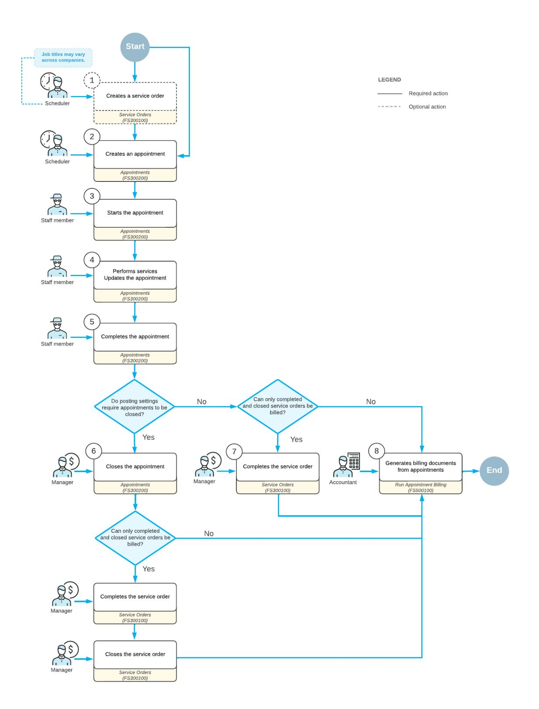

#### *Figure: Service management process (with billing documents generated by appointments)*

The service management process consists of the following general stages:

1. *Optional: Service order creation*

You create the service order on the *[Service Orders](https://help-2025r1.acumatica.com/Help?ScreenId=ShowWiki&pageid=6e5277d3-274e-45f5-b77d-4410ed736d21)* (FS300100) form and specify such settings as the customer, the requested services, the company branch whose employees perform the services, the location where the services are performed, and the estimated date when the services will be performed.

The service order can instead be created automatically by the system when an appointment has been created.

2. *Creation of the appointment or appointments*

You create the appointment (or multiple appointments, if applicable) on the *[Appointments](https://help-2025r1.acumatica.com/Help?ScreenId=ShowWiki&pageid=ac486e9c-f5df-4829-94f0-2df8821361a0)* (FS300200) form, specifying the details of each appointment. If no service order is specified for the appointment, one will be created automatically when you save the created appointment. At this stage, you schedule this appointment or these appointments to deliver the requested service or services and assign the staff to perform all requested services.

3. *Starting of appointments*

A staff member goes to the location of the appointment (multiple staff members may go), usually the customer location, and indicates on the *[Appointments](https://help-2025r1.acumatica.com/Help?ScreenId=ShowWiki&pageid=ac486e9c-f5df-4829-94f0-2df8821361a0)* form that staff members are starting to perform the services of the appointment. Depending on the settings of the selected service order type, when the staff member starts the appointment, the system may fill in the actual start time of the appointment and services.

4. *Performing services*

A staff member performs the requested services, and updates an appointment settings (such as actual dates and times).

5. *Completion of each appointment of the service order*

Aer the staff member has performed the services (or multiple staff members have done so) and entered any additional settings of each appointment, they indicate the completion of the appointment on the *[Appointments](https://help-2025r1.acumatica.com/Help?ScreenId=ShowWiki&pageid=ac486e9c-f5df-4829-94f0-2df8821361a0)* form, meaning that all services have been performed. Depending on the settings of the service order type, when the staff member completes the appointment, the system may fill in the actual end time of the appointment and services; this data is important for services that are billed based on time.

6. *Optional: Closing of the appointment or appointments associated with the service order*

A service manager usually reviews and closes all appointments on the *[Appointments](https://help-2025r1.acumatica.com/Help?ScreenId=ShowWiki&pageid=ac486e9c-f5df-4829-94f0-2df8821361a0)* form aer the services are delivered, indicating that the appointment has been processed according to the company's internal requirements. Depending on the settings of the applicable service order type on the *[Service](https://help-2025r1.acumatica.com/Help?ScreenId=ShowWiki&pageid=06fd8a36-dd81-4df9-b609-92c3d552c542) Order Types* (FS202300) form, this stage may be omitted.

7. *Optional: Service order completion and closing*

Aer every appointment in the service order has been completed, the service order can also be completed on the *[Service Orders](https://help-2025r1.acumatica.com/Help?ScreenId=ShowWiki&pageid=6e5277d3-274e-45f5-b77d-4410ed736d21)* form to indicate that all activities of the service order have been done. A service manager usually completes and closes a service order aer the services have been delivered. Depending on the settings of the applicable service order type on the *[Service](https://help-2025r1.acumatica.com/Help?ScreenId=ShowWiki&pageid=06fd8a36-dd81-4df9-b609-92c3d552c542) Order Types* form, this stage may be omitted.

8. *Generating billing document*

The generation of billing documents is based on the billing cycle you assigned to the customer. If you assigned a billing cycle that generates billing documents by appointment, then when each appointment has been completed or closed (depending on the settings of the service order type), you can bill the customer for the services delivered in the appointment. You can configure the billing cycle so that the service order also has to be completed or closed before the billing document is generated.

#### **Calendar Board**

Because appointment creation and scheduling are the most common tasks in service management, Acumatica ERP gives you a variety of ways to create and manage appointments. You can create these records by using the calendar boards—dashboards where you can see the workloads of your staff and where appointments can be

created, scheduled, and assigned with a single movement of the mouse. You can use the calendar boards on the *[Calendar Board](https://help-2025r1.acumatica.com/Help?ScreenId=ShowWiki&pageid=00cc92c3-408f-4fe3-b6bf-e801559f74f9)* (FS300300), *[Staff Calendar Board](https://help-2025r1.acumatica.com/Help?ScreenId=ShowWiki&pageid=b1d15e47-fba9-4bbf-a7fa-2f7c396c8df4)* (FS300400), and *[Room Calendar Board](https://help-2025r1.acumatica.com/Help?ScreenId=ShowWiki&pageid=52cfe99e-53ca-425d-ab28-7b2508a1faf7)* (FS300700) forms.

Through the calendar boards, you can do the following:

- Create appointments or delete them
- Assign an appointment to a staff member based on skills, licenses, and other settings, and schedule this appointment
- Change an appointment's estimated start and end time
- Reassign an appointment to another staff member
- Confirm, validate, and clone appointments

#### **Other Features**

To optimally manage services, you can also define skills and licenses, to make sure that you assign an employee with the needed qualifications to perform each requested service. Skills, which you create on the *[Skills](https://help-2025r1.acumatica.com/Help?ScreenId=ShowWiki&pageid=481362c5-add5-4449-8cf6-a332763d7667)* (FS200600) form and can associate with staff members and services, are learned abilities to perform a particular activity well. Licenses are documents proving that a particular person has permission to perform work of a certain kind or has knowledge in a certain area; you create these on the *[Licenses](https://help-2025r1.acumatica.com/Help?ScreenId=ShowWiki&pageid=874fbbfb-a373-4787-b04c-959849ecb11c)* (FS201000) form.

On the *[Service Areas](https://help-2025r1.acumatica.com/Help?ScreenId=ShowWiki&pageid=db06f16a-f18c-4733-b586-07f1ae89c59c)* (FS201900) form, you can also define service areas that are served by different staff members. You can then filter staff by the served area when you select the person to be assigned to the appointment. All filtering options are also available on the calendar boards.

#### **Billing Cycles**

You can assign to each customer a billing cycle, which determines the way billing documents are generated for the services provided to customers. Billing cycles are created on the *[Billing Cycles](https://help-2025r1.acumatica.com/Help?ScreenId=ShowWiki&pageid=273739f9-4e18-4e81-949b-128b02e37810)* (FS206000) form and assigned to customers on the *[Customers](https://help-2025r1.acumatica.com/Help?ScreenId=ShowWiki&pageid=652929bc-9606-4056-aa6e-0c2d1147171b)* (AR303000) form.

A billing cycle can be defined to generate either AR invoices or sales orders and SO invoices for the provided services. If service orders include only services to be provided, you can use a billing cycle defined to generate AR invoices on the *[Invoices and Memos](https://help-2025r1.acumatica.com/Help?ScreenId=ShowWiki&pageid=5e6f3b27-b7af-412f-a40a-1d4f4be70cba)* (AR301000) that affect accounts receivable. If service orders include stock items along with services to be provided, you can use a billing cycle defined to generate sales orders on the *[Sales Orders](https://help-2025r1.acumatica.com/Help?ScreenId=ShowWiki&pageid=19e4021c-1b84-49fd-be12-0320c5f1c7e5)* (SO301000) form, from which SO invoices are generated on the *[Invoices](https://help-2025r1.acumatica.com/Help?ScreenId=ShowWiki&pageid=0acc9738-f141-4ea0-a2be-f34ea9d1b63a)* (SO303000) form.

In the settings of the billing cycle, you can define whether you want to group multiple appointments or service orders into a single billing document, and even define the frequency of invoicing. You can also specify a service order has to be completed or closed for billing documents to be generated for the service order or the appointments related to the service order.

#### **Staff Members**

In Acumatica ERP, you can enter and store professional information about each employee, such as the employee's skills, the licenses that grant the employee permission to perform certain kinds of work, the geographical areas where the employee can work, and the employee's work schedules. The system provides tools that use this information to help you quickly and easily select the right person to deliver your services. For more information about these capabilities, see *[Staff Members: Management of Staff Members' Information](https://help-2025r1.acumatica.com/Help?ScreenId=ShowWiki&pageid=a12abc30-de4b-4644-a5c3-15ff44f9f6e6)*.

## **Processing Service Orders with a Single Appointment**

A service order is a document in Acumatica ERP that represents the initial agreement between your company and the customer about providing the services requested by the customer. A service order may also include the requested inventory items. The service order contains such information as the services to be performed, the customer who requests services, the location where the services will be (or have been) performed, and the scheduled appointments.

In this chapter, you will learn how to create a service order in Acumatica ERP, add a service requested by the customer to the service order, and create and process an appointment to provide the service.

## **Service Orders with a Single Appointment: General Information**

A service order is a document created on the *[Service Orders](https://help-2025r1.acumatica.com/Help?ScreenId=ShowWiki&pageid=6e5277d3-274e-45f5-b77d-4410ed736d21)* (FS300100) form that contains information about the services planned for a customer and any associated appointments. In Acumatica ERP, you can create service orders, schedule appointments for them, and process billing for each service order.

#### **Learning Objectives**

In this chapter, you will learn how to do the following:

- Create a service order based on a customer's service request
- Schedule an appointment and assign a staff member to perform the service
- Start and complete the appointment
- Close the appointment and process billing for the service order

#### **Applicable Scenarios**

You create and process a service order with an appointment if your company sells services and has customers that request services from time to time.

#### **Workflow of Service Order Processing**

If the customer's billing cycle specifies that billing documents should be generated for service orders instead of appointments, processing a service order with a single appointment involves the following steps: (which are shown in the diagram of the next section):

- 1. Creating a service order: The service manager receives the order and enters key details on the *[Service](https://help-2025r1.acumatica.com/Help?ScreenId=ShowWiki&pageid=6e5277d3-274e-45f5-b77d-4410ed736d21) [Orders](https://help-2025r1.acumatica.com/Help?ScreenId=ShowWiki&pageid=6e5277d3-274e-45f5-b77d-4410ed736d21)* (FS300100) form, including customer information, scheduled start and end dates and times, services to be performed, and any other relevant information..
- 2. Creating an appointment: The service manager creates an appointment by using the following commands on the More menu of the *[Service Orders](https://help-2025r1.acumatica.com/Help?ScreenId=ShowWiki&pageid=6e5277d3-274e-45f5-b77d-4410ed736d21)* form.
  - **Create Appointment**: Opens the *[Appointments](https://help-2025r1.acumatica.com/Help?ScreenId=ShowWiki&pageid=ac486e9c-f5df-4829-94f0-2df8821361a0)* (FS300200) form, where the service manager reviews and verifies the information copied from the service order before saving the appointment.
  - **Schedule on Calendar**: Opens the *[Calendar Board](https://help-2025r1.acumatica.com/Help?ScreenId=ShowWiki&pageid=00cc92c3-408f-4fe3-b6bf-e801559f74f9)* (FS300300) form, where the service manager assigns an appointment according to staff members' skills and availability.
  - **Schedule on Staff Calendar**: Opens the *[Staff Calendar Board](https://help-2025r1.acumatica.com/Help?ScreenId=ShowWiki&pageid=b1d15e47-fba9-4bbf-a7fa-2f7c396c8df4)* form, where the service manager assigns an appointment based on the availability of the selected staff member.
- 3. Starting the appointment: A staff member starts the appointment by clicking**Start** on the *[Appointments](https://help-2025r1.acumatica.com/Help?ScreenId=ShowWiki&pageid=ac486e9c-f5df-4829-94f0-2df8821361a0)* form.

- 4. Performing services and updating the appointment: A staff member performs the required services and records the time spent.
- 5. Completing the appointment: A staff member completes the appointment by clicking **Complete** on the *[Appointments](https://help-2025r1.acumatica.com/Help?ScreenId=ShowWiki&pageid=ac486e9c-f5df-4829-94f0-2df8821361a0)* form.
- 6. Closing an appointment (Optoinal): An accountant reviews the information entered for the completed appointment, including quantities and prices, and closes the verified appointment on the *[Appointments](https://help-2025r1.acumatica.com/Help?ScreenId=ShowWiki&pageid=ac486e9c-f5df-4829-94f0-2df8821361a0)* form.
- 7. Billing an appointment: If the customer's billing cycle is set up to run billing from appointments, the accountant runs the appointment billing process on the *[Appointments](https://help-2025r1.acumatica.com/Help?ScreenId=ShowWiki&pageid=ac486e9c-f5df-4829-94f0-2df8821361a0)* form. The system generates a billing document of the type specified in the service order type settings.

Only closed appointments can be billed, if the **Bill Only Closed Appointments** check box is selected for the appointment's service order type.

- 8. Billing a service order: If the customer's billing cycle is set up to run billing from service orders, the accountant runs the billing process in the service order on the *[Service Orders](https://help-2025r1.acumatica.com/Help?ScreenId=ShowWiki&pageid=6e5277d3-274e-45f5-b77d-4410ed736d21)* form. The system generates a billing document of the type specified in the service order type settings. For details, see *[Billing Cycles:](https://help-2025r1.acumatica.com/Help?ScreenId=ShowWiki&pageid=304ae062-fe44-490f-b369-e3b38c8fc91a) [General Information](https://help-2025r1.acumatica.com/Help?ScreenId=ShowWiki&pageid=304ae062-fe44-490f-b369-e3b38c8fc91a)*.
- 9. Completing the service order (optional): Aer all appointments related to the service order have been completed, the service manager completes the service order in the system by clicking **Complete** on the form toolbar of the *[Service Orders](https://help-2025r1.acumatica.com/Help?ScreenId=ShowWiki&pageid=6e5277d3-274e-45f5-b77d-4410ed736d21)* form.

If the **CompleteService Order When Its Appointments Are Completed** check box is selected on the **General** tab of the *[Service](https://help-2025r1.acumatica.com/Help?ScreenId=ShowWiki&pageid=06fd8a36-dd81-4df9-b609-92c3d552c542) Order Types* (FS202300) form, the service order is automatically completed and is assigned the *Completed* status when all related appointments have been completed.

If any additional service has to be performed or another appointment has to take place, the service manager can reopen the service order by clicking **Reopen** on the More menu of the *[Service Orders](https://help-2025r1.acumatica.com/Help?ScreenId=ShowWiki&pageid=6e5277d3-274e-45f5-b77d-4410ed736d21)* form. The service order can again be completed aer all work is done.

10.Closing the service order (optional): Aer all accounting information has been verified, the accountant closes the service order. Billing documents can be generated only aer the service order has been closed.

If the **CloseService Orders When Its Appointments Are Closed** check box is selected on the *[Service](https://help-2025r1.acumatica.com/Help?ScreenId=ShowWiki&pageid=06fd8a36-dd81-4df9-b609-92c3d552c542) Order Types* form, the service order is automatically closed and is assigned the *Closed* status when all related appointments have been closed.

If any additional changes should be made in the service order, the service manager can unclose the service order by clicking **Unclose** on the More menu of the *[Service Orders](https://help-2025r1.acumatica.com/Help?ScreenId=ShowWiki&pageid=6e5277d3-274e-45f5-b77d-4410ed736d21)* form. This causes the service order to be assigned the *Completed* status, and information in the service order can be edited.

#### **Billing Documents**

In the context of Acumatica ERP's service management functionality, a *billing document* refers to a document or transaction that is generated when the billing process is executed for a service document. Depending on the settings of the service order type, it can be a sales order, sales invoice, AR invoice or project transaction.

When a service order is billed on the *[Service Orders](https://help-2025r1.acumatica.com/Help?ScreenId=ShowWiki&pageid=6e5277d3-274e-45f5-b77d-4410ed736d21)* or the *[Run Service Order Billing](https://help-2025r1.acumatica.com/Help?ScreenId=ShowWiki&pageid=4df1e52f-392a-4342-a219-335b86dcdd18)* (FS500600) form, the system creates a billing document of the type specified in the **Generated Billing Documents** box on the **General** tab of the *[Service](https://help-2025r1.acumatica.com/Help?ScreenId=ShowWiki&pageid=06fd8a36-dd81-4df9-b609-92c3d552c542) Order Types* (FS202300) form for the service order's order type:

- *AR Documents*: The system generates an AR invoice, which can be viewed on the *[Invoices and Memos](https://help-2025r1.acumatica.com/Help?ScreenId=ShowWiki&pageid=5e6f3b27-b7af-412f-a40a-1d4f4be70cba)* (AR301000) form, for the service order or appointment of this service order type. If the service order or appointment has a negative balance, the system generates a credit memo. If the **Create a Bill Document in AP for Negative Balances** check box (which is available if you select this option button) is selected, for a service order or appointment with a negative balance, the system instead creates an accounts payable bill on the *[Bills and Adjustments](https://help-2025r1.acumatica.com/Help?ScreenId=ShowWiki&pageid=956b4e51-3078-4d2d-85b3-65c080d95234)* (AP301000) form.
- *Sales Orders*: The system generates a sales order, which can be viewed on the *[Sales Orders](https://help-2025r1.acumatica.com/Help?ScreenId=ShowWiki&pageid=19e4021c-1b84-49fd-be12-0320c5f1c7e5)* (SO301000) form, for the service order or appointment of this service order type. If needed, you can create any shipments for the sales order and add freight costs; you then generate the sales invoice for the sales order. If quick processing is enabled for a service order type, the system automatically generates the invoice along with the sales order.

You can select this option only if the *Inventory and Order Management* feature is enabled on the *[Enable/](https://help-2025r1.acumatica.com/Help?ScreenId=ShowWiki&pageid=c1555e43-1bc5-4f6f-ba9d-b323f94d8a6b) [Disable Features](https://help-2025r1.acumatica.com/Help?ScreenId=ShowWiki&pageid=c1555e43-1bc5-4f6f-ba9d-b323f94d8a6b)* (CS100000) form.

• *SO Invoices*: The system generates a sales invoice, which can be viewed on the *[Invoices](https://help-2025r1.acumatica.com/Help?ScreenId=ShowWiki&pageid=0acc9738-f141-4ea0-a2be-f34ea9d1b63a)* (SO303000) form, for the service order or appointment of this service order type.

You can select this option only if the *Advanced SO Invoices* feature is enabled on the *[Enable/Disable Features](https://help-2025r1.acumatica.com/Help?ScreenId=ShowWiki&pageid=c1555e43-1bc5-4f6f-ba9d-b323f94d8a6b)* form.

• *Project Transactions*: The system generates a project transaction, which can be viewed on the *[Project](https://help-2025r1.acumatica.com/Help?ScreenId=ShowWiki&pageid=382a97fe-b636-44ca-9798-6d478c05b687) [Transactions](https://help-2025r1.acumatica.com/Help?ScreenId=ShowWiki&pageid=382a97fe-b636-44ca-9798-6d478c05b687)* (PM304000) form, for the service order or appointment of this service order type. The service order and appointment must be linked to a project, which must be specified in the **Project** box in the Summary area of the corresponding service form. If the service order or appointment of this service order type contains stock items, the related issue is also generated and can be viewed on the *[Issues](https://help-2025r1.acumatica.com/Help?ScreenId=ShowWiki&pageid=17b051f6-027d-4459-b542-65c1c1f9d0ea)* (IN302000) form.

You can select this option only if the *Projects* feature is enabled on the *[Enable/Disable Features](https://help-2025r1.acumatica.com/Help?ScreenId=ShowWiki&pageid=c1555e43-1bc5-4f6f-ba9d-b323f94d8a6b)* form and the *Regular* option is selected in the **Behavior** box of this form for the service order type.

• *None*: No document is generated for a service orders or appointment of this service order type, and the other settings of the **BillingSettings** section do not appear on the form.

#### **Process Diagram**

The typical workflow of service order processing is shown in the following diagram.

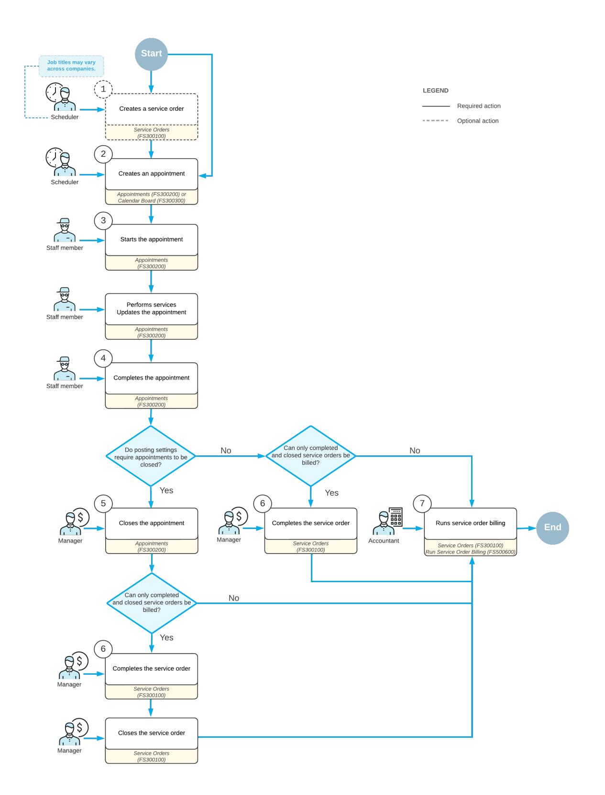

*Figure: Processing of a service order*

## **Service Orders with a Single Appointment: Process Activity**

The following activity will walk you through the process of creating and processing a service order with one appointment.

This activity is based on the *U100* dataset. If you are using another dataset, or if any system settings have been changed in *U100*, these changes can affect the workflow of the activity and the results of the processing. To avoid any issues, restore the *U100* dataset to its initial state.

#### **Story**

Suppose that the SweetLife Service and Equipment Sales Center receives an order for the provision of the training service to a customer of the company, FourStar Coffee & Sweets Shop.

The service manager (Maia Davis) needs to enter the service order into the system, assign a staff member, and schedule an appointment to perform the service. The assigned staff member needs to perform the necessary service at the customer location and complete the appointment in the system. (At this point in learning about the service management process, this assignment will be made without regard to employees' qualifications, working hours, and service areas.) Then the accountant will verify the appointment, close the appointment, and generate an AR invoice to bill the customer. You will perform these actions, acting as the service manager, the staff member, and the accountant.

### **Configuration Overview**

In the *U100* dataset, the following tasks have been performed to support this activity:

- The minimum system configuration, which is described in *[Company with Branches that Do Not Require](https://help-2025r1.acumatica.com/Help?ScreenId=ShowWiki&pageid=a718a27b-3683-4d86-a26e-4b8fb7981f1c) [Balancing: General Information](https://help-2025r1.acumatica.com/Help?ScreenId=ShowWiki&pageid=a718a27b-3683-4d86-a26e-4b8fb7981f1c)*, has been performed.
- The *SWEETLIFE* company has been created on the *[Companies](https://help-2025r1.acumatica.com/Help?ScreenId=ShowWiki&pageid=fedad435-8496-4397-b8a3-50a473629f76)* (CS101500) form. This company has multiple branches created on the *[Branches](https://help-2025r1.acumatica.com/Help?ScreenId=ShowWiki&pageid=b97ab72d-4ab4-4f02-b69c-f7f61b316ced)* (CS102000) form, including *SWEETEQUIP (Service and Equipment Sales Center)*.
- On the *[Service Management Preferences](https://help-2025r1.acumatica.com/Help?ScreenId=ShowWiki&pageid=1c1b94d7-ac39-4f84-a966-588290b5ba80)* (FS100100) form, the minimum settings have been specified, including specifying the numbering sequences and work calendar, for the service management functionality to be used.
- On the *[Users](https://help-2025r1.acumatica.com/Help?ScreenId=ShowWiki&pageid=834cc181-97fa-4db4-a7e0-3eaba142c166)* (SM201010) form, the *davis* and *frank* user accounts have been created. The *EP00000040 Maia Davis* employee has been associated with the *davis* user account; that is, *Maia Davis* has been selected in the **Linked Entity** box of the Summary area of the form. The *EP00000042 - Chase Frank* employee has been associated with the *frank* user account; that is, *Chase Frank* has been selected in the **Linked Entity** box on the form.
- On the *[Branch Locations](https://help-2025r1.acumatica.com/Help?ScreenId=ShowWiki&pageid=ebef097e-9e47-4c7b-b0b0-c381251b48cf)* (FS202500) form, the *WEST BRIGHTON* branch location of the *SWEETEQUIP* (*Service and Equipment Sales Center*) branch has been created.
- On the *[User Profile](https://help-2025r1.acumatica.com/Help?ScreenId=ShowWiki&pageid=8430c8b2-a79c-4f7b-9768-b0b7fad23a59)* (SM203010) form, for the *davis* user, *WEST BRIGHTON* has been specified as the default branch location.
- On the *[Service](https://help-2025r1.acumatica.com/Help?ScreenId=ShowWiki&pageid=06fd8a36-dd81-4df9-b609-92c3d552c542) Order Types* (FS202300) form, the *TRN* service order type has been defined. For the type, in the **BillingSettings** section of the **General** tab, **AR Documents** has been selected in the **Generated Billing Documents** box, and the **Bill Only Closed Appointments** check box has been selected.
- On the *[Employees](https://help-2025r1.acumatica.com/Help?ScreenId=ShowWiki&pageid=dae5144b-49b3-43a4-bce0-93f31b3f2321)* (EP203000) form, on the **General** tab (**EmployeeSettings** section), the**Staff Member in Service Management** check box has been selected for *EP00000042 (Chase Frank)*, so that you can assign this employee to perform services.
- On the *[Billing Cycles](https://help-2025r1.acumatica.com/Help?ScreenId=ShowWiki&pageid=273739f9-4e18-4e81-949b-128b02e37810)* (FS206000) form, the following settings have been specified for the *SO SO* billing cycle:
  - **Run Billing For**: **Service Orders**

#### • **Group Billing Documents By**: **Service Orders**

- On the *[Customers](https://help-2025r1.acumatica.com/Help?ScreenId=ShowWiki&pageid=652929bc-9606-4056-aa6e-0c2d1147171b)* (AR303000) form, the *COFFEESHOP - FourStar Coffee & Sweets Shop)* customer has been created, and the *SO SO* billing cycle has been selected in the**Service Management** section of the **Billing** tab.
- On the *[Non-Stock Items](https://help-2025r1.acumatica.com/Help?ScreenId=ShowWiki&pageid=bf68dd4f-63d4-460d-8dc0-9152f2bd6bf1)* (IN202000) form, the *TRAINING* service (that is, a non-stock item of the *Service* type) has been defined. For the *TRAINING* service, on the **Price/Cost** tab, the *Time* billing rule has been selected.

#### **Process Overview**

To process a service order with one appointment, acting as the service manager (Maia Davis), you will create a new service order on the *[Service Orders](https://help-2025r1.acumatica.com/Help?ScreenId=ShowWiki&pageid=6e5277d3-274e-45f5-b77d-4410ed736d21)* (FS300100) form, add a service to be performed for the order, and create the related appointment on the *[Appointments](https://help-2025r1.acumatica.com/Help?ScreenId=ShowWiki&pageid=ac486e9c-f5df-4829-94f0-2df8821361a0)* (FS300200) form. You will then assign a staff member to the appointment. Acting as this staff member, you will start and then complete the appointment.

Acting as an accountant, you will review and close appointment. Then on the *[Service Orders](https://help-2025r1.acumatica.com/Help?ScreenId=ShowWiki&pageid=6e5277d3-274e-45f5-b77d-4410ed736d21)* form, you will run billing for the service order.

#### **System Preparation**

Before you begin performing the steps of this activity, do the following:

- 1. Launch the Acumatica ERP website, and sign in to a company with the *U100* dataset preloaded. You should sign in as a service manager by using the *davis* username and the *123* password.
- 2. In the company to which you are signed in, ensure that the *Service Management* feature has been enabled on the *[Enable/Disable Features](https://help-2025r1.acumatica.com/Help?ScreenId=ShowWiki&pageid=c1555e43-1bc5-4f6f-ba9d-b323f94d8a6b)* (CS100000) form.
- 3. In the info area, in the upper-right corner of the top pane of the Acumatica ERP screen, make sure that the business date in your system is set to *1/30/2025*. If a different date is displayed, click the Business Date menu button and select *1/30/2025* on the calendar. For simplicity, in this activity, you will create and process all documents in the system on this business date.

#### **Step 1: Entering a Service Order**

When you create a service order, you enter general information about the requested service, including the customer name, promised date, and required service. In this step, you will create a service order for a customer who has requested a training service. You will select the *TRN* order type and specify the *TRAINING* service.

To create a service order, do the following:

- 1. On the *[Service Orders](https://help-2025r1.acumatica.com/Help?ScreenId=ShowWiki&pageid=6e5277d3-274e-45f5-b77d-4410ed736d21)* (FS300100) form, add a new record.
- 2. In the Summary area, specify the following settings:
  - **Service OrderType**: *TRN*
  - **Customer**: *COFFEESHOP - FourStar Coffee & Sweets Shop*
  - **Description**: Training for Customer's Employees
- 3. On the table toolbar of the **Details** tab, click **Add Row**, and specify the following settings in the row:
  - **LineType**: *Service*
  - **Inventory ID**: *TRAINING*
- 4. Click **Add Row** again, and in the **LineType** column, select *Comment*.
- 5. Enter the following comment in the **Description** column: Training for 4 of the customer's employees is necessary now that the juicer has been installed.
- 6. On the form toolbar, click**Save**.

#### **Step 2: Scheduling an Appointment and Assigning a Staff Member**

In this step, you will create an appointment to represent the staff member's actual visit to the customer's location. You will specify the scheduled start date and time for the appointment and assign a staff member to it.

To create an appointment, do the following:

1. While you are still viewing the service order on the *[Service Orders](https://help-2025r1.acumatica.com/Help?ScreenId=ShowWiki&pageid=6e5277d3-274e-45f5-b77d-4410ed736d21)* (FS300100) form, on the form toolbar, click **Create Appointment**.

The system opens the *[Appointments](https://help-2025r1.acumatica.com/Help?ScreenId=ShowWiki&pageid=ac486e9c-f5df-4829-94f0-2df8821361a0)* (FS300200) form with the appropriate settings copied from the service order.

- 2. On the **Settings** tab, in the**Scheduled Start Date** box, review that 1/30/2025 is selected and specify *11:00 AM*.
- 3. On the **Staff** tab, assign a staff member to perform the service as follows:
  - a. On the table toolbar, click **Add Row**.
  - b. In the **Staff Member** column, select *EP00000042 (Chase Frank)*.
- 4. On the form toolbar, click**Save**.

#### **Step 3: Processing the Appointment**

In this step, on behalf of the assigned staff member, you will start the appointment, record the actual start date and time, and complete the appointment.

To process the appointment from its start to its completion, do the following:

1. On the form toolbar of the *[Appointments](https://help-2025r1.acumatica.com/Help?ScreenId=ShowWiki&pageid=ac486e9c-f5df-4829-94f0-2df8821361a0)* (FS300200) form, click**Start**.

You start the appointment to indicate that the appointment is being attended.

- 2. On the **Settings** tab, in the **Actual Date and Time** section, specify the following settings:
  - **ActualStart Date**: 1/30/2025 *11:00 AM*
  - **Actual End Date**: 1/30/2025 *12:00 PM*
  - **Finished**: Selected

You select this check box to indicate that the work has been finished during the appointment and that no follow-up appointment is necessary.

3. On the form toolbar, click **Complete**.

You complete an appointment as a staff member to indicate that the work on the appointment has been done.

#### **Step 4: Generating an AR Invoice**

You can generate a billing document once an appointment is completed or closed, depending on the settings of the service order type. In this lesson, once the appointment is assigned the *Closed* status, you can bill the customer for the service delivered. You will generate an AR invoice because this type of the document has been specified for the *TRN* service order type.

To generate an AR invoice on behalf of an accountant, do the following:

1. While you are still viewing the appointment on the *[Appointments](https://help-2025r1.acumatica.com/Help?ScreenId=ShowWiki&pageid=ac486e9c-f5df-4829-94f0-2df8821361a0)* (FS300200) form, on the form toolbar, click **Close**.

You close the appointment to indicate that all information entered into the system about the appointment has been verified and is correct. The appointment is assigned the *Closed* status. Now you can generate the

billing document for the related service order, as the customer's billing cycle specifies that billing should be executed at the service order level.

- 2. Open the service order by clicking the pencil icon next to the**Service Order Nbr.** box in the Summary area of the *[Appointments](https://help-2025r1.acumatica.com/Help?ScreenId=ShowWiki&pageid=ac486e9c-f5df-4829-94f0-2df8821361a0)* form. The *[Service Orders](https://help-2025r1.acumatica.com/Help?ScreenId=ShowWiki&pageid=6e5277d3-274e-45f5-b77d-4410ed736d21)* (FS300100) form opens in a separate window.
- 3. On the form toolbar of the *[Service Orders](https://help-2025r1.acumatica.com/Help?ScreenId=ShowWiki&pageid=6e5277d3-274e-45f5-b77d-4410ed736d21)* form, click **Run Billing**.

The system opens the *[Invoices and Memos](https://help-2025r1.acumatica.com/Help?ScreenId=ShowWiki&pageid=5e6f3b27-b7af-412f-a40a-1d4f4be70cba)* (AR301000) form with the generated invoice, as the screenshot below shows.

4. Verify the details of the invoice on the form and make sure that they are correct. (In a production environment, the invoice could now be processed in the system.)

|                         | <b>Invoices and Memos</b> <b>PINOTES</b> <b>FILES</b> $TOOLS$ $\sim$ <b>ACTIVITIES</b> Invoice 000119 - FourStar Coffee & Sweets Shop |                                          |                            |                           |                                                |           |                   |                 |                   |            |                            |                           |  |                 |                    |                     |              |
|-------------------------|------------------------------------------------------------------------------------------------------------------------------------------------------|------------------------------------------|----------------------------|---------------------------|------------------------------------------------|-----------|-------------------|-----------------|-------------------|------------|----------------------------|---------------------------|--|-----------------|--------------------|---------------------|--------------|
| $\Box$ 치 $\Omega$ | $+$                                                                                                                                                  | 尙 Ĥ.                                  | $\vee$ K. $\sim$ $\sim$ | $\rightarrow$             | <b>REMOVE HOLD</b> $\geq$                   | $\cdots$  |                   |                 |                   |            |                            |                           |  |                 |                    |                     |              |
| Type:                   | Invoice                                                                                                                                              | $\sim$                                   | Customer:                  |                           | COFFEESHOP - FourStar Coffee & Sweet 2         |           |                   | Detail Total:   | 37.50             |            |                            |                           |  |                 |                    |                     | $\sim$       |
| Reference Nbr.:         | 000119                                                                                                                                               | Ω                                        | * Location:                |                           | <b>MAIN - Primary Location</b>                 | $\circ$   |                   | Line Discounts: | 0.00              |            |                            |                           |  |                 |                    |                     |              |
| Status:                 | On Hold                                                                                                                                              |                                          | * Terms:                   | 30D - 30 Days             |                                                | $\varphi$ |                   | Document Dis    | 0.00              |            |                            |                           |  |                 |                    |                     |              |
| * Date:                 | 1/30/2025                                                                                                                                            | A                                        | * Due Date:                | 3/1/2025                  | Apply Retainage                                |           |                   | Retained Amo    | 0.00              |            |                            |                           |  |                 |                    |                     |              |
| * Post Period           | 01-2025                                                                                                                                              | $\mathcal{L}$                            | * Cash Discount.           | 3/1/2025                  | Pay by Line                                    |           | <b>Tax Total:</b> |                 | 0.00              |            |                            |                           |  |                 |                    |                     |              |
| Customer Ord            |                                                                                                                                                      |                                          | * Project:                 |                           | X - Non-Project Code.                          | $\rho$    | Balance:          |                 | 37.50             |            |                            |                           |  |                 |                    |                     |              |
|                         |                                                                                                                                                      |                                          |                            |                           |                                                |           |                   | Cash Discount:  | 0.00              |            |                            |                           |  |                 |                    |                     |              |
| Description:            |                                                                                                                                                      | <b>Training for Customer's Employees</b> |                            |                           |                                                |           |                   |                 |                   |            |                            |                           |  |                 |                    |                     |              |
|                         |                                                                                                                                                      |                                          |                            |                           |                                                |           |                   |                 |                   |            |                            |                           |  |                 |                    |                     |              |
|                         |                                                                                                                                                      |                                          |                            |                           |                                                |           |                   |                 |                   |            |                            |                           |  |                 |                    |                     |              |
| <b>DETAILS</b>          | <b>FINANCIAL</b>                                                                                                                                     | ADDRESSES                                | <b>TAXES</b>               |                           | <b>APPLICATIONS</b> COMPLIANCE              |           |                   |                 |                   |            |                            |                           |  |                 |                    |                     |              |
| Ò $+$ o           | $\times$                                                                                                                                             | $\mathbf{x}$ $\mathbb{H}$             | 土                          |                           |                                                |           |                   |                 |                   |            |                            |                           |  |                 |                    |                     |              |
| <b>B D</b> Inventory ID |                                                                                                                                                      | Related Svc. Doc. Nbr.                |                            | <b>Transaction Descr.</b> |                                                |           | Quantity UOM      |                 | <b>Unit Price</b> | Ext. Price | <b>Discount</b> Percent | <b>Discount</b> Amount |  | Amount *Account | <b>Description</b> | <b>Project Task</b> | Cost Code |
| $> 0$ D TRAINING        |                                                                                                                                                      | TRN.000045                               |                            |                           | Training on juicer usage (at customer's place) |           |                   | 0.75 HOUR       | 50,0000           | 37.50      | 0.000000                   | 0.00                      |  | 37.50 40000     | Sales Revenue      |                     |              |
|                         |                                                                                                                                                      |                                          |                            |                           |                                                |           |                   |                 |                   |            |                            |                           |  |                 |                    |                     |              |
|                         |                                                                                                                                                      |                                          |                            |                           |                                                |           |                   |                 |                   |            |                            |                           |  |                 |                    |                     |              |

*Figure: The invoice generated for the service order*

## **Processing Service Orders with an Added Appointments**

In this chapter, you will learn how to add a service to a service order that has already been created in the system, and how to add an extra appointment to the service order to provide the additional service.

## **Service Orders with Added Services and Appointments: General Information**

Sometimes you may need to expand service orders that have already been created in the system on the *[Service](https://help-2025r1.acumatica.com/Help?ScreenId=ShowWiki&pageid=6e5277d3-274e-45f5-b77d-4410ed736d21) [Orders](https://help-2025r1.acumatica.com/Help?ScreenId=ShowWiki&pageid=6e5277d3-274e-45f5-b77d-4410ed736d21)* (FS300100) form by adding services, appointments, or both services and appointments. This may happen, for example, when a customer has requested an installation service earlier, and then decided to add cleaning of the installed item or training for employees to the service order. In this case, you would open the existing service order and add another required service. You would then create the needed appointments to perform the service.

#### **Learning Objectives**

In this chapter, you will learn how to do the following:

- Add to an existing service order a new service to be provided to the customer
- Consider the skills of the staff member assigned to the service order
- Create a new appointment to provide the additional service, and add this appointment to the service order

#### **Applicable Scenarios**

You add extra services, additional appointments, or both of these to an existing service order if the work needed by a customer has expanded.

## **Service Orders with Added Services and Appointments: Process Activity**

In this activity, you will learn how to add an appointment and a service to an existing service order.

This activity is based on the *U100* dataset. If you are using another dataset, or if any system settings have been changed in *U100*, these changes can affect the workflow of the activity and the results of the processing. To avoid any issues, restore the *U100* dataset to its initial state.

#### **Story**

Suppose that the FourStar Coffee & Sweets Shop customer has contacted the SweetLife Service and Equipment Sales Center to request the training service (*TRAINING*) in addition to the juicer installation service (*INSTALL*), which it had requested earlier. The service manager of the Service and Equipment Sales Center has already created a service order that includes the installation service.

Acting as the service manager (Maia Davis), in the existing service order, you will add another service and create another appointment for the training service.

#### **Configuration Overview**

In the *U100* dataset, the following tasks have been performed to support this activity:

- The minimum system configuration, which is described in *[Company with Branches that Do Not Require](https://help-2025r1.acumatica.com/Help?ScreenId=ShowWiki&pageid=a718a27b-3683-4d86-a26e-4b8fb7981f1c) [Balancing: General Information](https://help-2025r1.acumatica.com/Help?ScreenId=ShowWiki&pageid=a718a27b-3683-4d86-a26e-4b8fb7981f1c)*, has been performed.
- The *SWEETLIFE* company has been created on the *[Companies](https://help-2025r1.acumatica.com/Help?ScreenId=ShowWiki&pageid=fedad435-8496-4397-b8a3-50a473629f76)* (CS101500) form. This company has multiple branches created on the *[Branches](https://help-2025r1.acumatica.com/Help?ScreenId=ShowWiki&pageid=b97ab72d-4ab4-4f02-b69c-f7f61b316ced)* (CS102000) form, including *SWEETEQUIP (Service and Equipment Sales Center)*.
- On the *[Service Management Preferences](https://help-2025r1.acumatica.com/Help?ScreenId=ShowWiki&pageid=1c1b94d7-ac39-4f84-a966-588290b5ba80)* (FS100100) form, the minimum settings have been specified, including specifying the numbering sequences and work calendar, for the service management functionality to be used.
- On the *[Users](https://help-2025r1.acumatica.com/Help?ScreenId=ShowWiki&pageid=834cc181-97fa-4db4-a7e0-3eaba142c166)* (SM201010) form, the *davis* and *smith* user accounts have been created. The *EP00000040 Maia Davis* employee has been associated with the *davis* user account; that is, *Maia Davis* has been selected in the **Linked Entity** box of the Summary area of the form. The *EP00000043 - Edward Smith* employee has been associated with the *smith* user account; that is, *Edward Smith* has been selected in the **Linked Entity** box of the Summary area of the form.
- On the *[Branch Locations](https://help-2025r1.acumatica.com/Help?ScreenId=ShowWiki&pageid=ebef097e-9e47-4c7b-b0b0-c381251b48cf)* (FS202500) form, the *WEST BRIGHTON* branch location of the *SWEETEQUIP* (*Service and Equipment Sales Center*) branch has been created.
- On the *[User Profile](https://help-2025r1.acumatica.com/Help?ScreenId=ShowWiki&pageid=8430c8b2-a79c-4f7b-9768-b0b7fad23a59)* (SM203010) form, for the *davis* user, *WEST BRIGHTON* has been specified as the default branch location.
- On the *[Employees](https://help-2025r1.acumatica.com/Help?ScreenId=ShowWiki&pageid=dae5144b-49b3-43a4-bce0-93f31b3f2321)* (EP203000) form, on the **General** tab (**EmployeeSettings** section), the**Staff Member in Service Management** check box has been selected for *EP00000043 (Edward Smith)*, so you can assign this employee to perform services. Also, for this employee, the *INSTALLING* skill has been added on the **Skills** tab.
- On the *[Service](https://help-2025r1.acumatica.com/Help?ScreenId=ShowWiki&pageid=06fd8a36-dd81-4df9-b609-92c3d552c542) Order Types* (FS202300) form, the *INST* service order type has been defined.
- On the *[Customers](https://help-2025r1.acumatica.com/Help?ScreenId=ShowWiki&pageid=652929bc-9606-4056-aa6e-0c2d1147171b)* (AR303000) form, the *COFFEESHOP (FourStar Coffee & Sweets Shop)* customer has been created.
- On the *[Non-Stock Items](https://help-2025r1.acumatica.com/Help?ScreenId=ShowWiki&pageid=bf68dd4f-63d4-460d-8dc0-9152f2bd6bf1)* (IN202000) form, the following services (that is, non-stock items of the *Service* type) have been defined:
  - *TRAINING*: On the **Price/Cost** tab, the *Time* billing rule is selected.
  - *INSTALL*: On the **Price/Cost** tab, the *Flat Rate* billing rule is selected.
- On the *[Service Orders](https://help-2025r1.acumatica.com/Help?ScreenId=ShowWiki&pageid=6e5277d3-274e-45f5-b77d-4410ed736d21)* (FS300100) form, the service order with the *000036* reference number has been created.

#### **Process Overview**

On the *[Service Orders](https://help-2025r1.acumatica.com/Help?ScreenId=ShowWiki&pageid=6e5277d3-274e-45f5-b77d-4410ed736d21)* (FS300100) form, you will open an existing service order. On the **Details** tab, you will add an extra service. Then from this form, you will create a new appointment for the added service.

#### **System Preparation**

Before you begin performing the steps of this activity, do the following:

- 1. Launch the Acumatica ERP website, and sign in to a company with the *U100* dataset preloaded. You should sign in as a service manager by using the *davis* username and the *123* password.
- 2. In the company to which you are signed in, ensure that the *Service Management* feature has been enabled on the *[Enable/Disable Features](https://help-2025r1.acumatica.com/Help?ScreenId=ShowWiki&pageid=c1555e43-1bc5-4f6f-ba9d-b323f94d8a6b)* (CS100000) form.
- 3. In the info area, in the upper-right corner of the top pane of the Acumatica ERP screen, make sure that the business date in your system is set to *1/30/2025*. If a different date is displayed, click the Business Date menu button and select *1/30/2025* on the calendar. For simplicity, in this activity, you will create and process all documents in the system on this business date.

#### **Step 1: Adding an Extra Service to the Existing Service Order**

To add another service to the service order that already exists in the system, do the following:

- 1. On the *[Service Orders](https://help-2025r1.acumatica.com/Help?ScreenId=ShowWiki&pageid=6e5277d3-274e-45f5-b77d-4410ed736d21)* (FS300100) form, in the Summary area, select *INST* service order type, and then select *000036* in the **Order Nbr.** box.
- 2. On the **Details** tab, notice that the *INSTALL* service has already been added to the service order, and it has the *Scheduled* status.
- 3. Click **Add Row** on the table toolbar, and in the new row, do the following:
  - In the **LineType** column, select *Service*.
  - In the **Inventory ID** column, select *TRAINING*.
- 4. On the form toolbar, click**Save**.

#### **Step 2: Adding a Staff Member with the Needed Skills**

You first need to review the skills of the staff member that has already been assigned to the service order. While you are still viewing the *000036* service order on the *[Service Orders](https://help-2025r1.acumatica.com/Help?ScreenId=ShowWiki&pageid=6e5277d3-274e-45f5-b77d-4410ed736d21)* (FS300100) form, do the following:

- 1. On the **DefaultStaff** tab, notice that *EP00000043 - Edward Smith* has been assigned to perform the installation service.
- 2. On the table toolbar, click **Add Staff**.

The **Add Staff** dialog box opens. In the top le table (below the Selection area), which lists all skills created in the system, the unlabeled check box is selected for the skills preferred to perform the services for the appointment. Notice that the check boxes were selected for the *INSTALLING* and *TRAINING* skills because those skills are associated with the installation and training services. The right table lists only those staff members who have all of the selected skills.

3. Clear the check box in the row with *INSTALLING* in the **Skill ID** column in the top le table, and clear the check box in the row with *INST REP* in the **LicenseType ID** column in the bottom le table. Leave only the check box in the row with *TRAINING* selected in those tables.

Notice that *EP00000043 (Edward Smith)* is still listed in the table on the right. This means that he has the required skill and license to provide the training service. Leave the check box selected in the row with *EP00000043 (Edward Smith)*, and click **OK** at the bottom of the dialog box.

*EP00000043 (Edward Smith)* will perform both services (installation and training) included in the service order.

#### **Step 3: Adding an Extra Appointment to the Service Order**

In this step, you will add a second appointment to the service order that was created earlier. This appointment is intended for delivering the *TRAINING* service.

To create another appointment for the existing service order, do the following:

- 1. While you are still viewing the *000036* service order on the *[Service Orders](https://help-2025r1.acumatica.com/Help?ScreenId=ShowWiki&pageid=6e5277d3-274e-45f5-b77d-4410ed736d21)* (FS300100) form, on the **Details** tab, click the row with the *TRAINING* service, which has the *Requiring Scheduling* line status.
- 2. On the form toolbar, click **Create Appointment**. The *[Appointments](https://help-2025r1.acumatica.com/Help?ScreenId=ShowWiki&pageid=ac486e9c-f5df-4829-94f0-2df8821361a0)* (FS300200) form opens.

On the **Details** tab of the *[Appointments](https://help-2025r1.acumatica.com/Help?ScreenId=ShowWiki&pageid=ac486e9c-f5df-4829-94f0-2df8821361a0)* form, make sure that the *TRAINING* service is added.

- 3. On the **Settings** tab, in the**Scheduled Start Date** box, specify *01/31/2025 10:00 AM*.
- 4. On the **Staff** tab, make sure that *EP00000043 (Edward Smith)* is assigned to the appointment.
- 5. On the form toolbar, click**Save**.

6. Return to the *[Service Orders](https://help-2025r1.acumatica.com/Help?ScreenId=ShowWiki&pageid=6e5277d3-274e-45f5-b77d-4410ed736d21)* (FS300100) form, and click the **Appointments** tab (see Item 1 in the following screenshot).

Notice that two appointments (Item 2) are listed for the service order.

| Service Orders                                  | INST 000036 - FourStar Coffee & Sweets Shop |                                                    |                                          |                                        |                           |                       |                                  |                             |                              |                         |                      |                          | <b>PINOTES</b> | <b>ACTIVITIES</b> | <b>FILES</b> |
|-------------------------------------------------|---------------------------------------------|----------------------------------------------------|------------------------------------------|----------------------------------------|---------------------------|-----------------------|----------------------------------|-----------------------------|------------------------------|-------------------------|----------------------|--------------------------|----------------|-------------------|--------------|
| 로 日 $\leftarrow$                          | $\Omega$ $+$                             | 何 n $\overline{\mathbf{K}}$ $\checkmark$  | $\rightarrow$ ≺                       | $\lambda$ <b>COMPLETE</b>           |                           | QUICK PROCESS         |                                  | <b>CREATE APPOINTMENT</b>   | $\cdots$                     |                         |                      |                          |                |                   |              |
| * Order Type:                                   | INST - Insta $\varphi$ $\Lambda$         | Customer:                                          |                                          | COFFEESHOP - FourStar Coffee & Swee    |                           |                       | <b>Estimated Duration:</b>       | 1 h 45 m                    |                              |                         |                      |                          |                |                   |              |
| Order Nbr.:                                     | $\mathfrak{O}$ 000036                    | * Location:                                        |                                          | MAIN - Primary Location                | $\rho$                    |                       | <b>Estimated Billable Total:</b> | 137.50                      |                              |                         |                      |                          |                |                   |              |
| Status:                                         | Open                                        | * Branch Location:                                 |                                          | WEST BRIGHTON - Office in West Bri Q Q |                           |                       | <b>Estimated Tax Total:</b>      | 0.00                        |                              |                         |                      |                          |                |                   |              |
| * Date:                                         | 1/31/2025 日                                 | * Project:                                         | !!!!!!!!!!!!!!!!!!!!!!!!!!!!!!!!!!!!!!!! |                                        | $\mathcal{D}$             |                       | <b>Estimated Total:</b>          | 137.50                      |                              |                         |                      |                          |                |                   |              |
| Customer Order:                                 |                                             |                                                    |                                          |                                        |                           | <b>Invoice Total:</b> |                                  | 137.50                      |                              |                         |                      |                          |                |                   |              |
| External Refer.                                 |                                             |                                                    |                                          |                                        |                           |                       |                                  | Waiting for Purchased Items |                              |                         |                      |                          |                |                   |              |
| Description:                                    |                                             | Installation of equipment at the customers' place. |                                          |                                        |                           |                       |                                  | Appointments Needed         |                              |                         |                      |                          |                |                   |              |
|                                                 |                                             |                                                    |                                          |                                        |                           |                       |                                  |                             |                              |                         |                      |                          |                |                   |              |
| <b>SETTINGS</b>                                 | <b>DETAILS</b> <b>TAXES</b>              | <b>APPOINTMENTS</b>                                |                                          | <b>FINANCIAL</b> PROFITABILITY      |                           | <b>DEFAULT STAFF</b>  |                                  | DEFAULT RESOURCE EQUIPMENT  | <b>ATTRIBUTES</b>            | PREPAYMENTS             | <b>TOTALS</b>        | <b>BILLING DOCUMENTS</b> | <b>OTHER</b>   |                   |              |
| $\boxed{\mathbf{X}}$ $\mathbb{H}$ $\circ$ |                                             |                                                    |                                          |                                        |                           |                       |                                  |                             |                              |                         |                      |                          |                |                   |              |
| <b>B</b> 0 D                                    | Appointment Nbr                             | Confirmed <b>Status</b>                         |                                          | * Scheduled Start Date              | * Scheduled Start Time |                       | * Scheduled End Date          | * Scheduled End Time     | <b>Actual Billable Total</b> | <b>Actual Tax Total</b> | <b>Invoice Total</b> | <b>Cost Total</b>        |                |                   |              |
| $0$ 0 000036-1                                  |                                             | ☑ <b>Not Started</b>                            |                                          | 1/31/2025                              | 9:00 AM                   |                       | 1/31/2025                        | 10:00 AM                    | 100.00                       | 0.00                    |                      | 0.00                     |                |                   |              |
| $0$ 0 000036-2                                  |                                             | $\Box$ <b>Not Started</b>                       |                                          | 1/31/2025                              | 10:00 AM                  |                       | 1/31/2025                        | 10:45 AM                    | 37.50                        | 0.00                    |                      | 0.00                     |                |                   |              |
|                                                 |                                             |                                                    |                                          |                                        |                           |                       |                                  |                             |                              |                         |                      |                          |                |                   |              |
|                                                 |                                             |                                                    |                                          |                                        |                           |                       |                                  |                             |                              |                         |                      |                          |                |                   |              |

*Figure: The two created appointments*

## **Quick Billing of Service Orders**

In this chapter, you will learn how to use the quick processing capabilities of the system, which give users the ability process a service order with just one click.

## **Quick Billing of Service Orders: General Information**

In Acumatica ERP, you can process a service order with just one click if the service order is created based on a service order type for which the quick processing functionality has been configured. For details, see *[Service Order](https://help-2025r1.acumatica.com/Help?ScreenId=ShowWiki&pageid=8b255b1d-0ff8-4f0b-8c17-24b1a2d70668) Types: Quick [Processing](https://help-2025r1.acumatica.com/Help?ScreenId=ShowWiki&pageid=8b255b1d-0ff8-4f0b-8c17-24b1a2d70668) Settings*.

Quick processing of a service order involves multiple actions being performed on the service order automatically, such as completing and closing it and generating the billing documents. These actions are described in detail further in this topic.

#### **Learning Objectives**

In this chapter, you will learn how to do the following:

- Process a service order by using the **Quick Process** command
- Review the generated billing documents

#### **Applicable Scenarios**

You process a service order quickly when you have agreed with the customer to generate billing documents (and possibly send them to the customer by email) before any needed appointments take place.

#### **Actions to Be Applied to a Service Order During Quick Processing**

If a service order is created based on a service order type for which quick processing is permitted, you can click the **Quick Process** button on the form toolbar of the *[Service Orders](https://help-2025r1.acumatica.com/Help?ScreenId=ShowWiki&pageid=6e5277d3-274e-45f5-b77d-4410ed736d21)* (FS300100) form to process the service order quickly. This opens the **ProcessService Order** dialog box, which contains check boxes representing the actions that can be performed on the service order during processing.

As described in the next section, the service order type selected for the service order determines the check boxes that appear and are available in this dialog box, as well as their default states. The dialog box may contain the following check boxes:

- **Allow Billing** (**Service Order Actions** section): Indicates that the generation of billing documents for the service order is allowed during quick processing of service orders of the type. This check box is always readonly and selected.
- **Complete** (**Service Order Actions** section): Indicates whether the system completes this service order during quick processing.
- **Close** (**Service Order Actions** section): Indicates whether the system closes this service order during quick processing.
- **Run Billing** (**Service Order Actions** section): Indicates whether the system generates a billing document during quick processing.
- **Prepare Invoice** (**Sales Order Actions** section): Indicates whether the system creates an SO invoice for the generated sales order during quick processing.
- **UseSales Order Quick Processing** (**Sales Order Actions**): Indicates whether when quick processing is run for the service order, the system processes the generated sales order by using the quick processing settings specified for the sales order type on the *Order [Types](https://help-2025r1.acumatica.com/Help?ScreenId=ShowWiki&pageid=e6984218-4260-4438-99e1-aee2b3765369)* (SO201000) form.

- **EmailSales Order/Quote** (**Sales Order Actions** section): Indicates whether the system emails the sales order to the customer during quick processing.
- **Release Invoice** (**Invoice Actions** section): Indicates whether the system releases the generated invoice during quick processing.
- **Email Invoice** (**Invoice Actions** section): Indicates whether the system emails the generated invoice to the customer during quick processing.

In the dialog box, you review the processing details and make any needed changes to the state of the check boxes. You then click **OK** to close the dialog box, start the quick processing of the service order, and open the **Processing Results** dialog box, which shows the progress of the operations being performed and links to the generated documents.

#### **Service Order Quick Processing**

You can run quick processing for a service order on the *[Service Orders](https://help-2025r1.acumatica.com/Help?ScreenId=ShowWiki&pageid=6e5277d3-274e-45f5-b77d-4410ed736d21)* (FS300100) form if both of the following conditions are met:

- For the applicable service order type, the **Allow Quick Process** check box is selected on the **General** tab of the *[Service](https://help-2025r1.acumatica.com/Help?ScreenId=ShowWiki&pageid=06fd8a36-dd81-4df9-b609-92c3d552c542) Order Types* (FS202300) form (**BillingSettings** section). In this case, on the **Quick Processing** tab, the administrator has specified the default settings for quick processing of a service order of the type.
- The billing cycle assigned to the customer is configured to generate billing documents from service orders that is, **Service Orders** is selected under **Run Billing For** of the *[Billing Cycles](https://help-2025r1.acumatica.com/Help?ScreenId=ShowWiki&pageid=273739f9-4e18-4e81-949b-128b02e37810)* (FS206000) form for the billing cycle.

When you click **Quick Process** on the *[Service Orders](https://help-2025r1.acumatica.com/Help?ScreenId=ShowWiki&pageid=6e5277d3-274e-45f5-b77d-4410ed736d21)* form, the system opens the **ProcessService Order** dialog box with the specific set of available actions and the default settings based on the service order type assigned to the service order being processed. In this dialog box, you can select additional actions to be performed, or clear the check boxes for the actions selected by default that you do not want to perform.

The available actions in the **ProcessService Order** dialog box differ as follows, based on the settings specified on the *[Service](https://help-2025r1.acumatica.com/Help?ScreenId=ShowWiki&pageid=06fd8a36-dd81-4df9-b609-92c3d552c542) Order Types* form (**General** tab) for the service order type specified for the service order:

• If *Sales Orders* is selected in the **Generated Billing Documents** box, the**Sales Order Actions** section appears in the **ProcessService Order** dialog box, as shown in the following screenshot.

| Process Service Order                   |                                          | $\times$ |
|-----------------------------------------|------------------------------------------|----------|
|                                         |                                          |          |
| SERVICE ORDER ACTIONS _________________ | !!!!!!!!!!!!!!!!!!!!!!!!!!!!!!!!!!!!!!!! |          |
| Allow Billing                           | Prepare Invoice                          |          |
| Complete                                | □ Email Sales Order/Quote                |          |
| $\Box$ Close                            | INVOICE ACTIONS                          |          |
| Run Billing                             | Release Invoice                          |          |
|                                         | Email Invoice                            |          |
|                                         |                                          |          |
|                                         |                                          | OK       |
|                                         |                                          |          |

*Figure: The quick processing actions for a service order for which a sales order is to be generated*

When sales orders are generated during billing, quick processing is also affected by the settings of the sales order type associated with the sales order, which is selected in the **OrderType for Billing** box of the *[Service](https://help-2025r1.acumatica.com/Help?ScreenId=ShowWiki&pageid=06fd8a36-dd81-4df9-b609-92c3d552c542) Order [Types](https://help-2025r1.acumatica.com/Help?ScreenId=ShowWiki&pageid=06fd8a36-dd81-4df9-b609-92c3d552c542)* form. If the **Allow Quick Process** check box is selected on the**Template** tab on the *Order [Types](https://help-2025r1.acumatica.com/Help?ScreenId=ShowWiki&pageid=e6984218-4260-4438-99e1-aee2b3765369)* (SO201000) form for the order type, then the **UseSales Order Quick Processing** check box is available in the **Sales Order Actions** section of the **ProcessService Order** dialog box. When a user selects this check box, the **Prepare Invoice** check box disappears in the dialog box.

• If *SO Invoices* is selected in the **Generated Billing Documents** box for the service order type, the system generates a sales invoice when the service order is billed. This setting causes the**Sales Order Actions** section to disappear in the dialog box, as shown in the following screenshot.

| <b>Process Service Order</b> |                                    |    |  |  |  |  |  |  |  |  |
|------------------------------|------------------------------------|----|--|--|--|--|--|--|--|--|
| SERVICE ORDER ACTIONS        | INVOICE ACTIONS                    |    |  |  |  |  |  |  |  |  |
| Complete $\Box$ Close     | Release Invoice □ Email Invoice |    |  |  |  |  |  |  |  |  |
| Run Billing                  |                                    |    |  |  |  |  |  |  |  |  |
|                              |                                    | OK |  |  |  |  |  |  |  |  |
|                              |                                    |    |  |  |  |  |  |  |  |  |

*Figure: The quick processing actions for a service order for which an SO invoice is to be generated*

## **Quick Billing of a Service Order: Process Activity**

This activity will walk you through the creation of a service order whose type allows quick processing, and then through the quick processing of this service order.

This activity is based on the *U100* dataset. If you are using another dataset, or if any system settings have been changed in *U100*, these changes can affect the workflow of the activity and the results of the processing. To avoid any issues, restore the *U100* dataset to its initial state.

#### **Story**

Suppose that the SweetLife Service and Equipment Sales Center received a call from the FourStar Coffee & Sweets Shop customer about a needed repair of one of its orange juicers. The customer and the service manager (Maia Davis) agreed that billing documents will be generated for the service order before the appointment occurs. The customer also asked to receive the billing document by email.

The service manager has entered the service order and selected a service order type for which quick processing settings have been specified. A user can then invoke one-click quick processing, which initiates the generation of an invoice for the service order.

Acting as an accountant (Yona Jones), you will process the service order for the customer.

#### **Configuration Overview**

In the *U100* dataset, the following tasks have been performed to support this activity:

- The minimum system configuration, which is described in *[Company with Branches that Do Not Require](https://help-2025r1.acumatica.com/Help?ScreenId=ShowWiki&pageid=a718a27b-3683-4d86-a26e-4b8fb7981f1c) [Balancing: General Information](https://help-2025r1.acumatica.com/Help?ScreenId=ShowWiki&pageid=a718a27b-3683-4d86-a26e-4b8fb7981f1c)*, has been performed.
- The *SWEETLIFE* company has been created on the *[Companies](https://help-2025r1.acumatica.com/Help?ScreenId=ShowWiki&pageid=fedad435-8496-4397-b8a3-50a473629f76)* (CS101500) form. This company has multiple branches created on the *[Branches](https://help-2025r1.acumatica.com/Help?ScreenId=ShowWiki&pageid=b97ab72d-4ab4-4f02-b69c-f7f61b316ced)* (CS102000) form, including *SWEETEQUIP (Service and Equipment Sales Center)*.
- On the *[Service Management Preferences](https://help-2025r1.acumatica.com/Help?ScreenId=ShowWiki&pageid=1c1b94d7-ac39-4f84-a966-588290b5ba80)* (FS100100) form, the minimum settings have been specified, including specifying the numbering sequences and work calendar, for the service management functionality to be used.

- On the *[Users](https://help-2025r1.acumatica.com/Help?ScreenId=ShowWiki&pageid=834cc181-97fa-4db4-a7e0-3eaba142c166)* (SM201010) form, the *jones* user account has been created. The *EP00000012 - Yona Jones* employee has been associated with the *jones* user account; that is, *Yona Jones* has been selected in the **Linked Entity** box of the Summary area of the *[Users](https://help-2025r1.acumatica.com/Help?ScreenId=ShowWiki&pageid=834cc181-97fa-4db4-a7e0-3eaba142c166)* form.
- On the *[Service](https://help-2025r1.acumatica.com/Help?ScreenId=ShowWiki&pageid=06fd8a36-dd81-4df9-b609-92c3d552c542) Order Types* (FS202300) form, the *MRO* service order type has been defined with the following settings:
  - On the **General** tab (**BillingSettings** section):
    - **Generated Billing Documents**: *SO Invoice*
    - **Allow Quick Process**: Selected
    - **OrderType for Allocation**: *SO - Sales Order*
  - On the **Quick Processing** tab:
    - **Run Billing** (**Appointment Actions** section): Selected
    - **Allow Billing** (**Service Order Actions** section): Selected

This check box is read-only and selected for all service order types because the generation of billing documents for the service order is allowed during quick processing.

- **Complete** (**Service Order Actions** section): Cleared
- **Close** (**Service Order Actions** section): Cleared
- **Run Billing** (**Service Order Actions** section): Selected
- **Release Invoice** (**Invoice Actions** section): Selected
- **Email Invoice** (**Invoice Actions** section): Cleared
- On the *[Billing Cycles](https://help-2025r1.acumatica.com/Help?ScreenId=ShowWiki&pageid=273739f9-4e18-4e81-949b-128b02e37810)* (FS206000) form, the following settings have been specified for the *SO SO* billing cycle:
  - **Run Billing For**: **Service Orders**
  - **Group Billing Documents By**: **Service Orders**
- On the *[Customers](https://help-2025r1.acumatica.com/Help?ScreenId=ShowWiki&pageid=652929bc-9606-4056-aa6e-0c2d1147171b)* (AR303000) form, the *COFFEESHOP (FourStar Coffee & Sweets Shop)* customer has been defined, and the *SO SO* billing cycle has been selected in the**Service Management** section of the **Billing** tab.
- On the *[Service Orders](https://help-2025r1.acumatica.com/Help?ScreenId=ShowWiki&pageid=6e5277d3-274e-45f5-b77d-4410ed736d21)* (FS300100) form, the *000037* service order has been created.

#### **Process Overview**

To quickly process the existing service order, you will open it on the *[Service Orders](https://help-2025r1.acumatica.com/Help?ScreenId=ShowWiki&pageid=6e5277d3-274e-45f5-b77d-4410ed736d21)* (FS300100) form and initiate quick processing. You will first change some of the default quick processing settings. You will then review an invoice generated as a result of the quick processing.

#### **System Preparation**

Before you begin performing the steps of this activity, do the following:

- 1. Launch the Acumatica ERP website, and sign in to a company with the *U100* dataset preloaded. You should sign in as an accountant by using the *jones* username and the *123* password.
- 2. In the company to which you are signed in, ensure that the *Service Management* feature has been enabled on the *[Enable/Disable Features](https://help-2025r1.acumatica.com/Help?ScreenId=ShowWiki&pageid=c1555e43-1bc5-4f6f-ba9d-b323f94d8a6b)* (CS100000) form.
- 3. In the info area, in the upper-right corner of the top pane of the Acumatica ERP screen, make sure that the business date in your system is set to *1/30/2025*. If a different date is displayed, click the Business Date menu button and select *1/30/2025* on the calendar. For simplicity, in this activity, you will create and process all documents in the system on this business date.

#### **Step 1: Quickly Processing the Service Order**

To quickly process a service order, do the following:

- 1. On the *[Service Orders](https://help-2025r1.acumatica.com/Help?ScreenId=ShowWiki&pageid=6e5277d3-274e-45f5-b77d-4410ed736d21)* (FS300100) form, open the *000037* service order.
- 2. In the **Service OrderType** box of the Summary area, notice that *MRO* is specified.

Quick processing settings have been specified for this service order type, as described in the *Configuration Overview* section of this activity.

- 3. On the **Details** tab, notice that the *REPAIR* service is listed.
- 4. On the form toolbar, click **Quick Process**.

The **ProcessService Order** dialog box opens.

5. In the **Invoice Actions** section of the dialog box, select the **Email Invoice** check box. (See the following screenshot.) You will leave the other default settings, which were specified for the *MRO* service order type.

| Service Orders MRO 000037 - FourStar Coffee & Sweets Shop |                                |              |                                                           |         |                         |           |                                       |          |                              |                             |                        |          |               |             |                          | <b>NOTES</b>    | <b>ACTIVITIES</b> | <b>FILES</b> | <b>TOOLS</b>      |
|--------------------------------------------------------------|--------------------------------|--------------|-----------------------------------------------------------|---------|-------------------------|-----------|---------------------------------------|----------|------------------------------|-----------------------------|------------------------|----------|---------------|-------------|--------------------------|-----------------|-------------------|--------------|-------------------|
| 6 8 - 日                                                   | $\Omega$                       | $+$ 而     | $\Box$ $\sim$ K                                        | $\prec$ | $\rightarrow$           |           | >I COMPLETE                           |          | QUICK PROCESS                | <b>CREATE APPOINTMENT</b>   | $\cdots$               |          |               |             |                          |                 |                   |              |                   |
| * Order Type:                                                | $MRO - Main$ $Q$               |              | Customer:                                                 |         |                         |           | COFFEESHOP - FourStar Coffee & Swee 2 |          | <b>Estimated Duration:</b>   | 1 h 00 m                    |                        |          |               |             |                          |                 |                   |              |                   |
| Order Nbr.:                                                  | 000037                         | $\circ$      | * Location:                                               |         | MAIN - Primary Location |           |                                       | 00       | Estimated Billable Total:    | 80.00                       |                        |          |               |             |                          |                 |                   |              |                   |
| Status:                                                      | Open                           |              | * Branch Location: WEST BRIGHTON - Office in West Bri Q 2 |         |                         |           |                                       |          | <b>Estimated Tax Total:</b>  | 0.00                        |                        |          |               |             |                          |                 |                   |              |                   |
| * Date:                                                      | 1/30/2025                      | H            | * Project:                                                |         | X - Non-Project Code.   |           |                                       | $\Omega$ | <b>Estimated Total:</b>      | 80.00                       |                        |          |               |             |                          |                 |                   |              |                   |
| Customer Order:                                              |                                |              |                                                           |         |                         |           |                                       |          | <b>Invoice Total:</b>        | 80.00                       |                        |          |               |             |                          |                 |                   |              |                   |
| External Refer.                                              |                                |              |                                                           |         |                         |           |                                       |          |                              | Waiting for Purchased Items |                        |          |               |             |                          |                 |                   |              |                   |
| Description:                                                 | Repair of customer's equipment |              |                                                           |         |                         |           | Process Service Order                 |          |                              |                             |                        | $\times$ |               |             |                          |                 |                   |              |                   |
|                                                              |                                |              |                                                           |         |                         |           |                                       |          |                              |                             |                        |          |               |             |                          |                 |                   |              |                   |
| <b>SETTINGS</b>                                              | <b>DETAILS</b>                 | <b>TAXES</b> | APPOINTMENTS                                              |         | FINANCIAL               |           |                                       |          | <b>SERVICE ORDER ACTIONS</b> |                             | <b>INVOICE ACTIONS</b> |          | <b>TOTALS</b> |             | <b>BILLING DOCUMENTS</b> | <b>OTHER</b>    |                   |              |                   |
| $+$ O. $\mathscr{D}$                                   | $\mathsf{x}$                   | ADD ITEMS    | ADD STAFF                                                 |         | LINE DETAILS            | <b>CR</b> | Complete                              |          |                              |                             | Release Invoice        |          |               |             |                          |                 | All Records       |              | $\bullet$         |
| <b>B 0 D</b> *Branch                                         |                                | Ref.         | <b>Line Status</b>                                        |         | Line Type               |           | Close                                 |          |                              |                             | Email Invoice          |          | <b>use</b>    | Location    | *UOM                     | Estimated       | Estimated         |              | <b>Unit Price</b> |
|                                                              |                                | Nbr.         |                                                           |         |                         |           | Run Billing                           |          |                              |                             |                        |          |               |             |                          | <b>Duration</b> | Quantity          |              |                   |
| <b>0 D SWEETEQUIP</b> $\rightarrow$                       |                                | 0001         | Requiring Scheduli Service                                |         |                         |           |                                       |          |                              |                             |                        |          | <b>HOUSE</b>  | <b>MAIN</b> | <b>HOUR</b>              | 1 h 00 m        | 1.00              |              | 80,0000           |
|                                                              |                                |              |                                                           |         |                         |           |                                       |          |                              |                             |                        | OK       |               |             |                          |                 |                   |              |                   |
|                                                              |                                |              |                                                           |         |                         |           |                                       |          |                              |                             |                        |          |               |             |                          |                 |                   |              |                   |
|                                                              |                                |              |                                                           |         |                         |           |                                       |          |                              |                             |                        |          |               |             |                          |                 |                   |              |                   |
|                                                              |                                |              |                                                           |         |                         |           |                                       |          |                              |                             |                        |          |               |             |                          |                 |                   |              |                   |
|                                                              |                                |              |                                                           |         |                         |           |                                       |          |                              |                             |                        |          |               |             |                          |                 |                   |              |                   |
|                                                              |                                |              |                                                           |         |                         |           |                                       |          |                              |                             |                        |          |               |             |                          |                 |                   |              |                   |
|                                                              |                                |              |                                                           |         |                         |           |                                       |          |                              |                             |                        |          |               |             |                          |                 |                   |              |                   |

*Figure: The Process Service Order dialog box*

- 6. Click **OK**.
- 7. Aer the processing has successfully completed, notice that in the **Processing Results** dialog box, you can see the status of the processing and the billing documents generated by the process (see the following screenshot).

| Service Orders                  | MRO 000037 - FourStar Coffee & Sweets Shop |                            |                                                               |                               |                | <b>CREATE APPOINTMENT</b>   |                                          |                                        |          |         |                                     |             |                          | n               | The operation has completed. |              | $\times$            |
|---------------------------------|--------------------------------------------|----------------------------|---------------------------------------------------------------|-------------------------------|----------------|-----------------------------|------------------------------------------|----------------------------------------|----------|---------|-------------------------------------|-------------|--------------------------|-----------------|---------------------------------|--------------|---------------------|
| $\leftarrow$ $\Box$ 日        | 面 $+$ $\Omega$                       | $\Omega$ v $\mathbf{K}$ | $\mathbb{R}$ $\left\langle \right\rangle$ $\rightarrow$ | <b>COMPLETE</b>               |                |                             | $\cdots$                                 |                                        |          |         |                                     |             |                          |                 |                                 |              |                     |
| * Order Type:                   | MRO - Main $\varnothing$ $\varnothing$     | Customer:                  | COFFEESHOP - FourStar Coffee & Swee                           |                               | $\sqrt{2}$     | <b>Estimated Duration:</b>  | 1 h 00 m                                 |                                        |          |         |                                     |             |                          |                 |                                 |              | $\hat{\phantom{a}}$ |
| Order Nbr.                      | 000037 $\alpha$                         | Location:                  | MAIN - Primary Location                                       |                               | $\Lambda$      | Estimated Billable Total:   | 80.00                                    |                                        |          |         |                                     |             |                          |                 |                                 |              |                     |
| Status:                         | Open                                       |                            | Branch Location: WEST BRIGHTON - Office in West Bright /      |                               |                | <b>Estimated Tax Total:</b> | 0.00                                     |                                        |          |         |                                     |             |                          |                 |                                 |              |                     |
| * Date:                         | 1/30/2025 日                                | Project:                   | X - Non-Project Code.                                         |                               | $\Lambda$      | <b>Estimated Total:</b>     | 80.00                                    |                                        |          |         |                                     |             |                          |                 |                                 |              |                     |
| Customer Order:                 |                                            |                            |                                                               |                               | Invoice        | Processing Results          |                                          |                                        | $\times$ |         |                                     |             |                          |                 |                                 |              |                     |
| External Refer.                 |                                            |                            |                                                               |                               |                | $\bullet$                   |                                          | The document is successfully processed |          |         |                                     |             |                          |                 |                                 |              |                     |
| Description:                    | Repair of customer's equipment             |                            |                                                               |                               |                |                             | $\checkmark$ Document 000120 is created. |                                        |          |         |                                     |             |                          |                 |                                 |              |                     |
| <b>SETTINGS</b>                 | <b>DETAILS</b> <b>TAXES</b>             | <b>APPOINTMENTS</b>        | FINANCIAL                                                     | PROFITABILITY                 | <b>DEFAULT</b> |                             |                                          |                                        |          |         | <b>PREPAYMENTS</b> <b>TOTALS</b> |             | <b>BILLING DOCUMENTS</b> | <b>OTHER</b>    |                                 |              |                     |
| ⊙ $\mathscr{Q}$              | ADD ITEMS $\mathbb{X}$                  | ADD STAFF                  | <b>LINE DETAILS</b>                                           | <b>CREATE EXPENSE RECEIPT</b> |                |                             |                                          |                                        |          |         |                                     |             |                          |                 | All Records                     | $-7$         |                     |
| <b>B 0 D</b> *Branch            | Ref.                                       | <b>Line Status</b>         | Line Type                                                     | Inventory ID                  | Bil            |                             |                                          |                                        |          | nber ID | Warehouse                           | Location    | * UOM                    | Estimated       | Estimated                       | Unit Price M |                     |
|                                 | Nbr.                                       |                            |                                                               |                               |                |                             |                                          |                                        |          |         |                                     |             |                          | <b>Duration</b> | Quantity                        |              | <b>F</b>            |
| 0 D SWEETEQUIP $\rightarrow$ | 0001                                       | Requiring Scheduli         | Service                                                       | <b>REPAIR</b>                 | Th             |                             |                                          |                                        |          |         | <b>EQUIPHOUSE</b>                   | <b>MAIN</b> | <b>HOUR</b>              | 1 h 00 m        | 1.00                            | 80,0000      |                     |
|                                 |                                            |                            |                                                               |                               |                |                             |                                          |                                        |          |         |                                     |             |                          |                 |                                 |              |                     |
|                                 |                                            |                            |                                                               |                               |                |                             |                                          |                                        |          |         |                                     |             |                          |                 |                                 |              |                     |
|                                 |                                            |                            |                                                               |                               |                |                             |                                          |                                        |          |         |                                     |             |                          |                 |                                 |              |                     |
|                                 |                                            |                            |                                                               |                               |                |                             | $\circ$                                  |                                        |          |         |                                     |             |                          |                 |                                 |              |                     |
|                                 |                                            |                            |                                                               |                               |                |                             |                                          |                                        |          |         |                                     |             |                          |                 |                                 |              |                     |
|                                 |                                            |                            |                                                               |                               |                |                             |                                          |                                        |          |         |                                     |             |                          |                 |                                 |              |                     |
|                                 |                                            |                            |                                                               |                               |                |                             |                                          |                                        |          |         |                                     |             |                          |                 |                                 |              |                     |
|                                 |                                            |                            |                                                               |                               |                |                             |                                          |                                        |          |         |                                     |             |                          |                 |                                 |              |                     |

*Figure: The results of the service order processing*

8. Click **OK** in the **Processing Results** dialog box to close it.

Based on the settings specified for the *MRO* service order type (and the setting you changed to have the invoice emailed to the customer), during the quick processing, the system creates and releases an invoice for the service order, and emails the invoice to the customer by email.

#### **Step 2: Reviewing the Created Documents and the Sent Email**

To review the documents that have been generated and the email that has been sent, do the following:

1. While you are still viewing the *000037* service order on the *[Service Orders](https://help-2025r1.acumatica.com/Help?ScreenId=ShowWiki&pageid=6e5277d3-274e-45f5-b77d-4410ed736d21)* (FS300100) form, open the **Billing Documents** tab, and notice that the invoice is listed, reflecting that it has been created during the quick processing. (See the following screenshot.)

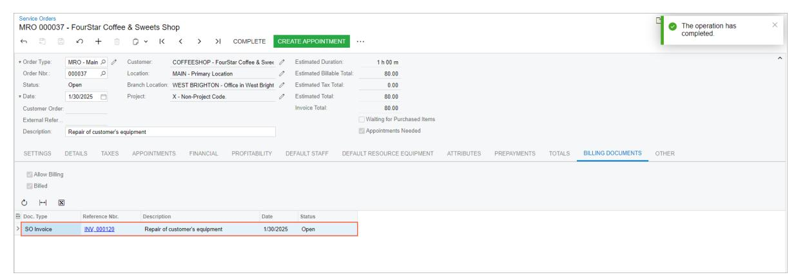

#### *Figure: The billing documents generated for the service order*

2. In the **Reference Nbr.** column, click the link to open the invoice.

The *[Invoices](https://help-2025r1.acumatica.com/Help?ScreenId=ShowWiki&pageid=0acc9738-f141-4ea0-a2be-f34ea9d1b63a)* (SO303000) form opens. Notice that the invoice has the *Open* status.

- 3. On the form title bar (in the top right corner of the form), click **Activities**. The **Tasks & Activities** dialog box opens.
- 4. In the dialog box, notice that the email sent to the customer with the invoice is listed.
- 5. Click the link of the email; this brings up the email in a pop-up window so that you can review it.

## **Assigning Staff Members to Service Orders on the Calendar Board**

In this chapter, you will learn ho to assign staff members to service orders using the calendar board.

## **Service Orders: To Assign a Service Order to a Staff Member by Using the Calendar Board**

The following activity will walk you through the process of scheduling an appointment for the service order. You will assign a service order to an employee who is available on the scheduled date with consideration given to the employee's skills and licenses. To perform this assignment, you will use the**Service Orders** tab on the *[Calendar](https://help-2025r1.acumatica.com/Help?ScreenId=ShowWiki&pageid=00cc92c3-408f-4fe3-b6bf-e801559f74f9) [Board](https://help-2025r1.acumatica.com/Help?ScreenId=ShowWiki&pageid=00cc92c3-408f-4fe3-b6bf-e801559f74f9)* (FS300300) form.

This activity is based on the *U100* dataset. If you are using another dataset, or if any system settings have been changed in *U100*, these changes can affect the workflow of the activity and the results of the processing. To avoid any issues, restore the *U100* dataset to its initial state.

#### **Story**

Suppose that the *COFFEESHOP - FourStar Coffee & Sweets Shop* customer has contacted the SweetLife Service and Equipment Sales Center and requested the training service. The service order has been entered in the system.

Acting as the service manager (Maia Davis), you now need to assign a staff member to perform the service included in the service order. While performing this assignment, you need to consider the staff member's available working hours, skills, and licenses.

#### **Configuration Overview**

In the *U100* dataset, the following tasks have been performed to support this activity:

- The minimum system configuration, which is described in *[Company with Branches that Do Not Require](https://help-2025r1.acumatica.com/Help?ScreenId=ShowWiki&pageid=a718a27b-3683-4d86-a26e-4b8fb7981f1c) [Balancing: General Information](https://help-2025r1.acumatica.com/Help?ScreenId=ShowWiki&pageid=a718a27b-3683-4d86-a26e-4b8fb7981f1c)*, has been performed.
- The *SWEETLIFE* company has been created on the *[Companies](https://help-2025r1.acumatica.com/Help?ScreenId=ShowWiki&pageid=fedad435-8496-4397-b8a3-50a473629f76)* (CS101500) form. This company has multiple branches created on the *[Branches](https://help-2025r1.acumatica.com/Help?ScreenId=ShowWiki&pageid=b97ab72d-4ab4-4f02-b69c-f7f61b316ced)* (CS102000) form, including *SWEETEQUIP (Service and Equipment Sales Center)*.
- On the *[Service Management Preferences](https://help-2025r1.acumatica.com/Help?ScreenId=ShowWiki&pageid=1c1b94d7-ac39-4f84-a966-588290b5ba80)* (FS100100) form, the minimum settings have been specified, including specifying the numbering sequences and work calendar, for the service management functionality to be used.
- On the *[Users](https://help-2025r1.acumatica.com/Help?ScreenId=ShowWiki&pageid=834cc181-97fa-4db4-a7e0-3eaba142c166)* (SM201010) form, the *davis* and *frank* user accounts have been created. The *EP00000040 Maia Davis* employee has been associated with the *davis* user account; that is, *Maia Davis* has been selected in the **Linked Entity** box of the Summary area of the form. The *EP00000042 - Chase Frank* employee has been associated with the *frank* user account; that is, *Chase Frank* has been selected in the **Linked Entity** box of the Summary area of the form.
- On the *[Branch Locations](https://help-2025r1.acumatica.com/Help?ScreenId=ShowWiki&pageid=ebef097e-9e47-4c7b-b0b0-c381251b48cf)* (FS202500) form, the *WEST BRIGHTON* branch location of the *SWEETEQUIP* (*Service and Equipment Sales Center*) branch has been created.
- On the *[User Profile](https://help-2025r1.acumatica.com/Help?ScreenId=ShowWiki&pageid=8430c8b2-a79c-4f7b-9768-b0b7fad23a59)* (SM203010) form, for the *davis* user, *WEST BRIGHTON* has been specified as the default branch location.
- On the *[Skills](https://help-2025r1.acumatica.com/Help?ScreenId=ShowWiki&pageid=481362c5-add5-4449-8cf6-a332763d7667)* (FS200600) form, the *INSTALLING* skill has been created.
- On the *[License](https://help-2025r1.acumatica.com/Help?ScreenId=ShowWiki&pageid=b39739b0-85f5-444c-8b86-4935738b0b0a) Types* (FS200900) form, the *INST&REP* license type has been created.

- On the *[Licenses](https://help-2025r1.acumatica.com/Help?ScreenId=ShowWiki&pageid=874fbbfb-a373-4787-b04c-959849ecb11c)* (FS201000) form, the *FSL00001* license has been created. This license has the *TRAINING* license type and was created for the *EP00000002 - Todd Bloom* employee.
- On the *[Employees](https://help-2025r1.acumatica.com/Help?ScreenId=ShowWiki&pageid=dae5144b-49b3-43a4-bce0-93f31b3f2321)* (EP203000) form, the *EP00000002 - Todd Bloom* employee has been created. On the **General** tab (**EmployeeSettings** section), the**Staff Member in Service Management** check box has been selected. The *TRAINING* skill has been listed on the**Skills** tab, and license *FSL00001* of the *TRAINING* type has been listed on the **Licenses** tab.
- On the *[Staff Schedule Rules](https://help-2025r1.acumatica.com/Help?ScreenId=ShowWiki&pageid=700e168c-2cb4-4e9b-bee1-8fda87efd071)* (FS202001) form, a work schedule rule has been defined for the *EP00000002 - Todd Bloom* employee, and the work schedule has been generated for this employee on the *[Generate Staff](https://help-2025r1.acumatica.com/Help?ScreenId=ShowWiki&pageid=f43242a2-6b31-47a2-89e4-d4778823570f) [Schedules](https://help-2025r1.acumatica.com/Help?ScreenId=ShowWiki&pageid=f43242a2-6b31-47a2-89e4-d4778823570f)* (FS500400) form.
- On the *[Non-Stock Items](https://help-2025r1.acumatica.com/Help?ScreenId=ShowWiki&pageid=bf68dd4f-63d4-460d-8dc0-9152f2bd6bf1)* (IN202000) form, the *INSTALL* service (that is, an item of the *Service* type) has been created. For this service, *INSTALLING* has been listed on the**ServiceSkills** tab, and *INST&REP* has been listed on the **Service LicenseTypes** tab.
- On the *[Service Orders](https://help-2025r1.acumatica.com/Help?ScreenId=ShowWiki&pageid=6e5277d3-274e-45f5-b77d-4410ed736d21)* (FS300100) form, the service order with the *000042* reference number has been created.

#### **Process Overview**

You will start by opening the service order by using the *[Service Orders](https://help-2025r1.acumatica.com/Help?ScreenId=ShowWiki&pageid=6e5277d3-274e-45f5-b77d-4410ed736d21)* (FS300100) form and then open the *[Calendar](https://help-2025r1.acumatica.com/Help?ScreenId=ShowWiki&pageid=00cc92c3-408f-4fe3-b6bf-e801559f74f9) [Board](https://help-2025r1.acumatica.com/Help?ScreenId=ShowWiki&pageid=00cc92c3-408f-4fe3-b6bf-e801559f74f9)* (FS300300) form. Then you will create an appointment and assign it to a staff member while considering staff member's available working hours and skills.

#### **System Preparation**

Before you begin performing this activity, do the following:

- 1. Launch the Acumatica ERP website, and sign in to a company with the *U100* dataset preloaded. You should sign in as a service manager by using the *davis* username and the *123* password.
- 2. In the info area, in the upper-right corner of the top pane of the Acumatica ERP screen, make sure that the business date in your system is set to *1/30/2025*. If a different date is displayed, click the Business Date menu button and select *1/30/2025* on the calendar. For simplicity, in this activity, you will create and process all documents in the system on this business date.
- 3. In the company to which you are signed in, ensure that the *Service Management* feature has been enabled on the *[Enable/Disable Features](https://help-2025r1.acumatica.com/Help?ScreenId=ShowWiki&pageid=c1555e43-1bc5-4f6f-ba9d-b323f94d8a6b)* (CS100000) form.

#### **Step: Creating and Assigning an Appointment**

To create an appointment for the service order and assign it to the staff member on the calendar board, do the following:

- 1. On the *[Service Orders](https://help-2025r1.acumatica.com/Help?ScreenId=ShowWiki&pageid=6e5277d3-274e-45f5-b77d-4410ed736d21)* (FS300100) form, open the service order with the *000042* reference number. Notice that the *TRAINING* service is listed on the **Details** tab.
- 2. On the More menu, click**Schedule on Calendar**.

The *[Calendar Board](https://help-2025r1.acumatica.com/Help?ScreenId=ShowWiki&pageid=00cc92c3-408f-4fe3-b6bf-e801559f74f9)* (FS300300) form opens. The le part of the form contains two tabs—**Service Orders** and **Unassigned Appointments (n)**. (*n* is replaced with the quantity of unassigned appointments for the currently selected date.)

- 3. On the **Service Orders** tab, ensure that the *000042* service order is listed.
- 4. Right-click the service order, and then click **FilterStaff**. The list of staff members on the dashboard is filtered to match the skills and licenses of the services in the service order.
- 5. Drag the *000042* service order from the**Service Orders** tab to the Todd Bloom's time interval to be started at *4:00 PM*. The appointment (Item 1 in the following screenshot) is now assigned to Todd Bloom (Item 2). Note that you can change the time of the appointment by dragging the appointment box.

| Calendar Board |                                    |            |                                                          |                |                           |                                                                                                                                                          |                  |                                     |                                      |  |  |  |  |                                |  |
|----------------|------------------------------------|------------|----------------------------------------------------------|----------------|---------------------------|----------------------------------------------------------------------------------------------------------------------------------------------------------|------------------|-------------------------------------|--------------------------------------|--|--|--|--|--------------------------------|--|
| Service Orders | <b>Unassigned Appointments (0)</b> |            |                                                          |                | Dashboard                 | T                                                                                                                                                        |                  |                                     |                                      |  |  |  |  |                                |  |
| Search 000042  |                                    |            | $\begin{array}{cc} \top & \mathcal{O} \end{array}$ ست |                | Appointments              |                                                                                                                                                          | Branch SWEETEQ = | Branch Location                     | WESTBRIC $\bullet$ Staff   Type Name |  |  |  |  | Day $\star$ < Jan 30, 2025 (1) |  |
| Service Order  | Account Name                       | Order Type | Priority                                                 |                |                           | Chase Frank                                                                                                                                              |                  | $\overline{2}$ <b>Todd Bloom</b> |                                      |  |  |  |  |                                |  |
|                |                                    |            |                                                          | $\overline{4}$ | 10:00 12:00 13:00   | 9:00 $\frac{1}{25}$ 000039-1 □ 000039 Not Started $\Box$ +1 321 459 2410 2/ GoodFood One Restaura 11:00 $A = 000045 - 1$ $\Box$ 000045 |                  |                                     |                                      |  |  |  |  |                                |  |
|                |                                    |            |                                                          |                | 14:00 15:00 16:00   |                                                                                                                                                          | A □ 000042    | 000042-1 it la $\mathbf{A}$   |                                      |  |  |  |  |                                |  |
|                |                                    |            |                                                          |                | 17:00 $\circ$ 18:00 |                                                                                                                                                          |                  |                                     |                                      |  |  |  |  |                                |  |

*Figure: An assigned staff member*

6. Click the *000042-1* appointment link in the calendar. The *[Appointments](https://help-2025r1.acumatica.com/Help?ScreenId=ShowWiki&pageid=ac486e9c-f5df-4829-94f0-2df8821361a0)* (FS300200) form is opened with the details of the appointment. On the**Staff** tab, confirm that Todd Bloom is assigned to the appointment.

## **Creating Appointments**

An appointment is a document in the system that represents the execution of part or all of the job defined by the service order. The appointment usually takes place in the customer location or in the branch location of your company. The appointment holds the details of the actual services performed, the exact date and time (scheduled and actual) of each service, and the staff member (or members) providing each service.

In this topic, you will learn how to create appointments in Acumatica ERP, and will get information about the general settings of the appointment.

## **Appointment Creation: General Information**

In Acumatica ERP, an appointment is a document that represents one in-person meeting to perform one service or multiple services. You can create an appointment either from a service order or independently. If an appointment is created separately, the system automatically generates a related service order when the appointment is saved.

Typically, you create a service order and include information on the services to be provided to a customer. Based on the details of the service order, you then create each needed appointment, and you schedule the date and time when the service is to be performed.

In some cases, the need for time-critical services (for example, urgent repair service) arises unexpectedly and may originate from a customer call. In such cases, you may need to create and schedule an appointment quickly without the initial creation of a service order.

In this chapter, you will create and schedule an appointment without first creating a service order. You will learn to do this in several ways.

### **Learning Objectives**

In this chapter, you will learn how to do the following:

- Create an appointment directly on the *[Appointments](https://help-2025r1.acumatica.com/Help?ScreenId=ShowWiki&pageid=ac486e9c-f5df-4829-94f0-2df8821361a0)* (FS300200) form, add a service to the appointment, assign a staff member to the appointment, and send appointment notification emails to the customer and to the assigned employee.
- Create an appointment on the *[Calendar Board](https://help-2025r1.acumatica.com/Help?ScreenId=ShowWiki&pageid=00cc92c3-408f-4fe3-b6bf-e801559f74f9)* (FS300300) form. You will filter staff members by the performed services and select a staff member whose schedule suits your needs.
- Create an appointment from the *[Customers](https://help-2025r1.acumatica.com/Help?ScreenId=ShowWiki&pageid=652929bc-9606-4056-aa6e-0c2d1147171b)* (AR303000) form, and send notification emails to the customer and to staff members.

#### **Applicable Scenarios**

You create an appointment in a wide variety of scenarios. In the most common scenario, you receive a call from your customer informing your company of a problem for which your company's services are requested. The service manager of your company creates the appointment and assigns an appropriate staff member to perform the service or services.

#### **The Steps of the Workflow**

In general, the processing of an appointment consists of the following steps (for simplicity, these steps describe one appointment with one staff member assigned and without a service order being created first):

1. Creating the appointment: The service manager creates an appointment in the system. The system automatically creates a related service order, and copies information from the appointment to the service order.

- 2. Adding additional information: The service manager assigns the appropriate staff member to the appointment. The appointment is ready to be attended.
- 3. Starting the appointment: On the day of the appointment at the agreed-on appointment location, the staff member starts the appointment in the system.
- 4. Adding additional items (optional): The staff member adds extra items that have been sold during the appointment.
- 5. Completing the appointment: Aer all the work on the appointment is done and all information is entered into the system and checked, the staff member specifies that all the work is finished and completes the appointment in the system.
- 6. Closing the appointment: An accountant verifies the information entered for the completed appointment, such as quantities and prices, and closes the verified appointment.
- 7. Generating a billing document for the customer (if the customer's billing cycle settings indicate that billing documents should be generated by appointment): An accountant generates billing documents and processes them in the system.

Aer each step has been performed, you can notify the customer and the staff member about appointment details by sending them notification emails. Before an appointment has been assigned, you can also send notification emails to staff members of the service area where the appointment takes place.

#### **Workflow of Appointment Creation and Processing**

The typical process of creating and processing an appointment that does not have an existing service order involves the actions and generated documents shown in the following diagram.

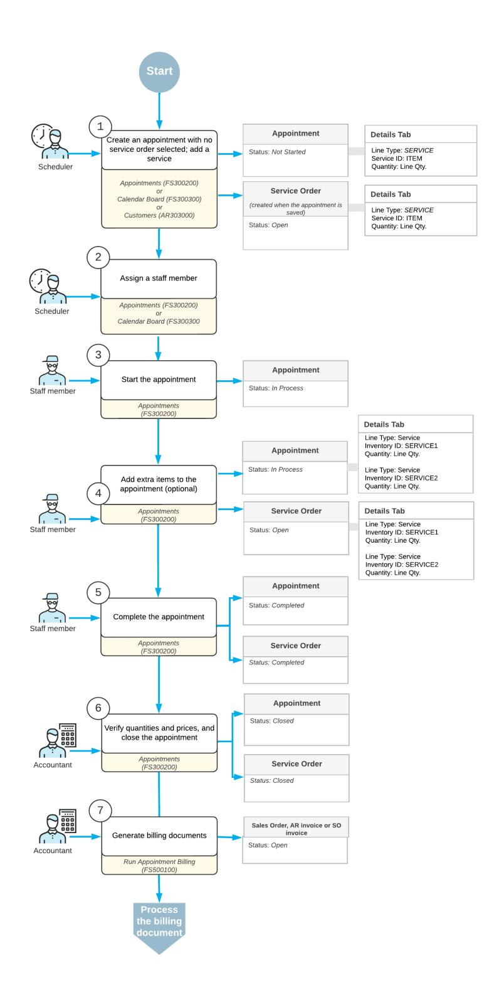

*Figure: Appointment creation and processing*

## **Appointment Creation: To Create an Appointment on the Appointments Form**

The following activity will walk you through the process of creating an appointment without creating a service order first. You will assign a staff member to the appointment based on the needed skills.

This activity is based on the *U100* dataset. If you are using another dataset, or if any system settings have been changed in *U100*, these changes can affect the workflow of the activity and the results of the processing. To avoid any issues, restore the *U100* dataset to its initial state.

#### **Story**

Suppose that the GoodFood One Restaurant previously ordered a juicer from the SweetLife Service and Equipment Sales Center with a production rate of 1.5 liters per minute. Now this customer needs installation services for the juicer. The service manager (Maia Davis) and the customer have agreed that the service will be delivered on February 4, 2025, at 9 AM.

Acting as the service manager, you need to create an appointment in the system and assign a staff member who has the needed skill for performing the service.

#### **Configuration Overview**

In the *U100* dataset, the following tasks have been performed to support this activity:

- The minimum system configuration, which is described in *[Company with Branches that Do Not Require](https://help-2025r1.acumatica.com/Help?ScreenId=ShowWiki&pageid=a718a27b-3683-4d86-a26e-4b8fb7981f1c) [Balancing: General Information](https://help-2025r1.acumatica.com/Help?ScreenId=ShowWiki&pageid=a718a27b-3683-4d86-a26e-4b8fb7981f1c)*, has been performed.
- The *SWEETLIFE* company has been created on the *[Companies](https://help-2025r1.acumatica.com/Help?ScreenId=ShowWiki&pageid=fedad435-8496-4397-b8a3-50a473629f76)* (CS101500) form. This company has multiple branches created on the *[Branches](https://help-2025r1.acumatica.com/Help?ScreenId=ShowWiki&pageid=b97ab72d-4ab4-4f02-b69c-f7f61b316ced)* (CS102000) form, including *SWEETEQUIP (Service and Equipment Sales Center)*.
- On the *[Service Management Preferences](https://help-2025r1.acumatica.com/Help?ScreenId=ShowWiki&pageid=1c1b94d7-ac39-4f84-a966-588290b5ba80)* (FS100100) form, the minimum settings have been specified, including specifying the numbering sequences and work calendar, for the service management functionality to be used.
- On the *[Users](https://help-2025r1.acumatica.com/Help?ScreenId=ShowWiki&pageid=834cc181-97fa-4db4-a7e0-3eaba142c166)* (SM201010) form, the *davis* and *smith* user accounts have been created. The *EP00000040 Maia Davis* employee has been associated with the *davis* user account; that is, *Maia Davis* has been selected in the **Linked Entity** box of the Summary area of the form. The *EP00000043 - Edward Smith* employee has been associated with the *smith* user account; that is, *Edward Smith* has been selected in the **Linked Entity** box of the Summary area of the form.
- On the *[Branch Locations](https://help-2025r1.acumatica.com/Help?ScreenId=ShowWiki&pageid=ebef097e-9e47-4c7b-b0b0-c381251b48cf)* (FS202500) form, the *WEST BRIGHTON* branch location of the *SWEETEQUIP* (*Service and Equipment Sales Center*) branch has been created.
- On the *[User Profile](https://help-2025r1.acumatica.com/Help?ScreenId=ShowWiki&pageid=8430c8b2-a79c-4f7b-9768-b0b7fad23a59)* (SM203010) form, for the *davis* user, *WEST BRIGHTON* has been specified as the default branch location.
- On the *[Service](https://help-2025r1.acumatica.com/Help?ScreenId=ShowWiki&pageid=06fd8a36-dd81-4df9-b609-92c3d552c542) Order Types* (FS202300) form, the *INST* service order type has been defined.
- On the *[Billing Cycles](https://help-2025r1.acumatica.com/Help?ScreenId=ShowWiki&pageid=273739f9-4e18-4e81-949b-128b02e37810)* (FS206000) form, the following settings have been specified for the *AP AP* billing cycle:
  - **Run Billing For**: **Appointments**
  - **Group Billing Documents By**: **Appointments**
- On the *[Customers](https://help-2025r1.acumatica.com/Help?ScreenId=ShowWiki&pageid=652929bc-9606-4056-aa6e-0c2d1147171b)* (AR303000) form, the *GOODFOOD (GoodFood One Restaurant)* customer has been defined, and the *AP AP* billing cycle has been selected in the**Service Management** section of the **Billing** tab.
- On the *[Skills](https://help-2025r1.acumatica.com/Help?ScreenId=ShowWiki&pageid=481362c5-add5-4449-8cf6-a332763d7667)* (FS200600) form, the *INSTALLING* skill has been created.
- On the *[Non-Stock Items](https://help-2025r1.acumatica.com/Help?ScreenId=ShowWiki&pageid=bf68dd4f-63d4-460d-8dc0-9152f2bd6bf1)* (IN202000) form, the *INSTALL* service (that is, non-stock item of the *Service* type) has been created. On the **Price/Cost** tab, the *Flat Rate* billing rule has been specified. For this service, *INSTALLING* has been listed on the**ServiceSkills** tab (so the assigned staff member must have this skill).

• On the *[Employees](https://help-2025r1.acumatica.com/Help?ScreenId=ShowWiki&pageid=dae5144b-49b3-43a4-bce0-93f31b3f2321)* (EP203000) form, *EP00000043 (Edward Smith)* has been defined. For this employee, on the **General** tab (**EmployeeSettings** section), the**Staff Member in Service Management** check box has been selected. Also, the *INSTALLING* skill has been added for this employee on the**Skills** tab.

#### **Process Overview**

On the *[Appointments](https://help-2025r1.acumatica.com/Help?ScreenId=ShowWiki&pageid=ac486e9c-f5df-4829-94f0-2df8821361a0)* (FS300200) form, you will create an appointment for which no service order exists; on the **Details** tab of the form, you will add an installation service to the appointment by using the **Inventory Lookup** dialog box. You will then assign a staff member to the appointment by using the **Add Staff** dialog box on the**Staff** tab of the form.

#### **System Preparation**

Before you begin performing the steps of this activity, do the following:

- 1. Launch the Acumatica ERP website, and sign in to a company with the *U100* dataset preloaded. You should sign in as a service manager by using the *davis* username and the *123* password.
- 2. In the company to which you are signed in, ensure that the *Service Management* feature has been enabled on the *[Enable/Disable Features](https://help-2025r1.acumatica.com/Help?ScreenId=ShowWiki&pageid=c1555e43-1bc5-4f6f-ba9d-b323f94d8a6b)* (CS100000) form.
- 3. In the info area, in the upper-right corner of the top pane of the Acumatica ERP screen, make sure that the business date in your system is set to *1/30/2025*. If a different date is displayed, click the Business Date menu button and select *1/30/2025* on the calendar. For simplicity, in this activity, you will create and process all documents in the system on this business date.

#### **Step 1: Creating an Appointment**

To create an appointment, do the following:

- 1. On the *[Appointments](https://help-2025r1.acumatica.com/Help?ScreenId=ShowWiki&pageid=ac486e9c-f5df-4829-94f0-2df8821361a0)* (FS300200) form, add a new record.
- 2. In the Summary area, specify the following settings for the new appointment:
  - **Service OrderType**: *INST*
  - **Customer**: *GOODFOOD - GoodFood One Restaurant*
- 3. In the **Description** box, type Juicer installation.
- 4. On the **Settings** tab (**Scheduled Date and Time** section), specify the date and time of the appointment. In the **Scheduled Start Date** boxes, select *2/4/2025 9:00 AM*.
- 5. On the form toolbar, click**Save**.

Because you have neither created this appointment from a service order nor selected any service order for the appointment, when you saved the appointment, the system created a new service order automatically and inserted its reference number in the**Service Order Nbr.** box.

#### **Step 2: Adding a Service to the Appointment**

To add a service to the appointment, do the following:

1. While you are still viewing the appointment on the *[Appointments](https://help-2025r1.acumatica.com/Help?ScreenId=ShowWiki&pageid=ac486e9c-f5df-4829-94f0-2df8821361a0)* (FS300200) form, on the table toolbar of the **Details** tab, click **Add Items**.

The **Inventory Lookup** dialog box is opened.

2. In the **Item Class ID** box of the Selection area, select *INSTALLING*.

The dialog box lists only those services that belong to the selected class.

3. In the table, select the unlabeled check box in the row of the *INSTALL* service, and click **Add & Close**.

4. On the form toolbar, click**Save**.

#### **Step 3: Assigning a Staff Member with the Needed Skill**

To assign an appointment to a staff member who has the required skill, do the following:

1. While you are still viewing the appointment on the *[Appointments](https://help-2025r1.acumatica.com/Help?ScreenId=ShowWiki&pageid=ac486e9c-f5df-4829-94f0-2df8821361a0)* (FS300200) form, on the table toolbar of the **Staff** tab, click **Add Staff**.

The **Add Staff** dialog box is opened. In the Skills table (the top table below the Selection area), which lists all skills that have been created in the system, the check box is selected for all skills that are preferred for performing the service for the appointment. The *INSTALLING* skill is selected because it is associated with the *INSTALL* service on the *[Non-Stock Items](https://help-2025r1.acumatica.com/Help?ScreenId=ShowWiki&pageid=bf68dd4f-63d4-460d-8dc0-9152f2bd6bf1)* (IN202000) form. Similarly, the License Types table (under the Skills table) lists all license types that have been created in the system, and the check box is selected for all license types that are preferred for staff members who perform the service.

The Staff Members table lists only those staff members who match all of the selected skills and license types. You select the check box for the staff member or members to be assigned to the service.

2. In the Skills table and the License Types table, clear all check boxes that are selected.

Notice that all staff members are now listed in the Staff Members table.

- 3. In the Skills table, again select the check box for the *INSTALLING* skill.
- 4. In the Staff Members table, select the check box for *Edward Smith*.
- 5. At the bottom of the dialog box, click **OK**.
- 6. On the form toolbar, click**Save**.

On the **Staff** tab, notice that *EP00000043 (Edward Smith)* is now assigned to the appointment.

## **Appointment Creation: To Create an Appointment on the Calendar Board**

In this activity, you will learn how to create an appointment without a service order from the *[Calendar Board](https://help-2025r1.acumatica.com/Help?ScreenId=ShowWiki&pageid=00cc92c3-408f-4fe3-b6bf-e801559f74f9)* (FS300300) form. You will also learn how to filter staff members that meet the requirements for an appointment by using the **Staff Filters** dialog box, which takes into account skills, licenses, and service areas.

This activity is based on the *U100* dataset. If you are using another dataset, or if any system settings have been changed in *U100*, these changes can affect the workflow of the activity and the results of the processing. To avoid any issues, restore the *U100* dataset to its initial state.

#### **Story**

Suppose that GoodFood One Restaurant has a juicer and wants the SweetLife Service and Equipment Sales Center to perform repairs on the juicer. The service manager (Maia Davis) and the customer have agreed that a staff member will come to repair the juicer on January 30, 2025, at 8 AM. The assigned staff member must have a special skill to repair the juicer, as well as a license from the producer of the juicer.

Acting as the service manager, you will create the appointment and assign a staff member who meets these requirements and can perform the work at the agreed-upon time.

### **Configuration Overview**

In the *U100* dataset, the following tasks have been performed to support this activity:

• The minimum system configuration, which is described in *[Company with Branches that Do Not Require](https://help-2025r1.acumatica.com/Help?ScreenId=ShowWiki&pageid=a718a27b-3683-4d86-a26e-4b8fb7981f1c) [Balancing: General Information](https://help-2025r1.acumatica.com/Help?ScreenId=ShowWiki&pageid=a718a27b-3683-4d86-a26e-4b8fb7981f1c)*, has been performed.

- The *SWEETLIFE* company has been created on the *[Companies](https://help-2025r1.acumatica.com/Help?ScreenId=ShowWiki&pageid=fedad435-8496-4397-b8a3-50a473629f76)* (CS101500) form. This company has multiple branches created on the *[Branches](https://help-2025r1.acumatica.com/Help?ScreenId=ShowWiki&pageid=b97ab72d-4ab4-4f02-b69c-f7f61b316ced)* (CS102000) form, including *SWEETEQUIP (Service and Equipment Sales Center)*.
- On the *[Service Management Preferences](https://help-2025r1.acumatica.com/Help?ScreenId=ShowWiki&pageid=1c1b94d7-ac39-4f84-a966-588290b5ba80)* (FS100100) form, the minimum settings have been specified, including specifying the numbering sequences and work calendar, for the service management functionality to be used. Also, the *MRO* service order type has been selected in the **DefaultService OrderType** box.
- On the *[Users](https://help-2025r1.acumatica.com/Help?ScreenId=ShowWiki&pageid=834cc181-97fa-4db4-a7e0-3eaba142c166)* (SM201010) form, the *davis* and *jimenez* user accounts have been created. The *EP00000040 - Maia Davis* employee has been associated with the *davis* user account; that is, *Maia Davis* has been selected in the **Linked Entity** box of the Summary area of the *[Users](https://help-2025r1.acumatica.com/Help?ScreenId=ShowWiki&pageid=834cc181-97fa-4db4-a7e0-3eaba142c166)* form. The *EP00000004 - Alberto Jimenez* employee has been associated with the *jimenez* user account; that is, *Alberto Jimenez* has been selected in the **Linked Entity** box of the Summary area on the *[Users](https://help-2025r1.acumatica.com/Help?ScreenId=ShowWiki&pageid=834cc181-97fa-4db4-a7e0-3eaba142c166)* form.
- On the *[Staff Schedule Rules](https://help-2025r1.acumatica.com/Help?ScreenId=ShowWiki&pageid=700e168c-2cb4-4e9b-bee1-8fda87efd071)* (FS202001) form, a work schedule rule has been defined for the *EP00000004 - Alberto Jimenez* employee, and the work schedule has been generated for this employee on the *[Generate](https://help-2025r1.acumatica.com/Help?ScreenId=ShowWiki&pageid=f43242a2-6b31-47a2-89e4-d4778823570f) [Staff Schedules](https://help-2025r1.acumatica.com/Help?ScreenId=ShowWiki&pageid=f43242a2-6b31-47a2-89e4-d4778823570f)* (FS500400) form.
- On the *[Branch Locations](https://help-2025r1.acumatica.com/Help?ScreenId=ShowWiki&pageid=ebef097e-9e47-4c7b-b0b0-c381251b48cf)* (FS202500) form, the *WEST BRIGHTON* branch location of the *SWEETEQUIP* (*Service and Equipment Sales Center*) branch has been created.
- On the *[User Profile](https://help-2025r1.acumatica.com/Help?ScreenId=ShowWiki&pageid=8430c8b2-a79c-4f7b-9768-b0b7fad23a59)* (SM203010) form, for the *davis* user, *WEST BRIGHTON* has been specified as the default branch location.
- On the *[Service](https://help-2025r1.acumatica.com/Help?ScreenId=ShowWiki&pageid=06fd8a36-dd81-4df9-b609-92c3d552c542) Order Types* (FS202300) form, the *MRO* service order type has been defined.
- On the *[Skills](https://help-2025r1.acumatica.com/Help?ScreenId=ShowWiki&pageid=481362c5-add5-4449-8cf6-a332763d7667)* (FS200600) form, the *REPAIRING* skill has been created.
- On the *[License](https://help-2025r1.acumatica.com/Help?ScreenId=ShowWiki&pageid=b39739b0-85f5-444c-8b86-4935738b0b0a) Types* (FS200900) form, the *INST&REP* license type has been created.
- On the *[Service Areas](https://help-2025r1.acumatica.com/Help?ScreenId=ShowWiki&pageid=db06f16a-f18c-4733-b586-07f1ae89c59c)* (FS201900) form, the *MANHATTAN* area has been created.
- On the *[Licenses](https://help-2025r1.acumatica.com/Help?ScreenId=ShowWiki&pageid=874fbbfb-a373-4787-b04c-959849ecb11c)* (FS201000) form, the following licenses have been created:
  - *FSL00003*, which has the *INST&REP* license type and was created for the *EP00000004 (Alberto Jimenez)* employee
  - *FSL00002*, which has the *INST&REP* license type and was created for the *EP00000003 (Jon Waite)* employee
- On the *[Non-Stock Items](https://help-2025r1.acumatica.com/Help?ScreenId=ShowWiki&pageid=bf68dd4f-63d4-460d-8dc0-9152f2bd6bf1)* (IN202000) form, the *REPAIR* service (that is, non-stock item of the *Service* type) has been defined. This service has the *Flat Rate* billing rule specified on the **Price/Cost** tab. For this service, *REPAIRING* has been listed on the**ServiceSkills** tab, and *INST&REP* has been listed on the**Service License Types** tab.
- On the *[Employees](https://help-2025r1.acumatica.com/Help?ScreenId=ShowWiki&pageid=dae5144b-49b3-43a4-bce0-93f31b3f2321)* (EP203000) form, the following employees have been created:
  - *EP00000004 (Alberto Jimenez)*: On the **General** tab (**EmployeeSettings** section), the**Staff Member in Service Management** check box has been selected. Also, the *REPAIRING* skill has been listed on the**Skills** tab, license *FSL00003* of the *INST&REP* type has been listed on the **Licenses** tab, and *MANHATTAN* has been listed on the**Service Areas** tab.
  - *EP00000003 (Jon Waite)*: On the **General** tab (**EmployeeSettings** section), the**Staff Member in Service Management** check box has been selected. Also, the *REPAIRING* skill has been listed on the**Skills** tab, license *FSL00002* of the *INST&REP* license type has been listed on the **Licenses** tab, and *MANHATTAN* has been listed on the**Service Areas** tab.

#### **Process Overview**

On the *[Calendar Board](https://help-2025r1.acumatica.com/Help?ScreenId=ShowWiki&pageid=00cc92c3-408f-4fe3-b6bf-e801559f74f9)* (FS300300) form, you will filter staff members for the performed service, which causes the system to hide the staff members who don't match the requirements. You will then select the staff members whose working schedule is suitable for the appointment and create the appointment from the board.

#### **System Preparation**

Before you begin performing the steps of this activity, do the following:

- 1. Launch the Acumatica ERP website, and sign in to a company with the *U100* dataset preloaded. You should sign in as a service manager by using the *davis* username and the *123* password.
- 2. In the company to which you are signed in, ensure that the *Service Management* feature has been enabled on the *[Enable/Disable Features](https://help-2025r1.acumatica.com/Help?ScreenId=ShowWiki&pageid=c1555e43-1bc5-4f6f-ba9d-b323f94d8a6b)* (CS100000) form.
- 3. In the info area, in the upper-right corner of the top pane of the Acumatica ERP screen, make sure that the business date in your system is set to *1/30/2025*. If a different date is displayed, click the Business Date menu button and select *1/30/2025* on the calendar. For simplicity, in this activity, you will create and process all documents in the system on this business date.

#### **Step 1: Filtering Staff Members for an Appointment**

To filter staff members for the appointment to be created, do the following:

- 1. Open the *[Calendar Board](https://help-2025r1.acumatica.com/Help?ScreenId=ShowWiki&pageid=00cc92c3-408f-4fe3-b6bf-e801559f74f9)* (FS300300) form.
- 2. In the Date box (in the upper right corner of the dashboard), ensure that *1/30/2025* is selected.

The dashboard displays the staff members of the *Service and Equipment Sales Center* branch and their working schedules.

3. Click the **Filter** icon in the top right corner of the calendar dashboard.

The **Staff Filters** dialog box opens, in which you can narrow the selection of staff members.

- 4. On the **Skills** tab of the dialog box, select the **Repair of juicers** check box.
- 5. On the **Services** tab of the dialog box, select the **Repair of customer's equipment** check box.
- 6. On the **Service Areas** tab, select the **Manhattan** check box.
- 7. Click **Filter & Close**.

The dialog box is closed, the filter is applied, and the staff members whose skills and assigned service areas match those of the selected service are displayed on the *[Calendar Board](https://help-2025r1.acumatica.com/Help?ScreenId=ShowWiki&pageid=00cc92c3-408f-4fe3-b6bf-e801559f74f9)*.

#### **Step 2: Creating the Appointment**

To create the appointment, do the following while you are still on the *[Calendar Board](https://help-2025r1.acumatica.com/Help?ScreenId=ShowWiki&pageid=00cc92c3-408f-4fe3-b6bf-e801559f74f9)* (FS300300) form:

1. In the column for *Alberto Jimenez*, click at 08:00 AM, and drag the shaded box area downward to 09:30 AM.

On the *[Appointments](https://help-2025r1.acumatica.com/Help?ScreenId=ShowWiki&pageid=ac486e9c-f5df-4829-94f0-2df8821361a0)* (FS300200) form, which is opened in a pop-up window, notice that the scheduled starting date is 1/30/2025, and that the scheduled starting and ending times are 08:00 AM and 09:30 AM, respectively.

- 2. In the **Customer** box, select *GOODFOOD - GoodFood One Restaurant*.
- 3. On the **Settings** tab, in the**Scheduled Date and Time** section, select the **Confirmed** check box.

An appointment can be automatically confirmed, which would cause the **Confirmed** check box to be selected automatically. For automatic confirmation to occur, the time range between the time the appointment was created and the scheduled start time of the appointment must be less than or equal to (in terms of the number of days) the time range specified in the **Appointment Auto-Confirm Time** box on the **Calendars and Maps** tab of the *[Service](https://help-2025r1.acumatica.com/Help?ScreenId=ShowWiki&pageid=1c1b94d7-ac39-4f84-a966-588290b5ba80) [Management Preferences](https://help-2025r1.acumatica.com/Help?ScreenId=ShowWiki&pageid=1c1b94d7-ac39-4f84-a966-588290b5ba80)* form.

- 4. Click **Add Row** on the table toolbar of the **Details** tab, and select the following options in the row:
  - **LineType**: *Service*
  - **Inventory ID**: *REPAIR*
- 5. On the form toolbar, click**Save**.

6. Close the *[Appointments](https://help-2025r1.acumatica.com/Help?ScreenId=ShowWiki&pageid=ac486e9c-f5df-4829-94f0-2df8821361a0)* form.

On the *[Calendar Board](https://help-2025r1.acumatica.com/Help?ScreenId=ShowWiki&pageid=00cc92c3-408f-4fe3-b6bf-e801559f74f9)* form, on the dashboard, the new appointment is now displayed, as the following screenshot shows.

| Calendar Board                         |                                    |                   |  |                       |                             |           |             |                         |  |                                    |  |  |  |  |  |                                                            |
|----------------------------------------|------------------------------------|-------------------|--|-----------------------|-----------------------------|-----------|-------------|-------------------------|--|------------------------------------|--|--|--|--|--|------------------------------------------------------------|
| Service Orders                         | <b>Unassigned Appointments (2)</b> |                   |  | Dashboard             |                             |           |             |                         |  |                                    |  |  |  |  |  |                                                            |
| Search                                 |                                    | $\overline{\tau}$ |  | <b>C</b> Appointments | Branch                      | SWEETEQ - |             | Branch Location         |  | WESTBRIC $\bullet$ Staff Type Name |  |  |  |  |  | Day $\blacktriangledown$ $\blacktriangleleft$ Jan 30, 2025 |
| Service Order                          | Account Name                       | Order Type        |  |                       | Alberto Jimenez             |           |             | <b>Edward Smith</b>     |  | Jon Waite                          |  |  |  |  |  |                                                            |
| $\blacktriangleright$ $\Box$ 000041    | FourStar Coffee & Sweets           | <b>INST</b>       |  | 7:00                  |                             |           |             |                         |  |                                    |  |  |  |  |  |                                                            |
| $\triangleright$ $\Box$ 000022         | <b>HM's Bakery &amp; Cafe</b>      | <b>MRO</b>        |  |                       |                             |           |             |                         |  |                                    |  |  |  |  |  |                                                            |
| $\blacktriangleright$ $\square$ 000024 | HM's Bakery & Cafe                 | <b>MRO</b>        |  | 8:00                  | 000047-1 □ 000047        |           |             |                         |  |                                    |  |  |  |  |  |                                                            |
| $\blacktriangleright$ $\square$ 000037 | FourStar Coffee & Sweets           | <b>MRO</b>        |  |                       | Not Started                 |           |             |                         |  |                                    |  |  |  |  |  |                                                            |
| $\triangleright$ $\Box$ 000016         | <b>Thai Food Restaurant</b>        | <b>RTE</b>        |  |                       | 9:00 $\Box$ +1-212-555-0109 |           | 1 000039    | A營 000039-1 章           |  |                                    |  |  |  |  |  |                                                            |
| $\blacktriangleright$ $\Box$ 000013    | FourStar Coffee & Sweets           | <b>TRN</b>        |  | 10:00                 |                             |           | Not Started | $\Box$ +1 321 459 2410  |  |                                    |  |  |  |  |  |                                                            |
| $\blacktriangleright$ $\square$ 000042 | FourStar Coffee & Sweets           | <b>TRN</b>        |  |                       |                             |           |             | * GoodFood One Restaura |  |                                    |  |  |  |  |  |                                                            |
|                                        |                                    |                   |  | 11:00                 |                             |           |             |                         |  |                                    |  |  |  |  |  |                                                            |
|                                        |                                    |                   |  |                       |                             |           |             |                         |  |                                    |  |  |  |  |  |                                                            |
|                                        |                                    |                   |  | 12:00                 |                             |           |             |                         |  |                                    |  |  |  |  |  |                                                            |
|                                        |                                    |                   |  |                       |                             |           |             |                         |  |                                    |  |  |  |  |  |                                                            |
|                                        |                                    |                   |  | 13:00                 |                             |           |             |                         |  |                                    |  |  |  |  |  |                                                            |
|                                        |                                    |                   |  |                       |                             |           |             |                         |  |                                    |  |  |  |  |  |                                                            |
|                                        |                                    |                   |  | 14:00                 |                             |           |             |                         |  |                                    |  |  |  |  |  |                                                            |
|                                        |                                    |                   |  | $\circ$ 15:00      |                             |           |             |                         |  |                                    |  |  |  |  |  |                                                            |
|                                        |                                    |                   |  |                       |                             |           |             |                         |  |                                    |  |  |  |  |  |                                                            |
|                                        |                                    |                   |  | 16:00                 |                             |           |             |                         |  |                                    |  |  |  |  |  |                                                            |

*Figure: An appointment on the calendar board*

### **Appointment Creation: To Create an Appointment from the Customers Form**

In this activity, you will create an appointment from the *[Customers](https://help-2025r1.acumatica.com/Help?ScreenId=ShowWiki&pageid=652929bc-9606-4056-aa6e-0c2d1147171b)* (AR303000) form while viewing a particular customer. You will also learn how to send notification emails to the customer and to your company's own staff members.

This activity is based on the *U100* dataset. If you are using another dataset, or if any system settings have been changed in *U100*, these changes can affect the workflow of the activity and the results of the processing. To avoid any issues, restore the *U100* dataset to its initial state.

#### **Story**

Suppose that the service manager (Maia Davis) of the SweetLife Service and Equipment Sales Center has received a call from HM's Bakery and Cafe about the repair of a juicer that had been sold to this customer previously. The customer has asked for the repair of the juicer to be performed on February 1, 2025.

The service manager needs to check the history of this customer and schedule the appointment for the repair of the juicer. When the appointment is scheduled, the service manager needs to send confirmation emails both to the assigned employee and to the customer. You will perform these actions, acting as the service manager.

#### **Configuration Overview**

In the *U100* dataset, the following tasks have been performed to support this activity:

- The minimum system configuration, which is described in *[Company with Branches that Do Not Require](https://help-2025r1.acumatica.com/Help?ScreenId=ShowWiki&pageid=a718a27b-3683-4d86-a26e-4b8fb7981f1c) [Balancing: General Information](https://help-2025r1.acumatica.com/Help?ScreenId=ShowWiki&pageid=a718a27b-3683-4d86-a26e-4b8fb7981f1c)*, has been performed.
- The *SWEETLIFE* company has been created on the *[Companies](https://help-2025r1.acumatica.com/Help?ScreenId=ShowWiki&pageid=fedad435-8496-4397-b8a3-50a473629f76)* (CS101500) form. This company has multiple branches created on the *[Branches](https://help-2025r1.acumatica.com/Help?ScreenId=ShowWiki&pageid=b97ab72d-4ab4-4f02-b69c-f7f61b316ced)* (CS102000) form, including *SWEETEQUIP (Service and Equipment Sales Center)*.

- On the *[Service Management Preferences](https://help-2025r1.acumatica.com/Help?ScreenId=ShowWiki&pageid=1c1b94d7-ac39-4f84-a966-588290b5ba80)* (FS100100) form, the minimum settings have been specified, including specifying the numbering sequences and work calendar, for the service management functionality to be used.
- On the *[Users](https://help-2025r1.acumatica.com/Help?ScreenId=ShowWiki&pageid=834cc181-97fa-4db4-a7e0-3eaba142c166)* (SM201010) form, the *davis* user account have been created. The *EP00000040 Maia Davis* employee has been associated with the *davis* user account; that is, *Maia Davis* has been selected in the **Linked Entity** box of the Summary area of the *[Users](https://help-2025r1.acumatica.com/Help?ScreenId=ShowWiki&pageid=834cc181-97fa-4db4-a7e0-3eaba142c166)* form.
- On the *[Branch Locations](https://help-2025r1.acumatica.com/Help?ScreenId=ShowWiki&pageid=ebef097e-9e47-4c7b-b0b0-c381251b48cf)* (FS202500) form, the *WEST BRIGHTON* branch location of the *SWEETEQUIP* (*Service and Equipment Sales Center*) branch has been created.
- On the *[User Profile](https://help-2025r1.acumatica.com/Help?ScreenId=ShowWiki&pageid=8430c8b2-a79c-4f7b-9768-b0b7fad23a59)* (SM203010) form, for the *davis* user, *WEST BRIGHTON* has been specified as the default branch location.
- On the *[Service](https://help-2025r1.acumatica.com/Help?ScreenId=ShowWiki&pageid=06fd8a36-dd81-4df9-b609-92c3d552c542) Order Types* (FS202300) form, the *MRO* service order type has been defined.
- On the *[Non-Stock Items](https://help-2025r1.acumatica.com/Help?ScreenId=ShowWiki&pageid=bf68dd4f-63d4-460d-8dc0-9152f2bd6bf1)* (IN202000) form, the *REPAIR* service (that is, non-stock item of the *Service* type) has been created. This item has the *Flat Rate* billing rule selected on the **Price/Cost** tab. For this service, *REPAIRING* has been specified on the **ServiceSkills** tab (meaning that the assigned staff member must have this skill), and *INST&REP* has been specified on the **Service LicenseTypes** tab (indicating that the assigned staff member must have a license of this type).
- On the *[Skills](https://help-2025r1.acumatica.com/Help?ScreenId=ShowWiki&pageid=481362c5-add5-4449-8cf6-a332763d7667)* (FS200600) form, the *REPAIRING* skill has been created.
- On the *[License](https://help-2025r1.acumatica.com/Help?ScreenId=ShowWiki&pageid=b39739b0-85f5-444c-8b86-4935738b0b0a) Types* (FS200900) form, the *INST&REP* license type has been created.
- On the *[Licenses](https://help-2025r1.acumatica.com/Help?ScreenId=ShowWiki&pageid=874fbbfb-a373-4787-b04c-959849ecb11c)* (FS201000) form, the *FSL00002* license has been defined with the *INST&REP* license type and the *EP00000003 (Jon Waite)* employee specified.
- On the *[Employees](https://help-2025r1.acumatica.com/Help?ScreenId=ShowWiki&pageid=dae5144b-49b3-43a4-bce0-93f31b3f2321)* (EP203000) form, *EP00000003 (Jon Waite)* has been created. On the **General** tab (**EmployeeSettings** section), the**Staff Member in Service Management** check box has been selected. Also, the *REPAIRING* skill has been listed on the**Skills** tab, and the license of the *INST&REP* type has been listed on the **Licenses** tab.
- On the *[Billing Cycles](https://help-2025r1.acumatica.com/Help?ScreenId=ShowWiki&pageid=273739f9-4e18-4e81-949b-128b02e37810)* (FS206000) form, the following settings have been specified for the *AP AP* billing cycle:
  - **Run Billing For**: **Appointments**
  - **Group Billing Documents By**: **Appointments**
- On the *[Customers](https://help-2025r1.acumatica.com/Help?ScreenId=ShowWiki&pageid=652929bc-9606-4056-aa6e-0c2d1147171b)* (AR303000) form, the *HMBAKERY (HM's Bakery and Cafe)* customer has been defined. The *AP AP* billing cycle has been selected in the**Service Management** section of the **Billing** tab.

#### **Process Overview**

From the *[Customers](https://help-2025r1.acumatica.com/Help?ScreenId=ShowWiki&pageid=652929bc-9606-4056-aa6e-0c2d1147171b)* (AR303000) form, you will open the *[Calendar Board](https://help-2025r1.acumatica.com/Help?ScreenId=ShowWiki&pageid=00cc92c3-408f-4fe3-b6bf-e801559f74f9)* (FS300300) form to create the first appointment. By using the *[Appointments](https://help-2025r1.acumatica.com/Help?ScreenId=ShowWiki&pageid=ac486e9c-f5df-4829-94f0-2df8821361a0)* (FS300200) form, you will then send notification emails about the appointment to the customer and staff member. Finally, while again using the *[Customers](https://help-2025r1.acumatica.com/Help?ScreenId=ShowWiki&pageid=652929bc-9606-4056-aa6e-0c2d1147171b)* form as a starting point, you will go to the *[Appointment Summary](https://help-2025r1.acumatica.com/Help?ScreenId=ShowWiki&pageid=773bf6ec-a6d8-4bd2-917f-c3297f1cec66)* (FS400100) form to view the list of all appointments scheduled for the customer.

#### **System Preparation**

Before you begin performing the steps of this activity, do the following:

- 1. Launch the Acumatica ERP website, and sign in to a company with the *U100* dataset preloaded. You should sign in as a service manager by using the *davis* username and the *123* password.
- 2. In the info area, in the upper-right corner of the top pane of the Acumatica ERP screen, make sure that the business date in your system is set to *1/30/2025*. If a different date is displayed, click the Business Date menu button and select *1/30/2025* on the calendar. For simplicity, in this activity, you will create and process all documents in the system on this business date.
- 3. In the company to which you are signed in, ensure that the *Service Management* feature has been enabled on the *[Enable/Disable Features](https://help-2025r1.acumatica.com/Help?ScreenId=ShowWiki&pageid=c1555e43-1bc5-4f6f-ba9d-b323f94d8a6b)* (CS100000) form.

#### **Step 1: Creating an Appointment from the Customers Form**

To create an appointment for a customer whose record you are viewing on the *[Customers](https://help-2025r1.acumatica.com/Help?ScreenId=ShowWiki&pageid=652929bc-9606-4056-aa6e-0c2d1147171b)* (AR303000) form, do the following:

- 1. On the *[Customers](https://help-2025r1.acumatica.com/Help?ScreenId=ShowWiki&pageid=652929bc-9606-4056-aa6e-0c2d1147171b)* (AR303000) form, open the *HMBAKERY - HM's Bakery and Cafe* customer.
- 2. On the More menu (under**Services**), click **Schedule on Calendar**.

The *[Calendar Board](https://help-2025r1.acumatica.com/Help?ScreenId=ShowWiki&pageid=00cc92c3-408f-4fe3-b6bf-e801559f74f9)* (FS300300) form is opened in a pop-up window.

- 3. In the Date box (in the top right corner of the dashboard), change the calendar date to *2/1/2025*.
- 4. On the dashboard, in the column for *Jon Waite*, click at 16:00, and drag the bottom of the shaded box to 17:30.
- 5. In the appointment box, which has appeared on the calendar board and is shaded in green (indicating that an appointment is in *Not Started* status), click the reference number of the appointment, which is the top number in the box. The *[Appointments](https://help-2025r1.acumatica.com/Help?ScreenId=ShowWiki&pageid=ac486e9c-f5df-4829-94f0-2df8821361a0)* (FS300200) form opens. Notice that the system has filled in the default settings based on the settings of the customer and the service order type.
- 6. On the **Details** tab of the *[Appointments](https://help-2025r1.acumatica.com/Help?ScreenId=ShowWiki&pageid=ac486e9c-f5df-4829-94f0-2df8821361a0)* form, add a row, and specify the following settings in the row:
  - **LineType**: *Service*
  - **Inventory ID**: *REPAIR*
- 7. On the form toolbar, click**Save**.
- 8. On the **Staff** tab, confirm that the staff member, Jon Waite, has been assigned to the appointment.

#### **Step 2: Sending Appointment Confirmation Emails**

To send emails confirming the scheduled appointment, while you are still viewing the appointment on the *[Appointments](https://help-2025r1.acumatica.com/Help?ScreenId=ShowWiki&pageid=ac486e9c-f5df-4829-94f0-2df8821361a0)* (FS300200) form, do the following:

1. On the **Settings** tab (**Scheduled Date and Time** section), select the **Confirmed** check box.

The selection of this check box indicates that the appointment date and time have been confirmed with the customer.

- 2. On the form toolbar, click**Save**.
- 3. On the More menu (under **Printing and Emailing**), click **Email Confirmation to Customer**.
- 4. On the More menu (under **Printing and Emailing**), click **Email Confirmation toStaff**.
- 5. On the form title bar (at the top right corner of the form), click **Activities**, and in the **Task & Activities** popup window, which opens, click the link to each email to review what has been sent to the customer and to the staff member.
- 6. Close the pop-up window.

#### **Step 3: Reviewing the Customer's Appointments**

To review the appointments for the customer, do the following:

- 1. On the *[Customers](https://help-2025r1.acumatica.com/Help?ScreenId=ShowWiki&pageid=652929bc-9606-4056-aa6e-0c2d1147171b)* (AR303000) form, again open the *HMBAKERY - HM's Bakery and Cafe* customer.
- 2. On the More menu (under **Inquiries**), click **Appointment History**.

The *[Appointment Summary](https://help-2025r1.acumatica.com/Help?ScreenId=ShowWiki&pageid=773bf6ec-a6d8-4bd2-917f-c3297f1cec66)* (FS400100) form opens.

- 3. In the Selection area, clear the**Staff Member** box.
- 4. In the **ToScheduled Date** box, select *2/1/2025*.

Review the list of all appointments scheduled for the customer, including the appointment you have just created (see the following screenshot).

|                                                                                                                                                                                                                                                                                                                                                                                                                                   | TOOLS $\sim$ <b>Appointment Summary</b>                                                            |                              |                                                                                                                                                                                |                              |                |                  |                                              |                                          |           |                               |                               |                               |                    |                     |      |
|-----------------------------------------------------------------------------------------------------------------------------------------------------------------------------------------------------------------------------------------------------------------------------------------------------------------------------------------------------------------------------------------------------------------------------------|-------------------------------------------------------------------------------------------------------|------------------------------|--------------------------------------------------------------------------------------------------------------------------------------------------------------------------------|------------------------------|----------------|------------------|----------------------------------------------|------------------------------------------|-----------|-------------------------------|-------------------------------|-------------------------------|--------------------|---------------------|------|
|                                                                                                                                                                                                                                                                                                                                                                                                                                   | $\overline{\mathbf{x}}$ Ò $\mathbb{H}$ $\triangledown$ $\Omega$ 0 $\leftarrow$ ÷ |                              |                                                                                                                                                                                |                              |                |                  |                                              |                                          |           |                               |                               |                               |                    |                     |      |
| 1/1/2025 !!!!!!!!!!!!!!!!!!!!!!!!!!!!!!!!!!!!!!!! SWEETEQUIP - Service and Eq. Schedule ID: Q From Scheduled Date: Branch: Staff Member: $\mathcal{L}$ ρ <b>Branch Location:</b> !!!!!!!!!!!!!!!!!!!!!!!!!!!!!!!!!!!!!!!! To Scheduled Date: 2/1/2025 Resource Equipment: Customer: HMBAKERY - HM's Bakery & O o Location: $\varphi$ $\varphi$ Service Order Nbr.: |                                                                                                       |                              |                                                                                                                                                                                |                              |                |                  |                                              |                                          |           |                               |                               |                               |                    | $\hat{\phantom{a}}$ |      |
|                                                                                                                                                                                                                                                                                                                                                                                                                                   |                                                                                                       | ALL RECORDS B & D *Branch | TODAY *Customer Scheduled <b>Branch Location</b> Service Service Order Location Scheduled Actual <b>Status</b> Appointment <b>Description</b> |                              |                |                  |                                              |                                          |           |                               | Finished                      | Confirmed                     |                    |                     |      |
|                                                                                                                                                                                                                                                                                                                                                                                                                                   | $> 0$ D                                                                                               | SWEETEQUIP                   | <b>WEST BRIGHTON</b>                                                                                                                                                           | Order Type <b>INST</b> | Nbr. 000002 | Nbr. 000002-1 | Installation of equipment at the customers'. | HMBAKERY - HM's Bakery & Cafe            | $MAIN - $ | <b>Start Date</b> 1/9/2025 | <b>Start Time</b> 12:00 PM | <b>Start Date</b> 1/9/2025 | Billed             | True                | True |
|                                                                                                                                                                                                                                                                                                                                                                                                                                   | 6 D                                                                                                   | SWEETEQUIP                   | <b>WEST BRIGHTON</b>                                                                                                                                                           | <b>MRO</b>                   | 000023         | 000023-1         | <b>Cleaning Contract</b>                     | HMBAKERY - HM's Bakery & Cafe            | $MAIN - $ | 1/31/2025                     | 9:00 AM                       | 1/31/2025                     | Closed             | True                | True |
|                                                                                                                                                                                                                                                                                                                                                                                                                                   | 0 0                                                                                        | SWEETEQUIP                   | <b>WEST BRIGHTON</b>                                                                                                                                                           | <b>MRO</b>                   | 000021         | 000021-1         | <b>Cleaning Contract</b>                     | HMBAKERY - HM's Bakery & Cafe            | $MAIN - $ | 1/31/2025                     | 9:00 AM                       |                               | <b>Not Started</b> | False               | True |
|                                                                                                                                                                                                                                                                                                                                                                                                                                   |                                                                                                       | 6 D SWEETEQUIP               | <b>WEST BRIGHTON</b>                                                                                                                                                           | <b>RTE</b>                   | 000014         | 000014-1         | Delivery of Fruits                           | HMBAKERY - HM's Bakery & Cafe            | $MAIN - $ | 1/31/2025                     | 9:08 AM                       |                               | <b>Not Started</b> | False               | True |
|                                                                                                                                                                                                                                                                                                                                                                                                                                   |                                                                                                       | 6 D SWEETEQUIP               | <b>WEST BRIGHTON</b>                                                                                                                                                           | <b>MRO</b>                   | 000048         | 000048-1         | Repair of customer's equipment               | <b>HMBAKERY - HM's Bakery &amp; Cafe</b> | $MAIN - $ | 2/1/2025                      | 4:00 PM                       |                               | <b>Not Started</b> | False               | True |
|                                                                                                                                                                                                                                                                                                                                                                                                                                   |                                                                                                       |                              |                                                                                                                                                                                |                              |                |                  |                                              |                                          |           |                               |                               |                               |                    |                     |      |
|                                                                                                                                                                                                                                                                                                                                                                                                                                   |                                                                                                       |                              |                                                                                                                                                                                |                              |                |                  |                                              |                                          |           |                               |                               |                               |                    |                     |      |
|                                                                                                                                                                                                                                                                                                                                                                                                                                   |                                                                                                       |                              |                                                                                                                                                                                |                              |                |                  |                                              |                                          |           |                               |                               |                               |                    |                     |      |

*Figure: An appointment created from the Customers form*

## **Appointment Creation: To Assign a Staff Member to a Particular Service Considering Skills and Licenses**

The following activity will walk you through the process of assigning a staff member to a particular service of an appointment.

This activity is based on the *U100* dataset. If you are using another dataset, or if any system settings have been changed in *U100*, these changes can affect the workflow of the activity and the results of the processing. To avoid any issues, restore the *U100* dataset to its initial state.

#### **Story**

Suppose that the GoodFood One Restaurant customer has contacted the SweetLife Service and Equipment Sales Center and requested the juicer installation service, along with the training service aer installation is completed. The customer wants each employee performing the service to have specific licenses and skills, to be sure that the services will be provided with the highest quality. The service manager, Maia Davis, has already created an appointment in the system.

Acting as the service manager, you now need to assign a staff member to each service of the appointment in accordance with the staff members' skills and licenses and the skills and licenses required for the services.

#### **Configuration Overview**

In the *U100* dataset, the following tasks have been performed to support this activity:

- The minimum system configuration, which is described in *[Company with Branches that Do Not Require](https://help-2025r1.acumatica.com/Help?ScreenId=ShowWiki&pageid=a718a27b-3683-4d86-a26e-4b8fb7981f1c) [Balancing: General Information](https://help-2025r1.acumatica.com/Help?ScreenId=ShowWiki&pageid=a718a27b-3683-4d86-a26e-4b8fb7981f1c)*, has been performed.
- The *SWEETLIFE* company has been created on the *[Companies](https://help-2025r1.acumatica.com/Help?ScreenId=ShowWiki&pageid=fedad435-8496-4397-b8a3-50a473629f76)* (CS101500) form. This company has multiple branches created on the *[Branches](https://help-2025r1.acumatica.com/Help?ScreenId=ShowWiki&pageid=b97ab72d-4ab4-4f02-b69c-f7f61b316ced)* (CS102000) form, including *SWEETEQUIP (Service and Equipment Sales Center)*.
- On the *[Service Management Preferences](https://help-2025r1.acumatica.com/Help?ScreenId=ShowWiki&pageid=1c1b94d7-ac39-4f84-a966-588290b5ba80)* (FS100100) form, the minimum settings have been specified, including specifying the numbering sequences and work calendar, for the service management functionality to be used.
- On the *[Users](https://help-2025r1.acumatica.com/Help?ScreenId=ShowWiki&pageid=834cc181-97fa-4db4-a7e0-3eaba142c166)* (SM201010) form, the *davis* account has been created. In the **Linked Entity** box of the Summary area of the form, the Maia Davis employee account has been specified.

- On the *[Branch Locations](https://help-2025r1.acumatica.com/Help?ScreenId=ShowWiki&pageid=ebef097e-9e47-4c7b-b0b0-c381251b48cf)* (FS202500) form, the *WEST BRIGHTON* branch location of the *SWEETEQUIP* (*Service and Equipment Sales Center*) branch has been created.
- On the *[User Profile](https://help-2025r1.acumatica.com/Help?ScreenId=ShowWiki&pageid=8430c8b2-a79c-4f7b-9768-b0b7fad23a59)* (SM203010) form, for the *davis* user, *WEST BRIGHTON* has been specified as the default branch location.
- On the *[Skills](https://help-2025r1.acumatica.com/Help?ScreenId=ShowWiki&pageid=481362c5-add5-4449-8cf6-a332763d7667)* (FS200600) form, the *INSTALLING* and *TRAINING* skills have been created.
- On the *[License](https://help-2025r1.acumatica.com/Help?ScreenId=ShowWiki&pageid=b39739b0-85f5-444c-8b86-4935738b0b0a) Types* (FS200900) form, the *INST&REP* and *TRAINING* license types have been created.
- On the *[Licenses](https://help-2025r1.acumatica.com/Help?ScreenId=ShowWiki&pageid=874fbbfb-a373-4787-b04c-959849ecb11c)* (FS201000) form, the following licenses have been created:
  - *FSL00006*, which has the *TRAINING* license type and was created for the *EP00000042 (Chase Frank)* employee
  - *FSL00004*, which has the *INST&REP* license type and was created for the *EP00000043 (Edward Smith)* employee
- On the *[Employees](https://help-2025r1.acumatica.com/Help?ScreenId=ShowWiki&pageid=dae5144b-49b3-43a4-bce0-93f31b3f2321)* (EP203000) form, the following employees have been created:
  - *EP00000042 (Chase Frank)*: On the **General** tab (**EmployeeSettings** section), the**Staff Member in Service Management** check box has been selected. Also, the *TRAINING* skill has been listed on the**Skills** tab, and license *FSL00006* of the *TRAINING* license type has been listed on the **Licenses** tab.
  - *EP00000043 (Edward Smith)*: On the **General** tab (**EmployeeSettings** section), the**Staff Member in Service Management** check box has been selected. Also, the *INSTALLING* skill has been listed on the **Skills** tab, and license *FSL00004* of the *INST&REP* type has been listed on the **Licenses** tab.
- On the *[Non-Stock Items](https://help-2025r1.acumatica.com/Help?ScreenId=ShowWiki&pageid=bf68dd4f-63d4-460d-8dc0-9152f2bd6bf1)* (IN202000) form, the following services (that is, items of the *Service* type) have been created:
  - *INSTALL*: For this service, *INSTALLING* has been listed on the**ServiceSkills** tab, and *INST&REP* has been listed on the**Service LicenseTypes** tab.
  - *TRAINING*: For this service, *TRAINING* has been listed on the**ServiceSkills** tab, and *TRAINING* has been listed on the**Service LicenseTypes** tab.
- On the *[Appointments](https://help-2025r1.acumatica.com/Help?ScreenId=ShowWiki&pageid=ac486e9c-f5df-4829-94f0-2df8821361a0)* (FS300200) form, the *000040-1* appointment has been created.

#### **Process Overview**

On the *[Appointments](https://help-2025r1.acumatica.com/Help?ScreenId=ShowWiki&pageid=ac486e9c-f5df-4829-94f0-2df8821361a0)* (FS300200) form, you will assign a staff member to each service of an appointment by using the **Add Staff** dialog box.

#### **System Preparation**

Before you begin performing this activity, do the following:

- 1. Launch the Acumatica ERP website, and sign in to a company with the *U100* dataset preloaded. You should sign in as a service manager by using the *davis* username and the *123* password.
- 2. In the info area, in the upper-right corner of the top pane of the Acumatica ERP screen, make sure that the business date in your system is set to *1/30/2025*. If a different date is displayed, click the Business Date menu button and select *1/30/2025* on the calendar. For simplicity, in this activity, you will create and process all documents in the system on this business date.
- 3. In the company to which you are signed in, ensure that the *Service Management* feature has been enabled on the *[Enable/Disable Features](https://help-2025r1.acumatica.com/Help?ScreenId=ShowWiki&pageid=c1555e43-1bc5-4f6f-ba9d-b323f94d8a6b)* (CS100000) form.

#### **Step: Assigning Staff Members to Services**

Do the following to assign a staff member to each service to be provided in the appointment:

- 1. Open the *000040-1* appointment on the *[Appointments](https://help-2025r1.acumatica.com/Help?ScreenId=ShowWiki&pageid=ac486e9c-f5df-4829-94f0-2df8821361a0)* (FS300200) form.
- 2. On the **Details** tab, click line *0001*, which has the installation service (that is, *INSTALL* is in the **Inventory ID** column).

- 3. On the table toolbar, click **Add Staff**.
- 4. In the Selection area of the **Add Staff** dialog box, which opens, ensure that *0001* (the reference number of the installation service) is selected in the**Service Ref. Nbr.** box.
- 5. In the Skills table, make sure that the check box is selected in the row with *INSTALLING* in the **Skill ID** column.
- 6. In the License Types table, make sure that the check box is selected in the row with *INST REP* in the **License Type ID** column.
- 7. In the Staff Members table, which lists employees whose skills and license type satisfy the selection criteria, select the check box in the row with *EP00000043 (Edward Smith)*.
- 8. Click **OK** to close the dialog box.
- 9. On the **Details** tab of the *[Appointments](https://help-2025r1.acumatica.com/Help?ScreenId=ShowWiki&pageid=ac486e9c-f5df-4829-94f0-2df8821361a0)* form, in the**Staff Member ID** column of the line with the INSTALL service, notice that *EP00000043 (Edward Smith)* has been added.
- 10.Click line *0002*, which has the training service (that is, *TRAINING* is in the **Inventory ID** column).
- 11.On the table toolbar, click **Add Staff** to assign a staff member to the training service.
- 12.In the Selection area of the **Add Staff** dialog box, which opens, ensure that *0002* (the reference number of the training service) is selected in the**Service Ref. Nbr.** box.
- 13.In the Skills table, make sure that the check box is selected in the row with *TRAINING* in the **Skill ID** column.
- 14.In the License Types table, make sure that the check box is selected in the row with *TRAINING* in the **License Type ID** column.
- 15.In the Staff Members table, which lists the employees whose skills and license type satisfies the selection criteria, select the check box in the row with *EP00000042 (Chase Frank)*.
- 16.Click **OK** to close the dialog box.
- 17.Notice that *EP00000042 (Chase Frank)* has been added to the**Staff Member ID** column in the line with the training service on the **Details** tab.
- 18.On the form toolbar, click**Save**.
- 19.Review the**Staff** tab (Item 1 in the following screenshot). Notice that two staff members have been added to the appointment; each is assigned to a particular service (Item 2).

| Appointments a $\leftarrow$ | MRO 000040-1 - GoodFood One Restaurant 8 A n $\mathbf{R}$ <b>HOLD</b> $\lambda$ <b>START</b> $\Omega$ $\rightarrow$ $\epsilon$ ÷ $\checkmark$                                                                          | <b>DEPART</b> $\cdots$                         |               |                     |                  |                 |              | <b>THNOTES</b> | <b>ACTIVITIES</b>  | <b>FILES</b> | TOOLS $\star$       |  |  |  |
|-----------------------------------|------------------------------------------------------------------------------------------------------------------------------------------------------------------------------------------------------------------------------------------------------------|---------------------------------------------------|---------------|---------------------|------------------|-----------------|--------------|----------------|--------------------|--------------|---------------------|--|--|--|
| * Service Order.                  | $\ldots$ MRO - Main $\varnothing$ $\varnothing$ Customer: GOODFOOD - GoodFood One Restaurar                                                                                                                                                          | <b>Estimated Duration:</b> 1 h 45 m            |               |                     |                  |                 |              |                |                    |              | $\hat{\phantom{a}}$ |  |  |  |
|                                   | $\rho$ Appointment N 000040-1 $\circ$ * Location: MAIN - Primary Location                                                                                                                                                                      | Actual Duration: 0 h 00 m                      |               |                     |                  |                 |              |                |                    |              |                     |  |  |  |
| Service Order                     | 000040 Ø * Branch Location: WEST BRIGHTON - Office in West Bri Q $\mathscr{Q}$                                                                                                                                                                       | Actual Billable Total: 137.50                  |               |                     |                  |                 |              |                |                    |              |                     |  |  |  |
| Status:                           | <b>Not Started</b> Project: X - Non-Project Code. 0                                                                                                                                                                                               | <b>Actual Tax Total:</b> 0.00                  |               |                     |                  |                 |              |                |                    |              |                     |  |  |  |
| * Scheduled Sta.                  | 1/30/2025                                                                                                                                                                                                                                                  | <b>Invoice Total:</b> 137.50                   |               |                     |                  |                 |              |                |                    |              |                     |  |  |  |
| * Actual Start D.                 | 1/30/2025 日                                                                                                                                                                                                                                                | Waiting for Purchased Items                       |               |                     |                  |                 |              |                |                    |              |                     |  |  |  |
| Description: <b>SETTINGS</b>   | Installation + training <b>STAFF</b> <b>DETAILS</b> <b>TAXES</b> <b>RESOURCE EQUIPMENT</b> <b>FINANCIAL</b> <b>OTHER</b> LOG PROFITABILITY <b>ATTRIBUTES</b> <b>PREPAYMENTS</b> <b>TOTALS</b> <b>BILLING DOCUMENTS</b> |                                                   |               |                     |                  |                 |              |                |                    |              |                     |  |  |  |
| Ò ÷                            | <b>ADD STAFF</b> <b>START</b> <b>PAUSE</b> <b>RESUME</b> <b>DEPART</b> <b>ARRIVE</b> <b>COMPLETE</b> $\times$                                                                                                                         | $\boxed{\mathbf{N}}$ $\vdash$                  |               |                     |                  |                 |              |                | <b>All Records</b> |              | $-7$                |  |  |  |
| 图 0 D Ref. Nbr.                | * Staff Member Detail <b>Inventory ID</b> Primary Ref. Nbr. <b>Driver</b>                                                                                                                                                                   | Description                                       | Track Time | <b>Earning Type</b> | Labor Item       | Project Task | Cost Code |                |                    |              |                     |  |  |  |
| <b>8</b> D 001                    | ⊡ 0001 EP00000043 - Edward Smith <b>INSTALL</b> $\mathcal{D}$                                                                                                                                                                                  | Installation of equipment at the customers' place | ◙             | <b>RG</b>           | <b>CONSULTSR</b> |                 |              |                |                    |              |                     |  |  |  |
| $0 - 0.002$                       | $\Box$ 0002 <b>TRAINING</b> EP00000042 - Chase Frank                                                                                                                                                                                              | Training on juicer usage (at customer's place)    | ◙             | <b>RG</b>           | <b>CONSULTSR</b> |                 |              |                |                    |              |                     |  |  |  |
|                                   |                                                                                                                                                                                                                                                            |                                                   |               |                     |                  |                 |              |                |                    |              |                     |  |  |  |

*Figure: Staff members assigned to services*

### **Appointment Creation: To Assign a Staff Member by Using the Calendar Board**

The following activity will walk you through the process of creating and scheduling an appointment for a service order. You will assign the appointment to an employee who is available on the scheduled date, and you will use the **Unassigned Appointments (n)** tab on the calendar board.

This activity is based on the *U100* dataset. If you are using another dataset, or if any system settings have been changed in *U100*, these changes can affect the workflow of the activity and the results of the processing. To avoid any issues, restore the *U100* dataset to its initial state.

#### **Story**

Suppose that the *COFFEESHOP - FourStar Coffee & Sweets Shop* customer has contacted the SweetLife Service and Equipment Sales Center and requested the juicer installation service. The customer wants the employee performing the service to have specific licenses and skills, to be sure that the services will be provided with the highest quality. A service order has been entered in the system.

Acting as the service manager (Maia Davis), you now need to create an appointment and assign it to the staff member while considering the staff member's available working hours as well as specific licenses and skills.

#### **Configuration Overview**

In the *U100* dataset, the following tasks have been performed to support this activity:

- The minimum system configuration, which is described in *[Company with Branches that Do Not Require](https://help-2025r1.acumatica.com/Help?ScreenId=ShowWiki&pageid=a718a27b-3683-4d86-a26e-4b8fb7981f1c) [Balancing: General Information](https://help-2025r1.acumatica.com/Help?ScreenId=ShowWiki&pageid=a718a27b-3683-4d86-a26e-4b8fb7981f1c)*, has been performed.
- The *SWEETLIFE* company has been created on the *[Companies](https://help-2025r1.acumatica.com/Help?ScreenId=ShowWiki&pageid=fedad435-8496-4397-b8a3-50a473629f76)* (CS101500) form. This company has multiple branches created on the *[Branches](https://help-2025r1.acumatica.com/Help?ScreenId=ShowWiki&pageid=b97ab72d-4ab4-4f02-b69c-f7f61b316ced)* (CS102000) form, including *SWEETEQUIP (Service and Equipment Sales Center)*.
- On the *[Service Management Preferences](https://help-2025r1.acumatica.com/Help?ScreenId=ShowWiki&pageid=1c1b94d7-ac39-4f84-a966-588290b5ba80)* (FS100100) form, the minimum settings have been specified, including specifying the numbering sequences and work calendar, for the service management functionality to be used.
- On the *[Users](https://help-2025r1.acumatica.com/Help?ScreenId=ShowWiki&pageid=834cc181-97fa-4db4-a7e0-3eaba142c166)* (SM201010) form, the *davis* and *waite* user accounts have been created. The *EP00000040 Maia Davis* employee has been associated with the *davis* user account; that is, *Maia Davis* has been selected in the **Linked Entity** box of the Summary area of the form. The *EP00000003 - Jon Waite* employee has been associated with the *waite* user account; that is, *Jon Waite* has been selected in the **Linked Entity** box of the Summary area of the form.
- On the *[Branch Locations](https://help-2025r1.acumatica.com/Help?ScreenId=ShowWiki&pageid=ebef097e-9e47-4c7b-b0b0-c381251b48cf)* (FS202500) form, the *WEST BRIGHTON* branch location of the *SWEETEQUIP* (*Service and Equipment Sales Center*) branch has been created.
- On the *[User Profile](https://help-2025r1.acumatica.com/Help?ScreenId=ShowWiki&pageid=8430c8b2-a79c-4f7b-9768-b0b7fad23a59)* (SM203010) form, for the *davis* user, *WEST BRIGHTON* has been specified as the default branch location.
- On the *[Skills](https://help-2025r1.acumatica.com/Help?ScreenId=ShowWiki&pageid=481362c5-add5-4449-8cf6-a332763d7667)* (FS200600) form, the *INSTALLING* skill has been created.
- On the *[License](https://help-2025r1.acumatica.com/Help?ScreenId=ShowWiki&pageid=b39739b0-85f5-444c-8b86-4935738b0b0a) Types* (FS200900) form, the *INST&REP* license type has been created.
- On the *[Licenses](https://help-2025r1.acumatica.com/Help?ScreenId=ShowWiki&pageid=874fbbfb-a373-4787-b04c-959849ecb11c)* (FS201000) form, the *FSL00002* license has been created. This license has the *INST&REP* license type and was created for the *EP00000003 - Jon Waite* employee.
- On the *[Employees](https://help-2025r1.acumatica.com/Help?ScreenId=ShowWiki&pageid=dae5144b-49b3-43a4-bce0-93f31b3f2321)* (EP203000) form, the *EP00000003 - Jon Waite* employee has been created. On the **General** tab (**EmployeeSettings** section), the**Staff Member in Service Management** check box has been selected. The *INSTALLING* skill has been listed on the**Skills** tab, and license *FSL00002* of the *INST&REP* type has been listed on the **Licenses** tab.
- On the *[Staff Schedule Rules](https://help-2025r1.acumatica.com/Help?ScreenId=ShowWiki&pageid=700e168c-2cb4-4e9b-bee1-8fda87efd071)* (FS202001) form, a work schedule rule has been defined for the *EP00000003 - Jon Waite* employee, and the work schedule has been generated for this employee on the *[Generate Staff](https://help-2025r1.acumatica.com/Help?ScreenId=ShowWiki&pageid=f43242a2-6b31-47a2-89e4-d4778823570f) [Schedules](https://help-2025r1.acumatica.com/Help?ScreenId=ShowWiki&pageid=f43242a2-6b31-47a2-89e4-d4778823570f)* (FS500400) form.
- On the *[Non-Stock Items](https://help-2025r1.acumatica.com/Help?ScreenId=ShowWiki&pageid=bf68dd4f-63d4-460d-8dc0-9152f2bd6bf1)* (IN202000) form, the *INSTALL* service (that is, an item of the *Service* type) has been created. For this service, *INSTALLING* has been listed on the**ServiceSkills** tab, and *INST&REP* has been listed on the **Service LicenseTypes** tab.
- On the *[Service Orders](https://help-2025r1.acumatica.com/Help?ScreenId=ShowWiki&pageid=6e5277d3-274e-45f5-b77d-4410ed736d21)* (FS300100) form, the service order with the *000041* reference number has been created.

#### **Process Overview**

You will create an appointment by using the *[Service Orders](https://help-2025r1.acumatica.com/Help?ScreenId=ShowWiki&pageid=6e5277d3-274e-45f5-b77d-4410ed736d21)* (FS300100) form. Then on the *[Calendar Board](https://help-2025r1.acumatica.com/Help?ScreenId=ShowWiki&pageid=00cc92c3-408f-4fe3-b6bf-e801559f74f9)* (FS300300) form, you will assign a staff member to an appointment while considering the staff member's available working hours.

#### **System Preparation**

Before you begin performing this activity, do the following:

- 1. Launch the Acumatica ERP website, and sign in to a company with the *U100* dataset preloaded. You should sign in as a service manager by using the *davis* username and the *123* password.
- 2. In the info area, in the upper-right corner of the top pane of the Acumatica ERP screen, make sure that the business date in your system is set to *1/30/2025*. If a different date is displayed, click the Business Date menu button and select *1/30/2025* on the calendar. For simplicity, in this activity, you will create and process all documents in the system on this business date.
- 3. In the company to which you are signed in, ensure that the *Service Management* feature has been enabled on the *[Enable/Disable Features](https://help-2025r1.acumatica.com/Help?ScreenId=ShowWiki&pageid=c1555e43-1bc5-4f6f-ba9d-b323f94d8a6b)* (CS100000) form.

#### **Step 1: Creating an Appointment from the Service Orders Form**

To create and assign this appointment, perform the following instructions:

- 1. On the *[Service Orders](https://help-2025r1.acumatica.com/Help?ScreenId=ShowWiki&pageid=6e5277d3-274e-45f5-b77d-4410ed736d21)* (FS300100) form, open the *000041* service order.
- 2. On the form toolbar, click **Create Appointment**.

The *[Appointments](https://help-2025r1.acumatica.com/Help?ScreenId=ShowWiki&pageid=ac486e9c-f5df-4829-94f0-2df8821361a0)* (FS300200) form opens.

- 3. On the **Settings** tab, in the**Scheduled Date and Time** section, set**Scheduled Start Date** to *1/30/2025 1:00 PM*.
- 4. Ensure that the **Handle Manually** check box is cleared.
- 5. On the form toolbar, click**Save**.

#### **Step 2: Assigning a Staff Member to the Appointment**

To assign a staff member to the appointment by using the calendar board, do the following:

1. While you are still viewing the appointment on the *[Appointments](https://help-2025r1.acumatica.com/Help?ScreenId=ShowWiki&pageid=ac486e9c-f5df-4829-94f0-2df8821361a0)* (FS300200) form, on the More menu, click **Schedule on Calendar**.

The *[Calendar Board](https://help-2025r1.acumatica.com/Help?ScreenId=ShowWiki&pageid=00cc92c3-408f-4fe3-b6bf-e801559f74f9)* (FS300300) form opens in a new window. The le part of the form contains two tabs —**Service Orders** and **Unassigned Appointments (n)**. *n* is replaced with the quantity of unassigned appointments for the currently selected date.

2. On the **Unassigned Appointments (n)** tab (Item 1 in the following screenshot), ensure that the *000041-1* appointment (Item 2), which was created in Step 1, is listed.

| Calendar Board        |                             |                    |                   |                                           |                |                       |                                       |                 |                               |                    |  |                                                                           |  |                 |           |  |                   |                                                |  |
|-----------------------|-----------------------------|--------------------|-------------------|-------------------------------------------|----------------|-----------------------|---------------------------------------|-----------------|-------------------------------|--------------------|--|---------------------------------------------------------------------------|--|-----------------|-----------|--|-------------------|------------------------------------------------|--|
| <b>Service Orders</b> | Unassigned Appointments (1) |                    |                   |                                           |                | Dashboard             |                                       |                 |                               |                    |  |                                                                           |  |                 |           |  |                   |                                                |  |
| Search 000041-1       |                             |                    |                   | $T$ $\sigma$ and the state of the con- |                | <b>C</b> Appointments | Branch                                | SWEETEQ -       |                               | Branch Location    |  | WESTBRIC -                                                                |  | Staff Type Name |           |  |                   | Day $\blacktriangleright$ < Jan 30, 2025 (1) > |  |
| Appointments          | Account Name                | Service Order Type | Scheduled Start   | Scheduled End                             |                |                       |                                       | Alberto Jimenez |                               | <b>Chase Frank</b> |  | <b>Edward Smith</b>                                                       |  | Jon Waite       | Peter Lai |  | <b>Todd Bloom</b> |                                                |  |
| 000041-1              | FourStar Coffee             | <b>INST</b>        | 1/30/2025 1:00 PM | 1/30/2025 3:00 PM                         | $\overline{2}$ | 7:00                  |                                       |                 |                               |                    |  |                                                                           |  |                 |           |  |                   |                                                |  |
|                       |                             |                    |                   |                                           |                | 8:00                  | 000047-1 □ 000047 m Not Started | 會               |                               |                    |  |                                                                           |  |                 |           |  |                   |                                                |  |
|                       |                             |                    |                   |                                           |                | 9:00 10:00         | $\Box$ +1-212-555-0109                |                 | 量。 □ 000039 Not Started | 000039-1           |  | <b>自 △皆</b> 000039-1 自 □ 000039 Not Started                         |  |                 |           |  |                   |                                                |  |
|                       |                             |                    |                   |                                           |                |                       |                                       |                 | $\Box$ +13214592410           |                    |  | $\Box$ +1 321 459 2410 # GoodFood One Restaura # GoodFood One Restaura |  |                 |           |  |                   |                                                |  |
|                       |                             |                    |                   |                                           |                | 11:00                 |                                       |                 | $\Delta$ □ 000045          | 000045-1           |  |                                                                           |  |                 |           |  |                   |                                                |  |
|                       |                             |                    |                   |                                           |                | 12:00                 |                                       |                 |                               |                    |  |                                                                           |  |                 |           |  |                   |                                                |  |
|                       |                             |                    |                   |                                           |                | 13:00                 |                                       |                 |                               |                    |  |                                                                           |  |                 |           |  |                   |                                                |  |
|                       |                             |                    |                   |                                           |                | 14:00                 |                                       |                 |                               |                    |  |                                                                           |  |                 |           |  |                   |                                                |  |
|                       |                             |                    |                   |                                           |                | 15:00                 |                                       |                 |                               |                    |  |                                                                           |  |                 |           |  |                   |                                                |  |
|                       |                             |                    |                   |                                           |                | 16:00 $\sim$       |                                       |                 |                               |                    |  |                                                                           |  |                 |           |  |                   |                                                |  |

#### *Figure: An unassigned appointment*

- 3. Right-click the appointment, and then click **FilterStaff**. The list of staff members on the dashboard is filtered to match the skills and licenses of the services in the appointment.
- 4. Drag the *000041-1* appointment from the **Unassigned Appointments (n)** tab to any time interval during Jon Waite's work hours. The appointment is now assigned to Jon Waite (Item 1 in the next screenshot) at the scheduled start time that was specified when you created the appointment (Item 2). Note that you can change the time of the appointment by dragging the appointment box.

| Calendar Board                                                                           |                                                                                                                                             |  |  |  |  |  |  |  |  |  |  |  |  |  |
|------------------------------------------------------------------------------------------|---------------------------------------------------------------------------------------------------------------------------------------------|--|--|--|--|--|--|--|--|--|--|--|--|--|
| Unassigned Appointments (0) <b>Service Orders</b>                                     | Dashboard T                                                                                                                              |  |  |  |  |  |  |  |  |  |  |  |  |  |
| $\tau$ $\sigma$ 000041-1 Search                                                    | Day $\star$ < Jan 30, 2025 (1) <b>WESTBRIC</b> $\neq$ Staff Type Name Branch Branch Location <b>C</b> Appointments SWEETEQ - |  |  |  |  |  |  |  |  |  |  |  |  |  |
| Service Order Type Scheduled End. Scheduled Start. Appointments Account Name | Jon Waite <b>Edward Smith</b>                                                                                                            |  |  |  |  |  |  |  |  |  |  |  |  |  |
|                                                                                          | 8:00                                                                                                                                        |  |  |  |  |  |  |  |  |  |  |  |  |  |
|                                                                                          | 9:00 AM 000039-1 0 □ 000039                                                                                                              |  |  |  |  |  |  |  |  |  |  |  |  |  |
|                                                                                          | 10:00 $\Box$ +1 321 459 2410 2/ GoodFood One Restaura                                                                                 |  |  |  |  |  |  |  |  |  |  |  |  |  |
|                                                                                          | 11:00                                                                                                                                       |  |  |  |  |  |  |  |  |  |  |  |  |  |
|                                                                                          | 12:00                                                                                                                                       |  |  |  |  |  |  |  |  |  |  |  |  |  |
|                                                                                          | $\left( 2\right)$ 13:00 -e l la. $000041-1$ □ 000041 Mot Started                                                          |  |  |  |  |  |  |  |  |  |  |  |  |  |
|                                                                                          | 14:00 $\Box$ +1-212-555-0105 2/ FourStar Coffee & <b>Pil Primary Location</b>                                                      |  |  |  |  |  |  |  |  |  |  |  |  |  |
|                                                                                          | 15:00                                                                                                                                       |  |  |  |  |  |  |  |  |  |  |  |  |  |
|                                                                                          | 16:00                                                                                                                                       |  |  |  |  |  |  |  |  |  |  |  |  |  |

#### *Figure: An assigned staff member*

5. Click the *000041-1* appointment link in the calendar. The *[Appointments](https://help-2025r1.acumatica.com/Help?ScreenId=ShowWiki&pageid=ac486e9c-f5df-4829-94f0-2df8821361a0)* form is opened with the details of the appointment. On the**Staff** tab, confirm that Jon Waite is assigned to the appointment.

## **Appointment Creation: Related Inquiry Forms**

In the following sections, you can find details about the inquiry forms you may want to review to gather information about all entered appointments.

#### **Reviewing Appointments**

Acumatica ERP provides you with multiple ways to review appointments that have been entered into the system. You can view the appointments assigned to a particular staff member (or multiple staff members), and the list of all entered appointments in the system and their details.

You can review information on appointments as follows:

- If you want to find a particular appointment in the system, you use the *[Appointment Summary](https://help-2025r1.acumatica.com/Help?ScreenId=ShowWiki&pageid=773bf6ec-a6d8-4bd2-917f-c3297f1cec66)* (FS400100) form. This form shows all appointments within the particular date range. You can filter the list of appointments by a customer, branch location or staff member.
- If you want to find a particular detail (line item) of an appointment—such as a service, an inventory item, or a piece of equipment—you use the *[Appointment Details](https://help-2025r1.acumatica.com/Help?ScreenId=ShowWiki&pageid=59d8c9d8-27cc-4463-9df8-2ad5b715a4ae)* (FS400500) form. This form shows all appointment details entered into the system, and you can use selection criteria to narrow the list of details and quickly find the ones you are looking for.

## **Appointment Creation: Calendar Board Forms**

In this topic, you will read about the various Acumatica ERP calendar boards you can use for managing appointments.

#### **Scheduling of Appointments on Calendar Boards**

In Acumatica ERP, you can do the following by using calendar boards:

- If the needed appointment has not yet been created in the system, you can select the time of the appointment and the appropriate staff member to perform a particular service or multiple services, and initiate creation of the appointment.
- If the needed appointment has been created in the system, you can check the time of the appointment and assign an appropriate staff member to the appointment.

The following sections describe the available calendar boards in Acumatica ERP and their use.

#### **The Calendar Board Form**

On the *[Calendar Board](https://help-2025r1.acumatica.com/Help?ScreenId=ShowWiki&pageid=00cc92c3-408f-4fe3-b6bf-e801559f74f9)* (FS300300) form, you see the work schedules of the staff members of your company. To select the right staff members to perform services, you can filter staff members by any needed skills, license types, services, and service areas related to the service for which you want to schedule an appointment. Based on the available working times of staff members, you decide who will perform services and when, assign selected staff members, and create appointments. You can also assign staff members to perform existing appointments.

For an example of scheduling by using the Calendar Board, see *Appointment Creation: To Create an [Appointment](#page-36-1) on [the Calendar Board](#page-36-1)*.

#### **The Staff Calendar Board Form**

On the *[Staff Calendar Board](https://help-2025r1.acumatica.com/Help?ScreenId=ShowWiki&pageid=b1d15e47-fba9-4bbf-a7fa-2f7c396c8df4)* (FS300400) form, you see the work schedule of a particular staff member of your company. You can filter service orders and appointments by any of the following: skills, license types, and service classes. Based on the available working times of the staff member, you can do the following:

- Decide which services, service orders, and appointments this staff member will be assigned to and when this staff member's work will occur
- Create any needed appointments

#### **The Room Calendar Board Form**

On the *[Room Calendar Board](https://help-2025r1.acumatica.com/Help?ScreenId=ShowWiki&pageid=52cfe99e-53ca-425d-ab28-7b2508a1faf7)* (FS300700) form, you can see the availability of the rooms in your company's branch location. Based on this information, you can select which services will be performed in which room of the selected branch location and when, and you can create any needed appointments. (If appointments have already been created, you just assign a room to them.) Rooms are usually used for service orders if the services are performed on-site (that is, those for which the services are performed at your company location), and they can also be used for internal service orders.

To be able to use rooms for services, you must have the **Enable Rooms** check box selected on the *[Service Management Preferences](https://help-2025r1.acumatica.com/Help?ScreenId=ShowWiki&pageid=1c1b94d7-ac39-4f84-a966-588290b5ba80)* (FS100100) form.

#### **Viewing of Appointments on Calendar Boards**

You can view the appointments assigned to staff members of your company by using the calendar board forms in the following ways:

- If you want to see the appointments associated with staff members on a particular day, week or month, you use the *[Calendar Board](https://help-2025r1.acumatica.com/Help?ScreenId=ShowWiki&pageid=00cc92c3-408f-4fe3-b6bf-e801559f74f9)* (FS300300) form. You can filter information on this form by branch, branch location, and staff member. Also, you can filter staff members by skill, license type, service, and service area. On this form, you can see the general appointment information, such as service order number, appointment status, customer name, and contact phone number.
- If you want to see the appointments associated with a particular staff member for a selected period of time, you use the *[Staff Calendar Board](https://help-2025r1.acumatica.com/Help?ScreenId=ShowWiki&pageid=b1d15e47-fba9-4bbf-a7fa-2f7c396c8df4)* (FS300400) form. You can filter information on this form by branch and branch location. On this form, you can see the general appointment information, such as service order number, appointment status, customer name and contact phone number.
- If you want to see the appointments associated with staff members for a particular day and the current locations of staff members on a Bing map, you use the *[Staff Appointments on Map](https://help-2025r1.acumatica.com/Help?ScreenId=ShowWiki&pageid=fb372257-a821-47d7-96f9-9dd6bb1e6337)* (FS301100) form. This form displays the appointment number and address information.
- If your company uses its rooms to provide services, you can view the availability of rooms and appointments assigned to these rooms for a particular day on the *[Room Calendar Board](https://help-2025r1.acumatica.com/Help?ScreenId=ShowWiki&pageid=52cfe99e-53ca-425d-ab28-7b2508a1faf7)* (FS300700) form. This form shows the general appointment information, such as the service order number, the status of the appointment, the customer name and contact phone number.

If the *WorkWave Route Optimization* feature is enabled in the *Third Party Integrations* group of features on the *[Enable/Disable Features](https://help-2025r1.acumatica.com/Help?ScreenId=ShowWiki&pageid=c1555e43-1bc5-4f6f-ba9d-b323f94d8a6b)* (CS100000) form, you can optimize the appointment schedule on the *[Optimize Appointment Scheduling](https://help-2025r1.acumatica.com/Help?ScreenId=ShowWiki&pageid=dc911ca9-90a0-44da-a316-4bd509df0ef6)* (FS501400) form. For details, see *[Optimizing](#page-84-1) [Appointment](#page-84-1) Scheduling with WorkWave*.

## **Modifying Calendar Boards**

The topics of this chapter describe the configuration settings that can be applied to the calendar board forms of Acumatica ERP.

## **Calendar Board Configuration Options**

In Acumatica ERP, the calendar board forms—that is, *[Calendar Board](https://help-2021r1.acumatica.com/(W(1))/Wiki/ShowWiki.aspx?wikiname=HelpRoot_FormReference&PageID=00cc92c3-408f-4fe3-b6bf-e801559f74f9)* (FS300300), *[Staff Calendar Board](https://help-2021r1.acumatica.com/(W(1))/Wiki/ShowWiki.aspx?wikiname=HelpRoot_FormReference&PageID=b1d15e47-fba9-4bbf-a7fa-2f7c396c8df4)* (FS300400), and *[Room Calendar Board](https://help-2021r1.acumatica.com/(W(1))/Wiki/ShowWiki.aspx?wikiname=HelpRoot_FormReference&PageID=52cfe99e-53ca-425d-ab28-7b2508a1faf7)* (FS300700 )—have similar layouts. These calendar boards consist of the pane with the **Service Orders** and **Unassigned Appointments** tabs, which is on the le side of the form, and the **Dashboard** pane, which is on the right side and provides a visual representation of the appointments.

This topic describes the configuration options for the following parts or entities of the calendar board forms:

- The horizontal axis and the vertical axis of the calendar dashboard (see Item 1 in the following screenshot, which shows the *[Calendar Board](https://help-2021r1.acumatica.com/(W(1))/Wiki/ShowWiki.aspx?wikiname=HelpRoot_FormReference&PageID=00cc92c3-408f-4fe3-b6bf-e801559f74f9)* form)
- The number of staff members that can be displayed simultaneously on the calendar board (Item 2)
- The time range on the time axis (Item 3)
- The pane with the**Service Orders** and **Unassigned Appointments** tabs (Item 4)
- The appointment boxes representing scheduled appointments (Item 5)
- The view mode button (Item 6)

| Calendar Board                    |                                            |               |                  |                       |                                               |                        |                                                                           |                                 |   |                 |           |                          |                   |                                  |   |
|-----------------------------------|--------------------------------------------|---------------|------------------|-----------------------|-----------------------------------------------|------------------------|---------------------------------------------------------------------------|---------------------------------|---|-----------------|-----------|--------------------------|-------------------|----------------------------------|---|
| Service Orders                    | <b>Unassigned Appointments (2)</b>         |               | <b>Dashboard</b> |                       |                                               |                        |                                                                           |                                 |   |                 |           |                          |                   |                                  |   |
|                                   |                                            |               |                  |                       |                                               |                        |                                                                           |                                 |   |                 |           |                          |                   | $\le$ Jan 30, 2023 $\hat{m}$ $>$ |   |
| Search                            |                                            | $\top$        |                  | <b>C</b> Appointments | Branch                                        | SWEETEQ $\overline{ }$ | <b>Branch Location</b>                                                    | WESTBRIC -                      |   | Staff Type Name |           | Day $\blacktriangledown$ |                   |                                  |   |
| Service Order                     | Account Name                               | Order Type    |                  |                       | Alberto Jimenez ************************** |                        | <b>Chase Frank</b>                                                        | <b>Edward Smith</b>             |   | Jon Waite       | Peter Lai |                          | <b>Todd Bloom</b> |                                  |   |
| $\triangleright$ $\square$ 000041 | FourStar Coffee & Sweets Shop              | <b>INST</b>   | 3                |                       |                                               |                        |                                                                           |                                 |   |                 |           |                          |                   |                                  |   |
| $\triangleright$ $\square$ 000022 | HM's Bakery & Cafe                         | <b>MRO</b>    |                  | $8:00$ $\frac{1}{2}$  |                                               |                        |                                                                           |                                 |   |                 |           |                          |                   |                                  |   |
| $\triangleright$ $\Box$ 000024    | HM's Bakery & Cafe                         | <b>MRO</b>    |                  |                       |                                               |                        |                                                                           |                                 | 5 |                 |           |                          |                   |                                  |   |
| $\triangleright$ $\square$ 000037 | FourStar Coffee & Sweets Shop              | <b>MRO</b>    |                  | 9:00                  |                                               |                        | 000039-1 A警 □ 000039                                                | $B$ $A$ 000039-1 □ 000039 | 市 |                 |           |                          |                   |                                  |   |
| $\triangleright$ $\Box$ 000046    | HM's Bakery & Cafe                         | <b>MRO</b>    |                  |                       |                                               |                        | m Not Started                                                             | n Not Started                   |   |                 |           |                          |                   |                                  |   |
| $\triangleright$ $\square$ 000013 | FourStar Coffee & Sweets Shop              | <b>TRN</b>    |                  | 10:00                 |                                               |                        | $\Box$ +1 321 459 2410 ± GoodFood One Restaura ± GoodFood One Restaura | $\Box$ +1 321 459 2410          |   |                 |           |                          |                   |                                  |   |
| $\triangleright$ $\Box$ 000042    | FourStar Coffee & Sweets Shop              | <b>TRN</b>    | $\overline{4}$   | 11:00                 |                                               |                        |                                                                           |                                 |   |                 |           |                          |                   |                                  |   |
|                                   |                                            |               | ٠                |                       |                                               |                        |                                                                           |                                 |   |                 |           |                          |                   |                                  |   |
|                                   |                                            |               |                  | 12:00                 |                                               |                        |                                                                           |                                 |   |                 |           |                          |                   |                                  |   |
|                                   |                                            |               |                  |                       |                                               |                        |                                                                           |                                 |   |                 |           |                          |                   |                                  |   |
|                                   |                                            |               |                  | 13:00                 |                                               |                        |                                                                           |                                 |   |                 |           |                          |                   |                                  |   |
|                                   |                                            |               |                  |                       |                                               |                        |                                                                           |                                 |   |                 |           |                          |                   |                                  |   |
|                                   |                                            |               |                  | 14:00                 |                                               |                        |                                                                           |                                 |   |                 |           |                          |                   |                                  |   |
|                                   |                                            |               |                  |                       |                                               |                        |                                                                           |                                 |   |                 |           |                          |                   |                                  |   |
|                                   |                                            |               |                  | 15:00                 |                                               |                        |                                                                           |                                 |   |                 |           |                          |                   |                                  |   |
|                                   |                                            |               |                  |                       |                                               |                        |                                                                           |                                 |   |                 |           |                          |                   |                                  |   |
|                                   |                                            | $\mathbf b$   |                  | 16:00                 |                                               |                        |                                                                           |                                 |   |                 |           |                          |                   |                                  | 6 |
| $\ll \langle \cdot  $ Page        | of $1 \quad > \quad \gg$ $\overline{1}$ | $\mathcal{C}$ | $\ll$            | $\langle$   Page      | $\blacksquare$                                |                        | of $1 \quad \Rightarrow \quad \gg \quad \mathbf{C}$                       |                                 |   |                 |           |                          |                   | Cleared Filter -                 | 這 |

#### *Figure: The calendar board layout*

Users can change configuration options while they are working on a calendar board form. Also, default configuration options can be specified at the system level.

#### **Modifying the Calendar Board View Mode**

The view mode (that is, the orientation of the information) can be changed on the *[Calendar Board](https://help-2025r1.acumatica.com/Help?ScreenId=ShowWiki&pageid=00cc92c3-408f-4fe3-b6bf-e801559f74f9)* (FS300300) and *[Room Calendar Board](https://help-2025r1.acumatica.com/Help?ScreenId=ShowWiki&pageid=52cfe99e-53ca-425d-ab28-7b2508a1faf7)* (FS300700) forms.

The default view mode can be modified, so that the calendar board will initially be displayed in this mode any time you open it. On the *[Service Management Preferences](https://help-2025r1.acumatica.com/Help?ScreenId=ShowWiki&pageid=1c1b94d7-ac39-4f84-a966-588290b5ba80)* (FS100100) form, on the **Calendars & Maps** tab (**Default CalendarSettings** section), an administrative user selects *Vertical* or *Horizontal* in the **View Mode** box. With the

*Vertical* mode, staff members (on the *[Calendar Board](https://help-2025r1.acumatica.com/Help?ScreenId=ShowWiki&pageid=00cc92c3-408f-4fe3-b6bf-e801559f74f9)* form) or rooms (on the *[Room Calendar Board](https://help-2025r1.acumatica.com/Help?ScreenId=ShowWiki&pageid=52cfe99e-53ca-425d-ab28-7b2508a1faf7)* form) are shown on the horizontal axis of the board, and times are shown on the vertical axis. In *Horizontal* mode, the axes are reversed.

You can modify the calendar board orientation view on-the-fly by clicking the orientation mode button (Item 6 in the screenshot above) so that the default orientation view will be changed while you are working with the calendar board.

#### **Modifying the Number of Staff Members Shown**

The maximum number of staff members that may be shown on a calendar's vertical or horizontal axis can be modified. To do this, on the *[Service Management Preferences](https://help-2025r1.acumatica.com/Help?ScreenId=ShowWiki&pageid=1c1b94d7-ac39-4f84-a966-588290b5ba80)* form, on the **Calendars & Maps** tab (**Calendar Settings** section), in the **Number ofStaff Members** box, an administrative user specifies the maximum number of staff members to be displayed on the calendar.

By default, *10* is specified in the box. If the box is cleared and saved, all staff members available in the system will be shown on the calendar board.

If a large number of staff members are displayed, this can lead to system performance issues.

#### **Changing the Default Time Range**

You can modify the time range on the time axis while you are working on any calendar board by selecting *Day*, *Week*, or *Month* in the drop-down menu on the dashboard toolbar (Item 1 in the following screenshot). This affects only your view of the calendar board during this user session.

Also, an administrative user can change the default time range setting, which is applied each time you opens a calendar board. To change the default time range setting, on the **Calendars & Maps** tab of the *[Service Management](https://help-2025r1.acumatica.com/Help?ScreenId=ShowWiki&pageid=1c1b94d7-ac39-4f84-a966-588290b5ba80) [Preferences](https://help-2025r1.acumatica.com/Help?ScreenId=ShowWiki&pageid=1c1b94d7-ac39-4f84-a966-588290b5ba80)* (FS100100) form, in the**Time Range** box of the **Default CalendarSettings** section, an administrative user selects *Day*, *Week*, or *Month*. The specified time range is initially used for all users when they open the calendar board form. The following screenshot shows the view if the *Week* option is specified (Item 2).

| Calendar Board                                                                                                                                                                                                                                                                            |                                                                                                               |                                                                                                    |                   |                                                                                                                       |                 |         |                          |                 |                 |              |       |           |      |                   |  |                            |               |
|-------------------------------------------------------------------------------------------------------------------------------------------------------------------------------------------------------------------------------------------------------------------------------------------|---------------------------------------------------------------------------------------------------------------|----------------------------------------------------------------------------------------------------|-------------------|-----------------------------------------------------------------------------------------------------------------------|-----------------|---------|--------------------------|-----------------|-----------------|--------------|-------|-----------|------|-------------------|--|----------------------------|---------------|
| Service Orders                                                                                                                                                                                                                                                                            | <b>Unassigned Appointments (8)</b>                                                                            |                                                                                                    |                   | Dashboard                                                                                                             |                 |         |                          |                 |                 |              |       |           |      |                   |  |                            |               |
| Search                                                                                                                                                                                                                                                                                    |                                                                                                               |                                                                                                    | $\overline{\tau}$ | <b>C</b> Appointments                                                                                                 | Branch          | SWEETEQ | $\overline{\phantom{a}}$ | Branch Location | <b>WESTBRIC</b> | $\mathbf{v}$ | Staff | Type Name |      | Week $\mathbf{v}$ |  | Jan 29, 2023 - Feb 4, 2023 | $\rightarrow$ |
| Service Order                                                                                                                                                                                                                                                                             | Order Type                                                                                                    | Date                                                                                               | Staff Member      | $\mathcal{P}$                                                                                                         | Alberto Jimenez |         |                          | Chase Frank     | Edward Smith    |              |       | Jon Waite | Pete | Day               |  | ardo Martinez              | Todd Bloom    |
| $\blacktriangleright$ $\Box$ 000041 $\triangleright$ $\Box$ 000022 $\triangleright$ $\square$ 000024 $\triangleright$ $\Box$ 000037 $\blacktriangleright$ $\Box$ 000039 $\triangleright$ $\Box$ 000046 $\triangleright$ $\Box$ 000013 $\triangleright$ $\Box$ 000042 | <b>INST</b> <b>MRO</b> <b>MRO</b> <b>MRO</b> <b>MRO</b> <b>MRO</b> <b>TRN</b> <b>TRN</b> | 1/30/2023 2/7/2023 2/7/2023 1/30/2023 1/30/2023 1/30/2023 1/28/2023 1/30/2023 |                   | Mon 30 Jan $\circ$ $\circ$ Tue 31 Jan $\circ$ $\circ$ Wed 01 Feb ٥ $\circ$ Thu 02 Feb ⌒ |                 |         |                          |                 |                 |              |       |           |      | Week Month     |  |                            |               |
|                                                                                                                                                                                                                                                                                           |                                                                                                               |                                                                                                    |                   | $\circ$ Fri 03 Feb $\circ$ ol                                                                                |                 |         |                          |                 |                 |              |       |           |      |                   |  |                            |               |

*Figure: The Week time range specified for the calendar dashboard*

#### **Adjusting the Precision of Appointments' Duration**

The precision, which is applied to the duration of each appointment being created on the calendar boards, can be adjusted. The precision defines the minimum interval in minutes in which the duration of appointments can be specified. For example, if the precision is set to 30 minutes, then the minimum duration of a created appointment

can be 30 minutes, and can be increased by only 30-minute intervals (for example, to 60 minutes or 90 minutes). An adinistrative user specifies this setting on the *[Service Management Preferences](https://help-2025r1.acumatica.com/Help?ScreenId=ShowWiki&pageid=1c1b94d7-ac39-4f84-a966-588290b5ba80)* (FS100100) form. On the **Calendars & Maps** tab of this form, one of the following options can be selected in the **Appointment Resize Precision** box:

- *10 minutes*
- *15 minutes*
- *30 minutes*
- *60 minutes*

The selected precision is applicable to all three calendar boards for all users. (That is, it cannot be overridden by an individual user viewing a calendar board.)

The following screenshot shows the creation of an appointment with a precision of 60 minutes. A user created this appointment by clicking the staff member column area and dragging the shaded area downward (from 12:00 to 13:00).

| Calendar Board                      |                                    |             |              |                  |                       |                                              |                       |                          |                          |           |                                       |                    |                                   |           |                                           |  |                                  |  |
|-------------------------------------|------------------------------------|-------------|--------------|------------------|-----------------------|----------------------------------------------|-----------------------|--------------------------|--------------------------|-----------|---------------------------------------|--------------------|-----------------------------------|-----------|-------------------------------------------|--|----------------------------------|--|
| Service Orders                      | <b>Unassigned Appointments (2)</b> |             |              | <b>Dashboard</b> |                       |                                              |                       |                          |                          |           |                                       |                    |                                   |           |                                           |  |                                  |  |
| Search                              |                                    |             | $\top$       |                  | <b>C</b> Appointments | Branch                                       | SWEETEQ $\rightarrow$ |                          | <b>Branch Location</b>   |           | WESTBRIC -                            |                    | Staff Type Name                   |           |                                           |  | Day $\bullet$ < Jan 30, 2023 的 > |  |
| Service Order                       | Account Name                       | Order Type  |              |                  |                       | Alberto Jimenez                              |                       |                          | Chase Frank              |           | Edward Smith                          |                    | Jon Waite                         | Peter Lai | Todd Bloom                                |  |                                  |  |
| $\triangleright$ $\Box$ 000041      | FourStar Coffee                    | <b>INST</b> |              |                  | 7:00                  |                                              |                       |                          |                          |           |                                       |                    |                                   |           |                                           |  |                                  |  |
| $\triangleright$ $\Box$ 000022      | HM's Bakery & C                    | <b>MRO</b>  |              |                  |                       |                                              |                       |                          |                          |           |                                       |                    |                                   |           |                                           |  |                                  |  |
| $\triangleright$ $\Box$ 000024      | HM's Bakery & C MRO                |             |              |                  | 8:00                  |                                              |                       |                          |                          |           |                                       |                    |                                   |           |                                           |  |                                  |  |
| $\triangleright$ $\Box$ 000037      | FourStar Coffee                    | <b>MRO</b>  |              |                  | 9:00                  |                                              |                       |                          |                          |           |                                       |                    |                                   |           |                                           |  |                                  |  |
| $\blacktriangleright$ $\Box$ 000039 | GoodFood One                       | <b>MRO</b>  |              |                  |                       |                                              |                       | $\mathbf{A}$ □ 000047 | $000047 - 1$             | <b>BA</b> | $000048 - 1$ m □ 000048         |                    |                                   |           |                                           |  |                                  |  |
| $\triangleright$ $\Box$ 000046      | HM's Bakery & C MRO                |             |              |                  | 10:00                 | 000050-1                                     |                       | <b>Mot Started</b>       | the Ar FourStar Coffee & |           | In Process * GoodFood One Restaura |                    |                                   |           |                                           |  |                                  |  |
| $\triangleright$ $\Box$ 000013      | FourStar Coffee                    | <b>TRN</b>  |              |                  |                       | $\Box$ 000050                                |                       |                          |                          |           |                                       | □ 000049           | $-000049 - 1$                     |           |                                           |  |                                  |  |
| $\triangleright$ $\Box$ 000042      | FourStar Coffee                    | <b>TRN</b>  |              |                  |                       | $\Box$ Billed 11:00 2/ HM's Bakery & Cafe |                       |                          |                          |           |                                       | <b>n</b> Completed |                                   |           | $\blacktriangledown$ (T) 2023-01-30 12:00 |  |                                  |  |
|                                     |                                    |             |              |                  |                       |                                              |                       |                          |                          |           |                                       |                    | <b>By Ullin Dolony &amp; Colo</b> |           | T 2023-01-30 13:00                        |  |                                  |  |
|                                     |                                    |             |              |                  | 12:00                 |                                              |                       |                          |                          |           |                                       |                    |                                   |           |                                           |  |                                  |  |
|                                     |                                    |             |              |                  |                       |                                              |                       |                          |                          |           |                                       |                    |                                   |           |                                           |  |                                  |  |
|                                     |                                    |             |              |                  | 13:00                 |                                              |                       |                          |                          |           |                                       |                    |                                   |           |                                           |  |                                  |  |
|                                     |                                    |             |              |                  |                       |                                              |                       |                          |                          |           |                                       |                    |                                   |           |                                           |  |                                  |  |
|                                     |                                    |             |              |                  | 14:00                 |                                              |                       |                          |                          |           |                                       |                    |                                   |           |                                           |  |                                  |  |
|                                     |                                    |             |              |                  | 15:00                 |                                              |                       |                          |                          |           |                                       |                    |                                   |           |                                           |  |                                  |  |
|                                     |                                    |             |              |                  |                       |                                              |                       |                          |                          |           |                                       |                    |                                   |           |                                           |  |                                  |  |
| $\left\  \cdot \right\ $            |                                    |             | $\mathbf{r}$ |                  |                       |                                              |                       |                          |                          |           |                                       |                    |                                   |           |                                           |  |                                  |  |

*Figure: An appointment being created with a 60-minute precision*

#### **Changing the Color and Content of the Appointment Boxes**

The color of the appointment boxes that are displayed on the calendar and the text inside these boxes can be customized. An administrative user can specify any color for the background of appointment boxes and for the text in the box with a particular appointment status. They can also specify which information is displayed in the appointment boxes.

The colors of appointment boxes and of the text inside the boxes are specified on the**Status Color** tab of the *[Calendar Preferences](https://help-2025r1.acumatica.com/Help?ScreenId=ShowWiki&pageid=400107bc-4a63-4969-aa7e-1840a629381c)* (FS100500) form. On this form, in the table, all possible appointment statuses are listed along with their colors and the**Visible** check box, which you can select or clear to make appointment boxes of the status visible or hidden, respectively..

To select a color for appointment boxes with a particular appointment status, an administrative user first selects the row that represents the needed status. Then in the**Selected Status** section of the tab, a user selects the color for the background and for the text in an box. The administrative user selects a color in the palette dialog window, which is opened when they click within the **Background Color** box or the**Text Color** box.

The following screenshot shows appointment boxes that have different colors based on the status of the appointment.

| Calendar Board                                                        |                                    |                           |                       |                       |                                            |                |                                     |                        |                                              |   |           |                         |           |                   |                                                           |
|-----------------------------------------------------------------------|------------------------------------|---------------------------|-----------------------|-----------------------|--------------------------------------------|----------------|-------------------------------------|------------------------|----------------------------------------------|---|-----------|-------------------------|-----------|-------------------|-----------------------------------------------------------|
| Service Orders                                                        | <b>Unassigned Appointments (2)</b> |                           |                       | <b>Dashboard</b>      |                                            |                |                                     |                        |                                              |   |           |                         |           |                   |                                                           |
| Search                                                                |                                    |                           | $\overline{\tau}$     | <b>C</b> Appointments |                                            | Branch SWEETEQ | $\overline{\phantom{a}}$            | <b>Branch Location</b> | WESTBRIC -                                   |   | Staff     | Type Name               |           |                   | !!!!!!!!!!!!!!!!!!!!!!!!!!!!!!!!!!!!!!!! $\rightarrow$ |
| Service Order                                                         | Account Name                       | Order Type                |                       |                       | Alberto Jimenez                            |                |                                     | <b>Chase Frank</b>     | <b>Edward Smith</b>                          |   |           | Jon Waite               | Peter Lai | <b>Todd Bloom</b> |                                                           |
| $\triangleright$ $\square$ 000041 $\triangleright$ $\Box$ 000022   | FourStar Coffee HM's Bakery & C | <b>INST</b> <b>MRO</b> |                       | 7:00                  |                                            |                |                                     |                        |                                              |   |           |                         |           |                   |                                                           |
| $\triangleright$ $\Box$ 000024 $\triangleright$ $\square$ 000037   | HM's Bakery & C FourStar Coffee | <b>MRO</b> <b>MRO</b>  |                       | 8:00                  |                                            |                |                                     |                        |                                              |   |           |                         |           |                   |                                                           |
| $\blacktriangleright$ $\Box$ 000039 $\triangleright$ $\Box$ 000046 | GoodFood One HM's Bakery & C    | <b>MRO</b> <b>MRO</b>  |                       | 9:00                  |                                            |                | $\Delta$ □ 000047 Not Started | 000047-1               | $B$ $A$ 000048-1 □ 000048 n Process | 盲 |           |                         |           |                   |                                                           |
| $\triangleright$ $\square$ 000013                                     | FourStar Coffee                    | <b>TRN</b>                |                       | 10:00                 | 000050-1 □ 000050 $\boxed{1}$ Billed |                | ■ ▲ FourStar Coffee &               |                        | & GoodFood One Restaura                      |   | 000049    | 000049-1                |           |                   |                                                           |
| $\triangleright$ $\Box$ 000042                                        | FourStar Coffee  TRN               |                           |                       | 11:00                 | * HM's Bakery & Cafe                       |                |                                     |                        |                                              |   | Completed | By USEY Dollars & Color |           |                   |                                                           |
|                                                                       |                                    |                           |                       | 12:00                 |                                            |                |                                     |                        |                                              |   |           |                         |           |                   |                                                           |
|                                                                       |                                    |                           |                       | 13:00                 |                                            |                |                                     |                        |                                              |   |           |                         |           |                   |                                                           |
|                                                                       |                                    |                           |                       | 14:00                 |                                            |                |                                     |                        |                                              |   |           |                         |           |                   |                                                           |
| $\overline{a}$                                                        |                                    |                           | $\blacktriangleright$ | 15:00                 |                                            |                |                                     |                        |                                              |   |           |                         |           |                   |                                                           |

#### *Figure: Different colors in appointment boxes based on the appointment's status*

On the **Appointment Box** tab of the *[Calendar Preferences](https://help-2025r1.acumatica.com/Help?ScreenId=ShowWiki&pageid=400107bc-4a63-4969-aa7e-1840a629381c)* form, an administrative user also can specify what field values will be displayed in appointment boxes.

The appointment number is always shown at the top of the appointment box. It does not have a corresponding row in the table on the **Appointment Box** tab

The table on this tab contains a list of the fields whose values can be displayed in each appointment box. The field values might include the customer, the appointment's status, and the reference number of the related service order. You can add or delete rows, and you can move the rows up and down to change the order in which the field values are displayed in an appointment box. In each row, you can specify the object and field whose value will be shown, as well as the icon to be shown for it. For each row, you can also specify whether the field value is visible in an appointment box by selecting or clearing the**Visible** check box.

#### **Managing Columns on the Service Orders and Unassigned Appointments Tabs**

The number and order of columns displayed on the**Service Orders** tab and **Unassigned Appointments** tab of the calendar board forms can be modified.

On the **Service Order** tab (see Item 1 in the following screenshot) of the *[Calendar Preferences](https://help-2025r1.acumatica.com/Help?ScreenId=ShowWiki&pageid=400107bc-4a63-4969-aa7e-1840a629381c)* (FS100500) form, each row (Item 3) of the table represents a column that can be shown on the**Service Orders** tab of calendar board forms. An administrative user can specify the columns that can be displayed and manage the visibility of each column by selecting or clearing the**Visible** check box (Item 4) in the row. They can also modify the order in which the columns will be displayed by moving rows up or down in the table.

The columns of the **Unassigned Appointments** tab of calendar forms can be managed in the same ways by using the **Unassigned Appointment** tab (Item 2) of the *[Calendar Preferences](https://help-2025r1.acumatica.com/Help?ScreenId=ShowWiki&pageid=400107bc-4a63-4969-aa7e-1840a629381c)* form.

|   | <b>Calendar Preferences</b> |                                                |         |                        | <b>CUSTOMIZATION</b> | TOOLS $\blacktriangledown$     |
|---|-----------------------------|------------------------------------------------|---------|------------------------|----------------------|--------------------------------|
|   | $\boxdot$ $\Omega$       |                                                |         | $\mathcal{D}$          |                      |                                |
|   | <b>STATUS COLOR</b>         | <b>SERVICE ORDER</b> <b>APPOINTMENT BOX</b> |         | UNASSIGNED APPOINTMENT |                      |                                |
|   | Ò $^{+}$ $\times$     | $\mathbf{x}$ 土 $\vdash$                  |         |                        |                      |                                |
|   | <b>B</b> Object             | <b>Field Name</b>                              | Visible | 4                      |                      |                                |
| 3 | <b>FSServiceOrder</b>       | ServiceOrderContactID                          | ☑       |                        |                      |                                |
|   | <b>FSServiceOrder</b>       | SrvOrdType                                     | □       |                        |                      |                                |
| ⋗ | <b>FSServiceOrder</b>       | Priority                                       | $\Box$  |                        |                      |                                |
|   | <b>FSServiceOrder</b>       | Severity                                       | □       |                        |                      |                                |
|   | <b>FSServiceOrder</b>       | <b>SLAETA</b>                                  | П       |                        |                      |                                |
|   | <b>FSServiceOrder</b>       | OrderDate                                      | ☑       |                        |                      |                                |
|   | <b>FSServiceOrder</b>       | EstimatedDurationTotal                         | П       |                        |                      |                                |
|   | <b>FSServiceOrder</b>       | SourceType                                     | □       |                        |                      |                                |
|   | <b>FSServiceOrder</b>       | SourceReferenceNbr                             | П       |                        |                      |                                |
|   | <b>FSServiceOrder</b>       | AssignedEmplD Description                      | ☑       |                        |                      |                                |
|   |                             |                                                |         |                        |                      |                                |
|   |                             |                                                |         |                        |                      |                                |
|   |                             |                                                |         |                        |                      |                                |
|   |                             |                                                |         |                        |                      | $K \leftarrow K \rightarrow H$ |

*Figure: The Service Order and Unassigned Appointment tabs of the Calendar Preferences form*

Displaying a large number of columns can lead to system performance issues.

## **Correcting Appointments**

Aeran appointment is completed, you may need to adjust time logs or other settings, particularly when multiple staff members are involved. The appointment editing functionality available in Acumatica ERP simplifies this process and ensures accurate records. Additionally, in some cases, you may need to reopen a canceled appointment and make changes to it.

In this topic, you will learn how to edit completed appointments and reopen canceled appointments in Acumatica ERP.

## **Correcting Appointments**

In Acumatica ERP, you may need to edit an appointment to make corrections or updates aer the work is completed. For example, you may need to correct times on the **Log** tab of the *[Appointments](https://help-2025r1.acumatica.com/Help?ScreenId=ShowWiki&pageid=ac486e9c-f5df-4829-94f0-2df8821361a0)* (FS300200) form if a staff member forgot to properly start or stop their time, or if the logged time needs to be rounded up or down. If multiple staff members are involved in an appointment, corrections may be needed if one staff member completes the appointment while others are still logging their time. To address these issues and ensure accurate record keeping, you can use the appointment editing functionality.

Additionally, reopening a canceled appointment may be necessary if a service that was initially considered unnecessary still needs to be completed.

This topic describes the processes of editing completed appointments and reopening canceled appointments.

#### **Editing a Completed Appointment**

You start editing an appointment by clicking the **Edit** command on the More menu of the *[Appointments](https://help-2025r1.acumatica.com/Help?ScreenId=ShowWiki&pageid=ac486e9c-f5df-4829-94f0-2df8821361a0)* (FS300200) form. This command is available if the appointment has the *Completed* status. When you click this command, the appointment is assigned the *In Process* status, and you can edit its settings as needed. The other appointment settings remain unchanged, including the following:

- The settings on the **Log** tab. That is, the time activities related to the appointment remain unchanged.
- Line settings and statuses on the **Details** tab.

When the appointment is reassigned the *In Process* status, the status of the related service order also changes from *Completed* to *Open* on the *[Service Orders](https://help-2025r1.acumatica.com/Help?ScreenId=ShowWiki&pageid=6e5277d3-274e-45f5-b77d-4410ed736d21)* (FS300100) form if the following conditions are met:

- The **СompleteService Order When Its Appointments are Completed** check box is selected on the *[Service](https://help-2025r1.acumatica.com/Help?ScreenId=ShowWiki&pageid=06fd8a36-dd81-4df9-b609-92c3d552c542) Order [Types](https://help-2025r1.acumatica.com/Help?ScreenId=ShowWiki&pageid=06fd8a36-dd81-4df9-b609-92c3d552c542)* (FS202300) form for the service order type.
- If multiple appointments have been created for the service order, the remaining appointments have either the *Canceled* status or the *Completed* status.

If the service order is assigned the *Open* status, the status of all lines changes to *Scheduled* on the **Details** tab of the *[Service Orders](https://help-2025r1.acumatica.com/Help?ScreenId=ShowWiki&pageid=6e5277d3-274e-45f5-b77d-4410ed736d21)* form.

#### **Reopening a Canceled Appointment**

Sometimes you may need an appointment of the *Canceled* status to be reopened and started again. To reopen a canceled appointment, you click the **Reopen** command on the More menu of the *[Appointments](https://help-2025r1.acumatica.com/Help?ScreenId=ShowWiki&pageid=ac486e9c-f5df-4829-94f0-2df8821361a0)* (FS300200) form. This command is only available for appointments with the *Canceled* status. When you click this command, the appointment is assigned the *Not Started* status, and the system does the following:

- Removes any log lines on the **Log** tab
- Changes the line statuses to *Not Started* on the **Details** tab

Once the appointment is assigned the *Not Started* status, a staff member can start the appointment once again.

## **Quick Billing of Appointments**

In this chapter you will learn how to process an appointment quickly. With just one button click, you initiate the system to close an appointment, generate billing documents, and email them to the customer.

## **Quick Billing of Appointments: General Information**

In Acumatica ERP, you can initiate the quick processing of an appointment—that is, performing such actions on the appointment as closing an appointment, preparing and releasing billing documents, and emailing the billing documents to the customer—with just one click.

To perform the quick billing process, an appointment should be created based on a service order type for which quick processing has been configured. For details, see *Service Order Types: Quick [Processing](https://help-2025r1.acumatica.com/Help?ScreenId=ShowWiki&pageid=8b255b1d-0ff8-4f0b-8c17-24b1a2d70668) Settings*.

#### **Learning Objectives**

In this chapter, you will learn how to do the following:

- Process an appointment by using the **Quick Process** command
- Review the generated billing documents

#### **Applicable Scenarios**

You process an appointment quickly when you are not going to make changes in the billing documents based on what happens in the appointment, and you need to generate billing documents quickly.

#### **Actions to Be Applied to an Appointment During Quick Processing**

If an appointment is created based on a service order type for which the quick processing setting is permitted, you can click the **Quick Process** button on the form toolbar of the *[Appointments](https://help-2025r1.acumatica.com/Help?ScreenId=ShowWiki&pageid=ac486e9c-f5df-4829-94f0-2df8821361a0)* (FS300200) form. This opens the **Process Appointment** dialog box, which contains check boxes representing the actions that can be performed on the appointment during processing.

As described in the next section, the service order type selected for the appointment determines the check boxes available in this dialog box, as well as their default states and the specific set of check boxes that appear. The dialog box may contain the following check boxes:

- **Close** (**Appointment Actions** section): Indicates whether the system closes this appointment during quick processing.
- **Email Signed Appointment** (**Appointment Actions** section): Indicates whether during processing, the system sends an email with the *[Appointment](https://help-2025r1.acumatica.com/Help?ScreenId=ShowWiki&pageid=24c69c0a-cc06-41c4-9f4a-7672fe74c3f7)* (FS642000) report corresponding to the appointment and the customer's embedded signature. This action is available for the appointment processed in the mobile app only.
- **Run Billing** (**Appointment Actions** section): Indicates whether the system generates a billing document during quick processing of the appointment.
- **Prepare Invoice** (**Sales Order Actions** section): Indicates whether the system creates an SO invoice for the generated sales order during quick processing of the appointment.
- **UseSales Order Quick Processing** (**Sales Order Actions**): Indicates whether when quick processing is run, the system processes the generated sales order by using the quick processing settings specified for the sales order type on the *Order [Types](https://help-2025r1.acumatica.com/Help?ScreenId=ShowWiki&pageid=e6984218-4260-4438-99e1-aee2b3765369)* (SO201000) form.
- **EmailSales Order/Quote** (**Sales Order Actions** section): Indicates whether the system emails the sales order to the customer during quick processing.

- **Release Invoice** (**Invoice Actions** section): Indicates whether the system releases the generated invoice during quick processing.
- **Email Invoice** (**Invoice Actions** section): Indicates whether the system emails the generated invoice to the customer during quick processing.

In the dialog box, you review the processing details and make any needed changes to the state of check boxes. You then click **OK** to close the dialog box, start the quick processing of the appointment, and open the **Processing Results** dialog box, which shows the progress of the operations being performed and links to the generated documents.

#### **Quick Processing Settings of the Service Order Type**

You can run quick processing for an appointment on the *[Appointments](https://help-2025r1.acumatica.com/Help?ScreenId=ShowWiki&pageid=ac486e9c-f5df-4829-94f0-2df8821361a0)* (FS300200) form if both of the following conditions are met:

- For the applicable service order type, the **Allow Quick Process** check box is selected on the **General** tab of the *[Service](https://help-2025r1.acumatica.com/Help?ScreenId=ShowWiki&pageid=06fd8a36-dd81-4df9-b609-92c3d552c542) Order Types* (FS202300) form (**BillingSettings** section). On the **Quick Processing** tab, the administrator has specified the default settings for quick processing of an appointment of the type.
- The billing cycle assigned to the customer is configured to generate billing documents from appointments that is, only if **Appointments** is selected in the **Run Billing For** section of the *[Billing Cycles](https://help-2025r1.acumatica.com/Help?ScreenId=ShowWiki&pageid=273739f9-4e18-4e81-949b-128b02e37810)* (FS206000) form for this billing cycle.

When you click **Quick Process** on the *[Appointments](https://help-2025r1.acumatica.com/Help?ScreenId=ShowWiki&pageid=ac486e9c-f5df-4829-94f0-2df8821361a0)* form, the system opens the **Process Appointment** dialog box with the specific set of actions available and the default settings based on the service order type assigned to the appointment being processed. In this dialog box, you can select additional actions to be performed, or clear the check boxes for the actions selected by default that you do not want to perform. The available actions in the **ProcessService Order** dialog box differ as follows, based on the settings specified on the *[Service](https://help-2025r1.acumatica.com/Help?ScreenId=ShowWiki&pageid=06fd8a36-dd81-4df9-b609-92c3d552c542) Order Types* form (**General** tab) for the service order type specified for the appointment:

• If *Sales Orders* is selected in the **Generated Billing Documents** box, the**Sales Order Actions** section appears in the **ProcessService Order** dialog box, as shown in the following screenshot.

| Process Appointment                                      |                                              | $\times$ |
|----------------------------------------------------------|----------------------------------------------|----------|
| APPOINTMENT ACTIONS ____________________ <b>Close</b> | SALES ORDER ACTIONS Prepare Invoice       |          |
| <b>Email Signed Appointment</b> ❶ Run Billing      | □ Email Sales Order/Quote INVOICE ACTIONS |          |
|                                                          | Release Invoice                              |          |
|                                                          | $\Box$ Email Invoice                         |          |
|                                                          |                                              | OK       |

*Figure: The quick processing actions for an appointment for which a sales order is to be generated*

When sales orders are generated during billing, quick processing is also affected by the settings of the sales order type associated with the sales order, which is selected in the **OrderType for Billing** box of the *[Service](https://help-2025r1.acumatica.com/Help?ScreenId=ShowWiki&pageid=06fd8a36-dd81-4df9-b609-92c3d552c542) Order [Types](https://help-2025r1.acumatica.com/Help?ScreenId=ShowWiki&pageid=06fd8a36-dd81-4df9-b609-92c3d552c542)* form. If the **Allow Quick Process** check box is selected on the**Template** tab on the *Order [Types](https://help-2025r1.acumatica.com/Help?ScreenId=ShowWiki&pageid=e6984218-4260-4438-99e1-aee2b3765369)* (SO201000) form for the order type, then the **UseSales Order Quick Processing** check box is available in the **Sales Order Actions** section of the **ProcessService Order** dialog box. When a user selects this check box, the **Prepare Invoice** check box disappears in the dialog box.

• If *SO Invoices* is selected in the **Generated Billing Documents** box for the service order type, the system generates an SO invoice when the appointment is billed. This setting causes the**Sales Order Actions** section to disappear in the dialog box, as shown in the following screenshot.

| <b>Process Appointment</b>                                                                 |                                                              | X  |
|--------------------------------------------------------------------------------------------|--------------------------------------------------------------|----|
| APPOINTMENT ACTIONS <b>Close</b> <b>Email Signed Appointment</b> O Run Billing | INVOICE ACTIONS □ Release Invoice $\Box$ Email Invoice |    |
|                                                                                            |                                                              | OK |

*Figure: The quick processing actions for an appointment for which an SO invoice is to be generated*

## **Quick Billing of Appointments: Process Activity**

This activity will walk you through the process of billing an appointment with just one click if quick processing has been configured for the service order type specified for the service order and appointment.

This activity is based on the *U100* dataset. If you are using another dataset, or if any system settings have been changed in *U100*, these changes can affect the workflow of the activity and the results of the processing. To avoid any issues, restore the *U100* dataset to its initial state.

#### **Story**

Suppose that the SweetLife Service and Equipment Sales Center has received a call from HM's Bakery and Cafe. This customer has requested the repair of one of the orange juicers, and the service manager (Maia Davis) has agreed on the appointment day and time with the customer.

Maia Davis has also created and scheduled the appointment in the system. A staff member, Ricardo Martinez (*EP00000044)*, has visited the customer, provided the repairing service, and completed the appointment. No changes need to be made to the invoice to be generated for this appointment.

Acting as accountant Yona Jones, you will quickly process the appointment, which initiates the automatic closing of the appointment and the generation of an invoice for it. Because the customer has requested that you send the invoice by email, you will include the sending of the released invoice to the customer in this processing.

#### **Configuration Overview**

In the *U100* dataset, the following tasks have been performed to support this activity:

- The minimum system configuration, which is described in *[Company with Branches that Do Not Require](https://help-2025r1.acumatica.com/Help?ScreenId=ShowWiki&pageid=a718a27b-3683-4d86-a26e-4b8fb7981f1c) [Balancing: General Information](https://help-2025r1.acumatica.com/Help?ScreenId=ShowWiki&pageid=a718a27b-3683-4d86-a26e-4b8fb7981f1c)*, has been performed.
- The *SWEETLIFE* company has been created on the *[Companies](https://help-2025r1.acumatica.com/Help?ScreenId=ShowWiki&pageid=fedad435-8496-4397-b8a3-50a473629f76)* (CS101500) form. This company has multiple branches created on the *[Branches](https://help-2025r1.acumatica.com/Help?ScreenId=ShowWiki&pageid=b97ab72d-4ab4-4f02-b69c-f7f61b316ced)* (CS102000) form, including *SWEETEQUIP (Service and Equipment Sales Center)*.
- On the *[Service Management Preferences](https://help-2025r1.acumatica.com/Help?ScreenId=ShowWiki&pageid=1c1b94d7-ac39-4f84-a966-588290b5ba80)* (FS100100) form, the minimum settings have been specified, including specifying the numbering sequences and work calendar, for the service management functionality to be used.
- On the *[Users](https://help-2025r1.acumatica.com/Help?ScreenId=ShowWiki&pageid=834cc181-97fa-4db4-a7e0-3eaba142c166)* (SM201010) form, the *davis* and *martinez* accounts have been created. For the *davis* user account, in the **Linked Entity** box of the Summary area of the form, the *Maia Davis* employee account has been specified; for the *martinez* user account, in the **Linked Entity** box, the *Ricardo Martinez* employee account has been specified.

- On the *[Branch Locations](https://help-2025r1.acumatica.com/Help?ScreenId=ShowWiki&pageid=ebef097e-9e47-4c7b-b0b0-c381251b48cf)* (FS202500) form, the *WEST BRIGHTON* branch location of the *SWEETEQUIP* (*Service and Equipment Sales Center*) branch has been created.
- On the *[User Profile](https://help-2025r1.acumatica.com/Help?ScreenId=ShowWiki&pageid=8430c8b2-a79c-4f7b-9768-b0b7fad23a59)* (SM203010) form, for the *davis* user, *WEST BRIGHTON* has been specified as the default branch location.
- On the *[Employees](https://help-2025r1.acumatica.com/Help?ScreenId=ShowWiki&pageid=dae5144b-49b3-43a4-bce0-93f31b3f2321)* (EP203000) form, the *EP00000044 (Ricardo Martinez)* employee has been created. On the **General** tab (**EmployeeSettings** section), the**Staff Member in Service Management** check box has been selected.
- On the *[Service](https://help-2025r1.acumatica.com/Help?ScreenId=ShowWiki&pageid=06fd8a36-dd81-4df9-b609-92c3d552c542) Order Types* (FS202300) form, the *MRO* service order type has been defined. In the **Billing Settings** section of the **General** tab, *SO Invoices* has been selected in the **Generated Billing Documents** box, and the **Allow Quick Process** check box has been selected. On the **Quick Processing** tab, the following settings have been specified:
  - **Close** (**Appointment Actions** section): Selected
  - **Run Billing** (**Appointment Actions** section): Selected
  - **Allow Billing** (**Service Order Actions** section): Selected
  - **Run Billing** (**Service Order Actions** section): Selected
  - **Release Invoice** (**Invoice Actions** section): Selected
- On the *[Billing Cycles](https://help-2025r1.acumatica.com/Help?ScreenId=ShowWiki&pageid=273739f9-4e18-4e81-949b-128b02e37810)* (FS206000) form, the following settings have been specified for the *AP AP* billing cycle:
  - **Run Billing For**: **Appointments**
  - **Group Billing Documents By**: **Appointments**
- On the *[Customers](https://help-2025r1.acumatica.com/Help?ScreenId=ShowWiki&pageid=652929bc-9606-4056-aa6e-0c2d1147171b)* (AR303000) form, the *HMBAKERY (HM's Bakery and Cafe)* customer has been defined, and the *AP AP* billing cycle has been selected for it in the**Service Management** section of the **Billing** tab.
- On the *[Non-Stock Items](https://help-2025r1.acumatica.com/Help?ScreenId=ShowWiki&pageid=bf68dd4f-63d4-460d-8dc0-9152f2bd6bf1)* (IN202000) form, for the *REPAIR* service item (that is, non-stock item of the *Service* type), the *Time* billing rule has been specified on the **Price/Cost** tab.
- On the *[Appointments](https://help-2025r1.acumatica.com/Help?ScreenId=ShowWiki&pageid=ac486e9c-f5df-4829-94f0-2df8821361a0)* (FS300200) form, the *000038-1* appointment has been created.

#### **Process Overview**

On the *[Appointments](https://help-2025r1.acumatica.com/Help?ScreenId=ShowWiki&pageid=ac486e9c-f5df-4829-94f0-2df8821361a0)* (FS300200) form, you will initiate quick processing of the appointment. You will then review the list of billing documents that the system has generated as a result of quick processing and review the invoice on the *[Invoices](https://help-2025r1.acumatica.com/Help?ScreenId=ShowWiki&pageid=0acc9738-f141-4ea0-a2be-f34ea9d1b63a)* (SO303000) form.

#### **System Preparation**

Before you begin performing the steps of this activity, do the following:

- 1. Launch the Acumatica ERP website, and sign in to a company with the *U100* dataset preloaded. You should sign in as an accountant by using the *jones* username and the *123* password.
- 2. In the info area, in the upper-right corner of the top pane of the Acumatica ERP screen, make sure that the business date in your system is set to *1/30/2025*. If a different date is displayed, click the Business Date menu button and select *1/30/2025* on the calendar. For simplicity, in this activity, you will create and process all documents in the system on this business date.
- 3. On the Company and Branch Selection menu on the top pane of the Acumatica ERP screen, make sure that the *Service and Equipment Sales Center* branch is selected.
- 4. In the company to which you are signed in, ensure that the *Service Management* feature has been enabled on the *[Enable/Disable Features](https://help-2025r1.acumatica.com/Help?ScreenId=ShowWiki&pageid=c1555e43-1bc5-4f6f-ba9d-b323f94d8a6b)* (CS100000) form.

#### **Step 1: Quickly Processing the Appointment**

To quickly initiate the billing process for the appointment, do the following:

1. On the *[Appointments](https://help-2025r1.acumatica.com/Help?ScreenId=ShowWiki&pageid=ac486e9c-f5df-4829-94f0-2df8821361a0)* (FS300200) form, open the *000038-1* appointment.

- 2. In the **Service OrderType** box of the Summary area, notice that *MRO* is selected. Note that quick processing settings have been defined for this service order type, as described in the *Configuration Overview* section of this activity.
- 3. On the form toolbar, click **Quick Process**.

The **Process Appointment** dialog box opens.

4. In the **Invoice Actions** section of the dialog box, select the **Email Invoice** check box.

The invoice will be sent to the customer during quick processing.

5. Click **OK**.

The system closes the **Process Appointment** dialog box and opens the **Processing Results** dialog box, in which you can see the status of the process.

6. Aer the processing has successfully completed, close the **Processing Results** dialog box.

Based on the settings specified for the *MRO* service order type (and the setting you changed to have the invoice emailed to the customer), during the quick processing, the system closes the appointment, and creates and releases the related invoice. In this case, the system also sends the invoice to the customer by email because you have selected the **Email Invoice** check box in the **Processing Results** dialog box.

#### **Step 2: Reviewing the Created Billing Documents and the Sent Email**

Review the generated documents and the sent email as follows:

- 1. While you are still viewing the *000038-1* appointment on the *[Appointments](https://help-2025r1.acumatica.com/Help?ScreenId=ShowWiki&pageid=ac486e9c-f5df-4829-94f0-2df8821361a0)* (FS300200) form, click the **Billing Documents** tab, and notice that an invoice is listed. It has been created during the quick processing.
- 2. In the **Reference Nbr.** column, click the link to open the SO invoice.

The *[Invoices](https://help-2025r1.acumatica.com/Help?ScreenId=ShowWiki&pageid=0acc9738-f141-4ea0-a2be-f34ea9d1b63a)* (SO303000) form opens. Notice that the invoice has the *Open* status.

- 3. On the form title bar (in the top right corner of the form), click **Activities**. The **Tasks & Activities** dialog box opens.
- 4. In the dialog box, notice that the email sent to the customer with the invoice is listed.
- 5. Click the link to the email; this brings up the email in a dialog box so that you can review it.

## **Billing Multiple Appointments**

In this chapter, you will learn how to simultaneously run billing for multiple appointments that have different billing settings. Because billing can be run for multiple customers and appointments at the same time, processing can be performed more quickly.

## **Billing of Multiple Appointments: General Information**

In Acumatica ERP, you can generate billing documents for multiple appointments simultaneously. You use the *[Run](https://help-2025r1.acumatica.com/Help?ScreenId=ShowWiki&pageid=f1d027ae-c546-47ab-b861-1b7670532bd9) [Appointment Billing](https://help-2025r1.acumatica.com/Help?ScreenId=ShowWiki&pageid=f1d027ae-c546-47ab-b861-1b7670532bd9)* (FS500100) form, on which you can run the billing process for multiple appointments. You can filter the list of appointments to be processed by the customer, billing cycle, or time frame.

On the *[Run Appointment Billing](https://help-2025r1.acumatica.com/Help?ScreenId=ShowWiki&pageid=f1d027ae-c546-47ab-b861-1b7670532bd9)* form, you can run billing for only customers with a billing cycle that generates billing documents from appointments.

For details on and examples of the different types of billing cycles, see *[Billing Cycles: Examples](https://help-2025r1.acumatica.com/Help?ScreenId=ShowWiki&pageid=376ee94c-dee0-4520-b3f7-dc63257feae3)*.

#### **Learning Objectives**

#### *[Billing of Multiple Appointments: General Information](#page-61-2)*

In this chapter, you will learn how to generate billing documents simultaneously for multiple appointments of different customers with different billing cycles assigned.

#### **Applicable Scenarios**

You perform mass-billing of appointments when you need to generate billing documents for multiple appointments at the same time.

#### **Generated Documents**

When a completed appointment is billed on the *[Run Appointment Billing](https://help-2025r1.acumatica.com/Help?ScreenId=ShowWiki&pageid=f1d027ae-c546-47ab-b861-1b7670532bd9)* (FS500100) form, the system creates a sales order, a sales invoice with the *Credit Memo* type, or an AR credit memo if all of the following conditions are met:

- The customer has the service order type of the appointment specified on the **Billing** tab of the *[Customers](https://help-2025r1.acumatica.com/Help?ScreenId=ShowWiki&pageid=652929bc-9606-4056-aa6e-0c2d1147171b)* (AR303000) form.
- For the service order type, *Sales Orders*, *SO Invoices*, or *AR Documents* is selected in the **Generated Billing Documents** box on the **General** tab of the *[Service](https://help-2025r1.acumatica.com/Help?ScreenId=ShowWiki&pageid=06fd8a36-dd81-4df9-b609-92c3d552c542) Order Types* (FS202300) form. The system creates the noted documents depending on the specified document type as follows:
  - *Sales Orders*: If this type is selected and the amount of the service order is negative, a sales order with the *Credit Memo* type is created. (If the amount is positive, a sales order of the type specified in the **Order Type for Billing** box is created.)
  - *SO Invoices*: If this type is selected and the amount of the service order is negative, a sales invoice with the *Credit Memo* type is created. (If the amount is positive, a sales invoice with the *Invoice* type is created.)
  - *AR Documents*: If this type is selected, the **Create AP Bills for Negative Balances** check box is cleared for the service order, the amount of the service order is negative, and an AR invoice is created. (If the amount is positive, an AR credit memos is created.)
- The billing cycle specified for the customer on the **Billing** tab of the *[Customers](https://help-2025r1.acumatica.com/Help?ScreenId=ShowWiki&pageid=652929bc-9606-4056-aa6e-0c2d1147171b)* form has the **Appointment** option button selected under **Run Billing For** on the *[Billing Cycles](https://help-2025r1.acumatica.com/Help?ScreenId=ShowWiki&pageid=273739f9-4e18-4e81-949b-128b02e37810)* (FS206000) form.

The billing cycle is specified for the customer on the**Service Billing** tab of the *[Customers](https://help-2025r1.acumatica.com/Help?ScreenId=ShowWiki&pageid=652929bc-9606-4056-aa6e-0c2d1147171b)* form if the **Manage Multiple Billing Options per Customer** check box is selected on the **General** tab of the *[Service Management Preferences](https://help-2025r1.acumatica.com/Help?ScreenId=ShowWiki&pageid=1c1b94d7-ac39-4f84-a966-588290b5ba80)* (FS100100) form.

If the **Manage Multiple Billing Options per Customer** check box is cleared, the billing cycle should be specified in the **Service Management** section on the **Billing** tab on the *[Customers](https://help-2025r1.acumatica.com/Help?ScreenId=ShowWiki&pageid=652929bc-9606-4056-aa6e-0c2d1147171b)* form, because in this case the**Service Billing** tab on the *[Customers](https://help-2025r1.acumatica.com/Help?ScreenId=ShowWiki&pageid=652929bc-9606-4056-aa6e-0c2d1147171b)* form is not displayed.

In the document created during the appointment billing, the system fills in credit terms as follows, depending on whether the **Use CreditTerms in Credit Memos** check box is selected on the *[Accounts Receivable Preferences](https://help-2025r1.acumatica.com/Help?ScreenId=ShowWiki&pageid=f7b52067-5299-45e8-b601-485cd709f58b)* (AR101000) form:

- If the check box is selected, the system copies the credit terms from the customer's settings.
- If the check box is cleared, the system leaves the**Terms** box of the *[Invoices and Memos](https://help-2025r1.acumatica.com/Help?ScreenId=ShowWiki&pageid=5e6f3b27-b7af-412f-a40a-1d4f4be70cba)* form empty.

## **Billing of Multiple Appointments: Process Activity**

The following activity will walk you through the process of generating invoices for multiple appointments. You will also review the invoices that have been generated for customers with different billing cycles assigned.

This activity is based on the *U100* dataset. If you are using another dataset, or if any system settings have been changed in *U100*, these changes can affect the workflow of the activity and the results of the processing. To avoid any issues, restore the *U100* dataset to its initial state.

#### **Story**

The accountant of the SweetLife Service and Equipment Sales Center generates billing documents every day. On February 3, 2025, the accountant (Yona Jones) has to run billing for appointments for the following customers:

- *GOODFOOD (GoodFood One Restaurant)*: For this customer, a billing document is generated for each appointment.
- *RETSALE (Individual Retail Customer)*: For this customer, a billing document is generated each Monday.
- *TOMYUM (Thai Food Restaurant)*: For this customer, one billing document is generated for each service order; it includes all appointments of the service order.

The service orders for all these customers are of a service order type that is defined to generate sales invoices. In this activity, you will act as the accountant and run billing for these customers.

### **Configuration Overview**

In the *U100* dataset, the following tasks have been performed to support this activity:

- The minimum system configuration, which is described in *[Company with Branches that Do Not Require](https://help-2025r1.acumatica.com/Help?ScreenId=ShowWiki&pageid=a718a27b-3683-4d86-a26e-4b8fb7981f1c) [Balancing: General Information](https://help-2025r1.acumatica.com/Help?ScreenId=ShowWiki&pageid=a718a27b-3683-4d86-a26e-4b8fb7981f1c)*, has been performed.
- The *SWEETLIFE* company has been created on the *[Companies](https://help-2025r1.acumatica.com/Help?ScreenId=ShowWiki&pageid=fedad435-8496-4397-b8a3-50a473629f76)* (CS101500) form. This company has multiple branches created on the *[Branches](https://help-2025r1.acumatica.com/Help?ScreenId=ShowWiki&pageid=b97ab72d-4ab4-4f02-b69c-f7f61b316ced)* (CS102000) form, including *SWEETEQUIP (Service and Equipment Sales Center)*.
- On the *[Service Management Preferences](https://help-2025r1.acumatica.com/Help?ScreenId=ShowWiki&pageid=1c1b94d7-ac39-4f84-a966-588290b5ba80)* (FS100100) form, the minimum settings have been specified, including specifying the numbering sequences and work calendar, for the service management functionality to be used.
- On the *[Users](https://help-2025r1.acumatica.com/Help?ScreenId=ShowWiki&pageid=834cc181-97fa-4db4-a7e0-3eaba142c166)* (SM201010) form, the *jones* account has been created. For the user account, in the **Linked Entity** box of the Summary area of the form, the *Yona Jones* employee account has been specified.

- On the *[Branch Locations](https://help-2025r1.acumatica.com/Help?ScreenId=ShowWiki&pageid=ebef097e-9e47-4c7b-b0b0-c381251b48cf)* (FS202500) form, the *WEST BRIGHTON* branch location of the *SWEETEQUIP* (*Service and Equipment Sales Center*) branch has been created.
- On the *[User Profile](https://help-2025r1.acumatica.com/Help?ScreenId=ShowWiki&pageid=8430c8b2-a79c-4f7b-9768-b0b7fad23a59)* (SM203010) form, for the *jones* user, *WEST BRIGHTON* has been specified as the default branch location.
- On the *Order [Types](https://help-2025r1.acumatica.com/Help?ScreenId=ShowWiki&pageid=e6984218-4260-4438-99e1-aee2b3765369)* (SO201000) form, the *SO* and *IN* sales order types have been created. On the **General** tab (**Field ServicesSettings** section), the **Enable Field Services Integration** check box has been selected.
- On the *[Service](https://help-2025r1.acumatica.com/Help?ScreenId=ShowWiki&pageid=06fd8a36-dd81-4df9-b609-92c3d552c542) Order Types* (FS202300) form, the *INST* and *MRO* service order types have been defined. On the **General** tab (**BillingSettings** section), *SO Invoices* has been selected in the **Generated Billing Documents** box.
- On the *[Billing Cycles](https://help-2025r1.acumatica.com/Help?ScreenId=ShowWiki&pageid=273739f9-4e18-4e81-949b-128b02e37810)* (FS206000) form, the following billing cycles have been created:
  - *AP AP*: For this billing cycle, **Appointments** is selected under **Run Billing For**, and **Appointments** is selected under **Group Billing Documents By**.
  - *AP MONDAY*: For this billing cycle, **Appointments** is selected under **Run Billing For**, **Time Frame** is selected under **Group Billing Documents By**, and *Monday* has been selected as the **Fixed Day of Week** (in the **Time Frame GroupingSettings** section, under **Prepare On**).
  - *AP SO*: For this billing cycle, **Appointments** is selected under **Run Billing For**, and **Service Orders** is selected under **Group Billing Documents By**.
- On the *[Customers](https://help-2025r1.acumatica.com/Help?ScreenId=ShowWiki&pageid=652929bc-9606-4056-aa6e-0c2d1147171b)* (AR303000) form, the following customers have been defined with the noted billing cycles selected in the **Billing Cycle** box (**Service Management** section) of the **Billing** tab:
  - *GOODFOOD (GoodFood One Restaurant)*, which has the *AP AP* billing cycle
  - *RETSALE (Individual client)*, which has the *AP MONDAY* billing cycle
  - *TOMYUM (Thai Food Restaurant)*, which has the *AP SO* billing cycle
- On the *[Appointments](https://help-2025r1.acumatica.com/Help?ScreenId=ShowWiki&pageid=ac486e9c-f5df-4829-94f0-2df8821361a0)* (FS300200) form, multiple appointments have been created for the purposes of this activity.

#### **Process Overview**

You will review closed appointments on the *[Run Appointment Billing](https://help-2025r1.acumatica.com/Help?ScreenId=ShowWiki&pageid=f1d027ae-c546-47ab-b861-1b7670532bd9)* (FS500100) form. On the form, you will specify settings that cause the system to generate invoices automatically. You will then review the generated billing documents on the *[Service Billing Batches](https://help-2025r1.acumatica.com/Help?ScreenId=ShowWiki&pageid=45ec395b-0247-4388-a86c-54d7aaf04535)* (FS305800) form.

#### **System Preparation**

Before you begin performing the steps of this activity, do the following:

- 1. Launch the Acumatica ERP website, and sign in to a company with the *U100* dataset preloaded. You should sign in as an accountant by using the *jones* username and the *123* password.
- 2. In the info area, in the upper-right corner of the top pane of the Acumatica ERP screen, make sure that the business date in your system is set to *2/3/2025*. If a different date is displayed, click the Business Date menu button, and select the *2/3/2025* date from the calendar. For simplicity, in this activity, you will create and process all documents in the system on this business date.
- 3. In the company to which you are signed in, ensure that the *Service Management* feature has been enabled on the *[Enable/Disable Features](https://help-2025r1.acumatica.com/Help?ScreenId=ShowWiki&pageid=c1555e43-1bc5-4f6f-ba9d-b323f94d8a6b)* (CS100000) form.
- 4. On the Company and Branch Selection menu on the top pane of the Acumatica ERP screen, make sure that the *Service and Equipment Sales Center* branch is selected.

#### **Step 1: Reviewing the Closed Appointments**

To review the list of closed appointments for customers awaiting billing, do the following:

1. Open the *[Run Appointment Billing](https://help-2025r1.acumatica.com/Help?ScreenId=ShowWiki&pageid=f1d027ae-c546-47ab-b861-1b7670532bd9)* (FS500100) form.

- 2. In the **Generated Billing Documents** box of the Selection area, select *SO Invoices*.
- 3. In the **From Date** box, select *1/20/2025*.
- 4. In the **Up to Date** box, select *2/3/2025*.

In the table, notice that for *GOODFOOD*, two appointments of one service order have been closed on *1/28/2025*. For *RETSALE*, two appointments of one service order have been closed, and one appointment of another service order has been closed during the past week. For *TOMYUM*, the last appointment of a service order has been closed on *1/28/2025*. In the **Cut-Off Date** column, you can see the date when the billing document can be generated for each appointment. This date is computed based on the actual completion date of the appointment, and the billing date is based on the customer's billing cycle.

#### **Step 2: Generating and Reviewing Invoices**

To generate multiple invoices for the appointments, do the following:

1. Once the list of appointments is opened on the *[Run Appointment Billing](https://help-2025r1.acumatica.com/Help?ScreenId=ShowWiki&pageid=f1d027ae-c546-47ab-b861-1b7670532bd9)* (FS500100) form, on the form toolbar, click **Process All**.

The system opens the **Processing** dialog box, in which you can see the status of the processing.

2. Aer the processing has successfully completed, in the **Processing** dialog box, click the **Processed** tab.

The table with the processed records is shown in the dialog box. A separate batch with invoices has been generated for each customer. Move the scroll bar to the right until it reaches the end.

3. In the **Batch Nbr.** column, click the link in either row for *GOODFOOD (GoodFood One Restaurant)* (see the following screenshot).

| Processing completed, 00:00:45 Elapsed 8 $\Box$ $\cup$ $\cup$ 8 Processed ^ $E$ rrors $\vee$ Warnings $\vee$ Remaining V Total $\vee$ $\boxtimes$ Ò $\mathbb{H}$ Billing Cycle ID Cut-Off <b>Billing Customer</b> Billing Actual <b>Status</b> Appointment Service Actual <b>Actual End</b> <b>Branch Location</b> Description Service Nbr. Date Order Nbr. <b>Start Date</b> <b>Start Time</b> Order Location Time Type !!!!!!!!!!!!!!!!!!!!!!!!!!!!!!!!!!!!!!!! 2:00 PM <b>MRO</b> 000009-1 GOODFOOD - GoodFood One Restaurant <b>MAIN</b> AP AP 1/28/2025 1/28/2025 2:45 PM <b>WEST BRIGHTON</b> Closed Training on juicer usage (at customer's place) <b>MRQ</b> 000009-2 GOODFOOD - GoodFood One Restaurant <b>MAIN</b> <b>AP AP</b> 1/28/2025 000009 1/28/2025 5:00 PM 6:00 PM <b>WEST BRIGHTON</b> Closed Training on juicer usage (at customer's place) 1/27/2025 !!!!!!!!!!!!!!!!!!!!!!!!!!!!!!!!!!!!!!!! 1/23/2025 3:00 PM 4:00 PM <b>INST</b> 000005-1 <b>RETSALE - Individual Retail Customer</b> <b>MAIN</b> <b>AP MONDAY</b> <b>WEST BRIGHTON</b> Installation of equipment at the customers' place Closed 000005-2 <b>RETSALE - Individual Retail Customer</b> 2/3/2025 !!!!!!!!!!!!!!!!!!!!!!!!!!!!!!!!!!!!!!!! 1/28/2025 9:00 AM <b>INST</b> <b>MAIN</b> <b>AP MONDAY</b> 9:45 AM <b>WEST BRIGHTON</b> Closed Installation of equipment at the customers' place <b>MRO</b> 000007-1 <b>RETSALE - Individual Retail Customer</b> <b>MAIN</b> <b>AP MONDAY</b> 2/3/2025 000007 1/28/2025 11:00 AM 12:00 PM <b>WEST BRIGHTON</b> Service on cleaning of juicers Closed !!!!!!!!!!!!!!!!!!!!!!!!!!!!!!!!!!!!!!!! 000006-1 <b>TOMYUM - Thai Food Restaurant</b> <b>MAIN</b> AP SO 1/24/2025 1/24/2025 9:00 AM 10:00 AM <b>WEST BRIGHTON</b> Closed Installation of equipment at the customers' place <b>INST</b> 000006-2 1/28/2025 000006 <b>INST</b> <b>TOMYUM - Thai Food Restaurant</b> <b>MAIN</b> AP SO 1/28/2025 10:00 AM 10:45 AM Closed Installation of equipment at the customers' place <b>WEST BRIGHTON</b> | <b>MRO</b> 000008-1 1/28/2025 !!!!!!!!!!!!!!!!!!!!!!!!!!!!!!!!!!!!!!!! 1/28/2025 <b>TOMYUM - Thai Food Restaurant</b> <b>MAIN</b> AP SO 2:00 PM 3:00 PM <b>WEST BRIGHTON</b> Closed Service on cleaning of juicers | Processing |  |  |  |       |  |  |            |
|-------------------------------------------------------------------------------------------------------------------------------------------------------------------------------------------------------------------------------------------------------------------------------------------------------------------------------------------------------------------------------------------------------------------------------------------------------------------------------------------------------------------------------------------------------------------------------------------------------------------------------------------------------------------------------------------------------------------------------------------------------------------------------------------------------------------------------------------------------------------------------------------------------------------------------------------------------------------------------------------------------------------------------------------------------------------------------------------------------------------------------------------------------------------------------------------------------------------------------------------------------------------------------------------------------------------------------------------------------------------------------------------------------------------------------------------------------------------------------------------------------------------------------------------------------------------------------------------------------------------------------------------------------------------------------------------------------------------------------------------------------------------------------------------------------------------------------------------------------------------------------------------------------------------------------------------------------------------------------------------------------------------------------------------------------------------------------------------------------------------------------------------------------------------------------------------------------------------------------------------------------------------------------------------------------------------------------------------------------------------------------------------------------------------------------|--------------------------------------------------------------------------------------------------------------------------------------------------------------------------------------------------------------------------------------------------------|------------|--|--|--|-------|--|--|------------|
|                                                                                                                                                                                                                                                                                                                                                                                                                                                                                                                                                                                                                                                                                                                                                                                                                                                                                                                                                                                                                                                                                                                                                                                                                                                                                                                                                                                                                                                                                                                                                                                                                                                                                                                                                                                                                                                                                                                                                                                                                                                                                                                                                                                                                                                                                                                                                                                                                               |                                                                                                                                                                                                                                                        |            |  |  |  |       |  |  |            |
|                                                                                                                                                                                                                                                                                                                                                                                                                                                                                                                                                                                                                                                                                                                                                                                                                                                                                                                                                                                                                                                                                                                                                                                                                                                                                                                                                                                                                                                                                                                                                                                                                                                                                                                                                                                                                                                                                                                                                                                                                                                                                                                                                                                                                                                                                                                                                                                                                               |                                                                                                                                                                                                                                                        |            |  |  |  |       |  |  |            |
|                                                                                                                                                                                                                                                                                                                                                                                                                                                                                                                                                                                                                                                                                                                                                                                                                                                                                                                                                                                                                                                                                                                                                                                                                                                                                                                                                                                                                                                                                                                                                                                                                                                                                                                                                                                                                                                                                                                                                                                                                                                                                                                                                                                                                                                                                                                                                                                                                               |                                                                                                                                                                                                                                                        |            |  |  |  |       |  |  |            |
|                                                                                                                                                                                                                                                                                                                                                                                                                                                                                                                                                                                                                                                                                                                                                                                                                                                                                                                                                                                                                                                                                                                                                                                                                                                                                                                                                                                                                                                                                                                                                                                                                                                                                                                                                                                                                                                                                                                                                                                                                                                                                                                                                                                                                                                                                                                                                                                                                               |                                                                                                                                                                                                                                                        |            |  |  |  |       |  |  | Batch Nbr. |
|                                                                                                                                                                                                                                                                                                                                                                                                                                                                                                                                                                                                                                                                                                                                                                                                                                                                                                                                                                                                                                                                                                                                                                                                                                                                                                                                                                                                                                                                                                                                                                                                                                                                                                                                                                                                                                                                                                                                                                                                                                                                                                                                                                                                                                                                                                                                                                                                                               |                                                                                                                                                                                                                                                        |            |  |  |  |       |  |  | SM000012   |
|                                                                                                                                                                                                                                                                                                                                                                                                                                                                                                                                                                                                                                                                                                                                                                                                                                                                                                                                                                                                                                                                                                                                                                                                                                                                                                                                                                                                                                                                                                                                                                                                                                                                                                                                                                                                                                                                                                                                                                                                                                                                                                                                                                                                                                                                                                                                                                                                                               |                                                                                                                                                                                                                                                        |            |  |  |  |       |  |  | SM000012   |
|                                                                                                                                                                                                                                                                                                                                                                                                                                                                                                                                                                                                                                                                                                                                                                                                                                                                                                                                                                                                                                                                                                                                                                                                                                                                                                                                                                                                                                                                                                                                                                                                                                                                                                                                                                                                                                                                                                                                                                                                                                                                                                                                                                                                                                                                                                                                                                                                                               |                                                                                                                                                                                                                                                        |            |  |  |  |       |  |  | SM000014   |
|                                                                                                                                                                                                                                                                                                                                                                                                                                                                                                                                                                                                                                                                                                                                                                                                                                                                                                                                                                                                                                                                                                                                                                                                                                                                                                                                                                                                                                                                                                                                                                                                                                                                                                                                                                                                                                                                                                                                                                                                                                                                                                                                                                                                                                                                                                                                                                                                                               |                                                                                                                                                                                                                                                        |            |  |  |  |       |  |  | SM000014   |
|                                                                                                                                                                                                                                                                                                                                                                                                                                                                                                                                                                                                                                                                                                                                                                                                                                                                                                                                                                                                                                                                                                                                                                                                                                                                                                                                                                                                                                                                                                                                                                                                                                                                                                                                                                                                                                                                                                                                                                                                                                                                                                                                                                                                                                                                                                                                                                                                                               |                                                                                                                                                                                                                                                        |            |  |  |  |       |  |  | SM000014   |
|                                                                                                                                                                                                                                                                                                                                                                                                                                                                                                                                                                                                                                                                                                                                                                                                                                                                                                                                                                                                                                                                                                                                                                                                                                                                                                                                                                                                                                                                                                                                                                                                                                                                                                                                                                                                                                                                                                                                                                                                                                                                                                                                                                                                                                                                                                                                                                                                                               |                                                                                                                                                                                                                                                        |            |  |  |  |       |  |  | SM000013   |
|                                                                                                                                                                                                                                                                                                                                                                                                                                                                                                                                                                                                                                                                                                                                                                                                                                                                                                                                                                                                                                                                                                                                                                                                                                                                                                                                                                                                                                                                                                                                                                                                                                                                                                                                                                                                                                                                                                                                                                                                                                                                                                                                                                                                                                                                                                                                                                                                                               |                                                                                                                                                                                                                                                        |            |  |  |  |       |  |  | SM000013   |
|                                                                                                                                                                                                                                                                                                                                                                                                                                                                                                                                                                                                                                                                                                                                                                                                                                                                                                                                                                                                                                                                                                                                                                                                                                                                                                                                                                                                                                                                                                                                                                                                                                                                                                                                                                                                                                                                                                                                                                                                                                                                                                                                                                                                                                                                                                                                                                                                                               |                                                                                                                                                                                                                                                        |            |  |  |  |       |  |  | SM000013   |
|                                                                                                                                                                                                                                                                                                                                                                                                                                                                                                                                                                                                                                                                                                                                                                                                                                                                                                                                                                                                                                                                                                                                                                                                                                                                                                                                                                                                                                                                                                                                                                                                                                                                                                                                                                                                                                                                                                                                                                                                                                                                                                                                                                                                                                                                                                                                                                                                                               |                                                                                                                                                                                                                                                        |            |  |  |  |       |  |  |            |
|                                                                                                                                                                                                                                                                                                                                                                                                                                                                                                                                                                                                                                                                                                                                                                                                                                                                                                                                                                                                                                                                                                                                                                                                                                                                                                                                                                                                                                                                                                                                                                                                                                                                                                                                                                                                                                                                                                                                                                                                                                                                                                                                                                                                                                                                                                                                                                                                                               | $  \langle \quad \langle \quad \rangle$                                                                                                                                                                                                                |            |  |  |  | CLOSE |  |  |            |

#### *Figure: The batches with the generated billing documents*

The *[Service Billing Batches](https://help-2025r1.acumatica.com/Help?ScreenId=ShowWiki&pageid=45ec395b-0247-4388-a86c-54d7aaf04535)* (FS305800) form opens in a pop-up window with the batch of generated invoices. Notice that a separate invoice (Item 1 in the following screenshot) has been generated for each appointment (Item 2) of one service order (Item 3). This is because the billing cycle of the customer has been defined to run billing for appointments and group them by appointments.

|                                                                                  | Service Billing Batches                      |                                         |              |                                                                  |                     |                  |                                          |                              |                                          |           |            |          |                           |                  | TOOLS $\star$            |
|----------------------------------------------------------------------------------|----------------------------------------------|-----------------------------------------|--------------|------------------------------------------------------------------|---------------------|------------------|------------------------------------------|------------------------------|------------------------------------------|-----------|------------|----------|---------------------------|------------------|--------------------------|
| $\Omega$ K                                                                       | > 1 $\sim$ $\sim$                         |                                         |              |                                                                  |                     |                  |                                          |                              |                                          |           |            |          |                           |                  |                          |
| Batch Nbr.: <b>Billing Cycle:</b> Up to Date: $\blacksquare$ $\circ$ | SM000012 2/3/2025 $\boxed{\mathbf{x}}$ | AP AP - Generate Invoices from Appointn | $\circ$      | <b>Billing Date:</b> <b>Billing Period:</b> Documents Pr 2 | 2/3/2025 02-2025 |                  |                                          |                              |                                          |           |            |          |                           |                  | $\hat{\phantom{a}}$      |
| <b>B</b> Document                                                                | <b>Document</b> Type                      | Document Nbr.                           | Invoice Nbr. | Order Type                                                    | Service             | Appointment Nbr. | <b>Billing Customer</b>                  | <b>Billing Customer Name</b> | Service Order Nbr. 3                  | Date      | Start Time | End Time | <b>Branch Location ID</b> | Service Area ID  | <b>Description</b>       |
| $>$ SI                                                                           | INV                                          | 000122                                  | 000122       |                                                                  | <b>MRQ</b>          | 000009-1         | !!!!!!!!!!!!!!!!!!!!!!!!!!!!!!!!!!!!!!!! | GoodFood One Restaurant      | 000009                                   | 1/28/2025 | 2:00 PM    | 2:45 PM  | <b>WEST BRIGHTON</b>      | <b>MANHATTAN</b> | Training on juicer usage |
| SI                                                                               | INV                                          | 000123                                  | 000123       |                                                                  | <b>MRO</b>          | 000009-2         | !!!!!!!!!!!!!!!!!!!!!!!!!!!!!!!!!!!!!!!! | GoodFood One Restaurant      | !!!!!!!!!!!!!!!!!!!!!!!!!!!!!!!!!!!!!!!! | 1/28/2025 | 5:00 PM    | 6:00 PM  | <b>WEST BRIGHTON</b>      | <b>MANHATTAN</b> | Training on juicer usage |
|                                                                                  |                                              |                                         |              |                                                                  |                     |                  |                                          |                              |                                          |           |            |          |                           |                  |                          |

#### *Figure: A separate invoice generated for each appointment*

- 4. Close the window with the *[Service Billing Batches](https://help-2025r1.acumatica.com/Help?ScreenId=ShowWiki&pageid=45ec395b-0247-4388-a86c-54d7aaf04535)* form.
- 5. In the **Processing** dialog box, in the **Batch Nbr.** column, click the link for the batch of invoices generated for *RETSALE - Individual Retail Customer*.

The *[Service Billing Batches](https://help-2025r1.acumatica.com/Help?ScreenId=ShowWiki&pageid=45ec395b-0247-4388-a86c-54d7aaf04535)* form opens in a pop-up window with the batch of generated invoices. Notice that one invoice (Item 1 in the following screenshot) has been generated for three appointments (Item 2) of two service orders (Item 3). This is because the billing cycle of the customer has been defined to run billing for appointments and group them by time frame (on each Monday).

|                     | TOOLS $\sim$ Service Billing Batches                        |                  |              |                          |                                   |                            |                                   |                                          |           |                   |                 |                           |                 |                                             |  |  |  |  |
|---------------------|----------------------------------------------------------------|------------------|--------------|--------------------------|-----------------------------------|----------------------------|-----------------------------------|------------------------------------------|-----------|-------------------|-----------------|---------------------------|-----------------|---------------------------------------------|--|--|--|--|
|                     | $\Omega$ K > 2 $\sim$                                    |                  |              |                          |                                   |                            |                                   |                                          |           |                   |                 |                           |                 |                                             |  |  |  |  |
|                     | $\circ$ SM000014 Batch Nbr.:                             |                  |              | <b>Billing Date:</b>     | 2/3/2025                          |                            |                                   |                                          |           |                   |                 |                           |                 | $\hat{\phantom{a}}$                         |  |  |  |  |
|                     | <b>Billing Cycle:</b> AP MONDAY - Generate Invoices from Ap |                  |              |                          | <b>Billing Period:</b> 02-2025 |                            |                                   |                                          |           |                   |                 |                           |                 |                                             |  |  |  |  |
| Up to Date:         | 2/3/2025                                                       |                  |              | Documents Pr 3           |                                   |                            |                                   |                                          |           |                   |                 |                           |                 |                                             |  |  |  |  |
| $\vdash$ $\circ$ | $\boxed{\mathbf{x}}$                                           |                  |              |                          |                                   |                            |                                   |                                          |           |                   |                 |                           |                 |                                             |  |  |  |  |
| <b>B</b> Document   | <b>Document</b> Type                                        | Document Nbr. | Invoice Nbr. | Service Order Type | Appointment Nbr. ാ          | <b>Billing Customer ID</b> | <b>Billing Customer Name</b>      | Service Order Nbr. 3                  | Date      | <b>Start Time</b> | <b>End Time</b> | <b>Branch Location ID</b> | Service Area ID | <b>Description</b>                          |  |  |  |  |
| <b>SI</b>           | INV                                                            | 000126           | 000126       | <b>INST</b>              | 000005-1                          | <b>RETSALE</b>             | Individual Retail Customer        | 000005                                   | 1/23/2025 | 3:00 PM           | 4:00 PM         | <b>WEST BRIGHTON</b>      |                 | Installation of equipment at the customers' |  |  |  |  |
| <b>SI</b>           | INV                                                            | 000126           | 000126       | <b>INST</b>              | 000005-2                          | <b>RETSALE</b>             | <b>Individual Retail Customer</b> | !!!!!!!!!!!!!!!!!!!!!!!!!!!!!!!!!!!!!!!! | 1/28/2025 | 9:00 AM           | 9:45 AM         | <b>WEST BRIGHTON</b>      |                 | Installation of equipment at the customers' |  |  |  |  |
| SI                  | INV                                                            | 000126 000126 |              | <b>MRO</b>               | 000007-1                          | <b>RETSALE</b>             | <b>Individual Retail Customer</b> | 000007                                   | 1/28/2025 | 11:00 AM          | 12:00 PM        | <b>WEST BRIGHTON</b>      |                 | Service on cleaning of juicers              |  |  |  |  |
|                     |                                                                |                  |              |                          |                                   |                            |                                   |                                          |           |                   |                 |                           |                 |                                             |  |  |  |  |
|                     |                                                                |                  |              |                          |                                   |                            |                                   |                                          |           |                   |                 |                           |                 |                                             |  |  |  |  |
|                     |                                                                |                  |              |                          |                                   |                            |                                   |                                          |           |                   |                 |                           |                 |                                             |  |  |  |  |

*Figure: One invoice generated for three appointments*

- 6. Close the window with the *[Service Billing Batches](https://help-2025r1.acumatica.com/Help?ScreenId=ShowWiki&pageid=45ec395b-0247-4388-a86c-54d7aaf04535)* form.
- 7. In the **Processing** dialog box, in the **Batch Nbr.** column, click the link for the batch of invoices generated for *TOMYUM (Thai Food Restaurant)*.

The *[Service Billing Batches](https://help-2025r1.acumatica.com/Help?ScreenId=ShowWiki&pageid=45ec395b-0247-4388-a86c-54d7aaf04535)* form opens in a pop-up window with the batch of generated invoices. Notice that two invoices (see Item 1 in the following screenshot) have been generated for three appointments (Item 2) of two service orders (Item 3). This is because the billing cycle of the customer has been defined to run billing for appointments and group them by service orders.

|                         |                                                          | TOOLS $\star$ <b>Service Billing Batches</b> |                                         |              |                                  |             |                            |                              |                                          |           |                   |                 |                           |                 |                                             |  |  |  |
|-------------------------|----------------------------------------------------------|-------------------------------------------------|-----------------------------------------|--------------|----------------------------------|-------------|----------------------------|------------------------------|------------------------------------------|-----------|-------------------|-----------------|---------------------------|-----------------|---------------------------------------------|--|--|--|
| $\rightarrow$ $\sim$ |                                                          |                                                 |                                         |              |                                  |             |                            |                              |                                          |           |                   |                 |                           |                 |                                             |  |  |  |
|                         | $O = K$                                                  | $\rightarrow$                                   |                                         |              |                                  |             |                            |                              |                                          |           |                   |                 |                           |                 |                                             |  |  |  |
|                         |                                                          |                                                 |                                         |              |                                  |             |                            |                              |                                          |           |                   |                 |                           |                 | $\hat{\phantom{a}}$                         |  |  |  |
|                         | Batch Nbr.:                                              | SM000013                                        |                                         | $\circ$      | <b>Billing Date:</b> 2/3/2025 |             |                            |                              |                                          |           |                   |                 |                           |                 |                                             |  |  |  |
|                         | <b>Billing Cycle:</b>                                    |                                                 | AP SO - Generate Invoices from Appointr |              | <b>Billing Period:</b>           | 02-2025     |                            |                              |                                          |           |                   |                 |                           |                 |                                             |  |  |  |
|                         | Up to Date:                                              | 2/3/2025                                        |                                         |              | Documents Pr 3                   |             |                            |                              |                                          |           |                   |                 |                           |                 |                                             |  |  |  |
|                         |                                                          |                                                 |                                         |              |                                  |             |                            |                              |                                          |           |                   |                 |                           |                 |                                             |  |  |  |
|                         | !!!!!!!!!!!!!!!!!!!!!!!!!!!!!!!!!!!!!!!! $\mathbb{H}$ | $\boxed{\mathbf{x}}$                            |                                         |              |                                  |             |                            |                              |                                          |           |                   |                 |                           |                 |                                             |  |  |  |
|                         | <b>B</b> Document                                        | Document                                        | Document                                | Invoice Nbr. | Service                          | Appointment | <b>Billing Customer ID</b> | <b>Billing Customer Name</b> | Service Order Nbr.                       | Date      | <b>Start Time</b> | <b>End Time</b> | <b>Branch Location ID</b> | Service Area ID | <b>Description</b>                          |  |  |  |
|                         |                                                          | Type                                            | Nbr.                                    |              | Order                            | Nbr. റ   |                            |                              |                                          |           |                   |                 |                           |                 |                                             |  |  |  |
|                         |                                                          |                                                 |                                         |              | Type                             |             |                            |                              | . .                                      |           |                   |                 |                           |                 |                                             |  |  |  |
|                         | <b>SI</b>                                                | INV                                             | 000124                                  | 000124       | <b>INST</b>                      | 000006-1    | <b>TOMYUM</b>              | Thai Food Restaurant         | 000006                                   | 1/24/2025 | 9:00 AM           | 10:00 AM        | <b>WEST BRIGHTON</b>      | <b>BRONX</b>    | Installation of equipment at the customers' |  |  |  |
|                         | <b>SI</b>                                                | INV                                             | 000124                                  | 000124       | <b>INST</b>                      | 000006-2    | <b>TOMYUM</b>              | Thai Food Restaurant         | 000006                                   | 1/28/2025 | 10:00 AM          | 10:45 AM        | <b>WEST BRIGHTON</b>      | <b>BRONX</b>    | Installation of equipment at the customers' |  |  |  |
|                         | <b>SI</b>                                                | INV                                             | 000125                                  | 000125       | <b>MRO</b>                       | 000008-1    | <b>TOMYUM</b>              | Thai Food Restaurant         | !!!!!!!!!!!!!!!!!!!!!!!!!!!!!!!!!!!!!!!! | 1/28/2025 | 2:00 PM           | 3:00 PM         | <b>WEST BRIGHTON</b>      | <b>BRONX</b>    | Service on cleaning of juicers              |  |  |  |
|                         |                                                          |                                                 |                                         |              |                                  |             |                            |                              |                                          |           |                   |                 |                           |                 |                                             |  |  |  |
|                         |                                                          |                                                 |                                         |              |                                  |             |                            |                              |                                          |           |                   |                 |                           |                 |                                             |  |  |  |
|                         |                                                          |                                                 |                                         |              |                                  |             |                            |                              |                                          |           |                   |                 |                           |                 |                                             |  |  |  |
|                         |                                                          |                                                 |                                         |              |                                  |             |                            |                              |                                          |           |                   |                 |                           |                 |                                             |  |  |  |

*Figure: Two invoices generated for three appointments and grouped by service order*

8. Close the window with the *[Service Billing Batches](https://help-2025r1.acumatica.com/Help?ScreenId=ShowWiki&pageid=45ec395b-0247-4388-a86c-54d7aaf04535)* form.

## **Cloning Appointments**

In this chapter, you will learn how to clone an appointment. In this case, the system creates another appointment with settings that are similar to those of the original appointment.

## **Cloning of Appointments: General Information**

Sometimes, you may need to create multiple appointments with nearly identical details. In this case, you can create one appointment and then use the cloning functionality to generate additional appointments with the same settings.

#### **Learning Objectives**

In this chapter, you will learn how to clone an appointment.

### **Applicable Scenarios**

You clone an appointment when you need to create a new appointment with similar details to an existing one. For example, if you need to schedule a follow-up appointment with the same customer, for the same service, and with the same staff member, cloning the original appointment saves time by copying over all relevant settings.

## **Cloning of Appointments: Process Activity**

The following activity will walk you through the process of cloning an appointment.

This activity is based on the *U100* dataset. If you are using another dataset, or if any system settings have been changed in *U100*, these changes can affect the workflow of the activity and the results of the processing. To avoid any issues, restore the *U100* dataset to its initial state.

#### **Story**

Suppose that the service manager (Maia Davis) of the SweetLife Service and Equipment Sales Center receives a call from HM's Bakery and Cafe regarding the repair of two juicers previously sold to the customer. The customer has requested that the repairs be performed on two separate days: January 31, 2025, and February 4, 2025.

The service manager needs to create an appointment for the repair of the first juicer. Aer creating the first appointment, Maia will clone it to create an appointment for the repair of the second juicer. Finally, she will review the customer's appointments. You will perform these actions, acting as the service manager.

#### **Configuration Overview**

In the *U100* dataset, the following tasks have been performed to support this activity:

- The service management functionality has been configured with the ability to sell inventory items, as described in *[Basic Service Management Configuration](https://help-2025r1.acumatica.com/Help?ScreenId=ShowWiki&pageid=c4dd4ded-7e86-46eb-becd-cb60011ac55b)*.
- On the *[Users](https://help-2025r1.acumatica.com/Help?ScreenId=ShowWiki&pageid=834cc181-97fa-4db4-a7e0-3eaba142c166)* (SM201010) form, the *davis* account has been created. For the user account, in the **Linked Entity** box of the Summary area of the form, the Maia Davis employee account has been specified.
- On the *[User Profile](https://help-2025r1.acumatica.com/Help?ScreenId=ShowWiki&pageid=8430c8b2-a79c-4f7b-9768-b0b7fad23a59)* (SM203010) form, for the *davis* user, the *WEST BRIGHTON* branch location has been selected as the default branch location.

- On the *[Service](https://help-2025r1.acumatica.com/Help?ScreenId=ShowWiki&pageid=06fd8a36-dd81-4df9-b609-92c3d552c542) Order Types* (FS202300) form, the *MRO* service order type has been defined.
- On the *[Non-Stock Items](https://help-2025r1.acumatica.com/Help?ScreenId=ShowWiki&pageid=bf68dd4f-63d4-460d-8dc0-9152f2bd6bf1)* (IN202000) form, the *REPAIR* service (that is, the non-stock item of the *Service* type) has been defined. This service has the *Flat Rate* billing rule selected on the **Price/Cost** tab. For this service, *REPAIRING* has been specified on the **ServiceSkills** tab (so the assigned staff member must have this skill), and *INST&REP* has been specified on the **Service LicenseTypes** tab (so the assigned staff member must have a license of this type).
- On the *[Skills](https://help-2025r1.acumatica.com/Help?ScreenId=ShowWiki&pageid=481362c5-add5-4449-8cf6-a332763d7667)* (FS200600) form, the *REPAIRING* skill has been created.
- On the *[License](https://help-2025r1.acumatica.com/Help?ScreenId=ShowWiki&pageid=b39739b0-85f5-444c-8b86-4935738b0b0a) Types* (FS200900) form, the *INST&REP* license type has been created.
- On the *[Licenses](https://help-2025r1.acumatica.com/Help?ScreenId=ShowWiki&pageid=874fbbfb-a373-4787-b04c-959849ecb11c)* (FS201000) form, the *FSL00002* license has been defined with the *INST&REP* license type and the *EP00000003 (Jon Waite)* employee specified.
- On the *[Employees](https://help-2025r1.acumatica.com/Help?ScreenId=ShowWiki&pageid=dae5144b-49b3-43a4-bce0-93f31b3f2321)* (EP203000) form, *EP00000003 (Jon Waite)* has been created. On the **General Info** tab (**EmployeeSettings** section), the**Staff Member in Service Management** check box has been selected. Also, the *REPAIRING* skill has been added on the **Skills** tab, and license *FSL00002* of the *INST&REP* type has been added on the **Licenses** tab.
- On the *[Customers](https://help-2025r1.acumatica.com/Help?ScreenId=ShowWiki&pageid=652929bc-9606-4056-aa6e-0c2d1147171b)* (AR303000) form, the *HMBAKERY (HM's Bakery and Cafe)* customer has been defined.

#### **Process Overview**

You will create the first appointment on the *[Calendar Board](https://help-2025r1.acumatica.com/Help?ScreenId=ShowWiki&pageid=00cc92c3-408f-4fe3-b6bf-e801559f74f9)* (FS300300) form. Then, you will clone the appointment to a new one by using the *[Clone Appointments](https://help-2025r1.acumatica.com/Help?ScreenId=ShowWiki&pageid=03d8660a-796b-4a90-9add-0ad5d7e2ed4d)* (FS500201) form. Finally, you will review the customer's appointment history on the *[Appointment Summary](https://help-2025r1.acumatica.com/Help?ScreenId=ShowWiki&pageid=773bf6ec-a6d8-4bd2-917f-c3297f1cec66)* (FS400100) form, accessed from the *[Customers](https://help-2025r1.acumatica.com/Help?ScreenId=ShowWiki&pageid=652929bc-9606-4056-aa6e-0c2d1147171b)* (AR303000) form.

#### **System Preparation**

Before you begin performing the steps of this activity, do the following:

- 1. Launch the Acumatica ERP website, and sign in to a company with the *U100* dataset preloaded; you should sign in as a service manager by using the *davis* username and the *123* password.
- 2. As a prerequisite activity, in the company to which you are signed in, be sure you have enabled the *Service Management* feature on the *[Enable/Disable Features](https://help-2025r1.acumatica.com/Help?ScreenId=ShowWiki&pageid=c1555e43-1bc5-4f6f-ba9d-b323f94d8a6b)* (CS100000) form.
- 3. In the info area, in the upper-right corner of the top pane of the Acumatica ERP screen, make sure that the business date in your system is set to *1/30/2025*. If a different date is displayed, click the Business Date menu button and select *1/30/2025* on the calendar. For simplicity, in this activity, you will create and process all documents in the system on this business date.

#### **Step 1: Creating the First Appointment**

To create an appointment for the customer, do the following:

- 1. On the *[Customers](https://help-2025r1.acumatica.com/Help?ScreenId=ShowWiki&pageid=652929bc-9606-4056-aa6e-0c2d1147171b)* (AR303000) form, open the *HMBAKERY (HM's Bakery and Cafe)* customer.
- 2. On the More menu (under**Services**), click **Schedule on Calendar**.

The *[Calendar Board](https://help-2025r1.acumatica.com/Help?ScreenId=ShowWiki&pageid=00cc92c3-408f-4fe3-b6bf-e801559f74f9)* (FS300300) form opens in a pop-up window.

- 3. On the *[Calendar Board](https://help-2025r1.acumatica.com/Help?ScreenId=ShowWiki&pageid=00cc92c3-408f-4fe3-b6bf-e801559f74f9)* form, in the Date box (in the top right corner of the dashboard), change the calendar date to *1/31/2025*.
- 4. On the calendar, in the column for Jon Waite, click at 16:00, and drag the bottom of the shaded box to 17:30. When you clicked, the system automatically created an appointment.
- 5. Click the reference number of the appointment in the appointment box on the calendar. The *[Appointments](https://help-2025r1.acumatica.com/Help?ScreenId=ShowWiki&pageid=ac486e9c-f5df-4829-94f0-2df8821361a0)* (FS300200) form opens with the customer and default settings filled in.
- 6. On the **Details** tab, add a row, and in the **Inventory ID** box, select the *REPAIR* service.
- 7. On the form toolbar, click**Save**.

#### **Step 2: Cloning the Appointment**

To clone the appointment that you created in Step 1, do the following:

1. While you are still viewing the appointment on the *[Appointments](https://help-2025r1.acumatica.com/Help?ScreenId=ShowWiki&pageid=ac486e9c-f5df-4829-94f0-2df8821361a0)* (FS300200) form, on the More menu (under **Scheduling**), click **Clone**.

The *[Clone Appointments](https://help-2025r1.acumatica.com/Help?ScreenId=ShowWiki&pageid=03d8660a-796b-4a90-9add-0ad5d7e2ed4d)* (FS500201) form opens.

2. In the Selection area, in the **Date** box of the **Cloning Details** section, select *2/4/2025*.

The appointment start time is set to match the time of the original appointment.

3. On the form toolbar, click **Process**.

The new appointment is generated (Item 2 in the screenshot) with the same details as the original appointment, except for the scheduled date, which is *2/4/2025* (Item 1), as shown in the following screenshot.

| <b>Clone Appointments</b>                                        |                                                      |                         |                                       |                                       |                                       | $\checkmark$                        | The operation has  | $\times$ |
|------------------------------------------------------------------|------------------------------------------------------|-------------------------|---------------------------------------|---------------------------------------|---------------------------------------|-------------------------------------|--------------------|----------|
| <b>PROCESS</b> $\Omega$                                       |                                                      |                         |                                       |                                       |                                       |                                     | completed.         |          |
| Service Order Type:                                              | <b>MRO</b>                                           | Customer:               |                                       |                                       | HMBAKERY - HM's Bakery & Cafe         |                                     |                    |          |
| Appointment Nbr.:                                                | 000046-1                                             | Location:               |                                       | <b>MAIN - Primary Location</b>        |                                       |                                     |                    |          |
| Service Order Nbr.:                                              | 000046                                               | <b>Branch Location:</b> |                                       |                                       | <b>WEST BRIGHTON - Office in West</b> |                                     |                    |          |
| <b>CLONING TYPE</b>                                              |                                                      |                         | <b>CLONING DETAILS</b> .              |                                       |                                       |                                     |                    |          |
| $\odot$ Single                                                   |                                                      | * Date:                 |                                       | 2/4/2025                              |                                       |                                     |                    |          |
| $\bigcirc$ Multiple                                              |                                                      |                         | <b>APPOINTMENT DETAILS</b>            |                                       |                                       |                                     |                    |          |
|                                                                  |                                                      |                         | * Appointment Start Time:             | 4:00 PM                               |                                       |                                     |                    |          |
|                                                                  |                                                      |                         | <b>Appointment Duration:</b>          | 1 h 30 m                              | Override                              |                                     |                    |          |
| <b>CLONED APPOINTMENTS</b>                                       |                                                      |                         |                                       |                                       |                                       |                                     |                    |          |
| Ò $\mathbf{\overline{x}}$ $\left  \leftrightarrow \right $ |                                                      |                         |                                       |                                       |                                       |                                     |                    |          |
| 冒 <b>Service</b> Order Type                             | <b>Service Order Nbr.</b> <b>Appointment Nbr.</b> |                         | <b>Scheduled</b> <b>Start Date</b> | <b>Scheduled</b> <b>Start Time</b> | <b>Scheduled</b> <b>End Date</b>   | <b>Scheduled</b> <b>End Time</b> | <b>Status</b>      |          |
| <b>MRO</b>                                                       | 000046 000046-2                                   |                         | 2/4/2025                              | 4:00 PM                               | 2/4/2025                              | 5:30 PM                             | <b>Not Started</b> |          |
|                                                                  |                                                      |                         |                                       |                                       |                                       |                                     |                    |          |
|                                                                  |                                                      |                         |                                       |                                       |                                       |                                     |                    |          |

*Figure: The appointment created through cloning*

#### **Step 3: Reviewing the Appointments Created for the Customer**

To review the list of the customer's appointments, including the two appointments you created in this activity, follow these steps

- 1. On the *[Customers](https://help-2025r1.acumatica.com/Help?ScreenId=ShowWiki&pageid=652929bc-9606-4056-aa6e-0c2d1147171b)* (AR303000) form, open the *HMBAKERY (HM's Bakery and Cafe)* customer.
- 2. On the More menu (under **Inquiries**), click **Appointment History**.

The *[Appointment Summary](https://help-2025r1.acumatica.com/Help?ScreenId=ShowWiki&pageid=773bf6ec-a6d8-4bd2-917f-c3297f1cec66)* (FS400100) form opens in a pop-up window.

3. In the Selection area, clear the**Staff Member** box. In the **From Scheduled Date** box, select 1/31/2025. In the **ToScheduled Date** box, select 2/4/2025.

Review the two appointments: one scheduled for *1/31/2025 4:00 PM*, and the other scheduled for *2/4/2025 4:00 PM* (shown in the following screenshot).

|                                     | TOOLS $\star$ <b>Appointment Summary</b> |                                                   |                     |                                |                                                       |           |                                |                                |                             |                    |  |  |  |  |  |
|-------------------------------------|---------------------------------------------|---------------------------------------------------|---------------------|--------------------------------|-------------------------------------------------------|-----------|--------------------------------|--------------------------------|-----------------------------|--------------------|--|--|--|--|--|
| Ò $\Omega$ 1                  | $\mathbf{\overline{x}}$ Y $\vdash$    |                                                   |                     |                                |                                                       |           |                                |                                |                             | Ω                  |  |  |  |  |  |
| Branch:                             | SWEETEQUIP - Service and Eqi                | Schedule ID:                                      |                     | ρ From Scheduled Date:      | 1/31/2025 !!!!!!!!!!!!!!!!!!!!!!!!!!!!!!!!!!!!!!!! |           |                                |                                |                             | $\sim$             |  |  |  |  |  |
| <b>Branch Location:</b>             |                                             | Staff Member: Q                                |                     | ρ To Scheduled Date:        | $\Box$ 2/4/2025                                    |           |                                |                                |                             |                    |  |  |  |  |  |
| <b>Customer</b>                     | HMBAKERY - HM's Bakery & Q                  | Resource Equipment:                               |                     | Q                              |                                                       |           |                                |                                |                             |                    |  |  |  |  |  |
| Location:                           |                                             | $\circ$                                           |                     |                                |                                                       |           |                                |                                |                             |                    |  |  |  |  |  |
| Service Order Nbr.                  |                                             | Q                                                 |                     |                                |                                                       |           |                                |                                |                             |                    |  |  |  |  |  |
| <b>ALL RECORDS</b> <b>TODAY</b>  |                                             |                                                   |                     |                                |                                                       |           |                                |                                |                             |                    |  |  |  |  |  |
| <b>R</b> 0 <b>D</b> *Branch         | <b>Branch Location</b>                      | Service Service Order Nbr. Order Type | Appointment Nbr. | <b>Description</b>             | *Customer                                             | Location  | Scheduled <b>Start Date</b> | Scheduled <b>Start Time</b> | Actual <b>Start Date</b> | <b>Status</b>      |  |  |  |  |  |
| $0$ $\Box$ SWEETEQUIP            | <b>WEST BRIGHTON</b>                        | <b>MRO</b> 000023                              | 000023-1            | <b>Cleaning Contract</b>       | <b>HMBAKERY - HM's Bakery &amp; Cafe</b>              |           | MAIN -  1/31/2025              | 9:00 AM                        | 1/31/2025                   | Closed             |  |  |  |  |  |
| $0$ D <b>SWEETEQUIP</b>          | <b>WEST BRIGHTON</b>                        | <b>MRO</b> 000021                              | 000021-1            | <b>Cleaning Contract</b>       | HMBAKERY - HM's Bakery & Cafe                         | $MAIN - $ | 1/31/2025                      | 9:00 AM                        |                             | <b>Not Started</b> |  |  |  |  |  |
| $0$ D <b>SWEETEQUIP</b>          | <b>WEST BRIGHTON</b>                        | <b>RTE</b> 000014                              | 000014-1            | <b>Delivery of Fruits</b>      | HMBAKERY - HM's Bakery & Cafe                         | $MAIN - $ | 1/31/2025                      | 9:08 AM                        |                             | <b>Not Started</b> |  |  |  |  |  |
| $0$ D <b>SWEETEQUIP</b>          | <b>WEST BRIGHTON</b>                        | <b>MRO</b> 000038                              | 000038-1            | Repair of customer's equipment | <b>HMBAKERY - HM's Bakery &amp; Cafe</b>              | $MAIN - $ | 2/3/2025                       | 12:00 PM                       | 2/3/2025                    | Completed          |  |  |  |  |  |
| 0 0 <b>SWEETEQUIP</b> | <b>WEST BRIGHTON</b>                        | <b>MRO</b> 000046                              | 000046-1            | Repair of customer's equipment | <b>HMBAKERY - HM's Bakery &amp; Cafe</b>              | $MAIN - $ | 1/31/2025                      | 4:00 PM                        |                             | <b>Not Started</b> |  |  |  |  |  |
| $0$ D <b>SWEETEQUIP</b>          | <b>WEST BRIGHTON</b>                        | <b>MRO</b> 000046                              | 000046-2            | Repair of customer's equipment | HMBAKERY - HM's Bakery & Cafe                         | $MAIN - $ | 2/4/2025                       | 4:00 PM                        |                             | <b>Not Started</b> |  |  |  |  |  |
|                                     |                                             |                                                   |                     |                                |                                                       |           |                                |                                |                             |                    |  |  |  |  |  |

*Figure: Two Appointments: The original and the cloned one*

## **Recording Staff Time in Appointments**

In this chapter, you will learn how to record the time spent by a staff member in the whole appointment, and how to record the time spent by a staff member on a particular service of the appointment. You will learn the difference between the appointment staff time and the service staff time.

## **Staff Time in Appointments: General Information**

An appointment can include one service or multiple services. The work of a staff member on an appointment can vary as well: The assigned staff member can work on all services during the whole appointment or only a specific time frame in the appointment, or they can work during only particular services or one service.

In Acumatica ERP, you can track the time a staff member spends on the appointment, which means that the employee has been working during the entire duration of the appointment from the actual start time to the actual end time, and was not assigned to any particular service. Alternatively, you can assign the staff member to a particular service or to multiple services and track the time the staff member spent on the assigned services. In this case, the staff member has been working on the appointment only during the duration of the assigned services, from the actual starting time to the actual ending time of each service line.

#### **Learning Objectives**

In this chapter, you will learn how to do the following:

- Assign a staff member to an appointment to perform all services, and record the time spent on the appointment
- Assign staff members to each particular service of the appointment, and record the time spent on providing a particular service of the appointment

#### **Applicable Scenarios**

You track the time each staff member spends providing services of the entire appointment or providing a particular service of an appointment if your company records the employees' actual working time.

## **Staff Time in Appointments: Time Recording and Calculation**

If the *Time Management* feature is enabled on the *[Enable/Disable Features](https://help-2025r1.acumatica.com/Help?ScreenId=ShowWiki&pageid=c1555e43-1bc5-4f6f-ba9d-b323f94d8a6b)* (CS100000) form, activities can be created on the *[Employee](https://help-2025r1.acumatica.com/Help?ScreenId=ShowWiki&pageid=c17a7186-e898-4e5e-b565-27730950ca51) Time Activities* (EP307000) form for each employee involved in an appointment when the appointment is completed.

Appointments are created on the *[Appointments](https://help-2025r1.acumatica.com/Help?ScreenId=ShowWiki&pageid=ac486e9c-f5df-4829-94f0-2df8821361a0)* (FS300200) form, where the applicable times are also recorded. Upon completion of the appointment, each staff member's time can be reported in the employee time activity in any of the following ways:

- If the staff member works during the entire appointment, the appointment time is recorded.
- If the staff member works during a part of appointment, the actual staff time is recorded.
- If the staff member performs only particular services of the appointment, the service time is recorded.

Depending on the nature of appointments and the way a scheduler or service manager assigns staff members to appointments, you may decide to always track employee time in the same way, or you may use different ways of tracking time for different appointments. You assign each of these types of appointments a service order type that has been configured on the *[Service](https://help-2025r1.acumatica.com/Help?ScreenId=ShowWiki&pageid=06fd8a36-dd81-4df9-b609-92c3d552c542) Order Types* (FS202300) form for the type of time recording you will use, as described further in this topic.

#### **Calculation of the Actual Service Duration**

The system calculates the actual service duration of an appointment as the sum of the duration of the services included in the appointment, and inserts the duration in the **Actual Duration** box of the Summary area of the *[Appointments](https://help-2025r1.acumatica.com/Help?ScreenId=ShowWiki&pageid=ac486e9c-f5df-4829-94f0-2df8821361a0)* (FS300200) form. The system does not include in the actual service duration the time that has not been recorded to any service.

The following examples show how the system calculates the actual service duration.

#### **Example 1**

Suppose that you have attended an appointment that lasted an hour and a half, but you have spent only one hour on service delivery. Further suppose that in the system, you specify the start and end times of the service and the start and end times of the appointment. The system calculates the appointment's actual service duration as one hour (see the following illustration of this calculation).

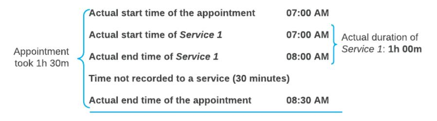

#### *Figure: Calculation of the actual service duration for Example 1*

#### **Example 2**

Suppose that you have attended an appointment that lasted an hour and a half, but you have spent only one hour on service delivery. Further suppose that in the system, you specify the actual duration of the service (one hour; the start and end times of the service are not entered) and the start and end times of the appointment. In this case, too, the system calculates the appointment's actual service duration as one hour (see the following illustration of this calculation).

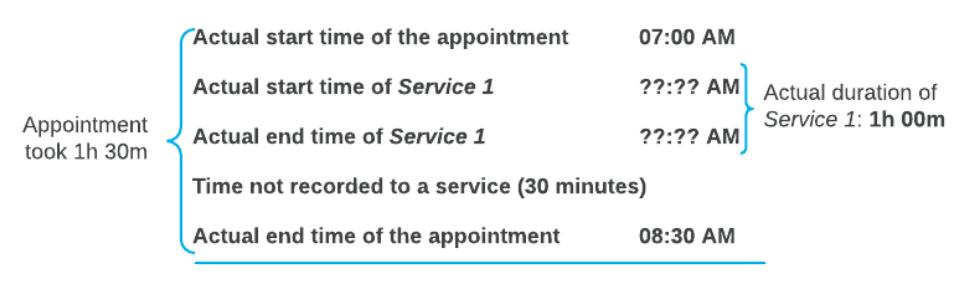

*Figure: Calculation of the actual service duration for Example 2*

#### **Example 3**

Suppose that you have attended an appointment that lasted an hour and a half. You delivered Service 1, and your colleague delivered Service 2 at the same time; each of you spent one hour on service delivery. In the system, you

specify the start and end time of each service, as well as the start and end time of the appointment. The system calculates the actual service duration of the appointment as two hours (the total of the duration of Service 1 and Service 2), even though the services were performed in the same hour (see the following illustration of this calculation).

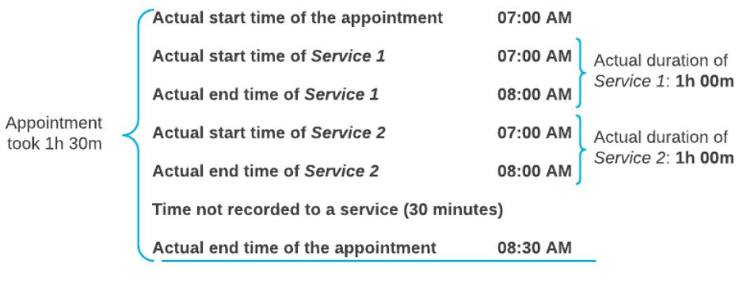

*Figure: Calculation of the actual service duration for Example 3*

#### **Recording of Staff Time for the Entire Appointment**

If a staff member is working during the entire duration of an appointment, to record the working time, you assign the staff member to the appointment but do not associate this employee with any particular service of this appointment. That is, in the row for the staff member on the**Staff** tab of the *[Appointments](https://help-2025r1.acumatica.com/Help?ScreenId=ShowWiki&pageid=ac486e9c-f5df-4829-94f0-2df8821361a0)* (FS300200) form, you leave the **Detail Ref. Nbr.** and **Inventory ID** columns empty. The system starts recording the employee's time when a staff member clicks**Start** on the form toolbar of the form, and finishes recording the time when a staff member clicks **Complete** on the form toolbar.

To record time in this way, you need to base the appointment on a service order type that is configured as follows on the **Time Behavior** tab of the *[Service](https://help-2025r1.acumatica.com/Help?ScreenId=ShowWiki&pageid=06fd8a36-dd81-4df9-b609-92c3d552c542) Order Types* (FS202300) form:

• The **Start Logging for Unassigned Staff** check box: Selected

When an appointment is started, on the **Log** tab, the system creates log lines for staff members that are assigned to the appointment but are not assigned to any service.

• The **Status toSet for In Process Items** box: *Completed*

On completion of an appointment, the *Completed* status will be assigned to each detail line.

#### **Recording of Staff Time for a Part of the Appointment**

If a staff member is working on an appointment only during a specific part of the appointment but not during the entire appointment, to correctly track the staff time, you should assign the applicable staff member to the appointment, but you should not associate the person with any service. That is, on the *[Appointments](https://help-2025r1.acumatica.com/Help?ScreenId=ShowWiki&pageid=ac486e9c-f5df-4829-94f0-2df8821361a0)* (FS300200) form, you assign the necessary staff members to the appointment by adding rows for them on the**Staff** tab, but you leave the **Detail Ref. Nbr.** and **Inventory ID** columns empty for these staff members.

Once an appointment is started, a staff member should click**Start** on the table toolbar of the**Staff** tab to start tracking the time, and then click **Complete** to finish recording the time. This will add a line on the **Log** tab.

Staff members can also manually add a line on the **Log** tab in which they enter the time when they started to work on the appointment and either the time when they ended or the actual time they worked.

As a result, on the **Log** tab of the form, either of the following sets of columns are filled in for the added line:

- The **Start Date**, **StartTime**, **End Date**, and **End Time** columns
- The **Start Date**, **StartTime**, and **Duration** columns

To record time in this way, you need to base the appointment on a service order type that has been configured so that the system does not record the appointment time automatically when an appointment is started and completed. That is, on the**Time Behavior** tab of the *[Service](https://help-2025r1.acumatica.com/Help?ScreenId=ShowWiki&pageid=06fd8a36-dd81-4df9-b609-92c3d552c542) Order Types* (FS202300) form, the following settings should be specified:

• The **Start Logging for Unassigned Staff** check box: Cleared

When an appointment is started, the system does not create log lines on the **Log** tab for staff members that are assigned to the appointment but are not assigned to any service. A log line will be added only when a staff member clicks**Start** and then **Complete** on the table toolbar of the**Staff** tab.

• The **Status toSet for In Process Items** box: *In Process*.

On completion of an appointment, the *In Process* status will remain on each detail line until you click **Complete** on the table toolbar of the **Details** tab for each line.

#### **Recording of Staff Time Spent on Services for the Appointment**

To correctly track the time that staff members have spent on performing specific services (or one service) of the appointment, you can do either of the following:

- Assign a staff member to a service on the *[Appointments](https://help-2025r1.acumatica.com/Help?ScreenId=ShowWiki&pageid=ac486e9c-f5df-4829-94f0-2df8821361a0)* (FS300200) form in either of the following ways:
  - On the **Details** tab, select the staff member in the**Staff Member ID** column of the detail line, or in the **Add Staff** dialog box, which opens when you click **Add Staff** on the table toolbar.
  - On the **Staff** tab, select the service reference number in the **Detail Ref. Nbr.** column for the staff member, or choose a service in the**Service Ref. Nbr.** box in the **Add Staff** dialog box, which opens when you click **Add Staff** on the table toolbar.

The system starts recording the time once a staff member clicks**Start** on the form toolbar of the *[Appointments](https://help-2025r1.acumatica.com/Help?ScreenId=ShowWiki&pageid=ac486e9c-f5df-4829-94f0-2df8821361a0)* form, and finishes recording the time when a staff member clicks **Complete** on the form toolbar of the *[Appointments](https://help-2025r1.acumatica.com/Help?ScreenId=ShowWiki&pageid=ac486e9c-f5df-4829-94f0-2df8821361a0)* form.

To record time in this way, you need to base the appointment on a service order type configured as follows on the **Time Behavior** tab of the *[Service](https://help-2025r1.acumatica.com/Help?ScreenId=ShowWiki&pageid=06fd8a36-dd81-4df9-b609-92c3d552c542) Order Types* (FS202300) form:

• The **Start Logging forServices and Assigned Staff (if Any)** check box: Selected

When an appointment is started, the system starts the included services and creates log lines for the services and any assigned staff members on the **Log** tab.

• The **Status toSet for In Process Items** box: *Completed*

On completion of an appointment, the *Completed* status will be assigned to each detail line.

• Associate the staff member with the services they perform, and track the service's time. That is, on the **Details** tab on the *[Appointments](https://help-2025r1.acumatica.com/Help?ScreenId=ShowWiki&pageid=ac486e9c-f5df-4829-94f0-2df8821361a0)* form, you assign the needed staff member to the service by specifying the staff member in the**Staff Member ID** column. In this case, once the appointment is started, a staff member selects a line with their staff member ID on the**Staff** tab, and clicks**Start** on the table toolbar to start tracking the time, and then clicks **Complete** to finish recording the time.

To record time in this way, you need to base the appointment on a service order type that has been configured as follows on the**Time Behavior** tab of the *[Service](https://help-2025r1.acumatica.com/Help?ScreenId=ShowWiki&pageid=06fd8a36-dd81-4df9-b609-92c3d552c542) Order Types* form:

• The **Start Logging forServices and Assigned Staff (if Any)** check box: Cleared

When an appointment is started, the system does not start the included services. The system will create log lines for the services and for any assigned staff members only when a staff member clicks**Start** and then **Complete** on the table toolbar of the**Staff** tab.

• The **Status toSet to In Process Items** box: *In Process*

On completion of an appointment, the *In Process* status will remain on each detail line until you click **Complete** on the table toolbar of the **Details** tab for each line.

• Add a staff member to an appointment but do not assign a staff member to any appointment's service during the creation of an appointment. In that case, on the *[Appointments](https://help-2025r1.acumatica.com/Help?ScreenId=ShowWiki&pageid=ac486e9c-f5df-4829-94f0-2df8821361a0)* form, once an appointment is started, on the **Details** tab, you should select a service line, click**Start** on the table toolbar to start tracking the time, select a staff member in the**Staff Member** box of the **Perform Action** dialog box, click **OK** at

the bottom of the dialog box. Then, on the table toolbar, click **Complete** to finish recording the time. You can also add a line on the **Log** tab manually by adding a staff member in the**Staff Member** column, and selecting a service in the **Detail Ref. Nbr.** column.

To record time in this way, you need to base the appointment on a service order type that has been configured so that the system does not start recording the staff time automatically. That is, on the**Time Behavior** tab of the *[Service](https://help-2025r1.acumatica.com/Help?ScreenId=ShowWiki&pageid=06fd8a36-dd81-4df9-b609-92c3d552c542) Order Types* form, the settings are the following:

#### • The **Start Logging forServices and Assigned Staff (if Any)** check box: Cleared

When an appointment is started, the system does not start the included services. Log lines for the services and assigned staff members are created only when you click**Start**, specify a staff member, and then click **Complete** on the table toolbar of the **Details** tab.

• The **Start Logging for Unassigned Staff** check box: Cleared

When an appointment is started, the system will not create log lines on the **Log** tab for staff members assigned to the appointment but not assigned to any service.

• The **Status toSet to In Process Items**: *In Process*

On completion of an appointment, the *In Process* status will remain on each detail line until you click **Complete** on the table toolbar of the **Details** tab for each line.

## **Staff Time in Appointments: To Record Staff Time Spent in an Appointment**

The following activity will walk you through the process of recording in Acumatica ERP the time that a staff member spends at an appointment. That is, you will learn about how to record time if the staff member works during the whole appointment.

This activity is based on the *U100* dataset. If you are using another dataset, or if any system settings have been changed in *U100*, these changes can affect the workflow of the activity and the results of the processing. To avoid any issues, restore the *U100* dataset to its initial state.

#### **Story**

Suppose that the management of the SweetLife Service and Equipment Sales Center has decided to track the time activities of its employees. Further suppose that for the GoodFood One Restaurant customer, staff members of the SweetLife Service and Equipment Sales Center attend regular appointments to deliver training services. Only one staff member attends each appointment, and this staff member works during the whole appointment. Thus, the time activity should be created for the whole duration of the appointment.

Acting as a staff member (Chase Frank), you will start and complete an appointment, and then review the time activity that has been created for the appointment.

#### **Configuration Overview**

In the *U100* dataset, the following tasks have been performed to support this activity:

- The minimum system configuration, which is described in *[Company with Branches that Do Not Require](https://help-2025r1.acumatica.com/Help?ScreenId=ShowWiki&pageid=a718a27b-3683-4d86-a26e-4b8fb7981f1c) [Balancing: General Information](https://help-2025r1.acumatica.com/Help?ScreenId=ShowWiki&pageid=a718a27b-3683-4d86-a26e-4b8fb7981f1c)*, has been performed.
- The *SWEETLIFE* company has been created on the *[Companies](https://help-2025r1.acumatica.com/Help?ScreenId=ShowWiki&pageid=fedad435-8496-4397-b8a3-50a473629f76)* (CS101500) form. This company has multiple branches created on the *[Branches](https://help-2025r1.acumatica.com/Help?ScreenId=ShowWiki&pageid=b97ab72d-4ab4-4f02-b69c-f7f61b316ced)* (CS102000) form, including *SWEETEQUIP (Service and Equipment Sales Center)*.
- On the *[Service Management Preferences](https://help-2025r1.acumatica.com/Help?ScreenId=ShowWiki&pageid=1c1b94d7-ac39-4f84-a966-588290b5ba80)* (FS100100) form, the minimum settings have been specified, including specifying the numbering sequences and work calendar, for the service management functionality to be used.

- On the *[Enable/Disable Features](https://help-2025r1.acumatica.com/Help?ScreenId=ShowWiki&pageid=c1555e43-1bc5-4f6f-ba9d-b323f94d8a6b)* (CS100000) form, the *Time Management* feature, which provides the ability to track employees' time activities in the system, has been enabled.
- On the *[Employees](https://help-2025r1.acumatica.com/Help?ScreenId=ShowWiki&pageid=dae5144b-49b3-43a4-bce0-93f31b3f2321)* (EP203000) form, *EP00000042 (Chase Frank)* has been defined. On the **General** tab (**EmployeeSettings** section), the**Staff Member in Service Management** check box has been selected, so you can assign this employee to perform services.
- On the *[Users](https://help-2025r1.acumatica.com/Help?ScreenId=ShowWiki&pageid=834cc181-97fa-4db4-a7e0-3eaba142c166)* (SM201010) form, the *frank* user account has been created, and the *EP00000042 (Chase Frank)* employee has been associated with the user account. That is, the employee name has been specified in the **Linked Entity** box.
- On the *[User Profile](https://help-2025r1.acumatica.com/Help?ScreenId=ShowWiki&pageid=8430c8b2-a79c-4f7b-9768-b0b7fad23a59)* (SM203010) form, for the *frank* user, the *WEST BRIGHTON* branch location has been specified as the default branch location.
- On the *[Service Management Preferences](https://help-2025r1.acumatica.com/Help?ScreenId=ShowWiki&pageid=1c1b94d7-ac39-4f84-a966-588290b5ba80)* (FS100100) form, the basic service management functionality has been configured, including specification of the numbering sequences and the work calendar. Also, on the **General** tab (**GeneralSettings** section), the **EnableTime & Expenses Integration** check box has been selected.
- On the *[Service](https://help-2025r1.acumatica.com/Help?ScreenId=ShowWiki&pageid=06fd8a36-dd81-4df9-b609-92c3d552c542) Order Types* (FS202300) form, the *DEV* service order type has been defined as follows:
  - On the **General** tab (**Integrating with Time & Expenses** section), the following settings have been specified:
    - **Automatically CreateTime Activities from Appointments**: Selected
    - **Default EarningType**: *RG*
  - On the **Time Behavior** tab, the following settings have been specified:
    - **SetStartTime in Appointment:** Selected
    - **Start Logging for Unassigned Staff:** Selected
    - **Set End Time in Appointment:** Selected
    - **Status toSet for In Process Items**: *Completed*
- On the *[Appointments](https://help-2025r1.acumatica.com/Help?ScreenId=ShowWiki&pageid=ac486e9c-f5df-4829-94f0-2df8821361a0)* (FS300200) form, the *000043-1* appointment has been created.

#### **Process Overview**

To enter the staff time of an appointment, on the *[Appointments](https://help-2025r1.acumatica.com/Help?ScreenId=ShowWiki&pageid=ac486e9c-f5df-4829-94f0-2df8821361a0)* (FS300200) form, you will start and complete an appointment that was created based on a service order type designed to create time activities. Then you will review the time activity created in the system on the *[Employee](https://help-2025r1.acumatica.com/Help?ScreenId=ShowWiki&pageid=c17a7186-e898-4e5e-b565-27730950ca51) Time Activities* (EP307000) form for the staff member assigned to this appointment.

#### **System Preparation**

Before you begin performing the steps of this activity, do the following:

- 1. Launch the Acumatica ERP website, and sign in to a company with the *U100* dataset preloaded; you should sign in as staff member Chase Frank by using the *frank* username and the *123* password.
- 2. In the company to which you are signed in, enable the *Service Management* feature on the *[Enable/Disable](https://help-2025r1.acumatica.com/Help?ScreenId=ShowWiki&pageid=c1555e43-1bc5-4f6f-ba9d-b323f94d8a6b) [Features](https://help-2025r1.acumatica.com/Help?ScreenId=ShowWiki&pageid=c1555e43-1bc5-4f6f-ba9d-b323f94d8a6b)* (CS100000) form.
- 3. In the info area, in the upper-right corner of the top pane of the Acumatica ERP screen, make sure that the business date in your system is set to *1/29/2025*. If a different date is displayed, click the Business Date menu button, and select *1/29/2025* on the calendar. For simplicity, in this activity, you will create and process all documents in the system on this business date.

#### **Step 1: Attending an Appointment**

To attend an appointment and process it through completion (while acting as Chase Frank), do the following:

1. On the *[Appointments](https://help-2025r1.acumatica.com/Help?ScreenId=ShowWiki&pageid=ac486e9c-f5df-4829-94f0-2df8821361a0)* (FS300200) form, open the *000043-1* appointment, which has the *DEV* service order type.

This service order type has been designed for recording staff time spent on an appointment. See the Configuration Overview section for details on its key settings.

2. On the form toolbar, click**Start**.

Now wait at least one minute (because the business time is recorded when at least one minute has passed aer the start of the appointment).

- 3. On the form toolbar, click **Complete**.
- 4. Review the **Log** tab, and notice that the system has automatically inserted one log line.

#### **Step 2: Reviewing the Time Activity**

To review the time activity that has been created for the appointment, do the following:

- 1. Open the *[Employee](https://help-2025r1.acumatica.com/Help?ScreenId=ShowWiki&pageid=c17a7186-e898-4e5e-b565-27730950ca51) Time Activities* (EP307000) form.
- 2. Ensure that the following settings are specified in the Selection area:
  - **Employee**: *EP00000042 - Chase Frank* (Since you are signed in as this user, the system automatically inserts the corresponding employee ID.)
  - **From Week**: *2025-05 (01/26 02/01)*
  - **Until Week**: *2025-05 (01/26 02/01)*
- 3. In the table, review the time activity record for the *000043-1* appointment (Item 1 in the following screenshot).

The **Time** (Item 2) in this row is the same as the **ActualStartTime** of the appointment on the *[Appointments](https://help-2025r1.acumatica.com/Help?ScreenId=ShowWiki&pageid=ac486e9c-f5df-4829-94f0-2df8821361a0)* (FS300200) form, and the**Time Spent** (Item 3) in this row is the difference between the appointment's **ActualStartTime** and **Actual End Time**.

4. Verify that the**Service** column is empty (Item 4), meaning that this time activity is not associated with any particular service of the appointment.

|                                                                                                  | TOOLS - <b>Employee Time Activities</b> |                                                        |                                                    |         |           |                               |              |           |                  |                   |              |             |                |              |               |                  |             |               |                                                |               |          |                  |              |
|--------------------------------------------------------------------------------------------------|--------------------------------------------|--------------------------------------------------------|----------------------------------------------------|---------|-----------|-------------------------------|--------------|-----------|------------------|-------------------|--------------|-------------|----------------|--------------|---------------|------------------|-------------|---------------|------------------------------------------------|---------------|----------|------------------|--------------|
|                                                                                                  | $\Box$ $\Omega$                            |                                                        |                                                    |         |           |                               |              |           |                  |                   |              |             |                |              |               |                  |             |               |                                                |               |          |                  |              |
| EP00000042 - Chase Frank 0 !!!!!!!!!!!!!!!!!!!!!!!!!!!!!!!!!!!!!!!! · Employee: Project |                                            |                                                        |                                                    |         |           |                               |              |           | <b>REGULAR.</b>  |                   |              | OVERTIME.   |                | <b>TOTAL</b> |               |                  |             |               |                                                |               |          |                  | $\sim$       |
| From Week: 2025-05 (01/26 - 02/01) Project Task: $\circ$                                |                                            |                                                        |                                                    |         |           |                               | Time S 00:05 |           |                  | 00.00             |              | 00:05       |                |              |               |                  |             |               |                                                |               |          |                  |              |
|                                                                                                  | <b>Until Week:</b>                         |                                                        | 2025-05 (01/26 - 02/01)                            | $\circ$ |           | <b>M</b> Include All Rejected |              |           | Bilable: 00.00   |                   |              | 00.00       |                | 00:00        |               |                  |             |               |                                                |               |          |                  |              |
| $0 +$                                                                                            |                                            |                                                        | $\times$ VIEW $\leftarrow$ $\overline{\mathbf{x}}$ |         |           |                               |              |           |                  |                   |              |             |                |              |               |                  |             |               | $\Lambda$                                      |               |          |                  |              |
| <b>BD</b> Hold Status                                                                            |                                            |                                                        | Date                                               | Time:   | Workgroup | *Earning Type                 | Task         | * Project | Project Task     | Certified Job. | Cost Code | Union Local | Labor Item     | WCC Code     | shift Code | Appointment Nbr. | Customer ID | Log Ref. Nbr. | Service                                        | Time Spare | Billable | Billable Time | *Description |
|                                                                                                  | $>$ n = $-$                                | 1/29/2025 Completed 1:18 PM RG $\mathbf x$ |                                                    |         |           | $\Box$                        |              |           | <b>CONSULTSR</b> |                   |              | 000043-1    | COFFEESHOP 001 |              |               | 00:05            | $\Box$      | 02:00         | Training on juicer usage (at customer's place) |               |          |                  |              |
|                                                                                                  |                                            |                                                        |                                                    |         |           |                               |              |           |                  |                   |              |             |                |              |               |                  |             |               |                                                |               |          |                  |              |
|                                                                                                  |                                            |                                                        |                                                    |         |           |                               |              |           |                  |                   |              |             |                |              |               |                  |             |               |                                                |               |          |                  |              |

*Figure: The time activity of Chase Frank*

### **Staff Time in Appointments: To Record Staff Time Spent on a Particular Service**

The following activity will walk you through the process of recording in Acumatica ERP the time that a staff member spends providing a particular service. That is, you will learn how to record time if the staff member works on a particular service but not during the whole appointment.

This activity is based on the *U100* dataset. If you are using another dataset, or if any system settings have been changed in *U100*, these changes can affect the workflow of the activity and the results of the processing. To avoid any issues, restore the *U100* dataset to its initial state.

#### **Story**

Suppose that the management of the SweetLife Service and Equipment Sales Center has decided to track the time activities of its employees based on service duration. Each staff member must keep accurate records on what service has been performed and enter the actual start and end times of the provided services in appointments.

Acting as staff member Edward Smith, you will record the start and completion times of the service assigned to you and the service assigned to Chase Frank. You will then review the time activities that have been created for the appointment.

### **Configuration Overview**

In the *U100* dataset, the following tasks have been performed to support this activity:

- The minimum system configuration, which is described in *[Company with Branches that Do Not Require](https://help-2025r1.acumatica.com/Help?ScreenId=ShowWiki&pageid=a718a27b-3683-4d86-a26e-4b8fb7981f1c) [Balancing: General Information](https://help-2025r1.acumatica.com/Help?ScreenId=ShowWiki&pageid=a718a27b-3683-4d86-a26e-4b8fb7981f1c)*, has been performed.
- The *SWEETLIFE* company has been created on the *[Companies](https://help-2025r1.acumatica.com/Help?ScreenId=ShowWiki&pageid=fedad435-8496-4397-b8a3-50a473629f76)* (CS101500) form. This company has multiple branches created on the *[Branches](https://help-2025r1.acumatica.com/Help?ScreenId=ShowWiki&pageid=b97ab72d-4ab4-4f02-b69c-f7f61b316ced)* (CS102000) form, including *SWEETEQUIP (Service and Equipment Sales Center)*.
- On the *[Service Management Preferences](https://help-2025r1.acumatica.com/Help?ScreenId=ShowWiki&pageid=1c1b94d7-ac39-4f84-a966-588290b5ba80)* (FS100100) form, the minimum settings have been specified, including specifying the numbering sequences and work calendar, for the service management functionality to be used.
- On the *[Employees](https://help-2025r1.acumatica.com/Help?ScreenId=ShowWiki&pageid=dae5144b-49b3-43a4-bce0-93f31b3f2321)* (EP203000) form, for the *EP00000042 (Chase Frank)* and *EP00000043 (Edward Smith)* employees, the**Staff Member in Service Management** check box has been selected for both employees (on the **General** tab in the **EmployeeSettings** section), so you can assign them to perform services.
- On the *[Users](https://help-2025r1.acumatica.com/Help?ScreenId=ShowWiki&pageid=834cc181-97fa-4db4-a7e0-3eaba142c166)* (SM201010) form, the *frank* and *smith* user accounts have been defined in the system, and the *EP00000042 (Chase Frank)* and *EP00000043 (Edward Smith)* employees, respectively, have been associated with the user accounts defined for these employees in the system. That is, the employee name has been specified in the **Linked Entity** box.
- On the *[Enable/Disable Features](https://help-2025r1.acumatica.com/Help?ScreenId=ShowWiki&pageid=c1555e43-1bc5-4f6f-ba9d-b323f94d8a6b)* (CS100000) form, the *Time Management* feature, which provides the ability to track employees' time activities in the system, has been enabled.
- On the *[Service Management Preferences](https://help-2025r1.acumatica.com/Help?ScreenId=ShowWiki&pageid=1c1b94d7-ac39-4f84-a966-588290b5ba80)* (FS100100) form, the basic service management functionality has been configured, including specification of the numbering sequences and the work calendar. Also, the **EnableTime & Expenses Integration** check box has been selected on the **General** tab (**GeneralSettings** section).
- On the *[Service](https://help-2025r1.acumatica.com/Help?ScreenId=ShowWiki&pageid=06fd8a36-dd81-4df9-b609-92c3d552c542) Order Types* (FS202300) form, the *MRO* service order type has been defined.
  - On the **General** tab (**Integrating with Time & Expenses** section), the following settings have been specified:
    - **RequireTime Approval to Close/Bill Appointments**: Cleared
    - **Automatically CreateTime Activities from Appointments**: Selected
    - **Default EarningType**: *RG*
  - On the **Time Behavior** tab, the**SetStartTime in Appointment** check box has been selected
- On the *[Appointments](https://help-2025r1.acumatica.com/Help?ScreenId=ShowWiki&pageid=ac486e9c-f5df-4829-94f0-2df8821361a0)* (FS300200) form, the *000039-1* appointment has been created.

#### **Process Overview**

On the *[Appointments](https://help-2025r1.acumatica.com/Help?ScreenId=ShowWiki&pageid=ac486e9c-f5df-4829-94f0-2df8821361a0)* (FS300200) form, you will enter the start and end times spent on the installation and training services of an existing appointment; you will then complete it. Then on the *[Employee](https://help-2025r1.acumatica.com/Help?ScreenId=ShowWiki&pageid=c17a7186-e898-4e5e-b565-27730950ca51) Time Activities* (EP307000) form, you will review the time activities created for staff members for the services that were provided.

#### **System Preparation**

Before you begin performing the steps of this activity, do the following:

- 1. Launch the Acumatica ERP website, and sign in to a company with the *U100* dataset preloaded; you should sign in as staff member Edward Smith by using the *smith* username and the *123* password.
- 2. In the company to which you are signed in, ensure that the *Service Management* feature has been enabled on the *[Enable/Disable Features](https://help-2025r1.acumatica.com/Help?ScreenId=ShowWiki&pageid=c1555e43-1bc5-4f6f-ba9d-b323f94d8a6b)* (CS100000) form.
- 3. In the info area, in the upper-right corner of the top pane of the Acumatica ERP screen, make sure that the business date in your system is set to *1/30/2025*. If a different date is displayed, click the Business Date menu button and select *1/30/2025* on the calendar. For simplicity, in this activity, you will create and process all documents in the system on this business date.

#### **Step 1: Recording Staff Time Spent on Services**

Acting as Edward Smith, you will record the time that you and Chase Frank spend on the services of an existing appointment. To record this staff time, do the following:

- 1. On the *[Appointments](https://help-2025r1.acumatica.com/Help?ScreenId=ShowWiki&pageid=ac486e9c-f5df-4829-94f0-2df8821361a0)* (FS300200) form, open the *000039-1* appointment, which has the *MRO* service order type.
- 2. On the form toolbar, click**Start**.
- 3. On the **Staff** tab, do the following:
  - a. Click the line with the *INSTALL* service. Notice that *EP00000043 (Edward Smith)* is specified in the **Staff Member** column.
  - b. On the table toolbar, click**Start**.
  - c. In the **Perform Action** dialog box, which has opened, specify *2:00 PM* in the second **Date** box.
  - d. In the table, verify that the check box is selected in the line with the *INSTALL* service.
  - e. Click **OK** at the bottom of the dialog box, which closes it.
- 4. On the **Log** tab, ensure that the *001* log line with the *INSTALL* service has been added. Check the start time of the service. Notice that the status of the service (in the **Log LineStatus** column) is *In Process*.
- 5. On the **Staff** tab, do the following:
  - a. Again click the line with *INSTALL* service.
  - b. On the table toolbar, click **Complete**.
  - c. In the **Perform Action** dialog box, specify *3:00 PM* in the second **Date** box.
  - d. Click **OK** at the bottom of the dialog box.
- 6. On the **Log** tab, ensure that in the *001* log line with the *0002 INSTALL* service, the status of the service (in the **Log LineStatus** column) has changed to *Completed*.
- 7. On the **Staff** tab, begin recording the staff time spent on the training service as follows:
  - a. Click the line with the *TRAINING* service. Notice that *EP00000042 (Chase Frank)* specified in the **Staff Member** column.
  - b. On the table toolbar, click**Start**.
  - c. In the **Perform Action** dialog box, which has opened, specify *3:00 PM* in the second **Date** box.
  - d. In the table, verify that the check box is selected in the line with the *TRAINING* service.
  - e. Click **OK** to close the dialog box.

- 8. On the **Log** tab, ensure that the *002* log line with the *TRAINING* service has been created. Notice that the status of the service is *In Process*.
- 9. On the **Staff** tab, do the following:
  - a. Again click the line with *TRAINING* service.
  - b. On the table toolbar, click **Complete**.
  - c. In the **Perform Action** dialog box, specify *4:00 PM* in the second **Date** box.
  - d. Click **OK** to close the dialog box.
- 10.On the **Log** tab, ensure that the *002* log line with the *TRAINING* service has been updated. Check the end time of the service. Notice that the status of the service is *Completed*. (See the screenshot at the end of this step.)
- 11.On the **Settings** tab, specify the following settings:
  - **ActualStart Date** (second box): *2:00 PM*
  - **Actual End Date** (second box): *4:00 PM*
  - **Finished**: Selected
- 12.On the form toolbar, click**Save**.
- 13.On the form toolbar, click **Complete**.

The following screenshot shows the staff time (Item 2) on the **Log** tab (Item 1).

| <b>Appointments</b>     | <b>NOTES</b> MRO 000039-1 - GoodFood One Restaurant                                                |                    |                                     |                  |                     |                                    |                                                   |                         |                         |           |          |          |                              |               |              |                  | <b>ACTIVITIES</b> | <b>FILES</b> | TOOLS -               |          |              |
|-------------------------|-------------------------------------------------------------------------------------------------------|--------------------|-------------------------------------|------------------|---------------------|------------------------------------|---------------------------------------------------|-------------------------|-------------------------|-----------|----------|----------|------------------------------|---------------|--------------|------------------|-------------------|--------------|-----------------------|----------|--------------|
|                         | 6 3 3 0 + 3 0 × K < > > x close QUICK PROCESS DEPART                                               |                    |                                     |                  |                     |                                    |                                                   |                         |                         |           |          |          |                              |               |              |                  |                   |              |                       |          |              |
|                         | * Service Order  MRO - Main $\beta$ / Customer:                                                       |                    | GOODFOOD - GoodFood One Restaurar / |                  | Estimated Duration: |                                    | 1h45m                                             |                         |                         |           |          |          |                              |               |              |                  |                   |              |                       |          |              |
|                         | Appointment N 000039-1  O P / Actual Duration: x Location MAIN - Primary Location 2h00m   |                    |                                     |                  |                     |                                    |                                                   |                         |                         |           |          |          |                              |               |              |                  |                   |              |                       |          |              |
| Service Order           | 150.00 00039 Branch Location: WEST BRIGHTON - Office in West Bright / Actual Billable Total: |                    |                                     |                  |                     |                                    |                                                   |                         |                         |           |          |          |                              |               |              |                  |                   |              |                       |          |              |
| Status:                 | Completed 0.00 Actual Tax Total: Project $\lambda$ X - Non-Project Code.               |                    |                                     |                  |                     |                                    |                                                   |                         |                         |           |          |          |                              |               |              |                  |                   |              |                       |          |              |
|                         | <b>Invoice Total:</b> 150.00 . Scheduled Sta 1/30/2025 (1)                                      |                    |                                     |                  |                     |                                    |                                                   |                         |                         |           |          |          |                              |               |              |                  |                   |              |                       |          |              |
|                         | Waiting for Purchased Items * Actual Start D   1/30/2025   11                                      |                    |                                     |                  |                     |                                    |                                                   |                         |                         |           |          |          |                              |               |              |                  |                   |              |                       |          |              |
| <b>Description:</b>     | Installation + training                                                                               |                    |                                     |                  |                     |                                    |                                                   |                         |                         |           |          |          |                              |               |              |                  |                   |              |                       |          |              |
|                         |                                                                                                       |                    |                                     |                  |                     |                                    |                                                   |                         |                         |           |          |          |                              |               |              |                  |                   |              |                       |          |              |
| <b>SETTINGS</b>         | STAFF <b>DETAILS</b> <b>TAXES</b>                                                               | RESOURCE EQUIPMENT | LOG                                 | <b>FINANCIAL</b> |                     | PROFITABILITY <b>ATTRIBUTES</b> | <b>PREPAYMENTS</b> <b>TOTALS</b>               | BILLING DOCUMENTS OTHER |                         |           |          |          |                              |               |              |                  |                   |              |                       |          |              |
| $0 +$                   | $X$ $H$ $\overline{X}$ $L$                                                                            |                    |                                     |                  |                     |                                    |                                                   |                         |                         |           |          |          |                              |               |              |                  |                   |              | All Records           |          | $\mathbf{v}$ |
| BOD Log Ref. Nbr. | Staff Member                                                                                          | Workgroup          | Log Line Status                     | Trayed           | Detail Ref. Nbr. | Inventory ID                       | Description                                       | * Start Date            | 1 Start Time | End Date  | End Time | Duration | Add to Actual Duration | Track Time | Earning Type | Labor Item ID    | Project Task   | Cost Code | Time Card Ref. Nbc | Approved |              |
| $0 - 0.01$              | EP00000043 - Edward Smith                                                                             |                    | Completed                           | $\Box$           | 0002                | <b>INSTALL</b>                     | Installation of equipment at the customers' place | 1/30/2026               | 2:00 PM                 | 1/30/2025 | 3.00 PM  | 1h00m    | 図                            | Ø.            | <b>RG</b>    | <b>CONSULTSR</b> |                   |              |                       |          | $\Box$       |
| $> 0$ D 002             | EP00000042 - Chase Frank                                                                              |                    | Completed                           | $\Box$           | 0001                | <b>TRAINING</b>                    | Training on juicer usage (at customer's place)    | 1/30/2025               | 3:00 PM                 | 1/30/2025 | 4.00 PM  | 1h00m    | $\blacksquare$               | 図             | <b>RG</b>    | <b>CONSULTSR</b> |                   |              |                       |          | $\Box$       |
|                         |                                                                                                       |                    |                                     |                  |                     |                                    |                                                   |                         |                         |           |          |          |                              |               |              |                  |                   |              |                       |          |              |
|                         |                                                                                                       |                    |                                     |                  |                     |                                    |                                                   |                         |                         |           |          |          |                              |               |              |                  |                   |              |                       |          |              |

*Figure: Staff time spent on services*

#### **Step 2: Reviewing the Employee Time Activities Form**

To review the staff members' time, do the following:

- 1. Open the *[Employee](https://help-2025r1.acumatica.com/Help?ScreenId=ShowWiki&pageid=c17a7186-e898-4e5e-b565-27730950ca51) Time Activities* (EP307000) form.
- 2. In the **Employee** box of the Summary area, ensure that *EP00000043 (Edward Smith)* is specified—the staff member who has performed the installation service. (Because you are signed in as this user, the system automatically inserts the corresponding employee ID.)
- 3. In the **From Week** and **Until Week** boxes, make sure that *2025-05 (01/26 02/01)* is specified. This is the week that includes the date of the appointment: 1/30/2025.

In the table, you can view the row representing the time activity related to the installation service performed in the appointment. In the**Time** column (Item 1), you can view the start time of the appointment; in the **Time Spent** column (Item 2), you can view the duration of the service provided. That is, for the *INSTALL* service, one hour was spent, starting at 2:00 PM.

|                 | <b>Employee Time Activities</b> |                           |                                                                                                                                                   |                                             |               |                               |               |                  |                |                                          |       |                |           |                    |                                            | TOOLS *                                     |  |  |  |  |  |  |  |  |
|-----------------|---------------------------------|---------------------------|---------------------------------------------------------------------------------------------------------------------------------------------------|---------------------------------------------|---------------|-------------------------------|---------------|------------------|----------------|------------------------------------------|-------|----------------|-----------|--------------------|--------------------------------------------|---------------------------------------------|--|--|--|--|--|--|--|--|
| $\Box$ $\Omega$ |                                 |                           |                                                                                                                                                   |                                             |               |                               |               |                  |                |                                          |       |                |           |                    |                                            |                                             |  |  |  |  |  |  |  |  |
| x Employee:     |                                 |                           |                                                                                                                                                   | EP00000043 - Edward Smith P                 |               | Project:                      |               |                  | $\sim$         | <b>REGULAR</b>                           |       |                | OVERTIME. |                    | TOTAL ____________________________________ |                                             |  |  |  |  |  |  |  |  |
|                 | From Week:                      |                           | 2025-05 (01/26 - 02/01) $\qquad \qquad \Box$                                                                                                      |                                             | Project Task: |                               |               |                  | Time S 01.00   |                                          |       | 00:00          |           | 01:00              |                                            |                                             |  |  |  |  |  |  |  |  |
|                 | Until Week:                     | 2025-05 (01/26 - 02/01) 2 |                                                                                                                                                   |                                             |               | <b>Z</b> Include All Rejected |               |                  | Bilable: 00.00 |                                          | 00:00 |                | 00:00     |                    |                                            |                                             |  |  |  |  |  |  |  |  |
| $\circ$ +       |                                 | $\mathbf{x}$              |                                                                                                                                                   | VIEW H X                                    |               |                               |               |                  |                |                                          |       |                |           |                    |                                            |                                             |  |  |  |  |  |  |  |  |
| E D Hold        |                                 | Status                    | Date Time *Earning Project Project Task Certified Cost Union Local Workgroup Task Code <b>Job</b> <b>Type</b> |                                             | Labor Item    | WCC Code                      | Shift Code | Appointment Nbr. | Customer ID    | Log Ref. Nbr. Service                    |       | Time Spent  | Billable  | Billable Tirrie | *Description                               |                                             |  |  |  |  |  |  |  |  |
| $>0$ 0          |                                 | Completed                 |                                                                                                                                                   | 1/30/2025 <b>RG</b> $\Box$ 2.00 PM |               | <b>CONSULTSR</b>              |               |                  | 010039-1       | !!!!!!!!!!!!!!!!!!!!!!!!!!!!!!!!!!!!!!!! | 001   | <b>INSTALL</b> | 01:00     | - n                | 00:00                                      | Installation of equipment at the customers' |  |  |  |  |  |  |  |  |
|                 |                                 |                           |                                                                                                                                                   |                                             |               |                               |               |                  |                |                                          |       |                |           |                    |                                            |                                             |  |  |  |  |  |  |  |  |

#### *Figure: Employee time activity*

- 4. In the **Employee** box of the Summary area, select *EP00000042 (Chase Frank)*.
- 5. In the table, make sure a time activity is listed for the *TRAINING* service: one hour spent starting at 3:00 PM for the *GOODFOOD* customer.

## **Managing Costs and Inventory in Appointments**

This chapter explores key processes, including optimizing appointment scheduling, tracking item and labor costs, and managing inventory through lot and serial number assignments.

### **Tracking the Costs of Items**

In Acumatica ERP, if you sell stock and non-stock items during appointments, you can track the item costs and profitability. You can use this information for future planning, budgeting, forecasting, and performance reporting.

In this topic, you will read about how you can track the costs of the items involved in appointments and how to view the total cost and profitability of a particular appointment.

#### **Tracking Stock Item Costs and Profitability**

You can view the cost and profitability of a particular stock item that is sold during an appointment on the **Profitability** tab of the *[Appointments](https://help-2025r1.acumatica.com/Help?ScreenId=ShowWiki&pageid=ac486e9c-f5df-4829-94f0-2df8821361a0)* (FS300200) form. When you add a line item of the *Inventory Item* type to the **Details** tab of the form, on the **Profitability** tab, the line item is also added with the average cost—that is, the cost specified in the **Average Cost** box of the *[Stock Items](https://help-2025r1.acumatica.com/Help?ScreenId=ShowWiki&pageid=77786a70-1f1e-4d63-ad98-96f98e4fcb0e)* (IN202500) form for the item—inserted into the **Unit Cost** column.

If the stock item was part of a purchase order, and the unit cost was overwritten in the **Unit Cost** column on the *[Service Orders](https://help-2025r1.acumatica.com/Help?ScreenId=ShowWiki&pageid=6e5277d3-274e-45f5-b77d-4410ed736d21)* (FS300100) form in the related service order, this cost is inserted into the **Unit Cost** column on the **Profitability** tab.

When this stock item is removed from inventory (that is, when the related issue is released), the system updates this column with the cost specified in the **Unit Cost** column on the **Details** tab of the *[Issues](https://help-2025r1.acumatica.com/Help?ScreenId=ShowWiki&pageid=17b051f6-027d-4459-b542-65c1c1f9d0ea)* (IN302000) form in the related issue.

#### **Tracking Service and Non-Stock Item Costs and Profitability**

You can view the cost and profitability of a particular service or non-stock item that is sold during the appointment on the **Profitability** tab of the *[Appointments](https://help-2025r1.acumatica.com/Help?ScreenId=ShowWiki&pageid=ac486e9c-f5df-4829-94f0-2df8821361a0)* (FS300200) form. When you add a line item of the *Service* type for which the unit cost is not zero—that is, the cost specified in the **Current Cost** box of the *[Non-Stock Items](https://help-2025r1.acumatica.com/Help?ScreenId=ShowWiki&pageid=bf68dd4f-63d4-460d-8dc0-9152f2bd6bf1)* (IN202000) form for the service is nonzero—to the **Details** tab of the *[Appointments](https://help-2025r1.acumatica.com/Help?ScreenId=ShowWiki&pageid=ac486e9c-f5df-4829-94f0-2df8821361a0)* form, on the **Profitability** tab, the line item is also added with the current cost in the **Unit Cost** column.

When you add a line item of the *Non-Stock Item* type to the **Details** tab of the form, on the **Profitability** tab, the line item is also added with the current cost in the **Unit Cost** column.

If this service or non-stock item was part of a purchase order and the unit cost was overwritten in the related service order, this overwritten cost is inserted in the **Unit Cost** column on the **Profitability** tab.

#### **Tracking the Appointment's Total Cost and Profitability**

In the Summary area of the *[Appointments](https://help-2025r1.acumatica.com/Help?ScreenId=ShowWiki&pageid=ac486e9c-f5df-4829-94f0-2df8821361a0)* (FS300200) form, you can view the total cost of items included in an appointment in the **CostTotal** box. The value in this box is calculated as the sum of values in the **CostTotal** column on the **Profitability** tab.

In the Summary area, you can also view the total profitability (expressed as a percent) of the selected appointment in the **Profit (%)** box. The system calculates the value in this box by using the following formula.

((Appointment Total – Cost Total) / Cost Total) \* 100

For example, if the **AppointmentTotal** is \$2000 and the **CostTotal** is \$1500, then the total profitability of the appointment is 33.33%.

### **Tracking of Labor Costs and Billing of Labor**

In Acumatica ERP, you can track the labor costs (that is, the amounts paid to the employee for the job) for the staff members that attend appointments and bill for labor.

In this topic, you will read about how the system calculates the labor costs on the *[Appointments](https://help-2025r1.acumatica.com/Help?ScreenId=ShowWiki&pageid=ac486e9c-f5df-4829-94f0-2df8821361a0)* (FS300200) form.

#### **Calculation of Labor Costs**

When you assign a staff member to attend an appointment, the line item for the staff member is also added on the **Profitability** tab of the *[Appointments](https://help-2025r1.acumatica.com/Help?ScreenId=ShowWiki&pageid=ac486e9c-f5df-4829-94f0-2df8821361a0)* (FS300200) form with the rate specified in the **Unit Cost** column. The system copies this rate from the **Rate** column of the *[Labor Rates](https://help-2025r1.acumatica.com/Help?ScreenId=ShowWiki&pageid=3bcc9979-ef23-4331-0598-19edc8babe03)* (PM209900) form for the staff member.

The system calculates the labor cost for each staff member of an appointment with the *Employee* or *Labor Item* labor rate type and the *Hourly* type of employment assigned to the staff member on the *[Labor Rates](https://help-2025r1.acumatica.com/Help?ScreenId=ShowWiki&pageid=3bcc9979-ef23-4331-0598-19edc8babe03)* form.

When the appointment is completed, the system calculates the total cost of performing the job by each staff member (**CostTotal**) by multiplying the values in the **Actual Quantity** and **Unit Cost** columns on the **Profitability** tab. Thus, you can see how much has been paid to each staff member that attended the appointment.

#### **Labor Billing**

If the following conditions are met for the service order type of an appointment on the General tab of the *[Service](https://help-2025r1.acumatica.com/Help?ScreenId=ShowWiki&pageid=06fd8a36-dd81-4df9-b609-92c3d552c542) Order [Types](https://help-2025r1.acumatica.com/Help?ScreenId=ShowWiki&pageid=06fd8a36-dd81-4df9-b609-92c3d552c542)* (FS202300) form, the labor can be billed for the appointment:

- The *Project Transactions* option is selected in the **Generated Billing Documents** box of the **BillingSettings** section.
- The *Cost as Cost* option is selected in the **BillingType** box of the **BillingSettings** section.
- The **Automatically CreateTime Activities from Appointments** check box is selected in the **Integrating with Time & Expenses** section.

If the **TrackTime** check box is selected for a line on the **Log** tab, the **Billable** check box is selected by default, but you can clear it if necessary. If the**TrackTime** check box is cleared for a line, the **Billable** check box is cleared and read-only. You can also specify the billable time or amount for labor in the **Billable Time** and **Billable Amount** columns for the lines for which the labor is billed.

## **Assigning Lot or Serial Numbers to Stock Items in Appointments**

An appointment may include stock items. In some cases, lot or serial numbers need to be assigned to these stock items at the time they are used during the appointment, rather than when they are received in the warehouse. This is oen necessary when, for example, the specific item to be installed at the customer location is unknown beforehand, and the technician needs to enter the relevant number during installation.

In Acumatica ERP, a lot or serial number can be assigned to any stock item during an appointment on the *[Appointments](https://help-2025r1.acumatica.com/Help?ScreenId=ShowWiki&pageid=ac486e9c-f5df-4829-94f0-2df8821361a0)* (FS300200) form. For these numbers to be generated, the following settings must be specified in the stock item's lot or serial class on the *[Lot/Serial Classes](https://help-2025r1.acumatica.com/Help?ScreenId=ShowWiki&pageid=9806d94b-097e-4082-9f01-9ca66d031ab7)* (IN207000) form:

- The *Track Serial Numbers* or *Track Lot Numbers* tracking method is selected.
- The *When Used* assignment method is selected.

The functionality is available only if the *Lot and Serial Tracking* feature is enabled on the *[Enable/](https://training.acumatica.com/2025R1/(W(2))/Wiki/ShowWiki.aspx?wikiname=HelpRoot_FormReference&PageID=c1555e43-1bc5-4f6f-ba9d-b323f94d8a6b) [Disable Features](https://training.acumatica.com/2025R1/(W(2))/Wiki/ShowWiki.aspx?wikiname=HelpRoot_FormReference&PageID=c1555e43-1bc5-4f6f-ba9d-b323f94d8a6b)* (CS100000) form.

This functionality applies only to customers with a billing cycle set up to process billing for appointments.

#### **Methods for Generating Lot or Serial Numbers on the Appointments Form**

On the *[Appointments](https://help-2025r1.acumatica.com/Help?ScreenId=ShowWiki&pageid=ac486e9c-f5df-4829-94f0-2df8821361a0)* (FS300200) form, you can view or generate lot or serial numbers for a stock item by clicking the item on the **Details** tab and then clicking **Lot/Serial Nbrs** on the table toolbar. Lot or serial numbers for stock items can be generated either manually or automatically, depending on the state of the **Auto-Generate Next Number** check box in the stock item's lot or serial class on the *[Lot/Serial Classes](https://help-2025r1.acumatica.com/Help?ScreenId=ShowWiki&pageid=9806d94b-097e-4082-9f01-9ca66d031ab7)* (IN207000) form:

• If the check box is selected, the system automatically generates lot or serial numbers for each unit of the selected stock item on the **Details** tab of the *[Appointments](https://help-2025r1.acumatica.com/Help?ScreenId=ShowWiki&pageid=ac486e9c-f5df-4829-94f0-2df8821361a0)* form. The lot or serial number or numbers are displayed in the **Lot/Serial Nbr.** column in the **Line Details** dialog box.

If the lot or serial class settings of the selected stock item require auto-generation of the lot or serial number, the **Unassigned Qty.** and **Quantity to Generate** boxes in the dialog box contain *0* by default. This is because the lot or serial numbers are automatically generated by the system when the appointment is saved.

• If the check box is cleared, you must manually generate lot or serial numbers by clicking the **Generate** button in the **Line Details** dialog box.

When you click **Generate**, the system generates lot or serial numbers for the specified quantity of the stock item and displays the numbers in the **Lot/Serial Nbr.** column. In the following screenshot, serial numbers have been generated. (Note that the system generates a single lot number for all units of the selected item and lists it in the only row.)

| <b>Appointments</b>     | MRO 000055-1 - HM's Bakery & Cafe |                                                                                  |                                 |        |              |            |                     |             |              | NOTES ACTIVITIES        | <b>FILES</b>                                                                                      | <b>TOOLS</b>    |
|-------------------------|-----------------------------------|----------------------------------------------------------------------------------|---------------------------------|--------|--------------|------------|---------------------|-------------|--------------|-------------------------|---------------------------------------------------------------------------------------------------|-----------------|
| 罰 $\leftarrow$       | $\Box$                            |                                                                                  | ← + 0 0 → K < > > HOLD START    | DEPART |              |            |                     |             |              |                         |                                                                                                   |                 |
| × Service G Appointm | <b>Line Details</b>               |                                                                                  |                                 |        |              |            |                     |             |              |                         | $\times$                                                                                          |                 |
| Service C               | Unassigned Oty.:                  | 0.00                                                                             | * Start Lot/Serial Number: 0007 |        |              |            |                     |             |              |                         |                                                                                                   |                 |
| Status: × Schedule   | Quantity to Generate:             | 0.00                                                                             | GENERATE                        |        |              |            |                     |             |              |                         |                                                                                                   |                 |
| * Actual Sta            | $0 + x +$                         | $\mathbf{x}$                                                                     |                                 |        |              |            |                     |             | All Records  |                         | $-7$                                                                                              |                 |
| Descriptio              | *Warehouse                        | *Location                                                                        | *Lot/Serial Nbr.                |        | Quantity UOM |            | Related Document | Description |              |                         |                                                                                                   |                 |
| <b>SETTING</b>          | <b>EQUIPHOUSE</b>                 | <b>MAIN</b>                                                                      | 0002                            |        |              | 1.00 PIECE |                     |             |              |                         |                                                                                                   |                 |
| $\circ$                 | <b>EQUIPHOUSE</b>                 | <b>MAIN</b>                                                                      | 0003                            |        |              | 1.00 PIECE |                     |             |              |                         |                                                                                                   |                 |
| $+$                     | <b>EQUIPHOUSE</b>                 | <b>MAIN</b>                                                                      | 0004                            |        |              | 1.00 PIECE |                     |             |              |                         |                                                                                                   | $\mathfrak{P}$  |
| Inve                    | <b>EQUIPHOUSE</b>                 | <b>MAIN</b>                                                                      | 0005                            |        |              | 1.00 PIECE |                     |             |              |                         |                                                                                                   | Manual Price |
| <b>AIF</b>              | <b>EQUIPHOUSE</b>                 | <b>MAIN</b>                                                                      | 0006                            |        |              | 1.00 PIECE |                     |             |              |                         |                                                                                                   | $\Box$          |
|                         |                                   |                                                                                  |                                 |        |              |            |                     |             |              |                         |                                                                                                   |                 |
|                         |                                   |                                                                                  |                                 |        |              |            |                     |             |              |                         |                                                                                                   |                 |
|                         |                                   |                                                                                  |                                 |        |              |            |                     |             | $\mathbb{R}$ | $\langle \cdot \rangle$ | $\rightarrow$                                                                                     |                 |
|                         |                                   |                                                                                  |                                 |        |              |            |                     |             |              |                         | $\alpha$                                                                                          |                 |
|                         |                                   |                                                                                  |                                 |        |              |            |                     |             |              |                         |                                                                                                   |                 |
|                         |                                   |                                                                                  |                                 |        |              |            |                     |             |              |                         |                                                                                                   |                 |
|                         |                                   | On Hand 100.00 PIECE, Available 35.00 PIECE, Available for Shipping 100.00 PIECE |                                 |        |              |            |                     |             |              |                         | $\begin{array}{ccccccc}\n\vert\langle & \vert & \langle & \rangle & \rangle & \rangle\end{array}$ |                 |

#### *Figure: The generated serial numbers*

If a serial number is generated for a single unit of the stock item, the system creates one serial number and inserts it in the **Lot/Serial Nbr.** column of the item's line on the **Details** tab of the *[Appointments](https://help-2025r1.acumatica.com/Help?ScreenId=ShowWiki&pageid=ac486e9c-f5df-4829-94f0-2df8821361a0)* form.

If serial numbers are generated for multiple units of the item, the **Lot/Serial Nbr.** column in the item's line on the **Details** tab remains empty. However, when the appointment is billed each unit of the stock item will be listed in its own row in the invoice with its serial number in the **Lot/Serial Nbr.** column.

For stock items with the *When Used* assignment method, lot or serial numbers cannot be generated and assigned in service orders on the *[Service Orders](https://help-2025r1.acumatica.com/Help?ScreenId=ShowWiki&pageid=6e5277d3-274e-45f5-b77d-4410ed736d21)* (FS300100) form. Additionally, the serial or lot numbers for stock items with the *When Used* assignment method generated in appointments on the *[Appointments](https://help-2025r1.acumatica.com/Help?ScreenId=ShowWiki&pageid=ac486e9c-f5df-4829-94f0-2df8821361a0)* form are not copied to the related service orders.

## **Optimizing Appointment Scheduling with WorkWave**

In Acumatica ERP, the third-party service WorkWave Route Optimizer can be used to automatically optimize the scheduling of appointments.

When the integration with the WorkWave Route Optimizer is configured, you can run the following appointment optimization processes:

- Updating the scheduled start times of the appointments assigned to specific staff members.
- Assigning staff members to unassigned appointments according to the available hours in the staff members' work calendars.
- Assigning staff members to appointments with consideration of staff members' skills and work calendars, so that each staff member assigned to an appointment has the proper skill set needed to perform the services specified in each particular appointment.

This topic describes the necessary configuration, and the process of appointment optimization.

#### **Configuring the Integration with WorkWave**

For you to have the ability to optimize appointment schedules, the *Workwave Route Optimization* feature has to be enabled in the *Third-Party Integrations* group of features on the *[Enable/Disable Features](https://help-2025r1.acumatica.com/Help?ScreenId=ShowWiki&pageid=c1555e43-1bc5-4f6f-ba9d-b323f94d8a6b)* (CS100000) form.

You then need to specify the URL of the WorkWave API used for the integration between Acumatica ERP and WorkWave and the related license key in the **WorkWave API URL** and **License Key** boxes, respectively, on the **General** tab (**Schedule Optimization Settings** section) of the *[Service Management Preferences](https://help-2025r1.acumatica.com/Help?ScreenId=ShowWiki&pageid=1c1b94d7-ac39-4f84-a966-588290b5ba80)* (FS100100) form.

Because the optimizer takes into consideration employees' lunch breaks when it optimizes the schedule, the following settings have to be specified in the same section:

- **Lunch Break Duration**: The duration of the lunch break, in hours and minutes.
- **Lunch BreakStartTime**: The earliest time when the lunch break can be started, in hours and minutes.
- **Lunch Break End Time**: The latest time when the lunch break can be finished, in hours and minutes.

### **Optimizing the Schedules of Appointments Assigned to Specific Staff Members**

On the *[Optimize Appointment Scheduling](https://help-2025r1.acumatica.com/Help?ScreenId=ShowWiki&pageid=dc911ca9-90a0-44da-a316-4bd509df0ef6)* (FS501400) form, for the specified date, branch, and branch location, you can optimize the schedule of appointments assigned to specific staff members.

To optimize the schedule of appointments that have been assigned to specific staff members, you select the *Assigned Appointments* option in the**Type** box in the Summary area of the form. In the staff member list (the right table), you then select the staff member or staff members for which appointment schedule optimization should be performed by selecting the unlabeled check boxes in the applicable rows. When you click **Process** on the form toolbar, the system calculates the optimal schedule for each selected staff member for the selected date by updating the scheduled start times of the assigned appointments. The system does not reassign the appointments to other staff members.

#### **Assigning Staff Members to Unassigned Appointments and Optimizing the Schedules**

On the *[Optimize Appointment Scheduling](https://help-2025r1.acumatica.com/Help?ScreenId=ShowWiki&pageid=dc911ca9-90a0-44da-a316-4bd509df0ef6)* (FS501400) form, for the specified date, branch, and branch location, you can schedule appointments that have not been assigned to any staff member, and assign these appointments to staff members.

To schedule and assign unassigned appointments for a particular date, you select the *Unassigned Appointments* option in the**Type** box. In the appointment list (the le table), you select the appointments to be scheduled and assigned; then you select the staff members to whom appointments will be assigned in the staff member list (the right table) and click **Process** on the form toolbar. The system assigns the selected appointments to the selected staff members. The system does not reassign appointments that have already been scheduled for staff members to other staff members; it only changes the appointments' scheduled time.

## **Assigning Staff Members to Unassigned Appointments with Consideration of the Staff Members' Skills**

On the *[Optimize Appointment Scheduling](https://help-2025r1.acumatica.com/Help?ScreenId=ShowWiki&pageid=dc911ca9-90a0-44da-a316-4bd509df0ef6)* (FS501400) form, for the specified date, branch, and branch location, you can assign staff members automatically to appointments with consideration of staff members' work calendars and skills.

To run the appointment scheduling optimization process, you select the *Unassigned Appointments* option in the **Type** box, and select the **Consider Skills** check box.

In the staff member list (the right table), you select a staff member or staff members for which appointment schedule optimization should be performed, and in the appointment list (the le table), you select the appointments to be optimized.

Once you click **Process** on the form toolbar, the system selects the staff member to be assigned to each particular appointment while considering all of the following

- The skills specified for each staff member on the**Skills** tab of the *[Employees](https://help-2025r1.acumatica.com/Help?ScreenId=ShowWiki&pageid=dae5144b-49b3-43a4-bce0-93f31b3f2321)* (EP203000) form
- The skills needed for performing the appointment's services, which are specified for each service on the **ServiceSkills** tab on the *[Non-Stock Items](https://help-2025r1.acumatica.com/Help?ScreenId=ShowWiki&pageid=bf68dd4f-63d4-460d-8dc0-9152f2bd6bf1)* (IN202000) form
- The time availability of each employee, which has been entered in the work calendar specified in the **Calendar** box on the **General Info** tab of the *[Employees](https://help-2025r1.acumatica.com/Help?ScreenId=ShowWiki&pageid=dae5144b-49b3-43a4-bce0-93f31b3f2321)* form

The system also calculates the optimal schedule for each selected staff member for the selected date by updating the scheduled start times of the assigned appointments.

#### **Optimization Rules**

System optimization of the appointment schedule is based on the following rules:

- All the appointments for a particular staff member and particular day are assumed to have the same branch location and the same start and end locations.
- If the type of the particular staff member, which can be viewed on the *[Staff](https://help-2025r1.acumatica.com/Help?ScreenId=ShowWiki&pageid=bb4ef1ac-c43b-42ba-8218-5a3928953af9)* (FS205500) form, is *Employee*, the system optimizes each staff member's appointments according to the working hours specified in the calendar that is specified for the employee in the **Calendar** box of the *[Employees](https://help-2025r1.acumatica.com/Help?ScreenId=ShowWiki&pageid=dae5144b-49b3-43a4-bce0-93f31b3f2321)* (EP203000) form. That is, the system does not assign an appointment if the start time of travel from the applicable start location to the appointment is earlier than the start of the staff member's working time. Also, the system does not assign an appointment if the appointment end time plus the traveling time (from the appointment to the end location) is later than the end of the staff member's working time.
- For each staff member of the *Vendor* type, the system optimizes the staff member's appointments according to the working hours specified in the calendar that is specified in the **Work Calendar** box on the **Calendars & Maps** tab of the *[Service Management Preferences](https://help-2025r1.acumatica.com/Help?ScreenId=ShowWiki&pageid=1c1b94d7-ac39-4f84-a966-588290b5ba80)* (FS100100) form.
- The system does not change the scheduled start time of any appointments for which the **Confirmed** check box has been selected on the**Settings** tab (**Scheduled Date and Time** section) of the *[Appointments](https://help-2025r1.acumatica.com/Help?ScreenId=ShowWiki&pageid=ac486e9c-f5df-4829-94f0-2df8821361a0)* (FS300200) form.
- The system does not change the scheduled start time of appointments with the *In Process*, *Completed*, or *Closed* status.
- If the lunch break duration is specified on the *[Service Management Preferences](https://help-2025r1.acumatica.com/Help?ScreenId=ShowWiki&pageid=1c1b94d7-ac39-4f84-a966-588290b5ba80)* form, the system allocates the time for the lunch break between appointments with the start and end time of the lunch break being considered. For example, if the lunch break duration is 60 minutes and the lunch break start and end times are 12:00 PM and 2:00 PM, respectively, then the lunch break can be any one-hour period in the 12:00 PM to 2:00 PM range, such as from 12:10 PM to 1:10 PM or from 1:00 PM to 2:00 PM.

• If it is not possible to schedule the lunch break between appointments, then no lunch break will be scheduled. For example, if the appointment lasts six hours, the schedule optimizer uses the assumption that the staff member will have a lunch break during the appointment, but the system does not update the end time of the appointment to add one hour for the lunch break.

#### **Optimization Results**

On the **Settings** tab of the *[Appointments](https://help-2025r1.acumatica.com/Help?ScreenId=ShowWiki&pageid=ac486e9c-f5df-4829-94f0-2df8821361a0)* (FS300200) form, you can view the results of the optimization for a particular appointment in the **Optimization Result** box in the**Scheduled Date and Time** section. This read-only box contains one of the following options:

- *Has Been Optimized*: The appointment was successfully scheduled during the schedule optimization process.
- *Has Not Been Optimized*: The optimization process has never been launched for the appointment, or aer the appointment was optimized, either the appointment has been manually reassigned to another staff member or the appointment date, time, or address has been changed manually.
- *Could Not Be Optimized*: The appointment could not be optimized because of lack of time or staff member resources. The scheduler will need to reassign this appointment to another staff member or move it to another day.
- *Encountered Address Error*: The appointment could not be optimized because the appointment address is not correct.

## **Creating a Service Order from an Opportunity**

In this chapter, you will learn how to create a service order from an opportunity.

## **Opportunity-Related Service Orders: General Information**

An opportunity on the *[Opportunities](https://help-2025r1.acumatica.com/Help?ScreenId=ShowWiki&pageid=5cb49cd5-2be8-4617-9341-958f1c5d6d53)* (CR304000) form, represents an actual revenue-generating opportunity with a customer or potential customer. For the opportunity, a quote can be created on the *[Sales Quotes](https://help-2025r1.acumatica.com/Help?ScreenId=ShowWiki&pageid=9c81a05c-ee3b-4ca1-8ae8-390076631d03)* (CR304500) form to represent a formal offer made to a particular customer based on the opportunity.

The functionality related to sales quotes becomes available in the system if the *Sales Quotes* feature is enabled on the *[Enable/Disable Features](https://help-2025r1.acumatica.com/Help?ScreenId=ShowWiki&pageid=c1555e43-1bc5-4f6f-ba9d-b323f94d8a6b)* (CS100000) form.

In this topic, you will read about the steps involved in processing the opportunity with a sales quote along with processing the related service order.

#### **Learning Objectives**

In this chapter, you will learn how to do the following:

- Create an opportunity that includes at least one service
- Create a sales quote associated with the opportunity, and send it to the customer
- Create a service order from the opportunity
- Create an opportunity-related appointment for the service order

#### **Applicable Scenarios**

You process opportunities along with service orders when your company has an opportunity that includes the provision of at least one service, and needs to prepare a sales quote for the customer for review. If the customer agrees to deal with your company—that is, if the opportunity is won—you need to process the service order and appointments along with the opportunity.

#### **Process Diagram**

The following diagram illustrates the workflow of processing the opportunity and the related documents and entities in the system. The sections below describe the steps of this workflow in more detail.

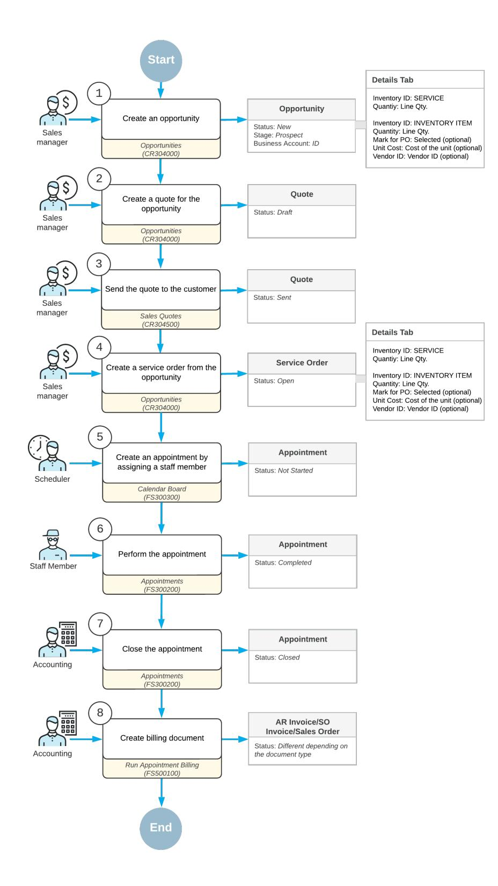

*Figure: Opportunity processing along with service order processing*

### **Processing of an Opportunity and a Sales Quote**

The sales manager enters a new opportunity associated with the customer by using the *[Opportunities](https://help-2025r1.acumatica.com/Help?ScreenId=ShowWiki&pageid=5cb49cd5-2be8-4617-9341-958f1c5d6d53)* (CR304000) form. In the opportunity, the sales manager specifies the business account (which in this context is a customer or prospective customer) associated with the opportunity, the contact person, and the details of the opportunity. On the **Details** tab, the sales manager adds lines for the services and inventory items to be provided if the opportunity is won.

The sales manager starts the process of creating a sales quote by clicking **Create Quote** on the form toolbar of the *[Opportunities](https://help-2025r1.acumatica.com/Help?ScreenId=ShowWiki&pageid=5cb49cd5-2be8-4617-9341-958f1c5d6d53)* form. Then on *[Sales Quotes](https://help-2025r1.acumatica.com/Help?ScreenId=ShowWiki&pageid=9c81a05c-ee3b-4ca1-8ae8-390076631d03)* (CR304500) form, which opens, the sales manager adds all the needed settings and sends it to the customer.

For more information, see *[Creating Opportunities](https://help-2025r1.acumatica.com/Help?ScreenId=ShowWiki&pageid=84184222-e6f4-4538-a683-c2dae34ad895)*.

#### **Creation of the Service Order**

When the customer accepts the offer, the sales manager returns to the *[Opportunities](https://help-2025r1.acumatica.com/Help?ScreenId=ShowWiki&pageid=5cb49cd5-2be8-4617-9341-958f1c5d6d53)* (CR304000) form and changes the stage of the opportunity to *Won*. The sales manager then creates a service order by clicking **CreateService Order** on the More menu (under**Services**). In the **CreateService Order/Appointment** dialog box, which opens, the sales manager specifies the service order type and branch location that will provide services.

The system creates the service order and opens it on the *[Service Orders](https://help-2025r1.acumatica.com/Help?ScreenId=ShowWiki&pageid=6e5277d3-274e-45f5-b77d-4410ed736d21)* (FS300100) form. The sales manager makes sure that all the services that should be performed and inventory items to be purchased are in the service order.

#### **Creation of Appointments**

Aer the service order has been created in the system, a scheduler of your company uses the *[Calendar Board](https://help-2025r1.acumatica.com/Help?ScreenId=ShowWiki&pageid=00cc92c3-408f-4fe3-b6bf-e801559f74f9)* (FS300300) form to schedule the appointments that are needed to perform the services requested by the customer. The scheduler selects a staff member to attend an appointment by taking into consideration the work schedule of the staff member, as well as sorting the displayed staff members by the skills and licenses needed to perform the service and the service area where the services are provided.

The scheduler checks the information on each appointment and enters additional information, such as any inventory items expected to be included with the service to be performed. The system assigns the *Not Started* status to the created appointments.

#### **Attending of Each Appointment**

The staff member assigned to attend an appointment receives the email with the appointment details, reviews the details, and goes to the customer location at the scheduled time. At the customer location, the staff member finds the appointment on the *[Staff Calendar Board](https://help-2025r1.acumatica.com/Help?ScreenId=ShowWiki&pageid=b1d15e47-fba9-4bbf-a7fa-2f7c396c8df4)* (FS300400) form, opens the appointment on the *[Appointments](https://help-2025r1.acumatica.com/Help?ScreenId=ShowWiki&pageid=ac486e9c-f5df-4829-94f0-2df8821361a0)* (FS300200) form, and reflects its start in the system. The appointment is assigned the *In Process* status.

When the services have been finished, the staff member checks the details of the appointment. When everything is correct and complete, the staff member selects the **Finished** check box and completes the appointment, which gives it the *Completed* status.

When all appointments of a particular service order are completed, the system assigns the service order the *Completed* status if on the **General** tab (**GeneralSettings** section) of the *[Service](https://help-2025r1.acumatica.com/Help?ScreenId=ShowWiki&pageid=06fd8a36-dd81-4df9-b609-92c3d552c542) Order Types* (FS202300) form for the service order type, the **CompleteService Order When Its Appointments Are Completed** check box is selected.

#### **Closing of the Appointments and Service Order**

Aer all appointments are completed, an accountant processes the service order further. On the *[Calendar Board](https://help-2025r1.acumatica.com/Help?ScreenId=ShowWiki&pageid=00cc92c3-408f-4fe3-b6bf-e801559f74f9)* (FS300300) form, the accountant verifies the completed appointment.

When all information is verified and the appointments are ready for invoicing, the accountant closes the appointments. This action causes the system to close the related service order if on the **General** tab (**General Settings** section) of the *[Service](https://help-2025r1.acumatica.com/Help?ScreenId=ShowWiki&pageid=06fd8a36-dd81-4df9-b609-92c3d552c542) Order Types* (FS202300) form for the service order type, the **CloseService Order When Its Appointments Are Closed** check box is selected.

#### **Processing of Invoices**

The accountant generates a billing document (an AR invoice, SO invoice or sales order depending on the service order type settings) by using the *[Run Appointment Billing](https://help-2025r1.acumatica.com/Help?ScreenId=ShowWiki&pageid=f1d027ae-c546-47ab-b861-1b7670532bd9)* (FS500100) form.

### **Opportunity-Related Service Orders: Process Activity**

This activity will walk you through the process of creating a service order from an opportunity with a quote that the customer has agreed to.

This activity is based on the *U100* dataset. If you are using another dataset, or if any system settings have been changed in *U100*, these changes can affect the workflow of the activity and the results of the processing. To avoid any issues, restore the *U100* dataset to its initial state.

#### **Story**

Suppose that the Thai Food Restaurant customer has called and requested a proposal for some products of the SweetLife Service and Equipment Sales Center, along with installation services for the products. The service manager (Maia Davis) has received the opportunity and needs to enter it into the system. She then needs to prepare a sales quote and send it to the customer for review.

Further suppose that aer reviewing the proposal, the customer decides to procure the company for the services and products, making the opportunity won. The service manager then needs to prepare a service order based on the opportunity, and schedule an appointment for a staff member. You will act as the service manager in performing all of these actions.

#### **Configuration Overview**

In the *U100* dataset, the following tasks have been performed to support this activity:

- The minimum system configuration, which is described in *[Company with Branches that Do Not Require](https://help-2025r1.acumatica.com/Help?ScreenId=ShowWiki&pageid=a718a27b-3683-4d86-a26e-4b8fb7981f1c) [Balancing: General Information](https://help-2025r1.acumatica.com/Help?ScreenId=ShowWiki&pageid=a718a27b-3683-4d86-a26e-4b8fb7981f1c)*, has been performed.
- The *SWEETLIFE* company has been created on the *[Companies](https://help-2025r1.acumatica.com/Help?ScreenId=ShowWiki&pageid=fedad435-8496-4397-b8a3-50a473629f76)* (CS101500) form. This company has multiple branches created on the *[Branches](https://help-2025r1.acumatica.com/Help?ScreenId=ShowWiki&pageid=b97ab72d-4ab4-4f02-b69c-f7f61b316ced)* (CS102000) form, including *SWEETEQUIP (Service and Equipment Sales Center)*.
- On the *[Service Management Preferences](https://help-2025r1.acumatica.com/Help?ScreenId=ShowWiki&pageid=1c1b94d7-ac39-4f84-a966-588290b5ba80)* (FS100100) form, the minimum settings have been specified, including specifying the numbering sequences and work calendar, for the service management functionality to be used.
- On the *[Enable/Disable Features](https://help-2025r1.acumatica.com/Help?ScreenId=ShowWiki&pageid=c1555e43-1bc5-4f6f-ba9d-b323f94d8a6b)* (CS100000) form, the following features have been enabled:
  - *Inventory and Order Management*, which provides support for the sales order functionality
  - *Sales Quotes* (under *Customer Management*), which provides support for the functionality of sales quotes for opportunities
- On the *[Employees](https://help-2025r1.acumatica.com/Help?ScreenId=ShowWiki&pageid=dae5144b-49b3-43a4-bce0-93f31b3f2321)* (EP203000) form, *EP00000040 (Maia Davis)* and *EP00000003 (Jon Waite)* have been defined. For *EP00000003 (Jon Waite)*, the **Staff Member in Service Management** check box has been selected and the *REPAIRING* skill has been added.
- On the *[Users](https://help-2025r1.acumatica.com/Help?ScreenId=ShowWiki&pageid=834cc181-97fa-4db4-a7e0-3eaba142c166)* (SM201010) form, the *davis* and *waite* accounts have been created. For the *davis* user account, in the **Linked Entity** box of the Summary area of the form, the *Maia Davis* employee account has been specified; for the *waite* user account, in this box, the *Jon Waite* employee account has been specified.

- On the *[Staff Schedule Rules](https://help-2025r1.acumatica.com/Help?ScreenId=ShowWiki&pageid=700e168c-2cb4-4e9b-bee1-8fda87efd071)* (FS202001) form, a work schedule rule has been defined for the *EP00000003 (Jon Waite)* employee, and the work schedule has been generated for this employee on the *[Generate Staff](https://help-2025r1.acumatica.com/Help?ScreenId=ShowWiki&pageid=f43242a2-6b31-47a2-89e4-d4778823570f) [Schedules](https://help-2025r1.acumatica.com/Help?ScreenId=ShowWiki&pageid=f43242a2-6b31-47a2-89e4-d4778823570f)* (FS500400) form.
- On the *[Branch Locations](https://help-2025r1.acumatica.com/Help?ScreenId=ShowWiki&pageid=ebef097e-9e47-4c7b-b0b0-c381251b48cf)* (FS202500) form, the *WEST BRIGHTON* branch location has been defined.
- On the *[User Profile](https://help-2025r1.acumatica.com/Help?ScreenId=ShowWiki&pageid=8430c8b2-a79c-4f7b-9768-b0b7fad23a59)* (SM203010) form, for the *davis* user, the *WEST BRIGHTON* branch location has been specified as the default branch location.
- On the *[Service](https://help-2025r1.acumatica.com/Help?ScreenId=ShowWiki&pageid=06fd8a36-dd81-4df9-b609-92c3d552c542) Order Types* (FS202300) form, the *INST* service order type has been defined to generate SO invoices to bill customers for provided services. That is, in the **BillingSettings** section of the **General** tab, *SO Invoices* has been selected in the **Generated Billing Documents** box.
- On the *[Billing Cycles](https://help-2025r1.acumatica.com/Help?ScreenId=ShowWiki&pageid=273739f9-4e18-4e81-949b-128b02e37810)* (FS206000) form, the *AP SO* billing cycle has been defined to generate invoices and group them by appointment (that is, in the Summary area, the **Appointments** option button is selected under both **Run Billing For** and **Group Billing Documents By**).
- On the *[Customers](https://help-2025r1.acumatica.com/Help?ScreenId=ShowWiki&pageid=652929bc-9606-4056-aa6e-0c2d1147171b)* (AR303000) form, the *TOMYUM (Thai Food Restaurant)* customer has been defined. The *AP SO* billing cycle has been selected for this customer in the**Service Management** section of the **Billing** tab.
- On the *[Non-Stock Items](https://help-2025r1.acumatica.com/Help?ScreenId=ShowWiki&pageid=bf68dd4f-63d4-460d-8dc0-9152f2bd6bf1)* (IN202000) form, the *INSTALL* non-stock item of the *Service* type has been created.

#### **Process Overview**

In this activity, you will create a new opportunity on the *[Opportunities](https://help-2025r1.acumatica.com/Help?ScreenId=ShowWiki&pageid=5cb49cd5-2be8-4617-9341-958f1c5d6d53)* (CR304000) form and add the applicable service to be performed and stock item to be sold to this opportunity. You will then create a sales quote for the customer and send it to the customer. Finally, you will create a service order based on the opportunity and schedule an appointment.

#### **System Preparation**

Before you begin performing the steps of this activity, do the following:

- 1. Launch the Acumatica ERP website, and sign in to a company with the *U100* dataset preloaded; you should sign in as a service manager by using the *davis* username and the *123* password.
- 2. In the company to which you are signed in, ensure that the *Service Management* feature has been enabled on the *[Enable/Disable Features](https://help-2025r1.acumatica.com/Help?ScreenId=ShowWiki&pageid=c1555e43-1bc5-4f6f-ba9d-b323f94d8a6b)* (CS100000) form.
- 3. In the info area, in the upper-right corner of the top pane of the Acumatica ERP screen, make sure that the business date in your system is set to *1/30/2025*. If a different date is displayed, click the Business Date menu button and select *1/30/2025* on the calendar. For simplicity, in this activity, you will create and process all documents in the system on this business date.

#### **Step 1: Creating an Opportunity**

To create an opportunity, do the following:

- 1. Open the *[Opportunities](https://help-2025r1.acumatica.com/Help?ScreenId=ShowWiki&pageid=5cb49cd5-2be8-4617-9341-958f1c5d6d53)* (CR304000) form.
- 2. On the form toolbar, click **Add New Record**, and in the Summary area, specify the following settings:
  - **Class ID**: *SERVICE*
  - **Description**: Sale of a juicer and installation service
  - **Business Account**: *TOMYUM (Thai Food Restaurant)*
- 3. On the form toolbar, click**Save**.
- 4. On the table toolbar of the **Details** tab, click **Add Row**.
- 5. In the row, specify the following settings:
  - **Inventory ID**: *INSTALL*
  - **Quantity**: 1

- 6. Add another row with the *JUICER15* inventory item and a quantity of 1.
- 7. On the form toolbar, click **Open**. In the **Details** dialog box, which is opened, click **OK**. The opportunity is created.

#### **Step 2: Sending a Quote to the Customer**

To create a sales quote and send it to the customer, do the following:

- 1. While you are still viewing the opportunity on the *[Opportunities](https://help-2025r1.acumatica.com/Help?ScreenId=ShowWiki&pageid=5cb49cd5-2be8-4617-9341-958f1c5d6d53)* (CR304000) form, on the form toolbar, click **Create Quote**.
- 2. In the **Create Quote** dialog box, which opens, click **Create and Review**.

The *[Sales Quotes](https://help-2025r1.acumatica.com/Help?ScreenId=ShowWiki&pageid=9c81a05c-ee3b-4ca1-8ae8-390076631d03)* (CR304500) form opens with the created quote.

3. On the More menu (under **Processing**), click **Send**.

#### **Step 3: Creating a Service Order from the Opportunity**

Suppose that the customer has accepted the sales quote that was sent. To create a service order, do the following:

- 1. Go back to the opportunity that you created on the *[Opportunities](https://help-2025r1.acumatica.com/Help?ScreenId=ShowWiki&pageid=5cb49cd5-2be8-4617-9341-958f1c5d6d53)* (CR304000) form.
- 2. In the **Stage** box, select *Won*, and save the opportunity.
- 3. On the More menu (under**Services**), click **CreateService Order**.
- 4. In the **CreateService Order/Appointment** dialog box, which opens, select *INST (Installation Services)* in the **Service OrderType** box, and click **Create and Review**.

The *[Service Orders](https://help-2025r1.acumatica.com/Help?ScreenId=ShowWiki&pageid=6e5277d3-274e-45f5-b77d-4410ed736d21)* (FS300100) form opens with the details from the opportunity filled in. Notice that the service order has the service and the inventory item that have been copied from the related opportunity (on the **Details** tab); the service order is ready to be processed.

5. In the **Source Info** section of the **Other** tab, verify that *Opportunities* is specified in the **DocumentType** box and that the reference number of the related opportunity has been inserted in the **Reference Nbr.** box.

Now you can process the service order by scheduling an appointment.

#### **Step 4: Creating an Appointment**

To create an appointment, do the following:

1. While you are still viewing the service order on the *[Service Orders](https://help-2025r1.acumatica.com/Help?ScreenId=ShowWiki&pageid=6e5277d3-274e-45f5-b77d-4410ed736d21)* (FS300100) form, on the form toolbar, click **Create Appointment**.

The *[Appointments](https://help-2025r1.acumatica.com/Help?ScreenId=ShowWiki&pageid=ac486e9c-f5df-4829-94f0-2df8821361a0)* (FS300200) form opens.

- 2. In the **Scheduled Start Date** box of the**Settings** tab, select *2/6/2025 2:00 PM*.
- 3. On the form toolbar, click**Save**.
- 4. On the More menu (under**Scheduling**), click **Schedule on Calendar**.

The *[Calendar Board](https://help-2025r1.acumatica.com/Help?ScreenId=ShowWiki&pageid=00cc92c3-408f-4fe3-b6bf-e801559f74f9)* (FS300300) form opens.

5.

- 6. In the **Staff Filters** dialog box, which opens, do the following:
  - On the **Skills** tab, select **Juicer installation skill**.
  - On the **Services** tab, select **Installation of equipment**.
  - At the bottom of the dialog box, click **Filter & Close**.

7. On the **Unassigned Appointments** tab, click the appointment you just created, and drag it to the column for *Jon Waite*

The appointment is now scheduled and the staff member is assigned to it, as the following screenshot shows.

| Calendar Board        |                             |                  |  |                           |  |                        |                                     |                      |  |  |                                            |  |  |  |  |  |                               |   |
|-----------------------|-----------------------------|------------------|--|---------------------------|--|------------------------|-------------------------------------|----------------------|--|--|--------------------------------------------|--|--|--|--|--|-------------------------------|---|
| <b>Service Orders</b> | Unassigned Appointments (0) |                  |  | Dashboard $T$ $\sigma$ |  |                        |                                     |                      |  |  |                                            |  |  |  |  |  |                               |   |
| Search 000048-1       |                             |                  |  | $\tau$ $\sigma$           |  | Appointments           |                                     | Branch SWEETEQ =     |  |  | Branch Location WESTBRIC = Staff Type Name |  |  |  |  |  | Day $\star$ < Feb 6, 2025 (1) |   |
| Appointments          | Account Name                | Service Order Ty |  | Scheduled Start           |  |                        | Jon Waite                           |                      |  |  |                                            |  |  |  |  |  |                               |   |
|                       |                             |                  |  |                           |  | 9:00                   |                                     |                      |  |  |                                            |  |  |  |  |  |                               | ∸ |
|                       |                             |                  |  |                           |  | 10:00                  |                                     |                      |  |  |                                            |  |  |  |  |  |                               |   |
|                       |                             |                  |  |                           |  | 11:00                  |                                     |                      |  |  |                                            |  |  |  |  |  |                               |   |
|                       |                             |                  |  |                           |  | 12:00                  |                                     |                      |  |  |                                            |  |  |  |  |  |                               |   |
|                       |                             |                  |  |                           |  | 13:00                  |                                     |                      |  |  |                                            |  |  |  |  |  |                               |   |
|                       |                             |                  |  |                           |  | $14:00$ $\overline{A}$ | $000048-1$ 000048 Not Started | $\ddot{\phantom{a}}$ |  |  |                                            |  |  |  |  |  |                               |   |
|                       |                             |                  |  |                           |  | 15:00                  |                                     |                      |  |  |                                            |  |  |  |  |  |                               |   |
|                       |                             |                  |  |                           |  | 16:00                  |                                     |                      |  |  |                                            |  |  |  |  |  |                               |   |
|                       |                             |                  |  |                           |  | 17:00 18:00         |                                     |                      |  |  |                                            |  |  |  |  |  |                               |   |

*Figure: The scheduled appointment*

## **Creating a Service Order from a Sales Order**

In this chapter, you will learn how to create a service order from a sales order.

## **Sales Order-Related Service Orders: General Information**

A sales order may include both services and stock items that your company provides to the customer. This sales order can be processed along with the service order as the services are being performed. For example, suppose that a customer has ordered some products of your company along with installation services for them. A sales manager of your company receives the order and enters the sales order into the system. Then further processing is performed by the service manager who creates a service order, assigns the employees with the relevant skills to the applicable services, and the accountant who prepares invoices for the customer and processes them in the system.

Users can create a service order from a sales order only if integration with field services is enabled for the sales order type selected in the sales order. That is, the **Enable Field Services Integration** check box has to be selected for the order type on the **General** tab of the *Order [Types](https://help-2025r1.acumatica.com/Help?ScreenId=ShowWiki&pageid=e6984218-4260-4438-99e1-aee2b3765369)* (SO201000) form.

In this topic, you will read about the steps involved in processing a sales order along with the service order.

#### **Learning Objectives**

In this chapter, you will learn how to do the following:

- Create a service order from a sales order
- Create an appointment from a sales order
- Process the appointment
- Generate an invoice for an item added during an appointment

#### **Applicable Scenarios**

You create a service order from a sales order, and process it when your company sells stock items along with the services that are provided in appointments.

#### **Process Diagram**

In the diagram below, you can see the general workflow of processing a sales order along with a service order in the system. The sections below describe the steps of this workflow in more detail.

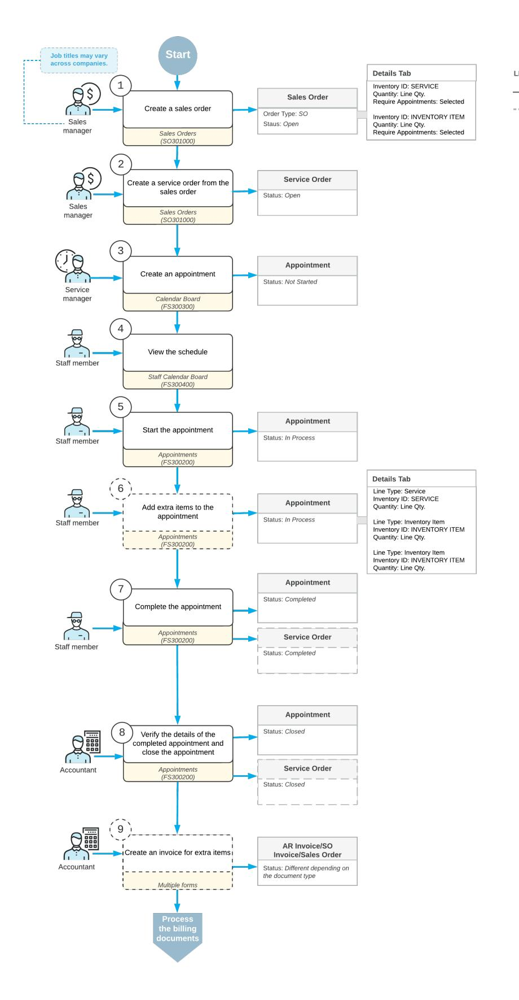

*Figure: Sales order processing along with service order processing*

#### **Entry of a Sales Order**

When a sales manager receives a customer order that includes service provision, the manager enters the sales order with the *Open* status on the *[Sales Orders](https://help-2025r1.acumatica.com/Help?ScreenId=ShowWiki&pageid=19e4021c-1b84-49fd-be12-0320c5f1c7e5)* (SO301000) form. In the sales order, the sales manager specifies the customer from which the order has been received, adds the stock items to be sold and shipped and services that should be performed.

On the **Details** tab of the *[Sales Orders](https://help-2025r1.acumatica.com/Help?ScreenId=ShowWiki&pageid=19e4021c-1b84-49fd-be12-0320c5f1c7e5)* form, in each detail line with the inventory item to be sold and a service to be provided, the manager selects the **Require Appointment** check box, so the line will be added to the service order.

Aer the sales order is saved, the sales manager clicks the **CreateService Order** command on the More menu of the *[Sales Orders](https://help-2025r1.acumatica.com/Help?ScreenId=ShowWiki&pageid=19e4021c-1b84-49fd-be12-0320c5f1c7e5)* form. In the **CreateService Order** dialog box, which opens, the sales manager specifies the service order type and clicks **OK**. The system then opens the service order on the *[Service Orders](https://help-2025r1.acumatica.com/Help?ScreenId=ShowWiki&pageid=6e5277d3-274e-45f5-b77d-4410ed736d21)* (FS300100) form, on which the sales manager verifies the details copied from the sales order. On the **Details** tab of the form, in each detail line, the **Prepaid Item** check box is selected, and the **Billable** check box is cleared, which means that billing will be performed in the sales order. The sales manager saves the service order.

#### **Creation of Each Needed Appointment**

Aer the sales order and service order have been created in the system, a service manager of your company clicks **Schedule on the Calendar Board** on the More menu of the *[Sales Orders](https://help-2025r1.acumatica.com/Help?ScreenId=ShowWiki&pageid=19e4021c-1b84-49fd-be12-0320c5f1c7e5)* (SO301000) form. This opens the *[Calendar](https://help-2025r1.acumatica.com/Help?ScreenId=ShowWiki&pageid=00cc92c3-408f-4fe3-b6bf-e801559f74f9) [Board](https://help-2025r1.acumatica.com/Help?ScreenId=ShowWiki&pageid=00cc92c3-408f-4fe3-b6bf-e801559f74f9)* (FS300300) form, where this employee creates an appointment or appointments that are needed to perform the services requested by the customer. The system assigns the *Not Started* status to the created appointments.

During the scheduling of an appointment, the service manager can filter staff members and select a staff member to attend an appointment by taking into consideration the work schedule, the skills and licenses that are needed for performing the services, and the service area where the services are provided.

#### **Attending of Each Appointment**

The staff member who is assigned to an appointment looks through the upcoming appointments on the *[Staff](https://help-2025r1.acumatica.com/Help?ScreenId=ShowWiki&pageid=b1d15e47-fba9-4bbf-a7fa-2f7c396c8df4) [Calendar Board](https://help-2025r1.acumatica.com/Help?ScreenId=ShowWiki&pageid=b1d15e47-fba9-4bbf-a7fa-2f7c396c8df4)* (FS300400) form and identifies which appointment need to be attended. The staff member then goes to the location where the service has to be performed and starts the appointment on the *[Appointments](https://help-2025r1.acumatica.com/Help?ScreenId=ShowWiki&pageid=ac486e9c-f5df-4829-94f0-2df8821361a0)* (FS300200) form. The appointment is assigned the *In Process* status.

While the services are being performed, the staff member adds any needed information on services (such as notes, or pictures) to the appointment on the *[Appointments](https://help-2025r1.acumatica.com/Help?ScreenId=ShowWiki&pageid=ac486e9c-f5df-4829-94f0-2df8821361a0)* form. If additional quantities or stock items are needed, the staff member adds new lines on the **Details** tab for the items.

When the services are done, the staff member checks the details of the appointment. When everything is correct and complete, the staff member selects the **Finished** check box and completes the appointment, which gives it the *Completed* status.

When all appointments of a particular service order are completed, the system assigns the service order the *Completed* status if on the **General** tab (the **GeneralSettings** section) of the *[Service](https://help-2025r1.acumatica.com/Help?ScreenId=ShowWiki&pageid=06fd8a36-dd81-4df9-b609-92c3d552c542) Order Types* (FS202300) form for the service order type, the **CompleteService Order When Its Appointments Are Completed** check box is selected.

#### **Closing of the Appointments and Service Order**

Aer the appointment is completed, an accountant opens the completed appointment and verifies quantities and prices.

When all information is verified, the accountant closes the appointments, and the system closes the service order if on the **General** tab (**GeneralSettings** section) of the *[Service](https://help-2025r1.acumatica.com/Help?ScreenId=ShowWiki&pageid=06fd8a36-dd81-4df9-b609-92c3d552c542) Order Types* (FS202300) form for the service order type, the **CloseService Order When Its Appointments Are Closed** check box is selected. The appointment and service order are assigned the *Closed* status.

#### **Generation of Billing Documents**

The accountant generates a new billing document for all extra stock items that were used during the appointment. The accountant can use the *[Run Appointment Billing](https://help-2025r1.acumatica.com/Help?ScreenId=ShowWiki&pageid=f1d027ae-c546-47ab-b861-1b7670532bd9)* (FS500100) form or click the **Run Billing** command on the More menu of the *[Appointments](https://help-2025r1.acumatica.com/Help?ScreenId=ShowWiki&pageid=ac486e9c-f5df-4829-94f0-2df8821361a0)* (FS300200) form.

The accountant then processes both billing documents (the one generated for the original sales order, and the billing document generated for any additional item used in the appointment) in the system.

### **Sales Order-Related Service Orders: Process Activity**

This activity will walk you through the process of creating a service order from a sales order and then processing these orders. You will also learn how to add a stock item to a service order that has lines for services or stock items inherited from the sales order, and how this service order will be billed.

This activity is based on the *U100* dataset. If you are using another dataset, or if any system settings have been changed in *U100*, these changes can affect the workflow of the activity and the results of the processing. To avoid any issues, restore the *U100* dataset to its initial state.

#### **Story**

Suppose that SweetLife Service and Equipment Sales Center has sold the GoodFood One Restaurant customer a juicer in combination with installation and repair services. The service manager (Maia Davis) needs to create a sales order for the juicer and the services, and then schedule the appointment to deliver the services.

Further suppose that during the appointment, the customer decides to buy an additional stock item (a plastic container for juice). The assigned staff member needs to add this item to the service order. The accountant will generate a separate invoice for the extra item because it was not included in the original sales order. You will perform these actions, acting as the service manager, staff member, and accountant.

#### **Configuration Overview**

In the *U100* dataset, the following tasks have been performed to support this activity:

- The minimum system configuration, which is described in *[Company with Branches that Do Not Require](https://help-2025r1.acumatica.com/Help?ScreenId=ShowWiki&pageid=a718a27b-3683-4d86-a26e-4b8fb7981f1c) [Balancing: General Information](https://help-2025r1.acumatica.com/Help?ScreenId=ShowWiki&pageid=a718a27b-3683-4d86-a26e-4b8fb7981f1c)*, has been performed.
- The *SWEETLIFE* company has been created on the *[Companies](https://help-2025r1.acumatica.com/Help?ScreenId=ShowWiki&pageid=fedad435-8496-4397-b8a3-50a473629f76)* (CS101500) form. This company has multiple branches created on the *[Branches](https://help-2025r1.acumatica.com/Help?ScreenId=ShowWiki&pageid=b97ab72d-4ab4-4f02-b69c-f7f61b316ced)* (CS102000) form, including *SWEETEQUIP (Service and Equipment Sales Center)*.
- On the *[Service Management Preferences](https://help-2025r1.acumatica.com/Help?ScreenId=ShowWiki&pageid=1c1b94d7-ac39-4f84-a966-588290b5ba80)* (FS100100) form, the minimum settings have been specified, including specifying the numbering sequences and work calendar, for the service management functionality to be used.
- On the *[Enable/Disable Features](https://help-2025r1.acumatica.com/Help?ScreenId=ShowWiki&pageid=c1555e43-1bc5-4f6f-ba9d-b323f94d8a6b)* (CS100000) form, the following features have been enabled:
  - *Inventory and Order Management*, which provides support for the sales order functionality
  - *Inventory*, which provides the ability to create sales and purchase orders with stock items
- On the *[Employees](https://help-2025r1.acumatica.com/Help?ScreenId=ShowWiki&pageid=dae5144b-49b3-43a4-bce0-93f31b3f2321)* (EP203000) form, the *EP00000040 (Maia Davis)* and *EP00000003 (Jon Waite)* employee accounts have been defined. For the *Jon Waite* account, the**Staff Member in Service Management** check box has been selected for *EP00000003 (Jon Waite)*, so you can assign this employee to perform services.
- On the *[Users](https://help-2025r1.acumatica.com/Help?ScreenId=ShowWiki&pageid=834cc181-97fa-4db4-a7e0-3eaba142c166)* (SM201010) form, the *davis* and *waite* accounts have been created. For the *davis* user account, in the **Linked Entity** box of the Summary area of the form, the *Maia Davis* employee account has been specified; for the *waite* user account, in this box, the *Jon Waite* employee account has been specified.

- On the *[Staff Schedule Rules](https://help-2025r1.acumatica.com/Help?ScreenId=ShowWiki&pageid=700e168c-2cb4-4e9b-bee1-8fda87efd071)* (FS202001) form, a work schedule rule has been defined for the *EP00000003 (Jon Waite)* employee, and the work schedule has been generated for this employee on the *[Generate Staff](https://help-2025r1.acumatica.com/Help?ScreenId=ShowWiki&pageid=f43242a2-6b31-47a2-89e4-d4778823570f) [Schedules](https://help-2025r1.acumatica.com/Help?ScreenId=ShowWiki&pageid=f43242a2-6b31-47a2-89e4-d4778823570f)* (FS500400) form.
- On the *[Branch Locations](https://help-2025r1.acumatica.com/Help?ScreenId=ShowWiki&pageid=ebef097e-9e47-4c7b-b0b0-c381251b48cf)* (FS202500) form, the *WEST BRIGHTON* branch location has been configured.
- On the *[User Profile](https://help-2025r1.acumatica.com/Help?ScreenId=ShowWiki&pageid=8430c8b2-a79c-4f7b-9768-b0b7fad23a59)* (SM203010) form, for the *davis* user, the *WEST BRIGHTON* branch location has been specified as the default branch location.
- On the *[Billing Cycles](https://help-2025r1.acumatica.com/Help?ScreenId=ShowWiki&pageid=273739f9-4e18-4e81-949b-128b02e37810)* (FS206000) form, the following settings have been specified for the *AP AP* billing cycle:
  - **Run Billing For**: **Appointments**
  - **Group Billing Documents By**: **Appointments**

Based on these billing cycle settings, a separate billing document is generated for each appointment; this document presents the details of each service of the appointment.

- On the *[Customers](https://help-2025r1.acumatica.com/Help?ScreenId=ShowWiki&pageid=652929bc-9606-4056-aa6e-0c2d1147171b)* (AR303000) form, the *GOODFOOD (GoodFood One Restaurant)* customer has been defined, and the *AP AP* billing cycle has been selected in the**Service Management** section of the **Billing** tab.
- On the *Order [Types](https://help-2025r1.acumatica.com/Help?ScreenId=ShowWiki&pageid=e6984218-4260-4438-99e1-aee2b3765369)* (SO201000) form, for the *SO* and *IN* sales order types, the **Enable Field Services Integration** check box has been selected.
- On the *[Service](https://help-2025r1.acumatica.com/Help?ScreenId=ShowWiki&pageid=06fd8a36-dd81-4df9-b609-92c3d552c542) Order Types* (FS202300) form, the *INST* service order type has been configured to generate SO invoices to bill customers for provided services. That is, in the **BillingSettings** section of the **General** tab, *SO Invoices* has been selected in the **Generated Billing Documents** box. Also, on the **General** tab (**General Settings** section), the **CompleteService Order When Its Appointments Are Completed** and **CloseService Order When Its Appointments Are Closed** check boxes are selected.
- On the *[Non-Stock Items](https://help-2025r1.acumatica.com/Help?ScreenId=ShowWiki&pageid=bf68dd4f-63d4-460d-8dc0-9152f2bd6bf1)* (IN202000) form, for the *INSTALL* non-stock item, the *Service* type is selected.

#### **Process Overview**

To create a service order from a sales order, you will first create a sales order on the *[Sales Orders](https://help-2025r1.acumatica.com/Help?ScreenId=ShowWiki&pageid=19e4021c-1b84-49fd-be12-0320c5f1c7e5)* (SO301000) form with the stock item to be sold and the service to be provided, and you will create a related service order from this form. You will then schedule the appointment to perform the needed service and complete the appointment. Finally, aer an item has been added during the appointment, you will generate an invoice for it from the *[Appointments](https://help-2025r1.acumatica.com/Help?ScreenId=ShowWiki&pageid=ac486e9c-f5df-4829-94f0-2df8821361a0)* (FS300200) form.

#### **System Preparation**

Before you begin performing the steps of this activity, do the following:

- 1. Launch the Acumatica ERP website, and sign in to a company with the *U100* dataset preloaded; you should sign in as a service manager by using the *davis* username and the *123* password.
- 2. In the company to which you are signed in, ensure that the *Service Management* feature has been enabled on the *[Enable/Disable Features](https://help-2025r1.acumatica.com/Help?ScreenId=ShowWiki&pageid=c1555e43-1bc5-4f6f-ba9d-b323f94d8a6b)* (CS100000) form.
- 3. In the info area, in the upper-right corner of the top pane of the Acumatica ERP screen, make sure that the business date in your system is set to *1/30/2025*. If a different date is displayed, click the Business Date menu button and select *1/30/2025* on the calendar. For simplicity, in this activity, you will create and process all documents in the system on this business date.

#### **Step 1: Creating a Service Order Along with the Sales Order**

To create the needed sales order and service order, do the following:

- 1. Open the *[Sales Orders](https://help-2025r1.acumatica.com/Help?ScreenId=ShowWiki&pageid=19e4021c-1b84-49fd-be12-0320c5f1c7e5)* (SO301000) form.
- 2. Create a new sales order with the following settings in the Summary area:
  - **OrderType**: *SO*
  - **Customer**: *GOODFOOD - GoodFood One Restaurant*

- **Description**: Sale of a juicer and installation service
- 3. On the **Details** tab, add a row with the following settings:
  - **Inventory ID**: *INSTALL*
  - **Require Appointment**: Selected
  - **Warehouse**: *EQUIPHOUSE*
  - **Quantity**: 1.00
- 4. Add one more row with the following settings:
  - **Inventory ID**: *JUICER15*
  - **Require Appointment**: Selected
  - **Quantity**: 1.00
- 5. On the form toolbar, click**Save**.
- 6. On the More menu (under**Services**), click **CreateService Order**.
- 7. In the **CreateService Order** dialog box, which opens, make sure *Installation Services* is selected in the **Service OrderType** box, and click **OK**.

The *[Service Orders](https://help-2025r1.acumatica.com/Help?ScreenId=ShowWiki&pageid=6e5277d3-274e-45f5-b77d-4410ed736d21)* (FS300100) form opens with the settings copied from the sales order filled in. Notice that the service order has the service and the stock item that have been copied from the related sales order (on the **Details** tab); the service order is ready to be processed. Also notice on this tab that the **Billable** check box is cleared and read-only for each line because the line has been copied from the sales order and will be billed through the original sales order.

- 8. Save the service order.
- 9. In the **Source Info** section of the **Other** tab, verify that *SO Order* is specified in the **DocumentType** box and the order type and the reference number of the related sales order have been inserted in the **Reference Nbr.** box.

#### **Step 2: Creating an Appointment from the Sales Orders Form**

To create an appointment related to the sales order, do the following:

- 1. Return to the *[Sales Orders](https://help-2025r1.acumatica.com/Help?ScreenId=ShowWiki&pageid=19e4021c-1b84-49fd-be12-0320c5f1c7e5)* (SO301000) form with the sales order you have created.
- 2. On the More menu (under**Services**), click **Schedule on the Calendar Board**.

The *[Calendar Board](https://help-2025r1.acumatica.com/Help?ScreenId=ShowWiki&pageid=00cc92c3-408f-4fe3-b6bf-e801559f74f9)* (FS300300) form opens, displaying only the service order the system has created for the sales order.

- 3. On the **Service Orders** tab, right-click the service order, and click **FilterStaff**. The list of staff members on the dashboard is filtered to match the skills and licenses of the services in the appointment.
- 4. Drag the service order from the**Service Orders** tab into the *Jon Waite* column of the dashboard area so that the start time of the appointment is set to 15:00.

#### **Step 3: Attending the Appointment**

To perform the needed actions involved with attending the appointment, do the following on behalf of Jon Waite:

- 1. Open the *[Staff Calendar Board](https://help-2025r1.acumatica.com/Help?ScreenId=ShowWiki&pageid=b1d15e47-fba9-4bbf-a7fa-2f7c396c8df4)* (FS300400) form.
- 2. In the **Staff** box, select *Jon Waite*, as shown in Item 1 of the following screenshot.
- 3. In the Date box, select *Day* and 1/30/2025 (Item 2).

|                                                                                                                      | <b>Staff Calendar Board</b>                               |                                                                 |        |                       |                                                                        |                                                 |  |  |  |  |  |  |  |  |
|----------------------------------------------------------------------------------------------------------------------|-----------------------------------------------------------|-----------------------------------------------------------------|--------|-----------------------|------------------------------------------------------------------------|-------------------------------------------------|--|--|--|--|--|--|--|--|
| Service Orders                                                                                                       | Unassigned Appointments (2)                               |                                                                 |        | Dashboard             | 47                                                                     | $\overline{2}$                                  |  |  |  |  |  |  |  |  |
| Search                                                                                                               |                                                           |                                                                 | $\tau$ | <b>C</b> Appointments | Staff Branch SWEETEQ + Branch Location WESTBRIC + Jon Waite ۰ | Day $\star$ < Jan 30, 2025 (1) $\rightarrow$ |  |  |  |  |  |  |  |  |
| Service Order                                                                                                        | Account Name                                              | Order Type                                                      |        |                       | Thu 30/01                                                              |                                                 |  |  |  |  |  |  |  |  |
| $\blacktriangleright$ $\square$ 000041 $\blacktriangleright$ $\square$ 000022                                     | FourStar Coffee HM's Bakery & C                        | <b>INST</b> <b>MRO</b>                                       |        | 9:00                  |                                                                        | ▲                                               |  |  |  |  |  |  |  |  |
| $\blacktriangleright$ $\Box$ 000024 $\blacktriangleright$ $\Box$ 000037 $\blacktriangleright$ $\square$ 000016 | HM's Bakery & C MRO FourStar Coffee Thai Food Resta | <b>MRO</b> <b>RTE</b>                                        |        | 10:00 11:00        |                                                                        |                                                 |  |  |  |  |  |  |  |  |
| $\blacktriangleright$ $\Box$ 000013 $\blacktriangleright$ $\square$ 000042                                        | FourStar Coffee FourStar Coffee                        | <b>TRN</b> <b>TRN</b>                                        |        | 12:00                 |                                                                        |                                                 |  |  |  |  |  |  |  |  |
|                                                                                                                      |                                                           |                                                                 |        | 13:00 14:00        |                                                                        |                                                 |  |  |  |  |  |  |  |  |
|                                                                                                                      |                                                           |                                                                 |        |                       | 3                                                                      |                                                 |  |  |  |  |  |  |  |  |
|                                                                                                                      |                                                           |                                                                 |        | $15:00$ $\Delta$      | 000045-1 1000045                                                    | ٠                                               |  |  |  |  |  |  |  |  |
|                                                                                                                      |                                                           |                                                                 |        | 16:00 17:00        |                                                                        |                                                 |  |  |  |  |  |  |  |  |
|                                                                                                                      |                                                           |                                                                 |        | 18:00                 |                                                                        |                                                 |  |  |  |  |  |  |  |  |
|                                                                                                                      |                                                           |                                                                 | ь      | 19:00                 |                                                                        | $\blacktriangledown$                            |  |  |  |  |  |  |  |  |
| ◀ $\ll$ $\lt$   Page   1                                                                                          |                                                           | of $1 \quad   \quad \rangle \quad \gg \quad   \quad \mathbb{C}$ |        |                       |                                                                        | B                                               |  |  |  |  |  |  |  |  |

#### *Figure: An appointment on the staff board*

4. Click the link of the appointment (see Item 3 in the previous screenshot) to open it.

The *[Appointments](https://help-2025r1.acumatica.com/Help?ScreenId=ShowWiki&pageid=ac486e9c-f5df-4829-94f0-2df8821361a0)* (FS300200) form opens.

- 5. On the form toolbar of the *[Appointments](https://help-2025r1.acumatica.com/Help?ScreenId=ShowWiki&pageid=ac486e9c-f5df-4829-94f0-2df8821361a0)* (FS300200) form, click**Start**.
- 6. On the **Details** tab, click **Add Row**, and specify the following settings in the row:
  - **LineType**: *Inventory Item*
  - **Inventory ID**: *CONTAINER*
  - **Estimated Quantity**: 1.00

Notice that the **Billable** check box is selected for the newly added item, which indicates that the item is billable. Because it has not been included in the original sales order, a separate invoice will be generated for that item.

- 7. On the form toolbar, click**Save**.
- 8. On the **Settings** tab (**Actual Date and Time** section), specify the actual starting and actual ending times to be the same as the scheduled ones; select the **Finished** check box. (You perform this instruction and the next one on behalf of the staff member.)
- 9. On the form toolbar, click **Complete**.

10.On behalf of the accountant, on the form toolbar, click **Close**.

The completion and closing of the appointment caused the service order to also be completed and closed because of the settings of the *INST* service order type on the *[Service](https://help-2025r1.acumatica.com/Help?ScreenId=ShowWiki&pageid=06fd8a36-dd81-4df9-b609-92c3d552c542) Order Types* (FS202300) form, as described in the *Configuration Overview* section.

#### **Step 4: Generating an Invoice for the Additional Item**

To generate an invoice for the item included in the appointment, do the following (acting as an accountant):

1. While you are still viewing the appointment on the *[Appointments](https://help-2025r1.acumatica.com/Help?ScreenId=ShowWiki&pageid=ac486e9c-f5df-4829-94f0-2df8821361a0)* (FS300200) form, click **Run Billing** on the form toolbar.

The system opens the *[Invoices](https://help-2025r1.acumatica.com/Help?ScreenId=ShowWiki&pageid=0acc9738-f141-4ea0-a2be-f34ea9d1b63a)* (SO303000) form with the generated invoice.

2. Verify that only the stock item added during the appointment has been added to the invoice, as the following screenshot shows.

| Invoices                                  |                  |                  | Invoice 000119 - GoodFood One Restaurant                                     |                                               |                   |                    |   |                         |            |                   |                 |            |                            |                           | <b>TH NOTES</b> |                 | <b>ACTIVITIES</b> <b>FILES</b> | $TOOLS$ $\rightarrow$ |
|-------------------------------------------|------------------|------------------|------------------------------------------------------------------------------|-----------------------------------------------|-------------------|--------------------|---|-------------------------|------------|-------------------|-----------------|------------|----------------------------|---------------------------|-----------------|-----------------|-----------------------------------|-----------------------|
|                                           |                  |                  |                                                                              |                                               |                   |                    |   |                         |            |                   |                 |            |                            |                           |                 |                 |                                   |                       |
| 圖 지 $\Omega$                        | $+$              | 尙                | n $\overline{\mathbf{K}}$ $\checkmark$ $\left\langle \right\rangle$ | <b>REMOVE HOLD</b> $\geq$ $\rightarrow$ |                   |                    |   |                         |            |                   |                 |            |                            |                           |                 |                 |                                   |                       |
| Type:                                     | Invoice          | $\sim$           | Customer:                                                                    | GOODFOOD - GoodFood One Restaurar             | $\Lambda$         | Detail Total:      |   | 50.00                   |            |                   |                 |            |                            |                           |                 |                 |                                   | $\hat{\phantom{a}}$   |
| Reference Nbr.                            | 000119           | $\circ$          | * Location:                                                                  | <b>MAIN - Primary Location</b>                | Q                 | Line Discounts:    |   | 0.00                    |            |                   |                 |            |                            |                           |                 |                 |                                   |                       |
| Status:                                   | On Hold          |                  | * Terms:                                                                     | 30D - 30 Days                                 | Q                 | Document Dis       |   | 0.00                    |            |                   |                 |            |                            |                           |                 |                 |                                   |                       |
| * Date:                                   | 1/30/2025        | 曲                | * Due Date:                                                                  | n. 3/1/2025                                |                   | Freight Total:     |   | 0.00                    |            |                   |                 |            |                            |                           |                 |                 |                                   |                       |
|                                           |                  |                  |                                                                              |                                               |                   |                    |   |                         |            |                   |                 |            |                            |                           |                 |                 |                                   |                       |
| * Post Period:                            | 01-2025          | $\circ$          | * Cash Discount.                                                             | 3/1/2025 $\Box$                            |                   | <b>Tax Total:</b>  |   | 0.00                    |            |                   |                 |            |                            |                           |                 |                 |                                   |                       |
| Customer Ord.                             |                  |                  |                                                                              |                                               |                   | Balance:           |   | 50.00                   |            |                   |                 |            |                            |                           |                 |                 |                                   |                       |
| * Project/Contract: X - Non-Project Code. |                  |                  |                                                                              |                                               | $\Omega$          | Cash Discount:     |   | 0.00                    |            |                   |                 |            |                            |                           |                 |                 |                                   |                       |
| Description:                              |                  |                  | Sale of a juicer and installation service                                    |                                               |                   |                    |   |                         |            |                   |                 |            |                            |                           |                 |                 |                                   |                       |
|                                           |                  |                  |                                                                              |                                               |                   |                    |   |                         |            |                   |                 |            |                            |                           |                 |                 |                                   |                       |
| <b>DETAILS</b>                            | <b>TAXES</b>     | <b>FREIGHT</b>   | FINANCIAL                                                                    | <b>ADDRESSES</b> <b>APPLICATIONS</b>       |                   |                    |   |                         |            |                   |                 |            |                            |                           |                 |                 |                                   |                       |
| Ò $+$ P                             | $\times$         | <b>ADD ITEMS</b> | ADD ORDER                                                                    | ADD SO LINE                                   | ADD RETURN LINE   | <b>RESET ORDER</b> | H | $\mathbf{\overline{x}}$ |            |                   |                 |            |                            |                           |                 |                 |                                   |                       |
| Order Nbr.                                | Inventory ID     |                  | Related Svc. Doc. Nbr.                                                       | <b>Transaction Descr.</b>                     | Warehouse         | Location           |   | Quantity UOM            |            | <b>Unit Price</b> | Manual Price | Ext. Price | <b>Discount</b> Percent | <b>Discount</b> Amount |                 | Amount *Account | Description                       |                       |
|                                           | <b>CONTAINER</b> |                  | INST, 000045-1                                                               | <b>Containers for Juice</b>                   | <b>EQUIPHOUSE</b> | <b>MAIN</b>        |   |                         | 1.00 PIECE | 50.0000           | $\Box$          | 50.00      | 0.000000                   | 0.00                      | 50.00 40000     |                 | Sales Revenue                     |                       |
|                                           |                  |                  |                                                                              |                                               |                   |                    |   |                         |            |                   |                 |            |                            |                           |                 |                 |                                   |                       |
|                                           |                  |                  |                                                                              |                                               |                   |                    |   |                         |            |                   |                 |            |                            |                           |                 |                 |                                   |                       |

*Figure: The sales order generated for the additional item*

As a result, two invoices will be released: the first one for the requested service and item specified in the original sales order, and the second one for the additional item that was included in the appointment.

## **Creating a Service Order Along with a Case**

In this chapter, you will learn how to create a service order from a case.

## **Case-Related Service Orders: General Information**

A customer case can be processed along with a service order while the services necessary to resolve the case are being performed. For example, suppose that the customer of your company has complained about some product that it purchased from your company. The case is received and entered into the system by a support manager of your company, who also creates a related service order for the repair of the product. Then the service manager and staff members further process the service order, and the support manager continues processing the case to its completion. The accountant then prepares invoices for the customer and processes them in the system.

In this topic, you will read about the steps involved in the processing of the case along with the service order.

#### **Learning Objectives**

In this chapter, you will learn how to do the following:

- Create a case whose resolution requires the provision of services
- Create a service order from a case
- Process an appointment associated with a case
- Close a case

#### **Applicable Scenarios**

You process cases along with service orders if, for example, your company provides support to the customers on the equipment that the company sells. Some support services need to be performed at a customer's location. So a support manager or representative creates a case in the system, for which an appointment is to be scheduled.

#### **Process Diagram**

In the diagram below, you can see the general workflow of processing a case along with a service order in the system. The sections below describe the steps of this workflow in more detail.

Processes and job titles may be different in your company.

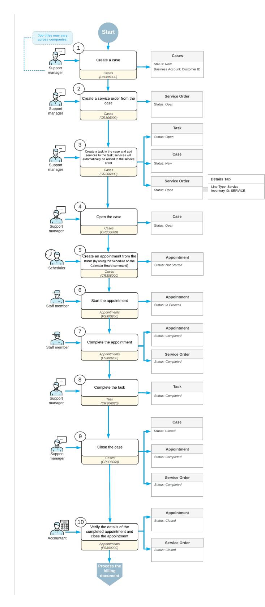

*Figure: Case processing along with service order processing*

## **Entry of a Case**

The support manager enters a new case associated with the customer by using the *[Cases](https://help-2025r1.acumatica.com/Help?ScreenId=ShowWiki&pageid=a492a091-9649-4826-bcc3-dccdf8765efd)* (CR306000) form. In the case, the support manager specifies the business account (which in this context is a customer or prospective customer) from which the case has been received, the contact person, and the details of the case; the manager saves the case with the *Open* status.

#### **Entry of a Service Order**

While still viewing the case on the *[Cases](https://help-2025r1.acumatica.com/Help?ScreenId=ShowWiki&pageid=a492a091-9649-4826-bcc3-dccdf8765efd)* (CR306000) form, the manager clicks the **CreateService Order** command and specifies the service order type (see Step 2 in the workflow in the *Process Diagram* section). Then the manager adds the needed services (Step 3) to the service order related to this case, which the system has created on the *[Service Orders](https://help-2025r1.acumatica.com/Help?ScreenId=ShowWiki&pageid=6e5277d3-274e-45f5-b77d-4410ed736d21)* (FS300100) form.

A service or services can also be added to the service order from the task created for the case. When the task is saved, the system automatically adds the service to the associated service order. Additionally, services can be added to the appointment linked to the service order, and the system will include them in the service order as well. By default, the **Billable** check box will be selected for all lines added to the service order.

#### **Creation of Appointments**

Aer the service order has been created in the system, a scheduler of your company uses the *[Calendar Board](https://help-2025r1.acumatica.com/Help?ScreenId=ShowWiki&pageid=00cc92c3-408f-4fe3-b6bf-e801559f74f9)* (FS300300) form to schedule the appointments that are needed to perform the services requested by the customer. The scheduler selects a staff member to attend an appointment by taking into consideration the work schedule of the staff member, as well as sorting the displayed staff members by the skills and licenses needed to perform the service and the service area where the services are provided.

The scheduler checks the information on each appointment and enters additional information, such as any inventory items expected to be included with the service to be performed. The system assigns the *Not Started* status to the created appointments.

#### **Attending of Each Appointment**

The staff member who is assigned to an appointment looks through the upcoming appointments on the *[Staff](https://help-2025r1.acumatica.com/Help?ScreenId=ShowWiki&pageid=b1d15e47-fba9-4bbf-a7fa-2f7c396c8df4) [Calendar Board](https://help-2025r1.acumatica.com/Help?ScreenId=ShowWiki&pageid=b1d15e47-fba9-4bbf-a7fa-2f7c396c8df4)* (FS30000) form and identifies which appointment to attend. The staff member then goes to the location where the service has to be performed, and starts the appointment on the *[Appointments](https://help-2025r1.acumatica.com/Help?ScreenId=ShowWiki&pageid=ac486e9c-f5df-4829-94f0-2df8821361a0)* (FS300200) form. The appointment is assigned the *In Process* status.

While the services are being performed, the staff member adds any needed information on services (such as status and quantities) to the appointment on the *[Appointments](https://help-2025r1.acumatica.com/Help?ScreenId=ShowWiki&pageid=ac486e9c-f5df-4829-94f0-2df8821361a0)* form; if needed, the staff member adds extra quantities or stock items that were used. When the services are done, the staff member checks the details of the appointment. When everything is correct and complete, the staff member selects the **Finished** check box and completes the appointment, which gives it the *Completed* status.

When all appointments of a particular service order are completed, the system assigns the service order the *Completed* status if on the **General** tab (**GeneralSettings** section) of the *[Service](https://help-2025r1.acumatica.com/Help?ScreenId=ShowWiki&pageid=06fd8a36-dd81-4df9-b609-92c3d552c542) Order Types* (FS202300) form for the service order type, the **CompleteService Order When Its Appointments Are Completed** check box is selected.

#### **Closing of the Case**

Aer the services have been completed, the support manager contacts the customer and confirms the resolution of the case. On the *[Cases](https://help-2025r1.acumatica.com/Help?ScreenId=ShowWiki&pageid=a492a091-9649-4826-bcc3-dccdf8765efd)* (CR306000) form, the support manager closes the case in the system, and the system assigns the *Closed* status to the case.

#### **Closing of the Appointments and Service Order**

Aer all appointments are completed, an accountant processes the service order further. On the *[Calendar Board](https://help-2025r1.acumatica.com/Help?ScreenId=ShowWiki&pageid=00cc92c3-408f-4fe3-b6bf-e801559f74f9)* form, the accountant opens the completed appointment and verifies quantities and prices.

When all information is verified and the appointments are ready for invoicing, the accountant closes the appointments. The system closes the service order if on the **General** tab (**GeneralSettings** section) of the *[Service](https://help-2025r1.acumatica.com/Help?ScreenId=ShowWiki&pageid=06fd8a36-dd81-4df9-b609-92c3d552c542) Order [Types](https://help-2025r1.acumatica.com/Help?ScreenId=ShowWiki&pageid=06fd8a36-dd81-4df9-b609-92c3d552c542)* (FS202300) form for the service order type, the **CloseService Order When Its Appointments Are Closed** check box is selected.

#### **Processing of Invoices**

The accountant generates a sales order document with the *Open* status by using the *[Run Appointment Billing](https://help-2025r1.acumatica.com/Help?ScreenId=ShowWiki&pageid=f1d027ae-c546-47ab-b861-1b7670532bd9)* (FS500100) form.

The accountant then processes the sales order in the system.

## **Case-Related Service Orders: Process Activity**

This activity will walk you through the process of creating a service order from a case. You will go through the service management process while also processing the case, from creation through closing.

This activity is based on the *U100* dataset. If you are using another dataset, or if any system settings have been changed in *U100*, these changes can affect the workflow of the activity and the results of the processing. To avoid any issues, restore the *U100* dataset to its initial state.

#### **Story**

The SweetLife Service and Equipment Sales Center provides support to its customers on equipment that the company sells, and these support services are billed to the customer on a per-case basis. The Thai Food Restaurant customer has requested the replacement of a component in a juicer that the company purchased previously.

Acting as the service manager of the company (Maia Davis), you will create a case for which an appointment should be scheduled for the replacement services to be performed. Acting as the respective employees, you will also continue the processing of the related service order through the closing of the case.

#### **Configuration Overview**

In the *U100* dataset, the following tasks have been performed to support this activity:

- The minimum system configuration, which is described in *[Company with Branches that Do Not Require](https://help-2025r1.acumatica.com/Help?ScreenId=ShowWiki&pageid=a718a27b-3683-4d86-a26e-4b8fb7981f1c) [Balancing: General Information](https://help-2025r1.acumatica.com/Help?ScreenId=ShowWiki&pageid=a718a27b-3683-4d86-a26e-4b8fb7981f1c)*, has been performed.
- The *SWEETLIFE* company has been created on the *[Companies](https://help-2025r1.acumatica.com/Help?ScreenId=ShowWiki&pageid=fedad435-8496-4397-b8a3-50a473629f76)* (CS101500) form. This company has multiple branches created on the *[Branches](https://help-2025r1.acumatica.com/Help?ScreenId=ShowWiki&pageid=b97ab72d-4ab4-4f02-b69c-f7f61b316ced)* (CS102000) form, including *SWEETEQUIP (Service and Equipment Sales Center)*.
- On the *[Service Management Preferences](https://help-2025r1.acumatica.com/Help?ScreenId=ShowWiki&pageid=1c1b94d7-ac39-4f84-a966-588290b5ba80)* (FS100100) form, the minimum settings have been specified, including specifying the numbering sequences and work calendar, for the service management functionality to be used.
- On the *[Enable/Disable Features](https://help-2025r1.acumatica.com/Help?ScreenId=ShowWiki&pageid=c1555e43-1bc5-4f6f-ba9d-b323f94d8a6b)* (CS100000) form, the following features have been enabled:
  - *Inventory and Order Management*, which provides support for the sales order functionality
  - *Case Management* (under *Customer Management*), which provides support for the case functionality.
- On the *[Employees](https://help-2025r1.acumatica.com/Help?ScreenId=ShowWiki&pageid=dae5144b-49b3-43a4-bce0-93f31b3f2321)* (EP203000) form, *EP00000040 (Maia Davis)* and *EP00000040 (Alberto Jimenez)* have been defined. For *Alberto Jimenez*, the **Staff Member in Service Management** check box has been selected and the *REPAIRING* skill has been added.
- On the *[Users](https://help-2025r1.acumatica.com/Help?ScreenId=ShowWiki&pageid=834cc181-97fa-4db4-a7e0-3eaba142c166)* (SM201010) form, the *davis* and *jimenez* accounts have been created. For the *davis* user account, in the **Linked Entity** box of the Summary area of the form, the *Maia Davis* employee account has

been specified; for the *jimenez* user account, in this box, the *Alberto Jimenez* employee account has been specified.

- On the *[Staff Schedule Rules](https://help-2025r1.acumatica.com/Help?ScreenId=ShowWiki&pageid=700e168c-2cb4-4e9b-bee1-8fda87efd071)* (FS202001) form, a work schedule rule has been defined for the *EP00000004 (Alberto Jimenez)* employee, and the work schedule has been generated for this employee on the *[Generate](https://help-2025r1.acumatica.com/Help?ScreenId=ShowWiki&pageid=f43242a2-6b31-47a2-89e4-d4778823570f) [Staff Schedules](https://help-2025r1.acumatica.com/Help?ScreenId=ShowWiki&pageid=f43242a2-6b31-47a2-89e4-d4778823570f)* (FS500400) form.
- On the *[Branch Locations](https://help-2025r1.acumatica.com/Help?ScreenId=ShowWiki&pageid=ebef097e-9e47-4c7b-b0b0-c381251b48cf)* (FS202500) form, the *WEST BRIGHTON* branch location has been defined.
- On the *[User Profile](https://help-2025r1.acumatica.com/Help?ScreenId=ShowWiki&pageid=8430c8b2-a79c-4f7b-9768-b0b7fad23a59)* (SM203010) form, for the *davis* user, the *WEST BRIGHTON* branch location has been specified as the default branch location.
- On the *[Service](https://help-2025r1.acumatica.com/Help?ScreenId=ShowWiki&pageid=06fd8a36-dd81-4df9-b609-92c3d552c542) Order Types* (FS202300) form, the *MRO* service order type has been defined to generate SO invoices to bill customers for provided services. That is, *SO Invoices* has been selected in the **Generated Billing Documents** box of the **BillingSettings** section (**General** tab). Also, on the **General** tab (**General Settings** section), the **CompleteService Order When Its Appointments Are Completed** and **CloseService Order When Its Appointments Are Closed** check boxes are selected.
- On the *[Service Management Preferences](https://help-2025r1.acumatica.com/Help?ScreenId=ShowWiki&pageid=1c1b94d7-ac39-4f84-a966-588290b5ba80)* (FS100100) form, the basic service management functionality has been configured, including the specification of the numbering sequences and the work calendar. Also, on the **General** tab (**DefaultSettings** section), *MRO* has been selected in the **DefaultService OrderType for Cases** box, meaning that when a new service order is created from the *[Cases](https://help-2025r1.acumatica.com/Help?ScreenId=ShowWiki&pageid=a492a091-9649-4826-bcc3-dccdf8765efd)* (CR306000) form, *MRO* is inserted as its service order type.
- On the *[Customers](https://help-2025r1.acumatica.com/Help?ScreenId=ShowWiki&pageid=652929bc-9606-4056-aa6e-0c2d1147171b)* (AR303000) form, the *TOMYUM (Thai Food Restaurant)* customer has been defined.

#### **Process Overview**

To create a service order along with a case, you will create a new case on the *[Cases](https://help-2025r1.acumatica.com/Help?ScreenId=ShowWiki&pageid=a492a091-9649-4826-bcc3-dccdf8765efd)* (CR306000) and a service order for it on the *[Service Orders](https://help-2025r1.acumatica.com/Help?ScreenId=ShowWiki&pageid=6e5277d3-274e-45f5-b77d-4410ed736d21)* (FS300100) form. You will then add the service to be performed by creating the related task on the *[Task](https://help-2025r1.acumatica.com/Help?ScreenId=ShowWiki&pageid=6449513c-254e-4093-b7b8-06de0108c384)* (CR306020) form.

#### **System Preparation**

Before you begin performing the steps of this activity, do the following:

- 1. Launch the Acumatica ERP website, and sign in to a company with the *U100* dataset preloaded. You should sign in as the service manager by using the *davis* username and the *123* password.
- 2. In the company to which you are signed in, ensure that the *Service Management* feature has been enabled on the *[Enable/Disable Features](https://help-2025r1.acumatica.com/Help?ScreenId=ShowWiki&pageid=c1555e43-1bc5-4f6f-ba9d-b323f94d8a6b)* (CS100000) form.
- 3. In the info area, in the upper-right corner of the top pane of the Acumatica ERP screen, make sure that the business date in your system is set to *1/30/2025*. If a different date is displayed, click the Business Date menu button and select *1/30/2025* on the calendar. For simplicity, in this activity, you will create and process all documents in the system on this business date.

#### **Step 1: Creating a Case**

To create a case, do the following:

- 1. Open the *[Cases](https://help-2025r1.acumatica.com/Help?ScreenId=ShowWiki&pageid=a492a091-9649-4826-bcc3-dccdf8765efd)* (CR306000) form, and click **Add New Record**.
- 2. In the Summary area of this form, specify the following settings:
  - **Case Class**: *SUPPORT*
  - **Business Account**: *TOMYUM - Thai Food Restaurant*
  - **Subject**: Component replacement is necessary
- 3. On the **Details** tab, briefly describe the situation by entering the following: The component of the juicer has a defect; replacement with a new one is necessary.
- 4. On the form toolbar, click**Save**.

#### **Step 2: Creating a Service Order from the Case**

To create a service order from the case, do the following:

- 1. While you are still viewing the case on the *[Cases](https://help-2025r1.acumatica.com/Help?ScreenId=ShowWiki&pageid=a492a091-9649-4826-bcc3-dccdf8765efd)* (CR306000) form, on the More menu (under **Customer Services**), click **CreateService Order**.
- 2. In the **CreateService Order** dialog box, which opens, make sure that *Maintenance, repair and operations (MRO)* is selected in the**Service OrderType** box, and click **OK**.

The *[Service Orders](https://help-2025r1.acumatica.com/Help?ScreenId=ShowWiki&pageid=6e5277d3-274e-45f5-b77d-4410ed736d21)* (FS300100) form opens with the customer details inserted. Note that services have not yet been added to the service order.

- 3. In the **Source Info** section of the **Other** tab, verify that the system has inserted *Case* as the document type and has inserted the reference number of the case from which the service order was created.
- 4. On the form toolbar, click**Save**.

#### **Step 3: Adding Services**

To add services to a service order, do the following:

- 1. Return to the case you have created on the *[Cases](https://help-2025r1.acumatica.com/Help?ScreenId=ShowWiki&pageid=a492a091-9649-4826-bcc3-dccdf8765efd)* (CR306000) form.
- 2. On the **Activities** tab, click **CreateTask**.

The *[Task](https://help-2025r1.acumatica.com/Help?ScreenId=ShowWiki&pageid=6449513c-254e-4093-b7b8-06de0108c384)* (CR306020) form opens. You must create a task in order to add a service for the case.

- 3. In the **Summary** box of the **Details** tab, type Replacement of a component.
- 4. In the **Service** box, select *REPAIR*.
- 5. Save your changes and close the form.

The case now has one task associated with it. The service associated with the task is automatically added to the service order related to the case on the **Details** tab of the *[Service Orders](https://help-2025r1.acumatica.com/Help?ScreenId=ShowWiki&pageid=6e5277d3-274e-45f5-b77d-4410ed736d21)* (FS300100) form.

- 6. On the *[Cases](https://help-2025r1.acumatica.com/Help?ScreenId=ShowWiki&pageid=a492a091-9649-4826-bcc3-dccdf8765efd)* form, on the More menu, click**View Service Order** (under **CustomerServices**). On the **Details** tab of the *[Service Orders](https://help-2025r1.acumatica.com/Help?ScreenId=ShowWiki&pageid=6e5277d3-274e-45f5-b77d-4410ed736d21)* (FS300100) form, which opens, notice that the **Billable** check box is selected for the line added from the case. You can now proceed to creating an appointment for this service order and assigning the appointment to the employee who is the best fit to deliver the installation service.
- 7. Return to the *[Cases](https://help-2025r1.acumatica.com/Help?ScreenId=ShowWiki&pageid=a492a091-9649-4826-bcc3-dccdf8765efd)* form, and on the form toolbar, click **Open**.
- 8. In the **Details** dialog box, which opens, click **OK**.

The dialog box closes and the status of the case changes to *Open*.

#### **Step 4: Creating an Appointment**

To create an appointment, do the following:

1. While you are still viewing the case on the *[Cases](https://help-2025r1.acumatica.com/Help?ScreenId=ShowWiki&pageid=a492a091-9649-4826-bcc3-dccdf8765efd)* (CR306000) form, on the More menu (under **Customer Services**), click **Schedule on the Calendar Board**.

The *[Calendar Board](https://help-2025r1.acumatica.com/Help?ScreenId=ShowWiki&pageid=00cc92c3-408f-4fe3-b6bf-e801559f74f9)* (FS300300) form opens with the service order listed on the**Service Orders** tab.

- 2. In the Date box, select *1/30/2025*.
- 3. Drag the service order to the column of *Alberto Jimenez* at 15:00.

An appointment is created.

#### **Step 5: Processing the Appointment**

To process the appointment, do the following:

- 1. While you are still viewing the *[Calendar Board](https://help-2025r1.acumatica.com/Help?ScreenId=ShowWiki&pageid=00cc92c3-408f-4fe3-b6bf-e801559f74f9)* (FS300300) form, click the reference number of the appointment in the calendar. (You are acting as the staff member and will continue to do so for the next three instructions.) The *[Appointments](https://help-2025r1.acumatica.com/Help?ScreenId=ShowWiki&pageid=ac486e9c-f5df-4829-94f0-2df8821361a0)* (FS300200) form opens.
- 2. On the form toolbar, click**Start**.
- 3. In the **Actual Date and Time** section of the**Settings** tab, specify the actual start and actual end times to be the same as the scheduled times, and select the **Finished** check box.
- 4. On the form toolbar, click **Complete**.

The service required to complete the case has been delivered, and you have completed the corresponding appointment. The completion of the appointment caused the service order to also be completed because of the settings of the *MRO* service order type on the *[Service](https://help-2025r1.acumatica.com/Help?ScreenId=ShowWiki&pageid=06fd8a36-dd81-4df9-b609-92c3d552c542) Order Types* (FS202300) form, as described in the *Configuration Overview* section.

#### **Step 6: Generating an Invoice for the Appointment**

On behalf of the accountant, you will generate an invoice for the appointment. Do the following:

1. While you are still viewing the completed appointment on the *[Appointments](https://help-2025r1.acumatica.com/Help?ScreenId=ShowWiki&pageid=ac486e9c-f5df-4829-94f0-2df8821361a0)* (FS300200) form, on the form toolbar, click **Quick Process**.

According to the settings of the *MRO* service order type on the **Quick Processing** tab of the *[Service Order](https://help-2025r1.acumatica.com/Help?ScreenId=ShowWiki&pageid=06fd8a36-dd81-4df9-b609-92c3d552c542) [Types](https://help-2025r1.acumatica.com/Help?ScreenId=ShowWiki&pageid=06fd8a36-dd81-4df9-b609-92c3d552c542)* (FS202300) form, by clicking the **Quick Process** button, the system will close the appointment, run the billing process, and generate and release a sales invoice for the appointment.

2. In the dialog box, click **OK**. Once the billing process is finished, an invoice is generated and released. Click **OK** in the **Processing Results** dialog box.

#### **Step 7: Completing the Task and Closing the Case**

Now you can complete the task and close the related case; these actions must be performed manually. Do the following:

- 1. On the **Other** tab of the *[Appointments](https://help-2025r1.acumatica.com/Help?ScreenId=ShowWiki&pageid=ac486e9c-f5df-4829-94f0-2df8821361a0)* (FS300200) form, click the reference number of the case in the Source Info section.
- 2. On the *[Cases](https://help-2025r1.acumatica.com/Help?ScreenId=ShowWiki&pageid=a492a091-9649-4826-bcc3-dccdf8765efd)* (CR306000) form, which opens, in the**Summary** column of the **Activities** tab, click the link of the task associated with the case.
- 3. On the form toolbar of the *[Task](https://help-2025r1.acumatica.com/Help?ScreenId=ShowWiki&pageid=6449513c-254e-4093-b7b8-06de0108c384)* (CR306020) form, which opens, click **Complete**.

Now the task is completed in the system, and you can close the case.

- 4. On the form toolbar of the *[Cases](https://help-2025r1.acumatica.com/Help?ScreenId=ShowWiki&pageid=a492a091-9649-4826-bcc3-dccdf8765efd)* form, click **Close**. In the **Close** dialog box, which opens, click **OK**.
- 5. The status of the case has been changed to *Closed*.

## **Processing Service Orders with Items to Be Purchased**

In this chapter, you will learn how to create a service order for which a stock item must be purchased from a vendor.

## **Service Orders with Items to Be Purchased: General Information**

A purchase order can be created from a service order if the necessary stock items are not at any of your company's warehouses, or if services or non-stock items are provided by a vendor of your company.

In this topic, you will read about the steps involved in processing the service order along with any number of purchase orders.

In this topic, we consider only the purchasing of stock items for a service order. Similarly, services or other non-stock items can be purchased and included in a service order if a vendor provides nonstock items or services (at a vendor location).

#### **Learning Objectives**

In this chapter, you will learn how to do the following:

- Create a service order with an item to be purchased
- Create a purchase order that includes at least one item in a service order
- Process a purchase order that includes at least one item in a service order

#### **Applicable Scenarios**

You create a service order and then create a purchase order from the service order when your company needs to provide some stock items during an appointment, and it needs to purchase stock items from the vendor before the appointment.

#### **Process Diagram**

In the diagram below, you can see the entire workflow of processing a service order and the related purchase order. The sections below describe the steps of this workflow in more detail.

Processes and job titles may be different in your company.

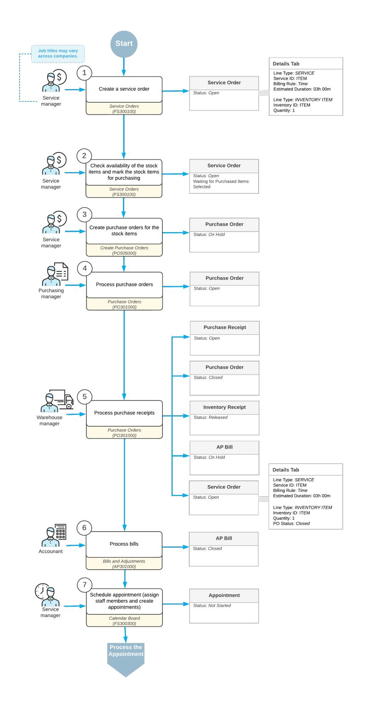

*Figure: Purchase order processing along with service order processing*

#### **Entry of a Service Order**

When a service manager receives a customer request for services, the service manager enters a service order with the *Open* status by using the *[Service Orders](https://help-2025r1.acumatica.com/Help?ScreenId=ShowWiki&pageid=6e5277d3-274e-45f5-b77d-4410ed736d21)* (FS300100) form. In the service order, the manager specifies such

details as the customer from which the request has been received, the branch and branch location from which the services are delivered, the services that should be performed, and the stock items to be purchased with the services.

As part of this step, the service manager checks the availability of the stock items at the warehouse (by selecting the warehouse and an inventory item in the corresponding columns of the **Details** tab of the *[Service Orders](https://help-2025r1.acumatica.com/Help?ScreenId=ShowWiki&pageid=6e5277d3-274e-45f5-b77d-4410ed736d21)* form for each item). For the inventory items that are not available at the warehouse, the manager selects the check box in the **Mark for PO** column. The system selects the **Waiting for Purchased Items** check box in the Summary area of the form, indicating that at least one item in the service order needs to be received.

#### **Creation of Purchase Orders**

Aer the service manager has made sure that all the necessary items are marked as needing to be purchased from the vendor or vendors, the manager clicks **Create Purchase Orders** on the More menu of the *[Service Orders](https://help-2025r1.acumatica.com/Help?ScreenId=ShowWiki&pageid=6e5277d3-274e-45f5-b77d-4410ed736d21)* (FS300100) form to open the *[Create Purchase Orders](https://help-2025r1.acumatica.com/Help?ScreenId=ShowWiki&pageid=dc527541-a18a-44c9-8d51-6d2d77a37443)* (PO505000) form. On this form, the manager checks the vendors and vendor locations specified for the items for which the purchase orders need to be created and creates these purchase orders.

The system creates purchase orders of the *Normal* type with the *On Hold* status on the *[Purchase Orders](https://help-2025r1.acumatica.com/Help?ScreenId=ShowWiki&pageid=5565686c-96c4-4bfa-a51d-9a2566baa808)* (PO301000) form. Now the service manager can track the reference number and status of the purchase orders related to the service order in the **PO Nbr.** and **PO Status** columns on the *[Service Orders](https://help-2025r1.acumatica.com/Help?ScreenId=ShowWiki&pageid=6e5277d3-274e-45f5-b77d-4410ed736d21)* or *[Service Order Details](https://help-2025r1.acumatica.com/Help?ScreenId=ShowWiki&pageid=348ef74f-3eb2-4e33-a307-f8d3970cb234)* (FS401000) form.

The system creates one purchase order for all items with the same vendor and vendor location, and different purchase orders for items with different vendors or vendor locations.

#### **Processing of Purchase Orders**

On the *[Purchase Orders](https://help-2025r1.acumatica.com/Help?ScreenId=ShowWiki&pageid=5565686c-96c4-4bfa-a51d-9a2566baa808)* (PO301000) form, the purchase manager processes the purchase orders, as described in *[Purchases of Stock Items: General Information](https://help-2025r1.acumatica.com/Help?ScreenId=ShowWiki&pageid=884c10ea-eb7c-4afd-87f1-7105bb0f374c)*. The system assigns the *Open* status to each purchase order.

Each time the status of the purchase order is changed on the *[Purchase Orders](https://help-2025r1.acumatica.com/Help?ScreenId=ShowWiki&pageid=5565686c-96c4-4bfa-a51d-9a2566baa808)* form, the status is reflected in the **PO Status** column on **Details** tab of the *[Service Orders](https://help-2025r1.acumatica.com/Help?ScreenId=ShowWiki&pageid=6e5277d3-274e-45f5-b77d-4410ed736d21)* (FS300100) form.

Each time a receiving clerk receives the purchased stock items, they create and process a purchase receipt on the *[Purchase Receipts](https://help-2025r1.acumatica.com/Help?ScreenId=ShowWiki&pageid=d9901c8d-486d-45ed-8088-ea3d8ee3af19)* (PO302000) form. Aer purchase receipts have been released for all items included in a particular purchase order, the system assigns the purchase order the *Closed* status. The system also generates an inventory receipt with the *Released* status; the receiving clerk can view this receipt on the *[Receipts](https://help-2025r1.acumatica.com/Help?ScreenId=ShowWiki&pageid=d6ecad5b-155f-44bf-baba-9ed006d298b5)* (IN301000) form.

The system also creates a bill with the *On Hold* status. An accountant now can process the bills related to the purchase orders on the *[Bills and Adjustments](https://help-2025r1.acumatica.com/Help?ScreenId=ShowWiki&pageid=956b4e51-3078-4d2d-85b3-65c080d95234)* (AP301000) form.

#### **Creation of Appointments**

Aer the purchase order has been processed, a service manager of your company then uses the *[Calendar Board](https://help-2025r1.acumatica.com/Help?ScreenId=ShowWiki&pageid=00cc92c3-408f-4fe3-b6bf-e801559f74f9)* (FS300300) form to schedule the appointments that are needed to perform the services requested by the customer.

The service manager selects a staff member to attend an appointment by taking into consideration the work schedule of the staff member, as well as filtering the displayed staff members by the skills and licenses needed to perform the service and the service area where the services are provided. On the *[Appointments](https://help-2025r1.acumatica.com/Help?ScreenId=ShowWiki&pageid=ac486e9c-f5df-4829-94f0-2df8821361a0)* (FS300200) form, the service manager checks the information on each appointment and enters additional information, such as the resource equipment used to perform the services. The system assigns the *Not Started* status to each appointment when it is first created.

An appointment can be created earlier in the process. The items that need to be purchased will also be included in the appointment. The **Mark for PO**, **PO Nbr.** and **PO Status** columns on the **Details** tab of the *[Appointments](https://help-2025r1.acumatica.com/Help?ScreenId=ShowWiki&pageid=ac486e9c-f5df-4829-94f0-2df8821361a0)* form display details on the related purchase.

The further processing workflow of the service order and its appointment does not differ from the general processing workflow of an ordinary service order.

## **Service Orders with Items to Be Purchased: Process Activity**

This activity will walk you through the creation of a service order for which a stock item must be purchased from a vendor. You will also learn how to process the purchase order and service order (up to but not including the creation of appointments).

This activity is based on the *U100* dataset. If you are using another dataset, or if any system settings have been changed in *U100*, these changes can affect the workflow of the activity and the results of the processing. To avoid any issues, restore the *U100* dataset to its initial state.

#### **Story**

Suppose that the SweetLife Service and Equipment Sales Center has announced that it will begin selling a new juicer, *JUICER05*. The FourStar Coffee & Sweets Shop customer would like to order this juicer along with training services.

Because this juicer is not yet in stock, the SweetLife Service and Equipment Sales Center needs to first purchase the juicer from the *SQUEEZO* vendor. When the juicer is received, an appointment to perform the services can be created. Acting as the service manager (Maia Davis), you will create the service order, create the purchase order, and process the purchase order.

#### **Configuration Overview**

- The minimum system configuration, which is described in *[Company with Branches that Do Not Require](https://help-2025r1.acumatica.com/Help?ScreenId=ShowWiki&pageid=a718a27b-3683-4d86-a26e-4b8fb7981f1c) [Balancing: General Information](https://help-2025r1.acumatica.com/Help?ScreenId=ShowWiki&pageid=a718a27b-3683-4d86-a26e-4b8fb7981f1c)*, has been performed.
- The *SWEETLIFE* company has been created on the *[Companies](https://help-2025r1.acumatica.com/Help?ScreenId=ShowWiki&pageid=fedad435-8496-4397-b8a3-50a473629f76)* (CS101500) form. This company has multiple branches created on the *[Branches](https://help-2025r1.acumatica.com/Help?ScreenId=ShowWiki&pageid=b97ab72d-4ab4-4f02-b69c-f7f61b316ced)* (CS102000) form, including *SWEETEQUIP (Service and Equipment Sales Center)*.
- On the *[Service Management Preferences](https://help-2025r1.acumatica.com/Help?ScreenId=ShowWiki&pageid=1c1b94d7-ac39-4f84-a966-588290b5ba80)* (FS100100) form, the minimum settings have been specified, including specifying the numbering sequences and work calendar, for the service management functionality to be used.
- On the *[Enable/Disable Features](https://help-2025r1.acumatica.com/Help?ScreenId=ShowWiki&pageid=c1555e43-1bc5-4f6f-ba9d-b323f94d8a6b)* (CS100000) form, the *Inventory and Order Management* feature, which provides support for the sales order functionality, has been enabled.
- On the *[Employees](https://help-2025r1.acumatica.com/Help?ScreenId=ShowWiki&pageid=dae5144b-49b3-43a4-bce0-93f31b3f2321)* (EP203000) form, the *EP00000040 (Maia Davis)* employee account has been defined.
- On the *[Users](https://help-2025r1.acumatica.com/Help?ScreenId=ShowWiki&pageid=834cc181-97fa-4db4-a7e0-3eaba142c166)* (SM201010) form, the *davis* account has been created. For the *davis* user account, in the **Linked Entity** box of the Summary area of the form, the *Maia Davis* employee account has been specified.
- On the *[Branch Locations](https://help-2025r1.acumatica.com/Help?ScreenId=ShowWiki&pageid=ebef097e-9e47-4c7b-b0b0-c381251b48cf)* (FS202500) form, the *WEST BRIGHTON* branch location has been configured.
- On the *[User Profile](https://help-2025r1.acumatica.com/Help?ScreenId=ShowWiki&pageid=8430c8b2-a79c-4f7b-9768-b0b7fad23a59)* (SM203010) form, for the *davis* user, the *WEST BRIGHTON* branch location has been specified as the default branch location.
- On the *[Service](https://help-2025r1.acumatica.com/Help?ScreenId=ShowWiki&pageid=06fd8a36-dd81-4df9-b609-92c3d552c542) Order Types* (FS202300) form, the *INST* service order type has been configured to generate SO invoices to bill customers for provided services. That is, in the **BillingSettings** section of the **General** tab, *SO Invoices* has been selected in the **Generated Billing Documents** box.
- On the *[Billing Cycles](https://help-2025r1.acumatica.com/Help?ScreenId=ShowWiki&pageid=273739f9-4e18-4e81-949b-128b02e37810)* (FS206000) form, the following settings have been specified for the *AP AP* billing cycle:

#### • **Run Billing For**: **Appointments**

#### • **Group Billing Documents By**: **Appointments**

Based on these billing cycle settings, a separate billing document is generated for each appointment; this document presents the details of each service of the appointment.

- On the *[Customers](https://help-2025r1.acumatica.com/Help?ScreenId=ShowWiki&pageid=652929bc-9606-4056-aa6e-0c2d1147171b)* (AR303000) form, the *GOODFOOD (GoodFood One Restaurant)* customer has been defined, and the *AP AP* billing cycle has been selected in the**Service Management** section of the **Billing** tab.
- On the *[Non-Stock Items](https://help-2025r1.acumatica.com/Help?ScreenId=ShowWiki&pageid=bf68dd4f-63d4-460d-8dc0-9152f2bd6bf1)* (IN202000) form, for the *INSTALL* non-stock item, the *Service* type has been selected.
- On the *[Stock Items](https://help-2025r1.acumatica.com/Help?ScreenId=ShowWiki&pageid=77786a70-1f1e-4d63-ad98-96f98e4fcb0e)* (IN202500) form, the *JUICER05* item has been defined, and the *Finished Good* type has been selected for this stock item.
- On the *[Vendors](https://help-2025r1.acumatica.com/Help?ScreenId=ShowWiki&pageid=a9584be3-f2bd-4d67-80d4-8041d809df56)* (AP303000) form, the *SQUEEZO* vendor has been defined.

#### **Process Overview**

To process a service order with items to be purchased, on the *[Service Orders](https://help-2025r1.acumatica.com/Help?ScreenId=ShowWiki&pageid=6e5277d3-274e-45f5-b77d-4410ed736d21)* (FS300100) form, you will create this service order and specify each item that has to be purchased. You will then create a purchase order and process it in the system.

#### **System Preparation**

Before you begin performing the steps of this activity, do the following:

- 1. Launch the Acumatica ERP website, and sign in to a company with the *U100* dataset preloaded. You should sign in as the service manager by using the *davis* username and the *123* password.
- 2. In the company to which you are signed in, ensure that the *Service Management* feature has been enabled on the *[Enable/Disable Features](https://help-2025r1.acumatica.com/Help?ScreenId=ShowWiki&pageid=c1555e43-1bc5-4f6f-ba9d-b323f94d8a6b)* (CS100000) form.
- 3. In the info area, in the upper-right corner of the top pane of the Acumatica ERP screen, make sure that the business date in your system is set to *1/30/2025*. If a different date is displayed, click the Business Date menu button and select *1/30/2025* on the calendar. For simplicity, in this activity, you will create and process all documents in the system on this business date.

### **Step 1: Creating a Service Order with an Item to Be Purchased**

To create a service order whose items need to be purchased from a vendor, do the following:

- 1. On the *[Service Orders](https://help-2025r1.acumatica.com/Help?ScreenId=ShowWiki&pageid=6e5277d3-274e-45f5-b77d-4410ed736d21)* (FS300100) form, create a service order, and specify the following settings in the Summary area:
  - **OrderType**: *INST*
  - **Customer ID**: *COFFEESHOP - FourStar Coffee & Sweets Shop*
- 2. On the **Details** tab, click **Add Row** on the table toolbar, and select the following settings in the row:
  - **LineType**: *Service*
  - **Inventory ID**: *INSTALL*
- 3. Click **Add Row** to add another row, and select the following settings in the row:
  - **LineType**: *Inventory Item*
  - **Inventory ID**: *JUICER05*

In the table footer, notice that the juicer is not available at the warehouse.

- 4. On the form toolbar, click**Save**.
- 5. On the **Details** tab, select the **Mark for PO** check box for *JUICER05*.

Now a purchase order for this inventory item can be created from the service order.

6. In the **Vendor ID** column of the row, select *SQUEEZO*.

The item that is designated for purchase will be purchased from this vendor.

7. On the form toolbar, click**Save**.

#### **Step 2: Creating a Purchase Order**

To create a purchase order, do the following:

1. While you are still viewing the service order on the *[Service Orders](https://help-2025r1.acumatica.com/Help?ScreenId=ShowWiki&pageid=6e5277d3-274e-45f5-b77d-4410ed736d21)* (FS300100) form, on the More menu (under **Replenishment**), click **Create Purchase Order**.

The *[Create Purchase Orders](https://help-2025r1.acumatica.com/Help?ScreenId=ShowWiki&pageid=dc527541-a18a-44c9-8d51-6d2d77a37443)* (PO505000) form opens with the service order type and service order number selected, and the table shows one row with the item to be purchased.

- 2. For the row in the table, verify the vendor in the**Vendor** column.
- 3. Select the unlabeled check box in the row of the inventory item, and click **Process** on the form toolbar.

Aer the processing has successfully completed, the *[Purchase Orders](https://help-2025r1.acumatica.com/Help?ScreenId=ShowWiki&pageid=5565686c-96c4-4bfa-a51d-9a2566baa808)* (PO301000) form opens with the purchase order you have created.

#### **Step 3: Processing the Purchase Order**

To process the purchase order, do the following:

- 1. On the form toolbar of the *[Purchase Orders](https://help-2025r1.acumatica.com/Help?ScreenId=ShowWiki&pageid=5565686c-96c4-4bfa-a51d-9a2566baa808)* (PO301000) form, for the purchase order that you created in the previous step, click **Remove Hold**.
- 2. On the form toolbar, click **Enter PO Receipt**.

The *[Purchase Receipts](https://help-2025r1.acumatica.com/Help?ScreenId=ShowWiki&pageid=d9901c8d-486d-45ed-8088-ea3d8ee3af19)* (PO302000) form opens with a new receipt that has settings copied from the purchase order.

3. On the form toolbar, click**Save**.

The receipt has been created for the purchased item.

4. On the form toolbar, click **Release**.

The receipt has been released, indicating that the ordered inventory item is at the warehouse.

#### **Step 4: Reviewing the Service Order with the Purchased Item**

To review the service order, do the following:

1. Open the *[Service Order Details](https://help-2025r1.acumatica.com/Help?ScreenId=ShowWiki&pageid=348ef74f-3eb2-4e33-a307-f8d3970cb234)* (FS401000) form, and in the **Customer** box, select *COFFEESHOP (FourStar Coffee & Sweets Shop)* (see Item 1 in the following screenshot).

In the list, find a service order with the item that has been purchased (*JUICER05* in the **Inventory ID** column). In the **PO Status** column, notice that the status of the purchase order is *Completed* (Item 2). This indicates that the stock item has been received at the warehouse.

| Service Order Details                                |                                             |                                                                                         |               |                                                                           |                   |             |                  |                                                  |                       |                       |          |                       |                     |                                |                       |                              |        |         |           |   |
|------------------------------------------------------|---------------------------------------------|-----------------------------------------------------------------------------------------|---------------|---------------------------------------------------------------------------|-------------------|-------------|------------------|--------------------------------------------------|-----------------------|-----------------------|----------|-----------------------|---------------------|--------------------------------|-----------------------|------------------------------|--------|---------|-----------|---|
| $\Omega$ !!!!!!!!!!!!!!!!!!!!!!!!!!!!!!!!!!!!!!!! | $\mathbb{H}$ $\boxed{\mathbf{x}}$        |                                                                                         |               |                                                                           |                   |             |                  |                                                  |                       |                       |          |                       |                     |                                |                       |                              |        |         |           |   |
| Branch: Customer: Location:                    | Branch Location:                            | SWEETEQUIP - Service and Q WEST BRIGHTON - Office in P COFFEESHOP - FourStar Cc P | o             | Service Contract ID: Schedule ID: Item: <b>Target Equipment:</b> |                   |             |                  | o From Date: $\circ$ To Date: ø ø |                       | 1/1/2025 1/31/2025 |          |                       |                     |                                |                       |                              |        |         |           |   |
|                                                      | Drag column header here to configure filter |                                                                                         |               |                                                                           |                   |             |                  |                                                  |                       |                       |          |                       |                     |                                |                       |                              |        |         |           | Y |
|                                                      | <b>B</b> 0 □ Branch ID                      | <b>Branch Location ID</b>                                                               | Order Type | Order Nbr.                                                                | Customer ID       | Location ID |                  | Date Status                                      | Line Type             | Inventory ID          | Billable | Estimated Quantity | Estimated Amount | Appointment <b>Quantity</b> | Appointment Amount | Appoint Mark Count for PO |        | PO Nbr. | PO Status |   |
|                                                      | <b>0 D SWEETEQUIP</b>                       | <b>WEST BRIGHTON</b>                                                                    | <b>INST</b>   | 000036                                                                    | <b>COFFEESHOP</b> | <b>MAIN</b> | 1/31/2025 Open   |                                                  | Service               | <b>INSTALL</b>        | ◙        | 1.00                  | 100.00              | 1.00                           | 100.00                | $1 \square$                  |        |         |           |   |
|                                                      | <b>0 D SWEETEQUIP</b>                       | <b>WEST BRIGHTON</b>                                                                    | <b>TRN</b>    | 000042                                                                    | COFFEESHOP        | MAIN        | 1/30/2025 Open   |                                                  | Service               | <b>TRAINING</b>       | ⊠        | 0.75                  | 37.50               | 0.00                           | 0.00                  | $0$ $\Box$                   |        |         |           |   |
|                                                      | <b>0 D SWEETEQUIP</b>                       | <b>WEST BRIGHTON</b>                                                                    | <b>TRN</b>    | 000010                                                                    | <b>COFFEESHOP</b> | <b>MAIN</b> | 1/30/2025 Open   |                                                  | Service               | <b>TRAINING</b>       | ◙        | 0.75                  | 37.50               | 0.75                           | 37.50                 | $1 -$                        | $\Box$ |         |           |   |
|                                                      | <b>0 D SWEETEQUIP</b>                       | <b>WEST BRIGHTON</b>                                                                    | <b>MRO</b>    | 000037                                                                    | COFFEESHOP        | <b>MAIN</b> | 1/30/2025 Open   |                                                  | Service               | <b>REPAIR</b>         | ⊠        | 1.00                  | 80.00               | 0.00                           | 0.00                  | $\bullet$                    | $\Box$ |         |           |   |
|                                                      | <b>0 D SWEETEQUIP</b>                       | <b>WEST BRIGHTON</b>                                                                    | <b>INST</b>   | 000046                                                                    | <b>COFFEESHOP</b> | <b>MAIN</b> | 1/30/2025 Open   |                                                  | Service               | <b>INSTALL</b>        | ◙        | 1.00                  | 100.00              | 0.00                           | 0.00                  | $\bullet$                    | $\Box$ |         |           |   |
|                                                      | 0 D SWEETEQUIP                              | <b>WEST BRIGHTON</b>                                                                    | <b>INST</b>   | 000046                                                                    | COFFEESHOP        | MAIN        | 1/30/2025 Open   |                                                  | <b>Inventory</b> Item | <b>JUICER05</b>       | ⊠        | 1.00                  | 700.00              | 0.00                           | 0.00                  | $\bullet$                    | ☑      | 000054  | Completed |   |
|                                                      | <b>0 D SWEETEQUIP</b>                       | <b>WEST BRIGHTON</b>                                                                    | <b>INST</b>   | 000041                                                                    | COFFEESHOP        | <b>MAIN</b> | 1/30/2025 Open   |                                                  | Service               | <b>INSTALL</b>        | ⊠        | 1.00                  | 100.00              | 0.00                           | 0.00                  | $\bullet$                    | $\Box$ |         |           |   |
|                                                      | <b>0 D SWEETEQUIP</b>                       | <b>WEST BRIGHTON</b>                                                                    | <b>DEV</b>    | 000043                                                                    | COFFEESHOP        | <b>MAIN</b> |                  | 1/29/2025 Completed                              | Service               | <b>TRAINING</b>       | ⊠        | 0.75                  | 37.50               | 0.75                           | 37.50                 | 1                            | $\Box$ |         |           |   |
|                                                      | <b>0 D SWEETEQUIP</b>                       | <b>WEST BRIGHTON</b>                                                                    | <b>TRN</b>    | 000013                                                                    | COFFEESHOP        | <b>MAIN</b> | 1/28/2025 Open   |                                                  | Service               | <b>TRAINING</b>       | ⊠        | 1.50                  | 75.00               | 0.00                           | 0.00                  | $\bullet$                    | $\Box$ |         |           |   |
|                                                      | <b>0 D SWEETEQUIP</b>                       | <b>WEST BRIGHTON</b>                                                                    | <b>INST</b>   | 000004                                                                    | <b>COFFEESHOP</b> | <b>MAIN</b> | 1/18/2025 Closed |                                                  | Service               | <b>INSTALL</b>        | ⊠        | 1.00                  | 100.00              | 1.00                           | 100.00                | $1 \square$                  |        |         |           |   |
|                                                      | <b>0 D SWEETEQUIP</b>                       | <b>WEST BRIGHTON</b>                                                                    | <b>INST</b>   | 000004                                                                    | COFFEESHOP        | <b>MAIN</b> | 1/18/2025 Closed |                                                  | <b>Inventory Item</b> | JUICER20C             | ⊠        | 1.00                  | 4.000.00            | 1.00                           | 4.000.00              | $\blacksquare$               | $\Box$ |         |           |   |
|                                                      |                                             |                                                                                         |               |                                                                           |                   |             |                  |                                                  |                       |                       |          |                       |                     |                                |                       |                              |        |         |           |   |

#### *Figure: The purchased item*

2. In the **Order Nbr.** box, click the link to the service order you created with the purchased item.

The *[Service Orders](https://help-2025r1.acumatica.com/Help?ScreenId=ShowWiki&pageid=6e5277d3-274e-45f5-b77d-4410ed736d21)* (FS300100) form opens with the service order.

3. On the **Details** tab, select the row with the *JUICER05* stock item, and on the table toolbar, click the **Line Details** button.

In the **Line Details** dialog box, which has been opened, notice that the **Allocated** check box is selected for the inventory item, indicating that the purchased item is reserved for the service order.

### **Service Orders with Items to Be Purchased: Allocations for Service Orders**

In Acumatica ERP, *allocation* is a broad term used to denote splitting the item quantity into smaller quantities with different subitems or lot numbers, splitting the quantity into separate units with serial numbers, or specifying quantities that should be reserved for the order in different warehouses. This helps your company to avoid overstocks and stockouts of items being sold.

The field service functionality does not support processing of stock items of lot/serial class with the *When Used* assignment method.

In this topic, you will read about allocating stock items for service orders and allocating stock items that have been purchased for service orders.

#### **Allocation of Stock Items for Service Orders**

You can reserve the specified item quantities for the service order by allocating them on the *[Service Orders](https://help-2025r1.acumatica.com/Help?ScreenId=ShowWiki&pageid=6e5277d3-274e-45f5-b77d-4410ed736d21)* (FS300100) form. On the **Details** tab, you can click a service order line and view the item availability information at the bottom of the form. You may want to reserve the requested quantity for this specific item (or for multiple items).

To allocate stock for a particular line of a service order, you use the **Line Details** dialog box, which opens if you click the needed line on the **Details** tab of the *[Service Orders](https://help-2025r1.acumatica.com/Help?ScreenId=ShowWiki&pageid=6e5277d3-274e-45f5-b77d-4410ed736d21)* form and then click **Line Details** on the table toolbar. By using this dialog box, you can select whether to reserve the requested quantities of the item in a single warehouse or multiple warehouses. Also, you can use the **Line Details** dialog box to track the order fulfillment. For each allocation line, the **Related Document** column contains the reference number of the document related to the current stage of the order fulfillment.

#### **Notes on Processing of Appointments with Allocated Items**

With allocations for each inventory item line, the system will not allow a staff member to assign more units of an inventory item to an appointment than the quantity of units specified in the related service order. For example, suppose that one service and two units of the *ACINF21* inventory item are associated with a service order on the *[Service Orders](https://help-2025r1.acumatica.com/Help?ScreenId=ShowWiki&pageid=6e5277d3-274e-45f5-b77d-4410ed736d21)* (FS300100) form. Two appointments are created to fulfill the service order, and each appointment has one unit of the *ACINF21* inventory item assigned. Suppose that during the second appointment, the customer asks for a third unit of the *ACINF21* inventory item. The system will not allow the staff member to modify the quantity of the line associated with the two original *ACINF21* inventory items because the appointment quantity would be greater than the service order quantity. In this case, the staff member needs to add a new line item to the second appointment for the extra *ACINF21* inventory item on the **Details** tab of the *[Appointments](https://help-2025r1.acumatica.com/Help?ScreenId=ShowWiki&pageid=ac486e9c-f5df-4829-94f0-2df8821361a0)* form. The system will add the line item to the service order as well.

If a user clones an appointment that includes inventory items, if the quantity of inventory items in all appointments exceeds the quantity specified in the related service order, the system automatically adds new items to the service order.

If the scheduler has added inventory items to a service order, and then not all inventory items have been used in the appointments associated with the service order, and if the billing cycle is set to generate invoices from appointments, when the service order is closed, the system cancels the allocation of the quantity of inventory items that were not used in appointments.

#### **Allocation of Purchased Stock Items for Service Orders**

If the ordered items are out of stock at the shipping warehouse, you can process a purchase from a vendor for the subsequent sale to get the sufficient quantity of ordered items directly for this service order.

Aer receipts have been released for the related purchase orders, you can track the stage of fulfillment for each line of the original sales order by clicking **Line Details** on the *[Service Orders](https://help-2025r1.acumatica.com/Help?ScreenId=ShowWiki&pageid=6e5277d3-274e-45f5-b77d-4410ed736d21)* (FS300100) form. In the **Line Details** dialog box, which opens, you can view the allocation that the system automatically performs to reserve the line item quantity required for the service order on the purchase receipt. In the **Line Details** dialog box, you can also view the reference numbers of the related documents in the **Related Documents** column: the purchase order and the receipt. (You can click any reference number of a related document to view the document.)

If a purchase order for an inventory item was created from a service order, aer the inventory item is received, the inventory item is automatically allocated for the service order. Additionally, if a serial number was specified in the purchase receipt, the serial number is copied to the service order.

#### **Item Availability Tracking**

The way the order quantity is reflected in the system depends on the availability calculation rule selected for the item class (of each included item) on the *[Item Classes](https://help-2025r1.acumatica.com/Help?ScreenId=ShowWiki&pageid=80a3301b-4eb2-4ce2-94c5-0407c786a0f1)* (IN201000) form. For details on availability, see *[Availability](https://help-2025r1.acumatica.com/Help?ScreenId=ShowWiki&pageid=36d6e854-c66e-4d9f-b150-6abbf0ece76b) [Calculation Rules: General Information](https://help-2025r1.acumatica.com/Help?ScreenId=ShowWiki&pageid=36d6e854-c66e-4d9f-b150-6abbf0ece76b)*.

Generally, as the status of a purchase order for a service order changes, the purchase order quantity updates the **FS Prepared**, **FS Booked**, **FS Allocated**, and **On Hand** total quantities, which are reflected on the *[Inventory Allocation](https://help-2025r1.acumatica.com/Help?ScreenId=ShowWiki&pageid=6d8011ac-1d4e-4a34-8bc2-1fa1ff002c05) [Details](https://help-2025r1.acumatica.com/Help?ScreenId=ShowWiki&pageid=6d8011ac-1d4e-4a34-8bc2-1fa1ff002c05)* (IN402000) form.

## **Processing Prepayments for a Service Order**

In this chapter, you will learn how to process a service order for which prepayments have been applied.

## **Service Order Prepayments: General Information**

Sometimes you may agree with the customer on providing a service or multiple services with some prepayment made by the customer beforehand.

#### **Learning Objectives**

In this chapter, you will learn how to do the following:

- Create a service order and enter the prepayment to the service order
- Create an appointment and enter the second prepayment for the appointment
- Generate a sales order and review two prepayments applied

#### **Applicable Scenarios**

You process service orders with prepayments if customers of your company make prepayments for the service to be provided.

#### **Process Diagram**

In the diagram below, you can see the general workflow of processing a service order with prepayments.

Processes and job titles may be different in your company.

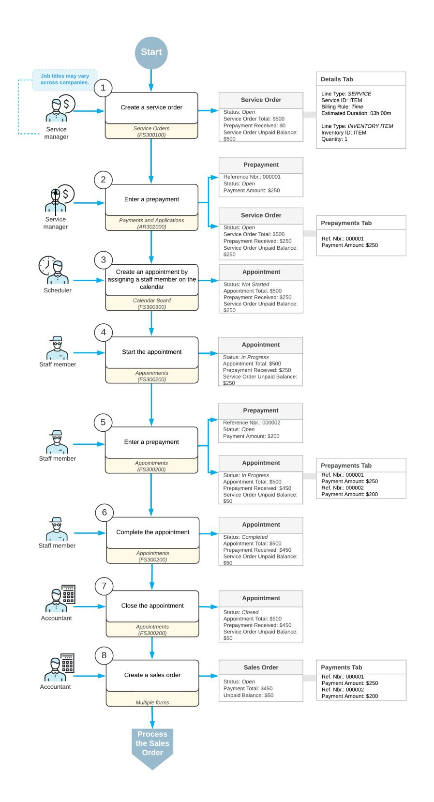

*Figure: Processing a service order with prepayments*

## **Service Order Prepayments: Process Activity**

This activity will walk you through the process of managing prepayments that have been made for a service order, including entering a prepayment while acting as a staff member attending an appointment. You will go through the whole process, starting from the creation of a service order and ending with the release of the invoice for the service order.

This activity is based on the *U100* dataset. If you are using another dataset, or if any system settings have been changed in *U100*, these changes can affect the workflow of the activity and the results of the processing. To avoid any issues, restore the *U100* dataset to its initial state.

#### **Story**

Suppose that the GoodFood One Restaurant customer has contacted the service manager of the SweetLife Service and Equipment Sales Center to request installation services and a juicer. You will enter the service order into the system and create and schedule the related appointment. The customer has paid 20% of the service order total in advance when requesting the services and the item, and will prepay an additional 30% at the appointment. You will enter the prepayments at the appropriate times, process the appointment, and generate the billing documents.

### **Configuration Overview**

In the *U100* dataset, the following tasks have been performed to support this activity:

- The minimum system configuration, which is described in *[Company with Branches that Do Not Require](https://help-2025r1.acumatica.com/Help?ScreenId=ShowWiki&pageid=a718a27b-3683-4d86-a26e-4b8fb7981f1c) [Balancing: General Information](https://help-2025r1.acumatica.com/Help?ScreenId=ShowWiki&pageid=a718a27b-3683-4d86-a26e-4b8fb7981f1c)*, has been performed.
- The *SWEETLIFE* company has been created on the *[Companies](https://help-2025r1.acumatica.com/Help?ScreenId=ShowWiki&pageid=fedad435-8496-4397-b8a3-50a473629f76)* (CS101500) form. This company has multiple branches created on the *[Branches](https://help-2025r1.acumatica.com/Help?ScreenId=ShowWiki&pageid=b97ab72d-4ab4-4f02-b69c-f7f61b316ced)* (CS102000) form, including *SWEETEQUIP (Service and Equipment Sales Center)*.
- On the *[Service Management Preferences](https://help-2025r1.acumatica.com/Help?ScreenId=ShowWiki&pageid=1c1b94d7-ac39-4f84-a966-588290b5ba80)* (FS100100) form, the minimum settings have been specified, including specifying the numbering sequences and work calendar, for the service management functionality to be used.
- On the *[Employees](https://help-2025r1.acumatica.com/Help?ScreenId=ShowWiki&pageid=dae5144b-49b3-43a4-bce0-93f31b3f2321)* (EP203000) form, *EP00000040 (Maia Davis)* and *EP00000004 (Alberto Jimenez)* have been defined. For *EP00000004 (Alberto Jimenez)*, the **Staff Member in Service Management** check box has been selected, so you can assign him to perform services.
- On the *[Users](https://help-2025r1.acumatica.com/Help?ScreenId=ShowWiki&pageid=834cc181-97fa-4db4-a7e0-3eaba142c166)* (SM201010) form, the *davis* and *jimenez* accounts have been created. For the *davis* user account, in the **Linked Entity** box of the Summary area of the form, the *Maia Davis* employee account has been specified; for the *jimenez* user account, in this box, the *Alberto Jimenez* employee account has been specified.
- On the *[Branch Locations](https://help-2025r1.acumatica.com/Help?ScreenId=ShowWiki&pageid=ebef097e-9e47-4c7b-b0b0-c381251b48cf)* (FS202500) form, the *WEST BRIGHTON* branch location has been defined.
- On the *[User Profile](https://help-2025r1.acumatica.com/Help?ScreenId=ShowWiki&pageid=8430c8b2-a79c-4f7b-9768-b0b7fad23a59)* (SM203010) form, for the *davis* user, the *WEST BRIGHTON* branch location has been specified as the default branch location.
- On the *[Service](https://help-2025r1.acumatica.com/Help?ScreenId=ShowWiki&pageid=06fd8a36-dd81-4df9-b609-92c3d552c542) Order Types* (FS202300) form, the *INST* service order type has been defined to generate SO invoices to bill customers for provided services. That is, in the **BillingSettings** section of the **General** tab, *SO Invoices* has been selected in the **Generated Billing Documents** box. Also, on the **General** tab (**General Settings** section), the **CompleteService Order When Its Appointments Are Completed** and **CloseService Order When Its Appointments Are Closed** check boxes are selected.
- On the *[Customers](https://help-2025r1.acumatica.com/Help?ScreenId=ShowWiki&pageid=652929bc-9606-4056-aa6e-0c2d1147171b)* (AR303000) form, the *GOODFOOD (GoodFood One Restaurant)* customer has been defined, and the *AP AP* billing cycle has been selected in the**Service Management** section of the **Billing** tab.
- On the *[Billing Cycles](https://help-2025r1.acumatica.com/Help?ScreenId=ShowWiki&pageid=273739f9-4e18-4e81-949b-128b02e37810)* (FS206000) form, the following settings have been specified for the *AP AP* billing cycle:
  - **Run Billing For**: **Appointments**

#### • **Group Billing Documents By**: **Appointments**

Based on these billing cycle settings, a separate billing document is generated for each appointment; this document presents the details of each service of the appointment.

• On the *[Cash Accounts](https://help-2025r1.acumatica.com/Help?ScreenId=ShowWiki&pageid=10f71454-88f9-4d6c-8d09-32856d8c6741)* (CA202000) form, the *10200EQ (Equipment Checking)* cash account is assigned to the *SWEETEQUIP* branch.

#### **Process Overview**

You will create a service order on the *[Service Orders](https://help-2025r1.acumatica.com/Help?ScreenId=ShowWiki&pageid=6e5277d3-274e-45f5-b77d-4410ed736d21)* (FS300100) form and add the service to be performed. You will enter the initial prepayment for the service order on the *[Payments and Applications](https://help-2025r1.acumatica.com/Help?ScreenId=ShowWiki&pageid=ae844bf4-1aef-42cd-9e2f-49b3ee1bc8d7)* (AR302000) form and then create the related appointment on the *[Appointments](https://help-2025r1.acumatica.com/Help?ScreenId=ShowWiki&pageid=ac486e9c-f5df-4829-94f0-2df8821361a0)* (FS300200) form. You then will process the appointment, including entering the second prepayment on the *[Payments and Applications](https://help-2025r1.acumatica.com/Help?ScreenId=ShowWiki&pageid=ae844bf4-1aef-42cd-9e2f-49b3ee1bc8d7)* form. Finally, you will process an invoice on the *[Invoices](https://help-2025r1.acumatica.com/Help?ScreenId=ShowWiki&pageid=0acc9738-f141-4ea0-a2be-f34ea9d1b63a)* (SO303000) form to bill the customer.

#### **System Preparation**

Before you begin performing the steps of this activity, do the following:

- 1. Launch the Acumatica ERP website, and sign in to a company with the *U100* dataset preloaded. You should sign in as a service manager by using the *davis* username and the *123* password.
- 2. In the company to which you are signed in, ensure that the *Service Management* feature has been enabled on the *[Enable/Disable Features](https://help-2025r1.acumatica.com/Help?ScreenId=ShowWiki&pageid=c1555e43-1bc5-4f6f-ba9d-b323f94d8a6b)* (CS100000) form.
- 3. In the info area, in the upper-right corner of the top pane of the Acumatica ERP screen, make sure that the business date in your system is set to *1/30/2025*. If a different date is displayed, click the Business Date menu button and select *1/30/2025* on the calendar. For simplicity, in this activity, you will create and process all documents in the system on this business date.

#### **Step 1: Entering a Service Order**

To create a service order for the GoodFood One Restaurant, do the following:

- 1. Open the *[Service Orders](https://help-2025r1.acumatica.com/Help?ScreenId=ShowWiki&pageid=6e5277d3-274e-45f5-b77d-4410ed736d21)* (FS300100) form.
- 2. On the form toolbar, click **Add New Record**, and specify the following settings in the Summary area:
  - **Service OrderType**: *INST*
  - **Customer**: *GOODFOOD - GoodFood One Restaurant*
- 3. On the **Details** tab, click **Add Row** on the table toolbar, and specify the following settings in the added row:
  - **LineType**: *Service*
  - **Inventory ID**: *INSTALL*
- 4. Click **Add Row** again on the table toolbar, and specify the following settings in the added row:
  - **LineType**: *Inventory Item*
  - **Inventory ID**: *JUICER20C*
- 5. On the form toolbar, click**Save**.

#### **Step 2: Entering a Prepayment for the Service Order**

To create a prepayment for the service order, do the following:

1. While you are still viewing the service order you created on the *[Service Orders](https://help-2025r1.acumatica.com/Help?ScreenId=ShowWiki&pageid=6e5277d3-274e-45f5-b77d-4410ed736d21)* (FS300100) form, on the **Prepayments** tab, click **Create Prepayment** on the table toolbar.

The *[Payments and Applications](https://help-2025r1.acumatica.com/Help?ScreenId=ShowWiki&pageid=ae844bf4-1aef-42cd-9e2f-49b3ee1bc8d7)* (AR302000) form opens in a pop-up window.

- 2. In the **Cash Account** box of the Summary area, ensure that *10200EQ (Equipment Checking)* is selected.
- 3. In the **Payment Amount** box, type 820, which is 20% of the total amount.
- 4. On the **Service Orders** tab, notice that the service order you created is assigned to the prepayment.
- 5. On the form toolbar, click **Remove Hold**.
- 6. On the form toolbar, click**Save** and then **Release**.
- 7. Close the window with the form.

On the *[Service Orders](https://help-2025r1.acumatica.com/Help?ScreenId=ShowWiki&pageid=6e5277d3-274e-45f5-b77d-4410ed736d21)* form, to which you return, notice that the prepayment you have created is now listed on the **Prepayments** tab.

#### **Step 3: Creating an Appointment**

To create an appointment for the service order, do the following:

1. While you are still viewing the service order on the *[Service Orders](https://help-2025r1.acumatica.com/Help?ScreenId=ShowWiki&pageid=6e5277d3-274e-45f5-b77d-4410ed736d21)* (FS300100) form, click **Create Appointment** on the form toolbar.

The system opens the *[Appointments](https://help-2025r1.acumatica.com/Help?ScreenId=ShowWiki&pageid=ac486e9c-f5df-4829-94f0-2df8821361a0)* (FS300200) form with relevant settings copied from the service order.

- 2. On the **Settings** tab, in the**Scheduled Start Date** boxes, specify *2/3/2025 12:00 PM*
- 3. On the table toolbar of the**Staff** tab, click **Add Row**.
- 4. In the **Staff Member** column, select *Alberto Jimenez*.
- 5. On the form toolbar, click**Save**.

#### **Step 4: Processing the Appointment with the Prepayment**

To process the appointment, do the following on behalf of staff member Alberto Jimenez:

- 1. While you are still viewing the appointment you created on the *[Appointments](https://help-2025r1.acumatica.com/Help?ScreenId=ShowWiki&pageid=ac486e9c-f5df-4829-94f0-2df8821361a0)* (FS300200) form, click**Start** on the form toolbar.
- 2. On the **Prepayments** tab, click **Create Prepayment**.

The *[Payments and Applications](https://help-2025r1.acumatica.com/Help?ScreenId=ShowWiki&pageid=ae844bf4-1aef-42cd-9e2f-49b3ee1bc8d7)* (AR302000) form opens in a pop-up window.

- 3. In the **Cash Account** box, ensure that *10200EQ (Equipment Checking)* is selected.
- 4. In the **Payment Amount** box, type 1,230.00, which is 30% of the total amount.
- 5. On the **Service Orders** tab, notice that the created service order is assigned to the prepayment.
- 6. On the form toolbar, click **Remove Hold**.
- 7. On the form toolbar, click**Save** and then **Release**.
- 8. Close the window.
- 9. On the *[Appointments](https://help-2025r1.acumatica.com/Help?ScreenId=ShowWiki&pageid=ac486e9c-f5df-4829-94f0-2df8821361a0)* form, to which you return, in the **Actual Date and Time** section of the**Settings** tab, specify the following settings:
  - **ActualStart Date**: *2/3/2025 12:00PM*
  - **Actual End Date**: *2/3/2025 1:00PM*
  - **Finished**: Selected
- 10.On the form toolbar, click **Complete**.
- 11.On behalf of the accountant, on the form toolbar, click **Close**.

The completion and closing of the appointment caused the service order to also be completed and closed because of the settings of the *INST* service order type on the *[Service](https://help-2025r1.acumatica.com/Help?ScreenId=ShowWiki&pageid=06fd8a36-dd81-4df9-b609-92c3d552c542) Order Types* (FS202300) form, as described in the *Configuration Overview* section.

#### **Step 5: Generating an Invoice**

To generate an invoice, do the following (while still acting as an accountant):

You can process appointment billing on the *[Run Appointment Billing](https://help-2025r1.acumatica.com/Help?ScreenId=ShowWiki&pageid=f1d027ae-c546-47ab-b861-1b7670532bd9)* (FS500100) form. In this activity, we describe an alternative billing method using the *[Appointments](https://help-2025r1.acumatica.com/Help?ScreenId=ShowWiki&pageid=ac486e9c-f5df-4829-94f0-2df8821361a0)* (FS300200) form.

- 1. While you are still viewing the appointment on the *[Appointments](https://help-2025r1.acumatica.com/Help?ScreenId=ShowWiki&pageid=ac486e9c-f5df-4829-94f0-2df8821361a0)* form, click **Run Billing** on the form toolbar.
- 2. Aer the processing has successfully completed, on the **Billing Documents** tab, click the reference number of the invoice.

The *[Invoices](https://help-2025r1.acumatica.com/Help?ScreenId=ShowWiki&pageid=0acc9738-f141-4ea0-a2be-f34ea9d1b63a)* (SO303000) form opens in a separate window with the generated invoice.

3. On the **Applications** tab (Item 1 in the following screenshot), notice that both prepayments are listed (Item 2).

| Invoices                                                  | Invoice 000123 - GoodFood One Restaurant          |                       |                                |                                     |          |                        |          |                                                                                 |            |                       |              |               | <b>TH NOTES</b> | <b>ACTIVITIES</b>      | <b>FILES</b> | $TOOLS$ $\sim$ |
|-----------------------------------------------------------|---------------------------------------------------|-----------------------|--------------------------------|-------------------------------------|----------|------------------------|----------|---------------------------------------------------------------------------------|------------|-----------------------|--------------|---------------|-----------------|------------------------|--------------|----------------|
|                                                           |                                                   |                       |                                |                                     |          |                        |          |                                                                                 |            |                       |              |               |                 |                        |              |                |
| 유 $\Box$ $\Omega$                                   | û $+$                                          | $D \times K \times C$ | $\lambda$ $\rightarrow$     | REMOVE HOLD                         |          |                        |          |                                                                                 |            |                       |              |               |                 |                        |              |                |
| Type:                                                     | Invoice $\sim$                                 | Customer:             |                                | GOODFOOD - GoodFood One Restaurar / |          | Detail Total:          | 4,100.00 |                                                                                 |            |                       |              |               |                 |                        |              | $\sim$         |
| Reference Nbr.                                            | 000123 $\circ$                                 | * Location:           | <b>MAIN - Primary Location</b> |                                     | $\circ$  | Line Discounts:        | 0.00     |                                                                                 |            |                       |              |               |                 |                        |              |                |
| Status:                                                   | On Hold                                           | * Terms:              | 30D - 30 Days                  |                                     | $\circ$  | Document Dis           | 0.00     |                                                                                 |            |                       |              |               |                 |                        |              |                |
| * Date:                                                   | 2/3/2025 $\Box$                                | * Due Date:           | 3/5/2025 $\Box$             |                                     |          | Freight Total:         | 0.00     |                                                                                 |            |                       |              |               |                 |                        |              |                |
| * Post Period:                                            | 02-2025 $\circ$                                | * Cash Discount.      | 3/5/2025                       | $\Box$                              |          | <b>Tax Total:</b>      | 0.00     |                                                                                 |            |                       |              |               |                 |                        |              |                |
| Customer Ord.                                             |                                                   |                       |                                |                                     |          | Balance:               | 4,100.00 |                                                                                 |            |                       |              |               |                 |                        |              |                |
|                                                           | * Project/Contract: X - Non-Project Code.         |                       |                                |                                     | $\Omega$ | Cash Discount:         | 0.00     |                                                                                 |            |                       |              |               |                 |                        |              |                |
| Description:                                              | Installation of equipment at the customers' place |                       |                                |                                     |          |                        |          |                                                                                 |            |                       |              |               |                 |                        |              |                |
|                                                           |                                                   |                       |                                |                                     |          |                        |          |                                                                                 |            |                       |              |               |                 |                        |              |                |
| <b>DETAILS</b>                                            | <b>TAXES</b> <b>FREIGHT</b>                    | <b>FINANCIAL</b>      | ADDRESSES                      | <b>APPLICATIONS</b>                 |          |                        |          |                                                                                 |            |                       |              |               |                 |                        |              |                |
| !!!!!!!!!!!!!!!!!!!!!!!!!!!!!!!!!!!!!!!! $\times$ ÷ | <b>LOAD DOCUMENTS</b>                             | AUTO APPLY            |                                | <b>CREATE PAYMENT</b> CAPTURE    |          | VOID CARD PAYMENT      |          | $\left  \rightarrow \right $ $\left  \mathbf{x} \right $ IMPORT CARD PAYMENT |            |                       |              |               |                 | Not Released:          |              | 0.00           |
| <b>B</b> 0 <b>D</b> □ *Doc. Type                          |                                                   | *Reference Nbr.       | <b>Amount Paid</b>             | <b>Cash Discount</b>                |          | Write-Off Payment Date |          | <b>Balance Description</b>                                                      | Currency   | <b>Payment Period</b> | Payment Ref. | <b>Status</b> |                 | Authorized:            |              | 0.00           |
|                                                           |                                                   | 2                     |                                | Taken                               | Amount   |                        |          |                                                                                 |            |                       |              |               |                 | Released:              |              | 2.050.00       |
| 8 D Ø Prepayment                                          |                                                   | 000079                | 820.00                         | 0.0000                              |          | 0.00 1/30/2025         |          | 0.00 Installation of equipment at the customers' place                          | <b>USD</b> | 01-2025               | 0006         | Open          |                 | <b>Total Paid:</b>     |              | 2,050.00       |
| 0 □ Ø Prepayment                                          |                                                   | 000080                | 1,230.00                       | 0.0000                              |          | 0.00 1/30/2025         |          | 0.00 Installation of equipment at the customers' place                          | <b>USD</b> | 01-2025               | 0007         | Open          |                 | Write-Off Total:       |              | 0.00           |
|                                                           |                                                   |                       |                                |                                     |          |                        |          |                                                                                 |            |                       |              |               |                 |                        |              |                |
|                                                           |                                                   |                       |                                |                                     |          |                        |          |                                                                                 |            |                       |              |               |                 | <b>Unpaid Balance:</b> |              | 2.050.00       |
|                                                           |                                                   |                       |                                |                                     |          |                        |          |                                                                                 |            |                       |              |               |                 |                        |              |                |
|                                                           |                                                   |                       |                                |                                     |          |                        |          |                                                                                 |            |                       |              |               |                 |                        |              |                |
|                                                           |                                                   |                       |                                |                                     |          |                        |          |                                                                                 |            |                       |              |               |                 |                        |              |                |
|                                                           |                                                   |                       |                                |                                     |          |                        |          |                                                                                 |            |                       |              |               |                 |                        |              |                |

#### *Figure: The Applications Tab*

Also notice that the**Total Paid** and the **Unpaid Balance** amounts are indicated in the right panel of the **Application** tab. Verify that the**Total Paid** is 50% of total appointment billable amount.

4. On the form toolbar, click **Remove Hold** and then **Release**.

In the Summary area of the *[Invoices](https://help-2025r1.acumatica.com/Help?ScreenId=ShowWiki&pageid=0acc9738-f141-4ea0-a2be-f34ea9d1b63a)* form, review the invoice balance (**Balance**) to be paid is 2,050.00.

5. On the More menu, click **Pay**.

The system opens the document of the *Payment* type on the *[Payments and Applications](https://help-2025r1.acumatica.com/Help?ScreenId=ShowWiki&pageid=ae844bf4-1aef-42cd-9e2f-49b3ee1bc8d7)* (AR302000) form, with the amount to be paid equal to 2,050.00, which is specified in the **Payment Amount** box in the Summary area of the form.

6. Click **Remove Hold** and **Release**.

## **Creating and Using Resource Equipment**

In this chapter, you will learn how to create equipment types, assign an equipment type to a service, and how to create an equipment records in the system.

You will also learn how to add resource equipment in an appointment, and how to review information about the appointments for which resource equipment was used.

## **Resource Equipment: General Information**

In Acumatica ERP, you can enter and keep information about equipment that staff members use to perform services—resource equipment. Resource equipment is a physical resource of your company. You can enter the equipment's parameters, such as its serial number, registration information, manufacturing settings, purchase information, owner, and location.

Equipment types are categories that are used for grouping equipment and associating a group of equipment with a service. You create equipment types, specify the appropriate type for each resource equipment, and assign equipment types to services. This ensures that the right equipment will later be selected to perform these services.

In this chapter, you will learn how to create equipment types, and assign them to equipment and services in the system, how to add resource equipment to the system, and how to assign it to appointments.

#### **Learning Objectives**

In this chapter, you will learn how to do the following:

- Create equipment types
- Assign the equipment types to services
- Create equipment records
- View the equipment history

#### **Applicable Scenarios**

You create resource equipment records in the system if your company wants to keep information about equipment that staff members use to perform services.

#### **Creating Equipment Types**

Equipment types structure the data in the system and make it easier to select the right equipment for performing services. Equipment of one equipment type is used to perform similar types of work. For instance, if your company provides installation services, you might create the first equipment type for all drills of the company and the second equipment type for screwdrivers. You assign an equipment type to every piece of resource equipment in the system, so that when you create a service document, the system automatically sorts the list of resource equipment by the types assigned to services, and you can easily select the necessary equipment from the list.

#### **Creation of Resource Equipment**

You add each specific piece of resource equipment (for example, a specific screwdriver or drill) that you are going to use to perform services on the *[Equipment](https://help-2025r1.acumatica.com/Help?ScreenId=ShowWiki&pageid=43b7c838-3051-4238-87db-e9b9c213894e)* (FS205000) form. You have to specify to the system that this item is resource equipment by selecting the **Resource Equipment** check box in the Summary area of the form. Then you specify the type of equipment and indicate that you are an owner by selecting the **Company** option button on the form (under **Owner** in the Summary area).

All the equipment recorded in the system with the *Active* status can be assigned to an appointment.

#### **Specification of Attributes**

To give users the ability to specify additional information for a piece of equipment so that your company can track this information, attributes have to be defined for the related equipment type on the *[Equipment](https://help-2025r1.acumatica.com/Help?ScreenId=ShowWiki&pageid=2e5708ed-4a13-4949-846c-1d46348753d0) Types* (FS200800) form.

When you create a piece of equipment on the *[Equipment](https://help-2025r1.acumatica.com/Help?ScreenId=ShowWiki&pageid=43b7c838-3051-4238-87db-e9b9c213894e)* (FS205000) form and select its equipment type, the system populates the **Attributes** tab with the attributes (and any default values) defined for the equipment type on the *[Equipment](https://help-2025r1.acumatica.com/Help?ScreenId=ShowWiki&pageid=2e5708ed-4a13-4949-846c-1d46348753d0) Types* form. You can specify or modify equipment attribute values in the**Values** column. If the **Required** check box is selected for an attribute, the value has to be specified before you save the new equipment you are creating.

Also on the **Attributes** tab of the *[Equipment](https://help-2025r1.acumatica.com/Help?ScreenId=ShowWiki&pageid=43b7c838-3051-4238-87db-e9b9c213894e)* form are the **Image** set of elements, which you can use to attach an image of the piece of equipment.

#### **Assignment of Equipment Types to Services**

You can specify which equipment types are needed for each service. Services are defined in the system as nonstock items of the *Service* type on the *[Non-Stock Items](https://help-2025r1.acumatica.com/Help?ScreenId=ShowWiki&pageid=bf68dd4f-63d4-460d-8dc0-9152f2bd6bf1)* (IN202000) form. You assign the appropriate equipment types to the service on the **Resource EquipmentTypes** tab of this form.

#### **Assignment of Resource Equipment to Appointments**

You can assign the necessary equipment to the appointments of a particular service order on the *[Service Orders](https://help-2025r1.acumatica.com/Help?ScreenId=ShowWiki&pageid=6e5277d3-274e-45f5-b77d-4410ed736d21)* (FS300100) form or to a particular appointment on the *[Appointments](https://help-2025r1.acumatica.com/Help?ScreenId=ShowWiki&pageid=ac486e9c-f5df-4829-94f0-2df8821361a0)* (FS300200) form. You assign the resource equipment on the **Default Resource Equipment** tab of the *[Service Orders](https://help-2025r1.acumatica.com/Help?ScreenId=ShowWiki&pageid=6e5277d3-274e-45f5-b77d-4410ed736d21)* form and on the **Resource Equipment** tab of the *[Appointments](https://help-2025r1.acumatica.com/Help?ScreenId=ShowWiki&pageid=ac486e9c-f5df-4829-94f0-2df8821361a0)* form. On these tabs, for each piece of equipment that you want to add, you add a row and select the necessary equipment identifier from the list in the **Equipment ID** column.

#### **Viewing of Equipment Details**

On the *[Equipment Summary](https://help-2025r1.acumatica.com/Help?ScreenId=ShowWiki&pageid=ed67c9dc-a63a-4937-886c-7511c7644030)* (FS400200) form, you can view the list of all equipment added to the system and its key settings, such as type, description, serial number, owner information, model, and installation date. You can filter the list by equipment type, customer (for equipment that customers own), customer location, and model (stock item ID).

To view the details of particular equipment, you can click an equipment number in the **Equipment Nbr.** column, which causes the system to bring up its details on the *[Equipment](https://help-2025r1.acumatica.com/Help?ScreenId=ShowWiki&pageid=43b7c838-3051-4238-87db-e9b9c213894e)* (FS205000) form.

### **Resource Equipment: To Create an Equipment Type and Assign It to a Service**

In this activity, you will learn how to create in Acumatica ERP the types of equipment that your company has and that could be necessary for employees to perform repair services. You will also assign an equipment type to a service for informational purposes, to indicate the type of equipment that is generally needed to perform the particular service.

This activity is based on the *U100* dataset. If you are using another dataset, or if any system settings have been changed in *U100*, these changes can affect the workflow of the activity and the results of the processing. To avoid any issues, restore the *U100* dataset to its initial state.

#### **Story**

Suppose the SweetLife Service and Equipment Sales Center wants to start to keep track of its resource equipment —that is, equipment that staff members use to perform services. Acting as an administrative user of the company, you will create the needed equipment type, which will then be assigned to a service for which staff members providers need special equipment.

### **Configuration Overview**

In the *U100* dataset, the following tasks have been performed for the purposes of this activity:

- The minimum system configuration, which is described in *[Company with Branches that Do Not Require](https://help-2025r1.acumatica.com/Help?ScreenId=ShowWiki&pageid=a718a27b-3683-4d86-a26e-4b8fb7981f1c) [Balancing: General Information](https://help-2025r1.acumatica.com/Help?ScreenId=ShowWiki&pageid=a718a27b-3683-4d86-a26e-4b8fb7981f1c)*, has been performed.
- The *SWEETLIFE* company has been created on the *[Companies](https://help-2025r1.acumatica.com/Help?ScreenId=ShowWiki&pageid=fedad435-8496-4397-b8a3-50a473629f76)* (CS101500) form. This company has multiple branches created on the *[Branches](https://help-2025r1.acumatica.com/Help?ScreenId=ShowWiki&pageid=b97ab72d-4ab4-4f02-b69c-f7f61b316ced)* (CS102000) form, including *SWEETEQUIP (Service and Equipment Sales Center)*.
- On the *[Service Management Preferences](https://help-2025r1.acumatica.com/Help?ScreenId=ShowWiki&pageid=1c1b94d7-ac39-4f84-a966-588290b5ba80)* (FS100100) form, the minimum settings have been specified, including specifying the numbering sequences and work calendar, for the service management functionality to be used.
- On the *[Numbering Sequences](https://help-2025r1.acumatica.com/Help?ScreenId=ShowWiki&pageid=a8d11c23-21f2-42a3-b17d-9637c9cf8031)* (CS201010) form, the *SMEQUIPMN* sequence has been created. It has then been specified in the **Equipment NumberingSequence** box (**NumberingSettings** section) of the *[Service](https://help-2025r1.acumatica.com/Help?ScreenId=ShowWiki&pageid=1c1b94d7-ac39-4f84-a966-588290b5ba80) [Management Preferences](https://help-2025r1.acumatica.com/Help?ScreenId=ShowWiki&pageid=1c1b94d7-ac39-4f84-a966-588290b5ba80)* (FS100100) form.
- On the *[Non-Stock Items](https://help-2025r1.acumatica.com/Help?ScreenId=ShowWiki&pageid=bf68dd4f-63d4-460d-8dc0-9152f2bd6bf1)* (IN202000) form, the *REPAIR* non-stock item of the *Service* type has been created.

#### **Process Overview**

On the *[Equipment](https://help-2025r1.acumatica.com/Help?ScreenId=ShowWiki&pageid=2e5708ed-4a13-4949-846c-1d46348753d0) Types* (FS200800) form, you will create a new equipment type. Then on the *[Non-Stock Items](https://help-2025r1.acumatica.com/Help?ScreenId=ShowWiki&pageid=bf68dd4f-63d4-460d-8dc0-9152f2bd6bf1)* (IN202000) form, which you will go to from the *[Services](https://help-2025r1.acumatica.com/Help?ScreenId=ShowWiki&pageid=e6537db1-ecfa-4d5b-b08c-0bdd6233fda2)* (FS400800) form, you will specify the new equipment type for the service.

#### **System Preparation**

Before you start creating an equipment type, do the following:

- 1. Launch the Acumatica ERP website, and sign in to a company with the *U100* dataset preloaded. You should sign in as a system administrator by using the *gibbs* username and the *123* password.
- 2. On the Company and Branch Selection menu on the top pane of the Acumatica ERP screen, select the *Service and Equipment Sales Center* branch.
- 3. In the company to which you are signed in, ensure that the *Service Management* feature has been enabled on the *[Enable/Disable Features](https://help-2025r1.acumatica.com/Help?ScreenId=ShowWiki&pageid=c1555e43-1bc5-4f6f-ba9d-b323f94d8a6b)* (CS100000) form.

#### **Step 1: Creating an Equipment Type**

To create an equipment type, do the following:

- 1. Open the *[Equipment](https://help-2025r1.acumatica.com/Help?ScreenId=ShowWiki&pageid=2e5708ed-4a13-4949-846c-1d46348753d0) Types* (FS200800) form.
- 2. In the Summary area of the form, specify the following settings:
  - **EquipmentType**: DRILL
  - **Description**: Drills
  - **Require Branch Location**: Cleared
- 3. On the form toolbar, click**Save**.

The new equipment type can now be assigned to services, and a particular piece of equipment with this type can be created. This gives you the ability to track equipment that is used for performing services.

#### **Step 2: Assigning the Equipment Type to a Service**

To assign the equipment type to a service, do the following:

- 1. Open the *[Services](https://help-2025r1.acumatica.com/Help?ScreenId=ShowWiki&pageid=e6537db1-ecfa-4d5b-b08c-0bdd6233fda2)* (FS400800) form, and click *REPAIR* in the **Inventory ID** column. The *[Non-Stock Items](https://help-2025r1.acumatica.com/Help?ScreenId=ShowWiki&pageid=bf68dd4f-63d4-460d-8dc0-9152f2bd6bf1)* (IN202000) form opens with this service selected.
- 2. On the **Resource EquipmentTypes** tab (see Item 1 in the following screenshot), click **Add Row**, and select the *DRILL* equipment type (Item 2).

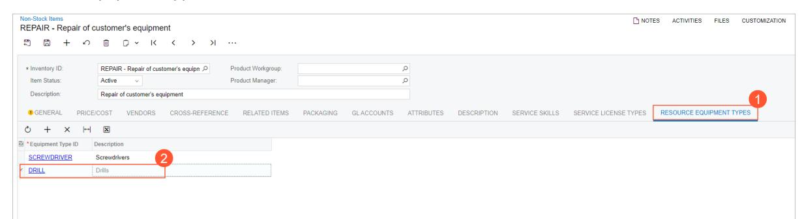

#### *Figure: The equipment type assigned to the service*

The *DRILL* and *SCREWDRIVER* equipment types have been defined for the *REPAIR* service.

3. Save your changes, and close the window.

### **Resource Equipment: To Create Resource Equipment**

In this activity, you will learn how to create a resource equipment record in the system.

This activity is based on the *U100* dataset. If you are using another dataset, or if any system settings have been changed in *U100*, these changes can affect the workflow of the activity and the results of the processing. To avoid any issues, restore the *U100* dataset to its initial state.

#### **Story**

Suppose that you are an administrative user of the SweetLife Service and Equipment Sales Center, and you need to add resource equipment used in appointments to Acumatica ERP.

#### **Configuration Overview**

In the *U100* dataset, the following tasks have been performed for the purposes of this activity:

- The minimum system configuration, which is described in *[Company with Branches that Do Not Require](https://help-2025r1.acumatica.com/Help?ScreenId=ShowWiki&pageid=a718a27b-3683-4d86-a26e-4b8fb7981f1c) [Balancing: General Information](https://help-2025r1.acumatica.com/Help?ScreenId=ShowWiki&pageid=a718a27b-3683-4d86-a26e-4b8fb7981f1c)*, has been performed.
- The *SWEETLIFE* company has been created on the *[Companies](https://help-2025r1.acumatica.com/Help?ScreenId=ShowWiki&pageid=fedad435-8496-4397-b8a3-50a473629f76)* (CS101500) form. This company has multiple branches created on the *[Branches](https://help-2025r1.acumatica.com/Help?ScreenId=ShowWiki&pageid=b97ab72d-4ab4-4f02-b69c-f7f61b316ced)* (CS102000) form, including *SWEETEQUIP (Service and Equipment Sales Center)*.

- On the *[Service Management Preferences](https://help-2025r1.acumatica.com/Help?ScreenId=ShowWiki&pageid=1c1b94d7-ac39-4f84-a966-588290b5ba80)* (FS100100) form, the minimum settings have been specified, including specifying the numbering sequences and work calendar, for the service management functionality to be used.
- On the *[Numbering Sequences](https://help-2025r1.acumatica.com/Help?ScreenId=ShowWiki&pageid=a8d11c23-21f2-42a3-b17d-9637c9cf8031)* (CS201010) form, the *SMEQUIPMN* sequence has been created. It has then been specified in the **Equipment NumberingSequence** box (**NumberingSettings** section) of the *[Service](https://help-2025r1.acumatica.com/Help?ScreenId=ShowWiki&pageid=1c1b94d7-ac39-4f84-a966-588290b5ba80) [Management Preferences](https://help-2025r1.acumatica.com/Help?ScreenId=ShowWiki&pageid=1c1b94d7-ac39-4f84-a966-588290b5ba80)* (FS100100) form.
- On the *[Non-Stock Items](https://help-2025r1.acumatica.com/Help?ScreenId=ShowWiki&pageid=bf68dd4f-63d4-460d-8dc0-9152f2bd6bf1)* (IN202000) form, the *REPAIR* non-stock item of the *Service* type has been created.

#### **Process Overview**

On the *[Equipment](https://help-2025r1.acumatica.com/Help?ScreenId=ShowWiki&pageid=43b7c838-3051-4238-87db-e9b9c213894e)* (FS205000) form, you will create two equipment records. You will then make sure that the records are displayed on the *[Equipment Summary](https://help-2025r1.acumatica.com/Help?ScreenId=ShowWiki&pageid=ed67c9dc-a63a-4937-886c-7511c7644030)* (FS400200) form

#### **System Preparation**

Before you start creating equipment records, do the following:

- 1. Launch the Acumatica ERP website, and sign in to a company with the *U100* dataset preloaded. You should sign in as a system administrator by using the *gibbs* username and the *123* password.
- 2. On the Company and Branch Selection menu on the top pane of the Acumatica ERP screen, select the *Service and Equipment Sales Center* branch.
- 3. In the company to which you are signed in, ensure that the *Service Management* feature has been enabled on the *[Enable/Disable Features](https://help-2025r1.acumatica.com/Help?ScreenId=ShowWiki&pageid=c1555e43-1bc5-4f6f-ba9d-b323f94d8a6b)* (CS100000) form.
- 4. As a prerequisite activity, be sure that the equipment type has been created as described in *[Resource](#page-124-1) [Equipment:](#page-124-1) To Create an Equipment Type and Assign It to a Service*.

#### **Step: Creating a Equipment Record**

To create an equipment record, do the following:

- 1. On the *[Equipment](https://help-2025r1.acumatica.com/Help?ScreenId=ShowWiki&pageid=43b7c838-3051-4238-87db-e9b9c213894e)* (FS205000) form, add a new record.
- 2. In the Summary area of the form, specify the following settings:
  - **EquipmentType**: *DRILL*
  - **Status**: *Active*
  - **Description**: Froster FPD-010A 10mm Drill
  - **Target Equipment**: Cleared
  - **Resource Equipment**: Selected
- 3. Under **Owner**, select **Company**.
- 4. Under **Location**, select **Company**, and select *SWEETEQUIP* in the **Branch** box.
- 5. On the form toolbar, click**Save**.
- 6. On the form toolbar, click **Add New Record**, and specify the following settings:
  - **EquipmentType**: *DRILL*
  - **Status**: *Active*
  - **Description**: Chestton CHD-6104 10mm Drill
  - **Target Equipment**: Cleared
  - **Resource Equipment**: Selected
  - **Owner**: **Company**
  - **Location**: **Company**

- **Branch**: *SWEETEQUIP*
- 7. On the form toolbar, click**Save**.
- 8. Open the *[Equipment Summary](https://help-2025r1.acumatica.com/Help?ScreenId=ShowWiki&pageid=ed67c9dc-a63a-4937-886c-7511c7644030)* (FS400200) form, and make sure that the pieces of equipment you have created are displayed in the table (as shown in the following screenshot).

*Figure: The pieces of equipment you have created*

|                                             | $TOOLS$ $\star$ CUSTOMIZATION + <b>Equipment Summary</b>                                            |                        |                 |               |                                                    |                                                                          |                   |                         |                       |         |               |                         |                                          |             |                   |                              |
|---------------------------------------------|-----------------------------------------------------------------------------------------------------------|------------------------|-----------------|---------------|----------------------------------------------------|--------------------------------------------------------------------------|-------------------|-------------------------|-----------------------|---------|---------------|-------------------------|------------------------------------------|-------------|-------------------|------------------------------|
|                                             | $\sqrt{\mathbf{x}}$ $\vdash$ !!!!!!!!!!!!!!!!!!!!!!!!!!!!!!!!!!!!!!!! $\curvearrowleft$ $\pm$ |                        |                 |               |                                                    |                                                                          |                   |                         |                       |         |               |                         |                                          |             |                   |                              |
|                                             | Customer                                                                                                  | Equipment Type:        |                 |               | $\circ$ Location $\circ$ Model Equipment: | ρ ρ                                                                   |                   |                         |                       |         |               |                         |                                          |             |                   |                              |
| Drag column header here to configure filter |                                                                                                           |                        |                 |               |                                                    |                                                                          |                   |                         |                       |         |               |                         |                                          | Y 日      | $\cdots$          | ρ                            |
| FB 8                                        | D                                                                                                         | <b>Equipment Type</b>  | Equipment Nbr.  | <b>Status</b> | <b>Description</b>                                 |                                                                          | Serial Nbr.       | Target Equipment     | Resource Equipment | Vehicle | Owner Type | Location <b>Type</b> | <b>Customer ID</b>                       | Location ID | <b>Branch ID</b>  | <b>Branch</b> Location ID |
|                                             |                                                                                                           | O D DRILL              | <b>FSE00011</b> | Active        | Chestton CHD-6104 10mm Drill                       |                                                                          |                   | $\Box$                  | ø                     | $\Box$  | Company       | Company                 |                                          |             | <b>SWEETEQUIP</b> |                              |
|                                             |                                                                                                           | 0 D DRILL              | FSE00010        | Active        | Froster FPD-010A 10mm Drill                        |                                                                          |                   | $\Box$                  | ⊡                     | $\Box$  | Company       | Company                 |                                          |             | <b>SWEETEQUIP</b> |                              |
|                                             | $0$ D                                                                                                     |                        | <b>FSE00009</b> | Active        |                                                    | Commercial citrus juicer with a production rate of 2 litres per minute   |                   | ☑                       | 0                     | $\Box$  | Customer      | Customer                | <b>COFFEESHOP</b>                        | <b>MAIN</b> |                   |                              |
|                                             | $0$ $\Box$                                                                                                |                        | <b>FSE00008</b> | Active        |                                                    | Commercial citrus juicer with a production rate of 2 litres per minute   |                   | ☑                       | Π.                    | Π.      | Customer      | Customer                | !!!!!!!!!!!!!!!!!!!!!!!!!!!!!!!!!!!!!!!! | <b>MAIN</b> |                   |                              |
|                                             | $0$ D                                                                                                     |                        | <b>FSE00007</b> | Active        |                                                    | Commercial citrus juicer with a production rate of 1.5 litres per minute |                   | ☑                       |                       | $\Box$  | Customer      | Customer                | !!!!!!!!!!!!!!!!!!!!!!!!!!!!!!!!!!!!!!!! | <b>MAIN</b> |                   |                              |
|                                             | $0$ D                                                                                                     |                        | <b>FSE00006</b> | Active        |                                                    | Commercial citrus juicer with a production rate of 1.5 litres per minute |                   | $\overline{\mathbf{z}}$ |                       | $\Box$  | Customer      | Customer                | <b>HMBAKERY</b>                          | <b>MAIN</b> |                   |                              |
|                                             | $0$ D                                                                                                     |                        | <b>FSE00005</b> | Active        |                                                    | Commercial citrus juicer with a production rate of 2 litres per minute   |                   | ☑                       | 0                     | $\Box$  | Customer      | Customer                | <b>TOMYUM</b>                            | <b>MAIN</b> |                   |                              |
|                                             | $0$ D                                                                                                     |                        | <b>FSE00004</b> | Active        | Mersedes-Bens S3500                                |                                                                          | MGMTS5C85S3481099 | $\Box$                  |                       | ☑       | Company       | Customer                |                                          |             | <b>SWEETEQUIP</b> |                              |
|                                             | $0$ D                                                                                                     |                        | <b>FSE00003</b> | Active        | Nisan NV200                                        |                                                                          | KNDMG4C75C6481099 | $\Box$                  |                       | ø       | Company       | Customer                |                                          |             | <b>SWEETEQUIP</b> |                              |
|                                             | 0 n                                                                                                    | <b>SCREWDRIVER</b>     | FSE00002        | Active        | <b>Tapria Screwdriver Set</b>                      |                                                                          |                   | $\Box$                  | ☑                     | $\Box$  | Company       | Company                 |                                          |             | <b>SWEETEQUIP</b> | <b>WEST BRI.</b>             |
|                                             |                                                                                                           | <b>0 D SCREWDRIVER</b> | <b>FSE00001</b> | Active        | Vissko Screwdriver Set                             |                                                                          |                   | $\Box$                  | N                     | $\Box$  | Company       | Company                 |                                          |             | <b>SWEETEQUIP</b> | <b>WEST BRI</b>              |
|                                             |                                                                                                           |                        |                 |               |                                                    |                                                                          |                   |                         |                       |         |               |                         |                                          |             |                   |                              |

## **Use of Resource Equipment in Appointments: To Use Resource Equipment in Appointments**

This activity will walk you through the process of assigning to appointments the resource equipment that your company owns and uses for performing services.

This activity is based on the *U100* dataset. If you are using another dataset, or if any system settings have been changed in *U100*, these changes can affect the workflow of the activity and the results of the processing. To avoid any issues, restore the *U100* dataset to its initial state.

#### **Story**

Suppose that the SweetLife Service and Equipment Sales Center has its own equipment that is used for repair services and keeps a history of appointments for each item that was used. The service manager (Maia Davis) receives a call from the FourStar Coffee & Sweets Shop customer that the repair of a juicer is necessary on February, 4, 2025.

Acting as the service manager, you will schedule the appointment, while taking into consideration which piece of resource equipment can be used during the time of the appointment. You will also review the history of usage of the selected piece of resource equipment.

#### **Configuration Overview**

In the *U100* dataset, the following tasks have been performed to support this activity:

- The minimum system configuration, which is described in *[Company with Branches that Do Not Require](https://help-2025r1.acumatica.com/Help?ScreenId=ShowWiki&pageid=a718a27b-3683-4d86-a26e-4b8fb7981f1c) [Balancing: General Information](https://help-2025r1.acumatica.com/Help?ScreenId=ShowWiki&pageid=a718a27b-3683-4d86-a26e-4b8fb7981f1c)*, has been performed.
- The *SWEETLIFE* company has been created on the *[Companies](https://help-2025r1.acumatica.com/Help?ScreenId=ShowWiki&pageid=fedad435-8496-4397-b8a3-50a473629f76)* (CS101500) form. This company has multiple branches created on the *[Branches](https://help-2025r1.acumatica.com/Help?ScreenId=ShowWiki&pageid=b97ab72d-4ab4-4f02-b69c-f7f61b316ced)* (CS102000) form, including *SWEETEQUIP (Service and Equipment Sales Center)*.

- On the *[Service Management Preferences](https://help-2025r1.acumatica.com/Help?ScreenId=ShowWiki&pageid=1c1b94d7-ac39-4f84-a966-588290b5ba80)* (FS100100) form, the minimum settings have been specified, including specifying the numbering sequences and work calendar, for the service management functionality to be used.
- On the *[Users](https://help-2025r1.acumatica.com/Help?ScreenId=ShowWiki&pageid=834cc181-97fa-4db4-a7e0-3eaba142c166)* (SM201010) form, the *davis* account has been created. For the *davis* user account, in the **Linked Entity** box of the Summary area of the form, the *Maia Davis* employee account has been specified.
- On the *[Branch Locations](https://help-2025r1.acumatica.com/Help?ScreenId=ShowWiki&pageid=ebef097e-9e47-4c7b-b0b0-c381251b48cf)* (FS202500) form, the *WEST BRIGHTON* branch location of the *SWEETEQUIP* (*Service and Equipment Sales Center*) branch has been created.
- On the *[User Profile](https://help-2025r1.acumatica.com/Help?ScreenId=ShowWiki&pageid=8430c8b2-a79c-4f7b-9768-b0b7fad23a59)* (SM203010) form, for the *davis* user, *WEST BRIGHTON* has been specified as the default branch location.
- On the *[Service](https://help-2025r1.acumatica.com/Help?ScreenId=ShowWiki&pageid=06fd8a36-dd81-4df9-b609-92c3d552c542) Order Types* (FS202300) form, the *MRO* service order type has been configured.
- On the *[Equipment](https://help-2025r1.acumatica.com/Help?ScreenId=ShowWiki&pageid=2e5708ed-4a13-4949-846c-1d46348753d0) Types* (FS200800) form, the *SCREWDRIVER* equipment type has been created. This type has been assigned to the *FSE00001 (Vissko Screwdriver Set)* equipment on the *[Equipment](https://help-2025r1.acumatica.com/Help?ScreenId=ShowWiki&pageid=43b7c838-3051-4238-87db-e9b9c213894e)* (FS205000) form.
- On the *[Non-Stock Items](https://help-2025r1.acumatica.com/Help?ScreenId=ShowWiki&pageid=bf68dd4f-63d4-460d-8dc0-9152f2bd6bf1)* (IN202000) form, for the *REPAIR* non-stock item, the *Service* type is selected on the **General** tab, and the *SCREWDRIVER* equipment type is assigned on the **Resource EquipmentTypes** tab.

#### **Process Overview**

To assign to an appointment the resource equipment that is necessary to perform a service, on the *[Appointments](https://help-2025r1.acumatica.com/Help?ScreenId=ShowWiki&pageid=ac486e9c-f5df-4829-94f0-2df8821361a0)* (FS300200) form, you create an appointment with the service for which resource equipment is required, and add needed resource equipment. You then review the *[Resource Equipment History](https://help-2025r1.acumatica.com/Help?ScreenId=ShowWiki&pageid=d5372814-69d4-40d5-96ea-9d6df846975b)* (FS656500) report to determine which in which appointments the equipment has been or will be used, including the appointment. You will then view the appointments to which the selected piece of equipment has been assigned on the *[Appointment Summary](https://help-2025r1.acumatica.com/Help?ScreenId=ShowWiki&pageid=773bf6ec-a6d8-4bd2-917f-c3297f1cec66)* (FS400100) form.

#### **System Preparation**

Before you begin performing the steps of this activity, do the following:

- 1. Launch the Acumatica ERP website, and sign in to a company with the *U100* dataset preloaded. You should sign in as a service manager by using the *davis* username and the *123* password.
- 2. In the info area, in the upper-right corner of the top pane of the Acumatica ERP screen, make sure that the business date in your system is set to *1/30/2025*. If a different date is displayed, click the Business Date menu button and select *1/30/2025* on the calendar. For simplicity, in this activity, you will create and process all documents in the system on this business date.
- 3. In the company to which you are signed in, ensure that the *Service Management* feature has been enabled on the *[Enable/Disable Features](https://help-2025r1.acumatica.com/Help?ScreenId=ShowWiki&pageid=c1555e43-1bc5-4f6f-ba9d-b323f94d8a6b)* (CS100000) form.

#### **Step 1: Creating an Appointment**

To create the appointment for which resource equipment will be used, do the following:

- 1. On the *[Appointments](https://help-2025r1.acumatica.com/Help?ScreenId=ShowWiki&pageid=ac486e9c-f5df-4829-94f0-2df8821361a0)* (FS300200) form, add a new record.
- 2. In the Summary area of the form, specify the following settings:
  - **Service OrderType**: *MRO*
  - **Customer**: *COFFEESHOP - FourStar Coffee & Sweets Shop*
  - **Description**: Repair of a juicer
- 3. On the **Settings** tab, in the**Scheduled Start Date** box, select *2/4/2025 9:00 AM*.
- 4. On the table toolbar of the **Details** tab, add a row, and specify the following settings:
  - **LineType**: *Service*
  - **Inventory ID**: *REPAIR*

- 5. On the **Resource Equipment** tab, add a row, and in the **Equipment ID** column, select *FSE00001 (Vissko Screwdriver Set)*.
- 6. On the form toolbar, click**Save**.

#### **Step 2: Reviewing the Resource Equipment to Be Used in the Appointment**

To review the list of appointments in which the resource equipment will be used, do the following:

- 1. Open the *[Resource Equipment History](https://help-2025r1.acumatica.com/Help?ScreenId=ShowWiki&pageid=d5372814-69d4-40d5-96ea-9d6df846975b)* (FS656500) report form.
- 2. In the **End Date** box, select *2/4/2025*.
- 3. In the **Resource Equipment** box, select *FSE00001*.
- 4. On the form toolbar, click **Run Report**.

The report opens with the details of the appointment that you have created in Step 1 in which the equipment will be used.

#### **Step 3: Reviewing the Resource Equipment History**

To review the history of appointments to which the piece of resource equipment has been assigned, do the following:

- 1. Open the *[Equipment](https://help-2025r1.acumatica.com/Help?ScreenId=ShowWiki&pageid=43b7c838-3051-4238-87db-e9b9c213894e)* (FS205000) form.
- 2. In the **Equipment Nbr.** box, select *FSE00001*.
- 3. On the More menu (under **Inquiries**), click **Resource Equipment History**.
- 4. On the *[Appointment Summary](https://help-2025r1.acumatica.com/Help?ScreenId=ShowWiki&pageid=773bf6ec-a6d8-4bd2-917f-c3297f1cec66)* (FS400100) form, which opens with *FSE00001* selected in the **Resource Equipment** box, clear the**Staff Member** box (Item 1 in the following screenshot).
- 5. In the **ToScheduled Date** box, select *2/4/2025* (Item 2).

You can view the appointments for the selected time range in which the resource equipment has been or will be used to provide services (Item 3).

| TOOLS $\div$ <b>Appointment Summary</b>                                          |                                                                  |                                                                                  |                          |                                                                        |                                      |                |                                |                                |                             |               |          |                     |  |  |
|-------------------------------------------------------------------------------------|------------------------------------------------------------------|----------------------------------------------------------------------------------|--------------------------|------------------------------------------------------------------------|--------------------------------------|----------------|--------------------------------|--------------------------------|-----------------------------|---------------|----------|---------------------|--|--|
| Ò $\Omega$ $+$ P                                                           | $\mathcal{L}$ $\mathbf{x}$ $\triangledown$ $\mathbf{H}$ |                                                                                  |                          |                                                                        |                                      |                |                                |                                |                             |               |          |                     |  |  |
| Branch: <b>Branch Location:</b> Customer: Location: Service Order Nbr.: | SWEETEQUIP - Service and Eq.                                     | Schedule ID: Staff Member: ρ ρ Resource Equipment: ρ $\varphi$ |                          | ρ From Scheduled Date: To Scheduled Date: FSE00001 $\circ$ | 1/1/2025 m 2/4/2025            |                |                                |                                |                             |               |          | $\hat{\phantom{a}}$ |  |  |
| ALL RECORDS B 0 D *Branch                                                        | TODAY <b>Branch Location</b> Service Order Type      | Service Order Nbr.                                                            | Appointment Nbr. 3 | Description                                                            | *Customer                            | Location       | Scheduled <b>Start Date</b> | Scheduled <b>Start Time</b> | Actual <b>Start Date</b> | <b>Status</b> | Finished | Confirmed           |  |  |
| <b>8 D SWEETEQUIP</b>                                                               | <b>WEST BRIGHTON</b> <b>INST</b>                              | 000001                                                                           | 000001-1                 | Installation of equipment at the customers'.                           | <b>TOMYUM - Thai Food Restaurant</b> | $MAIN - $      | 1/7/2025                       | 10:00 AM                       | 1/7/2025                    | <b>Billed</b> | True     | True                |  |  |
| <b>8 D SWEETEQUIP</b>                                                               | <b>WEST BRIGHTON</b> <b>INST</b>                              | 000003                                                                           | 000003-1                 | Installation of equipment at the customers'                            | GOODFOOD - GoodFood One Rest.        | $MAIN - $      | 1/15/2025                      | 11:00 AM                       | 1/15/2025                   | <b>Billed</b> | True     | True                |  |  |
| <b>0 D SWEETEQUIP</b>                                                               | <b>WEST BRIGHTON</b> <b>INST</b>                              | 000004                                                                           | 000004-1                 | Installation of equipment at the customers'                            | COFFEESHOP - FourStar Coffee &       | $MAIN - $      | 1/18/2025                      | 11:00 AM                       | 1/18/2025                   | Closed        | True     | True                |  |  |
| SWEETEQUIP !!!!!!!!!!!!!!!!!!!!!!!!!!!!!!!!!!!!!!!! a.                        | <b>WEST BRIGHTON</b> <b>INST</b>                              | 000006                                                                           | 000006-1                 | Installation of equipment at the customers'.                           | <b>TOMYUM - Thai Food Restaurant</b> | $MAIN - $      | 1/24/2025                      | 9:00 AM                        | 1/24/2025                   | Closed        | True     | True                |  |  |
| 0 D SWEETEQUIP                                                                      | <b>WEST BRIGHTON</b> <b>MRO</b>                               | 000049                                                                           | 000049-1                 | Repair of a juicer                                                     | COFFEESHOP - FourStar Coffee &       | <b>MAIN - </b> | 2/4/2025                       | 9:00 AM                        |                             | Not Started   | False    | False               |  |  |
|                                                                                     |                                                                  |                                                                                  |                          |                                                                        |                                      |                |                                |                                |                             |               |          |                     |  |  |

*Figure: Appointments related to the resource equipment*

### **Resource Equipment: Related Report and Inquiry Forms**

In the following sections, you can find details about the reports you may want to review to gather statistics about resource equipment.

#### **Reviewing the Resource Equipment History**

To review the resource equipment history, on the *[Equipment](https://help-2025r1.acumatica.com/Help?ScreenId=ShowWiki&pageid=43b7c838-3051-4238-87db-e9b9c213894e)* (FS205000) form, select the equipment in the **Equipment Nbr.** box, and on the More menu (under **Inquiries**), click **Resource Equipment History**.

The *[Appointment Summary](https://help-2025r1.acumatica.com/Help?ScreenId=ShowWiki&pageid=773bf6ec-a6d8-4bd2-917f-c3297f1cec66)* (FS400100) form opens with the resource equipment selected in the **Resource Equipment** box. Then you can clear the**Staff Member** box, specify the needed date in the**ToScheduled Date** box, and view all appointments for the selected range of time in which the resource equipment was used to provide services.

#### **Printing Reports and Documents**

To prepare a printable form of the report, use the *[Resource Equipment History](https://help-2025r1.acumatica.com/Help?ScreenId=ShowWiki&pageid=d5372814-69d4-40d5-96ea-9d6df846975b)* (FS656500) form. On the *[Resource](https://help-2025r1.acumatica.com/Help?ScreenId=ShowWiki&pageid=d5372814-69d4-40d5-96ea-9d6df846975b) [Equipment History](https://help-2025r1.acumatica.com/Help?ScreenId=ShowWiki&pageid=d5372814-69d4-40d5-96ea-9d6df846975b)* (FS656500) report form, in the **End Date** box, select the needed date and on the form toolbar, click **Run Report**. The report opens with the details on each piece of equipment that was used in appointments.

## **Correcting Service Order Billing**

In Acumatica ERP, you can regenerate an invoice originating from a service order if any information in the invoice needs to be corrected.

In this chapter, you will learn how to reverse an invoice created for a service order, correct the service order, and run billing for the service order once again.

## **Service Order Billing Correction: General Information**

In Acumatica ERP, if you need to correct information in an already-released sales invoice that originated from a service order, you can reverse the invoice, correct the service order, and generate a new invoice.

This topic focuses primarily on the correction process when the billing document is an SO invoice; the process of correcting billing documents originating from appointments can differ depending on the type of the billing document. The *Service Order Billing [Correction:](#page-134-1) Billing Document Types* outlines the processes of billing correction when different billing documents are involved.

#### **Learning Objectives**

In this chapter, you will learn how to reverse a sales invoice originating from a service order, make corrections in the service order, and generate another invoice for it.

#### **Applicable Scenarios**

You reverse an invoice and correct a service order in the following cases:

- When corrections to an invoice may be needed
- When some details specified in the service order need to be corrected or new details need to be added

### **Workflow of Service Order Billing Correction**

In the diagram below, you can see the general workflow of correcting a service order and regenerating a sales invoice.

Processes and job titles may be different in your company.

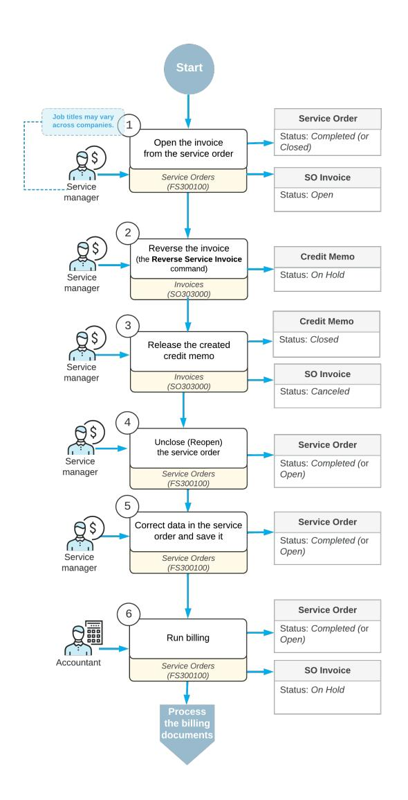

#### *Figure: Correcting a sales invoice originating from a service order*

The ability to reverse a sales invoice created from a service order, as described in this topic, is available only if the *Service Management* and *Advanced SO Invoices* features are enabled on the *[Enable/Disable Features](https://help-2025r1.acumatica.com/Help?ScreenId=ShowWiki&pageid=c1555e43-1bc5-4f6f-ba9d-b323f94d8a6b)* (CS100000) form.

#### **Correction of an SO Invoice Originating from a Service Order**

To correct a sales invoice originating from a service order if the invoice has already been released, you need to reverse the invoice, unclose and correct the service order, and then generate a new invoice for it.

To reverse the invoice, on the *[Invoices](https://help-2025r1.acumatica.com/Help?ScreenId=ShowWiki&pageid=0acc9738-f141-4ea0-a2be-f34ea9d1b63a)* (SO303000) form, you click the **ReverseService Invoice** command on the More menu (under **Corrections**). The system creates a new document of the *Credit Memo* type and the *On Hold* status. In the Summary area of the credit memo, the **Date**, **Post Period**, and **Description** boxes are available for editing. The other boxes of the Summary area are filled in with the settings of the original invoice and are unavailable for editing. On the **Details** tab, all lines of the original sales invoice have been automatically added. On the table toolbar of this tab, the **Add** and **Delete** buttons are unavailable, so that no detail lines can be added or deleted. In the **Related Svc. Doc. Nbr.** column, the reference number of the related service order is specified.

The ability to reverse a sales invoice is available only if the *Service Management* and *Advanced SO Invoices* features are enabled on the *[Enable/Disable Features](https://help-2025r1.acumatica.com/Help?ScreenId=ShowWiki&pageid=c1555e43-1bc5-4f6f-ba9d-b323f94d8a6b)* (CS100000) form.

You release the credit memo, which causes the original invoice to be assigned the *Canceled* status. The associated service order can then be corrected and billed again. On the *[Service Orders](https://help-2025r1.acumatica.com/Help?ScreenId=ShowWiki&pageid=6e5277d3-274e-45f5-b77d-4410ed736d21)* (FS300100) form, you do one of the following on the More menu under **Corrections**:

- If the service order's status is *Closed*, click **Unclose**.
- If the service order's status is *Completed*, click **Reopen**.

Then you can make the needed corrections to the service order and save it. Finally, you process the service order billing once again.

### **Service Order Billing Correction: Billing Document Types**

You perform different steps to correct a billing document originating from a service order, depending on the type of the billing document. In the following sections of this topic, the processes of correcting different billing documents are described.

#### **Correction of an AR Invoice Originating from a Service Order**

To correct an accounts receivable invoice originating from a service order if the invoice has already been released, you need to reverse the invoice, unclose and correct the service order, and then generate a new AR invoice for the service order.

To reverse an accounts receivable invoice, on the *[Invoices and Memos](https://help-2025r1.acumatica.com/Help?ScreenId=ShowWiki&pageid=5e6f3b27-b7af-412f-a40a-1d4f4be70cba)* (AR301000) form, click the **Reverse and Apply to Memo** command on the More menu (under **Corrections**). The system creates a document of the *Credit Memo* type and opens it on the same form. Notice that on the **Details** tab of the form, in the **Related Svc. Doc. Nbr.** column, the reference number of the related service order is specified.

When you release the credit memo, the original invoice is assigned the *Canceled* status. The associated service order can then be corrected and billed again. On the *[Service Orders](https://help-2025r1.acumatica.com/Help?ScreenId=ShowWiki&pageid=6e5277d3-274e-45f5-b77d-4410ed736d21)* (FS300100) form, you should do one of the following on the More menu under **Corrections**:

- If the service order's status is *Closed*, click **Unclose**.
- If the service order's status is *Completed*, click **Reopen**.

Then you can make the needed corrections and process the service order billing once again.

#### **Correction of a Project-Related Service Order**

If you need to correct a service order for which a project transaction has been generated and released, you can reverse the project transaction, make corrections to the service order, and generate another project transaction.

Correction of a project-related service order is applicable only if the *Projects* feature is enabled on the *[Enable/Disable Features](https://help-2025r1.acumatica.com/Help?ScreenId=ShowWiki&pageid=c1555e43-1bc5-4f6f-ba9d-b323f94d8a6b)* (CS100000) form.

To reverse a project transaction, click **Reverse Bill** on the More menu (under **Corrections**) on the *[Service Orders](https://help-2025r1.acumatica.com/Help?ScreenId=ShowWiki&pageid=6e5277d3-274e-45f5-b77d-4410ed736d21)* (FS300100) form. The system generates a reversed project transaction (that is, a project transaction with similar settings but a negative amount and quantity) and releases the transaction. For the released inventory issue associated with the service order, the system generates a credit memo issue and releases it.

Then you can make the needed corrections to the service order on the *[Service Orders](https://help-2025r1.acumatica.com/Help?ScreenId=ShowWiki&pageid=6e5277d3-274e-45f5-b77d-4410ed736d21)* form and run the billing process, which causes the system to create the new project transaction (and inventory issue, if applicable).

#### **Correction of a Service Order with an Unreleased Billing Document**

You can make corrections to a service order when a billing document has already been created for the service order but not yet released. In this case, you can just delete the billing document. Once a billing document is deleted, you use the *[Service Billing History](https://help-2025r1.acumatica.com/Help?ScreenId=ShowWiki&pageid=d8eab2bf-6145-49dc-b9bd-c87dd3789b0f)* (FS405000) form to quickly find the service order related to the deleted billing document. This form shows the list of service documents with the related billing documents of all statuses, including the documents with the *Deleted* status.

### **Service Order Billing Correction: Related Reports and Inquiry Forms**

This topic describes an inquiry form you can review to gather information about service orders created in the system and billing documents generated from service orders. The report lists documents of all statuses, including the *Deleted* one.

If you do not see the inquiry in your Acumatica ERP, this could mean that you have signed in to the system with a user account that does not have access rights to the form. Sign in as the *admin* user, or contact your system administrator.

#### **Reviewing Service Orders with the Related Billing Documents**

On the *[Service Billing History](https://help-2025r1.acumatica.com/Help?ScreenId=ShowWiki&pageid=d8eab2bf-6145-49dc-b9bd-c87dd3789b0f)* (FS405000) form, you can view the list of field service documents (including service orders, if any) with their reference numbers. It also shows the related billing documents generated from the corresponding field service documents with the reference numbers, document types, and statuses.

If you click the **Run Service Order Billing** command on the More menu (under **Actions**), the system redirects you to the *[Run Service Order Billing](https://help-2025r1.acumatica.com/Help?ScreenId=ShowWiki&pageid=4df1e52f-392a-4342-a219-335b86dcdd18)* (FS500600) form. On this form, you can generate new billing documents for customers with a billing cycle that generates billing documents from service orders based on the cycle's settings on the *[Billing](https://help-2025r1.acumatica.com/Help?ScreenId=ShowWiki&pageid=273739f9-4e18-4e81-949b-128b02e37810) [Cycles](https://help-2025r1.acumatica.com/Help?ScreenId=ShowWiki&pageid=273739f9-4e18-4e81-949b-128b02e37810)* (FS206000) form.

## **Correcting Appointment Billing**

In Acumatica ERP, if a billing document has been generated and released for an appointment but information in the billing document (such as detail lines) or appointment (such as log time) needs to be corrected, you can correct the appointment and its billing.

In this chapter, you will learn how to reverse a billing document created for an appointment, correct an appointment, and run billing for the appointment once again.

## **Appointment Billing Correction: General Information**

In Acumatica ERP, if you need to correct information in an already-released invoice that originated from an appointment, you reverse the invoice, correct the appointment, and generate a new invoice. The correction of the appointment can involve adding or deleting detail lines, editing items in the detail lines, or editing the prices.

The process of correcting billing documents originating from appointments can differ depending on the type of the billing document. The *[Appointment](#page-138-1) Billing Correction: Other Document Types* outlines the processes of billing correction when different billing documents are involved.

#### **Learning Objectives**

In this chapter, you will learn how to reverse an invoice originating from an appointment, make corrections in the appointment, and generate another invoice for it.

#### **Applicable Scenarios**

You correct an appointment and prepare a new invoice for a customer in the following cases:

- When corrections to an invoice may be needed
- When corrections to an appointment may be needed

#### **Workflow of Appointment Billing Correction**

In the diagram below, you can see the general workflow of correcting an invoice that has been generated and released for an appointment. This diagram focuses on the process when the billing document is an accounts receivable invoice.

Processes and job titles may be different in your company.

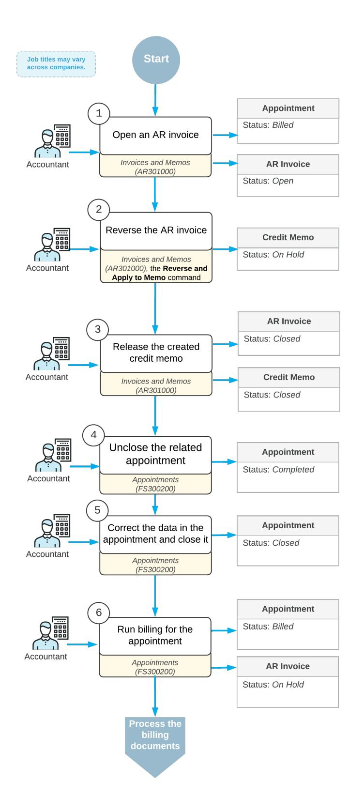

*Figure: Correcting an AR invoice originating from an appointment*

### **Correction of an Accounts Receivable Invoice Originating from an Appointment**

To correct an appointment billing, if an accounts receivable invoice was used for the billing and it has the *Open* status (that is, it has been released), an accountant must first reverse this invoice. On the **Billing Documents** tab of the *[Appointments](https://help-2025r1.acumatica.com/Help?ScreenId=ShowWiki&pageid=ac486e9c-f5df-4829-94f0-2df8821361a0)* (FS300200) form, the accountant finds and clicks the reference number of the invoice. The system opens the invoice on the *[Invoices and Memos](https://help-2025r1.acumatica.com/Help?ScreenId=ShowWiki&pageid=5e6f3b27-b7af-412f-a40a-1d4f4be70cba)* (AR301000) form in a pop-up window.

On the More menu (under **Corrections**) of the *[Invoices and Memos](https://help-2025r1.acumatica.com/Help?ScreenId=ShowWiki&pageid=5e6f3b27-b7af-412f-a40a-1d4f4be70cba)* form, the accountant clicks **Reverse and Apply to Memo**. The system creates a document of the *Credit Memo* type and opens it on the current form. The accountant releases the credit memo, which causes the credit memo and the original invoice to be assigned the *Closed* status, and closes the form. On the **Billing Documents** tab of the *[Appointments](https://help-2025r1.acumatica.com/Help?ScreenId=ShowWiki&pageid=ac486e9c-f5df-4829-94f0-2df8821361a0)* form, the system adds a row with the *AR Credit Memo* document with its reference number.

On the *[Appointments](https://help-2025r1.acumatica.com/Help?ScreenId=ShowWiki&pageid=ac486e9c-f5df-4829-94f0-2df8821361a0)* form, on the More menu (under **Corrections**), the accountant clicks **Unclose** to unclose the appointment. The accountant then makes the needed corrections to the appointment. Aer that, they can process the appointment billing once again.

#### **Correction of a Sales Invoice Originating from an Appointment**

The ability to reverse a sales invoice is available only if the *Service Management* and *Advanced SO Invoices* features are enabled on the *[Enable/Disable Features](https://help-2025r1.acumatica.com/Help?ScreenId=ShowWiki&pageid=c1555e43-1bc5-4f6f-ba9d-b323f94d8a6b)* (CS100000) form.

If there is an open sales invoice that has to be corrected and this invoice originates from an appointment, the accountant must first reverse the invoice, unclose the related appointment, and make the needed corrections to the appointment. Then they can generate the new invoice with the corrected information. The accountant finds the reference number of the invoice on the **Billing Documents** tab of the *[Appointments](https://help-2025r1.acumatica.com/Help?ScreenId=ShowWiki&pageid=ac486e9c-f5df-4829-94f0-2df8821361a0)* (FS300200) form. On this tab, the accountant clicks the reference number of the sales invoice. The system opens the invoice on the *[Invoices](https://help-2025r1.acumatica.com/Help?ScreenId=ShowWiki&pageid=0acc9738-f141-4ea0-a2be-f34ea9d1b63a)* (SO303000) form in a pop-up window.

In the invoice, on the *[Invoices](https://help-2025r1.acumatica.com/Help?ScreenId=ShowWiki&pageid=0acc9738-f141-4ea0-a2be-f34ea9d1b63a)* form, an accountant clicks **ReverseService Invoice** on the More menu (under **Corrections**). The system creates a new document of the *Credit Memo* type and opens it on the current form. The accountant releases the credit memo and closes the *[Invoices](https://help-2025r1.acumatica.com/Help?ScreenId=ShowWiki&pageid=0acc9738-f141-4ea0-a2be-f34ea9d1b63a)* form. The credit memo is assigned the *Closed* status, and the original invoice is assigned the *Canceled* status. The system adds a row with the *SO Credit Memo* document and its reference number on the **Billing Documents** tab of the *[Appointments](https://help-2025r1.acumatica.com/Help?ScreenId=ShowWiki&pageid=ac486e9c-f5df-4829-94f0-2df8821361a0)* form.

On the *[Appointments](https://help-2025r1.acumatica.com/Help?ScreenId=ShowWiki&pageid=ac486e9c-f5df-4829-94f0-2df8821361a0)* form, the accountant clicks **Unclose** on the More menu (under **Corrections**) and makes the needed corrections. Aer that, they can process the appointment billing once again.

### **Appointment Billing Correction: Other Document Types**

In Acumatica ERP, you perform different steps to correct a billing document originating from an appointment, depending on the type of the billing document. (This chapter focuses on the processes when the billing document is an accounts receivable invoice.) In the following sections of this topic, these processes are described in detail.

#### **Correcting a Sales Invoice Originating from an Appointment**

To correct a sales invoice originating from an appointment if the invoice has already been released, you need to reverse the invoice, unclose and correct the appointment, and then generate a new invoice for the appointment.

To reverse a sales invoice, on the *[Invoices](https://help-2025r1.acumatica.com/Help?ScreenId=ShowWiki&pageid=0acc9738-f141-4ea0-a2be-f34ea9d1b63a)* (SO303000) form, you click the **ReverseService Invoice** command on the More menu (under **Corrections**). The system creates a new document on the form with the *Credit Memo* type and the *On Hold* status. In the credit memo, in the Summary area, the **Date**, **Post Period**, and **Description** boxes are available for editing. The other boxes of the Summary area are filled in with the settings of the original invoice and are unavailable for editing. On the **Details** tab, all lines of the original sales invoice have been automatically added. On the table toolbar of this tab, the **Add** and **Delete** buttons are unavailable, so that no detail lines can be added or deleted. In the **Related Svc. Doc. Nbr.** column, the reference number of the related appointment is specified.

The ability to reverse a sales invoice is available only if the *Service Management* and *Advanced SO Invoices* features are enabled on the *[Enable/Disable Features](https://help-2025r1.acumatica.com/Help?ScreenId=ShowWiki&pageid=c1555e43-1bc5-4f6f-ba9d-b323f94d8a6b)* (CS100000) form.

When you release the credit memo, the original invoice is assigned the *Canceled* status. The associated appointment can then be corrected and billed again. On the *[Appointments](https://help-2025r1.acumatica.com/Help?ScreenId=ShowWiki&pageid=ac486e9c-f5df-4829-94f0-2df8821361a0)* (FS300200) form, you should click one of the following commands on the More menu (under **Corrections**):

- If the appointment status is *Closed*, you click **Unclose**
- If the appointment status is *Completed*, you click **Reopen**

Then you can make needed corrections and process the appointment billing once again.

#### **Correcting a Time Activity Originating from an Appointment**

In the appointment, you can edit data specified on the **Log** tab in the log lines even if a time activity has been generated for the appointment and released. You can make such corrections as changing the duration of the services, editing the service start date or time, and changing the end date or time.

To make these corrections, on the *[Employee](https://help-2025r1.acumatica.com/Help?ScreenId=ShowWiki&pageid=c17a7186-e898-4e5e-b565-27730950ca51) Time Activities* (EP307000) form, you find the number of the appointment associated with the time activity in the **Appointment Nbr.** column and click the appointment number, and o. On the *[Appointments](https://help-2025r1.acumatica.com/Help?ScreenId=ShowWiki&pageid=ac486e9c-f5df-4829-94f0-2df8821361a0)* (FS300200) form, which opens, you make the needed corrections. Then you save the appointment and release new time activities.

#### **Correcting a Project-Related Appointment**

The process of correcting a project-related appointment is applicable only if the *Projects* feature is enabled on the Enable/Disable Features (CS100000) form in Acumatica ERP.

To make corrections to an appointment for which a project transaction has been generated and released, you need to generate the reversed project transaction for the appointment. To do this, on the *[Appointments](https://help-2025r1.acumatica.com/Help?ScreenId=ShowWiki&pageid=ac486e9c-f5df-4829-94f0-2df8821361a0)* (FS300200) form, you click *Reverse Bill* on the More menu (under **Corrections**). The system generates a reversed project transaction (that is, a project transaction with similar settings but a negative amount and quantity) and releases the transaction. For the released inventory issue associated with the appointment, the system generates a credit memo and releases it.

Then you can make the needed corrections to the appointment and run the billing process, which causes the system to create a new project transaction (and inventory issue, if applicable).

#### **Correcting an Appointments with an Unreleased Billing Document**

You can make corrections to an appointment when a billing document has been already generated from this appointment but is not yet released. In this case, you can just delete the billing document. Once a billing document is deleted, you use the *[Service Billing History](https://help-2025r1.acumatica.com/Help?ScreenId=ShowWiki&pageid=d8eab2bf-6145-49dc-b9bd-c87dd3789b0f)* (FS405000) form to quickly find the appointment related to the deleted billing document. This form shows the list of service documents with the related billing documents of all statuses, including the documents with the *Deleted* status.

### **Appointment Billing Correction: Process Activity**

This activity will walk you through the processes of making corrections to an appointment aer an accounts receivable invoice has been released for it, and generating a new AR invoice for the appointment.

This activity is based on the *U100* dataset. If you are using another dataset, or if any system settings have been changed in *U100*, these changes can affect the workflow of the activity and the results of the processing. To avoid any issues, restore the *U100* dataset to its initial state.

#### **Story**

Suppose that HM's Bakery & Cafe ordered training on juicer usage for newcomers. A service manager (Maia Davis) of the SweetLife Service and Equipment Sales Center created an appointment and included a training service item. The assigned staff member (Todd Bloom) performed the necessary service at the customer location and completed the appointment in the system. The accountant (Yona Jones) closed the appointment and generated an AR invoice.

Further suppose that aer the invoice was generated, the service manager learned that at the end of the appointment where the training was delivered, the staff member performed a repair of a juicer. The service manager contacted the customer and both parties agreed to include the repair service in the previously created appointment, and to generate an updated AR invoice. Acting as the service manager, you will perform the needed steps to update the appointment and generate a new AR invoice, which the accountant will process further.

#### **Configuration Overview**

In the *U100* dataset, the following tasks have been performed to support this activity:

- The minimum system configuration, which is described in *[Company with Branches that Do Not Require](https://help-2025r1.acumatica.com/Help?ScreenId=ShowWiki&pageid=a718a27b-3683-4d86-a26e-4b8fb7981f1c) [Balancing: General Information](https://help-2025r1.acumatica.com/Help?ScreenId=ShowWiki&pageid=a718a27b-3683-4d86-a26e-4b8fb7981f1c)*, has been performed.
- The *SWEETLIFE* company has been created on the *[Companies](https://help-2025r1.acumatica.com/Help?ScreenId=ShowWiki&pageid=fedad435-8496-4397-b8a3-50a473629f76)* (CS101500) form. Multiple branches of the company have been created on the *[Branches](https://help-2025r1.acumatica.com/Help?ScreenId=ShowWiki&pageid=b97ab72d-4ab4-4f02-b69c-f7f61b316ced)* (CS102000) form, including *SWEETEQUIP (Service and Equipment Sales Center)*.
- On the *[Service Management Preferences](https://help-2025r1.acumatica.com/Help?ScreenId=ShowWiki&pageid=1c1b94d7-ac39-4f84-a966-588290b5ba80)* (FS100100) form, the minimum settings have been specified, including the numbering sequences and work calendar, for the service management functionality to be used.
- On the *[Employees](https://help-2025r1.acumatica.com/Help?ScreenId=ShowWiki&pageid=dae5144b-49b3-43a4-bce0-93f31b3f2321)* (EP203000) form, *EP00000040 (Maia Davis)* has been defined.
- On the *[Users](https://help-2025r1.acumatica.com/Help?ScreenId=ShowWiki&pageid=834cc181-97fa-4db4-a7e0-3eaba142c166)* (SM201010) form, the *davis* account has been created. For this user account, in the **Linked Entity** box of the Summary area of the form, the *Maia Davis* employee account has been specified.
- On the *[Branch Locations](https://help-2025r1.acumatica.com/Help?ScreenId=ShowWiki&pageid=ebef097e-9e47-4c7b-b0b0-c381251b48cf)* (FS202500) form, the *WEST BRIGHTON* branch location has been defined.
- On the *[User Profile](https://help-2025r1.acumatica.com/Help?ScreenId=ShowWiki&pageid=8430c8b2-a79c-4f7b-9768-b0b7fad23a59)* (SM203010) form, for the *davis* user, the *WEST BRIGHTON* branch location has been specified as the default branch location.
- On the *[Service](https://help-2025r1.acumatica.com/Help?ScreenId=ShowWiki&pageid=06fd8a36-dd81-4df9-b609-92c3d552c542) Order Types* (FS202300) form, the *TRN* service order type has been defined to generate AR invoices to bill customers for services that have been provided. That is, *AR Documents* has been selected in the **Generated Billing Documents** box in the **BillingSettings** section of the **General** tab.
- On the *[Customers](https://help-2025r1.acumatica.com/Help?ScreenId=ShowWiki&pageid=652929bc-9606-4056-aa6e-0c2d1147171b)* (AR303000) form, the *HMBAKERY* (HM's Bakery and Cafe) customer has been defined; the *AP AP* billing cycle has been selected in the**Service Management** section of the **Billing** tab.
- On the *[Non-Stock Items](https://help-2025r1.acumatica.com/Help?ScreenId=ShowWiki&pageid=bf68dd4f-63d4-460d-8dc0-9152f2bd6bf1)* (IN202000) form, for the *TRAINING* and *REPAIR* non-stock items, the *Service* type has been selected, and the *Time* billing rule has been specified.

#### **Process Overview**

On the *[Appointments](https://help-2025r1.acumatica.com/Help?ScreenId=ShowWiki&pageid=ac486e9c-f5df-4829-94f0-2df8821361a0)* (FS300200) form, you will find the released accounts receivable invoice and click its link to open the invoice. You will reverse this invoice on the *[Invoices and Memos](https://help-2025r1.acumatica.com/Help?ScreenId=ShowWiki&pageid=5e6f3b27-b7af-412f-a40a-1d4f4be70cba)* (AR301000) form by clicking the **Reverse and Apply to Memo** command on the More menu. You will then unclose the appointment and correct it. Finally, on behalf of the accountant, you will close an appointment and generate a new invoice.

#### **System Preparation**

Before you begin performing the steps of this activity, do the following:

- 1. Launch the Acumatica ERP website, and sign in to a company with the *U100* dataset preloaded; you should sign in as a service manager by using the *davis* username and the *123* password.
- 2. In the company to which you are signed in, ensure that the *Service Management* feature has been enabled on the *[Enable/Disable Features](https://help-2025r1.acumatica.com/Help?ScreenId=ShowWiki&pageid=c1555e43-1bc5-4f6f-ba9d-b323f94d8a6b)* (CS100000) form.
- 3. In the info area, in the upper-right corner of the top pane of the Acumatica ERP screen, make sure that the business date in your system is set to *2/16/2025*. If a different date is displayed, click the Business Date menu button, and select *2/16/2025* on the calendar. For simplicity, in this activity, you will create and process all documents in the system on this business date.

#### **Step 1: Opening an Invoice from the Appointment**

To find and open the invoice generated from the appointment, do the following:

- 1. On the *[Appointments](https://help-2025r1.acumatica.com/Help?ScreenId=ShowWiki&pageid=ac486e9c-f5df-4829-94f0-2df8821361a0)* (FS300200) form, open the *000018-1* appointment.
- 2. On the **Billing Documents** tab, click the reference number of the invoice that was generated for the appointment.

The *[Invoices and Memos](https://help-2025r1.acumatica.com/Help?ScreenId=ShowWiki&pageid=5e6f3b27-b7af-412f-a40a-1d4f4be70cba)* (AR301000) form opens in a pop-up window with the settings of the invoice.

#### **Step 2: Reversing the Invoice**

While you are still viewing the accounts receivable invoice on the *[Invoices and Memos](https://help-2025r1.acumatica.com/Help?ScreenId=ShowWiki&pageid=5e6f3b27-b7af-412f-a40a-1d4f4be70cba)* (AR301000) form, reverse it as follows:

- 1. On the More menu (under **Corrections**), click **Reverse and Apply to Memo**. The system creates a document of the *Credit Memo* type with the settings of the invoice and opens it on the same form.
- 2. On the form toolbar, click **Remove Hold**.
- 3. On the form toolbar, click **Release** to release the credit memo.
- 4. Close the window with the *[Invoices and Memos](https://help-2025r1.acumatica.com/Help?ScreenId=ShowWiki&pageid=5e6f3b27-b7af-412f-a40a-1d4f4be70cba)* form.

You have released the *Credit Memo* document that reversed the invoice. Now the corresponding appointment can be unclosed and corrections can be made to it.

#### **Step 3: Correcting the Appointment**

To correct the appointment, do the following:

- 1. Return to the *000018-1* appointment on the *[Appointments](https://help-2025r1.acumatica.com/Help?ScreenId=ShowWiki&pageid=ac486e9c-f5df-4829-94f0-2df8821361a0)* (FS300200) form. Refresh the page.
- 2. On the **Billing Documents** tab, verify that a row has been added for the *AR Credit Memo* document.
- 3. On the form toolbar, click **Unclose**. Then click **Yes** in the **Confirm Appointment Unclosing** dialog box, which appears.
- 4. On the **Details** tab, click **Add Row**, and select *REPAIR* in the **Inventory ID** column of the row.
- 5. In the **Actual Duration** column of the row, specify 1 h 00 m.
- 6. On the form toolbar, click**Save**.
- 7. On the form toolbar, click **Close**.
- 8. On the form toolbar, click **Run Billing**.

The system opens a pop-up window with the prepared invoice on the *[Invoices and Memos](https://help-2025r1.acumatica.com/Help?ScreenId=ShowWiki&pageid=5e6f3b27-b7af-412f-a40a-1d4f4be70cba)* (AR301000) form. Notice that two detail lines have been added on the **Details** tab (one for the *TRAINING* service, and another for the *REPAIR* service).

The invoice is on hold. The accountant can process this invoice further.

Return to the appointment on the *[Appointments](https://help-2025r1.acumatica.com/Help?ScreenId=ShowWiki&pageid=ac486e9c-f5df-4829-94f0-2df8821361a0)* (FS300200) form. On the **Billing Documents** tab, you can see that this invoice has been added to the list of billing documents.

## **Appointment Billing Correction: Related Reports and Inquiry Forms**

This topic describes an inquiry form you can review to gather information about appointments and their related billing documents.

If you do not see the inquiry in your Acumatica ERP, this could mean that you have signed in to the system with a user account that does not have access rights to the form. Sign in as the *admin* user, or contact your system administrator.

#### **Reviewing Appointments with the Related Billing Documents**

On the *[Service Billing History](https://help-2025r1.acumatica.com/Help?ScreenId=ShowWiki&pageid=d8eab2bf-6145-49dc-b9bd-c87dd3789b0f)* (FS405000) form, you can view the list of field service documents (including appointments, if any) with their reference numbers. It also shows the related billing documents generated from the corresponding field service documents with the reference numbers, document types, and statuses.

If you click the **Run Appointment Billing** command on the More menu (under **Actions**), the system redirects you to the *[Run Appointment Billing](https://help-2025r1.acumatica.com/Help?ScreenId=ShowWiki&pageid=f1d027ae-c546-47ab-b861-1b7670532bd9)* (FS500100) form. On this form, you can generate new billing documents for customers with a billing cycle that generates billing documents from appointments, based on the cycle's settings on the *[Billing](https://help-2025r1.acumatica.com/Help?ScreenId=ShowWiki&pageid=273739f9-4e18-4e81-949b-128b02e37810) [Cycles](https://help-2025r1.acumatica.com/Help?ScreenId=ShowWiki&pageid=273739f9-4e18-4e81-949b-128b02e37810)* (FS206000) form.

## **Creating Quotes and Converting Quotes to Service Orders**

In this chapter, you will learn how to create quotes and convert them to service orders.

## **Quote Processing: General Information**

A quote is a document that contains the list of items (any services and inventory items) that will be used if a customer decides to deal with your company and their costs. The details of the quote can be communicated by phone or email.

Once the customer has agreed to have the services performed at the quoted costs, you create a service order from the quote. (Multiple service orders can be created based on a single quote.) Thus, quotes can be used as templates for future service orders.

#### **Learning Objectives**

In this chapter, you will learn how to do the following:

- Create a quote
- Confirm the quote
- Copy the quote to a service order

#### **Applicable Scenarios**

You create a quote in the following cases:

- You want to show a customer what services and costs will be involved if the customer orders the services of your company
- You want to gain more customers, so you create quotes with the details of the services and stock items (and costs) that are typically included in a common service order. Any of these quotes can be sent to a potential customer.

#### **Workflow of Quote Processing**

For processing a quote, the typical workflow involves the actions and generated documents shown in the following diagram.

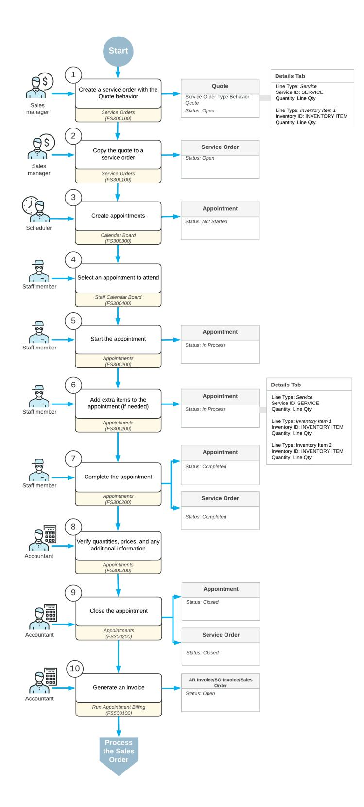

#### *Figure: Quote processing*

The remaining sections of this topic describe many of the actions shown in the diagram.

### **Creation of a Service Order from a Quote**

When a customer request for services is received, a sales manager enters a quote (that is, a service order with the *Quote* behavior) by using the *[Service Orders](https://help-2025r1.acumatica.com/Help?ScreenId=ShowWiki&pageid=6e5277d3-274e-45f5-b77d-4410ed736d21)* (FS300100) form (see Item 1 in the diagram in *Workflow of Quote Processing*). In the quote, the sales manager specifies the customer from which the request has been received, the branch and branch location from which the services are delivered, the services that should be performed, and the inventory items to be purchased with the service (if any). The sales manager then sends it to the customer for confirmation.

Aer the customer has approved the quote, the sales manager creates a service order from the quote by using the **Copy** command on the *[Service Orders](https://help-2025r1.acumatica.com/Help?ScreenId=ShowWiki&pageid=6e5277d3-274e-45f5-b77d-4410ed736d21)* form (Item 2). The system creates a service order with the *Open* status using the settings specified in the quote. Since accounts and subaccounts (if subaccounts are used in the system) are not specified in a quote, the system specifies an account and a subaccount (if any) in the created service order based on the settings of the service order type selected during the creation of the service order as follows:

- **Account**: The source of the sales account is specified in the **UseSales Account From** box on the *[Service](https://help-2025r1.acumatica.com/Help?ScreenId=ShowWiki&pageid=06fd8a36-dd81-4df9-b609-92c3d552c542) Order [Types](https://help-2025r1.acumatica.com/Help?ScreenId=ShowWiki&pageid=06fd8a36-dd81-4df9-b609-92c3d552c542)* (FS202300) form for the selected service order type. It can be one of the following options:
  - *Inventory Item*: The system uses an account specified on the **GL Accounts** tab of the *[Stock Items](https://help-2025r1.acumatica.com/Help?ScreenId=ShowWiki&pageid=77786a70-1f1e-4d63-ad98-96f98e4fcb0e)* (IN202500) or *[Non-Stock Items](https://help-2025r1.acumatica.com/Help?ScreenId=ShowWiki&pageid=bf68dd4f-63d4-460d-8dc0-9152f2bd6bf1)* (IN202000) form.
  - *Warehouse*: The system uses an account specified on the **GL Accounts** tab of the *[Warehouses](https://help-2025r1.acumatica.com/Help?ScreenId=ShowWiki&pageid=264b0ef7-2b6c-40b4-a7d9-f1a5e067939b)* (IN204000) form.
  - *Posting Class*: The system uses an account specified on the **GL Accounts** tab of the *[Posting Classes](https://help-2025r1.acumatica.com/Help?ScreenId=ShowWiki&pageid=edd4bd77-13f5-4e89-9e47-2861fc66bbb0)* (IN206000) form.
  - *Customer/Vendor Location*: The system uses an account specified on the **Locations** tab of the *[Customers](https://help-2025r1.acumatica.com/Help?ScreenId=ShowWiki&pageid=652929bc-9606-4056-aa6e-0c2d1147171b)* (AR303000) form or on the *[Vendors](https://help-2025r1.acumatica.com/Help?ScreenId=ShowWiki&pageid=a9584be3-f2bd-4d67-80d4-8041d809df56)* (AP303000) form.
- **Subaccount**: A subaccount is determined by the rule specified in the **CombineSalesSub. From** box on the *[Service](https://help-2025r1.acumatica.com/Help?ScreenId=ShowWiki&pageid=06fd8a36-dd81-4df9-b609-92c3d552c542) Order Types* form for the selected service order type. For details, see the description of the **Combine SalesSub. From** box in *[Service](https://help-2025r1.acumatica.com/Help?ScreenId=ShowWiki&pageid=06fd8a36-dd81-4df9-b609-92c3d552c542) Order Types*.

The system inserts a respective account and subaccount (if any) in the **Account** and **Subaccount** columns on the **Details** tab of the *[Service Orders](https://help-2025r1.acumatica.com/Help?ScreenId=ShowWiki&pageid=6e5277d3-274e-45f5-b77d-4410ed736d21)* form.

Once a service order has been created, staff members can be assigned to the service order and appointments can be created.

#### **Appointment Creation**

Aer the service order has been created in the system, a scheduler of your company (that is, a person who is responsible for planning the appointments) uses the *[Calendar Board](https://help-2025r1.acumatica.com/Help?ScreenId=ShowWiki&pageid=00cc92c3-408f-4fe3-b6bf-e801559f74f9)* (FS300300) form to schedule the appointments (see Item 3 in the diagram in *Workflow of Quote Processing*) that are needed to perform the services requested by the customer.

Appointments can also be created directly on the *[Appointments](https://help-2025r1.acumatica.com/Help?ScreenId=ShowWiki&pageid=ac486e9c-f5df-4829-94f0-2df8821361a0)* (FS300200) form.

When the scheduler selects a staff member to attend an appointment, the scheduler considers the work schedule of the staff member, the skills and licenses needed to perform the service, and the service area where the services are provided. The scheduler checks the settings of each appointment and enters additional information (if needed), such as the resource equipment used to perform the services and the stock items purchased by the customer along with the service. (The system assigns the *Not Started* status to the created appointments.)

#### **Attending Appointments**

The staff member who is assigned to an appointment looks through the upcoming appointments on the *[Staff](https://help-2025r1.acumatica.com/Help?ScreenId=ShowWiki&pageid=b1d15e47-fba9-4bbf-a7fa-2f7c396c8df4) [Calendar Board](https://help-2025r1.acumatica.com/Help?ScreenId=ShowWiki&pageid=b1d15e47-fba9-4bbf-a7fa-2f7c396c8df4)* (FS300400) form, identifies which appointment needs to be attended (see Item 4 in the diagram in *Workflow of Quote Processing*), and goes to the location where the service has to be performed (which is usually the customer location). The staff member starts the appointment on the *[Appointments](https://help-2025r1.acumatica.com/Help?ScreenId=ShowWiki&pageid=ac486e9c-f5df-4829-94f0-2df8821361a0)* (FS300200) form (Item 5), which causes the appointment to be assigned the *In Process* status.

While the services are being performed, the staff member adds information on services (such as status, quantities, and extra stock items that were used) to the appointment on the *[Appointments](https://help-2025r1.acumatica.com/Help?ScreenId=ShowWiki&pageid=ac486e9c-f5df-4829-94f0-2df8821361a0)* form (Item 6). When the services have all been performed, the staff member checks the details of the appointment. When everything is correct and complete, the staff member selects the **Finished** check box and completes the appointment (Item 7), which gives it the *Completed* status and causes the system to complete the service order.

When all appointments of a particular service order are completed, the system assigns the service order the *Completed* status.

#### **Closing of the Appointments and Service Order**

Further processing of the service order is performed by an accountant. On the *[Appointments](https://help-2025r1.acumatica.com/Help?ScreenId=ShowWiki&pageid=ac486e9c-f5df-4829-94f0-2df8821361a0)* (FS300200) form, the accountant opens the completed appointment and verifies quantities and prices (see Item 8 in the diagram in *Workflow of Quote Processing*). When all information is verified and the appointments are ready for invoicing, the accountant closes the appointments (Item 9), and the system closes the service order. (The appointments and service order are assigned the *Closed* status.)

#### **Generation and Processing of the Billing Document**

The accountant generates a document (AR invoice, sales order, or sales invoice) with the *Open* status by using the *[Run Appointment Billing](https://help-2025r1.acumatica.com/Help?ScreenId=ShowWiki&pageid=f1d027ae-c546-47ab-b861-1b7670532bd9)* (FS500100) form (see Item 10 in the diagram in *Workflow of Quote Processing*).

The accountant then processes the billing document in the system.

### **Quote Processing: To Create and Process a Quote**

This activity will walk you through the process of creating and confirming a quote in Acumatica ERP, and then converting the quote to a service order.

This activity is based on the *U100* dataset. If you are using another dataset, or if any system settings have been changed in *U100*, these changes can affect the workflow of the activity and the results of the processing. To avoid any issues, restore the *U100* dataset to its initial state.

#### **Story**

Suppose that the *COFFEESHOP - FourStar Coffee & Sweets Shop* customer has requested particular services from the SweetLife Service and Equipment Sales Center. Acting as a service manager (Maia Davis) of the company, you will create a quote in the Acumatica ERP. Then you will generate the quote and review a printable version of it. Finally, aer the customer has approved the quote, you will confirm the quote in the system and convert it to a service order.

#### **Configuration Overview**

In the *U100* dataset, the following tasks have been performed to support this activity:

- The minimum system configuration, which is described in *[Company with Branches that Do Not Require](https://help-2025r1.acumatica.com/Help?ScreenId=ShowWiki&pageid=a718a27b-3683-4d86-a26e-4b8fb7981f1c) [Balancing: General Information](https://help-2025r1.acumatica.com/Help?ScreenId=ShowWiki&pageid=a718a27b-3683-4d86-a26e-4b8fb7981f1c)*, has been performed.
- The *SWEETLIFE* company has been created on the *[Companies](https://help-2025r1.acumatica.com/Help?ScreenId=ShowWiki&pageid=fedad435-8496-4397-b8a3-50a473629f76)* (CS101500) form. This company has multiple branches created on the *[Branches](https://help-2025r1.acumatica.com/Help?ScreenId=ShowWiki&pageid=b97ab72d-4ab4-4f02-b69c-f7f61b316ced)* (CS102000) form, including *SWEETEQUIP (Service and Equipment Sales Center)*.

- On the *[Service Management Preferences](https://help-2025r1.acumatica.com/Help?ScreenId=ShowWiki&pageid=1c1b94d7-ac39-4f84-a966-588290b5ba80)* (FS100100) form, the minimum settings have been specified, including specifying the numbering sequences and work calendar, for the service management functionality to be used.
- On the *[Users](https://help-2025r1.acumatica.com/Help?ScreenId=ShowWiki&pageid=834cc181-97fa-4db4-a7e0-3eaba142c166)* (SM201010) form, the *davis* account has been created. For the *davis* user account, in the **Linked Entity** box of the Summary area of the form, the *Maia Davis* employee account has been specified.
- On the *[Branch Locations](https://help-2025r1.acumatica.com/Help?ScreenId=ShowWiki&pageid=ebef097e-9e47-4c7b-b0b0-c381251b48cf)* (FS202500) form, the *WEST BRIGHTON* branch location of the *SWEETEQUIP* (*Service and Equipment Sales Center*) branch has been created.
- On the *[User Profile](https://help-2025r1.acumatica.com/Help?ScreenId=ShowWiki&pageid=8430c8b2-a79c-4f7b-9768-b0b7fad23a59)* (SM203010) form, for the *davis* user, *WEST BRIGHTON* has been specified as the default branch location.
- On the *[Service](https://help-2025r1.acumatica.com/Help?ScreenId=ShowWiki&pageid=06fd8a36-dd81-4df9-b609-92c3d552c542) Order Types* (FS202300) form, the *QTE* service order type has been created.
- On the *[Customers](https://help-2025r1.acumatica.com/Help?ScreenId=ShowWiki&pageid=652929bc-9606-4056-aa6e-0c2d1147171b)* (AR303000) form, the *COFFEESHOP - FourStar Coffee & Sweets Shop* customer has been created.
- On the *[Non-Stock Items](https://help-2025r1.acumatica.com/Help?ScreenId=ShowWiki&pageid=bf68dd4f-63d4-460d-8dc0-9152f2bd6bf1)* (IN202000) form, for the *TRAINING* non-stock item, the *Service* type has been selected, and the *Time* billing rule has been specified.
- On the *[Stock Items](https://help-2025r1.acumatica.com/Help?ScreenId=ShowWiki&pageid=77786a70-1f1e-4d63-ad98-96f98e4fcb0e)* (IN202500) form, the *JUICER15* and *BLADE20* items have been created.

#### **Process Overview**

On the *[Service Orders](https://help-2025r1.acumatica.com/Help?ScreenId=ShowWiki&pageid=6e5277d3-274e-45f5-b77d-4410ed736d21)* (FS300100) form, you will create a quote for a one-hour repair service by creating a service order of the *QTE* type. You will also add to the quote the inventory items needed by the customer and see how the order total is updated. You will review the print-friendly form of the quote. On the *[Service Orders](https://help-2025r1.acumatica.com/Help?ScreenId=ShowWiki&pageid=6e5277d3-274e-45f5-b77d-4410ed736d21)* form, you will then copy the service order of the type with the *Quote* behavior to a regular service order.

#### **System Preparation**

Before you begin performing the steps of this activity, do the following:

- 1. Launch the Acumatica ERP website, and sign in to a company with the *U100* dataset preloaded. You should sign in as a service manager by using the *davis* username and the *123* password.
- 2. In the info area, in the upper-right corner of the top pane of the Acumatica ERP screen, make sure that the business date in your system is set to *1/30/2025*. If a different date is displayed, click the Business Date menu button and select *1/30/2025* on the calendar. For simplicity, in this activity, you will create and process all documents in the system on this business date.
- 3. In the company to which you are signed in, ensure that the *Service Management* feature has been enabled on the *[Enable/Disable Features](https://help-2025r1.acumatica.com/Help?ScreenId=ShowWiki&pageid=c1555e43-1bc5-4f6f-ba9d-b323f94d8a6b)* (CS100000) form.

#### **Step 1: Creating and Reviewing the Quote**

You will create a quote for the cost of the service and generate a print-friendly version of the quote for the customer's review. Do the following:

- 1. On the *[Service Orders](https://help-2025r1.acumatica.com/Help?ScreenId=ShowWiki&pageid=6e5277d3-274e-45f5-b77d-4410ed736d21)* (FS300100) form, add a new record.
- 2. In the Summary area of the form, specify the following settings:
  - **Service OrderType**: *QTE*
  - **Customer**: *COFFEESHOP - FourStar Coffee & Sweets Shop*
  - **Description**: A quote for the FourStar Coffee & Sweets Shop
- 3. On the **Details** tab, add a row, and specify the following settings in the row:
  - **LineType**: *Service*
  - **Inventory ID**: *REPAIR*

As soon as you select the service, the system inserts the default billing rule (which you will change), price, and duration information that have been specified for the service.

- **Billing Rule**: *Flat Rate*
- 4. Add another row, and specify the following settings in the row:
  - **LineType**: *Inventory Item*
  - **Inventory ID**: *JUICER15*

As soon as you select the inventory ID, the system inserts the stock item's unit price from its settings.

- 5. Add a row, and specify the following settings in the row for the inventory item:
  - **LineType**: *Inventory Item*
  - **Inventory ID**: *BLADE20*

The system again inserts the stock item's unit prices from its settings.

- 6. On the form toolbar, click**Save**.
- 7. In the row with the *BLADE20* inventory item, change **Unit Price** to 300.0000.
- 8. On the form toolbar, click**Save**.
- 9. Verify that the service order total in the **Estimated BillableTotal** box in the Summary area is \$2,880.00 (see Item 1 in the following screenshot).

This total is the sum of the unit prices of all lines of the **Details** tab (Item 2): \$80.00 (1h of the service) + \$2500.00 (commercial juicer) + \$300.00 (blade holder).

| Service Orders                     | <b>PINOTES</b> QTE 000050 - FourStar Coffee & Sweets Shop                                                                                                                    |                                      |                                                                       |                                       |                    |                                                       |                        |                   |             |             |                              |                       |                   | <b>ACTIVITIES</b>  | <b>FILES</b> | TOOLS $\sim$                                                        |  |
|------------------------------------|---------------------------------------------------------------------------------------------------------------------------------------------------------------------------------|--------------------------------------|-----------------------------------------------------------------------|---------------------------------------|--------------------|-------------------------------------------------------|------------------------|-------------------|-------------|-------------|------------------------------|-----------------------|-------------------|--------------------|--------------|---------------------------------------------------------------------|--|
| - 21 $\leftarrow$               | 日 俞 $Q \times K$ $+$ <b>CONFIRM</b> $\Omega$ $\lambda$ $\left\langle \right\rangle$ $\rightarrow$ $\cdots$                                           |                                      |                                                                       |                                       |                    |                                                       |                        |                   |             |             |                              |                       |                   |                    |              |                                                                     |  |
| * Order Type:                      | QTE - Quote P                                                                                                                                                                   | Customer: $\Lambda$               |                                                                       | COFFEESHOP - FourStar Coffee & Swee 2 |                    | <b>Estimated Duration:</b>                            | 1 h 00 m               |                   |             |             |                              |                       |                   |                    |              |                                                                     |  |
| Order Nbr.                         | 000050                                                                                                                                                                          | $\mathcal{L}$ * Location:         | <b>MAIN - Primary Location</b>                                        |                                       | $\rho$             | Estimated Billable Total:                             | 2,880.00               |                   |             |             |                              |                       |                   |                    |              |                                                                     |  |
| Status:                            | Open                                                                                                                                                                            | * Branch Location:                   | <b>Estimated Tax Total:</b> WEST BRIGHTON - Office in West Bri Q 2 |                                       |                    |                                                       | 0.00                   |                   |             |             |                              |                       |                   |                    |              |                                                                     |  |
| * Date:                            | 1/30/2025                                                                                                                                                                       | * Project:                           | X - Non-Project Code.                                                 |                                       | $\Omega$           | <b>Estimated Total:</b>                               | 2.880.00               |                   |             |             |                              |                       |                   |                    |              |                                                                     |  |
| Customer Order:                    | <b>Invoice Total:</b>                                                                                                                                                           |                                      |                                                                       |                                       | 0.00               |                                                       |                        |                   |             |             |                              |                       |                   |                    |              |                                                                     |  |
| External Refer.                    | Appointments Needed                                                                                                                                                             |                                      |                                                                       |                                       |                    |                                                       |                        |                   |             |             |                              |                       |                   |                    |              |                                                                     |  |
| Description:                       | A quote for the FourStar Coffee & Sweets Shop                                                                                                                                   |                                      |                                                                       |                                       |                    |                                                       |                        |                   |             |             |                              |                       |                   |                    |              |                                                                     |  |
|                                    |                                                                                                                                                                                 |                                      |                                                                       |                                       |                    |                                                       |                        |                   |             |             |                              |                       |                   |                    |              |                                                                     |  |
|                                    | <b>DETAILS</b> <b>SETTINGS</b> <b>TAXES</b> <b>FINANCIAL</b> <b>PROFITABILITY</b> <b>RELATED DOCUMENTS</b> <b>TOTALS</b> <b>OTHER</b> <b>ATTRIBUTES</b> |                                      |                                                                       |                                       |                    |                                                       |                        |                   |             |             |                              |                       |                   |                    |              |                                                                     |  |
| O. P                            | $\times$                                                                                                                                                                        | <b>ADD ITEMS</b> <b>ADD STAFF</b> |                                                                       | CREATE EXPENSE RECEIPT                |                    | $\mathbf{\overline{x}}$ CREATE AP BILL $\vdash$ | đ,                     |                   |             |             |                              |                       |                   | <b>All Records</b> |              | $-7$                                                                |  |
| <b>Line Status</b> Ref. Nbr. |                                                                                                                                                                                 | Line Type                            | Inventory ID                                                          | <b>Billing Rule</b>                   | Description        |                                                       | <b>Staff Member ID</b> | Warehouse         | Location    | *UOM        | Estimated <b>Duration</b> | Estimated Quantity | <b>Unit Price</b> | Manual Price    |              | <b>Estimated Appointment</b> <b>Amount</b> Estimated Duration |  |
| 0001                               | Requiring Scheduli.                                                                                                                                                             | Service                              | <b>REPAIR</b>                                                         | <b>Flat Rate</b>                      |                    | Repair of customer's equipment                        | <split></split>        | <b>EQUIPHOUSE</b> | <b>MAIN</b> | <b>HOUR</b> | 1 h 00 m                     | 1.00                  | 80,0000           | $\Box$             | 80.00        | 0 h 00 m                                                            |  |
| 0002                               | Requiring Scheduli                                                                                                                                                              | <b>Inventory Item</b>                | JUICER15                                                              | <b>Flat Rate</b>                      |                    | Commercial juicer with a production rate of           | <split></split>        | <b>EQUIPHOUSE</b> | <b>MAIN</b> | PIECE       | 0 h 00 m                     | 1.00                  | 2,500,0000        | $\Box$             |              | 2.500.00 0h 00 m                                                    |  |
| 0003                               | Requiring Scheduli                                                                                                                                                              | <b>Inventory Item</b>                | BLADE20                                                               | <b>Flat Rate</b>                      | Blade Holder V 2.0 |                                                       | <split></split>        | <b>EQUIPHOUSE</b> | <b>MAIN</b> | PIECE       | 0 h 00 m                     | 1.00                  | 300,0000          | ₽                  |              | 300.00 0 h 00 m                                                     |  |
|                                    |                                                                                                                                                                                 |                                      |                                                                       |                                       |                    |                                                       |                        |                   |             |             |                              |                       |                   |                    |              |                                                                     |  |
|                                    |                                                                                                                                                                                 |                                      |                                                                       |                                       |                    |                                                       |                        |                   |             |             |                              |                       |                   |                    |              |                                                                     |  |
|                                    |                                                                                                                                                                                 |                                      |                                                                       |                                       |                    |                                                       |                        |                   |             |             |                              |                       |                   |                    |              |                                                                     |  |

#### *Figure: The service order total*

10.On the More menu (under **Printing and Emailing**), click **PrintService Order**.

A print-friendly version of the service quote is opened in a new window, as shown in the following screenshot, and you can print it, if needed. You can also convert the quote to PDF or XLS format, or send it to the customer via email for review.

| <b>Service Order</b> |   |                                                       |                                                                                                                                                                                                                                       |                                                                                                |                                        |                                                                 |                 |                                                                                                                       |                                                                                                                 |                                                                                              |                                  |                                                                          |                      | <b>TOOLS</b> |
|----------------------|---|-------------------------------------------------------|---------------------------------------------------------------------------------------------------------------------------------------------------------------------------------------------------------------------------------------|------------------------------------------------------------------------------------------------|----------------------------------------|-----------------------------------------------------------------|-----------------|-----------------------------------------------------------------------------------------------------------------------|-----------------------------------------------------------------------------------------------------------------|----------------------------------------------------------------------------------------------|----------------------------------|--------------------------------------------------------------------------|----------------------|--------------|
| Ò                    | 阿 | န္                                                    | $\prec$ $\lt$                                                                                                                                                                                                                      | $\rightarrow$ $>$                                                                           | <b>PRINT</b>                           | <b>SEND</b>                                                     | <b>EXPORT *</b> |                                                                                                                       |                                                                                                                 |                                                                                              |                                  |                                                                          | Type your query here | Find         |
|                      |   |                                                       | 218 Oakwood Ave New York, NY, 10007 Phone: +1 212 667 1506                                                                                                                                                                      | <b>SweetLife</b> Service and Equipment Sales Center                                         |                                        |                                                                 |                 |                                                                                                                       | Quotes <b>Service Order No.:</b> Status: <b>Order Date:</b> <b>Customer ID:</b> <b>Currency:</b> |                                                                                              |                                  | 000050 Copied 1/30/2025 COFFEESHOP <b>USD</b>                |                      |              |
|                      |   | <b>BILL TO:</b>                                       | Location: MAIN - Primary Location                                                                                                                                                                                                     | Customer: COFFEESHOP - FourStar Coffee & Sweets Shop                                           |                                        |                                                                 |                 | <b>APPOINTMENT ADDRESS:</b> 1167 Williams Avenue, Brooklyn New York NY 11236 <b>United States of America</b> |                                                                                                                 |                                                                                              |                                  |                                                                          |                      |              |
|                      |   |                                                       | <b>MAIN CUSTOMER CONTACT:</b> Phone: +1-212-555-0105                                                                                                                                                                               | Email: salesperson@fourstars.example.com                                                       |                                        | <b>SERVICE ORDER DETAILS:</b> Project: X - Non-Project Code. |                 |                                                                                                                       |                                                                                                                 | <b>PROBLEM DETAILS:</b> Severity: Medium Priority: Medium                              |                                  |                                                                          |                      |              |
|                      |   | <b>SERVICES</b> NO. NO. 0002 <b>STAFF</b> | <b>ITEM</b> 0001 REPAIR - Repair of customer's equipment <b>INVENTORY ITEMS</b> <b>ITEM</b> minute 0003 BLADE20 - Blade Holder V 2.0 <b>STAFF MEMBER ID</b> <b>APPOINTMENTS</b> REF. NBR. CONFIRMED STATUS | JUICER15 - Commercial juicer with a production rate of 1.5 litres per <b>DESCRIPTION</b> | <b>TARGET EQ.</b> <b>TARGET EQ.</b> | <b>SCHEDULED DATE</b>                                           | <b>TYPE</b>     | <b>BILLING R</b> <b>Flat Rate</b> <b>WAREHS</b> <b>EQUIPHOUSE</b> <b>EQUIPHOUSE</b>                       | QTY. 1.00 OTY. 1.00                                                                                    | <b>PRICE</b> 80.0000 <b>PRICE</b> 1.00 2.500.0000 300.0000 <b>ACTUAL DATE</b> | DISC. 0% DISC. 0% 0% | <b>TRAN. AMOUNT</b> 80.00 <b>TRAN. AMOUNT</b> 2500.00 300.00 |                      |              |

*Figure: The print-friendly quote*

#### **Step 2: Confirming the Quote**

When the customer has agreed to have the services at the quoted costs, you confirm the quote in the system by doing the following:

- 1. Return to the quote on the *[Service Orders](https://help-2025r1.acumatica.com/Help?ScreenId=ShowWiki&pageid=6e5277d3-274e-45f5-b77d-4410ed736d21)* (FS300100) form.
- 2. On the form toolbar, click **Confirm**.

Notice that the status of the service order changed to *Confirmed*.

#### **Step 3: Copying the Quote to a Service Order**

Once the quote is confirmed, you should convert it to a regular service order (that is, copy the quote to a service order). Do the following:

- 1. On the *[Service Orders](https://help-2025r1.acumatica.com/Help?ScreenId=ShowWiki&pageid=6e5277d3-274e-45f5-b77d-4410ed736d21)* (FS300100) form, open the quote.
- 2. On the form toolbar, click **Copy**.
- 3. In the **Select the New Service OrderType** dialog box, select *MRO*, and click **Proceed**.

The system opens the *[Service Orders](https://help-2025r1.acumatica.com/Help?ScreenId=ShowWiki&pageid=6e5277d3-274e-45f5-b77d-4410ed736d21)* form displaying the service order being created. The service order inherits the service and inventory lines from the quote.

4. On the form toolbar, click**Save**; then verify that the service order has been assigned the *Open* status.

- 5. On the **Other** tab, verify that the quote number has been inserted in the **Reference Nbr.** box as the source of this service order.
- 6. Click the link in the **Reference Nbr.** box.

The original quote is displayed on the *[Service Orders](https://help-2025r1.acumatica.com/Help?ScreenId=ShowWiki&pageid=6e5277d3-274e-45f5-b77d-4410ed736d21)* form, which opens in a new window. Verify that the quote has been assigned the *Copied* status.

7. On the **Related Documents** tab, make sure that the service order you created based on this quote is listed.

Multiple service orders can be listed on this tab. A quote can be copied to any number of service orders, and they can have different service order types.

## **Integrating Field Services with Projects**

In Acumatica ERP, you can integrate the service management functionality with the project management functionality to enhance users' ability to effectively manage project tasks and resources. This integration ensures that services are seamlessly incorporated into project timelines and budgets, which provides greater transparency into project progress and more accurate tracking of project expenses and resource allocation.

This chapter describes the process of setting up and using the service management functionality in projects.

## **Integration of Field Services and Projects: General Information**

In Acumatica ERP, you can utilize the field service functionality when you are working with projects. Within a project, you can create a service document (a service order or an appointment) to perform the necessary services. In the service document, you can add lines with stock items and non-stock items (including services), associating each detail line with a particular project task. When the service document is billed, the system generates project transactions and updates the project cost budget.

Performing project services through field services ensures that all costs related to the services provided—including labor, materials, and other expenses—are accurately tracked and allocated to the project budget.

#### **Learning Objectives**

In this chapter, you will learn how to do the following:

- Configure the integration of the field service functionality with projects
- Create a project and specify the settings related to field services
- Create a service order directly from the project
- Create an appointment
- Review the project transactions that are generated when you are billing a service document and a project

#### **Applicable Scenarios**

You may want to integrate field services and project management if you are a project manager who handles projects involving multiple project tasks, each requiring different human resources and timelines to perform services. You can use Acumatica ERP for the management of both projects and field services.

The integration can be performed in the following scenarios:

- You are currently using Acumatica ERP to manage project management, and you plan to use it for field services as well.
- You are currently using Acumatica ERP to manage field services, and you plan to use it for project management as well.
- You are implementing Acumatica ERP, and you plan to use it for the management of projects and field services.

#### **Workflow of Processing Service Documents Associated with Projects**

The following diagram illustrates the workflow of processing a project with a service order and an appointment. This workflow is based on the assumption that the project has been created in the system with the needed settings for integration with service management.

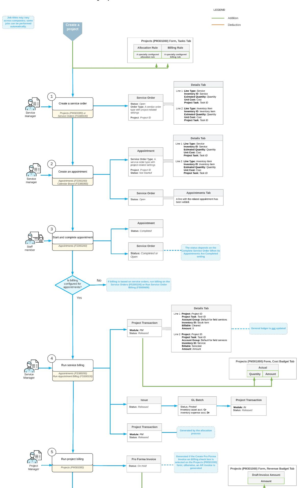

#### **Creation of a Project**

You create a project by using the *[Projects](https://help-2025r1.acumatica.com/Help?ScreenId=ShowWiki&pageid=81c86417-3bde-444b-8f1c-682928d31a0c)* (PM301000) form, as described in the *[Project Creation and Processing:](https://help-2025r1.acumatica.com/Help?ScreenId=ShowWiki&pageid=3177c4af-0f25-4435-b339-884ecc94362f) [General Information](https://help-2025r1.acumatica.com/Help?ScreenId=ShowWiki&pageid=3177c4af-0f25-4435-b339-884ecc94362f)* topic. During project creation, you need to specify the settings that provide integration with service management as follows:

- **Tasks** tab: For each task to be performed by using service management, do the following:
  - In the **Billing Rule** column, specify the billing rule that has been configured to bill project transactions related to field services.
  - In the **Allocation Rule** column, specify an allocation rule that has steps that have been configured for handling project transactions originating from service documents.
- **Summary** tab: Optionally, select the **Run Allocation on Release of ProjectTransactions** check box to cause the system to automatically perform allocation on release of project transactions.
- **Defaults** tab: In the **DefaultSales Account** box, specify the needed sales account. This account is used by the billing rule and will be credited to reflect the revenue earned on release of AR invoices generated for the project.

Aer the project has been created and the necessary settings have been specified, you can create any number of service orders and appointments to perform services associated with the project tasks.

#### **Creation of a Service Order**

You can create a service order directly from the *[Projects](https://help-2025r1.acumatica.com/Help?ScreenId=ShowWiki&pageid=81c86417-3bde-444b-8f1c-682928d31a0c)* (PM301000) form by clicking **CreateService Order** on the More menu. In the **CreateService Order/Appointment** dialog box, which opens, you select the project-related service order type in the**Service OrderType** box. In the **Default ProjectTask** box, you specify the project task to be used by default in the service order. The branch, branch location, description, and project are automatically copied from the project's settings and populated in the respective boxes. You do not need to fill in the**Service OrderSettings** section of the dialog box at this stage; these settings can be specified later on the *[Service Orders](https://help-2025r1.acumatica.com/Help?ScreenId=ShowWiki&pageid=6e5277d3-274e-45f5-b77d-4410ed736d21)* (FS300100) form.

At the bottom of the dialog box, you click **Create and Review**, and the system opens the *[Service Orders](https://help-2025r1.acumatica.com/Help?ScreenId=ShowWiki&pageid=6e5277d3-274e-45f5-b77d-4410ed736d21)* form. In the Summary area, the **Project** and **Default ProjectTask** boxes are already filled in. On the **Details** tab, you add lines for the necessary services, as well as any other non-stock items and stock items. The system inserts the default project task in the **ProjectTask** column for each detail line, but you can change it, if needed.

To create an appointment for the project-related service order, you click one of the following commands on the More menu of the *[Service Orders](https://help-2025r1.acumatica.com/Help?ScreenId=ShowWiki&pageid=6e5277d3-274e-45f5-b77d-4410ed736d21)* form:

- **Create Appointment**: The system opens the *[Appointments](https://help-2025r1.acumatica.com/Help?ScreenId=ShowWiki&pageid=ac486e9c-f5df-4829-94f0-2df8821361a0)* (FS300200) form, where you fill in the appointment's settings. For details, see *Appointment Creation: To Create an Appointment on the [Appointments](#page-34-1) [Form](#page-34-1)*.
- **Schedule on Calendar**: The system opens the *[Calendar Board](https://help-2025r1.acumatica.com/Help?ScreenId=ShowWiki&pageid=00cc92c3-408f-4fe3-b6bf-e801559f74f9)* (FS300300), where you can create an appointment while considering staff members' availability, skills, licenses, and service areas. For details, see *Appointment Creation: To Create an [Appointment](#page-36-1) on the Calendar Board*.
- **Schedule on Staff Calendar**: The system opens the *[Staff Calendar Board](https://help-2025r1.acumatica.com/Help?ScreenId=ShowWiki&pageid=b1d15e47-fba9-4bbf-a7fa-2f7c396c8df4)* (FS300400), where you can create an appointment considering the schedules of the staff members.

Regardless of which form you use to create the appointment, the system inserts the project in the Summary area of the *[Appointments](https://help-2025r1.acumatica.com/Help?ScreenId=ShowWiki&pageid=ac486e9c-f5df-4829-94f0-2df8821361a0)* form.

#### **Creation of an Appointment**

You can create an appointment directly from a project without first creating a service order. When the appointment is created, the system automatically creates the related service order, populating it with the settings and detail lines of the appointment.

To create an appointment from a project, on the More menu of the *[Projects](https://help-2025r1.acumatica.com/Help?ScreenId=ShowWiki&pageid=81c86417-3bde-444b-8f1c-682928d31a0c)* (PM301000) form, you click **Create Appointment**. In the **CreateService Order/Appointment** dialog box, which opens, you select the project-related service order type. In the **Default ProjectTask** box, you specify the default project task for the appointment. The system copies other settings—such as the branch, branch location, description, and project—from the project settings and inserts them in the appropriate boxes.

At the bottom of the dialog box, you click **Create and Review**, and the system opens the *[Appointments](https://help-2025r1.acumatica.com/Help?ScreenId=ShowWiki&pageid=ac486e9c-f5df-4829-94f0-2df8821361a0)* (FS300200) form, where you can specify other settings for the appointment. When you save the appointment, the system automatically creates the related service order on the *[Service Orders](https://help-2025r1.acumatica.com/Help?ScreenId=ShowWiki&pageid=6e5277d3-274e-45f5-b77d-4410ed736d21)* (FS300100) form and copies the relevant settings from this appointment.

As an alternative to creating a service document directly from a project, you can create a service order or an appointment directly on the *[Service Orders](https://help-2025r1.acumatica.com/Help?ScreenId=ShowWiki&pageid=6e5277d3-274e-45f5-b77d-4410ed736d21)* or *[Appointments](https://help-2025r1.acumatica.com/Help?ScreenId=ShowWiki&pageid=ac486e9c-f5df-4829-94f0-2df8821361a0)* form and associate it with a project by selecting the needed project in the **Project** box in the Summary area of the form.

In the created appointment on the *[Appointments](https://help-2025r1.acumatica.com/Help?ScreenId=ShowWiki&pageid=ac486e9c-f5df-4829-94f0-2df8821361a0)* form, on the **Details** tab, you add detail lines for the necessary services, as well as any non-stock items and stock items. In each line, you specify the project task (if it is different from the default project task). When you save the appointment, all added lines will be automatically included in the service order.

#### **Transactions Generated During the Billing of a Service Order or an Appointment**

Once an appointment has been completed, the billing process can be initiated. Billing can be processed for either appointments or service orders, depending on the settings of the customer's billing cycle.

When billing is completed for a service order or an appointment, the system generates transactions that can be viewed as follows:

- On the **Billing Documents** tab of both the *[Service Orders](https://help-2025r1.acumatica.com/Help?ScreenId=ShowWiki&pageid=6e5277d3-274e-45f5-b77d-4410ed736d21)* (FS300100) form and the *[Appointments](https://help-2025r1.acumatica.com/Help?ScreenId=ShowWiki&pageid=ac486e9c-f5df-4829-94f0-2df8821361a0)* form if billing was run for the appointment (that is, if **Run Billing For** is set to **Appointments** in the billing cycle associated with the customer)
- On the **Billing Documents** tab of only the *[Service Orders](https://help-2025r1.acumatica.com/Help?ScreenId=ShowWiki&pageid=6e5277d3-274e-45f5-b77d-4410ed736d21)* (FS300200) form if billing was run for the service order (that is, if **Run Billing For** is set to**Service Orders** in the billing cycle associated with the customer)

If a service document contains only non-stock items or services, the system generates and releases a project transaction that is recorded to the account group intended to initially track project transactions originating from service documents. For details, see *[Integration of Field Services and Projects: Workflow Setup](#page-155-1)*.

If a service document contains both non-stock items (including services) and stock items, the following records are generated during billing:

1. An inventory issue transaction.

The system creates an issue on the *[Issues](https://help-2025r1.acumatica.com/Help?ScreenId=ShowWiki&pageid=17b051f6-027d-4459-b542-65c1c1f9d0ea)* (IN302000) form and releases it. On the **Financial** tab of the *[Issues](https://help-2025r1.acumatica.com/Help?ScreenId=ShowWiki&pageid=17b051f6-027d-4459-b542-65c1c1f9d0ea)* form, the reference number of the generated inventory GL transaction is specified in the **Batch Nbr.** box. This GL transaction credits an inventory account (indicating a reduction in inventory) and debits the inventory expense account (COGS - cost of goods sold) specified in the reason code. This GL transaction recognizes an expense and generates a related project transaction, whose reference number is specified in the **ProjectTran. ID** column in the debiting line on the *Journal [Transactions](https://help-2025r1.acumatica.com/Help?ScreenId=ShowWiki&pageid=dda046bc-5946-407f-88f7-1c0c966fbe72)* (GL301000) form.

2. The project transaction.

The system creates the project transaction on the *Project [Transactions](https://help-2025r1.acumatica.com/Help?ScreenId=ShowWiki&pageid=382a97fe-b636-44ca-9798-6d478c05b687)* (PM304000) form. The **Details** tab contains the lines that the system has copied from the service document. In each line, the state of the **Billable** check box is assigned as follows:

• In a line with a stock item, the **Billable** check box is cleared because the system has created an inventory issue transaction for this line and has generated and posted an inventory GL transaction. For the debit expense line in this transaction, another project transaction is also generated.

• In a line with a service, the **Billable** check box is selected because it will be billed later through the project billing process.

Therefore, the total amount in the Summary area does not include the cost of the stock items because the **Amount** column for these lines on the **Details** tab contains *0*.

This project transaction is recorded to the account group that initially keeps project transactions originating from service documents. However, note that stock items are added with an amount of *0*.

You can view the project transactions associated with a particular project on the *Project [Transaction](https://help-2025r1.acumatica.com/Help?ScreenId=ShowWiki&pageid=29bf5433-446f-4196-be69-f2cb177e83cb) Details* (PM401000) inquiry form. For details, see *[Integration of Field Services and Projects: Related Inquiry Form](#page-162-1)*.

On the generation and release of the project transaction, the system updates the project's budget lines on the **Cost Budget** tab of the *[Projects](https://help-2025r1.acumatica.com/Help?ScreenId=ShowWiki&pageid=81c86417-3bde-444b-8f1c-682928d31a0c)* (PM301000) form. The system updates the **Actual Quantity** and **Actual Amount** columns for these cost budget lines.

#### **Reversal of a Project Transaction Created from a Service Document**

You may need to reverse a project transaction that has been generated during the billing of a service order or an appointment. To do this, click **Reverse Bill** on the More menu of the *[Service Orders](https://help-2025r1.acumatica.com/Help?ScreenId=ShowWiki&pageid=6e5277d3-274e-45f5-b77d-4410ed736d21)* (FS300100) or *[Appointments](https://help-2025r1.acumatica.com/Help?ScreenId=ShowWiki&pageid=ac486e9c-f5df-4829-94f0-2df8821361a0)* (FS300200) form.

When a project transaction is reversed, all settings from the original transaction are copied to the reversed transaction. The system adds *Reverse* to the beginning of the transaction description in the **Description** box in the Summary area of the *[Service Orders](https://help-2025r1.acumatica.com/Help?ScreenId=ShowWiki&pageid=6e5277d3-274e-45f5-b77d-4410ed736d21)* or *[Appointments](https://help-2025r1.acumatica.com/Help?ScreenId=ShowWiki&pageid=ac486e9c-f5df-4829-94f0-2df8821361a0)* form.

You can view both the original transaction and the reversed transaction on the **Billing Documents** tab of the *[Service Orders](https://help-2025r1.acumatica.com/Help?ScreenId=ShowWiki&pageid=6e5277d3-274e-45f5-b77d-4410ed736d21)* or *[Appointments](https://help-2025r1.acumatica.com/Help?ScreenId=ShowWiki&pageid=ac486e9c-f5df-4829-94f0-2df8821361a0)* form, depending on which form the transaction was generated from (and then reversed).

If a service document contains stock items and an inventory issue has been generated during billing, clicking the **Reverse Bill** command will also reverse the issue. That is, the system will generate and post a reversed inventory transaction for this issue, which will debit an inventory asset account.

### **Integration of Field Services and Projects: Workflow Setup**

You can efficiently manage the services performed within a project's scope by using Acumatica ERP's service management functionality. The integration of projects and services ensures that all costs related to the provided services are accurately tracked and allocated to the project. To use the service management functionality while performing projects, you need to configure the basic project accounting and service management functionalities to provide integration between projects and service management.

Once this integration has been configured, you can create service documents (that is, service orders and appointments) linked to projects; in these documents, you can associate services and stock items with project tasks. When the service documents are billed, project transactions are generated, and all associated costs are recorded in the project's cost budget. The setup process is described in detail in the sections of this topic.

#### **Setting Up the Integration of Service Management and Projects**

Before you begin this configuration, the *Service Management* and *Projects* features must be enabled on the *[Enable/Disable Features](https://help-2025r1.acumatica.com/Help?ScreenId=ShowWiki&pageid=c1555e43-1bc5-4f6f-ba9d-b323f94d8a6b)* (CS100000) form. Additionally, the project accounting functionality and the service management functionality must be configured in your Acumatica ERP instance. For details, see *[Basic Project Configuration: General Information](https://help-2025r1.acumatica.com/Help?ScreenId=ShowWiki&pageid=c1b33990-3af1-4712-862e-07d8f188f80b)* and *[Basic Service Management](https://help-2025r1.acumatica.com/Help?ScreenId=ShowWiki&pageid=0ce82bef-9eba-4e75-a0a4-06fbc78346cf) [Configuration: General Information](https://help-2025r1.acumatica.com/Help?ScreenId=ShowWiki&pageid=0ce82bef-9eba-4e75-a0a4-06fbc78346cf)*.

To establish a workflow between service management and project management, you need to perform the following general steps, each of which is described in its own section of this topic:

- 1. You create account groups for tracking project transactions originating from service documents.
- 2. You create a reason code with a GL account that is mapped to the expense account group intended to record expenses related to issuing stock items from a warehouse.
- 3. You create a project-related service order type. Service orders and appointments related to projects should be created based on this type. The system will generate project transactions when the billing process is run for the service documents.

If stock items may be included in the service documents, the reason code should be specified in the service order type settings. In this case, the system will also generate an inventory transaction when the billing process is run for the service documents.

- 4. You create an allocation rule that the system will use to track all project transactions generated from service documents.
- 5. You create a billing rule to bill a project containing service-related project transactions. This rule should include two steps to handle project transactions generated from service documents containing both services and stock items.

Once the configuration has been completed, you can create a project with the necessary project tasks. For each project task that you plan to use with service documents, you specify the billing rule and the allocation rule. Aerward, you create and process the required service orders and appointments for the project. For details, see *[Integration of Field Services and Projects: General Information](#page-151-2)*.

#### **Creating Account Groups**

To consolidate and manage project transactions in projects that involve service documents, you need to create the account groups listed in the table below.

You create account groups on the *[Account Groups](https://help-2025r1.acumatica.com/Help?ScreenId=ShowWiki&pageid=94a2cdce-c36a-49a1-b572-9cd33cb5fa73)* (PM201000) form. You specify the type of each account group by selecting *Asset*, *Expense*, *Off-Balance*, or *Income* in the **Type** box of the Summary area of that form.

|  | Table: Account Groups |  |  |
|--|-----------------------|--|--|
|--|-----------------------|--|--|

| Purpose                                                                                                 | Type  | Configuration Actions                                                                                                                                                                                                                                   | Description                                                                                                                                                                                                                                                         |
|---------------------------------------------------------------------------------------------------------|-------|---------------------------------------------------------------------------------------------------------------------------------------------------------------------------------------------------------------------------------------------------------|---------------------------------------------------------------------------------------------------------------------------------------------------------------------------------------------------------------------------------------------------------------------|
| An account group intended to track project transactions originating from ser vice documents | Asset | Leave the Accounts tab empty on the Account Groups form because no GL accounts are specified in project transactions originating in service documents. Thus, GL transactions are not generated and the general ledger is not updated. | When the allocation process for the project is executed, the project trans actions of this account group are re allocated to an account group intend ed to accumulate transactions waiting for billing (described in the next row of this table). |
|                                                                                                         |       | This account group should be speci fied in the settings of the project-re lated service order type. For details, see the Creating a Project-Related Service Order Type section of this top ic.                                           |                                                                                                                                                                                                                                                                     |
|                                                                                                         |       | For this account group, the UNBILLED account group ID is used in the con figuration settings described in the next sections of this topic. Howev er, you can use any account group ID when creating this group in your sys tem.       |                                                                                                                                                                                                                                                                     |

| Purpose                                                                                                                                                                          | Type               | Configuration Actions                                                                                                                                                                                                                                                                                                                                                                                                                                                                                                                                                                                                                                                                                                                                                                                                   | Description                                                                                                                                                                                                                                                                                                                                   |
|----------------------------------------------------------------------------------------------------------------------------------------------------------------------------------|--------------------|-------------------------------------------------------------------------------------------------------------------------------------------------------------------------------------------------------------------------------------------------------------------------------------------------------------------------------------------------------------------------------------------------------------------------------------------------------------------------------------------------------------------------------------------------------------------------------------------------------------------------------------------------------------------------------------------------------------------------------------------------------------------------------------------------------------------------|-----------------------------------------------------------------------------------------------------------------------------------------------------------------------------------------------------------------------------------------------------------------------------------------------------------------------------------------------|
| An account group in tended to temporari ly accumulate project costs associated with services and non stock items that have been provided but not yet billed | Off Bal ance | Leave the Accounts tab empty on the Account Groups form. This account group should be spec ified in the billing rule settings. The transactions recorded to this ac count group will be billed when the project billing process is run. For de tails, see the Creating a Billing Rule section of this topic. For this account group, the WIP (Work in Progress) account group ID is used in the configuration settings de scribed in the next sections of this topic. However, you can use any ac count group ID when creating this group in your system.                                                                                                                                                                                                                  | When the allocation process for the project is executed, project trans actions from this account group are reallocated to the Expense account group (described in the next row of this table) to recognize service-related project expenses.                                                                                |
| An account group intended to record expenses related to non-stock items and services                                                                                 | Ex pense        | Leave the Accounts tab empty if you do not plan to post expenses related to non-stock items and services. Add a GL account of the Expense type to this group on the Accounts tab on the Account Groups form if you plan to post expenses related to non stock items and services to the gen eral ledger. Depending on your decision, the Post to GL check box must be either selected or cleared in the settings of the 30 step of the allocation rule de scribed in the Creating an Allocation Rule section of this topic. For this account group, the LABOR account group ID is used in the con figuration settings described in the next sections of this topic. Howev er, you can use any account group ID when creating this group in your sys tem. | When the allocation process for the project is executed, project transac tions from the WIP account group are moved to this account group to track the service-related project expenses. On the Balances tab of the Projects (PM301000) form, this account group will be listed so that you can track these expenses. |

| Purpose                                                                                                  | Type        | Configuration Actions                                                                                                                                                                                                                                                                                                                                                                                                                                                                                                                                                                                                                                                   | Description                                                                                                                                                                                                                                                                                                                                              |
|----------------------------------------------------------------------------------------------------------|-------------|-------------------------------------------------------------------------------------------------------------------------------------------------------------------------------------------------------------------------------------------------------------------------------------------------------------------------------------------------------------------------------------------------------------------------------------------------------------------------------------------------------------------------------------------------------------------------------------------------------------------------------------------------------------------------|----------------------------------------------------------------------------------------------------------------------------------------------------------------------------------------------------------------------------------------------------------------------------------------------------------------------------------------------------------|
| An account group intended to record expenses related to issuing stock items from a warehouse | Ex pense | Add the expense account of the rea son code specified in the service order type settings to this account group on the Accounts tab of the Ac count Groups form. This account group should be spec ified in the billing rule that will be used to bill projects that have project transactions with stock items. For de tails, see the Creating a Billing Rule section of this topic. For this account group, the MATERIAL account group ID is used in the con figuration settings described in the next sections of this topic. Howev er, you can use any account group ID when creating this group in your sys tem. | The system debits the expense ac count (COGS) specified in the rea son code and mapped to this account group when the issue transaction gen erated from billing a service docu ment is released. On the Balances tab of the Projects (PM301000) form, this account group will be listed so that you can track these expenses. |
| An account group intended to record project income                                                 | Rev enue | Add a GL account of the Income type on the Accounts tab of the Account Groups form. This account should be specified in the Default Sales Account box on the Defaults tab of the Projects (PM301000) form.                                                                                                                                                                                                                                                                                                                                                                                                                                            | The system uses the account of this account group in AR invoices generat ed during project billing. This account is credited when an AR invoice is re leased.                                                                                                                                                                                |

For detailed information about account groups and their types, see *[Account Groups: General Information](https://help-2025r1.acumatica.com/Help?ScreenId=ShowWiki&pageid=f8734904-a3f6-4cef-820b-330894038634)*.

### **Creating a Reason Code**

To record as project costs the expenses associated with issuing stock items from a warehouse, you need to create a reason code with the GL account assigned to a specific account group (described in the fourth row of the table in the previous section). You will then specify this reason code in the settings for the project-related service order type.

You create this reason code on the *[Reason Codes](https://help-2025r1.acumatica.com/Help?ScreenId=ShowWiki&pageid=fe53f1bf-3670-465e-8b7c-922d8246f123)* (CS211000) form and specify the following settings:

- **Usage**: *Issue*.
- **Account**: An inventory expense account that has been mapped to an expense account group intended to record expenses related to issuing stock items from a warehouse.
- **Sales Account**: A sales account that will be used to record the income that occurs when an AR invoice created for inventory transactions is released.

This reason code will be specified in the inventory issue that the system generates when you run billing on the *[Service Orders](https://help-2025r1.acumatica.com/Help?ScreenId=ShowWiki&pageid=6e5277d3-274e-45f5-b77d-4410ed736d21)* (FS300100) or *[Appointments](https://help-2025r1.acumatica.com/Help?ScreenId=ShowWiki&pageid=ac486e9c-f5df-4829-94f0-2df8821361a0)* (FS300200) form for a service document that contains stock items. On release of the issue, the system creates a GL batch with the following lines, which can be viewed on the **Details** tab of the *Journal [Transactions](https://help-2025r1.acumatica.com/Help?ScreenId=ShowWiki&pageid=dda046bc-5946-407f-88f7-1c0c966fbe72)* (GL301000) form:

- In the first line, an inventory account is credited by the cost of the stock item. In the **Quantity** column, the quantity is specified with a negative sign.
- In the second line, a project-related expense account is debited by the cost of the stock item. This GL account is specified in the reason code and, in turn, added to the project account group of the *Expense* type.

In the **Quantity** column, the quantity is specified with a positive sign. Additionally, the system generates a project transaction for this line and inserts its reference number in the **ProjectTran. ID** column.

#### **Creating a Project-Related Service Order Type**

To integrate service orders and appointments with projects and generate project transactions, you first create a service order type with the appropriate project-related settings.

On the **General** tab of the *[Service](https://help-2025r1.acumatica.com/Help?ScreenId=ShowWiki&pageid=06fd8a36-dd81-4df9-b609-92c3d552c542) Order Types* (FS202300) form, you create a project-related service order type with the following settings:

- **Service OrderType**: The identifier of the service order type to be used for project-related service documents.
- **NumberingSequence**: The numbering sequence for service documents generating project transactions; this sequence should be set up in advance.
- **Behavior**: *Regular*.
- **Generated Billing Documents**: *Project Transactions*.
- **Account Group**: The account group to be assigned by default to project transactions generated from an appointment or service order of this service order type. This account group (described in the first row of the table in the *Creating Account Groups* section) must be defined beforehand as an account group to track project transactions originating from service documents.
- **BillingType**: *Cost as Cost*. The items will be billed based on the unit cost specified in the document.

If the *Inventory and Order Management* feature is enabled on the *[Enable/Disable Features](https://help-2025r1.acumatica.com/Help?ScreenId=ShowWiki&pageid=c1555e43-1bc5-4f6f-ba9d-b323f94d8a6b)* (CS100000) form and stock items may be included in the service documents associated with projects, you specify the following settings on the *[Service](https://help-2025r1.acumatica.com/Help?ScreenId=ShowWiki&pageid=06fd8a36-dd81-4df9-b609-92c3d552c542) Order Types* form as well:

- **OrderType for Allocation**: The sales order type for allocation if you plan to include stock items in service documents.
- **Reason Code**: The reason code to be used by default in inventory issues generated from appointments or service orders of the current service order type.

Other settings of the service order type should be specified according to needs unrelated to project functionality because they do not affect the process of billing service documents through projects.

When you create a project-related service document, you specify the service order type in the following boxes:

- On the *[Service Orders](https://help-2025r1.acumatica.com/Help?ScreenId=ShowWiki&pageid=6e5277d3-274e-45f5-b77d-4410ed736d21)* (FS300100) form: The **OrderType** box of the Summary area
- On the *[Appointments](https://help-2025r1.acumatica.com/Help?ScreenId=ShowWiki&pageid=ac486e9c-f5df-4829-94f0-2df8821361a0)* (FS300200) form: The**Service OrderType** box of the Summary area

#### **Creating an Allocation Rule**

To cause the system to allocate project transactions generated from service documents, you need to create a dedicated allocation rule and specify this rule for each needed project task that is added on the**Tasks** tab of the *[Projects](https://help-2025r1.acumatica.com/Help?ScreenId=ShowWiki&pageid=81c86417-3bde-444b-8f1c-682928d31a0c)* (PM301000) form.

This allocation rule will work only if the account groups described in the *[Account Groups](#page-156-0)* section of this topic are configured in the system.

The allocation rule should consist of three steps. The configuration of each step is intended to do the following:

1. The system reverses project transactions recorded to a default *Asset* account group used for tracking project transactions originating from service documents. That is, the system clears the default service-related *Asset* account group by creating reversed project transactions with negative quantity and amount values.

- 2. The system allocates project transactions from the field service default account group to the account group used in the project to store unpaid project costs. The system moves these project transactions with positive quantities and amounts to the account group of the *Asset* type intended to track unpaid project costs.
- 3. The system reallocates project transactions with services and other non-stock items to the account group of the *Expense* type to record expenses related to non-stock items and services.

Thus, you create an allocation rule with the following steps defined in the le pane of the *[Allocation Rules](https://help-2025r1.acumatica.com/Help?ScreenId=ShowWiki&pageid=0d2e40ad-7ecf-4937-b2bd-dab1d800e0db)* (PM207500) form:

- 1. **Step ID**: 10. This step reverses project transactions recorded to the *UNBILLED* account group. For this step, you do the following in the right pane:
  - On the **Calculation Rules** tab, you specify the following settings:
    - **Allocation Method**: *Allocate Transactions*
    - **Create Allocation Transaction**: Selected
    - **Account Group From**: The *UNBILLED* asset account group
    - **Quantity Formula**: =[PMTran.Qty] \* (-1)
    - **Billable Qty. Formula**: =[PMTran.BillableQty] \* (-1)
    - **Amount Formula**: =[PMTran.ProjectCuryAmount] \* (-1)
    - **Description Formula**: ='Clearing UNBILLED'.
  - On the **Allocation Settings** tab, you specify the following settings:
    - **PostTransaction to GL**: Cleared
    - **CreateTransaction with Zero Qty.**: Selected
    - **CreateTransaction with Zero Amount**: Selected
    - **Allocate Non-BillableTransactions**: Selected
    - **Can Be Used as aSource in Another Allocation**: Cleared
    - **Reverse Allocation**: *Never*
    - **CreditTransaction** section, **Account Group** box: *None*
- 2. **Step ID**: 20. In this step, the system allocates project transactions from the *UNBILLED* account group to the *WIP* account group. For this step, you do the following on the right tab:
  - On the **Calculation Rules** tab, you specify the following settings:
    - **Allocation Method**: *Allocate Transactions*
    - **Create Allocation Transaction**: Selected
    - **SelectTransactions**: *From Previous Allocation Steps*
    - **RangeStart**: 10
    - **Range End**: 10
    - **Quantity Formula**: =[PMTran.Qty] \* (-1)
    - **Billable Qty. Formula**: =[PMTran.BillableQty] \* (-1)
    - **Amount Formula**: =[PMTran.ProjectCuryAmount] \* (-1)
    - **Description Formula**: ='Moving UNBILLED to WIP for billing'.
  - On the **Allocation Settings** tab, you specify the following settings:
    - **PostTransaction to GL**: Cleared
    - **CreateTransaction with Zero Qty.**: Selected
    - **CreateTransaction with Zero Amount**: Selected
    - **Allocate Non-BillableTransactions**: Selected
    - **Can Be Used as aSource in Another Allocation**: Cleared
    - **Reverse Allocation**: *On AR Invoice Generation*
    - **DebitTransaction** section, **Account Group** box: *Replace* and *WIP*

- **CreditTransaction** section, **Account Group** box: *None*
- 3. **Step ID**: 30. This step reallocates project transactions from the *WIP* account group to the *LABOR* account group. This step recognizes service-related expenses from service documents. For this step, you do the following on the right tab:
  - On the **Calculation Rules** tab, you specify the following settings:
    - **Allocation Method**: *Allocate Transactions*
    - **Create Allocation Transaction**: Selected
    - **SelectTransactions**: *From Previous Allocation Steps*
    - **RangeStart**: 20
    - **Range End**: 20
    - **Quantity Formula**: =IIf([InventoryItem.StkItem], 0, [PMTran.Qty])
    - **Billable Qty. Formula**: =IIf([InventoryItem.StkItem], 0, [PMTran.Qty])
    - **Amount Formula**: =IIf([InventoryItem.StkItem], 0, [PMTran.ProjectCuryAmount])
    - **Description Formula**: ='Moving WIP services to LABOR expenses'
  - On the **Allocation Settings** tab, you specify the following settings:
    - **PostTransaction to GL**: Cleared

If you want to post expenses to the general ledger, select this check box. In this case, a GL account of the *Expense* type must be specified in the settings of the *LABOR* account group on the **Accounts** tab of the *[Account Groups](https://help-2025r1.acumatica.com/Help?ScreenId=ShowWiki&pageid=94a2cdce-c36a-49a1-b572-9cd33cb5fa73)* form. Additionally, you will need to specify this expense account in the **DebitTransaction** section of the current step, and an account to be credited by the transaction in the **CreditTransaction** section of the current step.

- **CreateTransaction with Zero Qty.**: Cleared
- **CreateTransaction with Zero Amount**: Cleared
- **Allocate Non-BillableTransactions**: Selected
- **Can Be Used as aSource in Another Allocation**: Cleared
- **Reverse Allocation**: *Never*
- **DebitTransaction** section, **Account Group** box: *Replace* and *LABOR*
- **CreditTransaction** section, **Account Group** box: *None*

#### **Creating a Billing Rule**

To bill projects that have project transactions generated from field service documents, you need to create a billing rule that contains two steps. The first step contains settings related to billing transactions containing nonstock items and services. The second step contains settings related to billing project transactions that have been generated for stock items.

To create this billing rule, on the *[Billing Rules](https://help-2025r1.acumatica.com/Help?ScreenId=ShowWiki&pageid=6773c79b-216e-4725-b28c-3ce724d9a7c9)* (PM207000) form, create a new record. In the le pane, you create the following steps:

- 1. **Step ID**: 10. For this step, you specify the following settings on the right tab:
  - **BillingType**: *Time and Material*
  - **Account Group**: *WIP*, which is an account group used for recording unpaid project transactions.
  - **RateType**: An appropriate rate type for the selected account group.
  - **Line Quantity Formula**: =[PMTran.BillableQty]
  - **Line Amount Formula**: Any necessary markup to be added on top of the WIP transaction being billed, such as =[PMTran.Amount]\*1.25

- **Line Description Formula:**='WIP billing'
- **Use Destination Branch From**: *Source Transaction*
- **UseSales Account From**: *Project*
- 2. **Step ID**: 20. For this step, specify the following settings on the right tab:
  - **BillingType**: *Time and Material*
  - **Account Group**: *MATERIAL*, which is an account group that includes a GL account specified in the reason code.
  - **RateType**: An appropriate rate type for the selected account group.
  - **Line Quantity Formula**: =[PMTran.BillableQty]
  - **Line Amount Formula**: Any necessary markup to be added on top of the WIP transaction being billed, such as =[PMTran.Amount]\*1.25
  - **Line Description Formula:**=[PMTran.InventoryID\_description]
  - **UseSales Account From**: *Project*

### **Integration of Field Services and Projects: Related Inquiry Form**

In the following sections, you can find details about the inquiry form you may want to review to gather information about project transactions originating from field service documents.

If you do not see a particular report or form that is described, you may have signed in to the system with a user account that does not have access rights to the report or form. Contact your system administrator to obtain access to any needed reports or forms.

#### **Reviewing the Generated Project Transactions**

On the *Project [Transaction](https://help-2025r1.acumatica.com/Help?ScreenId=ShowWiki&pageid=29bf5433-446f-4196-be69-f2cb177e83cb) Details* (PM401000) inquiry form, you can specify a project and review the project transactions that the system has generated from service documents. The screenshot below provides an example of this inquiry form, which shows the project transactions created under the following conditions:

- A service document (service order or an appointment) related to a project has been billed.
- An allocation rule has been applied to the project.
- The project billing process has been run.

|   | <b>Project Transaction Details</b>                                                                                                                                                                                                                           |  |             |                 |                 |                                                 |                                          |                      |                  |                    |                  |                                       |   |          |               |                      |           |           |                           |                           |                    |                         |                           |                  |
|---|--------------------------------------------------------------------------------------------------------------------------------------------------------------------------------------------------------------------------------------------------------------|--|-------------|-----------------|-----------------|-------------------------------------------------|------------------------------------------|----------------------|------------------|--------------------|------------------|---------------------------------------|---|----------|---------------|----------------------|-----------|-----------|---------------------------|---------------------------|--------------------|-------------------------|---------------------------|------------------|
|   | н $\mathbf{x}$ $\overline{\mathbf{Y}}$ $O$ $O$                                                                                                                                                                                                      |  |             |                 |                 |                                                 |                                          |                      |                  |                    |                  |                                       |   |          |               |                      |           |           |                           |                           |                    |                         |                           |                  |
|   | SELECTION CRITERIA FILTERING CRITERIA PR00000037 - PROJ6 $\Omega$ Inventory ID: o Project: M Indude Unreleased Transactions Project Task: p o Account Group: ALLOCATION TRANSACTIONS COST TRANSACTIONS ALL RECORDS |  |             |                 |                 |                                                 |                                          |                      |                  |                    |                  |                                       |   |          |               |                      |           |           |                           |                           |                    |                         |                           |                  |
|   | Tran. ID Module                                                                                                                                                                                                                                              |  | Ref. Number | Project Task | Inventory ID    | Description                                     | Quantity                                 | Billable Quantity | Unit Rate     |                    | Amount "Currency | Project Released Currenc Amount |   | Billable | <b>Billed</b> | Invoice Ref. Nbr. | Customer/ | Allocated | Allocation Transaction | Orig. Doc. Type           | Orig. Doc. Nbr. | <b>GL Batch</b> Nbr. | Debtt Account Group | Debit Account |
|   | 27757 PM                                                                                                                                                                                                                                                     |  | PM00002220  | TASK1           | <b>INSTAC</b>   | Air Conditioner Installation Service            | 2.00                                     |                      | 2.00 400.00      | 800.00 USD         |                  | 800.00                                | 図 | 図        | $\Box$        |                      | ABARTE.   | ⊠         | $\Box$                    | Appointment               | 006305-1           |                         | UNBILLED                  |                  |
|   | 27758 PM                                                                                                                                                                                                                                                     |  | PM00002220  | TASK1           | <b>CONDDUAL</b> | Service billing of stock. For related costs, s. | !!!!!!!!!!!!!!!!!!!!!!!!!!!!!!!!!!!!!!!! |                      | 0.00 1.150.00    | $0.00$ USD         |                  | 0.00                                  | ø | $\Box$   | п             |                      | ABARTE.   | ø         | п                         | Appointment               | 006305-1           |                         | UNBILLED                  |                  |
|   | 27759 IN                                                                                                                                                                                                                                                     |  | PM00002221  | TASK1           | <b>CONDDUAL</b> | Dual Inverter Smart Window Air Conditioner      | 1.00                                     | 1.00                 | 0.00             | 1.150.00 USD       |                  | 1.150.00                              | ø | ⊠        | ø             | AR013866             |           | $\Box$    | o                         |                           |                    | 00010284                | <b>MATERIAL</b>           | 50000            |
| ē | 27760 PM                                                                                                                                                                                                                                                     |  | PM00002222  | TASK1           | <b>INSTAC</b>   | Clearing FSPROJECT                              | $-200$                                   | $-2.00$              | 400.00           | -800.00 USD        |                  | $-800.00$                             | ⊠ | ☑        | $\Box$        |                      | ABARTE.   | ⊠         | ◙                         | Alocation                 |                    |                         | UNBILLED                  |                  |
|   | 27761 PM                                                                                                                                                                                                                                                     |  | PM00002222  | TASK1           | <b>CONDDUAL</b> | Clearing FSPROJECT                              | 0.00                                     | 0.00                 | 0.00             | 0.00 USD           |                  | 0.00                                  | ⊠ | $\Box$   | $\Box$        |                      | ABARTE.   | ⊠         | ◙                         | Alocation                 |                    |                         | UNBILLED                  |                  |
|   | 27762 PM                                                                                                                                                                                                                                                     |  | PM00002222  | TASK1           | <b>INST AC</b>  | Moving FSPROJECT to WIP for billing             | 200                                      |                      | 2.00 400.00      | 800.00 USD         |                  | 800.00                                | ø | ⊠        | ø             | AR013866             | ABARTE.   | ◙         | ø                         | Allocation                |                    |                         | WIP                       |                  |
|   | 27763 PM                                                                                                                                                                                                                                                     |  | PM00002222  | TASK1           | CONDITAL        | Moving FSPROJECT to WIP for billing             | $0.00 -$                                 | 0.00                 | 0.00             | 0.00 USD           |                  | 0.00                                  | ø | $\Box$   |               |                      | ABARTE.   | $\Box$    | ø                         | Allocation                |                    |                         | WIP                       |                  |
| 5 | 27764 PM                                                                                                                                                                                                                                                     |  | PM00002222  | TASK1           | <b>INSTAC</b>   | Moving WIP services to LABOR expenses           | 200                                      |                      | 2.00 400.00      | 800.00 USD         |                  | 800.00                                | ⊠ | ☑        | $\Box$        |                      | ABARTE.   | $\Box$    | ◙                         | <b>Alccation</b>          |                    |                         | LABOR                     |                  |
| F | 27765 PM                                                                                                                                                                                                                                                     |  | PM00002223  | TASK1           | <b>INSTAC</b>   | Moving FSPROJECT to WP for billing              | $-200$                                   |                      | $-2.00 - 400.00$ | -800.00 USD        |                  | $-800.00$                             | ø | $\Box$   | $\Box$        |                      | ABARTE.   | $\Box$    | n.                        | <b>Alocation Reversal</b> | AR013866           |                         | <b>WIP</b>                |                  |
|   | 27766 AR                                                                                                                                                                                                                                                     |  | PM00002224  | TASK1           | <b>INST AC</b>  | WIP billing                                     | 200                                      | 2.00                 | 0.00             | $-800.00$ USD      |                  | $-800.00$                             | ₫ | ▫        |               |                      | ABARTE.   | σ         | n.                        | AR Invoice                | AR013866           | AR0146.                 | <b>REVENUE</b>            | 40000            |
|   | 27767 AR                                                                                                                                                                                                                                                     |  | PM00002224  | TASK1           | <b>CONDDUAL</b> | Dual Inverter Smart Window Air Conditioner      | 1.00                                     | 1.00                 |                  | 0.00 -1.150.00 USD |                  | $-1,150.00$                           | ø | o        | $\Box$        |                      | ABARTE.   | $\Box$    | п                         | AR Invoice                | AR013866           | AR0146.                 | <b>REVENUE</b>            | 40000            |
|   |                                                                                                                                                                                                                                                              |  |             |                 |                 |                                                 |                                          |                      |                  |                    |                  |                                       |   |          |               |                      |           |           |                           |                           |                    |                         |                           |                  |

#### *Figure: A project's transactions originating from service documents*

In this example, the inquiry form shows the following project transactions:

- 1. Project transactions (see Item 1 in the screenshot above) that were created when the billing process was run for a service document and recorded to the account group intended to track transactions originating from service documents.
- 2. A project transaction (Item 2) that was generated on release of the inventory issue transaction containing stock items, reflecting a material expense that occurred.
- 3. Project transactions (Item 3) that were generated by the allocation process (Step 10 in the allocation rule described in *[Integration of Field Services and Projects: Workflow Setup](#page-155-1)*). This step reverses the project transactions shown in Item 1, which were recorded to the account group used for tracking project transactions originating from service documents.
- 4. Project transactions (Item 4) that were generated by the allocation process (Step 20 in the allocation rule described in *[Integration of Field Services and Projects: Workflow Setup](#page-155-1)*). In this step, the system allocates project transactions from the field service default account group to the *Work in Progress (WIP)* account group, which is used to store unpaid project costs.
- 5. A project transaction (Item 5) that was generated by the allocation process (Step 30 in the allocation rule described in *[Integration of Field Services and Projects: Workflow Setup](#page-155-1)*). This step recognizes service-related expenses from service documents.

As a result of project billing the following transactions appears.

- 6. A reversed project transaction (Item 6) that was automatically generated when an AR invoice was created upon billing the project transaction that was recorded to the *WIP* account group by the allocation process.
- 7. Project transactions that record revenue to the project budget (Item 7). These transactions were generated when the related AR invoices were billed.

## **Processing Service Documents with Projects**

This chapter explains how processes and settings are handled in Acumatica ERP when a project is specified in service documents.

## **Availability of Project-Specific Inventory in Service Documents**

To manage the project-specific inventory items, the *Project-Specific Inventory* feature must be enabled on the *[Enable/Disable Features](https://help-2025r1.acumatica.com/Help?ScreenId=ShowWiki&pageid=c1555e43-1bc5-4f6f-ba9d-b323f94d8a6b)* (CS100000) form.

In service documents linked to a project, the system displays project-specific quantities for lines with stock items in the table footer of the **Details** tab on the *[Service Orders](https://help-2025r1.acumatica.com/Help?ScreenId=ShowWiki&pageid=6e5277d3-274e-45f5-b77d-4410ed736d21)* and *[Appointments](https://help-2025r1.acumatica.com/Help?ScreenId=ShowWiki&pageid=ac486e9c-f5df-4829-94f0-2df8821361a0)* forms. The following quantities are shown: *On Hand*, *Available*, *Available for Shipping*, and *Allocated* (as shown in the following screenshot).

| <b>Service Orders</b>                                                                                                                        | PROJ PR00000001 - FourStar Coffee & Sweets Shop                                                           |                                                                                           |                     |                                               |                                                                 |                        |          |                    | R NOTES       | <b>ACTIVITIES</b>                              | <b>FILES</b>                 |
|----------------------------------------------------------------------------------------------------------------------------------------------|-----------------------------------------------------------------------------------------------------------|-------------------------------------------------------------------------------------------|---------------------|-----------------------------------------------|-----------------------------------------------------------------|------------------------|----------|--------------------|---------------|------------------------------------------------|------------------------------|
| 뭐 $\Box$ $\leftarrow$                                                                                                                  | !!!!!!!!!!!!!!!!!!!!!!!!!!!!!!!!!!!!!!!! $\overline{\mathbf{K}}$ ↶ $\checkmark$                  | <b>COMPLETE</b> $\geq$ ≺ $\rightarrow$                                           |                     | <b>CREATE APPOINTMENT</b>                     | $\cdots$                                                        |                        |          |                    |               |                                                |                              |
| * Order Type:                                                                                                                                | PROJ $\circ$ $\mathscr{Q}$ Customer:                                                             | COFFEESHOP - FourStar Coffee & Swee 2                                                     |                     | <b>Estimated Duration:</b>                    | 2h00m                                                           |                        |          |                    |               |                                                |                              |
| Order Nbr.:                                                                                                                                  | PR0000000 Q * Location:                                                                                | MAIN - Primary Location                                                                   | $\Omega$            | <b>Estimated Billable Total:</b>              | 100.00                                                          |                        |          |                    |               |                                                |                              |
| Status:                                                                                                                                      | Open                                                                                                      | * Branch Location: WEST BRIGHTON - Office in West Bri Q                                   | 0                   | <b>Estimated Tax Total:</b>                   | 0.00                                                            |                        |          |                    |               |                                                |                              |
| * Date:                                                                                                                                      | 7/24/2024 $\Box$ Service Contract:                                                                  |                                                                                           | $\mathcal O$ Q   | <b>Estimated Total:</b>                       | 100.00                                                          |                        |          |                    |               |                                                |                              |
| Customer Order:                                                                                                                              | * Project:                                                                                                | PROJECT1                                                                                  | $\circ$ 0        | Invoice Total:                                | 100.00                                                          |                        |          |                    |               |                                                |                              |
| <b>External Refer.</b>                                                                                                                       | Default Project                                                                                           |                                                                                           | 00                  |                                               | Waiting for Purchased Items                                     |                        |          |                    |               |                                                |                              |
| Description:                                                                                                                                 | Dismantling, deinstallation and removal of refuse                                                         |                                                                                           |                     |                                               | Appointments Needed                                             |                        |          |                    |               |                                                |                              |
| <b>SETTINGS</b> Ò                                                                                                                         | <b>APPOINTMENTS</b> <b>DETAILS</b> <b>TAXES</b> <b>ADD ITEMS</b> <b>ADD STAFF</b> $\times$ | <b>FINANCIAL</b> PROFITABILITY <b>LINE DETAILS</b> <b>CREATE EXPENSE RECEIPT</b> |                     | <b>DEFAULT STAFF</b> <b>CREATE AP BILL</b> | DEFAULT RESOURCE EQUIPMENT $\mathbf{x}$ 土 $\mathbb{H}$ | <b>ATTRIBUTES</b>      |          | <b>PREPAYMENTS</b> | <b>TOTALS</b> | <b>BILLING DOCUMENTS</b> <b>All Records</b> | OTH                          |
| 日 0 n Ref. Nbr.                                                                                                                     | <b>Line Status</b> Line Type                                                                           | <b>Inventory ID</b>                                                                       | <b>Billing Rule</b> | <b>Description</b>                            |                                                                 | <b>Staff Member ID</b> | Warranty | Warehouse          | Location      | *UOM                                           | Estimated <b>Duration</b> |
| $\begin{array}{cc} 0 & D \end{array}$ !!!!!!!!!!!!!!!!!!!!!!!!!!!!!!!!!!!!!!!!                                                            | Requiring Scheduli. Service                                                                            | <b>WDISMANT</b> None                                                                   |                     | Dismantling, deinstallation and removal of r  |                                                                 | <split></split>        | $\Box$   | <b>EQUIPHOUSE</b>  | <b>MAIN</b>   | <b>HOUR</b>                                    | 2h00m                        |
| $0$ D 0002                                                                                                                                | Requiring Scheduli. Inventory Item                                                                     | PROJ1                                                                                     | <b>Flat Rate</b>    | For a project                                 |                                                                 | <split></split>        | $\Box$   | <b>EQUIPHOUSE</b>  | <b>MAIN</b>   | PIECE                                          | 0 h 00 m                     |
|                                                                                                                                              |                                                                                                           |                                                                                           |                     |                                               |                                                                 |                        |          |                    |               |                                                |                              |
|                                                                                                                                              |                                                                                                           |                                                                                           |                     |                                               |                                                                 |                        |          |                    |               |                                                |                              |
| On Hand 5.00/35.00 PIECE, Available 5.00/33.00 PIECE, Available for Shipping 5.00/35.00 PIECE, Allocated 0.00 PIECE $\mathbb{R}$ $\lt$ |                                                                                                           |                                                                                           |                     |                                               |                                                                 |                        |          |                    |               |                                                |                              |

*Figure: Item quantities on the table footer*

The system displays line item quantities based on the inventory tracking mode set for the selected project in the **InventoryTracking** box on the Summary tab of the *[Projects](https://help-2025r1.acumatica.com/Help?ScreenId=ShowWiki&pageid=81c86417-3bde-444b-8f1c-682928d31a0c)* form. If the project has the *Track by Project Quantity and Cost* or *Track by Project Quantity* inventory tracking mode specified, the quantities are shown as two values separated by a slash, as follows:

- The first value (before the slash) represents the available quantity of stock items in the *Project* cost layer associated with the selected project and project task.
- The second value (aer the slash) indicates the quantity of free stock items (from the *Normal* cost layer) and project stock items stored in the warehouse location specified in the line.

The system shows one value for each of the availability buckets, if the following is true for the line:

- The line has a warehouse location that is linked to a project with the *Track by Location* inventory tracking mode. Each quantity is calculated based on the items received to this location for this project and the items received to this location with a non-project code.
- The line is not linked to any project. That is, this line has the non-project code specified. Each quantity is calculated based on the items received to this location with a non-project code.

For details, see *Project Inventory Tracking: Item [Availability](https://help-2025r1.acumatica.com/Help?ScreenId=ShowWiki&pageid=663ebfe5-9cfd-4fbb-997e-c6041759d473) Tracking*.

## **Assignment of Serial or Lot Numbers for Project Stock Items in Service Documents**

In Acumatica ERP, serial and lot numbers can be specified for project stock items on the *[Service Orders](https://help-2025r1.acumatica.com/Help?ScreenId=ShowWiki&pageid=6e5277d3-274e-45f5-b77d-4410ed736d21)* and *[Appointments](https://help-2025r1.acumatica.com/Help?ScreenId=ShowWiki&pageid=ac486e9c-f5df-4829-94f0-2df8821361a0)* forms if a service order or an appointment is linked to a project where *Track by Project Quantity and Cost* or *Track by Project Quantity* is specified in the **InventoryTracking** box on the *[Projects](https://help-2025r1.acumatica.com/Help?ScreenId=ShowWiki&pageid=81c86417-3bde-444b-8f1c-682928d31a0c)* form.

To make it possible to manage project stock items, the *Project-Specific Inventory* feature must be enabled on the *[Enable/Disable Features](https://help-2025r1.acumatica.com/Help?ScreenId=ShowWiki&pageid=c1555e43-1bc5-4f6f-ba9d-b323f94d8a6b)* (CS100000) form.

#### **Serial or Lot Numbers for Project Stock Items in Service Orders and Appointments**

You can assign lot or serial numbers to stock items with the *Track Serial Numbers* or *Track Lot Numbers* tracking method specified in the stock item's lot or serial class on the *[Lot/Serial Classes](https://help-2025r1.acumatica.com/Help?ScreenId=ShowWiki&pageid=9806d94b-097e-4082-9f01-9ca66d031ab7)* (IN207000) form.

You assign a lot or serial number on the *[Service Orders](https://help-2025r1.acumatica.com/Help?ScreenId=ShowWiki&pageid=6e5277d3-274e-45f5-b77d-4410ed736d21)* (FS300100) form, where serial or lot numbers are available in the **Line Details** dialog box in the **Lot/Serial Nbr.** column. To open the dialog box, select a detail line and click the **Line Details** button on the table toolbar of the **Details** tab. In service orders, you can assign serial or lot numbers to stock items whose lot or serial class has the *When Received* assignment method specified on the *[Lot/Serial Classes](https://help-2025r1.acumatica.com/Help?ScreenId=ShowWiki&pageid=9806d94b-097e-4082-9f01-9ca66d031ab7)* form.

On the *[Appointments](https://help-2025r1.acumatica.com/Help?ScreenId=ShowWiki&pageid=ac486e9c-f5df-4829-94f0-2df8821361a0)* form, you can select a lot or serial number in two ways:

For stock items whose lot or serial class has the *When Used* assignment method specified on the *[Lot/](https://help-2025r1.acumatica.com/Help?ScreenId=ShowWiki&pageid=9806d94b-097e-4082-9f01-9ca66d031ab7) [Serial Classes](https://help-2025r1.acumatica.com/Help?ScreenId=ShowWiki&pageid=9806d94b-097e-4082-9f01-9ca66d031ab7)* form, a serial or lot number can be assigned only on the *[Appointments](https://help-2025r1.acumatica.com/Help?ScreenId=ShowWiki&pageid=ac486e9c-f5df-4829-94f0-2df8821361a0)* (FS300200) form.

- In the lookup table that opens when you click the magnifier button in the **Lot/Serial Nbr.** column on the **Details** tab. This table only shows the serial or lot numbers for the selected project stock item.
- In the **Line Details** dialog box that opens aer you select a detail line and click the **Lot/Serial Nbrs** button on the table toolbar of the **Details** tab, only the serial or lot numbers of the selected project stock item are displayed.

For details about generating and assigning lot or serial numbers in appointments, see *[Assigning Lot or Serial](#page-82-2) [Numbers to Stock Items in Appointments](#page-82-2)*.

## **Managing Appointments in Mobile App**

In this chapter, you will learn how to process an appointment that requires additional inventory items, a prepayment, and a customer signature in the Acumatica ERP mobile app.

## **Appointments in the Mobile App: Basic Operations**

The Acumatica mobile app is an out-of-the-box solution that empowers the staff members of your company to access Acumatica ERP from mobile devices to manage their work documents, including appointments.

The appearance and functionality of the Acumatica mobile app may slightly differ for iOS and Android devices.

#### **Opening the List of Appointments**

In the Acumatica mobile app, you access the list of appointments by tapping**Services** on the main menu and then tapping **Appointment List** (see the following screenshots).

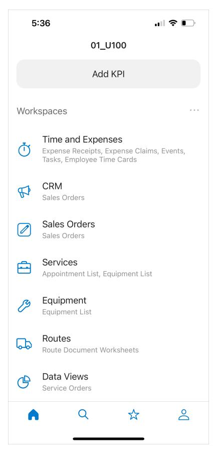

*Figure: The list of workspaces on the main menu of the mobile app*

| 5:36                  |         |    | $\blacksquare$ , $\blacksquare$ |
|-----------------------|---------|----|---------------------------------|
| ૮                     |         |    |                                 |
| <b>Services</b>       |         |    |                                 |
|                       |         |    |                                 |
|                       | Add KPI |    |                                 |
| Screens               |         |    |                                 |
| Appointment List      |         |    | $\pm$                           |
| <b>Equipment List</b> |         |    | $\frac{1}{1}$                   |
|                       |         |    |                                 |
|                       |         |    |                                 |
|                       |         |    |                                 |
|                       |         |    |                                 |
|                       |         |    |                                 |
|                       |         |    |                                 |
|                       |         |    | 으                               |
|                       |         | ጜጞ |                                 |

#### *Figure: The list of screens in the Services workspace*

The lists of available workspaces and screens depend on the features included in your license and enabled on the *[Enable/Disable Features](https://help-2025r1.acumatica.com/Help?ScreenId=ShowWiki&pageid=c1555e43-1bc5-4f6f-ba9d-b323f94d8a6b)* (CS100000) form.

When you tap **Appointment List**, the Appointment List screen opens.

To find and view the needed appointment, you can change the filter criteria by tapping the Filter button in the top right corner of the screen, and specifying the needed dates and the assigned staff member (see the following screenshot).

| 5:38                                                                                                 | $\blacksquare$ $\odot$ $\blacksquare$                                                                                             |  |
|------------------------------------------------------------------------------------------------------|-----------------------------------------------------------------------------------------------------------------------------------|--|
|                                                                                                      | <b>Appointment List ~</b> All                                                                                                  |  |
| Q Search                                                                                             | Cancel                                                                                                                            |  |
| App. Nbr. 000014-1 Status Not Started State NY Descr. Delivery of Fruits        | Start Time 9:08 AM Date Jan 31, 2025 > Cust. ID HMBAKERY - HM's Bakery & Cafe Loc. ID MAIN             |  |
| App. Nbr. 000015-1 Status Not Started State NY Descr. Delivery of Fruits        | Start Time 10:51 AM Date Jan 31, 2025 Cust. ID GOODFOOD - GoodFood One Restaurant Loc. ID MAIN            |  |
| App. Nbr. 000017-1 <b>Status</b> Not Started State NY Descr. Delivery of Fruits | Start Time 3:34 PM Date Feb 1, 2025 ⟩ Cust. ID COFFEESHOP - FourStar Coffee & Sweets Shop Loc. ID MAIN |  |
|                                                                                                      |                                                                                                                                   |  |

*Figure: The list of appointments on the Appointment List screen*

#### **Creating a New Appointment**

In the mobile app, you can create a new appointment. On the Appointment List screen, you tap the + icon or **Create New** (depending on the mobile operating system) at the bottom of the appointment list, and specify the settings and details of the new appointment in form view. Once you are finished, you save the new appointment.

#### **Searching for an Appointment**

In the Acumatica mobile app, you can find any needed appointment by entering a search string in the search box. The search results are listed with the highlighted words matching your string, as you can see in the following screenshot below.

| 5:41                                                                                          | $\blacksquare$ $\odot$ $\blacksquare$                                                                                       |
|-----------------------------------------------------------------------------------------------|-----------------------------------------------------------------------------------------------------------------------------|
| く                                                                                             | <b>Appointment List <math>\times</math></b>                                                                                 |
| $\nabla$ Q Goodfood                                                                           | Cancel Ø                                                                                                                 |
| App. Nbr. 000015-1 Status Not Started State NY Descr. Delivery of Fruits | Start Time 10:51 AM Date Jan 31, 2025 > Cust. ID GOODFOOD - GoodFood One Restaurant Loc. ID MAIN |
|                                                                                               |                                                                                                                             |
|                                                                                               |                                                                                                                             |
|                                                                                               |                                                                                                                             |
|                                                                                               |                                                                                                                             |
|                                                                                               |                                                                                                                             |
|                                                                                               |                                                                                                                             |
|                                                                                               |                                                                                                                             |

*Figure: Search results*

#### **Working with a Particular Appointment**

By tapping a particular appointment in the appointment list, you open the form view with the settings of the selected appointment. You can process an appointment by using one of the commands available on the More menu (see the following screenshot). You can use these commands to start, depart, pause, and complete the appointment, as well as signing and previewing a report related to the appointment.

| 5:48                                                                      | $\blacksquare$ s $\blacksquare$                        |
|---------------------------------------------------------------------------|--------------------------------------------------------|
|                                                                           | <b>Appointments</b>                                    |
| App. Nbr.: 000044-1 <b>Status: Not Started</b> Invoice Total: 37.50 | Est. Duration: 0 h 45 m Act. Duration: 0 h 00 m     |
| <b>Summary</b> Details Staff                                              | Log Totals !!!!!!!!!!!!!!!!!!!!!!!!!!!!!!!!!!!!!!!! |
| Service Order Type * TRN - Customer <b>Training Services</b>        | <b>View on Map</b>                                     |
| Service Order Nbr. 000044                                              | Finished                                               |
|                                                                           | <b>Delete</b>                                          |
|                                                                           | <b>Depart</b>                                          |
|                                                                           | <b>Start</b>                                           |
|                                                                           | Cancel                                                 |
|                                                                           | <b>Sign Report</b>                                     |
|                                                                           | <b>Preview Report</b>                                  |
|                                                                           | <b>Add Record to Favorites</b>                         |
| Financial Settings                                                        | Cancel                                                 |
|                                                                           |                                                        |

*Figure: Appointment commands*

#### **Reviewing and Signing the Report**

Before completing an appointment, you open the report by tapping **Preview Report** on the More menu (see Item 1 in the following screenshot); you review the report and show it to the customer. You then tap**Sign Report** (Item 2), and the signature screen opens so that the customer can sign it.

| 5:48                                                                      |                                |     | $\blacksquare$ $\triangleright$ $\blacksquare$     |     |
|---------------------------------------------------------------------------|--------------------------------|-----|----------------------------------------------------|-----|
|                                                                           | <b>Appointments</b>            |     |                                                    |     |
| App. Nbr.: 000044-1 <b>Status: Not Started</b> Invoice Total: 37.50 |                                |     | Est. Duration: 0 h 45 m Act. Duration: 0 h 00 m |     |
| <b>Summary</b> Details Staff                                              |                                | Log | Totals                                             | Add |
| Service Order Type * TRN - Customer <b>Training Services</b>        |                                |     | <b>View on Map</b>                                 |     |
| Service Order Nbr. 000044                                              |                                |     | Finished                                           |     |
|                                                                           | <b>Delete</b>                  |     |                                                    |     |
|                                                                           | <b>Depart</b>                  |     |                                                    |     |
|                                                                           | <b>Start</b>                   |     |                                                    |     |
|                                                                           | Cancel                         |     |                                                    |     |
|                                                                           | <b>Sign Report</b>             |     | $\mathbf{2}$                                       |     |
|                                                                           | <b>Preview Report</b>          |     |                                                    |     |
|                                                                           | <b>Add Record to Favorites</b> |     |                                                    |     |
| Financial Settings                                                        | Cancel                         |     |                                                    |     |
|                                                                           |                                |     |                                                    |     |

*Figure: The Preview Report and Sign Report commands on the More menu*

On the signature screen, the customer signs. You close the view by tapping **OK** at the bottom of the screen.

| 5:49   |              | $\blacksquare$ $\blacksquare$ |
|--------|--------------|-------------------------------|
| Cancel | Appointments | Done                          |
|        |              |                               |
|        |              | Clear                         |

*Figure: The signature screen*

You can open the signed report by tapping **Preview Report** again. The following screenshot shows the signed report.

|                                                                                                        | <b>China</b>                                                       |           |                                                                                                                                                                              |                                                       | <b>Customer Training</b>        | N USE O                                   |
|--------------------------------------------------------------------------------------------------------|--------------------------------------------------------------------|-----------|------------------------------------------------------------------------------------------------------------------------------------------------------------------------------|-------------------------------------------------------|---------------------------------|-------------------------------------------|
|                                                                                                        | <b>K</b> SweetLife                                                 |           | NON-PRODUCTIO                                                                                                                                                                | Appointment No.: <b>Status:</b> Scheduled Date: | NON-PRO                         | 000044-1 <b>Not Started</b> 1310005 |
| Service and Equipment Sales Center 218 Oakwood Ave New York, NY, 10007 Phone: +1 212 667 1506 |                                                                    |           | NON-PRODUCTIO Currency:                                                                                                                                                   | <b>Actual Date:</b> <b>Customer ID</b>             |                                 | NON-PROGRESSON USE O                      |
|                                                                                                        | ODUCTION USE ONLY                                                  |           | <b>QUCTION USE ONLY</b>                                                                                                                                                      |                                                       |                                 | ODUCTION USE O                            |
| <b>BILL TO:</b> Customer: GOODFOOD - GoodFood One Restaurant Location: MAIN - Primary Location   |                                                                    |           | APPOINTMENT ADDRESS: 111 E 36th St New York NY 10016                                                                                                                   |                                                       |                                 |                                           |
|                                                                                                        | NON-PRODUCTION USE ONLY                                            |           | United States of America NON-PRODUCTION                                                                                                                                   |                                                       |                                 | NON-PRODUCTION USE O                      |
| MAIN CUSTOMER CONTACT: mail: client@goothod.example.com/ 51: hone: +1-212-555-0109               |                                                                    |           | APPOINTMENT DETAILS:                                                                                                                                                         |                                                       |                                 |                                           |
| NQ                                                                                                     |                                                                    |           | Project: X : Non-Project Ciole. Sateskilled Start Date: 1/31/2025 9:00 AM Scheduled Start Date: 1/31/2025 9:00 AM Achael Start Date: Achael Start Date: NON-P |                                                       |                                 | NON-PRODUCTION USE O                      |
| <b>SERVICES</b> NO. 0001                                                                         | TEM TRAINING - Toking on juicer usage (at Guilforne's place) | TARGET EQ | <b>BILLING R</b> NON-PHU Time                                                                                                                                          | $rac{Q}{T}$                                           | <b>PRICE</b> 60.0000 DISC | <b>DISC TRAN AMOUNT LUSE OF</b>           |
| <b>STAFF</b> <b>STAFF MEMBER ID</b> NON-PRODUCTION 0000000                                    |                                                                    |           | NON-PRODUCTION USE OF                                                                                                                                                        |                                                       |                                 |                                           |
|                                                                                                        |                                                                    |           |                                                                                                                                                                              |                                                       |                                 | NON-PRODUCTION USE O                      |
|                                                                                                        | NON-PRODUCTION USE ONLY                                            |           | NON-PRODUCTION USE ONLY                                                                                                                                                      |                                                       |                                 | NON-PRODUCTION USE O                      |
|                                                                                                        |                                                                    |           |                                                                                                                                                                              |                                                       |                                 |                                           |
|                                                                                                        | NON-PRODUCTION USE ONLY                                            |           | NON-PRODUCTION USE ONLY                                                                                                                                                      |                                                       |                                 | NON-PRODUCTION USE O                      |
|                                                                                                        | NON-PRODUCTION USE ONLY                                            |           | NON-PRODUCTION USE ONLY                                                                                                                                                      |                                                       |                                 | NON-PRODUCTION USE O                      |
|                                                                                                        |                                                                    |           |                                                                                                                                                                              |                                                       |                                 |                                           |
|                                                                                                        |                                                                    |           |                                                                                                                                                                              |                                                       |                                 |                                           |
|                                                                                                        | NON-PRODUCTION USE ONLY                                            |           | NON-PRODUCTION USE ONLY                                                                                                                                                      |                                                       |                                 | NON-PRODUCTION USE O                      |
|                                                                                                        |                                                                    |           |                                                                                                                                                                              |                                                       |                                 | 32.50 <b>SHON USE O</b>                |
|                                                                                                        | NON-PRODUCTION USE ONLY                                            |           | NON-PRODUCTION USE The Trees (Nata)                                                                                                                                          |                                                       |                                 | NON-PRODUCED                              |
|                                                                                                        | NON-PRODUCTION USE ONLY                                            |           | NON-PRODUCTION USE ONLY                                                                                                                                                      |                                                       |                                 | NON-PRODUCTION USE O                      |

*Figure: The signed report*

## **Appointments in the Mobile App: General Information**

The Acumatica mobile app provides access to the functionality of the Acumatica ERP instance. By using the Acumatica mobile app installed on your mobile device, you can enter appointments as well as manage appointments assigned to you while providing services at a customer location.

In this chapter, you will learn how to process an appointment in the Acumatica mobile app.

#### **Learning Objectives**

In this chapter, you will learn how to do the following in the mobile app:

- View the appointments assigned to a staff member
- Start the appointment and add an additional item to the **Details** tab
- Obtain the customer's signature and complete the appointment

#### **Applicable Scenarios**

You use the Acumatica ERP mobile app when you attend an appointment and need to manage the appointment details in the system at a customer location or during your trip.

#### **Process Diagram**

In the following diagram, you can see the general workflow in which a staff member processes an appointment in the mobile app.

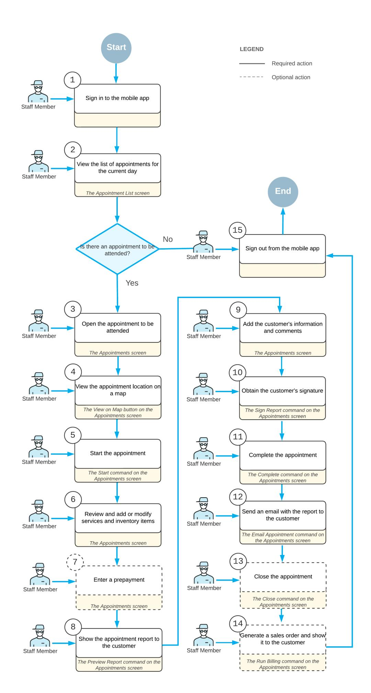

## **Appointments in the Mobile App: To Process an Appointment Assigned to a Staff Member**

This activity will walk you through the process of starting and completing an appointment that requires additional service to be added during the appointment, and a customer signature in the Acumatica mobile app.

This activity is based on the *U100* dataset. If you are using another dataset, or if any system settings have been changed in *U100*, these changes can affect the workflow of the activity and the results of the processing. To avoid any issues, restore the *U100* dataset to its initial state.

The appearance and functionality of the Acumatica mobile app may slightly differ for iOS and Androis devices.

#### **Story**

Suppose that Alberto Jimenez uses the Acumatica mobile app to process the appointments that he attends. On January 31, 2025, he will arrive to the appointment location and process the appointment by using the mobile app. That is, he will start the appointment in the mobile app, add one more service to the appointment, and show the appointment report to the customer. The customer will sign the appointment in the app. Alberto Jimenez will then complete the appointment, send the signed appointment to the customer. Acting as Alberto Jimenez, you will perform these actions in the mobile app.

#### **Configuration Overview**

In the *U100* dataset, the following tasks have been performed to support this activity:

- The minimum system configuration, which is described in *[Company with Branches that Do Not Require](https://help-2025r1.acumatica.com/Help?ScreenId=ShowWiki&pageid=a718a27b-3683-4d86-a26e-4b8fb7981f1c) [Balancing: General Information](https://help-2025r1.acumatica.com/Help?ScreenId=ShowWiki&pageid=a718a27b-3683-4d86-a26e-4b8fb7981f1c)*, has been performed.
- The *SWEETLIFE* company has been created on the *[Companies](https://help-2025r1.acumatica.com/Help?ScreenId=ShowWiki&pageid=fedad435-8496-4397-b8a3-50a473629f76)* (CS101500) form. This company has multiple branches created on the *[Branches](https://help-2025r1.acumatica.com/Help?ScreenId=ShowWiki&pageid=b97ab72d-4ab4-4f02-b69c-f7f61b316ced)* (CS102000) form, including *SWEETEQUIP (Service and Equipment Sales Center)*.
- On the *[Service Management Preferences](https://help-2025r1.acumatica.com/Help?ScreenId=ShowWiki&pageid=1c1b94d7-ac39-4f84-a966-588290b5ba80)* (FS100100) form, the minimum settings have been specified, including specifying the numbering sequences and work calendar, for the service management functionality to be used.
- On the *[Users](https://help-2025r1.acumatica.com/Help?ScreenId=ShowWiki&pageid=834cc181-97fa-4db4-a7e0-3eaba142c166)* (SM201010) form, the *jimenez* account has been created. For the *jimenez* user account, in the **Linked Entity** box of the Summary area of the form, the *Alberto Jimenez* employee account has been specified.
- On the *[Branch Locations](https://help-2025r1.acumatica.com/Help?ScreenId=ShowWiki&pageid=ebef097e-9e47-4c7b-b0b0-c381251b48cf)* (FS202500) form, the *WEST BRIGHTON* branch location of the *SWEETEQUIP* (*Service and Equipment Sales Center*) branch has been created.
- On the *[Service](https://help-2025r1.acumatica.com/Help?ScreenId=ShowWiki&pageid=06fd8a36-dd81-4df9-b609-92c3d552c542) Order Types* (FS202300) form, the *TRN* service order type has been configured to generate AR invoices to bill customers for provided services. That is, *AR Invoices* has been selected under **Generated Billing Documents** in the **BillingSettings** section (**General** tab).
- On the *[Appointments](https://help-2025r1.acumatica.com/Help?ScreenId=ShowWiki&pageid=ac486e9c-f5df-4829-94f0-2df8821361a0)* (FS300200) form, the *000044-1* appointment has been created.

#### **Process Overview**

In the Acumatica mobile app, you will open the Appointment List screen and specify the filter criteria to find the needed appointment assigned to Alberto Jimenez. Then you will start the appointment, add an additional service on the **Details** tab, review the appointment report, obtain the customer's signature for the appointment by tapping **Sign Report**, complete the appointment, and send the report with the signed appointment to the customer.

#### **Preparation**

Sign in to the mobile app as follows:

Before you proceed, ensure that GPS location recording is enabled on your mobile device.

- 1. On the mobile device, tap the app icon to launch the app.
- 2. Enter the URL of your Acumatica ERP instance (for example, *http://my.site.acumatica.com*), and tap **Next**.

The *U100* dataset must be installed on your instance before you can perform the instructions in this activity.

3. Sign in as staff member Alberto Jimenez by using the *jimenez* username and the *123* password.

#### **Step 1: Viewing Appointments Assigned to a Staff Member**

You will start by viewing the appointments to which Alberto Jimenez, the staff member whose actions you are performing in the mobile app, is assigned. In the mobile app, do the following:

- 1. On the main screen, tap**Services**, and then tap **Appointment List**.
- 2. At the top of the screen, tap the **Filter** icon, and specify the filter criteria so that the scheduled date range includes the 1/31/2025 date. Tap **Update**.
- 3. In the list of appointments assigned to Alberto Jimenez that opens, tap the *000044-1* appointment to open it.
- 4. On the Summary tab, tap**View on Map**. The map showing the location of the appointment opens, as the following screenshot shows.

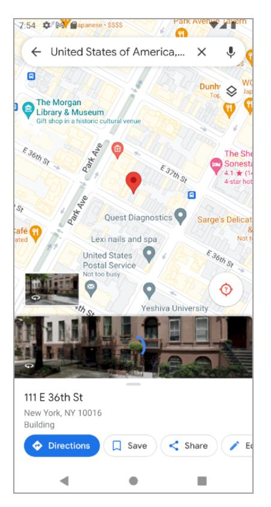

5. Close the map and return to the appointment.

#### **Step 2: Starting the Appointment and Adding an Additional Service**

To start the appointment and add the additional service, do the following:

- 1. While you are still viewing the appointment in the mobile app, on the More, tap**Start**.
- 2. Tap the **Details** tab.
- 3. Tap the plus sign.

The Details screen opens.

- 4. Specify the following settings:
  - **LineType**: *Service*
  - **Inventory ID**: *REPAIR*
  - **Description**: *Repair of customer's equipment*
  - **Actual Quantity**: 1 (inserted by default)
- 5. Tap **Update** and save your changes on the Details screen. The additional *REPAIR* service has been added to the appointment, as the following screenshot shows.

| 6:25                                                                                                                                                             |                                         | $\blacksquare$ $\triangleright$ $\blacksquare$                                   |
|------------------------------------------------------------------------------------------------------------------------------------------------------------------|-----------------------------------------|----------------------------------------------------------------------------------|
|                                                                                                                                                                  | <b>Appointments</b>                     |                                                                                  |
| App. Nbr.: 000044-1 Status: In Process Invoice Total: 117.50                                                                                               | Est. Duration: Act. Duration: 1h45 m | 1 h 45 m                                                                         |
| <b>Details</b> Summary                                                                                                                                        | Staff Log                            | Totals Add                                                                    |
| Fdit                                                                                                                                                             |                                         |                                                                                  |
| <b>TRAINING</b> Ref. Nbr. 0001 <b>Estimated Duration</b> 0 h 45 m Training on juicer usage (at customer's place) <b>Billable Quantity</b> 0.75 |                                         | Service Line Status Not Started ⋋ Description Target Equipment ID |
| <b>REPAIR</b> Ref. Nbr. 0002 <b>Estimated Duration</b> 1 h 00 m <b>Billable Quantity</b> 1.00                                                  | Repair of customer's equipment          | Service Line Status Not Started ⋋ Description Target Equipment ID |
|                                                                                                                                                                  |                                         |                                                                                  |
| Files (1)                                                                                                                                                        |                                         | $-0.0$                                                                           |

#### **Step 3: Obtaining the Customer's Signature and Completing the Appointment**

Sign the appointment (on behalf of the customer) and complete it (again acting as Alberto Jimenez) as follows:

1. While you are still viewing the appointment in the mobile app, on the More menu, tap **Preview Report**.

The report appears on the screen (as the following screenshot shows). Alberto Jimenez would now show this report to the customer to verify that all information has been entered correctly.

| 6:26                                                                                                                                                     |            |                                                                                                                                                                                                                           |                                                      |                             |                              | $\mathbb{H}$ s $\Box$                   |         |
|----------------------------------------------------------------------------------------------------------------------------------------------------------|------------|---------------------------------------------------------------------------------------------------------------------------------------------------------------------------------------------------------------------------|------------------------------------------------------|-----------------------------|------------------------------|-----------------------------------------|---------|
|                                                                                                                                                          |            | $FS642000 \sim$                                                                                                                                                                                                           |                                                      |                             |                              | Done                                    |         |
| <b>ID</b> 1 of 1                                                                                                                                         |            |                                                                                                                                                                                                                           |                                                      |                             |                              |                                         |         |
| $\sim$ council <b>SweetLife</b>                                                                                                                       |            | NON-PRODUCTIO Appoints Status:                                                                                                                                                                                      | ent No.:                                             | <b>Customer Training</b>    | <b>NON-PROD</b>              | 000044-1 In Process                  | N USE O |
| Service and Equipment Sales Center 218 Oakwood Ave New York, NY, 10007 Phone: +1 212 667 1506                                                   |            | <b>Schedu</b> NON-PRODUCTIO Currency:                                                                                                                                                                               | ed Date <b>Actual Date:</b> <b>Customer ID</b> |                             |                              | 1310005 NON-PROGRESSEN USE O         |         |
| OOUCTION USE ONLY <b>BILL TO:</b> Customer: GOODFOOD - GoodFood One Restaurant Location: MAIN - Primary Location                                |            | <b>QUCTION USE ONLY</b> APPOINTMENT ADDRESS: 111 E 36th St New York NY 10016                                                                                                                                     |                                                      |                             |                              | PODUCTION USE O                         |         |
| NON-PRODUCTION USE ONLY                                                                                                                                  |            | United States of America NON-PRODUCTION                                                                                                                                                                                |                                                      |                             |                              | NON-PRODUCTION USE O                    |         |
| MAIN CUSTOMER CONTACT: mail: dientifigeodient.example.com/ S.S. V. hone: +1-212-556-0706 NON                                                    |            | APPOINTMENT DETAILS: Project: X : Non-Project Cable Satesballed Start Date: 1/31/2026 9:00 AM Satesballed Start Date: 1/31/2026 9:00 AM Achael Start Date: 1/27/2024 6:22:00 PM Achael Dref Date: NON-P |                                                      |                             |                              | NON-PRODUCTION USE O                    |         |
| <b>SERVICES</b> $rac{NO}{OCO}$ ITEM TRAINMO - Toking on juicer usage on customer's place) REPAIR - Repair of customer's equipment opez | TARGET EQ. | <b>BILLING R</b> NON-PRO Time Time                                                                                                                                                                               | $rac{\text{or}}{\text{or}}$ 1.00                  | PRICE 10.0000 00.0000 | DISC <b>ANN-F</b> 0.56 | TRAN AMOUNT N USE O 80.00 |         |
| <b>STAFF</b> <b>STAFF MEMBER ID</b> DESCRIPTION EP00000004 Alberto Jimenez                                                                   |            | TYPE NON-P Employee                                                                                                                                                                                                 |                                                      |                             | NON-PT                       |                                         | N USE O |
| NON-PRODUCTION USE ONLY                                                                                                                                  |            | NON-PRODUCTION USE ONLY                                                                                                                                                                                                   |                                                      |                             |                              | NON-PRODUCTION USE O                    |         |
| NON-PRODUCTION USE ONLY                                                                                                                                  |            | NON-PRODUCTION USE ONLY                                                                                                                                                                                                   |                                                      |                             |                              | NON-PRODUCTION USE O                    |         |
| NON-PRODUCTION USE ONLY                                                                                                                                  |            | NON-PRODUCTION USE ONLY                                                                                                                                                                                                   |                                                      |                             |                              | NON-PRODUCTION USE O                    |         |
| NON-PRODUCTION USE ONLY                                                                                                                                  |            | NON-PRODUCTION USE ONLY                                                                                                                                                                                                   |                                                      |                             |                              | NON-PRODUCTION USE O                    |         |
| NON-PRODUCTION USE ONLY                                                                                                                                  |            | NON-PRODUCTION USE THE THEORIES                                                                                                                                                                                           |                                                      |                             |                              | NON-PRODUCED USE O                      |         |
| NON-PRODUCTION USE ONLY                                                                                                                                  |            | NON-PRODUCTION USE ONLY                                                                                                                                                                                                   |                                                      |                             |                              | NON-PRODUCTION USE O                    |         |
|                                                                                                                                                          |            |                                                                                                                                                                                                                           |                                                      |                             |                              |                                         |         |
|                                                                                                                                                          |            |                                                                                                                                                                                                                           |                                                      |                             |                              |                                         |         |
|                                                                                                                                                          |            |                                                                                                                                                                                                                           |                                                      |                             |                              |                                         |         |

- 2. Close the report, and tap the **Additional** tab (see Item 1 in the following screenshot).
- 3. In the **Signature** section, in the **Full Name** box (Item 2), specify Douglas Kim, and tap**Save**.

|           | 6:27                     | $\blacksquare$ $\blacktriangleright$ $\blacksquare$ |     |        |                   |  |  |  |
|-----------|--------------------------|-----------------------------------------------------|-----|--------|-------------------|--|--|--|
|           | <b>Appointments</b> 1 |                                                     |     |        |                   |  |  |  |
| ary       | Details                  | Staff                                               | Log | Totals | <b>Additional</b> |  |  |  |
|           | Source Info              |                                                     |     |        |                   |  |  |  |
|           | Signature                |                                                     |     |        |                   |  |  |  |
| Full Name | 2 Douglas Kim         |                                                     |     |        |                   |  |  |  |
|           | <b>Billing Documents</b> |                                                     |     |        | ⋋                 |  |  |  |
|           | Resource Equipment       |                                                     |     |        | ⋋                 |  |  |  |
|           | Attributes               |                                                     |     |        | $\mathcal{P}$     |  |  |  |
|           |                          |                                                     |     |        |                   |  |  |  |
|           |                          |                                                     |     |        |                   |  |  |  |
|           |                          |                                                     |     |        |                   |  |  |  |
|           |                          |                                                     |     |        |                   |  |  |  |
|           |                          |                                                     |     |        |                   |  |  |  |
|           |                          |                                                     |     |        |                   |  |  |  |
|           |                          |                                                     |     |        |                   |  |  |  |
|           |                          |                                                     |     |        |                   |  |  |  |
|           | Files (1)                |                                                     |     |        |                   |  |  |  |
|           |                          |                                                     |     |        |                   |  |  |  |

- 4. On the More menu, tap**Sign Report**.
- 5. In the form view of the appointment, leave a signature, and tap **Done**. (Here you are signing the appointment on behalf of the customer. In production use of the app for an appointment, the customer would sign the appointment.)

The image with the signature is now attached to the appointment.

6. On the **Summary** tab (see Item 1 in the following screenshot), in the **Date and Time** section (Item 2), specify the actual start date and time and actual end date and time (Item 3).

| 6:29                                               |         |                                    |         |                          | $\Box$ $\approx$ $\Box$ |                                          |
|----------------------------------------------------|---------|------------------------------------|---------|--------------------------|-------------------------|------------------------------------------|
| Cancel                                             |         | <b>Appointments</b>                |         |                          |                         | Save                                     |
| <b>Summary</b>                                     | Details | Staff                              |         | Log                      | Totals                  | !!!!!!!!!!!!!!!!!!!!!!!!!!!!!!!!!!!!!!!! |
| Description The training service is requested   |         |                                    |         |                          |                         |                                          |
| Comment                                            |         |                                    |         |                          |                         |                                          |
| <b>Financial Settings</b>                          |         |                                    |         |                          |                         |                                          |
| Date And Time                                      |         |                                    |         |                          |                         |                                          |
| Scheduled Start Date * Jan 31, 2025             |         |                                    | 9:00 AM |                          | Scheduled Start Time *  |                                          |
| Scheduled End Date * Jan 31, 2025 |         | Scheduled End Time* 10:45 AM |         |                          | Handle Manually      |                                          |
| Actual Start Date * Jan 31, 2025                |         |                                    | 9:00AM  | <b>Actual Start Time</b> |                         |                                          |
| Actual End Date Jan 31, 2025              | ⋋       | Actual End Time 10:45 PM     |         |                          | Handle Manually      |                                          |
| Address                                            |         |                                    |         |                          |                         |                                          |
| Contact                                            |         |                                    |         |                          |                         |                                          |
| Files (2)                                          |         |                                    |         |                          |                         |                                          |

7. In the Summary area, at the top of the screen, select **Finished**, as the following screenshot shows.

| 6:29                                                               |                     |                                                                    | $\blacksquare$ s $\blacksquare$ |      |
|--------------------------------------------------------------------|---------------------|--------------------------------------------------------------------|---------------------------------|------|
| Cancel                                                             | <b>Appointments</b> |                                                                    |                                 | Save |
| App. Nbr.: 000044-1 Status: In Process Invoice Total: 117.50 |                     | Est. Duration: Act. Duration: 1h45 m                            | 1h 45 m                         |      |
| <b>Summary</b> Details                                             | Staff               | Log                                                                | Totals                          | hhA  |
| Service Order Type * TRN - Customer <b>Training Services</b> |                     |                                                                    | <b>View on Map</b>              |      |
| Service Order Nbr. 000044                                       |                     |                                                                    | Finished                        |      |
| Customer* GOODFOOD - GoodFood One Restaurant                    |                     |                                                                    |                                 |      |
| Location * MAIN - Primary Location                              |                     |                                                                    |                                 | ⋋    |
| Branch * SWEETEQUIP- Service and Equip            | $\rightarrow$       | Branch Location * <b>WEST BRIGHTON -</b> Office in West Brig |                                 |      |
| Project * !!!!!!!!!!!!!!!!!!!!!!!!!!!!!!!!!!!!!!!!   |                     |                                                                    |                                 |      |
| Description The training service is requested                   |                     |                                                                    |                                 |      |
| Comment                                                            |                     |                                                                    |                                 | ⋋    |
| <b>Financial Settings</b>                                          |                     |                                                                    |                                 |      |
| Files (2)                                                          |                     |                                                                    |                                 |      |

#### 8. On the More menu, tap **Complete**.

The signed report is attached to the appointment in the Files section. You can tap the attached report to view it.

9. On the More menu, tap **Email Appointment**.

An email with the signed report attached is sent to the customer assigned to the appointment.

## **Appendix**

The appendix provides some reference information relevant for this document. The additional information in this section is a useful source for readers who need some reference material that is related to system forms and tables, as well as running reports.

#### **In this section:**

- *[Reports](#page-184-3)*
- *Form [Toolbar](#page-191-1) and More Menu*
- *Table [Toolbar](#page-198-1)*
- *[Glossary](https://help-2025r1.acumatica.com/Help?ScreenId=ShowWiki&pageid=a2c92852-5ae8-4f4b-bf82-7f70cca0fdfa)*

### **Reports**

In addition to offering a comprehensive collection of reports, Acumatica ERP gives you a high degree of control over each report.

On a typical report form, described in *[Report Form](#page-184-4)*, you can adjust the report settings to meet your specific informational needs. You can specify sorting and filtering options and select the data by using report-specific settings—such as financial period, ledger, and account—and configure additional processing settings for each report. The settings can be saved as a report template for later use. For details, see *To Run a [Report](https://help-2025r1.acumatica.com/Help?ScreenId=ShowWiki&pageid=d0531b2f-178f-4d70-8c4c-6bc897cd6c0a)* and *To [Create](https://help-2025r1.acumatica.com/Help?ScreenId=ShowWiki&pageid=5adbb4bd-4347-4f81-a1ff-4d4d47d1fb1b) a Report [Template](https://help-2025r1.acumatica.com/Help?ScreenId=ShowWiki&pageid=5adbb4bd-4347-4f81-a1ff-4d4d47d1fb1b)*.

Aer you run a report, the prepared report appears on your screen. You can print the report, export the report to a file, or send the report by email.

This chapter describes a typical report form and the main tasks related to using reports.

#### **In This Chapter**

- *[Report Form](#page-184-4)*
- *To Run a [Report](https://help-2025r1.acumatica.com/Help?ScreenId=ShowWiki&pageid=d0531b2f-178f-4d70-8c4c-6bc897cd6c0a)*
- *To Modify a Filter on a [Report](https://help-2025r1.acumatica.com/Help?ScreenId=ShowWiki&pageid=2513e10e-abb1-432e-85e0-a5e3f6cabf9c) Form*
- *To Create a Report [Template](https://help-2025r1.acumatica.com/Help?ScreenId=ShowWiki&pageid=5adbb4bd-4347-4f81-a1ff-4d4d47d1fb1b)*

### **Report Form**

Before you run a report, you specify the needed parameters on the report form. You can select a template and manually make selections that affect the information collected. Also, you can specify appropriate settings to print or email the finished report.

The following screenshot shows a typical report form.

| TOOLS $\star$ <b>Daily Sales Profitability</b> |                                                                                       |   |  |  |  |
|---------------------------------------------------|---------------------------------------------------------------------------------------|---|--|--|--|
| ↶ <b>RUN REPORT</b>                            | REMOVE TEMPLATE 1 <b>SAVE TEMPLATE</b>                                          |   |  |  |  |
| Template                                          | $\times$ $\scriptstyle\rm\sim$ 2 □ Default □ Shared                             |   |  |  |  |
| <b>REPORT PARAMETERS</b>                          | ADDITIONAL SORT AND FILTERS PRINT AND EMAIL SETTINGS <b>EMAIL NOTIFICATIONS</b> |   |  |  |  |
| <b>Report Format</b>                              | <b>Detailed</b> $\checkmark$                                                       |   |  |  |  |
| Company/Branch:                                   | HEADOFFICE - SweetLife Head Offi v                                                    |   |  |  |  |
| <b>From Date</b>                                  | 2/1/2025 Ä                                                                         |   |  |  |  |
| <b>To Date</b>                                    | 2/20/2025 Ħ                                                                        |   |  |  |  |
| <b>Document Type</b>                              | $\checkmark$                                                                          | 3 |  |  |  |
| Warehouse:                                        | Q                                                                                     |   |  |  |  |
| Customer:                                         | Q                                                                                     |   |  |  |  |
| Inventory:                                        | Q                                                                                     |   |  |  |  |
|                                                   | Released Transactions Only                                                            |   |  |  |  |
|                                                   | Completed Transactions Only                                                           |   |  |  |  |
|                                                   |                                                                                       |   |  |  |  |

#### *Figure: Report form*

- 1. Report form toolbar
- 2. Selection area
- 3. Details area

#### **Report Form Toolbar**

The following table lists the buttons of the report form toolbar, which appears on the report form when you are configuring a report.

| Button              | Description                                                                                                              |
|---------------------|--------------------------------------------------------------------------------------------------------------------------|
| Cancel              | Clears any changes you have made on the report form and restores the default settings.                                   |
| Run Report          | Initiates data collection for the report and displays the generated report.                                              |
| SaveTemplate        | Gives you the ability to save the currently selected report as a template with all the select ed settings.            |
| Remove Tem plate | Removes the previously saved template. This button is available only when a template is specified on the report form. |

#### **Report Toolbar**

The following table lists the buttons of the report toolbar, which is shown on the generated report that you have run.

| Buttons    | Icon | Description                                                                |
|------------|------|----------------------------------------------------------------------------|
| Parameters |      | Navigates back to the report form to let you change the report parameters. |

| Buttons                 | Icon | Description                                                                                                                                                                                                    |
|-------------------------|------|----------------------------------------------------------------------------------------------------------------------------------------------------------------------------------------------------------------|
| Refresh                 |      | Refreshes the information displayed in the report (if any data changes were made).                                                                                                                             |
| Groups                  |      | Adds to the report a le pane where the report structure is shown. Click a report node to highlight the pertinent data in the right pane.                                                                   |
| View PDF / View HTML | /    | Displays the report as a PDF, or displays the report in HTML format. The available but ton depends on the current report view; if you're viewing a PDF, for instance, you will see the View HTML button. |
| First                   |      | Displays the first page of the report.                                                                                                                                                                         |
| Previous                |      | Displays the previous page.                                                                                                                                                                                    |
| Next                    |      | Displays the next page.                                                                                                                                                                                        |
| Last                    |      | Displays the last page of the report.                                                                                                                                                                          |
| Print                   |      | Opens the browser dialog box so you can print the report.                                                                                                                                                      |
| Send                    |      | Opens the Email Activity dialog box, which you use to send the report file (in the se lected format) to the specified email address.                                                                        |
| Export                  |      | Enables you to export the data in the selected format (Excel or PDF).                                                                                                                                          |

#### **Selection Area**

You use the elements in this area to select an existing template, which you can share with other users or use as your default report settings. You can also select the locale and the localization.

The elements of this area, which are available for all reports, are described in the following table.

| Element  | Description                                                                                                                                            |
|----------|--------------------------------------------------------------------------------------------------------------------------------------------------------|
| Template | The template to be used for the report. If any templates have been created and saved, you can select a template to use its settings for the report. |
| Default  | A check box that indicates (if selected) that the selected template is marked as the default one for you. A default template cannot be shared.      |

| Element      | Description                                                                                                                                                                                                                                                                                                            |
|--------------|------------------------------------------------------------------------------------------------------------------------------------------------------------------------------------------------------------------------------------------------------------------------------------------------------------------------|
| Shared       | A check box that indicates (if selected) that the selected template is shared with other users. A shared template cannot be marked as the default.                                                                                                                                                                  |
| Locale       | A locale that you select to indicate to the system that the report should be prepared with the data translated to the language associated with this locale. This box is displayed if there are multiple active locales in the system. For details, see Locales and Languages.                                    |
| Localization | The localization that is used for the report.                                                                                                                                                                                                                                                                          |
|              | This box appears on the form if the following conditions are met:                                                                                                                                                                                                                                                      |
|              | • The Canadian Localization or UK Localization feature is enabled on the Enable/Disable Features (CS100000) form.                                                                                                                                                                                                |
|              | • A localized version of the report exists in the system.                                                                                                                                                                                                                                                           |
|              | One of the following options can be selected in the box:                                                                                                                                                                                                                                                               |
|              | • None (default): Even though the report has a localized version, the report will be printed without any localization applied.                                                                                                                                                                                   |
|              | • Canada: The Canadian version of the report will be printed. If the company in which you are signed in has Canada selected in the Localization box on the Company Details tab (Configuration Settings section) on the Companies (CS101500) form, this setting is se lected by default in the current box. |
|              | To determine if a localized version of a report exists, the system checks the Site\ReportsDefault directory, the database, the ReportsCus tomized folder, and the ReportsDefault folder.                                                                                                                         |

#### **Report Parameters Tab**

The **Report Parameters** tab has sections where you can specify the contents of the report depending on the current report and vary in the following regards:

- Which elements are available on a particular report
- Whether elements contain default values
- Whether specific elements require values to be selected
- Whether elements may be le blank to let you display a broader range of data

#### **Additional Sort and Filters Tab**

The **AdditionalSort and Filter** tab contains additional sorting and filtering conditions:

- **Additional sorting conditions**: Defines the sorting order. You can add a line, select one of the reportspecific properties, and select the *Descending* or *Ascending* sort order for the column.
- **Additional filtering conditions**: Defines the report filter. You can add a line, select one of the reportspecific properties, and define a condition and its value. The list of conditions include one-operand and two-operand conditions. To create a more complicated logical expression, you can use brackets and logical operations between brackets. For more information on creating filters, see *[Managing Advanced Filters](https://help-2025r1.acumatica.com/Help?ScreenId=ShowWiki&pageid=c621d79a-274d-4b72-a699-0e92d78a7b23)*. For detailed procedures on using ad hoc filters, see *[Reports: Process Activity](https://help-2025r1.acumatica.com/Help?ScreenId=ShowWiki&pageid=2b4d7aa8-25dc-4777-880a-fee2274990c7)*.

#### **Print and Email Settings Tab**

If you plan to print the report or save the report as a PDF, select the appropriate settings in the **PrintSettings** area.

#### *Table: Print Settings Section*

| Element                 | Description                                                          |
|-------------------------|----------------------------------------------------------------------|
| Deleted Records         | Selects the visibility of the data deleted from the database.        |
| Print All Pages         | Causes all pages of the report to be printed.                        |
| Print in PDF format     | Displays the report in PDF format.                                   |
| Compress PDF file       | Indicates that the system will generate a compressed PDF.            |
| Embed fonts in PDF file | Indicates that the system will generate the PDF with fonts embedded. |

If you plan to send the report as an email, in the **EmailSettings** area, specify the format in which the report will be sent, as well as the email subject, the recipients of copies of the report, and the email account of the recipient.

#### *Table: Email Settings Section*

| Field         | Description                                                                                                                                                                                                                 |  |
|---------------|-----------------------------------------------------------------------------------------------------------------------------------------------------------------------------------------------------------------------------|--|
| Format        | The format (HTML, PDF, or Excel) in which the report will be emailed.                                                                                                                                                       |  |
|               | Merge function for reports in Excel format is not supported. If you want to merge a report with other reports and send an aggregated report by email, you should select either the HTML or PDF format for the report. |  |
| Email Account | The email address of the recipient.                                                                                                                                                                                         |  |
| CC            | An additional addressee to receive a carbon copy (CC) of the email.                                                                                                                                                         |  |
| BCC           | The email address of a person to receive a blind carbon copy (BCC) of the email; an address entered in this box will be hidden from other recipients.                                                                    |  |
| Subject       | The subject of the email.                                                                                                                                                                                                   |  |

#### **Report Versions Tab**

If the report has multiple versions, you can select one of them.

This tab displays the data only to users assigned with report designer user role.

Report versions are designed in the Report Designer. To activate editing report versions, give the user report designer role.

*Table: Report Versions Tab Toolbar*

| Button  | Description                            |
|---------|----------------------------------------|
| Refresh | Refreshes the list of report versions. |

| Button | Description                                        |
|--------|----------------------------------------------------|
| Select | Temporarily activates the selected report version. |

#### **Email Notifications Tab**

The **Email Notifications** tab lists the email templates used to send the report.

#### *Table: Table Toolbar*

The table toolbar includes standard buttons and buttons that are specific to this table. For the list of standard buttons, see *Table [Toolbar](#page-198-1)*. The table-specific buttons are listed below.

| Button          | Description                                                                                                                                                                     |
|-----------------|---------------------------------------------------------------------------------------------------------------------------------------------------------------------------------|
| Schedule Report | Opens the Email Templates (SM204003) form, where you can select or create a new email template that can be used to send the report and specify a schedule for notifications. |
|                 | The button appears only if the user account to which you are signed in has at least the Insert level of access rights to the Email Templates (SM204003) form.                |

#### *Table: Table Columns*

| Column                   | Description                                                                                                     |
|--------------------------|-----------------------------------------------------------------------------------------------------------------|
| Email Template           | The email template to be used to generate the body of the email notification.                                   |
| Screen ID                | The identifier of the form whose elements are used as the source of specific placeholders for this template. |
| Recipients               | The email addresses of the people to receive the email. Use semicolons as separators be tween addresses.     |
| Report Template          | The template configured for the report.                                                                         |
| Report Template Owner | The name of the user who created the template.                                                                  |

#### **Related Links**

- *To Run a [Report](https://help-2025r1.acumatica.com/Help?ScreenId=ShowWiki&pageid=d0531b2f-178f-4d70-8c4c-6bc897cd6c0a)*
- *To Create a Report [Template](https://help-2025r1.acumatica.com/Help?ScreenId=ShowWiki&pageid=5adbb4bd-4347-4f81-a1ff-4d4d47d1fb1b)*
- *Types of [Filters](https://help-2025r1.acumatica.com/Help?ScreenId=ShowWiki&pageid=9371f240-f73a-4b7a-8f16-72add7be7b62)*
- *[Automation Schedule Statuses](https://help-2025r1.acumatica.com/Help?ScreenId=ShowWiki&pageid=97fb65d2-2303-4993-9351-b6fbe112c37d)*

### **Report**

Once you click **Run Report**, the prepared report appears on your screen. You can print the report, export the report to a file, or send the report by email.

The prepared report is displayed in the report view of the report form. For more information about setting up the report parameters and the parameters view of the report form, see *[Report Form](#page-184-4)*.

#### **Report Toolbar**

The following table lists report toolbar buttons.

| Buttons                 | Icon | Description                                                                                                                                                                                                    |
|-------------------------|------|----------------------------------------------------------------------------------------------------------------------------------------------------------------------------------------------------------------|
| Parameters              |      | Navigates back to the report form to let you change the report parameters.                                                                                                                                     |
| Refresh                 |      | Refreshes the information displayed in the report (if any data changes were made).                                                                                                                             |
| Groups                  |      | Adds to the report a le pane where the report structure is shown. Click a report node to highlight the pertinent data in the right pane.                                                                   |
| View PDF / View HTML | /    | Displays the report as a PDF, or displays the report in HTML format. The available but ton depends on the current report view; if you're viewing a PDF, for instance, you will see the View HTML button. |
| First                   |      | Displays the first page of the report.                                                                                                                                                                         |
| Previous                |      | Displays the previous page.                                                                                                                                                                                    |
| Next                    |      | Displays the next page.                                                                                                                                                                                        |
| Last                    |      | Displays the last page of the report.                                                                                                                                                                          |
| Print                   |      | Opens the browser dialog box so you can print the report.                                                                                                                                                      |
| Send                    |      | Opens the Email Activity dialog box, which you use to send the report file (in the cho sen format) to the specified email address.                                                                          |
| Export                  |      | Enables you to export the data in the chosen format (Excel or PDF).                                                                                                                                            |

#### **Related Links**

- *[Filters](https://help-2025r1.acumatica.com/Help?ScreenId=ShowWiki&pageid=fad0b170-9d7c-4851-8f73-4b841f977c0f)*
- *[Report](#page-189-1)*

## **Form Toolbar and More Menu**

The form toolbar, which is available on most forms, is located near the top of the form, under the form name (and record title, if the form has one), as shown in the following screenshot.

The form toolbar includes the following:

- Standard buttons (see Item 1 in the following screenshot), with the particular set of buttons depending on the specific form
- On some forms, form-specific buttons (Item 2)
- On some form, the More button (Item 3); clicking this button opens the More menu (Item 4), which contains additional form-specific commands

| Opportunities 000004 - A juicer with the installation and training for Lake Cafe                                                                                                                                                                                                                                                                                                                                                       |                                                                                                                                                                                                                          |                             |                |  |           |                         |                          |  |                       |               |                     |                                                                                                     | 3                                                             | <b>PINOTES</b>                                                  | <b>FILES</b>        | <b>CUSTOMIZATION</b> | TOOLS $\blacktriangleright$ |
|-------------------------------------------------------------------------------------------------------------------------------------------------------------------------------------------------------------------------------------------------------------------------------------------------------------------------------------------------------------------------------------------------------------------------------------------|--------------------------------------------------------------------------------------------------------------------------------------------------------------------------------------------------------------------------|-----------------------------|----------------|--|-----------|-------------------------|--------------------------|--|-----------------------|---------------|---------------------|-----------------------------------------------------------------------------------------------------|---------------------------------------------------------------|-----------------------------------------------------------------|---------------------|----------------------|-----------------------------|
| - 5 $\Box$ $\Omega$ $\leftarrow$                                                                                                                                                                                                                                                                                                                                                                                                 |                                                                                                                                                                                                                          | $+$                         | $\mathbb{O}$ . |  | 面         | $\overline{\mathsf{K}}$ | $\overline{\phantom{0}}$ |  | <b>OPEN</b> $\geq$ |               | <b>CREATE QUOTE</b> |                                                                                                     | $\cdots$                                                      |                                                                 |                     |                      |                             |
| Opportunity ID: Status: * Class ID: Stage:                                                                                                                                                                                                                                                                                                                                                                                       | 2 000004 $\varphi$ <b>Business Account:</b> LAKECAFE - MAIN - Primal <b>New</b> Location: $\circ$ 10 PROJECT - Project Sales Contact: Owner: Prospect $\overline{\phantom{a}}$ |                             |                |  |           |                         |                          |  |                       |               |                     |                                                                                                     | Processing Open $\bullet$ Close as Won Close as Lost | Activities <b>Create Task</b> <b>Create Note</b> Other | $\hat{\phantom{a}}$ |                      |                             |
| * Estimated Close Date: 1/4/2021 $\overline{\phantom{a}}$ * Subject: A juicer with the installation and training for Lake Cafe <b>ACTIVITIES</b> <b>DETAILS</b> <b>CRM INFO</b> <b>FINANCIAL</b> <b>SHIPPING</b> <b>QUOTES</b> CONTACT <b>ATT</b>                                                                                                                                                     |                                                                                                                                                                                                                          |                             |                |  |           |                         |                          |  |                       |               |                     | <b>Record Creation</b> <b>Create Quote</b> <b>Create Sales Order</b> <b>Create Account</b> | <b>Recalculate Prices</b> <b>Validate Addresses</b>        |                                                                 |                     |                      |                             |
| <b>CREATE TASK</b> $\mathcal{C}$ $\uparrow \qquad \qquad \uparrow$ $\qquad \qquad$ $\uparrow$ $\qquad$ $\qquad$ $\qquad$ $\qquad$ $\qquad$ $\qquad$ $\qquad$ $\qquad$ $\qquad$ $\qquad$ $\qquad$ $\qquad$ $\qquad$ $\qquad$ $\qquad$ $\qquad$ $\qquad$ $\qquad$ $\qquad$ $\qquad$ $\qquad$ $\qquad$ $\qquad$ $\qquad$ $\qquad$ $\qquad$ $\qquad$ $\qquad$ $\qquad$ $\qquad$ $\qquad$ $\qquad$ D. 圓 $\overline{\mathbf{k}}$ |                                                                                                                                                                                                                          | <b>CREATE EVENT</b> Type |                |  | * Summary | <b>CREATE EMAIL</b>     |                          |  | CREATE ACTIVITY +     | <b>Status</b> | <b>PIN/UNPIN</b>    | $\left  \rightarrow \right $ Start                                                               | <b>Create Contact</b> <b>Create Invoice</b>                |                                                                 |                     |                      | $\triangledown$             |

#### *Figure: The form toolbar and the More menu*

You use the standard buttons on the form toolbar to navigate through entities that were created by using the current form, insert or delete an entity, use the clipboard, save the data you have entered, or cancel your work on the form.

A form toolbar on a particular form may include form-specific buttons in addition to standard buttons; it may also (or instead) include commands on the More menu. By using these form-specific buttons and commands, users can navigate to related records and forms, initiate specific actions, and perform modifications or processing related to the functionality of the form.

#### **Standard Form Toolbar Buttons**

The following table lists the standard buttons of the form toolbar. A form toolbar may include some or all of these buttons.

#### *Table: Standard Form Toolbar Buttons*

| Button                       | Icon | Description                                                                                                                                                                                                                                                                                                                                                                                            |
|------------------------------|------|--------------------------------------------------------------------------------------------------------------------------------------------------------------------------------------------------------------------------------------------------------------------------------------------------------------------------------------------------------------------------------------------------------|
| Discard Changes and Close |      | Discards any unsaved changes made to the entity, and navigates to the list of records that is related to the current form.                                                                                                                                                                                                                                                                          |
|                              |      | If the system opened the current form in a pop-up window (from a different form), this button is not displayed. To return to the original form, click Close.                                                                                                                                                                                                                                     |
| Save & Close                 |      | Saves the changes made to the entity, and navigates to the list of records that is related to the current form.                                                                                                                                                                                                                                                                                     |
| Save                         |      | Saves the changes made to the entity.                                                                                                                                                                                                                                                                                                                                                                  |
| Cancel                       |      | Depending on the context, does one of the following:                                                                                                                                                                                                                                                                                                                                                   |
|                              |      | • Discards any unsaved changes you have made to entities and retrieves the last saved version.                                                                                                                                                                                                                                                                                                   |
|                              |      | • Clears all changes and restores the default settings.                                                                                                                                                                                                                                                                                                                                             |
| Add New Record               |      | Clears any values you've specified on the form, restores any default values, and initiates the creation of a new entity.                                                                                                                                                                                                                                                                            |
| Delete                       |      | Deletes the currently selected entity, clears any values you have specified on the form, and populates elements with the default values that the system in serts when a new entity is created.                                                                                                                                                                                                   |
|                              |      | You can delete an entity only if it is not linked with another enti ty.                                                                                                                                                                                                                                                                                                                             |
| Archive                      |      | Archives the document that is opened on the form. This button is available if archival is set up on the Archival Policy (SM200400) form for the type of the document open on the form and if the document meets the archival crite ria—that is, if the document is older than the retention period specified on the Archival Policy form and has been processed to completion or canceled. |
|                              |      | For more information on archiving the documents, see Archiving Old Docu ments in the Acumatica ERP System Administration guide.                                                                                                                                                                                                                                                                     |
| Extract                      |      | Extracts the archived document from the archive and makes the system use this document in day-to-day operations. This button is available if archival is set up on the Archival Policy (SM200400) form for the type of the document opened on the form is archived.                                                                                                                           |
|                              |      | For more information on archiving the documents, see Archiving Old Docu ments in the Acumatica ERP System Administration guide.                                                                                                                                                                                                                                                                     |

#### Appendix | **194**

| Button                   | Icon | Description                                                                                                                                                                                                                                                                                                                                                                                                                                                                                                                                                                                                                                                           |
|--------------------------|------|-----------------------------------------------------------------------------------------------------------------------------------------------------------------------------------------------------------------------------------------------------------------------------------------------------------------------------------------------------------------------------------------------------------------------------------------------------------------------------------------------------------------------------------------------------------------------------------------------------------------------------------------------------------------------|
| Clipboard                |      | Provides menu commands you can use to do the following: • Copy: Copy the selected entity to the clipboard. • Paste: Paste an entity or template from the clipboard. • Save asTemplate: Create a template based on the selected entity. • Import from XML: Import an entity or a template from an .xml file. • Export to XML: Export the selected entity to an .xml file. For more information on templates and copy-and-paste operations in Acumatica ERP, see Using Forms. For more information on importing and ex porting .xml files, see Importing and Exporting Data to Excel and XML in the Acumatica ERP User Guide. |
| Go to First Record       |      | Displays the first entity (in the list of entities of the specific type) and its de tails.                                                                                                                                                                                                                                                                                                                                                                                                                                                                                                                                                                         |
| Go to Previous Record |      | Displays the previous entity and its details.                                                                                                                                                                                                                                                                                                                                                                                                                                                                                                                                                                                                                         |
| Go to Next Record        |      | Displays the next entity and its details.                                                                                                                                                                                                                                                                                                                                                                                                                                                                                                                                                                                                                             |
| Go to Last Record        |      | Displays the last entity (in the list of entities of the specific type) and its de tails.                                                                                                                                                                                                                                                                                                                                                                                                                                                                                                                                                                          |
| View Schedule            |      | Gives you the ability to schedule the processing. For more information, see Automated Processing: General Information.                                                                                                                                                                                                                                                                                                                                                                                                                                                                                                                                             |

#### **Inquiry Form Toolbar Buttons**

Acumatica ERP inquiry forms present data in a tabular format; they may also have selection criteria you can use to filter the data in the table. Predefined inquiry forms are provided as part of Acumatica ERP out of the box, and inquiry forms can be designed by a user with the appropriate access rights by using the Generic Inquiry tool (for details, see *[Managing Generic Inquiries](https://help-2025r1.acumatica.com/Help?ScreenId=ShowWiki&pageid=5737bca9-aebb-446d-9e1a-bc5fcfad6797)* in the Acumatica ERP Reporting Tools Guide). A form toolbar of an inquiry form contains both the standard form toolbar buttons (described in the table above) and the additional buttons described below.

| Button  | Icon | Description                                                                                                                                                    |
|---------|------|----------------------------------------------------------------------------------------------------------------------------------------------------------------|
| Refresh |      | Refreshes the inquiry data in the table.                                                                                                                       |
| Cancel  |      | Clears all changes (including selection criteria that has been specified, if the generic inquiry form has this criteria) and restores the default settings. |

| Button          | Icon | Description                                                                                                                                                                                                                       |
|-----------------|------|-----------------------------------------------------------------------------------------------------------------------------------------------------------------------------------------------------------------------------------|
| Add New Record  |      | Initiates the creation of a new entity.                                                                                                                                                                                           |
| Edit            |      | Opens the applicable data entry form with the selected record.                                                                                                                                                                    |
| Fit toScreen    |      | Expands the form to fit on the screen and adjusts the column widths propor tionally.                                                                                                                                           |
| Export to Excel |      | Exports the data to an Excel file. For more information, see Integration with Ex cel in the Acumatica ERP Getting Started Guide.                                                                                               |
| Filter Settings |      | Opens the Filter Settings dialog box, which you can use to define a new filter. After the filter has been created and saved, the corresponding tab appears on the table. For more information about filtering, see Filters. |

#### **The More Menu and Form-Specific Buttons**

If there are multiple form-specific commands on the form toolbar, they are displayed on a single menu—the More menu—and listed under descriptive categories, which makes it easier to find the needed menu command. On the More menu, you can easily define your favorite menu commands, which eases access to them.

On some forms, the system places a button (which is highlighted in green) on the form toolbar for the expected next command, which represents the likely next step to be performed on the selected record. The following screenshot, which shows the *Cash [Transactions](https://help-2025r1.acumatica.com/Help?ScreenId=ShowWiki&pageid=1e55821c-556b-4c3e-829c-95383eb2c8e2)* (CA304000) form, illustrates an example of the form toolbar and the More menu, which contains categories and menu commands.

| <b>Transactions</b> Cash Entry 000228 - 10200 Company Checking Account $\overline{2}$ |                                                   |                                   |                               |          |                      |                |                                   |                                     |                            |         |      |                               |            | $\lceil 3 \rceil$ | <b>PINOTES</b> | <b>ACTIVITIES</b> |       | <b>FILES</b> | <b>CUSTOMIZATION</b> | TOOLS $\sim$ |                        |
|---------------------------------------------------------------------------------------------|---------------------------------------------------|-----------------------------------|-------------------------------|----------|----------------------|----------------|-----------------------------------|-------------------------------------|----------------------------|---------|------|-------------------------------|------------|-------------------|----------------|-------------------|-------|--------------|----------------------|--------------|------------------------|
| $\leftarrow$                                                                                | 周                                                 | $\Box$                            | $\Omega$                      |          | 顶                    | n ٠         | $\overline{\mathsf{K}}$           | ∢                                   | ⋗                          | $\geq$  |      | <b>RELEASE</b>                |            | <b>HOLD</b>       | $\cdots$       |                   |       |              | 4                    |              |                        |
|                                                                                             | Tran. Type:                                       |                                   | <b>Cash Entry</b>             |          |                      |                |                                   |                                     | 5/26/2021 * Tran. Date: |         |      |                               |            |                   | Reports        |                   |       |              | Corrections          |              |                        |
|                                                                                             | Reference Nbr.                                    | Q 000228                       |                               |          |                      | * Fin. Period: |                                   |                                     | 05-2021 $\mathcal{L}$   |         |      | $\hat{\mathbf{x}}$ Activities |            |                   |                | Reverse           |       |              |                      |              |                        |
|                                                                                             | Cash Account: 10200 - Company Checking Account |                                   |                               |          |                      |                |                                   | <b>INTEREST - In</b> Entry Type: |                            |         |      |                               |            |                   |                |                   |       |              |                      |              |                        |
|                                                                                             | Currency:                                         | - VIEW BASE 1.00 <b>USD</b> |                               |          |                      |                | Disbursement/.                    |                                     |                            | Receipt |      |                               | Processing |                   |                |                   |       |              |                      |              |                        |
|                                                                                             | Balanced Status:                               |                                   |                               |          |                      |                | * Document Ref. <b>INT-145</b> |                                     |                            |         | Hold |                               |            |                   |                |                   |       |              |                      |              |                        |
|                                                                                             |                                                   |                                   |                               |          |                      |                |                                   |                                     | Owner:                     |         |      | EP00000002-                   |            |                   | Remove Hold    | $6^{\circ}$       |       |              |                      |              |                        |
|                                                                                             | Description:                                      |                                   |                               |          |                      |                |                                   |                                     |                            |         |      | Release ®          |            |                   |                |                   |       |              |                      |              |                        |
|                                                                                             |                                                   |                                   | <b>TRANSACTION DETAILS</b>    |          | <b>TAX DETAILS</b>   |                | <b>FINANCIAL DETAILS</b>          |                                     |                            |         |      | <b>APPROVAL DETAILS</b>       |            |                   |                |                   |       |              |                      |              |                        |
|                                                                                             |                                                   | 1                                 | $\times$                      | $\vdash$ | $\boxed{\mathbf{x}}$ | 工              |                                   |                                     |                            |         |      |                               |            |                   |                |                   |       |              |                      |              |                        |
| B 0                                                                                         | D.                                                | * Branch               | Item ID <b>Description</b> |          |                      |                |                                   |                                     |                            |         |      |                               |            |                   | Quantity       | <b>UOM</b>        | Price |              | Amount *Offset       | Account      | <b>Account Descrip</b> |
| $\Omega$                                                                                    | !!!!!!!!!!!!!!!!!!!!!!!!!!!!!!!!!!!!!!!!          | PRODWHOLF                         |                               |          |                      |                | Interest                          |                                     |                            |         |      |                               |            |                   | 100            |                   | 20.00 |              | 20.00                | 49300        | Other Income: In       |

*Figure: The form toolbar of the Transactions form*

The numbered items in the screenshot indicate the following:

- 1. A highlighted button for the expected next command, which represents the next logical step to be performed on the record selected on the form
- 2. Another button for a command that is commonly performed on the form
- 3. The More button, which you click to open the More menu

- 4. The More menu with most form-specific menu commands and descriptive categories on it
- 5. The star icon, which is used to mark the individual user's favorite commands on the form
- 6. An unavailable command

#### **Favorite Commands**

Based on your role in the company and your job duties, you may use some commands more oen than others. On the form toolbar, you can specify these commands as favorites. This will cause the system to duplicate the commands as form toolbar buttons, easing access to them.

To add a command to the form toolbar as a button, you open the More menu, hover over the needed command, and click the star icon when it appears. The yellow color of the star indicates that the command has been added to your favorites, and a button for the command appears on the form toolbar immediately. The following example shows two commands that have been added to the user's favorites on the *[Invoices and Memos](https://help-2025r1.acumatica.com/Help?ScreenId=ShowWiki&pageid=5e6f3b27-b7af-412f-a40a-1d4f4be70cba)* (AR301000) form and thus added as buttons on the form toolbar.

| <b>Invoices and Memos</b> Invoice AR009654 - Alphabetland School Center                                                                                      |                                                                            | <b>T</b> NOTES <b>ACTIVITIES</b>                        | <b>FILES</b> <b>CUSTOMIZATION</b> TOOLS $\blacktriangleright$        |
|-----------------------------------------------------------------------------------------------------------------------------------------------------------------|----------------------------------------------------------------------------|------------------------------------------------------------|----------------------------------------------------------------------------|
| 周 $\Box$ 顶 $^+$ $\curvearrowleft$ $\leftarrow$                                                                                                   | $\bigcirc$ - $\lambda$ $\overline{\mathsf{K}}$ $\rightarrow$ ≺ | <b>HOLD</b> <b>RELEASE</b> <b>CUSTOMER DETAILS</b>   | $\cdots$                                                                   |
| Type: Invoice $\overline{\phantom{a}}$ AR009654 Q Reference Nbr.: <b>Balanced</b> Status: 5/27/2021 * Date: $\overline{\phantom{a}}$ | Processing <b>Remove Hold</b> $\star$ Hold                           | Intercompany <b>Generate AP Document</b> Approval    | <b>Related Documents</b> SO Invoice Pro Forma                        |
| 05-2021 * Post Period: $\mathcal{Q}$ Customer Ord                                                                                                      | Release O Pay Release Retainage                           | <b>Remove Credit Hold</b> <b>Credit Hold</b> $\star$ | <b>Inquiries</b> <b>Customer Details</b> <b>Project Transactions</b> |
| Weekly Description: <b>DETAILS</b> <b>ADDRES</b>                                                                                                       | Corrections Reverse Reverse and Apply to Memo                        | <b>Printing and Emailing</b> Print Email             | Reports <b>AR Edit Detailed</b>                                         |
| <b>FINANCIAL</b> $\mathcal{C}_{1}$ $\times$ P <b>VIEW DEFE</b> ョ <b>Inventory ID</b> *Branch                                               | Write Off Reclassify GL Batch                                           | Mark as Do not Email Other <b>Add to Schedule</b>    | <b>AR Register Detailed</b>                                                |
| <b>PRODWHOLE</b> <b>SUPP OFF</b> $\mathbf{0}$ n                                                                                                        |                                                                            | <b>Recalculate Prices</b> <b>Send Email</b>             |                                                                            |

#### *Figure: Favorite commands on the More menu and the corresponding toolbar buttons*

Favorites are individual to each user account, specific to a particular form, and preserved across user sessions.

#### **Highlighted Buttons and Commands**

On some forms, the system applies predefined logic to commands for specific records. Based on this logic, the system may place a button on the form toolbar, highlight it using some color, or do both of these things.

If a command is the expected next command (that is, the command that is most likely to be clicked for a record with the current status), it is shown both on the form toolbar and on the More menu. The primary command on the form toolbar is highlighted in green (see Item 1 in the following screenshot), and on the More menu, it is marked with a green dot (Item 2). Below is an example of a cash transaction on the *Cash [Transactions](https://help-2025r1.acumatica.com/Help?ScreenId=ShowWiki&pageid=1e55821c-556b-4c3e-829c-95383eb2c8e2)* (CA304000) form that has the *On Hold* status (Item 3). Before you can process it, you need to remove it from hold. Because **Remove Hold** is the next logical command, it is displayed as a button on the form toolbar and highlighted in green.

| <b>Transactions</b> Cash Entry 000228 - 10200 Company Checking Account 同 $\boxdot$ $\Omega$ $\leftarrow$                         | $\mathbb{O}$ 血 $\pm$                                     | $\mathsf{K}$ ≺ $\rightarrow$ $\overline{\phantom{a}}$                            | <b>REMOVE HOLD</b> $\geq$                                     | $\bigcap$ NOTES $\cdots$                             | <b>ACTIVITIES</b> | <b>FILES</b>           | <b>CUSTOMIZATION</b> | TOOLS $\blacktriangleright$ |
|-------------------------------------------------------------------------------------------------------------------------------------------------|----------------------------------------------------------------|-------------------------------------------------------------------------------------------|------------------------------------------------------------------|---------------------------------------------------------|-------------------|------------------------|----------------------|-----------------------------|
| Tran. Type: <b>Cash Entry</b> 000228 Reference Nbr.: Cash Account: <b>USD</b> Currency: Status: On Hold Description: | $\mathcal{Q}$ 10200 - Company Checking Account 1.00 3 | * Tran. Date: * Fin. Period: Entry Type: VIEW BASE * Document Ref.: Owner: | Reports <b>Activities</b> Disbursement/ Hold Release | Processing Remove Hold O $\mathcal{P}$ |                   | Corrections Reverse |                      |                             |
| <b>TRANSACTION DETAILS</b> <b>TAX DETAILS</b> <b>FINANCIAL DETAILS</b> <b>APPROVAL DETAILS</b>                                         |                                                                |                                                                                           |                                                                  |                                                         |                   |                        |                      |                             |
| Ò $\times$ $^{+}$ $\mathscr{D}$ 90 D. *Branch                                                                                 | $\mathbf{\overline{X}}$ 土 $\vdash$ Item ID            | <b>Description</b>                                                                        |                                                                  | Quantity                                                | <b>UOM</b>        | Price                  | Amount * Offset      | Account                     |
| <b>PRODWHOLE</b> n                                                                                                                           |                                                                | Interest                                                                                  |                                                                  | 1.00                                                    |                   | 20.00                  | 20.00                | 49300                       |

*Figure: The highlighted command and the corresponding status*

#### **Unavailable Commands on the More Menu**

By default, on the More menu, the system displays all commands that could be available for the form, based on the system configuration. Some of these commands may be unavailable (that is, they are listed but cannot be clicked). These are the commands that are not applicable to the record based on its current status or other factors.

#### **The Responsive Form Toolbar and More Menu**

The form toolbar and the More menu have a responsive layout, meaning that they dynamically adjust to different screen sizes. When there is enough space, buttons for highlighted and favorite commands are displayed on the form toolbar. When the screen size decreases, the system moves the commands off the form toolbar one by one but keeps them on the More menu.

If there are multiple categories on the More menu, the categories and menu commands can be displayed in multiple columns on the More menu, depending on the screen size and the number of categories. When the screen size decreases, the system moves some categories and menu commands to the le to decrease the number of columns, and in the screens of the smallest size, all categories are displayed in one column. Below are two examples of the same menu in different screen sizes for a record on the *[Bills and Adjustments](https://help-2025r1.acumatica.com/Help?ScreenId=ShowWiki&pageid=956b4e51-3078-4d2d-85b3-65c080d95234)* (AP301000) form.

| <b>Bills and Adjustments</b> <b>P</b> NOTES <b>ACTIVITIES</b> <b>FILES</b> TOOLS $\blacktriangleright$ <b>CUSTOMIZATION</b> Bill 002862 - Empire BlueCross BlueShield O 周 $\Box$ <b>REMOVE HOLD</b> 侕 <b>RECALCULATE PRICES</b> AP EDIT DETAILED <b>VENDOR DETAILS</b> $\curvearrowleft$ $\cdots$ $\leftarrow$ $\overline{\phantom{a}}$ |                                                                                                                                                      |                                                                                                               |                                                                                                                                                 |                                                                                   |                                                                                                                    |  |  |
|-----------------------------------------------------------------------------------------------------------------------------------------------------------------------------------------------------------------------------------------------------------------------------------------------------------------------------------------------------------------------------------------------|------------------------------------------------------------------------------------------------------------------------------------------------------|---------------------------------------------------------------------------------------------------------------|-------------------------------------------------------------------------------------------------------------------------------------------------|-----------------------------------------------------------------------------------|--------------------------------------------------------------------------------------------------------------------|--|--|
| Type: Reference Nbr.: Status: $\star$ Date: * Post Period: * Vendor Ref.:                                                                                                                                                                                                                                                                                                      | <b>Bill</b> $\mathbf{v}$ 002862 $\mathcal{Q}$ On Hold 5/27/2021 $\overline{\mathbf{v}}$ 05-2021 $\circ$ <b>REG 000472</b> | Vendor: * Location: Currency: * Terms: * Due Date: * Cash Discount 6/26/2021                   | <b>EBLUECROSS - Empire</b> <b>MAIN - Primary Location</b> $USD \quad \rho$ 1.00 30D - 30 Days 6/26/2021 $\Box$ App $\Box$ Pay | Processing Remove Hold O Hold Pre-release Release Pay   | Other Add to Schedule <b>Recalculate Prices</b> ÷ <b>Inquiries</b> <b>Vendor Details</b> $\star$ |  |  |
| Description: <b>DETAILS</b> Ò $\mathscr{Q}$ 阊 *Branch n                                                                                                                                                                                                                                                                                                                     | <b>Payroll Liabilities</b> <b>FINANCIAL</b> $\times$                                                                                           | <b>TAXES</b> <b>APPROVALS</b> <b>VIEW DEFERRALS</b> <b>Transaction Descr.</b> <b>Inventory ID</b> | <b>DISCOUNTS</b> AP <b>ADD PO RECEIPT</b> <b>ADD PC</b>                                                                                | Release Retainage Corrections Reverse Void <b>Reclassify GL Batch</b> | Reports <b>AP Edit Detailed</b> ÷ <b>AP Register Detailed</b>                                             |  |  |

*Figure: The form toolbar and More menu on a wide screen*

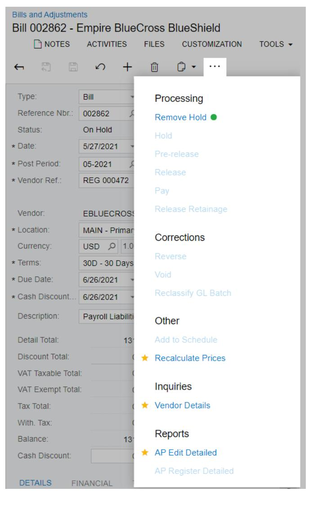

*Figure: The form toolbar and More menu on a narrow screen*

#### **Related Links**

- *[Integration with Excel](https://help-2025r1.acumatica.com/Help?ScreenId=ShowWiki&pageid=d4e757d5-bdf6-4d82-92e3-f26563d48ad4)*
- *To Copy a [Document](https://help-2025r1.acumatica.com/Help?ScreenId=ShowWiki&pageid=aa2b9a0f-794d-4dc7-80b4-14ed0702aea3) Contents to a New Document*
- *To Create a [Document](https://help-2025r1.acumatica.com/Help?ScreenId=ShowWiki&pageid=480487bd-b225-4065-9d82-97a3b68d7994) with a Template*

## **Table Toolbar**

Each table on an Acumatica ERP form, tab, dialog box, or page has a table toolbar, which contains the buttons you can use to work with the details or objects of the table. A toolbar, shown in the following screenshot, includes buttons that are specific to the table, standard buttons that most table toolbars have, and the search box (for some tables; for others, the search box is displayed in the filtering area).

|               | с  | ∽  | ⊢                                           | $\mathbf{x}$                      |                          |           |                       |               |                 |               |               |
|---------------|----|----|---------------------------------------------|-----------------------------------|--------------------------|-----------|-----------------------|---------------|-----------------|---------------|---------------|
|               |    |    | ALL RECORDS <b>ACTIVE</b>                |                                   |                          |           |                       |               |                 |               |               |
|               |    |    | Drag column header here to configure filter |                                   |                          |           |                       | a Y        | $\cdots$        |               | ρ             |
| 髙             | O, | D  | <b>Customer ID</b>                          | <b>Customer Name</b>              | Customer <b>Class</b> | Country   | City                  | Currenc ID | <b>Terms</b>    | <b>Status</b> |               |
| $\rightarrow$ | ा  | I٦ | <b>ABARTENDE</b>                            | <b>USA Bartending School</b>      | <b>KEY</b>               | <b>US</b> | <b>Little Falls</b>   | USD.          | 30 D | Active        |               |
|               | O  |    | <b>ABCHOLDING</b>                           | <b>ABC Holdings Inc.</b>          | <b>KEY</b>               | <b>US</b> | New York              | <b>USD</b>    | 30 D | Active        |               |
|               | ū  |    | !!!!!!!!!!!!!!!!!!!!!!!!!!!!!!!!!!!!!!!!    | <b>ABC Studios Inc.</b>           | <b>KEY</b>               | <b>US</b> | <b>New York</b>       | <b>USD</b>    | 30 D | Active        |               |
|               | Ù  |    | <b>ABCVENTURE</b>                           | <b>ABC Capital Ventures</b>       | <b>KEY</b>               | <b>US</b> | Philadelphia          | <b>USD</b>    | 30 D | Active        |               |
|               | Û  |    | <b>ACTIVESTAF</b>                           | <b>Active Staffing Service</b>    | <b>LOCAL</b>             | <b>US</b> | <b>New York</b>       | <b>USD</b>    | 30 D | Active        |               |
|               | Û. |    | ALPHABETLD                                  | <b>Alphabetland School Center</b> | LOCAL                    | <b>US</b> | <b>North Bellmore</b> | <b>USD</b>    | 30 D | Active        |               |
|               |    |    |                                             |                                   |                          |           |                       |               |                 |               |               |
|               |    |    | 1-6 of 103 records                          |                                   |                          |           |                       | K             | 1               | of 18 pages   | $\rightarrow$ |

#### *Figure: Table toolbar*

#### **Standard Table Toolbar Buttons**

The following table describes the standard table toolbar buttons. A table toolbar may include some or all of those buttons. If a table toolbar includes table-specific buttons, they are described in the reference help topic.

| Button                          | Icon | Description                                                                                                                                                                                           |
|---------------------------------|------|-------------------------------------------------------------------------------------------------------------------------------------------------------------------------------------------------------|
| Refresh                         |      | Refreshes the data in the table.                                                                                                                                                                      |
| Switch Between Grid and Form |      | Controls how the elements are displayed: in a table (grid) with rows and columns; or as separately arranged elements for one table row, with navigation tools you use to move between row data. |
| Add Row                         |      | Appends a new row to the table so you can define a new detail or object. The new row may contain some default values.                                                                              |
| Delete Row                      |      | Deletes the selected row or rows.                                                                                                                                                                     |

| Button                    | Icon | Description                                                                                                                                                                                                                                                                                                               |
|---------------------------|------|---------------------------------------------------------------------------------------------------------------------------------------------------------------------------------------------------------------------------------------------------------------------------------------------------------------------------|
| Move Row Up               |      | Moves the selected row one position up.                                                                                                                                                                                                                                                                                   |
| Move Row Down             |      | Moves the selected row one position down.                                                                                                                                                                                                                                                                                 |
| Fit toScreen              |      | Adjusts the table to the screen width and makes the column width proportional.                                                                                                                                                                                                                                            |
| Export to Excel           |      | Exports the data in the table to an Excel file. For more information, see Integration with Excel in the Acumatica ERP Getting Started Guide.                                                                                                                                                                           |
| Filter Settings           |      | Opens the Filter Settings dialog box, which you can use to define a new advanced filter. After you create and save the filter, the corresponding tab appears on the ta ble. For more information about filtering, see Filters. For details on the Filter Settings dialog box, see Filter Settings Dialog Box. |
| Load Records from File |      | Opens the File Upload dialog box, described in detail below, so you can locate and upload a local file for import. You can use this option to import data from an Excel spreadsheet (.xlsx) or .csv file. For the detailed procedure, see To Import Data from a Local File to a Table.                           |
| Search                    |      | A box in which you can type a word, part of a word, or multiple words. As you type, the system filters the contents of the table to display only rows that contain the string you have typed in any column.                                                                                                         |
| Download                  |      | Downloads the selected file.                                                                                                                                                                                                                                                                                              |

### **File Upload Dialog Box**

With the **File Upload** dialog box, you select a file of one of the supported formats (.csv or .xlsx) to import data from the file.

| Element                                  | Description                                                                                                                         |  |
|------------------------------------------|-------------------------------------------------------------------------------------------------------------------------------------|--|
| File Path                                | The path to the file you want to upload. To select the file, click Browse, and then find and select the file you want to upload. |  |
| The dialog box has the following button. |                                                                                                                                     |  |
| Upload                                   | Closes the dialog box and opens the Common Settings dialog box, where you specify the import settings.                           |  |

#### **Common Settings Dialog Box**

In the **Common Settings** dialog box, which opens if you click **Upload** in the **File Upload** dialog box, you specify the import settings for a file that you has selected in the **File Upload** dialog box.

| Element                                   | Description                                                                                                                                                                    |
|-------------------------------------------|--------------------------------------------------------------------------------------------------------------------------------------------------------------------------------|
| Separator Chars                           | The character that is used as the separator in the imported file.                                                                                                              |
|                                           | By default, the comma is used as the separator. You specify the separator character if the imported file uses any other separator.                                          |
|                                           | This box appears only if you import data from a .csv file.                                                                                                                     |
| Null Value                                | Optional. The value that is used to mark an empty column in the imported file. You speci fy the null value if the value in the imported file differs from the empty string. |
| Encoding                                  | The encoding that is used in the imported file.                                                                                                                                |
|                                           | This box appears only if you import data from a .csv file.                                                                                                                     |
| Culture                                   | The regional format that has been used to display the time, currency, and other measure ments in the imported file.                                                         |
| Mode                                      | The mode that determines which rows of the uploaded file will be imported into the ta ble. The following options are available:                                             |
|                                           | • Update Existing: The rows already present in the table will be updated, and the rows not present in the table will be added.                                           |
|                                           | • Bypass Existing: Only the new rows that are not present in the table will be imported. The rows that are already present in the table will not be updated.             |
|                                           | • Insert All Records: All the rows from the file will be imported into the table.                                                                                           |
|                                           | If you select this option, you may get duplicated rows because the sys tem does not check for duplicates when importing rows from the file.                                 |
| The dialog box has the following buttons. |                                                                                                                                                                                |
| OK                                        | Closes the dialog box and opens the Columns dialog box.                                                                                                                        |
| Cancel                                    | Closes the dialog box without importing the data from the file.                                                                                                                |

#### **Columns Dialog Box**

In the **Columns** dialog box, which opens if you click **OK** in the **Common Settings** dialog box, you match the columns in the imported file that you have selected in the **File Upload** dialog box to the columns in the Acumatica ERP table to which you are importing data.

| Element       | Description                                                         |
|---------------|---------------------------------------------------------------------|
| Column Name   | The name of the column in the uploaded file.                        |
| Property Name | The name of the corresponding column in the table in Acumatica ERP. |

| Element                                   | Description                                                     |  |
|-------------------------------------------|-----------------------------------------------------------------|--|
| The dialog box has the following buttons. |                                                                 |  |
| OK                                        | Closes the dialog box and imports the selected file.            |  |
| Cancel                                    | Closes the dialog box without importing the data from the file. |  |

#### **Related Links**

- *[Tables](https://help-2025r1.acumatica.com/Help?ScreenId=ShowWiki&pageid=87a128a5-1230-4584-8c7a-ad05bcd08b75)*
- *[Integration with Excel](https://help-2025r1.acumatica.com/Help?ScreenId=ShowWiki&pageid=d4e757d5-bdf6-4d82-92e3-f26563d48ad4)*
- *To [Import](https://help-2025r1.acumatica.com/Help?ScreenId=ShowWiki&pageid=96773e07-5811-474d-a088-243f76f48f61) Data from a Local File to a Table*