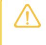
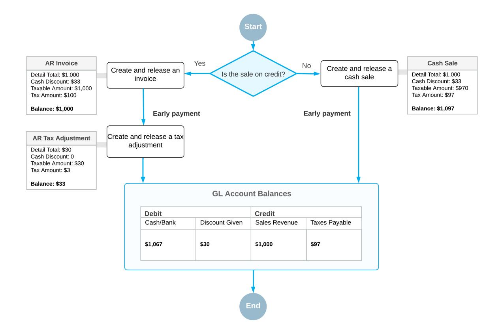
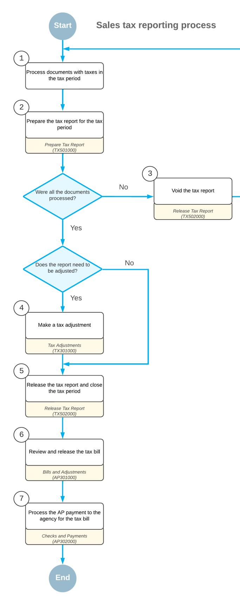
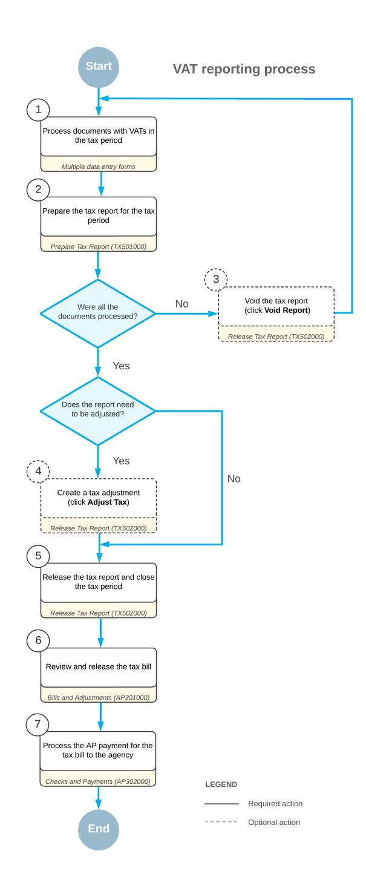

# **Taxes Guide 2025 R1**

# **Contents**

| Copyright7                                                                  |  |
|-----------------------------------------------------------------------------|--|
| Overview 8                                                                  |  |
| Selecting Tax Calculation Methods10                                         |  |
| Tax Calculation Methods: General Information 10                             |  |
| Tax Calculation Methods: To Create Taxes 11                                 |  |
| Tax Calculation Methods: To Apply Taxes 13                                  |  |
| Tax Calculation Methods: To Apply a Second-Level Tax17                      |  |
| Entering Taxes from the General Ledger 20                                   |  |
| Tax Entry from GL: General Information 20                                   |  |
| Tax Entry from GL: Implementation Checklist 22                              |  |
| Tax Entry from GL: Generated Transactions23                                 |  |
| Tax Entry from GL: Implementation Activity23                                |  |
| Tax Entry from GL: Process Activity25                                       |  |
| Processing Invoices with Sales Taxes28                                      |  |
| Invoices with Sales Taxes: General Information 28                           |  |
| Invoices with Sales Taxes: Implementation Checklist 29                      |  |
| Invoices with Sales Taxes: Generated Transactions30                         |  |
| Invoices with Sales Taxes: To Process an AR Invoice31                       |  |
| Invoices with Sales Taxes: To Process an AR Invoice with a Cash Discount 33 |  |
| Invoices with Sales Taxes: Related Reports 36                               |  |
| Processing Invoices with Inclusive Sales Taxes38                            |  |
| Invoices with Inclusive Sales Taxes: General Information38                  |  |
| Invoices with Inclusive Sales Taxes: Implementation Checklist 39            |  |
| Invoices with Inclusive Sales Taxes: Generated Transactions41               |  |
| Invoices with Inclusive Sales Taxes: Implementation Activity 42             |  |
| Invoices with Inclusive Sales Taxes: Process Activity 43                    |  |
| Invoices with Inclusive Sales Taxes: Related Reports and Forms 46           |  |
| Processing Cash Entries with Taxes47                                        |  |
| Cash Entries with Taxes: General Information47                              |  |
| Cash Entries with Taxes: Implementation Checklist47                         |  |
| Cash Entries with Taxes: Generated Transactions 48                          |  |
| Cash Entries with Taxes: To Process a Cash Entry with a Sales Tax49         |  |
| Cash Entries with Taxes: To Process a Cash Entry with VAT51                 |  |
| Processing Funds Transfers with Taxable Fees 54                             |  |

| Funds Transfers with Taxable Fees: General Information 54        |  |
|------------------------------------------------------------------|--|
| Funds Transfers with Taxable Fees: Implementation Checklist 55   |  |
| Funds Transfers with Taxable Fees: Generated Transactions56      |  |
| Funds Transfers with Taxable Fees: Process Activity57            |  |
| Processing Credit Memos with Sales Taxes 60                      |  |
| Credit Memos with Sales Taxes: General Information60             |  |
| Credit Memos with Sales Taxes: Implementation Checklist60        |  |
| Credit Memos with Sales Taxes: Generated Transactions 61         |  |
| Credit Memos with Sales Taxes: Process Activity61                |  |
| Credit Memos with Sales Taxes: Related Reports and Inquiries 63  |  |
| Processing Purchases with Sales Taxes64                          |  |
| Purchases with Sales Taxes: General Information64                |  |
| Purchases with Sales Taxes: Tax Amount Validation64              |  |
| Purchases with Sales Taxes: Implementation Checklist67           |  |
| Purchases with Sales Taxes: Generated Transactions 69            |  |
| Purchases with Sales Taxes: Process Activity70                   |  |
| Purchases with Sales Taxes: Related Reports and Inquiries 71     |  |
| Processing Purchases with Inclusive Sales Taxes73                |  |
| Purchases with Inclusive Sales Taxes: General Information 73     |  |
| Purchases with Inclusive Sales Taxes: Generated Transaction 74   |  |
| Purchases with Inclusive Sales Taxes: Implementation Checklist75 |  |
| Purchases with Inclusive Sales Taxes: Implementation Activity76  |  |
| Purchases with Inclusive Sales Taxes: Process Activity77         |  |
| Processing Purchases with Use Taxes80                            |  |
| Purchases with Use Taxes: General Information 80                 |  |
| Purchases with Use Taxes: Implementation Checklist 80            |  |
| Purchases with Use Taxes: Generated Transactions82               |  |
| Purchases with Use Taxes: Process Activity 83                    |  |
| Purchases with Use Taxes: Related Reports and Inquiries85        |  |
| Including Taxes in the Cost of Items 87                          |  |
| Taxes Included in the Cost of Items: General Information 87      |  |
| Taxes Included in the Cost of Items: Rules of Cost Update88      |  |
| Taxes Included in the Cost of Items: Implementation Checklist89  |  |
| Taxes Included in the Cost of Items: Generated Transactions 89   |  |
| Taxes Included in the Cost of Items: Implementation Activity91   |  |
| Taxes Included in the Cost of Items: Process Activity92          |  |
|                                                                  |  |

| Processing AR Documents with Value-Added Taxes96                        |  |
|-------------------------------------------------------------------------|--|
| AR Documents with VAT: General Information 96                           |  |
| AR Documents with VAT: Implementation Checklist 97                      |  |
| AR Documents with VAT: Generated Transactions99                         |  |
| AR Documents with VAT: To Process an AR Invoice 99                      |  |
| AR Documents with VAT: To Process an AR Invoice with a Cash Discount102 |  |
| AR Documents with VAT: To Process a Credit Memo 105                     |  |
| Processing AP Documents with Value-Added Taxes108                       |  |
| AP Documents with VAT: General Information108                           |  |
| AP Documents with VAT: Implementation Checklist 109                     |  |
| AP Documents with VAT: Generated Transactions110                        |  |
| AP Documents with VAT: To Process an AP Bill111                         |  |
| AP Documents with VAT: To Process a Debit Adjustment 113                |  |
| Processing Taxable Sales with Freight Charges116                        |  |
| Taxable Sales with Freight Charges: General Information 116             |  |
| Taxable Sales with Freight Charges: Implementation Checklist 117        |  |
| Taxable Sales with Freight Charges: Generated Transactions118           |  |
| Taxable Sales with Freight Charges: Process Activity119                 |  |
| Paying Taxes Directly to the Tax Agency 123                             |  |
|                                                                         |  |
| Direct Tax Payment: General Information123                              |  |
| Direct Tax Payment: Implementation Checklist125                         |  |
| Direct Tax Payment: Generated Transactions 126                          |  |
| Direct Tax Payment: To Create a Tax Bill for a Tax Agency 128           |  |
| Direct Tax Payment: To Create an AP Bill with a Direct-Entry Tax131     |  |
| Processing AP Bills with Withholding Taxes135                           |  |
| Bills with Withholding Tax: General Information135                      |  |
| Bills with Withholding Tax: Implementation Checklist135                 |  |
| Bills with Withholding Tax: Generated Transactions 137                  |  |
| Bills with Withholding Tax: Process Activity137                         |  |
| Adjusting VAT for Early Payments142                                     |  |
| VAT for Early Payments: General Information142                          |  |
| VAT for Early Payments: Implementation Checklist145                     |  |
| VAT for Early Payments: Generated Transactions 146                      |  |
| VAT for Early Payments: To Process a Payment with a Cash Discount148    |  |
| VAT for Early Payments: To Prepare a New Revision of VAT Tax Report152  |  |

| Tax Report Preparation: General Information154                             |  |
|----------------------------------------------------------------------------|--|
| Tax Report Preparation: Overview of the Tax Reporting Process 155          |  |
| Tax Report Preparation: Tax Report for a Closed Period157                  |  |
| Tax Report Preparation: Implementation Checklist 157                       |  |
| Tax Report Preparation: Process Activity 158                               |  |
| Tax Report Preparation: Related Reports and Inquiries159                   |  |
| Tax Report Preparation: To Prepare a Tax Report for a Closed Tax Period160 |  |
| Voiding a Tax Report for Sales Taxes 161                                   |  |
| Voiding of a Sales Tax Report: General Information161                      |  |
| Voiding of a Sales Tax Report: Implementation Checklist161                 |  |
| Voiding of a Sales Tax Report: Process Activity 162                        |  |
| Voiding of a Sales Tax Report: Related Reports and Inquiries 164           |  |
| Creating Sales Tax Adjustments 165                                         |  |
| Sales Tax Adjustments: General Information165                              |  |
| Sales Tax Adjustments: Implementation Checklist166                         |  |
| Sales Tax Adjustments: Generated Transactions 167                          |  |
| Sales Tax Adjustments: Process Activity167                                 |  |
| Sales Tax Adjustments: Related Reports and Inquiries 170                   |  |
| Sales Tax Adjustments: To Reverse a Tax Adjustment Document171             |  |
| Releasing a Sales Tax Report 172                                           |  |
| Release of Sales Tax Report: General Information 172                       |  |
| Release of Sales Tax Report: Implementation Checklist 173                  |  |
| Release of Sales Tax Report: Generated Transactions173                     |  |
| Release of Sales Tax Report: Process Activity 174                          |  |
| Release of Sales Tax Report: Related Reports and Inquiries176              |  |
| Preparing a Tax Report for Value-Added Taxes 177                           |  |
| Tax Report for VAT: General Information177                                 |  |
| Tax Report for VAT: Implementation Checklist 180                           |  |
| Tax Report for VAT: Generated Transactions182                              |  |
| Tax Report for VAT: Process Activity 182                                   |  |
| Tax Report for VAT: Related Report and Inquiry Forms185                    |  |
| Applying a Deductible VAT 186                                              |  |
| Applying Deductible VAT: General Information186                            |  |
| Applying Deductible VAT: Implementation Checklist 187                      |  |
| Applying Deductible VAT: Generated Transactions188                         |  |
| Applying Deductible VAT: Process Activity 189                              |  |

| Applying a Reverse VAT 192                                                                  |  |
|---------------------------------------------------------------------------------------------|--|
| Applying Reverse VAT: General Information192                                                |  |
| Applying Reverse VAT: Implementation Checklist 192                                          |  |
| Applying Reverse VAT: Generated Transactions194                                             |  |
| Applying Reverse VAT: Process Activity 194                                                  |  |
| Applying a Pending VAT 197                                                                  |  |
| Applying a Pending VAT: General Information197                                              |  |
| Applying a Pending VAT: Processing of Documents with Multiple Installments199               |  |
| Applying a Pending VAT: Implementation Checklist201                                         |  |
| Applying a Pending VAT: Generated Transactions 203                                          |  |
| Applying a Pending VAT: To Apply a Pending VAT to an AR Invoice 205                         |  |
| Applying a Pending VAT: To Apply a Pending VAT to an AP Bill with Multiple Installments 210 |  |
| Applying a Pending VAT: Related Report and Inquiry Forms 214                                |  |
| Configuring Support for Making Tax Digital (MTD) 216                                        |  |
| To Submit a VAT Return219                                                                   |  |
| Appendix221                                                                                 |  |
| Reports 221                                                                                 |  |
| Report Form221                                                                              |  |
| Report226                                                                                   |  |
| Form Toolbar and More Menu228                                                               |  |
| Table Toolbar 235                                                                           |  |

# **Copyright**

#### **© 2025 Acumatica, Inc.**

#### **ALL RIGHTS RESERVED.**

No part of this document may be reproduced, copied, or transmitted without the express prior consent of Acumatica, Inc.

3075 112th Avenue NE, Suite 200, Bellevue, WA 98004, USA

## **Restricted Rights**

The product is provided with restricted rights. Use, duplication, or disclosure by the United States Government is subject to restrictions as set forth in the applicable License and Services Agreement and in subparagraph (c)(1)(ii) of the Rights in Technical Data and Computer Soware clause at DFARS 252.227-7013 or subparagraphs (c)(1) and (c)(2) of the Commercial Computer Soware-Restricted Rights at 48 CFR 52.227-19, as applicable.

#### **Disclaimer**

Acumatica, Inc. makes no representations or warranties with respect to the contents or use of this document, and specifically disclaims any express or implied warranties of merchantability or fitness for any particular purpose. Further, Acumatica, Inc. reserves the right to revise this document and make changes in its content at any time, without obligation to notify any person or entity of such revisions or changes.

#### **Trademarks**

Acumatica is a registered trademark of Acumatica, Inc. HubSpot is a registered trademark of HubSpot, Inc. Microso Exchange and Microso Exchange Server are registered trademarks of Microso Corporation. All other product names and services herein are trademarks or service marks of their respective companies.

Soware Version: 2025 R1 Last Updated: 06/01/2025

# **Overview**

You can use the tax-related functionality of Acumatica ERP for automatic calculation of tax amounts on each bill, invoice, and other similar document created in Acumatica ERP. To set up the tax calculation in the documents across the system, you should create all required taxes with their effective rates along with other tax-related entities, such as tax zones and tax categories, and then associate these entities with appropriate elements of other Acumatica ERP functional areas involved in the calculation process.

This chapter briefly describes the primary features of the tax functionality. The processes of setting up the tax calculation and configuring the tax reporting functionality are described extensively in other topics of this guide.

## **Types of Taxes**

In Acumatica ERP, you can configure taxes of the following general types: sales tax, use tax, withholding tax, valueadded tax (VAT), and goods and services tax (GST). These taxes are applied in different countries and their rates depend on the governmental laws of each country. The rate of the tax of each type can vary on different territories of the same country and depends on the type of goods or services your business provides. For example, a tax can be applied at standard rate or fall into one of the following categories: zero-rated or reduced-rated, depending on the provided goods and services.

## **Tax Calculation**

You can calculate taxes in Acumatica ERP by using different methods. You can specify the appropriate tax calculation method for a tax, including calculating the tax amount based on the total document amount or for each item listed in the document, or excluding the tax amount from the product price specified in the document.

#### **Tax Zones and Categories**

In Acumatica ERP, you can configure taxes of all federal and local levels. For this, you can create the *tax zones*, in which you include the taxes of appropriate rates, and associate each zone with the customer or vendor location. For tax-exempt customers (for example, those with reseller permits), you can create the tax zones with zerorated taxes. Thus, the tax amount in the document will be calculated basing on the tax, which corresponds to the location of the customer or vendor as well as on the type of the services or goods mentioned in the document (for example, in the invoice), for which, in turn, you should also create and assign a *tax category*. For more details, see *Tax Zones and Tax [Categories](https://help-2025r1.acumatica.com/Help?ScreenId=ShowWiki&pageid=be4d6333-82c9-4148-980c-e11c5252de60)*.

#### **Tax Agencies**

In Acumatica ERP, you can configure a tax report for a particular tax agency and set up automatic accumulation of appropriate tax amounts in the tax report. For each tax agency, you can define specific reporting settings, such as the reporting period or the rounding rules. For details, see *Tax [Agency](https://help-2025r1.acumatica.com/Help?ScreenId=ShowWiki&pageid=c652ccbb-def3-4e6a-9207-b4213d147a7e)*.

#### **Tax Reporting**

Acumatica ERP gives you the ability to create tax reports. If your company plans to create tax reports by using Acumatica ERP, you should configure a tax report for each tax collection agency to which the taxes have to be reported.

The structure and content of the tax report is prescribed by each particular tax collection agency and can be filed in a paper or electronic form. Usually, this form contains a number of boxes that require the tax amounts and taxable amounts to be entered. In Acumatica ERP, the tax report is represented as a table where the boxes are represented as the lines. You can configure a tax report with required lines, and set up automatic accumulation of tax amounts and taxable amounts in the appropriate lines. For details, see *Tax [Report](https://help-2025r1.acumatica.com/Help?ScreenId=ShowWiki&pageid=cccd37c1-84fe-4a19-83e1-dd26ddd68173)*.

The preparation of a tax report includes the following steps: preparing a tax report for a required reporting period, and closing the reporting period. You can adjust the net tax amount in the tax report by creating the tax adjustment document manually, or create another revision of the tax report for the closed reporting period. For details, see *[Preparing](#page-153-2) a Tax Report for Sales Taxes*.

When you have configured a tax report and set up all required relations, you can prepare the tax report by clicking one button. You should set up the reporting periods and some report properties individually for each tax agency account. (In Acumatica ERP, a tax agency is defined as a vendor.) All the required tax and taxable amounts will be collected in the tax report as each taxable document is released in the system.

While preparing a tax report, you can view all documents that were used for composing the tax report—that is, the documents, such as bills and invoices, whose tax-related amounts were collected in the tax report.

You can view any required tax-related information for a selected period or the date by using the following reports:

- *Tax [Summary](https://help-2025r1.acumatica.com/Help?ScreenId=ShowWiki&pageid=52dc969f-d8e4-431e-9589-047aca79829c)*
- *Tax [Details](https://help-2025r1.acumatica.com/Help?ScreenId=ShowWiki&pageid=11f84711-16a1-444f-b6aa-c1bbd6c6903c)*
- *Tax [Summary](https://help-2025r1.acumatica.com/Help?ScreenId=ShowWiki&pageid=d6a32810-0353-46f8-8cff-da4d1a296114) by GL Account by Date*
- *Tax Details by GL [Account](https://help-2025r1.acumatica.com/Help?ScreenId=ShowWiki&pageid=19e7f0d7-7837-45e2-87ff-22bc9d65601a) by Date*
- *Tax [Summary](https://help-2025r1.acumatica.com/Help?ScreenId=ShowWiki&pageid=48d0a4e5-2f9c-48be-81a6-42a47dfb9cd1) by GL Account by Period*
- *Tax Details by GL [Account](https://help-2025r1.acumatica.com/Help?ScreenId=ShowWiki&pageid=6cba21b1-653a-4c07-941a-76722417d6a7) by Period*

# **Selecting Tax Calculation Methods**

The topics of this chapter describe how to configure various tax calculation methods and illustrates how to apply them to documents.

# **Tax Calculation Methods: General Information**

In Acumatica ERP, various tax calculation methods for first-level and second-level taxes are available. The calculation method for a tax is defined on the *[Taxes](https://help-2025r1.acumatica.com/Help?ScreenId=ShowWiki&pageid=692e30c9-e0af-4aa3-b0f6-f3ba190d257a)* (TX205000) form.

#### **Learning Objectives**

In this chapter, you will learn how to configure first-level and second-level taxes in Acumatica ERP, learn how different calculation methods affect the resulting tax and the total document amount, and create documents to which these taxes are applied.

## **Applicable Scenarios**

You need to use an appropriate tax calculation method that meets the requirements of the tax authority.

#### **The Method of Calculating the Tax Amount**

Different taxes may require different methods of calculation. You can select the appropriate option of a particular tax in the **Calculation Rule** box on the *[Taxes](https://help-2025r1.acumatica.com/Help?ScreenId=ShowWiki&pageid=692e30c9-e0af-4aa3-b0f6-f3ba190d257a)* (TX205000) form. The following options are available:

- *Inclusive Line-Level*: The tax is already included in the item price. The system extracts the tax amount from the item amount according to the tax rate that you specify. This method treats taxes as included in the line amount; that is, the amount specified in the line is the taxable amount plus the tax amount.
- *Exclusive Line-Level*: The tax amount is calculated on a per-item basis; that is, the tax is applied to each line in the document according to the tax category specified in the line. This method uses the amounts specified in the document lines as the taxable amount for the tax; it calculates the tax for each line, rounds the results, and then adds them. (This option is a first-level tax.)
- *Exclusive Document-Level*. The tax amount is calculated on a per-document basis. This method uses the amounts specified in the document lines as the taxable amount for the tax; it adds the line amounts to get the taxable amount, calculates the tax based on the sum, and rounds the result. (This option is a first-level tax.)
- *Compound Line-Level*: The taxable amount of this second-level tax is calculated as the taxable amount of the item plus the first-level tax amount calculated for the item.
- *Compound Document-Level*: The tax amount of this second-level tax is calculated on a per-document basis by using as the tax base the sum of the line amounts (with appropriate tax categories) and the tax amount of the first-level tax.

If any group or document discounts are applicable to the document, the taxable amount is reduced by the discount amount. To be able to create customer and vendor discounts in the system, you need to enable the *Customer Discounts* and *Vendor Discounts* features on the *[Enable/Disable Features](https://help-2025r1.acumatica.com/Help?ScreenId=ShowWiki&pageid=c1555e43-1bc5-4f6f-ba9d-b323f94d8a6b)* (CS100000) form.

Consider an example in which the different tax calculation methods are used. Suppose that the document contains 100 lines with one item per line, each priced at \$10, and the tax rate is 8.25%:

- With the per-document method, the tax base (total amount of the document) would be 100 items \* \$10 = \$1000. Then the tax amount would be \$1000 \* 0.0825 = \$82.5.
- With the per-item method, the tax amount per item would be \$10 \* 0.0825 = \$0.825, which rounds to \$0.83. Then the total tax amount would be \$0.83 \* 100 items = \$83.

As you can see, using different methods of tax calculation for the same documents may cause different tax amounts due to rounding. Thus, you need to choose the calculation method that best suits your needs.

# **Tax Calculation Methods: To Create Taxes**

The following activity will walk you through the process of creating taxes with different calculation methods.

#### **Story**

Suppose that you, as an accountant of SweetLife Fruits & Jams, want to explore different tax calculation methods of sales taxes. You want to configure a training tax zone and add taxes that use the following calculation methods:

- *Exclusive Document-Level*
- *Exclusive Line-Level*
- *Inclusive Line-Level*

To be able to compare the difference in how these taxes are applied, the taxes will use the same tax rate of 5%. You are going to use the same customer account (Candyy Cafe) in all activities of this lesson.

#### **Configuration Overview**

In the *U100* dataset, for the purposes of this activity, the *CANDYY* customer account has been configured on the *[Customers](https://help-2025r1.acumatica.com/Help?ScreenId=ShowWiki&pageid=652929bc-9606-4056-aa6e-0c2d1147171b)* (AR303000) form.

### **Process Overview**

In this activity, you will create a training tax zone for the purposes of this activity on the *Tax [Zones](https://help-2025r1.acumatica.com/Help?ScreenId=ShowWiki&pageid=361e36b3-a660-4fcb-a0cf-377b5bdb7aec)* (TX206000) form; you will then create the needed taxes on the *[Taxes](https://help-2025r1.acumatica.com/Help?ScreenId=ShowWiki&pageid=692e30c9-e0af-4aa3-b0f6-f3ba190d257a)* (TX205000) form and assign them to this tax zone. On the *[Tax](https://help-2025r1.acumatica.com/Help?ScreenId=ShowWiki&pageid=db5e7fad-054d-467d-877e-2db4ee180ead) [Categories](https://help-2025r1.acumatica.com/Help?ScreenId=ShowWiki&pageid=db5e7fad-054d-467d-877e-2db4ee180ead)* (TX205500) form, you will add the created taxes to the *TRAINING* tax category.

#### **System Preparation**

Before you begin to create taxes with different calculation rules, launch the Acumatica ERP website with the *U100* dataset preloaded, and sign in as an accountant Anna Johnson by using the *johnson* username and the *123* password.

#### **Step 1: Creating a Tax Zone**

To create a separate tax zone in which you will later create taxes, proceed as follows:

- 1. Open the *Tax [Zones](https://help-2025r1.acumatica.com/Help?ScreenId=ShowWiki&pageid=361e36b3-a660-4fcb-a0cf-377b5bdb7aec)* (TX206000) form.
- 2. On the form toolbar, click **Add New Record**, and specify the following settings in the Summary area:
  - **Tax Zone ID**: TRAINING
  - **Description**: Calculation rules
- 3. On the form toolbar, click**Save** to save the created tax zone.

## **Step 2: Creating a Tax with the Exclusive Document-Level Method**

To create a tax that uses the *Exclusive Document-Level* method, proceed as follows:

1. Open the *[Taxes](https://help-2025r1.acumatica.com/Help?ScreenId=ShowWiki&pageid=692e30c9-e0af-4aa3-b0f6-f3ba190d257a)* (TX205000) form.

To open the form for creating a new record, type the form ID in the Search box, and on the Search form, point at the form title and click **New** right of the title.

- 2. On the form toolbar, click **Add New Record**, and specify the following settings on the**TaxSettings** tab:
  - **Tax ID**: EXDOCLEVEL
  - **Description**: Exclusive Document-Level Tax
  - **TaxType**: *Sales*
  - **Calculation Rule**: *Exclusive Document-Level*
  - **Cash Discount**: *Does Not Affect Taxable Amount*
- 3. On the **TaxSchedule** tab, click **Add Row** on the table toolbar and specify the following settings in the table:
  - **Start Date**: *1/1/2025*
  - **Tax Rate**: 5
  - **Reporting Group**: *Default Output Group*
  - The tax is not assigned to any tax agency, so only the default output group is available for selection.
- 4. On the **Zones** tab, click **Add Row** on the table toolbar, and select *TRAINING* in the **Tax Zone ID** column.
- 5. On the **GL Accounts** tab, select *24100* in the **Tax Payable Account** box.
- 6. On the form toolbar, click**Save** to save the created tax.

#### **Step 3: Creating a Tax with the Exclusive Line-Level Method**

To create a tax that uses the *Exclusive Line-Level* method, proceed as follows:

- 1. While you are still on the *[Taxes](https://help-2025r1.acumatica.com/Help?ScreenId=ShowWiki&pageid=692e30c9-e0af-4aa3-b0f6-f3ba190d257a)* (TX205000) form, click **Add New Record** on the form toolbar, and specify the following settings on the**TaxSettings** tab:
  - **Tax ID**: EXLINELEVEL
  - **Description**: Exclusive Line-Level Tax
  - **TaxType**: *Sales*
  - **Calculation Rule**: *Exclusive Line-Level*
  - **Cash Discount**: *Does Not Affect Taxable Amount*
- 2. On the **TaxSchedule** tab, click **Add Row** on the table toolbar, and specify the following settings in the table:
  - **Start Date**: *1/1/2025*
  - **Tax Rate**: 5
  - **Reporting Group**: *Default Output Group*
- 3. On the **Zones** tab, click **Add Row** on the table toolbar, and select *TRAINING* in the **Tax Zone ID** column.
- 4. On the **GL Accounts** tab, select *24100* in the **Tax Payable Account** box.
- 5. On the form toolbar, click**Save** to save the created tax.

## **Step 4: Creating a Tax with the Inclusive Line-Level Method**

To create a tax that uses the *Inclusive Line-Level* method, proceed as follows:

- 1. While you are still on the *[Taxes](https://help-2025r1.acumatica.com/Help?ScreenId=ShowWiki&pageid=692e30c9-e0af-4aa3-b0f6-f3ba190d257a)* (TX205000) form, click **Add New Record** on the form toolbar, and specify the following settings on the**TaxSettings** tab:
  - **Tax ID**: INCLINELEVEL
  - **Description**: Inclusive Line-Level Tax
  - **TaxType**: *Sales*
  - **Calculation Rule**: *Inclusive Line-Level*
  - **Cash Discount**: *Does Not Affect Taxable Amount*
- 2. On the **TaxSchedule** tab, click **Add Row** on the table toolbar, and specify the following settings in the table:
  - **Start Date**: *1/1/2025*
  - **Tax Rate**: 5
  - **Reporting Group**: *Default Output Group*
- 3. On the **Zones** tab, click **Add Row** on the table toolbar, and select *TRAINING* in the **Tax Zone ID** column.
- 4. On the **GL Accounts** tab, select *24100* in the **Tax Payable Account** box.
- 5. On the form toolbar, click**Save** to save the created tax.

#### **Step 5: Creating a Tax Category and Adding Taxes**

To create a tax category and add the created taxes to it, proceed as follows:

- 1. Open the *Tax [Categories](https://help-2025r1.acumatica.com/Help?ScreenId=ShowWiki&pageid=db5e7fad-054d-467d-877e-2db4ee180ead)* (TX205500) form.
- 2. On the form toolbar, select **Add New Record**, and specify the following settings:
  - **Tax Category ID**: TRAINING
  - **Description**: Calculation rules
- 3. On the table toolbar, click **Add Row**, and in the **Tax ID** column, select *EXDOCLEVEL*.
- 4. Again click **Add Row**, and in the **Tax ID** column, select *EXLINELEVEL*.
- 5. Again click **Add Row**, and in the **Tax ID** column, select *INCLINELEVEL*.
- 6. On the form toolbar, click**Save** to save the tax category.

# **Tax Calculation Methods: To Apply Taxes**

The following activity will walk you through the process of applying the created taxes to a document.

#### **Story**

Suppose that you want to analyze how the taxes are calculated depending on the selected rule. You want to use the *CANDYY* customer to create a document for it and apply the taxes with different calculation methods to this document. (You do not need to save and release the document.)

#### **Configuration Overview**

In the *U100* dataset, for the purposes of this activity, the *CANDYY* customer account has been configured on the *[Customers](https://help-2025r1.acumatica.com/Help?ScreenId=ShowWiki&pageid=652929bc-9606-4056-aa6e-0c2d1147171b)* (AR303000) form.

#### **Process Overview**

In this activity, on the *[Invoices and Memos](https://help-2025r1.acumatica.com/Help?ScreenId=ShowWiki&pageid=5e6f3b27-b7af-412f-a40a-1d4f4be70cba)* (AR301000) form, you will create an invoice with two lines and with the taxes of the *TRAINING* tax zone applied. You will remove and add the needed taxes on the**Taxes** tab, analyzing how the system calculated the taxes applied to the document.

## **System Preparation**

Before you begin performing the steps of this activity, do the following:

- 1. Launch the Acumatica ERP website with the *U100* dataset preloaded, and sign in as an accountant Anna Johnson by using the *johnson* username and the *123* password.
- 2. In the info area, in the upper-right corner of the top pane of the Acumatica ERP screen, click the Business Date menu button and select *2/28/2025*. For simplicity, in this process activity, you will create and process all documents in the system on this business date.
- 3. On the Company and Branch Selection menu on the top pane of the Acumatica ERP screen, make sure that the *SweetLife Head Office and Wholesale Center* branch is selected. If it is not selected, click the Company and Branch Selection menu button to view the list of branches that you have access to, and then click *SweetLife Head Office and Wholesale Center*.
- 4. As a prerequisite activity, configure the tax zone, tax category, and taxes as described in *Tax [Calculation](#page-10-1) [Methods:](#page-10-1) To Create Taxes*.

#### **Step 1: Creating an Invoice and Applying the** *INCLINELEVEL* **Tax**

To create an invoice and apply a tax with the *Inclusive Line-Level* calculation method to it, proceed as follows:

1. Open the *[Invoices and Memos](https://help-2025r1.acumatica.com/Help?ScreenId=ShowWiki&pageid=5e6f3b27-b7af-412f-a40a-1d4f4be70cba)* (AR301000) form.

To open the form for creating a new record, type the form ID in the Search box, and on the Search form, point at the form title and click **New** right of the title.

- 2. On the form toolbar, click **Add New Record**, and specify the following settings in the Summary area:
  - **Type**: *Invoice*
  - **Customer**: *CANDYY*
  - **Date**: *2/28/2025* (inserted by default)
  - **Post Period**: *02-2025* (inserted by default based on the selected date)
  - **Description**: Calculation rules
- 3. On the **Details** tab, add a row by clicking **Add Row** and then specifying the following settings:
  - **Branch**: *HEADOFFICE* (inserted by default)
  - **Transaction Descr.**: Taxable item sale
  - **Ext. Price**: 115.11
  - **Tax Category**: *TRAINING*
- 4. Click **Add Row** and add another row, specifying the following settings:
  - **Branch**: *HEADOFFICE* (inserted by default)
  - **Transaction Descr.**: Taxable item sale
  - **Ext. Price**: 154.77
  - **Tax Category**: *TRAINING*

You do not need to save and release the invoice created in this activity.

- 5. On the **Financial** tab, in the**Tax Info** section, select *TRAINING* in the **CustomerTax Zone** box.
- 6. On the **Taxes** tab, remove the lines with the *EXDOCLEVEL* and *EXLINELEVEL* taxes by clicking **Delete Row** on the table toolbar, and leave the *INCLINELEVEL* tax; review the invoice.

When the *Inclusive Line-Level* calculation method is selected, the system calculates the tax amount on each line and then adds the amounts. This method is based on the assumption that the **Ext. Price** of each line already includes the tax amount calculated by using the specified tax rate. The**Taxes** tab displays the total of taxable amounts and the total tax calculated for the document, which is the sum of the tax amounts for all lines of the document that are subject to tax. Based on the rule, the system calculates the tax of \$12.85 for the document.

The following table shows how the system calculates the taxes for the invoice.

|          | Ext. Price = Tax able Amount + Tax Amount | Taxable Amount = Round (Ext. Price / (1 + Tax Rate)) | Tax Amount = Round (Taxable Amount * Tax Rate) | Total = Line 1 + Line 2 |
|----------|-------------------------------------------------|------------------------------------------------------------|------------------------------------------------------|----------------------------|
| Line 1   | 115.11                                          | 115.11 / (1 + 0.05) = 109.628 ≈ 109.63                  | 109.63 * 0.05 = 5.4815 ≈ 5.48                     |                            |
| Line 2   | 154.77                                          | 154.77 / (1 + 0.05) = 147.4                                | 147.4 * 0.05 = 7.37                                  |                            |
| Document |                                                 | 109.63 + 147.4 = 257.03                                    | 5.48 + 7.37 = 12.85                                  | 269.88                     |

#### *Table: Calculating taxes with the Inclusive Line-Level calculation rule*

## **Step 2: Applying the** *EXDOCLEVEL* **Tax to the Invoice**

To apply a tax with the *Exclusive Document-Level* calculation method to the invoice, proceed as follows:

- 1. While you are still on the *[Invoices and Memos](https://help-2025r1.acumatica.com/Help?ScreenId=ShowWiki&pageid=5e6f3b27-b7af-412f-a40a-1d4f4be70cba)* (AR301000) form with the created invoice open, on the **Taxes** tab, remove the *INCLINELEVEL* tax, and add a row with the *EXDOCLEVEL* tax. The row fills in with the respective details.
- 2. Review the invoice details.

When the *Exclusive Document-Level* calculation method is selected, the system calculates the sum of the line amounts to which the tax applies, and then calculates the tax amount based on the sum.

The system has applied the *EXDOCLEVEL* tax to the invoice. The detail total (\$269.88) is the taxable amount on which the tax is calculated. Based on the rule, the system calculates the tax for the document: \$269.88 \* 0.05 = \$13.494 ≈ \$13.49. The document's total amount is \$283.37 (\$269.88 + \$13.49). The table below shows how the system calculates the taxes for the invoice.

| Table: Calculating taxes with the Exclusive Document-Level calculation rule |  |  |  |  |
|-----------------------------------------------------------------------------|--|--|--|--|
|-----------------------------------------------------------------------------|--|--|--|--|

|        | Ext. Price | Taxable Amount = Detail Total = Line 1 Ext. Price + Line 2 Ext. Price | Tax Amount = Round (Detail To tal * Tax Rate) | Total |
|--------|------------|-----------------------------------------------------------------------------|-----------------------------------------------------|-------|
| Line 1 | 115.11     |                                                                             |                                                     |       |
| Line 2 | 154.77     |                                                                             |                                                     |       |

|                                                      | Ext. Price | Taxable Amount = Detail Total = Line 1 Ext. Price + Line 2 Ext. Price | Tax Amount = Round (Detail To tal * Tax Rate) | Total                      |
|------------------------------------------------------|------------|-----------------------------------------------------------------------------|-----------------------------------------------------|----------------------------|
| Document Amount=Tax able Amount +Tax Amount |            | 115.11 + 154.77 = 269.88                                                    | 269.88 * 0.05 = 13.494 ≈ 13.49                   | 269.88 + 13.49 = 283.37 |

## **Step 3: Applying the** *EXLINELEVEL* **Tax to the Invoice**

To apply a tax with the *Exclusive Line-Level* calculation method to the invoice, proceed as follows:

- 1. While you are still on the *[Invoices and Memos](https://help-2025r1.acumatica.com/Help?ScreenId=ShowWiki&pageid=5e6f3b27-b7af-412f-a40a-1d4f4be70cba)* (AR301000) form with the created invoice open, on the **Taxes** tab, remove the *EXDOCLEVEL* tax, and add a row with the *EXLINELEVEL* tax. The row fills in with the respective details.
- 2. Review the invoice details.

When the *Exclusive Line-Level* calculation method is selected, the system calculates the tax amount on each line to which the tax applies and then calculates the sum of the tax amounts. The table below shows how the system calculates the taxes for the invoice.

The system has applied the *EXLINELEVEL* tax to the invoice. The detail total (\$269.88) is displayed as the taxable amount for the document; taxes are calculated separately for each line and then summed. Based on the rule, the system calculates taxes for each line: \$115.11 \* 0.05 = \$5.7555 ≈ \$5.76; \$154.77 \* 0.05 = \$7.7385 ≈ \$7.74. The total tax is \$5.76 + \$7.74 = \$13.50. The document's total amount is \$283.38 (\$269.88 + \$13.50).

|                                                          | Ext. Price | Taxable Amount = Ext. Price | Tax Amount = Round (Taxable Amount * Tax Rate) | Total                      |
|----------------------------------------------------------|------------|--------------------------------|------------------------------------------------------|----------------------------|
| Line 1                                                   | 115.11     | 115.11                         | 115.11 * 0.05 = 5.7555 ≈ 5.76                     |                            |
| Line 2                                                   | 154.77     | 154.77                         | 154.77 * 0.05 = 7.7385 ≈ 7.74                     |                            |
| Document Bal ance = Taxable Amount + Tax Amount |            | 269.88                         | 5.76 + 7.74 = 13.50                                  | 269.88 + 13.50 = 283.38 |

*Table: Calculating taxes with the Exclusive Line-Level rule (EXLINELEVEL)*

Notice that because of rounding, the tax amounts calculated for a document may vary from the total of tax amounts calculated for the document lines. You have to select the tax calculation method based on your needs and taxation rules.

3. Close the form without saving your changes to the invoice, which was created solely for testing purposes.

# **Tax Calculation Methods: To Apply a Second-Level Tax**

The following activity will walk you through the process of configuring a second-level tax and applying it to a document.

## **Story**

Suppose that you want to configure a second-level tax with the *Compound Line-Level* calculation method in the system and review how it is applied to documents. You are going to use the Candyy Cafe customer for the activities in this lesson.

## **Configuration Overview**

In the *U100* dataset, for the purposes of this activity, the *CANDYY* customer account has been configured on the *[Customers](https://help-2025r1.acumatica.com/Help?ScreenId=ShowWiki&pageid=652929bc-9606-4056-aa6e-0c2d1147171b)* (AR303000) form.

### **Process Overview**

In this activity, you will create a new tax category on the *Tax [Categories](https://help-2025r1.acumatica.com/Help?ScreenId=ShowWiki&pageid=db5e7fad-054d-467d-877e-2db4ee180ead)* (TX205500) form. You will then create a second-level tax on the *[Taxes](https://help-2025r1.acumatica.com/Help?ScreenId=ShowWiki&pageid=692e30c9-e0af-4aa3-b0f6-f3ba190d257a)* (TX205000) form, and assign it and the *EXLINELEVEL* tax to the created tax category. On the *[Invoices and Memos](https://help-2025r1.acumatica.com/Help?ScreenId=ShowWiki&pageid=5e6f3b27-b7af-412f-a40a-1d4f4be70cba)* (AR301000) form, you will create an invoice with two lines, select the created tax category in the invoice lines, and analyze how the taxes assigned to the tax category are applied to the invoice.

### **System Preparation**

Before you begin performing the steps of this activity, do the following:

- 1. Launch the Acumatica ERP website with the *U100* dataset preloaded, and sign in as an accountant Anna Johnson by using the *johnson* username and the *123* password.
- 2. In the info area, in the upper-right corner of the top pane of the Acumatica ERP screen, make sure that the business date in your system is set to *2/28/2025*. If a different date is displayed, click the Business Date menu button and select *2/28/2025*. For simplicity, in this process activity, you will create and process all documents in the system on this business date.
- 3. On the Company and Branch Selection menu on the top pane of the Acumatica ERP screen, make sure that the *SweetLife Head Office and Wholesale Center* branch is selected. If it is not selected, click the Company and Branch Selection menu button to view the list of branches that you have access to, and then click *SweetLife Head Office and Wholesale Center*.
- 4. As a prerequisite activity, configure the tax zone, tax category, and taxes as described in *Tax [Calculation](#page-10-1) [Methods:](#page-10-1) To Create Taxes*.

#### **Step 1: Creating a Tax Category**

To create a tax category for a second-level tax, proceed as follows:

1. Open the *Tax [Categories](https://help-2025r1.acumatica.com/Help?ScreenId=ShowWiki&pageid=db5e7fad-054d-467d-877e-2db4ee180ead)* (TX205500) form.

To open the form for creating a new record, type the form ID in the Search box, and on the Search form, point at the form title and click **New** right of the title.

- 2. On the form toolbar, click **Add New Record**, and specify the following settings in the Summary area:
  - **Tax Category ID**: TAXONTAX

- **Description**: Second-level tax
- 3. On the form toolbar, click**Save** to save the tax category.

## **Step 2: Creating a Second-Level Tax and Assigning it to the Tax Zone**

To create a second-level tax and assign it to the tax zone, proceed as follows:

- 1. Open the *[Taxes](https://help-2025r1.acumatica.com/Help?ScreenId=ShowWiki&pageid=692e30c9-e0af-4aa3-b0f6-f3ba190d257a)* (TX205000) form.
- 2. On the form toolbar, click **Add New Record**, and specify the following settings on the**TaxSettings** tab:
  - **Tax ID**: LINELEVEL2
  - **Description**: Compound Line-Level Tax
  - **TaxType**: *Sales*
  - **Calculation Rule**: *Compound Line-Level*
  - **Cash Discount**: *Does Not Affect Taxable Amount*
- 3. On the **TaxSchedule** tab, click **Add Row** on the table toolbar, and specify the following settings for the row:
  - **Start Date**: *1/1/2025*
  - **Tax Rate**: 5
  - **Reporting Group**: *Default Output Group*
- 4. On the **GL Accounts** tab, select *24100* in the **Tax Payable Account** box.
- 5. On the form toolbar, click**Save** to save the created tax.
- 6. Open the *Tax [Zones](https://help-2025r1.acumatica.com/Help?ScreenId=ShowWiki&pageid=361e36b3-a660-4fcb-a0cf-377b5bdb7aec)* (TX206000) form.
- 7. In the **Tax Zone ID** box, select *TRAINING*.
- 8. On the table toolbar of the **ApplicableTaxes** tab, click **Add Row**, and add *LINELEVEL2*.
- 9. Remove the *EXDOCLEVEL* and *INCLINELEVEL* taxes from the table.

10.On the form toolbar, click**Save** to save the tax zone.

## **Step 3: Adding Taxes to the Tax Category**

To add taxes to the created tax category, proceed as follows:

- 1. Open the *Tax [Categories](https://help-2025r1.acumatica.com/Help?ScreenId=ShowWiki&pageid=db5e7fad-054d-467d-877e-2db4ee180ead)* (TX205500) form.
- 2. In the **Tax Category ID** box, select *TAXONTAX*.
- 3. Add the taxes to the table by clicking **Add Row** on the table toolbar and specifying the following identifiers of each tax:
  - **Tax ID**: *EXLINELEVEL*
  - **Tax ID**: *LINELEVEL2*
- 4. On the form toolbar, click**Save** to save the changes to the tax category.

## **Step 4: Creating an Invoice and Analyzing How the Second-Level Tax is Applied**

To create an invoice and analyze how the second-level tax is applied to it, proceed as follows:

- 1. Open the *[Invoices and Memos](https://help-2025r1.acumatica.com/Help?ScreenId=ShowWiki&pageid=5e6f3b27-b7af-412f-a40a-1d4f4be70cba)* (AR301000) form.
- 2. On the form toolbar, click **Add New Record**, and specify the following settings in the Summary area:
  - **Type**: *Invoice*
  - **Customer**: *CANDYY*

- **Date**: *2/28/2025* (inserted by default)
- **Description**: Tax-on-tax calculation

You do not need to save and release the invoice created in this activity.

3. On the **Details** tab, add rows by clicking **Add Row** and specifying the following settings:

| Branch     | Transaction Descr. | Ext. Price | Tax Category |
|------------|--------------------|------------|--------------|
| HEADOFFICE | Taxable item sale  | 100        | TAXONTAX     |
| HEADOFFICE | Taxable item sale  | 25         | TAXONTAX     |

- 4. On the **Financial** tab, in the**Tax Info** section, select *TRAINING* in the **CustomerTax Zone** box.
- 5. On the **Taxes** tab, review the calculated taxes and the way the system has applied them.

First, the system has applied the first-level *EXLINELEVEL* tax to the invoice. The detail total (\$125) is the taxable amount for the *EXLINELEVEL* tax, which is the first-level tax; taxes are calculated separately for each line and then summed. Based on the rule, the system has calculated taxes for each line as follows before calculating the sum of the taxes: \$100 \* 0.05 = \$5; \$25 \* 0.05 = \$1.25. The total *EXLINELEVEL* tax is \$6.25 (\$5.00 + \$1.25).

Then the system has applied the second-level *LINELEVEL2* tax. The system has applied this tax to each line; the taxable amount for the second-level tax is calculated as the taxable amount of the line plus the tax amount of the first-level tax that was applied to the line (\$131.25). The total second-level tax for the document is the sum of tax amounts calculated for the document lines. Based on the rule, the system has calculated the *LINELEVEL2* tax for each line: (\$100 + \$5) \* 0.05 = \$5.25; (\$25 + \$1.25) \* 0.05 = \$1.3125 ≈ \$1.31. The total second-level tax for the document is \$5.25 + \$1.31 = \$6.56.

The total tax amount for the document is the sum of the first-level and second-level tax amounts, which is \$12.81 (\$6.25 + \$6.56). Thus, the document's balance is \$137.81 (\$125.00 + \$12.81).

6. Close the form without saving your changes to the invoice, which was created solely for testing purposes.

# **Entering Taxes from the General Ledger**

The topics of this chapter describe how to configure a tax and process a taxable transaction from the general ledger.

# **Tax Entry from GL: General Information**

In Acumatica ERP, you can configure automatic tax calculation in documents that you create in the system. You can also create tax-related transactions manually in the general ledger. These transactions update the balances of the GL accounts specified for each journal entry of the transaction.

The manual creation of tax-related transactions is available only if the *Tax Entry from GL Module* feature is enabled on the *[Enable/Disable Features](https://help-2025r1.acumatica.com/Help?ScreenId=ShowWiki&pageid=c1555e43-1bc5-4f6f-ba9d-b323f94d8a6b)* (CS100000) form.

#### **Learning Objectives**

In this chapter, you will learn how to do the following:

- Configure a withholding tax
- Process a taxable transaction with the new tax in the general ledger

#### **Applicable Scenarios**

You create taxable transactions directly in the general ledger if you are required to withhold taxes from GL transactions and create tax-related transactions manually.

#### **Manual Creation of a Tax-Related Journal Transaction**

To create a tax-related journal transaction, you use the *Journal [Transactions](https://help-2025r1.acumatica.com/Help?ScreenId=ShowWiki&pageid=dda046bc-5946-407f-88f7-1c0c966fbe72)* (GL301000) form. On this form, when you enter transaction data, you select the **CreateTaxTransactions** check box, which causes the additional**Tax ID** and **Tax Category** columns to appear in the table.

Each tax-related transaction should contain at least three journal entries:

- A journal entry that represents the taxable amount. (This amount can be recorded, for example, to any expense or income account, depending on the tax type.)
- A journal entry that represents the tax amount.
- A journal entry that represents the document amount. (This amount can be recorded, for example, to the Accounts Payable account.)

With a transaction entered in the general ledger, the system does not calculate taxes; it uses the tax amount entered by the user. For details, see *Tax Entry from GL: Generated [Transactions](#page-22-2)*.

#### **Calculation of Tax Amounts**

When you specify the account (and subaccount, if applicable) to which the tax amount is recorded in the **Account** (and **Subaccount**, if any) column on the *Journal [Transactions](https://help-2025r1.acumatica.com/Help?ScreenId=ShowWiki&pageid=dda046bc-5946-407f-88f7-1c0c966fbe72)* (GL301000) form, the system automatically enters the tax associated with this account (and subaccount, if any) in the**Tax ID** column.

The account (and subaccount, if any) associated with the tax has to be specified in the**Tax Payable Account** (and **Subaccount**) or **Tax Claimable Account** (and **Subaccount**) box, depending on the tax type, on the **GL Accounts** tab on the *[Taxes](https://help-2025r1.acumatica.com/Help?ScreenId=ShowWiki&pageid=692e30c9-e0af-4aa3-b0f6-f3ba190d257a)* (TX205000) form during configuration of the tax in the system.

While you are adding a journal entry, you can overwrite the default**Tax ID** value.

## **Calculation of Taxable Amounts**

When you select the account to which the taxable amount will be recorded in the **Account** column on the *[Journal](https://help-2025r1.acumatica.com/Help?ScreenId=ShowWiki&pageid=dda046bc-5946-407f-88f7-1c0c966fbe72) [Transactions](https://help-2025r1.acumatica.com/Help?ScreenId=ShowWiki&pageid=dda046bc-5946-407f-88f7-1c0c966fbe72)* (GL301000) form, the system automatically enters the tax category associated with the general ledger account. The associated tax category is the one that is assigned to the selected general ledger account in the**Tax Category** column on the *[Chart of Accounts](https://help-2025r1.acumatica.com/Help?ScreenId=ShowWiki&pageid=85557f41-a4af-47a8-b198-2a01461ce9c3)* (GL202500) form.

Before you create a tax-related transaction, a tax category has to be specified for the general ledger account that you select in the **Account** column.

## **Entry of Amounts to the Tax Report**

The tax-related amounts will be reflected in the appropriate tax report only if the number of the document related to the journal transaction is specified for each journal entry in the **Ref. Number** column of the *Journal [Transactions](https://help-2025r1.acumatica.com/Help?ScreenId=ShowWiki&pageid=dda046bc-5946-407f-88f7-1c0c966fbe72)* (GL301000) form.

If the **Ref. Number** column is empty, the tax and taxable amounts will not be reflected in the tax report. For details on tax reports, see *Tax Report for VAT: General [Information](#page-176-2)*.

You can define this column to be mandatory by selecting the **Require Ref. Numbers for GL Documents with Taxes** check box on the *[General Ledger Preferences](https://help-2025r1.acumatica.com/Help?ScreenId=ShowWiki&pageid=e4913d06-c511-4258-a0f9-f36c1b854e6b)* (GL102000) form.

#### **Creation of a Tax Transaction Involving Multiple Branches**

If the lines of tax-related journal transaction that you create on the *Journal [Transactions](https://help-2025r1.acumatica.com/Help?ScreenId=ShowWiki&pageid=dda046bc-5946-407f-88f7-1c0c966fbe72)* (GL301000) form involve multiple branches of the company, you enter the lines as follows:

- 1. You enter the lines related to one branch and make sure that the transaction is balanced. You specify the same reference number in the **Ref. Number** column for the lines with this branch. This column contains the reference number of the external or internal document associated with these lines.
- 2. You enter the lines related to another branch and make sure that the transaction is balanced. You specify a separate reference number (that is, different than one you have specified for lines in other branches) in the **Ref. Number** column for the lines with this branch. You then repeat this step if additional branches are involved.

The following table shows an example of a GL transaction with lines belonging to the *HEADOFFICE* and *RETAIL* branches.

| Branch     | Account | Ref. Number | Debit  | Credit | Tax ID  | Tax Category |
|------------|---------|-------------|--------|--------|---------|--------------|
| HEADOFFICE | 69500   | 0001        | 10,000 |        |         | PAYROLL      |
| HEADOFFICE | 24050   | 0001        |        | 620    | PAYROLL |              |
| HEADOFFICE | 23015   | 0001        |        | 9,380  |         |              |

| Branch | Account | Ref. Number | Debit | Credit | Tax ID  | Tax Category |
|--------|---------|-------------|-------|--------|---------|--------------|
| RETAIL | 69500   | 0002        | 5,000 |        |         | PAYROLL      |
| RETAIL | 24050   | 0002        |       | 310    | PAYROLL |              |
| RETAIL | 23015   | 0002        |       | 4,690  |         |              |

As an alternative to entering tax-related transactions on the *Journal [Transactions](https://help-2025r1.acumatica.com/Help?ScreenId=ShowWiki&pageid=dda046bc-5946-407f-88f7-1c0c966fbe72)* form, you can record taxes by using the *Tax [Adjustments](https://help-2025r1.acumatica.com/Help?ScreenId=ShowWiki&pageid=8fd95419-d632-418c-b7ac-df8eef215568)* (TX301000) form. For details, see *Sales Tax [Adjustments:](#page-164-2) General Information*.

# **Tax Entry from GL: Implementation Checklist**

The following sections provide details you can use to ensure that the system is configured properly for entering taxes from the general ledger, and to understand (and change, if needed) the settings that affect the processing workflow.

### **Implementation Checklist**

We recommend that before you initially create tax-related transactions, you make sure the needed features have been enabled, settings have been specified, and entities have been created, as summarized in the following checklist.

| Form                               | Criteria to Check                                                                                                                                        |
|------------------------------------|----------------------------------------------------------------------------------------------------------------------------------------------------------|
| Enable/Disable Features (CS100000) | The Tax Entry from GL Module feature has been enabled.                                                                                                   |
| Chart of Accounts (GL202500)       | You should make sure that the GL accounts needed for the tax have been created.                                                                       |
| Tax Categories (TX205500)          | You should create the needed tax category for the tax that will be specified for the GL account that you will later select for the GL transaction. |
| Taxes (TX205000)                   | You should create the tax that will be applied to the GL transac tion.                                                                                |

## **Other Settings That Affect the Workflow**

You can affect the workflow of entering taxable transactions from the general ledger by specifying additional settings as follows:

- To cause GL batches to be immediately posted aer they are released, select the **Automatically Post on Release** check box on the *[General Ledger Preferences](https://help-2025r1.acumatica.com/Help?ScreenId=ShowWiki&pageid=e4913d06-c511-4258-a0f9-f36c1b854e6b)* (GL102000) form.
- To cause every transaction you enter to be posted as an individual batch to the general ledger, clear the **Generate Consolidated Batches** check box on the *[General Ledger Preferences](https://help-2025r1.acumatica.com/Help?ScreenId=ShowWiki&pageid=e4913d06-c511-4258-a0f9-f36c1b854e6b)* form. (When this check box is selected, the system consolidates into a single batch all transactions in the same currency posted to the same period for all documents being released.)
- To make document reference numbers required in taxable GL entries, select the **Require Ref. Numbers for GL Documents with Taxes** check box on the *[General Ledger Preferences](https://help-2025r1.acumatica.com/Help?ScreenId=ShowWiki&pageid=e4913d06-c511-4258-a0f9-f36c1b854e6b)* form. (If this check box is cleared, you can create a taxable GL entry without specifying the reference number in its lines, but the taxes calculated for this GL entry will not appear in the tax report.)

• To make document reference numbers required in taxable GL entries, select the **Require Ref. Numbers for GL Documents with Taxes** check box (**Data EntrySettings** section) on the *[General Ledger Preferences](https://help-2025r1.acumatica.com/Help?ScreenId=ShowWiki&pageid=e4913d06-c511-4258-a0f9-f36c1b854e6b)* form. (If this check box is cleared, you can create a taxable GL entry without specifying the reference number in its lines, but the taxes calculated for this GL entry will not appear in the tax report.)

## **Validation of Configuration**

To make sure that all configuration has been performed correctly, we recommend that in your system, you create taxable GL transactions by performing instructions similar to those described in *Tax Entry from GL: [Process](#page-24-1) Activity*.

# **Tax Entry from GL: Generated Transactions**

As you create a taxable GL entry, the system generates the GL transaction described in the following section.

## **General Ledger Transaction with Taxes**

When you create and release a GL entry, the system generates the following general ledger transaction:

| Account                                | Source of Account                                                                                            | Debit                  | Credit     |
|----------------------------------------|--------------------------------------------------------------------------------------------------------------|------------------------|------------|
| Expense account (or income account) | Account entered by the user when creating a GL transaction on the Journal Transactions (GL301000) form | Amount + tax amount | 0.00       |
| Tax Payable account                    | Account defined for the tax in theTax Payable box on the Taxes (TX205000) form                            | 0.00                   | Tax amount |
| Accounts Payable account            | Account entered by the user when creating a GL transaction on the Journal Transactions form            | 0.00                   | Amount     |

# **Tax Entry from GL: Implementation Activity**

The following activity will walk you through the process of applying the settings and configuring entities needed for tax entry from the general ledger.

#### **Story**

Suppose that starting in 01-2025, SweetLife Fruits & Jams uses external payroll soware for calculating salaries. Based on the governmental laws of the country, employers need to withhold certain payroll tax amounts from salary payments and pay them to the tax authority. Acting as an implementation consultant, you need to create a withholding payroll tax and create other entities needed for that tax.

#### **Configuration Overview**

In the *U100* dataset, the following configuration tasks have been performed to prepare the system for this activity to be performed:

- On the *[Enable/Disable Features](https://help-2025r1.acumatica.com/Help?ScreenId=ShowWiki&pageid=c1555e43-1bc5-4f6f-ba9d-b323f94d8a6b)* (CS100000) form, the *VAT Reporting* feature has been enabled.
- On the *[Chart of Accounts](https://help-2025r1.acumatica.com/Help?ScreenId=ShowWiki&pageid=85557f41-a4af-47a8-b198-2a01461ce9c3)* (GL202500) form, the *24050 Payroll Liabilities: Taxes* account has been configured.

#### **Process Overview**

In this activity, on the *Tax [Categories](https://help-2025r1.acumatica.com/Help?ScreenId=ShowWiki&pageid=db5e7fad-054d-467d-877e-2db4ee180ead)* (TX205500) form, you will create a tax category for payroll taxes. On the *[Taxes](https://help-2025r1.acumatica.com/Help?ScreenId=ShowWiki&pageid=692e30c9-e0af-4aa3-b0f6-f3ba190d257a)* (TX205000) form, you will create a payroll tax.

## **System Preparation**

To prepare the system, do the following:

- 1. Launch the Acumatica ERP website, and sign in to a company with the *U100* dataset preloaded. You should sign in as an implementation consultant by using the *gibbs* username and the *123* password.
- 2. On the company and branch selection menu, on the top pane of the Acumatica ERP screen, select the *SweetLife Head Office and Wholesale Center* branch.
- 3. As a prerequisite activity, in the company to which you are signed in, be sure you have configured the *VATTAX* tax agency as described in *Tax [Agency:](https://help-2025r1.acumatica.com/Help?ScreenId=ShowWiki&pageid=0aea3ac1-1c92-4c1f-a9ac-5b629923f08d) To Set Up a Tax Agency for VAT*.
- 4. As a prerequisite activity, in the company to which you are signed in, be sure you have configured a tax report and its lines as described in *Withholding Taxes: [Implementation](https://help-2025r1.acumatica.com/Help?ScreenId=ShowWiki&pageid=0bd0ca84-8654-42bd-8399-35b7571b092d) Activity*.

#### **Step 1: Creating a Tax Category**

To create a tax category, do the following:

- 1. Open the *Tax [Categories](https://help-2025r1.acumatica.com/Help?ScreenId=ShowWiki&pageid=db5e7fad-054d-467d-877e-2db4ee180ead)* (TX205500) form.
- 2. On the form toolbar, click **Add New Record** and specify the following settings:
  - **Tax Category ID**: PAYROLL
  - **Description**: Payroll Taxes
- 3. On the form toolbar, click**Save**.

#### **Step 2: Creating a Payroll Tax**

To create a payroll tax, do the following:

- 1. On the *[Taxes](https://help-2025r1.acumatica.com/Help?ScreenId=ShowWiki&pageid=692e30c9-e0af-4aa3-b0f6-f3ba190d257a)* (TX205000) form, create a new record.
- 2. On **TaxSettings** tab, specify the following settings:
  - **Tax ID**: PAYROLL
  - **Description**: Payroll tax
  - **TaxType**: *Withholding*
  - **Calculation Rule**: *Inclusive Line-Level*
  - **Cash Discount**: *Does Not Affect Taxable Amount*
  - **Tax Agency**: *VATTAX*
- 3. On the **GL Accounts** tab, in the**Tax Payable Account** box, specify *24050 - Payroll Liabilities: Taxes*.
- 4. On the **TaxSchedule** tab, click **Add Row** on the table toolbar, and specify the following settings:
  - **Start Date**: *1/1/2025*
  - **Tax Rate**: 6.2
  - **Reporting Group**: *Withholding*

For the purposes of this activity, you are using the reporting group that has already been created, as described in *Withholding Taxes: [Implementation](https://help-2025r1.acumatica.com/Help?ScreenId=ShowWiki&pageid=0bd0ca84-8654-42bd-8399-35b7571b092d) Activity*. In production environment, you would need to create a special report line and reporting group for a payroll tax.

- 5. On the **Categories** tab, click **Add Row** on the table toolbar, and select *PAYROLL* in the **Tax Category** column.
- 6. On the form toolbar, click**Save**.

# **Tax Entry from GL: Process Activity**

The following activity will walk you through the process of creating a taxable transaction from the general ledger.

#### **Story**

Suppose that starting in 01-2025, SweetLife Fruits & Jams uses external payroll soware for calculating salaries. Based on the governmental laws of the country, employers need to withhold certain payroll tax amounts from salary payments and pay them to the tax authority. The needed system settings have been performed and a payroll tax has been created in the system. Acting as a SweetLife accountant, you need to process a taxable transaction in the general ledger.

## **Configuration Overview**

In the *U100* dataset, the following configuration tasks have been performed to prepare the system for this activity to be performed:

- On the *[Enable/Disable Features](https://help-2025r1.acumatica.com/Help?ScreenId=ShowWiki&pageid=c1555e43-1bc5-4f6f-ba9d-b323f94d8a6b)* (CS100000) form, the *VAT Reporting* feature has been enabled.
- On the *[Chart of Accounts](https://help-2025r1.acumatica.com/Help?ScreenId=ShowWiki&pageid=85557f41-a4af-47a8-b198-2a01461ce9c3)* (GL202500) form, the *69500 (Salaries and Wages)*, *24050 (Payroll Liabilities: Taxes)*, and *23015 (Accrued Expenses)* accounts have been added.

## **Process Overview**

In this activity, you will first enable the *Tax Entry from GL Module* feature on the *[Enable/Disable Features](https://help-2025r1.acumatica.com/Help?ScreenId=ShowWiki&pageid=c1555e43-1bc5-4f6f-ba9d-b323f94d8a6b)* (CS100000) form. On the *[Chart of Accounts](https://help-2025r1.acumatica.com/Help?ScreenId=ShowWiki&pageid=85557f41-a4af-47a8-b198-2a01461ce9c3)* (GL202500) form, you will update the settings of the account that will be used in the GL transaction. On the *[General Ledger Preferences](https://help-2025r1.acumatica.com/Help?ScreenId=ShowWiki&pageid=e4913d06-c511-4258-a0f9-f36c1b854e6b)* (GL102000) form, you will update the general ledger preferences to make the GL transaction appear on the tax report. On the *Journal [Transactions](https://help-2025r1.acumatica.com/Help?ScreenId=ShowWiki&pageid=dda046bc-5946-407f-88f7-1c0c966fbe72)* (GL301000) form, you will create and release a taxable GL transaction, specifying the tax amount manually. Finally, on the *[Prepare](https://help-2025r1.acumatica.com/Help?ScreenId=ShowWiki&pageid=ad116e5a-3f7a-48f8-900c-225e38277df0) Tax Report* (TX501000) form, you will review the tax report with the updated amounts.

## **System Preparation**

To prepare the system, do the following:

- 1. Launch the Acumatica ERP website, and sign in to a company with the *U100* dataset preloaded. You should sign in as an accountant by using the *johnson* username and the *123* password.
- 2. In the info area, in the upper-right corner of the top pane of the Acumatica ERP screen, make sure that the business date in your system is set to *1/30/2025*. If a different date is displayed, click the Business Date menu button and select *1/30/2025* on the calendar. For simplicity, in this activity, you will create and process all documents in the system on this business date.
- 3. On the company and branch selection menu, on the top pane of the Acumatica ERP screen, select the *SweetLife Head Office and Wholesale Center* branch.

- 4. As a prerequisite activity, in the company to which you are signed in, be sure you have configured the *VATTAX* tax agency as described in *Tax [Agency:](https://help-2025r1.acumatica.com/Help?ScreenId=ShowWiki&pageid=0aea3ac1-1c92-4c1f-a9ac-5b629923f08d) To Set Up a Tax Agency for VAT*.
- 5. As a prerequisite activity, in the company to which you are signed in, be sure you have configured a tax report and its lines as described in *Withholding Taxes: [Implementation](https://help-2025r1.acumatica.com/Help?ScreenId=ShowWiki&pageid=0bd0ca84-8654-42bd-8399-35b7571b092d) Activity*.
- 6. As a prerequisite activity, in the company to which you are signed in, be sure you have configured a payroll tax as described in *Tax Entry from GL: [Implementation](#page-22-3) Activity*.

#### **Step 1: Enabling the Needed Feature**

To enable the needed feature, do the following:

- 1. Open the *[Enable/Disable Features](https://help-2025r1.acumatica.com/Help?ScreenId=ShowWiki&pageid=c1555e43-1bc5-4f6f-ba9d-b323f94d8a6b)* (CS100000) form.
- 2. On the form toolbar, click **Modify**.
- 3. Under the *Standard Financials* group of features, select the**Tax Entry from GL Module** check box.
- 4. On the form toolbar, click **Enable** to enable the feature.

#### **Step 2: Updating the Account Settings**

To update the settings of the account that will be used in the GL transaction, do the following:

- 1. Open the *[Chart of Accounts](https://help-2025r1.acumatica.com/Help?ScreenId=ShowWiki&pageid=85557f41-a4af-47a8-b198-2a01461ce9c3)* (GL202500) form.
- 2. Select the *69500* account and in the**Tax Category** column, select *PAYROLL*.

When you create a taxable GL entry, the *PAYROLL* category will be automatically specified in the lines with the *69500* account selected.

3. On the form toolbar, click**Save**.

#### **Step 3: Updating the General Ledger Preferences**

To update the general ledger preferences, do the following:

- 1. Open the *[General Ledger Preferences](https://help-2025r1.acumatica.com/Help?ScreenId=ShowWiki&pageid=e4913d06-c511-4258-a0f9-f36c1b854e6b)* (GL102000) form.
- 2. In the **Data EntrySettings** section, select the **Require Ref. Numbers for GL Documents with Taxes** check box.

When this check box is selected, the document reference number is required in taxable GL entries.

3. On the form toolbar, click**Save**.

#### **Step 4: Creating a Taxable GL Entry**

To create a taxable GL entry, do the following:

- 1. On the *Journal [Transactions](https://help-2025r1.acumatica.com/Help?ScreenId=ShowWiki&pageid=dda046bc-5946-407f-88f7-1c0c966fbe72)* (GL301000) form, create a new record.
- 2. In the Summary area, select the **CreateTaxTransactions** check box.

When you select this check box, additional elements appear on the form, so that you can specify tax-related data for the transaction.

- 3. In the Summary area, specify the following settings:
  - **Module**: *GL*
  - **Transaction Date**: *1/30/2025*
  - **Post Period**: *01-2025*

- **Description**: Payroll 01-2025 (taxes withheld)
- 4. On the table toolbar, click **Add Row** and specify the following settings for a new row:
  - **Branch**: *HEADOFFICE*
  - **Account**: *69500 (Salaries and Wages)*
  - **Ref. Number**: 01302025
  - **Debit Amount**: 10000

The *PAYROLL* tax category is automatically specified in this line. The system will use the line amount as a taxable amount.

- 5. Click **Add Row** again and specify the following settings for another row:
  - **Branch**: *HEADOFFICE*
  - **Account**: *24050 (Payroll Liabilities: Taxes)*
  - **Ref. Number**: 01302025
  - **Credit Amount**: 620

The *PAYROLL* tax is automatically specified in this line because you have selected the tax payable account associated with the tax. The system will use the line amount as a tax amount.

- 6. Click **Add Row** again and specify the following settings for another row:
  - **Branch**: *HEADOFFICE*
  - **Account**: *23015 (Accrued Expenses)*
  - **Ref. Number**: 01302025
  - **Credit Amount**: 9380

Notice that with a transaction entered in the general ledger, the system does not calculate taxes; it uses the tax amount entered by the user. If the**Skip Tax AmountValidation** check box is cleared for the transaction, the system validates the tax amounts for groups of GL entries having the same **Ref. Number**. The system considers GL entries with the same **Ref. Number** as a single document. The amount of the line in which the tax category is specified is used as the taxable amount.

7. On the form toolbar, click **Remove Hold** and then click **Release** to release the transaction.

#### **Step 5: Reviewing the Updated Tax Report**

To review the tax report updated with the withholding tax amounts, do the following:

- 1. Open the *[Prepare](https://help-2025r1.acumatica.com/Help?ScreenId=ShowWiki&pageid=ad116e5a-3f7a-48f8-900c-225e38277df0) Tax Report* (TX501000) form.
- 2. In the Summary area, specify the following settings:
  - **Company**: *SWEETLIFE*
  - **Tax Agency**: *VATTAX*
  - **Tax Period**: *01-2025*
- 3. In the table, review the updated report amounts for 01-2025.

The tax amount withheld from employee salaries (\$620) is now shown in the *Tax Amount Payable* and *Withholding Tax* report lines. The taxable amount (\$10,000) is shown in the *Purchases Subject to Withholding Tax* line.

# **Processing Invoices with Sales Taxes**

The topics of this chapter describe how to create and release an AR invoice with sales taxes.

# **Invoices with Sales Taxes: General Information**

In your company's invoices, a sales tax is a tax collected by a company from customers as a part of the invoice amount; then the company pays the accumulated tax amounts to the responsible tax agency. In Acumatica ERP, the system calculates the sales tax in customer documents automatically.

## **Learning Objectives**

In this chapter, you will learn how to do the following:

- Create an AR invoice with a sales tax applied
- Release the AR invoice and review the GL transaction generated by the system
- Process an AR invoice with a cash discount and a sales tax applied
- Pay an invoice within the cash discount period and review the GL transactions generated by the system

## **Applicable Scenarios**

You create an AR invoice with a sales tax to record sales subject to sales taxes. At the end of the tax reporting period, you will generate a tax report that will collect tax-related amounts from all AR invoices, which you will pay to the tax agency.

#### **Applying Sales Taxes to AR Documents**

Aer you have configured all the required configuration entities (tax zones, categories, tax agency accounts, and taxes), the sales taxes are automatically applied to taxable AR invoices, debit memos, and credit memos if all of the following conditions are met:

- The date of the document is the same as or later than the effective date of the tax.
- The tax zone specified in the document includes the tax. By default, the tax zone is copied from the settings of the customer's account. If a tax zone is not specified for the customer, the system uses the tax zone that is specified in the settings of the selling branch (if a tax zone is specified for the branch). If needed, you can manually override the tax zone in the document.
- The tax category specified in the document line includes the tax. If a stock or non-stock item is selected in the document line, the tax category of the item is used for the line. If no item is specified in the document line, the default category of the tax zone specified for the document is used for the line. If needed, you can manually override the tax category in the document line.

The system calculates taxes based on the following details specified in the document:

- The customer
- The inventory IDs
- The total price of the inventory items
- The document date

The system calculates the tax and taxable amounts by using the settings of each tax that corresponds to both the tax category of the specified inventory ID and the tax zone of the selected customer. The system calculates the tax and taxable amounts for each line of the document or for the total document amount, depending on the settings

of the applied tax (for details, see *Sales Taxes: To [Create](https://help-2025r1.acumatica.com/Help?ScreenId=ShowWiki&pageid=d92c920e-73ed-4e6a-a7a2-1f51f5d59c79) a Sales Tax for Use in AR*). The system inserts the sales tax amount in the **TaxTotal** box in the Summary area of the *[Invoices and Memos](https://help-2025r1.acumatica.com/Help?ScreenId=ShowWiki&pageid=5e6f3b27-b7af-412f-a40a-1d4f4be70cba)* (AR301000) form.

Once any taxable invoice is released, the system updates the GL account balances and the corresponding amounts in the tax report.

## **Applying Sales Taxes to AR Documents with Cash Discounts**

If an AR document includes a cash discount, the system applies the cash discount percent based on the option selected in the **Cash Discount Base** box on the **Company Details** tab of the *[Companies](https://help-2025r1.acumatica.com/Help?ScreenId=ShowWiki&pageid=fedad435-8496-4397-b8a3-50a473629f76)* (CS101500) form:

- If *Document Amount* is selected, the cash discount percent is applied to the total amount of a document, which is the purchase price or sales price plus the tax amount.
- If *Document Amount Less Taxes* is selected, the cash discount percent is applied to the taxable amount of the document. The tax amount calculated for the document will be the same regardless of whether a cash discount is applied to the document.

For details on calculating cash discounts, see *[Setup and Calculation of Cash Discounts](https://help-2025r1.acumatica.com/Help?ScreenId=ShowWiki&pageid=0c0ecd1e-e200-49cb-afd1-d5484fd8a964)*.

# **Invoices with Sales Taxes: Implementation Checklist**

To ensure that the system is configured properly for creating an AR invoice with a sales tax applied automatically, make sure that the criteria listed in the table have been met in the system as described.

| Form                      | Criteria to Check                                                                                                                                                                                                                                                                                                                                                                               | Notes                                                                                                                  |
|---------------------------|-------------------------------------------------------------------------------------------------------------------------------------------------------------------------------------------------------------------------------------------------------------------------------------------------------------------------------------------------------------------------------------------------|------------------------------------------------------------------------------------------------------------------------|
| Taxes (TX205000)          | You should create the sales tax that your com pany uses. The settings for the tax include the tax rate, the tax calculation method, the tax validity period (if any), and other required pa rameters.                                                                                                                                                                               | For details, see Sales Taxes: To Create a Sales Tax for Use in AR.                                               |
| Tax Zones (TX206000)      | You should create all needed tax zones and include the taxes applied in the correspond ing location in each tax zone. You then asso ciate an appropriate tax zone with each of your customers according to their locations.                                                                                                                                                         | For details, see Tax Zones and Categories: To Review Tax Categories and Create a Tax Zone for Sales Taxes. |
| Tax Categories (TX205500) | You should create the needed tax categories for all goods or services (which are repre sented as stock items and non-stock items in Acumatica ERP) that your company sells. For each tax category, you should add all taxes that are applied to the corresponding catego ry of goods and services in all geographical lo cations where your company conducts busi ness. | For details, see Tax Zones and Categories: To Review Tax Categories and Create a Tax Zone for Sales Taxes. |
| Vendors (AP303000)        | For each tax agency to which you will submit tax reports, you should create a vendor ac count with the Vendor isTax Agency check box selected.                                                                                                                                                                                                                                         | For details, see Tax Agency: To Set Up a Tax Agency for Sales Taxes.                                             |

| Form                                                 | Criteria to Check                                                                                                                                                                                                                                                                                                                                                                           | Notes |
|------------------------------------------------------|---------------------------------------------------------------------------------------------------------------------------------------------------------------------------------------------------------------------------------------------------------------------------------------------------------------------------------------------------------------------------------------------|-------|
| Stock Items(IN202500), Non-Stock Items (IN202000) | To calculate tax amounts in the documents in which you specify inventory IDs, you should create stock items (for goods) and non-stock items (for services) and associate each item with the appropriate tax category.                                                                                                                                                           |       |
| Customers (AR303000)                                 | You should create needed customers in the Accounts Receivable subledger if they don't already exist. Depending on the geographical location of the sale transaction, different tax es can be applied to the document. To define which taxes are applied in the location of your customer, you should assign the appropriate tax zone to each new or existing customer. |       |

## **Settings That Affect the Workflow**

The following settings and entities should be specified and defined, respectively:

- The following general ledger settings should be specified on the **PostingSettings** tab of the *[General Ledger](https://help-2025r1.acumatica.com/Help?ScreenId=ShowWiki&pageid=e4913d06-c511-4258-a0f9-f36c1b854e6b) [Preferences](https://help-2025r1.acumatica.com/Help?ScreenId=ShowWiki&pageid=e4913d06-c511-4258-a0f9-f36c1b854e6b)* (GL102000) form:
  - Make sure that the **Automatically Post on Release** check box is selected. This setting causes GL batches to be immediately posted aer they are released.
  - Clear the **Generate Consolidated Batches** check box to cause every AR transaction you enter to be posted as an individual batch to the general ledger. (When this check box is selected, the system consolidates into a single batch all transactions in the same currency posted to the same period for all documents being released.)
- The following accounts receivable settings should be specified on the **GeneralSettings** tab of the *[Accounts](https://help-2025r1.acumatica.com/Help?ScreenId=ShowWiki&pageid=f7b52067-5299-45e8-b601-485cd709f58b) [Receivable Preferences](https://help-2025r1.acumatica.com/Help?ScreenId=ShowWiki&pageid=f7b52067-5299-45e8-b601-485cd709f58b)* (AR101000) form:
  - Select the **Hold Documents on Entry** check box in the **Data EntrySettings** section. This setting gives the created AR invoices the *On Hold* status.
  - Clear the **Require Payment Reference on Entry** check box in the **Data EntrySettings** section. This setting means that you do not have to enter a payment reference number in the **Payment Ref.** box when creating an AR invoice on the *[Invoices and Memos](https://help-2025r1.acumatica.com/Help?ScreenId=ShowWiki&pageid=5e6f3b27-b7af-412f-a40a-1d4f4be70cba)* (AR301000) form.
  - Make sure that the **Automatically Post on Release** check box is selected in the **PostingSettings** section. This setting causes AR invoices to be automatically posted to the general ledger once they are released.
- On the **Company Details** tab of the *[Companies](https://help-2025r1.acumatica.com/Help?ScreenId=ShowWiki&pageid=fedad435-8496-4397-b8a3-50a473629f76)* (CS101500) form, *Document Amount* is selected in the **Cash Discount Base** box. This setting indicates that the cash discount percent will be applied to the total amount of a document plus the tax amount.

With these settings specified and entities defined, users in your company can record and process documents in Acumatica ERP quickly and accurately, with a minimum of manual actions.

## **Invoices with Sales Taxes: Generated Transactions**

For documents created in the AR subledger, the system records tax amounts to the GL account specified for a particular tax on the **GL Accounts** tab of the *[Taxes](https://help-2025r1.acumatica.com/Help?ScreenId=ShowWiki&pageid=692e30c9-e0af-4aa3-b0f6-f3ba190d257a)* (TX205000) form, as shown in the following table.

| Account                        | Debit               | Credit     |
|--------------------------------|---------------------|------------|
| Accounts Receivable account    | Amount + Tax amount | 00.00      |
| Sales account (Income account) | 00.00               | Amount     |
| Tax Payable account            | 00.00               | Tax amount |

You can review the generated transaction by clicking a link in the **Batch Nbr.** box on the **Financial** tab of the *[Invoices and Memos](https://help-2025r1.acumatica.com/Help?ScreenId=ShowWiki&pageid=5e6f3b27-b7af-412f-a40a-1d4f4be70cba)* (AR301000) form.

When you release a payment for an AR invoice with a cash discount, and the payment is within the cash discount period, the system generates the following GL transaction.

| Account                     | Debit                                                     | Credit                         |
|-----------------------------|-----------------------------------------------------------|--------------------------------|
| Company checking account    | Payment amount (invoice amount – cash discount amount) | 00.00                          |
| Accounts Receivable account | 00.00                                                     | Invoice amount + tax amount |
| Cash Discount account       | Cash discount amount                                      | 0.00                           |

You can review the generated transaction by clicking a link in the **Batch Nbr.** box on the **Financial** tab of the *[Payments and Applications](https://help-2025r1.acumatica.com/Help?ScreenId=ShowWiki&pageid=ae844bf4-1aef-42cd-9e2f-49b3ee1bc8d7)* (AR302000) form.

# **Invoices with Sales Taxes: To Process an AR Invoice**

This activity will walk you through the process of creating and releasing an AR invoice with a sales tax.

#### **Story**

Suppose that on February 5, 2025, the head office of the SweetLife Fruits & Jams company provided a video course and two hours of support services to Morning Cafe. Acting as a SweetLife accountant, you have to process the corresponding invoice and analyze how the system applies taxes to invoices.

## **Configuration Overview**

In the *U100* dataset, the following tasks have been performed to support this activity:

- On the *Tax [Categories](https://help-2025r1.acumatica.com/Help?ScreenId=ShowWiki&pageid=db5e7fad-054d-467d-877e-2db4ee180ead)* (TX205500) form, the *TAXABLE* and *EXEMPT* tax categories have been defined.
- On the *Tax [Zones](https://help-2025r1.acumatica.com/Help?ScreenId=ShowWiki&pageid=361e36b3-a660-4fcb-a0cf-377b5bdb7aec)* (TX206000) form, the *NYSTATE* tax zone has been created.
- On the *[Taxes](https://help-2025r1.acumatica.com/Help?ScreenId=ShowWiki&pageid=692e30c9-e0af-4aa3-b0f6-f3ba190d257a)* (TX205000) form, the *NY State Tax* has been created and assigned to the *TAXABLE* category and the *NYSTATE* tax zone. The *New York Exempt* tax has been defined and is assigned to the *EXEMPT* tax category and the *NYSTATE* tax zone.
- On the *[Non-Stock Items](https://help-2025r1.acumatica.com/Help?ScreenId=ShowWiki&pageid=bf68dd4f-63d4-460d-8dc0-9152f2bd6bf1)* (IN202000) form, the *VIDEOGUIDE* item has been defined and assigned to the *TAXABLE* category.
- On the *[Customers](https://help-2025r1.acumatica.com/Help?ScreenId=ShowWiki&pageid=652929bc-9606-4056-aa6e-0c2d1147171b)* (AR303000) form, the *MORNINGCAF* customer account has been created, and the *NYSTATE* tax zone has been specified for the customer on the**Shipping** tab of this form.

• On the *[Vendors](https://help-2025r1.acumatica.com/Help?ScreenId=ShowWiki&pageid=a9584be3-f2bd-4d67-80d4-8041d809df56)* (AP303000) form, the *NYTAXDEP* vendor has been created and defined as a tax agency.

#### **Process Overview**

In this activity, you will create an invoice on the *[Invoices and Memos](https://help-2025r1.acumatica.com/Help?ScreenId=ShowWiki&pageid=5e6f3b27-b7af-412f-a40a-1d4f4be70cba)* (AR301000) form, adding two lines to it one line with a taxable non-stock item, and the other line with tax-exempt support services. On the**Taxes** tab, you will review the taxes applied to the invoice automatically. You will then release the invoice and review the GL transaction generated by the system on the *Journal [Transactions](https://help-2025r1.acumatica.com/Help?ScreenId=ShowWiki&pageid=dda046bc-5946-407f-88f7-1c0c966fbe72)* (GL301000) form.

#### **System Preparation**

Before you begin to work with taxable AR invoices, do the following:

- 1. Launch the Acumatica ERP website with the *U100* dataset preloaded, and sign in as an accountant Anna Johnson by using the *johnson* username and the *123* password.
- 2. In the info area, in the upper-right corner of the top pane of the Acumatica ERP screen, click the Business Date menu button and select *2/5/2025*. For simplicity, in this process activity, you will create and process all documents in the system on this business date.
- 3. On the Company and Branch Selection menu on the top pane of the Acumatica ERP screen, make sure that the *SweetLife Head Office and Wholesale Center* branch is selected. If it is not selected, click the Company and Branch Selection menu button to view the list of branches that you have access to, and then click *SweetLife Head Office and Wholesale Center*.

#### **Step 1: Creating and Releasing an Invoice with a Sales Tax**

To create and release an AR invoice with a sales tax applied to it, proceed as follows:

1. Open the *[Invoices and Memos](https://help-2025r1.acumatica.com/Help?ScreenId=ShowWiki&pageid=5e6f3b27-b7af-412f-a40a-1d4f4be70cba)* (AR301000) form.

To open the form for creating a new record, type the form ID in the Search box, and on the Search form, point at the form title and click **New** right of the title.

- 2. Click **Add New Record** on the form toolbar, and specify the following settings in the Summary area:
  - **Type**: *Invoice*
  - **Customer**: *MORNINGCAF*
  - **Terms**: *30D* (inserted by default based on the selected customer)
  - **Date**: *2/5/2025* (the current business date, which is inserted by default)
  - **Post Period**: *02-2025* (inserted by default based on the selected date)
  - **Description**: Video training
- 3. On the **Details** tab, click **Add Row**, and specify the following settings in the added row:
  - **Branch**: *HEADOFFICE*
  - **Inventory ID**: *VIDEOGUIDE*
  - **Transaction Descr.**: Video Training Course
  - **Quantity**: 1
- 4. Click **Add Row**, and specify the following settings in the added row:
  - **Branch**: *HEADOFFICE*
  - **Transaction Descr.**: Support services
  - **Quantity**: 2
  - **Unit Price**: 10

#### • **Tax Category**: *EXEMPT*

For each line of the invoice, by default, the system uses the tax category of the non-stock item (as is the case with the first invoice line) or of the applicable tax zone if no inventory item is specified in the line. You can override the default tax category, if needed.

- 5. On the form toolbar, click**Save**.
- 6. On the **Financial** tab, review the **CustomerTax Zone** box, in which the *NYSTATE* tax zone is specified. The taxes of the *NYSTATE* tax zone are now applied to the taxable line of the invoice.
- 7. On the **Taxes** tab, review the taxes that were applied to the invoice.

The *VIDEOGUIDE* item belongs to the *TAXABLE* tax category, which contains the *NYSTATETAX* tax. The *NYSTATE* tax zone, which includes the *NYSTATETAX* tax, is specified for the document. Thus, the *NYSTATETAX* tax, which is assigned to the both the tax category and the tax zone, is applied to the invoice line. The taxable amount is \$145.00 and the calculated total tax is \$12.87.

The *NYNOTAX* tax does not belong to the *TAXABLE* category, so it is not applied to the first line of the invoice. Similarly, the *NYNOTAX* tax, which is assigned to both the *EXEMPT* tax category and the *NYSTATE* tax zone, is applied to the second line of the invoice. The *NYSTATETAX* tax does not belong to the *EXEMPT* category, so it is not applied to the second line of the invoice. The tax-exempt amount is \$20.00.

8. On the form toolbar, click **Remove Hold**, and then click **Release** to release the invoice.

## **Step 2: Reviewing the GL Transaction Generated on Invoice Release**

To review the GL transaction that was generated when the system released the invoice, proceed as follows:

- 1. While you are still viewing the AR invoice on the *[Invoices and Memos](https://help-2025r1.acumatica.com/Help?ScreenId=ShowWiki&pageid=5e6f3b27-b7af-412f-a40a-1d4f4be70cba)* (AR301000) form, on the **Financial** tab, click the **Batch Nbr.** link.
- 2. On the *Journal [Transactions](https://help-2025r1.acumatica.com/Help?ScreenId=ShowWiki&pageid=dda046bc-5946-407f-88f7-1c0c966fbe72)* (GL301000) form, which is opened, review the transaction that was generated on release of the invoice as follows:
  - The Accounts Receivable account of the customer (*11000*) is debited in the total amount of the invoice (the total of all lines plus the total of the calculated taxes).
  - The Sales Revenue account (*40000*) is credited in the amount specified in the document lines.
  - The Tax Payable account specified for the tax (*24100*) is credited in the calculated tax amount.

## **Invoices with Sales Taxes: To Process an AR Invoice with a Cash Discount**

The following activity will walk you through the process of creating and releasing an AR invoice with a cash discount and a sales tax.

This activity is based on the *U100* dataset. If you are using another dataset, or if any system settings have been changed in *U100*, these changes can affect the workflow of the activity and the results of the processing. To avoid any issues, restore the *U100* dataset to its initial state.

#### **Story**

Suppose that on February 10, 2025, SweetLife Fruits & Jams provided support services to the Morning Cafe customer in the amount of \$1,000 and issued an invoice. The invoice amount is \$1,000 plus the sales tax (\$88.75). The credit terms of the invoice give the customer a 3% discount if the customer pays the invoice within 10 days.

On February 14, 2025, Morning Cafe paid the invoice and took the 3% cash discount.

Acting as a SweetLife accountant, you need to create and release the invoice, applying the cash discount to the taxable amount of the document and making sure that the tax amount is not affected by the cash discount. Finally, you have to create the payment for the invoice.

#### **Configuration Overview**

In the *U100* dataset, the following tasks have been performed to support this activity:

- On the *Tax [Categories](https://help-2025r1.acumatica.com/Help?ScreenId=ShowWiki&pageid=db5e7fad-054d-467d-877e-2db4ee180ead)* (TX205500) form, the *TAXABLE* tax category has been defined.
- On the *Tax [Zones](https://help-2025r1.acumatica.com/Help?ScreenId=ShowWiki&pageid=361e36b3-a660-4fcb-a0cf-377b5bdb7aec)* (TX206000) form, the *NYSTATE* tax zone has been created.
- On the *[Taxes](https://help-2025r1.acumatica.com/Help?ScreenId=ShowWiki&pageid=692e30c9-e0af-4aa3-b0f6-f3ba190d257a)* (TX205000) form, the *NY State Tax* has been defined and assigned to the *TAXABLE* category and the *NYSTATE* tax zone.
- On the *[Customers](https://help-2025r1.acumatica.com/Help?ScreenId=ShowWiki&pageid=652929bc-9606-4056-aa6e-0c2d1147171b)* (AR303000) form, the *MORNINGCAF* customer account has been created, and the *NYSTATE* tax zone has been specified for the customer on the**Shipping** tab of this form.
- On the *[Vendors](https://help-2025r1.acumatica.com/Help?ScreenId=ShowWiki&pageid=a9584be3-f2bd-4d67-80d4-8041d809df56)* (AP303000) form, the *NYTAXDEP* vendor has been created and defined as a tax agency.
- On the *Credit [Terms](https://help-2025r1.acumatica.com/Help?ScreenId=ShowWiki&pageid=c39f7b9f-4ab2-4b67-b449-667802d58a57)* (CS206500) form, *310N30* has been defined.
- On the *[Companies](https://help-2025r1.acumatica.com/Help?ScreenId=ShowWiki&pageid=fedad435-8496-4397-b8a3-50a473629f76)* (CS101500) form, for the *SWEETLIFE* company, *Document Amount* has been selected in the **Cash Discount Base** box (**Configuration Settings** section) on the **Company Details** tab.

#### **Process Overview**

In this activity, you will update the company settings on the *[Companies](https://help-2025r1.acumatica.com/Help?ScreenId=ShowWiki&pageid=fedad435-8496-4397-b8a3-50a473629f76)* (CS101500) form. On the *[Invoices and](https://help-2025r1.acumatica.com/Help?ScreenId=ShowWiki&pageid=5e6f3b27-b7af-412f-a40a-1d4f4be70cba) [Memos](https://help-2025r1.acumatica.com/Help?ScreenId=ShowWiki&pageid=5e6f3b27-b7af-412f-a40a-1d4f4be70cba)* (AR301000) form, you will create and release an invoice with a cash discount. On the *Journal [Transactions](https://help-2025r1.acumatica.com/Help?ScreenId=ShowWiki&pageid=dda046bc-5946-407f-88f7-1c0c966fbe72)* (GL301000) form, you will review the GL transaction generated on release of the invoice. On the *[Payments and](https://help-2025r1.acumatica.com/Help?ScreenId=ShowWiki&pageid=ae844bf4-1aef-42cd-9e2f-49b3ee1bc8d7) [Applications](https://help-2025r1.acumatica.com/Help?ScreenId=ShowWiki&pageid=ae844bf4-1aef-42cd-9e2f-49b3ee1bc8d7)* (AR302000) form, you will pay the invoice within the cash discount period. Finally, on the *[Journal](https://help-2025r1.acumatica.com/Help?ScreenId=ShowWiki&pageid=dda046bc-5946-407f-88f7-1c0c966fbe72) [Transactions](https://help-2025r1.acumatica.com/Help?ScreenId=ShowWiki&pageid=dda046bc-5946-407f-88f7-1c0c966fbe72)* form, you will review the GL transaction generated on release of the payment.

## **System Preparation**

Before you begin to work with a taxable AR invoice with a cash discount, do the following:

- 1. Launch the Acumatica ERP website with the *U100* dataset preloaded, and sign in as an accountant Anna Johnson by using the *johnson* username and the *123* password.
- 2. In the info area, in the upper-right corner of the top pane of the Acumatica ERP screen, click the Business Date menu button, and select *2/10/2025*.
- 3. On the Company and Branch Selection menu on the top pane of the Acumatica ERP screen, make sure that the *SweetLife Head Office and Wholesale Center* branch is selected. If it is not selected, click the Company and Branch Selection menu button to view the list of branches that you have access to, and then click *SweetLife Head Office and Wholesale Center*.

#### **Step 1: Updating the Company Settings**

To make the system apply cash discounts to the taxable amount of documents, you need to update the company settings. To update the settings of *SWEETLIFE*, do the following:

- 1. On the *[Companies](https://help-2025r1.acumatica.com/Help?ScreenId=ShowWiki&pageid=fedad435-8496-4397-b8a3-50a473629f76)* (CS101500) form, open the *SWEETLIFE* company.
- 2. On the **Company Details** tab, select *Document Amount Less Taxes* in the **Cash Discount Base** box.
- 3. On the form toolbar, click**Save**.

#### **Step 2: Creating and Releasing an Invoice with a Cash Discount**

To create and release an AR invoice with a cash discount and a sales tax applied to it, proceed as follows:

- 1. On the *[Invoices and Memos](https://help-2025r1.acumatica.com/Help?ScreenId=ShowWiki&pageid=5e6f3b27-b7af-412f-a40a-1d4f4be70cba)* (AR301000) form, create a new record.
- 2. Specify the following settings in the Summary area:
  - **Type**: *Invoice*
  - **Customer**: *MORNINGCAF*
  - **Terms**: *310N30*

These credit terms indicate that if the invoice is paid within 10 days, the customer will receive a 3% cash discount. If the invoice is paid within 30 days, the customer will pay the full amount.

- **Date**: *2/10/2025* (the current business date, which is inserted by default)
- **Post Period**: *02-2025* (inserted by default based on the selected date)
- **Description**: Support services
- 3. On the **Details** tab, click **Add Row**, and specify the following settings in the added row:
  - **Branch**: *HEADOFFICE*
  - **Transaction Descr.**: Support services
  - **Ext. Price**: 1000
  - **Tax Category**: *TAXABLE*
- 4. On the form toolbar, click**Save**.
- 5. On the **Taxes** tab, review the tax that has been applied to the invoice.

The tax category specified for the invoice line is *TAXABLE*, so a 8.875% sales tax has been applied to the invoice line. The taxable amount is \$1,000 and the calculated total tax is \$88.75.

6. In the Summary area, review the invoice amounts.

The **DetailTotal** of the invoice is \$1,000. This is the amount of the provided services. The total invoice amount is \$1,088.75, the tax total is \$88.75, and the calculated cash discount on the taxable amount of the document is \$30.

If on the *[Companies](https://help-2025r1.acumatica.com/Help?ScreenId=ShowWiki&pageid=fedad435-8496-4397-b8a3-50a473629f76)* (CS101500) form, *Document Amount* had been selected in the **Cash Discount Base** box on the **Company Details** tab, the cash discount amount would be calculated as follows:

- **DetailTotal**: 1,000
- **TaxTotal**: 88.75
- **Cash Discount**: 32.66, which is calculated as the total document amount (the total of all lines plus the sales tax) multiplied by the cash discount percent—1,088.75 \* 3%
- 7. On the form toolbar, click **Remove Hold**, and then click **Release** to release the invoice.

#### **Step 3: Reviewing the GL Transaction Generated on Invoice Release**

To review the GL transaction that was generated when the system released the invoice, proceed as follows:

- 1. While you are still viewing the AR invoice on the *[Invoices and Memos](https://help-2025r1.acumatica.com/Help?ScreenId=ShowWiki&pageid=5e6f3b27-b7af-412f-a40a-1d4f4be70cba)* (AR301000) form, on the **Financial** tab, click the **Batch Nbr.** link.
- 2. On the *Journal [Transactions](https://help-2025r1.acumatica.com/Help?ScreenId=ShowWiki&pageid=dda046bc-5946-407f-88f7-1c0c966fbe72)* (GL301000) form, which is opened, review the transaction that was generated on release of the invoice as follows:
  - The Accounts Receivable account of the customer (*11000*) is debited in the total amount of the invoice the total of all lines plus the total of the calculated taxes (\$1,088.75 = \$1,000 + \$88.75).
  - The Sales Revenue account (*40000*) is credited in the amount specified in the document line (\$1,000).
  - The Tax Payable account specified for the tax (*24100*) is credited in the calculated tax amount (\$88.75).

### **Step 4: Paying the Taxable Invoice with the Cash Discount**

To create a payment for the taxable invoice with the cash discount, do the following:

- 1. In the info area, in the upper-right corner of the top pane of the Acumatica ERP screen, click the Business Date menu button, and select *2/14/2025*.
- 2. On the *[Invoices and Memos](https://help-2025r1.acumatica.com/Help?ScreenId=ShowWiki&pageid=5e6f3b27-b7af-412f-a40a-1d4f4be70cba)* (AR301000) form, open the invoice that you created and released in Step 2.
- 3. On the form toolbar, click **Pay**.
- 4. On the *[Payments and Applications](https://help-2025r1.acumatica.com/Help?ScreenId=ShowWiki&pageid=ae844bf4-1aef-42cd-9e2f-49b3ee1bc8d7)* (AR302000) form, which is opened, review the settings of the created document.

The **Payment Amount** is \$1,058.75, which is the total document amount minus the cash discount (\$1,088.75 – \$30).

If on the *[Companies](https://help-2025r1.acumatica.com/Help?ScreenId=ShowWiki&pageid=fedad435-8496-4397-b8a3-50a473629f76)* (CS101500) form, *Document Amount* had been selected in the **Cash Discount Base** box on the **Company Details** tab, the amount of the payment within the cash discount period would be \$ 1,056.09 (\$1,088.75 – \$32.66).

5. On the form toolbar, click **Remove Hold**, and then click **Release** to release the payment.

## **Step 5: Reviewing the GL Transaction Generated on Payment Release**

To review the GL transaction that was generated when the system released the payment, proceed as follows:

- 1. While you are still viewing the payment on the *[Payments and Applications](https://help-2025r1.acumatica.com/Help?ScreenId=ShowWiki&pageid=ae844bf4-1aef-42cd-9e2f-49b3ee1bc8d7)* (AR302000) form, on the **Financial** tab, click the **Batch Nbr.** link.
- 2. On the *Journal [Transactions](https://help-2025r1.acumatica.com/Help?ScreenId=ShowWiki&pageid=dda046bc-5946-407f-88f7-1c0c966fbe72)* (GL301000) form, which is opened, review the transaction that was generated on release of the payment as follows:
  - The Checking account of the company (*10200*) is debited in the total amount of the invoice minus the cash discount amount (\$1,058.75 = \$1,088.75 – \$30).
  - The Accounts Receivable account of the customer (*11000*) is credited in the total amount of the invoice the total of all lines plus the total of the calculated taxes (\$1,088.75 = \$1,000 + \$88.75).
  - The Cash Discount account of the customer (*52600*) is debited in the cash discount amount (\$30).

# **Invoices with Sales Taxes: Related Reports**

This topic describes reports, inquiries, and forms you may want to review to gather information about AR invoices with sales taxes.

If you do not see a report or inquiry, this could mean that you have signed in to the system with a user account that does not have access rights to a form. Sign in as the *admin* user, or contact your system administrator.

### **Reviewing the Details of an Unreleased Invoice**

When an invoice has not yet been released, you can review the details of the invoice by running the *[AR Edit Detailed](https://help-2025r1.acumatica.com/Help?ScreenId=ShowWiki&pageid=9b517c23-e989-422a-8933-0fdb2a388218)* (AR610500) report. When you run this report from the *[Invoices and Memos](https://help-2025r1.acumatica.com/Help?ScreenId=ShowWiki&pageid=5e6f3b27-b7af-412f-a40a-1d4f4be70cba)* (AR301000) form by clicking **AR Edit Detailed** on the More menu (under **Reports**), the report shows the details of the invoice you had been viewing. You

can review what GL batch the system will create when you release the invoice, which accounts will be updated by the transaction, and how the customer's balance will be affected.

When you run this report directly from the report form, you specify the needed report parameters and can view a list of unreleased invoices based on these parameters.

#### **Reviewing the Details of a Released Invoice**

Once an invoice has been released, you can review the details of the invoice by running the *[AR Register Detailed](https://help-2025r1.acumatica.com/Help?ScreenId=ShowWiki&pageid=3299e1f2-b865-496e-9573-b98d988ddd16)* (AR622000) report. When you run this report from the *[Invoices and Memos](https://help-2025r1.acumatica.com/Help?ScreenId=ShowWiki&pageid=5e6f3b27-b7af-412f-a40a-1d4f4be70cba)* (AR301000) form by clicking **AR Register Detailed** on the More menu (under **Reports**), the report shows the details of the invoice you had been viewing. You can review the GL batch the system created when releasing the invoice and the accounts that have been updated by the transaction.

When you run this report directly from the report form, you specify the needed report parameters and can view a list of released invoices based on these parameters.

# **Processing Invoices with Inclusive Sales Taxes**

The topics of this chapter describe how to set up an inclusive document-level sales tax and how to process an AR invoice with this tax applied.

# **Invoices with Inclusive Sales Taxes: General Information**

An inclusive output sales tax calculated at the document level is a tax that is extracted from the document amount but is not the total of the taxes calculated for the document lines. You can create AR documents to which an inclusive sales tax is applied.

## **Learning Objectives**

In this chapter, you will learn how to do the following:

- Create an inclusive sales tax
- Create a taxable AR invoice with an inclusive document-level sales tax applied
- Process the invoice and review the GL transaction generated by the system

#### **Applicable Scenarios**

You create documents with an inclusive sales tax if you want the system to calculate tax-inclusive amounts at the document level.

## **Configuration Steps**

You configure this type of sales tax by performing the following general steps:

- 1. On the *Tax [Preferences](https://help-2025r1.acumatica.com/Help?ScreenId=ShowWiki&pageid=dc691b0b-cc58-4b08-a029-82b2586582f2)* (TX103000) form, you specify the tax rounding gain and loss accounts to which any tax rounding difference will be posted.
- 2. You create a tax of the *Sales* type and the *Inclusive Document-Level* calculation rule on the *[Taxes](https://help-2025r1.acumatica.com/Help?ScreenId=ShowWiki&pageid=692e30c9-e0af-4aa3-b0f6-f3ba190d257a)* (TX205000) form.

If the *Net/Gross Entry Mode* feature is enabled on the *[Enable/Disable Features](https://help-2025r1.acumatica.com/Help?ScreenId=ShowWiki&pageid=c1555e43-1bc5-4f6f-ba9d-b323f94d8a6b)* (CS100000) form, it affects the settings required for configuring this type of sales tax as illustrated in the following table. One of the conditions listed in the following table must be met in the system for it to calculate inclusive document-level taxes.

| Net/Gross Entry Mode Feature | Tax Calculation Mode for the Document | Tax Calculation Rule for the Tax |
|------------------------------|------------------------------------------|----------------------------------|
| Enabled                      | Gross                                    | Exclusive Document-Level         |
| Enabled                      | Tax Settings                             | Inclusive Document-Level         |
| Disabled                     | N/A                                      | Inclusive Document-Level         |

These conditions take into account whether the *Net/Gross Entry Mode* feature is enabled, what tax calculation mode is selected in the particular document, and what tax calculation rule is specified for the tax.

The process activity in this chapter illustrates the third condition that must be met for the system to calculate inclusive document-level taxes. For details, see *Invoices with [Inclusive](#page-42-1) Sales Taxes: Process Activity*.

## **Calculation Rules**

The system calculates and rounds inclusive tax amounts based on document amounts by using the following rules:

- 1. The amount of the document before taxes is calculated as follows:
  - The line amounts of the document with the same applicable taxes are calculated (Line Amount Group and Document Discounts). If more than one tax is applicable to a document, the system groups the document lines by the rates of the applied taxes.
  - The taxable amount is extracted from the sum of the document line amounts. The result is not rounded.
- 2. The tax amount based on the unrounded amount before taxes is calculated. The result is then rounded to the decimal precision of the currency specified on the *[Currencies](https://help-2025r1.acumatica.com/Help?ScreenId=ShowWiki&pageid=533be28d-b9e1-4d77-9b62-b06bb90a8b3b)* (CM202000) form.
- 3. The exact amount before taxes is calculated by the rounded tax amount being subtracted from the sum of the document line amounts.

To prepare journal entries posted to the general ledger on release of a document with inclusive sales tax at the document level, the system still calculates line-level taxes for each line to get the amounts before taxes that are posted to the revenue account specified in the lines. Because the document-level tax posted to the tax payable account may differ from the total of tax amount of each line, to balance the transaction, the system posts the difference to a special gain and loss account, which is specified on the *Tax [Preferences](https://help-2025r1.acumatica.com/Help?ScreenId=ShowWiki&pageid=dc691b0b-cc58-4b08-a029-82b2586582f2)* (TX103000) form.

Suppose that for an AR invoice, you modify the tax amount of a tax with the *Inclusive Line-Level* or *Inclusive Document-Level* calculation rule. When you release the document, the system credits the revenue accounts used in the document lines with an amount that is calculated as follows.

Amount = Line amount / (1 + tax rate)

The difference between the tax amount that you entered manually and the tax amount calculated by the system is posted to the Tax Rounding Gain or Tax Rounding Loss account specified on the *Tax [Preferences](https://help-2025r1.acumatica.com/Help?ScreenId=ShowWiki&pageid=dc691b0b-cc58-4b08-a029-82b2586582f2)* form.

# **Invoices with Inclusive Sales Taxes: Implementation Checklist**

The following sections provide details you can use to ensure that the system is configured properly for processing invoices with an inclusive sales tax, and to understand (and change, if needed) the settings that affect the processing workflow.

## **Implementation Checklist**

We recommend that before you initially process invoices with an inclusive sales tax, you make sure the needed features have been enabled, settings have been specified, and entities have been created, as summarized in the following checklist.

| Form             | Tasks to Perform                                                                                                                                                                                                                                                                 |
|------------------|----------------------------------------------------------------------------------------------------------------------------------------------------------------------------------------------------------------------------------------------------------------------------------|
| Taxes (TX205000) | You should create each inclusive sales tax that your company uses. The settings for each tax include the tax rate, the tax calculation method, and the tax validi ty period (if any). For details, see Invoices with Inclusive Sales Taxes: Implementation Activity. |

| Form                                               | Tasks to Perform                                                                                                                                                                                                                                                                                                                                                                                                                                                                                              |
|----------------------------------------------------|---------------------------------------------------------------------------------------------------------------------------------------------------------------------------------------------------------------------------------------------------------------------------------------------------------------------------------------------------------------------------------------------------------------------------------------------------------------------------------------------------------------|
| Tax Zones(TX206000)                                | You should create all needed tax zones and include the taxes that should be applied in the corresponding lo cation in each tax zone. You then associate an appro priate tax zone with each of your customers according to their locations. For details, see Tax Zones and Cate gories: To Review Tax Categories and Create a Tax Zone for Sales Taxes.                                                                                                                                      |
| Tax Categories (TX205500)                          | You should create the needed tax categories for all goods or services (which are represented as stock items and non-stock items in Acumatica ERP) that your company sells. For each tax category, you should add all taxes that should be applied to the corresponding category of goods and services in all geographical lo cations where your company conducts business. For details, see Tax Zones and Categories: To Review Tax Categories and Create a Tax Zone for Sales Taxes. |
| Vendors (AP303000)                                 | For each tax agency to which you will submit tax re ports, you should create a vendor account with the Vendor isTax Agency check box selected.                                                                                                                                                                                                                                                                                                                                                          |
| Stock Items (IN202500), Non-Stock Items (IN202000) | To calculate tax amounts in the documents in which you specify inventory IDs, you should create stock items (for goods) and non-stock items (for services) and associate each item with the appropriate tax cate gory.                                                                                                                                                                                                                                                                            |
| Customers (AR303000)                               | You should create needed customers if they don't al ready exist. Depending on the geographical location of the sale transaction, different taxes can be applied to the document. To define which taxes are applied in the location of your customer, you should assign the ap propriate tax zone to each new or existing customer.                                                                                                                                                             |
| Chart of Accounts (GL202500)                       | You should make sure that the following GL accounts that you will use for tax reporting purposes have been added:                                                                                                                                                                                                                                                                                                                                                                                       |
|                                                    | • A liability account that will be used for accumulat ing the tax amounts to be paid to the tax agency in a tax period.                                                                                                                                                                                                                                                                                                                                                                              |
|                                                    | • Expense accounts that will be used to record tax adjustments and expenses for the tax agency, and tax rounding gains and losses.                                                                                                                                                                                                                                                                                                                                                                   |

## **Other Settings That Affect the Workflow**

You can affect the workflow of processing invoices with an inclusive sales tax by specifying additional settings as follows:

• On the **PostingSettings** tab of the *[General Ledger Preferences](https://help-2025r1.acumatica.com/Help?ScreenId=ShowWiki&pageid=e4913d06-c511-4258-a0f9-f36c1b854e6b)* (GL102000) form, specify the following general ledger settings:

- To cause GL batches to be immediately posted aer they are released, select the **Automatically Post on Release** check box.
- Clear the **Generate Consolidated Batches** check box to cause every AR transaction you enter to be posted as an individual batch to the general ledger. (When this check box is selected, the system consolidates into a single batch all transactions in the same currency posted to the same period for all documents being released.)
- In the **RoundingSettings** section, specify a rounding limit in the **Rounding Limit** box. This setting causes the system to post any discrepancy between the document-level tax and the total of tax amount of each document line, which is under the specified value to a special account.
- On the **GeneralSettings** tab of the *[Accounts Receivable Preferences](https://help-2025r1.acumatica.com/Help?ScreenId=ShowWiki&pageid=f7b52067-5299-45e8-b601-485cd709f58b)* (AR101000) form, specify the accounts receivable settings as follows:
  - To give AR invoices the *On Hold* status when they are created, select the **Hold Documents on Entry** check box in the **Data EntrySettings** section.
  - Select the **Require Payment Reference on Entry** check box in the **Data EntrySettings** section, if you want users to enter a payment reference number in the **Payment Ref.** box when they create an AR invoice on the *[Invoices and Memos](https://help-2025r1.acumatica.com/Help?ScreenId=ShowWiki&pageid=5e6f3b27-b7af-412f-a40a-1d4f4be70cba)* (AR301000) form.
  - Make sure that the **Automatically Post on Release** check box is selected in the **PostingSettings** section. This setting causes AR invoices to be automatically posted to the general ledger once they are released.
- On the *Tax [Preferences](https://help-2025r1.acumatica.com/Help?ScreenId=ShowWiki&pageid=dc691b0b-cc58-4b08-a029-82b2586582f2)* (TX103000) form, specify the following tax settings:
  - In the **Tax Rounding Gain Account** box, an account where the system will post amounts resulting from tax rounding gains
  - In the **Tax Rounding Loss Account** box, an account where the system will post amounts resulting from tax rounding losses

## **Testing of Settings**

To make sure that all settings are configured correctly, we recommend that you process invoices with an inclusive sales tax by performing instructions similar to those described in *Invoices with [Inclusive](#page-42-1) Sales Taxes: Process [Activity](#page-42-1)*.

## **Invoices with Inclusive Sales Taxes: Generated Transactions**

To be able to process inclusive document-level sales taxes, you create and process AR invoices. When an AR invoice is released, to update the customer's balance, the system generates the GL transaction described in the following sections.

## **Transaction Generated for an AR Invoice**

When you create and release an AR invoice with a rounding difference, the system generates the following GL transaction.

| Account                 | Source of Account                   | Debit        | Credit                      |
|-------------------------|-------------------------------------|--------------|-----------------------------|
| Accounts Receivable     | Customer                            | Total amount | 0.00                        |
| Sales account of Line 1 | Item (if specified) or cus tomer | 0.00         | Line amount excluding taxes |
| Sales account of Line 2 | Item (if specified) or cus tomer | 0.00         | Line amount excluding taxes |

| Account                | Source of Account                                            | Debit                     | Credit                    |
|------------------------|--------------------------------------------------------------|---------------------------|---------------------------|
| Tax Payable            | Tax settings                                                 | 0.00                      | Document tax amount       |
| Tax Rounding Gain/Loss | Tax preferences on the Tax Preferences (TX103000) form | Tax rounding loss or 0.00 | Tax rounding gain or 0.00 |

You can view the reference number of the GL batch on the **Financial** tab of the *[Invoices and Memos](https://help-2025r1.acumatica.com/Help?ScreenId=ShowWiki&pageid=5e6f3b27-b7af-412f-a40a-1d4f4be70cba)* (AR301000) form.

# **Invoices with Inclusive Sales Taxes: Implementation Activity**

In the following implementation activity, you will learn how to create an inclusive sales tax.

#### **Story**

Suppose that the SweetLife Fruits & Jams company provides services subject to 8.875% sales tax. This is a tax of the *Inclusive* type calculated at the document level. You need to create the sales tax, assign it to the *TAXABLE* category and the *NYSTATE* tax zone, and specify the tax calculation method.

## **Configuration Overview**

In the *U100* dataset, the following tasks have been performed to support this activity:

- On the *[Vendors](https://help-2025r1.acumatica.com/Help?ScreenId=ShowWiki&pageid=a9584be3-f2bd-4d67-80d4-8041d809df56)* (AP303000) form, the *NYTAXDEP* vendor has been configured as a tax agency.
- On the *Tax [Categories](https://help-2025r1.acumatica.com/Help?ScreenId=ShowWiki&pageid=db5e7fad-054d-467d-877e-2db4ee180ead)* (TX205500) form, the *TAXABLE* tax category has been configured.
- On the *Tax [Zones](https://help-2025r1.acumatica.com/Help?ScreenId=ShowWiki&pageid=361e36b3-a660-4fcb-a0cf-377b5bdb7aec)* (TX206000) form, the *NYSTATE* tax zone has been configured.

#### **Process Overview**

In this activity, you will review the needed system configuration on the *Tax [Preferences](https://help-2025r1.acumatica.com/Help?ScreenId=ShowWiki&pageid=dc691b0b-cc58-4b08-a029-82b2586582f2)* (TX103000) form. You will then create an inclusive output sales tax on the *[Taxes](https://help-2025r1.acumatica.com/Help?ScreenId=ShowWiki&pageid=692e30c9-e0af-4aa3-b0f6-f3ba190d257a)* (TX205000) form, specifying its tax rate, tax category, and tax zone. Finally, on the *Tax [Zones](https://help-2025r1.acumatica.com/Help?ScreenId=ShowWiki&pageid=361e36b3-a660-4fcb-a0cf-377b5bdb7aec)* (TX206000) form, you will update the settings of the *NYSTATE* tax zone, so that only one tax is applied to documents.

#### **System Preparation**

Before you begin creating an inclusive sales tax, launch the Acumatica ERP website with the *U100* dataset preloaded, and sign in as a system administrator Kimberly Gibbs by using the *gibbs* username and the *123* password.

#### **Step 1: Specifying Tax Preferences**

To specify tax preferences in the system, do the following:

- 1. Open the *Tax [Preferences](https://help-2025r1.acumatica.com/Help?ScreenId=ShowWiki&pageid=dc691b0b-cc58-4b08-a029-82b2586582f2)* (TX103000) form.
- 2. In the **Tax Rounding Gain Account** box, make sure *83110 - Tax Rounding Gain / Loss* is specified.
- 3. In the **Tax Rounding Loss Account** box, make sure *83110 - Tax Rounding Gain / Loss* is specified.

#### **Step 2: Creating the Sales Tax**

To create the sales tax, proceed as follows:

1. Open the *[Taxes](https://help-2025r1.acumatica.com/Help?ScreenId=ShowWiki&pageid=692e30c9-e0af-4aa3-b0f6-f3ba190d257a)* (TX205000) form.

To open the form for creating a new record, type the form ID in the Search box, and on the Search form, point at the form title and click **New** right of the title.

- 2. On the form toolbar, click **Add New Record**, and specify the following settings in the Summary area:
  - **Tax ID**: NYINCTAX
  - **Description**: NY Inclusive Sales Tax
  - **TaxType**: *Sales*
  - **Calculation Rule**: *Inclusive Document-Level*

This setting means that the tax amount is calculated on the sum of the line amounts to which this tax is applied and should be extracted from the total document amount.

- **Cash Discount**: *Does Not Affect Taxable Amount*
- **Tax Agency**: *NYTAXDEP*
- 3. On the **TaxSchedule** tab, click **Add Row** on the table toolbar, and specify the following settings:
  - **Start Date**: *1/1/1900* (inserted by default)
  - **Tax Rate**: 8.875
  - **Reporting Group**: *Taxable*
- 4. On the **Categories** tab, click **Add Row** on the table toolbar, and select *TAXABLE* in the **Tax Category** column.
- 5. On the **Zones** tab, click **Add Row** on the table toolbar, and select *NYSTATE* in the **Tax Zone ID** column.

The created tax will be applied to all taxable items sold to customers assigned to the *NYSTATE* tax zone.

- 6. On the **GL Accounts** tab, review the GL accounts assigned to this sales tax.
- 7. On the form toolbar, click**Save** to save your changes.

#### **Step 3: Updating the Tax Zone**

To update the settings of the *NYSTATE* tax zone, proceed as follows:

- 1. Open the *Tax [Zones](https://help-2025r1.acumatica.com/Help?ScreenId=ShowWiki&pageid=361e36b3-a660-4fcb-a0cf-377b5bdb7aec)* (TX206000) form.
- 2. In the **Tax Zone ID** box, select *NYSTATE*.
- 3. On the **ApplicableTaxes** tab, remove the *NYSTATETAX* and *NYNOTAX* taxes from the table. Deleting these rows is needed to avoid the application of two sales taxes to one document.
- 4. On the form toolbar, click**Save** to save your changes.

## **Invoices with Inclusive Sales Taxes: Process Activity**

The following activity will walk you through the process of creating and releasing an AR invoice with an inclusive document-level sales tax.

#### **Story**

Suppose that the SweetLife Fruits & Jams company provides the services of installing juicers and cleaning services, which are subject to a sales tax. On February 13, 2025, one of the SweetLife customers, Morning Cafe purchased the installation and cleaning services.

Acting as the SweetLife accountant, you need to create an AR invoice, and you want the system to calculate the sales tax for the whole document, but not for each document line. The total amount of the invoice should include the tax amount.

## **Configuration Overview**

In the *U100* dataset, the following tasks have been performed to support this activity:

- On the *Tax [Categories](https://help-2025r1.acumatica.com/Help?ScreenId=ShowWiki&pageid=db5e7fad-054d-467d-877e-2db4ee180ead)* (TX205500) form, the *TAXABLE* tax category has been configured.
- On the *Tax [Zones](https://help-2025r1.acumatica.com/Help?ScreenId=ShowWiki&pageid=361e36b3-a660-4fcb-a0cf-377b5bdb7aec)* (TX206000) form, the *NYSTATE* tax zone has been configured.
- On the *[Non-Stock Items](https://help-2025r1.acumatica.com/Help?ScreenId=ShowWiki&pageid=bf68dd4f-63d4-460d-8dc0-9152f2bd6bf1)* (IN202000) form, the *CLEANING* and *INSTALL* items have been configured.
- On the *[Customers](https://help-2025r1.acumatica.com/Help?ScreenId=ShowWiki&pageid=652929bc-9606-4056-aa6e-0c2d1147171b)* (AR303000) form, the *MORNINGCAF* customer account has been configured, and the *NYSTATE* tax zone has been added for the customer on the**Shipping** tab of this form.
- On the *[Vendors](https://help-2025r1.acumatica.com/Help?ScreenId=ShowWiki&pageid=a9584be3-f2bd-4d67-80d4-8041d809df56)* (AP303000) form, the *NYTAXDEP* vendor has been configured as a tax agency.

## **Process Overview**

In this activity, you will create an invoice on the *[Invoices and Memos](https://help-2025r1.acumatica.com/Help?ScreenId=ShowWiki&pageid=5e6f3b27-b7af-412f-a40a-1d4f4be70cba)* (AR301000) form, adding two lines to it with taxable non-stock items. On the**Taxes** tab, you will review the tax applied to the invoice automatically. You will then release the invoice and review the GL transaction generated by the system on the *Journal [Transactions](https://help-2025r1.acumatica.com/Help?ScreenId=ShowWiki&pageid=dda046bc-5946-407f-88f7-1c0c966fbe72)* (GL301000) form.

#### **System Preparation**

Before you begin performing the steps of this activity, do the following:

- 1. Launch the Acumatica ERP website with the *U100* dataset preloaded, and sign in as an accountant Anna Johnson by using the *johnson* username and the *123* password.
- 2. In the info area, in the upper-right corner of the top pane of the Acumatica ERP screen, make sure that the business date in your system is set to *2/13/2025*. If a different date is displayed, click the Business Date menu button, and select *2/13/2025* on the calendar. For simplicity, in this activity, you will create and process all documents in the system on this business date.
- 3. On the Company and Branch Selection menu on the top pane of the Acumatica ERP screen, make sure that the *SweetLife Head Office and Wholesale Center* branch is selected. If it is not selected, click the Company and Branch Selection menu button to view the list of branches that you have access to, and then click *SweetLife Head Office and Wholesale Center*.
- 4. As a prerequisite activity, configure the output inclusive sales tax as described in *[Invoices with Inclusive Sales](#page-41-1) Taxes: [Implementation](#page-41-1) Activity*.

## **Step 1: Creating and Releasing an Invoice with the Inclusive Sales Tax**

To create and release an AR invoice with the sales tax applied to it, proceed as follows:

1. Open the *[Invoices and Memos](https://help-2025r1.acumatica.com/Help?ScreenId=ShowWiki&pageid=5e6f3b27-b7af-412f-a40a-1d4f4be70cba)* (AR301000) form.

To open the form for creating a new record, type the form ID in the Search box, and on the Search form, point at the form title and click **New** right of the title.

- 2. Click **Add New Record** on the form toolbar, and specify the following settings in the Summary area:
  - **Type**: *Invoice*
  - **Customer**: *MORNINGCAF*
  - **Terms**: *30D* (inserted by default based on the selected customer)
  - **Date**: *2/13/2025* (the current business date, which is inserted by default)
  - **Post Period**: *02-2025* (inserted by default based on the selected date)
  - **Description**: Installation and cleaning services
- 3. On the **Details** tab, click **Add Row**, and specify the following settings for two rows:

| Branch     | Inventory ID | Ext. Price | Tax Category |
|------------|--------------|------------|--------------|
| HEADOFFICE | CLEANING     | 30         | TAXABLE      |
| HEADOFFICE | INSTALL      | 96         | TAXABLE      |

- 4. On the form toolbar, click**Save** to save your changes.
- 5. On the **Taxes** tab, review the tax that was applied to the invoice.

The lines with the *CLEANING* and *INSTALL* items are assigned the *TAXABLE* tax category, which contains the *NYINCTAX* tax. The *NYSTATE* tax zone, which includes the *NYINCTAX* tax, is specified for the customer for which the document is created. The tax calculation rule for the *NYINCTAX* tax, which is assigned to both the tax category and the tax zone, is *Inclusive Document-Level*, which means that the tax is applied to the document amount and is included in it. The taxable amount is \$115.73 and the calculated document-level tax is \$10.27.

6. On the form toolbar, click **Remove Hold**, then click **Release** to release the invoice.

#### **Step 2: Reviewing the GL Transaction Generated on Invoice Release**

To review the GL transaction that was generated when the system released the invoice, proceed as follows:

- 1. While you are still viewing the AR invoice on the *[Invoices and Memos](https://help-2025r1.acumatica.com/Help?ScreenId=ShowWiki&pageid=5e6f3b27-b7af-412f-a40a-1d4f4be70cba)* (AR301000) form, on the **Financial** tab, click the **Batch Nbr.** link.
- 2. On the *Journal [Transactions](https://help-2025r1.acumatica.com/Help?ScreenId=ShowWiki&pageid=dda046bc-5946-407f-88f7-1c0c966fbe72)* (GL301000) form, which is opened, review the transactions that were generated on release of the invoice.

On release of the invoice, the system has generated the following transactions:

- The Accounts Receivable account of the customer (*11000*) is debited in the total amount of the invoice (the total of all lines plus the calculated tax).
- The Sales Revenue account for each item (*40000*) is credited in the amount specified in the document lines minus the tax.
- The Tax Payable account specified for the tax (*24100*) is credited in the calculated tax amount.
- The Tax Rounding Gain / Loss account (*83110*) is credited in the tax rounding gain amount.

## **Invoices with Inclusive Sales Taxes: Related Reports and Forms**

In the following sections, you can find details about the reports and forms you may want to review to gather information about AR invoices with an inclusive sales tax.

If you do not see a report, this could mean that you have signed in to the system with a user account that does not have access rights to a form. Sign in as the *admin* user, or contact your system administrator.

#### **Reviewing the Details of an Unreleased Invoice**

When an invoice has not yet been released, you can review the details of the invoice by running the *[AR Edit Detailed](https://help-2025r1.acumatica.com/Help?ScreenId=ShowWiki&pageid=9b517c23-e989-422a-8933-0fdb2a388218)* (AR610500) report. When you run this report from the *[Invoices and Memos](https://help-2025r1.acumatica.com/Help?ScreenId=ShowWiki&pageid=5e6f3b27-b7af-412f-a40a-1d4f4be70cba)* (AR301000) form by clicking **AR Edit Detailed** on the More menu (under **Reports**), the report shows the details of the invoice you had been viewing. You can review what GL batch the system will create when you release the invoice, which accounts will be updated by the transaction, and how the customer's balance will be affected.

When you run this report directly from the report form, you specify the needed report parameters and can view a list of unreleased invoices based on these parameters.

#### **Reviewing the Details of a Released Invoice**

Once an invoice has been released, you can review the details of the invoice by running the *[AR Register Detailed](https://help-2025r1.acumatica.com/Help?ScreenId=ShowWiki&pageid=3299e1f2-b865-496e-9573-b98d988ddd16)* (AR622000) report. When you run this report from the *[Invoices and Memos](https://help-2025r1.acumatica.com/Help?ScreenId=ShowWiki&pageid=5e6f3b27-b7af-412f-a40a-1d4f4be70cba)* (AR301000) form by clicking **AR Register Detailed** on the More menu (under **Reports**), the report shows the details of the invoice you had been viewing. You can review the GL batch the system created when releasing the invoice and the accounts that have been updated by the transaction.

When you run this report directly from the report form, you specify the needed report parameters and can view a list of released invoices based on these parameters.

# **Processing Cash Entries with Taxes**

The topics of this chapter describe how to record a cash receipt and a tax (sales tax or VAT) to it.

# **Cash Entries with Taxes: General Information**

In Acumatica ERP, you can record cash entries—that is, cash transactions that involve items being bought or sold, but customers and vendors are not recorded in the system. Transactions of this type affect only the balances of general ledger accounts.

On the **EntryTypes** tab, of the *[Cash Accounts](https://help-2025r1.acumatica.com/Help?ScreenId=ShowWiki&pageid=10f71454-88f9-4d6c-8d09-32856d8c6741)* (CA202000) form, you specify a tax zone for a particular cash account and a particular entry type. When you create a taxable cash entry on the *Cash [Transactions](https://help-2025r1.acumatica.com/Help?ScreenId=ShowWiki&pageid=1e55821c-556b-4c3e-829c-95383eb2c8e2)* (CA304000) form, the system automatically applies the specified tax zone to all cash entries with this entry type and cash account specified. You can override the tax zone in a particular cash entry, if needed. The taxes assigned to the tax category used by the specified tax zone are automatically applied to the cash transaction line and are shown in the**TaxTotal** box in the Summary area of the *Cash [Transactions](https://help-2025r1.acumatica.com/Help?ScreenId=ShowWiki&pageid=1e55821c-556b-4c3e-829c-95383eb2c8e2)* form.

## **Learning Objectives**

In this chapter, you will learn how to create a cash entry and apply a tax to it automatically in Acumatica ERP.

#### **Applicable Scenarios**

You create a transaction of the *Cash Entry* type to record a cash operation that involves taxable services or a cash sale of at least one taxable non-stock item.

# **Cash Entries with Taxes: Implementation Checklist**

To ensure that the system is configured properly for creating a cash entry a sales tax applied automatically, make sure that the criteria listed in the table have been met in the system as described.

| Form                                  | Criteria to Check                                                                                                                                                                                                                     | Notes                                                                                                                                                                                                   |
|---------------------------------------|---------------------------------------------------------------------------------------------------------------------------------------------------------------------------------------------------------------------------------------|---------------------------------------------------------------------------------------------------------------------------------------------------------------------------------------------------------|
| Enable/Disable Fea tures(CS100000) | If you are going to apply a VAT to a cash entry, make sure that the VAT Reporting feature has been enabled.                                                                                                                     |                                                                                                                                                                                                         |
| Taxes (TX205000)                      | You should create the sales tax or VAT that your company uses. The settings for the tax include the tax rate, the tax calculation method, the tax validity period (if any), and other required para meters.               | For details, see Sales Taxes: To Create a Sales Tax for Use in AR and Value-Added Taxes: To Create a General VAT and Ex empt VAT.                                                           |
| Tax Zones(TX206000)                   | You should create all needed tax zones and in clude the taxes applied in the corresponding lo cation in each tax zone. You then associate an appropriate tax zone with each of your vendors according to their locations. | For details, see Tax Zones and Categories: To Review Tax Cate gories and Create a Tax Zone for Sales Taxes and Tax Zones and Categories: To Create a Tax Cat egory and Tax Zone for VAT. |

| Form                                                    | Criteria to Check                                                                                                                                                                                                                                                                                                                                                                         | Notes                                                                                                                                                                                                   |
|---------------------------------------------------------|-------------------------------------------------------------------------------------------------------------------------------------------------------------------------------------------------------------------------------------------------------------------------------------------------------------------------------------------------------------------------------------------|---------------------------------------------------------------------------------------------------------------------------------------------------------------------------------------------------------|
| Tax Categories (TX205500)                               | You should create the needed tax categories for all goods or services (which are represented as stock items and non-stock items in Acumatica ERP) that your company buys. For each tax cat egory, you should add all taxes that are applied to the corresponding category of goods and ser vices in all geographical locations where your company conducts business. | For details, see Tax Zones and Categories: To Review Tax Cate gories and Create a Tax Zone for Sales Taxes and Tax Zones and Categories: To Create a Tax Cat egory and Tax Zone for VAT. |
| Vendors (AP303000)                                      | For each tax agency to which you will submit tax reports, you should create a vendor account with the Vendor isTax Agency check box selected.                                                                                                                                                                                                                                       | For details, see Tax Agency: To Set Up a Tax Agency for Sales Taxes and Tax Agency: To Set Up a Tax Agency for VAT.                                                                            |
| Stock Items(IN202500), Non-Stock Items (IN202000) | To calculate tax amounts in the documents in which you specify inventory IDs, you should cre ate stock items (for goods) and non-stock items (for services) and associate each item with the appropriate tax category.                                                                                                                                                        |                                                                                                                                                                                                         |
| Entry Types (CA203000)                                  | An entry type for taxable sales must be available in the system.                                                                                                                                                                                                                                                                                                                       |                                                                                                                                                                                                         |
| Cash Accounts(CA202000)                                 | The entry type for taxable sales must be assigned to the needed tax account. This entry type must be assigned the needed tax zone.                                                                                                                                                                                                                                                  |                                                                                                                                                                                                         |

## **Settings That Affect the Workflow**

The following settings and entities should be specified and defined, respectively:

- The following general ledger settings should be specified on the **PostingSettings** tab of the *[General Ledger](https://help-2025r1.acumatica.com/Help?ScreenId=ShowWiki&pageid=e4913d06-c511-4258-a0f9-f36c1b854e6b) [Preferences](https://help-2025r1.acumatica.com/Help?ScreenId=ShowWiki&pageid=e4913d06-c511-4258-a0f9-f36c1b854e6b)* (GL102000) form:
  - Make sure that the **Automatically Post on Release** check box is selected. This setting causes GL batches to be immediately posted aer they are released.
  - Clear the **Generate Consolidated Batches** check box to cause every AP transaction you enter to be posted as an individual batch to the general ledger. (When this check box is selected, the system consolidates into a single batch all transactions in the same currency posted to the same period for all documents being released.)

With these settings specified and entities defined, users in your company can record and process documents in Acumatica ERP quickly and accurately, with a minimum of manual actions.

# **Cash Entries with Taxes: Generated Transactions**

For cash transactions created in the cash management subledger, the system records tax amounts to the GL account specified for a particular tax on the **GL Accounts** tab of the *[Taxes](https://help-2025r1.acumatica.com/Help?ScreenId=ShowWiki&pageid=692e30c9-e0af-4aa3-b0f6-f3ba190d257a)* (TX205000) form, as shown in the following table.

#### *Table: Cash Transaction for Taxable Sales*

| Account             | Debit               | Credit     |
|---------------------|---------------------|------------|
| Checking account    | Amount + tax amount | 00.00      |
| Tax Payable account | 00.00               | Tax amount |
| Sales account       | 00.00               | Amount     |

If taxes are applied to a cash transaction of the *Receipt* or *Disbursement* type, the system generates the following GL transactions.

#### *Table: Receipt Cash Transaction*

| Account             | Debit               | Credit     |
|---------------------|---------------------|------------|
| Cash account        | Amount + tax amount | 0.00       |
| Offset account      | 0.00                | Amount     |
| Tax Payable account | 0.00                | Tax amount |

#### *Table: Disbursement Cash Transaction*

| Account               | Debit      | Credit              |
|-----------------------|------------|---------------------|
| Cash account          | 0.00       | Amount + tax amount |
| Offset account        | Amount     | 0.00                |
| Tax Claimable account | Tax amount | 0.00                |

# **Cash Entries with Taxes: To Process a Cash Entry with a Sales Tax**

This activity will walk you through the process of creating a cash entry with a sales tax applied to it.

#### **Story**

The SweetLife Fruits & Jams company provides juicer cleaning services for cash, and these services are subject to sales taxes. Accountants use cash entries to record cash receipts and update the income account. Suppose that on February 13, 2025, a customer of SweetLife paid \$45 in cash for 3 hours of juicer cleaning services.

Acting as a SweetLife accountant, you need to process the corresponding cash entry and apply taxes to it.

## **Configuration Overview**

In the *U100* dataset, the following tasks have been performed to support this activity:

- On the *Tax [Categories](https://help-2025r1.acumatica.com/Help?ScreenId=ShowWiki&pageid=db5e7fad-054d-467d-877e-2db4ee180ead)* (TX205500) form, the *TAXABLE* tax category has been configured.
- On the *Tax [Zones](https://help-2025r1.acumatica.com/Help?ScreenId=ShowWiki&pageid=361e36b3-a660-4fcb-a0cf-377b5bdb7aec)* (TX206000) form, the *NYSTATE* tax zone has been configured.

- On the *[Taxes](https://help-2025r1.acumatica.com/Help?ScreenId=ShowWiki&pageid=692e30c9-e0af-4aa3-b0f6-f3ba190d257a)* (TX205000) form, the *NY State Tax* has been configured and assigned to the *TAXABLE* category and the *NYSTATE* tax zone.
- On the *Entry [Types](https://help-2025r1.acumatica.com/Help?ScreenId=ShowWiki&pageid=0253dfdd-b06b-4274-b44e-9c7a584b15f2)* (CA203000) form, the *TAXSALES* entry type has been created.
- On the *[Cash Accounts](https://help-2025r1.acumatica.com/Help?ScreenId=ShowWiki&pageid=10f71454-88f9-4d6c-8d09-32856d8c6741)* (CA202000) form, the *10200WH* cash account has been configured and the *TAXSALES* entry type has been added for this cash account on the **EntryTypes** tab of this form.
- On the *[Vendors](https://help-2025r1.acumatica.com/Help?ScreenId=ShowWiki&pageid=a9584be3-f2bd-4d67-80d4-8041d809df56)* (AP303000) form, the *NYTAXDEP* vendor has been configured as a tax agency.
- On the *[Non-Stock Items](https://help-2025r1.acumatica.com/Help?ScreenId=ShowWiki&pageid=bf68dd4f-63d4-460d-8dc0-9152f2bd6bf1)* (IN202000) form, the *CLEANING* item has been configured.

#### **Process Overview**

In this activity, you will create a taxable cash entry on the *Cash [Transactions](https://help-2025r1.acumatica.com/Help?ScreenId=ShowWiki&pageid=1e55821c-556b-4c3e-829c-95383eb2c8e2)* (CA304000) form. You will then release the cash entry and review the GL transaction generated by the system on the *Journal [Transactions](https://help-2025r1.acumatica.com/Help?ScreenId=ShowWiki&pageid=dda046bc-5946-407f-88f7-1c0c966fbe72)* (GL301000) form.

#### **System Preparation**

Before you begin to work with taxable cash entries, do the following:

- 1. Launch the Acumatica ERP website with the *U100* dataset preloaded, and sign in as an accountant Anna Johnson by using the *johnson* username and the *123* password.
- 2. In the info area, in the upper-right corner of the top pane of the Acumatica ERP screen, click the Business Date menu button and select *2/13/2025*. For simplicity, in this process activity, you will create and process all documents in the system on this business date.
- 3. On the Company and Branch Selection menu on the top pane of the Acumatica ERP screen, make sure that the *SweetLife Head Office and Wholesale Center* branch is selected. If it is not selected, click the Company and Branch Selection menu button to view the list of branches that you have access to, and then click *SweetLife Head Office and Wholesale Center*.

#### **Step 1: Creating a Cash Entry**

To create a taxable cash entry, proceed as follows:

1. Open the *Cash [Transactions](https://help-2025r1.acumatica.com/Help?ScreenId=ShowWiki&pageid=1e55821c-556b-4c3e-829c-95383eb2c8e2)* (CA304000) form.

To open the form for creating a new record, type the form ID in the Search box, and on the Search form, point at the form title and click **New** right of the title.

- 2. On the form toolbar, click **Add New Record**, and specify the following settings in the Summary area:
  - **Cash Account**: *10200WH*
  - **Tran. Date**: *2/13/2025* (inserted automatically)
  - **Fin. Period**: *02-2025* (inserted automatically)
  - **EntryType**: *TAXSALES*
  - **Document Ref.**: 2132025
  - **Description**: Cleaning services
- 3. On the **Details** tab, click **Add Row** and specify the following settings in the added row:
  - **Branch**: *HEADOFFICE* (inserted by default)
  - **Item ID**: *CLEANING*
  - **Quantity**: 3
  - **Price**: 15
  - **Tax Category**: *TAXABLE*
  - **Project**: *X*

- 4. On the form toolbar, click**Save** to save the cash entry.
- 5. On the **Financial** tab, review the**Tax Zone** box.

The *NYSTATE* tax zone is specified for the cash entry, because the cash entry has the *TAXSALES* type and has been created for the *10200WH* cash account.

6. Review the**Taxes** tab.

The *NYSTATE* tax zone is applied to the document (as you can see on the **Financial Details** tab), and the *TAXABLE* category is specified in the document line. Thus, the *NYSTATETAX* tax was applied to the cash entry. The taxable total is \$45, and the tax total is \$3.99.

#### **Step 2: Releasing the Cash Entry and Reviewing the GL Transaction**

To release the cash entry and review the GL transaction generated by the system, proceed as follows:

- 1. While you are still viewing the cash entry on the *Cash [Transactions](https://help-2025r1.acumatica.com/Help?ScreenId=ShowWiki&pageid=1e55821c-556b-4c3e-829c-95383eb2c8e2)* (CA304000) form, on the form toolbar, click **Remove Hold**.
- 2. On the form toolbar, click **Release** to release the cash entry.
- 3. On the **Financial** tab, click the link in the **Batch Number** box to review the GL transaction on the *[Journal](https://help-2025r1.acumatica.com/Help?ScreenId=ShowWiki&pageid=dda046bc-5946-407f-88f7-1c0c966fbe72) [Transactions](https://help-2025r1.acumatica.com/Help?ScreenId=ShowWiki&pageid=dda046bc-5946-407f-88f7-1c0c966fbe72)* (GL301000) form.

On release of the cash entry, the system has generated a transaction with the following entries:

- The cash account of the *SweetLife Head Office and Wholesale Center* branch (*10200*) is debited in the total amount of the received cash (the line amount plus the calculated tax).
- The Tax Payable account (*24100*) is credited in the calculated tax amount to record the tax to be paid to the tax agency.
- The offset account specified for the cash entry type (*40000*) is credited in the line amount to record the income.

# **Cash Entries with Taxes: To Process a Cash Entry with VAT**

The following activity will walk you through the process of creating a cash entry with a value-added tax applied to it.

#### **Story**

Suppose that on January 30, 2025, SweetLife Fruits & Jams purchased office supplies for \$199 (VAT excluded) and paid for them with cash. Acting as a SweetLife accountant, you need to create a corresponding cash entry and apply taxes to it.

#### **Configuration Overview**

In the *U100* dataset, the following tasks have been performed to support this activity:

- On the *Tax [Categories](https://help-2025r1.acumatica.com/Help?ScreenId=ShowWiki&pageid=db5e7fad-054d-467d-877e-2db4ee180ead)* (TX205500) form, the *TAXABLE* tax category has been configured.
- On the *Tax [Zones](https://help-2025r1.acumatica.com/Help?ScreenId=ShowWiki&pageid=361e36b3-a660-4fcb-a0cf-377b5bdb7aec)* (TX206000) form, the *CANADA* tax zone has been configured.
- On the *Entry [Types](https://help-2025r1.acumatica.com/Help?ScreenId=ShowWiki&pageid=0253dfdd-b06b-4274-b44e-9c7a584b15f2)* (CA203000) form, the *TAXPURCH* entry type has been created.
- On the *[Cash Accounts](https://help-2025r1.acumatica.com/Help?ScreenId=ShowWiki&pageid=10f71454-88f9-4d6c-8d09-32856d8c6741)* (CA202000) form, the *10200WH* cash account has been configured and the *TAXPURCH* entry type has been added for this cash account on the **EntryTypes** tab of this form.

#### **Process Overview**

In this activity, on the *[Cash Accounts](https://help-2025r1.acumatica.com/Help?ScreenId=ShowWiki&pageid=10f71454-88f9-4d6c-8d09-32856d8c6741)* (CA202000) form, you will specify a tax zone for the *10200WH* cash account. On the *Cash [Transactions](https://help-2025r1.acumatica.com/Help?ScreenId=ShowWiki&pageid=1e55821c-556b-4c3e-829c-95383eb2c8e2)* (CA304000) form, you will create a taxable cash transaction and, finally, on the *[Journal](https://help-2025r1.acumatica.com/Help?ScreenId=ShowWiki&pageid=dda046bc-5946-407f-88f7-1c0c966fbe72) [Transactions](https://help-2025r1.acumatica.com/Help?ScreenId=ShowWiki&pageid=dda046bc-5946-407f-88f7-1c0c966fbe72)* (GL301000) form, you will review the GL transaction generated by the system.

## **System Preparation**

Before you begin to work with taxable cash entries, do the following:

- 1. Launch the Acumatica ERP website, and sign in to a company with the *U100* dataset preloaded. To sign in as an accountant, use the *johnson* username and the *123* password.
- 2. In the info area, in the upper-right corner of the top pane of the Acumatica ERP screen, make sure that the business date in your system is set to *1/30/2025*. If a different date is displayed, click the Business Date menu button and select *1/30/2025* on the calendar. For simplicity, in this activity, you will create and process all documents in the system on this business date.
- 3. On the Company and Branch Selection menu, also on the top pane of the Acumatica ERP screen, make sure that the *SweetLife Head Office and Wholesale Center* branch is selected. If it is not selected, click the Company and Branch Selection menu button to view the list of branches that you have access to, and then click *SweetLife Head Office and Wholesale Center*.
- 4. As a prerequisite activity, be sure you have configured the *VATTAX* vendor as a tax agency as described in *[Tax](https://help-2025r1.acumatica.com/Help?ScreenId=ShowWiki&pageid=0aea3ac1-1c92-4c1f-a9ac-5b629923f08d) [Agency:](https://help-2025r1.acumatica.com/Help?ScreenId=ShowWiki&pageid=0aea3ac1-1c92-4c1f-a9ac-5b629923f08d) To Set Up a Tax Agency for VAT*.
- 5. As a prerequisite activity, in the company to which you are signed in, be sure you have configured a value added tax as described in *[Value-Added](https://help-2025r1.acumatica.com/Help?ScreenId=ShowWiki&pageid=d0246b50-deea-480f-a051-f721b24036cf) Taxes: To Create a General VAT and Exempt VAT*.

#### **Step 1: Updating the Settings of a Cash Account**

To prepare the cash account for creation of a taxable cash entry, do the following:

- 1. Open the *[Cash Accounts](https://help-2025r1.acumatica.com/Help?ScreenId=ShowWiki&pageid=10f71454-88f9-4d6c-8d09-32856d8c6741)* (CA202000) form.
- 2. In the **Cash Account** box, select *10200WH Wholesale Checking*.
- 3. On the **EntryTypes** tab, for the *TAXPURCH* entry type, select *CANADA* in the **Tax Zone** column of the table.
- 4. On the form toolbar, click**Save**.

## **Step 2: Creating a Cash Transaction**

To create a cash transaction, to which a VAT will be applied automatically, do the following:

- 1. Open the *Cash [Transactions](https://help-2025r1.acumatica.com/Help?ScreenId=ShowWiki&pageid=1e55821c-556b-4c3e-829c-95383eb2c8e2)* (CA304000) form.
- 2. On the form toolbar, click **Add New Record** and specify the following settings in the Summary area:
  - **Cash Account**: *10200WH*
  - **Tran. Date**: *1/30/2025*
  - **Fin. Period**: *01-2025*
  - **EntryType**: *TAXPURCH*
  - **Description**: Office supplies
- 3. On the **Details** tab, click **Add Row** on the table toolbar and specify the following settings for the added row:
  - **Branch**: *HEADOFFICE*
  - **Amount**: 199

By default, the system uses the tax category (*TAXABLE*) of the tax zone in the cash transaction line, because it is the default category for the specified tax zone.

- 4. On the **Financial** tab, review the**Tax Zone** box. The *CANADA* tax zone is specified because the cash entry is of the *TAXPURCH* type and is created for the *10200WH* account.
- 5. On the form toolbar, click**Save**.
- 6. Review the**Taxes** tab. The *CANADA* tax zone is applied to the document and the *TAXABLE* category is specified in the document line. Thus, the *VAT* tax was applied to the cash entry. The**VATTaxableTotal** in the Summary area is \$199, and the **TaxTotal** is \$13.93. As a result, the checking account is credited in the amount of \$212.93.
- 7. On the form toolbar, click **Remove Hold** and click **Release** to release the cash transaction.
- 8. On the **Financial** tab, click the **Batch Number** link to review the generated batch on the *Journal [Transactions](https://help-2025r1.acumatica.com/Help?ScreenId=ShowWiki&pageid=dda046bc-5946-407f-88f7-1c0c966fbe72)* (GL301000) form, which opens. On release of the cash entry, the system generated the following GL entries:
  - The checking account of the *HEADOFFICE* branch (*10200WH*) is credited in the total amount of the cash entry (the line amount plus the calculated VAT).
  - The Tax Claimable account (*17000*) is debited in the calculated tax amount to record the VAT to be claimed from the tax agency.
  - The offset account specified for the cash entry type (*62400*) is debited in the line amount to record the expenses.

# **Processing Funds Transfers with Taxable Fees**

The topics of this chapter describe how to create a funds transfer that includes taxable expenses.

# **Funds Transfers with Taxable Fees: General Information**

In Acumatica ERP, you can record cash transfers from one bank account to another, or between cash accounts that are linked to the same GL account and that represent the same bank account. When you record a funds transfer, you can also register a taxable charge associated with it. For example, when you move funds between different bank accounts, you can immediately record a service fee associated with the transfer.

#### **Learning Objectives**

In this chapter, you will learn how to perform a funds transfer between two cash accounts and how to record a taxable bank fee for this transfer.

## **Applicable Scenarios**

You perform a funds transfer with taxable fees when you need to move funds from one bank account to another for example, when you want to deposit funds from one of the company's checking accounts to a company savings account, and the bank fees are taxable.

#### **Workflow of a Funds Transfers with Taxable Fees**

The workflow of creating a funds transfer with taxable fees is the same as for any funds transfer. For more details, see *Funds Transfers: General [Information](https://help-2025r1.acumatica.com/Help?ScreenId=ShowWiki&pageid=febb97f8-db1c-4fa5-ad2b-edce2eee1b40)*.

When creating an expense for a funds transfer, on the *Funds [Transfers](https://help-2025r1.acumatica.com/Help?ScreenId=ShowWiki&pageid=814c5c8d-45bc-4e4d-98df-1b6785defc6c)* (CA301000) form, in addition to the required settings of the expense line, you specify the following settings:

- **Tax Zone**: The tax zone applied to the expense. By default, the tax zone is copied from the tax zone of the selected cash account specified for the selected entry type in the**Tax Zone** column on the **EntryTypes** tab of the *[Cash Accounts](https://help-2025r1.acumatica.com/Help?ScreenId=ShowWiki&pageid=10f71454-88f9-4d6c-8d09-32856d8c6741)* (CA202000) form.
- **Tax Category**: The tax category of the tax zone. By default, it is copied from the tax zone, but you can override this value.

#### **Tax Calculation for Expenses Recorded in Funds Transfers**

The system automatically calculates the amount of the tax applied to an expense line and displays it as a link in the **Tax Amount** column in the table of the *Funds [Transfers](https://help-2025r1.acumatica.com/Help?ScreenId=ShowWiki&pageid=814c5c8d-45bc-4e4d-98df-1b6785defc6c)* (CA301000) form. You can click the link and open the **ExpenseTaxes** dialog box, where you can review, create, delete, and modify the taxes applied to this expense line. One expense line can have multiple tax lines applied to it.

The **Total Amount** column in the table displays the amount automatically calculated by the system and based on the following formulas, which differ depending on whether the taxes are inclusive:

- For non-inclusive taxes: Total Amount = Amount + Tax Amount where Taxable Amount = Amount
- For inclusive taxes: Total Amount = Taxable Amount + Tax Amount where Total Amount = Amount

In these formulas, Amount is the amount of the expense manually defined by a user. For non-inclusive taxes, this amount is also known as the taxable amount. Tax Amount is the total amount of the taxes applied to this expense manually or automatically.

# **Funds Transfers with Taxable Fees: Implementation Checklist**

The following sections provide details you can use to ensure that the system is configured properly for performing funds transfers with taxable fees, and to understand (and change, if needed) the settings that affect the workflow of funds transfers processing.

## **Implementation Checklist**

We recommend that before you initially perform funds transfers, you make sure the needed features have been enabled, settings have been specified, and entities have been created, as summarized in the following checklist.

| Form                                  | Criteria to Check                                                                                                                                                                                                         |
|---------------------------------------|---------------------------------------------------------------------------------------------------------------------------------------------------------------------------------------------------------------------------|
| Enable/Disable Features (CS100000)    | Make sure that the Standard Financials feature has been enabled.                                                                                                                                                          |
| Chart of Accounts (GL202500)          | Check whether the necessary accounts have been created.                                                                                                                                                                   |
| Entry Types (CA203000)                | Make sure that a needed entry type has been created.                                                                                                                                                                      |
| Cash Accounts (CA202000)              | Check whether the necessary cash accounts have been config ured and the Disbursement entry type has been added to the cash accounts on the EntryTypes tab.                                                          |
| Company Financial Calendar (GL201100) | Make sure that the periods during which funds transfers may oc cur have a status of Open.                                                                                                                              |
|                                       | You can generate the necessary periods on the Master Financial Calendar (GL201000) form.                                                                                                                               |
|                                       | For details on opening financial periods, see Opening Financial Periods: Process Activity.                                                                                                                             |
| Taxes (TX205000)                      | Make sure that the taxes that your company uses have been cre ated. The settings for the tax include the tax rate, the tax calcula tion method, the tax validity period (if any), and other required parameters. |
|                                       | For an example of creating a sales tax, see Sales Taxes: To Create a Sales Tax for Use in AR.                                                                                                                          |
| Tax Zones (TX206000)                  | Make sure that the needed tax zone has been created and include the needed tax, as described in Tax Zones and Categories: To Re view Tax Categories and Create a Tax Zone for Sales Taxes.                          |
| Tax Categories (TX205500)             | Make sure that the needed tax category has been created and in cludes the needed tax, as described in Tax Zones and Categories: To Review Tax Categories and Create a Tax Zone for Sales Taxes.                     |

#### **Other Settings That Affect the Workflow**

The following settings on the *[Cash Management Preferences](https://help-2025r1.acumatica.com/Help?ScreenId=ShowWiki&pageid=47321412-f6f6-4565-a2c5-d24ab8167e4b)* (CA101000) form can affect the processing workflow:

- If the **Automatically Post to GL on Release** check box is selected, the system posts transactions to the general ledger when cash management documents are released. If this check box is cleared, you have to post the batch aer you release the document.
- If the **Hold Transactions on Entry** check box is selected in the **Data EntrySettings** section, when new transactions and funds transfers are entered, they are assigned the *On Hold* status. If the **Hold Transactions on Entry** check box is cleared, the transactions and funds transfers are assigned the *Balanced* status.
- If the **Require Document Ref. Nbr. on Entry** check box is selected, you must fill in the **Document Ref.** box on the *Funds [Transfers](https://help-2025r1.acumatica.com/Help?ScreenId=ShowWiki&pageid=814c5c8d-45bc-4e4d-98df-1b6785defc6c)* (CA301000) form for new funds transfers. If this check box is cleared, you can decide whether to leave the **Document Ref.** box blank or fill it in.

## **Testing of Settings**

To make sure that all settings are configured correctly, we recommend that you perform funds transfers with taxable fees by performing similar steps to those described in *Funds [Transfers](#page-56-1) with Taxable Fees: Process Activity*.

## **Funds Transfers with Taxable Fees: Generated Transactions**

To be able to perform funds transfers with taxable fees, you create and process the documents on the *[Funds](https://help-2025r1.acumatica.com/Help?ScreenId=ShowWiki&pageid=814c5c8d-45bc-4e4d-98df-1b6785defc6c) [Transfers](https://help-2025r1.acumatica.com/Help?ScreenId=ShowWiki&pageid=814c5c8d-45bc-4e4d-98df-1b6785defc6c)* (CA301000) form. To track the movements of funds between cash accounts, the system generates GL transactions described in the following sections.

#### **Transaction Generated for a Funds Transfer with Taxable Expenses**

When you create and release a funds transfer with a taxable service fee paid from the source account, the system generates the following GL transaction, if the applied tax is exclusive:

| Account             | Debit           | Credit                      |
|---------------------|-----------------|-----------------------------|
| Source account      | 00.00           | Transfer amount             |
| Destination account | Transfer amount | 00.00                       |
| Source account      | 00.00           | Expense amount + tax amount |
| Expense account     | Expense amount  | 00.00                       |
| Tax expense account | Tax amount      | 00.00                       |

The calculation rule specified for the tax applied in the above transaction on the *[Taxes](https://help-2025r1.acumatica.com/Help?ScreenId=ShowWiki&pageid=692e30c9-e0af-4aa3-b0f6-f3ba190d257a)* (TX205000) form is *Exclusive Document-Level*.

If the applied tax is inclusive, the system generates the following GL transaction:

| Account        | Debit | Credit          |
|----------------|-------|-----------------|
| Source account | 00.00 | Transfer amount |

| Account             | Debit                       | Credit         |
|---------------------|-----------------------------|----------------|
| Destination account | Transfer amount             | 00.00          |
| Source account      | 00.00                       | Expense amount |
| Expense account     | Expense amount – tax amount | 00.00          |
| Tax expense account | Tax amount                  | 00.00          |

The calculation rule specified for the tax applied in the above transaction on the *[Taxes](https://help-2025r1.acumatica.com/Help?ScreenId=ShowWiki&pageid=692e30c9-e0af-4aa3-b0f6-f3ba190d257a)* form is *Inclusive Document-Level*.

You can view the reference number of the GL batch in the Summary area of the *Funds [Transfers](https://help-2025r1.acumatica.com/Help?ScreenId=ShowWiki&pageid=814c5c8d-45bc-4e4d-98df-1b6785defc6c)* (CA301000) form.

# **Funds Transfers with Taxable Fees: Process Activity**

The following activity will walk you through the process of performing a funds transfer with taxable fees.

#### **Story**

Suppose that in January 2025, the Head office of SweetLife needs to transfer \$5,000 to the company's account in Cathay Bank (*10300WH*), which is currently empty. The bank fee for this funds transfer is \$20 and is taxable.

Acting as a SweetLife accountant, you need to perform the funds transfer from the *10200WH (Wholesale Checking)* account to the *10300WH - Cathay Bank Savings* and record the taxable bank fee that should be paid from the *10200WH* account.

## **Configuration Overview**

In the *U100* dataset, the following tasks have been performed to support this activity:

- On the *Entry [Types](https://help-2025r1.acumatica.com/Help?ScreenId=ShowWiki&pageid=0253dfdd-b06b-4274-b44e-9c7a584b15f2)* (CA203000) form, the *BANKFEE* entry type with the *Disbursement* type has been configured.
- On the *[Cash Accounts](https://help-2025r1.acumatica.com/Help?ScreenId=ShowWiki&pageid=10f71454-88f9-4d6c-8d09-32856d8c6741)* (CA202000) form, the *10300WH* cash account has been configured. The *10200WH* cash account has been configured and the *BANKFEE* entry type has been added to it on the **EntryTypes** tab.
- On the *[Taxes](https://help-2025r1.acumatica.com/Help?ScreenId=ShowWiki&pageid=692e30c9-e0af-4aa3-b0f6-f3ba190d257a)* (TX205000) form, the *NYSTATETAX* tax has been configured.
- On the *Tax [Zones](https://help-2025r1.acumatica.com/Help?ScreenId=ShowWiki&pageid=361e36b3-a660-4fcb-a0cf-377b5bdb7aec)* (TX206000) form, the *NYSTATE* tax zone has been configured and *NYSTATETAX* has been added to it.
- On the *Tax [Categories](https://help-2025r1.acumatica.com/Help?ScreenId=ShowWiki&pageid=db5e7fad-054d-467d-877e-2db4ee180ead)* (TX205500) form, the *TAXABLE* tax category has been created and *NYSTATETAX* has been added to it.
- On the *[Cash Management Preferences](https://help-2025r1.acumatica.com/Help?ScreenId=ShowWiki&pageid=47321412-f6f6-4565-a2c5-d24ab8167e4b)* (CA101000) form, the **Automatically Post to GL on Release** is selected.

#### **Process Overview**

In this activity, you will first modify the settings of the *10200WH* cash account on the *[Cash Accounts](https://help-2025r1.acumatica.com/Help?ScreenId=ShowWiki&pageid=10f71454-88f9-4d6c-8d09-32856d8c6741)* (CA202000) form by adding the tax zone to the *BANKFEE* entry type of this cash account. Then on the *Funds [Transfers](https://help-2025r1.acumatica.com/Help?ScreenId=ShowWiki&pageid=814c5c8d-45bc-4e4d-98df-1b6785defc6c)* (CA301000) form, you will record a funds transfer in the amount of \$5,000 from the *10200WH* cash account to the *10300WH* cash account. On the form table, you will add a bank fee for this transfer and specify the tax zone

and tax category for this line. You will then open the **ExpenseTaxes** dialog box to review the tax that has been automatically applied by the system to this expense line.

#### **System Preparation**

Before you begin performing the steps of this activity, do the following:

- 1. Launch the Acumatica ERP website and sign in to a company with the *U100* dataset preloaded. You should sign in as Anna Johnson by using the *johnson* username and the *123* password.
- 2. In the info area, in the upper-right corner of the top pane of the Acumatica ERP screen, make sure that the business date in your system is set to *1/30/2025*. If a different date is displayed, click the Business Date menu button and select *1/30/2025* on the calendar. For simplicity, in this activity, you will create and process all documents in the system on this business date.
- 3. On the Company and Branch Selection menu on the top pane of the Acumatica ERP screen, select the *SweetLife Head Office and Wholesale Center* branch.

### **Step 1: Specifying the Tax Zone for the Entry Type**

To specify the tax zone for the *Disbursement* entry type used by the *10200WH* account, do the following:

- 1. Open the *[Cash Accounts](https://help-2025r1.acumatica.com/Help?ScreenId=ShowWiki&pageid=10f71454-88f9-4d6c-8d09-32856d8c6741)* (CA202000) form.
- 2. In the **Cash Account** box, select *10200WH Wholesale Checking*.
- 3. On the **EntryTypes** tab, make sure that the *BANKFEE* entry type has been added.
- 4. In the **Tax Zone** column for the *BANKFEE* entry type, select *NYSTATE*.
- 5. On the form toolbar, click**Save** to save your changes.

#### **Step 2: Processing a Funds Transfer**

To process a funds transfer with a bank fee, do the following:

1. Open the *Funds [Transfers](https://help-2025r1.acumatica.com/Help?ScreenId=ShowWiki&pageid=814c5c8d-45bc-4e4d-98df-1b6785defc6c)* (CA301000) form.

To open the form for creating a new record, type the form ID in the Search box, and on the Search form, point at the form title and click **New** right of the title.

- 2. On the form toolbar, click **Add New Record**, and in the **Description** box of the Summary area, type Transferring 5,000 USD to Cathay Bank.
- 3. In the **Source Account** section, specify the following settings:
  - **Account**: *10200WH Wholesale Checking*
  - **Transfer Date**: *1/30/2025* (inserted automatically)
  - **Document Ref.**: 325676330
  - **Amount**: 5000

These settings indicate that \$5,000 will be transferred from the *10200WH - Wholesale Checking* account on January 30, 2025.

- 4. In the **Destination Account** section, specify the following settings:
  - **Account**: *10300WH Cathay Bank Savings*
  - **Receipt Date**: *1/30/2025*

These settings indicate that the funds will be transferred to the *10300WH* account, which is the company's account in Cathay Bank.

- 5. On the table toolbar, click **Add Row** and specify the following settings for the added row:
  - **Cash Account**: *10200WH*
  - **EntryType**: *BANKFEE*
  - **Amount**: 20
  - **Tax Zone**: *NYSTATE* (inserted automatically by the system)
  - **Tax Category**: *TAXABLE*

Notice that the tax zone has been selected in the**Tax Zone** column automatically by the system, because you specified it for the entry type in Step 1.

6. In the **Tax Amount** column, click the link that the system has inserted. The **ExpenseTaxes** dialog box opens, as shown in the following screenshot.

| <b>Funds Transfers</b>       |                                       |                                                         |                            |              |                    |                              |                   |                   |                                                 | <b>FINOTES</b>     | <b>ACTIVITIES</b> | <b>FILES</b>       | TOOLS $\rightarrow$ |
|------------------------------|---------------------------------------|---------------------------------------------------------|----------------------------|--------------|--------------------|------------------------------|-------------------|-------------------|-------------------------------------------------|--------------------|-------------------|--------------------|---------------------|
|                              | Transferring 5,000 USD to Cathay Bank |                                                         |                            |              |                    |                              |                   |                   |                                                 |                    |                   |                    |                     |
| 圕 $\Box$ $\leftarrow$  | $\circ$ 血 $\Omega$ $^+$      | $\overline{\mathsf{K}}$ $\left\langle \right\rangle$ | $\lambda$ $\rightarrow$ |              | <b>REMOVE HOLD</b> | $\cdots$                     |                   |                   |                                                 |                    |                   |                    |                     |
| Transfer Numb <new> Q</new>  | Description:                          |                                                         |                            |              |                    |                              |                   |                   |                                                 |                    |                   |                    | $\hat{~}$           |
| Status:                      | On Hold                               |                                                         | <b>Expense Taxes</b>       |              |                    |                              |                   |                   |                                                 | $\times$           |                   |                    |                     |
| SOURCE ACCOUNT               |                                       | Ò                                                       | $+$ $\times$            | $\mathbb{H}$ | $\boxtimes$        |                              |                   |                   |                                                 |                    |                   |                    |                     |
| * Account:                   | 10200WH - Wholesale Checking          | 图 * Tax ID                                              |                            |              | <b>Tax Rate</b>    | Taxable                      | <b>Tax Amount</b> | <b>Deductible</b> | Expense                                         |                    |                   |                    |                     |
| * Transfer Date:             | 自 Cleared 1/30/2025             |                                                         |                            |              |                    | Amount                       |                   | <b>Tax Rate</b>   | Amount                                          |                    |                   |                    |                     |
| Document Ref.:               | 325676330                             | ↘                                                       | <b>NYSTATETAX</b>          |              | 8.875000           | 20.00                        | 1.78              | 100.000000        | 0.00                                            |                    |                   |                    |                     |
| Amount:                      | 5,000.00                              |                                                         |                            |              |                    |                              |                   |                   |                                                 |                    |                   |                    |                     |
| <b>DESTINATION ACCOUNT.</b>  |                                       |                                                         |                            |              |                    |                              |                   |                   |                                                 |                    |                   |                    |                     |
| * Account:                   | 10300WH - Cathay Bank Savings         |                                                         |                            |              |                    |                              |                   |                   |                                                 |                    |                   |                    |                     |
| * Receipt Date:              | 1/30/2025 白 Cleared                   |                                                         |                            |              |                    |                              |                   |                   |                                                 |                    |                   |                    |                     |
| Document Ref.:               | 325676330                             |                                                         |                            |              |                    |                              |                   |                   | $K$ $\leftarrow$ $\rightarrow$ $\rightarrow$ |                    |                   |                    |                     |
| Amount:                      | 5.000.00                              |                                                         |                            |              |                    |                              |                   |                   | OK                                              |                    |                   |                    |                     |
|                              |                                       |                                                         |                            |              |                    |                              |                   |                   |                                                 |                    |                   |                    |                     |
| $\times$ Õ                | $\boxed{\mathbf{N}}$ $\Box$        |                                                         |                            |              |                    |                              |                   |                   |                                                 |                    |                   |                    |                     |
| $\Box$ * Cash Account B 0 | *Entry Type                           | <b>Description</b>                                      |                            | Amount       | <b>Tax Amount</b>  | <b>Total Amount Currency</b> |                   | Rate Ref.         | <b>Currency Document</b>                        | *Offset Account | *Doc. Date        | $*Fin$ . Period | <b>Tax Zone</b>     |
| 10200WH <b>D</b> n.    | <b>BANKFEE</b>                        | <b>Bank Fees</b>                                        |                            | 20.00        | 1.78               | 21.78 USD                    |                   | 1.00000000        |                                                 | 61100              | 1/30/2025         | 01-2025            | <b>NYSTATE</b>      |

#### *Figure: The Expense Taxes dialog box*

- 7. Review the tax that the system has automatically applied to this bank fee and click **OK** to close the dialog box.
- 8. On the form toolbar, click**Save** to save the funds transfer.
- 9. On the form toolbar, click **Remove Hold** and then click **Release** to release the funds transfer.
- 10.In the **Destination Account** section, click the link in the **Batch Number** box, and review the transaction, which the system has opened on the *Journal [Transactions](https://help-2025r1.acumatica.com/Help?ScreenId=ShowWiki&pageid=dda046bc-5946-407f-88f7-1c0c966fbe72)* (GL301000) form, as follows:
  - The company checking account (*10200*) is credited in the amount of the transfer and in the total amount of bank fees (which is the fee amount plus the amount of calculated taxes).
  - The company bank account (*10300*) is debited in the amount of the transfer.
  - The tax expense account (*65100*) is debited in the amount of tax calculated on fees.
  - The offset account specified for the cash entry type (*61100*) is debited in the fee amount to record the expenses.

The system has posted the batch to the general ledger on release of the funds transfer because the **Automatically Post to GL on Release** check box on the *[Cash Management Preferences](https://help-2025r1.acumatica.com/Help?ScreenId=ShowWiki&pageid=47321412-f6f6-4565-a2c5-d24ab8167e4b)* (CA101000) form is selected.

# **Processing Credit Memos with Sales Taxes**

The topics of this chapter describe how to process a credit memo with a sales tax.

# **Credit Memos with Sales Taxes: General Information**

Credit memos are used to adjust the balances of the previously issued invoices or in other cases when corrections are needed. The balances of open credit memos with at least one sales tax decrease a customer's balance and decrease the amount of the sales tax payable.

You use the *[Invoices and Memos](https://help-2025r1.acumatica.com/Help?ScreenId=ShowWiki&pageid=5e6f3b27-b7af-412f-a40a-1d4f4be70cba)* (AR301000) form to create and process credit memos with sales taxes.

## **Learning Objectives**

In this chapter, you will learn how to do the following:

- Create and release a credit memo
- Analyze the GL transaction created by the system

## **Applicable Scenarios**

You create a credit memo with at least one sales tax when the invoice overcharged the customer or the customer reported receiving damaged goods, and you want to decrease the customer's balance and the amount of taxes payable.

# **Credit Memos with Sales Taxes: Implementation Checklist**

To ensure that the system is configured properly for creating and releasing credit and debit memos, make sure that the criteria listed in the table have been met in the system as described.

| Form                               | Criteria to Check                                                                                                                                                               | Notes |
|------------------------------------|---------------------------------------------------------------------------------------------------------------------------------------------------------------------------------|-------|
| Enable/Disable Features (CS100000) | Make sure the minimal features have been enabled as described in Company Without Branches: General Information.                                                           |       |
| Customers (AR303000)               | Verify the existence of the customer accounts for the customers for which you will correct create a credit memo. For details, see Cus tomers: Implementation Activity. |       |

## **Settings That Affect the Workflow**

The following settings and entities should be specified and defined, respectively:

- The following general ledger settings should be specified on the **PostingSettings** tab of the *[General Ledger](https://help-2025r1.acumatica.com/Help?ScreenId=ShowWiki&pageid=e4913d06-c511-4258-a0f9-f36c1b854e6b) [Preferences](https://help-2025r1.acumatica.com/Help?ScreenId=ShowWiki&pageid=e4913d06-c511-4258-a0f9-f36c1b854e6b)* (GL102000) form:
  - Make sure that the **Automatically Post on Release** check box is selected. This setting causes GL batches to be immediately posted aer they are released.

- Clear the **Generate Consolidated Batches** check box to cause every AR transaction you enter to be posted as an individual batch to the general ledger. (When this check box is selected, the system consolidates into a single batch all transactions in the same currency posted to the same period for all documents being released.)
- The following accounts receivable preferences settings should be specified on the **GeneralSettings** tab of the *[Accounts Receivable Preferences](https://help-2025r1.acumatica.com/Help?ScreenId=ShowWiki&pageid=f7b52067-5299-45e8-b601-485cd709f58b)* (AR101000) form:
  - Select the **Hold Documents on Entry** check box in the **Data EntrySettings** section. This setting gives the created AR invoices and credit memos the *On Hold* status.
  - Make sure that the **Automatically Post on Release** check box is selected in the **PostingSettings** section. This setting indicates that AR invoices and credit memos will be automatically posted to the general ledger once they are released.

With these settings specified and entities defined, users in your company can record and process documents in Acumatica ERP quickly and accurately, with a minimum of manual actions.

## **Credit Memos with Sales Taxes: Generated Transactions**

When releasing a credit memo with a sales tax, the system records tax amounts to the GL account specified for a particular tax on the **GL Accounts** tab of the *[Taxes](https://help-2025r1.acumatica.com/Help?ScreenId=ShowWiki&pageid=692e30c9-e0af-4aa3-b0f6-f3ba190d257a)* (TX205000) form, and creates a GL batch shown in the following table.

| Account                        | Debit      | Credit              |
|--------------------------------|------------|---------------------|
| Accounts Receivable account    | 00.00      | Amount + tax amount |
| Sales account (Income account) | Amount     | 00.00               |
| Tax Payable account            | Tax amount | 00.00               |

## **Credit Memos with Sales Taxes: Process Activity**

The following activity will walk you through the process of creating and releasing a credit memo with a sales tax.

#### **Story**

Suppose that on February 15, 2025, the SweetLife Fruits & Jams company issued a credit memo to Morning Cafe for five hours of online training that were not provided to the customer.

Acting as a SweetLife accountant, you need to create and release the credit memo and review how it is processed.

#### **Configuration Overview**

In the *U100* dataset, the following tasks have been performed to support this activity:

- On the *Tax [Categories](https://help-2025r1.acumatica.com/Help?ScreenId=ShowWiki&pageid=db5e7fad-054d-467d-877e-2db4ee180ead)* (TX205500) form, the *TAXABLE* tax category has been configured.
- On the *Tax [Zones](https://help-2025r1.acumatica.com/Help?ScreenId=ShowWiki&pageid=361e36b3-a660-4fcb-a0cf-377b5bdb7aec)* (TX206000) form, the *NYSTATE* tax zone has been configured.
- On the *[Taxes](https://help-2025r1.acumatica.com/Help?ScreenId=ShowWiki&pageid=692e30c9-e0af-4aa3-b0f6-f3ba190d257a)* (TX205000) form, the *NY State Tax* has been configured and assigned to the *TAXABLE* category and the *NYSTATE* tax zone.
- On the *[Customers](https://help-2025r1.acumatica.com/Help?ScreenId=ShowWiki&pageid=652929bc-9606-4056-aa6e-0c2d1147171b)* (AR303000) form, the *MORNINGCAF* customer account has been configured, and the *NYSTATE* tax zone has been specified for the customer on the**Shipping** tab of this form.

• On the *[Vendors](https://help-2025r1.acumatica.com/Help?ScreenId=ShowWiki&pageid=a9584be3-f2bd-4d67-80d4-8041d809df56)* (AP303000) form, the *NYTAXDEP* vendor has been configured as a tax agency.

#### **Process Overview**

In this activity, on the *[Invoices and Memos](https://help-2025r1.acumatica.com/Help?ScreenId=ShowWiki&pageid=5e6f3b27-b7af-412f-a40a-1d4f4be70cba)* (AR301000) form, you will create a credit memo for the needed customer, and specify the *TAXABLE* tax category for the credit memo line. You will then release the credit memo. On the *Journal [Transactions](https://help-2025r1.acumatica.com/Help?ScreenId=ShowWiki&pageid=dda046bc-5946-407f-88f7-1c0c966fbe72)* (GL301000) form, you will review the GL transaction generated by the system.

#### **System Preparation**

Before you begin to work with taxable credit memos, do the following:

- 1. Launch the Acumatica ERP website with the *U100* dataset preloaded, and sign in as an accountant Anna Johnson by using the *johnson* username and the *123* password.
- 2. In the info area, in the upper-right corner of the top pane of the Acumatica ERP screen, click the Business Date menu button and select *2/15/2025*. For simplicity, in this process activity, you will create and process all documents in the system on this business date.
- 3. On the Company and Branch Selection menu on the top pane of the Acumatica ERP screen, make sure that the *SweetLife Head Office and Wholesale Center* branch is selected. If it is not selected, click the Company and Branch Selection menu button to view the list of branches that you have access to, and then click *SweetLife Head Office and Wholesale Center*.

#### **Step 1: Creating and Releasing a Credit Memo**

To create and release a taxable credit memo, proceed as follows:

1. Open the *[Invoices and Memos](https://help-2025r1.acumatica.com/Help?ScreenId=ShowWiki&pageid=5e6f3b27-b7af-412f-a40a-1d4f4be70cba)* (AR301000) form.

To open the form for creating a new record, type the form ID in the Search box, and on the Search form, point at the form title and click **New** right of the title.

- 2. Click **Add New Record** on the form toolbar, and specify the following settings in the Summary area:
  - **Type**: *Credit Memo*
  - **Customer**: *MORNINGCAF*
  - **Date**: *2/15/2025* (the current business date, which is inserted by default)
  - **Post Period**: *02-2025* (inserted by default based on the selected date)
  - **Description**: 5 hours of training
- 3. On the **Details** tab, click **Add Row**, and specify the following settings in the added row:
  - **Branch**: *HEADOFFICE*
  - **Transaction Descr.**: Video training
  - **Quantity**: 5
  - **Unit Price**: 30
  - **Ext. Price**: *150* (calculated automatically)
  - **Tax Category**: *TAXABLE*
- 4. On the form toolbar, click**Save** to save the credit memo.
- 5. On the **Taxes** tab, review the sales tax applied to the credit memo.

The system will subtract the calculated tax amount from the accumulated taxes, because credit memos are included in the tax report with the negative sign.

6. On the form toolbar, click **Remove Hold**, and then click **Release** to release the credit memo.

#### **Step 2: Reviewing the GL Transaction Generated by the System**

To review the GL transaction that was generated by the system on release of the credit memo, proceed as follows:

- 1. On the **Financial** tab of the *[Invoices and Memos](https://help-2025r1.acumatica.com/Help?ScreenId=ShowWiki&pageid=5e6f3b27-b7af-412f-a40a-1d4f4be70cba)* (AR301000) form, while you are still viewing the credit memo, click the link in the **Batch Nbr.** box.
- 2. On the *Journal [Transactions](https://help-2025r1.acumatica.com/Help?ScreenId=ShowWiki&pageid=dda046bc-5946-407f-88f7-1c0c966fbe72)* (GL301000) form, which is opened, review the transactions generated for the credit memo.

On release of the credit memo, the system has generated the following transaction:

- The Accounts Receivable account of the customer (*11000*) is credited in the total amount of the credit memo (the total of all lines plus the total of calculated taxes) to decrease the customer balance.
- The Sales Revenue account (*40000*) is debited in the amount specified in the credit memo lines to decrease the sales revenue.
- The Tax Payable account specified for the tax (*24100*) is debited in the amount of calculated taxes to decrease the accumulated tax.

# **Credit Memos with Sales Taxes: Related Reports and Inquiries**

This topic describes reports, inquiries, and forms you may review to gather information about credit memos.

If you do not see a report or inquiry, this could mean that you have signed in to the system with a user account that does not have access rights to a form. Sign in as the *admin* user, or contact your system administrator.

## **Reviewing the Customer Information**

You can review the balances of a specific customer on the *[Customer Profiles](https://help-2025r1.acumatica.com/Help?ScreenId=ShowWiki&pageid=5ccded3d-8f60-46a3-b1f1-554bfe2b4359)* (AR402000) form. When you open this inquiry from the *[Invoices and Memos](https://help-2025r1.acumatica.com/Help?ScreenId=ShowWiki&pageid=5e6f3b27-b7af-412f-a40a-1d4f4be70cba)* (AR301000) form by clicking **Customer Details** (under **Inquiries**) on the More menu the *[Customer Profiles](https://help-2025r1.acumatica.com/Help?ScreenId=ShowWiki&pageid=5ccded3d-8f60-46a3-b1f1-554bfe2b4359)* form, which is opened, shows the outstanding balances of the selected customer and a list of documents of this customer, which have the *Open* status. You can select the**Show All Documents** and **Include Unreleased Documents** check boxes in the Selection area of the form to include all documents and unreleased documents to the inquiry.

#### **Preparing a Printable Credit Memo Form**

You can use the *[Print/Email AR Documents](https://help-2025r1.acumatica.com/Help?ScreenId=ShowWiki&pageid=05451253-581e-459d-912e-ff983df762b9)* (AR508000) form to prepare the printable form of a credit memo, review it, and print. To quickly run this report when processing a particular credit memo, click **Print** (under **Printing and Emailing**) on the More menu of the *[Invoices and Memos](https://help-2025r1.acumatica.com/Help?ScreenId=ShowWiki&pageid=5e6f3b27-b7af-412f-a40a-1d4f4be70cba)* (AR301000) form.

# **Processing Purchases with Sales Taxes**

The topics of this chapter describe how to process a purchase with a sales tax.

# **Purchases with Sales Taxes: General Information**

In your company's AP bills, a sales tax is a tax paid by the company to its vendors as a part of an AP bill amount. In Acumatica ERP, the system calculates the sales tax in vendor documents automatically.

#### **Learning Objectives**

In this chapter, you will learn how to do the following:

- Create an AP bill with a sales tax applied
- Release the AP bill and review the GL transaction generated by the system

#### **Applicable Scenarios**

You create an AP bill with at least one sales tax to record a purchase subject to sales taxes.

### **Calculation of Taxes on Purchases**

The system calculates taxes based on the following details specified in the document:

- The vendor
- The inventory IDs
- The total price of the inventory items
- The document date

The system calculates the tax and taxable amounts by using the settings of each tax that corresponds to both the tax category of the specified inventory ID and the tax zone of the selected vendor. The system calculates the tax and taxable amounts for each line of the document or for the total document amount, depending on the settings of the applied tax (for details, see *Sales Taxes: To [Configure](https://help-2025r1.acumatica.com/Help?ScreenId=ShowWiki&pageid=90e34a12-31c5-4acf-80eb-9b8e6a006eb5) a Sales Tax for Use in AP*). The system inserts the sales tax amount in the **TaxTotal** box in the Summary area of the *[Bills and Adjustments](https://help-2025r1.acumatica.com/Help?ScreenId=ShowWiki&pageid=956b4e51-3078-4d2d-85b3-65c080d95234)* (AP301000) form.

Aer you release the document, the system creates the corresponding GL transaction and records these amounts to the appropriate GL accounts.

## **Purchases with Sales Taxes: Tax Amount Validation**

According to legal rules and requirements, all amounts—such as total amount, tax amount, and taxable amount —of a document that you enter into the system must exactly match the corresponding amounts specified in the source (original) document received from the vendor. To help you ensure that correct tax amount is specified in the document that you enter in the system manually, Acumatica ERP provides you with a validation function. With this function, you can enter the control tax amount into a document, which the system validates.

The system validates the tax amount that you have specified in a document only if the *Net/Gross Entry Mode* feature is enabled on the *[Enable/Disable Features](https://help-2025r1.acumatica.com/Help?ScreenId=ShowWiki&pageid=c1555e43-1bc5-4f6f-ba9d-b323f94d8a6b)* (CS100000) form.

To make the**Tax Amount** box available in the summary area of the document entry form, you need to select the **ValidateTaxTotals on Entry** check box on the preferences form of the corresponding module:

- *[Accounts Payable Preferences](https://help-2025r1.acumatica.com/Help?ScreenId=ShowWiki&pageid=c3f9353e-95e6-448d-bb3f-e20643879ec7)* (AP101000) form: To make the tax amount validation box available on the *[Bills](https://help-2025r1.acumatica.com/Help?ScreenId=ShowWiki&pageid=956b4e51-3078-4d2d-85b3-65c080d95234) [and Adjustments](https://help-2025r1.acumatica.com/Help?ScreenId=ShowWiki&pageid=956b4e51-3078-4d2d-85b3-65c080d95234)* (AP301000) and *[Cash Purchases](https://help-2025r1.acumatica.com/Help?ScreenId=ShowWiki&pageid=346e1395-7d30-4c25-b28b-7bcd824dcffd)* (AP304000) forms
- *[Cash Management Preferences](https://help-2025r1.acumatica.com/Help?ScreenId=ShowWiki&pageid=47321412-f6f6-4565-a2c5-d24ab8167e4b)* (CA101000): To make the tax amount validation box available on the *[Cash](https://help-2025r1.acumatica.com/Help?ScreenId=ShowWiki&pageid=1e55821c-556b-4c3e-829c-95383eb2c8e2) [Transactions](https://help-2025r1.acumatica.com/Help?ScreenId=ShowWiki&pageid=1e55821c-556b-4c3e-829c-95383eb2c8e2)* (CA304000) form

With this check box selected, aer you have added all the required detail lines in a document, the system will compute the tax amount according to the tax settings applicable to a document and validate this amount against the tax amount specified in the validation box.

If there is a discrepancy between the tax amount that you have entered in the**Tax Amount** box and the tax amount computed by the system (that is shown in the**Tax Amount** column on the**Tax Details** tab), the system does not allow you to process the document until you correct the tax amount. In that case, you correct the tax amount manually on the **Tax Details** tab.

#### **Tax Amount Discrepancies**

Some discrepancies can appear between the tax amount computed by the system on the document entry form and the tax amount specified in the original vendor document. These discrepancies may be caused due to rounding differences—for example, when the tax amount of the original document was calculated in another system in which the rounding rules are set up differently. The discrepancies can be minor differences in decimals, but nevertheless they should be corrected.

If any discrepancy arises and the system shows the corresponding error, you manually correct the tax amount in the **Tax Amount** column of the**Tax Details** tab so that it matches the tax amount of the vendor document. In that case, if the *Net* tax calculation method has been applied, all the amounts in the document will be exactly the same as in the source document (aer you correct the tax amount manually) and the document will be balanced. If the *Gross* tax calculation method has been applied, the taxable amounts used by the system for tax amount calculation can differ slightly from the taxable amounts used for the original document. In that case, the discrepancy (the amount of the difference) that has occurred will be accounted and posted to the corresponding GL account. Thus, as a result, the document will contain exactly the same amounts as the source document, but the amount that has appeared due to rounding differences, will be accounted on the respective GL account:

| Account                    | Debit                                                                 | Credit       |
|----------------------------|-----------------------------------------------------------------------|--------------|
| Accounts Payable account   | 0.00                                                                  | Total Amount |
| Expense account (Line 1)   | Amount1                                                               | 0.00         |
| Expense account (Line 2)   | Amount2                                                               | 0.00         |
| Tax Payable account        | Tax Amount                                                            | 0.00         |
| Rounding Gain/Loss account | Discrepancy Amount (the dif ference due to the rounding amount) | 0.00         |

In that case, the GL transaction will look as shown in the following example.

To account for the discrepancy amount, you need to specify the maximum amount of the difference that can appear due to rounding in the **Rounding Limit** box on the *[General Ledger Preferences](https://help-2025r1.acumatica.com/Help?ScreenId=ShowWiki&pageid=e4913d06-c511-4258-a0f9-f36c1b854e6b)* (GL101000) form. The system will validate this amount against the discrepancy amount, and if the discrepancy amount does not exceed the limit, the discrepancy amount will be posted to the GL accounts specified in the **Rounding Gain Account/Subaccount** box or the **Rounding Loss Account/Subaccount** box on the *[General Ledger Preferences](https://help-2025r1.acumatica.com/Help?ScreenId=ShowWiki&pageid=e4913d06-c511-4258-a0f9-f36c1b854e6b)* form.

#### **Tax-Exclusive and Tax-Inclusive Amounts in Document Detail Lines**

Before entering amounts in the detail lines of a document that you enter into the system, you must consider the type of amounts specified in the original vendor document. Depending on the business requirements of the applicable vendor, a document can contain in its detail lines amounts that are either tax-inclusive (net) or taxexclusive (gross). In Acumatica ERP, you need to specify the tax calculation mode that the system should use during the validation process. The selected mode defines how the system will compute the tax and taxable amounts for the document.

You select the required mode in the**Tax Calculation Mode** box (which can be found on several forms, as described below), in which the following options are available:

- *Gross*: Select this option if the amounts in the document detail lines include applicable taxes.
- *Net*: Select this option if the amounts in the document detail lines do not include taxes.
- *Tax Settings*: Select this option if the standard tax settings should be applied to the document. This option is used if a tax with one of the following tax calculation methods selected in the **Calculation Rule** box on the *[Taxes](https://help-2025r1.acumatica.com/Help?ScreenId=ShowWiki&pageid=692e30c9-e0af-4aa3-b0f6-f3ba190d257a)* (TX205000) form is applied to the document: *Compound Line-Level*, *Exclusive Document-Level*, and *Compound Document-Level*. For details about these methods, see *Tax [Calculation](#page-9-2) Methods: General [Information](#page-9-2)*.

You can specify the *Gross* or *Net* tax calculation mode only if line-level taxes are applicable to the document—those that have the *Exclusive Line-Level* option or the *Inclusive Line-Level* option selected in the **Calculation Rule** box on the *[Taxes](https://help-2025r1.acumatica.com/Help?ScreenId=ShowWiki&pageid=692e30c9-e0af-4aa3-b0f6-f3ba190d257a)* form.

The **Tax Calculation Mode** box is specified on the following levels by using the appropriate forms:

- Document: You select the appropriate option on the **Details** tab of the document entry form. This option will be applied for computing tax and taxable amounts in this document. By default, the system fills in this box with the option specified for the vendor location (if applicable) or vendor that you specify for the document, but you can override the default option.
- Vendor Location (if applicable): You select the appropriate option on the **General** tab of the *[Vendor](https://help-2025r1.acumatica.com/Help?ScreenId=ShowWiki&pageid=aeeccc5c-465f-4bca-9cd7-a3c792da38e1) [Locations](https://help-2025r1.acumatica.com/Help?ScreenId=ShowWiki&pageid=aeeccc5c-465f-4bca-9cd7-a3c792da38e1)* (AP303010) form. (By default, the system fills in this box with the option specified for the vendor, but you can override this option.) This setting will be applied by default to all documents in which you select this vendor location, but it can be changed for each document.
- Vendor: You select the appropriate option on the **PurchaseSettings** tab of the *[Vendors](https://help-2025r1.acumatica.com/Help?ScreenId=ShowWiki&pageid=a9584be3-f2bd-4d67-80d4-8041d809df56)* (AP303000) form. (By default, the system fills in this box with the option specified for the vendor class, but you can override this option.) This setting will be applied by default to all documents created for this vendor (if the option is not changed at the vendor location or document level).
- Vendor Class: You select the appropriate option on the **General** tab of the *Vendor [Classes](https://help-2025r1.acumatica.com/Help?ScreenId=ShowWiki&pageid=20dc8b93-d83a-49cf-8cfb-d2ffd2f0db87)* (AP201000) form. This setting will be applied by default to all documents created for vendors of this vendor class (if the option is not changed at the vendor, vendor location, or document level).

For details on how default values work in the system, see *Vendors: Vendor [Locations](https://help-2025r1.acumatica.com/Help?ScreenId=ShowWiki&pageid=fcecee2b-6a65-4464-bdd6-f6c52ba2a03f)* and *[Vendors:](https://help-2025r1.acumatica.com/Help?ScreenId=ShowWiki&pageid=548741f9-ad7b-463d-b341-6b74cda50139) Vendor Defaults [and Overrides](https://help-2025r1.acumatica.com/Help?ScreenId=ShowWiki&pageid=548741f9-ad7b-463d-b341-6b74cda50139)*.

If the tax zone of a vendor contains a withholding tax (*[Withholding](https://help-2025r1.acumatica.com/Help?ScreenId=ShowWiki&pageid=94614c47-4616-4909-b6e0-7706fa3d4585) Taxes: General Information*), the system automatically sets the tax calculation mode to *Gross* and makes the**Tax Calculation Mode** box unavailable for editing. If the tax zone of a vendor contains a use tax, the system automatically sets the tax calculation mode to *Net* in documents, and makes the**Tax Calculation Mode** box unavailable for editing.

#### **One-Line Document and Multiline Document**

To speed the process of entering data on a document entry form, the system suggests a possible amount in each line that you add. For example, when you add the first line, the system automatically inserts in the **Ext. Cost**

column of the line the amount that you have entered in the amount validation box in the summary area of the document entry form.

The amount validation feature can be enabled in the document (such as a bill) by selecting the corresponding check box on the module preferences form (for example, the**Validate Document Totals on Entry** on the *[Accounts Payable Preferences](https://help-2025r1.acumatica.com/Help?ScreenId=ShowWiki&pageid=c3f9353e-95e6-448d-bb3f-e20643879ec7)* (AP101000) form). This functionality allows the system to validate the amount that you enter in the amount validation box of the document entry form (for example, in the **Amount** box on the *[Bills and Adjustments](https://help-2025r1.acumatica.com/Help?ScreenId=ShowWiki&pageid=956b4e51-3078-4d2d-85b3-65c080d95234)* form). The name of the check box that activates this functionality and the name of the validation box on the document entry form can differ depending on the document and the module.

The suggested amount is exactly the same as the control amount you have entered (if the *Gross* tax calculation mode is specified for a document), or this amount is recalculated according to the rate of the applied tax or taxes —that is, the amount minus the applicable tax amounts (if the *Net* tax calculation mode is specified). You leave the **Ext. Cost** amount as it is if the document has only one line.

If the document has multiple lines, you manually correct the first **Ext. Cost** amount on the document entry form based on the amount specified in the first line of your source document. When you add the second detail line, the system suggests the residual amount (the difference between the total document amount and the amount that you have specified in the first line) in the **Ext. Cost** column of the second line; correct this amount if needed. The process proceeds similarly for any additional lines that you need to add. You can leave the suggested amount or correct it.

If you do not want the system to suggest residual amounts while you add the detail lines, do not fill in the amount validation box until you have added all required detail lines to the document.

Aer you have added all required detail lines to the document entry form, the system compares the tax amount (or amounts) computed on the**Taxes** tab to the control value you have entered in the**Tax Amount** validation box of the form. The document is balanced if the tax amounts are the same; the system generates an error if there is any discrepancy.

# **Purchases with Sales Taxes: Implementation Checklist**

To ensure that the system is configured properly for creating an AP bill with a sales tax applied automatically, make sure that the criteria listed in the table have been met in the system as described.

| Form                | Tasks to Perform                                                                                                                                                                                                                      | Notes                                                                                                                  |
|---------------------|---------------------------------------------------------------------------------------------------------------------------------------------------------------------------------------------------------------------------------------|------------------------------------------------------------------------------------------------------------------------|
| Taxes (TX205000)    | You should create the sales tax that your com pany uses. The settings for the tax include the tax rate, the tax calculation method, the tax validity period (if any), and other required pa rameters.                     | For details, see Sales Taxes: To Configure a Sales Tax for Use in AP.                                            |
| Tax Zones(TX206000) | You should create all needed tax zones and include the taxes applied in the correspond ing location in each tax zone. You then asso ciate an appropriate tax zone with each of your vendors according to their locations. | For details, see Tax Zones and Categories: To Review Tax Categories and Create a Tax Zone for Sales Taxes. |

| Form                                                 | Tasks to Perform                                                                                                                                                                                                                                                                                                                                                                               | Notes                                                                                                                  |
|------------------------------------------------------|------------------------------------------------------------------------------------------------------------------------------------------------------------------------------------------------------------------------------------------------------------------------------------------------------------------------------------------------------------------------------------------------|------------------------------------------------------------------------------------------------------------------------|
| Tax Categories (TX205500)                            | You should create the needed tax categories for all goods or services (which are repre sented as stock items and non-stock items in Acumatica ERP) that your company buys. For each tax category, you should add all taxes that are applied to the corresponding catego ry of goods and services in all geographical lo cations where your company conducts busi ness. | For details, see Tax Zones and Categories: To Review Tax Categories and Create a Tax Zone for Sales Taxes. |
| Vendors (AP303000)                                   | For each tax agency to which you will submit tax reports, you should create a vendor ac count with the Vendor isTax Agency check box selected.                                                                                                                                                                                                                                        | For details, see Tax Agency: To Set Up a Tax Agency for Sales Taxes.                                             |
| Stock Items(IN202500), Non-Stock Items (IN202000) | To calculate tax amounts in the documents in which you specify inventory IDs, you should create stock items (for goods) and non-stock items (for services) and associate each item with the appropriate tax category.                                                                                                                                                              |                                                                                                                        |
| Vendors (AP303000)                                   | You should create needed vendors in the Ac counts Payable subledger if they don't al ready exist. Depending on the geographical location of the purchase transaction, different taxes can be applied to the document. To de fine which taxes are applied in the location of your vendor, you should assign the appropri ate tax zone to each new or existing vendor.      |                                                                                                                        |

### **Other Settings That Affect the Workflow**

The following settings and entities should be specified and defined, respectively:

- The following general ledger settings should be specified on the **PostingSettings** tab of the *[General Ledger](https://help-2025r1.acumatica.com/Help?ScreenId=ShowWiki&pageid=e4913d06-c511-4258-a0f9-f36c1b854e6b) [Preferences](https://help-2025r1.acumatica.com/Help?ScreenId=ShowWiki&pageid=e4913d06-c511-4258-a0f9-f36c1b854e6b)* (GL102000) form:
  - Make sure that the **Automatically Post on Release** check box is selected. This setting causes GL batches to be immediately posted aer they are released.
  - Clear the **Generate Consolidated Batches** check box to cause every AP transaction you enter to be posted as an individual batch to the general ledger. (When this check box is selected, the system consolidates into a single batch all transactions in the same currency posted to the same period for all documents being released.)
- The following accounts payable settings should be specified on the **GeneralSettings** tab of the *[Accounts](https://help-2025r1.acumatica.com/Help?ScreenId=ShowWiki&pageid=c3f9353e-95e6-448d-bb3f-e20643879ec7) [Payable Preferences](https://help-2025r1.acumatica.com/Help?ScreenId=ShowWiki&pageid=c3f9353e-95e6-448d-bb3f-e20643879ec7)* (AP101000) form:
  - Select the **Hold Documents on Entry** check box in the **Data EntrySettings** section. This setting gives the created AP bills the *On Hold* status.
  - Clear the **RequireVendor Reference** check box in the **Data EntrySettings** section. This setting means that you do not have to enter a payment reference number in the**Vendor Ref.** box when creating an AP bill on the *[Bills and Adjustments](https://help-2025r1.acumatica.com/Help?ScreenId=ShowWiki&pageid=956b4e51-3078-4d2d-85b3-65c080d95234)* (AP301000) form.
  - Make sure that the **Automatically Post on Release** check box is selected in the **PostingSettings** section. This setting causes AP bills to be automatically posted to the general ledger once they are released.

# **Purchases with Sales Taxes: Generated Transactions**

An AP bill is created on the *[Bills and Adjustments](https://help-2025r1.acumatica.com/Help?ScreenId=ShowWiki&pageid=956b4e51-3078-4d2d-85b3-65c080d95234)* (AP301000) form for a purchase order and purchase receipt, and the transactions generated on release of this AP bill differ based on the applicable taxes included in the AP bill and the type of the item in a line of the AP bill. The following table lists the transactions that are generated on release of an AP bill that is subject to a sales tax that has the **UseTax Expense Account** check box selected and the**Tax Expense Account** specified on the **GL Accounts** tab of the *[Taxes](https://help-2025r1.acumatica.com/Help?ScreenId=ShowWiki&pageid=692e30c9-e0af-4aa3-b0f6-f3ba190d257a)* (TX205000) form.

For the transactions generated for AP bills that are subject to a sales tax for which the **Use Tax Expense Account** check box is cleared, see *Taxes Included in the Cost of Items: [Generated](#page-88-2) [Transactions](#page-88-2)*.

## **Stock Items and Non-Stock Items Requiring Receipt**

For the lines of an AP bill with stock items or non-stock items with the **Require Receipt** check box selected on the *[Non-Stock Items](https://help-2025r1.acumatica.com/Help?ScreenId=ShowWiki&pageid=bf68dd4f-63d4-460d-8dc0-9152f2bd6bf1)* (IN202000) form, when the AP bill is released, the following GL transactions are generated.

| Account                      | Source of Account                                                                                                                                           | Debit      | Credit                 |
|------------------------------|-------------------------------------------------------------------------------------------------------------------------------------------------------------|------------|------------------------|
| Accounts Payable ac count | Vendor                                                                                                                                                      | 00.00      | Amount + tax amount |
| PO Accrual account           | Dependent on the setting of the post ing class of the item specified in the Use PO Accrual Account From box on the Posting Classes (IN206000) form | Amount     | 00.00                  |
| Tax Expense account          | Tax                                                                                                                                                         | Tax amount | 00.00                  |

## **Non-Stock Items Not Requiring Receipt**

For the lines of an AP bill with non-stock items that have the **Require Receipt** check box cleared on the *[Non-Stock](https://help-2025r1.acumatica.com/Help?ScreenId=ShowWiki&pageid=bf68dd4f-63d4-460d-8dc0-9152f2bd6bf1) [Items](https://help-2025r1.acumatica.com/Help?ScreenId=ShowWiki&pageid=bf68dd4f-63d4-460d-8dc0-9152f2bd6bf1)* (IN202000) form, when the AP bill is released, the following GL transactions are generated.

| Account                  | Source of Ac count | Debit      | Credit              |
|--------------------------|-----------------------|------------|---------------------|
| Accounts Payable account | Vendor                | 00.00      | Amount + tax amount |
| Expense account          | Item                  | Amount     | 00.00               |
| Tax Expense account      | Tax                   | Tax amount | 00.00               |

You can view the reference number of the GL batch generated for a particular AP bill in the **Batch Nbr.** box on the **Financial** tab of the *[Bills and Adjustments](https://help-2025r1.acumatica.com/Help?ScreenId=ShowWiki&pageid=956b4e51-3078-4d2d-85b3-65c080d95234)* (AP301000) form. You can click the link in this box to view the details of the batch on the *Journal [Transactions](https://help-2025r1.acumatica.com/Help?ScreenId=ShowWiki&pageid=dda046bc-5946-407f-88f7-1c0c966fbe72)* (GL301000) form.

# **Purchases with Sales Taxes: Process Activity**

The following activity will walk you through the process of creating and releasing an AP bill with a sales tax.

#### **Story**

Suppose that on February 13, 2025, the SweetLife Fruits & Jams company purchased office supplies and stationery from the Frontsource vendor in the amount of \$280. The vendor is located in the New York state, and the *NYSTATETAX* sales tax has to be applied to this purchase.

Acting as a SweetLife accountant, you need to enter the AP bill, release it, and review how the system calculates the sales tax.

## **Configuration Overview**

In the *U100* dataset, the following tasks have been performed to support this activity:

- On the *Tax [Categories](https://help-2025r1.acumatica.com/Help?ScreenId=ShowWiki&pageid=db5e7fad-054d-467d-877e-2db4ee180ead)* (TX205500) form, the *TAXABLE* tax category has been configured.
- On the *Tax [Zones](https://help-2025r1.acumatica.com/Help?ScreenId=ShowWiki&pageid=361e36b3-a660-4fcb-a0cf-377b5bdb7aec)* (TX206000) form, the *NYSTATE* tax zone has been configured.
- On the *[Taxes](https://help-2025r1.acumatica.com/Help?ScreenId=ShowWiki&pageid=692e30c9-e0af-4aa3-b0f6-f3ba190d257a)* (TX205000) form, the *NY State Tax* has been configured and assigned to the *TAXABLE* category and the *NYSTATE* tax zone.
- On the *[Vendors](https://help-2025r1.acumatica.com/Help?ScreenId=ShowWiki&pageid=a9584be3-f2bd-4d67-80d4-8041d809df56)* (AP303000) form, the *FRONTSRC* vendor account has been configured, and the *NYSTATE* tax zone has been added for this vendor on the **PurchaseSettings** tab of this form. The *NYTAXDEP* vendor has been configured as a tax agency.

### **Process Overview**

In this activity, you will create a bill on the *[Bills and Adjustments](https://help-2025r1.acumatica.com/Help?ScreenId=ShowWiki&pageid=956b4e51-3078-4d2d-85b3-65c080d95234)* (AP301000) form, specifying the *TAXABLE* tax category for the document line. You will release the bill and review the GL transaction generated by the system on the *Journal [Transactions](https://help-2025r1.acumatica.com/Help?ScreenId=ShowWiki&pageid=dda046bc-5946-407f-88f7-1c0c966fbe72)* (GL301000) form.

#### **System Preparation**

Before you begin performing the steps of this activity, do the following:

- 1. Launch the Acumatica ERP website with the *U100* dataset preloaded, and sign in as an accountant Anna Johnson by using the *johnson* username and the *123* password.
- 2. In the info area, in the upper-right corner of the top pane of the Acumatica ERP screen, click the Business Date menu button and select *2/13/2025*. For simplicity, in this process activity, you will create and process all documents in the system on this business date.
- 3. On the Company and Branch Selection menu on the top pane of the Acumatica ERP screen, make sure that the *SweetLife Head Office and Wholesale Center* branch is selected. If it is not selected, click the Company and Branch Selection menu button to view the list of branches that you have access to, and then click *SweetLife Head Office and Wholesale Center*.

## **Step 1: Creating and Releasing an AP Bill with a Sales Tax**

To create and release a taxable AP bill, proceed as follows:

1. Open the *[Bills and Adjustments](https://help-2025r1.acumatica.com/Help?ScreenId=ShowWiki&pageid=956b4e51-3078-4d2d-85b3-65c080d95234)* (AP301000) form.

To open the form for creating a new record, type the form ID in the Search box, and on the Search form, point at the form title and click **New** right of the title.

- 2. Click **Add New Record** on the form toolbar, and specify the following settings in the Summary area:
  - **Type**: *Bill*
  - **Vendor**: *FRONTSRC*
  - **Date**: *2/13/2025* (the current business date, which is inserted by default)
  - **Post Period**: *02-2025* (inserted by default based on the selected date)
  - **Description**: Office supplies and stationery
- 3. On the **Details** tab, click **Add Row**, and specify the following settings in the added row:
  - **Branch**: *HEADOFFICE*
  - **Transaction Descr.**: Office supplies and stationery
  - **Ext. Cost**: 280
  - **Tax Category**: *TAXABLE*
- 4. On the form toolbar, click**Save** to save the document.
- 5. On the **Taxes** tab, review the tax that was applied to the bill.

For the bill line, you selected the *TAXABLE* category; it contains the *NYSTATETAX* tax, which has been applied to the bill. The taxable amount is \$280.00, and the calculated total tax is \$24.85.

6. On the form toolbar, click **Remove Hold**, then click **Release** to release the bill.

## **Step 2: Reviewing the GL Transaction Generated on Bill Release**

To review the GL transaction generated by the system, proceed as follows:

- 1. While you are still viewing the AP bill on the *[Bills and Adjustments](https://help-2025r1.acumatica.com/Help?ScreenId=ShowWiki&pageid=956b4e51-3078-4d2d-85b3-65c080d95234)* (AP301000) form, on the **Financial** tab, click the **Batch Nbr.** link.
- 2. On the *Journal [Transactions](https://help-2025r1.acumatica.com/Help?ScreenId=ShowWiki&pageid=dda046bc-5946-407f-88f7-1c0c966fbe72)* (GL301000) form, which is opened, review the transaction that was generated on release of the bill.

On release of the bill, the system has generated the following transaction:

- The Accounts Payable account of the vendor (*20000*) is credited in the total amount of the bill (the total of the line plus the total of the calculated tax).
- The Office Expense account (*62400*) is debited in the amount specified in the document line.
- The Other Tax Expenses account specified for the tax (*65100*) is debited in the calculated tax amount.

## **Purchases with Sales Taxes: Related Reports and Inquiries**

This topic describes reports, inquiries, and forms you may review to gather information about AP bills.

If you do not see a report or inquiry, this could mean that you have signed in to the system with a user account that does not have access rights to a form. Sign in as the *admin* user, or contact your system administrator.

#### **Reviewing the Details of an Unreleased Bill**

If a bill has not yet been released, you can review the details of the bill by running the *[AP Edit Detailed](https://help-2025r1.acumatica.com/Help?ScreenId=ShowWiki&pageid=ffdb945e-716a-47b3-95aa-3f6babaafd44)* (AP610500) report. When you run this report from the *[Bills and Adjustments](https://help-2025r1.acumatica.com/Help?ScreenId=ShowWiki&pageid=956b4e51-3078-4d2d-85b3-65c080d95234)* (AP301000) form by clicking **AP Edit Detailed**

(under **Reports**) on the More menu, the report shows the details of the bill opened on this form. You can review what GL batch the system will create when you release the bill, which accounts will be updated by the transaction, and how the vendor's balance will be affected.

#### **Reviewing the Details of a Released Bill**

Once you have released a bill, you can review the details of the bill by running a report on the *[AP Register Detailed](https://help-2025r1.acumatica.com/Help?ScreenId=ShowWiki&pageid=537818a3-d97b-4ae0-a0d6-3e83684e3a01)* (AP622000) form. When you run this report from the *[Bills and Adjustments](https://help-2025r1.acumatica.com/Help?ScreenId=ShowWiki&pageid=956b4e51-3078-4d2d-85b3-65c080d95234)* (AP301000) form by clicking **AP Register Detailed** (under **Reports**) on the More menu, the report shows the details of the bill opened on this form. You can review the GL batch the system created when releasing the bill and the accounts that have been updated by the transaction.

## **Reviewing Vendor Information**

You can review the balances of a specific vendor on the *[Vendor](https://help-2025r1.acumatica.com/Help?ScreenId=ShowWiki&pageid=22c03d80-cbb0-449d-9325-c12f623aaefd) Details* (AP402000) form. When you open this inquiry from the *[Bills and Adjustments](https://help-2025r1.acumatica.com/Help?ScreenId=ShowWiki&pageid=956b4e51-3078-4d2d-85b3-65c080d95234)* (AP301000) form by clicking**Vendor Details** (under **Inquiries**) on the More menu, the *[Vendor](https://help-2025r1.acumatica.com/Help?ScreenId=ShowWiki&pageid=22c03d80-cbb0-449d-9325-c12f623aaefd) Details* form is opened, showing the outstanding balances of the selected vendor and a list of documents of this vendor that have the *Open* status. You can select the**Show All Documents** and **Include Unreleased Documents** check boxes in the Selection area of the form to include all documents and unreleased documents, respectively, in the inquiry.

## **Reviewing the Vendor's Balance**

Aer a bill has been released, you can review the vendor's balance on the *AP [Balance](https://help-2025r1.acumatica.com/Help?ScreenId=ShowWiki&pageid=0d1c7f3f-90d6-4d12-894f-05fadf489921) by Vendor* (AP632500) form. On this form, you select *Open Documents* in the **Report Format** box and specify the needed financial period.

In the report, you can review open documents and vendor balances at the end of the period, grouped by vendor and by AP account. When you release a bill or an adjustment, the system updates the vendor balance.**Vendor DocumentsTotal** is the total amount of all open documents of the vendor.

# **Processing Purchases with Inclusive Sales Taxes**

The topics of this chapter describe how to update the settings of an inclusive document-level sales tax and how to process a purchase order with this tax applied.

# **Purchases with Inclusive Sales Taxes: General Information**

An inclusive input sales tax calculated at the document level is a tax that is extracted from the document amount but is not the total of the taxes calculated for the document lines. You can create AP documents to which an inclusive sales tax is applied.

## **Learning Objectives**

In this chapter, you will learn how to do the following:

- Update the settings of an inclusive sales tax
- Create a taxable purchase order with an inclusive document-level sales tax applied
- Process the purchase order and the AP bill that corresponds to it, and review the GL transaction generated by the system

#### **Applicable Scenarios**

You create documents with an inclusive sales tax if you want the system to calculate tax-inclusive amounts at the document level.

## **Configuration Steps**

You configure this type of sales tax by performing the following general steps:

- 1. On the *Tax [Preferences](https://help-2025r1.acumatica.com/Help?ScreenId=ShowWiki&pageid=dc691b0b-cc58-4b08-a029-82b2586582f2)* (TX103000) form, you specify the tax rounding gain and loss accounts to which any tax rounding difference will be posted.
- 2. You create a tax of the *Sales* type and the *Inclusive Document-Level* calculation rule on the *[Taxes](https://help-2025r1.acumatica.com/Help?ScreenId=ShowWiki&pageid=692e30c9-e0af-4aa3-b0f6-f3ba190d257a)* (TX205000) form.

If the *Net/Gross Entry Mode* feature is enabled on the *[Enable/Disable Features](https://help-2025r1.acumatica.com/Help?ScreenId=ShowWiki&pageid=c1555e43-1bc5-4f6f-ba9d-b323f94d8a6b)* (CS100000) form, it affects the settings required for configuring this type of sales tax as illustrated in the following table. One of the conditions listed in the following table must be met in the system for it to calculate inclusive document-level taxes.

| Net/Gross Entry Mode Feature | Tax Calculation Mode for the Document | Tax Calculation Rule for the Tax |
|------------------------------|------------------------------------------|----------------------------------|
| Enabled                      | Gross                                    | Exclusive Document-Level         |
| Enabled                      | Tax Settings                             | Inclusive Document-Level         |
| Disabled                     | N/A                                      | Inclusive Document-Level         |

These conditions take into account whether the *Net/Gross Entry Mode* feature is enabled, what tax calculation mode is selected in the particular document, and what tax calculation rule is specified for the tax.

The process activity in this chapter illustrates the third condition that must be met for the system to calculate inclusive document-level taxes. For details, see *[Purchases](#page-76-1) with Inclusive Sales Taxes: Process Activity*.

#### **Calculation Rules**

The system calculates and rounds inclusive tax amounts based on document amounts by using the following rules:

- 1. The amount of the document before taxes is calculated as follows:
  - The line amounts of the document with the same applicable taxes are calculated (Line Amount Group and Document Discounts). If more than one tax is applicable to a document, the system groups the document lines by the rates of the applied taxes.
  - The taxable amount is extracted from the sum of the document line amounts. The result is not rounded.
- 2. The tax amount based on the unrounded amount before taxes is calculated. The result is then rounded to the decimal precision of the currency specified on the *[Currencies](https://help-2025r1.acumatica.com/Help?ScreenId=ShowWiki&pageid=533be28d-b9e1-4d77-9b62-b06bb90a8b3b)* (CM202000) form.
- 3. The exact amount before taxes is calculated by the rounded tax amount being subtracted from the sum of the document line amounts.

To prepare journal entries posted to the general ledger on release of a document with inclusive sales tax at the document level, the system still calculates line-level taxes for each line to get the amounts before taxes that are posted to the expense account specified in the lines. Because the document-level tax posted to the tax expense account may differ from the total of tax amount of each line, to balance the transaction, the system posts the difference to a special gain and loss account, which is specified on the *Tax [Preferences](https://help-2025r1.acumatica.com/Help?ScreenId=ShowWiki&pageid=dc691b0b-cc58-4b08-a029-82b2586582f2)* (TX103000) form.

## **Modification of the Tax Amount**

For AP bills created on the *[Bills and Adjustments](https://help-2025r1.acumatica.com/Help?ScreenId=ShowWiki&pageid=956b4e51-3078-4d2d-85b3-65c080d95234)* (AP301000) and generated from purchase orders, you can modify the tax amount of a tax with the *Inclusive Line-Level* or *Inclusive Document-Level* calculation rule if all of the following conditions are met:

- The *Net/Gross Entry Mode* feature is enabled on the *[Enable/Disable Features](https://help-2025r1.acumatica.com/Help?ScreenId=ShowWiki&pageid=c1555e43-1bc5-4f6f-ba9d-b323f94d8a6b)* (CS100000) form
- The **ValidateTaxTotals on Entry** check box is selected on the *[Accounts Payable Preferences](https://help-2025r1.acumatica.com/Help?ScreenId=ShowWiki&pageid=c3f9353e-95e6-448d-bb3f-e20643879ec7)* (AP101000) form
- The rounding limit is specified for the base currency in the **Rounding Limit** box on the *[Currencies](https://help-2025r1.acumatica.com/Help?ScreenId=ShowWiki&pageid=533be28d-b9e1-4d77-9b62-b06bb90a8b3b)* (CM202000) form

When you release the document with the modified tax amount, the system debits the expense accounts used in the document lines with the amount calculated as follows:

Amount = Line amount / (1 + tax rate)

The difference between the tax amount that you entered manually and the tax amount calculated by the system is posted to the Tax Rounding Gain/Loss Account specified on the *Tax [Preferences](https://help-2025r1.acumatica.com/Help?ScreenId=ShowWiki&pageid=dc691b0b-cc58-4b08-a029-82b2586582f2)* (TX103000) form. Additionally, the system checks that the difference amount does not exceed the rounding limit specified in the **Rounding Limit** box on the *[Currencies](https://help-2025r1.acumatica.com/Help?ScreenId=ShowWiki&pageid=533be28d-b9e1-4d77-9b62-b06bb90a8b3b)* form.

# **Purchases with Inclusive Sales Taxes: Generated Transaction**

To be able to process inclusive document-level sales taxes, you create and process purchase orders and AP bills. When an AP bill is released, to update the vendor balance, the system generates a GL transaction described in the following sections.

## **Transaction Generated for an AP Bill**

When you create and release an AP bill with a rounding difference, the system generates the following GL transaction.

| Account                | Source of Account                                            | Debit                       | Credit            |
|------------------------|--------------------------------------------------------------|-----------------------------|-------------------|
| Accounts Payable       | Vendor                                                       | 0.00                        | Total amount      |
| Expense of Line 1      | Item (if specified) or vendor                                | Line amount excluding taxes | 0.00              |
| Expense of Line 2      | Item (if specified) or vendor                                | Line amount excluding taxes | 0.00              |
| Expense of Line 3      | Item (if specified) or vendor                                | Line amount excluding taxes | 0.00              |
| Tax expense            | Tax settings                                                 | Document tax amount         | 0.00              |
| Tax Rounding Gain/Loss | Tax preferences on the Tax Preferences (TX103000) form | Tax rounding loss           | Tax rounding gain |

You can view the reference number of the GL batch on the **Financial** tab of the *[Bills and Adjustments](https://help-2025r1.acumatica.com/Help?ScreenId=ShowWiki&pageid=956b4e51-3078-4d2d-85b3-65c080d95234)* (AP301000) form.

# **Purchases with Inclusive Sales Taxes: Implementation Checklist**

The following sections provide details you can use to ensure that the system is configured properly for processing a purchase with an inclusive sales tax applied, and to understand (and change, if needed) the settings that affect the processing workflow.

## **Implementation Checklist**

We recommend that before you initially process a purchase of taxable items, you make sure the needed settings have been specified and entities have been created, as summarized in the following checklist.

| Form                       | Tasks to Perform                                                                                                                                                                                   |
|----------------------------|----------------------------------------------------------------------------------------------------------------------------------------------------------------------------------------------------|
| Taxes (TX205000)           | Make sure that each inclusive document-level sales tax your company intends to use have been created as de scribed in Invoices with Inclusive Sales Taxes: Imple mentation Activity.      |
| Tax Preferences (TX103000) | Make sure that the tax rounding gain and loss ac counts have been defined; the system will post tax rounding gains and losses that may occur when post ing tax amounts to these accounts. |
| Stock Items (IN202500)     | Make sure that the needed stock items have been con figured.                                                                                                                                    |

#### **Other Settings That Affect the Workflow**

You can affect the workflow of processing purchases with an inclusive sales tax by specifying additional settings as follows:

- On the **PostingSettings** tab of the *[General Ledger Preferences](https://help-2025r1.acumatica.com/Help?ScreenId=ShowWiki&pageid=e4913d06-c511-4258-a0f9-f36c1b854e6b)* (GL102000) form, specify the following general ledger settings:
  - To cause GL batches to be immediately posted aer they are released, select the **Automatically Post on Release** check box.
  - Clear the **Generate Consolidated Batches** check box to cause every AP transaction you enter to be posted as an individual batch to the general ledger. (When this check box is selected, the system consolidates into a single batch all transactions in the same currency posted to the same period for all documents being released.)
  - In the **RoundingSettings** section, specify a rounding limit in the **Rounding Limit** box. This setting causes the system to post any discrepancy between the document-level tax and the total of tax amount of each document line, which is under the specified value to a special account.
- On the **GeneralSettings** tab of the *[Accounts Payable Preferences](https://help-2025r1.acumatica.com/Help?ScreenId=ShowWiki&pageid=c3f9353e-95e6-448d-bb3f-e20643879ec7)* (AP101000) form, specify the following accounts payable preferences:
  - To give AP bills the *On Hold* status when they are created, select the **Hold Documents on Entry** check box in the **Data EntrySettings** section.
  - Select the **RequireVendor Reference** check box in the **Data EntrySettings** section, if you want users to enter a payment reference number in the**Vendor Ref.** box when creating an AP bill on the *[Bills and](https://help-2025r1.acumatica.com/Help?ScreenId=ShowWiki&pageid=956b4e51-3078-4d2d-85b3-65c080d95234) [Adjustments](https://help-2025r1.acumatica.com/Help?ScreenId=ShowWiki&pageid=956b4e51-3078-4d2d-85b3-65c080d95234)* (AP301000) form.
  - Make sure that the **Automatically Post on Release** check box is selected in the **PostingSettings** section. This setting causes AP bills to be automatically posted to the general ledger once they are released.
- On the *Tax [Preferences](https://help-2025r1.acumatica.com/Help?ScreenId=ShowWiki&pageid=dc691b0b-cc58-4b08-a029-82b2586582f2)* (TX103000) form, specify the following tax settings:
  - In the **Tax Rounding Gain Account** box, an account where the system will post amounts resulting from tax rounding gains
  - In the **Tax Rounding Loss Account** box, an account where the system will post amounts resulting from tax rounding losses

#### **Testing of Settings**

To make sure that all settings are configured correctly, we recommend that you process a purchase with an inclusive sales tax by performing instructions similar to those described in *[Purchases](#page-76-1) with Inclusive Sales Taxes: [Process Activity](#page-76-1)*.

## **Purchases with Inclusive Sales Taxes: Implementation Activity**

In the following implementation activity, you will learn how to update the settings of an inclusive sales tax so that it can be used for purchases.

#### **Story**

Suppose that the SweetLife Fruits & Jams company buys goods from its vendors and pays the sales tax on these purchases (input tax). The rate of the sales tax is 8.875% and this tax should be applied at the document level.

Acting as an implementation consultant, you need to configure a sales tax of the *Input* type in the system, which will be applied to AP documents.

#### **Configuration Overview**

In the *U100* dataset, for the purposes of this activity, on the *[Taxes](https://help-2025r1.acumatica.com/Help?ScreenId=ShowWiki&pageid=692e30c9-e0af-4aa3-b0f6-f3ba190d257a)* (TX205000) form, the *NYINCTAX* has been configured and assigned to the *TAXABLE* category and the *NYSTATE* tax zone.

### **Process Overview**

In this activity, on the *[Taxes](https://help-2025r1.acumatica.com/Help?ScreenId=ShowWiki&pageid=692e30c9-e0af-4aa3-b0f6-f3ba190d257a)* (TX205000) form, you will open an inclusive sales tax; on the**TaxSchedule** tab, you will add a line for the *Input* type of reporting group.

## **System Preparation**

Before you begin to work with sales taxes, do the following:

- 1. Launch the Acumatica ERP website with the *U100* dataset preloaded, and sign in as a system administrator Kimberly Gibbs by using the *gibbs* username and the *123* password.
- 2. As a prerequisite activity, ensure an inclusive sales tax has been created, as described in *[Invoices with](#page-41-1) Inclusive Sales Taxes: [Implementation](#page-41-1) Activity*.

## **Step: Updating the Tax Schedule for the Inclusive Sales Tax**

To update the tax schedule of the inclusive sales tax, do the following:

- 1. Open the *[Taxes](https://help-2025r1.acumatica.com/Help?ScreenId=ShowWiki&pageid=692e30c9-e0af-4aa3-b0f6-f3ba190d257a)* (TX205000) form.
- 2. In the **Tax ID** box, select *NYINCTAX*.
- 3. On the **TaxSchedule** tab, click **Add Row** on the table toolbar, and specify the following settings:
  - **Start Date**: *1/1/1900* (inserted by default)
  - **Tax Rate**: 8.875
  - **Reporting Group**: *Input*
- 4. On the **Categories** tab, make sure that the *TAXABLE* category has been added.
- 5. On the **Zones** tab, make sure that the *NYSTATE* tax zone is added.
- 6. On the form toolbar, click**Save** to save your changes.

The created tax will be applied to all taxable items purchased from vendors assigned to the *NYSTATE* tax zone.

## **Purchases with Inclusive Sales Taxes: Process Activity**

The following activity will walk you through the processing of a purchase that is subject to a sales tax of the *Input* group; this tax is applied at the document level.

#### **Story**

Suppose that on February 13, 2025, SweetLife Fruits & Jams company purchased stationery for its office needs (printing paper and pens) from the Frontsource Ltd. vendor. The vendor is located in the state of New York—that is, the New York inclusive sales tax has to be applied at the document level.

Acting as a SweetLife accountant, you have to enter the purchase order and process it to completion by creating the related purchase receipt and AP bill. Then you need to review the GL transaction generated by the system on release of the AP bill.

#### **Configuration Overview**

In the *U100* dataset, the following tasks have been performed to support this activity:

- On the *[Enable/Disable Features](https://help-2025r1.acumatica.com/Help?ScreenId=ShowWiki&pageid=c1555e43-1bc5-4f6f-ba9d-b323f94d8a6b)* (CS100000) form, the *Inventory and Order Management* feature, which provides the ability to create purchase orders, has been enabled
- On the *Tax [Preferences](https://help-2025r1.acumatica.com/Help?ScreenId=ShowWiki&pageid=dc691b0b-cc58-4b08-a029-82b2586582f2)* (TX103000) form, the tax rounding gain and loss accounts have been defined.
- On the *Tax [Zones](https://help-2025r1.acumatica.com/Help?ScreenId=ShowWiki&pageid=361e36b3-a660-4fcb-a0cf-377b5bdb7aec)* (TX206000) form, the *NYINCTAX* has been added to the *NYSTATE* tax zone. You need to remove all other taxes from the tax zone to avoid the application of multiple taxes to the same document line.
- On the *[Stock Items](https://help-2025r1.acumatica.com/Help?ScreenId=ShowWiki&pageid=77786a70-1f1e-4d63-ad98-96f98e4fcb0e)* (IN202500) form, the *PAPER* and *PEN* stock items have been configured.

#### **Process Overview**

In this activity, you will create a purchase order on the *[Purchase Orders](https://help-2025r1.acumatica.com/Help?ScreenId=ShowWiki&pageid=5565686c-96c4-4bfa-a51d-9a2566baa808)* (PO301000) form, and add lines with taxable stock items to it. Then you will process the related purchase receipt on the *[Purchase Receipts](https://help-2025r1.acumatica.com/Help?ScreenId=ShowWiki&pageid=d9901c8d-486d-45ed-8088-ea3d8ee3af19)* (PO302000) form, and create the related bill on the *[Bills and Adjustments](https://help-2025r1.acumatica.com/Help?ScreenId=ShowWiki&pageid=956b4e51-3078-4d2d-85b3-65c080d95234)* (AP301000) form. You will release the bill and, on the *Journal [Transactions](https://help-2025r1.acumatica.com/Help?ScreenId=ShowWiki&pageid=dda046bc-5946-407f-88f7-1c0c966fbe72)* (GL301000) form, you will review the GL transaction generated by the system.

#### **System Preparation**

Before you begin performing the steps of this activity, do the following:

- 1. Launch the Acumatica ERP website with the *U100* dataset preloaded, and sign in as an accountant Anna Johnson by using the *johnson* username and the *123* password.
- 2. In the info area, in the upper-right corner of the top pane of the Acumatica ERP screen, make sure that the business date in your system is set to *2/13/2025*. If a different date is displayed, click the Business Date menu button, and select *2/13/2025* on the calendar. For simplicity, in this activity, you will create and process all documents in the system on this business date.
- 3. On the Company and Branch Selection menu on the top pane of the Acumatica ERP screen, make sure that the *SweetLife Head Office and Wholesale Center* branch is selected. If it is not selected, click the Company and Branch Selection menu button to view the list of branches that you have access to, and then click *SweetLife Head Office and Wholesale Center*.
- 4. As a prerequisite activity, complete the *Purchases with Inclusive Sales Taxes: [Implementation](#page-75-1) Activity* to change the settings of the New York inclusive sales tax (*NYINCTAX*).

#### **Step 1: Creating a Purchase Order**

To create a purchase order, do the following:

1. Open the *[Purchase Orders](https://help-2025r1.acumatica.com/Help?ScreenId=ShowWiki&pageid=5565686c-96c4-4bfa-a51d-9a2566baa808)* (PO301000) form.

To open the form for creating a new record, type the form ID in the Search box, and on the Search form, point at the form title and click **New** right of the title.

- 2. On the form toolbar, click **Add New Record** and specify the following settings in the Summary area:
  - **Type**: *Normal*
  - **Vendor**: *FRONTSRC*
  - **Date**: *2/13/2025* (inserted by default)

- **Promised On**: *2/13/2025* (inserted by default)
- **Description**: Purchase of stationery
- 3. On the **Details** tab, click **Add Row**, and specify the following settings for two rows:

| Branch     | Inventory ID | Warehouse | Order Qty. | Unit Cost | Tax Category |
|------------|--------------|-----------|------------|-----------|--------------|
| HEADOFFICE | PAPER        | WHOLESALE | 5          | 6.20      | TAXABLE      |
| HEADOFFICE | PEN          | WHOLESALE | 10         | 9.60      | TAXABLE      |

- 4. On the form toolbar, click**Save** to save your changes.
- 5. On the **Taxes** tab, review the tax calculated for the purchase order.

For both purchase order lines, you selected the *TAXABLE* category; it contains the *NYINCTAX* tax with the 8.875% tax rate, which has been applied to the purchase order. The taxable amount is \$116.65, and the calculated total tax is \$10.35.

6. On the form toolbar, click **Remove Hold** so you can continue processing the purchase order. Now it has the *Open* status.

#### **Step 2: Processing the Purchase Receipt and AP Bill**

To create the purchase receipt and AP bill for the purchase order, do the following:

1. On the form toolbar of the *[Purchase Orders](https://help-2025r1.acumatica.com/Help?ScreenId=ShowWiki&pageid=5565686c-96c4-4bfa-a51d-9a2566baa808)* (PO301000) form while you are still viewing the purchase order, click **Enter PO Receipt**.

The system prepares the purchase receipt for the selected purchase order and opens it on the *[Purchase](https://help-2025r1.acumatica.com/Help?ScreenId=ShowWiki&pageid=d9901c8d-486d-45ed-8088-ea3d8ee3af19) [Receipts](https://help-2025r1.acumatica.com/Help?ScreenId=ShowWiki&pageid=d9901c8d-486d-45ed-8088-ea3d8ee3af19)* (PO302000) form.

- 2. In the Summary area of this form, select the **Create Bill** check box and save your changes.
- 3. On the form toolbar, click **Release**.
- 4. On the **Billing** tab, click the **Reference Nbr.** link to open the bill the system has created on the *[Bills and](https://help-2025r1.acumatica.com/Help?ScreenId=ShowWiki&pageid=956b4e51-3078-4d2d-85b3-65c080d95234) [Adjustments](https://help-2025r1.acumatica.com/Help?ScreenId=ShowWiki&pageid=956b4e51-3078-4d2d-85b3-65c080d95234)* (AP301000) form.
- 5. On the **Taxes** tab, review the tax that was applied to the bill and make sure it is the same tax as was applied to the purchase order.
- 6. On the **Financial** tab, click the **Batch Nbr.** link and review the generated GL transaction on the *[Journal](https://help-2025r1.acumatica.com/Help?ScreenId=ShowWiki&pageid=dda046bc-5946-407f-88f7-1c0c966fbe72) [Transactions](https://help-2025r1.acumatica.com/Help?ScreenId=ShowWiki&pageid=dda046bc-5946-407f-88f7-1c0c966fbe72)* (GL301000) form, which is opened. Notice that for each item, the system has generated the following transactions:
  - The Accounts Payable account of the vendor (*20000*) is credited in the total amount of the bill (the total of all lines plus the calculated tax).
  - The inventory account for each item (*20100*) is debited in the amount specified in the document lines minus the tax.
  - The tax expense account specified for the tax (*65100*) is debited in the calculated tax amount.
  - The Tax Rounding Gain/Loss account (*83110*) is debited in the tax rounding loss amount.

# **Processing Purchases with Use Taxes**

The topics of this chapter describe how to process a purchase with a use tax.

# **Purchases with Use Taxes: General Information**

A use tax is a tax paid by the buyer on taxable items the buyer purchases. In Acumatica ERP, the system calculates the use tax in vendor documents automatically.

#### **Learning Objectives**

In this chapter, you will learn how to do the following:

- Create an AP bill with a use tax applied
- Release the AP bill and review the GL transaction generated by the system
- Prepare a new revision of a tax report and review the difference in the tax report revisions

#### **Applicable Scenarios**

You create an AP bill with a use tax when the vendor did not charge a sales tax on the purchase of taxable items.

#### **Use Taxes**

The system calculates the tax and taxable amounts by using the settings of each tax that corresponds to both the tax category of the specified inventory ID and the tax zone of the selected vendor. The system calculates the tax and taxable amounts for each line of the document or for the total document amount, depending on the settings of the applied tax (for details, see *Use Taxes: [Implementation](https://help-2025r1.acumatica.com/Help?ScreenId=ShowWiki&pageid=f1240a47-81b3-4a02-8681-77cf0229ffe3) Activity*).

The use tax amount is not shown in the**TaxTotal** box in the Summary area of the *[Bills and](https://help-2025r1.acumatica.com/Help?ScreenId=ShowWiki&pageid=956b4e51-3078-4d2d-85b3-65c080d95234) [Adjustments](https://help-2025r1.acumatica.com/Help?ScreenId=ShowWiki&pageid=956b4e51-3078-4d2d-85b3-65c080d95234)* (AP301000) form, and the system displays a warning that the use tax is excluded from **TaxTotal**. The tax and taxable amounts can be reviewed on the**Taxes** tab of the *[Bills and Adjustments](https://help-2025r1.acumatica.com/Help?ScreenId=ShowWiki&pageid=956b4e51-3078-4d2d-85b3-65c080d95234)* form.

Aer you have released the document, the system creates the corresponding GL transaction and records the tax and taxable amounts to the appropriate GL accounts.

## **Purchases with Use Taxes: Implementation Checklist**

To ensure that the system is configured properly for creating an AP bill with a use tax applied automatically, make sure that the criteria listed in the table have been met in the system as described.

| Form             | Criteria to Check                                                                                                                                                                                                        | Notes                                                        |
|------------------|--------------------------------------------------------------------------------------------------------------------------------------------------------------------------------------------------------------------------|--------------------------------------------------------------|
| Taxes (TX205000) | You should create the use tax to be applied to your documents. The settings for the tax in clude the tax rate, the tax calculation method, the tax validity period (if any), and other re quired parameters. | For details, see Use Tax es: Implementation Activi ty. |

| Form                                                 | Criteria to Check                                                                                                                                                                                                                                                                                                                                                                              | Notes                                                                      |
|------------------------------------------------------|------------------------------------------------------------------------------------------------------------------------------------------------------------------------------------------------------------------------------------------------------------------------------------------------------------------------------------------------------------------------------------------------|----------------------------------------------------------------------------|
| Tax Zones(TX206000)                                  | You should create all needed tax zones and include the taxes applied in the correspond ing location in each tax zone. You then asso ciate an appropriate tax zone with each of your vendors according to their locations.                                                                                                                                                          | For details, see Use Tax es: Implementation Activi ty.               |
| Tax Categories (TX205500)                            | You should create the needed tax categories for all goods or services (which are repre sented as stock items and non-stock items in Acumatica ERP) that your company buys. For each tax category, you should add all taxes that are applied to the corresponding catego ry of goods and services in all geographical lo cations where your company conducts busi ness. | For details, see Use Tax es: Implementation Activi ty.               |
| Vendors (AP303000)                                   | For each tax agency to which you will submit tax reports, you should create a vendor ac count with the Vendor isTax Agency check box selected.                                                                                                                                                                                                                                        | For details, see Tax Agency: To Set Up a Tax Agency for Sales Taxes. |
| Stock Items(IN202500), Non-Stock Items (IN202000) | To calculate tax amounts in the documents in which you specify inventory IDs, you should create stock items (for goods) and non-stock items (for services) and associate each item with the appropriate tax category.                                                                                                                                                              |                                                                            |
| Vendors (AP303000)                                   | You should create needed vendors in the ac counts payable subledger if they don't al ready exist. Depending on the geographi cal location of the purchase transaction, you must assign an appropriate tax zone to the vendor.                                                                                                                                                   |                                                                            |

## **Settings That Affect the Workflow**

The following settings and entities should be specified and defined, respectively:

- The following general ledger settings should be specified on the **PostingSettings** tab of the *[General Ledger](https://help-2025r1.acumatica.com/Help?ScreenId=ShowWiki&pageid=e4913d06-c511-4258-a0f9-f36c1b854e6b) [Preferences](https://help-2025r1.acumatica.com/Help?ScreenId=ShowWiki&pageid=e4913d06-c511-4258-a0f9-f36c1b854e6b)* (GL102000) form:
  - Make sure that the **Automatically Post on Release** check box is selected. This setting causes GL batches to be immediately posted aer they are released.
  - Clear the **Generate Consolidated Batches** check box to cause every AP transaction you enter to be posted as an individual batch to the general ledger. (When this check box is selected, the system consolidates into a single batch all transactions in the same currency posted to the same period for all documents being released.)
- The following accounts payable settings should be specified on the **GeneralSettings** tab of the *[Accounts](https://help-2025r1.acumatica.com/Help?ScreenId=ShowWiki&pageid=c3f9353e-95e6-448d-bb3f-e20643879ec7) [Payable Preferences](https://help-2025r1.acumatica.com/Help?ScreenId=ShowWiki&pageid=c3f9353e-95e6-448d-bb3f-e20643879ec7)* (AP101000) form:
  - Select the **Hold Documents on Entry** check box in the **Data EntrySettings** section. This setting gives the created AP bills the *On Hold* status.

- Clear the **RequireVendor Reference** check box in the **Data EntrySettings** section. This setting means that you do not have to enter a payment reference number in the**Vendor Ref.** box when creating an AP bill on the *[Bills and Adjustments](https://help-2025r1.acumatica.com/Help?ScreenId=ShowWiki&pageid=956b4e51-3078-4d2d-85b3-65c080d95234)* (AP301000) form.
- Make sure that the **Automatically Post on Release** check box is selected in the **PostingSettings** section. This setting causes AP bills to be automatically posted to the general ledger once they are released.

With these settings specified and entities defined, users in your company can record and process documents in Acumatica ERP quickly and accurately, with a minimum of manual actions.

# **Purchases with Use Taxes: Generated Transactions**

An AP bill is created on the *[Bills and Adjustments](https://help-2025r1.acumatica.com/Help?ScreenId=ShowWiki&pageid=956b4e51-3078-4d2d-85b3-65c080d95234)* (AP301000) form for a purchase order and purchase receipt, and the transactions generated on release of this AP bill differ based on the applicable taxes included in the AP bill and the type of the item in a line of the AP bill. The following table lists the transactions that are generated on release of an AP bill that is subject to a use tax that has the **UseTax Expense Account** check box selected and the**Tax Expense Account** specified on the **GL Accounts** tab of the *[Taxes](https://help-2025r1.acumatica.com/Help?ScreenId=ShowWiki&pageid=692e30c9-e0af-4aa3-b0f6-f3ba190d257a)* (TX205000) form.

For the transactions generated for AP documents that are subject to a use tax for which the **Use Tax Expense Account** check box is cleared, see *Taxes Included in the Cost of Items: [Generated](#page-88-2) [Transactions](#page-88-2)*.

## **Stock Items and Non-Stock Items Requiring Receipt**

For the lines of an AP bill with stock items or non-stock items with the **Require Receipt** check box selected on the *[Non-Stock Items](https://help-2025r1.acumatica.com/Help?ScreenId=ShowWiki&pageid=bf68dd4f-63d4-460d-8dc0-9152f2bd6bf1)* (IN202000) form, when the AP bill is released, the following GL transactions are generated.

| Account                     | Source of Account                                                                                                                                           | Debit      | Credit     |
|-----------------------------|-------------------------------------------------------------------------------------------------------------------------------------------------------------|------------|------------|
| Accounts Payable account | Vendor                                                                                                                                                      | 00.00      | Amount     |
| PO Accrual account          | Dependent on the setting of the posting class of the item specified in the Use PO Accrual Account From box on the Posting Classes (IN206000) form) | Amount     | 00.00      |
| Tax Expense Account         | Tax code                                                                                                                                                    | Tax amount | 00.00      |
| Tax Payable Account         | Tax code                                                                                                                                                    | 00.00      | Tax amount |

#### **Non-Stock Items Not Requiring Receipt**

For the lines with non-stock items that have the **Require Receipt** check box cleared on the *[Non-Stock Items](https://help-2025r1.acumatica.com/Help?ScreenId=ShowWiki&pageid=bf68dd4f-63d4-460d-8dc0-9152f2bd6bf1)* (IN202000) form, when the AP bill is released, the following GL transactions are generated.

| Account                      | Source of Account | Debit  | Credit |
|------------------------------|-------------------|--------|--------|
| Accounts Payable ac count | Vendor            | 00.00  | Amount |
| Expense account              | Item              | Amount | 00.00  |

| Account             | Source of Account | Debit      | Credit     |
|---------------------|-------------------|------------|------------|
| Tax Expense Account | Tax code          | Tax amount | 00.00      |
| Tax Payable Account | Tax code          | 00.00      | Tax amount |

You can view the reference number of the GL batch generated for a particular AP bill in the **Batch Nbr.** box on the **Financial** tab of the *[Bills and Adjustments](https://help-2025r1.acumatica.com/Help?ScreenId=ShowWiki&pageid=956b4e51-3078-4d2d-85b3-65c080d95234)* (AP301000) form. You can click the link in this box to view the details of the batch on the *Journal [Transactions](https://help-2025r1.acumatica.com/Help?ScreenId=ShowWiki&pageid=dda046bc-5946-407f-88f7-1c0c966fbe72)* (GL301000) form.

# **Purchases with Use Taxes: Process Activity**

The following activity will walk you through the process of creating and releasing a purchase order with a use tax.

#### **Story**

Suppose that on February 21, 2025, SweetLife Fruits & Jams purchased two juicers from *SQUEEZO*, which is located in New Jersey. No sales tax was collected on this purchase because the vendor is located outside of the New York state, so SweetLife has to report the use tax and pay it to the *NYTAXDEP* tax agency.

Acting as a SweetLife accountant, you need to process the purchase and update the tax report for *02-2025*.

#### **Configuration Overview**

In the *U100* dataset, the following tasks have been performed to support this activity:

- On the *[Enable/Disable Features](https://help-2025r1.acumatica.com/Help?ScreenId=ShowWiki&pageid=c1555e43-1bc5-4f6f-ba9d-b323f94d8a6b)* (CS100000) form, the *Inventory* feature, which provides the ability to create purchase orders with stock items, has been enabled
- On the *Tax [Categories](https://help-2025r1.acumatica.com/Help?ScreenId=ShowWiki&pageid=db5e7fad-054d-467d-877e-2db4ee180ead)* (TX205500) form, the *TAXABLE* tax category has been configured.
- On the *[Vendors](https://help-2025r1.acumatica.com/Help?ScreenId=ShowWiki&pageid=a9584be3-f2bd-4d67-80d4-8041d809df56)* (AP303000) form, the *SQUEEZO* vendor account has been configured and the *NYTAXDEP* vendor has been configured as a tax agency.
- On the *[Reporting Settings](https://help-2025r1.acumatica.com/Help?ScreenId=ShowWiki&pageid=af0480fa-c978-4327-8a65-14cc7b791c4b)* (TX205100) form, a tax report has been configured for the *NYTAXDEP* tax agency.

## **Process Overview**

In this activity, on the *[Purchase Orders](https://help-2025r1.acumatica.com/Help?ScreenId=ShowWiki&pageid=5565686c-96c4-4bfa-a51d-9a2566baa808)* (PO301000) form, you will create a purchase order, and the system will generate a bill on the *[Bills and Adjustments](https://help-2025r1.acumatica.com/Help?ScreenId=ShowWiki&pageid=956b4e51-3078-4d2d-85b3-65c080d95234)* (AP301000) form. You will review the use taxes in the bill and release it. You will then prepare a tax report on the *[Prepare](https://help-2025r1.acumatica.com/Help?ScreenId=ShowWiki&pageid=ad116e5a-3f7a-48f8-900c-225e38277df0) Tax Report* (TX501000) form, review the report revisions, and release the report on the *[Release](https://help-2025r1.acumatica.com/Help?ScreenId=ShowWiki&pageid=19fb90a6-992c-4b5e-949f-57875b4edbfd) Tax Report* (TX502000) form. On the *[Bills and Adjustments](https://help-2025r1.acumatica.com/Help?ScreenId=ShowWiki&pageid=956b4e51-3078-4d2d-85b3-65c080d95234)* (AP301000) form, you will review the AP bill to the tax agency generated by the system.

#### **System Preparation**

Before you begin to process a purchase with a use tax, do the following:

- 1. Launch the Acumatica ERP website with the *U100* dataset preloaded, and sign in as an accountant Anna Johnson by using the *johnson* username and the *123* password.
- 2. In the info area, in the upper-right corner of the top pane of the Acumatica ERP screen, make sure that the business date in your system is set to *2/21/2025*. If a different date is displayed, click the Business Date menu button and select *2/21/2025*. For simplicity, in this process activity, you will create and process all documents in the system on this business date.

- 3. On the Company and Branch Selection menu on the top pane of the Acumatica ERP screen, make sure that the *SweetLife Head Office and Wholesale Center* branch is selected. If it is not selected, click the Company and Branch Selection menu button to view the list of branches that you have access to, and then click *SweetLife Head Office and Wholesale Center*.
- 4. As a prerequisite activity, complete the *Use Taxes: [Implementation](https://help-2025r1.acumatica.com/Help?ScreenId=ShowWiki&pageid=f1240a47-81b3-4a02-8681-77cf0229ffe3) Activity* to configure the use tax.

#### **Step 1: Creating a Purchase Order**

To create a purchase order, proceed as follows:

1. Open the *[Purchase Orders](https://help-2025r1.acumatica.com/Help?ScreenId=ShowWiki&pageid=5565686c-96c4-4bfa-a51d-9a2566baa808)* (PO301000) form.

To open the form for creating a new record, type the form ID in the Search box, and on the Search form, point at the form title and click **New** right of the title.

- 2. On the form toolbar, click **Add New Record**, and specify the following settings in the Summary area:
  - **Type**: *Normal*
  - **Vendor**: *SQUEEZO*
  - **Date**: *2/21/2025* (inserted by default)
  - **Description**: Juicers
- 3. On the **Details** tab, click **Add Row** on the table toolbar, and specify the following settings for the added row:
  - **Branch**: *HEADOFFICE* (selected by default)
  - **Inventory ID**: *JUICER05*
  - **Order Qty.**: 2
  - **Unit Cost**: 800
  - **Tax Category**: *TAXABLE*
- 4. On the form toolbar, click**Save** to save the purchase order.
- 5. Review the**Taxes** tab.

The system has calculated a tax amount of \$142.00 for the purchase order. However, this amount is not included in the document totals (the**TaxTotal** box in the Summary area is empty), because the document sent by the vendor does not include the calculated use tax. The accountant of SweetLife has to calculate the use tax and pay it directly to the *NYTAXDEP* tax agency.

- 6. On the form toolbar, click **Remove Hold**.
- 7. On the More menu (under **Processing**), click **Enter AP Bill**.

#### **Step 2: Releasing the AP Bill and Reviewing the Generated GL Transaction**

To release the AP bill and review the GL transaction generated by the system, proceed as follows:

- 1. On the *[Bills and Adjustments](https://help-2025r1.acumatica.com/Help?ScreenId=ShowWiki&pageid=956b4e51-3078-4d2d-85b3-65c080d95234)* (AP301000) form, which is opened, review the bill automatically generated by the system.
- 2. On the **Taxes** tab, make sure that the use tax has been applied.
- 3. On the form toolbar, click **Remove Hold**, then click **Release** to release the AP bill.
- 4. On the **Financial** tab, click the link in the **Batch Nbr.** box to open the generated transaction.
- 5. On the *Journal [Transactions](https://help-2025r1.acumatica.com/Help?ScreenId=ShowWiki&pageid=dda046bc-5946-407f-88f7-1c0c966fbe72)* (GL301000) form, which is opened, review the transaction generated for the bill. The system has generated the following entries:
  - The Accounts Payable account of the vendor (*20000*) is credited in the total amount of the bill.

- The Inventory Purchase Accrual account (*20100*) is debited in the amount of the purchase.
- The Tax Expense account specified for the use tax (*65200*) is debited in the calculated use tax amount to record the tax expenses.
- The Tax Payable account specified for the use tax (*24100*) is credited in the amount of calculated taxes to record the amount to be paid to the tax agency.

#### **Step 3: Preparing a Tax Report**

To prepare the tax report, proceed as follows:

- 1. Open the *[Prepare](https://help-2025r1.acumatica.com/Help?ScreenId=ShowWiki&pageid=ad116e5a-3f7a-48f8-900c-225e38277df0) Tax Report* (TX501000) form.
- 2. In the Summary area, specify the following settings:
  - **Company**: *SWEETLIFE*
  - **Tax Agency**: *NYTAXDEP*
  - **Tax Period**: *02-2025* (inserted by default)
- 3. On the form toolbar, click **PrepareTax Report**, and review the prepared tax report for *02-2025* on the *[Release](https://help-2025r1.acumatica.com/Help?ScreenId=ShowWiki&pageid=19fb90a6-992c-4b5e-949f-57875b4edbfd) Tax Report* (TX502000) form, which opens.

#### **Step 4: Reviewing Report Revisions and Releasing the Tax Report**

To review the revisions of the tax report and release it, do the following:

1. While you are still reviewing the tax report on the *[Release](https://help-2025r1.acumatica.com/Help?ScreenId=ShowWiki&pageid=19fb90a6-992c-4b5e-949f-57875b4edbfd) Tax Report* (TX502000) form, in the Summary area, select the**Show Difference** check box right of the **Revision** box.

The **Revision** box displays *2*, which means that the tax report has two revisions. With this check box selected, the *2 - Tax Total* line includes the use tax calculated on the purchase of two juicers (\$142.00) and the *6 - Purchases Subject to Use Tax* line includes the amount of the purchase order to which the use tax has been applied (\$1,600.00).

- 2. In the **Revision** box, select *1*. The system displays the first revision of the tax report that you released in *[Release](#page-173-1) of Sales Tax Report: Process Activity*.
- 3. In the **Revision** box, select *2* and clear the**Show Difference** check box.
- 4. On form toolbar, click **Release** to release the tax report, close the *02-2025* tax period, and generate the tax bill to the agency.
- 5. On the **AP Documents** tab, click the link in the **Reference Nbr.** column of the second AP bill generated for the *HEADOFFICE* branch. On the *[Bills and Adjustments](https://help-2025r1.acumatica.com/Help?ScreenId=ShowWiki&pageid=956b4e51-3078-4d2d-85b3-65c080d95234)* (AP301000) form, which is opened, review the tax bill generated to the agency. The tax bill shows the use tax amount that has to be paid to the *NYTAXDEP* tax agency in *02-2025*.

## **Purchases with Use Taxes: Related Reports and Inquiries**

This topic describes reports, inquiries, and forms you may review to gather information about AP bills with a use tax.

If you do not see a report or inquiry, this could mean that you have signed in to the system with a user account that does not have access rights to a form. Sign in as the *admin* user, or contact your system administrator.

#### **Reviewing the Details of an Unreleased Bill**

If a bill has not yet been released, you can review the details of the bill by running the *[AP Edit Detailed](https://help-2025r1.acumatica.com/Help?ScreenId=ShowWiki&pageid=ffdb945e-716a-47b3-95aa-3f6babaafd44)* (AP610500) report. When you run this report from the *[Bills and Adjustments](https://help-2025r1.acumatica.com/Help?ScreenId=ShowWiki&pageid=956b4e51-3078-4d2d-85b3-65c080d95234)* (AP301000) form by clicking **AP Edit Detailed** (under **Reports**) on the More menu, the report shows the details of the bill opened on this form. You can review what GL batch the system will create when you release the bill, which accounts will be updated by the transaction, and how the vendor's balance will be affected.

#### **Reviewing the Details of a Released Bill**

Once you have released a bill, you can review the details of the bill by running a report on the *[AP Register Detailed](https://help-2025r1.acumatica.com/Help?ScreenId=ShowWiki&pageid=537818a3-d97b-4ae0-a0d6-3e83684e3a01)* (AP622000) form. When you run this report from the *[Bills and Adjustments](https://help-2025r1.acumatica.com/Help?ScreenId=ShowWiki&pageid=956b4e51-3078-4d2d-85b3-65c080d95234)* (AP301000) form by clicking **AP Register Detailed** (under **Reports**) on the More menu, the report shows the details of the bill opened on this form. You can review the GL batch the system created when releasing the bill and the accounts that have been updated by the transaction.

### **Reviewing Vendor Information**

You can review the balances of a specific vendor on the *[Vendor](https://help-2025r1.acumatica.com/Help?ScreenId=ShowWiki&pageid=22c03d80-cbb0-449d-9325-c12f623aaefd) Details* (AP402000) form. When you open this inquiry from the *[Bills and Adjustments](https://help-2025r1.acumatica.com/Help?ScreenId=ShowWiki&pageid=956b4e51-3078-4d2d-85b3-65c080d95234)* (AP301000) form by clicking**Vendor Details** (under **Inquiries**) on the More menu, the *[Vendor](https://help-2025r1.acumatica.com/Help?ScreenId=ShowWiki&pageid=22c03d80-cbb0-449d-9325-c12f623aaefd) Details* form is opened, showing the outstanding balances of the selected vendor and a list of documents of this vendor that have the *Open* status. You can select the**Show All Documents** and **Include Unreleased Documents** check boxes in the Selection area of the form to include all documents and unreleased documents, respectively, in the inquiry.

#### **Reviewing the Vendor's Balance**

Aer a bill has been released, you can review the vendor's balance on the *AP [Balance](https://help-2025r1.acumatica.com/Help?ScreenId=ShowWiki&pageid=0d1c7f3f-90d6-4d12-894f-05fadf489921) by Vendor* (AP632500) form. On this form, you select *Open Documents* in the **Report Format** box and specify the needed financial period.

In the report, you can review open documents and vendor balances at the end of the period, grouped by vendor and by AP account. When you release a bill or an adjustment, the system updates the vendor balance.**Vendor DocumentsTotal** is the total amount of all open documents of the vendor.

# **Including Taxes in the Cost of Items**

This chapter explains how to configure the system so that the taxes applicable to purchases will be automatically included in the cost of the items being purchased.

# **Taxes Included in the Cost of Items: General Information**

Based on a company's business requirements, the company's managers may decide to include the applicable taxes in the cost of items being purchased.

## **Learning Objectives**

In this chapter, you will learn how to do the following:

- Learn how the system updates the costs of various types of items
- Configure a tax to be included in the cost of purchased items
- Configure a tax reason code for tax-related inventory adjustments
- Process a purchase of items
- Review the inventory adjustment transaction that updated the item cost
- Review the GL transaction generated by the system

#### **Applicable Scenarios**

You process a purchase of items that is subject to a sales tax of the *Input* tax group, a use tax, or a partially deductible value-added tax (VAT). Instead of posting tax amounts to an expense account, you want to include the incurred taxes in the cost of the items being purchased.

#### **Inclusion of Taxes in the Item Cost**

To include the tax amounts in the costs of items in purchase orders, you configure the system in the following way:

- On the *[Reason Codes](https://help-2025r1.acumatica.com/Help?ScreenId=ShowWiki&pageid=fe53f1bf-3670-465e-8b7c-922d8246f123)* (CS211000) form, you define a tax reason code of the *Adjustment* type and specify it as the **Tax Reason Code** on the *[Purchase Orders Preferences](https://help-2025r1.acumatica.com/Help?ScreenId=ShowWiki&pageid=13d09c43-8696-4f92-ad9b-3d0209ee3d9b)* (PO101000) form.
- On the *[Taxes](https://help-2025r1.acumatica.com/Help?ScreenId=ShowWiki&pageid=692e30c9-e0af-4aa3-b0f6-f3ba190d257a)* (TX205000) form, in the settings of the tax to be used for this purpose (which could be a sales tax of the *Input* tax group, a use tax, or a partially deductible VAT), you clear the **UseTax Expense Account** check box on the **GL Accounts** tab.

The system calculates the tax and taxable amounts by using the settings of each tax that corresponds to both the tax category of the specified inventory ID and the tax zone of the selected vendor. Configured taxes are applied to taxable purchase orders if all of the following conditions are met:

- The date of the document is the same as or later than the effective date of the tax.
- The tax zone specified in the document includes the tax.
- The tax category specified in the document line includes the tax.

The rules of selecting an account for posting tax amounts are described in detail in *Taxes [Included](#page-87-1) in the Cost of [Items: Rules of Cost Update](#page-87-1)*.

#### **Known Limitations**

The accrual of tax amounts to inventory accounts is currently not possible for landed cost documents.

# **Taxes Included in the Cost of Items: Rules of Cost Update**

This topic explains how the system updates the item cost based on the types of the documents being processed and types of the items included in this documents. The rules described below apply to sales taxes of the *Input* tax group, use taxes, and partially deductible value-added taxes (VAT) that have the **UseTax Expense Account** check box cleared on the **GL Accounts** tab on the *[Taxes](https://help-2025r1.acumatica.com/Help?ScreenId=ShowWiki&pageid=692e30c9-e0af-4aa3-b0f6-f3ba190d257a)* (TX205000) form.

If the **UseTax Expense Account** check box is selected for a tax on the **GL Accounts** tab on the *[Taxes](https://help-2025r1.acumatica.com/Help?ScreenId=ShowWiki&pageid=692e30c9-e0af-4aa3-b0f6-f3ba190d257a)* form, the described rules are not applicable; the system always posts taxes to the**Tax Expense Account** of a tax.

### **Stock Items with the Average, Specific, or FIFO Valuation Method**

If a purchase order includes any stock items with the *Average*, *Specific*, or *FIFO* valuation method selected on the **General** tab of the *[Stock Items](https://help-2025r1.acumatica.com/Help?ScreenId=ShowWiki&pageid=77786a70-1f1e-4d63-ad98-96f98e4fcb0e)* (IN202500) form, on release of the AP bill prepared for the purchase order, an inventory adjustment transaction is automatically generated. On release of this inventory adjustment transaction, the system posts the tax amounts to the item's inventory account.

If an accounts payable bill is processed for a purchase order before the corresponding purchase receipt is created, the tax amounts are posted to the inventory account on release of the purchase receipt.

## **Stock Items with the Standard Valuation Method**

If a purchase order includes any stock items with the *Standard* valuation method selected on the **General** tab of the *[Stock Items](https://help-2025r1.acumatica.com/Help?ScreenId=ShowWiki&pageid=77786a70-1f1e-4d63-ad98-96f98e4fcb0e)* (IN202500) form, in the GL transaction generated on release of the AP bill prepared for the purchase order, the tax amount is posted directly to the account defined by the**Tax Reason Code**, which is specified on the *[Purchase Orders Preferences](https://help-2025r1.acumatica.com/Help?ScreenId=ShowWiki&pageid=13d09c43-8696-4f92-ad9b-3d0209ee3d9b)* (PO101000) form.

## **Stock Items That Are Out of Stock**

If a purchase order includes any stock items that are not in stock, in the GL transaction generated on release of the AP bill prepared for the purchase order, the tax amount is posted directly to the account defined by the**Tax Reason Code**, which is specified on the *[Purchase Orders Preferences](https://help-2025r1.acumatica.com/Help?ScreenId=ShowWiki&pageid=13d09c43-8696-4f92-ad9b-3d0209ee3d9b)* (PO101000) form.

#### **Non-Stock Items Requiring Receipt**

If a purchase order includes any non-stock items with the **Require Receipt** check box selected on the *[Non-Stock](https://help-2025r1.acumatica.com/Help?ScreenId=ShowWiki&pageid=bf68dd4f-63d4-460d-8dc0-9152f2bd6bf1) [Items](https://help-2025r1.acumatica.com/Help?ScreenId=ShowWiki&pageid=bf68dd4f-63d4-460d-8dc0-9152f2bd6bf1)* (IN202000) form, in the GL transaction generated on release of the AP bill prepared for the purchase order, the system accrues the calculated taxes to the **COGS/Expense Account**specified in the appropriate lines of the corresponding purchase receipt on the *[Purchase Receipts](https://help-2025r1.acumatica.com/Help?ScreenId=ShowWiki&pageid=d9901c8d-486d-45ed-8088-ea3d8ee3af19)* (PO302000) form.

## **Update of Item Costs on Reversal of a Bill**

On the reversal of an AP bill that includes taxable stock items with taxes included in the items' costs, the system generates a debit adjustment that reverses the inventory adjustment with included taxes that has been processed. On release of this debit adjustment, the system also generates a reversing inventory adjustment transaction (that is, an inventory adjustment for which the opposite GL batch is generated). When this reversing inventory adjustment transaction is released, the system subtracts the taxes from the cost of the items.

#### **Update of Item Costs on Return**

On the release of a purchase return for taxable stock items with taxes included in the items' cost, the system automatically generates a debit adjustment with the appropriate tax amounts to be posted to the account specified in the tax reason code. The system calculates the tax amounts to be subtracted from the items' cost when they are returned depending on the option selected in the **Cost of Inventory Return From** box in the purchase return on the *[Purchase Receipts](https://help-2025r1.acumatica.com/Help?ScreenId=ShowWiki&pageid=d9901c8d-486d-45ed-8088-ea3d8ee3af19)* (PO302000) form.

# **Taxes Included in the Cost of Items: Implementation Checklist**

To ensure that the system is configured properly for including taxes in the cost of items, make sure that the criteria listed in the following table have been met in the system as described.

| Form                                      | Criteria to Check                                                                                                                                       | Notes                                                                                                                                                                                                                                                |
|-------------------------------------------|---------------------------------------------------------------------------------------------------------------------------------------------------------|------------------------------------------------------------------------------------------------------------------------------------------------------------------------------------------------------------------------------------------------------|
| Taxes (TX205000)                          | In a tax that will be included in the cost of pur chased items, the UseTax Expense Account check box is cleared on the GL Accounts tab.           | For details on config uring taxes of different types, see Sales Taxes: To Configure a Sales Tax for Use in AP, Use Tax es: Implementation Activi ty, and Value-Added Tax es: To Create a Statistical VAT and Inclusive VATs. |
| Reason Codes (CS211000)                   | The reason code of the Adjustment type that will be used for tax-related inventory adjust ments has been defined in the system.                   | For details, see Reason Codes: Implementation Activity.                                                                                                                                                                                        |
| Purchase Orders Preferences (PO101000) | The reason code of the Adjustment type that will be used for tax-related inventory adjust ments has been specified in the Tax Reason Code box. |                                                                                                                                                                                                                                                      |

# **Taxes Included in the Cost of Items: Generated Transactions**

To process the purchase of items, you create a purchase order, and then process the purchase receipt and AP bill related to the purchase order. The following sections describes the GL transactions that are generated for the lines of an AP bill that are subject to a tax that has the **UseTax Expense Account** check box cleared on the **GL Accounts** tab of the *[Taxes](https://help-2025r1.acumatica.com/Help?ScreenId=ShowWiki&pageid=692e30c9-e0af-4aa3-b0f6-f3ba190d257a)* (TX205000) form.

You can view the reference number of the GL batch generated for a particular AP bill in the **Batch Nbr.** box on the **Financial** tab of the *[Bills and Adjustments](https://help-2025r1.acumatica.com/Help?ScreenId=ShowWiki&pageid=956b4e51-3078-4d2d-85b3-65c080d95234)* (AP301000) form. You can click the link in this box to view the details of the batch on the *Journal [Transactions](https://help-2025r1.acumatica.com/Help?ScreenId=ShowWiki&pageid=dda046bc-5946-407f-88f7-1c0c966fbe72)* (GL301000) form.

#### **Transactions Generated for Stock Items**

If a purchase order includes any stock items with the *Average*, *Specific*, or *FIFO* valuation method selected on the **General** tab of the *[Stock Items](https://help-2025r1.acumatica.com/Help?ScreenId=ShowWiki&pageid=77786a70-1f1e-4d63-ad98-96f98e4fcb0e)* (IN202500) form, on release of the AP bill prepared for the purchase order, an inventory adjustment transaction is automatically generated. The following cost-updating transactions are generated on release of this inventory adjustment.

| Account                | Source of Account                                                                                                                                                    | Debit                                                                                                                                                | Credit     |
|------------------------|----------------------------------------------------------------------------------------------------------------------------------------------------------------------|------------------------------------------------------------------------------------------------------------------------------------------------------|------------|
| Inventory ac count  | Dependent on the setting of the posting class of the item specified in the Use In ventory / Accrual Account From box on the Posting Classes (IN206000) form | Tax amount For a partially de ductible VAT, only the expense part of the calculated tax is posted to the item's Inventory account. | 00.00      |
| PO Accrual ac count | Dependent on the setting of the posting class of the item specified in the Use PO Accrual Account From box on the Post ing Classes (IN206000) form          | 00.00                                                                                                                                                | Tax amount |

If a purchase order includes any stock items that are not in stock or any stock items with the *Standard* valuation method selected on the **General** tab of the *[Stock Items](https://help-2025r1.acumatica.com/Help?ScreenId=ShowWiki&pageid=77786a70-1f1e-4d63-ad98-96f98e4fcb0e)* (IN202500) form, the following cost updating transactions are generated on release of the AP bill prepared for the purchase order.

| Account                     | Source of Account                                                                                                                                           | Debit      | Credit     |
|-----------------------------|-------------------------------------------------------------------------------------------------------------------------------------------------------------|------------|------------|
| Tax reason code ac count | Reason code                                                                                                                                                 | Tax amount | 00.00      |
| PO Accrual account          | Dependent on the setting of the posting class of the item specified in the Use PO Accru al Account From box on the Posting Classes (IN206000) form | 00.00      | Tax amount |

#### **Transactions Generated for Non-Stock Items Requiring Receipt**

If a purchase order includes any non-stock items with the **Require Receipt** check box selected on the *[Non-Stock](https://help-2025r1.acumatica.com/Help?ScreenId=ShowWiki&pageid=bf68dd4f-63d4-460d-8dc0-9152f2bd6bf1) [Items](https://help-2025r1.acumatica.com/Help?ScreenId=ShowWiki&pageid=bf68dd4f-63d4-460d-8dc0-9152f2bd6bf1)* (IN202000) form, the following cost-updating transactions are generated on release of the AP bill prepared for the purchase order.

| Account              | Source of Account                                                                                                                                                | Debit      | Credit     |
|----------------------|------------------------------------------------------------------------------------------------------------------------------------------------------------------|------------|------------|
| COGS/Expense Account | Dependent on the setting of the posting class of the item specified in the Use COGS/ Ex pense Account From box on the Posting Class es (IN206000) form) | Tax amount | 00.00      |
| PO Accrual account   | Dependent on the setting of the posting class of the item specified in the Use PO Accru al Account From box on the Posting Classes (IN206000) form)     | 00.00      | Tax amount |

For the list of transactions that are generated for a purchase order that is subject to a tax that have the **UseTax Expense Account** check box selected on the **GL Accounts** tab of the *[Taxes](https://help-2025r1.acumatica.com/Help?ScreenId=ShowWiki&pageid=692e30c9-e0af-4aa3-b0f6-f3ba190d257a)* (TX205000) form, see *Purchases with Sales Taxes: Generated [Transactions](#page-68-1)*, *Purchases with Use Taxes: [Generated](#page-81-1) [Transactions](#page-81-1)*, and *[Value-Added](https://help-2025r1.acumatica.com/Help?ScreenId=ShowWiki&pageid=c983cdb6-245f-4db7-915d-a23ef1e8918d) Taxes: Inclusive Output and Input VATs at the Document Level*.

# **Taxes Included in the Cost of Items: Implementation Activity**

In the following implementation activity, you will learn how to configure the inclusion of taxes in the cost of purchased items.

#### **Story**

Suppose that you, as an implementation manager, need to update the settings of the New York State tax (defined as *NYSTATETAX* in the system) so that the taxes calculated on purchases will be automatically included in the costs of the applicable items. First, you need to create a reason code for tax-related inventory adjustment transactions; you then specify this reason code in the purchase order management preferences.

### **Configuration Overview**

In the *U100* dataset, the following tasks have been performed to support this activity:

- On the *[Chart of Accounts](https://help-2025r1.acumatica.com/Help?ScreenId=ShowWiki&pageid=85557f41-a4af-47a8-b198-2a01461ce9c3)* (GL202500) form, the *65100 - Other Tax Expenses* account has been created.
- On the *[Taxes](https://help-2025r1.acumatica.com/Help?ScreenId=ShowWiki&pageid=692e30c9-e0af-4aa3-b0f6-f3ba190d257a)* (TX205000) form, the *NY State Tax* has been configured and assigned to the *TAXABLE* category and the *NYSTATE* tax zone.

#### **Process Overview**

In this implementation activity, you will create the *POTAXCODE* reason code on the *[Reason Codes](https://help-2025r1.acumatica.com/Help?ScreenId=ShowWiki&pageid=fe53f1bf-3670-465e-8b7c-922d8246f123)* (CS211000) form. Then on the *[Purchase Orders Preferences](https://help-2025r1.acumatica.com/Help?ScreenId=ShowWiki&pageid=13d09c43-8696-4f92-ad9b-3d0209ee3d9b)* (PO101000) form, in the**Tax Reason Code** box, you will select the reason code you have created (*POTAXCODE*). Finally, on the *[Taxes](https://help-2025r1.acumatica.com/Help?ScreenId=ShowWiki&pageid=692e30c9-e0af-4aa3-b0f6-f3ba190d257a)* (TX205000) form, you will update the settings of the *NYSTATETAX* tax.

#### **System Preparation**

Before you begin performing the steps of this activity, launch the Acumatica ERP website with the *U100* dataset preloaded, and sign in as a system administrator Kimberly Gibbs by using the *gibbs* username and the *123* password.

#### **Step 1: Creating Reason Code for Posting Taxes**

To create a reason code for tax-related inventory adjustments, do the following:

1. Open the *[Reason Codes](https://help-2025r1.acumatica.com/Help?ScreenId=ShowWiki&pageid=fe53f1bf-3670-465e-8b7c-922d8246f123)* (CS211000) form.

To open the form for creating a new record, type the form ID in the Search box, and on the Search form, point at the form title and click **New** right of the title.

- 2. Click **Add New Record** on the form toolbar, and specify the following settings in the Summary area:
  - **Reason Code**: POTAXCODE
  - **Description**: Taxes on purchase
  - **Usage**: *Adjustment*

- **Account**: *65100 - Other Tax Expenses*
- 3. On the form toolbar, click**Save** to save your changes.
- 4. Open the *[Purchase Orders Preferences](https://help-2025r1.acumatica.com/Help?ScreenId=ShowWiki&pageid=13d09c43-8696-4f92-ad9b-3d0209ee3d9b)* (PO101000) form. On the **General** tab, in the**Tax Reason Code** box (**Other** section), select the reason code you have created (*POTAXCODE*).
- 5. On the form toolbar, click**Save** to save your changes.

## **Step 2: Updating the Tax Settings**

To set up inclusion of the tax in the item costs, proceed as follows:

- 1. Open the *[Taxes](https://help-2025r1.acumatica.com/Help?ScreenId=ShowWiki&pageid=692e30c9-e0af-4aa3-b0f6-f3ba190d257a)* (TX205000) form.
- 2. In the **Tax ID** box, select *NYSTATETAX*.
- 3. On the **TaxSchedule** tab, make sure that a row with the following settings is defined:
  - **Start Date**: *1/1/1900*
  - **Tax Rate**: 8.875
  - **Reporting Group**: *Input*
- 4. On the **Categories** tab, make sure that a row with the *TAXABLE* category has been added to the table.
- 5. On the **Zones** tab, make sure that a row with the *NYSTATE* zone has been added to the table. The settings of the tax mean that the tax will be applied to all taxable items purchased from vendors assigned to the *NYSTATE* tax zone.
- 6. On the **GL Accounts** tab, clear the **UseTax Expense Account** check box.
- 7. On the form toolbar, click**Save** to save your changes.

## **Taxes Included in the Cost of Items: Process Activity**

The following activity will walk you through the processing of a purchase that is subject to a sales tax of the *Input* group with this tax included in the cost of the items being purchased.

#### **Story**

Suppose that on February 13, 2025, SweetLife Fruits & Jams company purchased stationery for its office needs (printing paper and pens) from the Frontsource Ltd. vendor. The vendor is located in the state of New York—that is, the New York sales tax has to be applied to this purchase.

Acting as a SweetLife purchasing manager, you need to enter the purchase order and process it to completion by creating the related purchase receipt and AP bill. Then you need to review how the processed purchase has affected the cost of the purchased items.

#### **Configuration Overview**

In the *U100* dataset, the following tasks have been performed to support this activity:

- On the *[Enable/Disable Features](https://help-2025r1.acumatica.com/Help?ScreenId=ShowWiki&pageid=c1555e43-1bc5-4f6f-ba9d-b323f94d8a6b)* (CS100000) form, the *Inventory* feature, which provides the ability to create purchase orders with stock items, has been enabled
- On the *[Taxes](https://help-2025r1.acumatica.com/Help?ScreenId=ShowWiki&pageid=692e30c9-e0af-4aa3-b0f6-f3ba190d257a)* (TX205000) form, the *NYSTATETAX* tax has been configured.
- On the *Tax [Zones](https://help-2025r1.acumatica.com/Help?ScreenId=ShowWiki&pageid=361e36b3-a660-4fcb-a0cf-377b5bdb7aec)* (TX206000) form, the *NYSTATE* tax zone has been configured and *NYSTATETAX* has been added to it.
- On the *Tax [Categories](https://help-2025r1.acumatica.com/Help?ScreenId=ShowWiki&pageid=db5e7fad-054d-467d-877e-2db4ee180ead)* (TX205500) form, the *TAXABLE* tax category has been created and *NYSTATETAX* has been added to it.

- On the *[Vendors](https://help-2025r1.acumatica.com/Help?ScreenId=ShowWiki&pageid=a9584be3-f2bd-4d67-80d4-8041d809df56)* (AP303000) form, the *FRONTSRC (Frontsource Ltd.)* vendor has been configured.
- On the *[Stock Items](https://help-2025r1.acumatica.com/Help?ScreenId=ShowWiki&pageid=77786a70-1f1e-4d63-ad98-96f98e4fcb0e)* (IN202500) form, the *PAPER* and *PEN* stock items have been configured.

#### **Process Overview**

In this activity, you will create a purchase order on the *[Purchase Orders](https://help-2025r1.acumatica.com/Help?ScreenId=ShowWiki&pageid=5565686c-96c4-4bfa-a51d-9a2566baa808)* (PO301000) form, and add lines with taxable stock items to it. Then you will process the related purchase receipt on the *[Purchase Receipts](https://help-2025r1.acumatica.com/Help?ScreenId=ShowWiki&pageid=d9901c8d-486d-45ed-8088-ea3d8ee3af19)* (PO302000) form, and create the related bill on the *[Bills and Adjustments](https://help-2025r1.acumatica.com/Help?ScreenId=ShowWiki&pageid=956b4e51-3078-4d2d-85b3-65c080d95234)* (AP301000) form. You will release the bill and review the inventory adjustment that updates the items' costs; also, on the *Journal [Transactions](https://help-2025r1.acumatica.com/Help?ScreenId=ShowWiki&pageid=dda046bc-5946-407f-88f7-1c0c966fbe72)* (GL301000) form, you will review the GL transaction generated by the system when the inventory adjustment have been released.

## **System Preparation**

Before you begin performing the steps of this activity, do the following:

- 1. Launch the Acumatica ERP website with the *U100* dataset preloaded, and sign in as an accountant Anna Johnson by using the *johnson* username and the *123* password.
- 2. In the info area, in the upper-right corner of the top pane of the Acumatica ERP screen, make sure that the business date in your system is set to *2/13/2025*. If a different date is displayed, click the Business Date menu button, and select *2/13/2025*. For simplicity, in this process activity, you will create and process all documents in the system on this business date.
- 3. On the Company and Branch Selection menu on the top pane of the Acumatica ERP screen, make sure that the *SweetLife Head Office and Wholesale Center* branch is selected. If it is not selected, click the Company and Branch Selection menu button to view the list of branches that you have access to, and then click *SweetLife Head Office and Wholesale Center*.
- 4. As a prerequisite activity, change the settings of the New York State tax (*NYSTATETAX*) as described in *[Taxes](#page-90-1) [Included in the Cost of Items: Implementation Activity](#page-90-1)*.

#### **Step 1: Creating a Purchase Order**

To create a purchase order, do the following:

1. Open the *[Purchase Orders](https://help-2025r1.acumatica.com/Help?ScreenId=ShowWiki&pageid=5565686c-96c4-4bfa-a51d-9a2566baa808)* (PO301000) form.

To open the form for creating a new record, type the form ID in the Search box, and on the Search form, point at the form title and click **New** right of the title.

- 2. Click **Add New Record** on the form toolbar, and specify the following settings in the Summary area:
  - **Type**: *Normal*
  - **Vendor**: *FRONTSRC*
  - **Date**: *2/13/2025* (the current business date, which is inserted by default)
  - **Promised On**: *2/13/2025* (inserted by default based on the selected date)
  - **Description**: Purchase of stationery
- 3. On the **Details** tab, add rows with the following settings:

| Branch                                  | Inventory ID | Warehouse | Order Qty. | Unit Cost | Tax Category |
|-----------------------------------------|--------------|-----------|------------|-----------|--------------|
| HEADOFFICE (inserted by de fault) | PAPER        | WHOLESALE | 5          | 9.99      | TAXABLE      |

| Branch                                 | Inventory ID | Warehouse | Order Qty. | Unit Cost | Tax Category |
|----------------------------------------|--------------|-----------|------------|-----------|--------------|
| HEADOFFICE (inserted by deafult) | PEN          | WHOLESALE | 10         | 11.99     | TAXABLE      |

4. On the **Taxes** tab, review the tax calculated for the purchase order.

For both purchase order lines, you selected the *TAXABLE* category; it contains the *NYSTATETAX* tax with the 8.875% tax rate, which has been applied to the purchase order. The taxable amount is \$169.85, and the calculated total tax is \$15.07.

- 5. On the form toolbar, click**Save** to save your changes.
- 6. On the form toolbar, click **Remove Hold** so you can continue processing the purchase order. Now it has the *Open* status.

#### **Step 2: Processing the Purchase Receipt and AP Bill**

To create a purchase receipt and an AP bill for the purchase order, do the following:

1. On the form toolbar of the *[Purchase Orders](https://help-2025r1.acumatica.com/Help?ScreenId=ShowWiki&pageid=5565686c-96c4-4bfa-a51d-9a2566baa808)* (PO301000) form while you are still viewing the purchase order, click **Enter PO Receipt**.

The system prepares the purchase receipt for the selected purchase order and opens it on the *[Purchase](https://help-2025r1.acumatica.com/Help?ScreenId=ShowWiki&pageid=d9901c8d-486d-45ed-8088-ea3d8ee3af19) [Receipts](https://help-2025r1.acumatica.com/Help?ScreenId=ShowWiki&pageid=d9901c8d-486d-45ed-8088-ea3d8ee3af19)* (PO302000) form.

- 2. In the Summary area of this form, select the **Create Bill** check box and save your changes.
- 3. On the form toolbar, click **Release**.
- 4. On the **Billing** tab, click the **Reference Nbr.** link to open the bill the system has created on the *[Bills and](https://help-2025r1.acumatica.com/Help?ScreenId=ShowWiki&pageid=956b4e51-3078-4d2d-85b3-65c080d95234) [Adjustments](https://help-2025r1.acumatica.com/Help?ScreenId=ShowWiki&pageid=956b4e51-3078-4d2d-85b3-65c080d95234)* (AP301000) form.
- 5. On the **Taxes** tab, review the tax that was applied to the bill, and make sure it is the same tax that was applied to the purchase order.
- 6. On the **Financial** tab, click the **Adjustment Nbr.** link.
- 7. On the *[Adjustments](https://help-2025r1.acumatica.com/Help?ScreenId=ShowWiki&pageid=31ba83fe-8b3a-4d52-a355-edea838b5c8e)* (IN303000) form, which opens with the inventory adjustment transaction that was generated on release of the AP bill (see the screenshot below), review this adjustment.

The **Total Cost** of the adjustment, shown in the Summary area, is equal to the calculated tax (\$15.07). On the **Details** tab, the **Unit Cost** column shows the cost of each item with accumulated tax.

| Adjustments 000002 $\Box$ 뭐 $\sim$                                                                                                                                                                                                 | 冊 n $^{+}$                                                                                                                                                                                                                                                                                                                                                                                                                                                                            | $\overline{\mathsf{K}}$ !!!!!!!!!!!!!!!!!!!!!!!!!!!!!!!!!!!!!!!! $\checkmark$ | $\geq$ $\rightarrow$ | $\cdots$                     |           |                 |              |               |       |              |       |                           | <b>PINOTES</b>     | <b>ACTIVITIES</b>             | <b>FILES</b> | $TOOLS$ $\sim$ |
|------------------------------------------------------------------------------------------------------------------------------------------------------------------------------------------------------------------------------------------------|---------------------------------------------------------------------------------------------------------------------------------------------------------------------------------------------------------------------------------------------------------------------------------------------------------------------------------------------------------------------------------------------------------------------------------------------------------------------------------------------|-------------------------------------------------------------------------------------|-------------------------|------------------------------|-----------|-----------------|--------------|---------------|-------|--------------|-------|---------------------------|--------------------|-------------------------------|--------------|----------------|
| $\sim$ Q Reference Nbr.: External Ref.: Total Qty.: 000002 0.00 Released <b>Total Cost:</b> 15.07 Status: Date: 2/13/2025 Description: Post Period: 02-2025 <b>DETAILS</b> <b>FINANCIAL</b> |                                                                                                                                                                                                                                                                                                                                                                                                                                                                                             |                                                                                     |                         |                              |           |                 |              |               |       |              |       |                           |                    |                               |              |                |
| O $\times$ $\pm$                                                                                                                                                                                                                         | ADD ITEMS                                                                                                                                                                                                                                                                                                                                                                                                                                                                                   | <b>INVENTORY SUMMARY</b>                                                            | $\vdash$                | $\mathbf{N}$ 土            |           |                 |              |               |       |              |       |                           |                    |                               |              |                |
| $\Box$ 图 0 *Branch                                                                                                                                                                                                                       | *Inventory ID                                                                                                                                                                                                                                                                                                                                                                                                                                                                            | *Warehouse                                                                          | Location                | Cost Layer <b>Type</b> | * Project | Project Task | Cost Code | Quantity *UOM |       | Unit Cost |       | Ext. Receipt Cost Nbr. | <b>Reason Code</b> | <b>Description</b>            |              |                |
| <b>HEADOFFICE</b> $^{\circ}$ D                                                                                                                                                                                                           | PAPER                                                                                                                                                                                                                                                                                                                                                                                                                                                                                       | WHOLESALE                                                                           | <b>MAIN</b>             | Normal                       | x         |                 |              | 0.00          | PIECE | 10.3618      | 4.43  |                           | <b>POTAXCODE</b>   | A package of a printing paper |              |                |
| 0 <b>HEADOFFICE</b> Ð                                                                                                                                                                                                                    | <b>PEN</b>                                                                                                                                                                                                                                                                                                                                                                                                                                                                                  | WHOLESALE                                                                           | <b>MAIN</b>             | Normal                       | x         |                 |              | 0.00          | PIECE | 11.9965      | 10.64 |                           | <b>POTAXCODE</b>   | Pens for internal use, box 20 |              |                |
|                                                                                                                                                                                                                                                |                                                                                                                                                                                                                                                                                                                                                                                                                                                                                             |                                                                                     |                         |                              |           |                 |              |               |       |              |       |                           |                    |                               |              |                |
|                                                                                                                                                                                                                                                | $\mathsf{K}^-$ On Hand 40.00 PIECE, Available 40.00 PIECE, Available for Shipping 40.00 PIECE, Available for Issue 40.00 PIECE $\langle \quad \rangle$ $\qquad$ $\qquad$ $\qquad$ $\qquad$ $\qquad$ $\qquad$ $\qquad$ $\qquad$ $\qquad$ $\qquad$ $\qquad$ $\qquad$ $\qquad$ $\qquad$ $\qquad$ $\qquad$ $\qquad$ $\qquad$ $\qquad$ $\qquad$ $\qquad$ $\qquad$ $\qquad$ $\qquad$ $\qquad$ $\qquad$ $\qquad$ $\qquad$ $\qquad$ $\qquad$ $\qquad$ $\qquad$ $\qquad$ $\qquad$ $\qquad$ $\$ |                                                                                     |                         |                              |           |                 |              |               |       |              |       |                           |                    |                               |              |                |

*Figure: Inventory transaction that updates the items' costs*

- 8. On the **Financial** tab, click the **Batch Nbr.** link and review the generated GL transaction on the *[Journal](https://help-2025r1.acumatica.com/Help?ScreenId=ShowWiki&pageid=dda046bc-5946-407f-88f7-1c0c966fbe72) [Transactions](https://help-2025r1.acumatica.com/Help?ScreenId=ShowWiki&pageid=dda046bc-5946-407f-88f7-1c0c966fbe72)* (GL301000) form, which is opened. Notice that for each purchased item, the system has generated the following entries:
  - The Inventory account of the stock item (*12100*) is debited in the amount of the tax calculated for the line.
  - The PO Accrual account of the stock item (*20100*) is credited in the amount of the tax calculated for the line.

# **Processing AR Documents with Value-Added Taxes**

The topics of this chapter describe how to create and release an AR invoice and a credit memo with value-added taxes.

# **AR Documents with VAT: General Information**

If a value-added tax with the *Output* group type has been configured on the *[Taxes](https://help-2025r1.acumatica.com/Help?ScreenId=ShowWiki&pageid=692e30c9-e0af-4aa3-b0f6-f3ba190d257a)* (TX205000) form, the system automatically calculates VATs, if they apply to the customer's tax zone and an item's tax category, for the following documents and document types on the *[Invoices and Memos](https://help-2025r1.acumatica.com/Help?ScreenId=ShowWiki&pageid=5e6f3b27-b7af-412f-a40a-1d4f4be70cba)* (AR301000):

- *Invoice*
- *Credit Memo*
- *Debit Memo*
- *Credit WO*

## **Learning Objectives**

In this chapter, you will learn how to do the following:

- Create and release an AR invoice with a VAT applied
- Process an AR invoice with a cash discount and a VAT applied
- Pay an invoice within the cash discount period and review the GL transactions generated by the system
- Create and process a credit memo with a VAT applied

## **Applicable Scenarios**

You create an AR invoice with at least one VAT applied to record a sale subject to VAT. You create a credit memo with a VAT applied if you need to decrease the customer's balance and the amount of taxes payable to the tax agency.

#### **Applying VAT to AR Documents**

Aer you have configured all the required configuration entities (tax zones, categories, tax agency accounts, and taxes), the value-added taxes are automatically applied to taxable AR invoices and debit and credit memos if all of the following conditions are met:

- The date of the document is the same as or later than the effective date of the tax.
- The tax zone specified in the document includes the tax. By default, the tax zone is copied from the settings of the customer's account. If a tax zone is not specified for the customer, the system uses the tax zone that is specified in the settings of the selling branch (if a tax zone is specified for the branch). If needed, you can manually override the tax zone in the document.
- The tax category specified in the document line includes the tax. If a stock or non-stock item is selected in the document line, the tax category of the item is used for the line. If no item is specified in the document line, the default category of the tax zone specified for the document is used for the line. If needed, you can manually override the tax category in the document line.

The system calculates taxes based on the following details specified in the document:

- The customer
- The inventory IDs
- The total price of the inventory items

• The document date

The system calculates the tax and taxable amounts by using the settings of each tax that corresponds to both the tax category of the specified inventory ID and the tax zone of the selected customer. The system calculates the tax and taxable amounts for each line of the document or for the total document amount, depending on the settings of the applied tax (for details, see *[Value-Added](https://help-2025r1.acumatica.com/Help?ScreenId=ShowWiki&pageid=d0246b50-deea-480f-a051-f721b24036cf) Taxes: To Create a General VAT and Exempt VAT*). The system inserts the VAT amount in the**TaxTotal** box in the Summary area of the *[Invoices and Memos](https://help-2025r1.acumatica.com/Help?ScreenId=ShowWiki&pageid=5e6f3b27-b7af-412f-a40a-1d4f4be70cba)* (AR301000) form.

Once any taxable invoice is released, the system updates the GL account balances and the corresponding amounts in the tax report.

## **Applying VAT to AR Documents with Cash Discounts**

If an AR document includes a cash discount, the system applies the cash discount percent depending on the **Cash Discount Base** setting on the **Company Details** tab of the *[Companies](https://help-2025r1.acumatica.com/Help?ScreenId=ShowWiki&pageid=fedad435-8496-4397-b8a3-50a473629f76)* (CS101500) form:

- If *Document Amount* is selected, the cash discount percent is applied to the total amount of a document, which is the purchase price or sales price plus the VAT amount.
- If *Document Amount Less Taxes* is selected, the cash discount percent is applied to the taxable amount of the document. The VAT amount calculated for the document will be the same regardless of whether a cash discount is applied to the document.

For details on calculating cash discounts, see *[Setup and Calculation of Cash Discounts](https://help-2025r1.acumatica.com/Help?ScreenId=ShowWiki&pageid=0c0ecd1e-e200-49cb-afd1-d5484fd8a964)*.

# **AR Documents with VAT: Implementation Checklist**

The following sections provide details you can use to ensure that the system is configured properly for processing AR documents with VAT applied, and to understand (and change, if needed) the settings that affect the processing workflow.

#### **Implementation Checklist**

We recommend that before you initially process AR documents with VAT, you make sure the needed features have been enabled, settings have been specified, and entities have been created, as summarized in the following checklist.

| Form                                  | Criteria to Check                                                                                                                                                                  |
|---------------------------------------|------------------------------------------------------------------------------------------------------------------------------------------------------------------------------------|
| Enable/Disable Features (CS100000) | The VAT Reporting feature has been enabled.                                                                                                                                        |
| Vendors (AP303000)                    | The tax agency has been configured, as described in Tax Agency: To Set Up a Tax Agency for VAT.                                                                                 |
| Reporting Settings (TX205100)         | The tax report where the VAT should be recorded has been configured, as described in Tax Report Configuration: To Create a Tax Report for VAT.                                  |
| Tax Categories(TX205500)              | The tax category for the applied VAT should be created, as described in Tax Zones and Categories: To Create a Tax Category and Tax Zone for VAT.                                |
| Tax Zones (TX206000)                  | The tax zone for VAT that will be used in the vendor's settings should be created, as described in Tax Zones and Categories: To Create a Tax Catego ry and Tax Zone for VAT. |

| Form                       | Criteria to Check                                                                                                                                                                                                                                                                                                          |
|----------------------------|----------------------------------------------------------------------------------------------------------------------------------------------------------------------------------------------------------------------------------------------------------------------------------------------------------------------------|
| Taxes (TX206000)           | The value-added tax (VAT) with the needed settings and an exempt VAT should be created, as described in Value-Added Taxes: To Create a General VAT and Exempt VAT.                                                                                                                                                   |
| Non-Stock Items (IN202000) | The non-stock items should exist and be associated with the appropriate tax category to calculate tax amounts in the documents in which you spec ify inventory IDs.                                                                                                                                                  |
| Customers (AR303000)       | The needed customers should be configured. Depending on the geograph ical location of the sales transaction, different taxes can be applied to the document. To define which taxes are applied in the location of your cus tomer, you should assign the appropriate tax zone to each new or existing customer. |

#### **Settings That Affect the Workflow**

The following settings and entities should be specified and defined, respectively:

- The following general ledger settings should be specified on the **PostingSettings** tab of the *[General Ledger](https://help-2025r1.acumatica.com/Help?ScreenId=ShowWiki&pageid=e4913d06-c511-4258-a0f9-f36c1b854e6b) [Preferences](https://help-2025r1.acumatica.com/Help?ScreenId=ShowWiki&pageid=e4913d06-c511-4258-a0f9-f36c1b854e6b)* (GL102000) form:
  - Make sure that the **Automatically Post on Release** check box is selected. This setting causes GL batches to be immediately posted aer they are released.
  - Clear the **Generate Consolidated Batches** check box to cause every AR transaction you enter to be posted as an individual batch to the general ledger. (When this check box is selected, the system consolidates into a single batch all transactions in the same currency posted to the same period for all documents being released.)
- The following accounts receivable settings should be specified on the **GeneralSettings** tab of the *[Accounts](https://help-2025r1.acumatica.com/Help?ScreenId=ShowWiki&pageid=f7b52067-5299-45e8-b601-485cd709f58b) [Receivable Preferences](https://help-2025r1.acumatica.com/Help?ScreenId=ShowWiki&pageid=f7b52067-5299-45e8-b601-485cd709f58b)* (AR101000) form:
  - Select the **Hold Documents on Entry** check box in the **Data EntrySettings** section. This setting gives the created AR documents the *On Hold* status.
  - Clear the **Require Payment Reference on Entry** check box in the **Data EntrySettings** section. This setting means that you do not have to enter a payment reference number in the **Payment Ref.** box when creating an AR document on the *[Invoices and Memos](https://help-2025r1.acumatica.com/Help?ScreenId=ShowWiki&pageid=5e6f3b27-b7af-412f-a40a-1d4f4be70cba)* (AR301000) form.
  - Make sure that the **Automatically Post on Release** check box is selected in the **PostingSettings** section. This setting causes AR documents to be automatically posted to the general ledger once they are released.
- On the **Company Details** tab of the *[Companies](https://help-2025r1.acumatica.com/Help?ScreenId=ShowWiki&pageid=fedad435-8496-4397-b8a3-50a473629f76)* (CS101500) form, *Document Amount* is selected in the **Cash Discount Base** box. This setting indicates that the cash discount percent will be applied to the total amount of a document plus the VAT amount.

#### **Validation of Configuration**

To make sure that all configuration has been performed correctly, we recommend that in your system, you process AP documents with VAT by performing instructions similar to those described in *AR [Documents](#page-98-2) with VAT: To [Process an AR Invoice](#page-98-2)* and *AR [Documents](#page-104-1) with VAT: To Process a Credit Memo*.

# **AR Documents with VAT: Generated Transactions**

As you process AR documents with VATs, you create and process an AR invoice and a credit memo. To update customer balances, the system generates the GL transactions described in the following sections.

## **Transaction Generated for an AR Invoice**

When you create and release an AR invoice, the system generates the following general ledger transaction:

| Account                         | Source of Account                                                                                                                                                | Debit                  | Credit     |
|---------------------------------|------------------------------------------------------------------------------------------------------------------------------------------------------------------|------------------------|------------|
| Accounts Receivable ac count | The AR account of the customer speci fied on the Customers (AR303000) form                                                                                    | Amount + tax amount | 0.00       |
| Asset/income account            | The sales account specified for the non-stock item on the Non-Stock Items (IN202000) or for the document line on the Invoices and Memos (AR301000) form | 0.00                   | Amount     |
| Tax Payable account             | The Tax Payable account of the VAT ap plied to the document, specified on the Taxes (TX205000) form                                                        | 0.00                   | Tax amount |

You can view the reference number of the GL batch on the **Financial** tab of the *[Invoices and Memos](https://help-2025r1.acumatica.com/Help?ScreenId=ShowWiki&pageid=5e6f3b27-b7af-412f-a40a-1d4f4be70cba)* form.

## **Transaction Generated for a Credit Memo**

When you create and release a credit memo, the system generates the following general ledger transaction:

| Account                         | Source of Account                                                                                                                                                | Debit      | Credit                 |
|---------------------------------|------------------------------------------------------------------------------------------------------------------------------------------------------------------|------------|------------------------|
| Asset/income account            | The sales account specified for the non-stock item on the Non-Stock Items (IN202000) or for the document line on the Invoices and Memos (AR301000) form | Amount     | 0.00                   |
| Tax Payable account             | The Tax Payable account of the VAT ap plied to the document, specified on the Taxes (TX205000) form                                                        | Tax amount | 0.00                   |
| Accounts Receivable ac count | The AR account of the customer speci fied on the Customers (AR303000) form                                                                                    | 0.00       | Amount + tax amount |

You can view the reference number of the GL batch on the **Financial** tab of the *[Invoices and Memos](https://help-2025r1.acumatica.com/Help?ScreenId=ShowWiki&pageid=5e6f3b27-b7af-412f-a40a-1d4f4be70cba)* form.

# **AR Documents with VAT: To Process an AR Invoice**

The following activity will walk you through the processing of an AR invoice with VAT.

## **Story**

Suppose that in January 2025, SweetLife Fruits & Jams provided 25 hours of video training courses and 10 hours of maintenance services to EasyDiner Co. The video training course is subject to VAT and the maintenance services are VAT-exempt. The needed VAT and VAT exempt taxes have been already created in the system. Acting as a SweetLife accountant, you need to process an AR invoice in the system.

## **Configuration Overview**

In the *U100* dataset, the following configuration tasks have been performed to prepare the system for this activity to be performed:

- On the *[Enable/Disable Features](https://help-2025r1.acumatica.com/Help?ScreenId=ShowWiki&pageid=c1555e43-1bc5-4f6f-ba9d-b323f94d8a6b)* (CS100000) form, the *VAT Reporting* feature has been enabled.
- On the *Tax [Categories](https://help-2025r1.acumatica.com/Help?ScreenId=ShowWiki&pageid=db5e7fad-054d-467d-877e-2db4ee180ead)* (TX205500) form, the *TAXABLE* tax category has been defined.
- On the *Tax [Zones](https://help-2025r1.acumatica.com/Help?ScreenId=ShowWiki&pageid=361e36b3-a660-4fcb-a0cf-377b5bdb7aec)* (TX206000) form, the *CANADA* tax zone has been defined.
- On the *[Taxes](https://help-2025r1.acumatica.com/Help?ScreenId=ShowWiki&pageid=692e30c9-e0af-4aa3-b0f6-f3ba190d257a)* (TX205000) form, the *VAT* tax has been created and assigned to the *TAXABLE* category and the *CANADA* tax zone.
- On the *[Customers](https://help-2025r1.acumatica.com/Help?ScreenId=ShowWiki&pageid=652929bc-9606-4056-aa6e-0c2d1147171b)* (AR303000) form, the *EASYDINER* customer account has been defined.
- On the *[Non-Stock Items](https://help-2025r1.acumatica.com/Help?ScreenId=ShowWiki&pageid=bf68dd4f-63d4-460d-8dc0-9152f2bd6bf1)* (IN202000) form, the *VIDEOGUIDE* item has been created with *TAXABLE* selected in the **Tax Category** box on the **General** tab. The *MAINTSERV* item has been created with *EXEMPT* selected in the **Tax Category** box.

#### **Process Overview**

In this activity, you will first update the settings of the customer on the *[Customers](https://help-2025r1.acumatica.com/Help?ScreenId=ShowWiki&pageid=652929bc-9606-4056-aa6e-0c2d1147171b)* (AR303000) form by specifying a tax zone for the customer. On the *[Invoices and Memos](https://help-2025r1.acumatica.com/Help?ScreenId=ShowWiki&pageid=5e6f3b27-b7af-412f-a40a-1d4f4be70cba)* (AR301000) form, you will create an AR invoice with two lines —with the *TAXABLE* and *EXEMPT* categories. Aer the release of the invoice, you will review the GL transaction on the *Journal [Transactions](https://help-2025r1.acumatica.com/Help?ScreenId=ShowWiki&pageid=dda046bc-5946-407f-88f7-1c0c966fbe72)* (GL301000) form.

## **System Preparation**

To prepare the system, do the following:

- 1. Launch the Acumatica ERP website, and sign in to a company with the *U100* dataset preloaded. You should sign in as an accountant by using the *johnson* username and the *123* password.
- 2. In the info area, in the upper-right corner of the top pane of the Acumatica ERP screen, make sure that the business date in your system is set to *1/30/2025*. If a different date is displayed, click the Business Date menu button and select *1/30/2025* on the calendar. For simplicity, in this activity, you will create and process all documents in the system on this business date.
- 3. On the Company and Branch Selection menu, on the top pane of the Acumatica ERP screen, select the *SweetLife Head Office and Wholesale Center* branch.
- 4. As a prerequisite activity, in the company to which you are signed in, be sure you have configured a value added tax as described in *[Value-Added](https://help-2025r1.acumatica.com/Help?ScreenId=ShowWiki&pageid=d0246b50-deea-480f-a051-f721b24036cf) Taxes: To Create a General VAT and Exempt VAT*.

#### **Step 1: Updating the Customer's Settings**

To update the settings of the *EASYDINER* customer, do the following:

- 1. Open the *[Customers](https://help-2025r1.acumatica.com/Help?ScreenId=ShowWiki&pageid=652929bc-9606-4056-aa6e-0c2d1147171b)* (AR303000) form.
- 2. In the **Customer ID** box, select *EASYDINER*.
- 3. On the **Shipping** tab, select *CANADA* in the **Tax Zone** box.

4. On the form toolbar, click**Save**.

## **Step 2: Creating and Releasing an AR Invoice**

To create and release an AR invoice, do the following:

1. Open the *[Invoices and Memos](https://help-2025r1.acumatica.com/Help?ScreenId=ShowWiki&pageid=5e6f3b27-b7af-412f-a40a-1d4f4be70cba)* (AR301000) form.

To open the form for creating a new record, type the form ID in the Search box, and on the Search form, point at the form title and click **New** right of the title.

- 2. Click **Add New Record** on the form toolbar, and specify the following settings in the Summary area:
  - **Type**: *Invoice*
  - **Customer**: *EASYDINER*
  - **Terms**: *30D* (inserted by default based on the selected customer)
  - **Date**: *1/30/2025* (the current business date, which is inserted by default)
  - **Post Period**: *01-2025* (inserted by default based on the selected date)
  - **Description**: Video training 25 hours and maintenance 10 hours
- 3. On the **Details** tab, click **Add Row** on the table toolbar, and specify the following settings in the added row:
  - **Branch**: *HEADOFFICE*
  - **Inventory ID**: *VIDEOGUIDE*
  - **Transaction Descr.**: Video Training Course
  - **Quantity**: 25
  - **Unit Price**: 150
  - **Tax Category**: *TAXABLE* (inserted by default)
- 4. Click **Add Row** on the table toolbar, and specify the following settings in the added row:
  - **Branch**: *HEADOFFICE*
  - **Inventory ID**: *MAINTSERV*
  - **Transaction Descr.**: Juicer maintenance service
  - **Quantity**: 10
  - **Unit Price**: 100
  - **Tax Category**: *EXEMPT* (inserted by default)
- 5. On the form toolbar, click**Save**.
- 6. On the **Taxes** tab, review the taxes that have been applied to the invoice.

The taxes have been applied to the invoice according to the following rules: The *VAT* tax, which is assigned to both the *TAXABLE* tax category and the *CANADA* tax zone, is applied to the *VIDEOGUIDE* invoice line, and the *VATEXEMPT* tax, which is assigned to both the *EXEMPT* tax category and the *CANADA* tax zone, is applied to the *MAINTSERV* invoice line. The taxable amount is \$3,750 (also shown in the**VATTaxable** box on the **Financial** tab), and the tax-exempt amount is \$1,000 (also shown in the**VATExempt** box on the **Financial** tab). The total tax calculated for the invoice is \$262.50 (**TaxTotal** in the Summary area).

7. On the form toolbar, click **Remove Hold** and click **Release** to release the invoice.

#### **Step 3: Reviewing a GL Transaction**

To review the GL transaction generated by the system, do the following:

1. While you are still reviewing the invoice on the *[Invoices and Memos](https://help-2025r1.acumatica.com/Help?ScreenId=ShowWiki&pageid=5e6f3b27-b7af-412f-a40a-1d4f4be70cba)* (AR301000) form, open the **Financial** tab.

2. Click the **Batch Nbr.** link and review the GL transaction that opens on the *Journal [Transactions](https://help-2025r1.acumatica.com/Help?ScreenId=ShowWiki&pageid=dda046bc-5946-407f-88f7-1c0c966fbe72)* (GL301000) form.

On release of the invoice, the system generated the following entries:

- The Accounts Receivable account of the customer (*11000*) is debited in the total amount of the invoice (the total of all lines plus the total of the calculated taxes).
- The Sales account of the non-stock items (*40000*) is credited in the amount specified in the document lines.
- The Tax Payable account specified for the tax (*24100*) is credited in the calculated tax amount to record the amount to be paid to the tax agency.

## **AR Documents with VAT: To Process an AR Invoice with a Cash Discount**

The following activity will walk you through the processing of an AR invoice with a cash discount and VAT applied to it.

This activity is based on the *U100* dataset. If you are using another dataset, or if any system settings have been changed in *U100*, these changes can affect the workflow of the activity and the results of the processing. To avoid any issues, restore the *U100* dataset to its initial state.

#### **Story**

Suppose that on January 10, 2025, SweetLife Fruits & Jams provided support services to EasyDiner Co. in the amount of \$1,000 and issued an invoice. The invoice amount is \$1,000 plus the VAT (\$70). The credit terms of the invoice give the customer a 3% discount if the customer pays the invoice within 10 days.

On January 14, 2025, EasyDiner paid the invoice and took the 3% cash discount.

Acting as a SweetLife accountant, you need to create and release the invoice, applying the cash discount to the taxable amount of the document and making sure that the VAT amount is not affected by the cash discount. Finally, you have to create the payment for the invoice.

#### **Configuration Overview**

In the *U100* dataset, the following configuration tasks have been performed to prepare the system for this activity to be performed:

- On the *[Enable/Disable Features](https://help-2025r1.acumatica.com/Help?ScreenId=ShowWiki&pageid=c1555e43-1bc5-4f6f-ba9d-b323f94d8a6b)* (CS100000) form, the *VAT Reporting* feature has been enabled.
- On the *Tax [Categories](https://help-2025r1.acumatica.com/Help?ScreenId=ShowWiki&pageid=db5e7fad-054d-467d-877e-2db4ee180ead)* (TX205500) form, the *TAXABLE* tax category has been created.
- On the *Tax [Zones](https://help-2025r1.acumatica.com/Help?ScreenId=ShowWiki&pageid=361e36b3-a660-4fcb-a0cf-377b5bdb7aec)* (TX206000) form, the *CANADA* tax zone has been defined.
- On the *[Taxes](https://help-2025r1.acumatica.com/Help?ScreenId=ShowWiki&pageid=692e30c9-e0af-4aa3-b0f6-f3ba190d257a)* (TX205000) form, the *VAT* tax has been defined and assigned to the *TAXABLE* category and the *CANADA* tax zone.
- On the *[Customers](https://help-2025r1.acumatica.com/Help?ScreenId=ShowWiki&pageid=652929bc-9606-4056-aa6e-0c2d1147171b)* (AR303000) form, the *EASYDINER* customer account has been created, and on the **Shipping** tab, *CANADA* is selected in the**Tax Zone** box for the customer.

#### **Process Overview**

In this activity, you will update the company settings on the *[Companies](https://help-2025r1.acumatica.com/Help?ScreenId=ShowWiki&pageid=fedad435-8496-4397-b8a3-50a473629f76)* (CS101500) form. On the *[Invoices and](https://help-2025r1.acumatica.com/Help?ScreenId=ShowWiki&pageid=5e6f3b27-b7af-412f-a40a-1d4f4be70cba) [Memos](https://help-2025r1.acumatica.com/Help?ScreenId=ShowWiki&pageid=5e6f3b27-b7af-412f-a40a-1d4f4be70cba)* (AR301000) form, you will create and release an invoice with a cash discount. On the *Journal [Transactions](https://help-2025r1.acumatica.com/Help?ScreenId=ShowWiki&pageid=dda046bc-5946-407f-88f7-1c0c966fbe72)* (GL301000) form, you will review the GL transaction generated on release of the invoice. On the *[Payments and](https://help-2025r1.acumatica.com/Help?ScreenId=ShowWiki&pageid=ae844bf4-1aef-42cd-9e2f-49b3ee1bc8d7) [Applications](https://help-2025r1.acumatica.com/Help?ScreenId=ShowWiki&pageid=ae844bf4-1aef-42cd-9e2f-49b3ee1bc8d7)* (AR302000) form, you will pay the invoice within the cash discount period. Finally, on the *[Journal](https://help-2025r1.acumatica.com/Help?ScreenId=ShowWiki&pageid=dda046bc-5946-407f-88f7-1c0c966fbe72) [Transactions](https://help-2025r1.acumatica.com/Help?ScreenId=ShowWiki&pageid=dda046bc-5946-407f-88f7-1c0c966fbe72)* form, you will review the GL transaction generated on release of the payment.

#### **System Preparation**

To prepare the system, do the following:

- 1. Launch the Acumatica ERP website, and sign in to a company with the *U100* dataset preloaded. You should sign in as an accountant by using the *johnson* username and the *123* password.
- 2. In the info area, in the upper-right corner of the top pane of the Acumatica ERP screen, click the Business Date menu button, and select *1/10/2025*.
- 3. On the Company and Branch Selection menu, on the top pane of the Acumatica ERP screen, select the *SweetLife Head Office and Wholesale Center* branch.
- 4. In the company to which you are signed in, be sure that you have performed the *[Value-Added](https://help-2025r1.acumatica.com/Help?ScreenId=ShowWiki&pageid=d0246b50-deea-480f-a051-f721b24036cf) Taxes: To Create a [General](https://help-2025r1.acumatica.com/Help?ScreenId=ShowWiki&pageid=d0246b50-deea-480f-a051-f721b24036cf) VAT and Exempt VAT* prerequisite activity.

#### **Step 1: Updating the Company Settings**

To make the system apply cash discounts to the taxable amount of documents, you need to update the company settings. To update the settings of *SWEETLIFE*, do the following:

- 1. On the *[Companies](https://help-2025r1.acumatica.com/Help?ScreenId=ShowWiki&pageid=fedad435-8496-4397-b8a3-50a473629f76)* (CS101500) form, open the *SWEETLIFE* company.
- 2. On the **Company Details** tab, select *Document Amount Less Taxes* in the **Cash Discount Base** box.
- 3. On the form toolbar, click**Save**.

#### **Step 2: Creating and Releasing an Invoice with a Cash Discount**

To create and release an AR invoice with a cash discount and a VAT tax applied to it, proceed as follows:

- 1. On the *[Invoices and Memos](https://help-2025r1.acumatica.com/Help?ScreenId=ShowWiki&pageid=5e6f3b27-b7af-412f-a40a-1d4f4be70cba)* (AR301000) form, create a new record.
- 2. In the Summary area, specify the following settings:
  - **Type**: *Invoice*
  - **Customer**: *EASYDINER*
  - **Terms**: *310N30*

These credit terms indicate that if the invoice is paid within 10 days, the customer will receive a 3% cash discount. If the invoice is paid within 30 days, the customer will pay the full amount.

- **Date**: *1/10/2025* (the current business date, which is inserted by default)
- **Post Period**: *01-2025* (inserted by default based on the selected date)
- **Description**: Support services
- 3. On the **Details** tab, click **Add Row** on the table toolbar, and specify the following settings in the added row:
  - **Branch**: *HEADOFFICE*
  - **Transaction Descr.**: Support services
  - **Ext. Price**: 1000
  - **Tax Category**: *TAXABLE*
- 4. On the form toolbar, click**Save**.
- 5. On the **Taxes** tab, review the tax that has been added to the invoice.

The tax category specified for the invoice line is *TAXABLE*, so a 7% VAT has been applied to the invoice line. The taxable amount is \$1,000 and the calculated total tax is \$70.

6. In the Summary area, review the invoice amounts.

The **DetailTotal** of the invoice is \$1,000. This is the amount of the provided services. The total invoice balance is \$1,070, the tax total is \$70, and the calculated cash discount on the taxable amount of the document is \$30.

If on the *[Companies](https://help-2025r1.acumatica.com/Help?ScreenId=ShowWiki&pageid=fedad435-8496-4397-b8a3-50a473629f76)* (CS101500) form, *Document Amount* was selected in the **Cash Discount Base** box on the **Company Details** tab, the cash discount amount would be calculated as follows:

- **DetailTotal**: 1,000
- **TaxTotal**: 70
- **Cash Discount**: 32.10, which is calculated as the total document amount (the total of all lines plus the tax) multiplied by the cash discount percent—1,070 \* 3%
- 7. On the form toolbar, click **Remove Hold** and then click **Release** to release the invoice.

#### **Step 3: Reviewing the GL Transaction Generated on Invoice Release**

To review the GL transaction that was generated when the system released the invoice, proceed as follows:

- 1. While you are still viewing the AR invoice on the *[Invoices and Memos](https://help-2025r1.acumatica.com/Help?ScreenId=ShowWiki&pageid=5e6f3b27-b7af-412f-a40a-1d4f4be70cba)* (AR301000) form, on the **Financial** tab, click the **Batch Nbr.** link.
- 2. On the *Journal [Transactions](https://help-2025r1.acumatica.com/Help?ScreenId=ShowWiki&pageid=dda046bc-5946-407f-88f7-1c0c966fbe72)* (GL301000) form, which is opened, review the transaction that was generated on release of the invoice as follows:
  - The Accounts Receivable account of the customer (*11000*) is debited in the total amount of the invoice the total of all lines plus the total of the calculated tax (\$1,070 = \$1,000 + \$70).
  - The Sales Revenue account (*40000*) is credited in the amount specified in the document line (\$1,000).
  - The Tax Payable account specified for the tax (*24100*) is credited in the calculated VAT amount (\$70).

#### **Step 4: Paying the Taxable Invoice with the Cash Discount**

To create a payment for the taxable invoice with a cash discount, do the following:

- 1. In the info area, in the upper-right corner of the top pane of the Acumatica ERP screen, click the Business Date menu button, and select *1/14/2025*.
- 2. On the *[Invoices and Memos](https://help-2025r1.acumatica.com/Help?ScreenId=ShowWiki&pageid=5e6f3b27-b7af-412f-a40a-1d4f4be70cba)* (AR301000) form, open the invoice that you created and released in Step 2.
- 3. On the form toolbar, click **Pay**.
- 4. On the *[Payments and Applications](https://help-2025r1.acumatica.com/Help?ScreenId=ShowWiki&pageid=ae844bf4-1aef-42cd-9e2f-49b3ee1bc8d7)* (AR302000) form, which is opened, review the settings of the created document.

The **Payment Amount** is \$1,040, which is the total document amount minus the cash discount (\$1,070 – \$30).

If on the *[Companies](https://help-2025r1.acumatica.com/Help?ScreenId=ShowWiki&pageid=fedad435-8496-4397-b8a3-50a473629f76)* (CS101500) form, *Document Amount* was selected in the **Cash Discount Base** box on the **Company Details** tab, the amount of the payment within the cash discount period would be \$ 1,037.90 (\$1,070 – \$32.10).

5. On the form toolbar, click **Remove Hold** and then click **Release** to release the payment.

#### **Step 5: Reviewing the GL Transaction Generated on Payment Release**

To review the GL transaction that was generated when the system released the payment, proceed as follows:

- 1. While you are still viewing the payment on the *[Payments and Applications](https://help-2025r1.acumatica.com/Help?ScreenId=ShowWiki&pageid=ae844bf4-1aef-42cd-9e2f-49b3ee1bc8d7)* (AR302000) form, on the **Financial** tab, click the **Batch Nbr.** link.
- 2. On the *Journal [Transactions](https://help-2025r1.acumatica.com/Help?ScreenId=ShowWiki&pageid=dda046bc-5946-407f-88f7-1c0c966fbe72)* (GL301000) form, which is opened, review the transaction that was generated on release of the payment as follows:
  - The Checking account of the company (*10200*) is debited in the total amount of the invoice minus the cash discount amount (\$1,040 = \$1,070 – \$30).
  - The Accounts Receivable account of the customer (*11000*) is credited in the total amount of the invoice the total of all lines plus the total of the calculated VAT (\$1,070 = \$1,000 + \$70).
  - The Cash Discount account of the customer (*52600*) is debited in the cash discount amount (\$30).

## **AR Documents with VAT: To Process a Credit Memo**

The following activity will walk you through the processing of a credit memo with VAT.

#### **Story**

Suppose that on January 30, 2025, SweetLife Fruits & Jams issued a \$15 credit memo to EasyDiner Co. to give this customer a discount for the services purchased earlier. Acting as a SweetLife accountant, you need to create and process the \$15 credit memo by applying it to an invoice issued for this customer.

### **Configuration Overview**

In the *U100* dataset, the following configuration tasks have been performed to prepare the system for this activity to be performed:

- On the *[Enable/Disable Features](https://help-2025r1.acumatica.com/Help?ScreenId=ShowWiki&pageid=c1555e43-1bc5-4f6f-ba9d-b323f94d8a6b)* (CS100000) form, the *VAT Reporting* feature has been enabled.
- On the *Tax [Categories](https://help-2025r1.acumatica.com/Help?ScreenId=ShowWiki&pageid=db5e7fad-054d-467d-877e-2db4ee180ead)* (TX205500) form, the *TAXABLE* tax category has been defined.
- On the *Tax [Zones](https://help-2025r1.acumatica.com/Help?ScreenId=ShowWiki&pageid=361e36b3-a660-4fcb-a0cf-377b5bdb7aec)* (TX206000) form, the *CANADA* tax zone has been created.
- On the *[Customers](https://help-2025r1.acumatica.com/Help?ScreenId=ShowWiki&pageid=652929bc-9606-4056-aa6e-0c2d1147171b)* (AR303000) form, the *EASYDINER* customer account has been defined.

#### **Process Overview**

In this activity, on the *[Invoices and Memos](https://help-2025r1.acumatica.com/Help?ScreenId=ShowWiki&pageid=5e6f3b27-b7af-412f-a40a-1d4f4be70cba)* (AR301000) form, you will create a credit memo and apply an AR invoice to it. Aer the release of the credit memo and the application, on the *Journal [Transactions](https://help-2025r1.acumatica.com/Help?ScreenId=ShowWiki&pageid=dda046bc-5946-407f-88f7-1c0c966fbe72)* (GL301000) form, you will review the GL transaction generated by the system.

#### **System Preparation**

To prepare the system, do the following:

- 1. Launch the Acumatica ERP website, and sign in to a company with the *U100* dataset preloaded. You should sign in as an accountant by using the *johnson* username and the *123* password.
- 2. In the info area, in the upper-right corner of the top pane of the Acumatica ERP screen, make sure that the business date in your system is set to *1/30/2025*. If a different date is displayed, click the Business Date menu button and select *1/30/2025* on the calendar. For simplicity, in this activity, you will create and process all documents in the system on this business date.
- 3. On the Company and Branch Selection menu, on the top pane of the Acumatica ERP screen, select the *SweetLife Head Office and Wholesale Center* branch.
- 4. As a prerequisite activity, in the company to which you are signed in, be sure you have configured a value added tax as described in *[Value-Added](https://help-2025r1.acumatica.com/Help?ScreenId=ShowWiki&pageid=d0246b50-deea-480f-a051-f721b24036cf) Taxes: To Create a General VAT and Exempt VAT*.

5. As a prerequisite activity, in the company to which you are signed in, be sure that you have created an AR invoice, as described in *AR [Documents](#page-98-2) with VAT: To Process an AR Invoice*.

#### **Step 1: Creating a Credit Memo**

To create a credit memo, do the following:

1. Open the *[Invoices and Memos](https://help-2025r1.acumatica.com/Help?ScreenId=ShowWiki&pageid=5e6f3b27-b7af-412f-a40a-1d4f4be70cba)* (AR301000) form.

To open the form for creating a new record, type the form ID in the Search box, and on the Search form, point at the form title and click **New** right of the title.

#### 2. On the form toolbar, click **Add New Record**.

- 3. In the Summary area, specify the following settings:
  - **Type**: *Credit Memo*
  - **Customer**: *EASYDINER*
  - **Date**: *1/30/2025* (inserted by default)
  - **Post Period**: *01-2025*
  - **Description**: \$15 discount on services
- 4. On table toolbar of the **Details** tab, click **Add Row** on the table toolbar and specify the following settings in the added row:
  - **Branch**: *HEADOFFICE*
  - **Ext. Price**: 15
- 5. On the form toolbar, click**Save**.
- 6. On the **Taxes** tab, review the tax applied to the document.

The customer is assigned to the *CANADA* tax zone, and the *TAXABLE* category is specified in the document line, so the system has applied the *VAT* tax to the credit memo. The calculated tax amount is \$1.05. On release of the credit memo, the system will subtract the calculated tax amount from the accumulated output taxes, because credit memo amounts are included in the tax report with the negative sign.

#### **Step 2: Applying an Invoice to the Credit Memo**

To apply the previously created invoice to the credit memo, do the following:

- 1. While you are still reviewing the credit memo on the *[Invoices and Memos](https://help-2025r1.acumatica.com/Help?ScreenId=ShowWiki&pageid=5e6f3b27-b7af-412f-a40a-1d4f4be70cba)* (AR301000) form, go to the **Applications** tab.
- 2. On the table toolbar, click **Add Row**, and specify the following settings for the added row:
  - **Doc.Type**: *Invoice*
  - **Reference Nbr.**: The invoice for the *EASYDINER* customer with a balance of \$5,012.50
- 3. In the **Amount Paid** column, specify 16.05, which is the **DetailTotal** plus the **TaxTotal** of the credit memo.

Aer the credit memo is applied to the invoice, the invoice balance will be decreased by \$16.05. The resulting invoice balance (\$4,996.45) is shown in the **Balance** column for the application.

- 4. On the form toolbar, click **Remove Hold** and click **Release** to release the credit memo and its application to the invoice.
- 5. On the **Financial** tab, click the **Batch Nbr.** link; on the *Journal [Transactions](https://help-2025r1.acumatica.com/Help?ScreenId=ShowWiki&pageid=dda046bc-5946-407f-88f7-1c0c966fbe72)* (GL301000) form, which opens, review the transaction generated for the credit memo.

On release of the credit memo, the system generated the following entries:

- The Accounts Receivable account of the customer (*11000*) is credited in the total amount of the credit memo (line amount plus tax amount) to decrease the customer's balance.
- The Sales account (*40000*) is debited in the line amount to decrease the sales income.
- The Tax Payable account of the tax (*24100*) is debited in the amount of calculated taxes to decrease the accumulated output tax.

# **Processing AP Documents with Value-Added Taxes**

The topics of this chapter describe how to create and release an AP bill and a debit adjustment with value-added taxes.

# **AP Documents with VAT: General Information**

If a value-added tax with the *Input* group type has been configured on the *[Taxes](https://help-2025r1.acumatica.com/Help?ScreenId=ShowWiki&pageid=692e30c9-e0af-4aa3-b0f6-f3ba190d257a)* (TX205000) form, the system automatically calculates VATs, if they apply to the vendor's tax zone and an item's tax category, for the following documents and document types on the *[Bills and Adjustments](https://help-2025r1.acumatica.com/Help?ScreenId=ShowWiki&pageid=956b4e51-3078-4d2d-85b3-65c080d95234)* (AP301000):

- *Bill*
- *Credit Adj.*
- *Debit Adj.*
- *Prepayment*

#### **Learning Objectives**

In this chapter, you will learn how to do the following:

- Create and release an AP bill with a VAT applied
- Create and process a debit adjustment with a VAT applied

#### **Applicable Scenarios**

You create an AP bill with at least one VAT applied to record a purchase subject to VAT. You create a debit adjustment with a VAT applied if you received a taxable credit memo from your vendor and you need to decrease the vendor's balance and the amount of taxes claimable from the tax agency.

#### **Calculation of Taxes on Purchases**

The system calculates taxes based on the following details specified in the document:

- The vendor
- The inventory IDs
- The total price of the inventory items
- The document date

The system calculates the tax and taxable amounts by using the settings of each tax that corresponds to both the tax category of the specified inventory ID and the tax zone of the selected vendor. The system calculates the tax and taxable amounts for each line of the document or for the total document amount, depending on the settings of the applied tax (for details, see *[Value-Added](https://help-2025r1.acumatica.com/Help?ScreenId=ShowWiki&pageid=d0246b50-deea-480f-a051-f721b24036cf) Taxes: To Create a General VAT and Exempt VAT*). The system inserts the VAT amount in the**TaxTotal** box in the Summary area of the *[Bills and Adjustments](https://help-2025r1.acumatica.com/Help?ScreenId=ShowWiki&pageid=956b4e51-3078-4d2d-85b3-65c080d95234)* (AP301000) form.

Aer you release the document, the system creates the corresponding GL transaction and records these amounts to the appropriate GL accounts.

# **AP Documents with VAT: Implementation Checklist**

The following sections provide details you can use to ensure that the system is configured properly for processing AP documents with VAT applied, and to understand (and change, if needed) the settings that affect the processing workflow.

## **Implementation Checklist**

We recommend that before you initially process AP documents with VAT, you make sure the needed features have been enabled, settings have been specified, and entities have been created, as summarized in the following checklist.

| Form                                  | Criteria to Check                                                                                                                                                                                                                                                                                                      |
|---------------------------------------|------------------------------------------------------------------------------------------------------------------------------------------------------------------------------------------------------------------------------------------------------------------------------------------------------------------------|
| Enable/Disable Features (CS100000) | The VAT Reporting feature has been enabled.                                                                                                                                                                                                                                                                            |
| Vendors (AP303000)                    | The tax agency has been configured, as described in Tax Agency: To Set Up a Tax Agency for VAT.                                                                                                                                                                                                                     |
| Reporting Settings (TX205100)         | The tax report where the VAT should be recorded has been configured, as described in Tax Report Configuration: To Create a Tax Report for VAT.                                                                                                                                                                      |
| Tax Categories(TX205500)              | The tax category for the applied VAT should be created, as described in Tax Zones and Categories: To Create a Tax Category and Tax Zone for VAT.                                                                                                                                                                    |
| Tax Zones (TX206000)                  | The tax zone for VAT that will be used in the vendor's settings should be created, as described in Tax Zones and Categories: To Create a Tax Catego ry and Tax Zone for VAT.                                                                                                                                     |
| Taxes (TX205000)                      | The value-added tax (VAT) with the needed settings and an exempt VAT should be created, as described in Value-Added Taxes: To Create a General VAT and Exempt VAT.                                                                                                                                               |
| Non-Stock Items (IN202000)            | The non-stock items should exist and be associated with the appropriate tax category to calculate tax amounts in the documents in which you spec ify inventory IDs.                                                                                                                                              |
| Vendors (AP303000)                    | The needed vendors should be configured. Depending on the geographi cal location of the purchase transaction, different taxes can be applied to the document. To define which taxes are applied in the location of your vendor, you should assign the appropriate tax zone to each new or existing vendor. |

## **Other Settings That Affect the Workflow**

The following settings and entities should be specified and defined, respectively:

- The following general ledger settings should be specified on the **PostingSettings** tab of the *[General Ledger](https://help-2025r1.acumatica.com/Help?ScreenId=ShowWiki&pageid=e4913d06-c511-4258-a0f9-f36c1b854e6b) [Preferences](https://help-2025r1.acumatica.com/Help?ScreenId=ShowWiki&pageid=e4913d06-c511-4258-a0f9-f36c1b854e6b)* (GL102000) form:
  - Make sure that the **Automatically Post on Release** check box is selected. This setting causes GL batches to be immediately posted aer they are released.

- Clear the **Generate Consolidated Batches** check box to cause every AP transaction you enter to be posted as an individual batch to the general ledger. (When this check box is selected, the system consolidates into a single batch all transactions in the same currency posted to the same period for all documents being released.)
- The following accounts payable settings should be specified on the **General** tab of the *[Accounts Payable](https://help-2025r1.acumatica.com/Help?ScreenId=ShowWiki&pageid=c3f9353e-95e6-448d-bb3f-e20643879ec7) [Preferences](https://help-2025r1.acumatica.com/Help?ScreenId=ShowWiki&pageid=c3f9353e-95e6-448d-bb3f-e20643879ec7)* (AP101000) form:
  - Select the **Hold Documents on Entry** check box in the **Data EntrySettings** section. This setting gives the created AP bills the *On Hold* status.
  - Clear the **RequireVendor Reference** check box in the **Data EntrySettings** section. This setting means that you do not have to enter a payment reference number in the**Vendor Ref.** box when creating an AP bill on the *[Bills and Adjustments](https://help-2025r1.acumatica.com/Help?ScreenId=ShowWiki&pageid=956b4e51-3078-4d2d-85b3-65c080d95234)* (AP301000) form.
  - Make sure that the **Automatically Post on Release** check box is selected in the **PostingSettings** section. This setting causes AP bills to be automatically posted to the general ledger once they are released.

## **Validation of Configuration**

To make sure that all configuration has been performed correctly, we recommend that in your system, you process AP documents with VAT by performing instructions similar to those described in *AP [Documents](#page-110-1) with VAT: To [Process an AP Bill](#page-110-1)* and *AP [Documents](#page-112-1) with VAT: To Process a Debit Adjustment*.

# **AP Documents with VAT: Generated Transactions**

As you process AP documents with VATs, you create and process an AP bill and a debit adjustment. To update vendor balances, the system generates the GL transactions described in the following sections.

#### **Transaction Generated for an AP Bill**

When you create and release an AP bill, the system generates the following general ledger transaction:

| Account                     | Source of Account                                                                                                                                                      | Debit      | Credit                 |
|-----------------------------|------------------------------------------------------------------------------------------------------------------------------------------------------------------------|------------|------------------------|
| Expense account             | The Expense account specified for the non stock item on the Non-Stock Items (IN202000) or for the document line on the Bills and Ad justments (AP301000) form | Amount     | 0.00                   |
| Tax Claimable ac count   | The Tax Claimable account of the VAT ap plied to the document, specified on the Taxes (TX205000) form                                                            | Tax amount | 0.00                   |
| Accounts Payable account | The AP account of the vendor specified on the Vendors (AP303000) form                                                                                               | 0.00       | Amount + tax amount |

You can view the reference number of the GL batch **Financial** tab of the *[Bills and Adjustments](https://help-2025r1.acumatica.com/Help?ScreenId=ShowWiki&pageid=956b4e51-3078-4d2d-85b3-65c080d95234)* form.

#### **Transaction Generated for a Debit Adjustment**

When you create and release a debit adjustment, the system generates the following general ledger transaction:

| Account                      | Source of Account                                                                                                                                                      | Debit                  | Credit     |
|------------------------------|------------------------------------------------------------------------------------------------------------------------------------------------------------------------|------------------------|------------|
| Accounts Payable ac count | The AP account of the vendor specified on the Vendors (AP303000) form                                                                                               | Amount + tax amount | 0.00       |
| Expense account              | The Expense account specified for the non stock item on the Non-Stock Items (IN202000) or for the document line on the Bills and Adjust ments (AP301000) form | 0.00                   | Amount     |
| Tax Claimable ac count    | The Tax Claimable account of the VAT ap plied to the document, specified on the Taxes (TX205000) form                                                            | 0.00                   | Tax amount |

You can view the reference number of the GL batch **Financial** tab of the *[Bills and Adjustments](https://help-2025r1.acumatica.com/Help?ScreenId=ShowWiki&pageid=956b4e51-3078-4d2d-85b3-65c080d95234)* form.

# **AP Documents with VAT: To Process an AP Bill**

The following activity will walk you through the process of processing an AP bill with VAT.

#### **Story**

Suppose that on January 30, 2025, SweetLife Fruits & Jams received three hours of advertising and one hour of billboard installation services from MapleLeaf Ads Co. The advertising services are subject to VAT and the installation services are VAT-exempt. The needed VAT and VAT exempt taxes have been already created in the system. Acting as a SweetLife accountant, you need to process an AP bill in the system.

## **Configuration Overview**

In the *U100* dataset, the following configuration tasks have been performed to prepare the system for this activity to be performed:

- On the *[Enable/Disable Features](https://help-2025r1.acumatica.com/Help?ScreenId=ShowWiki&pageid=c1555e43-1bc5-4f6f-ba9d-b323f94d8a6b)* (CS100000) form, the *VAT Reporting* feature has been enabled.
- On the *Tax [Categories](https://help-2025r1.acumatica.com/Help?ScreenId=ShowWiki&pageid=db5e7fad-054d-467d-877e-2db4ee180ead)* (TX205500) form, the *TAXABLE* tax category has been configured.
- On the *Tax [Zones](https://help-2025r1.acumatica.com/Help?ScreenId=ShowWiki&pageid=361e36b3-a660-4fcb-a0cf-377b5bdb7aec)* (TX206000) form, the *CANADA* tax zone has been configured.
- On the *[Taxes](https://help-2025r1.acumatica.com/Help?ScreenId=ShowWiki&pageid=692e30c9-e0af-4aa3-b0f6-f3ba190d257a)* (TX205000) form, the *VAT* tax has been configured and assigned to the *TAXABLE* category and the *CANADA* tax zone.
- On the *[Vendors](https://help-2025r1.acumatica.com/Help?ScreenId=ShowWiki&pageid=a9584be3-f2bd-4d67-80d4-8041d809df56)* (AP303000) form, the *MAPLELEAF* vendor account has been configured.
- On the *[Non-Stock Items](https://help-2025r1.acumatica.com/Help?ScreenId=ShowWiki&pageid=bf68dd4f-63d4-460d-8dc0-9152f2bd6bf1)* (IN202000) form, for the *ADVERT* item, the *TAXABLE* category has been selected in the **Tax Category** box on the **General** tab. For the *BILLBINSTA* item, the *EXEMPT* category has been selected in the **Tax Category** box.

#### **Process Overview**

In this activity, you will first update the settings of the vendor on the *[Vendors](https://help-2025r1.acumatica.com/Help?ScreenId=ShowWiki&pageid=a9584be3-f2bd-4d67-80d4-8041d809df56)* (AP303000) form by specifying a tax zone for the vendor. On the *[Bills and Adjustments](https://help-2025r1.acumatica.com/Help?ScreenId=ShowWiki&pageid=956b4e51-3078-4d2d-85b3-65c080d95234)* (AP301000) form, you will create an AP bill with two lines—with the *TAXABLE* and *EXEMPT* categories. Aer the release of the bill, you will review the GL transaction on the *[Journal](https://help-2025r1.acumatica.com/Help?ScreenId=ShowWiki&pageid=dda046bc-5946-407f-88f7-1c0c966fbe72) [Transactions](https://help-2025r1.acumatica.com/Help?ScreenId=ShowWiki&pageid=dda046bc-5946-407f-88f7-1c0c966fbe72)* (GL301000) form.

## **System Preparation**

To prepare the system, do the following:

- 1. Launch the Acumatica ERP website, and sign in to a company with the *U100* dataset preloaded. You should sign in as an accountant by using the *johnson* username and the *123* password.
- 2. In the info area, in the upper-right corner of the top pane of the Acumatica ERP screen, make sure that the business date in your system is set to *1/30/2025*. If a different date is displayed, click the Business Date menu button and select *1/30/2025* on the calendar. For simplicity, in this activity, you will create and process all documents in the system on this business date.
- 3. On the Company and Branch Selection menu, on the top pane of the Acumatica ERP screen, select the *SweetLife Head Office and Wholesale Center* branch.
- 4. As a prerequisite activity, be sure you have assigned the *TAXABLE* tax category to the *ADVERT* non-stock item as described in *Tax Zones and [Categories:](https://help-2025r1.acumatica.com/Help?ScreenId=ShowWiki&pageid=d446b874-dc01-4056-a393-8507b14a8c65) To Create a Tax Category and Tax Zone for VAT*.
- 5. As a prerequisite activity, in the company to which you are signed in, be sure you have configured a value added tax as described in *[Value-Added](https://help-2025r1.acumatica.com/Help?ScreenId=ShowWiki&pageid=d0246b50-deea-480f-a051-f721b24036cf) Taxes: To Create a General VAT and Exempt VAT*.

## **Step 1: Updating the Vendor's Settings**

To update the settings of the *MAPLELEAF* vendor, do the following:

- 1. Open the *[Vendors](https://help-2025r1.acumatica.com/Help?ScreenId=ShowWiki&pageid=a9584be3-f2bd-4d67-80d4-8041d809df56)* (AP303000) form.
- 2. In the **Vendor ID** box, select *MAPLELEAF*.
- 3. On the **PurchaseSettings** tab, select *CANADA* in the **Tax Zone** box.
- 4. On the form toolbar, click**Save**.

## **Step 2: Creating and Releasing an AP Bill**

To create and release an AP bill, do the following:

1. Open the *[Bills and Adjustments](https://help-2025r1.acumatica.com/Help?ScreenId=ShowWiki&pageid=956b4e51-3078-4d2d-85b3-65c080d95234)* (AP301000) form.

To open the form for creating a new record, type the form ID in the Search box, and on the Search form, point at the form title and click **New** right of the title.

- 2. On the form toolbar, click **Add New Record**.
- 3. In the Summary area, specify the following settings:
  - **Type**: *Bill*
  - **Vendor**: *MAPLELEAF*
  - **Date**: *1/30/2025* (inserted by default)
  - **Post Period**: *01-2025*
  - **Description**: Advertisement 3 hours and support 1 hour
- 4. On table toolbar of the **Details** tab, click **Add Row** and specify the following settings for the added row:
  - **Branch**: *HEADOFFICE*
  - **Inventory ID**: *ADVERT*
  - **Quantity**: 3
  - **Unit Cost**: 150
  - **Tax Category**: *TAXABLE* (inserted by default)

- 5. Click **Add Row** again and specify the following settings for the second row:
  - **Branch**: *HEADOFFICE*
  - **Inventory ID**: *BILLBINSTA*
  - **Quantity**: 1
  - **Unit Cost**: 100
  - **Tax Category**: *EXEMPT* (inserted by default)
- 6. On the form toolbar, click**Save**.
- 7. On the **Taxes** tab, review the taxes that have been applied to the bill.

The *CANADA* tax zone, which is specified as the**Tax Zone** of the vendor, includes the *VAT* and *VATEXEMPT* taxes. The *ADVERT* item belongs to the *TAXABLE* tax category, which contains the *VAT* tax. Therefore, the *VAT* tax, which is assigned to both the tax category and the tax zone, is applied to the *ADVERT* document line.

The *VATEXEMPT* tax does not belong to the *TAXABLE* category, so it is not applied to the *ADVERT* document line. Similarly, the *VATEXEMPT* tax, which is assigned to both the *EXEMPT* tax category and the *CANADA* tax zone, is applied to the *BILLBINSTA* document line. The *VAT* tax does not belong to the *EXEMPT* category, so it is not applied to the *BILLBINSTA* document line. The taxable amount is \$450.00 (**VATTaxable** on the **Financial** tab), and the tax-exempt amount is \$100.00 (**VATExempt** on the **Financial** tab). The total tax calculated for the bill is \$31.50 (**TaxTotal** in the Summary area).

8. On the form toolbar, click **Remove Hold** and click **Release** to release the bill.

#### **Step 3: Reviewing the GL Transaction**

To review the GL transaction generated by the system, do the following:

- 1. While you are still reviewing the bill on the *[Bills and Adjustments](https://help-2025r1.acumatica.com/Help?ScreenId=ShowWiki&pageid=956b4e51-3078-4d2d-85b3-65c080d95234)* (AP301000) form, open the **Financial** tab.
- 2. Click the **Batch Nbr.** link and review the GL transaction that opens on the *Journal [Transactions](https://help-2025r1.acumatica.com/Help?ScreenId=ShowWiki&pageid=dda046bc-5946-407f-88f7-1c0c966fbe72)* (GL301000) form.

On release of the bill, the system generated the following entries:

- The Accounts Payable account of the vendor (*20000*) is credited in the total amount of the bill.
- The Expense accounts of the non-stock items (*61000*) are debited in the appropriate line amounts.
- The Tax Claimable account of the tax (*17000*) is debited in the amount of the calculated taxes to record the amount to be claimed from the tax agency.

## **AP Documents with VAT: To Process a Debit Adjustment**

The following activity will walk you through the processing of a debit adjustment with VAT.

#### **Story**

Suppose that on January 30, 2025, SweetLife Fruits & Jams received a \$75 credit memo from Big Green Trucks Ltd, to which a VAT was applied. Acting as a SweetLife accountant, you need to create and process a \$75 taxable debit adjustment.

## **Configuration Overview**

In the *U100* dataset, the following configuration tasks have been performed to prepare the system for this activity to be performed:

• On the *[Enable/Disable Features](https://help-2025r1.acumatica.com/Help?ScreenId=ShowWiki&pageid=c1555e43-1bc5-4f6f-ba9d-b323f94d8a6b)* (CS100000) form, the *VAT Reporting* feature has been enabled.

- On the *Tax [Categories](https://help-2025r1.acumatica.com/Help?ScreenId=ShowWiki&pageid=db5e7fad-054d-467d-877e-2db4ee180ead)* (TX205500) form, the *TAXABLE* tax category has been configured.
- On the *Tax [Zones](https://help-2025r1.acumatica.com/Help?ScreenId=ShowWiki&pageid=361e36b3-a660-4fcb-a0cf-377b5bdb7aec)* (TX206000) form, the *CANADA* tax zone has been configured.
- On the *[Taxes](https://help-2025r1.acumatica.com/Help?ScreenId=ShowWiki&pageid=692e30c9-e0af-4aa3-b0f6-f3ba190d257a)* (TX205000) form, the *VAT* tax has been configured and assigned to the *TAXABLE* category and the *CANADA* tax zone.
- On the *[Vendors](https://help-2025r1.acumatica.com/Help?ScreenId=ShowWiki&pageid=a9584be3-f2bd-4d67-80d4-8041d809df56)* (AP303000) form, the *GREENTRUCK* vendor account has been configured.

#### **Process Overview**

In this activity, on the *[Bills and Adjustments](https://help-2025r1.acumatica.com/Help?ScreenId=ShowWiki&pageid=956b4e51-3078-4d2d-85b3-65c080d95234)* (AP301000) form, you will create a debit adjustment, selecting the **VendorTax Zone** for the document. You will review the tax applied to the document and release the debit adjustment. Finally, on the *Journal [Transactions](https://help-2025r1.acumatica.com/Help?ScreenId=ShowWiki&pageid=dda046bc-5946-407f-88f7-1c0c966fbe72)* (GL301000) form, you will review the GL transaction generated by the system.

#### **System Preparation**

To prepare the system, do the following:

- 1. Launch the Acumatica ERP website, and sign in to a company with the *U100* dataset preloaded. You should sign in as an accountant by using the *johnson* username and the *123* password.
- 2. In the info area, in the upper-right corner of the top pane of the Acumatica ERP screen, make sure that the business date in your system is set to *1/30/2025*. If a different date is displayed, click the Business Date menu button and select *1/30/2025* on the calendar. For simplicity, in this activity, you will create and process all documents in the system on this business date.
- 3. On the Company and Branch Selection menu, on the top pane of the Acumatica ERP screen, select the *SweetLife Head Office and Wholesale Center* branch.
- 4. As a prerequisite activity, in the company to which you are signed in, be sure you have configured a value added tax as described in *[Value-Added](https://help-2025r1.acumatica.com/Help?ScreenId=ShowWiki&pageid=d0246b50-deea-480f-a051-f721b24036cf) Taxes: To Create a General VAT and Exempt VAT*.

## **Step: Creating and Releasing a Debit Adjustment**

To create and release a debit adjustment, do the following:

1. Open the *[Bills and Adjustments](https://help-2025r1.acumatica.com/Help?ScreenId=ShowWiki&pageid=956b4e51-3078-4d2d-85b3-65c080d95234)* (AP301000) form.

To open the form for creating a new record, type the form ID in the Search box, and on the Search form, point at the form title and click **New** right of the title.

- 2. On the form toolbar, click **Add New Record**.
- 3. In the Summary area, specify the following settings:
  - **Type**: *Debit Adj.*
  - **Vendor**: *GREENTRUCK*
  - **Date**: *1/30/2025* (inserted by default)
  - **Post Period**: *01-2025*
  - **Description**: \$75 credit memo from the vendor
- 4. On the **Financial** tab, in the**VendorTax Zone** box, select *CANADA*.
- 5. On table toolbar of the **Details** tab, click **Add Row** and specify the following settings for the added row:
  - **Branch**: *HEADOFFICE*
  - **Ext. Cost**: 75

Notice that the *TAXABLE* tax category, which is the default tax category for the *CANADA* tax zone, was automatically specified in the document line, because the *CANADA* tax zone is specified for the document and no item is selected in the document line.

- 6. On the form toolbar, click**Save**.
- 7. On the **Taxes** tab, review the tax applied to the document.

The vendor is assigned to the *CANADA* tax zone, and the *TAXABLE* category is specified in the document line, so the system has applied the *VAT* tax to the debit adjustment. The calculated tax amount (**TaxTotal** in the Summary area) is \$5.25. On release of the debit adjustment, the system will subtract the calculated tax amount from the accumulated input taxes, because debit adjustment amounts are included in the tax report with the negative sign.

- 8. On the form toolbar, click **Remove Hold** and click **Release** to release the debit adjustment.
- 9. Go to the **Financial** tab.
- 10.Click the **Batch Nbr.** link and review the GL transaction that opens on the *Journal [Transactions](https://help-2025r1.acumatica.com/Help?ScreenId=ShowWiki&pageid=dda046bc-5946-407f-88f7-1c0c966fbe72)* (GL301000) form.

On release of the debit adjustment, the system generated the following entries:

- The Accounts Payable account of the vendor (*20000*) is debited in the total amount of the debit adjustment to decrease the vendor's balance.
- The Expense account specified in the document line (*81000*) is credited in the line amount to decrease expenses.
- The Tax Claimable account of the tax (*17000*) is credited in the amount of the calculated taxes to decrease the tax amount to be claimed from the tax agency.

# **Processing Taxable Sales with Freight Charges**

The topics of this chapter describe how to process a sales order and an invoice with freight charges, to which a value-added tax is applied.

# **Taxable Sales with Freight Charges: General Information**

You enter customers' sales orders on the *[Sales Orders](https://help-2025r1.acumatica.com/Help?ScreenId=ShowWiki&pageid=19e4021c-1b84-49fd-be12-0320c5f1c7e5)* (SO301000) form. The system inserts the default tax zone (displayed in the **CustomerTax Zone** box on the **Financial** tab) into the sales order, copying it as follows:

- 1. From the tax zone of the customer location specified on the document. Tax zones for customer locations can be selected on the *[Customer Locations](https://help-2025r1.acumatica.com/Help?ScreenId=ShowWiki&pageid=61a8c6de-6a51-434b-8c2d-4304ec982ae0)* (AR303020) form.
- 2. From the tax zone associated with the selling branch (specified in the**Tax Zone ID** box on the **Delivery Settings** tab of the *[Branches](https://help-2025r1.acumatica.com/Help?ScreenId=ShowWiki&pageid=b97ab72d-4ab4-4f02-b69c-f7f61b316ced)* (CS102000) form), if no tax zone is specified for this customer or customer location.

For details on selection of a tax zone, see *Tax Application in Sales [Documents](https://help-2025r1.acumatica.com/Help?ScreenId=ShowWiki&pageid=39c67aca-9e64-47f3-bed5-08227508e62c)*.

#### **Learning Objectives**

In this chapter, you will learn how to process a sales order in which value-added taxes are applied to the order line and to freight charge.

## **Applicable Scenarios**

You process taxable sales orders if you sell taxable goods and provide freight services, which are taxable as well.

#### **Taxes Applicable to Freight Sales**

If your company provides freight as an additional service that is subject to taxes, you configure a ship via code for the shipping options provided by your company (that is, a ship via code with the **Common Carrier** check box cleared on the *[Ship via Codes](https://help-2025r1.acumatica.com/Help?ScreenId=ShowWiki&pageid=ba3b1fc4-3656-4ed9-b5a9-21377637841a)* (CS207500) form), in the ship via code settings, you can specify the appropriate tax category that applies to freight. The list of taxes that apply to the freight includes the taxes that are present both in the tax category of the ship via code and in the tax zone of the branch that sold the goods.

If the goods are being shipped by an integrated carrier, the tax category is applied to only the amount of freight that exceeds the freight cost. The list of taxes applied to the specified amount consists of the taxes from both the tax category and the tax zone of the customer's delivery address (the specified tax zone of the customer location or, if one has not been specified, the tax zone automatically determined by the ZIP code of the delivery address).

### **Calculation of Freight Charges**

Freight is calculated on sales orders of the *SO* type. This is indicated by the **Calculate Freight** check box, which by default is selected for the *SO* order type on the **General** tab of the *Order [Types](https://help-2025r1.acumatica.com/Help?ScreenId=ShowWiki&pageid=e6984218-4260-4438-99e1-aee2b3765369)* (SO201000) form. For more information on the configuration and calculation of freight, see *[Freight Calculation](https://help-2025r1.acumatica.com/Help?ScreenId=ShowWiki&pageid=861acb8b-9292-48fc-b348-4fc920724249)*.

# **Taxable Sales with Freight Charges: Implementation Checklist**

The following sections provide details you can use to ensure that the system is configured properly for processing a taxable sales order and invoice with freight charges, and to understand (and change, if needed) the settings that affect the processing workflow.

## **Implementation Checklist**

We recommend that before you initially process a taxable sales order, you make sure the needed features have been enabled, settings have been specified, and entities have been created, as summarized in the following checklist.

| Form                               | Criteria to Check                                                                                                                                                                                   |
|------------------------------------|-----------------------------------------------------------------------------------------------------------------------------------------------------------------------------------------------------|
| Enable/Disable Features (CS100000) | The Standard Inventory, Inventory, and VAT Reporting features have been enabled.                                                                                                                 |
| Order Types (SO201000)             | The SO order type is active and has been configured, as described in Sales Order Types: To Activate the SO Order TypeImplementation Activity.                                                    |
| Tax Zones (TX206000)               | The tax zone that will be used for the customer has been created, as de scribed in Tax Zones and Categories: To Create a Tax Category and Tax Zone for VAT.                                   |
| Tax Categories (TX205500)          | The tax category that will be used in sales order lines has been created, as described in Tax Zones and Categories: To Create a Tax Category and Tax Zone for VAT.                            |
| Taxes (TX205000)                   | The value-added tax that will be used in sales order lines and applied to the freight charge has been configured, as described in Value-Added Tax es: To Create a General VAT and Exempt VAT. |
| Stock Items (IN202500)             | The needed stock items have been configured and the needed tax catego ry has been assigned to each stock item on the General tab.                                                                |
| Shipping Zones (CS207510)          | The needed shipping zone has been created.                                                                                                                                                          |
| Ship via Codes (CS207500)          | The needed ship via code has been created; on the Details tab, the Base Rate and FreightSales Account have been specified.                                                                       |
| Customers (AR303000)               | The needed customer account has been configured and the needed tax zone, shipping zone, and ship via code have been assigned to this cus tomer on the Shipping tab.                           |

## **Other Settings That Affect the Workflow**

You can affect the workflow of processing taxable sales with freight charges by specifying additional settings as follows:

• To cause shipments to be created with the *On Hold* status (so that the user can verify them before processing them further), select the **Hold Shipments on Entry** check box on the *[Sales Orders Preferences](https://help-2025r1.acumatica.com/Help?ScreenId=ShowWiki&pageid=1817779c-413b-4187-b7fe-38e97845a1cb)* (SO101000) form.

• To cause general ledger batches generated during the processing of sales documents to be posted automatically, select the **Automatically Post on Release** check box on the *[General Ledger Preferences](https://help-2025r1.acumatica.com/Help?ScreenId=ShowWiki&pageid=e4913d06-c511-4258-a0f9-f36c1b854e6b)* (GL102000) form. For information on processing general ledger batches, see *GL [Transactions:](https://help-2025r1.acumatica.com/Help?ScreenId=ShowWiki&pageid=35393020-6269-466d-8a08-df558cd43367) General [Information](https://help-2025r1.acumatica.com/Help?ScreenId=ShowWiki&pageid=35393020-6269-466d-8a08-df558cd43367)*.

## **Validation of Configuration**

To make sure that all configuration has been performed correctly, we recommend that in your system, you process a taxable sale with freight charges by performing instructions similar to those described in *[Taxable](#page-118-1) Sales with [Freight Charges: Process Activity](#page-118-1)*.

# **Taxable Sales with Freight Charges: Generated Transactions**

As you process a taxable sale with freight charges, you create and process a sales order, a shipment, and an AR invoice. To track the movements of items and update the customer's balance, the system generates the GL transactions described in the following sections.

## **Transaction Generated for an Inventory Document**

| Account                 | Source of Account                                                                                                                              | Debit  | Credit |
|-------------------------|------------------------------------------------------------------------------------------------------------------------------------------------|--------|--------|
| COGS account            | The COGS account of the stock item speci fied on the Stock Items (IN202500) form                                                            | Amount | 0.00   |
| Inventory Asset account | The inventory account of the warehouse from which the stock item was shipped, specified on the Item Warehouse Details (IN204500) form | 0.00   | Amount |

When you create and release a shipment, the system generates the following general ledger transaction:

You can view the reference number of the GL batch on the **Financial** tab of the *[Issues](https://help-2025r1.acumatica.com/Help?ScreenId=ShowWiki&pageid=17b051f6-027d-4459-b542-65c1c1f9d0ea)* (IN302000) form.

#### **Transaction Generated for an AR Invoice**

When you prepare and release an AR invoice for a sales order, the system generates the following general ledger transaction:

| Account                         | Source of Account                                                                                     | Debit                                             | Credit                   |
|---------------------------------|-------------------------------------------------------------------------------------------------------|---------------------------------------------------|--------------------------|
| Accounts Receivable ac count | The AR account of the customer, speci fied on the Customers (AR303000) form                        | Amount + freight charge amount + tax amount | 0.00                     |
| Sales account                   | The Sales account of the stock item specified on the Stock Items (IN202500) form                | 0.00                                              | Amount                   |
| Freight account                 | The Freight Sales Account specified for the ship via code on the Ship via Codes (CS207500) form | 0.00                                              | Freight charge amount |

| Account             | Source of Account                                                                                            | Debit | Credit     |
|---------------------|--------------------------------------------------------------------------------------------------------------|-------|------------|
| Tax Payable account | The Tax Payable account of the tax ap plied to the sales order, specified on the Taxes (TX205000) form | 0.00  | Tax amount |

You can view the reference number of the GL batch on the **Financial** tab of the *[Invoices and Memos](https://help-2025r1.acumatica.com/Help?ScreenId=ShowWiki&pageid=5e6f3b27-b7af-412f-a40a-1d4f4be70cba)* (AR301000) form.

# **Taxable Sales with Freight Charges: Process Activity**

The following activity will walk you through the process of processing a sales order and a sales invoice with taxable freight charges.

## **Story**

Suppose that on January 30, 2025, SweetLife Fruits & Jams sold eight juicers to the *MINSTORE* customer and delivered them to the customer's warehouse by using the company's own vehicle. Because the sold goods are taxable, the freight is taxable as well. Acting as a SweetLife accountant, you need to process a sales order, the shipment, and the sales invoice.

## **Configuration Overview**

In the *U100* dataset, the following configuration tasks have been performed to prepare the system for this activity to be performed:

- On the *[Enable/Disable Features](https://help-2025r1.acumatica.com/Help?ScreenId=ShowWiki&pageid=c1555e43-1bc5-4f6f-ba9d-b323f94d8a6b)* (CS100000) form, the following features have been enabled: *Standard Inventory*, *Inventory*, and *VAT Reporting*.
- On the *Order [Types](https://help-2025r1.acumatica.com/Help?ScreenId=ShowWiki&pageid=e6984218-4260-4438-99e1-aee2b3765369)* (SO201000) form, the *SO* order type has been configured and activated.
- On the *[Customers](https://help-2025r1.acumatica.com/Help?ScreenId=ShowWiki&pageid=652929bc-9606-4056-aa6e-0c2d1147171b)* (AR303000) form, the *MINTSTORE* (Mint Store Inc.) customer has been configured.
- On the *[Stock Items](https://help-2025r1.acumatica.com/Help?ScreenId=ShowWiki&pageid=77786a70-1f1e-4d63-ad98-96f98e4fcb0e)* (IN202500) form, the *JUICER10* stock item has been configured. For this stock item, on the **Warehouses** tab, *EQUIPHOUSE* has been specified, and the sufficient quantity of these items has been specified in the **Qty. On Hand** column.

#### **Process Overview**

In this activity, you will first create a shipping zone on the *[Shipping Zones](https://help-2025r1.acumatica.com/Help?ScreenId=ShowWiki&pageid=cd4ddbe1-9bc3-460c-a9b5-050a05a9b2a3)* (CS207510) form. On the *[Ship via Codes](https://help-2025r1.acumatica.com/Help?ScreenId=ShowWiki&pageid=ba3b1fc4-3656-4ed9-b5a9-21377637841a)* (CS207500) form, you will create a ship via code and specify the base rate for it. On the *[Customers](https://help-2025r1.acumatica.com/Help?ScreenId=ShowWiki&pageid=652929bc-9606-4056-aa6e-0c2d1147171b)* (AR303000) form, for the *MINTSTORE* customer, you will specify a tax zone, the ship via code, and the shipping zone, which you have created. On the *[Sales Orders](https://help-2025r1.acumatica.com/Help?ScreenId=ShowWiki&pageid=19e4021c-1b84-49fd-be12-0320c5f1c7e5)* (SO301000) form, you will create a taxable sales order for the customer and review the freight charge automatically applied to this order. You will create a shipment for the sales order and confirm it on the *[Shipments](https://help-2025r1.acumatica.com/Help?ScreenId=ShowWiki&pageid=f47cffcc-543e-469c-a204-a9c1e3da346d)* (SO302000) form. You will then prepare a sales invoice for the order and release it on the *[Invoices](https://help-2025r1.acumatica.com/Help?ScreenId=ShowWiki&pageid=0acc9738-f141-4ea0-a2be-f34ea9d1b63a)* (SO303000) form. Finally, on the *Journal [Transactions](https://help-2025r1.acumatica.com/Help?ScreenId=ShowWiki&pageid=dda046bc-5946-407f-88f7-1c0c966fbe72)* (GL301000) form, you will review the GL transaction generated by the system.

## **System Preparation**

To prepare the system, do the following:

1. Launch the Acumatica ERP website, and sign in to a company with the *U100* dataset preloaded. You should sign in as an accountant by using the *johnson* username and the *123* password.

- 2. In the info area, in the upper-right corner of the top pane of the Acumatica ERP screen, make sure that the business date in your system is set to *1/30/2025*. If a different date is displayed, click the Business Date menu button and select *1/30/2025* on the calendar. For simplicity, in this activity, you will create and process all documents in the system on this business date.
- 3. On the company and branch selection menu, on the top pane of the Acumatica ERP screen, select the *SweetLife Head Office and Wholesale Center* branch.
- 4. As a prerequisite activity, in the company to which you are signed in, be sure you have configured a VAT as described in *[Value-Added](https://help-2025r1.acumatica.com/Help?ScreenId=ShowWiki&pageid=d0246b50-deea-480f-a051-f721b24036cf) Taxes: To Create a General VAT and Exempt VAT*.

#### **Step 1: Updating the Customer's Shipping Settings**

To create a shipping zone, a ship via code, and specify these settings for the customer, do the following:

1. Open the *[Shipping Zones](https://help-2025r1.acumatica.com/Help?ScreenId=ShowWiki&pageid=cd4ddbe1-9bc3-460c-a9b5-050a05a9b2a3)* (CS207510) form.

To open the form for creating a new record, type the form ID in the Search box, and on the Search form, point at the form title and click **New** right of the title.

- 2. On the form toolbar, click **Add Row** and specify the following settings for the added row:
  - **Zone ID**: BC
  - **Description**: British Columbia

This shipping zone will be used for calculating the freight charges associated with shipping goods to Canadian customers located in British Columbia.

- 3. On the form toolbar, click**Save**.
- 4. Open the *[Ship via Codes](https://help-2025r1.acumatica.com/Help?ScreenId=ShowWiki&pageid=ba3b1fc4-3656-4ed9-b5a9-21377637841a)* (CS207500) form.
- 5. On the form toolbar, click **Add New Record** and specify the following settings in the Summary area:
  - **Ship Via**: DEFAULT
  - **Description**: By company vehicle
  - **Active**: Selected
- 6. On the **Details** tab, specify the following settings:
  - **Calendar**: *MAIN*
  - **Calculation Method**: *Net*

This setting means that flat rates are used for calculating freight charges.

• **Base Rate**: 425.00

This setting specifies the flat-rate freight charge to be applied to the documents.

- **Common Carrier**: Cleared
- **FreightSales Account**: *40010 - Sales - Freight*
- **Freight Expense Account**: *61500 - Freight Expense*
- 7. On the form toolbar, click**Save**.
- 8. Open the *[Customers](https://help-2025r1.acumatica.com/Help?ScreenId=ShowWiki&pageid=652929bc-9606-4056-aa6e-0c2d1147171b)* (AR303000) form.
- 9. In the **Customer ID** box, select *MINTSTORE*.

10.On the **Shipping** tab, specify the following settings:

- **Tax Zone**: *CANADA*
- **Ship Via**: *DEFAULT*
- **Shipping Zone**: *BC*

11.On the form toolbar, click**Save**.

#### **Step 2: Creating a Sales Order**

To create a sales order, do the following:

- 1. Open the *[Sales Orders](https://help-2025r1.acumatica.com/Help?ScreenId=ShowWiki&pageid=19e4021c-1b84-49fd-be12-0320c5f1c7e5)* (SO301000) form.
- 2. On the form toolbar, click **Add New Record** and specify the following settings in the Summary area:
  - **OrderType**: *SO*
  - **Customer**: *MINTSTORE*
  - **Date**: *1/30/2025* (inserted by default)
  - **Requested On**: *1/30/2025* (inserted by default)
  - **Description**: 8 juicers + delivery
- 3. On the **Details** tab, click **Add Row** and specify the following settings for the added row:
  - **Branch**: *HEADOFFICE*
  - **Inventory ID**: *JUICER10*
  - **Quantity**: 8
  - **Unit Price**: 1350
  - **Ext. Price**: *10,800.00* (calculated automatically)
  - **Tax Category**: *TAXABLE*
- 4. On the form toolbar, click**Save**.
- 5. On the **Totals** tab, in the **FreightTax Category** box, select *TAXABLE*.
- 6. Click **Save** to save the changes.
- 7. On the **Taxes** tab, review the taxes calculated for the order.

The taxes were calculated for both the sold items and the freight charges. The rules of applying the taxes to the sales order are the same as they are for AR invoices: The *VAT* tax, which is assigned to both the *TAXABLE* tax category and the *CANADA* tax zone, is applied to the sales order line, and the same tax is applied to the freight charges, which also belong to the *TAXABLE* category. The taxable amount is \$11,225 (\$10,800 (**Detail Total** in the Summary area) + \$425 (**FreightTotal** in the Summary area). The total tax calculated for the document (**TaxTotal** in the Summary area) is \$785.75.

#### **Step 3: Creating a Shipment**

To create a shipment for the sales order, do the following:

- 1. While you are still viewing the sales order on the *[Sales Orders](https://help-2025r1.acumatica.com/Help?ScreenId=ShowWiki&pageid=19e4021c-1b84-49fd-be12-0320c5f1c7e5)* (SO301000) form, on the form toolbar, click **CreateShipment**.
- 2. In the **SpecifyShipment Parameters** dialog box, leave the default values in the**Shipment Date** and **Warehouse ID** boxes, and click **OK**.

The system prepares the shipment and displays it on the *[Shipments](https://help-2025r1.acumatica.com/Help?ScreenId=ShowWiki&pageid=f47cffcc-543e-469c-a204-a9c1e3da346d)* (SO302000) form.

3. On the form toolbar, click **Confirm Shipment**.

#### **Step 4: Preparing a Sales Invoice**

To prepare a sales invoice that corresponds to the sale, do the following:

1. While you are still reviewing the shipment on the *[Shipments](https://help-2025r1.acumatica.com/Help?ScreenId=ShowWiki&pageid=f47cffcc-543e-469c-a204-a9c1e3da346d)* (SO302000) form, on the form toolbar, click **Prepare Invoice**.

The system prepares an invoice and displays it on the *[Invoices](https://help-2025r1.acumatica.com/Help?ScreenId=ShowWiki&pageid=0acc9738-f141-4ea0-a2be-f34ea9d1b63a)* (SO303000) form.

- 2. On the form toolbar, click **Release** to release the invoice.
- 3. On the **Financial** tab, click the **Batch Nbr.** link and on the *Journal [Transactions](https://help-2025r1.acumatica.com/Help?ScreenId=ShowWiki&pageid=dda046bc-5946-407f-88f7-1c0c966fbe72)* (GL301000) form, review the GL transaction. On release of the sales invoice, the system generated the following entries:
  - The Accounts Receivable account of the customer (*11000*) is debited in the total amount of the invoice (the total of all lines plus the freight charges plus the total of the calculated taxes).
  - The Sales account of the stock item (*40000*) is credited in the amount specified in the document line.
  - The Sales Freight account (*40010*) is credited in the amount of the calculated freight charges.
  - The Tax Payable account (*24100*) is credited in the calculated tax amount.

# **Paying Taxes Directly to the Tax Agency**

The topics of this chapter describe how to process a taxable purchase and create a tax bill for the tax agency.

# **Direct Tax Payment: General Information**

According to government regulations in some countries, companies are required to pay taxes or customs duties on imported goods once the goods are declared to customs. For example, in the countries of the European Union, taxes or custom duties on the goods imported from third countries (non-EU countries) are charged once the goods are declared to customs. These taxes are not included in the bill from the supplier of the goods. Instead, the company receives a special bill from the tax agency or freight forwarder that delivers the goods. Such taxes are based on a list of documents that confirm the purchases made abroad.

## **Learning Objectives**

In this chapter, you will learn how to do the following:

- Configure a tax that is paid directly to the tax agency
- Process a taxable purchase
- Create a tax bill
- Create an AP document that includes expense lines and direct-entry tax lines

## **Applicable Scenarios**

You pay taxes directly to the tax agency if you purchase imported goods.

#### **Configuration of Taxes Paid Directly to the Tax Agency**

In Acumatica ERP, taxes paid directly to the agency are configured on the *[Taxes](https://help-2025r1.acumatica.com/Help?ScreenId=ShowWiki&pageid=692e30c9-e0af-4aa3-b0f6-f3ba190d257a)* (TX205000) form and must have the **Direct-EntryTax** check box selected.

Direct-entry taxes represent taxes levied on imported goods (import taxes) and can be automatically applied by the system on the following forms:

- *[Bills and Adjustments](https://help-2025r1.acumatica.com/Help?ScreenId=ShowWiki&pageid=956b4e51-3078-4d2d-85b3-65c080d95234)* (AP301000): You use this form to enter tax bills containing expense lines and directentry tax lines and tax bills containing only direct-entry tax lines.
- *[Cash Purchases](https://help-2025r1.acumatica.com/Help?ScreenId=ShowWiki&pageid=346e1395-7d30-4c25-b28b-7bcd824dcffd)* (AP304000): You use this form to enter cash purchases with expense lines and direct-entry tax lines and tax bills containing only direct-entry tax lines.
- *[Landed Costs](https://help-2025r1.acumatica.com/Help?ScreenId=ShowWiki&pageid=849e4a26-8c54-4a98-b366-02ea6a35e9fd)* (PO303000): You use this form to include charges in the cost of the goods and add direct-entry tax lines to these charges.
- *Tax Bills and [Adjustments](https://help-2025r1.acumatica.com/Help?ScreenId=ShowWiki&pageid=828caa1a-1ef7-4096-8888-500f8262ce6b)* (TX303000): You use this form to process bills for customs duty. On release of a tax bill, the charges will debit the account selected as the**Tax Claimable Account** for the tax.

Direct-entry taxes are not applied on other forms where taxes are available, such as *[Purchase Orders](https://help-2025r1.acumatica.com/Help?ScreenId=ShowWiki&pageid=5565686c-96c4-4bfa-a51d-9a2566baa808)* (PO301000) or *[Sales Orders](https://help-2025r1.acumatica.com/Help?ScreenId=ShowWiki&pageid=19e4021c-1b84-49fd-be12-0320c5f1c7e5)* (SO301000). If a tax category containing a direct-entry tax is selected for a purchase order on the *[Purchase Orders](https://help-2025r1.acumatica.com/Help?ScreenId=ShowWiki&pageid=5565686c-96c4-4bfa-a51d-9a2566baa808)* form or if a stock item is assigned to a tax category containing a direct-entry tax and you add this stock item to a purchase order, the import tax will be ignored by the system.

For a direct-entry tax, the following rules are applied:

- A direct-entry tax cannot be included in the same tax category with non-direct-entry taxes if the **Exclude Listed Taxes** check box is cleared for this tax category.
- Multiple direct-entry taxes that are included in the same tax zone cannot be included in the same tax category.

If you select the **Direct-EntryTax** check box for a tax on the *[Taxes](https://help-2025r1.acumatica.com/Help?ScreenId=ShowWiki&pageid=692e30c9-e0af-4aa3-b0f6-f3ba190d257a)* form, the system applies the following settings, which are not editable:

- **Calculation Rule**: *Inclusive Line-Level*
- **Cash Discount**: *Does Not Affect Taxable Amount*
- **Exclude from Tax-on-Tax Calculation**: Selected

With the **Direct-EntryTax** check box selected, the state and behavior of the following check boxes are changed:

- **Partially DeductibleVAT**: Cleared by default and cannot be selected
- **ReverseVAT**: Cleared by default and cannot be selected
- **PendingVAT**: Cleared by default and can be selected

Direct-entry taxes that have the **PendingVAT**check box selected are further processed on the *[Bills and Adjustments](https://help-2025r1.acumatica.com/Help?ScreenId=ShowWiki&pageid=956b4e51-3078-4d2d-85b3-65c080d95234)*, *[Checks and Payments](https://help-2025r1.acumatica.com/Help?ScreenId=ShowWiki&pageid=81659f97-cb14-4a27-bc3e-0f67b3945613)* (AP302000), *[Recognize](https://help-2025r1.acumatica.com/Help?ScreenId=ShowWiki&pageid=0c0e03ce-3bcf-4040-a0ff-58fd63be1c38) Input VAT* (TX503500), and *[Recognize](https://help-2025r1.acumatica.com/Help?ScreenId=ShowWiki&pageid=2b633018-e200-4b83-84bf-bb7b5632e573) Output VAT* (TX503000) forms as regular pending VATs. For details, see *[Applying a](#page-196-2) Pending VAT: General [Information](#page-196-2)*.

#### **Tax Agency Settings**

The following configuration should be performed for each tax agency for which you will pay the taxes directly:

- 1. On the *Credit [Terms](https://help-2025r1.acumatica.com/Help?ScreenId=ShowWiki&pageid=c39f7b9f-4ab2-4b67-b449-667802d58a57)* (CS206500) form, payment terms should be created for the tax agency (if these terms have not already been created), and specified for the tax agency on the **General** tab of the *[Vendors](https://help-2025r1.acumatica.com/Help?ScreenId=ShowWiki&pageid=a9584be3-f2bd-4d67-80d4-8041d809df56)* (AP303000) form.
- 2. On the *[Taxes](https://help-2025r1.acumatica.com/Help?ScreenId=ShowWiki&pageid=692e30c9-e0af-4aa3-b0f6-f3ba190d257a)* (TX205000) form, required taxes should be created and the **Direct-EntryTax** check box should be selected for each tax. In the**Tax Agency** box for the tax, the needed tax agency should be selected. For details, see *Direct Tax [Payment:](#page-127-1) To Create a Tax Bill for a Tax Agency*.
- 3. Tax calculation should be set up.

#### **Application of Direct-Entry Tax on the Bills and Adjustments Form**

On the *[Bills and Adjustments](https://help-2025r1.acumatica.com/Help?ScreenId=ShowWiki&pageid=956b4e51-3078-4d2d-85b3-65c080d95234)* (AP301000) form, you can enter tax bills containing expense lines and direct-entry tax lines, as well as tax bills containing only direct-entry tax lines.

A direct-entry tax is applied on the *[Bills and Adjustments](https://help-2025r1.acumatica.com/Help?ScreenId=ShowWiki&pageid=956b4e51-3078-4d2d-85b3-65c080d95234)* form if the following conditions are met:

- The vendor's tax zone is the tax zone in which the direct-entry tax is included.
- The tax category selected in the document line contains the direct-entry tax and has the **Exclude Listed Taxes** check box cleared on the *Tax [Categories](https://help-2025r1.acumatica.com/Help?ScreenId=ShowWiki&pageid=db5e7fad-054d-467d-877e-2db4ee180ead)* (TX205500) form.

For a document line to which a direct-entry tax is applied, the full line amount is the**Tax Amount** (shown on the **Taxes** tab), and the**Taxable Amount** is always *0*.

For a direct-entry tax, the following columns cannot be edited on the**Taxes** tab of the *[Bills and Adjustments](https://help-2025r1.acumatica.com/Help?ScreenId=ShowWiki&pageid=956b4e51-3078-4d2d-85b3-65c080d95234)* form: **Taxable Amount**, **Tax Amount**, **Tax Rate**, **Expense Amount**, as well as **Retained Taxable Amount** and **Retained Tax** for documents with retainage. Also, the **Deferral Code** column on the **Details** tab cannot be edited. In addition, you cannot manually delete a direct-entry tax from the**Taxes** tab by clicking **Delete Row** on the table toolbar. To delete a direct-entry tax, on the **Details** tab, you should change the tax category for the document line or delete the document line with the tax.

If the *Net/Gross Entry Mode* feature is enabled on the *[Enable/Disable Features](https://help-2025r1.acumatica.com/Help?ScreenId=ShowWiki&pageid=c1555e43-1bc5-4f6f-ba9d-b323f94d8a6b)* (CS100000) form, the tax calculation mode selected for the bill on the **Financial** tab (**Tax** section) of the *[Bills and Adjustments](https://help-2025r1.acumatica.com/Help?ScreenId=ShowWiki&pageid=956b4e51-3078-4d2d-85b3-65c080d95234)* form does not affect the tax calculated for the line with a direct-entry tax.

Direct-entry taxes cannot be applied to lines linked to a purchase order, subcontract or purchase receipt. A direct-entry tax can be applied only to a landed cost line with the *None* allocation method specified on the **Landed Costs** tab of the *[Landed Costs](https://help-2025r1.acumatica.com/Help?ScreenId=ShowWiki&pageid=849e4a26-8c54-4a98-b366-02ea6a35e9fd)* (PO303000) form.

### **Limitations to Direct-Entry Tax**

The following limitations apply to direct-entry taxes entered on the *[Bills and Adjustments](https://help-2025r1.acumatica.com/Help?ScreenId=ShowWiki&pageid=956b4e51-3078-4d2d-85b3-65c080d95234)* (AP301000) form:

• No discounts are applied to lines with direct-entry taxes.

If automatic line discounts are set up, for a line with a direct-entry tax, the system will insert *0* in the **Discount Amount** and **Discount Percent** boxes and select the **Manual Discount** check box.

Lines with direct-entry taxes are excluded from the calculation of group discounts and document discounts on the *[Bills and Adjustments](https://help-2025r1.acumatica.com/Help?ScreenId=ShowWiki&pageid=956b4e51-3078-4d2d-85b3-65c080d95234)* form.

• If the **Apply Retainage** check box is selected for a document on the *[Bills and Adjustments](https://help-2025r1.acumatica.com/Help?ScreenId=ShowWiki&pageid=956b4e51-3078-4d2d-85b3-65c080d95234)* form, the **Retainage Amount** and **Retainage Percent** columns on the **Details** tab will always be *0* and unavailable for lines with direct-entry taxes.

If a retainage amount and percent have been specified for a regular line and this line is changed to a line with a direct-entry tax, the system resets the **Retainage Amount** and **Retainage Percent** columns to *0* and makes them unavailable.

If a line with a direct-entry tax has been changed to an expense line, the **Retainage Amount** and **Retainage Percent** columns become available.

## **Direct Tax Payment: Implementation Checklist**

The following sections provide details you can use to ensure that the system is configured properly for paying taxes directly to the tax agency, and to understand (and change, if needed) the settings that affect the processing workflow.

#### **Implementation Checklist**

We recommend that before you initially process a taxable sale and pay taxes to the tax agency, you make sure the needed features have been enabled, settings have been specified, and entities have been created, as summarized in the following checklist.

| Form                                  | Criteria to Check                                                                                                                                 |
|---------------------------------------|---------------------------------------------------------------------------------------------------------------------------------------------------|
| Enable/Disable Features (CS100000) | The VAT Reporting feature has been enabled.                                                                                                       |
| Vendors (AP303000)                    | The tax agency has been configured, as described in Tax Agency: To Set Up a Tax Agency for VAT.                                                |
| Reporting Settings (TX205100)         | The tax report where the VAT should be recorded has been configured, as described in Tax Report Configuration: To Create a Tax Report for VAT. |

| Form                     | Criteria to Check                                                                                                                                                         |
|--------------------------|---------------------------------------------------------------------------------------------------------------------------------------------------------------------------|
| Tax Categories(TX205500) | The tax category for the applied VAT should be created, as described in Tax Zones and Categories: To Create a Tax Category and Tax Zone for VAT.                       |
| Tax Zones (TX206000)     | The tax zone for VAT that will be used in the vendor's settings should be created.                                                                                     |
| Taxes (TX206000)         | The value-added tax (VAT) with the Direct-EntryTax check box selected should be created, as described in Direct Tax Payment: To Create a Tax Bill for a Tax Agency. |
| Vendors (AP303000)       | The needed vendor account should be configured and the needed tax zone should be specified for the vendor.                                                             |

## **Other Settings That Affect the Workflow**

The following settings and entities should be specified and defined, respectively:

- The following general ledger settings should be specified on the **PostingSettings** tab of the *[General Ledger](https://help-2025r1.acumatica.com/Help?ScreenId=ShowWiki&pageid=e4913d06-c511-4258-a0f9-f36c1b854e6b) [Preferences](https://help-2025r1.acumatica.com/Help?ScreenId=ShowWiki&pageid=e4913d06-c511-4258-a0f9-f36c1b854e6b)* (GL102000) form:
  - Make sure that the **Automatically Post on Release** check box is selected. This setting causes GL batches to be immediately posted aer they are released.
  - Clear the **Generate Consolidated Batches** check box to cause every AP transaction you enter to be posted as an individual batch to the general ledger. (When this check box is selected, the system consolidates into a single batch all transactions in the same currency posted to the same period for all documents being released.)
- The following accounts payable settings should be specified on the **GeneralSettings** tab of the *[Accounts](https://help-2025r1.acumatica.com/Help?ScreenId=ShowWiki&pageid=c3f9353e-95e6-448d-bb3f-e20643879ec7) [Payable Preferences](https://help-2025r1.acumatica.com/Help?ScreenId=ShowWiki&pageid=c3f9353e-95e6-448d-bb3f-e20643879ec7)* (AP101000) form:
  - Select the **Hold Documents on Entry** check box in the **Data EntrySettings** section. This setting gives the created AP bills the *On Hold* status.
  - Clear the **RequireVendor Reference** check box in the **Data EntrySettings** section. This setting means that you do not have to enter a payment reference number in the**Vendor Ref.** box when creating an AP bill on the *[Bills and Adjustments](https://help-2025r1.acumatica.com/Help?ScreenId=ShowWiki&pageid=956b4e51-3078-4d2d-85b3-65c080d95234)* (AP301000) form.
  - Make sure that the **Automatically Post on Release** check box is selected in the **PostingSettings** section. This setting causes AP bills to be automatically posted to the general ledger once they are released.

## **Validation of Configuration**

To make sure that all configuration has been performed correctly, we recommend that in your system, you pay taxes directly to the tax agency by performing instructions similar to those described in *Direct Tax [Payment:](#page-127-1) To Create a Tax Bill for a Tax [Agency](#page-127-1)*.

## **Direct Tax Payment: Generated Transactions**

As you process a taxable purchase and create a tax bill for the agency, the system generates the GL transactions described in the following sections.

## **Transaction Generated for an AP Bill**

When you create and release an AP bill that records a taxable purchase of imported goods, the system generates the following general ledger transaction:

| Account                      | Source of Account                                                                                         | Debit  | Credit |
|------------------------------|-----------------------------------------------------------------------------------------------------------|--------|--------|
| Expense account              | The Expense account of the vendor speci fied on the Vendors (AP303000) form or of the document line | Amount | 0.00   |
| Accounts Payable ac count | The Accounts Payable account of the ven dor specified on the Vendors form                              | 0.00   | Amount |

You can view the reference number of the GL batch on the **Financial** tab of the *[Bills and Adjustments](https://help-2025r1.acumatica.com/Help?ScreenId=ShowWiki&pageid=956b4e51-3078-4d2d-85b3-65c080d95234)* (AP301000) form.

If you create an AP bill that records a taxable purchase and contains a line with a direct-entry tax, the system generates the following general ledger transaction.

| Account                      | Source of Account                                                                                                                 | Debit            | Credit                            |
|------------------------------|-----------------------------------------------------------------------------------------------------------------------------------|------------------|-----------------------------------|
| Accounts Payable ac count | The AP account of the vendor specified on the GL Accounts tab of the Vendors form                                              | 0.00             | Line amount + total tax amount |
| Expense account              | The Expense account of the vendor specified on the GL Accounts tab of the Vendors form or of the document line              | Line amount      | 0.00                              |
| Tax claimable account        | The Tax Claimable account of the VAT and the direct-entry tax specified on the GL Accounts tab of the Taxes (TX205000) form | Total tax amount | 0.00                              |

## **Transaction Generated for a Tax Bill**

When you create and release a tax bill, the system generates the following general ledger transaction:

| Account                     | Source of Account                                                              | Debit      | Credit     |
|-----------------------------|--------------------------------------------------------------------------------|------------|------------|
| Tax Claimable ac count   | The Tax Claimable account of the VAT specified on the Taxes (TX205000) form | Tax amount | 0.00       |
| Accounts Payable account | The AP account of the tax agency specified on the Vendors (AP303000) form   | 0.00       | Tax amount |

You can view the reference number of the GL batch on the **Financial** tab of the *Tax Bills and [Adjustments](https://help-2025r1.acumatica.com/Help?ScreenId=ShowWiki&pageid=828caa1a-1ef7-4096-8888-500f8262ce6b)* (TX303000) form.

# **Direct Tax Payment: To Create a Tax Bill for a Tax Agency**

The following activity will walk you through the process of creating a tax bill for a tax agency.

#### **Story**

Suppose that on 1/15/2025, the SweetLife Fruits & Jams company purchased office equipment in the amount of \$750 from the Cartridge World Inc. company, which is located in Canada. Taxes on imported goods should be paid directly to a tax agency at the time of import; thus, the bill from the vendor does not include any taxes.

Further suppose that on 1/31/2025, SweetLife Fruits & Jams received a bill from the tax agency with a standardrated VAT on the imported goods when the goods were released from customs.

Acting as a SweetLife accountant, you need to process the purchase of the office equipment, process the tax bill to pay this amount to the tax agency and record the claimable amount that you will later include in the tax report, and pay taxes on this purchase.

## **Configuration Overview**

In the *U100* dataset, the following configuration tasks have been performed to prepare the system for this activity to be performed:

- On the *[Enable/Disable Features](https://help-2025r1.acumatica.com/Help?ScreenId=ShowWiki&pageid=c1555e43-1bc5-4f6f-ba9d-b323f94d8a6b)* (CS100000) form, the *VAT Reporting* feature has been enabled.
- On the *Tax [Categories](https://help-2025r1.acumatica.com/Help?ScreenId=ShowWiki&pageid=db5e7fad-054d-467d-877e-2db4ee180ead)* (TX205500) form, the *TAXABLE* tax category has been configured.
- On the *[Vendors](https://help-2025r1.acumatica.com/Help?ScreenId=ShowWiki&pageid=a9584be3-f2bd-4d67-80d4-8041d809df56)* (AP303000) form, the *CARTRIDGE* vendor account has been configured.

#### **Process Overview**

In this activity, you will first create a tax zone for foreign vendors on the *Tax [Zones](https://help-2025r1.acumatica.com/Help?ScreenId=ShowWiki&pageid=361e36b3-a660-4fcb-a0cf-377b5bdb7aec)* (TX206000) form and create a tax category on the *Tax [Categories](https://help-2025r1.acumatica.com/Help?ScreenId=ShowWiki&pageid=db5e7fad-054d-467d-877e-2db4ee180ead)* (TX205500) form. On the *[Vendors](https://help-2025r1.acumatica.com/Help?ScreenId=ShowWiki&pageid=a9584be3-f2bd-4d67-80d4-8041d809df56)* (AP303000) form, you will update the settings of the Canada-based vendor. On the *[Taxes](https://help-2025r1.acumatica.com/Help?ScreenId=ShowWiki&pageid=692e30c9-e0af-4aa3-b0f6-f3ba190d257a)* (TX205000) form, you will create a value-added tax for imported goods. On the *[Bills and Adjustments](https://help-2025r1.acumatica.com/Help?ScreenId=ShowWiki&pageid=956b4e51-3078-4d2d-85b3-65c080d95234)* (AP301000) form, you will create an AP bill to record the purchase of imported goods. On the *Tax Bills and [Adjustments](https://help-2025r1.acumatica.com/Help?ScreenId=ShowWiki&pageid=828caa1a-1ef7-4096-8888-500f8262ce6b)* (TX303000) form, you will create a tax bill for the tax agency and apply the AP bill to it. Aer releasing the tax bill, you will review the generated GL transaction on the *Journal [Transactions](https://help-2025r1.acumatica.com/Help?ScreenId=ShowWiki&pageid=dda046bc-5946-407f-88f7-1c0c966fbe72)* (GL301000) form. Finally, you will open the original AP bill from the *Tax Bills and [Adjustments](https://help-2025r1.acumatica.com/Help?ScreenId=ShowWiki&pageid=828caa1a-1ef7-4096-8888-500f8262ce6b)* form and review the VAT applied to it aer the release of the tax bill.

#### **System Preparation**

To prepare the system, do the following:

- 1. Launch the Acumatica ERP website, and sign in to a company with the *U100* dataset preloaded. You should sign in as an accountant by using the *johnson* username and the *123* password.
- 2. In the info area, in the upper-right corner of the top pane of the Acumatica ERP screen, set the business date in your system to *1/15/2025*.
- 3. On the Company and Branch Selection menu, on the top pane of the Acumatica ERP screen, select the *SweetLife Head Office and Wholesale Center* branch.
- 4. As a prerequisite activity, in the company to which you are signed in, be sure you have configured the *VATTAX* tax agency as described in *Tax [Agency:](https://help-2025r1.acumatica.com/Help?ScreenId=ShowWiki&pageid=0aea3ac1-1c92-4c1f-a9ac-5b629923f08d) To Set Up a Tax Agency for VAT*.
- 5. As a prerequisite activity, be sure that you have configured a tax report as described in *Tax [Report](https://help-2025r1.acumatica.com/Help?ScreenId=ShowWiki&pageid=96a84492-07f2-4661-a595-bd1789dbb001) [Configuration:](https://help-2025r1.acumatica.com/Help?ScreenId=ShowWiki&pageid=96a84492-07f2-4661-a595-bd1789dbb001) To Create a Tax Report for VAT*.

6. As a prerequisite activity, be sure that you have created a general VAT as described in *[Value-Added](https://help-2025r1.acumatica.com/Help?ScreenId=ShowWiki&pageid=d0246b50-deea-480f-a051-f721b24036cf) Taxes: To Create a [General](https://help-2025r1.acumatica.com/Help?ScreenId=ShowWiki&pageid=d0246b50-deea-480f-a051-f721b24036cf) VAT and Exempt VAT*.

## **Step 1: Creating a Tax Zone**

To create a tax zone for foreign vendors, do the following:

- 1. On the *Tax [Zones](https://help-2025r1.acumatica.com/Help?ScreenId=ShowWiki&pageid=361e36b3-a660-4fcb-a0cf-377b5bdb7aec)* (TX206000) form, create a new record.
- 2. In the Summary area, specify the following settings:
  - **Tax Zone ID**: FOREIGN
  - **Description**: Foreign tax zone
- 3. On the form toolbar, click**Save**.

#### **Step 2: Creating a Tax Category for the Import Tax**

To create a tax category for the import tax, do the following:

- 1. On the *Tax [Categories](https://help-2025r1.acumatica.com/Help?ScreenId=ShowWiki&pageid=db5e7fad-054d-467d-877e-2db4ee180ead)* (TX205500) form, create a new record.
- 2. In the Summary area, specify the following settings:
  - **Tax Category ID**: IMPORT
  - **Description**: Imported Goods and Services
  - **Active**: Selected
- 3. On the form toolbar, click**Save**.

#### **Step 3: Updating the Vendor's Settings**

To update the setting for *CARTRIDGE* vendor, do the following:

- 1. Open the *[Vendors](https://help-2025r1.acumatica.com/Help?ScreenId=ShowWiki&pageid=a9584be3-f2bd-4d67-80d4-8041d809df56)* (AP303000) form.
- 2. In the **Vendor ID** box, select *CARTRIDGE*.
- 3. On the **PurchaseSettings** tab, select *FOREIGN* in the **Tax Zone** box.
- 4. On the form toolbar, click**Save**.

#### **Step 4: Creating a Value-Added Tax on Imported Goods**

To create a value-added tax on imported goods, do the following:

- 1. On the *[Taxes](https://help-2025r1.acumatica.com/Help?ScreenId=ShowWiki&pageid=692e30c9-e0af-4aa3-b0f6-f3ba190d257a)* (TX205000) form, create a new record.
- 2. On the **TaxSettings** tab, specify the following settings:
  - **Tax ID**: VATIM
  - **Description**: VAT on Imported Goods
  - **TaxType**: *VAT*
  - **Direct-EntryTax**: Selected

This setting indicates that this tax should be calculated only in tax bills entered on the *Tax [Bills](https://help-2025r1.acumatica.com/Help?ScreenId=ShowWiki&pageid=828caa1a-1ef7-4096-8888-500f8262ce6b) and [Adjustments](https://help-2025r1.acumatica.com/Help?ScreenId=ShowWiki&pageid=828caa1a-1ef7-4096-8888-500f8262ce6b)* (TX303000), *[Bills and Adjustments](https://help-2025r1.acumatica.com/Help?ScreenId=ShowWiki&pageid=956b4e51-3078-4d2d-85b3-65c080d95234)* (AP301000), *[Cash Purchases](https://help-2025r1.acumatica.com/Help?ScreenId=ShowWiki&pageid=346e1395-7d30-4c25-b28b-7bcd824dcffd)* (AP304000), and *[Landed Costs](https://help-2025r1.acumatica.com/Help?ScreenId=ShowWiki&pageid=849e4a26-8c54-4a98-b366-02ea6a35e9fd)* (PO303000) forms.

• **Tax Agency**: *VATTAX*

- 3. On the table toolbar of the**TaxSchedule** tab, click **Add Row** and specify the following settings for the added row:
  - **Start Date**: *1/1/2025*
  - **Tax Rate**: 10
  - **Reporting Group**: *Taxable Purchases*

Your company is allowed to reclaim the VAT paid on imported goods. Thus, you have selected the *Taxable Purchases* reporting group for the tax. The *VATIM* amount will update the *Total Input Tax* report line and will be included in the amount to be claimed from the tax agency. If your company is not allowed to reclaim taxes on imported goods, you have to create a separate reporting group that will not update the *Tax Amount Payable* report line.

- 4. On the table toolbar of the **Categories** tab, click **Add Row** and select *IMPORT* in the **Tax Category** column.
- 5. On the table toolbar of the **Zones** tab, click **Add Row** and select *FOREIGN* in the **Tax Zone ID** column.
- 6. On the form toolbar, click**Save**.

## **Step 5: Creating an AP Bill**

To create an AP bill for the purchase of imported office equipment, do the following:

- 1. On the *[Bills and Adjustments](https://help-2025r1.acumatica.com/Help?ScreenId=ShowWiki&pageid=956b4e51-3078-4d2d-85b3-65c080d95234)* (AP301000) form, create a new record.
- 2. In the Summary area, specify the following settings:
  - **Type**: *Bill*
  - **Vendor**: *CARTRIDGE*
  - **Date**: *1/15/2025*
  - **Post Period**: *01-2025*
  - **Description**: Office equipment (imported)
- 3. On the table toolbar of the **Details** tab, click **Add Row** and specify the following settings for the added row:
  - **Branch**: *HEADOFFICE*
  - **Transaction Descr.**: Office equipment (imported)
  - **Ext. Cost**: 750
  - **Account**: *50000 (COGS - Inventory)*
  - **Project**: *X (Non-Project Code)*
  - **Tax Category**: *TAXABLE*
- 4. On the form toolbar, click**Save**.
- 5. On the **Financial** tab, review the**VendorTax Zone** box. The vendor is assigned to the *FOREIGN* tax zone, which has been copied to the bill.
- 6. Review the**Taxes** tab. Although the document line is assigned to the *TAXABLE* category and the vendor is assigned to the *FOREIGN* tax zone, no tax has been applied to the bill, because the *VATIM* tax has the **Direct-EntryTax** check box selected. Consequently, this tax should not be paid to the goods supplier and is not automatically applicable to the document. The tax will be calculated later, when the tax bill is processed for the goods.
- 7. On the form toolbar, click **Remove Hold** and click **Release** to release the bill.

## **Step 6: Creating a Tax Bill**

To create a tax bill, do the following:

- 1. On the *Tax Bills and [Adjustments](https://help-2025r1.acumatica.com/Help?ScreenId=ShowWiki&pageid=828caa1a-1ef7-4096-8888-500f8262ce6b)* (TX303000) form, create a new record.
- 2. In the Summary area, specify the following settings:
  - **Type**: *Bill*
  - **Vendor**: *VATTAX*
  - **Date**: *1/31/2025*
  - **Post Period**: *01-2025*
  - **Description**: VAT paid on imported goods
- 3. On the **ApplyTaxTo** tab, click **Add Row** and specify the following settings for the added row:
  - **Orig.Tran.Type**: *Bill* (inserted automatically)
  - **Orig. Doc. Number**: The reference number of the bill that you created in Step 5
  - **Tax ID**: *VATIM*

The calculated tax amount is \$75.

- 4. On the form toolbar, click**Save**.
- 5. On the form toolbar, click **Remove Hold** and click **Release** to release the bill.
- 6. On the **Financial** tab, click the **Batch Nbr.** link and on the *Journal [Transactions](https://help-2025r1.acumatica.com/Help?ScreenId=ShowWiki&pageid=dda046bc-5946-407f-88f7-1c0c966fbe72)* (GL301000) form, which opens, review the generated GL transaction.

On release of the tax bill, the system generated the following entries:

- The Accounts Payable account of the tax agency (*20000*) is credited in the tax amount that should be paid to the tax agency.
- The Tax Claimable account (*17000*) is debited in the tax amount to be claimed from the tax agency.
- 7. On the **ApplyTaxTo** tab of the *Tax Bills and [Adjustments](https://help-2025r1.acumatica.com/Help?ScreenId=ShowWiki&pageid=828caa1a-1ef7-4096-8888-500f8262ce6b)* form, click the **Orig. Doc. Number** link in the table row to open the bill. On the *[Bills and Adjustments](https://help-2025r1.acumatica.com/Help?ScreenId=ShowWiki&pageid=956b4e51-3078-4d2d-85b3-65c080d95234)* (AP301000) form, which opens, review the**Taxes** tab.

Aer you have released the tax bill, the *VATIM* tax has been applied to the bill. Notice that the bill's**TaxTotal** and **Amount** have not changed.

## **Direct Tax Payment: To Create an AP Bill with a Direct-Entry Tax**

The following activity will walk you through the process of creating an AP bill containing a line with a direct-entry tax.

#### **Story**

Suppose that on 1/20/2025, SweetLife Fruits & Jams purchased two juicers from Jalooza Inc. in a total amount of \$4,000. On 1/30/2025, SweetLife received a tax bill from the freight company (Big Green Trucks Ltd.) that assisted SweetLife with importing the goods from Canada and is SweetLife's customs agent. The bill includes a taxable fee for the company's services (\$55) and an import tax (\$300).

Acting as a SweetLife accountant, you need to process two documents in the system—a purchase order for Jalooza, and an AP bill for Big Green Trucks, which includes both an expense line and a direct-entry tax.

### **Configuration Overview**

In the *U100* dataset, the following configuration tasks have been performed to prepare the system for this activity to be performed:

- On the *[Enable/Disable Features](https://help-2025r1.acumatica.com/Help?ScreenId=ShowWiki&pageid=c1555e43-1bc5-4f6f-ba9d-b323f94d8a6b)* (CS100000) form, the *VAT Reporting* feature has been enabled.
- On the *Tax [Categories](https://help-2025r1.acumatica.com/Help?ScreenId=ShowWiki&pageid=db5e7fad-054d-467d-877e-2db4ee180ead)* (TX205500) form, the *TAXABLE* tax category has been configured.

- On the *[Vendors](https://help-2025r1.acumatica.com/Help?ScreenId=ShowWiki&pageid=a9584be3-f2bd-4d67-80d4-8041d809df56)* (AP303000) form, the *JALOOZA* and *GREENTRUCK* vendor accounts have been configured.
- On the *[Stock Items](https://help-2025r1.acumatica.com/Help?ScreenId=ShowWiki&pageid=77786a70-1f1e-4d63-ad98-96f98e4fcb0e)* (IN202500) form, the *JUICER15* stock item has been configured.

#### **Process Overview**

In this activity, you will first update the settings of the vendors on the *[Vendors](https://help-2025r1.acumatica.com/Help?ScreenId=ShowWiki&pageid=a9584be3-f2bd-4d67-80d4-8041d809df56)* (AP303000) form. On the *[Purchase](https://help-2025r1.acumatica.com/Help?ScreenId=ShowWiki&pageid=5565686c-96c4-4bfa-a51d-9a2566baa808) [Orders](https://help-2025r1.acumatica.com/Help?ScreenId=ShowWiki&pageid=5565686c-96c4-4bfa-a51d-9a2566baa808)* (PO301000) form, you will create and process a purchase order for the *JALOOZA* vendor. On the *[Bills](https://help-2025r1.acumatica.com/Help?ScreenId=ShowWiki&pageid=956b4e51-3078-4d2d-85b3-65c080d95234) [and Adjustments](https://help-2025r1.acumatica.com/Help?ScreenId=ShowWiki&pageid=956b4e51-3078-4d2d-85b3-65c080d95234)* (AP301000) form, you will review the AP bill that was generated automatically on release of the purchase receipt. On the *Tax [Zones](https://help-2025r1.acumatica.com/Help?ScreenId=ShowWiki&pageid=361e36b3-a660-4fcb-a0cf-377b5bdb7aec)* (TX206000) form, you will update the settings of the *FOREIGN* tax zone assigned to the *GREENTRUCK* vendor, so that this tax zone should include the *VAT* and *VATIM* taxes. On the *[Bills and](https://help-2025r1.acumatica.com/Help?ScreenId=ShowWiki&pageid=956b4e51-3078-4d2d-85b3-65c080d95234) [Adjustments](https://help-2025r1.acumatica.com/Help?ScreenId=ShowWiki&pageid=956b4e51-3078-4d2d-85b3-65c080d95234)* (AP301000) form, you will create a bill for the *GREENTRUCK* vendor with a line for taxable services and a tax line. Aer releasing the bill, you will review the generated transaction on the *Journal [Transactions](https://help-2025r1.acumatica.com/Help?ScreenId=ShowWiki&pageid=dda046bc-5946-407f-88f7-1c0c966fbe72)* (GL301000) form.

## **System Preparation**

To prepare the system, do the following:

- 1. Launch the Acumatica ERP website, and sign in to a company with the *U100* dataset preloaded. You should sign in as an accountant by using the *johnson* username and the *123* password.
- 2. In the info area, in the upper-right corner of the top pane of the Acumatica ERP screen, set the business date in your system to *1/20/2025*.
- 3. On the Company and Branch Selection menu, on the top pane of the Acumatica ERP screen, select the *SweetLife Head Office and Wholesale Center* branch.
- 4. As a prerequisite activity, in the company to which you are signed in, be sure you have configured the *VATTAX* tax agency as described in *Tax [Agency:](https://help-2025r1.acumatica.com/Help?ScreenId=ShowWiki&pageid=0aea3ac1-1c92-4c1f-a9ac-5b629923f08d) To Set Up a Tax Agency for VAT*.
- 5. As a prerequisite activity, be sure that you have configured the tax report as described in *Tax [Report](https://help-2025r1.acumatica.com/Help?ScreenId=ShowWiki&pageid=96a84492-07f2-4661-a595-bd1789dbb001) [Configuration:](https://help-2025r1.acumatica.com/Help?ScreenId=ShowWiki&pageid=96a84492-07f2-4661-a595-bd1789dbb001) To Create a Tax Report for VAT*.
- 6. As a prerequisite activity, be sure that you have created the direct-entry tax as described in *[Direct](#page-127-1) Tax [Payment:](#page-127-1) To Create a Tax Bill for a Tax Agency*.

#### **Step 1: Updating the Vendors' Tax Zones**

To update the tax zones of the *JALOOZA* and *GREENTRUCK* vendors, do the following:

- 1. Open the *[Vendors](https://help-2025r1.acumatica.com/Help?ScreenId=ShowWiki&pageid=a9584be3-f2bd-4d67-80d4-8041d809df56)* (AP303000) form.
- 2. In the **Vendor ID** box, select *JALOOZA*.
- 3. On the **PurchaseSettings** tab, select *CANADA* in the **Tax Zone** box.
- 4. On the form toolbar, click**Save**.
- 5. In the **Vendor ID** box, select *GREENTRUCK*.
- 6. On the **PurchaseSettings** tab, select *FOREIGN* in the **Tax Zone** box.
- 7. On the form toolbar, click**Save**.

#### **Step 2: Processing a Purchase Order for Jalooza**

To process a purchase order for two juicers for Jalooza, do the following:

- 1. On the *[Purchase Orders](https://help-2025r1.acumatica.com/Help?ScreenId=ShowWiki&pageid=5565686c-96c4-4bfa-a51d-9a2566baa808)* (PO301000) form, create a new record.
- 2. In the Summary area, specify the following settings:
  - **Type**: *Normal*

- **Vendor**: *JALOOZA*
- **Date**: *1/20/2025* (inserted by default)
- **Description**: Juicers
- 3. On the **Details** tab, click **Add Row**, and specify the following settings for the added row:
  - **Branch**: *HEADOFFICE*
  - **Inventory ID**: *JUICER15*
  - **Warehouse**: *EQUIPHOUSE*
  - **Order Qty**: 2
  - **Ext. Cost**: *4,000* (calculated automatically)
  - **Tax Category**: *TAXABLE*
- 4. On the form toolbar, click**Save**.
- 5. Review the**Taxes** tab. Because the document line is assigned to the *TAXABLE* category and the vendor is assigned to the *CANADA* tax zone, the *VAT* tax has been applied to the purchase order.
- 6. On the form toolbar, click **Remove Hold**. The purchase order is assigned the *Open* status.
- 7. On the form toolbar, click **Enter PO Receipt**. The system prepares the purchase receipt for the selected purchase order and opens it on the *[Purchase Receipts](https://help-2025r1.acumatica.com/Help?ScreenId=ShowWiki&pageid=d9901c8d-486d-45ed-8088-ea3d8ee3af19)* (PO302000) form.
- 8. On the form toolbar, click**Save**. Review the details of the prepared purchase receipt.
- 9. In the Summary area, select the **Create Bill** check box. With this check box selected, the system will create an AP bill automatically when the purchase receipt is released.
- 10.On the form toolbar, click **Release**.
- 11.On the **Billing** tab, click the link in the **Reference Nbr.** column to review the automatically prepared bill.
- 12.On the *[Bills and Adjustments](https://help-2025r1.acumatica.com/Help?ScreenId=ShowWiki&pageid=956b4e51-3078-4d2d-85b3-65c080d95234)* (AP301000) form, which is opened, review the created bill.

On the **Taxes** tab, notice that a 7% VAT in the amount of \$280 has been applied to the bill.

#### **Step 3: Updating the Tax Zone Settings**

To update the settings of the *FOREIGN* tax zone, do the following:

- 1. Open the *Tax [Zones](https://help-2025r1.acumatica.com/Help?ScreenId=ShowWiki&pageid=361e36b3-a660-4fcb-a0cf-377b5bdb7aec)* (TX206000) form.
- 2. In the **Tax Zone ID** box, select *FOREIGN*.
- 3. On the **ApplicableTaxes** tab, click **Add Row** on the table toolbar, and select *VAT* in the **Tax ID** column.
- 4. On the form toolbar, click**Save**.

#### **Step 4: Creating an AP Bill for Big Green Trucks**

In this step, you will create an AP bill, which will have an expense line and a direct-entry tax, for Big Green Trucks. Do the following:

- 1. On the *[Bills and Adjustments](https://help-2025r1.acumatica.com/Help?ScreenId=ShowWiki&pageid=956b4e51-3078-4d2d-85b3-65c080d95234)* (AP301000) form, create a new record.
- 2. In the Summary area, specify the following settings:
  - **Type**: *Bill*
  - **Vendor**: *GREENTRUCK*
  - **Date**: *1/30/2025*
  - **Post Period**: *01-2025*
  - **Description**: Tax bill

- 3. Click **Add Row** on the table toolbar of the **Details** tab, and specify the following settings for the added row:
  - **Branch**: *HEADOFFICE*
  - **Transaction Descr.**: Service fee
  - **Ext. Cost**: 55
  - **Account**: *81000 (Other Expenses)*
  - **Project**: *X (Non-Project Code)*
  - **Tax Category**: *TAXABLE*
- 4. Click **Add Row** again, and specify the following settings for the second row:
  - **Branch**: *HEADOFFICE*
  - **Transaction Descr.**: Import tax
  - **Ext. Cost**: 300
  - **Account**: *81000 (Other Expenses)*
  - **Project**: *X (Non-Project Code)*
  - **Tax Category**: *IMPORT*
- 5. On the form toolbar, click**Save**.
- 6. On the **Financial** tab, review the**VendorTax Zone** box. The vendor is assigned to the *FOREIGN* tax zone, which has been copied to the bill.
- 7. Review the**Taxes** tab.

Because the first document line is assigned to the *TAXABLE* category and the vendor is assigned to the *FOREIGN* tax zone, the *VAT* tax has been applied to the bill.

The second document line is assigned to the *IMPORT* category, which is associated with the *VATIM* directentry tax. For this document line to which the *VATIM* direct-entry tax is applied, the full line amount is the **Tax Amount**, and the **Taxable Amount** is *0.00*.

- 8. On the form toolbar, click **Remove Hold** and then click **Release** to release the bill.
- 9. On the **Financial** tab, click the **Batch Nbr.** link. On the *Journal [Transactions](https://help-2025r1.acumatica.com/Help?ScreenId=ShowWiki&pageid=dda046bc-5946-407f-88f7-1c0c966fbe72)* (GL301000) form, which opens, review the generated GL transaction.

On release of the tax bill, the system generated the following entries:

- The Accounts Payable account of the vendor (*20000*) is credited in the **Amount** of the released tax bill (\$358.85).
- The Other Expenses account of the first document line (*81000*) is debited in the amount of the service fee (\$55).
- The Tax Claimable account (*17000*) is debited in the total amount of the 7% VAT and the 10% of VAT on import to be claimed from the tax agency (\$303.85 = \$53.85 + \$300).

# **Processing AP Bills with Withholding Taxes**

The topics of this chapter describe how to process an AP bill with a withholding tax applied to it.

# **Bills with Withholding Tax: General Information**

A withholding tax can be applied to specific vendors. The system calculates the withholding tax by extracting its amount from the document amount. It records tax amounts to the GL account specified for the particular tax on the **GL Accounts** tab of the *[Taxes](https://help-2025r1.acumatica.com/Help?ScreenId=ShowWiki&pageid=692e30c9-e0af-4aa3-b0f6-f3ba190d257a)* (TX205000) form as shown in the tables below.

The system creates the tax-related journal entries on release of a payment.

At the end of the reporting period, you must remit the tax amounts to the appropriate tax agency (if it is required by the laws of your country).

If you need to process a debit adjustment for a bill that is subject to withholding tax, you create and release a debit adjustment with the tax and apply it to the bill as follows:

- 1. On the *[Checks and Payments](https://help-2025r1.acumatica.com/Help?ScreenId=ShowWiki&pageid=81659f97-cb14-4a27-bc3e-0f67b3945613)* (AP302000) form, you open the debit adjustment.
- 2. On the **Documents to Apply** tab, you select the bill for application and make sure that the Withholding tax amount is \$0.
- 3. You release the application.

#### **Learning Objectives**

In this chapter, you will learn how to do the following:

- Create an AP bill with a withholding tax applied
- Pay the AP bill
- Prepare a new revision of the tax report

#### **Applicable Scenarios**

You process document with withholding taxes in the following cases:

- Your company should withhold certain amounts from bills of specific vendors, report the amounts, and pay them directly to the tax agency.
- Your company needs to report a withholding tax (for example, on the 1099 tax form in the United States), to the tax authorities on behalf on contractors and self-employed people. In this case, the tax is not actually withheld; it's only reported. In other countries, such a tax is not only reported but also paid to the tax agencies.

# **Bills with Withholding Tax: Implementation Checklist**

The following sections provide details you can use to ensure that the system is configured properly for processing a bill to which a withholding tax has been applied, and to understand (and change, if needed) the settings that affect the processing workflow.

## **Implementation Checklist**

We recommend that before you initially process a bill with a withholding tax, you make sure the needed features have been enabled, settings have been specified, and entities have been created, as summarized in the following checklist.

| Form                               | Criteria to Check                                                                                                                                                                                                                                   |
|------------------------------------|-----------------------------------------------------------------------------------------------------------------------------------------------------------------------------------------------------------------------------------------------------|
| Enable/Disable Features (CS100000) | The VAT Reporting feature has been enabled.                                                                                                                                                                                                         |
| Vendors (AP303000)                 | A vendor set up as a tax agency has been configured. For details, see Tax Agency: To Set Up a Tax Agency for VAT.                                                                                                                                |
| Tax Categories (TX205500)          | The needed tax category has been created as described in Withholding Taxes: Implementation Activity.                                                                                                                                             |
| Tax Zones (TX206000)               | The needed tax zone has been created as described in Withholding Taxes: Implementation Activity.                                                                                                                                                 |
| Reporting Settings (TX205100)      | A tax report has been configured as described in Tax Report Configura tion: To Create a Tax Report for VAT. The tax report settings have been updated for the withholding tax as described in Withholding Taxes: Im plementation Activity. |
| Taxes (TX205000)                   | A withholding tax has been configured as described in Withholding Taxes: Implementation Activity.                                                                                                                                                |
| Release Tax Report (TX502000)      | A tax report for the 01-2025 period has been released as described in Tax Report for VAT: Process Activity.                                                                                                                                      |

## **Other Settings That Affect the Workflow**

The following settings and entities should be specified and defined, respectively:

- The following general ledger settings should be specified on the **PostingSettings** tab of the *[General Ledger](https://help-2025r1.acumatica.com/Help?ScreenId=ShowWiki&pageid=e4913d06-c511-4258-a0f9-f36c1b854e6b) [Preferences](https://help-2025r1.acumatica.com/Help?ScreenId=ShowWiki&pageid=e4913d06-c511-4258-a0f9-f36c1b854e6b)* (GL102000) form:
  - Make sure that the **Automatically Post on Release** check box is selected. This setting causes GL batches to be immediately posted aer they are released.
  - Clear the **Generate Consolidated Batches** check box to cause every AP transaction you enter to be posted as an individual batch to the general ledger. (When this check box is selected, the system consolidates into a single batch all transactions in the same currency posted to the same period for all documents being released.)
- The following accounts payable settings should be specified on the **GeneralSettings** tab of the *[Accounts](https://help-2025r1.acumatica.com/Help?ScreenId=ShowWiki&pageid=c3f9353e-95e6-448d-bb3f-e20643879ec7) [Payable Preferences](https://help-2025r1.acumatica.com/Help?ScreenId=ShowWiki&pageid=c3f9353e-95e6-448d-bb3f-e20643879ec7)* (AP101000) form:
  - Select the **Hold Documents on Entry** check box in the **Data EntrySettings** section. This setting gives the created AP bills the *On Hold* status.
  - Clear the **RequireVendor Reference** check box in the **Data EntrySettings** section. This setting means that you do not have to enter a payment reference number in the**Vendor Ref.** box when creating an AP bill on the *[Bills and Adjustments](https://help-2025r1.acumatica.com/Help?ScreenId=ShowWiki&pageid=956b4e51-3078-4d2d-85b3-65c080d95234)* (AP301000) form.
  - Make sure that the **Automatically Post on Release** check box is selected in the **PostingSettings** section. This setting causes AP bills to be automatically posted to the general ledger once they are released.

## **Validation of Configuration**

To make sure that all configuration has been performed correctly, we recommend that in your system, you process a bill with a withholding tax by performing instructions similar to those described in *Bills with [Withholding](#page-136-2) Tax: [Process Activity](#page-136-2)*.

# **Bills with Withholding Tax: Generated Transactions**

As you process a bill with a withholding tax applied, you create an AP bill and a payment. To update the vendor's balance, the system generates the GL transactions described in the following sections.

## **Transaction Generated for an AP Bill**

When you create and release an AP bill, the system generates the following general ledger transaction:

| Account                      | Source of Account                                                                                   | Debit  | Credit |
|------------------------------|-----------------------------------------------------------------------------------------------------|--------|--------|
| Expense account              | The Expense account specified for the document line on the Bills and Adjustments (AP301000) form | Amount | 0.00   |
| Accounts Payable ac count | The Accounts Payable account of the vendor specified on the Vendors (AP303000) form              | 0.00   | Amount |

You can view the reference number of the GL batch on the **Financial** tab of the *[Bills and Adjustments](https://help-2025r1.acumatica.com/Help?ScreenId=ShowWiki&pageid=956b4e51-3078-4d2d-85b3-65c080d95234)* form.

## **Transaction Generated for a Payment**

When you create and release a payment, the system generates the following general ledger transaction:

| Account                  | Source of Account                                                                             | Debit  | Credit               |
|--------------------------|-----------------------------------------------------------------------------------------------|--------|----------------------|
| Accounts Payable account | The Accounts Payable account of the vendor specified on the Vendors (AP303000) form     | Amount | 0.00                 |
| Cash account             | The cash account specified for the doc ument on the Checks and Payments (AP302000) form | 0.00   | Amount—Tax Amount |
| Tax Payable account      | The Tax Payable account specified for the withholding tax on the Taxes (TX205000) form  | 0.00   | Tax amount           |

You can view the reference number of the GL batch on the **Financial** tab of the *[Checks and Payments](https://help-2025r1.acumatica.com/Help?ScreenId=ShowWiki&pageid=81659f97-cb14-4a27-bc3e-0f67b3945613)* form.

# **Bills with Withholding Tax: Process Activity**

The following activity will walk you through the process of applying a withholding tax to an AP bill, paying the bill, and preparing a new revision of a tax report.

### **Story**

Suppose that on January 31, 2025, the SweetLife Fruits & Jams company purchased consulting services from the MapleLeaf Ads Co. company, which is located in Canada. The payment made to the foreign vendor is subject to withholding tax. The *01-2025* tax period is currently closed, and you already have the tax report prepared and released for this period. You need to prepare another revision of the tax report to include the payment to the vendor in the report. (The **Update Closed Tax Periods** check box is selected for the tax agency on the *[Vendors](https://help-2025r1.acumatica.com/Help?ScreenId=ShowWiki&pageid=a9584be3-f2bd-4d67-80d4-8041d809df56)* (AP303000) form.) Acting as a SweetLife accountant, you need to process and pay an AP bill to which a withholding tax will be applied, and prepare a new revision of the tax report.

## **Configuration Overview**

In the *U100* dataset, the following configuration tasks have been performed to prepare the system for this activity to be performed:

- On the *[Enable/Disable Features](https://help-2025r1.acumatica.com/Help?ScreenId=ShowWiki&pageid=c1555e43-1bc5-4f6f-ba9d-b323f94d8a6b)* (CS100000) form, the *VAT Reporting* feature has been enabled.
- On the *[Vendors](https://help-2025r1.acumatica.com/Help?ScreenId=ShowWiki&pageid=a9584be3-f2bd-4d67-80d4-8041d809df56)* (AP303000) form, the *MAPLELEAF* vendor account has been configured and the *VATTAX* agency has been configured.

#### **Process Overview**

In this activity, you will first update the settings of the vendor on the *[Vendors](https://help-2025r1.acumatica.com/Help?ScreenId=ShowWiki&pageid=a9584be3-f2bd-4d67-80d4-8041d809df56)* (AP303000) form. On the *[Bills and](https://help-2025r1.acumatica.com/Help?ScreenId=ShowWiki&pageid=956b4e51-3078-4d2d-85b3-65c080d95234) [Adjustments](https://help-2025r1.acumatica.com/Help?ScreenId=ShowWiki&pageid=956b4e51-3078-4d2d-85b3-65c080d95234)* (AP301000) form, you will create a bill for this vendor and review how the withholding tax is applied to the document. You will then release the bill and pay it on the *[Checks and Payments](https://help-2025r1.acumatica.com/Help?ScreenId=ShowWiki&pageid=81659f97-cb14-4a27-bc3e-0f67b3945613)* (AP302000) form. Aer you release the payment, you will review the GL transaction generated by the system on the *Journal [Transactions](https://help-2025r1.acumatica.com/Help?ScreenId=ShowWiki&pageid=dda046bc-5946-407f-88f7-1c0c966fbe72)* (GL301000) form. Finally, on the *[Prepare](https://help-2025r1.acumatica.com/Help?ScreenId=ShowWiki&pageid=ad116e5a-3f7a-48f8-900c-225e38277df0) Tax Report* (TX501000) form, you will prepare the second revision of the 01-2025 report to include the withholding tax in it. You will release the new revision of the tax report on the *[Release](https://help-2025r1.acumatica.com/Help?ScreenId=ShowWiki&pageid=19fb90a6-992c-4b5e-949f-57875b4edbfd) Tax [Report](https://help-2025r1.acumatica.com/Help?ScreenId=ShowWiki&pageid=19fb90a6-992c-4b5e-949f-57875b4edbfd)* (TX502000) form and make sure that a tax bill has been generated by the system.

## **System Preparation**

To prepare the system, do the following:

- 1. Launch the Acumatica ERP website, and sign in to a company with the *U100* dataset preloaded. You should sign in as an accountant by using the *johnson* username and the *123* password.
- 2. In the info area, in the upper-right corner of the top pane of the Acumatica ERP screen, set the business date in your system to *1/31/2025*. For simplicity, in this activity, you will create and process all documents in the system on this business date.
- 3. On the Company and Branch Selection menu, on the top pane of the Acumatica ERP screen, select the *SweetLife Head Office and Wholesale Center* branch.
- 4. As a prerequisite activity, in the company to which you are signed in, be sure you have configured a withholding tax as described in *Withholding Taxes: [Implementation](https://help-2025r1.acumatica.com/Help?ScreenId=ShowWiki&pageid=0bd0ca84-8654-42bd-8399-35b7571b092d) Activity*.
- 5. As a prerequisite activity, for the company to which you are signed in, be sure that you have prepared and released a tax report as described in *Tax Report for VAT: [Process](#page-181-2) Activity*.
- 6. As a prerequisite activity, be sure that you have created the *FOREIGN* tax zone on the *Tax [Zones](https://help-2025r1.acumatica.com/Help?ScreenId=ShowWiki&pageid=361e36b3-a660-4fcb-a0cf-377b5bdb7aec)* (TX206000) form as described in *Direct Tax [Payment:](#page-127-1) To Create a Tax Bill for a Tax Agency*.
- 7. As a prerequisite activity, be sure that you have created the *WITHHOLD* tax category on the *Tax [Categories](https://help-2025r1.acumatica.com/Help?ScreenId=ShowWiki&pageid=db5e7fad-054d-467d-877e-2db4ee180ead)* (TX205500) form as described in *Withholding Taxes: [Implementation](https://help-2025r1.acumatica.com/Help?ScreenId=ShowWiki&pageid=0bd0ca84-8654-42bd-8399-35b7571b092d) Activity*.

## **Step 1: Updating the Vendor's Settings**

To update the tax zone of the vendor, do the following:

- 1. Open the *[Vendors](https://help-2025r1.acumatica.com/Help?ScreenId=ShowWiki&pageid=a9584be3-f2bd-4d67-80d4-8041d809df56)* (AP303000) form.
- 2. In the **Vendor ID** box, select *MAPLELEAF*.
- 3. On the **PurchaseSettings** tab, select *FOREIGN* in the **Tax Zone** box.
- 4. On the form toolbar, click**Save**.

## **Step 2: Creating and Releasing an AP Bill**

To create an AP bill and apply a withholding tax to it, do the following:

1. On the *[Bills and Adjustments](https://help-2025r1.acumatica.com/Help?ScreenId=ShowWiki&pageid=956b4e51-3078-4d2d-85b3-65c080d95234)* (AP301000) form, create a new record.

To open the form for creating a new record, type the form ID in the Search box, and on the Search form, point at the form title and click **New** right of the title.

- 2. In the Summary area, specify the following settings:
  - **Type**: *Bill*
  - **Vendor**: *MAPLELEAF*
  - **Date**: *1/31/2025* (inserted by default)
  - **Post Period**: *01-2025*
  - **Description**: Consulting services
- 3. On table toolbar of the **Details** tab, click **Add Row** and specify the following settings for the added row:
  - **Branch**: *HEADOFFICE*
  - **Transaction Description**: Consulting services
  - **Ext. Cost**: 500
  - **Account**: *81000*
  - **Tax Category**: *WITHHOLD* (inserted by default)
- 4. On the form toolbar, click**Save**.
- 5. On the **Taxes** tab, review the tax that has been applied to the document.

The taxable amount is equal to the **DetailTotal** of the bill. The system has calculated the \$75 withholding tax as 15% of the taxable amount, which is \$500; the tax amount is already included in the amount of the bill.

- 6. On the form toolbar, click **Remove Hold** and then click **Release** to release the bill.
- 7. On the **Financial** tab, click the **Batch Nbr.** link and on the *Journal [Transactions](https://help-2025r1.acumatica.com/Help?ScreenId=ShowWiki&pageid=dda046bc-5946-407f-88f7-1c0c966fbe72)* (GL301000) form, which opens, review the generated GL transaction.

On release of the bill, the system generated the following entries:

- The Accounts Payable account of the vendor (*20000*) is credited in the amount of the bill.
- The Expenses account specified in the document line (*81000*) is debited in the amount of the bill.

Notice that the tax amount has not yet been posted to the general ledger, because withholding taxes are not recognized on bills. They will be withheld from the payment amount on release of the payment for the bill.

#### **Step 3: Creating a Payment for the Bill**

To create a payment for the AP bill, do the following:

1. While you are still on the *[Bills and Adjustments](https://help-2025r1.acumatica.com/Help?ScreenId=ShowWiki&pageid=956b4e51-3078-4d2d-85b3-65c080d95234)* (AP301000) form with the bill opened, on the form toolbar, click **Pay**.

The system opens the *[Checks and Payments](https://help-2025r1.acumatica.com/Help?ScreenId=ShowWiki&pageid=81659f97-cb14-4a27-bc3e-0f67b3945613)* (AP302000) form with the created payment. Notice that the bill is automatically added on the **Documents to Apply** tab.

- 2. In the Summary area, specify the following settings for the payment:
  - **Payment Method**: *WIRE*
  - **Cash Account**: *10200WH*
  - **Application Date**: *1/31/2025*
  - **Application Period**: *01-2025*
- 3. On the form toolbar, click**Save**.
- 4. Review the payment that you have created.

The withholding tax amount (\$75) specified in the **With Tax.** column on the **Documents to Apply** tab will be posted to the Tax Payable account and included in the tax report. This amount was copied from the bill; if needed, you can override it. The **Payment Amount** is the total of the bill minus the withholding tax. Thus, you have to pay \$425 to the vendor, and the \$75 tax amount is withheld from the payment and is later paid to the appropriate tax authority (the *VATTAX* agency).

- 5. On the form toolbar, click **Remove Hold** and then click **Release** to release the payment.
- 6. On the **Financial** tab, click the **Batch Nbr.** link and on the *Journal [Transactions](https://help-2025r1.acumatica.com/Help?ScreenId=ShowWiki&pageid=dda046bc-5946-407f-88f7-1c0c966fbe72)* (GL301000) form, which is opened, review the generated GL transaction. On release of the payment, the system generated the following entries:
  - The company's checking account (*102000*) is credited in the amount to be paid to vendor (the bill total minus the withholding tax).
  - The Withholding Tax Payable account of the withholding tax (*24210*) is credited in the amount of the tax withheld from the payment that has to be paid to the tax agency.
  - The Accounts Payable account of the vendor (*20000*) is debited in the amount of the bill (the check amount plus the withholding tax amount), so that the bill becomes closed.

## **Step 4: Preparing a New Revision of the Tax Report**

To prepare the second revision of the tax report for 01-2025, do the following:

- 1. Open the *[Prepare](https://help-2025r1.acumatica.com/Help?ScreenId=ShowWiki&pageid=ad116e5a-3f7a-48f8-900c-225e38277df0) Tax Report* (TX501000) form.
- 2. In the Summary area, specify the following settings:
  - **Company**: *SWEETLIFE*
  - **Tax Agency**: *VATTAX*
  - **Tax Period**: *01-2025*
- 3. Review the tax report preview for the 01-2025 period. The withholding tax amount to be paid is reported.
- 4. On the form toolbar, click **PrepareTax Report**. The *[Release](https://help-2025r1.acumatica.com/Help?ScreenId=ShowWiki&pageid=19fb90a6-992c-4b5e-949f-57875b4edbfd) Tax Report* (TX502000) form opens.
- 5. Review the prepared report. Notice that the report includes all the amounts that were processed in the 01-2025 period. The *Tax Amount Payable* line now includes the withholding tax to be paid. The **Revision** box shows the number of the prepared tax report revision (*2*). If needed, you can select a previous revision of the tax report and review it. You can also review only the difference between the current and previous revision. To do this, select the**Show Difference** check box.

- 6. On the form toolbar, click **Release** to release the new revision of the prepared tax report.
- 7. Review the **AP Documents** tab. The system has generated one more bill on paying the \$75 withholding tax to the agency.

# **Adjusting VAT for Early Payments**

The topics of this chapter describe how value-added taxes are adjusted for invoices paid within the cash discount period.

# **VAT for Early Payments: General Information**

To meet the requirements of European value-added tax (VAT) legislation on discounts for early payments (also known as *prompt payment discounts*, or *cash discounts* in Acumatica ERP), in documents (such as invoices) for which the full payment has been received within the cash discount period, the VAT amount must be calculated based on the discounted taxable amount. If the payment is received aer the cash discount period, the VAT amount is calculated based on the non-discounted taxable amount of a document. Thus, VAT is to be calculated based on the payment that was actually received by the vendor; as a result, the customer recovers the amount of VAT that has been actually paid.

This functionality is available only if the *VAT Reporting* feature is enabled on the *[Enable/Disable Features](https://help-2025r1.acumatica.com/Help?ScreenId=ShowWiki&pageid=c1555e43-1bc5-4f6f-ba9d-b323f94d8a6b)* (CS100000) form.

## **Learning Objectives**

In this chapter, you will learn how to do the following:

- Create a taxable invoice
- Process a payment for the invoice within the cash discount period
- Generate a credit memo to adjust the VAT amount
- Prepare a new revision of the tax report

### **Applicable Scenarios**

You adjust VAT for early payments if a VAT on invoices settled within the cash discount period must be calculated based on the discounted taxable amount. Typically, when the invoice is entered into the system, the vendor (your company) does not know whether the cash discount will be taken. The invoice must show the entire amount (without the cash discount applied) and the VAT calculated on this amount. If the cash discount is taken, you must adjust the VAT charged by issuing a credit memo to reflect the actual amount paid for the goods or services.

#### **Using VAT for Accounts Receivable**

In Acumatica ERP, when you initially enter a document (such as an invoice or credit memo), the system shows the VAT amount calculated on the full document amount, because when you enter an invoice, you may not know whether the discount will be taken. However, in the document, you specify the appropriate cash discount terms (in the **Terms** box), so the system calculates the discounted taxable amount and tax amount that can be applied if the terms are met. You can view these discounted amounts (**Tax on Discounted Price** and **Discounted TaxableTotal**) in the **Cash Discount Info** section on the **Financial** tab of the *[Invoices and Memos](https://help-2025r1.acumatica.com/Help?ScreenId=ShowWiki&pageid=5e6f3b27-b7af-412f-a40a-1d4f4be70cba)* (AR301000) form, or on the**Totals** tab of the *[Invoices](https://help-2025r1.acumatica.com/Help?ScreenId=ShowWiki&pageid=0acc9738-f141-4ea0-a2be-f34ea9d1b63a)* (SO303000) form.

If the invoice or credit memo is fully paid within the cash discount period—that is, if the payment for the document is released on the *[Payments and Applications](https://help-2025r1.acumatica.com/Help?ScreenId=ShowWiki&pageid=ae844bf4-1aef-42cd-9e2f-49b3ee1bc8d7)* (AR301000) form—then the cash discount is to be applied to that document. In this case, the system leaves the status of the document as *Open* and makes its balance equal to the appropriate cash discount amount (which has been specified in the **Cash Discount** box). This document appears in the list of documents on the *Generate AR Tax [Adjustments](https://help-2025r1.acumatica.com/Help?ScreenId=ShowWiki&pageid=772506cb-a81f-4339-bd25-a1db9df9e6f9)* (AR504500) form. On this form, you should generate the credit memo or debit memo for the invoice in which the corresponding cash discount amount is specified. This tax adjustment will be automatically applied to the invoice, and aer that, this invoice will be *Closed*.

Aer you have generated a tax adjustment, the invoice will be closed automatically only if the **Automatically ReleaseTax Adjustments** check box is selected in the**VAT Recalculation Settings** section on the *[Accounts Receivable Preferences](https://help-2025r1.acumatica.com/Help?ScreenId=ShowWiki&pageid=f7b52067-5299-45e8-b601-485cd709f58b)* (AR101000) form. Otherwise, you need to release the tax adjustment on the *[Release AR Documents](https://help-2025r1.acumatica.com/Help?ScreenId=ShowWiki&pageid=78ad2d21-b6a8-46d0-8f2d-98dd0a23f75e)* (AR501000) form manually.

#### **Using VAT for Accounts Payable**

When you initially enter a document (such as a bill), the system shows the VAT amount calculated on the full document amount, because when you enter a bill on the *[Bills and Adjustments](https://help-2025r1.acumatica.com/Help?ScreenId=ShowWiki&pageid=956b4e51-3078-4d2d-85b3-65c080d95234)* (AP301000) form, you may not know whether the discount will be taken. However, in the**Terms** box for the bill, you specify the appropriate credit terms (which determine the cash discount), so the system calculates the discounted taxable amount and tax amount that can be applied if the terms are met. You can view these discounted amounts (**Tax on Discounted Price** and **Discounted TaxableTotal**) in the **Cash Discount Info** section on the **Financial** tab of the *[Bills and Adjustments](https://help-2025r1.acumatica.com/Help?ScreenId=ShowWiki&pageid=956b4e51-3078-4d2d-85b3-65c080d95234)* form.

If the bill is fully paid—that is, if a payment for the bill is released on the *[Checks and Payments](https://help-2025r1.acumatica.com/Help?ScreenId=ShowWiki&pageid=81659f97-cb14-4a27-bc3e-0f67b3945613)* (AP301000) form —then the cash discount is to be applied to that bill. In this case, the system leaves the status of the bill as *Open* and makes its balance equal to the appropriate cash discount amount (which has been specified in the **Cash Discount** box). This bill appears in the list of documents on the *Generate AP Tax [Adjustments](https://help-2025r1.acumatica.com/Help?ScreenId=ShowWiki&pageid=ce6558fd-4a2d-407d-a177-51d69d23fd20)* (AP504500) form. On this form, you generate a debit adjustment for each bill or credit adjustment, or a credit adjustment for each debit adjustment in which the corresponding cash discount amount is specified. This VAT adjustment will be automatically applied to the bill, credit adjustment, or debit adjustment to which the system will assign the *Close* status.

#### **Configuring a VAT Used for Documents That Are Paid Early**

If a VAT applies to your company and your company offers cash discounts on documents for which the payment is made in time to qualify for the discount, you need to configure the VAT appropriately in the system.

For documents (cash sales, cash returns, and cash purchases) that record payments made immediately, the GL accounts involved in the transaction (the tax, discount, and cash accounts) are adjusted at the beginning with the discount percent. The following diagram illustrates how the system applies discounts to AR invoices (by creating a credit memo) and to cash sale documents (by adjusting the amounts immediately). In either case, the resulting balances of GL accounts are the same.

#### *Figure: Applying discounts for early payments*

You configure this tax of the *VAT* type on the *[Taxes](https://help-2025r1.acumatica.com/Help?ScreenId=ShowWiki&pageid=692e30c9-e0af-4aa3-b0f6-f3ba190d257a)* (TX205000) form and select the *Reduce Taxable Amount on Early Payment* option in the **Cash Discount** box.

Taxes for which *Reduces Taxable Amount* is selected in the **Cash Discount** box on the *[Taxes](https://help-2025r1.acumatica.com/Help?ScreenId=ShowWiki&pageid=692e30c9-e0af-4aa3-b0f6-f3ba190d257a)* form cannot be used for cash sales, cash returns, or cash purchases if either of the following conditions are met:

- The documents have discounts
- The documents have lines for which other types of taxes are applied

For example, a tax with the *Does Not Affect Taxable Amount* option and a tax with the *Reduces Taxable Amount on Early Payment* option can both be used in one document, while a tax with the *Reduces Taxable Amount* option cannot be used in a document for which a tax with the *Reduces Taxable Amount on Early Payment* option is applied.

For details, see *[Value-Added](https://help-2025r1.acumatica.com/Help?ScreenId=ShowWiki&pageid=d0246b50-deea-480f-a051-f721b24036cf) Taxes: To Create a General VAT and Exempt VAT*.

Later, if a document with this tax applied is paid in full before the cash discount date specified in the invoice or the bill (**Cash Discount Date**), you can generate a credit memo or a debit adjustment to adjust the tax and taxable amounts of the invoice or the bill.

#### **Generating Credit Memos and Tax Adjustments**

On the *Generate AR Tax [Adjustments](https://help-2025r1.acumatica.com/Help?ScreenId=ShowWiki&pageid=772506cb-a81f-4339-bd25-a1db9df9e6f9)* (AR504500) form, you can view the list of the documents for which the full payment has been made before the final date of the cash discount period. On this form, you can process the generation of an AR tax adjustment (for the document or documents that you select) or tax adjustments (for all listed documents) by clicking **Process** or **Process All**, respectively.

Depending on whether you clear or select the **ConsolidateTax Adjustments by Customer** check box on the *Generate AR Tax [Adjustments](https://help-2025r1.acumatica.com/Help?ScreenId=ShowWiki&pageid=772506cb-a81f-4339-bd25-a1db9df9e6f9)* form before processing, you can generate a debit memo for each particular document or one credit memo for a group of documents with similar properties, such as branch, customer, customer location, currency, AR account (and AR subaccount, if applicable), and tax zone.

Similarly, you can generate an AP tax adjustment or multiple AP tax adjustments on the *[Generate](https://help-2025r1.acumatica.com/Help?ScreenId=ShowWiki&pageid=ce6558fd-4a2d-407d-a177-51d69d23fd20) AP Tax [Adjustments](https://help-2025r1.acumatica.com/Help?ScreenId=ShowWiki&pageid=ce6558fd-4a2d-407d-a177-51d69d23fd20)* (AP504500) form. If you clear the **ConsolidateTax Adjustments byVendor** check box on this form before processing, you can generate a tax adjustment for each particular document. If you select this check box, you can generate one tax adjustment for a group of documents with similar properties, such as branch, vendor, vendor location, currency, AP account (and AP subaccount, if applicable), and tax zone.

You can schedule the generation of adjusting credit and debit memos to perform this process periodically—for example, nightly or on the last day of each tax period. To do this, you need to click **Schedules > Add** on the form toolbar of the *Generate AR Tax [Adjustments](https://help-2025r1.acumatica.com/Help?ScreenId=ShowWiki&pageid=772506cb-a81f-4339-bd25-a1db9df9e6f9)* or *[Generate](https://help-2025r1.acumatica.com/Help?ScreenId=ShowWiki&pageid=ce6558fd-4a2d-407d-a177-51d69d23fd20) AP Tax [Adjustments](https://help-2025r1.acumatica.com/Help?ScreenId=ShowWiki&pageid=ce6558fd-4a2d-407d-a177-51d69d23fd20)* form, and configure the schedule on the *[Automation Schedules](https://help-2025r1.acumatica.com/Help?ScreenId=ShowWiki&pageid=76757610-2d0f-4ead-a948-d67da24ec116)* (SM205020) form.

# **VAT for Early Payments: Implementation Checklist**

The following sections provide details you can use to ensure that the system is configured properly for adjusting VAT for early payments, and to understand (and change, if needed) the settings that affect the processing workflow.

## **Implementation Checklist**

We recommend that before you initially process a payment for an invoice with a cash discount and generate a VAT credit memo, you make sure the needed features have been enabled, settings have been specified, and entities have been created, as summarized in the following checklist.

| Form                                  | Criteria to Check                                                                                                                                                         |
|---------------------------------------|---------------------------------------------------------------------------------------------------------------------------------------------------------------------------|
| Enable/Disable Features (CS100000) | The VAT Reporting feature has been enabled.                                                                                                                               |
| Vendors (AP303000)                    | The tax agency has been configured, as described in Tax Agency: To Set Up a Tax Agency for VAT.                                                                        |
| Reporting Settings (TX205100)         | The tax report where the VAT should be recorded has been configured, as described in Tax Report Configuration: To Create a Tax Report for VAT.                         |
| Tax Categories(TX205500)              | The tax category for the applied VAT should be created, as described in Tax Zones and Categories: To Create a Tax Category and Tax Zone for VAT.                       |
| Tax Zones (TX206000)                  | The tax zone for VAT that will be used in the vendor's settings should be created.                                                                                     |
| Taxes (TX206000)                      | The value-added tax (VAT) with the Direct-EntryTax check box selected should be created, as described in Direct Tax Payment: To Create a Tax Bill for a Tax Agency. |
| Customers (AR303000)                  | The customer account has been configured.                                                                                                                                 |

| Form                   | Criteria to Check                                                                                                                                                |
|------------------------|------------------------------------------------------------------------------------------------------------------------------------------------------------------|
| Credit Terms(CS206500) | The credit terms that gives customers a cash discount for early payments have been configured and specified for the needed customer on the Cus tomers form |

### **Settings That Affect the Workflow**

The following settings and entities should be specified and defined, respectively:

- The following general ledger settings should be specified on the **PostingSettings** tab of the *[General Ledger](https://help-2025r1.acumatica.com/Help?ScreenId=ShowWiki&pageid=e4913d06-c511-4258-a0f9-f36c1b854e6b) [Preferences](https://help-2025r1.acumatica.com/Help?ScreenId=ShowWiki&pageid=e4913d06-c511-4258-a0f9-f36c1b854e6b)* (GL102000) form:
  - Make sure that the **Automatically Post on Release** check box is selected. This setting causes GL batches to be immediately posted aer they are released.
  - Clear the **Generate Consolidated Batches** check box to cause every AR transaction you enter to be posted as an individual batch to the general ledger. (When this check box is selected, the system consolidates into a single batch all transactions in the same currency posted to the same period for all documents being released.)
- The following accounts receivable settings should be specified on the **GeneralSettings** tab of the *[Accounts](https://help-2025r1.acumatica.com/Help?ScreenId=ShowWiki&pageid=f7b52067-5299-45e8-b601-485cd709f58b) [Receivable Preferences](https://help-2025r1.acumatica.com/Help?ScreenId=ShowWiki&pageid=f7b52067-5299-45e8-b601-485cd709f58b)* (AR101000) form:
  - Select the **Hold Documents on Entry** check box in the **Data EntrySettings** section. This setting gives the created AR documents the *On Hold* status.
  - Clear the **Require Payment Reference on Entry** check box in the **Data EntrySettings** section. This setting means that you do not have to enter a payment reference number in the **Payment Ref.** box when creating an AR document on the *[Invoices and Memos](https://help-2025r1.acumatica.com/Help?ScreenId=ShowWiki&pageid=5e6f3b27-b7af-412f-a40a-1d4f4be70cba)* (AR301000) form.
  - Make sure that the **Automatically Post on Release** check box is selected in the **PostingSettings** section. This setting causes AR documents to be automatically posted to the general ledger once they are released.
  - Select the **Automatically Release Credit Memos** check box in the**VAT Recalculation Settings** section. This setting causes the generated credit memos to be released automatically by the system. If this check box is cleared, you will have to release all generated credit memos on the *[Release AR Documents](https://help-2025r1.acumatica.com/Help?ScreenId=ShowWiki&pageid=78ad2d21-b6a8-46d0-8f2d-98dd0a23f75e)* (AR501000) form, because the system closes the document automatically only aer the corresponding credit memo is released.

## **Validation of Configuration**

To make sure that all configuration has been performed correctly, we recommend that in your system, you generate a VAT credit memo by performing instructions similar to those described in *VAT for Early [Payments:](#page-147-1) To Process a [Payment with a Cash Discount](#page-147-1)* and prepare a new revision of the tax report as described in *VAT for Early [Payments:](#page-151-1) To Prepare a New [Revision](#page-151-1) of VAT Tax Report*.

# **VAT for Early Payments: Generated Transactions**

As you adjust VAT for early payments of AR invoices, you create and process a taxable AR invoice, a payment for this invoice with a cash discount, and a credit memo to adjust the VAT amount. To update the customer's balance and adjust the output taxes, the system generates the GL transactions described in the following sections.

## **Transaction Generated for an AR Invoice**

When you create and release an AR invoice, the system generates the following general ledger transaction:

| Account                        | Source of Account                                                                              | Debit                   | Credit      |
|--------------------------------|------------------------------------------------------------------------------------------------|-------------------------|-------------|
| Accounts Receivable account | The AR account of the customer specified on the Customers (AR303000) form                   | Total invoice amount | 0.00        |
| Sales account                  | The sales account of the non-stock item specified on the Non-Stock Items (IN202000) form | 0.00                    | Line amount |
| Tax Payable account            | The tax payable account of the tax specified on the Taxes (TX205000)                        | 0.00                    | Tax amount  |

You can view the reference number of the GL batch on the **Financial** tab of the *[Invoices and Memos](https://help-2025r1.acumatica.com/Help?ScreenId=ShowWiki&pageid=5e6f3b27-b7af-412f-a40a-1d4f4be70cba)* (AR301000) form.

#### **Transaction Generated for an AR Payment with a Cash Discount**

When you create and release a payment for the invoice within the cash discount period, the system generates the following general ledger transaction:

| Account                        | Source of Account                                                                                  | Debit                   | Credit                  |
|--------------------------------|----------------------------------------------------------------------------------------------------|-------------------------|-------------------------|
| Checking account               | The cash account specified for the pay ment on the Payments and Applications (AR302000) form | Total payment amount | 0.00                    |
| Accounts Receivable account | The AR account of the customer specified on the Customers (AR303000) form                       | 0.00                    | Total payment amount |

You can view the reference number of the GL batch on the **Financial** tab of the *[Payments and Applications](https://help-2025r1.acumatica.com/Help?ScreenId=ShowWiki&pageid=ae844bf4-1aef-42cd-9e2f-49b3ee1bc8d7)* form.

## **Transaction Generated for a VAT Credit Memo**

When you create and release a credit memo to adjust the output VAT, the system generates the following general ledger transaction:

| Account                         | Source of Account                                                                           | Debit                                          | Credit                                          |
|---------------------------------|---------------------------------------------------------------------------------------------|------------------------------------------------|-------------------------------------------------|
| Cash Discount account           | The Cash Discount account of the cus tomer specified on the Customers (AR303000) form | Discount amount without the tax ap plied | 0.00                                            |
| Accounts Receivable ac count | AR account of the customer specified on the Customers form                               | 0.00                                           | Amount of the given discount                 |
| Tax Payable account             | The Tax Payable account of the tax specified on the Taxes (TX205000) form             | 0.00                                           | Full tax amount– tax on discounted amount |

You can view the reference number of the GL batch on the **Financial** tab of the *[Invoices and Memos](https://help-2025r1.acumatica.com/Help?ScreenId=ShowWiki&pageid=5e6f3b27-b7af-412f-a40a-1d4f4be70cba)* (AR301000) form.

# **VAT for Early Payments: To Process a Payment with a Cash Discount**

The following activity will walk you through the process of adjusting VAT for AR invoices paid within the cash discount period.

#### **Story**

Suppose that SweetLife Fruits & Jams provided four hours of training to Lake Cafe on January 15, 2025. On 1/17/2025, Lake Cafe paid the invoice in full and received a cash discount. Acting as a SweetLife accountant, you need to record an AR invoice, process a payment with a cash discount, and generate a VAT credit memo.

## **Configuration Overview**

In the *U100* dataset, the following configuration tasks have been performed to prepare the system for this activity to be performed:

- On the *[Enable/Disable Features](https://help-2025r1.acumatica.com/Help?ScreenId=ShowWiki&pageid=c1555e43-1bc5-4f6f-ba9d-b323f94d8a6b)* (CS100000) form, the *VAT Reporting* feature has been enabled.
- On the *Tax [Categories](https://help-2025r1.acumatica.com/Help?ScreenId=ShowWiki&pageid=db5e7fad-054d-467d-877e-2db4ee180ead)* (TX205500) form, the *TAXABLE* tax category has been configured.
- On the *[Vendors](https://help-2025r1.acumatica.com/Help?ScreenId=ShowWiki&pageid=a9584be3-f2bd-4d67-80d4-8041d809df56)* (AP303000) form, the *LAKECAFE* vendor account has been configured.
- On the *[Non-Stock Items](https://help-2025r1.acumatica.com/Help?ScreenId=ShowWiki&pageid=bf68dd4f-63d4-460d-8dc0-9152f2bd6bf1)* (IN202000) form, the *TRAINING* non-stock item has been configured.
- On the *Credit [Terms](https://help-2025r1.acumatica.com/Help?ScreenId=ShowWiki&pageid=c39f7b9f-4ab2-4b67-b449-667802d58a57)* (CS206500) form, the *310N30* credit terms have been configured.

### **Process Overview**

In this activity, you will first update the settings of the VAT tax on the *[Taxes](https://help-2025r1.acumatica.com/Help?ScreenId=ShowWiki&pageid=692e30c9-e0af-4aa3-b0f6-f3ba190d257a)* (TX205000) form and the review the settings of the TAXABLE tax category on the *Tax [Categories](https://help-2025r1.acumatica.com/Help?ScreenId=ShowWiki&pageid=db5e7fad-054d-467d-877e-2db4ee180ead)* (TX205500) form. You will update the settings of the *LAKECAFE* customer on the *[Customers](https://help-2025r1.acumatica.com/Help?ScreenId=ShowWiki&pageid=652929bc-9606-4056-aa6e-0c2d1147171b)* (AR303000) form and AR preferences on the *[Accounts Receivable Preferences](https://help-2025r1.acumatica.com/Help?ScreenId=ShowWiki&pageid=f7b52067-5299-45e8-b601-485cd709f58b)* (AR101000) form. On the *[Companies](https://help-2025r1.acumatica.com/Help?ScreenId=ShowWiki&pageid=fedad435-8496-4397-b8a3-50a473629f76)* (CS101500) form, you will update the settings of the *SWEETLIFE* company. On the *[Invoices and Memos](https://help-2025r1.acumatica.com/Help?ScreenId=ShowWiki&pageid=5e6f3b27-b7af-412f-a40a-1d4f4be70cba)* (AR301000) form, you will create an AR invoice for the customer, with VAT applied to the invoice. On the *[Payments and Applications](https://help-2025r1.acumatica.com/Help?ScreenId=ShowWiki&pageid=ae844bf4-1aef-42cd-9e2f-49b3ee1bc8d7)* (AR302000) for, you will create a payment for this invoice with a cash discount taken by the customer. On the *Generate AR Tax [Adjustments](https://help-2025r1.acumatica.com/Help?ScreenId=ShowWiki&pageid=772506cb-a81f-4339-bd25-a1db9df9e6f9)* (AR504500) form, you will create a VAT credit memo to adjust the amount of the output VAT.

#### **System Preparation**

To prepare the system, do the following:

- 1. Launch the Acumatica ERP website, and sign in to a company with the *U100* dataset preloaded. You should sign in as an accountant by using the *johnson* username and the *123* password.
- 2. In the info area, in the upper-right corner of the top pane of the Acumatica ERP screen, set the business date in your system to *1/15/2025*.
- 3. On the Company and Branch Selection menu, on the top pane of the Acumatica ERP screen, select the *SweetLife Head Office and Wholesale Center* branch.
- 4. As a prerequisite activity, in the company to which you are signed in, be sure you have configured the *VATTAX* tax agency as described in *Tax [Agency:](https://help-2025r1.acumatica.com/Help?ScreenId=ShowWiki&pageid=0aea3ac1-1c92-4c1f-a9ac-5b629923f08d) To Set Up a Tax Agency for VAT*.
- 5. As a prerequisite activity, be sure that you have created the *CANADA* tax zone on the *Tax [Zones](https://help-2025r1.acumatica.com/Help?ScreenId=ShowWiki&pageid=361e36b3-a660-4fcb-a0cf-377b5bdb7aec)* (TX206000) form as described in *Tax Zones and [Categories:](https://help-2025r1.acumatica.com/Help?ScreenId=ShowWiki&pageid=d446b874-dc01-4056-a393-8507b14a8c65) To Create a Tax Category and Tax Zone for VAT*.
- 6. As a prerequisite activity, be sure you have configured VAT on the *[Taxes](https://help-2025r1.acumatica.com/Help?ScreenId=ShowWiki&pageid=692e30c9-e0af-4aa3-b0f6-f3ba190d257a)* (TX205000) form as described in *[Value-Added](https://help-2025r1.acumatica.com/Help?ScreenId=ShowWiki&pageid=d0246b50-deea-480f-a051-f721b24036cf) Taxes: To Create a General VAT and Exempt VAT*.

#### **Step 1: Updating the Settings of VAT**

To update the settings of the VAT, do the following:

- 1. Open the *[Taxes](https://help-2025r1.acumatica.com/Help?ScreenId=ShowWiki&pageid=692e30c9-e0af-4aa3-b0f6-f3ba190d257a)* (TX205000) form.
- 2. In the **Tax ID** box, select *VAT*.
- 3. In the **Cash Discount** box, select *Reduces Taxable Amount on Early Payment*.
- 4. On the form toolbar, click**Save**.

#### **Step 2: Reviewing the Tax Category**

To review the settings of the *TAXABLE* tax category, do the following:

- 1. Open the *Tax [Categories](https://help-2025r1.acumatica.com/Help?ScreenId=ShowWiki&pageid=db5e7fad-054d-467d-877e-2db4ee180ead)* (TX205500) form.
- 2. In the **Tax Category ID** box, select *TAXABLE*.
- 3. In the table, make sure that *VAT* is selected in the**Tax ID** column.

#### **Step 3: Updating the Customer's Settings**

To update the customer's settings, do the following:

- 1. Open the *[Customers](https://help-2025r1.acumatica.com/Help?ScreenId=ShowWiki&pageid=652929bc-9606-4056-aa6e-0c2d1147171b)* (AR303000) form.
- 2. In the **Customer ID** box, select *LAKECAFE*.
- 3. On the **Financial** tab, select *310N30* in the **Terms** box.
- 4. On the **Shipping** tab, select *CANADA* in the **Tax Zone** box.
- 5. On the form toolbar, click**Save**.

#### **Step 4: Updating the Accounts Receivable Preferences**

To update the accounts receivable preferences, do the following:

- 1. Open the *[Accounts Receivable Preferences](https://help-2025r1.acumatica.com/Help?ScreenId=ShowWiki&pageid=f7b52067-5299-45e8-b601-485cd709f58b)* (AR101000) form.
- 2. On the **General** tab (**VAT Recalculation Settings** section), specify the following settings:
  - **Automatically ReleaseTax Adjustments**: Selected If this check box is selected, all generated credit memos will be released automatically.
  - **Tax Adjustment Description**: Tax adjusted for early payment

This description will be specified in the credit memos generated for adjusting taxes on early payments.

3. On the form toolbar, click**Save**.

#### **Step 5: Updating the Company Settings**

To make the system apply cash discounts to the total amount of documents, you need to update the company settings. To update the settings of *SWEETLIFE*, do the following:

- 1. On the *[Companies](https://help-2025r1.acumatica.com/Help?ScreenId=ShowWiki&pageid=fedad435-8496-4397-b8a3-50a473629f76)* (CS101500) form, open the *SWEETLIFE* company.
- 2. On the **Company Details** tab, select *Document Amount* in the **Cash Discount Base** box.
- 3. On the form toolbar, click**Save**.

### **Step 6: Creating an AR Invoice**

To create an AR invoice, do the following:

- 1. On the *[Invoices and Memos](https://help-2025r1.acumatica.com/Help?ScreenId=ShowWiki&pageid=5e6f3b27-b7af-412f-a40a-1d4f4be70cba)* (AR301000) form, create a new record.
- 2. In the Summary area, specify the following settings:
  - **Type**: *Invoice*
  - **Customer**: *LAKECAFE*
  - **Date**: *1/15/2025* (inserted by default)
  - **Description**: Training (4 hours)
- 3. On the table toolbar of the **Details** tab, click **Add Row** and specify the following settings for the added row:
  - **Branch**: *HEADOFFICE*
  - **Inventory ID**: *TRAINING*
  - **Quantity**: 4
  - **Unit Price**: 175
  - **Tax Category**: *TAXABLE*
- 4. Review the**Taxes** tab. The tax is applied to the full **DetailTotal** amount. That is, the taxable amount of the invoice is \$700, and the calculated tax is \$49.
- 5. Go to the **Financial** tab and review the **Cash Discount Info** section. If the invoice is paid within the cash discount period (10 days), the discounted taxable total for the document will be \$679. The tax calculated on this amount is \$47.53. The document total with taxes will be \$726.53.
- 6. On the form toolbar, click **Remove Hold** and click **Release** to release the invoice.
- 7. On the **Financial** tab, click the **Batch Nbr.** link and review the generated GL transaction on the *[Journal](https://help-2025r1.acumatica.com/Help?ScreenId=ShowWiki&pageid=dda046bc-5946-407f-88f7-1c0c966fbe72) [Transactions](https://help-2025r1.acumatica.com/Help?ScreenId=ShowWiki&pageid=dda046bc-5946-407f-88f7-1c0c966fbe72)* (GL301000) form. On release of the AR invoice, the system generated the following entries:
  - The Accounts Receivable account of the customer (*11000*) is debited in the total amount of the invoice (the total of all lines plus the total of the calculated taxes).
  - The Sales account of the non-stock item (*40000*) is credited in the amount specified in the document line.
  - The Tax Payable account (*24100*) is credited in the calculated tax amount.

Notice that the tax amount to be paid to the tax agency is calculated based on the undiscounted price of the services because the company's accountant does not know whether the discount will be taken on this particular invoice.

#### **Step 7: Creating a Payment for the Invoice**

To create an AR payment for the invoice within the cash discount period, do the following:

- 1. While you are still on the *[Invoices and Memos](https://help-2025r1.acumatica.com/Help?ScreenId=ShowWiki&pageid=5e6f3b27-b7af-412f-a40a-1d4f4be70cba)* (AR301000) form with the invoice opened, on the form toolbar, click **Pay**.
- 2. The system creates a payment and opens it on the *[Payments and Applications](https://help-2025r1.acumatica.com/Help?ScreenId=ShowWiki&pageid=ae844bf4-1aef-42cd-9e2f-49b3ee1bc8d7)* (AR302000) form.
- 3. In the Summary area, specify the following settings:
  - **Application Date**: *1/17/2025*
  - **Description**: Payment with discount
- 4. On the **Documents to Apply** tab, notice that the system has applied the invoice with the following settings:
  - **Doc.Type**: *Invoice*
  - **Reference Nbr.**: The reference number of the invoice that you created in Step 6

The payment is within the cash discount period, so the **Cash DiscountTaken** column shows the cash discount amount that will be taken by the customer for this invoice (\$22.47).

- 5. On the form toolbar, click **Remove Hold** and click **Release** to release the payment.
- 6. In the table on the **Application History** tab, click the column header of the first column to open the **Column Configuration** dialog box. In the dialog box, add the**Subject toTax Adjustment** and **Tax Adjustment** columns to the**Selected Columns** list, and click **OK**.
- 7. Review the only line in the table. The selected check box in the**Subject toTax Adjustment** column means that the invoice specified in this line is subject to VAT adjustment, but the credit memo has not yet been generated for the invoice, so the**Tax Adjustment** column is empty.
- 8. Click the link in the **Batch Number** column and review the generated GL transaction on the *[Journal](https://help-2025r1.acumatica.com/Help?ScreenId=ShowWiki&pageid=dda046bc-5946-407f-88f7-1c0c966fbe72) [Transactions](https://help-2025r1.acumatica.com/Help?ScreenId=ShowWiki&pageid=dda046bc-5946-407f-88f7-1c0c966fbe72)* (GL301000) form, which opens.

On release of the payment, the system generated the following entries:

- The Checking account of the company (*10200*) is debited in the amount of the payment received from the customer.
- The Accounts Receivable account of the customer (*11000*) is credited in the payment amount (the invoice total minus the discount given). The customer balance will be decreased in the discount amount later, when the VAT credit memo is processed.
- 9. On the **Application History** tab of the *[Payments and Applications](https://help-2025r1.acumatica.com/Help?ScreenId=ShowWiki&pageid=ae844bf4-1aef-42cd-9e2f-49b3ee1bc8d7)* form, click the link in the **Reference Nbr.** column and on the *[Invoices and Memos](https://help-2025r1.acumatica.com/Help?ScreenId=ShowWiki&pageid=5e6f3b27-b7af-412f-a40a-1d4f4be70cba)* (AR301000) form, review the invoice to which the payment has been applied.

The open balance of the invoice is still \$22.47, which is the discount amount taken by the customer. Because the amount of the customer payment for the invoice is less than the full invoice amount, for which the VAT had been calculated and posted, you need to adjust the taxable and tax amounts to reflect the actual payment amount received for the services.

#### **Step 8: Creating a VAT Tax Adjustment**

To create a VAT tax adjustment, do the following:

- 1. Open the *Generate AR Tax [Adjustments](https://help-2025r1.acumatica.com/Help?ScreenId=ShowWiki&pageid=772506cb-a81f-4339-bd25-a1db9df9e6f9)* (AR504500) form.
- 2. In the Summary area, specify the following settings:
  - **Date**: *1/31/2025*
  - **Branch**: *HEADOFFICE* (inserted by default)

In the table, the system loads the invoice that you created in Step 6.

- 3. In the table, select the unlabeled check box in the only row, and on the form toolbar, click **Process**.
- 4. Open the *[Invoices and Memos](https://help-2025r1.acumatica.com/Help?ScreenId=ShowWiki&pageid=5e6f3b27-b7af-412f-a40a-1d4f4be70cba)* (AR301000) form and open the invoice that you created in Step 6.
- 5. In the Summary area, review the invoice balance and on the **Applications** tab, review the list of documents applied to the invoice. The invoice balance is now \$0. The adjusting credit memo in the amount of \$22.47 was automatically applied to the invoice and closed, because the **Automatically ReleaseTax Adjustments** check box is selected on the *[Accounts Receivable Preferences](https://help-2025r1.acumatica.com/Help?ScreenId=ShowWiki&pageid=f7b52067-5299-45e8-b601-485cd709f58b)* (AR101000) form.
- 6. In the **Type** box of the Summary area, select *Credit Memo* and open the adjusting credit memo.
- 7. Review the credit memo summary and the **Financial** tab. In the generated credit memo, the**TaxableTotal** (in the **VATTotals** section) is \$21, and the tax calculated on this amount is \$1.47, which is shown in the**Tax Total** box of the Summary area. This is the difference between the full tax amount posted on the release of the invoice (\$49) and the tax amount calculated on the discounted invoice amount (\$47.53), which is shown on the **Financial** tab of the *[Invoices and Memos](https://help-2025r1.acumatica.com/Help?ScreenId=ShowWiki&pageid=5e6f3b27-b7af-412f-a40a-1d4f4be70cba)* form for the invoice.
- 8. On the **Financial** tab, click the **Batch Nbr.** link and on the *Journal [Transactions](https://help-2025r1.acumatica.com/Help?ScreenId=ShowWiki&pageid=dda046bc-5946-407f-88f7-1c0c966fbe72)* (GL301000) form, which opens, review the generated GL transaction.

On release of the credit memo, the system generated the following entries:

- The Accounts Receivable account of the customer (*11000*) is credited in the amount of the given discount, to close the invoice.
- The Cash Discount account (*52600*) is debited in the discount amount that is calculated on the invoice amount before the taxes are applied (\$21 = \$700 \* 3%).
- To decrease the accumulated output tax, the Tax Payable account (*24100*) is debited in the amount of the difference between the full tax amount posted on the release of the invoice and the tax calculated on the discounted amount (\$1.47 = \$49 – \$47.53).
- 9. On the *[Payments and Applications](https://help-2025r1.acumatica.com/Help?ScreenId=ShowWiki&pageid=ae844bf4-1aef-42cd-9e2f-49b3ee1bc8d7)* (AR302000) form, open the payment that you have applied to the invoice.
- 10.Review the **Application History** tab. The**Tax Adjustment** column now shows the reference number of the adjusting credit memo that was generated for the payment application.

## **VAT for Early Payments: To Prepare a New Revision of VAT Tax Report**

The following activity will walk you through the process of preparing a new revision of a VAT tax report.

#### **Story**

Suppose that the SweetLife company has already prepared a VAT tax report for the 01-2025 period. Aer a company accountant has processed a payment of a taxable invoice with a cash discount, a VAT credit memo was generated, and the amount of the output VAT has changed. Acting as the SweetLife accountant, you need to prepare a new revision of the tax report for the 01-2025 period, which will include the amounts of the documents related to the payment of the invoice.

#### **Configuration Overview**

In the *U100* dataset, the following configuration tasks have been performed to prepare the system for this activity to be performed:

- On the *[Enable/Disable Features](https://help-2025r1.acumatica.com/Help?ScreenId=ShowWiki&pageid=c1555e43-1bc5-4f6f-ba9d-b323f94d8a6b)* (CS100000) form, the *VAT Reporting* feature has been enabled.
- On the *Tax [Categories](https://help-2025r1.acumatica.com/Help?ScreenId=ShowWiki&pageid=db5e7fad-054d-467d-877e-2db4ee180ead)* (TX205500) form, the *TAXABLE* tax category has been configured.

#### **Process Overview**

In this activity, you will prepare a new revision of the VAT tax report on the *[Prepare](https://help-2025r1.acumatica.com/Help?ScreenId=ShowWiki&pageid=ad116e5a-3f7a-48f8-900c-225e38277df0) Tax Report* (TX501000) form. On the *[Release](https://help-2025r1.acumatica.com/Help?ScreenId=ShowWiki&pageid=19fb90a6-992c-4b5e-949f-57875b4edbfd) Tax Report* (TX502000) form, you will review the new revision of the tax report and make sure that the amount of output tax was adjusted on the *Tax Report [Details](https://help-2025r1.acumatica.com/Help?ScreenId=ShowWiki&pageid=3cd848c7-9c82-47a4-849e-33b7b9476abf)* (TX502010) form.

#### **System Preparation**

To prepare the system, do the following:

- 1. Launch the Acumatica ERP website, and sign in to a company with the *U100* dataset preloaded. You should sign in as an accountant by using the *johnson* username and the *123* password.
- 2. In the info area, in the upper-right corner of the top pane of the Acumatica ERP screen, set the business date in your system to *1/31/2025*.
- 3. On the Company and Branch Selection menu, on the top pane of the Acumatica ERP screen, select the *SweetLife Head Office and Wholesale Center* branch.
- 4. As a prerequisite activity, be sure that you have created the *CANADA* tax zone on the *Tax [Zones](https://help-2025r1.acumatica.com/Help?ScreenId=ShowWiki&pageid=361e36b3-a660-4fcb-a0cf-377b5bdb7aec)* (TX206000) form as described in *Tax Zones and [Categories:](https://help-2025r1.acumatica.com/Help?ScreenId=ShowWiki&pageid=d446b874-dc01-4056-a393-8507b14a8c65) To Create a Tax Category and Tax Zone for VAT*.

- 5. As a prerequisite activity, in the company to which you are signed in, be sure you have configured the *VATTAX* tax agency as described in *Tax [Agency:](https://help-2025r1.acumatica.com/Help?ScreenId=ShowWiki&pageid=0aea3ac1-1c92-4c1f-a9ac-5b629923f08d) To Set Up a Tax Agency for VAT*.
- 6. As a prerequisite activity, be sure you have configured VAT on the *[Taxes](https://help-2025r1.acumatica.com/Help?ScreenId=ShowWiki&pageid=692e30c9-e0af-4aa3-b0f6-f3ba190d257a)* (TX205000) form as described in *[Value-Added](https://help-2025r1.acumatica.com/Help?ScreenId=ShowWiki&pageid=d0246b50-deea-480f-a051-f721b24036cf) Taxes: To Create a General VAT and Exempt VAT*.
- 7. As a prerequisite activity, in the company to which you are signed in, be sure that you have prepared and released a VAT tax report for the *01-2025* period as described in *Tax Report for VAT: [Process](#page-181-2) Activity*. The **Update Closed Tax Periods** check box is selected for the tax agency on the *[Vendors](https://help-2025r1.acumatica.com/Help?ScreenId=ShowWiki&pageid=a9584be3-f2bd-4d67-80d4-8041d809df56)* form.
- 8. As a prerequisite activity, in the company to which you are signed in, be sure that you have processed a payment of an AR invoice and generated a VAT credit memo as described in *VAT for Early [Payments:](#page-147-1) To [Process a Payment with a Cash Discount](#page-147-1)*.

#### **Step 1: Preparing a VAT Tax Report**

To prepare a VAT tax report for the 01-2025 period, do the following:

- 1. Open the *[Prepare](https://help-2025r1.acumatica.com/Help?ScreenId=ShowWiki&pageid=ad116e5a-3f7a-48f8-900c-225e38277df0) Tax Report* (TX501000) form.
- 2. In the Summary area, specify the following settings:
  - **Company**: *SWEETLIFE*
  - **Tax Agency**: *VATTAX*
  - **Tax Period**: *01-2025*

Notice that some of the report lines now display the amounts of the taxable sales and the tax applied to it.

3. On the form toolbar, click **PrepareTax Report**.

#### **Step 2: Reviewing the New Revision of the Tax Report**

To review the new revision of the tax report, do the following:

- 1. On the *[Release](https://help-2025r1.acumatica.com/Help?ScreenId=ShowWiki&pageid=19fb90a6-992c-4b5e-949f-57875b4edbfd) Tax Report* (TX502000) form, which opens, review the amounts in the tax report lines. Notice that *3* is inserted automatically in the **Revision** box in the Summary area.
- 2. Select the**Show Difference** check box.

The system displays the amounts of the documents included in the new revision of the tax report.

- 3. Clear the**Show Difference** check box.
- 4. Click the link in the *Total Output Tax* line and review the documents on the *Tax Report [Details](https://help-2025r1.acumatica.com/Help?ScreenId=ShowWiki&pageid=3cd848c7-9c82-47a4-849e-33b7b9476abf)* (TX502010) form. Notice that the output tax and taxable amounts calculated for the invoice of the *LAKECAFE* customer were adjusted for the discount amount that was given to the customer for early payment.

# **Preparing a Tax Report for Sales Taxes**

The topics of this chapter describe how to prepare a tax report with sales tax amounts.

# **Tax Report Preparation: General Information**

If your organization is engaged in business activity, you must file a tax report to each applicable tax agency once per reporting period. The reporting period is prescribed by the tax agency.

#### **Learning Objectives**

In this chapter, you will learn how to prepare a tax report for a particular company and tax agency for an open tax period.

## **Applicable Scenarios**

You prepare a tax report for an open tax period if the previous tax period has been closed and aer the tax period to be reported on has ended.

## **Preparation of a Tax Report for an Open Reporting Period**

Acumatica ERP provides functionality that simplifies the process of tax calculation and tax report preparation. You can configure the tax report according to the requirements of the respective tax agency (for details, see *[Tax](https://help-2025r1.acumatica.com/Help?ScreenId=ShowWiki&pageid=c652ccbb-def3-4e6a-9207-b4213d147a7e) [Agency](https://help-2025r1.acumatica.com/Help?ScreenId=ShowWiki&pageid=c652ccbb-def3-4e6a-9207-b4213d147a7e)*), set up tax calculation rules, and then generate a tax report.

In Acumatica ERP, you can prepare a tax report for a particular tax agency. A tax report can be prepared either for an open reporting period or for a closed reporting period if the **Update Closed Tax Periods** check box is selected for the tax agency on the**Tax Agency** tab of the *[Vendors](https://help-2025r1.acumatica.com/Help?ScreenId=ShowWiki&pageid=a9584be3-f2bd-4d67-80d4-8041d809df56)* (AP303000) form. The frequency of preparing tax reports depends on the setting that you specify for the tax agency in the **DefaultTax Period Type** box on the *[Vendors](https://help-2025r1.acumatica.com/Help?ScreenId=ShowWiki&pageid=a9584be3-f2bd-4d67-80d4-8041d809df56)* form. This setting can be overridden for the particular company on the *Tax [Periods](https://help-2025r1.acumatica.com/Help?ScreenId=ShowWiki&pageid=bcdc8557-c9bd-4490-ac5c-e03e9d562291)* (TX207000) form.

If your tenant contains multiple companies (and if a company type is *With Branches Requiring Balancing*), you can prepare a tax report for each particular company or for a particular branch if you file taxes by branch—that is, if the **FileTaxes by Branch** check box is selected for the company on the *[Companies](https://help-2025r1.acumatica.com/Help?ScreenId=ShowWiki&pageid=fedad435-8496-4397-b8a3-50a473629f76)* (CS101500) form. If you report taxes by branches for a company, you need to prepare tax reports for all branches of the company and then close the tax period for the company.

To prepare a tax report for an open reporting period, on the *[Prepare](https://help-2025r1.acumatica.com/Help?ScreenId=ShowWiki&pageid=ad116e5a-3f7a-48f8-900c-225e38277df0) Tax Report* (TX501000) form, you should select the required company and branch (if you report taxes by branches), the tax agency, and the reporting period. You can select a period on this form if the **Update Closed Tax Periods** check box is selected for the tax agency on the **Tax AgencySettings** tab of the *[Vendors](https://help-2025r1.acumatica.com/Help?ScreenId=ShowWiki&pageid=a9584be3-f2bd-4d67-80d4-8041d809df56)* (AP303000) form. If the check box is cleared, the first open tax period is selected automatically by the system and disabled.

All previous reporting periods must be closed.

The tax report structure that was previously configured for the selected tax agency appears with the tax amounts and taxable amounts inserted into its lines. The system recalculates these values each time a user opens the *[Prepare](https://help-2025r1.acumatica.com/Help?ScreenId=ShowWiki&pageid=ad116e5a-3f7a-48f8-900c-225e38277df0) Tax Report* form, based on the taxable documents released in the system.

To initiate tax report preparation, you click **PrepareTax Report** on the form toolbar of the *[Prepare](https://help-2025r1.acumatica.com/Help?ScreenId=ShowWiki&pageid=ad116e5a-3f7a-48f8-900c-225e38277df0) Tax Report* form. The system prepares the tax report and opens the *[Release](https://help-2025r1.acumatica.com/Help?ScreenId=ShowWiki&pageid=19fb90a6-992c-4b5e-949f-57875b4edbfd) Tax Report* (TX502000) form.

When you prepare the report for the first period of the tax year, the system generates periods with the *Open* status for this year. On the *Tax [Periods](https://help-2025r1.acumatica.com/Help?ScreenId=ShowWiki&pageid=bcdc8557-c9bd-4490-ac5c-e03e9d562291)* (TX207000) form, you can review the periods that have been generated by the process (or that will be generated if you select an upcoming year on the form).

If on the *[Prepare](https://help-2025r1.acumatica.com/Help?ScreenId=ShowWiki&pageid=ad116e5a-3f7a-48f8-900c-225e38277df0) Tax Report* form, you prepare a tax report for a company or tax agency for the first time, the system prepares a tax report for the tax period that corresponds to the earliest of two dates: the current business date, or the date of the earliest taxable document. The process automatically generates tax periods for the entire tax year while closing any preceding periods for which there are no taxable documents.

If a user voids a tax report run for the first period of the tax year, the system deletes the tax periods for this year. This process is demonstrated in *Voiding of a Sales Tax Report: [Process](#page-161-1) Activity*.

#### **Tax Report Revisions**

On the *[Release](https://help-2025r1.acumatica.com/Help?ScreenId=ShowWiki&pageid=19fb90a6-992c-4b5e-949f-57875b4edbfd) Tax Report* (TX502000) form, you can prepare a tax report for the same or a closed reporting period if the **Update Closed Tax Periods** check box is selected for the tax agency on the**Tax Agency** tab of the *[Vendors](https://help-2025r1.acumatica.com/Help?ScreenId=ShowWiki&pageid=a9584be3-f2bd-4d67-80d4-8041d809df56)* (AP303000) form. Each time you prepare a tax report for a closed period, the revision number displayed in the **Revision** box on the *[Release](https://help-2025r1.acumatica.com/Help?ScreenId=ShowWiki&pageid=19fb90a6-992c-4b5e-949f-57875b4edbfd) Tax Report* form is incremented by 1.

On the *[Release](https://help-2025r1.acumatica.com/Help?ScreenId=ShowWiki&pageid=19fb90a6-992c-4b5e-949f-57875b4edbfd) Tax Report* form, you can also view the details of different revisions of the tax report that have been prepared for the same or closed reporting period. On this form, in the **Revision** box, you can review all possible revisions of this tax report. You can select any number in the box to view the respective report details. For more information, see *[Purchases](#page-82-1) with Use Taxes: Process Activity* and *VAT for Early [Payments:](#page-151-1) To Prepare a New Revision of VAT Tax [Report](#page-151-1)*.

# **Tax Report Preparation: Overview of the Tax Reporting Process**

The diagram below displays the process of reporting taxes in Acumatica ERP.

You start with creating and processing documents with taxes (Item 1 in the diagram) for which the system automatically calculates taxes based on the specified settings. Aer you have processed all the needed documents, you prepare the tax report for the tax period (2).

If you have prepared the tax report and then you have realized that some documents were not processed, you need to void the report (3) and process all the needed documents; you then re-prepare the tax report for the period. If you need to amend the tax amounts and taxable amounts included in the prepared tax report, you make tax adjustments (4).

Aer all the required documents have been processed and all the adjustments have been made, you release the tax report, and the tax period is closed in the system (5). Aer closing the tax period, you review and release the tax bill that the system has generated for the tax agency (6). When an AP payment to the tax agency for the tax bill has been processed (7), the tax reporting process is closed.

*Figure: Tax reporting process*

# **Tax Report Preparation: Tax Report for a Closed Period**

You can prepare another revision of the tax report for a closed reporting period, for which a tax report has already been prepared (or multiple reports have been prepared). This functionality is available for tax agencies for which the **Update Closed Tax Periods** check box is selected on the**Tax AgencySettings** tab of the *[Vendors](https://help-2025r1.acumatica.com/Help?ScreenId=ShowWiki&pageid=a9584be3-f2bd-4d67-80d4-8041d809df56)* (AP303000) form. For details, see *Tax Report [Preparation:](#page-159-1) To Prepare a Tax Report for a Closed Tax Period*.

To prepare a tax report for a closed reporting period, on the *[Prepare](https://help-2025r1.acumatica.com/Help?ScreenId=ShowWiki&pageid=ad116e5a-3f7a-48f8-900c-225e38277df0) Tax Report* (TX501000) form, select the required branch (if any), the tax agency, and the required closed reporting period. If new transactions were posted in the selected period, the **PrepareTax Report** button becomes available on the form toolbar. Click this button, the tax report will be prepared and the *[Release](https://help-2025r1.acumatica.com/Help?ScreenId=ShowWiki&pageid=19fb90a6-992c-4b5e-949f-57875b4edbfd) Tax Report* (TX502000) form will open, on which you can release the tax report.

## **Tax Report Revisions**

When you have prepared a tax report for a closed reporting period, the revision number of this tax report changes (it is incremented by 1) in the **Revision ID** box on the *[Release](https://help-2025r1.acumatica.com/Help?ScreenId=ShowWiki&pageid=19fb90a6-992c-4b5e-949f-57875b4edbfd) Tax Report* (TX502000) form. You can view each particular revision of the tax report by selecting the required revision number in this box:

- If you clear the**Show Differences** check box next to the **Revision** box, the tax report shows the amounts (tax and taxable) taken from the documents posted since the beginning of the tax reporting period (since the initial tax report revision) till the selected revision of the tax report.
- If you select the**Show Difference** check box, the tax report shows the amounts taken from the documents posted between the selected revision and the previous revision of the tax report.

You can prepare as many revisions of the tax report for the same (closed) reporting period as needed (for example, you can do it each time any documents are posted to the closed tax period).

#### **Related Links**

• *Tax Report [Preparation:](#page-159-1) To Prepare a Tax Report for a Closed Tax Period*

## **Tax Report Preparation: Implementation Checklist**

To ensure that the system is configured properly for preparing a tax report, make sure that the criteria listed in the table have been met in the system as described.

| Form                          | Criteria to Check                                                                                                                                       | Notes                                                                                      |
|-------------------------------|---------------------------------------------------------------------------------------------------------------------------------------------------------|--------------------------------------------------------------------------------------------|
| Vendors (AP303000)            | For each tax agency to which you will submit tax reports, you should create a vendor ac count with the Vendor isTax Agency check box selected. | For details, see Tax Agency: To Set Up a Tax Agency for Sales Taxes.                 |
| Reporting Settings (TX205100) | Make sure that the tax report is properly and fully configured for the particular tax agency.                                                        | For details, see Tax Report Con figuration: To Create a Tax Re port for Sales Taxes. |

# **Tax Report Preparation: Process Activity**

The following activity will walk you through the process of preparing a sales tax report.

#### **Story**

Suppose that you, as an accountant of SweetLife Fruits & Jams, have to prepare and review a tax report for the *02-2025* tax period, and you will later release the report.

## **Configuration Overview**

In the *U100* dataset, the following tasks have been performed to support this activity:

- On the *Tax [Categories](https://help-2025r1.acumatica.com/Help?ScreenId=ShowWiki&pageid=db5e7fad-054d-467d-877e-2db4ee180ead)* (TX205500) form, the *TAXABLE* and *EXEMPT* tax categories have been configured.
- On the *Tax [Zones](https://help-2025r1.acumatica.com/Help?ScreenId=ShowWiki&pageid=361e36b3-a660-4fcb-a0cf-377b5bdb7aec)* (TX206000) form, the *NYSTATE* tax zone has been configured.
- On the *[Taxes](https://help-2025r1.acumatica.com/Help?ScreenId=ShowWiki&pageid=692e30c9-e0af-4aa3-b0f6-f3ba190d257a)* (TX205000) form, the *NY State Tax* has been configured and assigned to the *TAXABLE* category. The *New York Exempt* tax has been configured and assigned to the *EXEMPT* category.
- On the *[Vendors](https://help-2025r1.acumatica.com/Help?ScreenId=ShowWiki&pageid=a9584be3-f2bd-4d67-80d4-8041d809df56)* (AP303000) form, the *NYTAXDEP* vendor has been configured as a tax agency.
- On the *[Reporting Settings](https://help-2025r1.acumatica.com/Help?ScreenId=ShowWiki&pageid=af0480fa-c978-4327-8a65-14cc7b791c4b)* (TX205100) form, a tax report has been configured for the *NYTAXDEP* tax agency.

#### **Process Overview**

In this activity, on the *[Prepare](https://help-2025r1.acumatica.com/Help?ScreenId=ShowWiki&pageid=ad116e5a-3f7a-48f8-900c-225e38277df0) Tax Report* (TX501000) form, you will prepare a tax report for the specified company and tax agency. On the *Tax Report [Details](https://help-2025r1.acumatica.com/Help?ScreenId=ShowWiki&pageid=3cd848c7-9c82-47a4-849e-33b7b9476abf)* (TX502010) form, you will then review the documents included in the tax report.

#### **System Preparation**

Before you begin to prepare a tax report, do the following:

- 1. Launch the Acumatica ERP website with the *U100* dataset preloaded, and sign in as an accountant Anna Johnson by using the *johnson* username and the *123* password.
- 2. In the info area, in the upper-right corner of the top pane of the Acumatica ERP screen, make sure that the business date in your system is set to *2/28/2025*. If a different date is displayed, click the Business Date menu button and select *2/28/2025*. For simplicity, in this process activity, you will create and process all documents in the system on this business date.
- 3. On the Company and Branch Selection menu on the top pane of the Acumatica ERP screen, make sure that the *SweetLife Head Office and Wholesale Center* branch is selected. If it is not selected, click the Company and Branch Selection menu button to view the list of branches that you have access to, and then click *SweetLife Head Office and Wholesale Center*.

## **Step 1: Preparing a Tax Report**

To prepare a tax report, proceed as follows:

- 1. Open the *[Prepare](https://help-2025r1.acumatica.com/Help?ScreenId=ShowWiki&pageid=ad116e5a-3f7a-48f8-900c-225e38277df0) Tax Report* (TX501000) form.
- 2. In the Summary area, specify the following settings:
  - **Company**: *SWEETLIFE*
  - **Tax Agency**: *NYTAXDEP*

The table displays the report lines you have configured earlier, and the amounts accumulated for each report line in the current tax period (*02-2025*).

The system displays a warning next to the**Tax Period** box that one or more tax transactions from the previous periods will be reported in the current period. This can happen if you create a taxable document with a document date that belongs to a closed tax period. The taxes calculated for the document will be included in the tax report for the current period because the tax agency to which you are reporting taxes has the **Update Closed Tax Period** check box cleared on the**Tax AgencySettings** tab of the *[Vendors](https://help-2025r1.acumatica.com/Help?ScreenId=ShowWiki&pageid=a9584be3-f2bd-4d67-80d4-8041d809df56)* (AP303000) form.

3. On the form toolbar, click **PrepareTax Report**.

The *02-2025* tax period is assigned the *Prepared* status (if necessary, you can review it in the**Status** column on the *Tax [Periods](https://help-2025r1.acumatica.com/Help?ScreenId=ShowWiki&pageid=bcdc8557-c9bd-4490-ac5c-e03e9d562291)* (TX207000) form). The system opens the *[Release](https://help-2025r1.acumatica.com/Help?ScreenId=ShowWiki&pageid=19fb90a6-992c-4b5e-949f-57875b4edbfd) Tax Report* (TX502000) form with the prepared report. Before you release the report, you will review the documents that relate to different lines in this tax report.

#### **Step 2: Reviewing the Documents in the Report Lines**

To review the documents included in the report lines, proceed as follows:

1. While you are still viewing the report on the *[Release](https://help-2025r1.acumatica.com/Help?ScreenId=ShowWiki&pageid=19fb90a6-992c-4b5e-949f-57875b4edbfd) Tax Report* (TX502000) form, click the link in the **Amount** column of the *Taxable Sales* row to review the amounts that have been included in this line.

The *Tax Report [Details](https://help-2025r1.acumatica.com/Help?ScreenId=ShowWiki&pageid=3cd848c7-9c82-47a4-849e-33b7b9476abf)* (TX502010) form opens.

2. On this form, review the documents shown in the table.

This tax report shows the documents of the SweetLife company, including taxable amounts and tax amounts. On the form, you can see the taxable sale documents of the SweetLife company included in the tax report for February 2025. For each document, you can review the tax and taxable amounts.

You will not release this report at this time.

## **Tax Report Preparation: Related Reports and Inquiries**

This topic describes reports, inquiries, and forms you may review to gather information about prepared tax reports.

If you do not see a report or inquiry, this could mean that you have signed in to the system with a user account that does not have access rights to a form. Sign in as the *admin* user, or contact your system administrator.

#### **Reviewing Tax Report Details of an Unreleased Report**

While a tax report has not been released yet, you can review the details of the tax report and a list of documents on the *Tax [Details](https://help-2025r1.acumatica.com/Help?ScreenId=ShowWiki&pageid=11f84711-16a1-444f-b6aa-c1bbd6c6903c)* (TX620500) form. You can review a list of documents for a selected company or branch, prepared for a particular tax agency in a particular report period.

#### **Reviewing the Documents Used for Tax Reports**

You can view the documents whose amounts were accumulated in the tax report by using the *Tax Report [Details](https://help-2025r1.acumatica.com/Help?ScreenId=ShowWiki&pageid=3cd848c7-9c82-47a4-849e-33b7b9476abf)* (TX502010) form. On this form, you need to select the tax agency for which the tax report has been created, the required tax reporting period, and any line of the tax report for which you need to view the details. The list of documents meeting the selected criteria then appears in the table. To open the form for one of these documents, click the reference number of the document in the **Ref. Nbr.** column.

# **Tax Report Preparation: To Prepare a Tax Report for a Closed Tax Period**

You use the *[Prepare](https://help-2025r1.acumatica.com/Help?ScreenId=ShowWiki&pageid=ad116e5a-3f7a-48f8-900c-225e38277df0) Tax Report* (TX501000) form to generate a tax report for the closed reporting period.

## **Before You Proceed**

- Make sure that the tax report is properly and fully configured for the particular tax agency. For details, see *Tax [Report](https://help-2025r1.acumatica.com/Help?ScreenId=ShowWiki&pageid=cccd37c1-84fe-4a19-83e1-dd26ddd68173)*.
- Make sure that the **Update Closed Tax Periods** check box is selected for the tax agency on the *[Vendors](https://help-2025r1.acumatica.com/Help?ScreenId=ShowWiki&pageid=a9584be3-f2bd-4d67-80d4-8041d809df56)* (AP303000) form.

#### **To Prepare a Tax Report For a Closed Reporting Period**

- 1. Open the *[Prepare](https://help-2025r1.acumatica.com/Help?ScreenId=ShowWiki&pageid=ad116e5a-3f7a-48f8-900c-225e38277df0) Tax Report* (TX501000) form.
- 2. In the **Company** box, select the company on behalf of which the tax report will be prepared.
- 3. In the **Branch** box, select the branch of the company on behalf of which the tax report will be prepared.

This box appears on the form is the selected company has the **FileTaxes by Branch** check box selected in the **Tax Registration Info** section on the **Company Details** tab of the *[Companies](https://help-2025r1.acumatica.com/Help?ScreenId=ShowWiki&pageid=fedad435-8496-4397-b8a3-50a473629f76)* (CS101500) form.

- 4. In the **Tax Agency** box, select the tax agency for which you are preparing the tax report.
- 5. In the **Tax Period** box, select the tax period with the *Closed* status for which you want to prepare a tax report.
- 6. On the form toolbar, click **PrepareTax Report**.

As a result of the steps described in the procedure above, the system prepares another tax report for the specified tax agency and automatically opens the *[Release](https://help-2025r1.acumatica.com/Help?ScreenId=ShowWiki&pageid=19fb90a6-992c-4b5e-949f-57875b4edbfd) Tax Report* (TX502000) form. On this form, in the **Revision ID** box, the revision number of the tax report is incremented by 1. For details, see *Tax Report [Preparation:](#page-156-2) Tax Report for a [Closed Period](#page-156-2)* and *[Releasing](#page-171-2) a Sales Tax Report*.

#### **Notes About the Procedure**

The notes in this section describe the nuances of the UI elements available on the form, such as when an element is required and when it is not, and when the system fills in settings by default. This section can include other notes.

Note the following about the Summary area of the form:

• The **Branch** box is available only if the *Multibranch Support* feature is enabled on the *[Enable/Disable](https://help-2025r1.acumatica.com/Help?ScreenId=ShowWiki&pageid=c1555e43-1bc5-4f6f-ba9d-b323f94d8a6b) [Features](https://help-2025r1.acumatica.com/Help?ScreenId=ShowWiki&pageid=c1555e43-1bc5-4f6f-ba9d-b323f94d8a6b)* (CS100000) from.

You can select the consolidating branch in this box, if applicable, only if the **FileTaxes by Branch** check box is cleared for the consolidating branch on the *[Branches](https://help-2025r1.acumatica.com/Help?ScreenId=ShowWiki&pageid=b97ab72d-4ab4-4f02-b69c-f7f61b316ced)* (CS102000) form. If this check box is selected, you can select only a non-consolidating branch.

Note also that new transactions should be posted in the system to the specified reporting period so that you can create another tax report with updated data.

# **Voiding a Tax Report for Sales Taxes**

The topics of this chapter describe how to void a released sales tax report.

# **Voiding of a Sales Tax Report: General Information**

You can void a prepared tax report if there are new transactions in the selected reporting period that you want to add to the tax report before preparing it again or if you noticed that the report was not configured properly and you need to amend the tax report structure.

#### **Learning Objectives**

In this chapter, you will learn how to void a tax report that has been prepared for a particular company, create any documents that are missing in the system, and again prepare the tax report.

## **Applicable Scenarios**

You void a tax report if you have spotted errors such as a missing document or a document with the wrong tax category (and therefore with an incorrect tax amount). You can void only an unreleased tax report.

#### **Voiding of a Tax Report**

You void a tax report with the *Prepared* status; a tax report that has been released cannot be voided. You void a tax report by clicking**Void Report** on the form toolbar of the *[Release](https://help-2025r1.acumatica.com/Help?ScreenId=ShowWiki&pageid=19fb90a6-992c-4b5e-949f-57875b4edbfd) Tax Report* (TX502000) form. When you do, the system changes the status of the corresponding reporting period from *Prepared* to *Open*, and opens the *[Prepare](https://help-2025r1.acumatica.com/Help?ScreenId=ShowWiki&pageid=ad116e5a-3f7a-48f8-900c-225e38277df0) Tax [Report](https://help-2025r1.acumatica.com/Help?ScreenId=ShowWiki&pageid=ad116e5a-3f7a-48f8-900c-225e38277df0)* (TX501000) form, on which you can prepare another tax report for the selected reporting period. For details, see *Tax Report [Preparation:](#page-157-1) Process Activity*.

You void a tax report for a selected company regardless of whether this company reports taxes by branch—that is, regardless of whether the **FileTaxes by Branch** check box is selected or cleared on the *[Companies](https://help-2025r1.acumatica.com/Help?ScreenId=ShowWiki&pageid=fedad435-8496-4397-b8a3-50a473629f76)* (CS101500) form (if your company type is *With Branches Requiring Balancing*, otherwise this check box will be unavailable).

# **Voiding of a Sales Tax Report: Implementation Checklist**

To ensure that the system is configured properly for voiding a tax report, make sure that the criteria listed in the table have been met in the system as described.

| Form                             | Criteria to Check                                                                                                                                   | Notes                                                                                      |
|----------------------------------|-----------------------------------------------------------------------------------------------------------------------------------------------------|--------------------------------------------------------------------------------------------|
| Vendors (AP303000)               | For each tax agency to which you will submit tax reports, you should create a vendor account with the Vendor isTax Agency check box selected. | For details, see Tax Agency: To Set Up a Tax Agency for Sales Taxes.                 |
| Reporting Settings (TX205100) | Make sure that the tax report is properly and fully configured for the particular tax agency.                                                    | For details, see Tax Report Con figuration: To Create a Tax Re port for Sales Taxes. |
| Release Tax Report (TX502000) | Make sure that a tax report for a specified tax peri od has been prepared.                                                                       | For details, see Preparing a Tax Report for Sales Taxes.                                |

# **Voiding of a Sales Tax Report: Process Activity**

The following activity will walk you through the process of voiding a tax report and creating a document that was missing in the system, so that the tax report can be prepared again.

#### **Story**

Suppose that while reviewing the prepared tax report (which you had not yet released), you realize that the report is missing one invoice for Morning Cafe, which has to be dated February 28, 2025.

To report its tax amount, acting as a SweetLife accountant, you need to void the tax report, process the needed invoice, and again prepare the tax report.

### **Configuration Overview**

In the *U100* dataset, the following tasks have been performed to support this activity:

- On the *Tax [Categories](https://help-2025r1.acumatica.com/Help?ScreenId=ShowWiki&pageid=db5e7fad-054d-467d-877e-2db4ee180ead)* (TX205500) form, the *TAXABLE* and *EXEMPT* tax categories have been configured.
- On the *Tax [Zones](https://help-2025r1.acumatica.com/Help?ScreenId=ShowWiki&pageid=361e36b3-a660-4fcb-a0cf-377b5bdb7aec)* (TX206000) form, the *NYSTATE* tax zone has been configured.
- On the *[Taxes](https://help-2025r1.acumatica.com/Help?ScreenId=ShowWiki&pageid=692e30c9-e0af-4aa3-b0f6-f3ba190d257a)* (TX205000) form, the *NY State Tax* has been configured and assigned to the *TAXABLE* category. The *New York Exempt* tax has been configured and assigned to the *EXEMPT* category.
- On the *[Vendors](https://help-2025r1.acumatica.com/Help?ScreenId=ShowWiki&pageid=a9584be3-f2bd-4d67-80d4-8041d809df56)* (AP303000) form, the *NYTAXDEP* vendor has been configured as a tax agency.
- On the *[Reporting Settings](https://help-2025r1.acumatica.com/Help?ScreenId=ShowWiki&pageid=af0480fa-c978-4327-8a65-14cc7b791c4b)* (TX205100) form, a tax report has been configured for the *NYTAXDEP* tax agency.
- On the *[Customers](https://help-2025r1.acumatica.com/Help?ScreenId=ShowWiki&pageid=652929bc-9606-4056-aa6e-0c2d1147171b)* (AR303000) form, the *MORNINGCAF* customer account has been configured, and the *NYSTATE* tax zone has been added for the customer on the**Shipping** tab of this form.

#### **Process Overview**

In this activity, on the *[Release](https://help-2025r1.acumatica.com/Help?ScreenId=ShowWiki&pageid=19fb90a6-992c-4b5e-949f-57875b4edbfd) Tax Report* (TX502000) form, you will void the tax report that has been prepared for *02-2025* but has not been released. On the *[Invoices and Memos](https://help-2025r1.acumatica.com/Help?ScreenId=ShowWiki&pageid=5e6f3b27-b7af-412f-a40a-1d4f4be70cba)* (AR301000) form, you will create and release an AR invoice that should update the tax report. You then prepare the tax report for the *02-2025* period again on the *[Prepare](https://help-2025r1.acumatica.com/Help?ScreenId=ShowWiki&pageid=ad116e5a-3f7a-48f8-900c-225e38277df0) Tax Report* (TX501000) form.

#### **System Preparation**

Before you begin to void the tax report, do the following:

- 1. Launch the Acumatica ERP website with the *U100* dataset preloaded, and sign in as an accountant Anna Johnson by using the *johnson* username and the *123* password.
- 2. In the info area, in the upper-right corner of the top pane of the Acumatica ERP screen, make sure that the business date in your system is set to *2/28/2025*. If a different date is displayed, click the Business Date menu button and select *2/28/2025*. For simplicity, in this process activity, you will create and process all documents in the system on this business date.
- 3. On the Company and Branch Selection menu on the top pane of the Acumatica ERP screen, make sure that the *SweetLife Head Office and Wholesale Center* branch is selected. If it is not selected, click the Company and Branch Selection menu button to view the list of branches that you have access to, and then click *SweetLife Head Office and Wholesale Center*.
- 4. As a prerequisite activity, prepare a tax report, as described in *Tax Report [Preparation:](#page-157-1) Process Activity*.

### **Step 1: Updating the Tax Zone**

For the purposes of this and the following lessons, you need the *NYSTATETAX* and *NYNOTAX* taxes. As you earlier removed them from the *NYSTATE* tax zone, you need to set them up for this tax zone once again. To do it, proceed as follows:

- 1. Open the *Tax [Zones](https://help-2025r1.acumatica.com/Help?ScreenId=ShowWiki&pageid=361e36b3-a660-4fcb-a0cf-377b5bdb7aec)* (TX206000) form.
- 2. In the **Tax Zone ID** box, select *NYSTATE*.
- 3. On the **ApplicableTaxes** tab, remove *NYINCTAX* from the table as you no longer need it.
- 4. Click **Add Row** and add the *NYSTATETAX* tax. Then, add a row with the *NYNOTAX* tax.
- 5. On the form toolbar, click**Save** to save your changes.

## **Step 2: Voiding the Tax Report**

To void the tax report, proceed as follows:

- 1. Open the *[Release](https://help-2025r1.acumatica.com/Help?ScreenId=ShowWiki&pageid=19fb90a6-992c-4b5e-949f-57875b4edbfd) Tax Report* (TX502000) form.
- 2. Select the report with the following settings:
  - **Company**: *SWEETLIFE* (inserted by default)
  - **Tax Agency**: *NYTAXDEP*
  - **Tax Period**: *02-2025*
- 3. On the form toolbar, click**Void Report**.

The system voids the prepared tax report for the *02-2025* period, so that the tax period becomes open again, and the *[Prepare](https://help-2025r1.acumatica.com/Help?ScreenId=ShowWiki&pageid=ad116e5a-3f7a-48f8-900c-225e38277df0) Tax Report* (TX501000) form opens. (If necessary, you can review the status of the tax period in the **Status** column on the *Tax [Periods](https://help-2025r1.acumatica.com/Help?ScreenId=ShowWiki&pageid=bcdc8557-c9bd-4490-ac5c-e03e9d562291)* (TX207000) form.)

## **Step 3: Creating an Invoice with a Sales Tax**

To create a taxable AR invoice to be included in the tax report, proceed as follows:

1. Open the *[Invoices and Memos](https://help-2025r1.acumatica.com/Help?ScreenId=ShowWiki&pageid=5e6f3b27-b7af-412f-a40a-1d4f4be70cba)* (AR301000) form.

To open the form for creating a new record, type the form ID in the Search box, and on the Search form, point at the form title and click **New** right of the title.

- 2. On the form toolbar, click **Add New Record**, and specify the following settings in the Summary area:
  - **Type**: *Invoice*
  - **Customer**: *MORNINGCAF*
  - **Date**: *2/28/2025* (inserted by default)
  - **Post Period**: *02-2025* (inserted by default)
  - **Description**: Online training
- 3. On the **Details** tab, click **Add Row**, and specify the following settings for the added row:
  - **Branch**: *HEADOFFICE*
  - **Transaction Descr.**: Online training
  - **Ext. Price**: 120
  - **Tax Category**: *TAXABLE*

- 4. On the form toolbar, click **Remove Hold** to give the invoice the *Balanced* status, then click **Release** to release the invoice.
- 5. Review the**Taxes** tab. Notice that the *NYSTATETAX* has been applied to the invoice.

#### **Step 4: Preparing the Tax Report Again**

To prepare the tax report again, proceed as follows:

- 1. Open the *[Prepare](https://help-2025r1.acumatica.com/Help?ScreenId=ShowWiki&pageid=ad116e5a-3f7a-48f8-900c-225e38277df0) Tax Report* (TX501000) form.
- 2. In the Summary area, specify the following settings:
  - **Company**: *SWEETLIFE*
  - **Tax Agency**: *NYTAXDEP*

Notice that the report amounts have been updated by the invoice.

- 3. On the form toolbar, click **PrepareTax Report** to again prepare the report for the *02-2025* period. The *02-2025* tax period is again assigned the *Prepared* status, and the system opens the *[Release](https://help-2025r1.acumatica.com/Help?ScreenId=ShowWiki&pageid=19fb90a6-992c-4b5e-949f-57875b4edbfd) Tax Report* (TX502000) form with the prepared report. (If necessary, you can review the tax period status in the**Status** column on the *Tax [Periods](https://help-2025r1.acumatica.com/Help?ScreenId=ShowWiki&pageid=bcdc8557-c9bd-4490-ac5c-e03e9d562291)* (TX207000) form.)
- 4. While you are viewing the report on this form, click the link in the **Amount** column of the *Tax Total* row to review the documents that updated this line in *02-2025*. The invoice to Morning Cafe that you created in Step 3 is now shown in the table.

## **Voiding of a Sales Tax Report: Related Reports and Inquiries**

This topic describes reports, inquiries, and forms you may review to gather information about prepared tax reports.

If you do not see a report or inquiry, this could mean that you have signed in to the system with a user account that does not have access rights to a form. Sign in as the *admin* user, or contact your system administrator.

#### **Reviewing Tax Report Details of an Unreleased Report**

While a tax report has not been released yet, you can review the details of the tax report and a list of documents on the *Tax [Details](https://help-2025r1.acumatica.com/Help?ScreenId=ShowWiki&pageid=11f84711-16a1-444f-b6aa-c1bbd6c6903c)* (TX620500) form. You can review a list of documents for a selected company or branch, prepared for a particular tax agency in a particular report period.

#### **Reviewing the Documents Used for Tax Reports**

You can view the documents whose amounts were accumulated in the tax report by using the *Tax Report [Details](https://help-2025r1.acumatica.com/Help?ScreenId=ShowWiki&pageid=3cd848c7-9c82-47a4-849e-33b7b9476abf)* (TX502010) form. On this form, you need to select the tax agency for which the tax report has been created, the required tax reporting period, and any line of the tax report for which you need to view the details. The list of documents meeting the selected criteria then appears in the table. To open the form for one of these documents, click the reference number of the document in the **Ref. Nbr.** column.

# **Creating Sales Tax Adjustments**

The topics of this chapter describe how to create a tax adjustment to a sales tax report.

# **Sales Tax Adjustments: General Information**

Once you have prepared the tax report on the *[Prepare](https://help-2025r1.acumatica.com/Help?ScreenId=ShowWiki&pageid=ad116e5a-3f7a-48f8-900c-225e38277df0) Tax Report* (TX501000) form, the *[Release](https://help-2025r1.acumatica.com/Help?ScreenId=ShowWiki&pageid=19fb90a6-992c-4b5e-949f-57875b4edbfd) Tax Report* (TX502000) form opens. Before you release the tax report (which closes the corresponding tax period and generates the appropriate AP bill, as described in *[Release](#page-173-1) of Sales Tax Report: Process Activity*), you can perform the following operations:

- Adjust the amounts shown in the tax report
- View different revisions of the tax reports (which can also be done aer the tax report is released)
- Void the tax report, as illustrated in *Voiding of a Sales Tax Report: [Process](#page-161-1) Activity*

## **Learning Objectives**

In this chapter, you will learn how to create a tax adjustment to a tax report.

#### **Applicable Scenarios**

You create tax adjustments to a tax report if you want to adjust the taxable or tax amounts to be reported without processing additional AR or AP documents. For example, this may happen if a customer has gone bankrupt and your company determines that their invoices need to be written off.

## **Numbering Sequence for Tax Adjustments**

In Acumatica ERP, a predefined numbering sequence (*TXADJUST*) is available and can be used for tax adjustments of both the *Adjust Output* and *Adjust Input* types.

Before users start to work with the tax functionality, an administrative user can select the *TXADJUST* numbering sequence in the**Tax Adjustment NumberingSequence** box on the *Tax [Preferences](https://help-2025r1.acumatica.com/Help?ScreenId=ShowWiki&pageid=dc691b0b-cc58-4b08-a029-82b2586582f2)* (TX103000) form. A different numbering sequence can instead be specified in this box as long as it has first been created on the *[Numbering](https://help-2025r1.acumatica.com/Help?ScreenId=ShowWiki&pageid=a8d11c23-21f2-42a3-b17d-9637c9cf8031) [Sequences](https://help-2025r1.acumatica.com/Help?ScreenId=ShowWiki&pageid=a8d11c23-21f2-42a3-b17d-9637c9cf8031)* (CS201010) form. This numbering sequence will be used by the system for tax adjustments created on the *Tax [Adjustments](https://help-2025r1.acumatica.com/Help?ScreenId=ShowWiki&pageid=8fd95419-d632-418c-b7ac-df8eef215568)* (TX301000) form.

#### **Adjustments to the Tax Report**

You can create a tax adjustment document manually to adjust the appropriate tax amounts or taxable amounts (or both) in the prepared tax report. A tax adjustment can be created for a past tax period. In this case, the system will include this tax adjustment document in the tax report prepared for the next open period. If a tax adjustment date belongs to a future period, the system will include this tax adjustment document when it prepares a tax report for this period.

To create an adjustment, on the *[Release](https://help-2025r1.acumatica.com/Help?ScreenId=ShowWiki&pageid=19fb90a6-992c-4b5e-949f-57875b4edbfd) Tax Report* (TX502000) form, while you are viewing the applicable report, click **AdjustTax** on the form toolbar; the *Tax [Adjustments](https://help-2025r1.acumatica.com/Help?ScreenId=ShowWiki&pageid=8fd95419-d632-418c-b7ac-df8eef215568)* (TX301000) form opens. For details, see *[Sales](#page-166-2) Tax [Adjustments: Process Activity](#page-166-2)*.

On the *Tax [Adjustments](https://help-2025r1.acumatica.com/Help?ScreenId=ShowWiki&pageid=8fd95419-d632-418c-b7ac-df8eef215568)* form, in the**Type** box, you can select one the following types of adjustment document to be created:

- *Adjust Output*: With this type of document, you can adjust the tax and taxable amounts for taxes with the *Output* type (for example, a sales tax). For details about the creation of such a tax, see *Sales Taxes: To [Create](https://help-2025r1.acumatica.com/Help?ScreenId=ShowWiki&pageid=d92c920e-73ed-4e6a-a7a2-1f51f5d59c79) a [Sales](https://help-2025r1.acumatica.com/Help?ScreenId=ShowWiki&pageid=d92c920e-73ed-4e6a-a7a2-1f51f5d59c79) Tax for Use in AR*.
- *Adjust Input*: With this type, you can adjust the tax and taxable amounts for taxes with the *Input* type (for example, a VAT or a sales tax used in AP). For details about the creation of such a tax, see *Sales [Taxes:](https://help-2025r1.acumatica.com/Help?ScreenId=ShowWiki&pageid=90e34a12-31c5-4acf-80eb-9b8e6a006eb5) To [Configure](https://help-2025r1.acumatica.com/Help?ScreenId=ShowWiki&pageid=90e34a12-31c5-4acf-80eb-9b8e6a006eb5) a Sales Tax for Use in AP*.

Once you select a type, you should select an appropriate tax in the**Tax ID** box on the **Details** tab and then enter the required amounts in the**Taxable Amount** and **Tax Amount** boxes. You can enter either positive amounts or negative amounts, depending on whether you need to increase or reduce the corresponding tax and taxable amounts in the tax report.

Once you create and release a tax adjustment document, the system generates a GL transaction that updates the tax payable (or tax claimable) account and the expense account assigned to the vendor that is a tax agency. The values in the report lines are changed automatically if a tax report for the adjustment tax period has already been prepared.

# **Sales Tax Adjustments: Implementation Checklist**

To ensure that the system is configured properly for making a tax adjustment to a tax report, make sure that the criteria listed in the table have been met in the system as described.

| Form                          | Criteria to Check                                                                                                                                                                                                                                                     | Notes                                                                                        |
|-------------------------------|-----------------------------------------------------------------------------------------------------------------------------------------------------------------------------------------------------------------------------------------------------------------------|----------------------------------------------------------------------------------------------|
| Vendors (AP303000)            | For each tax agency to which you will submit tax reports, you should create a vendor ac count with the Vendor isTax Agency check box selected.                                                                                                               | For details, see Tax Agency: To Set Up a Tax Agency for Sales Taxes.                   |
| Tax Preferences (TX103000)    | Make sure that a numbering sequence has been specified for Adjust Input and Adjust Out put documents. You can select the predefined numbering sequence (TXADJUST) or create a new one for tax adjustments on the Number ing Sequences (CS201010) form. |                                                                                              |
| Reporting Settings (TX205100) | Make sure that the tax report is properly and fully configured for the particular tax agency.                                                                                                                                                                      | For details, see Tax Re port Configuration: To Create a Tax Report for Sales Taxes. |
| Release Tax Report (TX502000) | Make sure that a tax report for a specified tax period has been prepared.                                                                                                                                                                                          | For details, see Prepar ing a Tax Report for Sales Taxes.                              |

## **Validation of Configuration**

To make sure that all configuration has been performed correctly, we recommend that in your system, you create a tax adjustment by performing instructions similar to those described in *Sales Tax [Adjustments:](#page-166-2) Process Activity*.

# **Sales Tax Adjustments: Generated Transactions**

For a tax adjustment of the *Adjust Output* type, the system generates the following GL batch, as shown in the following table.

| Account                      | Debit      | Credit     |
|------------------------------|------------|------------|
| Specified adjustment account | 00.00      | Tax amount |
| Tax Payable account          | Tax amount | 00.00      |

For a tax adjustment of the *Adjust Input* type, the system generates the following GL batch, as shown in the following table.

| Account                      | Debit      | Credit     |
|------------------------------|------------|------------|
| Specified adjustment account | Tax amount | 00.00      |
| Tax Payable account          | 00.00      | Tax amount |

# **Sales Tax Adjustments: Process Activity**

The following activity will walk you through the process of creating a tax adjustment to a tax report.

#### **Story**

Suppose that the chief accountant of SweetLife Fruits & Jams has found out that the Candyy Cafe company was liquidated and has become unable to pay the \$167.87 invoice dated February 13, 2025. The managers of SweetLife have decided to write off this invoice as uncollectible.

Aer the bad debt expense is reported, you need to make a tax adjustment to deduct the tax on this invoice from the prepared tax report.

## **Configuration Overview**

In the *U100* dataset, the following tasks have been performed to support this activity:

- On the *Tax [Categories](https://help-2025r1.acumatica.com/Help?ScreenId=ShowWiki&pageid=db5e7fad-054d-467d-877e-2db4ee180ead)* (TX205500) form, the *TAXABLE* tax category has been configured.
- On the *Tax [Zones](https://help-2025r1.acumatica.com/Help?ScreenId=ShowWiki&pageid=361e36b3-a660-4fcb-a0cf-377b5bdb7aec)* (TX206000) form, the *NYSTATE* tax zone has been configured.
- On the *[Taxes](https://help-2025r1.acumatica.com/Help?ScreenId=ShowWiki&pageid=692e30c9-e0af-4aa3-b0f6-f3ba190d257a)* (TX205000) form, the *NY State Tax* has been configured and assigned to the *TAXABLE* category and the *NYSTATE* tax zone.
- On the *[Vendors](https://help-2025r1.acumatica.com/Help?ScreenId=ShowWiki&pageid=a9584be3-f2bd-4d67-80d4-8041d809df56)* (AP303000) form, the *NYTAXDEP* vendor has been configured as a tax agency.
- On the *[Reporting Settings](https://help-2025r1.acumatica.com/Help?ScreenId=ShowWiki&pageid=af0480fa-c978-4327-8a65-14cc7b791c4b)* (TX205100) form, a tax report has been configured for the *NYTAXDEP* tax agency.
- On the *[Customers](https://help-2025r1.acumatica.com/Help?ScreenId=ShowWiki&pageid=652929bc-9606-4056-aa6e-0c2d1147171b)* (AR303000) form, the *CANDYY* customer account has been configured, and the **Enable Write-Offs** check box has been selected for the customer on the **Financial** tab of this form.
- On the *[Invoices and Memos](https://help-2025r1.acumatica.com/Help?ScreenId=ShowWiki&pageid=5e6f3b27-b7af-412f-a40a-1d4f4be70cba)* (AR301000) form, the AR invoice to the *CANDYY* customer in the amount of \$167.87 has been created and processed.

As a prerequisite to this activity, a tax report has been prepared, but not released, as described in *Tax [Report](#page-157-1) [Preparation: Process Activity](#page-157-1)*.

#### **Process Overview**

As you complete this activity, you will first specify the predefined numbering sequence for tax adjustments on the *Tax [Preferences](https://help-2025r1.acumatica.com/Help?ScreenId=ShowWiki&pageid=dc691b0b-cc58-4b08-a029-82b2586582f2)* (TX103000) form. You will then write off the customer's bad debt on the *[Write Off Balances and](https://help-2025r1.acumatica.com/Help?ScreenId=ShowWiki&pageid=b3b22769-6897-4576-a3e7-3b2afcc2be35) [Credits](https://help-2025r1.acumatica.com/Help?ScreenId=ShowWiki&pageid=b3b22769-6897-4576-a3e7-3b2afcc2be35)* (AR505000) form and review the transaction generated by the system on the *Journal [Transactions](https://help-2025r1.acumatica.com/Help?ScreenId=ShowWiki&pageid=dda046bc-5946-407f-88f7-1c0c966fbe72)* (GL301000) form. On the *Tax [Adjustments](https://help-2025r1.acumatica.com/Help?ScreenId=ShowWiki&pageid=8fd95419-d632-418c-b7ac-df8eef215568)* (TX301000) form, you will create a tax adjustment of the *Adjust Output* type to reduce the amount of taxes owed to the tax agency. Finally, you will review the GL transaction generated by the system on the *Journal [Transactions](https://help-2025r1.acumatica.com/Help?ScreenId=ShowWiki&pageid=dda046bc-5946-407f-88f7-1c0c966fbe72)* form.

#### **System Preparation**

Before you begin to create a tax adjustment, do the following:

- 1. Launch the Acumatica ERP website with the *U100* dataset preloaded, and sign in as a system administrator Kimberly Gibbs by using the *gibbs* username and the *123* password.
- 2. On the Company and Branch Selection menu on the top pane of the Acumatica ERP screen, make sure that the *SweetLife Head Office and Wholesale Center* branch is selected. If it is not selected, click the Company and Branch Selection menu button to view the list of branches that you have access to, and then click *SweetLife Head Office and Wholesale Center*.
- 3. As a prerequisite activity, prepare a tax report, as described in *Voiding of a Sales Tax Report: [Process](#page-161-1) Activity*.

#### **Step 1: Updating Tax Preferences**

To specify the numbering sequence for tax adjustments, do the following:

- 1. Open the *Tax [Preferences](https://help-2025r1.acumatica.com/Help?ScreenId=ShowWiki&pageid=dc691b0b-cc58-4b08-a029-82b2586582f2)* (TX103000) form.
- 2. In the **Tax Adjustment NumberingSequence** box, select *TXADJUST*.
- 3. On the form toolbar, click**Save** to save your changes.

## **Step 2: Writing Off the Bad Debt**

To create a balance write-off, proceed as follows:

- 1. Sign in to the company with the *U100* dataset as an accountant by using the *johnson* username and the *123* password.
- 2. In the info area, in the upper-right corner of the top pane of the Acumatica ERP screen, make sure that the business date in your system is set to *2/28/2025*. If a different date is displayed, click the Business Date menu button and select *2/28/2025*. For simplicity, in this process activity, you will create and process all documents in the system on this business date.
- 3. Open the *[Write Off Balances and Credits](https://help-2025r1.acumatica.com/Help?ScreenId=ShowWiki&pageid=b3b22769-6897-4576-a3e7-3b2afcc2be35)* (AR505000) form.
- 4. In the Summary area of the form, specify the following settings:
  - **Type**: *Balance WO*
  - **Doc. Date**: *2/28/2025* (inserted by default)
  - **Company/Branch**: *HEADOFFICE* (inserted by default)
  - **Post Period**: *02-2025* (inserted by default)
  - **Customer**: *CANDYY*
  - **Reason Code**: *BALWOFF*
  - **Limit**: 200

The invoice whose amount you have to write off appears in the table. Notice the reference number of the invoice; you will need it later.

5. Select the unlabeled check box in the row for the invoice with the 167.87 amount, and on the form toolbar, click **Process**.

The **Processing** dialog box opens and the system processes the write-off and creates a *Balance WO* document.

- 6. Aer processing has been completed, in the **Processing** dialog box, click **Close** to close the dialog box.
- 7. Open the *[Payments and Applications](https://help-2025r1.acumatica.com/Help?ScreenId=ShowWiki&pageid=ae844bf4-1aef-42cd-9e2f-49b3ee1bc8d7)* (AR302000) form, and in the**Type** box, select *Balance WO*.
- 8. In the **Reference Nbr.** box, select the write-off document in the amount of \$167.87 that you created earlier.
- 9. On the **Financial** tab, click the link in the **Batch Nbr.** box, and review the generated transaction on the *Journal [Transactions](https://help-2025r1.acumatica.com/Help?ScreenId=ShowWiki&pageid=dda046bc-5946-407f-88f7-1c0c966fbe72)* (GL301000) form, which opens.

On release of the balance write-off:

- The write-off account specified for the reason code (*81010*) is debited in the amount of outstanding balance of the invoice to record the write-off expense.
- The AR account (*11000*) is credited in the amount of the open balance of the invoice to decrease the accounts receivable balance.

#### **Step 3: Creating a Tax Adjustment to the Tax Report**

To create a tax adjustment to the tax report, proceed as follows:

1. Open the *Tax [Adjustments](https://help-2025r1.acumatica.com/Help?ScreenId=ShowWiki&pageid=8fd95419-d632-418c-b7ac-df8eef215568)* (TX301000) form.

To open the form for creating a new record, type the form ID in the Search box, and on the Search form, point at the form title and click **New** right of the title.

2. On the form toolbar, click **Add New Record**, and specify the following settings for the tax adjustment:

• **Type**: *Adjust Output*

This type of tax adjustment applies to taxes of the *Output* type.

- **Tax Agency**: *NYTAXDEP*
- **Tax Period**: *02-2025* (inserted automatically)
- **Date**: *2/28/2025* (inserted automatically)
- **Description**: 02-2025 adjusted (bad debt tax deduction)
- 3. On the **Details** tab, click **Add Row**, and specify the following settings for two rows:

| Tax ID     | Taxable Amount | Tax Zone | Description                                                                   |
|------------|-------------------|----------|-------------------------------------------------------------------------------|
| NYSTATETAX | -145              | NYSTATE  | Tax adjustment for invoice AR000083 (your invoice number may be different) |
| NYNOTAX    | -10               | NYSTATE  | Tax adjustment for invoice AR000083 (your invoice number may be different) |

You specify a negative taxable amount to decrease the output tax. To increase the output tax, you specify a positive amount.

4. On the form toolbar, click**Save** to save the tax adjustment you created.

5. On the **Financial** tab, select *81010 - Bad Debts* in the **Adjustment Account** box.

By default, the adjustment account is copied from the **Expense Account** settings specified for the tax agency account on the *[Vendors](https://help-2025r1.acumatica.com/Help?ScreenId=ShowWiki&pageid=a9584be3-f2bd-4d67-80d4-8041d809df56)* (AP303000) form. You override the default value for the account in this particular tax adjustment to record the amounts to the bad debt deduction account.

- 6. In the **Amount** box in the Summary area, enter -12.87.
- 7. On the form toolbar, click **Remove Hold**, then click **Release** to release the tax adjustment.
- 8. On the **Financial** tab, click the link in the **Batch Nbr.** box to review the transaction generated by the tax adjustment on the *Journal [Transactions](https://help-2025r1.acumatica.com/Help?ScreenId=ShowWiki&pageid=dda046bc-5946-407f-88f7-1c0c966fbe72)* (GL301000) form, which opens.

The transaction updates accounts as follows:

- The adjustment account (*81010*) specified in the tax adjustment document is credited in the amount of the adjustment to decrease the bad debt expense.
- The Tax Payable account (*24100*) of the specified tax is debited in the amount of the adjustments to decrease the tax amounts to be paid to the agency.

#### **Step 4: Reviewing the Updated Tax Report**

To review the updated tax report, proceed as follows:

- 1. Open the *[Release](https://help-2025r1.acumatica.com/Help?ScreenId=ShowWiki&pageid=19fb90a6-992c-4b5e-949f-57875b4edbfd) Tax Report* (TX502000) form.
- 2. In the Summary area, specify the following settings:
  - **Company**: *SWEETLIFE* (inserted by default)
  - **Tax Agency**: *NYTAXDEP*
  - **Tax Period**: *02-2025* (inserted by default)
- 3. Review the tax report. Notice that the tax report was updated automatically, so that you did not need to void and regenerate it. Also notice the following updates:
  - Taxable sales have decreased by \$145.
  - Exempt sales have decreased by \$10.
  - Gross sales have decreased by \$155 (\$145 + \$10).
  - The tax total has decreased by \$12.87.
- 4. Click the link in the *Tax Total* report line, and on the *Tax Report [Details](https://help-2025r1.acumatica.com/Help?ScreenId=ShowWiki&pageid=3cd848c7-9c82-47a4-849e-33b7b9476abf)* (TX502010) form, which opens, review the documents listed in the table. Make sure the written-off invoice and the related tax adjustment are displayed in the list.

## **Sales Tax Adjustments: Related Reports and Inquiries**

In the following sections, you can find details about the reports and inquiry forms you may want to review to gather information about tax reports.

If you do not see a particular report or form that is described, you may have signed in to the system with a user account that does not have access rights to the report or form. Contact your system administrator to obtain access to any needed reports or forms.

#### **Viewing the Details of a Tax Report**

To review the details of a tax report for a specific company, tax agency, and tax period, you can use the *Tax [Report](https://help-2025r1.acumatica.com/Help?ScreenId=ShowWiki&pageid=3cd848c7-9c82-47a4-849e-33b7b9476abf) [Details](https://help-2025r1.acumatica.com/Help?ScreenId=ShowWiki&pageid=3cd848c7-9c82-47a4-849e-33b7b9476abf)* (TX502010) form. You can also review the details related to particular report lines. By clicking**View Batch**, you can review the GL transaction generated by the system when the report was released.

# **Sales Tax Adjustments: To Reverse a Tax Adjustment Document**

On the *Tax [Adjustments](https://help-2025r1.acumatica.com/Help?ScreenId=ShowWiki&pageid=8fd95419-d632-418c-b7ac-df8eef215568)* (TX301000) form, you can reverse a released tax adjustment document in the system.

## **To Reverse a Tax Adjustment Document**

- 1. Open the *Tax [Adjustments](https://help-2025r1.acumatica.com/Help?ScreenId=ShowWiki&pageid=8fd95419-d632-418c-b7ac-df8eef215568)* (TX301000) form.
- 2. In the **Type** box in the Summary area, select the type of the document that you want to reverse.
- 3. In the **Reference Nbr.** box, select the reference number of the required document.
- 4. On the form toolbar, click **Reverse**.

You can reverse a document only if its tax period has the *Prepared* status. Use the Tax Periods (TX207000) form to review the status of a required tax period.

The system creates a copy of the original tax adjustment document and displays it on the current form. In this reversed tax adjustment, the system inserts the same values with the opposite signs for the following UI elements: the **Amount** box in the Summary area, and the**Taxable Amount** and **Tax Amount** columns in the tax adjustment lines. The created tax adjustment is assigned the *On Hold* status. You can change the taxable amount and tax amount, if needed.

5. On the form toolbar, click**Save**, and then click **Release** to save and release the tax adjustment.

# **Releasing a Sales Tax Report**

The topics of this chapter describe how to release a sales tax report.

# **Release of Sales Tax Report: General Information**

Once you prepare the tax report on the *[Prepare](https://help-2025r1.acumatica.com/Help?ScreenId=ShowWiki&pageid=ad116e5a-3f7a-48f8-900c-225e38277df0) Tax Report* (TX501000) form, the *[Release](https://help-2025r1.acumatica.com/Help?ScreenId=ShowWiki&pageid=19fb90a6-992c-4b5e-949f-57875b4edbfd) Tax Report* (TX502000) form automatically opens. On this form, you can release a tax report for a selected company, reporting period, and tax agency by clicking **Release** on the form toolbar. When the report is released, the system closes the selected reporting period. Depending on the settings in your system, the release of the report can also prompt the system to generate an AP bill with the tax amount to be paid to the selected tax agency, as described below.

## **Learning Objectives**

In this chapter, you will learn how to release a tax report and generate an AP bill for the tax agency.

## **Applicable Scenarios**

You release a tax report aer you have prepared it and made sure that all the taxable documents have been included in the report. Depending on the settings in the system, on release of the tax report, the system generates an AP bill for the tax agency.

#### **AP Documents Generated on Release of the Tax Report**

You can set up the system to generate an AP bill once the tax report is released. The AP bill will contain the total tax amount that you must pay to the tax agency for the selected reporting period according to the released tax report. Aer the tax report is released, the corresponding AP bill appears in the list on the **AP Documents** tab of the *[Release](https://help-2025r1.acumatica.com/Help?ScreenId=ShowWiki&pageid=19fb90a6-992c-4b5e-949f-57875b4edbfd) Tax Report* (TX502000) form.

If your company type is *With Branches Requiring Balancing* and you file taxes by company branches —that is, the **FileTaxes by Branch** check box is selected for the company on the **Company Details** tab of the *[Companies](https://help-2025r1.acumatica.com/Help?ScreenId=ShowWiki&pageid=fedad435-8496-4397-b8a3-50a473629f76)* (CS101500) form—prepare tax reports for all branches first, and then release the company tax report.

If the tax agency owes money to your company according to the documents included in the revision, the system generates an AP debit adjustment. This can happen in the following cases:

- The total tax to be claimed exceeds the total tax to be paid if the tax is a VAT
- The total tax amount in credit memos exceeds the total tax amount in invoices
- The **NetTax** amount is negative

To set up the system to generate an AP bill while releasing a tax report, on the *[Reporting Settings](https://help-2025r1.acumatica.com/Help?ScreenId=ShowWiki&pageid=af0480fa-c978-4327-8a65-14cc7b791c4b)* (TX205100) form for the report, you need to configure a reporting line that accumulates appropriate tax amount, and select the **NetTax** check box for that line. If this check box is selected and the **Automatically GenerateTax Bill** check box is selected for the tax agency on the**Tax Agency** tab of the *[Vendors](https://help-2025r1.acumatica.com/Help?ScreenId=ShowWiki&pageid=a9584be3-f2bd-4d67-80d4-8041d809df56)* (AP303000) form, the system will generate AP bills when a tax report is released.

If you prepare and release a tax report for a closed tax period (that is, for a period for which the tax report has been already released; for details, see *Tax Report [Preparation:](#page-159-1) To Prepare a Tax Report for a Closed Tax Period*), the system will generate another AP bill according to this revision of the tax report. This AP bill will be listed on the **AP Documents** tab (in addition to the AP bill generated by the previous release). Each AP bill will contain the amount of the particular tax report revision.

#### **Generation of an AP Bill with a Cash Discount**

Depending on the vendor settings, the AP bill generated on release of a tax report can have a cash discount, which is displayed in the **Cash Discount** box on the *[Bills and Adjustments](https://help-2025r1.acumatica.com/Help?ScreenId=ShowWiki&pageid=956b4e51-3078-4d2d-85b3-65c080d95234)* (AP301000) form.

The credit terms that determine whether the tax bill can have a cash discount applied to it are specified for the tax agency in the**Terms** box on the **Financial** tab of the *[Vendors](https://help-2025r1.acumatica.com/Help?ScreenId=ShowWiki&pageid=a9584be3-f2bd-4d67-80d4-8041d809df56)* (AP303000) form. For more details on credit terms, see *Credit [Terms](https://help-2025r1.acumatica.com/Help?ScreenId=ShowWiki&pageid=bb0d593d-524c-4bf5-85b4-7b4fcc3d5fac)*.

## **Closing the Tax Period**

When the tax report is released, the system automatically closes the tax period. Taxable invoices posted aer the tax period has been closed will be reported in the next open period.

If you do not want the invoices to be reported in the next open period, you can prepare a revision of the tax report for the closed tax period (if this is allowed by the tax agency) to include the invoices to the next revision of the tax report for the period. For more details, see *Tax Report [Preparation:](#page-159-1) To Prepare a Tax Report for a Closed Tax Period*.

# **Release of Sales Tax Report: Implementation Checklist**

To ensure that the system is configured properly for releasing a tax report, make sure that the criteria listed in the table have been met in the system as described.

| Form                             | Criteria to Check                                                                                                                                   | Notes                                                                                     |
|----------------------------------|-----------------------------------------------------------------------------------------------------------------------------------------------------|-------------------------------------------------------------------------------------------|
| Vendors (AP303000)               | For each tax agency to which you will submit tax reports, you should create a vendor account with the Vendor isTax Agency check box selected. | For details, see Tax Agency: To Set Up a Tax Agency for Sales Taxes.                |
| Reporting Settings (TX205100) | Make sure that the tax report is properly and fully configured for the particular tax agency.                                                    | For details, see Tax Report Con figuration: To Create a Tax Report for Sales Taxes. |
| Release Tax Report (TX502000) | Make sure that a tax report for a specified tax pe riod has been prepared and ready for release.                                                 | For details, see Preparing a Tax Report for Sales Taxes.                               |

# **Release of Sales Tax Report: Generated Transactions**

On release of the tax report, the system releases an AP bill for the tax agency and creates the following GL transaction.

| Account                  | Debit                  | Credit                 |
|--------------------------|------------------------|------------------------|
| Accounts Payable account | 0.00                   | Accumulated tax amount |
| Tax Payable account      | Accumulated tax amount | 00.00                  |

# **Release of Sales Tax Report: Process Activity**

The following activity will walk you through the process of releasing a tax report and closing the current tax period.

#### **Story**

Suppose that you, as an accountant of SweetLife Fruits & Jams, have to release the tax report prepared for the *02-2025* tax period and generate an AP bill to be paid to the New York State Department of Revenue.

## **Configuration Overview**

In the *U100* dataset, the following tasks have been performed to support this activity:

- On the *Tax [Categories](https://help-2025r1.acumatica.com/Help?ScreenId=ShowWiki&pageid=db5e7fad-054d-467d-877e-2db4ee180ead)* (TX205500) form, the *TAXABLE* tax category has been configured.
- On the *Tax [Zones](https://help-2025r1.acumatica.com/Help?ScreenId=ShowWiki&pageid=361e36b3-a660-4fcb-a0cf-377b5bdb7aec)* (TX206000) form, the *NYSTATE* tax zone has been configured.
- On the *[Taxes](https://help-2025r1.acumatica.com/Help?ScreenId=ShowWiki&pageid=692e30c9-e0af-4aa3-b0f6-f3ba190d257a)* (TX205000) form, the *NY State Tax* has been configured and assigned to the *TAXABLE* category and the *NYSTATE* tax zone. The *New York Exempt* tax has been configured and assigned to the *EXEMPT* category and the *NYSTATE* tax zone.
- On the *[Vendors](https://help-2025r1.acumatica.com/Help?ScreenId=ShowWiki&pageid=a9584be3-f2bd-4d67-80d4-8041d809df56)* (AP303000) form, the *NYTAXDEP* vendor has been configured as a tax agency.
- On the *[Reporting Settings](https://help-2025r1.acumatica.com/Help?ScreenId=ShowWiki&pageid=af0480fa-c978-4327-8a65-14cc7b791c4b)* (TX205100) form, a tax report has been configured for the *NYTAXDEP* tax agency.

#### **Process Overview**

In this activity, you will release the tax report on the *[Release](https://help-2025r1.acumatica.com/Help?ScreenId=ShowWiki&pageid=19fb90a6-992c-4b5e-949f-57875b4edbfd) Tax Report* (TX502000) form, review the AP bill generated by the system on the *[Bills and Adjustments](https://help-2025r1.acumatica.com/Help?ScreenId=ShowWiki&pageid=956b4e51-3078-4d2d-85b3-65c080d95234)* (AP301000) form, and then review the GL transaction generated by the system on the *Journal [Transactions](https://help-2025r1.acumatica.com/Help?ScreenId=ShowWiki&pageid=dda046bc-5946-407f-88f7-1c0c966fbe72)* (GL301000) form. On the *Tax [Periods](https://help-2025r1.acumatica.com/Help?ScreenId=ShowWiki&pageid=bcdc8557-c9bd-4490-ac5c-e03e9d562291)* (TX207000) form, you will review the tax periods for the current tax year. Finally, you will review all the lines in the tax report by generating a report on the *Tax [Details](https://help-2025r1.acumatica.com/Help?ScreenId=ShowWiki&pageid=11f84711-16a1-444f-b6aa-c1bbd6c6903c)* (TX620500) form.

#### **System Preparation**

Before you begin to release the tax report, do the following:

- 1. Launch the Acumatica ERP website with the *U100* dataset preloaded, and sign in as an accountant Anna Johnson by using the *johnson* username and the *123* password.
- 2. In the info area, in the upper-right corner of the top pane of the Acumatica ERP screen, make sure that the business date in your system is set to *2/28/2025*. If a different date is displayed, click the Business Date menu button and select *2/28/2025*. For simplicity, in this process activity, you will create and process all documents in the system on this business date.
- 3. On the Company and Branch Selection menu on the top pane of the Acumatica ERP screen, make sure that the *SweetLife Head Office and Wholesale Center* branch is selected. If it is not selected, click the Company and Branch Selection menu button to view the list of branches that you have access to, and then click *SweetLife Head Office and Wholesale Center*.
- 4. As a prerequisite activity, process a tax adjustment to the prepared tax report as described in *[Sales](#page-166-2) Tax [Adjustments: Process Activity](#page-166-2)*.

## **Step 1: Releasing the Tax Report and Reviewing the AP Bill**

To release the tax report and review the generated AP bill, proceed as follows:

- 1. Open the *[Release](https://help-2025r1.acumatica.com/Help?ScreenId=ShowWiki&pageid=19fb90a6-992c-4b5e-949f-57875b4edbfd) Tax Report* (TX502000) form.
- 2. In the Summary area of the form, specify the following settings:
  - **Company**: *SWEETLIFE* (inserted by default)
  - **Tax Agency**: *NYTAXDEP*
  - **Tax Period**: *02-2025* (inserted automatically by the system)
- 3. On the form toolbar, click **Release**.

With the release of the tax report, the system closes the corresponding reporting period and generates an AP bill, which contains the total tax amount that you must pay to the tax agency specified in the tax report. The generated AP bill appears on the **AP Documents** tab.

- 4. On the **AP Documents** tab, click the link in the **Reference Nbr.** column for the AP bill generated for the *HEADOFFICE* branch and review its details on the *[Bills and Adjustments](https://help-2025r1.acumatica.com/Help?ScreenId=ShowWiki&pageid=956b4e51-3078-4d2d-85b3-65c080d95234)* (AP301000) form, which opens.
- 5. On the **Financial** tab, click the **Batch Nbr.** link, and on the *Journal [Transactions](https://help-2025r1.acumatica.com/Help?ScreenId=ShowWiki&pageid=dda046bc-5946-407f-88f7-1c0c966fbe72)* (GL301000) form, review the transactions generated for this bill.

On release of the tax bill:

- The Accounts Payable account of the tax agency (*20000*) is credited in the accumulated tax amount that should be paid to the tax agency.
- The Tax Payable account of the tax agency (*24100*) is debited in the accumulated tax amount, so the balance of the account becomes 0 at the start of the next tax period.

#### **Step 2: Reviewing the Tax Periods**

To review the tax periods, proceed as follows:

- 1. Open the *Tax [Periods](https://help-2025r1.acumatica.com/Help?ScreenId=ShowWiki&pageid=bcdc8557-c9bd-4490-ac5c-e03e9d562291)* (TX207000) form.
- 2. In the **Tax Agency** box, select *NYTAXDEP*.
- 3. Review the *02-2025* tax period.

Notice that the tax period has the *Closed* status, and the **NetTax Amount** column shows the amount accumulated in the line for which the **NetTax** check box is selected on the **Report Lines** tab of the *[Reporting](https://help-2025r1.acumatica.com/Help?ScreenId=ShowWiki&pageid=af0480fa-c978-4327-8a65-14cc7b791c4b) [Settings](https://help-2025r1.acumatica.com/Help?ScreenId=ShowWiki&pageid=af0480fa-c978-4327-8a65-14cc7b791c4b)* (TX205100) form.

4. Click the link in the **NetTax Amount** column in the row with the *02-2025* tax period and review the *[Tax](https://help-2025r1.acumatica.com/Help?ScreenId=ShowWiki&pageid=3cd848c7-9c82-47a4-849e-33b7b9476abf) [Report Details](https://help-2025r1.acumatica.com/Help?ScreenId=ShowWiki&pageid=3cd848c7-9c82-47a4-849e-33b7b9476abf)* (TX502010) form, which opens.

The amounts in the **ReportTax Amount** column add up to the **NetTax Amount** on the *Tax [Periods](https://help-2025r1.acumatica.com/Help?ScreenId=ShowWiki&pageid=bcdc8557-c9bd-4490-ac5c-e03e9d562291)* form.

#### **Step 3: Reviewing the Tax Report Lines for the Closed Period**

To review the tax report lines for the closed period, proceed as follows:

- 1. Open the *Tax [Details](https://help-2025r1.acumatica.com/Help?ScreenId=ShowWiki&pageid=11f84711-16a1-444f-b6aa-c1bbd6c6903c)* (TX620500) form.
- 2. On the **Report Parameters** tab, specify the following settings:
  - **Company/Branch**: *SWEETLIFE* (inserted by default)
  - **Tax Agency**: *NYTAXDEP*
  - **Tax Period**: *02-2025*
- 3. On the form toolbar, click **Run Report** and review the generated report.

# **Release of Sales Tax Report: Related Reports and Inquiries**

This topic describes reports, inquiries, and forms you may review to gather information about released tax reports.

If you do not see a report or inquiry, this could mean that you have signed in to the system with a user account that does not have access rights to a form. Sign in as the *admin* user, or contact your system administrator.

#### **Reviewing a Released Tax Report**

You can view the tax report of any tax agency for the specified closed or prepared tax reporting period in the following ways:

- On the *[Release](https://help-2025r1.acumatica.com/Help?ScreenId=ShowWiki&pageid=19fb90a6-992c-4b5e-949f-57875b4edbfd) Tax Report* (TX502000) form. The tax report is displayed in the table with the filled report lines.
- By running the *Tax [Summary](https://help-2025r1.acumatica.com/Help?ScreenId=ShowWiki&pageid=52dc969f-d8e4-431e-9589-047aca79829c)* (TX621000) report. This report lists the report lines and their respective amounts.
- By running the *Tax [Details](https://help-2025r1.acumatica.com/Help?ScreenId=ShowWiki&pageid=11f84711-16a1-444f-b6aa-c1bbd6c6903c)* (TX620500) report. This report lists the report lines with the respective amounts and the reference numbers of the documents from which these amounts were taken.

## **Reviewing the Documents Used for Tax Reports**

You can view the documents whose amounts were accumulated in the tax report by using the *Tax Report [Details](https://help-2025r1.acumatica.com/Help?ScreenId=ShowWiki&pageid=3cd848c7-9c82-47a4-849e-33b7b9476abf)* (TX502010) form. On this form, you need to select the tax agency for which the tax report has been created, the required tax reporting period, and any line of the tax report for which you need to view the details. The list of documents meeting the selected criteria then appears in the table. To open the form for one of these documents, click the reference number of the document in the **Ref. Nbr.** column.

# **Preparing a Tax Report for Value-Added Taxes**

The topics of this chapter describe how to prepare a tax report, reconcile the amounts in the tax report with GL accounts, and release the tax report to close the tax period.

# **Tax Report for VAT: General Information**

At the end of the tax period, you need to prepare and release the tax report. The system automatically generates tax periods for the current year when you prepare the tax report for the first period of the year. There can be multiple open tax periods in which you process tax invoices. When you prepare a tax report for the tax period, it is assigned the *Prepared* status. Once you have released the prepared tax report for the tax period, this tax period becomes closed.

## **Learning Objectives**

In this chapter, you will learn how to do the following:

- Prepare a tax report
- Release the tax report and close the tax period

## **Applicable Scenarios**

You prepare a tax report for an open tax period if the previous tax period has been closed and aer the tax period to be reported on has ended.

## **VAT Reporting Process**

The process of reporting value-added taxes in Acumatica ERP is displayed on the diagram below.

You start with creating and processing the documents with taxes (1), for which the system automatically calculates taxes based on the specified settings. Aer you have processed all the needed documents, you prepare the tax report for the tax period (2). If you have prepared the tax report and then you recognized some documents that were not processed, you need to void the tax report (3) and process all the needed documents; you then re-prepare the tax report for the period. If you need to amend tax amounts and taxable amounts included in the prepared tax report, you create tax adjustments (4). Aer all the required documents have been processed and all the adjustments have been made, you release the tax report, and the tax period is closed in the system (5). When the tax period is closed, you review and release the tax bill that the system has generated for the tax agency (6). When an AP payment for the tax bill to the tax agency is processed (7), the tax reporting process is completed for the tax period.

## **Preparation of a Tax Report for an Open Reporting Period**

Acumatica ERP provides functionality that simplifies the process of tax calculation and tax report preparation. You can configure the tax report according to the requirements of the respective tax agency (for details, see *[Tax](https://help-2025r1.acumatica.com/Help?ScreenId=ShowWiki&pageid=c652ccbb-def3-4e6a-9207-b4213d147a7e) [Agency](https://help-2025r1.acumatica.com/Help?ScreenId=ShowWiki&pageid=c652ccbb-def3-4e6a-9207-b4213d147a7e)*), set up tax calculation rules, and then generate a tax report.

In Acumatica ERP, you can prepare a tax report for a particular tax agency. A tax report can be prepared either for an open reporting period or for a closed reporting period if the **Update Closed Tax Periods** check box is selected for the tax agency on the**Tax Agency** tab of the *[Vendors](https://help-2025r1.acumatica.com/Help?ScreenId=ShowWiki&pageid=a9584be3-f2bd-4d67-80d4-8041d809df56)* (AP303000) form. The frequency of preparing tax reports depends on the setting that you specify for the tax agency in the **DefaultTax Period Type** box on the *[Vendors](https://help-2025r1.acumatica.com/Help?ScreenId=ShowWiki&pageid=a9584be3-f2bd-4d67-80d4-8041d809df56)* form. This setting can be overridden for the particular company on the *Tax [Periods](https://help-2025r1.acumatica.com/Help?ScreenId=ShowWiki&pageid=bcdc8557-c9bd-4490-ac5c-e03e9d562291)* (TX207000) form.

If your tenant contains multiple companies (and if a company type is *With Branches Requiring Balancing*), you can prepare a tax report for each particular company or for a particular branch if you file taxes by branch—that is, if the **FileTaxes by Branch** check box is selected for the company on the *[Companies](https://help-2025r1.acumatica.com/Help?ScreenId=ShowWiki&pageid=fedad435-8496-4397-b8a3-50a473629f76)* (CS101500) form. If you report taxes by branches for a company, you need to prepare tax reports for all branches of the company and then close the tax period for the company.

To prepare a tax report for an open reporting period, on the *[Prepare](https://help-2025r1.acumatica.com/Help?ScreenId=ShowWiki&pageid=ad116e5a-3f7a-48f8-900c-225e38277df0) Tax Report* (TX501000) form, you should select the required company and branch (if you report taxes by branches), the tax agency, and the reporting period. You can select a period on this form if the **Update Closed Tax Periods** check box is selected for the tax agency on the **Tax AgencySettings** tab of the *[Vendors](https://help-2025r1.acumatica.com/Help?ScreenId=ShowWiki&pageid=a9584be3-f2bd-4d67-80d4-8041d809df56)* (AP303000) form. If the check box is cleared, the first open tax period is selected automatically by the system and disabled.

The tax report structure that was previously configured for the selected tax agency appears with the tax amounts and taxable amounts inserted into its lines. The system recalculates these values each time a user opens the *[Prepare](https://help-2025r1.acumatica.com/Help?ScreenId=ShowWiki&pageid=ad116e5a-3f7a-48f8-900c-225e38277df0) Tax Report* form, based on the taxable documents released in the system.

To initiate tax report preparation, you click **PrepareTax Report** on the form toolbar of the *[Prepare](https://help-2025r1.acumatica.com/Help?ScreenId=ShowWiki&pageid=ad116e5a-3f7a-48f8-900c-225e38277df0) Tax Report* form. The system prepares the tax report and opens the *[Release](https://help-2025r1.acumatica.com/Help?ScreenId=ShowWiki&pageid=19fb90a6-992c-4b5e-949f-57875b4edbfd) Tax Report* (TX502000) form.

When you prepare the report for the first period of the tax year, the system generates periods with the *Open* status for this year. On the *Tax [Periods](https://help-2025r1.acumatica.com/Help?ScreenId=ShowWiki&pageid=bcdc8557-c9bd-4490-ac5c-e03e9d562291)* (TX207000) form, you can review the periods that have been generated by the process (or that will be generated if you select an upcoming year on the form).

If on the *[Prepare](https://help-2025r1.acumatica.com/Help?ScreenId=ShowWiki&pageid=ad116e5a-3f7a-48f8-900c-225e38277df0) Tax Report* form, you prepare a tax report for a company or tax agency for the first time, the system prepares a tax report for the tax period that corresponds to the earliest of two dates: the current business date, or the date of the earliest taxable document. The process automatically generates tax periods for the entire tax year while closing any preceding periods for which there are no taxable documents.

If a user voids a tax report run for the first period of the tax year, the system deletes the tax periods for this year. This process is demonstrated in *Voiding of a Sales Tax Report: [Process](#page-161-1) Activity*.

## **AP Documents Generated on Release of the Tax Report**

You can set up the system to generate an AP bill once the tax report is released. The AP bill will contain the total tax amount that you must pay to the tax agency for the selected reporting period according to the released tax report. Aer the tax report is released, the corresponding AP bill appears in the list on the **AP Documents** tab of the *[Release](https://help-2025r1.acumatica.com/Help?ScreenId=ShowWiki&pageid=19fb90a6-992c-4b5e-949f-57875b4edbfd) Tax Report* (TX502000) form.

If your company type is *With Branches Requiring Balancing* and you file taxes by company branches —that is, the **FileTaxes by Branch** check box is selected for the company on the **Company Details** tab of the *[Companies](https://help-2025r1.acumatica.com/Help?ScreenId=ShowWiki&pageid=fedad435-8496-4397-b8a3-50a473629f76)* (CS101500) form—prepare tax reports for all branches first, and then release the company tax report.

If the tax agency owes money to your company according to the documents included in the revision, the system generates an AP debit adjustment. This can happen in the following cases:

- The total tax to be claimed exceeds the total tax to be paid if the tax is a VAT
- The total tax amount in credit memos exceeds the total tax amount in invoices
- The **NetTax** amount is negative

To set up the system to generate an AP bill while releasing a tax report, on the *[Reporting Settings](https://help-2025r1.acumatica.com/Help?ScreenId=ShowWiki&pageid=af0480fa-c978-4327-8a65-14cc7b791c4b)* (TX205100) form for the report, you need to configure a reporting line that accumulates appropriate tax amount, and select the **NetTax** check box for that line. If this check box is selected and the **Automatically GenerateTax Bill** check box is selected for the tax agency on the**Tax Agency** tab of the *[Vendors](https://help-2025r1.acumatica.com/Help?ScreenId=ShowWiki&pageid=a9584be3-f2bd-4d67-80d4-8041d809df56)* (AP303000) form, the system will generate AP bills when a tax report is released.

If you prepare and release a tax report for a closed tax period (that is, for a period for which the tax report has been already released; for details, see *Tax Report [Preparation:](#page-159-1) To Prepare a Tax Report for a Closed Tax Period*), the system will generate another AP bill according to this revision of the tax report. This AP bill will be listed on the **AP Documents** tab (in addition to the AP bill generated by the previous release). Each AP bill will contain the amount of the particular tax report revision.

#### **Closing the Tax Period**

When the tax report is released, the system automatically closes the tax period. Taxable invoices posted aer the tax period has been closed will be reported in the next open period.

If you do not want the invoices to be reported in the next open period, you can prepare a revision of the tax report for the closed tax period (if this is allowed by the tax agency) to include the invoices to the next revision of the tax report for the period. For more details, see *Tax Report [Preparation:](#page-159-1) To Prepare a Tax Report for a Closed Tax Period*.

#### **Tax Report Revisions**

On the *[Release](https://help-2025r1.acumatica.com/Help?ScreenId=ShowWiki&pageid=19fb90a6-992c-4b5e-949f-57875b4edbfd) Tax Report* (TX502000) form, you can prepare a tax report for the same or a closed reporting period if the **Update Closed Tax Periods** check box is selected for the tax agency on the**Tax Agency** tab of the *[Vendors](https://help-2025r1.acumatica.com/Help?ScreenId=ShowWiki&pageid=a9584be3-f2bd-4d67-80d4-8041d809df56)* (AP303000) form. Each time you prepare a tax report for a closed period, the revision number displayed in the **Revision** box on the *[Release](https://help-2025r1.acumatica.com/Help?ScreenId=ShowWiki&pageid=19fb90a6-992c-4b5e-949f-57875b4edbfd) Tax Report* form is incremented by 1.

On the *[Release](https://help-2025r1.acumatica.com/Help?ScreenId=ShowWiki&pageid=19fb90a6-992c-4b5e-949f-57875b4edbfd) Tax Report* form, you can also view the details of different revisions of the tax report that have been prepared for the same or closed reporting period. On this form, in the **Revision** box, you can review all possible revisions of this tax report. You can select any number in the box to view the respective report details. For more information, see *[Purchases](#page-82-1) with Use Taxes: Process Activity* and *VAT for Early [Payments:](#page-151-1) To Prepare a New Revision of VAT Tax [Report](#page-151-1)*.

## **Tax Report for VAT: Implementation Checklist**

The following sections provide details you can use to ensure that the system is configured properly for preparing and releasing a tax report for VAT, and to understand (and change, if needed) the settings that affect the processing workflow.

#### **Implementation Checklist**

We recommend that before you initially prepare a tax report, you make sure the needed features have been enabled, settings have been specified, and entities have been created, as summarized in the following checklist.

| Form                               | Criteria to Check                                                                                                                                      |
|------------------------------------|--------------------------------------------------------------------------------------------------------------------------------------------------------|
| Enable/Disable Features (CS100000) | The VAT Reporting feature has been enabled.                                                                                                            |
| Vendors (AP303000)                 | The tax agency has been configured, as described in Tax Agency: To Set Up a Tax Agency for VAT.                                                     |
| Reporting Settings (TX205100)      | The tax report where the VAT should be recorded has been config ured, as described in Tax Report Configuration: To Create a Tax Re port for VAT. |

| Form                      | Criteria to Check                                                                                                                                                                 |  |
|---------------------------|-----------------------------------------------------------------------------------------------------------------------------------------------------------------------------------|--|
| Tax Categories(TX205500)  | The tax category for the applied VAT should be created, as de scribed in Tax Zones and Categories: To Create a Tax Category and Tax Zone for VAT.                           |  |
| Tax Zones (TX206000)      | The tax zone for VAT that will be used in the vendor's settings should be created, as described in Tax Zones and Categories: To Create a Tax Category and Tax Zone for VAT. |  |
| Taxes (TX206000)          | The value-added tax (VAT) with the needed settings and an exempt VAT should be created, as described in Value-Added Taxes: To Cre ate a General VAT and Exempt VAT.         |  |
| Multiple data entry forms | Taxable documents have been created in the needed financial peri od. For details, see:                                                                                         |  |
|                           | • AR Documents with VAT: To Process an AR Invoice                                                                                                                              |  |
|                           | • AR Documents with VAT: To Process a Credit Memo                                                                                                                              |  |
|                           | • AP Documents with VAT: To Process an AP Bill                                                                                                                                 |  |
|                           | • AP Documents with VAT: To Process a Debit Adjustment                                                                                                                         |  |
|                           | • Cash Entries with Taxes: To Process a Cash Entry with VAT                                                                                                                    |  |
|                           | • Taxable Sales with Freight Charges: Process Activity                                                                                                                         |  |
|                           | • Tax Entry from GL: Process Activity                                                                                                                                          |  |
|                           | • Direct Tax Payment: To Create a Tax Bill for a Tax Agency                                                                                                                    |  |
|                           | • Direct Tax Payment: To Create an AP Bill with a Direct-Entry Tax                                                                                                             |  |

## **Settings That Affect the Workflow**

The following settings and entities should be specified and defined, respectively:

- The following general ledger settings should be specified on the **PostingSettings** tab of the *[General Ledger](https://help-2025r1.acumatica.com/Help?ScreenId=ShowWiki&pageid=e4913d06-c511-4258-a0f9-f36c1b854e6b) [Preferences](https://help-2025r1.acumatica.com/Help?ScreenId=ShowWiki&pageid=e4913d06-c511-4258-a0f9-f36c1b854e6b)* (GL102000) form:
  - Make sure that the **Automatically Post on Release** check box is selected. This setting causes GL batches to be immediately posted aer they are released.
  - Clear the **Generate Consolidated Batches** check box to cause every AR transaction you enter to be posted as an individual batch to the general ledger. (When this check box is selected, the system consolidates into a single batch all transactions in the same currency posted to the same period for all documents being released.)
- The following accounts payable settings should be specified on the **GeneralSettings** tab of the *[Accounts](https://help-2025r1.acumatica.com/Help?ScreenId=ShowWiki&pageid=c3f9353e-95e6-448d-bb3f-e20643879ec7) [Payable Preferences](https://help-2025r1.acumatica.com/Help?ScreenId=ShowWiki&pageid=c3f9353e-95e6-448d-bb3f-e20643879ec7)* (AP101000) form:
  - Select the **Hold Documents on Entry** check box in the **Data EntrySettings** section. This setting gives the created AP bills the *On Hold* status.
  - Clear the **RequireVendor Reference** check box in the **Data EntrySettings** section. This setting means that you do not have to enter a payment reference number in the**Vendor Ref.** box when creating an AP bill on the *[Bills and Adjustments](https://help-2025r1.acumatica.com/Help?ScreenId=ShowWiki&pageid=956b4e51-3078-4d2d-85b3-65c080d95234)* (AP301000) form.
  - Make sure that the **Automatically Post on Release** check box is selected in the **PostingSettings** section. This setting causes AP bills to be automatically posted to the general ledger once they are released.

## **Validation of Configuration**

To make sure that all configuration has been performed correctly, we recommend that in your system, you prepare and release a tax report for VAT by performing instructions similar to those described in *Tax Report for VAT: [Process](#page-181-2) [Activity](#page-181-2)*.

# **Tax Report for VAT: Generated Transactions**

As you release a tax report, you create and process an AP bill. To update the balance of the vendor (tax agency), the system generates the GL transaction described in the following section.

## **Transaction Generated for an AP Bill for the Tax Agency**

When you create and release an AP bill, the system generates the following general ledger transaction:

| Account                      | Source of Account                                                                         | Debit                                 | Credit                                                   |
|------------------------------|-------------------------------------------------------------------------------------------|---------------------------------------|----------------------------------------------------------|
| Tax Payable account          | The Tax Payable account of the tax specified on the Taxes (TX205000) form           | Accumulated amount of Output taxes | 0.00                                                     |
| Accounts Payable ac count | The Accounts Payable account of the tax agency, specified on the Vendors (AP303000) | 0.00                                  | Accumulated tax amount (Output tax es–Input taxes) |
| Tax Claimable account        | The Tax Claimable account of the tax specified on the Taxes form                       | 0.00                                  | Accumulated amount of Input taxes                     |

You can view the reference number of the GL batch on the **Financial** tab of the *[Bills and Adjustments](https://help-2025r1.acumatica.com/Help?ScreenId=ShowWiki&pageid=956b4e51-3078-4d2d-85b3-65c080d95234)* (AP301000) form.

# **Tax Report for VAT: Process Activity**

The following activity will walk you through the process of preparing and releasing a tax report.

#### **Story**

Suppose that at the end of January, 2025, SweetLife Fruits & Jams has to prepare a tax report and send it to the tax agency. When reporting VATs, the SweetLife company needs to pay to the tax authority the difference between the tax amount paid to vendors (*Input* taxes) and the tax amount collected from customers (*Output* taxes). The resulting amount should be specified in the AP bill generated for the tax agency. Acting as a SweetLife accountant, you need to prepare the tax report and release the report to close the 01-2025 tax period.

## **Configuration Overview**

In the *U100* dataset, the following tasks have been performed to support this activity:

- On the *[Enable/Disable Features](https://help-2025r1.acumatica.com/Help?ScreenId=ShowWiki&pageid=c1555e43-1bc5-4f6f-ba9d-b323f94d8a6b)* (CS100000) form, the *VAT Reporting* feature has been enabled.
- On the *Tax [Categories](https://help-2025r1.acumatica.com/Help?ScreenId=ShowWiki&pageid=db5e7fad-054d-467d-877e-2db4ee180ead)* (TX205500) form, the *TAXABLE* and *EXEMPT* tax categories have been configured.

• On the *Tax [Zones](https://help-2025r1.acumatica.com/Help?ScreenId=ShowWiki&pageid=361e36b3-a660-4fcb-a0cf-377b5bdb7aec)* (TX206000) form, the *CANADA* tax zone has been configured.

#### **Process Overview**

In this activity, you will first prepare a tax report for the 01-2025 period on the *[Prepare](https://help-2025r1.acumatica.com/Help?ScreenId=ShowWiki&pageid=ad116e5a-3f7a-48f8-900c-225e38277df0) Tax Report* (TX501000) form. On the *[Release](https://help-2025r1.acumatica.com/Help?ScreenId=ShowWiki&pageid=19fb90a6-992c-4b5e-949f-57875b4edbfd) Tax Report* (TX502000) form, you will release the tax report and review its details on the *Tax [Report](https://help-2025r1.acumatica.com/Help?ScreenId=ShowWiki&pageid=3cd848c7-9c82-47a4-849e-33b7b9476abf) [Details](https://help-2025r1.acumatica.com/Help?ScreenId=ShowWiki&pageid=3cd848c7-9c82-47a4-849e-33b7b9476abf)* (TX502010) form. Finally, on the *[Bills and Adjustments](https://help-2025r1.acumatica.com/Help?ScreenId=ShowWiki&pageid=956b4e51-3078-4d2d-85b3-65c080d95234)* (AP301000) form, you will review the bill generated for the tax agency and review the generated GL transaction on the *Journal [Transactions](https://help-2025r1.acumatica.com/Help?ScreenId=ShowWiki&pageid=dda046bc-5946-407f-88f7-1c0c966fbe72)* (GL301000) form.

#### **System Preparation**

To prepare the system, do the following:

- 1. Launch the Acumatica ERP website, and sign in to a company with the *U100* dataset preloaded. You should sign in as an accountant by using the *johnson* username and the *123* password.
- 2. In the info area, in the upper-right corner of the top pane of the Acumatica ERP screen, make sure that the business date in your system is set to *1/31/2025*. If a different date is displayed, click the Business Date menu button and select *1/31/2025*. For simplicity, in this process activity, you will create and process all documents in the system on this business date.
- 3. On the Company and Branch Selection menu, also on the top pane of the Acumatica ERP screen, make sure that the *SweetLife Head Office and Wholesale Center* branch is selected. If it is not selected, click the Company and Branch Selection menu button to view the list of branches that you have access to, and then click *SweetLife Head Office and Wholesale Center*.
- 4. As a prerequisite activity, in the company to which you are signed in, be sure you have configured the *VATTAX* tax agency as described in *Tax [Agency:](https://help-2025r1.acumatica.com/Help?ScreenId=ShowWiki&pageid=0aea3ac1-1c92-4c1f-a9ac-5b629923f08d) To Set Up a Tax Agency for VAT*.
- 5. As a prerequisite activity, in the company to which you are signed in, be sure you have configured a tax report as described in *Tax Report [Configuration:](https://help-2025r1.acumatica.com/Help?ScreenId=ShowWiki&pageid=96a84492-07f2-4661-a595-bd1789dbb001) To Create a Tax Report for VAT*.
- 6. As a prerequisite activity, in the company to which you are signed in, be sure you have configured a value added tax as described in *[Value-Added](https://help-2025r1.acumatica.com/Help?ScreenId=ShowWiki&pageid=d0246b50-deea-480f-a051-f721b24036cf) Taxes: To Create a General VAT and Exempt VAT*.
- 7. As a prerequisite activity, in the company to which you are signed in, be sure that you have created taxable documents for 01-2025, as described in *AR [Documents](#page-98-2) with VAT: To Process an AR Invoice*, *[AR Documents](#page-104-1) with VAT: To [Process](#page-104-1) a Credit Memo*, *AP [Documents](#page-110-1) with VAT: To Process an AP Bill*, *AP [Documents](#page-112-1) with VAT: To Process a Debit [Adjustment](#page-112-1)*, *Cash Entries with Taxes: To [Process](#page-50-1) a Cash Entry with VAT*, *[Taxable](#page-118-1) Sales with [Freight Charges: Process Activity](#page-118-1)*, *Tax Entry from GL: [Process](#page-24-1) Activity*, *Direct Tax [Payment:](#page-127-1) To Create a Tax Bill for a Tax [Agency](#page-127-1)*, and *Direct Tax Payment: To Create an AP Bill with a [Direct-Entry](#page-130-1) Tax*.

#### **Step 1: Preparing a Tax Report**

To prepare a tax report for January 2025, do the following:

- 1. Open the *[Prepare](https://help-2025r1.acumatica.com/Help?ScreenId=ShowWiki&pageid=ad116e5a-3f7a-48f8-900c-225e38277df0) Tax Report* (TX501000) form.
- 2. In the Summary area, specify the following settings:
  - **Company**: *SWEETLIFE*
  - **Tax Agency**: *VATTAX*

The table displays the report lines you have configured earlier, and the amounts accumulated for each report line in the current tax period (*01-2025*).

The tax amount that must be paid to the tax agency in the 01-2025 tax period is calculated as the *Total Output Tax* minus the *Total Input Tax*, and is reflected in the *Tax Amount Payable* report line (\$418.17).

3. On the form toolbar, click **PrepareTax Report**.

The *01-2025* tax period is assigned the *Prepared* status (if necessary, you can review it in the**Status** column on the *Tax [Periods](https://help-2025r1.acumatica.com/Help?ScreenId=ShowWiki&pageid=bcdc8557-c9bd-4490-ac5c-e03e9d562291)* (TX207000) form). The system opens the *[Release](https://help-2025r1.acumatica.com/Help?ScreenId=ShowWiki&pageid=19fb90a6-992c-4b5e-949f-57875b4edbfd) Tax Report* (TX502000) form with the

prepared report. Before you release the report, you will review the documents that relate to different lines in this tax report.

- 4. Click the link in the **Amount** column of the *Total Sales* row to review the amounts that have been included in the *Total Sales* line. The *Tax Report [Details](https://help-2025r1.acumatica.com/Help?ScreenId=ShowWiki&pageid=3cd848c7-9c82-47a4-849e-33b7b9476abf)* (TX502010) form opens.
- 5. On this form, review the documents shown in the table. The table lists the document lines to which output taxes were applied. Notice that the credit memo that reduced the tax and taxable amounts is shown as well.
- 6. In the **Report Line** box, select *6 - Total Purchases*, and review the documents.

The table lists the lines of the documents (bills, a debit adjustment, and a cash entry) processed in the *01-2025* period to which input taxes were applied.

#### **Step 2: Releasing the Tax Report and Closing the Tax Period**

To release the tax report, close the current tax period, and review the generated AP bill, do the following:

- 1. Open the *[Release](https://help-2025r1.acumatica.com/Help?ScreenId=ShowWiki&pageid=19fb90a6-992c-4b5e-949f-57875b4edbfd) Tax Report* (TX502000) form.
- 2. On the form toolbar, click **Release**.
- 3. Open the *Tax [Periods](https://help-2025r1.acumatica.com/Help?ScreenId=ShowWiki&pageid=bcdc8557-c9bd-4490-ac5c-e03e9d562291)* (TX207000) form.
- 4. In the Summary area, specify the following settings:
  - **Company**: *SWEETLIFE*
  - **Tax Agency**: *VATTAX*
  - **Tax Year**: *2025*
- 5. Review the *01-2025* tax period.

The *01-2025* tax period becomes closed and the **NetTax Amount** column shows the amount accumulated in the line for which the **NetTax** check box is selected on the **Report Lines** tab of the *[Reporting Settings](https://help-2025r1.acumatica.com/Help?ScreenId=ShowWiki&pageid=af0480fa-c978-4327-8a65-14cc7b791c4b)* (TX205100) form.

Tax amounts posted to the closed tax period will be reported in the next open period—in this case, in *02-2025*. If you select the **Update Closed Tax Periods** check box for the tax agency on the **Tax Agency** tab of the *[Vendors](https://help-2025r1.acumatica.com/Help?ScreenId=ShowWiki&pageid=a9584be3-f2bd-4d67-80d4-8041d809df56)* (AP303000) form, then you will be able to prepare another revision of the tax report for the closed tax period.

6. Click the link in the **NetTax Amount** column, and review the *Tax Report [Details](https://help-2025r1.acumatica.com/Help?ScreenId=ShowWiki&pageid=3cd848c7-9c82-47a4-849e-33b7b9476abf)* (TX502010) form.

The amounts in the **ReportTax Amount** column constitute the **NetTax Amount** payable (\$418.17).

7. Open the *[Release](https://help-2025r1.acumatica.com/Help?ScreenId=ShowWiki&pageid=19fb90a6-992c-4b5e-949f-57875b4edbfd) Tax Report* form again and review the **AP Documents** tab.

The table lists two AP bills: The first one is the manually created bill that pays the VAT on imported goods to the tax agency (for details, see *Direct Tax [Payment:](#page-127-1) To Create a Tax Bill for a Tax Agency*), and the second bill is the bill generated on release of the tax report.

8. Click the link in the **Reference Nbr.** column of the second row, and review the bill generated to the tax agency on release of the tax report.

The bill reports the taxes to be paid to and claimed from the tax agency. The accumulated output VAT is \$1,117.20 and the input VAT to be claimed is \$699.03. The total amount to be paid in *01-2025* is \$418.17.

9. On the **Financial** tab, click the **Batch Nbr.** link and on the *Journal [Transactions](https://help-2025r1.acumatica.com/Help?ScreenId=ShowWiki&pageid=dda046bc-5946-407f-88f7-1c0c966fbe72)* (GL301000) form, which opens, review the generated GL transaction.

On release of the AP bill, the system generated the following entries:

- The Accounts Payable account of the tax agency (*20000*) is credited in the tax amount that should be paid to the tax agency.
- The Tax Claimable account of the taxes (*17000*) is credited in the accumulated input tax amount, so that the balance of the account becomes \$0.00 at the start of the next tax period.

• The Tax Payable account of the taxes (*24100*) is debited in the accumulated output tax amount, so that the balance of the account becomes \$0.00 at the start of the next tax period.

# **Tax Report for VAT: Related Report and Inquiry Forms**

In the following sections, you can find details about the reports and inquiry forms you may want to review to gather information about the preparation and release of a tax report.

If you do not see a particular report or form that is described, you may have signed in to the system with a user account that does not have access rights to the report or form. Contact your system administrator to obtain access to any needed reports or forms.

## **Reviewing Tax Report Details of an Unreleased Report**

While a tax report has not been released yet, you can review the details of the tax report and a list of documents on the *Tax [Details](https://help-2025r1.acumatica.com/Help?ScreenId=ShowWiki&pageid=11f84711-16a1-444f-b6aa-c1bbd6c6903c)* (TX620500) form. You can review a list of documents for a selected company or branch, prepared for a particular tax agency in a particular report period.

#### **Reviewing Report Lines and Amounts**

You can review the report lines and their respective amounts for the specified period by using the *Tax [Summary](https://help-2025r1.acumatica.com/Help?ScreenId=ShowWiki&pageid=52dc969f-d8e4-431e-9589-047aca79829c)* (TX621000) form. On this form, you need to select the company or branch, tax agency, and tax period. The report shows the tax report lines and the amounts accumulated for these lines in the specified period.

#### **Reviewing the Documents Used for Tax Reports**

You can view the documents whose amounts were accumulated in the tax report by using the *Tax Report [Details](https://help-2025r1.acumatica.com/Help?ScreenId=ShowWiki&pageid=3cd848c7-9c82-47a4-849e-33b7b9476abf)* (TX502010) form. On this form, you need to select the tax agency for which the tax report has been created, the required tax reporting period, and any line of the tax report for which you need to view the details. The list of documents meeting the selected criteria then appears in the table. To open the form for one of these documents, click the reference number of the document in the **Ref. Nbr.** column.

# **Applying a Deductible VAT**

The topics of this chapter illustrate how to apply a deductible VAT to a document.

# **Applying Deductible VAT: General Information**

A partially deductible VAT is applied to documents when a company purchases goods or services to be used for business processes rather than for further sale.

Suppose that a hotel purchases cleaning supplies and towels for its business. The bill amount it pays to the supplier includes a 25% tax. It is allowed to deduct 40% of the tax amount paid on this purchase from the tax amount paid to the tax authority. This amount will be claimed from the tax agency. The non-deductible part of the tax amount will be recorded as expenses.

## **Learning Objectives**

In this chapter, you will learn how to do the following:

- Process an AP bill with a partially deductible VAT applied to it
- Prepare a tax report and review the partially deductible VAT shown on the tax report

## **Applicable Scenarios**

You apply a partially deductible VAT to documents if your company is VAT-registered and is allowed to deduct some part of the tax paid to vendors on purchases that are not intended for further resale from your own VAT liability to the government. The deducted amount is claimed from the agency, while the non-deductible tax amount is recorded as expenses.

## **Settings for a Partially Deductible VAT**

Non-deductible tax amounts should be recorded as expenses. In Acumatica ERP, you can configure the system to record them in one of the following ways:

- To the dedicated GL account, which you specify in the**Tax Expense Account** box (and the**Tax Expense Subaccount** box, if applicable) on the **GL Accounts** tab of the *[Taxes](https://help-2025r1.acumatica.com/Help?ScreenId=ShowWiki&pageid=692e30c9-e0af-4aa3-b0f6-f3ba190d257a)* (TX205000) form. To make the**Tax Expense Account** box (and the**Tax ExpenseSubaccount** box, if applicable) available for editing, you need to select the **UseTax Expense Account** check box (located above these boxes).
- To the expense account specified in the AP document line. In this case, you need to leave the **UseTax Expense Account** check box cleared on the **GL Accounts** tab of the *[Taxes](https://help-2025r1.acumatica.com/Help?ScreenId=ShowWiki&pageid=692e30c9-e0af-4aa3-b0f6-f3ba190d257a)* form.

If the *Expense Reclassification* feature is enabled on the *[Enable/Disable Features](https://help-2025r1.acumatica.com/Help?ScreenId=ShowWiki&pageid=c1555e43-1bc5-4f6f-ba9d-b323f94d8a6b)* (CS100000) form, the non-deductible tax amount will be posted first to the specified reclassification account during the pre-release process. As a result of the document release, the amount will be posted to the appropriate expense account.

# **Applying Deductible VAT: Implementation Checklist**

The following sections provide details you can use to ensure that the system is configured properly for applying a partially deductible VAT, and to understand (and change, if needed) the settings that affect the processing workflow.

## **Implementation Checklist**

We recommend that before you initially apply a partially deductible VAT, you make sure the needed features have been enabled, settings have been specified, and entities have been created, as summarized in the following checklist.

| Form                                  | Criteria to Check                                                                                                                                                                                                                                                                                                      |
|---------------------------------------|------------------------------------------------------------------------------------------------------------------------------------------------------------------------------------------------------------------------------------------------------------------------------------------------------------------------|
| Enable/Disable Features (CS100000) | The VAT Reporting feature has been enabled.                                                                                                                                                                                                                                                                            |
| Vendors (AP303000)                    | The tax agency has been configured, as described in Tax Report Configura tion: To Create a Tax Report for VAT Variations.                                                                                                                                                                                           |
| Reporting Settings (TX205100)         | The tax report where the partially deductible VAT should be recorded has been configured, as described in Tax Report Configuration: To Create a Tax Report for VAT Variations.                                                                                                                                   |
| Tax Categories(TX205500)              | The tax category for the applied VAT should be created, as described in Tax Zones and Categories: To Create a Tax Category and Tax Zone for VAT.                                                                                                                                                                    |
| Tax Zones (TX206000)                  | The tax zone for VAT that will be used in the vendor's settings should be created, as described in Tax Zones and Categories: To Create a Tax Catego ry and Tax Zone for VAT.                                                                                                                                     |
| Taxes (TX205000)                      | The partially deductible VAT with the needed settings should be created, as described in Value-Added Taxes: To Create a Partially Deductible VAT.                                                                                                                                                                   |
| Vendors (AP303000)                    | The needed vendors should be configured. Depending on the geographi cal location of the purchase transaction, different taxes can be applied to the document. To define which taxes are applied in the location of your vendor, you should assign the appropriate tax zone to each new or existing vendor. |

## **Other Settings That Affect the Workflow**

The following settings and entities should be specified and defined, respectively:

- The following general ledger settings should be specified on the **PostingSettings** tab of the *[General Ledger](https://help-2025r1.acumatica.com/Help?ScreenId=ShowWiki&pageid=e4913d06-c511-4258-a0f9-f36c1b854e6b) [Preferences](https://help-2025r1.acumatica.com/Help?ScreenId=ShowWiki&pageid=e4913d06-c511-4258-a0f9-f36c1b854e6b)* (GL102000) form:
  - Make sure that the **Automatically Post on Release** check box is selected. This setting causes GL batches to be immediately posted aer they are released.
  - Clear the **Generate Consolidated Batches** check box to cause every AP transaction you enter to be posted as an individual batch to the general ledger. (When this check box is selected, the system consolidates into a single batch all transactions in the same currency posted to the same period for all documents being released.)

- The following accounts payable settings should be specified on the **General** tab of the *[Accounts Payable](https://help-2025r1.acumatica.com/Help?ScreenId=ShowWiki&pageid=c3f9353e-95e6-448d-bb3f-e20643879ec7) [Preferences](https://help-2025r1.acumatica.com/Help?ScreenId=ShowWiki&pageid=c3f9353e-95e6-448d-bb3f-e20643879ec7)* (AP101000) form:
  - Select the **Hold Documents on Entry** check box in the **Data EntrySettings** section. This setting gives the created AP bills the *On Hold* status.
  - Clear the **RequireVendor Reference** check box in the **Data EntrySettings** section. This setting means that you do not have to enter a payment reference number in the**Vendor Ref.** box when creating an AP bill on the *[Bills and Adjustments](https://help-2025r1.acumatica.com/Help?ScreenId=ShowWiki&pageid=956b4e51-3078-4d2d-85b3-65c080d95234)* (AP301000) form.
  - Make sure that the **Automatically Post on Release** check box is selected in the **PostingSettings** section. This setting causes AP bills to be automatically posted to the general ledger once they are released.
- The following tax settings should be specified for the partially deductible VAT on the *[Taxes](https://help-2025r1.acumatica.com/Help?ScreenId=ShowWiki&pageid=692e30c9-e0af-4aa3-b0f6-f3ba190d257a)* (TX205000) form:
  - On the **GL Accounts** tab, make sure that the **UseTax Expense Account** check box is selected. This setting causes the system to post the non-deductible tax amount to the dedicated Tax Expense account. If this check box is cleared, the non-deductible tax amount will be posted to the expense account specified for the AP bill line.

## **Validation of Configuration**

To make sure that all configuration has been performed correctly, we recommend that in your system, you process purchases with a partially deductible VAT by performing instructions similar to those described in *[Applying](#page-188-1) [Deductible](#page-188-1) VAT: Process Activity*.

# **Applying Deductible VAT: Generated Transactions**

As you apply a deductible VAT, you create and process an AP bill. To update the vendor balance and the amounts of taxes payable and taxes claimable, the system generates the GL transactions described in the following sections.

## **Transaction Generated for an AP Document (Dedicated GL Account)**

If the non-deductible tax amounts are recorded to the dedicated GL account, when the taxable AP document is released, the system generates the following general ledger transaction:

| Account                      | Source of Account                                                                                      | Debit                        | Credit                 |
|------------------------------|--------------------------------------------------------------------------------------------------------|------------------------------|------------------------|
| Tax Claimable account        | The Tax Claimable account of the partially deductible VAT specified on the Taxes (TX205000) form | Deductible tax amount        | 0.00                   |
| Tax Expense account          | The Tax Expense account of the par tially deductible VAT specified on the Taxes form             | Non-deductible tax amount | 0.00                   |
| Accounts Payable ac count | The AP account of the vendor speci fied on the Vendors (AP303000) form                              | 0.00                         | Amount + tax amount |
| Expense account              | The expense account specified in the AP bill line on the Bills and Adjust ments (AP301000) form  | Amount                       | 0.00                   |

You can view the reference number of the GL batch on the **Financial** tab of the *[Bills and Adjustments](https://help-2025r1.acumatica.com/Help?ScreenId=ShowWiki&pageid=956b4e51-3078-4d2d-85b3-65c080d95234)* form.

## **Transaction Generated for an AP Document (Expense Account)**

If the non-deductible tax amounts are recorded to the expense account specified for the AP document line, when the taxable AP document is released, the system generates the following general ledger transaction:

| Account                      | Source of Account                                                                                      | Debit                        | Credit                 |
|------------------------------|--------------------------------------------------------------------------------------------------------|------------------------------|------------------------|
| Tax Claimable account        | The Tax Claimable account of the partially deductible VAT specified on the Taxes (TX205000) form | Deductible tax amount        | 0.00                   |
| Accounts Payable ac count | The AP account of the vendor speci fied on the Vendors (AP303000) form                              | 0.00                         | Amount + tax amount |
| Expense account              | The expense account specified in the AP bill line on the Bills and Adjust ments (AP301000) form  | Amount                       | 0.00                   |
| Expense account              | The expense account specified in the AP bill line on the Bills and Adjust ments form             | Non-deductible tax amount | 0.00                   |

You can view the reference number of the GL batch on the **Financial** tab of the *[Bills and Adjustments](https://help-2025r1.acumatica.com/Help?ScreenId=ShowWiki&pageid=956b4e51-3078-4d2d-85b3-65c080d95234)* form.

# **Applying Deductible VAT: Process Activity**

The following activity will walk you through the process of partially deducting VAT amount.

#### **Story**

Suppose that on February 1, 2025, SweetLife Fruits & Jams purchased office supplies to be used in the company's office. Further suppose that the company is allowed to deduct 40% of the taxes paid on these kinds of purchases from the tax amount paid to the tax authority. Acting as a SweetLife accountant, you need to process an AP bill and prepare a tax report for the 02-2025 period.

## **Configuration Overview**

In the *U100* dataset, the following configuration tasks have been performed to prepare the system for this activity to be performed:

- On the *[Enable/Disable Features](https://help-2025r1.acumatica.com/Help?ScreenId=ShowWiki&pageid=c1555e43-1bc5-4f6f-ba9d-b323f94d8a6b)* (CS100000) form, the *VAT Reporting* feature has been enabled.
- On the *[Vendors](https://help-2025r1.acumatica.com/Help?ScreenId=ShowWiki&pageid=a9584be3-f2bd-4d67-80d4-8041d809df56)* (AP303000) form, the *CARTRIDGE* vendor has been configured.

### **Process Overview**

In this activity, on the *[Vendors](https://help-2025r1.acumatica.com/Help?ScreenId=ShowWiki&pageid=a9584be3-f2bd-4d67-80d4-8041d809df56)* (AP303000) form, you will update the vendor's tax zone. On the *[Bills and Adjustments](https://help-2025r1.acumatica.com/Help?ScreenId=ShowWiki&pageid=956b4e51-3078-4d2d-85b3-65c080d95234)* (AP301000) form, you will process an AP bill with a partially deductible VAT applied to it. Finally, on the *[Prepare](https://help-2025r1.acumatica.com/Help?ScreenId=ShowWiki&pageid=ad116e5a-3f7a-48f8-900c-225e38277df0) Tax [Report](https://help-2025r1.acumatica.com/Help?ScreenId=ShowWiki&pageid=ad116e5a-3f7a-48f8-900c-225e38277df0)* (TX501000) form, you will prepare a tax report for the 02-2025 period and review the prepared report on the *[Release](https://help-2025r1.acumatica.com/Help?ScreenId=ShowWiki&pageid=19fb90a6-992c-4b5e-949f-57875b4edbfd) Tax Report* (TX502000) form.

### **System Preparation**

To prepare the system, do the following:

- 1. Launch the Acumatica ERP website, and sign in to a company with the *U100* dataset preloaded. You should sign in as an accountant by using the *johnson* username and the *123* password.
- 2. In the info area, in the upper-right corner of the top pane of the Acumatica ERP screen, set the business date in your system to *2/1/2025*.
- 3. On the company and branch selection menu, on the top pane of the Acumatica ERP screen, select the *SweetLife Head Office and Wholesale Center* branch.
- 4. As a prerequisite activity, be sure that you have created the *CANADA* tax zone on the *Tax [Zones](https://help-2025r1.acumatica.com/Help?ScreenId=ShowWiki&pageid=361e36b3-a660-4fcb-a0cf-377b5bdb7aec)* (TX206000) form as described in *Tax Zones and [Categories:](https://help-2025r1.acumatica.com/Help?ScreenId=ShowWiki&pageid=d446b874-dc01-4056-a393-8507b14a8c65) To Create a Tax Category and Tax Zone for VAT*.
- 5. As a prerequisite activity, be sure that you have configured the *VATVAR* tax agency as described in *Tax [Report](https://help-2025r1.acumatica.com/Help?ScreenId=ShowWiki&pageid=f5919207-0562-46c5-9e61-171d8239269f) [Configuration:](https://help-2025r1.acumatica.com/Help?ScreenId=ShowWiki&pageid=f5919207-0562-46c5-9e61-171d8239269f) To Create a Tax Report for VAT Variations*.
- 6. As a prerequisite activity, be sure that you have configured a tax report on the *[Reporting Settings](https://help-2025r1.acumatica.com/Help?ScreenId=ShowWiki&pageid=af0480fa-c978-4327-8a65-14cc7b791c4b)* (TX205100) form and have added reporting groups to the tax report. For details, see *Tax Report [Configuration:](https://help-2025r1.acumatica.com/Help?ScreenId=ShowWiki&pageid=f5919207-0562-46c5-9e61-171d8239269f) To Create a Tax Report for VAT [Variations](https://help-2025r1.acumatica.com/Help?ScreenId=ShowWiki&pageid=f5919207-0562-46c5-9e61-171d8239269f)*.
- 7. As a prerequisite activity, in the company to which you are signed in, be sure you have configured a partially deductible VAT as described in *[Value-Added](https://help-2025r1.acumatica.com/Help?ScreenId=ShowWiki&pageid=1b11b751-da3d-4e17-b82c-6a47b395a105) Taxes: To Create a Partially Deductible VAT*.

### **Step 1: Updating the Vendor's Tax Zone**

To update the tax zone of the *CARTRIDGE* vendor, do the following:

- 1. Open the *[Vendors](https://help-2025r1.acumatica.com/Help?ScreenId=ShowWiki&pageid=a9584be3-f2bd-4d67-80d4-8041d809df56)* (AP303000) form.
- 2. In the **Vendor ID** box, select *CARTRIDGE*.
- 3. On the **PurchaseSettings** tab, select *CANADA* in the **Tax Zone** box.
- 4. On the form toolbar, click**Save**.

#### **Step 2: Processing an AP Bill**

To process an AP bill with a partially deductible VAT applied, do the following:

1. On the *[Bills and Adjustments](https://help-2025r1.acumatica.com/Help?ScreenId=ShowWiki&pageid=956b4e51-3078-4d2d-85b3-65c080d95234)* (AP301000) form, create a new record.

To open the form for creating a new record, type the form ID in the Search box, and on the Search form, point at the form title and click **New** right of the title.

- 2. In the Summary area, specify the following settings:
  - **Type**: *Bill*
  - **Vendor**: *CARTRIDGE*
  - **Date**: *2/1/2025* (inserted by default)
  - **Post Period**: *02-2025*
  - **Description**: Office supplies
- 3. On table toolbar of the **Details** tab, click **Add Row** and specify the following settings for the added row:
  - **Branch**: *HEADOFFICE*
  - **Ext. Cost**: 350
  - **Account**: *81000 Other Expenses*

- **Tax Category**: *DEDUCT*
- 4. On the form toolbar, click**Save**.
- 5. On the **Financial** tab, review the**VendorTax Zone** box, which contains *CANADA*.
- 6. Review the**Taxes** tab. The total tax amount calculated by the specified tax rate is \$52.50 (\$350 \* 0.15). The **Tax Amount** of \$21, which is 40% of the **TaxTotal**, is to be claimed from the tax agency. The **Expense Amount** of \$31.50 is the non-deductible part of the VAT that is posted to the Tax Expense account.
- 7. On the form toolbar, click **Remove Hold** and click **Release** to release the bill.
- 8. On the **Financial** tab, click the **Batch Nbr.** link and on the *Journal [Transactions](https://help-2025r1.acumatica.com/Help?ScreenId=ShowWiki&pageid=dda046bc-5946-407f-88f7-1c0c966fbe72)* (GL301000) form, which opens, review the generated GL transaction. On release of the AP bill, the system generated the following entries:
  - The Accounts Payable account of the vendor (*20000*) is credited in the total amount of the bill (line amount plus the calculated tax total).
  - The expense account specified in the document line (*81000*) is debited in the amount of the purchase.
  - The Tax Claimable account specified for the tax (*17000*) is debited in the calculated deductible amount that will be claimed from the tax agency.
  - The Tax Expense account specified for the tax (*65100*) is debited in the tax expense amount (the total tax amount minus the deductible part) to record the non-deductible part of the VAT.

### **Step 3: Preparing a Tax Report**

To prepare a tax report for the 02-2025 period, do the following:

- 1. Open the *[Prepare](https://help-2025r1.acumatica.com/Help?ScreenId=ShowWiki&pageid=ad116e5a-3f7a-48f8-900c-225e38277df0) Tax Report* (TX501000) form.
- 2. In the Summary area, specify the following settings:
  - **Company**: *SWEETLIFE*
  - **Tax Agency**: *VATVAR*
  - **Tax Period**: *02-2025* (selected automatically)
- 3. On the form toolbar, click **PrepareTax Report**.
- 4. On the *[Release](https://help-2025r1.acumatica.com/Help?ScreenId=ShowWiki&pageid=19fb90a6-992c-4b5e-949f-57875b4edbfd) Tax Report* (TX502000) form, which opens, review the prepared tax report.

The *Deductible VAT* report line shows the tax amount of \$21. This amount should be claimed from the tax agency, so it is included in the *Net Tax to Pay or Reclaim* line with a negative sign. Notice that the nondeductible part of the tax is not included in the tax report, because it is already processed as company expenses.

5. On the form toolbar, click**Void Report**.

# **Applying a Reverse VAT**

The topics of this chapter illustrate how to apply a reverse VAT to a document.

# **Applying Reverse VAT: General Information**

A reverse VAT is a special type of tax used in some countries that moves the responsibility for the recording of a VAT transaction from the seller to the buyer of goods or services. That is, the VAT is reverse-charged to the customer, so that the vendors do not need to get tax registration numbers in the countries in which they supply goods or services.

#### **Learning Objectives**

In this chapter, you will learn how to do the following:

- Process an AP bill with a reverse VAT applied to it
- Prepare a tax report with the reverse VAT

#### **Applicable Scenarios**

You process purchases with reverse VAT if the vendor from which you are purchasing goods or services is not registered with the tax authorities and your company, as a customer, should pay VAT. If it is allowed by the legislation of your country, you can claim the VAT paid on such purchases from your tax agency.

### **Application of Reverse VAT to Purchases**

When the reverse VAT is applied to the purchase, the buyer credits the Tax Payable account in the needed output tax amount as though the buyer had supplied the goods or services. At the same time, the buyer debits the Tax Claimable account in the input tax amount that the buyer had to pay under standard tax rules. These two entries offset each other. Later, the buyer can recover these charges, if this is allowed.

# **Applying Reverse VAT: Implementation Checklist**

The following sections provide details you can use to ensure that the system is configured properly for processing purchases with reverse VAT, and to understand (and change, if needed) the settings that affect the processing workflow.

#### **Implementation Checklist**

We recommend that before you initially process purchases with reverse VAT, you make sure the needed features have been enabled, settings have been specified, and entities have been created, as summarized in the following checklist.

| Form                                  | Criteria to Check                           |
|---------------------------------------|---------------------------------------------|
| Enable/Disable Features (CS100000) | The VAT Reporting feature has been enabled. |

| Form                          | Criteria to Check                                                                                                                                                                                                                                                                                                      |
|-------------------------------|------------------------------------------------------------------------------------------------------------------------------------------------------------------------------------------------------------------------------------------------------------------------------------------------------------------------|
| Vendors (AP303000)            | The tax agency has been configured, as described in Tax Report Configura tion: To Create a Tax Report for VAT Variations.                                                                                                                                                                                           |
| Reporting Settings (TX205100) | The tax report where the reverse VAT should be recorded has been config ured, as described in Tax Report Configuration: To Create a Tax Report for VAT Variations.                                                                                                                                               |
| Tax Categories(TX205500)      | The tax category for the applied VAT should be created, as described in Val ue-Added Taxes: To Create a Reverse VAT.                                                                                                                                                                                                |
| Tax Zones (TX206000)          | The tax zone for VAT that will be used in the vendor's settings should be created, as described in Tax Zones and Categories: To Create a Tax Catego ry and Tax Zone for VAT.                                                                                                                                     |
| Taxes (TX205000)              | A reverse VAT with the Output type and the general VAT with the Input type with the needed settings should be created, as described in Value-Added Taxes: To Create a Reverse VAT.                                                                                                                               |
| Vendors (AP303000)            | The needed vendors should be configured. Depending on the geographi cal location of the purchase transaction, different taxes can be applied to the document. To define which taxes are applied in the location of your vendor, you should assign the appropriate tax zone to each new or existing vendor. |

### **Other Settings That Affect the Workflow**

The following settings and entities should be specified and defined, respectively:

- The following general ledger settings should be specified on the **PostingSettings** tab of the *[General Ledger](https://help-2025r1.acumatica.com/Help?ScreenId=ShowWiki&pageid=e4913d06-c511-4258-a0f9-f36c1b854e6b) [Preferences](https://help-2025r1.acumatica.com/Help?ScreenId=ShowWiki&pageid=e4913d06-c511-4258-a0f9-f36c1b854e6b)* (GL102000) form:
  - Make sure that the **Automatically Post on Release** check box is selected. This setting causes GL batches to be immediately posted aer they are released.
  - Clear the **Generate Consolidated Batches** check box to cause every AP transaction you enter to be posted as an individual batch to the general ledger. (When this check box is selected, the system consolidates into a single batch all transactions in the same currency posted to the same period for all documents being released.)
- The following accounts payable settings should be specified on the **General** tab of the *[Accounts Payable](https://help-2025r1.acumatica.com/Help?ScreenId=ShowWiki&pageid=c3f9353e-95e6-448d-bb3f-e20643879ec7) [Preferences](https://help-2025r1.acumatica.com/Help?ScreenId=ShowWiki&pageid=c3f9353e-95e6-448d-bb3f-e20643879ec7)* (AP101000) form:
  - Select the **Hold Documents on Entry** check box in the **Data EntrySettings** section. This setting gives the created AP bills the *On Hold* status.
  - Clear the **RequireVendor Reference** check box in the **Data EntrySettings** section. This setting means that you do not have to enter a payment reference number in the**Vendor Ref.** box when creating an AP bill on the *[Bills and Adjustments](https://help-2025r1.acumatica.com/Help?ScreenId=ShowWiki&pageid=956b4e51-3078-4d2d-85b3-65c080d95234)* (AP301000) form.
  - Make sure that the **Automatically Post on Release** check box is selected in the **PostingSettings** section. This setting causes AP bills to be automatically posted to the general ledger once they are released.

#### **Validation of Configuration**

To make sure that all configuration has been performed correctly, we recommend that in your system, you process purchases with reverse VAT by performing instructions similar to those described in *[Applying](#page-193-2) Reverse VAT: Process [Activity](#page-193-2)*.

# **Applying Reverse VAT: Generated Transactions**

As you process purchases with a reverse VAT, you create and process an AP bill. To update the vendor balance and calculate a reverse VAT that should be paid to and later claimed from the tax agency, the system generates the GL transactions described in the following section.

## **Transaction Generated for an AP Bill**

When you create and release an AP bill with a reverse VAT applied, the system generates the following general ledger transaction:

| Account                      | Source of Account                                                                                            | Debit      | Credit     |
|------------------------------|--------------------------------------------------------------------------------------------------------------|------------|------------|
| Expense account              | The expense account specified for the document line on the Bills and Adjustments (AP301000) form          | Amount     | 0.00       |
| Accounts Payable ac count | The AP account of the vendor specified on the Vendors (AP303000) form                                     | 0.00       | Amount     |
| Tax Claimable ac count    | The Tax Claimable account specified for the reverse VAT of the Input type on the Taxes (TX205000) form | Tax amount | 0.00       |
| Tax Payable account          | The Tax Payable account specified for the general VAT of the Output type on the Taxes form                | 0.00       | Tax amount |

You can view the reference number of the GL batch on the **Financial** tab of the *[Bills and Adjustments](https://help-2025r1.acumatica.com/Help?ScreenId=ShowWiki&pageid=956b4e51-3078-4d2d-85b3-65c080d95234)* form.

# **Applying Reverse VAT: Process Activity**

The following activity will walk you through the processing of a purchase with a reverse VAT applied to it.

## **Story**

Suppose that on February 1, 2025, SweetLife Fruits & Jams purchased office supplies to be used in the company's office from Cartridge World Inc. Further suppose that the vendor is not registered with tax authorities for paying VAT. SweetLife Fruits & Jams will pay the VAT on the purchase and will later claim it from the tax agency.

Acting as a SweetLife accountant, you need to process an AP bill to which a reverse VAT is applied and prepare a tax report for the 02-2025 period to make sure that these amounts are reflected there correctly.

## **Configuration Overview**

In the *U100* dataset, the following configuration tasks have been performed to prepare the system for this activity to be performed:

- On the *[Enable/Disable Features](https://help-2025r1.acumatica.com/Help?ScreenId=ShowWiki&pageid=c1555e43-1bc5-4f6f-ba9d-b323f94d8a6b)* (CS100000) form, the *VAT Reporting* feature has been enabled.
- On the *[Vendors](https://help-2025r1.acumatica.com/Help?ScreenId=ShowWiki&pageid=a9584be3-f2bd-4d67-80d4-8041d809df56)* form, the *CARTRIDGE* vendor has been configured.

#### **Process Overview**

In this activity, on the *[Bills and Adjustments](https://help-2025r1.acumatica.com/Help?ScreenId=ShowWiki&pageid=956b4e51-3078-4d2d-85b3-65c080d95234)* (AP301000) form, you will process an AP bill with a reverse VAT applied to it. On the *[Prepare](https://help-2025r1.acumatica.com/Help?ScreenId=ShowWiki&pageid=ad116e5a-3f7a-48f8-900c-225e38277df0) Tax Report* (TX501000) form, you will prepare a tax report for the 02-2025 period and review the prepared report on the *[Release](https://help-2025r1.acumatica.com/Help?ScreenId=ShowWiki&pageid=19fb90a6-992c-4b5e-949f-57875b4edbfd) Tax Report* (TX502000) form.

## **System Preparation**

To prepare the system, do the following:

- 1. Launch the Acumatica ERP website, and sign in to a company with the *U100* dataset preloaded. You should sign in as an accountant by using the *johnson* username and the *123* password.
- 2. In the info area, in the upper-right corner of the top pane of the Acumatica ERP screen, set the business date in your system to *2/1/2025*.
- 3. On the company and branch selection menu, on the top pane of the Acumatica ERP screen, select the *SweetLife Head Office and Wholesale Center* branch.
- 4. As a prerequisite activity, be sure that you have created the *CANADA* tax zone on the *Tax [Zones](https://help-2025r1.acumatica.com/Help?ScreenId=ShowWiki&pageid=361e36b3-a660-4fcb-a0cf-377b5bdb7aec)* (TX206000) form as described in *Tax Zones and [Categories:](https://help-2025r1.acumatica.com/Help?ScreenId=ShowWiki&pageid=d446b874-dc01-4056-a393-8507b14a8c65) To Create a Tax Category and Tax Zone for VAT*.
- 5. As a prerequisite activity, be sure that you have configured the *VATVAR* tax agency as described in *Tax [Report](https://help-2025r1.acumatica.com/Help?ScreenId=ShowWiki&pageid=f5919207-0562-46c5-9e61-171d8239269f) [Configuration:](https://help-2025r1.acumatica.com/Help?ScreenId=ShowWiki&pageid=f5919207-0562-46c5-9e61-171d8239269f) To Create a Tax Report for VAT Variations*.
- 6. As a prerequisite activity, be sure that you have configured a tax report on the *[Reporting Settings](https://help-2025r1.acumatica.com/Help?ScreenId=ShowWiki&pageid=af0480fa-c978-4327-8a65-14cc7b791c4b)* (TX205100) form and have added reporting groups to the tax report. For details, see *Tax Report [Configuration:](https://help-2025r1.acumatica.com/Help?ScreenId=ShowWiki&pageid=f5919207-0562-46c5-9e61-171d8239269f) To Create a Tax Report for VAT [Variations](https://help-2025r1.acumatica.com/Help?ScreenId=ShowWiki&pageid=f5919207-0562-46c5-9e61-171d8239269f)*.
- 7. As a prerequisite activity, in the company to which you are signed in, be sure you have configured a reverse VAT and a general VAT as described in *[Value-Added](https://help-2025r1.acumatica.com/Help?ScreenId=ShowWiki&pageid=96ec8f65-39a9-4cfc-91d2-7c9e561e40b0) Taxes: To Create a Reverse VAT*.
- 8. As a prerequisite activity, be sure that you have specified the *CANADA* tax zone for the *CARTRIDGE* vendor on the *[Vendors](https://help-2025r1.acumatica.com/Help?ScreenId=ShowWiki&pageid=a9584be3-f2bd-4d67-80d4-8041d809df56)* (AP303000) form as described in *Applying [Deductible](#page-188-1) VAT: Process Activity*.

#### **Step 1: Processing an AP Bill**

To process an AP bill with a reverse VAT applied to it, do the following:

1. On the *[Bills and Adjustments](https://help-2025r1.acumatica.com/Help?ScreenId=ShowWiki&pageid=956b4e51-3078-4d2d-85b3-65c080d95234)* (AP301000) form, create a new record.

To open the form for creating a new record, type the form ID in the Search box, and on the Search form, point at the form title and click **New** right of the title.

- 2. In the Summary area, specify the following settings:
  - **Type**: *Bill*
  - **Vendor**: *CARTRIDGE*
  - **Date**: *2/1/2025* (inserted by default)
  - **Post Period**: *02-2025*
  - **Description**: Office supplies
- 3. On table toolbar of the **Details** tab, click **Add Row** and specify the following settings for the added row:
  - **Branch**: *HEADOFFICE*
  - **Ext. Cost**: 750
  - **Account**: *81000 Other Expenses*
  - **Tax Category**: *REVERSE*

- 4. On the form toolbar, click**Save**.
- 5. Review the**Taxes** tab. The applicable taxes with the same tax rate belong to groups of different types (*GVAT* to the *Input* group and *REVVAT* to the *Output* group), so the calculated tax amounts offset each other. Thus, the document balance is not changed, and no tax is paid to the vendor. The recorded tax and taxable amounts will be included in the tax report. The *REVVAT* tax will later be paid to the tax authority and the *GVAT* tax can be claimed, if this is allowed.
- 6. On the form toolbar, click **Remove Hold** and click **Release** to release the bill.
- 7. On the **Financial** tab, click the **Batch Nbr.** link and on the *Journal [Transactions](https://help-2025r1.acumatica.com/Help?ScreenId=ShowWiki&pageid=dda046bc-5946-407f-88f7-1c0c966fbe72)* (GL301000) form, which opens, review the generated GL transaction. On release of the AP bill, the system generated the following entries:
  - The Accounts Payable account of the vendor (*20000*) is credited in the amount of the bill (which is equal to the purchase amount).
  - The expense account specified in the document line (*81000*) is debited in the amount of the line to record the expenses.
  - The Tax Claimable account specified for the input tax (*17000*) is debited in the amount of the input tax (*GVAT*).
  - The Tax Payable account specified for the output tax (*24100*) is credited in the amount of the output tax (*REVVAT*).

## **Step 2: Preparing a Tax Report**

To prepare a tax report for the 02-2025 period, do the following:

- 1. Open the *[Prepare](https://help-2025r1.acumatica.com/Help?ScreenId=ShowWiki&pageid=ad116e5a-3f7a-48f8-900c-225e38277df0) Tax Report* (TX501000) form.
- 2. In the Summary area, specify the following settings:
  - **Company**: *SWEETLIFE*
  - **Tax Agency**: *VATVAR*
  - **Tax Period**: *02-2025* (selected automatically)
- 3. On the form toolbar, click **PrepareTax Report**.
- 4. On the *[Release](https://help-2025r1.acumatica.com/Help?ScreenId=ShowWiki&pageid=19fb90a6-992c-4b5e-949f-57875b4edbfd) Tax Report* (TX502000) form, which opens, review the prepared tax report.

The calculated reverse VAT amount is equal to the VAT amount on standard-rated acquisitions, so the net tax to be paid or reclaimed has not changed.

5. On the form toolbar, click**Void Report**.

# **Applying a Pending VAT**

The topics of this chapter illustrate how to apply a pending VAT to an AR invoice, how to apply a pending VAT to an AP bill with multiple installment credit terms, and how to recognize the pending output VAT and the pending input VAT.

# **Applying a Pending VAT: General Information**

On the *[Taxes](https://help-2025r1.acumatica.com/Help?ScreenId=ShowWiki&pageid=692e30c9-e0af-4aa3-b0f6-f3ba190d257a)* (TX205000) form of Acumatica ERP, you can configure a value-added tax (VAT) of the *Pending* type to be applied to those documents whose tax amounts should be recognized aer the document has been released. Once a document that is subject to a *Pending* VAT is released, the system records its tax amount to an intermediate account (such as the Pending Tax Payable account or the Pending Tax Claimable account), where the tax amount is kept until a user initiates the process of recognizing the taxes. For details on configuring a value-added tax of the *Pending* type, see *[Value-Added](https://help-2025r1.acumatica.com/Help?ScreenId=ShowWiki&pageid=e5f280ca-3b6b-40a7-8574-f616eb2e09e2) Taxes: To Create a Pending VAT*.

When you run the recognition process, the system generates a GL transaction that moves the tax amount from the intermediate (pending) account to the actual Tax Payable or Tax Claimable account.

The tax amounts recorded to the pending accounts are not included in the tax report. Only when the recognition of taxes is performed does the system include the corresponding tax information in the tax report of the appropriate period.

The functionality related to value-added taxes is available only if the *VAT Reporting* feature is enabled on the *[Enable/](https://help-2025r1.acumatica.com/Help?ScreenId=ShowWiki&pageid=c1555e43-1bc5-4f6f-ba9d-b323f94d8a6b) [Disable Features](https://help-2025r1.acumatica.com/Help?ScreenId=ShowWiki&pageid=c1555e43-1bc5-4f6f-ba9d-b323f94d8a6b)* (CS100000) form.

## **Learning Objectives**

In this chapter, you will learn how to do the following:

- Process an AR invoice with a pending VAT
- Process partial payments for the invoice
- Recognize the pending output VAT
- Reconcile the balance of the Pending Tax Payable account in the general ledger and in the tax subledger
- Process an AP bill with multiple-installment credit terms, to which a pending VAT is applied
- Recognize the pending input VAT

#### **Applicable Scenarios**

You process documents with pending VATs and recognize this type of VAT if the taxation laws of your country require VATs to be recognized not on the document date, but at a later time, such as when a payment is received or when services are provided.

#### **Tax Recognition Methods**

In Acumatica ERP, you can use either of the following methods of recognizing the pending value-added taxes:

• *On Documents*: With this recognition method, the total tax amount of a document can be recognized on any needed date. The system does not take into account payments in this case. You load the released documents with the pending VAT applied on the *[Recognize](https://help-2025r1.acumatica.com/Help?ScreenId=ShowWiki&pageid=2b633018-e200-4b83-84bf-bb7b5632e573) Output VAT* (TX503000) or *[Recognize](https://help-2025r1.acumatica.com/Help?ScreenId=ShowWiki&pageid=0c0e03ce-3bcf-4040-a0ff-58fd63be1c38) Input VAT* (TX503500) form, and then initiate the recognition process.

• *On Payments*: With this recognition method, the tax amount is recognized only when a payment is applied to a document. The tax amount can be recognized fully or partially, depending on whether the applied payment fully or partially covers the document amount. The partial tax amount to be recognized, if applicable, is calculated proportionally to the payment applied to a document. You load the released applications on the *[Recognize](https://help-2025r1.acumatica.com/Help?ScreenId=ShowWiki&pageid=2b633018-e200-4b83-84bf-bb7b5632e573) Output VAT* or *[Recognize](https://help-2025r1.acumatica.com/Help?ScreenId=ShowWiki&pageid=0c0e03ce-3bcf-4040-a0ff-58fd63be1c38) Input VAT* form, and then initiate the recognition process for one application or multiple applications. Each tax amount is recognized on the date when the payment has been applied to document.

## **Setup of Recognition Methods**

To set up the recognition process, you specify the appropriate recognition method for each required tax agency on the **Tax Agency** tab of the *[Vendors](https://help-2025r1.acumatica.com/Help?ScreenId=ShowWiki&pageid=a9584be3-f2bd-4d67-80d4-8041d809df56)* (AP303000) form. In the**VAT Recognition Method** box, you select either *On Documents* or *On Payments*.

You also select how the system assigns reference numbers to pending VAT entries generated by the *[Recognize](https://help-2025r1.acumatica.com/Help?ScreenId=ShowWiki&pageid=2b633018-e200-4b83-84bf-bb7b5632e573) [Output](https://help-2025r1.acumatica.com/Help?ScreenId=ShowWiki&pageid=2b633018-e200-4b83-84bf-bb7b5632e573) VAT* and *[Recognize](https://help-2025r1.acumatica.com/Help?ScreenId=ShowWiki&pageid=0c0e03ce-3bcf-4040-a0ff-58fd63be1c38) Input VAT* processes by selecting appropriate values in the **OutputTax Entry Ref. Nbr.** and **InputTax Entry Ref. Nbr.** boxes respectively.

Before you initiate the VAT recognition process on the *[Recognize](https://help-2025r1.acumatica.com/Help?ScreenId=ShowWiki&pageid=2b633018-e200-4b83-84bf-bb7b5632e573) Output VAT* (TX503000) or *[Recognize](https://help-2025r1.acumatica.com/Help?ScreenId=ShowWiki&pageid=0c0e03ce-3bcf-4040-a0ff-58fd63be1c38) Input VAT* (TX503500) form, you select a tax agency in the**Tax Agency** box. The system inserts the recognition method of the selected tax agency in the**VAT Recognition Method** box. If needed, you can change the recognition method manually before you run the recognition process.

## **Recognition of Pending VAT on Documents**

By using the *On Documents* VAT recognition method, you recognize tax amounts calculated in the unpaid documents that are subject to pending VAT. You can initiate the recognition process by using any needed date.

You initiate the process of recognizing the pending VAT on the *[Recognize](https://help-2025r1.acumatica.com/Help?ScreenId=ShowWiki&pageid=0c0e03ce-3bcf-4040-a0ff-58fd63be1c38) Input VAT* (TX503500) or *[Recognize Output](https://help-2025r1.acumatica.com/Help?ScreenId=ShowWiki&pageid=2b633018-e200-4b83-84bf-bb7b5632e573) [VAT](https://help-2025r1.acumatica.com/Help?ScreenId=ShowWiki&pageid=2b633018-e200-4b83-84bf-bb7b5632e573)* (TX503000) form, depending on whether input or output taxes should be recognized.

On one of these forms, you specify the following selection criteria, which the system uses to load the documents:

- **Date**: The documents with a date earlier than or the same as the specified date are loaded. By default, the current business date is specified. To load the documents with any date to the form, clear this box.
- **Branch**: The branch from which documents are loaded.
- **Tax Agency**: The tax agency that is associated with the tax of the *Pending* type to be processed.
- **Tax ID**: The tax code that was used for calculating the tax amounts to be recognized by the process. Only the tax codes associated with the selected tax agency are available for selection. You can leave this box empty, so that the documents subject to all available pending taxes associated with the agency will be loaded.

In the Selection area, you should also make sure the**VAT Recognition Method** is *On Documents*. By default, the option specified for the tax agency you have selected is shown.

Once the documents are loaded to the table, you select one item or multiple items in the list, and initiate the process by clicking **Process** on the form toolbar. (To process all listed items, you click **Process All**.)

For each document to be processed, the**Tax Doc. Nbr** value should be specified in the table. This number is either inserted by the system automatically or entered by a user manually, depending on the option specified for the tax agency in the **InputTax Entry Ref. Nbr.** or **OutputTax Entry Ref. Nbr.** box on the**Tax Agency** tab of the *[Vendors](https://help-2025r1.acumatica.com/Help?ScreenId=ShowWiki&pageid=a9584be3-f2bd-4d67-80d4-8041d809df56)* (AP303000) form.

When you run the process of recognizing the pending VAT, the system generates a GL batch (or multiple batches) to move the tax amounts from the pending accounts to the actual tax payable (or tax claimable) accounts.

## **Recognition of Pending VAT on Payments**

In certain countries, there are legal requirements that VAT must be recognized, accrued, and included in the tax report at the time of payment.

To satisfy these requirements, in Acumatica ERP, you can use the *On Payment* VAT recognition method. With this method, you recognize tax amounts based on the payments applied to documents, so the tax amount of a document is recognized on the date when the payment was applied to that document.

You can recognize the tax amount fully or partially, depending on whether the payments completely or partially cover the amount of the document. If the document is paid partially, the tax amount to be recognized is calculated proportionally to the applied payment.

You initiate the process of recognizing the pending VAT on the *[Recognize](https://help-2025r1.acumatica.com/Help?ScreenId=ShowWiki&pageid=0c0e03ce-3bcf-4040-a0ff-58fd63be1c38) Input VAT* (TX503500) or *[Recognize Output](https://help-2025r1.acumatica.com/Help?ScreenId=ShowWiki&pageid=2b633018-e200-4b83-84bf-bb7b5632e573) [VAT](https://help-2025r1.acumatica.com/Help?ScreenId=ShowWiki&pageid=2b633018-e200-4b83-84bf-bb7b5632e573)* (TX503000) form, depending on whether input or output taxes should be recognized.

On one of these forms, you specify the following selection criteria, which the system uses to load applications to the table:

- **Date**: Applications with a date earlier than or the same as the specified date are loaded. By default, the current business date is specified. To load the applications with any date to the form, clear this box.
- **Branch**: The branch for which documents (such as AR invoices) are paid.
- **Tax Agency**: The tax agency that is associated with the tax to be processed.
- **Tax ID**: The tax code that was used for calculating the tax amounts to be recognized by the process. Only the tax codes associated with the selected tax agency are available for selection. You can leave this box empty, so that the documents subject to all available pending taxes associated with the agency will be loaded.

In the Selection area, you should also make sure the**VAT Recognition Method** is *On Payments*. By default, the option specified for the tax agency you have selected is shown.

Once the applications are loaded to the table, you select one item or multiple items in the list, and initiate the VAT recognition process by clicking **Process** on the form toolbar. (To process all listed items, you click **Process All**.)

For each payment to be processed, the**Tax Doc. Nbr.** value should be specified in the table. This number is either inserted by the system automatically or entered by a user manually, depending on the option specified for the tax agency in the **InputTax Entry Ref. Nbr.** or **OutputTax Entry Ref. Nbr.** box on the**Tax Agency** tab of the *[Vendors](https://help-2025r1.acumatica.com/Help?ScreenId=ShowWiki&pageid=a9584be3-f2bd-4d67-80d4-8041d809df56)* (AP303000) form.

If you have reversed a payment application (that is, a payment applied to a document subject to pending VAT), you have to process the reversal of the application on the *[Recognize](https://help-2025r1.acumatica.com/Help?ScreenId=ShowWiki&pageid=2b633018-e200-4b83-84bf-bb7b5632e573) Output VAT* or *[Recognize](https://help-2025r1.acumatica.com/Help?ScreenId=ShowWiki&pageid=0c0e03ce-3bcf-4040-a0ff-58fd63be1c38) Input VAT* form.

When you run the process of recognizing the pending VAT, the system generates a GL batch (or multiple batches) to move the tax amounts from the pending accounts to the actual tax payable (or tax claimable) accounts.

If only partial payment has been applied to a listed document, the system calculates the amount of the tax to be recognized proportionally to the payment that was applied to the document amount.

# **Applying a Pending VAT: Processing of Documents with Multiple Installments**

Acumatica ERP supports pending VAT recognizable on payment in AR and AP documents with multiple-installment credit terms.

#### **Workflow of the Pending VAT Recognition in AP**

For recognition of pending VAT applied to a line of an AP bill with multiple-installment credit terms, the typical process involves the actions and generated documents described below.

1. On the *[Bills and Adjustments](https://help-2025r1.acumatica.com/Help?ScreenId=ShowWiki&pageid=956b4e51-3078-4d2d-85b3-65c080d95234)* (AP301000) form, you create and release an AP bill (*original bill*) with multipleinstallment credit terms and with a pending VAT applied to a bill line.

The pending VAT should be recognized on payment, that is the tax agency should have *On Payments* selected in the**VAT Recognition Method** box on the**Tax Agency** tab of the *[Vendors](https://help-2025r1.acumatica.com/Help?ScreenId=ShowWiki&pageid=a9584be3-f2bd-4d67-80d4-8041d809df56)* (AP303000) form.

- 2. On release of the AP bill, the system performs the following actions:
  - a. Creates a GL transaction for the original bill and assigns the *Closed* status to the bill. In the GL transaction, the pending VAT amount is debited to the Pending VAT Claimable account.
  - b. Creates a child AP bill for each installment of the multiple-installment credit terms specified for the original bill in the **Terms** box on the *[Bills and Adjustments](https://help-2025r1.acumatica.com/Help?ScreenId=ShowWiki&pageid=956b4e51-3078-4d2d-85b3-65c080d95234)* form.
  - c. Releases the child AP bills and for each child bill creates a GL transaction with the amount of each installment.
- 3. On the *[Checks and Payments](https://help-2025r1.acumatica.com/Help?ScreenId=ShowWiki&pageid=81659f97-cb14-4a27-bc3e-0f67b3945613)* (AP302000) form, you pay one of the child bills.
- 4. On the *[Recognize](https://help-2025r1.acumatica.com/Help?ScreenId=ShowWiki&pageid=0c0e03ce-3bcf-4040-a0ff-58fd63be1c38) Input VAT* (TX503500) form, you run the process of pending VAT recognition.

The system performs the following actions:

- a. Prorates the taxes posted to the Pending VAT Claimable account by the original bill according to the following formula: ratio = Payment Amount / Original AP Bill Amount
- b. Transfers the recognized VAT amount from the Pending VAT Claimable account to the VAT Claimable account.
- c. When the tax report is prepared, includes the recognized VAT amount in the tax report.
- 5. When you pay the last installment on the *[Checks and Payments](https://help-2025r1.acumatica.com/Help?ScreenId=ShowWiki&pageid=81659f97-cb14-4a27-bc3e-0f67b3945613)* form and recognize VAT on the *[Recognize](https://help-2025r1.acumatica.com/Help?ScreenId=ShowWiki&pageid=0c0e03ce-3bcf-4040-a0ff-58fd63be1c38) [Input](https://help-2025r1.acumatica.com/Help?ScreenId=ShowWiki&pageid=0c0e03ce-3bcf-4040-a0ff-58fd63be1c38) VAT* form, the system processes discrepancies, if any, and posts the difference to the last GL transaction.

When a debit adjustment is applied to an AP bill (and both of those documents are subject to pending VAT), you have to process two applications on the *[Recognize](https://help-2025r1.acumatica.com/Help?ScreenId=ShowWiki&pageid=0c0e03ce-3bcf-4040-a0ff-58fd63be1c38) Input VAT* form. One application should be processed for the AP bill, and the other one should be processed for the debit adjustment. (The same practice should be applied to AR invoices and credit memos.)

If you need to correct the amounts in a released AP bill that is subject to more than one pending VAT, we recommend that you reverse the original bill, and create a new one with the correct amounts.

For more information, see *Applying a Pending VAT: To Apply a Pending VAT to an AP Bill with Multiple [Installments](#page-209-1)*.

#### **Workflow of the Pending VAT Recognition in AR**

For recognition of pending VAT applied to a line of an AR invoice with multiple-installment credit terms, the typical process involves the actions and generated documents described below.

1. On the *[Invoices and Memos](https://help-2025r1.acumatica.com/Help?ScreenId=ShowWiki&pageid=5e6f3b27-b7af-412f-a40a-1d4f4be70cba)* (AR301000) form, you create and release an AR invoice (*original invoice*) with multiple-installment credit terms and with a pending VAT applied to an invoice line.

The pending VAT should be recognized on payment, that is the tax agency should have *On Payments* selected in the**VAT Recognition Method** box on the**Tax Agency** tab of the *[Vendors](https://help-2025r1.acumatica.com/Help?ScreenId=ShowWiki&pageid=a9584be3-f2bd-4d67-80d4-8041d809df56)* (AP303000) form.

2. On release of the AR invoice, the system performs the following actions:

- a. Creates a GL transaction for the original invoice and assigns the *Closed* status to the invoice. In the GL transaction, the pending VAT amount is credited to the Pending VAT Payable account.
- b. Creates a child AR invoice for each installment of the multiple-installment credit terms specified for the original invoice in the**Terms** box on the *[Invoices and Memos](https://help-2025r1.acumatica.com/Help?ScreenId=ShowWiki&pageid=5e6f3b27-b7af-412f-a40a-1d4f4be70cba)* form.
- c. Releases the child AR invoices and for each child invoice creates a GL transaction with the amount of each installment.
- 3. On the *[Payments and Applications](https://help-2025r1.acumatica.com/Help?ScreenId=ShowWiki&pageid=ae844bf4-1aef-42cd-9e2f-49b3ee1bc8d7)* (AR302000) form, you pay one of the child invoices.
- 4. On the *[Recognize](https://help-2025r1.acumatica.com/Help?ScreenId=ShowWiki&pageid=2b633018-e200-4b83-84bf-bb7b5632e573) Output VAT* (TX503000) form, you run the process of pending VAT recognition.

The system performs the following actions:

- a. Prorates the taxes posted to the Pending VAT Payable account by the original invoice according to the following formula: ratio = Payment Amount / Original AR Invoice Amount
- b. Transfers the recognized VAT amount from the Pending VAT Payable account to the VAT Payable account.
- c. When the tax report is prepared, includes the recognized VAT amount in the tax report.
- 5. When you pay the last installment on the *[Payments and Applications](https://help-2025r1.acumatica.com/Help?ScreenId=ShowWiki&pageid=ae844bf4-1aef-42cd-9e2f-49b3ee1bc8d7)* form and recognize VAT on the *[Recognize](https://help-2025r1.acumatica.com/Help?ScreenId=ShowWiki&pageid=2b633018-e200-4b83-84bf-bb7b5632e573) Output VAT* form, the system processes discrepancies, if any, and posts the difference to the last GL transaction.

# **Applying a Pending VAT: Implementation Checklist**

The following sections provide details you can use to ensure that the system is configured properly for applying a pending VAT and recognizing it, and to understand (and change, if needed) the settings that affect the processing workflow.

#### **Implementation Checklist**

We recommend that before you initially process documents with pending VAT and recognize the pending VAT, you make sure the needed features have been enabled, settings have been specified, and entities have been created, as summarized in the following checklist.

| Form                                  | Criteria to Check                                                                                                                                                                  |
|---------------------------------------|------------------------------------------------------------------------------------------------------------------------------------------------------------------------------------|
| Enable/Disable Features (CS100000) | The VAT Reporting feature has been enabled.                                                                                                                                        |
| Vendors (AP303000)                    | The tax agency has been configured, as described in Tax Report Configura tion: To Create a Tax Report for VAT Variations.                                                       |
| Reporting Settings (TX205100)         | The tax report where the reverse VAT should be recorded has been config ured, as described in Tax Report Configuration: To Create a Tax Report for VAT Variations.           |
| Tax Categories(TX205500)              | The tax category for pending VAT has been configured, as described in Tax Zones and Categories: To Create a Tax Category and Tax Zone for VAT.                                  |
| Tax Zones (TX206000)                  | The tax zone for VAT that will be used in the vendor's settings should be created, as described in Tax Zones and Categories: To Create a Tax Catego ry and Tax Zone for VAT. |

| Form                        | Criteria to Check                                                                                                                                                                                                                                                                                                          |
|-----------------------------|----------------------------------------------------------------------------------------------------------------------------------------------------------------------------------------------------------------------------------------------------------------------------------------------------------------------------|
| Taxes (TX205000)            | A pending VAT with the needed settings should be created, as described in Value-Added Taxes: To Create a Pending VAT.                                                                                                                                                                                                   |
| Customers (AR303000)        | The needed customers should be configured. Depending on the geograph ical location of the sales transaction, different taxes can be applied to the document. To define which taxes are applied in the location of your cus tomer, you should assign the appropriate tax zone to each new or existing customer. |
| Credit Terms (CS206500)     | The multiple-installment credit terms used in an AP bill to which a pending VAT is applied should be created.                                                                                                                                                                                                           |
| Chart of Accounts(GL202500) | The needed Pending Tax Payable and Pending Tax Claimable accounts have been created.                                                                                                                                                                                                                                    |

## **Settings That Affect the Workflow**

The following settings and entities should be specified and defined, respectively:

- The following general ledger settings should be specified on the **PostingSettings** tab of the *[General Ledger](https://help-2025r1.acumatica.com/Help?ScreenId=ShowWiki&pageid=e4913d06-c511-4258-a0f9-f36c1b854e6b) [Preferences](https://help-2025r1.acumatica.com/Help?ScreenId=ShowWiki&pageid=e4913d06-c511-4258-a0f9-f36c1b854e6b)* (GL102000) form:
  - Make sure that the **Automatically Post on Release** check box is selected. This setting causes GL batches to be immediately posted aer they are released.
  - Clear the **Generate Consolidated Batches** check box to cause every AR transaction you enter to be posted as an individual batch to the general ledger. (When this check box is selected, the system consolidates into a single batch all transactions in the same currency posted to the same period for all documents being released.)
- The following accounts receivable settings should be specified on the **GeneralSettings** tab of the *[Accounts](https://help-2025r1.acumatica.com/Help?ScreenId=ShowWiki&pageid=f7b52067-5299-45e8-b601-485cd709f58b) [Receivable Preferences](https://help-2025r1.acumatica.com/Help?ScreenId=ShowWiki&pageid=f7b52067-5299-45e8-b601-485cd709f58b)* (AR101000) form:
  - Select the **Hold Documents on Entry** check box in the **Data EntrySettings** section. This setting gives the created AR documents the *On Hold* status.
  - Clear the **Require Payment Reference on Entry** check box in the **Data EntrySettings** section. This setting means that you do not have to enter a payment reference number in the **Payment Ref.** box when creating an AR document on the *[Invoices and Memos](https://help-2025r1.acumatica.com/Help?ScreenId=ShowWiki&pageid=5e6f3b27-b7af-412f-a40a-1d4f4be70cba)* (AR301000) form.
  - Make sure that the **Automatically Post on Release** check box is selected in the **PostingSettings** section. This setting causes AR documents to be automatically posted to the general ledger once they are released.

## **Validation of Configuration**

To make sure that all configuration has been performed correctly, we recommend that in your system, you process documents with pending VAT and recognize VAT by performing instructions similar to those described in *[Applying a](#page-204-1) Pending VAT: To Apply a [Pending](#page-204-1) VAT to an AR Invoice* and *[Applying](#page-209-1) a Pending VAT: To Apply a Pending VAT to an AP [Bill with Multiple Installments](#page-209-1)*.

# **Applying a Pending VAT: Generated Transactions**

As you process documents with pending VAT, you create and process an AR invoice and an AR payment. When recognizing pending VAT, the system automatically generates a GL transaction. To update the customer's balance and calculate the pending VAT, the system generates the GL transactions described in the following sections.

## **Transaction Generated for an AR Invoice**

When you create and release an AR invoice with pending VAT, the system generates the following general ledger transaction:

| Account                         | Source of Account                                                                                                        | Debit                  | Credit     |
|---------------------------------|--------------------------------------------------------------------------------------------------------------------------|------------------------|------------|
| Accounts Receivable ac count | The AR account of the customer specified on the Customers (AR303000) form                                             | Amount + tax amount | 0.00       |
| Sales account                   | The Sales account specified for the non-stock item on the Non-Stock Items (IN202000) form or for the document line | 0.00                   | Amount     |
| Pending Tax Payable ac count | The Pending Tax Payable amount of the pending VAT specified on the Taxes (TX205000) form                           | 0.00                   | Tax amount |

You can view the reference number of the GL batch on the **Financial** tab of the *[Invoices and Memos](https://help-2025r1.acumatica.com/Help?ScreenId=ShowWiki&pageid=5e6f3b27-b7af-412f-a40a-1d4f4be70cba)* (AR301000) form.

## **Transaction Generated for an AR Payment**

When you create and release an AR payment for the invoice with pending VAT, the system generates the following general ledger transaction:

| Account                         | Source of Account                                                                                                              | Debit          | Credit         |
|---------------------------------|--------------------------------------------------------------------------------------------------------------------------------|----------------|----------------|
| Cash account                    | The cash account of the customer specified for the payment method of the customer on the Payment Methods (CA204000) form | Payment amount | 0.00           |
| Accounts Receivable ac count | The AR account of the customer specified on the Customers (AR303000) form                                                   | 0.00           | Payment amount |

You can view the reference number of the GL batch on the **Financial** tab of the *[Payments and Applications](https://help-2025r1.acumatica.com/Help?ScreenId=ShowWiki&pageid=ae844bf4-1aef-42cd-9e2f-49b3ee1bc8d7)* (AR302000) form.

### **Transactions Generated When Pending VAT is Recognized**

When you recognize pending VAT, the system generates the following general ledger transactions:

| Account                         | Source of Account                                                                                      | Debit      | Credit     |
|---------------------------------|--------------------------------------------------------------------------------------------------------|------------|------------|
| Pending Tax Payable ac count | The Pending Tax Payable account of the pending output VAT specified on the Taxes (TX205000) form | Tax amount | 0.00       |
| Tax Payable account             | The Tax Payable account of the pending out put VAT specified on the Taxes form                      | 0.00       | Tax amount |

#### *Table: Pending Output VAT*

#### *Table: Pending Input VAT*

| Account                          | Source of Account                                                                            | Debit      | Credit     |
|----------------------------------|----------------------------------------------------------------------------------------------|------------|------------|
| Tax Claimable account            | The Tax Payable account of the pending in put VAT specified on the Taxes form             | Tax amount | 0.00       |
| Pending Tax Claimable account | The Pending Tax Claimable account of the pending input VAT specified on the Taxes form | 0.00       | Tax amount |

## **Example of GL Transactions Generated When Pending Taxes Are Processed**

This section provides an example of the GL transactions that the system generates when it processes an AR invoice that is subject to pending VAT.

Suppose your company issues a \$1,000 invoice dated 01/01/2025 for services. The services are subject to a 7% VAT. When this invoice is released in the system, the system creates the following entries in the general ledger.

| Account                     | Date       | Debit    | Credit   |
|-----------------------------|------------|----------|----------|
| Accounts Receivable account | 01/01/2025 | 1,070.00 | 0.00     |
| Sales account               | 01/01/2025 | 0.00     | 1,000.00 |
| Pending Tax Payable account | 01/01/2025 | 0.00     | 70.00    |

On 01/31/2025, you run the VAT recognition process. The system generates the following GL transaction once the VAT recognition is completed.

| Account                     | Date       | Debit | Credit |
|-----------------------------|------------|-------|--------|
| Pending Tax Payable account | 01/31/2025 | 70.00 | 0.00   |
| Tax Payable account         | 01/31/2025 | 0.00  | 70.00  |

You can view the generated GL transactions on the *Journal [Transactions](https://help-2025r1.acumatica.com/Help?ScreenId=ShowWiki&pageid=dda046bc-5946-407f-88f7-1c0c966fbe72)* (GL301000) form by using the **Batch Number** link available in the table.

The amounts posted to the Tax Payable or Tax Claimable account will be included in the tax report, which you create it on the *[Prepare](https://help-2025r1.acumatica.com/Help?ScreenId=ShowWiki&pageid=ad116e5a-3f7a-48f8-900c-225e38277df0) Tax Report* (TX501000) form.

## **Example of GL Transactions Generated When Partial Payment Has Been Applied**

This section provides an example of the GL transactions that the system generates when a partial payment has been applied and recognized.

Suppose your company issues a \$1,000 invoice dated 01/01/2025 for services. The services are subject to a 7% VAT, which should be recognized aer the payment is received. When this invoice is recorded in the system, the system creates the following entries in the general ledger.

| Account                     | Date       | Debit    | Credit   |
|-----------------------------|------------|----------|----------|
| Accounts Receivable account | 01/01/2025 | 1,070.00 | 0.00     |
| Pending Tax Payable account | 01/01/2025 | 0.00     | 70.00    |
| Services account            | 01/01/2025 | 0.00     | 1,000.00 |

On 01/20/2025, the customer pays \$535, which is half of the amount it must pay for the services plus the \$35 VAT amount (7% of \$500). This VAT amount must be recognized and posted to the general ledger once this payment is processed. As a result, the system creates the following entries in the general ledger.

| Account                     | Date       | Debit | Credit |  |
|-----------------------------|------------|-------|--------|--|
| Pending Tax Payable account | 01/20/2025 | 35.00 | 0.00   |  |
| Tax Payable account         | 01/20/2025 | 0.00  | 35.00  |  |

The tax report that is generated at the end of the period, on 01/31/2025, will include \$35 of output VAT and \$535 of taxable sales.

If the *Multicurrency Accounting* feature is enabled on the *[Enable/Disable Features](https://help-2025r1.acumatica.com/Help?ScreenId=ShowWiki&pageid=c1555e43-1bc5-4f6f-ba9d-b323f94d8a6b)* (CS100000) form, the system generates recognition entries in the currency of the document being paid by using the document's exchange rate.

# **Applying a Pending VAT: To Apply a Pending VAT to an AR Invoice**

The following activity will walk you through the processing of documents with pending VAT and recognizing pending VAT on payments.

#### **Story**

Suppose that on February 25, 2025, SweetLife Fruits & Jams issued an invoice for 10 hours of training (\$1,750 total) to Mint Store Inc. Then the customer provided two partial payments for this invoice: \$350 on March 1, 2025 and \$600 on March 12, 2025. The tax amount calculated on this invoice needs to be recognized on the payment dates, based on the payment amounts.

Acting as a SweetLife accountant, you need to process an AR invoice, prepare and release a tax report for February 2025, create the two partial payments for this invoice, recognize the VAT amounts, and reconcile the balance of the Pending Tax Payable account.

## **Configuration Overview**

In the *U100* dataset, the following configuration tasks have been performed to prepare the system for this activity to be performed:

- On the *[Enable/Disable Features](https://help-2025r1.acumatica.com/Help?ScreenId=ShowWiki&pageid=c1555e43-1bc5-4f6f-ba9d-b323f94d8a6b)* (CS100000) form, the *VAT Reporting* feature has been enabled.
- On the *[Customers](https://help-2025r1.acumatica.com/Help?ScreenId=ShowWiki&pageid=652929bc-9606-4056-aa6e-0c2d1147171b)* (AR303000) form, the *MINTSTORE* customer has been configured.
- On the *[Non-Stock Items](https://help-2025r1.acumatica.com/Help?ScreenId=ShowWiki&pageid=bf68dd4f-63d4-460d-8dc0-9152f2bd6bf1)* (IN202000) form, the *TRAINING* non-stock item has been configured.

## **Process Overview**

In this activity, on the *[Invoices and Memos](https://help-2025r1.acumatica.com/Help?ScreenId=ShowWiki&pageid=5e6f3b27-b7af-412f-a40a-1d4f4be70cba)* (AR301000) form, you will create an AR invoice with a pending VAT. On the *[Prepare](https://help-2025r1.acumatica.com/Help?ScreenId=ShowWiki&pageid=ad116e5a-3f7a-48f8-900c-225e38277df0) Tax Report* (TX501000) form, you will prepare a tax report for the 02-2025 period and make sure that the pending VAT amount is not shown in the tax report. On the *[Payments and Applications](https://help-2025r1.acumatica.com/Help?ScreenId=ShowWiki&pageid=ae844bf4-1aef-42cd-9e2f-49b3ee1bc8d7)* (AR302000) form, you will create two partial payments for the invoice in the 03-2025 period. On the *[Recognize](https://help-2025r1.acumatica.com/Help?ScreenId=ShowWiki&pageid=2b633018-e200-4b83-84bf-bb7b5632e573) Output VAT* (TX503000) form, you will recognize the pending output VAT for the 03-2025 and review the generated transactions on the *Journal [Transactions](https://help-2025r1.acumatica.com/Help?ScreenId=ShowWiki&pageid=dda046bc-5946-407f-88f7-1c0c966fbe72)* (GL301000) form. On the *[Prepare](https://help-2025r1.acumatica.com/Help?ScreenId=ShowWiki&pageid=ad116e5a-3f7a-48f8-900c-225e38277df0) Tax Report* form, you will prepare a tax report for the 03-2025 tax period and review the pending VAT amount on this report. You will release the tax report on the *[Release](https://help-2025r1.acumatica.com/Help?ScreenId=ShowWiki&pageid=19fb90a6-992c-4b5e-949f-57875b4edbfd) Tax [Report](https://help-2025r1.acumatica.com/Help?ScreenId=ShowWiki&pageid=19fb90a6-992c-4b5e-949f-57875b4edbfd)* (TX502000) form. Finally, you will reconcile the balance of the Pending Tax Payable account by comparing the amounts on the *[Account Summary](https://help-2025r1.acumatica.com/Help?ScreenId=ShowWiki&pageid=f54927e5-fec0-400a-bd19-5581de5aae35)* (GL401000) form and in the report that you will run on the *VAT [Pending](https://help-2025r1.acumatica.com/Help?ScreenId=ShowWiki&pageid=9869a5b2-6834-47f1-92a8-147744ec58ca) [Recognition](https://help-2025r1.acumatica.com/Help?ScreenId=ShowWiki&pageid=9869a5b2-6834-47f1-92a8-147744ec58ca)* (TX631000) form.

#### **System Preparation**

To prepare the system, do the following:

- 1. Launch the Acumatica ERP website, and sign in to a company with the *U100* dataset preloaded. You should sign in as an accountant by using the *johnson* username and the *123* password.
- 2. In the info area, in the upper-right corner of the top pane of the Acumatica ERP screen, set the business date in your system to *2/25/2025*.
- 3. On the company and branch selection menu, on the top pane of the Acumatica ERP screen, select the *SweetLife Head Office and Wholesale Center* branch.
- 4. As a prerequisite activity, be sure that you have created the *CANADA* tax zone on the *Tax [Zones](https://help-2025r1.acumatica.com/Help?ScreenId=ShowWiki&pageid=361e36b3-a660-4fcb-a0cf-377b5bdb7aec)* (TX206000) form as described in *Tax Zones and [Categories:](https://help-2025r1.acumatica.com/Help?ScreenId=ShowWiki&pageid=d446b874-dc01-4056-a393-8507b14a8c65) To Create a Tax Category and Tax Zone for VAT*.
- 5. As a prerequisite activity, be sure that you have configured the *VATVAR* tax agency as described in *Tax [Report](https://help-2025r1.acumatica.com/Help?ScreenId=ShowWiki&pageid=f5919207-0562-46c5-9e61-171d8239269f) [Configuration:](https://help-2025r1.acumatica.com/Help?ScreenId=ShowWiki&pageid=f5919207-0562-46c5-9e61-171d8239269f) To Create a Tax Report for VAT Variations*.
- 6. As a prerequisite activity, be sure that you have configured a tax report on the *[Reporting Settings](https://help-2025r1.acumatica.com/Help?ScreenId=ShowWiki&pageid=af0480fa-c978-4327-8a65-14cc7b791c4b)* (TX205100) form and have added reporting groups to the tax report. For details, see *Tax Report [Configuration:](https://help-2025r1.acumatica.com/Help?ScreenId=ShowWiki&pageid=f5919207-0562-46c5-9e61-171d8239269f) To Create a Tax Report for VAT [Variations](https://help-2025r1.acumatica.com/Help?ScreenId=ShowWiki&pageid=f5919207-0562-46c5-9e61-171d8239269f)*.
- 7. As a prerequisite activity, in the company to which you are signed in, be sure you have configured a pending VAT as described in *[Value-Added](https://help-2025r1.acumatica.com/Help?ScreenId=ShowWiki&pageid=e5f280ca-3b6b-40a7-8574-f616eb2e09e2) Taxes: To Create a Pending VAT*.
- 8. As a prerequisite activity, be sure that you have specified the *CANADA* tax zone for the *MINTSTORE* customer on the *[Customers](https://help-2025r1.acumatica.com/Help?ScreenId=ShowWiki&pageid=652929bc-9606-4056-aa6e-0c2d1147171b)* (AR303000) form as described in *Taxable Sales with Freight [Charges:](#page-118-1) Process Activity*.

#### **Step 1: Processing an AR Invoice**

To create and release an AR invoice to which the pending VAT is applied, do the following:

1. On the *[Invoices and Memos](https://help-2025r1.acumatica.com/Help?ScreenId=ShowWiki&pageid=5e6f3b27-b7af-412f-a40a-1d4f4be70cba)* (AR301000) form, create a new record.

To open the form for creating a new record, type the form ID in the Search box, and on the Search form, point at the form title and click **New** right of the title.

- 2. In the Summary area, specify the following settings:
  - **Type**: *Invoice*
  - **Vendor**: *MINTSTORE*
  - **Date**: *2/25/2025* (inserted by default)
  - **Post Period**: *02-2025*
  - **Description**: Training
- 3. On table toolbar of the **Details** tab, click **Add Row** and specify the following settings for the added row:
  - **Branch**: *HEADOFFICE*
  - **Inventory ID**: *TRAINING*
  - **Quantity**: 10
  - **Unit Price**: 175
  - **Tax Category**: *PENDING*
- 4. On the form toolbar, click**Save**.
- 5. On the **Financial** tab, review the **CustomerTax Zone** box. The *CANADA* tax zone to which the customer is assigned is specified in the document.
- 6. Review the**Taxes** tab. The calculated pending VAT is \$122.50. This tax amount will be posted to the Pending Tax Payable account on release of the invoice.
- 7. On the form toolbar, click **Remove Hold** and click **Release** to release the invoice.
- 8. On the **Financial** tab, click the **Batch Nbr.** link and on the *Journal [Transactions](https://help-2025r1.acumatica.com/Help?ScreenId=ShowWiki&pageid=dda046bc-5946-407f-88f7-1c0c966fbe72)* (GL301000) form, which opens, review the generated GL transaction. On release of the invoice, the system generated the following entries:
  - The Accounts Receivable account of the customer (*11000*) is debited in the total amount of the invoice (the line amount plus the calculated taxes).
  - The Sales account of the non-stock item (*40000*) is credited in the amount specified in the document line.
  - The Pending Tax Payable account (*24200*) is credited in the calculated tax amount.

#### **Step 2: Preparing and Releasing a Tax Report for the** *02-2025* **Period**

To prepare and release a tax report for *02-2025*, do the following:

- 1. Open the *[Prepare](https://help-2025r1.acumatica.com/Help?ScreenId=ShowWiki&pageid=ad116e5a-3f7a-48f8-900c-225e38277df0) Tax Report* (TX501000) form.
- 2. In the Summary area, specify the following settings:
  - **Company**: *SWEETLIFE*
  - **Tax Agency**: *VATVAR*
  - **Tax Period**: *02-2025* (selected automatically)
- 3. On the form toolbar, click **PrepareTax Report**.
- 4. On the *[Release](https://help-2025r1.acumatica.com/Help?ScreenId=ShowWiki&pageid=19fb90a6-992c-4b5e-949f-57875b4edbfd) Tax Report* (TX502000) form, which opens, review the prepared tax report. The pending VAT amount has not yet been recognized, and thus is not displayed in the tax report.
- 5. On the form toolbar, click **Release** to release the tax report and close the *02-2025* tax period. The customer will pay the invoice in the *03-2025* period, so the pending VAT should be recognized in the next month. No more taxable documents need to be processed in this tax period.
- 6. On the **AP Documents** tab, click the link in the **Reference Nbr.** column in the only line, and on the *[Bills](https://help-2025r1.acumatica.com/Help?ScreenId=ShowWiki&pageid=956b4e51-3078-4d2d-85b3-65c080d95234) [and Adjustments](https://help-2025r1.acumatica.com/Help?ScreenId=ShowWiki&pageid=956b4e51-3078-4d2d-85b3-65c080d95234)* (AP301000) form, which opens, review the generated document. On release of the tax

report, the system created the debit adjustment because the Tax Claimable amount exceeds the Tax Payable amount by \$21, which has to be returned to SweetLife.

#### **Step 3: Creating Partial Payments for the Invoice**

To create two partial payments for the AR invoice, do the following:

- 1. On the *[Payments and Applications](https://help-2025r1.acumatica.com/Help?ScreenId=ShowWiki&pageid=ae844bf4-1aef-42cd-9e2f-49b3ee1bc8d7)* (AR302000) form, create a new record.
- 2. In the Summary area, specify the following settings:
  - **Type**: *Payment*
  - **Customer**: *MINTSTORE*
  - **Application Date**: *3/1/2025*
  - **Application Period**: *03-2025*
  - **Payment Method**: *WIRE*
  - **Cash Account**: *10200WH*
  - **Description**: First payment for training

The system automatically loads the documents of the *MINTSTORE* customer on the **Documents to Apply** tab.

- 3. In the row for the \$1,872.50 invoice that you created in Step 1, enter 350 in the **Amount Paid** column. Remove other loaded documents from the table.
- 4. In the Summary area, click the Refresh button near the **Payment Amount** box. The system fills in the box with the **Amount Paid** value.
- 5. On the form toolbar, click **Remove Hold** and click **Release** to release the payment.
- 6. On the form toolbar, click **Add New Record** to enter the other partial payment.
- 7. In the Summary area, specify the following settings:
  - **Type**: *Payment*
  - **Customer**: *MINTSTORE*
  - **Application Date**: *3/12/2025*
  - **Application Period**: *03-2025*
  - **Payment Method**: *WIRE*
  - **Cash Account**: *10200WH*
  - **Description**: Second payment for training

The system automatically loads the documents of the *MINTSTORE* customer on the **Documents to Apply** tab.

- 8. In the row for the invoice that you created in Step 1, which now has the balance of \$1,522.50, enter 600 in the **Amount Paid** column. Remove other loaded documents from the table.
- 9. In the Summary area, click the Refresh button near the **Payment Amount** box. The system fills in the box with the **Amount Paid** value.

10.On the form toolbar, click **Remove Hold** and click **Release** to release the payment.

#### **Step 4: Recognizing the Pending Output VAT**

To recognize the pending output VAT, do the following:

- 1. Open the *[Recognize](https://help-2025r1.acumatica.com/Help?ScreenId=ShowWiki&pageid=2b633018-e200-4b83-84bf-bb7b5632e573) Output VAT* (TX503000) form.
- 2. In the Summary area, specify the following settings:

- **Date**: *3/31/2025*
- **Company/Branch**: *SWEETLIFE*
- **Tax Agency**: *VATVAR*

The payment applications to invoices subject to pending output VAT with an application date not later than 3/31/2025 are loaded to the form. Both payments applied to the invoice that you have processed earlier are listed on the form. The**Tax Amount** column shows the amounts that can be recognized:

- The amount of the first payment applied to the invoice is \$350. This amount includes the tax, so the taxable amount is \$327.10 and the pending tax amount to be recognized is \$22.90.
- The amount of the second payment applied to the invoice is \$600. This amount includes the tax, so the taxable amount is \$560.75 and the pending tax amount to be recognized is \$39.25.
- 3. Select the unlabeled check box for both lines. The**TotalTax Amount** box in the Summary area shows \$62.15 (\$22.90 + \$39.25).
- 4. On the form toolbar, click **Process** to recognize the taxes for the selected documents.
- 5. In the **Processing** dialog box, click the links in the **Batch Number** column and review the generated GL transactions on the *Journal [Transactions](https://help-2025r1.acumatica.com/Help?ScreenId=ShowWiki&pageid=dda046bc-5946-407f-88f7-1c0c966fbe72)* (GL301000) form. When the pending VAT was recognized, the system generated two GL transactions with the following entries:
  - The Pending Tax Payable account (*24200*) is debited in the recognized tax amount to decrease the pending VAT.
  - The Tax Payable account (*24100*) is credited in the recognized tax amount to increase the tax amount to be paid to the agency.

## **Step 5: Preparing and Releasing a Tax Report for the** *03-2025* **Period**

To prepare and release the tax report for the *03-2025* period, do the following:

- 1. Open the *[Prepare](https://help-2025r1.acumatica.com/Help?ScreenId=ShowWiki&pageid=ad116e5a-3f7a-48f8-900c-225e38277df0) Tax Report* (TX501000) form.
- 2. In the Summary area, specify the following settings:
  - **Company**: *SWEETLIFE*
  - **Tax Agency**: *VATVAR*
  - **Tax Period**: *03-2025* (selected automatically)
- 3. On the form toolbar, click **PrepareTax Report**.
- 4. On the *[Release](https://help-2025r1.acumatica.com/Help?ScreenId=ShowWiki&pageid=19fb90a6-992c-4b5e-949f-57875b4edbfd) Tax Report* (TX502000) form, which opens, review the prepared tax report. The amount of the pending VAT that had been recognized is reported in the *03-2025* period.
- 5. Click the link in the *5 - Pending Output VAT* line, and on the *Tax Report [Details](https://help-2025r1.acumatica.com/Help?ScreenId=ShowWiki&pageid=3cd848c7-9c82-47a4-849e-33b7b9476abf)* (TX502010) form, review the documents that updated this report line: These are the GL transactions that were generated by the recognition process on the *[Recognize](https://help-2025r1.acumatica.com/Help?ScreenId=ShowWiki&pageid=2b633018-e200-4b83-84bf-bb7b5632e573) Output VAT* (TX503000) form. The**Tran. Date** column shows the payment dates; the **Ref. Nbr.** column shows the reference numbers of the appropriate payments, based on the *VATVAR* tax agency settings.

Pending taxes are reported in the period in which they are recognized, not in the period when the taxable document was processed. You have reported only part of the invoice tax amount. The rest of the pending VATs will be recognized when any other payment or payments are applied to the invoice.

## **Step 6: Reconciling the Balance of the Pending Tax Payable Account**

To reconcile the balance of the Pending Tax Payable account in the general ledger and the taxes subledger, do the following:

- 1. Open the *[Account Summary](https://help-2025r1.acumatica.com/Help?ScreenId=ShowWiki&pageid=f54927e5-fec0-400a-bd19-5581de5aae35)* (GL401000) form.
- 2. In the Summary area, specify the following settings:
  - **Company/Branch**: *SWEETLIFE*
  - **Ledger**: *ACTUAL*
  - **Period**: *03-2025*

The Pending Tax Payable account (*24200*) has a beginning balance of \$122.50 (this is the total pending VAT amount for the invoice that you have processed) and an ending balance of \$60.35, which is the amount of pending VAT that was not yet recognized.

- 3. Open the *VAT Pending [Recognition](https://help-2025r1.acumatica.com/Help?ScreenId=ShowWiki&pageid=9869a5b2-6834-47f1-92a8-147744ec58ca)* (TX631000) form.
- 4. On the **Report Parameters** tab, specify the following settings:
  - **Report Format**: *Output VAT*
  - **Company/Branch**: *SWEETLIFE*
  - **Financial Period**: *03-2025*
- 5. On the form toolbar, click **Run Report**.

For the *24200* account, the report displays the only invoice that has an unrecognized output VAT amount (of \$60.35) at the end of the specified period. At the end of the *03-2025* period, the total amount of unrecognized taxes for the invoices subject to pending output VAT equals the ending balance of the Pending Tax Payable account (*24200*) in the general ledger; thus, the balances for the *03-2025* financial period are reconciled.

# **Applying a Pending VAT: To Apply a Pending VAT to an AP Bill with Multiple Installments**

The following activity will walk you through the processing of AP documents with multiple-installment credit terms, to which pending VAT is applied. You will also recognize pending VAT on payments.

#### **Story**

Suppose that on March 10, 2025, SweetLife Fruits & Jams purchased advertising services from MapleLeaf Ads. Co for the total amount of \$4,800, excluding a pending VAT. The vendor agreed to be paid in three equal installments. A SweetLife accountant created an original bill for the total amount of \$5,136. On March 17, SweetLife paid one child bill for the amount of \$1,712 and on March 24, the company paid the second child bill for the amount of \$1,712. The tax amounts calculated on these bills need to be recognized on the payment dates, based on the payment amounts.

Acting as a SweetLife accountant, you need to create the original bill that will produce three child bills aer its release, create the two payments for the child bills, recognize the VAT amounts, and prepare and release a tax report for March 2025.

#### **Configuration Overview**

In the *U100* dataset, the following configuration tasks have been performed to prepare the system for this activity to be performed:

- On the *[Enable/Disable Features](https://help-2025r1.acumatica.com/Help?ScreenId=ShowWiki&pageid=c1555e43-1bc5-4f6f-ba9d-b323f94d8a6b)* (CS100000) form, the *VAT Reporting* feature has been enabled.
- On the *[Vendors](https://help-2025r1.acumatica.com/Help?ScreenId=ShowWiki&pageid=a9584be3-f2bd-4d67-80d4-8041d809df56)* (AP303000) form, the *MAPLELEAF* vendor has been configured.
- On the *Credit [Terms](https://help-2025r1.acumatica.com/Help?ScreenId=ShowWiki&pageid=c39f7b9f-4ab2-4b67-b449-667802d58a57)* (CS206500) form, the *Multiple Installments* credit terms has been configured.

• On the *[General Ledger Preferences](https://help-2025r1.acumatica.com/Help?ScreenId=ShowWiki&pageid=e4913d06-c511-4258-a0f9-f36c1b854e6b)* (GL102000) form, the **Require Ref. Numbers for GL Documents with Taxes** check box has been selected.

## **Process Overview**

In this activity, you will first update the settings of the needed vendor on the *[Vendors](https://help-2025r1.acumatica.com/Help?ScreenId=ShowWiki&pageid=a9584be3-f2bd-4d67-80d4-8041d809df56)* (AP303000) form. On the *[Bills and Adjustments](https://help-2025r1.acumatica.com/Help?ScreenId=ShowWiki&pageid=956b4e51-3078-4d2d-85b3-65c080d95234)* (AP301000) form, you will process the original AP bill with multiple-installment credit terms and make sure that three child bills are generated by the system. On the *[Checks and Payments](https://help-2025r1.acumatica.com/Help?ScreenId=ShowWiki&pageid=81659f97-cb14-4a27-bc3e-0f67b3945613)* (AP302000) form, you will pay two child bills. On the *[Recognize](https://help-2025r1.acumatica.com/Help?ScreenId=ShowWiki&pageid=0c0e03ce-3bcf-4040-a0ff-58fd63be1c38) Input VAT* (TX503500) form, you will recognize the pending input VAT for the 03-2025 period and review the generated transactions on the *Journal [Transactions](https://help-2025r1.acumatica.com/Help?ScreenId=ShowWiki&pageid=dda046bc-5946-407f-88f7-1c0c966fbe72)* (GL301000) form. On the *[Prepare](https://help-2025r1.acumatica.com/Help?ScreenId=ShowWiki&pageid=ad116e5a-3f7a-48f8-900c-225e38277df0) Tax Report* form, you will prepare a tax report for the 03-2025 tax period and review the pending VAT amount on this report. You will then release the tax report on the *[Release](https://help-2025r1.acumatica.com/Help?ScreenId=ShowWiki&pageid=19fb90a6-992c-4b5e-949f-57875b4edbfd) Tax Report* (TX502000) form. Finally, you will reconcile the balances of the Pending Tax Claimable account in the general ledger and the taxes subledger by running the *VAT Pending [Recognition](https://help-2025r1.acumatica.com/Help?ScreenId=ShowWiki&pageid=9869a5b2-6834-47f1-92a8-147744ec58ca)* (TX631000) report.

#### **System Preparation**

To prepare the system, do the following:

- 1. Launch the Acumatica ERP website, and sign in to a company with the *U100* dataset preloaded. You should sign in as an accountant by using the *johnson* username and the *123* password.
- 2. In the info area, in the upper-right corner of the top pane of the Acumatica ERP screen, set the business date in your system to *3/10/2025*.
- 3. On the company and branch selection menu, on the top pane of the Acumatica ERP screen, select the *SweetLife Head Office and Wholesale Center* branch.
- 4. As a prerequisite activity, be sure that you have created the *CANADA* tax zone on the *Tax [Zones](https://help-2025r1.acumatica.com/Help?ScreenId=ShowWiki&pageid=361e36b3-a660-4fcb-a0cf-377b5bdb7aec)* (TX206000) form as described in *Tax Zones and [Categories:](https://help-2025r1.acumatica.com/Help?ScreenId=ShowWiki&pageid=d446b874-dc01-4056-a393-8507b14a8c65) To Create a Tax Category and Tax Zone for VAT*.
- 5. As a prerequisite activity, be sure that you have configured the *VATVAR* tax agency as described in *Tax [Report](https://help-2025r1.acumatica.com/Help?ScreenId=ShowWiki&pageid=f5919207-0562-46c5-9e61-171d8239269f) [Configuration:](https://help-2025r1.acumatica.com/Help?ScreenId=ShowWiki&pageid=f5919207-0562-46c5-9e61-171d8239269f) To Create a Tax Report for VAT Variations*.
- 6. As a prerequisite activity, be sure that you have configured a tax report on the *[Reporting Settings](https://help-2025r1.acumatica.com/Help?ScreenId=ShowWiki&pageid=af0480fa-c978-4327-8a65-14cc7b791c4b)* (TX205100) form and have added reporting groups to the tax report. For details, see *Tax Report [Configuration:](https://help-2025r1.acumatica.com/Help?ScreenId=ShowWiki&pageid=f5919207-0562-46c5-9e61-171d8239269f) To Create a Tax Report for VAT [Variations](https://help-2025r1.acumatica.com/Help?ScreenId=ShowWiki&pageid=f5919207-0562-46c5-9e61-171d8239269f)*.
- 7. As a prerequisite activity, in the company to which you are signed in, be sure you have configured a pending VAT as described in *[Value-Added](https://help-2025r1.acumatica.com/Help?ScreenId=ShowWiki&pageid=e5f280ca-3b6b-40a7-8574-f616eb2e09e2) Taxes: To Create a Pending VAT*.

#### **Step 1: Updating the Vendor's Settings**

To update the settings of the *MAPLELEAF* vendor, do the following:

- 1. On the *[Vendors](https://help-2025r1.acumatica.com/Help?ScreenId=ShowWiki&pageid=a9584be3-f2bd-4d67-80d4-8041d809df56)* (AP303000) form, open the *MAPLELEAF* vendor.
- 2. On the **Financial** tab, select *MULTINST* in the **Terms** box.
- 3. On the **PurchaseSettings** tab, select *CANADA* in the **Tax Zone** box.
- 4. On the form toolbar, click**Save**.

#### **Step 2: Processing the Original AP Bill**

To create and release an AP bill with multiple installments to which the pending VAT is applied, do the following:

- 1. On the *[Bills and Adjustments](https://help-2025r1.acumatica.com/Help?ScreenId=ShowWiki&pageid=956b4e51-3078-4d2d-85b3-65c080d95234)* (AP301000) form, add a new record.
- 2. In the Summary area, specify the following settings:
  - **Type**: *Bill*

- **Vendor**: *MAPLELEAF*
- **Terms**: *MULTINST* (inserted by default)
- **Date**: *3/10/2025* (inserted by default)
- **Post Period**: *03-2025*
- **Description**: Advertising services
- 3. On the **Details** tab, click **Add Row** on the table toolbar and specify the following settings for the added row:
  - **Branch**: *HEADOFFICE*
  - **Transaction Descr.**: Advertising services
  - **Ext. Cost**: 4800
  - **Account**: *81000 (Other Expenses)*
  - **Tax Category**: *PENDING*
- 4. On the form toolbar, click**Save**.
- 5. Review the**Taxes** tab. The calculated pending VAT is \$336. This tax amount will be posted to the Pending Tax Claimable account on release of the bill.
- 6. On the form toolbar, click **Remove Hold** and click **Release** to release the bill.
- 7. On the **Financial** tab, click the **Batch Nbr.** link and on the *Journal [Transactions](https://help-2025r1.acumatica.com/Help?ScreenId=ShowWiki&pageid=dda046bc-5946-407f-88f7-1c0c966fbe72)* (GL301000) form, which opens, review the generated GL transaction. On release of the bill, the system generated the following entries:
  - The Accounts Payable account of the vendor (*20000*) is credited in the total amount of the bill (the line amount plus the calculated tax).
  - The Expense account specified in the bill line (*81000*) is debited in the amount specified in the document line.
  - The Pending Tax Claimable account (*17500*) is debited in the calculated tax amount.
- 8. Open the Bills and Adjustments (AP3010PL) list of records. In the list, locate three child bills that the system has created on release of the original bill.

## **Step 3: Paying Two Child Bills**

To pay two child bills, do the following:

- 1. On the *[Checks and Payments](https://help-2025r1.acumatica.com/Help?ScreenId=ShowWiki&pageid=81659f97-cb14-4a27-bc3e-0f67b3945613)* (AP302000) form, create a new record.
- 2. In the Summary area, specify the following settings:
  - **Type**: *Payment*
  - **Vendor**: *MAPLELEAF*
  - **Application Date**: *3/17/2025*
  - **Application Period**: *03-2025*
  - **Payment Method**: *WIRE*
  - **Cash Account**: *10200WH*
  - **Description**: First installment
  - **Payment Amount**: 1712
- 3. On the **Documents to Apply** tab, click **Add Row** and specify the following settings for the added row:
  - **DocumentType**: *Bill*
  - **Reference Nbr.**: The reference number of a \$1,712 bill with the **Due Date** of *3/17/2025*
- 4. On the form toolbar, click **Remove Hold** and click **Release** to release the payment.
- 5. On the *[Bills and Adjustments](https://help-2025r1.acumatica.com/Help?ScreenId=ShowWiki&pageid=956b4e51-3078-4d2d-85b3-65c080d95234)* (AP301000) form, open the second \$1,712 bill. The bill should have the *3/24/2025* due date.

- 6. On the form toolbar, click **Pay**.
- 7. On the *[Checks and Payments](https://help-2025r1.acumatica.com/Help?ScreenId=ShowWiki&pageid=81659f97-cb14-4a27-bc3e-0f67b3945613)* form, which opens, update the settings in the Summary area as follows:
  - **Application Date**: *3/24/2025*
  - **Payment Method**: *WIRE*
  - **Cash Account**: *10200WH*
  - **Description**: Second installment
- 8. On the form toolbar, click **Remove Hold** and click **Release** to release the second child bill.

## **Step 4: Recognizing the Pending Input VAT**

To recognize the pending input VAT, do the following:

- 1. Open the *[Recognize](https://help-2025r1.acumatica.com/Help?ScreenId=ShowWiki&pageid=0c0e03ce-3bcf-4040-a0ff-58fd63be1c38) Input VAT* (TX503500) form.
- 2. In the Summary area, specify the following settings:
  - **Date**: *3/31/2025*
  - **Company/Branch**: *SWEETLIFE*
  - **Tax Agency**: *VATVAR*

The payment applications to bills subject to pending input VAT with an application date not later than *3/31/2025* are loaded to the form. Both payments of child bills that you have processed earlier are listed on the form. The**Tax Amount** column shows the amounts that can be recognized:

- The amount of the first payment applied to the bill is \$1,712. This amount includes the tax, so the taxable amount is \$1,600 and the pending tax amount to be recognized is \$112.
- The amount of the second payment applied to the bill is also \$1,712, the taxable amount is \$1,600, and the pending tax amount to be recognized is \$112.
- 3. In the table, enter AP000196 in the **Tax Doc. Nbr** column for both lines.
- 4. Select the unlabeled check box for both lines. The**TotalTax Amount** box in the Summary area shows \$224 (\$112 + \$112).
- 5. On the form toolbar, click **Process** to recognize the taxes for the selected documents.
- 6. In the **Processing** dialog box, click the links in the **Batch Number** column and review the generated GL transactions on the *Journal [Transactions](https://help-2025r1.acumatica.com/Help?ScreenId=ShowWiki&pageid=dda046bc-5946-407f-88f7-1c0c966fbe72)* (GL301000) form. When the pending VAT was recognized, the system generated two GL transactions with the following entries:
  - The Pending Tax Claimable account (*17500*) is credited in the recognized tax amount to increase the pending VAT.
  - The Tax Claimable account (*17000*) is debited in the recognized tax amount to decrease the tax amount to be paid to the agency.

#### **Step 5: Preparing and Releasing a Tax Report for the** *03-2025* **Period**

Before you can prepare and release a tax report for *03-2025*, you have to void the previously released tax report for *03-2025*. Do the following:

- 1. Open the *[Release](https://help-2025r1.acumatica.com/Help?ScreenId=ShowWiki&pageid=19fb90a6-992c-4b5e-949f-57875b4edbfd) Tax Report* (TX502000) form.
- 2. In the Summary area, specify the following settings:
  - **Company**: *SWEETLIFE*
  - **Tax Agency**: *VATVAR*
  - **Tax Period**: *03-2025* (selected automatically)
- 3. On the form toolbar, click**Void Report**. The system voids the report and opens the *[Prepare](https://help-2025r1.acumatica.com/Help?ScreenId=ShowWiki&pageid=ad116e5a-3f7a-48f8-900c-225e38277df0) Tax Report* (TX501000) form.

- 4. In the Summary area, make sure that the following settings are specified:
  - **Company**: *SWEETLIFE*
  - **Tax Agency**: *VATVAR*
  - **Tax Period**: *03-2025*
- 5. On the form toolbar, click **PrepareTax Report**.
- 6. On the *[Release](https://help-2025r1.acumatica.com/Help?ScreenId=ShowWiki&pageid=19fb90a6-992c-4b5e-949f-57875b4edbfd) Tax Report* form, which opens, review the prepared tax report. The pending VAT amount that has been recognized is displayed in the tax report in the *Pending Input VAT* line.
- 7. On the form toolbar, click **Release** to release the tax report for *03-2025*.
- 8. On the **AP Documents** tab, click the link in the **Reference Nbr.** column in the line with the \$161.85 amount. On the *[Bills and Adjustments](https://help-2025r1.acumatica.com/Help?ScreenId=ShowWiki&pageid=956b4e51-3078-4d2d-85b3-65c080d95234)* (AP301000) form, which opens, review the generated document. On release of the tax report, the system created the debit adjustment because the Tax Claimable amount exceeds the Tax Payable amount by \$161.85, which has to be returned to SweetLife.

#### **Step 6: Reconciling the Balance of the Pending Tax Claimable Account**

To reconcile the balance of the Pending Tax Claimable account in the general ledger and the taxes subledger, do the following:

- 1. Open the *[Account Summary](https://help-2025r1.acumatica.com/Help?ScreenId=ShowWiki&pageid=f54927e5-fec0-400a-bd19-5581de5aae35)* (GL401000) form.
- 2. In the Summary area, specify the following settings:
  - **Company/Branch**: *SWEETLIFE*
  - **Ledger**: *ACTUAL*
  - **Period**: *03-2025*

The Pending Tax Claimable account (*17500*) has a beginning balance of \$0 and an ending balance of \$112, which is the amount of pending VAT that has not been recognized.

- 3. Open the *VAT Pending [Recognition](https://help-2025r1.acumatica.com/Help?ScreenId=ShowWiki&pageid=9869a5b2-6834-47f1-92a8-147744ec58ca)* (TX631000) form.
- 4. On the **Report Parameters** tab, specify the following settings:
  - **Report Format**: *Input VAT*
  - **Company/Branch**: *SWEETLIFE*
  - **Financial Period**: *03-2025*
- 5. On the form toolbar, click **Run Report**.

For the *17500* account, the report displays the only bill that has an unrecognized input VAT amount (of \$112) at the end of the specified period. At the end of the *03-2025* period, the total amount of unrecognized taxes for the bills subject to pending input VAT equals the ending balance of the Pending Tax Claimable account (*17500*) in the general ledger; thus, the balances for the *03-2025* financial period are reconciled.

# **Applying a Pending VAT: Related Report and Inquiry Forms**

In the following sections, you can find details about the report you may want to review to gather information about pending VAT.

If you do not see a particular report or form that is described, you may have signed in to the system with a user account that does not have access rights to the report or form. Contact your system administrator to obtain access to any needed reports or forms.

#### **Reviewing VAT Pending Recognition**

You can review the amounts of pending output VAT and pending input VAT for a specific period by running a report on the *VAT Pending [Recognition](https://help-2025r1.acumatica.com/Help?ScreenId=ShowWiki&pageid=9869a5b2-6834-47f1-92a8-147744ec58ca)* (TX631000) form. By using this report, you can reconcile the documents that have unrecognized VAT amounts with the balances of the Pending Tax Payable and Pending Tax Claimable accounts.

# **Configuring Support for Making Tax Digital (MTD)**

Making Tax Digital (MTD) for VAT came into effect on April 1, 2019 in the United Kingdom and is supported by Acumatica ERP. This chapter describes the system configuration to enable you to transfer VAT return information to His Majesty's Revenue and Customs (HMRC).

The following tasks should be completed before you start configuring MTD support in your system:

- The tax agency for filing VAT return information to HMRC has been set up on the *[Vendors](https://help-2025r1.acumatica.com/Help?ScreenId=ShowWiki&pageid=a9584be3-f2bd-4d67-80d4-8041d809df56)* (AP303000) form. For details, see *Tax Agency: General [Information](https://help-2025r1.acumatica.com/Help?ScreenId=ShowWiki&pageid=0f36ec83-2b1a-41cc-9c87-7d6b59e4b51f)*.
- The tax report has been created on the *[Reporting Settings](https://help-2025r1.acumatica.com/Help?ScreenId=ShowWiki&pageid=af0480fa-c978-4327-8a65-14cc7b791c4b)* (TX205100) form. For details, see *Tax [Report](https://help-2025r1.acumatica.com/Help?ScreenId=ShowWiki&pageid=2f9c4165-cf38-466e-a2de-8dca2946bdd0) [Configuration: General Information](https://help-2025r1.acumatica.com/Help?ScreenId=ShowWiki&pageid=2f9c4165-cf38-466e-a2de-8dca2946bdd0)*.
- An account on the HMRC website has been registered. You will use these account settings to create the connection between Acumatica ERP and HMRC.

| Tax Box Number | Description                                                |
|----------------|------------------------------------------------------------|
| 1              | Box 1 - VAT on Sales                                       |
| 2              | Box 2 - VAT on Purchases, T10                              |
| 3              | Box 3 - Total VAT (including T10 input VAT)                |
| 4              | Box 4 - VAT on Purchases                                   |
| 5              | Box 5 - Net VAT to be paid or reclaimed                    |
| 6              | Box 6 - Total taxable value of Sales (including box 8)     |
| 7              | Box 7 - Total taxable value of Purchases (including box 9) |
| 8              | Box 8 - Total taxable value of Sales, EC                   |
| 9              | Box 9 - Total taxable value of Purchases, EC               |

The following table lists the tax boxes submitted to HMRC.

To set up the system for MTD support, you first enable the *UK Localization* feature on the *[Enable/Disable Features](https://help-2025r1.acumatica.com/Help?ScreenId=ShowWiki&pageid=c1555e43-1bc5-4f6f-ba9d-b323f94d8a6b)* (CS100000) form. On the *[External Applications](https://help-2025r1.acumatica.com/Help?ScreenId=ShowWiki&pageid=25730006-92c4-4bd7-a650-134528639f0b)* (SM301000) form, you create a connection to HMRC. You then specify the tax registration ID and the MTD external application of the company or the branch on the *[Companies](https://help-2025r1.acumatica.com/Help?ScreenId=ShowWiki&pageid=fedad435-8496-4397-b8a3-50a473629f76)* (CS101500) or *[Branches](https://help-2025r1.acumatica.com/Help?ScreenId=ShowWiki&pageid=b97ab72d-4ab4-4f02-b69c-f7f61b316ced)* (CS102000) form, respectively. Finally, on the *[Reporting Settings](https://help-2025r1.acumatica.com/Help?ScreenId=ShowWiki&pageid=af0480fa-c978-4327-8a65-14cc7b791c4b)* (TX205100) form, you assign the appropriate tax box numbers to the lines of the tax report. These steps are described later in this topic.

#### **To Enable the Needed Feature**

To enable the *UK Localization* feature, do the following:

- 1. Open the *[Enable/Disable Features](https://help-2025r1.acumatica.com/Help?ScreenId=ShowWiki&pageid=c1555e43-1bc5-4f6f-ba9d-b323f94d8a6b)* (CS100000) form.
- 2. On the form toolbar, click **Modify**.
- 3. In the list of features, select the **UK Localization** check box.
- 4. On the form toolbar, click **Enable** to enable the feature.

## **To Create the Connection to HMRC**

To create a connection to HMRC, do the following:

- 1. Open the *[External Applications](https://help-2025r1.acumatica.com/Help?ScreenId=ShowWiki&pageid=25730006-92c4-4bd7-a650-134528639f0b)* (SM301000) form.
- 2. Click **Add New Record** on the form toolbar, and specify the following settings in the **Application** section:
  - **Type**: *HMRC Making Tax Digital*.
  - **Application Name**: The name of the application, for example HMRC.
- 3. On the form toolbar, click**Sign In**. The system displays the **HMRSTax Platform** dialog box.
- 4. Click **Sign in to Government Gateway** in this dialog box and enter the credentials for your HMRC account.

## **To Specify the Company or Branch Settings**

To specify the tax registration ID and the connection to HMRC for a company or branch, do the following:

- 1. Open the *[Companies](https://help-2025r1.acumatica.com/Help?ScreenId=ShowWiki&pageid=fedad435-8496-4397-b8a3-50a473629f76)* (CS101500) form.
- 2. In the **Company ID** box of the Summary area, select the company for which you are configuring the MTD support.

The selected company should have *GB - United Kingdom of Great Britain and Northern Ireland* selected in the **Country** box (in the **Main Address** section) of the **Company Details** tab.

- 3. On the **Company Details** tab, in the**Tax Registration ID** box in the**Tax Registration Info** section, type the company's tax registration ID. This value must be nine digits long and contain no letters.
- 4. In the **MTD External Applications** box, select the connection to HMRC that you set up on the *[External](https://help-2025r1.acumatica.com/Help?ScreenId=ShowWiki&pageid=25730006-92c4-4bd7-a650-134528639f0b) [Applications](https://help-2025r1.acumatica.com/Help?ScreenId=ShowWiki&pageid=25730006-92c4-4bd7-a650-134528639f0b)* (SM301000) form.

An external application can be selected in this box only once in the instance, on either the *[Companies](https://help-2025r1.acumatica.com/Help?ScreenId=ShowWiki&pageid=fedad435-8496-4397-b8a3-50a473629f76)* or *[Branches](https://help-2025r1.acumatica.com/Help?ScreenId=ShowWiki&pageid=b97ab72d-4ab4-4f02-b69c-f7f61b316ced)* form. The lookup table that opens when you click the magnifying button in the **MTD External Application** box shows only external applications that have not been yet selected for a company or a branch.

5. On the form toolbar, click**Save** to save the company configuration.

If the *Multibranch Support* feature has been enabled on the *[Enable/Disable Features](https://help-2025r1.acumatica.com/Help?ScreenId=ShowWiki&pageid=c1555e43-1bc5-4f6f-ba9d-b323f94d8a6b)* (CS100000) form, and the **FileTaxes by Branches** check box has been selected on the **Company Details** tab of the *[Companies](https://help-2025r1.acumatica.com/Help?ScreenId=ShowWiki&pageid=fedad435-8496-4397-b8a3-50a473629f76)* form (**Tax Registration Info** section) for the company, you should specify the tax registration number for each company branch for which you are configuring MTD support. Do the following:

- 1. Open the *[Branches](https://help-2025r1.acumatica.com/Help?ScreenId=ShowWiki&pageid=b97ab72d-4ab4-4f02-b69c-f7f61b316ced)* (CS102000) form.
- 2. In the **Branch ID** box, select the branch.

The selected branch should have *GB - United Kingdom of Great Britain and Northern Ireland* selected in the **Country** box (in the **Main Address** section) of the **Branch Details** tab.

- 3. On the **Branch Details** tab, in the**Tax Registration ID** box in the**Tax Registration Info** section, type the branch's tax registration ID.
- 4. In the **MTD External Application** box, select the connection to HMRC that you set up on the *[External](https://help-2025r1.acumatica.com/Help?ScreenId=ShowWiki&pageid=25730006-92c4-4bd7-a650-134528639f0b) [Applications](https://help-2025r1.acumatica.com/Help?ScreenId=ShowWiki&pageid=25730006-92c4-4bd7-a650-134528639f0b)* form.

An external application can be selected in this box only once in the instance, on either the *[Companies](https://help-2025r1.acumatica.com/Help?ScreenId=ShowWiki&pageid=fedad435-8496-4397-b8a3-50a473629f76)* or *[Branches](https://help-2025r1.acumatica.com/Help?ScreenId=ShowWiki&pageid=b97ab72d-4ab4-4f02-b69c-f7f61b316ced)* form. The lookup table that opens when you click the magnifying button in the **MTD External Application** box shows only external applications that have not been yet selected for a company or a branch.

5. On the form toolbar, click**Save** to save the branch configuration.

### **To Configure the Tax Boxes for the Tax Report**

To configure the needed tax boxes for the tax report, do the following:

- 1. Open the *[Reporting Settings](https://help-2025r1.acumatica.com/Help?ScreenId=ShowWiki&pageid=af0480fa-c978-4327-8a65-14cc7b791c4b)* (TX205100) form.
- 2. In the **Tax Agency** box of the Summary area, select the tax agency configured for filing VAT return information to HMRC.
- 3. On the **Report Lines** tab, in the**Tax Box Number** column enter appropriate tax box numbers for the appropriate tax report lines.

The following screenshot shows an example of this configuration for a tax report.

| $\circ$ <b>HMRC - HMRC</b> * Tax Agency: $\theta$ <b>Report Version:</b> Q $\mathbf{1}$ * Valid From: 1/1/2018 ۰ □ Show Tax Zones <b>REPORT LINES</b> <b>REPORTING GROUPS</b> $\boxed{\mathbf{X}}$ Ò $\times$ $\pm$ $\overline{ }$ в <b>Report Description</b> <b>Update With</b> <b>Tax Box</b> Calc. Rule <b>Update Rule</b> <b>Tax Zone ID</b> Detail by <b>Net</b> Hide Line Tax <b>Number</b> <b>Tax</b> Report Order Line <b>Zones</b> $\Box$ VAT due in the period on sales and other outputs <b>Tax Amount</b> +Output-Input $\Box$ $\Box$ $\overline{1}$ 1 $\Box$ $\Box$ $\Box$ $\overline{2}$ VAT due in this period on acquisitions from other EC Members <b>Tax Amount</b> +Output-Input $\overline{2}$ $2 + 5$ □ $\Box$ $\Box$ 3 Total VAT due (the sum of boxes 1 and 2) <b>Tax Amount</b> +Output-Input 3 $\Box$ $\Box$ $\Box$ VAT reclaimed in this period on purchases and other inputs <b>Tax Amount</b> +Input-Output 4 4 $\Box$ $\Box$ $\overline{\textbf{S}}$ 5 Net VAT to be paid Customs or reclaimed by you <b>Tax Amount</b> $\mathbf{1}$ +Output-Input 5 $\Box$ $\Box$ $\Box$ 6 Total value of sales and all other outputs exc any VAT <b>Taxable Amount</b> +Output-Input 6 $\Box$ $\Box$ $\Box$ 7 Total value of purchases and all other inputs exc any VAT <b>Taxable Amount</b> +Input-Output 7 $\Box$ $\Box$ $\Box$ 8 Total sale of goods/services exc VAT to EC <b>Taxable Amount</b> +Output-Input 8 $\Box$ $\Box$ $\Box$ Total purchase of goods/services exc VAT to EC <b>Taxable Amount</b> 9 +Input-Output 9 | E | $\curvearrowleft$   | <b>Reporting Settings</b> | <b>RELOAD TAX ZONES</b> $\cdots$ |  |  |  |  |  | <b><i><u>CUSTUMIZATION</u></i></b> | TUULO |
|------------------------------------------------------------------------------------------------------------------------------------------------------------------------------------------------------------------------------------------------------------------------------------------------------------------------------------------------------------------------------------------------------------------------------------------------------------------------------------------------------------------------------------------------------------------------------------------------------------------------------------------------------------------------------------------------------------------------------------------------------------------------------------------------------------------------------------------------------------------------------------------------------------------------------------------------------------------------------------------------------------------------------------------------------------------------------------------------------------------------------------------------------------------------------------------------------------------------------------------------------------------------------------------------------------------------------------------------------------------------------------------------------------------------------------------------------------------------------------------------------------------------------------------------------------------------------------------------------------------------------------------------------------------------------------------------------------------------------------------------------------------------------------------------------------------------------------------------------------------------------------------|---|---------------------|---------------------------|-------------------------------------|--|--|--|--|--|------------------------------------|-------|
|                                                                                                                                                                                                                                                                                                                                                                                                                                                                                                                                                                                                                                                                                                                                                                                                                                                                                                                                                                                                                                                                                                                                                                                                                                                                                                                                                                                                                                                                                                                                                                                                                                                                                                                                                                                                                                                                                          |   | $\hat{\phantom{a}}$ |                           |                                     |  |  |  |  |  |                                    |       |
|                                                                                                                                                                                                                                                                                                                                                                                                                                                                                                                                                                                                                                                                                                                                                                                                                                                                                                                                                                                                                                                                                                                                                                                                                                                                                                                                                                                                                                                                                                                                                                                                                                                                                                                                                                                                                                                                                          |   |                     |                           |                                     |  |  |  |  |  |                                    |       |
|                                                                                                                                                                                                                                                                                                                                                                                                                                                                                                                                                                                                                                                                                                                                                                                                                                                                                                                                                                                                                                                                                                                                                                                                                                                                                                                                                                                                                                                                                                                                                                                                                                                                                                                                                                                                                                                                                          |   |                     |                           |                                     |  |  |  |  |  |                                    |       |
|                                                                                                                                                                                                                                                                                                                                                                                                                                                                                                                                                                                                                                                                                                                                                                                                                                                                                                                                                                                                                                                                                                                                                                                                                                                                                                                                                                                                                                                                                                                                                                                                                                                                                                                                                                                                                                                                                          |   |                     |                           |                                     |  |  |  |  |  |                                    |       |
|                                                                                                                                                                                                                                                                                                                                                                                                                                                                                                                                                                                                                                                                                                                                                                                                                                                                                                                                                                                                                                                                                                                                                                                                                                                                                                                                                                                                                                                                                                                                                                                                                                                                                                                                                                                                                                                                                          |   |                     |                           |                                     |  |  |  |  |  |                                    |       |
|                                                                                                                                                                                                                                                                                                                                                                                                                                                                                                                                                                                                                                                                                                                                                                                                                                                                                                                                                                                                                                                                                                                                                                                                                                                                                                                                                                                                                                                                                                                                                                                                                                                                                                                                                                                                                                                                                          |   |                     |                           |                                     |  |  |  |  |  |                                    |       |
|                                                                                                                                                                                                                                                                                                                                                                                                                                                                                                                                                                                                                                                                                                                                                                                                                                                                                                                                                                                                                                                                                                                                                                                                                                                                                                                                                                                                                                                                                                                                                                                                                                                                                                                                                                                                                                                                                          |   |                     |                           |                                     |  |  |  |  |  |                                    |       |
|                                                                                                                                                                                                                                                                                                                                                                                                                                                                                                                                                                                                                                                                                                                                                                                                                                                                                                                                                                                                                                                                                                                                                                                                                                                                                                                                                                                                                                                                                                                                                                                                                                                                                                                                                                                                                                                                                          |   |                     |                           |                                     |  |  |  |  |  |                                    |       |
|                                                                                                                                                                                                                                                                                                                                                                                                                                                                                                                                                                                                                                                                                                                                                                                                                                                                                                                                                                                                                                                                                                                                                                                                                                                                                                                                                                                                                                                                                                                                                                                                                                                                                                                                                                                                                                                                                          |   |                     |                           |                                     |  |  |  |  |  |                                    |       |
|                                                                                                                                                                                                                                                                                                                                                                                                                                                                                                                                                                                                                                                                                                                                                                                                                                                                                                                                                                                                                                                                                                                                                                                                                                                                                                                                                                                                                                                                                                                                                                                                                                                                                                                                                                                                                                                                                          |   |                     |                           |                                     |  |  |  |  |  |                                    |       |
|                                                                                                                                                                                                                                                                                                                                                                                                                                                                                                                                                                                                                                                                                                                                                                                                                                                                                                                                                                                                                                                                                                                                                                                                                                                                                                                                                                                                                                                                                                                                                                                                                                                                                                                                                                                                                                                                                          |   |                     |                           |                                     |  |  |  |  |  |                                    |       |

*Figure: The Report Lines tab for a tax report*

4. On the **Reporting Groups** tab, add the needed reporting groups. The following screenshot shows an example of this configuration for a tax report.

| <b>Reporting Settings</b>                                                |                                                                                    |    |              |                    | <b>CUSTOMIZATION</b> | TOOLS $\star$ |
|--------------------------------------------------------------------------|------------------------------------------------------------------------------------|----|--------------|--------------------|----------------------|---------------|
| <b>RELOAD TAX ZONES</b> ↶                                             |                                                                                    |    |              |                    |                      |               |
| * Tax Agency: Report Version: * Valid From: <b>REPORT LINES</b> | <b>HMRC - HMRC</b> 1 1/1/2018 □ Show Tax Zones <b>REPORTING GROUPS</b> | ρ  |              | ρ $\mathscr{O}$ |                      |               |
| Õ $^+$ $\times$                                                    | <b>GROUP DETAILS</b>                                                               | ⊶⊦ | $\mathbf{x}$ |                    |                      |               |
| <b>目 Name</b>                                                            |                                                                                    |    |              | <b>Group Type</b>  |                      |               |
| ≻ Zero Rated and Exempt Sales                                         |                                                                                    |    |              | Output             |                      |               |
| Zero Rated and Exempt Purchases                                          |                                                                                    |    |              | Input              |                      |               |
| <b>Standard Rated and Reduced Sales</b>                                  |                                                                                    |    |              | Output             |                      |               |
| <b>Standard and Reduced Rated Purchases</b>                              |                                                                                    |    |              | Input              |                      |               |
| Out-of-Scope Sales                                                       |                                                                                    |    |              | Output             |                      |               |
| Out-of-Scope Purchases                                                   |                                                                                    |    |              | Input              |                      |               |
| Sales of Goods to EU                                                     |                                                                                    |    |              | Output             |                      |               |
|                                                                          | Zero-Rated Goods from EU                                                           |    |              | Input              |                      |               |
| Standard-Rated Goods from EU                                             |                                                                                    |    |              | Input              |                      |               |
| Standard-Rated Goods from EU (REV)                                       |                                                                                    |    |              | Output             |                      |               |
| Purchase Services ROW (Reverse Charge)                                   |                                                                                    |    |              | Input              |                      |               |
| Purchase Import Goods ROW (Reverse Charge)                               |                                                                                    |    |              | Input              |                      |               |
| <b>ROW Rec Charge Services</b>                                           |                                                                                    |    |              | Output             |                      |               |
| <b>ROW Rev Charge Goods</b>                                              |                                                                                    |    |              | Output             |                      |               |

#### *Figure: The Reporting Groups tab for a tax report*

5. On the form toolbar, click**Save** to save the tax report you have configured.

## **To Submit a VAT Return**

You use the *[Submit](https://help-2025r1.acumatica.com/Help?ScreenId=ShowWiki&pageid=59515429-ce7f-4f69-bed5-53ac61217397) VAT Return* (TX502020) form to submit a prepared VAT return to HMRC and to view the VAT returns that have been submitted previously in particular periods.

#### **Before You Proceed**

For this form to be used to submit a VAT return, the system must be appropriately configured for MTD support. For details, see *[Configuring](#page-215-1) Support for Making Tax Digital (MTD)*.

Before submitting a VAT return, you should make sure that the following operations have been completed in the system:

1. The related tax report has been prepared for the needed company of your organization (and the branch, if applicable) and for the appropriate tax agency on the *[Prepare](https://help-2025r1.acumatica.com/Help?ScreenId=ShowWiki&pageid=ad116e5a-3f7a-48f8-900c-225e38277df0) Tax Report* (TX501000) form.

2. The prepared tax report has been released on the *[Release](https://help-2025r1.acumatica.com/Help?ScreenId=ShowWiki&pageid=19fb90a6-992c-4b5e-949f-57875b4edbfd) Tax Report* (TX502000) form.

#### **To Submit a VAT Return**

- 1. Open the *[Submit](https://help-2025r1.acumatica.com/Help?ScreenId=ShowWiki&pageid=59515429-ce7f-4f69-bed5-53ac61217397) VAT Return* (TX502020) form.
- 2. In the **Company** box, select the company or branch for which you are going to submit the VAT return.
- 3. In the **Tax Agency** box, select the tax agency you are going to use for filing the VAT return to HMRC.
- 4. In the **Tax Period** box, select the tax period for which you want to send the VAT return.

The periods available for selection include only the tax periods for which a tax report has been released on the *[Release](https://help-2025r1.acumatica.com/Help?ScreenId=ShowWiki&pageid=19fb90a6-992c-4b5e-949f-57875b4edbfd) Tax Report* (TX502000) form.

- 5. In the table on the**VAT Return** tab, where the lines of the appropriate tax report and the tax boxes are shown, check the amounts to make sure they are correct.
- 6. On the form toolbar, click**SubmitVAT Return**.
- 7. In the confirmation dialog box, that is opened, click **Yes** to finalize the VAT return and send it to HMRC.
- 8. In the dialog box that is displayed, click **OK**.

If the VAT return has already been submitted for the selected period, the system displays a warning message notifying you that the return has already been submitted.

9. Optional: If you need to view the VAT return that has been submitted to this agency for a different period, on the table toolbar of the**Submitted VAT Return** tab, click **RetrieveVAT Return**.

The table shows the tax boxes of the submitted VAT return, their amounts, and the HMRC tax period.

# **Appendix**

The appendix provides some reference information relevant for this document. The additional information in this section is a useful source for readers who need some reference material that is related to system forms and tables, as well as running reports.

#### **In this section:**

- *[Reports](#page-220-3)*
- *Form [Toolbar](#page-227-1) and More Menu*
- *Table [Toolbar](#page-234-1)*
- *[Glossary](https://help-2025r1.acumatica.com/Help?ScreenId=ShowWiki&pageid=a2c92852-5ae8-4f4b-bf82-7f70cca0fdfa)*

## **Reports**

In addition to offering a comprehensive collection of reports, Acumatica ERP gives you a high degree of control over each report.

On a typical report form, described in *[Report Form](#page-220-4)*, you can adjust the report settings to meet your specific informational needs. You can specify sorting and filtering options and select the data by using report-specific settings—such as financial period, ledger, and account—and configure additional processing settings for each report. The settings can be saved as a report template for later use. For details, see *To Run a [Report](https://help-2025r1.acumatica.com/Help?ScreenId=ShowWiki&pageid=d0531b2f-178f-4d70-8c4c-6bc897cd6c0a)* and *To [Create](https://help-2025r1.acumatica.com/Help?ScreenId=ShowWiki&pageid=5adbb4bd-4347-4f81-a1ff-4d4d47d1fb1b) a Report [Template](https://help-2025r1.acumatica.com/Help?ScreenId=ShowWiki&pageid=5adbb4bd-4347-4f81-a1ff-4d4d47d1fb1b)*.

Aer you run a report, the prepared report appears on your screen. You can print the report, export the report to a file, or send the report by email.

This chapter describes a typical report form and the main tasks related to using reports.

#### **In This Chapter**

- *[Report Form](#page-220-4)*
- *To Run a [Report](https://help-2025r1.acumatica.com/Help?ScreenId=ShowWiki&pageid=d0531b2f-178f-4d70-8c4c-6bc897cd6c0a)*
- *To Modify a Filter on a [Report](https://help-2025r1.acumatica.com/Help?ScreenId=ShowWiki&pageid=2513e10e-abb1-432e-85e0-a5e3f6cabf9c) Form*
- *To Create a Report [Template](https://help-2025r1.acumatica.com/Help?ScreenId=ShowWiki&pageid=5adbb4bd-4347-4f81-a1ff-4d4d47d1fb1b)*

## **Report Form**

Before you run a report, you specify the needed parameters on the report form. You can select a template and manually make selections that affect the information collected. Also, you can specify appropriate settings to print or email the finished report.

The following screenshot shows a typical report form.

| TOOLS $\star$ <b>Daily Sales Profitability</b> |                                                                                       |   |  |  |
|---------------------------------------------------|---------------------------------------------------------------------------------------|---|--|--|
| ↶ <b>RUN REPORT</b>                            | REMOVE TEMPLATE 1 <b>SAVE TEMPLATE</b>                                          |   |  |  |
| Template                                          | $\times$ $\scriptstyle\rm\sim$ 2 □ Default □ Shared                             |   |  |  |
| <b>REPORT PARAMETERS</b>                          | ADDITIONAL SORT AND FILTERS PRINT AND EMAIL SETTINGS <b>EMAIL NOTIFICATIONS</b> |   |  |  |
| <b>Report Format</b>                              | <b>Detailed</b> $\checkmark$                                                       |   |  |  |
| Company/Branch:                                   | HEADOFFICE - SweetLife Head Offi v                                                    |   |  |  |
| <b>From Date</b>                                  | 2/1/2025 Ä                                                                         |   |  |  |
| <b>To Date</b>                                    | 2/20/2025 Ħ                                                                        |   |  |  |
| <b>Document Type</b>                              | $\checkmark$                                                                          | 3 |  |  |
| Warehouse:                                        | Q                                                                                     |   |  |  |
| Customer:                                         | Q                                                                                     |   |  |  |
| Inventory:                                        | Q                                                                                     |   |  |  |
|                                                   | Released Transactions Only                                                            |   |  |  |
|                                                   | Completed Transactions Only                                                           |   |  |  |
|                                                   |                                                                                       |   |  |  |

#### *Figure: Report form*

- 1. Report form toolbar
- 2. Selection area
- 3. Details area

#### **Report Form Toolbar**

The following table lists the buttons of the report form toolbar, which appears on the report form when you are configuring a report.

| Button              | Description                                                                                                              |
|---------------------|--------------------------------------------------------------------------------------------------------------------------|
| Cancel              | Clears any changes you have made on the report form and restores the default settings.                                   |
| Run Report          | Initiates data collection for the report and displays the generated report.                                              |
| SaveTemplate        | Gives you the ability to save the currently selected report as a template with all the select ed settings.            |
| Remove Tem plate | Removes the previously saved template. This button is available only when a template is specified on the report form. |

#### **Report Toolbar**

The following table lists the buttons of the report toolbar, which is shown on the generated report that you have run.

| Buttons    | Icon | Description                                                                |
|------------|------|----------------------------------------------------------------------------|
| Parameters |      | Navigates back to the report form to let you change the report parameters. |

| Buttons                 | Icon | Description                                                                                                                                                                                                    |
|-------------------------|------|----------------------------------------------------------------------------------------------------------------------------------------------------------------------------------------------------------------|
| Refresh                 |      | Refreshes the information displayed in the report (if any data changes were made).                                                                                                                             |
| Groups                  |      | Adds to the report a le pane where the report structure is shown. Click a report node to highlight the pertinent data in the right pane.                                                                   |
| View PDF / View HTML | /    | Displays the report as a PDF, or displays the report in HTML format. The available but ton depends on the current report view; if you're viewing a PDF, for instance, you will see the View HTML button. |
| First                   |      | Displays the first page of the report.                                                                                                                                                                         |
| Previous                |      | Displays the previous page.                                                                                                                                                                                    |
| Next                    |      | Displays the next page.                                                                                                                                                                                        |
| Last                    |      | Displays the last page of the report.                                                                                                                                                                          |
| Print                   |      | Opens the browser dialog box so you can print the report.                                                                                                                                                      |
| Send                    |      | Opens the Email Activity dialog box, which you use to send the report file (in the se lected format) to the specified email address.                                                                        |
| Export                  |      | Enables you to export the data in the selected format (Excel or PDF).                                                                                                                                          |

### **Selection Area**

You use the elements in this area to select an existing template, which you can share with other users or use as your default report settings. You can also select the locale and the localization.

The elements of this area, which are available for all reports, are described in the following table.

| Element  | Description                                                                                                                                            |
|----------|--------------------------------------------------------------------------------------------------------------------------------------------------------|
| Template | The template to be used for the report. If any templates have been created and saved, you can select a template to use its settings for the report. |
| Default  | A check box that indicates (if selected) that the selected template is marked as the default one for you. A default template cannot be shared.      |

| Element      | Description                                                                                                                                                                                                                                                                                                            |
|--------------|------------------------------------------------------------------------------------------------------------------------------------------------------------------------------------------------------------------------------------------------------------------------------------------------------------------------|
| Shared       | A check box that indicates (if selected) that the selected template is shared with other users. A shared template cannot be marked as the default.                                                                                                                                                                  |
| Locale       | A locale that you select to indicate to the system that the report should be prepared with the data translated to the language associated with this locale. This box is displayed if there are multiple active locales in the system. For details, see Locales and Languages.                                    |
| Localization | The localization that is used for the report.                                                                                                                                                                                                                                                                          |
|              | This box appears on the form if the following conditions are met:                                                                                                                                                                                                                                                      |
|              | • The Canadian Localization or UK Localization feature is enabled on the Enable/Disable Features (CS100000) form.                                                                                                                                                                                                |
|              | • A localized version of the report exists in the system.                                                                                                                                                                                                                                                           |
|              | One of the following options can be selected in the box:                                                                                                                                                                                                                                                               |
|              | • None (default): Even though the report has a localized version, the report will be printed without any localization applied.                                                                                                                                                                                   |
|              | • Canada: The Canadian version of the report will be printed. If the company in which you are signed in has Canada selected in the Localization box on the Company Details tab (Configuration Settings section) on the Companies (CS101500) form, this setting is se lected by default in the current box. |
|              | To determine if a localized version of a report exists, the system checks the Site\ReportsDefault directory, the database, the ReportsCus tomized folder, and the ReportsDefault folder.                                                                                                                         |

#### **Report Parameters Tab**

The **Report Parameters** tab has sections where you can specify the contents of the report depending on the current report and vary in the following regards:

- Which elements are available on a particular report
- Whether elements contain default values
- Whether specific elements require values to be selected
- Whether elements may be le blank to let you display a broader range of data

## **Additional Sort and Filters Tab**

The **AdditionalSort and Filter** tab contains additional sorting and filtering conditions:

- **Additional sorting conditions**: Defines the sorting order. You can add a line, select one of the reportspecific properties, and select the *Descending* or *Ascending* sort order for the column.
- **Additional filtering conditions**: Defines the report filter. You can add a line, select one of the reportspecific properties, and define a condition and its value. The list of conditions include one-operand and two-operand conditions. To create a more complicated logical expression, you can use brackets and logical operations between brackets. For more information on creating filters, see *[Managing Advanced Filters](https://help-2025r1.acumatica.com/Help?ScreenId=ShowWiki&pageid=c621d79a-274d-4b72-a699-0e92d78a7b23)*. For detailed procedures on using ad hoc filters, see *[Reports: Process Activity](https://help-2025r1.acumatica.com/Help?ScreenId=ShowWiki&pageid=2b4d7aa8-25dc-4777-880a-fee2274990c7)*.

## **Print and Email Settings Tab**

If you plan to print the report or save the report as a PDF, select the appropriate settings in the **PrintSettings** area.

#### *Table: Print Settings Section*

| Element                 | Description                                                          |
|-------------------------|----------------------------------------------------------------------|
| Deleted Records         | Selects the visibility of the data deleted from the database.        |
| Print All Pages         | Causes all pages of the report to be printed.                        |
| Print in PDF format     | Displays the report in PDF format.                                   |
| Compress PDF file       | Indicates that the system will generate a compressed PDF.            |
| Embed fonts in PDF file | Indicates that the system will generate the PDF with fonts embedded. |

If you plan to send the report as an email, in the **EmailSettings** area, specify the format in which the report will be sent, as well as the email subject, the recipients of copies of the report, and the email account of the recipient.

#### *Table: Email Settings Section*

| Field         | Description                                                                                                                                                                                                                 |  |
|---------------|-----------------------------------------------------------------------------------------------------------------------------------------------------------------------------------------------------------------------------|--|
| Format        | The format (HTML, PDF, or Excel) in which the report will be emailed.                                                                                                                                                       |  |
|               | Merge function for reports in Excel format is not supported. If you want to merge a report with other reports and send an aggregated report by email, you should select either the HTML or PDF format for the report. |  |
| Email Account | The email address of the recipient.                                                                                                                                                                                         |  |
| CC            | An additional addressee to receive a carbon copy (CC) of the email.                                                                                                                                                         |  |
| BCC           | The email address of a person to receive a blind carbon copy (BCC) of the email; an address entered in this box will be hidden from other recipients.                                                                    |  |
| Subject       | The subject of the email.                                                                                                                                                                                                   |  |

## **Report Versions Tab**

If the report has multiple versions, you can select one of them.

This tab displays the data only to users assigned with report designer user role.

Report versions are designed in the Report Designer. To activate editing report versions, give the user report designer role.

*Table: Report Versions Tab Toolbar*

| Button  | Description                            |
|---------|----------------------------------------|
| Refresh | Refreshes the list of report versions. |

| Button | Description                                        |
|--------|----------------------------------------------------|
| Select | Temporarily activates the selected report version. |

#### **Email Notifications Tab**

The **Email Notifications** tab lists the email templates used to send the report.

#### *Table: Table Toolbar*

The table toolbar includes standard buttons and buttons that are specific to this table. For the list of standard buttons, see *Table [Toolbar](#page-234-1)*. The table-specific buttons are listed below.

| Button          | Description                                                                                                                                                                     |
|-----------------|---------------------------------------------------------------------------------------------------------------------------------------------------------------------------------|
| Schedule Report | Opens the Email Templates (SM204003) form, where you can select or create a new email template that can be used to send the report and specify a schedule for notifications. |
|                 | The button appears only if the user account to which you are signed in has at least the Insert level of access rights to the Email Templates (SM204003) form.                |

#### *Table: Table Columns*

| Column                   | Description                                                                                                     |  |  |  |  |  |  |
|--------------------------|-----------------------------------------------------------------------------------------------------------------|--|--|--|--|--|--|
| Email Template           | The email template to be used to generate the body of the email notification.                                   |  |  |  |  |  |  |
| Screen ID                | The identifier of the form whose elements are used as the source of specific placeholders for this template. |  |  |  |  |  |  |
| Recipients               | The email addresses of the people to receive the email. Use semicolons as separators be tween addresses.     |  |  |  |  |  |  |
| Report Template          | The template configured for the report.                                                                         |  |  |  |  |  |  |
| Report Template Owner | The name of the user who created the template.                                                                  |  |  |  |  |  |  |

#### **Related Links**

- *To Run a [Report](https://help-2025r1.acumatica.com/Help?ScreenId=ShowWiki&pageid=d0531b2f-178f-4d70-8c4c-6bc897cd6c0a)*
- *To Create a Report [Template](https://help-2025r1.acumatica.com/Help?ScreenId=ShowWiki&pageid=5adbb4bd-4347-4f81-a1ff-4d4d47d1fb1b)*
- *Types of [Filters](https://help-2025r1.acumatica.com/Help?ScreenId=ShowWiki&pageid=9371f240-f73a-4b7a-8f16-72add7be7b62)*
- *[Automation Schedule Statuses](https://help-2025r1.acumatica.com/Help?ScreenId=ShowWiki&pageid=97fb65d2-2303-4993-9351-b6fbe112c37d)*

## **Report**

Once you click **Run Report**, the prepared report appears on your screen. You can print the report, export the report to a file, or send the report by email.

The prepared report is displayed in the report view of the report form. For more information about setting up the report parameters and the parameters view of the report form, see *[Report Form](#page-220-4)*.

## **Report Toolbar**

The following table lists report toolbar buttons.

| Buttons                 | Icon | Description                                                                                                                                                                                                    |
|-------------------------|------|----------------------------------------------------------------------------------------------------------------------------------------------------------------------------------------------------------------|
| Parameters              |      | Navigates back to the report form to let you change the report parameters.                                                                                                                                     |
| Refresh                 |      | Refreshes the information displayed in the report (if any data changes were made).                                                                                                                             |
| Groups                  |      | Adds to the report a le pane where the report structure is shown. Click a report node to highlight the pertinent data in the right pane.                                                                   |
| View PDF / View HTML | /    | Displays the report as a PDF, or displays the report in HTML format. The available but ton depends on the current report view; if you're viewing a PDF, for instance, you will see the View HTML button. |
| First                   |      | Displays the first page of the report.                                                                                                                                                                         |
| Previous                |      | Displays the previous page.                                                                                                                                                                                    |
| Next                    |      | Displays the next page.                                                                                                                                                                                        |
| Last                    |      | Displays the last page of the report.                                                                                                                                                                          |
| Print                   |      | Opens the browser dialog box so you can print the report.                                                                                                                                                      |
| Send                    |      | Opens the Email Activity dialog box, which you use to send the report file (in the cho sen format) to the specified email address.                                                                          |
| Export                  |      | Enables you to export the data in the chosen format (Excel or PDF).                                                                                                                                            |

#### **Related Links**

- *[Filters](https://help-2025r1.acumatica.com/Help?ScreenId=ShowWiki&pageid=fad0b170-9d7c-4851-8f73-4b841f977c0f)*
- *[Report](#page-225-1)*

## **Form Toolbar and More Menu**

The form toolbar, which is available on most forms, is located near the top of the form, under the form name (and record title, if the form has one), as shown in the following screenshot.

The form toolbar includes the following:

- Standard buttons (see Item 1 in the following screenshot), with the particular set of buttons depending on the specific form
- On some forms, form-specific buttons (Item 2)
- On some form, the More button (Item 3); clicking this button opens the More menu (Item 4), which contains additional form-specific commands

| Opportunities 000004 - A juicer with the installation and training for Lake Cafe                                         |                                                                                                               |           |                                                     |                           |                                                   |                                                   |                                                                           | <b>PINOTES</b> <b>CUSTOMIZATION</b> <b>FILES</b>        | TOOLS $\blacktriangledown$ |
|-----------------------------------------------------------------------------------------------------------------------------|---------------------------------------------------------------------------------------------------------------|-----------|-----------------------------------------------------|---------------------------|---------------------------------------------------|---------------------------------------------------|---------------------------------------------------------------------------|---------------------------------------------------------------|----------------------------|
| - 3 $\Box$ $\Omega$ $\leftarrow$                                                                                   | $Q -$ $+$                                                                                                  | 面         | $\overline{\mathsf{K}}$ $\overline{\phantom{0}}$ |                           | <b>OPEN</b> $\lambda$                          | <b>CREATE QUOTE</b>                               | $\cdots$                                                                  |                                                               |                            |
| Opportunity ID: Status: * Class ID:                                                                                   | 000004 <b>New</b> <b>PROJECT - Project Sales</b>                                                        |           |                                                     | $\varphi$ $\circ$ 0 | <b>Business Account:</b> Location: Contact: | $\overline{2}$ LAKECAFE - MAIN - Primal     | Processing Open $\bullet$ Close as Won                              | <b>Activities</b> <b>Create Task</b> <b>Create Note</b> | $\sim$                     |
| Stage: * Estimated Close Date: * Subject:                                                                             | Prospect 1/4/2021 $\overline{\phantom{a}}$ A juicer with the installation and training for Lake Cafe |           |                                                     | $\overline{\phantom{a}}$  | Owner:                                            |                                                   | Close as Lost <b>Record Creation</b>                                   | Other <b>Recalculate Prices</b>                            |                            |
| <b>ACTIVITIES</b> <b>DETAILS</b> <b>CREATE TASK</b>                                                                   | <b>QUOTES</b> <b>CREATE EVENT</b>                                                                          | CONTACT   | <b>CREATE EMAIL</b>                                 | <b>CRM INFO</b>           | <b>FINANCIAL</b> CREATE ACTIVITY +             | <b>SHIPPING</b> <b>ATT</b> <b>PIN/UNPIN</b> | <b>Create Quote</b> <b>Create Sales Order</b> <b>Create Account</b> | <b>Validate Addresses</b>                                     | $\triangledown$            |
| $\mathcal{C}$ $\uparrow \qquad \qquad \uparrow$ $\uparrow$ $\uparrow$ $\uparrow$ D. 图 0 $\overline{\mathbf{k}}$ | Type                                                                                                          | * Summary |                                                     |                           | <b>Status</b>                                     | $\mathbb{H}$ Start                             | <b>Create Contact</b> <b>Create Invoice</b>                            |                                                               |                            |

#### *Figure: The form toolbar and the More menu*

You use the standard buttons on the form toolbar to navigate through entities that were created by using the current form, insert or delete an entity, use the clipboard, save the data you have entered, or cancel your work on the form.

A form toolbar on a particular form may include form-specific buttons in addition to standard buttons; it may also (or instead) include commands on the More menu. By using these form-specific buttons and commands, users can navigate to related records and forms, initiate specific actions, and perform modifications or processing related to the functionality of the form.

#### **Standard Form Toolbar Buttons**

The following table lists the standard buttons of the form toolbar. A form toolbar may include some or all of these buttons.

#### *Table: Standard Form Toolbar Buttons*

| Button                       | Icon | Description                                                                                                                                                                                                                                                                                                                                                                                            |
|------------------------------|------|--------------------------------------------------------------------------------------------------------------------------------------------------------------------------------------------------------------------------------------------------------------------------------------------------------------------------------------------------------------------------------------------------------|
| Discard Changes and Close |      | Discards any unsaved changes made to the entity, and navigates to the list of records that is related to the current form.                                                                                                                                                                                                                                                                          |
|                              |      | If the system opened the current form in a pop-up window (from a different form), this button is not displayed. To return to the original form, click Close.                                                                                                                                                                                                                                     |
| Save & Close                 |      | Saves the changes made to the entity, and navigates to the list of records that is related to the current form.                                                                                                                                                                                                                                                                                     |
| Save                         |      | Saves the changes made to the entity.                                                                                                                                                                                                                                                                                                                                                                  |
| Cancel                       |      | Depending on the context, does one of the following:                                                                                                                                                                                                                                                                                                                                                   |
|                              |      | • Discards any unsaved changes you have made to entities and retrieves the last saved version.                                                                                                                                                                                                                                                                                                   |
|                              |      | • Clears all changes and restores the default settings.                                                                                                                                                                                                                                                                                                                                             |
| Add New Record               |      | Clears any values you've specified on the form, restores any default values, and initiates the creation of a new entity.                                                                                                                                                                                                                                                                            |
| Delete                       |      | Deletes the currently selected entity, clears any values you have specified on the form, and populates elements with the default values that the system in serts when a new entity is created.                                                                                                                                                                                                   |
|                              |      | You can delete an entity only if it is not linked with another enti ty.                                                                                                                                                                                                                                                                                                                             |
| Archive                      |      | Archives the document that is opened on the form. This button is available if archival is set up on the Archival Policy (SM200400) form for the type of the document open on the form and if the document meets the archival crite ria—that is, if the document is older than the retention period specified on the Archival Policy form and has been processed to completion or canceled. |
|                              |      | For more information on archiving the documents, see Archiving Old Docu ments in the Acumatica ERP System Administration guide.                                                                                                                                                                                                                                                                     |
| Extract                      |      | Extracts the archived document from the archive and makes the system use this document in day-to-day operations. This button is available if archival is set up on the Archival Policy (SM200400) form for the type of the document opened on the form is archived.                                                                                                                           |
|                              |      | For more information on archiving the documents, see Archiving Old Docu ments in the Acumatica ERP System Administration guide.                                                                                                                                                                                                                                                                     |

#### Appendix | **230**

| Button                   | Icon | Description                                                                                                                                                                                                                                                                                                                                                                                                                                                                                                                                                                                                                                                           |
|--------------------------|------|-----------------------------------------------------------------------------------------------------------------------------------------------------------------------------------------------------------------------------------------------------------------------------------------------------------------------------------------------------------------------------------------------------------------------------------------------------------------------------------------------------------------------------------------------------------------------------------------------------------------------------------------------------------------------|
| Clipboard                |      | Provides menu commands you can use to do the following: • Copy: Copy the selected entity to the clipboard. • Paste: Paste an entity or template from the clipboard. • Save asTemplate: Create a template based on the selected entity. • Import from XML: Import an entity or a template from an .xml file. • Export to XML: Export the selected entity to an .xml file. For more information on templates and copy-and-paste operations in Acumatica ERP, see Using Forms. For more information on importing and ex porting .xml files, see Importing and Exporting Data to Excel and XML in the Acumatica ERP User Guide. |
| Go to First Record       |      | Displays the first entity (in the list of entities of the specific type) and its de tails.                                                                                                                                                                                                                                                                                                                                                                                                                                                                                                                                                                         |
| Go to Previous Record |      | Displays the previous entity and its details.                                                                                                                                                                                                                                                                                                                                                                                                                                                                                                                                                                                                                         |
| Go to Next Record        |      | Displays the next entity and its details.                                                                                                                                                                                                                                                                                                                                                                                                                                                                                                                                                                                                                             |
| Go to Last Record        |      | Displays the last entity (in the list of entities of the specific type) and its de tails.                                                                                                                                                                                                                                                                                                                                                                                                                                                                                                                                                                          |
| View Schedule            |      | Gives you the ability to schedule the processing. For more information, see Automated Processing: General Information.                                                                                                                                                                                                                                                                                                                                                                                                                                                                                                                                             |

## **Inquiry Form Toolbar Buttons**

Acumatica ERP inquiry forms present data in a tabular format; they may also have selection criteria you can use to filter the data in the table. Predefined inquiry forms are provided as part of Acumatica ERP out of the box, and inquiry forms can be designed by a user with the appropriate access rights by using the Generic Inquiry tool (for details, see *[Managing Generic Inquiries](https://help-2025r1.acumatica.com/Help?ScreenId=ShowWiki&pageid=5737bca9-aebb-446d-9e1a-bc5fcfad6797)* in the Acumatica ERP Reporting Tools Guide). A form toolbar of an inquiry form contains both the standard form toolbar buttons (described in the table above) and the additional buttons described below.

| Button  | Icon | Description                                                                                                                                                    |
|---------|------|----------------------------------------------------------------------------------------------------------------------------------------------------------------|
| Refresh |      | Refreshes the inquiry data in the table.                                                                                                                       |
| Cancel  |      | Clears all changes (including selection criteria that has been specified, if the generic inquiry form has this criteria) and restores the default settings. |

| Button          | Icon | Description                                                                                                                                                                                                                       |
|-----------------|------|-----------------------------------------------------------------------------------------------------------------------------------------------------------------------------------------------------------------------------------|
| Add New Record  |      | Initiates the creation of a new entity.                                                                                                                                                                                           |
| Edit            |      | Opens the applicable data entry form with the selected record.                                                                                                                                                                    |
| Fit toScreen    |      | Expands the form to fit on the screen and adjusts the column widths propor tionally.                                                                                                                                           |
| Export to Excel |      | Exports the data to an Excel file. For more information, see Integration with Ex cel in the Acumatica ERP Getting Started Guide.                                                                                               |
| Filter Settings |      | Opens the Filter Settings dialog box, which you can use to define a new filter. After the filter has been created and saved, the corresponding tab appears on the table. For more information about filtering, see Filters. |

#### **The More Menu and Form-Specific Buttons**

If there are multiple form-specific commands on the form toolbar, they are displayed on a single menu—the More menu—and listed under descriptive categories, which makes it easier to find the needed menu command. On the More menu, you can easily define your favorite menu commands, which eases access to them.

On some forms, the system places a button (which is highlighted in green) on the form toolbar for the expected next command, which represents the likely next step to be performed on the selected record. The following screenshot, which shows the *Cash [Transactions](https://help-2025r1.acumatica.com/Help?ScreenId=ShowWiki&pageid=1e55821c-556b-4c3e-829c-95383eb2c8e2)* (CA304000) form, illustrates an example of the form toolbar and the More menu, which contains categories and menu commands.

|              | <b>Transactions</b> |                     | Cash Entry 000228 - 10200 Company Checking Account |          |                      |        |                          |   |                |                 |                         |               | $\overline{2}$ | $\lceil 3 \rceil$             | <b>PINOTES</b> | <b>ACTIVITIES</b> | <b>FILES</b>   | <b>CUSTOMIZATION</b> | TOOLS $\sim$           |
|--------------|---------------------|---------------------|----------------------------------------------------|----------|----------------------|--------|--------------------------|---|----------------|-----------------|-------------------------|---------------|----------------|-------------------------------|----------------|-------------------|----------------|----------------------|------------------------|
| $\leftarrow$ | 周                   | $\Box$              | $\Omega$                                           |          | 顶                    | n ٠ | $\overline{\mathsf{K}}$  | ∢ | ⋗              | $\geq$          | <b>RELEASE</b>          |               | <b>HOLD</b>    | $\cdots$                      |                |                   | 4              |                      |                        |
|              | Tran. Type:         |                     | <b>Cash Entry</b>                                  |          |                      |        |                          |   | * Tran. Date:  |                 | 5/26/2021               |               |                | Reports                       |                |                   | Corrections    |                      |                        |
|              | Reference Nbr.      |                     | 000228                                             | Q        |                      |        |                          |   | * Fin. Period: |                 | 05-2021                 | $\mathcal{L}$ |                | $\hat{\mathbf{x}}$ Activities |                |                   | Reverse        |                      |                        |
|              | Cash Account:       |                     | 10200 - Company Checking Account                   |          |                      |        |                          |   |                | Entry Type:     | <b>INTEREST - In</b>    |               |                |                               |                |                   |                |                      |                        |
|              | Currency:           |                     | <b>USD</b>                                         | 1.00     |                      |        | - VIEW BASE              |   |                | Disbursement/.  | Receipt                 |               |                | Processing                    |                |                   |                |                      |                        |
| Status:      |                     |                     | Balanced                                           |          |                      |        |                          |   |                | * Document Ref. | <b>INT-145</b>          |               |                | Hold                          |                |                   |                |                      |                        |
|              |                     |                     |                                                    |          |                      |        |                          |   | Owner:         |                 | EP00000002-             |               |                | Remove Hold                   | $6^{\circ}$    |                   |                |                      |                        |
|              | Description:        |                     |                                                    |          |                      |        |                          |   |                |                 |                         |               |                | Release ®          |                |                   |                |                      |                        |
|              |                     |                     | <b>TRANSACTION DETAILS</b>                         |          | <b>TAX DETAILS</b>   |        | <b>FINANCIAL DETAILS</b> |   |                |                 | <b>APPROVAL DETAILS</b> |               |                |                               |                |                   |                |                      |                        |
|              |                     | 1                   | $\times$                                           | $\vdash$ | $\boxed{\mathbf{x}}$ | 工      |                          |   |                |                 |                         |               |                |                               |                |                   |                |                      |                        |
| B 0          | D.                  | * Branch |                                                    | Item ID  |                      |        | <b>Description</b>       |   |                |                 |                         |               |                | Quantity                      | <b>UOM</b>     | Price             | Amount *Offset | Account              | <b>Account Descrip</b> |
| $\Omega$     | $\Box$              | PRODWHOLF           |                                                    |          |                      |        | Interest                 |   |                |                 |                         |               |                | 100                           |                | 20.00             | 20.00          | 49300                | Other Income: In       |

*Figure: The form toolbar of the Transactions form*

The numbered items in the screenshot indicate the following:

- 1. A highlighted button for the expected next command, which represents the next logical step to be performed on the record selected on the form
- 2. Another button for a command that is commonly performed on the form
- 3. The More button, which you click to open the More menu

- 4. The More menu with most form-specific menu commands and descriptive categories on it
- 5. The star icon, which is used to mark the individual user's favorite commands on the form
- 6. An unavailable command

#### **Favorite Commands**

Based on your role in the company and your job duties, you may use some commands more oen than others. On the form toolbar, you can specify these commands as favorites. This will cause the system to duplicate the commands as form toolbar buttons, easing access to them.

To add a command to the form toolbar as a button, you open the More menu, hover over the needed command, and click the star icon when it appears. The yellow color of the star indicates that the command has been added to your favorites, and a button for the command appears on the form toolbar immediately. The following example shows two commands that have been added to the user's favorites on the *[Invoices and Memos](https://help-2025r1.acumatica.com/Help?ScreenId=ShowWiki&pageid=5e6f3b27-b7af-412f-a40a-1d4f4be70cba)* (AR301000) form and thus added as buttons on the form toolbar.

| <b>RELEASE</b> $\Box$ $\bigcirc$ - $\geq$ <b>HOLD</b> <b>CUSTOMER DETAILS</b> 周 冊 $\pm$ $\overline{\mathsf{K}}$ $\rightarrow$ $\curvearrowleft$ ᄾ $\leftarrow$ Invoice Type: $\overline{\phantom{a}}$ Processing Intercompany | $\cdots$                                                                                         |
|-------------------------------------------------------------------------------------------------------------------------------------------------------------------------------------------------------------------------------------------------------------------------------------|--------------------------------------------------------------------------------------------------|
|                                                                                                                                                                                                                                                                                     |                                                                                                  |
| AR009654 Q Reference Nbr.: <b>Remove Hold</b> <b>Generate AP Document</b> <b>Balanced</b> Status: $\star$ Hold                                                                                                                                                    | <b>Related Documents</b> SO Invoice Pro Forma                                              |
| Approval 5/27/2021 * Date: $\overline{\phantom{a}}$ Release O 05-2021 * Post Period: <b>Remove Credit Hold</b> $\mathcal{Q}$ Pay Customer Ord <b>Credit Hold</b> $\star$ Release Retainage                                        | <b>Inquiries</b> <b>Customer Details</b>                                                      |
| <b>Printing and Emailing</b> Weekly Description: Corrections Print Reverse Email Reverse and Apply to Memo <b>FINANCIAL</b> <b>DETAILS</b> <b>ADDRES</b> Mark as Do not Email                                                                      | <b>Project Transactions</b> Reports <b>AR Edit Detailed</b> <b>AR Register Detailed</b> |
| Write Off $\mathcal{C}_{1}$ $\times$ P <b>VIEW DEFE</b> Reclassify GL Batch Other ョ <b>Inventory ID</b> *Branch <b>Add to Schedule</b> <b>Recalculate Prices</b> <b>Send Email</b> <b>PRODWHOLE</b> <b>SUPP OFF</b> $\mathbf{0}$ n  |                                                                                                  |

#### *Figure: Favorite commands on the More menu and the corresponding toolbar buttons*

Favorites are individual to each user account, specific to a particular form, and preserved across user sessions.

#### **Highlighted Buttons and Commands**

On some forms, the system applies predefined logic to commands for specific records. Based on this logic, the system may place a button on the form toolbar, highlight it using some color, or do both of these things.

If a command is the expected next command (that is, the command that is most likely to be clicked for a record with the current status), it is shown both on the form toolbar and on the More menu. The primary command on the form toolbar is highlighted in green (see Item 1 in the following screenshot), and on the More menu, it is marked with a green dot (Item 2). Below is an example of a cash transaction on the *Cash [Transactions](https://help-2025r1.acumatica.com/Help?ScreenId=ShowWiki&pageid=1e55821c-556b-4c3e-829c-95383eb2c8e2)* (CA304000) form that has the *On Hold* status (Item 3). Before you can process it, you need to remove it from hold. Because **Remove Hold** is the next logical command, it is displayed as a button on the form toolbar and highlighted in green.

| <b>Transactions</b> Cash Entry 000228 - 10200 Company Checking Account $\begin{array}{c} \square \\ \square \end{array}$ $\Box$ 血 $\curvearrowleft$ $\leftarrow$ $\pm$                          | Õ $\mathsf{K}$ $\geq$ ≺ $\mathcal{P}$ $\overline{\phantom{a}}$                                                    | <b>P</b> NOTES <b>REMOVE HOLD</b> $\cdots$                                                 | <b>ACTIVITIES</b> <b>FILES</b> | TOOLS $\blacktriangledown$ <b>CUSTOMIZATION</b> |
|----------------------------------------------------------------------------------------------------------------------------------------------------------------------------------------------------------------------|----------------------------------------------------------------------------------------------------------------------------------|--------------------------------------------------------------------------------------------------|-----------------------------------|----------------------------------------------------|
| Tran. Type: <b>Cash Entry</b> Reference Nbr.: 000228 $\mathcal{Q}$ Cash Account: 10200 - Company Checking Account 1.00 <b>USD</b> Currency: Status: On Hold l 3. Description: | * Tran. Date: * Fin. Period: Entry Type: $\blacktriangleright$ VIEW BASE Disbursement/ * Document Ref.: Owner: | Reports <b>Activities</b> Processing Hold $\mathfrak{p}$ Remove Hold ● Release | Corrections Reverse            |                                                    |
| <b>TRANSACTION DETAILS</b> <b>TAX DETAILS</b>                                                                                                                                                                     | <b>FINANCIAL DETAILS</b>                                                                                                         | <b>APPROVAL DETAILS</b>                                                                          |                                   |                                                    |
| $\mathbf{\overline{X}}$ رم $\vdash$ $\times$ $\mathscr{D}$ 90 n. *Branch <b>Item ID</b>                                                                                                      | 土 <b>Description</b>                                                                                                          | Quantity                                                                                         | <b>UOM</b> Price               | Amount * Offset <b>Account</b>                  |
| <b>PRODWHOLE</b> $\omega$ D                                                                                                                                                                                    | Interest                                                                                                                         | 1.00                                                                                             | 20.00                             | 20.00 49300                                     |

*Figure: The highlighted command and the corresponding status*

#### **Unavailable Commands on the More Menu**

By default, on the More menu, the system displays all commands that could be available for the form, based on the system configuration. Some of these commands may be unavailable (that is, they are listed but cannot be clicked). These are the commands that are not applicable to the record based on its current status or other factors.

#### **The Responsive Form Toolbar and More Menu**

The form toolbar and the More menu have a responsive layout, meaning that they dynamically adjust to different screen sizes. When there is enough space, buttons for highlighted and favorite commands are displayed on the form toolbar. When the screen size decreases, the system moves the commands off the form toolbar one by one but keeps them on the More menu.

If there are multiple categories on the More menu, the categories and menu commands can be displayed in multiple columns on the More menu, depending on the screen size and the number of categories. When the screen size decreases, the system moves some categories and menu commands to the le to decrease the number of columns, and in the screens of the smallest size, all categories are displayed in one column. Below are two examples of the same menu in different screen sizes for a record on the *[Bills and Adjustments](https://help-2025r1.acumatica.com/Help?ScreenId=ShowWiki&pageid=956b4e51-3078-4d2d-85b3-65c080d95234)* (AP301000) form.

| <b>Bills and Adjustments</b> 周 $\Box$ $\leftarrow$                              | $\curvearrowleft$                                                                                                                                    | Bill 002862 - Empire BlueCross BlueShield O 侕 $\overline{\phantom{a}}$                               | <b>REMOVE HOLD</b>                                                                                                                              | <b>P</b> NOTES <b>ACTIVITIES</b> <b>RECALCULATE PRICES</b> <b>VENDOR DETAILS</b> | <b>FILES</b> <b>CUSTOMIZATION</b> AP EDIT DETAILED $\cdots$                                               | TOOLS $\blacktriangleright$ |
|------------------------------------------------------------------------------------------|------------------------------------------------------------------------------------------------------------------------------------------------------|---------------------------------------------------------------------------------------------------------------|-------------------------------------------------------------------------------------------------------------------------------------------------|-------------------------------------------------------------------------------------------|--------------------------------------------------------------------------------------------------------------------|-----------------------------|
| Type: Reference Nbr.: Status: $\star$ Date: * Post Period: * Vendor Ref.: | <b>Bill</b> $\mathbf{v}$ 002862 $\mathcal{Q}$ On Hold 5/27/2021 $\overline{\mathbf{v}}$ 05-2021 $\circ$ <b>REG 000472</b> | Vendor: * Location: Currency: * Terms: * Due Date: * Cash Discount 6/26/2021                   | <b>EBLUECROSS - Empire</b> <b>MAIN - Primary Location</b> $USD \quad \rho$ 1.00 30D - 30 Days 6/26/2021 $\Box$ App $\Box$ Pay | Processing Remove Hold O Hold Pre-release Release Pay           | Other Add to Schedule <b>Recalculate Prices</b> ÷ <b>Inquiries</b> <b>Vendor Details</b> $\star$ |                             |
| Description: <b>DETAILS</b> Ò $\mathscr{Q}$ 阊 *Branch n                | <b>Payroll Liabilities</b> <b>FINANCIAL</b> $\times$                                                                                           | <b>TAXES</b> <b>APPROVALS</b> <b>VIEW DEFERRALS</b> <b>Transaction Descr.</b> <b>Inventory ID</b> | <b>DISCOUNTS</b> AP <b>ADD PO RECEIPT</b> <b>ADD PC</b>                                                                                | Release Retainage Corrections Reverse Void <b>Reclassify GL Batch</b>         | Reports <b>AP Edit Detailed</b> ÷ <b>AP Register Detailed</b>                                             |                             |

*Figure: The form toolbar and More menu on a wide screen*

*Figure: The form toolbar and More menu on a narrow screen*

#### **Related Links**

- *[Integration with Excel](https://help-2025r1.acumatica.com/Help?ScreenId=ShowWiki&pageid=d4e757d5-bdf6-4d82-92e3-f26563d48ad4)*
- *To Copy a [Document](https://help-2025r1.acumatica.com/Help?ScreenId=ShowWiki&pageid=aa2b9a0f-794d-4dc7-80b4-14ed0702aea3) Contents to a New Document*
- *To Create a [Document](https://help-2025r1.acumatica.com/Help?ScreenId=ShowWiki&pageid=480487bd-b225-4065-9d82-97a3b68d7994) with a Template*

# **Table Toolbar**

Each table on an Acumatica ERP form, tab, dialog box, or page has a table toolbar, which contains the buttons you can use to work with the details or objects of the table. A toolbar, shown in the following screenshot, includes buttons that are specific to the table, standard buttons that most table toolbars have, and the search box (for some tables; for others, the search box is displayed in the filtering area).

| с             |    | ∽ | ∣⇔∣                                         | $\mathbf{x}$                      |                          |           |                       |               |                 |               |               |
|---------------|----|---|---------------------------------------------|-----------------------------------|--------------------------|-----------|-----------------------|---------------|-----------------|---------------|---------------|
|               |    |   | ALL RECORDS <b>ACTIVE</b>                |                                   |                          |           |                       |               |                 |               |               |
|               |    |   | Drag column header here to configure filter |                                   |                          |           |                       | R             |                 |               | ρ             |
| 髙             | O, | n | <b>Customer ID</b>                          | <b>Customer Name</b>              | Customer <b>Class</b> | Country   | City                  | Currenc ID | <b>Terms</b>    | <b>Status</b> |               |
| $\rightarrow$ | ा  | n | <b>ABARTENDE</b>                            | <b>USA Bartending School</b>      | <b>KEY</b>               | <b>US</b> | <b>Little Falls</b>   | USD.          | 30 D | Active        |               |
|               | O  |   | <b>ABCHOLDING</b>                           | <b>ABC Holdings Inc.</b>          | <b>KEY</b>               | <b>US</b> | New York              | <b>USD</b>    | 30 D | Active        |               |
|               | û, |   | !!!!!!!!!!!!!!!!!!!!!!!!!!!!!!!!!!!!!!!!    | <b>ABC Studios Inc.</b>           | <b>KEY</b>               | <b>US</b> | New York              | <b>USD</b>    | 30 D | Active        |               |
|               | Û  |   | <b>ABCVENTURE</b>                           | <b>ABC Capital Ventures</b>       | <b>KEY</b>               | <b>US</b> | Philadelphia          | <b>USD</b>    | 30 D | Active        |               |
|               | Û  |   | <b>ACTIVESTAF</b>                           | <b>Active Staffing Service</b>    | <b>LOCAL</b>             | <b>US</b> | <b>New York</b>       | <b>USD</b>    | 30 D | Active        |               |
|               | Û  |   | ALPHABETLD                                  | <b>Alphabetland School Center</b> | LOCAL                    | <b>US</b> | <b>North Bellmore</b> | <b>USD</b>    | 30 D | Active        |               |
|               |    |   |                                             |                                   |                          |           |                       |               |                 |               |               |
|               |    |   | 1-6 of 103 records                          |                                   |                          |           |                       | К             | 1.              | of 18 pages   | $\rightarrow$ |

#### *Figure: Table toolbar*

#### **Standard Table Toolbar Buttons**

The following table describes the standard table toolbar buttons. A table toolbar may include some or all of those buttons. If a table toolbar includes table-specific buttons, they are described in the reference help topic.

| Button                          | Icon | Description                                                                                                                                                                                           |
|---------------------------------|------|-------------------------------------------------------------------------------------------------------------------------------------------------------------------------------------------------------|
| Refresh                         |      | Refreshes the data in the table.                                                                                                                                                                      |
| Switch Between Grid and Form |      | Controls how the elements are displayed: in a table (grid) with rows and columns; or as separately arranged elements for one table row, with navigation tools you use to move between row data. |
| Add Row                         |      | Appends a new row to the table so you can define a new detail or object. The new row may contain some default values.                                                                              |
| Delete Row                      |      | Deletes the selected row or rows.                                                                                                                                                                     |

| Button                    | Icon | Description                                                                                                                                                                                                                                                                                                               |
|---------------------------|------|---------------------------------------------------------------------------------------------------------------------------------------------------------------------------------------------------------------------------------------------------------------------------------------------------------------------------|
| Move Row Up               |      | Moves the selected row one position up.                                                                                                                                                                                                                                                                                   |
| Move Row Down             |      | Moves the selected row one position down.                                                                                                                                                                                                                                                                                 |
| Fit toScreen              |      | Adjusts the table to the screen width and makes the column width proportional.                                                                                                                                                                                                                                            |
| Export to Excel           |      | Exports the data in the table to an Excel file. For more information, see Integration with Excel in the Acumatica ERP Getting Started Guide.                                                                                                                                                                           |
| Filter Settings           |      | Opens the Filter Settings dialog box, which you can use to define a new advanced filter. After you create and save the filter, the corresponding tab appears on the ta ble. For more information about filtering, see Filters. For details on the Filter Settings dialog box, see Filter Settings Dialog Box. |
| Load Records from File |      | Opens the File Upload dialog box, described in detail below, so you can locate and upload a local file for import. You can use this option to import data from an Excel spreadsheet (.xlsx) or .csv file. For the detailed procedure, see To Import Data from a Local File to a Table.                           |
| Search                    |      | A box in which you can type a word, part of a word, or multiple words. As you type, the system filters the contents of the table to display only rows that contain the string you have typed in any column.                                                                                                         |
| Download                  |      | Downloads the selected file.                                                                                                                                                                                                                                                                                              |

## **File Upload Dialog Box**

With the **File Upload** dialog box, you select a file of one of the supported formats (.csv or .xlsx) to import data from the file.

| Element                                  | Description                                                                                                                         |  |
|------------------------------------------|-------------------------------------------------------------------------------------------------------------------------------------|--|
| File Path                                | The path to the file you want to upload. To select the file, click Browse, and then find and select the file you want to upload. |  |
| The dialog box has the following button. |                                                                                                                                     |  |
| Upload                                   | Closes the dialog box and opens the Common Settings dialog box, where you specify the import settings.                           |  |

## **Common Settings Dialog Box**

In the **Common Settings** dialog box, which opens if you click **Upload** in the **File Upload** dialog box, you specify the import settings for a file that you has selected in the **File Upload** dialog box.

| Element                                   | Description                                                                                                                                                                    |
|-------------------------------------------|--------------------------------------------------------------------------------------------------------------------------------------------------------------------------------|
| Separator Chars                           | The character that is used as the separator in the imported file.                                                                                                              |
|                                           | By default, the comma is used as the separator. You specify the separator character if the imported file uses any other separator.                                          |
|                                           | This box appears only if you import data from a .csv file.                                                                                                                     |
| Null Value                                | Optional. The value that is used to mark an empty column in the imported file. You speci fy the null value if the value in the imported file differs from the empty string. |
| Encoding                                  | The encoding that is used in the imported file.                                                                                                                                |
|                                           | This box appears only if you import data from a .csv file.                                                                                                                     |
| Culture                                   | The regional format that has been used to display the time, currency, and other measure ments in the imported file.                                                         |
| Mode                                      | The mode that determines which rows of the uploaded file will be imported into the ta ble. The following options are available:                                             |
|                                           | Update Existing: The rows already present in the table will be updated, and the rows • not present in the table will be added.                                           |
|                                           | • Bypass Existing: Only the new rows that are not present in the table will be imported. The rows that are already present in the table will not be updated.             |
|                                           | • Insert All Records: All the rows from the file will be imported into the table.                                                                                           |
|                                           | If you select this option, you may get duplicated rows because the sys tem does not check for duplicates when importing rows from the file.                                 |
| The dialog box has the following buttons. |                                                                                                                                                                                |
| OK                                        | Closes the dialog box and opens the Columns dialog box.                                                                                                                        |
| Cancel                                    | Closes the dialog box without importing the data from the file.                                                                                                                |

### **Columns Dialog Box**

In the **Columns** dialog box, which opens if you click **OK** in the **Common Settings** dialog box, you match the columns in the imported file that you have selected in the **File Upload** dialog box to the columns in the Acumatica ERP table to which you are importing data.

| Element       | Description                                                         |
|---------------|---------------------------------------------------------------------|
| Column Name   | The name of the column in the uploaded file.                        |
| Property Name | The name of the corresponding column in the table in Acumatica ERP. |

| Element                                   | Description                                                     |  |
|-------------------------------------------|-----------------------------------------------------------------|--|
| The dialog box has the following buttons. |                                                                 |  |
| OK                                        | Closes the dialog box and imports the selected file.            |  |
| Cancel                                    | Closes the dialog box without importing the data from the file. |  |

#### **Related Links**

- *[Tables](https://help-2025r1.acumatica.com/Help?ScreenId=ShowWiki&pageid=87a128a5-1230-4584-8c7a-ad05bcd08b75)*
- *[Integration with Excel](https://help-2025r1.acumatica.com/Help?ScreenId=ShowWiki&pageid=d4e757d5-bdf6-4d82-92e3-f26563d48ad4)*
- *To [Import](https://help-2025r1.acumatica.com/Help?ScreenId=ShowWiki&pageid=96773e07-5811-474d-a088-243f76f48f61) Data from a Local File to a Table*