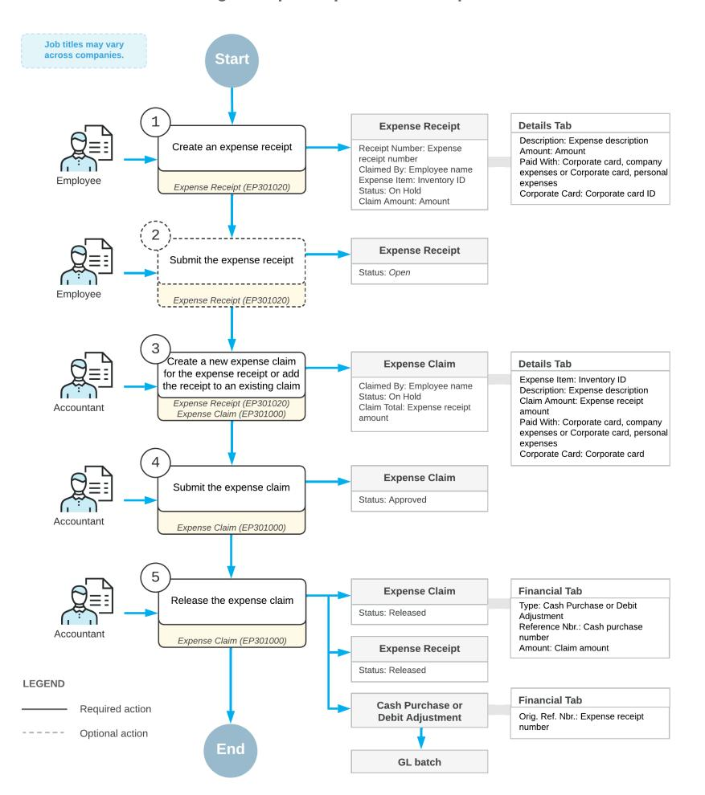
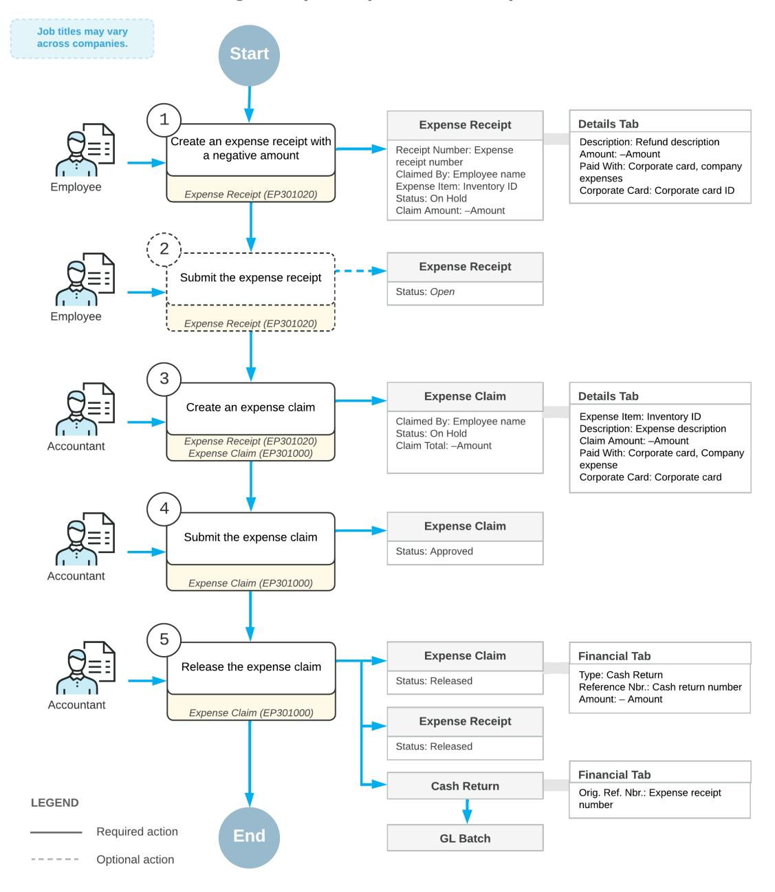
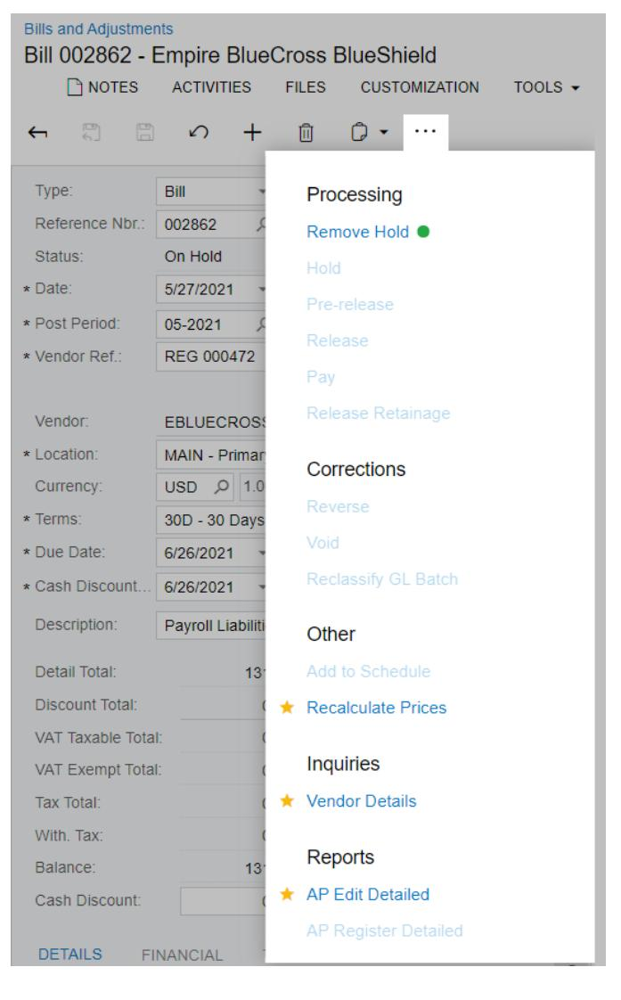

# **Time and Expenses 2025 R1**


## **Contents**

| Copyright                                                                             |  |
|---------------------------------------------------------------------------------------|--|
| Overview of Time and Expenses Processes                                               |  |
| Processing Expense Receipts                                                           |  |
| Expense Receipts: General Information                                                 |  |
| Expense Receipts: To Create an Expense Receipt                                        |  |
| Expense Receipts: Scanning of Expense Receipts in the Mobile App                      |  |
| Expense Receipts: To Create an Expense Receipt by Using the Acumatica Mobile App      |  |
| Expense Receipts: Expense Receipt Approval                                            |  |
| Expense Receipts: To Approve Expense Receipts                                         |  |
| Expense Receipts: Taxes in Expense Receipts                                           |  |
| Processing Expense Receipts with Corporate Cards                                      |  |
| Expense Receipts with Corporate Cards: General Information                            |  |
| Expense Receipts with Corporate Cards: Implementation Checklist                       |  |
| Expense Receipts with Corporate Cards: To Claim Expenses for a Project                |  |
| Expense Receipts with Corporate Cards: Generated Transactions                         |  |
| Expense Receipts with Corporate Cards: Bank Reconciliation for a Corporate Card27     |  |
| Expense Receipts with Corporate Cards: To Reconcile Bank Statement                    |  |
| Expense Receipts with Corporate Cards: Related Reports and Forms                      |  |
| Expense Receipts with Corporate Cards: Mass-Processing of Documents                   |  |
| Processing Expense Claims                                                             |  |
| Expense Claims: General Information                                                   |  |
| Expense Claims: To Create an Expense Claim                                            |  |
| Expense Claims: Taxes in Expense Claims                                               |  |
| Expense Claims: To Mass-Generate Expense Claims                                       |  |
| Expense Claims: Creation of an Expense Claim with Receipts in Different Currencies 41 |  |
| Expense Claims: Expense Claim Approval                                                |  |
| Expense Claims: To Approve Expense Claims                                             |  |
| Expense Claims: Expense Claim Release                                                 |  |
| Expense Claims: To Release an Expense Claim                                           |  |
| Processing Expense Returns to Corporate Cards                                         |  |
| Expense Returns to Corporate Cards: General Information                               |  |
| Expense Returns to Corporate Cards: Implementation Checklist                          |  |
| Expense Returns to Corporate Cards: Generated Transactions                            |  |
| Expense Returns with Corporate Cards: To Configure a Corporate Card                   |  |

| Expense Returns with Corporate Cards: To Process an Expense Return to a Corporate Card 57 |  |
|-------------------------------------------------------------------------------------------|--|
| Entering Employee Time 60                                                                 |  |
| Employee Time Entry: General Information 60                                               |  |
| Employee Time Entry: Earning Types61                                                      |  |
| Employee Time Entry: Time Activities61                                                    |  |
| Employee Time Entry: To Create a Time Activity62                                          |  |
| Employee Time Entry: Time Cards 64                                                        |  |
| Employee Time Entry: To Create a Time Card 66                                             |  |
| Employee Time Entry: Time Card Approval 67                                                |  |
| Employee Time Entry: To Approve a Time Card 68                                            |  |
| Employee Time Entry: Crew Time 70                                                         |  |
| Employee Time Entry: To Create a Crew Time Activity 71                                    |  |
| Creating Shi Codes 74                                                                    |  |
| Shi Codes: General Information 74                                                        |  |
| Shi Codes: Implementation Activity75                                                     |  |
| Appendix77                                                                                |  |
| Reports 77                                                                                |  |
| Report Form77                                                                             |  |
| Report82                                                                                  |  |
| Form Toolbar and More Menu84                                                              |  |
| Table Toolbar 91                                                                          |  |

## <span id="page-3-0"></span>**Copyright**

#### **© 2025 Acumatica, Inc.**

#### **ALL RIGHTS RESERVED.**

No part of this document may be reproduced, copied, or transmitted without the express prior consent of Acumatica, Inc.

3075 112th Avenue NE, Suite 200, Bellevue, WA 98004, USA

#### **Restricted Rights**

The product is provided with restricted rights. Use, duplication, or disclosure by the United States Government is subject to restrictions as set forth in the applicable License and Services Agreement and in subparagraph (c)(1)(ii) of the Rights in Technical Data and Computer Soware clause at DFARS 252.227-7013 or subparagraphs (c)(1) and (c)(2) of the Commercial Computer Soware-Restricted Rights at 48 CFR 52.227-19, as applicable.

#### **Disclaimer**

Acumatica, Inc. makes no representations or warranties with respect to the contents or use of this document, and specifically disclaims any express or implied warranties of merchantability or fitness for any particular purpose. Further, Acumatica, Inc. reserves the right to revise this document and make changes in its content at any time, without obligation to notify any person or entity of such revisions or changes.

#### **Trademarks**

Acumatica is a registered trademark of Acumatica, Inc. HubSpot is a registered trademark of HubSpot, Inc. Microso Exchange and Microso Exchange Server are registered trademarks of Microso Corporation. All other product names and services herein are trademarks or service marks of their respective companies.

Soware Version: 2025 R1 Last Updated: 06/01/2025

## <span id="page-4-0"></span>**Overview of Time and Expenses Processes**

By using Acumatica ERP, your company can automate work assignments and labor calculation for contracts and support services. The time and expenses functionality integrates with accounts payable subledger, for reimbursing employee expenses, and with accounts receivable subledger, for billing labor and expenses to customers.

#### **Expense Claim Processing**

Employees can submit expense claims, attaching any scanned receipts and supporting documents. The submitted expense claims are assigned for approval according to predefined assignment rules. Once a claim has been approved, Acumatica ERP creates an accounts payable document to initiate the reimbursement and generates a customer invoice if expenses were designated as billable to a customer. For more details, see *[Processing Expense](#page-33-2) [Claims](#page-33-2)*.

#### **Refunds to Corporate Cards**

Employees can submit expense receipts with negative amounts and then add them to expense claims. With the negative expense receipts, employee can process a full or partial return of company expenses that have been paid with a corporate card. For more information, see *[Processing Expense Returns to Corporate Cards](#page-48-2)*.

#### **Time Tracking for Customers, Contracts, and Projects**

Regardless of where your employees work from, the time they spend on daily activities is recorded in time cards to track the expenses and billing. Once time cards have been automatically assigned for approval and approved by a supervisor, they generate a customer invoice and update contract usage data if a contract is involved. For more information, see *[Contract Billing: General Information](https://help-2025r1.acumatica.com/Help?ScreenId=ShowWiki&pageid=6903de70-0d3b-4e9c-a88d-b2a24d65aa7f)* and *[Employee](#page-60-2) Time Entry: Time Activities*.

#### **Audit Trail**

Acumatica ERP provides a complete audit trail of all employee transactions. Aer a document is approved and released, users cannot delete or cancel it. To correct mistakes, users must enter a correcting or reversing entry. Acumatica ERP keeps the details of all expense documents, including information about the user who entered the transaction and the user who modified the record.

## <span id="page-5-0"></span>**Processing Expense Receipts**

By using Acumatica ERP, employees of your company can easily record their expense receipts, which may include different types of expenses. With Acumatica ERP, expense receipts can be entered, submitted for approval, and processed in accordance with the expense management policies adopted by your company.

<span id="page-5-2"></span>In this chapter, you will find topics that explain how to process expense receipts.

## <span id="page-5-1"></span>**Expense Receipts: General Information**

Acumatica ERP supports the recording, tracking, and processing of employee-incurred expenses. Users can quickly enter their expense receipts to request reimbursement.

#### **Learning Objectives**

In this chapter, you will learn how to do the following:

- Create an expense receipt and specify its settings
- Create an expense receipt by using the Acumatica mobile app
- Approve expense receipts
- Create expense receipts automatically based on bank feeds

#### **Applicable Scenarios**

You create an expense receipt if you are an employee who incurs company-related expenses and wants to record the details of a transaction.

You approve or reject expense receipts if you are a manager responsible for reviewing and approving employee expenses within your workgroup.

#### **Creation of Expense Receipts**

You can use the expense receipt functionality if the *Expense Management* feature is enabled on the *[Enable/Disable](https://help-2025r1.acumatica.com/Help?ScreenId=ShowWiki&pageid=c1555e43-1bc5-4f6f-ba9d-b323f94d8a6b) [Features](https://help-2025r1.acumatica.com/Help?ScreenId=ShowWiki&pageid=c1555e43-1bc5-4f6f-ba9d-b323f94d8a6b)* (CS100000) form.

In Acumatica ERP, an expense receipt is a record reflecting a transaction made by an employee on behalf of the company, resulting in incurred expenses.

You can manually create an expense receipt on the *[Expense Receipt](https://help-2025r1.acumatica.com/Help?ScreenId=ShowWiki&pageid=cf897624-9d78-4a83-9c03-e8170b9f9d5f)* (EP301020) form. For the expense receipt, you can specify the following settings:

- The non-stock item of the *Expense* type, which defines the financial accounts, the default tax calculation mode and tax category, and the unit of measure used for the receipt. If a standard cost is specified for the item, it is used as the default unit cost. For example, if your company reimburses expenses for using a personal vehicle for company purposes, the non-stock item would represent mileage, and you can specify the standard rate per mile as the standard cost.
- The name of the employee who is claiming the expenses. By default, the system specifies the username of the current user. You can also select an employee for whom you are an appointed delegate or an employee in a workgroup at a lower level in the company tree than your workgroup.
- The default tax zone, which is copied from the employee's settings. You can override the tax zone in a particular receipt. The overridden tax zone value can be saved and used as the default tax zone for new expense receipts and claims of the employee.

• The total amount of the receipt, the tax amount (if applicable), the employee part (that is, the part of the total amount that will not be reimbursed to the employee), and the tip amount (if applicable).

The system inserts the claim amount, which is the amount to be reimbursed to the employee. It calculates this amount by first summing the amount, tip amount, and tax total (if taxes are exclusive); it then subtracts the employee part.

- The receipt currency, which can be any currency registered in the system. You can configure new currencies by using the *[Currencies](https://help-2025r1.acumatica.com/Help?ScreenId=ShowWiki&pageid=533be28d-b9e1-4d77-9b62-b06bb90a8b3b)* (CM202000) form.
- The reference number specified by the employee, which usually matches the number of the original receipt.
- The project or contract for which the employee incurred the expenses, if applicable. (If you specify a project or contract, the customer associated with it is filled in automatically.)
- The payment source, which indicates how the employee paid for the expense item. You can specify whether the payment was made by using the employee's personal account or a corporate card. For details, see *[Processing Expense Receipts with Corporate Cards](#page-16-2)*
- The customer, which should be specified if the employee incurred the expenses while working for a particular customer.
- The tax calculation mode. If the *Net/Gross Entry Mode* feature is enabled on the *[Enable/Disable Features](https://help-2025r1.acumatica.com/Help?ScreenId=ShowWiki&pageid=c1555e43-1bc5-4f6f-ba9d-b323f94d8a6b)* (CS100000) form, you can select whether the amounts entered in the expense receipt are tax-exclusive (net) or tax-inclusive (gross). For more information, see *Expense [Receipts:](#page-14-1) Taxes in Expense Receipts*.

You can also upload a scanned image or photo of the original receipt while you create an expense receipt or later.

Aer you have saved the expense receipt, you can review it, along with other expense receipts on the *[Expense](https://help-2025r1.acumatica.com/Help?ScreenId=ShowWiki&pageid=0759209d-e85d-4f7e-9269-e827556a80be) [Receipts](https://help-2025r1.acumatica.com/Help?ScreenId=ShowWiki&pageid=0759209d-e85d-4f7e-9269-e827556a80be)*. This form lists the following expense receipts:

- Your own
- Those of employees in the workgroups at lower levels in the company tree than your workgroup
- Those that require your approval (if they are included in expense claims)
- Those of employees for whom you are an appointed delegate; all delegates of an employee are listed on the **Delegates** tab of the *[Employees](https://help-2025r1.acumatica.com/Help?ScreenId=ShowWiki&pageid=dae5144b-49b3-43a4-bce0-93f31b3f2321)* (EP203000) form

If an expense receipt has the *Open* status, it can be included in an expense claim. You can claim expense receipts individually or all at once. An expense claim may include one expense receipt or multiple receipts with common settings. Receipts for different employees, branches, or customers must be split into different claims. For details, see *[Expense Claims: General Information](#page-33-3)*.

#### **Expense Receipt Statuses**

An expense receipt can have different statuses, which reflect its processing stage on the *[Expense Receipt](https://help-2025r1.acumatica.com/Help?ScreenId=ShowWiki&pageid=cf897624-9d78-4a83-9c03-e8170b9f9d5f)* (EP301020) form. The system assigns one of the following statuses to an expense receipt:

- *On Hold*: The receipt is new or can be edited. If approval is required for this receipt, this status indicates that it has not been submitted for approval yet or it has been rejected and then put on hold while being adjusted.
- *Open*: The receipt is ready to be added to an expense claim. If approval is required for this receipt, this status indicates that it has been approved. If approval is not required, the status indicates that it has been submitted for further processing.
- *Pending Approval*: The receipt is pending approval.

If the *Approval Workflow* feature is enabled on the *[Enable/Disable Features](https://help-2025r1.acumatica.com/Help?ScreenId=ShowWiki&pageid=c1555e43-1bc5-4f6f-ba9d-b323f94d8a6b)* (CS100000) form, entered expense receipts can be submitted for approval. For details, see *[Expense Receipts:](#page-10-1) [Expense Receipt Approval](#page-10-1)*.

- *Rejected*: The receipt has been rejected.
- *Released*: The expense claim associated with the receipt has been released.

#### **Automatic Generation of Expense Receipts Based on Bank Feeds**

If the *Bank Feed Integration* feature is enabled on the *[Enable/Disable Features](https://help-2025r1.acumatica.com/Help?ScreenId=ShowWiki&pageid=c1555e43-1bc5-4f6f-ba9d-b323f94d8a6b)* (CS100000) form, you can integrate Acumatica ERP with the Plaid or MX bank feeds. With this integration, you can automatically import bank transactions and create expense receipts based on these transactions. For details, see *[Integrating Acumatica ERP](https://help-2025r1.acumatica.com/Help?ScreenId=ShowWiki&pageid=cced4b81-106f-4c06-9769-6d4fd9f22e0d) [with Bank Feeds](https://help-2025r1.acumatica.com/Help?ScreenId=ShowWiki&pageid=cced4b81-106f-4c06-9769-6d4fd9f22e0d)*.

## <span id="page-7-0"></span>**Expense Receipts: To Create an Expense Receipt**

The following activity will walk you through the process of creating an expense receipt.

This activity is based on the *U100* dataset. If you are using another dataset, or if any system settings have been changed in *U100*, these changes can affect the workflow of the activity and the results of the processing. To avoid any issues, restore the *U100* dataset to its initial state.

#### **Story**

Suppose that David Chubb, an employee of the sales department at the SweetLife Fruits & Jams company, had a business lunch with Chris Rea, the manager at the Blue Cafe, to discuss Blue Cafe's purchase of new juicers. The lunch cost \$20, which David paid with his personal credit card.

Acting as David Chubb, you will enter the expense into the system to request reimbursement.

#### **Configuration Overview**

In the *U100* dataset, the following tasks have been performed to support this activity:

- The *Expense Management* feature has been enabled on the *[Enable/Disable Features](https://help-2025r1.acumatica.com/Help?ScreenId=ShowWiki&pageid=c1555e43-1bc5-4f6f-ba9d-b323f94d8a6b)* (CS100000) form.
- On the *[Non-Stock Items](https://help-2025r1.acumatica.com/Help?ScreenId=ShowWiki&pageid=bf68dd4f-63d4-460d-8dc0-9152f2bd6bf1)* (IN202000) form, the *MEAL* non-stock item with the *Expense* type has been created.
- On the *[Employees](https://help-2025r1.acumatica.com/Help?ScreenId=ShowWiki&pageid=dae5144b-49b3-43a4-bce0-93f31b3f2321)* (EP203000) form, the account for David Chubb has been created and associated with the *chubb* user account.

#### **Process Overview**

You will create an expense receipt for David Chubb's business lunch on the *[Expense Receipts](https://help-2025r1.acumatica.com/Help?ScreenId=ShowWiki&pageid=0759209d-e85d-4f7e-9269-e827556a80be)* (EP301010) form.

#### **System Preparation**

To sign in to the system and prepare to perform the instructions of the activity, do the following:

- Launch the Acumatica ERP website, and sign in as David Chubb by using the *chubb* username and the *123* password.
- In the info area, in the upper-right corner of the top pane of the Acumatica ERP screen, make sure that the business date in your system is set to today's date. For simplicity, in this activity, you will create and process all documents in the system on this business date.

#### **Step: Creating an Expense Receipt**

To create an expense receipt for the business lunch that David paid for, do the following:

1. Open the *[Expense Receipts](https://help-2025r1.acumatica.com/Help?ScreenId=ShowWiki&pageid=0759209d-e85d-4f7e-9269-e827556a80be)* (EP301010) form.

- 2. On the form toolbar, click **Add New Record**. The system opens the *[Expense Receipt](https://help-2025r1.acumatica.com/Help?ScreenId=ShowWiki&pageid=cf897624-9d78-4a83-9c03-e8170b9f9d5f)* (EP301020) form.
- 3. In the Summary area, specify the following settings:
  - a. **Date**: The current date (inserted automatically)
  - b. **Expense Item**: *MEAL*
  - c. **Claimed by**: *EP00000014-David Chubb* (inserted automatically because you are signed in as David Chubb)
- 4. On the **Details** tab, specify the following settings:
  - **Description**: Business lunch with Chris Rea, manager at Blue Cafe
  - **Quantity**: 1
  - **Unit Cost**: 20.00
  - **Ref. Nbr.**: BL145623
  - **Project/Contract**: *X-Non-Project Code*
  - **Paid With**: *Personal Account*
- 5. On the form toolbar, click**Save**.

<span id="page-8-2"></span>You have created the expense receipt that records David Chubb's business lunch.

## <span id="page-8-0"></span>**Expense Receipts: Scanning of Expense Receipts in the Mobile App**

You can scan expense receipts in the Acumatica mobile app to simplify the process of creating records on the Expense Receipts screen. When you take a photo of a receipt from this screen, the system analyzes the photo, recognizes values in the photo, and maps them to fields on the Expense Receipts screen. If any of the fields are mapped incorrectly, you can correct the mapping.

To use this functionality, ensure that both of the following conditions are met:

- A license that includes the *Image Recognition for Expense Receipts* feature and service keys has been obtained from Acumatica and applied in the system.
- The *Image Recognition for Expense Receipts* feature has been enabled on the *[Enable/Disable Features](https://help-2025r1.acumatica.com/Help?ScreenId=ShowWiki&pageid=c1555e43-1bc5-4f6f-ba9d-b323f94d8a6b)* (CS100000) form.

If a license that does not meet these conditions is applied or the *Image Recognition for Expense Receipts* feature is not enabled, you can still create an expense receipt from a photo. However, this approach would not help you with data entry. Because recognition would not occur, the elements of the created expense receipt will contain empty or default values instead of recognized and mapped values.

## <span id="page-8-1"></span>**Expense Receipts: To Create an Expense Receipt by Using the Acumatica Mobile App**

The following activity will walk you through the process of creating an expense receipt by using the Acumatica mobile app.

This activity is based on the *U100* dataset. If you are using another dataset, or if any system settings have been changed in *U100*, these changes can affect the workflow of the activity and the results of the processing. To avoid any issues, restore the *U100* dataset to its initial state.

#### **Story**

Suppose that David Chubb, an employee of the sales department at the SweetLife Fruits & Jams company, purchased food and drink during a break in the negotiations with a potential customer. During the break, David bought coffee and a pastry at the nearest cafe and paid \$10 with a personal credit card.

Acting as David Chubb, you will use a mobile device to enter the expense into the system and request reimbursement.

#### **Configuration Overview**

In the *U100* dataset, the following tasks have been performed to support this activity:

- The *Expense Management* feature has been enabled on the *[Enable/Disable Features](https://help-2025r1.acumatica.com/Help?ScreenId=ShowWiki&pageid=c1555e43-1bc5-4f6f-ba9d-b323f94d8a6b)* (CS100000) form.
- On the *[Non-Stock Items](https://help-2025r1.acumatica.com/Help?ScreenId=ShowWiki&pageid=bf68dd4f-63d4-460d-8dc0-9152f2bd6bf1)* (IN202000) form, the *MEAL* non-stock item with the *Expense* type has been created.
- On the *[Employees](https://help-2025r1.acumatica.com/Help?ScreenId=ShowWiki&pageid=dae5144b-49b3-43a4-bce0-93f31b3f2321)* (EP203000) form, the account for David Chubb has been created and associated with the *chubb* user account.

#### **Process Overview**

You will create an expense receipt for David Chubb's coffee and pastry purchase on the Expense Receipts screen of the Acumatica mobile app.

#### **System Preparation**

Before you start creating a new expense receipt in the system by using the Acumatica mobile app, you should do the following:

1. Download and install the Acumatica mobile app on the mobile device that you will use for creating an expense receipt in the system. The mobile app is available for iOS in the Apple Store and for Android in Google Play.


The instructions in the activity steps below may slightly differ in the Acumatica mobile app depending on whether the device is running iOS or Android.

- 2. Make sure that the Acumatica ERP instance has been hosted over HTTPS or ask a system administrator to perform this task for you. For more information, see *[Preparation for the Acumatica ERP Installation: System](https://help-2025r1.acumatica.com/Help?ScreenId=ShowWiki&pageid=4dc90b83-c6fd-4eb0-85ea-c5aa33a71897) [Environment](https://help-2025r1.acumatica.com/Help?ScreenId=ShowWiki&pageid=4dc90b83-c6fd-4eb0-85ea-c5aa33a71897)*.
- 3. Sign in to the Acumatica mobile app as follows:
  - a. On the mobile device, tap the application icon to launch the app.
  - b. Optional: If you are signing in for the first time, in the**Server URL** box, enter the URL of your Acumatica ERP instance (for example, *https://my.site.acumatica.com*).
  - c. Optional: In the **Account Name** box, specify *chubb*.
  - d. Tap **Next**.
  - e. Sign in to the system as the sales manager by using the *chubb* username and the *123* password.

#### **Step: Creating an Expense Receipt by Using the Acumatica Mobile App**

To create an expense receipt on the fly by using the Acumatica mobile app, do the following:

1. On the main menu of the app, make sure that the *U100* tenant is selected.

- 2. In the **Time and Expenses** workspace, tap the More menu next to the **Expense Receipts** tile.
- 3. Tap **Create New**.

You can tap **Capture Expense Receipt** or **Select Image** to take a photo of the receipt or attach an existing one from your device. In a production environment, if your company's license includes the *Image Recognition for Expense Receipts* feature and it is enabled, the system can automatically fill in an expense receipt with recognized values from the photo. For details, see*[Expense Receipts: Scanning of Expense Receipts in the Mobile App](#page-8-2)* .

- 4. On the Expense Receipt screen, which opens, specify the following settings:
  - **Description**: Coffee and pastry
  - **Date**: The current date
  - **Expense Item**: Meal and drinks
  - **Unit Cost**: 10
  - **Paid With**: *Personal Account*
- 5. Optional: At the top of the screen, tap the camera icon to take a photo of the receipt or attach an existing one from your device.
- 6. Tap**Save** to save the expense receipt.

Note that the expense receipt's status is *Open*, which means that you can claim it.

## <span id="page-10-1"></span><span id="page-10-0"></span>**Expense Receipts: Expense Receipt Approval**

Depending on company policy, expense receipts may require approval by authorized employees before they are released. The approval functionality is available if the *Approval Workflow* feature is enabled on the *[Enable/Disable](https://help-2025r1.acumatica.com/Help?ScreenId=ShowWiki&pageid=c1555e43-1bc5-4f6f-ba9d-b323f94d8a6b) [Features](https://help-2025r1.acumatica.com/Help?ScreenId=ShowWiki&pageid=c1555e43-1bc5-4f6f-ba9d-b323f94d8a6b)* (CS100000) form.

#### **Assignment for Approval**

Expense receipts can be submitted for approval once they have been taken off hold and meet all of the following conditions:

- The *Expense Management* and *Approval Workflow* features are enabled on the *[Enable/Disable Features](https://help-2025r1.acumatica.com/Help?ScreenId=ShowWiki&pageid=c1555e43-1bc5-4f6f-ba9d-b323f94d8a6b)* (CS100000) form.
- An approval map has been created on the *[Approval Maps](https://help-2025r1.acumatica.com/Help?ScreenId=ShowWiki&pageid=d97cb216-f487-4ec9-a561-d5034fd3b8b3)* (EP205015) form, as described in *[Approval](https://help-2025r1.acumatica.com/Help?ScreenId=ShowWiki&pageid=d2db53f8-d3ed-47fd-b34e-c743a59a4b83) [Configuration: Approval Maps](https://help-2025r1.acumatica.com/Help?ScreenId=ShowWiki&pageid=d2db53f8-d3ed-47fd-b34e-c743a59a4b83)*.

When you are creating an approval map for a project's expense receipts or expense claims, you may want the approver to be the project manager. In this case, you specify the following settings on the **Rule Actions** tab of the *[Approval Maps](https://help-2025r1.acumatica.com/Help?ScreenId=ShowWiki&pageid=d97cb216-f487-4ec9-a561-d5034fd3b8b3)* form:

- **Approver**: *Employee from Document*
- **Employee**: ((ClaimDetails.ContractID.OwnerID))
- The approval map for expense receipts has been specified in the **Expense Receipt Approval Map** box on the **General** tab of the *Time and Expenses [Preferences](https://help-2025r1.acumatica.com/Help?ScreenId=ShowWiki&pageid=e9f4a914-c4ce-4c4f-95d9-f385451e5856)* (EP101000) form.
- The expense receipt meets the conditions specified in the approval map.

Aer the receipt has been submitted, it has the *Pending Approval* status and requires approval by an authorized employee.

If any of these conditions are not met, the expense receipt is automatically considered approved. In this case, the approval process is skipped, the expense receipt's status changes to *Open*, and the expense receipt can be claimed.

If the *Approval Workflow* feature is enabled on the *[Enable/Disable Features](https://help-2025r1.acumatica.com/Help?ScreenId=ShowWiki&pageid=c1555e43-1bc5-4f6f-ba9d-b323f94d8a6b)* (CS100000) form, you can configure the approval of both expense receipts and expense claims; however, the requirement to approve the same expenses twice may involve too much redundancy in effort. For effective processing of expenses, it may be sufficient to set up the approval of only one type of expense document. For example, if you want all expenses related to a particular project to be approved by the project manager, you can configure the approval of only expense receipts associated with the project.

#### **Approval of Expense Receipts**

You can approve or reject an expense receipt on the *[Expense Receipt](https://help-2025r1.acumatica.com/Help?ScreenId=ShowWiki&pageid=cf897624-9d78-4a83-9c03-e8170b9f9d5f)* (EP301020) form by clicking **Approve** or **Reject** on the form toolbar if the receipt meets one of the following conditions:

- It has been assigned to you for approval.
- It has been assigned to the members of the workgroups at lower levels in the company tree than your workgroup.

You can also approve or reject expense receipts on the *[Approvals](https://help-2025r1.acumatica.com/Help?ScreenId=ShowWiki&pageid=1fe1afcc-e676-466e-8c3f-cbf64857e32a)* (EP503010) form. On this form, you can view the following expense receipts:

- Those assigned to you for approval
- Those assigned to members of your workgroup
- Those assigned to the members of the workgroups at lower levels in the company tree than your workgroup

You can approve all listed documents at once by clicking **Approve All** on the form toolbar, or approve only particular documents by selecting those documents and then clicking **Approve**.

Although you can use the *[Approvals](https://help-2025r1.acumatica.com/Help?ScreenId=ShowWiki&pageid=1fe1afcc-e676-466e-8c3f-cbf64857e32a)* form to approve expense receipts assigned to other members of your workgroup, you cannot view the details of these receipts on the *[Expense Receipts](https://help-2025r1.acumatica.com/Help?ScreenId=ShowWiki&pageid=0759209d-e85d-4f7e-9269-e827556a80be)* form due to user access restrictions. For more information about user access to expense receipts, see *[Expense](#page-5-2) [Receipts: General Information](#page-5-2)*.

If an expense receipt is included in a claim, and the claim has been rejected or put on hold, the expense receipt remains associated with the claim. You will not be able to submit this claim for further processing until the rejected receipt is either removed from the claim or approved aer any necessary adjustments have been made.

## <span id="page-11-0"></span>**Expense Receipts: To Approve Expense Receipts**

The following activity will walk you through the process of approving expense receipts.

This activity is based on the *U100* dataset. If you are using another dataset, or if any system settings have been changed in *U100*, these changes can affect the workflow of the activity and the results of the processing. To avoid any issues, restore the *U100* dataset to its initial state.

#### **Story**

Suppose that David Chubb, an employee of the sales department at the SweetLife Fruits & Jams company, had a business trip to the Italian Company customer, whose head office is in San Francisco. David bought the round-trip flight tickets from New York to San Francisco and paid \$550 with a personal credit card. In San Francisco, David took a taxi and paid \$55. also with a personal credit card.

In accordance with the SweetLife Fruits & Jams company's expense management policy, all expenses made by employees of the sales department that are greater than \$50 but less than \$100 must be approved by Ian Pick, the head of the sales department. All expenses receipts that are equal to or greater than \$100 must be approved by Anna Johnson, the accountant.

First, acting as David Chubb, you will enter these expenses into the system to request reimbursement. Then, acting as Ian Pick, you will approve David's taxi expense. Finally, acting as Anna Johnson, you will approve David's flight ticket expense.

### **Configuration Overview**

In the *U100* dataset, the following tasks have been performed to support this activity:

- On the *[Enable/Disable Features](https://help-2025r1.acumatica.com/Help?ScreenId=ShowWiki&pageid=c1555e43-1bc5-4f6f-ba9d-b323f94d8a6b)* (CS100000) form, the *Expense Management* and *Approval Workflow* features have been enabled.
- On the *[Approval Maps](https://help-2025r1.acumatica.com/Help?ScreenId=ShowWiki&pageid=d97cb216-f487-4ec9-a561-d5034fd3b8b3)* (EP205015) form, the *Expense Receipts* approval map has been created. In accordance with the approval map, expense receipts of sales department employees ranging from \$50 to \$100 must be approved by Ian Pick, the head of the sales department. All expense receipts that are equal to or greater than \$100 must be approved by Anna Johnson, the accountant.
- On the *Time and Expenses [Preferences](https://help-2025r1.acumatica.com/Help?ScreenId=ShowWiki&pageid=e9f4a914-c4ce-4c4f-95d9-f385451e5856)* (EP101000) form, the *Expense Receipts* approval map has been selected in the **Expense Receipt Approval Map** box.
- On the *[Non-Stock Items](https://help-2025r1.acumatica.com/Help?ScreenId=ShowWiki&pageid=bf68dd4f-63d4-460d-8dc0-9152f2bd6bf1)* (IN202000) form, the *TRAVEL* and *TAXI* non-stock items with the *Expense* type have been created.
- On the *[Employees](https://help-2025r1.acumatica.com/Help?ScreenId=ShowWiki&pageid=dae5144b-49b3-43a4-bce0-93f31b3f2321)* (EP203000) form, accounts for David Chubb, Ian Pick, and Anna Johnson have been created and associated with the respective user accounts.

#### **Process Overview**

First, you will create the expense receipts for the flight tickets and taxi payments on the *[Expense Receipt](https://help-2025r1.acumatica.com/Help?ScreenId=ShowWiki&pageid=cf897624-9d78-4a83-9c03-e8170b9f9d5f)* (EP301020) form. Then you will approve David's expense receipt for the taxi on the *[Expense Receipt](https://help-2025r1.acumatica.com/Help?ScreenId=ShowWiki&pageid=cf897624-9d78-4a83-9c03-e8170b9f9d5f)* form. Finally, you will approve the expense receipt for David Chubb's flight tickets on the *[Approvals](https://help-2025r1.acumatica.com/Help?ScreenId=ShowWiki&pageid=1fe1afcc-e676-466e-8c3f-cbf64857e32a)* (EP503010) form.

#### **System Preparation**

To sign in to the system and prepare to perform the instructions of the activity, do the following:

- Launch the Acumatica ERP website, and sign in as David Chubb by using the *chubb* username and the *123* password.
- In the info area, in the upper-right corner of the top pane of the Acumatica ERP screen, make sure that the business date in your system is set to today's date. For simplicity, in this activity, you will create and process all documents in the system on this business date.

#### **Step 1: Creating the First Expense Receipt**

To create an expense receipt to enter the amount spent on the taxi, do the following:

- 1. Open the *[Expense Receipts](https://help-2025r1.acumatica.com/Help?ScreenId=ShowWiki&pageid=0759209d-e85d-4f7e-9269-e827556a80be)* (EP301010) form.
- 2. On the form toolbar, click **Add New Record**. The system opens the *[Expense Receipt](https://help-2025r1.acumatica.com/Help?ScreenId=ShowWiki&pageid=cf897624-9d78-4a83-9c03-e8170b9f9d5f)* (EP301020) form.
- 3. In the Summary area, select *TAXI* in the **Expense Item** box.
- 4. On the **Details** tab, specify the following settings:
  - **Description**: Taxi in San Francisco
  - **Unit Cost**: 55.00
  - **Project/Contract**: *X-Non-Project Code*

- **Paid With**: *Personal Account*
- 5. Save the receipt and notice that it has the *On Hold* status.
- 6. On the form toolbar, click**Submit**.

The status has changed to *Pending Approval*.

#### **Step 2: Creating the Second Expense Receipt**

To create the expense receipt for the purchased flight tickets, do the following while remaining on the *[Expense](https://help-2025r1.acumatica.com/Help?ScreenId=ShowWiki&pageid=cf897624-9d78-4a83-9c03-e8170b9f9d5f) [Receipt](https://help-2025r1.acumatica.com/Help?ScreenId=ShowWiki&pageid=cf897624-9d78-4a83-9c03-e8170b9f9d5f)* (EP301020) form:

- 1. On the form toolbar, click **Add New Record**.
- 2. In the Summary area, select *TRAVEL* in the **Expense Item** box.
- 3. On the **Details** tab, specify the following settings:
  - **Description**: Flight tickets to San Francisco and back
  - **Unit Cost**: 550.00
  - **Project/Contract**: *X-Non-Project Code*
  - **Paid With**: *Personal Account*
- 4. Save the receipt and notice that it has the *On Hold* status.
- 5. On the form toolbar, click**Submit** and notice that the receipt has been assigned the *Pending Approval* status.
- 6. Sign out from the system.

#### **Step 3: Approving the First Expense Receipt**

To approve David Chubb's expense receipt for the taxi payment, do the following:

- 1. Sign in to the system as Ian Pick, the head of the sales department, by using the *pick* username and the *123* password.
- 2. Open the *[Expense Receipts](https://help-2025r1.acumatica.com/Help?ScreenId=ShowWiki&pageid=0759209d-e85d-4f7e-9269-e827556a80be)* (EP301010) form.
- 3. In the Selection area, clear the **Employee** box to see the full list of the expense receipts that you are allowed to access.
- 4. Go to the **Pending Approval** tab. In the **Receipt Number** column, click the link to the expense receipt that you have created in Step 1 (with the *Taxi in San Francisco* description).

The system opens the *[Expense Receipt](https://help-2025r1.acumatica.com/Help?ScreenId=ShowWiki&pageid=cf897624-9d78-4a83-9c03-e8170b9f9d5f)* (EP301020) form. Review the expense receipt and notice its *Pending Approval* status.

5. On the form toolbar, click **Approve**.

The expense receipt's status has changed to *Open*. The expense receipt is approved and ready to be claimed.

6. Sign out from the system.

#### **Step 4: Approving the Second Expense Receipt**

To approve David Chubb's expense receipt for the flight ticket payment, do the following:

- 1. Sign in to the system as accountant Anna Johnson by using the *johnson* username and the *123* password.
- 2. Open the *[Approvals](https://help-2025r1.acumatica.com/Help?ScreenId=ShowWiki&pageid=1fe1afcc-e676-466e-8c3f-cbf64857e32a)* (EP503010) form.
- 3. Go to the **My Approvals** tab. Review David Chubb's expense receipt that you have created in Step 2 (with the *Flight tickets to San Francisco and back* description) and select the check box for the row.

- 4. On the form toolbar, click **Approve**.
- 5. Aer the processing has been completed, double-click the row with David Chubb's expense receipt.

The system opens the expense receipt on the *[Expense Receipt](https://help-2025r1.acumatica.com/Help?ScreenId=ShowWiki&pageid=cf897624-9d78-4a83-9c03-e8170b9f9d5f)* (EP301020) form. Note that the expense receipt's status has changed to *Open*. The expense receipt is approved and ready to be claimed.

<span id="page-14-1"></span>Both expense receipts for David Chubb's expenses have been approved and are now ready to be claimed.

## <span id="page-14-0"></span>**Expense Receipts: Taxes in Expense Receipts**

In Acumatica ERP, you can configure the system to apply taxes to expense receipts that employees enter into the system on the *[Expense Receipt](https://help-2025r1.acumatica.com/Help?ScreenId=ShowWiki&pageid=cf897624-9d78-4a83-9c03-e8170b9f9d5f)* (EP301020) form. You can review the tax and taxable amounts that the system has calculated in the expense receipts, and adjust them, if needed.

Also, if the *Net/Gross Entry Mode* feature is enabled on the *[Enable/Disable Features](https://help-2025r1.acumatica.com/Help?ScreenId=ShowWiki&pageid=c1555e43-1bc5-4f6f-ba9d-b323f94d8a6b)* (CS100000) form, you can specify whether the expense receipt amounts are tax-inclusive or tax-exclusive.

#### **Taxes That Are Applicable to Expense Receipts**

When a user selects an expense item in the expense receipt created on the *[Expense Receipt](https://help-2025r1.acumatica.com/Help?ScreenId=ShowWiki&pageid=cf897624-9d78-4a83-9c03-e8170b9f9d5f)* (EP301020) form, the system fills in the tax category and tax calculation mode of this item. The default tax zone in the expense receipt is copied from the settings of the **Claimed By** employee. If needed, you can change any of these default settings.

The system calculates the taxes to be applied to the expense receipt amount by using the settings of each tax that corresponds to both the tax category and the tax zone specified in the expense receipt. The total tax amount is shown in the**TaxTotal** box of the Summary area.

The table on the**Taxes** tab of the *[Expense Receipt](https://help-2025r1.acumatica.com/Help?ScreenId=ShowWiki&pageid=cf897624-9d78-4a83-9c03-e8170b9f9d5f)* form displays the details of all taxes that are applicable to the expense receipt.

#### **Tax-Exclusive and Tax-Inclusive Amounts in Expense Receipts**

Before entering expense receipt amounts, consider the type of amounts specified in the original expense documents. An expense receipt can contain amounts that are either tax-inclusive (gross) or tax-exclusive (net). In Acumatica ERP, you can specify the tax calculation mode in the settings for a particular receipt on the *[Expense](https://help-2025r1.acumatica.com/Help?ScreenId=ShowWiki&pageid=cf897624-9d78-4a83-9c03-e8170b9f9d5f) [Receipt](https://help-2025r1.acumatica.com/Help?ScreenId=ShowWiki&pageid=cf897624-9d78-4a83-9c03-e8170b9f9d5f)* (EP301020) form. The selected mode defines how the system will compute the tax and taxable amounts for the document.

The ability to specify whether the expense receipt amounts are tax-inclusive or tax-exclusive is available only if the *Net/Gross Entry Mode* feature is enabled on the *[Enable/Disable Features](https://help-2025r1.acumatica.com/Help?ScreenId=ShowWiki&pageid=c1555e43-1bc5-4f6f-ba9d-b323f94d8a6b)* (CS100000) form.

When you enter an expense receipt on the *[Expense Receipt](https://help-2025r1.acumatica.com/Help?ScreenId=ShowWiki&pageid=cf897624-9d78-4a83-9c03-e8170b9f9d5f)* (EP301020) form, the default tax calculation mode specified in the **Tax Calculation Mode** box is copied from the settings of the selected expense item. If needed, you can override this setting in the expense receipt. The following tax calculation modes are available:

- *Gross*: The tax amount is included in the unit cost specified in the expense receipt. The system calculates the taxable amount for an expense receipt by subtracting the employee part and tax total from the amount.
- *Net*: The unit cost specified in the expense receipt does not include the tax amount. The system calculates the taxable amount for an expense receipt by subtracting the employee part from the amount.
- *Tax Settings*: Standard tax settings should be applied to the expense receipt. For details, see *Tax [Calculation](https://help-2025r1.acumatica.com/Help?ScreenId=ShowWiki&pageid=cca87557-7498-46da-aec2-c49c0d40403a) [Methods: General Information](https://help-2025r1.acumatica.com/Help?ScreenId=ShowWiki&pageid=cca87557-7498-46da-aec2-c49c0d40403a)*.

#### **Discrepancies Between Reported and Calculated Tax Amounts**

Due to different rounding settings in different systems, discrepancies may appear between the tax amount computed in Acumatica ERP and the tax amount specified in the original expense documents. You can manually correct the tax amount in the**Tax Amount** column of the**Taxes** tab of the *[Expense Receipt](https://help-2025r1.acumatica.com/Help?ScreenId=ShowWiki&pageid=cf897624-9d78-4a83-9c03-e8170b9f9d5f)* (EP301020) form for the expense receipt being entered so that the specified tax amount matches the tax amount in the original document.

Also, you can correct the tax amount in the **DocumentTaxes** dialog box on the *[Expense Claim](https://help-2025r1.acumatica.com/Help?ScreenId=ShowWiki&pageid=19413b5d-8c8c-415a-a39c-8a773123364f)* (EP301000) form. You open this dialog box by clicking the link in the**Tax Amount** column on the **Details** tab. If the amounts of inclusive taxes differ from the calculated amounts, the discrepancy will be shown in the**Tax Discrepancy** box on the**Taxes** tab of both forms.

To be able to process an expense receipt with a discrepancy amount, you need to specify the maximum amount of the difference that can appear because of rounding in the **Rounding Limit** box on the *[Currencies](https://help-2025r1.acumatica.com/Help?ScreenId=ShowWiki&pageid=533be28d-b9e1-4d77-9b62-b06bb90a8b3b)* (CM202000) form. If the discrepancy amount is within the limit, the system will post this amount to the GL accounts specified in the **Rounding Gain Account** or **Rounding Loss Account** box on the *[Currencies](https://help-2025r1.acumatica.com/Help?ScreenId=ShowWiki&pageid=533be28d-b9e1-4d77-9b62-b06bb90a8b3b)* form. If the discrepancy exceeds the rounding limit, the expense receipt cannot be submitted for further processing. For more information, see *[Purchases](https://help-2025r1.acumatica.com/Help?ScreenId=ShowWiki&pageid=b945e47c-7c21-4a69-99f2-c3022c28b1fe) with Sales Taxes: Tax Amount Validation*.

## <span id="page-16-2"></span><span id="page-16-0"></span>**Processing Expense Receipts with Corporate Cards**

To help employees to categorize and track the expenses, including the expenses related to a project, Acumatica ERP supports the use of corporate credit cards in expense receipts and claims. In this chapter, you will find topics that explain how to process expense receipts with corporate cards.

## <span id="page-16-3"></span><span id="page-16-1"></span>**Expense Receipts with Corporate Cards: General Information**

Acumatica ERP supports the use of corporate credit cards in expense receipts and expense claims. This helps employees to categorize and track expenses, including the expenses related to a project. For example, while in the field, employees can buy something that they want to charge on a project and pay for it with a corporate card. Employees can also have out-of-pocket expenses that are then reimbursed to these employees.

#### **Learning Objectives**

In this chapter, you will learn how to do the following:

- Create an expense receipt for company expenses paid by the corporate credit card
- Process an expense claim for the expense receipt paid with the corporate credit card
- Process personal expenses paid with the corporate credit card
- Process company expenses paid with a personal account
- Review the documents and transactions that are generated on release of the expense claim
- Reconcile the balance of the corporate credit card in the system

#### **Applicable Scenarios**

You process an expense receipt with a corporate credit card if you are an employee who incurs expenses for the company and wants to record expenses paid by a company credit card.

You process an expense claim for expense receipts, including receipts paid with corporate credit cards, if you are an accountant who wants to process the recorded expenses.

#### **Payment of Expense Receipts with Corporate Cards**

On the *[Expense Receipt](https://help-2025r1.acumatica.com/Help?ScreenId=ShowWiki&pageid=cf897624-9d78-4a83-9c03-e8170b9f9d5f)* (EP301020) form, you create expense receipts for the employee account that is associated with your user account. You can also create expense receipts for any subordinates. In each expense receipt, you specify the key settings as follows:

• In the **Amount** box, you specify the amount paid with a corporate card. You can specify the amount in the card currency or in a foreign currency.

> If the *Multiple Base Currency* feature is enabled on the *[Enable/Disable Features](https://help-2025r1.acumatica.com/Help?ScreenId=ShowWiki&pageid=c1555e43-1bc5-4f6f-ba9d-b323f94d8a6b)* (CS100000) form, the base currency of the cash account that corresponds to the corporate card must be the same as base currency of the employee. For more information on configuring multiple base currencies, see *[Multiple Base Currencies: General Information](https://help-2025r1.acumatica.com/Help?ScreenId=ShowWiki&pageid=29d77e84-6b49-47fe-a206-37e9f1b6be2c)*.

In each line with corporate card expenses, you can specify a positive amount to claim expenses, or a negative amount, which means that you should refund these expenses to the corporate card. For more information about processing a refund of company expenses paid with a corporate card, see *[Expense](#page-48-3) [Returns to Corporate Cards: General Information](#page-48-3)*.

- In the **Paid With** box (in the **Expense Details** section of the **Details** tab), you select how the expense receipt has been paid. The following options are available:
  - *Personal Account*: The company expenses that you (the employee) paid with your own funds; the company will need to reimburse this amount to you. This is the default option if your employee account has no active corporate card assigned.
  - *Corporate Card, Company Expense*: The company's expenses that are paid with a corporate card. This is the default option if your employee account has an active corporate card assigned.

Corporate card expenses cannot be split. That is, on the *[Expense Receipt](https://help-2025r1.acumatica.com/Help?ScreenId=ShowWiki&pageid=cf897624-9d78-4a83-9c03-e8170b9f9d5f)* form, in the **Expense Details** section of the **Details** tab, the **Employee Part** of an expense receipt paid with a corporate card must be *0*.

- *Corporate Card, Personal Expense*: Your personal expenses that are paid with a corporate card.
- For the lines with the *Corporate Card, Company Expense* or *Corporate Card, Personal Expense* method in the **Paid With** column, you select the corporate card from which the expenses have been paid in the **Corporate Card** box. By default, the system specifies the corporate card in this box as follows:
  - The corporate card used in the employee's most recent expense receipt is selected (if the corporate card is still active in the system and assigned to the employee). The most recent receipt is determined by the receipt's creation date.
  - If the corporate card that was used most recently is unavailable—that is, inactive, deleted, or no longer assigned to the employee—the system inserts the employee's only active card or the first active card it finds for the employee. The first corporate card is the first card in the employee's card list; this list is sorted alphabetically by name.
- In the **Ref. Nbr.** box, you enter the reference number that usually matches the number of the original receipt.
- In the **Project/Contract**, **ProjectTask**, and **Cost Code** box, you enter the contract, or the project budget key, if the incurred expenses are related to a particular project or contract.

#### **Claiming of Expense Receipts Paid with Corporate Cards**

On the *[Expense Claim](https://help-2025r1.acumatica.com/Help?ScreenId=ShowWiki&pageid=19413b5d-8c8c-415a-a39c-8a773123364f)* (EP301000) form, you can claim with a single expense claim all of your expense receipts paid with corporate cards. Each expense claim line on the **Details** tab contains a link to an expense receipt. If you create a new expense claim line on the form that does not originate from any expense receipt, on release of the expense claim, the system creates the corresponding expense receipt for that expense claim line and inserts the link into the expense claim.

Aer you have added expense claim lines, you click**Submit** to assign the expense claim the *Approved* status. Then you click **Release**. The system assigns the expense claim the *Closed* status and creates the corresponding AP documents for the expenses. On release of the AP documents, the system generates a project transaction (if expenses are related to a particular project) and the corresponding GL transaction. On release of this project transaction, the system updates the actual amount in the corresponding project budget line to decrease the expenses recorded to the project budget and returns the refunded amount to the balance of the credit card.

The following table summarizes the types of the documents that are prepared on release of the expense claim, depending on the sign of the amount in the line and the value in the **Paid With** column.

| Paid With        | Total Line Amount | AP Document Type    | Number of Documents                                              |
|------------------|-------------------|---------------------|------------------------------------------------------------------|
| Personal Account | Positive          | AP bill             | A single document for all<br>expense claim lines of this<br>type |
| Personal Account | Negative          | AP debit adjustment | A single document for all<br>expense claim lines of this<br>type |

| Paid With                           | Total Line Amount | AP Document Type    | Number of Documents                                                                                                                                                                                                                |
|-------------------------------------|-------------------|---------------------|------------------------------------------------------------------------------------------------------------------------------------------------------------------------------------------------------------------------------------|
| Corporate Card, Personal<br>Expense | Positive only     | AP debit adjustment | A single document for all<br>expense claim lines of this<br>type                                                                                                                                                                   |
| Corporate Card, Company<br>Expense  | Positive or 0     | Cash purchase       | One document or multi<br>ple documents, depend<br>ing on the state of the<br>PostSummarized Com<br>pany Expenses by Cor<br>porate Card check box<br>on the General tab of the<br>Time and Expenses Pref<br>erences (EP101000) form |
| Corporate Card, Company<br>Expense  | Negative          | Cash return         | One document or multi<br>ple documents, depend<br>ing on the state of the<br>PostSummarized Com<br>pany Expenses by Cor<br>porate Card check box                                                                                   |

For the lines that have the *Corporate Card, Company Expense* option selected in the **Paid With** column on the **Details** tab of the *[Expense Claim](https://help-2025r1.acumatica.com/Help?ScreenId=ShowWiki&pageid=19413b5d-8c8c-415a-a39c-8a773123364f)* (EP301000) form, the system aggregates the AP documents (cash purchases or cash returns) generated on release of the expense claim as follows:

• If the **PostSummarized Company Expenses by Corporate Card** check box is selected on the *[Time](https://help-2025r1.acumatica.com/Help?ScreenId=ShowWiki&pageid=e9f4a914-c4ce-4c4f-95d9-f385451e5856) and [Expenses Preferences](https://help-2025r1.acumatica.com/Help?ScreenId=ShowWiki&pageid=e9f4a914-c4ce-4c4f-95d9-f385451e5856)* form, the system creates a single document for each group of expense claim lines with this **Paid With** option that have the same expense receipt date, receipt reference number, corporate card, and tax calculation mode.

> The system does not aggregate expense claim lines by the project. Suppose that an employee has purchased some items for two projects and some items that are not related to any project with one physical receipt and paid for this receipt with a corporate card. For each item, the employee will create a separate expense receipt. On release of the expense claim to which these expense receipts were added, the system will create one aggregated AP document with all the expense receipt lines, including the project ones and non-project ones. This would later help an accountant to identify these expenses and match them in reconciliation statements.

• If the **PostSummarized Company Expenses by Corporate Card** check box is cleared, the system creates a separate AP document for each expense claim line with this **Paid With** option.

#### **Workflow of Claiming Expenses Paid with Corporate Cards**

The following diagram illustrates the workflow of an employee claiming an expense paid with a corporate credit card.



## <span id="page-19-0"></span>**Expense Receipts with Corporate Cards: Implementation Checklist**

The following sections provide details that you can use to ensure that the system is configured properly for processing expense receipts with the corporate cards, and to understand (and change, if needed) the settings that affect the processing workflow.

#### **Implementation Checklist**

We recommend that before you initially process expense receipts with corporate cards, you make sure the needed features have been enabled, settings have been specified, and entities have been created, as summarized in the following checklist.

| Form                       | Criteria to Check                                                                                           |
|----------------------------|-------------------------------------------------------------------------------------------------------------|
| Corporate Cards (CA202500) | The corporate card has been configured. For more in<br>formation, see Corporate Cards: General Information. |

| Form                            | Criteria to Check                                                                                                                 |
|---------------------------------|-----------------------------------------------------------------------------------------------------------------------------------|
| Employees (EP203000) form       | The employees who are going to use the corporate<br>cards have been created. For more information, see<br>Employee Settings.      |
| Non-Stock Items (IN202000) form | The inventory items to be used in expense receipts<br>have been created and the Expense type has been<br>specified for the items. |

### **Other Settings That Affect the Workflow**

You can affect the workflow of processing expense receipts with the corporate cards by specifying additional settings on the *Time and Expenses [Preferences](https://help-2025r1.acumatica.com/Help?ScreenId=ShowWiki&pageid=e9f4a914-c4ce-4c4f-95d9-f385451e5856)* (EP101000) form, as follows:

- To make a newly created expense claim have the *On Hold* status by default, you select the **Hold Expense Claims on Entry** check box.
- To cause the system to automatically release corresponding accounts payable documents created on release of an expense claim, select the **Automatically Release AP Documents** check box.
- To cause the system to create a single cash purchase or cash return for each group of expense claim lines that are paid with a corporate card and have the same date, corporate card, reference number, and tax calculation mode, select the **PostSummarized Company Expenses by Corporate Card** check box. If the check box is cleared, which is the default state, the system creates a separate cash purchase (if the total amount of lines is positive or equals *0*) or cash return (if the total amount of lines is negative) for each expense claim line that is paid with a corporate card.
- To make the **Ref. Nbr.** box in the **Expense Details** section on the **Details** tab of the *[Expense Receipts](https://help-2025r1.acumatica.com/Help?ScreenId=ShowWiki&pageid=0759209d-e85d-4f7e-9269-e827556a80be)* (EP301010) form required, you select the **Require Ref. Nbr. in Expense Receipts** check box. If this check box is cleared, a value in the **Ref. Nbr.** box is not required.
- If approval of expense receipts is necessary, you create an approval map, and assign this map in the **Expense Receipt Approval Map** box. If approval notifications are necessary, you select a template in the **Expense Receipt Notification** box.
- If approval of expense claims is necessary, you create an approval map, and assign this map in the **Expense Claim Approval Map** box. If approval notifications are necessary, you select a template in the **Expense Claim Notification** box.

With these settings specified, users in your company can process expense receipts with corporate cards quickly and accurately with a minimum of manual actions.

#### **Testing of Settings**

To make sure that all settings are configured correctly, we recommend that you process expense receipts with corporate cards, as described in *Expense Receipts with [Corporate](#page-20-1) Cards: To Claim Expenses for a Project*.

## <span id="page-20-1"></span><span id="page-20-0"></span>**Expense Receipts with Corporate Cards: To Claim Expenses for a Project**

This activity will walk you through the process of creating and processing expense receipts with corporate cards.

#### **Story**

Suppose that the West BBQ Restaurant customer ordered the installation service for previously bought juicers from the SweetLife Fruits & Jams company. The project accountant of SweetLife created a project to account for the provided services.

Jon Waite, a SweetLife employee, worked in the customer's restaurant installing a juicer on January 29, 2025, and realized that there was not enough electric cable. Jon went to a construction store and bought 20 meters of electric cable for \$27, which he paid for with a company corporate card. He also bought a cup of coffee in a cafe near the store and paid \$6 for it by using the same corporate credit card. Then Jon took a taxi, for which he paid \$10 in cash, to return to SweetLife. The next day, January 30, another SweetLife employee, Alberto Jimenez, went to a meeting with the customer to discuss the project. He took a taxi and paid \$25 by using a corporate card.

Acting as Jon Waite, you will enter all related expenses into the system and file a claim for the reimbursement of expenses.

### **Configuration Overview**

In the *U100* dataset, the following tasks have been performed to support this activity:

- The *Expense Management* feature has been enabled on the *[Enable/Disable Features](https://help-2025r1.acumatica.com/Help?ScreenId=ShowWiki&pageid=c1555e43-1bc5-4f6f-ba9d-b323f94d8a6b)* (CS100000) form.
- On the *[Projects](https://help-2025r1.acumatica.com/Help?ScreenId=ShowWiki&pageid=81c86417-3bde-444b-8f1c-682928d31a0c)* (PM301000) form, the *WESTBBQ7* project has been created, and the *INSTALL* project task has been created for the project and specified as the default task. The cost budget of the project includes a single line with 12 hours of installation.
- On the *[Non-Stock Items](https://help-2025r1.acumatica.com/Help?ScreenId=ShowWiki&pageid=bf68dd4f-63d4-460d-8dc0-9152f2bd6bf1)* (IN202000) form, the *CABLE*, *MEAL*, and *TAXI* non-stock items with the *Expense* type have been created.
- On the *[Employees](https://help-2025r1.acumatica.com/Help?ScreenId=ShowWiki&pageid=dae5144b-49b3-43a4-bce0-93f31b3f2321)* (EP203000) form, the accounts for Jon Waite and Alberto Jimenez have been created.

#### **Process Overview**

First, you will create an expense receipt for Jon Waite paying for electric cable on the *[Expense Receipts](https://help-2025r1.acumatica.com/Help?ScreenId=ShowWiki&pageid=0759209d-e85d-4f7e-9269-e827556a80be)* (EP301010) form. You then will create an expense claim, which will also include expenses for the taxi and coffee, on the *[Expense Claim](https://help-2025r1.acumatica.com/Help?ScreenId=ShowWiki&pageid=19413b5d-8c8c-415a-a39c-8a773123364f)* (EP301000) form. As the last step, you will create the second expense receipt, for Alberto Jimenez paying for the taxi, on the *[Expense Receipts](https://help-2025r1.acumatica.com/Help?ScreenId=ShowWiki&pageid=0759209d-e85d-4f7e-9269-e827556a80be)* form.

#### **System Preparation**

To sign in to the system and prepare to perform the instructions of the activity, do the following:

- 1. As a prerequisite activity, create a corporate card as described in *Corporate Cards: To Configure a [Corporate](https://help-2025r1.acumatica.com/Help?ScreenId=ShowWiki&pageid=6293f77b-5c56-4171-a9c5-11c81ef5941c) [Card](https://help-2025r1.acumatica.com/Help?ScreenId=ShowWiki&pageid=6293f77b-5c56-4171-a9c5-11c81ef5941c)*.
- 2. Launch the Acumatica ERP website, and sign in as Jon Waite by using the *waite* username and the *123* password.
- 3. In the info area, in the upper-right corner of the top pane of the Acumatica ERP screen, make sure that the business date in your system is set to *1/29/2025*. If a different date is displayed, click the Business Date menu button, and select *1/29/2025* from the calendar. For simplicity, in this activity, you will create and process all documents in the system during this business date.

#### **Step 1: Creating the First Expense Receipt**

To create an expense receipt to enter the purchase of electric cable, do the following:

- 1. Open the *[Expense Receipts](https://help-2025r1.acumatica.com/Help?ScreenId=ShowWiki&pageid=0759209d-e85d-4f7e-9269-e827556a80be)* (EP301010) form.
- 2. On the form toolbar, click **Add New Record**. The system opens the *[Expense Receipt](https://help-2025r1.acumatica.com/Help?ScreenId=ShowWiki&pageid=cf897624-9d78-4a83-9c03-e8170b9f9d5f)* (EP301020) form.
- 3. In the Summary area, select *CABLE* in the **Expense Item** box.
- 4. Make sure that the expense date is *1/29/2025* and *EP00000003 - Jon Waite* is selected in the **Claimed by** box.
- 5. On the **Details** tab, specify the following settings:
  - **Description**: Electric cable

- **Unit Cost**: 27.00
- **Project/Contract**: *WESTBBQ7*
- **ProjectTask**: *INSTALL* (inserted automatically)
- **Cost Code**: *00-000*
- **Paid With**: *Corporate Card, Company Expense*
- **Corporate Card**: *000001 - USD Corporate Card* (inserted automatically)
- 6. Save the receipt, and notice that it has the *Open* status.

#### **Step 2: Processing an Expense Claim for the Expense Receipt**

To claim the expense receipt you have created, along with the cost of coffee and a taxi, do the following:

1. While you are still viewing the expense receipt on the *[Expense Receipt](https://help-2025r1.acumatica.com/Help?ScreenId=ShowWiki&pageid=cf897624-9d78-4a83-9c03-e8170b9f9d5f)* (EP301020) form, on the form toolbar, click **Claim**.

The *[Expense Claim](https://help-2025r1.acumatica.com/Help?ScreenId=ShowWiki&pageid=19413b5d-8c8c-415a-a39c-8a773123364f)* (EP301000) form opens. On the **Details** tab, notice the line for the electric cable.

- 2. On the table toolbar of the **Details** tab, click **Add Row**, and specify the following settings in the new row (see the screenshot below):
  - **Date**: *1/29/2025*
  - **Expense Item**: *MEAL*
  - **Description**: Coffee
  - **Quantity**: 1
  - **Unit Cost**: 6
  - **Paid With**: *Corporate Card, Personal Expense*

Notice that when you select *Corporate Card, Personal Expense* in the **Paid With** column, the system automatically populates the **Project/Contract** column with the non-project code (*X*) and clears the **ProjectTask**, **Cost Code**, **Customer**, and **Location** columns.

- **Corporate Card**: *000001 - USD Corporate Card* (inserted automatically)
- 3. Click **Add Row**, and specify the following settings in the new row:
  - **Date**: *1/29/2025*
  - **Expense Item**: *TAXI*
  - **Description**: Taxi
  - **Quantity**: 1
  - **Unit Cost**: 10
  - **Project/Contract**: *WESTBBQ7*
  - **ProjectTask**: *INSTALL* (inserted automatically)
  - **Cost Code**: *00-000*
  - **Paid With**: *Personal Account*

| <b>Expense Claim</b><br>000001 - Jon Waite<br>a<br>a<br>!!!!!!!!!!!!!!!!!!!!!!!!!!!!!!!!!!!!!!!!<br>û<br>$\mathbf{K}$<br>$\Omega$<br>>I SUBMIT<br>PRINT<br>$\leftarrow$<br>$+$<br>$\left\langle \cdot \right\rangle$<br>$\checkmark$<br>$\rightarrow$<br>$\cdots$ |                                                      |               |                  |        |                                          |                  |                          |                                 |                |             |          |                    |                |              |                          |                   |
|-------------------------------------------------------------------------------------------------------------------------------------------------------------------------------------------------------------------------------------------------------------------|------------------------------------------------------|---------------|------------------|--------|------------------------------------------|------------------|--------------------------|---------------------------------|----------------|-------------|----------|--------------------|----------------|--------------|--------------------------|-------------------|
| $\mathcal{Q}$<br>Claim Total:<br>000001<br>Claimed By:<br>43.00<br>Reference Nbr.:<br>EP00000003 - Jon Waite                                                                                                                                                      |                                                      |               |                  |        |                                          |                  |                          |                                 |                |             |          |                    |                |              |                          |                   |
| Status:                                                                                                                                                                                                                                                           | On Hold                                              |               | * Department ID: |        | AFTERSALES - After-sales departmen       |                  | <b>Tax Total:</b>        | 0.00                            |                |             |          |                    |                |              |                          |                   |
| * Date:                                                                                                                                                                                                                                                           | 1/29/2025 日                                          |               |                  |        |                                          |                  |                          |                                 |                |             |          |                    |                |              |                          |                   |
| Approval Date:                                                                                                                                                                                                                                                    |                                                      |               |                  |        |                                          |                  |                          |                                 |                |             |          |                    |                |              |                          |                   |
| * Description:                                                                                                                                                                                                                                                    | Submitted Receipt(s)                                 |               |                  |        |                                          |                  |                          |                                 |                |             |          |                    |                |              |                          |                   |
| <b>DETAILS</b>                                                                                                                                                                                                                                                    | <b>FINANCIAL</b><br><b>APPROVALS</b><br><b>TAXES</b> |               |                  |        |                                          |                  |                          |                                 |                |             |          |                    |                |              |                          |                   |
| ADD NEW RECEIPT<br>ADD RECEIPTS<br>$\mathbf{x}$<br>$\circ$<br>$\times$<br>н<br>$+$<br>土<br>↗                                                                                                                                                                      |                                                      |               |                  |        |                                          |                  |                          |                                 |                |             |          |                    |                |              |                          |                   |
| *Description                                                                                                                                                                                                                                                      |                                                      | Quantity *UOM | <b>Unit Cost</b> | Amount | <b>Tax Amount</b>                        | Employee<br>Part | Claim Currency<br>Amount | Amount in Status<br>Claim Curr. | Customer       | Location    | Billable | * Project/Contract | Project Task   | Cost<br>Code | Paid With                | Corporate Card    |
| Electric cable                                                                                                                                                                                                                                                    |                                                      | 1.00 PIECE    | 27.0000          | 27.00  | 0.00                                     | 0.00             | 27.00 USD                | 27.00 Open                      | <b>WESTBBQ</b> | <b>MAIN</b> | $\Box$   | <b>WESTBBQ7</b>    | <b>INSTALL</b> | $00 - 000$   | Corporate Card, Compan   | 000001 - USD Cor  |
| Coffee                                                                                                                                                                                                                                                            |                                                      | 1.00 PIECE    | 6.0000           | 6.00   | !!!!!!!!!!!!!!!!!!!!!!!!!!!!!!!!!!!!!!!! | 0.00             | 6.00 USD                 | 6.00 Open                       |                |             | $\Box$   | ж                  |                |              | Corporate Card, Personal | 000001 - USD Cor. |
| Taxi                                                                                                                                                                                                                                                              |                                                      | 1.00 PIECE    | 10.0000          | 10.00  | 0.00                                     | 0.00             | 10.00 USD                | 10.00 Open                      | <b>WESTBBQ</b> | <b>MAIN</b> | $\Box$   | WESTBBQ7           | <b>INSTALL</b> | $00 - 000$   | Personal Account         |                   |

#### *Figure: The expenses to be claimed*

- 4. In the Summary area, make sure that the claim total is \$43.
- 5. Save the expense claim.
- 6. On the form toolbar, click**Submit**.

The system assigns the *Approved* status to the claim.

7. On the form toolbar, click **Release**.

The system assigns the *Released* status to the claim.

In the **Link to AP** table on the **Financial** tab, review the documents that the system has generated for the claim: a \$27 cash purchase for the cable, a \$6 debit adjustment for the coffee, and a \$10 bill for the taxi.

#### **Step 3: Creating the Second Expense Receipt**

To create an expense receipt to enter the amount spent on the taxi by Alberto Jimenez, do the following:

- 1. In the info area, in the upper-right corner of the top pane of the Acumatica ERP screen, set the business date to *1/30/2025*.
- 2. Open the *[Expense Receipts](https://help-2025r1.acumatica.com/Help?ScreenId=ShowWiki&pageid=0759209d-e85d-4f7e-9269-e827556a80be)* (EP301010) form, and on the form toolbar, click **Add New Record**.

The system opens the *[Expense Receipt](https://help-2025r1.acumatica.com/Help?ScreenId=ShowWiki&pageid=cf897624-9d78-4a83-9c03-e8170b9f9d5f)* (EP301020) form.

- 3. In the Summary area, specify the following settings:
  - **Expense Item**: *TAXI*
  - **Claimed by**: *EP00000004 - Alberto Jimenez*
- 4. On the **Details** tab, specify the following settings:
  - **Description**: Taxi to the customer's site
  - **Unit Cost**: 25.00
  - **Project/Contract**: *WESTBBQ7*
  - **ProjectTask**: *INSTALL* (inserted by default)
  - **Cost Code**: *00-000*
  - **Paid With**: *Corporate Card, Company Expense*
  - **Corporate Card**: *000001 - USD Corporate Card* (inserted automatically)
- 5. Save the expense receipt.
- 6. On the *[Projects](https://help-2025r1.acumatica.com/Help?ScreenId=ShowWiki&pageid=81c86417-3bde-444b-8f1c-682928d31a0c)* (PM301000) form, open the *WESTBBQ7* project.

On the **Cost Budget** tab, notice that the following lines have been added to the budget when the expense claim that you have processed in this activity has been released. (Alberto Jimenez's expenses on the taxi have not been recorded to the project budget because these expenses have not been claimed yet.)

- The line with the *CABLE* item has an actual amount of *27.00*
- The line with the *TAXI* item has an actual amount of *10.00*

You have recorded corporate card expenses to the project budget.

## <span id="page-24-0"></span>**Expense Receipts with Corporate Cards: Generated Transactions**

The release of an expense claim does not generate general ledger transactions or project transactions directly. When you release the expense claim, the system creates the corresponding accounts payable documents. On release of the accounts payable documents, the system generates the general ledger transactions. For the projectrelated lines of the AP documents, the system also generates project transactions.

#### **GL Transactions Generated on Release of a Cash Purchase**

When a cash purchase related to an expense claim is released, the system generates a batch of the general ledger transactions shown in the table below.

| Account               | Source of Account                          | Debit  | Credit |
|-----------------------|--------------------------------------------|--------|--------|
| The expense account   | The inventory item                         | Amount | 0.00   |
| The liability account | The cash account of the corpo<br>rate card | 0.00   | Amount |

You can view the details of the batch associated with the release of a cash purchase by clicking the link in the **Batch Nbr.** box on the **Financial** tab (**GL Link** section) of the *[Cash Purchases](https://help-2025r1.acumatica.com/Help?ScreenId=ShowWiki&pageid=346e1395-7d30-4c25-b28b-7bcd824dcffd)* (AP304000) form. The system opens the batch on the *Journal [Transactions](https://help-2025r1.acumatica.com/Help?ScreenId=ShowWiki&pageid=dda046bc-5946-407f-88f7-1c0c966fbe72)* (GL301000) form.

If a cash purchase line is related to a project, on release of the cash purchase, the system generates a batch of the general ledger transactions shown in the table below.

| Account               | Source of Account                         | Project Budget<br>Key                                                           | Debit  | Credit |
|-----------------------|-------------------------------------------|---------------------------------------------------------------------------------|--------|--------|
| The expense account   | The inventory item                        | The project,<br>project task,<br>and cost code<br>in the cash pur<br>chase line | Amount | 0.00   |
| The liability account | The cash account of the<br>corporate card | X (non-project<br>code)                                                         | 0.00   | Amount |

#### **GL Transactions Generated on Release of an AP Bill**

When an accounts payable bill related to an expense claim is released, the system generates a batch of the general ledger transactions shown in the following table.

| Account               | Source of Account  | Debit  | Credit |
|-----------------------|--------------------|--------|--------|
| The expense account   | The inventory item | Amount | 0.00   |
| The liability account | The AP bill        | 0.00   | Amount |

If an accounts payable bill line is related to a project, on release of the bill, the system generates a batch of the general ledger transactions shown in the table below.

| Account               | Source of Account  | Project Budget<br>Key                                              | Debit  | Credit |
|-----------------------|--------------------|--------------------------------------------------------------------|--------|--------|
| The expense account   | The inventory item | The project,<br>project task,<br>and cost code in<br>the bill line | Amount | 0.00   |
| The liability account | The AP bill        | X (non-project<br>code)                                            | 0.00   | Amount |

You can view the details of the batch associated with the release of a bill by clicking the link in the **Batch Nbr.** box on the **Financial** tab (**Link to GL** section) of the *[Bills and Adjustments](https://help-2025r1.acumatica.com/Help?ScreenId=ShowWiki&pageid=956b4e51-3078-4d2d-85b3-65c080d95234)* (AP301000) form. The system opens the batch on the *Journal [Transactions](https://help-2025r1.acumatica.com/Help?ScreenId=ShowWiki&pageid=dda046bc-5946-407f-88f7-1c0c966fbe72)* (GL301000) form.

#### **GL Transactions Generated on Release of an AP Debit Adjustment**

When a debit adjustment related to an expense claim is released, the system generates a batch of the general ledger transactions shown in the following table.

| Account               | Source of Account                          | Debit  | Credit |
|-----------------------|--------------------------------------------|--------|--------|
| The liability account | The AP account of the employ<br>ee         | Amount | 0.00   |
| The liability account | The cash account of the corpo<br>rate card | 0.00   | Amount |

If a debit adjustment line is related to a project, on release of the debit adjustment, the system generates a batch of the general ledger transactions shown in the table below.

| Account               | Source of Account                         | Project Budget<br>Key                                              | Debit  | Credit |
|-----------------------|-------------------------------------------|--------------------------------------------------------------------|--------|--------|
| The liability account | The AP account of the<br>employee         | The project,<br>project task,<br>and cost code in<br>the bill line | Amount | 0.00   |
| The liability account | The cash account of the<br>corporate card | X (non-project<br>code)                                            | 0.00   | Amount |

You can view the details of the batch associated with the release of a debit adjustment by clicking the link in the **Batch Nbr.** box on the **Financial** tab (**Link to GL** section) of the *[Bills and Adjustments](https://help-2025r1.acumatica.com/Help?ScreenId=ShowWiki&pageid=956b4e51-3078-4d2d-85b3-65c080d95234)* (AP301000) form. The system opens the batch on the *Journal [Transactions](https://help-2025r1.acumatica.com/Help?ScreenId=ShowWiki&pageid=dda046bc-5946-407f-88f7-1c0c966fbe72)* (GL301000) form.

#### **Project Transactions Generated on Release of the GL Batch**

If a cash purchase line or bill line is related to a project, on release of this cash purchase or AP bill, in addition to the creation of a batch of general ledger transactions, the system also generates a batch of the project transactions shown in the following table.

| Project Budget Key                                                                          | Account Group                                          | Debit Account                                    | Credit Account | Amount |
|---------------------------------------------------------------------------------------------|--------------------------------------------------------|--------------------------------------------------|----------------|--------|
| The project, project<br>task, inventory<br>item, and cost code<br>in the GL transac<br>tion | The account group<br>mapped to the ex<br>pense account | The expense ac<br>count in the GL<br>transaction | Empty          | Amount |

You can review the created transactions on the *Project [Transaction](https://help-2025r1.acumatica.com/Help?ScreenId=ShowWiki&pageid=29bf5433-446f-4196-be69-f2cb177e83cb) Details* (PM401000) form. In the Selection area of this form, you select the project in the **Project** box. In the table, you can find the project transactions created on release of the accounts payable bill or cash purchase by the reference number of the document in the **Orig. Doc. Nbr.** column.

## <span id="page-26-0"></span>**Expense Receipts with Corporate Cards: Bank Reconciliation for a Corporate Card**

You can maintain internal control over corporate credit cards by performing regular reconciliations of the cash account configured for corporate cards. Generally, the goal of reconciliation is to find discrepancies between account balances tracked by different means, locate any errors, and make needed corrections or adjustments. Reconciliation is usually done at the end of each period or more frequently. For more information on the reconciliation process, see *[Bank Reconciliation: General Information](https://help-2025r1.acumatica.com/Help?ScreenId=ShowWiki&pageid=04f2d20d-6cd4-4368-996d-d0618748b2d9)*.

#### **Learning Objectives**

In this topic, you will learn how to do the following:

- Upload a bank statement to the system
- Reconcile a bank statement for the corporate credit card
- Create and release a bill for the bank

#### **Importing of Bank Transactions**

On the *Import Bank [Transactions](https://help-2025r1.acumatica.com/Help?ScreenId=ShowWiki&pageid=107c97e9-476d-403e-9a9e-8a2716855d14)* (CA306500) form, you upload bank statement records for the liability cash account of corporate cards. If a bank statement record contains the corporate card number in text format, this number is shown in the **Card Number** column on the form. A single bank statement may contain the transactions of all the corporate cards associated with the same cash account. For more information about importing bank transactions, see *Bank [Reconciliation:](https://help-2025r1.acumatica.com/Help?ScreenId=ShowWiki&pageid=c9810aa3-dbf2-41fb-a260-eaeb6c4e91e9) Uploading and Processing of Bank Transactions* and *Importing [Transactions](https://help-2025r1.acumatica.com/Help?ScreenId=ShowWiki&pageid=d8eb8445-289c-41cd-af69-d8315335b131)*.

#### **Processing of Imported Bank Transactions**

On the *Process Bank [Transactions](https://help-2025r1.acumatica.com/Help?ScreenId=ShowWiki&pageid=5266e9a7-81af-4153-9907-3881fc710792)* (CA306000) form, for the selected liability cash account configured for corporate cards, you match an uploaded bank statement record to an existing payment, AP bill, or expense receipt, as well as create a cash transaction if such a transaction has not been found in the system. For details about matching bank transactions, see *Processing Imported [Transactions](https://help-2025r1.acumatica.com/Help?ScreenId=ShowWiki&pageid=8fbd8d51-9ead-4ac9-a944-83db6b223be0)*.

When you click **Auto-Match** on the form toolbar, the system uses the available information about imported transactions for calculating the relevance rate, which is a measure of how closely a document matches the selected transaction and for searching for matching documents with the following priority:

- 1. The system searches payments and invoices as matching candidates by using the following settings in the **Weights for Relevance Calculation** section of the**Transaction Match Settings** dialog box: **Ref. Nbr. Weight**, **Doc. Date Weight**, and **Doc. Payee Weight**. For more information about the matching process and the relevance calculation, see *[Transaction](https://help-2025r1.acumatica.com/Help?ScreenId=ShowWiki&pageid=99faa10e-e414-4df5-9973-b715fd6c0d6f) Matching Settings*.
- 2. If no payment or invoice is found, the system searches expense receipts for matching candidates by using the following settings in the **Weights for Relevance Calculation** and **Expense Receipt Matching** sections of the **Transaction Match Settings** dialog box: **Ref. Nbr. Weight**, **Doc. Date Weight**, and **Amount Weight**.

Aer the system has matched imported bank transactions on the *Process Bank [Transactions](https://help-2025r1.acumatica.com/Help?ScreenId=ShowWiki&pageid=5266e9a7-81af-4153-9907-3881fc710792)* form, for a bank transaction selected in the le pane, in the right pane, the system shows the list of matching documents it has found. The documents are shown on the followings tabs of the form:

- Payments are shown on the **Match to Payments** tab.
- AP documents (bills, debit adjustments, cash purchases,and cash returns) are shown on the **Match to Invoices** tab.
- A cash transaction can be created for the bank transaction on the **Create Payment** tab.
- Expense receipts (both with positive and negative amounts) that have *Open* or *Pending Approval* status are shown on the **Match to Expense Receipts** tab, which is displayed on the form only for the cash accounts that are used for corporate cards.

The system selects the **Matched** check box for the best candidate among all the found candidates by using the following rules:

- 1. The best match is the document with the highest match relevance that is greater than 0.75.
- 2. If multiple documents have the same highest match relevance, the system selects the first document it finds by using the following priority: a payment, an AP document, and an expense receipt.
- 3. If no documents have a match relevance greater than 0.75, the best match is a document whose match relevance is greater than or equal to 0.2.

For example, if the match relevance of one document is 0.25 and the match relevance of another document is 0.5, the system selects the document with a match relevance of 0.5.

If more than one document satisfies this condition, the system selects the first document it finds by using the following priority: a payment, an AP document, and an expense receipt.

4. If only one document is found, it is the best match if its match relevance is greater than or equal to 0.2.

If none of the conditions above has been met, there is no best match for the transaction of the bank statement.

When the imported transactions are matched, you click **Process** on the form toolbar of the *[Process Bank](https://help-2025r1.acumatica.com/Help?ScreenId=ShowWiki&pageid=5266e9a7-81af-4153-9907-3881fc710792) [Transactions](https://help-2025r1.acumatica.com/Help?ScreenId=ShowWiki&pageid=5266e9a7-81af-4153-9907-3881fc710792)* form to complete reconciliation. An expense receipt and a corresponding bank statement record that have been matched and processed are no longer displayed on the form.

#### **Limitations of the Matching Process**

The matching process on the *Process Bank [Transactions](https://help-2025r1.acumatica.com/Help?ScreenId=ShowWiki&pageid=5266e9a7-81af-4153-9907-3881fc710792)* (CA306000) form has the following limitations:

- If you match a bank transaction to an expense receipt in a different currency with an amount that is within the amount difference threshold, release the corresponding claim, and the cash transaction is posted, and then you unmatch the bank transaction from the expense receipt, the cash transaction will not appear as a candidate for matching because the amounts differ.
- If a cash transaction originates from an expense claim, the cash transaction date in the system is the same as the expense claim date. There can be a significant delay between the date of the bank statement

transaction and the date of the cash transaction in the system, which should be considered in the filter of dates in the**Transaction Match Settings** dialog box.

#### **Calculation of the Relevance Rate for Expense Receipts**

Unlike the relevance calculation for payments and invoices, for calculating the relevance rate for expense receipts on the *Process Bank [Transactions](https://help-2025r1.acumatica.com/Help?ScreenId=ShowWiki&pageid=5266e9a7-81af-4153-9907-3881fc710792)* (CA306000) form, the system includes in the calculation the amount weight instead of the payee weight, by using the following formula:

```
AmountDistance() = NORMDIST(x, 0, DifferenceAmount, probability mass
function) / NORMDIST(0, 0, DifferenceAmount, probability mass function)
x = ABS(BankTransactionAmount - ExpenseCardCurrencyAmount)
DifferenceAmount = Amount Difference Threshold (%) * BankTransactionAmount /
100
```

Payments and invoices are selected as matching candidates by the exact amount of a bank transaction, which is consistent to the logic of bank transaction matching for regular bank accounts. The **Amount DifferenceThreshold (%)** is not applied for matching of payments and invoices and applied for matching of expense receipts that are recorded with the expense currency that differs from the card currency and therefore a difference between the amount of a bank transaction and the amount of an expense receipt may take place.

The AmountDistance() formula returns a floating number that ranges in value from *0* to *1*.

The system calculates the relevance rate for an expense receipt by using the following formula:

```
Match Relevance = DocDateWeight*DateDistance() + RefNbrWeight*RefNbrDistance()
+ AmountWeight*AmountDistance()
```

#### <span id="page-28-0"></span>**Expense Receipts with Corporate Cards: To Reconcile Bank Statement**

This activity will walk you through the process of reconciliation of a bank statement.

This activity is based on the *U100* dataset. If you are using another dataset, or if any system settings have been changed in *U100*, these changes can affect the workflow of the activity and the results of the processing. To avoid any issues, restore the *U100* dataset to its initial state.

#### **Story**

Suppose that employees of the SweetLife Fruits & Jams company used a corporate card related to the New York Bank. At the end of January, 2025, the New York Bank sent a monthly statement. Acting as SweetLife's accountant, you will reconcile this statement and process a bill for the bank in the system.

#### **Configuration Overview**

In the *U100* dataset, the following tasks have been performed to support this activity:

- On the *[Chart of Accounts](https://help-2025r1.acumatica.com/Help?ScreenId=ShowWiki&pageid=85557f41-a4af-47a8-b198-2a01461ce9c3)* (GL202500) form, the *29000 - Corporate Credit Card* account has been created.
- On the *[Cash Accounts](https://help-2025r1.acumatica.com/Help?ScreenId=ShowWiki&pageid=10f71454-88f9-4d6c-8d09-32856d8c6741)* (CA202000) form, the *29000* cash account linked to the GL account has been created.
- On the *[Corporate Cards](https://help-2025r1.acumatica.com/Help?ScreenId=ShowWiki&pageid=10f71454-22f9-4d6c-8d09-32226d8c6741)* (CA202500) form, the *000001 - USD Corporate Card* corporate card has been added, as described in *[Corporate](https://help-2025r1.acumatica.com/Help?ScreenId=ShowWiki&pageid=6293f77b-5c56-4171-a9c5-11c81ef5941c) Cards: To Configure a Corporate Card*.
- On the *[Vendors](https://help-2025r1.acumatica.com/Help?ScreenId=ShowWiki&pageid=a9584be3-f2bd-4d67-80d4-8041d809df56)* (AP303000) form, the *NYBANK* vendor account for the New York Bank has been created.
- On the *Entry [Types](https://help-2025r1.acumatica.com/Help?ScreenId=ShowWiki&pageid=0253dfdd-b06b-4274-b44e-9c7a584b15f2)* (CA203000) form, the *BANKFEE* and *INTEREST* entry types have been created.

#### **Process Overview**

To reconcile a bank statement, you will first import bank transactions on the *Import Bank [Transactions](https://help-2025r1.acumatica.com/Help?ScreenId=ShowWiki&pageid=107c97e9-476d-403e-9a9e-8a2716855d14)* (CA306500) form. You will match the bank transactions with the transactions in the system on the *Process Bank [Transactions](https://help-2025r1.acumatica.com/Help?ScreenId=ShowWiki&pageid=5266e9a7-81af-4153-9907-3881fc710792)* (CA306000) form. You then will reconcile the bank statement on the *[Reconciliation Statements](https://help-2025r1.acumatica.com/Help?ScreenId=ShowWiki&pageid=4a3afa05-00a5-422f-be1c-d14827366139)* (CA302000) form. Finally, you will create a bill to pay the outstanding balance to the bank on the *[Bills and Adjustments](https://help-2025r1.acumatica.com/Help?ScreenId=ShowWiki&pageid=956b4e51-3078-4d2d-85b3-65c080d95234)* (AP301000) form.

#### **System Preparation**

To prepare to perform the instructions of this activity, do the following:

- 1. Download the *[NewYorkBank\\_CorpCard\\_Transactions\\_January](Published/UserGuide/Files/NewYorkBank_CorpCard_Transactions_January.xlsx)* file to your computer.
- 2. Make sure that you have completed the *Expense Receipts with [Corporate](#page-20-1) Cards: To Claim Expenses for a [Project](#page-20-1)* activity.
- 3. Launch the Acumatica ERP website, and sign in as Pam Brawner by using the *brawner* username and the *123* password.
- 4. In the info area, in the upper-right corner of the top pane of the Acumatica ERP screen, make sure that the business date in your system is set to *1/31/2025*. If a different date is displayed, click the Business Date menu button, and select *1/31/2025* from the calendar. For simplicity, in this activity, you will create and process all documents in the system during this business date.

#### **Step 1: Importing Bank Transactions**

To import the bank transactions, do the following:

- 1. Open the *Import Bank [Transactions](https://help-2025r1.acumatica.com/Help?ScreenId=ShowWiki&pageid=107c97e9-476d-403e-9a9e-8a2716855d14)* (CA306500) form, and on the form toolbar, click **Add New Record**.
- 2. In the Summary area, specify the following settings:
  - **Cash Account**: *29000 - Corporate Credit Card*
  - **Start Balance Date**: *1/1/2025*
  - **End Balance Date**: *1/31/2025*

Make sure that *1/31/2025* is selected in the**Statement Date** box.

- 3. On the form toolbar, click **Load Records from File** ( ).
- 4. In the **File Upload** dialog box, which opens, select the file path to the NewYorkBank\_CorpCard\_Transactions\_January file, and click **Upload**.
- 5. In the **Common Settings** dialog box, which opens, leave the default settings, and click **OK**.
- 6. In the **Columns** dialog box, which opens, leave the current mapping, and click **OK**.

The system uploads transactions. Make sure that the value in the **Calculated Balance** box in the Summary area is *-58.00*.

- 7. In the Summary area, specify -58.00 in the **Ending Balance** box.
- 8. Click **Save** on the form toolbar.

#### **Step 2: Matching Transactions in the System**

To match the uploaded bank transactions with system documents, do the following:

- 1. Open the *Process Bank [Transactions](https://help-2025r1.acumatica.com/Help?ScreenId=ShowWiki&pageid=5266e9a7-81af-4153-9907-3881fc710792)* (CA306000) form.
- 2. In the Summary area, select *29000 - Corporate Credit Card* in the **Cash Account** box.

3. On the form toolbar, click **Auto-Match**.

Notice that the system has found documents with transactions that match the bank statement transactions.

- 4. On the form toolbar, click **Process**.
- 5. On the *Import Bank [Transactions](https://help-2025r1.acumatica.com/Help?ScreenId=ShowWiki&pageid=107c97e9-476d-403e-9a9e-8a2716855d14)* (CA306500) form, open the bank statement you have imported and notice that the transactions have been processed and matched—that is, the check boxes in the **Matched** and **Processed** columns are selected.

#### **Step 3: Reconciling a Bank Statement**

Reconcile the bank statement as follows:

- 1. Open the *[Reconciliation Statements](https://help-2025r1.acumatica.com/Help?ScreenId=ShowWiki&pageid=4a3afa05-00a5-422f-be1c-d14827366139)* (CA302000) form, and on the form toolbar, click **Add New Record**.
- 2. In the **Cash Account** box, select the *29000 - Corporate Credit Card* account.
- 3. In the table, for both uploaded rows, select the **Reconciled** check box.
- 4. In the Summary area, in the**Statement Balance** box, specify -33.
- 5. On the form toolbar, click **Remove Hold** to assign the statement the *Balanced* status, and then click **Release** to release the statement.

#### **Step 4: Paying the Outstanding Balance to the Bank**

To create an accounts payable bill for the bank, do the following:

- 1. Open the *[Bills and Adjustments](https://help-2025r1.acumatica.com/Help?ScreenId=ShowWiki&pageid=956b4e51-3078-4d2d-85b3-65c080d95234)* (AP301000) form, and on the table toolbar, click **Add New Record**.
- 2. In the Summary area, specify the following settings:
  - In the **Vendor** box, select *NYBANK*.
  - In the **Description** box, type *Bank account settlement*.

Make sure that the bill date is *1/31/2025*.

- 3. On the **Details** tab, add a row with the following settings:
  - **Branch**: *HEADOFFICE*
  - **Ext. Cost**: 33.00
  - **Account**: *29000* (selected by default based on vendor settings)
- 4. On the form toolbar, click **Remove Hold** to assign the bill the *Balanced* status, and then click **Release** to release the bill.

You can now pay the bill and process the related documents in the system.

## <span id="page-30-0"></span>**Expense Receipts with Corporate Cards: Related Reports and Forms**

In the following sections, you can find details about the reports and forms you may want to review to gather information about expense claims.

If you do not see a particular report or form that is described, you may have signed in to the system with a user account that does not have access rights to the report or form. Contact your system administrator to obtain access to any needed reports or forms.

#### **Printing Expense Claims**

You can print an expense claim that you are viewing on the *[Expense Claim](https://help-2025r1.acumatica.com/Help?ScreenId=ShowWiki&pageid=19413b5d-8c8c-415a-a39c-8a773123364f)* (EP301000) form by clicking **Print** on the More menu. The system opens the printable form of the expense claim, which is the *[Expense Claim Details](https://help-2025r1.acumatica.com/Help?ScreenId=ShowWiki&pageid=e4425860-333a-4669-ad9a-dafdd11c8f09)* (EP612000) report. You can review the expense claim and print it.

#### **Printing the Expense Claims of an Employee**

You can prepare a printable list of expense receipts that are grouped by expense claims related to the employee associated with the current user, as well as any subordinates of this employee, by using the *[Expense Claim Details](https://help-2025r1.acumatica.com/Help?ScreenId=ShowWiki&pageid=e4425860-178a-4669-ad9a-dafdd11c8f09)* (EP613000) report.

#### **Printing Expenses Claimed by Employee**

You can prepare a printable list of expenses claimed by the employee associated with the current user, as well as any subordinates of this employee, by using the *[Expense Claim Details by Employee](https://help-2025r1.acumatica.com/Help?ScreenId=ShowWiki&pageid=fc213a2a-e99d-4306-a39d-fef056f7e588)* (EP614020) report. The report displays total claimed amounts that can be optionally broken down by expense items.

#### **Printing Expenses Claimed by Department**

You can prepare a printable list of expenses claimed by a particular department by using the *[Expense Claim Details](https://help-2025r1.acumatica.com/Help?ScreenId=ShowWiki&pageid=6cb58e13-b751-4eb6-bbea-e67b0a0393e5) [by Department](https://help-2025r1.acumatica.com/Help?ScreenId=ShowWiki&pageid=6cb58e13-b751-4eb6-bbea-e67b0a0393e5)* (EP614010) report. The report displays the total claimed amounts, which can be optionally broken down by expense items.

## <span id="page-31-0"></span>**Expense Receipts with Corporate Cards: Mass-Processing of Documents**

This topic explains how to process multiple expense claims, and how the system generates, changes, or works with documents as a result of the mass processing.

#### **Mass-Claiming Expense Receipts**

Expense receipts can be mass-claimed. To claim multiple expense receipts at a time, you open the**To Be Claimed** tab of the *[Expense Receipts](https://help-2025r1.acumatica.com/Help?ScreenId=ShowWiki&pageid=0759209d-e85d-4f7e-9269-e827556a80be)* (EP301010) form, select the unlabeled check boxes in the rows of the expense receipts to be claimed, and click **Claim** on the form toolbar. The system creates expense claims for the selected expense receipts.

To create expense claims for all the expense receipts listed on this tab, you click **Claim All** on the form toolbar.

#### **Mass-Releasing Expense Claims**

Expense claims can be mass-released. To release multiple expense claims at a time, you open the *[Release Expense](https://help-2025r1.acumatica.com/Help?ScreenId=ShowWiki&pageid=5ac317ab-efb7-4236-94ab-18e09dd3c2d3) [Claims](https://help-2025r1.acumatica.com/Help?ScreenId=ShowWiki&pageid=5ac317ab-efb7-4236-94ab-18e09dd3c2d3)* (EP501000) form, select the unlabeled check boxes in the rows of the expense claims to be processed, and click **Release** on the form toolbar. The system releases the selected expense claims.

To release all the expense claims listed in the table on this form, you click **Release All** on the form toolbar.

#### **Mass-Billing Customers for Claimed Expenses**

Customers can be mass-billed for claimed expenses. To create invoices for all the approved expense claims of particular customers at a time, you open the *[Bill Expense Claims](https://help-2025r1.acumatica.com/Help?ScreenId=ShowWiki&pageid=4fc11e93-3b55-4e15-996b-5b9e34a7bc56)* (EP502000) form, select the unlabeled check boxes in the rows of the customers to be billed, and click **Process** on the form toolbar. The system releases the corresponding expense claims of the selected customers and creates invoices.

To bill all the customers listed in the table on this form for claimed expenses, you click **Process All** on the form toolbar. The system releases the corresponding expense claims of all the customers listed in the table and creates invoices.

## <span id="page-33-2"></span><span id="page-33-0"></span>**Processing Expense Claims**

By using Acumatica ERP, employees of your company can easily file their claims for reimbursement of expenses, which may include expenditures for travel, accommodations, and freight charges. With Acumatica ERP, expense claims can be prepared, approved, and processed in accordance with the process of claim submission adopted by your company.

<span id="page-33-3"></span>In this chapter, you will find topics that explain how to process expense claims.

## <span id="page-33-1"></span>**Expense Claims: General Information**

Acumatica ERP supports filing claims for the reimbursement of expenses that employees have incurred on behalf of the company. Employees can submit a claim for a single expense receipt or multiple receipts grouped into one claim. You can use this functionality if the *Expense Management* feature is enabled on the *[Enable/Disable Features](https://help-2025r1.acumatica.com/Help?ScreenId=ShowWiki&pageid=c1555e43-1bc5-4f6f-ba9d-b323f94d8a6b)* (CS100000) form.

#### **Learning Objectives**

In this chapter, you will learn how to do the following:

- Create an expense claim and specify its settings
- Recognize the processing stage of the expense claim based on its status
- Approve expense claims
- Release expense claims
- Create an expense claim with receipts in different currencies

#### **Applicable Scenarios**

You create an expense claim if you are an employee who has incurred multiple company-related expenses and wants to submit them for reimbursement in a consolidated request.

You approve or reject expense claims if you are a manager or an accountant responsible for reviewing, approving, and processing employee expense reimbursements.

#### **Creation of Expense Claims**

In Acumatica ERP, an expense claim is a record that consolidates one or more expense receipts submitted for the reimbursement of business-related expenses an employee has incurred on behalf of the company.

You can create an expense claim in one of the following ways:

- By clicking **Add New Record** on the *[Expense Claim](https://help-2025r1.acumatica.com/Help?ScreenId=ShowWiki&pageid=19413b5d-8c8c-415a-a39c-8a773123364f)* (EP301000) or *[Expense Claims](https://help-2025r1.acumatica.com/Help?ScreenId=ShowWiki&pageid=80da0211-5fd2-433c-9ac4-e4dc200ee875)* (EP301030) form
- By clicking **Claim** on the *[Expense Receipt](https://help-2025r1.acumatica.com/Help?ScreenId=ShowWiki&pageid=cf897624-9d78-4a83-9c03-e8170b9f9d5f)* (EP301020) form

If you create a new expense claim on the *[Expense Claim](https://help-2025r1.acumatica.com/Help?ScreenId=ShowWiki&pageid=19413b5d-8c8c-415a-a39c-8a773123364f)* form, you can manually add any number of expense receipts by using the buttons on the table toolbar of the **Details** tab as described below:

• You can create a new expense receipt on the fly by clicking **Add Row** and manually entering the settings of the expense receipt in the row. When you save the expense claim, the system creates a new expense receipt and inserts its number in the **Receipt Number** column.


An expense receipt is created with the *On Hold* status. Before you submit the expense claim, you need to review and submit the expense receipt on the *[Expense Receipt](https://help-2025r1.acumatica.com/Help?ScreenId=ShowWiki&pageid=cf897624-9d78-4a83-9c03-e8170b9f9d5f)* form.

- You can create an expense receipt on the *[Expense Receipt](https://help-2025r1.acumatica.com/Help?ScreenId=ShowWiki&pageid=cf897624-9d78-4a83-9c03-e8170b9f9d5f)* form, which opens if you click **Add New Receipt**. Aer you save the expense receipt, you click the Back button in your browser. The system opens the expense claim and adds a row with the created expense receipt on the **Details** tab.
- You can also add existing expense receipts by clicking **Add Receipts**. In the **Add Receipts** dialog box, which opens, you select the unlabeled check box for the rows with expense receipts you want to add and click **Add and Close**.

In the **Add Receipts** dialog box, you can select only expense receipts that have not been added to other expense claims.

On the *[Expense Receipt](https://help-2025r1.acumatica.com/Help?ScreenId=ShowWiki&pageid=cf897624-9d78-4a83-9c03-e8170b9f9d5f)* form, if you click **Claim** on the form toolbar for an expense receipt, the system opens the *[Expense Claim](https://help-2025r1.acumatica.com/Help?ScreenId=ShowWiki&pageid=19413b5d-8c8c-415a-a39c-8a773123364f)* form with a new expense claim and adds the row with the expense receipt's settings on the **Details** tab. You can also claim multiple expense receipts on the *[Expense Receipts](https://help-2025r1.acumatica.com/Help?ScreenId=ShowWiki&pageid=0759209d-e85d-4f7e-9269-e827556a80be)* (EP301010) form by clicking **Claim** (for the selected expense receipts) or **Claim All** (for all expense receipts) on the form toolbar.

When you click **Claim** or **Claim All**, the system automatically generates the corresponding expense claims. Receipts with common properties can be grouped into a single claim. However, for receipts associated with different employees, branches, or customers, the system always generates separate claims.

If the **Hold Expense Claims on Entry** check box is selected on the *Time and Expenses [Preferences](https://help-2025r1.acumatica.com/Help?ScreenId=ShowWiki&pageid=e9f4a914-c4ce-4c4f-95d9-f385451e5856)* (EP101000) form, all new expense claims have the *On Hold* status, indicating that they are dras that can be adjusted, if necessary. You need to check the details of every claim before submitting it for approval; you can submit it for approval only if all included receipts have the *Open* status. If the **Hold Expense Claims on Entry** check box is cleared, each newly created expense claim is automatically submitted for approval. Also, its status is set to *Pending Approval* (if approval is required) or *Approved* (if no approval is required).

Aer you have saved the expense claim, you can review it, along with other expense claims, on the *[Expense Claims](https://help-2025r1.acumatica.com/Help?ScreenId=ShowWiki&pageid=80da0211-5fd2-433c-9ac4-e4dc200ee875)* form. This form lists the following expense claims:

- Those with your own expense receipts
- Those of employees in the workgroups at lower levels in the company tree than your workgroup
- Those of employees for whom you are an appointed delegate
- Those that require your approval
- Those that require approval by employees in the workgroups at lower levels in the company tree than your workgroup

An expense claim can be released if it has the *Approved* status. You can release a single expense claim on the *[Expense Claims](https://help-2025r1.acumatica.com/Help?ScreenId=ShowWiki&pageid=80da0211-5fd2-433c-9ac4-e4dc200ee875)* (EP301030) form or multiple expense claims in bulk on the *[Release Expense Claims](https://help-2025r1.acumatica.com/Help?ScreenId=ShowWiki&pageid=5ac317ab-efb7-4236-94ab-18e09dd3c2d3)* (EP501000) form. For details, see *[Expense Claims: Expense Claim Release](#page-44-1)*.

#### **Expense Claims Settings**

On the *[Expense Claim](https://help-2025r1.acumatica.com/Help?ScreenId=ShowWiki&pageid=19413b5d-8c8c-415a-a39c-8a773123364f)* form, the following settings can be specified for an expense claim:

- The date when the claim is created. This date determines the post period of the bill generated by the claim release unless another post period is specified for the claim in the **Post to Period** box on the **Financial** tab of the *[Expense Claim](https://help-2025r1.acumatica.com/Help?ScreenId=ShowWiki&pageid=19413b5d-8c8c-415a-a39c-8a773123364f)* form, which is available if the claim has the *Pending Approval* or *Approved* status.
- The total amount of the claim, which is calculated as the sum of the amounts in the **Amount in Claim Curr.** column for all lines specified for the claim.
- The part of the total for which the employee is responsible, which is not paid back to the employee in accordance with the company policy.
- The taxable amount and tax amount for the expense claim. You can review the summary information about the applicable taxes on the**Taxes** tab of the *[Expense Claim](https://help-2025r1.acumatica.com/Help?ScreenId=ShowWiki&pageid=19413b5d-8c8c-415a-a39c-8a773123364f)* form. To view information for an expense claim line, click the link in the **Tax Amount** column on the **Details** tab.
- The currency in which the claim will be reimbursed to the employee; the claim currency may differ from the currency of the included receipts. By default, the claim currency matches the currency specified as the

default for the employee, but it can be changed if currency overriding is enabled for the employee on the *[Employees](https://help-2025r1.acumatica.com/Help?ScreenId=ShowWiki&pageid=dae5144b-49b3-43a4-bce0-93f31b3f2321)* (EP203000) form.

- The customer (if applicable), which can also be specified for an individual line. The customer specified in the Summary area is inserted by default for claim lines. It can be overridden for each line unless a project is specified for the line and the specified customer is associated with this project. When the **Billable** check box is selected for a particular line, the customer will be billed for the expense in the amount returned to the employee.
- The branch that will reimburse the expenses to the employee.
- The department of the employee, which can affect who approves the claim. You can set up assignment rules for claim approval whereby claims from different departments may be approved by different persons.
- The tax zone and tax calculation mode.

#### **Statuses of Expense Claims**

On the *[Expense Claims](https://help-2025r1.acumatica.com/Help?ScreenId=ShowWiki&pageid=80da0211-5fd2-433c-9ac4-e4dc200ee875)* (EP301030) form, you can view the expense claim's status, which reflects its processing stage. The system assigns one of the following statuses to an expense claim:

- *On Hold*: The claim is a dra and cannot be released.
- *Pending Approval*: The claim is pending approval.

If the *Approval Workflow* feature is enabled on the *[Enable/Disable Features](https://help-2025r1.acumatica.com/Help?ScreenId=ShowWiki&pageid=c1555e43-1bc5-4f6f-ba9d-b323f94d8a6b)* (CS100000) form, expense claims can be submitted for approval. For details, see *[Expense Claims: Expense Claim](#page-41-1) [Approval](#page-41-1)*.

- *Approved*: The claim either has been approved or requires no approval.
- *Rejected*: The claim has been rejected.
- *Released*: An accounts payable bill has been generated based on the claim.

### <span id="page-35-0"></span>**Expense Claims: To Create an Expense Claim**

The following activity will walk you through the process of creating an expense claim.

This activity is based on the *U100* dataset. If you are using another dataset, or if any system settings have been changed in *U100*, these changes can affect the workflow of the activity and the results of the processing. To avoid any issues, restore the *U100* dataset to its initial state.

#### **Story**

Suppose that David Chubb, an employee of the sales department at the SweetLife Fruits & Jams company, had a business lunch with Chris Rea, manager at Blue Cafe, and discussed the Blue Cafe's purchase of new juicers. Aer the lunch, David took a taxi to return to work and paid \$15 with a personal credit card.

Acting as David Chubb, you will enter an expense claim into the system and create the expense request for this claim on the fly.

#### **Configuration Overview**

In the *U100* dataset, the following tasks have been performed to support this activity:

- The *Expense Management* feature has been enabled on the *[Enable/Disable Features](https://help-2025r1.acumatica.com/Help?ScreenId=ShowWiki&pageid=c1555e43-1bc5-4f6f-ba9d-b323f94d8a6b)* (CS100000) form.
- On the *[Non-Stock Items](https://help-2025r1.acumatica.com/Help?ScreenId=ShowWiki&pageid=bf68dd4f-63d4-460d-8dc0-9152f2bd6bf1)* (IN202000) form, the *TAXI* non-stock item with the *Expense* type has been created.

• On the *[Employees](https://help-2025r1.acumatica.com/Help?ScreenId=ShowWiki&pageid=dae5144b-49b3-43a4-bce0-93f31b3f2321)* (EP203000) form, the account for David Chubb has been created and associated with the *chubb* user account.

#### **Process Overview**

You will create an expense claim for David Chubb's payment for a taxi on the *[Expense Claim](https://help-2025r1.acumatica.com/Help?ScreenId=ShowWiki&pageid=19413b5d-8c8c-415a-a39c-8a773123364f)* (EP301000) form. Then you will specify an expense receipt's settings on the **Details** tab of the *[Expense Claim](https://help-2025r1.acumatica.com/Help?ScreenId=ShowWiki&pageid=19413b5d-8c8c-415a-a39c-8a773123364f)* form and save the claim. You will submit the expense receipt on the *[Expense Receipt](https://help-2025r1.acumatica.com/Help?ScreenId=ShowWiki&pageid=cf897624-9d78-4a83-9c03-e8170b9f9d5f)* (EP301020) form and then submit the created expense claim on the *[Expense Claim](https://help-2025r1.acumatica.com/Help?ScreenId=ShowWiki&pageid=19413b5d-8c8c-415a-a39c-8a773123364f)* form.

#### **System Preparation**

To sign in to the system and prepare to perform the instructions of the activity, do the following:

- Launch the Acumatica ERP website, and sign in as David Chubb by using the *chubb* username and the *123* password.
- In the info area, in the upper-right corner of the top pane of the Acumatica ERP screen, make sure that the business date in your system is set to today's date. For simplicity, in this activity, you will create and process all documents in the system on this business date.

#### **Step 1: Creating an Expense Claim**

To create an expense claim for the taxi payment, do the following:

- 1. Open the *[Expense Claims](https://help-2025r1.acumatica.com/Help?ScreenId=ShowWiki&pageid=80da0211-5fd2-433c-9ac4-e4dc200ee875)* (EP301030) form.
- 2. On the form toolbar, click **Add New Record**. The system opens the *[Expense Claim](https://help-2025r1.acumatica.com/Help?ScreenId=ShowWiki&pageid=19413b5d-8c8c-415a-a39c-8a773123364f)* (EP301000) form.
- 3. In the Summary area, specify the following:
  - a. **Date**: The current date (inserted automatically)
  - b. **Description**: Taxi after the business lunch with Chris Rea, manager at Blue Cafe
  - c. **Claimed by**: *EP00000014-David Chubb* (inserted automatically because you are signed in as David Chubb)
- 4. On the **Details** tab, add a new record and specify the following settings of a new expense receipt:
  - **Date**: The current date (inserted automatically)
  - **Expense Item**: *TAXI*
  - **Description**: Taxi after the business lunch with Chris Rea, the manager of Blue Cafe
  - **Quantity**: 1
  - **Unit Cost**: 15.00
  - **Project/Contract**: *X-Non-Project Code*
  - **Paid With**: *Personal Account*
- 5. On the form toolbar, click**Save**.

#### **Step 2: Submitting the Expense Receipt**

You can submit the expense claim only if the related expense receipt has the *Open* status. To submit the expense receipt and change its status to *Open*, do the following:

1. While you are still on the *[Expense Claim](https://help-2025r1.acumatica.com/Help?ScreenId=ShowWiki&pageid=19413b5d-8c8c-415a-a39c-8a773123364f)* (EP301000) form, click the link in the **Receipt Number** column of the **Details** tab.

The *[Expense Receipt](https://help-2025r1.acumatica.com/Help?ScreenId=ShowWiki&pageid=cf897624-9d78-4a83-9c03-e8170b9f9d5f)* (EP301020) form opens.

2. On the form toolbar, click**Submit**.

The expense receipt's status changes to *Open*. Now you can submit the expense claim.

#### **Step 3: Submitting the Expense Claim**

To submit the expense claim that you created in Step 1, do the following:

- 1. On the *[Expense Claims](https://help-2025r1.acumatica.com/Help?ScreenId=ShowWiki&pageid=80da0211-5fd2-433c-9ac4-e4dc200ee875)* (EP301030) form, find the expense claim that you created in Step 1 and click its link in the **Reference Nbr.** column. This opens the claim on the *[Expense Claim](https://help-2025r1.acumatica.com/Help?ScreenId=ShowWiki&pageid=19413b5d-8c8c-415a-a39c-8a773123364f)* (EP301000) form.
- 2. On the **Details** tab, make sure that the expense receipt has the *Open* status.
- 3. On the form toolbar, click**Submit**.

The status of the expense claim changes to *Approved*. Now you can release the expense claim.

## <span id="page-37-0"></span>**Expense Claims: Taxes in Expense Claims**

In Acumatica ERP, you can configure the system to apply taxes to expense claims on the *[Expense Claim](https://help-2025r1.acumatica.com/Help?ScreenId=ShowWiki&pageid=19413b5d-8c8c-415a-a39c-8a773123364f)* (EP301000) forms.

For a newly created claim, the tax zone is copied from the employee's settings. If the expense claim is created from an expense receipt, the tax zone is copied from the expense receipt. You can override the tax zone in a specific claim. The overridden tax zone can be saved and used as the default tax zone in new expense claims and receipts of the employee.

In expense claims, the system specifies *Tax Settings* as the default tax calculation mode in the**Tax Calculation Mode** box on the **Financial** tab on the *[Expense Claim](https://help-2025r1.acumatica.com/Help?ScreenId=ShowWiki&pageid=19413b5d-8c8c-415a-a39c-8a773123364f)* (EP301000) form. The tax calculation mode specified for the expense claim is used by default in expense claim lines that are entered directly on the **Details** tab of the form.

If the *Net/Gross Entry Mode* feature is enabled on the *[Enable/Disable Features](https://help-2025r1.acumatica.com/Help?ScreenId=ShowWiki&pageid=c1555e43-1bc5-4f6f-ba9d-b323f94d8a6b)* (CS100000) form, you can select whether the amounts in the expense claim are tax-exclusive (net) or tax-inclusive (gross). For more information, see *Expense [Receipts:](#page-14-1) Taxes in Expense Receipts*.

#### **Expense Receipts with Mixed Tax Settings**

By default, you can add to an expense claim only expense receipts with the same tax zone and tax calculation modes. When the expense claim is released, the system generates an AP document for all expense receipts that have been added to the expense claim.

If you need to create an expense claim for expense receipts with different tax settings, you have to select the **Allow Mixed TaxSetting in Claims** check box on the *Time and Expenses [Preferences](https://help-2025r1.acumatica.com/Help?ScreenId=ShowWiki&pageid=e9f4a914-c4ce-4c4f-95d9-f385451e5856)* (EP101000) form. On release of an expense claim that includes expense receipts with different tax settings, the system generates multiple AP documents, each of which contains expense receipts with the same tax zone and tax calculation mode.

## <span id="page-37-1"></span>**Expense Claims: To Mass-Generate Expense Claims**

The following activity will walk you through the process of mass-generating expense claims.


This activity is based on the *U100* dataset. If you are using another dataset, or if any system settings have been changed in *U100*, these changes can affect the workflow of the activity and the results of the processing. To avoid any issues, restore the *U100* dataset to its initial state.

#### **Story**

Suppose that David Chubb, an employee of the sales department at the SweetLife Fruits & Jams company, had a business lunch with Catherine Hoff, the manager at Greenex Cafe, and discussed the potential purchase of new juicers. David paid \$25 for their lunch by using a personal credit card. Catherine asked David to bill Greenex Cafe for Catherine's share of the lunch (\$12).

Acting as David Chubb, you will enter the expenses into the system to request reimbursement, bill Greenex Cafe, and then claim the expense receipts.

#### **Configuration Overview**

In the *U100* dataset, the following tasks have been performed to support this activity:

- The *Expense Management* feature has been enabled on the *[Enable/Disable Features](https://help-2025r1.acumatica.com/Help?ScreenId=ShowWiki&pageid=c1555e43-1bc5-4f6f-ba9d-b323f94d8a6b)* (CS100000) form.
- On the *[Non-Stock Items](https://help-2025r1.acumatica.com/Help?ScreenId=ShowWiki&pageid=bf68dd4f-63d4-460d-8dc0-9152f2bd6bf1)* (IN202000) form, the *MEAL* non-stock item with the *Expense* type has been created.
- On the *[Employees](https://help-2025r1.acumatica.com/Help?ScreenId=ShowWiki&pageid=dae5144b-49b3-43a4-bce0-93f31b3f2321)* (EP203000) form, the account for David Chubb has been created and associated with the *chubb* user account.
- On the *[Customers](https://help-2025r1.acumatica.com/Help?ScreenId=ShowWiki&pageid=652929bc-9606-4056-aa6e-0c2d1147171b)* (AR303000) form, the *GREENEX* customer has been created.

#### **Process Overview**

You will create two expense receipts for the business lunch payment on the *[Expense Receipts](https://help-2025r1.acumatica.com/Help?ScreenId=ShowWiki&pageid=0759209d-e85d-4f7e-9269-e827556a80be)* (EP301010) form and combine them into one expense claim on the *[Expense Claim](https://help-2025r1.acumatica.com/Help?ScreenId=ShowWiki&pageid=19413b5d-8c8c-415a-a39c-8a773123364f)* (EP301000) form.

#### **System Preparation**

To sign in to the system and prepare to perform the instructions of the activity, do the following:

- Launch the Acumatica ERP website, and sign in as David Chubb by using the *chubb* username and the *123* password.
- In the info area, in the upper-right corner of the top pane of the Acumatica ERP screen, make sure that the business date in your system is set to today's date. For simplicity, in this activity, you will create and process all documents in the system on this business date.

#### **Step 1: Creating Expense Receipts**

To create expense receipts for the business lunch payments, do the following:

- 1. Open the *[Expense Receipts](https://help-2025r1.acumatica.com/Help?ScreenId=ShowWiki&pageid=0759209d-e85d-4f7e-9269-e827556a80be)* (EP301010) form.
- 2. On the form toolbar, click **Add New Record**. The system opens the *[Expense Receipt](https://help-2025r1.acumatica.com/Help?ScreenId=ShowWiki&pageid=cf897624-9d78-4a83-9c03-e8170b9f9d5f)* (EP301020) form.
- 3. In the Summary area, specify the following settings:
  - a. **Date**: The current date (inserted automatically)
  - b. **Expense Item**: *MEAL*
  - c. **Claimed by**: *EP00000014-David Chubb* (inserted automatically because you are signed in as David Chubb)
- 4. On the **Details** tab, specify the following settings:
  - **Description**: David's part of the lunch
  - **Quantity**: 1
  - **Unit Cost**: 13.00
  - **Ref. Nbr.**: OS542345

- **Project/Contract**: *X-Non-Project Code*
- **Paid With**: *Personal Account*
- 5. On the form toolbar, click**Save**.
- 6. On the form toolbar, click**Submit**.

The status of the expense receipt changes to *Open*.

- 7. On the form toolbar, click **Add New Record** to create the second expense receipt.
- 8. In the Summary area, specify the following:
  - a. **Date**: The current date (inserted automatically)
  - b. **Expense Item**: *MEAL*
  - c. **Claimed by**: *EP00000014-David Chubb* (inserted automatically because you are signed in as David Chubb)
- 9. On the **Details** tab, specify the following settings:
  - **Description**: Catherine's part of the lunch
  - **Quantity**: 1
  - **Unit Cost**: 12.00
  - **Ref. Nbr.**: OS542345
  - **Project/Contract**: *X-Non-Project Code*
  - **Paid With**: *Personal Account*
  - **Billable**: Selected
  - **Customer**: *GREENEX*

10.On the form toolbar, click**Save**.

11.On the form toolbar, click**Submit**.

The status of the expense receipt changes to *Open*.

#### **Step 2: Generating Expense Claims**

To mass-create expense claims for the expense receipts created in Step 1, do the following:

- 1. Open the *[Expense Receipts](https://help-2025r1.acumatica.com/Help?ScreenId=ShowWiki&pageid=0759209d-e85d-4f7e-9269-e827556a80be)* (EP301010) form.
- 2. On the **To Be Claimed** filter tab, select the unlabeled check box for the expense receipts you created in Step 1.

On this filter tab, you can see only unclaimed expense receipts with the *Open* status.

3. On the form toolbar, click **Claim**.

The system processes the expense receipts and creates two expense claims on the *[Expense Claim](https://help-2025r1.acumatica.com/Help?ScreenId=ShowWiki&pageid=19413b5d-8c8c-415a-a39c-8a773123364f)* (EP301000) form.

- 4. On the **All Records** filter tab of the *[Expense Claims](https://help-2025r1.acumatica.com/Help?ScreenId=ShowWiki&pageid=80da0211-5fd2-433c-9ac4-e4dc200ee875)* (EP301030) form, review the created expense claims.
- 5. Select the expense claim with the \$12 claim total and click**Submit** on the form toolbar.

The status of the expense claim changes to *Approved*. The expense claim can be released.

6. Click the expense claim with the \$13 claim total and click**Submit** on the form toolbar.

The status of the expense claim changes to *Approved*. The expense claim can be released.

You have created two expense receipts, and have generated two separate expense claims for them.

## <span id="page-40-0"></span>**Expense Claims: Creation of an Expense Claim with Receipts in Different Currencies**

You can specify or override the exchange rate in an expense receipt if the **Enable Rate Override** check box is selected for an employee on the **General** tab of the *[Employees](https://help-2025r1.acumatica.com/Help?ScreenId=ShowWiki&pageid=dae5144b-49b3-43a4-bce0-93f31b3f2321)* (EP203000) form.

Currencies can be specified for an expense claim in the following elements on the *[Expense Claim](https://help-2025r1.acumatica.com/Help?ScreenId=ShowWiki&pageid=19413b5d-8c8c-415a-a39c-8a773123364f)* (EP301000) form:

- **Currency** box in the Summary area: The employee currency. The claim is assigned the default employee currency with the default exchange rate.
- **Currency** column on the **Details** tab: Initially, the receipt currency, although you can alternate between it and the base currency by clicking the Currency Toggle button. The lines of an expense claim contain the amount in the receipt currency (**Claim Amount** column) and the amount in the claim currency (**Amount in Claim Curr.** column). The exchange rate is not copied from the expense receipt to the expense claim line, but it can be calculated from the amounts in two currencies. If you click the Currency Toggle button, the **Amount** and **Amount in Claim Curr.** columns will show the amounts in the base currency.


You can submit expense receipts in any currency, including non-accounting currencies, which have the **Use for Accounting** check box cleared on the *[Currencies](https://help-2025r1.acumatica.com/Help?ScreenId=ShowWiki&pageid=533be28d-b9e1-4d77-9b62-b06bb90a8b3b)* (CM202000) form.

#### **Example**

Suppose that the base currency is the US dollar (USD). The following expense receipts in the euro (EUR) have been created in the system:

- An expense receipt for 100 EUR at the exchange rate of 1 USD = 0.93 EUR, which is 107.53 USD in the base currency
- An expense receipt for 300 EUR at the exchange rate of 1 USD = 0.95 EUR, which is 315.79 USD in the base currency

Further suppose that on the *[Expense Claim](https://help-2025r1.acumatica.com/Help?ScreenId=ShowWiki&pageid=19413b5d-8c8c-415a-a39c-8a773123364f)* (EP301000) form, a claim has been created in the British pound (GBP) and the expense receipts in the euro have been added to it. The default exchange rate of GBP to USD (*1.26569942*) has been specified in the Summary area of the form.

In each line, the amounts of the expense receipts are shown in the receipt currency (EUR). Amounts in the claim currency are calculated through the base currency as follows:

- For the first line: 107.53 USD / 1.26569942 ~ 84.96 GBP
- For the second line: 315.79 USD / 1.26569942 ~ 249.50 GBP

If you click the Currency Toggle button in the Summary area for the claim, you will see the receipt amounts in the base currency at the rate of the expense receipt.

The released expense claim is shown in the following screenshot.

|   | $\leftarrow$                                                                                                                                                                                                            | 뭐      | <b>Expense Claim</b><br>周         | EX000128 - Maxwell Baker<br>$^{+}$<br>$\Omega$ | Ô<br>而    | $\mathsf{K}$<br>≺<br>$\check{~}$                        | >1<br>$\rightarrow$                                                  | <b>PRINT</b><br>$\cdots$ |                   |                                   |                                                       | <b>NOTES</b>  | <b>ACTIVITIES</b>              | <b>FILES</b>     |                          | <b>CUSTOMIZATION</b>                      | $TOOLS$ $\rightarrow$ |
|---|-------------------------------------------------------------------------------------------------------------------------------------------------------------------------------------------------------------------------|--------|-----------------------------------|------------------------------------------------|-----------|---------------------------------------------------------|----------------------------------------------------------------------|--------------------------|-------------------|-----------------------------------|-------------------------------------------------------|---------------|--------------------------------|------------------|--------------------------|-------------------------------------------|-----------------------|
|   | Status:<br>Date:                                                                                                                                                                                                        |        | Reference Nbr.:<br>Approval Date: | EX000128<br>Released<br>5/13/2024<br>5/13/2024 | $\varphi$ | Claimed By:<br>Currency:<br>Department ID:<br>Customer: | EP00000002 - Maxwell Baker<br><b>GBP</b><br><b>FINANCE - Finance</b> | 1.26569942 -             | VIEW BASE         | Claim Total:<br><b>Tax Total:</b> | <b>VAT Taxable Total:</b><br><b>VAT Exempt Total:</b> |               | 334.46<br>0.00<br>0.00<br>0.00 |                  |                          |                                           | $\sim$                |
|   | Location:<br>Description:<br>Accomodation<br><b>DETAILS</b><br><b>TAXES</b><br><b>FINANCIAL</b><br><b>APPROVALS</b><br>$\mathbf{X}$<br>ADD NEW RECEIPT<br>ADD RECEIPTS<br>↻<br>$+$<br>$\mathbb H$<br>土<br>0<br>$\times$ |        |                                   |                                                |           |                                                         |                                                                      |                          |                   |                                   |                                                       |               |                                |                  |                          |                                           |                       |
| 圓 | $\omega$                                                                                                                                                                                                                | D.     | Receipt<br><b>Number</b>          | *Date                                          | Ref. Nbr. | *Expense Item                                           | *Description                                                         | Quantity * UOM           |                   | Unit<br>Cost                      | Amount                                                | Tax<br>Amount | Employee<br>Part               | Amount           | Claim Currency           | <b>Amount</b> Status<br>in Claim<br>Curr. |                       |
| ≻ | 0,<br>0                                                                                                                                                                                                                 | D<br>Ð | 000420<br>000421                  | 5/3/2024<br>5/13/2024                          |           | <b>ACCOMODATE</b><br><b>ACCOMODATE</b>                  | Accomodation<br>Accomodation                                         | 1.00<br>1.00             | DAY<br><b>DAY</b> | 0.00<br>0.00                      | 100.00<br>300.00                                      | 0.00<br>0.00  | 0.00<br>0.00                   | 100.00<br>300.00 | <b>EUR</b><br><b>EUR</b> | 84.96<br>249.50                           | Released<br>Released  |

<span id="page-41-1"></span>*Figure: The expense claim in GBP with receipts in EUR*

## <span id="page-41-0"></span>**Expense Claims: Expense Claim Approval**

If the *Expense Management* feature is enabled on the *[Enable/Disable Features](https://help-2025r1.acumatica.com/Help?ScreenId=ShowWiki&pageid=c1555e43-1bc5-4f6f-ba9d-b323f94d8a6b)* (CS100000) form, a claim can be submitted for further processing if it includes at least one expense receipt with the *Open* status.

#### **Assignment for Approval**

Aer an expense claim has been submitted, it may be assigned to an authorized employee for approval in one of the following ways, depending on the *Approval Workflow* feature's state on the *[Enable/Disable Features](https://help-2025r1.acumatica.com/Help?ScreenId=ShowWiki&pageid=c1555e43-1bc5-4f6f-ba9d-b323f94d8a6b)* (CS100000) form:

• If the *Approval Workflow* feature is disabled, the expense claim will be assigned for approval to the employee specified in the **Reports to** box on the **General** tab of the *[Employees](https://help-2025r1.acumatica.com/Help?ScreenId=ShowWiki&pageid=dae5144b-49b3-43a4-bce0-93f31b3f2321)* (EP203000) form for the employee who is claiming the expenses.

If the **Reports to** box is empty, the expense claim requires no approval.

- If the *Approval Workflow* feature is enabled, the expense claim will be assigned for approval if the following conditions are met:
  - An approval map has been created on the *[Approval Maps](https://help-2025r1.acumatica.com/Help?ScreenId=ShowWiki&pageid=d97cb216-f487-4ec9-a561-d5034fd3b8b3)* (EP205015) form, as described in *[Approval](https://help-2025r1.acumatica.com/Help?ScreenId=ShowWiki&pageid=d2db53f8-d3ed-47fd-b34e-c743a59a4b83) [Configuration: Approval Maps](https://help-2025r1.acumatica.com/Help?ScreenId=ShowWiki&pageid=d2db53f8-d3ed-47fd-b34e-c743a59a4b83)*.

If the *Approval Workflow* feature is enabled on the *[Enable/Disable Features](https://help-2025r1.acumatica.com/Help?ScreenId=ShowWiki&pageid=c1555e43-1bc5-4f6f-ba9d-b323f94d8a6b)* form, you can configure the approval of both expense receipts and expense claims; however, the requirement to approve the same expenses twice may involve redundancy in effort. For effective processing of expenses, it may be sufficient to set up the approval of only one type of expense document.

- The approval map for expense claims has been specified in the **Expense Claim Approval Map** box on the **General** tab of the *Time and Expenses [Preferences](https://help-2025r1.acumatica.com/Help?ScreenId=ShowWiki&pageid=e9f4a914-c4ce-4c4f-95d9-f385451e5856)* (EP101000) form.
- The expense claim meets the conditions specified in the approval map.
- If any of these conditions are not met, then the expense claim requires no approval.

If the expense claim requires no approval, it is assigned the *Open* status and can be released immediately aer submission.

When the expense claim is assigned for approval, its status changes to *Pending Approval*. The claim will not be reassigned to another approver if you enable or disable the *Approval Workflow* feature on the *[Enable/Disable](https://help-2025r1.acumatica.com/Help?ScreenId=ShowWiki&pageid=c1555e43-1bc5-4f6f-ba9d-b323f94d8a6b) [Features](https://help-2025r1.acumatica.com/Help?ScreenId=ShowWiki&pageid=c1555e43-1bc5-4f6f-ba9d-b323f94d8a6b)* form or if you modify the approval map specified for expense claims.

#### **Approval of Expense Claims**

You can approve or reject an expense claim on the *[Expense Claim](https://help-2025r1.acumatica.com/Help?ScreenId=ShowWiki&pageid=19413b5d-8c8c-415a-a39c-8a773123364f)* (EP301000) form by clicking **Approve** or **Reject** on the form toolbar if the claim meets one of the following conditions:

- It has been assigned to you for approval.
- It has been assigned to the members of the workgroups at lower levels in the company tree than your workgroup.

You can also approve or reject claims on the *[Approvals](https://help-2025r1.acumatica.com/Help?ScreenId=ShowWiki&pageid=1fe1afcc-e676-466e-8c3f-cbf64857e32a)* (EP503010) form, which is available only if the *Approval Workflow* feature is enabled on the *[Enable/Disable Features](https://help-2025r1.acumatica.com/Help?ScreenId=ShowWiki&pageid=c1555e43-1bc5-4f6f-ba9d-b323f94d8a6b)* (CS100000) form.

If you have access to this form, you can see the following expense receipts:

- Those assigned to you for approval
- Those assigned to members of your workgroup
- Those assigned to the members of the workgroups at lower levels in the company tree than your workgroup

You can approve all listed documents at once by clicking **Approve All** on the form toolbar, or you can approve only particular documents by selecting them and then clicking **Approve**.

Although you can use the *[Approvals](https://help-2025r1.acumatica.com/Help?ScreenId=ShowWiki&pageid=1fe1afcc-e676-466e-8c3f-cbf64857e32a)* form to approve expense claims assigned to other members of your workgroup, you cannot view the details of these claims on the *[Expense Claims](https://help-2025r1.acumatica.com/Help?ScreenId=ShowWiki&pageid=80da0211-5fd2-433c-9ac4-e4dc200ee875)* form because of user access restrictions. For more information about user access to expense claims, see *[Processing](#page-33-2) [Expense Claims](#page-33-2)*.

Once an expense claim is approved, it is assigned the *Open* status and can be released.

If an expense receipt is included in a claim, and the claim has been rejected or put on hold, the expense receipt remains associated with the claim. You will not be able to submit this claim for further processing until the rejected receipt is either removed from the claim or approved aer any necessary adjustments.

If your system is configured for the approval of expense claims and AP bills, when the system generates bills on release of expense claims, it does not assign these bills for approval. It considers these bills to be approved because the expense claims for which these bills were generated have already been approved.

## <span id="page-42-0"></span>**Expense Claims: To Approve Expense Claims**

The following activity will walk you through the process of approving expense claims.

This activity is based on the *U100* dataset. If you are using another dataset, or if any system settings have been changed in *U100*, these changes can affect the workflow of the activity and the results of the processing. To avoid any issues, restore the *U100* dataset to its initial state.

#### **Story**

Suppose that Bill Owen and Joanne Simpson, employees of the marketing department at the SweetLife Fruits & Jams company, went on a business trip to a marketing conference. The \$250 participation fee for the conference included transportation for attendees to the conference. Aer the conference, David had dinner and paid \$45, while Joanne took a taxi and paid \$50. All expenses were paid by using the employees' personal credit cards.

In accordance with the SweetLife Fruits & Jams company's expense management policy, all expenses claimed by employees of the marketing department with a total claim amount greater than \$100 but less than \$300 must be

approved by the accountant Anna Johnson. If the total claim amount is \$300 or more, the claims must be approved by the accountant Nenad Pasic.

The employees have submitted their expense receipts, added them to the expense claims, and submitted the expense claims for further processing.

First, acting as Anna Johnson, you will approve Bill Owen's expense claim. Aer that, acting as Nenad Pasic, you will approve Joanne Simpson's expense claim.

#### **Configuration Overview**

In the *U100* dataset, the following tasks have been performed to support this activity:

- On the *[Enable/Disable Features](https://help-2025r1.acumatica.com/Help?ScreenId=ShowWiki&pageid=c1555e43-1bc5-4f6f-ba9d-b323f94d8a6b)* (CS100000) form, the *Expense Management* and *Approval Workflow* features have been enabled.
- On the *[Approval Maps](https://help-2025r1.acumatica.com/Help?ScreenId=ShowWiki&pageid=d97cb216-f487-4ec9-a561-d5034fd3b8b3)* (EP205015) form, the *Expense Claims* approval map has been created. In accordance with the approval map, expense claims of marketing department's employees with the total claim amount from \$100 to \$300 must be approved by accountant Anna Johnson. If the total claim amount is \$300 or more, expense claims must be approved by accountant Nenad Pasic.
- On the *Time and Expenses [Preferences](https://help-2025r1.acumatica.com/Help?ScreenId=ShowWiki&pageid=e9f4a914-c4ce-4c4f-95d9-f385451e5856)* (EP101000) form, the *Expense Claims* approval map has been selected in the **Expense Claim Approval Map** box.
- On the *[Non-Stock Items](https://help-2025r1.acumatica.com/Help?ScreenId=ShowWiki&pageid=bf68dd4f-63d4-460d-8dc0-9152f2bd6bf1)* (IN202000) form, the *TRAVEL*, *MEAL*, and *TAXI* non-stock items with the *Expense* type have been created.
- On the *[Employees](https://help-2025r1.acumatica.com/Help?ScreenId=ShowWiki&pageid=dae5144b-49b3-43a4-bce0-93f31b3f2321)* (EP203000) form, the accounts for Bill Owen, Joanne Simpson, Anna Johnson, and Nenad Pasic have been created and associated with their user accounts.
- On the *[Expense Claims](https://help-2025r1.acumatica.com/Help?ScreenId=ShowWiki&pageid=80da0211-5fd2-433c-9ac4-e4dc200ee875)* (EP301030) form, the following expense claims have been created and submitted for approval:
  - The *Business trip to the marketing conference* claim with a total amount of \$295, submitted by Bill Owen
  - The *Business trip to the marketing conference* claim with a total amount of \$300, submitted by Joanne Simpson

#### **Process Overview**

First, you will approve Bill Owen's expense claim on the *[Expense Claim](https://help-2025r1.acumatica.com/Help?ScreenId=ShowWiki&pageid=19413b5d-8c8c-415a-a39c-8a773123364f)* (EP301000) form. Then you will approve Joanne Simpson's expense claim on the *[Approvals](https://help-2025r1.acumatica.com/Help?ScreenId=ShowWiki&pageid=1fe1afcc-e676-466e-8c3f-cbf64857e32a)* (EP503010) form.

#### **System Preparation**

To sign in to the system and prepare to perform the instructions of the activity, do the following:

- Launch the Acumatica ERP website, and sign in as Anna Johnson by using the *johnson* username and the *123* password.
- In the info area, in the upper-right corner of the top pane of the Acumatica ERP screen, make sure that the business date in your system is set to today's date. For simplicity, in this activity, you will create and process all documents in the system on this business date.

#### **Step 1: Approving the First Expense Claim**

To approve Bill Owen's expense claim, do the following:

- 1. Open the *[Expense Claims](https://help-2025r1.acumatica.com/Help?ScreenId=ShowWiki&pageid=80da0211-5fd2-433c-9ac4-e4dc200ee875)* (EP301030) form.
- 2. In the Selection area, clear the **Employee** box to see the full list of the expense claims that you are allowed to access.

- 3. On the **Pending Approval** tab, click the link in the **Reference Nbr.** column for Bill Owen's expense claim with the \$295 claim total amount. The expense claim opens on the *[Expense Claim](https://help-2025r1.acumatica.com/Help?ScreenId=ShowWiki&pageid=19413b5d-8c8c-415a-a39c-8a773123364f)* (EP301000) form.
- 4. On the form toolbar, click **Approve**.

The expense claim's status has changed to *Approved*. The expense claim is approved and ready to be released.

5. Sign out from the system.

#### **Step 2: Approving the Second Expense Claim**

To approve Joanne Simpson's expense claim, do the following:

- 1. Sign in to the system as Nenad Pasic by using the *pasic* username and the *123* password.
- 2. Open the *[Approvals](https://help-2025r1.acumatica.com/Help?ScreenId=ShowWiki&pageid=1fe1afcc-e676-466e-8c3f-cbf64857e32a)* (EP503010) form.
- 3. On the **My Approvals** tab, review Joanne Simpson's expense claim with the \$300 total amount and select the unlabeled check box for the row.
- 4. On the form toolbar, click **Approve**.
- 5. Aer the processing has been completed, double-click the row with Joanne Simpson's expense claim.

The system opens the expense claim on the *[Expense Claim](https://help-2025r1.acumatica.com/Help?ScreenId=ShowWiki&pageid=19413b5d-8c8c-415a-a39c-8a773123364f)* (EP301000) form. Note that the expense claim's status has changed to *Approved*. The expense claim is approved and ready to be released.

<span id="page-44-1"></span>Both expense claims have been approved and are now ready to be released.

## <span id="page-44-0"></span>**Expense Claims: Expense Claim Release**

If the *Expense Management* feature is enabled on the *[Enable/Disable Features](https://help-2025r1.acumatica.com/Help?ScreenId=ShowWiki&pageid=c1555e43-1bc5-4f6f-ba9d-b323f94d8a6b)* (CS100000) form, a claim can be released if it has the *Approved* status.

#### **Releasing of Expense Claims**

You can release expense claims in either of the following ways:

• On the *[Release Expense Claims](https://help-2025r1.acumatica.com/Help?ScreenId=ShowWiki&pageid=5ac317ab-efb7-4236-94ab-18e09dd3c2d3)* (EP501000) form, you can release all listed claims at once by clicking **Release All** on the form toolbar. To release only particular claims, select the unlabeled check boxes for those claims and then click **Release**.


You may not be able to edit or view the details of some claims on the *[Release Expense Claims](https://help-2025r1.acumatica.com/Help?ScreenId=ShowWiki&pageid=5ac317ab-efb7-4236-94ab-18e09dd3c2d3)* (EP501000) form due to user access restrictions.

• On the *[Expense Claims](https://help-2025r1.acumatica.com/Help?ScreenId=ShowWiki&pageid=80da0211-5fd2-433c-9ac4-e4dc200ee875)* (EP301030) form, select the reference number of the approved expense claim that you want to release. Then click **Release** on the form toolbar to release it.

When you release an expense claim, the system generates an accounts payable bill to reimburse the employee. If the financial period specified for the claim in the **Post to Period** box on the **Financial** tab of the *[Expense Claim](https://help-2025r1.acumatica.com/Help?ScreenId=ShowWiki&pageid=19413b5d-8c8c-415a-a39c-8a773123364f)* (EP301000) form is closed in the accounts payable subledger and posting to closed periods is not allowed, you need to specify an open period to be able to release the expense claim. If you do not, an error occurs during the release. The system posts the resulting bill to the selected period, which is also copied to the **Post Period** box on the *[Bills](https://help-2025r1.acumatica.com/Help?ScreenId=ShowWiki&pageid=956b4e51-3078-4d2d-85b3-65c080d95234) [and Adjustments](https://help-2025r1.acumatica.com/Help?ScreenId=ShowWiki&pageid=956b4e51-3078-4d2d-85b3-65c080d95234)* (AP301000) form for the bill.

#### **Billing Expense Claims for Projects**

If the employee has incurred the expenses while working on a project for a customer, you can bill the customer by using the *[Bill Expense Claims](https://help-2025r1.acumatica.com/Help?ScreenId=ShowWiki&pageid=4fc11e93-3b55-4e15-996b-5b9e34a7bc56)* (EP502000) form. In this case, the system generates an invoice for the customer in the same amount as the bill for employee reimbursement. On the *[Bill Expense Claims](https://help-2025r1.acumatica.com/Help?ScreenId=ShowWiki&pageid=4fc11e93-3b55-4e15-996b-5b9e34a7bc56)* form, each record relates to a single customer; thus, all unbilled claim lines that are marked as billable and have the same customer will be included in one invoice.

If you run billing on the *[Bill Expense Claims](https://help-2025r1.acumatica.com/Help?ScreenId=ShowWiki&pageid=4fc11e93-3b55-4e15-996b-5b9e34a7bc56)* form, for an expense claim with mixed billable lines (that is, lines with positive and negative amounts), the type of the document prepared for the customer depends on the total claim amount:

- If the total claim amount for the billable lines is positive or *0*, the system generates an AR invoice on the *[Invoices and Memos](https://help-2025r1.acumatica.com/Help?ScreenId=ShowWiki&pageid=5e6f3b27-b7af-412f-a40a-1d4f4be70cba)* (AR301000) form.
- If the total claim amount for the billable lines is negative, the system generates an AR credit memo on the *[Invoices and Memos](https://help-2025r1.acumatica.com/Help?ScreenId=ShowWiki&pageid=5e6f3b27-b7af-412f-a40a-1d4f4be70cba)* form. In the created credit memo, the system fills in the credit terms as follows, depending on the state of the **Use CreditTerms in Credit Memos** check box on the *[Accounts Receivable](https://help-2025r1.acumatica.com/Help?ScreenId=ShowWiki&pageid=f7b52067-5299-45e8-b601-485cd709f58b) [Preferences](https://help-2025r1.acumatica.com/Help?ScreenId=ShowWiki&pageid=f7b52067-5299-45e8-b601-485cd709f58b)* (AR101000) form:
  - If the check box is selected, the system inserts the credit terms copied from the customer's settings.
  - If the check box is cleared, the system leaves the**Terms** box of the *[Invoices and Memos](https://help-2025r1.acumatica.com/Help?ScreenId=ShowWiki&pageid=5e6f3b27-b7af-412f-a40a-1d4f4be70cba)* form empty.

## <span id="page-45-0"></span>**Expense Claims: To Release an Expense Claim**

The following activity will walk you through the process of releasing an expense claim.

This activity is based on the *U100* dataset. If you are using another dataset, or if any system settings have been changed in *U100*, these changes can affect the workflow of the activity and the results of the processing. To avoid any issues, restore the *U100* dataset to its initial state.

#### **Story**

Suppose that David Chubb, an employee of the sales department at the SweetLife Fruits & Jams company, had a business lunch with Chris Rea, the manager at Blue Cafe and discussed the Blue Cafe's purchase of new juicers. David paid \$20 for Chris's lunch and \$12 for a taxi by using a personal credit card. Chris asked David to submit these expenses and bill Blue Cafe for reimbursement.

Acting as David Chubb, you will enter the expenses into the system and claim them. Then you will release the expense claim and bill the customer to request reimbursement from Blue Cafe.

#### **Configuration Overview**

In the *U100* dataset, the following tasks have been performed to support this activity:

- The *Expense Management* feature has been enabled on the *[Enable/Disable Features](https://help-2025r1.acumatica.com/Help?ScreenId=ShowWiki&pageid=c1555e43-1bc5-4f6f-ba9d-b323f94d8a6b)* (CS100000) form.
- On the *[Non-Stock Items](https://help-2025r1.acumatica.com/Help?ScreenId=ShowWiki&pageid=bf68dd4f-63d4-460d-8dc0-9152f2bd6bf1)* (IN202000) form, the *MEAL* and *TAXI* non-stock items with the *Expense* type have been created.
- On the *[Employees](https://help-2025r1.acumatica.com/Help?ScreenId=ShowWiki&pageid=dae5144b-49b3-43a4-bce0-93f31b3f2321)* (EP203000) form, the account for David Chubb has been created and associated with the *chubb* user account.
- On the *[Customers](https://help-2025r1.acumatica.com/Help?ScreenId=ShowWiki&pageid=652929bc-9606-4056-aa6e-0c2d1147171b)* (AR303000) form, the *BLUECAFE* customer has been created.

#### **Process Overview**

You will create an expense claim on the *[Expense Claims](https://help-2025r1.acumatica.com/Help?ScreenId=ShowWiki&pageid=80da0211-5fd2-433c-9ac4-e4dc200ee875)* (EP301030) form and add to it two expense receipts claimed by Chubb: one for the business lunch and one for the taxi. Aer that, you will submit the claim and release the expense claim. You will bill the customer on the *[Bill Expense Claims](https://help-2025r1.acumatica.com/Help?ScreenId=ShowWiki&pageid=4fc11e93-3b55-4e15-996b-5b9e34a7bc56)* (EP502000) form and review the link to the AP bill on the *[Expense Claim](https://help-2025r1.acumatica.com/Help?ScreenId=ShowWiki&pageid=19413b5d-8c8c-415a-a39c-8a773123364f)* form.

#### **System Preparation**

To sign in to the system and prepare to perform the instructions of the activity, do the following:

- 1. Launch the Acumatica ERP website, and sign in as David Chubb by using the *chubb* username and the *123* password.
- 2. In the info area, in the upper-right corner of the top pane of the Acumatica ERP screen, make sure that the business date in your system is set to today's date. For simplicity, in this activity, you will create and process all documents in the system on this business date.

#### **Step 1: Creating an Expense Claim**

To create an expense claim for the business lunch and taxi payments, do the following:

- 1. Open the *[Expense Claims](https://help-2025r1.acumatica.com/Help?ScreenId=ShowWiki&pageid=80da0211-5fd2-433c-9ac4-e4dc200ee875)* (EP301030) form.
- 2. On the form toolbar, click **Add New Record**. The system opens the *[Expense Claim](https://help-2025r1.acumatica.com/Help?ScreenId=ShowWiki&pageid=19413b5d-8c8c-415a-a39c-8a773123364f)* (EP301020) form.
- 3. In the Summary area, specify the following settings:
  - a. **Date**: The current date (inserted automatically)
  - b. **Description**: Business lunch with Chris Rea, manager at Blue cafe
  - c. **Claimed by**: *EP00000014-David Chubb* (inserted automatically because you are signed in as David Chubb)
- 4. On the **Details** tab, add a new row and specify the following settings:
  - **Date**: The current date (inserted automatically)
  - **Ref. Nbr.**: BX134556
  - **Expense Item**: *MEAL*
  - **Description**: Business lunch for Chris Rea, manager at Blue Cafe
  - **Quantity**: 1
  - **Unit Cost**: 20.00
  - **Customer**: *BLUECAFE*
  - **Billable**: Selected
  - **Project/Contract**: *X-Non-Project Code*
  - **Paid With**: *Personal Account*
- 5. On the form toolbar, click**Save**.
- 6. Add a new row and specify the following settings:
  - **Date**: The current date (inserted automatically)
  - **Expense Item**: *TAXI*
  - **Description**: Taxi for Chris Rea, manager at Blue Cafe
  - **Quantity**: 1
  - **Unit Cost**: 12.00
  - **Customer**: *BLUECAFE*
  - **Billable**: Selected
  - **Project/Contract**: *X-Non-Project Code*
  - **Paid With**: *Personal Account*
- 7. On the form toolbar, click**Save**.
- 8. Click the link in the **Receipt Number** column for the first row.

The system opens the expense receipt on the *[Expense Receipt](https://help-2025r1.acumatica.com/Help?ScreenId=ShowWiki&pageid=cf897624-9d78-4a83-9c03-e8170b9f9d5f)* (EP301020) form.

9. On the form toolbar, click**Submit**.

The status of the expense receipt changes to *Open*.

- 10.In the **Receipt Number** box of the *[Expense Receipt](https://help-2025r1.acumatica.com/Help?ScreenId=ShowWiki&pageid=cf897624-9d78-4a83-9c03-e8170b9f9d5f)* form, select the expense receipt that you created to reimburse the taxi expense.
- 11.On the form toolbar, click**Submit**.

The status of the expense receipt changes to *Open*.

#### **Step 2: Releasing an Expense Claim**

To release the expense claim, do the following:

1. On the *[Expense Claims](https://help-2025r1.acumatica.com/Help?ScreenId=ShowWiki&pageid=80da0211-5fd2-433c-9ac4-e4dc200ee875)* (EP301030) form, click the link in the **Reference Nbr.** column to open the \$32 expense claim you created in Step 1.

The system opens the *[Expense Claim](https://help-2025r1.acumatica.com/Help?ScreenId=ShowWiki&pageid=19413b5d-8c8c-415a-a39c-8a773123364f)* (EP301000) form.

- 2. On the **Details** tab, make sure that the expense receipts have the *Open* status.
- 3. On the form toolbar, click**Submit**.

The status of the expense claim has changed to *Approved* and the claim can be released.

4. On the form toolbar, click **Release**.

The status of the expense claim has changed to *Released*.

#### **Step 3: Billing a Customer**

To bill the *BLUECAFE* customer for the incurred expenses, do the following:

- 1. On the *[Bill Expense Claims](https://help-2025r1.acumatica.com/Help?ScreenId=ShowWiki&pageid=4fc11e93-3b55-4e15-996b-5b9e34a7bc56)* (EP502000) form, select the unlabeled check box for the row with the expense claim that you released in Step 2.
- 2. On the form toolbar, click **Process**.
- 3. Aer the system completes processing, close the **Processing** dialog box.
- 4. On the *[Expense Claim](https://help-2025r1.acumatica.com/Help?ScreenId=ShowWiki&pageid=19413b5d-8c8c-415a-a39c-8a773123364f)* (EP301000) form, open the expense claim that you released in Step 2.
- 5. On the **Financial** tab, notice that the link to the AP bill has been added to the **Link to AP** table.

You have created and released the expense claim. You have also billed the customer.

## <span id="page-48-2"></span><span id="page-48-0"></span>**Processing Expense Returns to Corporate Cards**

Acumatica ERP supports the use of corporate credit cards in expense receipts and claims. In this chapter, you will find topics that explain how to process an expense return: a return of expenses that have been paid with a corporate card.

In this chapter, *expense return* is used to describe an expense receipt with a negative value, which is created when an employee needs to return funds to the corporate card. Different organizations may use different terms to describe this type of expense receipt.

## <span id="page-48-3"></span><span id="page-48-1"></span>**Expense Returns to Corporate Cards: General Information**

Acumatica ERP supports the use of corporate credit cards on the *[Expense Claim](https://help-2025r1.acumatica.com/Help?ScreenId=ShowWiki&pageid=19413b5d-8c8c-415a-a39c-8a773123364f)* (EP301000) and *[Expense Receipt](https://help-2025r1.acumatica.com/Help?ScreenId=ShowWiki&pageid=cf897624-9d78-4a83-9c03-e8170b9f9d5f)* (EP301020) forms. If an employee needs to return all or a portion of the funds for expenses that have been paid with a corporate card, the employee can make a return to the corporate card by processing a negative expense receipt.

#### **Learning Objectives**

In this chapter, you will learn how to do the following:

- Create a negative expense receipt for company expenses paid by the corporate credit card
- Process an expense claim for the negative expense receipt
- Review the documents and transactions that are generated on release of the expense claim

#### **Applicable Scenarios**

You, as an employee who incurs expenses and creates the needed receipts and claims, need to process a refund to a corporate credit card if items have been purchased with the corporate card and then have been returned fully or partially.

You, as an accountant who wants to process the recorded expenses and refunds, need to process an expense claim for expense receipts entered by an employee.

#### **Entry of a Negative Expense Receipt**

To process a return to a corporate card, you need to create a negative expense receipt and then process an expense claim for it. On the *[Expense Receipt](https://help-2025r1.acumatica.com/Help?ScreenId=ShowWiki&pageid=cf897624-9d78-4a83-9c03-e8170b9f9d5f)* (EP301020) form, you create an expense receipt for the employee account that is associated with your user account. In the expense receipt, you specify the key settings as follows:

• In the **Amount** box, you specify the negative amount, which is the amount to be refunded to the corporate card. You can specify the amount in the card currency or in a foreign currency.

> If the *Multiple Base Currency* feature is enabled on the *[Enable/Disable Features](https://help-2025r1.acumatica.com/Help?ScreenId=ShowWiki&pageid=c1555e43-1bc5-4f6f-ba9d-b323f94d8a6b)* (CS100000) form, the base currency of the cash account that corresponds to the corporate card must be the same as base currency of the employee. For more information on configuring multiple base currencies, see *[Multiple Base Currencies: General Information](https://help-2025r1.acumatica.com/Help?ScreenId=ShowWiki&pageid=29d77e84-6b49-47fe-a206-37e9f1b6be2c)*.

• In the **Tip Amount** box, you specify the negative amount of the tips (if any) for the amount to be returned.

- In the **Paid With** box (in the **Expense Details** section of the **Details** tab), you select *Corporate Card, Company Expense* to indicate that the expenses have been paid with the corporate card and must be returned to this card.
- In the **Corporate Card** box, you select the corporate card with which the original expenses have been paid.
- In the **Project/Contract**, **ProjectTask**, and **Cost Code** box, you enter the contract, or the project budget key, if the incurred expenses are related to a particular project or contract.

#### **Claiming of a Negative Expense Receipt**

Aer you have specified the expense receipt details, you click **Claim** on the form toolbar. The system creates an expense claim and opens it on the *[Expense Claim](https://help-2025r1.acumatica.com/Help?ScreenId=ShowWiki&pageid=19413b5d-8c8c-415a-a39c-8a773123364f)* (EP301000) form. On the **Details** tab, the system adds a line with a negative amount that refers to the expense receipt that you have created.

Alternatively, you can add a line with the expense receipt to an existing expense claim on the **Details** tab of the *[Expense Claim](https://help-2025r1.acumatica.com/Help?ScreenId=ShowWiki&pageid=19413b5d-8c8c-415a-a39c-8a773123364f)* (EP301000) form.

Aer you have added expense claim lines, you click**Submit** to assign the expense claim the *Approved* status. Then you click **Release**. The system assigns the expense claim the *Closed* status and creates the corresponding cash return on the *[Cash Purchases](https://help-2025r1.acumatica.com/Help?ScreenId=ShowWiki&pageid=346e1395-7d30-4c25-b28b-7bcd824dcffd)* (AP304000) form. On release of the AP documents, the system generates a project transaction (if expenses are related to a particular project) and the corresponding GL transaction. On release of this project transaction, the system updates the actual amount in the corresponding project budget line to decrease the expenses recorded to the project budget and returns the refunded amount to the balance of the credit card.

The following table summarizes the types of the documents that are prepared on release of the expense claim, depending on the sign of the amount in the line and the state of the **PostSummarized Company Expenses by Corporate Card** check box on the *Time and Expenses [Preferences](https://help-2025r1.acumatica.com/Help?ScreenId=ShowWiki&pageid=e9f4a914-c4ce-4c4f-95d9-f385451e5856)* (EP101000) form.

This table relates only to the expense claim lines with the *Corporate Card, Company Expense* option selected in the **Paid With** column on the *[Expense Claim](https://help-2025r1.acumatica.com/Help?ScreenId=ShowWiki&pageid=19413b5d-8c8c-415a-a39c-8a773123364f)* form. For information about documents prepared for lines with the *Personal Account* or *Corporate Card, Personal Expense* option, see *[Expense](#page-16-3) [Receipts with Corporate Cards: General Information](#page-16-3)*.

| Post Summarized Com<br>pany Expenses by Corpo<br>rate Card | Total Line Amount | AP Document Type | Number of Documents                                                                                                                                        |
|------------------------------------------------------------|-------------------|------------------|------------------------------------------------------------------------------------------------------------------------------------------------------------|
| Selected                                                   | Positive or 0     | Cash purchase    | A single document for<br>each group of expense<br>claim lines that have the<br>same date, corporate<br>card, reference number,<br>and tax calculation mode |
| Cleared                                                    | Positive or 0     | Cash purchase    | A separate document for<br>each expense claim line                                                                                                         |
| Selected                                                   | Negative          | Cash return      | A single document for<br>each group of expense<br>claim lines that have the<br>same date, corporate<br>card, and reference num<br>ber                      |

| Post Summarized Com<br>pany Expenses by Corpo<br>rate Card | Total Line Amount | AP Document Type | Number of Documents                                |
|------------------------------------------------------------|-------------------|------------------|----------------------------------------------------|
| Cleared                                                    | Negative          | Cash return      | A separate document for<br>each expense claim line |

For the lines that have the *Corporate Card, Company Expense* option selected in the **Paid With** column on the **Details** tab of the *[Expense Claim](https://help-2025r1.acumatica.com/Help?ScreenId=ShowWiki&pageid=19413b5d-8c8c-415a-a39c-8a773123364f)* (EP301000) form, the system aggregates the AP documents (cash purchases or cash returns) generated on release of the expense claim as follows:

- If the **PostSummarized Company Expenses by Corporate Card** check box is selected on the *[Time](https://help-2025r1.acumatica.com/Help?ScreenId=ShowWiki&pageid=e9f4a914-c4ce-4c4f-95d9-f385451e5856) and [Expenses Preferences](https://help-2025r1.acumatica.com/Help?ScreenId=ShowWiki&pageid=e9f4a914-c4ce-4c4f-95d9-f385451e5856)* form, the system creates a single document for each group of expense claim lines with this **Paid With** option that have the same expense receipt date, receipt reference number, corporate card, and tax calculation mode.
- If the **PostSummarized Company Expenses by Corporate Card** check box is cleared, the system creates a separate AP document for each expense claim line with this **Paid With** option.

#### **Workflow of Returning Expenses Paid with Corporate Cards**

For a scenario when an employee is refunding expenses paid with corporate cards, the typical process involves the actions and generated documents shown in the following diagram.



## <span id="page-51-0"></span>**Expense Returns to Corporate Cards: Implementation Checklist**

The following sections provide details that you can use to ensure that the system is configured properly for processing expense returns to corporate cards, and to understand (and change, if needed) the settings that affect the processing workflow.

#### **Implementation Checklist**

We recommend that before you initially process expense returns to corporate cards, you make sure the needed features have been enabled, settings have been specified, and entities have been created, as summarized in the following checklist.

| Form                            | Criteria to Check                                                                                                                  |
|---------------------------------|------------------------------------------------------------------------------------------------------------------------------------|
| Corporate Cards (CA202500)      | The corporate card has been configured. For more in<br>formation, see Corporate Cards: General Information.                        |
| Employees (EP203000) form       | The employees who are going to use the corporate<br>cards have been created. For more information, see<br>Employee Settings.       |
| Non-Stock Items (IN202000) form | The inventory items to be used in expense receipts<br>have been created, and the Expense type has been<br>specified for the items. |

#### **Other Settings That Affect the Workflow**

You can affect the workflow of processing expense returns to corporate cards by specifying additional settings on the *Time and Expenses [Preferences](https://help-2025r1.acumatica.com/Help?ScreenId=ShowWiki&pageid=e9f4a914-c4ce-4c4f-95d9-f385451e5856)* (EP101000) form, as follows:

- To cause the system to make a newly created expense claim have the *On Hold* status by default, select the **Hold Expense Claims on Entry** check box.
- To cause the system to create a single cash purchase or cash return for each group of expense claim lines that are paid with a corporate card and have the same date, corporate card, reference number, and tax calculation mode, select the **PostSummarized Company Expenses by Corporate Card** check box. If the check box is cleared, which is the default state, the system creates a separate cash purchase (if the total amount of lines is positive or equals *0*) or cash return (if the total amount of lines is negative) for each expense claim line that is paid with a corporate card.
- To make it optional to specify a value in the **Ref. Nbr.** box on the **Details** tab (**Expense Details** section) of the *[Expense Receipts](https://help-2025r1.acumatica.com/Help?ScreenId=ShowWiki&pageid=0759209d-e85d-4f7e-9269-e827556a80be)* (EP301010) form, clear the **Require Ref. Nbr. in Expense Receipts** check box. If this check box is selected, users must specify a value in the **Ref. Nbr.** box.
- To cause the system to automatically release corresponding accounts payable documents created on release of an expense claim, select the **Automatically Release AP Documents** check box.

With these settings specified, users in your company can process expense returns quickly and accurately with a minimum of manual actions.

## <span id="page-52-0"></span>**Expense Returns to Corporate Cards: Generated Transactions**

To process a return to a corporate card, you create a negative expense receipt and then process an expense claim for it. The release of a negative expense claim does not generate general ledger transactions or project transactions directly. When you release the negative expense claim, the system creates the corresponding accounts payable document: a cash return. On release of the cash return, the system generates the general ledger transactions. For the project-related lines of the cash return, the system also generates project transactions.

#### **GL Transactions Generated on Release of a Cash Return**

When a cash return related to an expense claim is released, the system generates a batch of the general ledger transactions shown in the table below.

| Account               | Source of Account                          | Debit         | Credit        |
|-----------------------|--------------------------------------------|---------------|---------------|
| The expense account   | The inventory item                         | 0.00          | Return amount |
| The liability account | The cash account of the corpo<br>rate card | Return amount | 0.00          |

You can view the details of the batch associated with the release of a cash return by clicking the link in the **Batch Nbr.** box on the **Financial** tab (**GL Link** section) of the *[Cash Purchases](https://help-2025r1.acumatica.com/Help?ScreenId=ShowWiki&pageid=346e1395-7d30-4c25-b28b-7bcd824dcffd)* (AP304000) form. The system opens the batch on the *Journal [Transactions](https://help-2025r1.acumatica.com/Help?ScreenId=ShowWiki&pageid=dda046bc-5946-407f-88f7-1c0c966fbe72)* (GL301000) form.

If a cash return line is related to a project, on release of the cash return, the system generates a batch of the general ledger transactions shown in the table below.

| Account               | Source of Account                         | Project Budget<br>Key                                                        | Debit         | Credit        |
|-----------------------|-------------------------------------------|------------------------------------------------------------------------------|---------------|---------------|
| The expense account   | The inventory item                        | The project,<br>project task,<br>and cost code in<br>the cash return<br>line | 0.00          | Return amount |
| The liability account | The cash account of the<br>corporate card | X (non-project<br>code)                                                      | Return amount | 0.00          |

#### **Project Transactions Generated on Release of the GL Batch**

As described above, when you release the cash return that was created on release of a negative expense claim, the system generates a batch of GL transactions. If the cash return has any line associated with a project, the system also generates a batch of the project transactions shown in the following table.

| Project Budget Key                                                                          | Account Group                                          | Debit Account                                    | Credit Account | Amount          |
|---------------------------------------------------------------------------------------------|--------------------------------------------------------|--------------------------------------------------|----------------|-----------------|
| The project, project<br>task, inventory<br>item, and cost code<br>in the GL transac<br>tion | The account group<br>mapped to the ex<br>pense account | The expense ac<br>count in the GL<br>transaction | Empty          | – Refund Amount |

You can review the created transactions on the *Project [Transaction](https://help-2025r1.acumatica.com/Help?ScreenId=ShowWiki&pageid=29bf5433-446f-4196-be69-f2cb177e83cb) Details* (PM401000) form. In the Selection area of this form, you select the project in the **Project** box. In the table, you can find the project transactions created on release of the cash return by the reference number of the document in the **Orig. Doc. Nbr.** column.

## <span id="page-54-1"></span><span id="page-54-0"></span>**Expense Returns with Corporate Cards: To Configure a Corporate Card**

This activity will walk you through the process of creating the necessary entities for the processing of expenses for construction projects with corporate credit cards.

This activity is based on the *U100* dataset. If you are using another dataset, or if any system settings have been changed in *U100*, these changes can affect the workflow of the activity and the results of the processing. To avoid any issues, restore the *U100* dataset to its initial state.

#### **Story**

Suppose that the employees of the ToadGreen company can use a corporate credit card for charging their business expenses. Acting as a system administrator, you need to prepare the system for payments by corporate credit card, and give Ellen Watson the ability to pay project-related expenses in this way.

#### **Configuration Overview**

In the *U100* dataset, the following tasks have been performed to support this activity:

- On the *[Enable/Disable Features](https://help-2025r1.acumatica.com/Help?ScreenId=ShowWiki&pageid=c1555e43-1bc5-4f6f-ba9d-b323f94d8a6b)* (CS100000) form, the *Expense Management* feature has been enabled on the *[Enable/Disable Features](https://help-2025r1.acumatica.com/Help?ScreenId=ShowWiki&pageid=c1555e43-1bc5-4f6f-ba9d-b323f94d8a6b)* (CS100000) form.
- On the *Entry [Types](https://help-2025r1.acumatica.com/Help?ScreenId=ShowWiki&pageid=0253dfdd-b06b-4274-b44e-9c7a584b15f2)* (CA203000) form, the *BANKFEE* entry type has been added.
- On the *[Employees](https://help-2025r1.acumatica.com/Help?ScreenId=ShowWiki&pageid=dae5144b-49b3-43a4-bce0-93f31b3f2321)* (EP203000) form, the *EP00000033 (Ellen Watson)* account has been created.

#### **Process Overview**

You will first create a GL account to be used for the credit card payments on the *[Chart of Accounts](https://help-2025r1.acumatica.com/Help?ScreenId=ShowWiki&pageid=85557f41-a4af-47a8-b198-2a01461ce9c3)* (GL202500) form, and create the corresponding cash account on the *[Cash Accounts](https://help-2025r1.acumatica.com/Help?ScreenId=ShowWiki&pageid=10f71454-88f9-4d6c-8d09-32856d8c6741)* (CA202000) form. You will then create a payment method for the card on the *[Payment Methods](https://help-2025r1.acumatica.com/Help?ScreenId=ShowWiki&pageid=509285d1-cfae-4e87-95c3-a968451952e6)* (CA204000) form. Finally, you will create a corporate credit card on the *[Corporate Cards](https://help-2025r1.acumatica.com/Help?ScreenId=ShowWiki&pageid=10f71454-22f9-4d6c-8d09-32226d8c6741)* (CA202500) form.

#### **System Preparation**

Launch the Acumatica ERP website, and sign in as an administrator by using the *gibbs* username and the *123* password.

#### **Step 1: Creating a GL Account for a Corporate Card**

Create a GL account as follows:

- 1. Open the *[Chart of Accounts](https://help-2025r1.acumatica.com/Help?ScreenId=ShowWiki&pageid=85557f41-a4af-47a8-b198-2a01461ce9c3)* (GL202500) form, and on the form toolbar, click **Add Row**.
- 2. In the new line, create an account with the following settings:
  - **Account**: 29000
  - **Account Class**: *OTHCURLIAB*
  - **Type**: *Liability*
  - **Description**: Corporate Credit Card
  - **Post Option**: *Detail*
- 3. On the form toolbar, click**Save**.

#### **Step 2: Creating a Payment Method**

To create a payment method for the corporate credit card, do the following:

- 1. Open the *[Payment Methods](https://help-2025r1.acumatica.com/Help?ScreenId=ShowWiki&pageid=509285d1-cfae-4e87-95c3-a968451952e6)* (CA204000) form, and click **Add New Record**.
- 2. In the **Payment Method ID** box of the Summary area, type CORPCC.
- 3. In the **Means of Payment** box, select *Credit Card*.
- 4. In the **Description** box, type Corporate card payment method.
- 5. Make sure the **Use in AP** check box is selected.
- 6. Clear the **Use in AR** check box (because this payment method will not be used for customer payments).
- 7. Clear the **Require Remittance Information for Cash Account** check box (because remittance information is not required for this payment method).
- 8. On the **Settings for Use in AP** tab, specify the following settings:
  - **Not Required** (under **Additional Processing**): Selected

With this option button selected, payment documents created with this payment method do not require additional processing, such as printing checks.

• **Require Unique Payment Ref.**: Cleared

This indicates that the unique payment reference number is not required for each payment document created with this payment method.

9. Save the payment method.

#### **Step 3: Creating a Cash Account**

Create a cash account as follows:

- 1. On the *[Cash Accounts](https://help-2025r1.acumatica.com/Help?ScreenId=ShowWiki&pageid=10f71454-88f9-4d6c-8d09-32856d8c6741)* (CA202000) form, click **Add New Record**.
- 2. In the Summary area, in the **Cash Account** box, type 29000, and specify the following settings:
  - **Account**: *29000 - Corporate Credit Card*
  - **Branch**: *TBGROUP*
  - **Requires Reconciliation**: Selected
  - **RestrictVisibility with Branch**: Cleared
  - **Use for Corporate Cards**: Selected
  - **Reconciliation NumberingSequence**: *CARECON*
- 3. On the **Payment Methods** tab, click **Add Row**, and in the **Payment Method** column, select *CORPCC*.
- 4. On the **EntryTypes** tab, click **Add Row**, and in the **EntryType ID** column, select *BANKFEE*.
- 5. Save the created cash account.

#### **Step 4: Creating the Corporate Credit Card**

To create the corporate credit card, do the following:

- 1. On the *[Corporate Cards](https://help-2025r1.acumatica.com/Help?ScreenId=ShowWiki&pageid=10f71454-22f9-4d6c-8d09-32226d8c6741)* (CA202500) form, click **Add New Record**.
- 2. In the **Branch** box, select *TBGROUP*.
- 3. In the **Name** box of the Summary area, type USD Corporate Card ToadGreen.
- 4. In the **Card Number** box, type the following card number: 7891.

- 5. In the **Cash Account** box, select *29000 - Corporate Credit Card.*
- 6. On the table toolbar, click **Add Row**, and select *EP00000033 (Ellen Watson)* in the **Employee ID** column.
- 7. On the form toolbar, click**Save**.

You have configured the needed entities to give an employee the ability to pay by using a corporate credit card.

## <span id="page-56-0"></span>**Expense Returns with Corporate Cards: To Process an Expense Return to a Corporate Card**

This activity will walk you through the processing of an expense return for expenses that were paid for with a corporate card.

#### **Story**

Suppose that the ToadGreen Building Group company is building a hotel for the Equity Group Investors customer. A ToadGreen project manager, Ellen Watson, has planned a business trip to the customer office, which is located in another state. On January 30, 2025, she bought airplane tickets for this visit, which was scheduled in mid-March. Then on February 20, 2025, the customer asked Ellen to cancel the visit, so she needs to return the tickets and return funds to the corporate card.

Acting as this employee, you will process the needed documents in the system to enter the travel expenses related to a project and then record a return of expenses to corporate card.

#### **Configuration Overview**

In the *U100* dataset, the following tasks have been performed to support this activity:

- On the *[Enable/Disable Features](https://help-2025r1.acumatica.com/Help?ScreenId=ShowWiki&pageid=c1555e43-1bc5-4f6f-ba9d-b323f94d8a6b)* (CS100000) form, the *Expense Management* feature has been enabled.
- On the *[Non-Stock Items](https://help-2025r1.acumatica.com/Help?ScreenId=ShowWiki&pageid=bf68dd4f-63d4-460d-8dc0-9152f2bd6bf1)* (IN202000) form, the *TRAVEL* non-stock item with the *Expense* type has been created.
- On the *[Employees](https://help-2025r1.acumatica.com/Help?ScreenId=ShowWiki&pageid=dae5144b-49b3-43a4-bce0-93f31b3f2321)* (EP203000) form, the *EP00000033 (Ellen Watson)* account has been created.
- On the *[Projects](https://help-2025r1.acumatica.com/Help?ScreenId=ShowWiki&pageid=81c86417-3bde-444b-8f1c-682928d31a0c)* (PM301000) form, the *HOTEL* project has been created with multiple project tasks.

#### **Process Overview**

You will create an expense receipt for purchasing airplane tickets on the *[Expense Receipts](https://help-2025r1.acumatica.com/Help?ScreenId=ShowWiki&pageid=0759209d-e85d-4f7e-9269-e827556a80be)* (EP301010) form and process an expense claim for this expense receipt on the *[Expense Claim](https://help-2025r1.acumatica.com/Help?ScreenId=ShowWiki&pageid=19413b5d-8c8c-415a-a39c-8a773123364f)* (EP301000) form. Then you will create an expense receipt with a negative amount on the *[Expense Receipts](https://help-2025r1.acumatica.com/Help?ScreenId=ShowWiki&pageid=0759209d-e85d-4f7e-9269-e827556a80be)* form and process the expense claim with a negative amount on the *[Expense Claim](https://help-2025r1.acumatica.com/Help?ScreenId=ShowWiki&pageid=19413b5d-8c8c-415a-a39c-8a773123364f)* form. Finally, you will review the project budget on the *[Projects](https://help-2025r1.acumatica.com/Help?ScreenId=ShowWiki&pageid=81c86417-3bde-444b-8f1c-682928d31a0c)* (PM301000) form.

#### **System Preparation**

To prepare to perform the instructions of this activity, do the following:

- 1. Perform the *Expense Returns with Corporate Cards: To Configure a [Corporate](#page-54-1) Card* prerequisite activity to configure a corporate credit card.
- 2. Launch the Acumatica ERP website, and sign in as Ellen Watson by using the *ewatson* username and the *123* password.
- 3. In the info area, in the upper-right corner of the top pane of the Acumatica ERP screen, make sure that the business date in your system is set to *1/30/2025*. If a different date is displayed, click the Business Date menu

button and select *1/30/2025* on the calendar. For simplicity, in this activity, you will create and process all documents in the system on this business date.

#### **Step 1: Processing Expenses**

To record the expenses paid with a corporate card, do the following:

- 1. Open the *[Expense Receipts](https://help-2025r1.acumatica.com/Help?ScreenId=ShowWiki&pageid=0759209d-e85d-4f7e-9269-e827556a80be)* (EP301010) form, and on the form toolbar, click **Add New Record**. The system opens the *[Expense Receipt](https://help-2025r1.acumatica.com/Help?ScreenId=ShowWiki&pageid=cf897624-9d78-4a83-9c03-e8170b9f9d5f)* (EP301020) form.
- 2. In the **Expense Item** box of the Summary area, select *TRAVEL*.
- 3. In the **Claimed By** box, make sure that *EP00000033 (Ellen Watson)* is selected.
- 4. On the **Details** tab, specify the following settings:
  - **Description**: Airplane tickets
  - **Quantity**: 1
  - **Unit Cost**: 270.00
  - **Project/Contract**: *HOTEL*
  - **ProjectTask**: *01*
  - **Cost Code**: *01-311*
  - **Paid With**: *Corporate Card, Company Expense*
  - **Corporate Card**: *000001 - USD Corporate Card ToadGreen*
- 5. Save the expense receipt.
- 6. On the form toolbar, click **Claim**.

The system creates an expense claim for the expense receipt and opens it on the *[Expense Claim](https://help-2025r1.acumatica.com/Help?ScreenId=ShowWiki&pageid=19413b5d-8c8c-415a-a39c-8a773123364f)* (EP301000) form. The line for the airplane tickets has been added to the claim and the total claim amount is \$270.

7. On the More menu, click**Submit**, and then click **Release**. On the **Financial** tab, review the table, and notice that the system has generated a cash purchase document, which now has the *Closed* status.

#### **Step 2: Processing an Expense Refund**

To process a return of expenses paid with a corporate card, you will do the following:

- 1. In the info area, in the upper-right corner of the top pane of the Acumatica ERP screen, set the business date to *2/20/2025*.
- 2. On the *[Expense Receipt](https://help-2025r1.acumatica.com/Help?ScreenId=ShowWiki&pageid=cf897624-9d78-4a83-9c03-e8170b9f9d5f)* (EP301020) form, click **Add New Record**.
- 3. In the **Expense Item** box of the Summary area, select *TRAVEL*.
- 4. In the **Claimed By** box, make sure that *EP00000033 (Ellen Watson)* is selected.
- 5. On the **Details** tab, specify the following settings:
  - **Description**: Business trip canceled; return of tickets
  - **Quantity**: -1
  - **Unit Cost**: 270.00
  - **Project/Contract**: *HOTEL*
  - **ProjectTask**: *01*
  - **Cost Code**: *01-311*
  - **Paid With**: *Corporate Card, Company Expense*
  - **Corporate Card**: *000001 - USD Corporate Card ToadGreen*
- 6. Save the expense receipt.

7. On the form toolbar, click **Claim**.

The system creates an expense claim for the expense receipt and opens it on the *[Expense Claim](https://help-2025r1.acumatica.com/Help?ScreenId=ShowWiki&pageid=19413b5d-8c8c-415a-a39c-8a773123364f)* (EP301000) form. The total claim amount is –\$270.

- 8. On the More menu, click**Submit**, and then click **Release**. On the **Financial** tab, review the table, and notice that the system has generated a cash return document, which now has the *Closed* status.
- 9. On the *[Projects](https://help-2025r1.acumatica.com/Help?ScreenId=ShowWiki&pageid=81c86417-3bde-444b-8f1c-682928d31a0c)* (PM301000) form, open the *HOTEL* project. In the table on the **Balances** tab, notice that all amounts in the line with the *TRAVEL* account group are *0*.

10.Click the line with the *TRAVEL* account group, and on the table toolbar, click**View Transactions**.

On the *Project [Transaction](https://help-2025r1.acumatica.com/Help?ScreenId=ShowWiki&pageid=29bf5433-446f-4196-be69-f2cb177e83cb) Details* (PM401000) form, review the lines that have been created on release of the processed documents, as shown in the following screenshot. The expense return has been processed and recorded to the project budget.

| Projects                    | HOTEL - The Beach Hotel and Condominiums (Warner Street)           |                                                                                |                    |                                                                                                             | <b>Project Transaction Details</b> |                   |                                           |            |                      |                      |                  |           |                 |                                                                              | $\square$ $\times$ |
|-----------------------------|--------------------------------------------------------------------|--------------------------------------------------------------------------------|--------------------|-------------------------------------------------------------------------------------------------------------|------------------------------------|-------------------|-------------------------------------------|------------|----------------------|----------------------|------------------|-----------|-----------------|------------------------------------------------------------------------------|--------------------|
| 日<br>$\leftrightarrow$      | $\mathbb{F}$<br>面<br>$\mathbf{K}$<br>$\Omega$<br>$+$<br>$\epsilon$ | <b>COMPLETE PRO</b><br>$\lambda$<br>$\rightarrow$                              |                    | <b>Project Transaction Details</b>                                                                          |                                    |                   |                                           |            |                      | TOOLS $\sim$         |                  |           |                 |                                                                              |                    |
| * Project ID:<br>Customer:  |                                                                    | HOTEL - The Beach Hotel and Condor Q<br>EQUGRP - The Equity Group Investor Q 2 | <b>Status</b><br>Ò | Y<br>$\mathbf{x}$<br>$\left  \rightarrow \right $<br>$\Omega$                                               |                                    |                   |                                           |            |                      | $\mathfrak{D}$       |                  |           |                 |                                                                              |                    |
| Template:<br>* Description: |                                                                    | $\mathscr{Q}$<br>The Beach Hotel and Condominiums (Warner Street)              |                    | $\qquad \qquad \Box$<br>HOTEL - The Beach Hotel and Condor Q<br>Project:<br><b>Start Date:</b><br>$\Lambda$ |                                    |                   |                                           |            | $\ddot{\phantom{1}}$ |                      |                  |           |                 |                                                                              |                    |
| <b>SUMMARY</b>              | <b>TASKS</b><br><b>REVENUE BUDGET</b>                              | <b>BALANCES</b><br><b>COST BUDGET</b>                                          |                    | Project Task:<br><b>ALL RECORDS</b>                                                                         |                                    | COST TRANSACTIONS | $\circ$<br>$\mathscr{Q}$                  | End Date:  |                      | $\Box$               |                  |           |                 |                                                                              |                    |
| <b>VIEW TRANSACTIONS</b>    | $\boxed{\mathbf{x}}$<br>$\mathbb{H}$                               |                                                                                | Cost<br>Code       | *Date                                                                                                       | *Fin.<br>Period                    |                   | <b>Description</b>                        | <b>UOM</b> | Quantity             | Billable<br>Quantity | <b>Unit Rate</b> |           | Amount Released | Billable                                                                     | Billed             |
| <b>B</b> Account<br>Group   | <b>Description</b>                                                 | Potential<br>Original<br>Budgeted                                              | Amo<br>$01 - 311$  |                                                                                                             | 1/30/2024<br>01-2024               |                   | Airplane tickets                          | PIECE      | 1.00                 | 1.00                 | 0.0000           | 270.00    | $\Box$          | $\Box$                                                                       | $\Box$             |
| Income                      |                                                                    | Amount                                                                         | 01-311             |                                                                                                             | 2/20/2024<br>02-2024               |                   | Business trip canceled; return of tickets | PIECE      | $-1,00$              | $-1.00$              | 0.0000           | $-270.00$ | ☑               | $\Box$                                                                       | $\Box$             |
| <b>REVENUE</b>              | <b>Project Revenue</b>                                             | 39.715.457.00                                                                  | 0.0                |                                                                                                             |                                    |                   |                                           |            |                      |                      |                  |           |                 |                                                                              |                    |
|                             | <b>Income Totals</b>                                               | 39.715.457.00                                                                  | 0.0                |                                                                                                             |                                    |                   |                                           |            |                      |                      |                  |           |                 |                                                                              |                    |
| <b>Expense</b>              |                                                                    |                                                                                |                    |                                                                                                             |                                    |                   |                                           |            |                      |                      |                  |           |                 |                                                                              |                    |
| LABOR                       | <b>Project Labor</b>                                               | 468,500.00                                                                     | 0 <sub>0</sub>     |                                                                                                             |                                    |                   |                                           |            |                      |                      |                  |           |                 |                                                                              |                    |
| <b>MATERIAL</b>             | <b>Project Material</b>                                            | 2.134.625.00                                                                   | 0.0                |                                                                                                             |                                    |                   |                                           |            |                      |                      |                  |           |                 |                                                                              |                    |
| <b>MISC</b>                 | Miscellaneous Expenses                                             | 410.455.71                                                                     | 0.0                |                                                                                                             |                                    |                   |                                           |            |                      |                      |                  |           |                 | $\vert \langle \hspace{.1cm} \rangle \hspace{.1cm} \rangle$<br>$\rightarrow$ | >1                 |
| <b>SUBCON</b>               | <b>Project Subcontract</b>                                         | 26.528.349.00                                                                  | 0.0                |                                                                                                             |                                    |                   |                                           |            |                      |                      |                  |           |                 |                                                                              |                    |
| <b>TRAVEL</b>               | <b>Project Travel</b>                                              | 0.00                                                                           | 0.00               | 0.00                                                                                                        | 0.00                               |                   | 0.00<br>0.00                              |            |                      |                      |                  |           |                 |                                                                              |                    |
|                             | <b>Expense Totals</b>                                              | 29.541.929.71                                                                  | 0.00               |                                                                                                             | 0.00 29.541.929.71 12.735.076.16   |                   | 43.11                                     |            |                      |                      |                  |           |                 |                                                                              |                    |

*Figure: Project transactions related to travel expenses*

## <span id="page-59-0"></span>**Entering Employee Time**

To help employees accurately record and manage their work hours, Acumatica ERP provides functionality for tracking time activities, time cards, and crew time. In this chapter, you will find topics that explain how to enter and manage employee time efficiently.

## <span id="page-59-1"></span>**Employee Time Entry: General Information**

Acumatica ERP provides time entry capabilities so that your company can track the time employees spend on various activities.

#### **Learning Objectives**

In this chapter, you will learn how to do the following:

- Enter the time that you (or another employee) have spend on working activities
- Approve time activities and time cards
- Create and process time cards
- Use equipment time cards
- Enter and process time activities for crew members

#### **Applicable Scenarios**

You report employee time if you are an employee who needs to enter time spent on a working activity.

You track employee time if you are a manager who needs to monitor the time employees have spent on specific activities to calculate the cost of work on projects or customer service.

You process time activities and time cards if you are an accountant who needs to track employee time for payroll processing and compensation purposes.

#### **Entry of Employee Time**

In Acumatica ERP, you can enter and track employee time spent on working activities by using the following functionality:

- Time activities: A time activity represents the amount of time an employee has spent on a specific task or activity. Employees enter their time for these activities on the *[Activity](https://help-2025r1.acumatica.com/Help?ScreenId=ShowWiki&pageid=09cd2553-0e9e-4450-804d-106159f9a5b6)* (CR306010) or *[Email Activity](https://help-2025r1.acumatica.com/Help?ScreenId=ShowWiki&pageid=5f2ec363-ec67-4dce-ae28-1158b6dd8ef3)* (CR306015) form. These activities can be marked as billable and associated with projects or tasks, for accurate cost tracking and billing management. For details, see *[Employee](#page-60-2) Time Entry: Time Activities*.
- Time cards: A time card represents a weekly report of the time an employee spent on different activities. Employees can enter, edit, and submit time cards on the *[Employee](https://help-2025r1.acumatica.com/Help?ScreenId=ShowWiki&pageid=4493e479-b1e6-4f6a-ba98-360bb92692f0) Time Cards* (EP305000) form. Time cards assist with payroll calculations, billing, and project cost estimation. For details, see *[Employee](#page-63-1) Time Entry: Time [Cards](#page-63-1)*.

Additionally, time cards can be used alongside time activities: When an employee reports time through time activities, the data is automatically synchronized with their time card.

• Crew time entries: A crew time entry represents a time activity recorded for multiple employees (that is, a crew) at once. Instead of entering time individually for each employee, you can use a crew time entry on the *[Weekly](https://help-2025r1.acumatica.com/Help?ScreenId=ShowWiki&pageid=9c30fe6f-f846-4d3d-85d7-745d1c5fb7ea) Crew Time Entry* (EP307100) form to create identical time records in batches. This simplifies time tracking for teams working on shared tasks or projects and ensures consistency in reporting. For details, see *[Employee](#page-69-1) Time Entry: Crew Time*.

## <span id="page-60-0"></span>**Employee Time Entry: Earning Types**

In Acumatica ERP, an activity's earning type determines how the system calculates the cost of employee labor. If the **TrackTime and Costs** check box is selected on the *[Activity](https://help-2025r1.acumatica.com/Help?ScreenId=ShowWiki&pageid=09cd2553-0e9e-4450-804d-106159f9a5b6)* (CR306010) or *[Email Activity](https://help-2025r1.acumatica.com/Help?ScreenId=ShowWiki&pageid=5f2ec363-ec67-4dce-ae28-1158b6dd8ef3)* (CR306015) form, you must specify an earning type in the **EarningType** box. By default, the *RG - Regular Hours* earning type is selected.

On the *[Earning](https://help-2025r1.acumatica.com/Help?ScreenId=ShowWiki&pageid=02757e0d-2d3f-4846-80c8-f2c2490fd386) Types* (EP102000) form, you can add new earning types, adjust existing ones, and specify whether an earning type applies to standard working hours or overtime. If an earning type represents overtime labor, you need to select the **Overtime** check box. On the same form, you can update the multiplier value for any overtime earning type—the system multiplies the employee rate by the multiplier value when calculating labor costs. For regular working hours, the multiplier should be set to *1*.

The following default earning types are available in the system:

- *Regular Hours (RG)*: Standard working hours whose cost is calculated based on the standard employee rate.
- *Overtime (OT)*: Overtime working hours. The system calculates their cost by multiplying the standard rate by the value of the overtime multiplier.
- *Public Holidays (HL)*: Non-working hours on public holidays, which are not billable. This earning type is used to indicate that certain days on the time card are public holidays when no work is done.
- *Vacations (VL)*: Non-working hours of vacations, which are also non-billable. This earning type is used to indicate that the employee is on vacation and thus not working.

## <span id="page-60-2"></span><span id="page-60-1"></span>**Employee Time Entry: Time Activities**

Acumatica ERP provides the ability to report the time employees spent on each activity. This functionality is available if the *Time Management* feature is enabled on the *[Enable/Disable Features](https://help-2025r1.acumatica.com/Help?ScreenId=ShowWiki&pageid=c1555e43-1bc5-4f6f-ba9d-b323f94d8a6b)* (CS100000) form.

#### **Entering Time Activities**

You can enter the time an employee has spent on an activity if the**TrackTime and Costs** check box is selected on either of the following forms:

• *[Activity](https://help-2025r1.acumatica.com/Help?ScreenId=ShowWiki&pageid=09cd2553-0e9e-4450-804d-106159f9a5b6)* (CR306010): You start the creation of a time activity from the **Activities** tab of the data entry form where you are viewing the applicable record. For example, you might do this while viewing a case on the *[Cases](https://help-2025r1.acumatica.com/Help?ScreenId=ShowWiki&pageid=a492a091-9649-4826-bcc3-dccdf8765efd)* (CR306000) or a project on the *[Projects](https://help-2025r1.acumatica.com/Help?ScreenId=ShowWiki&pageid=81c86417-3bde-444b-8f1c-682928d31a0c)* (PM301000) form. On the table toolbar of the tab, you click **Create Activity** and select the menu command for the type of activity you want to create. The system opens the *[Activity](https://help-2025r1.acumatica.com/Help?ScreenId=ShowWiki&pageid=09cd2553-0e9e-4450-804d-106159f9a5b6)* form so that you can create an activity of the selected type.

For the list of the forms with the **Activities** tab, see *[Emails and Activities: Activities](https://help-2025r1.acumatica.com/Help?ScreenId=ShowWiki&pageid=4426fc2d-8320-4d1c-a5ae-10b38db54172)*.

• *[Email Activity](https://help-2025r1.acumatica.com/Help?ScreenId=ShowWiki&pageid=5f2ec363-ec67-4dce-ae28-1158b6dd8ef3)* (CR306015): Here, too, you initiate the creation of a time activity from the **Activities** tab of the data entry form where you are viewing the record for which you are entering time. On the table toolbar of the tab, you click **Create Email**. This opens the *[Email Activity](https://help-2025r1.acumatica.com/Help?ScreenId=ShowWiki&pageid=5f2ec363-ec67-4dce-ae28-1158b6dd8ef3)* form so that you can create a new email.

With the **TrackTime and Costs** check box selected, a group of elements appears on the *[Activity](https://help-2025r1.acumatica.com/Help?ScreenId=ShowWiki&pageid=09cd2553-0e9e-4450-804d-106159f9a5b6)* or *[Email Activity](https://help-2025r1.acumatica.com/Help?ScreenId=ShowWiki&pageid=5f2ec363-ec67-4dce-ae28-1158b6dd8ef3)* form, including the following:

- The **Time Spent** box: Specify the amount of time spent on the activity.
- The **Billable** check box: Select the check box to make the activity billable.
- The **Billable Time** box: Specify the amount of billable time spent on the activity.
- The **EarningType** box: In this box, select the earning type of the activity. For more information, see the next section.

If you want the**TrackTime and Costs** check box to be selected by default for activities of particular types, you need to select the corresponding check boxes in the**TrackTime and Costs** column on the *[Activity](https://help-2025r1.acumatica.com/Help?ScreenId=ShowWiki&pageid=cd6e990d-e2b9-4138-a789-a9b4fb09ed1f) Types* (CR102000) form. The default state of the check box can be overridden.

#### **Approving Time Activities**

If an activity is associated with a project that requires approval—either at the project level or at the project task level—a billable time activity must be approved before it can be released for billing. You can approve the time activity if you are the project task approver or the time activity approver.

To approve time activities, you use the *Approve Time [Activities](https://help-2025r1.acumatica.com/Help?ScreenId=ShowWiki&pageid=adcdcd28-f66c-468f-88b2-e842c7ff8e05)* (EP507010) form if the *Project Accounting* feature is enabled on the *[Enable/Disable Features](https://help-2025r1.acumatica.com/Help?ScreenId=ShowWiki&pageid=c1555e43-1bc5-4f6f-ba9d-b323f94d8a6b)* (CS100000) form. If time cards are used, you can approve time activities in groups by approving the time card summaries on the *Approve Time Activity [Summaries](https://help-2025r1.acumatica.com/Help?ScreenId=ShowWiki&pageid=7e9a239e-eca1-4715-ad3a-c5347514e359)* (EP507030) form.

Once activities have been released, the system tracks the costs related to specific customers, cases, contracts, or projects. It also generates the corresponding project transactions or customer invoices.

## <span id="page-61-0"></span>**Employee Time Entry: To Create a Time Activity**

The following activity will walk you through the process of creating a time activity.

This activity is based on the *U100* dataset. If you are using another dataset, or if any system settings have been changed in *U100*, these changes can affect the workflow of the activity and the results of the processing. To avoid any issues, restore the *U100* dataset to its initial state.

#### **Story**

Suppose that David Chubb, an employee of the sales department at the SweetLife Fruits & Jams company, prepared an email about the purchase of new juicers for the Blue Cafe customer. This took about 20 minutes, and David needs to record this time in the system and then complete the time activity.

Acting as David Chubb, you will create an email, record the time spent on it, and complete the created time activity.

#### **Configuration Overview**

In the *U100* dataset, the following tasks have been performed to support this activity:

- The *Time Management* and *Customer Management* features have been enabled on the *[Enable/Disable](https://help-2025r1.acumatica.com/Help?ScreenId=ShowWiki&pageid=c1555e43-1bc5-4f6f-ba9d-b323f94d8a6b) [Features](https://help-2025r1.acumatica.com/Help?ScreenId=ShowWiki&pageid=c1555e43-1bc5-4f6f-ba9d-b323f94d8a6b)* (CS100000) form.
- On the *[Employees](https://help-2025r1.acumatica.com/Help?ScreenId=ShowWiki&pageid=dae5144b-49b3-43a4-bce0-93f31b3f2321)* (EP203000) form, the account for David Chubb has been created.

#### **Process Overview**

You will create an email for Blue Cafe on the *[Email Activity](https://help-2025r1.acumatica.com/Help?ScreenId=ShowWiki&pageid=5f2ec363-ec67-4dce-ae28-1158b6dd8ef3)* (CR306015) form, record the time spent on its creation, and then complete the created time activity.

#### **System Preparation**

To sign in to the system and prepare to perform the instructions of the activity, do the following:

• Launch the Acumatica ERP website, and sign in as David Chubb by using the *chubb* username and the *123* password.

• In the info area, in the upper-right corner of the top pane of the Acumatica ERP screen, make sure that the business date in your system is set to today's date. For simplicity, in this activity, you will create and process all documents in the system on this business date.

#### **Step 1: Creating an Email**

To create an email for Blue Cafe, do the following:

1. In the **Time and Expenses** workspace, click the **New Email Activity** tile.

The system opens the *[Email Activity](https://help-2025r1.acumatica.com/Help?ScreenId=ShowWiki&pageid=5f2ec363-ec67-4dce-ae28-1158b6dd8ef3)* (CR306015) form.

- 2. In the **From** box, select *sales@sweetlife.example.com*.
- 3. In the **To** box, select *Chris Rea*, the manager at Blue Cafe.
- 4. In the **Subject** box, specify: Exclusive offers on premium juicers for Blue Cafe.
- 5. On the **Message** tab, type the text of the email body. As an example, you can type the following message:

```
Dear Chris,
```

I hope you're doing well! I wanted to share special offers on our premium juicers, which are perfect for cafes like yours:

- 15% off if you buy 3 or more juicers
- Free shipping on all bulk orders
- Extended warranty for 2 years (limited-time offer!)

Let's discuss how these offers can benefit your business, or you can place an order directly. These offers are valid until the end of the month—don't miss out!

Best regards,

David Chubb, Sales Manager

6. On the form toolbar, click**Save**.

#### **Step 2: Entering a Time Activity**

To record the time David Chubb spent preparing the email for Blue Cafe, do the following:

- 1. While you are still on the *[Email Activity](https://help-2025r1.acumatica.com/Help?ScreenId=ShowWiki&pageid=5f2ec363-ec67-4dce-ae28-1158b6dd8ef3)* (CR306015) form, go to the **Details** tab.
- 2. Select the**TrackTime and Costs** check box.
- 3. In the **EarningType** box, make sure that *RG - Regular Hours* is selected.
- 4. In the **Time Spent** box, type 00:20.
- 5. Clear the **Billable** check box because you do not need to bill the customer for this activity.
- 6. On the form toolbar, click**Save**.

#### **Step 3: Completing the Time Activity**

To review the settings of the time activity created in Step 2 and change its status, do the following:

1. On the *[Employee](https://help-2025r1.acumatica.com/Help?ScreenId=ShowWiki&pageid=c17a7186-e898-4e5e-b565-27730950ca51) Time Activities* (EP307000) form, open the time activity with the *Exclusive offers on premium juicers for Blue Cafe* description.

Note that this activity is on hold and has the *Open* status.

2. Clear the **Hold** check box for the row with the time activity.

The system takes the time activity off hold and changes its status to *Completed*.

3. On the form toolbar, click**Save**.

<span id="page-63-1"></span>You have created the time activity and completed it.

## <span id="page-63-0"></span>**Employee Time Entry: Time Cards**

Acumatica ERP provides time card functionality to assists you with efficient billing, payroll calculation, and project cost estimation.

#### **Creating Time Cards**

In Acumatica ERP, a time card is a weekly report on the time an employee has spent on each activity. You can create and work with time cards on the *[Employee](https://help-2025r1.acumatica.com/Help?ScreenId=ShowWiki&pageid=4493e479-b1e6-4f6a-ba98-360bb92692f0) Time Cards* (EP305000) form if the *Advanced Financials* check box is selected on the *[Enable/Disable Features](https://help-2025r1.acumatica.com/Help?ScreenId=ShowWiki&pageid=c1555e43-1bc5-4f6f-ba9d-b323f94d8a6b)* (CS100000) form.

If time cards are mandatory in your company, you can make them required on a per-employee basis by selecting the **Time Card is Required** check box on the *[Employees](https://help-2025r1.acumatica.com/Help?ScreenId=ShowWiki&pageid=dae5144b-49b3-43a4-bce0-93f31b3f2321)* (EP203000) form.

When preparing a time card, you report working time by adding separate rows on the**Summary** tab of the *[Employee](https://help-2025r1.acumatica.com/Help?ScreenId=ShowWiki&pageid=4493e479-b1e6-4f6a-ba98-360bb92692f0) Time Cards* form for the following activities:

- Activities associated with different projects or project tasks
- Activities related to different earning types
- Billable and non-billable activities

Time cards are always generated successively, which means that you cannot generate a successive time card for a particular week if no time card has been generated for the preceding week. If there is a gap in time card generation for an employee and you need to resume generation without creating entries for the missed period, you can generate multiple empty time cards for the intervening interval. You do this by selecting your employee identifier on the *[Employees](https://help-2025r1.acumatica.com/Help?ScreenId=ShowWiki&pageid=dae5144b-49b3-43a4-bce0-93f31b3f2321)* form and clicking **GenerateTime Cards** on the More menu.

Aer you have created a time card, you can review it, along with other time cards, on the *[Employee](https://help-2025r1.acumatica.com/Help?ScreenId=ShowWiki&pageid=4493e479-b1e6-4f6a-ba98-360bb92692f0) Time Cards* form if the username you are signed in with is associated with the employee selected on the form. That is, the username must be specified in the **Employee Login** box on the **General** tab of the *[Employees](https://help-2025r1.acumatica.com/Help?ScreenId=ShowWiki&pageid=dae5144b-49b3-43a4-bce0-93f31b3f2321)* form for this employee. This form lists the following time cards:

- Yours
- Those of the employees for whom you are an appointed delegate
- Those of employees in the workgroups at lower levels in the company tree than your workgroup


For more information about the company tree, see *Company Tree and [Workgroups](https://help-2025r1.acumatica.com/Help?ScreenId=ShowWiki&pageid=32ee0de4-1261-415f-8803-bb9dbcdf7d14)*.

If you create a time card for an employee other than the one associated with your signed-in username, that employee must also have a username specified in the **Employee Login** box on the **General** tab of the *[Employees](https://help-2025r1.acumatica.com/Help?ScreenId=ShowWiki&pageid=dae5144b-49b3-43a4-bce0-93f31b3f2321)* form.

#### **Viewing the Statuses of Time Cards**

On the *[Employee](https://help-2025r1.acumatica.com/Help?ScreenId=ShowWiki&pageid=4493e479-b1e6-4f6a-ba98-360bb92692f0) Time Cards* (EP305000) form, you can view each time card's status, which reflects its processing stage. A time card can have one of the following statuses:

- *On Hold*: The time card is a dra and cannot be released.
- *Pending Approval*: The time card has been completed and is ready for approval.
- *Approved*: The time card has been approved.
- *Rejected*: The time card has been rejected.

• *Released*: The time card has been released. If any of the activities from the time card is associated with a specific project, at least one project transaction has been generated; for more information, see *[Employee](https://help-2025r1.acumatica.com/Help?ScreenId=ShowWiki&pageid=c17cd444-2ac9-4e6e-a687-fa3ccdaa1214) Time Billing: General [Information](https://help-2025r1.acumatica.com/Help?ScreenId=ShowWiki&pageid=c17cd444-2ac9-4e6e-a687-fa3ccdaa1214)*. If any of the activities is associated with contracts (through cases), the contract usage data has been updated; for more information, see *[Contract Usage: Contract Usage.](https://help-2025r1.acumatica.com/Help?ScreenId=ShowWiki&pageid=d3b2c8e8-fd2d-45b5-baa9-fd528af5f2a3)*

#### **Approving Time Cards**

If approval of time cards has been configured in your system, a time card cannot be released until it has been approved. If you are an approver, you can mass-approve time cards by using the *[Approvals](https://help-2025r1.acumatica.com/Help?ScreenId=ShowWiki&pageid=1fe1afcc-e676-466e-8c3f-cbf64857e32a)* (EP503010) form. Alternatively, you can approve individual time cards by using the *[Employee](https://help-2025r1.acumatica.com/Help?ScreenId=ShowWiki&pageid=4493e479-b1e6-4f6a-ba98-360bb92692f0) Time Cards* (EP305000) form.

On the *[Approvals](https://help-2025r1.acumatica.com/Help?ScreenId=ShowWiki&pageid=1fe1afcc-e676-466e-8c3f-cbf64857e32a)* form, you can access the following time cards:

• Those assigned to you for approval


You will be able to approve or reject these time cards, but you will not be able to open them on the *[Employee](https://help-2025r1.acumatica.com/Help?ScreenId=ShowWiki&pageid=4493e479-b1e6-4f6a-ba98-360bb92692f0) Time Cards* form.

- Those assigned to members of your workgroup
- Those assigned to the members of the workgroups at lower levels in the company tree than your workgroup


If the *Time Management* feature is enabled on the *[Enable/Disable Features](https://help-2025r1.acumatica.com/Help?ScreenId=ShowWiki&pageid=c1555e43-1bc5-4f6f-ba9d-b323f94d8a6b)* (CS100000) form, you cannot approve or release a time card unless all the activities included in the time card have been approved (if required). For more information, see *[Employee](#page-60-2) Time Entry: Time Activities*.

#### **Using Corrective Time Cards**

If a released time card does not reflect the actual time that you have spent (or another employee has spent) on work activities during the week, you can create a corrective time card. To do this, open the released time card on the *[Employee](https://help-2025r1.acumatica.com/Help?ScreenId=ShowWiki&pageid=4493e479-b1e6-4f6a-ba98-360bb92692f0) Time Cards* (EP305000) form and click **Correct** on the More menu.

As a result, the system creates a new time card with *Correction* in the **Type** box and with the original time card's reference number in the **Orig. Reg. Nbr.** box. The data from the original time card is copied to this new time card. On the**Summary** tab, you can adjust the data of the corrective time card as needed before submitting it for approval (if required). Aer that, the original time card is no longer listed on the *[Employee](https://help-2025r1.acumatica.com/Help?ScreenId=ShowWiki&pageid=637f27b7-14ee-4e6c-8d27-72ff377f41fa) Time Cards* (EP406000) inquiry form because it has been replaced by the corrective time card.

When a corrective time card is released, new transactions are generated for only the difference in the reported hours on this card as compared to the original time card.

A released corrective time card can also be corrected.

You can correct equipment time cards similarly by using the *[Equipment](https://help-2025r1.acumatica.com/Help?ScreenId=ShowWiki&pageid=06c3d558-a153-4528-ad28-1e5b071d6aa3) Time Card* (EP308000) form.

#### **Combining Time Cards and Time Activities**

In Acumatica ERP, you can report working hours by using time cards in combination with time activities. The reported data from a time activity instantly becomes available in one of your time cards. On the *[Employee](https://help-2025r1.acumatica.com/Help?ScreenId=ShowWiki&pageid=4493e479-b1e6-4f6a-ba98-360bb92692f0) Time [Cards](https://help-2025r1.acumatica.com/Help?ScreenId=ShowWiki&pageid=4493e479-b1e6-4f6a-ba98-360bb92692f0)* (EP305000) form, you can view details of all time activities associated with a particular time card.

A time card can be approved only if all the activities associated with the time card have been approved. When the time card is released, the associated activities are released automatically. An activity cannot be released on its own if it is associated with a time card.

The system may create a project transaction during time card release if any of the activities included in the time card is associated with a project. (Alternatively, the same project transaction may be generated if the activity is

associated with a billable case that is billed directly to the customer before the time card is released. For details about direct case billing, see *[Managing Cases](https://help-2025r1.acumatica.com/Help?ScreenId=ShowWiki&pageid=216ab4fc-a111-4b7e-b523-5636de9d0848)*.) These transactions can be used for tracking the project costs.

## <span id="page-65-0"></span>**Employee Time Entry: To Create a Time Card**

The following activity will walk you through the process of creating a time card.

This activity is based on the *U100* dataset. If you are using another dataset, or if any system settings have been changed in *U100*, these changes can affect the workflow of the activity and the results of the processing. To avoid any issues, restore the *U100* dataset to its initial state.

#### **Story**

Suppose that Bill Owen, an employee of the marketing department at the SweetLife Fruits & Jams company, attended a marketing conference. The conference lasted 16 hours (8 hours on Monday, January 27, 2025, and 8 hours on Tuesday, January 28). Aer the conference, Bill participated in a three-day training on new marketing approaches in purchasing. The training lasted 4 hours per day from January 29 to January 31, for a total of 12 training hours.

Acting as Bill Owen, you will create a time card to log the work time for both the conference and the training.

#### **Configuration Overview**

In the *U100* dataset, the following tasks have been performed to support this activity:

- The *Advanced Financials* check box is selected on the *[Enable/Disable Features](https://help-2025r1.acumatica.com/Help?ScreenId=ShowWiki&pageid=c1555e43-1bc5-4f6f-ba9d-b323f94d8a6b)* (CS100000) form.
- On the *[Employees](https://help-2025r1.acumatica.com/Help?ScreenId=ShowWiki&pageid=dae5144b-49b3-43a4-bce0-93f31b3f2321)* (EP203000) form, the account for Bill Owen has been created and associated with the *owen* user account.
- On the *[Non-Stock Items](https://help-2025r1.acumatica.com/Help?ScreenId=ShowWiki&pageid=bf68dd4f-63d4-460d-8dc0-9152f2bd6bf1)* (IN202000) form, the *CONSULTSR* non-stock item with the *Labor* type has been created.

#### **Process Overview**

You will create and release a time card on the *[Employee](https://help-2025r1.acumatica.com/Help?ScreenId=ShowWiki&pageid=637f27b7-14ee-4e6c-8d27-72ff377f41fa) Time Cards* (EP406000) form.

#### **System Preparation**

To sign in to the system and prepare to perform the instructions of the activity, do the following:

- Launch the Acumatica ERP website, and sign in as Bill Owen by using the *owen* username and the *123* password.
- In the info area, in the upper-right corner of the top pane of the Acumatica ERP screen, make sure that the business date in your system is set to today's date. For simplicity, in this activity, you will create and process all documents in the system on this business date.

#### **Step: Creating an Employee Time Card**

To enter Bill Owen's working hours for the conference and the training by creating an employee time card, do the following:

- 1. On the form toolbar of the *[Employee](https://help-2025r1.acumatica.com/Help?ScreenId=ShowWiki&pageid=637f27b7-14ee-4e6c-8d27-72ff377f41fa) Time Cards* (EP406000) form, click **Add New Timecard** to create a new time card. The system opens the *[Employee](https://help-2025r1.acumatica.com/Help?ScreenId=ShowWiki&pageid=4493e479-b1e6-4f6a-ba98-360bb92692f0) Time Cards* (EP305000) form with the new time card created for the employee who is currently signed in (Bill Owen).
- 2. In the Summary area, specify the current week in the **Week** box. This is the work week when Bill attended the conference and the training.
- 3. On the **Summary** tab, add a row and specify the following settings:
  - **EarningType**: *RG* (inserted automatically)
  - **Project**: *X - Non-Project Code*
  - **Labor Item**: *CONSULTSR*
  - **Mon**: 08:00
  - **Tue**: 08:00
  - **Wen**: 04:00
  - **Thu**: 04:00
  - **Fri**: 04:00
  - **Time Spent**: *28:00* (calculated and inserted automatically)
  - **Billable**: Cleared
  - **Description**: Attending the conference and the training
  - **ApprovalStatus**: *Not Required* (inserted automatically)
- 4. On the form toolbar, click**Save**.
- 5. On the form toolbar, click**Submit** to submit the time card. The status of the time card is changed to *Approved*.
- 6. On the form toolbar, click **Release** to release the time card; its status is changed to *Released*.

You have created and released the time card.

## <span id="page-66-0"></span>**Employee Time Entry: Time Card Approval**

Depending on your company's policy, time cards may require approval by authorized employees before being released. The time card approval functionality is available if the *Approval Workflow* feature is enabled on the *[Enable/Disable Features](https://help-2025r1.acumatica.com/Help?ScreenId=ShowWiki&pageid=c1555e43-1bc5-4f6f-ba9d-b323f94d8a6b)* (CS100000) form.

#### **Assignment for Approval**

The system assigns a time card for approval once an employee enters it on the *[Employee](https://help-2025r1.acumatica.com/Help?ScreenId=ShowWiki&pageid=4493e479-b1e6-4f6a-ba98-360bb92692f0) Time Cards* (EP305000) form and clicks**Submit** on the form toolbar.

The system automatically assigns time cards for approval based on the approval map created on the *[Approval](https://help-2025r1.acumatica.com/Help?ScreenId=ShowWiki&pageid=d97cb216-f487-4ec9-a561-d5034fd3b8b3) [Maps](https://help-2025r1.acumatica.com/Help?ScreenId=ShowWiki&pageid=d97cb216-f487-4ec9-a561-d5034fd3b8b3)* (EP205015) form. This approval map must be specified in the**Time Card Approval Map** box on the *[Time](https://help-2025r1.acumatica.com/Help?ScreenId=ShowWiki&pageid=e9f4a914-c4ce-4c4f-95d9-f385451e5856) [and Expenses Preferences](https://help-2025r1.acumatica.com/Help?ScreenId=ShowWiki&pageid=e9f4a914-c4ce-4c4f-95d9-f385451e5856)* (EP101000) form. If no approval map is specified or if a time card does not meet any conditions specified in the approval map, the time card is automatically approved.

#### **Approval of Time Cards**

You can approve or reject a time card on the *[Employee](https://help-2025r1.acumatica.com/Help?ScreenId=ShowWiki&pageid=4493e479-b1e6-4f6a-ba98-360bb92692f0) Time Cards* (EP305000) form by clicking **Approve** or **Reject** on the form toolbar if the time card meets one of the following conditions:

- It is assigned to you
- It is assigned to the members of the workgroups at lower levels in the company tree than your workgroup

You can also mass-approve the following time cards on the *[Approvals](https://help-2025r1.acumatica.com/Help?ScreenId=ShowWiki&pageid=1fe1afcc-e676-466e-8c3f-cbf64857e32a)* (EP503010) form:

- Those assigned to you
- Those assigned to other members in your workgroup
- Those assigned to the members of the workgroups at lower levels in the company tree than your workgroup

Although you can use the *[Approvals](https://help-2025r1.acumatica.com/Help?ScreenId=ShowWiki&pageid=1fe1afcc-e676-466e-8c3f-cbf64857e32a)* form to approve time cards assigned to other members of your workgroup, you cannot view the details of these time cards on the *[Employee](https://help-2025r1.acumatica.com/Help?ScreenId=ShowWiki&pageid=4493e479-b1e6-4f6a-ba98-360bb92692f0) Time Cards* form due to user access restrictions.

On the *[Approvals](https://help-2025r1.acumatica.com/Help?ScreenId=ShowWiki&pageid=1fe1afcc-e676-466e-8c3f-cbf64857e32a)* form, you can approve all listed documents at once by clicking **Approve All** on the form toolbar or approve only particular documents by selecting those documents and then clicking **Approve**.

If the *Time Management* feature is enabled on the *[Enable/Disable Features](https://help-2025r1.acumatica.com/Help?ScreenId=ShowWiki&pageid=c1555e43-1bc5-4f6f-ba9d-b323f94d8a6b)* (CS100000) form, you cannot approve or release a time card unless all the activities included in the time card have been approved (if required). For more information, see *[Employee](#page-60-2) Time Entry: Time Activities*.

Once a time card is approved, it is assigned the *Approved* status and can be released.

## <span id="page-67-0"></span>**Employee Time Entry: To Approve a Time Card**

The following activity will walk you through the process of approving a time card.

This activity is based on the *U100* dataset. If you are using another dataset, or if any system settings have been changed in *U100*, these changes can affect the workflow of the activity and the results of the processing. To avoid any issues, restore the *U100* dataset to its initial state.

#### **Story**

Suppose that David Chubb, an employee of the sales department at the SweetLife Fruits & Jams company, has completed a standard work week. David needs to record the working hours during the week by using a time . According to the SweetLife Fruits & Jams time management policy, time cards for sales department employees must be approved by Ian Pick, the head of the sales department.

Acting as David Chubb, you will first create a time card. Then acting as Ian Pick, you will approve the time card.

#### **Configuration Overview**

In the *U100* dataset, the following tasks have been performed to support this activity:

- The *Advanced Financials* check box is selected on the *[Enable/Disable Features](https://help-2025r1.acumatica.com/Help?ScreenId=ShowWiki&pageid=c1555e43-1bc5-4f6f-ba9d-b323f94d8a6b)* (CS100000) form.
- On the *[Employees](https://help-2025r1.acumatica.com/Help?ScreenId=ShowWiki&pageid=dae5144b-49b3-43a4-bce0-93f31b3f2321)* (EP203000) form, the account for David Chubb has been created and associated with the *chubb* user account.
- On the *[Non-Stock Items](https://help-2025r1.acumatica.com/Help?ScreenId=ShowWiki&pageid=bf68dd4f-63d4-460d-8dc0-9152f2bd6bf1)* (IN202000) form, the *CONSULTSR* non-stock item with the *Labor* type has been created.
- On the *[Approval Maps](https://help-2025r1.acumatica.com/Help?ScreenId=ShowWiki&pageid=d97cb216-f487-4ec9-a561-d5034fd3b8b3)* (EP205015) form, the *Employee Time Cards* approval map has been created. In accordance with the approval map, time cards of sales department employees must be approved by Ian Pick, the head of the sales department.
- On the *Time and Expenses [Preferences](https://help-2025r1.acumatica.com/Help?ScreenId=ShowWiki&pageid=e9f4a914-c4ce-4c4f-95d9-f385451e5856)* (EP101000) form, the *Employee Time Cards* approval map has been selected in the**Time Card Approval Map** box.

#### **Process Overview**

You will create a time card for David Chubb on the *[Employee](https://help-2025r1.acumatica.com/Help?ScreenId=ShowWiki&pageid=637f27b7-14ee-4e6c-8d27-72ff377f41fa) Time Cards* (EP406000) form. Then you will approve the time card on the *[Approvals](https://help-2025r1.acumatica.com/Help?ScreenId=ShowWiki&pageid=1fe1afcc-e676-466e-8c3f-cbf64857e32a)* (EP503010) form.

#### **System Preparation**

To sign in to the system and prepare to perform the instructions of the activity, do the following:

- Launch the Acumatica ERP website, and sign in as David Chubb by using the *chubb* username and the *123* password.
- In the info area, in the upper-right corner of the top pane of the Acumatica ERP screen, make sure that the business date in your system is set to today's date. For simplicity, in this activity, you will create and process all documents in the system on this business date.

#### **Step 1: Creating a Time Card**

To enter David Chubb's working hours, do the following:

- 1. On the form toolbar of the *[Employee](https://help-2025r1.acumatica.com/Help?ScreenId=ShowWiki&pageid=637f27b7-14ee-4e6c-8d27-72ff377f41fa) Time Cards* (EP406000) form, click **Add New Timecard** to create a new time card. The system opens the *[Employee](https://help-2025r1.acumatica.com/Help?ScreenId=ShowWiki&pageid=4493e479-b1e6-4f6a-ba98-360bb92692f0) Time Cards* (EP305000) form with the new time card created for the employee who is currently signed in (David Chubb).
- 2. In the Summary area, notice that current week is specified in the **Week** box. Acting as David, you will report the work time.
- 3. On the **Summary** tab, add a row and specify the following settings:
  - **EarningType**: *RG* (inserted automatically)
  - **Project**: *X - Non-Project Code*
  - **Labor Item**: *CONSULTSR*
  - **Mon**: 08:00
  - **Tue**: 08:00
  - **Wen**: 08:00
  - **Thu**: 08:00
  - **Fri**: 08:00
  - **Time Spent**: *40:00* (calculated and inserted automatically)
  - **Billable**: Cleared
  - **Description**: Work with customers
  - **ApprovalStatus**: *Not Required* (inserted automatically)
- 4. On the form toolbar, click**Save**.
- 5. On the form toolbar, click**Submit** to submit the time card. The status of the time card is changed to *Pending Approval*.
- 6. Sign out from the system.

#### **Step 2: Approving the Time Card**

To approve David Chubb's time card, do the following:

- 1. Sign in to the system as the head of the sales department, Ian Pick, by using the *pick* username and the *123* password.
- 2. Open the *[Approvals](https://help-2025r1.acumatica.com/Help?ScreenId=ShowWiki&pageid=1fe1afcc-e676-466e-8c3f-cbf64857e32a)* (EP503010) form.

- 3. On the **My Approvals** tab, review David Chubb's time card, which you have created in Step 1, and select the unlabeled check box for the row.
- 4. On the form toolbar, click **Approve**.
- 5. Aer the processing has been completed, double-click on the row with David Chubb's time card.
- 6. The system opens the time card on the *[Employee](https://help-2025r1.acumatica.com/Help?ScreenId=ShowWiki&pageid=637f27b7-14ee-4e6c-8d27-72ff377f41fa) Time Cards* (EP406000) form.

Review the time card's status, which has changed to *Approved*. The time card is ready to be released.

<span id="page-69-1"></span>You have created and approved the time card.

## <span id="page-69-0"></span>**Employee Time Entry: Crew Time**

In Acumatica ERP, if the *Time Management* feature is enabled on the *[Enable/Disable Features](https://help-2025r1.acumatica.com/Help?ScreenId=ShowWiki&pageid=c1555e43-1bc5-4f6f-ba9d-b323f94d8a6b)* (CS100000) form, any group of employees (which can be referred to as a *crew*) can be defined as a workgroup and used for group entry, approval, and release of time activities.

#### **Managing Crews**

On the *[Company](https://help-2025r1.acumatica.com/Help?ScreenId=ShowWiki&pageid=d6da67ae-145d-4eec-8732-74290afc7e74) Tree* (EP204061) form, you can group employees—that is, people in the organization with accounts defined on the *[Employees](https://help-2025r1.acumatica.com/Help?ScreenId=ShowWiki&pageid=dae5144b-49b3-43a4-bce0-93f31b3f2321)* (EP203000) form—into crews. A crew can be defined through a workgroup, which you can create in the **CompanyTree** pane of the *[Company](https://help-2025r1.acumatica.com/Help?ScreenId=ShowWiki&pageid=d6da67ae-145d-4eec-8732-74290afc7e74) Tree* form. You can add members to each workgroup by using the **Workgroup Details** pane. A workgroup may include permanent and temporary members.

Also, when creating group time activities on the *[Weekly](https://help-2025r1.acumatica.com/Help?ScreenId=ShowWiki&pageid=9c30fe6f-f846-4d3d-85d7-745d1c5fb7ea) Crew Time Entry* (EP307100) form, you can add any employee defined in the system to the list of crew members. This capability is useful if that employee has performed the same activities as the other members of the crew. This added employee is marked as an ad hoc member of the crew, indicating that the employee is not a member of the selected workgroup.

#### **Creating Crew Time Entries**

You can create multiple identical time activities for members of a crew by using the *[Weekly](https://help-2025r1.acumatica.com/Help?ScreenId=ShowWiki&pageid=9c30fe6f-f846-4d3d-85d7-745d1c5fb7ea) Crew Time Entry* (EP307100) form.

In the Summary area of the *[Weekly](https://help-2025r1.acumatica.com/Help?ScreenId=ShowWiki&pageid=9c30fe6f-f846-4d3d-85d7-745d1c5fb7ea) Crew Time Entry* form, you can select the workgroup and week for which you want to enter time activities. If needed, you can associate your time entry with a project and project task.

On the table toolbar of the**Time Activities** tab, you can click one of the following buttons:

- **Add Row** to create a time activity for a particular member of the workgroup
- **Mass EnterTime** to open the **Mass EnterTime** dialog box, where you can enter time for the crew

Initially, the le pane of the **Mass EnterTime** dialog box lists all members of the workgroup selected in the Summary area of the form. You can add ad hoc members to the list, if needed. You select the unlabeled check box for the members of the crew for whom you are creating the time activities. In the right pane, you can enter the settings for each time activity performed by the selected members during the week. When you click **Add** or **Add and Close**, the system will create time activities identical to those specified in the right pane of the dialog box for each selected member of the crew.

On the **Crew Members** tab of the *[Weekly](https://help-2025r1.acumatica.com/Help?ScreenId=ShowWiki&pageid=9c30fe6f-f846-4d3d-85d7-745d1c5fb7ea) Crew Time Entry* form, you can review the reported work hours of the crew members, including ad hoc members, broken down by the days of the week. The **Workgroup Members** counter shows the total number of the crew members, including ad hoc members. The **Members with Activities** counter shows the total number of crew members who have time activities reported for the selected week.

#### **Processing Crew Time Activities**

Aer time activities have been mass-created for crew members, they can be processed as other time activities are.

On the *[Employee](https://help-2025r1.acumatica.com/Help?ScreenId=ShowWiki&pageid=c17a7186-e898-4e5e-b565-27730950ca51) Time Activities* (EP307000) form, you can filter activities by workgroup; if necessary, you can edit them if they have not been released yet.

On the *Approve Time [Activities](https://help-2025r1.acumatica.com/Help?ScreenId=ShowWiki&pageid=adcdcd28-f66c-468f-88b2-e842c7ff8e05)* (EP507010) form, you can filter activities by workgroup and then mass-approve them by clicking **Approve All** on the form toolbar.

On the *Release Time [Activities](https://help-2025r1.acumatica.com/Help?ScreenId=ShowWiki&pageid=6c9e64df-a6d7-47f9-8a8d-7f3b102e08c6)* (EP507020) form, you can filter activities by workgroup and then mass-release them by clicking **Release All** on the form toolbar.

## <span id="page-70-0"></span>**Employee Time Entry: To Create a Crew Time Activity**

The following activity will walk you through the process of creating a crew time activity.

This activity is based on the *U100* dataset. If you are using another dataset, or if any system settings have been changed in *U100*, these changes can affect the workflow of the activity and the results of the processing. To avoid any issues, restore the *U100* dataset to its initial state.

#### **Story**

Suppose that David Chubb and George Grooms, employees of the *Product Sales* workgroup in the sales department of the SweetLife Fruits & Jams company, have collaborated on preparing a juicer presentation for customers. They both spent three days working on this large presentation. Now David needs to record the spent time in the system for both of them as members of the workgroup (that is, the crew).

Acting as David Chubb, you will create a crew time activity and record the amount of time spent by both David and George on the presentation.

#### **Configuration Overview**

In the *U100* dataset, the following tasks have been performed to support this activity:

- The *Time Management* feature is enabled on the *[Enable/Disable Features](https://help-2025r1.acumatica.com/Help?ScreenId=ShowWiki&pageid=c1555e43-1bc5-4f6f-ba9d-b323f94d8a6b)* (CS100000) form.
- On the *[Company](https://help-2025r1.acumatica.com/Help?ScreenId=ShowWiki&pageid=d6da67ae-145d-4eec-8732-74290afc7e74) Tree* (EP204061) form, the *Product Sales* workgroup has been created. This group consists of *David Chubb* and *George Grooms*.

#### **Process Overview**

On the *[Weekly](https://help-2025r1.acumatica.com/Help?ScreenId=ShowWiki&pageid=9c30fe6f-f846-4d3d-85d7-745d1c5fb7ea) Crew Time Entry* (EP307100) form, you will create time activities for the entire crew (that is, the *Product Sales* workgroup) and then complete and release the time activities.

#### **System Preparation**

To sign in to the system and prepare to perform the instructions of the activity, launch the Acumatica ERP website, and sign in as David Chubb by using the *chubb* username and the *123* password.

#### **Step 1: Entering Weekly Time for a Crew**

To enter group time activities for members of the *Product Sales* workgroup, do the following:

- 1. On the *[Weekly](https://help-2025r1.acumatica.com/Help?ScreenId=ShowWiki&pageid=9c30fe6f-f846-4d3d-85d7-745d1c5fb7ea) Crew Time Entry* (EP307100) form, add a new record.
- 2. In the Summary area, specify the following settings:
  - **Workgroup**: *Product Sales*
  - **Week**: Select *2025-08*
- 3. On the table toolbar of the**Time Activities** tab, click **Mass EnterTime**.
- 4. In the le pane of the **Mass EnterTime** dialog box, which opens, do the following:
  - a. Select the**Show All Members** check box.
  - b. Select the unlabeled check box for each employee in the table.
- 5. In the right pane of the **Mass EnterTime** dialog box, add three rows with the settings shown in the table below. Leave the default values in the columns that are not included in the table.

| Date       | Time Spent | Summary                                          | Billable |
|------------|------------|--------------------------------------------------|----------|
| 02/17/2025 | 08:00      | Preparing a juicer presentation<br>for customers | Cleared  |
| 02/18/2025 | 08:00      | Preparing a juicer presentation<br>for customers | Cleared  |
| 02/19/2025 | 08:00      | Preparing a juicer presentation<br>for customers | Cleared  |

6. Click **Add & Close**.

The system adds six rows to the table—three dates for each of two workgroup members specified in the **Mass EnterTime** dialog box.

7. On the form toolbar, click **Complete Activities** and then click **Save**. The activities should look as shown in the following screenshot.

| <b>Weekly Crew Time Entry</b>                                |                                                       |                                       |                                           |                     |                                     |                                         |               | TOOLS $\sim$         |
|--------------------------------------------------------------|-------------------------------------------------------|---------------------------------------|-------------------------------------------|---------------------|-------------------------------------|-----------------------------------------|---------------|----------------------|
| E<br>血<br>O<br>$\Omega$<br>$\pm$<br>к<br>≺<br>$\checkmark$   | $\geq$<br><b>COMPLETE ACTIVITIES</b><br>$\rightarrow$ |                                       |                                           |                     |                                     |                                         |               |                      |
| Q<br>* Workgroup:<br><b>Product Sales</b>                    | Project:                                              |                                       | $\varphi$<br><b>REGULAR</b>               |                     | <b>OVERTIME</b>                     | <b>TOTAL</b> .                          |               |                      |
| * Week:<br>202508 - 2025-08 (02/16 - 02 0                    | Project Task:                                         |                                       | Time:<br>48:00                            |                     | 00:00                               | 48:00                                   |               |                      |
|                                                              | Day:                                                  |                                       | 00:00<br><b>Billable:</b><br>$\checkmark$ |                     | 00:00                               | 00:00                                   |               |                      |
| <b>TIME ACTIVITIES</b><br><b>CREW MEMBERS</b>                |                                                       |                                       |                                           |                     |                                     |                                         |               |                      |
| <b>MASS ENTER TIME</b><br>$\mathsf{x}$<br>O<br>$\div$        | <b>COPY SELECTED LINE</b>                             | LOAD ACTIVITIES FROM PREVIOUS WEEK    | $\boxtimes$<br>$\vdash$<br>土              |                     |                                     |                                         |               |                      |
| D.<br><b>B</b> 0<br>Hol<br>*Employee<br><b>Employee Name</b> | *Date<br><b>Status</b>                                | $+$ * Time<br>*Earning<br><b>Type</b> | * Summary                                 | Time<br>Task<br>Spe | * Project<br>Project<br><b>Task</b> | <b>Shif</b><br><b>Labor Item</b><br>Cod | <b>Billat</b> | <b>Billa</b><br>Time |
| $0$ D<br>EP00000057<br><b>George Grooms</b><br>D             | 2/19/2025<br>Completed                                | 12:00 AM RG                           | Preparing a new juicer pre                | 08:00               | $\boldsymbol{\mathsf{x}}$           |                                         | $\Box$        | 00:00                |
| $\bullet$ D<br>EP00000014<br>D<br><b>David Chubb</b>         | 2/19/2025<br>Completed                                | 12:00 AM RG                           | Preparing a new juicer pre                | 08:00               | X                                   |                                         | $\Box$        | 00:00                |
| $\bullet$ D<br>$\Box$<br>EP00000014<br><b>David Chubb</b>    | 2/18/2025<br>Completed                                | 12:00 AM RG                           | Preparing a new juicer pre                | 08:00               | X                                   |                                         | $\Box$        | 00:00                |
| $\bullet$ D<br>$\Box$<br>EP00000057<br><b>George Grooms</b>  | 2/18/2025<br>Completed                                | 12:00 AM RG                           | Preparing a new juicer pre                | 08:00               | x                                   |                                         | $\Box$        | 00:00                |
| $\bullet$ D D<br>EP00000014<br><b>David Chubb</b>            | 2/17/2025<br>Completed                                | 12:00 AN RG                           | Preparing a new juicer pre                | 08:00               | X                                   |                                         | $\Box$        | 00:00                |
| 0 D<br>EP00000057<br>O<br><b>George Grooms</b>               | 2/17/2025<br>Completed                                | 12:00 AM RG                           | Preparing a new juicer pre                | 08:00               | x                                   |                                         | $\Box$        | 00:00                |

*Figure: Completed time activities for the product sales crew*

#### **Step 2: Releasing the Time Activities**

To release the time activities of the product sales crew so that they become available in payroll, do the following:

1. On the *Release Time [Activities](https://help-2025r1.acumatica.com/Help?ScreenId=ShowWiki&pageid=6c9e64df-a6d7-47f9-8a8d-7f3b102e08c6)* (EP507020) form, click the header of the **Workgroup** column of the table and add a filter for the *Product Sales* workgroup. Six time activities should be shown in the table.

2. On the form toolbar, click **Release All**. The system releases the time activities.

You have created and released the time activities for the crew.

## <span id="page-73-0"></span>**Creating Shi Codes**

In this chapter, you will find information about how you can define shi differentials to compensate employees for work outside normal working hours.

## <span id="page-73-1"></span>**Shi Codes: General Information**

In Acumatica ERP, you can define shi differentials to be able to compensate employees for work outside normal working hours.

#### **Learning Objectives**

In this chapter, you will learn how to do the following:

- Enable shi differentials in the system
- Create shi codes
- Enter work shi information in time activities and payroll documents

#### **Applicable Scenarios**

You create shi codes if you need to define shi differentials to compensate employees for work outside normal working hours.

#### **Enabling Shi Differentials**

To be able to define shi differentials in Acumatica ERP, you need to enable the *Shi Differential* feature, under the *Time Management* group of features, on the *[Enable/Disable Features](https://help-2025r1.acumatica.com/Help?ScreenId=ShowWiki&pageid=c1555e43-1bc5-4f6f-ba9d-b323f94d8a6b)* (CS100000) form.

When this feature is enabled, the *[Shift Codes](https://help-2025r1.acumatica.com/Help?ScreenId=ShowWiki&pageid=f5d373d7-6b0b-4ea7-b8e0-98eaac804fc8)* (EP103000) form becomes available in the system. Also, UI elements that allow establishing the connection between pay rates and work shis become available on forms related to employee time activities, employee settings, and, if the *Payroll* feature is also enabled on the *[Enable/Disable](https://help-2025r1.acumatica.com/Help?ScreenId=ShowWiki&pageid=c1555e43-1bc5-4f6f-ba9d-b323f94d8a6b) [Features](https://help-2025r1.acumatica.com/Help?ScreenId=ShowWiki&pageid=c1555e43-1bc5-4f6f-ba9d-b323f94d8a6b)* form, payroll documents.

#### **Creating Shi Codes**

By using the *[Shift Codes](https://help-2025r1.acumatica.com/Help?ScreenId=ShowWiki&pageid=f5d373d7-6b0b-4ea7-b8e0-98eaac804fc8)* (EP103000) form, you can create a shi code, which is a set of rules that the system uses to calculate a pay increase for activities performed during a specific work shi.

In the **Shi Codes** table, you can enter a shi code identifier and a description of the work shi. A shi code with the **Active** check box selected is available for selection on the relevant forms.

In the **Rates** table, you can specify how a pay increase should be calculated for the work shi that is selected in the **Shi Codes** table. If different rules should be used for the same work shi over the course of time, you can enter multiple rules, but each entry must have a different effective date. When the shi is specified for a time activity (or for an earning detail line), the system compares the activity date (or the earning date) with the effective dates of the shi rules to determine which rule must be used for the calculation of the pay rate.

If the *Payroll* feature is enabled on the *[Enable/Disable Features](https://help-2025r1.acumatica.com/Help?ScreenId=ShowWiki&pageid=c1555e43-1bc5-4f6f-ba9d-b323f94d8a6b)* (CS100000) form, when creating a rule on the *[Shift](https://help-2025r1.acumatica.com/Help?ScreenId=ShowWiki&pageid=f5d373d7-6b0b-4ea7-b8e0-98eaac804fc8) [Codes](https://help-2025r1.acumatica.com/Help?ScreenId=ShowWiki&pageid=f5d373d7-6b0b-4ea7-b8e0-98eaac804fc8)* form, you have to specify in the**Type** column whether the current pay rate will be increased by an amount or by a percentage. If *Percent* is selected, you need to enter a percent of the current pay rate in the **Percent** column; in this case, the system will add the percentage to the current pay rate. If *Amount* is selected, you need to do the following:

- In the **Wage Amount** column, specify the amount to be added to the pay rate used for earning entries in payroll documents
- In the **Costing Amount** column, specify the amount to be added to the labor rate used in project cost calculation. This amount includes the wage amount and the cost of benefits and taxes incurred for the employee, or the burden amount.

The difference between the costing amount and wage amount will be calculated automatically and displayed in the **Burden Amount** column.


In a rule, a costing amount cannot be lower than the wage amount in the same line, and a wage amount cannot be higher than the costing amount.

If the *Payroll* feature is disabled in the system, you can only select a shi differential type in the**Type** column and define the percentage or amount that will be added to the current labor rate.

#### **Using Shi Codes**

To indicate that a time activity or earning activity was performed during a specific work shi, you can use the**Shi Code** column on the following forms:

- *[Employee](https://help-2025r1.acumatica.com/Help?ScreenId=ShowWiki&pageid=c17a7186-e898-4e5e-b565-27730950ca51) Time Activities* (EP307000)
- *[Weekly](https://help-2025r1.acumatica.com/Help?ScreenId=ShowWiki&pageid=9c30fe6f-f846-4d3d-85d7-745d1c5fb7ea) Crew Time Entry* (EP307100), on the **Time Activities** tab
- *[Employee](https://help-2025r1.acumatica.com/Help?ScreenId=ShowWiki&pageid=4493e479-b1e6-4f6a-ba98-360bb92692f0) Time Cards* (EP305000), on the **Summary** and **Details** tabs
- *[Payroll Batches](https://help-2025r1.acumatica.com/Help?ScreenId=ShowWiki&pageid=b670e107-d43c-4161-8f09-9b1b6165323d)* (PR301000), on the **Earning** tab and in the **Employee Earning Details** dialog box
- *[Paychecks and Adjustments](https://help-2025r1.acumatica.com/Help?ScreenId=ShowWiki&pageid=102ddeb5-9877-42f9-9f84-43c19ffe49ce)* (PR302000), on the **Earning** tab

In the **Shi Code** box in the **EmployeeSettings** section on the **General** tab of the *[Employees](https://help-2025r1.acumatica.com/Help?ScreenId=ShowWiki&pageid=dae5144b-49b3-43a4-bce0-93f31b3f2321)* (EP203000) form, you can specify a shi code that will be inserted by default for any new time activity or earning record entered for the employee through any of the forms listed above.

A shi code that is specified for a time activity or earning entry cannot be deleted through the *[Shift Codes](https://help-2025r1.acumatica.com/Help?ScreenId=ShowWiki&pageid=f5d373d7-6b0b-4ea7-b8e0-98eaac804fc8)* (EP103000) form.

### <span id="page-74-0"></span>**Shi Codes: Implementation Activity**

In the following implementation activity, you will learn how to create shi codes.

#### **Story**

Suppose that some employees of the SweetLife company may work regular hours, graveyard shis, or weekend shis. Employee pay rate is increased by \$5 for graveyard shis or by 50% for weekend shis. Acting as an administrator, you need to define shi differentials for work outside regular hours.

#### **Process Overview**

First, you enable the *Shi Differential* feature on the *[Enable/Disable Features](https://help-2025r1.acumatica.com/Help?ScreenId=ShowWiki&pageid=c1555e43-1bc5-4f6f-ba9d-b323f94d8a6b)* (CS100000) form to be able to define shi differentials in the system. Then you create necessary shi codes by using the *[Shift Codes](https://help-2025r1.acumatica.com/Help?ScreenId=ShowWiki&pageid=f5d373d7-6b0b-4ea7-b8e0-98eaac804fc8)* (EP103000) form.

#### **System Preparation**

Before you start creating shi codes, you should launch the Acumatica ERP website and sign in as a system administrator by using the following credentials:

• Username: *gibbs*

• Password: *123*

As a prerequisite activity, in the company to which you are signed in, be sure you have completed the *Time [Tracking:](https://help-2025r1.acumatica.com/Help?ScreenId=ShowWiki&pageid=60cd37cd-f3e8-4c03-89b6-72d3a656282e) [Implementation Activity](https://help-2025r1.acumatica.com/Help?ScreenId=ShowWiki&pageid=60cd37cd-f3e8-4c03-89b6-72d3a656282e)*.

As a prerequisite activity, in the company to which you are signed in, be sure you have performed the activities in the preceding lessons of this part of the course.

#### **Step 1: Enabling the Shi Differential Feature**

On the *[Enable/Disable Features](https://help-2025r1.acumatica.com/Help?ScreenId=ShowWiki&pageid=c1555e43-1bc5-4f6f-ba9d-b323f94d8a6b)* (CS100000) form, enable the *Shi Differential* feature.

#### **Step 2: Creating a Graveyard Shi Code**

To create a shi code for graveyard shis, with the pay rate increased by an amount, do the following:

- 1. On the *[Shift Codes](https://help-2025r1.acumatica.com/Help?ScreenId=ShowWiki&pageid=f5d373d7-6b0b-4ea7-b8e0-98eaac804fc8)* (EP103000) form, in the**Shi Codes** table, add a row and specify the following settings in the added row:
  - **Active**: Selected
  - **Code**: NIGHT
  - **Description**: Graveyard shift
- 2. For the entered row, in the **Rates** table, add a row and specify the following information:
  - **Effective Date**: *1/1/2021*
  - **Type**: *Amount*
  - **Wage Amount**: 5.00
  - **Costing Amount**: 5.00
- 3. On the form toolbar, click**Save**.

#### **Step 3: Creating a Weekend Shi Code**

To create a shi code for weekend shis with the pay rate increased by percent, while you are still viewing shi codes on the *[Shift Codes](https://help-2025r1.acumatica.com/Help?ScreenId=ShowWiki&pageid=f5d373d7-6b0b-4ea7-b8e0-98eaac804fc8)* (EP103000) form, do the following:

- 1. In the **Shi Codes** table, add a row with the following information:
  - **Active**: Selected
  - **Code**: WEEKEND
  - **Description**: Weekend shift
- 2. For the entered row, in the **Rates** table, add a row and specify the following information:
  - **Effective Date**: *1/1/2021*
  - **Type**: *Percent*
  - **Percent**: 50
- 3. On the form toolbar, click**Save**.

Now these shi codes may be specified for time activities performed outside normal working hours.

## <span id="page-76-0"></span>**Appendix**

The appendix provides some reference information relevant for this document. The additional information in this section is a useful source for readers who need some reference material that is related to system forms and tables, as well as running reports.

#### **In this section:**

- *[Reports](#page-76-3)*
- *Form [Toolbar](#page-83-1) and More Menu*
- *Table [Toolbar](#page-90-1)*
- *[Glossary](https://help-2025r1.acumatica.com/Help?ScreenId=ShowWiki&pageid=a2c92852-5ae8-4f4b-bf82-7f70cca0fdfa)*

### <span id="page-76-3"></span><span id="page-76-1"></span>**Reports**

In addition to offering a comprehensive collection of reports, Acumatica ERP gives you a high degree of control over each report.

On a typical report form, described in *[Report Form](#page-76-4)*, you can adjust the report settings to meet your specific informational needs. You can specify sorting and filtering options and select the data by using report-specific settings—such as financial period, ledger, and account—and configure additional processing settings for each report. The settings can be saved as a report template for later use. For details, see *To Run a [Report](https://help-2025r1.acumatica.com/Help?ScreenId=ShowWiki&pageid=d0531b2f-178f-4d70-8c4c-6bc897cd6c0a)* and *To [Create](https://help-2025r1.acumatica.com/Help?ScreenId=ShowWiki&pageid=5adbb4bd-4347-4f81-a1ff-4d4d47d1fb1b) a Report [Template](https://help-2025r1.acumatica.com/Help?ScreenId=ShowWiki&pageid=5adbb4bd-4347-4f81-a1ff-4d4d47d1fb1b)*.

Aer you run a report, the prepared report appears on your screen. You can print the report, export the report to a file, or send the report by email.

This chapter describes a typical report form and the main tasks related to using reports.

#### **In This Chapter**

- *[Report Form](#page-76-4)*
- *To Run a [Report](https://help-2025r1.acumatica.com/Help?ScreenId=ShowWiki&pageid=d0531b2f-178f-4d70-8c4c-6bc897cd6c0a)*
- *To Modify a Filter on a [Report](https://help-2025r1.acumatica.com/Help?ScreenId=ShowWiki&pageid=2513e10e-abb1-432e-85e0-a5e3f6cabf9c) Form*
- *To Create a Report [Template](https://help-2025r1.acumatica.com/Help?ScreenId=ShowWiki&pageid=5adbb4bd-4347-4f81-a1ff-4d4d47d1fb1b)*

### <span id="page-76-4"></span><span id="page-76-2"></span>**Report Form**

Before you run a report, you specify the needed parameters on the report form. You can select a template and manually make selections that affect the information collected. Also, you can specify appropriate settings to print or email the finished report.

The following screenshot shows a typical report form.

| TOOLS $\tau$<br><b>Daily Sales Profitability</b>                         |                                                                |                            |  |
|--------------------------------------------------------------------------|----------------------------------------------------------------|----------------------------|--|
| $\Omega$<br><b>RUN REPORT</b>                                            | REMOVE TEMPLATE<br><b>SAVE TEMPLATE</b>                        | $\mathbf{1}$               |  |
| Template<br>$\times$ $\scriptstyle\mathtt{v}$<br>2<br>□ Default □ Shared |                                                                |                            |  |
| <b>REPORT PARAMETERS</b>                                                 | <b>ADDITIONAL SORT AND FILTERS</b><br>PRINT AND EMAIL SETTINGS | <b>EMAIL NOTIFICATIONS</b> |  |
| <b>Report Format</b>                                                     | <b>Detailed</b><br>$\checkmark$                                |                            |  |
| Company/Branch:                                                          | HEADOFFICE - SweetLife Head Offi v                             |                            |  |
| <b>From Date</b>                                                         | 2/1/2025<br>户                                                  |                            |  |
| <b>To Date</b>                                                           | 2/20/2025<br>Ħ                                                 |                            |  |
| <b>Document Type</b>                                                     | $\checkmark$                                                   | $\overline{3}$             |  |
| Warehouse:                                                               | Q                                                              |                            |  |
| Customer:                                                                | Q                                                              |                            |  |
| Inventory:                                                               | Q                                                              |                            |  |
|                                                                          | Released Transactions Only                                     |                            |  |
|                                                                          | Completed Transactions Only                                    |                            |  |

#### *Figure: Report form*

- 1. Report form toolbar
- 2. Selection area
- 3. Details area

#### **Report Form Toolbar**

The following table lists the buttons of the report form toolbar, which appears on the report form when you are configuring a report.

| Button              | Description                                                                                                              |  |
|---------------------|--------------------------------------------------------------------------------------------------------------------------|--|
| Cancel              | Clears any changes you have made on the report form and restores the default settings.                                   |  |
| Run Report          | Initiates data collection for the report and displays the generated report.                                              |  |
| SaveTemplate        | Gives you the ability to save the currently selected report as a template with all the select<br>ed settings.            |  |
| Remove Tem<br>plate | Removes the previously saved template.<br>This button is available only when a template is specified on the report form. |  |

#### **Report Toolbar**

The following table lists the buttons of the report toolbar, which is shown on the generated report that you have run.

| Buttons    | Icon | Description                                                                |
|------------|------|----------------------------------------------------------------------------|
| Parameters |      | Navigates back to the report form to let you change the report parameters. |

| Buttons                 | Icon | Description                                                                                                                                                                                                    |
|-------------------------|------|----------------------------------------------------------------------------------------------------------------------------------------------------------------------------------------------------------------|
| Refresh                 |      | Refreshes the information displayed in the report (if any data changes were made).                                                                                                                             |
| Groups                  |      | Adds to the report a le pane where the report structure is shown. Click a report node<br>to highlight the pertinent data in the right pane.                                                                   |
| View PDF /<br>View HTML | /    | Displays the report as a PDF, or displays the report in HTML format. The available but<br>ton depends on the current report view; if you're viewing a PDF, for instance, you will<br>see the View HTML button. |
| First                   |      | Displays the first page of the report.                                                                                                                                                                         |
| Previous                |      | Displays the previous page.                                                                                                                                                                                    |
| Next                    |      | Displays the next page.                                                                                                                                                                                        |
| Last                    |      | Displays the last page of the report.                                                                                                                                                                          |
| Print                   |      | Opens the browser dialog box so you can print the report.                                                                                                                                                      |
| Send                    |      | Opens the Email Activity dialog box, which you use to send the report file (in the se<br>lected format) to the specified email address.                                                                        |
| Export                  |      | Enables you to export the data in the selected format (Excel or PDF).                                                                                                                                          |

#### **Selection Area**

You use the elements in this area to select an existing template, which you can share with other users or use as your default report settings. You can also select the locale and the localization.

The elements of this area, which are available for all reports, are described in the following table.

| Element  | Description                                                                                                                                            |
|----------|--------------------------------------------------------------------------------------------------------------------------------------------------------|
| Template | The template to be used for the report. If any templates have been created and saved, you<br>can select a template to use its settings for the report. |
| Default  | A check box that indicates (if selected) that the selected template is marked as the default<br>one for you. A default template cannot be shared.      |

| Element      | Description                                                                                                                                                                                                                                                                                                            |  |
|--------------|------------------------------------------------------------------------------------------------------------------------------------------------------------------------------------------------------------------------------------------------------------------------------------------------------------------------|--|
| Shared       | A check box that indicates (if selected) that the selected template is shared with other<br>users. A shared template cannot be marked as the default.                                                                                                                                                                  |  |
| Locale       | A locale that you select to indicate to the system that the report should be prepared with<br>the data translated to the language associated with this locale. This box is displayed if<br>there are multiple active locales in the system. For details, see Locales and Languages.                                    |  |
| Localization | The localization that is used for the report.                                                                                                                                                                                                                                                                          |  |
|              | This box appears on the form if the following conditions are met:                                                                                                                                                                                                                                                      |  |
|              | •<br>The Canadian Localization or UK Localization feature is enabled on the Enable/Disable<br>Features (CS100000) form.                                                                                                                                                                                                |  |
|              | •<br>A localized version of the report exists in the system.                                                                                                                                                                                                                                                           |  |
|              | One of the following options can be selected in the box:                                                                                                                                                                                                                                                               |  |
|              | •<br>None (default): Even though the report has a localized version, the report will be printed<br>without any localization applied.                                                                                                                                                                                   |  |
|              | •<br>Canada: The Canadian version of the report will be printed. If the company in which you<br>are signed in has Canada selected in the Localization box on the Company Details tab<br>(Configuration Settings section) on the Companies (CS101500) form, this setting is se<br>lected by default in the current box. |  |
|              | To determine if a localized version of a report exists, the system checks the<br>Site\ReportsDefault directory, the database, the ReportsCus<br>tomized folder, and the ReportsDefault folder.                                                                                                                         |  |

#### **Report Parameters Tab**

The **Report Parameters** tab has sections where you can specify the contents of the report depending on the current report and vary in the following regards:

- Which elements are available on a particular report
- Whether elements contain default values
- Whether specific elements require values to be selected
- Whether elements may be le blank to let you display a broader range of data

#### **Additional Sort and Filters Tab**

The **AdditionalSort and Filter** tab contains additional sorting and filtering conditions:

- **Additional sorting conditions**: Defines the sorting order. You can add a line, select one of the reportspecific properties, and select the *Descending* or *Ascending* sort order for the column.
- **Additional filtering conditions**: Defines the report filter. You can add a line, select one of the reportspecific properties, and define a condition and its value. The list of conditions include one-operand and two-operand conditions. To create a more complicated logical expression, you can use brackets and logical operations between brackets. For more information on creating filters, see *[Managing Advanced Filters](https://help-2025r1.acumatica.com/Help?ScreenId=ShowWiki&pageid=c621d79a-274d-4b72-a699-0e92d78a7b23)*. For detailed procedures on using ad hoc filters, see *[Reports: Process Activity](https://help-2025r1.acumatica.com/Help?ScreenId=ShowWiki&pageid=2b4d7aa8-25dc-4777-880a-fee2274990c7)*.

#### **Print and Email Settings Tab**

If you plan to print the report or save the report as a PDF, select the appropriate settings in the **PrintSettings** area.

#### *Table: Print Settings Section*

| Element                 | Description                                                          |
|-------------------------|----------------------------------------------------------------------|
| Deleted Records         | Selects the visibility of the data deleted from the database.        |
| Print All Pages         | Causes all pages of the report to be printed.                        |
| Print in PDF format     | Displays the report in PDF format.                                   |
| Compress PDF file       | Indicates that the system will generate a compressed PDF.            |
| Embed fonts in PDF file | Indicates that the system will generate the PDF with fonts embedded. |

If you plan to send the report as an email, in the **EmailSettings** area, specify the format in which the report will be sent, as well as the email subject, the recipients of copies of the report, and the email account of the recipient.

#### *Table: Email Settings Section*

| Field         | Description                                                                                                                                                                                                                 |
|---------------|-----------------------------------------------------------------------------------------------------------------------------------------------------------------------------------------------------------------------------|
| Format        | The format (HTML, PDF, or Excel) in which the report will be emailed.                                                                                                                                                       |
|               | Merge function for reports in Excel format is not supported. If you want to<br>merge a report with other reports and send an aggregated report by email,<br>you should select either the HTML or PDF format for the report. |
| Email Account | The email address of the recipient.                                                                                                                                                                                         |
| CC            | An additional addressee to receive a carbon copy (CC) of the email.                                                                                                                                                         |
| BCC           | The email address of a person to receive a blind carbon copy (BCC) of the email; an address<br>entered in this box will be hidden from other recipients.                                                                    |
| Subject       | The subject of the email.                                                                                                                                                                                                   |

#### **Report Versions Tab**

If the report has multiple versions, you can select one of them.

This tab displays the data only to users assigned with report designer user role.

Report versions are designed in the Report Designer. To activate editing report versions, give the user report designer role.

*Table: Report Versions Tab Toolbar*

| Button  | Description                            |
|---------|----------------------------------------|
| Refresh | Refreshes the list of report versions. |

| Button | Description                                        |
|--------|----------------------------------------------------|
| Select | Temporarily activates the selected report version. |

#### **Email Notifications Tab**

The **Email Notifications** tab lists the email templates used to send the report.

#### *Table: Table Toolbar*

The table toolbar includes standard buttons and buttons that are specific to this table. For the list of standard buttons, see *Table [Toolbar](#page-90-1)*. The table-specific buttons are listed below.

| Button          | Description                                                                                                                                                                     |
|-----------------|---------------------------------------------------------------------------------------------------------------------------------------------------------------------------------|
| Schedule Report | Opens the Email Templates (SM204003) form, where you can select or create a new email<br>template that can be used to send the report and specify a schedule for notifications. |
|                 | The button appears only if the user account to which you are signed in has at least the<br>Insert level of access rights to the Email Templates (SM204003) form.                |

#### *Table: Table Columns*

| Column                   | Description                                                                                                     |
|--------------------------|-----------------------------------------------------------------------------------------------------------------|
| Email Template           | The email template to be used to generate the body of the email notification.                                   |
| Screen ID                | The identifier of the form whose elements are used as the source of specific placeholders<br>for this template. |
| Recipients               | The email addresses of the people to receive the email. Use semicolons as separators be<br>tween addresses.     |
| Report Template          | The template configured for the report.                                                                         |
| Report Template<br>Owner | The name of the user who created the template.                                                                  |

#### **Related Links**

- *To Run a [Report](https://help-2025r1.acumatica.com/Help?ScreenId=ShowWiki&pageid=d0531b2f-178f-4d70-8c4c-6bc897cd6c0a)*
- *To Create a Report [Template](https://help-2025r1.acumatica.com/Help?ScreenId=ShowWiki&pageid=5adbb4bd-4347-4f81-a1ff-4d4d47d1fb1b)*
- *Types of [Filters](https://help-2025r1.acumatica.com/Help?ScreenId=ShowWiki&pageid=9371f240-f73a-4b7a-8f16-72add7be7b62)*
- *[Automation Schedule Statuses](https://help-2025r1.acumatica.com/Help?ScreenId=ShowWiki&pageid=97fb65d2-2303-4993-9351-b6fbe112c37d)*

### <span id="page-81-1"></span><span id="page-81-0"></span>**Report**

Once you click **Run Report**, the prepared report appears on your screen. You can print the report, export the report to a file, or send the report by email.

The prepared report is displayed in the report view of the report form. For more information about setting up the report parameters and the parameters view of the report form, see *[Report Form](#page-76-4)*.

#### **Report Toolbar**

The following table lists report toolbar buttons.

| Buttons                 | Icon | Description                                                                                                                                                                                                    |
|-------------------------|------|----------------------------------------------------------------------------------------------------------------------------------------------------------------------------------------------------------------|
| Parameters              |      | Navigates back to the report form to let you change the report parameters.                                                                                                                                     |
| Refresh                 |      | Refreshes the information displayed in the report (if any data changes were made).                                                                                                                             |
| Groups                  |      | Adds to the report a le pane where the report structure is shown. Click a report node<br>to highlight the pertinent data in the right pane.                                                                   |
| View PDF /<br>View HTML | /    | Displays the report as a PDF, or displays the report in HTML format. The available but<br>ton depends on the current report view; if you're viewing a PDF, for instance, you will<br>see the View HTML button. |
| First                   |      | Displays the first page of the report.                                                                                                                                                                         |
| Previous                |      | Displays the previous page.                                                                                                                                                                                    |
| Next                    |      | Displays the next page.                                                                                                                                                                                        |
| Last                    |      | Displays the last page of the report.                                                                                                                                                                          |
| Print                   |      | Opens the browser dialog box so you can print the report.                                                                                                                                                      |
| Send                    |      | Opens the Email Activity dialog box, which you use to send the report file (in the cho<br>sen format) to the specified email address.                                                                          |
| Export                  |      | Enables you to export the data in the chosen format (Excel or PDF).                                                                                                                                            |

#### **Related Links**

- *[Filters](https://help-2025r1.acumatica.com/Help?ScreenId=ShowWiki&pageid=fad0b170-9d7c-4851-8f73-4b841f977c0f)*
- *[Report](#page-81-1)*

### <span id="page-83-1"></span><span id="page-83-0"></span>**Form Toolbar and More Menu**

The form toolbar, which is available on most forms, is located near the top of the form, under the form name (and record title, if the form has one), as shown in the following screenshot.

The form toolbar includes the following:

- Standard buttons (see Item 1 in the following screenshot), with the particular set of buttons depending on the specific form
- On some forms, form-specific buttons (Item 2)
- On some form, the More button (Item 3); clicking this button opens the More menu (Item 4), which contains additional form-specific commands

| Opportunities<br>000004 - A juicer with the installation and training for Lake Cafe                                                                                                                                                                                                                                                                          |                                              |  |              |                                |                         |   |                                                              | 3                                                           |                                                                                                     | <b>P</b> NOTES              | <b>FILES</b>                                           | <b>CUSTOMIZATION</b> |                                                               | TOOLS $\blacktriangleright$ |                                                               |  |  |                     |
|--------------------------------------------------------------------------------------------------------------------------------------------------------------------------------------------------------------------------------------------------------------------------------------------------------------------------------------------------------------|----------------------------------------------|--|--------------|--------------------------------|-------------------------|---|--------------------------------------------------------------|-------------------------------------------------------------|-----------------------------------------------------------------------------------------------------|-----------------------------|--------------------------------------------------------|----------------------|---------------------------------------------------------------|-----------------------------|---------------------------------------------------------------|--|--|---------------------|
| - 3<br>$\Box$<br>$\Omega$<br>$\leftarrow$                                                                                                                                                                                                                                                                                                                    | $+$                                          |  | $\Omega$ -   | 面                              | $\overline{\mathsf{K}}$ | ≺ |                                                              | <b>OPEN</b><br>$\geq$                                       |                                                                                                     | <b>CREATE QUOTE</b>         |                                                        | $\cdots$             |                                                               |                             |                                                               |  |  |                     |
| Opportunity ID:<br>Status:<br>* Class ID:<br>Stage:<br>* Estimated Close Date:                                                                                                                                                                                                                                                                               | 000004<br><b>New</b><br>Prospect<br>1/4/2021 |  | $\mathbf{v}$ | <b>PROJECT - Project Sales</b> |                         |   | $\circ$<br>$\circ$<br>$\sqrt{2}$<br>$\overline{\phantom{a}}$ | <b>Business Account:</b><br>Location:<br>Contact:<br>Owner: | 2                                                                                                   | LAKECAFE -<br>MAIN - Primal |                                                        |                      | Processing<br>Open $\bullet$<br>Close as Won<br>Close as Lost | Other                       | <b>Activities</b><br><b>Create Task</b><br><b>Create Note</b> |  |  | $\hat{\phantom{a}}$ |
| * Subject:<br>A juicer with the installation and training for Lake Cafe<br><b>ACTIVITIES</b><br><b>FINANCIAL</b><br><b>SHIPPING</b><br><b>DETAILS</b><br><b>QUOTES</b><br>CONTACT<br><b>CRM INFO</b><br>AT <sub>1</sub>                                                                                                                                      |                                              |  |              |                                |                         |   |                                                              |                                                             | <b>Record Creation</b><br><b>Create Quote</b><br><b>Create Sales Order</b><br><b>Create Account</b> |                             | <b>Recalculate Prices</b><br><b>Validate Addresses</b> |                      |                                                               |                             |                                                               |  |  |                     |
| <b>CREATE TASK</b><br><b>CREATE EVENT</b><br>CREATE ACTIVITY +<br><b>PIN/UNPIN</b><br>$\left  \rightarrow \right $<br><b>CREATE EMAIL</b><br>O<br><b>Create Contact</b><br>$\uparrow \qquad \qquad \uparrow$ $\uparrow$ $\uparrow$ $\uparrow$<br>D.<br>Type<br>RI<br>* Summary<br><b>Status</b><br>Start<br><b>Create Invoice</b><br>$\overline{\mathbf{R}}$ |                                              |  |              |                                |                         |   | $\mathbf{v}$                                                 |                                                             |                                                                                                     |                             |                                                        |                      |                                                               |                             |                                                               |  |  |                     |

#### *Figure: The form toolbar and the More menu*

You use the standard buttons on the form toolbar to navigate through entities that were created by using the current form, insert or delete an entity, use the clipboard, save the data you have entered, or cancel your work on the form.

A form toolbar on a particular form may include form-specific buttons in addition to standard buttons; it may also (or instead) include commands on the More menu. By using these form-specific buttons and commands, users can navigate to related records and forms, initiate specific actions, and perform modifications or processing related to the functionality of the form.

#### **Standard Form Toolbar Buttons**

The following table lists the standard buttons of the form toolbar. A form toolbar may include some or all of these buttons.

#### *Table: Standard Form Toolbar Buttons*

| Button                       | Icon | Description                                                                                                                                                                                                                                                                                                                                                                                            |
|------------------------------|------|--------------------------------------------------------------------------------------------------------------------------------------------------------------------------------------------------------------------------------------------------------------------------------------------------------------------------------------------------------------------------------------------------------|
| Discard Changes<br>and Close |      | Discards any unsaved changes made to the entity, and navigates to the list of<br>records that is related to the current form.                                                                                                                                                                                                                                                                          |
|                              |      | If the system opened the current form in a pop-up window (from<br>a different form), this button is not displayed. To return to the<br>original form, click Close.                                                                                                                                                                                                                                     |
| Save & Close                 |      | Saves the changes made to the entity, and navigates to the list of records that<br>is related to the current form.                                                                                                                                                                                                                                                                                     |
| Save                         |      | Saves the changes made to the entity.                                                                                                                                                                                                                                                                                                                                                                  |
| Cancel                       |      | Depending on the context, does one of the following:                                                                                                                                                                                                                                                                                                                                                   |
|                              |      | •<br>Discards any unsaved changes you have made to entities and retrieves the<br>last saved version.                                                                                                                                                                                                                                                                                                   |
|                              |      | •<br>Clears all changes and restores the default settings.                                                                                                                                                                                                                                                                                                                                             |
| Add New Record               |      | Clears any values you've specified on the form, restores any default values,<br>and initiates the creation of a new entity.                                                                                                                                                                                                                                                                            |
| Delete                       |      | Deletes the currently selected entity, clears any values you have specified on<br>the form, and populates elements with the default values that the system in<br>serts when a new entity is created.                                                                                                                                                                                                   |
|                              |      | You can delete an entity only if it is not linked with another enti<br>ty.                                                                                                                                                                                                                                                                                                                             |
| Archive                      |      | Archives the document that is opened on the form. This button is available<br>if archival is set up on the Archival Policy (SM200400) form for the type of the<br>document open on the form and if the document meets the archival crite<br>ria—that is, if the document is older than the retention period specified on the<br>Archival Policy form and has been processed to completion or canceled. |
|                              |      | For more information on archiving the documents, see Archiving Old Docu<br>ments in the Acumatica ERP System Administration guide.                                                                                                                                                                                                                                                                     |
| Extract                      |      | Extracts the archived document from the archive and makes the system use<br>this document in day-to-day operations. This button is available if archival<br>is set up on the Archival Policy (SM200400) form for the type of the document<br>opened on the form is archived.                                                                                                                           |
|                              |      | For more information on archiving the documents, see Archiving Old Docu<br>ments in the Acumatica ERP System Administration guide.                                                                                                                                                                                                                                                                     |

#### Appendix | **86**

| Button                   | Icon | Description                                                                                                                                                                                                                                                                                                                                                                                            |
|--------------------------|------|--------------------------------------------------------------------------------------------------------------------------------------------------------------------------------------------------------------------------------------------------------------------------------------------------------------------------------------------------------------------------------------------------------|
| Clipboard                |      | Provides menu commands you can use to do the following:<br>•<br>Copy: Copy the selected entity to the clipboard.<br>•<br>Paste: Paste an entity or template from the clipboard.<br>•<br>Save asTemplate: Create a template based on the selected entity.<br>•<br>Import from XML: Import an entity or a template from an .xml file.<br>•<br>Export to XML: Export the selected entity to an .xml file. |
|                          |      | For more information on templates and copy-and-paste operations in<br>Acumatica ERP, see Using Forms. For more information on importing and ex<br>porting .xml files, see Importing and Exporting Data to Excel and XML in the<br>Acumatica ERP User Guide.                                                                                                                                            |
| Go to First Record       |      | Displays the first entity (in the list of entities of the specific type) and its de<br>tails.                                                                                                                                                                                                                                                                                                          |
| Go to Previous<br>Record |      | Displays the previous entity and its details.                                                                                                                                                                                                                                                                                                                                                          |
| Go to Next Record        |      | Displays the next entity and its details.                                                                                                                                                                                                                                                                                                                                                              |
| Go to Last Record        |      | Displays the last entity (in the list of entities of the specific type) and its de<br>tails.                                                                                                                                                                                                                                                                                                           |
| View Schedule            |      | Gives you the ability to schedule the processing. For more information, see<br>Automated Processing: General Information.                                                                                                                                                                                                                                                                              |

#### **Inquiry Form Toolbar Buttons**

Acumatica ERP inquiry forms present data in a tabular format; they may also have selection criteria you can use to filter the data in the table. Predefined inquiry forms are provided as part of Acumatica ERP out of the box, and inquiry forms can be designed by a user with the appropriate access rights by using the Generic Inquiry tool (for details, see *[Managing Generic Inquiries](https://help-2025r1.acumatica.com/Help?ScreenId=ShowWiki&pageid=5737bca9-aebb-446d-9e1a-bc5fcfad6797)* in the Acumatica ERP Reporting Tools Guide). A form toolbar of an inquiry form contains both the standard form toolbar buttons (described in the table above) and the additional buttons described below.

| Button  | Icon | Description                                                                                                                                                    |
|---------|------|----------------------------------------------------------------------------------------------------------------------------------------------------------------|
| Refresh |      | Refreshes the inquiry data in the table.                                                                                                                       |
| Cancel  |      | Clears all changes (including selection criteria that has been specified, if the<br>generic inquiry form has this criteria) and restores the default settings. |

| Button          | Icon | Description                                                                                                                                                                                                                       |
|-----------------|------|-----------------------------------------------------------------------------------------------------------------------------------------------------------------------------------------------------------------------------------|
| Add New Record  |      | Initiates the creation of a new entity.                                                                                                                                                                                           |
| Edit            |      | Opens the applicable data entry form with the selected record.                                                                                                                                                                    |
| Fit toScreen    |      | Expands the form to fit on the screen and adjusts the column widths propor<br>tionally.                                                                                                                                           |
| Export to Excel |      | Exports the data to an Excel file. For more information, see Integration with Ex<br>cel in the Acumatica ERP Getting Started Guide.                                                                                               |
| Filter Settings |      | Opens the Filter Settings dialog box, which you can use to define a new filter.<br>After the filter has been created and saved, the corresponding tab appears on<br>the table. For more information about filtering, see Filters. |

#### **The More Menu and Form-Specific Buttons**

If there are multiple form-specific commands on the form toolbar, they are displayed on a single menu—the More menu—and listed under descriptive categories, which makes it easier to find the needed menu command. On the More menu, you can easily define your favorite menu commands, which eases access to them.

On some forms, the system places a button (which is highlighted in green) on the form toolbar for the expected next command, which represents the likely next step to be performed on the selected record. The following screenshot, which shows the *Cash [Transactions](https://help-2025r1.acumatica.com/Help?ScreenId=ShowWiki&pageid=1e55821c-556b-4c3e-829c-95383eb2c8e2)* (CA304000) form, illustrates an example of the form toolbar and the More menu, which contains categories and menu commands.

|                                 |              | <b>Transactions</b> |                                  | Cash Entry 000228 - 10200 Company Checking Account |          |                      |             |                          |                      |               |                          |                         |  | $\overline{2}$                | $\lceil 3 \rceil$    | <b>PINOTES</b> | <b>ACTIVITIES</b> |         | <b>FILES</b>   | <b>CUSTOMIZATION</b> | TOOLS $\sim$           |
|---------------------------------|--------------|---------------------|----------------------------------|----------------------------------------------------|----------|----------------------|-------------|--------------------------|----------------------|---------------|--------------------------|-------------------------|--|-------------------------------|----------------------|----------------|-------------------|---------|----------------|----------------------|------------------------|
|                                 | $\leftarrow$ | 周                   | $\Box$                           | $\Omega$                                           |          | 顶                    | n<br>٠      | $\overline{\mathsf{K}}$  | ∢                    | ⋗             | $\geq$                   | <b>RELEASE</b>          |  | <b>HOLD</b>                   | $\cdots$             |                |                   |         | 4              |                      |                        |
|                                 |              | Tran. Type:         |                                  | <b>Cash Entry</b>                                  |          |                      |             |                          |                      | * Tran. Date: |                          | 5/26/2021               |  |                               | Reports              |                |                   |         | Corrections    |                      |                        |
| Reference Nbr.<br>Cash Account: |              |                     | Q<br>000228                      |                                                    |          |                      |             |                          | * Fin. Period:       |               | 05-2021<br>$\mathcal{L}$ |                         |  | $\hat{\mathbf{x}}$ Activities |                      |                |                   | Reverse |                |                      |                        |
|                                 |              |                     | 10200 - Company Checking Account |                                                    |          |                      | Entry Type: |                          | <b>INTEREST - In</b> |               |                          |                         |  |                               |                      |                |                   |         |                |                      |                        |
|                                 |              | Currency:           |                                  | <b>USD</b>                                         | 1.00     |                      |             | - VIEW BASE              |                      |               | Disbursement/.           | Receipt                 |  |                               | Processing           |                |                   |         |                |                      |                        |
|                                 | Status:      |                     |                                  | Balanced                                           |          |                      |             |                          |                      |               | * Document Ref.          | <b>INT-145</b>          |  |                               | Hold                 |                |                   |         |                |                      |                        |
|                                 |              |                     |                                  |                                                    |          |                      |             |                          |                      | Owner:        |                          | EP00000002-             |  |                               | Remove Hold          | $6^{\circ}$    |                   |         |                |                      |                        |
|                                 |              | Description:        |                                  |                                                    |          |                      |             |                          |                      |               |                          |                         |  |                               | Release <sup>®</sup> |                |                   |         |                |                      |                        |
|                                 |              |                     |                                  | <b>TRANSACTION DETAILS</b>                         |          | <b>TAX DETAILS</b>   |             | <b>FINANCIAL DETAILS</b> |                      |               |                          | <b>APPROVAL DETAILS</b> |  |                               |                      |                |                   |         |                |                      |                        |
|                                 |              |                     | 0                                | $\times$                                           | $\vdash$ | $\boxed{\mathbf{x}}$ | 工           |                          |                      |               |                          |                         |  |                               |                      |                |                   |         |                |                      |                        |
| B 0                             |              | D.                  | <sup>*</sup> Branch              |                                                    | Item ID  |                      |             | <b>Description</b>       |                      |               |                          |                         |  |                               | Quantity             | <b>UOM</b>     |                   | Price   | Amount *Offset | Account              | <b>Account Descrip</b> |
|                                 | $\Omega$     | $\Box$              | PRODWHOLF                        |                                                    |          |                      |             | Interest                 |                      |               |                          |                         |  |                               | 100                  |                | 20.00             |         | 20.00          | 49300                | Other Income: In       |

*Figure: The form toolbar of the Transactions form*

The numbered items in the screenshot indicate the following:

- 1. A highlighted button for the expected next command, which represents the next logical step to be performed on the record selected on the form
- 2. Another button for a command that is commonly performed on the form
- 3. The More button, which you click to open the More menu

- 4. The More menu with most form-specific menu commands and descriptive categories on it
- 5. The star icon, which is used to mark the individual user's favorite commands on the form
- 6. An unavailable command

#### **Favorite Commands**

Based on your role in the company and your job duties, you may use some commands more oen than others. On the form toolbar, you can specify these commands as favorites. This will cause the system to duplicate the commands as form toolbar buttons, easing access to them.

To add a command to the form toolbar as a button, you open the More menu, hover over the needed command, and click the star icon when it appears. The yellow color of the star indicates that the command has been added to your favorites, and a button for the command appears on the form toolbar immediately. The following example shows two commands that have been added to the user's favorites on the *[Invoices and Memos](https://help-2025r1.acumatica.com/Help?ScreenId=ShowWiki&pageid=5e6f3b27-b7af-412f-a40a-1d4f4be70cba)* (AR301000) form and thus added as buttons on the form toolbar.

| <b>Invoices and Memos</b><br><b>P</b> NOTES<br><b>FILES</b><br>TOOLS $\blacktriangleright$<br><b>ACTIVITIES</b><br><b>CUSTOMIZATION</b><br>Invoice AR009654 - Alphabetland School Center |                                                                        |                                                                          |                                                                                       |  |  |  |  |  |
|------------------------------------------------------------------------------------------------------------------------------------------------------------------------------------------|------------------------------------------------------------------------|--------------------------------------------------------------------------|---------------------------------------------------------------------------------------|--|--|--|--|--|
| $\Box$<br>뭐<br>顶<br>$\curvearrowleft$<br>$\pm$<br>$\leftarrow$                                                                                                                           | ۰ ه<br>$\geq$<br>$\overline{\mathcal{K}}$<br>$\sum$<br>≺               | <b>RELEASE</b><br><b>HOLD</b><br><b>CUSTOMER DETAILS</b>                 | $\cdots$                                                                              |  |  |  |  |  |
| Invoice<br>Type:<br>$\overline{\phantom{a}}$<br>AR009654 Q<br>Reference Nbr.:<br><b>Balanced</b><br>Status:<br>5/27/2021<br>* Date:<br>$\mathbf{v}$                                      | Processing<br>!!!!!!!!!!!!!!!!!!!!!!!!!!!!!!!!!!!!!!!!<br>$\star$ Hold | Intercompany<br><b>Generate AP Document</b><br>Approval                  | <b>Related Documents</b><br>SO Invoice<br>Pro Forma                                   |  |  |  |  |  |
| 05-2021<br>* Post Period:<br>$\mathcal{Q}$<br>Customer Ord                                                                                                                               | Release <sup>O</sup><br>Pay<br>Release Retainage                       | <b>Remove Credit Hold</b><br><b>Credit Hold</b>                          | <b>Inquiries</b><br><b>Customer Details</b><br>$\star$<br><b>Project Transactions</b> |  |  |  |  |  |
| Weekly<br>Description:                                                                                                                                                                   | Corrections<br>Reverse<br>Reverse and Apply to Memo                    | <b>Printing and Emailing</b><br>Print<br>Email                           | <b>Reports</b><br><b>AR Edit Detailed</b>                                             |  |  |  |  |  |
| <b>FINANCIAL</b><br><b>ADDRES</b><br><b>DETAILS</b><br>$\times$<br>Õ<br>$\mathscr{D}$<br><b>VIEW DEFE</b><br>틺<br><b>Inventory ID</b><br>*Branch                                         | Write Off<br><b>Reclassify GL Batch</b>                                | Mark as Do not Email<br>Other                                            | <b>AR Register Detailed</b>                                                           |  |  |  |  |  |
| <b>PRODWHOLE</b><br><b>SUPP OFF</b>                                                                                                                                                      |                                                                        | <b>Add to Schedule</b><br><b>Recalculate Prices</b><br><b>Send Email</b> |                                                                                       |  |  |  |  |  |

#### *Figure: Favorite commands on the More menu and the corresponding toolbar buttons*

Favorites are individual to each user account, specific to a particular form, and preserved across user sessions.

#### **Highlighted Buttons and Commands**

On some forms, the system applies predefined logic to commands for specific records. Based on this logic, the system may place a button on the form toolbar, highlight it using some color, or do both of these things.

If a command is the expected next command (that is, the command that is most likely to be clicked for a record with the current status), it is shown both on the form toolbar and on the More menu. The primary command on the form toolbar is highlighted in green (see Item 1 in the following screenshot), and on the More menu, it is marked with a green dot (Item 2). Below is an example of a cash transaction on the *Cash [Transactions](https://help-2025r1.acumatica.com/Help?ScreenId=ShowWiki&pageid=1e55821c-556b-4c3e-829c-95383eb2c8e2)* (CA304000) form that has the *On Hold* status (Item 3). Before you can process it, you need to remove it from hold. Because **Remove Hold** is the next logical command, it is displayed as a button on the form toolbar and highlighted in green.

| <b>Transactions</b><br>Cash Entry 000228 - 10200 Company Checking Account<br>周<br>Õ<br>$\boxdot$<br>血<br>$\Omega$<br>$\pm$<br>$\leftarrow$                                                                        | <b>REMOVE HOLD</b><br>$\mathsf{K}$<br>$\geq$<br>≺<br>$\rightarrow$<br>$\overline{\phantom{a}}$                     | $\bigcap$ NOTES<br>$\cdots$                                                   | <b>ACTIVITIES</b> | <b>FILES</b>           | <b>CUSTOMIZATION</b> | TOOLS $\blacktriangleright$ |  |  |  |  |
|-------------------------------------------------------------------------------------------------------------------------------------------------------------------------------------------------------------------|--------------------------------------------------------------------------------------------------------------------|-------------------------------------------------------------------------------|-------------------|------------------------|----------------------|-----------------------------|--|--|--|--|
| Tran. Type:<br><b>Cash Entry</b><br>Reference Nbr.:<br>000228<br>$\mathcal{Q}$<br>Cash Account:<br>10200 - Company Checking Account<br>1.00<br><b>USD</b><br>Currency:<br>Status:<br>On Hold<br>3<br>Description: | * Tran. Date:<br>* Fin. Period:<br>Entry Type:<br>VIEW BASE<br>Disbursement/<br>* Document Ref.:<br>Hold<br>Owner: | Reports<br><b>Activities</b><br>Processing<br>12.<br>Remove Hold ●<br>Release |                   | Corrections<br>Reverse |                      |                             |  |  |  |  |
| <b>TRANSACTION DETAILS</b><br><b>FINANCIAL DETAILS</b><br><b>APPROVAL DETAILS</b><br><b>TAX DETAILS</b>                                                                                                           |                                                                                                                    |                                                                               |                   |                        |                      |                             |  |  |  |  |
| $\mathbf{\overline{X}}$<br>Ò<br>土<br>$^+$<br>$\times$<br>$\vdash$<br>$\mathscr{Q}$                                                                                                                                |                                                                                                                    |                                                                               |                   |                        |                      |                             |  |  |  |  |
| 90<br>n<br>*Branch<br><b>Item ID</b>                                                                                                                                                                              | <b>Description</b>                                                                                                 | Quantity                                                                      | <b>UOM</b>        | Price                  | Amount * Offset      | <b>Account</b>              |  |  |  |  |
| <b>PRODWHOLE</b><br>n                                                                                                                                                                                             | Interest                                                                                                           | 1.00                                                                          |                   | 20.00                  | 20.00                | 49300                       |  |  |  |  |

*Figure: The highlighted command and the corresponding status*

#### **Unavailable Commands on the More Menu**

By default, on the More menu, the system displays all commands that could be available for the form, based on the system configuration. Some of these commands may be unavailable (that is, they are listed but cannot be clicked). These are the commands that are not applicable to the record based on its current status or other factors.

#### **The Responsive Form Toolbar and More Menu**

The form toolbar and the More menu have a responsive layout, meaning that they dynamically adjust to different screen sizes. When there is enough space, buttons for highlighted and favorite commands are displayed on the form toolbar. When the screen size decreases, the system moves the commands off the form toolbar one by one but keeps them on the More menu.

If there are multiple categories on the More menu, the categories and menu commands can be displayed in multiple columns on the More menu, depending on the screen size and the number of categories. When the screen size decreases, the system moves some categories and menu commands to the le to decrease the number of columns, and in the screens of the smallest size, all categories are displayed in one column. Below are two examples of the same menu in different screen sizes for a record on the *[Bills and Adjustments](https://help-2025r1.acumatica.com/Help?ScreenId=ShowWiki&pageid=956b4e51-3078-4d2d-85b3-65c080d95234)* (AP301000) form.

| <b>Bills and Adjustments</b><br><b>P</b> NOTES<br><b>ACTIVITIES</b><br>TOOLS $\blacktriangleright$<br><b>FILES</b><br><b>CUSTOMIZATION</b><br>Bill 002862 - Empire BlueCross BlueShield |                                                                               |                                                                                                                                                                                |                                                                                                              |                          |                                                                                 |                       |                                |                                                                       |  |
|-----------------------------------------------------------------------------------------------------------------------------------------------------------------------------------------|-------------------------------------------------------------------------------|--------------------------------------------------------------------------------------------------------------------------------------------------------------------------------|--------------------------------------------------------------------------------------------------------------|--------------------------|---------------------------------------------------------------------------------|-----------------------|--------------------------------|-----------------------------------------------------------------------|--|
| $\mathbb{R}$<br>圓<br>$\leftarrow$                                                                                                                                                       | ↶                                                                             | n<br>侕<br>$\overline{\phantom{a}}$                                                                                                                                             | <b>REMOVE HOLD</b>                                                                                           |                          | <b>RECALCULATE PRICES</b>                                                       | <b>VENDOR DETAILS</b> |                                | AP EDIT DETAILED<br>$\cdots$                                          |  |
| Type:<br>Reference Nbr.:<br>Status:<br>* Date:<br>* Post Period:<br>* Vendor Ref.:                                                                                                      | <b>Bill</b><br>002862<br>On Hold<br>5/27/2021<br>05-2021<br><b>REG 000472</b> | Vendor:<br>$\overline{\mathbf{v}}$<br>$\mathcal{Q}$<br>* Location:<br>Currency:<br>* Terms:<br>$\overline{\mathbf{v}}$<br>* Due Date:<br>$\Omega$<br>* Cash Discount 6/26/2021 | <b>EBLUECROSS - Empire</b><br><b>MAIN - Primary Location</b><br>$USD$ $Q$ 1.00<br>30D - 30 Days<br>6/26/2021 | $\Box$ App<br>$\Box$ Pay | Processing<br>Remove Hold <sup>O</sup><br>Hold<br>Pre-release<br>Release<br>Pay |                       | Other<br><b>Inquiries</b><br>* | Add to Schedule<br><b>Recalculate Prices</b><br><b>Vendor Details</b> |  |
| Description:<br><b>DETAILS</b><br>$\mathscr{O}$                                                                                                                                         | <b>Payroll Liabilities</b><br><b>FINANCIAL</b><br>$\times$                    | <b>TAXES</b><br><b>APPROVALS</b><br><b>VIEW DEFERRALS</b>                                                                                                                      | <b>DISCOUNTS</b><br>ADD PO RECEIPT                                                                           | AP<br><b>ADD PC</b>      | Release Retainage<br>Corrections<br>Reverse<br>Void                             |                       | Reports<br>$\star$             | <b>AP Edit Detailed</b><br><b>AP Register Detailed</b>                |  |
| 島<br>0<br>n.<br>$*B$ ranch                                                                                                                                                              |                                                                               | <b>Transaction Descr.</b><br><b>Inventory ID</b>                                                                                                                               |                                                                                                              |                          | <b>Reclassify GL Batch</b>                                                      |                       |                                |                                                                       |  |

*Figure: The form toolbar and More menu on a wide screen*



*Figure: The form toolbar and More menu on a narrow screen*

#### **Related Links**

- *[Integration with Excel](https://help-2025r1.acumatica.com/Help?ScreenId=ShowWiki&pageid=d4e757d5-bdf6-4d82-92e3-f26563d48ad4)*
- *To Copy a [Document](https://help-2025r1.acumatica.com/Help?ScreenId=ShowWiki&pageid=aa2b9a0f-794d-4dc7-80b4-14ed0702aea3) Contents to a New Document*
- *To Create a [Document](https://help-2025r1.acumatica.com/Help?ScreenId=ShowWiki&pageid=480487bd-b225-4065-9d82-97a3b68d7994) with a Template*

## <span id="page-90-1"></span><span id="page-90-0"></span>**Table Toolbar**

Each table on an Acumatica ERP form, tab, dialog box, or page has a table toolbar, which contains the buttons you can use to work with the details or objects of the table. A toolbar, shown in the following screenshot, includes buttons that are specific to the table, standard buttons that most table toolbars have, and the search box (for some tables; for others, the search box is displayed in the filtering area).

|               | $\mathbf{x}$<br>с<br>∣⇔∣<br>∽                             |   |                                          |                                   |                          |           |                       |               |                 |               |               |
|---------------|-----------------------------------------------------------|---|------------------------------------------|-----------------------------------|--------------------------|-----------|-----------------------|---------------|-----------------|---------------|---------------|
|               | ALL RECORDS<br><b>ACTIVE</b>                              |   |                                          |                                   |                          |           |                       |               |                 |               |               |
|               | Ð<br>ρ<br>Drag column header here to configure filter<br> |   |                                          |                                   |                          |           |                       |               |                 |               |               |
| 髙             | O,                                                        | n | <b>Customer ID</b>                       | <b>Customer Name</b>              | Customer<br><b>Class</b> | Country   | City                  | Currenc<br>ID | <b>Terms</b>    | <b>Status</b> |               |
| $\rightarrow$ | ा                                                         | n | <b>ABARTENDE</b>                         | <b>USA Bartending School</b>      | <b>KEY</b>               | <b>US</b> | <b>Little Falls</b>   | USD.          | 30 <sub>D</sub> | Active        |               |
|               | O                                                         |   | <b>ABCHOLDING</b>                        | <b>ABC Holdings Inc.</b>          | <b>KEY</b>               | <b>US</b> | New York              | <b>USD</b>    | 30 <sub>D</sub> | Active        |               |
|               | û,                                                        |   | !!!!!!!!!!!!!!!!!!!!!!!!!!!!!!!!!!!!!!!! | <b>ABC Studios Inc.</b>           | <b>KEY</b>               | <b>US</b> | New York              | <b>USD</b>    | 30 <sub>D</sub> | Active        |               |
|               | Û                                                         |   | <b>ABCVENTURE</b>                        | <b>ABC Capital Ventures</b>       | <b>KEY</b>               | <b>US</b> | Philadelphia          | <b>USD</b>    | 30 <sub>D</sub> | Active        |               |
|               | Û                                                         |   | <b>ACTIVESTAF</b>                        | <b>Active Staffing Service</b>    | LOCAL                    | <b>US</b> | <b>New York</b>       | <b>USD</b>    | 30 <sub>D</sub> | Active        |               |
|               | Û                                                         |   | ALPHABETLD                               | <b>Alphabetland School Center</b> | LOCAL                    | <b>US</b> | <b>North Bellmore</b> | <b>USD</b>    | 30 <sub>D</sub> | Active        |               |
|               |                                                           |   |                                          |                                   |                          |           |                       |               |                 |               |               |
|               |                                                           |   | 1-6 of 103 records                       |                                   |                          |           |                       | К             | 1.              | of 18 pages   | $\rightarrow$ |

#### *Figure: Table toolbar*

#### **Standard Table Toolbar Buttons**

The following table describes the standard table toolbar buttons. A table toolbar may include some or all of those buttons. If a table toolbar includes table-specific buttons, they are described in the reference help topic.

| Button                          | Icon | Description                                                                                                                                                                                           |
|---------------------------------|------|-------------------------------------------------------------------------------------------------------------------------------------------------------------------------------------------------------|
| Refresh                         |      | Refreshes the data in the table.                                                                                                                                                                      |
| Switch Between<br>Grid and Form |      | Controls how the elements are displayed: in a table (grid) with rows and columns;<br>or as separately arranged elements for one table row, with navigation tools you use<br>to move between row data. |
| Add Row                         |      | Appends a new row to the table so you can define a new detail or object. The new<br>row may contain some default values.                                                                              |
| Delete Row                      |      | Deletes the selected row or rows.                                                                                                                                                                     |

| Button                    | Icon | Description                                                                                                                                                                                                                                                                                                               |
|---------------------------|------|---------------------------------------------------------------------------------------------------------------------------------------------------------------------------------------------------------------------------------------------------------------------------------------------------------------------------|
| Move Row Up               |      | Moves the selected row one position up.                                                                                                                                                                                                                                                                                   |
| Move Row Down             |      | Moves the selected row one position down.                                                                                                                                                                                                                                                                                 |
| Fit toScreen              |      | Adjusts the table to the screen width and makes the column width proportional.                                                                                                                                                                                                                                            |
| Export to Excel           |      | Exports the data in the table to an Excel file. For more information, see Integration<br>with Excel in the Acumatica ERP Getting Started Guide.                                                                                                                                                                           |
| Filter Settings           |      | Opens the Filter Settings dialog box, which you can use to define a new advanced<br>filter. After you create and save the filter, the corresponding tab appears on the ta<br>ble.<br>For more information about filtering, see Filters. For details on the Filter Settings<br>dialog box, see Filter Settings Dialog Box. |
| Load Records<br>from File |      | Opens the File Upload dialog box, described in detail below, so you can locate and<br>upload a local file for import. You can use this option to import data from an Excel<br>spreadsheet (.xlsx) or .csv file. For the detailed procedure, see To Import Data<br>from a Local File to a Table.                           |
| Search                    |      | A box in which you can type a word, part of a word, or multiple words. As you type,<br>the system filters the contents of the table to display only rows that contain the<br>string you have typed in any column.                                                                                                         |
| Download                  |      | Downloads the selected file.                                                                                                                                                                                                                                                                                              |

#### **File Upload Dialog Box**

With the **File Upload** dialog box, you select a file of one of the supported formats (.csv or .xlsx) to import data from the file.

| Element                                  | Description                                                                                                                         |  |  |
|------------------------------------------|-------------------------------------------------------------------------------------------------------------------------------------|--|--|
| File Path                                | The path to the file you want to upload.<br>To select the file, click Browse, and then find and select the file you want to upload. |  |  |
| The dialog box has the following button. |                                                                                                                                     |  |  |
| Upload                                   | Closes the dialog box and opens the Common Settings dialog box, where you specify the<br>import settings.                           |  |  |

#### **Common Settings Dialog Box**

In the **Common Settings** dialog box, which opens if you click **Upload** in the **File Upload** dialog box, you specify the import settings for a file that you has selected in the **File Upload** dialog box.

| Element                                   | Description                                                                                                                                                                    |  |  |
|-------------------------------------------|--------------------------------------------------------------------------------------------------------------------------------------------------------------------------------|--|--|
| Separator Chars                           | The character that is used as the separator in the imported file.                                                                                                              |  |  |
|                                           | By default, the comma is used as the separator. You specify the separator character if the<br>imported file uses any other separator.                                          |  |  |
|                                           | This box appears only if you import data from a .csv file.                                                                                                                     |  |  |
| Null Value                                | Optional. The value that is used to mark an empty column in the imported file. You speci<br>fy the null value if the value in the imported file differs from the empty string. |  |  |
| Encoding                                  | The encoding that is used in the imported file.                                                                                                                                |  |  |
|                                           | This box appears only if you import data from a .csv file.                                                                                                                     |  |  |
| Culture                                   | The regional format that has been used to display the time, currency, and other measure<br>ments in the imported file.                                                         |  |  |
| Mode                                      | The mode that determines which rows of the uploaded file will be imported into the ta<br>ble. The following options are available:                                             |  |  |
|                                           | Update Existing: The rows already present in the table will be updated, and the rows<br>•<br>not present in the table will be added.                                           |  |  |
|                                           | •<br>Bypass Existing: Only the new rows that are not present in the table will be imported.<br>The rows that are already present in the table will not be updated.             |  |  |
|                                           | •<br>Insert All Records: All the rows from the file will be imported into the table.                                                                                           |  |  |
|                                           | If you select this option, you may get duplicated rows because the sys<br>tem does not check for duplicates when importing rows from the file.                                 |  |  |
| The dialog box has the following buttons. |                                                                                                                                                                                |  |  |
| OK                                        | Closes the dialog box and opens the Columns dialog box.                                                                                                                        |  |  |
| Cancel                                    | Closes the dialog box without importing the data from the file.                                                                                                                |  |  |

#### **Columns Dialog Box**

In the **Columns** dialog box, which opens if you click **OK** in the **Common Settings** dialog box, you match the columns in the imported file that you have selected in the **File Upload** dialog box to the columns in the Acumatica ERP table to which you are importing data.

| Element       | Description                                                         |
|---------------|---------------------------------------------------------------------|
| Column Name   | The name of the column in the uploaded file.                        |
| Property Name | The name of the corresponding column in the table in Acumatica ERP. |

| Element                                   | Description                                                     |  |
|-------------------------------------------|-----------------------------------------------------------------|--|
| The dialog box has the following buttons. |                                                                 |  |
| OK                                        | Closes the dialog box and imports the selected file.            |  |
| Cancel                                    | Closes the dialog box without importing the data from the file. |  |

#### **Related Links**

- *[Tables](https://help-2025r1.acumatica.com/Help?ScreenId=ShowWiki&pageid=87a128a5-1230-4584-8c7a-ad05bcd08b75)*
- *[Integration with Excel](https://help-2025r1.acumatica.com/Help?ScreenId=ShowWiki&pageid=d4e757d5-bdf6-4d82-92e3-f26563d48ad4)*
- *To [Import](https://help-2025r1.acumatica.com/Help?ScreenId=ShowWiki&pageid=96773e07-5811-474d-a088-243f76f48f61) Data from a Local File to a Table*