**Consultant Guide**

# **Implementation Guide 2025 R1**


# **Contents**

| Copyright16                                                                     |  |
|---------------------------------------------------------------------------------|--|
| Acumatica ERP Implementation Guide 17                                           |  |
| Preparing an Instance for Implementation 18                                     |  |
| Preparing an Instance: General Information18                                    |  |
| Preparing an Instance: Implementation Checklist 19                              |  |
| Preparing an Instance: Activation and Licensing19                               |  |
| Preparing an Instance: To Enable Features and Activate the License22            |  |
| Preparing an Instance: System-Wide Security Policy 25                           |  |
| Preparing an Instance: To Configure Secure Access for Implementers 27           |  |
| Preparing an Instance: Acumatica ERP Features 31                                |  |
| Preparing a Company for Implementation79                                        |  |
| Company Without Branches 79                                                     |  |
| Company Without Branches: General Information 79                                |  |
| Company Without Branches: Implementation Checklist 81                           |  |
| Company Without Branches: To Configure a Company Without Branches83             |  |
| Company with Branches that Do Not Require Balancing85                           |  |
| Company with Branches that Do Not Require Balancing: General Information 85     |  |
| Company with Branches that Do Not Require Balancing: Implementation Checklist86 |  |
| Company with Branches that Do Not Require Balancing: Implementation Activity89  |  |
| Company with Branches that Require Balancing 92                                 |  |
| Company with Branches that Require Balancing: General Information 92            |  |
| Company with Branches that Require Balancing: Implementation Checklist 94       |  |
| Company with Branches that Require Balancing: Implementation Activity97         |  |
| Implementing Basic Financials100                                                |  |
| General Ledger100                                                               |  |
| General Ledger: General Information100                                          |  |
| General Ledger: Configuration Prerequisites101                                  |  |
| General Ledger: Actual Ledger101                                                |  |
| General Ledger: To Create an Actual Ledger102                                   |  |
| General Ledger: Chart of Accounts102                                            |  |
| General Ledger: To Create a Chart of Accounts 103                               |  |
| General Ledger: To Specify General Ledger Preferences105                        |  |
| General Ledger: Financial Years106                                              |  |
| General Ledger: To Define a Financial Year106                                   |  |

| Credit Terms: General Information108<br>Credit Terms: Configuration Prerequisites109<br>Credit Terms: To Define Single-Installment Credit Terms 109<br>Credit Terms: To Define Credit Terms with a Cash Discount110<br>Accounts Payable111<br>Accounts Payable: General Information111<br>Accounts Payable: Configuration Prerequisites112<br>Accounts Payable: Vendor Classes 112<br>Accounts Payable: To Create a Vendor Class 113<br>Accounts Payable: To Specify Accounts Payable Preferences114<br>Accounts Receivable 115<br>Accounts Receivable: General Information 115<br>Accounts Receivable: Adjustment of AR Preferences 118<br>Accounts Receivable: Configuration Prerequisites 119<br>Accounts Receivable: Statement Cycles120<br>Accounts Receivable: To Create a Statement Cycle120<br>Accounts Receivable: Customer Classes 121<br>Accounts Receivable: To Create a Customer Class 121<br>Accounts Receivable: To Specify Accounts Receivable Preferences 123<br>Cash Management 124<br>Cash Management: General Information 124<br>Cash Management: Configuration Prerequisites 124<br>Cash Management: To Specify Cash Management Preferences 125<br>Cash Management: Entry Types 126<br>Cash Management: To Create an Entry Type126<br>Cash Management: Cash Accounts127<br>Cash Management: To Create Cash Accounts128<br>Cash Management: Payment Methods129<br>Cash Management: To Modify a Payment Method 130<br>Cash Management: To Deactivate a Payment Method131<br>Implementing Advanced Financials 132<br>Allocation Rules 132<br>Allocation Rules: General Information 132<br>Allocation Rules: Distribution Methods134<br>Allocation Rules: Examples of Using Account and Subaccount Masks for Allocations 135 | Credit Terms108 |  |
|-----------------------------------------------------------------------------------------------------------------------------------------------------------------------------------------------------------------------------------------------------------------------------------------------------------------------------------------------------------------------------------------------------------------------------------------------------------------------------------------------------------------------------------------------------------------------------------------------------------------------------------------------------------------------------------------------------------------------------------------------------------------------------------------------------------------------------------------------------------------------------------------------------------------------------------------------------------------------------------------------------------------------------------------------------------------------------------------------------------------------------------------------------------------------------------------------------------------------------------------------------------------------------------------------------------------------------------------------------------------------------------------------------------------------------------------------------------------------------------------------------------------------------------------------------------------------------------------------------------------------------------------------------------------------------------------------------------------------------------------------|-----------------|--|
|                                                                                                                                                                                                                                                                                                                                                                                                                                                                                                                                                                                                                                                                                                                                                                                                                                                                                                                                                                                                                                                                                                                                                                                                                                                                                                                                                                                                                                                                                                                                                                                                                                                                                                                                               |                 |  |
|                                                                                                                                                                                                                                                                                                                                                                                                                                                                                                                                                                                                                                                                                                                                                                                                                                                                                                                                                                                                                                                                                                                                                                                                                                                                                                                                                                                                                                                                                                                                                                                                                                                                                                                                               |                 |  |
|                                                                                                                                                                                                                                                                                                                                                                                                                                                                                                                                                                                                                                                                                                                                                                                                                                                                                                                                                                                                                                                                                                                                                                                                                                                                                                                                                                                                                                                                                                                                                                                                                                                                                                                                               |                 |  |
|                                                                                                                                                                                                                                                                                                                                                                                                                                                                                                                                                                                                                                                                                                                                                                                                                                                                                                                                                                                                                                                                                                                                                                                                                                                                                                                                                                                                                                                                                                                                                                                                                                                                                                                                               |                 |  |
|                                                                                                                                                                                                                                                                                                                                                                                                                                                                                                                                                                                                                                                                                                                                                                                                                                                                                                                                                                                                                                                                                                                                                                                                                                                                                                                                                                                                                                                                                                                                                                                                                                                                                                                                               |                 |  |
|                                                                                                                                                                                                                                                                                                                                                                                                                                                                                                                                                                                                                                                                                                                                                                                                                                                                                                                                                                                                                                                                                                                                                                                                                                                                                                                                                                                                                                                                                                                                                                                                                                                                                                                                               |                 |  |
|                                                                                                                                                                                                                                                                                                                                                                                                                                                                                                                                                                                                                                                                                                                                                                                                                                                                                                                                                                                                                                                                                                                                                                                                                                                                                                                                                                                                                                                                                                                                                                                                                                                                                                                                               |                 |  |
|                                                                                                                                                                                                                                                                                                                                                                                                                                                                                                                                                                                                                                                                                                                                                                                                                                                                                                                                                                                                                                                                                                                                                                                                                                                                                                                                                                                                                                                                                                                                                                                                                                                                                                                                               |                 |  |
|                                                                                                                                                                                                                                                                                                                                                                                                                                                                                                                                                                                                                                                                                                                                                                                                                                                                                                                                                                                                                                                                                                                                                                                                                                                                                                                                                                                                                                                                                                                                                                                                                                                                                                                                               |                 |  |
|                                                                                                                                                                                                                                                                                                                                                                                                                                                                                                                                                                                                                                                                                                                                                                                                                                                                                                                                                                                                                                                                                                                                                                                                                                                                                                                                                                                                                                                                                                                                                                                                                                                                                                                                               |                 |  |
|                                                                                                                                                                                                                                                                                                                                                                                                                                                                                                                                                                                                                                                                                                                                                                                                                                                                                                                                                                                                                                                                                                                                                                                                                                                                                                                                                                                                                                                                                                                                                                                                                                                                                                                                               |                 |  |
|                                                                                                                                                                                                                                                                                                                                                                                                                                                                                                                                                                                                                                                                                                                                                                                                                                                                                                                                                                                                                                                                                                                                                                                                                                                                                                                                                                                                                                                                                                                                                                                                                                                                                                                                               |                 |  |
|                                                                                                                                                                                                                                                                                                                                                                                                                                                                                                                                                                                                                                                                                                                                                                                                                                                                                                                                                                                                                                                                                                                                                                                                                                                                                                                                                                                                                                                                                                                                                                                                                                                                                                                                               |                 |  |
|                                                                                                                                                                                                                                                                                                                                                                                                                                                                                                                                                                                                                                                                                                                                                                                                                                                                                                                                                                                                                                                                                                                                                                                                                                                                                                                                                                                                                                                                                                                                                                                                                                                                                                                                               |                 |  |
|                                                                                                                                                                                                                                                                                                                                                                                                                                                                                                                                                                                                                                                                                                                                                                                                                                                                                                                                                                                                                                                                                                                                                                                                                                                                                                                                                                                                                                                                                                                                                                                                                                                                                                                                               |                 |  |
|                                                                                                                                                                                                                                                                                                                                                                                                                                                                                                                                                                                                                                                                                                                                                                                                                                                                                                                                                                                                                                                                                                                                                                                                                                                                                                                                                                                                                                                                                                                                                                                                                                                                                                                                               |                 |  |
|                                                                                                                                                                                                                                                                                                                                                                                                                                                                                                                                                                                                                                                                                                                                                                                                                                                                                                                                                                                                                                                                                                                                                                                                                                                                                                                                                                                                                                                                                                                                                                                                                                                                                                                                               |                 |  |
|                                                                                                                                                                                                                                                                                                                                                                                                                                                                                                                                                                                                                                                                                                                                                                                                                                                                                                                                                                                                                                                                                                                                                                                                                                                                                                                                                                                                                                                                                                                                                                                                                                                                                                                                               |                 |  |
|                                                                                                                                                                                                                                                                                                                                                                                                                                                                                                                                                                                                                                                                                                                                                                                                                                                                                                                                                                                                                                                                                                                                                                                                                                                                                                                                                                                                                                                                                                                                                                                                                                                                                                                                               |                 |  |
|                                                                                                                                                                                                                                                                                                                                                                                                                                                                                                                                                                                                                                                                                                                                                                                                                                                                                                                                                                                                                                                                                                                                                                                                                                                                                                                                                                                                                                                                                                                                                                                                                                                                                                                                               |                 |  |
|                                                                                                                                                                                                                                                                                                                                                                                                                                                                                                                                                                                                                                                                                                                                                                                                                                                                                                                                                                                                                                                                                                                                                                                                                                                                                                                                                                                                                                                                                                                                                                                                                                                                                                                                               |                 |  |
|                                                                                                                                                                                                                                                                                                                                                                                                                                                                                                                                                                                                                                                                                                                                                                                                                                                                                                                                                                                                                                                                                                                                                                                                                                                                                                                                                                                                                                                                                                                                                                                                                                                                                                                                               |                 |  |
|                                                                                                                                                                                                                                                                                                                                                                                                                                                                                                                                                                                                                                                                                                                                                                                                                                                                                                                                                                                                                                                                                                                                                                                                                                                                                                                                                                                                                                                                                                                                                                                                                                                                                                                                               |                 |  |
|                                                                                                                                                                                                                                                                                                                                                                                                                                                                                                                                                                                                                                                                                                                                                                                                                                                                                                                                                                                                                                                                                                                                                                                                                                                                                                                                                                                                                                                                                                                                                                                                                                                                                                                                               |                 |  |
|                                                                                                                                                                                                                                                                                                                                                                                                                                                                                                                                                                                                                                                                                                                                                                                                                                                                                                                                                                                                                                                                                                                                                                                                                                                                                                                                                                                                                                                                                                                                                                                                                                                                                                                                               |                 |  |
|                                                                                                                                                                                                                                                                                                                                                                                                                                                                                                                                                                                                                                                                                                                                                                                                                                                                                                                                                                                                                                                                                                                                                                                                                                                                                                                                                                                                                                                                                                                                                                                                                                                                                                                                               |                 |  |
|                                                                                                                                                                                                                                                                                                                                                                                                                                                                                                                                                                                                                                                                                                                                                                                                                                                                                                                                                                                                                                                                                                                                                                                                                                                                                                                                                                                                                                                                                                                                                                                                                                                                                                                                               |                 |  |
|                                                                                                                                                                                                                                                                                                                                                                                                                                                                                                                                                                                                                                                                                                                                                                                                                                                                                                                                                                                                                                                                                                                                                                                                                                                                                                                                                                                                                                                                                                                                                                                                                                                                                                                                               |                 |  |
|                                                                                                                                                                                                                                                                                                                                                                                                                                                                                                                                                                                                                                                                                                                                                                                                                                                                                                                                                                                                                                                                                                                                                                                                                                                                                                                                                                                                                                                                                                                                                                                                                                                                                                                                               |                 |  |
|                                                                                                                                                                                                                                                                                                                                                                                                                                                                                                                                                                                                                                                                                                                                                                                                                                                                                                                                                                                                                                                                                                                                                                                                                                                                                                                                                                                                                                                                                                                                                                                                                                                                                                                                               |                 |  |
|                                                                                                                                                                                                                                                                                                                                                                                                                                                                                                                                                                                                                                                                                                                                                                                                                                                                                                                                                                                                                                                                                                                                                                                                                                                                                                                                                                                                                                                                                                                                                                                                                                                                                                                                               |                 |  |
|                                                                                                                                                                                                                                                                                                                                                                                                                                                                                                                                                                                                                                                                                                                                                                                                                                                                                                                                                                                                                                                                                                                                                                                                                                                                                                                                                                                                                                                                                                                                                                                                                                                                                                                                               |                 |  |
|                                                                                                                                                                                                                                                                                                                                                                                                                                                                                                                                                                                                                                                                                                                                                                                                                                                                                                                                                                                                                                                                                                                                                                                                                                                                                                                                                                                                                                                                                                                                                                                                                                                                                                                                               |                 |  |
|                                                                                                                                                                                                                                                                                                                                                                                                                                                                                                                                                                                                                                                                                                                                                                                                                                                                                                                                                                                                                                                                                                                                                                                                                                                                                                                                                                                                                                                                                                                                                                                                                                                                                                                                               |                 |  |
|                                                                                                                                                                                                                                                                                                                                                                                                                                                                                                                                                                                                                                                                                                                                                                                                                                                                                                                                                                                                                                                                                                                                                                                                                                                                                                                                                                                                                                                                                                                                                                                                                                                                                                                                               |                 |  |

| Allocation Rules: Interbranch Allocations136                                                                          |  |
|-----------------------------------------------------------------------------------------------------------------------|--|
|                                                                                                                       |  |
| Allocation Rules: Allocation Between the Same Accounts and Subaccounts 136                                            |  |
| Allocation Rules: Implementation Checklist138                                                                         |  |
| Allocation Rules: To Create an Allocation Rule That Uses a Fixed Ratio (Weight)138                                    |  |
| Allocation Rules: To Create an Allocation Rule That Uses a Fixed Ratio (Percentage)140                                |  |
| Allocation Rules: To Create an Allocation Rule That Uses a Dynamic Ratio of the Period-to-Date<br>Account Balances143 |  |
| Allocation Rules: To Create an Allocation Rule Based on Budget Data 145                                               |  |
| Automatically Combined Subaccounts 148                                                                                |  |
| Combined Subaccounts: General Information 148                                                                         |  |
| Combined Subaccounts: Configuration Prerequisites 150                                                                 |  |
| Combined Subaccounts: Example of a Subaccount Structure150                                                            |  |
| Combined Subaccounts: To Define a Subaccount Mask for AR Documents151                                                 |  |
| Combined Subaccounts: To Define a Subaccount Mask for AP Documents153                                                 |  |
| Interbranch Account Mapping154                                                                                        |  |
| Interbranch Account Mapping: General Information154                                                                   |  |
| Interbranch Account Mapping: Implementation Checklist 156                                                             |  |
| Interbranch Account Mapping: Implementation Activity 156                                                              |  |
| Intercompany Sales  159                                                                                               |  |
| Intercompany Sales Setup: General Information 159                                                                     |  |
| Intercompany Sales Setup: Mapping Rules 161                                                                           |  |
| Intercompany Sales Setup: Configuration Prerequisites 164                                                             |  |
| Intercompany Sales Setup: Implementation Activity165                                                                  |  |
| Subaccounts167                                                                                                        |  |
| Subaccounts: General Information168                                                                                   |  |
| Subaccounts: Configuration Prerequisites169                                                                           |  |
| Subaccounts: Example of Planning Subaccount Identifiers170                                                            |  |
| Subaccounts: Implementation Activity 171                                                                              |  |
| Subaccounts: Allowable Changes to the Configuration of Subaccounts174                                                 |  |
| To Add a Subaccount174                                                                                                |  |
| To Deactivate a Subaccount175                                                                                         |  |
| Multiple Base Currencies175                                                                                           |  |
| Multiple Base Currencies: General Information175                                                                      |  |
| Multiple Base Currencies: Configuration Prerequisites177                                                              |  |
| Multiple Base Currencies: Implementation Activity 177                                                                 |  |

| Company Groups 182                                              |  |
|-----------------------------------------------------------------|--|
| Company Groups: General Information 182                         |  |
| Company Groups: Configuration Prerequisites 183                 |  |
| Company Groups: Implementation Activity184                      |  |
| Visibility of Customer Records 186                              |  |
| Customer Visibility: General Information186                     |  |
| Customer Visibility: Implementation Checklist188                |  |
| Customer Visibility: To Restrict Visibility to a Company189     |  |
| Customer Visibility: To Restrict Visibility to a New Company192 |  |
| Visibility of Vendor Records 195                                |  |
| Vendor Visibility: General Information 196                      |  |
| Vendor Visibility: Implementation Checklist198                  |  |
| Vendor Visibility: To Restrict Visibility to a Branch 199       |  |
| Vendor Visibility: To Restrict Visibility to a New Company202   |  |
| Corporate Cards205                                              |  |
| Corporate Cards: General Information205                         |  |
| Corporate Cards: Implementation Checklist 207                   |  |
| Corporate Cards: To Configure a Vendor for a Corporate Card208  |  |
| Corporate Cards: To Configure a Corporate Card211               |  |
| Implementing Budgets 214                                        |  |
| Access to Budget Nodes 214                                      |  |
| Access to Budget Nodes: General Information 214                 |  |
| Access to Budget Nodes: Implementation Checklist215             |  |
| Access to Budget Nodes: Implementation Activity217              |  |
| Budget Ledger219                                                |  |
| Budget Ledger: General Information219                           |  |
| Budget Ledger: Configuration Prerequisites220                   |  |
| Budget Ledger: Implementation Activity 220                      |  |
| Budget Tree 221                                                 |  |
| Budget Tree: General Information221                             |  |
| Budget Tree: Example 223                                        |  |
| Budget Tree: Configuration Prerequisites225                     |  |
| Budget Tree: Implementation Activity 226                        |  |
| Implementing Currency Management232                             |  |
| Multicurrency Functionality 232                                 |  |
| Multicurrency Functionality: General Information 232            |  |
|                                                                 |  |

| Multicurrency Functionality: Configuration Prerequisites 233                |  |
|-----------------------------------------------------------------------------|--|
| Multicurrency Functionality: Base Currency and Foreign Currencies234        |  |
| Multicurrency Functionality: Foreign Currency Settings234                   |  |
| Multicurrency Functionality: Currency Rounding Rules235                     |  |
| Multicurrency Functionality: Implementation Activity236                     |  |
| Currency Rate Types and Current Rates239                                    |  |
| Configuration of Rate Types and Rates: General Information 239              |  |
| Configuration of Rate Types and Rates: Configuration Prerequisites 241      |  |
| Configuration of Rate Types and Rates: Effective Rates241                   |  |
| Configuration of Rate Types and Rates: Assignment of Default Rate Types 242 |  |
| Configuration of Rate Types and Rates: Historical Rates 244                 |  |
| Configuration of Rate Types and Rates: To Configure Rates245                |  |
| Configuration of Rate Types and Rates: Ability to Refresh Rates249          |  |
| Configuration of Rate Types and Rates: To Set Up Refreshing of Rates 250    |  |
| To Create a Rate Type 252                                                   |  |
| To View the Effective Currency Rates 252                                    |  |
| To View Historical Currency Rates 253                                       |  |
| Currency Translation Definitions 254                                        |  |
| Translation Definitions: General Information 254                            |  |
| Translation Definitions: Configuration Prerequisites 255                    |  |
| Translation Definitions: Implementation Activity257                         |  |
| Configuring Cash Accounts in Foreign Currencies262                          |  |
| Multicurrency Cash Accounts: General Information262                         |  |
| Multicurrency Cash Account: Implementation Checklist 264                    |  |
| Multicurrency Cash Accounts: To Configure an Account265                     |  |
| Multicurrency Cash Accounts: To Process a GL Transaction 267                |  |
| Multicurrency Cash Accounts: Related Report and Inquiry Forms 269           |  |
| Implementing Taxes270                                                       |  |
| Sales Taxes 270                                                             |  |
| Sales Taxes: General Information 270                                        |  |
| Sales Taxes: Additional Settings for Sales Taxes271                         |  |
| Sales Taxes: Configuration Prerequisites 272                                |  |
| Sales Taxes: To Create a Sales Tax for Use in AR273                         |  |
| Sales Taxes: To Configure a Sales Tax for Use in AP 275                     |  |
| Tax Agency276                                                               |  |
| Tax Agency: General Information 276                                         |  |

| Tax Agency: Configuration Prerequisites 278                                                  |  |
|----------------------------------------------------------------------------------------------|--|
| Tax Agency: To Set Up a Tax Agency for Sales Taxes 278                                       |  |
| Tax Agency: To Set Up a Tax Agency for VAT280                                                |  |
| Tax Periods 281                                                                              |  |
| Tax Periods: General Information281                                                          |  |
| Tax Periods: Synchronization with Financial Periods283                                       |  |
| Tax Periods: Configuration Prerequisites284                                                  |  |
| Tax Periods: Implementation Activity 284                                                     |  |
| Tax Report 285                                                                               |  |
| Tax Report Configuration: General Information 285                                            |  |
| Tax Report Configuration: Report Lines by Tax Zones287                                       |  |
| Tax Report Configuration: Report Currency287                                                 |  |
| Tax Report Configuration: Multiple Versions of a Tax Report287                               |  |
| Tax Report Configuration: Configuration Prerequisites 288                                    |  |
| Tax Report Configuration: To Create a Tax Report for Sales Taxes 289                         |  |
| Tax Report Configuration: To Create a Tax Report for VAT292                                  |  |
| Tax Report Configuration: To Create a Tax Report for VAT Variations296                       |  |
| Tax Zones and Tax Categories299                                                              |  |
| Tax Zones and Categories: General Information 300                                            |  |
| Tax Zones and Categories: Automatic Assignment of a Tax Zone in Documents302                 |  |
| Tax Zones and Categories: Configuration Prerequisites302                                     |  |
| Tax Zones and Categories: To Review Tax Categories and Create a Tax Zone for Sales Taxes 303 |  |
| Tax Zones and Categories: To Create a Tax Category and Tax Zone for VAT304                   |  |
| Tax Zones and Categories: To Define a Tax-Exempt Category306                                 |  |
| Use Tax 307                                                                                  |  |
| Use Taxes: General Information307                                                            |  |
| Use Taxes: Configuration Prerequisites308                                                    |  |
| Use Taxes: Implementation Activity 309                                                       |  |
| Value-Added Taxes311                                                                         |  |
| Value-Added Taxes: General Information311                                                    |  |
| Value-Added Taxes: Configuration Prerequisites313                                            |  |
| Value-Added Taxes: To Create a General VAT and Exempt VAT 313                                |  |
| Value-Added Taxes: Partially Deductible VAT316                                               |  |
| Value-Added Taxes: To Create a Partially Deductible VAT 317                                  |  |
| Value-Added Taxes: Reverse VAT 318                                                           |  |
| Value-Added Taxes: To Create a Reverse VAT319                                                |  |
|                                                                                              |  |

| Value-Added Taxes: Pending VAT321                                                                                 |            |
|-------------------------------------------------------------------------------------------------------------------|------------|
| Value-Added Taxes: To Create a Pending VAT321                                                                     |            |
| Value-Added Taxes: Inclusive Output and Input VATs at the Document Level323                                       |            |
| Value-Added Taxes: Statistical VAT 326                                                                            |            |
| Value-Added Taxes: To Create a Statistical VAT and Inclusive VATs 326                                             |            |
| Withholding Taxes329                                                                                              |            |
| Withholding Taxes: General Information329                                                                         |            |
| Withholding Taxes: Configuration Prerequisites330                                                                 |            |
| Withholding Taxes: Implementation Activity330                                                                     |            |
| Implementing Fixed Assets 334                                                                                     |            |
| Fixed Asset Configuration 334                                                                                     |            |
| Fixed Assets: General Information334                                                                              |            |
| Fixed Assets: Configuration Prerequisites335                                                                      |            |
| Fixed Assets: To Configure the System for Fixed Asset Management336                                               |            |
| Fixed Assets: Books and Book Calendars337                                                                         |            |
| Fixed Assets: To Configure the Fixed Asset Functionality 340                                                      |            |
| Fixed Assets: Fixed Asset Classes342                                                                              |            |
| Fixed Assets: Fixed Asset Types 343                                                                               |            |
| Fixed Assets: To Create Fixed Asset Classes344                                                                    |            |
| To Review the Periods of a Particular Book347                                                                     |            |
| To Define a Book Calendar with Week-Based Periods 347                                                             |            |
| To Create an Asset Class by Copying an Existing Class 348                                                         |            |
| Implementing Order Management349                                                                                  |            |
| Basic Order Management349                                                                                         |            |
| Order Management Basic Configuration: General Information 349                                                     |            |
| Order Management Basic Configuration: Implementation Checklist350                                                 |            |
| Order Management Basic Configuration: Implementation Activity351                                                  |            |
| Order Management with Inventory 351                                                                               |            |
| Configuration of Order Management: General Information352                                                         |            |
| Configuration of Order Management: Implementation Checklist 353                                                   |            |
| Configuration of Order Management: Implementation Activity 355                                                    |            |
| Configuration<br>of<br>Order<br>Management:<br>Disabling<br>of<br>the<br>Inventory<br>and<br>Order<br>Features358 | Management |
| Sales Order Types 362                                                                                             |            |
| Sales Order Types: General Information 363                                                                        |            |
| Sales Order Types: Implementation Checklist366                                                                    |            |

| Sales Order Types: To Activate the BL Order Type 368                                      |  |
|-------------------------------------------------------------------------------------------|--|
| Sales Order Types: To Activate the SO Order Type368                                       |  |
| Sales Order Types: To Activate the IN Order Type369                                       |  |
| Sales Order Types: To Activate the MO Order Type 370                                      |  |
| Sales Order Types: To Activate the QT Order Type371                                       |  |
| Sales Order Types: To Activate the RC Order Type 372                                      |  |
| Sales Order Types: To Activate the RM Order Type 372                                      |  |
| Sales Order Types: To Activate the RR Order Type 373                                      |  |
| Sales Order Types: To Activate the TR Order Type 374                                      |  |
| Sales Order Types: Quick Processing of Sales Orders 375                                   |  |
| Sales Order Types: To Configure Quick Processing for an Order Type 376                    |  |
| Sales Order Types: Custom Sales Order Types 377                                           |  |
| Sales Order Types: To Configure a Custom Order Type 379                                   |  |
| Replenishment for Stock Items380                                                          |  |
| Configuration of Replenishment: General Information380                                    |  |
| Configuration of Replenishment: Classes and Sources of Replenishment 384                  |  |
| Configuration of Replenishment: Replenishment Methods385                                  |  |
| Configuration of Replenishment: Demand Forecast Model387                                  |  |
| Configuration of Replenishment: Example of Parameter Calculation391                       |  |
| Configuration of Replenishment: Configuration Prerequisites394                            |  |
| Configuration of Replenishment: To Configure Replenishment for an Item–Warehouse Pair 395 |  |
| Configuration of Replenishment: To Calculate and Apply Replenishment Parameters 398       |  |
| Purchase Requisitions 402                                                                 |  |
| Purchase Requisition Configuration: General Information402                                |  |
| Purchase Requisition Configuration: Setup of Budget Validation for Employee Requests 404  |  |
| Purchase Requisition Configuration: Configuration Prerequisites405                        |  |
| Purchase Requisition Configuration: To Create Customer Request Class405                   |  |
| Purchase Requisition Configuration: To Set Up Budget Validation for Employee Requests 407 |  |
| Implementing Inventory Planning410                                                        |  |
| Configuring Inventory Planning410                                                         |  |
| Inventory Planning Configuration: General Information 410                                 |  |
| Inventory Planning Configuration: System-Wide Settings415                                 |  |
| Inventory Planning Configuration: Exceptions 418                                          |  |
| Inventory Planning Configuration: Setting Up Forecasts418                                 |  |
| Inventory Planning Configuration: Monitoring of Calculated Item Quantities by Period419   |  |
| Inventory Planning Configuration: Lead Times 420                                          |  |

| Inventory Planning Configuration: Variable Manufacturing Lead Times422                       |  |
|----------------------------------------------------------------------------------------------|--|
| Inventory Planning Configuration: Configuration Prerequisites 423                            |  |
| Inventory Planning Configuration: To Implement DRP424                                        |  |
| Inventory Planning Configuration: To Implement MRP 428                                       |  |
| Implementing Manufacturing432                                                                |  |
| Preparing the System for Manufacturing Implementation 432                                    |  |
| System Preparation for Manufacturing Implementation: General Information432                  |  |
| System Preparation for Manufacturing Implementation: General Ledger Accounts 439             |  |
| System Preparation for Manufacturing Implementation: Implementation Checklist 440            |  |
| System Preparation for Manufacturing Implementation: Implementation Activity 444             |  |
| Implementing Bills of Material: General Process452                                           |  |
| Configuring Production Cost Drivers453                                                       |  |
| Configuring Production Cost Drivers: General Information 453                                 |  |
| Configuring Production Cost Drivers: Configuration Prerequisites 455                         |  |
| Configuring Production Cost Drivers: Implementation Activity456                              |  |
| Configuring Work Centers 459                                                                 |  |
| Configuring Work Centers: General Information 459                                            |  |
| Configuring Work Centers: Substitution of Work Centers461                                    |  |
| Configuring Work Centers: Configuration Prerequisites 461                                    |  |
| Configuring Work Centers: Implementation Activity462                                         |  |
| Configuring Production Order Types466                                                        |  |
| Production Order Types: General Information 466                                              |  |
| Production Order Types: Implementation Checklist468                                          |  |
| Production Order Types: To Create a Regular Production Order Type470                         |  |
| Production Order Types: To Create a Planning Production Order Type471                        |  |
| Production Order Types: To Create a Disassembly Production Order Type473                     |  |
| Implementing Production of Lot- or Serial-Tracked Items475                                   |  |
| Configuration for the Production of Lot- or Serial-Tracked Items: General Information 475    |  |
| Configuration for the Production of Lot- or Serial-Tracked Items: Implementation Activity477 |  |
| Implementing Item Production with Backflushing 482                                           |  |
| Configuration of Production with Backflushing: General Information482                        |  |
| Configuration of Production with Backflushing: Implementation Activity 483                   |  |
| Implementing Production with Scrap, Waste, and By-Products486                                |  |
| Configuration of Scrap, Waste, and By-Products in Production: General Information486         |  |
| Configuration of Scrap, Waste, and By-Products in Production: Scrap Quarantine 489           |  |
| Configuration of Scrap, Waste, and By-Products in Production: By-Products 490                |  |

| Configuration of Scrap, Waste, and By-Products in Production: Implementation Activity492 |  |
|------------------------------------------------------------------------------------------|--|
| Implementing Customer Relationship Management496                                         |  |
| Basic Customer Relationship Management 496                                               |  |
| Configuring CRM Functionality: General Information 496                                   |  |
| Configuring CRM Functionality: Implementation Checklist498                               |  |
| Configuring CRM Functionality: Implementation Activity500                                |  |
| Duplicate Validation 501                                                                 |  |
| Duplicate Validation: General Information 501                                            |  |
| Duplicate Validation: Rules 502                                                          |  |
| Duplicate Validation: Calculation of Validation Scores 505                               |  |
| Duplicate Validation: Implementation Checklist506                                        |  |
| Duplicate Validation: Implementation Activity507                                         |  |
| Integration with HubSpot509                                                              |  |
| Integration with HubSpot: General Information509                                         |  |
| Integration with HubSpot: Enhanced HubSpot Data Provider 511                             |  |
| Integration with HubSpot: Data Flow Between Systems 514                                  |  |
| Integration with HubSpot: Lead and Contact Synchronization Issues515                     |  |
| Integration with HubSpot: Configuration Prerequisites517                                 |  |
| Integration with HubSpot: To Configure the HubSpot Enhanced Data Provider 517            |  |
| Integration with HubSpot: To Synchronize Leads 518                                       |  |
| Integration with HubSpot: To Synchronize Contacts 520                                    |  |
| Integration with HubSpot: To Synchronize Accounts521                                     |  |
| Integration with HubSpot: To Synchronize Marketing List523                               |  |
| Integration with HubSpot: To Schedule Synchronization Processes 526                      |  |
| Integration with HubSpot: To Resolve Synchronization Issues 527                          |  |
| Integration with Hubspot: To Configure the HubSpot Data Provider528                      |  |
| Implementing Project Accounting 529                                                      |  |
| Basic Project Accounting529                                                              |  |
| Basic Project Configuration: General Information529                                      |  |
| Basic Project Configuration: Implementation Checklist 531                                |  |
| Basic Project Configuration: Implementation Activity 533                                 |  |
| Employee Time Tracking534                                                                |  |
| Time Tracking Configuration: General Information534                                      |  |
| Time Tracking Configuration: Implementation Checklist 535                                |  |
| Time Tracking Configuration: To Configure Time Tracking in Projects 537                  |  |
| Time Tracking Configuration: Tracking Time with Time Activities 538                      |  |

| Time Tracking Configuration: To Track Time with Time Activities539                                         |  |
|------------------------------------------------------------------------------------------------------------|--|
| Project Budgets with Cost Codes539                                                                         |  |
| Cost Codes: General Information 540                                                                        |  |
| Cost Codes: Configuration Prerequisites 541                                                                |  |
| Project Mailings542                                                                                        |  |
| Project Mailing Configuration: General Information 542                                                     |  |
| Project Mailing Configuration: Invoice Mailings 543                                                        |  |
| Project Mailing Configuration: Pro Forma Invoices 544                                                      |  |
| Project Mailing Configuration: Project Quotes 544                                                          |  |
| Implementing Service Management 545                                                                        |  |
| Basic Service Management Configuration 545                                                                 |  |
| Basic Service Management Configuration: General Information545                                             |  |
| Basic Service Management Configuration: Implementation Checklist 547                                       |  |
| Basic Service Management Configuration: Implementation Activity 549                                        |  |
| Branch Locations 552                                                                                       |  |
| Branch Locations: General Information 552                                                                  |  |
| Branch Locations: Implementation Activity553                                                               |  |
| Service Order Types554                                                                                     |  |
| Service Order Types: General Information554                                                                |  |
| Service Order Types: General Settings 555                                                                  |  |
| Service Order Types: Implementation Checklist 556                                                          |  |
| Service Order Types Without Inventory Sales: To Create a Service Order Type558                             |  |
| Service Order Types: To Create a Service Order Type for Quotes 559                                         |  |
| Service Order Types: To Create a Service Order Type for Internal Appointments561                           |  |
| Service Order Types: To Create a Service Order Type for Route Appointments562                              |  |
| Service Order Types: Tracking of Staff Member Time 563                                                     |  |
| Service Order Types: Attributes 564                                                                        |  |
| Service Order Types for Inventory Sales 565                                                                |  |
| Service Order Types for Inventory Sales: General Information565                                            |  |
| Service Order Types: Implementation Checklist 565                                                          |  |
| Service Order Types for Inventory Sales: To Review Sales Order Types567                                    |  |
| Service Order Types for Inventory Sales (Without Shipping Involved): To Create a Service Order<br>Type 568 |  |
| Service Order Types for Inventory Sales That May Involve Shipping: To Create a Service Order<br>Type 570   |  |
| Service Order Types: Quick Processing Settings 572                                                         |  |
| Service Order Types: To Configure Quick Processing for a Service Order Type 572                            |  |

| Service Classes573                                                            |  |
|-------------------------------------------------------------------------------|--|
| Service Classes: General Information574                                       |  |
| Service Classes: To Create a Service Class for Services with Fixed Prices 575 |  |
| Service Classes: To Create a Service Class for Services Billed by Time 576    |  |
| Billing Cycles 578                                                            |  |
| Billing Cycles: General Information 578                                       |  |
| Billing Cycles: Examples579                                                   |  |
| Billing Cycles: To Create a Billing Cycle and Assign It to a Customer 588     |  |
| Billing Cycles: Assignment of Multiple Billing Cycles 590                     |  |
| Skills591                                                                     |  |
| Skills: General Information 591                                               |  |
| Skills: To Create a Skill 592                                                 |  |
| Skills: To Assign a Skill to a Service593                                     |  |
| Skills: To Assign a Skill to a Staff Member594                                |  |
| Licenses 596                                                                  |  |
| Licenses: General Information596                                              |  |
| License: To Create a License Type and Assign It to a Service597               |  |
| License: To Create a License and Assign It to a Staff Member 598              |  |
| Services600                                                                   |  |
| Services: General Information 600                                             |  |
| Services: To Create a Service with a Fixed Price601                           |  |
| Services: To Create a Service Billed by Time 603                              |  |
| Service Areas604                                                              |  |
| Service Areas: General Information604                                         |  |
| Service Areas: To Add a Service Area and Assign a Staff Member to It 605      |  |
| Staff Members 607                                                             |  |
| Staff Members: General Information 607                                        |  |
| Staff Members: Management of Staff Members' Information 608                   |  |
| Staff Members: Implementation Activity609                                     |  |
| Staff Schedules 611                                                           |  |
| Staff Schedules: General Information 611                                      |  |
| Staff Schedules: Overview of the Setup Process 611                            |  |
| Staff Schedules: To Create a Schedule Rule and Generate the Work Schedule 613 |  |
| Staff Schedules: Modifying Working Hours on the Schedule Board 615            |  |
| Implementing Equipment Management619                                          |  |
| Configuring Equipment Management 619                                          |  |
|                                                                               |  |

| Equipment Management: General Information619                                    |  |
|---------------------------------------------------------------------------------|--|
| Equipment Management: Implementation Checklist 620                              |  |
| Equipment Management: Implementation Activity 621                               |  |
| Implementing Route Management 623                                               |  |
| Configuring Route Management623                                                 |  |
| Route Management: General Information 623                                       |  |
| Route Management: Implementation Checklist 624                                  |  |
| Route Management: Implementation Activity626                                    |  |
| Route Management: To Review a Service Order Type with Route Behavior 630        |  |
| Route Management: To Create a Route Service 632                                 |  |
| Drivers635                                                                      |  |
| Drivers: General Information 635                                                |  |
| Drivers: To Add a Driver637                                                     |  |
| Drivers: To Review and Assign a Driver Skill 637                                |  |
| Vehicles639                                                                     |  |
| Vehicles: General Information639                                                |  |
| Vehicles: To Create a Vehicle Type 640                                          |  |
| Vehicles: To Create Vehicles641                                                 |  |
| Implementing Approvals 643                                                      |  |
| Configuring Approvals 643                                                       |  |
| Approval Configuration: General Information 643                                 |  |
| Approval Configuration: Implementation Checklist646                             |  |
| Approval Configuration: Approval Maps 648                                       |  |
| Approval Configuration: Pending Approval Notifications 650                      |  |
| Approval Configuration: Delegation of Approvals 651                             |  |
| Approvals: Parallel and Multistage Approvals652                                 |  |
| Approval Configuration: Implementation Activity657                              |  |
| Setting Up Specific Approvals660                                                |  |
| Specific Approvals: Accounts Payable Documents 661                              |  |
| Specific Approvals: Accounts Receivable Documents 661                           |  |
| Specific Approvals: Projects, Project-Related Documents, and Time Activities662 |  |
| Specific Approvals: Sales Orders 664                                            |  |
| Specific Approvals: Sales Invoices667                                           |  |
| Specific Approvals: Purchase Orders669                                          |  |
| Specific Approvals: Expense Receipts and Expense Claims 672                     |  |
| Specific Approvals: GL Transactions673                                          |  |

| Specific Approvals: Time Cards 674                                                   |  |
|--------------------------------------------------------------------------------------|--|
| Specific Approvals: Cash Transactions674                                             |  |
| Specific Approvals: Reconciliation Statements 675                                    |  |
| To Set Up the Approval of AP Documents675                                            |  |
| To Set Up the Approval of AR Documents676                                            |  |
| To Set Up the Approval of Sales Orders 677                                           |  |
| To Create a Map for Sales Order Approval 678                                         |  |
| To Set Up the Approval of Purchase Orders679                                         |  |
| Implementing DeviceHub 681                                                           |  |
| Getting Started with DeviceHub 681                                                   |  |
| DeviceHub: General Information 681                                                   |  |
| DeviceHub: System Requirements 683                                                   |  |
| DeviceHub: Licensing and API Connections of DeviceHub 683                            |  |
| DeviceHub: Configuration of a DeviceHub User 685                                     |  |
| DeviceHub: Configuration Prerequisites 687                                           |  |
| DeviceHub: To Install DeviceHub687                                                   |  |
| DeviceHub: To Set Up the Connection Between DeviceHub and the Acumatica Instance 688 |  |
| DeviceHub: To Configure Methods of Retrieving Print and Scan Jobs 689                |  |
| DeviceHub: To Configure the DeviceHub Log 691                                        |  |
| DeviceHub: User Interface Reference 691                                              |  |
| Configuring Printers700                                                              |  |
| Printers: General Information700                                                     |  |
| Printers: Configuration Prerequisites702                                             |  |
| Printers: Specification of Default Printers703                                       |  |
| Printers: Configuration of Printer Access 706                                        |  |
| Printers: To Add a Printer to DeviceHub 707                                          |  |
| Configuring Scanners 709                                                             |  |
| Scanners: General Information709                                                     |  |
| Scanners: Configuration Prerequisites710                                             |  |
| To Add a Scanner to DeviceHub 711                                                    |  |
| Configuring Digital Scales 713                                                       |  |
| Scales: General Information713                                                       |  |
| Scales: Configuration Prerequisites714                                               |  |
| Scales: To Add a Scale to DeviceHub 714                                              |  |

# <span id="page-15-0"></span>**Copyright**

#### **© 2025 Acumatica, Inc.**

#### **ALL RIGHTS RESERVED.**

No part of this document may be reproduced, copied, or transmitted without the express prior consent of Acumatica, Inc.

3075 112th Avenue NE, Suite 200, Bellevue, WA 98004, USA

# **Restricted Rights**

The product is provided with restricted rights. Use, duplication, or disclosure by the United States Government is subject to restrictions as set forth in the applicable License and Services Agreement and in subparagraph (c)(1)(ii) of the Rights in Technical Data and Computer Soware clause at DFARS 252.227-7013 or subparagraphs (c)(1) and (c)(2) of the Commercial Computer Soware-Restricted Rights at 48 CFR 52.227-19, as applicable.

### **Disclaimer**

Acumatica, Inc. makes no representations or warranties with respect to the contents or use of this document, and specifically disclaims any express or implied warranties of merchantability or fitness for any particular purpose. Further, Acumatica, Inc. reserves the right to revise this document and make changes in its content at any time, without obligation to notify any person or entity of such revisions or changes.

### **Trademarks**

Acumatica is a registered trademark of Acumatica, Inc. HubSpot is a registered trademark of HubSpot, Inc. Microso Exchange and Microso Exchange Server are registered trademarks of Microso Corporation. All other product names and services herein are trademarks or service marks of their respective companies.

Soware Version: 2025 R1 Last Updated: 06/01/2025

# <span id="page-16-0"></span>**Acumatica ERP Implementation Guide**

You must complete the instructions described in the *[Preparing an Instance for Implementation](#page-17-2)*, *[Preparing a Company](#page-78-3) [for Implementation](#page-78-3)*, and *[Implementing Basic Financials](#page-99-3)* chapters before you can proceed further. Other chapters of the guide are focused on the implementation of a particular functional area or capability and can be completed in any order.

# <span id="page-17-2"></span><span id="page-17-0"></span>**Preparing an Instance for Implementation**

Aer you install a new instance of Acumatica ERP, the system needs to be prepared for the further implementation. When you sign in to a new Acumatica ERP instance, the only form you can access is the *[Enable/Disable Features](https://help-2025r1.acumatica.com/Help?ScreenId=ShowWiki&pageid=c1555e43-1bc5-4f6f-ba9d-b323f94d8a6b)* (CS100000) form, which you use to enable the features in accordance with the license you have bought. Then you need to set up system-wide security policies and create user accounts for every person to be involved in the implementation of your production instance.

Aer you complete the instance preparation, you may proceed to configuring the basic Acumatica ERP functionality for the company according to your organization's structure.

The topics of this part of the guide explain how to activate a new Acumatica ERP instance, enable features that are included in your license, configure the initial security policy, and create user accounts for people involved in the implementation.

# <span id="page-17-3"></span><span id="page-17-1"></span>**Preparing an Instance: General Information**

When you install a new blank instance of Acumatica ERP, the product features are disabled and the Acumatica ERP instance is in trial mode. To start implementation, you need to activate the instance by enabling the default set of features. Then you apply the license and enable any purchased features that are not in the default set. We also recommend that you configure system-wide security policies and create user accounts for every person who will be involved in further implementation to secure access to the system and track the activities performed by the people who access the system.

# **Learning Objectives**

In this chapter, you will learn how to do the following:

- Activate the Acumatica ERP instance by enabling the default set of features
- Activate the product license for the Acumatica ERP instance
- Review product license details
- Configure system-wide security policies
- Create users for people to be involved in further implementation

# **Applicable Scenario**

You prepare an instance when you initially implement Acumatica ERP.

# **Workflow of Instance Preparation**

To prepare a new blank instance of Acumatica ERP for further implementation, you perform the following general steps:

- 1. You sign in to the instance for the first time and enable the standard set of features on the *[Enable/Disable](https://help-2025r1.acumatica.com/Help?ScreenId=ShowWiki&pageid=c1555e43-1bc5-4f6f-ba9d-b323f94d8a6b) [Features](https://help-2025r1.acumatica.com/Help?ScreenId=ShowWiki&pageid=c1555e43-1bc5-4f6f-ba9d-b323f94d8a6b)* (CS100000) form. For details, see *[Preparing an Instance: Activation and Licensing](#page-18-2)*.
- 2. You apply the license you have obtained by creating a support case through the *[Partner Portal](https://portal.acumatica.com/)*. For details, see *[Preparing an Instance: Activation and Licensing](#page-18-2)*.
- 3. You configure system-wide security policies and create user accounts for people to be involved in the implementation process. For details, see *Preparing an Instance: [System-Wide](#page-24-1) Security Policy*.

# <span id="page-18-0"></span>**Preparing an Instance: Implementation Checklist**

You can use the tables in this topic to quickly check whether the preparation steps are being performed in Acumatica ERP. The following tables cover both mandatory and recommended preparation steps.

The person who performs the initial configuration uses the *admin* username and the initial password only until the accounts for the persons participating in implementation are created (in the last task of initial configuration). We recommend that aer initial configuration, the users use their personal usernames and passwords to access the system.

#### *Table: Mandatory Configuration*

To ensure that the instance has been implemented properly, make sure that the necessary features have been enabled and the needed entities have been created, as listed in the following table.

| Form                               | Criteria to Check                                                                 |
|------------------------------------|-----------------------------------------------------------------------------------|
| Enable/Disable Features (CS100000) | The default set of features has been enabled for the instance.                    |
| Activate License (SM201510)        | A license key has been entered and activated. The license details are<br>correct. |

#### *Table: Recommended Configuration*

The settings listed in the following table can be specified to secure the process of implementation.

| Form                            | Criteria to Check                                                                                                                                                                                              |
|---------------------------------|----------------------------------------------------------------------------------------------------------------------------------------------------------------------------------------------------------------|
| Security Preferences (SM201060) | The system-wide security policy has been configured to ensure that<br>access to the tenant in implementation is secure and to track activities<br>performed with the tenant by people involved in the process. |
| Users (SM201010)                | User accounts for people involved in the implementation have been<br>created, by using the Users (SM201010) form.                                                                                              |
|                                 | For each user, at least the following settings have been specified:                                                                                                                                            |
|                                 | •<br>Username (login)                                                                                                                                                                                          |
|                                 | •<br>Initial password to be changed on the first sign-in                                                                                                                                                       |
|                                 | •<br>Email address                                                                                                                                                                                             |
|                                 | •<br>Set of predefined roles that allow access to all system resources                                                                                                                                         |

# <span id="page-18-2"></span><span id="page-18-1"></span>**Preparing an Instance: Activation and Licensing**

To start implementation, you need to activate the instance by enabling the default set of features. Then you apply the license and enable any purchased features that are not in the default set.

In this topic, you will read about the first sign-in to a new blank instance, feature enabling, and the limitations of trial and license modes.

# **Obtaining of a License**

In Acumatica ERP, you can request the purchased license by creating a support case through the *[Partner Portal](https://portal.acumatica.com/)*. You should specify the following settings in the case:

- **Installation ID**: The installation ID is available in the **About** dialog box of the Acumatica ERP application instance. To open this dialog box, on any Acumatica ERP form, select**Tools > About**.
- **Contract ID**: You can find this ID on your Acumatica ERP sales invoice.

Aer your license request is processed, you will receive a license key. Acumatica uses a licensing server to validate licenses. If the server where you installed the Acumatica ERP instance has no access to the internet, because of the Acumatica security policy, you may request a license file instead of the key.

You apply the key to your instance by clicking **Enter License Key** on the form toolbar of the *[Activate License](https://help-2025r1.acumatica.com/Help?ScreenId=ShowWiki&pageid=4859a849-af09-340d-a55b-93c72eabd553)* (SM201510) form, enter the license key in the **Activate New License** dialog box, and click **OK**. The system contacts the licensing server and validates the license online. Each license can be used to activate a predetermined number of instances. If you reach the limit for your license, you generally will not be able to use this license. Alternatively, depending on your license settings, the system may bring up a prompt asking if you want to deactivate the license from the oldest instance.

To validate your license, the licensing server requires that port 443 be open on the computer that is running the Acumatica ERP instance where you enter the key. You may have to open port 443 if the computer has a firewall enabled.

To apply the license file, you should click **Upload License File** on the form toolbar of the *[Activate License](https://help-2025r1.acumatica.com/Help?ScreenId=ShowWiki&pageid=4859a849-af09-340d-a55b-93c72eabd553)* form, and then select and upload the license file by using the **Upload New License File** dialog box. If you use a license file, the system validates the license without contacting the licensing server.

# **First Sign-In to Acumatica ERP**

Preparing an instance is performed under the only active user account (*admin*) that comes with every Acumatica ERP instance. This user has sufficient access rights to perform the instance preparation.

The initial credentials for the default user account are *admin* for the username and *setup* for the password. When you try to sign in for the first time, the system requires you to change the password.

When you sign in to a new Acumatica ERP instance for the first time and attempt to navigate to any form, the system brings up the *[Enable/Disable Features](https://help-2025r1.acumatica.com/Help?ScreenId=ShowWiki&pageid=c1555e43-1bc5-4f6f-ba9d-b323f94d8a6b)* (CS100000) form (the only form you can access), which you use to enable the default set of features. Aer you do this, you can access the *[Activate License](https://help-2025r1.acumatica.com/Help?ScreenId=ShowWiki&pageid=4859a849-af09-340d-a55b-93c72eabd553)* (SM201510) form, where you can activate your license key if you want to remove the trial mode restrictions. If you want to proceed with the trial mode, you can enable any other features that are available.

# **Product Features**

Acumatica ERP provides scalable core system functionality and offers a range of add-on features. On the *[Enable/](https://help-2025r1.acumatica.com/Help?ScreenId=ShowWiki&pageid=c1555e43-1bc5-4f6f-ba9d-b323f94d8a6b) [Disable Features](https://help-2025r1.acumatica.com/Help?ScreenId=ShowWiki&pageid=c1555e43-1bc5-4f6f-ba9d-b323f94d8a6b)* (CS100000) form, you can view and modify the list of enabled features according to your license limitations.

You must enable a feature to cause all feature-related forms and individual elements to appear in Acumatica ERP. Some features may add only additional elements to the available forms, and others may enable a workspace or a set of workspaces with multiple forms. For example, the **Projects** menu item appears on the main menu only if the *Project Accounting* feature is enabled. If you enable the *Tax Entry From GL Module* feature, it only adds additional elements to the *Journal [Transactions](https://help-2025r1.acumatica.com/Help?ScreenId=ShowWiki&pageid=dda046bc-5946-407f-88f7-1c0c966fbe72)* (GL301000) form, which is available with the default set of features.

The *[Enable/Disable Features](https://help-2025r1.acumatica.com/Help?ScreenId=ShowWiki&pageid=c1555e43-1bc5-4f6f-ba9d-b323f94d8a6b)* form also displays (at the top of the form) the state of the currently selected feature set —that is, the set of functionality available in your instance of Acumatica ERP. The following states are possible:

- *Pending Activation*: The system displays this status when you access the form for the first time to enable the standard set of features. Also, the system displays the status aer you click **Modify** on the form toolbar to change the selection of features. This status indicates that the current settings on the form do not reflect the actual set of functionality available in Acumatica ERP.
- *Validated*: The system displays this status when you have enabled the features selected on the form by clicking **Enable** on the form toolbar. With this status, the enabled features on the form reflect the actual functionality available in your instance of Acumatica ERP.

Before you start implementing Acumatica ERP, you may find it helpful to become familiar with the functionality to be implemented and the add-on features your organization has included in the license. For details, see *[Preparing an](#page-30-1) [Instance: Acumatica ERP Features](#page-30-1)*.

You can also use the *[Enable/Disable Features](https://help-2025r1.acumatica.com/Help?ScreenId=ShowWiki&pageid=c1555e43-1bc5-4f6f-ba9d-b323f94d8a6b)* form to disable individual features in Acumatica ERP. We recommend that you *not* disable any feature aer it has been enabled and used in the live system; this may cause unexpected results, including data loss.

# **Trial and License Modes**

By default, Acumatica ERP is installed in trial mode. Although all features are available in this mode, the mode has the following restrictions:

- You can create no more than 10 tenants per instance.
- All tenants that you create are assigned the *Test Tenant* status. For details, see *Tenants: General [Information](https://help-2025r1.acumatica.com/Help?ScreenId=ShowWiki&pageid=dd966afb-b1d1-4e7d-85d7-5d5fc61a44a3)*.
- A watermark is added to all printed forms and reports.
- Only two conventional users can concurrently use the system.

*Conventional users* are users who can sign in by using their usernames and passwords on the Acumatica ERP Sign-In page, through the mobile application, or via the single sign-on page if SSO with Google or Microso Account has been set up.

Each time a third conventional user signs in to Acumatica ERP, one of the current users is forcibly signed out. The following message is displayed at the bottom of each form: *Your product is in trial mode. Only two concurrent users are allowed.* The message is followed by the *Activate* link, which you can click to activate a license.

• Only two API users can concurrently use the system. A third API user cannot sign in to Acumatica ERP and receives an error during the sign-in attempt.

> API users are users with client applications that can sign in using the contract-based REST API method, the screen-based SOAP API, or the OAuth 2.0 authorization mechanism for applications.

In trial mode, you can enable and use any feature. For a production site, you should activate the full-product license, thus running the system in license mode. Aer the license activation, the system hides the features that are not included in your license on the *[Enable/Disable Features](https://help-2025r1.acumatica.com/Help?ScreenId=ShowWiki&pageid=c1555e43-1bc5-4f6f-ba9d-b323f94d8a6b)* (CS100000) form, and you will not be able to enable these features.

When you obtain the license for using Acumatica ERP and apply this license to an instance, the trial mode restrictions are removed. The license defines the license tier (that is, the level of resources that you can use by using the license) and the set of features you can enable for the instance. For details on license tiers, see *[Typical](https://help-2025r1.acumatica.com/Help?ScreenId=ShowWiki&pageid=54ef574c-0adf-48a0-b5be-d3438a6e5400) Hardware and Virtual Machine [Configurations](https://help-2025r1.acumatica.com/Help?ScreenId=ShowWiki&pageid=54ef574c-0adf-48a0-b5be-d3438a6e5400) for PCS and PCP Licenses for the Acumatica ERP Installation*.

During licensing and activation, the application instance is restarted. When you apply a license to a non-testing environment, make sure that all users of your website are warned about the restart of the site so that they can save all work in progress.

If you use the Acumatica Self-Service Portal, you have to obtain a license for the Self-Service Portal instance, activate the license, and then activate the required Self-Service Portal features. For details, see *[Configuring the Self-](https://help-2025r1.acumatica.com/Help?ScreenId=ShowWiki&pageid=97ddf787-c234-4a5d-8cd3-79e8f860fb42)[Service Portal](https://help-2025r1.acumatica.com/Help?ScreenId=ShowWiki&pageid=97ddf787-c234-4a5d-8cd3-79e8f860fb42)*.

# <span id="page-21-1"></span><span id="page-21-0"></span>**Preparing an Instance: To Enable Features and Activate the License**

In the following activity, you will learn how to enable features in Acumatica ERP, activate the license, and review the license information.

### **Story**

Suppose that the SweetLife Fruits & Jams company has purchased an Acumatica ERP subscription in Acumatica Business Cloud. The instance has been installed by SaaS engineers. You, as a system administrator, have received the instance URL and the credentials to the *admin* user. Now you need to prepare the instance for implementation. You are the first one to sign in to the instance, and activate and license it with the product key you have obtained from the sales representative. The company has purchased the S1 license tier with three concurrent users and five tenants. In addition to the default set of features, your company has purchased the basic functionality associated with the *Inventory and Order Management* group of features.

# **Process Overview**

To begin using the system aer the installation, you will use the *[Enable/Disable Features](https://help-2025r1.acumatica.com/Help?ScreenId=ShowWiki&pageid=c1555e43-1bc5-4f6f-ba9d-b323f94d8a6b)* (CS100000) form to enable the standard set of features, which gives you the ability to access the *[Activate License](https://help-2025r1.acumatica.com/Help?ScreenId=ShowWiki&pageid=4859a849-af09-340d-a55b-93c72eabd553)* (SM201510) form. When you enable the features, you are still in trial mode. To remove the restrictions of the trial mode, you need to activate the license and enable the features that you bought in addition to the standard set.

### **System Preparation**

Before you perform the steps of this activity, make sure that the following tasks have been performed:

- 1. You have installed an unlicensed Acumatica ERP instance in a tenant without any preloaded dataset (out-ofthe-box).
- 2. You make sure that the port 443 is open on the computer that is running the Acumatica ERP instance. You may have to open port 443 if the computer has a firewall enabled.
- 3. You have signed in to Acumatica ERP with the following credentials:
  - Username: *admin*
  - Password: *setup* or the one provided to you by the person who did the installation


When you sign in for the first time, the system requires you to change the password.

## **Step 1: Enabling Features for the First Time**

To enable features in Acumatica ERP for the first time, do the following:

1. Open the *[Enable/Disable Features](https://help-2025r1.acumatica.com/Help?ScreenId=ShowWiki&pageid=c1555e43-1bc5-4f6f-ba9d-b323f94d8a6b)* (CS100000) form.

Notice that a number of features are selected by default and the activation status is *Pending Activation*, as shown in the following screenshot.

| © Acumatica                | Search                                                 |                      | $\odot$ | $\sim$                     |
|----------------------------|--------------------------------------------------------|----------------------|---------|----------------------------|
| <b>Favorites</b>           | Enable/Disable Features                                | <b>CUSTOMIZATION</b> |         | TOOLS $\blacktriangledown$ |
| Data Views                 | ↶<br><b>MODIFY</b><br><b>ENABLE</b>                    |                      |         |                            |
| $\cdots$<br>More Items<br> | <b>Activation Status:</b><br><b>Pending Activation</b> |                      |         |                            |
| 0.0.0                      | $\blacksquare$ Finance                                 |                      |         | ۷                          |

*Figure: Activation status of initial features*

2. On the toolbar, click **Enable** to activate the selected features.

The activation status of the currently selected set of features is now *Validated*. On the main menu (the panel on the le side of the screen), notice that new workspace menu items (**Time and Expenses**, **Finance**, **Banking**, **Payables**, and **Receivables**) have appeared that correspond to the features you have enabled, as the following screenshot demonstrates. You can now navigate to the forms in these workspaces.

| © Acumatica                 | Q<br>Search                                                                 | $\odot$              |                 |
|-----------------------------|-----------------------------------------------------------------------------|----------------------|-----------------|
| <b>☆</b> Favorites          | <b>Enable/Disable Features</b>                                              | <b>CUSTOMIZATION</b> | TOOLS *         |
| <b>Data Views</b>           | <b>MODIFY</b><br>$\Omega$<br><b>ENABLE</b>                                  |                      |                 |
| ∩<br>Time and Expenses      | <b>Activation Status:</b><br>Validated                                      |                      |                 |
| 俪<br>Finance                | Finance<br>Standard Financials                                              |                      |                 |
| S<br><b>Banking</b>         | Multibranch Support<br>Multicompany Support                                 |                      |                 |
| Payables<br>-               | □ Business Account Locations<br>Multicurrency Accounting                    |                      |                 |
| <b>Receivables</b><br>$(+)$ | Centralized Period Management<br>Volume Pricing<br>Expense Reclassification |                      |                 |
| ₩<br>More Items             | Tax Entry from GL Module<br>□ VAT Reporting                                 |                      |                 |
| ≺<br>0.0.0                  | □ 1099 Reporting<br>Net/Gross Entry Mode                                    |                      |                 |
| ⊟                           | Your product is in trial mode. Only two concurrent users are allowed.       |                      | <b>ACTIVATE</b> |

*Figure: Activation status of the enabled features*

#### **Step 2: Activating the License**

To activate the license, do the following:

Before you proceed with license activation on a real website, make sure that all Acumatica ERP users have saved their work and signed out of the system. During license activation, the Acumatica ERP instance will be restarted, and any unsaved work will be lost.

- 1. Open the *[Activate License](https://help-2025r1.acumatica.com/Help?ScreenId=ShowWiki&pageid=4859a849-af09-340d-a55b-93c72eabd553)* (SM201510) form and do the following:
  - a. On the form toolbar, click **Enter License Key**.
  - b. In the **Activate New License** dialog box, enter the 918B-A728-0569-7FC6-D058 license key.
  - c. Click **OK** at the bottom of the dialog box.

The system contacts the licensing server and validates the license online.


The license key used in this activity is for training purposes only. The license will be deactivated in 24 hours and the instance will return to the trial mode. The license can be applied to an instance only once.

- 2. In the **Agree to Proceed** dialog box, which opens, click the link to read the soware license agreement, and if you agree to the terms of the agreement, click **Agree** to proceed with activation. The dialog box will close.
- 3. In the Summary area of the form, review the license status (*Valid*), its validity period, and the number of users and tenants.
- 4. In the table, review the features that this license supports.


You can use the column filter for the **Activated** column to filter activated features.

5. On the form toolbar, click **Apply License** to activate your license, and the system will restart the instance.

### **Step 3: Enabling Additional Features**

To enable additional features in Acumatica ERP, do the following:

1. Open the *[Enable/Disable Features](https://help-2025r1.acumatica.com/Help?ScreenId=ShowWiki&pageid=c1555e43-1bc5-4f6f-ba9d-b323f94d8a6b)* (CS100000) form.

Notice that the list of features is narrowed to the features allowed by the applied license.

- 2. On the form toolbar, click **Modify**.
- 3. In the list of features, select the check box next to the **Inventory and Order Management** feature.
- 4. On the toolbar, click **Enable** to activate the selected features.

The status of the currently selected feature set is now *Validated*. On the main menu, notice that new workspace menu items (**Sales Orders**, **Purchases**, and **Inventory**) have appeared that correspond to the feature you have enabled. You can now navigate to the forms in these workspaces.

#### **Step 4: Reviewing the License Information**

To review the license information—which includes the license status and limitations, statistics about the commercial transactions, warnings, and statistics for constraints—do the following:

- 1. Open the *[License Monitoring Console](https://help-2025r1.acumatica.com/Help?ScreenId=ShowWiki&pageid=06869c57-819d-4626-a5a8-72507e6a79d8)* (SM604000) form.
- 2. On the **License** tab, which is shown in the screenshot below, review the information about your license.
  - In the **LicenseStatus** read-only box, verify that the license status is *Valid*, which means that the instance is licensed and has been activated.
  - In the **License Details** section, review the instance limitations.
  - In the **Recommended Maximums** section, notice that the value in the **Concurrent Users** box is set to *3*. This means that three users can work in the system at the same time.

| License Monitoring Console                             |                                  | <b>CUSTOMIZATION</b>                                    | TOOLS $\star$ |
|--------------------------------------------------------|----------------------------------|---------------------------------------------------------|---------------|
| <b>LICENSE</b><br><b>STATISTICS</b><br><b>WARNINGS</b> | <b>CONSTRAINT HISTORY</b>        |                                                         |               |
| License Status:                                        | Valid                            |                                                         |               |
| License Tier:                                          | S1 - Select for General Business |                                                         |               |
| <b>LICENSE DETAILS</b>                                 |                                  | <b>SYSTEM CONSTRAINTS .</b>                             |               |
| Monthly Number of Commercial Transactions:             | 1000                             | Maximum Number of Web Services API Users:               | 10            |
| Monthly Number of ERP Transactions:                    | 20000                            | Maximum Number of Concurrent Web Services API Requests: | 3             |
| Database Storage Included (GB):                        |                                  | Maximum Number of Web Services API Requests per Minute: | 50            |
| <b>RECOMMENDED MAXIMUMS</b>                            |                                  | Maximum Number of Lines per Transaction:                | 1000          |
| Daily Commercial Transactions:                         | 100                              | Maximum Number of Serial Numbers per Document:          | 2000          |
| Daily ERP Transactions:                                | 2000                             | Maximum Number of Employees Paid by Month:              | $\Omega$      |
| <b>Concurrent Users:</b>                               | 3                                |                                                         |               |

*Figure: License Monitoring Console*

# <span id="page-24-1"></span><span id="page-24-0"></span>**Preparing an Instance: System-Wide Security Policy**

Acumatica ERP provides a wide range of tools for security control. You can implement your organization's security regulations by configuring and maintaining system-wide security policies for user accounts, passwords, and security auditing.

In this topic, you will read about the tools we recommend that you use for ensuring that access to your tenant in implementation is secure.

#### **User Accounts for Implementers**

Initially, the only active user account (*admin*) is available for signing in to a new instance. We do not recommend using this account for implementation purposes, however. The account should be used only for activating and licensing the instance and configuring secure access for the people involved in the implementation.

The system implementation usually involves third-party implementation consultants as well as people from your company who are assigned to the implementation project. We highly recommend creating user accounts for everyone involved in the process to ensure that access is secure and that only authorized people access the system.

In Acumatica ERP, access to information is controlled primarily by the roles assigned to the user who signs in to the system. Roles generally correspond to particular job assignments or functions of groups of users. When they sign in, the users authenticate themselves by using the appropriate username and password, and the associated roles determine which system resources they may access.

You add user accounts for people involved in the implementation by using the *[Users](https://help-2025r1.acumatica.com/Help?ScreenId=ShowWiki&pageid=834cc181-97fa-4db4-a7e0-3eaba142c166)* (SM201010) form. For each user, you specify at minimum the username, the initial password (to be changed on the first sign-in), and the email address. Implementers should be able to access all system resources to implement the system. To allow this, you need to assign these users a set of predefined roles that allows access to all system resources.

At this point, a system email account is not configured yet, and you need to find a secure way to pass user credentials (username and initial password) to the people.

#### **System-Wide Password Policies**

In Acumatica ERP, you can use the *[Security Preferences](https://help-2025r1.acumatica.com/Help?ScreenId=ShowWiki&pageid=a100a91e-310b-4513-bc68-5110ad9463ff)* (SM201060) form to set up the password policies for all user accounts defined in the system.

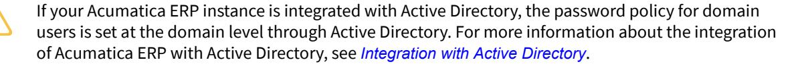

You can set up the system password policy to control the following:

- *Password duration*: For maximum security, we recommend that users change passwords periodically, such as every 90 to 180 days. Shorter ranges can reduce the security of accounts, because users may use simple passwords or struggle to create complex, memorable passwords oen, which encourages them to write down these passwords. You use the **Password Expiry Period in Days** check box to specify the change frequency.
- *Password length*: You can set up a minimum required password length. You use the **Minimum Characters in Password** check box to specify the minimum length.
- *Password complexity*: You can enforce password complexity requirements, which means that a new password must include at least three of the following:
  - Latin uppercase letters (A–Z)
  - Latin lowercase letters (a–z)
  - Digits (0 through 9)
  - Special characters (such as *+*, *:*, *=*, and *-*)

You use the **Password Must Meet Complexity Requirements** check box to enforce complexity requirements.

• *Password validation mask*: You can configure an additional password validation mask to enforce your company's password policy. You can specify a regular expression to enforce additional regulations—for example, to exclude some special characters that are not supported by third-party soware (if used).

You can use a validation mask in addition to password length or complexity requirements or use only your validation mask and clear the length or complexity requirements. For example, the following regular expression covers length and complexity requirements and forbids the *\$* and *^* symbols: ^(?=.\*[A-Zaz])(?=.\*\d)(?=.\*[@!%\*#?&])[A-Za-z\d@!%\*#?&]{10,}\$. With this validation mask, there is no need to set up password length and complexity settings.

If you use a validation mask, you should provide a custom alert message that explains to users the password policy enforced by the validation mask. Otherwise, the system displays the default message.

You use the **Additional Password Validation Mask** and **Incorrect Password Alert** boxes to configure custom password requirements.

To improve password security, a hashing algorithm is used to process passwords, and only hash values are stored in the database.

### **System-Wide Account Lockout Policies**

You can configure the system to lock out a user account aer a particular number of failed sign-in attempts. This configuration option helps to stop an unauthorized person who might be trying to gain system access by guessing a user's password.

On the *[Security Preferences](https://help-2025r1.acumatica.com/Help?ScreenId=ShowWiki&pageid=a100a91e-310b-4513-bc68-5110ad9463ff)* (SM201060) form, you can specify the following system-wide parameters:

- The number of failed sign-in attempts that will cause a user account to be locked out
- The duration of the account lockout—that is, the number of minutes the user account remains locked before the system automatically unlocks it
- The time period before the system resets the counter of the failed sign-in attempts.

# <span id="page-26-0"></span>**Preparing an Instance: To Configure Secure Access for Implementers**

In the following activity, you will learn how to configure system-wide password and lockout policies and how to create user accounts for implementers.

# **Story**

Suppose that the SweetLife Fruits & Jams company has purchased a cloud subscription for Acumatica ERP. You, as a system administrator, need to configure the secure access for the production tenant of the Acumatica ERP instance.

The company has the following security requirements:

- Users should change their passwords twice a year—that is, every 180 days.
- The minimum password length is 10 symbols without spaces.
- A password must include Latin uppercase and lowercase letters, digits, or special characters, except for *\$* and *"*.
- A user has three attempts to enter a valid password; if an invalid password is entered on the fourth attempt, the user will be locked out for 15 minutes.
- The system should reset the lockout counter when it has been 10 minutes since the first failed sign-in. That is, if a user enters the third invalid password 11 minutes aer the first failed attempt, the system will not lock out the user, because the count of failed attempts was restarted 10 minutes aer the first failed attempt.

The following people are to be involved in the implementation process:

- You—Kimberly Gibbs, the system administrator with the SweetLife Fruits & Jams company
- Jerry Prado, who is an implementation consultant with the Adaptabiz company, one of Acumatica's partners

# **Process Overview**

To configure system-wide security policies, you will use the settings on the *[Security Preferences](https://help-2025r1.acumatica.com/Help?ScreenId=ShowWiki&pageid=a100a91e-310b-4513-bc68-5110ad9463ff)* (SM201060) form. To meet character exception requirements, you will use a validation mask in addition to the password length and complexity requirements, and set up a custom alert message for incorrect passwords.

Then you will add the requested user accounts on the *[Users](https://help-2025r1.acumatica.com/Help?ScreenId=ShowWiki&pageid=834cc181-97fa-4db4-a7e0-3eaba142c166)* (SM201010) form. You will use your user account to validate the configured policies.

### **System Preparation**

Before you perform the steps of this activity, make sure that the following tasks have been performed:

- 1. You have installed an Acumatica ERP instance with a tenant without any preloaded dataset (out-of-the-box).
- 2. You have signed in to Acumatica ERP with the following credentials:
  - Username: *admin*
  - Password: The new password that you specified during the first sign-in
- 3. You have enabled the default set of features on the *[Enable/Disable Features](https://help-2025r1.acumatica.com/Help?ScreenId=ShowWiki&pageid=c1555e43-1bc5-4f6f-ba9d-b323f94d8a6b)* (CS100000) form, as described in *[Preparing](#page-21-1) an Instance: To Enable Features and Activate the License*.

### **Step 1: Configuring the Password Policy**

To configure the system-wide password policy, do the following:

- 1. Open the *[Security Preferences](https://help-2025r1.acumatica.com/Help?ScreenId=ShowWiki&pageid=a100a91e-310b-4513-bc68-5110ad9463ff)* (SM201060) form.
- 2. In the **Password Policy** section of the form, select the **Password Expiry Period in Days** check box, and type 180 into the box next to it.
- 3. Make sure that the **Password Expiry Period in Days** check box is selected, and type 10 into the box next to it.
- 4. Make sure that the **Password Must Meet Complexity Requirements** check box is selected, which will force users to use complex passwords with uppercase letters, digits, and special characters.
- 5. In the **Additional Password Validation Mask** box, type the following regular expression:

^(?!.\*[\$ "]).\*\$

The expression verifies that the entered password has no spaces and does not contain the *\$* or *"* character.

6. In the **Incorrect Password Alert** box, type the following text: The password length must be at least 10 characters without spaces. The password must contain characters from three of the following four categories: English uppercase characters (A through Z); English lowercase characters (a through z); base 10 digits (0 through 9); and non-alphabetic characters (such as !, #, and %). The following characters must be excluded: \$ and ".

$$
\big| \, \widehat{\mathbf{G}}
$$

The box is expandable; you may want to adjust its size to be able to view the entire message.

7. On the form toolbar, click**Save**.

#### **Step 2: Reviewing Account Lockout Policies**

While you are still on the *[Security Preferences](https://help-2025r1.acumatica.com/Help?ScreenId=ShowWiki&pageid=a100a91e-310b-4513-bc68-5110ad9463ff)* (SM201060) form, in the **Account Lockout Policy** section, review the following default values inserted by the system and make sure that they match the organization's account lockout policies:

- **Failed Sign-In Attempts Before Account Lockout**: 3
- **Account Lockout Duration (Minutes)**: 15
- **Reset Interval for Failed Sign-In Attempts (Minutes)**: 10

### **Step 3: Adding User Accounts**

To add user accounts to the system, do the following:

- 1. On the *[Users](https://help-2025r1.acumatica.com/Help?ScreenId=ShowWiki&pageid=834cc181-97fa-4db4-a7e0-3eaba142c166)* (SM201010) form, add a new record.
- 2. In the **Login** box of the Summary area, type gibbs.
- 3. Clear the **Generate Password** check box.
- 4. In the **Password** box, type Welcome123.
- 5. Specify the following user information:
  - **First Name**: Kimberly
  - **Last Name**: Gibbs
  - **Email**: gibbs@sweetlife.com

- **Comment**: Senior system administrator
- 6. Specify the following settings to configure individual password policy:
  - **Allow Password Recovery**: Cleared
  - **Allow Password Changes**: Selected
  - **Password Never Expires**: Cleared
  - **Force User to Change Password on Next Login**: Selected
- 7. On the **Roles** tab, assign the following roles to the user by selecting the check box in the**Selected** column:
  - *Administrator*
  - *Customizer*
  - *Field-Level Audit*
  - *Internal User*
  - *Wiki Admin*
- 8. On the form toolbar, click**Save**.
- 9. Click **Add New Record** on the form toolbar to add one more user, and specify the following settings in the Summary area:
  - **Login**: prado
  - **Generate Password**: Cleared
  - **Password**: Welcome123
  - **First Name**: Jerry
  - **Last Name**: Prado
  - **Email**: jprado@adaptabiz.com
  - **Comment**: Adaptabiz implementation consultant
  - **Allow Password Recovery**: Cleared
  - **Allow Password Changes**: Selected
  - **Password Never Expires**: Cleared
  - **Force User to Change Password on Next Login**: Selected

10.On the **Roles** tab, assign the following roles to the user by selecting the check box in the**Selected** column:

- *Administrator*
- *Customizer*
- *Field-Level Audit*
- *Internal User*
- *Wiki Admin*

11.On the form toolbar, click**Save**.

### **Step 4: Verifying the Password Policy**

To verify the configured password policy, do the following:

- 1. In the top right corner of the screen, click the *admin admin* username, and then select**Sign Out**.
- 2. On the Sign-In page, enter gibbs as the username and Welcome123 as the password. The system requests that you enter and confirm a new password.
- 3. Enter welcome"123 as the new password and its confirmation, and click**Sign In**. Because this password contains the prohibited *"* character, the system clears the entered values and displays the alert message that you configured, as shown in the following screenshot.

| The password length must be at least 10 characters without<br>spaces. The password must contain characters from three of the<br>following four categories: English uppercase characters (A<br>through Z); English lowercase characters (a through z); base 10<br>digits (0 through 9); and non-alphabetic characters (such as !, #,<br>and %). The following characters must be excluded: \$ and " |              |
|----------------------------------------------------------------------------------------------------------------------------------------------------------------------------------------------------------------------------------------------------------------------------------------------------------------------------------------------------------------------------------------------------|--------------|
| gibbs                                                                                                                                                                                                                                                                                                                                                                                              |              |
|                                                                                                                                                                                                                                                                                                                                                                                                    |              |
|                                                                                                                                                                                                                                                                                                                                                                                                    | New Password |
|                                                                                                                                                                                                                                                                                                                                                                                                    |              |

#### *Figure: Custom alert message for incorrect password*

- 4. Enter 123Welcome as the new password and its confirmation, and click**Sign In**. The expression you entered complies with the password policy requirements and is accepted by the system as your new password.
- 5. In the top right corner of the screen, click the *Kimberly Gibbs* username, and then select**Sign Out**.

# **Step 5: Verifying the Lockout Policy**

To verify the lockout policy you have configured, do the following:

- 1. On the Sign-In page, enter gibbs as the username and Welcome123 as the password. The system requests that you enter valid credentials.
- 2. Again enter the incorrect password three more times. The system warns you that your account is locked out, as shown in the following screenshot.

| <b>Q</b> Acumatica<br>The Cloud ERP                                      |  |  |
|--------------------------------------------------------------------------|--|--|
| Your account is locked out. Please contact your system<br>administrator. |  |  |
| gibbs                                                                    |  |  |
| Password                                                                 |  |  |
| Sign In                                                                  |  |  |

#### *Figure: Account lockout alert message*

- 3. On the Sign-In page, enter prado for the username and Welcome123 as the password. Enter 123Welcome as the new password and its confirmation, and click**Sign In**. You have successfully signed in as Jerry Prado.
- 4. Open the *[Users](https://help-2025r1.acumatica.com/Help?ScreenId=ShowWiki&pageid=834cc181-97fa-4db4-a7e0-3eaba142c166)* (SM201010) form.
- 5. In the **Login** box, select *gibbs*. In the **Status** box, notice that the user status is *Temporarily Locked*.
- 6. On the form toolbar, click **Unlock User**. Notice that the user status has changed to *Active*.

# <span id="page-30-1"></span><span id="page-30-0"></span>**Preparing an Instance: Acumatica ERP Features**

Acumatica ERP provides scalable core system functionality and includes a range of add-on features, which can be enabled and disabled on the *[Enable/Disable Features](https://help-2025r1.acumatica.com/Help?ScreenId=ShowWiki&pageid=c1555e43-1bc5-4f6f-ba9d-b323f94d8a6b)* (CS100000) form.

#### **Finance Group of Features**

| Feature                 | Overview                                                                                                                                                                                                                                                                                                   |
|-------------------------|------------------------------------------------------------------------------------------------------------------------------------------------------------------------------------------------------------------------------------------------------------------------------------------------------------|
| Finance                 | A group of features that provides access to financial management that takes managing<br>your business' assets, income, and expenses from complex to simple with configurable<br>processes, mobile anytime access, and best-in-class accounting applications resting on a<br>single, future-proof platform. |
| Standard Finan<br>cials | A group of features that is available in all editions of Acumatica ERP. You can enable any<br>of the features in this group on the Enable/Disable Features (CS100000) form—they are in<br>cluded in any license.                                                                                           |

| Feature                 | Overview                                                                                                                                                                                                                                                                                                                  |
|-------------------------|---------------------------------------------------------------------------------------------------------------------------------------------------------------------------------------------------------------------------------------------------------------------------------------------------------------------------|
| Multibranch Sup<br>port | A feature that provides support for multiple branches within a company. Branches can be<br>configured for company offices to track revenue and expenses by branches and to limit<br>the visibility of branch-related entities. For details, see Multiple Branch Support and Basic<br>Models for Multibranch Organization. |
|                         | You can enable this feature and start using the related functionality at any time.                                                                                                                                                                                                                                        |
|                         | If both this feature and the Multicompany Support feature are disabled, only one compa<br>ny without branches can be created. If this feature is disabled and the Multicompany Sup<br>port feature is enabled, users can create any number of companies without branches.                                                 |
|                         | If you clear this check box to disable the feature and the Multicompany Support check<br>box is cleared, the system will clear the Inter-Branch Transactions and Customer and<br>Vendor Visibility Restriction check boxes.                                                                                               |
|                         | We recommend that you not disable this feature if branches have been con<br>figured and used in transactions. Disabling this feature may lead to data<br>corruption or unexpected consequences in the system's operation.                                                                                                 |
| Multicompany<br>Support | A feature that provides support for multiple companies (legal entities) within one tenant.<br>For details, see Companies and Branches.                                                                                                                                                                                    |
|                         | You can enable this feature and start using the related functionality at any time.                                                                                                                                                                                                                                        |
|                         | If both this feature and the Multibranch Support feature are disabled, only one company<br>without branches can be created.                                                                                                                                                                                               |
|                         | If this feature is disabled and the Multibranch Support and Inter-Branch Transactions fea<br>tures are enabled, only one company can be created. This company can have the Without<br>Branches, With Branches Not Requiring Balancing, or With Branches Requiring Balancing<br>type.                                      |
|                         | If both this feature and the Inter-Branch Transactions feature are disabled and the Multi<br>branch Support feature is enabled, only one company can be created. This company can<br>have the Without Branches or With Branches Not Requiring Balancing type.                                                             |
|                         | If you clear this check box to disable the feature, the system will clear the Multiple Base<br>Currencies check box.                                                                                                                                                                                                      |
|                         | If you clear this check box to disable the feature and the Multibranch Support check box<br>is cleared, the system will clear the Inter-Branch Transactions and Customer and Ven<br>dor Visibility Restriction check boxes.                                                                                               |
|                         | We recommend that you not disable this feature if two or more companies<br>exist in the tenant. Disabling this feature may lead to data corruption or un<br>expected consequences in the system's operation.                                                                                                              |

| Feature                          | Overview                                                                                                                                                                                                                                                                                                                                                                                                                                                                                                                                          |
|----------------------------------|---------------------------------------------------------------------------------------------------------------------------------------------------------------------------------------------------------------------------------------------------------------------------------------------------------------------------------------------------------------------------------------------------------------------------------------------------------------------------------------------------------------------------------------------------|
| Business Account<br>Locations    | A feature that supports multiple locations for vendor and customer accounts. You may<br>need to enable the feature if some of your organization's customers or vendors have mul<br>tiple offices (locations), and you need to track these locations' sales and purchases.                                                                                                                                                                                                                                                                         |
|                                  | You can enable this feature and start using the related functionality at any time.                                                                                                                                                                                                                                                                                                                                                                                                                                                                |
|                                  | We recommend that you not disable this feature if at least one customer<br>or vendor account has multiple locations configured and used in transac<br>tions. Disabling this feature may lead to data corruption or unexpected con<br>sequences in the system's operation.                                                                                                                                                                                                                                                                         |
| Multicurrency Ac<br>counting     | A feature that adds forms related to the currency management functionality and support<br>of the following: multiple currencies across the system; automatic calculation of the re<br>alized gains and losses and rounding amounts on foreign currency transactions; revalua<br>tion of foreign currency accounts; and translation of the base currency accounts into any<br>foreign currency for reporting. For more information, see Currency Management.<br>You can enable this feature and start using the related functionality at any time. |
|                                  | We recommend that you not disable this feature if you have processed<br>transactions in foreign currencies. Disabling this feature may lead to data<br>corruption or unexpected consequences in the system's operation.                                                                                                                                                                                                                                                                                                                           |
| Centralized Period<br>Management | A feature that makes it possible to manage financial periods on the tenant level only; the<br>periods can be opened, closed, or locked in all companies at once, and the status of each<br>financial period is the same in all companies. This feature is enabled by default.                                                                                                                                                                                                                                                                     |
|                                  | It is allowed to enable this feature only if the status of each financial period is the same in<br>all companies.                                                                                                                                                                                                                                                                                                                                                                                                                                 |
|                                  | You can enable this feature if the Multiple Calendar Support feature is disabled.                                                                                                                                                                                                                                                                                                                                                                                                                                                                 |
|                                  | You can disable the Centralized Period Management feature only if the Multicompany Sup<br>port feature is enabled. Disabling the Centralized Period Management feature makes it<br>possible to open, close, and lock a particular financial period separately for each compa<br>ny within the tenant. You can disable this feature at any time.                                                                                                                                                                                                   |
|                                  | For more information, see Generating Financial Calendars.                                                                                                                                                                                                                                                                                                                                                                                                                                                                                         |
| Volume Pricing                   | A feature that gives you the ability to define price tiers for item quantities.                                                                                                                                                                                                                                                                                                                                                                                                                                                                   |
|                                  | You can enable this feature and start using the related functionality at any time. You can<br>disable this feature at any time; however, we recommend deleting price records with a<br>nonzero break quantity before disabling the feature.                                                                                                                                                                                                                                                                                                       |
| Expense Reclassifi<br>cation     | A feature that supports the two-stage release of AP documents: pre-release, when a da<br>ta entry clerk enters a bill or a cash purchase; and release, when an authorized accoun<br>tant reviews a pre-released document, specifies the correct expense accounts (and sub<br>accounts), and releases the document. For details, see Reclassification of Expenses: Gen<br>eral Information.                                                                                                                                                        |
|                                  | You can enable this feature and start using the related functionality at any time. You can<br>also disable this feature at any time; however, we recommend releasing the pre-released<br>bills before disabling the feature.                                                                                                                                                                                                                                                                                                                      |

| Feature                           | Overview                                                                                                                                                                                                                                                                                                                                                                                                                                                                                                                                                                                                                                                                                                                                                                                           |
|-----------------------------------|----------------------------------------------------------------------------------------------------------------------------------------------------------------------------------------------------------------------------------------------------------------------------------------------------------------------------------------------------------------------------------------------------------------------------------------------------------------------------------------------------------------------------------------------------------------------------------------------------------------------------------------------------------------------------------------------------------------------------------------------------------------------------------------------------|
| Tax Entry From GL<br>Module       | A feature that gives users the ability to specify tax and taxable amounts for journal entries<br>and include them in the tax reports. For more information, see Tax Entry from GL: General<br>Information.                                                                                                                                                                                                                                                                                                                                                                                                                                                                                                                                                                                         |
|                                   | You can enable this feature and start using the related functionality at any time. You can<br>also disable this feature at any time; however, before you disable the feature, we recom<br>mend releasing or deleting the unreleased journal entries with taxes specified.                                                                                                                                                                                                                                                                                                                                                                                                                                                                                                                          |
| VAT Reporting                     | A feature that provides accounting and reporting for any value-added tax (VAT) in the<br>system. The feature makes the VAT tax type available on the Taxes (TX205000) form, and<br>adds UI elements that can be used for the automatic calculation of tax amounts and for<br>VAT reporting to the Invoices and Memos (AR301000) and Bills and Adjustments (AP301000)<br>forms. For details, see Value-Added Taxes: General Information.<br>You can enable this feature and start using the related functionality at any time.<br>We recommend that you not disable this feature if at least one tax of the<br>VAT tax type was configured and used in transactions. Disabling this feature<br>may lead to data corruption or unexpected consequences in the system's<br>operation.                 |
| VAT Recognition on<br>Prepayments | A feature that makes it possible to create prepayment invoices when companies are re<br>quired to report taxes upon receiving prepayments from clients. The system calculates<br>the tax and taxable amounts in the prepayment invoices. Once a customer has paid a<br>prepayment invoice, the company can report the taxes in the tax filings for the period in<br>which the prepayment was received. For details, see Processing Prepayment Invoices.<br>You can enable this feature and start using the related functionality at any time.<br>We recommend that you not disable this feature if at least one document of<br>the Prepmt. Invoice type was released in the system. Disabling this feature<br>may lead to data corruption or unexpected consequences in the system's<br>operation. |
| 1099 Reporting                    | A feature that provides support for configuring 1099 vendors and filing the Form 1099-<br>MISC and Form 1099-NEC. For details, see Filing Out the 1099 Forms.<br>You can enable this feature and start using the related functionality at any time. You can<br>also disable this feature at any time; however, before you disable the feature, we recom<br>mend making sure that all 1099 years have the Open status in all companies.                                                                                                                                                                                                                                                                                                                                                             |
| Net/Gross Entry<br>Mode           | A feature that gives users the ability to specify the tax calculation mode (net or gross),<br>which the system will use for computing a tax amount in a document. Depending on the<br>specified mode, you can enter either tax-inclusive amounts at the line level or the docu<br>ment level, or tax-exclusive amounts at the line level or the document level. You will also<br>be able to activate the tax amount validation functionality in a document that you enter.<br>For details, see Purchases with Sales Taxes: Tax Amount Validation.<br>You can enable this feature and start using the related functionality at any time. You can<br>also disable this feature at any time; however, before you disable the feature, we rec                                                          |
|                                   | ommend changing the tax calculation mode to Tax Settings in the customer and vendor<br>records and in all unreleased documents.                                                                                                                                                                                                                                                                                                                                                                                                                                                                                                                                                                                                                                                                    |

| Feature                                 | Overview                                                                                                                                                                                                                                                                                                                                                           |
|-----------------------------------------|--------------------------------------------------------------------------------------------------------------------------------------------------------------------------------------------------------------------------------------------------------------------------------------------------------------------------------------------------------------------|
| Invoice Rounding                        | A feature that provides automatic rounding of bill and invoice amounts. For details, see<br>Rounding of AP Document Amounts: General Information and Rounding of AR Document<br>Amounts: General Information.                                                                                                                                                      |
|                                         | You can enable this feature and start using the related functionality at any time. You can<br>also disable this feature at any time.                                                                                                                                                                                                                               |
| Expense Manage<br>ment                  | A feature that allows company employees to file their claims for reimbursement of ex<br>penses.                                                                                                                                                                                                                                                                    |
|                                         | For details, see Processing Expense Claims.                                                                                                                                                                                                                                                                                                                        |
| Advanced Finan<br>cials                 | A group of features that is not available in the standard edition of Acumatica ERP. You<br>can enable any of the features in this group if the group of features is available in your li<br>cense.                                                                                                                                                                 |
| Subaccounts                             | A feature that gives you the ability to use subaccounts in addition to accounts. This facili<br>tates more granular financial analysis if you need to track your expenses by departments<br>or cost centers or to attribute your revenue to product categories, customer classes, or<br>geographical locations. For details, see Subaccounts: General Information. |
|                                         | We recommend that you enable this feature before you start configuring your system.<br>If you need to activate it at a later stage, you perform instructions similar to those de<br>scribed in Subaccounts: Implementation Activity.                                                                                                                               |
|                                         | We recommend that you not disable this feature if you have configured two<br>or more subaccounts and used them in transactions. Disabling this feature<br>may lead to data corruption or unexpected consequences in the system's<br>operation.                                                                                                                     |
| General Ledger Al<br>location Templates | A feature that makes it possible to distribute account balances among other accounts<br>based on the rules configured in the system. For more information, see Allocation Rules:<br>General Information.                                                                                                                                                           |
|                                         | You can enable this feature and start using the related functionality at any time. You can<br>also disable this feature at any time.                                                                                                                                                                                                                               |

| Feature                      | Overview                                                                                                                                                                                                                                                                                                                                                                                                                                       |
|------------------------------|------------------------------------------------------------------------------------------------------------------------------------------------------------------------------------------------------------------------------------------------------------------------------------------------------------------------------------------------------------------------------------------------------------------------------------------------|
| Inter-Branch<br>Transactions | A feature that makes it possible to process transactions between different companies or<br>between the branches of the same company that require balancing. You can set up the<br>automatic generation of balancing entries for the transactions. Alternatively, the compa<br>nies and company branches can be set up for usage in sales and purchase orders and in<br>AP bills and AR invoices. For details, see Interbranch Account Mapping. |
|                              | You can enable this feature if either the Multicompany Support or Multibranch Support<br>feature is enabled. You can enable this feature and start using the related functionality at<br>any time.                                                                                                                                                                                                                                             |
|                              | Also, enabling this feature gives users the ability to process sales transactions between<br>legal entities implemented as companies or branches in the same tenant. For details, see<br>Intercompany Sales Setup: General Information.                                                                                                                                                                                                        |
|                              | You can disable this feature after it has been in use; however, we recommend deleting<br>or releasing and posting all unposted inter-branch transactions before disabling the fea<br>ture.                                                                                                                                                                                                                                                     |
|                              | If this feature is disabled, users can enter transactions only between branches that be<br>long to one company and do not require balancing.                                                                                                                                                                                                                                                                                                   |
| Multiple Base Cur<br>rencies | A feature that gives users the ability to configure and use companies with different base<br>currencies within one tenant.                                                                                                                                                                                                                                                                                                                     |
|                              | For this feature to be enabled, the following features also need to be enabled:                                                                                                                                                                                                                                                                                                                                                                |
|                              | Multicompany Support<br>•                                                                                                                                                                                                                                                                                                                                                                                                                      |
|                              | Multicurrency Accounting<br>•                                                                                                                                                                                                                                                                                                                                                                                                                  |
|                              | •<br>Customer and Vendor Visibility Restriction                                                                                                                                                                                                                                                                                                                                                                                                |
|                              | If the Projects group of features is enabled, this feature can be enabled only if the Multicur<br>rency Projects feature is enabled.                                                                                                                                                                                                                                                                                                           |
|                              | You can enable this feature if the following features are disabled:                                                                                                                                                                                                                                                                                                                                                                            |
|                              | •<br>Customer Portal                                                                                                                                                                                                                                                                                                                                                                                                                           |
|                              | •<br>Lot/Serial Attributes                                                                                                                                                                                                                                                                                                                                                                                                                     |
|                              | •<br>Payroll                                                                                                                                                                                                                                                                                                                                                                                                                                   |
|                              | •<br>Procore Integration                                                                                                                                                                                                                                                                                                                                                                                                                       |
|                              | •<br>Projects if the Multicurrency Projects feature is disabled                                                                                                                                                                                                                                                                                                                                                                                |
|                              | •<br>Purchase Requisitions                                                                                                                                                                                                                                                                                                                                                                                                                     |
|                              | Retail Commerce<br>•                                                                                                                                                                                                                                                                                                                                                                                                                           |
|                              | Service Management<br>•                                                                                                                                                                                                                                                                                                                                                                                                                        |
|                              | This feature is currently in managed availability, and some scenarios may<br>not be supported yet. We recommend testing the feature before you enable<br>it on a production instance.                                                                                                                                                                                                                                                          |
|                              | For details on configuring multiple base currencies, see Multiple Base Currencies: General<br>Information, Customer Visibility: General Information, Vendor Visibility: General Information,<br>and Company Groups: General Information.                                                                                                                                                                                                       |
|                              | The system will not allow you to disable the feature if there are companies<br>with different base currencies in the system.                                                                                                                                                                                                                                                                                                                   |

| records for employees of a particular branch, company, or company group. For details,                                                                                                                                                                                                                                                                                                                                                                                                                                                                           |
|-----------------------------------------------------------------------------------------------------------------------------------------------------------------------------------------------------------------------------------------------------------------------------------------------------------------------------------------------------------------------------------------------------------------------------------------------------------------------------------------------------------------------------------------------------------------|
| You can enable this feature if either the Multicompany Support feature or the Multibranch<br>Support feature is enabled. You can enable this feature and start using the related func                                                                                                                                                                                                                                                                                                                                                                           |
| A feature that provides the ability to configure companies having a different end of the fi<br>You can enable this feature and start using the related functionality at any time. The Mul<br>tiple Calendar Support feature can be enabled if the Centralized Period Management fea<br>The system will not allow you to disable the feature if there are companies                                                                                                                                                                                              |
|                                                                                                                                                                                                                                                                                                                                                                                                                                                                                                                                                                 |
| A feature that provides the ability to import account balances of subsidiaries into a par<br>ent company tenant for the preparation of consolidated reports. Administrative users<br>can configure which data should be consolidated and how exactly the data should be<br>consolidated. After that, users can consolidate the data as often as they need to within<br>each financial period. For more details, see GL Consolidation Configuration: General Infor<br>You can enable this feature and start using the related functionality at any time. You can |
|                                                                                                                                                                                                                                                                                                                                                                                                                                                                                                                                                                 |
| A feature that gives users the ability to translate amounts from one currency to another<br>currency. Translation can be used for reporting purposes in any foreign currency. For de<br>You can enable this feature and start using the related functionality at any time. You can                                                                                                                                                                                                                                                                              |
| A feature that gives users the ability to maintain customer discounts in the system and<br>apply them automatically to sales orders and invoices. For more information, see Cus<br>You can enable this feature and start using the related functionality at any time. You can<br>When the feature is disabled, you can enter the discount percent or amount on a line and<br>document level on data entry forms, but the discount amounts are not posted separately                                                                                             |
|                                                                                                                                                                                                                                                                                                                                                                                                                                                                                                                                                                 |

| Feature                                       | Overview                                                                                                                                                                                                                                                          |
|-----------------------------------------------|-------------------------------------------------------------------------------------------------------------------------------------------------------------------------------------------------------------------------------------------------------------------|
| Vendor Discounts                              | A feature that gives users the ability to maintain vendor discounts in your system and ap<br>ply them automatically to purchase orders and bills. For more information, see Configur<br>ing Vendor Discounts.                                                     |
|                                               | You can enable this feature and start using the related functionality at any time. You can<br>also disable this feature at any time.                                                                                                                              |
|                                               | When the feature is disabled, you can enter the discount percent or amount on a line and<br>document level on data entry forms, but the discount amounts are not posted separately<br>to a discount account.                                                      |
| Commissions                                   | A feature that makes it possible to calculate salespeople's commissions. For details, see<br>Managing Commissions.                                                                                                                                                |
|                                               | You can enable this feature and start using the related functionality at any time. You can<br>also disable this feature at any time.                                                                                                                              |
| Overdue Charges                               | A feature that gives your company the ability to charge fees on overdue invoices. For de<br>tails, see Overdue Charges: General Information.                                                                                                                      |
|                                               | You can enable this feature and start using the related functionality at any time.                                                                                                                                                                                |
|                                               | We recommend that you not disable this feature if at least one document of<br>the Overdue Charge type was released in the system. Disabling this feature<br>may lead to data corruption or unexpected consequences in the system's<br>operation.                  |
| Dunning Letter<br>Management                  | A feature that provides users with the ability to generate dunning letters to notify cus<br>tomers about their overdue documents. Each level of dunning letters can be managed by<br>customer or by overdue document. For details, see Preparing Dunning Letters. |
|                                               | You can enable this feature and start using the related functionality at any time. You can<br>also disable this feature at any time.                                                                                                                              |
| Deferred Revenue<br>Management                | A feature that gives users the ability to recognize deferred revenue and expenses by using<br>automatically generated schedules. For more information, see Deferred Revenue.                                                                                      |
|                                               | You can enable this feature and start using the related functionality at any time. You can<br>also disable this feature at any time; however, we recommend that you remove the defer<br>ral codes from unreleased AP and AR invoices.                             |
| Revenue Recog<br>nition by IFRS15/<br>ASC 606 | A feature that makes it possible to recognize deferred revenue according to the IFRS 15 or<br>ASC 606 standard (based on the fair value price). For more information, see Recognition of<br>Revenue from Customer Contracts.                                      |
|                                               | You can enable this feature at any time; however, we recommend that you remove the<br>deferral codes from unreleased invoices if you previously recognized revenue according<br>to different standards.                                                           |
|                                               | You can disable this feature at any time; however, we recommend that you remove the<br>deferral codes from unreleased invoices.                                                                                                                                   |

| Feature                                    | Overview                                                                                                                                                                                                                                                                                                                                                                                                                                                                                                                               |
|--------------------------------------------|----------------------------------------------------------------------------------------------------------------------------------------------------------------------------------------------------------------------------------------------------------------------------------------------------------------------------------------------------------------------------------------------------------------------------------------------------------------------------------------------------------------------------------------|
| Parent-Child Cus<br>tomer Relation<br>ship | A feature that provides support for parent-child relationships between customers. A par<br>ent-child relationship includes the ability for the parent account to pay invoices of the<br>child account, to prepare consolidated statements, to view a consolidated balance, and<br>to share credit policy for a group of related customers. The relationship can be removed<br>at any time. For details, see Managing Parent-Child Relationships.<br>You can enable this feature and start using the related functionality at any time. |
|                                            | We recommend that you not disable this feature if any parent account pay<br>ments have been applied to child account invoices in the system. Disabling<br>this feature may lead to data corruption or unexpected consequences in the<br>system's operation.                                                                                                                                                                                                                                                                            |
| Retainage Support                          | A feature that makes it possible to retain a portion of an invoice amount to ensure that<br>the contracted work is completed. Retainage is used primarily in the construction indus<br>try.                                                                                                                                                                                                                                                                                                                                            |
|                                            | If the Standard Inventory feature is enabled in addition to this feature, users can also cre<br>ate purchase orders with retained amounts. For each purchase order, a user then creates<br>an AP bill in which the system specifies the retainage settings based on the purchase or<br>der settings.                                                                                                                                                                                                                                   |
|                                            | If the Project Accounting feature is enabled in your system in addition to this feature,<br>users can also create pro forma invoices with retained amounts. For each pro forma in<br>voice, a user then creates an AR invoice in which the system specifies the retainage set<br>tings based on the pro forma invoice settings.                                                                                                                                                                                                        |
|                                            | For more information, see Processing AR Documents with Retainage and Processing AP<br>Documents with Retainage.                                                                                                                                                                                                                                                                                                                                                                                                                        |
|                                            | You can enable this feature and start using the related functionality at any time.                                                                                                                                                                                                                                                                                                                                                                                                                                                     |
|                                            | We recommend that you not disable this feature if at least one document<br>with a retained amount has been released. Disabling this feature may lead<br>to data corruption or unexpected consequences in the system's operation.                                                                                                                                                                                                                                                                                                       |

| Feature                         | Overview                                                                                                                                                                                                                                                                                                                                                                                        |
|---------------------------------|-------------------------------------------------------------------------------------------------------------------------------------------------------------------------------------------------------------------------------------------------------------------------------------------------------------------------------------------------------------------------------------------------|
| Payment Applica<br>tion by Line | A feature that makes it possible for users to apply payments to individual lines of AP and<br>AR documents and to track the balances of the document lines. For more information,<br>see Applying Payments to Particular Lines of AP Documents and Applying Payments to Par<br>ticular Lines of AR Documents.                                                                                   |
|                                 | For documents paid by line, the functionality of the Invoice Rounding fea<br>ture, if it is enabled, is not applied. However, in documents that are not paid<br>by line, invoice amounts are rounded.                                                                                                                                                                                           |
|                                 | This feature is not supported for taxable AR and AP documents that use an external tax<br>provider, such as Avalara. If a tax zone related to an external tax provider is selected for a<br>document on a data entry form and the document is paid by line, the system will not al<br>low the user to release this document.                                                                    |
|                                 | You can enable this feature and start using the related functionality at any time.                                                                                                                                                                                                                                                                                                              |
|                                 | We recommend that you not disable this feature if at least one AP or AR<br>document that is paid by line—that is, the Pay by Line check box is selected<br>on the data entry form—has been released in the system. Disabling this fea<br>ture may lead to data corruption or unexpected consequences in the sys<br>tem's operation.                                                             |
| Contract Manage<br>ment         | A feature that provides the support of contracts, including case processing and contract<br>billing. It makes available forms related to contract processing and provides integration<br>between accounts receivable and time and expense tracking. For more information, see<br>Implementing the Contract Functionality.                                                                       |
|                                 | You can enable this feature and start using the related functionality at any time. You can<br>also disable this feature at any time.                                                                                                                                                                                                                                                            |
| Fixed Asset Man<br>agement      | A feature that gives users the ability to create, manage, and depreciate fixed assets<br>through their useful life, from acquisition to disposal. The fixed asset functionality inte<br>grates with the requisition and purchase order functionality to facilitate converting pur<br>chases into fixed assets without users needing to reenter data. For more information, see<br>Fixed Assets. |
|                                 | You can enable this feature and start using the related functionality at any time. You can<br>also disable this feature at any time.                                                                                                                                                                                                                                                            |

### **Inventory and Order Management Group of Features**

| Feature                            | Overview                                                                                                                                                                                                                                                                                                                                                                                                                                                                                         |
|------------------------------------|--------------------------------------------------------------------------------------------------------------------------------------------------------------------------------------------------------------------------------------------------------------------------------------------------------------------------------------------------------------------------------------------------------------------------------------------------------------------------------------------------|
| Inventory and Or<br>der Management | A group of features that provides the functionality of inventory and order management.<br>This functionality includes basic sales order management and purchase order manage<br>ment functionality. If you enable this group of features without enabling the Inventory fea<br>ture within it, users can create sales orders and purchase orders that include only non<br>stock items (including services); they can also create and release sales invoices and AP<br>bills for these documents. |

| Feature   | Overview                                                                                                                                                                                                                                                                                                                                                                                                                                                |
|-----------|---------------------------------------------------------------------------------------------------------------------------------------------------------------------------------------------------------------------------------------------------------------------------------------------------------------------------------------------------------------------------------------------------------------------------------------------------------|
|           | If you enable this group of features along with the Inventory feature, users can also use the<br>inventory functionality. That is, they can use stock items, create shipments for sales or<br>ders and purchase receipts for purchase orders, and generate inventory transactions.                                                                                                                                                                      |
|           | We recommend that you not disable this group of features after it has been<br>enabled in the system and transactions related to this functionality have<br>been processed. Disabling this group of features after it has been enabled<br>and used in the system could lead to data corruption or unexpected conse<br>quences in the system's operation. By disabling it, you assume full responsi<br>bility for these potential effects.                |
|           | If you disable this group of features, the system will automatically disable<br>all other features in the group. Thus, you should first read the description of<br>each currently enabled feature in this group and make sure that all the need<br>ed actions have been taken to avoid data corruption or unexpected conse<br>quences.                                                                                                                  |
|           | If any features of the Service Management group are enabled and you dis<br>able the Inventory and Order Management group of features, make sure that<br>the correct setting is specified in the Generated Billing Documents box on<br>the Service Order Types (FS202300) form for all types, Equipment Manage<br>ment Preferences (FS100300), and Route Management Preferences (FS100400)<br>forms.                                                     |
|           | For more information about the implementation of basic inventory and order manage<br>ment, see Order Management Basic Configuration: General Information.                                                                                                                                                                                                                                                                                               |
| Inventory | A feature that gives your company the ability to maintain stock items and to create and<br>process documents that include stock items. Stock items are physical items that are<br>stored and managed through a warehouse and can be purchased, transferred, sold, or<br>manufactured, and whose quantities and costs are tracked. With the feature enabled,<br>forms related to the inventory functionality become available.                           |
|           | The ability to track inventory levels can benefit companies across many industries, such as<br>retail, wholesale distribution, manufacturing, ecommerce, and construction. With this fea<br>ture enabled, users can maintain stock items in the system, process receipts and issues,<br>and prepare and complete full physical counts.                                                                                                                  |
|           | If your company does not track inventory but you want users to be able to enter purchase<br>receipts for purchase orders with non-stock items, you enable the Purchase Receipts With<br>out Inventory feature instead of this feature.                                                                                                                                                                                                                  |
|           | •<br>You can enable the Inventory feature and start using the related function<br>ality only if the Purchase Receipts Without Inventory feature is disabled.<br>The Inventory and Purchase Receipts Without Inventory features are mutu<br>ally exclusive—that is, you cannot enable one of these features if the oth<br>er is enabled.                                                                                                                 |
|           | •<br>We recommend that you not disable this feature after it has been enabled<br>in the system, the related configuration has been performed, and the re<br>lated transactions have been processed. Disabling this feature after it has<br>been enabled and used in the system could lead to data corruption or un<br>expected consequences in the system's operation. By disabling it, you as<br>sume full responsibility for these potential effects. |

| Feature                      | Overview                                                                                                                                                                                                                                                                                                                                                                                                                |
|------------------------------|-------------------------------------------------------------------------------------------------------------------------------------------------------------------------------------------------------------------------------------------------------------------------------------------------------------------------------------------------------------------------------------------------------------------------|
|                              | For more information about the configuration of order management with inventory, see<br>Configuration of Order Management: General Information and Configuration of Order Manage<br>ment: Disabling of the Inventory and Order Management Features.                                                                                                                                                                     |
| Multiple Units of<br>Measure | A feature that gives users the ability to define multiple units of measure (UOMs) for each<br>stock item or non-stock item. They can also create rules for conversion between UOMs.                                                                                                                                                                                                                                     |
|                              | You may need to enable this feature if your company purchases, tracks, or sells items in<br>different units of measure. For example, you may need this functionality if your company<br>sells items by the piece but purchases and stores these items in storage containers, such<br>as boxes, packages, or crates. With the feature enabled, users can specify prices for each<br>unit of measure of an item.          |
|                              | With this feature disabled, for each stock item, users can define only the base unit of mea<br>sure, which is used for purchasing the item, selling it, and calculating its available quanti<br>ty.                                                                                                                                                                                                                     |
|                              | •<br>You can enable this feature and start using the related functionality at any<br>time.                                                                                                                                                                                                                                                                                                                              |
|                              | •<br>We recommend that you not disable this feature after it has been enabled<br>in the system and transactions related to this functionality have been<br>processed. Disabling this feature after it has been enabled and used in<br>the system could lead to data corruption or unexpected consequences in<br>the system's operation. By disabling it, you assume full responsibility for<br>these potential effects. |
|                              | For more information, see Units of Measure: General Information and Configuration of Order<br>Management: Disabling of the Inventory and Order Management Features.                                                                                                                                                                                                                                                     |
| Lot and Serial<br>Tracking   | A feature that gives users the ability to track stock items by lot or serial number and by ex<br>piration date.                                                                                                                                                                                                                                                                                                         |
|                              | You may need to enable this feature if your company sells the following:                                                                                                                                                                                                                                                                                                                                                |
|                              | •<br>Products, such as medications, that are tracked by lot or unit because laws require<br>manufacturers to keep accurate records about their distribution                                                                                                                                                                                                                                                             |
|                              | •<br>Products, such as foods and chemical compounds, that have expiration dates                                                                                                                                                                                                                                                                                                                                         |
|                              | •<br>Products—such as electronics, appliances, and cars—that need to be tracked individu<br>ally for safety and warranty measures                                                                                                                                                                                                                                                                                       |
|                              | •<br>Any other products that your company wants to track in groups or individually while<br>using the same inventory ID                                                                                                                                                                                                                                                                                                 |
|                              | Acumatica ERP provides flexible numbering capabilities for lot and serial numbers and the<br>ability to track different products differently.                                                                                                                                                                                                                                                                           |

| Feature                                      | Overview                                                                                                                                                                                                                                                                                                                                                                                                                                                                                           |
|----------------------------------------------|----------------------------------------------------------------------------------------------------------------------------------------------------------------------------------------------------------------------------------------------------------------------------------------------------------------------------------------------------------------------------------------------------------------------------------------------------------------------------------------------------|
|                                              | •<br>You can enable this feature and start using the related functionality only if<br>the Inventory feature is enabled and the Purchase Receipts Without Inven<br>tory feature is disabled. The Inventory and Purchase Receipts Without In<br>ventory features are mutually exclusive—that is, you cannot enable one of<br>these features if the other is enabled.<br>•<br>We recommend that you not disable this feature after it has been enabled                                                |
|                                              | in the system and transactions related to this functionality have been<br>processed. Disabling this feature after it has been enabled and used in<br>the system could lead to data corruption or unexpected consequences in<br>the system's operation. By disabling it, you assume full responsibility for<br>these potential effects.                                                                                                                                                             |
|                                              | For more information, see Items with Lot and Serial Numbers: General Information and Con<br>figuration of Order Management: Disabling of the Inventory and Order Management Features.                                                                                                                                                                                                                                                                                                              |
| Blanket and Stan<br>dard Purchase Or<br>ders | A feature that makes it possible to process blanket purchase orders. A blanket purchase<br>order is an order representing a long-term agreement between a company and a supplier<br>to deliver goods or services with a defined price over a specific period of time.                                                                                                                                                                                                                              |
|                                              | You may need to enable this feature if your company has regular and predictable procure<br>ment requirements and long-term relationships with vendors. A blanket purchase order<br>provides a streamlined way to make multiple purchases (through child orders) and track<br>large item quantities under a single agreement over an extended period.                                                                                                                                               |
|                                              | With the feature enabled, you can process standard purchase orders—that is, orders with<br>products that are purchased regularly in the same quantities and that can be processed<br>repeatedly. These standard purchase orders can be used as a template for orders to speed<br>the data entry.                                                                                                                                                                                                   |
|                                              | •<br>You can enable this feature and start using the related functionality at any<br>time if the Inventory feature is enabled.                                                                                                                                                                                                                                                                                                                                                                     |
|                                              | •<br>If your users want to create child orders of the Drop-Ship type, you need<br>to enable the Drop Shipments feature first.                                                                                                                                                                                                                                                                                                                                                                      |
|                                              | •<br>We recommend that you not disable this feature after it has been enabled<br>in the system and transactions related to this functionality have been<br>processed. Disabling this feature after it has been enabled and used in<br>the system could lead to data corruption or unexpected consequences in<br>the system's operation. By disabling it, you assume full responsibility for<br>these potential effects.                                                                            |
|                                              | For more information, see Blanket Purchase Orders: General Information and Configuration<br>of Order Management: Disabling of the Inventory and Order Management Features.                                                                                                                                                                                                                                                                                                                         |
| Purchase Receipts<br>Without Inventory       | A feature that provides users with the ability to process purchases and sales of non-stock<br>items by using purchase receipts and purchase returns when the Inventory feature is dis<br>abled on the Enable/Disable Features (CS100000) form.                                                                                                                                                                                                                                                     |
|                                              | Businesses that may need to enable this feature—such as middle-sized offices, cafeterias,<br>or construction companies that want to track receipts to compare them with bills but do<br>not need inventory tracking—may want to order physical goods for the company's use but<br>not for sales or production. Thus, they do not need to track item quantities in the system.<br>The purchase receipts can be useful for tracking purposes, serving as proof that the items<br>have been received. |

| Feature        | Overview                                                                                                                                                                                                                                                                                                                                                                                                                                                                                                                     |
|----------------|------------------------------------------------------------------------------------------------------------------------------------------------------------------------------------------------------------------------------------------------------------------------------------------------------------------------------------------------------------------------------------------------------------------------------------------------------------------------------------------------------------------------------|
|                | •<br>You can enable this feature and start using the related functionality at any<br>time if the Inventory feature is disabled. The Inventory and Purchase Re<br>ceipts Without Inventory features are mutually exclusive—that is, you can<br>not enable one of these features if the other is enabled.                                                                                                                                                                                                                      |
|                | •<br>You can disable this feature at any time. If you want to disable the feature<br>after its functionality has been used, you should first complete the pro<br>cessing of all purchase orders and their related documents.                                                                                                                                                                                                                                                                                                 |
|                | If you disable the Inventory feature and enable the Purchase Receipts Without Inventory<br>feature, the system will adjust the settings of existing non-stock items on the Non-Stock<br>Items (IN202000) form. If the Require Receipt check box was selected for these non-stock<br>items when the Inventory feature was enabled, the system will select the Process Item via<br>Receipt check box.                                                                                                                          |
|                | When the Purchase Receipts Without Inventory feature is disabled and the Inventory fea<br>ture is enabled, the Require Receipt check box will be cleared for all non-stock items on<br>the Non-Stock Items (IN202000) form, regardless of the state of the Process Item via Re<br>ceipt check box. If there are documents in the system with non-stock items for which the<br>Process Item via Receipt check box is selected, users will be able to process these docu<br>ments as documents with lines of the Service type. |
|                | For more information, see Purchases of Non-Stock Items and Services with Receipts: Gener<br>al Information.                                                                                                                                                                                                                                                                                                                                                                                                                  |
| Drop Shipments | A feature that gives users the ability to create and track orders for stock items or non-stock<br>items that should be delivered directly from a vendor to a customer location.                                                                                                                                                                                                                                                                                                                                              |
|                | If your company is a retailer or ecommerce business or has diverse or specialized product<br>offerings, you may need to enable this feature to improve order fulfillment speed. If your<br>company is a small enterprise with limited warehouse space, you may need to enable this<br>feature to reduce carrying costs associated with storing and managing inventory.                                                                                                                                                       |
|                | •<br>You can enable this feature and start using the related functionality at any<br>time if the Inventory feature is enabled.                                                                                                                                                                                                                                                                                                                                                                                               |
|                | •<br>We recommend that you not disable this feature after it has been enabled<br>in the system and transactions related to this functionality have been<br>processed. Disabling this feature after it has been enabled and used in<br>the system could lead to data corruption or unexpected consequences in<br>the system's operation. By disabling it, you assume full responsibility for<br>these potential effects.                                                                                                      |
|                | For more information, see the following topics:                                                                                                                                                                                                                                                                                                                                                                                                                                                                              |
|                | •<br>Sales with Drop Shipping: General Information                                                                                                                                                                                                                                                                                                                                                                                                                                                                           |
|                | •<br>Drop Shipments of Non-Stock Items: General Information                                                                                                                                                                                                                                                                                                                                                                                                                                                                  |
|                | •<br>Configuration of Order Management: Disabling of the Inventory and Order Management<br>Features                                                                                                                                                                                                                                                                                                                                                                                                                          |

| Feature                 | Overview                                                                                                                                                                                                                                                                                                                                                                                                                                                                                 |
|-------------------------|------------------------------------------------------------------------------------------------------------------------------------------------------------------------------------------------------------------------------------------------------------------------------------------------------------------------------------------------------------------------------------------------------------------------------------------------------------------------------------------|
| Multiple Ware<br>houses | A feature that gives companies the ability to use multiple warehouses and track invento<br>ry appropriately in each warehouse. With the feature enabled, users can transfer invento<br>ry items between warehouses and use warehouse-specific sales prices and vendor prices.                                                                                                                                                                                                            |
|                         | You may need to enable this feature if your company has multiple buildings, storage<br>rooms, or other facilities for storing inventory items.                                                                                                                                                                                                                                                                                                                                           |
|                         | •<br>You can enable this feature and start using the related functionality at<br>any time if the Inventory feature is enabled.                                                                                                                                                                                                                                                                                                                                                           |
|                         | •<br>We recommend that you not disable this feature after it has been en<br>abled in the system and transactions related to this functionality have<br>been processed. Disabling this feature after it has been enabled and<br>used in the system could lead to data corruption or unexpected conse<br>quences in the system's operation. By disabling it, you assume full re<br>sponsibility for these potential effects.                                                               |
|                         | For more information, see the following topics:                                                                                                                                                                                                                                                                                                                                                                                                                                          |
|                         | •<br>Warehouses in Acumatica ERP                                                                                                                                                                                                                                                                                                                                                                                                                                                         |
|                         | •<br>Warehouses: General Information                                                                                                                                                                                                                                                                                                                                                                                                                                                     |
|                         | •<br>Configuration of Order Management: Disabling of the Inventory and Order Management<br>Features                                                                                                                                                                                                                                                                                                                                                                                      |
| Distribution Re         | A feature that provides the functionality of distribution requirements planning (DRP).                                                                                                                                                                                                                                                                                                                                                                                                   |
| quirements Plan<br>ning | With the feature enabled, your company can use time-phased demand and supply plan<br>ning with lead time offset to procure inventory only when it is needed. By using sales fore<br>casts for the anticipated future demand, you can meet customer service levels more eas<br>ily. Also, DRP optimizes procurement to mitigate stock shortages and minimize carrying<br>costs and offers accurate resource use and real-time exception management.                                       |
|                         | With this feature, users can balance supply and demand based on date-specific recom<br>mendations for unmet demand. The system groups supply and demand by time periods<br>and generates alerts for late supply order issues, such as delayed delivery dates.                                                                                                                                                                                                                            |
|                         | Distributors who previously used a time-phased inventory planning tool usually include<br>DRP as part of the primary inventory implementation phase. Distributors new to the con<br>cept of planning to demand may choose to implement DRP in the second phase of inven<br>tory implementation.                                                                                                                                                                                          |
|                         | •<br>You can enable this feature and start using the related functionality only<br>if the Inventory and Order Management feature is enabled and the Manu<br>facturing feature is disabled. The Distribution Requirements Planning and<br>Manufacturing features are mutually exclusive—that is, you cannot en<br>able one of these features if the other is enabled.                                                                                                                     |
|                         | •<br>This feature's functionality does not involve the generation of financial<br>transactions; thus, disabling it has no significant consequences. Howev<br>er, any planning recommendations for supply or demand documents will<br>be deleted from the system. If you want to disable the feature after it has<br>been enabled and its functionality has been used, you should first create<br>all the needed sales orders, purchase orders, transfers, and kit assembly<br>documents. |
|                         | For more information, see Inventory Planning Configuration: General Information.                                                                                                                                                                                                                                                                                                                                                                                                         |

| Feature                          | Overview                                                                                                                                                                                                                                                                                                                                                                                                                                                                                                                                                                                                       |
|----------------------------------|----------------------------------------------------------------------------------------------------------------------------------------------------------------------------------------------------------------------------------------------------------------------------------------------------------------------------------------------------------------------------------------------------------------------------------------------------------------------------------------------------------------------------------------------------------------------------------------------------------------|
| Multiple Ware<br>house Locations | A feature that supports multiple locations for each warehouse.                                                                                                                                                                                                                                                                                                                                                                                                                                                                                                                                                 |
|                                  | You may need to enable this feature if your company wants to organize warehouse space<br>according to its physical representation. In this case, locations are shelves or storage<br>places for which you can define the following:                                                                                                                                                                                                                                                                                                                                                                            |
|                                  | •<br>Their usage, such as default receiving location for an item or default issuing location                                                                                                                                                                                                                                                                                                                                                                                                                                                                                                                   |
|                                  | •<br>Their settings, such as which operations are allowed for the location and whether it is a<br>separately tracked location                                                                                                                                                                                                                                                                                                                                                                                                                                                                                  |
|                                  | Users can assign different pick priorities to locations in order to empty certain locations<br>more quickly while using others less frequently.                                                                                                                                                                                                                                                                                                                                                                                                                                                                |
|                                  | •<br>You can enable this feature and start using the related functionality at any<br>time if the Inventory feature is enabled.                                                                                                                                                                                                                                                                                                                                                                                                                                                                                 |
|                                  | •<br>We recommend that you not disable this feature after it has been enabled<br>in the system and transactions related to this functionality have been<br>processed. Disabling this feature after it has been enabled and used in<br>the system could lead to data corruption or unexpected consequences in<br>the system's operation. By disabling it, you assume full responsibility for<br>these potential effects.                                                                                                                                                                                        |
|                                  | For more information, see Warehouse Locations and Single-Step Transfers: General Infor<br>mation and Configuration of Order Management: Disabling of the Inventory and Order Man<br>agement Features.                                                                                                                                                                                                                                                                                                                                                                                                          |
| Inventory Replen<br>ishment      | A feature that gives your company the ability to maintain the needed level of stock at<br>warehouses by purchasing the appropriate quantity of stock items from vendors or by<br>transferring that quantity from other warehouses to the needed warehouses.                                                                                                                                                                                                                                                                                                                                                    |
|                                  | By using a demand forecast model, users can automatically calculate replenishment pa<br>rameters based on sales statistics and perform replenishment for a specific future period<br>based on historical sales data. They can perform replenishment through transfers if your<br>company has multiple warehouses and replenishes stock items by transferring them from<br>a warehouse where they are available. Users can perform replenishment through purchas<br>es if your company needs to purchase stock items at an appropriate time from particular<br>vendors when the stock is below a certain level. |
|                                  | If the Multiple Warehouses feature is enabled, users can perform replenishment through a<br>warehouse that functions as a distribution center for consolidated purchasing: items are<br>received in this warehouse, and goods are replenished to other warehouses from it.                                                                                                                                                                                                                                                                                                                                     |
|                                  | •<br>You can enable this feature and start using the related functionality at any<br>time if the following features are enabled: Inventory, and either Multiple<br>Warehouses or Multiple Warehouse Locations (or both features).                                                                                                                                                                                                                                                                                                                                                                              |
|                                  | •<br>You can disable this feature at any time. If you want to disable the feature<br>after it has been enabled and its functionality has been used, you should<br>first create all the needed purchase orders or transfer orders.                                                                                                                                                                                                                                                                                                                                                                              |
|                                  | For more information, see Configuration of Replenishment: General Information.                                                                                                                                                                                                                                                                                                                                                                                                                                                                                                                                 |
| Matrix Items                     | A feature that provides the functionality of creating and using matrix items (items with<br>multiple attributes, such as materials, sizes, colors, or brands) in the system. It also gives<br>users the ability to generate items with various attributes automatically by using prede<br>fined templates. You may need to enable this feature if your company is a distributor, re-                                                                                                                                                                                                                           |

| Feature                 | Overview                                                                                                                                                                                                                                                                                                                                                                                                                                                                                                                                                                                                                                        |
|-------------------------|-------------------------------------------------------------------------------------------------------------------------------------------------------------------------------------------------------------------------------------------------------------------------------------------------------------------------------------------------------------------------------------------------------------------------------------------------------------------------------------------------------------------------------------------------------------------------------------------------------------------------------------------------|
|                         | tailer, or ecommerce business that needs to purchase or sell the same product in multiple<br>variants. You can define the price of the product by using a template (an aggregating item)<br>or by using a particular item (a matrix item), if needed.                                                                                                                                                                                                                                                                                                                                                                                           |
|                         | •<br>You can enable this feature and start using the related functionality at any<br>time.                                                                                                                                                                                                                                                                                                                                                                                                                                                                                                                                                      |
|                         | •<br>If your company needs to sell or purchase matrix items that are stock<br>items, you need to enable the Inventory feature before enabling the Ma<br>trix Items feature.                                                                                                                                                                                                                                                                                                                                                                                                                                                                     |
|                         | •<br>We recommend that you not disable this feature after it has been enabled<br>in the system and transactions related to this functionality have been<br>processed. Disabling this feature after it has been enabled and used in<br>the system could lead to data corruption or unexpected consequences in<br>the system's operation. By disabling it, you assume full responsibility for<br>these potential effects.                                                                                                                                                                                                                         |
|                         | For more information, see Matrix Items: General Information and Configuration of Order<br>Management: Disabling of the Inventory and Order Management Features.                                                                                                                                                                                                                                                                                                                                                                                                                                                                                 |
| Automatic Packag<br>ing | A feature that makes the system calculate the optimal set of boxes for each sales order<br>and shipments. The system adds the boxes (based on the list of carrier boxes), the item<br>packaging options, and the item quantities to the document. If your company ships the<br>items through an integrated carrier—such as FedEx, USPS, and UPS—the system calcu<br>lates the shipping costs for each carrier so that users can select shipping option. This fea<br>ture may be helpful if you need an early prediction of the freight cost before shipping and<br>a suggestion about which boxes should be used for the goods in the shipment. |
|                         | •<br>You can enable this feature and start using the related functionality at<br>any time if the Inventory and Shipping Carrier Integration features are en<br>abled.                                                                                                                                                                                                                                                                                                                                                                                                                                                                           |
|                         | •<br>We recommend not using this feature together with the Fulfillment fea<br>ture, which is in the Warehouse Management group of features.                                                                                                                                                                                                                                                                                                                                                                                                                                                                                                     |
|                         | When the Automatic Packaging feature is enabled, the system automati<br>cally suggests and adds packages to shipments. A shipment with multiple<br>predefined packages cannot be processed in Pack mode, which is part of<br>the functionality provided by the Fulfillment feature. To process this ship<br>ment in Pack mode, you will need to delete all packages first.                                                                                                                                                                                                                                                                      |
|                         | •<br>You can disable this feature at any time. We recommend that you fully<br>process sales orders and shipments before disabling this feature.                                                                                                                                                                                                                                                                                                                                                                                                                                                                                                 |
|                         | For more information, see the following topics:                                                                                                                                                                                                                                                                                                                                                                                                                                                                                                                                                                                                 |
|                         | •<br>Integration with Carriers                                                                                                                                                                                                                                                                                                                                                                                                                                                                                                                                                                                                                  |
|                         | •<br>Automatic Packaging for Integrated Carriers                                                                                                                                                                                                                                                                                                                                                                                                                                                                                                                                                                                                |
|                         | •<br>Automatic Packaging for Local Carriers                                                                                                                                                                                                                                                                                                                                                                                                                                                                                                                                                                                                     |

| Feature                    | Overview                                                                                                                                                                                                                                                                                                                                                                                                                                                                                                                                                                                                                                                |
|----------------------------|---------------------------------------------------------------------------------------------------------------------------------------------------------------------------------------------------------------------------------------------------------------------------------------------------------------------------------------------------------------------------------------------------------------------------------------------------------------------------------------------------------------------------------------------------------------------------------------------------------------------------------------------------------|
| Kit Assembly               | A feature that gives your company the ability to create and track kits in the system. A kit<br>is a bundled and assembled product made up of individual items and components. You<br>may need to enable this feature if your company wants to add multiple stock items into<br>a single package or product for sale or deliver unique combinations of services and prod<br>ucts.                                                                                                                                                                                                                                                                        |
|                            | •<br>You can enable this feature and start using the related functionality at<br>any time if the Inventory feature is enabled.<br>•<br>We recommend that you not disable this feature after it has been en<br>abled in the system and transactions related to this functionality have<br>been processed. Disabling this feature after it has been enabled and<br>used in the system could lead to data corruption or unexpected conse<br>quences in the system's operation. By disabling it, you assume full re<br>sponsibility for these potential effects.<br>For more information on kits, see Inventory Item Kits and Configuration of Order Manage |
|                            | ment: Disabling of the Inventory and Order Management Features.                                                                                                                                                                                                                                                                                                                                                                                                                                                                                                                                                                                         |
| Related Items              | A feature that gives companies the ability to use the functionality of related items—such<br>as cross-sell, up-sell, and substitute items—to increase the value of sales and improve<br>customer satisfaction. Retailers will benefit from this feature because it simplifies item<br>selection when an employee receives a sales order by phone or enters a direct invoice in<br>the following scenarios:                                                                                                                                                                                                                                              |
|                            | •<br>An additional item would add value to the sale.                                                                                                                                                                                                                                                                                                                                                                                                                                                                                                                                                                                                    |
|                            | •<br>The customer may benefit from a higher-quality item.                                                                                                                                                                                                                                                                                                                                                                                                                                                                                                                                                                                               |
|                            | •<br>The original item is no longer available for sale and should be replaced.                                                                                                                                                                                                                                                                                                                                                                                                                                                                                                                                                                          |
|                            | •<br>You can enable this feature and start using the related functionality at<br>any time.                                                                                                                                                                                                                                                                                                                                                                                                                                                                                                                                                              |
|                            | •<br>You can disable this feature at any time.                                                                                                                                                                                                                                                                                                                                                                                                                                                                                                                                                                                                          |
|                            | For more information, see Related Items in Sales Orders: General Information.                                                                                                                                                                                                                                                                                                                                                                                                                                                                                                                                                                           |
| Advanced Physical<br>Count | A feature that gives companies the ability to categorize the inventory by physical count<br>type and to perform the counts by inventory IDs, item classes, user-defined cycles, move<br>ment classes, or ABC codes. The feature will benefit any company that owns a midsize or<br>large warehouse by reducing the time for the physical counting process, thus minimizing<br>disruptions to daily operations.                                                                                                                                                                                                                                          |
|                            | •<br>You can enable this feature at any time if the Inventory feature is en<br>abled.                                                                                                                                                                                                                                                                                                                                                                                                                                                                                                                                                                   |
|                            | •<br>You can disable this feature at any time. If you want to disable the fea<br>ture after its functionality has been used, you should first make sure that<br>all physical counts have the Complete or Canceled status on the Physical<br>Inventory Review (IN305000) form. If there are physical counts with oth<br>er statuses, process them to completion or delete them. You should al<br>so delete physical inventory types that have a generation method oth<br>er than Full Physical Inventory on the Physical Inventory Types (IN208900)<br>form.                                                                                             |
|                            | For information, see Configuration of Physical Inventory.                                                                                                                                                                                                                                                                                                                                                                                                                                                                                                                                                                                               |

| Feature                                | Overview                                                                                                                                                                                                                                                                                                                                                                                                                                                                                                                                                              |
|----------------------------------------|-----------------------------------------------------------------------------------------------------------------------------------------------------------------------------------------------------------------------------------------------------------------------------------------------------------------------------------------------------------------------------------------------------------------------------------------------------------------------------------------------------------------------------------------------------------------------|
| Sales Order to Pur<br>chase Order Link | A feature that gives users the ability to create a linked purchase order for a sales order line<br>or to link sales orders to existing purchase orders and receipts, so that the system will allo<br>cate the items listed on purchase receipts to specific sales orders.                                                                                                                                                                                                                                                                                             |
|                                        | This feature will benefit any company that has to deal with the following business scenar<br>ios:                                                                                                                                                                                                                                                                                                                                                                                                                                                                     |
|                                        | •<br>The company needs to process a sales order that includes items that the company<br>does not have in stock; these items are purchased only for specific sales orders.                                                                                                                                                                                                                                                                                                                                                                                             |
|                                        | •<br>The company has multiple warehouses and performs purchasing only to particular<br>larger warehouses (distribution centers).                                                                                                                                                                                                                                                                                                                                                                                                                                      |
|                                        | •<br>The company needs to promptly fulfill a sales order line for which the quantity of the<br>item is insufficient. After any available units of the item have been shipped, the compa<br>ny needs to order the quantity that was unavailable at the time of shipping.                                                                                                                                                                                                                                                                                               |
|                                        | •<br>You can enable this feature and start using the related functionality only if<br>the Inventory feature is enabled.                                                                                                                                                                                                                                                                                                                                                                                                                                               |
|                                        | •<br>You can disable this feature at any time.                                                                                                                                                                                                                                                                                                                                                                                                                                                                                                                        |
|                                        | For more information, see the following topics:                                                                                                                                                                                                                                                                                                                                                                                                                                                                                                                       |
|                                        | •<br>Purchases for Sale: General Information                                                                                                                                                                                                                                                                                                                                                                                                                                                                                                                          |
|                                        | •<br>Configuration of Order Management: Disabling of the Inventory and Order Management<br>Features                                                                                                                                                                                                                                                                                                                                                                                                                                                                   |
| Custom Order<br>Types                  | A feature that gives companies the ability to create more order types to support business<br>processes that cannot be supported with the predefined order types. For example, the<br>company may need to configure a custom order type that uses different sets of general<br>ledger accounts and subaccounts and different numbering sequences to determine or<br>der IDs. Also, this type might have different processing options specified, such as the set<br>ting that causes the system to perform a credit check when the orders of this type are en<br>tered. |
|                                        | •<br>You can enable this feature and start using the related functionality at<br>any time.                                                                                                                                                                                                                                                                                                                                                                                                                                                                            |
|                                        | •<br>You can disable this feature at any time.                                                                                                                                                                                                                                                                                                                                                                                                                                                                                                                        |
|                                        | For more information, see Sales Order Types: Custom Sales Order Types.                                                                                                                                                                                                                                                                                                                                                                                                                                                                                                |

| Feature                   | Overview                                                                                                                                                                                                                                                                                                                                                                              |
|---------------------------|---------------------------------------------------------------------------------------------------------------------------------------------------------------------------------------------------------------------------------------------------------------------------------------------------------------------------------------------------------------------------------------|
| Purchase Requisi<br>tions | A feature that gives users the ability to create purchase requests and requisitions for cus<br>tomers and employees. Users can also perform bidding to find the best prices and control<br>budget compliance.                                                                                                                                                                         |
|                           | This functionality may be useful for companies that process their procurement through a<br>tender process or typically work with multiple vendors' offers when ordering goods.                                                                                                                                                                                                        |
|                           | •<br>You can enable this feature and start using the related functionality at<br>any time if the Multiple Base Currencies feature is disabled in the Ad<br>vanced Financials group of features.                                                                                                                                                                                       |
|                           | •<br>You can disable this feature at any time. If you want to disable the fea<br>ture after its functionality has been used, you should first process all req<br>uisitions and requests to completion.                                                                                                                                                                                |
|                           | For more information, see Purchase Requisition Configuration: General Information.                                                                                                                                                                                                                                                                                                    |
| Advanced SO In<br>voices  | A feature that gives users the ability to add items directly to sales invoices without creat<br>ing and processing an associated sales order and shipment. This feature will benefit com<br>panies that sell items in retail shops with point-of-sale (POS) systems.                                                                                                                  |
|                           | Your organization can integrate Acumatica ERP with an external POS system for simpli<br>fied processing of direct sales if this feature is enabled.                                                                                                                                                                                                                                   |
|                           | •<br>You can enable this feature and start using the related functionality at<br>any time. We recommend that you enable this feature only if the Invento<br>ry feature is enabled.                                                                                                                                                                                                    |
|                           | •<br>You can disable this feature at any time. If you want to disable the fea<br>ture after its functionality has been used, you should first finish process<br>ing existing direct sales invoices. After disabling the feature, you will not<br>be able to correct the direct invoices that contain stock items and the in<br>voices that were created from field service documents. |
|                           | For more information, see Direct Sales: General Information and Direct Returns: General In<br>formation.                                                                                                                                                                                                                                                                              |
| Vendor Relations          | A feature that provides the ability to configure and manage vendor relations. Companies<br>that make payments for goods or services to a different vendor than the vendor that sup<br>plied those goods or services will benefit from this feature.                                                                                                                                   |
|                           | •<br>You can enable this feature and start using the related functionality at<br>any time.<br>•<br>You can disable this feature at any time. If you want to disable the fea                                                                                                                                                                                                           |
|                           | ture after its functionality has been used, you should first completely<br>process all purchase orders and bills that have a different supplying ven<br>dor and pay-to vendor.                                                                                                                                                                                                        |
|                           | For more information, see Vendor Relations: General Information.                                                                                                                                                                                                                                                                                                                      |
| Warehouse Man<br>agement  | A group of features for automating warehouse operations, such as the picking, packag<br>ing, receiving, putting away, transferring, and counting of items. If this group is included in<br>your license, you can enable any of the features in this group and disable the features that<br>will not be used in your configuration of automated warehouse operations.                  |

| Feature     | Overview                                                                                                                                                                                                                                                                                                                                                                                                                                                                                                                                                            |
|-------------|---------------------------------------------------------------------------------------------------------------------------------------------------------------------------------------------------------------------------------------------------------------------------------------------------------------------------------------------------------------------------------------------------------------------------------------------------------------------------------------------------------------------------------------------------------------------|
|             | This group of features is recommended for midsize and large warehouses that have many<br>rows, racks, and stock-keeping units (SKUs) and that have medium or large turnover of<br>goods per day. If the company wants to simplify the warehouse operations by using hand<br>held barcode scanners, they will benefit from these features.                                                                                                                                                                                                                           |
|             | •<br>You can enable this feature and start using the related functionality at any<br>time.                                                                                                                                                                                                                                                                                                                                                                                                                                                                          |
|             | •<br>You can disable this feature at any time. If you want to disable the feature<br>after its functionality has been used, you should first finish the started op<br>erations and complete the processing of all documents related to the fea<br>tures that were enabled in this group.                                                                                                                                                                                                                                                                            |
|             | If you disable the Warehouse Management feature, the system will auto<br>matically disable all other features in the group.                                                                                                                                                                                                                                                                                                                                                                                                                                         |
|             | For more information, see Automated Warehouse Operations: General Information.                                                                                                                                                                                                                                                                                                                                                                                                                                                                                      |
| Fulfillment | A feature that gives users the ability to perform fulfillment operations—such as picking,<br>packing, and shipping items—by using barcode scanners or mobile devices.<br>The feature will benefit companies that have midsize and large warehouses and many<br>rows and racks and that would like to simplify their picking and packaging processes by<br>using handheld barcode scanners to pick and pack goods. With this feature enabled, users<br>can perform all the picking and packaging activities on the same form in Acumatica ERP<br>and the mobile app. |
|             | •<br>You can enable this feature and start using the related functionality at any<br>time if the Warehouse Management feature is enabled.                                                                                                                                                                                                                                                                                                                                                                                                                           |
|             | •<br>We recommend that you not use the Automatic Packaging and Fulfillment<br>features together.                                                                                                                                                                                                                                                                                                                                                                                                                                                                    |
|             | When the Automatic Packaging feature is enabled, the system automati<br>cally suggests and adds packages to shipments. A shipment with multiple<br>predefined packages cannot be processed in Pack mode, which is part of<br>the functionality provided by the Fulfillment feature. To process this ship<br>ment in Pack mode, you will need to delete all packages first.                                                                                                                                                                                          |
|             | You can disable this feature at any time. If you disable the Fulfillment fea<br>•<br>ture, the system will automatically disable the Paperless Picking and Ad<br>vanced Picking features.                                                                                                                                                                                                                                                                                                                                                                           |
|             | For more information, see Picking and Packing Operations: General Information.                                                                                                                                                                                                                                                                                                                                                                                                                                                                                      |

| Feature           | Overview                                                                                                                                                                                                                                                                                                                                                                                                                                                                                                                                                                                                                                                                                                    |
|-------------------|-------------------------------------------------------------------------------------------------------------------------------------------------------------------------------------------------------------------------------------------------------------------------------------------------------------------------------------------------------------------------------------------------------------------------------------------------------------------------------------------------------------------------------------------------------------------------------------------------------------------------------------------------------------------------------------------------------------|
| Paperless Picking | A feature that enables a more efficient warehouse management process by eliminating<br>the need for printed pick lists. Warehouse managers can organize picking jobs, set prior<br>ities, and assign tasks digitally for single-shipment, wave, and batch pick lists if the Ad<br>vanced Picking feature is enabled.                                                                                                                                                                                                                                                                                                                                                                                        |
|                   | This digital approach speeds the picking and packing processes, enhances operational<br>flexibility, and reduces paper waste. It also helps to organize each picker's routes in the<br>most effective way and provides the next picking job to the picker to reduce downtime. If<br>the Advanced Picking feature is disabled, only the single-shipment pick lists are available.                                                                                                                                                                                                                                                                                                                            |
|                   | •<br>You can enable this feature and start using the related functionality at<br>any time if the Warehouse Management and Fulfillment features are en<br>abled.                                                                                                                                                                                                                                                                                                                                                                                                                                                                                                                                             |
|                   | •<br>You can disable this feature at any time. If you want to disable the fea<br>ture after its functionality has been used, you should first process all the<br>pick lists to completion and confirm the related shipments.                                                                                                                                                                                                                                                                                                                                                                                                                                                                                |
|                   | For more information, see Paperless Picking: General Information.                                                                                                                                                                                                                                                                                                                                                                                                                                                                                                                                                                                                                                           |
| Advanced Picking  | A feature that provides the ability to use the wave and batch picking workflows, which can<br>streamline warehouse operations. Wave picking consolidates pick lists for groups of or<br>ders, gives pickers the ability to collect items in one warehouse pass, and optimizes effi<br>ciency for large order volumes. Batch picking organizes items from multiple orders into<br>a batch, which can be picked by item line. After the batch is picked, the packer is packing<br>goods from the sort location for each order. Both workflows organize the picking process<br>es in the warehouse, provide the ability to aggregate multiple picking tasks for one picker,<br>and reduce the processing time. |
|                   | Your company will benefit from this feature if you have a large volume of shipments per<br>day and a lot of pickers whose routes in the warehouse need to be organized.                                                                                                                                                                                                                                                                                                                                                                                                                                                                                                                                     |
|                   | •<br>You can enable this feature and start using the related functionality at any<br>time if the Warehouse Management and Fulfillment features are enabled.<br>•<br>You can disable this feature at any time. If you want to disable the feature                                                                                                                                                                                                                                                                                                                                                                                                                                                            |
|                   | after its functionality has been used, you should first process all the pick<br>lists to completion and confirm the related shipments.                                                                                                                                                                                                                                                                                                                                                                                                                                                                                                                                                                      |
|                   | For more information, see Wave Picking: General Information and Batch Picking: General In<br>formation.                                                                                                                                                                                                                                                                                                                                                                                                                                                                                                                                                                                                     |
| Receiving         | A feature that gives users the ability to receive and put away goods by using handheld<br>barcode scanners.                                                                                                                                                                                                                                                                                                                                                                                                                                                                                                                                                                                                 |
|                   | •<br>You can enable this feature and start using the related functionality at<br>any time if the Warehouse Management feature is enabled.                                                                                                                                                                                                                                                                                                                                                                                                                                                                                                                                                                   |
|                   | •<br>You can disable this feature at any time. If you want to disable the fea<br>ture after its functionality has been used, you should first process all re<br>ceiving and putting away operations to completion and confirm the re<br>lated receipts and transfers.                                                                                                                                                                                                                                                                                                                                                                                                                                       |
|                   | For more information, see Receiving and Putting Away Operations: General Information.                                                                                                                                                                                                                                                                                                                                                                                                                                                                                                                                                                                                                       |

| Feature                  | Overview                                                                                                                                                                                                                                                                                                                     |
|--------------------------|------------------------------------------------------------------------------------------------------------------------------------------------------------------------------------------------------------------------------------------------------------------------------------------------------------------------------|
| Inventory Opera<br>tions | A feature that supports inventory operations—such as issuing, receiving, transferring,<br>and counting items—by using barcode scanners or mobile devices.                                                                                                                                                                    |
|                          | •<br>You can enable this feature and start using the related functionality at<br>any time if the Warehouse Management feature is enabled.                                                                                                                                                                                    |
|                          | •<br>You can disable this feature at any time. If you want to disable the fea<br>ture after its functionality has been used, you should first check and fin<br>ish (that is, process to completion or remove) all the started documents<br>on the forms related to automated inventory operations.                           |
|                          | For more information, see the following topics:                                                                                                                                                                                                                                                                              |
|                          | •<br>Processing of Inventory Receipts: General Information                                                                                                                                                                                                                                                                   |
|                          | •<br>Processing of Inventory Issues: General Information                                                                                                                                                                                                                                                                     |
|                          | •<br>Processing of Transfers: General Information                                                                                                                                                                                                                                                                            |
|                          | •<br>Counting in Physical Inventory: General Information                                                                                                                                                                                                                                                                     |
| Cart Tracking            | A feature that gives users the ability to use carts during picking, receiving, and trans<br>fer processing. This might be useful if your employees use carts or pallet transporters<br>frequently in your warehouse, and your company wants to be able to track goods even<br>when they are in carts or pallet transporters. |
|                          | •<br>You can enable this feature and start using the related functionality at<br>any time if the Warehouse Management feature is enabled.                                                                                                                                                                                    |
|                          | •<br>You can disable this feature at any time. If you want to disable the fea<br>ture after its functionality has been used, you should first move all the<br>items from the carts in the system.                                                                                                                            |
|                          | For more information, see Cart Tracking in Warehouse Operations.                                                                                                                                                                                                                                                             |

### **Customer Management Group of Features**

| Feature                 | Overview                                                                                                                                                                                                                                                                                                                                                                                                                                                                                                                                                                                                         |
|-------------------------|------------------------------------------------------------------------------------------------------------------------------------------------------------------------------------------------------------------------------------------------------------------------------------------------------------------------------------------------------------------------------------------------------------------------------------------------------------------------------------------------------------------------------------------------------------------------------------------------------------------|
| Customer Manage<br>ment | A group of features on the Enable/Disable Features (CS100000) form that makes avail<br>able the forms and UI elements related to the customer management functionality. With<br>this group of features enabled, users can work with the following: leads, contacts, and<br>business accounts; opportunities and sales quotes; cases; and marketing lists and cam<br>paigns. You can also make available the address lookup functionality, which is used on<br>forms with address information.<br>If you attempt to disable the group of features, a warning message will be displayed next<br>to this check box. |
|                         | We recommend that you not disable this group of features after it has been<br>enabled in the system. Disabling the group may lead to data corruption or<br>unexpected consequences in the system's operation.<br>For more information, see CRM: General Information.                                                                                                                                                                                                                                                                                                                                             |

| Feature                  | Overview                                                                                                                                                                                                                                                                                                   |
|--------------------------|------------------------------------------------------------------------------------------------------------------------------------------------------------------------------------------------------------------------------------------------------------------------------------------------------------|
| Case Management          | A feature that gives you the ability to create, manage, and resolve customer and internal<br>cases. With this feature enabled, you can easily monitor a case's progress, create activi<br>ties associated with the case, assign the case to an owner, and coordinate the process of<br>finding a solution. |
|                          | You can enable this feature and start using this functionality at any time if the Customer<br>Management feature is enabled. If the Customer Management feature is disabled, this<br>feature becomes disabled automatically.                                                                               |
|                          | We recommend that you not disable this feature after it has been enabled<br>in the system. Disabling this feature may lead to data corruption or unex<br>pected consequences in the system's operation.                                                                                                    |
|                          | For details, see Managing Cases.                                                                                                                                                                                                                                                                           |
| Duplicate Valida<br>tion | A feature that provides functionality you can use to configure and perform the automatic<br>validation of lead, business account, and contact records for duplicates, ensuring the cre<br>ation of an efficient and accurate database.                                                                     |
|                          | With the feature enabled, you can avoid creating new records with duplicate information.<br>For existing records with duplicate information, you can associate the records with each<br>other or merge them into one record with more complete data.                                                       |
|                          | You can enable this feature and start using this functionality at any time if the Customer<br>Management feature is enabled. Once the feature is enabled, you should set up dupli<br>cate validation rules and recalculate grams for existing records to ensure that the feature<br>functions accurately.  |
|                          | You can disable this feature at any time. If the Customer Management feature is disabled,<br>this feature becomes disabled automatically.                                                                                                                                                                  |
|                          | For more information, see Validating Records for Duplicates.                                                                                                                                                                                                                                               |
| Sales Quotes             | A feature that gives you the ability to create opportunity-based sales quotes, send them<br>to customers for review, and create sales orders and invoices based on these quotes.<br>With this feature enabled, you can manage the process of closing sales deals quickly and<br>effectively.               |
|                          | You can enable this feature and start using this functionality at any time if the Customer<br>Management feature is enabled.                                                                                                                                                                               |
|                          | We recommend that you not disable this feature after it has been enabled<br>in the system. Disabling this feature may lead to data corruption or unex<br>pected consequences in the system's operation.                                                                                                    |
|                          | If the Customer Management feature is disabled, this feature becomes disabled automat<br>ically.                                                                                                                                                                                                           |
|                          | For more information, see Opportunity Management: Sales Quotes.                                                                                                                                                                                                                                            |

| Feature                        | Overview                                                                                                                                                                                                                                                                                               |
|--------------------------------|--------------------------------------------------------------------------------------------------------------------------------------------------------------------------------------------------------------------------------------------------------------------------------------------------------|
| Address Lookup In<br>tegration | A feature that provides the address enrichment functionality. With this feature enabled,<br>integration with a web map service can be set up, and you can add new addresses, up<br>date existing addresses, and fill in the missing address information on the forms that<br>have address information. |
|                                | You can enable this feature and start using this functionality at any time if the Customer<br>Management feature is enabled. Once the feature is enabled, you must specify data<br>provider settings to ensure that the feature works effectively.                                                     |
|                                | You can disable this feature at any time. If the Customer Management feature is disabled,<br>this feature becomes disabled automatically.                                                                                                                                                              |
|                                | For more information, see Integrating Acumatica ERP with Web Map Services.                                                                                                                                                                                                                             |

### **Projects Group of Features**

| Feature                   | Overview                                                                                                                                                                                                                                                                                                                                                                                                                                                                         |
|---------------------------|----------------------------------------------------------------------------------------------------------------------------------------------------------------------------------------------------------------------------------------------------------------------------------------------------------------------------------------------------------------------------------------------------------------------------------------------------------------------------------|
| Projects                  | A group of features that adds support for managing projects and creating project-relat<br>ed documents. For more information about project accounting, see Project Accounting in<br>Acumatica ERP.                                                                                                                                                                                                                                                                               |
|                           | You can enable any of the features in this group if the group of features is available in<br>your license.                                                                                                                                                                                                                                                                                                                                                                       |
|                           | If you have decided to disable the feature after it has been enabled and its functional<br>ity has been used, you should first complete the processing of all project-related doc<br>uments. After you disable the feature, none of the project-related functionality will be<br>available; all project-related UI elements will become hidden.                                                                                                                                  |
|                           | If you disable this group of features, the system will automatically clear the Project Ac<br>counting check box.                                                                                                                                                                                                                                                                                                                                                                 |
| Multicurrency<br>Projects | A feature that adds support of multiple currencies to the project-related functionality.<br>Users can do the following:                                                                                                                                                                                                                                                                                                                                                          |
|                           | •<br>Create a project in a currency that is different from the base currency of the company<br>or branch                                                                                                                                                                                                                                                                                                                                                                         |
|                           | •<br>Track project budgets and project invoices in the customer's currency                                                                                                                                                                                                                                                                                                                                                                                                       |
|                           | •<br>Keep project transactions in any currency                                                                                                                                                                                                                                                                                                                                                                                                                                   |
|                           | •<br>Bill a project in a currency that is different from the project currency                                                                                                                                                                                                                                                                                                                                                                                                    |
|                           | •<br>Manage profitability in the base currency                                                                                                                                                                                                                                                                                                                                                                                                                                   |
|                           | For more information, see Managing Multicurrency Projects.                                                                                                                                                                                                                                                                                                                                                                                                                       |
|                           | You can enable this feature only if the Multicurrency Accounting feature is enabled.                                                                                                                                                                                                                                                                                                                                                                                             |
|                           | If you have decided to disable the feature after it has been enabled and its functionality<br>has been used, you should first complete the processing of all documents that are related<br>to multicurrency projects. Also, you should complete all multicurrency projects to ensure<br>that no billings or costs are expected for these projects. After you disable the feature, none<br>of the operations with multicurrency projects and related documents will be available. |
|                           | If you disable the feature, the system will automatically clear the Multiple Base Curren<br>cies check box because if the Projects group of features is in use, the Multiple Base Curren<br>cies feature can be enabled only if the Multicurrency Projects feature is enabled.                                                                                                                                                                                                   |

| Feature            | Overview                                                                                                                                                                                                                                                                                                                                                                                                                                                                                                                                                                                                                                                                           |
|--------------------|------------------------------------------------------------------------------------------------------------------------------------------------------------------------------------------------------------------------------------------------------------------------------------------------------------------------------------------------------------------------------------------------------------------------------------------------------------------------------------------------------------------------------------------------------------------------------------------------------------------------------------------------------------------------------------|
| Project Accounting | A feature that adds the forms and UI elements related to the project accounting function<br>ality, which can be integrated with other functional areas. This feature is enabled auto<br>matically when you enable the Projects group of features.                                                                                                                                                                                                                                                                                                                                                                                                                                  |
|                    | If you have decided to disable the feature after it has been enabled and its functionali<br>ty has been used, you should disable the Projects group of features; then the Project Ac<br>counting feature will be disabled automatically.                                                                                                                                                                                                                                                                                                                                                                                                                                           |
|                    | For more information, see Project Accounting in Acumatica ERP.                                                                                                                                                                                                                                                                                                                                                                                                                                                                                                                                                                                                                     |
| Change Orders      | A feature that gives you the ability to control changes to the project's budgeted and com<br>mitted values, and to control the profitability of every change initiated by a customer.<br>With the feature, you can create change orders for the revenue budget and cost budget of<br>the projects. Also, you can track changes to project commitments, including purchase or<br>ders, project drop-ship orders, and subcontracts. With change orders, you can perform the<br>following operations with these documents:                                                                                                                                                            |
|                    | •<br>Updating amounts and quantities in existing document lines                                                                                                                                                                                                                                                                                                                                                                                                                                                                                                                                                                                                                    |
|                    | •<br>Adding new document lines<br>•<br>Creating new project-related subcontracts, purchase orders, or project drop-ship or<br>ders                                                                                                                                                                                                                                                                                                                                                                                                                                                                                                                                                 |
|                    | •<br>Reopening completed documents that have at least one change order applied                                                                                                                                                                                                                                                                                                                                                                                                                                                                                                                                                                                                     |
|                    | For more information, see Single-Tier Change Management: General Information.                                                                                                                                                                                                                                                                                                                                                                                                                                                                                                                                                                                                      |
|                    | If you have decided to disable the feature after it has been enabled and its functionality<br>has been used, you should complete the processing of all existing change orders. After you<br>disable the feature, none of the change order functionality will be available; all related<br>forms and UI elements will become hidden.                                                                                                                                                                                                                                                                                                                                                |
|                    | If you disable the Change Orders feature, the system will automatically dis<br>able the change request functionality, clear the Change Requests check<br>box, and make it unavailable for selection.                                                                                                                                                                                                                                                                                                                                                                                                                                                                               |
|                    | You can enable this feature at any time if the Projects group of features is enabled.                                                                                                                                                                                                                                                                                                                                                                                                                                                                                                                                                                                              |
| Change Requests    | A feature that gives you the ability to set up change management in two tiers: In the first<br>tier, you create change requests, and in the second tier, you group multiple change re<br>quests into a single change order. With the change requests, you can track potential<br>changes to the project revenue budget and project cost budget and automatically cal<br>culate the markups to be applied to these changes. If the Construction Project Manage<br>ment feature is in use, you can also create change requests based on project issues and<br>requests for information. For more information, see Change RequestsTwo-Tier Change<br>Management: General Information. |
|                    | You can enable this feature only if the Change Orders feature is enabled.                                                                                                                                                                                                                                                                                                                                                                                                                                                                                                                                                                                                          |
|                    | If you have decided to disable the feature after it has been enabled and its functionality<br>has been used, you should complete the processing of all existing change requests. After<br>you disable the feature, none of the change request functionality will be available; all re<br>lated forms and UI elements will become hidden.                                                                                                                                                                                                                                                                                                                                           |

| Feature         | Overview                                                                                                                                                                                                                                                                                                                                                                                                                                                                                                                                                                                                                                                                        |
|-----------------|---------------------------------------------------------------------------------------------------------------------------------------------------------------------------------------------------------------------------------------------------------------------------------------------------------------------------------------------------------------------------------------------------------------------------------------------------------------------------------------------------------------------------------------------------------------------------------------------------------------------------------------------------------------------------------|
| Budget Forecast | A feature that gives you the ability to prepare a budget forecast for long-term projects<br>so that you can break down the structure of the project budget by financial periods and<br>by type (for example, by revenue and expense). For more information, see Project Budget<br>Forecasts: General Information.                                                                                                                                                                                                                                                                                                                                                               |
|                 | You can enable this feature at any time if the Projects group of features is enabled.                                                                                                                                                                                                                                                                                                                                                                                                                                                                                                                                                                                           |
|                 | You can disable this feature at any time. After you disable the feature, none of the bud<br>get forecast functionality will be available; all related forms and UI elements will become<br>hidden.                                                                                                                                                                                                                                                                                                                                                                                                                                                                              |
| Cost Codes      | A feature that gives you the functionality of cost codes, which represent an additional<br>classification level for project revenues and costs in project budgets. This additional lev<br>el of classification helps general contractors and subcontractors to achieve accurate job<br>costing, and to prepare and provide project billing documents with the most detailed in<br>formation. With this feature enabled, users can facilitate detailed reporting by specifying<br>cost codes in GL transactions, bills, invoices, sales orders, purchase orders, project trans<br>actions, and cash transactions. For more information, see Cost Codes: General Informa<br>tion. |
|                 | You can enable this feature at any time if the Projects group of features is enabled. We<br>recommend planning the structure of cost codes and enabling this feature during the im<br>plementation phase.                                                                                                                                                                                                                                                                                                                                                                                                                                                                       |
|                 | If you have decided to disable the feature after it has been enabled and its functionality<br>has been used, you should complete the processing of all project-related document and<br>ensure that no other documents are expected to be processed in the future. After you dis<br>able the feature, none of the cost code functionality will be available; all related forms<br>and UI elements will become hidden. New project-related documents will be processed<br>by using the default cost code.                                                                                                                                                                         |
| Project Quotes  | A feature that gives you the ability to streamline the project planning process by creating<br>project quotes and converting the winning quote to a project when you reach an agree<br>ment with the customer on the terms of this project quote. For more information, see<br>Project Quotes: General Information.                                                                                                                                                                                                                                                                                                                                                             |
|                 | You can enable this feature at any time if the Projects group of features is enabled.                                                                                                                                                                                                                                                                                                                                                                                                                                                                                                                                                                                           |
|                 | You can disable this feature at any time. After you disable the feature, none of the project<br>quote functionality will be available; all related forms and UI elements will become hid<br>den.                                                                                                                                                                                                                                                                                                                                                                                                                                                                                |

| Feature                                | Overview                                                                                                                                                                                                                                                                                                                                                                                                                                                                                                                                                                                                            |
|----------------------------------------|---------------------------------------------------------------------------------------------------------------------------------------------------------------------------------------------------------------------------------------------------------------------------------------------------------------------------------------------------------------------------------------------------------------------------------------------------------------------------------------------------------------------------------------------------------------------------------------------------------------------|
| Project-Specific In<br>ventory         | A feature that provides enhanced tracking of the quantities and costs of items that are<br>purchased or sold for projects. This feature helps you to accurately capture inventory ex<br>penses and revenues related to the project inventory in a project budget. This also helps<br>you to avoid any delays associated with items not being available when they are needed<br>for the project. For more information, see Project Inventory Tracking: General Information.                                                                                                                                          |
|                                        | You can enable this feature at any time if the Projects group of features is enabled and the<br>Inventory feature is enabled.                                                                                                                                                                                                                                                                                                                                                                                                                                                                                       |
|                                        | If you have decided to disable the feature after it has been enabled and its functionality<br>has been used, you should complete the processing of all sales and purchase documents<br>related to the projects that were using the project-specific inventory tracking and ensure<br>that all project stock has been transferred to free stock. In the projects that are not yet<br>completed, you should update the settings to use tracking by location, and define the<br>warehouse locations to be used for these projects. For more information, see Project In<br>ventory Tracking: Implementation Checklist. |
| Construction                           | A feature that gives you construction-specific functionality, such as joint payments, sub<br>contracts, cost projections, progress worksheets, correction of pro forma invoices, com<br>pliance documents (including lien waivers), and construction-specific reports (including<br>AIA reports). For more information, see the Construction guide.                                                                                                                                                                                                                                                                 |
|                                        | You can enable this feature at any time if the Projects group of features is enabled.                                                                                                                                                                                                                                                                                                                                                                                                                                                                                                                               |
|                                        | If you have decided to disable the feature after it has been enabled and its functionality<br>has been used, you should complete the processing of all pro forma invoices being cor<br>rected. After you disable the feature, none of the construction functionality will be avail<br>able; all related forms and UI elements will become hidden.                                                                                                                                                                                                                                                                   |
| Construction<br>Project Manage<br>ment | A feature that provides construction-specific project management functionality. With this<br>feature enabled, you can create and process daily field reports, project issues, requests<br>for information, photo logs, drawing logs, and submittals for your projects. For more in<br>formation, see the Construction guide.                                                                                                                                                                                                                                                                                        |
|                                        | You can enable this feature at any time if the Construction feature is enabled.                                                                                                                                                                                                                                                                                                                                                                                                                                                                                                                                     |
|                                        | You can disable this feature at any time. After you disable the feature, none of the con<br>struction project management functionality will be available; all related forms and UI ele<br>ments will become hidden.                                                                                                                                                                                                                                                                                                                                                                                                 |
| Weather Services                       | A feature that provides you the ability to configure integration with weather API services.<br>With this feature enabled, you can load information about weather conditions in daily<br>field reports by using the OpenWeatherMap, WeatherBit, and AccuWeather weather ser<br>vices.                                                                                                                                                                                                                                                                                                                                |
|                                        | You can enable this feature at any time if the Construction Project Management feature is<br>enabled.                                                                                                                                                                                                                                                                                                                                                                                                                                                                                                               |
|                                        | You can disable this feature at any time. After you disable the feature, none of the related<br>functionality will be available; all related forms and UI elements will become hidden.                                                                                                                                                                                                                                                                                                                                                                                                                              |
|                                        | If you disable the Construction Project Management feature, the system will<br>automatically disable the weather services functionality, clear this check<br>box, and make it unavailable for selection.                                                                                                                                                                                                                                                                                                                                                                                                            |

| Customer | Portal | Group | of | Features |
|----------|--------|-------|----|----------|
|----------|--------|-------|----|----------|

| Feature         | Overview                                                                                                                                                                                                                                                                                                                                                                                                                                                                                       |
|-----------------|------------------------------------------------------------------------------------------------------------------------------------------------------------------------------------------------------------------------------------------------------------------------------------------------------------------------------------------------------------------------------------------------------------------------------------------------------------------------------------------------|
| Customer Portal | A group of features that you enable to use the Acumatica Self-Service Portal, which pro<br>vides a solution for you to work and communicate with your customers more efficiently.<br>The Self-Service Portal is specifically designed to be the site where your customers can<br>view all the relevant information about their interactions with you as a vendor and per<br>form needed activities. The Self-Service Portal is an additional application that can be in<br>stalled separately. |
|                 | You can enable or disable this group of features at any time. If you enable the Customer<br>Portal feature, the employees of your customers can access the Self-Service Portal and<br>work in it.                                                                                                                                                                                                                                                                                              |
|                 | Through the portal, users can access the basic information of their company. Some users<br>can also add or manage the customer contacts that are linked to their business accounts<br>in Acumatica ERP, and manage users' access to and roles in the Self-Service Portal.                                                                                                                                                                                                                      |
|                 | The information these portal users can access depends on the roles assigned to their user<br>account and the other enabled features in your system. User capabilities may include<br>adding or managing contacts of their business account, along with configuring the user<br>accounts to access the portal. The capabilities may also include viewing their dealings<br>with your company, such as orders and cases.                                                                         |
|                 | If you disable the Customer Portal feature, the system will automatically disable the B2B<br>Ordering, Case Management on Portal, and Financials on Portal features. Thus, before you<br>disable this feature, you should read the description of each currently enabled feature in<br>this group and make sure that all the needed actions have been taken to avoid unexpect<br>ed consequences.                                                                                              |
|                 | For more information, see Overview of the Acumatica Self-Service Portal.                                                                                                                                                                                                                                                                                                                                                                                                                       |
| B2B Ordering    | A feature that makes it possible for your customers to view the online catalog and place<br>orders through the Self-Service Portal.                                                                                                                                                                                                                                                                                                                                                            |
|                 | You can enable this feature at any time. If you enable the B2B Ordering feature, your cus<br>tomers can create, place, and track orders in the system. With this feature enabled, cus<br>tomers can browse the catalog in the Self-Service Portal, add items to the cart, change<br>the contents of the cart, and view item details.                                                                                                                                                           |
|                 | This feature can be safely disabled at any time. If you disable the Customer Portal feature,<br>the system will automatically disable the B2B Ordering feature as well.                                                                                                                                                                                                                                                                                                                        |
|                 | If you plan to disable this feature after customers have begun using the<br>functionality, we recommend that you give your customers ample warning<br>so that they can finish their work and save any changes in the Self-Service<br>Portal.                                                                                                                                                                                                                                                   |
|                 | For more information, see Managing the Inventory Catalog in the Self-Service Portal.                                                                                                                                                                                                                                                                                                                                                                                                           |

| Feature                      | Overview                                                                                                                                                                                                                                                    |
|------------------------------|-------------------------------------------------------------------------------------------------------------------------------------------------------------------------------------------------------------------------------------------------------------|
| Case Management<br>on Portal | A feature that gives your customers the ability to add cases and track case processing<br>through the Self-Service Portal.                                                                                                                                  |
|                              | You can enable this feature at any time.                                                                                                                                                                                                                    |
|                              | This feature can be enabled only if the Case Management feature is enabled<br>in Acumatica ERP.                                                                                                                                                             |
|                              | If you enable the Case Management on Portal feature, your customers can create cases<br>and track them in the Self-Service Portal. With this feature enabled, they can easily moni<br>tor a case's progress and create activities associated with the case. |
|                              | This feature can be safely disabled at any time. If you disable the Customer Portal feature,<br>the system will automatically disable the Case Management on Portal feature.                                                                                |
|                              | If you plan to disable this feature after customers have begun using the<br>functionality, we recommend that you give your customers ample warning<br>so that they can finish their work and save any changes in the Self-Service<br>Portal.                |
|                              | For more information, see Configuring Case Management in the Self-Service Portal.                                                                                                                                                                           |
| Financials on Por<br>tal     | A feature that provides a means for your customers to access the financial documents as<br>sociated with their company accounts in Acumatica ERP.                                                                                                           |
|                              | You can enable this feature at any time. If you enable the Financials on Portal feature,<br>your customers can view their financial documents (invoices, payments, and statements)<br>in the Self-Service Portal.                                           |
|                              | This feature can be safely disabled at any time. If you disable the Customer Portal feature,<br>the system will automatically disable the Financials on Portal feature as well.                                                                             |
|                              | If you plan to disable this feature after customers have begun using the<br>functionality, we recommend that you give your customers ample warning<br>so that they can finish their work and save any changes in the Self-Service<br>Portal.                |

# **Service Management Group of Features**

| Feature                | Overview                                                                                                                                                                                                                                                                                                                                                                                                                                                                                                                                                                                                                                                                                                             |
|------------------------|----------------------------------------------------------------------------------------------------------------------------------------------------------------------------------------------------------------------------------------------------------------------------------------------------------------------------------------------------------------------------------------------------------------------------------------------------------------------------------------------------------------------------------------------------------------------------------------------------------------------------------------------------------------------------------------------------------------------|
| Service Manage<br>ment | A feature that you enable to use the service management functionality, which provides<br>comprehensive control of the service-related processes that your company performs. You<br>can create service orders, which serve as the initial agreement for the job and contain var<br>ious details about the services to be performed. You can schedule appointments, captur<br>ing essential information such as the services rendered, the scheduled and actual dates<br>and times, and the staff responsible for each service.<br>You can also define specific staff members—including their work schedules, skills, and li<br>censes—and assign them appropriately to perform services by specifying them in service |
|                        | orders or appointments. You can also utilize a calendar board with a user-friendly design,                                                                                                                                                                                                                                                                                                                                                                                                                                                                                                                                                                                                                           |

| Feature                  | Overview                                                                                                                                                                                                                                                                                                                                                                                                                                                                                                                                                                                                                                                                       |
|--------------------------|--------------------------------------------------------------------------------------------------------------------------------------------------------------------------------------------------------------------------------------------------------------------------------------------------------------------------------------------------------------------------------------------------------------------------------------------------------------------------------------------------------------------------------------------------------------------------------------------------------------------------------------------------------------------------------|
|                          | so you can easily visualize your staff's workloads, facilitating the creation, scheduling, and<br>assignment of appointments seamlessly.                                                                                                                                                                                                                                                                                                                                                                                                                                                                                                                                       |
|                          | This feature is intended for companies that offer various types of services to their cus<br>tomers. These services may be considered as short-term projects that require detailed<br>scheduling and quick billing turnaround. The functionality is particularly beneficial to spe<br>cialty contractors, general service companies (such as janitorial, security, or product in<br>stallation), and professional service companies (such as consulting, IT services, or engi<br>neering services).                                                                                                                                                                             |
|                          | Typically, the Service Management feature is enabled as a part of the second phase of<br>the Acumatica ERP implementation process. However, you can enable this feature at any<br>point when you decide to use the service management functionality.                                                                                                                                                                                                                                                                                                                                                                                                                           |
|                          | If you select theService Management check box, the Equipment Manage<br>ment and Route Management check boxes become available for selection.                                                                                                                                                                                                                                                                                                                                                                                                                                                                                                                                   |
|                          | You can disable the Service Management feature at any time. Before you do this, we rec<br>ommend verifying that all service documents with completed work have been billed. Oth<br>erwise, certain transactions related to processes affecting other functional areas (such as<br>general ledger and time and activities) may be missing.                                                                                                                                                                                                                                                                                                                                      |
|                          | If you disable the Service Management feature, the system will automati<br>cally disable the equipment and route management functionality, clear the<br>Equipment Management and Route Management check boxes, and make<br>them unavailable for selection. Please review the recommendations regard<br>ing disabling the equipment management and route management features<br>in their respective descriptions.                                                                                                                                                                                                                                                               |
|                          | For an overview of this functionality, see Overview of Service Management Processes.                                                                                                                                                                                                                                                                                                                                                                                                                                                                                                                                                                                           |
| Equipment Man<br>agement | A feature that you enable to use the equipment management functionality. This function<br>ality gives you the ability to efficiently maintain and monitor information about the equip<br>ment that is serviced by your company for customers or the equipment your company<br>owns and uses for service provision. By using this functionality, you can configure equip<br>ment for sale and seamlessly manage post-sale service maintenance. For equipment re<br>quiring frequent maintenance, you can establish service contracts, incorporating sched<br>ules of service visits and customized billing settings for customers.                                              |
|                          | With the integration between equipment management and service management, you can<br>process service orders and appointments associated with equipment maintenance con<br>tracts. Moreover, through the equipment management feature, you can track equipment<br>serial numbers post-sale, along with warranties, upgrades, and all relevant equipment de<br>tails. Furthermore, you can maintain a comprehensive service history for each equipment<br>unit.                                                                                                                                                                                                                  |
|                          | This feature is designed for companies engaged in the sale, installation, and mainte<br>nance of equipment. This includes companies providing services for equipment sold to<br>customers (or service locations) and servicing their own equipment. Examples of busi<br>nesses that may benefit from this feature include HVAC unit distributors, security system<br>providers, fire safety equipment suppliers (sprinklers and fire extinguishers), golf cart dis<br>tributors, coffee maker suppliers, and medical device providers. The equipment man<br>agement functionality is suitable for any goods or equipment that need to be installed or<br>maintained (or both). |

| Feature              | Overview                                                                                                                                                                                                                                                                                                                                                                                                                                                                                                                                                                                                                                                                 |
|----------------------|--------------------------------------------------------------------------------------------------------------------------------------------------------------------------------------------------------------------------------------------------------------------------------------------------------------------------------------------------------------------------------------------------------------------------------------------------------------------------------------------------------------------------------------------------------------------------------------------------------------------------------------------------------------------------|
|                      | Typically, the Equipment Management feature is enabled simultaneously with the Service<br>Management feature. However, you have the flexibility to enable the Equipment Manage<br>ment feature at any time after you have enabled the Service Management feature.                                                                                                                                                                                                                                                                                                                                                                                                        |
|                      | The Equipment Management check box can be selected only if theService<br>Management check box has been selected.                                                                                                                                                                                                                                                                                                                                                                                                                                                                                                                                                         |
|                      | If you need to disable the Equipment Management feature, we recommend verifying that<br>all service contracts with completed work have been billed to avoid potential missing<br>transactions in other functional areas (for example, general ledger). Additionally, you<br>should ensure that there are no open sales orders involving equipment or its components.                                                                                                                                                                                                                                                                                                     |
|                      | For an overview of this functionality, see Overview of the Equipment Management Function<br>ality.                                                                                                                                                                                                                                                                                                                                                                                                                                                                                                                                                                       |
| Route Manage<br>ment | A feature that you enable to use the route management functionality. This functionality,<br>in conjunction with service management capabilities, provides you with the ability to ef<br>ficiently plan and oversee your company's routes, route executions, and related appoint<br>ments. Whether your routes involve service provision or the movement of inventory items<br>(delivery or pickup), you can create and manage route executions seamlessly. By using<br>the Bing Maps integration, you gain the ability to visualize routes on a map and access de<br>tailed statistics for each completed route, including distance and time taken.                      |
|                      | To simplify the handling of repeat customer appointments requiring route planning, you<br>can create route service contracts. In a contract, you specify services to be performed, cre<br>ate a schedule or schedules for performing services, and specify billing rules for service<br>billing. Based on the contract, the system generates the route appointments to be execut<br>ed. You can also use the route management functionality to enter and store information<br>about every vehicle your company uses for routes. When you integrate this functionality<br>with the equipment management functionality, the tracking of each vehicle becomes pos<br>sible. |
|                      | The Route Management feature is designed for companies offering recurring services that<br>are typically handled by specific staff members. Businesses benefiting from this function<br>ality include product delivery and pick-up services, as well as those providing recurring<br>services (such as janitorial, cleaning, pool maintenance, and pest control).                                                                                                                                                                                                                                                                                                        |
|                      | Typically, the Route Management feature is enabled simultaneously with the Service Man<br>agement feature. However, you can enable this feature at any time after the Service Man<br>agement feature has been enabled.                                                                                                                                                                                                                                                                                                                                                                                                                                                   |
|                      | The Route Management check box can be selected only if theService Man<br>agement check box has been selected.                                                                                                                                                                                                                                                                                                                                                                                                                                                                                                                                                            |
|                      | The Route Management feature can be safely disabled at any time. If you choose to disable<br>this feature, we recommend that you first migrate any open contractual agreements to<br>a different system (or to the equipment management service contracts if the Equipment<br>Management feature is enabled) to ensure that no contractual agreements are lost.                                                                                                                                                                                                                                                                                                          |
|                      | For an overview of this functionality, see Overview of Route Management Processes.                                                                                                                                                                                                                                                                                                                                                                                                                                                                                                                                                                                       |

### **Payroll Group of Features**

| Feature          | Overview                                                                                                                                                                                                                                                                                                                                                                                                                                                                                                                                                                                   |
|------------------|--------------------------------------------------------------------------------------------------------------------------------------------------------------------------------------------------------------------------------------------------------------------------------------------------------------------------------------------------------------------------------------------------------------------------------------------------------------------------------------------------------------------------------------------------------------------------------------------|
| Payroll          | A group of features that you enable to use the payroll functionality to compensate em<br>ployees. You need to enable either the US Payroll feature or the Canadian Payroll feature<br>in this group of features. The US Payroll and Canadian Payroll features cannot both be en<br>abled at the same time in the same tenant.                                                                                                                                                                                                                                                              |
|                  | You can enable this group of features at any time if it is included in your license. It is often<br>enabled as part of the second phase of the Acumatica ERP implementation process. You<br>need to make sure that the Multiple Base Currencies feature is disabled before you enable<br>the Payroll group of features.                                                                                                                                                                                                                                                                    |
|                  | You can disable this group of features at any time. Payroll data will not be deleted from<br>the database but will no longer be visible in the UI. All payroll-related UI elements will be<br>come hidden and none of the payroll-related functionality will be available. If you are go<br>ing to disable this group of features, it is best practice to have a formal conversion plan,<br>such as determining the employee and payroll data that needs transition to another pay<br>roll system and completing any needed quarter or year-end processes before disabling<br>the feature. |
|                  | For more information about the payroll functionality, see Overview of the Payroll Process.                                                                                                                                                                                                                                                                                                                                                                                                                                                                                                 |
| US Payroll       | A feature that activates the US payroll functionality and adds the forms and UI elements<br>related to this functionality. This functionality includes support for hourly, salary exempt<br>and salary non-exempt employees. It also gives payroll managers the capability to set up<br>earnings, overtime rules, paid time off, deductions, benefits, garnishments, workers com<br>pensation, and U.S. federal, state and local payroll taxes.                                                                                                                                            |
|                  | This feature can be used with the Time Management feature and with the quick pay func<br>tionality to quickly pay employees in batches. Taxes, deductions, benefits, and garnish<br>ments can be tied to vendors and paid seamlessly through Accounts Payable. US Payroll<br>can also be used with the Projects feature to allocate labor burden. If the Construction<br>Project Management feature is enabled, certified payroll is also supported, as well as pre<br>vailing wages and fringe benefits.                                                                                  |
|                  | The US Payroll feature can be enabled only if the Payroll group of features is enabled and<br>the Canadian Payroll feature is disabled.                                                                                                                                                                                                                                                                                                                                                                                                                                                    |
| Canadian Payroll | A feature that activates the Canadian payroll functionality and adds the forms and UI ele<br>ments related to this functionality. This functionality includes support for hourly, salary<br>exempt and salary non-exempt employees. It also gives payroll managers the capability<br>to set up earnings, overtime rules, banked overtime, paid time off, deductions, benefits,<br>garnishments, workers compensation, and Canadian federal and province payroll taxes.                                                                                                                     |
|                  | This feature can be used with the Time Management feature and with the quick pay func<br>tionality to quickly pay employees in batches. Taxes, deductions, benefits, and garnish<br>ments can be tied to vendors and paid seamlessly through Accounts Payable. Canadi<br>an Payroll can also be used with the Projects feature to allocate labor burden. If the Con<br>struction Project Management feature is enabled, certified payroll is also supported, as<br>well as prevailing wages and fringe benefits.                                                                           |
|                  | The Canadian Payroll feature can be enabled only if the Payroll group of features is en<br>abled and the US Payroll feature is disabled.                                                                                                                                                                                                                                                                                                                                                                                                                                                   |

### **Platform Group of Features**

| Feature                       | Overview                                                                                                                                                                                                                                                                                                                                                                          |
|-------------------------------|-----------------------------------------------------------------------------------------------------------------------------------------------------------------------------------------------------------------------------------------------------------------------------------------------------------------------------------------------------------------------------------|
| Platform                      | A group of features that provides various functionality that covers monitoring and<br>automating user activities, as well as options for secure authentication.                                                                                                                                                                                                                   |
| Monitoring and Automa<br>tion | A feature that makes it possible to monitor user activities and the automation<br>of workflows. This group of features is not available in the standard edition of<br>Acumatica ERP.                                                                                                                                                                                              |
| Approval Workflow             | A feature that provides the ability to define what employees should review and ap<br>prove a document based on certain conditions. You enable this feature to configure<br>and use approval maps for the automatic assignment of various documents and<br>transactions to particular employees for approval.                                                                      |
|                               | If this feature is not enabled, approval maps cannot be used in the system, but the<br>approval of expense claims still can be configured and performed by using a differ<br>ent method. For details, see Approving Records, Expense Claims: Expense Claim Ap<br>proval and Processing Transactions with Approvals.                                                               |
|                               | The feature can be enabled at any time.                                                                                                                                                                                                                                                                                                                                           |
|                               | The feature can be disabled at any time, as long as there are no documents pend<br>ing approval. We recommend disabling all approval maps and making sure the doc<br>uments are not pending approval before disabling the feature.                                                                                                                                                |
| Field-Level Audit             | A feature that gives your organization the ability to track user activities in the sys<br>tem. This feature, which is configured on the Audit (SM205510) form, provides com<br>plete information on who did what and when on a form. For more information, see<br>Field-Level Auditing: General Information.                                                                      |
| Row-LevelSecurity             | A feature that adds forms and UI elements that provide the management and<br>administration of user access (through restriction groups) to particular system<br>records and objects to which users have access based on their roles. For details, see<br>Restriction Groups in Acumatica ERP.                                                                                     |
| Scheduled Processing          | A feature that makes it possible for you to configure the automatic processing of<br>documents that require significant time and system resources. You can define a<br>schedule for this automatic processing—for instance, at times when there are no<br>employees at work, such as weekends or nights. For more information, see Auto<br>mated Processing: General Information. |
| DeviceHub                     | A feature that provides the ability to connect hardware devices—such as printers,<br>scanners, and digital scales—by using the DeviceHub application. For instructions<br>on configuring printers by using DeviceHub, see Implementing DeviceHub.                                                                                                                                 |

| Feature                                   | Overview                                                                                                                                                                                                                                                                                                                                                                                                   |
|-------------------------------------------|------------------------------------------------------------------------------------------------------------------------------------------------------------------------------------------------------------------------------------------------------------------------------------------------------------------------------------------------------------------------------------------------------------|
| GDPR ComplianceTools                      | A feature that provides GDPR compliance tools designed to help the company to<br>comply with the GRPR regulations. This feature allows you to track a person's con<br>sent to store and process private information and hide or completely erase it if con<br>sent expires.                                                                                                                                |
|                                           | This feature can be enabled at any time, as long as it was not used and disabled be<br>fore. After the feature was disabled, all the previously hidden information must be<br>completely erased before the feature can be used again.                                                                                                                                                                      |
|                                           | This feature can be disabled at any time, but all the private information hidden<br>when the feature was in use cannot be recovered while the feature is disabled.                                                                                                                                                                                                                                         |
|                                           | For more information about GDPR compliance tools, see Compliance Tools for Gen<br>eral Data Protection Regulation.                                                                                                                                                                                                                                                                                         |
| Secure Business Date                      | A feature that restricts the ability to change the business date, so that this task can<br>not be performed by all users in the system. To permit the change of the business<br>date for specific users, you assign the BusinessDateOverride role to these users. For<br>more information about restricting the ability to change the date, see User Roles:<br>Restrictions on Changing the Business Date. |
| Image Recognition for<br>Expense Receipts | A feature that makes available the recognition of expense receipts in the Acumatica<br>mobile app.                                                                                                                                                                                                                                                                                                         |
|                                           | The feature is not available in trial mode and can be enabled only if<br>it is included in the license that is applied to the Acumatica ERP in<br>stance.                                                                                                                                                                                                                                                  |
| AP Document Recogni<br>tion Service       | A feature that makes it possible to configure the system to automatically recognize<br>invoices attached to incoming emails so that users can create AP bills from those<br>recognized documents with a single click.                                                                                                                                                                                      |
|                                           | With this feature enabled, the Incoming Documents (AP301110) mass-processing<br>form and the Incoming Documents (AP301100) form can be used. Also, the following<br>elements become available in the system:                                                                                                                                                                                               |
|                                           | •<br>The Submit to Incoming Documents check box on the Incoming Mail Process<br>ing tab of the Email Accounts (SM204002) form                                                                                                                                                                                                                                                                              |
|                                           | •<br>The Create AP Document button in the Acumatica add-in for Outlook, which is<br>available only for emails with PDF attachments                                                                                                                                                                                                                                                                         |
|                                           | The feature is not available in trial mode and can be enabled only if<br>it is included in the license that is applied to the Acumatica ERP in<br>stance.                                                                                                                                                                                                                                                  |
|                                           | For more information, see Recognizing AP Documents from PDFs.                                                                                                                                                                                                                                                                                                                                              |
| Authentication                            | A group of features that can be enabled for all editions.                                                                                                                                                                                                                                                                                                                                                  |
| Two-Factor Authentica<br>tion             | A feature that provides the ability to configure two-factor authentication, so that<br>access to the system is granted only after the user successfully presents to the sys<br>tem additional evidence of authentication in addition to the user credentials (that<br>is, the username and password). For details, see Managing Two-Factor Authentica<br>tion.                                             |

| Feature                                   | Overview                                                                                                                                                                                                                    |
|-------------------------------------------|-----------------------------------------------------------------------------------------------------------------------------------------------------------------------------------------------------------------------------|
| Active Directory and<br>Other ExternalSSO | A feature that gives you the ability to integrate Acumatica ERP with Microsoft Active<br>Directory (AD), Microsoft Active Directory Federation Services (AD FS), or Microsoft<br>Entra ID.                                  |
| OpenID Connect                            | A feature that provides the ability to configure integration with OpenID identity<br>providers. A system administrator can configure integration with multiple OpenID<br>providers for a System tenant or multiple tenants. |

# **Time Management Group of Features**

| Feature                | Overview                                                                                                                                                                                                                                                                                                                                                                                                                                                        |
|------------------------|-----------------------------------------------------------------------------------------------------------------------------------------------------------------------------------------------------------------------------------------------------------------------------------------------------------------------------------------------------------------------------------------------------------------------------------------------------------------|
| Time<br>Manage<br>ment | A group of features that makes it possible to track the time that employees in your organization<br>spend on various tasks and activities. If the Payroll feature is enabled as well, the time tracking in<br>formation may be included in earning records in payroll documents. For details, see Entering Em<br>ployee Time and Configuring Time Tracking.                                                                                                     |
|                        | This feature maybe enabled or disabled at any time. Time activity data will not be deleted from the<br>database but will no longer be visible in the UI.                                                                                                                                                                                                                                                                                                        |
| Shi Dif<br>ferential  | A feature that gives payroll managers the ability to create multiple work shis and multiple rates<br>for the calculation of pay increase for each work shi and apply them to employees based on the<br>employee work schedule. If this feature is enabled, all the UI elements and forms that allow estab<br>lishing the connection between employee pay rates and work shis are displayed in the system. For<br>more information, see Creating Shift Codes. |
|                        | This feature can be enabled or disabled at any time. You can enable this feature only if the Time<br>Management feature is enabled.                                                                                                                                                                                                                                                                                                                             |

### **Third-Party Integrations Group of Features**

| Feature                      | Overview                                                                                                                                                                                                                                                                                                                                                                               |
|------------------------------|----------------------------------------------------------------------------------------------------------------------------------------------------------------------------------------------------------------------------------------------------------------------------------------------------------------------------------------------------------------------------------------|
| Third-Party Inte<br>grations | A group of available features for all editions of Acumatica ERP, although the number of<br>features is different in different editions.                                                                                                                                                                                                                                                |
| SendGrid Integra<br>tion     | A feature that provides integration with SendGrid. With this feature enabled, you can<br>track email delivery statuses, email openings, and clicks on embedded links. By using<br>SendGrid, you can also reduce the possibility of your emails being marked as spam by in<br>ternet mail servers.<br>You can enable this feature at any time. Once the feature is enabled, SendGrid be |
|                              | comes available for selection in the Email Service Plug-In box on the Email Accounts<br>(SM204002) form. The plug-in is used for the configuration of email accounts that send<br>email from Acumatica ERP via SendGrid. For details, see Integrating Acumatica ERP with<br>SendGrid.<br>You can disable the feature at any time.                                                      |

| Feature                         | Overview                                                                                                                                                                                                                                                                                                                                                                                                                                                                                                                                                                                                                                   |
|---------------------------------|--------------------------------------------------------------------------------------------------------------------------------------------------------------------------------------------------------------------------------------------------------------------------------------------------------------------------------------------------------------------------------------------------------------------------------------------------------------------------------------------------------------------------------------------------------------------------------------------------------------------------------------------|
| Advanced Integra<br>tion Engine | A group of features that makes it possible to use custom connectors for ecommerce sys<br>tems as well as other integrations based on the Acumatica Commerce Framework. It also<br>provides access to the commerce integration and configuration forms, even if the Retail<br>Commerce group of features is not enabled.                                                                                                                                                                                                                                                                                                                    |
|                                 | If the Third-Party Integrations group of features is enabled, you can enable this group of<br>features whenever you need to install an ISV solution or publish a customization project<br>that relies on the Advanced Integration Engine. When you install a registered solution<br>from the Acumatica Marketplace, a check box for the corresponding feature appears on<br>this form below Advanced Integration Engine.                                                                                                                                                                                                                   |
|                                 | You can disable this group of features if there is no active data preparation and process<br>ing between Acumatica ERP and external systems based on the ISV solutions or cus<br>tomization projects. Unless the Retail Commerce group of features is enabled, when you<br>disable the Advanced Integration Engine group of features, all commerce integration and<br>configuration forms become hidden in the system. You will no longer have access to the<br>sync history and will not be able to resynchronize previously synced data. All previously<br>imported data will remain in Acumatica ERP.                                   |
| Custom Connec                   | A feature that allows adding five stores per custom connector to Acumatica ERP.                                                                                                                                                                                                                                                                                                                                                                                                                                                                                                                                                            |
| tors                            | A developer can build a connector for data synchronization with any third-party sys<br>tem (such as Arena PLM, WooCommerce, or Procore) by using the Acumatica Commerce<br>Framework. For details, see Implementing a Connector for an External System.                                                                                                                                                                                                                                                                                                                                                                                    |
|                                 | By default, this feature allows five stores to be added per custom connector. If more than<br>five stores of a custom connector are needed in the instance, the developer of the custom<br>connector can contact Acumatica to convert the custom connector to a licensed con<br>nector—that is, they can register the connector as an ISV solution and publish it on the<br>Acumatica Marketplace.                                                                                                                                                                                                                                         |
|                                 | You can enable this feature if the Advanced Integration Engine group of features is en<br>abled.                                                                                                                                                                                                                                                                                                                                                                                                                                                                                                                                           |
|                                 | You can disable this feature if there is no active data preparation and processing be<br>tween Acumatica ERP and external systems through the custom connectors built on the<br>advanced integration engine. When the feature is disabled, the UI elements of the cus<br>tom connectors will no longer be visible. However, information about data previously<br>synchronized through the custom connectors will still be available on the Sync History<br>(BC301000) form.                                                                                                                                                                |
| Retail Commerce                 | A group of features that activates Acumatica ERP Retail Edition, which supports integra<br>tion with popular ecommerce systems, point-of-sale systems, and marketplaces (such as<br>BigCommerce, Shopify, and Amazon) to manage online sales in business-to-consumer,<br>business-to-business, direct-to-consumer, and in-store retail environments.                                                                                                                                                                                                                                                                                       |
|                                 | You can enable this group of features and start using the related functionality only if the<br>Third-Party Integrations group of features is enabled. Retailers, manufacturers, and dis<br>tributors who are already selling their goods in store or online typically need to include<br>the Retail Commerce group of features in the first phase of implementation to synchronize<br>those customer-facing systems with Acumatica ERP immediately. B2B-oriented manufac<br>turers and distributors might want to focus on selling online and in store after the ERP sys<br>tem has been implemented and is stable, in phase two or later. |
|                                 | You can disable this group of features if there is no active data preparation and process<br>ing between Acumatica ERP and any of the connected ecommerce systems and market<br>places. Unless the Advanced Integration Engine group of features is enabled, when you dis<br>able the Retail Commerce group of features, all commerce-specific forms and UI elements                                                                                                                                                                                                                                                                       |

| Feature                   | Overview                                                                                                                                                                                                                                                                                                                                                                                                                                                                                                                                                       |
|---------------------------|----------------------------------------------------------------------------------------------------------------------------------------------------------------------------------------------------------------------------------------------------------------------------------------------------------------------------------------------------------------------------------------------------------------------------------------------------------------------------------------------------------------------------------------------------------------|
|                           | become hidden in the system. You will no longer have access to the sync history and will<br>not be able to resynchronize previously synced data. All previously imported data will re<br>main in Acumatica ERP.                                                                                                                                                                                                                                                                                                                                                |
| Amazon Connector          | A feature that turns on the ability to connect Acumatica ERP to Amazon Seller Central for<br>selling products on the Amazon marketplaces. With this feature, you can set up the im<br>port of seller-fulfilled (FBM) and marketplace-fulfilled (FBA) orders, payments and fees<br>from your Amazon seller account, as well as export shipments and available quantities<br>of products from Acumatica ERP to Amazon. You can configure each connection to the<br>needs of the business by using custom filtering and mapping of exported and imported<br>data. |
|                           | You can enable this feature if the Retail Commerce group of features is enabled.                                                                                                                                                                                                                                                                                                                                                                                                                                                                               |
|                           | You can disable this feature if there is no active data preparation and processing between<br>Acumatica ERP and any of the connected Amazon marketplaces. When you disable the<br>feature, the Amazon Stores (BC201020) form will no longer be available in the UI. How<br>ever, you can still view the history of data synchronization between Acumatica ERP and<br>Amazon marketplaces on the Sync History (BC301000) form.                                                                                                                                  |
|                           | For details, see Integration with Amazon.                                                                                                                                                                                                                                                                                                                                                                                                                                                                                                                      |
| BigCommerce Con<br>nector | A feature that turns on the ability to connect Acumatica ERP to the BigCommerce ecom<br>merce platform. With this feature, you can set up the synchronization of products, cus<br>tomers, sales orders, payments, shipments, returns and refunds, and other data between<br>the two systems. You can configure each connection to the needs of the business by us<br>ing custom filtering and mapping of exported and imported data.                                                                                                                           |
|                           | You can enable this feature if the Retail Commerce group of features is enabled.                                                                                                                                                                                                                                                                                                                                                                                                                                                                               |
|                           | You can disable this feature if there is no active data preparation and processing between<br>Acumatica ERP and any of the connected BigCommerce stores. When you disable the fea<br>ture, the BigCommerce Stores (BC201000) form will no longer be available in the UI. How<br>ever, you can still view the history of data synchronization between Acumatica ERP and<br>BigCommerce stores on the Sync History (BC301000) form.                                                                                                                              |
|                           | For details, see Integration with BigCommerce.                                                                                                                                                                                                                                                                                                                                                                                                                                                                                                                 |
| Shopify Connector         | A feature that turns on the ability to connect Acumatica ERP to the Shopify ecommerce<br>platform. With this feature, you can set up the synchronization of products, customers,<br>sales orders, payments, shipments, returns and refunds, and other data between the two<br>systems. You can configure each connection to the needs of the business by using custom<br>filtering and mapping of exported and imported data.                                                                                                                                  |
|                           | You can enable this feature if the Retail Commerce group of features is enabled.                                                                                                                                                                                                                                                                                                                                                                                                                                                                               |
|                           | You can disable this feature if there is no active data preparation and processing between<br>Acumatica ERP and any of the connected Shopify stores. When you disable the feature,<br>the Shopify Stores (BC201010) form will no longer be available in the UI. However, the his<br>tory of data synchronization between Acumatica ERP and Shopify stores will still be avail<br>able on the Sync History (BC301000) form.                                                                                                                                     |
|                           | For details, see Integration with Shopify.                                                                                                                                                                                                                                                                                                                                                                                                                                                                                                                     |

| Feature                           | Overview                                                                                                                                                                                                                                                                                                                                                                                                                                                                               |
|-----------------------------------|----------------------------------------------------------------------------------------------------------------------------------------------------------------------------------------------------------------------------------------------------------------------------------------------------------------------------------------------------------------------------------------------------------------------------------------------------------------------------------------|
| Shopify POS Con<br>nector         | A feature that adds the ability to synchronize point-of-sale (POS) orders, payments, ship<br>ments, returns and refunds, and other data between Shopify and Acumatica ERP.                                                                                                                                                                                                                                                                                                             |
|                                   | You can enable this feature if the Retail Commerce group of features and the Shopify Con<br>nector feature are enabled.                                                                                                                                                                                                                                                                                                                                                                |
|                                   | You can disable this feature if there is no active data preparation and processing between<br>Acumatica ERP and the connected Shopify stores. When you disable the feature, the UI<br>elements related to the import of POS orders will no longer be visible and POS orders<br>will no longer be imported from Shopify. However, the history of POS order synchroniza<br>tion between Acumatica ERP and Shopify stores will still be available on the Sync History<br>(BC301000) form. |
|                                   | For details, see Order Synchronization: Import of POS Orders.                                                                                                                                                                                                                                                                                                                                                                                                                          |
| Business-to-Busi<br>ness Entities | A feature that adds business-to-business (B2B) entities to the store configuration form<br>specific to the activated connector and the common commerce integration forms. This<br>feature supports the synchronization of data specific to B2B sales (for example, price lists<br>specific to customer groups) for BigCommerce and Shopify stores.                                                                                                                                     |
|                                   | You can enable this feature if the following features are enabled:                                                                                                                                                                                                                                                                                                                                                                                                                     |
|                                   | •<br>The Retail Commerce group of features                                                                                                                                                                                                                                                                                                                                                                                                                                             |
|                                   | •<br>The BigCommerce Connector or the Shopify Connector feature                                                                                                                                                                                                                                                                                                                                                                                                                        |
|                                   | You can disable this feature if there is no active data preparation and processing between<br>Acumatica ERP and the connected BigCommerce and Shopify stores. When you disable<br>the feature, the UI elements related to the B2B entities will no longer be visible on the UI.                                                                                                                                                                                                        |
| Bank Feed Integra<br>tion         | A feature that turns on the integration with Plaid and MX, which are financial service com<br>panies that provide secure bank feeds. With this integration, Acumatica ERP users can au<br>tomatically import bank transactions and create expense receipts based on these transac<br>tions.                                                                                                                                                                                            |
|                                   | The Bank Feed Integration feature is subject to licensing. If your organization needs to cre<br>ate more than one bank feed, it must have the needed license.                                                                                                                                                                                                                                                                                                                          |
|                                   | If a system administrator attempts to disable this feature while the Mapping of Multiple Ac<br>counts for Bank Feeds feature is enabled, the system performs the following actions:                                                                                                                                                                                                                                                                                                    |
|                                   | •<br>Checks whether there is at least one bank feed with the Map Multiple Bank Accounts<br>to One Cash Account check box selected on the Bank Feeds (CA205500) form. If the<br>system finds such a bank feed, it displays an error message and does not allow the sys<br>tem administrator to disable the Bank Feed Integration feature.                                                                                                                                               |
|                                   | •<br>If the system finds no bank feeds with the Map Multiple Bank Accounts to One Cash<br>Account check box selected, disables both the Bank Feed Integration feature and the<br>Mapping of Multiple Accounts for Bank Feeds feature. Also, the Mapping of Multiple<br>Accounts for Bank Feeds check box becomes cleared and unavailable on the current<br>form.                                                                                                                       |
|                                   | For details, see Integrating Acumatica ERP with Bank Feeds.                                                                                                                                                                                                                                                                                                                                                                                                                            |
| Integrated Card<br>Processing     | A feature that makes it possible for users to process credit cards on multiple forms. If this<br>feature is enabled, all the UI elements and forms related to credit card processing are dis<br>played in the system. For details, see Automatic Payment Collection.                                                                                                                                                                                                                   |

| Feature                         | Overview                                                                                                                                                                                                                                                                                                                                                      |
|---------------------------------|---------------------------------------------------------------------------------------------------------------------------------------------------------------------------------------------------------------------------------------------------------------------------------------------------------------------------------------------------------------|
| Acumatica Pay<br>ments          | A feature that turns on the Acumatica payments functionality. With this functionality,<br>users can automatically generate payment links for AR invoices, sales invoices, and sales<br>orders, so that a customer can pay a document in one click. For details, see Configuring<br>and Using Acumatica Payments.                                              |
| Stripe Payment<br>Plug-In       | A feature that provides the integration with the Stripe plug-in. If this feature is enabled,<br>the Stripe payment plug-in becomes available for setup on the Processing Centers form<br>and can be used in payments.                                                                                                                                         |
|                                 | For details, see Setup of Stripe Processing Center.                                                                                                                                                                                                                                                                                                           |
| Custom Payment<br>Plug-In       | A feature that turns on the integration with the ISV payment plug-in, such as Repay or<br>EBizCharge. If this feature is enabled, the ISV payment plug-in becomes available for set<br>up on the Processing Centers form and can be used in payments.                                                                                                         |
| Shipping Carrier<br>Integration | A feature that makes it possible for you to configure integration with carriers, such as<br>FedEx or UPS. With this integration, you can apply real-time rates to shipments and track<br>their delivery.                                                                                                                                                      |
|                                 | Integration with any of the carriers does not support international ship<br>ments.                                                                                                                                                                                                                                                                            |
|                                 | For details, see Integration with Carriers.                                                                                                                                                                                                                                                                                                                   |
| FedEx                           | A feature that provides you with the ability to use the FedEx carrier service with the<br>PX.FedExCarrier.FedExCarrier plug-in.                                                                                                                                                                                                                               |
| UPS                             | A feature that gives you the ability to use the UPS carrier service with the PX.UpsCarri<br>er.UpsCarrier plug-in.                                                                                                                                                                                                                                            |
| Stamps.com                      | A feature that provides the ability to use the Stamps.com carrier service with the PX.S<br>tampsCarrier.StampsCarrier plug-in.                                                                                                                                                                                                                                |
| ShipEngine                      | A feature that gives you the ability to use the ShipEngine carrier service with the<br>PX.ShipEngineCarrier.ShipEngineCarrier plug-in.                                                                                                                                                                                                                        |
| EasyPost                        | A feature that gives you the ability to use the EasyPost carrier service with the PX.Easy<br>PostCarrier.EasyPostCarrier plug-in.                                                                                                                                                                                                                             |
| Pacejet                         | A feature that gives you the ability to use the Pacejet carrier service with the PX.Pacejet<br>Carrier.PacejetCarrier plug-in.                                                                                                                                                                                                                                |
| Custom                          | A feature that provides the ability to use a custom carrier service with a custom plug-in.                                                                                                                                                                                                                                                                    |
| Exchange Integra<br>tion        | A feature that gives you the ability to integrate Acumatica ERP with Microsoft Exchange<br>Server. You will be able to configure synchronization and then synchronize users' con<br>tacts, emails, tasks, and events in Acumatica ERP with their Exchange mailboxes.<br>For more information, see Synchronizing Acumatica ERP with Microsoft Exchange Server. |
|                                 |                                                                                                                                                                                                                                                                                                                                                               |

| Feature                                 | Overview                                                                                                                                                                                                                                                                                                                                                                                                                                  |
|-----------------------------------------|-------------------------------------------------------------------------------------------------------------------------------------------------------------------------------------------------------------------------------------------------------------------------------------------------------------------------------------------------------------------------------------------------------------------------------------------|
| ExternalTax Calcu<br>lation Integration | A feature that provides integration with the AvaTax service by Avalara, Vertex Tax Calcula<br>tion, or another tax provider for the automatic calculation of sales and use taxes online.                                                                                                                                                                                                                                                  |
|                                         | For details, see Integrating Acumatica ERP with Avalara Avatax, Integrating Acumatica ERP<br>with Vertex Tax Provider.                                                                                                                                                                                                                                                                                                                    |
| Exemption Certifi<br>cate Management    | A feature that gives you the ability to use the exemption certificate management service<br>with the PX.TaxProvider.AvalaraRest.AvalaraRestTaxProvider plug-in.                                                                                                                                                                                                                                                                           |
| Address Validation<br>Integration       | A feature that provides validation of customer addresses through integrated specialized<br>services, such as AvaTax by Avalara, to ensure that addresses have been entered correct<br>ly. A validated address gives you assurance that shipping can be completed, taxes are<br>calculated accurately, and reports are correct. The feature can be used with the External<br>Tax Calculation Integration feature or without it.            |
|                                         | You can enable the feature and start using this functionality at any time. We recommend<br>doing this before you start creating documents that may require address validation, such<br>as sales orders. Once the feature is enabled, you must specify address provider settings<br>and activate each country for which the addresses will be validated. For details, see Inte<br>grating Acumatica ERP with Address Validation Providers. |
|                                         | You can disable the feature at any time.                                                                                                                                                                                                                                                                                                                                                                                                  |
| Salesforce Integra<br>tion              | A feature that supports bidirectional real-time synchronization of data in business ac<br>counts, contacts, leads, opportunities, non-stock items, stock items, users, and cases be<br>tween Acumatica ERP and Salesforce. You can simultaneously work in both systems, with<br>changes made in one system being reflected in the other. These changes include creat<br>ing, editing, and deleting information.                           |
|                                         | You can enable this feature at any time. Once the feature is enabled, you need to config<br>ure the integration between Acumatica ERP and Salesforce. For details, see Setting Up<br>Synchronization with Salesforce.                                                                                                                                                                                                                     |
|                                         | You can disable the feature at any time.                                                                                                                                                                                                                                                                                                                                                                                                  |
| HubSpot Integra<br>tion                 | A feature that supports bidirectional real-time synchronization of data in business ac<br>counts, contacts, and leads between Acumatica ERP and HubSpot.                                                                                                                                                                                                                                                                                  |
|                                         | You can enable this feature at any time. Once the feature is enabled, you need to config<br>ure the integration between Acumatica ERP and HubSpot. For details, see Integration with<br>HubSpot.                                                                                                                                                                                                                                          |
|                                         | You can disable the feature at any time.                                                                                                                                                                                                                                                                                                                                                                                                  |
| Procore Integra<br>tion                 | A feature that adds the forms and UI elements related to the Procore Integration solu<br>tion, which is distributed as a separate customization package. Once the package is in<br>stalled and the feature is included in the license that is applied to an Acumatica ERP in<br>stance, the functionality becomes available in the system.                                                                                                |

| Feature                        | Overview                                                                                                                                                                                                        |
|--------------------------------|-----------------------------------------------------------------------------------------------------------------------------------------------------------------------------------------------------------------|
| Outlook Integra<br>tion        | A feature that gives you the ability to use the Acumatica add-in for Outlook, which is your<br>gateway from Microsoft Outlook to Acumatica ERP. With this feature enabled, you can do<br>the following:         |
|                                | •<br>Find documents related to email recipients and senders                                                                                                                                                     |
|                                | •<br>Create profiles and documents                                                                                                                                                                              |
|                                | •<br>Link emails to Acumatica ERP documents and profiles                                                                                                                                                        |
|                                | •<br>Create bills from emails, if the AP Document Recognition Service feature is also enabled                                                                                                                   |
|                                | For more information, see Using the Acumatica Add-In for Outlook.                                                                                                                                               |
|                                | You can enable or disable this feature at any time.                                                                                                                                                             |
| WorkWave Route<br>Optimization | A feature that provides integration with WorkWave so that companies can automatically<br>optimize appointment schedules in field services. For details, see Optimizing Appointment<br>Scheduling with WorkWave. |

# **Manufacturing Group of Features**

| Feature                            | Overview                                                                                                                                                                                                                                                                                                                                                                                                                                                                                                                                                                                                                                                                                                                                                                                    |
|------------------------------------|---------------------------------------------------------------------------------------------------------------------------------------------------------------------------------------------------------------------------------------------------------------------------------------------------------------------------------------------------------------------------------------------------------------------------------------------------------------------------------------------------------------------------------------------------------------------------------------------------------------------------------------------------------------------------------------------------------------------------------------------------------------------------------------------|
| Manufacturing                      | A group of features that adds functionality related to item production. It gives compa<br>nies control over their production while supporting various manufacturing methodolo<br>gies, such as make-to-stock, make-to-order, engineer-to-order, project-centric, job shop,<br>batch, and repetitive manufacturing.                                                                                                                                                                                                                                                                                                                                                                                                                                                                          |
|                                    | You can enable this group of features if it is included in your license. If the Distribution Re<br>quirements Planning feature is enabled, you must disable it before enabling Manufactur<br>ing.                                                                                                                                                                                                                                                                                                                                                                                                                                                                                                                                                                                           |
|                                    | You can disable this group of features at any time. Manufacturing data will not be deleted<br>from the database but will no longer be visible in the UI. All manufacturing-related UI ele<br>ments will become hidden; none of the manufacturing-related functionality will be avail<br>able. If you have decided to disable the feature after it has been enabled and its function<br>ality has been used, it is a best practice to have a formal de-implementation plan: Before<br>disabling the feature, you should ensure that all business documents are closed, manu<br>facturing transactions are released, and financial transactions are posted and balanced.                                                                                                                      |
| Material Require<br>ments Planning | A feature that adds functionality related to material requirements planning. Material re<br>quirements planning (MRP) is crucial for businesses aiming to streamline their produc<br>tion processes, minimize inventory costs, and meet customer demands effectively. It of<br>fers such benefits as optimal inventory management, accurate resource utilization, and<br>real-time exception management. By synchronizing material requirements with produc<br>tion schedules, MRP ensures that materials are available just in time for manufacturing,<br>preventing stockouts and excess inventory. Additionally, it helps companies to fulfill ac<br>tual customer demands by creating plans that are tied to forecasts, which improves cus<br>tomer service and operational efficiency. |
|                                    | You can enable this feature if the Manufacturing group of features is enabled. Manufactur<br>ers that have used a time-phased inventory planning tool in the past usually include MRP<br>as part of the primary implementation phase. Manufacturers who are new to the concept<br>of planning to demand may choose to implement MRP in a second phase.                                                                                                                                                                                                                                                                                                                                                                                                                                      |
|                                    | The Material Requirements Planning feature can be disabled at any time. Because MRP<br>does not generate any financial transactions, there are no significant consequences to dis-                                                                                                                                                                                                                                                                                                                                                                                                                                                                                                                                                                                                          |

| Feature                  | Overview                                                                                                                                                                                                                                                                                                                                                                                                                                                                                                                                                                                                                                                                                                                                     |
|--------------------------|----------------------------------------------------------------------------------------------------------------------------------------------------------------------------------------------------------------------------------------------------------------------------------------------------------------------------------------------------------------------------------------------------------------------------------------------------------------------------------------------------------------------------------------------------------------------------------------------------------------------------------------------------------------------------------------------------------------------------------------------|
|                          | abling the feature; no data will be lost. However, for instances where the Advanced Plan<br>ning and Scheduling feature is enabled, the MRP planning orders will affect the scheduled<br>orders. You should take steps to eliminate the planning orders before disabling this fea<br>ture.                                                                                                                                                                                                                                                                                                                                                                                                                                                   |
|                          | For details, see Inventory Planning with MRP: General Information.                                                                                                                                                                                                                                                                                                                                                                                                                                                                                                                                                                                                                                                                           |
| Product Configura<br>tor | A feature that adds the functionality of product configuration. The product configura<br>tor streamlines the process of customizing products, ensuring accurate quotes, efficient<br>order management, and optimized manufacturing. It empowers businesses to create<br>unique configurations (reducing the number of bills of material to manage for each config<br>uration), maintain a revision history, and calculate precise pricing based on the selected<br>product features and options.                                                                                                                                                                                                                                             |
|                          | You can enable this feature if the Manufacturing group of features is enabled. Generally,<br>manufacturers that produce configurable products need to enable the Product Configura<br>tor feature early in the implementation process, when they are defining their bills of mate<br>rial. However, companies that are looking to introduce new production lines or variations<br>of existing product lines may enable Product Configurator after using Acumatica ERP for<br>years.                                                                                                                                                                                                                                                          |
|                          | Before disabling the Product Configurator feature, you should ensure that there are no<br>incomplete sales quotes or sales orders that include a configurable item. Additionally,<br>planned production orders that reference a configured bill of material should be evaluat<br>ed to determine if they should be deleted before turning off the feature.<br>For more information, see Product Configurator: General Information.                                                                                                                                                                                                                                                                                                           |
|                          |                                                                                                                                                                                                                                                                                                                                                                                                                                                                                                                                                                                                                                                                                                                                              |
| Estimating               | A feature that adds the estimation functionality. Manufacturing estimating empowers<br>make-to-order manufacturers (job shops) to create accurate and detailed estimates for<br>manufacturing projects. It gives users flexibility in preparing estimates for existing or cus<br>tom items, whether they need simple summary estimates or detailed ones with a BOM<br>structure. For enhanced efficiency, users can quickly generate new estimates by copy<br>ing or modifying existing ones. Revision control ensures that multiple revisions can be<br>tracked, including expected labor, material, and overhead costs. Additionally, seamless in<br>tegration with sales enables estimates to be linked to sales quotes or opportunities. |
|                          | You can enable this feature if the Manufacturing group of features is enabled. Generally,<br>if manufacturers have used an ERP system to provide estimates to their customers in the<br>past, they enable this feature before they go live. However, companies using legacy or<br>antiquated systems to manage estimates may choose to enable this feature as a second<br>phase of their ERP implementation.                                                                                                                                                                                                                                                                                                                                 |
|                          | This feature can be disabled at any time; no data will be lost. However, we recommend<br>that you first ensure that all estimates sent to the customer have expired, have been com<br>pleted, or have been canceled. In any sales quote or opportunity to which the estimate<br>is linked, users will lose visibility to the estimate details. Similarly, any production orders<br>that have estimates as the source will not have visibility of the estimate details.                                                                                                                                                                                                                                                                       |
|                          | For details, see Estimating: General Information.                                                                                                                                                                                                                                                                                                                                                                                                                                                                                                                                                                                                                                                                                            |

| Feature                             | Overview                                                                                                                                                                                                                                                                                                                                                                                                                                                                                                          |
|-------------------------------------|-------------------------------------------------------------------------------------------------------------------------------------------------------------------------------------------------------------------------------------------------------------------------------------------------------------------------------------------------------------------------------------------------------------------------------------------------------------------------------------------------------------------|
| Advanced Planning<br>and Scheduling | A feature that adds the functionality of advanced planning and scheduling. With ad<br>vanced planning and scheduling (APS), manufacturers can manage and monitor their<br>shop floor schedule and work center capacity by using the finite scheduling method.                                                                                                                                                                                                                                                     |
|                                     | You can enable this feature if the Manufacturing group of features is enabled. This feature<br>is useful for companies looking to schedule production orders' start and end dates based<br>on work center capacity and delivery date commitments.                                                                                                                                                                                                                                                                 |
|                                     | This feature can be disabled at any time; no data will be lost. Because scheduling does<br>not generate any financial transactions within the APS functionality, there are no signifi<br>cant consequences to disabling the feature.                                                                                                                                                                                                                                                                              |
|                                     | For more information, see Advanced Planning and Scheduling: General Information.                                                                                                                                                                                                                                                                                                                                                                                                                                  |
| Engineering<br>Change Control       | A feature that adds the functionality of engineering change control. Engineering change<br>control (ECC) helps manufacturers manage changes to bills of material (BOMs) and rout<br>ings, ensuring compliance with current customer, vendor, and production requirements.<br>ECC streamlines BOM and routing revisions, automates change requests, and provides an<br>approval workflow.                                                                                                                          |
|                                     | You can enable this feature if the Manufacturing group of features is enabled. The feature<br>is useful for manufacturers looking to implement tighter controls on changes to form or<br>function for their BOMs.                                                                                                                                                                                                                                                                                                 |
|                                     | The feature can be disabled at any time; no data will be lost. Because ECC does not gen<br>erate any financial transactions, there are no significant consequences to disabling the<br>feature. However, we recommend that you terminate all approval workflows and com<br>plete or cancel all engineering change requests and engineering change orders.                                                                                                                                                         |
|                                     | For details, see Engineering Change Control: General Information.                                                                                                                                                                                                                                                                                                                                                                                                                                                 |
| Manufacturing Da<br>ta Collection   | A feature that gives users the ability to perform production operations by using barcode<br>scanners or mobile devices. Manufacturing data collection (MDC) streamlines shop floor<br>operations by automating data capture through the use of barcodes, scanners, and mo<br>bile devices. It provides real-time updates of inventory and eliminates data entry errors.<br>Key features include material movement tracking, clock-in and clock-out capabilities for<br>labor transactions, and supervisor review. |
|                                     | You can enable this feature if the Manufacturing group of features is enabled.                                                                                                                                                                                                                                                                                                                                                                                                                                    |
|                                     | The feature can be disabled at any time; no data will be lost. All actions within MDC can<br>be performed on ERP forms not specific to manufacturing. There are no consequences to<br>disabling this feature.                                                                                                                                                                                                                                                                                                     |
|                                     | For more information, see Manufacturing Data Collection.                                                                                                                                                                                                                                                                                                                                                                                                                                                          |

# **Canadian Localization Functionality**

| Feature                   | Overview                                                                                                                                                                                                                                                      |
|---------------------------|---------------------------------------------------------------------------------------------------------------------------------------------------------------------------------------------------------------------------------------------------------------|
| Canadian Localiza<br>tion | A feature that enables functionality that is specific to the Canadian market: EFT export,<br>generation of T5018 slips, extended tax registration numbers, tax printing labels, and<br>modified cash discount calculation. For details, see Filing CRA Forms. |

# **UK Localization Functionality**

| Feature         | Overview                                                                                                                                                                                                                                                                                                                                    |
|-----------------|---------------------------------------------------------------------------------------------------------------------------------------------------------------------------------------------------------------------------------------------------------------------------------------------------------------------------------------------|
| UK Localization | A feature that turns on the types of functionality that are specific to the United Kingdom<br>market:<br>•<br>Support for the Bankers Automated Clearing Service (BACS). For details, see Process<br>ing BACS Payments.<br>•<br>Support for Making Tax Digital (MTD). For details, see Configuring Support for Making<br>Tax Digital (MTD). |

### **Experimental Features**

| Feature                      | Overview                                                                                                                                                                                                                                                                                                                                                                                                                                                                                                                                                                                                                                                                                                                |
|------------------------------|-------------------------------------------------------------------------------------------------------------------------------------------------------------------------------------------------------------------------------------------------------------------------------------------------------------------------------------------------------------------------------------------------------------------------------------------------------------------------------------------------------------------------------------------------------------------------------------------------------------------------------------------------------------------------------------------------------------------------|
| Experimental Fea<br>tures    | A group of features that are experimental, meaning that they may be discontinued or<br>substantially changed in the future, requiring your company to reimplement them if they<br>are implemented during the experimental period.                                                                                                                                                                                                                                                                                                                                                                                                                                                                                       |
| Import ofSendGrid<br>Designs | A feature that provides users with the ability to import designs that were created through<br>the use of SendGrid for an email template. The feature is available if the SendGrid Inte<br>gration feature is enabled.<br>With the feature enabled, the system adds the Import SendGrid Design button to the<br>toolbar of the Email Templates (SM204003) form. For details, see Mail Processing by Using<br>SendGrid.                                                                                                                                                                                                                                                                                                   |
| GL Anomaly Detec<br>tion     | A feature that provides the recognition of potential errors in posted GL transactions by<br>using an AI model. With the feature enabled, the system uses a machine learning algo<br>rithm to calculate predictions of errors in GL transactions. The algorithm uses a machine<br>learning model—a file trained to recognize certain patterns. The model is operated by a<br>cloud service and is based on reclassified GL transactions in closed periods. For more de<br>tails, see GL Anomaly Detection: General Information.<br>This feature is currently in managed availability, and some scenarios may<br>not be supported yet. We recommend testing the feature before you enable<br>it on a production instance. |
|                              | You can enable this feature and start using the related functionality at any time. Keep in<br>mind that you should first train the AI model for prediction based on reclassified GL trans<br>actions in closed periods.                                                                                                                                                                                                                                                                                                                                                                                                                                                                                                 |
|                              | You can disable this feature at any time.                                                                                                                                                                                                                                                                                                                                                                                                                                                                                                                                                                                                                                                                               |

| Feature                                                    | Overview                                                                                                                                                                                                                                                                                                                                                                                                                                                                                                                                                                                                                             |
|------------------------------------------------------------|--------------------------------------------------------------------------------------------------------------------------------------------------------------------------------------------------------------------------------------------------------------------------------------------------------------------------------------------------------------------------------------------------------------------------------------------------------------------------------------------------------------------------------------------------------------------------------------------------------------------------------------|
| Teams Integration                                          | A feature that provides the ability to integrate Microsoft Teams with Acumatica ERP to<br>allow user collaboration within a single platform and to eliminate the need for users to<br>switch between multiple applications. With the feature enabled and the integration con<br>figured, users can do the following in Acumatica ERP:                                                                                                                                                                                                                                                                                                |
|                                                            | •<br>Start a Teams chat                                                                                                                                                                                                                                                                                                                                                                                                                                                                                                                                                                                                              |
|                                                            | •<br>Start a Teams call                                                                                                                                                                                                                                                                                                                                                                                                                                                                                                                                                                                                              |
|                                                            | •<br>Import files from Teams to Acumatica ERP                                                                                                                                                                                                                                                                                                                                                                                                                                                                                                                                                                                        |
|                                                            | •<br>Share Acumatica ERP records with a contact or channel in Teams                                                                                                                                                                                                                                                                                                                                                                                                                                                                                                                                                                  |
|                                                            | •<br>Send automatic messages in Teams about events occurring on a record                                                                                                                                                                                                                                                                                                                                                                                                                                                                                                                                                             |
|                                                            | For more details, see Integrating Acumatica ERP with Microsoft Teams.                                                                                                                                                                                                                                                                                                                                                                                                                                                                                                                                                                |
|                                                            | By default, the feature is disabled. A system administrator can enable it at any time.                                                                                                                                                                                                                                                                                                                                                                                                                                                                                                                                               |
|                                                            | The administrator can disable this feature at any time, but they must keep the Teams<br>Message activity type, which has been created as part of the configuration of Teams Inte<br>gration.                                                                                                                                                                                                                                                                                                                                                                                                                                         |
| IntelligentText<br>Completion                              | A feature that provides intelligent suggestions to continue the text that users start to type<br>in a rich text editor of a data entry form. With the feature enabled for the first time, the<br>system uses the most commonly used polite phrases, which are built into the out-of-the<br>box system.                                                                                                                                                                                                                                                                                                                               |
|                                                            | The system improves the quality of the suggested text over time by generating a separate<br>machine learning model for each user. The model is based on the text that this particular<br>user has entered into the system by using a rich text editor. This model learns to suggest<br>the phrases that are most suitable for the context.                                                                                                                                                                                                                                                                                           |
| Detection of Nu<br>meric Anomalies in<br>Generic Inquiries | A feature that gives users the ability to detect anomalies in a particular numeric column<br>of a generic inquiry form. For example, they can quickly find records whose amounts are<br>too large or too small compared to these amounts in other listed records. The functional<br>ity can help users to monitor key data values and correct any data entry errors, thus pre<br>venting ineffective business decisions based on incorrect data. In addition, users can use<br>anomaly detection to recognize deviations in data based on the system's analysis of ab<br>normal figures in amounts, totals, costs, and other values. |
|                                                            | With the feature enabled, the system uses an unsupervised machine learning algorithm to<br>classify numeric values as anomalies. The algorithm uses a machine learning model that<br>has been developed to recognize certain patterns. The model classifies certain values as<br>Significant, and managers can treat these values as anomalies. The model classifies oth<br>er values as Medium, which means that they may be false positives. Other values are clas<br>sified as Normal. The model is operated by a cloud service. For more details, see Detecting<br>Anomalies in Generic Inquiries.                               |
|                                                            | By default, the feature is disabled. A system administrator can enable it at any time.                                                                                                                                                                                                                                                                                                                                                                                                                                                                                                                                               |
|                                                            | The administrator can also disable this feature at any time. In this case, users will not be<br>able to access any data related to anomaly detection.                                                                                                                                                                                                                                                                                                                                                                                                                                                                                |
| Mapping of Multi<br>ple Accounts for<br>Bank Feeds         | A feature that provides the ability for users to map multiple bank accounts to one cash ac<br>count in Acumatica ERP when they are receiving transactions via a bank feed.                                                                                                                                                                                                                                                                                                                                                                                                                                                           |
|                                                            | This check box is available if the Bank Feed Integration check box is selected. This fea<br>ture can be enabled at any time during production.                                                                                                                                                                                                                                                                                                                                                                                                                                                                                       |

| Feature                       | Overview                                                                                                                                                                                                                                                                                                                                        |
|-------------------------------|-------------------------------------------------------------------------------------------------------------------------------------------------------------------------------------------------------------------------------------------------------------------------------------------------------------------------------------------------|
|                               | When the feature is enabled, the number of bank feed accounts for the li<br>cense is calculated as usual. For example, if two bank accounts are mapped<br>to the same cash account in Acumatica ERP, the license will include two<br>bank feed accounts.                                                                                        |
|                               | The feature cannot be disabled for the tenant if the tenant has at least one bank feed with<br>the Map Multiple Bank Accounts to One Cash Account check box selected on the Bank<br>Feeds (CA205500) form.                                                                                                                                      |
|                               | If a system administrator attempts to disable the Bank Feed Integration feature while this<br>feature is enabled, the system performs the following actions:                                                                                                                                                                                    |
|                               | •<br>Checks whether there is at least one bank feed with the Map Multiple Bank Accounts<br>to One Cash Account check box selected on the Bank Feeds (CA205500) form. If the<br>system finds such a bank feed, it displays an error message and does not allow the sys<br>tem administrator to disable the Bank Feed Integration feature.        |
|                               | •<br>If the system finds no bank feeds with the Map Multiple Bank Accounts to One Cash<br>Account check box selected, disables both the Bank Feed Integration feature and the<br>Mapping of Multiple Accounts for Bank Feeds. Also, this check box becomes cleared and<br>unavailable on the current form.                                      |
| Sales Territory<br>Management | A feature that provides the ability to use sales territory functionality. With this feature en<br>abled, users can assign sales territories to leads, contacts, business accounts, and oppor<br>tunities to distribute these records among owners. The functionality also provides the<br>ability to break down report data by sales territory. |
|                               | By default, the feature is disabled. A system administrator can enable it at any time if the<br>Customer Management feature is enabled. If the Customer Management feature is dis<br>abled after the Sales Territory Management feature has been enabled, this feature be<br>comes disabled as well.                                            |
|                               | If the system administrator tries to disable this feature or the Customer Management fea<br>ture and at least one sales territory has already been created, the system displays a warn<br>ing icon next to the feature.                                                                                                                         |
| Case Commit<br>ments          | A feature that provides the capability for companies to manage their case commitments<br>and monitor their fulfillment within target time periods, thus optimizing service levels.                                                                                                                                                              |
|                               | With this feature enabled, users can activate time tracking and specify target commit<br>ment times at the case class level for any severity level of a case of the class.                                                                                                                                                                      |
|                               | By default, the feature is disabled. A system administrator can enable it at any time if the<br>Customer Management feature is enabled. If the Customer Management feature is dis<br>abled after the Case Commitments feature has been enabled, this feature becomes dis<br>abled as well.                                                      |

| Feature                                        | Overview                                                                                                                                                                                                                                                                                                                                                                                        |
|------------------------------------------------|-------------------------------------------------------------------------------------------------------------------------------------------------------------------------------------------------------------------------------------------------------------------------------------------------------------------------------------------------------------------------------------------------|
| Lot/Serial Attribut<br>es                      | A feature that gives you the ability to track additional information about stock items by<br>assigning attribute values to a unit of a stock item with a particular serial number or to<br>units with a particular lot number.                                                                                                                                                                  |
|                                                | With this functionality, users can define attributes for a lot or serial class and manage the<br>set of the attributes for a unit of a stock item with a lot or serial number. Users can assign<br>attributes to items in stock, correct lot or serial attribute values that were incorrectly en<br>tered, and review and update information, including price, on lot- or serial-tracked items. |
|                                                | By default, the feature is disabled. A system administrator can enable it at any time if the<br>Lot and Serial Tracking feature is enabled and the Multiple Base Currencies feature is dis<br>abled. If the Lot and Serial Tracking feature is disabled after the Lot/Serial Attributes fea<br>ture has been enabled, this feature becomes disabled as well.                                    |
| Recognition of<br>Project-Related<br>Documents | A feature that makes it possible to automatically recognize project-related invoices at<br>tached to incoming emails so that users can create AP bills from these recognized doc<br>uments, link their lines to corresponding commitments, and include project details in<br>these lines.                                                                                                       |
|                                                | By default, the feature is disabled. A system administrator can enable it at any time if the<br>Projects and AP Document Recognition Service features are enabled. If either or both of<br>these features is disabled after the Recognition of Project-Related Documents feature has<br>been enabled, this feature becomes disabled as well.                                                    |
|                                                | The feature is not available in trial mode and can be enabled only if it is in<br>cluded in the license that is applied to the Acumatica ERP instance.                                                                                                                                                                                                                                          |
|                                                | For more information, see Recognizing AP Documents from PDFs.                                                                                                                                                                                                                                                                                                                                   |

# <span id="page-78-3"></span><span id="page-78-0"></span>**Preparing a Company for Implementation**

This part of the guide describes the configuration of a company in a new Acumatica ERP instance.

# <span id="page-78-5"></span><span id="page-78-1"></span>**Company Without Branches**

This chapter describes the configuration of a company that has just one office, including the minimum set of features that has to be enabled for this configuration. The chapter also contains an implementation checklist that users can refer to when they are preparing for implementation and configuring the basic Acumatica ERP functionality for the company.

# <span id="page-78-4"></span><span id="page-78-2"></span>**Company Without Branches: General Information**

When you initially implement Acumatica ERP, you perform the company configuration that makes it possible for system implementation to proceed. This configuration includes enabling the default set of features and configuring the company in the system. You can proceed to further Acumatica ERP implementation, which includes specifying the basic settings related to the general ledger and to cash management, accounts payable, and accounts receivable.

When you configure a company in Acumatica ERP, it can be defined as being without branches, as consisting of branches that require balancing entries (if transactions involve multiple branches), or as having branches that do not require balancing entries. The topics of this chapter describe the configuration of a company without branches.

### **Learning Objectives**

In this chapter, you will learn how to do the following:

- Enable the default set of features before you start the configuration of a company
- Perform the configuration of a company without branches

#### **Applicable Scenarios**

You configure a company without branches if the company has only one business location. You perform this company configuration as a first phase of the implementation of Acumatica ERP, before the entities needed for business processes are created. You can also add a new company without branches to the existing companies in an existing tenant at any time.

# **Workflow of the Configuration of a Company Without Branches**

To implement the basic configuration of a company without branches in Acumatica ERP, you perform the following general steps:

1. On the *[Enable/Disable Features](https://help-2025r1.acumatica.com/Help?ScreenId=ShowWiki&pageid=c1555e43-1bc5-4f6f-ba9d-b323f94d8a6b)* (CS100000) form, you enable the default set of features. For details, see *Company Without [Branches:](#page-82-1) To Configure a Company Without Branches*.

> In a production environment, aer the features are enabled, you have to activate the Acumatica ERP license by using the *[Activate License](https://help-2025r1.acumatica.com/Help?ScreenId=ShowWiki&pageid=4859a849-af09-340d-a55b-93c72eabd553)* (SM201510) form. Each particular feature may be subject to additional licensing; please consult the Acumatica ERP sales policy for details.

- 2. On the *[Companies](https://help-2025r1.acumatica.com/Help?ScreenId=ShowWiki&pageid=fedad435-8496-4397-b8a3-50a473629f76)* (CS101500) form, you create the company entity in the system; you also create its actual ledger. For details, see *Company Without [Branches:](#page-82-1) To Configure a Company Without Branches* and *[General](#page-101-2) [Ledger:](#page-101-2) To Create an Actual Ledger*.
- 3. On the *[Chart of Accounts](https://help-2025r1.acumatica.com/Help?ScreenId=ShowWiki&pageid=85557f41-a4af-47a8-b198-2a01461ce9c3)* (GL202500) form, you add the accounts that are necessary for performing the financial operations of the company, as described in *General Ledger: To Create a Chart of [Accounts](#page-102-1)*.
- 4. On the *[General Ledger Preferences](https://help-2025r1.acumatica.com/Help?ScreenId=ShowWiki&pageid=e4913d06-c511-4258-a0f9-f36c1b854e6b)* (GL102000) form, you specify the settings for processing transactions in the general ledger. For details, see *General Ledger: To Specify General Ledger [Preferences](#page-104-1)*.
- 5. On the *[Financial](https://help-2025r1.acumatica.com/Help?ScreenId=ShowWiki&pageid=9d9ad167-c686-482b-985f-f48dd79cfca1) Year* (GL101000) form, you set up the first financial year when the company starts processing its operations in Acumatica ERP. You then generate periods on the *[Master Financial Calendar](https://help-2025r1.acumatica.com/Help?ScreenId=ShowWiki&pageid=d46a8e03-b211-44c2-b17c-01ae813ead1b)* (GL201000) form and open them on the *[Manage Financial Periods](https://help-2025r1.acumatica.com/Help?ScreenId=ShowWiki&pageid=eedf2adf-6ddc-4c33-932b-de60275c547f)* (GL503000) form. For more information, see *General Ledger: To Define a [Financial](#page-105-2) Year*.
- 6. On the *[Cash Management Preferences](https://help-2025r1.acumatica.com/Help?ScreenId=ShowWiki&pageid=47321412-f6f6-4565-a2c5-d24ab8167e4b)* (CA102000) form, you specify the settings to be used in the system for processing cash transactions. For details, see *Cash [Management:](#page-124-1) To Specify Cash Management Preferences*.
- 7. On the *Entry [Types](https://help-2025r1.acumatica.com/Help?ScreenId=ShowWiki&pageid=0253dfdd-b06b-4274-b44e-9c7a584b15f2)* (CA203000) form, you add the necessary entry types for processing cash payments. For details, see *Cash [Management:](#page-125-2) To Create an Entry Type*.
- 8. On the *[Cash Accounts](https://help-2025r1.acumatica.com/Help?ScreenId=ShowWiki&pageid=10f71454-88f9-4d6c-8d09-32856d8c6741)* (CA202000) form, you define the cash accounts to be used to record cash entries and funds transfers. For more information, see *Cash [Management:](#page-127-1) To Create Cash Accounts*.
- 9. On the *[Payment Methods](https://help-2025r1.acumatica.com/Help?ScreenId=ShowWiki&pageid=509285d1-cfae-4e87-95c3-a968451952e6)* (CA204000) form, you define the payment methods that the company uses to pay its vendors, as well as the payment methods that are used by customers to pay the company. For more information, see *Cash [Management:](#page-129-1) To Modify a Payment Method*.
- 10.On the *Credit [Terms](https://help-2025r1.acumatica.com/Help?ScreenId=ShowWiki&pageid=c39f7b9f-4ab2-4b67-b449-667802d58a57)* (CS206500) form, you create the sets of credit terms that are commonly used by vendors in their relations with the company and by the company in its relations with customers. These will be assigned to particular vendors and customers and specified in their bills and invoices, respectively. For more information, see *Credit Terms: To Define [Single-Installment](#page-108-2) Credit Terms* and *Credit [Terms:](#page-109-1) To Define Credit Terms with a Cash [Discount](#page-109-1)*.
- 11.On the *Vendor [Classes](https://help-2025r1.acumatica.com/Help?ScreenId=ShowWiki&pageid=20dc8b93-d83a-49cf-8cfb-d2ffd2f0db87)* (AP201000) form, you create the default vendor class, which will provide default values for vendor accounts of the class and for other vendor classes you create later. For details, see *[Accounts](#page-112-1) Payable: To Create a Vendor Class*.
- 12.On the *[Accounts Payable Preferences](https://help-2025r1.acumatica.com/Help?ScreenId=ShowWiki&pageid=c3f9353e-95e6-448d-bb3f-e20643879ec7)* (AP101000) form, you specify the settings to be used in accounts payable. See *Accounts Payable: To Specify Accounts Payable [Preferences](#page-113-1)* for more information.
- 13.On the *[Statement Cycles](https://help-2025r1.acumatica.com/Help?ScreenId=ShowWiki&pageid=1cdb48ab-149c-4304-8268-91c0654e3474)* (AR202800) form, you define the necessary statement cycles to track customers' outstanding balances, as described in *Accounts [Receivable:](#page-119-2) To Create a Statement Cycle*. These cycles will be used later, when you are sending electronic or printed statements to the customers.
- 14.On the *[Customer Classes](https://help-2025r1.acumatica.com/Help?ScreenId=ShowWiki&pageid=806e39d6-6f89-4e6c-9a24-61c6fb0c9a57)* (AR201000) form, you create the default customer class, which will provide default values for customer accounts and for other customer classes you create later. For details, see *[Accounts](#page-120-2) [Receivable:](#page-120-2) To Create a Customer Class*.
- 15.On the *[Accounts Receivable Preferences](https://help-2025r1.acumatica.com/Help?ScreenId=ShowWiki&pageid=f7b52067-5299-45e8-b601-485cd709f58b)* (AR101000) form, you specify the settings to be used in accounts receivable. See *Accounts Receivable: To Specify Accounts Receivable [Preferences](#page-122-1)* for more information.
- 16.On the *Tax [Categories](https://help-2025r1.acumatica.com/Help?ScreenId=ShowWiki&pageid=db5e7fad-054d-467d-877e-2db4ee180ead)* (TX205500) form, you create the tax categories that will be used for calculating tax amounts in the documents that include stock or non-stock items for which these tax categories are specified.

#### **Company Settings**

In Acumatica ERP, you can create new companies or maintain existing companies by using the *[Companies](https://help-2025r1.acumatica.com/Help?ScreenId=ShowWiki&pageid=fedad435-8496-4397-b8a3-50a473629f76)* (CS101500) form. A company may have no branches, or it may consist of multiple branches, with each being a separate office or point of sale.

To configure the company without branches, you have to specify the company's identifier, name, address, units of measure, and ensure that the *Without Branches* type is selected on the *[Companies](https://help-2025r1.acumatica.com/Help?ScreenId=ShowWiki&pageid=fedad435-8496-4397-b8a3-50a473629f76)* form. You have to specify the company's identifier, name, address, and units of measure. You also specify the base currency of the company,

which you cannot change aer you save the newly created company for the first time and save the GL preferences on the *[General Ledger Preferences](https://help-2025r1.acumatica.com/Help?ScreenId=ShowWiki&pageid=e4913d06-c511-4258-a0f9-f36c1b854e6b)* (GL102000) form. If you create multiple companies in the tenant, this base currency will be used automatically for all companies and cannot be changed.

You can implement multiple base currencies in one tenant if the *Multiple Base Currencies* feature is enabled on the *[Enable/Disable Features](https://help-2025r1.acumatica.com/Help?ScreenId=ShowWiki&pageid=c1555e43-1bc5-4f6f-ba9d-b323f94d8a6b)* (CS100000) form. For details, see *[Multiple Base Currencies:](#page-174-3) [General Information](#page-174-3)*. This functionality is out of scope for the current chapter.

Aer the company has been configured, the *Without Branches* company type can still be changed to *With Branches Not Requiring Balancing* and *With Branches Requiring Balancing* at any time if the *Multibranch Support* feature is selected on the *[Enable/Disable Features](https://help-2025r1.acumatica.com/Help?ScreenId=ShowWiki&pageid=c1555e43-1bc5-4f6f-ba9d-b323f94d8a6b)* form.

# <span id="page-80-1"></span><span id="page-80-0"></span>**Company Without Branches: Implementation Checklist**

You can use the tables in this topic to quickly check whether the basic company configuration steps are being performed in Acumatica ERP. The following tables cover both mandatory configuration steps and recommended configuration steps.

#### *Table: Mandatory Configuration*

To ensure that the basic configuration of a company has been implemented properly, make sure that the necessary features have been enabled and the needed entities have been created, as listed in the following table.

| Form                                        | Criteria to Check                                                                                                                                                                |  |
|---------------------------------------------|----------------------------------------------------------------------------------------------------------------------------------------------------------------------------------|--|
| Enable/Disable Features (CS100000) form     | Make sure that the Standard Financials group of fea<br>tures has been enabled.                                                                                                   |  |
| Companies (CS101500) form                   | Make sure that the necessary company has been creat<br>ed and that the necessary ledger has been created and<br>assigned to it.                                                  |  |
| Chart of Accounts (GL202500) form           | Make sure that the necessary accounts for performing<br>financial operations have been added.                                                                                    |  |
| General Ledger Preferences (GL102000) form  | Make sure that all necessary settings to use the gener<br>al ledger functionality have been specified, including<br>the YTD Net Income and Retained Earnings accounts.           |  |
| Financial Year (GL101000) form              | Make sure that the first financial year in which the<br>company will operate has been added and the periods<br>have been generated.                                              |  |
| Company Financial Calendar (GL201100) form  | Make sure that the periods in which the company will<br>operate are open.                                                                                                        |  |
| Cash Management Preferences (CA102000) form | Make sure that all necessary settings to use the cash<br>management functionality have been specified, in<br>cluding the Cash-in-Transit account.                                |  |
| Cash Accounts (CA202000) form               | Make sure that the necessary cash accounts to record<br>cash entries and funds transfers have been created,<br>and that the necessary entry types have been assigned<br>to them. |  |

| Form                                            | Criteria to Check                                                                                                                                                                                                             |  |
|-------------------------------------------------|-------------------------------------------------------------------------------------------------------------------------------------------------------------------------------------------------------------------------------|--|
| Payment Methods (CA204000) form                 | Make sure that the payment methods to be used have<br>been created and defined to use the proper accounts.                                                                                                                    |  |
| Entry Types (CA203000) form                     | Make sure that the necessary entry types for process<br>ing cash payments have been created and assigned to<br>the related cash accounts.                                                                                     |  |
| Credit Terms (CS206500) form                    | Make sure that the needed credit terms—those that<br>are commonly used by vendors in their relations with<br>your company, and those that are used by your com<br>pany in its relations with customers—have been creat<br>ed. |  |
| Vendor Classes (AP201000) form                  | Make sure that the default vendor class, which pro<br>vides the default values for vendor accounts and for<br>other vendor classes, has been created.                                                                         |  |
| Accounts Payable Preferences (AP101000) form    | Make sure that all necessary settings to use the ac<br>counts payable functionality have been specified.                                                                                                                      |  |
| Statement Cycles (AR202800) form                | Make sure that the necessary statement cycles, which<br>will later be used to track customers' outstanding bal<br>ances and send electronic or printed statements to the<br>customers, have been created.                     |  |
| Customer Classes (AR201000) form                | Make sure that the default customer class, which pro<br>vides the default values for customer accounts and for<br>other customer classes, has been created.                                                                   |  |
| Accounts Receivable Preferences (AR101000) form | Make sure that all necessary settings to use the ac<br>counts receivable functionality have been specified.                                                                                                                   |  |

#### *Table: Recommended Configuration*

The settings listed in the following table can be specified to simplify the process of creating entities in the system.

| Form                                        | Criteria to Check                                                      |
|---------------------------------------------|------------------------------------------------------------------------|
| General Ledger Preferences (GL102000) form  | Make sure that the following settings have been speci<br>fied:         |
|                                             | •<br>The Automatically Post on Release check box is<br>selected.       |
|                                             | •<br>The Hold Batches on Entry check box is cleared.                   |
| Cash Management Preferences (CA102000) form | Make sure that the following settings have been speci<br>fied:         |
|                                             | •<br>The Automatically Post to GL on Release check<br>box is selected. |
|                                             | •<br>The Hold Transactions on Entry check box is<br>cleared.           |
|                                             | •<br>The Require Document Ref. Nbr. on Entry check<br>box is cleared.  |

| Form                                            | Criteria to Check                                                                                                                                          |  |
|-------------------------------------------------|------------------------------------------------------------------------------------------------------------------------------------------------------------|--|
| Accounts Payable Preferences (AP101000) form    | Make sure that the following settings have been speci<br>fied:                                                                                             |  |
|                                                 | •<br>The Automatically Post on Release check box is<br>selected.                                                                                           |  |
|                                                 | •<br>A vendor class, which will be used to provide de<br>fault values for vendor accounts, is selected in the<br>Default Vendor Class ID box.              |  |
|                                                 | •<br>The Hold Documents on Entry check box is<br>cleared.                                                                                                  |  |
|                                                 | •<br>The Require Approval of Bills Prior to Payment<br>check box is cleared.                                                                               |  |
|                                                 | •<br>The Validate Document Totals on Entry check box<br>is cleared.                                                                                        |  |
|                                                 | •<br>The Require Vendor Reference check box is<br>cleared.                                                                                                 |  |
| Accounts Receivable Preferences (AR101000) form | Make sure that the following settings have been speci<br>fied:                                                                                             |  |
|                                                 | •<br>The Automatically Post on Release check box is<br>selected.                                                                                           |  |
|                                                 | •<br>A customer class, which will be used to provide de<br>fault values for customer accounts, has been se<br>lected in the Default Customer Class ID box. |  |
|                                                 | •<br>The Hold Documents on Entry check box is<br>cleared.                                                                                                  |  |
|                                                 | •<br>The Validate Document Totals on Entry check box<br>is cleared.                                                                                        |  |
|                                                 | •<br>The Require Payment Reference on Entry check<br>box is cleared.                                                                                       |  |

# <span id="page-82-1"></span><span id="page-82-0"></span>**Company Without Branches: To Configure a Company Without Branches**

In this activity, you will learn how to enable the minimum set of features and define settings for a company without branches.

### **Story**

Suppose that as an administrator, you are going to start configuring a new company without branches in Acumatica ERP. The company is going to use the default features. You need to enable these features and then you need to configure a company entity in Acumatica ERP for the SweetLife Fruits & Jams company, which at this time has only one office in New York.

### **Process Overview**

In this activity, you will enable the minimum set of features on the *[Enable/Disable Features](https://help-2025r1.acumatica.com/Help?ScreenId=ShowWiki&pageid=c1555e43-1bc5-4f6f-ba9d-b323f94d8a6b)* (CS100000) form. On the *[Companies](https://help-2025r1.acumatica.com/Help?ScreenId=ShowWiki&pageid=fedad435-8496-4397-b8a3-50a473629f76)* (CS101500) form, you will create a company without branches and specify its settings. Finally, on the *[Currencies](https://help-2025r1.acumatica.com/Help?ScreenId=ShowWiki&pageid=533be28d-b9e1-4d77-9b62-b06bb90a8b3b)* (CM202000) form, you will review the settings of the new company's base currency.

# **System Preparation**

Before you start configuring a company without branches, sign in to a tenant with the out-of-the-box company as follows:

- Enter the *admin* username and the *setup* password. You will be asked to set up a new password.
- Change the password and confirm the new password, and click**Sign In**.

# **Step 1: Enabling the Minimum Set of Features**

To enable the minimum set of features, do the following:

- 1. Open the *[Enable/Disable Features](https://help-2025r1.acumatica.com/Help?ScreenId=ShowWiki&pageid=c1555e43-1bc5-4f6f-ba9d-b323f94d8a6b)* (CS100000) form.
- 2. On the form toolbar, click **Enable** to enable the default set of features, which are those for which the corresponding check boxes have been selected on the form. This set of features consists of *Finance*, *Standard Financials*, *Centralized Period Management*, *Platform*, *Monitoring & Automation*, *Scheduled Processing*, *Authentication*, *Two-Factor Authentication*, *Active Directory and Other External SSO*, *OpenID Connect*, *Third-Party Integrations*, and *Experimental Features*.

In a production environment, aer the features are enabled and before you proceed with implementation, you have to activate the Acumatica ERP license by using the *[Activate License](https://help-2025r1.acumatica.com/Help?ScreenId=ShowWiki&pageid=4859a849-af09-340d-a55b-93c72eabd553)* (SM201510) form. In this activity, you are using Acumatica ERP under the trial license, which does not require activation and provides all available features.

# **Step 2: Defining a Company Without Branches**

To configure the company without branches for SweetLife, do the following:

1. Open the *[Companies](https://help-2025r1.acumatica.com/Help?ScreenId=ShowWiki&pageid=fedad435-8496-4397-b8a3-50a473629f76)* (CS101500) form.


To open the form for creating a new record, type the form ID in the Search box, and on the Search form, point at the form title and click New right of the title.

- 2. In the Summary area, specify the following settings:
  - **Company ID**: SWEETLIFE
  - **Company Name**: SweetLife Fruits & Jams

In the **CompanyType** box, notice that *Without Branches* is selected and unavailable.

- 3. In the **Main Address** section of the **Company Details** tab, specify the following address settings:
  - **City**: New York
  - **Country**: *US - United States of America*
  - **State**: *NY - New York*
- 4. In the **Base CurrencySettings** section, specify *USD - US Dollar* in the **Base Currency ID** box.

The base currency you select for the first company in the tenant will be applied to all companies in the tenant. Aer you specify the base currency and save your changes, the base currency can be overridden until GL preferences are saved on the *[General Ledger Preferences](https://help-2025r1.acumatica.com/Help?ScreenId=ShowWiki&pageid=e4913d06-c511-4258-a0f9-f36c1b854e6b)* (GL102000) form. Aer the GL preferences have been saved, the base currency cannot be overridden.

5. In the **MiscellaneousSettings (Shared)** section, enter 2 in the **Price/Cost Decimal Places** box.


If you later add additional companies to the tenant, the settings you specify in this area for the first company in the tenant will be applied to all companies in the tenant.

6. On the form toolbar, click**Save** to save your changes.

On the same form, you can now create an actual ledger for the company you have created. For details, see *[General](#page-101-2) [Ledger:](#page-101-2) To Create an Actual Ledger*.

### **Step 3: Reviewing the Base Currency Settings**

To review the settings of the company's base currency, which you specified in Step 2, do the following:

- 1. Open the *[Currencies](https://help-2025r1.acumatica.com/Help?ScreenId=ShowWiki&pageid=533be28d-b9e1-4d77-9b62-b06bb90a8b3b)* (CM202000) form.
- 2. In the **Currency ID** box, select *USD*.
- 3. In the Summary area, review the values in the **Description**, **CurrencySymbol**, and **Decimal Precision** boxes for the base currency you selected for the company in Step 2.

Notice that the **Active** check box is selected automatically and is unavailable for editing, indicating that this is the base currency.

# <span id="page-84-3"></span><span id="page-84-0"></span>**Company with Branches that Do Not Require Balancing**

This chapter describes the configuration of a company that has multiple branches in which reports are prepared for the whole company. This configuration includes the minimum set of features that has to be enabled for this configuration. The chapter also contains an implementation checklist that users can refer to when they are preparing for implementation and configuring the basic Acumatica ERP functionality for the company.

# <span id="page-84-2"></span><span id="page-84-1"></span>**Company with Branches that Do Not Require Balancing: General Information**

When you initially implement Acumatica ERP, you perform the company configuration that makes it possible for system implementation to proceed. This configuration includes enabling the necessary set of features and configuring the company in the system. You can then proceed to further Acumatica ERP implementation, which includes specifying the basic settings related to the general ledger and to cash management, accounts payable, and accounts receivable.

When you configure a company in Acumatica ERP, it can be defined as being without branches, as consisting of branches that require balancing entries (if transactions involve multiple branches), or as having branches that do not require balancing entries. The topics of this chapter describe the configuration of a company with branches that do not require balancing.

#### **Learning Objectives**

In this chapter, you will learn how to perform configuration of a company with branches that do not require balancing.

#### **Applicable Scenarios**

You configure a company with branches that do not require balancing if the company has multiple offices, but balance sheets are provided for the whole company (not separately for each branch).

You perform company configuration as a first phase of the implementation of Acumatica ERP, before the creation of the entities needed for business processes. You can also add a new company or a new branch to the existing companies in the tenant at any time.

#### **Company Settings**

In Acumatica ERP, you create new companies or maintain existing companies by using the *[Companies](https://help-2025r1.acumatica.com/Help?ScreenId=ShowWiki&pageid=fedad435-8496-4397-b8a3-50a473629f76)* (CS101500) form. On this form, to configure the company with branches that do not require balancing, you have to specify the company's identifier, name, and address, and you ensure that the *With Branches Not Requiring Balancing* type is selected. You also specify the base currency of the company, which you cannot change aer you save the newly created company for the first time. If you create multiple companies in the tenant, this base currency will be used automatically for all companies and cannot be changed if the *Multiple Base Currencies* feature is disabled on the *[Enable/Disable Features](https://help-2025r1.acumatica.com/Help?ScreenId=ShowWiki&pageid=c1555e43-1bc5-4f6f-ba9d-b323f94d8a6b)* (CS100000) form. (If the company is not the first company you are creating in the tenant, the base currency is already filled in.)

Aer you have created the company, you add branches to it on the *[Branches](https://help-2025r1.acumatica.com/Help?ScreenId=ShowWiki&pageid=b97ab72d-4ab4-4f02-b69c-f7f61b316ced)* (CS102000) form. You can navigate directly to this form or open it by clicking **Add Branch** on the *[Companies](https://help-2025r1.acumatica.com/Help?ScreenId=ShowWiki&pageid=fedad435-8496-4397-b8a3-50a473629f76)* form. On the *[Branches](https://help-2025r1.acumatica.com/Help?ScreenId=ShowWiki&pageid=b97ab72d-4ab4-4f02-b69c-f7f61b316ced)* form, for each branch you want to add, you specify its general information, including its identifier, name, address, default location, and employees.

Aer the company has been configured, the *With Branches Not Requiring Balancing* company type can still be changed to *Without Branches* if the company has only one branch or no branches at all. The type can also be changed to *With Branches Requiring Balancing* if no transactions have been posted by company branches or the company has only one branch.

# <span id="page-85-0"></span>**Company with Branches that Do Not Require Balancing: Implementation Checklist**

You can use the tables in this topic to quickly check whether the configuration steps for a company with branches that do not require balancing are being performed in Acumatica ERP. The following tables cover both the mandatory configuration steps and the recommended configuration steps.

#### *Table: Mandatory Configuration*

To ensure that the basic configuration of a company has been implemented properly, make sure that the necessary features have been enabled and the needed entities have been created, as listed in the following table.

| Form                                       | Things to Check                                                                                                                                                                                | Notes |
|--------------------------------------------|------------------------------------------------------------------------------------------------------------------------------------------------------------------------------------------------|-------|
| Enable/Disable Features (CS100000)<br>form | Make sure that the Standard Fi<br>nancials group of features and the<br>Multibranch Support and Multicom<br>pany Support features have been<br>enabled.                                        |       |
| Companies (CS101500) form                  | Make sure that the necessary com<br>pany has been created with the<br>With Branches Not Requiring Bal<br>ancing type and that the necessary<br>ledger has been created and as<br>signed to it. |       |
| Branches (CS102000) form                   | Make sure that the branches of the<br>company have been created.                                                                                                                               |       |

| Form                                           | Things to Check                                                                                                                                                                                                                    | Notes |
|------------------------------------------------|------------------------------------------------------------------------------------------------------------------------------------------------------------------------------------------------------------------------------------|-------|
| Chart of Accounts (GL202500) form              | Make sure that the necessary ac<br>counts for performing financial op<br>erations have been added.                                                                                                                                 |       |
| General Ledger Preferences<br>(GL102000) form  | Make sure that all necessary set<br>tings to use the general ledger<br>functionality have been specified,<br>including the YTD Net Income and<br>Retained Earnings accounts.                                                       |       |
| Financial Year (GL101000) form                 | Make sure that the first financial<br>year in which the company will op<br>erate has been added and the peri<br>ods have been generated.                                                                                           |       |
| Company Financial Calendar<br>(GL201100) form  | Make sure that the periods in which<br>the company will operate are open.                                                                                                                                                          |       |
| Cash Management Preferences<br>(CA102000) form | Make sure that all necessary set<br>tings to use the cash management<br>functionality have been specified,<br>including the Cash-in-Transit ac<br>count.                                                                           |       |
| Cash Accounts (CA202000) form                  | Make sure that the necessary cash<br>accounts to record cash entries and<br>funds transfers have been created,<br>and that the necessary entry types<br>have been assigned to them.                                                |       |
| Payment Methods (CA204000) form                | Make sure that the payment meth<br>ods to be used have been created<br>and have been defined to use the<br>proper accounts.                                                                                                        |       |
| Entry Types (CA203000) form                    | Make sure that the necessary entry<br>types for processing cash payments<br>have been created and assigned to<br>the related cash accounts.                                                                                        |       |
| Credit Terms (CS206500) form                   | Make sure that the needed credit<br>terms—those that are commonly<br>used by vendors in their relations<br>with your company, and those that<br>are used by your company in its re<br>lations with customers—have been<br>created. |       |
| Vendor Classes (AP201000) form                 | Make sure that the default vendor<br>class, which provides the default<br>values for vendor accounts and for<br>other vendor classes, has been cre<br>ated.                                                                        |       |

| Form                                               | Things to Check                                                                                                                                                                                                   | Notes |
|----------------------------------------------------|-------------------------------------------------------------------------------------------------------------------------------------------------------------------------------------------------------------------|-------|
| Accounts Payable Preferences<br>(AP101000) form    | Make sure that all necessary set<br>tings to use the accounts payable<br>functionality have been specified.                                                                                                       |       |
| Statement Cycles (AR202800) form                   | Make sure that the necessary state<br>ment cycles, which will later be<br>used to track customers' outstand<br>ing balances and send electronic<br>or printed statements to the cus<br>tomers, have been created. |       |
| Customer Classes (AR201000) form                   | Make sure that the default cus<br>tomer class, which provides the de<br>fault values for customer accounts<br>and for other customer classes, has<br>been created.                                                |       |
| Accounts Receivable Preferences<br>(AR101000) form | Make sure that all necessary set<br>tings to use the accounts receiv<br>able functionality have been speci<br>fied.                                                                                               |       |

#### *Table: Recommended Configuration*

The settings listed in the following table can be specified to simplify the process of creating entities in the system.

| Form                                           | Things to Check                                                                                                              | Notes |
|------------------------------------------------|------------------------------------------------------------------------------------------------------------------------------|-------|
| General Ledger Preferences<br>(GL102000) form  | Make sure that the following set<br>tings have been specified:                                                               |       |
|                                                | •<br>The Automatically Post on Re<br>lease check box is selected.<br>•<br>The Hold Batches on Entry<br>check box is cleared. |       |
| Cash Management Preferences<br>(CA102000) form | Make sure that the following set<br>tings have been specified:                                                               |       |
|                                                | •<br>The Automatically Post to GL<br>on Release check box is select<br>ed.                                                   |       |
|                                                | •<br>The Hold Transactions on En<br>try check box is cleared.                                                                |       |
|                                                | •<br>The Require Document Ref.<br>Nbr. on Entry check box is<br>cleared.                                                     |       |

| Form                                               | Things to Check                                                                                                                                                                                    | Notes |
|----------------------------------------------------|----------------------------------------------------------------------------------------------------------------------------------------------------------------------------------------------------|-------|
| Accounts Payable Preferences<br>(AP101000) form    | Make sure that the following set<br>tings have been specified:                                                                                                                                     |       |
|                                                    | •<br>The Automatically Post on Re<br>lease check box is selected.                                                                                                                                  |       |
|                                                    | •<br>A vendor class, which will be<br>used to provide default values<br>for vendor accounts (and for<br>other vendor classes), is select<br>ed in the Default Vendor Class<br>ID box.              |       |
|                                                    | •<br>The Hold Documents on Entry<br>check box is cleared.                                                                                                                                          |       |
|                                                    | •<br>The Require Approval of Bills<br>Prior to Payment check box is<br>cleared.                                                                                                                    |       |
|                                                    | •<br>The Validate Document Totals<br>on Entry check box is cleared.                                                                                                                                |       |
|                                                    | •<br>The Require Vendor Reference<br>check box is cleared.                                                                                                                                         |       |
| Accounts Receivable Preferences<br>(AR101000) form | Make sure that the following set<br>tings have been specified:                                                                                                                                     |       |
|                                                    | •<br>The Automatically Post on Re<br>lease check box is selected.                                                                                                                                  |       |
|                                                    | •<br>A customer class, which will be<br>used to provide default values<br>for customer accounts (and for<br>other customer classes), has<br>been selected in the Default<br>Customer Class ID box. |       |
|                                                    | •<br>The Hold Documents on Entry<br>check box is cleared.                                                                                                                                          |       |
|                                                    | •<br>The Validate Document Totals<br>on Entry check box is cleared.                                                                                                                                |       |
|                                                    | •<br>The Require Payment Ref<br>erence on Entry check box is<br>cleared.                                                                                                                           |       |

# <span id="page-88-1"></span><span id="page-88-0"></span>**Company with Branches that Do Not Require Balancing: Implementation Activity**

In this activity, you will learn how to enable the necessary set of features, define settings for a company with branches that do not require balancing, and define settings for the branches of the company.

#### **Story**

Suppose that as an administrator, you are going to start configuring the SweetLife company with the following branches, which do not require balancing:

- SweetLife Office and Wholesale Center
- SweetLife Store
- Service and Equipment Sale Center

The company is going to use the default features and the *Multibranch Support* feature; you need to enable these features. You then need to configure a company entity in Acumatica ERP for the SweetLife Fruits & Jams company with these three offices in New York.

### **System Preparation**

Before you start configuring a company with branches that do not require balancing, sign in to a tenant with the out-of-the-box company as a system administrator with the *admin* login.

# **Step 1: Enabling the Minimum Set of Features**

To enable the minimum set of features, do the following:

1. Open the *[Enable/Disable Features](https://help-2025r1.acumatica.com/Help?ScreenId=ShowWiki&pageid=c1555e43-1bc5-4f6f-ba9d-b323f94d8a6b)* (CS100000) form.

Notice that the check boxes are initially selected for the standard features. These features include *Finance*, *Standard Financials*, *Centralized Period Management*, *Monitoring & Automation*, *Scheduled Processing*, *Authentication*, and *Third-Party Integrations*.

- 2. Select the **Multibranch Support** check box.
- 3. On the form toolbar, click **Enable** to enable the selected set of features.

It is now possible to create a company with multiple branches.

In a production environment, aer the features are enabled and before you proceed with implementation, you have to activate the Acumatica ERP license by using the *[Activate License](https://help-2025r1.acumatica.com/Help?ScreenId=ShowWiki&pageid=4859a849-af09-340d-a55b-93c72eabd553)* (SM201510) form. In this practice activity, you are using Acumatica ERP under the trial license, which doesn't require activation and provides all available features.

### **Step 2: Defining a Company with Branches that Do Not Require Balancing**

To configure the company with branches that do not require balancing for SweetLife, do the following:

- 1. Open the *[Companies](https://help-2025r1.acumatica.com/Help?ScreenId=ShowWiki&pageid=fedad435-8496-4397-b8a3-50a473629f76)* (CS101500) form.
- 2. In the Summary area, specify the following settings:
  - **Company ID**: SWEETLIFE
  - **Company Name**: SweetLife Fruits & Jams
  - **CompanyType**: *With Branches Not Requiring Balancing*
- 3. In the **Main Address** section of the **Company Details** tab, specify the following address settings:
  - **City**: New York
  - **Country**: *US - United States of America*
  - **State**: *NY - New York*
- 4. In the **Base CurrencySettings** section, specify *USD* in the **Base Currency ID** box.

The base currency you select in this box for the first company in the tenant will be applied to all companies in the tenant. Aer you specify the base currency and save your changes, the base currency can be overridden until GL preferences are saved on the *[General Ledger](https://help-2025r1.acumatica.com/Help?ScreenId=ShowWiki&pageid=e4913d06-c511-4258-a0f9-f36c1b854e6b) [Preferences](https://help-2025r1.acumatica.com/Help?ScreenId=ShowWiki&pageid=e4913d06-c511-4258-a0f9-f36c1b854e6b)* (GL102000) form. Once the GL preferences are saved, the base currency cannot be overridden.

5. In the **MiscellaneousSettings (Shared)** section, enter 2 in the **Price/Cost Decimal Places** box.


If you later add additional companies to the tenant, the settings you specify in this area for the first company in the tenant will be applied to all companies in the tenant.

6. On the form toolbar, click**Save**.

# **Step 3: Defining the Company's Branches**

To define SweetLife's branches, do the following:

1. While you are still viewing the SweetLife company on the *[Companies](https://help-2025r1.acumatica.com/Help?ScreenId=ShowWiki&pageid=fedad435-8496-4397-b8a3-50a473629f76)* (CS101500) form, on the **Branches** tab, click **Add Branch**.

The *[Branches](https://help-2025r1.acumatica.com/Help?ScreenId=ShowWiki&pageid=b97ab72d-4ab4-4f02-b69c-f7f61b316ced)* (CS102000) form opens with the predefined company. First, you will create a branch for the SweetLife head office and wholesale center.

- 2. In the Summary area, specify the following settings:
  - **Branch ID**: HEADOFFICE
  - **Branch Name**: SweetLife Head Office and Wholesale Center
  - **Company**: *SWEETLIFE*
- 3. In the **Main Address** section of the **Branch Details** tab, specify the following address settings:
  - **Address Line 1**: 69 Main St, Flushing
  - **City**: New York
  - **Country**: *US - United States of America* (inserted by default)
  - **State**: *NY - New York*
- 4. On the form toolbar, click**Save**.
- 5. On the form toolbar, click **Add New Record**, and in the Summary area, specify the following settings to create a branch for the SweetLife retail store:
  - **Branch ID**: SWEETSTORE
  - **Branch Name**: SweetLife Store
  - **Company**: *SWEETLIFE*
- 6. In the **Main Address** section of the **Branch Details** tab, specify the following address settings:
  - **Address Line 1**: 4899 Bell Street, Staten Island
  - **City**: New York
  - **Country**: *US - United States of America* (inserted by default)
  - **State**: *NY - New York*
- 7. On the form toolbar, click**Save**.
- 8. On the form toolbar of the *[Branches](https://help-2025r1.acumatica.com/Help?ScreenId=ShowWiki&pageid=b97ab72d-4ab4-4f02-b69c-f7f61b316ced)* form, click **Add New Record**, and in the Summary area, specify the following settings to create a branch for the service and equipment sales center:
  - **Branch ID**: SWEETEQUIP
  - **Branch Name**: Service and Equipment Sales Center
  - **Company**: *SWEETLIFE*
- 9. In the **Main Address** section of the **Branch Details** tab, specify the following address settings:
  - **Address Line 1**: 218 Oakwood Ave
  - **City**: New York
  - **Country**: *US - United States of America* (inserted by default)
  - **State**: *NY - New York*
- 10.On the form toolbar, click**Save** and close the *[Branches](https://help-2025r1.acumatica.com/Help?ScreenId=ShowWiki&pageid=b97ab72d-4ab4-4f02-b69c-f7f61b316ced)* form.

The system returns you to the *[Companies](https://help-2025r1.acumatica.com/Help?ScreenId=ShowWiki&pageid=fedad435-8496-4397-b8a3-50a473629f76)* form, on which you can now create an actual ledger for the company and branches you have created. For details, see *[General](#page-101-2) Ledger: To Create an Actual Ledger*.

#### **Step 4: Reviewing the Base Currency Settings**

To review the settings of the company's base currency that you selected in Step 2, do the following:

- 1. Open the *[Currencies](https://help-2025r1.acumatica.com/Help?ScreenId=ShowWiki&pageid=533be28d-b9e1-4d77-9b62-b06bb90a8b3b)* (CM202000) form.
- 2. In the **Currency ID** box, select *USD*.
- 3. In the Summary area, review the values in the **Description**, **CurrencySymbol**, and **Decimal Precision** boxes for the base currency you selected for the company in Step 2.

Notice that the **Active** check box is selected automatically and is unavailable for editing. This setting means that this is the base currency.

# <span id="page-91-3"></span><span id="page-91-0"></span>**Company with Branches that Require Balancing**

This chapter describes the configuration of a company that has multiple branches in which reports are prepared separately for each branch. This configuration includes the minimum set of features that has to be enabled for this configuration. The chapter also contains an implementation checklist that users can refer to when they are preparing for implementation and configuring the basic Acumatica ERP functionality for the company.

# <span id="page-91-2"></span><span id="page-91-1"></span>**Company with Branches that Require Balancing: General Information**

When you initially implement Acumatica ERP, you perform the company configuration that makes it possible for system implementation to proceed. This configuration includes enabling the necessary set of features and configuring the company in the system. You can then proceed to further Acumatica ERP implementation, which includes specifying the basic settings related to the general ledger and to cash management, accounts payable, and accounts receivable.

When you configure a company in Acumatica ERP, it can be defined as being without branches, as consisting of branches that require balancing entries (if transactions involve multiple branches), or as having branches that do not require balancing entries. The topics of this chapter describe the configuration of a company with branches that require balancing.

#### **Learning Objectives**

In this chapter, you will learn how to perform configuration of a company with branches that require balancing.

#### **Applicable Scenarios**

You configure a company with branches that require balancing if the company has multiple offices, but reports are provided separately for each branch. The offices all use the same base currency, ledger, units of measure, chart of accounts, and financial year structure.

You perform company configuration as a first phase of the implementation of Acumatica ERP, before the creation of the entities needed for business processes. You can also add a new company or a new branch to the existing companies in the tenant at any time.

# **Workflow of the Configuration of a Company With Branches that Require Balancing**

To implement the basic configuration of a company with branches requiring balancing in Acumatica ERP, you perform the following general steps:

1. On the *[Enable/Disable Features](https://help-2025r1.acumatica.com/Help?ScreenId=ShowWiki&pageid=c1555e43-1bc5-4f6f-ba9d-b323f94d8a6b)* (CS100000) form, you enable the default set of features and the *Multibranch Support*, *Multicompany Support*, and *Inter-Branch Transactions* features. For details, see *[Company with](#page-96-1) [Branches that Require Balancing: Implementation Activity](#page-96-1)*.

With the *Multicompany Support* feature enabled, users can create multiple companies within a tenant; with the *Multibranch Support* feature enabled, users can create companies with multiple branches.

The *Inter-Branch Transactions* feature gives the users the ability to configure the automatic generation of interbranch balancing transactions for each transaction that involves any of the following: multiple companies, branches of different companies, or branches that belong to one company and require balancing. If this feature is disabled, the users can create interbranch transactions between only branches that belong to one company and do not require balancing.

In a production environment, aer the features are enabled, you have to activate the Acumatica ERP license by using the *[Activate License](https://help-2025r1.acumatica.com/Help?ScreenId=ShowWiki&pageid=4859a849-af09-340d-a55b-93c72eabd553)* (SM201510) form. Each particular feature may be subject to additional licensing; please consult the Acumatica ERP sales policy for details.

- 2. On the *[Companies](https://help-2025r1.acumatica.com/Help?ScreenId=ShowWiki&pageid=fedad435-8496-4397-b8a3-50a473629f76)* (CS101500) form, you create the company entity in the system, and specify a type. You then add branches on the *[Branches](https://help-2025r1.acumatica.com/Help?ScreenId=ShowWiki&pageid=b97ab72d-4ab4-4f02-b69c-f7f61b316ced)* (CS102000) form. For details, see *[Company with Branches that Do Not](#page-88-1) [Require Balancing: Implementation Activity](#page-88-1)*.
- 3. On the *[Companies](https://help-2025r1.acumatica.com/Help?ScreenId=ShowWiki&pageid=fedad435-8496-4397-b8a3-50a473629f76)* (CS101500) form, you create the company's actual ledger. All branches of the company will use this single ledger for posting. For details, see *[General](#page-101-2) Ledger: To Create an Actual Ledger*.


Regardless of the company type, you can configure and use only one actual ledger for a company, which all branches will use.

# **Company Settings**

In Acumatica ERP, you create new companies or maintain existing companies by using the *[Companies](https://help-2025r1.acumatica.com/Help?ScreenId=ShowWiki&pageid=fedad435-8496-4397-b8a3-50a473629f76)* (CS101500) form. On this form, to configure the company with branches that require balancing, you have to specify the company's identifier, name, and address, and you ensure that the *With Branches Requiring Balancing* type is selected. You also specify the base currency of the company, which you cannot change aer you save the newly created company for the first time. If you create multiple companies in the tenant, this base currency will be used automatically for all companies and cannot be changed, if the *Multiple Base Currencies* feature is disabled on the *[Enable/Disable Features](https://help-2025r1.acumatica.com/Help?ScreenId=ShowWiki&pageid=c1555e43-1bc5-4f6f-ba9d-b323f94d8a6b)* (CS100000) form. (If the company is not the first company you are creating in the tenant, the base currency is already filled in.)

Aer you have created the company, you add branches to it on the *[Branches](https://help-2025r1.acumatica.com/Help?ScreenId=ShowWiki&pageid=b97ab72d-4ab4-4f02-b69c-f7f61b316ced)* (CS102000) form. You can navigate directly to this form or open it by clicking **Add Branch** on the *[Companies](https://help-2025r1.acumatica.com/Help?ScreenId=ShowWiki&pageid=fedad435-8496-4397-b8a3-50a473629f76)* form. On the *[Branches](https://help-2025r1.acumatica.com/Help?ScreenId=ShowWiki&pageid=b97ab72d-4ab4-4f02-b69c-f7f61b316ced)* form, for each branch you want to add, you specify its general information, including its identifier, name, address, default location, and employees.

Aer the company has been configured, the *With Branches Requiring Balancing* company type can still be changed to *Without Branches* if the company has only one branch or no branches at all.

The company type can be changed from *With Branches Requiring Balancing* to *With Branches Not Requiring Balancing* at any time even if there are transactions posted for the company.

The company type can be changed from *With Branches Not Requiring Balancing* to *With Branches Requiring Balancing* if there are no transactions posted for the company.

# <span id="page-93-0"></span>**Company with Branches that Require Balancing: Implementation Checklist**

You can use the tables in this topic to quickly check whether the configuration steps for a company with branches that require balancing are being performed in Acumatica ERP. The following tables cover both the mandatory configuration steps and the recommended configuration steps.

#### *Table: Mandatory Configuration*

To ensure that the basic configuration of a company has been implemented properly, make sure that the necessary features have been enabled and the needed entities have been created, as listed in the following table.

| Form                                          | Things to Check                                                                                                                                                                          | Notes |
|-----------------------------------------------|------------------------------------------------------------------------------------------------------------------------------------------------------------------------------------------|-------|
| Enable/Disable Features (CS100000)<br>form    | Make sure that the Standard Fi<br>nancials group of features and the<br>Multibranch Support and Multicom<br>pany Support features have been<br>enabled.                                  |       |
| Companies (CS101500) form                     | Make sure that the necessary com<br>pany has been created with the<br>With Branches Requiring Balancing<br>type and that the necessary ledger<br>has been created and assigned to<br>it. |       |
| Branches (CS102000) form                      | Make sure that the branches of the<br>company have been created.                                                                                                                         |       |
| Chart of Accounts (GL202500) form             | Make sure that the necessary ac<br>counts for performing financial op<br>erations have been added.                                                                                       |       |
| General Ledger Preferences<br>(GL102000) form | Make sure that all necessary set<br>tings to use the general ledger<br>functionality have been specified,<br>including the YTD Net Income and<br>Retained Earnings accounts.             |       |
| Financial Year (GL101000) form                | Make sure that the first financial<br>year in which the company will op<br>erate has been added and the peri<br>ods have been generated.                                                 |       |
| Company Financial Calendar<br>(GL201100) form | Make sure that the periods in which<br>the company will operate are open.                                                                                                                |       |

| Form                                            | Things to Check                                                                                                                                                                                                                    | Notes |
|-------------------------------------------------|------------------------------------------------------------------------------------------------------------------------------------------------------------------------------------------------------------------------------------|-------|
| Cash Management Preferences<br>(CA102000) form  | Make sure that all necessary set<br>tings to use the cash management<br>functionality have been specified,<br>including the Cash-in-Transit ac<br>count.                                                                           |       |
| Cash Accounts (CA202000) form                   | Make sure that the necessary cash<br>accounts to record cash entries and<br>funds transfers have been created,<br>and that the necessary entry types<br>have been assigned to them.                                                |       |
| Payment Methods (CA204000) form                 | Make sure that the payment meth<br>ods to be used have been created<br>and have been defined to use the<br>proper accounts.                                                                                                        |       |
| Entry Types (CA203000) form                     | Make sure that the necessary entry<br>types for processing cash payments<br>have been created and assigned to<br>the related cash accounts.                                                                                        |       |
| Credit Terms (CS206500) form                    | Make sure that the needed credit<br>terms—those that are commonly<br>used by vendors in their relations<br>with your company, and those that<br>are used by your company in its re<br>lations with customers—have been<br>created. |       |
| Vendor Classes (AP201000) form                  | Make sure that the default vendor<br>class, which provides the default<br>values for vendor accounts and for<br>other vendor classes, has been cre<br>ated.                                                                        |       |
| Accounts Payable Preferences<br>(AP101000) form | Make sure that all necessary set<br>tings to use the accounts payable<br>functionality have been specified.                                                                                                                        |       |
| Statement Cycles (AR202800) form                | Make sure that the necessary state<br>ment cycles, which will later be<br>used to track customers' outstand<br>ing balances and send electronic<br>or printed statements to the cus<br>tomers, have been created.                  |       |
| Customer Classes (AR201000) form                | Make sure that the default cus<br>tomer class, which provides the de<br>fault values for customer accounts<br>and for other customer classes, has<br>been created.                                                                 |       |

| Form                                               | Things to Check                                                                                                     | Notes |
|----------------------------------------------------|---------------------------------------------------------------------------------------------------------------------|-------|
| Accounts Receivable Preferences<br>(AR101000) form | Make sure that all necessary set<br>tings to use the accounts receiv<br>able functionality have been speci<br>fied. |       |

#### *Table: Recommended Configuration*

The settings listed in the following table can be specified to simplify the process of creating entities in the system.

| Form                                            | Things to Check                                                                                                                                                                                                                                                                                                                                                                                                                                                                                                                                                                                                   | Notes |
|-------------------------------------------------|-------------------------------------------------------------------------------------------------------------------------------------------------------------------------------------------------------------------------------------------------------------------------------------------------------------------------------------------------------------------------------------------------------------------------------------------------------------------------------------------------------------------------------------------------------------------------------------------------------------------|-------|
| General Ledger Preferences<br>(GL102000) form   | Make sure that the following set<br>tings have been specified:<br>•<br>The Automatically Post on Re<br>lease check box is selected.<br>•<br>The Hold Batches on Entry<br>check box is cleared.                                                                                                                                                                                                                                                                                                                                                                                                                    |       |
| Cash Management Preferences<br>(CA102000) form  | Make sure that the following set<br>tings have been specified:<br>•<br>The Automatically Post to GL<br>on Release check box is select<br>ed.<br>•<br>The Hold Transactions on En<br>try check box is cleared.<br>•<br>The Require Document Ref.<br>Nbr. on Entry check box is<br>cleared.                                                                                                                                                                                                                                                                                                                         |       |
| Accounts Payable Preferences<br>(AP101000) form | Make sure that the following set<br>tings have been specified:<br>•<br>The Automatically Post on Re<br>lease check box is selected.<br>•<br>A vendor class, which will be<br>used to provide default values<br>for vendor accounts (and for<br>other vendor classes), is select<br>ed in the Default Vendor Class<br>ID box.<br>•<br>The Hold Documents on Entry<br>check box is cleared.<br>•<br>The Require Approval of Bills<br>Prior to Payment check box is<br>cleared.<br>•<br>The Validate Document Totals<br>on Entry check box is cleared.<br>•<br>The Require Vendor Reference<br>check box is cleared. |       |

| Form                                               | Things to Check                                                                                                                                                                                    | Notes |
|----------------------------------------------------|----------------------------------------------------------------------------------------------------------------------------------------------------------------------------------------------------|-------|
| Accounts Receivable Preferences<br>(AR101000) form | Make sure that the following set<br>tings have been specified:                                                                                                                                     |       |
|                                                    | •<br>The Automatically Post on Re<br>lease check box is selected.                                                                                                                                  |       |
|                                                    | •<br>A customer class, which will be<br>used to provide default values<br>for customer accounts (and for<br>other customer classes), has<br>been selected in the Default<br>Customer Class ID box. |       |
|                                                    | •<br>The Hold Documents on Entry<br>check box is cleared.                                                                                                                                          |       |
|                                                    | •<br>The Validate Document Totals<br>on Entry check box is cleared.                                                                                                                                |       |
|                                                    | •<br>The Require Payment Ref<br>erence on Entry check box is<br>cleared.                                                                                                                           |       |

# <span id="page-96-1"></span><span id="page-96-0"></span>**Company with Branches that Require Balancing: Implementation Activity**

In this activity, you will learn how to enable the necessary set of features, define settings for a company with branches that require balancing, and define settings for the branches of the company.

### **Story**

Suppose that as an administrator, you are going to start configuring the Muffins & Cakes company with the following branches, which require balancing:

- Muffins Wholesale Center
- Muffins Retail Shop

The company is going to use the default features and the *Multibranch Support*, *Multicompany Support*, and *Inter-Branch Transactions* features; you need to enable these features. You then need to configure a company entity in Acumatica ERP for the Muffins & Cakes company with these two offices in Denver.

### **System Preparation**

Before you start configuring a company with branches that require balancing, sign in to a tenant with the out-ofthe-box company as a system administrator with the *admin* login.

# **Step 1: Enabling the Minimum Set of Features**

To enable the minimum set of features, do the following:

1. Open the *[Enable/Disable Features](https://help-2025r1.acumatica.com/Help?ScreenId=ShowWiki&pageid=c1555e43-1bc5-4f6f-ba9d-b323f94d8a6b)* (CS100000) form.

Notice that the check boxes are initially selected for the standard features. These features include *Finance*, *Standard Financials*, *Centralized Period Management*, *Monitoring & Automation*, *Scheduled Processing*, *Authentication*, and *Third-Party Integrations*.

2. Select the **Multibranch Support** and **MulticompanySupport** check boxes.

- 3. Select the **Advanced Financials** and **Inter-Branch Transactions** check boxes.
- 4. On the form toolbar, click **Enable** to enable the selected set of features.

It is now possible to create multiple companies without branches, a company with multiple branches, or multiple companies with or without branches within one tenant.

You can now configure account mapping rules that will be used to generate interbranch balancing transactions.

In a production environment, aer the features are enabled and before you proceed with implementation, you have to activate the Acumatica ERP license by using the *[Activate License](https://help-2025r1.acumatica.com/Help?ScreenId=ShowWiki&pageid=4859a849-af09-340d-a55b-93c72eabd553)* (SM201510) form. In this practice activity, you are using Acumatica ERP under the trial license, which doesn't require activation and provides all available features.

### **Step 2: Defining a Company With Branches that Require Balancing**

To configure the company without branches for Muffins & Cakes, do the following:

- 1. Open the *[Companies](https://help-2025r1.acumatica.com/Help?ScreenId=ShowWiki&pageid=fedad435-8496-4397-b8a3-50a473629f76)* (CS101500) form.
- 2. In the Summary area, specify the following settings:
  - **Company ID**: MUFFINS
  - **Company Name**: Muffins & Cakes
  - **CompanyType**: *With Branches Requiring Balancing*
- 3. In the **Main Address** section of the **Company Details** tab, specify the following address settings:
  - **City**: Denver
  - **Country**: *US - United States of America*
  - **State**: *CO - Colorado*
- 4. In the **Base CurrencySettings** section, specify *USD* in the **Base Currency ID** box.

The base currency you select in this box for the first company in the tenant will be applied to all companies in the tenant. Aer you specify the base currency and save your changes, the base currency can be overridden until GL preferences are saved on the *[General Ledger](https://help-2025r1.acumatica.com/Help?ScreenId=ShowWiki&pageid=e4913d06-c511-4258-a0f9-f36c1b854e6b) [Preferences](https://help-2025r1.acumatica.com/Help?ScreenId=ShowWiki&pageid=e4913d06-c511-4258-a0f9-f36c1b854e6b)* (GL102000) form. Once the GL preferences are saved, the base currency cannot be overridden.

5. In the **MiscellaneousSettings (Shared)** section, enter 2 in the **Price/Cost Decimal Places** box.


If you later add additional companies to the tenant, the settings you specify in this area for the first company in the tenant will be applied to all companies in the tenant.

6. On the form toolbar, click**Save** to save your changes.

### **Step 3: Defining Branches for the Company**

To configure branches for Muffins & Cakes, do the following:

1. While you are still viewing the Muffins & Cakes company of the *[Companies](https://help-2025r1.acumatica.com/Help?ScreenId=ShowWiki&pageid=fedad435-8496-4397-b8a3-50a473629f76)* (CS101500) form, on the **Branches** tab, click **Add Branch**.

The *[Branches](https://help-2025r1.acumatica.com/Help?ScreenId=ShowWiki&pageid=b97ab72d-4ab4-4f02-b69c-f7f61b316ced)* (CS102000) form opens with the predefined company. First, you will create a branch for the Muffins & Cakes wholesale center.

- 2. In the Summary area, specify the following settings:
  - **Branch ID**: MUFNWHOLE

- **Branch Name**: Muffins Wholesale Center
- **Company**: *MUFFINS*
- 3. In the **Main Address** section of the **Branch Details** tab, specify the following address details:
  - **City**: Denver
  - **Country**: *US - United States of America* (inserted automatically)
  - **State**: *CO - Colorado*
- 4. On the form toolbar, click**Save**.
- 5. On form toolbar of the *[Branches](https://help-2025r1.acumatica.com/Help?ScreenId=ShowWiki&pageid=b97ab72d-4ab4-4f02-b69c-f7f61b316ced)* form, click **Add New Record** and create a branch for the SweetLife retail store with the following settings:
  - **Branch ID**: MUFNRETAIL
  - **Branch Name**: Muffins Retail Shop
  - **Company**: *MUFFINS*
  - **City**: Denver
  - **Country**: *US - United States of America* (inserted automatically)
  - **State**: *CO - Colorado*
- 6. On the form toolbar, click**Save**. Close the *[Branches](https://help-2025r1.acumatica.com/Help?ScreenId=ShowWiki&pageid=b97ab72d-4ab4-4f02-b69c-f7f61b316ced)* form.

The system returns you to the *[Companies](https://help-2025r1.acumatica.com/Help?ScreenId=ShowWiki&pageid=fedad435-8496-4397-b8a3-50a473629f76)* form, on which you can now create an actual ledger for the company and branches you have created. For details, see *[General](#page-101-2) Ledger: To Create an Actual Ledger*.

#### **Step 4: Reviewing the Base Currency Settings**

To review the settings of the company's base currency that you selected previously, do the following:

- 1. Open the *[Currencies](https://help-2025r1.acumatica.com/Help?ScreenId=ShowWiki&pageid=533be28d-b9e1-4d77-9b62-b06bb90a8b3b)* (CM202000) form.
- 2. In the **Currency ID** box, select *USD*.
- 3. In the Summary area, review the values in the **Description**, **CurrencySymbol**, and **Decimal Precision** boxes for the base currency you selected for the company.

Notice that the **Active** check box is selected automatically and is unavailable for editing. This setting means that this is the base currency.

# <span id="page-99-3"></span><span id="page-99-0"></span>**Implementing Basic Financials**

To make it possible to process GL transactions, accounts payable documents, and accounts receivable documents in Acumatica ERP, you need to implement the basic financial functionality in the system. This part of the guide describes the basic configuration to be performed to further configure the system for processing financial documents.

# <span id="page-99-1"></span>**General Ledger**

In Acumatica ERP, you have to define the general ledger to store the financial records of the company. You also configure the related general ledger functionality to make it possible for users to record and track GL transactions in the system.

# <span id="page-99-4"></span><span id="page-99-2"></span>**General Ledger: General Information**

When you initially implement Acumatica ERP, you implement the general ledger functionality that makes it possible for system implementation to proceed and for users to record and track GL transactions in the system. The implementation process includes creating an actual ledger for a company you have created, defining the chart of accounts, specifying the general ledger preference settings, and defining the company's financial year in the system.

# **Learning Objectives**

In this chapter, you will learn how to implement the basic configuration of the general ledger functionality for a company. In particular, you will learn how to do the following:

- Create an actual ledger
- Define the chart of accounts
- Specify the general ledger preference settings
- Set up the first financial year in the system
- Generate periods for the financial year
- Open the generated periods in the system

# **Applicable Scenarios**

You perform the basic configuration of the general ledger functionality during the implementation of Acumatica ERP, aer a company has been configured in the system and before other parts of the system have been configured.

# **Workflow of the Implementation of the General Ledger Functionality**

To implement the general ledger functionality in Acumatica ERP, you perform the following general steps:

- 1. On the *[Companies](https://help-2025r1.acumatica.com/Help?ScreenId=ShowWiki&pageid=fedad435-8496-4397-b8a3-50a473629f76)* (CS101500) form, you create the actual ledger for a company. For details, see *[General](#page-100-2) [Ledger: Actual Ledger](#page-100-2)*.
- 2. On the *[Chart of Accounts](https://help-2025r1.acumatica.com/Help?ScreenId=ShowWiki&pageid=85557f41-a4af-47a8-b198-2a01461ce9c3)* (GL202500) form, you add the accounts that are necessary for performing the company's financial operations. For more information, see *[General Ledger: Chart of Accounts](#page-101-3)*.

- 3. On the *[General Ledger Preferences](https://help-2025r1.acumatica.com/Help?ScreenId=ShowWiki&pageid=e4913d06-c511-4258-a0f9-f36c1b854e6b)* (GL102000) form, you specify the settings for processing transactions in the general ledger, as described in *General Ledger: To Specify General Ledger [Preferences](#page-104-1)*.
- 4. On the *[Financial](https://help-2025r1.acumatica.com/Help?ScreenId=ShowWiki&pageid=9d9ad167-c686-482b-985f-f48dd79cfca1) Year* (GL101000) form, you set up the first financial year when the company starts processing its operations in Acumatica ERP. You then generate periods on the *[Master Financial Calendar](https://help-2025r1.acumatica.com/Help?ScreenId=ShowWiki&pageid=d46a8e03-b211-44c2-b17c-01ae813ead1b)* (GL201000) form and open them on the *[Manage Financial Periods](https://help-2025r1.acumatica.com/Help?ScreenId=ShowWiki&pageid=eedf2adf-6ddc-4c33-932b-de60275c547f)* (GL503000) form. For details, see *[General](#page-105-3) Ledger: [Financial](#page-105-3) Years*.

# <span id="page-100-0"></span>**General Ledger: Configuration Prerequisites**

Before you start to implement the general ledger functionality, you must be sure that the system has been configured properly and that all required entities have been created, as described in the following sections.

# **Enabling the Needed Features**

On the *[Enable/Disable Features](https://help-2025r1.acumatica.com/Help?ScreenId=ShowWiki&pageid=c1555e43-1bc5-4f6f-ba9d-b323f94d8a6b)* (CS100000) form, the minimum set of features has to be enabled. For details, see *Company Without [Branches:](#page-82-1) To Configure a Company Without Branches*.

### **Configuring the System**

On the *[Companies](https://help-2025r1.acumatica.com/Help?ScreenId=ShowWiki&pageid=fedad435-8496-4397-b8a3-50a473629f76)* (CS101500) form, you need to make sure that the companies of the organization have been configured and that the appropriate actual ledger has been assigned to each of them. For more information, see *Company Without [Branches:](#page-82-1) To Configure a Company Without Branches* and *[General](#page-101-2) Ledger: To Create an Actual [Ledger](#page-101-2)*.

# <span id="page-100-2"></span><span id="page-100-1"></span>**General Ledger: Actual Ledger**

In Acumatica ERP, a ledger of the *Actual* type is at the core of your company's financial records. The records in the actual ledger make up the history of all financial transactions of your organization. The system updates the actual ledger every time you release and post a financial transaction in the system.

In this topic, you will read about creating actual ledgers in the system.

# **Creation of an Actual Ledger**

You can specify only one ledger of the *Actual* type for each company. You add a new actual ledger in either of the following ways:

- To first add a new ledger and then associate it with existing companies and branches, you use the *[Ledgers](https://help-2025r1.acumatica.com/Help?ScreenId=ShowWiki&pageid=a5c9f3f5-7dc4-4b1b-a50c-396729a12e4e)* (GL201500) form. Aer you create the actual ledger, you can associate it with existing companies in the system.
- To first create a new company and then add a new ledger, you use the *[Companies](https://help-2025r1.acumatica.com/Help?ScreenId=ShowWiki&pageid=fedad435-8496-4397-b8a3-50a473629f76)* (CS101500) form. (You create the ledger directly on this form.)

If you have multiple companies, they can use the same ledger of the *Actual* type, or they can use different ledgers, depending on the transaction processing requirements of your organization and its organizational structure.


You cannot delete a ledger or change its currency or type if the ledger has any journal entries or other records.

# <span id="page-101-2"></span><span id="page-101-0"></span>**General Ledger: To Create an Actual Ledger**

In this activity, you will learn how to create an actual ledger for a company in Acumatica ERP.

### **Story**

Suppose that as an administrator, you need to create an actual ledger that will hold the history of all financial transactions of the SweetLife Fruits & Jams company.

# **Process Overview**

In this activity, on the *[Companies](https://help-2025r1.acumatica.com/Help?ScreenId=ShowWiki&pageid=fedad435-8496-4397-b8a3-50a473629f76)* (CS101500) form, you will create an actual ledger for a new company.

#### **System Preparation**

Before you start adding an actual ledger, make sure that the company you plan to associate with this actual ledger has been created, as described in *Company Without [Branches:](#page-82-1) To Configure a Company Without Branches*.

#### **Step: Creating an Actual Ledger**

Perform the following instructions to create the actual ledger to be used by the company:

- 1. Sign in to the company you have prepared with the *admin* username.
- 2. Open the *[Companies](https://help-2025r1.acumatica.com/Help?ScreenId=ShowWiki&pageid=fedad435-8496-4397-b8a3-50a473629f76)* (CS101500) form.
- 3. In the **Company ID** box, select *SWEETLIFE*.
- 4. On the form toolbar, click **Create Ledger**.
- 5. In the **Create Ledger** dialog box, which opens, in the **Ledger ID** box, type ACTUAL.
- 6. Click **Create**.

The system creates and saves the ledger and closes the dialog box.

7. On the **Ledgers** tab, verify that the ledger you have created is listed in the table.

# <span id="page-101-3"></span><span id="page-101-1"></span>**General Ledger: Chart of Accounts**

Each company has its own structured list of general ledger accounts. Acumatica ERP provides you with the ability to define a chart of accounts that suits your company's needs. To define the chart of accounts in the system, you have to perform the following tasks:

- 1. Plan account identifiers if they have not yet been defined for the configured company
- 2. Modify the *ACCOUNT* segmented key based on your planned structure, if necessary
- 3. Add accounts to the chart of accounts (including the Retained Earnings and YTD Net Income accounts)
- 4. Optional: Restrict user access to accounts

### **Account Classes**

For convenient grouping, sorting, and filtering of information associated with GL accounts in reports and inquiries, you can assign accounts to account classes on the *[Chart of Accounts](https://help-2025r1.acumatica.com/Help?ScreenId=ShowWiki&pageid=85557f41-a4af-47a8-b198-2a01461ce9c3)* (GL202500) form. Acumatica ERP provides

predefined account classes, which can be modified if needed, and you can add new account classes on the *[Account](https://help-2025r1.acumatica.com/Help?ScreenId=ShowWiki&pageid=a48dac42-a6a7-43b1-88d1-fccda7b1b596) [Classes](https://help-2025r1.acumatica.com/Help?ScreenId=ShowWiki&pageid=a48dac42-a6a7-43b1-88d1-fccda7b1b596)* (GL202000) form. For details on how to create an account class in the system, see *To Create an [Account](https://help-2025r1.acumatica.com/Help?ScreenId=ShowWiki&pageid=a11daf0d-0903-4f6e-b871-27858b206564) [Class](https://help-2025r1.acumatica.com/Help?ScreenId=ShowWiki&pageid=a11daf0d-0903-4f6e-b871-27858b206564)*.

Before you add accounts to the chart of accounts, you should review the predefined account classes and learn about the capabilities of account classes so that you can determine which classes to assign to accounts.

#### **Entry of Chart of Accounts**

In Acumatica ERP, you define the chart of accounts on the *[Chart of Accounts](https://help-2025r1.acumatica.com/Help?ScreenId=ShowWiki&pageid=85557f41-a4af-47a8-b198-2a01461ce9c3)* (GL202500) form. When you define the chart of accounts, you assign to each account a name, a unique identifier, and an account type. You can prepare the chart of accounts in an .xlsx or .csv file and upload the file to the system. Alternatively, you can add accounts individually.

### **Mandatory Accounts**

In Acumatica ERP, you must create two system-maintained accounts of the *Liability* type: YTD (Year-to-Date) Net Income and Retained Earnings. Once you have created these accounts, you need to specify them on the *[General](https://help-2025r1.acumatica.com/Help?ScreenId=ShowWiki&pageid=e4913d06-c511-4258-a0f9-f36c1b854e6b) [Ledger Preferences](https://help-2025r1.acumatica.com/Help?ScreenId=ShowWiki&pageid=e4913d06-c511-4258-a0f9-f36c1b854e6b)* (GL102000) form.

The YTD Net Income account tracks the net income that has been accumulated since the beginning of the financial year—that is, the difference between the amounts that have been posted to all income accounts and the amounts that have been posted to all expense accounts. The system updates this account for every transaction posted to an income or expense account. For a new financial year, the system resets the balance of the YTD Net Income account to zero.

Users cannot post transactions directly to the YTD Net Income account. Aer any transaction has been posted to an income or expense account, the selected YTD Net Income account cannot be changed in the **YTD Net Income Account** box on the *[General Ledger Preferences](https://help-2025r1.acumatica.com/Help?ScreenId=ShowWiki&pageid=e4913d06-c511-4258-a0f9-f36c1b854e6b)* form.

When the system updates the balance of the YTD Net Income account, it also updates the beginning balance of the Retained Earnings account in the next financial year for which financial periods are defined. The Retained Earnings account accumulates the net income or loss that is retained by the company. Retained earnings are summarized over all years, starting with the first year of company operations in Acumatica ERP. Users can also post direct transactions to this account, such as dividends paid to shareholders. This account is normally reported in the Shareholders' Equity section of the balance sheet.

# <span id="page-102-1"></span><span id="page-102-0"></span>**General Ledger: To Create a Chart of Accounts**

In this activity, you will learn how to modify the *ACCOUNT* segmented key. You will also define the chart of accounts by uploading a list of GL accounts to the system.

#### **Story**

Suppose that as an administrator, you need to add the chart of accounts of the SweetLife Fruits & Jams company to Acumatica ERP. Further suppose that an accountant of the company has provided a file that lists the GL accounts to be used and their settings (including the account classes; you will use the predefined classes). You will review the list of accounts, modify the *ACCOUNT* segmented key, and create the chart of accounts by uploading the file provided by the accountant.

#### **Process Overview**

In this activity, you will modify the length of the *ACCOUNT* segmented key on the *[Segmented Keys](https://help-2025r1.acumatica.com/Help?ScreenId=ShowWiki&pageid=78bd7bd1-6bf6-409e-a8a5-8b18e8b80722)* (CS202000) form. On the *[Chart of Accounts](https://help-2025r1.acumatica.com/Help?ScreenId=ShowWiki&pageid=85557f41-a4af-47a8-b198-2a01461ce9c3)* (GL202500) form, you will upload the chart of accounts from an Excel file.

### **System Preparation**

Before you start defining the chart of accounts in the system, make sure that the following tasks have been performed:

- 1. The company has been created with an actual ledger; see *Company Without [Branches:](#page-82-1) To Configure a [Company](#page-82-1) Without Branches* and *[General](#page-101-2) Ledger: To Create an Actual Ledger*.
- 2. The *[Basic\\_Company\\_COA](Published/ImplementationGuide/Files/Basic_Company_COA.xlsx)* file has been downloaded with the chart of accounts of the SweetLife company.

# **Step 1: Modifying the** *ACCOUNT* **Segmented Key**

To modify the *ACCOUNT* segmented key, do the following:

- 1. Sign in to the company you have prepared with the *admin* username.
- 2. Review the *[Basic\\_Company\\_COA](Published/ImplementationGuide/Files/Basic_Company_COA.xlsx)* file that you have downloaded. Notice that the account identifiers consist of only one segment of five characters.
- 3. Open the *[Segmented Keys](https://help-2025r1.acumatica.com/Help?ScreenId=ShowWiki&pageid=78bd7bd1-6bf6-409e-a8a5-8b18e8b80722)* (CS202000) form.
- 4. In the **Segmented Key ID** box, select *ACCOUNT*.
- 5. For the only row in the table, in the **Length** column, specify 5.
- 6. On the form toolbar, click**Save**.

Users can use account identifiers whose length is less than or equal to the specified length for the segmented key.

#### **Step 2: Uploading the Company's GL Accounts**

You can create the chart of GL accounts in the system by entering the accounts manually or by uploading a file that lists them. In this activity, you will upload the file that SweetLife's accountant has provided. Do the following to upload the chart of accounts:

- 1. Open the *[Chart of Accounts](https://help-2025r1.acumatica.com/Help?ScreenId=ShowWiki&pageid=85557f41-a4af-47a8-b198-2a01461ce9c3)* (GL202500) form.
- 2. On the form toolbar, click **Load Records from File**.
- 3. In the **File Upload** dialog box, which opens, select the file path to the *[Basic\\_Company\\_COA](Published/ImplementationGuide/Files/Basic_Company_COA.xlsx)* file, and click **Upload**.
- 4. In the **Common Settings** dialog box, which opens, leave the default settings, and click **OK**.
- 5. In the **Columns** dialog box, leave the current mapping, and click **OK**.
- 6. On the form toolbar, click**Save**.

You should review the chart of accounts, which now includes all the necessary accounts, including two accounts that are required for Acumatica ERP: Net Income (*33000*) and Retained Earnings (*32000*).

The other necessary accounts are the following:

- *20000*: The account to be used to record amounts owed to vendors for items and services purchased on credit. This account will later be specified as the AP account.
- *11000*: The account to be used to record amounts owed by customers for services provided to them on credit. This account will later be specified as the AR account.
- *10500*: The account to be used as the intermediate account for funds transfers. This account will later be specified as the cash-in-transit account.

# <span id="page-104-1"></span><span id="page-104-0"></span>**General Ledger: To Specify General Ledger Preferences**

In this activity, you will learn how to specify the basic settings to be used for the general ledger functionality.

# **Story**

Suppose that a company with an actual ledger has been created and a chart of accounts has been defined in Acumatica ERP. Acting as an administrator, you need to specify the preference settings related to the general ledger functionality. You will specify the accounts that are mandatory for the system and other settings that make it easier for users to create entities in the system.

# **Process Overview**

In this activity, you will configure general ledger preferences on the *[General Ledger Preferences](https://help-2025r1.acumatica.com/Help?ScreenId=ShowWiki&pageid=e4913d06-c511-4258-a0f9-f36c1b854e6b)* (GL102000) form.

### **System Preparation**

Before you start specifying the general ledger preference settings, make sure that the following tasks have been completed in the system:

- 1. The company has been created and its actual ledger has been specified; see *Company Without [Branches:](#page-82-1) To [Configure](#page-82-1) a Company Without Branches* and *[General](#page-101-2) Ledger: To Create an Actual Ledger*.
- 2. The Net Income and Retained Earnings accounts have been added to the chart of accounts, as described in *General Ledger: To Create a Chart of [Accounts](#page-102-1)*.

# **Step: Specifying the General Ledger Preferences**

You specify the basic settings related to processing GL transactions as follows:

- 1. Sign in to the company you have prepared with the *admin* username.
- 2. Open the *[General Ledger Preferences](https://help-2025r1.acumatica.com/Help?ScreenId=ShowWiki&pageid=e4913d06-c511-4258-a0f9-f36c1b854e6b)* (GL102000) form.
- 3. In the **YTD Net Income Account** box in the **Chart of AccountsSettings** section, select *33000 - Net Income*. This is a required setting for a company.
- 4. In the **Retained Earnings Account** box, select *32000 - Retained Earnings*. This setting is also required for a company.


You can select only an account with the *Liability* type in the **Retained Earnings Account** box. If you enter an account with another type, the system displays an error message.

- 5. On the form toolbar, click**Save**.
- 6. In the **PostingSettings** section, make sure the **Automatically Post on Release** check box is selected.

All batches will be automatically posted to the general ledger aer release. This setting simplifies batch processing, because no batches with the *Unposted* status will be generated.

7. In the **Data EntrySettings** section, clear the **Hold Batches on Entry** check box.

When new batches are saved, they will have the *Balanced* status. This setting also simplifies the processing of batches.

8. On the form toolbar, click**Save**.

# <span id="page-105-3"></span><span id="page-105-0"></span>**General Ledger: Financial Years**

In Acumatica ERP, transactions are posted to the financial periods that have been defined in the system. Thus, before any transactions are posted, you have to define the structure of the financial year in the system. Based on this structure of the financial year, you can generate periods for any number of financial years and then open the periods.

# **Financial Year Setup**

You define the financial year on the *[Financial](https://help-2025r1.acumatica.com/Help?ScreenId=ShowWiki&pageid=9d9ad167-c686-482b-985f-f48dd79cfca1) Year* (GL101000) form by doing the following:

1. You decide which year should be the first year, and specify it in the system. The first financial year usually designates the year when the company starts processing its operations in Acumatica ERP. However, we recommend that you define the first financial year so that it includes the last period before the company started to use Acumatica ERP, even if this means defining an extra financial year.

You can upload the ending balances of accounts to that period later, aer periods have been defined.

- 2. You define the structure of the financial year that your company will use—that is, you define the periods of the year in the system.
- 3. If it is necessary to have a special period for posting adjustments at the end of the year, you add an adjustment period.

Aer you have set up the financial year, you need to generate a master calendar.

# **Master Calendar Generation**

You generate a master financial calendar on the *[Master Financial Calendar](https://help-2025r1.acumatica.com/Help?ScreenId=ShowWiki&pageid=d46a8e03-b211-44c2-b17c-01ae813ead1b)* (GL201000) form for any number of financial years by clicking **Generate Calendar** on the form toolbar.

Aer periods have been generated, you can modify them before any transactions have been made. To do so, you select the **User-Defined Periods** check box.

Aer you have generated the master calendar, you open any number of periods for posting.

# **Period Opening**

You have to open the periods to which users will post transactions and documents. To open periods, on the *[Master](https://help-2025r1.acumatica.com/Help?ScreenId=ShowWiki&pageid=d46a8e03-b211-44c2-b17c-01ae813ead1b) [Financial Calendar](https://help-2025r1.acumatica.com/Help?ScreenId=ShowWiki&pageid=d46a8e03-b211-44c2-b17c-01ae813ead1b)* (GL201000) form, you first make sure the necessary year is selected in the **Financial Year** box, and then on the More menu, click **Open Periods**.

Aer you have opened periods, they can be used in transactions and documents. At any time, you can have multiple open periods; opening one period does not require you to close the previous one.

# <span id="page-105-2"></span><span id="page-105-1"></span>**General Ledger: To Define a Financial Year**

In this activity, you will learn how to set up a financial year, generate periods for the first year, and open the generated periods.

### **Story**

Suppose that the SweetLife company starts its operations in January 2025, each of its financial periods lasts one month, and an additional period for posting adjustments is necessary. Acting as an administrator, you need to set up the financial year that meets these criteria, generate periods for the financial year, and open them.

# **Process Activity**

In this activity, you will configure the structure of the financial year on the *[Financial](https://help-2025r1.acumatica.com/Help?ScreenId=ShowWiki&pageid=9d9ad167-c686-482b-985f-f48dd79cfca1) Year* (GL101000) form. On the *[Master Financial Calendar](https://help-2025r1.acumatica.com/Help?ScreenId=ShowWiki&pageid=d46a8e03-b211-44c2-b17c-01ae813ead1b)* (GL201000) form, you will generate periods of the first financial year. Finally, on the *[Manage Financial Periods](https://help-2025r1.acumatica.com/Help?ScreenId=ShowWiki&pageid=eedf2adf-6ddc-4c33-932b-de60275c547f)* (GL503000) form, you will open the financial periods.

# **System Preparation**

Before you start defining the financial year, make sure that the company with an actual ledger has been created, as described in *Company Without [Branches:](#page-82-1) To Configure a Company Without Branches* and *[General](#page-101-2) Ledger: To Create [an Actual Ledger](#page-101-2)*.

### **Step 1: Setting Up a Financial Year**

To set up the first financial year, do the following:

- 1. Sign in to the company you have prepared with the *admin* username.
- 2. Open the *[Financial](https://help-2025r1.acumatica.com/Help?ScreenId=ShowWiki&pageid=9d9ad167-c686-482b-985f-f48dd79cfca1) Year* (GL101000) form.
- 3. In the **Financial YearStarts On** box of the Summary area, select *1/1/2025*.
- 4. In the **Period Type** box, make sure that *Month* is selected.
- 5. Select the **Has Adjustment Period** check box.
- 6. On the form toolbar, click **Create Periods**.
- 7. Click **Save** to save the settings of the financial year.

# **Step 2: Generating Periods for the First Financial Year**

To generate the financial periods for the first financial year, do the following:

- 1. Open the *[Master Financial Calendar](https://help-2025r1.acumatica.com/Help?ScreenId=ShowWiki&pageid=d46a8e03-b211-44c2-b17c-01ae813ead1b)* (GL201000) form.
- 2. In the **Financial Year** box of the Summary area, make sure that *2025* is selected.
- 3. On the form toolbar, click **Generate Calendar**.
- 4. In the **Generate GL Calendar** dialog box, which opens, make sure that *2025* is selected in the **From Year** and **To Year** boxes, and click **OK**.

The system generates periods for the *2025* financial year.

We do not recommend generating financial periods in the distant future, because doing so would limit and complicate any changes to the configuration of the financial year that may be needed because of organizational changes.

#### **Step 3: Opening the Periods**

To open the periods you have generated, do the following:

- 1. While you are still on the *[Master Financial Calendar](https://help-2025r1.acumatica.com/Help?ScreenId=ShowWiki&pageid=d46a8e03-b211-44c2-b17c-01ae813ead1b)* (GL201000) form, on the More menu, click **Open Periods**. The *[Manage Financial Periods](https://help-2025r1.acumatica.com/Help?ScreenId=ShowWiki&pageid=eedf2adf-6ddc-4c33-932b-de60275c547f)* (GL503000) form opens with the *Open* option selected in the **Action** box of the Summary area.
- 2. On the form toolbar, click **Process All**.

The system opens the **Processing** dialog box and runs the process of opening periods.

3. Close the **Processing** dialog box.

# <span id="page-107-0"></span>**Credit Terms**

In Acumatica ERP, users have to define the credit terms to be used by vendors in their relations with the company and by the company in its relations with customers. In this chapter, you will find general information on credit terms and an activity that provides instructions on how to implement credit terms in the system.

# <span id="page-107-1"></span>**Credit Terms: General Information**

The credit terms that a company offers to customers and the credit terms the company uses to pay vendors need to be defined in Acumatica ERP. When users select credit terms in a document, the credit terms provide automatic calculation of the due date and the end date of the cash discount period, as well as the cash discount amount in the document. You can define credit terms for payments as having a single installment or multiple installments.

### **Learning Objectives**

In this chapter, you will learn how to define credit terms in the system.

#### **Applicable Scenarios**

You define credit terms before you start operations in the system and when new credit terms need to be defined for customers and vendors.

### **Creation of Credit Terms**

These are the general steps you need to perform to create a set of credit terms on the *Credit [Terms](https://help-2025r1.acumatica.com/Help?ScreenId=ShowWiki&pageid=c39f7b9f-4ab2-4b67-b449-667802d58a57)* (CS206500) form:

- 1. You enter a descriptive identifier for the credit terms you want to configure.
- 2. You define the scope of the credit terms: whether they can be applied to only customer documents, only vendor documents, or both types of documents.
- 3. You specify how a due date is calculated for a document.
- 4. Optional: You configure the cash discount conditions for single-installment credit terms.
- 5. Optional: If needed, you change the default installment type of credit terms, which is *Single*, to *Multiple*; you then define the number of installments and their payment schedule.

If the company has been operating for some time, it already has established its credit terms. We recommend that you compare the credit terms the company offers to customers and the credit terms offered to the company by vendors, looking for overlap, because in Acumatica ERP, you can use the same credit terms for both customer payments and payments to vendors.

# <span id="page-108-0"></span>**Credit Terms: Configuration Prerequisites**

Before you start to configure credit terms, you must be sure that the system has been configured properly and that all required entities have been created, as described in the following sections.

# **Enabling the Needed Features**

On the *[Enable/Disable Features](https://help-2025r1.acumatica.com/Help?ScreenId=ShowWiki&pageid=c1555e43-1bc5-4f6f-ba9d-b323f94d8a6b)* (CS100000) form, the minimum set of features has to be enabled. For details, see *Company Without [Branches:](#page-82-1) To Configure a Company Without Branches*.

# **Configuring the System**

On the *[Companies](https://help-2025r1.acumatica.com/Help?ScreenId=ShowWiki&pageid=fedad435-8496-4397-b8a3-50a473629f76)* (CS101500) form, you need to make sure that the companies of the organization have been configured and that the appropriate actual ledger has been assigned to each of them. For more information, see *Company Without [Branches:](#page-82-1) To Configure a Company Without Branches* and *[General](#page-101-2) Ledger: To Create an Actual [Ledger](#page-101-2)*.

# <span id="page-108-2"></span><span id="page-108-1"></span>**Credit Terms: To Define Single-Installment Credit Terms**

In this activity, you will learn how to define single-installment credit terms, which can be used by vendors in their relations with the company and by the company in its relations with customers.

#### **Story**

Suppose that SweetLife has agreements with its customers stipulating that the full amount of each document will be paid within 30 days; no cash discounts are provided. Acting as an administrator, you have to define one set of credit terms, which indicate that the full amount of each document must be paid within 30 days.

# **Process Overview**

In this activity, on the *Credit [Terms](https://help-2025r1.acumatica.com/Help?ScreenId=ShowWiki&pageid=c39f7b9f-4ab2-4b67-b449-667802d58a57)* (CS206500) form, you will create the credit terms for the new company.

### **System Preparation**

Before you start defining the credit terms, make sure that the company and its actual ledger has been created, as described in *Company Without [Branches:](#page-82-1) To Configure a Company Without Branches* and *[General](#page-101-2) Ledger: To Create [an Actual Ledger](#page-101-2)*.

# **Step: Defining Credit Terms**

To define the needed set of credit terms, do the following:

- 1. Sign in to the company you have prepared with the *admin* username.
- 2. On the *Credit [Terms](https://help-2025r1.acumatica.com/Help?ScreenId=ShowWiki&pageid=c39f7b9f-4ab2-4b67-b449-667802d58a57)* (CS206500) form, add a new record.
- 3. In the **GeneralSettings** section, specify the following settings:
  - **Terms ID**: 30D
  - **Description**: 30 Days
- 4. In the **Due DaySettings** section, specify the following settings:

- **Due DayType**: *Fixed Number of Days*
- **Due Day 1**: 30
- 5. In the **InstallmentType** box of the **InstallmentSettings** section, make sure that *Single* is selected.
- 6. On the form toolbar, click**Save**.

# <span id="page-109-1"></span><span id="page-109-0"></span>**Credit Terms: To Define Credit Terms with a Cash Discount**

In this activity, you will learn how to define credit terms with a cash discount, which can be used by vendors in their relations with the company and by the company in its relations with customers.

#### **Story**

Suppose that SweetLife has agreements with its vendors stipulating that the company pays the full amount of each document within 30 days. A 3% cash discount is provided by the vendor if a document is fully paid within 10 days. Acting as an administrator, you have to define one set of credit terms, which indicate that the full amount of each document must be paid within 30 days and a cash discount can be taken if a document is paid within 10 days.

#### **Process Overview**

In this activity, on the *Credit [Terms](https://help-2025r1.acumatica.com/Help?ScreenId=ShowWiki&pageid=c39f7b9f-4ab2-4b67-b449-667802d58a57)* (CS206500) form, you will create the credit terms for the new company.

#### **System Preparation**

Before you start defining the credit terms, make sure that the company and its actual ledger has been created, as described in *Company Without [Branches:](#page-82-1) To Configure a Company Without Branches* and *[General](#page-101-2) Ledger: To Create [an Actual Ledger](#page-101-2)*.

### **Step: Defining Credit Terms with a Cash Discount**

To define the needed set of credit terms, do the following:

- 1. Sign in to the company you have prepared with the *admin* username.
- 2. On the *Credit [Terms](https://help-2025r1.acumatica.com/Help?ScreenId=ShowWiki&pageid=c39f7b9f-4ab2-4b67-b449-667802d58a57)* (CS206500) form, add a new record.
- 3. In the **GeneralSettings** section, specify the following settings:
  - **Terms ID**: 310N30
  - **Description**: 3% 10 Days Net 30
- 4. In the **Due DaySettings** section, specify the following settings:
  - **Due DayType**: *Fixed Number of Days*
  - **Due Day 1**: 30
- 5. In the **Cash DiscountSettings** section, specify the following settings:
  - **Discount Day**: 10
  - **Discount %**: 3
- 6. In the **InstallmentType** box of the **InstallmentSettings** section, make sure that *Single* is selected.
- 7. On the form toolbar, click**Save**.

When the applicable credit terms have been defined in the system, vendor and customer classes (and vendors and customers) can be created.

# <span id="page-110-0"></span>**Accounts Payable**

Before users can start adding vendors and documents related to vendors in Acumatica ERP, the basic accounts payable functionality has to be implemented in the system. This chapter describes the basic configuration to be performed, including creating vendor classes and specifying the preference settings for accounts payable.

# <span id="page-110-1"></span>**Accounts Payable: General Information**

For users to be able to define vendors and enter and process documents to vendors in the system, the accounts payable functionality has to be implemented in Acumatica ERP. The implementation process includes creating vendor classes and specifying the accounts payable preference settings.

# **Learning Objectives**

In this chapter, you will learn how to implement the basic configuration of the accounts payable functionality for a company.

# **Applicable Scenarios**

You perform the basic configuration of the accounts payable functionality during the implementation of Acumatica ERP, aer a company has been configured in the system and the general ledger functionality and cash management functionality have been implemented.

### **Workflow of the Implementation of the Accounts Payable Functionality**

To implement the accounts payable functionality, you perform the following general steps:

- 1. On the *Vendor [Classes](https://help-2025r1.acumatica.com/Help?ScreenId=ShowWiki&pageid=20dc8b93-d83a-49cf-8cfb-d2ffd2f0db87)* (AP201000) form, you create the default vendor class, which will be used to provide default values for vendor accounts of the class when these vendors are created and for other vendor classes that may be created. For details, see *[Accounts](#page-112-1) Payable: To Create a Vendor Class*.
- 2. On the *[Accounts Payable Preferences](https://help-2025r1.acumatica.com/Help?ScreenId=ShowWiki&pageid=c3f9353e-95e6-448d-bb3f-e20643879ec7)* (AP101000) form, you specify the necessary settings (and any optional settings) to be used in accounts payable. For details, see *Accounts Payable: To Specify [Accounts](#page-113-1) Payable [Preferences](#page-113-1)*.

### **Speeding Data Entry**

To help make data entry easier and more accurate, you can use the following settings on the **General** tab (**Data EntrySettings** section) of the *[Accounts Payable Preferences](https://help-2025r1.acumatica.com/Help?ScreenId=ShowWiki&pageid=c3f9353e-95e6-448d-bb3f-e20643879ec7)* (AP101000) form:

- **DefaultVendor Class ID**: In this box, you specify the default vendor class, as described in *[Vendors:](https://help-2025r1.acumatica.com/Help?ScreenId=ShowWiki&pageid=548741f9-ad7b-463d-b341-6b74cda50139) Vendor [Defaults and Overrides](https://help-2025r1.acumatica.com/Help?ScreenId=ShowWiki&pageid=548741f9-ad7b-463d-b341-6b74cda50139)*, and use it to ease the creation of other vendor classes.
- **Combine ExpenseSub. from**: To gather more detailed accounting information, in this box, you can specify the rule to create the default expense subaccount (if subaccounts are used in your system) for use in AP documents as the expense subaccount for transactions. For this default subaccount, the values for different segments can be copied from different subaccounts related to the document. That is, for each segment of the resulting expense subaccount, you can specify from which subaccount—such as the company branch, vendor location, inventory item, employee account, project, or project task—the segment value should be copied.

You can press the F3 key to open the **Product Group** dialog box, which lists the available product groups that can be used as subaccount segments. Select a required product group and click **Select** on the dialog box toolbar. For more information, see *[Shortcut Keys](https://help-2025r1.acumatica.com/Help?ScreenId=ShowWiki&pageid=308a743f-1101-4721-a401-903d302e8406)*.

For details, see *Combined [Subaccounts:](#page-152-1) To Define a Subaccount Mask for AP Documents*.

• **Payment Lead Time**: In this box, you specify the number of days required for a payment to reach a vendor location. This value is used as the default value for multiple boxes on the *[Approve Bills for Payment](https://help-2025r1.acumatica.com/Help?ScreenId=ShowWiki&pageid=76c4ad15-d7b5-477b-a514-f7dc93faf2be)* (AP502000) and *[Prepare Payments](https://help-2025r1.acumatica.com/Help?ScreenId=ShowWiki&pageid=e3b526e3-8b12-4fa9-a5b2-2955e763f238)* (AP503000) forms.

# <span id="page-111-0"></span>**Accounts Payable: Configuration Prerequisites**

Before you start to implement accounts payable, you must be sure that the system has been configured properly and that all required entities have been created, as described in the following sections.

### **Enabling the Needed Features**

On the *[Enable/Disable Features](https://help-2025r1.acumatica.com/Help?ScreenId=ShowWiki&pageid=c1555e43-1bc5-4f6f-ba9d-b323f94d8a6b)* (CS100000) form, the minimum set of features has to be enabled. For details, see *Company Without [Branches:](#page-82-1) To Configure a Company Without Branches*.

# **Configuring the System**

You need to make sure the following implementation tasks have been performed in Acumatica ERP before you begin implementing accounts payable:

- On the *[Companies](https://help-2025r1.acumatica.com/Help?ScreenId=ShowWiki&pageid=fedad435-8496-4397-b8a3-50a473629f76)* (CS101500) form, the companies of the organization have been configured, and the appropriate actual ledger has been assigned to each company. For details, see *Company Without [Branches:](#page-82-1) To [Configure](#page-82-1) a Company Without Branches* and *[General](#page-101-2) Ledger: To Create an Actual Ledger*.
- On the *[Chart of Accounts](https://help-2025r1.acumatica.com/Help?ScreenId=ShowWiki&pageid=85557f41-a4af-47a8-b198-2a01461ce9c3)* (GL202500) form, the accounts to be used with the accounts payable functionality have been defined. For details, see *General Ledger: To Create a Chart of [Accounts](#page-102-1)*.
- On the *[General Ledger Preferences](https://help-2025r1.acumatica.com/Help?ScreenId=ShowWiki&pageid=e4913d06-c511-4258-a0f9-f36c1b854e6b)* (GL102000) form, the preference settings for the general ledger functionality have been specified. For more information, see *General Ledger: To Specify [General](#page-104-1) Ledger [Preferences](#page-104-1)*.
- On the *[Cash Accounts](https://help-2025r1.acumatica.com/Help?ScreenId=ShowWiki&pageid=10f71454-88f9-4d6c-8d09-32856d8c6741)* (CA202000) form, the cash accounts to be used for recording payments to vendors have been created. For details, see *Cash [Management:](#page-127-1) To Create Cash Accounts*.
- On the *[Payment Methods](https://help-2025r1.acumatica.com/Help?ScreenId=ShowWiki&pageid=509285d1-cfae-4e87-95c3-a968451952e6)* (CA204000) form, the payment methods to be used in accounts payable have been properly configured. For more information, see *Cash [Management:](#page-129-1) To Modify a Payment Method*.
- On the *Credit [Terms](https://help-2025r1.acumatica.com/Help?ScreenId=ShowWiki&pageid=c39f7b9f-4ab2-4b67-b449-667802d58a57)* (CS206500) form, the credit terms to be used by vendors in their relations with the company have been configured. For details, see *Credit Terms: To Define [Single-Installment](#page-108-2) Credit Terms*.

# <span id="page-111-1"></span>**Accounts Payable: Vendor Classes**

A vendor class groups vendors that have similar characteristics. Vendor classes can be based on the types of goods or services you purchase from vendors of the class or on other properties, such as the vendors' currency and payment methods. For instance, you might find it useful to create one vendor class for tax agencies and another for 1099 vendors.

### **Creation of a Vendor Class**

You define vendor classes and their settings on the *Vendor [Classes](https://help-2025r1.acumatica.com/Help?ScreenId=ShowWiki&pageid=20dc8b93-d83a-49cf-8cfb-d2ffd2f0db87)* (AP201000) form. You can then select the appropriate vendor class when you are creating a vendor account on the *[Vendors](https://help-2025r1.acumatica.com/Help?ScreenId=ShowWiki&pageid=a9584be3-f2bd-4d67-80d4-8041d809df56)* (AP303000) form, which causes the system to fill in the values of the class for the vendor. Any of these default values can be overridden.

During basic system configuration, you need to create only the vendor class to be used by default; you then specify it as the default vendor class on the *[Accounts Payable Preferences](https://help-2025r1.acumatica.com/Help?ScreenId=ShowWiki&pageid=c3f9353e-95e6-448d-bb3f-e20643879ec7)* (AP101000) form. Aer you specify the default vendor class, when you create another vendor class, the system automatically inserts the values of the default vendor class, any of which can be overridden. When you create a new vendor account, the default vendor class is initially specified as the vendor class, but you can change it to any other class.

# <span id="page-112-1"></span><span id="page-112-0"></span>**Accounts Payable: To Create a Vendor Class**

You will now define the default vendor class in the system, which will provide many of the settings for newly created vendors and for other vendor classes you create, thus easing the creation of these entities during the next phase of implementation. Among other settings for the vendor class, you will specify the credit terms you have created.

#### **Story**

Suppose that most of the vendors of the SweetLife company use the same settings, such as credit terms, payment method, cash account, AP account, and cash discount account. Acting as an administrator, you need to create a default vendor class with these settings so that it can supply default settings when vendors and other vendor classes are created in the system.

## **Process Overview**

In this activity, on the *Vendor [Classes](https://help-2025r1.acumatica.com/Help?ScreenId=ShowWiki&pageid=20dc8b93-d83a-49cf-8cfb-d2ffd2f0db87)* (AP201000) form, you will create a vendor class and specify the default settings for it.

# **System Preparation**

Before you start creating the vendor class, make sure that the following tasks have been performed in the system:

- 1. The company has been created and an actual ledger has been assigned to it; see *Company Without [Branches:](#page-82-1) To [Configure](#page-82-1) a Company Without Branches* and *[General](#page-101-2) Ledger: To Create an Actual Ledger*.
- 2. The credit terms that are used by vendors have been created, as described in *Credit Terms: To Define [Single-](#page-108-2)[Installment](#page-108-2) Credit Terms*.

# **Step: Creating the Default Vendor Class**

To create the default vendor class, do the following:

- 1. Sign in to the company you have prepared with the *admin* username.
- 2. On the *Vendor [Classes](https://help-2025r1.acumatica.com/Help?ScreenId=ShowWiki&pageid=20dc8b93-d83a-49cf-8cfb-d2ffd2f0db87)* (AP201000) form, add a new record.
- 3. In the Summary area, specify the following settings:
  - **Class ID**: DEFAULT
  - **Description**: Default Vendor Class
- 4. In the **Default GeneralSettings** section of the **General** tab, select *US - United States of America* in the **Country** box.

- 5. In the **Default FinancialSettings** section of the **General** tab, specify the following settings:
  - **Terms**: *310N30 - 3% 10 Days- Net 30*
  - **Payment Method**: *CHECK - Check Payment*
  - **Cash Account**: *10200 - Checking Account*
- 6. On the **GL Accounts** tab, specify the following accounts:
  - **AP Account**: *20000 - Accounts Payable*
  - **Expense Account**: *81000 Other Expenses*
  - **Cash Discount Account**: *52600 - Cash Discount*
- 7. On the form toolbar, click**Save**.

You can now specify in the preference settings that this is the default vendor class, in addition to specifying other basic settings that will be applicable in accounts payable. For details, see *[Accounts](#page-113-1) Payable: To Specify Accounts [Payable Preferences](#page-113-1)*.

# <span id="page-113-1"></span><span id="page-113-0"></span>**Accounts Payable: To Specify Accounts Payable Preferences**

In this activity, you will learn how to specify the basic settings to be used in accounts payable.

#### **Story**

Suppose that as an administrator, you need to define preference settings for the accounts payable functionality. You need to specify the default vendor class and other settings that will make it easier for users to create AP documents.

#### **Process Overview**

In this activity, on the *[Accounts Payable Preferences](https://help-2025r1.acumatica.com/Help?ScreenId=ShowWiki&pageid=c3f9353e-95e6-448d-bb3f-e20643879ec7)* (AP101000) form, you will specify accounts payable preferences.

#### **System Preparation**

Before you start specifying the accounts payable preference settings, make sure that the following tasks have been performed in the system:

- 1. The company has been created and its actual ledger has been specified; *Company Without [Branches:](#page-82-1) To [Configure](#page-82-1) a Company Without Branches* and *[General](#page-101-2) Ledger: To Create an Actual Ledger*.
- 2. The credit terms that are used by vendors have been created, as described in *Credit Terms: To Define [Single-](#page-108-2)[Installment](#page-108-2) Credit Terms*.
- 3. The default vendor class has been created, as described in *[Accounts](#page-112-1) Payable: To Create a Vendor Class*.

#### **Step: Specifying the Accounts Payable Preferences**

To specify the required and recommended settings that apply to accounts payable, do the following:

- 1. Sign in to the company you have prepared with the *admin* username.
- 2. Open the *[Accounts Payable Preferences](https://help-2025r1.acumatica.com/Help?ScreenId=ShowWiki&pageid=c3f9353e-95e6-448d-bb3f-e20643879ec7)* (AP101000) form.

Note that all the required settings (that is, those marked with an asterisk) have already been specified by default.

- 3. In the **PostingSettings** section of the **General** tab, make sure that the **Automatically Post on Release** check box is selected. With this setting, transactions related to AP documents will be automatically posted to the general ledger once they are released.
- 4. In the **Data EntrySettings** section of the **General** tab, specify the following settings, which simplify the processing of AP documents:
  - **DefaultVendor Class ID**: *DEFAULT*
  - **Hold Documents on Entry**: Cleared
  - **Require Approval of Bills Prior to Payment**: Cleared
  - **Validate DocumentTotals on Entry**: Cleared
  - **RequireVendor Reference**: Cleared
- 5. On the form toolbar, click**Save**.

# <span id="page-114-0"></span>**Accounts Receivable**

Before users can start adding customer accounts and documents into Acumatica ERP, the basic accounts receivable functionality has to be implemented in the system. This chapter describes the basic configuration to be performed, including defining statement cycles, creating customer classes, and specifying the preference settings for accounts receivable.

# <span id="page-114-1"></span>**Accounts Receivable: General Information**

For users to be able to define customers and enter and process customer documents in the system, the accounts receivable functionality has to be implemented in Acumatica ERP. The implementation process includes defining statement cycles, creating customer classes, and specifying the accounts receivable preference settings.

#### **Learning Objectives**

In this chapter, you will learn how to implement the basic configuration of the accounts receivable functionality for a company.

### **Applicable Scenarios**

You perform the basic configuration of the accounts receivable functionality during the implementation of Acumatica ERP, aer the company has been configured in the system and the general ledger functionality and cash management functionality have been implemented.

# **Workflow of the Implementation of the Accounts Receivable Functionality**

To implement the accounts receivable functionality, you perform the following general steps:

- 1. On the *[Statement Cycles](https://help-2025r1.acumatica.com/Help?ScreenId=ShowWiki&pageid=1cdb48ab-149c-4304-8268-91c0654e3474)* (AR202800) form, you define the necessary statement cycles to track customers' outstanding balances. These cycles will later be used for sending electronic or printed statements to the customers.
- 2. On the *[Customer Classes](https://help-2025r1.acumatica.com/Help?ScreenId=ShowWiki&pageid=806e39d6-6f89-4e6c-9a24-61c6fb0c9a57)* (AR201000) form, you create the default customer class, which will be used to provide default values for customer accounts of the class when they are created and for other customer classes that may be created.
- 3. On the *[Accounts Receivable Preferences](https://help-2025r1.acumatica.com/Help?ScreenId=ShowWiki&pageid=f7b52067-5299-45e8-b601-485cd709f58b)* (AR101000) form, you specify the settings to be used in accounts receivable.

# **Speeding of Data Entry**

To help make data entry easier and more error-proof, you can use the following settings on the *[Accounts Receivable](https://help-2025r1.acumatica.com/Help?ScreenId=ShowWiki&pageid=f7b52067-5299-45e8-b601-485cd709f58b) [Preferences](https://help-2025r1.acumatica.com/Help?ScreenId=ShowWiki&pageid=f7b52067-5299-45e8-b601-485cd709f58b)* form:

- **Default Customer Class ID**: Here you specify the customer class whose values are shared by most customer classes and customers. Then when you create a new customer class or a new customer account, the corresponding elements on the form will be populated with the values of the default customer class automatically, thus speeding data entry. (You should have already specified the default customer class, as described in *[Customers: Customer Class Settings](https://help-2025r1.acumatica.com/Help?ScreenId=ShowWiki&pageid=9c074949-cc36-4a7c-a70f-506f04828251)*, and used it to ease the creation of other customer classes.)
- **CombineSalesSub. from**: In this box, you can specify the rule to create the default sales subaccount (if subaccounts are used in your system) for use on Accounts Receivable documents. This default subaccount can have its values for different segments taken from different subaccounts related to the document. For each segment of the resulting sales subaccount, you can specify from which subaccount—such as the company's branch, customer location, inventory item, or employee account—the segment value should be copied. For details, see *Combined [Subaccounts:](#page-150-1) To Define a Subaccount Mask for AR Documents*.
- **Balance Write-Off Reason** and **Credit Write-Off Reason Code**: In these boxes, you specify the reason codes to be used by default for writing off credits and balances. The system will fill in the reason codes specified here in the **Reason Code** box on the *[Write Off Balances and Credits](https://help-2025r1.acumatica.com/Help?ScreenId=ShowWiki&pageid=b3b22769-6897-4576-a3e7-3b2afcc2be35)* (AR505000) form when you select the type of write-off operation, as well as on the *[Payments and Applications](https://help-2025r1.acumatica.com/Help?ScreenId=ShowWiki&pageid=ae844bf4-1aef-42cd-9e2f-49b3ee1bc8d7)* (AR302000) form. For details on write-off functionality, see *[Direct Write-Offs: General Information](https://help-2025r1.acumatica.com/Help?ScreenId=ShowWiki&pageid=c5b2deca-e691-48b3-8867-4683be0551b9)* and *[Direct Write-Offs: Write-Off Setup](https://help-2025r1.acumatica.com/Help?ScreenId=ShowWiki&pageid=7ccc5a43-dbd8-4d44-80f2-5ef857163e6d)*.

# **Deferring of the Release of AR Documents**

You select the **Hold Documents on Entry** check box to indicate to the system that a new document should be saved as a dra. That is, the system saves each new document with the *On Hold* status until a user clicks **Remove Hold** on the toolbar of an appropriate form and the system changes the document status to *Balanced*.

For documents with the *Invoice* type, the system may instead change the document status to either *Pending Print* or *Pending Email*.

The **Hold Documents on Entry** setting affects system behavior on the *[Invoices and Memos](https://help-2025r1.acumatica.com/Help?ScreenId=ShowWiki&pageid=5e6f3b27-b7af-412f-a40a-1d4f4be70cba)* (AR301000), *[Payments](https://help-2025r1.acumatica.com/Help?ScreenId=ShowWiki&pageid=ae844bf4-1aef-42cd-9e2f-49b3ee1bc8d7) [and Applications](https://help-2025r1.acumatica.com/Help?ScreenId=ShowWiki&pageid=ae844bf4-1aef-42cd-9e2f-49b3ee1bc8d7)* (AR302000), and *[Cash Sales](https://help-2025r1.acumatica.com/Help?ScreenId=ShowWiki&pageid=f8e8a35f-4de7-40c0-8030-ebf9f7910119)* (AR304000) forms. The system behavior controlled by this option applies to all document types that can be created on these forms.

### **Error-Proof Entry of Amounts**

You select the**Validate DocumentTotals on Entry** check box to prevent any actions from being performed on a document (that is still editable) until a user types the total amount of the document in the **Amount** box, which is displayed on the data entry form if the check box is selected. The amount that the user enters must be equal to the amount calculated by the system.

The **Validate DocumentTotals on Entry** setting affects system behavior on only the *[Invoices and Memos](https://help-2025r1.acumatica.com/Help?ScreenId=ShowWiki&pageid=5e6f3b27-b7af-412f-a40a-1d4f4be70cba)* form. The system behavior controlled by this option applies to all document types that can be created on this form.

# **Foolproof Entry of an External Reference Number**

You select the **Require Payment Reference on Entry** check box to prevent any actions from being performed on a document (that is still editable) until a user types the external reference number of the document in the **Payment Ref.** box, which is displayed on the form. You can turn on auto-numbering for this box when you configure a payment method. For details, see *[Payment Methods for Customers](https://help-2025r1.acumatica.com/Help?ScreenId=ShowWiki&pageid=f490b2b8-d03a-4855-baec-d836f97ecb30)*.

The **Require Payment Reference on Entry** setting affects system behavior on the *[Payments and Applications](https://help-2025r1.acumatica.com/Help?ScreenId=ShowWiki&pageid=ae844bf4-1aef-42cd-9e2f-49b3ee1bc8d7)* (AR302000) and *[Cash Sales](https://help-2025r1.acumatica.com/Help?ScreenId=ShowWiki&pageid=f8e8a35f-4de7-40c0-8030-ebf9f7910119)* (AR304000) forms. The system behavior controlled by this option applies to all document types that can be created on these forms.

### **Printing and Emailing of Documents**

To make the printing and emailing of invoices and memos a required step before these documents are released, you should select the following check boxes: **Require Invoice/Memo Printing Before Release** and **Require Invoice/Memo Emailing Before Release**. When you create an invoice for a customer that prefers to receive a printed copy of the documents—that is, the **Print Invoices** check box is selected for the customer on the *[Customers](https://help-2025r1.acumatica.com/Help?ScreenId=ShowWiki&pageid=652929bc-9606-4056-aa6e-0c2d1147171b)* (AR303000) form—the invoice is created with the *Pending Print* status. Aer you have printed the invoice, its status is changed to *Balanced* and you can release it. To print Accounts Receivable documents, use the *[Print/Email AR](https://help-2025r1.acumatica.com/Help?ScreenId=ShowWiki&pageid=05451253-581e-459d-912e-ff983df762b9) [Documents](https://help-2025r1.acumatica.com/Help?ScreenId=ShowWiki&pageid=05451253-581e-459d-912e-ff983df762b9)* (AR508000) form.

# **Emailing and Printing Settings**

You select the **Require Invoice/Memo Printing Before Release** check box to prevent an invoice from being released until a user prints the invoice for those customers who prefer to receive printed copies.

The system assigns the *Pending Print* status to the invoice when a user creates the invoice or clicks **Remove Hold** on the form toolbar if both the following conditions are met:

- The **Print Invoices** check box is selected for the customer account on the **Billing** tab of the *[Customers](https://help-2025r1.acumatica.com/Help?ScreenId=ShowWiki&pageid=652929bc-9606-4056-aa6e-0c2d1147171b)* (AR303000) form.
- The **Printed** check box is cleared for the invoice on the **Financial** tab of the *[Invoices and Memos](https://help-2025r1.acumatica.com/Help?ScreenId=ShowWiki&pageid=5e6f3b27-b7af-412f-a40a-1d4f4be70cba)* (AR301000) form.

You select the **Require Invoice/Memo Emailing Before Release** check box to prevent an invoice from being released until a user sends the invoice by email to those customers who prefer to receive invoices by email.

The system assigns the *Pending Email* status to the invoice when a user creates the invoice or clicks **Remove Hold** on the form toolbar if both the following criteria are met:

- The **Send Invoices by Email** check box is selected for the customer account on the **Billing** tab of the *[Customers](https://help-2025r1.acumatica.com/Help?ScreenId=ShowWiki&pageid=652929bc-9606-4056-aa6e-0c2d1147171b)* form.
- The **Emailed** check box is cleared for the invoice on the **Financial** tab of the *[Invoices and Memos](https://help-2025r1.acumatica.com/Help?ScreenId=ShowWiki&pageid=5e6f3b27-b7af-412f-a40a-1d4f4be70cba)* form.

These settings affect system behavior on only the *[Invoices and Memos](https://help-2025r1.acumatica.com/Help?ScreenId=ShowWiki&pageid=5e6f3b27-b7af-412f-a40a-1d4f4be70cba)* form. The system behavior controlled by this option applies to all document types that can be created on this form.

### **Managing Mailings**

To inform your customers of past-due invoices, debit memos, and overdue charges, you can configure the sequence of dunning letters on the **DunningSettings** tab of the *[Accounts Receivable Preferences](https://help-2025r1.acumatica.com/Help?ScreenId=ShowWiki&pageid=f7b52067-5299-45e8-b601-485cd709f58b)* (AR101000) form. You can specify the sending criteria for each letter in the sequence. Also, you can define the number of days you offer a customer to settle the due document before the next letter is sent. If a customer account has at least one due document that meets the specified criteria, you can prepare and send a dunning letter. Note that you need to configure a corresponding mailing to be able to prepare and send dunning letters. For details, see *To [Set](https://help-2025r1.acumatica.com/Help?ScreenId=ShowWiki&pageid=fa034fe5-7633-4012-801f-974405be58d7) Up a [Dunning Letter Mailing](https://help-2025r1.acumatica.com/Help?ScreenId=ShowWiki&pageid=fa034fe5-7633-4012-801f-974405be58d7)*.

To inform your customers of new invoices, their balance, and the expiration of a credit card, you can configure multiple mailings. The list of predefined mailings is available on the **MailingSettings** tab of the *[Accounts](https://help-2025r1.acumatica.com/Help?ScreenId=ShowWiki&pageid=f7b52067-5299-45e8-b601-485cd709f58b) [Receivable Preferences](https://help-2025r1.acumatica.com/Help?ScreenId=ShowWiki&pageid=f7b52067-5299-45e8-b601-485cd709f58b)* form. On this tab, you can modify the list of mailings as it to be copied to a new customer class and configure the basic settings of each mailing. Also, if the Sales Orders module is activated, the mailings listed on the **MailingSettings** tab of the *[Sales Orders Preferences](https://help-2025r1.acumatica.com/Help?ScreenId=ShowWiki&pageid=1817779c-413b-4187-b7fe-38e97845a1cb)* (SO101000) form are also copied to a new customer class.

For details on configuring mailings, see *[Mailings for Customers: General Information](https://help-2025r1.acumatica.com/Help?ScreenId=ShowWiki&pageid=ddb6d4cc-9b9a-43fc-b4b5-fc63829c9dac)*.

### **Processing of Batches**

The processing workflow of batches generated in the accounts receivable subledger is controlled by settings in the **Posting and Retention Settings** section on the **General** tab of the *[Accounts Receivable Preferences](https://help-2025r1.acumatica.com/Help?ScreenId=ShowWiki&pageid=f7b52067-5299-45e8-b601-485cd709f58b)* (AR101000) form.

By using these settings, you can do the following:

- Prevent the automatic posting of the batches generated when a document is released. To do this, you clear the **Automatically Post on Release** check box.
- Switch on the summarizing of amounts of document lines that contain the same sales account in one transaction. To do this, you select the **PostSummary on Updating GL** check box and make sure that the *Summary* option is specified for the sales account in the **Post Option** column on the *[Chart of Accounts](https://help-2025r1.acumatica.com/Help?ScreenId=ShowWiki&pageid=85557f41-a4af-47a8-b198-2a01461ce9c3)* (GL202500) form. For details, see the description of the check box in the *[Accounts Receivable Preferences](https://help-2025r1.acumatica.com/Help?ScreenId=ShowWiki&pageid=f7b52067-5299-45e8-b601-485cd709f58b)* topic.

# <span id="page-117-0"></span>**Accounts Receivable: Adjustment of AR Preferences**

Initial configuration of the Accounts Receivable module was performed during implementation. This topic describes settings on the *[Accounts Receivable Preferences](https://help-2025r1.acumatica.com/Help?ScreenId=ShowWiki&pageid=f7b52067-5299-45e8-b601-485cd709f58b)* (AR101000) form that you should reconsider because they control customer settings and your interactions with customers. You should review these settings, which are described below, and change them as needed before you begin setting up customer accounts.

# **Speeding of Data Entry**

To help make data entry easier and more error-proof, you can use the following settings on the *[Accounts Receivable](https://help-2025r1.acumatica.com/Help?ScreenId=ShowWiki&pageid=f7b52067-5299-45e8-b601-485cd709f58b) [Preferences](https://help-2025r1.acumatica.com/Help?ScreenId=ShowWiki&pageid=f7b52067-5299-45e8-b601-485cd709f58b)* form:

- **Default Customer Class ID**: Here you specify the customer class whose values are shared by most customer classes and customers. Then when you create a new customer class or a new customer account, the corresponding elements on the form will be populated with the values of the default customer class automatically, thus speeding data entry. (You should have already specified the default customer class, as described in *[Customers: Customer Class Settings](https://help-2025r1.acumatica.com/Help?ScreenId=ShowWiki&pageid=9c074949-cc36-4a7c-a70f-506f04828251)*, and used it to ease the creation of other customer classes.)
- **CombineSalesSub. from**: In this box, you can specify the rule to create the default sales subaccount (if subaccounts are used in your system) for use on Accounts Receivable documents. This default subaccount can have its values for different segments taken from different subaccounts related to the document. For each segment of the resulting sales subaccount, you can specify from which subaccount—such as the company's branch, customer location, inventory item, or employee account—the segment value should be copied. For details, see *Combined [Subaccounts:](#page-150-1) To Define a Subaccount Mask for AR Documents*.
- **Balance Write-Off Reason** and **Credit Write-Off Reason Code**: In these boxes, you specify the reason codes to be used by default for writing off credits and balances. The system will fill in the reason codes specified here in the **Reason Code** box on the *[Write Off Balances and Credits](https://help-2025r1.acumatica.com/Help?ScreenId=ShowWiki&pageid=b3b22769-6897-4576-a3e7-3b2afcc2be35)* (AR505000) form when you select the type of write-off operation, as well as on the *[Payments and Applications](https://help-2025r1.acumatica.com/Help?ScreenId=ShowWiki&pageid=ae844bf4-1aef-42cd-9e2f-49b3ee1bc8d7)* (AR302000) form. For details on write-off functionality, see *[Direct Write-Offs: General Information](https://help-2025r1.acumatica.com/Help?ScreenId=ShowWiki&pageid=c5b2deca-e691-48b3-8867-4683be0551b9)* and *[Direct Write-Offs: Write-Off Setup](https://help-2025r1.acumatica.com/Help?ScreenId=ShowWiki&pageid=7ccc5a43-dbd8-4d44-80f2-5ef857163e6d)*.

# **Printing and Emailing of Documents**

To make the printing and emailing of invoices and memos a required step before these documents are released, you should select the following check boxes: **Require Invoice/Memo Printing Before Release** and **Require Invoice/Memo Emailing Before Release**. When you create an invoice for a customer that prefers to receive a printed copy of the documents—that is, the **Print Invoices** check box is selected for the customer on the *[Customers](https://help-2025r1.acumatica.com/Help?ScreenId=ShowWiki&pageid=652929bc-9606-4056-aa6e-0c2d1147171b)* (AR303000) form—the invoice is created with the *Pending Print* status. Aer you have printed the invoice, its status

is changed to *Balanced* and you can release it. To print Accounts Receivable documents, use the *[Print/Email AR](https://help-2025r1.acumatica.com/Help?ScreenId=ShowWiki&pageid=05451253-581e-459d-912e-ff983df762b9) [Documents](https://help-2025r1.acumatica.com/Help?ScreenId=ShowWiki&pageid=05451253-581e-459d-912e-ff983df762b9)* (AR508000) form.

#### **Preparation of Consolidating Statements and Dunning Letters**

Depending on the policies established in your company, you can prepare a single consolidated statement for each customer or prepare multiple statements for each branch of your company. To prepare consolidated statements for all customers, select the **ConsolidateStatements for All Branches** check box, and in the**Statement From** box, select the branch that will be specified as the sender.

You can prepare consolidated dunning letters as well. To prepare consolidated dunning letters for all customers, select the **Consolidate Dunning Letters for All Branches** check box, and in the **Dunning Letter from Branch** box, select the branch that will be specified as the sender.

#### **Managing Mailings**

To inform your customers of past-due invoices, debit memos, and overdue charges, you can configure the sequence of dunning letters on the **DunningSettings** tab of the *[Accounts Receivable Preferences](https://help-2025r1.acumatica.com/Help?ScreenId=ShowWiki&pageid=f7b52067-5299-45e8-b601-485cd709f58b)* (AR101000) form. You can specify the sending criteria for each letter in the sequence. Also, you can define the number of days you offer a customer to settle the due document before the next letter is sent. If a customer account has at least one due document that meets the specified criteria, you can prepare and send a dunning letter. Note that you need to configure a corresponding mailing to be able to prepare and send dunning letters. For details, see *To [Set](https://help-2025r1.acumatica.com/Help?ScreenId=ShowWiki&pageid=fa034fe5-7633-4012-801f-974405be58d7) Up a [Dunning Letter Mailing](https://help-2025r1.acumatica.com/Help?ScreenId=ShowWiki&pageid=fa034fe5-7633-4012-801f-974405be58d7)*.

To inform your customers of new invoices, their balance, and the expiration of a credit card, you can configure multiple mailings. The list of predefined mailings is available on the **MailingSettings** tab of the *[Accounts](https://help-2025r1.acumatica.com/Help?ScreenId=ShowWiki&pageid=f7b52067-5299-45e8-b601-485cd709f58b) [Receivable Preferences](https://help-2025r1.acumatica.com/Help?ScreenId=ShowWiki&pageid=f7b52067-5299-45e8-b601-485cd709f58b)* form. On this tab, you can modify the list of mailings as it to be copied to a new customer class and configure the basic settings of each mailing. Also, if the Sales Orders module is activated, the mailings listed on the **MailingSettings** tab of the *[Sales Orders Preferences](https://help-2025r1.acumatica.com/Help?ScreenId=ShowWiki&pageid=1817779c-413b-4187-b7fe-38e97845a1cb)* (SO101000) form are also copied to a new customer class.

For details on configuring mailings, see *[Mailings for Customers: General Information](https://help-2025r1.acumatica.com/Help?ScreenId=ShowWiki&pageid=ddb6d4cc-9b9a-43fc-b4b5-fc63829c9dac)*.

# <span id="page-118-0"></span>**Accounts Receivable: Configuration Prerequisites**

Before you start to implement accounts receivable, you must be sure that the system has been configured properly and that all required entities have been created, as described in the following sections.

#### **Enabling the Needed Features**

On the *[Enable/Disable Features](https://help-2025r1.acumatica.com/Help?ScreenId=ShowWiki&pageid=c1555e43-1bc5-4f6f-ba9d-b323f94d8a6b)* (CS100000) form, the minimum set of features has to be enabled. For details, see *Company Without [Branches:](#page-82-1) To Configure a Company Without Branches*.

### **Configuring the System**

You need to make sure the following implementation tasks have been performed in Acumatica ERP before you begin implementing accounts receivable:

- On the *[Companies](https://help-2025r1.acumatica.com/Help?ScreenId=ShowWiki&pageid=fedad435-8496-4397-b8a3-50a473629f76)* (CS101500) form, the companies of the organization have been configured, and the appropriate actual ledger has been assigned to each company. For details, see *Company Without [Branches:](#page-82-1) To [Configure](#page-82-1) a Company Without Branches* and *[General](#page-101-2) Ledger: To Create an Actual Ledger*.
- On the *[Chart of Accounts](https://help-2025r1.acumatica.com/Help?ScreenId=ShowWiki&pageid=85557f41-a4af-47a8-b198-2a01461ce9c3)* (GL202500) form, the accounts to be used with the accounts receivable functionality have been defined. For more information, see *General Ledger: To Create a Chart of [Accounts](#page-102-1)*.
- On the *[General Ledger Preferences](https://help-2025r1.acumatica.com/Help?ScreenId=ShowWiki&pageid=e4913d06-c511-4258-a0f9-f36c1b854e6b)* (GL102000) form, the preference settings for the general ledger functionality have been specified. For details, see *General Ledger: To Specify General Ledger [Preferences](#page-104-1)*.

- On the *[Payment Methods](https://help-2025r1.acumatica.com/Help?ScreenId=ShowWiki&pageid=509285d1-cfae-4e87-95c3-a968451952e6)* (CA204000) form, the payment methods to be used in accounts receivable have been properly configured. For more information, see *Cash [Management:](#page-129-1) To Modify a Payment Method*.
- On the *Credit [Terms](https://help-2025r1.acumatica.com/Help?ScreenId=ShowWiki&pageid=c39f7b9f-4ab2-4b67-b449-667802d58a57)* (CS206500) form, the credit terms to be used by the company in its relations with customers have been configured. For details, see *Credit Terms: To Define [Single-Installment](#page-108-2) Credit Terms*.

# <span id="page-119-0"></span>**Accounts Receivable: Statement Cycles**

In Acumatica ERP, you can define any number of statement cycles to be used for collecting payments from customers. At the end of each statement cycle, the company prepares statements and sends them to its customers. Statements provide customers with records of their financial activity for a specific period, including the ending balance.

# **Statement Cycle Setup**

You use the *[Statement Cycles](https://help-2025r1.acumatica.com/Help?ScreenId=ShowWiki&pageid=1cdb48ab-149c-4304-8268-91c0654e3474)* (AR202800) form to create new statement cycles and modify existing ones. For each statement cycle, you define the following:

- The schedule according to which statements will be generated.
- The aging periods to be used. You can define five aging periods for each statement cycle, to group the sums of the balances of open invoices, overdue charges, and debit memos by the number of days they are past due. The system uses the aging period settings in accounts receivable aging reports, which users can analyze to identify potential cash flow problems.
- The statement processing options.
- The overdue charges.

You can assign a statement cycle to a customer class by using the *[Customer Classes](https://help-2025r1.acumatica.com/Help?ScreenId=ShowWiki&pageid=806e39d6-6f89-4e6c-9a24-61c6fb0c9a57)* (AR201000) form and directly to a customer on the *[Customers](https://help-2025r1.acumatica.com/Help?ScreenId=ShowWiki&pageid=652929bc-9606-4056-aa6e-0c2d1147171b)* (AR303000) form.

# <span id="page-119-2"></span><span id="page-119-1"></span>**Accounts Receivable: To Create a Statement Cycle**

In this activity, you will learn how to define a statement cycle in the system.

#### **Story**

Suppose that the SweetLife company informs its customers about their current balances and outstanding documents by sending customers statements at the end of every month. In the statements, the outstanding customer documents should be broken down by the following aging periods: 0 to 10 days, 11 to 20 days, 21 to 30 days, and more than 30 days. The outstanding documents are aged based on their due dates. Acting as an administrator, you need to define the statement cycle in the system.

### **Process Overview**

In this activity, you will create a statement cycle on the *[Statement Cycles](https://help-2025r1.acumatica.com/Help?ScreenId=ShowWiki&pageid=1cdb48ab-149c-4304-8268-91c0654e3474)* (AR202800) form.

#### **System Preparation**

Before you start defining statement cycles, make sure that the company has been created and its actual ledger has been specified; see *Company Without [Branches:](#page-82-1) To Configure a Company Without Branches* and *[General](#page-101-2) Ledger: To [Create an Actual Ledger](#page-101-2)*.

# **Step: Defining a Statement Cycle**

To define a statement cycle, do the following:

- 1. Sign in to the company you have prepared with the *admin* username.
- 2. On the *[Statement Cycles](https://help-2025r1.acumatica.com/Help?ScreenId=ShowWiki&pageid=1cdb48ab-149c-4304-8268-91c0654e3474)* (AR202800) form, add a new record.
- 3. In the **GeneralSettings** section, specify the following settings:
  - **Cycle ID**: EOM
  - **Description**: End of Month
  - **ScheduleType**: *End of Month*
- 4. In the **AgingSettings** section, specify the following settings:
  - **Use Financial Periods for Aging**: Cleared
  - **Aging Period (Days), 1 –**: 10

Once you specify the first aging period, the system automatically specifies the other aging periods, based on the assumption that all the aging periods will have the same length. The system also automatically specifies the descriptions for aging periods. If needed, you can change the automatically specified settings of aging periods to custom ones.

• **Age Based On**: *Due Date*

This setting means that the system will use the due dates of the outstanding documents to determine the appropriate aging period in customer statements and accounts receivable aging reports for outstanding invoices, debit memos, and overdue charges.

5. On the form toolbar, click**Save**.

# <span id="page-120-0"></span>**Accounts Receivable: Customer Classes**

A customer class groups customers that have similar characteristics. Customer classes can be based on the types of goods or services the customers buy or on other properties, such as each customer's currency and payment method.

## **Defining a Customer Class**

You define customer classes and their settings on the *[Customer Classes](https://help-2025r1.acumatica.com/Help?ScreenId=ShowWiki&pageid=806e39d6-6f89-4e6c-9a24-61c6fb0c9a57)* (AR201000) form. You specify a customer class when you create a customer account on the *[Customers](https://help-2025r1.acumatica.com/Help?ScreenId=ShowWiki&pageid=652929bc-9606-4056-aa6e-0c2d1147171b)* (AR303000) form, which causes the system to fill in the values of the class for the customer. Any of these default values can be overridden.

During basic system configuration, you need to create only the customer class to be used by default; you then specify it as the default customer class on the *[Accounts Receivable Preferences](https://help-2025r1.acumatica.com/Help?ScreenId=ShowWiki&pageid=f7b52067-5299-45e8-b601-485cd709f58b)* (AR101000) form. When you create a customer class, the system automatically inserts the values of the default customer class, any of which can be overridden. When you create a new customer account, the default customer class is initially specified as the customer class, but you can change it to any other class.

# <span id="page-120-2"></span><span id="page-120-1"></span>**Accounts Receivable: To Create a Customer Class**

In this activity, you will create a default customer class in the system. This class will provide many of the settings for newly created customers and for other customer classes you create, thus easing the creation of these entities during the next phase of implementation. Among other settings for the customer class, you will specify the credit terms you have created.

### **Story**

Suppose that most of the customers of the SweetLife company use the same settings, such as credit terms, statement cycle, payment method, sales account, AR account, and cash discount account. Acting as an administrator, you need to create a default customer class with these settings so that it can supply default settings when customers and other customer classes are created in the system.

### **Process Overview**

In this activity, on the *[Customer Classes](https://help-2025r1.acumatica.com/Help?ScreenId=ShowWiki&pageid=806e39d6-6f89-4e6c-9a24-61c6fb0c9a57)* (AR201000) form, you will create the default customer class and specify its settings.

# **System Preparation**

Before you start creating the default customer class, make sure that the following tasks have been performed in the system:

- 1. The company has been created and an actual ledger has been specified for it; see *[Company](#page-82-1) Without [Branches:](#page-82-1) To Configure a Company Without Branches* and *[General](#page-101-2) Ledger: To Create an Actual Ledger*.
- 2. The credit terms that are used by customers have been created, as described in *Credit [Terms:](#page-108-2) To Define [Single-Installment](#page-108-2) Credit Terms*.
- 3. At least one statement cycle has been defined in the system, as described in *Accounts [Receivable:](#page-119-2) To Create [a Statement Cycle](#page-119-2)*.

# **Step: Creating the Default Customer Class**

To create the default customer class, perform the following instructions:

- 1. Sign in to the company you have prepared with the *admin* username.
- 2. On the *[Customer Classes](https://help-2025r1.acumatica.com/Help?ScreenId=ShowWiki&pageid=806e39d6-6f89-4e6c-9a24-61c6fb0c9a57)* (AR201000) form, add a new record.
- 3. In the Summary area, specify the following settings:
  - **Class ID**: DEFAULT
  - **Description**: Default Customer Class
- 4. In the **Default GeneralSettings** section of the **General** tab, select *US - United States of America* in the **Country** box.
- 5. In the **Default FinancialSettings** section of the **General** tab, specify the following settings:
  - **Terms**: *30D 30 Days*
  - **Statement Cycle ID**: *EOM*
  - **Payment Method**: *CHECK - Check Payment*
- 6. On the **GL Accounts** tab, specify the following accounts:
  - **AR Account**: *11000 - Accounts Receivable*
  - **Sales Account**: *40000 - Sales Revenue*
  - **Cash Discount Account**: *52600 - Cash Discount*
- 7. On the form toolbar, click**Save**.

# <span id="page-122-1"></span><span id="page-122-0"></span>**Accounts Receivable: To Specify Accounts Receivable Preferences**

In this activity, you will learn how to define the basic settings to be used for the accounts receivable functionality.

### **Story**

Suppose that as an administrator, you need to define the preference settings for the accounts receivable functionality. You need to specify the default customer class and other settings that will make it easier for users to create AR documents.

# **Process Overview**

In this activity, you will specify accounts receivable preferences on the *[Accounts Receivable Preferences](https://help-2025r1.acumatica.com/Help?ScreenId=ShowWiki&pageid=f7b52067-5299-45e8-b601-485cd709f58b)* (AR101000) form.

### **System Preparation**

Before you start specifying accounts receivable preference settings, make sure that the following tasks have been performed in the system:

- 1. The company has been created and its actual ledger has been specified; see *Company Without [Branches:](#page-82-1) To [Configure](#page-82-1) a Company Without Branches* and *[General](#page-101-2) Ledger: To Create an Actual Ledger*.
- 2. The credit terms that are used by customers have been created, as described in *Credit [Terms:](#page-108-2) To Define [Single-Installment](#page-108-2) Credit Terms*.
- 3. The default customer class has been created, as described in *Accounts [Receivable:](#page-120-2) To Create a Customer [Class](#page-120-2)*.

# **Step: Specifying the Accounts Receivable Preferences**

To specify the basic settings that will apply to accounts receivable, do the following:

- 1. Sign in to the company you have prepared with the *admin* username.
- 2. Open the *[Accounts Receivable Preferences](https://help-2025r1.acumatica.com/Help?ScreenId=ShowWiki&pageid=f7b52067-5299-45e8-b601-485cd709f58b)* (AR101000) form.

Note that all the required settings (that is, those marked with an asterisk) have already been specified by default.

- 3. In the **PostingSettings** section of the **General** tab, make sure that the **Automatically Post on Release** check box is selected. With this setting, AR transactions will be automatically posted to the general ledger once they are released.
- 4. In the **Data EntrySettings** section of the **General** tab, specify the following settings, which simplify the processing of AR documents:
  - **Default Customer Class ID**: *DEFAULT*
  - **Hold Documents on Entry**: Cleared
  - **Validate DocumentTotals on Entry**: Cleared
  - **Require Payment Reference on Entry**: Cleared
- 5. On the form toolbar, click**Save**.

# <span id="page-123-0"></span>**Cash Management**

For your users to process cash transactions in Acumatica ERP, the cash management functionality has to be implemented in the system. This chapter describes the basic configuration to be performed, including specifying the preference settings for cash management, creating entry types, creating cash accounts, and modifying payment methods.

# <span id="page-123-1"></span>**Cash Management: General Information**

For users to be able to record cash transactions in the system and for you to continue implementing financial functionality in the system, the cash management functionality has to be implemented in Acumatica ERP. The process of implementing the cash management functionality includes specifying cash management preference settings, creating entry types for cash transactions, creating cash accounts, and modifying the payment methods that have been predefined in the system.

# **Learning Objectives**

In this chapter, you will learn how to implement the basic configuration of the cash management for a company.

### **Applicable Scenarios**

You perform the basic configuration of the cash management functionality during the implementation of Acumatica ERP, aer a company has been configured in the system and the general ledger functionality has been implemented, and before other parts of the system have been configured.

### **Workflow of the Implementation of the Cash Management Functionality**

To implement the cash management functionality, you perform the following general steps:

- 1. On the *[Cash Management Preferences](https://help-2025r1.acumatica.com/Help?ScreenId=ShowWiki&pageid=47321412-f6f6-4565-a2c5-d24ab8167e4b)* (CA102000) form, you specify the settings related to the processing of cash transactions. For details, see *Cash [Management:](#page-124-1) To Specify Cash Management Preferences*.
- 2. On the *Entry [Types](https://help-2025r1.acumatica.com/Help?ScreenId=ShowWiki&pageid=0253dfdd-b06b-4274-b44e-9c7a584b15f2)* (CA203000) form, you add the necessary entry types for processing cash payments.
- 3. On the *[Cash Accounts](https://help-2025r1.acumatica.com/Help?ScreenId=ShowWiki&pageid=10f71454-88f9-4d6c-8d09-32856d8c6741)* (CA202000) form, you define the cash accounts to be used to record cash entries and funds transfers. For details, see *[Cash Management: Cash Accounts](#page-126-1)*.
- 4. On the *[Payment Methods](https://help-2025r1.acumatica.com/Help?ScreenId=ShowWiki&pageid=509285d1-cfae-4e87-95c3-a968451952e6)* (CA204000) form, you define the payment methods that the company uses to pay its vendors, as well as the payment methods that customers use to pay the company.

# <span id="page-123-2"></span>**Cash Management: Configuration Prerequisites**

Before you start to implement cash management, you must be sure that the system has been configured properly and that all required entities have been created, as described in the following sections.

### **Enabling the Needed Features**

On the *[Enable/Disable Features](https://help-2025r1.acumatica.com/Help?ScreenId=ShowWiki&pageid=c1555e43-1bc5-4f6f-ba9d-b323f94d8a6b)* (CS100000) form, the minimum set of features has to be enabled. For details, see *Company Without [Branches:](#page-82-1) To Configure a Company Without Branches*.

# **Configuring the System**

You need to make sure that the following implementation tasks have been performed in Acumatica ERP before you begin implementing cash management:

- On the *[Companies](https://help-2025r1.acumatica.com/Help?ScreenId=ShowWiki&pageid=fedad435-8496-4397-b8a3-50a473629f76)* (CS101500) form, the companies of the organization have been configured, and the appropriate actual ledger has been assigned to each company. For more information , see *[Company](#page-82-1) Without [Branches:](#page-82-1) To Configure a Company Without Branches* and *[General](#page-101-2) Ledger: To Create an Actual Ledger*.
- On the *[Chart of Accounts](https://help-2025r1.acumatica.com/Help?ScreenId=ShowWiki&pageid=85557f41-a4af-47a8-b198-2a01461ce9c3)* (GL202500) form, the accounts to be used with the cash management functionality have been defined, as described in *General Ledger: To Create a Chart of [Accounts](#page-102-1)*.
- On the *[General Ledger Preferences](https://help-2025r1.acumatica.com/Help?ScreenId=ShowWiki&pageid=e4913d06-c511-4258-a0f9-f36c1b854e6b)* (GL102000) form, the preference settings for the general ledger functionality have been specified. For details, see *General Ledger: To Specify General Ledger [Preferences](#page-104-1)*.

# <span id="page-124-1"></span><span id="page-124-0"></span>**Cash Management: To Specify Cash Management Preferences**

In this activity, you will learn how to specify the basic settings to be used for the cash management functionality.

#### **Story**

Suppose that the SweetLife company with an actual ledger has been created and the company's chart of accounts has been defined in Acumatica ERP. Acting as an administrator, you need to specify the cash management preference settings. You will specify the cash-in-transit account to be used, which is mandatory in the system, and the settings that make it easier for users to create entities when using the cash management functionality.

# **Process Overview**

In this activity, you will specify cash management preferences on the *[Cash Management Preferences](https://help-2025r1.acumatica.com/Help?ScreenId=ShowWiki&pageid=47321412-f6f6-4565-a2c5-d24ab8167e4b)* (CA101000) form.

### **System Preparation**

Before you start specifying the cash management preference settings, make sure that the following tasks have been performed in the system:

- 1. The company has been created and its actual ledger has been specified; see *Company Without [Branches:](#page-82-1) To [Configure](#page-82-1) a Company Without Branches* and *[General](#page-101-2) Ledger: To Create an Actual Ledger*.
- 2. The account that you plan to specify as the cash-in-transit account has been created, as described in *General Ledger: To Create a Chart of [Accounts](#page-102-1)*.

### **Step: Specifying the Cash Management Preferences**

You specify the basic settings the system will use for the cash management functionality as follows:

- 1. Sign in to the company you have prepared with the *admin* username.
- 2. Open the *[Cash Management Preferences](https://help-2025r1.acumatica.com/Help?ScreenId=ShowWiki&pageid=47321412-f6f6-4565-a2c5-d24ab8167e4b)* (CA101000) form.
- 3. In the **Cash-In-Transit Account** box of the **Reconciliation Settings** section, select the *10500 - Cash in Transit* account.

This account is the only cash management setting that is required for a company.

4. In the **Posting and ReleaseSettings** section, make sure that the **Automatically Post to GL on Release** check box is selected.

With this setting, all cash transactions will be automatically posted to the general ledger aer release.

5. In the **Data EntrySettings** section, clear the **Hold Transactions on Entry** check box.

With this setting, when new cash documents are saved, they will have the *Balanced* status, which simplifies the processing of these documents.

6. Clear the **Require Document Ref. Nbr. on Entry** check box.

This setting prevents users from having to specify a reference number for cash transactions and deposits created in the system.

7. On the form toolbar, click**Save**.

# <span id="page-125-3"></span><span id="page-125-0"></span>**Cash Management: Entry Types**

In Acumatica ERP, you use entry types to classify cash transactions for correct processing and to provide default values for transaction settings.

### **Entry Types**

An entry type functions like a transaction template, providing default values for a transaction and indicating how the transaction should be processed in the system. When you define an entry type on the *Entry [Types](https://help-2025r1.acumatica.com/Help?ScreenId=ShowWiki&pageid=0253dfdd-b06b-4274-b44e-9c7a584b15f2)* (CA203000) form, you specify the type of transactions and documents for which the entry type can be used in the **Module** column, selecting one of the following options:

- *CA* (default option): The entry type that is used for creating cash transactions (receipts and disbursements) or recording bank service charges on cash management, accounts receivable, and accounts payable forms. These transactions affect the balances of GL accounts only; that is, they do not affect customer or vendor balances.
- *AP*: The entry type that is used for creating cash management transactions for which the system creates prepayments (for transactions that are disbursements) or refunds (for transactions that are receipts) in accounts payable. These transactions affect vendor balances. The *AP* entry type is used only on cash management forms.
- *AR*: The entry type that is used for creating cash management transactions for which the system creates payments (if the transaction is a receipt) or refunds (if the transaction is a disbursement) in accounts receivable. These transactions affect customer balances. The *AR* entry type is used only on cash management forms.

In general, the configuration of entry types consists of the following steps:

- 1. You determine which types of cash transactions the company usually generates.
- 2. You create the required entry types by using the *Entry [Types](https://help-2025r1.acumatica.com/Help?ScreenId=ShowWiki&pageid=0253dfdd-b06b-4274-b44e-9c7a584b15f2)* form.
- 3. On the *[Cash Accounts](https://help-2025r1.acumatica.com/Help?ScreenId=ShowWiki&pageid=10f71454-88f9-4d6c-8d09-32856d8c6741)* (CA202000) form, you associate each entry type you have created with the cash account that is involved in the cash transactions of the entry type.

# <span id="page-125-2"></span><span id="page-125-1"></span>**Cash Management: To Create an Entry Type**

In this activity, you will learn how to define an entry type, which categorizes cash operations in the system.

#### **Story**

Suppose that as an administrator, you need to define entry types for cash operations of the SweetLife company. For now, an entry type for recording bank service charges is needed.

#### **Process Overview**

In this activity, you will create an entry type on the *Entry [Types](https://help-2025r1.acumatica.com/Help?ScreenId=ShowWiki&pageid=0253dfdd-b06b-4274-b44e-9c7a584b15f2)* (CA203000) form.

# **System Preparation**

Before you start creating the entry type, make sure that the following tasks have been performed in the system:

- 1. The company has been created, as has its actual ledger, as described in *Company Without [Branches:](#page-80-1) [Implementation Checklist](#page-80-1)* and *[General](#page-101-2) Ledger: To Create an Actual Ledger*.
- 2. The cash management preference settings have been defined, as described in *Cash [Management:](#page-124-1) To Specify [Cash Management Preferences](#page-124-1)*.

# **Step: Defining an Entry Type**

To define an entry type, perform the following instructions:

- 1. Sign in to the company you have prepared with the *admin* username.
- 2. On the *Entry [Types](https://help-2025r1.acumatica.com/Help?ScreenId=ShowWiki&pageid=0253dfdd-b06b-4274-b44e-9c7a584b15f2)* (CA203000) form, create a new record.
- 3. In the **EntryType ID** column, type BANKFEE.
- 4. In the **Disb./Receipt** column, select *Disbursement*.
- 5. In the **EntryType Description** column, type Bank Fees.
- 6. In the **Module** column, make sure that *CA* (the default setting) is selected.
- 7. In the **Default Offset Account** column, select *61100 - Bank Service Charges*.
- 8. On the form toolbar, click**Save** to save the entry type.

When you create cash accounts, you can assign this entry type to the necessary cash accounts. For details, see *[Cash](#page-127-1) [Management:](#page-127-1) To Create Cash Accounts*.

# <span id="page-126-1"></span><span id="page-126-0"></span>**Cash Management: Cash Accounts**

Cash accounts are used to keep records of the outgoing and incoming payments and cash. You can create cash accounts that represent bank accounts, amounts of cash on hand, or amounts of cash in transit. Each cash account is linked to a general ledger account.

# **Configuration of Cash Accounts**

In general, the configuration process of a cash account involves the following steps:

- 1. You determine which existing GL account the cash transactions will be recorded to, or you create a GL account designated for this purpose.
- 2. You create the cash account and link it to the GL account that you decided to use for this purpose.
- 3. If any transactions may have been posted to the GL account before you created the cash account and linked it to the GL account, you run validation of the cash account balance.

This configuration is enough for you to start making funds transfers between your cash accounts. To be able to record transactions other than funds transfers (cash entry transactions and incoming and outgoing payments), you also need to perform the following steps:

1. You configure the following entities:

- *Entry types*: You use entry types to classify cash transactions so that they can be processed correctly. For details on entry types, see *Cash [Management:](#page-125-3) Entry Types*.
- *Payment methods*: You use payment methods to define the way the money is transferred into and out of the organization. For details on payment methods, see *[Cash Management: Payment Methods](#page-128-1)*.
- 2. You associate entry types and payment methods with the appropriate cash accounts.

# <span id="page-127-1"></span><span id="page-127-0"></span>**Cash Management: To Create Cash Accounts**

In this activity, you will learn how to create cash accounts in the system.

### **Story**

Suppose that as an administrator, you need to add cash accounts to the system, as requested by the accountant of the SweetLife company. You will create cash accounts that correspond to the following GL accounts: *10100 - Petty Cash* and *10200 - Company Checking Account*.

#### **Process Overview**

In this activity, on the *[Cash Accounts](https://help-2025r1.acumatica.com/Help?ScreenId=ShowWiki&pageid=10f71454-88f9-4d6c-8d09-32856d8c6741)* (CA202000) form, you will create a cash account and a company checking account to be used with this cash account.

### **System Preparation**

Before you start creating the cash accounts, make sure that the following tasks have been performed in the system:

- 1. The company and its actual ledger have been created, as described in *Company Without [Branches:](#page-82-1) To [Configure](#page-82-1) a Company Without Branches* and *[General](#page-101-2) Ledger: To Create an Actual Ledger*.
- 2. The cash management preference settings have been defined, as described in *Cash [Management:](#page-124-1) To Specify [Cash Management Preferences](#page-124-1)*.
- 3. The entry types of cash operations has been defined in the system, as described in *Cash [Management:](#page-125-2) To [Create](#page-125-2) an Entry Type*.

#### **Step 1: Creating the Cash Register Account**

To configure SweetLife's cash register account, do the following:

- 1. Sign in to the company you have prepared with the *admin* username.
- 2. On the *[Cash Accounts](https://help-2025r1.acumatica.com/Help?ScreenId=ShowWiki&pageid=10f71454-88f9-4d6c-8d09-32856d8c6741)* (CA202000) form, add a new record.
- 3. In the Summary area, specify the following settings:
  - **Cash Account**: 10100
  - **Account**: *10100 - Petty Cash*

This box holds the GL account to which this cash account is linked, so that cash transactions can be traced in the general ledger.

- **Description**: SweetStore Cash Register
- 4. On the table toolbar of the **Payment Methods** tab, click **Add Row**.
- 5. In the **Payment Method** column, select *CASH*.
- 6. On the form toolbar, click**Save**.

# **Step 2: Creating the Company Checking Account**

To configure a cash account to be used with the company checking account, do the following:

- 1. While you are still on the *[Cash Accounts](https://help-2025r1.acumatica.com/Help?ScreenId=ShowWiki&pageid=10f71454-88f9-4d6c-8d09-32856d8c6741)* (CA202000) form, click **Add New Record** on the form toolbar.
- 2. In the Summary area, specify the following settings:
  - **Cash Account**: 10200
  - **Account**: *10200 - Company Checking Account*
  - **Description**: Checking Account
- 3. On the table toolbar of the **Payment Methods** tab, click **Add Row**.
- 4. In the **Payment Method** column of the added row, select *CHECK*.
- 5. On the table toolbar of the **EntryTypes** tab, click **Add Row**.
- 6. In the **EntryType ID** column of the new row, select *BANKFEE*.
- 7. On the form toolbar, click**Save**.

# <span id="page-128-1"></span><span id="page-128-0"></span>**Cash Management: Payment Methods**

In Acumatica ERP, you can configure the payment methods that your organization uses to pay its vendors, as well as the payment methods that are used by customers to pay your organization. The settings of the payment methods describe how the particular payment is done and provide the default cash account to be used to record payments.

Acumatica ERP has predefined payment methods that can be adjusted to the business needs of an organization.

### **Payment Method Setup**

You use the *[Payment Methods](https://help-2025r1.acumatica.com/Help?ScreenId=ShowWiki&pageid=509285d1-cfae-4e87-95c3-a968451952e6)* (CA204000) form to review the predefined payment methods and update them. (You can also define new payment methods on this form.)

On this form, you perform the following general steps to set up a payment method:

- 1. In the Summary area, you specify the identifier, the means of payment (*Credit Card*, *Cash/Check*, or *Direct Deposit*), and the description.
- 2. You use the appropriate check boxes to specify how you want the payment method to be used. If the payment method is used for customer payments, you select the **Use in AR** check box. If the payment method is used for payments to vendors, you select the **Use in AP** check box.
- 3. On the **Allowed Cash Accounts** tab, you add rows for each of the cash accounts to be linked to this payment method, and you specify the appropriate settings for each listed account. The linked cash accounts can include regular cash accounts and clearing accounts.
- 4. If necessary, you modify the settings on the**Settings for Use in AR** and **Settings for Use in AP** tabs.
- 5. In the Summary area, you make sure that the **Active** check box is selected so that the payment method can be used.

### **Payment Method Deactivation**

On the *[Payment Methods](https://help-2025r1.acumatica.com/Help?ScreenId=ShowWiki&pageid=509285d1-cfae-4e87-95c3-a968451952e6)* (CA204000) form, you can deactivate a payment method if you do not want it to be used for new payments.

If a payment method has been deactivated, the unreleased payments that use this payment method cannot be processed on the *[Process Payments / Print Checks](https://help-2025r1.acumatica.com/Help?ScreenId=ShowWiki&pageid=e632860a-8905-424a-8e27-ad66cf9f64c7)* (AP505000) form, but they can be released. You can select an inactive payment method in the **Payment Method** box on the *[Release Payments](https://help-2025r1.acumatica.com/Help?ScreenId=ShowWiki&pageid=0a981976-131b-4150-81d0-19b54a46e510)* (AP505200) form to release the payments that use this payment method.

# <span id="page-129-1"></span><span id="page-129-0"></span>**Cash Management: To Modify a Payment Method**

In this activity, you will learn how to set up a payment method for use in accounts receivable and accounts payable.

### **Story**

Suppose the SweetLife company uses checks to pay for its vendor bills and to receive payments for customer invoices. Acting as an administrator, you will modify the *CHECK* payment method (which is predefined in the system) so that it can be used in accounts receivable and accounts payable.

# **Process Overview**

In this activity, on the *[Payment Methods](https://help-2025r1.acumatica.com/Help?ScreenId=ShowWiki&pageid=509285d1-cfae-4e87-95c3-a968451952e6)* (CA204000) form, you will update the settings of the *CHECK* payment method.

#### **System Preparation**

Before you start modifying any existing payment method, make sure that the following tasks have been performed in the system:

- 1. The company and its actual ledger have been created, as described in *Company Without [Branches:](#page-82-1) To [Configure](#page-82-1) a Company Without Branches* and *[General](#page-101-2) Ledger: To Create an Actual Ledger*.
- 2. The cash management preference settings have been defined, as described in *Cash [Management:](#page-124-1) To Specify [Cash Management Preferences](#page-124-1)*.
- 3. The cash accounts related to the payment method have been linked (in the cash account settings) to the payment method, as described in *Cash [Management:](#page-127-1) To Create Cash Accounts*.

# **Step: Setting up the** *CHECK* **Payment Method for Use in AP and AR**

To make the needed changes to the *CHECK* payment method, which will be used in accounts payable and accounts receivable, do the following:

- 1. Sign in to the company you have prepared with the *admin* username.
- 2. Open the Payment Methods (CA2040PL) list of records, and select the *CHECK* payment method. The system opens the payment method on the *[Payment Methods](https://help-2025r1.acumatica.com/Help?ScreenId=ShowWiki&pageid=509285d1-cfae-4e87-95c3-a968451952e6)* (CA204000) form.
- 3. In the Summary area, select the **Use in AR** check box.
- 4. Make sure that the **Use in AP** check box is selected.
- 5. On the **Allowed Cash Accounts** tab, for the *10200* cash account, select the **AP Default**, **Use in AR**, and **AR Default** check boxes.

Payment methods are linked to cash accounts, and you have selected the *10200* cash account as the default one for the payment method used in accounts payable and in accounts receivable.

6. On the form toolbar, click**Save**.

# <span id="page-130-0"></span>**Cash Management: To Deactivate a Payment Method**

The following activity will walk you through the process of deactivating a payment method in the system.

This activity is based on the *U100* dataset. If you are using another dataset, or if any system settings have been changed in *U100*, these changes can affect the workflow of the activity and the results of the processing. To avoid any issues, restore the *U100* dataset to its initial state.

### **Story**

Suppose that the SweetLife company decided to stop using one of the payment methods for accounts payable— FEDWIRE. Acting as an administrator, you have to deactivate this payment method in the system.

# **Process Overview**

You deactivate a payment method on the *[Payment Methods](https://help-2025r1.acumatica.com/Help?ScreenId=ShowWiki&pageid=509285d1-cfae-4e87-95c3-a968451952e6)* (CA204000) form, to make it unavailable for selection for new documents on entry forms.

# **Step: Deactivating a Payment Method**

To deactivate a payment method, do the following:

- 1. Open the *[Payment Methods](https://help-2025r1.acumatica.com/Help?ScreenId=ShowWiki&pageid=509285d1-cfae-4e87-95c3-a968451952e6)* (CA204000) form.
- 2. In the **Payment Method ID** box, select *FEDWIRE*.
- 3. In the Summary area, clear the **Active** check box.
- 4. On the form toolbar, click**Save** to save your changes.

In a production environment, aer you have deactivated a payment method, you can process documents that use this payment method on the *[Release Payments](https://help-2025r1.acumatica.com/Help?ScreenId=ShowWiki&pageid=0a981976-131b-4150-81d0-19b54a46e510)* (AP505300) form.

# <span id="page-131-0"></span>**Implementing Advanced Financials**

This part of the guide describes the financial processes that you may need to configure in Acumatica ERP, depending on your company's structure and business needs.

# <span id="page-131-1"></span>**Allocation Rules**

Handling allocations manually can be a time-consuming and error-prone process. By using Acumatica ERP, you can create and maintain allocation rules, which define how the allocations are to be performed. You can also perform allocations automatically based on these definitions.

# <span id="page-131-3"></span><span id="page-131-2"></span>**Allocation Rules: General Information**

In Acumatica ERP, you can create and maintain allocation rules, which define how allocations are to be performed, and perform allocations automatically based on your rules.

# **Learning Objectives**

In this chapter, you will learn how to configure allocation rules that will distribute amounts based on the following:

- User-defined coefficients (weight)
- Percentages
- A dynamic ratio of the period-to-date account balances
- Budget data

### **Applicable Scenarios**

You create an allocation rule to automate the process of periodically distributing amounts posted to a particular account–subaccount pair among different account–subaccount pairs. For example, suppose that users post expenses in bills to one account–subaccount pair instead of splitting these expenses among multiple account– subaccount pairs. You can create a rule to distribute these expenses.

# **Allocation Rule Settings**

To distribute amounts, you have to configure allocation rules on the *[Allocations](https://help-2025r1.acumatica.com/Help?ScreenId=ShowWiki&pageid=0565e6ca-a142-4c1c-8697-25139065f6f7)* (GL204500) form. You generally specify the following information in each allocation rule:

- The branch for which the allocation is performed (if the company has multiple branches)
- The periods when the allocation can be applied
- The methods for distributing the allocation amount to destination accounts (for details, see *[Allocation Rules:](#page-133-1) [Distribution Methods](#page-133-1)*)
- The ledgers to be used for the allocation
- The source accounts and subaccounts
- The destination accounts and subaccounts

You can also perform allocations between multiple branches if both of the following conditions are met:

- The *Inter-Branch Transactions* feature is enabled on the *[Enable/Disable Features](https://help-2025r1.acumatica.com/Help?ScreenId=ShowWiki&pageid=c1555e43-1bc5-4f6f-ba9d-b323f94d8a6b)* (CS100000) form.
- All these branches are specified for the actual ledger on the **Branches** tab of the *[Ledgers](https://help-2025r1.acumatica.com/Help?ScreenId=ShowWiki&pageid=a5c9f3f5-7dc4-4b1b-a50c-396729a12e4e)* (GL201500) form.

If the *Projects* feature is enabled on the *[Enable/Disable Features](https://help-2025r1.acumatica.com/Help?ScreenId=ShowWiki&pageid=c1555e43-1bc5-4f6f-ba9d-b323f94d8a6b)* form, keep in mind that the GL allocation mechanism does not support projects; it also does not support allocations to GL accounts that are included in account groups.

### **Allocation Periods**

You define the post periods for an allocation rule by specifying the periods in the**Start Period** and **End Period** boxes on the **Allocation** tab of the *[Allocations](https://help-2025r1.acumatica.com/Help?ScreenId=ShowWiki&pageid=0565e6ca-a142-4c1c-8697-25139065f6f7)* (GL204500) form. The allocation rule is applied to each period of the range defined by the start and end periods. You can leave the **End Period** box blank if you are not planning to stop using the rule.

If the allocation needs to be performed every financial year for the same periods (for example, in the last period of each year), you can set the allocation to be recurring by selecting the **Recurring** check box. Recurring transactions can be run for the years aer the year of the end period.

# **Ledgers for Performing Allocations**

On the **Allocation** tab of the *[Allocations](https://help-2025r1.acumatica.com/Help?ScreenId=ShowWiki&pageid=0565e6ca-a142-4c1c-8697-25139065f6f7)* (GL204500) form, you have to specify at least the following ledgers:

- In the **Allocation Ledger** box, the ledger to which journal entries generated for the allocation are posted
- In the **Source Ledger** box, the ledger that is used to calculate the amount to be allocated

If you are going to distribute amounts by using a dynamic ratio, in the **Base Ledger** box, you can specify the ledger that is used to calculate the proportions for distributing allocation amounts among the destination accounts. If you leave this box empty, the ledger that is specified in the **Allocation Ledger** box is used for calculating proportions.

# **Allocation Methods**

In the **Allocation Method** box of the *[Allocations](https://help-2025r1.acumatica.com/Help?ScreenId=ShowWiki&pageid=0565e6ca-a142-4c1c-8697-25139065f6f7)* (GL204500) form, you can select the method that defines how the allocation amount should be collected from the source accounts as follows:

- If you want the period-to-date amount to be distributed during the allocation process, select *By Account PTD*.
- If you want the amount that has been accumulated on accounts since the last allocation to be distributed during the allocation process, select *From Prev. GL Allocation*.

### **Source Accounts and Subaccounts**

You specify the source accounts and subaccounts of an allocation rule on the**Source Accounts** tab of the *[Allocations](https://help-2025r1.acumatica.com/Help?ScreenId=ShowWiki&pageid=0565e6ca-a142-4c1c-8697-25139065f6f7)* (GL204500) form. You can select the source accounts by specifying each account and subaccount individually or by specifying a group of accounts or subaccounts.

To select the source accounts and subaccounts by groups, you can use grouping masks. For details, see *[Allocation](#page-134-2) [Rules: Examples of Using Account and Subaccount Masks for Allocations](#page-134-2)*.

# **Contra Accounts and Subaccounts**

You can configure the system to deduct allocation amounts from accounts and subaccounts that differ from the source accounts and subaccounts. To do this, you specify contra accounts and subaccounts for each account and subaccount in the **Contra Account** and **ContraSubaccount** columns on the**Source Accounts** tab of the *[Allocations](https://help-2025r1.acumatica.com/Help?ScreenId=ShowWiki&pageid=0565e6ca-a142-4c1c-8697-25139065f6f7)* (GL204500) form. The source accounts and subaccounts will then be used to determine the total allocation amount, but the amount to be distributed will be copied from the contra accounts and subaccounts.

You have to select contra accounts and subaccounts explicitly by selecting them from the list. You cannot define grouping masks for contra accounts and subaccounts.

### **Limits for Allocation Amounts**

The amount to be allocated is copied from all the specified source accounts (the allocation pool).

If the source accounts are specified explicitly on the**Source Accounts** tab of the *[Allocations](https://help-2025r1.acumatica.com/Help?ScreenId=ShowWiki&pageid=0565e6ca-a142-4c1c-8697-25139065f6f7)* (GL204500) form, you can specify the individual maximum amount (**Amount Limit**) or a percentage of it (**Percentage Limit**) for each source account. If an amount limit is specified, the account balance will be allocated completely unless it exceeds the limit. If the account balance exceeds the limit, only the amount limit will be allocated.

If accounts are selected by a group mask, the limit amount or percent (depending on which is specified) will be the same for each of the selected accounts.

#### **Destination Accounts and Subaccounts**

On the **Destination Accounts** tab of the *[Allocations](https://help-2025r1.acumatica.com/Help?ScreenId=ShowWiki&pageid=0565e6ca-a142-4c1c-8697-25139065f6f7)* (GL204500) form, you specify the destination accounts and subaccounts to which the allocation amount will be distributed. In addition to specifying the destination accounts and subaccounts, for the distribution methods that use a dynamic ratio, you can specify the base accounts and subaccounts to be used to calculate a proportion for distributing the allocation amount among the destination accounts. For details, see *[Allocation Rules: Distribution Methods](#page-133-1)*.

If the **AllocateSource AccountsSeparately** check box is selected on the **Allocation** tab of the *[Allocations](https://help-2025r1.acumatica.com/Help?ScreenId=ShowWiki&pageid=0565e6ca-a142-4c1c-8697-25139065f6f7)* form, you can leave the accounts and subaccounts empty on the **Destination Accounts** tab. In this case, in the generated transactions, the system will use the accounts and subaccounts specified on the**Source Accounts** tab. For details, see *[Allocation Rules: Allocation Between the Same Accounts and Subaccounts](#page-135-2)*.

# <span id="page-133-1"></span><span id="page-133-0"></span>**Allocation Rules: Distribution Methods**

To define how an allocation amount should be distributed among the destination accounts, you should select a distribution method when you create an allocation rule on the *[Allocations](https://help-2025r1.acumatica.com/Help?ScreenId=ShowWiki&pageid=0565e6ca-a142-4c1c-8697-25139065f6f7)* (GL204500) form. Depending on the distribution method, the allocation ratio can be fixed for destination accounts or can be calculated dynamically by period-to-date (PTD) or year-to-date (YTD) balances of the base or destination accounts.

In this topic, you will read about distribution methods based on fixed and dynamic ratios.

#### **Methods Based on a Fixed Distribution Ratio**

To distribute amounts by a fixed ratio, you select the distribution method in the **Distribution Method** box on the **Allocation** tab of the *[Allocations](https://help-2025r1.acumatica.com/Help?ScreenId=ShowWiki&pageid=0565e6ca-a142-4c1c-8697-25139065f6f7)* (GL204500) form as follows:

- To distribute the source amount by percentages, you select *By Percent*. You then specify the percent that is distributed to each account–subaccount pair in the **Weight/Percent** column of the **Destination Accounts** tab. The percents that you specify must add up to 100 percent.
- To distribute the source amount by user-defined coefficients, you select *By Weight*. You then have to specify the ratio that is distributed to each account–subaccount pair in the **Weight/Percent** column of the **Destination Accounts** tab. You can use any numbers to define a ratio.

### **Methods Based on a Dynamic Distribution Ratio**

To distribute amounts by a dynamic ratio, you select the distribution method in the **Distribution Method** box on the **Allocation** tab of the *[Allocations](https://help-2025r1.acumatica.com/Help?ScreenId=ShowWiki&pageid=0565e6ca-a142-4c1c-8697-25139065f6f7)* (GL204500) form as follows:

- To distribute the source amount proportionally to year-to-date balances, you select *By Dest. Account YTD*.
- To distribute the source amount proportionally to period-to-date balances, you select *By Dest. Account PTD*.

For these methods, you specify ledgers, accounts (and subaccounts, if they are used in your system), and branches as follows:

- To distribute the allocation amount proportionally to the balances of accounts (and subaccounts) in a ledger that differs from the selected allocation ledger, you specify the ledger in the **Base Ledger** box on the **Allocation** tab. On the **Destination Accounts** tab, you then have to specify the accounts (and subaccounts) whose balances (which are posted to the base ledger under the base branches) should be used to calculate the proportion for distributing the allocation amount among the destination accounts of the destination branches.
- To distribute the allocation amount proportionally to the account balances in the ledger that is specified in the **Allocation Ledger** box, the **Base Ledger** box should be le empty.
- To distribute the allocation amount proportionally to the balances of accounts (and subaccounts) of the destination accounts in the allocation ledger, you do not need to specify the base branch, ledger, or accounts.

# <span id="page-134-2"></span><span id="page-134-0"></span>**Allocation Rules: Examples of Using Account and Subaccount Masks for Allocations**

When you create an allocation rule on the *[Allocations](https://help-2025r1.acumatica.com/Help?ScreenId=ShowWiki&pageid=0565e6ca-a142-4c1c-8697-25139065f6f7)* (GL204500) form, you need to specify the source accounts (and subaccounts, if applicable) from which amounts will be distributed, and the destination accounts (and subaccounts) to which amounts will be distributed. To select the source accounts and subaccounts by groups, you can use grouping masks.

# **Examples of Allocation Masks**

Suppose that all the accounts have five-character identifiers, and all the marketing expense accounts start with *51*. By entering (51\_\_\_) in the **Account** column, you can select the accounts *51001*, *51022*, *51135*, and so on.

As another example, suppose that subaccounts are segmented in the following way: a two-letter country code (*US*, *FR*, and *DE*), a two-letter department code (*AD*, *PR*, *SL*, *DV*, and *DP*), and a three-letter product code (*001*,*002*, ... *237*). By specifying only *US* for the first segment (with the mask US-\_\_-\_\_\_) in the **Subaccount** column, you can select all of the following subaccounts related to operations in the United States:

- *US-AD-001* through *US-AD-237*
- *US-PR-001* through *US-PR-237*
- *US-SL-001* through *US-SL-237*
- *US-DV-001* through *US-DV-237*
- *US-DP-001* through *US-DP-237*

If you want to specify only some of the characters in a specific segment, you can type *?* in the other positions of the segment. For example, if you enter \_\_/D?/155 in the **Subaccount** column, the system will select all of the following subaccounts:

- *US-DV-155* and *US-DP-155*
- *FR-DV-155* and *FR-DP-155*
- *DE-DV-155* and *DE-DP-155*

# <span id="page-134-1"></span>**Allocation Rules: Multilevel Allocations**

An allocation can be a part of a multilevel allocation, with the same accounts and subaccounts involved in different allocations as source and destination accounts and subaccounts. In this case, the order in which the allocations are performed is important. In Acumatica ERP, multilevel allocation can be performed as a sequence of allocations with a fixed order of allocations.

### **Multilevel Allocation Settings**

You can assign the appropriate value to each allocation in the**Sort Order** box on the **Allocation** tab of the *[Allocations](https://help-2025r1.acumatica.com/Help?ScreenId=ShowWiki&pageid=0565e6ca-a142-4c1c-8697-25139065f6f7)* (GL204500) form. The allocation with the lowest value is applied first, so a *1* indicates first priority, a *2* indicates second priority, and so on.

If you select and try to process an allocation with a higher sort order value (which indicates a lower priority) when an allocation with a lower sort order value (which indicates a higher priority and earlier processing) has not been processed, the system will display an error and will not process the selected allocation.

# <span id="page-135-0"></span>**Allocation Rules: Interbranch Allocations**

You can perform allocations among accounts of different companies or branches. For each allocation, in the Summary area of the *[Allocations](https://help-2025r1.acumatica.com/Help?ScreenId=ShowWiki&pageid=0565e6ca-a142-4c1c-8697-25139065f6f7)* (GL204500) form, you should select the company or branch to which the allocation transaction is related. For each account involved in allocation, you then select a company or branch on the**Source Accounts** and **Destination Accounts** tabs.

For an allocation that distributes amounts among different companies, branches of different companies, or branches of a company for which the *With Branches Requiring Balancing* type is selected on the *[Companies](https://help-2025r1.acumatica.com/Help?ScreenId=ShowWiki&pageid=fedad435-8496-4397-b8a3-50a473629f76)* (CS101500) form, consider configuring rules to automatically balance intercompany or interbranch transactions. For details, see the *[Interbranch Account Mapping](#page-153-2)* chapter.

# <span id="page-135-2"></span><span id="page-135-1"></span>**Allocation Rules: Allocation Between the Same Accounts and Subaccounts**

If you need to apply the same allocation rule to different accounts and subaccounts, you do not need to create an allocation rule for each account–subaccount pair. When creating an allocation rule on the *[Allocations](https://help-2025r1.acumatica.com/Help?ScreenId=ShowWiki&pageid=0565e6ca-a142-4c1c-8697-25139065f6f7)* (GL204500) form, you can select the **AllocateSource AccountsSeparately** check box on the **Allocation** tab for the new rule. With this check box selected, empty values can be le in the **Account** and **Subaccount** columns on the **Destination Accounts** tab.

For allocation rules that have this check box selected, the system behavior on the *[Allocations](https://help-2025r1.acumatica.com/Help?ScreenId=ShowWiki&pageid=0565e6ca-a142-4c1c-8697-25139065f6f7)* form will be the following:

- For each line on the**Source Accounts** tab, the system will define a list of related account–subaccount pairs with their amounts. The amount of each account–subaccount pair will be distributed based on the account– subaccount pairs listed on the **Destination Accounts** tab. The **Account** column for a transaction will be filled in as follows:
  - If the **Account** column on the **Destination Accounts** tab is filled in with a value, this account will be copied to the transaction.
  - If the **Account** column on the **Destination Accounts** tab is empty, the account from the account– subaccount pair on the**Source Accounts** tab will be copied to the transaction.
- The **Subaccount** column for a transaction will be filled in as follows:
  - If a line on the **Destination Accounts** tab has a segment in the**Subaccount** column filled in with a value, this segment value will be copied to the transaction.
  - If a line on the **Destination Accounts** tab has an empty segment in the**Subaccount** column, the segment value from the account–subaccount pair on the**Source Accounts** tab will be copied to the transaction.

Because the structure of the *SUBACCOUNT* segmented key can be changed on the *[Segmented Keys](https://help-2025r1.acumatica.com/Help?ScreenId=ShowWiki&pageid=78bd7bd1-6bf6-409e-a8a5-8b18e8b80722)* (CS202000) form when no segment values have been entered yet, it is possible to change this structure aer allocations have been created. In this case, you need to manually update allocation rules on the *[Allocations](https://help-2025r1.acumatica.com/Help?ScreenId=ShowWiki&pageid=0565e6ca-a142-4c1c-8697-25139065f6f7)* form.

# **Example**

Suppose that the **AllocateSource AccountsSeparately** check box is selected and *By Percent* is specified in the **Distribution Method** box on the *[Allocations](https://help-2025r1.acumatica.com/Help?ScreenId=ShowWiki&pageid=0565e6ca-a142-4c1c-8697-25139065f6f7)* (GL204500) form. The following accounts and subaccounts are specified on the **Source Accounts** tab:

| Account | Subaccount |
|---------|------------|
| 60001   | 110-000    |
| 60001   | 120-000    |
| 60002   | 110-000    |
| 60002   | 120-000    |

The following accounts, subaccounts, and weight are specified on the **Destination Accounts** tab:

| Account | Subaccount | Weight/Percent |
|---------|------------|----------------|
| Empty   | Empty-500  | 20%            |
| Empty   | Empty-510  | 80%            |

With this allocation rule, for the first account–subaccount pair and a transaction with the amount of \$100.00, the system will perform allocations on the *[Run Allocations](https://help-2025r1.acumatica.com/Help?ScreenId=ShowWiki&pageid=ef22612c-7cfe-4b73-aeb1-23decc28e6f6)* (GL504500) form and will generate the following transaction:

| Account | Subaccount | Debit | Credit |
|---------|------------|-------|--------|
| 60001   | 110-000    | 00.00 | 100.00 |
| 60001   | 110-500    | 20.00 | 00.00  |
| 60001   | 110-510    | 80.00 | 00.00  |

For the second account–subaccount pair and a transaction with the amount of \$100.00, the system will generate the following transaction:

| Account | Subaccount | Debit | Credit |
|---------|------------|-------|--------|
| 60002   | 110-000    | 00.00 | 100.00 |
| 60002   | 110-500    | 20.00 | 00.00  |
| 60002   | 110-510    | 80.00 | 00.00  |

# <span id="page-137-0"></span>**Allocation Rules: Implementation Checklist**

The following tables provide details that you can use to ensure that the system is configured properly for the creation of allocation rules.

| Form                                       | Things to Check                                                                                                                                                                                                                                                                                                                                       | Notes |
|--------------------------------------------|-------------------------------------------------------------------------------------------------------------------------------------------------------------------------------------------------------------------------------------------------------------------------------------------------------------------------------------------------------|-------|
| Enable/Disable Features (CS100000)<br>form | Make sure that the Standard Finan<br>cials and General Ledger Allocation<br>Templates (under Advanced Finan<br>cials) features have been enabled.                                                                                                                                                                                                     |       |
| Multiple forms                             | Make sure that the minimum con<br>figuration of the company has been<br>performed and the general ledger<br>functionality has been implement<br>ed, as described in Company With<br>out Branches: General Information<br>Company with Branches that Do Not<br>Require Balancing: General Informa<br>tion, and General Ledger: General<br>Information. |       |
| Ledgers (GL201500) form                    | Make sure that the ledgers used for<br>allocations have been created.                                                                                                                                                                                                                                                                                 |       |
| Chart of Accounts (GL202500) form          | Check whether the necessary ac<br>counts have been created, and cre<br>ate them if not.                                                                                                                                                                                                                                                               |       |

# **Additional Configuration to Confirm**

If your company uses subaccounts, the subaccounts have to be configured, as described in *[Subaccounts:](#page-170-1) [Implementation Activity](#page-170-1)*.

# <span id="page-137-1"></span>**Allocation Rules: To Create an Allocation Rule That Uses a Fixed Ratio (Weight)**

In this activity, you will learn how to create an allocation rule in which a user-defined coefficient is used to distribute amounts among accounts and subaccounts.

### **Story**

Suppose that the *HEADOFFICE* branch pays all advertising bills that the SweetLife Fruits & Jams company receives. At the end of each month, the accountant of the *HEADOFFICE* branch needs to distribute the advertising expenses between the *HEADOFFICE*, *RETAIL*, and *SWEETEQUIP* branches by using the fixed ratio 5:1:1.

Acting as an administrator, you need to define an allocation rule that will distribute the bill amount.

# **Configuration Overview**

In the *U100* dataset, the following tasks have been performed for the purposes of this activity:

- On the *[Companies](https://help-2025r1.acumatica.com/Help?ScreenId=ShowWiki&pageid=fedad435-8496-4397-b8a3-50a473629f76)* (CS101500) form, the *SWEETLIFE* company has been defined.
- On the *[Branches](https://help-2025r1.acumatica.com/Help?ScreenId=ShowWiki&pageid=b97ab72d-4ab4-4f02-b69c-f7f61b316ced)* (CS102000) form, the *HEADOFFICE*, *RETAIL*, and *SWEETEQUIP* branches of the *SWEETLIFE* company have been created.
- On the *[Chart of Accounts](https://help-2025r1.acumatica.com/Help?ScreenId=ShowWiki&pageid=85557f41-a4af-47a8-b198-2a01461ce9c3)* (GL202500) form, the *61000 - Advertising Expense* account has been created.
- On the *[Ledgers](https://help-2025r1.acumatica.com/Help?ScreenId=ShowWiki&pageid=a5c9f3f5-7dc4-4b1b-a50c-396729a12e4e)* (GL201500) form, the *ACTUAL* ledger has been defined.
- On the *[Segmented Keys](https://help-2025r1.acumatica.com/Help?ScreenId=ShowWiki&pageid=78bd7bd1-6bf6-409e-a8a5-8b18e8b80722)* (CS202000) form, the *SUBACCOUNT* segmented key has been created.

### **Process Overview**

In this activity, on the *[Allocations](https://help-2025r1.acumatica.com/Help?ScreenId=ShowWiki&pageid=0565e6ca-a142-4c1c-8697-25139065f6f7)* (GL204500) form (**Allocation** tab), you will specify the general settings for an allocation rule. Then on the**Source Accounts** and **Destination Accounts** tabs of this form, you will specify the accounts and subaccounts for the rule.

# **System Preparation**

Before you start configuring the allocation rule, do the following:

- 1. Launch the Acumatica ERP website with the *U100* dataset preloaded, and sign in as a system administrator Kimberly Gibbs by using the *gibbs* username and the *123* password.
- 2. On the Company and Branch Selection menu on the top pane of the Acumatica ERP screen, make sure that the *SweetLife Head Office and Wholesale Center* branch is selected. If it is not selected, click the Company and Branch Selection menu to view the list of branches that you have access to, and then click *SweetLife Head Office and Wholesale Center*.
- 3. Make sure that you have completed the following prerequisite activity to perform the needed configuration of subaccounts: *[Subaccounts: Implementation Activity](#page-170-1)*.

### **Step 1: Specifying General Settings for an Allocation Rule That Distributes by Weight**

To begin creating an allocation rule that distributes amounts by weight, do the following:

- 1. Open the *[Allocations](https://help-2025r1.acumatica.com/Help?ScreenId=ShowWiki&pageid=0565e6ca-a142-4c1c-8697-25139065f6f7)* (GL204500) form.
- 2. On the form toolbar, click **Add New Record**.
- 3. In the **Description** box of the Summary area, type Advertising expenses.
- 4. In the **Branch** box, ensure that *HEADOFFICE* is selected.
- 5. On the **Allocation** tab, in the**Start Period** box, select *01-2025*.
- 6. Leave the **End Period** box empty.
- 7. Make sure that the **Recurring** check box is cleared.
- 8. In the **Allocation Method** box, make sure that the *By Account PTD* option is selected.

The period-to-date amount will be distributed during the allocation process.

9. In the **Distribution Method** box, select *By Weight*.

With this option selected, you have to specify the ratio that is distributed to each account–subaccount pair.

- 10.In the **Allocation Ledger** and **Source Ledger** boxes, ensure *ACTUAL* is selected.
- 11.In the **Last Revision Date** box, leave the date, which the system has inserted.

You have specified the general settings for the allocation rule. You will now proceed to specifying source and destination accounts and subaccounts for the rule.

### **Step 2: Specifying Accounts and Subaccounts for the Allocation Rule**

To specify the accounts and subaccounts for the rule, while remaining on the *[Allocations](https://help-2025r1.acumatica.com/Help?ScreenId=ShowWiki&pageid=0565e6ca-a142-4c1c-8697-25139065f6f7)* (GL204500) form, do the following:

- 1. To specify the source account from which the allocated amount will be deducted (which in this case is the *61000 - Advertising Expense* account of the head office), on the**Source Accounts** tab, click **Add Row**, and specify the following settings in the row:
  - **Branch**: *HEADOFFICE*
  - **Account**: *61000*
  - **Subaccount**: *000-000*
  - **Percentage Limit**: *100.00*

This indicates that the full amount will be distributed during the allocation process.

- 2. To specify the first destination account–subaccount pair to which the amount will be allocated (for the head office branch), on the **Destination Accounts** tab, click **Add Row**, and specify the following settings in the added row:
  - **Branch**: *HEADOFFICE*
  - **Account**: *61000*
  - **Subaccount**: *000-000*
  - **Weight/Percent**: *5*
- 3. To specify the second destination account–subaccount pair to which the amount will be allocated (for the retail store branch), click **Add Row**, and specify the following settings in the added row:
  - **Branch**: *RETAIL*
  - **Account**: *61000*
  - **Subaccount**: *000-000*
  - **Weight/Percent**: *1*
- 4. To specify the third destination account–subaccount pair to which the amount will be allocated (for the equipment sales center branch), click **Add Row**, and specify the following settings in the added row:
  - **Branch**: *SWEETEQUIP*
  - **Account**: *61000*
  - **Subaccount**: *000-000*
  - **Weight/Percent**: *1*
- 5. Click **Save** on the form toolbar.

You have defined a rule that will distribute the amount posted to the *61000 - Advertising Expense* account of the head office branch among all three branches in the system.

# <span id="page-139-0"></span>**Allocation Rules: To Create an Allocation Rule That Uses a Fixed Ratio (Percentage)**

In this activity, you will learn how to create an allocation rule in which a percentage is used to distribute amounts among accounts and subaccounts.

#### **Story**

Suppose that the *RETAIL* and *SWEETEQUIP* branches of the SweetLife Fruits & Jams company do not have finance departments. Accountants of the *HEADOFFICE* branch are responsible for preparing the financial statements, paying bills, billing customers, and performing similar tasks. At the end of each month, the salaries of the *HEADOFFICE* finance department should be distributed between the *HEADOFFICE*, *RETAIL*, and *SWEETEQUIP* branches with the following percentages: 50%, 15%, and 35%.

Acting as an administrator, you need to define an allocation rule that will distribute the posted amount for the Finance department between these three branches.

# **Configuration Overview**

In the *U100* dataset, the following tasks have been performed for the purposes of this activity:

- On the *[Companies](https://help-2025r1.acumatica.com/Help?ScreenId=ShowWiki&pageid=fedad435-8496-4397-b8a3-50a473629f76)* (CS101500) form, the *SWEETLIFE* company has been defined.
- On the *[Branches](https://help-2025r1.acumatica.com/Help?ScreenId=ShowWiki&pageid=b97ab72d-4ab4-4f02-b69c-f7f61b316ced)* (CS102000) form, the *HEADOFFICE*, *RETAIL*, and *SWEETEQUIP* branches of the *SWEETLIFE* company have been created.
- On the *[Chart of Accounts](https://help-2025r1.acumatica.com/Help?ScreenId=ShowWiki&pageid=85557f41-a4af-47a8-b198-2a01461ce9c3)* (GL202500) form, the *69500 - Salaries and Wages* account has been created.
- On the *[Ledgers](https://help-2025r1.acumatica.com/Help?ScreenId=ShowWiki&pageid=a5c9f3f5-7dc4-4b1b-a50c-396729a12e4e)* (GL201500) form, the *ACTUAL* ledger has been defined.
- On the *[Segmented Keys](https://help-2025r1.acumatica.com/Help?ScreenId=ShowWiki&pageid=78bd7bd1-6bf6-409e-a8a5-8b18e8b80722)* (CS202000) form, the *SUBACCOUNT* segmented key has been created.

# **Process Overview**

On the *[Allocations](https://help-2025r1.acumatica.com/Help?ScreenId=ShowWiki&pageid=0565e6ca-a142-4c1c-8697-25139065f6f7)* (GL204500) form (**Allocation** tab), you will specify the general settings for an allocation rule. Then on the **Source Accounts** and **Destination Accounts** tabs of this form, you will specify the accounts and subaccounts for the rule.

# **System Preparation**

Before you start configuring the allocation rule, do the following:

- 1. Launch the Acumatica ERP website with the *U100* dataset preloaded, and sign in as a system administrator Kimberly Gibbs by using the *gibbs* username and the *123* password.
- 2. On the Company and Branch Selection menu on the top pane of the Acumatica ERP screen, make sure that the *SweetLife Head Office and Wholesale Center* branch is selected. If it is not selected, click the Company and Branch Selection menu to view the list of branches that you have access to, and then click *SweetLife Head Office and Wholesale Center*.
- 3. Make sure that you have completed the following prerequisite activity to perform the needed configuration of subaccounts: *[Subaccounts: Implementation Activity](#page-170-1)*.

# **Step 1: Specifying General Settings for an Allocation Rule That Uses Percentages**

To begin creating an allocation rule that distributes amounts by percentages, do the following:

- 1. Open the *[Allocations](https://help-2025r1.acumatica.com/Help?ScreenId=ShowWiki&pageid=0565e6ca-a142-4c1c-8697-25139065f6f7)* (GL204500) form.
- 2. On the form toolbar, click **Add New Record**.
- 3. In the **Description** box of the Summary area, type Salaries for the Finance department.
- 4. In the **Branch** box, ensure that *HEADOFFICE* is selected.
- 5. On the **Allocation** tab, in the**Start Period** box, select *01-2025*.
- 6. Leave the **End Period** box empty.
- 7. Make sure that the **Recurring** check box is cleared.
- 8. In the **Allocation Method** box, make sure that the *By Account PTD* option is selected.

The period-to-date amount will be distributed during the allocation process.

9. In the **Distribution Method** box, select *By Percent*.

With this option selected, you have to specify the percent that is distributed to each account–subaccount pair.

10.In the **Allocation Ledger** and **Source Ledger** boxes, ensure that *ACTUAL* is selected.

11.In the **Last Revision Date** box, leave the date, which the system has inserted.

You have specified the general settings for the allocation rule; you will now proceed to specifying source and destination accounts and subaccounts for the rule.

#### **Step 2: Specifying Accounts and Subaccounts for the Allocation Rule**

To specify the accounts for the rule, while remaining on the *[Allocations](https://help-2025r1.acumatica.com/Help?ScreenId=ShowWiki&pageid=0565e6ca-a142-4c1c-8697-25139065f6f7)* (GL204500) form, do the following:

- 1. To specify the source account from which the allocated amount will be deducted (which in this case is the *69500 - Salaries and Wages* account of the head office), on the**Source Accounts** tab, click **Add Row**, and specify the following settings in the added row:
  - **Branch**: *HEADOFFICE*
  - **Account**: *69500*
  - **Subaccount**: *000-FIN*
  - **Percentage Limit**: *100.00*

This indicates that the full amount will be distributed during the allocation process.

- 2. To specify the first destination account–subaccount pair to which the amount will be allocated (for the head office branch), on the **Destination Accounts** tab, click **Add Row**, and specify the following settings in the added row:
  - **Branch**: *HEADOFFICE*
  - **Account**: *69500*
  - **Subaccount**: *000-FIN*
  - **Weight/Percent**: *50*
- 3. To specify the second destination account–subaccount pair to which the amount will be allocated (for the retail store branch), click **Add Row**, and specify the following settings in the added row:
  - **Branch**: *RETAIL*
  - **Account**: *69500*
  - **Subaccount**: *000-FIN*
  - **Weight/Percent**: *15*
- 4. To specify the third destination account–subaccount pair to which the amount will be allocated (for the equipment sales center branch), click **Add Row**, and specify the following settings in the added row:
  - **Branch**: *SWEETEQUIP*
  - **Account**: *69500*
  - **Subaccount**: *000-FIN*
  - **Weight/Percent**: *35*
- 5. Click **Save** on the form toolbar.

You have defined a rule that will distribute the amount posted to the *69500 - Salaries and Wages* account of the head office branch for the Finance department among the three branches in the system.

# <span id="page-142-0"></span>**Allocation Rules: To Create an Allocation Rule That Uses a Dynamic Ratio of the Period-to-Date Account Balances**

In this activity, you will learn how to create an allocation rule in which a dynamic ratio is used to distribute amounts among accounts and subaccounts.

# **Story**

Suppose that accountants of the *HEADOFFICE* branch post rent expenses to the *000-000* subaccount to speed up data entry. At the end of each month, they split the rent expenses by departments based on the head count.

Acting as an administrator, you need to define an allocation rule that will distribute the posted amount between the departments based on the head count.

# **Configuration Overview**

In the *U100* dataset, the following tasks have been performed for the purposes of this activity:

- On the *[Companies](https://help-2025r1.acumatica.com/Help?ScreenId=ShowWiki&pageid=fedad435-8496-4397-b8a3-50a473629f76)* (CS101500) form, the *SWEETLIFE* company has been defined.
- On the *[Branches](https://help-2025r1.acumatica.com/Help?ScreenId=ShowWiki&pageid=b97ab72d-4ab4-4f02-b69c-f7f61b316ced)* (CS102000) form, the *HEADOFFICE* branch of the *SWEETLIFE* company has been created.
- On the *[Chart of Accounts](https://help-2025r1.acumatica.com/Help?ScreenId=ShowWiki&pageid=85557f41-a4af-47a8-b198-2a01461ce9c3)* (GL202500) form, the following accounts have been created:
  - *62900 - Rent or Lease Expense*
  - *69500 - Salaries and Wages*
- On the *[Ledgers](https://help-2025r1.acumatica.com/Help?ScreenId=ShowWiki&pageid=a5c9f3f5-7dc4-4b1b-a50c-396729a12e4e)* (GL201500) form, the *ACTUAL* ledger has been defined.
- On the *[Segmented Keys](https://help-2025r1.acumatica.com/Help?ScreenId=ShowWiki&pageid=78bd7bd1-6bf6-409e-a8a5-8b18e8b80722)* (CS202000) form, the *SUBACCOUNT* segmented key has been created.

# **Process Overview**

On the *[Allocations](https://help-2025r1.acumatica.com/Help?ScreenId=ShowWiki&pageid=0565e6ca-a142-4c1c-8697-25139065f6f7)* (GL204500) form (**Allocation** tab), you will specify the general settings for an allocation rule. Then on the **Source Accounts** and **Destination Accounts** tabs of this form, you will specify the accounts and subaccounts for the rule.

# **System Preparation**

Before you start creating the allocation rule, do the following:

- 1. Launch the Acumatica ERP website with the *U100* dataset preloaded, and sign in as a system administrator Kimberly Gibbs by using the *gibbs* username and the *123* password.
- 2. On the Company and Branch Selection menu on the top pane of the Acumatica ERP screen, make sure that the *SweetLife Head Office and Wholesale Center* branch is selected. If it is not selected, click the Company and Branch Selection menu to view the list of branches that you have access to, and then click *SweetLife Head Office and Wholesale Center*.
- 3. Make sure that you have completed the following prerequisite activity to perform the needed configuration of subaccounts: *[Subaccounts: Implementation Activity](#page-170-1)*.

# **Step 1: Specifying General Settings for an Allocation Rule That Uses a Dynamic Ratio**

To begin creating an allocation rule that distributes amounts by using a dynamic ratio, do the following:

1. Open the *[Allocations](https://help-2025r1.acumatica.com/Help?ScreenId=ShowWiki&pageid=0565e6ca-a142-4c1c-8697-25139065f6f7)* (GL204500) form.

- 2. On the form toolbar, click **Add New Record**.
- 3. In the **Description** box of the Summary area, type Rent expenses.
- 4. In the **Branch** box, ensure that *HEADOFFICE* is selected.
- 5. On the **Allocation** tab, in the**Start Period** box, select *01-2025*.
- 6. Leave the **End Period** box empty.
- 7. Make sure that the **Recurring** check box is cleared.
- 8. In the **Allocation Method** box, make sure that the *By Account PTD* option is selected.
- 9. In the **Distribution Method** box, select *By Dest. Account PTD*.

The source amount will be distributed proportionally to the period-to-date balances. When you select this option, the **Base Ledger** box becomes available.

10.In the **Allocation Ledger** and **Source Ledger** boxes, ensure that *ACTUAL* is selected.

11.In the **Base Ledger** box, select *HEADCOUNT*.

The base ledger is the ledger from which the allocation proportions are calculated. You can take the proportions from an actual, budget, or statistical ledger. To calculate the proportions, the system uses the amounts from the base accounts specified on the **Destination Accounts** tab. If the **Base Ledger** box is empty, the system calculates the proportions from the amounts in the allocation ledger.

12.Make sure that the **AllocateSource AccountsSeparately** check box is cleared.

13.In the **Last Revision Date** box, leave the date, which the system has inserted.

You have specified the general settings for the allocation rule, and you will now proceed to specifying source and destination accounts and subaccounts for the rule.

### **Step 2: Specifying Accounts and Subaccounts for the Allocation Rule**

To specify the accounts for the rule, while remaining on the *[Allocations](https://help-2025r1.acumatica.com/Help?ScreenId=ShowWiki&pageid=0565e6ca-a142-4c1c-8697-25139065f6f7)* (GL204500) form, do the following:

- 1. To specify the source account from which the allocated amount will be deducted (which in this case is the *62900 - Rent or Lease Expense* account of the head office), on the**Source Accounts** tab, click **Add Row**, and specify the following settings in the added row:
  - **Branch**: *HEADOFFICE*
  - **Account**: *62900*
  - **Subaccount**: *000-000*
  - **Percentage Limit**: *100.00*
- 2. To specify the first destination account–subaccount pair to which the amount will be allocated (for the Finance department), on the **Destination Accounts** tab, click **Add Row**, and specify the following settings in the added row:
  - **Branch**: *HEADOFFICE*
  - **Account**: *62900*
  - **Subaccount**: *000-FIN*
  - **Base Branch**: *HEADOFFICE*
  - **Base Account**: *69500*
  - **BaseSubaccount**: *000-FIN*
- 3. To specify the second destination account–subaccount pair to which the amount will be allocated (for the Marketing department), click **Add Row**, and specify the following settings in the added row:
  - **Branch**: *HEADOFFICE*
  - **Account**: *62900*
  - **Subaccount**: *000-MKT*

- **Base Branch**: *HEADOFFICE*
- **Base Account**: *69500*
- **BaseSubaccount**: *000-MKT*
- 4. To specify the third destination account–subaccount pair to which the amount will be allocated (for the Operations department), click **Add Row**, and specify the following settings in the added row:
  - **Branch**: *HEADOFFICE*
  - **Account**: *62900*
  - **Subaccount**: *000-OPS*
  - **Base Branch**: *HEADOFFICE*
  - **Base Account**: *69500*
  - **BaseSubaccount**: *000-OPS*
- 5. To specify the fourth destination account–subaccount pair to which the amount will be allocated (for the Sales department), click **Add Row**, and specify the following settings in the added row:
  - **Branch**: *HEADOFFICE*
  - **Account**: *62900*
  - **Subaccount**: *000-SLS*
  - **Base Branch**: *HEADOFFICE*
  - **Base Account**: *69500*
  - **BaseSubaccount**: *000-SLS*
- 6. Click **Save** on the form toolbar.

You have defined a rule that will distribute the amount posted to the *62900 - Rent or Lease Expense* account of the head office branch among the departments based on the head count.

# <span id="page-144-0"></span>**Allocation Rules: To Create an Allocation Rule Based on Budget Data**

In this activity, you will learn how to create an allocation rule in which amounts are distributed based on budget data among accounts and subaccounts.

#### **Story**

Suppose that the SweetLife Fruits & Jams company pays the Christmas bonus to its employees. The amount budgeted for the 2025 bonus is \$18,000.00. At the end of each period, an accountant needs to accrue the budgeted bonus expenses for each department proportionally to the monthly salary.

Acting as an administrator, you need to define an allocation rule based on budget data.

# **Configuration Overview**

In the *U100* dataset, the following tasks have been performed for the purposes of this activity:

- On the *[Companies](https://help-2025r1.acumatica.com/Help?ScreenId=ShowWiki&pageid=fedad435-8496-4397-b8a3-50a473629f76)* (CS101500) form, the *SWEETLIFE* company has been defined.
- On the *[Branches](https://help-2025r1.acumatica.com/Help?ScreenId=ShowWiki&pageid=b97ab72d-4ab4-4f02-b69c-f7f61b316ced)* (CS102000) form, the *HEADOFFICE* branch of the *SWEETLIFE* company has been created.
- On the *[Chart of Accounts](https://help-2025r1.acumatica.com/Help?ScreenId=ShowWiki&pageid=85557f41-a4af-47a8-b198-2a01461ce9c3)* (GL202500) form, the following accounts have been created:
  - *20050 - Bonus Accrual*
  - *69500 - Salaries and Wages*
  - *69550 Bonus Expenses*
- On the *[Ledgers](https://help-2025r1.acumatica.com/Help?ScreenId=ShowWiki&pageid=a5c9f3f5-7dc4-4b1b-a50c-396729a12e4e)* (GL201500) form, *BUDGET* ledger has been defined.

• On the *[Segmented Keys](https://help-2025r1.acumatica.com/Help?ScreenId=ShowWiki&pageid=78bd7bd1-6bf6-409e-a8a5-8b18e8b80722)* (CS202000) form, the *SUBACCOUNT* segmented key has been created.

#### **Process Overview**

On the *[Allocations](https://help-2025r1.acumatica.com/Help?ScreenId=ShowWiki&pageid=0565e6ca-a142-4c1c-8697-25139065f6f7)* (GL204500) form (**Allocation** tab), you will specify the general settings for an allocation rule. Then on the **Source Accounts** and **Destination Accounts** tabs of this form, you will specify the accounts and subaccounts for the rule.

#### **System Preparation**

Before you start creating the allocation rule, do the following:

- 1. Launch the Acumatica ERP website with the *U100* dataset preloaded, and sign in as a system administrator Kimberly Gibbs by using the *gibbs* username and the *123* password.
- 2. On the Company and Branch Selection menu on the top pane of the Acumatica ERP screen, make sure that the *SweetLife Head Office and Wholesale Center* branch is selected. If it is not selected, click the Company and Branch Selection menu to view the list of branches that you have access to, and then click *SweetLife Head Office and Wholesale Center*.
- 3. Make sure that you have completed the following prerequisite activity to perform the needed configuration of subaccounts: *[Subaccounts: Implementation Activity](#page-170-1)*.

### **Step 1: Specifying General Settings for an Allocation Rule Based on Budget Data**

To begin creating an allocation rule that distributes amounts based on budget data, do the following:

- 1. Open the *[Allocations](https://help-2025r1.acumatica.com/Help?ScreenId=ShowWiki&pageid=0565e6ca-a142-4c1c-8697-25139065f6f7)* (GL204500) form.
- 2. On the form toolbar, click **Add New Record**.
- 3. In the **Description** box of the Summary area, type Christmas bonus.
- 4. In the **Branch** box, ensure that *HEADOFFICE* is selected.
- 5. On the **Allocation** tab, in the**Start Period** box, select *01-2025*.
- 6. Leave the **End Period** box empty.
- 7. Make sure that the **Recurring** check box is cleared.

You have le the check box cleared because the allocation rule needs to be used only in 2025.

8. In the **Allocation Method** box, make sure that the *By Account PTD* option is selected.

The source amount is a period-to-date amount.

9. In the **Distribution Method** box, select *By Dest. Account PTD*.

The source amount will be distributed proportionally to the period-to-date balances. When you select this option, the **Base Ledger** box becomes available.

- 10.In the **Allocation Ledger** box, ensure that *ACTUAL* is selected.
- 11.In the **Source Ledger** box, select *BUDGET*.
- 12.In the **Base Ledger** box, ensure that *ACTUAL* is selected.

The proportions will be calculated based on the *ACTUAL* ledger.

13.Make sure that the **AllocateSource AccountsSeparately** check box is cleared.

14.In the **Last Revision Date** box, leave the date, which the system has inserted.

You have specified the general settings for the allocation rule; you will now proceed to specifying source and destination accounts and subaccounts for the rule.

# **Step 2: Specifying Accounts and Subaccounts for the Allocation Rule**

To specify the accounts for the rule, while remaining on the *[Allocations](https://help-2025r1.acumatica.com/Help?ScreenId=ShowWiki&pageid=0565e6ca-a142-4c1c-8697-25139065f6f7)* (GL204500) form, do the following:

- 1. To specify the source account from which the allocated amount will be deducted, on the**Source Accounts** tab, click **Add Row**, and specify the following settings in the added row:
  - **Branch**: *HEADOFFICE*
  - **Account**: *69550*
  - **Subaccount**: *000-000*
  - **Contra Account**: *20050*
  - **ContraSubaccount**: *000-000*
  - **Percentage Limit**: *100.00*

This setting indicates that the full amount will be distributed during the allocation process.

- 2. To specify the first destination account–subaccount pair to which the amount will be allocated, on the **Destination Accounts** tab, click **Add Row**, and specify the following settings in the added row:
  - **Branch**: *HEADOFFICE*
  - **Account**: *69550*
  - **Subaccount**: *000-FIN*
  - **Base Branch**: *HEADOFFICE*
  - **Base Account**: *69500*
  - **BaseSubaccount**: *000-FIN*
- 3. To specify the second destination account–subaccount pair to which the amount will be allocated, click **Add Row**, and specify following settings in the added row:
  - **Branch**: *HEADOFFICE*
  - **Account**: *69550*
  - **Subaccount**: *000-MKT*
  - **Base Branch**: *HEADOFFICE*
  - **Base Account**: *69500*
  - **BaseSubaccount**: *000-MKT*
- 4. To specify the third destination account–subaccount pair to which the amount will be allocated, click **Add Row**, and specify the following settings in the added row:
  - **Branch**: *HEADOFFICE*
  - **Account**: *69550*
  - **Subaccount**: *000-OPS*
  - **Base Branch**: *HEADOFFICE*
  - **Base Account**: *69500*
  - **BaseSubaccount**: *000-OPS*
- 5. To specify the fourth destination account–subaccount pair to which the amount will be allocated, click **Add Row**, and specify the following settings in the added row:
  - **Branch**: *HEADOFFICE*
  - **Account**: *69550*
  - **Subaccount**: *000-SLS*
  - **Base Branch**: *HEADOFFICE*
  - **Base Account**: *69500*
  - **BaseSubaccount**: *000-SLS*

6. Click **Save** on the form toolbar.

# <span id="page-147-0"></span>**Automatically Combined Subaccounts**

In Acumatica ERP, you can use automatically combined subaccounts for documents, with the system inserting the automatically combined subaccounts by default in document lines, to speed up data entry and reduce possible errors. To do so, you need to specify the subaccount masks that the system will use to combine the subaccounts for documents, based on the way your company wants to structure subaccounts and track costs.

In this chapter, you will find general information about the configuration of combined subaccounts, an example of this configuration, and activities that will walk you through the processes of configuring combined subaccounts for particular types of documents.

# <span id="page-147-1"></span>**Combined Subaccounts: General Information**

With the combined subaccount functionality provided by Acumatica ERP, you can define masks that the system uses to form a combined subaccount from multiple subaccounts to track costs more specifically.

When a user enters a document, such as a vendor bill or a customer invoice, into the system, multiple subaccounts are involved, such as the subaccount associated with the product being purchased or sold in each line, the subaccount associated with the employee entering the document, and the subaccount associated with the vendor or customer involved. If you have configured the combined subaccount functionality, the system will insert a particular subaccount that is a combination of the involved subaccounts that you have specified. During this configuration, you specify the masks that the system uses to compose new subaccount identifiers by using the segment values of each of the specified subaccounts.

# **Learning Objectives**

In this chapter, you will learn how to specify combined subaccount masks for different types of documents.

# **Applicable Scenarios**

If subaccounts have been configured in your system, you can speed up the entry of subaccounts by setting up the combined subaccount functionality for the types of documents listed in the following table. The combined subaccounts will be inserted into the appropriate columns on the listed forms for the corresponding document types.

| Document Type                      | Forms and UI Elements Where Subaccounts Will Be Used              |  |  |  |  |  |  |
|------------------------------------|-------------------------------------------------------------------|--|--|--|--|--|--|
| AP documents                       | Bills and Adjustments (AP301000): Details tab,Subaccount column   |  |  |  |  |  |  |
| AR documents                       | Invoices and Memos (AR301000): Details tab,Subaccount column      |  |  |  |  |  |  |
| Inventory transactions             | Stock Items (IN202500): GL Accounts tab                           |  |  |  |  |  |  |
|                                    | Item Warehouse Details (IN204500): General tab, InventorySub. box |  |  |  |  |  |  |
| Invoices prepared for sales orders | Invoices (SO303000): Details tab,Subaccount column                |  |  |  |  |  |  |
| Bills prepared for purchase orders | Bills and Adjustments (AP301000): Details tab,Subaccount column   |  |  |  |  |  |  |

| Document Type                       | Forms and UI Elements Where Subaccounts Will Be Used                                                               |  |  |  |  |  |  |
|-------------------------------------|--------------------------------------------------------------------------------------------------------------------|--|--|--|--|--|--|
| Expense claims and expense receipts | Expense Claim (EP301000): Details tab, ExpenseSub. box<br>Expense Receipt (EP301020): Details tab, ExpenseSub. box |  |  |  |  |  |  |
| Project transactions                | Project Transactions (PM304000): Details tab, Debit Subaccount and<br>Credit Subaccount columns                    |  |  |  |  |  |  |

# **Configuration of Combined Subaccounts**

For each type of documents for which you want to configure combined subaccounts, you specify the subaccount mask in the appropriate box on the Acumatica ERP form with the configuration settings for the functional area of the document type. (In most cases, the needed form has a name that ends with *Preferences*.) For example, to specify the combined expense subaccount to be used for AP document lines, you enter the mask in the **Combine ExpenseSub. From** box on the *[Accounts Payable Preferences](https://help-2025r1.acumatica.com/Help?ScreenId=ShowWiki&pageid=c3f9353e-95e6-448d-bb3f-e20643879ec7)* (AP101000) form.

If the *Inventory and Order Management* group of features is enabled on the *[Enable/Disable Features](https://help-2025r1.acumatica.com/Help?ScreenId=ShowWiki&pageid=c1555e43-1bc5-4f6f-ba9d-b323f94d8a6b)* (CS100000) form, you instead specify the subaccount mask on the *[Posting Classes](https://help-2025r1.acumatica.com/Help?ScreenId=ShowWiki&pageid=edd4bd77-13f5-4e89-9e47-2861fc66bbb0)* (IN206000) form for inventory transactions, sales orders, and purchase orders. You can also specify a mask for sales, freight, and discount subaccounts on the *Order [Types](https://help-2025r1.acumatica.com/Help?ScreenId=ShowWiki&pageid=e6984218-4260-4438-99e1-aee2b3765369)* (SO201000) form.

In the box for a combined subaccount, you enter a subaccount mask, such as *EEE-EEE*, in accordance with the segmented structure of subaccounts defined in the company. You specify the rule the system uses for selecting the values for the segments of a combined subaccount from the subaccounts involved.

For smooth implementation of the configuration of automatically combined subaccounts, we recommend that you select the *By Segment: All Avail. Segment Values* lookup mode in the **Lookup Mode** box for the *SUBACCOUNT* segmented key on the *[Segmented Keys](https://help-2025r1.acumatica.com/Help?ScreenId=ShowWiki&pageid=78bd7bd1-6bf6-409e-a8a5-8b18e8b80722)* (CS202000) form, so that the system can generate valid subaccounts segment by segment. Otherwise, all the subaccounts that may result from combining segments from multiple sources must be predefined in the system—that is, added to the list of valid subaccounts on the *[Subaccounts](https://help-2025r1.acumatica.com/Help?ScreenId=ShowWiki&pageid=2c7b73c6-43b2-4076-92c6-74c9e66ecf18)* (GL203000) form.

To enter a rule for combined subaccounts, you can select one of the following options (the available options in a particular list vary depending on the document type) for each segment of the subaccount mask to indicate what subaccount is used as a source for this segment:

- *C*: The subaccount associated with the company branch
- *E*: The subaccount associated with the employee
- *I*: The subaccount associated with the stock or non-stock item
- *J*: The subaccount associated with the project
- *L*: The subaccount associated with the customer location or vendor location
- *P*: The subaccount associated with the posting class
- *S*: The subaccount associated with the salesperson
- *T*: The subaccount associated with the project task
- *W*: The subaccount associated with the warehouse

Within a segment, you repeat the letter designating the option for each character in the segment. For example, you use *CCCC*, *EEEE*, *IIII*, or *LLLL* for a four-character segment, and *CC*, *EE*, *II*, or *LL* for a two-character segment. Then in the **Combine ExpenseSub. From** box on the *[Accounts Payable Preferences](https://help-2025r1.acumatica.com/Help?ScreenId=ShowWiki&pageid=c3f9353e-95e6-448d-bb3f-e20643879ec7)* (AP101000) form, you might type *LLLL-CCC*. This setting indicates that the system will use the vendor location as the source for the first segment and the company branch as the source for the second segment.

# <span id="page-149-0"></span>**Combined Subaccounts: Configuration Prerequisites**

Before you start to specify subaccount masks, you must be sure that the system has been configured properly, as described in the following sections.

# **Enabling the Needed Features**

On the *[Enable/Disable Features](https://help-2025r1.acumatica.com/Help?ScreenId=ShowWiki&pageid=c1555e43-1bc5-4f6f-ba9d-b323f94d8a6b)* (CS100000) form, the minimum set of features and the *Subaccounts* feature have to be enabled.

# **Configuring the System**

You need to make sure that the following implementation tasks have been performed in Acumatica ERP before you begin specifying subaccount masks:

- On the *[Companies](https://help-2025r1.acumatica.com/Help?ScreenId=ShowWiki&pageid=fedad435-8496-4397-b8a3-50a473629f76)* (CS101500) form, the companies of the organization have been configured, and the appropriate actual ledger has been assigned to each company. For more information on creating companies, see one of the following topics: *Company Without [Branches:](#page-82-1) To Configure a Company Without [Branches](#page-82-1) [Company with Branches that Do Not Require Balancing: Implementation Activity](#page-88-1)*, or *[Company with](#page-96-1) [Branches that Require Balancing: Implementation Activity](#page-96-1)*. For details on creating an actual ledger, see *[General](#page-101-2) [Ledger:](#page-101-2) To Create an Actual Ledger*.
- On the *[Segmented Keys](https://help-2025r1.acumatica.com/Help?ScreenId=ShowWiki&pageid=78bd7bd1-6bf6-409e-a8a5-8b18e8b80722)* (CS202000) and *[Segment](https://help-2025r1.acumatica.com/Help?ScreenId=ShowWiki&pageid=00338857-dd1a-41be-aa07-4cbce24c635e) Values* (CS203000) forms, the structure of the *SUBACCOUNT* segmented key and the lists of possible segment values, respectively, have been specified. For more information, see *[Subaccounts: Implementation Activity](#page-170-1)*.
- On the *[Chart of Accounts](https://help-2025r1.acumatica.com/Help?ScreenId=ShowWiki&pageid=85557f41-a4af-47a8-b198-2a01461ce9c3)* (GL202500) form, the appropriate accounts need to be specified for all needed system functionality for which combined subaccounts will be configured. For more information, see *[General](#page-102-1) Ledger: To Create a Chart of [Accounts](#page-102-1)*.
- On the *[General Ledger Preferences](https://help-2025r1.acumatica.com/Help?ScreenId=ShowWiki&pageid=e4913d06-c511-4258-a0f9-f36c1b854e6b)* (GL102000) form, the preference settings for the general ledger functionality have been specified. For details, see *General Ledger: To Specify General Ledger [Preferences](#page-104-1)*.
- If combined subaccounts will be configured for AR documents, on the *[Accounts Receivable Preferences](https://help-2025r1.acumatica.com/Help?ScreenId=ShowWiki&pageid=f7b52067-5299-45e8-b601-485cd709f58b)* (AR101000) form, the preference settings for the accounts receivable functionality have been specified. For details, see *Accounts Receivable: To Specify Accounts Receivable [Preferences](#page-122-1)*.
- If combined subaccounts will be configured for AP documents, on the *[Accounts Payable Preferences](https://help-2025r1.acumatica.com/Help?ScreenId=ShowWiki&pageid=c3f9353e-95e6-448d-bb3f-e20643879ec7)* (AP101000) form, the preference settings for the accounts receivable functionality have been specified. For details, see *Accounts Receivable: To Specify Accounts Receivable [Preferences](#page-122-1)*.
- If combined subaccounts will be configured for AP documents, on the *[Accounts Payable Preferences](https://help-2025r1.acumatica.com/Help?ScreenId=ShowWiki&pageid=c3f9353e-95e6-448d-bb3f-e20643879ec7)* (AP101000) form, the preference settings for the accounts receivable functionality have been specified. For details, see *Accounts Receivable: To Specify Accounts Receivable [Preferences](#page-122-1)*.

# <span id="page-149-1"></span>**Combined Subaccounts: Example of a Subaccount Structure**

This topic presents an example of a structure a company plans to use to structure its subaccounts. If you have not yet determined the structure your company will use, it may give you ideas about a structure that would provide information your company can use to make business decisions. This example also demonstrates how one of the subaccount masks can be defined based upon the subaccount structure.

# **Defining the Subaccount Structure**

Suppose that the North Serpent company uses the *XX-XX-XXXX* subaccount structure, with the segments used as follows:

- 1. *XX*: A segment designating the applicable branch. Possible values are *MN* (a branch on Main Street), *BW* (a branch on Broadway Street), *CA* (a branch on California Street), and *00* (the branch is not applicable).
- 2. *XX*: A segment designating the product line. Possible values are *B1*, *B2*, *B3*, and *00* (no product line is applicable).
- 3. *XXXX*: A segment to specify the department involved. Possible values are *DEVP*, *PRDC*, and *0000* (a nonspecific value indicating that no department is involved).

# **Defining the Subaccount Masks**

Further suppose that the company buys specific services required for the *B1* product line from the vendor Dekatlon Inc. The company's default expense subaccounts involved in this transaction (which have been specified for the applicable entities in Acumatica ERP) are listed below, along with the characters used to designate the respective subaccount or a segment of the subaccount in the subaccount mask:

- *00-B1-PRDC*: For the vendor location (*L*)
- *BW-00-DEVP*: For the employee monitoring the services provided by the vendors (*E*)
- *CA-00-0000*: For the company's receiving branch (*C*)
- *00-B1-0000*: For the non-stock item featuring the service provided (*I*)

In the **Combine ExpenseSub. from** box on the *[Accounts Payable Preferences](https://help-2025r1.acumatica.com/Help?ScreenId=ShowWiki&pageid=c3f9353e-95e6-448d-bb3f-e20643879ec7)* (AP101000) form, the combined subaccount would be specified as follows: *EE-II-LLLL*. Here, *EE* means that the value for the first segment is copied from the first segment of the default subaccount associated with the employee. *II* means that the value for the second segment is copied from the second segment of the default subaccount associated with the inventory item. *LLLL* means that the value for the third segment is copied from the third segment of the subaccount associated with the vendor's default location.

The resulting subaccount is *BW-B1-PRDC*. For the particular line of the AP bill for the purchase of these services from this vendor—that is, the**Subaccounts** column of the **Details** tab on the *[Bills and Adjustments](https://help-2025r1.acumatica.com/Help?ScreenId=ShowWiki&pageid=956b4e51-3078-4d2d-85b3-65c080d95234)* (AP301000) form —the system inserts the automatically combined subaccount of *BW-B1-PRDC*.

# <span id="page-150-1"></span><span id="page-150-0"></span>**Combined Subaccounts: To Define a Subaccount Mask for AR Documents**

In this activity, you will learn how to configure automatically combined subaccounts in accounts receivable documents. You do this by defining a subaccount mask in the accounts receivable preferences and by specifying subaccounts for the needed entities.

This activity is based on the *U100* dataset. If you are using another dataset, or if any system settings have been changed in *U100*, these changes can affect the workflow of the activity and the results of the processing. To avoid any issues, restore the *U100* dataset to its initial state.

# **Story**

Suppose that you need to configure the combined subaccounts to be used in customer documents, to speed up their processing. Acting as an administrator, you have to specify the subaccount mask that will be used for these documents, and then specify the sales subaccount for some of the source records. The first segment of the subaccount should be taken from the non-stock item selected in the document line. The second segment should be taken from the customer selected in the document.

# **System Preparation**

Before you start to specify a subaccount mask, in a tenant with the *U100* dataset preloaded, be sure subaccounts have been configured to be used in the system, as described in *[Subaccounts: Implementation Activity](#page-170-1)*. This configuration involves enabling the appropriate feature to use subaccounts, defining the structure of subaccounts, and specifying the values for subaccount segments in the system.

# **Step 1: Defining the Mask for Combined Subaccounts in AR Documents**

To define the subaccount mask in the accounts receivable preferences, do the following:

- 1. Sign in to the company you have prepared by using the *gibbs* username and the *123* password.
- 2. Open the *[Accounts Receivable Preferences](https://help-2025r1.acumatica.com/Help?ScreenId=ShowWiki&pageid=f7b52067-5299-45e8-b601-485cd709f58b)* (AR101000) form.
- 3. Click in the **CombineSalesSub. From** box of the **General** tab (**Data EntrySettings** section), point at the first segment, and press F3.

The lookup box opens with the possible options that can be selected.

4. Select *III* for the first segment.

This directs the system to take the first segment from a non-stock item.

5. For the second segment, make sure *LLL* is selected.

This directs the system to take the second segment of the combined subaccount from a customer account.

6. Click **Save** on the form toolbar.

### **Step 2: Specifying the Sales Subaccount for Non-Stock Items**

For the *OFLCOURSE* and *ONLCOURSE* non-stock items, you will specify the sales subaccount, which the system will use to form the combined subaccount when that item is selected in a document. (In a production system, you would specify the appropriate sales subaccount for all stock and non-stock items.) To specify the sales subaccount for the non-stock items, do the following:

- 1. Open the *[Non-Stock Items](https://help-2025r1.acumatica.com/Help?ScreenId=ShowWiki&pageid=bf68dd4f-63d4-460d-8dc0-9152f2bd6bf1)* (IN202000) form.
- 2. In the **Inventory ID** box of the Summary area, select *OFLCOURSE*.
- 3. On the **GL Accounts** tab, in the**SalesSub.** box, specify NSS-000.
- 4. On the form toolbar, click**Save**.
- 5. Repeat Instructions 2 through 4 for the *ONLCOURSE* non-stock item.

# **Step 3: Specifying the Sales Subaccount for Customers**

For the *COFFEESHOP*, *GOODFOOD*, and *HMBAKERY* customers, you will specify the sales subaccount, which the system will use to form the combined subaccount if the customer is selected in a document. (In a production system, you would specify the appropriate sales subaccount for all customers.) To specify the sales subaccount for customers, do the following:

- 1. Open the *[Customers](https://help-2025r1.acumatica.com/Help?ScreenId=ShowWiki&pageid=652929bc-9606-4056-aa6e-0c2d1147171b)* (AR303000) form.
- 2. In the **Customer ID** box, select *COFFEESHOP*.
- 3. On the **GL Accounts** tab, in the**SalesSub.** box, specify 000-SLS.
- 4. On the form toolbar, click**Save**.
- 5. Repeat Instructions 2 through 4 for the *GOODFOOD* and *HMBAKERY* customers.

# <span id="page-152-1"></span><span id="page-152-0"></span>**Combined Subaccounts: To Define a Subaccount Mask for AP Documents**

In this activity, you will learn how to configure automatically combined subaccounts in accounts payable documents. You do this by defining a subaccount mask in the accounts payable preference settings and by specifying subaccounts for the needed entities.

### **Story**

Suppose that accountants of the SweetLife Fruits & Jams company need to have combined subaccounts configured in the system to be used as the expense subaccount in vendor documents, to speed up the processing of these documents.

Acting as an administrator, you have to specify the subaccount mask that will be used for these documents, and then specify the expense subaccount for some of the source records. The first segment of the subaccount should be copied from the non-stock item selected in the document line. The second segment should be copied from the employee who is the owner or creator of the document.

# **Configuration Overview**

In the *U100* dataset, the following tasks have been performed for the purposes of this activity:

- On the *[Employees](https://help-2025r1.acumatica.com/Help?ScreenId=ShowWiki&pageid=dae5144b-49b3-43a4-bce0-93f31b3f2321)* (EP203000) form, the *EP00000015* employee (*Bill Owen*) has been created.
- On the *[Non-Stock Items](https://help-2025r1.acumatica.com/Help?ScreenId=ShowWiki&pageid=bf68dd4f-63d4-460d-8dc0-9152f2bd6bf1)* (IN202000) form, the *ADVERT* and *CONSULT* non-stock items have been defined.
- On the *[Segmented Keys](https://help-2025r1.acumatica.com/Help?ScreenId=ShowWiki&pageid=78bd7bd1-6bf6-409e-a8a5-8b18e8b80722)* (CS202000) form, the *SUBACCOUNT* segmented key has been defined.

# **Process Overview**

In this activity, on the *[Accounts Payable Preferences](https://help-2025r1.acumatica.com/Help?ScreenId=ShowWiki&pageid=c3f9353e-95e6-448d-bb3f-e20643879ec7)* (AP101000) form, you will specify the AP subaccount mask. On the *[Non-Stock Items](https://help-2025r1.acumatica.com/Help?ScreenId=ShowWiki&pageid=bf68dd4f-63d4-460d-8dc0-9152f2bd6bf1)* (IN202000) form, for two items, you will specify the expense subaccount that the system will use to form the combined subaccount when these items are selected in a document. Finally, on the *[Employees](https://help-2025r1.acumatica.com/Help?ScreenId=ShowWiki&pageid=dae5144b-49b3-43a4-bce0-93f31b3f2321)* (EP203000) form, for Bill Owen, you will specify the expense subaccount that the system will use to form the combined subaccount for a document created by this employee.

### **System Preparation**

Before you begin performing the steps of this activity, do the following:

- 1. Launch the Acumatica ERP website with the *U100* dataset preloaded, and sign in as a system administrator Kimberly Gibbs by using the *gibbs* username and the *123* password.
- 2. Make sure that the *SUBACCOUNT* segmented key has been modified, as described in *[Subaccounts:](#page-170-1) [Implementation Activity](#page-170-1)*.

# **Step 1: Defining the Mask for Combined Subaccounts in AP Documents**

To define the subaccount mask in the accounts payable preference settings, do the following:

- 1. Open the *[Accounts Payable Preferences](https://help-2025r1.acumatica.com/Help?ScreenId=ShowWiki&pageid=c3f9353e-95e6-448d-bb3f-e20643879ec7)* (AP101000) form.
- 2. On the **General** tab (**Data EntrySettings** section), click in the **Combine ExpenseSub. From** box, point at the first segment, and press F3 (or Fn+F3).
- 3. In the lookup table that opens, select *III* for the first segment.

This directs the system to copy the first segment from the non-stock item specified in the document line.

- 4. In the **Combine ExpenseSub. From** box, point at the second segment, and again press F3 (or Fn+F3).
- 5. In the lookup table that opens, select *EEE* for the second segment.

This directs the system to copy the second segment of the combined subaccount from the employee account of the owner or creator of the document.

6. On the form toolbar, click**Save**.

### **Step 2: Specifying the Expense Subaccount for Non-Stock Items**

For the *ADVERT* and *CONSULT* non-stock items, you will specify the expense subaccount that the system will use to form the combined subaccount when these items are selected in a document. (In a production system, you would specify the appropriate expense subaccount for all stock and non-stock items.)

To specify the expense subaccount for these non-stock items, do the following:

- 1. On the *[Non-Stock Items](https://help-2025r1.acumatica.com/Help?ScreenId=ShowWiki&pageid=bf68dd4f-63d4-460d-8dc0-9152f2bd6bf1)* (IN202000) form, open the *ADVERT* non-stock item.
- 2. On the **GL Accounts** tab, in the **ExpenseSub.** box, specify NSS-000.
- 3. On the form toolbar, click**Save**.
- 4. In the **Inventory ID** box, select *CONSULT*.
- 5. On the **GL Accounts** tab, in the **ExpenseSub.** box, specify NSS-000.
- 6. On the form toolbar, click**Save**.

#### **Step 3: Specifying the Expense Subaccount for an Employee**

For Bill Owen, you will specify the expense subaccount that the system will use to form the combined subaccount if the employee created a document.

To specify the expense subaccount for this employee, do the following:

- 1. On the *[Employees](https://help-2025r1.acumatica.com/Help?ScreenId=ShowWiki&pageid=dae5144b-49b3-43a4-bce0-93f31b3f2321)* (EP203000) form, open the *EP00000015* employee.
- 2. On the **Financial** tab, in the **ExpenseSub.** box, specify 000-MKT.
- 3. On the form toolbar, click**Save**.

# <span id="page-153-2"></span><span id="page-153-0"></span>**Interbranch Account Mapping**

When an organization consists of multiple companies or branches, it oen has documents and transactions that involve different companies or branches. It is necessary to set up the proper processing of interbranch transactions to eliminate the risk of balances being calculated incorrectly.

In the topics of this chapter, you will find general information on configuring account mapping rules for balancing transactions, an implementation checklist, and an activity with instructions on how to configure the rules.

# <span id="page-153-1"></span>**Interbranch Account Mapping: General Information**

Organizations can be configured in Acumatica ERP in a variety of ways, with multiple companies and multiple branches within companies. As such, multiple branches or companies may be involved in a particular transaction.

In interbranch or intercompany transactions, because credit and debit amounts are posted to different branches or companies, the account balances of the branches or companies may not be in balance. You may need to configure

the system to automatically generate balancing entries for interbranch or intercompany transactions so that transactions are balanced in each involved branch or company.

If you have extended a branch as a customer or as a vendor and want to use them in AP and in AR documents, you do not need to configure the account mapping. For more details on how to extend a branch as a customer and as a vendor, review *[Intercompany Sales Setup: Implementation Activity](#page-164-1)*.

## **Learning Objectives**

You will learn how to configure account mapping rules for transactions between companies and between branches that require balancing.

### **Applicable Scenarios**

You need to configure account mapping if you need to post GL transactions with different lines associated with different companies or branches, and you need to balance the transactions in the books of each company or branch.

For details on processing such interbranch and intercompany documents, see the following topics:

- *[Interbranch Bills with Balancing: General Information](https://help-2025r1.acumatica.com/Help?ScreenId=ShowWiki&pageid=1caafd78-5d6e-436e-ac26-110e45e388bd)*
- *[Interbranch Invoices with Balancing: General Information](https://help-2025r1.acumatica.com/Help?ScreenId=ShowWiki&pageid=44c32235-6c12-4fdd-ba9e-7644fe78a03c)*
- *[Intercompany](https://help-2025r1.acumatica.com/Help?ScreenId=ShowWiki&pageid=e46ddfec-559c-45cb-a777-fbc72560fcdb) Funds Transfers: General Information*

### **Interbranch Balancing Entries**

You need to set up the generation of balancing entries for interbranch transactions if any of the following transactions can be generated in the organization:

- Transactions between different companies
- Transactions between branches of different companies
- Transactions between branches of one company that have separate accounting—that is, branches of a company with the *With Branches Requiring Balancing* company type specified on the *[Companies](https://help-2025r1.acumatica.com/Help?ScreenId=ShowWiki&pageid=fedad435-8496-4397-b8a3-50a473629f76)* (CS101500) form

In these cases, transactions should be balanced in each company or branch involved so that the accounts of each entity will be in balance and so that you can prepare financial statements for each company or branch.

Balancing entries between Due To and Due From accounts cannot be used for entities with different base currencies. If you need to create a transaction between entities in different base currencies, you should first extend the involved companies to customers or vendors, and then create transactions for these customers or vendors. For details on extending companies to be customers or vendors, see *[Intercompany Sales: General Information](https://help-2025r1.acumatica.com/Help?ScreenId=ShowWiki&pageid=44795c99-30f0-4720-a8ed-2ea8766aa6ec)*.

### **Configuration of Interbranch Transactions with Balancing Entries**

To configure in the system the rules the system will use to generate balancing entries, you have to do the following:

- 1. Make sure that the *Inter-Branch Transactions* feature has been enabled on the *[Enable/Disable Features](https://help-2025r1.acumatica.com/Help?ScreenId=ShowWiki&pageid=c1555e43-1bc5-4f6f-ba9d-b323f94d8a6b)* (CS100000) form.
- 2. Define the rules according to which the system will generate balancing entries on the *[Inter-Branch Account](https://help-2025r1.acumatica.com/Help?ScreenId=ShowWiki&pageid=858e6eba-172d-46fa-879e-d6f69f5b190c) [Mapping](https://help-2025r1.acumatica.com/Help?ScreenId=ShowWiki&pageid=858e6eba-172d-46fa-879e-d6f69f5b190c)* (GL101010) form. In each rule, you specify the following:
  - The originating branch in which an interbranch transaction is initiated. This is the branch specified for the document whose release causes the transaction to be generated.

- For the balancing entry in the originating branch, you specify the following:
  - The destination branch to which the interbranch transaction is targeted. This is the branch specified in the particular line of the document whose release causes the transaction to be generated.
  - The account range for mapping. That is, the range of accounts of the destination branch to which the rule applies.
  - The offset account to which the system will post the balancing entry in the originating branch. You can use as this offset account any asset or liability account assigned to an appropriate account class, depending on the organization reporting needs.
- For the balancing entry in the destination branch, you specify the following:
  - The destination branch to which the interbranch transaction is targeted. This is the branch specified in the particular line of the document whose release causes the transaction to be generated.
  - The account range for mapping. That is, the range of accounts of the destination branch to which the rule applies.
  - The offset account to which the system will post the balancing entry in the destination branch.

# <span id="page-155-0"></span>**Interbranch Account Mapping: Implementation Checklist**

Before users begin to create intercompany and interbranch transactions, you must make sure that the system has been configured properly and that all required entities have been created, as described in the following table.

| Form                                            | Settings to Check                                                                                                                | Notes |
|-------------------------------------------------|----------------------------------------------------------------------------------------------------------------------------------|-------|
| Enable/Disable Features (CS100000)<br>form      | Make sure that the following fea<br>tures have been enabled:                                                                     |       |
|                                                 | •<br>Standard Financials                                                                                                         |       |
|                                                 | •<br>Inter-Branch Transactions                                                                                                   |       |
| Companies (CS101500) form                       | Make sure that the necessary com<br>panies and branches have been<br>configured and the necessary<br>ledgers have been assigned. |       |
| Inter-Branch Account Mapping<br>(GL101010) form | Make sure that all the necessary ac<br>count mapping rules have been de<br>fined.                                                |       |

# <span id="page-155-1"></span>**Interbranch Account Mapping: Implementation Activity**

In this activity, you will learn how to define account mapping rules for intercompany and interbranch transactions in the system.

This activity is based on the *U100* dataset. If you are using another dataset, or if any system settings have been changed in *U100*, these changes can affect the workflow of the activity and the results of the processing. To avoid any issues, restore the *U100* dataset to its initial state.

### **Story**

The Muffins & Cakes company registers transactions between its branches in the system. Its branches use separate accounting, so they require balancing. The company also registers transactions with the SweetLife head office and retail shop. The account mapping rules between the Muffins & Cakes head office branch (*MHEAD* in the system) and the Muffin & Cakes retail store branch (*MRETAIL*) have already been defined in Acumatica ERP as well as mapping rules between the Muffins & Cakes head office branch and the SweetLife head office branch (*HEADOFFICE*). You will review these rules. You need to define account mapping rules for transactions between Muffins & Cakes head office branch and SweetLife retail shop (*RETAIL*).

# **Configuration Overview**

In the *U100* dataset, the following tasks have been performed to support this activity:

- On the *[Enable/Disable Features](https://help-2025r1.acumatica.com/Help?ScreenId=ShowWiki&pageid=c1555e43-1bc5-4f6f-ba9d-b323f94d8a6b)* (CS100000) form, the following features have been enabled:
  - *Multicompany Support*, which allows administrative users to create multiple companies within a tenant.
  - *Multibranch Support*, which allows administrative users to create multiple branches for companies.
  - *Inter-Branch Transactions*, which allows users to configure the automatic generation of balancing entries for transactions between different companies within one tenant, branches of different companies within one tenant, and branches that belong to one company and require balancing.
- On the *[Enable/Disable Features](https://help-2025r1.acumatica.com/Help?ScreenId=ShowWiki&pageid=c1555e43-1bc5-4f6f-ba9d-b323f94d8a6b)* form, the *Multiple Base Currencies* feature has been disabled.
- On the *[Companies](https://help-2025r1.acumatica.com/Help?ScreenId=ShowWiki&pageid=fedad435-8496-4397-b8a3-50a473629f76)* (CS101500) form, the *SWEETLIFE* and *MUFFINS* companies have been defined.
- On the *[Branches](https://help-2025r1.acumatica.com/Help?ScreenId=ShowWiki&pageid=b97ab72d-4ab4-4f02-b69c-f7f61b316ced)* (CS102000) form, the *HEADOFFICE* and *RETAIL* branches of the *SWEETLIFE* company have been created; the *MHEAD* and *MRETAIL* branches of the *MUFFINS* company have been created.
- On the *[Chart of Accounts](https://help-2025r1.acumatica.com/Help?ScreenId=ShowWiki&pageid=85557f41-a4af-47a8-b198-2a01461ce9c3)* (GL202500) form, the list of accounts including *19000 - Due from Related Entity* and *26000 - Due to Related Entity* have been created.
- On the *[Inter-Branch Account Mapping](https://help-2025r1.acumatica.com/Help?ScreenId=ShowWiki&pageid=858e6eba-172d-46fa-879e-d6f69f5b190c)* (GL101010) form, the account mapping rules between the Muffins & Cakes head office branch (*MHEAD*) and the Muffins & Cakes retail store branch (*MRETAIL*) and between the Muffins & Cakes head office branch (*MHEAD*) and SweetLife Head Office and Wholesale Center *HEADOFFICE* have been defined.

### **Process Overview**

In this activity, you will review the preconfigured account mapping on the *[Inter-Branch Account Mapping](https://help-2025r1.acumatica.com/Help?ScreenId=ShowWiki&pageid=858e6eba-172d-46fa-879e-d6f69f5b190c)* (GL101010) form. On the same form, you will configure the account mapping rules for transactions between two branches of separate companies.

# **System Preparation**

Launch the Acumatica ERP website with the *U100* dataset preloaded, and sign in as a system administrator Kimberly Gibbs by using the *gibbs* username and the *123* password.

# **Step 1: Reviewing the Configuration of Mapping Rules Between Branches**

To review the configuration of account mapping rules between the two branches of the *Muffins Head Office & Wholesale Center* company, do the following:

- 1. Open the *[Inter-Branch Account Mapping](https://help-2025r1.acumatica.com/Help?ScreenId=ShowWiki&pageid=858e6eba-172d-46fa-879e-d6f69f5b190c)* (GL101010) form.
- 2. In the **Originating Branch** box of the Summary area, select *MHEAD*.

The originating branch is the branch to which the rules defined on the tabs apply.

3. On the **Transaction in Originating Branch** tab, review the settings that are used to generate balancing transactions in the originating branch.

In the first row on this tab, notice that the *MRETAIL* branch is selected as the destination branch. This mapping rule applies to all the accounts within the specified account range. The *19000 - Due from Related Entity* account is specified as the offset account to which the system will post the balancing entry in the originating branch. The same settings apply to the *HEADOFFICE* branch in the second row of the tab.

4. On the **Transaction in Destination Branch** tab, review the settings that are used to generate balancing transactions in the destination branch.

In the rows on this tab, notice that *26000 - Due to Related Entity* is specified as the offset account to which the system will post the balancing entry in the destination branches.

5. In the **Originating Branch** box in the Summary area, select *MRETAIL*, and review the mapping rules for transactions originating from the *MRETAIL* branch.

Now that you have reviewed the settings of existing interbranch account mapping rules, you will create your own account mapping rules.

### **Step 2: Defining Interbranch Account Mapping for Intercompany Transactions**

To configure the account mapping rules for transactions between the *Muffins Head Office & Wholesale Center* branch and the *SweetLife Store* branch, which are in separate companies, do the following:

- 1. While you are still on the *[Inter-Branch Account Mapping](https://help-2025r1.acumatica.com/Help?ScreenId=ShowWiki&pageid=858e6eba-172d-46fa-879e-d6f69f5b190c)* (GL101010) form, select *MHEAD* in the **Originating Branch** box of the Summary area.
- 2. On the **Transaction in Originating Branch** tab, click **Add Row** on the table toolbar, and specify the following settings in the new row:
  - **Destination Branch**: *RETAIL*
  - **Account From**: 00000
  - **AccountTo**: 99999
  - **Offset Account**: *19000 - Due from Related Entity*

This mapping rule applies to all the accounts within the specified account range. The *19000 - Due from Related Entity* account is specified as the offset account to which the system will post the balancing entry in the originating branch.

- 3. On the **Transaction in Destination Branch** tab, click **Add Row** on the table toolbar, and specify the following settings in the new row:
  - **Destination Branch**: *RETAIL*
  - **Account From**: 00000
  - **AccountTo**: 99999
  - **Offset Account**: *26000 - Due to Related Entity*

This mapping rule applies to all the accounts within the specified account range. The *26000 - Due to Related Entity* account is specified as the offset account to which the system will post the balancing entry in the destination branch.

4. On the form toolbar, click**Save**.

You have defined the account mapping rules to be used when *MHEAD* is the originating branch and *RETAIL* is the destination branch. Now you will specify the account mapping rules to be used when *RETAIL* is the originating branch and *MHEAD* is the destination branch.

- 5. In the **Originating Branch** box of the Summary area, select *RETAIL*.
- 6. On the **Transaction in Originating Branch** tab, click **Add Row** on the table toolbar, and specify the following settings in the new row:
  - **Destination Branch**: *MHEAD*

- **Account From**: 00000
- **AccountTo**: 99999
- **Offset Account**: *19000 - Due from Related Entity*
- 7. On the **Transaction in Destination Branch** tab, click **Add Row** on the table toolbar, and specify the following settings in the new row as shown in the screenshot below:
  - **Destination Branch**: *MHEAD*
  - **Account From**: 00000
  - **AccountTo**: 99999
  - **Offset Account**: *26000 - Due to Related Entity*
- 8. On the form toolbar, click**Save**.

Now you have configured balancing rules that will be used for transactions between the *Muffins Head Office & Wholesale Center* branch and the *SweetLife Store* branch, as shown in the following screenshot.

| Inter-Branch Account Mapping<br><b>CUSTOMIZATION</b><br><b>RETAIL - SweetLife Store</b> |                                                  |  |                |              |       |             |  |       | TOOLS $\star$                            |                  |               |       |  |  |  |  |
|-----------------------------------------------------------------------------------------|--------------------------------------------------|--|----------------|--------------|-------|-------------|--|-------|------------------------------------------|------------------|---------------|-------|--|--|--|--|
|                                                                                         | $\leftarrow$                                     |  |                |              | ◎     |             |  |       |                                          |                  | $\rightarrow$ | - >1  |  |  |  |  |
|                                                                                         | Originating Branch:<br><b>RETAIL</b>             |  |                |              |       |             |  |       |                                          |                  |               |       |  |  |  |  |
|                                                                                         | Posting Ledger:<br><b>ACTUAL - Actual Ledger</b> |  |                |              |       |             |  |       |                                          |                  |               |       |  |  |  |  |
|                                                                                         | <b>TRANSACTION IN ORIGINATING BRANCH</b>         |  |                |              |       |             |  |       | <b>TRANSACTION IN DESTINATION BRANCH</b> |                  |               |       |  |  |  |  |
|                                                                                         |                                                  |  | $\mathscr{O}$  | $\mathsf{X}$ | ⊶     | 図           |  |       |                                          |                  |               |       |  |  |  |  |
| 日<br><b>Destination Branch</b>                                                          |                                                  |  | * Account From |              |       | *Account To |  |       |                                          | * Offset Account |               |       |  |  |  |  |
| <b>MHEAD</b>                                                                            |                                                  |  |                |              | 00000 |             |  | 99999 |                                          |                  |               | 19000 |  |  |  |  |

*Figure: Interbranch account mapping for RETAIL and MHEAD branches*

# <span id="page-158-0"></span>**Intercompany Sales**

The topics of this chapter describe how to set up the intercompany sales functionality in Acumatica ERP, which gives users the ability to record the sales of goods and services between related companies or branches of related companies.

# <span id="page-158-2"></span><span id="page-158-1"></span>**Intercompany Sales Setup: General Information**

You use the intercompany sales functionality to record the sales of goods and services between related companies or branches of related companies. While viewing a company or branch, an administrator can quickly extend it—that is, cause it to be defined as a customer or vendor.

The intercompany sales functionality is available in the system if the *Inter-Branch Transactions* feature has been enabled on the *[Enable/Disable Features](https://help-2025r1.acumatica.com/Help?ScreenId=ShowWiki&pageid=c1555e43-1bc5-4f6f-ba9d-b323f94d8a6b)* (CS100000) form.

#### **Learning Objectives**

In this chapter, you will learn how to extend branches and companies to be customers and vendors, so that they can later perform intercompany sales.

# **Applicable Scenarios**

You use the intercompany sales functionality if there are multiple companies defined in the same tenant and one of the companies (the selling company) has rendered a service or sold goods to another company (the purchasing company). Each of these companies can consist of multiple branches. The selling company creates an AR document (invoice, debit memo, or credit memo) where the purchasing company is a customer. In the created AP document (bill, debit adjustment, or credit adjustment), the selling company should be specified as a vendor.

# **Extending of Companies or Branches as Customers and Vendors**

Companies that have the *Without Branches* company type can be extended as customers or vendors on the *[Companies](https://help-2025r1.acumatica.com/Help?ScreenId=ShowWiki&pageid=fedad435-8496-4397-b8a3-50a473629f76)* (CS101500) form. Branches of companies with the *With Branches Not Requiring Balancing* or *With Branches Requiring Balancing* company type can be extended as customers or vendors on the *[Branches](https://help-2025r1.acumatica.com/Help?ScreenId=ShowWiki&pageid=b97ab72d-4ab4-4f02-b69c-f7f61b316ced)* (CS102000) form.

With a company of the *Without Branches* type selected on the *[Companies](https://help-2025r1.acumatica.com/Help?ScreenId=ShowWiki&pageid=fedad435-8496-4397-b8a3-50a473629f76)* form, you click **Extend as Customer** (under **Company Management**) on the More menu. The system navigates to the *[Customers](https://help-2025r1.acumatica.com/Help?ScreenId=ShowWiki&pageid=652929bc-9606-4056-aa6e-0c2d1147171b)* (AR303000) form and automatically inserts the company's settings into the appropriate boxes for the newly created customer based on the company. The system inserts the settings specified for the customer class, except for the**Tax Zone** and **Shipping Rule** on the **Shipping** tab, and the subaccounts specified on the **GL Accounts** tab (if subaccounts are in use in the system). Once the customer based on the company has been saved, this customer can be selected for documents on the *[Invoices and Memos](https://help-2025r1.acumatica.com/Help?ScreenId=ShowWiki&pageid=5e6f3b27-b7af-412f-a40a-1d4f4be70cba)* (AR301000) form and other forms.


Once a company with the *Without Branches* type has been extended as a customer, you cannot change the type of this company.

With a company of the *Without Branches* type selected on the *[Companies](https://help-2025r1.acumatica.com/Help?ScreenId=ShowWiki&pageid=fedad435-8496-4397-b8a3-50a473629f76)* form, if you click **Extend asVendor** (under **Company Management**) on the More menu, the system navigates to the *[Vendors](https://help-2025r1.acumatica.com/Help?ScreenId=ShowWiki&pageid=a9584be3-f2bd-4d67-80d4-8041d809df56)* (AP303000) form and automatically inserts the company's settings into the appropriate boxes for the newly created vendor based on the company. The system inserts the settings specified for the vendor class, except for the**Tax Zone** on the **Purchase Settings** tab, and the subaccounts specified on the **GL Accounts** tab (if subaccounts are in use in the system). Once the vendor based on the company has been saved, this vendor can be selected for documents on the *[Bills and](https://help-2025r1.acumatica.com/Help?ScreenId=ShowWiki&pageid=956b4e51-3078-4d2d-85b3-65c080d95234) [Adjustments](https://help-2025r1.acumatica.com/Help?ScreenId=ShowWiki&pageid=956b4e51-3078-4d2d-85b3-65c080d95234)* (AP301000) form and other forms.

A company extended to be a customer or vendor cannot be deleted unless the customer or vendor record has been deleted first.

With a branch selected on the *[Branches](https://help-2025r1.acumatica.com/Help?ScreenId=ShowWiki&pageid=b97ab72d-4ab4-4f02-b69c-f7f61b316ced)* (CS102000) form, if you click **Extend as Customer** (under **Company Management**) on the More menu, the system navigates to the *[Customers](https://help-2025r1.acumatica.com/Help?ScreenId=ShowWiki&pageid=652929bc-9606-4056-aa6e-0c2d1147171b)* form and automatically inserts the branch settings into the appropriate boxes for the newly created customer based on the branch. The system inserts the settings specified for the customer class, except for the**Tax Zone** and **Shipping Rule** on the **Shipping** tab, and the subaccounts specified on the **GL Accounts** tab (if subaccounts are in use in the system). Once the customer based on the branch has been saved, this customer can be selected for documents on the *[Invoices and Memos](https://help-2025r1.acumatica.com/Help?ScreenId=ShowWiki&pageid=5e6f3b27-b7af-412f-a40a-1d4f4be70cba)* form and other forms.

With a branch selected on the *[Branches](https://help-2025r1.acumatica.com/Help?ScreenId=ShowWiki&pageid=b97ab72d-4ab4-4f02-b69c-f7f61b316ced)* form, if you click **Extend asVendor** (under **Company Management**) on the More menu, the system navigates to the *[Vendors](https://help-2025r1.acumatica.com/Help?ScreenId=ShowWiki&pageid=a9584be3-f2bd-4d67-80d4-8041d809df56)* form and automatically inserts the branch settings into the appropriate boxes for the newly created vendor based on the branch. The system inserts the settings specified for the vendor class, except for the**Tax Zone** on the **PurchaseSettings** tab, and the subaccounts specified on the **GL Accounts** tab (if subaccounts are in use in the system). Once the vendor based on the branch has been saved, this vendor can be selected for documents on the *[Bills and Adjustments](https://help-2025r1.acumatica.com/Help?ScreenId=ShowWiki&pageid=956b4e51-3078-4d2d-85b3-65c080d95234)* form and other forms.

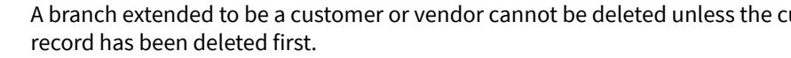

A branch extended to be a customer or vendor cannot be deleted unless the customer or vendor

### **Setup of Default Sales Account in Intercompany Invoices**

On the *[Accounts Receivable Preferences](https://help-2025r1.acumatica.com/Help?ScreenId=ShowWiki&pageid=f7b52067-5299-45e8-b601-485cd709f58b)* (AR101000) form, the **Use IntercompanySales Account From** box defines which sales account the system inserts in the lines of an intercompany AR document whose customer was extended based on a company or branch. You can select one of the following options:

- *Customer Location* (default): The system inserts the sales account specified in the**Sales Account** box on the **GL Accounts** tab of the *[Customer Locations](https://help-2025r1.acumatica.com/Help?ScreenId=ShowWiki&pageid=61a8c6de-6a51-434b-8c2d-4304ec982ae0)* (AR303020) form for the customer location selected for the AR document.
- *Inventory Item*: The system inserts the sales account specified in the**Sales Account** box on the **GL Accounts** tab of the *[Non-Stock Items](https://help-2025r1.acumatica.com/Help?ScreenId=ShowWiki&pageid=bf68dd4f-63d4-460d-8dc0-9152f2bd6bf1)* (IN202000) form if a non-stock item is specified in the AR document line.

### **Setup of Default Expense Account in Bills from Related Companies**

On the *[Accounts Payable Preferences](https://help-2025r1.acumatica.com/Help?ScreenId=ShowWiki&pageid=c3f9353e-95e6-448d-bb3f-e20643879ec7)* (AP101000) form, the **Use Intercompany Expense Account From** box defines which expense account the system inserts in the lines of an intercompany AP document of a vendor that was extended based on a company or branch. You can select the following options:

- *Vendor Location* (default): The system inserts the expense account specified in the **Expense Account** box on the **GL Accounts** tab of the *Vendor [Locations](https://help-2025r1.acumatica.com/Help?ScreenId=ShowWiki&pageid=aeeccc5c-465f-4bca-9cd7-a3c792da38e1)* (AP303010) form for the vendor location selected for the AP document.
- *Inventory Item*: The system inserts the expense account specified in the **Expense Account** box on the **GL Accounts** tab of the *[Non-Stock Items](https://help-2025r1.acumatica.com/Help?ScreenId=ShowWiki&pageid=bf68dd4f-63d4-460d-8dc0-9152f2bd6bf1)* (IN202000) form if a non-stock item is specified in the AP document line.

# <span id="page-160-0"></span>**Intercompany Sales Setup: Mapping Rules**

This topic provides a list of values inserted into the UI elements of an AP document created from an AR document. Aer the creation of a new AP document, the relation between the AR document and the AP document is saved to the database.

#### *Table: Mapping Rules for the Creation of AP Documents*

This table shows the UI elements for an AP document on the *[Bills and Adjustments](https://help-2025r1.acumatica.com/Help?ScreenId=ShowWiki&pageid=956b4e51-3078-4d2d-85b3-65c080d95234)* (AP301000) or *[Generate](https://help-2025r1.acumatica.com/Help?ScreenId=ShowWiki&pageid=50e6ea07-42a0-4c44-884c-2e5f0b74474b) [Intercompany Documents](https://help-2025r1.acumatica.com/Help?ScreenId=ShowWiki&pageid=50e6ea07-42a0-4c44-884c-2e5f0b74474b)* (AP503500) form and the values from the corresponding AR document. The AR document may be on the *[Invoices and Memos](https://help-2025r1.acumatica.com/Help?ScreenId=ShowWiki&pageid=5e6f3b27-b7af-412f-a40a-1d4f4be70cba)* (AR301000) form.

| UI Element   | Value                                                                                                                                                                    |
|--------------|--------------------------------------------------------------------------------------------------------------------------------------------------------------------------|
| Summary area |                                                                                                                                                                          |
| Type         | •<br>Bill if the AR document's type is Invoice<br>•<br>Credit Adj. if the AR document's type is Debit Memo.<br>Debit Adj. if the AR document's type is Credit Memo.<br>• |
| Date         | The value from the Date box on the Invoices and Memos (AR301000) form.                                                                                                   |

| UI Element             | Value                                                                                                                                                                                                                                                                                                                                                                                                                                                                                                                                                                                                                                                                                                                                                                                                                                                                                                                                                                                                                                                                                                                                             |
|------------------------|---------------------------------------------------------------------------------------------------------------------------------------------------------------------------------------------------------------------------------------------------------------------------------------------------------------------------------------------------------------------------------------------------------------------------------------------------------------------------------------------------------------------------------------------------------------------------------------------------------------------------------------------------------------------------------------------------------------------------------------------------------------------------------------------------------------------------------------------------------------------------------------------------------------------------------------------------------------------------------------------------------------------------------------------------------------------------------------------------------------------------------------------------|
| Post Period            | •<br>If the AP document was generated on the Generate Intercompany Documents<br>(AP503500) form, this is the value specified in the Post Period box on the In<br>voices and Memos form. If this setting has not been specified, the post period<br>is calculated as the period from the calendar of the AP document's originat<br>ing branch that corresponds to the AR document's Post Period in the master<br>calendar.<br>•<br>If the AP document was generated on the Invoices and Memos form, the post<br>period is calculated as the period from the calendar of the AP document's<br>originating branch that corresponds to the AR document's Post Period in the<br>master calendar. If the period does not exist in the calendar of the AP doc<br>ument's originating branch, the value is empty. If the period is Inactive or<br>Locked, the system displays an error message. If posting to closed periods is<br>allowed for the user, an AP document is created with a warning in the Post<br>Period box on the Bills and Adjustments (AP301000) form. If posting to closed<br>periods is not allowed, the AP document is not created. |
| Vendor Ref             | The reference number of the AR document specified in the Reference Number<br>box on the Invoices and Memos form.                                                                                                                                                                                                                                                                                                                                                                                                                                                                                                                                                                                                                                                                                                                                                                                                                                                                                                                                                                                                                                  |
| Vendor                 | The originating branch of the AR document.                                                                                                                                                                                                                                                                                                                                                                                                                                                                                                                                                                                                                                                                                                                                                                                                                                                                                                                                                                                                                                                                                                        |
| Location               | The vendor's default location.                                                                                                                                                                                                                                                                                                                                                                                                                                                                                                                                                                                                                                                                                                                                                                                                                                                                                                                                                                                                                                                                                                                    |
| Currency               | The currency of the AR document.                                                                                                                                                                                                                                                                                                                                                                                                                                                                                                                                                                                                                                                                                                                                                                                                                                                                                                                                                                                                                                                                                                                  |
| Currency RateType      | The currency rate type of the AR document.                                                                                                                                                                                                                                                                                                                                                                                                                                                                                                                                                                                                                                                                                                                                                                                                                                                                                                                                                                                                                                                                                                        |
| Currency Exchange Rate | The exchange rate of the AR document.                                                                                                                                                                                                                                                                                                                                                                                                                                                                                                                                                                                                                                                                                                                                                                                                                                                                                                                                                                                                                                                                                                             |
| Terms                  | The credit terms of the AR document.                                                                                                                                                                                                                                                                                                                                                                                                                                                                                                                                                                                                                                                                                                                                                                                                                                                                                                                                                                                                                                                                                                              |
| Due Date               | The due date of the AR document.                                                                                                                                                                                                                                                                                                                                                                                                                                                                                                                                                                                                                                                                                                                                                                                                                                                                                                                                                                                                                                                                                                                  |
| Cash Discount Date     | The cash discount date of the AR document.                                                                                                                                                                                                                                                                                                                                                                                                                                                                                                                                                                                                                                                                                                                                                                                                                                                                                                                                                                                                                                                                                                        |
| Pay by Line check box  | The state of the Pay by Line check box on the Vendors (AP301000) form for the<br>vendor.                                                                                                                                                                                                                                                                                                                                                                                                                                                                                                                                                                                                                                                                                                                                                                                                                                                                                                                                                                                                                                                          |
| Description            | The description of the AR document.                                                                                                                                                                                                                                                                                                                                                                                                                                                                                                                                                                                                                                                                                                                                                                                                                                                                                                                                                                                                                                                                                                               |
| Discount Total         | •<br>If the Vendor Discounts feature has been enabled on the Enable/Disable Fea<br>tures (CS100000) form, an automatically calculated value based on the values<br>on the Discount Details tab on the Bills and Adjustments form.<br>•<br>If the Vendor Discount feature has been disabled:<br>•<br>If the Customer Discounts feature has been enabled, the sum of the Dis<br>count Amount values of all lines on the Discount Details tab on the In<br>voices and Memos form.<br>•<br>If the Customer Discounts feature has been disabled, the Discount Total<br>of the AR document.                                                                                                                                                                                                                                                                                                                                                                                                                                                                                                                                                             |
| Amount                 | The value of the Amount box on the Invoices and Memos form.                                                                                                                                                                                                                                                                                                                                                                                                                                                                                                                                                                                                                                                                                                                                                                                                                                                                                                                                                                                                                                                                                       |

| UI Element              | Value                                                                                                                                                                                                                                                                                                                                                                                                                                                                                                                                                                                                             |
|-------------------------|-------------------------------------------------------------------------------------------------------------------------------------------------------------------------------------------------------------------------------------------------------------------------------------------------------------------------------------------------------------------------------------------------------------------------------------------------------------------------------------------------------------------------------------------------------------------------------------------------------------------|
| Cash Discount           | If the AP document's amount is the same as the AR document's amount, the val<br>ue of the Cash Discount box of the Invoices and Memos form. Otherwise, this<br>value is calculated based on the credit terms of the AR document.                                                                                                                                                                                                                                                                                                                                                                                  |
| Financial tab           |                                                                                                                                                                                                                                                                                                                                                                                                                                                                                                                                                                                                                   |
| Branch                  | The customer specified in the Customer box of the Invoices and Memos form.                                                                                                                                                                                                                                                                                                                                                                                                                                                                                                                                        |
| VendorTax Zone          | The tax zone specified for the vendor location in theTax Zone box on the Pur<br>chase Settings tab of the Vendors (AP303000) form.                                                                                                                                                                                                                                                                                                                                                                                                                                                                                |
| Tax Calculation Mode    | The tax calculation mode specified in theTax Calculation Mode box on the Fi<br>nancial tab of the Invoices and Memos form.                                                                                                                                                                                                                                                                                                                                                                                                                                                                                        |
| Details tab             |                                                                                                                                                                                                                                                                                                                                                                                                                                                                                                                                                                                                                   |
| Branch                  | The customer specified in the Customer box of the Invoices and Memos form.                                                                                                                                                                                                                                                                                                                                                                                                                                                                                                                                        |
| Inventory ID            | The Inventory ID of the AR document line.                                                                                                                                                                                                                                                                                                                                                                                                                                                                                                                                                                         |
| Transaction Description | The Transaction Description of the AR document line.                                                                                                                                                                                                                                                                                                                                                                                                                                                                                                                                                              |
| Quantity                | The Quantity of the AR document line.                                                                                                                                                                                                                                                                                                                                                                                                                                                                                                                                                                             |
| UOM                     | The UOM of the AR document line.                                                                                                                                                                                                                                                                                                                                                                                                                                                                                                                                                                                  |
| Unit Cost               | The Unit Cost of the AR document line.                                                                                                                                                                                                                                                                                                                                                                                                                                                                                                                                                                            |
| Ext. Cost               | The Ext. Cost of the AR document line.                                                                                                                                                                                                                                                                                                                                                                                                                                                                                                                                                                            |
| Account                 | One of the following, depending on the value of the Use Intercompany Ex<br>pense Account From box on the Accounts Payable Preferences (AP101000) form:<br>•<br>If Vendor Location is selected, the expense account specified in the Expense<br>Account box on the GL Accounts tab of the Vendor Locations (AP303010)<br>form for the customer location selected for this AR document.<br>•<br>If Inventory Item is selected, the expense account specified in the Expense<br>Account box on the GL Accounts tab of the Non-Stock Items (IN202000) form<br>for a non-stock item specified in the AR document line. |
| Project                 | If the Copy Project Information to AP Document check box has been select<br>ed on the Generate Intercompany Documents form or you clicked Yes in the con<br>firmation message on the Invoices and Memos form, the Project of the AR doc<br>ument. Otherwise, the non-project code specified on the Projects Preferences<br>(PM101000) form (X by default) is inserted.                                                                                                                                                                                                                                            |
| ProjectTask             | If the Copy Project Information to AP Document check box has been select<br>ed on the Generate Intercompany Documents form or you clicked Yes in the con<br>firmation message on the Invoices and Memos form, the ProjectTask of the AR<br>document. Otherwise, the value is empty.                                                                                                                                                                                                                                                                                                                               |

| UI Element                                                                                                                                                                                                                                                       | Value                                                                                                                                                                                                                                                                             |
|------------------------------------------------------------------------------------------------------------------------------------------------------------------------------------------------------------------------------------------------------------------|-----------------------------------------------------------------------------------------------------------------------------------------------------------------------------------------------------------------------------------------------------------------------------------|
| Cost Code                                                                                                                                                                                                                                                        | If the Copy Project Information to AP Document check box has been selected<br>on the Generate Intercompany Documents form or you clicked Yes in the confir<br>mation message on the Invoices and Memos form, the Cost Code of the AR docu<br>ment. Otherwise, the value is empty. |
| Discount Amount                                                                                                                                                                                                                                                  | The Discount Amount of the AR document line.                                                                                                                                                                                                                                      |
| Discount Percent                                                                                                                                                                                                                                                 | The Discount Percent of the AR document line.                                                                                                                                                                                                                                     |
| Manual Discount check box                                                                                                                                                                                                                                        | Selected.                                                                                                                                                                                                                                                                         |
| Deferral Code                                                                                                                                                                                                                                                    | Empty. Because deferral codes cannot be used simultaneously in AR and AP<br>documents, if at least one deferral code is specified in at least one line of the re<br>lated AR document, the system displays a warning that deferral codes cannot be<br>copied.                     |
| Tax Category                                                                                                                                                                                                                                                     | The Tax Category of the AR document line.                                                                                                                                                                                                                                         |
| Discounts tab                                                                                                                                                                                                                                                    |                                                                                                                                                                                                                                                                                   |
| Lines are created if the Vendor Discounts feature has been enabled. If the Customer Discounts fea<br>ture has been enabled, each discount line in the AP document corresponds to a discount line of the<br>AR document and contains the following column values. |                                                                                                                                                                                                                                                                                   |
| Manual Discount check box                                                                                                                                                                                                                                        | Selected.                                                                                                                                                                                                                                                                         |
| Discount Amount                                                                                                                                                                                                                                                  | The Discount Amount of the AR document's discount line.                                                                                                                                                                                                                           |
| Description                                                                                                                                                                                                                                                      | The Description of the AR document's discount line.                                                                                                                                                                                                                               |
| If the Customer Discounts feature has been disabled, one discount line is created in the AP document with the<br>following column values.                                                                                                                        |                                                                                                                                                                                                                                                                                   |
| Manual Discount check box                                                                                                                                                                                                                                        | Selected.                                                                                                                                                                                                                                                                         |
| Discount Amount                                                                                                                                                                                                                                                  | The Discount Total of the AR document.                                                                                                                                                                                                                                            |

# <span id="page-163-0"></span>**Intercompany Sales Setup: Configuration Prerequisites**

Before starting to set up the intercompany sales functionality, you should be sure that the needed features have been enabled, settings have been specified, and entities have been created, as described in the following sections.

# **Enabling the Needed Features**

On the *[Enable/Disable Features](https://help-2025r1.acumatica.com/Help?ScreenId=ShowWiki&pageid=c1555e43-1bc5-4f6f-ba9d-b323f94d8a6b)* (CS100000) form, the *Standard Financials*, *Multibranch Support*, *Multicompany Support*, *Advanced Financials*, and *Inter-Branch Transactions* features must be enabled.

# **Configuring the System**

You need to make sure the following tasks have been performed in Acumatica ERP before you begin to set up the intercompany sales functionality:

- If you are going to extend as a customer or vendor any company that has the *Without Branches* company type, on the *[Companies](https://help-2025r1.acumatica.com/Help?ScreenId=ShowWiki&pageid=fedad435-8496-4397-b8a3-50a473629f76)* (CS101500) form, make sure that the has been configured. For details, see *[Company](#page-82-1) Without [Branches:](#page-82-1) To Configure a Company Without Branches*.
- If you are going to extend as a customer or vendor any branches of companies with the *With Branches Not Requiring Balancing* or *With Branches Requiring Balancing* company type, on the *[Branches](https://help-2025r1.acumatica.com/Help?ScreenId=ShowWiki&pageid=b97ab72d-4ab4-4f02-b69c-f7f61b316ced)* (CS102000) form, make sure that the companies have been configured. For details, see *[Company with Branches that Do Not](#page-88-1) [Require Balancing: Implementation Activity](#page-88-1)* and *[Company with Branches that Require Balancing: Implementation](#page-96-1) [Activity](#page-96-1)*.
- On the *[Customer Classes](https://help-2025r1.acumatica.com/Help?ScreenId=ShowWiki&pageid=806e39d6-6f89-4e6c-9a24-61c6fb0c9a57)* (AR201000) form, make sure that the customer class to be used for a customer extended from a company or branch has been defined. For details, see *Accounts [Receivable:](#page-120-2) To Create a [Customer Class](#page-120-2)*.
- On the *Vendor [Classes](https://help-2025r1.acumatica.com/Help?ScreenId=ShowWiki&pageid=20dc8b93-d83a-49cf-8cfb-d2ffd2f0db87)* (AP201000) form, make sure that the vendor class to be used for a vendor extended from a company or branch has been defined. For details, see *[Accounts](#page-112-1) Payable: To Create a Vendor Class*.

# **Validation of Configuration**

To make sure that all configuration has been performed correctly, we recommend that in your system, you set up the intercompany sales functionality by performing instructions similar to those described in *[Intercompany Sales](#page-164-1) [Setup: Implementation Activity](#page-164-1)*.

# <span id="page-164-1"></span><span id="page-164-0"></span>**Intercompany Sales Setup: Implementation Activity**

The following activity will walk you through the process of setting up intercompany sales between branches of two companies within the same tenant.

This activity is based on the *U100* dataset. If you are using another dataset, or if any system settings have been changed in *U100*, these changes can affect the workflow of the activity and the results of the processing. To avoid any issues, restore the *U100* dataset to its initial state.

### **Story**

Suppose that the Head Office of the Muffins & Cakes company has to purchase juicer installation services from the Service and Equipment Sales Center of SweetLife Fruits & Jams. An accountant of SweetLife Fruits & Jams issues an invoice to the Muffins & Cakes company for the services. The corresponding AP bill needs to be processed in Muffins & Cakes. Two documents have to be created in the system for a single transaction (AR invoice in the selling company and AP bill in the purchasing company), but the accountant does not want to enter both of them manually. To cause the system to create the AP bill automatically based on an AR invoice, the chief accountant of SweetLife has decided to use the intercompany sales functionality.

Acting as a system administrator, you need to extend the *SWEEPEQUIP* branch of SweetLife to be a vendor and the *MHEAD* branch of Muffins & Cakes to be a customer.

# **Configuration Overview**

In the *U100* dataset, the following tasks have been performed to support this activity:

• On the *[Enable/Disable Features](https://help-2025r1.acumatica.com/Help?ScreenId=ShowWiki&pageid=c1555e43-1bc5-4f6f-ba9d-b323f94d8a6b)* (CS100000) form, the following features have been enabled:

- *Standard Financials*
- *Multibranch Support*
- *Multicompany Support*
- *Advanced Financials*
- *Inter-Branch Transactions*
- On the *[Companies](https://help-2025r1.acumatica.com/Help?ScreenId=ShowWiki&pageid=fedad435-8496-4397-b8a3-50a473629f76)* (CS101500) form, the *MUFFINS* and *SWEETLIFE* companies have been defined.
- On the *[Branches](https://help-2025r1.acumatica.com/Help?ScreenId=ShowWiki&pageid=b97ab72d-4ab4-4f02-b69c-f7f61b316ced)* (CS102000) form, the *SWEETEQUIP* (Service and Equipment Sales Center) and *MHEAD* (Muffins Head Office & Wholesale Center) branches of SweetLife and Muffins & Cakes, respectively, have been defined.
- On the *Vendor [Classes](https://help-2025r1.acumatica.com/Help?ScreenId=ShowWiki&pageid=20dc8b93-d83a-49cf-8cfb-d2ffd2f0db87)* (AP201000) form, the *INTERCO* vendor class for vendors extended from companies and branches has been configured.
- On the *[Customer Classes](https://help-2025r1.acumatica.com/Help?ScreenId=ShowWiki&pageid=806e39d6-6f89-4e6c-9a24-61c6fb0c9a57)* (AR201000) form, the *INTERCO* customer class for customers extended from companies and branches has been configured.

### **Process Overview**

In this activity, you will review the AP and AR preferences on the *[Accounts Payable Preferences](https://help-2025r1.acumatica.com/Help?ScreenId=ShowWiki&pageid=c3f9353e-95e6-448d-bb3f-e20643879ec7)* (AP101000) and *[Accounts Receivable Preferences](https://help-2025r1.acumatica.com/Help?ScreenId=ShowWiki&pageid=f7b52067-5299-45e8-b601-485cd709f58b)* (AR101000) forms. On the *[Branches](https://help-2025r1.acumatica.com/Help?ScreenId=ShowWiki&pageid=b97ab72d-4ab4-4f02-b69c-f7f61b316ced)* (CS102000) form, you will extend the *SWEETEQUIP* branch to be a vendor and the *MHEAD* branch to be a customer. On the *[Vendors](https://help-2025r1.acumatica.com/Help?ScreenId=ShowWiki&pageid=a9584be3-f2bd-4d67-80d4-8041d809df56)* (AP303000) form, you will update the settings of the new vendor and on the *[Customers](https://help-2025r1.acumatica.com/Help?ScreenId=ShowWiki&pageid=652929bc-9606-4056-aa6e-0c2d1147171b)* (AR303000) form, you will update the settings of the new customer.

### **System Preparation**

Launch the Acumatica ERP website with the *U100* dataset preloaded, and sign in as a system administrator Kimberly Gibbs by using the *gibbs* username and the *123* password.

### **Step 1: Reviewing the AP and AR Preferences**

Before you start configuring the intercompany sales functionality, you need to review the related AP and AR preferences. Do the following:

- 1. Open the *[Accounts Payable Preferences](https://help-2025r1.acumatica.com/Help?ScreenId=ShowWiki&pageid=c3f9353e-95e6-448d-bb3f-e20643879ec7)* (AP101000) form.
- 2. In the **Data EntrySettings** section on the **General** tab, review the value in the **Use Intercompany Expense Account From** box.

In the box, *Vendor Location* is specified, meaning that the system will use the expense account specified on the *Vendor [Locations](https://help-2025r1.acumatica.com/Help?ScreenId=ShowWiki&pageid=aeeccc5c-465f-4bca-9cd7-a3c792da38e1)* (AP303010) form for the vendor location selected in an AP document.

- 3. Open the *[Accounts Receivable Preferences](https://help-2025r1.acumatica.com/Help?ScreenId=ShowWiki&pageid=f7b52067-5299-45e8-b601-485cd709f58b)* (AR101000) form.
- 4. In the **Data EntrySettings** section on the **General** tab, review the value in the **Use IntercompanySales Account From** box.

In the box, *Customer Location* is specified, meaning that the system will use the sales account specified on the *[Customer Locations](https://help-2025r1.acumatica.com/Help?ScreenId=ShowWiki&pageid=61a8c6de-6a51-434b-8c2d-4304ec982ae0)* (AR303020) form for the customer location selected for the AR document.

### **Step 2: Extending a Branch as a Vendor**

To extend the *SWEETEQUIP* branch as a vendor, do the following:

- 1. Open the *[Branches](https://help-2025r1.acumatica.com/Help?ScreenId=ShowWiki&pageid=b97ab72d-4ab4-4f02-b69c-f7f61b316ced)* (CS102000) form.
- 2. In the **Branch ID** box, select *SWEETEQUIP*.

- 3. On the More menu (under **Company Management**), click **Extend asVendor**. The system opens the *[Vendors](https://help-2025r1.acumatica.com/Help?ScreenId=ShowWiki&pageid=a9584be3-f2bd-4d67-80d4-8041d809df56)* (AP303000) form with the appropriate settings copied from the branch to the vendor.
- 4. In the **Vendor Class** box in the Summary area, select *INTERCO*.
- 5. In the warning message that displays, click **Yes**.
- 6. On the **GL Accounts** tab, review the settings of the *MAIN* location automatically created by the system.

The account specified in the **Expense Account** box is *53100 - Intercompany Expenses*, which has been copied from the settings of the selected vendor class. This account will be used by default in generated AP documents.

7. On the form toolbar, click**Save**.

For a branch that has been extended as a vendor, on the *[Branches](https://help-2025r1.acumatica.com/Help?ScreenId=ShowWiki&pageid=b97ab72d-4ab4-4f02-b69c-f7f61b316ced)* form, the**View Vendor** command becomes available under **Company Management** on the More menu. You can click it to review the settings of the vendor created based on this branch on the *[Vendors](https://help-2025r1.acumatica.com/Help?ScreenId=ShowWiki&pageid=a9584be3-f2bd-4d67-80d4-8041d809df56)* form. Similarly, for a company that has been extended as a vendor, the**View Vendor** command becomes available on the *[Companies](https://help-2025r1.acumatica.com/Help?ScreenId=ShowWiki&pageid=fedad435-8496-4397-b8a3-50a473629f76)* (CS101500) form.

#### **Step 3: Extending a Branch as a Customer**

To extend the *MHEAD* branch as a customer, do the following:

- 1. Open the *[Branches](https://help-2025r1.acumatica.com/Help?ScreenId=ShowWiki&pageid=b97ab72d-4ab4-4f02-b69c-f7f61b316ced)* (CS102000) form.
- 2. In the **Branch ID** box, select *MHEAD*.
- 3. On the More menu (under **Company Management**), click **Extend as Customer**. The system opens the *[Customers](https://help-2025r1.acumatica.com/Help?ScreenId=ShowWiki&pageid=652929bc-9606-4056-aa6e-0c2d1147171b)* (AR303000) form with the appropriate settings copied from the branch to the customer.
- 4. In the **Customer Class** box in the Summary area, select *INTERCO*.
- 5. In the warning message that displays, click **Yes**.
- 6. On the **GL Accounts** tab, review the settings of the *MAIN* location automatically created by the system.

The account specified in the**Sales Account** box is *43000 - Related Company Sales*, which has been copied from the settings of the selected customer class. The account specified in the **AR Account** column is *19010 - Accounts Receivable - Related Company*, which has also been copied from the settings of the selected customer class. These accounts will be used by default in generated AR documents.

7. On the form toolbar, click**Save**.

For a branch that has been extended as a customer, on the *[Branches](https://help-2025r1.acumatica.com/Help?ScreenId=ShowWiki&pageid=b97ab72d-4ab4-4f02-b69c-f7f61b316ced)* form, the**View Customer** command becomes available under **Company Management** on the More menu. You can click it to review the settings of the customer created based on this branch on the *[Customers](https://help-2025r1.acumatica.com/Help?ScreenId=ShowWiki&pageid=652929bc-9606-4056-aa6e-0c2d1147171b)* form. Similarly, for a company that has been extended as a customer, the**View Customer** command becomes available on the *[Companies](https://help-2025r1.acumatica.com/Help?ScreenId=ShowWiki&pageid=fedad435-8496-4397-b8a3-50a473629f76)* (CS101500) form.

# <span id="page-166-0"></span>**Subaccounts**

In Acumatica ERP, to better track the revenue and expenses of your company while keeping your chart of accounts of a manageable size, you can use subaccounts to virtually split your accounts into smaller and more specific accounts.

This chapter provides information about defining subaccounts in the system, including an example of the configuration of subaccount identifiers.

# <span id="page-167-1"></span><span id="page-167-0"></span>**Subaccounts: General Information**

In Acumatica ERP, you can use subaccounts in addition to accounts to record your financial data. You use subaccounts to virtually split accounts into smaller, more specific accounts to achieve finer classification for reporting and internal management purposes. Before you begin to use subaccounts, the system has to be properly configured.


In a production system, we recommend that subaccounts be configured very early in the setup of Acumatica ERP, when you configure other general ledger settings, including the chart of accounts.

# **Learning Objectives**

In this chapter, you will learn how to do the following:

- Enable the *Subaccounts* feature
- Modify the predefined *SUBACCOUNT* segmented key
- Specify values for subaccount segments

# **Applicable Scenarios**

You configure subaccounts in the system when you need to provide more detailed breakdowns of data in reports. For example, if the company wants to report expenses by department and report revenue by sales region, you might configure subaccounts with at least two segments (one for the department and another for the sales region).

# **Implementation Workflow**

To configure subaccounts in the system, you do the following:

- 1. Enable the *Subaccounts* feature on the *[Enable/Disable Features](https://help-2025r1.acumatica.com/Help?ScreenId=ShowWiki&pageid=c1555e43-1bc5-4f6f-ba9d-b323f94d8a6b)* (CS100000) form.
- 2. Configure the *SUBACCOUNT* segmented key on the *[Segmented Keys](https://help-2025r1.acumatica.com/Help?ScreenId=ShowWiki&pageid=78bd7bd1-6bf6-409e-a8a5-8b18e8b80722)* (CS202000) form.
- 3. Define the list of possible values for each subaccount segment on the *[Segment](https://help-2025r1.acumatica.com/Help?ScreenId=ShowWiki&pageid=00338857-dd1a-41be-aa07-4cbce24c635e) Values* (CS203000) form.
- 4. If the *By Segmented Key* mode is selected for the *SUBACCOUNT* segmented key on the *[Segmented Keys](https://help-2025r1.acumatica.com/Help?ScreenId=ShowWiki&pageid=78bd7bd1-6bf6-409e-a8a5-8b18e8b80722)* form, define the needed subaccounts on the *[Subaccounts](https://help-2025r1.acumatica.com/Help?ScreenId=ShowWiki&pageid=2c7b73c6-43b2-4076-92c6-74c9e66ecf18)* (GL203000) form. (With this mode, on data entry forms, users can select only subaccounts that have already been defined in the system.)

Aer you have performed these actions, users can start recording transactions to account–subaccount pairs. That is, users need to select both the appropriate account and the needed subaccount as they enter data.

# **Configuration of Subaccount Identifiers**

Acumatica ERP provides the predefined *SUBACCOUNT* segmented key, which determines the structure of subaccount identifiers and which you can view and edit on the *[Segmented Keys](https://help-2025r1.acumatica.com/Help?ScreenId=ShowWiki&pageid=78bd7bd1-6bf6-409e-a8a5-8b18e8b80722)* (CS202000) form. You can modify this segmented key so that the structure of subaccount identifiers meets your company's business needs.

The *SUBACCOUNT* segmented key consists of a string, which can be up to 30 characters. You can divide the segmented key into multiple segments or can leave it non-segmented. To make subaccount identifiers easy to remember for users of the system (and thus more likely to be entered correctly), we recommend that you compose identifiers of segments with different meanings. For example, the subaccount identifiers could contain a twocharacter regional branch code, a one-digit department number, and a three-character product type, resulting in an identifier such as *CA-1-T32*. For a more detailed example of the planning of meaningful identifiers, see *[Subaccounts: Example of Planning Subaccount Identifiers](#page-169-1)*.

Depending on the validation setting of the subaccount entry (described in the following section), you might need to add all necessary subaccounts on the *[Subaccounts](https://help-2025r1.acumatica.com/Help?ScreenId=ShowWiki&pageid=2c7b73c6-43b2-4076-92c6-74c9e66ecf18)* (GL203000) form.

You use the table on the *[Segmented Keys](https://help-2025r1.acumatica.com/Help?ScreenId=ShowWiki&pageid=78bd7bd1-6bf6-409e-a8a5-8b18e8b80722)* form to configure the segments of the *SUBACCOUNT* segmented key, with each row representing a segment. By using the check box in the**Validate** column of the table, you can also turn on validation for the values of this segment of subaccounts. If this validation is turned on for a segment, the segment values have to be specified on the *[Segment](https://help-2025r1.acumatica.com/Help?ScreenId=ShowWiki&pageid=00338857-dd1a-41be-aa07-4cbce24c635e) Values* (CS203000) form. If this validation is turned off, a user can enter a new segment directly on a data entry form or on the *[Subaccounts](https://help-2025r1.acumatica.com/Help?ScreenId=ShowWiki&pageid=2c7b73c6-43b2-4076-92c6-74c9e66ecf18)* form.

If you use allocation rules in your system, aer allocations have been created, it is possible to change the structure of the *SUBACCOUNT* segmented key on the *[Segmented Keys](https://help-2025r1.acumatica.com/Help?ScreenId=ShowWiki&pageid=78bd7bd1-6bf6-409e-a8a5-8b18e8b80722)* form when no segment values have been entered yet. In this case, you need to manually update allocation rules on the *[Allocations](https://help-2025r1.acumatica.com/Help?ScreenId=ShowWiki&pageid=0565e6ca-a142-4c1c-8697-25139065f6f7)* form. For details, see *[Allocation Rules: Allocation Between the Same Accounts and](#page-135-2) [Subaccounts](#page-135-2)*.

# **Validation of Entered Subaccounts**

The validation of subaccounts during data entry is controlled by the option selected in the **Lookup Mode** box in the Summary area of the *[Segmented Keys](https://help-2025r1.acumatica.com/Help?ScreenId=ShowWiki&pageid=78bd7bd1-6bf6-409e-a8a5-8b18e8b80722)* (CS202000) form for the *SUBACCOUNT* segmented key. Depending on whether you want to turn on validation, you do one of the following:

- To give users the ability to select subaccounts on a data entry form only from the list of defined subaccounts in the system, you select the *By Segmented Key* mode. This mode turns on validation for subaccounts. In this case, the necessary subaccounts have to be specified on the *[Subaccounts](https://help-2025r1.acumatica.com/Help?ScreenId=ShowWiki&pageid=2c7b73c6-43b2-4076-92c6-74c9e66ecf18)* (GL203000) form transactions are entered that should include the subaccount.
- To give users the ability to enter subaccounts on a data entry form by selecting the values segment by segment, you select the *By Segment: All Avail. Segment Values* mode. When a user enters a new subaccount on any data entry form, the system automatically adds it to the list of subaccounts on the *[Subaccounts](https://help-2025r1.acumatica.com/Help?ScreenId=ShowWiki&pageid=2c7b73c6-43b2-4076-92c6-74c9e66ecf18)* form instead of performing subaccount validation.

You might want to select the *By Segment: All Avail. Segment Values* mode when the number of segments and the number of values in each segment could produce too many combinations to enter them in advance.

# <span id="page-168-0"></span>**Subaccounts: Configuration Prerequisites**

Before you start to configure subaccounts, you must be sure that the system has been configured properly and that all required entities have been created, as described in the following sections.

# **Enabling the Needed Features**

On the *[Enable/Disable Features](https://help-2025r1.acumatica.com/Help?ScreenId=ShowWiki&pageid=c1555e43-1bc5-4f6f-ba9d-b323f94d8a6b)* (CS100000) form, the minimum set of features has to be enabled.

# **Configuring the System**

On the *[Companies](https://help-2025r1.acumatica.com/Help?ScreenId=ShowWiki&pageid=fedad435-8496-4397-b8a3-50a473629f76)* (CS101500) form, you need to make sure that the companies of the organization have been configured and that the appropriate actual ledger has been assigned to each of them. For more information on creating companies, see one of the following topics: *Company Without [Branches:](#page-82-1) To Configure a Company Without [Branches](#page-82-1) [Company with Branches that Do Not Require Balancing: Implementation Activity](#page-88-1)*, or *[Company with Branches](#page-96-1) [that Require Balancing: Implementation Activity](#page-96-1)*. For details on creating an actual ledger, see *[General](#page-101-2) Ledger: To [Create an Actual Ledger](#page-101-2)*.

# <span id="page-169-1"></span><span id="page-169-0"></span>**Subaccounts: Example of Planning Subaccount Identifiers**

Suppose that one company—North Serpent Company, with stores in the mountainous areas of California and Nevada—sells skis and snowboards and offers rental services. This company plans to implement Acumatica ERP and is planning its general ledger functionality, including the accounts and subaccounts it will use.

Currently, each sale transaction of a ski or a snowboard is recorded to sales account *40000*. At the close of each period, however, management would like to know the total sales on skis in the California stores and in the Nevada stores and the total sales on snowboards in the California stores and in the Nevada stores, as well as the total rental of snowboards in the California stores and in the Nevada stores and the total rental of skis in the California stores and in the Nevada stores.

One approach the company initially considered was replacing the *40000* sales account with eight more specific accounts in Acumatica ERP, as shown below:

- *40100*: Ski sales in a Nevada store
- *40200*: Snowboard sales in a Nevada store
- *40300*: Ski rentals in a Nevada store
- *40400*: Snowboard rentals in a Nevada store
- *40500*: Ski sales in a California store
- *40600*: Snowboard sales in a California store
- *40700*: Ski rentals in a California store
- *40800*: Snowboard rentals in a California store

One of the implementation consultants determined that by using subaccounts, the company could meet its needs for tracking and reporting while also reducing entry errors and the need for users to memorize strings of account numbers. By implementing subaccounts, North Serpent Company could answer such questions as the following: *What is the total sales amount for snowboards in both stores? What is our revenue from rental services?* Additionally, because stores could record expenses to the appropriate subaccounts, management would have the ability to analyze profit by stores, by cost centers, and by product type.

# **Planning of Subaccount Identifiers**

In Acumatica ERP, subaccounts are referred to by their identifiers. Because subaccounts are used primarily to give internal management information it can use for analysis and planning, greater flexibility is allowed for their design, and identifiers can be segmented. Segmented identifiers with meaningful, recognizable segment values reduce the input error rate, because they are easier for employees to enter. For the North Serpent Company, the implementation consultants decided to define a three-segment subaccount in the following way:

- First Segment (Company Division): *NV* (Nevada) and *CA* (California)
- Second Segment (Profit Center): *RENT* (rentals) and *SALE* (sales)
- Third Segment (Product Type): *SK* (skis) and *SB* (snowboards)

All sales and rental transactions can then be posted to the sales account *40000* with the following subaccounts:

- *NV-SALE-SK*: To enter sales amounts on skis in Nevada
- *NV-SALE-SB*: To enter sales amounts on snowboards in Nevada
- *NV-RENT-SK*: To enter amounts received on ski rentals in Nevada
- *NV-RENT-SB*: To enter amounts received on snowboard rentals in Nevada
- *CA-SALE-SK*: To enter sales amounts on skis in California
- *CA-SALE-SB*: To enter sales amounts on snowboards in California
- *CA-RENT-SK*: To enter amounts received on ski rentals in California

• *CA-RENT-SB*: To enter amounts received on snowboard rentals in California

# <span id="page-170-1"></span><span id="page-170-0"></span>**Subaccounts: Implementation Activity**

In this activity, you will learn how to enable the appropriate feature to use subaccounts, define the structure of subaccounts, and specify the allowable values for subaccount segments in the system.

This activity is based on the *U100* dataset. If you are using another dataset, or if any system settings have been changed in *U100*, these changes can affect the workflow of the activity and the results of the processing. To avoid any issues, restore the *U100* dataset to its initial state.

### **Story**

Suppose that the management of the SweetLife Fruits & Jams company wants to report the company's expenses by department and its revenue by groups of items.

Acting as a system administrator, you have to perform the needed actions to configure subaccounts in the system. The subaccounts will consist of two segments: one that represents a product, and another that represents a department. You also have to specify the values for each segment and set up the subaccounts so that users enter subaccounts on data entry forms by selecting the values segment by segment.

### **Configuration Overview**

In the *U100* dataset, the following tasks have been performed for the purposes of this activity:

- On the *[Companies](https://help-2025r1.acumatica.com/Help?ScreenId=ShowWiki&pageid=fedad435-8496-4397-b8a3-50a473629f76)* (CS101500) form, the *SWEETLIFE* company has been defined.
- On the *[Branches](https://help-2025r1.acumatica.com/Help?ScreenId=ShowWiki&pageid=b97ab72d-4ab4-4f02-b69c-f7f61b316ced)* (CS102000) form, the *HEADOFFICE* branch of the *SWEETLIFE* company has been created.
- On the *[Segmented Keys](https://help-2025r1.acumatica.com/Help?ScreenId=ShowWiki&pageid=78bd7bd1-6bf6-409e-a8a5-8b18e8b80722)* (CS202000) form, the *SUBACCOUNT* segmented key has been created.

#### **Process Overview**

To configure subaccounts in the system, you will first enable the *Subaccounts* feature on the *[Enable/Disable](https://help-2025r1.acumatica.com/Help?ScreenId=ShowWiki&pageid=c1555e43-1bc5-4f6f-ba9d-b323f94d8a6b) [Features](https://help-2025r1.acumatica.com/Help?ScreenId=ShowWiki&pageid=c1555e43-1bc5-4f6f-ba9d-b323f94d8a6b)* (CS100000) form. You will then define the *SUBACCOUNT* segmented key on the *[Segmented Keys](https://help-2025r1.acumatica.com/Help?ScreenId=ShowWiki&pageid=78bd7bd1-6bf6-409e-a8a5-8b18e8b80722)* (CS202000) form to meet the company's business needs. Finally, you will assign values to the segments on the *[Segment](https://help-2025r1.acumatica.com/Help?ScreenId=ShowWiki&pageid=00338857-dd1a-41be-aa07-4cbce24c635e) Values* (CS203000) form. You will then check the subaccounts on the *[Subaccounts](https://help-2025r1.acumatica.com/Help?ScreenId=ShowWiki&pageid=2c7b73c6-43b2-4076-92c6-74c9e66ecf18)* (GL203000) form and change them if necessary.

#### **System Preparation**

Launch the Acumatica ERP website with the *U100* dataset preloaded, and sign in as a system administrator Kimberly Gibbs by using the *gibbs* username and the *123* password.

This activity shows the configuration of subaccounts on a system that has already been in use. However, in a production environment, we recommend that you configure subaccounts very early in the setup of Acumatica ERP, when you configure other general ledger settings, including the chart of accounts.

#### **Step 1: Enabling the Subaccounts Feature**

To enable the *Subaccounts* feature, do the following:

- 1. Open the *[Enable/Disable Features](https://help-2025r1.acumatica.com/Help?ScreenId=ShowWiki&pageid=c1555e43-1bc5-4f6f-ba9d-b323f94d8a6b)* (CS100000) form.
- 2. On the form toolbar, click **Modify** to make it possible to change the set of enabled features.
- 3. Select the**Subaccounts** check box in the **Advanced Financials** group of features.
- 4. On the form toolbar, click **Enable**.

In a production environment, aer the feature is enabled and before you proceed with implementation, you have to activate the Acumatica ERP license by using the *[Activate License](https://help-2025r1.acumatica.com/Help?ScreenId=ShowWiki&pageid=4859a849-af09-340d-a55b-93c72eabd553)* (SM201510) form. In this practice activity, you are using Acumatica ERP under the trial license, which does not require activation and provides all available features.

### **Step 2: Modifying the SUBACCOUNT Segmented Key**

To modify the *SUBACCOUNT* segmented key, do the following:

- 1. Open the *[Segmented Keys](https://help-2025r1.acumatica.com/Help?ScreenId=ShowWiki&pageid=78bd7bd1-6bf6-409e-a8a5-8b18e8b80722)* (CS202000) form.
- 2. In the **Segmented Key ID** box of the Summary area, select *SUBACCOUNT*.
- 3. In the **Lookup Mode** box, select *By Segment: All Avail. Segment Values*. Notice that the **Allow Adding New Values On the Fly** check box becomes selected automatically.

In this lookup mode, users can combine subaccounts from the needed segments during data entry. For each segment, a user can type an allowed value or press F3 to select a value from the predefined list. Each new combination is saved to the list of subaccounts, which you can view and edit on the *[Subaccounts](https://help-2025r1.acumatica.com/Help?ScreenId=ShowWiki&pageid=2c7b73c6-43b2-4076-92c6-74c9e66ecf18)* (GL203000) form.

- 4. In the table, for the *1* segment, specify the following settings:
  - **Description:** Product Group
  - **Length**: 3
  - **Validate**: Selected

These settings mean that the validation of segment values is turned on for the segment. With this check box selected, a user can add a value to this particular segment only by selecting the value from the list of available ones.

5. On the table toolbar, click **Add Row**, and specify the following settings in the new row:

- **Description:** Department
- **Length**: 3
- **Validate**: Selected
- 6. On the form toolbar, click**Save**.

You have defined the *SUBACCOUNT* segmented key based on the company's business needs. You will now define the allowable values for each segment.

#### **Step 3: Defining the Allowable Values for the Segments of the SUBACCOUNT Segmented Key**

To define the segment values, do the following:

1. While you are still viewing the *SUBACCOUNT* segmented key on the *[Segmented Keys](https://help-2025r1.acumatica.com/Help?ScreenId=ShowWiki&pageid=78bd7bd1-6bf6-409e-a8a5-8b18e8b80722)* (CS202000) form, click *1* in the **Segment ID** column of the table.

The system opens the *[Segment](https://help-2025r1.acumatica.com/Help?ScreenId=ShowWiki&pageid=00338857-dd1a-41be-aa07-4cbce24c635e) Values* (CS203000) form for the *1* segment of the *SUBACCOUNT* segmented key.

- 2. On the table toolbar, click **Add Row**, and specify the following settings in the added row:
  - **Value**: 000
  - **Description**: All other products

3. Add five more rows with the following settings. These segment values represent the group of items to which the applicable item belongs.

| Value | Description                        |
|-------|------------------------------------|
| ELE   | Electronics and computer equipment |
| EQU   | Juicers and their components       |
| FRU   | Fruit                              |
| JAM   | Jams                               |
| NSS   | Non-stock items and services       |

- 4. On the form toolbar, click**Save**.
- 5. Return to the *[Segmented Keys](https://help-2025r1.acumatica.com/Help?ScreenId=ShowWiki&pageid=78bd7bd1-6bf6-409e-a8a5-8b18e8b80722)* form, and in the**Segment ID** box, click *2*.

6. Add six rows with the following settings. These segment values represent the applicable department.

| Value | Description             |
|-------|-------------------------|
| 000   | Not Defined             |
| ENG   | After-sales engineering |
| FIN   | Finance                 |
| MKT   | Marketing               |
| OPS   | Operations              |
| SLS   | Sales                   |

7. On the form toolbar, click**Save**.

You have specified the allowable values for the subaccount segments.

#### **Step 4: Changing Subaccounts**

You have enabled the *Subaccounts* feature on the *[Enable/Disable Features](https://help-2025r1.acumatica.com/Help?ScreenId=ShowWiki&pageid=c1555e43-1bc5-4f6f-ba9d-b323f94d8a6b)* (CS100000) form and configured subaccounts in the system. Because transactions had already been added to the system before you performed these steps, the system added the *0* subaccount and specified it for all these transactions.

You need to change the *0* subaccount so that it contains the values that you have specified for the *SUBACCOUNT* segmented key. Do the following:

- 1. Open the *[Subaccounts](https://help-2025r1.acumatica.com/Help?ScreenId=ShowWiki&pageid=2c7b73c6-43b2-4076-92c6-74c9e66ecf18)* (GL203000) form.
- 2. In the **Subaccount** column of the only row, double-click the subaccount identifier, and change it to 000-000.
- 3. On the form toolbar, click**Save**.
- 4. In the dialog box that opens, click **Yes**.

Now all the transactions that existed before you configured subaccounts are related to the *000-000* subaccount.

You have configured subaccounts in the system. Now the appropriate subaccounts must be specified for every transaction in the system.

# <span id="page-173-0"></span>**Subaccounts: Allowable Changes to the Configuration of Subaccounts**

Aer subaccounts have been fully configured and transactions have been posted in your system, there are limitations to the changes you can make to subaccounts. For example, you can append a segment to subaccount identifiers, but you cannot delete segments of these identifiers, because such a deletion could result in lost data. If you need to change the configuration of subaccounts in a live system, you have the following options:

• If you are not planning to use a subaccount anymore, you can deactivate it on the *[Subaccounts](https://help-2025r1.acumatica.com/Help?ScreenId=ShowWiki&pageid=2c7b73c6-43b2-4076-92c6-74c9e66ecf18)* (GL203000) form. If you deactivate it, the system maintains the history of transactions for the subaccount, but users cannot create new documents or transactions with the deactivated subaccount. For details, see *[To](#page-174-4) [Deactivate a Subaccount](#page-174-4)*.

Note that you deactivate the subaccount rather than deleting it. A subaccount can be deleted only if no transactions containing the subaccount have been posted.

• You can add a new segment to the end of subaccount identifiers on the *[Segmented Keys](https://help-2025r1.acumatica.com/Help?ScreenId=ShowWiki&pageid=78bd7bd1-6bf6-409e-a8a5-8b18e8b80722)* (CS202000) form. In this case, the account–subaccount combinations that are referred to in existing transactions will have an empty value in the new segment. You can update the list of these combinations on the *[Subaccounts](https://help-2025r1.acumatica.com/Help?ScreenId=ShowWiki&pageid=2c7b73c6-43b2-4076-92c6-74c9e66ecf18)* form and specify the needed values for the new segment. The history of transactions will be updated to reflect the expanded subaccount identifiers.

You cannot delete any segments of subaccount identifiers.

- For subaccount identifiers, you can add new segment values and edit the existing values on the *[Segment](https://help-2025r1.acumatica.com/Help?ScreenId=ShowWiki&pageid=00338857-dd1a-41be-aa07-4cbce24c635e) [Values](https://help-2025r1.acumatica.com/Help?ScreenId=ShowWiki&pageid=00338857-dd1a-41be-aa07-4cbce24c635e)* (CS203000) form. If you change a segment value, on the *[Subaccounts](https://help-2025r1.acumatica.com/Help?ScreenId=ShowWiki&pageid=2c7b73c6-43b2-4076-92c6-74c9e66ecf18)* form, you have to manually update the list of subaccounts that use the old value to contain the new value. This causes the system to update already-existing transactions to use the new subaccount identifiers.
- You can merge subaccounts by moving the balances to one of these subaccounts and deactivating the unnecessary subaccounts on the *[Subaccounts](https://help-2025r1.acumatica.com/Help?ScreenId=ShowWiki&pageid=2c7b73c6-43b2-4076-92c6-74c9e66ecf18)* form. Aer you perform these actions, you can also deactivate any unnecessary values on the *[Segment](https://help-2025r1.acumatica.com/Help?ScreenId=ShowWiki&pageid=00338857-dd1a-41be-aa07-4cbce24c635e) Values* form so that the users cannot select these values when combining subaccounts on the fly.

# <span id="page-173-1"></span>**To Add a Subaccount**

You use the *[Subaccounts](https://help-2025r1.acumatica.com/Help?ScreenId=ShowWiki&pageid=2c7b73c6-43b2-4076-92c6-74c9e66ecf18)* (GL203000) form to add a subaccount.

### **Before You Proceed**

- 1. On the *[Segmented Keys](https://help-2025r1.acumatica.com/Help?ScreenId=ShowWiki&pageid=78bd7bd1-6bf6-409e-a8a5-8b18e8b80722)* (CS202000) form, be sure the structure of subaccounts has been configured.
- 2. Review the meanings of the subaccount segment values in your organization. For segments requiring validation, you define valid values by using the *[Segment](https://help-2025r1.acumatica.com/Help?ScreenId=ShowWiki&pageid=00338857-dd1a-41be-aa07-4cbce24c635e) Values* (CS203000) form.

# **To Add a Subaccount**

1. Open the *[Subaccounts](https://help-2025r1.acumatica.com/Help?ScreenId=ShowWiki&pageid=2c7b73c6-43b2-4076-92c6-74c9e66ecf18)* (GL203000) form.

To open the form for creating a new record, type the form ID in the Search box, and on the Search form, point at the form title and click **New** right of the title.

2. On the table toolbar, click **Add Row**.

The input mask for subaccount identifiers is shown in the**Subaccount** column for the new row.

- 3. Create the subaccount by using one of the following methods, depending on whether the**Validate** check box is selected for the segment on the *[Segmented Keys](https://help-2025r1.acumatica.com/Help?ScreenId=ShowWiki&pageid=78bd7bd1-6bf6-409e-a8a5-8b18e8b80722)* (CS202000) form:
  - If the **Validate** check box is selected for the segment, select the segment value from the list of predefined values.
  - If the check box is not selected for the segment, type a value. The system will validate this value for only the number of characters and the type of string (specified in the **Edit Mask** box on the *[Segmented Keys](https://help-2025r1.acumatica.com/Help?ScreenId=ShowWiki&pageid=78bd7bd1-6bf6-409e-a8a5-8b18e8b80722)* form).
- 4. Make sure the **Active** check box is selected in the row of the subaccount.
- 5. If needed, in the **Description** column, briefly describe the subaccount.
- 6. On the form toolbar, click**Save**.

# <span id="page-174-4"></span><span id="page-174-0"></span>**To Deactivate a Subaccount**

A subaccount that has transactions posted cannot be deleted; if such a subaccount is not used anymore, you can instead deactivate it. Aer the subaccount has been deactivated, it remains in the database but does not appear in the list of subaccounts for selection on data entry forms.

You use the *[Subaccounts](https://help-2025r1.acumatica.com/Help?ScreenId=ShowWiki&pageid=2c7b73c6-43b2-4076-92c6-74c9e66ecf18)* (GL203000) form to deactivate a subaccount.

#### **To Deactivate a Subaccount**

- 1. Open the *[Subaccounts](https://help-2025r1.acumatica.com/Help?ScreenId=ShowWiki&pageid=2c7b73c6-43b2-4076-92c6-74c9e66ecf18)* (GL203000) form.
- 2. In the Search box at the top right of the form, type a segment value, and review the results to quickly find a subaccount.
- 3. Click the row with the subaccount you want to deactivate.
- 4. In the **Active** column for the subaccount, clear the check box.
- 5. On the form toolbar, click**Save**.

# <span id="page-174-1"></span>**Multiple Base Currencies**

The topics of this chapter describe how to configure the support of multiple base currencies in one tenant and set up the needed entities.

# <span id="page-174-3"></span><span id="page-174-2"></span>**Multiple Base Currencies: General Information**

To be able to set up companies with different base currencies in one tenant of Acumatica ERP, you need to configure the multiple base currency functionality. This chapter describes how to prepare for the configuration and how to configure the functionality to meet your business needs.

#### **Learning Objectives**

In this chapter, you will learn how to do the following:

• Enable the required system features

• Create a company with a base currency that is different from the base currency of the companies that exist in the tenant

# **Applicable Scenarios**

You configure multiple base currencies if you need to have multiple related companies that have different base currencies but share preferences, list of items, and joint projects involving employees of multiple companies.

### **Scope of the Multiple Base Currency Functionality in Acumatica ERP**

Multiple base currencies are supported for a limited set of financial areas—general ledger, accounts payable, accounts receivable, cash management, currency management, sales orders, purchase orders, inventory, expense receipts and claims, deferred revenue, fixed assets, and taxes. For the *Multiple Base Currencies* feature to be enabled, the following features need to be enabled on the *[Enable/Disable Features](https://help-2025r1.acumatica.com/Help?ScreenId=ShowWiki&pageid=c1555e43-1bc5-4f6f-ba9d-b323f94d8a6b)* (CS100000) form:

- *Multicompany Support*
- *Multicurrency Accounting*
- *Customer and Vendor Visibility Restriction*

The following features are not supported if the *Multiple Base Currencies* feature has been enabled:

- *Customer Portal*
- *Lot/Serial Attributes*
- *Payroll*
- *Procore Integration*
- *Projects* if the *Multicurrency Projects* feature is disabled
- *Purchase Requisitions*
- *Retail Commerce*
- *Service Management*

If the *Multiple Base Currencies* feature is enabled and you select a check box corresponding to one of the listed features, the system displays an error message.

If one or all of the listed features are enabled and you select the check box corresponding to the *Multiple Base Currencies* feature, the system displays an error message that the feature cannot be enabled.

# **Workflow of the Implementation of Multiple Base Currencies**

To implement the support of multiple base currencies in Acumatica ERP, you perform the following general steps:

- On the *[Enable/Disable Features](https://help-2025r1.acumatica.com/Help?ScreenId=ShowWiki&pageid=c1555e43-1bc5-4f6f-ba9d-b323f94d8a6b)* (CS100000) form, you verify that the unsupported features are not in use and enable the needed features: *Multicompany Support*, *Multicurrency Accounting*, and *Customer and Vendor Visibility Restriction*.
- On the *[Companies](https://help-2025r1.acumatica.com/Help?ScreenId=ShowWiki&pageid=fedad435-8496-4397-b8a3-50a473629f76)* (CS101500) form, you create a company and select a base currency for it. This process is illustrated in *[Multiple Base Currencies: Implementation Activity](#page-176-2)*.
- Optional: On the *[Company Groups](https://help-2025r1.acumatica.com/Help?ScreenId=ShowWiki&pageid=50e8798a-72c3-4c88-bc14-fe3a49f3d0c8)* (CS102500) form, you create a company group for companies with the same base currency. This process is illustrated in *[Company Groups: Implementation Activity](#page-183-1)*.
- On the *[Customers](https://help-2025r1.acumatica.com/Help?ScreenId=ShowWiki&pageid=652929bc-9606-4056-aa6e-0c2d1147171b)* (AR303000) form, you limit the visibility of the needed customers to the companies or company groups that work with the customers. This process is illustrated in *[Customer](#page-188-1) Visibility: To Restrict Visibility to a [Company](#page-188-1)*.

• On the *[Vendors](https://help-2025r1.acumatica.com/Help?ScreenId=ShowWiki&pageid=a9584be3-f2bd-4d67-80d4-8041d809df56)* (AP303000) form, you limit the visibility of the needed vendors to the companies or company groups that work with the vendors. This process is illustrated in *Vendor [Visibility:](#page-198-1) To Restrict Visibility to a [Branch](#page-198-1)*.

# <span id="page-176-0"></span>**Multiple Base Currencies: Configuration Prerequisites**

Before starting to configure multiple base currencies, you should be sure that the needed features have been enabled and entities have been created, as described in the following sections.

### **Enabling the Needed Features**

On the *[Enable/Disable Features](https://help-2025r1.acumatica.com/Help?ScreenId=ShowWiki&pageid=c1555e43-1bc5-4f6f-ba9d-b323f94d8a6b)* (CS100000) form, the *Multibranch Support*, *Multicompany Support*, *Multicurrency Accounting*, and *Customer and Vendor Visibility Restriction* features must be enabled.

The following features that are not supported if the *Multiple Base Currencies* feature is enabled and must be disabled:

- *Customer Portal*
- *Lot/Serial Attributes*
- *Payroll*
- *Procore Integration*
- *Projects* if the *Multicurrency Projects* feature is disabled
- *Purchase Requisitions*
- *Retail Commerce*
- *Service Management*

### **Configuring the System**

You need to make sure the following tasks have been performed in Acumatica ERP before you begin to configure multiple base currencies:

- On the *[User Roles](https://help-2025r1.acumatica.com/Help?ScreenId=ShowWiki&pageid=c2879f3c-3739-430a-b02b-c225f5480966)* (SM201005) form, the *Branch SLCanada* role has been defined and the *gibbs*, *pasic* and *johnson* users have been added to the role on the **Membership** tab.
- On the *[Currencies](https://help-2025r1.acumatica.com/Help?ScreenId=ShowWiki&pageid=533be28d-b9e1-4d77-9b62-b06bb90a8b3b)* (CM202000) form, the *CAD* currency has been defined.

# <span id="page-176-2"></span><span id="page-176-1"></span>**Multiple Base Currencies: Implementation Activity**

In this implementation activity, you will learn how to create a company with a base currency that is different from the base currency of the companies in the tenant.

This activity is based on the *U100* dataset. If you are using another dataset, or if any system settings have been changed in *U100*, these changes can affect the workflow of the activity and the results of the processing. To avoid any issues, restore the *U100* dataset to its initial state.

#### **Story**

Suppose that the management of SweetLife Fruits & Jams has decided to establish a related company in Canada (SweetLife Canada). The company should have the *Without Branches* type and share the preferences and list of

items with SweetLife Fruits & Jams. However, the company should have a different base currency than SweetLife Fruit & Jams has—Canadian dollar (CAD).

Acting as the implementation consultant, you need to create the needed company, specifying its base currency and actual ledger. You will also create a cash account for the company and specify currency rates for *CAD* and *USD*.

### **Process Overview**

In this activity, on the *[Enable/Disable Features](https://help-2025r1.acumatica.com/Help?ScreenId=ShowWiki&pageid=c1555e43-1bc5-4f6f-ba9d-b323f94d8a6b)* (CS100000) form, you will disable the features that do not support multiple base currencies and enable the needed features.

You will disable these features for training purposes. In a production environment, you should not disable any features you are using, because you will not be able to enable them aer the *Multiple Base Currencies* feature has been enabled.

On the *[Companies](https://help-2025r1.acumatica.com/Help?ScreenId=ShowWiki&pageid=fedad435-8496-4397-b8a3-50a473629f76)* (CS101500) form, you will create a new company, specifying *CAD* as its base currency. You will then create an actual ledger for the new company by clicking **Create Ledger** on the form toolbar. On the *[Currencies](https://help-2025r1.acumatica.com/Help?ScreenId=ShowWiki&pageid=533be28d-b9e1-4d77-9b62-b06bb90a8b3b)* (CM202000) form, you will review the settings of the base currency. On the *[Manage Financial Periods](https://help-2025r1.acumatica.com/Help?ScreenId=ShowWiki&pageid=eedf2adf-6ddc-4c33-932b-de60275c547f)* (GL503000) form, you will open the financial periods for the new company.

On the *[Chart of Accounts](https://help-2025r1.acumatica.com/Help?ScreenId=ShowWiki&pageid=85557f41-a4af-47a8-b198-2a01461ce9c3)* (GL202500) form, you will create a GL account denominated in CAD, and on the *[Cash](https://help-2025r1.acumatica.com/Help?ScreenId=ShowWiki&pageid=10f71454-88f9-4d6c-8d09-32856d8c6741) [Accounts](https://help-2025r1.acumatica.com/Help?ScreenId=ShowWiki&pageid=10f71454-88f9-4d6c-8d09-32856d8c6741)* (CA202000) form, you will create a CAD cash account to be used in documents originating from the new SweetLife Canada company. On the *[Currency Management Preferences](https://help-2025r1.acumatica.com/Help?ScreenId=ShowWiki&pageid=978e9b8f-a3a3-461f-929f-b83c3407bc49)* (CM101000) form, you will review and save the preferences that will be used in the system. Finally, on the *[Currency Rates](https://help-2025r1.acumatica.com/Help?ScreenId=ShowWiki&pageid=cc4f6c18-cc29-4e58-a5dc-6c41770e6d48)* (CM301000) form, you will create *CAD*-to-*USD* and *USD*-to-*CAD* rates that the system will use to convert amounts to and from the base currencies in the system.

#### **System Preparation**

Before you start creating a company with the *CAD* base currency, launch the Acumatica ERP website, and sign in to a company with the *U100* dataset preloaded. You should sign in as a system administrator Kimberly Gibbs by using the *gibbs* username and the *123* password.

### **Step 1: Enabling the Needed Features and Disabling Unsupported Features**

To disable the features that do not support multiple base currencies and enable the features that are needed for the support of multiple base currencies, do the following:

- 1. Open the *[Enable/Disable Features](https://help-2025r1.acumatica.com/Help?ScreenId=ShowWiki&pageid=c1555e43-1bc5-4f6f-ba9d-b323f94d8a6b)* (CS100000) form.
- 2. On the form, make sure that the *Multibranch Support* and *Multicompany Support* features have been enabled.
- 3. On the form toolbar, click **Modify** to make it possible to change the set of selected features.
- 4. Clear the following check boxes:
  - **Service Management**
  - **Manufacturing**
  - **Purchase Requisitions** (**Inventory and Order Management** group)
  - **Retail Commerce** (**Third Party Integrations** group)
  - **Payroll**
- 5. On the form toolbar, click **Enable**.
- 6. On the form toolbar, click **Modify** and select the following check boxes:
  - **Multicurrency Accounting** (**Standard Financials** group)
  - **Customer and VendorVisibility Restriction** (**Advanced Financials** group)

- **Multicurrency Projects** (**Projects** group)
- **Multiple Base Currencies** (**Advanced Financials** group)
- 7. On the form toolbar, click **Enable** to enable the selected features.

### **Step 2: Creating a New Company**

To create a new company with the *CAD* base currency, do the following:

1. Open the *[Companies](https://help-2025r1.acumatica.com/Help?ScreenId=ShowWiki&pageid=fedad435-8496-4397-b8a3-50a473629f76)* (CS101500) form and click **Add New Record** on the form toolbar.


To open the form for creating a new record, type the form ID in the Search box, and on the Search form, point at the form title and click **New** right of the title.

- 2. In the Summary area, specify the following settings:
  - **Company ID**: SLCANADA
  - **Company Name**: SweetLife Canada
  - **CompanyType**: *Without Branches*
- 3. In the **Main Address** section of the **Company Details** tab, specify the following address settings:
  - **City**: Toronto
  - **Country**: *CA Canada*
  - **State**: *ON - Ontario*
  - **Postal Code**: M4E 2V5
- 4. In the **Base Currency ID** box (**Base CurrencySettings (Shared)** section), select *CAD Canadian Dollar*.
- 5. In the **Access Role** box (**Configuration Settings** section), select *Branch SLCanada*. This will make it possible for the implementation consultant to access this company.


This access role has been preconfigured in the system and assigned to the *gibbs* user.

6. On the form toolbar, click**Save**.

# **Step 3: Creating a Ledger for the New Company**

To create an actual ledger for the new company, do the following:

- 1. While you are still on the *[Companies](https://help-2025r1.acumatica.com/Help?ScreenId=ShowWiki&pageid=fedad435-8496-4397-b8a3-50a473629f76)* (CS101500) form with the new company opened, click **Create Ledger** on the form toolbar.
- 2. In the **Create Ledger** dialog box that opens, specify the following settings:
  - **Ledger ID**: SLCANADA
  - **Description**: SLCANADA Actual Ledger
- 3. Click **Create** to create this ledger and close the dialog box.
- 4. On the **Ledgers** tab, review the ledger you have created. Notice that the currency of the created ledger (*CAD*) is the base currency you have specified for the company.

#### **Step 4: Reviewing the Base Currency Settings**

To review the company's base currency settings, do the following:

1. Open the *[Currencies](https://help-2025r1.acumatica.com/Help?ScreenId=ShowWiki&pageid=533be28d-b9e1-4d77-9b62-b06bb90a8b3b)* (CM202000) form.

- 2. In the **Currency ID** box, select *CAD*.
- 3. In the Summary area, review the values in the **Description**, **CurrencySymbol**, and **Decimal Precision** boxes for the base currency you selected for the company in Step 2 of this activity.

Notice that the **Active** and **Use for Accounting** check boxes are selected automatically and are unavailable for editing. These check boxes are always selected and unavailable when the currency is the base currency of one of the companies in the tenant, and *CAD* is the base currency for the *SLCANADA* company.

### **Step 5: Opening Financial Periods for the New Company**

To open the financial periods for the new company, do the following:

- 1. Open the *[Company Financial Calendar](https://help-2025r1.acumatica.com/Help?ScreenId=ShowWiki&pageid=65ec8509-a3de-4381-94f0-c5ae2f8546fb)* (GL201100) form.
- 2. In the Summary area, specify the following settings:
  - **Company**: *SLCANADA*
  - **Financial Year**: *2025*
- 3. On the More menu, click **Open Periods**.

The *[Manage Financial Periods](https://help-2025r1.acumatica.com/Help?ScreenId=ShowWiki&pageid=eedf2adf-6ddc-4c33-932b-de60275c547f)* (GL503000) form opens with *Open* selected in the **Action** box of the Summary area.

4. On the form toolbar, click **Process All**.

The system opens the **Processing** dialog box and runs the process of opening periods.

5. Close the **Processing** dialog box.

#### **Step 6: Creating a Cash Account**

To create a cash account denominated in CAD, do the following:

- 1. Open the *[Chart of Accounts](https://help-2025r1.acumatica.com/Help?ScreenId=ShowWiki&pageid=85557f41-a4af-47a8-b198-2a01461ce9c3)* (GL202500) form.
- 2. On the form toolbar, click **Add Row**, and in the added row, specify the following settings:
  - **Account**: 10215
  - **Account Class**: *CASHASSET*
  - **Description**: Checking Account CAD
  - **Post Option**: *Detail*
  - **Currency**: *CAD*
  - **Revaluation RateType**: *SPOT*
- 3. On the form toolbar, click**Save** to save your changes.
- 4. Open the *[Cash Accounts](https://help-2025r1.acumatica.com/Help?ScreenId=ShowWiki&pageid=10f71454-88f9-4d6c-8d09-32856d8c6741)* (CA202000) form.
- 5. On the form toolbar, click **Add New Record**, and in the Summary area, specify the following settings:
  - **Cash Account**: 10215SL
  - **Account**: *10215 - Checking Account CAD*
  - **Branch**: *SLCANADA*
  - **Currency**: *CAD* (selected automatically)
  - **Curr. RateType**: *SPOT*
- 6. On the **Payment Methods** tab, click **Add Row** on the table toolbar, and specify the following settings for the added row:
  - **Payment Method**: *WIRE*
  - **Use in AP**: Selected

- **Use in AR**: Selected
- 7. On the **EntryTypes** tab, click **Add Row** on the table toolbar, and in the **EntryType ID** column of the added row, select *BANKFEE*.
- 8. Click **Add Row** on the table toolbar, and in the **EntryType ID** column of the added row, select *INTEREST*.
- 9. On the form toolbar, click**Save** to save your changes.

### **Step 7: Reviewing the Currency Management Preferences**

To review and save the currency management preferences that will be used in the system, do the following:

- 1. Open the *[Currency Management Preferences](https://help-2025r1.acumatica.com/Help?ScreenId=ShowWiki&pageid=978e9b8f-a3a3-461f-929f-b83c3407bc49)* (CM101000) form.
- 2. In the **Default RateTypes** section, review the rate type (*SPOT*) specified by default for subledgers.
- 3. Make sure that the **Automatically Post to GL on Release** check box is selected.
- 4. On the form toolbar, click**Save** to save the preferences.

#### **Step 8: Creating Currency Rates**

To create currency rates that the system will use to convert amounts from the base currency of one company into the base currency of another company, do the following:

- 1. Open the *[Currency Rates](https://help-2025r1.acumatica.com/Help?ScreenId=ShowWiki&pageid=cc4f6c18-cc29-4e58-a5dc-6c41770e6d48)* (CM301000) form.
- 2. In the **To Currency** box, select *USD*. This is the currency to which the conversion with the specified exchange rate should be performed.
- 3. In the **Effective Date** box, enter *1/1/2025*.
- 4. On the **Currency Rate Entry** tab, click **Add Row** on the table toolbar, and specify the following settings for the added row:
  - **From Currency**: *CAD*
  - **Currency RateType**: *SPOT*
  - **Currency Effective Date**: *1/1/2025*
  - **Currency Rate**: 1.2974
  - **Mult./Div.**: *Divide*

The **From Currency** box specifies the currency from which the conversion should be performed by using the **Currency Rate** and the operation selected in the **Mult./Div.** box. In this case, the conversion rule from *CAD* to *USD* is the following: 1 CAD = 1 / 1.2974 USD.

5. On the form toolbar, click**Save** to save your changes.

The created rate is effective starting on January 1, 2025, and does not have an expiration date. The system will use this rate for converting the amounts in *CAD* into *USD* in any document with a date of January 1, 2025 or later.

- 6. In the **To Currency** box, select *CAD*.
- 7. In the **Effective Date** box, enter *1/1/2025*.
- 8. On the **Currency Rate Entry** tab, click **Add Row** on the table toolbar, and specify the following settings for the added row:
  - **From Currency**: *USD*
  - **Currency RateType**: *SPOT*
  - **Currency Effective Date**: *1/1/2025*
  - **Currency Rate**: 1.2974
  - **Mult./Div.**: *Multiply*

9. On the form toolbar, click**Save** to save your changes.

# <span id="page-181-3"></span><span id="page-181-0"></span>**Company Groups**

This chapter describes how to create a company group so that you can restrict the visibility of customers and vendors to the companies included in this group.

# <span id="page-181-2"></span><span id="page-181-1"></span>**Company Groups: General Information**

In Acumatica ERP, a *company group* is an entity that includes two or more companies that can have access to the same set of customer and vendor records and have the same base currency. For reporting purposes, a company can be included in more than one group.

### **Learning Objectives**

In this chapter, you will learn how to do the following:

- Create a company group and include companies in it
- Restrict the visibility of a customer and vendor to this company group

### **Applicable Scenarios**

You may want to set up a company group in the following cases:

- If multiple related companies need to have access to the same set of customer and vendor records
- If you are using the *Multiple Base Currencies* feature and you need to limit the usage of customers and vendors to an entity (a company, branch, or company group)

### **Creation of a Company Group**

You perform the following configuration steps to create a company group:

- 1. On the *[Enable/Disable Features](https://help-2025r1.acumatica.com/Help?ScreenId=ShowWiki&pageid=c1555e43-1bc5-4f6f-ba9d-b323f94d8a6b)* (CS100000) form, you enable the *Multicompany Support*, *Multicurrency Accounting*, and *Customer and Vendor Visibility Restriction* features.
- 2. On the *[Company Groups](https://help-2025r1.acumatica.com/Help?ScreenId=ShowWiki&pageid=50e8798a-72c3-4c88-bc14-fe3a49f3d0c8)* (CS102500) form, you create a company group and add companies to it.

If the *Multiple Base Currencies* feature is enabled, when you are creating a new company group on the *[Company Groups](https://help-2025r1.acumatica.com/Help?ScreenId=ShowWiki&pageid=50e8798a-72c3-4c88-bc14-fe3a49f3d0c8)* form, the **Currency ID** setting is required. The box is empty by default, and you can select the currency from the list of active currencies. The currency can be changed for an empty company group (a company group with no companies listed) only if the company group is not associated with any customer or vendor. If the *Multiple Base Currencies* feature is disabled, the **Currency ID** box is unavailable and contains the base currency used for all companies in the tenant.

You can add to the group only companies that have the same base currency as the currency of the group.

3. Optional: On the *[Companies](https://help-2025r1.acumatica.com/Help?ScreenId=ShowWiki&pageid=fedad435-8496-4397-b8a3-50a473629f76)* (CS101500) form, you can include any company in the group or in multiple groups.

If any company is included in multiple groups, you specify the primary company group for the company. In the **Company/Branch** box in report forms and inquiry forms, the company will be highlighted under this group in the list, although it will be listed under all the groups where it is included.

4. On the *[Customers](https://help-2025r1.acumatica.com/Help?ScreenId=ShowWiki&pageid=652929bc-9606-4056-aa6e-0c2d1147171b)* (AR303000) and *[Vendors](https://help-2025r1.acumatica.com/Help?ScreenId=ShowWiki&pageid=a9584be3-f2bd-4d67-80d4-8041d809df56)* (AP303000) forms, you can restrict the visibility of a customer or vendor record to the company group you created by selecting this group in the **RestrictVisibilityTo** box on the **Financial** tab.

On the *[Company Groups](https://help-2025r1.acumatica.com/Help?ScreenId=ShowWiki&pageid=50e8798a-72c3-4c88-bc14-fe3a49f3d0c8)* form, if you delete a company group that restricts the visibility of customers or vendors, the system displays a warning message indicating that this visibility restriction will be deleted as well.

For details on managing visibility restrictions for customers, see *Visibility of [Customer](#page-185-3) Records*. For details on managing visibility restrictions for vendors, see *Visibility of Vendor [Records](#page-194-1)*.

### **Configuration Example**

The following diagram illustrates an example of the configuration of a company group. This configuration is described in detail in *[Company Groups: Implementation Activity](#page-183-1)*.

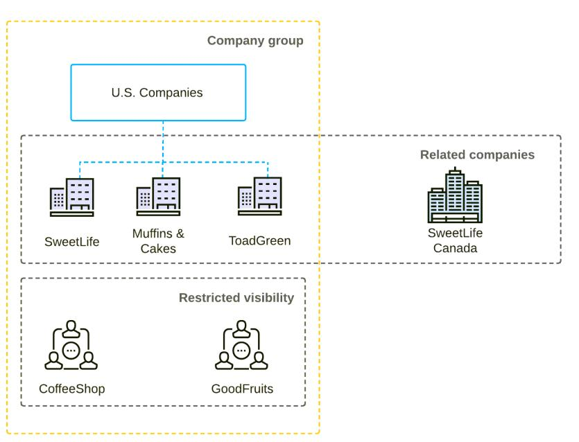

In the diagram, three of the related companies are included in the same company group and the visibility of the CoffeeShop customer and the GoodFruits vendor has been restricted to this company group. Thus, the CoffeeShop and GoodFruits vendors can be used only in the documents having the SweetLife, Muffins & Cakes, or ToadGreen branch as the original branch of the document. Only the users that are included in the access roles associated with the SweetLife, Muffins & Cakes, or ToadGreen branch can view and edit the CoffeeShop record on the *[Customers](https://help-2025r1.acumatica.com/Help?ScreenId=ShowWiki&pageid=652929bc-9606-4056-aa6e-0c2d1147171b)* (AR303000) form and the GoodFruits record on the *[Vendors](https://help-2025r1.acumatica.com/Help?ScreenId=ShowWiki&pageid=a9584be3-f2bd-4d67-80d4-8041d809df56)* (AP303000) form. That is, only the users belonging to the access roles specified for the SweetLife, Muffins & Cakes, or ToadGreen branch can create documents for this customer and vendor and view and edit the customer or vendor's records (if the users have the appropriate rights on the needed forms).

# <span id="page-182-0"></span>**Company Groups: Configuration Prerequisites**

Before starting to create a company group, you must be sure that the system has been configured properly and that all required entities have been created, as described in the following sections.

# **Enabling the Needed Features**

On the *[Enable/Disable Features](https://help-2025r1.acumatica.com/Help?ScreenId=ShowWiki&pageid=c1555e43-1bc5-4f6f-ba9d-b323f94d8a6b)* (CS100000) form, the *Multibranch Support*, *Multicompany Support*, *Multicurrency Accounting*, and *Customer and Vendor Visibility Restriction* features must be enabled.

# **Configuring the System**

You need to make sure the following tasks have been performed in Acumatica ERP before you begin to create a company group:

- On the *[Companies](https://help-2025r1.acumatica.com/Help?ScreenId=ShowWiki&pageid=fedad435-8496-4397-b8a3-50a473629f76)* (CS101500) form, the companies that you want to include in the new company group have been configured.
- On the *[Customers](https://help-2025r1.acumatica.com/Help?ScreenId=ShowWiki&pageid=652929bc-9606-4056-aa6e-0c2d1147171b)* (AR303000) form, the customers whose visibility you want to restrict to the new company group have been defined.
- On the *[Vendors](https://help-2025r1.acumatica.com/Help?ScreenId=ShowWiki&pageid=a9584be3-f2bd-4d67-80d4-8041d809df56)* (AP303000) form, the vendors whose visibility you want to restrict to the new company group have been defined.

# <span id="page-183-1"></span><span id="page-183-0"></span>**Company Groups: Implementation Activity**

In this implementation activity, you will learn how to create a company group, add companies to it, and restrict the visibility of a customer and a vendor to this company group.

#### **Story**

Three related companies have been configured in the *U100* dataset—SweetLife Fruits & Jams, Muffins & Cakes, and ToadGreen Building Group. The first two companies are involved in food production, while the third is a construction company. All three companies are using the same base currency—the United States dollar (*USD*). The SweetLife and Muffins & Cakes companies share some customers and vendors, FourStar Coffee & Sweets Shop (*COFFEESHOP*) and Good Fruits More (*GOODFRUITS*) among them. Also, the SweetLife Canada company with the *CAD* (Canadian dollar) base currency has been implemented.

Acting as an implementation consultant, you need to do the following:

- Create a company group that includes all the companies that use the *USD* base currency: SweetLife, Muffins & Cakes, and ToadGreen Building Group
- Restrict the *COFFEESHOP* customer and *GOODFRUITS* vendor to this company group

# **Configuration Overview**

In the *U100* dataset, the following tasks have been performed to support this activity:

- On the *[Companies](https://help-2025r1.acumatica.com/Help?ScreenId=ShowWiki&pageid=fedad435-8496-4397-b8a3-50a473629f76)* (CS101500) form, the SweetLife Fruits & Jams, Muffins & Cakes, and ToadGreen Building Group companies have been configured.
- On the *[Customers](https://help-2025r1.acumatica.com/Help?ScreenId=ShowWiki&pageid=652929bc-9606-4056-aa6e-0c2d1147171b)* (AR303000) form, the *COFFEESHOP* customer has been created.
- On the *[Vendors](https://help-2025r1.acumatica.com/Help?ScreenId=ShowWiki&pageid=a9584be3-f2bd-4d67-80d4-8041d809df56)* (AP303000) form, the *GOODFRUITS* vendor has been created.

#### **Process Overview**

In this activity, on the *[Company Groups](https://help-2025r1.acumatica.com/Help?ScreenId=ShowWiki&pageid=50e8798a-72c3-4c88-bc14-fe3a49f3d0c8)* (CS102500) form, you will create a company group and add three companies to it. On the *[Customers](https://help-2025r1.acumatica.com/Help?ScreenId=ShowWiki&pageid=652929bc-9606-4056-aa6e-0c2d1147171b)* (AR303000) form, you will restrict the visibility of the *COFFEESHOP* customer to the new group, and on the *[Vendors](https://help-2025r1.acumatica.com/Help?ScreenId=ShowWiki&pageid=a9584be3-f2bd-4d67-80d4-8041d809df56)* (AP303000) form, you will restrict the visibility of the *GOODFRUITS* vendor to the new group.

### **System Preparation**

Before you start creating a company group, do the following:

- Launch the Acumatica ERP website with the *U100* dataset preloaded, and sign in as a system administrator Kimberly Gibbs by using the *gibbs* username and the *123* password.
- Make sure that on the *[Enable/Disable Features](https://help-2025r1.acumatica.com/Help?ScreenId=ShowWiki&pageid=c1555e43-1bc5-4f6f-ba9d-b323f94d8a6b)* (CS100000) form, the *Multicompany Support*, *Multicurrency Accounting*, *Customer and Vendor Visibility Restriction*, and *Multiple Base Currencies* features have been enabled, as described in *[Multiple Base Currencies: Implementation Activity](#page-176-2)*.
- Make sure that the SweetLife Canada company has been configured, as described in *[Multiple Base](#page-176-2) [Currencies: Implementation Activity](#page-176-2)*.

### **Step 1: Creating a Company Group**

To create a company group, do the following:

1. Open the *[Company Groups](https://help-2025r1.acumatica.com/Help?ScreenId=ShowWiki&pageid=50e8798a-72c3-4c88-bc14-fe3a49f3d0c8)* (CS102500) form.


To open the form for creating a new record, type the form ID in the Search box, and on the Search form, point at the form title and click **New** right of the title.

- 2. On the form toolbar, click **Add New Record**.
- 3. In the Summary area, specify the following settings:
  - **Group ID**: USCOMP
  - **Group Name**: US Companies
  - **Currency ID**: *USD*
- 4. On the table toolbar, click **Add Row**, and in the **Company ID** column of the added row, select *MUFFINS*.
- 5. Click **Add Row**, and in the **Company ID** column of the row, select *SWEETLIFE*.
- 6. Click **Add Row**, and in the **Company ID** column of the row, select *TOADGREEN*.
- 7. On the form toolbar, click**Save** to save your changes.

#### **Step 2: Restricting the Visibility of a Customer to the Company Group**

To restrict the visibility of the *COFFEESHOP* customer to the new company group, do the following:

- 1. Open the *[Customers](https://help-2025r1.acumatica.com/Help?ScreenId=ShowWiki&pageid=652929bc-9606-4056-aa6e-0c2d1147171b)* (AR303000) form.
- 2. In the **Customer ID** box, select *COFFEESHOP*.
- 3. In the **RestrictVisibilityTo** box on the **Financial** tab, select *USCOMP*.
- 4. On the form toolbar, click**Save** to save your changes.

#### **Step 3: Restricting the Visibility of a Vendor to the Company Group**

To restrict the visibility of the *GOODFRUITS* vendor to the new company group, do the following:

- 1. Open the *[Vendors](https://help-2025r1.acumatica.com/Help?ScreenId=ShowWiki&pageid=a9584be3-f2bd-4d67-80d4-8041d809df56)* (AP303000) form.
- 2. In the **Vendor ID** box, select *GOODFRUITS*.
- 3. In the **RestrictVisibilityTo** box on the **Financial** tab, select *USCOMP*.
- 4. On the form toolbar, click**Save** to save your changes.

# <span id="page-185-3"></span><span id="page-185-0"></span>**Visibility of Customer Records**

This chapter describes how to control the visibility of customer records for a particular company or company branch in Acumatica ERP.

# <span id="page-185-2"></span><span id="page-185-1"></span>**Customer Visibility: General Information**

When multiple companies with their own accounting departments are configured within the same tenant, you may want to limit access to customer accounts so that they can be viewed by only employees of a particular company, branch, or company group and used in the documents originating from these entities.

If the *Multiple Base Currencies* feature is enabled on the *[Enable/Disable Features](https://help-2025r1.acumatica.com/Help?ScreenId=ShowWiki&pageid=c1555e43-1bc5-4f6f-ba9d-b323f94d8a6b)* (CS100000) form, the **Restrict VisibilityTo** setting on the **Financial** tab of the *[Customers](https://help-2025r1.acumatica.com/Help?ScreenId=ShowWiki&pageid=652929bc-9606-4056-aa6e-0c2d1147171b)* (AR303000) form is required for regular customers. You should associate each customer with an appropriate entity by selecting the entity in the **RestrictVisibility To** box. The base currency of the entity with which the customer is associated will be the currency in which the system stores the customer's balance and credit limit. As a result, customers can be used only in the transactions originating from the branches that have the same base currency as the currency of the entity that is associated with the customer.

### **Learning Objectives**

In this chapter, you will learn how to do the following:

- Restrict the visibility of a customer for a particular company
- Explore how customers can be accessed by various users based on these restrictions
- Update the **RestrictVisibilityTo** setting of customers by using an import scenario

# **Applicable Scenarios**

You may want to restrict the visibility of customer records in the following cases:

- You have customers that work with a particular entity (a company, a branch, or a company group), and you do not want employees of other companies or branches to have access to the entity.
- You are using the *Multiple Base Currencies* feature, and you need to limit the usage of customers to an entity (a company, branch, or a company group).

# **Restricted Visibility of Customer Records**

You use the **RestrictVisibilityTo** box on the **Financial** tab of the *[Customers](https://help-2025r1.acumatica.com/Help?ScreenId=ShowWiki&pageid=652929bc-9606-4056-aa6e-0c2d1147171b)* (AR303000) form to control the visibility of the selected customer. A customer in Acumatica ERP can be associated with one of the following:

• A branch: The customer is associated with a branch (that is, the visibility of the customer is limited to the branch) if the branch is selected in the **RestrictVisibilityTo** box for the customer. In this case, the customer can be accessed by users assigned to the role specified for the branch in the **Access Role** box of the **Branch Details** tab (**Configuration Settings** section) of the *[Branches](https://help-2025r1.acumatica.com/Help?ScreenId=ShowWiki&pageid=b97ab72d-4ab4-4f02-b69c-f7f61b316ced)* (CS102000) form. The customer can be selected in documents originating from this branch.

The branch where a particular document has originated is referred to as the *originating branch* of the document. By default, the originating branch is the branch to which the user is signed in during document creation; this value can be overridden. In the documents associated with a customer, the default value of the originating branch—the **Branch** box on the **Financial** tab of the *[Invoices and Memos](https://help-2025r1.acumatica.com/Help?ScreenId=ShowWiki&pageid=5e6f3b27-b7af-412f-a40a-1d4f4be70cba)* (AR301000) form—is copied from the default branch specified for the customer in the **Default Branch** box on the**Shipping** tab of the *[Customers](https://help-2025r1.acumatica.com/Help?ScreenId=ShowWiki&pageid=652929bc-9606-4056-aa6e-0c2d1147171b)* form. If the default branch is not specified, the current branch will be used as the originating branch of a document.

- A company: The customer is associated with a company (that is, the visibility of the customer is limited to the company) if the company is selected in the **RestrictVisibilityTo** box for the customer. In this case, the customer can be accessed by a user that has access to at least one of the company's branches (or to the company if it has no branches). That is, the customer can be accessed by a user with the access role specified in the **Access Role** box (**Configuration Settings** section) on the **Branch Details** tab of the *[Branches](https://help-2025r1.acumatica.com/Help?ScreenId=ShowWiki&pageid=b97ab72d-4ab4-4f02-b69c-f7f61b316ced)* form for the branch, or the **Company Details** tab of the *[Companies](https://help-2025r1.acumatica.com/Help?ScreenId=ShowWiki&pageid=fedad435-8496-4397-b8a3-50a473629f76)* (CS101500) form for the company. The customer can be selected in documents originating from any branch of the company.
- A company group: If a company group has been set up in the system, as described in *[Company Groups:](#page-183-1) [Implementation Activity](#page-183-1)*, the customer can be associated with this company group if the company group is selected in the **RestrictVisibilityTo** box for a customer. With the visibility of the customer restricted to a company group, the customer can be accessed by a user that has access to at least one of the companies included in the group. The customer can be selected in documents originating from any branch of any company included in the group.
- No entity: If the customer is not associated with a branch, company, or company group (that is, if the **RestrictVisibilityTo** box is le blank), it can be accessed by any user. The customer can be selected in documents originating from any branch.

If you want to control customer visibility for all customers of a particular customer class, you use the **Restrict VisibilityTo** box on the **General** tab of the *[Customer Classes](https://help-2025r1.acumatica.com/Help?ScreenId=ShowWiki&pageid=806e39d6-6f89-4e6c-9a24-61c6fb0c9a57)* (AR20100) form similarly to specify the visibility for the class as a whole. When a new customer of the class is created, this setting is used as the default setting for the customer, but you can override it.

These capabilities are available if the *Customer and Vendor Visibility Restriction* feature has been enabled on the *[Enable/Disable Features](https://help-2025r1.acumatica.com/Help?ScreenId=ShowWiki&pageid=c1555e43-1bc5-4f6f-ba9d-b323f94d8a6b)* (CS100000) form. The feature can be disabled at any time. If the feature is disabled, the system will no longer apply any of the specified visibility restrictions to customers. For details on setting up vendor visibility, see *Visibility of Vendor [Records](#page-194-1)*. For details on setting up customer and vendor visibility for a company group, see *[Company Groups](#page-181-3)*.

If you have the *Row-Level Security* feature enabled and any restriction groups have been configured in the system, they will be applied in addition to the customer visibility restriction functionality. For details on restriction groups, see *[Customers: Security Configuration](https://help-2025r1.acumatica.com/Help?ScreenId=ShowWiki&pageid=59921d47-e53c-4571-b6ad-d7ef53cc79a2)*.

# **Configuration Example**

The following diagram illustrates an example of restricted access to customer records.

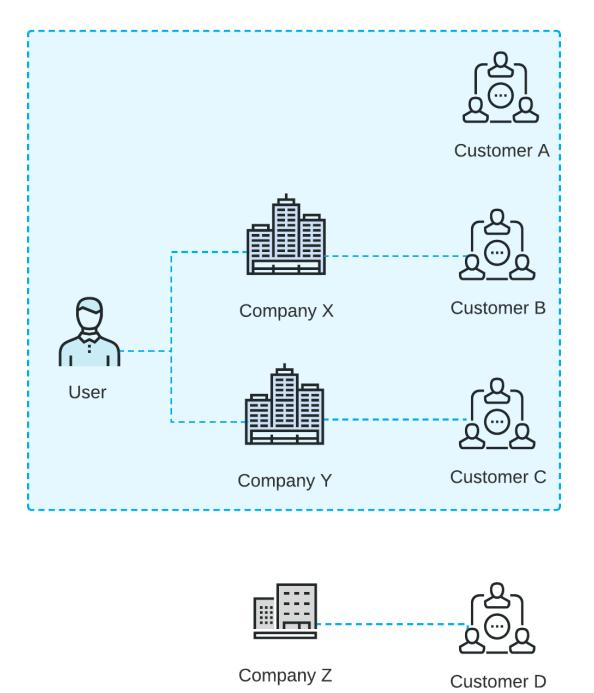

The diagram shows that the user in the *Company X* and *Company Y* access roles can work with *Customer B* (which is associated with *Company X*) and *Customer C* (which is associated with *Company Y*). Additionally, the user can work with *Customer A*; access to this customer is not limited to any company or branch because the **RestrictVisibility To** box on the *[Customers](https://help-2025r1.acumatica.com/Help?ScreenId=ShowWiki&pageid=652929bc-9606-4056-aa6e-0c2d1147171b)* (AR303000) form is empty. However, the user cannot view the *Customer D* record, because this customer is associated with *Company Z*, to which the user does not have access based on the user's assigned roles.

In the system, users can create documents for the following customers:

- *Customer A* if *Company X*, *Company Y*, or *Company Z* is the company with the originating branch
- *Customer B* if *Company X* is the company with the originating branch
- *Customer C* if *Company Y* is the company with the originating branch
- *Customer D* if *Company Z* is the company with the originating branch

# <span id="page-187-0"></span>**Customer Visibility: Implementation Checklist**

The following sections provide details you can use to ensure that the system is configured properly for restricting the visibility of customer records, and to understand (and change, if needed) the settings that affect the processing workflow.

### **Implementation Checklist**

We recommend that before you initially restrict visibility of customer records, you make sure the needed features have been enabled, settings have been specified, and entities have been created, as summarized in the following checklist.

| Form                                      | Criteria to Check                                                                                                                                                                                                                                                              |
|-------------------------------------------|--------------------------------------------------------------------------------------------------------------------------------------------------------------------------------------------------------------------------------------------------------------------------------|
| Enable/Disable Features (CS100000)        | Make sure the minimal features have been enabled, as described<br>in Company Without Branches: General Information, Company with<br>Branches that Do Not Require Balancing: General Information, and<br>Company with Branches that Require Balancing: General Informa<br>tion. |
|                                           | Make sure that the Multibranch Support feature has been en<br>abled, if you need to restrict the visibility of customer records for<br>particular branches.                                                                                                                    |
|                                           | Enable the Customer and Vendor Visibility Restriction feature to<br>perform Customer Visibility: To Restrict Visibility to a Company.                                                                                                                                          |
|                                           | Enable the Multicurrency Accounting and Multiple Base Currencies<br>features to perform Customer Visibility: To Restrict Visibility to a<br>New Company.                                                                                                                       |
| Customer Classes (AR201000)               | Be sure that the customer classes whose visibility you want to re<br>strict have been defined.                                                                                                                                                                                 |
| Customers (AR303000)                      | Be sure that the customer accounts have been defined for the<br>customers whose visibility you want to restrict.                                                                                                                                                               |
| Branches (CS102000)                       | Make sure that for each branch to which the visibility of any cus<br>tomers should be limited, the appropriate role associated with<br>the branch is specified in the Access Role box (Configuration<br>Settings section) on the Branch Details tab.                           |
| Companies (CS101500)                      | Make sure that for each company to which the visibility of any<br>customers should be limited, the appropriate role associated<br>with the company is specified in the Access Role box (Configura<br>tion Settings section) on the Company Details tab.                        |
| Users (SM201010) or User Roles (SM201005) | Make sure that the needed users have been assigned to the roles<br>specified for branches and companies. For details, see User<br>Roles: General Information.                                                                                                                  |

# **Validation of Configuration**

To make sure that all configuration has been performed correctly, we recommend that in your system, you perform instructions similar to those described in *[Customer](#page-188-1) Visibility: To Restrict Visibility to a Company* and *[Customer](#page-191-1) Visibility: To Restrict Visibility to a New [Company](#page-191-1)*.

# <span id="page-188-1"></span><span id="page-188-0"></span>**Customer Visibility: To Restrict Visibility to a Company**

In this implementation activity, you will learn how to restrict the visibility of a customer to a particular company.

### **Story**

Suppose that the management of Muffins & Cakes has decided to implement the restriction of customer visibility. One of the customers, Candyy Cafe, works with the Muffins & Cakes company, and users who are employees of other companies should not have access to this customer record. In other words, aer the implementation of this restriction, Nenad Pasic, an accountant in SweetLife and Muffins & Cakes, should be able to access the *CANDYY* customer and Anna Johnson, an accountant at all branches of SweetLife, should not be able to access this customer.

Acting as a system administrator, you need to restrict the visibility of the *CANDYY* customer to the *MUFFINS* company only and make sure the appropriate access role has been specified for the branches of this company. You then need to verify that a user without this access role cannot access the customer, and that a user with this access role can access the customer.

# **Configuration Overview**

In the *U100* dataset, for the purposes of this activity, the following tasks have been performed:

- On the *[Enable/Disable Features](https://help-2025r1.acumatica.com/Help?ScreenId=ShowWiki&pageid=c1555e43-1bc5-4f6f-ba9d-b323f94d8a6b)* (CS100000) form, the *Multibranch Support*, *Multicompany Support*, and *Customer and Vendor Visibility Restriction* features have been enabled.
- On the *[Branches](https://help-2025r1.acumatica.com/Help?ScreenId=ShowWiki&pageid=b97ab72d-4ab4-4f02-b69c-f7f61b316ced)* (CS102000) form, for the *MRETAIL* branch, the *Branch MRetail* role associated with the branch is specified in the **Access Role** box (**Configuration Settings** section) on the **Branch Details** tab.
- On the *[Users](https://help-2025r1.acumatica.com/Help?ScreenId=ShowWiki&pageid=834cc181-97fa-4db4-a7e0-3eaba142c166)* (SM201010) form, for the *pasic* login, the *Branch MHead* and *Branch MRetail* roles are selected on the **Roles** tab. For the *johnson* login, the *Branch MHead* and *Branch MRetail* roles are not selected on the **Roles** tab.
- On the *[Customers](https://help-2025r1.acumatica.com/Help?ScreenId=ShowWiki&pageid=652929bc-9606-4056-aa6e-0c2d1147171b)* (AR303000) form, the *CANDYY* customer account has been configured.

#### **Process Overview**

In this activity, on the *[Companies](https://help-2025r1.acumatica.com/Help?ScreenId=ShowWiki&pageid=fedad435-8496-4397-b8a3-50a473629f76)* (CS101500) form, you will make sure that the access roles for the *MHEAD* and *MRETAIL* branches have been set up, and on the *[Users](https://help-2025r1.acumatica.com/Help?ScreenId=ShowWiki&pageid=834cc181-97fa-4db4-a7e0-3eaba142c166)* (SM201010) form, you will make sure that they have been assigned to one of the users. On the *[Customers](https://help-2025r1.acumatica.com/Help?ScreenId=ShowWiki&pageid=652929bc-9606-4056-aa6e-0c2d1147171b)* (AR303000) form, you will set up a visibility restriction for the needed customer record. You will sign in to the tenant by using a username that is not assigned to any of the needed branch access role and then a username that is assigned to the branch access roles; in both cases, you will check for the ability to view the *CANDYY* customer. Finally, you will sign in to the *MRETAIL* branch and on create a document on the *[Invoices and Memos](https://help-2025r1.acumatica.com/Help?ScreenId=ShowWiki&pageid=5e6f3b27-b7af-412f-a40a-1d4f4be70cba)* (AR301000) form, where you will select a branch of the *MUFFINS* company as an originating branch of the document.

#### **System Preparation**

Before you start restricting the visibility of a customer record, sign in to a company with the *U100* dataset preloaded as a system administrator by using the following credentials:

- Username: *gibbs*
- Password: *123*

### **Step 1: Reviewing Branch Access Roles of the Users**

To review the access roles assigned to the *pasic* and *johnson* users, do the following:

- 1. Open the *[Companies](https://help-2025r1.acumatica.com/Help?ScreenId=ShowWiki&pageid=fedad435-8496-4397-b8a3-50a473629f76)* (CS101500) form.
- 2. In the **Company ID** box, select *MUFFINS*.
- 3. Open the **Branches** tab.

Notice that the access roles for the branches of this company–*Branch MHead* and *Branch MRetail*–are specified in the **Access Role** column.

- 4. Open the *[Users](https://help-2025r1.acumatica.com/Help?ScreenId=ShowWiki&pageid=834cc181-97fa-4db4-a7e0-3eaba142c166)* (SM201010) form.
- 5. In the **Login** box in the Summary area, select *pasic*.
- 6. In the table on the **Roles** tab, review the access roles assigned to this user. The *Branch MHead* and *Branch MRetail* access roles have been assigned to this user (the**Selected** check boxes to the le of their rows are selected).
- 7. In the **Login** box, select *johnson*.
- 8. In the table on the **Roles** tab, review the access roles assigned to this user. Notice that the *Branch MHead* and *Branch MRetail* access roles have the**Selected** check box cleared for their rows; these access roles have not been assigned for this user.

### **Step 2: Restricting the Visibility of a Customer Record**

To restrict the visibility of the *CANDYY* customer record, do the following:

- 1. Open the *[Customers](https://help-2025r1.acumatica.com/Help?ScreenId=ShowWiki&pageid=652929bc-9606-4056-aa6e-0c2d1147171b)* (AR303000) form.
- 2. In the **Customer ID** box, select *CANDYY*.
- 3. On the **Financial** tab (**FinancialSettings** section), select *MUFFINS - Muffins & Cakes* in the **RestrictVisibility To** box.
- 4. On the form toolbar, click**Save** to save your changes.

# **Step 3: Reviewing the Visibility of the Customer Record**

To review the visibility of the customer record, do the following:

- 1. Sign in to the tenant as a user who is not assigned the access role of the branch by using the following credentials:
  - Username: *johnson*
  - Password: *123*
- 2. Open the *[Customers](https://help-2025r1.acumatica.com/Help?ScreenId=ShowWiki&pageid=652929bc-9606-4056-aa6e-0c2d1147171b)* (AR303000) form.
- 3. In the **Customer ID** box of the Summary area, open the lookup table and attempt to find the *CANDYY* customer.

Notice that the *CANDYY* customer is not listed and you cannot find it by using the Search box; this customer is not visible for the current user, because this user is assigned to the role that has access to the SweetLife Fruits & Jams company only and is not assigned to the *Branch MHead* and *Branch MRetail* roles, which are the access roles of the company specified for the customer.

- 4. Sign in to the tenant as a user who is assigned the access roles of the company's branches by using the following credentials:
  - Username: *pasic*
  - Password: *123*
- 5. Open the *[Customers](https://help-2025r1.acumatica.com/Help?ScreenId=ShowWiki&pageid=652929bc-9606-4056-aa6e-0c2d1147171b)* form.
- 6. In the **Customer ID** box of the Summary area, open the lookup table and attempt to find the *CANDYY* customer. Notice that the *CANDYY* customer is listed and thus is visible for the current user, because the user is assigned to the *Branch MHead* and *Branch MRetail* roles, which are the access roles for the branches of the company specified for the customer.

7. On the **Shipping** tab, review the value in the **Default Branch** box. The default branch for this customer is not specified. You can select either *MHEAD* or *MRETAIL* because the customer's visibility has been restricted to the company with these branches.

On the *[Invoices and Memos](https://help-2025r1.acumatica.com/Help?ScreenId=ShowWiki&pageid=5e6f3b27-b7af-412f-a40a-1d4f4be70cba)* (AR301000) form, when you are creating an AR document and select a customer, the system automatically populates the **Branch** box on the **Financial Details** tab with the default branch of the selected location. (This branch is considered the originating branch of the document.) If the default branch is not specified, the originating branch is the current branch to which you are signed in.

# **Step 4: Selecting the Originating Branch in a Document for the Customer with Restricted Visibility**

To create a document for the customer whose visibility has been restricted to the Muffins & Cakes company, do the following:

- 1. On the Company and Branch Selection menu, on the top pane of the Acumatica ERP screen, select the *Muffins Retail Shop* branch.
- 2. Open the *[Invoices and Memos](https://help-2025r1.acumatica.com/Help?ScreenId=ShowWiki&pageid=5e6f3b27-b7af-412f-a40a-1d4f4be70cba)* (AR301000) form.


To open the form for creating a new record, type the form ID in the Search box, and on the Search form, point at the form title and click **New** right of the title.

- 3. Click **Add New Record** on the form toolbar and specify the following settings in the Summary area:
  - **Type**: *Invoice*
  - **Customer**: *CANDYY*

You can select this customer whose visibility has been restricted to the *MUFFINS* company because you are signed in to a branch of this company.

- 4. On the **Financial** tab, notice that in the **Branch** box *MRETAIL* is selected. This is the originating branch of the document.
- 5. In the **Branch** box, select *MHEAD*. Because you restricted the customer's visibility to the *MUFFINS* company, you can select this value for the originating branch.
- 6. In the **Branch** box, select *HEADOFFICE*. The system displays an error message that the use of this customer is restricted in the selected branch.


For the purposes of this activity, you do not need to further process this document.

# <span id="page-191-1"></span><span id="page-191-0"></span>**Customer Visibility: To Restrict Visibility to a New Company**

The following activity will walk you through the process of restricting the visibility of a customer to a particular company with a base currency that is different from the base currency of the other companies in the tenant.

#### **Story**

Suppose that the management of SweetLife Fruits & Jams has decided to implement multiple base currencies in Acumatica ERP. The implementation consultant has already set up a company with the CAD base currency and added all the companies that use the USD base currency to one company group. The company using the CAD base currency—SweetLife Canada—should work only with the Canadian customers.

Acting as the implementation consultant, you need to limit the visibility of *EASYDINER* (a Canadian customer) to the SweetLife Canada company. You then need to verify that this customer can be selected in the documents for this

company. To do this, you need to process a document and review the transaction posted to the general ledger. You will then update the settings of the rest of the customers by using an import scenario.

### **Configuration Overview**

In the *U100* dataset, the following tasks have been performed to support this activity:

- On the *[Enable/Disable Features](https://help-2025r1.acumatica.com/Help?ScreenId=ShowWiki&pageid=c1555e43-1bc5-4f6f-ba9d-b323f94d8a6b)* (CS100000) form, the *Multibranch Support*, *Multicompany Support*, *Customer and Vendor Visibility Restriction*, *Multicurrency Accounting*, and *Multiple Base Currencies* features have been enabled.
- On the *[Companies](https://help-2025r1.acumatica.com/Help?ScreenId=ShowWiki&pageid=fedad435-8496-4397-b8a3-50a473629f76)* (CS101500) form, the *MUFFINS* and *SWEETLIFE* companies have been defined.
- On the *[Branches](https://help-2025r1.acumatica.com/Help?ScreenId=ShowWiki&pageid=b97ab72d-4ab4-4f02-b69c-f7f61b316ced)* (CS102000) form, the *MHEAD* branch of the *MUFFINS* company has been created, and the *HEADOFFICE* branch of the *SWEETLIFE* company has been created.
- On the *[Users](https://help-2025r1.acumatica.com/Help?ScreenId=ShowWiki&pageid=834cc181-97fa-4db4-a7e0-3eaba142c166)* (SM201010) form, for the *gibbs* login, the *Branch SLCanada* role is selected on the **Roles** tab. For the *johnson* login, the *Branch SLCanada* role is not selected on the **Roles** tab.
- On the *[Customers](https://help-2025r1.acumatica.com/Help?ScreenId=ShowWiki&pageid=652929bc-9606-4056-aa6e-0c2d1147171b)* (AR303000) form, the *EASYDINER* and *ABAKERY* customers have been configured.
- On the *[Import Scenarios](https://help-2025r1.acumatica.com/Help?ScreenId=ShowWiki&pageid=254e8347-6bac-469d-8f14-dbe383740475)* (SM206025) form, the *Import Customers with Restricted Visibility* import scenario has been configured.

### **Process Overview**

In this activity, you will restrict the visibility of a customer to the SweetLife Canada company on the *[Customers](https://help-2025r1.acumatica.com/Help?ScreenId=ShowWiki&pageid=652929bc-9606-4056-aa6e-0c2d1147171b)* (AR303000) form. You will then sign in as a user who does not have access to the SweetLife Canada company and make sure that the customer is not visible for this user. You will sign in as a user with access to SweetLife Canada company, and on the *[Invoices and Memos](https://help-2025r1.acumatica.com/Help?ScreenId=ShowWiki&pageid=5e6f3b27-b7af-412f-a40a-1d4f4be70cba)* (AR301000) form, you will process a document for the *EASYDINER* customer, selecting SweetLife Canada as the originating branch.

Finally, on the *[Import by Scenario](https://help-2025r1.acumatica.com/Help?ScreenId=ShowWiki&pageid=88ac7166-2cc0-4201-ab3e-659ada2d74f2)* (SM206036) form, you will run a preconfigured import scenario to update the **RestrictVisibilityTo** setting for regular customers.

### **System Preparation**

Before you begin performing the steps of this activity, do the following:

- 1. Launch the Acumatica ERP website with the *U100* dataset preloaded, and sign in as a system administrator Kimberly Gibbs by using the *gibbs* username and the *123* password.
- 2. In the company to which you are signed in, be sure that you have configured the SweetLife Canada company, as described in *[Multiple Base Currencies: Implementation Activity](#page-176-2)*, which is a prerequisite activity.
- 3. On the *[Company Groups](https://help-2025r1.acumatica.com/Help?ScreenId=ShowWiki&pageid=50e8798a-72c3-4c88-bc14-fe3a49f3d0c8)* (CS102500) form, be sure that the *USCOMP* company group has been added. For details, see *[Company Groups: Implementation Activity](#page-183-1)*.
- 4. On the *[Branches](https://help-2025r1.acumatica.com/Help?ScreenId=ShowWiki&pageid=b97ab72d-4ab4-4f02-b69c-f7f61b316ced)* (CS102000) form, for the *SLCANADA* branch, be sure that the *Branch SLCanada* role, which is associated with the branch, is specified in the **Access Role** box (**Configuration Settings** section) on the **Branch Details** tab.
- 5. On the *[Branches](https://help-2025r1.acumatica.com/Help?ScreenId=ShowWiki&pageid=b97ab72d-4ab4-4f02-b69c-f7f61b316ced)* form, be sure that the *MHEAD* branch has been extended as a customer. For details, see *[Intercompany Sales Setup: Implementation Activity](#page-164-1)*.

#### **Step 1: Restricting the Visibility of the Customer**

To restrict the visibility of the *EASYDINER* customer to SweetLife Canada, do the following:

- 1. Open the *[Customers](https://help-2025r1.acumatica.com/Help?ScreenId=ShowWiki&pageid=652929bc-9606-4056-aa6e-0c2d1147171b)* (AR303000) form.
- 2. In the **Customer ID** box, select *EASYDINER*.

Notice that the customer class of this customer is *INTLCA (Canadian Customers)*.

- 3. On the **Financial** tab, in the **RestrictVisibilityTo** box, select *SLCANADA*.
- 4. In the **Currency ID** box, select *CAD*.

Notice that multiple boxes in the Summary area, **FinancialSettings** section, and **CreditVerification Rules** section now have the currency symbol of the Canadian dollar (C\$) displayed next to them. This means that the system will store the balance of this customer in *CAD*.

5. On the form toolbar, click**Save**.

### **Step 2: Reviewing the Visibility of the Customer**

To review how the visibility of the customer has been restricted, do the following:

- 1. Sign in to the tenant as a user who is not assigned the access role of the *Branch SLCanada* branch by using the following credentials:
  - **Username**: *johnson*
  - **Password**: *123*
- 2. Open the *[Customers](https://help-2025r1.acumatica.com/Help?ScreenId=ShowWiki&pageid=652929bc-9606-4056-aa6e-0c2d1147171b)* (AR303000) form.
- 3. In the **Customer ID** box of the Summary area, open the lookup table, and attempt to find the *EASYDINER* customer.

Notice that the *EASYDINER* customer is not listed and that you cannot find it by using the Search box. This customer is not visible for the current user, because this user is assigned to the role that has access to the SweetLife Fruits & Jams company only and is not assigned to the *Branch SLCanada* role, which is the access role of the company specified for the customer.

### **Step 3: Processing an Invoice for the Customer with Restricted Visibility**

To process an invoice for the *EASYDINER* customer, which has restricted visibility to the branch, do the following:

- 1. Sign in to the tenant as a user who is assigned the access role of the *Branch SLCanada* branch by using the following credentials:
  - **Username**: *gibbs*
  - **Password**: *123*
- 2. On the Company and Branch Selection menu, on the top pane of the Acumatica ERP screen, select the *SweetLife Canada* company.
- 3. Open the *[Invoices and Memos](https://help-2025r1.acumatica.com/Help?ScreenId=ShowWiki&pageid=5e6f3b27-b7af-412f-a40a-1d4f4be70cba)* (AR301000) form.

To open the form for creating a new record, type the form ID in the Search box, and on the Search form, point at the form title and click **New** right of the title.

- 4. Click **Add New Record** on the form toolbar, and specify the following settings in the Summary area:
  - **Type**: *Invoice*
  - **Date**: *1/30/2025*
  - **Customer**: *EASYDINER*

You can select this customer (whose visibility has been restricted to the *SweetLife Canada* company) because you are signed in to this company and the system has filled in the original branch of the document with *SweetLife Canada*.

- 5. On the **Financial** tab, notice that in the **Branch** box, *SLCANADA* is selected. This is the originating branch of the document.
- 6. On the same tab, specify the following settings:

- **Payment Method**: *WIRE*
- **Cash Account**: *10215SL*
- 7. On the **Details** tab, click **Add Row** on the table toolbar, and specify the following settings for the added row:
  - **Branch**: *SLCANADA* (inserted automatically)
  - **Transaction Descr.**: Online training
  - **Ext. Price**: 380
- 8. On the form toolbar, click **Remove Hold** and then click **Release** to release the invoice.
- 9. On the **Financial** tab, click the link in the **Batch Nbr.** box to review the generated GL transaction on the *Journal [Transactions](https://help-2025r1.acumatica.com/Help?ScreenId=ShowWiki&pageid=dda046bc-5946-407f-88f7-1c0c966fbe72)* (GL301000) form.

The transaction has been posted for the *SLCANADA* branch, and the transaction currency specified in the **Currency** box is *CAD* because you selected this currency on the *[Customers](https://help-2025r1.acumatica.com/Help?ScreenId=ShowWiki&pageid=652929bc-9606-4056-aa6e-0c2d1147171b)* (AR303000) form.

## **Step 4: Updating Customer Settings by Using an Import Scenario**

Because the *Multiple Base Currencies* feature has been enabled aer some customers were created in the system and the **RestrictVisibilityTo** box became required, this box has to be filled in for all the customers. You can use an import scenario to fill in the box for multiple customers quickly and easily. To update the **RestrictVisibilityTo** setting for regular customers, do the following:

- 1. Open the *[Import by Scenario](https://help-2025r1.acumatica.com/Help?ScreenId=ShowWiki&pageid=88ac7166-2cc0-4201-ab3e-659ada2d74f2)* (SM206036) form.
- 2. In the **Name** box, select *Import Customers with Restricted Visibility*.
- 3. On the form toolbar, click **Prepare**.

The system has uploaded the records from the source Excel file on the **Prepared Data** tab.

This file is also attached to the Excel data provider on the *[Data Providers](https://help-2025r1.acumatica.com/Help?ScreenId=ShowWiki&pageid=b77248de-191c-47b7-9c40-773c7cc11d5b)* (SM206015) form and the *Import Customers with Restricted Visibility* import scenario on the *[Import Scenarios](https://help-2025r1.acumatica.com/Help?ScreenId=ShowWiki&pageid=254e8347-6bac-469d-8f14-dbe383740475)* (SM206025) form.

4. On the form toolbar, click **Import** to update the customer records.

Notice that for all records on the **Prepared Data** tab, the system has selected the **Processed** check box.

- 5. Open the *[Customers](https://help-2025r1.acumatica.com/Help?ScreenId=ShowWiki&pageid=652929bc-9606-4056-aa6e-0c2d1147171b)* (AR303000) form.
- 6. In the **Customer ID** box, select *ABAKERY*.
- 7. On the **Financial** tab, notice that the *USCOMP - US Companies* option is now selected in the **Restrict VisibilityTo** box in the **FinancialSettings** section. This setting means that this customer can be used in documents originating from companies in the *USCOMP* company group.
- 8. In the **Customer ID** box, select *MHEAD*, which was not updated by the import scenario.
- 9. On the **Financial** tab, notice that the **RestrictVisibilityTo** box, which is optional, is empty. This is because this customer has been extended from a branch, as described in *[Intercompany Sales Setup: Implementation](#page-164-1) [Activity](#page-164-1)*, and can be used by all companies with different base currencies in the tenant.

# <span id="page-194-1"></span><span id="page-194-0"></span>**Visibility of Vendor Records**

This chapter describes how to control the visibility of vendor records for a particular company or a company branch.

# <span id="page-195-1"></span><span id="page-195-0"></span>**Vendor Visibility: General Information**

When multiple companies with their own accounting departments are configured within the same tenant, you may want to restrict the visibility of vendor accounts to employees of a particular company, branch, or company group.

If the *Multiple Base Currencies* feature is enabled on the *[Enable/Disable Features](https://help-2025r1.acumatica.com/Help?ScreenId=ShowWiki&pageid=c1555e43-1bc5-4f6f-ba9d-b323f94d8a6b)* (CS100000) form, the **Restrict VisibilityTo** setting on the **Financial** tab of the *[Vendors](https://help-2025r1.acumatica.com/Help?ScreenId=ShowWiki&pageid=a9584be3-f2bd-4d67-80d4-8041d809df56)* (AP303000) form becomes required for regular vendors. You should associate each vendor with an appropriate entity by selecting the entity in the **RestrictVisibilityTo** box. The base currency of the entity with which the vendor is associated will be the currency in which the system stores the vendor's balance. As a result, vendors can be used only in the transactions originating from the branches that have the same base currency as the base currency of the entity that is associated with the vendor.

# **Learning Objectives**

In this chapter, you will learn how to do the following:

- Restrict the visibility of a vendor to a particular branch
- Explore how vendors can be accessed by various users based on these restrictions
- Update the **RestrictVisibilityTo** setting of vendors by using an import scenario

# **Applicable Scenarios**

You may want to restrict the visibility of vendor records in the following cases:

- You have vendors that work with a particular branch, company, or a company group, and you do not want employees of other companies to have access to them.
- You are using the *Multiple Base Currencies* feature, and you need to limit the usage of vendors to an entity (a company, branch, or a company group).

# **Restricted Visibility of Vendor Records**

You use the **RestrictVisibilityTo** box on the **Financial** tab of the *[Vendors](https://help-2025r1.acumatica.com/Help?ScreenId=ShowWiki&pageid=a9584be3-f2bd-4d67-80d4-8041d809df56)* (AP303000) form to control the visibility of the selected vendor. A vendor in Acumatica ERP can be associated with one of the following:

- A branch: The visibility of the vendor is restricted to a branch (that is, the vendor is associated with the branch) if the branch is selected in the **RestrictVisibilityTo** box for the vendor. In this case, the vendor can be accessed by users assigned to the role specified for the branch in the **Access Role** box of the **Branch Details** tab (**Configuration Settings** section) of the *[Branches](https://help-2025r1.acumatica.com/Help?ScreenId=ShowWiki&pageid=b97ab72d-4ab4-4f02-b69c-f7f61b316ced)* (CS102000) form. The vendor can be selected in documents originating from this branch.
  - The branch where a particular document has originated is referred to as the *originating branch* of the document. By default, the originating branch is the branch to which the user is signed in during document creation; this value can be overridden. In the documents associated with a vendor, the default value of the originating branch—the **Branch** box on the **Financial** tab of the *[Bills and Adjustments](https://help-2025r1.acumatica.com/Help?ScreenId=ShowWiki&pageid=956b4e51-3078-4d2d-85b3-65c080d95234)* (AP301000) form—is copied from the default branch specified for the vendor in the **Default Branch** box on the **PurchaseSettings** tab of the *[Vendors](https://help-2025r1.acumatica.com/Help?ScreenId=ShowWiki&pageid=a9584be3-f2bd-4d67-80d4-8041d809df56)* (AP303000) form. If the default branch is not specified, the current branch will be used as the originating branch of a document.
- A company: The visibility of the vendor is restricted to a company (that is, the vendor is associated with the company) if the company is selected in the **RestrictVisibilityTo** box for the vendor. In this case, the vendor can be accessed by a user that has access to at least one of the company's branches (or to the company if it has no branches). That is, the vendor can be accessed by a user with the access role specified in the

**Access Role** box (**Configuration Settings** section) on the **Branch Details** tab of the *[Branches](https://help-2025r1.acumatica.com/Help?ScreenId=ShowWiki&pageid=b97ab72d-4ab4-4f02-b69c-f7f61b316ced)* form for the branch, or the **Company Details** tab of the *[Companies](https://help-2025r1.acumatica.com/Help?ScreenId=ShowWiki&pageid=fedad435-8496-4397-b8a3-50a473629f76)* (CS101500) form for the company. The vendor can be selected in documents originating from any branch of the company.

- A company group: If a company group has been set up in the system, as described in *[Company Groups:](#page-183-1) [Implementation Activity](#page-183-1)*, the vendor can be associated with this company group if the company group is selected in the **RestrictVisibilityTo** box for the vendor. With the visibility of the vendor restricted to a company group, the vendor can be accessed by a user that has access to at least one of the companies included in the group. The vendor can be selected in documents originating from any branch of any company included in the group.
- No entity: If the visibility of the vendor is not restricted to a branch, company, or company group (that is, if the **RestrictVisibilityTo** box is le blank), it can be accessed by any user. The vendor can be selected in documents originating from any branch.

If you want to control vendor visibility for all vendors of a particular vendor class, you use the **RestrictVisibility To** box on the **General** tab of the *Vendor [Classes](https://help-2025r1.acumatica.com/Help?ScreenId=ShowWiki&pageid=20dc8b93-d83a-49cf-8cfb-d2ffd2f0db87)* (AP20100) form similarly to specify the visibility for the class as a whole. When a new vendor of the class is created, this setting is used as the default setting for the vendor, but you can override it.

These capabilities are available if the *Customer and Vendor Visibility Restriction* feature has been enabled on the *[Enable/Disable Features](https://help-2025r1.acumatica.com/Help?ScreenId=ShowWiki&pageid=c1555e43-1bc5-4f6f-ba9d-b323f94d8a6b)* (CS100000) form. The feature can be disabled at any time. If the feature is disabled, the system will no longer apply any of the specified visibility restrictions to vendors. For details on setting up customer visibility, see *Visibility of [Customer](#page-185-3) Records*. For details on setting up customer and vendor visibility for a company group, see *[Company Groups](#page-181-3)*.

If any restriction groups have been configured in the system, they will be applied in addition to the vendor visibility restriction functionality. For details on restriction groups, see *Vendor [Security](https://help-2025r1.acumatica.com/Help?ScreenId=ShowWiki&pageid=01ee3fe2-a6d6-4492-90f5-92ddaebc559c)*.

# **Configuration Example**

The following diagram illustrates an example of restricted access to vendor records.

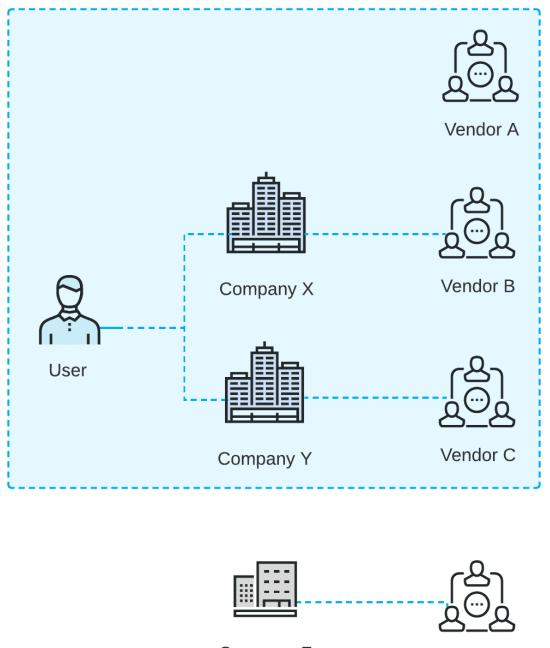

The diagram shows that the user in the *Company X* and *Company Y* access roles can work with *Vendor B* (which is associated with *Company X*) and *Vendor C* (which is associated with *Company Y*). Additionally, the user can work with *Vendor A*; access to this vendor is not limited to any company or branch because the **RestrictVisibilityTo** box on the *[Vendors](https://help-2025r1.acumatica.com/Help?ScreenId=ShowWiki&pageid=a9584be3-f2bd-4d67-80d4-8041d809df56)* (AP303000) form is empty. However, the user cannot view the *Vendor D* record, because this vendor is associated with *Company Z*, to which the user does not have access based on the user's assigned roles.

In the system, users can create documents for the following vendors:

- *Vendor A* if *Company X*, *Company Y*, or *Company Z* is the company with the originating branch
- *Vendor B* if *Company X* is the company with the originating branch
- *Vendor C* if *Company Y* is the company with the originating branch
- *Vendor D* if *Company Z* is the company with the originating branch

# <span id="page-197-0"></span>**Vendor Visibility: Implementation Checklist**

The following sections provide details you can use to ensure that the system is configured properly for restricting the visibility of vendor records, and to understand (and change, if needed) the settings that affect the processing workflow.

### **Implementation Checklist**

We recommend that before you initially restrict visibility of vendors, you make sure the needed features have been enabled, settings have been specified, and entities have been created, as summarized in the following checklist.

| Form                               | Criteria to Check                                                                                                                                                                                                                                                                                                                                                                                                     |
|------------------------------------|-----------------------------------------------------------------------------------------------------------------------------------------------------------------------------------------------------------------------------------------------------------------------------------------------------------------------------------------------------------------------------------------------------------------------|
| Enable/Disable Features (CS100000) | Make sure the minimal features have been enabled, as described<br>in Company Without Branches: General Information, Company with<br>Branches that Do Not Require Balancing: General Information, and<br>Company with Branches that Require Balancing: General Informa<br>tion.                                                                                                                                        |
|                                    | Make sure that the Multibranch Support, Multicompany Support,<br>and Customer and Vendor Visibility Restriction features have been<br>enabled, if you need to restrict the visibility of vendor records for<br>particular companies or branches. For details, see Vendor Visibili<br>ty: To Restrict Visibility to a Branch.                                                                                          |
|                                    | Enable the Multibranch Support, Multicompany Support, Cus<br>tomer and Vendor Visibility Restriction, Multicurrency Account<br>ing, and Multiple Base Currencies features, if you need to restrict<br>the visibility of vendor records for a particular company with the<br>base currency different from the tenant's base currency. For de<br>tails, see Vendor Visibility: To Restrict Visibility to a New Company. |
| Vendor Classes (AP201000)          | Be sure that the vendor classes whose visibility you want to re<br>strict have been defined.                                                                                                                                                                                                                                                                                                                          |
| Vendors (AP303000)                 | Be sure that the vendor accounts have been defined for the ven<br>dors whose visibility you want to restrict.                                                                                                                                                                                                                                                                                                         |
| Branches (CS102000)                | Make sure that for each branch to which the visibility of any ven<br>dors should be limited, the appropriate role associated with the<br>branch is specified in the Access Role box (Configuration Set<br>tings section) on the Branch Details tab.                                                                                                                                                                   |

| Form                                      | Criteria to Check                                                                                                                                                                                                                                   |
|-------------------------------------------|-----------------------------------------------------------------------------------------------------------------------------------------------------------------------------------------------------------------------------------------------------|
| Companies (CS101500)                      | Make sure that for each company to which the visibility of any<br>vendor should be limited, the appropriate role associated with<br>the company is specified in the Access Role box (Configuration<br>Settings section) on the Company Details tab. |
| Users (SM201010) or User Roles (SM201005) | Make sure that the needed users have been assigned to the roles<br>specified for branches and companies. For details, see User<br>Roles: General Information.                                                                                       |

# **Validation of Configuration**

To make sure that all configuration has been performed correctly, we recommend that in your system, you perform instructions similar to those described in *Vendor [Visibility:](#page-198-1) To Restrict Visibility to a Branch* and *Vendor [Visibility:](#page-201-1) To Restrict Visibility to a New [Company](#page-201-1)*.

# <span id="page-198-1"></span><span id="page-198-0"></span>**Vendor Visibility: To Restrict Visibility to a Branch**

In this implementation activity, you will learn how to restrict the visibility of a vendor record to a particular branch.

### **Story**

Suppose that the management of SweetLife Fruits & Jams has decided to implement the restriction of vendor visibility. One of vendors, Squeezo Inc., supplies juicers for the Service and Equipment Sales Center branch of SweetLife Fruits & Jams company, and users who are employees of other branches and companies should not have access to this vendor record. In other words, aer the implementation of this restriction, Pam Brawner, who is the Service Manager of the *SWEETEQUIP* branch, should be able to access the Squeezo Inc. vendor and Eric Killian, the Purchase Requisitions Manager in the Wholesale and Retail branches, should not be able to access this vendor.

Acting as a system administrator, you need to restrict the visibility of the *SQUEEZO* vendor to the *SWEETEQUIP (Service and Equipment Sales Center)* branch only and make sure the appropriate access role has been specified for this branch. You then need to verify that a user without this access role cannot access the vendor, and that a user with this access role can access the vendor. Acting as an accountant, you need to create an AP document selecting the *SWEETEQUIP* branch as the originating branch and specifying this vendor.

# **Configuration Overview**

In the *U100* dataset, for the purposes of this activity, the following tasks have been performed:

- On the *[Enable/Disable Features](https://help-2025r1.acumatica.com/Help?ScreenId=ShowWiki&pageid=c1555e43-1bc5-4f6f-ba9d-b323f94d8a6b)* (CS100000) form, the *Multicompany Support* and *Customer and Vendor Visibility Restriction* features have been enabled.
- On the *[Branches](https://help-2025r1.acumatica.com/Help?ScreenId=ShowWiki&pageid=b97ab72d-4ab4-4f02-b69c-f7f61b316ced)* (CS102000) form, for the *SWEETEQUIP* branch, the *Branch SweetEquip* role associated with the branch is specified in the **Access Role** box (**Configuration Settings** section) on the **Branch Details** tab.
- On the *[Users](https://help-2025r1.acumatica.com/Help?ScreenId=ShowWiki&pageid=834cc181-97fa-4db4-a7e0-3eaba142c166)* (SM201010) form, for the *brawner* login, the *Branch SweetEquip* role is selected on the **Roles** tab. For the *killian* login, the *Branch SweetEquip* role is not selected on the **Roles** tab.
- On the *[Vendors](https://help-2025r1.acumatica.com/Help?ScreenId=ShowWiki&pageid=a9584be3-f2bd-4d67-80d4-8041d809df56)* (AP303000) form, the *SQUEEZO* vendor account has been configured.

# **Process Overview**

In this activity, on the *[Branches](https://help-2025r1.acumatica.com/Help?ScreenId=ShowWiki&pageid=b97ab72d-4ab4-4f02-b69c-f7f61b316ced)* (CS102000) form, you will make sure that the access role for the *SWEETEQUIP* branch has been set up, and on the *[Users](https://help-2025r1.acumatica.com/Help?ScreenId=ShowWiki&pageid=834cc181-97fa-4db4-a7e0-3eaba142c166)* (SM201010) form, you will make sure that it has been assigned to one of the users. On the *[Vendors](https://help-2025r1.acumatica.com/Help?ScreenId=ShowWiki&pageid=a9584be3-f2bd-4d67-80d4-8041d809df56)* (AP303000) form, you will set up a visibility restriction for the needed vendor. You will then sign in to the tenant by using a username that is not assigned to the needed branch access role and then a username that is assigned to the branch access role; in both cases, you will check for the ability to view the *SQUEEZO* vendor. Finally, on the *[Bills and Adjustments](https://help-2025r1.acumatica.com/Help?ScreenId=ShowWiki&pageid=956b4e51-3078-4d2d-85b3-65c080d95234)* (AP301000) form, you will create a bill for the *SQUEEZO* vendor and make sure that you can select this vendor for a document if the originating branch is *SWEETQEUIP*.

## **System Preparation**

Before you start restricting the visibility of a vendor record, sign in to a company with the *U100* dataset preloaded as a system administrator by using the following credentials:

- Username: *gibbs*
- Password: *123*

## **Step 1: Reviewing Branch Access Roles of the Users**

To review the access roles assigned to the *brawner* and *killian* users, do the following:

- 1. Open the *[Branches](https://help-2025r1.acumatica.com/Help?ScreenId=ShowWiki&pageid=b97ab72d-4ab4-4f02-b69c-f7f61b316ced)* (CS102000) form.
- 2. In the **Branch ID** box, select *SWEETEQUIP*.

Notice that the access role for this branch specified in the **Access Role** box (**Configuration Settings** section) on the **Branch Detail** tab is *Branch SweetEquip*.

- 3. Open the *[Users](https://help-2025r1.acumatica.com/Help?ScreenId=ShowWiki&pageid=834cc181-97fa-4db4-a7e0-3eaba142c166)* (SM201010) form.
- 4. In the **Login** box in the Summary area, select *brawner*.
- 5. In the table on the **Roles** tab, review the access roles assigned to this user. The *Branch SweetEquip* access role has been assigned to this user (the**Selected** check box to the le of its row is selected).
- 6. In the **Login** box, select *killian*.
- 7. In the table on the **Roles** tab, review the access roles assigned to this user. Notice that the *Branch SweetEquip* access role has the**Selected** check box cleared for its row; this access role has not been assigned for this user.

# **Step 2: Restricting the Visibility of a Vendor**

To restrict the visibility of the *SQUEEZO* vendor, do the following:

- 1. Open the *[Vendors](https://help-2025r1.acumatica.com/Help?ScreenId=ShowWiki&pageid=a9584be3-f2bd-4d67-80d4-8041d809df56)* (AP303000) form.
- 2. In the **Vendor ID** box, select *SQUEEZO*.
- 3. On the **Financial** tab (**FinancialSettings** section), select *SWEETEQUIP* in the **RestrictVisibilityTo** box. This is the Service and Equipment Sales Center branch of the SweetLife Fruits & Jams company.
- 4. On the form toolbar, click**Save** to save your changes.

# **Step 3: Reviewing the Visibility of the Vendor Record**

To review the visibility of the vendor record, do the following:

- 1. Sign in to the tenant as a user who is not assigned the access role of the branch by using the following credentials:
  - Username: *killian*
  - Password: *123*
- 2. Open the *[Vendors](https://help-2025r1.acumatica.com/Help?ScreenId=ShowWiki&pageid=a9584be3-f2bd-4d67-80d4-8041d809df56)* (AP303000) form.

3. In the **Vendor ID** box of the Summary area, open the lookup table and attempt to find the *SQUEEZO* vendor.

Notice that the *SQUEEZO* vendor is not listed and you cannot find it by using the Search box; this vendor is not visible for the current user, because this user is assigned to the role that has access to the SweetLife Head Office and Wholesale Center branch of SweetLife Fruits & Jams only and is not assigned to the *Branch SweetEquip* role, which is the access role of the branch specified for the vendor.

- 4. Sign in to the tenant as a user who is assigned the access role of the branch by using the following credentials:
  - Username: *brawner*
  - Password: *123*
- 5. Open the *[Vendors](https://help-2025r1.acumatica.com/Help?ScreenId=ShowWiki&pageid=a9584be3-f2bd-4d67-80d4-8041d809df56)* form.
- 6. In the **Vendor ID** box of the Summary area, open the lookup table and attempt to find the *SQUEEZO* vendor. Notice that the *SQUEEZO* vendor is listed and thus is visible for the current user, because the user is assigned to the *Branch SweetEquip* role, which is the access role of the branch specified for the vendor.
- 7. On the **PurchaseSettings** tab, review the value in the **Default Branch** box. The default branch for this vendor is *SWEETEQUIP*, and you cannot override this value because the vendor's visibility has been restricted to this branch and this is the only branch that can be used with the vendor.

On the *[Bills and Adjustments](https://help-2025r1.acumatica.com/Help?ScreenId=ShowWiki&pageid=956b4e51-3078-4d2d-85b3-65c080d95234)* (AP301000) form, when you are creating an AP document and select a vendor, the system automatically populates the **Branch** box on the **Financial** tab with the default branch of the selected location. (This branch is considered the originating branch of the document.) If the default branch is not specified, the originating branch is the current branch to which you are signed in.

# **Step 4: Creating a Bill for the Squeezo Vendor**

To create a bill for the *SQUEEZO* vendor whose visibility has been restricted, do the following:

1. Sign in to the tenant as Anna Johnson by using the *johnson* username and the *123* password.

This user is an accountant who has access to all branches of the SweetLife company.

- 2. On the Company and Branch Selection menu, select the *SweetLife Head Office and Wholesale Center* branch.
- 3. Open the *[Bills and Adjustments](https://help-2025r1.acumatica.com/Help?ScreenId=ShowWiki&pageid=956b4e51-3078-4d2d-85b3-65c080d95234)* (AP301000) form.


To open the form for creating a new record, type the form ID in the Search box, and on the Search form, point at the form title and click **New** right of the title.

- 4. On the form toolbar, click **Add New Record**.
- 5. In the **Vendor** box, click the magnifier button and review the list of vendors. Notice that the *SQUEEZO* vendor is not listed, because its visibility has been restricted to the *SWEETQEUIP* branch and you are signed in to the *HEADOFFICE* branch. *HEADOFFICE* is specified as the document's originating branch on the **Financial** tab.
- 6. On the **Financial** tab, in the **Branch** box, select *SWEETEQUIP*.

You have changed the originating branch of the document to the branch in which the *SQUEEZO* vendor should be accessible.

- 7. In the **Vendor** box, select *SQUEEZO*.
- 8. In the Summary area, specify the following settings:
  - **Type**: *Bill*
  - **Date**: *3/1/2025*
  - **Description**: Juicer
- 9. On the **Details** tab, click **Add Row** and enter the following settings for the added row:
  - **Inventory ID**: *INSTALL*

- **Quantity**: 1
- **Ext. Cost**: *80* (inserted automatically)
- **Project**: *X*

10.On the form toolbar, click**Save** to save your changes.


For the purposes of this activity, you do not need to further process this bill.

# <span id="page-201-1"></span><span id="page-201-0"></span>**Vendor Visibility: To Restrict Visibility to a New Company**

The following activity will walk you through the process of restricting the visibility of a vendor to a particular company with a base currency that is different from the base currency of the other companies in the tenant.

### **Story**

Suppose that the management of SweetLife Fruits & Jams has decided to implement multiple base currencies in Acumatica ERP. The implementation consultant has already set up a company with the CAD base currency and added all the companies that use the USD base currency to one company group. The company using the CAD base currency—SweetLife Canada—should work only with the Canadian vendors.

Acting as the implementation consultant, you need to limit the visibility of *MAPLELEAF* (a Canadian vendor) to the SweetLife Canada company. You then need to verify that this vendor can be selected in the documents for this company. To do this, you need to process a document and review the transaction posted to the general ledger. You will then update the settings of the rest of the vendors by using an import scenario.

### **Configuration Overview**

In the *U100* dataset, the following tasks have been performed to support this activity:

- On the *[Enable/Disable Features](https://help-2025r1.acumatica.com/Help?ScreenId=ShowWiki&pageid=c1555e43-1bc5-4f6f-ba9d-b323f94d8a6b)* (CS100000) form, the *Multibranch Support*, *Multicompany Support*, *Customer and Vendor Visibility Restriction*, *Multicurrency Accounting*, and *Multiple Base Currencies* features have been enabled.
- On the *[Companies](https://help-2025r1.acumatica.com/Help?ScreenId=ShowWiki&pageid=fedad435-8496-4397-b8a3-50a473629f76)* (CS101500) form, the *SWEETLIFE* company has been defined.
- On the *[Branches](https://help-2025r1.acumatica.com/Help?ScreenId=ShowWiki&pageid=b97ab72d-4ab4-4f02-b69c-f7f61b316ced)* (CS102000) form, the *HEADOFFICE* and *SWEETEQUIP* branches of the *SWEETLIFE* company have been created.
- On the *[Users](https://help-2025r1.acumatica.com/Help?ScreenId=ShowWiki&pageid=834cc181-97fa-4db4-a7e0-3eaba142c166)* (SM201010) form, for the *gibbs* login, the *Branch SLCanada* role is selected on the **Roles** tab. For the *johnson* login, the *Branch SLCanada* role is not selected on the **Roles** tab.
- On the *[Vendors](https://help-2025r1.acumatica.com/Help?ScreenId=ShowWiki&pageid=a9584be3-f2bd-4d67-80d4-8041d809df56)* (AP303000) form, the *MAPLELEAF* vendor has been configured.
- On the *[Import Scenarios](https://help-2025r1.acumatica.com/Help?ScreenId=ShowWiki&pageid=254e8347-6bac-469d-8f14-dbe383740475)* (SM206025) form, the *Import Vendors with Restricted Visibility* import scenario has been configured.

### **Process Overview**

In this activity, you will restrict the visibility of a vendor to the SweetLife Canada company on the *[Vendors](https://help-2025r1.acumatica.com/Help?ScreenId=ShowWiki&pageid=a9584be3-f2bd-4d67-80d4-8041d809df56)* (AP303000) form. You will then sign in as a user who does not have access to the SweetLife Canada company and make sure that the vendor is not visible for this user. You will sign in as a user with access to SweetLife Canada company, and on the *[Bills and Adjustments](https://help-2025r1.acumatica.com/Help?ScreenId=ShowWiki&pageid=956b4e51-3078-4d2d-85b3-65c080d95234)* (AP301000) form, you will process a document for the *MAPLELEAF* vendor, selecting SweetLife Canada as the originating branch.

Finally, on the *[Import by Scenario](https://help-2025r1.acumatica.com/Help?ScreenId=ShowWiki&pageid=88ac7166-2cc0-4201-ab3e-659ada2d74f2)* (SM206036) form, you will run a preconfigured import scenario to update the **RestrictVisibilityTo** setting for regular vendors.

# **System Preparation**

Before you begin performing the steps of this activity, do the following:

- 1. Launch the Acumatica ERP website with the *U100* dataset preloaded, and sign in as a system administrator Kimberly Gibbs by using the *gibbs* username and the *123* password.
- 2. In the company to which you are signed in, be sure you have configured the SweetLife Canada company, as described in *[Multiple Base Currencies: Implementation Activity](#page-176-2)*, which is a prerequisite activity.
- 3. On the *[Company Groups](https://help-2025r1.acumatica.com/Help?ScreenId=ShowWiki&pageid=50e8798a-72c3-4c88-bc14-fe3a49f3d0c8)* (CS102500) form, be sure that the *USCOMP* company group has been added. For details, see *[Company Groups: Implementation Activity](#page-183-1)*.
- 4. On the *[Branches](https://help-2025r1.acumatica.com/Help?ScreenId=ShowWiki&pageid=b97ab72d-4ab4-4f02-b69c-f7f61b316ced)* (CS102000) form, be sure that for the *SLCANADA* branch, the *Branch SLCanada* role, which is associated with the branch, is specified in the **Access Role** box (**Configuration Settings** section) on the **Branch Details** tab.
- 5. On the *[Branches](https://help-2025r1.acumatica.com/Help?ScreenId=ShowWiki&pageid=b97ab72d-4ab4-4f02-b69c-f7f61b316ced)* form, be sure that the *SWEETEQUIP* branch has been extended as a vendor. For details, see *[Intercompany Sales Setup: Implementation Activity](#page-164-1)*.

# **Step 1: Restricting the Visibility of the Vendor**

To restrict the visibility of the *MAPLELEAF* vendor to SweetLife Canada, do the following:

- 1. Open the *[Vendors](https://help-2025r1.acumatica.com/Help?ScreenId=ShowWiki&pageid=a9584be3-f2bd-4d67-80d4-8041d809df56)* (AP303000) form.
- 2. In the **Vendor ID** box, select *MAPLELEAF*.

Notice that the vendor class of this vendor is *INTLCA (Canadian Vendors)*.

- 3. On the **Financial** tab, in the **RestrictVisibilityTo** box, select *SLCANADA*.
- 4. In the **Currency ID** box, select *CAD*.

Notice that the boxes in the Summary area now have the currency symbol of the Canadian dollar (C\$) displayed next to them. This means that the system will store the balance of this vendor in *CAD*.

5. On the form toolbar, click**Save**.

# **Step 2: Reviewing the Visibility of the Vendor**

To review how the visibility of the vendor has been restricted, do the following:

- 1. Sign in to the tenant as a user who is not assigned the access role of the *Branch SLCanada* branch by using the following credentials:
  - **Username**: *johnson*
  - **Password**: *123*
- 2. Open the *[Vendors](https://help-2025r1.acumatica.com/Help?ScreenId=ShowWiki&pageid=a9584be3-f2bd-4d67-80d4-8041d809df56)* (AP303000) form.
- 3. In the **Vendor ID** box of the Summary area, open the lookup table, and attempt to find the *MAPLELEAF* vendor.

Notice that the *MAPLELEAF* vendor is not listed and that you cannot find it by using the Search box. This vendor is not visible for the current user, because this user is assigned to the role that has access to the SweetLife Fruits & Jams company only and is not assigned to the *Branch SLCanada* role, which is the access role of the company specified for the vendor.

# **Step 3: Processing a Bill for the Vendor with Restricted Visibility**

To process a bill for the *MAPLELEAF* vendor, which has restricted visibility to the branch, do the following:

- 1. Sign in to the tenant as a user who is assigned the access role of the *Branch SLCanada* branch by using the following credentials:
  - **Username**: *gibbs*
  - **Password**: *123*
- 2. On the Company and Branch Selection menu, on the top pane of the Acumatica ERP screen, select the *SweetLife Canada* company.
- 3. Open the *[Bills and Adjustments](https://help-2025r1.acumatica.com/Help?ScreenId=ShowWiki&pageid=956b4e51-3078-4d2d-85b3-65c080d95234)* (AP301000) form.


To open the form for creating a new record, type the form ID in the Search box, and on the Search form, point at the form title and click **New** right of the title.

- 4. Click **Add New Record** on the form toolbar, and specify the following settings in the Summary area:
  - **Type**: *Bill*
  - **Date**: *1/30/2025*
  - **Vendor**: *MAPLELEAF*

You can select this vendor (whose visibility has been restricted to the *SweetLife Canada* company) because you are signed in to this company and the system has filled in the original branch of the document with *SweetLife Canada*.

- 5. On the **Financial** tab, notice that in the **Branch** box *SLCANADA* is selected. This is the originating branch of the document.
- 6. On the same tab, specify the following settings:
  - **Payment Method**: *WIRE*
  - **Cash Account**: *10215SL*
- 7. On the **Details** tab, click **Add Row** on the table toolbar, and specify the following settings for the added row:
  - **Branch**: *SLCANADA* (inserted automatically)
  - **Transaction Descr.**: Advertising services
  - **Ext. Cost**: 299
- 8. On the form toolbar, click **Remove Hold** and then click **Release** to release the bill.
- 9. On the **Financial** tab, click the link in the **Batch Nbr.** box to review the generated GL transaction on the *Journal [Transactions](https://help-2025r1.acumatica.com/Help?ScreenId=ShowWiki&pageid=dda046bc-5946-407f-88f7-1c0c966fbe72)* (GL301000) form.

The transaction has been posted for the *SLCANADA* branch, and the transaction currency specified in the **Currency** box is *CAD* because you selected this currency on the *[Vendors](https://help-2025r1.acumatica.com/Help?ScreenId=ShowWiki&pageid=a9584be3-f2bd-4d67-80d4-8041d809df56)* (AP303000) form.

#### **Step 4: Updating Vendor Settings by Using an Import Scenario**

Because the *Multiple Base Currencies* feature has been enabled aer some vendors were created in the system and the **RestrictVisibilityTo** box became required, this box has to be filled in for all the vendors. You can use an import scenario to fill in the box for multiple vendors quickly and easily. To update the **RestrictVisibilityTo** setting for regular vendors, do the following:

- 1. Open the *[Import by Scenario](https://help-2025r1.acumatica.com/Help?ScreenId=ShowWiki&pageid=88ac7166-2cc0-4201-ab3e-659ada2d74f2)* (SM206036) form.
- 2. In the **Name** box, select *Import Vendors with Restricted Visibility*.
- 3. On the form toolbar, click **Prepare**.

The system has uploaded the records from the source Excel file on the **Prepared Data** tab.


This file is also attached to the Excel data provider on the *[Data Providers](https://help-2025r1.acumatica.com/Help?ScreenId=ShowWiki&pageid=b77248de-191c-47b7-9c40-773c7cc11d5b)* (SM206015) form and the *Import Vendors with Restricted Visibility* import scenario on the *[Import Scenarios](https://help-2025r1.acumatica.com/Help?ScreenId=ShowWiki&pageid=254e8347-6bac-469d-8f14-dbe383740475)* (SM206025) form.

4. On the form toolbar, click **Import** to update the vendor records.

Notice that for all records on the **Prepared Data** tab, the system has selected the **Processed** check box.

- 5. Open the *[Vendors](https://help-2025r1.acumatica.com/Help?ScreenId=ShowWiki&pageid=a9584be3-f2bd-4d67-80d4-8041d809df56)* (AP303000) form.
- 6. In the **Vendor ID** box, select *ACMEDO*.
- 7. On the **Financial** tab, notice that the *USCOMP - US Companies* option is now selected in the **Restrict VisibilityTo** box in the **FinancialSettings** section. This setting means that this vendor can be used in documents originating from companies in the *USCOMP* company group.
- 8. In the **Vendor ID** box, select *SWEETEQUIP*, which was not updated by the import.
- 9. On the **Financial** tab, notice that the **RestrictVisibilityTo** box, which is optional, is empty. This is because this vendor has been extended from a branch, as described in *[Intercompany Sales Setup: Implementation](#page-164-1) [Activity](#page-164-1)*, and can be used by all companies with different base currencies in the tenant.

# <span id="page-204-0"></span>**Corporate Cards**

Acumatica ERP supports the use of corporate credit cards to pay expenses. In this chapter, you will learn how to set up a corporate card and allow employees to use this credit card for payments.

# <span id="page-204-1"></span>**Corporate Cards: General Information**

By using Acumatica ERP, you can track payments to vendors, which your company or employees of your company have made by using a corporate credit card.

# **Learning Objectives**

In this chapter, you will learn how to do the following:

- Create a GL account, cash account, and payment method for a corporate card
- Create a vendor that represents the card issuer in the system
- Create a corporate credit card in the system
- Assign the corporate card to employees

### **Applicable Scenarios**

If the *Expense Management* feature is not included in your license, you configure a card issuer as a vendor; then you can track the corporate credit card payments and reconcile the credit card balance in the system with the card statement balance.

If the *Expense Management* feature is included in your license, you configure a corporate credit card to provide your employees with ability to pay work-related expenses from a corporate account.

# **Configuration of Accounts and Payment Methods**

To track payments that have been made by using a corporate credit card, you need to create a cash account that represents the corporate credit card in the system, link the cash account to an accrued liability account, and create a payment method.

The cash account that is used for corporate cards should be configured as follows:

• A separate GL account should be configured for each bank (card issuer) and currency.

For each corporate credit card, you define one accrued liability account in the chart of accounts. The accrued liability account must be in the same currency as the corporate credit card.

- Each GL account has a separate cash account with the following settings specified on the *[Cash Accounts](https://help-2025r1.acumatica.com/Help?ScreenId=ShowWiki&pageid=10f71454-88f9-4d6c-8d09-32856d8c6741)* (CA202000) form:
  - The cash account must be associated with the same branch as the corporate card is.
  - The **Clearing Account** check box is cleared.
  - The **RestrictVisibility with Branch** check box is cleared.
  - The **Use for Corporate Cards** check box is selected.
  - Only one payment method can be associated with the cash account—that is, only one payment method can be listed on the **Payment Methods** tab of the *[Cash Accounts](https://help-2025r1.acumatica.com/Help?ScreenId=ShowWiki&pageid=10f71454-88f9-4d6c-8d09-32856d8c6741)* form.
  - Optionally, the **Requires Reconciliation** check box is selected; if it is, a numbering sequence must be specified in the **Reconciliation NumberingSequence** box. The predefined *CARECON* numbering sequence can be selected.

Although the cash account that is used for a corporate card must have only one associated payment method, this payment method can be selected for multiple cash accounts. If a payment method is selected for a cash account that is used for a corporate card, in the Summary area of the *[Payment Methods](https://help-2025r1.acumatica.com/Help?ScreenId=ShowWiki&pageid=509285d1-cfae-4e87-95c3-a968451952e6)* (CA204000) form, the **Use in AP** check box is selected. Also, on the**Settings for Use in AP** tab of the form, this payment method should have the following settings:

- **Not Required** (**Additional Processing** section): Selected
- **Require Unique Payment Ref.** (**PaymentSettings** section): Cleared

# **Configuration of Corporate Cards**

To finish the configuration, you need to create an entity that represents the corporate card in the system and associate this entity with the liability account. You can do this in either of the following ways:

- If the *Expense Management* feature is disabled on the *[Enable/Disable Features](https://help-2025r1.acumatica.com/Help?ScreenId=ShowWiki&pageid=c1555e43-1bc5-4f6f-ba9d-b323f94d8a6b)* (CS100000) form, on the *[Vendors](https://help-2025r1.acumatica.com/Help?ScreenId=ShowWiki&pageid=a9584be3-f2bd-4d67-80d4-8041d809df56)* (AP303000) form, you create a vendor that represents the bank that issued the corporate credit card. For this vendor, you specify the accrued liability account as the **Expense Account**. For more information about processing AP bills for expenses paid with a corporate card, see *[Payments with a](https://help-2025r1.acumatica.com/Help?ScreenId=ShowWiki&pageid=d232358c-d2c4-4fbd-9e62-4dcc37319ad8) [Corporate Card: General Information](https://help-2025r1.acumatica.com/Help?ScreenId=ShowWiki&pageid=d232358c-d2c4-4fbd-9e62-4dcc37319ad8)*.
- If the *Expense Management* feature is enabled on the *[Enable/Disable Features](https://help-2025r1.acumatica.com/Help?ScreenId=ShowWiki&pageid=c1555e43-1bc5-4f6f-ba9d-b323f94d8a6b)* (CS100000) form, on the *[Corporate Cards](https://help-2025r1.acumatica.com/Help?ScreenId=ShowWiki&pageid=10f71454-22f9-4d6c-8d09-32226d8c6741)* (CA202500) form, you create a corporate card that company employees will use to process expenses. You enter the card number for matching transactions on a bank statement. In the table on the form, you add the employees that are allowed to use the corporate card; multiple employees can use a single corporate card.

If the card currency differs from the currency of an employee who uses the corporate card, for this employee, the **Enable Currency Override** and **Enable Rate Override** check boxes must be selected on the **General** tab (**EmployeeSettings** section) of the *[Employees](https://help-2025r1.acumatica.com/Help?ScreenId=ShowWiki&pageid=dae5144b-49b3-43a4-bce0-93f31b3f2321)* (EP203000) form. (This section of the form also contains the **Currency ID** box, where the employee currency is specified.)


If the *Multiple Base Currency* feature is enabled on the *[Enable/Disable Features](https://help-2025r1.acumatica.com/Help?ScreenId=ShowWiki&pageid=c1555e43-1bc5-4f6f-ba9d-b323f94d8a6b)* form, the base currency of the cash account that corresponds to corporate card must be the same as base currency of the employee. For more information on configuring multiple base currencies, see *[Multiple Base Currencies: General Information](#page-174-3)*.

For more information about processing expense receipts and expense claims paid with a corporate card, see *[Expense Receipts with Corporate Cards: General Information](https://help-2025r1.acumatica.com/Help?ScreenId=ShowWiki&pageid=a394c60d-5b80-44cb-acc4-34602b8efd17)*. For information about processing refunds to corporate cards, see *[Expense Returns to Corporate Cards: General Information](https://help-2025r1.acumatica.com/Help?ScreenId=ShowWiki&pageid=93689c15-4c87-43d5-b436-4c719d061340)*.

# <span id="page-206-0"></span>**Corporate Cards: Implementation Checklist**

The following sections provide details you can use to ensure that the system is configured properly for creating corporate cards or card issuers.

# **Implementation Checklist**

We recommend that before you configure a corporate credit card or a card issuer, you make sure the needed features have been enabled, settings have been specified, and entities have been created, as summarized in the following checklist.

| Form                                    | Criteria to Check                                                                                                                                                                               |
|-----------------------------------------|-------------------------------------------------------------------------------------------------------------------------------------------------------------------------------------------------|
| Enable/Disable Features (CS100000) form | Make sure that the Expense Management feature is en<br>abled.                                                                                                                                   |
| Chart of Accounts (GL202500)            | Make sure that the liability GL account for the corpo<br>rate card has been created.                                                                                                            |
| Payment Methods (CA204000)              | Make sure that the necessary payment method for the<br>corporate card have been created. Also, make sure<br>that the following settings have been specified for the<br>created payment methods: |
|                                         | •<br>Use in AP (Summary area): Selected                                                                                                                                                         |
|                                         | •<br>Not Required (Additional Processing section of<br>the Settings for Use in AP tab): Selected                                                                                                |
|                                         | •<br>Require Unique Payment Ref. (Payment Settings<br>section of the Settings for Use in AP tab): Cleared                                                                                       |
|                                         | For more information on payment methods, see Pay<br>ment Methods for Vendors.                                                                                                                   |
| Entry Types (CA203000)                  | Ensure that the entry types to be used for cash ac<br>counts have been created. For details, see Entry Types.                                                                                   |

| Form                     | Criteria to Check                                                                                                                                                            |
|--------------------------|------------------------------------------------------------------------------------------------------------------------------------------------------------------------------|
| Cash Accounts (CA202000) | Verify that the necessary cash accounts have been cre<br>ated with the following settings:                                                                                   |
|                          | •<br>The Clearing Account check box is cleared.                                                                                                                              |
|                          | •<br>The RestrictVisibility with Branch check box is<br>cleared.                                                                                                             |
|                          | •<br>The Use for Corporate Cards check box is selected.                                                                                                                      |
|                          | •<br>Optionally, the Requires Reconciliation check box<br>is selected; if it is, a numbering sequence must be<br>specified in the Reconciliation Numbering Se<br>quence box. |
|                          | For more information, see Cash Account Configuration.                                                                                                                        |

# **Other Settings That Affect the Workflow**

To change the format of corporate card identifiers, adjust the *CORPCC* numbering sequence on the *[Numbering](https://help-2025r1.acumatica.com/Help?ScreenId=ShowWiki&pageid=a8d11c23-21f2-42a3-b17d-9637c9cf8031) [Sequences](https://help-2025r1.acumatica.com/Help?ScreenId=ShowWiki&pageid=a8d11c23-21f2-42a3-b17d-9637c9cf8031)* (CS201010) form or create a new auto-numbered sequence and select this sequence in the **Corporate Card NumberingSequence** box on the **General** tab (**NumberingSettings** section) of the *[Cash Management](https://help-2025r1.acumatica.com/Help?ScreenId=ShowWiki&pageid=47321412-f6f6-4565-a2c5-d24ab8167e4b) [Preferences](https://help-2025r1.acumatica.com/Help?ScreenId=ShowWiki&pageid=47321412-f6f6-4565-a2c5-d24ab8167e4b)* (CA101000) form. For more information on numbering sequences, see *[Use of Numbering Sequences](https://help-2025r1.acumatica.com/Help?ScreenId=ShowWiki&pageid=71c26175-c78f-4e70-8518-2115f5bfaf2f)*.

# **Validation of Configuration**

To make sure that all configuration has been performed correctly, we recommend that in your system, you perform instructions similar to those described in *Corporate Cards: To Configure a Vendor for a [Corporate](#page-207-1) Card*.

# <span id="page-207-1"></span><span id="page-207-0"></span>**Corporate Cards: To Configure a Vendor for a Corporate Card**

In the following implementation activity, you will learn how to create the entities necessary for processing of expense receipts with corporate credit cards.

This activity is based on the *U100* dataset. If you are using another dataset, or if any system settings have been changed in *U100*, these changes can affect the workflow of the activity and the results of the processing. To avoid any issues, restore the *U100* dataset to its initial state.

# **Story**

Suppose that the SweetLife Fruits & Jams company has opened a Visa corporate credit card issued by Key Bank to use the card to pay small amounts (for example, for books purchased for the company). The company's chief accountant wants to process and reconcile these payments in the system. Acting as an implementation manager, you need to configure the cash account and the payment method for tracking outgoing payments made through a corporate credit card.

This activity explains how to configure the card issuer as a vendor. If the *Expense Management* feature is included in your license, you can instead configure a corporate credit card as described in *[Corporate](#page-210-1) Cards: To Configure a [Corporate](#page-210-1) Card*.

#### **Process Overview**

In this activity, on the *[Chart of Accounts](https://help-2025r1.acumatica.com/Help?ScreenId=ShowWiki&pageid=85557f41-a4af-47a8-b198-2a01461ce9c3)* (GL202500) form, you will create a GL account for a corporate credit card. On the *[Payment Methods](https://help-2025r1.acumatica.com/Help?ScreenId=ShowWiki&pageid=509285d1-cfae-4e87-95c3-a968451952e6)* (CA204000) form, you will create a payment method for corporate credit cards. On the *[Cash Accounts](https://help-2025r1.acumatica.com/Help?ScreenId=ShowWiki&pageid=10f71454-88f9-4d6c-8d09-32856d8c6741)* (CA202000) form, you will create a cash account for the corporate credit card and specify the new payment method for it. Finally, on the *[Vendors](https://help-2025r1.acumatica.com/Help?ScreenId=ShowWiki&pageid=a9584be3-f2bd-4d67-80d4-8041d809df56)* (AP303000) form, you will create a vendor that represents the bank that issued the corporate credit card.

# **System Preparation**

Launch the Acumatica ERP website, and sign in to a company with the *U100* dataset preloaded. You should sign in as Kimberly Gibbs, an implementation manager, by using the *gibbs* username and the *123* password.

# **Step 1: Creating a GL Account for a Corporate Credit Card**

To create a GL account for a corporate credit card, do the following:

- 1. Open the *[Chart of Accounts](https://help-2025r1.acumatica.com/Help?ScreenId=ShowWiki&pageid=85557f41-a4af-47a8-b198-2a01461ce9c3)* (GL202500) form, and on the form toolbar, click **Add Row**.
- 2. In the new line, create an account with the following settings:
  - **Account**: 29100
  - **Account Class**: *OTHCURLIAB*
  - **Type**: *Liability*
  - **Description**: Corporate Credit Card
  - **Post Option**: *Detail*
- 3. On the form toolbar, click**Save**.

# **Step 2: Creating a Payment Method**

To create a payment method for the corporate credit card, do the following:

1. Open the *[Payment Methods](https://help-2025r1.acumatica.com/Help?ScreenId=ShowWiki&pageid=509285d1-cfae-4e87-95c3-a968451952e6)* (CA204000) form.


To open the form for creating a new record, type the form ID in the Search box, and on the Search form, point at the form title and click **New** right of the title.

- 2. On the form toolbar, click **Add New Record**.
- 3. In the Summary area, specify the following settings for the new payment method:
  - **Payment Method ID**: CORPCC
  - **Means of Payment**: *Cash/Check*
  - **Description**: Corporate Credit Card
  - **Use in AP**: Selected
  - **User in AR**: Cleared

This payment method is not going to be used for customer payments.

• **Require Remittance Information for Cash Account**: Cleared

Remittance information is not required by this payment method for the related cash accounts.

4. On the **Settings for Use in AP** tab, clear the **Require Unique Payment Ref.** check box in the **Payment Settings** section so that a unique payment reference number is not required for each payment document created with this payment method.

Make sure that **Not Required** is selected in the **Additional Processing** section. Payment documents created with this payment method do not require additional processing, such as printing checks.

5. On the form toolbar, click**Save**.

### **Step 3: Creating a Cash Account**

To create a cash account for a corporate credit card, do the following:

- 1. Open the *[Cash Accounts](https://help-2025r1.acumatica.com/Help?ScreenId=ShowWiki&pageid=10f71454-88f9-4d6c-8d09-32856d8c6741)* (CA202000) form.
- 2. On the form toolbar, click **Add New Record**.
- 3. In the Summary area, specify the following settings for the new cash account:
  - **Cash Account**: 29100
  - **Account**: *29100 - Corporate Credit Card*
  - **Branch**: *HEADOFFICE*
  - **Description**: Corporate Credit Card Key Bank Visa
  - **Requires Reconciliation**: Selected
  - **RestrictVisibility with Branch**: Cleared
  - **Use for Corporate Cards**: Selected
  - **Reconciliation NumberingSequence**: *CARECON - CA Reconciliation*
- 4. On the **Payment Methods** tab, click **Add Row** on the table toolbar and in the **Payment Method** column, select *CORPCC*.
- 5. On the **EntryTypes** tab, click **Add Row** and select *BANKFEE* in the **EntryType ID** column.
- 6. Click **Add Row** again and select *INTEREST* in the **EntryType ID** column.
- 7. On the form toolbar, click**Save**.

#### **Step 4: Creating a Vendor**

To create a vendor that will represent the bank of the corporate credit card in the system, do the following:

- 1. Open the *[Vendors](https://help-2025r1.acumatica.com/Help?ScreenId=ShowWiki&pageid=a9584be3-f2bd-4d67-80d4-8041d809df56)* (AP303000) form.
- 2. On the form toolbar, click **Add New Record**.
- 3. In the Summary area, specify the following settings for the new vendor:
  - **Vendor ID**: KEYBANK
  - **Vendor Class**: *DEFAULT*
- 4. In the **Account Name** box, specify Key Bank.
- 5. On the **GL Accounts** tab, in the **Expense Account** box, select *29100 - Corporate Credit Card.*
- 6. On the form toolbar, click**Save**.

You have set up a cash account, a payment method, and a vendor, so that you can track the corporate credit card payments and reconcile the credit card balance in the system with the card statement balance.

For instructions on how to process an AP bill that represents the expenses paid with company credit card, see *Payments with a [Corporate](https://help-2025r1.acumatica.com/Help?ScreenId=ShowWiki&pageid=2f9a045a-f3e1-4b21-a942-08f01585e4d3) Card: To Process a Credit Card Bill*.

# <span id="page-210-1"></span><span id="page-210-0"></span>**Corporate Cards: To Configure a Corporate Card**

This activity will walk you through the process of creating the necessary entities for processing of expense receipts with corporate credit cards.

This activity is based on the *U100* dataset. If you are using another dataset, or if any system settings have been changed in *U100*, these changes can affect the workflow of the activity and the results of the processing. To avoid any issues, restore the *U100* dataset to its initial state.

# **Story**

Suppose that Jon Waite and Alberto Jimenez—employees of the SweetLife Fruits & Jams company—can use a corporate credit card for charging their business expenses. Acting as an implementation manager of SweetLife, you need to create an account, payment method, and cash account for company corporate cards, as well as to create the corporate card itself in the system.

This activity explains how to configure a corporate card if the *Expense Management* feature is included in your license. If the feature is not available, configure the card issuer as a vendor, as described in the *Corporate Cards: To Configure a Vendor for a [Corporate](#page-207-1) Card*.

# **Configuration Overview**

In the *U100* dataset, the following tasks have been performed to support this activity:

- The *Expense Management* feature has been enabled on the *[Enable/Disable Features](https://help-2025r1.acumatica.com/Help?ScreenId=ShowWiki&pageid=c1555e43-1bc5-4f6f-ba9d-b323f94d8a6b)* (CS100000) form.
- On the *Entry [Types](https://help-2025r1.acumatica.com/Help?ScreenId=ShowWiki&pageid=0253dfdd-b06b-4274-b44e-9c7a584b15f2)* (CA203000) form, the *BANKFEE* entry type has been added.
- On the *[Employees](https://help-2025r1.acumatica.com/Help?ScreenId=ShowWiki&pageid=dae5144b-49b3-43a4-bce0-93f31b3f2321)* (EP203000) form, the accounts for Jon Waite and Alberto Jimenez have been created.

# **Process Overview**

To create a corporate card, you will first create a GL account on the *[Chart of Accounts](https://help-2025r1.acumatica.com/Help?ScreenId=ShowWiki&pageid=85557f41-a4af-47a8-b198-2a01461ce9c3)* (GL202500) form. You will create a payment method for the card on the *[Payment Methods](https://help-2025r1.acumatica.com/Help?ScreenId=ShowWiki&pageid=509285d1-cfae-4e87-95c3-a968451952e6)* (CA204000) form. You will specify the GL account and payment method for a cash account, which you will create on the *[Cash Accounts](https://help-2025r1.acumatica.com/Help?ScreenId=ShowWiki&pageid=10f71454-88f9-4d6c-8d09-32856d8c6741)* (CA202000) form. Finally, you will create a corporate credit card on the *[Corporate Cards](https://help-2025r1.acumatica.com/Help?ScreenId=ShowWiki&pageid=10f71454-22f9-4d6c-8d09-32226d8c6741)* (CA202500) form.

### **System Preparation**

To prepare to perform the instructions of the activity, launch the Acumatica ERP website, and sign in to a company with the *U100* dataset preloaded as an implementation manager by using the *gibbs* username and the *123* password.

# **Step 1: Creating a GL Account for a Corporate Card**

Create a GL account as follows:

- 1. Open the *[Chart of Accounts](https://help-2025r1.acumatica.com/Help?ScreenId=ShowWiki&pageid=85557f41-a4af-47a8-b198-2a01461ce9c3)* (GL202500) form, and on the form toolbar, click **Add Row**.
- 2. In the new line, create an account with the following settings:
  - **Account**: 29000
  - **Account Class**: *OTHCURLIAB*

- **Type**: *Liability*
- **Description**: Corporate Credit Card
- **Post Option**: *Detail*
- 3. Save your changes.

### **Step 2: Creating a Payment Method**

To create a payment method for the corporate credit card, do the following:

- 1. On the *[Payment Methods](https://help-2025r1.acumatica.com/Help?ScreenId=ShowWiki&pageid=509285d1-cfae-4e87-95c3-a968451952e6)* (CA204000) form, add a new record.
- 2. In the **Payment Method ID** box of the Summary area, type CORPCC.
- 3. In the Summary area, specify the following settings:
  - **Means of Payment**: *Credit Card*
  - **Description**: Corporate card payment method
  - **Use in AP**: Selected
  - **Use in AR**: Cleared

This payment method is not going to be used for customer payments.

• **Require Remittance Information for Cash Account**: Cleared

Remittance information is not required by this payment method for the related cash accounts.

4. On the **Settings for Use in AP** tab, clear the **Require Unique Payment Ref.** check box in the **Payment Settings** section so that a unique payment reference number is not required for each payment document created with this payment method.

Make sure that **Not Required** is selected in the **Additional Processing** section. Payment documents created with this payment method do not require additional processing, such as printing checks.

5. Save the payment method.

# **Step 3: Creating a Cash Account**

Create a cash account as follows:

- 1. On the *[Cash Accounts](https://help-2025r1.acumatica.com/Help?ScreenId=ShowWiki&pageid=10f71454-88f9-4d6c-8d09-32856d8c6741)* (CA202000) form, add a new record.
- 2. In the **Cash Account** box of the Summary area, type 29000, and specify the following settings:
  - **Account**: *29000 - Corporate Credit Card*
  - **Branch**: *SWEETEQUIP*
  - **Requires Reconciliation**: Selected
  - **RestrictVisibility with Branch**: Cleared
  - **Use for Corporate Cards**: Selected
  - **Reconciliation NumberingSequence**: *CARECON - CA Reconciliation*
- 3. On the **Payment Methods** tab, on the table toolbar, click **Add Row**, and in the **Payment Method** column, select *CORPCC*.
- 4. On the **EntryTypes** tab, on the table toolbar, click **Add Row**, and in the **EntryType ID** column, select *BANKFEE*.
- 5. Save the created cash account.

### **Step 4: Creating the Corporate Credit Card**

To create the corporate credit card, do the following:

- 1. On the *[Corporate Cards](https://help-2025r1.acumatica.com/Help?ScreenId=ShowWiki&pageid=10f71454-22f9-4d6c-8d09-32226d8c6741)* (CA202500) form, add a new record.
- 2. In the Summary area, specify the following settings:
  - **Branch**: *SWEETEQUIP*
  - **Name**: USD Corporate Card
  - **Card Number**: 7890
  - **Cash Account**: *29000 - Corporate Credit Card*
- 3. On the table toolbar, click **Add Row**, and in the **Employee ID** column, select *EP00000003 - Jon Waite*.
- 4. Add one more row and select *EP00000004 - Alberto Jimenez* in the **Employee ID** column.
- 5. Save the created credit card.

You have configured a corporate credit card.

For instructions on how to process an expense receipt with this credit card, see *[Expense Receipts with Corporate](https://help-2025r1.acumatica.com/Help?ScreenId=ShowWiki&pageid=e05f8f66-7eee-43bb-be83-12a10b1bcd12) Cards: To Claim [Expenses](https://help-2025r1.acumatica.com/Help?ScreenId=ShowWiki&pageid=e05f8f66-7eee-43bb-be83-12a10b1bcd12) for a Project*.

# <span id="page-213-0"></span>**Implementing Budgets**

This part of the guide describes how to configure budgets in Acumatica ERP.

# <span id="page-213-1"></span>**Access to Budget Nodes**

In this chapter, you will learn how to assign access to budget nodes to multiple user roles in Acumatica ERP.

# <span id="page-213-2"></span>**Access to Budget Nodes: General Information**

In Acumatica ERP, organizations implement general access restrictions by assigning roles to users of the system and controlling access to the resources by assigning the needed access rights to the roles. The roles assigned to users then allow them to access the needed resources to perform the specific tasks required for their jobs. If needed, restriction groups can be used to meet additional security requirements.

This approach can be especially useful with budget articles. If a role allows a user to view or edit GL budget articles, the user can view all the articles, including those that might be sensitive. By using restriction groups, you can limit the visibility of sensitive budget articles so that only particular users can see and work with these articles.

### **Learning Objectives**

In this chapter, you will learn how to configure access rights for multiple users by creating restriction groups.

### **Applicable Scenarios**

You assign access to budget articles for multiple user roles if you want users belonging to particular roles to have access to particular budget nodes, and all other users not to have this access.

# **Management of the Visibility of GL Budget Articles by User**

In Acumatica ERP, you can configure restriction groups with direct and inverse restrictions. Groups with direct restriction (the *A* and *B* types) make the entities included in the group visible to users who are included in the group; other users cannot view these entities. Groups in inverse restrictions (the *A Inverse* and *B Inverse* types) hide the entities included in the group from users who are also included in the group; users who are not assigned to this group can view and use these entities. For details on the types of restriction groups, see *Types of [Restriction](https://help-2025r1.acumatica.com/Help?ScreenId=ShowWiki&pageid=a72c11e3-e181-4412-a462-ce333721a1e9) Groups*.

You can configure a direct restriction group that will limit users' visibility of GL budget articles (leaf articles or nodes at any level). As a result, the users included in the group will be able to see the budget articles (and these articles' subarticles, if there are any).

For example, suppose that the *Wages* budget article should be available to only the chief financial officer of your organization. To configure the visibility of this budget article, you need to do the following on the *[GL Budget Access](https://help-2025r1.acumatica.com/Help?ScreenId=ShowWiki&pageid=e01d229f-db8a-496b-b6c4-1aa08dac62a8)* (GL105030) form:

- 1. You create a restriction group (for example, *Group for Wages Budget Article*) with direct restriction.
- 2. You add to the group the user account of the chief financial officer.
- 3. You add to the group the *Wages* budget article.

For more details about restriction groups, see *[Restriction Groups in Acumatica ERP](https://help-2025r1.acumatica.com/Help?ScreenId=ShowWiki&pageid=ad9a42c1-ff5d-4298-86d9-683039c18512)*.

The restriction groups that you configure are applied only to new budgets—that is, they are applied to those budgets that are created aer the access was configured.

If you need to apply a restriction group to an existing budget, you should do the following:

- 1. On the *[Budgets](https://help-2025r1.acumatica.com/Help?ScreenId=ShowWiki&pageid=4f19354b-f537-4951-814b-43ff7f57febe)* (GL302010) form, you select the needed budget.
- 2. On the form toolbar, you click **Manage Budget**.
- 3. In the **Manage Budget** dialog box, you select *Convert Budget Using Current Budget Configuration* in the **Select Action** box, and click **OK**.
- 4. You onfirm the action and click**Save** to save the budget.

### **Workflow of Configuring Access to Budget Nodes**

The following diagram illustrates how you can assign access to nodes of a budget by configuring direct restriction groups of type *A*, which means that the budget nodes included in these groups will be visible to the users included in these groups.

In the diagram, the budget node was initially visible to all users assigned to the *Sales Manager*, *Purchasing Manager*, and *Financial Supervisor* roles. By setting up a restriction group with direct restriction, you make the **Sales** node of the budget tree visible to the users with the *Sales Manager* role, and the subnodes of the **Purchases** node visible to users with the *Purchasing Manager* role. The *Financial Supervisor* has been included in both groups, so users with this role can access all nodes of the budget tree.

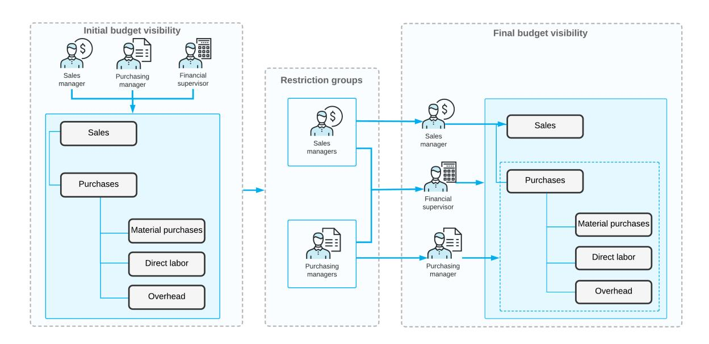

*Figure: Access to budget nodes for users*

# <span id="page-214-0"></span>**Access to Budget Nodes: Implementation Checklist**

The following sections provide details you can use to ensure that the system is configured properly for assigning access to budget nodes, and to understand (and change, if needed) the settings that affect the processing workflow.

# **Implementation Checklist**

We recommend that before you initially assign access to budget nodes, you make sure the needed features have been enabled, settings have been specified, and entities have been created, as summarized in the following checklist.

| Form                                 | Criteria to Check                                                                                                                                                                                                                                                                                             |
|--------------------------------------|---------------------------------------------------------------------------------------------------------------------------------------------------------------------------------------------------------------------------------------------------------------------------------------------------------------|
| Enable/Disable Features (CS100000)   | Make sure that the Standard Financials and Row-Level<br>Security features have been enabled.                                                                                                                                                                                                                  |
| Multiple forms                       | Make sure that the minimum configuration of the com<br>pany has been performed, as described in Company<br>Without Branches: General Information, Company with<br>Branches that Do Not Require Balancing: General Infor<br>mation, and Company with Branches that Require Bal<br>ancing: General Information. |
| GL functionality                     | Make sure that the general ledger functionality has<br>been implemented, as described in General Ledger:<br>General Information.                                                                                                                                                                              |
| Ledgers (GL201500)                   | Make sure that the ledger to which the budget should<br>be posted has been created, as described in Budget<br>Ledger: General Information.                                                                                                                                                                    |
| Chart of Accounts (GL202500)         | Check whether the necessary accounts have been cre<br>ated.                                                                                                                                                                                                                                                   |
| Master Financial Calendar (GL201000) | Be sure that calendars for the financial years for which<br>budgets will be created have been generated.                                                                                                                                                                                                      |
| Budget Configuration (GL205000)      | Make sure that a budget tree has been created and re<br>leased as described in Budget Tree: Implementation Ac<br>tivity.                                                                                                                                                                                      |

# **Additional Configuration**

The following table provides details of additional configuration needed for the preparation of a simple budget.

| Form           | Settings to Check                                                                                                                        | Notes |
|----------------|------------------------------------------------------------------------------------------------------------------------------------------|-------|
| Multiple forms | If your company uses subaccounts,<br>the subaccounts have to be config<br>ured, as described in Subaccounts:<br>Implementation Activity. |       |

### **Validation of Configuration**

To make sure that all configuration has been performed correctly, we recommend that in your system, you assign access to budget nodes by performing instructions similar to those described in *[Access to Budget Nodes:](#page-216-1) [Implementation Activity](#page-216-1)*.

# <span id="page-216-1"></span><span id="page-216-0"></span>**Access to Budget Nodes: Implementation Activity**

The following activity will walk you through the process of configuring access to budget nodes based on user roles.

### **Story**

Suppose that the management team of SweetLife Fruits & Jams has asked the system administrator to assign access rights to the budget nodes for employees of particular roles: Sales managers should be able to view only the **Sales** node, purchasing managers should be able to view only the **Production** node, and the financial supervisor should view all nodes of the budget tree.

Acting as a system administrator, you need to give the users of the *Sales Manager*, *Purchasing Manager*, and *Financial Supervisor* roles the ability to access the budget tree nodes. (For the *Sales Manager* and *Purchasing Manager* roles, you will grant the access to only particular users with the role—those that have completed their orientation period and are considered qualified to view this information.) You will then review the access rights for the nodes.

# **Configuration Overview**

In the *U100* dataset, the following tasks have been performed for the purposes of this activity:

- On the *[Companies](https://help-2025r1.acumatica.com/Help?ScreenId=ShowWiki&pageid=fedad435-8496-4397-b8a3-50a473629f76)* (CS101500) form, the *SWEETLIFE* company has been defined.
- On the *[Users](https://help-2025r1.acumatica.com/Help?ScreenId=ShowWiki&pageid=834cc181-97fa-4db4-a7e0-3eaba142c166)* (SM201010) form, the *becher*, *chubb*, *norman*, *pick*, *johmson*, and *gibbs* user accounts have been created.
- On the *[User Roles](https://help-2025r1.acumatica.com/Help?ScreenId=ShowWiki&pageid=c2879f3c-3739-430a-b02b-c225f5480966)* (SM201005) form, the *Sales Manager*, *Purchasing Manager*, and *Financial Supervisor* roles have been defined.

# **Process Overview**

In this activity, on the *[Access Rights by Role](https://help-2025r1.acumatica.com/Help?ScreenId=ShowWiki&pageid=28b86a7c-c4da-4eb6-bdb5-b46d2cb7ddc8)* (SM201025) form, you will first assign access to the *[Budgets](https://help-2025r1.acumatica.com/Help?ScreenId=ShowWiki&pageid=4f19354b-f537-4951-814b-43ff7f57febe)* (GL302010) form for the *Sales Manager* and *Purchasing Manager* user roles. You will then enable the *Row-Level Security* feature on the *[Enable/Disable Features](https://help-2025r1.acumatica.com/Help?ScreenId=ShowWiki&pageid=c1555e43-1bc5-4f6f-ba9d-b323f94d8a6b)* (CS100000) form. On the *[GL Budget Access](https://help-2025r1.acumatica.com/Help?ScreenId=ShowWiki&pageid=e01d229f-db8a-496b-b6c4-1aa08dac62a8)* (GL105030) form, you will create the *SalesBudget* and *ProductionBudget* restriction groups, selecting the users and budget tree nodes for each group, to assign access to the particular budget nodes.

### **System Preparation**

Before you begin performing the steps of this activity, do the following:

- 1. Launch the Acumatica ERP website with the *U100* dataset preloaded, and sign in as a system administrator Kimberly Gibbs by using the *gibbs* username and the *123* password.
- 2. Make sure that you have completed *Budget Tree: [Implementation](#page-225-1) Activity*.

# **Step 1: Assigning Access to All Budget Nodes for User Roles**

To give users that are assigned to the *Sales Manager* and *Purchasing Manager* roles the access rights to review and modify budgets on the *[Budgets](https://help-2025r1.acumatica.com/Help?ScreenId=ShowWiki&pageid=4f19354b-f537-4951-814b-43ff7f57febe)* (GL302010) form, do the following:

- 1. Open the *[Access Rights by Role](https://help-2025r1.acumatica.com/Help?ScreenId=ShowWiki&pageid=28b86a7c-c4da-4eb6-bdb5-b46d2cb7ddc8)* (SM201025) form.
- 2. In the **Role Name** box, select *Sales Manager*.

3. In the le pane, click **Finance**, and in the table in the right pane, for the *Budgets* row, double-click the value in the **Access Rights** column, and select *Edit*.

The **Finance** node controls the role's access to various finance-related forms, including *[Budgets](https://help-2025r1.acumatica.com/Help?ScreenId=ShowWiki&pageid=4f19354b-f537-4951-814b-43ff7f57febe)* (GL302010), which access rights you have set.

The *Edit* level of access rights allows users with the role to view the form, select records, and edit details about any record. However, users with the role cannot create new records or entities of the type; they also cannot delete records.

- 4. On the form toolbar, click**Save** to save your changes.
- 5. In the **Role Name** box, select *Purchasing Manager*.
- 6. In the le pane, click *Finance*, and in the table in the right pane, for the *Budgets* row, double-click the value in the **Access Rights** column, and select *Edit*.
- 7. On the form toolbar, click**Save** to save your changes.

#### **Step 2: Enabling the Needed Feature**

In this step, you will enable the *Row-Level Security* feature, which will make it possible to define restriction groups in the system. To enable the needed feature, do the following:

- 1. Open the *[Enable/Disable Features](https://help-2025r1.acumatica.com/Help?ScreenId=ShowWiki&pageid=c1555e43-1bc5-4f6f-ba9d-b323f94d8a6b)* (CS100000) form.
- 2. On the form toolbar, click **Modify**.
- 3. Select the **Row-LevelSecurity** check box (in the **Platform** group).
- 4. On the form toolbar, click **Enable**.

#### **Step 3: Assigning Access Rights to the Sales Node**

In this step, you will create a restriction group and assign access rights to users with the *Sales Manager* role, as well as to the financial supervisor, who has the *johnson* username. Do the following:

- 1. On the *[GL Budget Access](https://help-2025r1.acumatica.com/Help?ScreenId=ShowWiki&pageid=e01d229f-db8a-496b-b6c4-1aa08dac62a8)* (GL105030) form, add a new record.
- 2. In the Summary area, specify the following settings in the Summary area:
  - **Group Name**: SalesBudget
  - **Description**: Sales Budget Access
  - **Group Type**: *A*
  - **Active**: Selected

The system has uploaded all users in the system to the table on the **Users** tab.

3. In the table, select the Included check box for the *becher*, *chubb*, *norman*, and *pick* users.

These users are sales managers in SweetLife Fruits & Jams; thus, they should have access to the**Sales** node of the company's budget on the *[Budgets](https://help-2025r1.acumatica.com/Help?ScreenId=ShowWiki&pageid=4f19354b-f537-4951-814b-43ff7f57febe)* (GL302010) form.

4. In the table, select the Included check box for the *johnson* and *gibbs* users.

Once you configure a restriction group of type *A*, the users not included in this group will not have access to the **Sales** node of the budget. The *johnson* user is a financial supervisor who needs access to this node. The *gibbs* user is a system administrator who needs access to this node for configuration purposes.

- 5. On the **BudgetTree** tab, select the Included check box for the row with the**Sales** node of the budget to make it accessible for users added to this group.
- 6. Make sure that the Included check boxes for sales articles have been selected automatically by the system.
- 7. On the form toolbar, click**Save** to save the new restriction group.

# **Step 4: Assigning Access Rights to the Production Node**

To create a restriction group and assign access rights to users with the *Purchasing Manager* role (as well as to the financial supervisor, who has the *johnson* username), do the following:

- 1. While you are still on the *[GL Budget Access](https://help-2025r1.acumatica.com/Help?ScreenId=ShowWiki&pageid=e01d229f-db8a-496b-b6c4-1aa08dac62a8)* (GL105030) form, click **Add New Record** on the form toolbar, and specify the following settings in the Summary area:
  - **Group Name**: ProductionBudget
  - **Description**: Production Budget Access
  - **Group Type**: *A*
  - **Active**: Selected

The system has uploaded all users in the system to the table on the **Users** tab.

2. In the table, select the Included check boxes for the *brawner*, *jones*, and *wiley* users.

These users are the purchasing managers in SweetLife Fruits & Jams; thus, they should have access to the **Production** node of the company's budget on the *[Budgets](https://help-2025r1.acumatica.com/Help?ScreenId=ShowWiki&pageid=4f19354b-f537-4951-814b-43ff7f57febe)* (GL302010) form.

3. Select the Included check boxes for the *johnson* and *gibbs* users.

Once you configure a restriction group of type *A*, the users not included in this group will not have access to the **Production** node of the budget. The *johnson* user is a financial supervisor who needs access to this node. The *gibbs* user is a system administrator who needs access to this node for configuration purposes.

- 4. On the **BudgetTree** tab, select the Included check box for the row with the **Production** node.
- 5. On the form toolbar, click**Save** to save the new restriction group.

# <span id="page-218-0"></span>**Budget Ledger**

In Acumatica ERP, you can create ledgers of the *Budget* type to keep budgets so that user can then prepare budget-related reports and compare budgets. In this chapter, you will find general information on budget ledgers, configuration prerequisites, and an activity you can use to practice the creation of budget ledgers.

# <span id="page-218-2"></span><span id="page-218-1"></span>**Budget Ledger: General Information**

In Acumatica ERP, you can create budget ledgers, which are ledgers of the *Budget* type. When you create a budget ledger, you specify the companies and branches that can post to it. Then, a budget can be assigned to the budget ledger. A budget is a worksheet containing GL accounts, subaccounts, and the budget amounts for each account and subaccount pair. The budget is also associated with a specific branch and financial year.

### **Learning Objectives**

In this chapter, you will learn how to create a ledger of the *Budget* type.

## **Applicable Scenarios**

You create a budget ledger if you need to prepare a budget in the system. You can use the budget ledger as a base ledger for calculating allocation proportions. For details, see *[Allocation Rules: General Information](#page-131-3)*.

### **Creation and Population of a Budget Ledger**

You can create as many budget ledgers as needed on the *[Ledgers](https://help-2025r1.acumatica.com/Help?ScreenId=ShowWiki&pageid=a5c9f3f5-7dc4-4b1b-a50c-396729a12e4e)* (GL201500) form. A single ledger can be used to post the annual budgets for different companies or branches. However, to prepare two different budgets for the same company, branch, and year (for example, an optimistic budget and a pessimistic budget), you must create a separate budget ledger for each budget.

To post a budget to a budget ledger, you perform the following general instructions:

- 1. On the *[Budgets](https://help-2025r1.acumatica.com/Help?ScreenId=ShowWiki&pageid=4f19354b-f537-4951-814b-43ff7f57febe)* (GL302010) form, you create a budget for a year.
- 2. On the *[Release Budgets](https://help-2025r1.acumatica.com/Help?ScreenId=ShowWiki&pageid=a29ba31c-cf25-416c-a253-7de75fe54d31)* (GL505510) form, you release the budget, that is, post the budget to a budget ledger.

Aer a budget is released, the budget amounts can be displayed in reports and compared with actual figures or other budgets on the *[Budgets](https://help-2025r1.acumatica.com/Help?ScreenId=ShowWiki&pageid=4f19354b-f537-4951-814b-43ff7f57febe)* form.


Transactions cannot be entered in the budget ledger.

# <span id="page-219-0"></span>**Budget Ledger: Configuration Prerequisites**

Before starting to create a budget ledger, you must be sure that the system has been configured properly and that all required entities have been created, as described in the following sections.

### **Enabling the Needed Features**

On the *[Enable/Disable Features](https://help-2025r1.acumatica.com/Help?ScreenId=ShowWiki&pageid=c1555e43-1bc5-4f6f-ba9d-b323f94d8a6b)* (CS100000) form, the minimum set of features has been enabled.

#### **Configuring the System**

Before you create a budget ledger in Acumatica ERP, you need to make sure that the company has been configured properly. For details, see *Company Without [Branches:](#page-82-1) To Configure a Company Without Branches*, *[Company with](#page-88-1) [Branches that Do Not Require Balancing: Implementation Activity](#page-88-1)*, or *[Company with Branches that Require Balancing:](#page-96-1) [Implementation Activity](#page-96-1)*.

# <span id="page-219-1"></span>**Budget Ledger: Implementation Activity**

In this activity, you will learn how to create a budget ledger for a company in Acumatica ERP.

#### **Story**

Suppose that as an accountant, you need to create a budget ledger that will hold the optimistic budgets for the SweetLife Fruits & Jams and Muffins & Cakes companies.

### **Configuration Overview**

In the *U100* dataset, the following tasks have been performed for the purposes of this activity:

• On the *[Companies](https://help-2025r1.acumatica.com/Help?ScreenId=ShowWiki&pageid=fedad435-8496-4397-b8a3-50a473629f76)* (CS101500) form, the *SWEETLIFE* and *MUFFINS* companies have been created.

• On the *[Branches](https://help-2025r1.acumatica.com/Help?ScreenId=ShowWiki&pageid=b97ab72d-4ab4-4f02-b69c-f7f61b316ced)* (CS102000) form, the branches of the *SWEETLIFE* company have been defined: *HEADOFFICE*, *SWEETEQUIP*, and *RETAIL*. The branches of the *MUFFINS* company have also been defined: *MHEAD* and *MRETAIL*.

### **Process Overview**

In this activity, on the *[Ledgers](https://help-2025r1.acumatica.com/Help?ScreenId=ShowWiki&pageid=a5c9f3f5-7dc4-4b1b-a50c-396729a12e4e)* (GL201500) form, you will create a budget ledger for an optimistic budget. You will define the ledger to hold the budgets of the SweetLife Fruits & Jams and Muffins & Cakes companies.

### **System Preparation**

Launch the Acumatica ERP website with the *U100* dataset preloaded, and sign in as an accountant Nenad Pasic by using the *pasic* username and the *123* password.

### **Step: Creating a Budget Ledger**

To create a budget ledger to be used by both companies, do the following:

- 1. On the *[Ledgers](https://help-2025r1.acumatica.com/Help?ScreenId=ShowWiki&pageid=a5c9f3f5-7dc4-4b1b-a50c-396729a12e4e)* (GL201500) form, add a new record.
- 2. In the **Ledger ID** box of the Summary area, type BUDGETOPT.
- 3. In the **Description** box, type Ledger for optimistic budgets.
- 4. In the **Type** box, select *Budget*.
- 5. On the table toolbar of the **Companies** tab, click **Add Row**, and select *SWEETLIFE* in the **Company** column of the added row.
- 6. Click **Add Row** again, and select *MUFFINS* in the **Company** column of the added row.
- 7. On the form toolbar, click**Save**.

On the **Branches** tab, notice that all the branches of the SweetLife Fruits & Jams and Muffins & Cakes companies have been added. The SweetLife Fruits & Jams company is made up of the *HEADOFFICE*, *SWEETEQUIP*, and *RETAIL* branches. The Muffins & Cakes company has the *MHEAD* and *MRETAIL* branches.

You have created a budget ledger that can now be used to store optimistic budgets for both companies.

# <span id="page-220-0"></span>**Budget Tree**

In Acumatica ERP, if budget articles should be grouped to give users the ability to review the overall budget amount for each particular group, you can configure a budget structure. In the configuration, you have to create nodes, which represent a group of budget articles, and leaves, which represent the budget articles of a node. This configuration will then be used for creating a budget in the system.

In this chapter, you will find general information on the budget tree, as well as the configuration prerequisites, an example of a budget structure, and an activity, which guides you through the steps of creating the budget tree.

# <span id="page-220-1"></span>**Budget Tree: General Information**

In Acumatica ERP, you can define a hierarchical budget structure that will be used by all companies and branches. To do so, you configure a budget tree, in which budget articles are divided into groups.

We recommend that you define a single budget tree instead of multiple simple budgets because a budget tree makes easier to prepare and analyze budgets. However, you can work with simple budgets, which are lists of budget articles, without first defining a budget tree. For details, see *[Preparing a Simple Budget](https://help-2025r1.acumatica.com/Help?ScreenId=ShowWiki&pageid=45dbce17-2405-4812-9ab8-440bae134381)*.

### **Learning Objectives**

In this chapter, you will learn how to do the following:

- The elements of a budget tree structure
- The ways the budget tree can be configured

#### **Applicable Scenarios**

You create a budget tree if hierarchical (multilevel) budgets are used by your organization to facilitate the preparation of the budget.

# **Configuration of a Budget Tree**

Before you start configuring budgets in Acumatica ERP, you should consider the needs of all companies and branches defined in the tenant so that you can include all the budget levels used by your companies and branches. You will use the same tree for all companies, branches, and budget versions.

To define the structure of the budgets that are used in the system, you build a budget tree on the *[Budget](https://help-2025r1.acumatica.com/Help?ScreenId=ShowWiki&pageid=9f69e979-e7fd-4c8d-964f-3a75e86e4e43) [Configuration](https://help-2025r1.acumatica.com/Help?ScreenId=ShowWiki&pageid=9f69e979-e7fd-4c8d-964f-3a75e86e4e43)* (GL205000) form. To do so, you add budget articles, which are represented as *nodes* and *leaves* on the tree.

Articles that are nodes group similar leaf articles. For example, you can create one node for the account– subaccount pairs for salaries and another node for the account–subaccount pairs that are used to record sales.

Each leaf article is defined by an account–subaccount pair (or only accounts if subaccounts are not used in your system). The budget amount is recorded to the account and subaccount of the leaf. The system calculates the amount for each node automatically as the sum of the amounts of all its leaf articles.


An account–subaccount pair can be used only once within a tree.

The budget tree will be preloaded when you start creating a budget on the *[Budgets](https://help-2025r1.acumatica.com/Help?ScreenId=ShowWiki&pageid=4f19354b-f537-4951-814b-43ff7f57febe)* (GL302010) form. You can modify the preloaded structure for each budget.

#### **Node Budget Articles**

You define the budget articles that are represented as nodes on the**Subarticles** pane of the *[Budget Configuration](https://help-2025r1.acumatica.com/Help?ScreenId=ShowWiki&pageid=9f69e979-e7fd-4c8d-964f-3a75e86e4e43)* (GL205000) form. For each node, you enter a description; you can also specify account or subaccount masks (or both types of masks). The check box in the **Node** column has to be selected for each node you create in the system.

The account and subaccount masks specified for the node in the **Account Mask** and **Subaccount Mask** columns define the articles that can be added to this node. When you create a budget on the *[Budgets](https://help-2025r1.acumatica.com/Help?ScreenId=ShowWiki&pageid=4f19354b-f537-4951-814b-43ff7f57febe)* (GL302010) form, you can preload articles to this node based on the mask, so that you do not have to manually define a leaf for every single article in the budget tree.

You can further populate nodes with other nodes, or define leaf articles for each node.

# **Leaf Budget Articles**

You add a budget article that is represented as leaf on the**Subarticles** pane of the *[Budget Configuration](https://help-2025r1.acumatica.com/Help?ScreenId=ShowWiki&pageid=9f69e979-e7fd-4c8d-964f-3a75e86e4e43)* (GL205000) form. Each leaf budget article is defined by an account (or by an account-subaccount pair, if subaccounts are used in your system). You can add an account (or an account-subaccount pair) for each leaf in one of the following ways:

- To add a range of similar accounts (and subaccounts, if any), you click **Preload Accounts** on the table toolbar of the**Subarticles** pane. You then specify a range of accounts and a mask for subaccounts in the **Preload Accounts** dialog box. Aer you click **OK** in the dialog box, the system generates all possible account–subaccount pairs.
- To enter each account or account–subaccount pair (that is, each leaf) manually, on the**Subarticles** pane, you click **Add Row** on the table toolbar and specify an account or an account–subaccount pair.

For each leaf budget article, you can specify an account mask in the **Account Mask** column and subaccount mask in the **Subaccount Mask** (if subaccounts are used in your system) column. The account mask (or the pair of account mask and the subaccount mask) defines the aggregated account (or a pair of an account and subaccount). For example, you might want to aggregate amounts of different accounts under just one account in the budget. To do so, you specify the account mask for the group of accounts in the leaf.

# <span id="page-222-0"></span>**Budget Tree: Example**

Suppose that one company—North Serpent Company, with stores in the mountainous areas of California and Nevada—sells skis and snowboards and offers rental services. The company's stores are too small to function as branches, so the *Branch Accounting* feature is disabled on the *[Enable/Disable Features](https://help-2025r1.acumatica.com/Help?ScreenId=ShowWiki&pageid=c1555e43-1bc5-4f6f-ba9d-b323f94d8a6b)* (CS100000) form.

# **Defining the Account Structure of the Company**

The organizational structure of the company is reflected in the subaccounts. In Acumatica ERP, if the *Subaccounts* feature is enabled on the *[Enable/Disable Features](https://help-2025r1.acumatica.com/Help?ScreenId=ShowWiki&pageid=c1555e43-1bc5-4f6f-ba9d-b323f94d8a6b)* (CS100000) form, subaccounts are used with accounts to virtually split accounts into more specific accounts for detailed tracking and reporting. In our example, the subaccounts have the following structure (see *[Subaccounts: Example of Planning Subaccount Identifiers](#page-169-1)*):

- First segment: Company store (point of sale):
  - *CA* (California store)
  - *NV* (Nevada store)
  - *00* (non-specific to a store)
- Second segment: Profit center
  - *RENT* (rentals)
  - *SALE* (sales)
  - *0000* (non-specific to a profit center)
- Third segment: Product type
  - *SK* (skis)
  - *SB* (snowboards)
  - *00* (non-specific)

### **Configuring a Budget Structure**

Suppose the North Serpent Company prepares the budgets with the following major budget articles:

- Revenue from Sales
- Revenue from Rentals

- COGS
- Other Expenses

These major budget articles will be represented as nodes on the *[Budget Configuration](https://help-2025r1.acumatica.com/Help?ScreenId=ShowWiki&pageid=9f69e979-e7fd-4c8d-964f-3a75e86e4e43)* (GL302010) form, which you use to build a budget tree for the company. Also, each major node contains subnodes for which account and subaccount masks are specified. Leaves are defined by an account-subaccount pair for each subnode. You can see a schematic example of the configured budget tree in the table below.

| Node    | Subarticles<br>(Nodes) | Subarticles (Leaves)              | Ac<br>count<br>Mask | Subaccount<br>Mask | Ac<br>count | Subaccount |
|---------|------------------------|-----------------------------------|---------------------|--------------------|-------------|------------|
| Sales   |                        |                                   |                     |                    |             |            |
|         | Sales–Cali<br>fornia   |                                   | 4100                | CA-SALE-??         |             |            |
|         |                        | Sales–California–Skis             |                     |                    | 4100        | CA-SALE-SK |
|         |                        | Sales–Califor<br>nia–Snowboards   |                     |                    | 4100        | CA-SALE-SB |
|         | Sales–Neva<br>da       |                                   | 4100                | NV-SALE-??         |             |            |
|         |                        | Sales–Nevada–Skis                 |                     |                    | 4100        | NV-SALE-SK |
|         |                        | Sales–Nevada–Snow<br>boards       |                     |                    | 4100        | NV-SALE-SB |
| Rentals |                        |                                   |                     |                    |             |            |
|         | Rentals–Cali<br>fornia |                                   | 4500                | CA-RENT-??         |             |            |
|         |                        | Rentals–Califor<br>nia–Skis       |                     |                    | 4500        | CA-RENT-SK |
|         |                        | Rentals–Califor<br>nia–Snowboards |                     |                    | 4500        | CA-RENT-SB |
|         | Rentals–<br>Nevada     |                                   | 4500                | NV-RENT-??         |             |            |
|         |                        | Rentals–Nevada–Skis               |                     |                    | 4500        | NV-RENT-SK |
|         |                        | Rentals–Neva<br>da–Snowboards     |                     |                    | 4500        | NV-RENT-SB |
| COGS    |                        |                                   |                     |                    |             |            |
|         | COGS–Skis              |                                   | 5000                | ??-SALE-SK         |             |            |
|         |                        | COGS–Nevada–Skis                  |                     |                    | 5000        | NV-SALE-SK |

| Node               | Subarticles<br>(Nodes)     | Subarticles (Leaves)                   | Ac<br>count<br>Mask | Subaccount<br>Mask           | Ac<br>count | Subaccount |
|--------------------|----------------------------|----------------------------------------|---------------------|------------------------------|-------------|------------|
|                    |                            | COGS–California–Skis                   |                     |                              | 5000        | CA-SALE-SK |
|                    | COGS–Snow<br>boards        |                                        | 5000                | ??-SALE-SB                   |             |            |
|                    |                            | COGS–Nevada–Snow<br>boards             |                     |                              | 5000        | NV-SALE-SB |
|                    |                            | COGS–Califor<br>nia–Snowboards         |                     |                              | 5000        | CA-SALE-SB |
| Other Ex<br>penses |                            |                                        |                     |                              |             |            |
|                    | Repairs and<br>Maintenance |                                        | 55??                | ??-????-??                   |             |            |
|                    |                            | Repairs and Mainte<br>nance–Nevada     | 5570                | NV-????-?? (Ag<br>gregation) | 5570        | NV-0000-00 |
|                    |                            | Repairs and Mainte<br>nance–California | 5580                | CA-????-?? (Ag<br>gregation) | 5580        | CA-0000-00 |

# **Defining Account-Subaccount Pairs and Masks**

For the major node, account and subaccount masks are not specified because these nodes are divided into multiple nodes. For each subnode, the account and subaccount masks are specified. These masks specify the group of budget articles that can be added under the node. The articles with the account and subaccount that match the masks are automatically placed under the node when you preload articles for a budget on the *[Budgets](https://help-2025r1.acumatica.com/Help?ScreenId=ShowWiki&pageid=4f19354b-f537-4951-814b-43ff7f57febe)* (GL302010) form.

The articles with values in all four columns are leaf articles with initial aggregation over the data defined by these masks. The expenses recorded to the *Repairs and Maintenance* account for each store last year, although summed to significant amounts, cannot help in predicting the expenses for the budget year, but the their sum can. The company can plan the amounts based on the previous year's data with a specific coefficient whose value is based on the percentage of old equipment and other related factors. The company plans these amounts as lump sums without details; to do this, the company uses budget articles with aggregation. The articles have the accountsubaccount pairs specified and the subaccount masks for aggregating the amounts.

# <span id="page-224-0"></span>**Budget Tree: Configuration Prerequisites**

Before you start to configure a budget tree, you must be sure that the system has been configured properly and that all required entities have been created, as described in the following sections.

# **Enabling the Needed Features**

On the *[Enable/Disable Features](https://help-2025r1.acumatica.com/Help?ScreenId=ShowWiki&pageid=c1555e43-1bc5-4f6f-ba9d-b323f94d8a6b)* (CS100000) form, the minimum set of features has to be enabled.

Also, if subaccounts are used in your system, make sure the *Subaccounts* feature has been enabled.

# **Configuring the System**

You need to make sure that the following implementation tasks have been performed in Acumatica ERP before you begin configuring a budget tree:

- On the *[Companies](https://help-2025r1.acumatica.com/Help?ScreenId=ShowWiki&pageid=fedad435-8496-4397-b8a3-50a473629f76)* (CS101500) form, the companies of the organization have been configured, and the appropriate actual ledger has been assigned to each company. For details, see *Company Without [Branches:](#page-82-1) To [Configure](#page-82-1) a Company Without Branches*.
- On the *[Chart of Accounts](https://help-2025r1.acumatica.com/Help?ScreenId=ShowWiki&pageid=85557f41-a4af-47a8-b198-2a01461ce9c3)* (GL202500) form, the accounts to be used with the accounts receivable functionality have been defined. For more information, see *General Ledger: To Create a Chart of [Accounts](#page-102-1)*.
- On the *[General Ledger Preferences](https://help-2025r1.acumatica.com/Help?ScreenId=ShowWiki&pageid=e4913d06-c511-4258-a0f9-f36c1b854e6b)* (GL102000) form, the preference settings for the general ledger functionality have been specified. For details, see *General Ledger: To Specify General Ledger [Preferences](#page-104-1)*.

If subaccounts are used in your system, make sure that the following implementation has been performed:

- On the *[Segmented Keys](https://help-2025r1.acumatica.com/Help?ScreenId=ShowWiki&pageid=78bd7bd1-6bf6-409e-a8a5-8b18e8b80722)* (CS202000) and the *[Segment](https://help-2025r1.acumatica.com/Help?ScreenId=ShowWiki&pageid=00338857-dd1a-41be-aa07-4cbce24c635e) Values* (CS203000) forms, the structure of the *SUBACCOUNT* segmented key has been defined and the list of possible segment values have been specified. For more information, see *[Subaccounts: Implementation Activity](#page-170-1)*.
- On the *[Subaccounts](https://help-2025r1.acumatica.com/Help?ScreenId=ShowWiki&pageid=2c7b73c6-43b2-4076-92c6-74c9e66ecf18)* (GL203000) form, the subaccounts you are going to use in the budget have been added.

# <span id="page-225-1"></span><span id="page-225-0"></span>**Budget Tree: Implementation Activity**

In this activity, you will learn how to configure a budget tree in the system.

### **Story**

Suppose that the managers of SweetLife Fruits & Jams have decided to use hierarchical budgets in the system. They want the budget to include the**Sales** node and the **Production** node; the latter node should have the **Purchases**, **Labor Cost**, and **Overhead** subnodes.

Acting as a system administrator, you need to create a budget tree with the**Sales** and **Production** nodes, which will contain the related budget articles.

# **Configuration Overview**

In the *U100* dataset, the following tasks have been performed for the purposes of this activity:

- On the *[Companies](https://help-2025r1.acumatica.com/Help?ScreenId=ShowWiki&pageid=fedad435-8496-4397-b8a3-50a473629f76)* (CS101500) form, the *SWEETLIFE* company has been defined.
- On the *[Branches](https://help-2025r1.acumatica.com/Help?ScreenId=ShowWiki&pageid=b97ab72d-4ab4-4f02-b69c-f7f61b316ced)* (CS102000) form, the *HEADOFFICE* branch of the *SWEETLIFE* company has been created.
- On the *[Chart of Accounts](https://help-2025r1.acumatica.com/Help?ScreenId=ShowWiki&pageid=85557f41-a4af-47a8-b198-2a01461ce9c3)* (GL202500) form, the following accounts have been created:
  - *40000 - Sales Revenue*
  - *40010 - Sales Freight*
  - *51300 - COGS - Freight*
  - *60000 - Purchase Expense*
  - *61000 - Advertising Expense*
  - *62400 - Office Expense*
  - *62900 - Rent or Lease Expense*
  - *62950 - Repairs*
  - *63300 Supplies*
  - *69500 - Salaries and Wages*

- *69550 Bonus Expenses*
- On the *[Segmented Keys](https://help-2025r1.acumatica.com/Help?ScreenId=ShowWiki&pageid=78bd7bd1-6bf6-409e-a8a5-8b18e8b80722)* (CS202000) form, the *SUBACCOUNT* segmented key has been defined.

### **Process Overview**

In this activity, on the *[Subaccounts](https://help-2025r1.acumatica.com/Help?ScreenId=ShowWiki&pageid=2c7b73c6-43b2-4076-92c6-74c9e66ecf18)* (GL203000) form, you will upload the list of subaccounts from an Excel file. On the *[Budget Configuration](https://help-2025r1.acumatica.com/Help?ScreenId=ShowWiki&pageid=9f69e979-e7fd-4c8d-964f-3a75e86e4e43)* (GL205000) form, you will create budget nodes and add leaves for each node.

# **System Preparation**

Before you begin configuring the budget tree, do the following:

- 1. Launch the Acumatica ERP website with the *U100* dataset preloaded, and sign in as a system administrator Kimberly Gibbs by using the *gibbs* username and the *123* password.
- 2. Make sure that you have completed the following prerequisite activity to perform the needed configuration of subaccounts: *[Subaccounts: Implementation Activity](#page-170-1)*.
- 3. Make sure that the 2026 financial year has been created on the *[Master Financial Calendar](https://help-2025r1.acumatica.com/Help?ScreenId=ShowWiki&pageid=d46a8e03-b211-44c2-b17c-01ae813ead1b)* (GL201000) form.

# **Step 1: Uploading a List of Subaccounts**

To upload the list of subaccounts from a file, do the following:

- 1. Open the *[Subaccounts](https://help-2025r1.acumatica.com/Help?ScreenId=ShowWiki&pageid=2c7b73c6-43b2-4076-92c6-74c9e66ecf18)* (GL203000) form.
- 2. On the form toolbar, click **Load Records from File**.
- 3. In the **File Upload** dialog box, which opens, click **Choose File**, and select the *[Subaccounts.xlsx](Published/ImplementationGuide/Files/Subaccounts.xlsx)* file.
- 4. Click **Upload**.
- 5. In the **Common Settings** dialog box, which opens, leave the default settings, and click **OK**.
- 6. In the **Columns** dialog box, which opens, leave the default settings, and click **OK**.
- 7. On the form toolbar, click**Save** to save your changes.

#### **Step 2: Defining Nodes**

To define nodes in the budget structure, do the following:

1. Open the *[Budget Configuration](https://help-2025r1.acumatica.com/Help?ScreenId=ShowWiki&pageid=9f69e979-e7fd-4c8d-964f-3a75e86e4e43)* (GL205000) form.

In the **BudgetTree** pane, notice that **Company** is highlighted in bold type.

- 2. In the **Subarticles** pane, click **Add Row** on the table toolbar, and do the following in the added row:
  - a. Select the check box in the **Node** column.
  - b. In the **Description** column, type Sales.
  - c. Leave the other columns empty.

You have not specified the account and subaccount masks for this node, because you will preload accounts and add one account manually to this node later.

- 3. Click **Add Row**, and specify the following settings in the row to create a node:
  - **Node**: Selected
  - **Description**: Production
  - Other columns: Empty

You have not specified the account and subaccount masks for this node, because you will add subnodes to this node later.

4. Click **Save** on the form toolbar to save your changes.

You have created nodes for your budget structure, which you can now see in the **BudgetTree** pane.

# **Step 3: Adding Leaves to the Sales Node**

To add leaves to the**Sales** node, do the following:

- 1. While you are still viewing the budget tree on the *[Budget Configuration](https://help-2025r1.acumatica.com/Help?ScreenId=ShowWiki&pageid=9f69e979-e7fd-4c8d-964f-3a75e86e4e43)* (GL205000) form, in the **BudgetTree** pane, click the**Sales** node.
- 2. On the table toolbar of the**Subarticles** pane, click **Preload Accounts**.

The **Preload Accounts** dialog box opens.

- 3. In this dialog box, in the **Account From** and **AccountTo** boxes, select *40000 - Sales Revenue*.
- 4. In the **Subaccount Mask** box, enter ???-000.
- 5. Click **OK** to preload the budget leaves. The system automatically populates the budget tree with all the possible combinations that match the specified mask.
- 6. On the toolbar of the**Subarticles** pane, click **Add Row**, and specify the following settings in the added row:
  - **Node**: Cleared
  - **Account**: *40010 - Sales Freight*
  - **Subaccount**: 000-000
  - **Account Mask**: *40010 - Sales Freight*
  - **Subaccount Mask**: ???-000
- 7. On the form toolbar, click**Save** to save your changes. The following screenshot shows the**Sales** node with the added accounts.

| <b>Budget Configuration</b>      |                    |         |                              |                      |                     | <b>CUSTOMIZATION</b>   | TOOLS $\tau$                      |
|----------------------------------|--------------------|---------|------------------------------|----------------------|---------------------|------------------------|-----------------------------------|
| $\boxdot$<br>$\Omega$            |                    |         |                              |                      |                     |                        |                                   |
| <b>Budget Tree</b>               | <b>Subarticles</b> |         |                              |                      |                     |                        |                                   |
| û<br>↓<br>↑<br>$\leftarrow$<br>→ | Ò<br>$^{+}$        | 侕       | $\vdash$<br>PRELOAD ACCOUNTS |                      |                     |                        |                                   |
| <b>e-← COMPANY</b>               | 冒<br>Node          | Account | Subaccount                   | *Description         | <b>Account Mask</b> | <b>Subaccount Mask</b> | Secured                           |
| Sales                            | $\Box$             | 40000   | 000-000                      | <b>Sales Revenue</b> | 40000               | 000-000                | П                                 |
| Production                       | $\Box$             | 40000   | <b>JAM-000</b>               | <b>Sales Revenue</b> | 40000               | <b>JAM-000</b>         | Е                                 |
|                                  | $\Box$             | 40000   | <b>FRU-000</b>               | <b>Sales Revenue</b> | 40000               | <b>FRU-000</b>         | $\Box$                            |
|                                  | $\Box$             | 40000   | <b>EQU-000</b>               | <b>Sales Revenue</b> | 40000               | <b>EQU-000</b>         | $\Box$                            |
|                                  | $\Box$             | 40000   | <b>NSS-000</b>               | <b>Sales Revenue</b> | 40000               | <b>NSS-000</b>         | Г                                 |
|                                  | $\Box$             | 40010   | 000-000                      | Sales - Freight      | 40010               | ???-000                | $\Box$                            |
|                                  |                    |         |                              |                      |                     |                        |                                   |
|                                  |                    |         |                              |                      |                     | $\mathbb{R}$           | $\epsilon$<br>$\rightarrow$<br>>1 |

*Figure: The Sales node with the added accounts*

#### **Step 4: Adding Subnodes to the Production Node**

To add subnodes to the **Production** node, do the following:

- 1. While you are still viewing the budget tree on the *[Budget Configuration](https://help-2025r1.acumatica.com/Help?ScreenId=ShowWiki&pageid=9f69e979-e7fd-4c8d-964f-3a75e86e4e43)* (GL205000) form, in the **BudgetTree** pane, click the **Production** node.
- 2. On the table toolbar of the**Subarticles** pane, click **Add Row**, and specify the following settings for the added row:
  - **Node**: Selected

- **Description**: Purchases
- 3. Click **Add Row**, and specify the following settings for the added row:
  - **Node**: Selected
  - **Description**: Labor Cost
- 4. Click **Add Row**, and specify the following settings for the added row:
  - **Node**: Selected
  - **Description**: Overhead
- 5. On the form toolbar, click**Save** to save your changes.

# **Step 5: Adding Leaves to the Subnodes of the Production Node**

To add leaves to the subnodes of the **Production** node, do the following:

- 1. While you are still viewing the budget tree on the *[Budget Configuration](https://help-2025r1.acumatica.com/Help?ScreenId=ShowWiki&pageid=9f69e979-e7fd-4c8d-964f-3a75e86e4e43)* (GL205000) form, in the **BudgetTree** pane, click the **Purchases** subnode of the **Production** node.
- 2. On the table toolbar of the**Subarticles** pane, add each of the following leaves by clicking **Add Row** and entering the settings of the leaf.

| Node    | Account | Subaccount | Description         |
|---------|---------|------------|---------------------|
| Cleared | 60000   | 000-000    | Purchase Expense    |
| Cleared | 61000   | 000-000    | Advertising Expense |
| Cleared | 51300   | 000-000    | COGS - Freight      |

3. On the form toolbar, click**Save** to save the budget configuration, which is shown in the following screenshot.

| <b>Budget Configuration</b>                                     |                                   |                                          |                              |                            |                     | <b>CUSTOMIZATION</b>   | TOOLS $\tau$  |
|-----------------------------------------------------------------|-----------------------------------|------------------------------------------|------------------------------|----------------------------|---------------------|------------------------|---------------|
| $\Box$<br>$\Omega$                                              |                                   |                                          |                              |                            |                     |                        |               |
| <b>Budget Tree</b><br>圎<br>↓<br>$\uparrow$<br>→<br>$\leftarrow$ | <b>Subarticles</b><br>Ò<br>$^{+}$ | 甸                                        | $\vdash$<br>PRELOAD ACCOUNTS |                            |                     |                        |               |
| <b>G-COMPANY</b>                                                | 圓<br>Node                         | <b>Account</b>                           | Subaccount                   | *Description               | <b>Account Mask</b> | <b>Subaccount Mask</b> | Secured       |
| Sales                                                           | $\Box$                            | !!!!!!!!!!!!!!!!!!!!!!!!!!!!!!!!!!!!!!!! | 000-000                      | <b>Purchase Expense</b>    | 60000               | 000-000                |               |
| <b>E</b> Production<br><b>Purchases</b>                         | $\Box$                            | 61000                                    | 000-000                      | <b>Advertising Expense</b> | 61000               | 000-000                |               |
| <b>Labor Cost</b>                                               | $\Box$                            | 51300                                    | 000-000                      | COGS - Freight             | 51300               | 000-000                | г             |
| <b>Overhead</b>                                                 |                                   |                                          |                              |                            |                     |                        |               |
|                                                                 |                                   |                                          |                              |                            |                     | $\mathbf{R}$           | $\rightarrow$ |

#### *Figure: The Purchases subnode of the Production node*

- 4. In the **BudgetTree** pane, click the **Labor Cost** subnode of the **Production** node.
- 5. On the table toolbar of the**Subarticles** pane, click **Preload Accounts**.
- 6. In the **Preload Accounts** dialog box, which opens, specify the following settings:
  - **Account From**: *69500 - Salaries and Wages*
  - **AccountTo**: *69500 - Salaries and Wages*
  - **Subaccount Mask**: *000-???*
- 7. Click **OK** in the dialog box.

The system loads all the accounts that match the specified account and subaccount masks.

- 8. In the **Subarticles** pane, remove the row with the *69500* account and *000-000* subaccount, and a row with the *69500* account and the *000-ENG* subaccount.
- 9. On the table toolbar of the**Subarticles** pane, click **Add Row** and specify the following settings for the row:
  - **Node**: Cleared
  - **Account**: *69550 Bonus Expenses*
  - **Subaccount**: *000-000*
- 10.On the form toolbar, click**Save** to save the budget configuration, which is shown in the following screenshot.

| <b>Budget Configuration</b><br>$\Box$<br>$\Omega$      |   |                                   |                       |                              |                           |                     |                        | <b>CUSTOMIZATION</b> |                                    |         | TOOLS Y       |
|--------------------------------------------------------|---|-----------------------------------|-----------------------|------------------------------|---------------------------|---------------------|------------------------|----------------------|------------------------------------|---------|---------------|
| <b>Budget Tree</b><br>圎<br>$\leftarrow$<br>→<br>↓<br>个 |   | <b>Subarticles</b><br>Ò<br>$^{+}$ | 侕<br>PRELOAD ACCOUNTS | $\left  \rightarrow \right $ |                           |                     |                        |                      |                                    |         |               |
| <b>G-COMPANY</b>                                       | 圓 | Node                              | <b>Account</b>        | Subaccount                   | *Description              | <b>Account Mask</b> | <b>Subaccount Mask</b> |                      |                                    | Secured |               |
| Sales                                                  |   | □                                 | 69500                 | 000-SLS                      | <b>Salaries and Wages</b> | 69500               | 000-SLS                |                      |                                    | $\Box$  |               |
| e- <sup>p</sup> roduction<br>Purchases                 |   | $\Box$                            | 69500                 | 000-MKT                      | <b>Salaries and Wages</b> | 69500               | 000-MKT                |                      |                                    | $\Box$  |               |
| <b>Explorer Cost</b>                                   |   | $\Box$                            | 69500                 | 000-OPS                      | <b>Salaries and Wages</b> | 69500               | 000-OPS                |                      |                                    | $\Box$  |               |
| Overhead                                               |   | $\Box$                            | 69500                 | 000-FIN                      | <b>Salaries and Wages</b> | 69500               | 000-FIN                |                      |                                    | $\Box$  |               |
|                                                        |   | $\Box$                            | 69550                 | 000-000                      | <b>Bonus Expenses</b>     | 69550               | 000-000                |                      |                                    | $\Box$  |               |
|                                                        |   |                                   |                       |                              |                           |                     |                        | $\mathbb{R}$         | $\left\langle \quad \right\rangle$ |         | $\rightarrow$ |

*Figure: The Labor Cost subnode of the Production node*

- 11.In the **BudgetTree** pane, click the **Overhead** subnode of the **Production** node.
- 12.On the table toolbar of the**Subarticles** pane, add each of the following leaves by clicking **Add Row** and entering the settings of the leaf.

| Node    | Account | Subaccount | Description              | Account Mask | Subaccount<br>Mask |
|---------|---------|------------|--------------------------|--------------|--------------------|
| Cleared | 62400   | 000-000    | Office Expense           | 62400        | 000-???            |
| Cleared | 62900   | 000-000    | Rent or Lease<br>Expense | 62900        | 000-???            |
| Cleared | 62950   | 000-000    | Repairs                  | 62950        | 000-???            |
| Cleared | 63300   | 000-000    | Utilities                | 63300        | 000-???            |

13.On the form toolbar, click**Save** to save the budget configuration, which is shown in the following screenshot.

| <b>Budget Configuration</b>                           |                    |                |                              |                       |                     | <b>CUSTOMIZATION</b>   | TOOLS $\blacktriangledown$ |
|-------------------------------------------------------|--------------------|----------------|------------------------------|-----------------------|---------------------|------------------------|----------------------------|
| $\Box$<br>$\Omega$                                    |                    |                |                              |                       |                     |                        |                            |
| <b>Budget Tree</b>                                    | <b>Subarticles</b> |                |                              |                       |                     |                        |                            |
| 侕<br>$\rightarrow$<br>◡<br>$\uparrow$<br>$\leftarrow$ | Õ<br>$^{+}$        | 侕              | $\vdash$<br>PRELOAD ACCOUNTS |                       |                     |                        |                            |
| <b>G-COMPANY</b>                                      | 圓<br>Node          | <b>Account</b> | Subaccount                   | *Description          | <b>Account Mask</b> | <b>Subaccount Mask</b> | Secured                    |
| $\Box$ Sales                                          |                    | 62400          | 000-000                      | Office Expense        | 62400               | 000-???                | $\Box$                     |
| <b>E</b> Production<br>Purchases                      |                    | 62900          | 000-000                      | Rent or Lease Expense | 62900               | 000-???                | $\Box$                     |
| Labor Cost                                            | □                  | 62950          | 000-000                      | <b>Repairs</b>        | 62950               | 000-???                | $\Box$                     |
| Overhead                                              | $\Box$             | 63300          | 000-000                      | <b>Utilities</b>      | 63300               | 000-???                | $\Box$                     |
|                                                       |                    |                |                              |                       |                     |                        |                            |
|                                                       |                    |                |                              |                       |                     | $\mathbb{R}$           | >1                         |

*Figure: The Overhead subnode of the Production node*

# <span id="page-231-0"></span>**Implementing Currency Management**

This part of the guide explains how to implement multicurrency accounting in Acumatica ERP.

# <span id="page-231-1"></span>**Multicurrency Functionality**

The topics of this chapter describe how to configure the multicurrency functionality in Acumatica ERP.

# <span id="page-231-2"></span>**Multicurrency Functionality: General Information**

To start working with multiple currencies, you have to configure this functionality in Acumatica ERP. This chapter describes how to prepare for the configuration and how to perform configuration that meets your business needs.

# **Learning Objectives**

In this chapter, you will learn how to do the following:

- Enable the required system feature
- Review the base currency and configure foreign currencies
- Manually configure a foreign currency

# **Applicable Scenarios**

You configure the multicurrency functionality if your company works with foreign vendors and customers and you want to perform the following processes in Acumatica ERP:

- Maintaining the actual exchange rates for foreign currencies used in the system
- Maintaining bank accounts denominated in a foreign currency
- Creating and processing documents in a foreign currency
- Estimating unrealized gains and losses by revaluing open AP and AR documents
- Revaluing bank account balances
- Translating financial statements into a foreign currency to meet reporting needs

# **Scope of the Multicurrency Functionality in Acumatica ERP**

The following subledgers and functional areas of Acumatica ERP support the processing of documents and transactions in foreign currencies:

- General ledger
- Cash management
- Accounts payable
- Accounts receivable and contract management
- Taxes (you can report taxes in a currency other than the base currency)
- Sales orders
- Purchase orders
- Purchase requisitions

• Time and expenses

Transactions can be processed in the base currency only in functionality related to fixed assets, deferred revenue, inventory, and project accounting in Acumatica ERP.

#### **Workflow of the Implementation of the Multicurrency Functionality**

To implement the multicurrency functionality in Acumatica ERP, you perform the following general steps:

- 1. On the *[Chart of Accounts](https://help-2025r1.acumatica.com/Help?ScreenId=ShowWiki&pageid=85557f41-a4af-47a8-b198-2a01461ce9c3)* (GL202500) form, you create the accounts that will be used in multicurrency operations. For more information, see *[General Ledger: Chart of Accounts](#page-101-3)*.
- 2. If subaccounts are used in your system and the **Allow Adding New Values On the Fly** check box is cleared for the *SUBACCOUNT* segmented key on the *[Segmented Keys](https://help-2025r1.acumatica.com/Help?ScreenId=ShowWiki&pageid=78bd7bd1-6bf6-409e-a8a5-8b18e8b80722)* (CS202000) form, you use the *[Subaccounts](https://help-2025r1.acumatica.com/Help?ScreenId=ShowWiki&pageid=2c7b73c6-43b2-4076-92c6-74c9e66ecf18)* (GL203000) form to create the subaccounts that have been planned for the foreign currencies. For details on subaccounts, see *[Subaccounts: General Information](#page-167-1)*.
- 3. On the *[Currencies](https://help-2025r1.acumatica.com/Help?ScreenId=ShowWiki&pageid=533be28d-b9e1-4d77-9b62-b06bb90a8b3b)* form, you configure the foreign currencies to be used in the system. For an example with instructions, see *[Multicurrency Functionality: Implementation Activity](#page-235-1)*.
- 4. On the *[Currencies](https://help-2025r1.acumatica.com/Help?ScreenId=ShowWiki&pageid=533be28d-b9e1-4d77-9b62-b06bb90a8b3b)* (CM202000) form, you specify the accounts the system will use for recording rounding gains and losses, and the accounts the system will use for recording realized gains and losses. For details, see *[Multicurrency Functionality: Currency Rounding Rules](#page-234-1)*.
- 5. Optional: On the *[Currency](https://help-2025r1.acumatica.com/Help?ScreenId=ShowWiki&pageid=80b1c979-e0a0-437a-ba45-f3f574952674) Rate Types* (CM201000) form, you create each of the planned rate types. For details, see *[Configuration](#page-238-2) of Rate Types and Rates: General Information*.
- 6. On the *[Currency Rates](https://help-2025r1.acumatica.com/Help?ScreenId=ShowWiki&pageid=cc4f6c18-cc29-4e58-a5dc-6c41770e6d48)* (CM201000) form, you define the effective exchange rates to be used by default in the created transactions and documents. For details, see *[Configuration](#page-244-1) of Rate Types and Rates: To Configure [Rates](#page-244-1)*.
- 7. You define denominated accounts on the *[Chart of Accounts](https://help-2025r1.acumatica.com/Help?ScreenId=ShowWiki&pageid=85557f41-a4af-47a8-b198-2a01461ce9c3)* form. For details, see *[Denominated Accounts](https://help-2025r1.acumatica.com/Help?ScreenId=ShowWiki&pageid=28ad15c6-5f9b-4cc1-9c05-932b5dcf6a8f)*.
- 8. Optional: On the *[Automation Schedules](https://help-2025r1.acumatica.com/Help?ScreenId=ShowWiki&pageid=76757610-2d0f-4ead-a948-d67da24ec116)* (SM205020) form, you set up a schedule for the system to automatically update the exchange rates. For details on using automation schedules, see *[Scheduling](https://help-2025r1.acumatica.com/Help?ScreenId=ShowWiki&pageid=87426450-3fdb-4248-b29c-e9cbf47cef6f) [Automated Processing](https://help-2025r1.acumatica.com/Help?ScreenId=ShowWiki&pageid=87426450-3fdb-4248-b29c-e9cbf47cef6f)*.

# <span id="page-232-0"></span>**Multicurrency Functionality: Configuration Prerequisites**

Before starting to configure the multicurrency functionality, you must be sure that the system has been configured properly and that all required entities have been created, as described in the following sections.

#### **Enabling the Needed Features**

On the *[Enable/Disable Features](https://help-2025r1.acumatica.com/Help?ScreenId=ShowWiki&pageid=c1555e43-1bc5-4f6f-ba9d-b323f94d8a6b)* (CS100000) form, the minimum set of features has to be enabled. For details, see *Company Without [Branches:](#page-82-1) To Configure a Company Without Branches*.

#### **Configuring the System**

On the *[Companies](https://help-2025r1.acumatica.com/Help?ScreenId=ShowWiki&pageid=fedad435-8496-4397-b8a3-50a473629f76)* (CS101500) form, you need to make sure that the companies of the organization have been configured and that the appropriate actual ledger has been assigned to each of them. For more information, see *Company Without [Branches:](#page-82-1) To Configure a Company Without Branches* and *[General](#page-101-2) Ledger: To Create an Actual [Ledger](#page-101-2)*.

On the *[Chart of Accounts](https://help-2025r1.acumatica.com/Help?ScreenId=ShowWiki&pageid=85557f41-a4af-47a8-b198-2a01461ce9c3)* (GL202500) form, you need to make sure that the chart of account has been configured. For more information, see *General Ledger: To Create a Chart of [Accounts](#page-102-1)*.

# <span id="page-233-0"></span>**Multicurrency Functionality: Base Currency and Foreign Currencies**

In Acumatica ERP, if the *Multicurrency Accounting* feature is disabled on the *[Enable/Disable Features](https://help-2025r1.acumatica.com/Help?ScreenId=ShowWiki&pageid=c1555e43-1bc5-4f6f-ba9d-b323f94d8a6b)* (CS100000) form, only one currency, which is called the *base currency*, is used for accounting. If this feature is enabled, you can activate foreign currencies in the system, which will be used for accounting and reporting purposes. The base currency will be used for reviewing journal transactions made in foreign currencies and for calculating and converting amounts in imported records.

Regardless of whether this feature is enabled, the base currency is the company's functional currency, and it is configured when a new tenant of Acumatica ERP is created. The base currency settings include the base currency identifier, the currency symbol, and the required decimal precision. Once an administrator has created the specified base currency in the system, the base currency identifier cannot be changed.

In the *U100* dataset, the base currency has already been specified in the company settings on the *[Companies](https://help-2025r1.acumatica.com/Help?ScreenId=ShowWiki&pageid=fedad435-8496-4397-b8a3-50a473629f76)* (CS101500) form.

You can view all foreign currencies (which have been predefined based on the ISO 4217 standard) and their settings on the *[Currencies](https://help-2025r1.acumatica.com/Help?ScreenId=ShowWiki&pageid=533be28d-b9e1-4d77-9b62-b06bb90a8b3b)* (CM202000) form. To configure any foreign currency for use in accounting, you define this currency as active (that is, you select the **Active** check box for it in the Summary area of the *[Currencies](https://help-2025r1.acumatica.com/Help?ScreenId=ShowWiki&pageid=533be28d-b9e1-4d77-9b62-b06bb90a8b3b)* form) and specify the accounts to be used in operations with this currency (on the **GL Accounts** tab of this form). If this check box is selected for the currency, you can use this currency in financial documents and transactions in the general ledger.

# <span id="page-233-1"></span>**Multicurrency Functionality: Foreign Currency Settings**

You edit the settings of a foreign currency on the *[Currencies](https://help-2025r1.acumatica.com/Help?ScreenId=ShowWiki&pageid=533be28d-b9e1-4d77-9b62-b06bb90a8b3b)* (CM202000) form. On this form, you can edit the currency identifier, currency symbol, decimal precision, and description. To be able to use a particular foreign currency in transactions, you need to specify the accounts to be used in operations with this currency and define the currency exchange rates.

We recommend that you assign currency identifiers and currency symbols according to the ISO 4217 international standard. Otherwise, you will not be able to use the online update functionality for the currency rates.

# **Realized Gain and Realized Loss Accounts**

When you activate a currency for use in accounting on the *[Currencies](https://help-2025r1.acumatica.com/Help?ScreenId=ShowWiki&pageid=533be28d-b9e1-4d77-9b62-b06bb90a8b3b)* (CM202000) form, you specify the GL accounts to be used to record the realized gains or losses in the **Realized Gain and Loss Accounts** section of the form. When a payment or credit memo is applied to an AR document or a payment or debit adjustment is applied to an AP document, the system calculates the realized gains and losses.

### **Unrealized Gain and Unrealized Loss Accounts**

The exchange rates of foreign currencies change over time; thus, to determine the current value of open documents in foreign currencies on a certain date, you need to revalue them by using the exchange rate effective on that date. For details, see *[Revaluation of AP Documents: General Information](https://help-2025r1.acumatica.com/Help?ScreenId=ShowWiki&pageid=c40a563e-d5f1-4353-81e3-ed521acc5703)* and *[Revaluation of AR Documents: General](https://help-2025r1.acumatica.com/Help?ScreenId=ShowWiki&pageid=931fd3b6-69db-49f2-a30f-e8346d4d43f3) [Information](https://help-2025r1.acumatica.com/Help?ScreenId=ShowWiki&pageid=931fd3b6-69db-49f2-a30f-e8346d4d43f3)*.

As a result of the revaluation process, the system calculates the unrealized gains and losses and creates an autoreversing revaluation batch. The GL accounts that you specify on the *[Currencies](https://help-2025r1.acumatica.com/Help?ScreenId=ShowWiki&pageid=533be28d-b9e1-4d77-9b62-b06bb90a8b3b)* (CM202000) form for each foreign currency, which you specify as follows, determine the resulting unrealized gains and losses:

• You specify the accounts to which unrealized gains and losses are posted in the **Unrealized Gain Account** and **Unrealized Loss Account** boxes.

> If subaccounts are used in your system, you specify the corresponding subaccounts in the **Unrealized Gain Subaccount** and **Unrealized LossSubaccount** boxes. The system determines the specific subaccounts that will be used for recording unrealized gains and losses according to the rule specified in the **Combine Gain/LossSub. From** box on the *[Currency Management Preferences](https://help-2025r1.acumatica.com/Help?ScreenId=ShowWiki&pageid=978e9b8f-a3a3-461f-929f-b83c3407bc49)* (CM101000) form.

• To post unrealized gains and losses to a separate account instead of the AP account of the vendor or the AR account of the customer, you specify accounts in the **AP Provisioning Account** and **AR Provisioning Account** boxes.

• If the provisioning account is not specified for the currency for which you are performing a revaluation, the resulting unrealized gain or loss is posted directly to the vendor's AP account or the customer's AR account.

• If subaccounts are used in your system, you specify the corresponding subaccounts in the **AP ProvisioningSubaccount** and **AR ProvisioningSubaccount** boxes.

If needed, you can select specific unrealized gain and loss accounts (and subaccounts) to be used for customers of a particular customer class on the *[Customer Classes](https://help-2025r1.acumatica.com/Help?ScreenId=ShowWiki&pageid=806e39d6-6f89-4e6c-9a24-61c6fb0c9a57)* (AR201000) form and for vendors of a particular class on the *Vendor [Classes](https://help-2025r1.acumatica.com/Help?ScreenId=ShowWiki&pageid=20dc8b93-d83a-49cf-8cfb-d2ffd2f0db87)* (AP201000) form. The system will generate a separate transaction in the batch for each customer account of the customer class or each vendor account of the vendor class, respectively.

### **Revaluation Gain and Unrealized Loss Accounts**

If your company performs operations in multiple currencies, you may need to maintain accounts denominated in a foreign currency. Because of the changes in currency rates over time, you have to perform revaluations of denominated accounts. For details, see *[Revaluation of AP Documents: General Information](https://help-2025r1.acumatica.com/Help?ScreenId=ShowWiki&pageid=c40a563e-d5f1-4353-81e3-ed521acc5703)*, *[Revaluation of AR](https://help-2025r1.acumatica.com/Help?ScreenId=ShowWiki&pageid=931fd3b6-69db-49f2-a30f-e8346d4d43f3) [Documents: General Information](https://help-2025r1.acumatica.com/Help?ScreenId=ShowWiki&pageid=931fd3b6-69db-49f2-a30f-e8346d4d43f3)*, and *[Revaluation of Bank Accounts: General Information](https://help-2025r1.acumatica.com/Help?ScreenId=ShowWiki&pageid=6ba09554-2ff6-48bc-b19a-19427c1e09a4)*.

Gains or losses resulting from revaluation are posted to the revaluation gain or loss account (and subaccount, if subaccounts are used in your system) that is specified in the **Revaluation Gain and Loss Accounts** section on the *[Currencies](https://help-2025r1.acumatica.com/Help?ScreenId=ShowWiki&pageid=533be28d-b9e1-4d77-9b62-b06bb90a8b3b)* (CM202000) form.

### **Rounding Gain and Loss Accounts**

Any differences between the exact amounts and the rounded amounts that occur in operations with a foreign currency are accumulated in the Rounding Gain and Rounding Loss accounts and the respective subaccounts (if applicable), which you specify for the foreign currency in the **Rounding Gain and Loss Accounts** section on the *[Currencies](https://help-2025r1.acumatica.com/Help?ScreenId=ShowWiki&pageid=533be28d-b9e1-4d77-9b62-b06bb90a8b3b)* (CM202000) form.

Rounding differences for the base currency may occur if the conversion of journal entries made in a foreign currency results in differences between the debit amounts and the credit amounts of the batch. You specify the accounts for posting rounding gains and losses in the base currency on the *[General Ledger Preferences](https://help-2025r1.acumatica.com/Help?ScreenId=ShowWiki&pageid=e4913d06-c511-4258-a0f9-f36c1b854e6b)* (GL102000) form.

# <span id="page-234-1"></span><span id="page-234-0"></span>**Multicurrency Functionality: Currency Rounding Rules**

Acumatica ERP uses the following basic rules for rounding:

• The exchange rates should be specified with eight significant figures. The exchange rates themselves are not rounded or truncated.


Exchange rates received from the *[Open Exchange Rates API](https://openexchangerates.org)* service on the *[Refresh Currency](https://help-2025r1.acumatica.com/Help?ScreenId=ShowWiki&pageid=71a76164-b14c-4554-a208-3b229dd7570c) [Rates](https://help-2025r1.acumatica.com/Help?ScreenId=ShowWiki&pageid=71a76164-b14c-4554-a208-3b229dd7570c)* (CM507000) form are provided with six decimal places.

- The exchange rates are used for converting the transaction amounts from a foreign currency to the base currency.
- The amounts resulting from currency conversion operations are rounded up to the nearest currency subunit if the digit in the next decimal place is 5 or greater.

In this topic, you will read about the accounts used for recording the gains and losses that result from rounding, and you will consider an example of rounding in the system.

### **Rounding Examples**

The euro currency has two places aer the decimal point that denote the number of cents. Suppose that the result of conversion of the U.S. dollar to the euro is an amount with more than two decimal places. The basic rounding rules (noted above) are applied as follows:

- If the digit in the third decimal place is less than 5, the amount in the second decimal place stays as it is. (For instance, EUR 57.354 becomes EUR 57.35.)
- If the digit in the third decimal place is 5 or above, the amount in the second decimal place must be rounded up. (For example, EUR 57.785 becomes EUR 57.79.)

# <span id="page-235-1"></span><span id="page-235-0"></span>**Multicurrency Functionality: Implementation Activity**

In this implementation activity, you will learn how to enable the needed feature, configure currency management preferences, and specify other settings in the system to configure the multicurrency functionality in Acumatica ERP.

### **Story**

Suppose that the SweetLife Fruits & Jams company decided to enable the *Multicurrency Accounting* feature in its system aer its customers from Canada and Europe requested invoices in their local currency instead of the US dollar. The company has hired an implementation consultant to configure the system to support these capabilities. The consultant has already updated the chart of accounts with the needed accounts.

Acting as the implementation consultant, you now need to perform the following actions:

- Enable the feature
- Review the currency management preferences
- Review the base currency and configure the foreign currencies (the Canadian dollar and the euro, which are assigned the *CAD* and *EUR* codes, respectively, in the system)

### **Process Overview**

You will enable the needed feature on the *[Enable/Disable Features](https://help-2025r1.acumatica.com/Help?ScreenId=ShowWiki&pageid=c1555e43-1bc5-4f6f-ba9d-b323f94d8a6b)* (CS100000) form and review the base currency on the *[Currencies](https://help-2025r1.acumatica.com/Help?ScreenId=ShowWiki&pageid=533be28d-b9e1-4d77-9b62-b06bb90a8b3b)* (CM202000) form. You will then specify the GL accounts for the base currency on the *[Currencies](https://help-2025r1.acumatica.com/Help?ScreenId=ShowWiki&pageid=533be28d-b9e1-4d77-9b62-b06bb90a8b3b)* form. On the *[Currency Management Preferences](https://help-2025r1.acumatica.com/Help?ScreenId=ShowWiki&pageid=978e9b8f-a3a3-461f-929f-b83c3407bc49)* (CM101000) form, you will review the currency management preferences used in the system. Finally, you will configure two foreign currencies on the *[Currencies](https://help-2025r1.acumatica.com/Help?ScreenId=ShowWiki&pageid=533be28d-b9e1-4d77-9b62-b06bb90a8b3b)* form.

### **System Preparation**

Before you start configuring the multicurrency functionality, launch the Acumatica ERP website with the *U100* dataset preloaded, and sign in as a system administrator Kimberly Gibbs by using the *gibbs* username and the *123* password.

### **Step 1: Enabling the Needed Feature**

You first need to enable the *Multicurrency Accounting* feature in the system, so that the needed forms and elements will be available. Do the following:

- 1. Open the *[Enable/Disable Features](https://help-2025r1.acumatica.com/Help?ScreenId=ShowWiki&pageid=c1555e43-1bc5-4f6f-ba9d-b323f94d8a6b)* (CS100000) form.
- 2. On the form toolbar, click **Modify** to make it possible to change the set of selected features.
- 3. Select the **Multicurrency Accounting** check box in the**Standard Financials** group.
- 4. On the form toolbar, click **Enable** to enable the selected feature.

### **Step 2: Reviewing the Base Currency**

To review the base currency of the SweetLife company and its settings (which has already been specified for the company in the *U100* dataset during the configuration of the company), do the following:

- 1. Open the *[Currencies](https://help-2025r1.acumatica.com/Help?ScreenId=ShowWiki&pageid=533be28d-b9e1-4d77-9b62-b06bb90a8b3b)* (CM202000) form.
- 2. In the **Currency ID** box, select *USD*.
- 3. In the Summary area, review the following settings:
  - **CurrencySymbol**: *\$*
  - **Decimal Precision**: *2*

This setting specifies the number of digits aer the decimal point that will be used in arithmetic operations with the base currency. The system will round the currency amounts in operations according to the specified number. (For example, with **Decimal Precision** set to *2*, the system will round 0.678 to 0.68.) To record the gains and losses from rounding operations, you need to specify the rounding gain and loss accounts for the base currency.

• **Active**: Selected

For the base currency, the **Active** check box is always selected and unavailable.

• **Use for Accounting**: Selected

For the base currency, the **Use for Accounting** check box is always selected and unavailable.

# **Step 3: Specifying GL Accounts for the Base Currency**

To specify the GL accounts used for the base currency (*USD*), do the following:

- 1. While you are still on the *[Currencies](https://help-2025r1.acumatica.com/Help?ScreenId=ShowWiki&pageid=533be28d-b9e1-4d77-9b62-b06bb90a8b3b)* (CM202000) form with the *USD* currency selected, specify the following settings:
  - **Realized Gain Account**: *83000 - Realized Gain/Loss Currency*
  - **Realized Loss Account**: *83000 - Realized Gain/Loss Currency*
  - **Rounding Gain Account**: *83100 - Rounding Gain/Loss*
  - **Rounding Loss Account**: *83100 - Rounding Gain/Loss*

These accounts will be used to record gains and losses resulting from rounding operations with the base currency and to accumulate realized gains and losses resulting from operations with the base currency.

2. On the form toolbar, click**Save** to save your changes.

# **Step 4: Reviewing Currency Management Preferences**

To review the currency management preferences, do the following:

- 1. Open the *[Currency Management Preferences](https://help-2025r1.acumatica.com/Help?ScreenId=ShowWiki&pageid=978e9b8f-a3a3-461f-929f-b83c3407bc49)* (CM101000) form.
- 2. In the **Setup and NumberingSettings** section, review the batch numbering sequence that will be used for multicurrency transactions.
- 3. In the **PostingSettings** section, make sure that the **Automatically Post to GL on Release** check box is selected.
- 4. On the form toolbar, click**Save**.

# **Step 5: Activating Foreign Currencies for Use in Accounting**

To activate the needed foreign currencies, *CAD* and *EUR*, to be used in accounting, do the following:

- 1. Open the *[Currencies](https://help-2025r1.acumatica.com/Help?ScreenId=ShowWiki&pageid=533be28d-b9e1-4d77-9b62-b06bb90a8b3b)* (CM202000) form.
- 2. In the **Currency ID** box of the Summary area, select *CAD*.
- 3. Select the **Active** check box.
- 4. Select the **Use for Accounting** check box.
- 5. On the **GL Accounts** tab, specify the following settings for the Canadian dollar:
  - **Realized Gain Account**: *42010 (Realized Gain CAD)* This account will accumulate the realized gains.
  - **Realized Loss Account**: *82010 (Realized Loss CAD)* This account will accumulate the realized losses.
  - **Unrealized Gain Account**: *84000 (Unrealized Gain/Loss Currency)* The account will be used for accumulating unrealized gains from AP and AR revaluations.
  - **Unrealized Loss Account**: *84000 (Unrealized Gain/Loss Currency)* The account will be used for accumulating unrealized losses from AP and AR revaluations.
  - **Revaluation Gain Account**: *84010 (Cash Account Revaluation Gain/Loss CAD)* This account will accumulate the gains from GL revaluations.
  - **Revaluation Loss Account**: *84010 (Cash Account Revaluation Gain/Loss CAD)* This account will accumulate the losses from GL revaluations.
  - **Rounding Gain Account**: *83100 (Rounding Gain/Loss)* This account will accumulate gains from rounding operations with this currency.
  - **Rounding Loss Account**: *83100 (Rounding Gain/Loss)* This account will accumulate losses from rounding operations with this currency.

All of the selected accounts have been predefined in the *U100* dataset.

- 6. On the form toolbar, click**Save** to save your changes.
- 7. In the **Currency ID** box of the Summary area, select *EUR*.
- 8. Select the **Active** check box.
- 9. Select the **Use for Accounting** check box.
- 10.On the **GL Accounts** tab, specify the following settings for the euro:

- **Realized Gain Account**: *83000 (Realized Gain/Loss Currency)*
- **Realized Loss Account**: *83000 (Realized Gain/Loss Currency)*
- **Unrealized Gain Account**: *84000 (Unrealized Gain/Loss Currency)*
- **Unrealized Loss Account**: *84000 (Unrealized Gain/Loss Currency)*
- **Revaluation Gain Account**: *83200 (Cash Account Revaluation Gain/Loss)*
- **Revaluation Loss Account**: *83200 (Cash Account Revaluation Gain/Loss)*
- **Rounding Gain Account**: *83100 (Rounding Gain/Loss)*
- **Rounding Loss Account**: *83100 (Rounding Gain/Loss)*

All of the selected accounts have been predefined in the *U100* dataset.

11.On the form toolbar, click**Save** to save your changes.

# <span id="page-238-0"></span>**Currency Rate Types and Current Rates**

The topics of this chapter describe how to configure rate types and current rates for foreign currencies in Acumatica ERP.

# <span id="page-238-2"></span><span id="page-238-1"></span>**Configuration of Rate Types and Rates: General Information**

In Acumatica ERP, you can create any necessary currency. For each pair of active currencies, you can specify effective exchange rates for any selected date. Additionally, you can specify the date when the currency rate becomes effective and assign a rate type, which determines how long the rate will remain valid for that currency pair. A currency rate type also defines how exchange rates are applied in foreign currency transactions, specifying which rate to use in different scenarios. For example, it can determine whether to apply the current exchange rate for immediate transactions, the average exchange rate over a period, or a historical exchange rate. You can create multiple rate types to meet various business needs.

For a particular rate type, you can turn on the online currency rate synchronization functionality to refresh the currency rates by using the *[Open Exchange Rates API](https://openexchangerates.org)* online service.

This chapter provides information on configuring and maintaining the currency rates and rate types in Acumatica ERP.

#### **Learning Objectives**

In this chapter, you will learn how to do the following:

- Create currency rate types
- Manually configure currency rates for foreign currencies
- Configure rates for a foreign currency by using the rate synchronization functionality

### **Applicable Scenarios**

You configure currency rates in the system in the following cases:

• You want to have multiple custom currency rate types in addition to the default rate type. For example, you can use one rate type in bills and invoices, another rate type for bank account revaluations, and yet another rate type for translations of financial statements.

• You want to use a separate rate type to be assigned to particular customers or vendors; this rate type will be used in documents created for these customers and vendors.

# **System Default Rate Type**

The system automatically creates the default *SPOT* currency rate type when you specify the base currency on the *[Companies](https://help-2025r1.acumatica.com/Help?ScreenId=ShowWiki&pageid=fedad435-8496-4397-b8a3-50a473629f76)* (CS101500) form. The *SPOT* currency rate is the current rate of exchange between two currencies (that is, the rate at which the currencies can be exchanged immediately). Although delivery is theoretically immediate, the conventions of currency markets allow for up to two days for the settlement of a transaction.

#### **Custom Rate Types**

You can create the following currency rate types to use with different vendors, customers, and for revaluations and translations:

- Spot rate (SPOT): In Acumatica ERP, this default rate type is automatically created by the system. It represents the current exchange rate used for immediate transactions and is the most commonly applied rate for day-to-day currency conversions.
- Average rate (AVG): This exchange rate is calculated as the average of exchange rates over a specific period and is typically used in financial reporting to smooth out the impact of short-term fluctuations.
- Historical rate (HIST): This rate reflects the exchange rate in effect on a specific past date and is oen used for translating balance sheet items like fixed assets or equity.

You can also create additional rate types based on your business needs.

You configure rate types on the *[Currency](https://help-2025r1.acumatica.com/Help?ScreenId=ShowWiki&pageid=80b1c979-e0a0-437a-ba45-f3f574952674) Rate Types* (CM201000) form. For each rate type, you specify the following settings:

- The identifier of the currency rate type (in the **RateType ID** column).
- A description of the currency rate type (in the **Description** column).
- If the currency rate type is effective for a particular number of days, the number of days that it is effective (in the **Days Effective** column), starting on the effective date that is specified for each currency rate.

By default, *0* is specified as the number of effective days. The currency rate is effective until a more recent rate for the same currency and rate type becomes effective.

• An indicator of whether the currency rate can be updated by using the *[Open Exchange Rates API](https://openexchangerates.org)* currency rate update service (the **Refresh Online** check box).

For details, see *[Configuration](#page-248-1) of Rate Types and Rates: Ability to Refresh Rates*.

• Optional: The rate adjustment percent to be applied to the rates returned by the online currency rate update service (in the **Online Rate Adjustment (%)** column).

For example, suppose that you set this value to *0.05* and the actual currency rate is 1.101234. The system would determine the rate as follows: 1.101234 \* (1 + 0.0005) = 1.10178462.

Once you have defined the needed currency rate types, you assign an appropriate rate type to each currency rate that you create on the *[Currency Rates](https://help-2025r1.acumatica.com/Help?ScreenId=ShowWiki&pageid=cc4f6c18-cc29-4e58-a5dc-6c41770e6d48)* (CM301000) form.

### **General Guidelines for Defining Currency Rates**

In Acumatica ERP, the following guidelines are applied to currency rates:

• For a pair of currencies, you must define the rates in both directions. That is, if you have specified the currency rate to translate Currency 1 to Currency 2, this rule is not applied when Currency 2 is translated to Currency 1. For example, if you have an effective *EUR*-to-*USD* rate, the translation from *USD* to *EUR* could not use it. You have to explicitly define the *USD*-to-*EUR* rate on the *[Currency Rates](https://help-2025r1.acumatica.com/Help?ScreenId=ShowWiki&pageid=cc4f6c18-cc29-4e58-a5dc-6c41770e6d48)* (CM301000) form.

The rate shown in the **Rate Reciprocal** box when you enter a rate to convert Currency 1 to Currency 2 cannot be used for converting amounts from Currency 2 to Currency 1. This is because the **Rate Reciprocal**, calculated automatically, may differ from the direct rate for Currency 2 to Currency 1. In such cases, the system cannot determine which rate should be used for conversion, which is why only direct rates are applied.

• To set up different exchange rates that can be used in the same date range for the same currency pair, you need to create different rate types on the *[Currency](https://help-2025r1.acumatica.com/Help?ScreenId=ShowWiki&pageid=80b1c979-e0a0-437a-ba45-f3f574952674) Rate Types* (CM201000) form. You then can select different rate types for the same currency pair and specify different exchange rates on the *[Currency Rates](https://help-2025r1.acumatica.com/Help?ScreenId=ShowWiki&pageid=cc4f6c18-cc29-4e58-a5dc-6c41770e6d48)* form.

# **Selection of the Conversion Operation**

When you define a currency rate on the **Currency Rate Entry** tab of the *[Currency Rates](https://help-2025r1.acumatica.com/Help?ScreenId=ShowWiki&pageid=cc4f6c18-cc29-4e58-a5dc-6c41770e6d48)* (CM301000) form, you need to select an operation in the **Mult./Div.** column. The selected operation (*Multiply* or *Divide*) is performed on the number of units of the **From Currency**, by using the currency rate, to convert it to the number of units in the**To Currency** specified in the Summary area.

For example, suppose that by using a currency rate defined on this form, you are converting the euro (*EUR*) to the US dollar (*USD*); *USD* is thus selected as the**To Currency**. In the row with a **From Currency** of *EUR*, you have specified *Multiply* in the **Mult./Div.** column and *1.1* in the **Currency Rate** column. Then the conversion rule from EUR to USD is *x* EUR \* 1.1 = *y* USD (for instance, EUR 5 \* 1.1 = USD 5.5).

If you have specified *Divide* in the **Mult/Div** column and *0.9* in the **Currency Rate** column, the conversion rule from EUR to USD is *x* EUR / 0.9 = *y* USD (for instance, EUR 5 / 0.9 = USD 5.56).

# <span id="page-240-0"></span>**Configuration of Rate Types and Rates: Configuration Prerequisites**

Before starting to configure rates and current rates, you must be sure that the system has been configured properly and that all required entities have been created, as described in the following sections.

### **Enabling the Needed Features**

On the *[Enable/Disable Features](https://help-2025r1.acumatica.com/Help?ScreenId=ShowWiki&pageid=c1555e43-1bc5-4f6f-ba9d-b323f94d8a6b)* (CS100000) form, the *Multicurrency Accounting* feature must be enabled.

### **Configuring the System**

Before you create rates in Acumatica ERP, you need to make sure that the following settings have been made in the system:

- Rounding gain and loss accounts must be set up on the *[General Ledger Preferences](https://help-2025r1.acumatica.com/Help?ScreenId=ShowWiki&pageid=e4913d06-c511-4258-a0f9-f36c1b854e6b)* (GL102000) form.
- Realized gains and loss settings must be set up on the *[Currency Management Preferences](https://help-2025r1.acumatica.com/Help?ScreenId=ShowWiki&pageid=978e9b8f-a3a3-461f-929f-b83c3407bc49)* (CM101000) form.
- On the *[Currencies](https://help-2025r1.acumatica.com/Help?ScreenId=ShowWiki&pageid=533be28d-b9e1-4d77-9b62-b06bb90a8b3b)* (CM202000) form, the *CAD* (Canadian dollars) and *EUR* (the euro) currencies must be configured for use in accounting.

For details, see *[Multicurrency Functionality: Implementation Activity](#page-235-1)*.

# <span id="page-240-1"></span>**Configuration of Rate Types and Rates: Effective Rates**

Acumatica ERP uses the effective currency rates for currency conversions in transactions and documents with a foreign currency. Each currency rate is effective for a particular date range. This date range is defined based on the setting for the related currency rate type in the **Days Effective** column of the *[Currency](https://help-2025r1.acumatica.com/Help?ScreenId=ShowWiki&pageid=80b1c979-e0a0-437a-ba45-f3f574952674) Rate Types* (CM201000) form as follows:

- A nonzero number of days is specified in this column: The currency rate is effective starting from the currency effective date specified in the **Currency Effective Date** column on the *[Currency Rates](https://help-2025r1.acumatica.com/Help?ScreenId=ShowWiki&pageid=cc4f6c18-cc29-4e58-a5dc-6c41770e6d48)* (CM301000) form and remains effective for the specified number of days.
- A *0* is specified in this column: The currency rate remains effective until a more recent rate for the same currency and rate type becomes effective based on its **Currency Effective Date** on the *[Currency Rates](https://help-2025r1.acumatica.com/Help?ScreenId=ShowWiki&pageid=cc4f6c18-cc29-4e58-a5dc-6c41770e6d48)* form.

For example, for the *SPOT* rate type, if *0* is specified in the **Days Effective** column of the *[Currency](https://help-2025r1.acumatica.com/Help?ScreenId=ShowWiki&pageid=80b1c979-e0a0-437a-ba45-f3f574952674) Rate Types* form, and the rate is specified on May 1, 2025, then in a document dated *5/5/2025*, the system will suggest (that is, insert into the **Exchange Rate** box) the rate that was effective on May 1, 2025. For the *SPOT* rate type, if *2* is specified in the **Days Effective** column, then in the document dated *5/5/2025*, the system shows a warning that no rate is defined on the specified date.

When you enter the next record for the same currency pair and rate type, or when the specified number of effective days has passed, the rate becomes a *historical rate*. For details, see *[Configuration](#page-243-1) of Rate Types and Rates: Historical [Rates](#page-243-1)*.

# <span id="page-241-0"></span>**Configuration of Rate Types and Rates: Assignment of Default Rate Types**

In Acumatica ERP, you can assign the default rate types that are used for documents in different functional areas of the system, as well as the default rate types for documents of a particular cash account, customer, or vendor of a particular class, customer, or vendor. If you have specified the appropriate default rate types, when you create a document, the system uses the default rate type to fill in the **Exchange Rate** box (right of the **Currency** box in the Summary area of the data entry form of the document) with the effective currency rate that is related to this rate type, the currency of the document, and the date of the document.

When you enter a currency in Acumatica ERP, you use a currency box, which is a special type of lookup box with the following controls:

- The selector button, which you can click to open the currency lookup table
- The **Exchange Rate** box, where the system inserts the default rate (or you can select another rate)
- The Currency Toggle button, which you can click to switch the currency of the amounts between the base currency and the selected foreign currency

# **Default Rate Type for GL Transactions and Translations**

For transactions in a foreign currency in the general ledger and for translations, you can assign the default rate type in the **GL RateType** box in the **Default RateTypes** section of the *[Currency Management Preferences](https://help-2025r1.acumatica.com/Help?ScreenId=ShowWiki&pageid=978e9b8f-a3a3-461f-929f-b83c3407bc49)* (CM101000) form. By default, the *SPOT* rate type is used for GL transactions and for translation-related transactions.

### **Default Rate Type for Cash Entries and Funds Transfers**

For all cash entries and funds transfers in a foreign currency, by default, the *SPOT* rate type is specified in the **CA RateType** box in the **Default RateTypes** section of the *[Currency Management Preferences](https://help-2025r1.acumatica.com/Help?ScreenId=ShowWiki&pageid=978e9b8f-a3a3-461f-929f-b83c3407bc49)* (CM101000) form. You can override the rate type, if necessary.

If you will generally use a particular currency rate in cash entries and funds transfers that include a particular cash account, you assign this rate to a particular rate type and specify this rate type as the default for the cash account. To do this, you assign the default currency rate type in the **Curr. RateType** box on the *[Cash Accounts](https://help-2025r1.acumatica.com/Help?ScreenId=ShowWiki&pageid=10f71454-88f9-4d6c-8d09-32856d8c6741)* (CA202000) form. The system will use the assigned currency rate as the default currency rate (which can be overridden) in the cash entries and funds transfers created for the cash account in the system.

### **Default Rate Type for AR Documents**

For all documents in a foreign currency in the accounts receivable subledger, by default, the *SPOT* rate type is specified in the **AR RateType** box of the **Default RateTypes** section of the *[Currency Management Preferences](https://help-2025r1.acumatica.com/Help?ScreenId=ShowWiki&pageid=978e9b8f-a3a3-461f-929f-b83c3407bc49)* (CM101000) form. You can override the rate type, if necessary.

If you will generally use a particular currency rate in documents for customers of a particular class, you enter the rate for a particular rate type and specify the rate type as the default for the customer class. You specify the default currency rate type in the **Currency RateType** box on the **General** tab (**Default FinancialSettings** section) of the *[Customer Classes](https://help-2025r1.acumatica.com/Help?ScreenId=ShowWiki&pageid=806e39d6-6f89-4e6c-9a24-61c6fb0c9a57)* (AR201000) form.

If you will generally use a particular currency rate in documents for a particular customer, you can assign this rate to a particular rate type and specify this rate type as the default for the customer. You assign the default currency rate type in the **Curr. RateType** box in the **FinancialSettings** section of the **Financial** tab on the *[Customers](https://help-2025r1.acumatica.com/Help?ScreenId=ShowWiki&pageid=652929bc-9606-4056-aa6e-0c2d1147171b)* (AR303000) form.

# **Default Rate Type for AP Documents**

For all documents in a foreign currency in the accounts payable subledger, by default, the *SPOT* rate type is specified in the **AP RateType** box in the **Default RateTypes** section of the *[Currency Management Preferences](https://help-2025r1.acumatica.com/Help?ScreenId=ShowWiki&pageid=978e9b8f-a3a3-461f-929f-b83c3407bc49)* (CM101000) form. You can override the rate type, if necessary.

If you will generally use a particular currency rate in documents for vendors of a particular class, you assign the rate to a particular rate type and specify the rate type as the default for the vendor class. You specify the default currency rate type in the **Curr. RateType** box on the **General** tab (**Default FinancialSettings** section) of the *[Vendor](https://help-2025r1.acumatica.com/Help?ScreenId=ShowWiki&pageid=20dc8b93-d83a-49cf-8cfb-d2ffd2f0db87) [Classes](https://help-2025r1.acumatica.com/Help?ScreenId=ShowWiki&pageid=20dc8b93-d83a-49cf-8cfb-d2ffd2f0db87)* (AP201000) form.

If you want the system to insert a particular default currency rate in documents for a particular vendor, you can assign this rate to a particular rate type and specify this rate type as the default for the vendor. You specify the default currency rate type in the **Curr. RateType** box in the **FinancialSettings** section of the **Financial** tab on the *[Vendors](https://help-2025r1.acumatica.com/Help?ScreenId=ShowWiki&pageid=a9584be3-f2bd-4d67-80d4-8041d809df56)* (AP303000) form.

### **Ability to Override a Class, Customer, or Vendor Currency Rate**

If you want users to have the ability to override the default currency rate and exchange rate of a customer class, vendor class, customer, or vendor in the documents of the customer class, vendor class, customer, or vendor, respectively, you select the **Enable Rate Override** check box on the corresponding form: *[Customer Classes](https://help-2025r1.acumatica.com/Help?ScreenId=ShowWiki&pageid=806e39d6-6f89-4e6c-9a24-61c6fb0c9a57)* (AR201000), *Vendor [Classes](https://help-2025r1.acumatica.com/Help?ScreenId=ShowWiki&pageid=20dc8b93-d83a-49cf-8cfb-d2ffd2f0db87)* (AP201000), *[Customers](https://help-2025r1.acumatica.com/Help?ScreenId=ShowWiki&pageid=652929bc-9606-4056-aa6e-0c2d1147171b)* (AR303000) or *[Vendors](https://help-2025r1.acumatica.com/Help?ScreenId=ShowWiki&pageid=a9584be3-f2bd-4d67-80d4-8041d809df56)* (AP303000) form.

If this check box is selected, you can override the currency rate type and the exchange rate by clicking the **Exchange Rate** box when you enter a document on the data entry form. When you click this button, the **Rate Selection** dialog box opens. In this dialog box, you can select another currency rate type for the document, the effective date of the rate, and the currency rates.

# **Default Rate Types for Revaluations**

To perform revaluations, you have to specify the default rate types for revaluations in the **Default RateTypes** section of the *[Currency Management Preferences](https://help-2025r1.acumatica.com/Help?ScreenId=ShowWiki&pageid=978e9b8f-a3a3-461f-929f-b83c3407bc49)* (CM101000) form as follows:

- To perform GL revaluation for accounts denominated in a foreign currency, you specify the rate type in the **GL Revaluation RateType** box.
- To perform revaluation of open AR documents, you specify the rate type in the **AR Revaluation RateType** box.
- To perform revaluation of open AP documents, you specify the rate type in the **AP Revaluation RateType** box.

# <span id="page-243-1"></span><span id="page-243-0"></span>**Configuration of Rate Types and Rates: Historical Rates**

In Acumatica ERP, currency exchange rates can be specified as oen as is needed for a particular currency pair. Each currency rate that is created is effective for a particular date range, aer which it is considered a *historical rate*. A historical rate can be used as the effective rate for operations that have taken place during the date range when the rate was effective.

In this topic, you will read about how the effective date range is defined, how to view historical rates in the system, and how to use historical rates.

# **The Date Range of a Currency Rate**

Each currency rate is effective for a particular date range, which is defined based on the setting for the related currency rate type in the **Days Effective** column on the *[Currency](https://help-2025r1.acumatica.com/Help?ScreenId=ShowWiki&pageid=80b1c979-e0a0-437a-ba45-f3f574952674) Rate Types* (CM201000) form as follows:

- A nonzero number of days is specified in this column: The currency rate is effective starting from the currency effective date specified in the **Currency Effective Date** column on the *[Currency Rates](https://help-2025r1.acumatica.com/Help?ScreenId=ShowWiki&pageid=cc4f6c18-cc29-4e58-a5dc-6c41770e6d48)* (CM301000) form and remains effective for the specified number of days.
- A *0* is specified in this column: The currency rate remains effective until a more recent rate for the same currency and rate type becomes effective based on its **Currency Effective Date** on the *[Currency Rates](https://help-2025r1.acumatica.com/Help?ScreenId=ShowWiki&pageid=cc4f6c18-cc29-4e58-a5dc-6c41770e6d48)* form.

When you enter the next record for the same rate type or when the specified number of effective days has passed, the rate becomes a *historical rate*.

# **Viewing of the Historical Currency Rates**

You can view the historical currency rates you most need at a given time by using targeted reports and forms:

• To view the list of all rates for a particular date range sorted by the effective date of each rate, you run the *[Currency Rate History by Date](https://help-2025r1.acumatica.com/Help?ScreenId=ShowWiki&pageid=094a8e0d-a22e-406c-a4a4-d7674996e1f8)* (CM651000) report.

Before you run the report, you specify the date range (**From Date** and **To Date**) for which you want to view currency rates. You can also select the particular currency and currency rate type for which you want to view the list of rates.

• To view the list of all rates for a particular date range sorted by the currency from which conversion is performed, you run the *[Currency Rate History by ID](https://help-2025r1.acumatica.com/Help?ScreenId=ShowWiki&pageid=5c54c73e-624a-424d-9703-fe00d48f422f)* (CM650500) report.

Before you run the report, you specify the date range (**From Date** and **To Date**) for which you want to view currency rates. You can also select the particular currency and currency rate type for which you want to view the list of rates.

• To view the rates that are effective on a particular date for a particular target currency, you use the *[Currency](https://help-2025r1.acumatica.com/Help?ScreenId=ShowWiki&pageid=cc4f6c18-cc29-4e58-a5dc-6c41770e6d48) [Rates](https://help-2025r1.acumatica.com/Help?ScreenId=ShowWiki&pageid=cc4f6c18-cc29-4e58-a5dc-6c41770e6d48)* (CM301000) form.

On this form, select the target currency (**To Currency**) and the required date (**Effective Date**). The list of historical rates that were effective on the selected date appears in the table on the **Effective Currency Rates** tab. The list includes the rates (and the currency rate types) for all the source currencies (**From Currency** column) that have been specified for the target currency.

# **Use of the Historical Currency Rates**

You can use historical rates as follows:

- For entering transactions for dates before the effective date of a currency rate
- For calculating realized and unrealized gains and losses
- For performing revaluations

• For translating certain account balances (for example, the capital account)

# <span id="page-244-1"></span><span id="page-244-0"></span>**Configuration of Rate Types and Rates: To Configure Rates**

In this implementation activity, you will learn how to manually create rate types and exchange rates of the SPOT type that will be effective on different dates.

### **Story**

Suppose that the initial configuration of the multicurrency functionality has been completed, and the implementation consultant has to configure exchange rates for the currencies that you have set up in the system in *[Multicurrency Functionality: Implementation Activity](#page-235-1)*—the Canadian dollar (*CAD*) and the euro (*EUR*). The consultant has decided to manually create these rates.

Acting as the implementation consultant, you will manually create the exchange rates for the *CAD* and *EUR* currencies.

# **Configuration Overview**

In the *U100* dataset, the following tasks have been performed to support this activity:

- On the *[Enable/Disable Features](https://help-2025r1.acumatica.com/Help?ScreenId=ShowWiki&pageid=c1555e43-1bc5-4f6f-ba9d-b323f94d8a6b)* (CS100000) form, the following features have been enabled:
  - *Standard Financials*, which provides the standard financial functionality
  - *Multibranch Support*, which supports multiple branches in your instance of Acumatica ERP
  - *Multicompany Support*, which supports multiple companies within one tenant
  - *Multicurrency Accounting*, which enables multicurrency operations in the system
- On the *[Companies](https://help-2025r1.acumatica.com/Help?ScreenId=ShowWiki&pageid=fedad435-8496-4397-b8a3-50a473629f76)* (CS101500) form, the *SWEETLIFE* company has been defined.
- On the *[Branches](https://help-2025r1.acumatica.com/Help?ScreenId=ShowWiki&pageid=b97ab72d-4ab4-4f02-b69c-f7f61b316ced)* (CS102000) form, the *HEADOFFICE* branch of the *SWEETLIFE* company has been created.
- On the *[Currency](https://help-2025r1.acumatica.com/Help?ScreenId=ShowWiki&pageid=80b1c979-e0a0-437a-ba45-f3f574952674) Rate Types* (CM201000) form, the *SPOT* rate type has been defined.

# **Process Overview**

Before beginning the creation of rates, you will review the *SPOT* rate on the *[Currency](https://help-2025r1.acumatica.com/Help?ScreenId=ShowWiki&pageid=80b1c979-e0a0-437a-ba45-f3f574952674) Rate Types* (СM201000) form and the default rate types on the *[Currency Management Preferences](https://help-2025r1.acumatica.com/Help?ScreenId=ShowWiki&pageid=978e9b8f-a3a3-461f-929f-b83c3407bc49)* (CM101000) form. You will then create rate types effective starting on different dates for the *CAD* currency on the *[Currency Rates](https://help-2025r1.acumatica.com/Help?ScreenId=ShowWiki&pageid=cc4f6c18-cc29-4e58-a5dc-6c41770e6d48)* (CM301000) form. You will then run a report on the *[Currency Rate History by Date](https://help-2025r1.acumatica.com/Help?ScreenId=ShowWiki&pageid=094a8e0d-a22e-406c-a4a4-d7674996e1f8)* (CM651000) form to review the historical rates of *CAD* for a particular range of dates. On the *[Currency Rates](https://help-2025r1.acumatica.com/Help?ScreenId=ShowWiki&pageid=cc4f6c18-cc29-4e58-a5dc-6c41770e6d48)* form, you will create rate types effective starting on different dates for the *EUR* currency and will then review the EUR historical rates by running the *[Currency Rate History by Date](https://help-2025r1.acumatica.com/Help?ScreenId=ShowWiki&pageid=094a8e0d-a22e-406c-a4a4-d7674996e1f8)* report.

### **System Preparation**

Before you begin performing the steps of this activity, do the following:

- 1. Launch the Acumatica ERP website with the *U100* dataset preloaded, and sign in as a system administrator Kimberly Gibbs by using the *gibbs* username and the *123* password.
- 2. Make sure that you have specified the settings of the base currency (*USD*) and the foreign currencies (*CAD* and *EUR*) on the *[Currencies](https://help-2025r1.acumatica.com/Help?ScreenId=ShowWiki&pageid=533be28d-b9e1-4d77-9b62-b06bb90a8b3b)* (AP101000) form, as described in *[Multicurrency Functionality: Implementation](#page-235-1) [Activity](#page-235-1)*.

### **Step 1: Reviewing the** *SPOT* **Rate Type and Default Rate Types**

To review the *SPOT* rate type (which is automatically created by the system) and the default rate types, do the following:

- 1. Open the *[Currency](https://help-2025r1.acumatica.com/Help?ScreenId=ShowWiki&pageid=80b1c979-e0a0-437a-ba45-f3f574952674) Rate Types* (CM201000) form.
- 2. Review the *SPOT* rate type.

This rate type, which is the only one currently defined in the system, was automatically created when the system created the base currency.

- 3. Open the *[Currency Management Preferences](https://help-2025r1.acumatica.com/Help?ScreenId=ShowWiki&pageid=978e9b8f-a3a3-461f-929f-b83c3407bc49)* (CM101000) form.
- 4. Review the settings in the **Default RateTypes** section.

Notice that the *SPOT* rate type is automatically specified as the default rate type for the following areas of the system:

- General ledger (**GL RateType**): This is the currency rate type that is used in GL transactions by default.
- Cash management (**CA RateType**): This is the currency rate type that is used in cash entries and funds transfers if no rate type is associated with the selected cash account.
- Accounts receivable (**AR RateType**): This is the currency rate type that is used in AR documents if no rate type is associated with the selected customer.
- Accounts payable (**AP RateType**): This is the currency rate type that is used in AP documents if no rate type is associated with the selected vendor.
- Project management (**PM RateType**): This is the currency rate type that is used in project documents if no rate type is associated with the selected customer.
- 5. On the form toolbar, click**Save**.

### **Step 2: Creating Currency Rates for CAD**

To create currency rates for *CAD*, do the following:

- 1. Open the *[Currency Rates](https://help-2025r1.acumatica.com/Help?ScreenId=ShowWiki&pageid=cc4f6c18-cc29-4e58-a5dc-6c41770e6d48)* (CM301000) form.
- 2. In the **To Currency** box, select *USD*. This is the currency to which the conversion with the specified exchange rate should be performed.
- 3. In the **Effective Date** box, enter *1/1/2025*. (In the process activities of this guide, you will work starting from the *01-2025* period.)
- 4. On the **Currency Rate Entry** tab, click **Add Row** on the table toolbar, and specify the following settings for the added row:
  - **From Currency**: *CAD*
  - **Currency RateType**: *SPOT*
  - **Currency Effective Date**: *1/1/2025*
  - **Currency Rate**: 1.2673
  - **Mult./Div.**: *Divide*

The **From Currency** box specifies which currency the conversion should be performed from by using the **Currency Rate** and the operation selected in the **Mult./Div.** box. That is, the conversion rule from *CAD* to *USD* is the following: 1 CAD = 1 / 1.2673 USD. Also, for each created currency rate, the system calculates the **Rate Reciprocal**, which is the inverted **Currency Rate**. (This column is provided for informational purposes only; the rate will not be used by the system.)

5. On the form toolbar, click**Save** to save your changes.

The created rate is effective starting on January 1, 2025, and does not have an expiration date. The system will use this rate for currency conversion in any document with a date of January 1, 2025, or later.

In the current system settings, the rates of the *SPOT* type have **Days Effective** set to *0* on the *[Currency](https://help-2025r1.acumatica.com/Help?ScreenId=ShowWiki&pageid=80b1c979-e0a0-437a-ba45-f3f574952674) Rate Types* (CM201000) form. This means that the rates of this type are used in all the documents with a date on or aer the currency effective date. If you specify a nonzero number, the rates of this type will be effective for the specified number of days.

- 6. In the **Effective Date** box, specify *1/15/2025*.
- 7. On the **Currency Rate Entry** tab, add a row with the following settings:
  - **From Currency**: *CAD*
  - **Currency RateType**: *SPOT*
  - **Currency Effective Date**: *1/15/2025*
  - **Currency Rate**: 1.2752
  - **Mult./Div.**: *Divide*
- 8. On the form toolbar, click**Save** to save your changes.

This exchange rate will be used in any transaction with a transaction date of January 15, 2025, or later. The previously created rate becomes a historical rate and will be used as the effective rate in any transaction with a date from January 1, 2025 through January 14, 2025.

9. In the **Effective Date** box, specify *1/30/2025*.

10.On the **Currency Rate Entry** tab, add a row with the following settings:

- **From Currency**: *CAD*
- **Currency RateType**: *SPOT*
- **Currency Effective Date**: *1/30/2025*
- **Currency Rate**: 1.2776
- **Mult./Div.**: *Divide*

11.On the form toolbar, click**Save** to save your changes.

The specified rate is now effective starting on January 30, 2025. The previously specified rate will be used in any transaction with a date from January 15, 2025 through January 29, 2025.

12.In the **Effective Date** box, specify *2/10/2025*.

13.On the **Currency Rate Entry** tab, add a row with the following settings:

- **From Currency**: *CAD*
- **Currency RateType**: *SPOT*
- **Currency Effective Date**: *2/10/2025*
- **Currency Rate**: 1.2697
- **Mult./Div.**: *Divide*

14.On the form toolbar, click**Save** to save the row you have entered.

The specified rate is now effective starting on February 10, 2025. The previously specified rate will be used in any transaction with a date from January 30, 2025 through February 9, 2025.

#### 15.Review the **Effective Currency Rates** tab.

The table displays the currency rate specified for the foreign currency that is effective on the date specified in the **Effective Date** box.

# **Step 3: Reviewing the Historical Rates of CAD**

To review the list of all *CAD* rates that are or have been effective in a particular date range, do the following:

- 1. Open the *[Currency Rate History by Date](https://help-2025r1.acumatica.com/Help?ScreenId=ShowWiki&pageid=094a8e0d-a22e-406c-a4a4-d7674996e1f8)* (CM651000) form.
- 2. On the **Report Parameters** tab, specify the following parameters:
  - **From Date**: *1/1/2025*
  - **To Date**: *2/28/2025*
  - **Currency**: *CAD*
- 3. On the form toolbar, click **Run Report**.
- 4. Review the generated report, which displays the exchange rates defined for conversion from *CAD* to *USD* that are effective in the specified date range.

# **Step 4: Creating Currency Rates for EUR**

To create currency rates for *EUR*, do the following:

- 1. Open the *[Currency Rates](https://help-2025r1.acumatica.com/Help?ScreenId=ShowWiki&pageid=cc4f6c18-cc29-4e58-a5dc-6c41770e6d48)* (CM301000) form.
- 2. In the **To Currency** box, select *USD*.
- 3. In the **Effective Date** box, enter *1/1/2025*.
- 4. On the **Currency Rate Entry** tab, click **Add Row** on the table toolbar, and specify the following settings for the added row:
  - **From Currency**: *EUR*
  - **Currency RateType**: *SPOT*
  - **Currency Effective Date**: *1/1/2025*
  - **Currency Rate**: 0.8792
  - **Mult./Div.**: *Divide*

The **From Currency** box specifies which currency the conversion should be performed from by using the **Currency Rate** and the operation selected in the **Mult./Div.** box. That is, the conversion rule from *EUR* to *USD* is the following: 1 EUR = 1 / 0.8792 USD.

- 5. On the form toolbar, click**Save** to save your changes.
- 6. In the **Effective Date** box, specify *1/15/2025*.
- 7. On the **Currency Rate Entry** tab, add a row with the following settings:
  - **From Currency**: *EUR*
  - **Currency RateType**: *SPOT*
  - **Currency Effective Date**: *1/15/2025*
  - **Currency Rate**: 0.8760
  - **Mult./Div.**: *Divide*
- 8. On the form toolbar, click**Save** to save your changes.
- 9. In the **Effective Date** box, specify *1/30/2025*.

10.On the **Currency Rate Entry** tab, add a row with the following settings:

- **From Currency**: *EUR*
- **Currency RateType**: *SPOT*
- **Currency Effective Date**: *1/30/2025*
- **Currency Rate**: 0.8967

• **Mult./Div.**: *Divide*

11.On the form toolbar, click**Save** to save your changes.

12.In the **Effective Date** box, specify *2/10/2025*.

13.On the **Currency Rate Entry** tab, add a row with the following settings:

- **From Currency**: *EUR*
- **Currency RateType**: *SPOT*
- **Currency Effective Date**: *2/10/2025*
- **Currency Rate**: 0.8763
- **Mult./Div.**: *Divide*

14.On the form toolbar, click**Save** to save your changes.

# **Step 5: Reviewing the Historical Rates of EUR**

To review the list of all *EUR* rates that are or have been effective in a particular date range, do the following:

- 1. Open the *[Currency Rate History by Date](https://help-2025r1.acumatica.com/Help?ScreenId=ShowWiki&pageid=094a8e0d-a22e-406c-a4a4-d7674996e1f8)* (CM651000) form.
- 2. On the **Report Parameters** tab, specify the following parameters:
  - **From Date**: *1/1/2025*
  - **To Date**: *2/28/2025*
  - **Currency**: *EUR*
- 3. On the form toolbar, click **Run Report**.
- 4. Review the generated report, which displays the exchange rates defined for conversion from *EUR* to *USD* that are effective in the specified date range.

# <span id="page-248-1"></span><span id="page-248-0"></span>**Configuration of Rate Types and Rates: Ability to Refresh Rates**

In Acumatica ERP, you can set up the ability to refresh currency rates by using the *[Open Exchange Rates API](https://openexchangerates.org)* currency rate update service. Also, you can set up the system to automatically refresh the currency rates according to a schedule that meets your business needs. If needed, you can configure the system to adjust a currency rate upward or downward for a particular rate type during the automatic updating of rates.

### **Setting Up Updates of Currency Rates**

You can turn on this functionality for a particular currency rate type by selecting the **Refresh Online** check box for the type on the *[Currency](https://help-2025r1.acumatica.com/Help?ScreenId=ShowWiki&pageid=80b1c979-e0a0-437a-ba45-f3f574952674) Rate Types* (CM201000) form.

If the **Refresh Online** check box is selected for the particular rate type, you can refresh the currency exchange rates for the currencies of this rate type each time you need to by processing the needed rates on the *[Refresh Currency](https://help-2025r1.acumatica.com/Help?ScreenId=ShowWiki&pageid=71a76164-b14c-4554-a208-3b229dd7570c) [Rates](https://help-2025r1.acumatica.com/Help?ScreenId=ShowWiki&pageid=71a76164-b14c-4554-a208-3b229dd7570c)* (CM507000) form. When the process of refreshing rates has been completed, the list of updated currency rates appears in the table of this form, and the rates are updated on the **Currency Rate Entry** tab of the *[Currency](https://help-2025r1.acumatica.com/Help?ScreenId=ShowWiki&pageid=cc4f6c18-cc29-4e58-a5dc-6c41770e6d48) [Rates](https://help-2025r1.acumatica.com/Help?ScreenId=ShowWiki&pageid=cc4f6c18-cc29-4e58-a5dc-6c41770e6d48)* (CM301000) form.

The currency ID of the currency whose rate you refresh online must match the definition from the *[Open Exchange Rates API](https://openexchangerates.org)* service. For the list of supported currencies, see *[https://](https://docs.openexchangerates.org/reference/supported-currencies) [docs.openexchangerates.org/reference/supported-currencies](https://docs.openexchangerates.org/reference/supported-currencies)*.

# **Scheduling the Currency Rate Update Process**

You can automate the process of updating the currency exchange rates by scheduling this process. To create a schedule, on the form toolbar of the *[Refresh Currency Rates](https://help-2025r1.acumatica.com/Help?ScreenId=ShowWiki&pageid=71a76164-b14c-4554-a208-3b229dd7570c)* (CM507000) form, click**Schedules > Add**. On the *[Automation Schedules](https://help-2025r1.acumatica.com/Help?ScreenId=ShowWiki&pageid=76757610-2d0f-4ead-a948-d67da24ec116)* (SM205020) form, which opens, you create the schedule by specifying the appropriate settings and saving the schedule.

For details, see *[Automated Processing: General Information](https://help-2025r1.acumatica.com/Help?ScreenId=ShowWiki&pageid=8a6c65f2-2379-48e1-b249-fb70d8122c4e)*.

# **Adjusting a Currency Rate**

You may need to make the effective rates of the currencies less or more than the rates downloaded from the Open Exchange Rates API online service. To do so, on the *[Currency](https://help-2025r1.acumatica.com/Help?ScreenId=ShowWiki&pageid=80b1c979-e0a0-437a-ba45-f3f574952674) Rate Types* (CM201000) form, for the particular rate type, you select the **Refresh Online** check box and specify the appropriate adjustment value in the **Online Rate Adjustment (%)** column. The exchange rates of currencies of that type received during the update process will be adjusted upward or downward by the adjustment percent specified here. You can create as many currency rate types as you need, each with a different adjustment percent.

For example, suppose that for the reimbursement of expense claims, a company wants to take into account the fees incurred by the employee for exchanging the currency, or adjust for the rate fluctuation between the date of the expenses and the date of the expense reimbursement. For such cases, you can create a special rate type (for example, the *EXPENSES* rate type) and specify the adjustment value (expressed as a percent) for that rate type, so that this adjustment will always be applied to the rates of the currencies of that type during the update process.

# <span id="page-249-1"></span><span id="page-249-0"></span>**Configuration of Rate Types and Rates: To Set Up Refreshing of Rates**

In this implementation activity, you will learn how to set up the refreshing of currency rates by using the *[Open](https://openexchangerates.org) [Exchange Rates API](https://openexchangerates.org)* online service, and then test the refreshing of currency rates.

### **Story**

Suppose that the initial configuration of the multicurrency functionality has been completed, the implementation consultant has to update exchange rates for one of the currencies that you set up in the system in *[Multicurrency](#page-235-1) [Functionality: Implementation Activity](#page-235-1)*—the euro (*EUR*). The consultant has decided to use the *[Open Exchange Rates](https://openexchangerates.org) [API](https://openexchangerates.org)* online service to refresh the rates for the euro.

Acting as the implementation consultant, you will automatically refresh the exchange rates for the *EUR* currency.

# **Configuration Overview**

For the purposes of this activity, the following features have been enabled on the *[Enable/Disable Features](https://help-2025r1.acumatica.com/Help?ScreenId=ShowWiki&pageid=c1555e43-1bc5-4f6f-ba9d-b323f94d8a6b)* (CS100000) form:

- *Standard Financials*, which provides the standard financial functionality
- *Multibranch Support*, which supports multiple branches in your instance of Acumatica ERP
- *Multicompany Support*, which supports multiple companies within one tenant
- *Multicurrency Accounting*, which enables multicurrency operations in the system

On the *[Currencies](https://help-2025r1.acumatica.com/Help?ScreenId=ShowWiki&pageid=533be28d-b9e1-4d77-9b62-b06bb90a8b3b)* (AP101000) form, the settings of the base currency (*USD*) and a foreign currency (*EUR*) have been defined.

### **Process Overview**

On the *[Currency](https://help-2025r1.acumatica.com/Help?ScreenId=ShowWiki&pageid=80b1c979-e0a0-437a-ba45-f3f574952674) Rate Types* (CM201000) form, you will enable the refreshing of currency rates for the *SPOT* rate type. Then on the *[Refresh Currency Rates](https://help-2025r1.acumatica.com/Help?ScreenId=ShowWiki&pageid=71a76164-b14c-4554-a208-3b229dd7570c)* (CM507000) form, you will run the process of refreshing currency rates for *EUR* for today's effective date. Finally, you will run a report on the *[Currency Rate History by Date](https://help-2025r1.acumatica.com/Help?ScreenId=ShowWiki&pageid=094a8e0d-a22e-406c-a4a4-d7674996e1f8)* (CM651000) form to review the historical rates for a particular range of dates.

# **System Preparation**

To prepare the system, do the following:

- 1. Launch the Acumatica ERP website, and sign in to a company with the *U100* dataset preloaded. To sign in as an implementation consultant, use the *gibbs* username and the *123* password.
- 2. In the info area, in the upper-right corner of the top pane of the Acumatica ERP screen, make sure that the business date in your system is set to today's date. For simplicity, in this activity, you will create and process all documents in the system on this business date.

# **Step 1: Enabling the Refresh of Currency Rates for the** *SPOT* **Rate Type**

To enable the functionality of refreshing currency rates for the *SPOT* rate type, do the following:

- 1. Open the *[Currency](https://help-2025r1.acumatica.com/Help?ScreenId=ShowWiki&pageid=80b1c979-e0a0-437a-ba45-f3f574952674) Rate Types* (CM201000) form.
- 2. For the only rate type in the table (*SPOT*), select the check box in the **Refresh Online** column.
- 3. On the form toolbar, click**Save** to save your changes.

# **Step 2: Refreshing the Currency Rates**

To refresh currency rates for the *EUR* currency, do the following:

- 1. Open the *[Refresh Currency Rates](https://help-2025r1.acumatica.com/Help?ScreenId=ShowWiki&pageid=71a76164-b14c-4554-a208-3b229dd7570c)* (CM507000) form.
- 2. In the Selection area, specify the following settings:
  - **To Currency**: *USD*
  - **Currency Effective Date**: today's date (inserted by default)
  - **RateType**: *SPOT*
- 3. In the table, select the Included check box for the row with the *EUR* currency.
- 4. On the form toolbar, click **Process**. In the **Processing** dialog box, which opens, click **Close**.

### **Step 3: Reviewing Historical Rates**

To review the list of all *EUR* rates that are or have been effective in a particular date range, do the following:

- 1. Open the *[Currency Rate History by Date](https://help-2025r1.acumatica.com/Help?ScreenId=ShowWiki&pageid=094a8e0d-a22e-406c-a4a4-d7674996e1f8)* (CM651000) form.
- 2. On the **Report Parameters** tab, specify the following parameters:
  - **From Date**: *1/1/2024*
  - **To Date**: *2/28/2024*
  - **Currency**: *EUR*
- 3. On the form toolbar, click **Run Report**.

4. Review the generated report, which displays the exchange rates defined for conversion from *EUR* to *USD* that are effective in the specified date range.

# <span id="page-251-0"></span>**To Create a Rate Type**

You use the *[Currency](https://help-2025r1.acumatica.com/Help?ScreenId=ShowWiki&pageid=80b1c979-e0a0-437a-ba45-f3f574952674) Rate Types* (CM201000) form to create a rate type in Acumatica ERP.

# **To Create a Rate Type**

- 1. Open the *[Currency](https://help-2025r1.acumatica.com/Help?ScreenId=ShowWiki&pageid=80b1c979-e0a0-437a-ba45-f3f574952674) Rate Types* (CM201000) form.
- 2. On the table toolbar, click **Add Row**.
- 3. In the **RateType ID** column, enter the unique identifier you want to use for the rate type being created.
- 4. In the **Description** column, enter a detailed description of the rate type that will help users to identify this type later.
- 5. Optional: In the **Days Effective** column, specify the number of days during which the rate is considered current for currencies of the type, starting from the date specified in the **Currency Effective Date** box on the *[Currency Rates](https://help-2025r1.acumatica.com/Help?ScreenId=ShowWiki&pageid=cc4f6c18-cc29-4e58-a5dc-6c41770e6d48)* (CM301000) form for the particular currency.
- 6. Optional: Select the **Refresh Online** check box for the rate type if currency exchange rates for the type can be updated (manually or automatically) by using *[Open Exchange Rates API](https://openexchangerates.org)*. For details, see *[Configuration of](#page-248-1) Rate Types and Rates: Ability to [Refresh](#page-248-1) Rates*.


If the check box is selected for the rate type, all active currencies that are associated with this rate type on the *[Currency Rates](https://help-2025r1.acumatica.com/Help?ScreenId=ShowWiki&pageid=cc4f6c18-cc29-4e58-a5dc-6c41770e6d48)* (CM301000) form, will appear in the table on the *[Refresh Currency Rates](https://help-2025r1.acumatica.com/Help?ScreenId=ShowWiki&pageid=71a76164-b14c-4554-a208-3b229dd7570c)* (CM507000) form. You can refresh the exchange rates manually or automatically (according to a schedule).

- 7. Optional: In the **Online Rate Adjustment (%)** box, specify the adjustment percent that will be applied to the exchange rate returned from the Open Exchange Rates API currency rate update service. The rate applied to the documents will be increased (if you specify a positive number) or decreased (if you specify a negative number) by the percent you specify in this box.
- 8. On the form toolbar, click**Save**.

#### **Related Links**

- *[Configuration](#page-238-2) of Rate Types and Rates: General Information*
- *[Configuration](#page-248-1) of Rate Types and Rates: Ability to Refresh Rates*
- *[Configuration](#page-243-1) of Rate Types and Rates: Historical Rates*
- *[Currency](https://help-2025r1.acumatica.com/Help?ScreenId=ShowWiki&pageid=80b1c979-e0a0-437a-ba45-f3f574952674) Rate Types*
- *[Currency Rates](https://help-2025r1.acumatica.com/Help?ScreenId=ShowWiki&pageid=cc4f6c18-cc29-4e58-a5dc-6c41770e6d48)*

# <span id="page-251-2"></span><span id="page-251-1"></span>**To View the Effective Currency Rates**

You use the *[Currency Rates](https://help-2025r1.acumatica.com/Help?ScreenId=ShowWiki&pageid=cc4f6c18-cc29-4e58-a5dc-6c41770e6d48)* (CM301000) form to view the exchange rates for a particular currency that are currently in effect. You view these rates by target currency (that is, the currency to which the conversion is performed).

### **To View the Effective Currency Rates**

1. Open the *[Currency Rates](https://help-2025r1.acumatica.com/Help?ScreenId=ShowWiki&pageid=cc4f6c18-cc29-4e58-a5dc-6c41770e6d48)* (CM301000) form.

2. In the Selection area, in the**To Currency** box, select the target currency (by its ID) of the currency rates you want to view.

By default, the base currency is selected.

3. In the **Effective Date** box, select the date for which you want to view currency rate.

By default, the current business date is selected.

4. On the **Effective Currency Rates** tab, review the currency rates for the selected currency on the selected effective date.

# <span id="page-252-0"></span>**To View Historical Currency Rates**

You can use the following reports and forms to view historical currency rates:

- To view the list of all rates for a particular date range sorted by the effective date of each rate, you run the *[Currency Rate History by Date](https://help-2025r1.acumatica.com/Help?ScreenId=ShowWiki&pageid=094a8e0d-a22e-406c-a4a4-d7674996e1f8)* (CM651000) report.
- To view the list of all rates for a particular date range sorted by the currency from which conversion is performed, you run the *[Currency Rate History by ID](https://help-2025r1.acumatica.com/Help?ScreenId=ShowWiki&pageid=5c54c73e-624a-424d-9703-fe00d48f422f)* (CM650500) report.
- To view the rates that are effective on a particular date for a particular target currency, you use the *[Currency](https://help-2025r1.acumatica.com/Help?ScreenId=ShowWiki&pageid=cc4f6c18-cc29-4e58-a5dc-6c41770e6d48) [Rates](https://help-2025r1.acumatica.com/Help?ScreenId=ShowWiki&pageid=cc4f6c18-cc29-4e58-a5dc-6c41770e6d48)* (CM301000) form. For step-by-step instructions, see *To View the Effective [Currency](#page-251-2) Rates*.

### **To View Historical Currency Rates in the Currency Rate History by Date (CM651000) Report**

- 1. Open the *[Currency Rate History by Date](https://help-2025r1.acumatica.com/Help?ScreenId=ShowWiki&pageid=094a8e0d-a22e-406c-a4a4-d7674996e1f8)* (CM651000) report.
- 2. On the **Report Parameters** tab, in the **From Date** box, select the start date of the date range for which you want to view currency rates.

By default, the current business date is selected.

3. In the **To Date** box, select the end date of the date range for which you want to view currency rates.

By default, the current business date is selected.

- 4. Optional: In the **Currency** box, select the currency for which you want to view currency rates.
- 5. Optional: In the **RateType** box, select the currency rate type for which you want to view currency rates.
- 6. On the form toolbar, click **Run Report**.

#### **To View Historical Currency Rates in the Currency Rate History by ID (CM650500) Report**

- 1. Open the *[Currency Rate History by ID](https://help-2025r1.acumatica.com/Help?ScreenId=ShowWiki&pageid=5c54c73e-624a-424d-9703-fe00d48f422f)* (CM650500) report.
- 2. On the **Report Parameters** tab, in the **From Date** box, select the start date of the date range for which you want to view currency rates.

By default, the current business date is selected.

- 3. In the **To Date** box, select the end date of the date range for which you want to view currency rates. By default, the current business date is selected.
- 4. Optional: In the **Currency** box, select the currency for which you want to view currency rates.
- 5. Optional: In the **RateType** box, select the currency rate type for which you want to view currency rates.
- 6. On the form toolbar, click **Run Report**.

# <span id="page-253-0"></span>**Currency Translation Definitions**

The topics of this chapter describe how to configure the reporting ledger and the translation definition needed for the translation of financial statements in Acumatica ERP.

# <span id="page-253-1"></span>**Translation Definitions: General Information**

In Acumatica ERP, you may need to restate account balances from the base currency (or a foreign currency) to any foreign currency configured for use in the system. This process of restating account balances from one currency (base or foreign) to another foreign currency is called *translation* and is used for reporting purposes.

To perform a translation, the system uses a *translation definition*, which defines the source ledger and destination ledger, the accounts to be translated, and the rules to be used for translation.

To enable translation of financial statements in the system, the *Multicurrency Accounting* and *Translation of Financial Statements* features must be enabled on the *[Enable/Disable Features](https://help-2025r1.acumatica.com/Help?ScreenId=ShowWiki&pageid=c1555e43-1bc5-4f6f-ba9d-b323f94d8a6b)* (CS100000) form.

# **Learning Objectives**

In this chapter, you will learn how to do the following:

- Configure the system for translating financial statements
- Configure a translation definition

# **Applicable Scenarios**

You perform a translation of financial statements if your company is a subsidiary of a larger entity and its financial statements are included in the consolidated statements of the larger entity, which are prepared in a different currency.

### **Creation of a Translation Definition**

You use the *[Translation](https://help-2025r1.acumatica.com/Help?ScreenId=ShowWiki&pageid=bf51873b-a20a-4e82-9e3e-9df36e826969) Definition* (CM203000) form to define rules for the translation. When you create a new translation definition, you specify the following information:

- The source ledger—that is, the ledger from which account balances to be translated are copied
- The destination ledger—that is, the ledger to which the translated balances are recorded
- If your company has multiple branches, the branch for which translations will be performed If you do not specify the branch, the translation is performed for all branches of all companies.
- The ranges of accounts and subaccounts (if subaccounts are used in your system) to be translated
- The translation methods to be used for each range of accounts and subaccounts
- The rate types to be used for translation for each range of accounts and subaccounts

#### **Translation Ledgers**

You specify the ledger from which account balances to be translated are copied and the ledger of the *Reporting* type to which the translated balances are recorded in the**Source Ledger ID** and **Destination Ledger ID** boxes, respectively, on the *[Translation](https://help-2025r1.acumatica.com/Help?ScreenId=ShowWiki&pageid=bf51873b-a20a-4e82-9e3e-9df36e826969) Definition* (CM203000) form. For details on ledgers, see *[Managing Ledgers](https://help-2025r1.acumatica.com/Help?ScreenId=ShowWiki&pageid=3d13cf61-bd54-4f32-ba51-8899e1ff8df2)*.

The translation is performed from the currency of the source ledger to the currency of the destination ledger. If an *Actual* ledger is selected as the source ledger, the translation will be performed from the base currency. If any *Reporting* ledger is selected as a source ledger, the translation will be performed from the foreign currency assigned to this ledger to the foreign currency of the destination ledger.

# **Range of Accounts for Translations**

On the *[Translation](https://help-2025r1.acumatica.com/Help?ScreenId=ShowWiki&pageid=bf51873b-a20a-4e82-9e3e-9df36e826969) Definition* (CM203000) form, you specify the starting and ending accounts in the **Account From** and **AccountTo** columns for each range of accounts for which you want to perform translation. If you use subaccounts in your system, you can specify the starting and ending subaccounts in the**Subaccount From** and **SubaccountTo** columns for each range of accounts. The ranges of account-subaccount pairs should not intersect or contain the same pairs.

You do not need to include the Year-to-Date (YTD) Net Income account in the translation definition. This account, which accumulates the difference between the amounts posted to income and expense accounts, is updated by every transaction posted to these accounts. Thus, to get the translated balance of the YTD Net Income account in the reporting ledger, you translate the balances of the income and expense accounts, and then the system calculates the account balance based on the translated amounts.

To get the correct translated balance of the Retained Earnings account in the reporting ledger, you need to translate the period-to-date (PTD) balances of income and expense accounts in each period, starting from the very first one.

# **Translation Methods**

Acumatica ERP provides the following translation methods, which you can select for different ranges of accounts and subaccounts (if applicable) in the**Translation Method** column of the *[Translation](https://help-2025r1.acumatica.com/Help?ScreenId=ShowWiki&pageid=bf51873b-a20a-4e82-9e3e-9df36e826969) Definition* (CM203000) form:

- *YTD Balance*: To convert the account balances at the end of the translation period. When this method is selected, to get the translated balance of each of the specified accounts (generally assets and liabilities), the system converts the account balances at the end of the translation period by using the exchange rate of the selected type that is effective on the translation date. If there is a difference between the translated balance and the account balance stored in the destination ledger for the previous period, a transaction will be generated to adjust the balance.
- *PTD Balance*: To convert the period-to-date (PTD) balance for the translation period. When this method is selected, to get the translated period-to-date balance of each of the specified accounts (generally income and expenses), the system converts the PTD balance for the translation period by using the exchange rate of the selected type that is effective on the translation date. As a result, the account balance in the reporting ledger is the total of the translated PTD balances for every period of the financial year.

If you are translating the account balances from one foreign currency to another, you should maintain direct exchange rates between those foreign currencies in the currency exchange rate database (for the *PTD Balance* and *YTD Balance* translation methods, at least two rate types for each period).

# <span id="page-254-0"></span>**Translation Definitions: Configuration Prerequisites**

The following sections provide details you can use to ensure that the system is configured properly for performing configuration of a translation definition, and to understand (and change, if needed) the settings that affect the processing workflow.

# **Implementation Checklist**

We recommend that before you initially perform configuration of a translation definition, you make sure the needed features have been enabled, settings have been specified, and entities have been created, as summarized in the following checklist.

| Form                                       | Tasks to Perform                                                                                                                                                                                                                                            |
|--------------------------------------------|-------------------------------------------------------------------------------------------------------------------------------------------------------------------------------------------------------------------------------------------------------------|
| Enable/Disable Features (CS100000)         | Make sure that the Standard Financials, Multicurren<br>cy Accounting, and Translation of Financial Statements<br>features have been enabled.                                                                                                                |
|                                            | For details on configuring the multicurrency function<br>ality, see Multicurrency Functionality: Implementation Ac<br>tivity.                                                                                                                               |
| Chart of Accounts (GL202500)               | Make sure that the accounts that will be used for<br>recording translation gains and losses have been cre<br>ated.                                                                                                                                          |
| Company Financial Calendar (GL201100)      | Make sure that the financial period for which you want<br>to configure a translation definition has the Open sta<br>tus.                                                                                                                                    |
| Currency Management Preferences (CM101000) | Make sure that the accounts for recording translation<br>gains and losses have been specified.                                                                                                                                                              |
| Currencies (CM202000)                      | Make sure that the translation gain and loss accounts<br>have been specified for each foreign currency.                                                                                                                                                     |
| Currency Rate Types (CM201000)             | Make sure that the rate types used for translations<br>have been defined.                                                                                                                                                                                   |
| Currency Rates (CM201000)                  | Make sure that the effective exchange rates to be used<br>for translations have been defined. For details, see<br>Configuration of Rate Types and Rates: To Configure<br>Rates and Configuration of Rate Types and Rates: To<br>Set Up Refreshing of Rates. |
| Ledgers (GL201500)                         | You create a ledger of the Reporting type to be used for<br>keeping the results of translations. For details on re<br>porting ledgers, see Reporting Ledgers.                                                                                               |

# **Other Settings That Affect the Workflow**

You can affect the workflow of configuring the translation definition by specifying additional settings as follows:

• To cause translation batches to be automatically posted to the general ledger, on the *[Currency Management](https://help-2025r1.acumatica.com/Help?ScreenId=ShowWiki&pageid=978e9b8f-a3a3-461f-929f-b83c3407bc49) [Preferences](https://help-2025r1.acumatica.com/Help?ScreenId=ShowWiki&pageid=978e9b8f-a3a3-461f-929f-b83c3407bc49)* (CM101000) form, select the **Automatically Post to GL on Release** check box.

### **Validation of Configuration**

To make sure that all configuration has been performed correctly, we recommend that in your system, you perform instructions similar to those described in *Translation Definitions: [Implementation](#page-256-1) Activity*.

# <span id="page-256-1"></span><span id="page-256-0"></span>**Translation Definitions: Implementation Activity**

The following activity will walk you through the process of creating a translation definition.

### **Story**

Suppose that in December 2024, SweetLife Fruits & Jams, which operates in the United States, became a subsidiary of a larger company that operates in Europe. Thus, the accountants of SweetLife need to prepare the company's financial statements in the functional currency of the head company (that is, in the euro), so that these statements can be included in the consolidated statements of the head company.

Further suppose that SweetLife's chief accountant has decided that balances have to be translated based on the following rules:

- Assets and liabilities should be translated by using the current exchange rate.
- The Capital account should be translated by using the historical rate.
- Revenues, expenses, gains, and losses should be translated by using the average exchange rate for the period that is used for translation.

Acting as a SweetLife accountant, you need to perform the needed configuration steps in the system and create a translation definition.

# **Configuration Overview**

In the *U100* dataset, the following tasks have been performed to support this activity:

- On the *[Enable/Disable Features](https://help-2025r1.acumatica.com/Help?ScreenId=ShowWiki&pageid=c1555e43-1bc5-4f6f-ba9d-b323f94d8a6b)* (CS100000) form, the following features have been enabled:
  - *Standard Financials*, which provides the standard financial functionality
  - *Multibranch Support*, which supports multiple branches in your instance of Acumatica ERP
  - *Multicompany Support*, which supports multiple companies within one tenant.
  - *Multicurrency Accounting*, which enables multicurrency operations in the system
- On the *[Companies](https://help-2025r1.acumatica.com/Help?ScreenId=ShowWiki&pageid=fedad435-8496-4397-b8a3-50a473629f76)* (CS101500) form, the *SWEETLIFE* company has been defined.
- On the *[Branches](https://help-2025r1.acumatica.com/Help?ScreenId=ShowWiki&pageid=b97ab72d-4ab4-4f02-b69c-f7f61b316ced)* (CS102000) form, the *HEADOFFICE* branch of the *SWEETLIFE* company has been created.
- On the *[Chart of Accounts](https://help-2025r1.acumatica.com/Help?ScreenId=ShowWiki&pageid=85557f41-a4af-47a8-b198-2a01461ce9c3)* (GL202500) form, the *27001 (Translation Gain/Loss)* account has been created.
- On the *[Ledgers](https://help-2025r1.acumatica.com/Help?ScreenId=ShowWiki&pageid=a5c9f3f5-7dc4-4b1b-a50c-396729a12e4e)* (GL201500) form, the *ACTUAL* ledger with the *Actual* type has been predefined.
- On the *[Currency](https://help-2025r1.acumatica.com/Help?ScreenId=ShowWiki&pageid=80b1c979-e0a0-437a-ba45-f3f574952674) Rate Types* (CM201000) form, the *SPOT* rate type has been defined.

### **Process Overview**

In this activity, you will enable the needed feature on the *[Enable/Disable Features](https://help-2025r1.acumatica.com/Help?ScreenId=ShowWiki&pageid=c1555e43-1bc5-4f6f-ba9d-b323f94d8a6b)* (CS100000) form. On the *[Currencies](https://help-2025r1.acumatica.com/Help?ScreenId=ShowWiki&pageid=533be28d-b9e1-4d77-9b62-b06bb90a8b3b)* (CM202000) form, you will specify translation gain and loss accounts for *USD* (the base currency) and *EUR* (a foreign currency). On the *[Currency](https://help-2025r1.acumatica.com/Help?ScreenId=ShowWiki&pageid=80b1c979-e0a0-437a-ba45-f3f574952674) Rate Types* (CM201000) form, you will define the rate types to be used in a translation definition, and create currency rates for *EUR* on the *[Currency Rates](https://help-2025r1.acumatica.com/Help?ScreenId=ShowWiki&pageid=cc4f6c18-cc29-4e58-a5dc-6c41770e6d48)* (CM301000) form. On the *[Ledgers](https://help-2025r1.acumatica.com/Help?ScreenId=ShowWiki&pageid=a5c9f3f5-7dc4-4b1b-a50c-396729a12e4e)* (GL201500) form, you will create a ledger of the *Reporting* type to hold the results of translations. Finally, on the *[Translation](https://help-2025r1.acumatica.com/Help?ScreenId=ShowWiki&pageid=bf51873b-a20a-4e82-9e3e-9df36e826969) Definition* (CM203000) form, you will create a translation definition that will later be used for translating account balances.

# **System Preparation**

Before you begin performing the steps of this activity, do the following:

- 1. Launch the Acumatica ERP website with the *U100* dataset preloaded, and sign in as an accountant Anna Johnson by using the *johnson* username and the *123* password.
- 2. On the Company and Branch Selection menu on the top pane of the Acumatica ERP screen, make sure that the *SweetLife Head Office and Wholesale Center* branch is selected. If it is not selected, click the Company and Branch Selection menu button to view the list of branches that you have access to, and then click *SweetLife Head Office and Wholesale Center*.
- 3. Make sure that the multicurrency accounting functionality has been configured as described in *[Multicurrency](#page-235-1) [Functionality: Implementation Activity](#page-235-1)* and *[Configuration](#page-244-1) of Rate Types and Rates: To Configure Rates*.

### **Step 1: Enabling the Needed Feature**

To enable the *Translation of Financial Statements* feature, do the following:

- 1. Open the *[Enable/Disable Features](https://help-2025r1.acumatica.com/Help?ScreenId=ShowWiki&pageid=c1555e43-1bc5-4f6f-ba9d-b323f94d8a6b)* (CS100000) form.
- 2. On the form toolbar, click **Modify** to make it possible to change the set of selected features.
- 3. In the **Advanced Financials** group of features, select the**Translation of FinancialStatements** check box.
- 4. On the form toolbar, click **Enable** to enable the selected feature.

### **Step 2: Defining Currency Rate Types**

To define the currency rate types for translations, do the following:

- 1. Open the *[Currency](https://help-2025r1.acumatica.com/Help?ScreenId=ShowWiki&pageid=80b1c979-e0a0-437a-ba45-f3f574952674) Rate Types* (CM201000) form.
- 2. On the form toolbar, click **Add Row** and specify the following settings for the added row:
  - **RateType ID**: AVG
  - **Description**: Monthly Average Rate

This currency rate type will keep the average rates calculated for the particular currencies for each month. This rate type will be used for translating the balances of income, expenses, and retained earnings.

- 3. On the form toolbar, click**Save** to save your changes.
- 4. Click **Add Row** and specify the following settings for another row:
  - **RateType ID**: HIST
  - **Description**: Historical Rate

This currency rate type will keep the historical rates to be used for translating the balance of the Capital account.

5. On the form toolbar, click**Save** to save your changes.

#### **Step 3: Specifying Translation Gain and Loss Accounts for the Base Currency**

To specify the translation gain and loss accounts for *USD*, which is the base currency, do the following:

- 1. Open the *[Currencies](https://help-2025r1.acumatica.com/Help?ScreenId=ShowWiki&pageid=533be28d-b9e1-4d77-9b62-b06bb90a8b3b)* (CM202000) form.
- 2. In the **Currency ID** box, select *USD*.
- 3. On the **GL Accounts** tab, specify the following settings:
  - **Translation Gain Account**: *27001 (Translation Gain/Loss)*
  - **Translation Loss Account**: *27001 (Translation Gain/Loss)*
- 4. On the form toolbar, click**Save** to save your changes.

# **Step 4: Specifying Translation Gain and Loss Accounts for a Foreign Currency**

To specify the translation gain and loss accounts for the *EUR* currency (which you configured in *[Multicurrency](#page-235-1) [Functionality: Implementation Activity](#page-235-1)*), do the following:

- 1. While you are still on the *[Currencies](https://help-2025r1.acumatica.com/Help?ScreenId=ShowWiki&pageid=533be28d-b9e1-4d77-9b62-b06bb90a8b3b)* (CM202000) form, in the **Currency ID** box, select *EUR*.
- 2. On the **GL Accounts** tab, specify the following settings:
  - **Translation Gain Account**: *27001 (Translation Gain/Loss)*
  - **Translation Loss Account**: *27001 (Translation Gain/Loss)*
- 3. On the form toolbar, click**Save** to save your changes.

### **Step 5: Specifying Currency Rates**

To specify the currency rates for the translation definition, do the following:

- 1. Open the *[Currency Rates](https://help-2025r1.acumatica.com/Help?ScreenId=ShowWiki&pageid=cc4f6c18-cc29-4e58-a5dc-6c41770e6d48)* (CM301000) form.
- 2. In the **To Currency** box, select *EUR*.

To be able to perform the translation, you need to define the currency rates from the base currency (*USD*) to the reporting currency (*EUR*) that will be effective on the date of translation.

Even if you had the *EUR*-to-*USD* rates of the needed rate types effective on the date of translation, the system would not use the reciprocal *EUR*-to-*USD* rate for performing translations from *USD* to *EUR*. You always have to define the currency rates from the base currency to reporting currency; otherwise, the translation will not be performed.

- 3. In the **Effective Date** box, select *12/31/2024*.
- 4. On the **Currency Rate Entry** tab, click **Add Row** on the table toolbar, and in the added row, specify the following settings:
  - **From Currency**: *USD*
  - **Currency RateType**: *SPOT*
  - **Currency Effective Date**: *12/31/2024*
  - **Currency Rate**: 0.8820
  - **Mult./Div.**: *Multiply*

This rate is the *SPOT* rate on the date of translation for *12-2024*.

- 5. Click **Add Row**, and specify the following settings for the added row:
  - **From Currency**: *USD*
  - **Currency RateType**: *AVG*
  - **Currency Effective Date**: *12/31/2024*
  - **Currency Rate**: 0.9000
  - **Mult./Div.**: *Multiply*

This rate is the monthly average rate calculated for the *12-2024* financial period.

- 6. Click **Add Row**, and specify the following settings for the added row:
  - **From Currency**: *USD*
  - **Currency RateType**: *HIST*
  - **Currency Effective Date**: *12/5/2024*
  - **Currency Rate**: 0.9025

#### • **Mult./Div.**: *Multiply*

This rate is the historical rate on the date when SweetLife became a subsidiary of the European company.

- 7. On the form toolbar, click**Save** to save your changes.
- 8. On the **Effective Currency Rates** tab, review the rates. The created rates will be used for the translation of account balances in *12-2024*.
- 9. In the **Effective Date** box, specify *1/31/2025*.

10.On the **Currency Rate Entry** tab, click **Add Row**, and in the added row, specify the following settings:

- **From Currency**: *USD*
- **Currency RateType**: *SPOT*
- **Currency Effective Date**: *1/31/2025*
- **Currency Rate**: 0.9077
- **Mult./Div.**: *Multiply*

This rate is the *SPOT* rate on the date of translation for *01-2025*.

11.Click **Add Row**, and specify the following settings for the added row:

- **From Currency**: *USD*
- **Currency RateType**: *AVG*
- **Currency Effective Date**: *1/31/2025*
- **Currency Rate**: 0.9011
- **Mult./Div.**: *Multiply*

This rate is the monthly average rate calculated for the *01-2025* financial period.

12.On the form toolbar, click**Save** to save your changes.

13.On the **Effective Currency Rates** tab, review the rates. The created rates will be used for the translation of account balances in *01-2025*.

### **Step 6: Creating a Reporting Ledger**

To create a reporting ledger to keep the results of translations, do the following:

- 1. Open the *[Ledgers](https://help-2025r1.acumatica.com/Help?ScreenId=ShowWiki&pageid=a5c9f3f5-7dc4-4b1b-a50c-396729a12e4e)* (GL201500) form.
- 2. On the form toolbar, click **Add New Record**, and in the Summary area, specify the following settings:
  - **Ledger ID**: EUROTRANS
  - **Description**: Reporting ledger for translations to EUR
  - **Type**: *Reporting*
  - **Currency**: *EUR*

This is the currency to be used in the ledger. You are specifying *EUR* because you are going to use this ledger for keeping the result of translating account balances to *EUR*.

- 3. On the **Companies** tab, click **Add Row** on the table toolbar, and select *SWEETLIFE* in the **Company** column.
- 4. On the form toolbar, click**Save** to save your changes.

The created reporting ledger will be used for holding the results of the translations. Now you need to configure the translation definition, which is the set of rules used for the translation.

# **Step 7: Configuring the Translation Definition**

To configure the translation definition, do the following:

1. Open the *[Translation](https://help-2025r1.acumatica.com/Help?ScreenId=ShowWiki&pageid=bf51873b-a20a-4e82-9e3e-9df36e826969) Definition* (CM203000) form.

- 2. In the Summary area, specify the following settings:
  - **Translation ID**: EUR
  - **Source Ledger ID**: *ACTUAL*

The system copies the data to be translated from this ledger.

• **Destination Ledger ID**: *EUROTRANS*

The results of the translation will be stored in this ledger.

- **Branch**: *HEADOFFICE - SweetLife Head Office and Wholesale Center* (inserted automatically)
- **Description**: Translation to EUR
- **Active**: Selected
- 3. On the table toolbar, click **Add Row**, and in the added row, specify the following settings:
  - **Account From**: *10100*
  - **AccountTo**: *27001*
  - **Translation Method**: *YTD Balance*
  - **RateType**: *SPOT*

The system will use the *SPOT* rate and the year-to-date (YTD) method (that is, *YTD Balance*) for translating assets and liabilities. When this method is selected, to get the translated balance of each of the specified accounts (assets and liabilities), the system converts the account balances at the end of the translation period by using the exchange rate of the selected type that is effective on the translation date.

- 4. Click **Add Row**, and specify the following settings for the added row:
  - **Account From**: *30000*
  - **AccountTo**: *30100*
  - **Translation Method**: *YTD Balance*
  - **RateType**: *HIST*

The system will use the historical rate and the year-to-date method (that is, *YTD Balance*) for translating the Capital account.

- 5. Click **Add Row**, and specify the following settings for the added row:
  - **Account From**: *32000*
  - **AccountTo**: *32000*
  - **Translation Method**: *PTD Balance*
  - **RateType**: *AVG*

The system will use the monthly average rate and the period-to-date (PTD) method (that is, *PTD Balance*) for translating the Retained Earnings account. When this method is selected, to get the translated periodto-date balance of each of the specified accounts (generally income and expenses), the system converts the PTD balance for the translation period by using the exchange rate of the selected type that is effective on the translation date. As a result, the account balance in the reporting ledger is the total of the translated PTD balances for every period of the financial year.

- 6. Click **Add Row**, and specify the following settings for the added row:
  - **Account From**: *40000*
  - **AccountTo**: *90000*
  - **Translation Method**: *PTD Balance*
  - **RateType**: *AVG*

The system will use the monthly average rate and the period-to-date method (that is, *PTD Balance*) for translating income and expense accounts.


The YTD Net Income account is not included in the translation definition, because its balance is calculated based on the translated balances of income and expense accounts.

7. On the form toolbar, click**Save** to save the translation definition.

# <span id="page-261-0"></span>**Configuring Cash Accounts in Foreign Currencies**

The topics of this chapter describe how to configure a cash account denominated in a foreign currency and create a GL transaction by using this account.

# <span id="page-261-1"></span>**Multicurrency Cash Accounts: General Information**

Account balances in Acumatica ERP are always maintained in the base currency. When you post a transaction in a foreign currency to an account, the account balance is debited or credited in the appropriate amount in the base currency, based on the actual exchange rate.

### **Learning Objectives**

In this chapter, you will learn how to do the following:

- Create a GL account to which a cash account in a foreign currency will be linked
- Specify the cash account as the default cash account for a customer and a vendor
- Create a GL transaction in a foreign currency

### **Applicable Scenarios**

You configure a cash account in a foreign currency in the following cases:

- You have opened a bank account in a foreign currency for settlements with foreign vendors.
- Some of your vendors have asked you to make payments to them in a particular foreign currency, and you do not want to use your bank account in the base currency for that purpose to avoid paying exchange rate commissions to the bank.

### **Management of Denominated Accounts**

To be able to maintain an account balance in two currencies, you need to denominate the account—that is, assign a particular currency (base or foreign) to this account. Once the account is denominated, you can post to it only in the assigned currency, which is called the currency of denomination. The balance of the denominated account is maintained in two currencies: the base currency and the currency of denomination.

The foreign currency balance represents the actual holdings of the company, whereas the base currency balance is just its equivalent value to be used for reporting. You can review the account balance in both currencies. Transactions posted to the denominated account update both balances of the account. Each transaction is posted with a particular exchange rate, which is the actual rate on the date of the transaction.

You must denominate the GL accounts to which cash accounts are linked; you can also denominate certain asset and liability accounts. In addition to cash accounts, you also need to denominate accounts that should be updated by transactions in one currency only and accounts whose balances you need to know in the currency of denomination.

Unlike ordinary accounts, denominated accounts have the following restrictions:

- You can enter and post to denominated accounts only journal entries in the currency of denomination.
- Denominated accounts cannot be used as direct or contra source accounts or destination accounts for allocations.
- You cannot define an account as denominated if it has at least one journal entry in a currency other than the currency of denomination.
- Due to currency rate fluctuations, you may need to revalue the balances of denominated accounts at the end of a financial period.

Because of these restrictions, you should denominate only accounts that absolutely must be denominated.

#### **Entry of Foreign Currency Transactions**

By default, the base currency of the company is used for GL transactions created on the *Journal [Transactions](https://help-2025r1.acumatica.com/Help?ScreenId=ShowWiki&pageid=dda046bc-5946-407f-88f7-1c0c966fbe72)* (GL301000) form. To record a GL transaction in a foreign currency, you select the needed currency in the **Currency** box. All the transactions in one batch use the same currency.

If at least one of the accounts used in a batch is denominated to a specific currency, only this currency can be used as the currency of the batch. For details about denominated accounts, see *[Denominated](https://help-2025r1.acumatica.com/Help?ScreenId=ShowWiki&pageid=28ad15c6-5f9b-4cc1-9c05-932b5dcf6a8f) [Accounts](https://help-2025r1.acumatica.com/Help?ScreenId=ShowWiki&pageid=28ad15c6-5f9b-4cc1-9c05-932b5dcf6a8f)*.

Aer you have specified the currency of the batch, you can review the exchange rate that is used for the batch in the Exchange Rate box (right of the **Currency** box) in the Summary area of the *Journal [Transactions](https://help-2025r1.acumatica.com/Help?ScreenId=ShowWiki&pageid=dda046bc-5946-407f-88f7-1c0c966fbe72)* form. This exchange rate is the effective exchange rate for the rate type that is defined in the **GL RateType** box on the *[Currency Management Preferences](https://help-2025r1.acumatica.com/Help?ScreenId=ShowWiki&pageid=978e9b8f-a3a3-461f-929f-b83c3407bc49)* (CM101000) form. For details about currency rates, see *[Configuration of Rate](#page-238-2) Types and Rates: General [Information](#page-238-2)*.

You can manually change the default rate type for a particular batch by clicking the Exchange Rate box. In the **Rate Selection** dialog box, which opens, you can select the rate type. For the selected rate type, the effective date and exchange rate to the base currency are shown. You can also change the date and rate for the batch if necessary. If you manually change the rate, the rate you specify is stored only with the batch but not on the *[Currency Rates](https://help-2025r1.acumatica.com/Help?ScreenId=ShowWiki&pageid=cc4f6c18-cc29-4e58-a5dc-6c41770e6d48)* (CM301000) form.

To review the batch amounts in the base currency, you can click**View Base** right of the Exchange Rate box. To view the batch amounts in the foreign currency again, you click**View Cury**.

#### **Rounding Gains and Losses**

When you enter your journal transactions with debit and credit amounts in the foreign currency, the system automatically converts the amounts into the base currency based on the specified exchange rate. The base currency generally has fewer decimal places than the exchange rate, which has six decimal places. Thus, the debit and credit amounts calculated in the base currency may differ by a very small amount, causing the batch to not be balanced. In this case, the difference is recorded to one of the accounts (or subaccounts if they are used in your system) specified for each currency—the Rounding Gain account or Rounding Loss account—and the corresponding journal entry is automatically added to the batch.

You specify the accounts and subaccounts that are used for recording rounding gains and losses of the base currency in the **RoundingSettings** section on the *[Currencies](https://help-2025r1.acumatica.com/Help?ScreenId=ShowWiki&pageid=533be28d-b9e1-4d77-9b62-b06bb90a8b3b)* (CM202000) form.

In the Summary area of the form, you can also set up the rounding limit to prevent the release of the documents with an unacceptable rounding difference (that is, the difference between the rounded amount and the original document amount).

# <span id="page-263-0"></span>**Multicurrency Cash Account: Implementation Checklist**

The following sections provide details you can use to ensure that the system is configured properly for configuring a cash account in a foreign currency, and to understand (and change, if needed) the settings that affect the processing workflow.

# **Implementation Checklist**

We recommend that before you initially configure a cash account, you make sure the needed features have been enabled, settings have been specified, and entities have been created, as summarized in the following checklist.

| Form                                          | Criteria to Check                                                                                                                           |
|-----------------------------------------------|---------------------------------------------------------------------------------------------------------------------------------------------|
| Enable/Disable Features (CS100000)            | Make sure that the Multicurrency Accounting feature has been en<br>abled.                                                                   |
| General Ledger Preferences (GL102000)         | Make sure that the rounding gain and loss accounts have been speci<br>fied.                                                                 |
| Currency Management Preferences<br>(CM101000) | Make sure that the realized gain and loss accounts have been speci<br>fied.                                                                 |
| Currencies (CM202000)                         | Make sure that the foreign currency in which you want to denominate<br>the new cash account has been activated for use in accounting.       |
| Currency Rates (CM301000)                     | Make sure that a currency rate for the needed currency has been de<br>fined for the financial period in which you want to create documents. |

For details on configuring the functionality, see *[Multicurrency Functionality: Implementation Activity](#page-235-1)*. For details on configuring currency rates, see *[Configuration](#page-244-1) of Rate Types and Rates: To Configure Rates* and *[Configuration of Rate](#page-249-1) Types and Rates: To Set Up [Refreshing](#page-249-1) of Rates*.

# **Other Settings That Affect the Workflow**

You can affect the workflow of configuring foreign currency cash accounts by specifying additional settings as follows:

• To cause a separate GL batch to be generated for each released document, clear the **Generate Consolidated Batches** check box on the *[General Ledger Preferences](https://help-2025r1.acumatica.com/Help?ScreenId=ShowWiki&pageid=e4913d06-c511-4258-a0f9-f36c1b854e6b)* (GL102000) form.

If you select this check box, on release of multiple documents, the system will group documents by branch, posting period, and currency, and will generate the batches on a per-group basis rather than on a perdocument basis. Because multiple documents combined into one batch may have different currency rates, in the batch, the system always shows the rate that was effective on the**Transaction Date** of the batch. In a batch that combines transactions from multiple documents, the single displayed rate may differ from the actual document rates.

• To cause all saved batches to be saved with the *Balanced* status, clear the **Hold Batches on Entry** check box on the *[General Ledger Preferences](https://help-2025r1.acumatica.com/Help?ScreenId=ShowWiki&pageid=e4913d06-c511-4258-a0f9-f36c1b854e6b)* form. If the check box is selected, a batch is saved with the *On Hold* status by default. If the batch is on hold, you should click **Remove Hold** on the toolbar of the *Journal [Transactions](https://help-2025r1.acumatica.com/Help?ScreenId=ShowWiki&pageid=dda046bc-5946-407f-88f7-1c0c966fbe72)* (GL301000) form for the batch so you can process it further.

# **Validation of Configuration**

To make sure that all configuration has been performed correctly, we recommend that in your system, you create a GL transaction with a cash account denominated in a foreign currency by performing instructions similar to those described in *[Multicurrency](#page-266-1) Cash Accounts: To Process a GL Transaction*.

# <span id="page-264-1"></span><span id="page-264-0"></span>**Multicurrency Cash Accounts: To Configure an Account**

In this implementation activity, you will learn how to create a denominated cash account.

### **Story**

Suppose that the SweetLife Fruits & Jams company has opened a bank account in Canadian dollars (the *CAD* currency defined in the system), because it has customers and a few big vendors in Canada and wants to use Canadian dollars for payments to these partners.

Acting as a SweetLife accountant, you need to configure the following accounts:

- A GL account denominated in *CAD* to which the cash account will be linked
- A cash account denominated in *CAD* and an entry type for processing bank charges

# **Configuration Overview**

In the *U100* dataset, the following tasks have been performed to support this activity:

- On the *[Enable/Disable Features](https://help-2025r1.acumatica.com/Help?ScreenId=ShowWiki&pageid=c1555e43-1bc5-4f6f-ba9d-b323f94d8a6b)* (CS100000) form, the following features have been enabled:
  - *Standard Financials*, which provides the standard financial functionality
  - *Multibranch Support*, which supports multiple branches in your instance of Acumatica ERP
  - *Multicompany Support*, which supports multiple companies within one tenant
  - *Multicurrency Accounting*, which enables multicurrency operations in the system
- On the *[Companies](https://help-2025r1.acumatica.com/Help?ScreenId=ShowWiki&pageid=fedad435-8496-4397-b8a3-50a473629f76)* (CS101500) form, the *SWEETLIFE* company has been defined.
- On the *[Branches](https://help-2025r1.acumatica.com/Help?ScreenId=ShowWiki&pageid=b97ab72d-4ab4-4f02-b69c-f7f61b316ced)* (CS102000) form, the *HEADOFFICE* branch of the *SWEETLIFE* company has been created.
- On the *[Account Classes](https://help-2025r1.acumatica.com/Help?ScreenId=ShowWiki&pageid=a48dac42-a6a7-43b1-88d1-fccda7b1b596)* (GL202000) form, the *CASHASSET* account class has been predefined.
- On the *Entry [Types](https://help-2025r1.acumatica.com/Help?ScreenId=ShowWiki&pageid=0253dfdd-b06b-4274-b44e-9c7a584b15f2)* (CA203000) form, the *BANKFEE* entry type has been configured.
- On the *[Payment Methods](https://help-2025r1.acumatica.com/Help?ScreenId=ShowWiki&pageid=509285d1-cfae-4e87-95c3-a968451952e6)* (CA204000) form, the *WIRE* payment method for wire transfers has been predefined.
- On the *[Currency](https://help-2025r1.acumatica.com/Help?ScreenId=ShowWiki&pageid=80b1c979-e0a0-437a-ba45-f3f574952674) Rate Types* (CM201000) form, the *SPOT* rate type has been defined.

#### **Process Overview**

On the *[Chart of Accounts](https://help-2025r1.acumatica.com/Help?ScreenId=ShowWiki&pageid=85557f41-a4af-47a8-b198-2a01461ce9c3)* (GL202500) form, you will manually create a GL account denominated in *CAD*. On the *[Cash](https://help-2025r1.acumatica.com/Help?ScreenId=ShowWiki&pageid=10f71454-88f9-4d6c-8d09-32856d8c6741) [Accounts](https://help-2025r1.acumatica.com/Help?ScreenId=ShowWiki&pageid=10f71454-88f9-4d6c-8d09-32856d8c6741)* (CA202000) form, you will create a cash account linked to the new GL account and add the *BANKFEE* entry type for this cash account.

### **System Preparation**

Before you begin creating GL and cash accounts, do the following:

1. Launch the Acumatica ERP website with the *U100* dataset preloaded, and sign in as an accountant Anna Johnson by using the *johnson* username and the *123* password.

- 2. On the Company and Branch Selection menu on the top pane of the Acumatica ERP screen, make sure that the *SweetLife Head Office and Wholesale Center* branch is selected. If it is not selected, click the Company and Branch Selection menu button to view the list of branches that you have access to, and then click *SweetLife Head Office and Wholesale Center*.
- 3. Make sure that the settings of the base currency (*USD*) and the foreign currencies (*CAD* and *EUR*) have been defined on the *[Currencies](https://help-2025r1.acumatica.com/Help?ScreenId=ShowWiki&pageid=533be28d-b9e1-4d77-9b62-b06bb90a8b3b)* (AP101000) form, as described in *[Multicurrency Functionality: Implementation](#page-235-1) [Activity](#page-235-1)*.
- 4. Make sure that currency rates for *CAD* and *EUR* have been created, as described in *[Configuration of Rate](#page-244-1) Types and Rates: To [Configure](#page-244-1) Rates*.

# **Step 1: Creating a GL Account**

To create a GL account, do the following:

- 1. Open the *[Chart of Accounts](https://help-2025r1.acumatica.com/Help?ScreenId=ShowWiki&pageid=85557f41-a4af-47a8-b198-2a01461ce9c3)* (GL202500) form.
- 2. On the form toolbar, click **Add Row**, and specify the following settings in the added row:
  - **Account**: 10215
  - **Account Class**: *CASHASSET*
  - **Description**: Checking Account CAD
  - **Post Option**: *Detail*
  - **Currency**: *CAD*
  - **Revaluation RateType**: *SPOT*

This denominated checking account will be used for performing operations in Canadian dollars; thus, *CAD* is the currency of denomination specified for the account. The specified revaluation rate type will later be used for the account revaluation.


If an account had at least one journal entry posted in a currency other than the currency of denomination, you would not be able to make this account denominated.

3. On the form toolbar, click**Save** to save your changes.

#### **Step 2: Creating a Cash Account**

To create a cash account denominated in *CAD*, do the following:

- 1. Open the *[Cash Accounts](https://help-2025r1.acumatica.com/Help?ScreenId=ShowWiki&pageid=10f71454-88f9-4d6c-8d09-32856d8c6741)* (CA202000) form.
- 2. On the form toolbar, click **Add New Record** and specify the following settings in the Summary area:
  - **Cash Account**: 10215WH
  - **Account**: *10215 (Checking Account CAD)*
  - **Currency**: *CAD* (selected automatically)
  - **Curr. RateType**: *SPOT*

This is the currency rate type to be used by default in the transactions posted to the cash account. If this box is empty, the system will use the currency rate type specified in the **CA RateType** box on the *[Currency Management Preferences](https://help-2025r1.acumatica.com/Help?ScreenId=ShowWiki&pageid=978e9b8f-a3a3-461f-929f-b83c3407bc49)* (CM101000) form.

The system uses the currency of the denominated account to which the cash account is linked as the currency of the created cash account, so *CAD* is automatically specified in the **Currency** box. You cannot change the currency for the created cash account.

3. On the **Payment Methods** tab, click **Add Row** on the table toolbar, and specify the following settings for the added row:

- **Payment Method**: *WIRE*
- **Use in AP**: Selected
- **Use in AR**: Selected
- 4. On the **EntryTypes** tab, click **Add Row** on the table toolbar and in the **EntryType ID** column, select *BANKFEE*.
- 5. On the form toolbar, click**Save** to save your changes.

# <span id="page-266-1"></span><span id="page-266-0"></span>**Multicurrency Cash Accounts: To Process a GL Transaction**

The following activity will walk you through the processing of a GL transaction in a foreign currency.

### **Story**

Suppose that SweetLife Fruits & Jams has just opened a bank account in Canadian dollars and needs to pay a monthly fee of C\$9.00 to the bank. Acting as a SweetLife accountant, you need to create a GL transaction with the bank fee, post the transaction, and review the account balance.

# **Configuration Overview**

In the *U100* dataset, the following tasks have been performed to support this activity:

- On the *[Enable/Disable Features](https://help-2025r1.acumatica.com/Help?ScreenId=ShowWiki&pageid=c1555e43-1bc5-4f6f-ba9d-b323f94d8a6b)* (CS100000) form, the following features have been enabled:
  - *Standard Financials*, which provides the standard financial functionality
  - *Multibranch Support*, which supports multiple branches in your instance of Acumatica ERP
  - *Multicompany Support*, which supports multiple companies within one tenant
  - *Multicurrency Accounting*, which enables multicurrency operations in the system
- On the *[Companies](https://help-2025r1.acumatica.com/Help?ScreenId=ShowWiki&pageid=fedad435-8496-4397-b8a3-50a473629f76)* (CS101500) form, the *SWEETLIFE* company has been defined.
- On the *[Branches](https://help-2025r1.acumatica.com/Help?ScreenId=ShowWiki&pageid=b97ab72d-4ab4-4f02-b69c-f7f61b316ced)* (CS102000) form, the *HEADOFFICE* branch of the *SWEETLIFE* company has been created.
- On the *[Ledgers](https://help-2025r1.acumatica.com/Help?ScreenId=ShowWiki&pageid=a5c9f3f5-7dc4-4b1b-a50c-396729a12e4e)* (GL201500) form, the *ACTUAL* ledger with the *Actual* type has been predefined.
- On the *[Chart of Accounts](https://help-2025r1.acumatica.com/Help?ScreenId=ShowWiki&pageid=85557f41-a4af-47a8-b198-2a01461ce9c3)* (GL202500) form, the *61100 (Bank Service Charges)* account has been created.
- On the *[Currency](https://help-2025r1.acumatica.com/Help?ScreenId=ShowWiki&pageid=80b1c979-e0a0-437a-ba45-f3f574952674) Rate Types* (CM201000) form, the *SPOT* rate type has been predefined.

### **Process Overview**

You will create and post a GL transaction in *CAD* on the *Journal [Transactions](https://help-2025r1.acumatica.com/Help?ScreenId=ShowWiki&pageid=dda046bc-5946-407f-88f7-1c0c966fbe72)* (GL301000) form. On the *[Account](https://help-2025r1.acumatica.com/Help?ScreenId=ShowWiki&pageid=f54927e5-fec0-400a-bd19-5581de5aae35) [Summary](https://help-2025r1.acumatica.com/Help?ScreenId=ShowWiki&pageid=f54927e5-fec0-400a-bd19-5581de5aae35)* (GL401000) form, you will review the account balances for the *01-2025* period and then view the details of the *10215 (Checking Account CAD)* account on the *[Account Details](https://help-2025r1.acumatica.com/Help?ScreenId=ShowWiki&pageid=517044d6-d4e9-406b-a40e-6139b9b53bd9)* (GL404000) form to review the ending balance of the account.

### **System Preparation**

Before you begin performing the steps of this activity, do the following:

- 1. Launch the Acumatica ERP website with the *U100* dataset preloaded, and sign in as an accountant Anna Johnson by using the *johnson* username and the *123* password.
- 2. In the info area, in the upper-right corner of the top pane of the Acumatica ERP screen, make sure that the business date in your system is set to *1/30/2025*. If a different date is displayed, click the Business Date menu button, and select *1/30/2025* from the calendar. For simplicity, in this activity, you will create and process all documents in the system during this business date.

- 3. On the Company and Branch Selection menu on the top pane of the Acumatica ERP screen, make sure that the *SweetLife Head Office and Wholesale Center* branch is selected. If it is not selected, click the Company and Branch Selection menu button to view the list of branches that you have access to, and then click *SweetLife Head Office and Wholesale Center*.
- 4. Make sure that the multicurrency accounting functionality has been configured as described in *[Multicurrency](#page-235-1) [Functionality: Implementation Activity](#page-235-1)* and *[Configuration](#page-244-1) of Rate Types and Rates: To Configure Rates*.
- 5. Make sure that on the *[Cash Accounts](https://help-2025r1.acumatica.com/Help?ScreenId=ShowWiki&pageid=10f71454-88f9-4d6c-8d09-32856d8c6741)* (CA202000) form, the *10215WH* cash account denominated in the *CAD* currency and associated with the *10215 (Checking Account CAD)* GL account has been defined, as described in *[Multicurrency](#page-264-1) Cash Accounts: To Configure an Account*.

### **Step 1: Creating a GL Transaction**

To create a GL transaction in *CAD*, do the following:

- 1. Open the *Journal [Transactions](https://help-2025r1.acumatica.com/Help?ScreenId=ShowWiki&pageid=dda046bc-5946-407f-88f7-1c0c966fbe72)* (GL301000) form.
- 2. On the form toolbar, click **Add New Record** and specify the following settings in the Summary area:
  - **Transaction Date**: *1/30/2025* (inserted automatically)
  - **Post Period**: *01-2025* (inserted automatically based on the date)
  - **Currency**: *CAD*

You are overriding the currency to *CAD* to create the transaction in Canadian dollars; otherwise, the system creates the transaction in the base currency (*USD*), which is used by default in journal transactions posted to the *ACTUAL* ledger.

• **Description**: Bank fee (January 2025)

Notice that the Exchange Rate box (located to the right of the **Currency** box) displays the currency exchange rate that will be used in the created transaction.

- 3. On the table toolbar, click **Add Row**, and specify the following settings for the added row:
  - **Account**: *61100 (Bank Service Charges)*
  - **Debit Amount**: 9.00
- 4. Add another row, and specify the following settings:
  - **Account**: *10215 (Checking Account CAD)*

This is the account that you created on the *[Chart of Accounts](https://help-2025r1.acumatica.com/Help?ScreenId=ShowWiki&pageid=85557f41-a4af-47a8-b198-2a01461ce9c3)* (GL202500) form (and then associated with the *10215WH* cash account) in *[Multicurrency](#page-264-1) Cash Accounts: To Configure an Account*.

- **Credit Amount**: 9.00
- 5. In the Summary area, click the Exchange Rate box (located to the right of the **Currency** box) and review the **RateSelection** dialog box, which opens.

This dialog box shows the settings of the currency rate that is used in this transaction. The currency rate type (*SPOT*) is defined by the **GL RateType** setting on the *[Currency Management Preferences](https://help-2025r1.acumatica.com/Help?ScreenId=ShowWiki&pageid=978e9b8f-a3a3-461f-929f-b83c3407bc49)* (CM101000) form. The **Effective Date** is the date on which the currency rate becomes effective.


If needed, in the **RateSelection** dialog box, you can override the currency rate for a particular transaction.

- 6. Click **OK** to close the dialog box.
- 7. Click the **View Base** button, and review the transaction amounts in the base currency.

The system recalculates the transaction amounts to *USD* as follows by using the exchange rate that is effective on the transaction date: C\$9.00 \* 0.7827176.


You cannot change the amounts in the base currency directly. Instead, you need to switch to the transaction currency and edit the amounts in the transaction currency; the amounts in the base currency will be recalculated accordingly.

- 8. On the form toolbar, click **Remove Hold**; the batch is assigned the *Balanced* status.
- 9. On the form toolbar, click **Release** to release the GL transaction.

# **Step 2: Reviewing the Account Balance**

To review the balance of the *10215* cash account, do the following:

- 1. Open the *[Account Summary](https://help-2025r1.acumatica.com/Help?ScreenId=ShowWiki&pageid=f54927e5-fec0-400a-bd19-5581de5aae35)* (GL401000) form.
- 2. In the Summary area, specify the following settings:
  - **Period**: *01-2025*
  - **Show Currency Details**: Selected
- 3. Review the account balances.

The **Ending Balance** column shows the ending balance of each account at the end of the selected period in the base currency. The **Curr. Ending Balance** column shows the ending balance of the account at the end of the selected period in the currency of denomination, which is shown in the **Currency ID** column. Similarly, the **Beg. Balance**, **DebitTotal**, and **CreditTotal** columns show the amounts in the base currency, while the **Curr. Beg. Balance**, **Curr. DebitTotal**, and **Curr. CreditTotal** columns are in the account currency.

- 4. In the table, click the row with the *10215 (Checking Account CAD)* account, and on the form toolbar, click **Account Details**.
- 5. On the *[Account Details](https://help-2025r1.acumatica.com/Help?ScreenId=ShowWiki&pageid=517044d6-d4e9-406b-a40e-6139b9b53bd9)* (GL404000) form, which the system has opened, review the account details.

The table shows the list of transactions processed in the selected period (currently there is only one journal entry). The entry amounts are shown in the base and foreign currency, because the**Show Currency Details** check box is selected in the Selection area of the form. The **Ending Balance** box in the Summary area shows the account balance at the end of the period in the base currency. The **Curr. Ending Balance** column shows the ending balance in the foreign currency.

# <span id="page-268-0"></span>**Multicurrency Cash Accounts: Related Report and Inquiry Forms**

In the following sections, you can find details about the report and inquiry forms you may want to review to gather information about GL transactions in a foreign currency.

If you do not see a particular report or form that is described, you may have signed in to the system with a user account that does not have access rights to the report or form. Contact your system administrator to obtain access to any needed reports or forms.

# **Reviewing Transactions in a Foreign Currency in a Report**

You can review transactions in a foreign currency for a particular period if you run the *[Transactions](https://help-2025r1.acumatica.com/Help?ScreenId=ShowWiki&pageid=deb95b00-b48f-4d53-8551-dd72d367d2fc) for Period* (GL633000) report with the **Include Foreign Currency Details** check box selected on the report form.

### **Reviewing Transactions in a Foreign Currency on Inquiry Forms**

To review transactions in a foreign currency, you can use the *[Account Summary](https://help-2025r1.acumatica.com/Help?ScreenId=ShowWiki&pageid=f54927e5-fec0-400a-bd19-5581de5aae35)* (GL401000) and *[Account Details](https://help-2025r1.acumatica.com/Help?ScreenId=ShowWiki&pageid=517044d6-d4e9-406b-a40e-6139b9b53bd9)* (GL404000) forms with the**Show Currency Details** check box selected on both inquiry forms.

# <span id="page-269-0"></span>**Implementing Taxes**

This part of the guide describes how to configure tax management in Acumatica ERP.

# <span id="page-269-1"></span>**Sales Taxes**

The topics of this chapter describe how to configure sales taxes in Acumatica ERP to be used in AR and AP documents.

# <span id="page-269-2"></span>**Sales Taxes: General Information**

A tax in Acumatica ERP is an entity that defines the tax rate, calculation method, and effective date, as well as the GL accounts to which the tax amounts are accumulated.

A *sales tax* is a tax collected by a company from customers as a part of the invoice amount; then the company pays the accumulated tax amounts to the responsible tax agency. (The company does not claim the sales tax it pays to vendors.) In Acumatica ERP, the system calculates the sales tax in customer and vendor documents.

### **Learning Objectives**

In this chapter, you will learn how to configure sales taxes and value-added taxes to be used in AR and AP documents.

### **Applicable Scenarios**

You configure sales taxes in the following cases:

- You want to process AR documents with sales taxes
- You want to process AP documents with sales taxes

### **Configuration of Taxes**

The entities that you have configured in the taxes subledger should be linked with the following entities, which you create in other Acumatica ERP subledgers:

- Stock items and non-stock items: To calculate tax amounts in the documents in which you specify inventory IDs, you should create stock items (for goods) and non-stock items (for services) and associate each item with the appropriate tax category. The tax category defines the taxes that can be applied to this stock or non-stock item.
- Vendor and customer accounts: You should create needed vendors in accounts payable and customers in accounts receivable if they do not already exist. Depending on the geographical location of the sale or purchase transaction, different taxes can be applied to the document. To define which taxes are applied in the location of your vendor or customer, you should assign the appropriate tax zone to each new or existing vendor and customer.

Once these entities are configured, the system will calculate tax amounts when a user enters a document in the system. The system does this by applying the particular tax or taxes determined by the system according to the location of the selected customer or vendor and the type of stock or non-stock item specified in the document.

### **Minimum and Maximum Taxable Amounts**

For each row of the table on the**TaxSchedule** tab of the *[Taxes](https://help-2025r1.acumatica.com/Help?ScreenId=ShowWiki&pageid=692e30c9-e0af-4aa3-b0f6-f3ba190d257a)* (TX205000) form, you can define the minimum and maximum taxable amount for each tax in the corresponding columns.

- If a minimum amount is specified in the **Min.Taxable Amount** column, the tax rate of 0 will be applied to amounts less than the specified minimum.
- If a maximum amount is specified in the **Max.Taxable Amount** column, the taxable amount will be capped to the maximum specified. For example, a tax has the following settings:
  - **Tax Rate**: 5.00
  - **Max.Taxable Amount**: 100.00

If a user creates a document with the amount of \$200, the tax amount applied to this document will be \$5.

In all other cases, the tax is calculated based on the original taxable amount.

# **Updating the Tax Rate**

If the rate of a particular tax is going to be changed in the future, on the *[Taxes](https://help-2025r1.acumatica.com/Help?ScreenId=ShowWiki&pageid=692e30c9-e0af-4aa3-b0f6-f3ba190d257a)* (TX205000) form, you can specify the new tax rate and the date on which it will become effective. To do that, you add a new row to the table on the**Tax Schedule** tab and specify its settings.

# <span id="page-270-0"></span>**Sales Taxes: Additional Settings for Sales Taxes**

This topic lists the settings that can be applied when creating sales taxes.

### **First-Level and Second-Level Taxes**

Sometimes multiple taxes should be applied to one document. *First-level taxes* are those taxes that should be applied to the net amount of the document (the net price of the included goods or services). *Second-level taxes* are those taxes that should be applied to the sum of the document's taxable amount and the first-level tax amount. A second-level tax is sometimes called *tax-on-tax calculation*.

# **Defining How Cash Discounts Are Applied**

In the **Cash Discount** box on the *[Taxes](https://help-2025r1.acumatica.com/Help?ScreenId=ShowWiki&pageid=692e30c9-e0af-4aa3-b0f6-f3ba190d257a)* form, you can specify the method of calculating the taxable amount if a cash discount is applied to the document. You can select one of the following options:

A cash discount can be applied to a document only within the cash discount period. The end date of the cash discount period is specified in the **Cash Discount Date** box in the invoice (or the similar document). This date is defined by the system according to the specified credit terms. For details, see *Setup of Credit [Terms](https://help-2025r1.acumatica.com/Help?ScreenId=ShowWiki&pageid=bb0d243d-508c-4bf5-85b4-7b4fcc3d5fac)*.

- *Reduces Taxable Amount*: The system deducts the discount amount from the document amount before tax calculation. Thus, the tax amount is calculated based on the discounted taxable amount. For example, assume that the price of the one purchased item is \$100, the tax rate is 10%, and the cash discount is 20%. In this case, the taxable amount is decreased by the discount amount and is equal to \$100 (price) - \$20 (discount) = \$80. Thus, the tax amount is \$8. The document amount is equal to the product price plus the discounted tax amount: \$100 (price) + \$8 (tax amount) = \$108.
- *Does Not Affect Taxable Amount* (selected by default): The discount amount doesn't affect the taxable amount. That is, the base for tax calculation is the same as the base for discount calculation. As in the previous example, consider a price of \$100, a discount of 20%, and a tax of 10%. Because the taxable

amount is not affected by the discount, it is \$100. The tax amount is \$10. Thus, the document amount is \$110.

• *Reduces Taxable Amount on Early Payment* (this option is available for the taxes of the VAT type only). The system recalculates the taxable amount in the document if the full payment has been received within the cash discount period. The documents that have been fully paid within the cash discount period are listed on the *Generate AR Tax [Adjustments](https://help-2025r1.acumatica.com/Help?ScreenId=ShowWiki&pageid=772506cb-a81f-4339-bd25-a1db9df9e6f9)* (AR504500) form. On this form, you can generate credit memos that will be automatically applied to the corresponding documents upon release. For details, see *VAT for [Early](https://help-2025r1.acumatica.com/Help?ScreenId=ShowWiki&pageid=f61fdb59-0bba-41e1-b4a9-71a01f2e8cb1) [Payments:](https://help-2025r1.acumatica.com/Help?ScreenId=ShowWiki&pageid=f61fdb59-0bba-41e1-b4a9-71a01f2e8cb1) To Process a Payment with a Cash Discount*.

### **Defining the Reporting Group**

If you plan to use the built-in tax reporting functionality in Acumatica ERP, you should select the reporting group that you have created for the tax agency specified in the**Tax Agency ID** box on the *[Taxes](https://help-2025r1.acumatica.com/Help?ScreenId=ShowWiki&pageid=692e30c9-e0af-4aa3-b0f6-f3ba190d257a)* form. For details, see *[Tax](#page-284-2) [Report](#page-284-2)*.

If you do not plan to use the built-in tax reporting functionality, specify one of the predefined reporting groups (*input* or *output*) in the **Reporting Group** column on the**TaxSchedule** tab of this form. For the details on which reporting group to select, see *Tax Report [Configuration:](#page-284-3) General Information*.

# <span id="page-271-0"></span>**Sales Taxes: Configuration Prerequisites**

Before starting the configuration of a sales tax, you must be sure that the system has been configured properly and that all required entities have been created, as described in the following sections.

# **Configuring the System**

Before you configure a sales tax, you need to make sure that the following configuration tasks have been performed in the system:

• On the *[Chart of Accounts](https://help-2025r1.acumatica.com/Help?ScreenId=ShowWiki&pageid=85557f41-a4af-47a8-b198-2a01461ce9c3)* (GL202500) form, all GL accounts that you will use for tax reporting purposes have been added. The following table lists the accounts that should be configured in the *U100* dataset.

| Account | Account Class | Type      | Description            | Control Account<br>Module |
|---------|---------------|-----------|------------------------|---------------------------|
| 24100   | OTHCURLIAB    | Liability | Tax Payable            | TX                        |
| 17000   | OTHERCURAS    | Asset     | Tax Claimable          | TX                        |
| 65100   | EXTAX         | Expense   | Other Tax Ex<br>penses |                           |

The liability account will be used for accumulating the tax amounts to be paid to the tax agency in a tax period. The expense account will be used to record tax adjustments and expenses for the tax agency.

- On the *[Vendors](https://help-2025r1.acumatica.com/Help?ScreenId=ShowWiki&pageid=a9584be3-f2bd-4d67-80d4-8041d809df56)* (AP303000) form, a vendor set up as a tax agency has been configured. For details, see *[Tax](#page-277-2) [Agency:](#page-277-2) To Set Up a Tax Agency for Sales Taxes*.
- On the *Tax [Categories](https://help-2025r1.acumatica.com/Help?ScreenId=ShowWiki&pageid=db5e7fad-054d-467d-877e-2db4ee180ead)* (TX205500) form, the *TAXABLE* category has been created.
- On the *Tax [Zones](https://help-2025r1.acumatica.com/Help?ScreenId=ShowWiki&pageid=361e36b3-a660-4fcb-a0cf-377b5bdb7aec)* (TX206000) form, the *DENVER* tax zone has been created.
- For a sales tax to be used in AR, a reporting group of the *Output* type has been configured on the *[Reporting](https://help-2025r1.acumatica.com/Help?ScreenId=ShowWiki&pageid=af0480fa-c978-4327-8a65-14cc7b791c4b) [Settings](https://help-2025r1.acumatica.com/Help?ScreenId=ShowWiki&pageid=af0480fa-c978-4327-8a65-14cc7b791c4b)* (TX205100) form.

• For a sales tax to be used in AP, a reporting group of the *Input* type has been configured on the *[Reporting](https://help-2025r1.acumatica.com/Help?ScreenId=ShowWiki&pageid=af0480fa-c978-4327-8a65-14cc7b791c4b) [Settings](https://help-2025r1.acumatica.com/Help?ScreenId=ShowWiki&pageid=af0480fa-c978-4327-8a65-14cc7b791c4b)* form.

# <span id="page-272-1"></span><span id="page-272-0"></span>**Sales Taxes: To Create a Sales Tax for Use in AR**

By performing this implementation activity, you will learn how to configure a sales tax that will be used in AR documents and sales orders.

#### **Story**

The Muffins & Cakes company, which operates in Denver, Colorado, provides services subject to a 8.31% sales tax. You need to configure the sales tax, assign it to the *TAXABLE* category and the *DENVER* tax zone, and specify the tax calculation method for this tax.

You also need to define a 0% sales tax, because you have to report exempt sales in your tax report. This tax indicates that a sale should be reported as tax exempt.

### **Configuration Overview**

For the purposes of this activity, in the *U100* dataset, on the *Tax [Categories](https://help-2025r1.acumatica.com/Help?ScreenId=ShowWiki&pageid=db5e7fad-054d-467d-877e-2db4ee180ead)* (TX205500) form, the *TAXABLE* and *EXEMPT* tax categories have been configured.

#### **Process Overview**

In this activity, on the *[Taxes](https://help-2025r1.acumatica.com/Help?ScreenId=ShowWiki&pageid=692e30c9-e0af-4aa3-b0f6-f3ba190d257a)* (TX205000) form, you will create a sales tax and specify its tax rate, tax category and tax zone. On the same form, you will also create a sales tax of 0% to represent exempt sales in the tax report. On the *Tax [Zones](https://help-2025r1.acumatica.com/Help?ScreenId=ShowWiki&pageid=361e36b3-a660-4fcb-a0cf-377b5bdb7aec)* (TX206000) form, you will then review the list of taxes assigned to the tax zone, and on the *Tax [Categories](https://help-2025r1.acumatica.com/Help?ScreenId=ShowWiki&pageid=db5e7fad-054d-467d-877e-2db4ee180ead)* (TX205500) form, you will review the taxes assigned to each tax category.

Before configuring a sales tax in the production environment, you should know exactly which calculation method should be applied in the **Calculation Rule** box (**TaxSettings** tab) of the *[Taxes](https://help-2025r1.acumatica.com/Help?ScreenId=ShowWiki&pageid=692e30c9-e0af-4aa3-b0f6-f3ba190d257a)* (TX205000) form.

#### **System Preparation**

Before you begin performing the steps of this activity, do the following:

- 1. Launch the Acumatica ERP website with the *U100* dataset preloaded, and sign in as a system administrator Kimberly Gibbs by using the *gibbs* username and the *123* password.
- 2. As a prerequisite activity, make sure the *DENVER* tax zone has been configured as described in *Tax [Zones](#page-302-1) and [Categories:](#page-302-1) To Review Tax Categories and Create a Tax Zone for Sales Taxes*.
- 3. As a prerequisite activity, make sure the *COTAXDEP* tax agency has been configured as described in *[Tax](#page-277-2) [Agency:](#page-277-2) To Set Up a Tax Agency for Sales Taxes*.

### **Step 1: Creating a Sales Tax**

To create a sales tax, proceed as follows:

- 1. Open the *[Taxes](https://help-2025r1.acumatica.com/Help?ScreenId=ShowWiki&pageid=692e30c9-e0af-4aa3-b0f6-f3ba190d257a)* (TX205000) form.
- 2. On the form toolbar, click **Add New Record**, and specify the following settings in the Summary area:
  - **Tax ID**: DENTAX

- **Description**: Denver Sales Tax
- **TaxType**: *Sales*
- **Calculation Rule**: *Exclusive Document-Level*

This setting means that the tax amount is calculated on the sum of the line amounts to which this tax is applied.

- **Cash Discount**: *Does Not Affect Taxable Amount*
- **Tax Agency**: *COTAXDEP*
- 3. On the **TaxSchedule** tab, click **Add Row** on the table toolbar, and specify the following settings:
  - **Start Date**: *1/1/1900* (inserted by default)
  - **Tax Rate**: 8.31
  - **Reporting Group**: *Taxable*
- 4. On the **Categories** tab, click **Add Row** on the table toolbar, and select *TAXABLE* in the **Tax Category** column.
- 5. On the **Zones** tab, click **Add Row** on the table toolbar, and select *DENVER* in the **Tax Zone ID** column.

The created tax will be applied to all taxable items sold to customers assigned to the *DENVER* tax zone.

6. On the **GL Accounts** tab, review the GL accounts assigned to this sales tax.

The Tax Payable account is the liability account that accumulates the tax amounts to be paid to the tax agency. The account is credited in the tax amount when taxable invoices are released.

7. On the form toolbar, click**Save** to save your changes.

#### **Step 2: Creating a 0% Sales Tax**

To create a 0% (exempt) sales tax, proceed as follows:

- 1. While you are still on the *[Taxes](https://help-2025r1.acumatica.com/Help?ScreenId=ShowWiki&pageid=692e30c9-e0af-4aa3-b0f6-f3ba190d257a)* (TX205000) form, click **Add New Record** on the form toolbar, and specify the following settings in the Summary area:
  - **Tax ID**: DENEXEMPT
  - **Description**: Denver Exempt
  - **TaxType**: *Sales*
  - **Calculation Rule**: *Exclusive Document-Level*
  - **Cash Discount**: *Does Not Affect Taxable Amount*
  - **Tax Agency**: *COTAXDEP*
- 2. On the **TaxSchedule** tab, click **Add Row** on the table toolbar, and specify the following settings:
  - **Start Date**: *1/1/1900* (inserted by default)
  - **Tax Rate**: 0 (inserted by default)
  - **Reporting Group**: *Exempt*
- 3. On the **Categories** tab, click **Add Row** on the table toolbar, and select *EXEMPT* in the **Tax Category** column.
- 4. On the **Zones** tab, click **Add Row** on the table toolbar, and select *DENVER* in the **Tax Zone ID** column.
- 5. On the form toolbar, click**Save** to save your changes.

## **Step 3: Reviewing the List of Taxes**

To review the list of taxes now available for the Denver tax zone, proceed as follows:

- 1. Open the *Tax [Zones](https://help-2025r1.acumatica.com/Help?ScreenId=ShowWiki&pageid=361e36b3-a660-4fcb-a0cf-377b5bdb7aec)* (TX206000) form.
- 2. In the **Tax Zone ID** box, select *DENVER*; review the list of taxes that currently belong to this zone. Notice that the list includes both *DENTAX* and *DENEXEMPT*.

- 3. Open the *Tax [Categories](https://help-2025r1.acumatica.com/Help?ScreenId=ShowWiki&pageid=db5e7fad-054d-467d-877e-2db4ee180ead)* (TX205500) form.
- 4. In the **Tax Category ID** box, select *TAXABLE*, and review the taxes in the table. The *TAXABLE* category now includes the *DENTAX* tax.
- 5. In the **Tax Category ID** box, select *EXEMPT*, and review the taxes in the table. The *EXEMPT* category now includes the *DENEXEMPT* tax.

# <span id="page-274-0"></span>**Sales Taxes: To Configure a Sales Tax for Use in AP**

By performing this implementation activity, you will learn how to configure a sales tax that will be used in AP documents and purchase orders.

### **Story**

The Muffins & Cakes company buys goods from its suppliers and pays the sales tax on these purchases (input tax). The rate of the sales tax is 8.31%. You need to configure a sales tax of the *Input* type in the system, which will be applied to AP documents.

## **Configuration Overview**

For the purposes of this activity, in the *U100* dataset, on the *Tax [Categories](https://help-2025r1.acumatica.com/Help?ScreenId=ShowWiki&pageid=db5e7fad-054d-467d-877e-2db4ee180ead)* (TX205500) form, the *TAXABLE* and *EXEMPT* tax categories have been configured.

#### **Process Overview**

In this activity, on the *[Taxes](https://help-2025r1.acumatica.com/Help?ScreenId=ShowWiki&pageid=692e30c9-e0af-4aa3-b0f6-f3ba190d257a)* (TX205000) form, you will open a sales tax; on the**TaxSchedule** tab, you will add a line for the *Input* type of reporting group.


Before configuring a sales tax in the production environment, you should know exactly which calculation method should be applied in the **Calculation Rule** box (**TaxSettings** tab) of the *[Taxes](https://help-2025r1.acumatica.com/Help?ScreenId=ShowWiki&pageid=692e30c9-e0af-4aa3-b0f6-f3ba190d257a)* (TX205000).

### **System Preparation**

Before you begin performing the steps of this activity, do the following:

- 1. Launch the Acumatica ERP website with the *U100* dataset preloaded, and sign in as a system administrator Kimberly Gibbs by using the *gibbs* username and the *123* password.
- 2. As a prerequisite activity, make sure the *DENTAX* tax has been configured as described in *Sales [Taxes:](#page-272-1) To [Create](#page-272-1) a Sales Tax for Use in AR*.
- 3. As a prerequisite activity, make sure the *DENVER* tax zone has been configured as described in *Tax [Zones](#page-302-1) and [Categories:](#page-302-1) To Review Tax Categories and Create a Tax Zone for Sales Taxes*.

### **Step: Updating the Tax Schedule for the Sales Tax**

To add a line to the tax schedule of the sales tax, proceed as follows:

- 1. Open the *[Taxes](https://help-2025r1.acumatica.com/Help?ScreenId=ShowWiki&pageid=692e30c9-e0af-4aa3-b0f6-f3ba190d257a)* (TX205000) form.
- 2. In the **Tax ID** box, select *DENTAX*.
- 3. On the **TaxSchedule** tab, click **Add Row** on the table toolbar, and specify the following settings:

- **Start Date**: *1/1/1900* (inserted by default)
- **Tax Rate**: 8.31
- **Reporting Group**: *Input*
- 4. On the form toolbar, click**Save** to save your changes.

The created tax will be applied to all taxable items purchased from vendors assigned to the *DENVER* tax zone.

# <span id="page-275-0"></span>**Tax Agency**

The topics of this chapter describe how to create a tax agency in Acumatica ERP for automatic payment of sales taxes and value-added taxes.

# <span id="page-275-1"></span>**Tax Agency: General Information**

If your company buys or sells goods or services, it must report the appropriate taxes to the responsible tax agencies by filing tax reports regularly. The tax authorities or agencies can exist at multiple levels. For example, in most European countries, the tax rates are defined at the federal level and are the same in all territories, and in other countries, there can be many zones with different taxes; this depends on the taxation system of the country. Thus, the tax agencies can have different reporting periods and different tax rates. You may need to report taxes to different tax agencies. For each tax agency, you need to create a separate tax agency account in Acumatica ERP and configure the applicable tax report.

Some taxes (such as custom duties on imported goods) you pay directly to the tax agencies or to the vendors authorized to collect the taxes when you receive an invoice for the taxes from a tax agency or a vendor. The taxes can be included into a tax report to be claimed from the tax authorities.

The following sections of this topic describe how you establish the general settings for a tax agency and how you set up a tax agency.

### **Learning Objectives**

In this chapter, you will learn how to create a tax agency in Acumatica ERP.

# **Applicable Scenarios**

You can configure a tax agency account in Acumatica ERP to cover either of the following purposes:

- You want to set up tax reporting for the tax agency. For such an agency, you configure an appropriate tax report and set up automatic accumulation of tax amounts in the tax report.
- You want to pay taxes directly to the tax agency. (For certain taxes, such as the customs duties on imported goods, instead of filing tax reports, you must pay the taxes directly to the tax agency.) In this case, you need to create the tax bills by using the *Tax Bills and [Adjustments](https://help-2025r1.acumatica.com/Help?ScreenId=ShowWiki&pageid=828caa1a-1ef7-4096-8888-500f8262ce6b)* (TX303000) form, and then pay the billable amounts to the vendor (which is a tax agency).

# **Definition of a Tax Agency Account**

In Acumatica ERP, you define a tax agency as a vendor (because you make payments to it) by using the *[Vendors](https://help-2025r1.acumatica.com/Help?ScreenId=ShowWiki&pageid=a9584be3-f2bd-4d67-80d4-8041d809df56)* (AP303000) form. On this form, you indicate that the vendor is a tax agency by selecting the**Vendor IsTax Agency** check box, which causes the**Tax Agency** tab to appear on the form. On this tab, you should specify the specific settings for the tax agency.

For details, see *Tax [Agency:](#page-277-2) To Set Up a Tax Agency for Sales Taxes* and *Tax [Agency:](#page-279-1) To Set Up a Tax Agency for VAT*.

### **Preparation of a Tax Agency for Tax Reporting**

For each tax agency to which you will report taxes, you specify the following tax report-related settings on the**Tax Agency** tab of the *[Vendors](https://help-2025r1.acumatica.com/Help?ScreenId=ShowWiki&pageid=a9584be3-f2bd-4d67-80d4-8041d809df56)* (AP303000) form:

• **DefaultTax Period Type**: You can specify the reporting period (*Half a Month*, *Month*, *Two Months*, *Quarter*, *Half a Year*, *Year*, or *Financial Period*). In many states of the United States, the reporting frequency depends on the amount of tax you collect and is subject to change if this amount significantly changes in a specific period.


You can change the period type aer all the year's reporting periods are closed.

- GL Accounts: You can specify the following GL accounts, which will be used for posting tax-related entries:
  - **Tax Payable Account**: This account accumulates the tax amounts that should be paid to the tax agency (for example, tax amounts resulting from sales that are subject to sales tax). The account selected in this box should be configured as a control account for the taxes subledger. For more information on control accounts, see *[Control Accounts: General Information](https://help-2025r1.acumatica.com/Help?ScreenId=ShowWiki&pageid=29cf6881-e21f-4130-94fb-f10bfd511ff7)*.
  - **Tax Claimable Account**: This account accumulates the tax amounts that should be claimed from the tax agency (for example, tax amounts resulting from purchases that are subject to VAT). The account selected in this box should be configured as a control account for the taxes subledger. For more information on control accounts, see *[Control Accounts: General Information](https://help-2025r1.acumatica.com/Help?ScreenId=ShowWiki&pageid=29cf6881-e21f-4130-94fb-f10bfd511ff7)*.
  - **Tax Expense Account**: This account accumulates the tax-related expenses for a particular agency (for example, tax amounts resulting from purchases that are subject to use tax).
- **Tax Report Precision**: You can specify the maximum number (0 through 9) of decimal places in the values (tax amounts and taxable amounts) gathered in the tax report lines. Alternatively, you can use the decimal precision of the reporting currency by selecting the **Use Currency Precision** check box (which makes the **Tax Report Precision** box unavailable).
- **Tax Report Rounding**: You can specify the rounding rule for adjusting the values gathered in the tax report, so they will be rounded to the number of decimal places according to the defined precision. To do this, select one of the following options: *Mathematical*, *Ceiling*, or *Floor*. For details, see *[Rounding of AP Document](https://help-2025r1.acumatica.com/Help?ScreenId=ShowWiki&pageid=940af757-ff34-4747-8ec8-7c485ee44bef) [Amounts: General Information](https://help-2025r1.acumatica.com/Help?ScreenId=ShowWiki&pageid=940af757-ff34-4747-8ec8-7c485ee44bef)*.

Aer you have specified and saved the settings on the**Tax Agency** tab of the *[Vendors](https://help-2025r1.acumatica.com/Help?ScreenId=ShowWiki&pageid=a9584be3-f2bd-4d67-80d4-8041d809df56)* form, you configure the taxreporting functionality for the tax agency by completing the following tasks:

1. On the *Tax [Periods](https://help-2025r1.acumatica.com/Help?ScreenId=ShowWiki&pageid=bcdc8557-c9bd-4490-ac5c-e03e9d562291)* (TX207000) form, you specify the date when the tax year should start for the selected tax agency. If the tax year is already configured for the tax agency, you can change the start date of the next tax year, so that the current tax year will be shortened.

To change the start date, you should select the required date; your current tax year will end one day before the specified date. For example, suppose that the tax year currently configured in your system ends on December 31, 2025 and that you specify the start date of the next tax year as August 1, 2025. Aer you save this change, your current tax year will end on July 31, 2025, and will consist of seven periods.

- 2. On the *[Reporting Settings](https://help-2025r1.acumatica.com/Help?ScreenId=ShowWiki&pageid=af0480fa-c978-4327-8a65-14cc7b791c4b)* (TX205100) form, you configure the tax report for the particular tax agency. For details, see *Tax [Report](#page-284-2)*.
- 3. On the *Tax [Zones](https://help-2025r1.acumatica.com/Help?ScreenId=ShowWiki&pageid=361e36b3-a660-4fcb-a0cf-377b5bdb7aec)* (TX206000) and *Tax [Categories](https://help-2025r1.acumatica.com/Help?ScreenId=ShowWiki&pageid=db5e7fad-054d-467d-877e-2db4ee180ead)* (TX205500) forms, you configure the tax zone (or zones) that will hold the taxes reported to the tax agency and the tax categories to which these taxes will be assigned. For details, see *Tax Zones and [Categories:](#page-299-1) General Information*.
- 4. On the *[Taxes](https://help-2025r1.acumatica.com/Help?ScreenId=ShowWiki&pageid=692e30c9-e0af-4aa3-b0f6-f3ba190d257a)* (TX205000) form, you create all taxes applied by this tax agency with their effective rates and effective dates (if you haven't already created these taxes). For each of these taxes, you select the tax agency account in the**Tax Agency ID** box (on the**TaxSettings** tab).
- 5. You set up the tax calculation. For details, see *Tax Calculation Methods: General [Information](https://help-2025r1.acumatica.com/Help?ScreenId=ShowWiki&pageid=cca87557-7498-46da-aec2-c49c0d40403a)*.

Thus, the tax report configured for a specific tax agency will accumulate only the taxes defined for that tax agency.

# <span id="page-277-0"></span>**Tax Agency: Configuration Prerequisites**

Before starting the creation of a tax agency, you must be sure that the system has been configured properly and that all required entities have been created, as described in the following sections.

### **Configuring the System**

Before you configure a tax agency, you need to make sure that the following configuration tasks have been performed in the system:

• On the *[Chart of Accounts](https://help-2025r1.acumatica.com/Help?ScreenId=ShowWiki&pageid=85557f41-a4af-47a8-b198-2a01461ce9c3)* (GL202500) form, all GL accounts that you will use for tax reporting purposes have been added. The following table lists the accounts that should be configured in the *U100* dataset.

| Account | Account Class | Type      | Description            | Control Account<br>Module |
|---------|---------------|-----------|------------------------|---------------------------|
| 24100   | OTHCURLIAB    | Liability | Tax Payable            | TX                        |
| 17000   | OTHERCURAS    | Asset     | Tax Claimable          | TX                        |
| 65100   | EXTAX         | Expense   | Other Tax Ex<br>penses |                           |

The liability account will be used for accumulating the tax amounts to be paid to the tax agency in a tax period. The expense account will be used to record tax adjustments and expenses for the tax agency.

- On the *[Enable/Disable Features](https://help-2025r1.acumatica.com/Help?ScreenId=ShowWiki&pageid=c1555e43-1bc5-4f6f-ba9d-b323f94d8a6b)* (CS100000) form, the *VAT Reporting* feature has been enabled.
- To ease data entry when a new tax agency is created, you can create a *vendor class* that is designed for tax agency accounts. When you create a new tax agency, you select this class, and the system fills in the settings you have established for it, such as the country, the terms of payment, and the GL accounts. You can overwrite the default values for a particular tax agency, if needed. On the *Vendor [Classes](https://help-2025r1.acumatica.com/Help?ScreenId=ShowWiki&pageid=20dc8b93-d83a-49cf-8cfb-d2ffd2f0db87)* (AP201000) form, you create the vendor class, which will provide default values for tax agency accounts. For details, see *[Accounts](#page-112-1) Payable: To Create a Vendor Class*.

# <span id="page-277-2"></span><span id="page-277-1"></span>**Tax Agency: To Set Up a Tax Agency for Sales Taxes**

By performing this implementation activity, you will learn how to create a vendor and define it as a tax agency to which you will report taxes.

#### **Story**

Suppose that you, as an implementation manager, are configuring the tax management functionality for the Muffins & Cakes company. The company's managers have decided that they want to automatically generate tax bills to report taxes to the Colorado State Department of Revenue.

You need to create a new vendor and define it as a tax agency in the system.

# **Configuration Overview**

In the *U100* dataset, for the purposes of this activity, on the *Vendor [Classes](https://help-2025r1.acumatica.com/Help?ScreenId=ShowWiki&pageid=20dc8b93-d83a-49cf-8cfb-d2ffd2f0db87)* (AP201000) form, the *TAXAGENCY* vendor class has been configured.

# **Process Overview**

In this activity, to create a tax agency, you will create a new vendor on the *[Vendors](https://help-2025r1.acumatica.com/Help?ScreenId=ShowWiki&pageid=a9584be3-f2bd-4d67-80d4-8041d809df56)* (AP303000) form. On the tabs of this form, you will specify the vendor's details, select the**Vendor isTax Agency** check box, and specify the needed settings on the**Tax Agency** tab.

# **System Preparation**

Before you begin to work with a tax agency, launch the Acumatica ERP website with the *U100* dataset preloaded, and sign in as a system administrator Kimberly Gibbs by using the *gibbs* username and the *123* password.

### **Step 1: Creating a Vendor Account**

To create a vendor account to be used as a tax agency, proceed as follows:

1. Open the *[Vendors](https://help-2025r1.acumatica.com/Help?ScreenId=ShowWiki&pageid=a9584be3-f2bd-4d67-80d4-8041d809df56)* (AP303000) form.


To open the form for creating a new record, type the form ID in the Search box, and on the Search form, point at the form title and click **New** right of the title.

- 2. On the form toolbar, click **Add New Record**.
- 3. In the Summary area, specify the following settings:
  - **Vendor ID**: COTAXDEP
  - **Status**: *Active*
  - **Vendor Class**: *TAXAGENCY*
- 4. On the **General** tab, in the **Account Name** box, specify CO State Department of Revenue.
- 5. In the **Vendor Properties** section, select the**Vendor IsTax Agency** check box.
- 6. On the form toolbar, click**Save** to save your changes.

# **Step 2: Configuring the Vendor as a Tax Agency**

To configure the newly created vendor account to act as a tax agency, proceed as follows:

- 1. While you are still on the *[Vendors](https://help-2025r1.acumatica.com/Help?ScreenId=ShowWiki&pageid=a9584be3-f2bd-4d67-80d4-8041d809df56)* (AP303000) form, open the**Tax Agency** tab.
- 2. In the **DefaultTax Accounts** section, specify the following settings:
  - **Tax Payable Account**: *24100 - Tax Payable*
  - **Tax Expense Account**: *65100 - Other Tax Expenses*
- 3. In the **Tax ReportSettings** section, ensure the following settings are specified:
  - **DefaultTax Period Type**: *Month*
  - **Automatically GenerateTax Bill**: Selected
  - **Use Currency Precision**: Selected
- 4. On the form toolbar, click**Save** to save your changes.

# <span id="page-279-1"></span><span id="page-279-0"></span>**Tax Agency: To Set Up a Tax Agency for VAT**

The following activity will walk you through the process of configuring a tax agency to which VATs will be reported.

This activity is based on the *U100* dataset. If you are using another dataset, or if any system settings have been changed in *U100*, these changes can affect the workflow of the activity and the results of the processing. To avoid any issues, restore the *U100* dataset to its initial state.

### **Story**

Suppose that you, as an implementation manager, are configuring the tax management functionality for the SweetLife Fruits & Jams company. The company's managers have decided that they want to automatically generate tax bills to report VAT to the tax agency.

You need to create a new vendor and define it as a tax agency in the system.

# **Configuration Overview**

In the *U100* dataset, for the purposes of this activity, on the *Vendor [Classes](https://help-2025r1.acumatica.com/Help?ScreenId=ShowWiki&pageid=20dc8b93-d83a-49cf-8cfb-d2ffd2f0db87)* (AP201000) form, the *TAXAGENCY* vendor class has been configured.

#### **Process Overview**

In this activity, on the *[Enable/Disable Features](https://help-2025r1.acumatica.com/Help?ScreenId=ShowWiki&pageid=c1555e43-1bc5-4f6f-ba9d-b323f94d8a6b)* (CS100000) form, you will enable the needed feature. To create a tax agency, you will create a new vendor on the *[Vendors](https://help-2025r1.acumatica.com/Help?ScreenId=ShowWiki&pageid=a9584be3-f2bd-4d67-80d4-8041d809df56)* (AP303000) form. On the tabs of this form, you will specify the vendor's details, select the**Vendor isTax Agency** check box, and specify the needed settings on the**Tax Agency** tab.

### **System Preparation**

To prepare the system, do the following:

- 1. Launch the Acumatica ERP website, and sign in to a company with the *U100* dataset preloaded. You should sign in as an implementation consultant by using the *gibbs* username and the *123* password.
- 2. On the Company and Branch Selection menu, on the top pane of the Acumatica ERP screen, select the *SweetLife Head Office and Wholesale Center* branch.

### **Step 1: Enabling the Needed Feature**

To enable the *VAT Reporting* feature, do the following:

- 1. Open the *[Enable/Disable Features](https://help-2025r1.acumatica.com/Help?ScreenId=ShowWiki&pageid=c1555e43-1bc5-4f6f-ba9d-b323f94d8a6b)* (CS100000) form.
- 2. On the form toolbar, click **Modify**.
- 3. Select the**VAT Reporting** check box under the *Standard Financials* group of features.
- 4. On the form toolbar, click **Enable**.

### **Step 2: Creating a Vendor Account**

To create a vendor account to be used as a tax agency, proceed as follows:

1. Open the *[Vendors](https://help-2025r1.acumatica.com/Help?ScreenId=ShowWiki&pageid=a9584be3-f2bd-4d67-80d4-8041d809df56)* (AP303000) form.


To open the form for creating a new record, type the form ID in the Search box, and on the Search form, point at the form title and click **New** right of the title.

- 2. On the form toolbar, click **Add New Record**.
- 3. In the Summary area, specify the following settings:
  - **Vendor ID**: VATTAX
  - **Status**: *Active*
  - **Vendor Class**: *TAXAGENCY*
- 4. On the **General** tab, in the **Account Name** box, specify VAT Revenue Agency.
- 5. In the **Vendor Properties** section, select the**Vendor IsTax Agency** check box.
- 6. On the form toolbar, click**Save**.

#### **Step 3: Configuring the Vendor as a Tax Agency**

To configure the newly created vendor account to act as a tax agency, proceed as follows:

- 1. While you are still on the *[Vendors](https://help-2025r1.acumatica.com/Help?ScreenId=ShowWiki&pageid=a9584be3-f2bd-4d67-80d4-8041d809df56)* (AP303000) form, go to the**Tax Agency** tab.
- 2. In the **DefaultTax Accounts** section, specify the following settings:
  - **Tax Payable Account**: *24100 (Tax Payable)*
  - **Tax Claimable Account**: *17000 (Tax Claimable)*
  - **Tax Expense Account**: *65100 (Other Tax Expenses)*
- 3. In the **Tax ReportSettings** section, specify the following settings:
  - **DefaultTax Period Type**: *Month*
  - **Automatically GenerateTax Bill**: Selected
  - **Use Currency Precision**: Selected
- 4. On the form toolbar, click**Save**.

# <span id="page-280-0"></span>**Tax Periods**

The topics of this chapter describe how to configure tax year and periods in Acumatica ERP.

# <span id="page-280-1"></span>**Tax Periods: General Information**

Each company within one tenant of Acumatica ERP may have a certain level of autonomy or can be a separate legal entity. Companies may have different durations of tax periods and even different durations of tax years. Thus, sometimes for a particular company, you may need to do one of the following:

- Set up an individual tax period duration
- Change the tax period duration for particular reasons (for example, the company income has changed, so the tax periods have changed from a month to a quarter)
- Configure a short tax year

In Acumatica ERP, you can configure a tax year for each company and tax agency combination individually, specify the particular tax period type, and set up a short tax year. Each company can prepare, void, and release its own tax reports and close the company's own tax periods separately from one another.

#### **Learning Objectives**

From reading the topics in this chapter and completing the implementation activity, you will learn how to configure tax periods for a particular combination of company and tax agency.

# **Applicable Scenarios**

You configure tax years and tax periods for a particular company if you want this company to have the settings of tax periods different from those specified as the default ones for the tax agency.

# **Specifying the Default Tax Period Type**

The default tax period type is specified for each tax agency in the **DefaultTax Period Type** box on the**Tax Agency** tab of the *[Vendors](https://help-2025r1.acumatica.com/Help?ScreenId=ShowWiki&pageid=a9584be3-f2bd-4d67-80d4-8041d809df56)* (AP303000) form. The system uses this tax period by default for each newly added company and branch. You can override this setting for a particular tax agency and company by using the *Tax [Periods](https://help-2025r1.acumatica.com/Help?ScreenId=ShowWiki&pageid=bcdc8557-c9bd-4490-ac5c-e03e9d562291)* (TX207000) form.

#### **Setting Up Tax Periods**

On the *Tax [Periods](https://help-2025r1.acumatica.com/Help?ScreenId=ShowWiki&pageid=bcdc8557-c9bd-4490-ac5c-e03e9d562291)* (TX207000) form, you can set up tax periods for the selected company and tax agency. The duration of these tax periods may differ from the default tax period type specified for a tax agency on the *[Vendors](https://help-2025r1.acumatica.com/Help?ScreenId=ShowWiki&pageid=a9584be3-f2bd-4d67-80d4-8041d809df56)* (AP303000) form.

You can change the tax period type only if all of the periods of the selected year have the *Open* status.

To set up tax periods for a particular company, in the **Company** and **Tax Agency** boxes in the Summary area of the *Tax [Periods](https://help-2025r1.acumatica.com/Help?ScreenId=ShowWiki&pageid=bcdc8557-c9bd-4490-ac5c-e03e9d562291)* form, you select the required company and tax agency. In the**Tax Year** box, specify the tax year for which you are going to configure the periods. Then in the**Tax Period Type** box, select the required type of a tax period. Once you select a tax period type, the system displays the list of tax periods in the table on the form.

By default, a legal entity has a tax year that starts on January 1, has a duration of one calendar year, and has the period duration specified for the tax agency on the *[Vendors](https://help-2025r1.acumatica.com/Help?ScreenId=ShowWiki&pageid=a9584be3-f2bd-4d67-80d4-8041d809df56)* form. If you do not need to modify these default settings, you can proceed with tax report preparation without performing any additional configuration on the *Tax [Periods](https://help-2025r1.acumatica.com/Help?ScreenId=ShowWiki&pageid=bcdc8557-c9bd-4490-ac5c-e03e9d562291)* form.

For details, see *Tax Periods: [Implementation](#page-283-2) Activity*.

#### **Viewing Tax Periods**

On the *Tax [Periods](https://help-2025r1.acumatica.com/Help?ScreenId=ShowWiki&pageid=bcdc8557-c9bd-4490-ac5c-e03e9d562291)* (TX207000) form, you can select the needed company, tax agency, and tax year in the Summary area. Once you do, the system displays the list of tax periods in the table so that you can review tax periods and their statuses for the current tax year and or a past tax year. In the table, you can also view the net tax amounts for the closed tax periods.

#### **Shortening a Tax Year**

In Acumatica ERP, you can configure a short tax year—a tax year of a duration that is less than 12 months. On the *Tax [Periods](https://help-2025r1.acumatica.com/Help?ScreenId=ShowWiki&pageid=bcdc8557-c9bd-4490-ac5c-e03e9d562291)* (TX207000) form, once you select the required combination of the company and tax agency, you select a needed tax year in the**Tax Year** box, and, next to this box, you select the**ShortTax Year** check box. Once you do, the **Add Period** and **Delete Period** buttons become available on the table toolbar so that you can delete and add periods as needed. You save this modified tax year configuration by clicking**Save** on the form toolbar.

Only a tax year for which at least one period has the *Open* status can be shortened.

# <span id="page-282-0"></span>**Tax Periods: Synchronization with Financial Periods**

Acumatica ERP supports automatic synchronization of tax periods with financial periods. The tax periods for which *Financial Periods* is selected in the**Tax Period Type** box on the *Tax [Periods](https://help-2025r1.acumatica.com/Help?ScreenId=ShowWiki&pageid=bcdc8557-c9bd-4490-ac5c-e03e9d562291)* (TX207000) form can be synchronized with financial periods in the company calendar, regardless of the status of tax periods—*Prepared*, *Open*, or *Closed*.

When an administrative user changes the user-defined financial periods on the *[Master Financial Calendar](https://help-2025r1.acumatica.com/Help?ScreenId=ShowWiki&pageid=d46a8e03-b211-44c2-b17c-01ae813ead1b)* (GL201000) or on the *[Company Financial Calendar](https://help-2025r1.acumatica.com/Help?ScreenId=ShowWiki&pageid=65ec8509-a3de-4381-94f0-c5ae2f8546fb)* (GL201100) form if the *Multiple Calendar Support* feature is enabled, if *Financial Periods* is selected in the**Tax Period Type** box for the company specified in the **Company** box and the tax agency selected in the**Tax Agency** box, you should update tax periods based on the updated financial calendar in the following ways.

### **Correcting the Tax Period Structure for Tax Periods to be Prepared**

On the *[Prepare](https://help-2025r1.acumatica.com/Help?ScreenId=ShowWiki&pageid=ad116e5a-3f7a-48f8-900c-225e38277df0) Tax Report* (TX501000) form, the system displays an error message if the start and end dates of the tax period to be prepared differ from those of the corresponding financial periods for the selected company or if the financial periods have been deleted.

To correct the tax period structure, do the following:

- 1. Open the *Tax [Periods](https://help-2025r1.acumatica.com/Help?ScreenId=ShowWiki&pageid=bcdc8557-c9bd-4490-ac5c-e03e9d562291)* (TX207000) form.
- 2. In the **Company** box, select the needed company.
- 3. In the **Tax Agency** box, select the needed tax agency.
- 4. In the **Tax Year** box, select the tax year for which you want to correct the period structure.
- 5. In the **Tax Period Type** box, make sure that *Financial Period* is selected.
- 6. On the More menu (under **Period Management**), click **Synchronize Periods with GL**.

### **Correcting the Tax Period Structure for Tax Periods to be Released**

On the *[Release](https://help-2025r1.acumatica.com/Help?ScreenId=ShowWiki&pageid=19fb90a6-992c-4b5e-949f-57875b4edbfd) Tax Report* (TX502000) form, if the start and end dates of the tax period to be released differ from the corresponding financial period of the selected company or if the financial periods have been deleted, the system displays an error message.

To correct the tax period structure, do the following:

- 1. Open the *[Release](https://help-2025r1.acumatica.com/Help?ScreenId=ShowWiki&pageid=19fb90a6-992c-4b5e-949f-57875b4edbfd) Tax Report* (TX502000) form.
- 2. In the Summary area, specify the settings of the needed tax report—**Company**, **Tax Agency**, **Tax Period**, and **Revision**.
- 3. On the form toolbar, click**Void Report** to void the tax report.

For more details on voiding a tax report, see *[Voiding](https://help-2025r1.acumatica.com/Help?ScreenId=ShowWiki&pageid=4e2acdd9-223a-4b9c-92e0-972a1497eaef) a Tax Report for Sales Taxes*.

- 4. Open the *Tax [Periods](https://help-2025r1.acumatica.com/Help?ScreenId=ShowWiki&pageid=bcdc8557-c9bd-4490-ac5c-e03e9d562291)* (TX207000) form.
- 5. In the **Company** box, select the needed company.
- 6. In the **Tax Agency** box, select the needed tax agency.
- 7. In the **Tax Year** box, select the tax year for which you want to correct the period structure.

- 8. In the **Tax Period Type** box, make sure that *Financial Period* is selected.
- 9. On the More menu (under **Period Management**), click **Synchronize Periods with GL**.

# <span id="page-283-0"></span>**Tax Periods: Configuration Prerequisites**

Before configuring tax periods, you must be sure that the system has been configured properly and that all required entities have been created, as described in the following sections.

### **Configuring the System**

Before you configure tax periods, you need to make sure that the following configuration tasks have been performed in the system:

• On the *[Vendors](https://help-2025r1.acumatica.com/Help?ScreenId=ShowWiki&pageid=a9584be3-f2bd-4d67-80d4-8041d809df56)* (AP303000) form, a vendor set up as a tax agency has been configured. For details, see *[Tax](#page-277-2) [Agency:](#page-277-2) To Set Up a Tax Agency for Sales Taxes*.

# <span id="page-283-2"></span><span id="page-283-1"></span>**Tax Periods: Implementation Activity**

By performing the following implementation activity, you will learn how to configure tax periods for a particular tax agency and branch.

This activity is based on the *U100* dataset. If you are using another dataset, or if any system settings have been changed in *U100*, these changes can affect the workflow of the activity and the results of the processing. To avoid any issues, restore the *U100* dataset to its initial state.

### **Story**

Suppose that the Muffins & Cakes company has to file excise taxes every quarter to the tax agency starting from 1/1/2025.

Acting as an accountant of the Muffins & Cakes company, you need to configure set up quarterly tax periods for this company.

### **Process Overview**

On the *Tax [Periods](https://help-2025r1.acumatica.com/Help?ScreenId=ShowWiki&pageid=bcdc8557-c9bd-4490-ac5c-e03e9d562291)* (TX207000) form, you select the company and the tax agency for which you want to set up tax periods different from the default ones and complete the configuration.

### **Initial Steps**

- 1. Launch the Acumatica ERP website, and sign in to a company with the *U100* dataset preloaded. To sign in as an administrator, use the following credentials:
  - Username: *gibbs*
  - Password: *123*
- 2. On the Company and Branch Selection menu, also on the top pane of the Acumatica ERP screen, make sure that the *Muffins Head Office and Wholesale Center* branch is selected. If it is not selected, click the Company and Branch Selection menu to view the list of branches that you have access to, and then click *Muffins Head Office and Wholesale Center*.

### **Step 1: Configure Tax Periods and Tax Year**

- 1. Open the *Tax [Periods](https://help-2025r1.acumatica.com/Help?ScreenId=ShowWiki&pageid=bcdc8557-c9bd-4490-ac5c-e03e9d562291)* (TX207000) form.
- 2. In the Summary area of the form, specify the following settings:
  - **Company**: *MUFFINS*
  - **Tax Agency**: *NYTAXDEP*
  - **Tax Year**: *2025*
  - **Start Date**: *1/1/2025* (inserted by default)
  - **Tax Period Type**: *Quarter*
- 3. In the table, review the list of tax periods generated by the system.
- 4. Click **Save** to save the changes.

# <span id="page-284-2"></span><span id="page-284-0"></span>**Tax Report**

The topics of this chapter describe how to configure a tax report in Acumatica ERP to be sent to a particular tax agency.

# <span id="page-284-3"></span><span id="page-284-1"></span>**Tax Report Configuration: General Information**

A tax report is a document that contains tax information related to your business and that must be filed to a specific tax agency once per reporting period. The tax report is usually set up in a worksheet format that is determined by the particular tax agency. In Acumatica ERP, you can configure the content elements of the tax report based on the report form provided by the responsible tax agency, and define the rules for automatically filling the tax report with appropriate values. Although the tax reports differ depending on the taxes to be reported, generally the elements of the report form and the rules for filling the report are common.

### **Learning Objectives**

In this chapter, you will learn how to create and configure a tax report.

# **Applicable Scenarios**

You configure a tax report in Acumatica ERP to set up the processes of accumulating taxes and preparing the tax report when it comes due. To configure a tax report, you should use as a template a blank tax report form from the particular tax collection agency, and create a tax report with a similar structure in Acumatica ERP.

### **Tax Report Configuration Process**

In Acumatica ERP, a tax report is represented as a table into which the system records the total tax amounts and taxable amounts for the period to be reported to the tax agency. When you configure a tax report in Acumatica ERP, you set up report lines that correspond to the tax agency's report boxes. The resulting tax report is shown as a table consisting of these lines. Each row of the table holds an accumulated tax amount or taxable amount calculated on sales or purchases during the tax reporting period, or a sum or difference of these amounts. The number of lines in a particular tax report may vary depending on the number of taxes you need to report.

To start the tax report configuration process, on the **Report Lines** tab of the *[Reporting Settings](https://help-2025r1.acumatica.com/Help?ScreenId=ShowWiki&pageid=af0480fa-c978-4327-8a65-14cc7b791c4b)* (TX205100) form, you create the required lines in the report and specify the type of the amount (tax or taxable) that should be accumulated in each line. The number of the lines is prescribed by the tax report template from the applicable

tax agency, but you can create additional lines for your internal use—for example, to accumulate some taxable amounts that should not be reported to the tax agency but that supervisors want to see. In these cases, you create the line and select the **Hide Report Line** check box for it: the amount will be accumulated in that line, but the line will be excluded from the tax report during its generation.

Aer you have created the required lines for the tax report, you need to create multiple *reporting groups* by using the **Reporting Groups** tab. A reporting group is an Acumatica ERP entity that consists of one report line or multiple report lines (which you add into the group later) and acts as a link between a particular tax and these report lines. Thus, the tax amounts and taxable amounts calculated based on this tax in all sales or purchase documents update the lines included in the reporting group. (You will specify a reporting group or two reporting groups for each tax later.)

A reporting group can have one of the following types:

- *Output*: Specified for a tax that must be paid to a tax agency
- *Input*: Specified for a tax that can be claimed from a tax agency

For each tax, you can specify one or two reporting groups that are effective on a specific date: no more than one *Input* group, and no more than one *Output* group.

The type of reporting group you specify for a tax depends on the type of the particular tax. You specify the type of reporting group by using the *[Taxes](https://help-2025r1.acumatica.com/Help?ScreenId=ShowWiki&pageid=692e30c9-e0af-4aa3-b0f6-f3ba190d257a)* (TX205000) form as follows:

- For a *Sales* tax, define an *output* reporting group for tax amounts calculated on customer invoices and memos, which should be paid to the tax agency and (optionally) an *input* reporting group for tax amounts calculated on vendor bills and adjustments.
- For a *Use* tax, define an *output* reporting group because the use tax amounts are paid to the tax agency.
- For a *Withholding* tax, define an *output* reporting group because the withholding tax amounts are paid to the tax agency.
- For *VAT* or *GST*, define an *input* reporting group for tax amounts calculated on vendor bills and adjustments that should be claimed from the tax agency, and an *output* reporting group for tax amounts calculated on customer invoices and memos that should be paid to the tax agency.

Once you have configured the elements of the tax report (the report lines and reporting groups), you need to add report lines to each reporting group you have created. You then associate each tax in the system with the appropriate reporting group, so that the taxes will be associated with the reporting groups, which in turn are related to some report lines. Thus, the tax amounts will be accumulated in the specific lines of the tax report.

### **Tax Reporting Period**

For each tax agency defined on the *[Vendors](https://help-2025r1.acumatica.com/Help?ScreenId=ShowWiki&pageid=a9584be3-f2bd-4d67-80d4-8041d809df56)* (AP303000) form, you can specify the frequency of tax report preparation in the **DefaultTax Period Type** box on the**Tax Agency** tab; you can select *Half a Month*, *Month*, *Two Months*, *Quarter*, *Half a Year*, *Year*, or *Financial Period*.

The selected tax period type determines the tax reporting periods defined for the tax agency. You can view these tax periods for each company on the *Tax [Periods](https://help-2025r1.acumatica.com/Help?ScreenId=ShowWiki&pageid=bcdc8557-c9bd-4490-ac5c-e03e9d562291)* (TX207000) form, where you can also change the tax period type for a particular company if the period type differs from the default one. These tax periods will be displayed in the **Reporting Period** box on the *[Prepare](https://help-2025r1.acumatica.com/Help?ScreenId=ShowWiki&pageid=ad116e5a-3f7a-48f8-900c-225e38277df0) Tax Report* (TX501000) form while you are preparing a tax report.

### **AP Bill to Pay the Reported Taxes**

You use the *[Release](https://help-2025r1.acumatica.com/Help?ScreenId=ShowWiki&pageid=19fb90a6-992c-4b5e-949f-57875b4edbfd) Tax Report* (TX502000) form to release the prepared tax report. You can set up the system to automatically generate an AP bill on release of a tax report to a particular agency. The AP bill will contain the total tax amount that you must pay to the tax agency for the selected reporting period. To set up the system to generate an AP bill while releasing a tax report, you do the following:

1. On the **Tax Agency** tab of the *[Vendors](https://help-2025r1.acumatica.com/Help?ScreenId=ShowWiki&pageid=a9584be3-f2bd-4d67-80d4-8041d809df56)* (AP303000) form, you select the **Automatically GenerateTax Bill** check box for the needed tax agency. With this setting an AP bill will be automatically generated on release of the tax report at the end of the reporting period.

2. On the *[Reporting Settings](https://help-2025r1.acumatica.com/Help?ScreenId=ShowWiki&pageid=af0480fa-c978-4327-8a65-14cc7b791c4b)* (TX205100) form, you identify the line that accumulates the appropriate tax amounts, and select the **NetTax** check box for that line.

Once a tax report is released, the system generates an AP bill in the amount of the line for which the **NetTax** check box is selected. This AP bill appears on the **AP Documents** tab of the *[Release](https://help-2025r1.acumatica.com/Help?ScreenId=ShowWiki&pageid=19fb90a6-992c-4b5e-949f-57875b4edbfd) Tax Report* form, where you can open and view the bill by clicking its number in the **Reference Nbr.** column. For details, see *Tax Report [Preparation:](https://help-2025r1.acumatica.com/Help?ScreenId=ShowWiki&pageid=f9a7f397-a429-443f-a09e-b4bf10c1e8a5) [Process Activity](https://help-2025r1.acumatica.com/Help?ScreenId=ShowWiki&pageid=f9a7f397-a429-443f-a09e-b4bf10c1e8a5)* and *Tax Report for VAT: [Process](https://help-2025r1.acumatica.com/Help?ScreenId=ShowWiki&pageid=0dd34e9e-4455-4188-b304-ba034060491e) Activity*.

If you have posted any documents to a closed reporting period for which you have already released a tax report, you can prepare a revision of the tax report for the closed reporting period. The functionality of updating a closed reporting period is available if the **Update Closed Tax Periods** check box is selected for the tax agency on the**Tax Agency** tab of the *[Vendors](https://help-2025r1.acumatica.com/Help?ScreenId=ShowWiki&pageid=a9584be3-f2bd-4d67-80d4-8041d809df56)* form.

# <span id="page-286-0"></span>**Tax Report Configuration: Report Lines by Tax Zones**

In the tax report, you can configure the report lines to be itemized by tax zones. That is, the amount accumulated in the particular line will be split by tax zones, with a separate line shown for each involved tax zone. To configure the report line in this way, select the **Detail byTax Zones** check box for the required line on the **Report Lines** tab of the *[Reporting Settings](https://help-2025r1.acumatica.com/Help?ScreenId=ShowWiki&pageid=af0480fa-c978-4327-8a65-14cc7b791c4b)* (TX205100) form. To view report lines that are split by tax zones, select the**Show Tax Zones** check box in the Selection area of this form. As a result, the tax report that you prepare on the *[Prepare](https://help-2025r1.acumatica.com/Help?ScreenId=ShowWiki&pageid=ad116e5a-3f7a-48f8-900c-225e38277df0) Tax Report* (TX501000) form will contain the lines with the corresponding amounts itemized by tax zones.

You can also configure report lines that show amounts related to a particular tax zone. To do this, on the **Report Lines** tab on the *[Reporting Settings](https://help-2025r1.acumatica.com/Help?ScreenId=ShowWiki&pageid=af0480fa-c978-4327-8a65-14cc7b791c4b)* form, select the required tax zone in the**Tax Zone ID** column for the required report line or lines. As a result, an appropriate tax or taxable amount calculated in sales or purchase documents related to a selected tax zone will update this report line.

#### **Related Links**

- *Tax Zones and Tax [Categories](#page-298-1)*
- *[Preparing](https://help-2025r1.acumatica.com/Help?ScreenId=ShowWiki&pageid=39ebc170-e77f-4ddf-baf6-4238a11f0f62) a Tax Report for Sales Taxes*

# <span id="page-286-1"></span>**Tax Report Configuration: Report Currency**

If the *Multicurrency Accounting* feature is enabled on the *[Enable/Disable Features](https://help-2025r1.acumatica.com/Help?ScreenId=ShowWiki&pageid=c1555e43-1bc5-4f6f-ba9d-b323f94d8a6b)* (CS100000) form, you can specify a particular currency for a tax agency (which is defined in the system as a vendor) on the *[Vendors](https://help-2025r1.acumatica.com/Help?ScreenId=ShowWiki&pageid=a9584be3-f2bd-4d67-80d4-8041d809df56)* (AP303000) form. This currency will be used for creating a tax report for this tax agency. If the currency of a tax report (which is the currency of the tax agency) is different from the currency of a document subjected to specific tax, the system uses the exchange rate between these currencies of the type assigned to the tax agency effective on the date of the document. You can enter the exchange rates that might be needed for tax reports by using the *[Currency Rates](https://help-2025r1.acumatica.com/Help?ScreenId=ShowWiki&pageid=cc4f6c18-cc29-4e58-a5dc-6c41770e6d48)* (CM301000) form.

# <span id="page-286-2"></span>**Tax Report Configuration: Multiple Versions of a Tax Report**

Acumatica ERP supports multiple versions of tax reports. If the format of a tax return is changed by tax authorities, you can create an amended version of a tax report for a specific tax agency based on the new requirements. You can prepare these modifications in advance and specify the date when they become valid. By using this functionality, you can prepare an amendment of a tax report for previous periods in which the old reporting settings were used.

For example, in February 2025, you can prepare a tax report for January 2025 to meet the 2025 tax regulations. At the same time, if needed, you can prepare an amendment for the tax report for December 2024 and use the old

settings of the tax report for this amendment. You can run the tax reports for2024 and 2025 based on the reporting settings that are valid for the respective year.

### **Creation of a New Version of a Tax Report**

You create a new version of a tax report on the *[Reporting Settings](https://help-2025r1.acumatica.com/Help?ScreenId=ShowWiki&pageid=af0480fa-c978-4327-8a65-14cc7b791c4b)* (TX205100) form as follows:

1. In the Summary area, you select a tax agency.

When the report settings are initially specified for a particular tax agency, the system inserts *1* specified in the **ReportVersion** box and the business date in the**Valid From** box. The version is 1 for the initial report configuration on the form and is incremented for each new version.

- 2. On the More menu, you click one of the following commands:
  - **Add New Version** if you want to create an empty version of the tax report for the selected tax agency. In the new version, the records on the **Reporting Groups** tab will be copied, but the records on the **Report Lines** tab will not be copied.
  - **CopyVersion** if you want to copy the selected report version and paste it as a new version for the selected tax agency. In the new version, the records on the **Report Lines** and **Reporting Groups** tabs will be copied too.

The system inserts the new report version in the **ReportVersion** box. In the**Valid From** box, it inserts the current business date. The new version will become effective starting on this date.

3. You update the settings on the **Report Lines** and **Reporting Groups** tabs and save the report version.

#### **Selection of a Report Version When Preparing and Releasing a Tax Report**

On the *[Prepare](https://help-2025r1.acumatica.com/Help?ScreenId=ShowWiki&pageid=ad116e5a-3f7a-48f8-900c-225e38277df0) Tax Report* (TX501000) form, the process that you run uses the report version that corresponds to the tax period selected on that form.

On the *[Release](https://help-2025r1.acumatica.com/Help?ScreenId=ShowWiki&pageid=19fb90a6-992c-4b5e-949f-57875b4edbfd) Tax Report* (TX502000) form, the process that you run uses the report version for which the tax report has been prepared on the *[Prepare](https://help-2025r1.acumatica.com/Help?ScreenId=ShowWiki&pageid=ad116e5a-3f7a-48f8-900c-225e38277df0) Tax Report* form.

For the selected tax agency, during both processes, the system applies the report version that has the following settings on the *[Reporting Settings](https://help-2025r1.acumatica.com/Help?ScreenId=ShowWiki&pageid=af0480fa-c978-4327-8a65-14cc7b791c4b)* (TX205100) form:

- The **Valid From** date is earlier than or the same as the end date of the selected tax period.
- The **ReportVersion** is the highest of the tax agency's available versions.

If a tax report has multiple versions with a**Valid From** date that falls within the reporting period, the system will select the version with a**Valid From** date that is closest to the end date of the tax period.

#### **Support of Report Versions in Tax-Related Reports and Inquiries**

When you run the *Tax [Summary](https://help-2025r1.acumatica.com/Help?ScreenId=ShowWiki&pageid=52dc969f-d8e4-431e-9589-047aca79829c)* (TX621000) or *Tax [Details](https://help-2025r1.acumatica.com/Help?ScreenId=ShowWiki&pageid=11f84711-16a1-444f-b6aa-c1bbd6c6903c)* (TX620500) report or use the *Tax Report [Details](https://help-2025r1.acumatica.com/Help?ScreenId=ShowWiki&pageid=3cd848c7-9c82-47a4-849e-33b7b9476abf)* (TX502010) form, the system uses the report version specified in the **ReportVersion** box on the *[Reporting Settings](https://help-2025r1.acumatica.com/Help?ScreenId=ShowWiki&pageid=af0480fa-c978-4327-8a65-14cc7b791c4b)* (TX205100) form for which a tax report has been prepared on the *[Prepare](https://help-2025r1.acumatica.com/Help?ScreenId=ShowWiki&pageid=ad116e5a-3f7a-48f8-900c-225e38277df0) Tax Report* (TX501000) form for the selected tax period.

# <span id="page-287-0"></span>**Tax Report Configuration: Configuration Prerequisites**

Before starting the creation of a tax report, you must be sure that the system has been configured properly and that all required entities have been created, as described in the following sections.

# **Configuring the System**

Before you configure a tax report, you need to make sure that the following configuration tasks have been performed in the system:

- If you are configuring a tax report for VAT, on the *[Enable/Disable Features](https://help-2025r1.acumatica.com/Help?ScreenId=ShowWiki&pageid=c1555e43-1bc5-4f6f-ba9d-b323f94d8a6b)* (CS100000) form, the *VAT Reporting* feature has been enabled.
- On the *[Chart of Accounts](https://help-2025r1.acumatica.com/Help?ScreenId=ShowWiki&pageid=85557f41-a4af-47a8-b198-2a01461ce9c3)* (GL202500) form, the GL accounts that should be used for recording tax-related amounts have been created.
- On the *[Vendors](https://help-2025r1.acumatica.com/Help?ScreenId=ShowWiki&pageid=a9584be3-f2bd-4d67-80d4-8041d809df56)* (AP303000) form, a vendor set up as a tax agency has been configured. For details, see *[Tax](#page-277-2) [Agency:](#page-277-2) To Set Up a Tax Agency for Sales Taxes* and *Tax [Agency:](#page-279-1) To Set Up a Tax Agency for VAT*.
- On the **Tax Agency** tab of the *[Vendors](https://help-2025r1.acumatica.com/Help?ScreenId=ShowWiki&pageid=a9584be3-f2bd-4d67-80d4-8041d809df56)* form, the **Automatically GenerateTax Bill** check box is selected. This setting means that on release of a tax report, the system will automatically generate the tax bill to the agency and will use the tax amount accumulated in the Tax Total line as the document amount.

# <span id="page-288-1"></span><span id="page-288-0"></span>**Tax Report Configuration: To Create a Tax Report for Sales Taxes**

By performing this implementation activity, you will learn how to configure the content of a tax report for sales taxes, and to specify the rules of accumulating the data in the report lines.

# **Story**

Suppose that the Colorado State Department of Revenue agency, to which the Muffins & Cakes company is going to report taxes, requires that the tax report includes the following lines:

- 1. *Taxable Sales*: Accumulates the total amount of sales subjected to sales tax and processed in the tax period
- 2. *Total Tax*: Accumulates the total sales tax amount of AR documents processed in the tax period
- 3. *Exempt Sales*: Accumulates the total amount of tax-exempt sales processed in the tax period
- 4. *Gross Sales*: Accumulates the total amount of sales (excluding the tax amounts) processed in the tax period (that is, *Taxable Sales* + *Exempt Sales*)
- 5. *Tax on Purchases*: Accumulates the total amount of purchases subjected to sales tax and processed in the tax period

Acting as an implementation consultant, you need to configure the tax report to meet the requirements of the tax agency.

#### **Configuration Overview**

For the purposes of this activity, in the *U100* dataset, on the *[Vendors](https://help-2025r1.acumatica.com/Help?ScreenId=ShowWiki&pageid=a9584be3-f2bd-4d67-80d4-8041d809df56)* (AP303000) form, the *COTAXDEP* vendor has been created.

### **Process Overview**

In this activity, you will prepare the tax report by doing the following:

- 1. You will create a tax report for the needed tax agency and add lines to it on the *[Reporting Settings](https://help-2025r1.acumatica.com/Help?ScreenId=ShowWiki&pageid=af0480fa-c978-4327-8a65-14cc7b791c4b)* (TX205100) form.
- 2. You will add reporting groups on the **Reporting Groups** tab of the *[Reporting Settings](https://help-2025r1.acumatica.com/Help?ScreenId=ShowWiki&pageid=af0480fa-c978-4327-8a65-14cc7b791c4b)* form.
- 3. On the *[Reporting Groups](https://help-2025r1.acumatica.com/Help?ScreenId=ShowWiki&pageid=62fd6af8-b5c4-472f-89e1-9c04c9e63120)* (TX205200) form, you will specify the report lines that should be updated by the taxes associated with each reporting group.

4. On the *[Reporting Settings](https://help-2025r1.acumatica.com/Help?ScreenId=ShowWiki&pageid=af0480fa-c978-4327-8a65-14cc7b791c4b)* form, you will review the calculation rule for one of the report lines added automatically by the system.

The following diagram illustrates how the taxes will be accumulated in the tax report that you will configure in this activity.

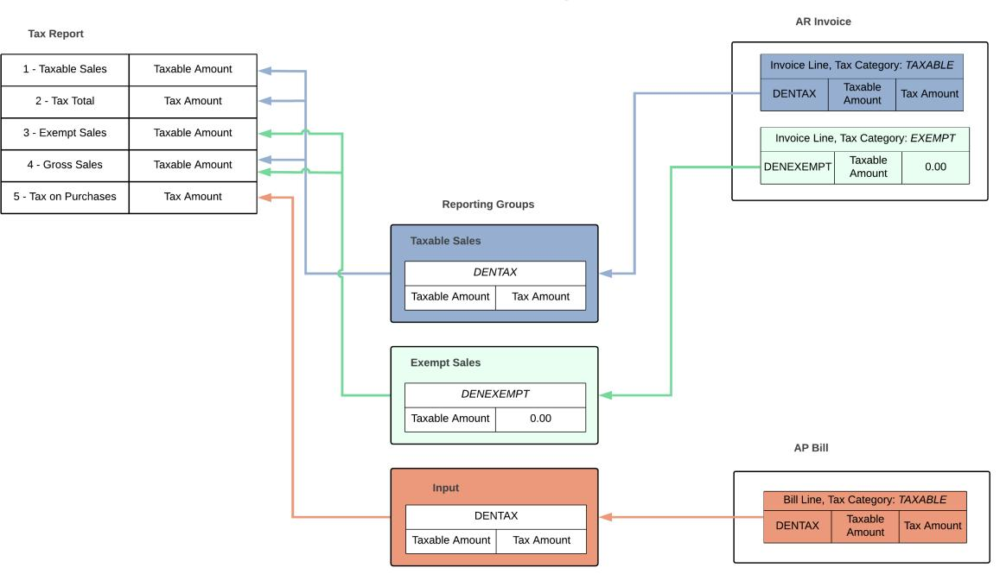

#### *Figure: Process of accumulating sales taxes*

#### **System Preparation**

Before you begin to configure the tax report, do the following:

- 1. Launch the Acumatica ERP website with the *U100* dataset preloaded, and sign in as a system administrator Kimberly Gibbs by using the *gibbs* username and the *123* password.
- 2. As a prerequisite activity, make sure the *COTAXDEP* tax agency has been configured as described in *[Tax](#page-277-2) [Agency:](#page-277-2) To Set Up a Tax Agency for Sales Taxes*.

#### **Step 1: Creating a Tax Report and Adding Report Lines**

To create a tax report and add report lines to it, proceed as follows:

- 1. Open the *[Reporting Settings](https://help-2025r1.acumatica.com/Help?ScreenId=ShowWiki&pageid=af0480fa-c978-4327-8a65-14cc7b791c4b)* (TX205100) form.
- 2. In the **Tax Agency** box, select *COTAXDEP*.
- 3. On the **Report Lines** tab, for each line of the tax report to be added, click **Add Row** on the table toolbar and specify the appropriate settings (listed below) in the row:

| Report<br>Line Order<br>(added by<br>default) | Description          | Update With       | Update Rule   | Net Tax  | Hide Report<br>Line |
|-----------------------------------------------|----------------------|-------------------|---------------|----------|---------------------|
| 1                                             | Taxable<br>Sales     | Taxable<br>Amount | +Output-Input | Cleared  | Cleared             |
| 2                                             | Tax Total            | Tax Amount        | +Output-Input | Selected | Cleared             |
| 3                                             | Exempt Sales         | Taxable<br>Amount | +Output-Input | Cleared  | Cleared             |
| 4                                             | Gross Sales          | Taxable<br>Amount | +Output-Input | Cleared  | Cleared             |
| 5                                             | Tax on Pur<br>chases | Tax Amount        | +Input-Output | Cleared  | Selected            |

Because you selected the **NetTax** check box for the *Tax Total* report line, the amount accumulated in this line will be used as the document amount in the tax bill generated by the system for the tax agency.

4. On the form toolbar, click**Save** to save the report.

# **Step 2: Adding Reporting Groups to the Report**

To add reporting groups to the newly created tax report, while you are still viewing the report on the *[Reporting](https://help-2025r1.acumatica.com/Help?ScreenId=ShowWiki&pageid=af0480fa-c978-4327-8a65-14cc7b791c4b) [Settings](https://help-2025r1.acumatica.com/Help?ScreenId=ShowWiki&pageid=af0480fa-c978-4327-8a65-14cc7b791c4b)* (TX205100) form, proceed as follows:

- 1. On the **Reporting Groups** tab, for each line to be added, click **Add Row** on the table toolbar and specify the appropriate settings (listed below) in the row:
  - **Name**: Taxable, **Group Type**: *Output*

You will assign to this group the *DENTAX* tax with a 8.310% rate, which will apply to taxable items sold in Denver, Colorado.

You use the *Output* type for output taxes that are collected from customers and paid to a tax agency.

• **Name**: Exempt, **Group Type**: *Output*

You will assign to this group the *DENEXEMPT* tax with a 0% rate, which is needed to report tax-exempt sales.

• **Name**: Input, **Group Type**: *Input*

You will assign to this group the *DENTAX* tax with a 8.310% rate, which will be applied to purchase of taxable items in Denver, Colorado.

2. On the form toolbar, click**Save** to save your changes.

# **Step 3: Specifying the Report Lines to be Updated**

To specify which report lines will be updated with taxes, proceed as follows:

1. While you are still viewing the report on the *[Reporting Settings](https://help-2025r1.acumatica.com/Help?ScreenId=ShowWiki&pageid=af0480fa-c978-4327-8a65-14cc7b791c4b)* (TX205100) form, in the table on the **Reporting Groups** tab, click the row for the *Taxable* group, and on the table toolbar, click **Group Details**.

- 2. On the *[Reporting Groups](https://help-2025r1.acumatica.com/Help?ScreenId=ShowWiki&pageid=62fd6af8-b5c4-472f-89e1-9c04c9e63120)* (TX205200) form, which opens, for each line to be added, click **Add Row** on the table toolbar, and specify the appropriate settings (listed below) in the row:
  - **Report Line**: *1 - Taxable Sales*
  - **Report Line**: *2 - Tax Total*
  - **Report Line**: *4 - Gross Sales*
- 3. On the form toolbar, click**Save** to save your changes.

The taxes that you will assign to the *Taxable* reporting group will be included in report lines *1*, *2*, and *4*.

- 4. In the **Reporting Group** box of the Summary area, select *2 - Exempt*.
- 5. For each line to be added, on the table toolbar, click **Add Row**, and specify the appropriate settings in the added row:
  - **Report Line**: *3 - Exempt Sales*
  - **Report Line**: *4 - Gross Sales*
- 6. On the form toolbar, click**Save** to save your changes. The taxes that you will assign to the *Exempt* reporting group will be included in report lines *3* and *4*.
- 7. In the **Reporting Group** box, select *3 Input*.
- 8. On the table toolbar, click **Add Row**, and in the **Report Line** column of the row, select *5 - Tax on Purchases*.

The tax that you will assign to this report line will not be included in the tax report, because this line is marked as hidden.

9. On the form toolbar, click**Save** to save your changes.

# **Step 4: Reviewing the Calculation Rule for a Report Line**

To review the calculation rules for a report line, proceed as follows:

- 1. Open the *[Reporting Settings](https://help-2025r1.acumatica.com/Help?ScreenId=ShowWiki&pageid=af0480fa-c978-4327-8a65-14cc7b791c4b)* (TX205100) form.
- 2. In the **Tax Agency ID** box, select *COTAXDEP*.
- 3. On the **Report Lines** tab, review the **Calc. Rule** column for report line *4*.

The system has automatically updated the calculation rule for report line *4*, based on the reporting group settings that you have specified. You have configured the reporting groups so that the *1 - Taxable Sales* line is updated by the taxes included in the *Taxable Sales* group, the *3 - Exempt Sales* line is updated by the taxes included in the *Exempt Sales* group, and the *4 - Gross Sales* line is updated by the taxes that are included in the *Taxable Sales* or *Exempt Sales* group. As a result, the amount of the aggregate line *4* is calculated as the sum of the amounts in lines *1* and *3*.

# <span id="page-291-1"></span><span id="page-291-0"></span>**Tax Report Configuration: To Create a Tax Report for VAT**

By performing this implementation activity, you will learn how to configure the content of a tax report for general VAT, and to specify the rules of accumulating the data in the report lines.

#### **Story**

Suppose that the tax agency, to which the SweetLife Fruits & Jams company is going to report VAT, requires that the tax report includes the following lines:

- 1. *Taxable Sales*: Accumulates the total amount of taxable sales processed in the tax period
- 2. *Exempt Sales*: Accumulates the total amount of VAT-exempt sales processed in the tax period

- 3. *Total Sales*: Accumulates the total sales amount (that is, *Taxable Sales* + *Exempt Sales*) in the tax period, excluding the tax amounts
- 4. *Taxable Purchases*: Accumulates the total amount of taxable purchases processed in the tax period
- 5. *Exempt Purchases*: Accumulates the total amount of VAT-exempt purchases processed in the tax period
- 6. *Total Purchases*: Accumulates the total purchases amount of documents (that is, *Taxable Purchases* + *Exempt Purchases*) processed in the tax period, excluding the tax amounts
- 7. *Total Output Tax*: Accumulates the total tax amount collected from customers in the tax period
- 8. *Total Input Tax*: Accumulates the total tax amount paid to vendors in the tax period
- 9. *Tax Amount Payable*: Accumulates the total tax amount to be paid to the tax agency in the tax period (that is, output tax minus input tax)

Acting as an implementation consultant, you need to configure the tax report to meet the requirements of the tax agency.

# **Configuration Overview**

In the *U100* dataset, the following configuration tasks have been performed to prepare the system for this activity to be performed:

• On the *[Enable/Disable Features](https://help-2025r1.acumatica.com/Help?ScreenId=ShowWiki&pageid=c1555e43-1bc5-4f6f-ba9d-b323f94d8a6b)* (CS100000) form, the *VAT Reporting* feature has been enabled.

### **Process Overview**

In this activity, you will prepare the tax report by doing the following:

- 1. You will create a tax report for the needed tax agency and add lines to it on the *[Reporting Settings](https://help-2025r1.acumatica.com/Help?ScreenId=ShowWiki&pageid=af0480fa-c978-4327-8a65-14cc7b791c4b)* (TX205100) form.
- 2. You will add reporting groups on the **Reporting Groups** tab of the *[Reporting Settings](https://help-2025r1.acumatica.com/Help?ScreenId=ShowWiki&pageid=af0480fa-c978-4327-8a65-14cc7b791c4b)* form.
- 3. On the *[Reporting Groups](https://help-2025r1.acumatica.com/Help?ScreenId=ShowWiki&pageid=62fd6af8-b5c4-472f-89e1-9c04c9e63120)* (TX205200) form, you will specify the report lines that should be updated by the taxes associated with each reporting group.
- 4. On the *[Reporting Settings](https://help-2025r1.acumatica.com/Help?ScreenId=ShowWiki&pageid=af0480fa-c978-4327-8a65-14cc7b791c4b)* form, you will review the calculation rule for the report lines added automatically by the system.

# **System Preparation**

To prepare the system, do the following:

- 1. Launch the Acumatica ERP website, and sign in to a company with the *U100* dataset preloaded. You should sign in as an implementation consultant by using the *gibbs* username and the *123* password.
- 2. As a prerequisite activity, in the company to which you are signed in, be sure you have configured a tax agency as described in *Tax [Agency:](#page-279-1) To Set Up a Tax Agency for VAT*.

# **Step 1: Creating a Tax Report and Adding Report Lines**

To create a tax report and add report lines to it, do the following:

- 1. Open the *[Reporting Settings](https://help-2025r1.acumatica.com/Help?ScreenId=ShowWiki&pageid=af0480fa-c978-4327-8a65-14cc7b791c4b)* (TX205100) form.
- 2. In the **Tax Agency ID** box, select *VATTAX*.
- 3. In the **Valid From** box, select *1/1/2025*.
- 4. On the **Report Lines** tab, for each line of the tax report to be added, click **Add Row** on the table toolbar and specify the appropriate settings (listed below) in the row:

| Report<br>Line<br>Order<br>(added<br>by de<br>fault) | Description        | Update With       | Update Rule   | Net Tax  | Hide Re<br>port Line |
|------------------------------------------------------|--------------------|-------------------|---------------|----------|----------------------|
| 1                                                    | Taxable Sales      | Taxable<br>Amount | +Output-Input | Cleared  | Cleared              |
| 2                                                    | Exempt Sales       | Taxable<br>Amount | +Output-Input | Cleared  | Cleared              |
| 3                                                    | Total Sales        | Taxable<br>Amount | +Output-Input | Cleared  | Cleared              |
| 4                                                    | Taxable Purchases  | Taxable<br>Amount | +Input-Output | Cleared  | Cleared              |
| 5                                                    | Exempt Purchases   | Taxable<br>Amount | +Input-Output | Cleared  | Cleared              |
| 6                                                    | Total Purchases    | Taxable<br>Amount | +Input-Output | Cleared  | Cleared              |
| 7                                                    | Total Output Tax   | Tax Amount        | +Output-Input | Cleared  | Cleared              |
| 8                                                    | Total Input Tax    | Tax Amount        | +Input-Output | Cleared  | Cleared              |
| 9                                                    | Tax Amount Payable | Tax Amount        | +Output-Input | Selected | Cleared              |

Because you selected the **NetTax** check box for the *Tax Amount Payable* report line, the amount accumulated in this line will be used as the document amount in the tax bill generated by the system for the tax agency.

In the report that you have configured, tax and taxable amounts for a particular tax will be accumulated in the same report lines, even if the customers and vendors belong to different tax zones. To break down the amounts by tax zones in the tax report, you can create separate report lines for each tax zone and select the zone in the**Tax Zone ID** column, so that each line will include amounts for the selected tax zone only.

Alternatively, you can select the **Detail ByTax Zones** check box for the needed report line, to make the system split this line into multiple lines, one for each tax zone that exists in the system. If you create a new tax zone aer the tax report has already been configured, click the **Reload Tax Zones** button to make the system add report lines for the newly created tax zone.

5. On the form toolbar, click**Save**.

# **Step 2: Adding Reporting Groups to the Report**

To add reporting groups to the newly created tax report, while you are still viewing the report on the *[Reporting](https://help-2025r1.acumatica.com/Help?ScreenId=ShowWiki&pageid=af0480fa-c978-4327-8a65-14cc7b791c4b) [Settings](https://help-2025r1.acumatica.com/Help?ScreenId=ShowWiki&pageid=af0480fa-c978-4327-8a65-14cc7b791c4b)* (TX205100) form, do the following:

1. On the **Reporting Groups** tab, for each line to be added, click **Add Row** on the table toolbar and specify the appropriate settings (listed below) in the row:

- **Name**: Taxable Sales, **Group Type**: *Output* You will assign to this group the VAT with a 7% rate that will apply to taxable sales.
- **Name**: Taxable Purchases, **Group Type**: *Input* You will assign to this group the VAT with a 7% rate that will apply to taxable purchases.
- **Name**: Exempt Sales, **Group Type**: *Output* You will assign to this group the zero-rate *VATEXEMPT* tax, which will apply to exempt sales.
- **Name**: Exempt Purchases, **Group Type**: *Input* You will assign to this group the zero-rate *VATEXEMPT* tax, which will apply to exempt purchases.

You use the *Output* type for the taxes that are collected from the customers and should be paid to a tax agency. You use the *Input* type for the taxes that are paid to vendors and thus should be claimed from a tax agency.

2. On the form toolbar, click**Save**.

# **Step 3: Specifying the Report Lines to be Updated**

To specify which report lines will be updated with taxes, do the following:

- 1. While you are still viewing the report on the *[Reporting Settings](https://help-2025r1.acumatica.com/Help?ScreenId=ShowWiki&pageid=af0480fa-c978-4327-8a65-14cc7b791c4b)* (TX205100) form, in the table on the **Reporting Groups** tab, click the row for the *Taxable Sales* group. On the table toolbar, click **Group Details**.
- 2. On the *[Reporting Groups](https://help-2025r1.acumatica.com/Help?ScreenId=ShowWiki&pageid=62fd6af8-b5c4-472f-89e1-9c04c9e63120)* (TX205200) form, which opens, for each line to be added, click **Add Row** on the table toolbar and specify the appropriate settings (listed below):
  - **Report Line**: *1 - Taxable Sales*
  - **Report Line**: *3 - Total Sales*
  - **Report Line**: *7 - Total Output Tax*
  - **Report Line**: *9 - Tax Amount Payable*
- 3. On the form toolbar, click**Save** to save your changes.

The taxes that you will assign to the *Taxable Sales* reporting group will be included in report lines *1*, *3*, *7*, and *9*. Thus, the taxable amount of invoices subject to output VAT will update the values in the *1 - Taxable Sales* and *3 - Total Sales* lines, while the tax amount will update the *7 - Total Output Tax* and *9 - Tax Amount Payable* lines.

- 4. In the **Reporting Group** box of the Summary area, select *Taxable Purchases*.
- 5. For each line to be added, on the table toolbar, click **Add Row**, and specify the appropriate settings in the added row:
  - **Report Line**: *4 - Taxable Purchases*
  - **Report Line**: *6 - Total Purchases*
  - **Report Line**: *8 - Total Input Tax*
  - **Report Line**: *9 - Tax Amount Payable*
- 6. On the form toolbar, click**Save** to save your changes. The taxes that you will assign to the *Taxable Purchases* reporting group will be included in report lines *4*, *6*, *8*, and *9*.
- 7. In the **Reporting Group** box, select *Exempt Sales*.
- 8. For each line to be added, on the table toolbar, click **Add Row**, and specify the appropriate settings in the added row:
  - **Report Line**: *2 - Exempt Sales*
  - **Report Line**: *3 - Total Sales*

- 9. On the form toolbar, click**Save** to save your changes. The taxes that you will assign to the *Exempt Sales* reporting group will be included in report lines *2* and *3*.
- 10.In the **Reporting Group** box, select *Exempt Purchases*.
- 11.For each line to be added, on the table toolbar, click **Add Row**, and specify the appropriate settings in the added row:
  - **Report Line**: *5 - Exempt Purchases*
  - **Report Line**: *6 - Total Purchases*
- 12.On the form toolbar, click**Save** to save your changes. The taxes that you will assign to the *Exempt Purchases* reporting group will be included in report lines *5* and *6*.

### **Step 4: Reviewing the Calculation Rule for Report Lines**

To review the calculation rules for report lines, do the following:

- 1. Open the *[Reporting Settings](https://help-2025r1.acumatica.com/Help?ScreenId=ShowWiki&pageid=af0480fa-c978-4327-8a65-14cc7b791c4b)* (TX205100) form.
- 2. In the **Tax Agency ID** box, select *VATTAX*.
- 3. On the **Report Lines** tab, review the **Calc. Rule** column.

You have configured the reporting groups so that the *1 - Taxable Sales* line is updated by the taxes included in the *Taxable Sales* group, the *2 - Exempt Sales* line is updated by the taxes included in the *Exempt Sales* group, and the *3 - Total Sales* line is updated by the taxes that are included in both the *Taxable Sales* and *Exempt Sales* groups.

As a result, the aggregate line *3* amount is calculated as a sum of the amounts in lines *1* and *2*. The system has automatically updated the calculation rule based on the settings that you have specified. Similarly, report line *6* is the aggregate line that is updated by the taxable amounts included in lines *4* and *5*, and report line *9* is the aggregate line updated by the tax amounts included in lines *7* and *8*.

# <span id="page-295-1"></span><span id="page-295-0"></span>**Tax Report Configuration: To Create a Tax Report for VAT Variations**

By performing this implementation activity, you will learn how to configure the content of a tax report for multiple variations of value-added tax, and to specify the rules of accumulating the data in the report lines.

#### **Story**

Suppose that SweetLife Fruits & Jams is going to report multiple types of VAT besides the general VAT and needs a separate tax agency and a tax report for this purpose. Acting as an implementation consultant, you need to create a tax agency and a tax report for VAT variations.

The tax report should include the following lines:

- *Net Tax to Pay or Reclaim*: Accumulates the total tax amount to be paid to the tax agency or reclaimed from the tax agency in the tax period (that is, output tax minus input tax).
- *Reverse VAT*: Accumulates the total tax amount of reverse VAT to be paid to the tax agency. This report line will be used for reporting a reverse VAT.
- *Standard-Rated Acquisitions*: Accumulates the total tax amount to be paid to the tax agency or reclaimed from the tax agency in the tax period. This report line will be used for reporting a generate VAT that offsets the reverse VAT.
- *Deductible VAT*: Accumulates the total tax amount of partially deductible VAT on the company's purchases. This report line will be used for reporting a partially deductible VAT.
- *Pending Output VAT*: Accumulates the total tax amount of pending VAT to be paid to the tax agency.

• *Pending Input VAT*: Accumulates the total tax amount of pending VAT to be claimed from the tax agency.

# **Configuration Overview**

In the *U100* dataset, the following configuration tasks have been performed to prepare the system for this activity to be performed:

- On the *[Enable/Disable Features](https://help-2025r1.acumatica.com/Help?ScreenId=ShowWiki&pageid=c1555e43-1bc5-4f6f-ba9d-b323f94d8a6b)* (CS100000) form, the *VAT Reporting* feature has been enabled.
- On the *Vendor [Classes](https://help-2025r1.acumatica.com/Help?ScreenId=ShowWiki&pageid=20dc8b93-d83a-49cf-8cfb-d2ffd2f0db87)* (AP201000) form, the *TAXAGENCY* vendor class has been configured.
- On the *[Chart of Accounts](https://help-2025r1.acumatica.com/Help?ScreenId=ShowWiki&pageid=85557f41-a4af-47a8-b198-2a01461ce9c3)* (GL202500) form, the *24100 (Tax Payable)*, *17000 (Tax Claimable)*, and *65100 (Other Tax Expenses)* accounts have been created.

# **Process Overview**

In this activity, you will do the following:

- 1. On the *[Vendors](https://help-2025r1.acumatica.com/Help?ScreenId=ShowWiki&pageid=a9584be3-f2bd-4d67-80d4-8041d809df56)* (AP303000) form, you will create a tax agency for VAT variations.
- 2. You will create a tax report for the needed tax agency and add lines to it on the *[Reporting Settings](https://help-2025r1.acumatica.com/Help?ScreenId=ShowWiki&pageid=af0480fa-c978-4327-8a65-14cc7b791c4b)* (TX205100) form.
- 3. You will add reporting groups on the **Reporting Groups** tab of the *[Reporting Settings](https://help-2025r1.acumatica.com/Help?ScreenId=ShowWiki&pageid=af0480fa-c978-4327-8a65-14cc7b791c4b)* form.
- 4. On the *[Reporting Groups](https://help-2025r1.acumatica.com/Help?ScreenId=ShowWiki&pageid=62fd6af8-b5c4-472f-89e1-9c04c9e63120)* (TX205200) form, you will specify the report lines that should be updated by the taxes associated with each reporting group.

### **System Preparation**

To prepare the system, do the following:

1. Launch the Acumatica ERP website, and sign in to a company with the *U100* dataset preloaded. You should sign in as an implementation consultant by using the *gibbs* username and the *123* password.

### **Step 1: Creating a Tax Agency**

To create a tax agency, do the following:

- 1. On the *[Vendors](https://help-2025r1.acumatica.com/Help?ScreenId=ShowWiki&pageid=a9584be3-f2bd-4d67-80d4-8041d809df56)* (AP303000) form, create a new record.
- 2. In the Summary area, specify the following settings:
  - **Vendor ID**: VATVAR
  - **Status**: *Active*
  - **Vendor Class**: *TAXAGENCY*
- 3. On the **General** tab, in the **Account Name** box, type Tax Agency for VAT Variations.
- 4. In the **Vendor Properties** section, select the**Vendor IsTax Agency** check box.
- 5. On the form toolbar, click**Save**.
- 6. Go to the**Tax Agency** tab.
- 7. In the **DefaultTax Accounts** section, specify the following settings:
  - **Tax Payable Account**: *24100 (Tax Payable)*
  - **Tax Claimable Account**: *17000 (Tax Claimable)*
  - **Tax Expense Account**: *65100 (Other Tax Expenses)*
- 8. In the **PendingVATSettings** section, select *On Payments* in the **VAT Recognition Method** box.

This setting in needed to recognize pending VAT on payments.

- 9. In the **Tax ReportSettings** section, specify the following settings:
  - **DefaultTax Period Type**: *Month*
  - **Update Closed Tax Periods**: Selected
  - **Automatically GenerateTax Bill**: Selected
  - **Use Currency Precision**: Selected

10.On the form toolbar, click**Save**.

# **Step 2: Creating a Tax Report, Adding Report Lines, and Creating Reporting Groups**

To create a tax report for the new agency, add report lines, and create reporting groups, do the following:

- 1. Open the *[Reporting Settings](https://help-2025r1.acumatica.com/Help?ScreenId=ShowWiki&pageid=af0480fa-c978-4327-8a65-14cc7b791c4b)* (TX205100) form.
- 2. In the **Tax Agency ID** box, select *VATVAR*.
- 3. In the **Valid From** box, select *1/1/2025*.
- 4. On the **Report Lines** tab, click **Add Row** on the table toolbar for each new line, and specify the following settings:

| Report<br>Line Or<br>der | Description                            | Update With | Update Rule   | Net Tax  |
|--------------------------|----------------------------------------|-------------|---------------|----------|
| 1                        | Net Tax to Pay or Reclaim              | Tax Amount  | +Output-Input | Selected |
| 2                        | Reverse VAT                            | Tax Amount  | +Output-Input | Cleared  |
| 3                        | VAT on Standard-Rated Acqui<br>sitions | Tax Amount  | +Input-Output | Cleared  |
| 4                        | Deductible VAT                         | Tax Amount  | +Input-Output | Cleared  |
| 5                        | Pending Output VAT                     | Tax Amount  | +Output-Input | Cleared  |
| 6                        | Pending Input VAT                      | Tax Amount  | +Input-Output | Cleared  |

- 5. On the form toolbar, click**Save**.
- 6. On the **Reporting Groups** tab, click **Add Row** on the table toolbar for each new line, and specify the following settings:

| Name                        | Group Type |
|-----------------------------|------------|
| Reverse                     | Output     |
| Standard-Rated Acquisitions | Input      |
| Deductible                  | Input      |
| Pending (Output)            | Output     |
| Pending (Input)             | Input      |

7. On the form toolbar, click**Save**.

# **Step 3: Adding the Reporting Groups to the Report**

To add the reporting groups to the report, do the following:

- 1. Open the *[Reporting Groups](https://help-2025r1.acumatica.com/Help?ScreenId=ShowWiki&pageid=62fd6af8-b5c4-472f-89e1-9c04c9e63120)* (TX205200) form.
- 2. In the **Tax Agency** box, select *VATVAR*.
- 3. In the **Reporting Group** box, select *1 - Reverse*.
- 4. In the **ReportVersion** box, select *1*.
- 5. Click **Add Row** on the table toolbar, and add two rows, specifying the following settings (listed below) for each row:
  - **Report Line**: *1 - Net Tax to Pay or Reclaim*
  - **Report Line**: *2 - Reverse VAT*
- 6. On the form toolbar, click**Save**.
- 7. In the **Reporting Group** box, select *2 - Standard Rated Acquisitions*.
- 8. Click **Add Row** on the table toolbar, and add two rows, specifying the following settings (listed below) for each row:
  - **Report Line**: *1 - Net Tax to Pay or Reclaim*
  - **Report Line**: *3 - VAT on Standard-Rated Acquisitions*
- 9. In the **Reporting Group** box, select *3 Deductible*.

10.Click **Add Row** on the table toolbar, and add two rows, specifying the following settings (listed below) for each row:

- **Report Line**: *1 - Net Tax to Pay or Reclaim*
- **Report Line**: *4 - Deductible VAT*
- 11.In the **Reporting Group** box, select *4 - Pending (Output)*.
- 12.Click **Add Row** on the table toolbar, and add two rows, specifying the following settings (listed below) for each row:
  - **Report Line**: *1 - Net Tax to Pay or Reclaim*
  - **Report Line**: *5 - Pending Output VAT*

13.In the **Reporting Group** box, select *5 - Pending (Input)*.

- 14.Click **Add Row** on the table toolbar, and add two rows, specifying the following settings (listed below) for each row:
  - **Report Line**: *1 - Net Tax to Pay or Reclaim*
  - **Report Line**: *6 - Pending Input VAT*

15.On the form toolbar, click**Save**.

# <span id="page-298-1"></span><span id="page-298-0"></span>**Tax Zones and Tax Categories**

The topics of this chapter describe how to create tax zones and tax categories in Acumatica ERP.

# <span id="page-299-1"></span><span id="page-299-0"></span>**Tax Zones and Categories: General Information**

In some countries (for example, most European countries), taxes and their rates are defined at the federal level. In other countries, taxes are applied at multiple levels corresponding to geographical areas (federal, state, county, and municipality). So the taxes that a company pays or collects and their rates may differ from place to place, and may be common to the same geographical area. In Acumatica ERP, you can organize taxes by groups that are applicable in the same area by creating *tax zones*. When you create taxes in the system, you assign them to all applicable tax zones.

The taxes and their rates may also be different depending on the type of the goods or services you are selling or purchasing. For example, depending on whether the goods sold are electronic goods or food, the applied rate of the sales tax may be different even in the same geographical area. In Acumatica ERP, you can create tax categories to group the taxes that are applicable to particular services or goods. When you create taxes in the system, you specify the tax categories to which the tax belongs. You also select the tax category for non-stock and stock items defined in the system.

As a result of assigning taxes to the appropriate entities, you can ensure that the system will correctly apply taxes in various documents in the system.

### **Learning Objectives**

In this chapter, you will learn how to do the following:

- Create a tax zone and a tax category
- Review the tax categories existing in the system
- Assign tax categories to non-stock items

# **Applicable Scenarios**

You create tax categories in Acumatica ERP early in the process of the implementation of taxes in the system. You then assign the appropriate categories to taxable or exempt items (stock and non-stock); you also assign a tax category to each tax. You create tax zones for all applicable geographical areas where your company does business so that you can assign taxes to the tax zones that correspond to these geographical locations.

#### **Tax Zones**

In Acumatica ERP, a tax zone is a group of taxes levied on a particular geographical area for all goods and services that may be sold or purchased by your company. You create tax zones for all geographical areas of your customers and vendors and then assign appropriate taxes to these tax zones. Aer that, you specify the appropriate tax zone for each customer and vendor account.

You create a tax zone by using the *Tax [Zones](https://help-2025r1.acumatica.com/Help?ScreenId=ShowWiki&pageid=361e36b3-a660-4fcb-a0cf-377b5bdb7aec)* (TX206000) form. You can create as many tax zones as you need. For each tax zone, you can specify the default tax category that will be used by default for this tax zone in document lines in which an item is not specified; if a stock or non-stock item is selected, the tax category of the item will be used to define the taxes that apply to the line. If needed, you can override the default tax category for any document line.

You can also assign a particular tax zone to each branch of your company on the **DeliverySettings** tab of the *[Branches](https://help-2025r1.acumatica.com/Help?ScreenId=ShowWiki&pageid=b97ab72d-4ab4-4f02-b69c-f7f61b316ced)* (CS102000) form. If no tax zone is specified for a customer in the**Tax Zone** box in the**TaxSettings** section on the **Shipping** tab of the *[Customers](https://help-2025r1.acumatica.com/Help?ScreenId=ShowWiki&pageid=652929bc-9606-4056-aa6e-0c2d1147171b)* (AR303000) form, the system applies the tax assigned to the tax zone of the branch specified in the **Branch** box on the **Financial** tab of the *[Invoices and Memos](https://help-2025r1.acumatica.com/Help?ScreenId=ShowWiki&pageid=5e6f3b27-b7af-412f-a40a-1d4f4be70cba)* (AR301000) form.

# **Tax Categories**

A tax category is a group of taxes that are levied for selling or purchasing particular goods or services, regardless of the geographical location of the seller, the buyer, or the sale. You create a tax category and associate it with the appropriate goods and services, which are defined as stock and non-stock items in Acumatica ERP. The taxes of a particular tax category will be used for calculating the tax amounts in the documents that include the corresponding stock or non-stock items. Any number of taxes can be assigned to a tax category, and they can be any type.

However, not all taxes included in the tax category specified for an item will be applied to a particular bill or invoice that includes the item. The taxes that are not levied in the tax zone of the vendor or customer specified in the document will be excluded. Thus, only the taxes included both in the tax category of the stock or non-stock item and in the tax zone of the vendor or customer will be applied to the item and included in the tax amount.

For example, consider a company that sells books in Oregon and Delaware; the company defines a *Books* tax category that includes the sales taxes of both states. In reality, a customer from Delaware pays only the Delaware tax and a customer from Oregon pays only the Oregon tax, because the customers are located in different tax zones, each with a specific tax. To apply taxes appropriately, for each sale transaction, the system applies only taxes in both the tax zone and tax category lists. The Delaware tax zone, then, includes the tax that applies to book sales in this state, and the Oregon tax zone includes the state-specific tax applicable to books.

You can create a tax category that includes the taxes that should be excluded from the tax zone, so that the products or services of this tax category are subject to all taxes of the tax zone *except* the taxes included in this tax category. To do this, select the **Exclude Listed Taxes** check box on the *Tax [Categories](https://help-2025r1.acumatica.com/Help?ScreenId=ShowWiki&pageid=db5e7fad-054d-467d-877e-2db4ee180ead)* (TX205500) form.

# **Tax Application Diagram**

The diagram below illustrates how taxes are applied in AR documents. For details, see *[Invoices](https://help-2025r1.acumatica.com/Help?ScreenId=ShowWiki&pageid=9ac2bdd7-5059-4c5e-8014-59fa4fd1afe0) with Sales Taxes: [General Information](https://help-2025r1.acumatica.com/Help?ScreenId=ShowWiki&pageid=9ac2bdd7-5059-4c5e-8014-59fa4fd1afe0)* and *AR [Documents](https://help-2025r1.acumatica.com/Help?ScreenId=ShowWiki&pageid=1878d2fd-425e-4aac-ab2b-4244ffc7aad2) with VAT: To Process an AR Invoice*.

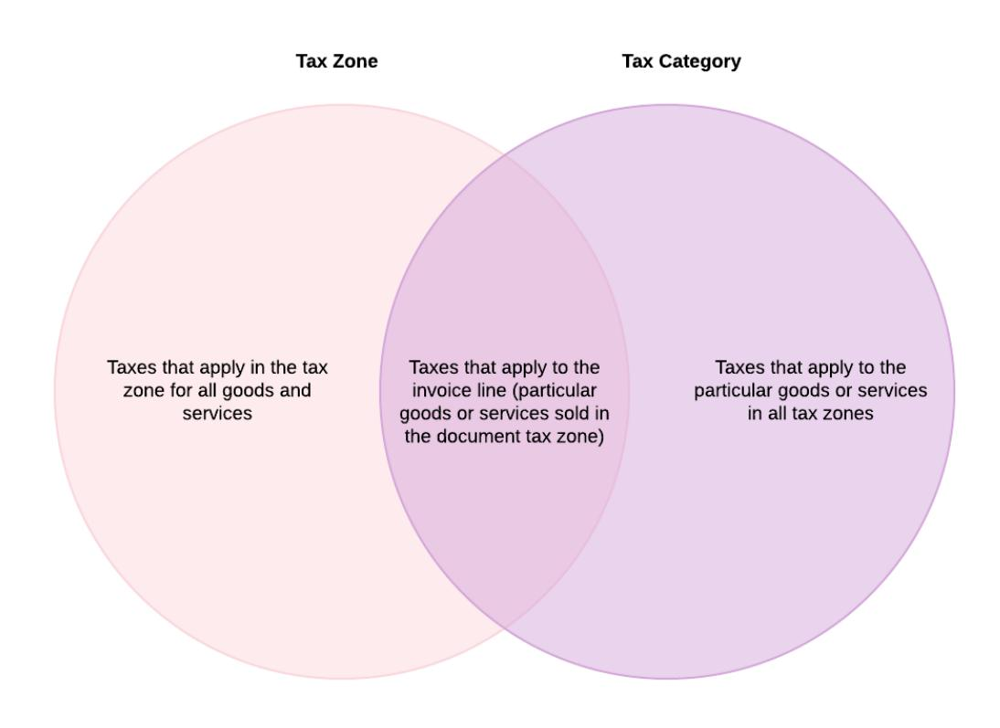

*Figure: Application of taxes to an AR document*

# <span id="page-301-0"></span>**Tax Zones and Categories: Automatic Assignment of a Tax Zone in Documents**

On the *Tax [Zones](https://help-2025r1.acumatica.com/Help?ScreenId=ShowWiki&pageid=361e36b3-a660-4fcb-a0cf-377b5bdb7aec)* (TX206000) form, tax zones can be defined based on combinations of country, state, and postal code, and ranges of postal codes can be specified. The system supports three types of tax zones:

- Tax zones based on one country or multiple countries. With this type of tax zone, a user can include entire countries in the tax zone.
- Tax zones based on one state or multiple states. A user can assign any combination of states of the same country to this tax zone. With this type, the tax zone consists of the entire state or states.
- Tax zones based on one postal code or multiple postal codes. Multiple ranges of postal codes within the same country can be assigned to this tax zone.

To select a type of for a specific tax zone, on the**Ship-To Addresses** tab of the *Tax [Zones](https://help-2025r1.acumatica.com/Help?ScreenId=ShowWiki&pageid=361e36b3-a660-4fcb-a0cf-377b5bdb7aec)* form, you select one of the following options in the**Tax Zone Is Based On** box:

- *Countries*: The tax zone is based on any number of countries. To add each country in the tax zone, you click **Add Row** on the table toolbar and select the country from the list in the **Country** column.
- *States*: The tax zone is based on any number of states of a specific country. You select a country in the **Country** box and then add each state in the tax zone by clicking **Add Row** on the table toolbar and selecting the state in the list in the**State** column.
- *Postal Codes* (default): The tax zone is based on any number of ranges of postal codes within a specific country. You select a country in the **Country** box and then add each range of postal codes in the tax zone by clicking **Add Row** on the table toolbar and entering the needed values in the **From Postal Code** and **To Postal Code** columns.

On data entry forms, if a customer has an empty tax zone, the system searches for a tax zone that matches the range of postal codes specified on the *Tax [Zones](https://help-2025r1.acumatica.com/Help?ScreenId=ShowWiki&pageid=361e36b3-a660-4fcb-a0cf-377b5bdb7aec)* form. If no tax zone is found, the system continues searching for a tax zone that matches the state of the shipping address. If no tax zone is found, the system searches for a tax zone that matches the country of the shipping address. The system considers the combination of the country, state, and postal code in the shipping address while searching for a matching tax code.

The automatic search for a tax zone is applied in the following boxes on the following forms:

- *[Invoices and Memos](https://help-2025r1.acumatica.com/Help?ScreenId=ShowWiki&pageid=5e6f3b27-b7af-412f-a40a-1d4f4be70cba)* (AR301000): **CustomerTax Zone** (**Financial** tab)
- *[Sales Orders](https://help-2025r1.acumatica.com/Help?ScreenId=ShowWiki&pageid=19e4021c-1b84-49fd-be12-0320c5f1c7e5)* (SO301000): **CustomerTax Zone** (**Financial** tab)
- *[Invoices](https://help-2025r1.acumatica.com/Help?ScreenId=ShowWiki&pageid=0acc9738-f141-4ea0-a2be-f34ea9d1b63a)* (SO303000): **CustomerTax Zone** (**Financial** tab)
- *[Opportunities](https://help-2025r1.acumatica.com/Help?ScreenId=ShowWiki&pageid=5cb49cd5-2be8-4617-9341-958f1c5d6d53)* (CR304000): **Tax Zone** (**Shipping** tab)
- *[Project Quotes](https://help-2025r1.acumatica.com/Help?ScreenId=ShowWiki&pageid=81c83417-3bde-444b-8f1c-382928d31a0c)* (PM304500): **Tax Zone** (**Financial** tab)
- *[Sales Quotes](https://help-2025r1.acumatica.com/Help?ScreenId=ShowWiki&pageid=9c81a05c-ee3b-4ca1-8ae8-390076631d03)* (CR304500): **Tax Zone** (**Shipping** tab)
- *[Service Orders](https://help-2025r1.acumatica.com/Help?ScreenId=ShowWiki&pageid=6e5277d3-274e-45f5-b77d-4410ed736d21)* (FS300100): **CustomerTax Zone** (**Financial** tab)
- *[Appointments](https://help-2025r1.acumatica.com/Help?ScreenId=ShowWiki&pageid=ac486e9c-f5df-4829-94f0-2df8821361a0)* (FS300200): **CustomerTax Zone** (**Financial** tab)

# <span id="page-301-1"></span>**Tax Zones and Categories: Configuration Prerequisites**

Before starting the creation of tax zones and categories, you must be sure that the system has been configured properly and that all required entities have been created, as described in the following section.


Before you create tax zones, you should first create at least the tax categories that will be specified as the default tax category for each tax zone.

# **Configuring the System**

Before you create a tax zone and category, you need to make sure that the following configuration tasks has been performed in the system:

- For VAT, on the *[Enable/Disable Features](https://help-2025r1.acumatica.com/Help?ScreenId=ShowWiki&pageid=c1555e43-1bc5-4f6f-ba9d-b323f94d8a6b)* (CS100000) form, the *VAT Reporting* feature has been enabled.
- On the *[Taxes](https://help-2025r1.acumatica.com/Help?ScreenId=ShowWiki&pageid=692e30c9-e0af-4aa3-b0f6-f3ba190d257a)* (TX205000) form, the taxes that you will add to the tax categories have been created.

# <span id="page-302-1"></span><span id="page-302-0"></span>**Tax Zones and Categories: To Review Tax Categories and Create a Tax Zone for Sales Taxes**

By performing the following implementation activity, you will review tax categories and their settings and learn how to create a tax zone for sales taxes.

### **Story**

The Muffins & Cakes company, which operates in Denver, Colorado, provides delivery services that are subject to a 8.31% sales tax. While two tax categories have been already created in Acumatica ERP (*TAXABLE* and *EXEMPT*), no other tax configuration has been performed.

You need to assign the *TAXABLE* tax category to the needed non-stock item (*DELIVERY*). You also need to create a tax zone for Denver, Colorado, to which you will also assign the *TAXABLE* category as the default tax category of the tax zone.

# **Configuration Overview**

In the *U100* dataset, the following tasks have been performed to support this activity:

- On the *Tax [Categories](https://help-2025r1.acumatica.com/Help?ScreenId=ShowWiki&pageid=db5e7fad-054d-467d-877e-2db4ee180ead)* (TX205500) form, the *TAXABLE* and *EXEMPT* tax categories have been configured.
- On the *[Taxes](https://help-2025r1.acumatica.com/Help?ScreenId=ShowWiki&pageid=692e30c9-e0af-4aa3-b0f6-f3ba190d257a)* (TX205000) form, the *NYSTATETAX* and *NYNOTAX* taxes has been configured.
- On the *[Non-Stock Items](https://help-2025r1.acumatica.com/Help?ScreenId=ShowWiki&pageid=bf68dd4f-63d4-460d-8dc0-9152f2bd6bf1)* (IN202000) form, the *DELIVERY* item has been configured.

#### **Process Overview**

In this activity, you will first review the tax categories on the *Tax [Categories](https://help-2025r1.acumatica.com/Help?ScreenId=ShowWiki&pageid=db5e7fad-054d-467d-877e-2db4ee180ead)* (TX205500) form and the taxes in these zones, and then assign the *TAXABLE* category to an item on the *[Non-Stock Items](https://help-2025r1.acumatica.com/Help?ScreenId=ShowWiki&pageid=bf68dd4f-63d4-460d-8dc0-9152f2bd6bf1)* (IN202000) form. You will then create the needed tax zone on the *Tax [Zones](https://help-2025r1.acumatica.com/Help?ScreenId=ShowWiki&pageid=361e36b3-a660-4fcb-a0cf-377b5bdb7aec)* (TX206000) form, assigning the appropriate default tax category to it.

### **System Preparation**

Before you begin to work with tax categories and tax zones, do the following:

- 1. Launch the Acumatica ERP website with the *U100* dataset preloaded, and sign in as a system administrator Kimberly Gibbs by using the *gibbs* username and the *123* password.
- 2. As a prerequisite activity, make sure a tax report has been configured as described in *Tax [Report](#page-288-1) [Configuration:](#page-288-1) To Create a Tax Report for Sales Taxes*.

### **Step 1: Reviewing Tax Categories and Assigning a Tax Category to a Non-Stock Item**

To review the existing tax categories and assign a tax category to a non-stock item, proceed as follows:

- 1. Open the *Tax [Categories](https://help-2025r1.acumatica.com/Help?ScreenId=ShowWiki&pageid=db5e7fad-054d-467d-877e-2db4ee180ead)* (TX205500) form.
- 2. In the **Tax Category ID**, select *TAXABLE* and review the taxes included in the tax category.
- 3. Click the *NYSTATETAX* link in the **Tax ID** column to open the tax on the *[Taxes](https://help-2025r1.acumatica.com/Help?ScreenId=ShowWiki&pageid=692e30c9-e0af-4aa3-b0f6-f3ba190d257a)* (TX205000) form. Notice the **TaxSchedule** settings in the table. For the *TAXABLE* category, for the *NYSTATETAX* assigned to this category, the tax rate of 8.875 with the 1/1/2025 date is applied, the **Group Type** is *Output* and the **Tax Agency** in the Summary area is specified. It means that sales with this sales tax will be shown in the tax report generated for this agency.
- 4. Close the *[Taxes](https://help-2025r1.acumatica.com/Help?ScreenId=ShowWiki&pageid=692e30c9-e0af-4aa3-b0f6-f3ba190d257a)* form and return to the *Tax [Categories](https://help-2025r1.acumatica.com/Help?ScreenId=ShowWiki&pageid=db5e7fad-054d-467d-877e-2db4ee180ead)* form.
- 5. In the **Tax Category ID**, select *EXEMPT* and review the taxes included in the tax category.
- 6. Click the *NYNOTAX* link in the **Tax ID** column to open the tax on the *[Taxes](https://help-2025r1.acumatica.com/Help?ScreenId=ShowWiki&pageid=692e30c9-e0af-4aa3-b0f6-f3ba190d257a)* form. The *EXEMPT* category contains the tax with the tax rate of *0*, indicating that the goods assigned to this tax category are exempt from the sales tax, but the **Group Type** is *Output* and the **Tax Agency** in the Summary area is specified. It means that exempt sales will be shown in the tax report generated for this agency because the specified reporting group is associated with report lines.
- 7. Close the *[Taxes](https://help-2025r1.acumatica.com/Help?ScreenId=ShowWiki&pageid=692e30c9-e0af-4aa3-b0f6-f3ba190d257a)* form and return to the *Tax [Categories](https://help-2025r1.acumatica.com/Help?ScreenId=ShowWiki&pageid=db5e7fad-054d-467d-877e-2db4ee180ead)* form.

All of the company's current sales taxes fit into the defined categories and will be assigned accordingly.

- 8. Open the *[Non-Stock Items](https://help-2025r1.acumatica.com/Help?ScreenId=ShowWiki&pageid=bf68dd4f-63d4-460d-8dc0-9152f2bd6bf1)* (IN202000) form.
- 9. In the **Inventory ID** box, select *DELIVERY*. You will assign the appropriate tax category to this item, because the delivery services are taxable and you need to change the preconfigured tax category for this item.
- 10.On the **General** tab (the **Item Defaults** section), in the**Tax Category** box, select *TAXABLE*.

This tax category will be inserted by default into the lines of documents in which this item is specified; however, you can override it.

11.On the form toolbar, click**Save** to save your changes.

#### **Step 2: Creating a Tax Zone**

Do the following to create the tax zone for Denver:

- 1. Open the *Tax [Zones](https://help-2025r1.acumatica.com/Help?ScreenId=ShowWiki&pageid=361e36b3-a660-4fcb-a0cf-377b5bdb7aec)* (TX206000) form.
- 2. On the form toolbar, click **Add New Record**, and create a tax zone with the following settings in the Summary area:
  - **Tax Zone ID**: DENVER
  - **Description**: Denver tax zone
  - **DefaultTax Category**: *TAXABLE*

The specified tax category will be used by default for this tax zone in document lines in which an item is not specified.

3. On the form toolbar, click**Save** to save your changes.

Taxes can then be created and assigned to this tax zone.

# <span id="page-303-1"></span><span id="page-303-0"></span>**Tax Zones and Categories: To Create a Tax Category and Tax Zone for VAT**

By performing the following implementation activity, you will review tax categories and their settings and learn how to create a tax category and a tax zone for VAT.

### **Story**

The SweetLife Fruits & Jams company provides advertising services that are subject to a 7% value-added tax (VAT). While two tax categories have been already created in Acumatica ERP (*TAXABLE* and *EXEMPT*), no other tax configuration has been performed.

You need to assign the *TAXABLE* tax category to the needed non-stock item (*ADVERT*). You also need to create a tax zone associated with all VAT-registered vendors and customers in Canada. You will assign the *TAXABLE* category as the default tax category of the tax zone.

To make it possible for SweetLife Fruits & Jams to process pending VAT, you need to create a tax category for this type of VAT.

### **Configuration Overview**

In the *U100* dataset, the following tasks have been performed to support this activity:

- On the *[Enable/Disable Features](https://help-2025r1.acumatica.com/Help?ScreenId=ShowWiki&pageid=c1555e43-1bc5-4f6f-ba9d-b323f94d8a6b)* (CS100000) form, the *VAT Reporting* feature has been enabled.
- On the *Tax [Categories](https://help-2025r1.acumatica.com/Help?ScreenId=ShowWiki&pageid=db5e7fad-054d-467d-877e-2db4ee180ead)* (TX205500) form, the *TAXABLE* and *EXEMPT* tax categories have been configured.
- On the *[Non-Stock Items](https://help-2025r1.acumatica.com/Help?ScreenId=ShowWiki&pageid=bf68dd4f-63d4-460d-8dc0-9152f2bd6bf1)* (IN202000) form, the *ADVERT* item has been configured.

### **Process Overview**

In this activity, you will first review the tax categories on the *Tax [Categories](https://help-2025r1.acumatica.com/Help?ScreenId=ShowWiki&pageid=db5e7fad-054d-467d-877e-2db4ee180ead)* (TX205500) form, and then assign the *TAXABLE* category to an item on the *[Non-Stock Items](https://help-2025r1.acumatica.com/Help?ScreenId=ShowWiki&pageid=bf68dd4f-63d4-460d-8dc0-9152f2bd6bf1)* (IN202000) form. On the *Tax [Categories](https://help-2025r1.acumatica.com/Help?ScreenId=ShowWiki&pageid=db5e7fad-054d-467d-877e-2db4ee180ead)* (TX205500) form, you will create a tax category for pending VAT. Finally, you will create the needed tax zone on the *Tax [Zones](https://help-2025r1.acumatica.com/Help?ScreenId=ShowWiki&pageid=361e36b3-a660-4fcb-a0cf-377b5bdb7aec)* (TX206000) form, assigning the appropriate default tax category to it.

### **System Preparation**

Before you begin to work with tax categories and tax zones, do the following:

- 1. As a prerequisite activity, configure a tax report as described in *Tax Report [Configuration:](#page-291-1) To Create a Tax [Report](#page-291-1) for VAT*.
- 2. Launch the Acumatica ERP website, and sign in to a company with the *U100* dataset preloaded.
- 3. To sign in as an implementation consultant, use the *gibbs* username and the *123* password.

# **Step 1: Reviewing Tax Categories and Assigning a Tax Category to a Non-Stock Item**

To review the existing tax categories and assign a tax category to a non-stock item, do the following:

- 1. Open the Tax Categories (TX2055PL) list of records.
- 2. Review the existing tax categories—*EXEMPT* and *TAXABLE*.
- 3. Open the *[Non-Stock Items](https://help-2025r1.acumatica.com/Help?ScreenId=ShowWiki&pageid=bf68dd4f-63d4-460d-8dc0-9152f2bd6bf1)* (IN202000) form.
- 4. In the **Inventory ID** box, select *ADVERT*. You will assign the appropriate tax category to this item, because the advertising services are taxable and you need to change the preconfigured tax category for this item.
- 5. On the **General** tab (the **Item Defaults** section), in the**Tax Category** box, select *TAXABLE*.

This tax category will be inserted by default into the lines of documents in which this item is specified; however, you can override it.

6. On the form toolbar, click**Save**.

### **Step 2: Creating a Tax Category for Pending VAT**

To create a tax category for pending VAT, do the following:

- 1. Open the *Tax [Categories](https://help-2025r1.acumatica.com/Help?ScreenId=ShowWiki&pageid=db5e7fad-054d-467d-877e-2db4ee180ead)* (TX205500) form and create a new record.
- 2. In the Summary area, specify the following settings for the new tax category:
  - **Tax Category ID**: PENDING
  - **Description**: Pending VAT
- 3. On the form toolbar, click**Save** to save your changes.

This category is empty because you have not added any taxes to it. You can then create a pending VAT and add it to this category.

### **Step 3: Creating a Tax Zone**

To create a tax zone for VAT-registered customers and vendors in Canada, do the following:

- 1. Open the *Tax [Zones](https://help-2025r1.acumatica.com/Help?ScreenId=ShowWiki&pageid=361e36b3-a660-4fcb-a0cf-377b5bdb7aec)* (TX206000) form and create a new record.
- 2. Specify the following settings in the Summary area:
  - **Tax Zone ID**: CANADA
  - **Description**: Canada tax zone
  - **DefaultTax Category**: *TAXABLE*

The specified tax category will be used by default for this tax zone in document lines in which an item is not specified.

3. On the form toolbar, click**Save** to save your changes.

VAT can then be created and assigned to this tax zone.

# <span id="page-305-0"></span>**Tax Zones and Categories: To Define a Tax-Exempt Category**

In this activity, you will learn how to define a tax-exempt category in the system.

#### **Story**

Suppose that the SweetLife company is going to purchase services from vendors and provide services to customers. All of these services are tax-exempt. Acting as an administrator, you need to define a tax category in Acumatica ERP.

#### **System Preparation**

Before you start defining the credit terms, make sure that the company and its actual ledger has been created, as described in *Company Without [Branches:](#page-82-1) To Configure a Company Without Branches* and *[General](#page-101-2) Ledger: To Create [an Actual Ledger](#page-101-2)*.

#### **Step: Defining a Tax Category**

To define a tax-exempt category, do the following:

- 1. Sign in to the company you have prepared with the *admin* username.
- 2. Open the *Tax [Categories](https://help-2025r1.acumatica.com/Help?ScreenId=ShowWiki&pageid=db5e7fad-054d-467d-877e-2db4ee180ead)* (TX205500) form.

- 3. On the form toolbar, click **New Record**.
- 4. In the Summary area, specify the following settings:
  - **Tax Category ID**: EXEMPT
  - **Description**: Exempt Tax Category
- 5. On the form toolbar, click**Save**.

# <span id="page-306-0"></span>**Use Tax**

The topics of this chapter describe how to configure a use tax in Acumatica ERP.

# <span id="page-306-1"></span>**Use Taxes: General Information**

A *use tax* is a type of a tax levied in the United States. If your company purchases tax-free goods (for example, from a vendor that is not registered in the state of your purchase, so that your company does not pay sales tax), the company must report the purchases and pay the use tax to the tax agency of its home state. The use tax is typically levied at the same rate as the sales tax that would have been paid in the company's state. In Acumatica ERP, the system calculates a use tax in vendor bills, AP adjustments, purchase orders, expense receipts and claims, and cash disbursements.

### **Learning Objectives**

In this chapter, you will learn how to configure a use tax that can be used in AP documents, purchase orders, expense receipts and claims, and cash disbursements.

# **Applicable Scenarios**

You configure a use tax to be used in the following cases:

- Your company bought taxable goods, but paid no sales tax
- Your company bought taxable goods and has paid less tax than the applicable sales tax

### **Configuration of Taxes**

The entities that you have configured in the taxes subledger should be linked with the following entities, which you create in other Acumatica ERP subledgers:

- Stock items and non-stock items: To calculate tax amounts in the documents in which you specify inventory IDs, you should create stock items (for goods) and non-stock items (for services) and associate each item with the appropriate tax category. The tax category defines the taxes that can be applied to this stock or non-stock item.
- Vendor and customer accounts: You should create needed vendors in accounts payable and customers in accounts receivable if they do not already exist. Depending on the geographical location of the sale or purchase transaction, different taxes can be applied to the document. To define which taxes are applied in the location of your vendor or customer, you should assign the appropriate tax zone to each new or existing vendor and customer.

Once these entities are configured, the system will calculate tax amounts when a user enters a document in the system. The system does this by applying the particular tax or taxes determined by the system according to the location of the selected customer or vendor and the type of stock or non-stock item specified in the document.

### **Use Tax Settings**

Once a user selects a vendor or location in a document on the *[Bills and Adjustments](https://help-2025r1.acumatica.com/Help?ScreenId=ShowWiki&pageid=956b4e51-3078-4d2d-85b3-65c080d95234)* (AP301000) form, the system checks whether a tax zone is specified for the vendor on the **PurchaseSettings** tab of the *[Vendors](https://help-2025r1.acumatica.com/Help?ScreenId=ShowWiki&pageid=a9584be3-f2bd-4d67-80d4-8041d809df56)* (AP303000) form. If so, the system inserts in the document the applicable taxes, based on the vendor details and the tax categories specified in the document lines. You can review the tax amounts computed by the system on the**Taxes** tab of the *[Bills and Adjustments](https://help-2025r1.acumatica.com/Help?ScreenId=ShowWiki&pageid=956b4e51-3078-4d2d-85b3-65c080d95234)* form.

For a use tax, the **Exclude from Tax-on-Tax Calculation** check box must be selected on the**TaxSettings** tab of the *[Taxes](https://help-2025r1.acumatica.com/Help?ScreenId=ShowWiki&pageid=692e30c9-e0af-4aa3-b0f6-f3ba190d257a)* (TX205000) form because a use tax should be excluded from the taxable amount for calculating the secondlevel taxes. For details, see *Tax Calculation Methods: General [Information](https://help-2025r1.acumatica.com/Help?ScreenId=ShowWiki&pageid=cca87557-7498-46da-aec2-c49c0d40403a)*.

# **Minimum and Maximum Taxable Amounts**

For each row of the table on the**TaxSchedule** tab of the *[Taxes](https://help-2025r1.acumatica.com/Help?ScreenId=ShowWiki&pageid=692e30c9-e0af-4aa3-b0f6-f3ba190d257a)* (TX205000) form, you can define the minimum and maximum taxable amount for each tax in the corresponding columns.

- If a minimum amount is specified in the **Min.Taxable Amount** column, the tax rate of 0 will be applied to amounts less than the specified minimum.
- If a maximum amount is specified in the **Max.Taxable Amount** column, the taxable amount will be capped to the maximum specified. For example, a tax has the following settings:
  - **Tax Rate**: 5.00
  - **Max.Taxable Amount**: 100.00

If a user creates a document with the amount of \$200, the tax amount applied to this document will be \$5.

In all other cases, the tax is calculated based on the original taxable amount.

# <span id="page-307-0"></span>**Use Taxes: Configuration Prerequisites**

Before starting the configuration of a use tax, you must be sure that the system has been configured properly and that all required entities have been created, as described in the following sections.

## **Configuring the System**

Before you configure a use tax, you need to make sure that the following configuration tasks have been performed in the system:

• On the *[Chart of Accounts](https://help-2025r1.acumatica.com/Help?ScreenId=ShowWiki&pageid=85557f41-a4af-47a8-b198-2a01461ce9c3)* (GL202500) form, the GL account that you will use for tax reporting purposes have been added. The following table shows the account that should be configured in the *U100* dataset.

| Account | Account Class | Type    | Description | Control Account<br>Module |
|---------|---------------|---------|-------------|---------------------------|
| 65200   | EXTAX         | Expense | Use Tax     |                           |

- On the *[Vendors](https://help-2025r1.acumatica.com/Help?ScreenId=ShowWiki&pageid=a9584be3-f2bd-4d67-80d4-8041d809df56)* (AP303000) form, a vendor set up as a tax agency has been configured. For details, see *[Tax](#page-277-2) [Agency:](#page-277-2) To Set Up a Tax Agency for Sales Taxes*.
- On the *Tax [Categories](https://help-2025r1.acumatica.com/Help?ScreenId=ShowWiki&pageid=db5e7fad-054d-467d-877e-2db4ee180ead)* (TX205500) form, the *TAXABLE* category has been created.

# <span id="page-308-0"></span>**Use Taxes: Implementation Activity**

By performing the following implementation activity, you will learn how to configure a use tax that will be applied to AP documents.

# **Story**

Suppose that the *SQUEEZO* vendor, from which the SweetLife Fruits & Jams company buys juicers, does not charge the sales tax from its buyers that are located outside of New Jersey, where this vendor is located. Therefore, all the purchases made from this vendor are subject to the use tax of the New York state, where SweetLife is located.

The chief accountant of the SweetLife company needs to update the tax agency settings, tax report, and the vendor to be able to pay the use tax to the NY tax agency.

# **Configuration Overview**

In the *U100* dataset, the following tasks have been performed to support this activity:

- On the *Tax [Categories](https://help-2025r1.acumatica.com/Help?ScreenId=ShowWiki&pageid=db5e7fad-054d-467d-877e-2db4ee180ead)* (TX205500) form, the *TAXABLE* tax category has been configured.
- On the *[Vendors](https://help-2025r1.acumatica.com/Help?ScreenId=ShowWiki&pageid=a9584be3-f2bd-4d67-80d4-8041d809df56)* (AP303000) form, the *SQUEEZO* vendor account has been configured and the *NYTAXDEP* vendor has been configured as a tax agency.
- On the *[Reporting Settings](https://help-2025r1.acumatica.com/Help?ScreenId=ShowWiki&pageid=af0480fa-c978-4327-8a65-14cc7b791c4b)* (TX205100) form, a tax report has been configured for the *NYTAXDEP* tax agency.

# **Process Overview**

In this activity, you will start the configuration of a use tax by creating a tax zone on the *Tax [Zones](https://help-2025r1.acumatica.com/Help?ScreenId=ShowWiki&pageid=361e36b3-a660-4fcb-a0cf-377b5bdb7aec)* (TX206000) form. On the *[Vendors](https://help-2025r1.acumatica.com/Help?ScreenId=ShowWiki&pageid=a9584be3-f2bd-4d67-80d4-8041d809df56)* (AP303000) form, you will update the settings of the needed vendor and those of the tax agency. On the *[Reporting Settings](https://help-2025r1.acumatica.com/Help?ScreenId=ShowWiki&pageid=af0480fa-c978-4327-8a65-14cc7b791c4b)* (TX205100) form, you will modify the tax report. Finally, you will create a use tax on the *[Taxes](https://help-2025r1.acumatica.com/Help?ScreenId=ShowWiki&pageid=692e30c9-e0af-4aa3-b0f6-f3ba190d257a)* (TX205000) form.

### **System Preparation**

Before you begin to configure the use tax, launch the Acumatica ERP website with the *U100* dataset preloaded, and sign in as an accountant Anna Johnson by using the *johnson* username and the *123* password.

### **Step 1: Creating a Tax Zone**

To create a tax zone, proceed as follows:

1. Open the *Tax [Zones](https://help-2025r1.acumatica.com/Help?ScreenId=ShowWiki&pageid=361e36b3-a660-4fcb-a0cf-377b5bdb7aec)* (TX206000) form.

To open the form for creating a new record, type the form ID in the Search box, and on the Search form, point at the form title and click **New** right of the title.

- 2. On the form toolbar, click **Add New Record**, and specify the following settings in the Summary area:
  - **Tax Zone ID**: NYUSE
  - **Description**: Use tax zone
  - **DefaultTax Category**: *TAXABLE*

Aer you assign this zone to a particular vendor, taxable items purchased from this vendor will be subject to use tax.

3. On the form toolbar, click**Save** to save the created tax zone.

# **Step 2: Updating the Settings of the Tax Agency and the Vendor**

To update the settings of the tax agency and the vendor for whose documents you want to apply the use tax, proceed as follows:

- 1. Open the *[Vendors](https://help-2025r1.acumatica.com/Help?ScreenId=ShowWiki&pageid=a9584be3-f2bd-4d67-80d4-8041d809df56)* (AP303000) form.
- 2. In the **Vendor ID** box, select *NYTAXDEP*.
- 3. On the **Tax Agency** tab, select the **Update Closed Tax Periods** check box.
- 4. On the form toolbar, click**Save** to save your changes.
- 5. In the **Vendor ID** box, select *SQUEEZO*.
- 6. On the **PurchaseSettings** tab, in the**Tax Zone** box, select *NYUSE*.
- 7. On the form toolbar, click**Save** to save your changes.

### **Step 3: Updating the Tax Report**

To update the tax report, proceed as follows:

- 1. Open the *[Reporting Settings](https://help-2025r1.acumatica.com/Help?ScreenId=ShowWiki&pageid=af0480fa-c978-4327-8a65-14cc7b791c4b)* (TX205100) form.
- 2. In the **Tax Agency** box, select *NYTAXDEP*.
- 3. On the **Report Lines** tab, click **Add Row** on the table toolbar, and specify the following settings:
  - **Description**: Purchases Subject to Use Tax
  - **Update With**: *Taxable Amount*
  - **Update Rule**: *+Output-Input*
    - This report line will accumulate the total of purchases that are subject to a use tax.
- 4. On the form toolbar, click**Save** to save your changes.
- 5. On the **Reporting Groups** tab, click **Add Row** on the table toolbar, and specify the following settings:
  - **Name**: Use tax
  - **Group Type**: *Output*
    - The use tax is paid to the tax agency; therefore, it is of the *Output* type.
- 6. On the form toolbar, click**Save** to save your changes.
- 7. Make sure that the *Use tax* group is selected in the table, and on the table toolbar, click **Group Details**. The *[Reporting Groups](https://help-2025r1.acumatica.com/Help?ScreenId=ShowWiki&pageid=62fd6af8-b5c4-472f-89e1-9c04c9e63120)* (TX205200) form opens.
- 8. On this form, add the following rows to the table:
  - **Report Line**: *2 - Tax Total*
  - **Report Line**: *6 - Purchases Subject to Use Tax*
- 9. On the form toolbar, click**Save** to save your changes.

#### **Step 4: Creating a Use Tax**

To create a use tax, proceed as follows:

- 1. Open the *[Taxes](https://help-2025r1.acumatica.com/Help?ScreenId=ShowWiki&pageid=692e30c9-e0af-4aa3-b0f6-f3ba190d257a)* (TX205000) form.
- 2. On the form toolbar, click **Add New Record**, and specify the following settings:
  - **Tax ID**: NYUSETAX

- **Description**: New York use tax
- **TaxType**: *Use*
- **Calculation Rule**: *Exclusive Document-Level*

Before configuring a use tax in the production environment, you should know exactly which calculation method should be applied in this box.

- **Cash Discount**: *Does Not Affect Taxable Amount*
- **Exclude from Tax-on-Tax Calculation**: Selected

This check box is selected by default, because the use tax is a first-level tax and should be excluded from tax-on-tax calculation.

- **Tax Agency**: *NYTAXDEP*
- 3. On the **TaxSchedule** tab, click **Add Row** on the table toolbar, and specify the following settings:
  - **Start Date**: *1/1/1900* (inserted by default)
  - **Tax Rate**: 8.875
  - **Reporting Group**: *Use tax*
- 4. On the **Categories** tab, click **Add Row**, and select *TAXABLE* in the **Tax Category** column.
- 5. On the **Zones** tab, click **Add Row**, and select *NYUSE* in the **Tax Zone ID** column.
- 6. On the **GL Accounts** tab, make sure that the **UseTax Expense Account** check box is selected, and select *65200 - Use Tax* in the **Tax Expense Account** box.
- 7. On the form toolbar, click**Save** to save your changes.

# <span id="page-310-0"></span>**Value-Added Taxes**

<span id="page-310-2"></span>The topics of this chapter describe how to configure a value-added tax (VAT) in Acumatica ERP.

# <span id="page-310-1"></span>**Value-Added Taxes: General Information**

A *value-added tax (VAT)* or *goods and services tax (GST)* is a consumption tax that is used in the European Union (EU), Canada, Australia, and Japan. The tax is paid at each stage of production and distribution. Your organization, as the vendor of the goods, collects this tax from customers as part of the price and pays to the tax agency only the difference between the collected amount and the amount paid to your organization's vendors.

In Acumatica ERP, value-added taxes are used if the *VAT Reporting* feature is enabled on the *[Enable/Disable Features](https://help-2025r1.acumatica.com/Help?ScreenId=ShowWiki&pageid=c1555e43-1bc5-4f6f-ba9d-b323f94d8a6b)* (CS100000) form. With this feature enabled, you can configure VAT-type taxes to automatically calculate them on bills and invoices and report them to a tax agency. The system calculates a VAT in vendor bills and adjustments in accounts payable, and in customer invoices and memos in accounts receivable. In different countries, this tax is used along with different modifications of it.

### **Learning Objectives**

In this chapter, you will learn how to configure a value-added tax.

# **Applicable Scenarios**

You configure value-added taxes in the following cases:

- Your organization must process AR and AP documents with VATs
- Your organization needs to report VAT-exempt sales and purchases

# **Configuration of Taxes**

The entities that you have configured in the taxes subledger should be linked with the following entities, which you create in other Acumatica ERP subledgers:

- Stock items and non-stock items: To calculate tax amounts in the documents in which you specify inventory IDs, you should create stock items (for goods) and non-stock items (for services) and associate each item with the appropriate tax category. The tax category defines the taxes that can be applied to this stock or non-stock item.
- Vendor and customer accounts: You should create needed vendors in accounts payable and customers in accounts receivable if they do not already exist. Depending on the geographical location of the sale or purchase transaction, different taxes can be applied to the document. To define which taxes are applied in the location of your vendor or customer, you should assign the appropriate tax zone to each new or existing vendor and customer.

Once these entities are configured, the system will calculate tax amounts when a user enters a document in the system. The system does this by applying the particular tax or taxes determined by the system according to the location of the selected customer or vendor and the type of stock or non-stock item specified in the document.

# **General VAT**

Taxes of the general VAT type are paid at each stage of the production of goods or at each stage in the distribution process. Your organization adds VAT amounts to the sales prices of goods and collects the tax from the customers; this tax amount is called *output tax*. On the other hand, your organization pays the vendor the VAT tax amounts on all related supplies and services; this tax amount is called *input tax*. The tax amount that your organization should pay to the tax agency is calculated as the difference between the output amount and the input amount.

You create a VAT of the general type on the *[Taxes](https://help-2025r1.acumatica.com/Help?ScreenId=ShowWiki&pageid=692e30c9-e0af-4aa3-b0f6-f3ba190d257a)* (TX205000) form. While creating a tax, you have to specify a rate to be used for the input tax and a rate to be used for the output tax. The rates can be the same or different.

### **Exempt VAT**

An *exempt VAT* is applied for certain goods and services (such as medical care, educational services, and postal services). If the services provided by your organization are not subject to VAT, your organization does not collect the tax on sales. As a rule, the taxes charged by vendors for related supplies are not claimable by your organization. However, in most cases, your organization should report the amounts of sales that are exempt from VAT.

When you create a VAT of the exempt type, you have to specify 0 rates for the input tax and output tax, so that tax amounts will not be calculated in the documents, but taxable amounts will be accumulated in the tax report.

# **Minimum and Maximum Taxable Amounts**

For each row of the table on the**TaxSchedule** tab of the *[Taxes](https://help-2025r1.acumatica.com/Help?ScreenId=ShowWiki&pageid=692e30c9-e0af-4aa3-b0f6-f3ba190d257a)* (TX205000) form, you can define the minimum and maximum taxable amount for each tax in the corresponding columns.

- If a minimum amount is specified in the **Min.Taxable Amount** column, the tax rate of 0 will be applied to amounts less than the specified minimum.
- If a maximum amount is specified in the **Max.Taxable Amount** column, the taxable amount will be capped to the maximum specified. For example, a tax has the following settings:
  - **Tax Rate**: 5.00
  - **Max.Taxable Amount**: 100.00

If a user creates a document with the amount of \$200, the tax amount applied to this document will be \$5.

In all other cases, the tax is calculated based on the original taxable amount.

### **VAT Taxable Total in Documents**

You can control how the VAT taxable amount will be displayed in the summary area of the document (in the**VAT TaxableTotal** box) when more than one value-added tax is applied to the document.

In multiline documents (those that contain multiple sales or purchase entries), different taxes can be applied to each line of the document. The system calculates the VAT taxable amount for each line according to the settings of the applicable tax. Each taxable amount can be added by the system to the**VATTaxableTotal** box, if the **Include in TaxableTotal** check box is selected on the *[Taxes](https://help-2025r1.acumatica.com/Help?ScreenId=ShowWiki&pageid=692e30c9-e0af-4aa3-b0f6-f3ba190d257a)* (TX205000) form for the corresponding tax.

If two or more taxes are applied to the same line, all the taxable amounts should not be included in the document's VAT taxable total. Thus, if multiple taxes should be applied to your multiline documents, we recommend that you clear the **Include in TaxableTotal** check box in the settings of one of the corresponding taxes, so the**VATTaxable Total** box will be empty.

We do not recommend clearing the **Include in TaxableTotal** check box for all taxes applied to a document.

Those manipulations do not affect the calculation of tax amounts.

# <span id="page-312-0"></span>**Value-Added Taxes: Configuration Prerequisites**

Before starting to create a value-added tax, you should be sure that the needed feature has been enabled, settings have been specified, and entities have been created, as described in the following sections.

### **Enabling the Needed Feature**

On the *[Enable/Disable Features](https://help-2025r1.acumatica.com/Help?ScreenId=ShowWiki&pageid=c1555e43-1bc5-4f6f-ba9d-b323f94d8a6b)* (CS100000) form, the *VAT Reporting* feature must be enabled.

# **Configuring the System**

You need to make sure the following tasks have been performed in Acumatica ERP before you begin to create a value-added tax:

- On the *[Chart of Accounts](https://help-2025r1.acumatica.com/Help?ScreenId=ShowWiki&pageid=85557f41-a4af-47a8-b198-2a01461ce9c3)* (GL202500) form, all GL accounts that you will use for tax reporting purposes have been added.
- On the *[Vendors](https://help-2025r1.acumatica.com/Help?ScreenId=ShowWiki&pageid=a9584be3-f2bd-4d67-80d4-8041d809df56)* (AP303000) form, a vendor set up as a tax agency has been configured. For details, see *[Tax](#page-279-1) [Agency:](#page-279-1) To Set Up a Tax Agency for VAT*.
- On the *Tax [Categories](https://help-2025r1.acumatica.com/Help?ScreenId=ShowWiki&pageid=db5e7fad-054d-467d-877e-2db4ee180ead)* (TX205500) form, the *TAXABLE* category has been created.
- On the *Tax [Zones](https://help-2025r1.acumatica.com/Help?ScreenId=ShowWiki&pageid=361e36b3-a660-4fcb-a0cf-377b5bdb7aec)* (TX206000) form, the *CANADA* tax zone has been created. For details, see *Tax [Zones](#page-303-1) and [Categories:](#page-303-1) To Create a Tax Category and Tax Zone for VAT*.
- On the *[Reporting Settings](https://help-2025r1.acumatica.com/Help?ScreenId=ShowWiki&pageid=af0480fa-c978-4327-8a65-14cc7b791c4b)* (TX205100) form, a reporting group of the *Output* type and a reporting group of the *Input* type have been configured.

# <span id="page-312-2"></span><span id="page-312-1"></span>**Value-Added Taxes: To Create a General VAT and Exempt VAT**

By performing this implementation activity, you will learn how to configure a general VAT will be used in AR and AP documents, and an exempt VAT.

# **Story**

The SweetLife Fruits & Jams company provides services to customers and buys services from vendors in Canada, which are subject to a 7% VAT. Acting as an implementation consultant, you need to configure the VAT, assign it to the *TAXABLE* category and the *CANADA* tax zone, and specify the tax calculation method for this tax.

You also need to define a 0% exempt VAT, because you have to report exempt VAT in your tax report. This tax needs to be defined because you want to include exempt sales and purchases in your tax report. (Tax reports do not include documents to which no taxes have been applied.) That is why you need to create a separate tax code and create two taxes with a rate of 0%: one of the *Output* type, assigned to the *Exempt Sales* group; and the other of the *Input* type, assigned to the *Exempt Purchases* group, which indicates that this sale or purchase should be reported as tax exempt. You can then apply this tax to the appropriate invoices and bills so that they are included in the tax report.

# **Configuration Overview**

In the *U100* dataset, the following configuration tasks have been performed to prepare the system for this activity to be performed:

- On the *[Enable/Disable Features](https://help-2025r1.acumatica.com/Help?ScreenId=ShowWiki&pageid=c1555e43-1bc5-4f6f-ba9d-b323f94d8a6b)* (CS100000) form, the *VAT Reporting* feature has been enabled.
- On the *Tax [Categories](https://help-2025r1.acumatica.com/Help?ScreenId=ShowWiki&pageid=db5e7fad-054d-467d-877e-2db4ee180ead)* (TX205500) form, the *TAXABLE* and *EXEMPT* tax categories have been created.
- On the *Tax [Zones](https://help-2025r1.acumatica.com/Help?ScreenId=ShowWiki&pageid=361e36b3-a660-4fcb-a0cf-377b5bdb7aec)* (TX206000) form, the *CANADA* tax zone has been created.

# **Process Overview**

In this activity, on the *[Taxes](https://help-2025r1.acumatica.com/Help?ScreenId=ShowWiki&pageid=692e30c9-e0af-4aa3-b0f6-f3ba190d257a)* (TX205000) form, you will create a VAT tax and specify its tax rate, tax category, and tax zone. On the same form, you will also create a 0% VAT to represent exempt sales and purchases in the tax report. On the *Tax [Zones](https://help-2025r1.acumatica.com/Help?ScreenId=ShowWiki&pageid=361e36b3-a660-4fcb-a0cf-377b5bdb7aec)* (TX206000) form, you will then review the list of taxes assigned to the tax zone, and on the *[Tax](https://help-2025r1.acumatica.com/Help?ScreenId=ShowWiki&pageid=db5e7fad-054d-467d-877e-2db4ee180ead) [Categories](https://help-2025r1.acumatica.com/Help?ScreenId=ShowWiki&pageid=db5e7fad-054d-467d-877e-2db4ee180ead)* (TX205500) form, you will review the taxes assigned to each tax category and remove the sales taxes assigned to each category.

Before configuring a value-added tax in the production environment, you should know exactly which calculation method should be applied in the **Calculation Rule** box of the *[Taxes](https://help-2025r1.acumatica.com/Help?ScreenId=ShowWiki&pageid=692e30c9-e0af-4aa3-b0f6-f3ba190d257a)* (TX205000) form (the **TaxSettings** tab).

# **System Preparation**

To prepare the system, do the following:

- 1. Launch the Acumatica ERP website, and sign in to a company with the *U100* dataset preloaded. You should sign in as an implementation consultant by using the *gibbs* username and the *123* password.
- 2. On the Company and Branch Selection menu, on the top pane of the Acumatica ERP screen, select the *SweetLife Head Office and Wholesale Center* branch.
- 3. As a prerequisite activity, in the company to which you are signed in, be sure you have configured the *VATTAX* tax agency as described in *Tax [Agency:](#page-279-1) To Set Up a Tax Agency for VAT*.
- 4. As a prerequisite activity, in the company to which you are signed in, be sure you have configured a tax report as described in *Tax Report [Configuration:](#page-291-1) To Create a Tax Report for VAT*.

# **Step 1: Creating a General VAT**

To create a value-added tax, do the following:

- 1. Open the *[Taxes](https://help-2025r1.acumatica.com/Help?ScreenId=ShowWiki&pageid=692e30c9-e0af-4aa3-b0f6-f3ba190d257a)* (TX205000) form and create a new record.
- 2. On the **TaxSettings** tab, specify the following settings:
  - **Tax ID**: VAT
  - **Description**: VAT 7%
  - **TaxType**: *VAT*
  - **Include in VATTaxableTotal**: Selected

When this check box is selected, the taxable amount to which the tax applies is included in the**VAT TaxableTotal** for the document on the applicable form.

• **Calculation Rule**: *Exclusive Line-Level*

This setting means that the tax amount is calculated on each line, and then the calculated tax amounts are totaled.

• **Cash Discount**: *Does Not Affect Taxable Amount*

This setting means that the taxable amount is not decreased by any cash discount.

- **Tax Agency**: *VATTAX*
- 3. On the **TaxSchedule** tab, click **Add Row** on the table toolbar, and specify the following settings:
  - **Start Date**: *1/1/1900* (inserted by default)
  - **Tax Rate**: 7
  - **Reporting Group**: *Taxable Purchases*
- 4. Click **Add Row** again and specify the following settings for the second row:
  - **Start Date**: *1/1/1900* (inserted by default)
  - **Tax Rate**: 7
  - **Reporting Group**: *Taxable Sales*
- 5. On the form toolbar, click**Save**.
- 6. On the **Categories** tab, click **Add Row** on the table toolbar, and select *TAXABLE* in the **Tax Category** column.
- 7. On the **Zones** tab, click **Add Row** on the table toolbar, and select *CANADA* in the **Tax Zone ID** column.

The created tax will be applied to all taxable items sold to customers and purchased from vendors assigned to the *CANADA* tax zone.

8. On the **GL Accounts** tab, review the GL accounts assigned to this tax.

The Tax Payable account is the liability account that accumulates the tax amounts to be paid to the tax agency. The account is credited in the tax amount when taxable invoices are released. The Tax Claimable account is an asset account that accumulates the tax amounts to be claimed from the tax agency. The account is debited in the tax amount when taxable bills are released.

9. On the form toolbar, click**Save**.

### **Step 2: Creating a 0% Exempt VAT**

To create a 0% (exempt) VAT, do the following:

- 1. While you are still on the *[Taxes](https://help-2025r1.acumatica.com/Help?ScreenId=ShowWiki&pageid=692e30c9-e0af-4aa3-b0f6-f3ba190d257a)* (TX205000) form, create a new record, and specify the following settings on the **TaxSettings** tab:
  - **Tax ID**: VATEXEMPT
  - **Description**: VAT Exempt
  - **TaxType**: *VAT*
  - **Include in VATExemptTotal**: Selected

When this check box is selected, the**Tax Rate** column on the**TaxSchedule** tab becomes equal to *0* and is unavailable. Also, the taxable amount to which the tax applies is included in the**VATExemptTotal** for the document on the applicable form.

- **Calculation Rule**: *Exclusive Line-Level*
- **Cash Discount**: *Does Not Affect Taxable Amount*
- **Tax Agency**: *VATTAX*
- 2. On the **TaxSchedule** tab, click **Add Row** on the table toolbar, and specify the following settings:
  - **Start Date**: *1/1/1900* (inserted by default)
  - **Tax Rate**: 0 (inserted by default)

Because you have selected the **Include in VATExemptTotal** check box, the**Tax Rate** is automatically set to *0.00* and is not available.

- **Reporting Group**: *Exempt Purchases*
- 3. Click **Add Row** again and specify the following settings for the second row:
  - **Start Date**: *1/1/1900* (inserted by default)
  - **Tax Rate**: 0 (inserted by default)
  - **Reporting Group**: *Exempt Sales*
- 4. On the **Categories** tab, click **Add Row** on the table toolbar, and select *EXEMPT* in the **Tax Category** column.
- 5. On the **Zones** tab, click **Add Row** on the table toolbar, and select *CANADA* in the **Tax Zone ID** column.
- 6. On the form toolbar, click**Save**.

### **Step 3: Reviewing the List of Taxes and Updating the Tax Categories**

To review the list of taxes now available for the *CANADA* tax zone, do the following:

- 1. Open the *Tax [Zones](https://help-2025r1.acumatica.com/Help?ScreenId=ShowWiki&pageid=361e36b3-a660-4fcb-a0cf-377b5bdb7aec)* (TX206000) form.
- 2. In the **Tax Zone ID** box, select *CANADA*; review the list of taxes that currently belong to this zone. Notice that the list includes both *VAT* and *VATEXEMPT*.
- 3. Open the *Tax [Categories](https://help-2025r1.acumatica.com/Help?ScreenId=ShowWiki&pageid=db5e7fad-054d-467d-877e-2db4ee180ead)* (TX205500) form.
- 4. In the **Tax Category ID** box, select *TAXABLE*, and review the taxes in the table.
- 5. In the table, remove *NYSTATETAX* from the category.
- 6. On the form toolbar, click**Save**.
- 7. In the **Tax Category ID** box, select *EXEMPT*, and review the taxes in the table.
- 8. In the table, remove *NYNOTAX* from the category.
- 9. On the form toolbar, click**Save**.

# <span id="page-315-0"></span>**Value-Added Taxes: Partially Deductible VAT**

In some countries, certain VAT-registered companies are allowed to deduct a part of the tax paid to a vendor on purchases from their own VAT liability to the government. This type of VAT is called a *partially deductible VAT*. The deducted amount is claimed from the agency, while the non-deductible tax amount is recorded as expenses.

To partially deduct the tax amount, you need to configure a VAT of the partially deductible type. To configure the *Partially Deductible VAT*, on the *[Taxes](https://help-2025r1.acumatica.com/Help?ScreenId=ShowWiki&pageid=692e30c9-e0af-4aa3-b0f6-f3ba190d257a)* (TX205000) form, you select the *VAT* tax type and the **Partially DeductibleVAT** check box. Aer that, the appropriate boxes required for configuring a partially deductible VAT appear on the form. You specify the deductible rate in the **DeductibleTax Rate** column, so that in a document, the tax amount to be

paid to a vendor is calculated based on the tax rate, and then this amount is multiplied by the deductible tax rate to get the amount that can be claimed from the tax agency.

# <span id="page-316-0"></span>**Value-Added Taxes: To Create a Partially Deductible VAT**

By performing this implementation activity, you will learn how to configure a partially deductible VAT.

#### **Story**

Suppose that SweetLife Fruits & Jams purchases goods to be used in the company's office. The company is allowed to deduct 40% of the taxes paid on these kinds of purchases from the tax amount paid to the tax authority. Acting as an implementation consultant, you need to configure a VAT of the deductible type to partially deduct the tax amount.

# **Configuration Overview**

In the *U100* dataset, the following configuration tasks have been performed to prepare the system for this activity to be performed:

• On the *[Enable/Disable Features](https://help-2025r1.acumatica.com/Help?ScreenId=ShowWiki&pageid=c1555e43-1bc5-4f6f-ba9d-b323f94d8a6b)* (CS100000) form, the *VAT Reporting* feature has been enabled.

#### **Process Overview**

In this activity, on the *Tax [Categories](https://help-2025r1.acumatica.com/Help?ScreenId=ShowWiki&pageid=db5e7fad-054d-467d-877e-2db4ee180ead)* (TX205500) form, you will create a tax category for a deductible VAT. On the *[Taxes](https://help-2025r1.acumatica.com/Help?ScreenId=ShowWiki&pageid=692e30c9-e0af-4aa3-b0f6-f3ba190d257a)* (TX205000) form, you will create a deductible VAT and specify its tax rate, tax category and tax zone.

#### **System Preparation**

To prepare the system, do the following:

- 1. Launch the Acumatica ERP website, and sign in to a company with the *U100* dataset preloaded. You should sign in as an implementation consultant by using the *gibbs* username and the *123* password.
- 2. On the Company and Branch Selection menu, on the top pane of the Acumatica ERP screen, select the *SweetLife Head Office and Wholesale Center* branch.
- 3. As a prerequisite activity, in the company to which you are signed in, be sure you have configured a tax agency and a tax report as described in *Tax Report [Configuration:](#page-295-1) To Create a Tax Report for VAT Variations*.
- 4. As a prerequisite activity, be sure that you have created the *CANADA* tax zone on the *Tax [Zones](https://help-2025r1.acumatica.com/Help?ScreenId=ShowWiki&pageid=361e36b3-a660-4fcb-a0cf-377b5bdb7aec)* (TX206000) form as described in *Tax Zones and [Categories:](#page-303-1) To Create a Tax Category and Tax Zone for VAT*.
- 5. As a prerequisite activity, be sure that you have configured a tax report on the *[Reporting Settings](https://help-2025r1.acumatica.com/Help?ScreenId=ShowWiki&pageid=af0480fa-c978-4327-8a65-14cc7b791c4b)* (TX205100) form and have added reporting groups to the tax report. For details, see *Tax Report [Configuration:](#page-295-1) To Create a Tax Report for VAT [Variations](#page-295-1)*.

### **Step 1: Creating a Tax Category for a Deductible VAT**

To create a tax category for a partially deductible VAT, do the following:

- 1. On the *Tax [Categories](https://help-2025r1.acumatica.com/Help?ScreenId=ShowWiki&pageid=db5e7fad-054d-467d-877e-2db4ee180ead)* (TX205500) form, create a new record.
- 2. In the Summary area, specify the following settings:
  - **Tax Category ID**: DEDUCT
  - **Description**: Purchases subject to deductions

3. On the form toolbar, click**Save**.

# **Step 2: Creating a Partially Deductible VAT**

To create a partially deductible VAT, do the following:

- 1. On the *[Taxes](https://help-2025r1.acumatica.com/Help?ScreenId=ShowWiki&pageid=692e30c9-e0af-4aa3-b0f6-f3ba190d257a)* (TX205000) form, create a new record.
- 2. On the **TaxSettings** tab, specify the following settings:
  - **Tax ID**: DVAT
  - **Description**: Deductible VAT
  - **TaxType**: *VAT*
  - **Partially DeductibleVAT**: Selected
  - **Include in VATTaxableTotal**: Selected
  - **Calculation Rule**: *Exclusive Line-Level*
  - **Cash Discount**: *Does Not Affect Taxable Amount*
  - **Tax Agency**: *VATVAR*
- 3. On the **TaxSchedule** tab, click **Add Row** on the table toolbar, and specify the following settings:
  - **Start Date**: *1/1/1900* (inserted by default)
  - **Tax Rate**: 15
  - **DeductibleTax Rate**: 40

This setting defines the part of the tax amount (40%) that the company is allowed to deduct from its tax liability. The rest of the tax amount (60%) counts toward the company's expenses.

- **Reporting Group**: *Deductible*
- 4. Go to the **GL Accounts** tab and review the accounts.

The **UseTax Expense Account** check box, which is selected by default, specifies that the non-deductible part of the tax amount will be posted to the Tax Expense account.


To post the non-deductible part of the tax amount to the expense account specified in the taxable line, you would clear the **UseTax Expense Account** check box.

- 5. On the **Categories** tab, click **Add Row** on the table toolbar, and select *DEDUCT* in the **Tax Category** column.
- 6. On the **Zones** tab, click **Add Row** on the table toolbar, and select *CANADA* in the **Tax Zone ID** column.
- 7. On the form toolbar, click**Save**.

# <span id="page-317-0"></span>**Value-Added Taxes: Reverse VAT**

A *reverse VAT* is a type of value-added tax used in some countries of the European Union. The reverse VAT has been implemented as a simplification measure for companies that supply goods or services to other EU countries. With this tax applied, these companies avoid the need to register in the countries to which they supply the goods or services. Thus, if a vendor normally must report the VAT due on their supplies to the tax authorities, so when this type of VAT applies, the liability of reporting VAT is reversed and goes to the customer. The customer in this case acts as both the vendor and the customer. The customer credits the tax payable account in the needed output tax amount on purchases from abroad, and at the same time debits a required account with the amount of input tax to be paid under the standard tax rules.

Thus, to satisfy the legal requirements related to the reverse-charged VAT, in Acumatica ERP, you configure this type of VAT by creating two tax codes of the following types on the *[Taxes](https://help-2025r1.acumatica.com/Help?ScreenId=ShowWiki&pageid=692e30c9-e0af-4aa3-b0f6-f3ba190d257a)* (TX205000) form:

- A reverse VAT: For this tax, you select the **ReverseVAT**check box and specify a reporting group of the *Output* type. This tax should be paid to the agency.
- A general-type VAT: For this tax, you specify a reporting group of the *Input* type, and specify the same rate as the reverse VAT has. This tax can be claimed from the tax agency (if it is allowed).

The system calculates these taxes on the same bills so that the tax amounts will be rolled back and will not update the document total.

You must consider the legal requirements of your country in order to decide how you must report a reverse VAT and configure the tax report that meets these requirements.

# <span id="page-318-0"></span>**Value-Added Taxes: To Create a Reverse VAT**

By performing this implementation activity, you will learn how to configure a reverse VAT and a general VAT that will offset each other.

### **Story**

Suppose that SweetLife Fruits & Jams needs to process AP bills to which a reverse VAT applies. The reverse VAT will be paid to the tax agency and the general VAT can be claimed from the tax agency. Acting as an implementation consultant, you need to create the following taxes:

- A reverse VAT included in a reporting group of the *Output* type. This tax should be paid to the agency.
- A general VAT included in a reporting group of the *Input* type. This tax can be claimed from the tax agency. This tax should have the same tax rate as the reverse VAT.

### **Configuration Overview**

In the *U100* dataset, the following configuration tasks have been performed to prepare the system for this activity to be performed:

• On the *[Enable/Disable Features](https://help-2025r1.acumatica.com/Help?ScreenId=ShowWiki&pageid=c1555e43-1bc5-4f6f-ba9d-b323f94d8a6b)* (CS100000) form, the *VAT Reporting* feature has been enabled.

#### **Process Overview**

In this activity, on the *Tax [Categories](https://help-2025r1.acumatica.com/Help?ScreenId=ShowWiki&pageid=db5e7fad-054d-467d-877e-2db4ee180ead)* (TX205500) form, you will create a tax category for a reverse VAT. On the *[Taxes](https://help-2025r1.acumatica.com/Help?ScreenId=ShowWiki&pageid=692e30c9-e0af-4aa3-b0f6-f3ba190d257a)* (TX205000) form, you will create a reverse VAT and specify its tax rate, tax category and tax zone. You will then create a general VAT with the same tax rate as the reverse VAT.

### **System Preparation**

To prepare the system, do the following:

- 1. Launch the Acumatica ERP website, and sign in to a company with the *U100* dataset preloaded. You should sign in as an implementation consultant by using the *gibbs* username and the *123* password.
- 2. On the Company and Branch Selection menu, on the top pane of the Acumatica ERP screen, select the *SweetLife Head Office and Wholesale Center* branch.
- 3. As a prerequisite activity, be sure that you have created the *CANADA* tax zone on the *Tax [Zones](https://help-2025r1.acumatica.com/Help?ScreenId=ShowWiki&pageid=361e36b3-a660-4fcb-a0cf-377b5bdb7aec)* (TX206000) form as described in *Tax Zones and [Categories:](#page-303-1) To Create a Tax Category and Tax Zone for VAT*.
- 4. As a prerequisite activity, in the company to which you are signed in, be sure you have configured a tax agency and a tax report as described in *Tax Report [Configuration:](#page-295-1) To Create a Tax Report for VAT Variations*.

# **Step 1: Creating a Tax Category for a Reverse VAT**

To create a tax category for a reverse VAT, do the following:

- 1. On the *Tax [Categories](https://help-2025r1.acumatica.com/Help?ScreenId=ShowWiki&pageid=db5e7fad-054d-467d-877e-2db4ee180ead)* (TX205500) form, create a new record.
- 2. In the Summary area, specify the following settings:
  - **Tax Category ID**: REVERSE
  - **Description**: Reverse VAT
- 3. On the form toolbar, click**Save**.

### **Step 2: Creating a Reverse VAT**

To create a reverse VAT, do the following:

- 1. On the *[Taxes](https://help-2025r1.acumatica.com/Help?ScreenId=ShowWiki&pageid=692e30c9-e0af-4aa3-b0f6-f3ba190d257a)* (TX205000) form, create a new record.
- 2. On the **TaxSettings** tab, specify the following settings:
  - **Tax ID**: REVVAT
  - **Description**: Reverse VAT
  - **TaxType**: *VAT*
  - **ReverseVAT**: Selected
  - **Include in VATTaxableTotal**: Selected
  - **Calculation Rule**: *Exclusive Line-Level*
  - **Cash Discount**: *Does Not Affect Taxable Amount*
  - **Tax Agency**: *VATVAR*
- 3. On the **TaxSchedule** tab, click **Add Row** on the table toolbar, and specify the following settings:
  - **Start Date**: *1/1/1900* (inserted by default)
  - **Tax Rate**: 7
  - **Reporting Group**: *Reverse*
- 4. On the **Categories** tab, click **Add Row** on the table toolbar, and select *REVERSE* in the **Tax Category** column.
- 5. On the **Zones** tab, click **Add Row** on the table toolbar, and select *CANADA* in the **Tax Zone ID** column.
- 6. On the form toolbar, click**Save**.

# **Step 3: Creating a General VAT**

To create a general VAT that will offset the reverse VAT, do the following:

- 1. While you are still on the *[Taxes](https://help-2025r1.acumatica.com/Help?ScreenId=ShowWiki&pageid=692e30c9-e0af-4aa3-b0f6-f3ba190d257a)* (TX205000) form, click **Add New Record** on the form toolbar.
- 2. On the **TaxSettings** tab, specify the following settings:
  - **Tax ID**: GVAT
  - **Description**: General VAT
  - **TaxType**: *VAT*
  - **Include in VATTaxableTotal**: Selected
  - **Calculation Rule**: *Exclusive Line-Level*
  - **Cash Discount**: *Does Not Affect Taxable Amount*
  - **Tax Agency**: *VATVAR*

- 3. On the **TaxSchedule** tab, click **Add Row** on the table toolbar, and specify the following settings:
  - **Start Date**: *1/1/1900* (inserted by default)
  - **Tax Rate**: 7
  - **Reporting Group**: *Standard-Rated Acquisitions*
- 4. On the **Categories** tab, click **Add Row** on the table toolbar, and select *REVERSE* in the **Tax Category** column.
- 5. On the **Zones** tab, click **Add Row** on the table toolbar, and select *CANADA* in the **Tax Zone ID** column.
- 6. On the form toolbar, click**Save**.

# <span id="page-320-0"></span>**Value-Added Taxes: Pending VAT**

A *pending VAT* (sometimes called a *suspended VAT*) is applied to the documents whose tax amounts should be recognized later than the documents were released. Once a document subject to the pending VAT is released, the system records its tax amount to an intermediate account (such as the Pending Tax Payable account or the Pending Tax Claimable account), where the tax amount is kept until you initiate the process of recognizing the taxes. Suspended tax information is not included into the tax report until the taxes are recognized.

In Acumatica ERP, you can configure the tax agency so that pending VATs will be recognized using one of the following VAT recognition methods:

- *On Documents*: With this recognition method, you can recognize the total tax amount of a document on any needed date without waiting for payment applications. That is, with this method, once you release the invoice, it immediately becomes available for the recognition of pending VAT amounts.
- *On Payments*: With this recognition method, the tax amount is recognized only when the payment is applied to a document. The tax amount can be recognized fully or partially, depending on whether the applied payment fully or partially covers the document amount. If applicable, the partial tax amount to be recognized is calculated proportionally to the payment applied to a document.

By the recognition process, the system moves the tax amounts from the pending account to the actual Tax Payable or Tax Claimable account, and includes the tax information in the tax report prepared for the corresponding period. You initiate the tax recognition process by using the *[Recognize](https://help-2025r1.acumatica.com/Help?ScreenId=ShowWiki&pageid=0c0e03ce-3bcf-4040-a0ff-58fd63be1c38) Input VAT* (TX503500) form or the *[Recognize Output](https://help-2025r1.acumatica.com/Help?ScreenId=ShowWiki&pageid=2b633018-e200-4b83-84bf-bb7b5632e573) [VAT](https://help-2025r1.acumatica.com/Help?ScreenId=ShowWiki&pageid=2b633018-e200-4b83-84bf-bb7b5632e573)* (TX503000) form.

# **System Settings for Pending VAT**

To configure a pending VAT, on the *[Taxes](https://help-2025r1.acumatica.com/Help?ScreenId=ShowWiki&pageid=692e30c9-e0af-4aa3-b0f6-f3ba190d257a)* (TX205000) form, you select *VAT* in the **TaxType** box and select the **PendingVAT**check box.

You can configure VAT of the *Pending* type and the *Reverse* type at the same time. While configuring that type of the tax, you need to select the **PendingVAT**check box and the **ReverseVAT**check box on the *[Taxes](https://help-2025r1.acumatica.com/Help?ScreenId=ShowWiki&pageid=692e30c9-e0af-4aa3-b0f6-f3ba190d257a)* form.

# <span id="page-320-1"></span>**Value-Added Taxes: To Create a Pending VAT**

By performing this implementation activity, you will learn how to configure a pending VAT recognized on payments.

### **Story**

Suppose that SweetLife Fruits & Jams provides services to customers and the VAT amounts of invoice payments need to be recognized on payment dates. Acting as an implementation consultant, you need to update the settings of the tax agency and create a pending VAT of the *Output* type.

# **Configuration Overview**

In the *U100* dataset, the following configuration tasks have been performed to prepare the system for this activity to be performed:

- On the *[Enable/Disable Features](https://help-2025r1.acumatica.com/Help?ScreenId=ShowWiki&pageid=c1555e43-1bc5-4f6f-ba9d-b323f94d8a6b)* (CS100000) form, the *VAT Reporting* feature has been enabled.
- On the *[Chart of Accounts](https://help-2025r1.acumatica.com/Help?ScreenId=ShowWiki&pageid=85557f41-a4af-47a8-b198-2a01461ce9c3)* (GL202500) form, the *24200 (Pending Tax Payable)* and *17500 (Pending Tax Claimable)* accounts have been created.

### **Process Overview**

In this activity, on the *[Vendors](https://help-2025r1.acumatica.com/Help?ScreenId=ShowWiki&pageid=a9584be3-f2bd-4d67-80d4-8041d809df56)* (AP303000) form, you will update the settings of the tax agency to make it possible to recognize pending VAT on payments. On the *[Taxes](https://help-2025r1.acumatica.com/Help?ScreenId=ShowWiki&pageid=692e30c9-e0af-4aa3-b0f6-f3ba190d257a)* (TX205000) form, you will create a pending VAT.

# **System Preparation**

To prepare the system, do the following:

- 1. Launch the Acumatica ERP website, and sign in to a company with the *U100* dataset preloaded. You should sign in as an implementation consultant by using the *gibbs* username and the *123* password.
- 2. On the Company and Branch Selection menu, on the top pane of the Acumatica ERP screen, select the *SweetLife Head Office and Wholesale Center* branch.
- 3. As a prerequisite activity, in the company to which you are signed in, be sure you have configured a tax agency and a tax report as described in *Tax Report [Configuration:](#page-295-1) To Create a Tax Report for VAT Variations*.
- 4. As a prerequisite activity, be sure that you have created the *CANADA* tax zone on the *Tax [Zones](https://help-2025r1.acumatica.com/Help?ScreenId=ShowWiki&pageid=361e36b3-a660-4fcb-a0cf-377b5bdb7aec)* (TX206000) form as described in *Tax Zones and [Categories:](#page-303-1) To Create a Tax Category and Tax Zone for VAT*.
- 5. As a prerequisite activity, be sure that you have created the *PENDING* tax category on the *Tax [Categories](https://help-2025r1.acumatica.com/Help?ScreenId=ShowWiki&pageid=db5e7fad-054d-467d-877e-2db4ee180ead)* (TX205500) form as described in *Tax Zones and [Categories:](#page-303-1) To Create a Tax Category and Tax Zone for VAT*.
- 6. As a prerequisite activity, be sure that you have configured a tax report on the *[Reporting Settings](https://help-2025r1.acumatica.com/Help?ScreenId=ShowWiki&pageid=af0480fa-c978-4327-8a65-14cc7b791c4b)* (TX205100) form and reporting groups for the tax report on the *[Reporting Groups](https://help-2025r1.acumatica.com/Help?ScreenId=ShowWiki&pageid=62fd6af8-b5c4-472f-89e1-9c04c9e63120)* (TX205200) form. For details, see *[Tax](#page-295-1) Report [Configuration:](#page-295-1) To Create a Tax Report for VAT Variations*.

### **Step 1: Updating the Tax Agency Settings**

To update the tax agency settings, do the following:

- 1. Open the *[Vendors](https://help-2025r1.acumatica.com/Help?ScreenId=ShowWiki&pageid=a9584be3-f2bd-4d67-80d4-8041d809df56)* (AP303000) form.
- 2. In the **Vendor ID** box, select *VATVAR*.
- 3. On the **Tax Agency** tab, specify the following settings:
  - **VAT Recognition Method**: *On Payments*

This setting means that the tax amounts will be recognized based on the payments applied to documents.

• **OutputTax Entry Ref. Nbr.**: *Payment Ref. Nbr.*

This setting means that the reference numbers of the payments will be used as the reference numbers of the documents subject to pending output VAT included in a tax report.

4. On the form toolbar, click**Save**.

# **Step 2: Creating a Pending VAT**

To create a pending VAT, do the following:

- 1. On the *[Taxes](https://help-2025r1.acumatica.com/Help?ScreenId=ShowWiki&pageid=692e30c9-e0af-4aa3-b0f6-f3ba190d257a)* (TX205000) form, create a new record.
- 2. On the **TaxSettings** tab, specify the following settings:
  - **Tax ID**: PVAT
  - **Description**: Pending VAT
  - **TaxType**: *VAT*
  - **PendingVAT**: Selected
  - **Include in VATTaxableTotal**: Selected
  - **Calculation Rule**: *Exclusive Line-Level*
  - **Cash Discount**: *Does Not Affect Taxable Amount*
  - **Tax Agency**: *VATVAR*
- 3. On the **TaxSchedule** tab, click **Add Row** on the table toolbar, and specify the following settings:
  - **Start Date**: *1/1/1900* (inserted by default)
  - **Tax Rate**: 7
  - **Reporting Group**: *Pending (Output)*
- 4. Click **Add Row** again and specify the following settings for a new row:
  - **Start Date**: *1/1/1900* (inserted by default)
  - **Tax Rate**: 7
  - **Reporting Group**: *Pending (Input)*
- 5. On the **Categories** tab, click **Add Row** on the table toolbar, and select *PENDING* in the **Tax Category** column.
- 6. On the **Zones** tab, click **Add Row** on the table toolbar, and select *CANADA* in the **Tax Zone ID** column.
- 7. On the **GL Accounts** tab, specify the following settings:
  - **PendingTax Payable Account**: *24200 (Pending Tax Payable)* This account will be credited in the amount of the pending output VAT that is imposed on taxable sales.
  - **PendingTax Claimable Account**: *17500 (Pending Tax Claimable)* This account will be debited in the amount of the pending input VAT that is imposed on taxable purchases.
- 8. On the form toolbar, click**Save**.

# <span id="page-322-0"></span>**Value-Added Taxes: Inclusive Output and Input VATs at the Document Level**

You can create AR and AP documents in which the total inclusive tax will be extracted from the document amount but not totaled from the taxes calculated for the document lines.


Besides VAT, this type of tax can be applied to sales taxes.

The system calculates and rounds inclusive tax amounts based on document amounts by using the following rules:

- 1. The amount of the document before taxes is calculated as follows:
  - The line amounts of the document with the same applicable taxes are totaled (Line Amount Group and Document Discounts). If more than one tax is applicable to a document, the system groups the document lines by the rates of the applied taxes.
  - The taxable amount is extracted from the sum of the document line amounts. The result is not rounded.
- 2. The tax amount based on the unrounded amount before taxes is calculated. The result is then rounded to the decimal precision of the currency specified on the *[Currencies](https://help-2025r1.acumatica.com/Help?ScreenId=ShowWiki&pageid=533be28d-b9e1-4d77-9b62-b06bb90a8b3b)* (CM202000) form.
- 3. The exact amount before taxes is calculated by the rounded tax amount being subtracted from the sum of the document line amounts.

To prepare journal entries posted to GL on release of a document with inclusive VAT at the document level, the system still calculates line-level taxes for each line to get the amounts before taxes that are posted to the revenue or expense account specified in the lines. Because the document-level tax posted to the tax payable account may differ from the total of tax amount of each line, to balance the transaction, the system posts the difference to a special gain and loss account, which is specified on the *Tax [Preferences](https://help-2025r1.acumatica.com/Help?ScreenId=ShowWiki&pageid=dc691b0b-cc58-4b08-a029-82b2586582f2)* (TX103000) form.

# **Usage Example**

The example below illustrates how the system calculates the amount before taxes and the tax amount for each line.

| Item   | Line Amount | Tax Rate | Line Tax Amount<br>(rounded)    | Line Amount Be<br>fore Taxes to Be<br>Posted to the Rev<br>enue or Expense<br>Account |
|--------|-------------|----------|---------------------------------|---------------------------------------------------------------------------------------|
| Item 1 | 105.55      | 19%      | 105.55 / 1.19 * 0.19 =<br>16.85 | 105.55 – 16.85 =<br>88.70                                                             |
| Item 2 | 112.99      | 19%      | 112.99 / 1.19 * 0.19 =<br>18.04 | 112.99 – 18.04 =<br>94.95                                                             |
| Item 3 | 87.70       | 19%      | 87.70 / 1.19 * 0.19 =<br>14.00  | 87.70 – 14.00 =<br>73.70                                                              |

*Table: Tax Calculation by Line*

The system has calculated these amounts as follows:

- Line amount before taxes:
  - Line 1: 105.55 / 1.19 = 88.697479
  - Line 2: 112.99 / 1.19 = 94.9495798
  - Line 3: 87.70 / 1.19 = 73.697479
- Line tax amount:
  - Line 1: 88.697479 \* 0.19 = 16.852521 ~ **16.85**
  - Line 2: 94.9495798 \* 0.19 = 18.0404202 ~ **18.04**
  - Line 3: 73.697479 \* 0.19 = 14.002521 ~ **14.00**
- Rounded line amount before taxes to be posted to the revenue or expense account:
  - Line 1: 105.55 16.85 = **88.70**
  - Line 2: 112.99 18.04 = **94.95**
  - Line 3: 87.70 14.00 = **73.70**

In the next step of calculations, the system calculates the document amount before taxes and the tax amount as follows:

- Document amount before taxes:
  - Sum of the line amounts: 105.55 + 112.99 + 87.70 = 306.24
  - Amount before taxes: 306.24 / 1.19 = 257.344538
- Document tax amount: 257.344538 \* 0.19 = 48.8954622 ~ 48.90
- Rounded document amount before taxes: 306.24 48.90 = 257.34

As a result of the calculations, there is a difference between the amount before taxes by lines (**257.35**) and the document amount before taxes (**257.34**). The difference will be posted to the Tax Rounding Gain/Loss account.

#### **Generated Transactions**

With this way of configuring the inclusive output or input VAT, as a result of the given calculation, the system will create the following GL transactions on release of a taxable AR and AP documents.

*Table: GL Transaction with a Rounding Difference on Release of AR Document*

| Account                | Debit  | Credit |
|------------------------|--------|--------|
| Accounts Receivable    | 306.24 |        |
| Revenue of line 1      |        | 88.70  |
| Revenue of line 2      |        | 94.95  |
| Revenue of line 3      |        | 73.70  |
| Tax Payable            |        | 48.90  |
| Tax Rounding Gain/Loss | 0.01   |        |
|                        | 306.25 | 306.25 |

*Table: GL Transaction with a Rounding Difference on Release of AP Document*

| Account                | Debit  | Credit |
|------------------------|--------|--------|
| Accounts Payable       |        | 306.24 |
| Expense of line 1      | 88.70  |        |
| Expense of line 2      | 94.95  |        |
| Expense of line 3      | 73.70  |        |
| Tax Expense            | 48.90  |        |
| Tax Rounding Gain/Loss |        | 0.01   |
|                        | 306.25 | 306.25 |

### **System Configuration for Inclusive VATs at the Document Level**

You configure and maintain these types of VAT as follows:

- 1. Optional: On the *[Enable/Disable Features](https://help-2025r1.acumatica.com/Help?ScreenId=ShowWiki&pageid=c1555e43-1bc5-4f6f-ba9d-b323f94d8a6b)* (CS100000) form, you enable the *Net/Gross Entry Mode* feature.
- 2. If the *Net/Gross Entry Mode* feature has been enabled, on the *[General Ledger Preferences](https://help-2025r1.acumatica.com/Help?ScreenId=ShowWiki&pageid=e4913d06-c511-4258-a0f9-f36c1b854e6b)* (GL102000) form, you specify a rounding limit in the **Rounding Limit** box in the **RoundingSettings** section.
- 3. On the *Tax [Preferences](https://help-2025r1.acumatica.com/Help?ScreenId=ShowWiki&pageid=dc691b0b-cc58-4b08-a029-82b2586582f2)* (TX103000) form, you specify the tax rounding gain and loss accounts to which any tax rounding difference will be posted.
- 4. You create a tax of the *VAT* type on the *[Taxes](https://help-2025r1.acumatica.com/Help?ScreenId=ShowWiki&pageid=692e30c9-e0af-4aa3-b0f6-f3ba190d257a)* (TX205000) form. For instructions, see *[Value-Added](#page-312-2) Taxes: To Create a [General](#page-312-2) VAT and Exempt VAT*.
- 5. You create an AR document, such as an invoice, to which the output VAT is applied or an AP document, such as an AP bill, to which the input VAT is applied, and you specify the**Tax Calculation Mode** for this document (if you want to use a different mode than the default value copied from the customer or vendor settings).

The following table illustrates three conditions that must be met in the system for it to calculate inclusive document-level taxes:

|    | Net/Gross Entry Mode feature | Tax Calculation Mode for a<br>document | Tax Calculation Rule for a tax |
|----|------------------------------|----------------------------------------|--------------------------------|
| 1. | Enabled                      | Gross                                  | Exclusive Document-Level       |
| 2. | Enabled                      | Tax Settings                           | Inclusive Document-Level       |
| 3. | Disabled                     | N/A                                    | Inclusive Document-Level       |

These types of VAT are calculated in the same way on other forms, such as *[Sales Orders](https://help-2025r1.acumatica.com/Help?ScreenId=ShowWiki&pageid=19e4021c-1b84-49fd-be12-0320c5f1c7e5)* (SO301000), *[Opportunities](https://help-2025r1.acumatica.com/Help?ScreenId=ShowWiki&pageid=5cb49cd5-2be8-4617-9341-958f1c5d6d53)* (CR304000), *[Cash Sales](https://help-2025r1.acumatica.com/Help?ScreenId=ShowWiki&pageid=f8e8a35f-4de7-40c0-8030-ebf9f7910119)* (AR304000), *[Sales Quotes](https://help-2025r1.acumatica.com/Help?ScreenId=ShowWiki&pageid=9c81a05c-ee3b-4ca1-8ae8-390076631d03)* (CR304500), *[Invoices](https://help-2025r1.acumatica.com/Help?ScreenId=ShowWiki&pageid=0acc9738-f141-4ea0-a2be-f34ea9d1b63a)* (SO303000), *[Cash Purchases](https://help-2025r1.acumatica.com/Help?ScreenId=ShowWiki&pageid=346e1395-7d30-4c25-b28b-7bcd824dcffd)* (AP304000), *[Expense Receipts](https://help-2025r1.acumatica.com/Help?ScreenId=ShowWiki&pageid=0759209d-e85d-4f7e-9269-e827556a80be)* (EP301020), *[Expense Claims](https://help-2025r1.acumatica.com/Help?ScreenId=ShowWiki&pageid=80da0211-5fd2-433c-9ac4-e4dc200ee875)* (EP301000), *[Cash](https://help-2025r1.acumatica.com/Help?ScreenId=ShowWiki&pageid=1e55821c-556b-4c3e-829c-95383eb2c8e2) [Transactions](https://help-2025r1.acumatica.com/Help?ScreenId=ShowWiki&pageid=1e55821c-556b-4c3e-829c-95383eb2c8e2)* (CA304000), and *[Purchase Orders](https://help-2025r1.acumatica.com/Help?ScreenId=ShowWiki&pageid=5565686c-96c4-4bfa-a51d-9a2566baa808)* (PO301000) forms.

# <span id="page-325-0"></span>**Value-Added Taxes: Statistical VAT**

Generally, a *statistical VAT* is reported but not paid. It may be required that you report the taxable amounts to the country in the VAT zone from which you imported the goods. For taxes of this type, the rate is zero and the system calculates the taxable amounts only. The tax amounts do not update the document amounts.

To configure the statistical VAT, on the *[Taxes](https://help-2025r1.acumatica.com/Help?ScreenId=ShowWiki&pageid=692e30c9-e0af-4aa3-b0f6-f3ba190d257a)* form, you should select *VAT* in the **TaxType** box and select the **StatisticalVAT**check box.

When you create a VAT of the *Statistical* type, you have to specify rates of zero for the input tax and output tax.

# <span id="page-325-1"></span>**Value-Added Taxes: To Create a Statistical VAT and Inclusive VATs**

You use the *[Taxes](https://help-2025r1.acumatica.com/Help?ScreenId=ShowWiki&pageid=692e30c9-e0af-4aa3-b0f6-f3ba190d257a)* (TX205000) form to create a value-added tax of any modification.

#### **Before You Proceed**

Make sure that the**VAT Reporting** feature is enabled in your system on the *[Enable/Disable Features](https://help-2025r1.acumatica.com/Help?ScreenId=ShowWiki&pageid=c1555e43-1bc5-4f6f-ba9d-b323f94d8a6b)* (CS100000) form.

Consider creating a convention for tax names to specify in the **Description** box. You may find it convenient to specify the tax rate percentage directly in the tax name—for instance, VAT\_16% for a tax with a 16% rate.

### **To Create a Statistical VAT**

- 1. Open the *[Taxes](https://help-2025r1.acumatica.com/Help?ScreenId=ShowWiki&pageid=692e30c9-e0af-4aa3-b0f6-f3ba190d257a)* (TX205000) form.
- 2. On the form toolbar, click **Add New Record**.
- 3. On the **TaxSettings** tab (Summary area), proceed as follows:
  - a. In the **Tax ID** box, type the unique identifier to be used for the tax.
  - b. If needed, in the **Description** box, type a description of the tax, to help users easily identify tit.
  - c. In the **TaxType** box, select *VAT*.
  - d. Select the**StatisticalVAT**check box.
  - e. In the **Calculation Rule** box, select one of the following calculation methods for the tax:
    - *Inclusive Line-Level*
    - *Exclusive Line-Level*
    - *Compound Line-Level*
    - *Exclusive Document-Level*
    - *Compound Document-Level*
  - f. If needed, select the **Exclude from Tax-on-Tax Calculation** check box if you need to exclude the tax from the taxable amount for calculating second-level taxes.
  - g. If needed, in the **Tax Agency** box, select the tax agency to which you will report the tax. Leave the box blank if you have not configured a tax agency account yet, or do not plan to prepare a tax report in Acumatica ERP.
- 4. On the **TaxSchedule** tab, do the following for every set of dates and rates to be added for the tax:
  - a. In the **Start Date** column of the row, specify the date when the tax becomes effective.
  - b. In the **Tax Rate** column, specify *0* for the output tax.
  - c. In the **Reporting Group** column, select the *Output* reporting group that was defined for the tax agency and was intended for this tax.
  - d. Click **Add Row** again.
  - e. In the **Tax Rate** column of the new row, specify *0* for the input tax.
  - f. In the **Reporting Group** column, select the *Input* reporting group that was defined for the tax agency and intended for this tax.
- 5. On the **GL Accounts** tab, perform the following instructions:
  - a. In the **Tax Payable Account** box, select the GL account to accumulate the tax amounts to be paid to the applicable tax agency.
  - b. In the **Tax PayableSubaccount** box, enter the number of the corresponding subaccount.
  - c. In the **Tax Claimable Account** box, select the GL account to accumulate the tax amounts to be claimed from the applicable tax agency.

- d. In the **Tax ClaimableSubaccount** box, enter the number of the corresponding subaccount.
- 6. On the form toolbar, click**Save**.

The statistical VAT tax is created in the system. Now you need to set up tax calculation across the system. For details, see *Selecting Tax [Calculation](https://help-2025r1.acumatica.com/Help?ScreenId=ShowWiki&pageid=06211eaf-4360-4c63-8b09-c8b66d302ec2) Methods*.

# **To Create an Inclusive Document-Level Output VAT**

- 1. Open the *[Taxes](https://help-2025r1.acumatica.com/Help?ScreenId=ShowWiki&pageid=692e30c9-e0af-4aa3-b0f6-f3ba190d257a)* (TX205000) form.
- 2. On the form toolbar, click **Add New Record**.
- 3. On the **TaxSettings** tab, proceed as follows:
  - a. In the **Tax ID** box, type the unique identifier to be used for the tax.
  - b. Optional: In the **Description** box, type a description of the tax, to help users easily identify it.
  - c. In the **TaxType** box, select *VAT*.
  - d. In the **Calculation Rule** box, select *Inclusive Document-Level*.
  - e. Optional: In the**Tax Agency** box, select the tax agency to which you will report the tax. Leave the box blank if you have not configured this tax agency account yet, or do not plan to prepare a tax report in Acumatica ERP.
- 4. On the **TaxSchedule** tab, for every set of dates and rates to be added for the tax, add a row and do the following:
  - a. In the **Start Date** column of the row, specify the date when the tax becomes effective.
  - b. In the **Tax Rate** column, specify the rate of the VAT that generally applies to specific sales.
  - c. In the **Reporting Group** column, select the *Output* reporting group that was defined for the tax agency and intended for this tax.
- 5. On the **GL Accounts** tab, perform the following instructions:
  - a. In the **Tax Payable Account** box, select the GL account to accumulate the tax amounts to be paid to the applicable tax agency.
  - b. In the **Tax PayableSubaccount** box, enter the corresponding subaccount.
  - c. In the **Tax Claimable Account** box, select the GL account to accumulate the tax amounts to be claimed from the applicable tax agency.
  - d. In the **Tax ClaimableSubaccount** box, enter the number of the corresponding subaccount.
- 6. On the form toolbar, click**Save**.

#### **To Create an Inclusive Document-Level Input VAT**

- 1. Open the *[Taxes](https://help-2025r1.acumatica.com/Help?ScreenId=ShowWiki&pageid=692e30c9-e0af-4aa3-b0f6-f3ba190d257a)* (TX205000) form.
- 2. On the form toolbar, click **Add New Record**.
- 3. On the **TaxSettings** tab, proceed as follows:
  - a. In the **Tax ID** box, type the unique identifier to be used for the tax.
  - b. Optional: In the **Description** box, type a description of the tax, to help users easily identify it.
  - c. In the **TaxType** box, select *VAT*.
  - d. In the **Calculation Rule** box, select *Inclusive Document-Level*.
  - e. Optional: In the**Tax Agency** box, select the tax agency to which you will report the tax. Leave the box blank if you have not configured this tax agency account yet, or do not plan to prepare a tax report in Acumatica ERP.

- 4. On the **TaxSchedule** tab, for every set of dates and rates to be added for the tax, add a row and do the following:
  - a. In the **Start Date** column of the row, specify the date when the tax becomes effective.
  - b. In the **Tax Rate** column, specify the rate of the VAT that generally applies to specific purchases.
  - c. In the **Reporting Group** column, select the *Input* reporting group that was defined for the tax agency and intended for this tax.
- 5. On the **GL Accounts** tab, perform the following instructions:
  - a. In the **Tax Payable Account** box, select the GL account to accumulate the tax amounts to be paid to the applicable tax agency.
  - b. In the **Tax PayableSubaccount** box, enter the corresponding subaccount.
  - c. In the **Tax Claimable Account** box, select the GL account to accumulate the tax amounts to be claimed from the applicable tax agency.
  - d. In the **Tax ClaimableSubaccount** box, enter the number of the corresponding subaccount.
- 6. On the form toolbar, click**Save**.

# <span id="page-328-0"></span>**Withholding Taxes**

The topics of this chapter describe how to configure a withholding tax in Acumatica ERP.

# <span id="page-328-1"></span>**Withholding Taxes: General Information**

A *withholding tax* is a type of tax withheld from certain types of payments. For example, in the United States (and some other countries), a withholding tax is applied to the employment income and withheld from wages, and then paid to the government. In Singapore, a withholding tax is a tax applicable to non-resident individuals and companies that derive income from services provided or work done in Singapore; for example, it is withheld from such types of payments as the rent of movable property.

In Acumatica ERP, the system calculates withholding taxes on the release of payments in accounts payable.

### **Learning Objectives**

In this chapter, you will learn how to configure a withholding tax.

# **Applicable Scenarios**

You use withholding taxes in the following cases:

- You need to withhold a tax from certain types of payments and pay the tax to the tax authority
- You make a payment to a foreign vendor and need to calculate a withholding tax

### **Configuration of Taxes**

The entities that you have configured in the taxes subledger should be linked with the following entities, which you create in other Acumatica ERP subledgers:

- Stock items and non-stock items: To calculate tax amounts in the documents in which you specify inventory IDs, you should create stock items (for goods) and non-stock items (for services) and associate each item with the appropriate tax category. The tax category defines the taxes that can be applied to this stock or non-stock item.
- Vendor and customer accounts: You should create needed vendors in accounts payable and customers in accounts receivable if they do not already exist. Depending on the geographical location of the sale or purchase transaction, different taxes can be applied to the document. To define which taxes are applied in the location of your vendor or customer, you should assign the appropriate tax zone to each new or existing vendor and customer.

Once these entities are configured, the system will calculate tax amounts when a user enters a document in the system. The system does this by applying the particular tax or taxes determined by the system according to the location of the selected customer or vendor and the type of stock or non-stock item specified in the document.

# <span id="page-329-0"></span>**Withholding Taxes: Configuration Prerequisites**

Before starting to create a withholding tax, you should be sure that the settings have been specified and entities have been created, as described in the following sections.

### **Enabling the Needed Feature**

On the *[Enable/Disable Features](https://help-2025r1.acumatica.com/Help?ScreenId=ShowWiki&pageid=c1555e43-1bc5-4f6f-ba9d-b323f94d8a6b)* (CS100000) form, the *VAT Reporting* feature must be enabled.

# **Configuring the System**

You need to make sure the following tasks have been performed in Acumatica ERP before you begin to create a withholding tax:

- On the *[Chart of Accounts](https://help-2025r1.acumatica.com/Help?ScreenId=ShowWiki&pageid=85557f41-a4af-47a8-b198-2a01461ce9c3)* (GL202500) form, all GL accounts that you will use for tax reporting purposes have been added.
- On the *[Vendors](https://help-2025r1.acumatica.com/Help?ScreenId=ShowWiki&pageid=a9584be3-f2bd-4d67-80d4-8041d809df56)* (AP303000) form, a vendor set up as a tax agency has been configured. For details, see *[Tax](#page-279-1) [Agency:](#page-279-1) To Set Up a Tax Agency for VAT*.
- On the *Tax [Categories](https://help-2025r1.acumatica.com/Help?ScreenId=ShowWiki&pageid=db5e7fad-054d-467d-877e-2db4ee180ead)* (TX205500) form, the needed tax category has been created.
- On the *Tax [Zones](https://help-2025r1.acumatica.com/Help?ScreenId=ShowWiki&pageid=361e36b3-a660-4fcb-a0cf-377b5bdb7aec)* (TX206000) form, the needed tax zone has been created.
- On the *[Reporting Settings](https://help-2025r1.acumatica.com/Help?ScreenId=ShowWiki&pageid=af0480fa-c978-4327-8a65-14cc7b791c4b)* (TX205100) form, a tax report has been configured as described in *Tax [Report](#page-291-1) [Configuration:](#page-291-1) To Create a Tax Report for VAT*.

# <span id="page-329-1"></span>**Withholding Taxes: Implementation Activity**

By performing this implementation activity, you will learn how to configure a withholding tax.

### **Story**

Suppose that SweetLife Fruits & Jams started purchasing services from a company located in Europe. Payments made to a foreign vendor are subject to withholding tax that has not yet been implemented in the system. Acting as an implementation consultant, you need to prepare the system entities for the creation of the new type of tax as follows:

- Create a GL account for withholding taxes in the chart of accounts
- Update the settings of the tax agency
- Update the settings of an existing tax report

- Create a tax category and update the settings of a tax zone for the withholding tax
- Create the withholding tax

## **Configuration Overview**

In the *U100* dataset, the *VAT Reporting* feature has been enabled on the *[Enable/Disable Features](https://help-2025r1.acumatica.com/Help?ScreenId=ShowWiki&pageid=c1555e43-1bc5-4f6f-ba9d-b323f94d8a6b)* (CS100000) form.

# **Process Overview**

In this activity, you will create a GL account on the *[Chart of Accounts](https://help-2025r1.acumatica.com/Help?ScreenId=ShowWiki&pageid=85557f41-a4af-47a8-b198-2a01461ce9c3)* (GL202500) form. On the *[Vendors](https://help-2025r1.acumatica.com/Help?ScreenId=ShowWiki&pageid=a9584be3-f2bd-4d67-80d4-8041d809df56)* (AP303000) form, you will update the settings of a tax agency to make it possible to create new revisions of a tax report for closed periods. On the *[Reporting Settings](https://help-2025r1.acumatica.com/Help?ScreenId=ShowWiki&pageid=af0480fa-c978-4327-8a65-14cc7b791c4b)* (TX205100) form, you will update the configuration of a tax report and on the *[Reporting Groups](https://help-2025r1.acumatica.com/Help?ScreenId=ShowWiki&pageid=62fd6af8-b5c4-472f-89e1-9c04c9e63120)* (TX205200) form, you will add report lines to the *Withholding* group. For the withholding tax, you will create a tax category on the *Tax [Categories](https://help-2025r1.acumatica.com/Help?ScreenId=ShowWiki&pageid=db5e7fad-054d-467d-877e-2db4ee180ead)* (TX205500) form and update the settings of a tax zone on the *Tax [Zones](https://help-2025r1.acumatica.com/Help?ScreenId=ShowWiki&pageid=361e36b3-a660-4fcb-a0cf-377b5bdb7aec)* (TX206000) form. Finally, on the *[Taxes](https://help-2025r1.acumatica.com/Help?ScreenId=ShowWiki&pageid=692e30c9-e0af-4aa3-b0f6-f3ba190d257a)* (TX205000) form, you will create a withholding tax.

# **System Preparation**

To prepare the system, do the following:

- 1. Launch the Acumatica ERP website, and sign in to a company with the *U100* dataset preloaded. You should sign in as an implementation consultant by using the *gibbs* username and the *123* password.
- 2. On the Company and Branch Selection menu, on the top pane of the Acumatica ERP screen, select the *SweetLife Head Office and Wholesale Center* branch.
- 3. As a prerequisite activity, in the company to which you are signed in, be sure you have configured the *VATTAX* tax agency as described in *Tax [Agency:](#page-279-1) To Set Up a Tax Agency for VAT*.
- 4. As a prerequisite activity, in the company to which you are signed in, be sure you have configured a tax report as described in *Tax Report [Configuration:](#page-291-1) To Create a Tax Report for VAT*.

# **Step 1: Creating a GL Account**

To create a GL account for withholding taxes, do the following:

- 1. Open the *[Chart of Accounts](https://help-2025r1.acumatica.com/Help?ScreenId=ShowWiki&pageid=85557f41-a4af-47a8-b198-2a01461ce9c3)* (GL202500) form.
- 2. On the form toolbar, click **Add Row** and specify the following settings for the new row:
  - **Account**: 24210
  - **Account Class**: *TAXESPAY*
  - **Type**: *Liability* (inserted automatically)
  - **Description**: Withholding Tax Payable
  - **Control Account Module**: *TX*

This account will be used for accumulating the withholding tax amounts to be paid to a tax agency in a tax period.

3. On the form toolbar, click**Save**.

# **Step 2: Updating the Tax Agency Settings**

To update the tax agency settings, do the following:

- 1. Open the *[Vendors](https://help-2025r1.acumatica.com/Help?ScreenId=ShowWiki&pageid=a9584be3-f2bd-4d67-80d4-8041d809df56)* (AP303000) form.
- 2. In the **Vendor ID** box, select *VATTAX*.

3. On the **Tax Agency** tab, select the **Update Closed Tax Periods** check box.

With this check box selected, you can prepare new revisions of tax reports for closed periods that will include documents processed in a particular tax period aer the period was closed.

4. On the form toolbar, click**Save**.

### **Step 3: Updating the Configuration of the Tax Report**

To update the configuration of the tax report, do the following:

- 1. Open the *[Reporting Settings](https://help-2025r1.acumatica.com/Help?ScreenId=ShowWiki&pageid=af0480fa-c978-4327-8a65-14cc7b791c4b)* (TX205100) form.
- 2. In the **Tax Agency** box, select *VATTAX*.
- 3. On the **Report Lines** tab, click **Add Row** and specify the following settings:
  - **Description**: Purchases Subject to Withholding Tax
  - **Update With**: *Taxable Amount*
  - **Update Rule**: *+Output-Input*
- 4. Click **Add Row** again and specify the following settings for another row:
  - **Description**: Withholding Tax
  - **Update With**: *Tax Amount*
  - **Update Rule**: *+Output-Input*
- 5. On the **Reporting Groups** tab, click **Add Row** and specify the following settings:
  - **Name**: *Withholding*
  - **Group Type**: *Output*
- 6. On the form toolbar, click**Save**.

#### **Step 4: Specifying the Report Lines for the Withholding Group**

To specify the report lines for the withholding group, do the following:

- 1. While you are still on the *[Reporting Settings](https://help-2025r1.acumatica.com/Help?ScreenId=ShowWiki&pageid=af0480fa-c978-4327-8a65-14cc7b791c4b)* (TX205100) form with the *Withholding* group selected, click **Group Details** on the table toolbar.
- 2. On the *[Reporting Groups](https://help-2025r1.acumatica.com/Help?ScreenId=ShowWiki&pageid=62fd6af8-b5c4-472f-89e1-9c04c9e63120)* (TX205200) form, which opens, click **Add Row** on the table toolbar, and add the following lines:
  - **Report Line**: *9 - Tax Amount Payable*
  - **Report Line**: *10 - Purchases Subject to Withholding Tax*
  - **Report Line**: *11 - Withholding Tax*
- 3. On the form toolbar, click**Save**.

### **Step 5: Creating a Tax Category and Updating a Tax Zone**

To create a tax category and update the settings of a tax zone for the withholding tax, do the following:

- 1. Open the *Tax [Categories](https://help-2025r1.acumatica.com/Help?ScreenId=ShowWiki&pageid=db5e7fad-054d-467d-877e-2db4ee180ead)* (TX205500) form.
- 2. On the form toolbar, click **Add New Record** and specify the following settings:
  - **Tax Category ID**: WITHHOLD
  - **Description**: Withholding
- 3. On the form toolbar, click**Save**.
- 4. Open the *Tax [Zones](https://help-2025r1.acumatica.com/Help?ScreenId=ShowWiki&pageid=361e36b3-a660-4fcb-a0cf-377b5bdb7aec)* (TX206000) form.

- 5. In the **Tax Zone ID** box, select *FOREIGN*.
- 6. In the **DefaultTax Category** box, select *WITHHOLD*.
- 7. On the **ApplicableTaxes** tab, remove the *VATIM* tax.
- 8. On the form toolbar, click**Save**.

#### **Step 6: Creating a Withholding Tax**

To create a withholding tax, do the following:

- 1. On the *[Taxes](https://help-2025r1.acumatica.com/Help?ScreenId=ShowWiki&pageid=692e30c9-e0af-4aa3-b0f6-f3ba190d257a)* (TX205000) form, create a new record.
- 2. On the **TaxSettings** tab, specify the following settings:
  - **Tax ID**: WTH
  - **Description**: Withholding Tax 15%
  - **TaxType**: *Withholding*
  - **Calculation Rule**: *Inclusive Line-Level* (inserted by default)

This setting means that the tax is already included in the line amount and should be subtracted from it. By default, the system selects this rule for taxes with the *Withholding* type.

- **Cash Discount**: *Does Not Affect Taxable Amount*
- **Tax Agency**: *VATTAX*
- 3. On the **TaxSchedule** tab, click **Add Row** on the table toolbar, and specify the following settings:
  - **Start Date**: *1/1/1900* (inserted by default)
  - **Tax Rate**: 15
  - **Reporting Group**: *Withholding*
- 4. On the **GL Accounts** tab, in the**Tax Payable Account** box, specify *24210 - Withholding Tax Payable*.
- 5. On the **Categories** tab, click **Add Row** on the table toolbar, and select *WITHHOLD* in the **Tax Category** column.
- 6. On the **Zones** tab, click **Add Row** on the table toolbar, and select *FOREIGN* in the **Tax Zone ID** column.
- 7. On the form toolbar, click**Save**.

# <span id="page-333-0"></span>**Implementing Fixed Assets**

This part of the guide describes how to configure the fixed assets subledger in Acumatica ERP.

# <span id="page-333-1"></span>**Fixed Asset Configuration**

The topics of this chapter describe how to configure the system for fixed asset management and how to configure the fixed asset subledger in Acumatica ERP.

# <span id="page-333-2"></span>**Fixed Assets: General Information**

In this chapter, you will specify the initial settings for the fixed asset functionality, enable the needed feature, and update the chart of accounts. You will also create fixed asset classes, which you will use later to create fixed assets. Aer you have completed the steps of this chapter, you can begin creating and working with fixed assets.

The fixed asset functionality is available in the system if the *Fixed Asset Management* feature is enabled on the *[Enable/Disable Features](https://help-2025r1.acumatica.com/Help?ScreenId=ShowWiki&pageid=c1555e43-1bc5-4f6f-ba9d-b323f94d8a6b)* (CS100000) form.

### **Learning Objectives**

In this chapter, you will learn how to do the following:

- Specify the initial settings for the fixed asset functionality
- Create departments
- Update the chart of accounts with accounts to be used in transactions involving fixed assets
- Specify fixed asset preferences
- Configure posting books and financial periods
- Create fixed asset classes

# **Applicable Scenarios**

You implement fixed assets in the following cases:

- Your organization needs to record and keep track of long-term assets (fixed assets) over their lifecycle, from acquisition to disposal.
- Your organization needs to depreciate the cost of fixed assets during their lifetime to correctly account for the company's financial state.

## **Fixed Asset Classes**

You can configure fixed asset classes, which let you group similar fixed assets for processing and reporting. Once you assign a new asset to a specific class, the default settings of the class are automatically filled in, streamlining the creation of the fixed asset.

Many essential settings must be defined for a fixed asset class. These settings include the asset's useful life, the depreciation method, and the depreciation books that can be used to depreciate the asset. For more information, see *[Fixed Assets: Fixed Asset Classes](#page-341-1)*.

#### **Fixed Asset Types**

While you are creating a new fixed asset or fixed asset class in the system, you have to specify the type of the asset. Acumatica ERP provides a number of predefined fixed asset types, including *Building*, *Computers*, *Copyrights*, and *Equipment*. If additional asset types are required, you can create new asset types that meet your business needs, and define each type as describing tangible or intangible assets. For details, see *Fixed [Assets:](#page-342-1) Fixed Asset Types*.

### **Departments**

Departments are used for dividing the company into organizational units. Along with branches, departments define the organizational structure of the company. Departments are not branch-specific: Multiple branches may share the same department. In Acumatica ERP, you can use budgeting by departments and classify expenses by departments in financial reports.

When you are implementing fixed assets, you need to update the existing company configuration by adding departments, because each fixed asset you create in Acumatica ERP must belong to a particular department.

#### **Fixed Asset Preferences**

Before you can quickly convert purchased items into fixed assets, you should specify the **FA Accrual Account** and **FA AccrualSubaccount** on the *[Fixed Assets Preferences](https://help-2025r1.acumatica.com/Help?ScreenId=ShowWiki&pageid=f56d17a8-2729-496b-b8ac-8fb0732ee0a5)* (FA101000) form. This account and subaccount will be updated by the purchasing transaction. We recommend that you specify the same account on the *[Bills and](https://help-2025r1.acumatica.com/Help?ScreenId=ShowWiki&pageid=956b4e51-3078-4d2d-85b3-65c080d95234) [Adjustments](https://help-2025r1.acumatica.com/Help?ScreenId=ShowWiki&pageid=956b4e51-3078-4d2d-85b3-65c080d95234)* (AP301000) form when you create a bill that records the purchase of assets.

When you convert purchased items by using the *[Convert Purchases to Assets](https://help-2025r1.acumatica.com/Help?ScreenId=ShowWiki&pageid=8dec96f6-16f3-4533-8abf-ab916687535b)* (FA504500) form, the account and subaccount that you have specified on the *[Fixed Assets Preferences](https://help-2025r1.acumatica.com/Help?ScreenId=ShowWiki&pageid=f56d17a8-2729-496b-b8ac-8fb0732ee0a5)* form will be the default account and subaccount for all the transactions associated with converting purchased items. Also, this account will be the default account for the transactions that are generated on the **Reconciliation** tab of the *[Fixed Assets](https://help-2025r1.acumatica.com/Help?ScreenId=ShowWiki&pageid=0bde54fb-c293-4759-931b-5ecbff784cd1)* (FA303000) form.

Unlike transactions in other subledgers, fixed asset transactions do not need to be linked to the general ledger transactions. If you select the **Update GL** check box in the **PostingSettings** section on the *[Fixed Assets Preferences](https://help-2025r1.acumatica.com/Help?ScreenId=ShowWiki&pageid=f56d17a8-2729-496b-b8ac-8fb0732ee0a5)* form, the system generates GL transactions when you release fixed asset transactions. If the **Update GL** check box is cleared, the system does not generate GL transactions when you release fixed asset transactions.

### **Disposal Methods**

You may want to dispose of an asset for various reasons. For example, a fixed asset may be sold, stolen, lost, damaged, abandoned, donated, or exchanged for a similar asset or a different one. In Acumatica ERP, you can define the possible disposal methods by using the *[Disposal Methods](https://help-2025r1.acumatica.com/Help?ScreenId=ShowWiki&pageid=f4f33527-7a26-41cb-8e09-0c735e4ce312)* (FA207000) form. For details, see *[Fixed Assets:](#page-339-1) To Configure the Fixed Asset [Functionality](#page-339-1)*.

When the time comes to dispose of an asset, you can select the required disposal method.

# <span id="page-334-0"></span>**Fixed Assets: Configuration Prerequisites**

Before starting to configure fixed assets, you should be sure that the needed features have been enabled, settings have been specified, and entities have been created, as described in the following sections.

### **Enabling the Needed Features**

On the *[Enable/Disable Features](https://help-2025r1.acumatica.com/Help?ScreenId=ShowWiki&pageid=c1555e43-1bc5-4f6f-ba9d-b323f94d8a6b)* (CS100000) form, the minimum set of features has to be enabled. For details, see *Company Without [Branches:](#page-82-1) To Configure a Company Without Branches*.


On the same form, the *Centralized Period Management* feature must be disabled.

### **Configuring the System**

On the *[Companies](https://help-2025r1.acumatica.com/Help?ScreenId=ShowWiki&pageid=fedad435-8496-4397-b8a3-50a473629f76)* (CS101500) form, you need to make sure that the companies of the organization have been configured and that the appropriate actual ledger has been assigned to each of them. For more information, see *Company Without [Branches:](#page-82-1) To Configure a Company Without Branches* and *[General](#page-101-2) Ledger: To Create an Actual [Ledger](#page-101-2)*.

# <span id="page-335-1"></span><span id="page-335-0"></span>**Fixed Assets: To Configure the System for Fixed Asset Management**

In the following implementation activity, you will learn how to configure the system for fixed asset management.

This activity is based on the *U100* dataset. If you are using another dataset, or if any system settings have been changed in *U100*, these changes can affect the workflow of the activity and the results of the processing. To avoid any issues, restore the *U100* dataset to its initial state.

### **Story**

Suppose that in January 2025, SweetLife Fruits & Jams purchased a license for fixed asset management, and the company's management wants to start using this functionality in 2025. The implemented fixed assets must belong to the Administrative, Consulting, Sales, and Development departments of SweetLife; only one of these departments has been defined in the system.

The chart of accounts used by SweetLife has already been in use, but it does not include all the accounts needed for fixed asset accounting. The chart of accounts needs to be updated with new accounts that will be used in fixed asset transactions generated from the fixed asset subledger.

Acting as an implementation consultant, you need to prepare the system for the configuration of fixed asset management, create the departments, and upload the accounts from an Excel file.

### **Process Overview**

In this activity, you will enable the *Fixed Asset Management* feature on the *[Enable/Disable Features](https://help-2025r1.acumatica.com/Help?ScreenId=ShowWiki&pageid=c1555e43-1bc5-4f6f-ba9d-b323f94d8a6b)* (CS100000) form. On the *[Departments](https://help-2025r1.acumatica.com/Help?ScreenId=ShowWiki&pageid=46937a79-d374-4d5e-9438-3567b19dfa2a)* (EP201500) form, you will add the departments required for fixed asset accounting. Finally, on the *[Chart of Accounts](https://help-2025r1.acumatica.com/Help?ScreenId=ShowWiki&pageid=85557f41-a4af-47a8-b198-2a01461ce9c3)* (GL202500) form, you will upload the fixed asset accounts from an Excel file to update the existing chart of accounts.

### **System Preparation**

Before you start configuring the system, you should launch the Acumatica ERP website and sign in to a company with the *U100* dataset preloaded. You should sign in as Kimberly Gibbs with the *gibbs* username and the *123* password.

You should also download the *[COA\\_FixedAssets.xlsx](Published/ImplementationGuide/Files/COA_FixedAssets.xlsx)* file, which you will upload in Step 3.

#### **Step 1: Enabling the Needed Feature**

To enable the *Fixed Asset Management* feature, do the following:

- 1. On the *[Enable/Disable Features](https://help-2025r1.acumatica.com/Help?ScreenId=ShowWiki&pageid=c1555e43-1bc5-4f6f-ba9d-b323f94d8a6b)* (CS100000) form, click **Modify** on the form toolbar.
- 2. Select the **Fixed Asset Management** check box within the *Finance* group of features.

The check boxes for the other needed features are already selected because you have preloaded the *U100* dataset into the company; you do not have to change the selection of any other features.

3. On the form toolbar, click **Enable**.

#### **Step 2: Creating Departments**

To create departments for the SweetLife company, do the following:

- 1. Open the *[Departments](https://help-2025r1.acumatica.com/Help?ScreenId=ShowWiki&pageid=46937a79-d374-4d5e-9438-3567b19dfa2a)* (EP201500) form.
- 2. For each of the departments listed in the following table, click **Add Row** and specify the listed settings in the added row.

| Department ID | Description               |
|---------------|---------------------------|
| ADMIN         | Administrative department |
| CONSULT       | Consulting department     |
| DEV           | Development department    |

The *SALES* department has already been created in the system, so you do not need to add it.

3. On the form toolbar, click**Save** to save the changes.

### **Step 3: Updating the Chart of Accounts**

To update the chart of accounts, do the following:

- 1. Open the *[Chart of Accounts](https://help-2025r1.acumatica.com/Help?ScreenId=ShowWiki&pageid=85557f41-a4af-47a8-b198-2a01461ce9c3)* (GL202500) form.
- 2. On the form toolbar, click **Load Records from File**.
- 3. In the **File Upload** dialog box, which is opened, select the *[COA\\_FixedAssets.xlsx](Published/ImplementationGuide/Files/COA_FixedAssets.xlsx)* file, and click **Upload**.
- 4. In the **Common Settings** dialog box, which is opened, select *Bypass Existing* in the **Mode** box, and click **OK**.
- 5. In the **Columns** dialog box, which is displayed, leave the default values and click **OK**.
- 6. On the form toolbar, click**Save** to save the updated chart of accounts.

The chart of accounts is ready. With these accounts, you can report fixed assets by fixed asset classes on the balance sheet. Now you can proceed to the configuration of the fixed asset functionality.

# <span id="page-336-1"></span><span id="page-336-0"></span>**Fixed Assets: Books and Book Calendars**

In Acumatica ERP, books are used to record fixed asset transactions. Every asset must be assigned to at least one book that will hold the transaction history of the asset.

In accordance with your company policy, you may need to depreciate an asset by using different depreciation methods at the same time, such as for reporting and statistical purposes. To achieve this goal, you can define multiple books in the fixed asset subledger, and then assign one book or multiple books to an asset. Thus, the same asset may have different depreciation expenses for the same period according to the books being used.

# **Creation of Books**

You create the fixed asset books on the *[Books](https://help-2025r1.acumatica.com/Help?ScreenId=ShowWiki&pageid=1014c10a-4bb9-4220-a4d5-c1b63bc9cf2c)* (FA205000) form. For each book, you specify the book title and the rules for determining the middle of the period to be used for averaging conventions. (The averaging convention determines how fixed assets will be depreciated for the periods within which assets were acquired or disposed; for details, see *Averaging [Conventions](https://help-2025r1.acumatica.com/Help?ScreenId=ShowWiki&pageid=6d3cc866-fee3-4c9f-8d6e-01eb8ce17be9)*.)

On the *[Books](https://help-2025r1.acumatica.com/Help?ScreenId=ShowWiki&pageid=1014c10a-4bb9-4220-a4d5-c1b63bc9cf2c)* form, you also define the book that will be used as the *posting book*—that is, the book whose transactions will update the general ledger accounts. For this book, you select the **Posting Book** check box.


Only one book can be specified as the posting one.

The posting book uses the financial year structure configured in the general ledger settings of Acumatica ERP. Thus, once you have created the posting book on the *[Books](https://help-2025r1.acumatica.com/Help?ScreenId=ShowWiki&pageid=1014c10a-4bb9-4220-a4d5-c1b63bc9cf2c)* form, you generate the calendar for this book on the *[Generate Book Calendars](https://help-2025r1.acumatica.com/Help?ScreenId=ShowWiki&pageid=4fd3c2b5-8405-415d-ae5b-abd5c3821792)* (FA501000) form.

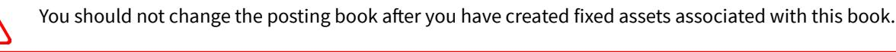

On the *[Books](https://help-2025r1.acumatica.com/Help?ScreenId=ShowWiki&pageid=1014c10a-4bb9-4220-a4d5-c1b63bc9cf2c)* form, you can also create any number of non-posting books (those that do not update general ledger accounts). For these books, you leave the **Posting Book** check box cleared. Once you have created a non-posting book, you need to set up the structure of the calendar to be used for this book. Once the structure is defined, you can generate a book calendar on the *[Generate Book Calendars](https://help-2025r1.acumatica.com/Help?ScreenId=ShowWiki&pageid=4fd3c2b5-8405-415d-ae5b-abd5c3821792)* form.

# **Support of Different Calendars in Fixed Assets**

If the *Multiple Calendar Support* feature has been enabled on the *[Enable/Disable Features](https://help-2025r1.acumatica.com/Help?ScreenId=ShowWiki&pageid=c1555e43-1bc5-4f6f-ba9d-b323f94d8a6b)* (CS100000) form, the companies within one tenant can use different financial calendars. Thus, you can configure an open posting book and multiple non-posting books that are shared across these companies. For details, see *[Multiple Calendar Support](https://help-2025r1.acumatica.com/Help?ScreenId=ShowWiki&pageid=8b5e547a-7940-4e11-b986-744cf4676cb0)*.

In the posting book, the asset balance and history are stored by the periods of the company to which the asset belongs, and in the non-posting books, the asset balance and history are stored by the book periods.

If the *Multiple Calendar Support* feature is enabled, note the following about working with fixed assets:

- To transfer assets between branches of different companies, these assets should be disposed of in one company and acquired in the other company.
- If fixed asset reports are run with the **Company** and **Branch** boxes le empty, the data in the reports will be consolidated by period number.
- When posting fixed asset transactions, the system checks whether the start date and the end date of the transaction period in the posting book are the same as the start date and the end date of the period in the general ledger. If these periods do not match for at least one transaction, the document cannot be released.

If you disable the *Multiple Calendar Support* feature on the *[Enable/Disable Features](https://help-2025r1.acumatica.com/Help?ScreenId=ShowWiki&pageid=c1555e43-1bc5-4f6f-ba9d-b323f94d8a6b)* form, the system checks whether each period of an active company in the company's posting book has a matching period in the general ledger calendar. (Only the IDs of the periods are compared.) If this condition is not met, the system displays an error message on this form. For details on company statuses, see *[Companies and Branches](https://help-2025r1.acumatica.com/Help?ScreenId=ShowWiki&pageid=3b262f5c-aaaf-48cd-9f8b-cb3f678afc31)*.

# **Creation of a Book Calendar**

For each book, you need to generate a book calendar on the *[Generate Book Calendars](https://help-2025r1.acumatica.com/Help?ScreenId=ShowWiki&pageid=4fd3c2b5-8405-415d-ae5b-abd5c3821792)* (FA501000) form. Before generating a calendar for a non-posting book, you should define the structure of the calendar on the *[Book Calendar](https://help-2025r1.acumatica.com/Help?ScreenId=ShowWiki&pageid=c623f01e-2146-47f7-bc63-8f4dd5455c78) [Setup](https://help-2025r1.acumatica.com/Help?ScreenId=ShowWiki&pageid=c623f01e-2146-47f7-bc63-8f4dd5455c78)* (FA206000) form by specifying the start calendar date and the type of the periods to be used in this calendar. Then on the *[Generate Book Calendars](https://help-2025r1.acumatica.com/Help?ScreenId=ShowWiki&pageid=4fd3c2b5-8405-415d-ae5b-abd5c3821792)* form, you generate a calendar for a selected book. The calendar will be based on the calendar structure that you have defined.

Because the posting book uses the structure of the general ledger calendar, you do not need to configure a calendar structure for a posting book on the *[Book Calendar Setup](https://help-2025r1.acumatica.com/Help?ScreenId=ShowWiki&pageid=c623f01e-2146-47f7-bc63-8f4dd5455c78)* form. You just process the generation of the calendar on the *[Generate Book Calendars](https://help-2025r1.acumatica.com/Help?ScreenId=ShowWiki&pageid=4fd3c2b5-8405-415d-ae5b-abd5c3821792)* form.

A calendar is used to record depreciation expenses according to the calendar periods. If you want to depreciate assets over a particular number of years, you must create book calendars accordingly.

The financial year may be set as a calendar year starting January 1, or may be different. You select the **Belongs to Next Year** check box on the *[Book Calendar Setup](https://help-2025r1.acumatica.com/Help?ScreenId=ShowWiki&pageid=c623f01e-2146-47f7-bc63-8f4dd5455c78)* form when the financial year starts later in the calendar year than January 1. The system calculates the ending date of the financial year automatically as the ending date of the last period.

# **Setup of Book Calendar Periods**

The book calendar year is divided into periods, which may have equal or different durations. The total length of all periods may or may not be equal to the year. You can set up the calendar periods for a non-posting book by using the *[Book Calendar Setup](https://help-2025r1.acumatica.com/Help?ScreenId=ShowWiki&pageid=c623f01e-2146-47f7-bc63-8f4dd5455c78)* (FA206000) form.

When setting up periods, you can select an option based on months or weeks, or you can define custom-length periods. If you select one of the options based on months (*Month*, *Two Months*, or *Quarter*), the periods will start and end on the same dates each year, and each successive financial year will start and end on the same date.

However, if you define periods by using an option based on weeks (*Week*, *Two Weeks*, *Four Weeks*, *4-4-5 Weeks*, *4-5-4 Weeks*, or *5-4-4 Weeks*), the start and end dates of same-name periods will vary with the year, and the number of periods per year may vary. Periods based on weeks start on the same day of the week and end on the same day of the week. However, a calendar year has 365 or 366 days, which is 52 full weeks plus 1 or 2 extra days. For a book calendar year based on the *4-4-5*, *4-5-4*, or *5-4-4* option, the system automatically adds an additional week to the last period if the gap between the end of the book calendar year and the end of the last period exceeds three days. For a calendar with week-based period types, because the year does not have a fixed start date, you cannot generate a year template on the *[Book Calendar Setup](https://help-2025r1.acumatica.com/Help?ScreenId=ShowWiki&pageid=c623f01e-2146-47f7-bc63-8f4dd5455c78)* form. You can review the beginning and ending dates of week-based financial periods on the *[Book Calendars](https://help-2025r1.acumatica.com/Help?ScreenId=ShowWiki&pageid=c0a12bf2-2949-4c90-90a5-417b6499f61c)* (FA304000) form.

For a book calendar year with week-long periods, to process the difference between the length of a calendar year and the length of all week-long periods, the system uses the *Day nearest the end of the month* depreciation method. That is, the system adds an additional (fiy-third) week-length period if the last period ends four or more days earlier than the financial year ends. If the last period ends fewer than four days earlier, no additional period is added.

For details on adding a calendar, see *To Define a Book Calendar with [Week-Based](#page-346-2) Periods*. For details on generating periods for book calendars, see *Fixed Assets: To Configure the Fixed Asset [Functionality](#page-339-1)*.

### **Shiing of the First Book Calendar Year**

Fixed assets may have a long useful life. For example, buildings can be used for decades. If your company owns an asset whose depreciation started before you started working with Acumatica ERP, you may want to configure a book calendar to start when the asset depreciation started. You can shi the first year of the book calendar one year earlier and then generate periods for the added year. For details, see *Fixed Asset [Troubleshooting:](https://help-2025r1.acumatica.com/Help?ScreenId=ShowWiki&pageid=65d444b2-7e5c-410a-8236-2f007e4ad279) To Shift the First Year One Year [Earlier](https://help-2025r1.acumatica.com/Help?ScreenId=ShowWiki&pageid=65d444b2-7e5c-410a-8236-2f007e4ad279)*.

# **Deletion of a Book**

On the *[Books](https://help-2025r1.acumatica.com/Help?ScreenId=ShowWiki&pageid=1014c10a-4bb9-4220-a4d5-c1b63bc9cf2c)* (FA205000) form, you can delete the selected book by clicking **Delete Row** on the table toolbar. The book can be deleted only if there are no transactions posted in the selected book. Once the book is deleted, the calendar generated for this book on the *[Book Calendar Setup](https://help-2025r1.acumatica.com/Help?ScreenId=ShowWiki&pageid=c623f01e-2146-47f7-bc63-8f4dd5455c78)* form will be deleted as well.

### **Closing of Financial Periods**

On the *[Close Financial Periods](https://help-2025r1.acumatica.com/Help?ScreenId=ShowWiki&pageid=616e67c8-d189-449a-ab96-75ff4465df94)* (FA509000) form, you close financial periods in the fixed assets subledger to prevent users from posting transactions to these periods.

If a financial period has been closed by mistake, you can reopen it on the same form by selecting *Reopen* in the **Action** box. For details, see *[Fixed Asset Period Closing: Process Activity](https://help-2025r1.acumatica.com/Help?ScreenId=ShowWiki&pageid=d40d1847-6b78-42e3-90f0-5b3f020f8266)* and *To Reopen a [Financial](https://help-2025r1.acumatica.com/Help?ScreenId=ShowWiki&pageid=a0f81b5f-ab10-4b5f-b6f7-4d97fc8cdb0d) Period in Fixed [Assets](https://help-2025r1.acumatica.com/Help?ScreenId=ShowWiki&pageid=a0f81b5f-ab10-4b5f-b6f7-4d97fc8cdb0d)*.

# <span id="page-339-1"></span><span id="page-339-0"></span>**Fixed Assets: To Configure the Fixed Asset Functionality**

In the following implementation activity, you will learn how to configure the fixed asset functionality.

### **Story**

Suppose that an implementation consultant has prepared the system for the configuration of the fixed asset functionality. Based on SweetLife's policy, the company needs one depreciation book to depreciate fixed assets by using the straight-line depreciation method. The company is planning to dispose of assets by selling them.

Acting as an implementation consultant, you need to specify fixed asset configuration settings in the system, create the *SOLD* disposal method, and generate a calendar that must include as many years as are needed to be able to calculate depreciation for any existing fixed asset, which will later be created in the system, for the entire asset's life.

In SweetLife, all the fixed assets will be placed in service in the same year, and the fixed assets of the *BUILDING* class will have the longest useful life: 39 years. (In a later activity, the company will acquire the *BUILDING* asset in the middle of 2025; therefore, you will have to generate a calendar through the year 2064 (2025 + 39). The lifespans of other fixed assets are shorter; therefore, they will also fit the generated range of years.)

#### **Process Overview**

In this activity, you will specify the configuration settings on the *[Fixed Assets Preferences](https://help-2025r1.acumatica.com/Help?ScreenId=ShowWiki&pageid=f56d17a8-2729-496b-b8ac-8fb0732ee0a5)* (FA101000) form and create a disposal method on the *[Disposal Methods](https://help-2025r1.acumatica.com/Help?ScreenId=ShowWiki&pageid=f4f33527-7a26-41cb-8e09-0c735e4ce312)* (FA207000) form. On the *[Books](https://help-2025r1.acumatica.com/Help?ScreenId=ShowWiki&pageid=1014c10a-4bb9-4220-a4d5-c1b63bc9cf2c)* (FA205000) form, you will create a posting book; then on the *[Generate Book Calendars](https://help-2025r1.acumatica.com/Help?ScreenId=ShowWiki&pageid=4fd3c2b5-8405-415d-ae5b-abd5c3821792)* (FA501000) form, you will create a financial calendar for this posting book. Finally, on the *[Master Financial Calendar](https://help-2025r1.acumatica.com/Help?ScreenId=ShowWiki&pageid=d46a8e03-b211-44c2-b17c-01ae813ead1b)* (GL201000) form, you will create GL calendars for multiple years and activate their financial periods on the *[Manage Financial Periods](https://help-2025r1.acumatica.com/Help?ScreenId=ShowWiki&pageid=eedf2adf-6ddc-4c33-932b-de60275c547f)* (GL503000) form.

### **System Preparation**

Before you start configuring the fixed asset functionality, launch the Acumatica ERP website, and sign in to a company with the *U100* dataset preloaded. You should sign in as Kimberly Gibbs with the *gibbs* username and the *123* password.

As a prerequisite activity, in the company to which you are signed in, be sure you have prepared the system, as described in *Fixed Assets: To Configure the System for Fixed Asset [Management](#page-335-1)*.

### **Step 1: Specifying Fixed Asset Preferences**

To specify the fixed asset preferences, which are the basic configuration settings, do the following:

1. Open the *[Fixed Assets Preferences](https://help-2025r1.acumatica.com/Help?ScreenId=ShowWiki&pageid=f56d17a8-2729-496b-b8ac-8fb0732ee0a5)* (FA101000) form. In the **AccountSettings** section, select *15010 (Accrued Purchases: Fixed Assets)* in the **FA Accrual Account** box.

This account is used to hold the cost of fixed assets that have not yet been put into service.

- 2. In the **PostingSettings** section, specify the following settings:
  - **Update GL**: Selected

If you were preparing the system for production use, you could clear the check box during initial data migration to import the fixed assets that are already capitalized without affecting GL balances.

• **Automatically Post on Release**: Selected

With this check box selected, the system releases and immediately posts the batch of journal transactions that has been generated on release of a fixed asset transaction.

3. On the form toolbar, click**Save**.

### **Step 2: Creating a Disposal Method**

To create the *SOLD* disposal method, do the following:

- 1. Open the *[Disposal Methods](https://help-2025r1.acumatica.com/Help?ScreenId=ShowWiki&pageid=f4f33527-7a26-41cb-8e09-0c735e4ce312)* (FA207000) form.
- 2. On the form toolbar, click **Add Row**, and specify the following settings in the added row:
  - **Disposal Method ID**: SOLD
  - **Description**: Sold
  - **Proceeds Account**: *11010*

This is the accrual account used for recording the proceeds from sales of fixed assets. The account will be used for processing transactions when fixed assets are sold. The account is debited in the amount of the proceeds when an asset is sold, and credited when the AR invoice to the buyer of the fixed asset is released.

3. On the form toolbar, click**Save** to save the changes.

#### **Step 3: Creating the Posting Book**

To create the posting book, do the following:

- 1. Open the *[Books](https://help-2025r1.acumatica.com/Help?ScreenId=ShowWiki&pageid=1014c10a-4bb9-4220-a4d5-c1b63bc9cf2c)* (FA205000) form.
- 2. On the form toolbar, click **Add Row**, and specify the following settings in the added row:
  - **Book ID**: FIN
  - **Description**: Posting Book
  - **Posting Book**: Selected

With this check box selected, the transactions of this book will update GL accounts.

• **Mid-Period Type**: *Fixed Day*

This setting means that the day specified in the **Mid-Period Day** box will be used as the middle of the period in averaging conventions.

• **Mid-Period Day**: 15

This setting specifies the day to be considered as the last day of the first half of the period (that is, as the middle of the period).

3. On the form toolbar, click**Save** to save your changes.

The created *FIN* book will be assigned by default to all created fixed asset classes and thus will keep all the fixed asset transactions for the created fixed assets.

# **Step 4: Generating the Calendar for the Posting Book**

To generate the calendar for the posting book, do the following:

- 1. Open the *[Generate Book Calendars](https://help-2025r1.acumatica.com/Help?ScreenId=ShowWiki&pageid=4fd3c2b5-8405-415d-ae5b-abd5c3821792)* (FA501000) form.
- 2. In the **From Year** box, leave the default value of *2024*.
- 3. In the **To Year** box, enter 2064.
- 4. In the table, select the unlabeled check box in the row of the *FIN* book.
- 5. On the form toolbar, click **Process**.
- 6. Aer the processing has completed, notice that the calendar has been generated through 2064. For a posting book, the generated calendar starts from the first calendar year in the GL calendar—in this example, from 2024.

# **Step 5: Activating Financial Periods**

To activate the financial periods to which GL transactions will be posted, do the following:

- 1. Open the *[Master Financial Calendar](https://help-2025r1.acumatica.com/Help?ScreenId=ShowWiki&pageid=d46a8e03-b211-44c2-b17c-01ae813ead1b)* (GL201000) form.
- 2. On the form toolbar, click **Add New Record**.
- 3. In the **Financial Year** box, make sure that *2026* is specified.
- 4. On the form toolbar, click **Generate Calendar**.
- 5. In the **Generate GL Calendar** dialog box, which is opened, specify the following settings:
  - **From Year**: *2026*
  - **To Year**: *2030*
- 6. Click **OK**.
- 7. Open the *[Company Financial Calendar](https://help-2025r1.acumatica.com/Help?ScreenId=ShowWiki&pageid=65ec8509-a3de-4381-94f0-c5ae2f8546fb)* (GL201100) form.
- 8. In the Selection area, specify the following settings:
  - **Company**: *SWEETLIFE*
  - **Financial Year**: *2030*
- 9. On the More menu, click **Open Periods**.

10.On the *[Manage Financial Periods](https://help-2025r1.acumatica.com/Help?ScreenId=ShowWiki&pageid=eedf2adf-6ddc-4c33-932b-de60275c547f)* (GL503000) form, which is opened, click **Process All**.

# <span id="page-341-1"></span><span id="page-341-0"></span>**Fixed Assets: Fixed Asset Classes**

In Acumatica ERP, fixed asset classes serve the following purposes:

- To group assets having a similar nature, function, or use in your company's business.
- To provide default settings when you add an asset to the system and assign the asset to a particular class. Most of the default settings can be overridden.

You can define separate fixed asset classes for tangible and intangible assets of different types with a different estimated useful life, or create a separate fixed asset class for non-depreciable fixed assets or assets under construction. For example, you may set up the following classes for tangible assets:

- Buildings: 50 years of useful life
- Plant and machinery: 10 years of useful life

- Furniture and fixtures: 8 years of useful life
- Land: 0 years of useful life (the fixed assets of this class are not depreciated, so their useful life is indefinite)

You create new fixed asset classes by using the *[Fixed Asset Classes](https://help-2025r1.acumatica.com/Help?ScreenId=ShowWiki&pageid=6b58176c-f1db-4fe4-b267-c657dc50eca0)* (FA201000) form, as described in *[Fixed Assets:](#page-343-1) To Create Fixed Asset [Classes](#page-343-1)*. Alternatively, you can copy an existing class to create a similar asset class, as described in *To Create an Asset Class by [Copying](#page-347-1) an Existing Class*. Also, you can create templates for fixed asset classes and use them to define new classes.

# **Default Values Provided by an Asset Class**

When you create a fixed asset class on the *[Fixed Asset Classes](https://help-2025r1.acumatica.com/Help?ScreenId=ShowWiki&pageid=6b58176c-f1db-4fe4-b267-c657dc50eca0)* (FA201000) form, you specify the default settings for all the assets of the class.

The asset type and estimated useful life define the assets to be associated with the class.

You can associate multiple books with the class, each with its own depreciation settings. You have to add the posting book if you want to post to the general ledger the transactions generated for the assets of the class. You can use accelerated depreciation of all the books that use the *Straight-Line* depreciation method. Note that you will be able to associate the assets of the class with only the books that you select for the class. For more information, see *[Fixed Assets: Books and Book Calendars](#page-336-1)* and *[Asset Depreciation: General Information](https://help-2025r1.acumatica.com/Help?ScreenId=ShowWiki&pageid=9c65de10-b4a6-4076-bb17-5a0fc133b42c)*.

The general ledger accounts assigned to the class define most of the accounts that will be used to record the transactions for the assets of the class.

# <span id="page-342-1"></span><span id="page-342-0"></span>**Fixed Assets: Fixed Asset Types**

In your company, you may have a variety of fixed assets, including the following:

- Tangible assets (those with physical substance) of such types as land, buildings, equipment, vehicles, furniture, and fixtures
- Intangible assets (those that are not physical in nature of such types as copyrights, goodwill, computer soware, and patents

These types of tangible and intangible assets provide logical ways to group similar assets. In Acumatica ERP, as a configuration step, you make sure that the applicable fixed asset types have been defined on the *Fixed Asset [Types](https://help-2025r1.acumatica.com/Help?ScreenId=ShowWiki&pageid=579dbf8b-ef34-4186-85d5-401282d07a4e)* (FA201010) form.

You need to specify an asset type for each fixed asset that you create in the system on the *[Fixed Assets](https://help-2025r1.acumatica.com/Help?ScreenId=ShowWiki&pageid=0bde54fb-c293-4759-931b-5ecbff784cd1)* (FA303000) form. Asset types organize all your fixed assets by their function.

You must also specify an asset type for each fixed asset class that you create in the system on the *[Fixed Asset](https://help-2025r1.acumatica.com/Help?ScreenId=ShowWiki&pageid=6b58176c-f1db-4fe4-b267-c657dc50eca0) [Classes](https://help-2025r1.acumatica.com/Help?ScreenId=ShowWiki&pageid=6b58176c-f1db-4fe4-b267-c657dc50eca0)* (FA201000) form, because a fixed asset class allows you to group fixed assets with a similar settings (which includes the asset type).

### **Predefined Asset Types**

The most common asset types have been predefined in the system, and you can view or edit them on the *Fixed Asset [Types](https://help-2025r1.acumatica.com/Help?ScreenId=ShowWiki&pageid=579dbf8b-ef34-4186-85d5-401282d07a4e)* (FA201010) form. The predefined asset types include the following: *BUILDING*, *COMPUTERS*, *COPYRIGHTS*, *EQUIPMENT*, *FURTINURE*, *GOODWILL*, *LAND*, *MACHINERY*, *PATENTS*, *SOFTWARE*, and *VEHICLE*. You can delete an existing asset type if you will not need it.

You cannot delete an asset type if it has already specified for any fixed asset or fixed asset class.

If the list of default asset types does not include a particular asset type that you need, you can create a new asset type manually.

#### **New Asset Types**

You use the *Fixed Asset [Types](https://help-2025r1.acumatica.com/Help?ScreenId=ShowWiki&pageid=579dbf8b-ef34-4186-85d5-401282d07a4e)* (FA201010) form to add a new asset type.

While creating a new asset type, you define its name with a brief description, and specify whether assets of this type are tangible or intangible (by selecting the**Tangible** check box).

Aer you have created and saved a required asset type in the system, it becomes available for selection in the **Asset Type** box on the *[Fixed Assets](https://help-2025r1.acumatica.com/Help?ScreenId=ShowWiki&pageid=0bde54fb-c293-4759-931b-5ecbff784cd1)* (FA303000) form or the *[Fixed Asset Classes](https://help-2025r1.acumatica.com/Help?ScreenId=ShowWiki&pageid=6b58176c-f1db-4fe4-b267-c657dc50eca0)* (FA201000) form.

# <span id="page-343-1"></span><span id="page-343-0"></span>**Fixed Assets: To Create Fixed Asset Classes**

In the following implementation activity, you will learn how to create fixed asset classes.

### **Story**

Suppose that the fixed asset functionality has been configured for SweetLife Fruits & Jams. Before fixed asset records are created, fixed asset classes need to be planned and created. SweetLife needs to create and maintain fixed assets for land, buildings and building improvements, computers, and soware. Each fixed asset class must have a particular fixed asset type assigned to it. The predefined asset types available in Acumatica ERP cover the types of fixed assets used by SweetLife.

Acting as an implementation consultant, you need to create the following fixed asset classes in the system.

| Asset<br>Class | Asset Type    | Tangible | Deprecia<br>ble | Description                                                              | Depre<br>ciation<br>Method | Averag<br>ing Con<br>vention | Useful<br>Life     |
|----------------|---------------|----------|-----------------|--------------------------------------------------------------------------|----------------------------|------------------------------|--------------------|
| LAND           | LAND          | Yes      | No              | Land                                                                     | None                       | No                           | 0 (indefi<br>nite) |
| BUILDING       | BUILDING      | Yes      | Yes             | Building and major<br>building improve<br>ments                          | SL (Straight<br>Line)      | Mid Peri<br>od               | 39                 |
| COMPUT<br>ERS  | COMPUT<br>ERS | Yes      | Yes             | Computers and<br>computer acces<br>sories                                | MACRS                      | Mid Quar<br>ter              | 5                  |
| SOFTWARE       | SOFTWARE      | No       | Yes             | Software licensed<br>with limited use<br>time and website<br>development | SL (Straight<br>Line)      | Full Peri<br>od              | 3                  |

#### **Process Overview**

In this activity, on the *[Fixed Asset Classes](https://help-2025r1.acumatica.com/Help?ScreenId=ShowWiki&pageid=6b58176c-f1db-4fe4-b267-c657dc50eca0)* (FA201000) form, you will create the needed fixed asset classes.

### **System Preparation**

Before you start creating fixed asset classes, launch the Acumatica ERP website, and sign in to a company with the *U100* dataset preloaded. You should sign in as Kimberly Gibbs with the *gibbs* username and the *123* password.

As a prerequisite activity, in the company to which you are signed in, be sure you have prepared the system, as described in *Fixed Assets: To Configure the System for Fixed Asset [Management](#page-335-1)*.

As a prerequisite activity, in the company to which you are signed in, be sure you have configured the fixed asset subledger, as described in *Fixed Assets: To Configure the Fixed Asset [Functionality](#page-339-1)*.

### **Step: Creating Fixed Asset Classes**

To create fixed asset classes, do the following:

- 1. On the *[Fixed Asset Classes](https://help-2025r1.acumatica.com/Help?ScreenId=ShowWiki&pageid=6b58176c-f1db-4fe4-b267-c657dc50eca0)* (FA201000) form, add a new record.
- 2. Create the *LAND* fixed asset class as follows:
  - a. In the **Asset Class ID** box, enter LAND.
  - b. In the **Description** box, enter Land.
  - c. Make sure that the **Active** check box is selected.
  - d. On the **General** tab, select *LAND* in the **AssetType** box.
  - e. On the **GL Accounts** tab, specify the following settings:
    - **Fixed Assets Account**: *15100 (Land)*

This account will hold the cost of the fixed assets of the *LAND* class. This account will be debited when a fixed asset of the *LAND* class is created, and credited when a fixed asset of this class is disposed of.

• **Gain Account**: *90000 (Gain/Loss of Fixed Asset Disposal)*

This account will keep the gain or loss resulting from the disposal of a fixed asset of this class. The account will be used for processing fixed asset disposals. When the fixed asset is disposed of, this account will be debited in the asset's cost amount and credited in the amount of the accumulated depreciation to record the net value of the asset. Also, this account will be credited in the proceeds amount. As a result, the gain or loss from the disposal of the fixed asset will be recorded to the account.

- **Loss Account**: *90000 (Gain/Loss of Fixed Asset Disposal)*
- 3. On the form toolbar, click**Save**.
- 4. On the form toolbar, click **Add New Record**, and create the *BUILDING* fixed asset class as follows:
  - a. In the **Asset Class ID** box, enter BUILDING.
  - b. In the **Description** box, enter Buildings and building improvements.
  - c. Make sure that the **Active** check box is selected.
  - d. On the **General** tab, select *BUILDING* in the **AssetType** box.
  - e. In the **Useful Life, Years** box, type 39.
  - f. On the **GL Accounts** tab, specify the following settings:
    - **Fixed Assets Account**: *15200 (Buildings and Improvements)*

This account will hold the cost of the fixed assets of the *BUILDING* class. This account will be debited when a fixed asset of the *BUILDING* class is created, and credited when a fixed asset of this class is disposed of.

• **Accumulated Depreciation Account**: *16200 (Accumulated Depreciation: Buildings and Improvements)*

This account will hold the accumulated depreciation for the fixed assets of the *BUILDING* class. This account will be credited when an asset of the *BUILDING* class is depreciated, and debited when a fixed asset of this class is disposed of.

• **Depreciation Expense Account**: *64000 (Depreciation Expense)*

This account will accumulate depreciation expenses. The account will be used for recording depreciation expenses when assets are depreciated. This account will be debited when fixed assets are depreciated.

- **Gain Account**: *90000 (Gain/Loss of Fixed Asset Disposal)*
- **Loss Account**: *90000 (Gain/Loss of Fixed Asset Disposal)*
- g. On the **Depreciation** tab, specify the following settings for the *FIN* book:
  - **Class Method**: *SL (Straight-Line)*
  - **Averaging Convention**: *Mid Period*
- 5. On the form toolbar, click**Save**.
- 6. On the form toolbar, click **Add New Record**, and create the *COMPUTERS* asset class as follows:
  - a. In the **Asset Class ID** box, enter COMPUTERS.
  - b. In the **Description** box, enter Computers and accessories.
  - c. Make sure that the **Active** check box is selected.
  - d. On the **General** tab, select *COMPUTERS* in the **AssetType** box.
  - e. In the **Useful Life, Years** box, type 5.
  - f. On the **GL Accounts** tab, specify the following settings:
    - **Fixed Assets Account**: *15300 (Computers)*

This account will hold the cost of the fixed assets of the *COMPUTERS* class. This account will be debited when a fixed asset of the *COMPUTERS* class is created, and credited when a fixed asset of this class is disposed of.

• **Accumulated Depreciation Account**: *16300 (Accumulated Depreciation: Computers)*

This account will hold the accumulated depreciation for the *COMPUTERS* fixed assets. This account will be credited when an asset of the *COMPUTERS* class is depreciated, and debited when a fixed asset of this class is disposed of.

- **Depreciation Expense Account**: *64000 (Depreciation Expense)*
- **Gain Account**: *90000 (Gain/Loss of Fixed Asset Disposal)*
- **Loss Account**: *90000 (Gain/Loss of Fixed Asset Disposal)*
- g. On the **Depreciation** tab, specify the following settings for the *FIN* book:
  - **Class Method**: *MACRS5-MQ*
  - **Averaging Convention**: *Mid Quarter*
- 7. On the form toolbar, click**Save**.
- 8. On the form toolbar, click **Add New Record**, and create the *SOFTWARE* asset class as follows:
  - a. In the **Asset Class ID** box, enter SOFTWARE.
  - b. In the **Description** box, enter Software and website.
  - c. Make sure that the **Active** check box is selected.
  - d. On the **General** tab, select *SOFTWARE* in the **AssetType** box.
  - e. In the **Useful Life, Years** box, type 3.
  - f. On the **GL Accounts** tab, specify the following settings:
    - **Fixed Assets Account**: *15400 (Soware)*

This account will hold the cost of the fixed assets of the *SOFTWARE* class. This account will be debited when a fixed asset of the *SOFTWARE* class is created, and credited when the fixed asset of this class is disposed of.

• **Accumulated Depreciation Account**: *16400 (Accumulated Depreciation: Soware)*

This account will hold the accumulated depreciation for the *SOFTWARE* fixed assets. This account will be credited when an asset of the *SOFTWARE* class is depreciated, and debited when the fixed asset of this class is disposed of.

• **Depreciation Expense Account**: *64000 (Depreciation Expense)*

- **Gain Account**: *90000 (Gain/Loss of Fixed Asset Disposal)*
- **Loss Account**: *90000 (Gain/Loss of Fixed Asset Disposal)*
- g. On the **Depreciation** tab, specify the following settings for the *FIN* book:
  - **Class Method**: *SL (Straight-Line)*
  - **Averaging Convention**: *Full Period*
- 9. On the form toolbar, click**Save**.

# <span id="page-346-0"></span>**To Review the Periods of a Particular Book**

You can review the periods used for a particular depreciation book on the *[Book Calendars](https://help-2025r1.acumatica.com/Help?ScreenId=ShowWiki&pageid=c0a12bf2-2949-4c90-90a5-417b6499f61c)* (FA304000) form.

# **To Review the Periods for a Particular Book**

- 1. Open the *[Book Calendars](https://help-2025r1.acumatica.com/Help?ScreenId=ShowWiki&pageid=c0a12bf2-2949-4c90-90a5-417b6499f61c)* (FA304000) form.
- 2. In the **Book** box of the Selection area, select the book for which you want to review periods.
- 3. In the **Company** box, select the company for which you want to review periods.


This box appears on the form only if the *Multiple Calendar Support* feature is enabled on the *[Enable/Disable Features](https://help-2025r1.acumatica.com/Help?ScreenId=ShowWiki&pageid=c1555e43-1bc5-4f6f-ba9d-b323f94d8a6b)* (CS100000) form and the posting book is selected.

- 4. In the **Financial Year** box, select the financial year for which you want to review periods.
- 5. In the table, review the periods for the selected book, company (if applicable), and financial year.

# <span id="page-346-2"></span><span id="page-346-1"></span>**To Define a Book Calendar with Week-Based Periods**

You add a book calendar for each non-posting book you add to the system by using the *[Book Calendar Setup](https://help-2025r1.acumatica.com/Help?ScreenId=ShowWiki&pageid=c623f01e-2146-47f7-bc63-8f4dd5455c78)* (FA206000) form. For each calendar, you have to specify the settings of the financial year, including its starting and ending dates and its periods.

# **To Configure a Book Calendar with Week-Based Periods**

- 1. Open the *[Book Calendar Setup](https://help-2025r1.acumatica.com/Help?ScreenId=ShowWiki&pageid=c623f01e-2146-47f7-bc63-8f4dd5455c78)* (FA206000) form.
- 2. In the **Book** box, select the book for which you want to set up a book calendar.
- 3. Set up the first year of the book calendar as follows:
  - a. In the **YearStarts On** box, specify the date for the start of the book's calendar year.
  - b. If the start date of the book year falls within the next financial year, select the **BelongsTo Next Year** check box.

The system then inserts the first calendar year in the **First Year** box.

- 4. In the **Period Type** box, select one of the following:
  - *Week*: Each period lasts one week, and there are 52 or 53 periods per year.
  - *Two Weeks*: Each period lasts two weeks, and there are 26 or 27 periods per year.
  - *Four Weeks*: Each period lasts four weeks, and there are 13 or 14 periods per year.
  - *4-4-5 Weeks*: The year is divided into four quarters, and each quarter includes two four-week periods and a five-week period.

- *4-5-4 Weeks*: The year is divided into four quarters, and each quarter includes a four-week period, a fiveweek period, and a four-week period.
- *5-4-4 Weeks*: The year is divided into four quarters, and each quarter includes the following periods: a five-week period and two four-week periods.
- 5. If the *Week* period type is selected, in the **Day of Week** box, select the day of week on which periods will start.
- 6. If a period type other than *Week* is selected, in the **First Period Starts On** box, select the day of week on which periods will start.
- 7. Select the **Has Adjustment Period** check box if you want the system to generate an adjustment period.
- 8. On the form toolbar, click**Save**.

# <span id="page-347-1"></span><span id="page-347-0"></span>**To Create an Asset Class by Copying an Existing Class**

You can define a new asset class from scratch, as described in *Fixed Assets: To Create Fixed Asset [Classes](#page-343-1)*. The *[Fixed Asset Classes](https://help-2025r1.acumatica.com/Help?ScreenId=ShowWiki&pageid=6b58176c-f1db-4fe4-b267-c657dc50eca0)* (FA201000) form also gives you the ability to copy the configuration of an existing class to use it as the base for the new class.

### **To Create an Asset Class by Copying an Existing Class**

- 1. Open the *[Fixed Asset Classes](https://help-2025r1.acumatica.com/Help?ScreenId=ShowWiki&pageid=6b58176c-f1db-4fe4-b267-c657dc50eca0)* (FA201000) form.
- 2. In the **Asset Class ID** box, select the asset class whose key settings will be copied to the new class.
- 3. On the form toolbar, select **Clipboard**, and then click **Copy**.
- 4. On the form toolbar, click **Add New Record**.
- 5. In the **Asset Class ID** box, type the unique identifier to be used for the asset class.
- 6. On the form toolbar, select **Clipboard**, and then click **Paste**.

The settings of the class you copied are pasted to the new class.

- 7. Review the settings of the new class, and make any required changes.
- 8. On the form toolbar, click**Save**.


You can later delete an asset class only if no assets have been associated with it.

# <span id="page-348-0"></span>**Implementing Order Management**

This part of the guide describes the minimum required configuration of the order management functionality in Acumatica ERP.

# <span id="page-348-1"></span>**Basic Order Management**

This chapter describes the minimum configuration of the order management functionality that is required for Acumatica ERP users to process the sales and purchases of non-stock items and services through sales orders and purchase orders, respectively.

# <span id="page-348-3"></span><span id="page-348-2"></span>**Order Management Basic Configuration: General Information**

This topic provides a general overview of the configuration steps that you have to perform before you can process sales and purchases of non-stock items through orders.

# **Learning Objectives**

In this chapter, you will learn how to perform the initial configuration for the order management functionality. In particular, you will do the following:

- Enable the needed system feature
- Specify the minimum required configuration for the purchase order and sales order management functionality
- Learn the settings that you can specify to make the system fit your business requirements

# **Applicable Scenarios**

You perform the configuration of order management in the following cases:

- You are initially implementing Acumatica ERP and the *Inventory and Order Management* feature is included in your license.
- You have purchased the *Inventory and Order Management* feature, and you need to configure order management in the existing system.

# **System Features and Minimum Required Settings**

To be able to configure the sales order management and purchase order management functionality in the system, you need to enable the *Inventory and Order Management* feature on the *[Enable/Disable Features](https://help-2025r1.acumatica.com/Help?ScreenId=ShowWiki&pageid=c1555e43-1bc5-4f6f-ba9d-b323f94d8a6b)* (CS101000) form.


Each particular feature may be subject to additional licensing; please consult the Acumatica ERP licensing policy for details.

Aer you have enabled this feature, you need to review and save the default settings on the *[Sales Orders](https://help-2025r1.acumatica.com/Help?ScreenId=ShowWiki&pageid=1817779c-413b-4187-b7fe-38e97845a1cb) [Preferences](https://help-2025r1.acumatica.com/Help?ScreenId=ShowWiki&pageid=1817779c-413b-4187-b7fe-38e97845a1cb)* (SO101000) and *[Purchase Orders Preferences](https://help-2025r1.acumatica.com/Help?ScreenId=ShowWiki&pageid=13d09c43-8696-4f92-ad9b-3d0209ee3d9b)* (PO101000) forms. Then you can proceed with preparing sales and purchase orders with non-stock items.

# <span id="page-349-0"></span>**Order Management Basic Configuration: Implementation Checklist**

The following sections provide details you can use to ensure that the system is configured properly for the processing of sales and purchases with non-stock items, and to specify settings that affect the processing workflow.

# **Prerequisites**

Before you start configuring order management, you should make sure that the needed features have been enabled and settings have been specified, as described in the following checklist.

| Form                                    | Criteria to Check                                                                                                               |
|-----------------------------------------|---------------------------------------------------------------------------------------------------------------------------------|
|                                         | Make sure that the minimum company settings are<br>specified, as described in Company Without Branches:<br>General Information. |
| Enable/Disable Features (CS100000) form | Make sure that the Inventory and Order Management<br>feature is enabled.                                                        |
| Order Types (SO201000)                  | Make sure that the IN order type has been activated, as<br>described in Sales Order Types: To Activate the IN Or<br>der Type.   |

#### *Table: Minimum Required Settings*

To make it possible for users to process sales and purchase orders with non-stock items, you should navigate to the following forms and save the default settings.

| Form                                     | Settings to Save           |
|------------------------------------------|----------------------------|
| Sales Orders Preferences (SO101000) form | Save the default settings. |
| Purchase Orders Preferences (PO101000)   | Save the default settings. |

# **Settings That Affect the Workflow**

When you are configuring order management, you can specify additional settings to configure the company to fit your business requirements:

- To cause the system to verify the customer's credit status and put a sales order on hold if the credit limit has been exceeded, select the **Hold Document on Failed Credit Check** check box on the *[Sales Orders](https://help-2025r1.acumatica.com/Help?ScreenId=ShowWiki&pageid=1817779c-413b-4187-b7fe-38e97845a1cb) [Preferences](https://help-2025r1.acumatica.com/Help?ScreenId=ShowWiki&pageid=1817779c-413b-4187-b7fe-38e97845a1cb)* (SO101000) form.
- To reduce input errors during purchase order entry, set up the validation of order totals by selecting the **For Normal and Standard Orders** check box in the**ValidateTotal on Entry** section of the *[Purchase Orders](https://help-2025r1.acumatica.com/Help?ScreenId=ShowWiki&pageid=13d09c43-8696-4f92-ad9b-3d0209ee3d9b) [Preferences](https://help-2025r1.acumatica.com/Help?ScreenId=ShowWiki&pageid=13d09c43-8696-4f92-ad9b-3d0209ee3d9b)* (PO101000) form, so that a user will need to enter a control total for each order of this type; the order can be processed further only if the system-calculated total equals the manually entered control total.

# <span id="page-350-0"></span>**Order Management Basic Configuration: Implementation Activity**

You perform the following implementation activity to prepare the system to support the processing of sales and purchase orders with non-stock items.

# **Story**

Suppose that you, as an implementation manager, need to configure system for processing sales and purchases of non-stock items through orders.

# **System Preparation**

Before you start configuring the basic order management functionality, you perform the following instructions:

- 1. In a new tenant, prepare the company with the basic settings, as described in the *[Company](#page-78-4) Without [Branches: General Information](#page-78-4)*.
- 2. On the *[Enable/Disable Features](https://help-2025r1.acumatica.com/Help?ScreenId=ShowWiki&pageid=c1555e43-1bc5-4f6f-ba9d-b323f94d8a6b)* (CS100000) form, enable the *Inventory and Order Management* feature.
- 3. On the *Order [Types](https://help-2025r1.acumatica.com/Help?ScreenId=ShowWiki&pageid=e6984218-4260-4438-99e1-aee2b3765369)* (SO201000) form, activate at least the *IN* order type, as described in *Sales Order [Types:](#page-368-1) To [Activate](#page-368-1) the IN Order Type*.

# **Basic Order Management Configuration**

To perform the basic configuration of purchase order and sales order functionality, proceed as follows:

- 1. Open the *[Sales Orders Preferences](https://help-2025r1.acumatica.com/Help?ScreenId=ShowWiki&pageid=1817779c-413b-4187-b7fe-38e97845a1cb)* (SO100000) form.
- 2. Make sure that *IN* is selected in the **DefaultSales OrderType** box. This is the predefined order type that is used for processing sales of non-stock items.
- 3. In the **InvoiceSettings** section, clear the **Hold Invoices on Failed Credit Check** check box.
- 4. Save your changes on the form.
- 5. Open the *[Purchase Orders Preferences](https://help-2025r1.acumatica.com/Help?ScreenId=ShowWiki&pageid=13d09c43-8696-4f92-ad9b-3d0209ee3d9b)* (PO101000) form.
- 6. In the **ValidateTotal on Entry** section, make sure that the **For Normal and Standard Orders** check box is cleared.
- 7. Save your changes on the form.

You have configured basic order management functionality. Now you can processed with processing sales and purchase orders with non-stock items.

# <span id="page-350-2"></span><span id="page-350-1"></span>**Order Management with Inventory**

This chapter describes the minimum configuration of the order management functionality that is required for Acumatica ERP users to process the sales and purchases of stock items through sales orders and purchase orders, respectively.

# <span id="page-351-1"></span><span id="page-351-0"></span>**Configuration of Order Management: General Information**

This topic provides a general overview of the configuration steps that you have to perform before you can track inventory items and users can process sales and purchases of inventory items through orders.

# **Learning Objectives**

In this chapter, you will do the following:

- Learn about the system features that are required for inventory and order management
- Specify the minimum required configuration for the inventory, purchase order, and sales order management functionality
- Become familiar with the recommended settings that you can specify to make the system fit your business requirements

# **Applicable Scenarios**

You perform configuration of inventory and order management in any of the following cases:

- You are initially implementing Acumatica ERP and the *Inventory and Order Management* and *Inventory* features are included in your license.
- Your new license includes the *Inventory and Order Management* and *Inventory* features, and you need to configure inventory and order management in the existing system.

# **System Features to Be Enabled**

To be able to configure and use the inventory and order management functionality in the system, you need to enable the following features on the *[Enable/Disable Features](https://help-2025r1.acumatica.com/Help?ScreenId=ShowWiki&pageid=c1555e43-1bc5-4f6f-ba9d-b323f94d8a6b)* (CS100000) form:

- *Inventory and Order Management*: Required for sales order management and purchase order management and allows you to configure purchase order processing for regular orders and configure sales order processing with the predefined order types.
- *Inventory*: Required for inventory management.

A warehouse included in the basic functionality has one warehouse location, which is configured in the system automatically. This warehouse and location are used by default for receiving and issuing all inventory items and are not displayed on the forms.

Each particular feature may be subject to additional licensing; please consult the Acumatica ERP sales policy for details.

# **Creation of Inventory Entities**

The primary inventory entity defined in Acumatica ERP is *stock items*: the finished goods and raw materials that cost money, have value, and are stored. For each stock item, you create a record on the *[Stock Items](https://help-2025r1.acumatica.com/Help?ScreenId=ShowWiki&pageid=77786a70-1f1e-4d63-ad98-96f98e4fcb0e)* (IN202500) form that holds the settings of the item, such as the GL accounts assigned to the item and the rules for the item's availability calculation.

Before you start creating stock items in the system, you need to create the following entities that are used in the item's settings:

- Posting classes on the *[Posting Classes](https://help-2025r1.acumatica.com/Help?ScreenId=ShowWiki&pageid=edd4bd77-13f5-4e89-9e47-2861fc66bbb0)* (IN206000) form: You must create posting classes before you start creating item classes. For details about these classes and their implementation, see *[Creating Posting](https://help-2025r1.acumatica.com/Help?ScreenId=ShowWiki&pageid=36d8909e-689c-4d64-bc1d-0c7851679794) [Classes](https://help-2025r1.acumatica.com/Help?ScreenId=ShowWiki&pageid=36d8909e-689c-4d64-bc1d-0c7851679794)*.
- Units of measure on the *[Units of Measure](https://help-2025r1.acumatica.com/Help?ScreenId=ShowWiki&pageid=c25c9971-01e2-4021-aa3b-8809f8045e58)* (CS203500) form (optional): If you need to create units of measure for item classes or stock items beyond those that are predefined in the system, this should be done before you start creating item classes. For details, see *[Creating Units of Measure](https://help-2025r1.acumatica.com/Help?ScreenId=ShowWiki&pageid=6f156588-60c9-40f1-8fc5-87798955e93e)*.
- Availability calculation rules on the *Availability [Calculation](https://help-2025r1.acumatica.com/Help?ScreenId=ShowWiki&pageid=570cb9b8-c9b7-4c5d-bb5f-8e0829f8242d) Rules* (IN201500) form: You must create availability calculation rules before you start creating item classes. For details, see *Creating [Availability](https://help-2025r1.acumatica.com/Help?ScreenId=ShowWiki&pageid=8cba7c90-3ff7-4fec-b310-0c35ccdea91b) [Calculation Rules](https://help-2025r1.acumatica.com/Help?ScreenId=ShowWiki&pageid=8cba7c90-3ff7-4fec-b310-0c35ccdea91b)*.
- Item classes on the *[Item Classes](https://help-2025r1.acumatica.com/Help?ScreenId=ShowWiki&pageid=80a3301b-4eb2-4ce2-94c5-0407c786a0f1)* (IN201000) form: You must create item classes before you start creating stock items. For details, see *[Creating Item Classes for Stock Items](https://help-2025r1.acumatica.com/Help?ScreenId=ShowWiki&pageid=de8bd3b2-2d68-4d1f-a654-0261b40be336)*.

The order in which you create entities is important, because some entities derive settings from other entities or use them in other ways. You first create posting classes, units of measure, and availability calculation rules in any order; you then create the item classes for which these entities will be used as settings. Aer item classes have been created, you create the stock items on the *[Stock Items](https://help-2025r1.acumatica.com/Help?ScreenId=ShowWiki&pageid=77786a70-1f1e-4d63-ad98-96f98e4fcb0e)* (IN202500) form that will belong to these item classes and will derive settings from them. (See the following diagram.)

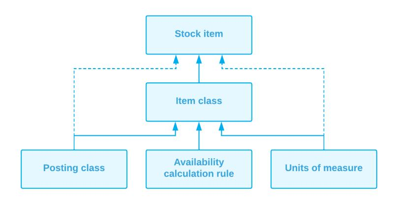

#### *Figure: The use of settings in inventory entities*

<span id="page-352-1"></span>For details, see *[Creating Stock Items](https://help-2025r1.acumatica.com/Help?ScreenId=ShowWiki&pageid=136ce96b-46cf-4d32-8b6a-8982eb2e200c)*.

# <span id="page-352-0"></span>**Configuration of Order Management: Implementation Checklist**

The following sections provide details you can use to ensure that the system is configured properly for the order fulfillment and inventory management processes, and to specify settings that affect the processing workflow.

### **Prerequisites**

Before you start configuring order and inventory management, you should make sure that the needed features have been enabled, settings have been specified, and entities have been created, as summarized in the following checklist.

| Form                                    | Criteria to Check                                                                                                                                                                                     |
|-----------------------------------------|-------------------------------------------------------------------------------------------------------------------------------------------------------------------------------------------------------|
| Multiple forms                          | Make sure that the minimum company settings are<br>configured, as described in Company Without Branch<br>es: General Information.                                                                     |
| Enable/Disable Features (CS100000) form | Make sure that the Inventory and Order Management<br>and Inventory features are enabled.                                                                                                              |
| Order Types (SO201000)                  | Make sure that at least one order type (SO) is config<br>ured and activated, as described in Sales Order Types:<br>General Information .                                                              |
| Reason Codes (CS211000)                 | Make sure that the reason codes to be used for pro<br>cessing inventory transactions and vendor returns<br>have been defined in the system as described in Rea<br>son Codes: Implementation Activity. |

# **Minimum Required Settings**

To be able to keep stock items and track the sales and purchase orders that include these stock items, you should specify and save the minimum settings listed in the following table.

| Form                                     | Settings to Specify                                                                                                                              |  |
|------------------------------------------|--------------------------------------------------------------------------------------------------------------------------------------------------|--|
| Inventory Preferences (IN101000)         | Specify the Receipt Reason Code, Issue/Return Rea<br>son Code, Adjustment Reason Code, and Phys. In<br>ventory Reason Code; save these settings. |  |
| Sales Orders Preferences (SO101000) form | Specify SO as the DefaultSales OrderType, and save<br>your change to this form.                                                                  |  |
| Purchase Orders Preferences (PO101000)   | Specify the PO Return Reason Code, and save your<br>change to this form.                                                                         |  |

### **Recommended Settings**

To speed the processing of documents and minimize errors, you should specify and save the recommended settings listed in the following table.

| Form                                     | Settings to Specify                                                                                                                                                                                        |
|------------------------------------------|------------------------------------------------------------------------------------------------------------------------------------------------------------------------------------------------------------|
| Inventory Preferences (IN101000)         | •<br>Update GL: Selected<br>•<br>Automatically Post on Release: Selected                                                                                                                                   |
| Sales Orders Preferences (SO101000) form | •<br>Hold Shipments on Entry: Cleared<br>•<br>Validate Shipment Total on Confirmation:<br>Cleared<br>•<br>UseShipment Date for Invoice Date: Selected<br>•<br>Automatically Release IN Documents: Selected |

| Form                                   | Settings to Specify                               |
|----------------------------------------|---------------------------------------------------|
| Purchase Orders Preferences (PO101000) | •<br>Release IN Documents Automatically: Selected |

### **Other Settings That Affect the Workflow**

When you are configuring inventory and order management, you can specify additional settings to configure the company to fit your business requirements:

- To configure the system to post inventory transactions to the general ledger, select the **Update GL** check box on the *[Inventory Preferences](https://help-2025r1.acumatica.com/Help?ScreenId=ShowWiki&pageid=f2eb4e55-f802-4259-a41f-609965c856f1)* (IN101000) form.
- To cause the system to post the generated general ledger transactions automatically, select the **Automatically Post on Release** check box on the *[Inventory Preferences](https://help-2025r1.acumatica.com/Help?ScreenId=ShowWiki&pageid=f2eb4e55-f802-4259-a41f-609965c856f1)* form.
- To cause the system to assign the group of prepared documents the *On Hold* status by default, select the following check boxes:
  - **Hold Documents On Entry** check box on the *[Inventory Preferences](https://help-2025r1.acumatica.com/Help?ScreenId=ShowWiki&pageid=f2eb4e55-f802-4259-a41f-609965c856f1)* form (for inventory transactions)
  - **Hold Shipments on Entry** check box on the *[Sales Orders Preferences](https://help-2025r1.acumatica.com/Help?ScreenId=ShowWiki&pageid=1817779c-413b-4187-b7fe-38e97845a1cb)* (SO101000) form (for shipment documents)
  - **Hold Receipts on Entry** check box on the *[Purchase Orders Preferences](https://help-2025r1.acumatica.com/Help?ScreenId=ShowWiki&pageid=13d09c43-8696-4f92-ad9b-3d0209ee3d9b)* (PO101000) form (for purchase receipt documents)
- To set up the system so that users need to enter control amounts before it processes documents, select the following check boxes:
  - **Validate DocumentTotals on Entry** on the *[Inventory Preferences](https://help-2025r1.acumatica.com/Help?ScreenId=ShowWiki&pageid=f2eb4e55-f802-4259-a41f-609965c856f1)* form (for inventory transactions)
  - **ValidateShipmentTotal on Confirmation** on the *[Sales Orders Preferences](https://help-2025r1.acumatica.com/Help?ScreenId=ShowWiki&pageid=1817779c-413b-4187-b7fe-38e97845a1cb)* form (for shipments)
  - **For Normal and Standard Orders** on the *[Purchase Orders Preferences](https://help-2025r1.acumatica.com/Help?ScreenId=ShowWiki&pageid=13d09c43-8696-4f92-ad9b-3d0209ee3d9b)* form (for purchase orders)
  - **For Receipts** on the *[Purchase Orders Preferences](https://help-2025r1.acumatica.com/Help?ScreenId=ShowWiki&pageid=13d09c43-8696-4f92-ad9b-3d0209ee3d9b)* form (for purchase receipts)
- To configure the system to automatically release documents that are generated, select the following check boxes:
  - **Automatically Release IN Documents** check box on the *[Sales Orders Preferences](https://help-2025r1.acumatica.com/Help?ScreenId=ShowWiki&pageid=1817779c-413b-4187-b7fe-38e97845a1cb)* form (to release inventory transactions generated during the processing of sales orders)
  - **Release IN Documents Automatically** check box on the *[Purchase Orders Preferences](https://help-2025r1.acumatica.com/Help?ScreenId=ShowWiki&pageid=13d09c43-8696-4f92-ad9b-3d0209ee3d9b)* form (to release inventory documents generated during the processing of purchase orders)
  - **Release AP Documents Automatically** check box on the *[Purchase Orders Preferences](https://help-2025r1.acumatica.com/Help?ScreenId=ShowWiki&pageid=13d09c43-8696-4f92-ad9b-3d0209ee3d9b)* form (to release accounts payable documents generated during the processing of purchase orders)
- To cause the system to automatically create accounts payable documents on release of purchase documents, select the **Create Bill** check box on the *[Purchase Orders Preferences](https://help-2025r1.acumatica.com/Help?ScreenId=ShowWiki&pageid=13d09c43-8696-4f92-ad9b-3d0209ee3d9b)* (PO101000) form. By default, the state of this check box is copied to each purchase order or purchase return that is created. If the check box is cleared in a purchase order or purchase return, you can select this check box before releasing the document.

# <span id="page-354-1"></span><span id="page-354-0"></span>**Configuration of Order Management: Implementation Activity**

In this implementation activity, you will learn how to prepare the system to support the tracking of inventory and the processing of sales and purchase orders with stock items.

The following activity is based on the *U100 Basic Company* dataset. If you are using another dataset, or if any system settings have been changed in *U100 Basic Company*, these changes can affect the workflow of the activity and the results of the processing. To avoid any issues, restore the *U100 Basic Company* dataset to its initial state.

If you want to perform this activity in an out-of-the-box company instead of creating a tenant with the dataset, you need to prepare a company with the basic settings, as described in *[Company](#page-78-4) Without [Branches: General Information](#page-78-4)*.

# **Video Tutorial**

This video shows you the common process but may contain less detail than the activity has. If you want to repeat the activity on your own or you are preparing to take the certification exam, we recommend that you follow the instructions in the steps of the activity.

#### *[FEEDBACK](https://www.surveymonkey.com/r/BLBL7RJ?Video=Configuring%20Basic%20Inventory%20and%20Order%20Management&Source=Open%20Uni&Course=D100)*

### **Story**

Suppose that you are an implementation manager for the SweetLife Fruits & Jams company, and you need to configure the system for the processing of sales and purchases of stock items through orders.

# **Process Overview**

In this activity, you will do the following:

- 1. Configure inventory preferences on the *[Inventory Preferences](https://help-2025r1.acumatica.com/Help?ScreenId=ShowWiki&pageid=f2eb4e55-f802-4259-a41f-609965c856f1)* (IN101000) form
- 2. Configure sales order preferences on the *[Sales Orders Preferences](https://help-2025r1.acumatica.com/Help?ScreenId=ShowWiki&pageid=1817779c-413b-4187-b7fe-38e97845a1cb)* (SO101000) form
- 3. Configure purchase order preferences on the *[Purchase Orders Preferences](https://help-2025r1.acumatica.com/Help?ScreenId=ShowWiki&pageid=13d09c43-8696-4f92-ad9b-3d0209ee3d9b)* (PO101000) form
- 4. Review the company's units of measure on the *[Companies](https://help-2025r1.acumatica.com/Help?ScreenId=ShowWiki&pageid=fedad435-8496-4397-b8a3-50a473629f76)* (CS101500) form
- 5. Configure inventory control accounts on the *[Chart of Accounts](https://help-2025r1.acumatica.com/Help?ScreenId=ShowWiki&pageid=85557f41-a4af-47a8-b198-2a01461ce9c3)* (GL202500) form

# **System Preparation**

Before you start configuring the inventory and order management functionality, you should do the following:

- 1. Launch the Acumatica ERP website with the *U100 Basic Company* dataset preloaded, and sign in to the system as implementation manager Kimberly Gibbs by using the *gibbs* username and the *123* password.
- 2. On the *[Enable/Disable Features](https://help-2025r1.acumatica.com/Help?ScreenId=ShowWiki&pageid=c1555e43-1bc5-4f6f-ba9d-b323f94d8a6b)* (CS100000) form, make sure that the *Inventory and Order Management* and *Inventory* features are enabled.
- 3. On the *[Reason Codes](https://help-2025r1.acumatica.com/Help?ScreenId=ShowWiki&pageid=fe53f1bf-3670-465e-8b7c-922d8246f123)* (CS211000) form, create and save the reason codes that are required for configuring inventory and order management, as described in *[Reason Codes: Implementation Activity](https://help-2025r1.acumatica.com/Help?ScreenId=ShowWiki&pageid=b365ae56-b622-49e0-9527-1eb6c1401c56)*.
- 4. On the *Order [Types](https://help-2025r1.acumatica.com/Help?ScreenId=ShowWiki&pageid=e6984218-4260-4438-99e1-aee2b3765369)* (SO201000) form, activate at least the *SO* order type, as described in *Sales Order [Types:](#page-367-2) To [Activate](#page-367-2) the SO Order Type*.

### **Step 1: Configuring Inventory Preferences**

To configure the inventory functionality, do the following:

- 1. Open the *[Inventory Preferences](https://help-2025r1.acumatica.com/Help?ScreenId=ShowWiki&pageid=f2eb4e55-f802-4259-a41f-609965c856f1)* (IN101000) form.
- 2. In the **Default Reason Codes** section of the **General** tab, specify the following settings:

- **Receipt Reason Code**: *INRECEIPT*
- **Issue/Return Reason Code**: *INISSUE*
- **Adjustment Reason Code**: *INADJUST*
- **Phys. Inventory Reason Code**: *PHYINVADJ*
- 3. In the **PostingSettings** section, select the **Update GL** check box.
- 4. In the **Data EntrySettings** section, clear the **Hold Documents On Entry** and **Validate DocumentTotals on Entry** check boxes.
- 5. On the form toolbar, click**Save**.

# **Step 2: Configuring Sales Order Preferences**

To configure the sales order functionality, do the following:

- 1. Open the *[Sales Orders Preferences](https://help-2025r1.acumatica.com/Help?ScreenId=ShowWiki&pageid=1817779c-413b-4187-b7fe-38e97845a1cb)* (SO101000) form.
- 2. In the **Data EntrySettings** section of the **General** tab, make sure that *SO* is selected in the **DefaultSales OrderType** box. This is the predefined sales order type used for the processing of stock items with shipping.
- 3. In the **ShipmentSettings** section, clear the **Hold Shipments on Entry** and **ValidateShipmentTotal on Confirmation** check boxes.
- 4. In the **InvoiceSettings** section, clear the **Hold Invoices on Failed Credit Check** check box.
- 5. In the **PostingSettings** section, select the **Automatically Release IN Documents** check box.
- 6. On the form toolbar, click**Save**.

#### **Step 3: Configuring Purchase Order Preferences**

To configure the purchase order functionality, do the following:

- 1. Open the *[Purchase Orders Preferences](https://help-2025r1.acumatica.com/Help?ScreenId=ShowWiki&pageid=13d09c43-8696-4f92-ad9b-3d0209ee3d9b)* (PO101000) form.
- 2. In the **ValidateTotal on Entry** section of the **General** tab, make sure that the **For Normal and Standard Orders** and **For Receipts** check boxes are cleared.
- 3. In the **Other** section, specify *VENDORRET* as the **PO Return Reason Code**.
- 4. Select the **Release IN Documents Automatically** and **Release AP Documents Automatically** check boxes.
- 5. Clear the **Hold Receipts on Entry** check box.
- 6. On the form toolbar, click**Save**.

#### **Step 4: Reviewing the Company's UOMs**

To review the settings of the company's units of measure (UOMs), do the following:

- 1. Open the *SWEETLIFE* company on the *[Companies](https://help-2025r1.acumatica.com/Help?ScreenId=ShowWiki&pageid=fedad435-8496-4397-b8a3-50a473629f76)* (CS101500) form.
- 2. In the **MiscellaneousSettings (Shared)** section of the **Company Details** tab, make sure that *KG* has been specified in the **Weight UOM** box and *LITER* in the **Volume UOM** box.

#### **Step 5: Reviewing Inventory Control Accounts**

To review the control accounts needed for inventory operations, do the following:

- 1. Open the *[Chart of Accounts](https://help-2025r1.acumatica.com/Help?ScreenId=ShowWiki&pageid=85557f41-a4af-47a8-b198-2a01461ce9c3)* (GL202500) form.
- 2. Search for the *12100* account that has *Inventory Asset* in the **Description** column.

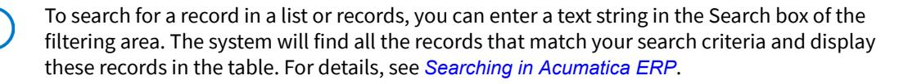

- 3. In the **Control Account Module** column for the *12100 - Inventory Asset* account, make sure that *IN* is specified.
- 4. Search for the *20100* account that has *Inventory Purchase Accrual* in the **Description** column.
- 5. In the **Control Account Module** column for the *20100 - Inventory Purchase Accrual* account, make sure that *PO* is specified.

You have configured the basic inventory and order management functionality. Now you can proceed with configuring inventory entities.

### **Activity Recap**

In this activity, we have illustrated how the implementation manager has done the following:

- 1. Configured the basic settings of inventory documents, sales orders, and purchase orders
- 2. Reviewed the company's UOMs
- 3. Configured control accounts for inventory operations

# <span id="page-357-1"></span><span id="page-357-0"></span>**Configuration of Order Management: Disabling of the Inventory and Order Management Features**

This topic provides the following information about certain features of the *Inventory and Order Management* group:

- Actions that should be performed in the system before you disable a particular feature
- Actions that should be performed in the system aer you have disabled the feature
- Other Acumatica ERP features whose functionality depends on any features in this group (if applicable)

For recommendations about the possibility and consequences of disabling each feature in the *Inventory and Order Management* group, see the feature descriptions in the *[Enable/Disable Features](https://help-2025r1.acumatica.com/Help?ScreenId=ShowWiki&pageid=c1555e43-1bc5-4f6f-ba9d-b323f94d8a6b)* (CS100000) topic.

### **Disabling of the Inventory Feature**

If you disable the *Inventory* feature on the *[Enable/Disable Features](https://help-2025r1.acumatica.com/Help?ScreenId=ShowWiki&pageid=c1555e43-1bc5-4f6f-ba9d-b323f94d8a6b)* (CS100000) form, the system automatically disables the *Shipping Carrier Integration* group of features and the following features:

- *Lot and Serial Tracking*
- *Drop Shipments*
- *Multiple Warehouses*
- *Multiple Warehouse Locations*
- *Inventory Replenishment*
- *Automatic Packaging*
- *Kit Assembly*
- *Advanced Physical Count*
- *Sales Order to Purchase Order Link*

We recommend that you not disable the *Inventory* feature if the *Manufacturing* or *Retail Commerce* feature is enabled (or both features are enabled) because their functionality will become unavailable for users.

We recommend that before disabling the *Inventory* feature, you do the following:

- If any documents include items that require receipt or shipment, make sure that the documents have been completely processed or deleted from the system.
- If you want to use existing non-stock items that have been defined to require receipt or shipment (or both), clear the **Require Receipt** and **RequireShipment** check boxes for them on the *[Non-Stock Items](https://help-2025r1.acumatica.com/Help?ScreenId=ShowWiki&pageid=bf68dd4f-63d4-460d-8dc0-9152f2bd6bf1)* (IN202000) form.

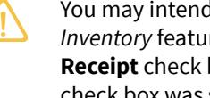

You may intend to disable the *Inventory* feature and then enable the *Purchase Receipts Without Inventory* feature. When you enable this feature, the system will select the **Process Item via Receipt** check box on the *[Non-Stock Items](https://help-2025r1.acumatica.com/Help?ScreenId=ShowWiki&pageid=bf68dd4f-63d4-460d-8dc0-9152f2bd6bf1)* form for a non-stock item if the **Require Receipt** check box was selected for the stock item when the *Inventory* feature was enabled.

• If you want to use any existing stock items as non-stock items, convert stock items to non-stock items. You can convert stock items to non-stock items only if all of the following features are disabled on the *[Enable/](https://help-2025r1.acumatica.com/Help?ScreenId=ShowWiki&pageid=c1555e43-1bc5-4f6f-ba9d-b323f94d8a6b) [Disable Features](https://help-2025r1.acumatica.com/Help?ScreenId=ShowWiki&pageid=c1555e43-1bc5-4f6f-ba9d-b323f94d8a6b)* form: *Manufacturing*, *Projects*, *Time Management*, *Service Management*, and *Payroll*. For details on this conversion, see *[Stock Status of Items: General Information](https://help-2025r1.acumatica.com/Help?ScreenId=ShowWiki&pageid=f0735d91-dfe3-45fc-a732-953c2caf2be2)*.


You can instead leave stock items in the system. They will be available for selection in documents aer the *Inventory* feature has been disabled, but it will not be possible to process the documents with them.

Aer the *Inventory* feature has been disabled, posting classes cannot be used. Thus, you should make sure of the following:

- On the **GL Accounts** tab of the *[Non-Stock Items](https://help-2025r1.acumatica.com/Help?ScreenId=ShowWiki&pageid=bf68dd4f-63d4-460d-8dc0-9152f2bd6bf1)* form, the needed accounts have been specified for non-stock items that used posting classes.
- In the **PostingSettings** section on the *Order [Types](https://help-2025r1.acumatica.com/Help?ScreenId=ShowWiki&pageid=e6984218-4260-4438-99e1-aee2b3765369)* (SO201000) form, posting classes are not specified as sources for any order type that will be used. These settings determine the accounts to be used for a document of this type.

Aer the *Inventory* feature has been disabled, users will no longer be able to do the following:

- Process documents related to existing documents with items that require shipment or receipt, such as sales or purchase returns.
- Correct billing for the existing receipts. Users will be able to reverse a bill generated for a receipt, but it will not be possible to create a new bill.
- View shipments, receipts, and reports related to these documents, such as *[Shipment Details by Inventory](https://help-2025r1.acumatica.com/Help?ScreenId=ShowWiki&pageid=ca17b57d-6a53-4746-b614-7af912dcca7a) [Item](https://help-2025r1.acumatica.com/Help?ScreenId=ShowWiki&pageid=ca17b57d-6a53-4746-b614-7af912dcca7a)* (SO621500) or *[Purchase Receipt Billing Details](https://help-2025r1.acumatica.com/Help?ScreenId=ShowWiki&pageid=57cc91db-519f-4a10-b4a3-3cd4f3ea4b5b)* (PO632000), for stock items and non-stock items.
- View information about inventory transactions by using such forms as *Inventory [Transaction](https://help-2025r1.acumatica.com/Help?ScreenId=ShowWiki&pageid=84ddb714-2b93-41e2-afa9-7397d46d1dd8) Summary* (IN406000) or *Inventory [Transaction](https://help-2025r1.acumatica.com/Help?ScreenId=ShowWiki&pageid=98935416-6b06-47b1-ba85-4740641df9f0) History* (IN405000).

### **Disabling of the Multiple Units of Measure Feature**

Before disabling the *Multiple Units of Measure* feature on the *[Enable/Disable Features](https://help-2025r1.acumatica.com/Help?ScreenId=ShowWiki&pageid=c1555e43-1bc5-4f6f-ba9d-b323f94d8a6b)* (CS100000) form, you need to make sure that you have processed all documents that contain stock items or non-stock items.

Aer the feature has been disabled, it will be impossible to change the**Sales Unit** and **Purchase Unit** values on the *[Stock Items](https://help-2025r1.acumatica.com/Help?ScreenId=ShowWiki&pageid=77786a70-1f1e-4d63-ad98-96f98e4fcb0e)* (IN202500), *[Non-Stock Items](https://help-2025r1.acumatica.com/Help?ScreenId=ShowWiki&pageid=bf68dd4f-63d4-460d-8dc0-9152f2bd6bf1)* (IN202000), and *[Item Classes](https://help-2025r1.acumatica.com/Help?ScreenId=ShowWiki&pageid=80a3301b-4eb2-4ce2-94c5-0407c786a0f1)* (IN201000) forms. These UI elements will no longer be displayed, but the system will preserve these settings in the database. Thus, you should change the**Sales** **Unit** and **Purchase Unit** values to the **Base Unit** value before you disable the feature. This will prevent incorrect default values in documents aer the feature has been disabled.

# **Disabling of the Lot and Serial Tracking Feature**

Before disabling the *Lot and Serial Tracking* feature on the *[Enable/Disable Features](https://help-2025r1.acumatica.com/Help?ScreenId=ShowWiki&pageid=c1555e43-1bc5-4f6f-ba9d-b323f94d8a6b)* (CS100000) form, you need to do the following for each lot- or serial-tracked item:

- 1. Process or remove all the documents with the item
- 2. Issue the item from warehouses
- 3. On the *[Stock Items](https://help-2025r1.acumatica.com/Help?ScreenId=ShowWiki&pageid=77786a70-1f1e-4d63-ad98-96f98e4fcb0e)* (IN202500) form, do the following:
  - Change the lot or serial class to one for which no tracking of lot or serial numbers is performed
  - If the *Specific* valuation method is selected for the item, change it to another method

Aer disabling the feature, you need to receive items back to the appropriate warehouses and locations with the proper costs by processing a receipt on the *[Receipts](https://help-2025r1.acumatica.com/Help?ScreenId=ShowWiki&pageid=d6ecad5b-155f-44bf-baba-9ed006d298b5)* (IN301000) form.

# **Disabling of the Blanket and Standard Purchase Orders Feature**

Before disabling the *Blanket and Standard Purchase Orders* feature on the *[Enable/Disable Features](https://help-2025r1.acumatica.com/Help?ScreenId=ShowWiki&pageid=c1555e43-1bc5-4f6f-ba9d-b323f94d8a6b)* (CS100000) form, you should complete, cancel, or remove all purchase orders of the *Blanket* and *Standard* types and all child orders of the *Normal* type. Aer this feature has been disabled, the created orders of the *Blanket* and *Standard* types will remain visible, but users will not be able to create child orders for them.

### **Disabling of the Drop Shipments Feature**

Before disabling the *Drop Shipments* feature on the *[Enable/Disable Features](https://help-2025r1.acumatica.com/Help?ScreenId=ShowWiki&pageid=c1555e43-1bc5-4f6f-ba9d-b323f94d8a6b)* (CS100000) form, you need to do the following:

- 1. Make sure that all the drop-ship sales order lines have been linked to the corresponding drop-ship purchase order lines. You can view all the unlinked drop-ship sales order lines on the *SO [Drop-Ship](https://help-2025r1.acumatica.com/Help?ScreenId=ShowWiki&pageid=473b4b1d-4834-4ef2-a454-69f6e67f334e) Lines Awaiting [Link](https://help-2025r1.acumatica.com/Help?ScreenId=ShowWiki&pageid=473b4b1d-4834-4ef2-a454-69f6e67f334e)* (SO402000) form. Either create purchase orders for these lines by using the *[Create Purchase Orders](https://help-2025r1.acumatica.com/Help?ScreenId=ShowWiki&pageid=dc527541-a18a-44c9-8d51-6d2d77a37443)* (PO505000) form or clear the **Mark for PO** check box for these lines on the **Details** tab of the *[Sales Orders](https://help-2025r1.acumatica.com/Help?ScreenId=ShowWiki&pageid=19e4021c-1b84-49fd-be12-0320c5f1c7e5)* (SO301000) form.
- 2. Make sure that all drop-ship purchase order lines have been linked to the corresponding sales order lines. You can view all the unlinked drop-ship purchase order lines on the *[Drop-Ship](https://help-2025r1.acumatica.com/Help?ScreenId=ShowWiki&pageid=8b7839b0-c21f-45cc-9c82-d54b4879f6aa) PO Lines Awaiting Link* form.
- 3. Process all purchase orders of the *Drop-Ship* type through the release of their corresponding bills, and process the related sales orders through the release of their corresponding sales invoices.

Aer the feature has been disabled, purchase orders of the *Drop-Ship* type and the related sales orders will still be visible in the system, but the respective links will no longer be displayed in the documents. Users will not be able to process these drop-ship orders or any related returns.

# **Disabling of the Multiple Warehouses Feature**

If you disable both the *Multiple Warehouses* and the *Multiple Warehouse Locations* features on the *[Enable/Disable](https://help-2025r1.acumatica.com/Help?ScreenId=ShowWiki&pageid=c1555e43-1bc5-4f6f-ba9d-b323f94d8a6b) [Features](https://help-2025r1.acumatica.com/Help?ScreenId=ShowWiki&pageid=c1555e43-1bc5-4f6f-ba9d-b323f94d8a6b)* (CS100000) form, the *Inventory Replenishment* feature will be automatically disabled.

Before disabling the *Multiple Warehouses* feature, you need to do the following:

- Process or remove all open orders and inventory documents, regardless of the warehouse settings.
- Issue the stock from the warehouses.
- Clear the **Default Warehouse** box on the *[Stock Items](https://help-2025r1.acumatica.com/Help?ScreenId=ShowWiki&pageid=77786a70-1f1e-4d63-ad98-96f98e4fcb0e)* (IN202500) and *[Non-Stock Items](https://help-2025r1.acumatica.com/Help?ScreenId=ShowWiki&pageid=bf68dd4f-63d4-460d-8dc0-9152f2bd6bf1)* (IN202000) form for all items.

- If the *Matrix Items* feature is enabled, clear the **Default Warehouse** box for each template item on the *[Template](https://help-2025r1.acumatica.com/Help?ScreenId=ShowWiki&pageid=4cb927f0-5880-4169-9fdf-4529fd7bffdf) Items* (IN203000) form.
- Clear the **Default Warehouse** box on the *[Item Classes](https://help-2025r1.acumatica.com/Help?ScreenId=ShowWiki&pageid=80a3301b-4eb2-4ce2-94c5-0407c786a0f1)* (IN201000) form for all item classes.
- Make sure that the *Branch* option is selected in the **DefaultShip Dest.Type** box on the *[Purchase Orders](https://help-2025r1.acumatica.com/Help?ScreenId=ShowWiki&pageid=13d09c43-8696-4f92-ad9b-3d0209ee3d9b) [Preferences](https://help-2025r1.acumatica.com/Help?ScreenId=ShowWiki&pageid=13d09c43-8696-4f92-ad9b-3d0209ee3d9b)* (PO101000) form.

You need to make sure that the **Warehouse** box is cleared in the following locations:

- On the *[Carriers](https://help-2025r1.acumatica.com/Help?ScreenId=ShowWiki&pageid=753b8913-fc66-4831-b70e-98c4dafc160e)* (CS207700) form for all carriers.
- On the **PurchaseSettings** tab on the *[Vendors](https://help-2025r1.acumatica.com/Help?ScreenId=ShowWiki&pageid=a9584be3-f2bd-4d67-80d4-8041d809df56)* (AP303000) and *Vendor [Locations](https://help-2025r1.acumatica.com/Help?ScreenId=ShowWiki&pageid=aeeccc5c-465f-4bca-9cd7-a3c792da38e1)* (AP303010) forms for all vendors and locations. For intercompany vendors—that is, vendors created from a branch or company clear this box for each branch as well. To do this, you need to select a particular branch on the Company and Branch Selection menu in the top pane of the Acumatica ERP screen.
- On the **Shipping** tab on the *[Customers](https://help-2025r1.acumatica.com/Help?ScreenId=ShowWiki&pageid=652929bc-9606-4056-aa6e-0c2d1147171b)* (AR303000) and *[Customer Locations](https://help-2025r1.acumatica.com/Help?ScreenId=ShowWiki&pageid=61a8c6de-6a51-434b-8c2d-4304ec982ae0)* (AR303010) forms for all customers and customer locations. (This setting is not branch-specific.)

You also need to clear the **Warehouse** column on the *[Sales Prices](https://help-2025r1.acumatica.com/Help?ScreenId=ShowWiki&pageid=62bfca2c-0893-495b-bb1d-125b64899afc)* (AR202000), *[Sales Price Worksheets](https://help-2025r1.acumatica.com/Help?ScreenId=ShowWiki&pageid=6379952d-248a-421d-aa29-285e371be559)* (AR202010), *[Vendor](https://help-2025r1.acumatica.com/Help?ScreenId=ShowWiki&pageid=d14478b3-0718-4632-9fe2-a563f79aa038) Prices* (AP202000), and *Vendor Price [Worksheets](https://help-2025r1.acumatica.com/Help?ScreenId=ShowWiki&pageid=793d5d6c-e530-4f19-996d-4a3bfd7ce690)* (AP202010) for all unreleased prices and worksheets.

You need to do the following:

- If the *Manufacturing* feature is enabled, clear the warehouses specified on the forms of the **Profiles** and **Preferences** workspace categories, such as the *[Bill of Material](https://help-2025r1.acumatica.com/Help?ScreenId=ShowWiki&pageid=1aae7d3a-d5f9-4693-b91f-663c4c2d362b)* (AM208000) or *[Production](https://help-2025r1.acumatica.com/Help?ScreenId=ShowWiki&pageid=6283187d-54b7-4db1-8c3a-97d3ebc39a95) Order Types* (AM201100) form.
- If the *BigCommerce Connector* or *Shopify Connector* feature are enabled (or both are enabled), clear the warehouses specified in the **WarehouseSettings** table on the **InventorySettings** tab of the *[BigCommerce](https://help-2025r1.acumatica.com/Help?ScreenId=ShowWiki&pageid=a95a0672-c5ed-4a57-9f9b-21b8d6a6befc) [Stores](https://help-2025r1.acumatica.com/Help?ScreenId=ShowWiki&pageid=a95a0672-c5ed-4a57-9f9b-21b8d6a6befc)* (BC201000) or *[Shopify Stores](https://help-2025r1.acumatica.com/Help?ScreenId=ShowWiki&pageid=bb3c82f1-f6f1-4991-a4be-2857669095e6)* (BC201010) form, respectively. If the *Multiple Warehouses* feature is disabled, make sure that the *All Warehouses* option is selected in the **Warehouse Mode** box.

Aer the feature has been disabled, you will need to receive the items that have been issued from warehouses back to inventory to update the system with actual inventory quantities and costs. To do this, you need to process a receipt on the *[Receipts](https://help-2025r1.acumatica.com/Help?ScreenId=ShowWiki&pageid=d6ecad5b-155f-44bf-baba-9ed006d298b5)* (IN301000) form. Also, you will need to verify that the correct sources of accounts have been specified for the following entities:

- Order types in the **PostingSettings** section on the **General** tab of the *Order [Types](https://help-2025r1.acumatica.com/Help?ScreenId=ShowWiki&pageid=e6984218-4260-4438-99e1-aee2b3765369)* (SO201000) form
- Posting classes on the **General** tab of the *[Posting Classes](https://help-2025r1.acumatica.com/Help?ScreenId=ShowWiki&pageid=edd4bd77-13f5-4e89-9e47-2861fc66bbb0)* (IN206000) form
- Service order types in the **UseSales Account From** box on the *[Service](https://help-2025r1.acumatica.com/Help?ScreenId=ShowWiki&pageid=06fd8a36-dd81-4df9-b609-92c3d552c542) Order Types* (FS202300) form if the *Service Management* feature is enabled
- Production order types in the**Scrap Source** box of the *[Production](https://help-2025r1.acumatica.com/Help?ScreenId=ShowWiki&pageid=6283187d-54b7-4db1-8c3a-97d3ebc39a95) Order Types* form if the *Manufacturing* feature is enabled

# **Disabling of the Multiple Warehouse Locations Feature**

If you disable both the *Multiple Warehouses* and the *Multiple Warehouse Locations* features on the *[Enable/Disable](https://help-2025r1.acumatica.com/Help?ScreenId=ShowWiki&pageid=c1555e43-1bc5-4f6f-ba9d-b323f94d8a6b) [Features](https://help-2025r1.acumatica.com/Help?ScreenId=ShowWiki&pageid=c1555e43-1bc5-4f6f-ba9d-b323f94d8a6b)* (CS100000) form, the *Inventory Replenishment* feature will be automatically disabled.

Before disabling the *Multiple Warehouse Locations* feature, you need to completely process all open orders and inventory documents and issue the stock items from locations. You should also remove the default location settings as follows:

- For all warehouses, on the *[Warehouses](https://help-2025r1.acumatica.com/Help?ScreenId=ShowWiki&pageid=264b0ef7-2b6c-40b4-a7d9-f1a5e067939b)* (IN204000) form, clear the default locations in the boxes on the **Locations** tab.
- Clear the **Default Issue From** and **Default ReceiptTo** boxes on the **General** tab as follows:
  - If the *Multiple Warehouses* feature is disabled, on the *[Stock Items](https://help-2025r1.acumatica.com/Help?ScreenId=ShowWiki&pageid=77786a70-1f1e-4d63-ad98-96f98e4fcb0e)* (IN202500) form for all stock items
  - If the *Multiple Warehouses* feature is enabled, on the *Item [Warehouse](https://help-2025r1.acumatica.com/Help?ScreenId=ShowWiki&pageid=ae2418af-7f53-4c09-8766-556452d8f8b8) Details* (IN204500) form for all item– warehouse pairs

- If the *Matrix Items* feature is enabled, for all stock items, clear the **Default Issue From** and **Default Receipt To** boxes on the **General** tab of the *[Template](https://help-2025r1.acumatica.com/Help?ScreenId=ShowWiki&pageid=4cb927f0-5880-4169-9fdf-4529fd7bffdf) Items* (IN203000) form.
- If the *Manufacturing* feature is enabled, clear the specified warehouse locations on the forms of the **Profiles** and **Preferences** workspace categories, such as the *[Production](https://help-2025r1.acumatica.com/Help?ScreenId=ShowWiki&pageid=6283187d-54b7-4db1-8c3a-97d3ebc39a95) Order Types* (AM201100) form.
- If the *BigCommerce Connector* or *Shopify Connector* feature are enabled (or both are enabled), clear the warehouse locations specified in the **WarehouseSettings** table on the **InventorySettings** tab of the *[BigCommerce Stores](https://help-2025r1.acumatica.com/Help?ScreenId=ShowWiki&pageid=a95a0672-c5ed-4a57-9f9b-21b8d6a6befc)* (BC201000) or *[Shopify Stores](https://help-2025r1.acumatica.com/Help?ScreenId=ShowWiki&pageid=bb3c82f1-f6f1-4991-a4be-2857669095e6)* (BC201010) form, respectively. If the *Multiple Warehouses* feature is disabled, make sure that the *All Warehouses* option is selected in the **Warehouse Mode** box.

We recommend that you not disable the *Multiple Warehouse Locations* feature if the *Projects* feature is enabled and some projects have the *Track by Location* option selected in the **InventoryTracking** box on the *[Projects](https://help-2025r1.acumatica.com/Help?ScreenId=ShowWiki&pageid=81c86417-3bde-444b-8f1c-682928d31a0c)* (PM301000) form. Users will not be able to assign projects to locations if you disable the feature.

Aer the feature has been disabled, you will need to receive the items that have been issued from warehouse locations back to inventory by processing a receipt on the *[Receipts](https://help-2025r1.acumatica.com/Help?ScreenId=ShowWiki&pageid=d6ecad5b-155f-44bf-baba-9ed006d298b5)* (IN301000) form in order to record the actual inventory quantities and costs.

# **Disabling of the Kit Assembly Feature**

Before disabling the *Kit Assembly* feature on the *[Enable/Disable Features](https://help-2025r1.acumatica.com/Help?ScreenId=ShowWiki&pageid=c1555e43-1bc5-4f6f-ba9d-b323f94d8a6b)* (CS100000) form, you need to do the following:

- Process assembly documents on the *[Kit Assembly](https://help-2025r1.acumatica.com/Help?ScreenId=ShowWiki&pageid=dbeb6a3a-153e-4731-bb21-850cd124bfa4)* (IN307000) form through their release, or remove unnecessary assembly documents
- Process all sales documents with non-stock kits to completion

Aer this feature has been disabled, the non-stock and stock kits will remain in the system as records on the *[Stock](https://help-2025r1.acumatica.com/Help?ScreenId=ShowWiki&pageid=77786a70-1f1e-4d63-ad98-96f98e4fcb0e) [Items](https://help-2025r1.acumatica.com/Help?ScreenId=ShowWiki&pageid=77786a70-1f1e-4d63-ad98-96f98e4fcb0e)* (IN202500) or *[Non-Stock Items](https://help-2025r1.acumatica.com/Help?ScreenId=ShowWiki&pageid=bf68dd4f-63d4-460d-8dc0-9152f2bd6bf1)* (IN202000) form. Users will not be able to automatically disassemble stock kits or view the components of non-stock kits in shipments.

# **Disabling of the Matrix Items Feature**

Before disabling the *Matrix Items* feature on the *[Enable/Disable Features](https://help-2025r1.acumatica.com/Help?ScreenId=ShowWiki&pageid=c1555e43-1bc5-4f6f-ba9d-b323f94d8a6b)* (CS100000) form, you need to completely process the documents containing matrix items. Aer this feature has been disabled, the created items will remain in the system as records on the *[Stock Items](https://help-2025r1.acumatica.com/Help?ScreenId=ShowWiki&pageid=77786a70-1f1e-4d63-ad98-96f98e4fcb0e)* (IN202500) or *[Non-Stock Items](https://help-2025r1.acumatica.com/Help?ScreenId=ShowWiki&pageid=bf68dd4f-63d4-460d-8dc0-9152f2bd6bf1)* (IN202000) form, but some of their settings—such as item class, type, and valuation method—will not be available for editing.

# **Disabling of the Sales Order to Purchase Order Link Feature**

Before disabling the *Sales Order to Purchase Order Link* feature on the *[Enable/Disable Features](https://help-2025r1.acumatica.com/Help?ScreenId=ShowWiki&pageid=c1555e43-1bc5-4f6f-ba9d-b323f94d8a6b)* (CS100000) form, you need to do the following:

- Make sure that there are no purchase requests with the *SO to Purchase* item plan listed on the *[Create](https://help-2025r1.acumatica.com/Help?ScreenId=ShowWiki&pageid=dc527541-a18a-44c9-8d51-6d2d77a37443) [Purchase Orders](https://help-2025r1.acumatica.com/Help?ScreenId=ShowWiki&pageid=dc527541-a18a-44c9-8d51-6d2d77a37443)* (PO505000) form. If some purchase requests have this item plan, either clear the **Mark for PO** check box in the related lines of sales order or create purchase orders for them.
- On the *[Purchase Orders](https://help-2025r1.acumatica.com/Help?ScreenId=ShowWiki&pageid=5565686c-96c4-4bfa-a51d-9a2566baa808)* (PO301000) form, process all purchase orders with the *Normal* type that have links to lines of sales orders.

# <span id="page-361-0"></span>**Sales Order Types**

Acumatica ERP provides a number of predefined order types. Each order type determines the information to be entered for an order of the type, the processing operations to be performed for the completion of an order of the type, and the documents to be generated during the processing of an order of the type. This chapter describes how to activate and configure the predefined order types.

# <span id="page-362-1"></span><span id="page-362-0"></span>**Sales Order Types: General Information**

Acumatica ERP provides a number of predefined sales order types for common processing operations, such as sales with shipment, sales without shipment, sales by cash, sales by check, and customer returns of inventory items. On the *Order [Types](https://help-2025r1.acumatica.com/Help?ScreenId=ShowWiki&pageid=e6984218-4260-4438-99e1-aee2b3765369)* (SO201000) form, you activate the order types that your company will use and make sure that they are configured to fit your company's processes.

When you create a new order on the *[Sales Orders](https://help-2025r1.acumatica.com/Help?ScreenId=ShowWiki&pageid=19e4021c-1b84-49fd-be12-0320c5f1c7e5)* (SO301000) form, you select the appropriate order type, which determines the information to be entered on the form, the processing operations to be performed for the order to be completed, and the documents to be generated during order processing.

# **Learning Objectives**

In this chapter, you will do the following:

- Become familiar with the predefined order types and processing of orders of these types
- Activate an order type with the minimum required settings
- Specify optional settings that affect how an order of the type is processed

### **Applicable Scenarios**

You configure order types in the following cases:

- You are initially configuring order management in Acumatica ERP, and you have to activate at least one order type to be able to create and process sales orders in the system.
- You need to activate any of the predefined order types that are not yet active to support additional business processes.

### **Order Type for Recording Expected Sales**

If you want to track your company's expected future sales, your employees can prepare orders of the *QT* (*Quote*) type on the *[Sales Orders](https://help-2025r1.acumatica.com/Help?ScreenId=ShowWiki&pageid=19e4021c-1b84-49fd-be12-0320c5f1c7e5)* (SO301000) form. Quotes can later be converted to sales orders or canceled if the sale is no longer expected to happen. Quotes can also be used as templates for repeating orders for a particular customer. For more information, see *[Processing Pre-Sale Quotes](https://help-2025r1.acumatica.com/Help?ScreenId=ShowWiki&pageid=a2d06ba4-3939-4dc8-9f4f-dedc43d57abb)*.

# **Order Types for Processing Sales**

Acumatica ERP provides predefined order types for the processes that are used most frequently in sales. Some of the predefined order types for sales on the *Order [Types](https://help-2025r1.acumatica.com/Help?ScreenId=ShowWiki&pageid=e6984218-4260-4438-99e1-aee2b3765369)* (SO201000) form are configured for sales that are processed through shipping, while others are configured for sales without shipping.

For an order of a type on the *[Sales Orders](https://help-2025r1.acumatica.com/Help?ScreenId=ShowWiki&pageid=19e4021c-1b84-49fd-be12-0320c5f1c7e5)* (SO301000) form, that requires shipping, you can process a shipment of items with a single shipment document, or with multiple partial shipment documents, each of which may be billed individually. During shipment processing, you can print labels with carrier tracking numbers. Also, while viewing the shipment in the system, you can print a pick list for the warehouse worker (for verification of the shipped and received quantities) and the shipment confirmation for the buyer.

The following predefined order types can be used for sales orders that are processed through shipments:

• *SO* (*Sales Order*): An order of the type that you create to represent a customer request to buy goods in the specified quantities on the specified date, with the items in the sales order being shipped. A sales order

of this type can be created from scratch or based on a quote or opportunity. For details, see *[Opportunity](https://help-2025r1.acumatica.com/Help?ScreenId=ShowWiki&pageid=d94fcfb0-b718-42ba-8f37-5bff44845d23) [Management: General Information](https://help-2025r1.acumatica.com/Help?ScreenId=ShowWiki&pageid=d94fcfb0-b718-42ba-8f37-5bff44845d23)*.

• *SA* (*Sales Order with Allocation*): An order of the type that you create to represent a customer request to buy particular goods in the specified quantities on the specified date, with the items in the sales order being shipped. When the sales order with allocation is saved, the requested goods are automatically reserved in inventory for this order.

The following predefined order types can be used for sales orders that are processed without shipments:

- *IN* (*Invoice*): You create an order of this type when the goods requested by a customer do not require shipping, so the order processing requires only preparing an invoice for the customer and does not involve shipments. This order type can be used for a point-of-sale (POS) system.
- *CS* (*Cash Sale*): You create an order of this type when you sell items directly to the customer and receive payment at that time (by cash, check, or credit card).

You choose which types of sales orders to activate and configure depending on the business processes established in your company. The following table shows a comparison of the predefined order types for sales and the ways they relate to business process requirements.

| Business Process<br>Requirement      | SO        | SA        | IN         | CS         |
|--------------------------------------|-----------|-----------|------------|------------|
| Shipping of Items<br>to the Customer | Required  | Required  | Not needed | Not needed |
| Payment                              | By credit | By credit | By credit  | In cash    |
| Billing Document<br>to the Customer  | Invoice   | Invoice   | Invoice    | Cash sale  |
| Reserving Items in<br>Inventory      | Manual    | Automatic | Not needed | Not needed |

# **Order Type for Processing Recurring Sales**

An order of the predefined *BL* (*Blanket Order*) type on the *Order [Types](https://help-2025r1.acumatica.com/Help?ScreenId=ShowWiki&pageid=e6984218-4260-4438-99e1-aee2b3765369)* (SO201000) form is used for the sale of large quantities of an item or multiple items that can be delivered to different customer locations over a specified period. This kind of sale can be based on a long-term agreement with the customer. Blanket sales orders can be used for planning, forecasting, and monitoring purposes because the quantities that a user enters on a blanket sales order do not affect the item availability in the warehouse, unlike the quantities in orders of the *SO* type, which are used for sales.

The lines of a blanket sales order on the *[Sales Orders](https://help-2025r1.acumatica.com/Help?ScreenId=ShowWiki&pageid=19e4021c-1b84-49fd-be12-0320c5f1c7e5)* (SO301000) form are copied to child orders on the date that you specify for shipping. A blanket sales order is completed when all child orders have been shipped.

# **Order Types for Processing Customer Returns**

Acumatica ERP provides return order types for the most frequently used return processes, such as return for credit, return for cash, and return for replacement. In the system, sales returns can be processed through a simple workflow, in which you create a return order and then process the invoice directly from the order, or through the full workflow, in which you process the receipt of the returned item, process the shipment of the replacement item, and then prepare the invoice.

You choose which types of return orders to activate and configure on the *Order [Types](https://help-2025r1.acumatica.com/Help?ScreenId=ShowWiki&pageid=e6984218-4260-4438-99e1-aee2b3765369)* (SO201000) form depending on your return policies. The following predefined order types are available for orders on the *[Sales Orders](https://help-2025r1.acumatica.com/Help?ScreenId=ShowWiki&pageid=19e4021c-1b84-49fd-be12-0320c5f1c7e5)* (SO301000) form that are used for processing returns:

- *CR* (*Cash Return*): You create a cash return order to process a return of items that were sold in a cash sale and do not require shipping.
- *CM* (*Credit Memo*): You use a credit memo order to account for unauthorized returns from customers; this order includes a link to the original invoice. You can use credit memo orders to account for unauthorized returns.
- *RC* (*Return for Credit*): You use an order of this type to authorize customer returns for credit in the amount of the returned goods only. No replacement of goods is performed for this customer return. By customer request, you can send a printed or electronic copy of the order to accompany the goods the customer intends to return. Once the goods have been returned, the received goods are returned to inventory, and the customer receives their money back.
- *RR* (*Return with Replacement*): You use an order of this type to create return orders with replacement at the same price.
- *RM* (*Merchandise Authorization Return*): This order type is used for returns with replacement at a different price than the original price or returns for credit within the product's warranty period. You use an order of this type for the authorization of customer returns.

The following table shows a comparison of the predefined order types for returns of sold goods and the ways they relate to business process requirements.

| Business<br>Process Re<br>quirement        | CR                                                           | CM                                                  | RC                                                  | RR                                     | RM                                                                                                                                                        |
|--------------------------------------------|--------------------------------------------------------------|-----------------------------------------------------|-----------------------------------------------------|----------------------------------------|-----------------------------------------------------------------------------------------------------------------------------------------------------------|
| Shipping of Re<br>turned Items             | Not needed                                                   | Not needed                                          | From the cus<br>tomer to inven<br>tory              | From the cus<br>tomer to inven<br>tory | From the cus<br>tomer to inven<br>tory                                                                                                                    |
| Shipping of<br>Replacement<br>Items        | Not needed                                                   | Not needed                                          | Not needed                                          | From inventory<br>to the customer      | From inventory<br>to the customer                                                                                                                         |
| Financial Doc<br>ument for the<br>Customer | Cash return<br>document with<br>the amount to<br>be returned | Credit memo<br>with the<br>amount to be<br>returned | Credit memo<br>with the<br>amount to be<br>returned | Not needed                             | Invoice in the<br>amount of the<br>difference be<br>tween the prices<br>of returned and<br>replacement<br>items and (op<br>tionally) a re<br>stocking fee |

# **Order Type for Processing Both a Sale and a Customer Return**

An order of the predefined *MO* (*Mixed Order*) type on the *Order [Types](https://help-2025r1.acumatica.com/Help?ScreenId=ShowWiki&pageid=e6984218-4260-4438-99e1-aee2b3765369)* (SO201000) form is used for processing both a sale and a customer return in the same order on the *[Sales Orders](https://help-2025r1.acumatica.com/Help?ScreenId=ShowWiki&pageid=19e4021c-1b84-49fd-be12-0320c5f1c7e5)* (SO301000) form, as well as the payments and customer refunds related to this order. A mixed order may be used if a customer needs to buy and return products or services (or receive a replacement for the returned products) at the same time at a counter or through a pointof-sale (POS) system operated by a cashier. The type of the return in a mixed order is a return for cash or return for credit.

The **ProcessShipments** check box is cleared on the**Template** tab. This indicates that for an order of the *MO* type, no shipment is created during the processing. Mixed orders are not used for orders requiring shipping because they are designed for in-person returns processed by a cashier.

On the *[Sales Orders](https://help-2025r1.acumatica.com/Help?ScreenId=ShowWiki&pageid=19e4021c-1b84-49fd-be12-0320c5f1c7e5)* form, you can add lines for sales and lines for returns to the mixed order. You then process a customer payment if the order has a positive balance or a customer refund if the order has a negative balance.

Mixed orders support business process requirements as follows:

- The billing document that is processed for the customer is a credit memo or cash return document with the amount to be returned.
- The financial document processed for the customer is an invoice or cash sale document.

### **Order Type for Processing Transfers**

In a system with multiple warehouses or multiple warehouse locations, you may need to create and process transfer orders on the *[Sales Orders](https://help-2025r1.acumatica.com/Help?ScreenId=ShowWiki&pageid=19e4021c-1b84-49fd-be12-0320c5f1c7e5)* (SO301000) form, which are orders of the *TR* (*Transfer*) order type. A transfer order tracks the goods that need to be moved between warehouses or warehouse locations before a sales order can be fulfilled. Also, transfer orders can be generated in the process of replenishment, to move goods from the source warehouse to the destination warehouse.

# <span id="page-365-1"></span><span id="page-365-0"></span>**Sales Order Types: Implementation Checklist**

The following sections provide details that you can use to ensure that the system is configured properly for the processing of sales orders, and to specify settings that affect the processing workflow for orders of different types.

### **Enabling the Needed Features**

You should make sure the following features have been enabled on the *[Enable/Disable Features](https://help-2025r1.acumatica.com/Help?ScreenId=ShowWiki&pageid=c1555e43-1bc5-4f6f-ba9d-b323f94d8a6b)* (CS100000) form based on the types of orders you want to configure and use:

- The *Inventory and Order Management* feature to be able to configure and use orders of any of the following types: *QT*, *IN*, *CM*, *CS*, *CR*, and *MO*.
- The *Inventory and Order Management* and *Inventory* features to be able to configure and use orders of any of the following types: *BL*, *SO*, *SA*, *RR*, *RM*, and *RC*
- The *Inventory and Order Management*, *Inventory*, and *Multiple Warehouses* features to be able to configure and use orders of the *TR* order type

### **Configuring the System**

Before you begin configuring order types, you should make sure that on the *[Chart of Accounts](https://help-2025r1.acumatica.com/Help?ScreenId=ShowWiki&pageid=85557f41-a4af-47a8-b198-2a01461ce9c3)* (GL202500) form, all GL accounts that you will use for configuring an order type have been added. For details, see *[General](#page-102-1) Ledger: To [Create a Chart of Accounts](#page-102-1)*.

# **Minimum Required Settings**

For each sales order type that you are going to use, you should specify the following minimum settings to configure and activate the order type.

| Form                                                  | Criteria to Check                                                                                                                                                    |
|-------------------------------------------------------|----------------------------------------------------------------------------------------------------------------------------------------------------------------------|
| The General tab of the Order Types<br>(SO201000) form | •<br>The Order Numbering Sequence, which is the sequence to be used<br>to assign order reference numbers, is specified.                                              |
|                                                       | •<br>The Invoice Numbering Sequence, which is the sequence to be used<br>to assign reference numbers for invoices prepared for orders of this<br>type, is specified. |
|                                                       | •<br>The Freight Account, which is the account for posting freight charges,<br>is specified.                                                                         |
| The Summary area of Order Types<br>form               | The Active check box, indicating that the order type is available for use,<br>is selected.                                                                           |

# **Settings That Affect the Workflow**

For a particular order type, you can specify additional settings on the **General** tab of the *Order [Types](https://help-2025r1.acumatica.com/Help?ScreenId=ShowWiki&pageid=e6984218-4260-4438-99e1-aee2b3765369)* (SO201000) form that will affect the processing of orders of this type:

- To cause new orders to be created with the *On Hold* status (so that they can be verified before further processing), select the **Hold Orders on Entry** check box.
- To make the system verify the customer's credit status and put an order on credit hold if the credit limit has been exceeded, select the **Hold Document on Failed Credit Check** check box.

To make the system automatically remove a sales order of the type from credit hold when a payment has been applied to the full order amount, make sure that the **Remove Credit Hold on Payment Application** check box is selected. (The system automatically selects this check box when a user selects **Hold Documents on Failed Credit Check**, but you can clear it.)

If the customer specified in a sales order has the *Credit Hold* status on the *[Customers](https://help-2025r1.acumatica.com/Help?ScreenId=ShowWiki&pageid=652929bc-9606-4056-aa6e-0c2d1147171b)* (AR303000) form, the order cannot be moved from the *Credit Hold* status. It keeps the status even if the **Remove Credit Hold on Payment Application** check box is selected for the order type on the *Order [Types](https://help-2025r1.acumatica.com/Help?ScreenId=ShowWiki&pageid=e6984218-4260-4438-99e1-aee2b3765369)* form and a payment has been applied to the full order amount. The status of the order can be changed only when the customer's status is no longer *Credit Hold*.

- To reduce input errors during order entry, set up the validation of order totals by selecting the **Require ControlTotal** check box, so that a user will need to enter a control total for an order of this type; the order can be processed further only if the system-calculated total equals the manually entered control total.
- To cause the system to prepare separate bills for multiple orders of the type for the same customer, select the **BillSeparately** check box.
- To cause the system to prepare separate shipment documents for multiple orders of the type for the same customer, select the**Ship Separately** check box.
- To cause the system to calculate freight charges for an order of the type, select the **Calculate Freight** check box.
- To cause the system to require a user to enter a customer order number for an order of the type, select the **Require Customer Order Nbr.** check box. To allow users to enter duplicated customer order numbers, select *Allow Duplicates* in the **Customer Order Nbr.Validation**; to warn users if they have entered a duplicated number, select *Warn About Duplicates*. To prevent users from entering duplicated customer order numbers in orders of the type, select *Forbid Duplicates*.

On the **Template** tab of the *Order [Types](https://help-2025r1.acumatica.com/Help?ScreenId=ShowWiki&pageid=e6984218-4260-4438-99e1-aee2b3765369)* form, to configure an order type for quick processing, you select the **Allow Quick Processing** check box. This causes the **Quick Processing** tab to appear, and you specify the needed settings on this tab. For more information, see *Sales Order Types: Quick [Processing](#page-374-1) of Sales Orders*.

If your organization's policies require the approval of sales orders of a type, you can set up their approval, as described in *[Specific Approvals: Sales Orders](#page-663-1)*.

# <span id="page-367-0"></span>**Sales Order Types: To Activate the BL Order Type**

In the following implementation activity, you will learn how to activate the *BL* order type, which will be used for blanket sales orders. This type is predefined in the system, so you need only to make the needed modifications to its settings and activate the type.

### **Story**

Suppose that you are an implementation manager for the SweetLife Fruits & Jams company, and you need to prepare the system for the processing of sales of items with shipping. You need to prepare and activate the *BL* order type in the system.

# **Process Overview**

In this activity, you will activate the *BL* order type on the *Order [Types](https://help-2025r1.acumatica.com/Help?ScreenId=ShowWiki&pageid=e6984218-4260-4438-99e1-aee2b3765369)* (SO201000) form.

### **System Preparation**

Before you start preparing and activating the order type, you should do the following:

- 1. Sign in as an implementation manager by using the *gibbs* username and the provided password.
- 2. On the *[Enable/Disable Features](https://help-2025r1.acumatica.com/Help?ScreenId=ShowWiki&pageid=c1555e43-1bc5-4f6f-ba9d-b323f94d8a6b)* (CS100000) form, make sure that the *Inventory and Order Management* and *Inventory* features are enabled.

### **Step: Activating an Order Type**

To prepare and activate the *BL* order type, do the following:

- 1. Open the *BL* order type on the *Order [Types](https://help-2025r1.acumatica.com/Help?ScreenId=ShowWiki&pageid=e6984218-4260-4438-99e1-aee2b3765369)* (SO201000) form.
- 2. On the **General** tab, select *SO* in the **Default Child OrderType** box. This indicates that the system should generate sales order of the *SO* predefined order type when you create child orders for a blanket sales order.
- 3. In the Summary area, select the **Active** check box.
- 4. On the form toolbar, click**Save**.

# <span id="page-367-2"></span><span id="page-367-1"></span>**Sales Order Types: To Activate the SO Order Type**

In this implementation activity, you will learn how to set up and activate the *SO* order type.

The following activity is based on the *U100 Basic Company* dataset. If you are using another dataset, or if any system settings have been changed in *U100 Basic Company*, these changes can affect the workflow of the activity and the results of the processing. To avoid any issues, restore the *U100 Basic Company* dataset to its initial state.

If you want to perform this activity in an out-of-the-box company instead of creating a tenant with the dataset, you need to prepare a company with the basic settings, as described in *[Company](#page-78-4) Without [Branches: General Information](#page-78-4)*.

### **Video Tutorial**

This video shows you the common process but may contain less detail than the activity has. If you want to repeat the activity on your own or you are preparing to take the certification exam, we recommend that you follow the instructions in the steps of the activity.

*[FEEDBACK](https://www.surveymonkey.com/r/BLBL7RJ?Video=Configuring%20Sales%20Order%20Types&Source=Open%20Uni&Course=D100)*

#### **Story**

Suppose that you are an implementation manager for the SweetLife Fruits & Jams company, and you need to prepare the sales orders for processing sales of items with shipping. You need to set up and activate the *SO* order type in the system.

### **Process Overview**

In this activity, you will set up and activate the *SO* order type on the *Order [Types](https://help-2025r1.acumatica.com/Help?ScreenId=ShowWiki&pageid=e6984218-4260-4438-99e1-aee2b3765369)* (SO201000) form.

# **Step: Setting Up and Activating an Order Type**

To set up and activate the *SO* order type, do the following:

- 1. Open the *SO* order type on the *Order [Types](https://help-2025r1.acumatica.com/Help?ScreenId=ShowWiki&pageid=e6984218-4260-4438-99e1-aee2b3765369)* (SO201000) form.
- 2. On the **General** tab, do the following:
  - a. In the **OrderSettings** section, clear the **Calculate Freight** check box because you do not need to calculate freight charges for the sales orders.
  - b. In the **PostingSettings** section, in the **Freight Account** box, specify *40010 (Sales – Freight)*.
- 3. In the Summary area, select the **Active** check box.
- 4. On the form toolbar, click**Save**.

#### **Activity Recap**

In this activity, we have illustrated how an implementation manager has set up and activated the *SO* order type for the processing of sales of items with shipping.

# <span id="page-368-1"></span><span id="page-368-0"></span>**Sales Order Types: To Activate the IN Order Type**

In this implementation activity, you will learn how to set up and activate the *IN* order type.

#### **Story**

Suppose that you, as implementation manager, need to prepare the sales orders for processing sales of items without shipping. You need to set up and activate the *IN* order type in the system.

#### **System Preparation**

Before you set up and activate order types, perform the following instructions:

1. In a new tenant, prepare the company with basic settings as described in *Company Without [Branches:](#page-78-4) [General Information](#page-78-4)*.

2. Enable the *Inventory and Order Management* feature on the *[Enable/Disable Features](https://help-2025r1.acumatica.com/Help?ScreenId=ShowWiki&pageid=c1555e43-1bc5-4f6f-ba9d-b323f94d8a6b)* (CS100000) form.

# **Step: Setting Up and Activating an Order Type**

To set up the *IN* order type and activate this type, do the following:

- 1. Open the *Order [Types](https://help-2025r1.acumatica.com/Help?ScreenId=ShowWiki&pageid=e6984218-4260-4438-99e1-aee2b3765369)* (SO201000) form.
- 2. Open the *IN* order type.
- 3. On the **General** tab, clear the following check boxes:
  - **BillSeparately**
  - **Calculate Freight**
- 4. In the **Freight Account**, specify *51300 (COGS – Freight)*.
- 5. In the Summary area, select the **Active** check box.
- 6. Save your changes to the order type.

# <span id="page-369-0"></span>**Sales Order Types: To Activate the MO Order Type**

In this implementation activity, you will learn how to prepare and activate the *MO* order type for processing orders with the *Mixed Order* automation behavior.

The following activity is based on the *U100 Basic Company* dataset. If you are using another dataset, or if any system settings have been changed in *U100 Basic Company*, these changes can affect the workflow of the activity and the results of the processing. To avoid any issues, restore the *U100 Basic Company* dataset to its initial state.

If you want to perform this activity in an out-of-the-box company instead of creating a tenant with the dataset, you need to prepare a company with the basic settings, as described in *[Company](#page-78-4) Without [Branches: General Information](#page-78-4)*.

### **Story**

Suppose that you are an implementation manager for the SweetLife Fruits & Jams company, and you need to prepare the sales orders for processing the sales of items with a return in the same order. You need to prepare and activate the *MO* order type in the system.

# **Process Overview**

In this activity, you will prepare and activate the *MO* order type on the *Order [Types](https://help-2025r1.acumatica.com/Help?ScreenId=ShowWiki&pageid=e6984218-4260-4438-99e1-aee2b3765369)* (SO201000) form.

#### **System Preparation**

Before you start preparing and activating the order type, you should do the following:

- 1. Launch the Acumatica ERP website with the *U100 Basic Company* dataset preloaded, and sign in to the system as implementation manager Kimberly Gibbs by using the *gibbs* username and the *123* password.
- 2. On the *[Enable/Disable Features](https://help-2025r1.acumatica.com/Help?ScreenId=ShowWiki&pageid=c1555e43-1bc5-4f6f-ba9d-b323f94d8a6b)* (CS100000) form, make sure that the *Inventory and Order Management* and *Inventory* features are enabled.

# **Step: Activating an Order Type**

To prepare and activate the *MO* order type, do the following:

- 1. Open the *MO* order type on the *Order [Types](https://help-2025r1.acumatica.com/Help?ScreenId=ShowWiki&pageid=e6984218-4260-4438-99e1-aee2b3765369)* (SO201000) form.
- 2. On the **General** tab (**PostingSettings** section), in the **Freight Account** box, specify *40010 (Sales – Freight)*.
- 3. In the Summary area, select the **Active** check box.
- 4. On the form toolbar, click**Save**.

# <span id="page-370-0"></span>**Sales Order Types: To Activate the QT Order Type**

In this implementation activity, you will learn how to set up and activate the *QT* order type for processing orders with the *Quote* automation behavior.

This activity is based on the *U100* dataset. If you are using another dataset, or if any system settings have been changed in *U100*, these changes can affect the workflow of the activity and the results of the processing. To avoid any issues, restore the *U100* dataset to its initial state.

### **Story**

Suppose that you are an implementation manager for the SweetLife Fruits & Jams company, and you need to give users the ability to record quote for a planned sale of products and services to customers. You need to set up and activate the *QT* order type in the system.

### **Process Overview**

In this activity, you will set up and activate the *QT* order type on the *Order [Types](https://help-2025r1.acumatica.com/Help?ScreenId=ShowWiki&pageid=e6984218-4260-4438-99e1-aee2b3765369)* (SO201000) form.

# **System Preparation**

Before you start setting up and activating the order type, you should do the following:

- 1. Launch the Acumatica ERP website with the *U100* dataset preloaded, and sign in to the system as implementation manager Kimberly Gibbs by using the *gibbs* username and the *123* password.
- 2. On the *[Enable/Disable Features](https://help-2025r1.acumatica.com/Help?ScreenId=ShowWiki&pageid=c1555e43-1bc5-4f6f-ba9d-b323f94d8a6b)* (CS100000) form, make sure that the *Inventory and Order Management* feature is enabled.

## **Step: Setting Up and Activating an Order Type**

To set up and activate the *QT* order type, do the following:

- 1. Open the *QT* order type on the *Order [Types](https://help-2025r1.acumatica.com/Help?ScreenId=ShowWiki&pageid=e6984218-4260-4438-99e1-aee2b3765369)* (SO201000) form.
- 2. On the **General** tab, do the following:
  - In the **DaysTo Keep** box (**OrderSettings** section), type 14.
  - In the **Freight Account** box (**PostingSettings** section), specify *40010 (Sales – Freight)*.
- 3. In the Summary area, select the **Active** check box.
- 4. On the form toolbar, click**Save**.

# <span id="page-371-0"></span>**Sales Order Types: To Activate the RC Order Type**

In this implementation activity, you will learn how to activate the *RC* order type.

The following activity is based on the *U100 Basic Company* dataset. If you are using another dataset, or if any system settings have been changed in *U100 Basic Company*, these changes can affect the workflow of the activity and the results of the processing. To avoid any issues, restore the *U100 Basic Company* dataset to its initial state.

If you want to perform this activity in an out-of-the-box company instead of creating a tenant with the dataset, you need to prepare a company with the basic settings, as described in *[Company](#page-78-4) Without [Branches: General Information](#page-78-4)*.

### **Story**

Suppose that you, as the implementation manager, need to configure the processing of customer returns for credit. Thus, you need to activate the *RC* order type in the system.

### **System Preparation**

- 1. In a new tenant, prepare the company with basic settings as described in *Company Without [Branches:](#page-78-4) [General Information](#page-78-4)*.
- 2. Launch the Acumatica ERP website, and sign in to the prepared company as *admin*.

### **Step: Activating an Order Type**

- 1. Open the *Order [Types](https://help-2025r1.acumatica.com/Help?ScreenId=ShowWiki&pageid=e6984218-4260-4438-99e1-aee2b3765369)* (SO201000) form.
- 2. Open the *RC* order type.
- 3. In the **Freight Account** box of the **GeneralSettings** tab (**PostingSettings** section), specify *51300 (COGS – Freight)*.
- 4. In the Summary area, select the **Active** check box.
- 5. On the form toolbar, click**Save**.
- 6. Open the *[Sales Orders](https://help-2025r1.acumatica.com/Help?ScreenId=ShowWiki&pageid=19e4021c-1b84-49fd-be12-0320c5f1c7e5)* (SO301000) form. In the Summary area, make sure that *RC* is available for selection in the **OrderType** box.

# <span id="page-371-1"></span>**Sales Order Types: To Activate the RM Order Type**

In this implementation activity, you will learn how to activate the *RM* order type for processing RMA orders with the *RMA Order* automation behavior.

The following activity is based on the *U100 Basic Company* dataset. If you are using another dataset, or if any system settings have been changed in *U100 Basic Company*, these changes can affect the workflow of the activity and the results of the processing. To avoid any issues, restore the *U100 Basic Company* dataset to its initial state.

If you want to perform this activity in an out-of-the-box company instead of creating a tenant with the dataset, you need to prepare a company with the basic settings, as described in *[Company](#page-78-4) Without [Branches: General Information](#page-78-4)*.

### **Story**

Suppose that you are an implementation manager for the SweetLife Fruits & Jams company, and you need to prepare the sales orders for processing sales of items with a return for replacement at another price. You need to activate the *RM* order type in the system.

### **Process Overview**

In this activity, you will activate the *RM* order type on the *Order [Types](https://help-2025r1.acumatica.com/Help?ScreenId=ShowWiki&pageid=e6984218-4260-4438-99e1-aee2b3765369)* (SO201000) form.

# **System Preparation**

Before you start activating the order type, you should do the following:

- 1. Launch the Acumatica ERP website with the *U100 Basic Company* dataset preloaded, and sign in to the system as implementation manager Kimberly Gibbs by using the *gibbs* username and the *123* password.
- 2. On the *[Enable/Disable Features](https://help-2025r1.acumatica.com/Help?ScreenId=ShowWiki&pageid=c1555e43-1bc5-4f6f-ba9d-b323f94d8a6b)* (CS100000) form, make sure that the *Inventory and Order Management* and *Inventory* features are enabled.

### **Step: Activating the RM Order Type**

To activate the *RM* order type, do the following:

- 1. Open the *RM* order type on the *Order [Types](https://help-2025r1.acumatica.com/Help?ScreenId=ShowWiki&pageid=e6984218-4260-4438-99e1-aee2b3765369)*(SO201000) form.
- 2. On the **General** tab, in the **PostingSettings** section, in the **Freight Account** box, specify *40010 (Sales – Freight)*.
- 3. In the Summary area, select the **Active** check box.
- 4. On the form toolbar, click**Save**.

# <span id="page-372-0"></span>**Sales Order Types: To Activate the RR Order Type**

By completing the following implementation activity, you will learn how to configure and activate the *RR* order type.

The following activity is based on the *U100 Basic Company* dataset. If you are using another dataset, or if any system settings have been changed in *U100 Basic Company*, these changes can affect the workflow of the activity and the results of the processing. To avoid any issues, restore the *U100 Basic Company* dataset to its initial state.

If you want to perform this activity in an out-of-the-box company instead of creating a tenant with the dataset, you need to prepare a company with the basic settings, as described in *[Company](#page-78-4) Without [Branches: General Information](#page-78-4)*.

### **Story**

Suppose that you, as the implementation manager, need to configure the processing of customer returns with the replacement of items for the same price. Thus, you need to activate the *RR* order type in the system.

### **System Preparation**

- 1. In a new tenant, prepare the company with basic settings as described in *Company Without [Branches:](#page-78-4) [General Information](#page-78-4)*.
- 2. Launch the Acumatica ERP website, and sign in to the prepared company as *admin*.

# **Step: Activating an Order Type**

- 1. Open the *Order [Types](https://help-2025r1.acumatica.com/Help?ScreenId=ShowWiki&pageid=e6984218-4260-4438-99e1-aee2b3765369)* (SO201000) form.
- 2. Open the *RR* order type.
- 3. In the **Freight Account** box of the **GeneralSettings** tab (**PostingSettings** section), specify *40010 (Sales – Freight)*.
- 4. In the Summary area, select the **Active** check box.
- 5. On the form toolbar, click**Save**.
- 6. Open the *[Sales Orders](https://help-2025r1.acumatica.com/Help?ScreenId=ShowWiki&pageid=19e4021c-1b84-49fd-be12-0320c5f1c7e5)* (SO301000) form. In the Summary area, make sure that *RR* is available for selection in the **OrderType** box.

# <span id="page-373-0"></span>**Sales Order Types: To Activate the TR Order Type**

In the following implementation activity, you will learn how to activate the *TR* order type.

This activity is based on the *U100* dataset. If you are using another dataset, or if any system settings have been changed in *U100*, these changes can affect the workflow of the activity and the results of the processing. To avoid any issues, restore the *U100* dataset to its initial state.

# **Story**

Suppose that you are an implementation manager of the SweetLife Fruits & Jams company. You need to prepare the *TR* order type for processing sales with items transferred from at least one other warehouse.

#### **System Preparation**

Before you start activating the *TR* order type, you should do the following:

- 1. Launch the Acumatica ERP website with the *U100* dataset preloaded, and sign in as implementation manager Kimberly Gibbs by using the *gibbs* username and the *123* password.
- 2. Make sure that the *Inventory and Order Management*, *Inventory*, and *Multiple Warehouses* features are enabled on the *[Enable/Disable Features](https://help-2025r1.acumatica.com/Help?ScreenId=ShowWiki&pageid=c1555e43-1bc5-4f6f-ba9d-b323f94d8a6b)* (CS100000) form.

# **Step: Activating an Order Type**

To activate the *TR* order type, do the following:

- 1. Open the *Order [Types](https://help-2025r1.acumatica.com/Help?ScreenId=ShowWiki&pageid=e6984218-4260-4438-99e1-aee2b3765369)* (SO201000) form.
- 2. Select the *TR* order type.
- 3. In the **Freight Account** box, specify *40010 (Sales – Freight)*.
- 4. In the Summary area, make sure that the **Active** check box is selected.
- 5. On the form toolbar, click**Save**.
- 6. On the *[Sales Orders](https://help-2025r1.acumatica.com/Help?ScreenId=ShowWiki&pageid=19e4021c-1b84-49fd-be12-0320c5f1c7e5)* (SO301000) form, make sure that *TR* is available for selection in the **OrderType** box. This indicates that the order type has been activated.

For a description of the settings that affect the processing workflow for orders of the *TR* type, see *[Sales Order](#page-365-1) Types: [Implementation](#page-365-1) Checklist*.

# <span id="page-374-1"></span><span id="page-374-0"></span>**Sales Order Types: Quick Processing of Sales Orders**

The order workflow in order management depends on the order type and your organizational requirements, and may include multiple operations, such as creating and confirming a shipment, creating an invoice, and preparing printed forms. In Acumatica ERP, users can simplify multistep processing and configure quick processing for a particular order type so that users can process the orders of this type with just one click. Quick order processing is mostly intended for use at points of sale with a single warehouse.

# **Configuring Quick Processing for an Order Type**

For quick order processing to be used, a user must allow quick processing for a particular order type and configure the actions to be performed during quick processing. The user allows quick processing for a particular order type by selecting the **Allow Quick Process** check box on the**Template** tab on the *Order [Types](https://help-2025r1.acumatica.com/Help?ScreenId=ShowWiki&pageid=e6984218-4260-4438-99e1-aee2b3765369)* (SO201000) form. This causes the **Quick Processing** tab to appear on the form. On this tab, the user configures the sequence of order processing actions to be used by default for orders of this type. For each particular order of the type being processed on the *[Sales Orders](https://help-2025r1.acumatica.com/Help?ScreenId=ShowWiki&pageid=19e4021c-1b84-49fd-be12-0320c5f1c7e5)* (SO301000) form, the list of actions to be performed can be changed. For step-bystep instructions on configuring an order type for quick processing, see *Sales Order Types: To [Configure](#page-375-1) Quick [Processing](#page-375-1) for an Order Type*.

Quick processing can be configured for predefined and custom order types, except for order types that are based on the *Quote* and *RMA Order* automation behaviors (specified on the**Template** tab of the *Order [Types](https://help-2025r1.acumatica.com/Help?ScreenId=ShowWiki&pageid=e6984218-4260-4438-99e1-aee2b3765369)* form). Also, the sales order lines that are marked for purchasing—that is, those with the **Mark for PO** check box selected on the *[Sales Orders](https://help-2025r1.acumatica.com/Help?ScreenId=ShowWiki&pageid=19e4021c-1b84-49fd-be12-0320c5f1c7e5)* form—are excluded from quick processing because the creation of a purchase order is not included in the quick processing configuration flow.

### **Configuring Quick Processing for an Order**

Aer quick processing is configured for a particular order type, a user can run quick processing from the *[Sales](https://help-2025r1.acumatica.com/Help?ScreenId=ShowWiki&pageid=19e4021c-1b84-49fd-be12-0320c5f1c7e5) [Orders](https://help-2025r1.acumatica.com/Help?ScreenId=ShowWiki&pageid=19e4021c-1b84-49fd-be12-0320c5f1c7e5)* (SO301000) form. On the form toolbar of this form, the **Quick Process** button appears for the orders of this type. When a user clicks this button for an order with the *Open* status, the system opens the **Process Order** dialog box. In this dialog box, the user can change the following settings before quick processing an order:

- The warehouse ID (if applicable for the order type) of the warehouse from which the goods will be shipped.
- The date on which the shipment will be prepared.

Aer the user specifies the shipment date, the system checks the availability of the ordered items for the specified date and displays the result in the **Availability** section of the dialog box. The following availability states may be displayed:

- Green mark: The ordered items with the *Ship Complete* rule are available for shipping. The items with the *Cancel Remainder* shipping rule are partially available or not available at all.
- Yellow mark: The ordered items are partially available, and back-ordering is allowed for these items.
- Red mark: The ordered items are not available for shipment, so the order cannot be processed further.

The shipping and invoicing operations (if applicable for the order type) to be performed during quick processing. The user can change the default set of operations, which is copied from the settings of the order type.


If the printing or emailing settings of the customer specified in the order differs from the configured processing flow, the system will display a notification.

Aer reviewing the processing details, the user clicks **OK** in the dialog box to launch quick processing of the order.

#### **Running Quick Processing**

When a user launches quick processing, the system performs the selected processing steps and notifies the user about the completion of each step in the **Processing Results** window. The window also shows links to all documents prepared during processing, so that aer processing has completed, the user can click these links, review the created documents, and send them for printing.

For a particular order type, you can select the **Open All Created Documents in New Tabs** on the *Order [Types](https://help-2025r1.acumatica.com/Help?ScreenId=ShowWiki&pageid=e6984218-4260-4438-99e1-aee2b3765369)* (SO201000) form, to make the system open the prepared documents in new browser tabs aer quick processing has finished.

If a sales order contains items located in different warehouses, users need to run quick processing for each warehouse separately. For a particular sales order, the shipment from the previous processing must be completed before the next run of the quick processing can be performed.

# <span id="page-375-1"></span><span id="page-375-0"></span>**Sales Order Types: To Configure Quick Processing for an Order Type**

In Acumatica ERP, you can simplify multistep processing of orders of a particular order type by configuring quick processing for this order type on the *Order [Types](https://help-2025r1.acumatica.com/Help?ScreenId=ShowWiki&pageid=e6984218-4260-4438-99e1-aee2b3765369)* (SO201000) form.

### **To Configure Quick Processing for an Order Type**

- 1. Open the *[Sales Orders](https://help-2025r1.acumatica.com/Help?ScreenId=ShowWiki&pageid=19e4021c-1b84-49fd-be12-0320c5f1c7e5)* (SO301000) form.
- 2. In the **OrderType** box, select the identifier of the order type for which you want to allow quick processing.
- 3. On the **Template** tab, select the **Allow Quick Process** check box.
- 4. On the **Quick Processing** tab, which appears, do the following to specify the settings that determine which steps the system will perform when a user is quick processing an order of this type:
  - In the **Shipping** section (if applicable for this order type):
    - Select the **Print Pick List** check box if the system must print a pick list for a shipment associated with the order.

- Select the **Confirm Shipment** check box if the system must confirm a shipment associated with the order.
- Select the **Print Labels** check box if the system must print labels for a shipment associated with the order.
- Select the **Print Shipment Confirmation** check box if the system must print a shipment confirmation for a shipment prepared for the order.
- Select the **Update IN** check box if the system must update item availability information in the Inventory module.
- In the **Invoicing** section (if applicable for this order type):
  - Select the **Prepare Invoice** check box if the system must prepare a Sales Orders invoice.
  - Select the **Print Invoice** check box if the system must print the prepared Sales Orders invoice.
  - Select the **Email Invoice** check box if the system must send the prepared Sales Orders invoice to customer by email.
  - Select the **Release Invoice** check box if the system must release the prepared Sales Orders invoice.
- In the **PrintingSettings** section:
  - Select the **Print with DeviceHub** check box if the system must generate a preview and print all selected documents by using the DeviceHub application.
  - Select the **Define Printers Manually** check box, and specify the printer in the **Printer** box if the orders of this type should be printed on a particular printer. (If the check box is cleared, the system selects the printer automatically.)
- 5. Select the **Open All Created Documents in New Tabs** check box if you want the prepared documents to be automatically opened in new browser tabs aer quick processing completes.
- 6. Optional: Select the **Download All Created Printable Documents** if you want to automatically download the prepared printable forms when a user opens the browser tabs aer quick processing completes.

### **Notes About the Procedure**

The notes in this section describe the nuances of the UI elements available on the form, such as when an element is required and when it is not, and when the system fills in settings by default. This section can include other notes.

Note the following about the settings on the **Quick Processing** tab:

- The **Shipping** section appears for the order types that have the **ProcessShipments** check box selected on the **Template** tab.
- The **Invoicing** section appears or any order types that have the **AR DocumentType** on the **Template** tab set to *Invoice*, *Debit Memo*, *Credit Memo*, *Cash Sale*, or *Cash Return*.
- The **Download All Created Printable Documents** check box is available for selection only if the **Open All Created Documents in New Tabs** check box is selected.
- The **PrintingSettings** section appears only if the *DeviceHub* feature is enabled on the *[Enable/Disable](https://help-2025r1.acumatica.com/Help?ScreenId=ShowWiki&pageid=c1555e43-1bc5-4f6f-ba9d-b323f94d8a6b) [Features](https://help-2025r1.acumatica.com/Help?ScreenId=ShowWiki&pageid=c1555e43-1bc5-4f6f-ba9d-b323f94d8a6b)* (CS100000) form, and any of the following check boxes is selected on this tab: **Print Pick List**, **Print Labels**, **Print Shipment Confirmation**, and **Print Invoice**.

# <span id="page-376-1"></span><span id="page-376-0"></span>**Sales Order Types: Custom Sales Order Types**

In addition to the predefined order types Acumatica ERP provides for common order processing operations, if the *Custom Order Types* feature is enabled on the *[Enable/Disable Features](https://help-2025r1.acumatica.com/Help?ScreenId=ShowWiki&pageid=c1555e43-1bc5-4f6f-ba9d-b323f94d8a6b)* (CS100000) form, you can create more order types to support business processes in your company that cannot be supported with the predefined order types. For example, you may need to configure a custom order type that uses different numbering sequences to determine order IDs and different sets of general ledger accounts and subaccounts. Also, this type might have

different processing options specified, such as the setting that determines whether the system performs a credit check when the orders of this type are entered.

On the *Order [Types](https://help-2025r1.acumatica.com/Help?ScreenId=ShowWiki&pageid=e6984218-4260-4438-99e1-aee2b3765369)* (SO201000) form, you can create a new order type either from scratch or based on any of the predefined templates. Custom order types that you have configured appear for selection in the **OrderType** box of the *[Sales Orders](https://help-2025r1.acumatica.com/Help?ScreenId=ShowWiki&pageid=19e4021c-1b84-49fd-be12-0320c5f1c7e5)* (SO301000) form. Users can then create new orders of custom types and process them in accordance with the workflow configured for the template.

The sections below describe the creation of custom order types.

# **Order Types Created From Scratch**

You can create a new order type on the *Order [Types](https://help-2025r1.acumatica.com/Help?ScreenId=ShowWiki&pageid=e6984218-4260-4438-99e1-aee2b3765369)* (SO201000) form. For the new order type, you should specify the following settings, which affect the general workflow of the orders of this type:

- **Automation Behavior**: The type of automation behavior used for the template, which can be *Sales Order*, *Invoice*, *Quote*, *Credit Memo*, *Mixed Order*, *Transfer Order*, *RMA Order*, or *Blanket Order*.
- **Default Operation**: The default inventory operation for the order type, which can be *Receipt* or *Issue*.
- **AR DocumentType**: The type of accounts receivable document to be generated for an order of the type. Depending on the type of the selected automation behavior, this type can be *Invoice*, *Debit Memo*, *Credit Memo*, *Cash Sale*, *Cash Return*, *Invoice/Credit Memo*, *Cash Sale/Cash Return*, or *No Update* (which means that no AR document will be created).

Aer you have specified the template settings, you configure additional processing options on the **General** tab of the form.

# **Order Types Based on Predefined Templates**

On the *Order [Types](https://help-2025r1.acumatica.com/Help?ScreenId=ShowWiki&pageid=e6984218-4260-4438-99e1-aee2b3765369)* (SO201000) form, you can create a custom order type that is based on the available templates, which generally involves creating a new order type with a predefined template and making slight changes to the order type settings. For example, you can create separate quote order types, based on the *QT (Quote)* template, for the customer price classes of wholesale, retail, and catalog customers.

The following predefined templates are available:

- *BL (Blanket Order)*: The built-in template for the *BL* order type. You use documents of this type to plan and forecast long-term sales.
- *CM (Credit Memo)*: The built-in template for the *CM* order type. You use documents of this type to adjust already-completed sales orders.
- *CR (Cash Return)*: The built-in template for the *CR* order type. Documents of this type are used when the customer returns goods from a cash sale order that did not involve shipping.
- *CS (Cash Sale)*: The built-in template for the *CS* order type. You use documents of this type to register cash sales.
- *IN (Invoice)*: The built-in template for the *IN* order type. You use documents of this type to bill the customer for shipped goods.
- *MO (Mixed Order)*: The built-in template for the *MO* order type. You use documents of this type for processing both a sale and a customer return in the same document.
- *QT (Quote)*: The built-in template for the *QT* order type. Documents of this type register the customer's intention to buy goods in the specified quantity, on the specified date, and at the specified price.
- *RC (Return for Credit)*: The built-in template for the *RC* order type. You use documents of this type to register customer returns for credit without replacement.
- *RM (Generic Authorized Return)*: The built-in template for the *RM* order type. Documents of this type register customer returns with replacement for credit within the product's warranty period.
- *RR (Return with Replacement)*: The built-in template for the *RR* order type. You use documents of this type to register customer returns with exact replacement of goods.

- *SA (Sales Order with Allocation)*: The built-in template for the *SA* order type. You create documents of this type to record customers' requests to purchase goods and to reserve the requested goods for the orders.
- *SO (Sales Order)*: The built-in template for the *SO* order type. Documents of this type are created to record customers' requests to purchase goods that should then be shipped to the customer location.
- *TR (Transfer)*: The built-in template for the *TR* order type. You generate documents of this type to record stock replenishment by transferring goods from the source warehouse to a destination warehouse.

This order type appears only if the *Multiple Warehouses* feature is enabled on the *[Enable/Disable Features](https://help-2025r1.acumatica.com/Help?ScreenId=ShowWiki&pageid=c1555e43-1bc5-4f6f-ba9d-b323f94d8a6b)* (CS100000) form.

#### **Related Links**

- *[Sales Orders Preferences](https://help-2025r1.acumatica.com/Help?ScreenId=ShowWiki&pageid=1817779c-413b-4187-b7fe-38e97845a1cb)*
- *[Shipments](https://help-2025r1.acumatica.com/Help?ScreenId=ShowWiki&pageid=f47cffcc-543e-469c-a204-a9c1e3da346d)*
- *[Invoices](https://help-2025r1.acumatica.com/Help?ScreenId=ShowWiki&pageid=0acc9738-f141-4ea0-a2be-f34ea9d1b63a)*
- *[Workflow API Guide](https://help-2025r1.acumatica.com/Help?ScreenId=ShowWiki&pageid=d739b4ca-7b1a-4871-904f-b29e677ea9c6)*
- *[Workflow UI Guide](https://help-2025r1.acumatica.com/Help?ScreenId=ShowWiki&pageid=8ce8c907-9854-4bbd-b8f2-557703b9812f)*

# <span id="page-378-0"></span>**Sales Order Types: To Configure a Custom Order Type**

In Acumatica ERP, if the *Custom Order Types* feature is enabled on the *[Enable/Disable Features](https://help-2025r1.acumatica.com/Help?ScreenId=ShowWiki&pageid=c1555e43-1bc5-4f6f-ba9d-b323f94d8a6b)* (CS100000) form, you can create custom order types if the predefined order types do not fit your company's processes and requirements. A custom order type, which you configure on the *Order [Types](https://help-2025r1.acumatica.com/Help?ScreenId=ShowWiki&pageid=e6984218-4260-4438-99e1-aee2b3765369)* (SO201000) form, is generally based on one of the existing templates.

## **To Configure a Custom Order Type**

- 1. Open the *Order [Types](https://help-2025r1.acumatica.com/Help?ScreenId=ShowWiki&pageid=e6984218-4260-4438-99e1-aee2b3765369)* (SO201000) form.
- 2. Optional: If you want to create a custom order type based on any of the predefined order types, open the needed order type, and click **Clipboard > Copy** on the form toolbar to copy its settings.
- 3. In the **OrderType** box, specify the two-letter identifier for the new order type.
- 4. In the **Description** box, specify a brief description of the new type.
- 5. Optional: If you copied order type settings in Step 2, paste them by clicking **Clipboard > Paste** on the form toolbar. (In further instructions, you will need to change only some of these settings instead of specifying all of them. Review the copied settings to be sure each is what you need for the custom order type.
- 6. Optional: In the **OrderTemplate** box, select the template to be used for the order type.
- 7. In the **Order NumberingSequence** box, select the numbering sequence to be used for automatic generation of reference numbers for documents of the type.
- 8. In the **Invoice NumberingSequence** box, select the numbering sequence to be used for the Accounts Receivable document generated for each order of the type.
- 9. In the **PostingSettings** section, specify General Ledger accounts and subaccounts, and rules for selecting accounts and subaccounts for the order type.

10.Optional: Specify additional processing options, such as the following:

- **Hold Orders on Entry**: Whether an order of this type should be saved with the *On Hold* status when it is entered
- **Hold Document on Failed Credit Check**: Whether the system performs a credit check for the customer when an order of this type is entered
- **Require ControlTotal**: Whether the user must type in the control total on order entry and modification for orders of this type

- **BillSeparately**: Whether the system should generate separate Sales Orders invoices for each order of this type
- **Calculate Freight**: Whether freight calculation is required when a user saves an order of this type
- 11.Optional: Select the **Require Lot/Serial Entry** check box if you want the lot or serial number to be mandatory for the items in the orders of this type.
- 12.Optional: Select the **RequireStock Allocation** check box if you want stock allocation to be mandatory for the items in the orders of this type.
- 13.Optional: Select the **Allow Quick Process** check box if you want to use quick processing for the orders of this type.
- 14.Click **Save** on the form toolbar to save the created order.

#### **Notes About the Procedure**

The notes in this section describe the nuances of the UI elements available on the form, such as when an element is required and when it is not, and when the system fills in settings by default. This section can include other notes.

Note the following about this procedure:

- You may want to specify separate sequences in the **Order NumberingSequence** and **Invoice Numbering Sequence** boxes of the **General** tab. If you use a prefix for each order type, it will make it easier for users to track documents.
- For detailed instructions on how to configure quick processing for an order type, see *Sales Order [Types:](#page-375-1) To Configure Quick [Processing](#page-375-1) for an Order Type*.

#### **Related Links**

- *Sales Order Types: Quick [Processing](#page-374-1) of Sales Orders*
- *Sales Order Types: [Custom](#page-376-1) Sales Order Types*

# <span id="page-379-0"></span>**Replenishment for Stock Items**

This chapter describes the minimum configuration of the replenishment functionality that is required for Acumatica ERP users to replenish stock items. Users can replenish stock items through purchases, through transfers, or through a distribution center.

# <span id="page-379-2"></span><span id="page-379-1"></span>**Configuration of Replenishment: General Information**

You can configure inventory replenishment in Acumatica ERP when a basic company has been configured in the system. This configuration includes enabling the required features and specifying the required settings to be used in the system for the replenishment functionality.

In a production environment, before you configure replenishment, you perform broader Acumatica ERP implementation, which includes enabling features and specifying the basic settings to configure the general ledger, cash management, accounts payable, accounts receivable, and order management with inventory.

You can configure automatic replenishment for stock items at a single warehouse or at multiple warehouses. If particular warehouses will be used only for sales, you can configure the system so that these warehouses will be replenished from the distribution centers. They are the warehouses to which purchases are received.

### **Learning Objectives**

In this chapter, you will do the following:

- Become familiar with the general steps involved in workflow of replenishment configuration
- Learn about replenishment classes and sources
- Develop an understanding of the tasks that must be performed for automated calculation of replenishment parameters
- Become familiar with replenishment methods and their parameters
- Learn about the Acumatica ERP *Moving Average* demand forecast model
- Configure replenishment for a stock item in a particular warehouse
- Set up the calculation of replenishment parameters for a stock item that requires replenishment in a particular warehouse

# **Applicable Scenarios**

You may need to configure replenishment in the following cases:

- Users need to start using the replenishment functionality.
- Your company has historical purchasing and sales data, including the time it takes your vendors to supply goods. You need to automatically calculate replenishment parameters based on this data to optimize the replenishment of stock and to purchase stock items at the right time when a certain level of stock still remains.
- Your company's sales are affected by high and low seasons, and you need to automatically adjust the replenishment of stock based on the season.

# **Replenishment in Acumatica ERP**

The replenishment functionality in Acumatica ERP gives you the ability to maintain the needed level of stock at warehouses by purchasing the appropriate quantity of stock items from vendors or by transferring that quantity from other warehouses to the needed warehouses. The functionality that supports replenishment is available if the *Inventory Replenishment* feature and one or both of the following features are enabled on the *[Enable/Disable](https://help-2025r1.acumatica.com/Help?ScreenId=ShowWiki&pageid=c1555e43-1bc5-4f6f-ba9d-b323f94d8a6b) [Features](https://help-2025r1.acumatica.com/Help?ScreenId=ShowWiki&pageid=c1555e43-1bc5-4f6f-ba9d-b323f94d8a6b)* (CS100000) form:

- *Multiple Warehouse Locations* if your company uses multiple warehouse locations
- *Multiple Warehouses* if your company replenishes inventory through transfers

Replenishment for stock items is performed on a per-warehouse basis. If your company has a single warehouse, it purchases inventory to replenish the stock directly in this warehouse. If your company uses multiple warehouses, you can consolidate purchase orders created for replenishment in the needed warehouses, receive purchased items in a distribution center (a source warehouse), and then transfer the purchased quantities from this distribution center to the destination warehouses. Also, you can replenish stock items by transferring them from a warehouse where they are available to a warehouse where they are needed.

Acumatica ERP supports replenishment at a fixed quantity and replenishment between the minimum and maximum quantities. To maintain the stock level of an inventory item at a warehouse between particular minimum and maximum quantities, you can manually enter estimates of replenishment parameters for each stock item. Some examples of replenishment parameters are safety stock, maximum quantity, and reorder point. Instead of manually entering estimates, you can use a demand forecast model to automatically calculate replenishment parameters based on sales statistics and perform replenishment for a specific future period based on historical sales data. For details, see *[Configuration of Replenishment: Replenishment Methods](#page-384-1)* and *[Configuration of](#page-386-1) [Replenishment: Demand Forecast Model](#page-386-1)*.


In Acumatica ERP, only basic replenishment functionality is implemented. If complex replenishment is needed, we recommend that you use ISV solutions instead of basic functionality.

# **General Steps of the Replenishment Configuration**

To configure replenishment, you perform the following general steps:

- 1. You create replenishment classes. On the *[Replenishment Classes](https://help-2025r1.acumatica.com/Help?ScreenId=ShowWiki&pageid=bd28e119-db72-4659-bded-292a0b072620)* (IN208800) form, you create a replenishment class for each type of replenishment source that you will use. For details, see *[Configuration of](#page-383-1) [Replenishment: Classes and Sources of Replenishment](#page-383-1)*.
- 2. Optional: You create seasonalities. On the *[Replenishment Seasonality](https://help-2025r1.acumatica.com/Help?ScreenId=ShowWiki&pageid=3e6270b0-6f43-42b3-9e20-a03a1ab75a9c)* (IN206600) form, you create the seasonalities that are used for the automatic calculation of replenishment parameters to normalize the replenishment quantity in accordance with high and low sales seasons. For details, see *[Configuration of](#page-386-1) [Replenishment: Demand Forecast Model](#page-386-1)*.
- 3. You specify the default replenishment class for each warehouse that is involved in replenishment. On the *[Warehouses](https://help-2025r1.acumatica.com/Help?ScreenId=ShowWiki&pageid=264b0ef7-2b6c-40b4-a7d9-f1a5e067939b)* (IN204000) form, in the **Replenishment Class** box, you specify the replenishment class that the system will use by default for the warehouse.

If on the **Inventory Planning** tab of the *[Stock Items](https://help-2025r1.acumatica.com/Help?ScreenId=ShowWiki&pageid=77786a70-1f1e-4d63-ad98-96f98e4fcb0e)* (IN202500) form, multiple rows with replenishment settings have been added, and any replenishment settings were updated for the stock item, the same replenishment settings will be inserted for the combination of the item and the warehouse (that is, the warehouse that has the same replenishment class as the stock item) on the *Item [Warehouse](https://help-2025r1.acumatica.com/Help?ScreenId=ShowWiki&pageid=ae2418af-7f53-4c09-8766-556452d8f8b8) Details* (IN204500) form and thus will be used for preparing replenishment calculation. These settings include replenishment class, seasonality, source, method, safety stock, reorder point, maximum quantity, transfer ERQ, and demand forecast model.

- 4. You specify the default replenishment settings for each item class whose items will be replenished. On the **Inventory Planning** tab of the *[Item Classes](https://help-2025r1.acumatica.com/Help?ScreenId=ShowWiki&pageid=80a3301b-4eb2-4ce2-94c5-0407c786a0f1)* (IN201000) form, you specify the replenishment settings that the system will use by default if an item is created on the *[Stock Items](https://help-2025r1.acumatica.com/Help?ScreenId=ShowWiki&pageid=77786a70-1f1e-4d63-ad98-96f98e4fcb0e)* form and this class is selected. If you want to configure automated calculation of replenishment parameters, see *[Configuration of Replenishment:](#page-384-1) [Replenishment Methods](#page-384-1)* and *[Configuration of Replenishment: Demand Forecast Model](#page-386-1)*.
- 5. You update the replenishment settings for each existing stock item for which replenishment will be performed. On the **Inventory Planning** tab of the *[Stock Items](https://help-2025r1.acumatica.com/Help?ScreenId=ShowWiki&pageid=77786a70-1f1e-4d63-ad98-96f98e4fcb0e)* form, you make the needed adjustments to the replenishment settings that the system has copied from the selected item class. For details about the automatic calculation of replenishment parameters, see *[Configuration of Replenishment: Replenishment](#page-384-1) [Methods](#page-384-1)* and *[Configuration of Replenishment: Demand Forecast Model](#page-386-1)*.

If aer the creation of the stock item, you update the replenishment settings of the item class specified for it, the new settings of the item class will not be copied to the stock item. If you want the same changes to be made to an existing stock item, you need to manually change the replenishment settings of the stock item on the *[Stock Items](https://help-2025r1.acumatica.com/Help?ScreenId=ShowWiki&pageid=77786a70-1f1e-4d63-ad98-96f98e4fcb0e)* form.

- 6. Optional: You calculate the replenishment parameters for a stock item that requires replenishment in a particular warehouse. On the *[Calculate Replenishment Parameters](https://help-2025r1.acumatica.com/Help?ScreenId=ShowWiki&pageid=020a6e63-adeb-4f3f-8608-9f16df0a8745)* (IN508500) form, you compute the average daily sales and average lead time, and then you calculate the following parameters used in automated replenishment: **Max. Qty.**, **Reorder Point**, and **SafetyStock**.
- 7. Optional: You apply the calculated replenishment parameters used in automated replenishment to a particular item‒warehouse pair. On the *[Apply Replenishment Parameters](https://help-2025r1.acumatica.com/Help?ScreenId=ShowWiki&pageid=a19e605f-e0fb-438c-8394-9d2512829ad7)* (IN509500) form, you review the parameter values suggested by the forecast and update the corresponding settings with the suggested (that is, calculated) ones.
- 8. Optional: You specify the vendors from which the item has been or can be purchased and the replenishment parameters for the item on the**Vendors** tab of the *[Stock Items](https://help-2025r1.acumatica.com/Help?ScreenId=ShowWiki&pageid=77786a70-1f1e-4d63-ad98-96f98e4fcb0e)* form. Also, you make sure that the default vendor for the item is selected on this tab (that is, the **Default** check box is selected in the row of the vendor). This vendor will be used to replenish the stock of the inventory item unless you select another preferred vendor for the item at a specific warehouse on the *Item [Warehouse](https://help-2025r1.acumatica.com/Help?ScreenId=ShowWiki&pageid=ae2418af-7f53-4c09-8766-556452d8f8b8) Details* form (see the following step).

9. Optional: You adjust the replenishment settings for item–warehouse pairs. If multiple warehouses are used in your system and items are stocked in multiple warehouses, on the **Inventory Planning** tab of the *Item [Warehouse](https://help-2025r1.acumatica.com/Help?ScreenId=ShowWiki&pageid=ae2418af-7f53-4c09-8766-556452d8f8b8) Details* form, you can review and adjust the replenishment parameters to be used for the particular item at the selected warehouse. In the **Preferred Vendor** box of this tab, you can specify the preferred vendor for the item–warehouse pair.

### **Processing of Replenishment Requests**

In Acumatica ERP, a replenishment request is an internal record that the system creates when you process the stock items on the *[Prepare Replenishment](https://help-2025r1.acumatica.com/Help?ScreenId=ShowWiki&pageid=f4b6b214-78db-46ee-9034-c43f803baf20)* (IN508000) form. The prepared replenishment requests can then be processed as follows, depending on how you replenish stock items:

- You replenish stock items through purchases: On the *[Create Purchase Orders](https://help-2025r1.acumatica.com/Help?ScreenId=ShowWiki&pageid=dc527541-a18a-44c9-8d51-6d2d77a37443)* (PO505000) form, you can create purchase orders for selected requests with the *Purchase* replenishment source.
- You replenish stock items through transfers: On the *Create [Transfer](https://help-2025r1.acumatica.com/Help?ScreenId=ShowWiki&pageid=aaf05359-02c9-4281-8d86-210a63c3d0df) Orders* (SO509000) form, you can create transfer orders for selected requests with the *Transfer* replenishment source.
- You replenish stock items through a distribution center: On the *Create [Transfer](https://help-2025r1.acumatica.com/Help?ScreenId=ShowWiki&pageid=aaf05359-02c9-4281-8d86-210a63c3d0df) Orders* form, you can create transfer orders for selected requests with the *Purchase* replenishment source and the replenishment warehouse defined on the **Inventory Planning** tab the *[Stock Items](https://help-2025r1.acumatica.com/Help?ScreenId=ShowWiki&pageid=77786a70-1f1e-4d63-ad98-96f98e4fcb0e)* (IN202500) form or the **Inventory Planning** tab of the *Item [Warehouse](https://help-2025r1.acumatica.com/Help?ScreenId=ShowWiki&pageid=ae2418af-7f53-4c09-8766-556452d8f8b8) Details* (IN204500) form.

When the replenishment is configured, and you have processed records on the *[Prepare Replenishment](https://help-2025r1.acumatica.com/Help?ScreenId=ShowWiki&pageid=f4b6b214-78db-46ee-9034-c43f803baf20)* form, depending on the replenishment source, you can do either (or both) of the following:

- Generate purchase orders based on requests on the *[Create Purchase Orders](https://help-2025r1.acumatica.com/Help?ScreenId=ShowWiki&pageid=dc527541-a18a-44c9-8d51-6d2d77a37443)* form. For details, see *[Replenishing Inventory Through Purchases](https://help-2025r1.acumatica.com/Help?ScreenId=ShowWiki&pageid=65d47bf5-f39e-43b2-baf6-402e5a7bfc16)*.
- Generate transfer orders based on requests on the *Create [Transfer](https://help-2025r1.acumatica.com/Help?ScreenId=ShowWiki&pageid=aaf05359-02c9-4281-8d86-210a63c3d0df) Orders* form. For details, see *[Replenishing](https://help-2025r1.acumatica.com/Help?ScreenId=ShowWiki&pageid=6d04a296-3720-4ed0-b403-3908679f494b) Inventory Through [Transfers](https://help-2025r1.acumatica.com/Help?ScreenId=ShowWiki&pageid=6d04a296-3720-4ed0-b403-3908679f494b)* and *[Replenishing Inventory Through a Distribution Center](https://help-2025r1.acumatica.com/Help?ScreenId=ShowWiki&pageid=d3f30a87-9bd4-4f13-aca1-89021a2fb995)*.

On the *[Prepare Replenishment](https://help-2025r1.acumatica.com/Help?ScreenId=ShowWiki&pageid=f4b6b214-78db-46ee-9034-c43f803baf20)* form, the quantity to process is calculated in the base unit of measure (UOM). On the *[Create Purchase Orders](https://help-2025r1.acumatica.com/Help?ScreenId=ShowWiki&pageid=dc527541-a18a-44c9-8d51-6d2d77a37443)* and *Create [Transfer](https://help-2025r1.acumatica.com/Help?ScreenId=ShowWiki&pageid=aaf05359-02c9-4281-8d86-210a63c3d0df) Orders* forms, the quantity specified in the **Quantity** column is recalculated in the purchase UOM and displayed in the **UOM** column. For example, if ten stock items should be purchased in one box, then the quantity of ten UOMs is converted to one box to be purchased.

### **Specification of Vendors for a Stock Item**

The **Vendors** tab of the *[Stock Items](https://help-2025r1.acumatica.com/Help?ScreenId=ShowWiki&pageid=77786a70-1f1e-4d63-ad98-96f98e4fcb0e)* (IN202500) form contains a list of the vendors from which the selected item has been or can be purchased, along with the settings of the item if it is purchased from the vendor. On this tab, you can specify the following vendor-specific replenishment settings for the stock item:

- **Lead Time (Days)**: The lead time required to ship the item from the vendor location to the warehouse.
- **Add. Lead Time (Days)**: The additional lead time required to ship the item from the vendor location to the warehouse.
- **LotSize**: The lot size in which the item can be purchased from this vendor. If you specify a value, the system rounds up the order quantity for the *Min./Max.* replenishment method to the next integer that is divisible by the lot size and rounded up.
- **Min. Order Freq. (Days)**: The minimum order frequency (the minimum number of days between two successive orders).
- **Min. Order Qty.**: The minimum order quantity.
- **Max. Order Qty.**: The maximum order quantity.
- **EOQ**: The economic order quantity.

# <span id="page-383-1"></span><span id="page-383-0"></span>**Configuration of Replenishment: Classes and Sources of Replenishment**

As an early step of configuring replenishment, you must create at least one replenishment class for each type of replenishment source that you will use. You will then specify replenishment classes for other entities you create during configuration.

# **Creation of a Replenishment Class**

You create replenishment classes by using the *[Replenishment Classes](https://help-2025r1.acumatica.com/Help?ScreenId=ShowWiki&pageid=bd28e119-db72-4659-bded-292a0b072620)* (IN208800) form; for each class, you specify its name, description, and replenishment source.

As the replenishment source, you can select one of the following options:

- *Drop-Shipment*: No actual replenishment is performed for the item because it is sent directly from the vendor to the customer. When you add the item to a sales order on the *[Sales Orders](https://help-2025r1.acumatica.com/Help?ScreenId=ShowWiki&pageid=19e4021c-1b84-49fd-be12-0320c5f1c7e5)* (SO301000) form, the system automatically selects the **Mark for PO** check box so that a purchase order of the *Drop-Ship* type can be created for the item. This option is available only if the *Drop Shipments* feature is enabled on the *[Enable/](https://help-2025r1.acumatica.com/Help?ScreenId=ShowWiki&pageid=c1555e43-1bc5-4f6f-ba9d-b323f94d8a6b) [Disable Features](https://help-2025r1.acumatica.com/Help?ScreenId=ShowWiki&pageid=c1555e43-1bc5-4f6f-ba9d-b323f94d8a6b)* (CS100000) form.
- *Manufacturing*: The item will be manufactured to replenish its stock. The *[Inventory Planning Display](https://help-2025r1.acumatica.com/Help?ScreenId=ShowWiki&pageid=78238a83-ae79-47e6-b583-fd7c7fc6de69)* (AM400000) form shows stock items with this replenishment source for which production orders should be created.
- *None*: No replenishment is required. This option could be used, for example, for a warehouse that is closing its operations or if ISV integration is used.
- *Purchase*: Stock of the item will be replenished by purchase orders for the vendor when it is determined by the replenishment settings and in the quantities calculated based on the replenishment settings. By default, the default vendor specified on the**Vendors** tab of the *[Stock Items](https://help-2025r1.acumatica.com/Help?ScreenId=ShowWiki&pageid=77786a70-1f1e-4d63-ad98-96f98e4fcb0e)* (IN202500) form will be used in a purchase order, but you can select another vendor on the *Item [Warehouse](https://help-2025r1.acumatica.com/Help?ScreenId=ShowWiki&pageid=ae2418af-7f53-4c09-8766-556452d8f8b8) Details* (IN204500) or *[Prepare](https://help-2025r1.acumatica.com/Help?ScreenId=ShowWiki&pageid=f4b6b214-78db-46ee-9034-c43f803baf20) [Replenishment](https://help-2025r1.acumatica.com/Help?ScreenId=ShowWiki&pageid=f4b6b214-78db-46ee-9034-c43f803baf20)* (IN508000) form. If replenishment of a stock item should be performed by purchasing directly from a vendor to a warehouse, on the **Inventory Planning** tab of the *[Stock Items](https://help-2025r1.acumatica.com/Help?ScreenId=ShowWiki&pageid=77786a70-1f1e-4d63-ad98-96f98e4fcb0e)* form, you leave the **Replenishment Warehouse** box empty.
- *Purchase to Order*: No actual replenishment is performed for the stock item. When you add this stock item to a sales order, the system automatically selects the **Mark for PO** check box so that a purchase order of the *Normal* type can be created for this item. This option is available only if the *Sales Order to Purchase Order Link* feature is enabled on the *[Enable/Disable Features](https://help-2025r1.acumatica.com/Help?ScreenId=ShowWiki&pageid=c1555e43-1bc5-4f6f-ba9d-b323f94d8a6b)* form.
- *Transfer*: For stock replenishment in a warehouse, the items will be transferred from a source warehouse. This option is available only if the *Multiple Warehouses* feature is enabled on the *[Enable/Disable Features](https://help-2025r1.acumatica.com/Help?ScreenId=ShowWiki&pageid=c1555e43-1bc5-4f6f-ba9d-b323f94d8a6b)* form.

If you want to configure automatic calculation of replenishment parameters, you must use only replenishment classes with the *Purchase* or *Transfer* replenishment source. For details, see *[Configuration of Replenishment: Replenishment Methods](#page-384-1)* and *[Configuration of Replenishment: Demand](#page-386-1) [Forecast Model](#page-386-1)*.

# **Use of Replenishment Classes**

You can specify a replenishment class for the following:

- Any warehouse: You specify the replenishment class in the Summary area of the *[Warehouses](https://help-2025r1.acumatica.com/Help?ScreenId=ShowWiki&pageid=264b0ef7-2b6c-40b4-a7d9-f1a5e067939b)* (IN204000) form. If the class is not empty, the system copies this class to the *Item [Warehouse](https://help-2025r1.acumatica.com/Help?ScreenId=ShowWiki&pageid=ae2418af-7f53-4c09-8766-556452d8f8b8) Details* (IN204500) form for the item–warehouse pair.
- Any item class: On the **Inventory Planning** tab of the *[Item Classes](https://help-2025r1.acumatica.com/Help?ScreenId=ShowWiki&pageid=80a3301b-4eb2-4ce2-94c5-0407c786a0f1)* (IN201000) form, you can create a list of replenishment classes that apply by default to stock items of the item class. Also, for each

replenishment class, you can specify the demand forecasting model and the settings to be used in automatic replenishment.

- Any stock item: On the **Inventory Planning** tab of the *[Stock Items](https://help-2025r1.acumatica.com/Help?ScreenId=ShowWiki&pageid=77786a70-1f1e-4d63-ad98-96f98e4fcb0e)* (IN202500) form, the system populates the table with the replenishment classes and settings that were specified for the selected item class. The class settings can be overridden.
- Any item–warehouse pair: On the **Inventory Planning** tab of the *Item [Warehouse](https://help-2025r1.acumatica.com/Help?ScreenId=ShowWiki&pageid=ae2418af-7f53-4c09-8766-556452d8f8b8) Details* form, you select a replenishment class. By default, the settings that were specified for the class on the **Inventory Planning** tab of the *[Warehouses](https://help-2025r1.acumatica.com/Help?ScreenId=ShowWiki&pageid=264b0ef7-2b6c-40b4-a7d9-f1a5e067939b)* form are inserted. If on the *[Warehouses](https://help-2025r1.acumatica.com/Help?ScreenId=ShowWiki&pageid=264b0ef7-2b6c-40b4-a7d9-f1a5e067939b)* form the class is empty, the system copies this class from the *[Stock Items](https://help-2025r1.acumatica.com/Help?ScreenId=ShowWiki&pageid=77786a70-1f1e-4d63-ad98-96f98e4fcb0e)* form. You can override most of these settings by selecting the **Override ReplenishmentSettings** check box.

# <span id="page-384-1"></span><span id="page-384-0"></span>**Configuration of Replenishment: Replenishment Methods**

Replenishment methods are used to calculate the replenishment quantity. Acumatica ERP supports replenishment at a fixed quantity and replenishment between the minimum and maximum quantities.

The **Inventory Planning** tab of the *[Stock Items](https://help-2025r1.acumatica.com/Help?ScreenId=ShowWiki&pageid=77786a70-1f1e-4d63-ad98-96f98e4fcb0e)* (IN202500) form has a row for each replenishment class to be used to replenish the stock of the item. Each row holds the settings associated with that class, including the replenishment method and the replenishment source. The default option in the **Method** column is *None*, which indicates that no replenishment will be performed. In each row, you specify either of the following replenishment methods to be used for the item with the source selected in the row:

- *Min./Max.*: You use this method to keep the stock level of an item at a particular warehouse between the specified minimum and maximum quantities. If you are using the *Moving Average* demand forecast model, the system calculates the demand for a specific future period based on historical sales data. For details, see the following section and *[Configuration of Replenishment: Demand Forecast Model](#page-386-1)*.
- *Fixed Reorder Qty.*: You use this method to replenish the stock of an item with a fixed quantity each time it falls below the reorder point. For details, see the *[Item Replenishment with a Fixed Quantity](#page-386-2)* section below.

The system uses the specified method to calculate the quantities required to replenish the stock of the item, based on the replenishment parameters that are defined on the **Inventory Planning** tab of the *Item [Warehouse](https://help-2025r1.acumatica.com/Help?ScreenId=ShowWiki&pageid=ae2418af-7f53-4c09-8766-556452d8f8b8) Details* (IN204500) form.

### **Item Replenishment Within the Specified Quantity Range**

When you select the *Min./Max.* method in a row of the **Inventory Planning** tab of the *[Stock Items](https://help-2025r1.acumatica.com/Help?ScreenId=ShowWiki&pageid=77786a70-1f1e-4d63-ad98-96f98e4fcb0e)* (IN202500) form, you specify the following settings in the row:

- **Max. Qty.**: The maximum stock quantity for the item that should be at the warehouse.
- **SafetyStock**: The additional stock of the item that is maintained to avoid stockouts. You should specify a safety stock value if there are fluctuations in demand and supply. Because safety stock is not used in replenishment calculation for this method, you can add the maximum quantity of the safety stock to the **Max. Qty.** column and the reorder point quantity to the **Reorder Point** column if you want to increase the reorder point to the safety stock level.
- **Reorder Point**: With this method, the system uses the reorder point quantity rather than a minimum quantity. If the available stock is below this level, you should replenish your stock to avoid stockouts. You calculate a reorder point with safety stock by multiplying the daily average usage of stock by the lead time (the time when the product is being shipped from the vendor location to your company) and adding the amount of safety stock that you keep.

The **Max. Qty.**, **SafetyStock**, and **Reorder Point** settings are copied from the *[Stock Items](https://help-2025r1.acumatica.com/Help?ScreenId=ShowWiki&pageid=77786a70-1f1e-4d63-ad98-96f98e4fcb0e)* form to the *[Item](https://help-2025r1.acumatica.com/Help?ScreenId=ShowWiki&pageid=ae2418af-7f53-4c09-8766-556452d8f8b8) [Warehouse](https://help-2025r1.acumatica.com/Help?ScreenId=ShowWiki&pageid=ae2418af-7f53-4c09-8766-556452d8f8b8) Details* (IN204500) form. For the calculation of replenishment quantity, the system uses these quantities from the *Item [Warehouse](https://help-2025r1.acumatica.com/Help?ScreenId=ShowWiki&pageid=ae2418af-7f53-4c09-8766-556452d8f8b8) Details* form. You can review and change these quantities before the calculation of the replenishment quantity for a stock item.

On the *[Prepare Replenishment](https://help-2025r1.acumatica.com/Help?ScreenId=ShowWiki&pageid=f4b6b214-78db-46ee-9034-c43f803baf20)* (IN508000) form, the system uses the following formula to calculate the replenishment quantity in the **Qty.To Process** column for a stock item.

```
Qty. to Process = Max. Qty. - (Qty. on Hand - Qty. on Location Not Available + Qty. on
 Supply + (Replenishment Qty. - Qty. on Demand))
```

The formula includes the following quantities:

• Max. Quantity: The maximum quantity that is specified in the **Max. Qty.** box on the **Inventory Planning** tab (**Replenishment Parameters** section) of the *Item [Warehouse](https://help-2025r1.acumatica.com/Help?ScreenId=ShowWiki&pageid=ae2418af-7f53-4c09-8766-556452d8f8b8) Details* form.


The system uses the quantity for calculation from the *Item [Warehouse](https://help-2025r1.acumatica.com/Help?ScreenId=ShowWiki&pageid=ae2418af-7f53-4c09-8766-556452d8f8b8) Details* form, though these quantities are also specified for each row on the **Inventory Planning** tab of the *[Stock](https://help-2025r1.acumatica.com/Help?ScreenId=ShowWiki&pageid=77786a70-1f1e-4d63-ad98-96f98e4fcb0e) [Items](https://help-2025r1.acumatica.com/Help?ScreenId=ShowWiki&pageid=77786a70-1f1e-4d63-ad98-96f98e4fcb0e)* form.

- Qty. on Hand: The quantity on hand, which is specified in the **On Hand** box (Summary area) of the *[Inventory Allocation Details](https://help-2025r1.acumatica.com/Help?ScreenId=ShowWiki&pageid=6d8011ac-1d4e-4a34-8bc2-1fa1ff002c05)* (IN402000) form.
- Qty. on Location Not Available: The quantity on location that is not available, which is specified in the **On Loc. Not Available** box (Summary area) of the *[Inventory Allocation Details](https://help-2025r1.acumatica.com/Help?ScreenId=ShowWiki&pageid=6d8011ac-1d4e-4a34-8bc2-1fa1ff002c05)* form.
- Qty. on Supply: The quantity on supply, which is calculated based on the following plan types that are listed on the **Qty by Plan Type** tab (**Addition** table) of the *[Inventory Allocation Details](https://help-2025r1.acumatica.com/Help?ScreenId=ShowWiki&pageid=6d8011ac-1d4e-4a34-8bc2-1fa1ff002c05)* form: *Purchase Prepared*, *Purchase Orders*, *PO Receipts*, *In-Transit*, *IN Receipts*, and *Kit Assembly Supply*.
- Replenishment Qty.: The quantity that is replanned, which is specified in the row with the stock item in the **Replenishment Qty.** column of the table on the *[Prepare Replenishment](https://help-2025r1.acumatica.com/Help?ScreenId=ShowWiki&pageid=f4b6b214-78db-46ee-9034-c43f803baf20)* form.
- Qty. on Demand: The quantity on demand, which is calculated as follows:
  - *Hard Demand Only*: The demand is calculated as follows:

```
Qty. SO Allocated + Qty. SO Shipped + Qty. SO Back-Ordered
```

This quantity is calculated based on the following plan types, which are listed on the **Qty by Plan Type** tab of the *[Inventory Allocation Details](https://help-2025r1.acumatica.com/Help?ScreenId=ShowWiki&pageid=6d8011ac-1d4e-4a34-8bc2-1fa1ff002c05)* form (**Deduction** table): *SO Allocated*, *SO Shipped*, and *SO Back-Ordered*.

• *Item Class Settings*: The demand is calculated based on the availability calculation rule specified for this item class on the **General** tab of the *[Item Classes](https://help-2025r1.acumatica.com/Help?ScreenId=ShowWiki&pageid=80a3301b-4eb2-4ce2-94c5-0407c786a0f1)* form.

The current stock level of a particular item is reflected by the **Available** setting in the Summary area of the *[Inventory Allocation Details](https://help-2025r1.acumatica.com/Help?ScreenId=ShowWiki&pageid=6d8011ac-1d4e-4a34-8bc2-1fa1ff002c05)* form. If the system detects that this level has reached or fallen below the reorder point (which is specified in the **Reorder Point** box on the *Item [Warehouse](https://help-2025r1.acumatica.com/Help?ScreenId=ShowWiki&pageid=ae2418af-7f53-4c09-8766-556452d8f8b8) Details* form), it calculates the quantity required to replenish the item stock according to the formula for the calculation of the quantity in the **Qty.To Process** column on the *[Prepare Replenishment](https://help-2025r1.acumatica.com/Help?ScreenId=ShowWiki&pageid=f4b6b214-78db-46ee-9034-c43f803baf20)* form.

### **Replenishment Calculation with the Min./Max. Method**

On the *[Purchase Orders](https://help-2025r1.acumatica.com/Help?ScreenId=ShowWiki&pageid=5565686c-96c4-4bfa-a51d-9a2566baa808)* (PO301000) form, the quantities specified in a purchase order may differ from those specified in the corresponding replenishment requests on the *[Create Purchase Orders](https://help-2025r1.acumatica.com/Help?ScreenId=ShowWiki&pageid=dc527541-a18a-44c9-8d51-6d2d77a37443)* (PO505000) form. The final replenishment quantity for a stock item in a purchase order is calculated based on the settings on the *[Prepare](https://help-2025r1.acumatica.com/Help?ScreenId=ShowWiki&pageid=f4b6b214-78db-46ee-9034-c43f803baf20) [Replenishment](https://help-2025r1.acumatica.com/Help?ScreenId=ShowWiki&pageid=f4b6b214-78db-46ee-9034-c43f803baf20)* (IN508000) form for the vendor that will fulfill the replenishment, and the value in the **Qty. to Process** column for a table row is calculated as follows:

- If the requested quantity is less than the minimum order quantity specified in the **Min. Order Qty.** box on the **Vendors** tab of the *[Stock Items](https://help-2025r1.acumatica.com/Help?ScreenId=ShowWiki&pageid=77786a70-1f1e-4d63-ad98-96f98e4fcb0e)* (IN202500) form, the system uses the minimum order quantity.
- If the requested quantity exceeds the maximum order quantity specified in the **Max. Order Qty.** box on the **Vendors** tab of the *[Stock Items](https://help-2025r1.acumatica.com/Help?ScreenId=ShowWiki&pageid=77786a70-1f1e-4d63-ad98-96f98e4fcb0e)* form, the system uses the maximum order quantity.
- If the requested quantity is not divisible by the lot size specified in the **LotSize** box on the**Vendors** tab of the *[Stock Items](https://help-2025r1.acumatica.com/Help?ScreenId=ShowWiki&pageid=77786a70-1f1e-4d63-ad98-96f98e4fcb0e)* form, this quantity is rounded up to the next integer, and that number of lots is ordered.

### <span id="page-386-2"></span>**Item Replenishment with a Fixed Quantity**

You specify the *Fixed Reorder Qty* method for an item when you want to replenish the stock of the item with a fixed quantity each time it falls below the reorder point. To use this method for the replenishment of a stock item, on the **Inventory Planning** tab of the *[Stock Items](https://help-2025r1.acumatica.com/Help?ScreenId=ShowWiki&pageid=77786a70-1f1e-4d63-ad98-96f98e4fcb0e)* (IN202500) form, you select the *Fixed Reorder Qty* option in the **Method** column. Then you specify the following parameters:

- Fixed quantity that may be either economic order quantity or economic reorder quantity:
  - If the replenishment source of the row is *Purchase*, we recommend that you use as the fixed quantity the economic order quantity (EOQ) determined by warehouse specialists for the item by estimating the cost of ordering the item from a particular vendor. For each vendor from which the stock item can be purchased, the **EOQ** setting is specified on the *Vendor [Inventory](https://help-2025r1.acumatica.com/Help?ScreenId=ShowWiki&pageid=7963881f-4de3-4375-a0b0-335ef7aa7155)* (PO201000) form. You can view the EOQ values specified for all vendors of the item on the**Vendors** tab of the *[Stock Items](https://help-2025r1.acumatica.com/Help?ScreenId=ShowWiki&pageid=77786a70-1f1e-4d63-ad98-96f98e4fcb0e)* form. The EOQ quantity is equal to the specified vendor's EOQ for the stock item once this quantity determines that the available quantity reaches or is lower than the reorder point.
  - If the replenishment source of the row is *Transfer*, we recommend that you use the economic reorder quantity (ERQ) specified for transfers that involve this stock item. This value represents the level of inventory that minimizes the total transfer costs. The ERQ is specified in the**Transfer ERQ** column on the **Inventory Planning** tab of the *[Item Classes](https://help-2025r1.acumatica.com/Help?ScreenId=ShowWiki&pageid=80a3301b-4eb2-4ce2-94c5-0407c786a0f1)* (IN201000) and *[Stock Items](https://help-2025r1.acumatica.com/Help?ScreenId=ShowWiki&pageid=77786a70-1f1e-4d63-ad98-96f98e4fcb0e)* forms. You can override the default value of the**Transfer ERQ** box on the *Item [Warehouse](https://help-2025r1.acumatica.com/Help?ScreenId=ShowWiki&pageid=ae2418af-7f53-4c09-8766-556452d8f8b8) Details* (IN204500) form. The ERQ quantity is equal to the specified transfer ERQ for the item once this quantity determines that the available quantity reaches or is lower than the reorder point.
- Safety stock specified on the *[Stock Items](https://help-2025r1.acumatica.com/Help?ScreenId=ShowWiki&pageid=77786a70-1f1e-4d63-ad98-96f98e4fcb0e)* form in the**SafetyStock** column of the **Inventory Planning** tab: This is the additional stock of the item maintained to avoid stockouts. The safety stock is required if there are fluctuations in demand and supply.
- Reorder point specified on the *[Stock Items](https://help-2025r1.acumatica.com/Help?ScreenId=ShowWiki&pageid=77786a70-1f1e-4d63-ad98-96f98e4fcb0e)* form in the **Reorder Point** column of the **Inventory Planning** tab: For the *Fixed Reorder Qty* method, the reorder point is specified as the safety stock plus the quantity that may be required during the lead time.

With the *Fixed Reorder Qty* method, on the *[Prepare Replenishment](https://help-2025r1.acumatica.com/Help?ScreenId=ShowWiki&pageid=f4b6b214-78db-46ee-9034-c43f803baf20)* (IN508000) form, the system updates the **Qty. to Process** setting for the stock items listed on the form. Based on this quantity, a request for replenishment (for a quantity that is equal to the specified vendor's EOQ or the transfer ERQ) can be generated through the *[Prepare](https://help-2025r1.acumatica.com/Help?ScreenId=ShowWiki&pageid=f4b6b214-78db-46ee-9034-c43f803baf20) [Replenishment](https://help-2025r1.acumatica.com/Help?ScreenId=ShowWiki&pageid=f4b6b214-78db-46ee-9034-c43f803baf20)* form.

# <span id="page-386-1"></span><span id="page-386-0"></span>**Configuration of Replenishment: Demand Forecast Model**

Replenishing the stock in time and in the proper quantities helps your business to retain customers while reducing storage costs. To keep adequate stock of key items, you may need to predict the future demand of these items.

In Acumatica ERP, you can specify the *Moving Average* demand forecast model in the settings of an item to provide the ability to predict its demand.

### **Setup of the Forecast Model to Predict Demand**

In Acumatica ERP, you can use the moving average demand forecast model, to calculate the demand for a specific future period based on historical sales data for recent consecutive periods. This demand forecast model works well for items with specific trends in sales or with stable sales that are not subject to random significant fluctuations. If you use the model for these items, you can reduce carrying costs, avoid stockouts, minimize excess or obsolete inventory, and improve cash flow. For other items, you will generally not use a demand forecast model.

You can specify the moving average model at the following levels:

• At the item class level on the **Inventory Planning** tab of the *[Item Classes](https://help-2025r1.acumatica.com/Help?ScreenId=ShowWiki&pageid=80a3301b-4eb2-4ce2-94c5-0407c786a0f1)* (IN201000) form: On this tab, you can create a list of replenishment classes that are used by default for new stock items of the item class. For each replenishment class, you can specify the settings to be used in automatic replenishment, including

selecting *Moving Average* as the **Demand Forecast Model**. A new stock item of this item class inherits the demand forecast model selected for each replenishment class, but you can override the item class settings at the stock item level.

• At the stock item level on the **Inventory Planning** tab of the *[Stock Items](https://help-2025r1.acumatica.com/Help?ScreenId=ShowWiki&pageid=77786a70-1f1e-4d63-ad98-96f98e4fcb0e)* (IN202500) form. For any replenishment class listed in the table, you can leave the **Demand Forecast Model** setting that was specified for the item class or change it for the item.

The default option in the **Demand Forecast Model** column on the *[Item Classes](https://help-2025r1.acumatica.com/Help?ScreenId=ShowWiki&pageid=80a3301b-4eb2-4ce2-94c5-0407c786a0f1)* and *[Stock Items](https://help-2025r1.acumatica.com/Help?ScreenId=ShowWiki&pageid=77786a70-1f1e-4d63-ad98-96f98e4fcb0e)* forms is *None*, which means that you can change the following replenishment settings only manually: **Transfer ERQ**, **SafetyStock**, and **Reorder Point**.

When you select *Moving Average* as the **Demand Forecast Model** of replenishment on either form, you also specify the following settings:

- **Forecast Period Type**: The type of time period to be used for the selection of historical data and calculation of the demand. The following options are available: *Quarter*, *Month*, *Week*, and *Day*.
- **Periods to Analyze**: The number of periods of historical data of the specified type to be used for calculation.
- **Service Level**: The service level, whose default value is *84*%. The service level is the expected probability of not hitting a stockout during the next replenishment cycle; thus, it is also the probability of not losing sales, expressed as a percentage.

In the calculation of the**SafetyStock** setting on the *[Stock Items](https://help-2025r1.acumatica.com/Help?ScreenId=ShowWiki&pageid=77786a70-1f1e-4d63-ad98-96f98e4fcb0e)* form, the system uses the inverse of the normalized service level expressed as a percentage. It uses this formula: NORMS INV(Service Level). With this formula, for a service level of 84%, the safety stock value is 1 and for a service level of 50%, the safety stock is 0.


We recommend that you set the**Service Level** setting to 84% to avoid an increasing or decreasing coefficient when the**SafetyStock** setting is calculated. A higher service level yields a higher **SafetyStock** quantity.

- **Seasonality**: The seasonality, which can be used to normalize the replenishment quantity to accommodate high and low sales seasons. For details, see the *Use of Seasonality Settings for Forecasting* section below.
- **Launch Date**: The date that starts the time period when the specified replenishment settings will be in effect.

# **Use of the Forecast Model to Predict Demand**

The *Moving Average* forecast model uses the data available for the specified number of past periods to forecast demand for the period immediately following the last period whose data is used in forecasting. If you select a month as the forecast period and want to perform a forecast on the 15th day of the current month, the data from the first 15 days of the month will not be used for forecasting; only data from full periods is used. The system calculates the daily demand for the nearest future period based on daily sales in all days during the specified number of prior periods.

As the actual data for the last forecast period becomes available, you can forecast the demand for the next period by using the data of the previous periods shied by one period. This method normalizes the data; the more time periods to calculate the average demand are used, the more regular the data become.

On the *Item [Warehouse](https://help-2025r1.acumatica.com/Help?ScreenId=ShowWiki&pageid=ae2418af-7f53-4c09-8766-556452d8f8b8) Details* (IN204500) form, **Lead Time Average** is calculated for each combination of stock item and preferred vendor based on all purchase orders of this vendor in the system. For details, see the formula in the following section. The average lead time is computed as the average difference (on all purchase orders) between the following dates:

• The date when the purchase order line is requested: This date is the **Requested** date on the **Details** tab of the *[Purchase Orders](https://help-2025r1.acumatica.com/Help?ScreenId=ShowWiki&pageid=5565686c-96c4-4bfa-a51d-9a2566baa808)* (PO301000) form.

• The date of the receipt that includes this item: This date is in the **Date** box of the Summary area of the *[Purchase Receipts](https://help-2025r1.acumatica.com/Help?ScreenId=ShowWiki&pageid=d9901c8d-486d-45ed-8088-ea3d8ee3af19)* (PO302000) form.

#### **Automatic Calculation of Replenishment Parameters**

By using the calculated average daily demand (daily sales), average lead time, and their standard deviation values, the system computes the reorder point and safety stock used in automated replenishment. The reorder point is calculated according to the following formula.

Reorder Point = (Average Daily Demand) \* (Average Lead Time) + (Safety Stock)

To account for possible fluctuations in demand, which is based on daily sales, the system calculates the safety stock. The following formula is used for this calculation.

```
Safety Stock = NORMSINV(Service Level) * 
 SQRT((Average Lead Time * STDEV(Daily Demand))^2 + (Average Daily
 Demand * STDEV(Lead Time))^2)
```

The parameters used in these formulas are the following:

- Average Daily Demand is the average daily sales, calculated as the item quantity on all historical data of sales orders in all the time periods used to analyze the data divided by the number of days. The system includes all of the following documents in its sales order calculation: the quantity of sales orders, the quantity of sales order returns with a negative sign, the quantity of transfer orders, and the quantity of kit assembly components.
- STDEV(Daily Demand) is the standard deviation of daily sales quantity from the average quantity.
- Average Lead Time is the average lead time (in days). This time is calculated by using the following formula.

```
Average Lead Time = SUM(Purchase Receipt Date - PO Line Requested Date) / (Number of
 Purchase Receipt Lines)
```

The average lead time of an item–warehouse pair is specified in the **Lead Time Average** box of the **Inventory Planning** tab of the *Item [Warehouse](https://help-2025r1.acumatica.com/Help?ScreenId=ShowWiki&pageid=ae2418af-7f53-4c09-8766-556452d8f8b8) Details* (IN204500) form. When the system calculates this lead time for the item in the warehouse, the **Preferred Vendor** (which is also specified on this tab) and the applicable replenishment source may affect the calculation as follows:

- If a preferred vendor is specified for the item (or the vendor on the *Item [Warehouse](https://help-2025r1.acumatica.com/Help?ScreenId=ShowWiki&pageid=ae2418af-7f53-4c09-8766-556452d8f8b8) Details* form was overridden), the average lead time is calculated just for this vendor's documents.
- If no preferred vendor is specified for the item–warehouse pair, the system calculates the average lead time for all the purchase orders created for this item.
- If *Transfer* is selected in the **ReplenishmentSource** box of the tab, the average lead time is set to the **Transfer Lead Time** value specified on the **Inventory Planning** tab of the *[Item Classes](https://help-2025r1.acumatica.com/Help?ScreenId=ShowWiki&pageid=80a3301b-4eb2-4ce2-94c5-0407c786a0f1)* (IN201000) form for an item class of a stock item.
- If there is no historical data for the preferred vendor, the system does not use the formula above to compute the average lead time. It instead copies the**Vendor Lead Time (Days)** value on the **Inventory Planning** tab to the **Lead Time Average** box on that tab.

Number of Purchase Receipt Lines is the number of purchase receipt lines for which lead time is calculated.

- STDEV(Lead Time) is the standard deviation of the lead time (in days) from the average value.
- NORMSINV(Service Level) is the service factor, which is calculated based on the service level specified as a percentage.

The service level is used to optimize the safety stock level. Generally, the service level is specified only for item classes, but it can be specified for each item and for each warehouse if needed.

Calculation of the daily demand forecast depends on whether the launch date is specified in the **Launch Date** box on the **Inventory Planning** tab of the *[Stock Items](https://help-2025r1.acumatica.com/Help?ScreenId=ShowWiki&pageid=77786a70-1f1e-4d63-ad98-96f98e4fcb0e)* (IN202500) form as follows:

- If the box is empty, the calculation period starts on the date of the first sale of an item (if this date belongs to the current calculation period).
- If a launch date is specified, the calculation period starts on the launch date and is rounded to the selected forecast period (such as a week or month).

For correct calculation of the demand forecast, we recommend that you specify the launch date in the **Launch Date** box of the *[Stock Items](https://help-2025r1.acumatica.com/Help?ScreenId=ShowWiki&pageid=77786a70-1f1e-4d63-ad98-96f98e4fcb0e)* form and select the beginning date of the forecast period close to the launch date.

When the system has calculated replenishment parameters for stock items on the *[Calculate Replenishment](https://help-2025r1.acumatica.com/Help?ScreenId=ShowWiki&pageid=020a6e63-adeb-4f3f-8608-9f16df0a8745) [Parameters](https://help-2025r1.acumatica.com/Help?ScreenId=ShowWiki&pageid=020a6e63-adeb-4f3f-8608-9f16df0a8745)* (IN508500) form, you apply these parameters to stock items on the *[Apply Replenishment Parameters](https://help-2025r1.acumatica.com/Help?ScreenId=ShowWiki&pageid=a19e605f-e0fb-438c-8394-9d2512829ad7)* (IN509500) form. When the calculated replenishment parameters for stock items have been processed, the maximum stock quantity (**Max. Qty.**) is set to be equal to the **Reorder Point** quantity. Depending on your company's business processes, you may need to optimize the quantity of items in stock, taking into account the time and expenses for delivery of stock items to your warehouses. You can manually change the maximum stock quantity on the *Item [Warehouse](https://help-2025r1.acumatica.com/Help?ScreenId=ShowWiki&pageid=ae2418af-7f53-4c09-8766-556452d8f8b8) Details* form for an item–warehouse pair.

For an example of the calculation of the replenishment parameters for the moving average model, see *[Configuration](#page-390-1) [of Replenishment: Example of Parameter Calculation](#page-390-1)*.

### **Use of Seasonality Settings for Forecasting**

The sales of some products follow certain cycles or patterns. For example, the peak of ski sales is in winter. These patterns in sales can be described as seasonality. A set of seasonality settings is a list of low and high seasons with a factor assigned to each season. The factor reflects how sales decrease or increase in each of these specific seasons, as compared to average sales volumes calculated over all time. You can determine the seasons for particular products or groups of products with similar sales behavior and corresponding factors by analyzing sales data spanning multiple financial years.

You define the settings of each seasonality on the *[Replenishment Seasonality](https://help-2025r1.acumatica.com/Help?ScreenId=ShowWiki&pageid=3e6270b0-6f43-42b3-9e20-a03a1ab75a9c)* (IN206600) form. The seasons for one seasonality should not intersect. When you select the start and end dates for each period, these dates should belong to one year.


We strongly recommend that you configure replenishment seasonality for only one year.

For date ranges not included in any season, the factor is 1.0 by default. A low season for groups of products may span multiple financial periods or be contained in a single financial period.

The system uses seasonality settings for forecasting as follows:

- 1. Normalizes the historical data available for the specified seasons. The sales volumes for each day of a season are divided by the appropriate seasonality factor to calculate the sales quantities as though it were a normal season.
- 2. Calculates the average daily sales quantity based on the historical data of the specified number of periods. For seasons within the specified periods, the system uses the normalized data.

The standard deviation for the daily demand is calculated for actual sales data, not for normalized data.

# **Update of Replenishment Parameters Using Forecast-Based Values**

To calculate and use the updated replenishment parameters based on values from the forecast, you perform the following general steps:

- 1. On the *[Calculate Replenishment Parameters](https://help-2025r1.acumatica.com/Help?ScreenId=ShowWiki&pageid=020a6e63-adeb-4f3f-8608-9f16df0a8745)* (IN508500) form, you compute the average daily sales and average lead time, and then calculate the following parameters, which are used in automated replenishment: **Max. Qty.**, **Reorder Point**, and **SafetyStock**.
- 2. On the *[Apply Replenishment Parameters](https://help-2025r1.acumatica.com/Help?ScreenId=ShowWiki&pageid=a19e605f-e0fb-438c-8394-9d2512829ad7)* (IN509500) form, you review the calculated parameter values that are based on the forecast. You can then replace the old values of replenishment parameters with the calculated ones or manually adjust the calculated parameters.
- 3. On the *[Prepare Replenishment](https://help-2025r1.acumatica.com/Help?ScreenId=ShowWiki&pageid=f4b6b214-78db-46ee-9034-c43f803baf20)* (IN508000) form, you review the stock items that need to be replenished and calculate replenishment quantities for these items.
- 4. On the *[Create Purchase Orders](https://help-2025r1.acumatica.com/Help?ScreenId=ShowWiki&pageid=dc527541-a18a-44c9-8d51-6d2d77a37443)* (IN505000) form, you generate purchase orders for items requiring replenishment.

# <span id="page-390-1"></span><span id="page-390-0"></span>**Configuration of Replenishment: Example of Parameter Calculation**

The following example illustrates the calculation of replenishment parameters based on three months of historical sales data.

### **Company Story**

Suppose that on March 1, the ABC company first purchased a new gadget for bikers (the *New Gadget* stock item) and sold it to a local sporting goods store, Best Sports. Best Sports decided to order 200 units during April and May.

ABC's purchasing manager, who is responsible for sales of the *New Gadget* item, has checked the item's settings on the *[Stock Items](https://help-2025r1.acumatica.com/Help?ScreenId=ShowWiki&pageid=77786a70-1f1e-4d63-ad98-96f98e4fcb0e)* (IN202500) form. On the **Inventory Planning** tab, the manager has specified the following replenishment parameters during these three months of sales:

- **SafetyStock**: *20*
- **Reorder Point**: *50*
- **Max Quantity:** *200*

Before extending the sales to other customers, the purchasing manager has decided to collect the relevant sales data during the first three months and then calculate the replenishment parameters based on this data by using the following settings on the *[Stock Items](https://help-2025r1.acumatica.com/Help?ScreenId=ShowWiki&pageid=77786a70-1f1e-4d63-ad98-96f98e4fcb0e)* form:

- **ForecastType**: *Month*
- **Periods to Analyze**: *3*
- **Launch Date**: *March 1*

# **Timeline of Events**

The purchasing manager tracks the events related to *New Gadget* and collects the data as follows.

#### *Table: Timeline of Purchasing, Receiving, and Replenishing New Gadget*

| Business Date | Event | Form |
|---------------|-------|------|
| March         |       |      |

| Business Date | Event                                                                                                                  | Form                                                                                        |
|---------------|------------------------------------------------------------------------------------------------------------------------|---------------------------------------------------------------------------------------------|
| March 1       | ABC configures replenishment for New Gadget.                                                                           | Multiple forms. For details, see<br>Configuration of Replenishment:<br>General Information. |
| March 1       | A purchase order for 200 units of New Gadget is created,<br>approved, and sent to the Best Gadgets vendor.             | Purchase Orders (PO301000)                                                                  |
| March 15      | The Best Sports store places a sales order for 200 units.                                                              | Sales Orders (SO301000)                                                                     |
| March 21      | ABC receives 200 units of New Gadget. A purchase receipt<br>for 200 units is released.                                 | Purchase Receipts (PO302000)                                                                |
| March 22      | A shipment to the Best Sports store is confirmed.                                                                      | Shipments (SO302000)                                                                        |
| March 31      | ABC collects the data:<br>•<br>Total sales: 200 units<br>•<br>Daily demand: 200 / 31 = 6.45<br>•<br>Lead time: 20 days | Offline event                                                                               |
| April         |                                                                                                                        |                                                                                             |
| April 1       | ABC prepares replenishment for New Gadget.                                                                             | Prepare Replenishment<br>(IN508000)                                                         |
| April 1       | A purchase order for 200 units of New Gadget is created,<br>approved, and sent to the New Gadget vendor.               | Purchase Orders                                                                             |
| April 15      | The Best Sports store places a sales order for 200 units of<br>New Gadget.                                             | Sales Orders                                                                                |
| April 18      | ABC receives 200 units of New Gadget. A purchase receipt<br>for 200 units is created and then released.                | Purchase Receipts                                                                           |
| April 22      | A shipment to Best Sports is confirmed.                                                                                | Shipments                                                                                   |
| April 30      | ABC collects the data:<br>•<br>Total sales: 200 units<br>•<br>Daily demand: 200 / 30 = 6.67<br>•<br>Lead time: 17 days | Offline event                                                                               |
| May           |                                                                                                                        |                                                                                             |
| May 1         | ABC prepares replenishment for New Gadget.                                                                             | Prepare Replenishment                                                                       |
| May 1         | A purchase order for 200 units of New Gadget is created,<br>approved, and sent to the Best Gadgets vendor.             | Purchase Orders                                                                             |
| May 15        | ABC receives 200 units of New Gadget. A purchase receipt<br>for 200 units is created and released.                     | Sales Orders                                                                                |
| May 15        | Best Sports places a sales order for 200 units.                                                                        | Purchase Receipts                                                                           |

| Business Date | Event                                                                                                                  | Form                                              |  |  |  |
|---------------|------------------------------------------------------------------------------------------------------------------------|---------------------------------------------------|--|--|--|
| May 22        | A shipment to Best Sports is confirmed.                                                                                | Shipments                                         |  |  |  |
| May 31        | ABC collects the data:<br>•<br>Total sales: 200 units<br>•<br>Daily demand: 200 / 31 = 6.45<br>•<br>Lead time: 14 days | Offline event                                     |  |  |  |
| June          |                                                                                                                        |                                                   |  |  |  |
| June 1        | ABC uses the collected data to calculate the replenish<br>ment parameters, as described in the following section.      | Calculate Replenishment Para<br>meters (IN508500) |  |  |  |

# **Calculation of Replenishment Parameters**

On June 1, the purchasing manager initiates the calculation of replenishment parameters by using the *[Calculate](https://help-2025r1.acumatica.com/Help?ScreenId=ShowWiki&pageid=020a6e63-adeb-4f3f-8608-9f16df0a8745) [Replenishment Parameters](https://help-2025r1.acumatica.com/Help?ScreenId=ShowWiki&pageid=020a6e63-adeb-4f3f-8608-9f16df0a8745)* (IN508500) form. The service level for the *New Gadget* stock item is specified as 90%.

The system calculates the replenishment parameters as follows.

| Parameter                | Suggested Values | Calculation                                        | Comment                                                                                                                                 |
|--------------------------|------------------|----------------------------------------------------|-----------------------------------------------------------------------------------------------------------------------------------------|
| Average Daily Demand     | 6.52             | (200 + 200 + 200) / (31 + 30<br>+ 31)              | The value is calculated<br>according to the formula.<br>For details, see Configura<br>tion of Replenishment: De<br>mand Forecast Model. |
| Lead TimeSTDEV           | 0.10             | STDEV(200 / 31, 200 / 30,<br>200 / 31)             | Standard deviation of the<br>lead time (in days) from<br>the average value                                                              |
| Lead Time Average        | 17               | (20 + 17 + 14 ) / 3                                | Item Warehouse Details<br>(IN204500) form                                                                                               |
| STDEV                    | 2.45             | STDEV(20, 17, 14)                                  | Lead time for standard<br>deviation of purchases                                                                                        |
| Service Level            | 90%              |                                                    | The value is copied from<br>the item on the Stock<br>Items (IN202500) form                                                              |
| Normsinv (Service Level) | 1.28             |                                                    | The value is calculated<br>according to the formula.<br>For details, see Configura<br>tion of Replenishment: De<br>mand Forecast Model. |
| SafetyStock              | 20.6             | 1.28 * SQRT((17 * 0.1) ^ 2<br>+ (6.52 * 2.45) ^ 2) | The value is copied from<br>the item on the Stock<br>Items form.                                                                        |

| Parameter     | Suggested Values | Calculation        | Comment                                                          |
|---------------|------------------|--------------------|------------------------------------------------------------------|
| Reorder Point | 131.49           | (17 * 6.52 + 20.6) | The value is copied from<br>the item on the Stock<br>Items form. |
| Max. Quantity | 131.49           |                    | The value is copied from<br>the item on the Stock<br>Items form. |

As this simple example shows, the reorder point should be increased to 131 units, mostly because of a rather large average lead time.

# <span id="page-393-0"></span>**Configuration of Replenishment: Configuration Prerequisites**

Before you start configuring replenishment in Acumatica ERP, you should be sure that the needed features have been enabled, settings have been specified, and entities have been created, as described in the following sections.

# **Enabling the Needed Features**

On the *[Enable/Disable Features](https://help-2025r1.acumatica.com/Help?ScreenId=ShowWiki&pageid=c1555e43-1bc5-4f6f-ba9d-b323f94d8a6b)* (CS100000) form, the following features have been enabled:

- *Inventory Replenishment*
- *Multiple Warehouse Locations* if your company uses multiple warehouse locations
- *Multiple Warehouses* if your company replenishes inventory through transfers

# **Configuring the System**

You need to make sure that the following tasks have been performed in Acumatica ERP before you start to configure replenishment:

- Basic company settings have been configured, as described in *[Preparing an Instance for Implementation](#page-17-2)*.
- At least the minimum general ledger, cash management, accounts payable, and accounts receivable functionality has been implemented. These functional areas of Acumatica ERP do not require any change to their configuration when replenishment is configured; however, this functionality should be implemented before you set up replenishment. For details, see *[Company](#page-78-5) Without Branches*.
- The basic configuration of order management with inventory has been performed, as described in *[Order](#page-350-2) [Management with Inventory](#page-350-2)*.
- On the *[Warehouses](https://help-2025r1.acumatica.com/Help?ScreenId=ShowWiki&pageid=264b0ef7-2b6c-40b4-a7d9-f1a5e067939b)* (IN204000) form, the needed warehouses have been created.
- On the *[Item Classes](https://help-2025r1.acumatica.com/Help?ScreenId=ShowWiki&pageid=80a3301b-4eb2-4ce2-94c5-0407c786a0f1)* (IN201000) form, the needed item classes have been created.
- On the *[Stock Items](https://help-2025r1.acumatica.com/Help?ScreenId=ShowWiki&pageid=77786a70-1f1e-4d63-ad98-96f98e4fcb0e)* (IN202500) form, the needed stock items have been created.
- Optional: On the *[Replenishment Seasonality](https://help-2025r1.acumatica.com/Help?ScreenId=ShowWiki&pageid=3e6270b0-6f43-42b3-9e20-a03a1ab75a9c)* (IN206600) form, the needed seasonalities have been created.

# **Identifiers for Replenishment Requests**

Acumatica ERP uses a numbering sequence to automatically generate identifiers for new replenishment requests. Replenishment requests are internal records that the system creates automatically when you process stock items on the *[Prepare Replenishment](https://help-2025r1.acumatica.com/Help?ScreenId=ShowWiki&pageid=f4b6b214-78db-46ee-9034-c43f803baf20)* (IN508000) form. Thus, this numbering sequence is for internal use only.

On the **General** tab of the *[Inventory Preferences](https://help-2025r1.acumatica.com/Help?ScreenId=ShowWiki&pageid=f2eb4e55-f802-4259-a41f-609965c856f1)* (IN101000) form (**NumberingSettings** section), you can review the numbering sequence that is used to generate identifiers for replenishment requests.

# <span id="page-394-0"></span>**Configuration of Replenishment: To Configure Replenishment for an Item– Warehouse Pair**

In the following implementation activity, you will configure replenishment for an item–warehouse pair in Acumatica ERP.

This activity is based on the *U100* dataset. If you are using another dataset, or if any system settings have been changed in *U100*, these changes can affect the workflow of the activity and the results of the processing. To avoid any issues, restore the *U100* dataset to its initial state.

# **Story**

Suppose that the SweetLife Service and Equipment Sales Center branch of SweetLife Fruits & Jams company provides repair services and stores the required spare parts for juicers. The branch orders these spare parts directly from vendors and stores them in the *EQUIPHOUSE* warehouse.

Acting as purchasing manager Matt Parker, you need to configure the replenishment functionality to regularly restock the spare parts that the company uses for juicer maintenance and repair. The branch should have no more than 70 juicing screens in the *EQUIPHOUSE* warehouse, and purchasing managers should order juicing screens when 30 items or fewer are le in stock. You also need to review the settings that the system will use to calculate the replenishment of the juicing screens in the *EQUIPHOUSE* warehouse.

# **Configuration Overview**

In the *U100* dataset, the following tasks have been performed to support this activity:

- The following features have been enabled on the *[Enable/Disable Features](https://help-2025r1.acumatica.com/Help?ScreenId=ShowWiki&pageid=c1555e43-1bc5-4f6f-ba9d-b323f94d8a6b)* (CS100000) form in the *Inventory and Order Management* group of features:
  - *Inventory Replenishment*
  - *Multiple Warehouse Locations*
- The basic configuration of order management with inventory has been performed, as described in *[Order](#page-350-2) [Management with Inventory](#page-350-2)*.
- On the *[Warehouses](https://help-2025r1.acumatica.com/Help?ScreenId=ShowWiki&pageid=264b0ef7-2b6c-40b4-a7d9-f1a5e067939b)* (IN204000) form, the *EQUIPHOUSE* warehouse in the SweetLife Service and Equipment Sales Center branch has been created.
- On the *[Item Classes](https://help-2025r1.acumatica.com/Help?ScreenId=ShowWiki&pageid=80a3301b-4eb2-4ce2-94c5-0407c786a0f1)* (IN201000) form, the *JCRSPRPRT* (juicer spare parts) item class has been created for juicer spare parts.

# **Process Overview**

In this activity, you will do the following:

- 1. On the *[Replenishment Classes](https://help-2025r1.acumatica.com/Help?ScreenId=ShowWiki&pageid=bd28e119-db72-4659-bded-292a0b072620)* (IN208800) form, create the *SPAREPART* replenishment class, which is used to optimize the purchasing of juicer spare parts.
- 2. On the *[Warehouses](https://help-2025r1.acumatica.com/Help?ScreenId=ShowWiki&pageid=264b0ef7-2b6c-40b4-a7d9-f1a5e067939b)* (IN204000) form, specify the replenishment class for the *EQUIPHOUSE* warehouse.
- 3. On the *[Item Classes](https://help-2025r1.acumatica.com/Help?ScreenId=ShowWiki&pageid=80a3301b-4eb2-4ce2-94c5-0407c786a0f1)* (IN201000) form, specify the replenishment settings for the *JCRSPRPRT* item class.
- 4. On the *[Stock Items](https://help-2025r1.acumatica.com/Help?ScreenId=ShowWiki&pageid=77786a70-1f1e-4d63-ad98-96f98e4fcb0e)* (IN202500) form, create the *JSCREEN* stock item of the *JCRSPRPRT* item class.
- 5. On the *[Prepare Replenishment](https://help-2025r1.acumatica.com/Help?ScreenId=ShowWiki&pageid=f4b6b214-78db-46ee-9034-c43f803baf20)* (IN508000) form, process the *JSCREEN* stock item.

# **System Preparation**

Before you start configuring replenishment through purchases for an item‒warehouse pair, you should launch the Acumatica ERP website and sign in to a company with the *U100* dataset preloaded. You should sign in as purchasing manager Matt Parker by using the *parker* username and the *123* password.

# **Step 1: Creating the Replenishment Class**

To create the *SPAREPART* replenishment class, do the following:

- 1. On the *[Replenishment Classes](https://help-2025r1.acumatica.com/Help?ScreenId=ShowWiki&pageid=bd28e119-db72-4659-bded-292a0b072620)* (IN208800) form, add a new record.
- 2. In the **Class ID** box, type SPAREPART.
- 3. In the **Description** box, type Replenishment class for the purchase of juicer spare parts.
- 4. In the **ReplenishmentSource** box, select *Purchase*.

With this setting, the demand for creation of purchase orders that include the items may be calculated on the *[Prepare Replenishment](https://help-2025r1.acumatica.com/Help?ScreenId=ShowWiki&pageid=f4b6b214-78db-46ee-9034-c43f803baf20)* (IN508000) form in the quantities that are calculated based on the replenishment settings.

5. On the form toolbar, click**Save**.

# **Step 2: Specifying the Replenishment Class for the Warehouse**

To specify the replenishment class for the *EQUIPHOUSE* warehouse, where spare parts for juicers are stocked, do the following:

- 1. On the *[Warehouses](https://help-2025r1.acumatica.com/Help?ScreenId=ShowWiki&pageid=264b0ef7-2b6c-40b4-a7d9-f1a5e067939b)* (IN204000) form, open the *EQUIPHOUSE* record.
- 2. In the **Replenishment Class** box of the Summary area, select *SPAREPART*.


The system uses the replenishment class specified for a warehouse to replenish a stock item at a warehouse where the item is stocked. It also shows this class in the **Replenishment Class** box on the *Item [Warehouse](https://help-2025r1.acumatica.com/Help?ScreenId=ShowWiki&pageid=ae2418af-7f53-4c09-8766-556452d8f8b8) Details* (IN204500) form.

3. On the form toolbar, click**Save**.

# **Step 3: Specifying Replenishment Settings for the Item Class**

Suppose that you need to add some new spare parts of the *JCRSPRPRT* (juicer spare parts) item class for juicers to your inventory stock. You plan to replenish these stock items. Thus, you need to specify replenishment settings for the item class so that the system copies these settings to each newly created stock item of the class.

To specify replenishment settings for the *JCRSPRPRT* item class, do the following:

- 1. On the *[Item Classes](https://help-2025r1.acumatica.com/Help?ScreenId=ShowWiki&pageid=80a3301b-4eb2-4ce2-94c5-0407c786a0f1)* (IN201000) form, open the *JCRSPRPRT* item class.
- 2. On the **Inventory Planning** tab, in the **Demand Calculation** box, make sure that *Item Class Settings* is specified.

With this setting, the demand for juicer spare parts will be calculated based on the availability calculation rule specified for this item class on the **General** tab of this form.

- 3. On the table toolbar, click **Add Row**.
- 4. In the row, specify the following settings:
  - **Replenishment Class ID**: *SPAREPART*

- **Seasonality**: *NONE*
- **Source**: *Purchase*
- **Method**: *Min./Max.*

With this method, the stock level of inventory items of the class at the warehouse where the items are stocked will be maintained between the minimum and maximum quantities specified on the **Inventory Planning** tab of the *[Stock Items](https://help-2025r1.acumatica.com/Help?ScreenId=ShowWiki&pageid=77786a70-1f1e-4d63-ad98-96f98e4fcb0e)* (IN202500) form.

5. On the form toolbar, click**Save**.

# **Step 4: Creating a Stock Item of the Class**

To create a stock item to represent the juicing screen, do the following:

- 1. On the *[Stock Items](https://help-2025r1.acumatica.com/Help?ScreenId=ShowWiki&pageid=77786a70-1f1e-4d63-ad98-96f98e4fcb0e)* (IN202500) form, add a new record.
- 2. In the Summary area, specify the following settings:
  - **Inventory ID**: JSCREEN
  - **Description**: Juicing screen compatible with pro-series and commercial citrus juicers
- 3. On the **General** tab, in the **Item Class** box, specify *JCRSPRPRT*.

Notice that the system has inserted the default settings of the stock item based on the item class settings that you specified in the previous step on the *[Item Classes](https://help-2025r1.acumatica.com/Help?ScreenId=ShowWiki&pageid=80a3301b-4eb2-4ce2-94c5-0407c786a0f1)* (IN201000) form. In the **Warehouse Defaults** section of this tab, notice that *EQUIPHOUSE* has been inserted as the default warehouse.

- 4. On the **Price/Cost** tab, in the **Default Price** box, specify 80.
- 5. On the **Vendors** tab, do the following:
  - a. On the table toolbar, click **Add Row**.
  - b. In the **Vendor ID** column, select the *SQUEEZO* vendor.
- 6. On the form toolbar, click**Save**.
- 7. On the **Inventory Planning** tab, do the following:
  - a. Notice that the system has copied the row with the replenishment settings from the *JCRSPRPRT* item class specified on the *[Item Classes](https://help-2025r1.acumatica.com/Help?ScreenId=ShowWiki&pageid=80a3301b-4eb2-4ce2-94c5-0407c786a0f1)* form. It has inserted the following settings:
    - **Repl. Class**: *SPAREPART*
    - **Seasonality**: *NONE*
    - **Source**: *Purchase*
    - **Method**: *Min./Max.*
  - b. In the row, specify the following settings:
    - **Reorder Point**: 30.00

With this setting, when the stock of the *JSCREEN* item is less than 30, the item will be listed on the *[Prepare Replenishment](https://help-2025r1.acumatica.com/Help?ScreenId=ShowWiki&pageid=f4b6b214-78db-46ee-9034-c43f803baf20)* (IN508000) form.

• **Max Qty.**: 70.00

This is the maximum stock quantity of the *JSCREEN* item. This quantity will be used for the calculation of replenishment parameters of the stock item in the *EQUIPHOUSE* warehouse.

The system copies the**Source**, **Reorder Point**, and **Max Qty.** settings to the **Inventory Planning** tab of the *Item [Warehouse](https://help-2025r1.acumatica.com/Help?ScreenId=ShowWiki&pageid=ae2418af-7f53-4c09-8766-556452d8f8b8) Details* (IN204500) form, where they are inserted in the **ReplenishmentSource**, **Reorder Point**, and **Max Qty.** boxes and then uses these settings for the calculation of the *JSCREEN* item's replenishment quantity in the *EQUIPHOUSE* warehouse.

8. On the form toolbar, click**Save**.

### **Step 5: Reviewing Stock Items Requiring Replenishment**

To make sure that the *JSCREEN* stock item requires replenishment in the *EQUIPHOUSE* warehouse and review the item's settings, do the following:

- 1. Open the *[Prepare Replenishment](https://help-2025r1.acumatica.com/Help?ScreenId=ShowWiki&pageid=f4b6b214-78db-46ee-9034-c43f803baf20)* (IN508000) form.
- 2. In the Selection area, specify the following settings:
  - **Warehouse**: *EQUIPHOUSE*
  - **Purchase Date**: Current date
  - **Me**: Cleared
  - **OnlySuggested Items**: Selected

With this setting, only items that require replenishment are displayed in the table.

- 3. In the row for the *JSCREEN* stock item, make sure that the following settings are specified (see the screenshot below):
  - **Reorder Point**: *30*
  - **Max Qty.**: *70*
  - **ReplenishmentSource**: *Purchase*
  - **Qty.To Process**: *70*

This is the quantity to be replenished in the destination warehouse.

|                                                                    | <b>Prepare Replenishment</b>                                                                                                                     |        |        |                   |                     |               |                                             |  |  | TOOLS $\star$          |            |                           |                  |       |                                   |
|--------------------------------------------------------------------|--------------------------------------------------------------------------------------------------------------------------------------------------|--------|--------|-------------------|---------------------|---------------|---------------------------------------------|--|--|------------------------|------------|---------------------------|------------------|-------|-----------------------------------|
|                                                                    | $\mathcal{C}$<br>Ò<br><b>PROCESS</b><br><b>PROCESS ALL</b><br><b>VIEW VENDOR INVENTORY</b><br>$\mathbf{x}$<br>Y<br>$\Omega$<br>ℍ<br>$\checkmark$ |        |        |                   |                     |               |                                             |  |  |                        |            |                           |                  |       |                                   |
| EQUIPHOUSE - Warehouse for Equip Q<br>* Warehouse:<br>Vendor:<br>Q |                                                                                                                                                  |        |        |                   |                     |               | $\hat{\phantom{a}}$                         |  |  |                        |            |                           |                  |       |                                   |
|                                                                    | 户<br>1/30/2025<br>* Purchase Date:                                                                                                               |        |        |                   |                     | Item Class:   |                                             |  |  | Q                      |            |                           |                  |       |                                   |
|                                                                    | Product Mana                                                                                                                                     |        |        | Q                 | $\Box$ Me           | Inventory ID: |                                             |  |  | Q                      |            |                           |                  |       |                                   |
| Product Workg                                                      |                                                                                                                                                  |        | Q      | $\Box$ My         | Description:        |               |                                             |  |  |                        |            |                           |                  |       |                                   |
|                                                                    | Only Suggested Items                                                                                                                             |        |        |                   |                     |               |                                             |  |  |                        |            |                           |                  |       |                                   |
| <b>B</b> 0                                                         |                                                                                                                                                  | n.     | $\Box$ | Warehouse         | <b>Inventory ID</b> |               | <b>Description</b>                          |  |  | Purchase<br><b>UOM</b> | <b>UOM</b> | Qty. To<br><b>Process</b> | Reorder<br>Point |       | Max. Qty. Replenishment<br>Source |
| > 0                                                                |                                                                                                                                                  | $\Box$ | п      | <b>EQUIPHOUSE</b> | <b>JSCREEN</b>      |               | Juicing screen compatible with pro-series a |  |  | PIECE                  | PIECE      | 70.00                     | 30.00            | 70.00 | Purchase                          |
|                                                                    |                                                                                                                                                  |        |        |                   |                     |               |                                             |  |  |                        |            |                           |                  |       |                                   |

*Figure: The settings on the Prepare Replenishment form*

If you need to change the order of columns in any table, you can drag a column by its header to the new place in the table.

You have reviewed the replenishment settings of the juicing screen stock item in the *EQUIPHOUSE* warehouse. In a production situation, you would then select the needed items and prepare replenishment requests for the selected stock items.

# <span id="page-397-0"></span>**Configuration of Replenishment: To Calculate and Apply Replenishment Parameters**

In the following implementation activity, you will set up automatic calculation of replenishment parameters for the reordering of a stock item in a particular warehouse based on historical sales data.

This activity is based on the *U100* dataset. If you are using another dataset, or if any system settings have been changed in *U100*, these changes can affect the workflow of the activity and the results of the processing. To avoid any issues, restore the *U100* dataset to its initial state.

### **Story**

Suppose that you are Matt Parker, a purchasing manager of the SweetLife Fruits & Jams company, and you want the system to calculate replenishment parameters for reordering oranges based on the historical sales of the three previous weeks. Also, winter is high season for oranges, and SweetLife sells more oranges in the winter than it does in other seasons. You need to configure the system to calculate a demand forecast based on historical sales data and seasonality settings.

# **Configuration Overview**

In the *U100* dataset, the following tasks have been performed to support this activity:

- The following features have been enabled on the *[Enable/Disable Features](https://help-2025r1.acumatica.com/Help?ScreenId=ShowWiki&pageid=c1555e43-1bc5-4f6f-ba9d-b323f94d8a6b)* (CS100000) form:
  - *Inventory Replenishment*
  - *Multiple Warehouses*
- The basic configuration of order management with inventory has been performed, as described in *[Order](#page-350-2) [Management with Inventory](#page-350-2)*.
- On the *[Warehouses](https://help-2025r1.acumatica.com/Help?ScreenId=ShowWiki&pageid=264b0ef7-2b6c-40b4-a7d9-f1a5e067939b)* (IN204000) form, the *WHOLESALE* warehouse has been created.
- On the *[Stock Items](https://help-2025r1.acumatica.com/Help?ScreenId=ShowWiki&pageid=77786a70-1f1e-4d63-ad98-96f98e4fcb0e)* (IN202500) form, the *ORANGES* stock item has been created.
- Also, the dataset includes sales orders on the *[Sales Orders](https://help-2025r1.acumatica.com/Help?ScreenId=ShowWiki&pageid=19e4021c-1b84-49fd-be12-0320c5f1c7e5)* (SO301000) form and purchase orders on the *[Purchase Orders](https://help-2025r1.acumatica.com/Help?ScreenId=ShowWiki&pageid=5565686c-96c4-4bfa-a51d-9a2566baa808)* (PO301000) form for the previous three weeks.

### **Process Overview**

In this activity, you will do the following:

- 1. On the *[Replenishment Seasonality](https://help-2025r1.acumatica.com/Help?ScreenId=ShowWiki&pageid=3e6270b0-6f43-42b3-9e20-a03a1ab75a9c)* (IN206600) form, create the *HIGHSEASON* replenishment seasonality.
- 2. On the *[Stock Items](https://help-2025r1.acumatica.com/Help?ScreenId=ShowWiki&pageid=77786a70-1f1e-4d63-ad98-96f98e4fcb0e)* (IN202500) form, specify the replenishment settings for the *ORANGES* stock item.
- 3. On the *[Calculate Replenishment Parameters](https://help-2025r1.acumatica.com/Help?ScreenId=ShowWiki&pageid=020a6e63-adeb-4f3f-8608-9f16df0a8745)* (IN508500) form, calculate the replenishment parameters for the *ORANGES* stock item in the *WHOLESALE* warehouse.
- 4. On the *[Apply Replenishment Parameters](https://help-2025r1.acumatica.com/Help?ScreenId=ShowWiki&pageid=a19e605f-e0fb-438c-8394-9d2512829ad7)* (IN509500) form, apply the calculated parameters to the *ORANGES* stock item in the *WHOLESALE* warehouse.

### **System Preparation**

Before you start setting up the calculation of replenishment parameters, you should do the following:

- 1. Launch the Acumatica ERP website, and sign in to a company with the *U100* dataset preloaded. You should sign in as purchasing manager Matt Parker with the *parker* username and the *123* password.
- 2. In the info area, in the upper-right corner of the top pane of the Acumatica ERP screen, make sure that the business date in your system is set to *1/30/2025*. If a different date is displayed, click the Business Date menu button, and select *1/30/2025* on the calendar.
- 3. On the Company and Branch Selection menu, in the top pane of the Acumatica ERP screen, make sure the *SweetLife Head Office and Wholesale Center* branch is selected.

# **Step 1: Creating the Replenishment Seasonality**

To create a seasonality for SweetLife's high-purchase season for citrus fruits, do the following:

- 1. On the *[Replenishment Seasonality](https://help-2025r1.acumatica.com/Help?ScreenId=ShowWiki&pageid=3e6270b0-6f43-42b3-9e20-a03a1ab75a9c)* (IN206600) form, add a new record.
- 2. In the Summary area, specify the following settings:
  - **Seasonality ID**: HIGHSEASON
  - **Description**: High season for citrus fruits
  - **Calendar**: *MAIN*
- 3. On the table toolbar, click **Add Row**.
- 4. In the added row, specify the following setting:
  - **Active**: Selected
  - **Season Start Date**: *11/1/2024*
  - **Season End Date**: *2/28/2025*
  - **Factor**: 3

This factor shows the increase of sales of oranges in the high-purchase season, that is, three times increase in sales.

5. On the form toolbar, click**Save**.

### **Step 2: Specifying Replenishment Settings for a Stock Item**

To specify the settings that will be used to calculate replenishment parameters for oranges based on the moving average model of demand forecasting, do the following:

- 1. On the *[Stock Items](https://help-2025r1.acumatica.com/Help?ScreenId=ShowWiki&pageid=77786a70-1f1e-4d63-ad98-96f98e4fcb0e)* (IN202500) form, open the *ORANGES* item.
- 2. On the **Inventory Planning** tab, in the only table row, modify the replenishment settings as follows:
  - **Seasonality**: *HIGHSEASON*
  - **Demand Forecast Model**: *Moving Average*
  - **Forecast Period Type**: *Week*
  - **Periods to Analyze**: 3
- 3. In the **Service Level (%)** column, notice that *84* is specified. In Acumatica ERP, 84% is considered the optimal service level because in general, it gives a company the ability to keep a balance between opportunity costs and operation costs for inventory management. The**SafetyStockSuggested** setting on the *[Apply Replenishment Parameters](https://help-2025r1.acumatica.com/Help?ScreenId=ShowWiki&pageid=a19e605f-e0fb-438c-8394-9d2512829ad7)* (IN509500) form will be calculated by using the service level. For details, see *[Configuration of Replenishment: Demand Forecast Model](#page-386-1)*.
- 4. On the form toolbar, click**Save**.

With these settings, during the calculation of the replenishment parameters for oranges, the system will analyze the three previous weeks of historical purchase and sales data.

### **Step 3: Calculating the Replenishment Parameters**

To calculate replenishment parameters for oranges in the *WHOLESALE* warehouse, do the following:

- 1. Open the *[Calculate Replenishment Parameters](https://help-2025r1.acumatica.com/Help?ScreenId=ShowWiki&pageid=020a6e63-adeb-4f3f-8608-9f16df0a8745)* (IN508500) form.
- 2. In the Selection area, specify the following settings:
  - **Forecast Date**: *1/30/2025*
  - **Action**: *Calculate*

- **Warehouse**: *WHOLESALE*
- **Seasonality**: *HIGHSEASON*
- 3. In the table, select the unlabeled check box in the row with the *ORANGES* item.
- 4. On the form toolbar, click **Process**. The **Processing** dialog box opens, showing the progress and then the results. The system has calculated the replenishment parameters for oranges in the *WHOLESALE* warehouse based on the historical sales data of the three previous weeks.
- 5. Close the **Processing** dialog box. Notice that the row with the *ORANGES* stock item is no longer displayed in the table.

# **Step 4: Applying Replenishment Parameters to the Stock Item**

To apply the calculated replenishment parameters to the *ORANGES* stock item in the *WHOLESALE* warehouse and adjust these parameters, do the following:

- 1. On the *[Apply Replenishment Parameters](https://help-2025r1.acumatica.com/Help?ScreenId=ShowWiki&pageid=a19e605f-e0fb-438c-8394-9d2512829ad7)* (IN509500) form, select the *WHOLESALE* warehouse. In the only table row, review the replenishment parameters that the system has calculated for the *ORANGES* item, which should be the following:
  - **SafetyStockSuggested**: *43.12*
  - **Reorder PointSuggested**: *146.94*
  - **Max. Qty.Suggested**: *146.94*
  - **Daily Demand Forecast**: *30.14*
  - **Lead Time Average**: *3.44*

This setting shows that on average, it takes 3.44 days to ship the item from the default vendor's location to the *WHOLESALE* warehouse.

The values of replenishment parameters depend on the calculation date and the purchase and sales documents that have been entered into the system. (For details, see *[Configuration of](#page-386-1) [Replenishment: Demand Forecast Model](#page-386-1)*.) You may see different values if you select a different calculation date or your system has a different set of purchase and sales documents than those in the initial *U100* dataset.

- 2. In this row, select the check box in the unlabeled column.
- 3. On the form toolbar, click **Process**. The **Processing** dialog box opens, showing the progress and then the results.
- 4. Close the **Processing** dialog box. Notice that the row with the *ORANGES* stock item is no longer displayed in the table.
- 5. Open the *Item [Warehouse](https://help-2025r1.acumatica.com/Help?ScreenId=ShowWiki&pageid=ae2418af-7f53-4c09-8766-556452d8f8b8) Details* (IN204500) form.
- 6. In the Selection area, specify the following settings:
  - **Inventory ID**: *ORANGES*
  - **Warehouse**: *WHOLESALE*
- 7. In the **Replenishment Parameters** section of the **Inventory Planning** tab, make sure that the system has inserted the values it calculated for the *ORANGES* item in the *WHOLESALE* warehouse, which should be the following:
  - **SafetyStock**: *43.12*
  - **Reorder Point**: *146.94*
  - **Max. Qty.** : *146.94*

The system sets the maximum stock quantity to the reorder point quantity. You can manually increase the maximum stock quantity if you need to optimize the quantity of items in stock while taking into account the time and expenses for delivery of stock items to your warehouses. For details, see *[Configuration of Replenishment: Demand Forecast Model](#page-386-1)*.

- 8. Suppose that you want to round the first two values to the nearest ten and increase the maximum stock quantity. Adjust the replenishment parameters as follows:
  - **SafetyStock**: 50
  - **Reorder Point**: 150
  - **Max Qty.**: 200
- 9. On the form toolbar, click**Save**.

You have calculated, applied, and adjusted the replenishment parameters for the replenishment of oranges in the high season in the *WHOLESALE* warehouse.

# <span id="page-401-0"></span>**Purchase Requisitions**

This chapter describes the minimum configuration of the purchase requisitions functionality that is required for Acumatica ERP users to process requisitions. A purchase requisition may be based on customer or employee purchase requests or may have no requests.

# <span id="page-401-2"></span><span id="page-401-1"></span>**Purchase Requisition Configuration: General Information**

By using purchase requisitions in Acumatica ERP, your company can optimize its purchasing process. With this functionality, you can purchase stock items from the most appropriate vendors at the best possible price and time and in the right quantities.

In a production environment, before you configure purchase requisitions, you need to perform broader Acumatica ERP implementation, which includes enabling features and specifying the basic settings for other basic functionality: the general ledger, cash management, accounts payable (including defining vendors), accounts receivable (including defining customers), and order management with inventory.

# **Learning Objectives**

In this chapter, you will do the following:

- Become familiar with the general workflow of the purchase requisition setup
- Learn about request classes
- Create a request class
- Configure budget validation for purchase requests of a class

### **Applicable Scenario**

You may need to learn how to configure purchase requisitions if your organization wants to optimize its purchasing processes.

# **Setup of Purchase Requisition Functionality**

To use the functionality that supports purchase requisitions, you need to be sure that the *Purchase Requisitions* feature is enabled on the *[Enable/Disable Features](https://help-2025r1.acumatica.com/Help?ScreenId=ShowWiki&pageid=c1555e43-1bc5-4f6f-ba9d-b323f94d8a6b)* (CS100000) form. You should also determine how your company will use the purchase requisition functionality, including the following factors:

- Whether your users will enter requests from customers and employees into the system. Requisitions can then be created based on these requests or entered directly.
- Which type of requests you expect to be entered most oen: employee requests of stock items they need internally, or customer requests of stock items they want to purchase from your company.
- Whether approvals will be required (and under what conditions, if applicable) for requests and for requisitions.
- Whether you want to validate any requests against a budget defined in the system.

You use the following sections of the *[Purchase Requisitions Preferences](https://help-2025r1.acumatica.com/Help?ScreenId=ShowWiki&pageid=d0a79e78-7dc8-4b65-98ea-f92478bb0a56)* (RQ101000) form to specify settings that determine how the functionality is used:

- **RequestSettings** section: You specify the numbering sequence to be used for requests and the number of months they will be retained in the system. If your company will set up approval of requests, you also specify the assignment map that will be used to assign requests to approvers. (This map must be created in the system before you can specify it.)
- **Requisition Settings** section: You specify the numbering sequence to be used for requisitions and the number of months they will be kept in the system. If your company will set up approval of requisitions, you also specify the needed assignment map. (This map must be created in the system in advance.)

If your users will enter purchase requests and later add stock items from requests to each requisition, you can select the **Merge Lines by Default** check box to have the system merge lines for the same stock items from all the requests in a particular requisition.

For details about the workflow of processing these documents, see *[Processing Purchase Requests and](https://help-2025r1.acumatica.com/Help?ScreenId=ShowWiki&pageid=2f31ca79-d902-46d5-ba28-78f1fd473bf7) [Requisitions](https://help-2025r1.acumatica.com/Help?ScreenId=ShowWiki&pageid=2f31ca79-d902-46d5-ba28-78f1fd473bf7)*.

- **Requisition OrderSettings** section: You specify the default sales order types that will be used for quotes and sales orders that can be created for a requisition. You can also indicate whether a purchase order created from a requisition has the *On Hold* status by default.
- **OtherSettings** section: You specify the budget ledger that the system will use for budget validation and the time period for the calculation of the total cost of purchase requests.

Also, you can specify the default request class to be inserted when a request is created on the *[Requests](https://help-2025r1.acumatica.com/Help?ScreenId=ShowWiki&pageid=445683d4-dbf7-42dc-9ed0-079fdc336cac)* (RQ301000) form. This can be a request class defined for customer requests or for employee requests. (For details about request classes, see the following section.) When the default request class is inserted for a request, the system also inserts the default settings associated with the class. Specifying this default class may be useful if a particular request class is expected to be used far more than the others.

# **Creation of Request Classes**

A request class is an entity in Acumatica ERP that contains the general settings of requests of a particular type. When you create a request class on the *[Request Classes](https://help-2025r1.acumatica.com/Help?ScreenId=ShowWiki&pageid=59f2fb9c-ff2a-4bb7-8f47-8a6273dfece9)* (RQ201000) form, you can specify the following settings:

- What the promised lead time is: In the **Promised Lead Time (Days)** box (Summary area), you specify the number of days within which a request of the class should be fulfilled.
- Whether requests of the class are customer or employee: A customer request contains items requested by a particular customer of your organization. To indicate that the request class will be used for customer requests, you select the **Customer Request** check box in the Summary area. Employee requests contain items that employees need in their work.
- Whether the items from a request of the class can be divided among multiple vendors: If a request contains multiple items, you can order these items from multiple vendors if one vendor cannot fulfill the entire request or if another vendor has lower prices for particular items. You select the **Allow MultipleVendors**

**per Request** check box in the Summary area to indicate that the system can suggest multiple vendors to fulfill the request.

- Which items are available for ordering in requests of this class: You can restrict the list of items that users can add to the request during its creation to reduce the probability of users selecting the wrong items. To do this, you select the **Restrict Requested Items to theSpecified List** check box in the Summary area, and you add the items to the list on the **Item List** tab.
- Whether the request must be validated against the budget: If you control expenses on particular items by using budgets, you can set up budget validation on the **GL Accounts** tab by selecting *Warning* or *Error* in the **BudgetValidation** box (the default setting is *None*) and specifying an expense account in the **Expense Account** box (and the corresponding subaccount, if applicable, in the **ExpenseSub.** box).

# **Workflow of the Purchase Requisition Configuration**

To configure purchase requisitions in Acumatica ERP, you perform the following general steps:

- 1. On the *[Enable/Disable Features](https://help-2025r1.acumatica.com/Help?ScreenId=ShowWiki&pageid=c1555e43-1bc5-4f6f-ba9d-b323f94d8a6b)* (CS100000) form, you enable the *Purchase Requisitions* feature.
- 2. Optional: On the *[Request Classes](https://help-2025r1.acumatica.com/Help?ScreenId=ShowWiki&pageid=59f2fb9c-ff2a-4bb7-8f47-8a6273dfece9)* (RQ201000) form, create each needed request class for customer requests or employee requests. You create request classes if users will first add stock items to purchase requests on the *[Requests](https://help-2025r1.acumatica.com/Help?ScreenId=ShowWiki&pageid=445683d4-dbf7-42dc-9ed0-079fdc336cac)* (RQ301000) form and then create a requisition based on these requests.
- 3. On the **General** tab of the *[Purchase Requisitions Preferences](https://help-2025r1.acumatica.com/Help?ScreenId=ShowWiki&pageid=d0a79e78-7dc8-4b65-98ea-f92478bb0a56)* (RQ101000) form, you review (and modify, as needed) the numbering sequences and required settings and save these settings in the system.
- 4. Optional: Configure budget validation, as described in *[Purchase Requisition Configuration: Setup of Budget](#page-403-1) Validation for [Employee](#page-403-1) Requests*

# <span id="page-403-1"></span><span id="page-403-0"></span>**Purchase Requisition Configuration: Setup of Budget Validation for Employee Requests**

If your company uses purchase requests, you can set up budget validation of purchase requests. This validation helps your company prevent cost overruns of requested goods and services. Before you set up this validation, you should make sure that the budgets have been created and released on the *[Budgets](https://help-2025r1.acumatica.com/Help?ScreenId=ShowWiki&pageid=4f19354b-f537-4951-814b-43ff7f57febe)* (GL302010) form.

The setup of budget validation for purchase requests includes the following tasks:

- 1. Defining the way the system will calculate the costs of items included in a purchase request: On the *[Purchase Requisitions Preferences](https://help-2025r1.acumatica.com/Help?ScreenId=ShowWiki&pageid=d0a79e78-7dc8-4b65-98ea-f92478bb0a56)* (RQ101000) form, in the **Budget Ledger** box of the **General** tab, you select the budget ledger that the system will use for verification. In the **Budget Calculation** box, you can also specify one of the following options:
  - *YTD Values*: Calculates the total cost of purchase requests created from the beginning of the financial year to the end of the current financial period
  - *PTD Values*: Calculates the total cost of purchase requests created from the beginning of the financial period
  - *Annual*: Calculates the total cost of purchase requests created for the current calendar year
- 2. Turning on budget validation in the settings of each needed purchase request class: On the *[Request Classes](https://help-2025r1.acumatica.com/Help?ScreenId=ShowWiki&pageid=59f2fb9c-ff2a-4bb7-8f47-8a6273dfece9)* (RQ201000) form, you turn on budget validation by selecting one of the following options in the **Budget Validation** box of the **GL Accounts** tab:
  - *None* (default): No budget validation will be performed. This option might be selected for a customer request class, because internal budget validation is not applicable for these requests.
  - *Warning*: A user will be able to save a purchase request of this class even if the requested amount exceeds the budgeted amount. In this case, the system will display a warning.

• *Error*: A user will not be able to save a purchase request of this class with an amount that exceeds the budgeted amount, and the system will display an error message.

# <span id="page-404-0"></span>**Purchase Requisition Configuration: Configuration Prerequisites**

Before you start configuring the purchase requisition functionality in Acumatica ERP, you should be sure that the needed features have been enabled, settings have been specified, and entities have been created, as described in the following sections.

# **Enabling the Needed Feature**

On the *[Enable/Disable Features](https://help-2025r1.acumatica.com/Help?ScreenId=ShowWiki&pageid=c1555e43-1bc5-4f6f-ba9d-b323f94d8a6b)* (CS100000) form, the *Purchase Requisitions* feature must be enabled.

# **Configuring the System**

You need to make sure that the following tasks have been performed in Acumatica ERP before you begin to configure purchase requisitions:

- Basic company settings have been configured, as described in *[Preparing an Instance for Implementation](#page-17-2)*.
- At least the minimum general ledger, cash management, accounts payable, and accounts receivable functionality has been implemented. These functional areas of Acumatica ERP do not require any change to their configuration when purchase requisition functionality is configured; however, this functionality should be implemented before the purchase requisition functionality. For details, see *Company Without [Branches:](#page-78-4) [General Information](#page-78-4)*.
- The basic configuration of order management with inventory has been performed, as described in *[Order](#page-350-2) [Management with Inventory](#page-350-2)*.

# <span id="page-404-1"></span>**Purchase Requisition Configuration: To Create Customer Request Class**

In the following implementation activity, you will create a request class designed for customer requests—that is, requests for items that are needed by customers.

This activity is based on the *U100* dataset. If you are using another dataset, or if any system settings have been changed in *U100*, these changes can affect the workflow of the activity and the results of the processing. To avoid any issues, restore the *U100* dataset to its initial state.

### **Story**

Suppose that the SweetLife Fruits & Jams company has a few customers who want to order exotic fruits for their restaurants. SweetLife does not oen receive orders for these fruits from its customers, but it has vendors who can sell these fruits, so it can satisfy customer requests for the fruits. Acting as purchasing manager Matt Parker, you need to create a customer request class to provide default settings for requests for exotic fruits. You will then create a request to see how the class settings affect the class.

# **Configuration Overview**

In the *U100* dataset, the following tasks have been performed to support this activity:

- On the *[Enable/Disable Features](https://help-2025r1.acumatica.com/Help?ScreenId=ShowWiki&pageid=c1555e43-1bc5-4f6f-ba9d-b323f94d8a6b)* (CS100000) form, the *Purchase Requisitions* feature has been enabled.
- On the *[Purchase Requisitions Preferences](https://help-2025r1.acumatica.com/Help?ScreenId=ShowWiki&pageid=d0a79e78-7dc8-4b65-98ea-f92478bb0a56)* (RQ101000) form, the required settings have been specified.

- On the *[Customers](https://help-2025r1.acumatica.com/Help?ScreenId=ShowWiki&pageid=652929bc-9606-4056-aa6e-0c2d1147171b)* (AR303000) form, the *GOODFOOD* customer has been created.
- On the *[Stock Items](https://help-2025r1.acumatica.com/Help?ScreenId=ShowWiki&pageid=77786a70-1f1e-4d63-ad98-96f98e4fcb0e)* (IN202500) form, the following stock items have been created: *DRAGONFR*, *COCONUTS*, and *MANGOES*.

### **Process Overview**

In this activity, you will do the following:

- 1. On the *[Request Classes](https://help-2025r1.acumatica.com/Help?ScreenId=ShowWiki&pageid=59f2fb9c-ff2a-4bb7-8f47-8a6273dfece9)* (RQ201000) form, create a customer request class.
- 2. On the *[Requests](https://help-2025r1.acumatica.com/Help?ScreenId=ShowWiki&pageid=445683d4-dbf7-42dc-9ed0-079fdc336cac)* (RQ301000) form, create a customer purchase request of the class.

### **System Preparation**

Before you start creating a purchase request class for customer requests, you should launch the Acumatica ERP website, and sign in to a company with the *U100* dataset preloaded. You sign in as purchasing manager Matt Parker by using the *parker* username and the *123* password.

### **Step 1: Creating the Customer Request Class**

To create a customer purchase request class for requests for exotic fruit, do the following:

- 1. On the *[Request Classes](https://help-2025r1.acumatica.com/Help?ScreenId=ShowWiki&pageid=59f2fb9c-ff2a-4bb7-8f47-8a6273dfece9)* (RQ201000) form, add a new record.
- 2. In the Summary area, specify the following settings:
  - a. **Request Class**: EXOTICFR
  - b. **Description**: Customer requests for exotic fruits
  - c. **Promised Lead Time (Days)**: 2
  - d. **Customer Request**: Selected.
  - e. **Allow MultipleVendors per Request**: Selected
  - f. **Restrict Requested Items to theSpecified List**: Selected
- 3. On the **Item List** tab, add rows for items with the following inventory IDs:
  - *DRAGONFR*
  - *COCONUTS*
  - *MANGOES*
- 4. On the form toolbar, click**Save**.

#### **Step 2: Creating a Purchase Request of the Class**

To create a purchase request of the EXOTICFR class, do the following:

- 1. On the *[Requests](https://help-2025r1.acumatica.com/Help?ScreenId=ShowWiki&pageid=445683d4-dbf7-42dc-9ed0-079fdc336cac)* (RQ301000) form, add a new record.
- 2. In the Summary area, specify the following settings:
  - a. **Request Class**: *EXOTICFR*
  - b. **Requested By**: *GOODFOOD*

Because a customer request class was selected, the customers defined in the system are available for selection in this box, and you can select the customer that requested the items.

- c. **Description**: Order for mangoes
- 3. On the **Details** tab, do the following:

- a. On the table toolbar, click **Add Row**.
- b. In the **Inventory** column, select *MANGOES*. Notice that only three stock items are available for selection in the lookup table because only these items are listed on the *[Request Classes](https://help-2025r1.acumatica.com/Help?ScreenId=ShowWiki&pageid=59f2fb9c-ff2a-4bb7-8f47-8a6273dfece9)* (RQ201000) form for the *EXOTICFR* request class.
- c. In the **Order Qty.** box, specify 10.
- d. In the **Est. Unit Cost** box, specify 4.2.
- 4. On the form toolbar, click**Save**.

You have created a purchase request of the *EXOTICFR* class for the *GOODFOOD* customer.

# <span id="page-406-0"></span>**Purchase Requisition Configuration: To Set Up Budget Validation for Employee Requests**

In the following implementation activity, you will configure budget validation for purchase requests of an employee request class.

This activity is based on the *U100* dataset. If you are using another dataset, or if any system settings have been changed in *U100*, these changes can affect the workflow of the activity and the results of the processing. To avoid any issues, restore the *U100* dataset to its initial state.

#### **Story**

Suppose that the SweetLife Fruits & Jams company needs computers and computer accessories for its employees. The company has a budget limitation of \$5000 per month for computers and accessories from which only \$1500 have not been spent.

Acting as purchasing manager Matt Parker, you need to create an employee request class and include a limited number of stock items in the class. Also, you need to set up budget validation for the requests of the class. You will then create an employee purchase request of the class and validate it against the budget.

### **Configuration Overview**

In the *U100* dataset, the following tasks have been performed to support this activity:

- On the *[Enable/Disable Features](https://help-2025r1.acumatica.com/Help?ScreenId=ShowWiki&pageid=c1555e43-1bc5-4f6f-ba9d-b323f94d8a6b)* (CS100000) form, the *Purchase Requisitions* feature has been enabled.
- On the *[Budgets](https://help-2025r1.acumatica.com/Help?ScreenId=ShowWiki&pageid=4f19354b-f537-4951-814b-43ff7f57febe)* (GL302010) form, the budget has been created and released.
- On the *[Purchase Requisitions Preferences](https://help-2025r1.acumatica.com/Help?ScreenId=ShowWiki&pageid=d0a79e78-7dc8-4b65-98ea-f92478bb0a56)* (RQ101000) form, the required settings, budget ledger, and budget calculation settings have been specified.
- On the *[Employees](https://help-2025r1.acumatica.com/Help?ScreenId=ShowWiki&pageid=dae5144b-49b3-43a4-bce0-93f31b3f2321)* (EP203000) form, the *Matt Parker* employee has been created and associated with the *parker* user account.

#### **Process Overview**

In this activity, you will do the following:

- 1. On the *[Request Classes](https://help-2025r1.acumatica.com/Help?ScreenId=ShowWiki&pageid=59f2fb9c-ff2a-4bb7-8f47-8a6273dfece9)* (RQ201000) form, create an employee purchase request class.
- 2. On the *[Requests](https://help-2025r1.acumatica.com/Help?ScreenId=ShowWiki&pageid=445683d4-dbf7-42dc-9ed0-079fdc336cac)* (RQ301000) form, create an employee purchase request of the class.

### **System Preparation**

Before you start creating an employee purchase request class, you should launch the Acumatica ERP website, and sign in to a company with the *U100* dataset preloaded. You sign in as purchasing manager Matt Parker by using the *parker* username and the *123* password.

# **Step 1: Creating the Employee Purchase Request Class**

To create the employee purchase request class for the requests for computers and accessories, do the following:

- 1. On the *[Request Classes](https://help-2025r1.acumatica.com/Help?ScreenId=ShowWiki&pageid=59f2fb9c-ff2a-4bb7-8f47-8a6273dfece9)* (RQ201000) form, add a new record.
- 2. In the Summary area, specify the following settings:
  - a. **Request Class**: *INTCOMP*
  - b. **Description**: Employee requests for computers and accessories
  - c. **Promised Lead Time (Days)**: 3
  - d. **Customer Request**: Cleared

You leave this check box cleared because you are creating an employee request class.

- e. **Allow MultipleVendors per Request**: Selected
- f. **Restrict Requested Items to theSpecified List**: Selected
- 3. On the **Item List** tab, add rows for items with the following inventory IDs:
  - *LAPTOP15*
  - *MONITOR24*
  - *KEYBOARD*
- 4. On the form toolbar, click**Save**.

#### **Step 2: Configuring Budget Validation for the Request Class**

To configure budget validation for the employee purchase request class, do the following:

- 1. While you are still viewing the *INTCOMP* purchase request class on the *[Request Classes](https://help-2025r1.acumatica.com/Help?ScreenId=ShowWiki&pageid=59f2fb9c-ff2a-4bb7-8f47-8a6273dfece9)* (RQ201000) form, on the **GL Accounts** tab, specify the following settings:
  - a. **BudgetValidation**: *Warning*
  - b. **Use Expense Account From**: *Request Class*
  - c. **Expense Account:** *60000 - Purchase Expense*
- 2. On the form toolbar, click**Save**.

#### **Step 3: Creating a Purchase Request and Validating It Against the Budget**

To create an employee purchase request of the *INTCOMP* class, do the following:

- 1. On the *[Requests](https://help-2025r1.acumatica.com/Help?ScreenId=ShowWiki&pageid=445683d4-dbf7-42dc-9ed0-079fdc336cac)* (RQ301000) form, add a new record.
- 2. In the Summary area, specify the following settings:
  - a. **Request Class**: *INTCOMP*

Notice that when you select this class, the **Requested By** box is filled in with *EP0000056 - Matt Parker*, the employee ID associated with the *parker* user account. Because an employee request class was selected, the company's employees are available for selection in the **Requested By** box, and if the signed-in user is associated with an employee account, the employee ID is selected by default.

- b. **Description**: Request for a laptop and a monitor
- 3. On the **Details** tab, do the following:
  - a. On the table toolbar, click **Add Row**.
  - b. Specify the following settings in the added row:
    - **Inventory ID**: *LAPTOP15*.

Notice that only three stock items are available for selection in the lookup table because only these items are listed on the *[Request Classes](https://help-2025r1.acumatica.com/Help?ScreenId=ShowWiki&pageid=59f2fb9c-ff2a-4bb7-8f47-8a6273dfece9)* (RQ201000) form for the *INTCOMP* request class.

- **Order Qty.**: 1.
- c. On the table toolbar, click **Add Row**.
- d. Specify the following settings in the added row:
  - **Inventory ID**: *MONITOR24*
  - **Order Qty.**: 1
- e. On the form toolbar, click**Save**.

On the **Budget** tab, notice that a warning has appeared next to the tab's title and in the **Budget Amount** box. This means that the total amount of the request has exceeded the budget in the current month. A user can save a request with this warning, but according to the company's business processes, the request may not be fulfilled.

You have configured budget validation for purchase requests of the class.

# <span id="page-409-0"></span>**Implementing Inventory Planning**

This part of the guide describes the minimum required configuration of the inventory planning functionality in Acumatica ERP. With this functionality in place, users can maintain optimal inventory levels in warehouses.

In this part, you will find details about configuring inventory planning.

# <span id="page-409-1"></span>**Configuring Inventory Planning**

This chapter describes the minimum configuration of the inventory planning functionality that is required for Acumatica ERP users to maintain optimal inventory levels in warehouses.

# <span id="page-409-3"></span><span id="page-409-2"></span>**Inventory Planning Configuration: General Information**

Inventory planning is time-phased planning used for handling orders within a supply chain. Acumatica ERP provides users with the ability to use inventory planning to meet customer requirements while optimizing warehouse stock levels. Users can match supply to demand based on date-specific recommendations for unmet demands. The system can use sales forecasts to drive demand, group supply and demand by time periods, and generate exception messages for supply document issues, such as late delivery dates. Acumatica ERP facilitates the use of the following types of inventory planning:

- Distribution requirements planning (DRP), which is used by distributors and does not include production order planning.
- Material requirements planning (MRP), which is used by manufacturers, has the same functionality as DRP, and includes production order planning.

The inventory planning functionality is available only if the *Distribution Requirements Planning* feature is enabled on the *[Enable/Disable Features](https://help-2025r1.acumatica.com/Help?ScreenId=ShowWiki&pageid=c1555e43-1bc5-4f6f-ba9d-b323f94d8a6b)* (CS100000) form. The inventory planning functionality that includes production order planning is available only if the *Material Requirements Planning* feature is enabled on the *[Enable/Disable](https://help-2025r1.acumatica.com/Help?ScreenId=ShowWiki&pageid=c1555e43-1bc5-4f6f-ba9d-b323f94d8a6b) [Features](https://help-2025r1.acumatica.com/Help?ScreenId=ShowWiki&pageid=c1555e43-1bc5-4f6f-ba9d-b323f94d8a6b)* form.

The *Distribution Requirements Planning* and *Manufacturing* features are mutually exclusive—that is, you cannot enable one of these features if the other is enabled.

In this topic, you will find information about configuring inventory planning in the system based on your business needs.

#### **Learning Objectives**

In this chapter, you will do the following:

- Become familiar with the general steps involved in the workflow of inventory planning configuration
- Learn about the manufacturing-specific settings for inventory planning
- Learn about setting up and using forecasts in inventory planning
- Specify system settings for the inventory planning functionality
- Create warehouses that are involved in inventory planning
- Define stock items that are involved in inventory planning
- Configure DRP for a stock item in a particular warehouse
- Configure MRP

# **Applicable Scenarios**

You may need to configure inventory planning in the following cases:

- You are initially implementing Acumatica ERP, and either of the following features is included in your license.
  - *Distribution Requirements Planning*
  - *Material Requirements Planning*
- You have purchased a license that includes either of the features mentioned above, and you need to configure inventory planning in the existing Acumatica ERP system.

# **Inventory Planning Regeneration and Recommendations**

In Acumatica ERP, a user can perform inventory planning regeneration on the *[Regenerate Inventory Planning](https://help-2025r1.acumatica.com/Help?ScreenId=ShowWiki&pageid=588d4939-b533-4b84-8016-cf34e2be17d5)* (AM505000) form. The system matches supply and demand based on dates, identifies shortages, and makes suggestions to prevent stockouts. The user can view the list of planning recommendations—such as *Sales Order*, *Purchase Order*, *Transfer Demand*, or *Sales Order Non-Stock Kit*—in the **Type** table column on the *[Inventory Planning](https://help-2025r1.acumatica.com/Help?ScreenId=ShowWiki&pageid=78238a83-ae79-47e6-b583-fd7c7fc6de69) [Display](https://help-2025r1.acumatica.com/Help?ScreenId=ShowWiki&pageid=78238a83-ae79-47e6-b583-fd7c7fc6de69)* (AM400000) form. In the **Related Document** column, the system inserts the link to the demand document whose items are listed in the table. On the same form, depending on the recommendations, the user can create the following recommended supply orders:

- Purchase order.
- Transfer order. For the setup details, see *Transfer Orders in [Inventory](#page-413-0) Planning*.
- Production order.
- Kit assembly. For the setup details, see *[Stock and Non-Stock Kits in Inventory Planning](#page-413-1)*.

Also, for orders with items that are scheduled to arrive too early or too late, the system generates exceptions of a type—such as *Late Order*, *Transfer Available*, *Delete*, *Expedite*, or *Defer*—and lists these exceptions on the *[Inventory](https://help-2025r1.acumatica.com/Help?ScreenId=ShowWiki&pageid=05634ed3-1a22-4751-960d-1782a9b08056) [Planning Exceptions](https://help-2025r1.acumatica.com/Help?ScreenId=ShowWiki&pageid=05634ed3-1a22-4751-960d-1782a9b08056)* (AM403000) form. In the **Related Document** table column, the system inserts the link to a supply document related to the exception.

# **General Steps of Inventory Planning Configuration**

In Acumatica ERP, to configure inventory planning, you perform the following general steps:

- 1. On the *[Warehouses](https://help-2025r1.acumatica.com/Help?ScreenId=ShowWiki&pageid=264b0ef7-2b6c-40b4-a7d9-f1a5e067939b)* (IN204000) form, you specify inventory planning settings for the needed warehouses and warehouse locations and indicate which supply and demand data the system includes for this warehouse during inventory planning. For details, see the *[Warehouse](#page-411-0) and Warehouse Locations in Inventory [Planning](#page-411-0)* section.
- 2. On the *[Inventory Planning Preferences](https://help-2025r1.acumatica.com/Help?ScreenId=ShowWiki&pageid=c73f184e-6d99-47ff-a550-ae2d4f711ec2)* (AM100000) form, you select the purchase calendar ID.
- 3. Optional: To show users one planning recommendation for items with the same ID from multiple demand documents within a specific time range on the *[Inventory Planning Display](https://help-2025r1.acumatica.com/Help?ScreenId=ShowWiki&pageid=78238a83-ae79-47e6-b583-fd7c7fc6de69)* (AM400000) form, you specify consolidation settings on the *[Inventory Planning Preferences](https://help-2025r1.acumatica.com/Help?ScreenId=ShowWiki&pageid=c73f184e-6d99-47ff-a550-ae2d4f711ec2)* form. For details, see *[Inventory Planning](#page-414-1) [Configuration:](#page-414-1) System-Wide Settings*.
- 4. Optional: On the *[Item Classes](https://help-2025r1.acumatica.com/Help?ScreenId=ShowWiki&pageid=80a3301b-4eb2-4ce2-94c5-0407c786a0f1)* (IN201000) form, you specify the needed planning method (*DRP* or *MRP*) and the inventory planning settings for the needed item classes.
- 5. On the *[Stock Items](https://help-2025r1.acumatica.com/Help?ScreenId=ShowWiki&pageid=77786a70-1f1e-4d63-ad98-96f98e4fcb0e)* (IN202500) form, you specify the needed planning method (*DRP* or *MRP*) and inventory planning settings for stock items that are going to be planned. For details, see the *[Stock Items in Inventory](#page-412-0) [Planning](#page-412-0)* section.
- 6. Optional: On the**Vendors** tab of the *[Stock Items](https://help-2025r1.acumatica.com/Help?ScreenId=ShowWiki&pageid=77786a70-1f1e-4d63-ad98-96f98e4fcb0e)* form, you specify the reorder preferences, such as vendor, lot size, lead time, and minimum and maximum order quantities.

- 7. Optional: On the *Item [Warehouse](https://help-2025r1.acumatica.com/Help?ScreenId=ShowWiki&pageid=ae2418af-7f53-4c09-8766-556452d8f8b8) Details* (IN204500) form, you specify inventory planning settings for the needed item‒warehouse pairs.
- 8. Optional: On the *[Inventory Planning Preferences](https://help-2025r1.acumatica.com/Help?ScreenId=ShowWiki&pageid=c73f184e-6d99-47ff-a550-ae2d4f711ec2)* form, you review the number of days that are used for generating exceptions. For details, see *[Inventory Planning Configuration: Exceptions](#page-417-2)*.
- 9. Optional: On the *[Inventory Planning Preferences](https://help-2025r1.acumatica.com/Help?ScreenId=ShowWiki&pageid=c73f184e-6d99-47ff-a550-ae2d4f711ec2)* form, you specify forecast preferences.
- 10.Optional: On the *[Forecast](https://help-2025r1.acumatica.com/Help?ScreenId=ShowWiki&pageid=1b6be70b-e2d5-4202-bb38-eba98534c497)* (AM202000) and *[Generate Forecasts](https://help-2025r1.acumatica.com/Help?ScreenId=ShowWiki&pageid=c9043b4a-6e6c-487b-9b1f-5b90282dd2f6)* (AM502000) form, you create the needed forecasts. For details, see *[Inventory Planning Configuration: Setting Up Forecasts](#page-417-3)*.
- 11.If users are going to create master production schedule orders, you create at least one master production schedule (MPS) type on the *[MPS](https://help-2025r1.acumatica.com/Help?ScreenId=ShowWiki&pageid=ebed96e6-5eab-4852-b8f7-6ac1b1237426) Type* (AM203000) form.


This form is available only if the *Material Requirements Planning* feature is enabled on the *[Enable/Disable Features](https://help-2025r1.acumatica.com/Help?ScreenId=ShowWiki&pageid=c1555e43-1bc5-4f6f-ba9d-b323f94d8a6b)* (CS100000) form.

An MPS type provides the default settings for master production schedule orders, such as the numbering sequence the system should use for the reference numbers of the orders and the setting that indicates whether MPS orders depend on the production orders. If you would like the item quantities in MPS orders to be reduced by the actual production orders that are scheduled to be completed prior to the MPS planning date, you select the **Dependent** check box.

12.If users are going to create master production schedule orders, in the **MPS**section of the *[Inventory Planning](https://help-2025r1.acumatica.com/Help?ScreenId=ShowWiki&pageid=c73f184e-6d99-47ff-a550-ae2d4f711ec2) [Preferences](https://help-2025r1.acumatica.com/Help?ScreenId=ShowWiki&pageid=c73f184e-6d99-47ff-a550-ae2d4f711ec2)* (AM100000) form, you specify the default MPS type and the MPS time fence within which the MPS orders will be excluded from data used for planning.


The **MPS**section is available only if the *Material Requirements Planning* feature is enabled on the *[Enable/Disable Features](https://help-2025r1.acumatica.com/Help?ScreenId=ShowWiki&pageid=c1555e43-1bc5-4f6f-ba9d-b323f94d8a6b)* form.

- 13.Optional: On the *[Inventory Planning Buckets](https://help-2025r1.acumatica.com/Help?ScreenId=ShowWiki&pageid=f99bce75-ff7b-4ba3-9e03-b35381719712)* (AM201200) form, you specify the time periods to be used for inventory planning. With these periods defined, users can monitor calculated item quantities by period on the *[Inventory Planning Requirements by Item](https://help-2025r1.acumatica.com/Help?ScreenId=ShowWiki&pageid=3e3614ae-4275-444d-98ba-9da22efbca4b)* (AM401200) form. For details, see *[Inventory Planning](#page-418-1) [Configuration: Monitoring of Calculated Item Quantities by Period](#page-418-1)*.
- 14.Optional: On the *[Automation Schedules](https://help-2025r1.acumatica.com/Help?ScreenId=ShowWiki&pageid=76757610-2d0f-4ead-a948-d67da24ec116)* (SM205020) form, you create an automation schedule for inventory planning regeneration.

Aer all the required configuration steps have been performed, a user can perform inventory planning on the *[Regenerate Inventory Planning](https://help-2025r1.acumatica.com/Help?ScreenId=ShowWiki&pageid=588d4939-b533-4b84-8016-cf34e2be17d5)* (AM505000) form, view the results on the *[Inventory Planning Display](https://help-2025r1.acumatica.com/Help?ScreenId=ShowWiki&pageid=78238a83-ae79-47e6-b583-fd7c7fc6de69)* form, and take the needed actions. For details about this process, see *[Inventory Planning with MRP: General Information](https://help-2025r1.acumatica.com/Help?ScreenId=ShowWiki&pageid=b47187f3-3102-4b7e-af80-b4ed6d394850)* and *[Inventory Planning with DRP: General Information](https://help-2025r1.acumatica.com/Help?ScreenId=ShowWiki&pageid=e7313ef1-9d38-4f3c-a24a-943efb584da4)*.

#### <span id="page-411-0"></span>**Warehouse and Warehouse Locations in Inventory Planning**

To include in inventory planning the on-hand quantity of items in a particular warehouse location, you select the check box in the **Inventory Planning** column on the **Locations** tab of the *[Warehouses](https://help-2025r1.acumatica.com/Help?ScreenId=ShowWiki&pageid=264b0ef7-2b6c-40b4-a7d9-f1a5e067939b)* (IN204000) form in the row with the location's settings.

In the **Inventory PlanningSettings** section of the **Inventory Planning** tab, you can select the check boxes that determine the supply and demand data the system uses for this warehouse during inventory planning, such as the following:

- Quantities from on-hold sales orders, purchase orders, or production orders
- Quantities from shipments for which invoices have not yet been created
- Quantities from forecast records
- MPS quantities

We recommend that you select all the check boxes for a complete planning picture. If all the check boxes are cleared, the warehouse is completely excluded from inventory planning.

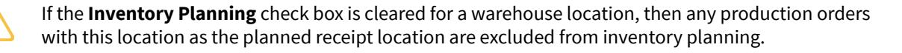

The **Transfer Lead Time** table is shown on the **Inventory Planning** tab if the *Multiple Warehouses* feature is enabled on the *[Enable/Disable Features](https://help-2025r1.acumatica.com/Help?ScreenId=ShowWiki&pageid=c1555e43-1bc5-4f6f-ba9d-b323f94d8a6b)* (CS100000) form. In this table, you can view and add warehouses from which stock items can be transferred to the warehouse selected on the form and specify the default transfer lead time of each warehouse, which the system will use during inventory planning. The system will use this lead time for items transferred between the current warehouse and the listed warehouse.

On the *Item [Warehouse](https://help-2025r1.acumatica.com/Help?ScreenId=ShowWiki&pageid=ae2418af-7f53-4c09-8766-556452d8f8b8) Details* (IN204500) form, you can override this lead time for an item‒warehouse pair if different shipment methods may be used to transfer the stock item. For example, small items might be eligible for air shipment within 3 days, while large bulky items might need to travel by ocean for 40 days.

# <span id="page-412-0"></span>**Stock Items in Inventory Planning**

For each stock item that you want to include in inventory planning, you should select the *MRP* or *DRP* planning method on the **General** tab (**Item Defaults** section) of the *[Stock Items](https://help-2025r1.acumatica.com/Help?ScreenId=ShowWiki&pageid=77786a70-1f1e-4d63-ad98-96f98e4fcb0e)* (IN202500) form. In the inventory planning process, the system uses supply and demand data for the combination of the stock item and the warehouse.

Stock items with a status of *Inactive* or *Marked for Deletion* are excluded from inventory planning. Items with any of the following statuses are included in planning: *Active*, *No Sales*, *No Purchases*, and *No Request*.

For each item involved in inventory planning, we recommend that you specify replenishment settings on the **Inventory Planning** tab of the following form:

- The *[Stock Items](https://help-2025r1.acumatica.com/Help?ScreenId=ShowWiki&pageid=77786a70-1f1e-4d63-ad98-96f98e4fcb0e)* form if the item is stored in one warehouse
- The *Item [Warehouse](https://help-2025r1.acumatica.com/Help?ScreenId=ShowWiki&pageid=ae2418af-7f53-4c09-8766-556452d8f8b8) Details* (IN204500) form if the item is stored in multiple warehouses

In the **Inventory PlanningSettings** section of the tab on either form, you should specify a value in the**Safety Stock** or **Reorder Point** box, depending on the value of the**Stocking Method** box on the *[Inventory Planning](https://help-2025r1.acumatica.com/Help?ScreenId=ShowWiki&pageid=c73f184e-6d99-47ff-a550-ae2d4f711ec2) [Preferences](https://help-2025r1.acumatica.com/Help?ScreenId=ShowWiki&pageid=c73f184e-6d99-47ff-a550-ae2d4f711ec2)* (AM100000) form.

If the replenishment source is *Purchase*, *Purchase to Order*, or *Drop Shipment* on the **Inventory PlanningSettings** tab of the *[Stock Items](https://help-2025r1.acumatica.com/Help?ScreenId=ShowWiki&pageid=77786a70-1f1e-4d63-ad98-96f98e4fcb0e)* form for an item, the system also uses the following settings. They are specified on the **Vendors** tab on the *[Stock Items](https://help-2025r1.acumatica.com/Help?ScreenId=ShowWiki&pageid=77786a70-1f1e-4d63-ad98-96f98e4fcb0e)* form for the preferred vendor (if the **Default** check box is selected on this tab for any vendor) or the **Inventory Planning** tab of the *Item [Warehouse](https://help-2025r1.acumatica.com/Help?ScreenId=ShowWiki&pageid=ae2418af-7f53-4c09-8766-556452d8f8b8) Details* form:

- **Add. Lead Time (Days)**: The number of days added to the preferred vendor lead time.
- **Min. Order Qty.**: The minimum quantity of the item.
- **LotSize**: The item quantity of the lot; in planning recommendations, the system rounds up the quantity of the item to the nearest multiple of the lot size. For example, suppose that the demand is 37, the minimum order quantity is 20, and the lot size is 5; then the planning recommendation quantity is 40.
- **Max. Order Qty.**: The maximum quantity of the item. Multiple planning recommendations can be created to cover the demand.

The system will update the**SafetyStock**, **Reorder Point**, **Min. Order Qty.**, **Max. Order Qty.**, or **LotSize** box on the **Inventory Planning** tab of the *Item [Warehouse](https://help-2025r1.acumatica.com/Help?ScreenId=ShowWiki&pageid=ae2418af-7f53-4c09-8766-556452d8f8b8) Details* form for an item–warehouse pair if the following conditions are met:

- The *Multiple Warehouses* feature is enabled on the *[Enable/Disable Features](https://help-2025r1.acumatica.com/Help?ScreenId=ShowWiki&pageid=c1555e43-1bc5-4f6f-ba9d-b323f94d8a6b)* (CS100000) form.
- For the stock item, a user has changed the corresponding value on the same tab of the *[Stock Items](https://help-2025r1.acumatica.com/Help?ScreenId=ShowWiki&pageid=77786a70-1f1e-4d63-ad98-96f98e4fcb0e)* form.
- The **Override** check box right of the corresponding settings is cleared on the *Item [Warehouse](https://help-2025r1.acumatica.com/Help?ScreenId=ShowWiki&pageid=ae2418af-7f53-4c09-8766-556452d8f8b8) Details* form the item–warehouse pair.

# <span id="page-413-0"></span>**Transfer Orders in Inventory Planning**

The system can be configured to create planning recommendations of the *Planned Transfer Demand* type on the *[Inventory Planning Display](https://help-2025r1.acumatica.com/Help?ScreenId=ShowWiki&pageid=78238a83-ae79-47e6-b583-fd7c7fc6de69)* (AM400000) form if it finds information about available item transfers during planning. The reference numbers of planning recommendations for transfer are generated automatically, listed on the **Related Document** table column, and have the *PLTR* prefix. A planning manager can then convert the planning recommendation to a transfer order.

To configure the system to do this, for each item that can be transferred from another warehouse, you do the following on the *Item [Warehouse](https://help-2025r1.acumatica.com/Help?ScreenId=ShowWiki&pageid=ae2418af-7f53-4c09-8766-556452d8f8b8) Details* (IN204500) form:

- 1. Open or create a record for a combination of the item and the source warehouse.
- 2. On the **Inventory Planning** tab, specify the following settings:
  - **Source**: *Transfer*
  - **Source Warehouse**: The transfer warehouse

If item transfer between the warehouses usually takes more than one day, you can specify the transfer lead time that the system will use in inventory planning as follows:

- 1. Open the **Inventory Planning** tab of the *[Warehouses](https://help-2025r1.acumatica.com/Help?ScreenId=ShowWiki&pageid=264b0ef7-2b6c-40b4-a7d9-f1a5e067939b)* (IN204000) form for the warehouse to which items can be transferred. In the**Transfer Lead Time** table, add each warehouse from which items can be transferred in the **Replenishment Warehouse** column, and specify the default transfer lead times between the warehouses in the**Transfer Lead Time** column.
- 2. If transfer lead time is item-specific, on the *Item [Warehouse](https://help-2025r1.acumatica.com/Help?ScreenId=ShowWiki&pageid=ae2418af-7f53-4c09-8766-556452d8f8b8) Details* form, do the following:
  - a. Select the needed combination of an item and source warehouse.
  - b. In the **Inventory PlanningSettings** section of the **Inventory Planning** tab, select the **Override** check box to the right of the**Transfer Lead Time** box, and specify the transfer lead time in the box.

### <span id="page-413-1"></span>**Stock and Non-Stock Kits in Inventory Planning**

If the *Kit Assembly* feature is enabled on the *[Enable/Disable Features](https://help-2025r1.acumatica.com/Help?ScreenId=ShowWiki&pageid=c1555e43-1bc5-4f6f-ba9d-b323f94d8a6b)* (CS100000) form, you can configure the system to include the stock components of stock and non-stock kits in inventory planning.

To make the system generate demand requirements for the stock components of a stock kit, you do the following:

- On the *[Stock Items](https://help-2025r1.acumatica.com/Help?ScreenId=ShowWiki&pageid=77786a70-1f1e-4d63-ad98-96f98e4fcb0e)* (IN202500) form, specify the following settings for the kit:
  - **Is a Kit** (**General** tab): Selected
  - **Planning Method** (**General** tab): *MRP* or *DRP*
  - **Source** (**Inventory Planning** tab): *Kit Assembly*
- On the *[Kit Specifications](https://help-2025r1.acumatica.com/Help?ScreenId=ShowWiki&pageid=c4a1e276-bcdb-4995-9522-c7b6dcb5f6c7)* (IN209500) form, make sure that the kit specification has at least one active revision. If multiple active revisions exist, the most recent one will be used for inventory planning.

To make the system generate demand requirements for the stock components of a non-stock kit, you do the following:

- On the *[Non-Stock Items](https://help-2025r1.acumatica.com/Help?ScreenId=ShowWiki&pageid=bf68dd4f-63d4-460d-8dc0-9152f2bd6bf1)* (IN202500) form (**General** tab), select the **Is a Kit** check box.
- On the *[Kit Specifications](https://help-2025r1.acumatica.com/Help?ScreenId=ShowWiki&pageid=c4a1e276-bcdb-4995-9522-c7b6dcb5f6c7)* form, make sure that the kit specification has at least one active revision. If multiple active revisions exist, the most recent one will be used for inventory planning.

A non-stock kit is considered by the inventory planning process if it is included in a sales order on the *[Sales Orders](https://help-2025r1.acumatica.com/Help?ScreenId=ShowWiki&pageid=19e4021c-1b84-49fd-be12-0320c5f1c7e5)* (SO301000) form or in a forecast record on the *[Forecast](https://help-2025r1.acumatica.com/Help?ScreenId=ShowWiki&pageid=1b6be70b-e2d5-4202-bb38-eba98534c497)* (AM202000) form.

You can also indicate whether the system should include on-hold kit assemblies in inventory planning. To include them, you select the new **Include On-Hold Kit Assemblies** check box in the **General** section of the *[Inventory](https://help-2025r1.acumatica.com/Help?ScreenId=ShowWiki&pageid=c73f184e-6d99-47ff-a550-ae2d4f711ec2)*

*[Planning Preferences](https://help-2025r1.acumatica.com/Help?ScreenId=ShowWiki&pageid=c73f184e-6d99-47ff-a550-ae2d4f711ec2)* (AM100000) form. When this check box is cleared, kit assemblies with the *On Hold* status are excluded from the process and are listed as exceptions on the *[Inventory Planning Exceptions](https://help-2025r1.acumatica.com/Help?ScreenId=ShowWiki&pageid=05634ed3-1a22-4751-960d-1782a9b08056)* (AM403000) form.

### **Automation Schedule for Inventory Planning Regeneration**

We strongly recommend that you set up an automation schedule to run inventory planning regeneration daily during the night or early morning so that the results are available for your organization's planners and buyers at the start of their workday. You can create an automation schedule either on the *[Regenerate Inventory Planning](https://help-2025r1.acumatica.com/Help?ScreenId=ShowWiki&pageid=588d4939-b533-4b84-8016-cf34e2be17d5)* (AM505000) form or on the *[Automation Schedules](https://help-2025r1.acumatica.com/Help?ScreenId=ShowWiki&pageid=76757610-2d0f-4ead-a948-d67da24ec116)* (SM205020) form. You should set the schedule to run aer all other scheduled processes that affect supply and demand are run to ensure that the inventory planning process has the most up-to-date data. The following automated processes affect inventory planning:

- Any process that changes the on-hand quantity of inventory items, such as physical counts, adjustments, purchase receipts, shipments, and production reporting
- Any process that creates demand or supply orders or updates these orders to change quantities or dates, such as importing sales orders
- Inventory replenishment processes that calculate safety stock and reorder points
- Release of transactions or documents that were held during the day, such as invoices

# <span id="page-414-1"></span><span id="page-414-0"></span>**Inventory Planning Configuration: System-Wide Settings**

As part of configuring inventory planning, you may need to specify the system-wide settings on the *[Inventory](https://help-2025r1.acumatica.com/Help?ScreenId=ShowWiki&pageid=c73f184e-6d99-47ff-a550-ae2d4f711ec2) [Planning Preferences](https://help-2025r1.acumatica.com/Help?ScreenId=ShowWiki&pageid=c73f184e-6d99-47ff-a550-ae2d4f711ec2)* (AM100000) form, as described in this topic. These settings determine how inventory planning as a whole is performed in the system.

You use this form if you are setting up distribution requirements planning (DRP) or material requirements planning (MRP). You can use production orders in inventory planning only if the *Manufacturing* and *Material Requirements Planning* features are enabled on the *[Enable/Disable](https://help-2025r1.acumatica.com/Help?ScreenId=ShowWiki&pageid=c1555e43-1bc5-4f6f-ba9d-b323f94d8a6b) [Features](https://help-2025r1.acumatica.com/Help?ScreenId=ShowWiki&pageid=c1555e43-1bc5-4f6f-ba9d-b323f94d8a6b)* (CS100000) form.

# **Inventory Planning Settings**

On the *[Inventory Planning Preferences](https://help-2025r1.acumatica.com/Help?ScreenId=ShowWiki&pageid=c73f184e-6d99-47ff-a550-ae2d4f711ec2)* (AM100000) form, you specify the following settings:

- Planning order type (MRP only): If the *Material Requirements Planning* feature is enabled on the *[Enable/](https://help-2025r1.acumatica.com/Help?ScreenId=ShowWiki&pageid=c1555e43-1bc5-4f6f-ba9d-b323f94d8a6b) [Disable Features](https://help-2025r1.acumatica.com/Help?ScreenId=ShowWiki&pageid=c1555e43-1bc5-4f6f-ba9d-b323f94d8a6b)* (CS100000) form, in the **Plan OrderType** box (**General** section), you select the default planning order type for the system to create planning orders during inventory planning. The planning order type should be created in advance.
- Planning horizon (optional): In the **Planning Horizon** box (**General** section), you can specify the number of days that the system will use to restrict the incoming item plans processed during the regeneration of inventory planning. For details, see *[Planning Horizon](#page-415-0)*.
- Grace period (optional): In the **Grace Period** box (**General** section), you can specify the time period within which the supply orders will be regarded as satisfying the demand date. For details, see *[Grace Period in](#page-415-1) [Inventory Planning](#page-415-1)*.
- Stocking method: In the**Stocking Method** box (**General** section), you select the method (*Reorder Point* or *Safety Stock*) the system will use for replenishing the demanded items, which is initiated by inventory planning process.
- Settings for including documents on hold in planning: By using the **Include On Hold** check boxes in the **General** section, you determine whether each of the following must be considered by the system during planning when they are on hold: sales orders, purchase orders, and production orders. For more information, see *[Documents On Hold in Inventory Planning](#page-416-0)*.

- The setting determining the calculation of manufacturing times (MRP only): If the *Material Requirements Planning* feature is enabled on the *[Enable/Disable Features](https://help-2025r1.acumatica.com/Help?ScreenId=ShowWiki&pageid=c1555e43-1bc5-4f6f-ba9d-b323f94d8a6b)* form, you decide if you want the system to calculate lead times dynamically for a planning recommendation or use the fixed lead time specified for each item by clearing or selecting, respectively, the **Use Fixed ManufacturingTimes** check box (**General** section).
- An indicator of whether expired blanket sales orders must be included in inventory planning: You decide if you want to include blanket sales orders that are expired in inventory planning by clearing or selecting the **Include Expired BlanketSales Orders** check box (**General** section).
- Consolidation settings (optional): The system can consolidate items with the same ID from multiple demand documents into a single planning recommendation during inventory planning. To configure this, you select the **Use Days ofSupply to Consolidate Orders** check box in the **Consolidation** section. You can also set up the system so that it consolidates demand documents with deferred requested dates. For details, see *[Consolidation of Items in Multiple Demand Documents](#page-416-1)*.

# <span id="page-415-0"></span>**Planning Horizon**

The planning horizon is the number of days that determines the time range during which the system processes item plans. The system excludes plans with a supply or demand date beyond the specified number of days from the regeneration date. You specify the planning horizon in the **Planning Horizon** box in the **General** section of the *[Inventory Planning Preferences](https://help-2025r1.acumatica.com/Help?ScreenId=ShowWiki&pageid=c73f184e-6d99-47ff-a550-ae2d4f711ec2)* (AM100000) form. The specification of this value can reduce the volume of item plans processed during inventory planning regeneration, potentially improving the performance of that process.

If your company has many item plans extending into the distant future, you may want to exclude this demand from planning by specifying a planning horizon. This can be useful if your customers place sales orders far in advance of the date when the items are needed (for example, blanket sales orders). Reducing the number of processed item plans will shorten the run time of the process on the *[Regenerate Inventory Planning](https://help-2025r1.acumatica.com/Help?ScreenId=ShowWiki&pageid=588d4939-b533-4b84-8016-cf34e2be17d5)* (AM505000) form.

For example, suppose that your company receives orders up to 18 months in advance. The company also receives demand for configured orders from distributors, and the longest lead time is four months. Inventory planning regeneration, which is run daily, takes several hours to complete. To reduce processing time, you may want to exclude supply and demand plans beyond six months. This duration includes four months for the lead time plus a buffer of two months for variation in the supply chain. No action will be taken for demand beyond this period. In this case, you specify 180 (which equals approximately six months) in the **Planning Horizon** box on the *[Inventory](https://help-2025r1.acumatica.com/Help?ScreenId=ShowWiki&pageid=c73f184e-6d99-47ff-a550-ae2d4f711ec2) [Planning Preferences](https://help-2025r1.acumatica.com/Help?ScreenId=ShowWiki&pageid=c73f184e-6d99-47ff-a550-ae2d4f711ec2)* form. During subsequent runs of the process on the *[Regenerate Inventory Planning](https://help-2025r1.acumatica.com/Help?ScreenId=ShowWiki&pageid=588d4939-b533-4b84-8016-cf34e2be17d5)* form, the system will process only item plans with a supply or demand date that is earlier than or the same as the regeneration date plus 180 days.

The default planning horizon value is *0*, which will not restrict any incoming item plans, causing all records to be processed during the regeneration of inventory planning on the *[Regenerate Inventory Planning](https://help-2025r1.acumatica.com/Help?ScreenId=ShowWiki&pageid=588d4939-b533-4b84-8016-cf34e2be17d5)* form. We recommend that you carefully consider what planning horizon best fits your planning needs before you change the predefined setting in your production environment.

# <span id="page-415-1"></span>**Grace Period in Inventory Planning**

The grace period is the number of days aer the requested date of an item in a demand order within which the item can be received in inventory (whether it is purchased from a vendor or produced internally) and still be considered as satisfying the requested date.

During planning, for each demand date (that is, the requested date of an item in a sales order), the system determines if a supply order within the grace period can fully satisfy the demand. The supply order can be a purchase order; it can also be a production order if your company is using material requirements planning. You specify the grace period in the **Grace Period** box on the *[Inventory Planning Preferences](https://help-2025r1.acumatica.com/Help?ScreenId=ShowWiki&pageid=c73f184e-6d99-47ff-a550-ae2d4f711ec2)* (AM100000) form. If the demand is not fully satisfied by supply orders within the grace period, then the system creates a planning recommendation to satisfy the remaining demand.

For example, suppose that you specify the grace period as 30 (which represents 30 calendar days). Further suppose that you have two sales orders, the first for 10 items with October 6 as the requested date and the second for another 10 items with October 10 as the requested date. Your vendor can deliver the materials required to produce

the item on November 9. This supply will satisfy the sales order dated October 10 and will not satisfy the sales order dated October 6.

When the due date of a supply order is earlier than the demand date, the system does not consider the grace period, and it satisfies all demands because there is no need to create a planning recommendation.

You should consider your demand and supply patterns, supply lead times, and minimum order quantities to determine an appropriate grace period.

Depending on the grace period value, exceptions are generated on the *[Inventory Planning Exceptions](https://help-2025r1.acumatica.com/Help?ScreenId=ShowWiki&pageid=05634ed3-1a22-4751-960d-1782a9b08056)* (AM403000) form to expedite or defer supply orders based on the values of the **Days Before** and **Days Aer** boxes on the *[Inventory Planning Preferences](https://help-2025r1.acumatica.com/Help?ScreenId=ShowWiki&pageid=c73f184e-6d99-47ff-a550-ae2d4f711ec2)* form. But if the date of a supply order is far beyond the grace period, then the system will only generate an exception to delete the supply.

### <span id="page-416-0"></span>**Documents On Hold in Inventory Planning**

You can specify whether sales orders, purchase orders, and production orders (only for MRP) that are on hold should be considered by the system when it plans items. We generally recommend that you include the documents on hold in inventory planning. To do this, you select the **Include On-Hold Sales Orders**, **Include On-Hold Purchase Orders**, and **Include On-Hold Production Orders** check boxes in the **General** section of the *[Inventory](https://help-2025r1.acumatica.com/Help?ScreenId=ShowWiki&pageid=c73f184e-6d99-47ff-a550-ae2d4f711ec2) [Planning Preferences](https://help-2025r1.acumatica.com/Help?ScreenId=ShowWiki&pageid=c73f184e-6d99-47ff-a550-ae2d4f711ec2)* (AM100000) form.


The **Include On-Hold Production Orders** check box is shown only if the *Manufacturing* and *Material Requirements Planning* features are enabled on the *[Enable/Disable Features](https://help-2025r1.acumatica.com/Help?ScreenId=ShowWiki&pageid=c1555e43-1bc5-4f6f-ba9d-b323f94d8a6b)* (CS100000) form.

You should exclude the on-hold orders from inventory planning if any of the following conditions is true in your company:

- Sales orders are always prepaid and on hold until they are paid; when the orders are paid, the dates are set appropriately. In this case, you should clear the **Include On-Hold Sales Orders** check box.
- Dates and quantities in sales orders are not finalized. In this case, you should clear the **Include On-Hold Sales Orders** check box.
- Dates and quantities in production orders are not finalized. In this case, you should clear the **Include On-Hold Production Orders** check box.
- The purchasing department creates orders far in advance with suppliers and oen needs to await confirmation of delivery dates and quantities from the supplier. In this case, you should clear the **Include On-Hold Purchase Orders** check box.

### <span id="page-416-1"></span>**Consolidation of Items in Multiple Demand Documents**

During inventory planning, if multiple demand documents (such as sales orders) contain the same item and have a due date (such as a required date in a sales order) that is within a specific time period, the system can consolidate items from these documents into a single planning recommendation. To implement this behavior, you select the **Use Days ofSupply to Consolidate Orders** check box in the **Consolidation** section of the *[Inventory Planning](https://help-2025r1.acumatica.com/Help?ScreenId=ShowWiki&pageid=c73f184e-6d99-47ff-a550-ae2d4f711ec2) [Preferences](https://help-2025r1.acumatica.com/Help?ScreenId=ShowWiki&pageid=c73f184e-6d99-47ff-a550-ae2d4f711ec2)* (AM100000) form.

With this check box selected, you specify the time period for consolidating items in the **Days ofSupply** box on the **Inventory Planning** tab (**Inventory PlanningSettings** section) of the needed forms for the noted records:

- *[Item Classes](https://help-2025r1.acumatica.com/Help?ScreenId=ShowWiki&pageid=80a3301b-4eb2-4ce2-94c5-0407c786a0f1)* (IN201000) form for an item class. The system copies this setting to all newly created stock items for which this class is selected.
- *[Stock Items](https://help-2025r1.acumatica.com/Help?ScreenId=ShowWiki&pageid=77786a70-1f1e-4d63-ad98-96f98e4fcb0e)* (IN202500) form for a stock item.
- *Item [Warehouse](https://help-2025r1.acumatica.com/Help?ScreenId=ShowWiki&pageid=ae2418af-7f53-4c09-8766-556452d8f8b8) Details* (IN204500) form for an item–warehouse pair. Thus, for an item that is stored in multiple warehouses, you can specify a different number of days for the item in each warehouse.

For example, suppose that the **Days ofSupply** setting for a juicer is *7*. Further suppose that two sales orders containing the juicer have been created with the requested date within the same week. When inventory planning is run, the system will group the juicers from these two orders into one planning recommendation as a potential production order, instead of generating two planning recommendations, one per sales order.

If sales managers create long-term sales orders for some customers to provide a discount, you can configure the system to use a long-term consolidation bucket, and you can specify settings that are specific to long-term consolidation. To do this, in the **Consolidation** section of the *[Inventory Planning Preferences](https://help-2025r1.acumatica.com/Help?ScreenId=ShowWiki&pageid=c73f184e-6d99-47ff-a550-ae2d4f711ec2)* form, you first select the **Use Long-Term Consolidation Bucket** check box. On the form, you then specify the number of days aer which the system starts consolidating items from demand documents in the **Consolidate Aer (Days)** box and the number of days within which the requested dates in the demand documents must fall in the **Bucket (Days)** box.

If you use forecasts for planning item demand, the system also consolidates forecast records during inventory planning. For example, suppose that weekly forecast records exist for the following quarter. Further suppose that the **Consolidate Aer (Days)** box contains *45*, and the **Bucket (Days)** box contains *30*. In this case, when performing inventory planning, the system will create a single planning recommendation for all forecast records with dates starting from today's date plus 45 days and within 30 days aer the starting date of consolidation.

# <span id="page-417-2"></span><span id="page-417-0"></span>**Inventory Planning Configuration: Exceptions**

When the system performs inventory planning, it uses the requested dates specified in demand orders and checks whether these dates satisfy your lead times. During the most recent execution of inventory requirements planning on the *[Regenerate Inventory Planning](https://help-2025r1.acumatica.com/Help?ScreenId=ShowWiki&pageid=588d4939-b533-4b84-8016-cf34e2be17d5)* (AM505000) form, the system generates exceptions on the *[Inventory Planning](https://help-2025r1.acumatica.com/Help?ScreenId=ShowWiki&pageid=05634ed3-1a22-4751-960d-1782a9b08056) [Exceptions](https://help-2025r1.acumatica.com/Help?ScreenId=ShowWiki&pageid=05634ed3-1a22-4751-960d-1782a9b08056)* (AM403000) form for orders with items that can be delivered too early or too late. This helps you decide if you need to change order dates (either the shipping date for the customer or the promised date for suppliers).

#### **Exception Management**

To manage the generation of exceptions, you specify the **Days Before** and **Days Aer** settings of the **Exceptions** section on the *[Inventory Planning Preferences](https://help-2025r1.acumatica.com/Help?ScreenId=ShowWiki&pageid=c73f184e-6d99-47ff-a550-ae2d4f711ec2)* (AM100000) form. The **Days Aer** value must be less than or equal to the value in the **Grace Period** box in the **General** section. With greater values, fewer exceptions are generated. If both values are *0*, then exceptions are generated whenever a supply date does not cover the demand.

The **Days Before** value represents the number of days that are acceptable for items to be supplied before the date requested by a customer. If the items in the order can be supplied earlier than the requested date minus the **Days Before** value, the system generates the *Defer* exception on the *[Inventory Planning Exceptions](https://help-2025r1.acumatica.com/Help?ScreenId=ShowWiki&pageid=05634ed3-1a22-4751-960d-1782a9b08056)* (AM403000) form. If most of the lead times of your vendors are a week or less, then you can specify *7* as the **Days Before** setting. When demand changes, you may want your vendor to defer a delivery to a later date. If the lead times of the vendors are greater than *7*, then you need to consider how oen you want to ask your vendors to adjust their promised dates.

The **Days Aer** setting represents the number of days that are acceptable for items to be supplied aer the date requested by a customer. If the items in the order will be supplied later than the requested date plus the **Days Aer** value, the system will generate an *Expedite* exception. This value is more critical than the **Days Before** value because a late delivery from a supplier affects your ability to ship (or manufacture and ship) goods to customers. We recommend that you specify a number between *2* and *5*.

Inventory planning will not create a planning recommendation to cover demand if the supply order is due within the grace period, but an *Expedite* exception is generated to let the planner know that the supply order needs to be expedited so the inventory item is available when it is needed. If the order cannot be expedited, then the orders that require the inventory item may need to be rescheduled to a later date.

# <span id="page-417-3"></span><span id="page-417-1"></span>**Inventory Planning Configuration: Setting Up Forecasts**

In Acumatica ERP, users can create sales forecasts to plan the demand for stock items.

To give users the ability to generate and manually create sales forecasts, you should do the following:

- Create a numbering sequence for forecasts on the *[Numbering Sequences](https://help-2025r1.acumatica.com/Help?ScreenId=ShowWiki&pageid=a8d11c23-21f2-42a3-b17d-9637c9cf8031)* (CS201010) form
- Specify the numbering sequence in the **NumberingSequence** box on the *[Inventory Planning Preferences](https://help-2025r1.acumatica.com/Help?ScreenId=ShowWiki&pageid=c73f184e-6d99-47ff-a550-ae2d4f711ec2)* (AM100000) form

A user can manually create a sales forecast on the *[Forecast](https://help-2025r1.acumatica.com/Help?ScreenId=ShowWiki&pageid=1b6be70b-e2d5-4202-bb38-eba98534c497)* (AM202000) form or use the sales history in the system to predict the demand by generating sales forecasts on the *[Generate Forecasts](https://help-2025r1.acumatica.com/Help?ScreenId=ShowWiki&pageid=c9043b4a-6e6c-487b-9b1f-5b90282dd2f6)* (AM502000) form. To create a forecast for a stock item by using the sales history for a particular customer, the user specifies the forecast date, the growth rate, and the number of years of history in the Selection area. Then they click **Calculate** on the form toolbar. The system adds a table row with the calculated data. If they select the unlabeled check box in the row in the table and click **Process** on the form toolbar, this row is no longer shown on the *[Generate Forecasts](https://help-2025r1.acumatica.com/Help?ScreenId=ShowWiki&pageid=c9043b4a-6e6c-487b-9b1f-5b90282dd2f6)* form, and the row with the forecast data is added on the *[Forecast](https://help-2025r1.acumatica.com/Help?ScreenId=ShowWiki&pageid=1b6be70b-e2d5-4202-bb38-eba98534c497)* form.

# **Demand Time Fence in Inventory Planning**

You can set up the system to exclude forecast records from demand data. The *demand time fence* is the time period during which a forecast is excluded from the total demand and the projected available inventory calculations. You specify the number of days in the **Demand Time Fence** box of the **Forecast** section on the *[Inventory Planning](https://help-2025r1.acumatica.com/Help?ScreenId=ShowWiki&pageid=c73f184e-6d99-47ff-a550-ae2d4f711ec2) [Preferences](https://help-2025r1.acumatica.com/Help?ScreenId=ShowWiki&pageid=c73f184e-6d99-47ff-a550-ae2d4f711ec2)* (AM100000) form. The demand time fence consists of all the days before the date of inventory planning regeneration on the *[Regenerate Inventory Planning](https://help-2025r1.acumatica.com/Help?ScreenId=ShowWiki&pageid=588d4939-b533-4b84-8016-cf34e2be17d5)* (AM505000) form and the number of days specified in the **Demand Time Fence** box.

During the demand time fence period, the system considers only customer orders when planning inventory. Beyond this period, the dependent forecasts or the actual demand—whichever value is greater—drives inventory planning. You choose the number of days of the demand time fence based on the period during which the planning process ignores forecast demand and only considers actual demand, starting from the current date.

A forecast that has the **Dependent** check box selected on the *[Forecast](https://help-2025r1.acumatica.com/Help?ScreenId=ShowWiki&pageid=1b6be70b-e2d5-4202-bb38-eba98534c497)* (AM202000) form is consumed by released invoices and open sales orders with ship dates within the starting and ending forecast date. Inventory planning does not use forecast intervals or one-time forecasts on the *[Forecast](https://help-2025r1.acumatica.com/Help?ScreenId=ShowWiki&pageid=1b6be70b-e2d5-4202-bb38-eba98534c497)* form if the interval's end date is earlier than the date when inventory planning was regenerated plus the number of days specified in the **Demand Time Fence** box.

On the *[Forecast](https://help-2025r1.acumatica.com/Help?ScreenId=ShowWiki&pageid=1b6be70b-e2d5-4202-bb38-eba98534c497)* form, the **Active** check box is automatically cleared for a forecast record if its **End Date** is earlier than the **Last Completed At** date on the *[Regenerate Inventory Planning](https://help-2025r1.acumatica.com/Help?ScreenId=ShowWiki&pageid=588d4939-b533-4b84-8016-cf34e2be17d5)* form plus the number of days specified in the **Demand Time Fence** box on the *[Inventory Planning Preferences](https://help-2025r1.acumatica.com/Help?ScreenId=ShowWiki&pageid=c73f184e-6d99-47ff-a550-ae2d4f711ec2)* form. This happens because no remaining intervals have been considered by the process that was run on the *[Regenerate Inventory Planning](https://help-2025r1.acumatica.com/Help?ScreenId=ShowWiki&pageid=588d4939-b533-4b84-8016-cf34e2be17d5)* form.

#### **MPS Time Fence in Inventory Planning**

If the *Material Requirements Planning* feature is enabled on the *[Enable/Disable Features](https://help-2025r1.acumatica.com/Help?ScreenId=ShowWiki&pageid=c1555e43-1bc5-4f6f-ba9d-b323f94d8a6b)* (CS100000) form, you can set up the system to automatically exclude master production schedule (MPS) orders from demand data.

The *MPS time fence* is the time period that starts on the day when inventory planning is regenerated on the *[Regenerate Inventory Planning](https://help-2025r1.acumatica.com/Help?ScreenId=ShowWiki&pageid=588d4939-b533-4b84-8016-cf34e2be17d5)* (AM505000) form and lasts the specified number of days. During this period, the system excludes MPS orders for which production orders have not been created from the data used for planning. You specify the number of days in the MPS time fence in the **MPSTime Fence** box of the **MPS**section on the *[Inventory Planning Preferences](https://help-2025r1.acumatica.com/Help?ScreenId=ShowWiki&pageid=c73f184e-6d99-47ff-a550-ae2d4f711ec2)* (AM100000) form.

# <span id="page-418-1"></span><span id="page-418-0"></span>**Inventory Planning Configuration: Monitoring of Calculated Item Quantities by Period**

On the *[Inventory Planning Requirements by Item](https://help-2025r1.acumatica.com/Help?ScreenId=ShowWiki&pageid=3e3614ae-4275-444d-98ba-9da22efbca4b)* (AM401200) form, users can monitor the past and present supply of stock items and demand for items. To give users the ability to view item plans by time periods on this form, you should first create inventory planning buckets that correspond to periods of time—such as days, weeks, months, or years—on the *[Inventory Planning Buckets](https://help-2025r1.acumatica.com/Help?ScreenId=ShowWiki&pageid=f99bce75-ff7b-4ba3-9e03-b35381719712)* (AM201200) form.

A bucket is defined by the combination of its interval (day, week, month, or year) and its interval value (the number of these intervals that makes up the bucket). For example, to define a three-week bucket, you select *Week* as the interval and *3* as the value.

The start date of a bucket is the day aer the ending date of the previous bucket. In the **Bucket** column, you define the bucket as follows:

- For a future period, you specify a positive integer value. The positive value closest to zero starts from today. Suppose that buckets 1, 2, and 3 are created. In this case, 1 is the closest bucket to 0, so the 1 bucket will start from today and extend into the future.
- For a past due period, you specify *0* or a negative integer value. Zero or the negative number closest to zero starts from the previous day.

Suppose that buckets -3, -2, and -1 are created. In this case, -1 is the closest bucket to 0, so the -1 bucket will start from the previous day and extend into the past.

In addition to buckets for present and future periods of time, we recommend that you add at least one bucket for a past due period (that is, a bucket whose value is a negative number).

When you have created the needed buckets, a user can open the *[Inventory Planning Requirements by Item](https://help-2025r1.acumatica.com/Help?ScreenId=ShowWiki&pageid=3e3614ae-4275-444d-98ba-9da22efbca4b)* form and select the bucket ID, inventory ID, and warehouse. The table will show the data about the actual supply and demand and the planned supply and demand. The user can click **Results by Item** on the More menu, which opens the *[Inventory Planning Results by Item](https://help-2025r1.acumatica.com/Help?ScreenId=ShowWiki&pageid=37d31db4-36a4-45f7-929b-aeeeea2b504e)* (AM404000) form. The form shows the item quantities that the system has calculated based on the results of inventory planning for a specific item in a specific warehouse.

# <span id="page-419-0"></span>**Inventory Planning Configuration: Lead Times**

In inventory planning, the system can use lead times to calculate the action dates for planning recommendations.


You can use production orders in inventory planning only if the *Manufacturing* and *Material Requirements Planning* features are enabled on the *[Enable/Disable Features](https://help-2025r1.acumatica.com/Help?ScreenId=ShowWiki&pageid=c1555e43-1bc5-4f6f-ba9d-b323f94d8a6b)* (CS100000) form.

### **Lead Times in Inventory Planning**

When the system creates planning recommendations on the *[Regenerate Inventory Planning](https://help-2025r1.acumatica.com/Help?ScreenId=ShowWiki&pageid=588d4939-b533-4b84-8016-cf34e2be17d5)* (AM505000) form, the system calculates an action date for each recommendation as follows:

- For a planning recommendation to be converted to a purchase order, the action date is the date when this action must be taken (that is, the date when inventory must be available in a warehouse).
- For a planning recommendation to be converted to a production order, the action date is the date when the production must start.

The system calculates the action dates for planning recommendations by using lead times, which can be any of the following:

- Purchase lead times, which the system uses for planning recommendations for inventory to be purchased from vendors. For details, see the *Lead Times for Purchased Items* section below.
- Manufacturing lead times, which the system uses for planning recommendations for items to be produced. Depending on the settings you have specified, it uses one of the following:
  - Fixed manufacturing lead times if the appropriate settings are specified. For more information, see the *Fixed Manufacturing Lead Time* section below.
  - Variable manufacturing lead times if fixed lead times are not configured. For details, see *[Inventory](#page-421-1) Planning Configuration: Variable [Manufacturing](#page-421-1) Lead Times*.

### **Lead Times for Purchased Items**

In inventory planning, the system uses purchase lead times to calculate the action dates for planning recommendations with the *Purchase* source. Purchase lead times are always fixed and do not depend on the order quantity, so you should specify these times based on a typical order size. You set up the purchase lead times as follows:

- 1. You specify the calendar that the system will use for the action dates in the **Purchase Calendar ID** box on the *[Inventory Planning Preferences](https://help-2025r1.acumatica.com/Help?ScreenId=ShowWiki&pageid=c73f184e-6d99-47ff-a550-ae2d4f711ec2)* (AM100000) form.
- 2. For each stock item to be purchased, you do either of the following:
  - a. If the *Multiple Warehouses* feature is disabled and a preferred vendor is selected on the**Vendors** tab of the *[Stock Items](https://help-2025r1.acumatica.com/Help?ScreenId=ShowWiki&pageid=77786a70-1f1e-4d63-ad98-96f98e4fcb0e)* (IN202500) form, you make sure that the lead time for this vendor is specified in the **Lead Time (Days)** column.
  - b. If the *Multiple Warehouses* feature is enabled and a preferred vendor is selected in the **Preferred Vendor** box on the **Inventory Planning** tab of the *Item [Warehouse](https://help-2025r1.acumatica.com/Help?ScreenId=ShowWiki&pageid=ae2418af-7f53-4c09-8766-556452d8f8b8) Details* form for an item–warehouse pair, you make sure that the lead time for this vendor is specified in the**Vendor Lead Time (Days)** box.

For example, suppose that the production must start on January 30, which is a working day. The purchase lead time is 10 days. Then the action date for the planning recommendations must be January 21. Further suppose that January 21 is a Saturday, which is a non-working day, according to the work calendar. Then the system moves the action date to January 20 because it is the nearest working day.

# **Fixed Manufacturing Lead Time**

If the *Material Requirements Planning* feature is enabled on the *[Enable/Disable Features](https://help-2025r1.acumatica.com/Help?ScreenId=ShowWiki&pageid=c1555e43-1bc5-4f6f-ba9d-b323f94d8a6b)* (CS100000) form, you may want the system to calculate manufacturing lead times by using fixed values for each stock item. This means that the lead time does not depend on the quantity of produced item. In this case, you do the following to set up the system:

- 1. On the *[Production Preferences](https://help-2025r1.acumatica.com/Help?ScreenId=ShowWiki&pageid=678a1833-f1f6-44f1-afce-55aa7438b3f3)* (AM102000) form (**Scheduling** section), in the **Fixed MFG Calendar ID** box, you specify the work calendar the system will use for calculating the action dates for planning recommendations.
- 2. In the **Fixed MFG Units** box in the same section of the form, you select the time unit—days or hours—the system will use for the lead time.
- 3. For each stock item to be produced, on the *[Stock Items](https://help-2025r1.acumatica.com/Help?ScreenId=ShowWiki&pageid=77786a70-1f1e-4d63-ad98-96f98e4fcb0e)* (IN202500) form, you specify the time required to produce the item in the **MFG Lead Time** box on the **Manufacturing** tab.
- 4. If the manufacturing time for any item is warehouse-specific, on the *Item [Warehouse](https://help-2025r1.acumatica.com/Help?ScreenId=ShowWiki&pageid=ae2418af-7f53-4c09-8766-556452d8f8b8) Details* (IN204500) form, you specify the time required to produce the item in a particular warehouse in the **MFG Lead Time** box on the **Manufacturing** tab.
- 5. If fixed manufacturing times must be used for all production orders by default, on the *[Production](https://help-2025r1.acumatica.com/Help?ScreenId=ShowWiki&pageid=678a1833-f1f6-44f1-afce-55aa7438b3f3) [Preferences](https://help-2025r1.acumatica.com/Help?ScreenId=ShowWiki&pageid=678a1833-f1f6-44f1-afce-55aa7438b3f3)* (AM102000) form, you select the **Use Fixed ManufacturingTimes** check box in the**Scheduling** section.
- 6. If fixed manufacturing times must be used in inventory planning, on the *[Inventory Planning Preferences](https://help-2025r1.acumatica.com/Help?ScreenId=ShowWiki&pageid=c73f184e-6d99-47ff-a550-ae2d4f711ec2)* (AM100000) form, you select the **Use Fixed ManufacturingTimes** check box in the **General** section.
- 7. If you need to use fixed manufacturing times for a particular production order, on the *[Production Order](https://help-2025r1.acumatica.com/Help?ScreenId=ShowWiki&pageid=e5d2ddd4-8c80-4f5b-8e5f-e5151636a9d3) [Maintenance](https://help-2025r1.acumatica.com/Help?ScreenId=ShowWiki&pageid=e5d2ddd4-8c80-4f5b-8e5f-e5151636a9d3)* (AM201500) form, you select the **Use Fixed Mfg Lead Times for Order Dates** check box on the **General** tab.

# <span id="page-421-1"></span><span id="page-421-0"></span>**Inventory Planning Configuration: Variable Manufacturing Lead Times**

When the system calculates demand for the materials used in production on the *[Regenerate Inventory Planning](https://help-2025r1.acumatica.com/Help?ScreenId=ShowWiki&pageid=588d4939-b533-4b84-8016-cf34e2be17d5)* (AM505000) form, the system creates planning recommendations for materials that must be produced. For each planning recommendation, the system specifies the action date, which is the date when the production must start. To calculate the action dates, the system calculates the lead times required to produce the needed quantity of materials. The variable manufacturing lead time depends on the quantity of produced items in production orders for which inventory planning is performed. This lead lime consists of the lead times of operations in bills of material that provide the production routing for the materials. You specify the settings that determine the operation lead times on the *[Bill of Material](https://help-2025r1.acumatica.com/Help?ScreenId=ShowWiki&pageid=1aae7d3a-d5f9-4693-b91f-663c4c2d362b)* (AM208000) form.

You can use production orders in inventory planning only if the *Manufacturing* and *Material Requirements Planning* features are enabled on the *[Enable/Disable Features](https://help-2025r1.acumatica.com/Help?ScreenId=ShowWiki&pageid=c1555e43-1bc5-4f6f-ba9d-b323f94d8a6b)* (CS100000) form.

In the following sections, you can find details about variable manufacturing lead times.

# **Components of the Variable Manufacturing Lead Time**

For each operation of a bill of material, you specify the settings that determine variable lead times in the Operations table of the *[Bill of Material](https://help-2025r1.acumatica.com/Help?ScreenId=ShowWiki&pageid=1aae7d3a-d5f9-4693-b91f-663c4c2d362b)* (AM208000) form. The system uses the following factors that determine operation lead times while calculating the action dates of planning recommendations for materials to be produced:

- Worker throughput: The quantity of item units produced during a certain period of time when machines are not involved in the operation. The system determines that machines are not involved when *Crew Size* is selected in the **Basis for Capacity** box on the *[Work Centers](https://help-2025r1.acumatica.com/Help?ScreenId=ShowWiki&pageid=6543295f-b1eb-4991-868f-503435b1d67a)* (AM207000) form for the work center specified in the operation row. In the **Run Time** column of the row, you specify the period of time (such as *01:00* for one hour). In the **Run Units** column, you specify the quantity of item units that workers produce during this period of time (such as *5*).
- Machine throughput: The quantity of item units produced during a certain period of time when machines are used in the operation. The system determines that machines are involved when *Machines* is selected in the **Basis for Capacity** box on the *[Work Centers](https://help-2025r1.acumatica.com/Help?ScreenId=ShowWiki&pageid=6543295f-b1eb-4991-868f-503435b1d67a)* form for the work center specified in the operation row. In the **Machine Time** column of the row, you specify the period of time. In the **Machine Units** column, you specify the quantity of item units that workers use this machine to produce during this period of time.
- Setup time: The time it takes to prepare to start the operation, which is specified in the**Setup Time** column of the operation row. For example, to prepare for the operation, workers may need to print drawings or take parts from a stock room. Based on this value, the system adds a fixed labor cost to the cost of the produced item, regardless of the size of the order.

The following factors that also determine variable manufacturing lead time are not considered during the calculation of action dates for planning recommendations in inventory planning:

- Queue time, move time, and finish time, which you specify in the Operations table of the *[Bill of](https://help-2025r1.acumatica.com/Help?ScreenId=ShowWiki&pageid=1aae7d3a-d5f9-4693-b91f-663c4c2d362b) [Material](https://help-2025r1.acumatica.com/Help?ScreenId=ShowWiki&pageid=1aae7d3a-d5f9-4693-b91f-663c4c2d362b)* form
- Work center capacity, which is calculated as Crew Size \* Efficiency, both of which are specified on the **Shis** tab of the *[Work Centers](https://help-2025r1.acumatica.com/Help?ScreenId=ShowWiki&pageid=6543295f-b1eb-4991-868f-503435b1d67a)* form

# **Configuration of Variable Manufacturing Lead Time**

You configure the variable manufacturing lead time to be used in inventory planning as follows:

1. On the *[Work Centers](https://help-2025r1.acumatica.com/Help?ScreenId=ShowWiki&pageid=6543295f-b1eb-4991-868f-503435b1d67a)* (AM207000) form, you specify the following settings for each work center that will be specified in an operation of the bill of material:

- In the **Basis for Capacity** box on the **General** tab, you specify which throughput settings (run units and time, or machine units and time) the system will use for operations in this work center.
- In the **Calendar ID** column on the**Shis** tab, you specify the work calendar the system will use for calculating lead times for operations performed in this work center.
- 2. If machines are used in any work center, on the *[Machines](https://help-2025r1.acumatica.com/Help?ScreenId=ShowWiki&pageid=9053c704-59ca-4114-b25b-895f9b315014)* (AM204500) form, make sure that the calendar specified for each machine has the same working hours as the work center to which the machine is assigned.
- 3. On the *[Bill of Material](https://help-2025r1.acumatica.com/Help?ScreenId=ShowWiki&pageid=1aae7d3a-d5f9-4693-b91f-663c4c2d362b)* (AM208000) form, in the Operations table, you specify the lead time components for each operation when creating a bill of material.

### **Calculation of the Manufacturing Lead Time**

When calculating action dates for planning recommendations, the system calculates the time required for performing each operation in the routing by using one of the following formulas (depending on whether run time or machine time is used).

```
Setup Time + (Qty. to Produce * (Run Time / Run Units))
Setup Time + (Qty. to Produce * (Machine Time / Machine Units))
```

If the value of Run Units or Machine Units is *0*, then the parts of the formula that include the units are *0*.

For example, suppose that a bill of material for producing wooden chairs includes two operations with the settings specified in the following table. The throughput for the paint operation is one chair per hour, and the throughput for the assembly operation is five chairs per hour.

| Operation | Setup Time | Run Units | Run Time |
|-----------|------------|-----------|----------|
| Paint     | 01:00      | 1         | 01:00    |
| Assembly  | 00:00      | 5         | 01:00    |

Also suppose that the work centers where the operations take place have an eight-hour working day and Saturday and Sunday as the only non-working days. Further suppose that a sales manager created a sales order for the production of 10 chairs, with the customer requiring the order by January 30 (which is a working day). A production manager runs inventory planning to receive the list of planning recommendations to meet the date when the customer requires the chairs. To produce 10 chairs, it will take 11 hours for the paint operation and 2 hours for the assembly operation—13 hours in total. If production must end on January 30, then the start date of the planned recommendation for production will be January 29 if it is a working day according to the work calendar.

# <span id="page-422-0"></span>**Inventory Planning Configuration: Configuration Prerequisites**

Before starting to configure the inventory planning functionality, you must be sure that the system has been configured properly and that all required entities have been created, as described in the following sections.

### **Enabling the Needed Features**

On the *[Enable/Disable Features](https://help-2025r1.acumatica.com/Help?ScreenId=ShowWiki&pageid=c1555e43-1bc5-4f6f-ba9d-b323f94d8a6b)* (CS100000) form, one of the following features must be enabled:

• *Distribution Requirements Planning* if your company uses inventory planning

• *Material Requirements Planning* if your company manufactures items and uses a master production schedule and inventory planning

# **Configuring the System**

You need to make sure that following tasks have been performed in Acumatica ERP before you begin to implement inventory planning:

- On the *[Work Calendar](https://help-2025r1.acumatica.com/Help?ScreenId=ShowWiki&pageid=9d01d650-0b68-4994-8146-c80fb5e34bbb)* (CS209000) form, a calendar has been created for the inventory planning process to use to calculate action and promise dates from vendor lead times.
- On the *[Numbering Sequences](https://help-2025r1.acumatica.com/Help?ScreenId=ShowWiki&pageid=a8d11c23-21f2-42a3-b17d-9637c9cf8031)* (CS201010) form, a numbering sequence for forecast identifiers has been created.
- If the *Material Requirements Planning* is enabled on the *[Enable/Disable Features](https://help-2025r1.acumatica.com/Help?ScreenId=ShowWiki&pageid=c1555e43-1bc5-4f6f-ba9d-b323f94d8a6b)* (CS100000) form, on the *[Numbering Sequences](https://help-2025r1.acumatica.com/Help?ScreenId=ShowWiki&pageid=a8d11c23-21f2-42a3-b17d-9637c9cf8031)* form, a numbering sequence for the identifiers of master production schedule (MPS) orders has been created.
- If the *Material Requirements Planning* is enabled on the *[Enable/Disable Features](https://help-2025r1.acumatica.com/Help?ScreenId=ShowWiki&pageid=c1555e43-1bc5-4f6f-ba9d-b323f94d8a6b)* form, a numbering sequence for the identifiers of planning orders has been created on the *[Numbering Sequences](https://help-2025r1.acumatica.com/Help?ScreenId=ShowWiki&pageid=a8d11c23-21f2-42a3-b17d-9637c9cf8031)* form.


We recommend that you create a separate numbering sequence for planning recommendations to distinguish these orders from regular production orders in the system.

• If the *Material Requirements Planning* is enabled on the *[Enable/Disable Features](https://help-2025r1.acumatica.com/Help?ScreenId=ShowWiki&pageid=c1555e43-1bc5-4f6f-ba9d-b323f94d8a6b)* form, at least one production order type with the *Planning* function has been created on the *[Production](https://help-2025r1.acumatica.com/Help?ScreenId=ShowWiki&pageid=6283187d-54b7-4db1-8c3a-97d3ebc39a95) Order Types* (AM201100) form.

# <span id="page-423-0"></span>**Inventory Planning Configuration: To Implement DRP**

In the following implementation activity, you will configure distribution requirements planning (DRP)—that is, inventory planning that does not include production order planning—and review the planning recommendations for an item–warehouse pair.

This activity is based on the *U100* dataset. If you are using another dataset, or if any system settings have been changed in *U100*, these changes can affect the workflow of the activity and the results of the processing. To avoid any issues, restore the *U100* dataset to its initial state.

### **Story**

Suppose that you are an implementation manager at the SweetLife Fruits & Jams company, and you need to prepare the system for the DRP type of inventory planning.

Your company sells juicers but does not manufacture them. SweetLife buys juicers to the wholesale warehouse and then transfers the needed quantities of juicers to the warehouse for equipment storage. You will use the *Safety Stock* stocking method for replenishing goods. You need to configure the warehouses involved in inventory planning, including the settings that cause the system to consider sales orders on hold during inventory planning.

### **Configuration Overview**

In the *U100* dataset, the following tasks have been performed to support this activity:

- The basic configuration of order management with inventory has been performed, as described in *[Order](#page-350-2) [Management with Inventory](#page-350-2)*.
- On the *[Work Calendar](https://help-2025r1.acumatica.com/Help?ScreenId=ShowWiki&pageid=9d01d650-0b68-4994-8146-c80fb5e34bbb)* (CS209000) form, the *MAIN* calendar has been created.

- On the *[Warehouses](https://help-2025r1.acumatica.com/Help?ScreenId=ShowWiki&pageid=264b0ef7-2b6c-40b4-a7d9-f1a5e067939b)* (IN204000) form, the *WHOLESALE* and *EQUIPHOUSE* warehouses have been created.
- On the *[Item Classes](https://help-2025r1.acumatica.com/Help?ScreenId=ShowWiki&pageid=80a3301b-4eb2-4ce2-94c5-0407c786a0f1)* (IN201000) form, the *CITRUSJCR* (citrus juicers) item class has been created for juicers, and the *DRP* planning method has been specified for this item class.
- On the *[Stock Items](https://help-2025r1.acumatica.com/Help?ScreenId=ShowWiki&pageid=77786a70-1f1e-4d63-ad98-96f98e4fcb0e)* (IN202500) form, the *JUICER15C* stock item has been created. On the**Vendors** tab, the default *SQUEEZO* vendor has been listed.
- On the *Item [Warehouse](https://help-2025r1.acumatica.com/Help?ScreenId=ShowWiki&pageid=ae2418af-7f53-4c09-8766-556452d8f8b8) Details* (IN204500) form, inventory planning settings have been specified for the *JUICER15C* stock item at the *EQUIPHOUSE* warehouse.
- On the *[Sales Orders](https://help-2025r1.acumatica.com/Help?ScreenId=ShowWiki&pageid=19e4021c-1b84-49fd-be12-0320c5f1c7e5)* (SO301000) form, a sales order for the *DELIENERGY* customer has been created and assigned the *On Hold* status. The order has 5 units of the *JUICER15C* stock item and is dated 1/29/2025.

### **Process Overview**

In this activity, you will do the following:

- 1. On the *[Enable/Disable Features](https://help-2025r1.acumatica.com/Help?ScreenId=ShowWiki&pageid=c1555e43-1bc5-4f6f-ba9d-b323f94d8a6b)* (CS100000) form, enable the *Distribution Requirements Planning* feature.
- 2. On the *[Inventory Planning Preferences](https://help-2025r1.acumatica.com/Help?ScreenId=ShowWiki&pageid=c73f184e-6d99-47ff-a550-ae2d4f711ec2)* (AM100000) form, specify the required settings.
- 3. On the *[Warehouses](https://help-2025r1.acumatica.com/Help?ScreenId=ShowWiki&pageid=264b0ef7-2b6c-40b4-a7d9-f1a5e067939b)* (IN204000) form, specify the inventory planning settings for the source warehouse.
- 4. On the same form, specify the inventory planning settings for the destination warehouse.
- 5. On the *Item [Warehouse](https://help-2025r1.acumatica.com/Help?ScreenId=ShowWiki&pageid=ae2418af-7f53-4c09-8766-556452d8f8b8) Details* (IN204500) form, review the inventory planning settings for the item– warehouse pair.
- 6. On the *[Regenerate Inventory Planning](https://help-2025r1.acumatica.com/Help?ScreenId=ShowWiki&pageid=588d4939-b533-4b84-8016-cf34e2be17d5)* (AM505000) form, perform inventory planning. On the *[Inventory](https://help-2025r1.acumatica.com/Help?ScreenId=ShowWiki&pageid=78238a83-ae79-47e6-b583-fd7c7fc6de69) [Planning Display](https://help-2025r1.acumatica.com/Help?ScreenId=ShowWiki&pageid=78238a83-ae79-47e6-b583-fd7c7fc6de69)* (AM400000) form, review the list of planning recommendations based on the last execution of inventory requirements planning.

#### **System Preparation**

Before you start configuring inventory planning, launch the Acumatica ERP website, and sign in to a company with the *U100* dataset preloaded. You should sign in as a system administrator with the *gibbs* username and the *123* password.

#### **Step 1: Enabling the Needed Feature**

To enable the *Distribution Requirements Planning* feature, do the following:

- 1. Open the *[Enable/Disable Features](https://help-2025r1.acumatica.com/Help?ScreenId=ShowWiki&pageid=c1555e43-1bc5-4f6f-ba9d-b323f94d8a6b)* (CS100000) form.
- 2. On the form toolbar, click **Modify** to make it possible to change the set of selected features.
- 3. In the **Inventory and Order Management** group, select the **Distribution Requirements Planning** check box.
- 4. On the form toolbar, click **Enable**.

#### **Step 2: Specifying General Inventory Planning Settings**

To specify the general system settings that affect inventory planning, do the following:

- 1. Open the *[Inventory Planning Preferences](https://help-2025r1.acumatica.com/Help?ScreenId=ShowWiki&pageid=c73f184e-6d99-47ff-a550-ae2d4f711ec2)* (AM100000) form.
- 2. In the **Exceptions** section, specify the following settings:
  - **Days Before**: 7
  - **Days Aer**: 3
- 3. In the **General** section, specify the following settings:

- **Grace Period**: 30 (selected by default)
- **Stocking Method**: *Safety Stock* (selected by default)
- **Purchase Calendar ID**: *MAIN*
- **Include On-Hold Sales Orders**: Selected
- **Include On-Hold Purchase Orders**: Selected
- **Include Expired BlanketSales Orders**: Cleared
- 4. On the form toolbar, click**Save**.

# **Step 3: Specifying the Inventory Planning Settings for a Source Warehouse**

To specify the inventory planning settings for the *WHOLESALE* warehouse, to which juicers are bought, do the following:

- 1. On the *[Warehouses](https://help-2025r1.acumatica.com/Help?ScreenId=ShowWiki&pageid=264b0ef7-2b6c-40b4-a7d9-f1a5e067939b)* (IN204000) form, open the *WHOLESALE* record.
- 2. On the **Locations** tab, in the table row with the *MAIN* location's settings, select the check box in the **Inventory Planning** column.
- 3. In the **Inventory PlanningSettings** section on the **Inventory Planning** tab, specify the following settings:
  - **Forecasts**: Selected
  - **Inventory On Hand**: Selected
  - **Shipments**: Selected
  - **Purchase Orders**: Selected
  - **Sales Orders**: Selected
- 4. On the form toolbar, click**Save**.

### **Step 4: Specifying Inventory Planning Settings for a Destination Warehouse**

To specify the inventory planning settings for the *EQUIPHOUSE* warehouse, to which juicers are transferred, do the following:

- 1. On the *[Warehouses](https://help-2025r1.acumatica.com/Help?ScreenId=ShowWiki&pageid=264b0ef7-2b6c-40b4-a7d9-f1a5e067939b)* (IN204000) form, open the *EQUIPHOUSE* record.
- 2. On the **Locations** tab, in the row with the *MAIN* location settings, select the check box in the **Inventory Planning** column.
- 3. In the **Inventory PlanningSettings** section on the **Inventory Planning** tab, specify the following settings:
  - **Forecasts**: Selected
  - **Inventory On Hand**: Selected
  - **Shipments**: Selected
  - **Purchase Orders**: Selected
  - **Sales Orders**: Selected
- 4. On the table toolbar of the**Transfer Lead Time** table, click **Add Row**.
- 5. In the row, specify the following settings:
  - **Replenishment Warehouse**: *WHOLESALE*
  - **Transfer Lead Time (Days)**: 3
- 6. On the form toolbar, click**Save**.

# **Step 5: Reviewing Inventory Planning Settings for an Item–Warehouse Pair**

To review inventory planning settings for an item–warehouse pair, do the following:

- 1. Open the *Item [Warehouse](https://help-2025r1.acumatica.com/Help?ScreenId=ShowWiki&pageid=ae2418af-7f53-4c09-8766-556452d8f8b8) Details* (IN204500) form.
- 2. In the Summary area, specify the following settings:
  - **Inventory ID**: *JUICER15C*
  - **Warehouse**: *EQUIPHOUSE*
- 3. On the **Inventory Planning** tab (**Planning Method Settings** section), make sure that *DRP* is selected in the **Planning Method** box.
- 4. In the **Inventory PlanningSettings** section, make sure that the following settings are specified:
  - **Source**: *Transfer*
  - **Source Warehouse**: *WHOLESALE*
  - **SafetyStock**: *15*
  - **Reorder Point**: *5*
  - **Transfer Lead Time**: *3*

With these settings, you replenish the *JUICER15C* stock item in the *EQUIPHOUSE* warehouse by transferring the needed quantities of the item from the *WHOLESALE* warehouse. When inventory planning has been performed, the item appears in the list of items on the *[Inventory Planning Display](https://help-2025r1.acumatica.com/Help?ScreenId=ShowWiki&pageid=78238a83-ae79-47e6-b583-fd7c7fc6de69)* (AM400000) form when you have 15 pieces or fewer of the item in stock.

# **Step 6: Performing Inventory Planning and Reviewing Planning Recommendations**

To perform inventory planning and review planning recommendations for the *JUICER15C* stock item, do the following:

- 1. Open the *[Regenerate Inventory Planning](https://help-2025r1.acumatica.com/Help?ScreenId=ShowWiki&pageid=588d4939-b533-4b84-8016-cf34e2be17d5)* (AM505000) form.
- 2. On the form toolbar, click **Process**. Wait for the system to complete the operation. Notice that the table becomes populated with records.
- 3. Open the *[Inventory Planning Display](https://help-2025r1.acumatica.com/Help?ScreenId=ShowWiki&pageid=78238a83-ae79-47e6-b583-fd7c7fc6de69)* (AM400000) form. You can see the following planning recommendations in the table, as shown in the screenshot below. Notice the following:
  - Line 1: The line shows the recommendation of the *Transfer* source and *Sales Order* type for 5 units of *JUICER15C* because a sales order for the same item quantity has been created in the system. The **Action Date** is 1/26/2025 because the **Requested On** date in the sales order on the *[Sales Orders](https://help-2025r1.acumatica.com/Help?ScreenId=ShowWiki&pageid=19e4021c-1b84-49fd-be12-0320c5f1c7e5)* (SO301000) form is 1/29/2025 and it may take up to 3 days to transfer the juicers from the *WHOLESALE* to the *EQUIPHOUSE* warehouse. The status of the sales order is *On Hold*; in Step 2, you set up the system to include sales orders with this status in inventory planning.
  - Line 2: The line shows the recommendation of the *Purchase* source and *Planned Transfer Demand* type for the 5 units of *JUICER15C* because the items should be sold from the *EQUIPHOUSE* warehouse and the on-hand quantity of the items in this warehouse is 0.
  - Line 3: The line shows the recommendation of the *Transfer* source and *Safety Stock* type, meaning that 15 juicers should be transferred to the *EQUIPHOUSE* warehouse from the *WHOLESALE* warehouse when the juicers have been bought.
  - Line 4: The line shows the recommendation of the *Purchase* source and *Planned Transfer Demand* type, meaning that 15 juicers should be purchased to the *WHOLESALE* warehouse and then transferred to the *EQUIPHOUSE*.
  - Line 5: Because the**SafetyStock** in the *WHOLESALE* warehouse is *50* and the on-hand quantity is 0, the recommendation of the *Safety Stock* type is shown for this warehouse. The **Action Date** is the date when

the inventory planning was performed, and the system suggests that the needed quantity is purchased on the same date.

| TOOLS $\star$<br><b>CUSTOMIZATION</b><br><b>Inventory Planning Display</b>                                             |                                                |                     |                    |          |                   |             |                     |                |                                |                        |                    |                          |                 |
|------------------------------------------------------------------------------------------------------------------------|------------------------------------------------|---------------------|--------------------|----------|-------------------|-------------|---------------------|----------------|--------------------------------|------------------------|--------------------|--------------------------|-----------------|
|                                                                                                                        | <b>PURCHASE</b><br><b>TRANSFER</b><br>$\cdots$ |                     |                    |          |                   |             |                     |                |                                |                        |                    |                          |                 |
| $\varphi$<br><b>Related Document:</b><br><b>Related Parent Document:</b><br>Q<br><b>Related Product Document:</b><br>α |                                                |                     |                    |          |                   |             |                     |                |                                |                        |                    |                          |                 |
| Ò<br>$\mathbf{X}$<br>н                                                                                                 |                                                |                     |                    |          |                   |             |                     |                |                                |                        | <b>All Records</b> | $\overline{\phantom{a}}$ | $\triangledown$ |
| 目                                                                                                                      | ш                                              | <b>Inventory ID</b> | <b>Description</b> | Source   | Warehouse         | <b>Base</b> | Promise<br>Qty Date | Action<br>Date | Type                           | Preferred<br>Vendor ID | Vendor<br>Name     | <b>Related Document</b>  |                 |
| Ы                                                                                                                      | □                                              | JUICER15C           | Citrus juicer      | Transfer | <b>EQUIPHOUSE</b> | 5.00        | 1/29/2024           | 1/26/2024      | Sales Order                    | <b>SQUEEZO</b>         | Squeezo Inc.       | SO. 000072               |                 |
|                                                                                                                        |                                                | <b>JUICER15C</b>    | Citrus juicer      | Purchase | <b>WHOLESALE</b>  | 5.00        | 1/26/2024           | 1/26/2024      | <b>Planned Transfer Demand</b> | <b>SQUEEZO</b>         | Squeezo Inc.       | PLTR <sub>1</sub>        |                 |
|                                                                                                                        | ப                                              | JUICER15C           | Citrus juicer      | Transfer | <b>EQUIPHOUSE</b> | 15.00       | 2/12/2024           | 2/9/2024       | <b>Safety Stock</b>            | <b>SQUEEZO</b>         | Squeezo Inc.       |                          |                 |
|                                                                                                                        | ப                                              | JUICER15C           | Citrus juicer      | Purchase | <b>WHOLESALE</b>  | 15.00       | 2/9/2024            | 2/9/2024       | <b>Planned Transfer Demand</b> | <b>SQUEEZO</b>         | Squeezo Inc.       | PLTR <sub>2</sub>        |                 |
|                                                                                                                        | ப                                              | <b>JUICER15C</b>    | Citrus juicer      | Purchase | <b>WHOLESALE</b>  | 50.00       | 2/12/2024           | 2/12/2024      | <b>Safety Stock</b>            | <b>SQUEEZO</b>         | Squeezo Inc.       |                          |                 |

*Figure: Planning recommendations for the stock item*

# <span id="page-427-0"></span>**Inventory Planning Configuration: To Implement MRP**

In this implementation activity, you will learn how to specify the system settings related to material requirements planning (MRP)—that is, inventory planning that includes production order planning.

#### **Story**

Suppose that you are an implementation manager who needs to prepare the system for the MRP type of inventory planning.

Based on the business processes of SweetLife Fruits & Jams, exceptions must be generated for supply orders dated seven days before the requested date of a demand order; they must also be generated for supply orders dated five days aer the requested date. The demand time fence and MPS time fence should be 30 days, which is the same as the grace period for supply orders. The *Reorder Point* stocking method must be used for replenishing materials. During planning, the system must consider the following orders when they are on hold: sales orders, production orders, and purchase orders. Also, the system should generate lead times dynamically for planned orders.

You need to create buckets (that is, time periods) for inventory planning to aggregate demand and supply data. You will have 13 weekly periods, 1 monthly period, and 1 yearly past due period.

You need to make sure that the warehouse involved in manufacturing has been defined properly for inventory planning.

Also, for stock items that are used as materials, you need to specify replenishment settings, such as the safety stock quantity, the reorder point, the minimum order quantity, and the maximum order quantity.

### **Configuration Overview**

The following entities, which you will use in this activity, have been predefined in the *U100* dataset:

- On the *[Numbering Sequences](https://help-2025r1.acumatica.com/Help?ScreenId=ShowWiki&pageid=a8d11c23-21f2-42a3-b17d-9637c9cf8031)* (CS201010) form, the *AMMPS* and *AMFCST* numbering sequences
- On the *[Work Calendar](https://help-2025r1.acumatica.com/Help?ScreenId=ShowWiki&pageid=9d01d650-0b68-4994-8146-c80fb5e34bbb)* (CS209000) form, the *MAIN* calendar
- On the *[Warehouses](https://help-2025r1.acumatica.com/Help?ScreenId=ShowWiki&pageid=264b0ef7-2b6c-40b4-a7d9-f1a5e067939b)* (IN204000) form, the *WORKHOUSE* warehouse
- On the *[Stock Items](https://help-2025r1.acumatica.com/Help?ScreenId=ShowWiki&pageid=77786a70-1f1e-4d63-ad98-96f98e4fcb0e)* (IN202500) form, the *JUICECUP1L* stock item

### **Process Overview**

In this activity, to specify the settings related to MRP, you will do the following:

- 1. On the *MPS [Type](https://help-2025r1.acumatica.com/Help?ScreenId=ShowWiki&pageid=ebed96e6-5eab-4852-b8f7-6ac1b1237426)* (AM203000) form, create a master production schedule (MPS) type to be used in the inventory planning settings.
- 2. On the *[Inventory Planning Preferences](https://help-2025r1.acumatica.com/Help?ScreenId=ShowWiki&pageid=c73f184e-6d99-47ff-a550-ae2d4f711ec2)* (AM100000) form, specify the system settings that affect the inventory planning process.
- 3. On the *[Inventory Planning Buckets](https://help-2025r1.acumatica.com/Help?ScreenId=ShowWiki&pageid=f99bce75-ff7b-4ba3-9e03-b35381719712)* (AM201200) form, create the needed buckets for inventory planning.
- 4. On the *[Warehouses](https://help-2025r1.acumatica.com/Help?ScreenId=ShowWiki&pageid=264b0ef7-2b6c-40b4-a7d9-f1a5e067939b)* (IN204000) form, review the settings of the *WORKHOUSE* warehouse related to inventory planning.
- 5. On the *[Stock Items](https://help-2025r1.acumatica.com/Help?ScreenId=ShowWiki&pageid=77786a70-1f1e-4d63-ad98-96f98e4fcb0e)* (IN202500) form, specify the settings of the *JUICECUP1L* stock item that will be used by the system during inventory planning.

# **System Preparation**

Before you start specifying MRP settings, do the following:

- 1. As prerequisites to the current activity, perform the following activities in the specified order:
  - a. *[System Preparation for Manufacturing Implementation: Implementation Activity](#page-443-1)* to specify the needed settings in a company with the *U100* dataset preloaded
  - b. *Production Order Types: To Create a Planning [Production](#page-470-1) Order Type* to create the order type for planning orders in a company with the *U100* dataset preloaded
- 2. Sign in to the company in which the prerequisite activities have been performed as a system administrator by using the *gibbs* username and *123* password.
- 3. Make sure that the *Material Requirements Planning* feature has been enabled on the *[Enable/Disable Features](https://help-2025r1.acumatica.com/Help?ScreenId=ShowWiki&pageid=c1555e43-1bc5-4f6f-ba9d-b323f94d8a6b)* (CS100000) form.

# **Step 1: Creating an MPS Type**

To create an MPS type, do the following:

- 1. Open the *[MPS](https://help-2025r1.acumatica.com/Help?ScreenId=ShowWiki&pageid=ebed96e6-5eab-4852-b8f7-6ac1b1237426) Type* (AM203000) form.
- 2. On the form toolbar, click **Add Row**.
- 3. In the new row, specify the following settings:
  - **Type ID**: MPS
  - **Description**: Master production schedule
  - **NumberingSequence**: *AMMPS*
  - **Dependent**: Selected
- 4. On the form toolbar, click**Save**.

# **Step 2: Specifying General Inventory Planning Settings**

To specify the system settings that affect inventory planning, do the following:

- 1. Open the *[Inventory Planning Preferences](https://help-2025r1.acumatica.com/Help?ScreenId=ShowWiki&pageid=c73f184e-6d99-47ff-a550-ae2d4f711ec2)* (AM100000) form.
- 2. In the **Exceptions** section, specify the following settings:
  - **Days Before**: 7

- **Days Aer**: 3
- 3. In the **Forecast** section, specify the following settings:
  - **Demand Time Fence**: 30
  - **NumberingSequence**: *AMFCST*
- 4. In the **MPS**section, specify the following settings:
  - **MPSTime Fence**: 30
  - **DefaultType**: *MPS*
- 5. In the **General** section, specify the following settings:
  - **Planning Horizon**: 0 (inserted by default)
  - **Plan OrderType**: *PL*
  - **Grace Period**: 30 (inserted by default)
  - **Stocking Method**: *Reorder Point*
  - **Purchase Calendar ID**: *MAIN*
  - **Include On-Hold Sales Orders**: Selected
  - **Include On-Hold Purchase Orders**: Selected
  - **Include On-Hold Production Orders**: Selected
  - **Use Fixed ManufacturingTimes**: Cleared
  - **Include Expired BlanketSales Orders**: Cleared
- 6. On the form toolbar, click**Save**.

# **Step 3: Creating the Inventory Planning Buckets**

To create the needed inventory planning buckets, do the following:

- 1. Open the *[Inventory Planning Buckets](https://help-2025r1.acumatica.com/Help?ScreenId=ShowWiki&pageid=f99bce75-ff7b-4ba3-9e03-b35381719712)* (AM201200) form.
- 2. On the form toolbar, click **Add New Record**.
- 3. In the Summary area, specify the following settings:
  - **Bucket ID**: MAIN
  - **Description**: Main bucket
  - **Active**: Selected
- 4. In the Buckets table, add a bucket for a yearly past due period as follows:
  - a. On the table toolbar, click **Add Row**.
  - b. In the new row, specify the following settings:
    - **Bucket**: -1
    - **Value**: 1
    - **Interval**: *Year*
- 5. Add 13 buckets for weeks as follows:
  - a. On the table toolbar, click **Add Row**.
  - b. In the new row, specify the following settings:
    - **Bucket**: 1
    - **Value**: 1
    - **Interval**: *Week*
  - c. Repeat the previous instruction 12 times, incrementing the **Bucket** value by 1 in each row (that is, type 2 in the next row, type 3 in the row aer that, and continue this pattern through 13 in the last row).

- 6. Add a bucket for a month as follows:
  - a. On the table toolbar, click **Add Row**.
  - b. In the new row, specify the following settings:
    - **Bucket**: 14
    - **Value**: 1
    - **Interval**: *Month*
- 7. On the form toolbar, click**Save**.

### **Step 4: Reviewing the Inventory Planning Settings for a Warehouse**

You will review the inventory planning-related settings that have been predefined for the *WORKHOUSE* warehouse in the *U100* dataset. Do the following:

- 1. On the *[Warehouses](https://help-2025r1.acumatica.com/Help?ScreenId=ShowWiki&pageid=264b0ef7-2b6c-40b4-a7d9-f1a5e067939b)* (IN204000) form, open the *WORKHOUSE* record.
- 2. Go to the **Locations** tab, and notice that the check boxes in the **Inventory Planning** column are selected for the *MAIN*, *MGI*, and *MTL* rows in the table. This means that these locations are involved in the inventory planning process.
- 3. Notice that all check boxes are selected in the **Inventory PlanningSettings** section of the **Inventory Planning** tab. This means that all documents and entities will be considered by the system during the inventory planning process.

# **Step 5: Specifying Inventory Planning Settings for Stock Items**

You will specify the inventory planning settings for the *JUICECUP1L* stock item, which has been predefined in the *U100* dataset. In a production environment, you would need to specify similar settings for all stock items that will be used for inventory planning. Do the following:

- 1. On the *[Stock Items](https://help-2025r1.acumatica.com/Help?ScreenId=ShowWiki&pageid=77786a70-1f1e-4d63-ad98-96f98e4fcb0e)* (IN202500) form, select the *JUICECUP1L* item.
- 2. On the **General** tab, in the **Item Defaults** section, select *MRP* in the **Planning Method** box.
- 3. On the **Inventory Planning** tab, specify the following:
  - **SafetyStock**: 3
  - **Reorder Point**: 5
- 4. On the **Vendors** tab, do the following in the row for the *JALOOZA* vendor:
  - Verify that the value in the **Lead Time (Days)** column is *7*.
  - In the **Min. Order Qty.** column, specify 2.
  - In the **Max. Order Qty.** column, specify 10.
- 5. On the form toolbar, click**Save**.

You have gained experience with specifying the system settings that are related to inventory planning.

# <span id="page-431-0"></span>**Implementing Manufacturing**

This part of the guide describes the minimum required configuration of Acumatica ERP Manufacturing Edition.

# <span id="page-431-1"></span>**Preparing the System for Manufacturing Implementation**

Before you start implementing the manufacturing functionality in Acumatica ERP, you need to prepare the system, such as making sure that the required features have been enabled and creating the entities that will be used in manufacturing processes, as described in this chapter.

# <span id="page-431-3"></span><span id="page-431-2"></span>**System Preparation for Manufacturing Implementation: General Information**

Before you start implementing the manufacturing functionality in Acumatica ERP, you need to prepare the system —that is, specify the general settings that will be used by particular manufacturing processes—as described in the following sections.

# **Learning Objectives**

In this chapter, you will learn how to do the following:

- Enable the needed set of features before you start implementing manufacturing
- Specify the required settings to prepare the system for implementing manufacturing
- Create the stock items involved in manufacturing

# **Applicable Scenarios**

You configure the general settings for manufacturing in either or both of the following cases:

- When you are initially implementing Acumatica ERP, and the *Manufacturing* feature is included in your license
- When you have purchased the *Manufacturing* feature, and you need to configure manufacturing in the existing Acumatica ERP system

### **Prerequisites**

Before you start preparing the system for implementing manufacturing, you should make sure that the following criteria have been met:

- 1. The general ledger functionality has been configured, as described in *[General Ledger: General Information](#page-99-4)*.
- 2. Inventory and order management functionality have been configured. For details, see *[Configuration of Order](#page-354-1) [Management: Implementation Activity](#page-354-1)*.
- 3. For integration with projects, the project management functionality has been configured, as described in *[Basic Project Configuration: General Information](#page-528-3)*.

# **System Preparation for Manufacturing Implementation**

To implement the general configuration of manufacturing in Acumatica ERP, you perform the following steps:

1. On the *[Enable/Disable Features](https://help-2025r1.acumatica.com/Help?ScreenId=ShowWiki&pageid=c1555e43-1bc5-4f6f-ba9d-b323f94d8a6b)* (CS100000) form, you make sure that the features in the *Manufacturing* group of features that you are going to use in your system are enabled. For the list of the manufacturingrelated features, see *[Preparing an Instance: Acumatica ERP Features](#page-30-1)*.

> In a production environment, before you can enable the features, you have to activate the Acumatica ERP license by using the *[Activate License](https://help-2025r1.acumatica.com/Help?ScreenId=ShowWiki&pageid=4859a849-af09-340d-a55b-93c72eabd553)* (SM201510) form. Each particular feature may be subject to additional licensing; please consult the Acumatica ERP sales policy for details.

- 2. On the *[Numbering Sequences](https://help-2025r1.acumatica.com/Help?ScreenId=ShowWiki&pageid=a8d11c23-21f2-42a3-b17d-9637c9cf8031)* (CS201010) form, you create the numbering sequences for manufacturing batches and entities.
- 3. On the *[Companies](https://help-2025r1.acumatica.com/Help?ScreenId=ShowWiki&pageid=fedad435-8496-4397-b8a3-50a473629f76)* (CS101500) form, you specify the number of decimal places for quantities and for prices and costs.
- 4. On the *[Chart of Accounts](https://help-2025r1.acumatica.com/Help?ScreenId=ShowWiki&pageid=85557f41-a4af-47a8-b198-2a01461ce9c3)* (GL202500) form, you create the GL accounts to be used in manufacturing processes. For details, see *[System Preparation for Manufacturing Implementation: General Ledger Accounts](#page-438-1)*.
- 5. On the *[Posting Classes](https://help-2025r1.acumatica.com/Help?ScreenId=ShowWiki&pageid=edd4bd77-13f5-4e89-9e47-2861fc66bbb0)* (IN206000) form, you create the posting classes to be used for the inventory items involved in manufacturing.
- 6. On the *Availability [Calculation](https://help-2025r1.acumatica.com/Help?ScreenId=ShowWiki&pageid=570cb9b8-c9b7-4c5d-bb5f-8e0829f8242d) Rules* (IN201500) form, you specify the availability calculation rules for the stock items to be involved in manufacturing.
- 7. If the *Inventory Replenishment* feature (in the *Inventory and Order Management* group of features) is enabled on the *[Enable/Disable Features](https://help-2025r1.acumatica.com/Help?ScreenId=ShowWiki&pageid=c1555e43-1bc5-4f6f-ba9d-b323f94d8a6b)* form, on the *[Replenishment Classes](https://help-2025r1.acumatica.com/Help?ScreenId=ShowWiki&pageid=bd28e119-db72-4659-bded-292a0b072620)* (IN208800) form, you create replenishment classes for items to be manufactured and purchased. If the feature is disabled, you specify replenishment settings for item classes or particular stock items.
- 8. On the *[Warehouses](https://help-2025r1.acumatica.com/Help?ScreenId=ShowWiki&pageid=264b0ef7-2b6c-40b4-a7d9-f1a5e067939b)* (IN204000) form, you define the warehouses and locations that will be involved in manufacturing.
- 9. On the *[Item Classes](https://help-2025r1.acumatica.com/Help?ScreenId=ShowWiki&pageid=80a3301b-4eb2-4ce2-94c5-0407c786a0f1)* (IN201000) form, you create the item classes that will provide the default settings for the stock items involved in manufacturing.
- 10.On the *[Stock Items](https://help-2025r1.acumatica.com/Help?ScreenId=ShowWiki&pageid=77786a70-1f1e-4d63-ad98-96f98e4fcb0e)* (IN202500) form, you create the stock items to be used in manufacturing.
- 11.On the *Item [Warehouse](https://help-2025r1.acumatica.com/Help?ScreenId=ShowWiki&pageid=ae2418af-7f53-4c09-8766-556452d8f8b8) Details* (IN204500) form, for items involved in manufacturing that can be stored in multiple warehouses, you specify the item settings that are specific to a particular warehouse.
- 12.On the *[Employees](https://help-2025r1.acumatica.com/Help?ScreenId=ShowWiki&pageid=dae5144b-49b3-43a4-bce0-93f31b3f2321)* (EP203000) form, you specify the needed setting for employees that will be involved in production.
- 13.On the *Order [Types](https://help-2025r1.acumatica.com/Help?ScreenId=ShowWiki&pageid=e6984218-4260-4438-99e1-aee2b3765369)* (SO201000) form, you configure the sales order types that will be used in production management.
- 14.On the *[User Roles](https://help-2025r1.acumatica.com/Help?ScreenId=ShowWiki&pageid=c2879f3c-3739-430a-b02b-c225f5480966)* (SM201005) form, you assign user roles dedicated for manufacturing functionality to users involved in production.

### **Posting Settings**

A variety of GL accounts must be created in the system on the *[Chart of Accounts](https://help-2025r1.acumatica.com/Help?ScreenId=ShowWiki&pageid=85557f41-a4af-47a8-b198-2a01461ce9c3)* (GL202500) form and then specified on the forms that provide posting settings for transactions related to manufacturing processes. You need to create specific GL accounts and specify them in the system as follows:

- You need to create the Work in Process (WIP) account and the WIP Variance account, which are required for users to create production orders. The **Use WIP Account From** box on the *[Posting Classes](https://help-2025r1.acumatica.com/Help?ScreenId=ShowWiki&pageid=edd4bd77-13f5-4e89-9e47-2861fc66bbb0)* (IN206000) form determines which WIP account will be used during the creation of a production order for items of that class by default:
  - *Inventory Item*: Newly created production orders will use the WIP account specified on the *[Stock Items](https://help-2025r1.acumatica.com/Help?ScreenId=ShowWiki&pageid=77786a70-1f1e-4d63-ad98-96f98e4fcb0e)* (IN202500) form for the produced item. If an account is not specified, then the **WIP Account** for the **Order Type** will be used.

- *Warehouse*: Newly created production orders will use the WIP account specified on the *[Warehouses](https://help-2025r1.acumatica.com/Help?ScreenId=ShowWiki&pageid=264b0ef7-2b6c-40b4-a7d9-f1a5e067939b)* (IN204000) form for the production warehouse. If an account is not specified, the **WIP Account** for the **OrderType** will be used.
- *Posting Class*: Newly created production orders will use the WIP account specified on the *[Posting Classes](https://help-2025r1.acumatica.com/Help?ScreenId=ShowWiki&pageid=edd4bd77-13f5-4e89-9e47-2861fc66bbb0)* (IN206000) form for the produced item. If an account is not specified, the **WIP Account** for the **Order Type** will be used.
- Null / Blank: Newly created production orders will use the WIP account for the **OrderType** specified on the *[Production](https://help-2025r1.acumatica.com/Help?ScreenId=ShowWiki&pageid=6283187d-54b7-4db1-8c3a-97d3ebc39a95) Order Types* (AM201100) form.
- You need to create a specific Labor account for labor expenses to be reported. Then you create a labor code by using the *[Labor Codes](https://help-2025r1.acumatica.com/Help?ScreenId=ShowWiki&pageid=7f308462-24c9-4bd4-b099-75c39960162c)* (AM206500) form and specify the corresponding account in the settings of this code. Labor codes are required when you create work centers on the *[Work Centers](https://help-2025r1.acumatica.com/Help?ScreenId=ShowWiki&pageid=6543295f-b1eb-4991-868f-503435b1d67a)* (AM207000) form. If indirect time is to be reported according to the manufacturing processes of your organization, you can also create a GL account for indirect labor expenses or you can use the same account as you use for direct labor. If you create a separate GL account for indirect labor expenses, you also need to create a separate labor code.
- If overhead, tooling, machine, or scrap costs are to be charged to production orders, then you need to create a separate expense account to track each of these types of costs. You specify the following accounts on the following forms:
  - *[Overhead](https://help-2025r1.acumatica.com/Help?ScreenId=ShowWiki&pageid=78dd90ec-9bc6-4ea4-a901-4d6f531e9d99)* (AM202500): The overhead GL account for each overhead
  - *[Machines](https://help-2025r1.acumatica.com/Help?ScreenId=ShowWiki&pageid=9053c704-59ca-4114-b25b-895f9b315014)* (AM204500): A GL account used for machine costs
  - *[Tools](https://help-2025r1.acumatica.com/Help?ScreenId=ShowWiki&pageid=8a5b6ca0-613a-46e8-9656-34c0c82378fe)* (AM205500): A GL account used for tool costs
  - *[Reason Codes](https://help-2025r1.acumatica.com/Help?ScreenId=ShowWiki&pageid=fe53f1bf-3670-465e-8b7c-922d8246f123)* (CS211000): The GL account to be used for scrap costs (aer you have created a reason code specifically for scrap)

### **Warehouse Settings**

You need to define each warehouse and its locations where the stock items involved in manufacturing will be stored. You may use an existing warehouse or create a separate one.

You use the *[Warehouses](https://help-2025r1.acumatica.com/Help?ScreenId=ShowWiki&pageid=264b0ef7-2b6c-40b4-a7d9-f1a5e067939b)* (IN204000) form to define a warehouse involved in manufacturing as follows:

- 1. On the **Locations** tab, you define the locations that will be involved in manufacturing as follows:
  - For each warehouse location that is used for planning purposes within inventory planning, you select the **Inventory Planning** check box.
  - For each location used for storing materials, you select the**Sales Allowed** and **Production Allowed** check boxes to indicate that this location can be used to issue items to production orders.
  - For each location used for storing manufactured items, you select the **Receipts Allowed** and **Production Allowed** check boxes to indicate that this location can be used to receive items from production orders.
- 2. On the **GL Accounts** tab, you specify the **Work in Process** and **WIP Variance** accounts.
- 3. In the **Inventory PlanningSettings** section of the **Inventory Planning** tab, you select check boxes for the entities or documents to indicate which supply and demand are considered for this warehouse during inventory planning. We recommend that all check boxes be selected in a production system.

For more information about warehouses and warehouse locations, see *[Warehouses:](https://help-2025r1.acumatica.com/Help?ScreenId=ShowWiki&pageid=1845659c-e6d2-447d-ae05-c2901359aef6) General Information* and *Warehouse Locations and [Single-Step](https://help-2025r1.acumatica.com/Help?ScreenId=ShowWiki&pageid=63da932c-897d-4d2c-af04-c40ce3f71891) Transfers: General Information*.

### **Availability Calculation Settings**

For each item to be added to manufacturing transactions, you need to specify whether it will be available for issuing. For this purpose, on the *Availability [Calculation](https://help-2025r1.acumatica.com/Help?ScreenId=ShowWiki&pageid=570cb9b8-c9b7-4c5d-bb5f-8e0829f8242d) Rules* (IN201500) form, you create or modify an availability calculation rule, in which you also select or clear check boxes for plan types related to manufacturing. You can include or deduct the quantities of items added to production orders in the available quantities of items.

For details about availability calculation, see *Availability Calculation Rules: General [Information](https://help-2025r1.acumatica.com/Help?ScreenId=ShowWiki&pageid=36d6e854-c66e-4d9f-b150-6abbf0ece76b)*.

### **Replenishment Settings**

To indicate that a stock item is manufactured and must be included in inventory planning, you specify replenishment settings as follows:

- If you use the replenishment functionality in Acumatica ERP—that is, the *Inventory Replenishment* feature is enabled on the *[Enable/Disable Features](https://help-2025r1.acumatica.com/Help?ScreenId=ShowWiki&pageid=c1555e43-1bc5-4f6f-ba9d-b323f94d8a6b)* (CS100000) form—on the *[Replenishment Classes](https://help-2025r1.acumatica.com/Help?ScreenId=ShowWiki&pageid=bd28e119-db72-4659-bded-292a0b072620)* (IN208800) form, you create two replenishment classes: one for a source of *Purchase* and another for a source of *Manufacturing*, because these are the two key source types inventory planning will use. Then you will specify the appropriate replenishment class, which depends on whether the item will be manufactured or purchased, in the replenishment settings of particular item classes, items, or both.
- If the *Inventory Replenishment* feature is disabled, you select the needed replenishment source in the **Source** box of the **Inventory Planning** tab on the *[Item Classes](https://help-2025r1.acumatica.com/Help?ScreenId=ShowWiki&pageid=80a3301b-4eb2-4ce2-94c5-0407c786a0f1)* (IN201000) form for the item class or in the **Source** box on the **Inventory Planning** tab of the *[Stock Items](https://help-2025r1.acumatica.com/Help?ScreenId=ShowWiki&pageid=77786a70-1f1e-4d63-ad98-96f98e4fcb0e)* (IN202500) form for the item.

### **Settings of Items Involved in Manufacturing**

Items involved in manufacturing can be purchased (these items are usually components used in the production process) or manufactured (these items are usually the finished goods to be sold to customers). To provide default settings for groups of similar items, you create item classes on the *[Item Classes](https://help-2025r1.acumatica.com/Help?ScreenId=ShowWiki&pageid=80a3301b-4eb2-4ce2-94c5-0407c786a0f1)* (IN201000) form. For each item class, you specify the following settings:

- The posting class with the Work in Progress and WIP Variance GL accounts specified
- The default warehouse where the items of the class will be stored
- The availability calculation rule, which provides information for calculating the availability of items involved in manufacturing
- Replenishment settings that indicate if items of the class will be produced or purchased

For more information about item classes, see *[Item Classes for Stock Items: General Information](https://help-2025r1.acumatica.com/Help?ScreenId=ShowWiki&pageid=aed90c2d-786a-4226-9a70-a79ff04d9bb0)*.

Then on the *[Stock Items](https://help-2025r1.acumatica.com/Help?ScreenId=ShowWiki&pageid=77786a70-1f1e-4d63-ad98-96f98e4fcb0e)* (IN202500) form, you create stock items; this process differs depending on whether the item is manufactured or purchased. For items being manufactured, you perform the following general steps:

- 1. You select an item class that was created for items being manufactured.
- 2. Depending on whether the *Inventory Replenishment* feature is enabled on the *[Enable/Disable Features](https://help-2025r1.acumatica.com/Help?ScreenId=ShowWiki&pageid=c1555e43-1bc5-4f6f-ba9d-b323f94d8a6b)* (CS100000) form, you do the following:
  - If the feature is enabled, on the **Inventory Planning** tab, you make sure that a replenishment class with the *Manufacturing* replenishment source has been added, and you specify the value of the**SafetyStock** box. This will set a certain level of inventory in the system to be planned for within inventory planning.
  - If the feature is disabled, in the **Inventory PlanningSettings** section of the **Inventory Planning** tab, you make sure that the *Manufacturing* replenishment source is specified, and you add the value in the**Safety Stock** box.
- 3. In the **General** and **Scheduling** sections of the **Manufacturing** tab, you specify the needed settings.

For items being purchased, you perform the following general steps:

- 1. You select an item class that was created for items being purchased.
- 2. On the **Vendors** tab, you specify the vendors from which the item will be purchased and make sure that the lead time is specified. The specification of the lead time is important so that during the inventory planning process, personnel can consider this time when planning the supply.
- 3. On the **Warehouses** tab, you make sure that at least one warehouse is specified.

- 4. On the **Price/Cost** tab, specify the cost as follows, depending on the valuation method: For items with the *Standard* method, specify the cost in the **Pending Cost** box; for items with all other methods, specify the cost in the **Last Cost** box.
- 5. Depending on whether the *Inventory Replenishment* feature is enabled on the *[Enable/Disable Features](https://help-2025r1.acumatica.com/Help?ScreenId=ShowWiki&pageid=c1555e43-1bc5-4f6f-ba9d-b323f94d8a6b)* form, you do the following:
  - If the feature is enabled, on the **Replenishment** tab, you make sure that a replenishment class with the *Purchase* replenishment source has been added.
  - If the feature is disabled, in the **PlanningSettings** section of the **Manufacturing** tab, you make sure that the *Purchase* replenishment source is specified.
- 6. In the **General** and **Scheduling** sections of the **Manufacturing** tab, you specify the needed settings.

For each item that has warehouse-specific settings, on the *Item [Warehouse](https://help-2025r1.acumatica.com/Help?ScreenId=ShowWiki&pageid=ae2418af-7f53-4c09-8766-556452d8f8b8) Details* (IN204500) form, you also need to do the following:

- 1. You make sure that warehouse locations are specified in the **Default ReceiptTo** and **Default Issue From** boxes, to make data entry easier for users.
- 2. If an item cost depends on the warehouse where the item is stored, on the **Price/Cost** tab, you enter a warehouse-specific cost for the item.
- 3. Depending on whether the *Inventory Replenishment* feature is enabled on the *[Enable/Disable Features](https://help-2025r1.acumatica.com/Help?ScreenId=ShowWiki&pageid=c1555e43-1bc5-4f6f-ba9d-b323f94d8a6b)* form, you do the following:
  - If the feature is enabled, on the **Inventory Planning** tab, you make sure that the replenishment class and the replenishment source are specified correctly in the **Replenishment Class** and **Replenishment Source** boxes respectively.
  - If the feature is disabled, on the **Inventory Planning** tab, you make sure that the needed replenishment source is specified in the**Source** box.

# **Settings of Employees Involved in Manufacturing**

To record the labor expenses for employees involved in manufacturing, on the *[Employees](https://help-2025r1.acumatica.com/Help?ScreenId=ShowWiki&pageid=dae5144b-49b3-43a4-bce0-93f31b3f2321)* (EP203000) form, you select the **Production Employee** check box on the **General Info** tab.

If you want to post labor transactions by using the employee cost, on the *[Labor Rates](https://help-2025r1.acumatica.com/Help?ScreenId=ShowWiki&pageid=3bcc9979-ef23-4331-0598-19edc8babe03)* (PM209900) form, you create the needed cost rates and then specify a cost rate for each employee involved in manufacturing.

### **Settings of Sales Documents**

If the business process of your organization involves users creating production orders directly from sales orders, you must configure this functionality for each order type you use. On the **General** tab of the *Order [Types](https://help-2025r1.acumatica.com/Help?ScreenId=ShowWiki&pageid=e6984218-4260-4438-99e1-aee2b3765369)* (SO201000) form, you select either or both of the following check boxes:

- **Allow Production Orders - Approved** to provide users with the ability to create production orders from sales orders that have the *Approved* status
- **Allow Production Orders - Hold** to provide users with the ability to create production orders from sales orders that have the *On Hold* status

Order types typically used to create production orders are based on the following templates: *SO* (a regular sales order), *TR* (a transfer order), and *QT* (a quote). For quotes, you can also select the **Allow Estimating** check box to allow users entering estimate data in sales orders of the type.


We recommend that you not select this check box for other order types because estimates may include non-inventory items that cannot be shipped or issued.

# **Predefined User Roles for Manufacturing**

When you configure user access to manufacturing-related forms, you can use the predefined user roles that provide access to the forms needed in the everyday work of particular employees. You can modify the role permissions to meet the organization's access policies. You can also apply multiple roles to the same user who takes over multiple duties.

| Role Name              | Description                                                                                                                                                 | Responsibilities                                                                                                                                                                                                                                                           |
|------------------------|-------------------------------------------------------------------------------------------------------------------------------------------------------------|----------------------------------------------------------------------------------------------------------------------------------------------------------------------------------------------------------------------------------------------------------------------------|
| MFG Engineer           | A manufacturing engineer who supports<br>the shop floor                                                                                                     | •<br>Creates and maintains bills of materials<br>•<br>Initiates engineering change requests<br>and executes engineering change or<br>ders<br>•<br>Suggests cost-effective alternate<br>processes and materials when possible                                               |
| MFG Engineering<br>MGR | A manager of manufacturing engineers<br>who sets up engineering change control<br>and monitors changes in bills of material                                 | •<br>Sets preferences related to engineering<br>•<br>Creates and maintains bills of material<br>(except creating labor codes, overhead,<br>and shis)<br>•<br>Handles mass changes and cost rolling                                                                        |
| MFG Shop Floor         | A shop floor worker whose time is typically<br>value-added                                                                                                  | •<br>Performs the manufacturing of items<br>•<br>Clocks in and out of jobs<br>•<br>Views work center schedules and pro<br>duction dashboards                                                                                                                               |
| MFG Production MGR     | A manufacturing production manager who<br>resolves problems for the shop floor and<br>ensures that production is moving along                               | •<br>Works with planning, scheduling, engi<br>neering, and warehouse personnel to<br>resolve problems<br>•<br>Creates and changes production orders<br>•<br>Approves clock entries of production<br>workers<br>•<br>Specifies production settings (except la<br>bor codes) |
| MFG Scheduler          | A manufacturing scheduler who sets up<br>and reviews the production schedule; this<br>person also adjusts constraints and com<br>municates completion dates | •<br>Identifies and resolves scheduling con<br>flicts in advance<br>•<br>Has the primary KPI to keep the on-time<br>delivery percent high<br>•<br>Uses inventory planning tools<br>•<br>Regenerates inventory planning<br>•<br>Runs rough-cut planning                     |

In the following table, you can view the details of the predefined user roles dedicated for manufacturing.

| Role Name             | Description                                                                                                                                                          | Responsibilities                                                                                                                                                                                                                                                                                                                                                                                                                                                 |
|-----------------------|----------------------------------------------------------------------------------------------------------------------------------------------------------------------|------------------------------------------------------------------------------------------------------------------------------------------------------------------------------------------------------------------------------------------------------------------------------------------------------------------------------------------------------------------------------------------------------------------------------------------------------------------|
| MFG Scheduling<br>MGR | A manufacturing scheduling manager who<br>defines the scheduling methodology and<br>monitors the scheduling and planning<br>process                                  | •<br>Sets the preferences for scheduling<br>•<br>Maintains advanced planning and<br>scheduling<br>•<br>Works closely with the planner and the<br>production manager to make sure the<br>planning, production, and scheduling<br>areas align<br>•<br>Regenerates inventory planning<br>•<br>Runs rough-cut planning                                                                                                                                               |
| MFG Planner           | A manufacturing planner who regularly<br>evaluates the requirements needed to suc<br>cessfully execute both customer- and re<br>plenishment-driven production orders | •<br>Uses statistical analysis to suggest<br>stocking levels for raw materials, se<br>mi-finished goods, and finished goods<br>•<br>Makes recommendations on staffing<br>levels based on trends and data<br>•<br>Generates and manages forecasts                                                                                                                                                                                                                 |
| MFG Planning MGR      | A manufacturing planning manager who<br>develops production plans in adherence to<br>the organization's budget and deadlines                                         | •<br>Uses statistical analysis to suggest<br>stocking levels for raw materials, se<br>mi-finished goods, and finished goods<br>•<br>Makes recommendations on staffing<br>levels based on trends and data<br>•<br>Generates and manages forecasts<br>•<br>Uses master production schedules for<br>planning                                                                                                                                                        |
| MFG Sales Engineer    | A manufacturing sales engineer who works<br>closely with sales or independently                                                                                      | •<br>Takes customer requirements and ap<br>plies information to an estimate<br>•<br>Has a primary key performance indica<br>tor (KPI) of an estimate or request for<br>quotation (RFQ) turnaround time<br>•<br>Has secondary KPIs of winning percent<br>and profitability percent<br>•<br>Uses estimating functionality (except<br>for preferences)<br>•<br>Creates inventory items from non-in<br>ventory items<br>•<br>Converts estimates to bills of material |
| MFG Warehouse         | A manufacturing warehouse worker who<br>supports production                                                                                                          | •<br>Primarily performs cycle counts, picking<br>of material, and moving of items in pro<br>duction from one location to another<br>•<br>Helps place material on shelves<br>•<br>Issues materials to production orders<br>•<br>Supports the traceability of items by lot<br>or serial number                                                                                                                                                                     |

| Role Name               | Description                                                                                                                                                                 | Responsibilities                                                                                                                |
|-------------------------|-----------------------------------------------------------------------------------------------------------------------------------------------------------------------------|---------------------------------------------------------------------------------------------------------------------------------|
| MFG Viewer              | An employee outside of the production de<br>partment who needs to view manufactur<br>ing processes, monitoring milestones and<br>the statuses of specific production orders | •<br>Tracks the progress of production or<br>ders to inform customers<br>•<br>Tracks the progress of production for<br>projects |
| MFG Admin               | A manufacturing administrator; this person<br>may be a production manager or an em<br>ployee of an IT department                                                            | Maintains and oversees all manufacturing<br>settings                                                                            |
| MFG Cost Accoun<br>tant | A manufacturing cost accountant                                                                                                                                             | Reviews and adjusts production orders be<br>fore closing the production order                                                   |

The following forms and reports show details about access to forms:

- *[Access Rights by Role](https://help-2025r1.acumatica.com/Help?ScreenId=ShowWiki&pageid=28b86a7c-c4da-4eb6-bdb5-b46d2cb7ddc8)* (SM201025)
- *[Access Rights by Screen](https://help-2025r1.acumatica.com/Help?ScreenId=ShowWiki&pageid=8ee2b0b2-2d66-4e0c-80ce-ac825690c36a)* (SM201020)
- *[Access Rights by Role](https://help-2025r1.acumatica.com/Help?ScreenId=ShowWiki&pageid=6baad670-92fa-433e-8b19-e89872448d4b)* (SM651500)

# <span id="page-438-1"></span><span id="page-438-0"></span>**System Preparation for Manufacturing Implementation: General Ledger Accounts**

These are the accounts, and if configured, subaccounts used on the manufacturing forms specified directly or indirectly.

# **General Ledger Accounts Used in Manufacturing**

The work in process (WIP) account and subaccount and the WIP Variance account and subaccount are required in order to create production orders. You specify where production orders should default these accounts from on the *[Posting Classes](https://help-2025r1.acumatica.com/Help?ScreenId=ShowWiki&pageid=edd4bd77-13f5-4e89-9e47-2861fc66bbb0)* (IN206000) form. The *[Production](https://help-2025r1.acumatica.com/Help?ScreenId=ShowWiki&pageid=6283187d-54b7-4db1-8c3a-97d3ebc39a95) Order Types* (AM201100) form requires the WIP account and WIP Variance account to be specified in the event an WIP account was not specified from the preferred document source.

Transactions for production orders debit the work in process account and credit the offset account for each cost element. A reversing transaction does the opposite. Upon closing a production order the WIP Variance account is posted and the WIP Balance is zeroed and the appropriate debit and credit generated.

At this time the **Control Account** validation feature is not supported when specifying the accounts on manufacturing forms.

If production scrap will be reported and expensed, then you need to specify the appropriate reason codes on the *[Reason Codes](https://help-2025r1.acumatica.com/Help?ScreenId=ShowWiki&pageid=fe53f1bf-3670-465e-8b7c-922d8246f123)* (CS211000) form with their GL accounts for the scrap expense. For more details, see *[Configuration of](#page-485-2) Scrap, Waste, and [By-Products](#page-485-2) in Production: General Information*.

Labor codes must also be set up by using the *[Labor Codes](https://help-2025r1.acumatica.com/Help?ScreenId=ShowWiki&pageid=7f308462-24c9-4bd4-b099-75c39960162c)* (AM206500) form. Labor codes are required when setting up work centers on the *[Work Centers](https://help-2025r1.acumatica.com/Help?ScreenId=ShowWiki&pageid=6543295f-b1eb-4991-868f-503435b1d67a)* (AM207000) form. If indirect time will be reported, then an indirect labor account is also required or you may use the same account as for direct labor.

If overhead, tooling, or machine costs are to be charged to production orders then each requires an offset account to be defined on the following forms:

- *[Overhead](https://help-2025r1.acumatica.com/Help?ScreenId=ShowWiki&pageid=78dd90ec-9bc6-4ea4-a901-4d6f531e9d99)* (AM202500)
- *[Tools](https://help-2025r1.acumatica.com/Help?ScreenId=ShowWiki&pageid=8a5b6ca0-613a-46e8-9656-34c0c82378fe)* (AM205500)

• *[Machines](https://help-2025r1.acumatica.com/Help?ScreenId=ShowWiki&pageid=9053c704-59ca-4114-b25b-895f9b315014)* (AM204500)

You need to consider the impact of posting to the non-inventory accounts (labor, overhead, machines, and tooling) in production management. Typically, the actual manufacturing expenses such as payroll and benefits, utilities, depreciation, purchased tooling, or repairs and maintenance are posted to the General Ledger into cost of goods sold. The labor, overhead, tools, or machine accounts could be set up as balance sheet accrual accounts or income statement contra expense accounts that would be debited to zero when posting the actual costs.

In the following table, you can view the list of GL accounts used in manufacturing.

| Category              | Debit Account          | Credit Account         |  |  |
|-----------------------|------------------------|------------------------|--|--|
| Bill of Material      |                        |                        |  |  |
| Direct Labor          | (WIP Account)          | Labor Account          |  |  |
| Indirect              | Indirect Labor Expense | Labor Account          |  |  |
| Overhead              | (WIP Account)          | Overhead Account       |  |  |
| Tools                 | (WIP Account)          | Tooling Account        |  |  |
| Machine               | (WIP Account)          | Machine Account        |  |  |
| Production Management |                        |                        |  |  |
| Work in Process       | WIP Account            | (Inventory) or expense |  |  |
| WIP Variance          | WIP Variance           | WIP Account            |  |  |

The Inventory account and subaccount is copied from the stock item's Inventory account when material is issued or received; if the item issued is non-stock, then the Expense Accrual account is used. Labor expense is copied from the account and subaccount specified for the labor code; other costs that are automatically calculated such as overhead, tooling, or machine costs, use the expense account specified. If labor is backflushed, then the labor expense account is copied from the labor code associated with the first shi code of the work center specified on the *[Work Centers](https://help-2025r1.acumatica.com/Help?ScreenId=ShowWiki&pageid=6543295f-b1eb-4991-868f-503435b1d67a)* (AM207000) form.

# <span id="page-439-0"></span>**System Preparation for Manufacturing Implementation: Implementation Checklist**

The following section provides details you can use to ensure that the system is configured properly for implementing manufacturing.

### **Implementation Checklist**

We recommend that before you start configuring manufacturing-specific settings, you make sure the needed features have been enabled, settings have been specified, and entities have been created, as summarized in the following checklist.

| Form                               | Criteria to Check                                                                                                                                                                                                                                                                                                                                                                                                                                                                      |
|------------------------------------|----------------------------------------------------------------------------------------------------------------------------------------------------------------------------------------------------------------------------------------------------------------------------------------------------------------------------------------------------------------------------------------------------------------------------------------------------------------------------------------|
| Enable/Disable Features (CS100000) | The following features have been enabled:<br>•<br>The Manufacturing group of features. If you use ad<br>ditional manufacturing functionality (such as esti<br>mates), make sure that the corresponding features<br>have been enabled within this group of features.<br>The Inventory feature, and the Lot and Serial Track<br>•<br>ing feature within the Inventory and Order Manage<br>ment group of features.                                                                        |
| Numbering Sequences (CS201010)     | Required numbering sequences have been created for<br>the following entities:<br>•<br>Bill of material<br>•<br>Production order<br>•<br>Batches of move transactions<br>•<br>Batches of labor transactions<br>•<br>Batches of material transactions<br>•<br>Batches of WIP adjustment transactions<br>•<br>Batches of cost transactions<br>•<br>Forecast<br>•<br>MPS type<br>You can use the same numbering se<br>quence for the batches of move, labor,<br>and material transactions. |
| Companies (CS101500)               | The number of decimal places for quantities in the<br>Quantity Decimal Places box and for prices and costs<br>in the Price/Cost Decimal Places box of the Compa<br>ny Details tab is specified according to the business<br>processes of your organization.                                                                                                                                                                                                                            |
| Chart of Accounts (GL202500)       | The following GL accounts have been created:<br>•<br>Work in Progress (required)<br>•<br>WIP Variance (required)<br>•<br>Direct Labor (required)<br>•<br>Indirect Labor<br>•<br>Overhead<br>•<br>Tooling Usage<br>•<br>Machine Usage<br>•<br>Scrap Expense                                                                                                                                                                                                                             |

| Form                                      | Criteria to Check                                                                                                                                                                                                                                                                                                                                                                                                                                                                            |
|-------------------------------------------|----------------------------------------------------------------------------------------------------------------------------------------------------------------------------------------------------------------------------------------------------------------------------------------------------------------------------------------------------------------------------------------------------------------------------------------------------------------------------------------------|
| Posting Classes (IN206000)                | Posting classes to be used for the inventory items in<br>volved in manufacturing have been created, and the<br>Work in Progress and WIP Variance accounts have<br>been specified in the posting class settings.                                                                                                                                                                                                                                                                              |
|                                           | If the GL accounts are not specified in the posting<br>class, when creating a production order, the system<br>will copy the accounts specified in the production or<br>der type, which is assigned to the production order.                                                                                                                                                                                                                                                                  |
|                                           | For more information, see System Preparation for Man<br>ufacturing Implementation: General Information.                                                                                                                                                                                                                                                                                                                                                                                      |
| Availability Calculation Rules (IN201500) | Availability calculation rules have been created for the<br>stock items to be involved in manufacturing.                                                                                                                                                                                                                                                                                                                                                                                     |
| Replenishment Classes (IN208800)          | If the Inventory Replenishment feature (in the Inven<br>tory and Order Management group of features) is en<br>abled on the Enable/Disable Features (CS100000) form,<br>the replenishment classes that will be used for items in<br>manufacturing processes have been created. At least<br>two classes must be created, one with the Manufac<br>turing replenishment source (for items being manu<br>factured) and one with the Purchase replenishment<br>source (for items being purchased). |
| Item Classes (IN201000)                   | The item classes that will provide the default settings<br>for the newly created stock items involved in manufac<br>turing have been created.                                                                                                                                                                                                                                                                                                                                                |
|                                           | If the Inventory Replenishment feature is<br>disabled on the Enable/Disable Features<br>form, specify the replenishment source<br>for the items of the class in theSource<br>box of the Inventory Planning tab.                                                                                                                                                                                                                                                                              |
| Stock Items (IN202500)                    | Stock items to be used in manufacturing have been<br>created—both the components and the items to be<br>produced.                                                                                                                                                                                                                                                                                                                                                                            |

| Form                              | Criteria to Check                                                                                                                                                                                                                                                                                                  |
|-----------------------------------|--------------------------------------------------------------------------------------------------------------------------------------------------------------------------------------------------------------------------------------------------------------------------------------------------------------------|
| Warehouses (IN204000)             | The needed warehouses and warehouse locations that<br>will be involved in manufacturing have been defined.                                                                                                                                                                                                         |
|                                   | If the Material Requirements Planning feature is en<br>abled, the following should be considered:                                                                                                                                                                                                                  |
|                                   | •<br>Set the item plans that should be con<br>sidered during the inventory planning<br>process on the Inventory Planning<br>tab for the warehouse                                                                                                                                                                  |
|                                   | •<br>For warehouse locations that should<br>not be planned using inventory plan<br>ning, clear the check box in the Inven<br>tory Planning column. An example is<br>a quarantine location that should not<br>be planned.                                                                                           |
| Item Warehouse Details (IN204500) | For items involved in manufacturing that can be stored<br>in multiple warehouses, all applicable item settings<br>have been specified that are specific to a particular<br>warehouse, such as the replenishment source, cost in<br>formation, and default warehouse locations for receiv<br>ing and issuing items. |
| Employees (EP203000)              | The Production Employee check box is selected for<br>each employee for which labor may be entered in a<br>production order.                                                                                                                                                                                        |
|                                   | You can define labor rates for employees on the Labor<br>Rates (PM209900) form if you want to track labor rates<br>by employee.                                                                                                                                                                                    |
| Order Types (SO201000)            | Sales order types have been configured that will be<br>used for production management so that users can<br>create production orders from orders of this type.                                                                                                                                                      |
| User Roles (SM201005)             | The appropriate user roles have been configured and<br>assigned to users who must have access to manufac<br>turing functionality.                                                                                                                                                                                  |
| Reason Codes (CS211000)           | The appropriate reason code for scrap and the GL ac<br>count that will be used for scrap costs have been con<br>figured.                                                                                                                                                                                           |
| Vendors (AP303000)                | The vendor accounts who will represent subcontrac<br>tors have been created.                                                                                                                                                                                                                                       |
| Lot/Serial Classes (IN207000)     | The lot or serial classes to be used for produced items<br>and for materials that must be tracked in the system<br>by lot or serial numbers have been created.                                                                                                                                                     |
| Labor (AM301000)                  | The specific labor account for labor expenses to be re<br>ported has been configured.                                                                                                                                                                                                                              |

| Form                              | Criteria to Check                                                                                                                                                                              |
|-----------------------------------|------------------------------------------------------------------------------------------------------------------------------------------------------------------------------------------------|
| Production Order Types (AM201100) | The production order types needed for creating a pro<br>duction order have been created.                                                                                                       |
| Labor Codes (AM206500)            | The labor codes have been created and the corre<br>sponding account in the settings of the labor code has<br>been specified. Labor codes should be specified when<br>you create a work center. |
| Overhead (AM205000)               | The overhead costs for each overhead has been spec<br>ified. Overhead entities should be specified when you<br>create a work center or bill of material.                                       |
| Tools (AM205500)                  | The GL account used for tool costs has been specified.<br>Tool entities must be specified when you create a bill<br>of material.                                                               |
| Machines (AM204500)               | The GL account for machine costs has been specified.<br>Machine entities must be specified when you create a<br>work center.                                                                   |
| Shifts (AM205000)                 | The appropriate shis required for calculating work<br>time in the work center has been created. Shi entities<br>must be specified when you create a work center.                             |
| Work Centers (AM207000)           | The work center has been created with the appropri<br>ate production cost drivers.                                                                                                             |
| Bill of Material (AM208000)       | The bill of material has been created.                                                                                                                                                         |

# <span id="page-443-1"></span><span id="page-443-0"></span>**System Preparation for Manufacturing Implementation: Implementation Activity**

In this implementation activity, you will learn how to prepare the system for specifying manufacturing-specific settings.

This activity is based on the *U100* dataset. If you are using another dataset, or if any system settings have been changed in *U100*, these changes can affect the workflow of the activity and the results of the processing. To avoid any issues, restore the *U100* dataset to its initial state.

# **Story**

Suppose that based on requests from customers, SweetLife Fruits & Jams has decided to assemble customized juicers. The company has organized a work center where workers assemble juicers from parts bought from the Squeezo Inc. vendor.

As an implementation manager, you need to prepare the system for the specification of manufacturing-specific settings.

#### **Process Overview**

In this activity, to prepare the system for the implementation of manufacturing functionality, you will do the following:

- 1. On the *[Numbering Sequences](https://help-2025r1.acumatica.com/Help?ScreenId=ShowWiki&pageid=a8d11c23-21f2-42a3-b17d-9637c9cf8031)* (CS201010) form, make sure that the numbering sequences for manufacturing batches and entities have been created
- 2. On the *[Chart of Accounts](https://help-2025r1.acumatica.com/Help?ScreenId=ShowWiki&pageid=85557f41-a4af-47a8-b198-2a01461ce9c3)* (GL202500) form, make sure that the GL accounts required for the manufacturing processes have been created
- 3. On the *[Posting Classes](https://help-2025r1.acumatica.com/Help?ScreenId=ShowWiki&pageid=edd4bd77-13f5-4e89-9e47-2861fc66bbb0)* (IN206000) form, make sure that a posting class that will provide posting settings to the items involved in manufacturing has been created
- 4. On the *[Warehouses](https://help-2025r1.acumatica.com/Help?ScreenId=ShowWiki&pageid=264b0ef7-2b6c-40b4-a7d9-f1a5e067939b)* (IN204000) form, make sure that the warehouse and locations to be involved in manufacturing have been created and defined properly
- 5. On the *Availability [Calculation](https://help-2025r1.acumatica.com/Help?ScreenId=ShowWiki&pageid=570cb9b8-c9b7-4c5d-bb5f-8e0829f8242d) Rules* (IN201500) form, make sure that the availability calculation rule that will be used for calculating availability of items involved in manufacturing has been created
- 6. On the *[Replenishment Classes](https://help-2025r1.acumatica.com/Help?ScreenId=ShowWiki&pageid=bd28e119-db72-4659-bded-292a0b072620)* (IN208800) form, make sure that the replenishment class for items being manufactured has been created
- 7. On the *[Item Classes](https://help-2025r1.acumatica.com/Help?ScreenId=ShowWiki&pageid=80a3301b-4eb2-4ce2-94c5-0407c786a0f1)* (IN201000) form, make sure that the item classes that will provide default settings for items involved in manufacturing have been created and defined properly
- 8. On the *[Stock Items](https://help-2025r1.acumatica.com/Help?ScreenId=ShowWiki&pageid=77786a70-1f1e-4d63-ad98-96f98e4fcb0e)* (IN202500) form, create a stock item for a juicer, which will be assembled
- 9. On the *[Stock Items](https://help-2025r1.acumatica.com/Help?ScreenId=ShowWiki&pageid=77786a70-1f1e-4d63-ad98-96f98e4fcb0e)* (IN202500) form, create a stock item for a juicer part, which will be purchased
- 10.On the *[Employees](https://help-2025r1.acumatica.com/Help?ScreenId=ShowWiki&pageid=dae5144b-49b3-43a4-bce0-93f31b3f2321)* (EP203000) form, specify the appropriate setting for an employee that will be involved in manufacturing
- 11.On the *Order [Types](https://help-2025r1.acumatica.com/Help?ScreenId=ShowWiki&pageid=e6984218-4260-4438-99e1-aee2b3765369)* (SO201000) form, review the settings of the *SO* order type and configure the *TR* and *QT* order types, which will be involved in the manufacturing processes
- 12.On the *[BOM Preferences](https://help-2025r1.acumatica.com/Help?ScreenId=ShowWiki&pageid=7224e637-50bc-468d-bfb6-e97b87378ff6)* (AM101000) form, review the basic settings related to bills of material
- 13.On the *[Production Preferences](https://help-2025r1.acumatica.com/Help?ScreenId=ShowWiki&pageid=678a1833-f1f6-44f1-afce-55aa7438b3f3)* (AM102000) form, review the basic settings related to production management

### **System Preparation**

Before you start specifying the general settings to prepare the system for manufacturing implementation, you perform the following instructions:

- 1. Sign in to a company with the *U100* dataset preloaded; you need to sign in as a system administrator with the *gibbs* username and *123* password.
- 2. On the *[Enable/Disable Features](https://help-2025r1.acumatica.com/Help?ScreenId=ShowWiki&pageid=c1555e43-1bc5-4f6f-ba9d-b323f94d8a6b)* (CS100000) form, enable the following features:
  - *Manufacturing*
  - *Material Requirements Planning*
  - *Product Configurator*
  - *Estimating*
  - *Advanced Planning and Scheduling*
  - *Engineering Change Control*
  - *Manufacturing Data Collection*

### **Step 1: Reviewing Numbering Sequences**

In a production system, you would need to create all of the numbering sequences that will be used in the system for manufacturing batches and entity identifiers. These numbering sequences have been defined in the U100 dataset for simplicity; you will verify that they have been created and review the settings of one of the numbering sequences. Do the following:

- 1. Open the *[Numbering Sequences](https://help-2025r1.acumatica.com/Help?ScreenId=ShowWiki&pageid=a8d11c23-21f2-42a3-b17d-9637c9cf8031)* (CS201010) form.
- 2. In the **Numbering ID** box of the Summary area, click the selector button.
- 3. Notice that the following predefined numbering sequences are listed in the lookup table that opens:
  - *AMBATCH*
  - *AMBOM*
  - *AMCOST*
  - *AMCTP*
  - *AMDIS*
  - *AMECO*
  - *AMECR*
  - *AMEST*
  - *AMFCST*
  - *AMMATL*
  - *AMMPS*
  - *AMPLAN*
  - *AMPROD*
  - *AMVSHIP*
  - *AMWIP*
- 4. Select *AMBOM* (which is the numbering sequence created for numbering bills of material), and review its settings as follows:
  - a. Notice that the **Manual Numbering** check box in the Summary area is cleared, which means that bills of material will be numbered automatically.
  - b. Notice that *BOM000001* is specified in the **Start Number** column of the only row, which is the number of the first bill of material.

The system will use these numbering sequences on the relevant forms involved in the manufacturing processes.

### **Step 2: Reviewing the GL Accounts**

In a production system, you would need to create the GL accounts that will be used in manufacturing; these accounts have been predefined in the *U100* dataset for simplicity. In this step, you will verify that these accounts have been created. Do the following:

- 1. Open the *[Chart of Accounts](https://help-2025r1.acumatica.com/Help?ScreenId=ShowWiki&pageid=85557f41-a4af-47a8-b198-2a01461ce9c3)* (GL202500) form.
- 2. Notice that the following accounts are listed in the table:
  - *12500, Work in Progress for Manufacturing*
  - *51000, Accrued COGS - Direct Labor Costs*
  - *51050, Accrued COGS - Fixed Overhead Costs*
  - *51060, Accrued COGS - Fixed Machine Costs*
  - *51070, Accrued COGS - Fixed Tool Costs*

- *51100, Accrued COGS - Indirect Labor Costs*
- *51150, Accrued COGS - Variable Overhead Costs*
- *51500, COGS - WIP Inventory Variance*
- *51600, COGS - Scrap Expense*

The system will insert these accounts on the relevant forms, enabling their use throughout the manufacturing processes.

# **Step 3: Reviewing the Posting Class**

In a production system, you would need to create the posting class that will be used in manufacturing. This posting class has been predefined in the *U100* dataset for simplicity. In this step, you will verify that this posting class has been created as follows:

- 1. Open the *[Posting Classes](https://help-2025r1.acumatica.com/Help?ScreenId=ShowWiki&pageid=edd4bd77-13f5-4e89-9e47-2861fc66bbb0)* (IN206000) form.
- 2. In the **Class ID** box of the Summary area, select *MFGI*.
- 3. Go to the **General** tab, and notice that *Posting Class* is selected in the **Use WIP Account From** and **Use WIP Variance Account From** boxes. This means that the system will copy these accounts from the posting class, and the accounts can be changed on the item level if necessary.
- 4. Notice that the following settings are specified on the **GL Accounts** tab:
  - **Work in Process Account**: *12500 - Work in Progress for Manufacturing*
  - **WIP Variance Account**: *51500 - COGS - WIP Inventory Variance*

# **Step 4: Reviewing Warehouse and Location Settings**

In a production system, you would need to create a warehouse and its locations that will be dedicated to manufacturing or specify manufacturing-related settings for an existing warehouse and its locations. In the *U100* dataset, a separate warehouse has been created and all required settings have been specified. In this step, you will review the settings for this predefined warehouse and its locations and for a warehouse that is not involved in manufacturing. Do the following:

- 1. Open the *[Warehouses](https://help-2025r1.acumatica.com/Help?ScreenId=ShowWiki&pageid=264b0ef7-2b6c-40b4-a7d9-f1a5e067939b)* (IN204000) form.
- 2. In the **Warehouse ID** box of the Summary area, select *WORKHOUSE*.
- 3. Make sure that *SWEETEQUIP* is selected in the **Branch** box.
- 4. On the **Locations** tab, do the following:
  - a. Notice that the following check boxes are selected in the rows with the *MTL* and *MGI* locations, which will be used for storing materials and manufactured items, respectively:
    - **Include in Qty. Available**
    - **Sales Allowed**
    - **Receipts Allowed**
    - **Production Allowed**
    - **Transfers Allowed**
    - **Inventory Planning**
  - b. Notice that the following check boxes are selected in the row with the *DMTL* location, which will be used for storing defective materials:
    - **Receipts Allowed**
    - **Transfers Allowed**
- 5. Notice that the following settings are specified on the **GL Accounts** tab:
  - a. **Work in Process Account**: *12500 - Work in Progress for Manufacturing*

- b. **WIP Variance Account**: *51500 - COGS - WIP Inventory Variance*
- 6. Go to the **Inventory Planning** tab, and notice that all check boxes are selected in the **Inventory Planning Settings** section.
- 7. In the **Warehouse ID** box of the Summary area, select *EQUIPHOUSE* (this warehouse is not involved in manufacturing).
- 8. Go to the **Locations** tab, and notice that the check box in the **Inventory Planning** column is cleared for all rows.
- 9. Go to the **Inventory Planning** tab, and notice that all check boxes in the **Inventory PlanningSettings** section are cleared.

#### **Step 5: Reviewing the Availability Calculation Rule**

In a production system, you would need to create an availability calculation rule that will include additional settings related to documents used in the manufacturing processes. This availability calculation rule has been predefined in the *U100* dataset for simplicity. In this step, you will review the settings of the rule. Do the following:

- 1. On the *Availability [Calculation](https://help-2025r1.acumatica.com/Help?ScreenId=ShowWiki&pageid=570cb9b8-c9b7-4c5d-bb5f-8e0829f8242d) Rules* (IN201500) form, open the *MFGITEMS* rule.
- 2. Notice that the following check boxes are selected:
  - **Deduct Qty. on Issues**
  - **Deduct Qty. on Sales Orders**
  - **Deduct Qty.Shipped**
  - **Deduct Qty. Allocated**
  - **Deduct Qty. on Back Orders**
  - **Deduct Qty. on Production Demand Prepared**
  - **Deduct Qty. on Production Demand**
  - **Deduct Qty. on Production Allocated**
  - **Include Qty. on Receipts**
  - **Include Qty. on PO Receipts**

With these settings, the quantities of items that are issued, shipped, added to sales orders, allocated to sales orders, added to back orders, and allocated to production orders will be deducted from the available quantity; the quantities of items that are included in inventory and PO receipts will be added to the available quantity.

#### **Step 6: Reviewing Replenishment Classes**

If in a production system the *Inventory Replenishment* feature is enabled on the *[Enable/Disable Features](https://help-2025r1.acumatica.com/Help?ScreenId=ShowWiki&pageid=c1555e43-1bc5-4f6f-ba9d-b323f94d8a6b)* (CS100000) form, you would need to create replenishment classes that will be used for items being manufactured. These replenishment classes have been predefined in the *U100* dataset for simplicity. In this step, you will review the settings of the replenishment classes. Do the following:

- 1. Open the *[Replenishment Classes](https://help-2025r1.acumatica.com/Help?ScreenId=ShowWiki&pageid=bd28e119-db72-4659-bded-292a0b072620)* (IN208800) form.
- 2. Notice that a class with the *Manufacturing* replenishment source in the **ReplenishmentSource** column is displayed in the table. This class will be used for items to be manufactured.
- 3. Notice that a class with the *Purchase* replenishment source is displayed in the table. This replenishment class will be used for items to be purchased.

### **Step 7: Reviewing Item Classes**

In a production system, you would need to create one or multiple item classes that will provide default settings to newly created items involved in manufacturing. Two item classes have been predefined in the *U100* dataset for simplicity. In this step, you will review the settings of the item classes. Do the following:

- 1. Open the *[Item Classes](https://help-2025r1.acumatica.com/Help?ScreenId=ShowWiki&pageid=80a3301b-4eb2-4ce2-94c5-0407c786a0f1)* (IN201000) form.
- 2. In the **Item ClassTree** of the le pane, select *JUICERCFG*. This item class provides default settings for new configurable juicer items.
- 3. On the **General** tab, do the following:
  - a. In the **GeneralSettings** section, notice that the**Stock Item** check box is selected.
  - b. In the **Posting Class** box, notice that *MFGI* is selected.
  - c. In the **Default Warehouse** box, notice that *WORKHOUSE* is selected.
  - d. In the **Availability Calculation Rule** box, notice that *MFGITEMS* is selected.
  - e. In the **Unit of Measure** section, notice that the **Divisible Unit** check boxes are cleared. This means that the system will operate with only integer quantities of items in transactions and documents.
- 4. Go to the **Inventory Planning** tab, and notice that a row with the *PRODUCTION* replenishment class has been added.

This indicates that items of the class will be manufactured.

- 5. In the **Source** box (**Production Order Defaults** section), select *Manufacturing*.
- 6. On the form toolbar, click**Save**.
- 7. In the **Item ClassTree**, select *JCRCFGPRT*. This item class provides default settings for new part items for configurable juicers.
- 8. On the **General** tab, do the following:
  - a. In the **GeneralSettings** section, notice that the**Stock Item** check box is selected.
  - b. In the **Posting Class** box, notice that *MFGI* is selected.
  - c. In the **Default Warehouse** box, notice that *WORKHOUSE* is selected.
  - d. In the **Availability Calculation Rule** box, notice that *MFGITEMS* is selected.
  - e. In the **Unit of Measure** section, notice that the **Divisible Unit** check boxes are cleared. This means that the system will operate with only integer quantities of items in transactions and documents.
- 9. Go to the **Inventory Planning** tab, and notice that the row with the *PURCHASE* replenishment class has been added.

This indicates that items of the class will be purchased.

# **Step 8: Creating a Stock Item Being Manufactured**

You will create a stock item for a juicer that makes juice from so fruits and berries. Do the following:

1. On the *[Stock Items](https://help-2025r1.acumatica.com/Help?ScreenId=ShowWiki&pageid=77786a70-1f1e-4d63-ad98-96f98e4fcb0e)* (IN202500) form, add a new record.


To open the form for creating a new record, type the form ID in the Search box, and on the Search form, point at the form title and click **New** right of the title.

- 2. In the **Inventory ID** box of the Summary area, type CFJSOFT.
- 3. In the **Description** box, type A configurable juicer for soft fruit, vegetables, and berries.

- 4. In the **Item Class** box of the **General** tab (**Item Defaults** section), select *JUICERCFG*. The system copies the settings of the item class into the following boxes of the section:
  - **Type**: *Finished Good*
  - **Valuation Method**: *Average*
  - **Posting Class**: *MFGI*
  - **Default Warehouse**: *WORKHOUSE*
- 5. On the **Manufacturing** tab, notice that *Manufacturing* has been copied as the item source from the item class. Specify the following settings:
  - a. In the **Dflt Mark For** box of the **General** section, select *Production*.
  - b. Select the **Make-to-Order Item** check box.
  - c. In the **Scheduling** section of the tab, notice that the **Check for Material Availability** check box is selected.
- 6. On the form toolbar, click**Save**.

# **Step 9: Creating a Stock Item for a Component Being Purchased**

You will create a stock item for a component of a configurable juicer: a grating disc with medium peeling, which will be purchased from the Jalooza vendor. Do the following on the *[Stock Items](https://help-2025r1.acumatica.com/Help?ScreenId=ShowWiki&pageid=77786a70-1f1e-4d63-ad98-96f98e4fcb0e)* (IN202500) form, which is still open:

- 1. On the form toolbar, click **Add New Record**.
- 2. In the **Inventory ID** box of the Summary area, type GRDISC03.
- 3. In the **Description** box, type Grating disc for medium peeling (for configurable juicers).
- 4. In the **Item Class** box on the **General** tab (**Item Defaults** section), select *JCRCFGPRT*. The system copies the settings of the item class into the following boxes of the section:
  - **Type**: *Finished Good*
  - **Valuation Method**: *Average*
  - **Posting Class**: *MFGI*
  - **Default Warehouse**: *WORKHOUSE*
- 5. In the **Default Issue From** box of the **Warehouse Defaults** section, select *MTL* (which is the location where components for juicers will be stored).
- 6. In the **Default ReceiptTo** box, select *MTL*.
- 7. On the **Vendors** tab, do the following:
  - a. On the table toolbar, click **Add Row**.
  - b. In the **Vendor ID** column of the row, select *JALOOZA*.
  - c. Notice that a lead time (*7*) is specified in the **Lead Time (Days)** column.
- 8. On the **Warehouses** tab, notice that a row for *WORKHOUSE* has been added.
- 9. In the **Last Cost** box on the **Price/Cost** tab (**CostStatistics** section), type 39.90.

10.On the form toolbar, click**Save**.

### **Step 10: Selecting Employees Involved in Production**

Three employees will be involved in juicer assembly: two workers and one manager. You will mark one of these employees, Carlos Cruz, as being involved in production. Do the following:

1. On the *[Employees](https://help-2025r1.acumatica.com/Help?ScreenId=ShowWiki&pageid=dae5144b-49b3-43a4-bce0-93f31b3f2321)* (EP203000) form, open the *EP00000027 – Carlos Cruz* employee.

- 2. In the **EmployeeSettings** section of the **General** tab, select the **Production Employee** check box.
- 3. On the form toolbar, click**Save**.

For the other two employees, Casey Burrows and Gladys Peters, the **Production Employee** check box has already been selected.

# **Step 11: Configuring Sales Order Types**

You will review the settings of the *SO* order type and configure the *TR* and *QT* order types, which will be used in the manufacturing processes. Do the following:

- 1. On the *Order [Types](https://help-2025r1.acumatica.com/Help?ScreenId=ShowWiki&pageid=e6984218-4260-4438-99e1-aee2b3765369)* (SO201000) form, open the *SO* type.
- 2. Go to the **ManufacturingSettings** section of the **General** tab, and notice that the following check boxes are selected:
  - **Allow Production Orders - Approved**
  - **Allow Production Orders - Hold**
  - **MTO Order**
- 3. In the **OrderType** box, select *TR*.
- 4. In the **ManufacturingSettings** section of the **General** tab, select the following check boxes:
  - **Allow Production Orders - Approved**
  - **Allow Production Orders - Hold**
  - **MTO Order**
- 5. On the form toolbar, click**Save**.
- 6. In the **OrderType** box, select *QT*.
- 7. Select the **Active** check box.
- 8. In the **ManufacturingSettings** section of the **General** tab, select the **Allow Estimating** check box.
- 9. On the form toolbar, click**Save**.

# **Step 12: Reviewing Bill of Material Preferences**

In a production system, you would need to specify the basic settings related to bills of material to be able to start implementation of the manufacturing processes. These settings have been predefined in the *U100* dataset for simplicity. In this step, you will review the bill of material settings. Do the following:

- 1. Open the *[BOM Preferences](https://help-2025r1.acumatica.com/Help?ScreenId=ShowWiki&pageid=7224e637-50bc-468d-bfb6-e97b87378ff6)* (AM101000) form.
- 2. On the **General** tab, review the settings as follows:
  - a. Notice that *AMBOM* is specified in the **BOM NumberingSequence** box. The system will use this numbering sequence for bill of material identifiers when you create a bill of material on the *[Bill of](https://help-2025r1.acumatica.com/Help?ScreenId=ShowWiki&pageid=1aae7d3a-d5f9-4693-b91f-663c4c2d362b) [Material](https://help-2025r1.acumatica.com/Help?ScreenId=ShowWiki&pageid=1aae7d3a-d5f9-4693-b91f-663c4c2d362b)* (AM208000) form.
  - b. Notice that *A* is specified in the **Default Revision** box. The system will copy this value when you create a bill of material on the *[Bill of Material](https://help-2025r1.acumatica.com/Help?ScreenId=ShowWiki&pageid=1aae7d3a-d5f9-4693-b91f-663c4c2d362b)* form.

### **Step 13: Reviewing Production Preferences**

In a production system, you would need to specify the basic settings related to production management to be able to start implementation of the manufacturing processes. These settings have been predefined in the *U100* dataset for simplicity. In this step, you will review the production settings. Do the following:

1. Open the *[Production Preferences](https://help-2025r1.acumatica.com/Help?ScreenId=ShowWiki&pageid=678a1833-f1f6-44f1-afce-55aa7438b3f3)* (AM102000) form.

- 2. Notice that the following settings have been specified in the **NumberingSettings** section:
  - **Move NumberingSequence**: *AMBATCH*
  - **Labor NumberingSequence**: *AMBATCH*
  - **Material NumberingSequence**: *AMBATCH*
  - **WIP Adjust NumberingSequence**: *AMWIP*
  - **Cost NumberingSequence**: *AMCOST*

You have prepared the system for the implementation of manufacturing functionality.

# <span id="page-451-0"></span>**Implementing Bills of Material: General Process**

The primary entity defined in Acumatica ERP Manufacturing Edition is a *bill of material* that contains the details of the process of producing a particular stock item. The bill of material includes the operations involved in production, the materials used in the operations, the more detailed steps of the operations, and the factors that must be included in the cost of the finished goods.

In this topic, you will find information about the general process of implementing bills of material in Acumatica ERP Manufacturing Edition. You can also find the implementation checklist for bills of material in *[Bills of Material:](https://help-2025r1.acumatica.com/Help?ScreenId=ShowWiki&pageid=7cc0c571-d48f-4fbb-b460-dae8e39f0fdf) [Implementation Checklist](https://help-2025r1.acumatica.com/Help?ScreenId=ShowWiki&pageid=7cc0c571-d48f-4fbb-b460-dae8e39f0fdf)*.

# **Manufacturing Entities to Be Created**

You need to create the following entities before users can start processing production transactions in Acumatica ERP Manufacturing Edition:

- 1. Production cost drivers (for more information, see *[Configuring Production Cost Drivers: General Information](#page-452-2)*): You create any of the following entities whose costs will be included in the cost of the final product:
  - Labor codes on the *[Labor Codes](https://help-2025r1.acumatica.com/Help?ScreenId=ShowWiki&pageid=7f308462-24c9-4bd4-b099-75c39960162c)* (AM206500) form, which provide information about direct and indirect labor costs; you specify labor codes when you create a work center.
  - Overhead rates on the *[Overhead](https://help-2025r1.acumatica.com/Help?ScreenId=ShowWiki&pageid=78dd90ec-9bc6-4ea4-a901-4d6f531e9d99)* (AM202500) form; you specify overhead entities when you create a work center, a bill of material, or both of these.
  - Cost rates for tools involved in production, on the *[Tools](https://help-2025r1.acumatica.com/Help?ScreenId=ShowWiki&pageid=8a5b6ca0-613a-46e8-9656-34c0c82378fe)* (AM205500) form; you specify tool entities when you create a bill of material.
  - Cost rates for machines used in production, on the *[Machines](https://help-2025r1.acumatica.com/Help?ScreenId=ShowWiki&pageid=9053c704-59ca-4114-b25b-895f9b315014)* (AM204500) form; you specify machine entities when you create a work center.
  - Material costs on the *[Stock Items](https://help-2025r1.acumatica.com/Help?ScreenId=ShowWiki&pageid=77786a70-1f1e-4d63-ad98-96f98e4fcb0e)* (IN202500) form (if the material is a stock item) or *[Non-Stock Items](https://help-2025r1.acumatica.com/Help?ScreenId=ShowWiki&pageid=bf68dd4f-63d4-460d-8dc0-9152f2bd6bf1)* (IN202000) form (if the material is a non-stock item); these costs are calculated automatically when production transactions are processed in the system.
- 2. Work centers (described in detail in *[Configuring Work Centers: General Information](#page-458-2)*): In addition to the production cost drivers mentioned above as being specified for a work center, you need to create the following entities before you create any work centers on the *[Work Centers](https://help-2025r1.acumatica.com/Help?ScreenId=ShowWiki&pageid=6543295f-b1eb-4991-868f-503435b1d67a)* (AM207000) form:
  - Work calendars on the *[Work Calendar](https://help-2025r1.acumatica.com/Help?ScreenId=ShowWiki&pageid=9d01d650-0b68-4994-8146-c80fb5e34bbb)* (CS209000) form
  - Shis on the *[Shifts](https://help-2025r1.acumatica.com/Help?ScreenId=ShowWiki&pageid=5c53e402-782c-4ce2-98fb-6ec877a2675c)* (AM205000) form
- 3. Bills of material (described further in *[Bills of Material: General Information](https://help-2025r1.acumatica.com/Help?ScreenId=ShowWiki&pageid=9789c3f6-67e8-4af3-8ddd-808991f79fa7)*): You create bills of material on the *[Bill of Material](https://help-2025r1.acumatica.com/Help?ScreenId=ShowWiki&pageid=1aae7d3a-d5f9-4693-b91f-663c4c2d362b)* (AM208000) form.

Thus, the order in which you create entities is important, because some entities derive settings from other entities or use them in other ways. You first create the entities that provide cost rates (materials, tools, overhead, labor codes, and machines) in any order; you then create shis and work calendars. Aer that, you create work centers, and finally, you create a bill of material. (See the following diagram.)

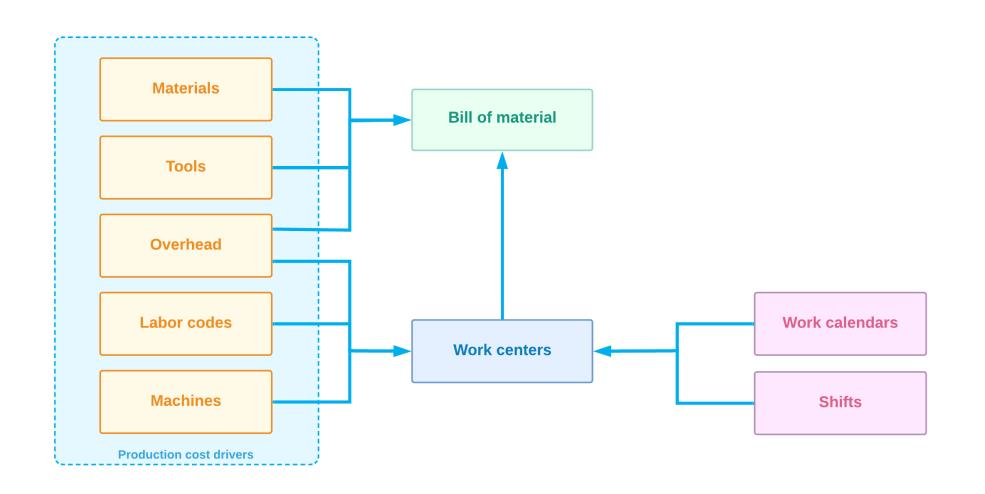

*Figure: The order in which you create manufacturing entities*

# <span id="page-452-0"></span>**Configuring Production Cost Drivers**

In this chapter, you will find information about configuring the production cost drivers that can be included in the cost of the final product in Acumatica ERP Manufacturing Edition. These production cost drivers include materials, labor, tools, machines, and overhead.

# <span id="page-452-2"></span><span id="page-452-1"></span>**Configuring Production Cost Drivers: General Information**

The costing of items that you make is more complex and detailed than the costing of items you buy. The costing of these manufactured items includes not only the cost of the materials bought to make an item but also the cost of labor, factory overhead, machinery, and tooling used in production. And subassemblies may be produced and stored that become part of the final assembly of the finished goods you sell.

In this topic, you will read about configuring production cost drivers, which are the costs that can be included in the cost of the final product.

# **Learning Objectives**

In this chapter, you will learn how to do the following:

- Define the labor codes so that labor costs are included in the cost of a produced item
- Define the overhead entities so that overhead costs are included in the cost of a produced item
- Define the tools so that the tool costs are included in the cost of a produced item
- Define the machines so that the machine costs are included in the cost of a produced item

### **Applicable Scenarios**

You configure production cost drivers in the following cases:

- When you initially implement Acumatica ERP, and the *Manufacturing* feature is included in your license
- When you have purchased the *Manufacturing* feature, and you need to configure manufacturing in the existing Acumatica ERP system
- When you need to add or change cost drivers that affect the cost of the produced item

# **Cost Drivers in Manufacturing**

In Acumatica ERP Manufacturing Edition, you need to define the following entities whose costs can affect the cost of the final product:

- Materials: You define the needed materials (stock items and non-stock items) so that you can track the costs of the components used to make the finished product.
- Labor: You define labor codes in the system and use them to track the cost of the labor issued (or planned to be issued) to make the product.
- Overhead: You define the applicable overhead entities in the system and specify the overhead rates to be applied to particular operations and materials.
- Machines: You define each machine in the system, including the cost rate of running a machine for a production operation.
- Tools: You define each tool to be used in a production operation, including its cost rate for each usage.
- Subcontractor services and materials: You track the value of the services provided by a vendor and materials provided to and purchased from a vendor for performing the work.

Costs can be planned and actual. Planned costs are specified on the bill of material level, and actual costs are calculated when users process production orders. The system posts actual costs when users record quantities of produced items or when materials or labor are backflushed at a production order operation.

In the following sections, you can find more information about particular cost drivers.

# **Material Costs**

Materials can include stock items and non-stock items. For a stock item, you specify the planned cost in one of the following locations:

- On the **Price/Cost** tab of the *[Stock Items](https://help-2025r1.acumatica.com/Help?ScreenId=ShowWiki&pageid=77786a70-1f1e-4d63-ad98-96f98e4fcb0e)* (IN202500) form if the item is stored in one warehouse
- On the **Price/Cost** tab of the *Item [Warehouse](https://help-2025r1.acumatica.com/Help?ScreenId=ShowWiki&pageid=ae2418af-7f53-4c09-8766-556452d8f8b8) Details* (IN204500) form if the item is stored in multiple warehouses and the item cost is warehouse-specific

For a non-stock item, you specify the item cost on the **Price/Cost** tab of the *[Non-Stock Items](https://help-2025r1.acumatica.com/Help?ScreenId=ShowWiki&pageid=bf68dd4f-63d4-460d-8dc0-9152f2bd6bf1)* (IN202000) form.

# **Labor Costs**

The cost of labor can be broken down into direct labor costs and indirect (also described as overhead) labor costs. Direct labor costs include wages for the employees who produce a product. Indirect labor costs are associated with employees who are not involved in production directly, such as security staff. In Acumatica ERP, you can track both direct and indirect labor costs.

Labor costs are posted to a special GL account. You use the *[Labor Codes](https://help-2025r1.acumatica.com/Help?ScreenId=ShowWiki&pageid=7f308462-24c9-4bd4-b099-75c39960162c)* (AM206500) form to define the labor codes that will contain information about the cost type (direct or indirect) and the GL account where the labor expenses must be posted. You must define at least one labor code of the *Direct* type.

Planned labor costs are calculated based on the run units and run time of an operation and the standard cost of a work center assigned to the operation. Actual labor costs are calculated based on either the standard cost of a work center or the employee cost rate. You select the way of calculating actual costs in the **Use Labor Rate** box on the *[Production Preferences](https://help-2025r1.acumatica.com/Help?ScreenId=ShowWiki&pageid=678a1833-f1f6-44f1-afce-55aa7438b3f3)* (AM102000) form. You specify the standard cost of a work center in the**Standard Cost** box on the *[Work Centers](https://help-2025r1.acumatica.com/Help?ScreenId=ShowWiki&pageid=6543295f-b1eb-4991-868f-503435b1d67a)* (AM207000) form. If you calculate labor costs by using the employee cost rate, you specify the rate on the *[Labor Rates](https://help-2025r1.acumatica.com/Help?ScreenId=ShowWiki&pageid=3bcc9979-ef23-4331-0598-19edc8babe03)* (PM209900) form.


Make sure that no labor item is specified in the **Labor Item** box on the **General** tab of the *[Employees](https://help-2025r1.acumatica.com/Help?ScreenId=ShowWiki&pageid=dae5144b-49b3-43a4-bce0-93f31b3f2321)* (EP203000) form.

For more information about labor costs, see *[Configuration of Production with Backflushing: General Information](#page-481-2)* and *[Configuration of Production with Backflushing: Implementation Activity](#page-482-1)*.

#### **Overhead Costs**

You can set up overhead costs by using the *[Overhead](https://help-2025r1.acumatica.com/Help?ScreenId=ShowWiki&pageid=78dd90ec-9bc6-4ea4-a901-4d6f531e9d99)* (AM202500) form. These costs can be accrued at a fixed rate, which is the same regardless of lot or order size, or at a variable rate, which may depend on labor hours or the quantity of goods completed. You can create as many overhead IDs as you need to account for the different overhead expenses of your organization. The full list of the supported overhead types is the following:

- *Fixed*: Uses a single fixed cost
- *Variable by Labor Hours*: Depends on the number of labor hours used in production
- *Variable by Labor Cost*: Depends on the cost of the labor used in production
- *Variable by Material Cost*: Depends on the cost of the materials used in production
- *Variable by Machine Hours*: Depends on the number of machine hours used in production
- *Variable by Quantity Completed*: Depends on the quantity of completed items
- *Variable by Total Quantity*: Depends on the quantity of completed and scrapped items

You can assign the overhead costs to a specific item on the *[Bill of Material](https://help-2025r1.acumatica.com/Help?ScreenId=ShowWiki&pageid=1aae7d3a-d5f9-4693-b91f-663c4c2d362b)* (AM208000) form or to a work center on the *[Work Centers](https://help-2025r1.acumatica.com/Help?ScreenId=ShowWiki&pageid=6543295f-b1eb-4991-868f-503435b1d67a)* (AM207000) form, depending on whether the cost affects a particular product or a particular production operation.

Actual overhead costs are applied when a quantity of produced items is recorded for a production order operation.

#### **Tool Costs**

If you need to add tool costs to the cost of a produced item, you create all tools included in the production process by using the *[Tools](https://help-2025r1.acumatica.com/Help?ScreenId=ShowWiki&pageid=8a5b6ca0-613a-46e8-9656-34c0c82378fe)* (AM205500) form. On this form, you specify the unit cost for each tool, which is the cost for every usage of the tool in a production order and the GL account where tool costs must be posted.

#### **Machine Costs**

If you need to add machine costs to the cost of produced items, you create machines and specify their costs on the *[Machines](https://help-2025r1.acumatica.com/Help?ScreenId=ShowWiki&pageid=9053c704-59ca-4114-b25b-895f9b315014)* (AM204500) form. When assigning a machine to a work center on the *[Work Centers](https://help-2025r1.acumatica.com/Help?ScreenId=ShowWiki&pageid=6543295f-b1eb-4991-868f-503435b1d67a)* (AM207000) form, you can specify a different machine cost to be used for this work center. On both forms, you also select the GL account where the system will post the costs. Then on the *[Bill of Material](https://help-2025r1.acumatica.com/Help?ScreenId=ShowWiki&pageid=1aae7d3a-d5f9-4693-b91f-663c4c2d362b)* (AM208000) form, for each operation that uses machines, you specify the number of machine units and machine time needed for the operation.

### **Subcontractor Costs**

If any outside organizations (that is, subcontractors) are involved in the production process—such as providing services or creating components of produced items—you can include the costs your organization spends for these organizations in the cost of the produced items. For details, see *[Outside Processing: General Information](https://help-2025r1.acumatica.com/Help?ScreenId=ShowWiki&pageid=d62c2f61-7125-423e-aa69-bcd035aa06df)*.

# <span id="page-454-0"></span>**Configuring Production Cost Drivers: Configuration Prerequisites**

Before starting to create cost drivers for produced items, you must be sure that the system has been configured properly and that all required entities have been created, as described in the following sections.

### **Enabling the Needed Features**

On the *[Enable/Disable Features](https://help-2025r1.acumatica.com/Help?ScreenId=ShowWiki&pageid=c1555e43-1bc5-4f6f-ba9d-b323f94d8a6b)* (CS100000) form, the *Manufacturing* feature must be enabled.

# **Configuring the System**

Before you create records for tools, machines, overhead, and labor codes in Acumatica ERP, you need to make sure that the following actions have been performed in the system:

- On the *[Chart of Accounts](https://help-2025r1.acumatica.com/Help?ScreenId=ShowWiki&pageid=85557f41-a4af-47a8-b198-2a01461ce9c3)* (GL202500) form, all GL accounts where costs will be posted have been created.
- On the *[BOM Preferences](https://help-2025r1.acumatica.com/Help?ScreenId=ShowWiki&pageid=7224e637-50bc-468d-bfb6-e97b87378ff6)* (AM101000) form, the numbering sequence for bills of material has been specified.
- On the *[Production Preferences](https://help-2025r1.acumatica.com/Help?ScreenId=ShowWiki&pageid=678a1833-f1f6-44f1-afce-55aa7438b3f3)* (AM102000) form, the numbering sequences for move, material, labor, cost, and WIP adjustments have been specified.

# <span id="page-455-1"></span><span id="page-455-0"></span>**Configuring Production Cost Drivers: Implementation Activity**

In the following implementation activity, you will learn how to create tools, machines, overhead entities, and labor codes, which are production cost drivers—that is, they determine the cost of the final products.

#### **Story**

Suppose that SweetLife Fruits & Jams has decided to assemble customized juicers according to customers' needs. For accurate calculating of the cost of the juicer, the material costs, machine costs, tool costs, labor costs, and overhead costs must be considered. In the assembly process, such tools as a screwdriver and a hammer are used. For producing small plastic parts, the injection molding machine is used. Two workers are involved in the juicer assembly. The administrative costs, payroll costs, and floor setup costs must be included in the cost of the juicers as well.

As an implementation manager, you need to create records for a machine, tools, overhead, and labor codes so that these costs are included in the cost of the juicers. The costs for the components used in juicers have been specified when the stock items for these components were created in the system, so you will not specify these costs in this activity.

# **Configuration Overview**

The following entities, which you will use in this activity, have been predefined in the *U100* dataset:

- On the *[Chart of Accounts](https://help-2025r1.acumatica.com/Help?ScreenId=ShowWiki&pageid=85557f41-a4af-47a8-b198-2a01461ce9c3)* (GL202500) form, the following GL accounts:
  - *51000, Accrued COGS - Direct Labor Costs*
  - *51050, Accrued COGS - Fixed Overhead Costs*
  - *51060, Accrued COGS - Fixed Machine Costs*
  - *51070, Accrued COGS - Fixed Tool Costs*
  - *51100, Accrued COGS - Indirect Labor Costs*
  - *51150, Accrued COGS - Variable Overhead Costs*
- On the *[Work Calendar](https://help-2025r1.acumatica.com/Help?ScreenId=ShowWiki&pageid=9d01d650-0b68-4994-8146-c80fb5e34bbb)* (CS209000) form, the *MAIN* work calendar

### **Process Overview**

In this activity, you will do the following:

- 1. On the *[Labor Codes](https://help-2025r1.acumatica.com/Help?ScreenId=ShowWiki&pageid=7f308462-24c9-4bd4-b099-75c39960162c)* (AM206500) form, create labor codes for direct and indirect labor costs
- 2. On the *[Overhead](https://help-2025r1.acumatica.com/Help?ScreenId=ShowWiki&pageid=78dd90ec-9bc6-4ea4-a901-4d6f531e9d99)* (AM202500) form, create overhead entities for administrative costs, payroll costs, and the floor setup costs
- 3. On the *[Tools](https://help-2025r1.acumatica.com/Help?ScreenId=ShowWiki&pageid=8a5b6ca0-613a-46e8-9656-34c0c82378fe)* (AM205500) form, create tools for a screwdriver and hammer

4. On the *[Machines](https://help-2025r1.acumatica.com/Help?ScreenId=ShowWiki&pageid=9053c704-59ca-4114-b25b-895f9b315014)* (AM204500) form, create a record for the injection molding machine

### **System Preparation**

Before you start creating the needed entities in the system, do the following:

- 1. As a prerequisite to the current activity, complete *[System Preparation for Manufacturing Implementation:](#page-443-1) [Implementation Activity](#page-443-1)* so that the needed settings have been made in a company with the *U100* dataset preloaded.
- 2. Sign in to this company (in which the prerequisite activity has been performed) as a system administrator with the *gibbs* username and *123* password.

# **Step 1: Creating Labor Codes**

To create labor codes for direct and indirect labor expenses, do the following:

- 1. Open the *[Labor Codes](https://help-2025r1.acumatica.com/Help?ScreenId=ShowWiki&pageid=7f308462-24c9-4bd4-b099-75c39960162c)* (AM206500) form.
- 2. On the form toolbar, click **Add Row**.
- 3. In the added row, specify the following values in the columns:
  - **Type**: *Direct*
  - **Labor Code**: DIRLAB
  - **Description**: Direct labor
  - **Labor Account**: *51000*
- 4. Add another row for a labor code with indirect labor costs, and specify the following values in the columns of the row:
  - **Type**: *Indirect*
  - **Labor Code**: INDIRLAB
  - **Description**: Indirect labor
  - **Labor Account**: *51100*
  - **Overhead Account**: *51150*
- 5. On the form toolbar, click**Save**.

### **Step 2: Creating Overhead Entities**

To create overhead entities for administrative costs, payroll costs, and floor setup costs, do the following:

- 1. Open the *[Overhead](https://help-2025r1.acumatica.com/Help?ScreenId=ShowWiki&pageid=78dd90ec-9bc6-4ea4-a901-4d6f531e9d99)* (AM202500) form.
- 2. On the form toolbar, click **Add Row**.
- 3. For the administrative overhead, specify the following settings in the columns of the added row:
  - **Overhead ID**: ADMIN
  - **Description**: Administrative overhead
  - **Type**: *Fixed*
  - **Cost Rate**: 15.0000
  - **Account**: *51050*
- 4. Add another row for the floor setup overhead costs, and specify the following settings in the columns of the added row:
  - **Overhead ID**: FLOOR
  - **Description**: Floor setup overhead

- **Type**: *Variable by Quantity Completed*
- **Cost Rate**: 0.0500
- **Account**: *51150*
- 5. Add one more row for the payroll overhead costs, and specify the following settings in the columns of the added row:
  - **Overhead ID**: PAYROLL
  - **Description**: Payroll overhead
  - **Type**: *Variable by Labor Cost*
  - **Cost Rate**: 0.3000
  - **Account**: *51150*
- 6. On the form toolbar, click**Save**.

# **Step 3: Creating Tools**

To create tools for the screwdriver and hammer that will be used in the juicer assembly process, do the following:

1. On the *[Tools](https://help-2025r1.acumatica.com/Help?ScreenId=ShowWiki&pageid=8a5b6ca0-613a-46e8-9656-34c0c82378fe)* (AM205500) form, add a new record.


To open the form for creating a new record, type the form ID in the Search box, and on the Search form, point at the form title and click **New** right of the title.

- 2. For the screwdriver tool, in the Summary area, specify the following settings:
  - **Tool ID**: SCREWDRIVER
  - **Description**: Electric screwdriver
  - **Active**: Selected
- 3. In the **Cost** section, specify the following settings:
  - **Unit Cost**: 0.2000
  - **Total Cost**: 200.0000
- 4. In the **AccountSettings** section, select *51070* in the **Account** box.
- 5. On the form toolbar, click**Save**.
- 6. On the form toolbar, click **Add New Record**.
- 7. In the Summary area, specify the following settings for the hammer tool:
  - **Tool ID**: HAMMER
  - **Description**: Hammer
  - **Active**: Selected
- 8. In the **Cost** section, specify the following settings:
  - **Unit Cost**: 0.0200
  - **Total Cost**: 25.0000
- 9. In the **AccountSettings** section, select *51070* in the **Account** box.

10.On the form toolbar, click**Save**.

#### **Step 4: Creating a Machine**

You will create a record for the injection molding machine with the standard cost of \$25 per hour and 100% efficiency. The machine will work during the standard working hours. Do the following:

1. On the *[Machines](https://help-2025r1.acumatica.com/Help?ScreenId=ShowWiki&pageid=9053c704-59ca-4114-b25b-895f9b315014)* (AM204500) form, add a new record.

- 2. In the Summary area, specify the following settings:
  - **Machine ID**: INJMOLD
  - **Active**: Selected
  - **Description**: Injection molding machine
  - **Down**: Cleared
- 3. In the **General** section, specify the following settings:
  - **Standard Cost**: 25.0000
  - **Calendar ID**: *MAIN*
  - **Efficiency**: 1.000000
  - **Account**: *51060*
- 4. On the form toolbar, click**Save**.

You have created records for the labor codes, tools, overhead entities, and machines, and now you can create work centers.

# <span id="page-458-0"></span>**Configuring Work Centers**

In organizations that produce items, specific areas are dedicated to operations involved in production, such as assembly or machine operations. In Acumatica ERP Manufacturing Edition, you need to create work centers that correspond to these areas. You assign people or machines to work centers, and you specify shis and overhead costs. Work centers are required for bills of material.

<span id="page-458-2"></span>In this chapter, you will read about configuring work centers in Acumatica ERP Manufacturing Edition.

# <span id="page-458-1"></span>**Configuring Work Centers: General Information**

In Acumatica ERP Manufacturing Edition, a work center corresponds to a physical or virtual location in a warehouse or production facility. The work center is a required component of configuring bills of material because it determines the availability of processes as well as the costing from overhead, labor, and machines. You use the *[Work Centers](https://help-2025r1.acumatica.com/Help?ScreenId=ShowWiki&pageid=6543295f-b1eb-4991-868f-503435b1d67a)* (AM207000) form to create work centers and manage settings of existing work centers.

In this topic, you will read about the configuration of work centers in Acumatica ERP Manufacturing Edition.

### **Learning Objectives**

In this chapter, you will learn how to do the following:

- Create a work calendar for overtime work
- Create shis that will be used in work centers
- Create the work centers that will be involved in manufacturing

#### **Applicable Scenarios**

You create work centers in the following cases:

- When you initially implement Acumatica ERP, and the *Manufacturing* feature is included in your license
- When you have purchased the *Manufacturing* feature, and you need to configure manufacturing in the existing system

• When you need to add new work centers or change the settings of existing work centers because of business process changes

# **Work Center Creation**

A work center must be created on the *[Work Centers](https://help-2025r1.acumatica.com/Help?ScreenId=ShowWiki&pageid=6543295f-b1eb-4991-868f-503435b1d67a)* (AM207000) form before you can create bills of material that use the work center. Once you have created any bills of material with a work center, on the **Where Used** tab of this form, you can view the bills of material that use the selected work center. You cannot delete a work center if it is used in any bill of material. Before deleting a work center, we recommend that you open the **Where Used** tab to make sure no bills of material use the work center.

For each work center you create, you specify the following:

- The warehouse where the work center is located (required): You must assign each work center to a warehouse.
- The standard cost per labor hour (optional): You specify this setting so that the system calculates the planned labor costs for the manufacturing process in which the work center is involved.
- The planned capacity of the work center (required): You specify whether the capacity constraint for scheduling should be the crew size or the machines. The basis for capacity determines whether the operation is scheduled by using run times or machine times. For more information, see *[Advanced Planning](https://help-2025r1.acumatica.com/Help?ScreenId=ShowWiki&pageid=b84668ca-4cbb-4ebc-b627-bc76489d6ad7) [and Scheduling: Capacity Definition](https://help-2025r1.acumatica.com/Help?ScreenId=ShowWiki&pageid=b84668ca-4cbb-4ebc-b627-bc76489d6ad7)*
- The default scrap action (optional): You specify how the system should handle production scrap in the work center. For more information about scrap, see *[Configuration](#page-485-2) of Scrap, Waste, and By-Products in Production: [General Information](#page-485-2)*.
- The default settings for the labor or material backflushing (optional): You define whether backflushing will be used in the work center. These settings are used by default when a user adds new operations and materials to a bill of material. For details on backflushing, see *[Production with Backflushing: General](https://help-2025r1.acumatica.com/Help?ScreenId=ShowWiki&pageid=4e5d9c24-fdd3-49fa-b8f9-2629b73525c9) [Information](https://help-2025r1.acumatica.com/Help?ScreenId=ShowWiki&pageid=4e5d9c24-fdd3-49fa-b8f9-2629b73525c9)*.
- An indicator of whether the work center is dedicated for outside processing: A work center can be created for an outside process, which is performed on a subcontractor side, but you may need to use the information specified in the work center in the bill of material. For more information about outside processing, see *[Outside Processing: General Information](https://help-2025r1.acumatica.com/Help?ScreenId=ShowWiki&pageid=d62c2f61-7125-423e-aa69-bcd035aa06df)*.
- An indicator of whether operations performed in the work center must be control points: By using this setting, you specify whether it is mandatory for workers to record the completed quantity for the operations. For details, see *[Production Processing: Control Point Operations](https://help-2025r1.acumatica.com/Help?ScreenId=ShowWiki&pageid=34066685-2233-4629-9995-0aa594b447a1)*.
- All shis used to calculate work time in the work center (required): You add the shis used in the work center so that the system determines the availability of work center resources (such as employees and machines) for production needs. A shi can contain information about additional payments to employees for overtime work. You create shis by using the *[Shifts](https://help-2025r1.acumatica.com/Help?ScreenId=ShowWiki&pageid=5c53e402-782c-4ce2-98fb-6ec877a2675c)* (AM205000) form. You must add at least one shi to the work center.


The labor cost is based on the first shi record found and not all of the shi records on the work center.

For each shi, you also specify the following required settings:

- The work calendar: You specify the calendar that defines the working hours of the work center for a particular shi.
- The labor code: You specify the labor code that defines the labor offset account when labor is entered or backflushed. For more information about labor costs, see *[Production with Backflushing: General](https://help-2025r1.acumatica.com/Help?ScreenId=ShowWiki&pageid=4e5d9c24-fdd3-49fa-b8f9-2629b73525c9) [Information](https://help-2025r1.acumatica.com/Help?ScreenId=ShowWiki&pageid=4e5d9c24-fdd3-49fa-b8f9-2629b73525c9)* and *[Production Processing: Labor Reporting](https://help-2025r1.acumatica.com/Help?ScreenId=ShowWiki&pageid=223a203b-ac0f-4e7e-af0a-15aa21930776)*.
- All applicable overhead rates (optional): You add overhead rates to the work center to apply additional fixed or variable overhead costs to production. For details on overhead costs, see *[Configuring Production Cost](#page-452-2) [Drivers: General Information](#page-452-2)*.

- All applicable machine rates (optional): If machines are involved in the manufacturing process, you add the rates for these machines to apply these costs to production. For details on machine costs, see *[Configuring](#page-452-2) [Production Cost Drivers: General Information](#page-452-2)*.
- Substitute work centers (optional): If the same items can be produced in multiple work centers assigned to different warehouses, you can specify the substitute work centers. For more information, see *[Configuring](#page-460-2) [Work Centers: Substitution of Work Centers](#page-460-2)*.

# <span id="page-460-2"></span><span id="page-460-0"></span>**Configuring Work Centers: Substitution of Work Centers**

A company may have multiple production facilities where an item can be made. The components used to make the item may be the same, although they may have different costs; the production process also may be the same, but the production facilities may have different labor and overhead rates. For these cases, the ability to specify substitute work centers has been implemented in Acumatica ERP Manufacturing Edition, as described in this topic. The system can substitute work centers during production order creation based on the warehouse used for production. This substitution can eliminate the need to have warehouse-specific bills of material.

The ability to specify substitute work centers is available only if the *Multiple Warehouse* feature is enabled on the *[Enable/Disable Features](https://help-2025r1.acumatica.com/Help?ScreenId=ShowWiki&pageid=c1555e43-1bc5-4f6f-ba9d-b323f94d8a6b)* (CS100000) form.

### **Substitution of Work Centers**

You do the following to configure the ability to substitute work centers:

- 1. On the *[Production](https://help-2025r1.acumatica.com/Help?ScreenId=ShowWiki&pageid=6283187d-54b7-4db1-8c3a-97d3ebc39a95) Order Types* (AM201100) form, you select the**Substitute Work Centers** check box on the **GeneralSettings** tab for the needed production order type.
- 2. On the *[Work Centers](https://help-2025r1.acumatica.com/Help?ScreenId=ShowWiki&pageid=6543295f-b1eb-4991-868f-503435b1d67a)* (AM207000) form, you add substitutes for each applicable work center to the **Substitutes** tab.

When a user creates a production order of a type for which the**Substitute Work Centers** check box is selected or changes a warehouse for the order, the system compares the warehouse of the production order and the warehouse of each work center specified in the order. If the warehouse of a work center differs from the warehouse of the order, the system looks for substitute work centers with the warehouse that matches the order warehouse. If such a work center is found, the system replaces the work center with the substitute, changing the operation description, replacing the backflush labor setting, and copying the overhead rates of the substitute work center.

# <span id="page-460-1"></span>**Configuring Work Centers: Configuration Prerequisites**

Before starting to create work centers, you must be sure that the system has been configured properly and that all required entities have been created, as described in the following sections.

# **Enabling the Needed Feature**

On the *[Enable/Disable Features](https://help-2025r1.acumatica.com/Help?ScreenId=ShowWiki&pageid=c1555e43-1bc5-4f6f-ba9d-b323f94d8a6b)* (CS100000) form, the *Manufacturing* feature must be enabled.

### **Configuring the System**

You need to make sure the following tasks have been performed in Acumatica ERP before you begin to create work centers:

- On the *[BOM Preferences](https://help-2025r1.acumatica.com/Help?ScreenId=ShowWiki&pageid=7224e637-50bc-468d-bfb6-e97b87378ff6)* (AM101000) form, the numbering sequence for bills of material has been specified.
- On the *[Production Preferences](https://help-2025r1.acumatica.com/Help?ScreenId=ShowWiki&pageid=678a1833-f1f6-44f1-afce-55aa7438b3f3)* (AM102000) form, the numbering sequences for move, material, labor, cost, and WIP adjustments have been specified.

- On the *[Work Calendar](https://help-2025r1.acumatica.com/Help?ScreenId=ShowWiki&pageid=9d01d650-0b68-4994-8146-c80fb5e34bbb)* (CS209000) form, the work calendars that will be used with work centers have been created. For an example of the creation of a work calendar, see *[Configuring Work Centers: Implementation](#page-461-1) [Activity](#page-461-1)*.
- On the *[Shifts](https://help-2025r1.acumatica.com/Help?ScreenId=ShowWiki&pageid=5c53e402-782c-4ce2-98fb-6ec877a2675c)* (AM205000) form, the shis for the work centers have been created. For an example of the creation of a shi, see *[Configuring Work Centers: Implementation Activity](#page-461-1)*.
- On the *[Labor Codes](https://help-2025r1.acumatica.com/Help?ScreenId=ShowWiki&pageid=7f308462-24c9-4bd4-b099-75c39960162c)* (AM206500) form, the labor codes to be used for calculating the labor costs of any work center have been created. For an example of the defining of a labor code, see *[Configuring Production Cost](#page-455-1) [Drivers: Implementation Activity](#page-455-1)*.
- If overhead is to be used, on the *[Overhead](https://help-2025r1.acumatica.com/Help?ScreenId=ShowWiki&pageid=78dd90ec-9bc6-4ea4-a901-4d6f531e9d99)* (AM202500) form, the overhead rates to be used for any of the work centers have been created. For an example of the creating of an overhead entity, see *[Configuring](#page-455-1) [Production Cost Drivers: Implementation Activity](#page-455-1)*.
- If machines are to be scheduled or used for costing, on the *[Machines](https://help-2025r1.acumatica.com/Help?ScreenId=ShowWiki&pageid=9053c704-59ca-4114-b25b-895f9b315014)* (AM204500) form, the machines to be used in any of the work centers have been created. For an example of the defining of a machine, see *[Configuring Production Cost Drivers: Implementation Activity](#page-455-1)*.

# <span id="page-461-1"></span><span id="page-461-0"></span>**Configuring Work Centers: Implementation Activity**

In the following implementation activity, you will learn how to create a work calendar, shis, and work centers.

### **Story**

Suppose that SweetLife Fruits & Jams has decided to assemble customized juicers according to customers' needs. Assembly will take place in the Workhouse warehouse of the Service and Equipment Sales Center branch, in a specific work center. Two workers and a manager will be involved in the assembly process, and no machines will be used in this work center. Administrative and payroll overhead costs must be included in the production costs for this work center. Normally, workers will work in the standard shi, but sometimes overtime work will be required, and usually one worker is involved in overtime work. Standard working hours are from Monday to Friday, 10:00 AM to 6:00 PM. Overtime work is from Monday to Friday, 6:00 PM to 9:00 PM.

In a separate work center, an injection molding machine has been installed, which will be used for producing small plastic parts required for juicers. The machine will be used during the standard schedule. One worker will operate the machine during the working hours.

As an implementation manager, you need to create a work calendar for overtime (a work calendar already exists for standard working hours), shis for standard working hours and for overtime, and work centers for juicer assembly and for the injection molding machine.

### **Configuration Overview**

The following entities, which you will use in this activity, have been predefined in the *U100* dataset:

- On the *[Warehouses](https://help-2025r1.acumatica.com/Help?ScreenId=ShowWiki&pageid=264b0ef7-2b6c-40b4-a7d9-f1a5e067939b)* (IN204000) form, the *WORKHOUSE* warehouse
- On the *[Work Calendar](https://help-2025r1.acumatica.com/Help?ScreenId=ShowWiki&pageid=9d01d650-0b68-4994-8146-c80fb5e34bbb)* (CS209000) form, the *MAIN* work calendar, which is used for standard working hours

### **Process Overview**

In this activity, you will do the following:

- 1. On the *[Work Calendar](https://help-2025r1.acumatica.com/Help?ScreenId=ShowWiki&pageid=9d01d650-0b68-4994-8146-c80fb5e34bbb)* (CS209000) form, create a work calendar for overtime work
- 2. On the *[Shifts](https://help-2025r1.acumatica.com/Help?ScreenId=ShowWiki&pageid=5c53e402-782c-4ce2-98fb-6ec877a2675c)* (AM205000) form, create shis for standard working hours and for overtime work
- 3. On the *[Work Centers](https://help-2025r1.acumatica.com/Help?ScreenId=ShowWiki&pageid=6543295f-b1eb-4991-868f-503435b1d67a)* (AM207000) form, create work centers for juicer assembly and for the injection molding machine

### **System Preparation**

Before you start performing the activity, do the following:

- 1. As a prerequisite to the current activity, complete *[Configuring Production Cost Drivers: Implementation Activity](#page-455-1)* so that the needed machine, overhead entities, and labor codes have been created in a company with the *U100* dataset preloaded.
- 2. Sign in to this company (that is, the company in which the prerequisite activity has been performed) as a system administrator with the *gibbs* username and *123* password.

# **Step 1: Creating a Work Calendar**

To create a work calendar for overtime, do the following:

1. On the *[Work Calendar](https://help-2025r1.acumatica.com/Help?ScreenId=ShowWiki&pageid=9d01d650-0b68-4994-8146-c80fb5e34bbb)* (CS209000) form, add a new record.


To open the form for creating a new record, type the form ID in the Search box, and on the Search form, point at the form title and click **New** right of the title.

- 2. In the **Calendar ID** box of the Summary area, type OVERTIME.
- 3. In the **Description** box, type Calendar for overtime.
- 4. In the **Time Zone** box, select *(GMT -05:00) Eastern Time (US & Canada)*.
- 5. On the **Calendar** tab, do the following:
  - a. Notice that the check boxes are selected for **Monday**, **Tuesday**, **Wednesday**, **Thursday**, and **Friday** in the **Day of Week** column.
  - b. In the **StartTime** box for each of the selected days of week, select *6:00 PM*.
  - c. In the **End Time** box for each of the selected days of week, select *9:00 PM*.
- 6. On the form toolbar, click**Save**.

You have created a work calendar for overtime, which you will use in the work center settings along with the shi for overtime work.

# **Step 2: Creating Shis**

You will create a shi for standard working time and a shi for overtime work. Do the following:

- 1. Open the *[Shifts](https://help-2025r1.acumatica.com/Help?ScreenId=ShowWiki&pageid=5c53e402-782c-4ce2-98fb-6ec877a2675c)* (AM205000) form.
- 2. On the form toolbar, click **Add Row** to add a shi for standard working time.
- 3. In the columns of the added row, specify the following settings:
  - **Shi**: 0001
  - **Description**: Monday Friday
  - **Diff Type**: *Amount*
  - **Shi Diff**: 0
  - **Crew Size**: 2
- 4. On the form toolbar, click**Save**.
- 5. On the form toolbar, click **Add Row** to add a shi for overtime.
- 6. In the columns of the added row, specify the following settings:
  - **Shi**: 0002

- **Description**: Overtime
- **Diff Type**: *Rate*
- **Shi Diff**: 1.5
- **Crew Size**: 1
- 7. On the form toolbar, click**Save**.

You have created shis for standard working time and for overtime, and now you can create the needed work centers.

### **Step 3: Creating a Work Center for Juicer Assembly**

To create a work center where the assembly of juicers will be performed, do the following:

- 1. On the *[Work Centers](https://help-2025r1.acumatica.com/Help?ScreenId=ShowWiki&pageid=6543295f-b1eb-4991-868f-503435b1d67a)* (AM207000) form, add a new record.
- 2. In the Summary area, specify the following settings:
  - **Work Center**: WCR10
  - **Active**: Selected
  - **Description**: Work center for assembly of juicers
  - **Warehouse**: *WORKHOUSE*
- 3. On the **General** tab, specify the following settings:
  - **Standard Cost**: *20*
  - **Basis for Capacity**: *Crew Size*
  - **Allow Clock Entry for Multiple Production Orders**: Cleared
  - **Scrap Action Default:** *No Action*
  - **Backflush Materials**: Cleared
  - **Backflush Labor**: Cleared
  - **Control Point**: Cleared
  - **Outside Process**: Cleared
- 4. On the **Shis** tab, do the following:
  - a. Notice that the row for the *0001* shi has been added. (The row for the first shi is always added automatically because the work center must have at least one shi.)
  - b. In this row, specify the following:
    - **Crew Size**: 2
    - **Efficiency**: 1
    - **Calendar ID**: *MAIN*
    - **Labor Code**: *DIRLAB*

You created this labor code in *[Configuring Production Cost Drivers: Implementation Activity](#page-455-1)*.

- c. Make sure that the **Diff Type** column contains *Amount* and the **Shi Diff** column contains *0.0000*. These values have been copied from the shi settings on the *[Shifts](https://help-2025r1.acumatica.com/Help?ScreenId=ShowWiki&pageid=5c53e402-782c-4ce2-98fb-6ec877a2675c)* (AM205000) form.
- d. On the table toolbar, click **Add Row**.
- e. In this row, specify the following:
  - **Shi**: *0002*
  - **Crew Size**: 1
  - **Efficiency**: 1
  - **Calendar ID**: *OVERTIME*
  - **Labor Code**: *DIRLAB*

- f. On the form toolbar, click**Save**.
- g. Notice that the **Diff Type** column contains *Rate* and the **Shi Diff** column contains *1.5000*. These values have been copied from the shi settings on the *[Shifts](https://help-2025r1.acumatica.com/Help?ScreenId=ShowWiki&pageid=5c53e402-782c-4ce2-98fb-6ec877a2675c)* form.
- 5. On the **Overhead** tab, do the following:
  - a. On the table toolbar, click **Add Row**.
  - b. In the **Overhead ID** column, select *ADMIN* to add the administrative overhead to the production cost. You created this overhead entity in *[Configuring Production Cost Drivers: Implementation Activity](#page-455-1)*.
  - c. In the **Factor** column, type 1.
  - d. On the table toolbar, click **Add Row**.
  - e. In the **Overhead ID** column, select *PAYROLL* to add the payroll overhead to the production cost. You created this overhead entity in *[Configuring Production Cost Drivers: Implementation Activity](#page-455-1)*.
  - f. In the **Factor** column, type 1.
- 6. On the form toolbar, click**Save**.

You have created the work center that will be involved in the process of juicer assembly.

# **Step 4: Creating a Work Center for a Machine**

While remaining on the *[Work Centers](https://help-2025r1.acumatica.com/Help?ScreenId=ShowWiki&pageid=6543295f-b1eb-4991-868f-503435b1d67a)* (AM207000) form, you will create a work center for the injection molding machine. Do the following:

- 1. On the form toolbar, click **Add New Record**.
- 2. In the Summary area, specify the following settings:
  - **Work Center**: WCR20
  - **Active**: Selected
  - **Description**: Work center for the injection molding machine
  - **Warehouse**: *WORKHOUSE*
- 3. On the **General** tab, specify the following settings:
  - **Standard Cost**: *15*
  - **Basis for Capacity**: *Machines*
  - **Allow Clock Entry for Multiple Production Orders**: Cleared
  - **Scrap Action Default:** *No Action*
  - **Backflush Materials**: Selected
  - **Backflush Labor**: Selected
  - **Control Point**: Cleared
  - **Outside Process**: Cleared
- 4. On the **Shis** tab, do the following:
  - a. Make sure that the row for the *0001* shi has been added.
  - b. In this row, specify the following:
    - **Crew Size**: 1
    - **Efficiency**: 1
    - **Calendar ID**: *MAIN*
    - **Labor Code**: *DIRLAB*
  - c. Make sure that the **Diff Type** column contains *Amount* and the **Shi Diff** column contains *0.0000*. These values have been copied from the shi settings on the *[Shifts](https://help-2025r1.acumatica.com/Help?ScreenId=ShowWiki&pageid=5c53e402-782c-4ce2-98fb-6ec877a2675c)* (AM205000) form.

- 5. On the **Overhead** tab, do the following:
  - a. On the table toolbar, click **Add Row**.
  - b. In the **Overhead ID** column, select *FLOOR* to add the floor setup cost to the production cost. You created this overhead entity in *[Configuring Production Cost Drivers: Implementation Activity](#page-455-1)*.
  - c. In the **Factor** column, type 1.
- 6. On the **Machines** tab, do the following:
  - a. On the table toolbar, click **Add Row**.
  - b. In the **Machine ID** column, select *INJMOLD*.

You created this machine in *[Configuring Production Cost Drivers: Implementation Activity](#page-455-1)*.

- c. Notice that the**Standard Cost** column contains *25.0000* and the **Machine Account** column contains *51060*. These values have been copied from the**Standard Cost** and **Account** boxes on the *[Machines](https://help-2025r1.acumatica.com/Help?ScreenId=ShowWiki&pageid=9053c704-59ca-4114-b25b-895f9b315014)* (AM204500) form.
- 7. On the form toolbar, click**Save**.

You have created a work center for the injection molding machine.

# <span id="page-465-0"></span>**Configuring Production Order Types**

When you configure Acumatica ERP Manufacturing Edition, you need to specify the default settings for production orders, such as which workflow an order is involved in (production, planning, or disassembly) and how the cost of produced items should be calculated. These settings are provided through the use of production order types, which are described in detail in this chapter.

# <span id="page-465-1"></span>**Production Order Types: General Information**

In Acumatica ERP Manufacturing Edition, a production order type provides default settings for production orders of the type and determines the workflow for these production orders. You use the *[Production](https://help-2025r1.acumatica.com/Help?ScreenId=ShowWiki&pageid=6283187d-54b7-4db1-8c3a-97d3ebc39a95) Order Types* (AM201100) form to create production order types, which are described further in this topic.

#### **Learning Objectives**

In this chapter, you will learn how to create a production order type for each of the following categories of production orders: regular, planning, and disassembly.

### **Applicable Scenarios**

You configure production order types in any of the following cases:

- When you initially implement Acumatica ERP and the *Manufacturing* feature is included in your license
- When you have purchased the *Manufacturing* feature, and you need to configure manufacturing in the existing Acumatica ERP system
- When you need to add new production order types or change the settings of existing order types to accommodate business process changes

# **Settings of Production Order Types**

When you create a production order type, you specify the following settings for it on the *[Production](https://help-2025r1.acumatica.com/Help?ScreenId=ShowWiki&pageid=6283187d-54b7-4db1-8c3a-97d3ebc39a95) Order Types* (AM201100) form:

- The function of production orders of the type, which determines the workflow
- The Work in Process and WIP Variance GL accounts
- The cost calculation methods for produced items in production orders of the type
- The scrap settings to be used for production orders of the type
- The settings of data entry validation that apply to orders of the type
- The attributes that users specify for production orders of the type

The settings of a production order type are inserted or used when a new production order is created on the *[Production Order Maintenance](https://help-2025r1.acumatica.com/Help?ScreenId=ShowWiki&pageid=e5d2ddd4-8c80-4f5b-8e5f-e5151636a9d3)* (AM201500) form and the type is selected in the **OrderType** box.

You cannot change the order type in a production order once the order has been created.

In the following sections, you will find detailed information about the settings of a production order type.

### **Functions of Production Order Types**

The workflow of a production order in the system depends on the function specified in the production order type assigned to the production order. The following functions are available in the **Function** box of the *[Production Order](https://help-2025r1.acumatica.com/Help?ScreenId=ShowWiki&pageid=6283187d-54b7-4db1-8c3a-97d3ebc39a95) [Types](https://help-2025r1.acumatica.com/Help?ScreenId=ShowWiki&pageid=6283187d-54b7-4db1-8c3a-97d3ebc39a95)* (AM201100) form:

• *Regular*: The production order is used to produce items.

You can specify a default order type with this function in the **Default OrderType** box of the *[Production](https://help-2025r1.acumatica.com/Help?ScreenId=ShowWiki&pageid=678a1833-f1f6-44f1-afce-55aa7438b3f3) [Preferences](https://help-2025r1.acumatica.com/Help?ScreenId=ShowWiki&pageid=678a1833-f1f6-44f1-afce-55aa7438b3f3)* (AM102000) form. If you do, when a new production order is created on the *[Production Order](https://help-2025r1.acumatica.com/Help?ScreenId=ShowWiki&pageid=e5d2ddd4-8c80-4f5b-8e5f-e5151636a9d3) [Maintenance](https://help-2025r1.acumatica.com/Help?ScreenId=ShowWiki&pageid=e5d2ddd4-8c80-4f5b-8e5f-e5151636a9d3)* (AM201500) form and the *Regular* function is selected, this production order type is inserted, as are its default settings.

• *Planning*: The production order is used for planning purposes, such as reserving materials and capacity. Processing of an order with this function does not generate transactions, such as issue of materials or labor. The inventory planning regeneration process on the *[Regenerate Inventory Planning](https://help-2025r1.acumatica.com/Help?ScreenId=ShowWiki&pageid=588d4939-b533-4b84-8016-cf34e2be17d5)* (AM505000) form also uses orders with this function, but these orders do not reserve materials and capacity.

You can specify the default planning order type in the **Plan OrderType** box on the *[Inventory Planning](https://help-2025r1.acumatica.com/Help?ScreenId=ShowWiki&pageid=c73f184e-6d99-47ff-a550-ae2d4f711ec2) [Preferences](https://help-2025r1.acumatica.com/Help?ScreenId=ShowWiki&pageid=c73f184e-6d99-47ff-a550-ae2d4f711ec2)* (AM100000) form. If you do, when a new production order is created on the *[Production Order](https://help-2025r1.acumatica.com/Help?ScreenId=ShowWiki&pageid=e5d2ddd4-8c80-4f5b-8e5f-e5151636a9d3) [Maintenance](https://help-2025r1.acumatica.com/Help?ScreenId=ShowWiki&pageid=e5d2ddd4-8c80-4f5b-8e5f-e5151636a9d3)* (AM201500) form and the *Planning* function is selected, this production order type is inserted, as are its default settings.

• *Disassemble*: The production order is used to disassemble items.

You can specify the default disassembly order type in the **Default Disassemble OrderType** box on the *[Production Preferences](https://help-2025r1.acumatica.com/Help?ScreenId=ShowWiki&pageid=678a1833-f1f6-44f1-afce-55aa7438b3f3)* form. If you do, when a new production order is created on the *[Production Order](https://help-2025r1.acumatica.com/Help?ScreenId=ShowWiki&pageid=e5d2ddd4-8c80-4f5b-8e5f-e5151636a9d3) [Maintenance](https://help-2025r1.acumatica.com/Help?ScreenId=ShowWiki&pageid=e5d2ddd4-8c80-4f5b-8e5f-e5151636a9d3)* (AM201500) form and the *Disassemble* function is selected, this production order type is inserted, as are its default settings.

You can create as many production order types as you need but you must create at least one *Regular* order type and one *Planning* order type.

# **GL Accounts for Production Order Types**

In each production order type, you can select a specific Work in Progress and WIP Variance GL accounts in the **Work in Process Account** and **WIP Variance Account** boxes on the *[Production](https://help-2025r1.acumatica.com/Help?ScreenId=ShowWiki&pageid=6283187d-54b7-4db1-8c3a-97d3ebc39a95) Order Types* (AM201100) form accordingly. The system uses these GL accounts for posting amounts only if the accounts are not specified in posting classes assigned to the stock items that are included in the production order of this type.

# **Cost Calculation for Produced Items**

In the **Costing Method** box of the *[Production](https://help-2025r1.acumatica.com/Help?ScreenId=ShowWiki&pageid=6283187d-54b7-4db1-8c3a-97d3ebc39a95) Order Types* (AM201100) form, you specify the costing method to be used for production orders of the type. The costing method determines how the cost of produced items is calculated for items with the *Average*, *FIFO*, or *Specific* valuation methods. You can select one of the following costing methods:

- *Actual*: The actual balance of the Work in Process GL account is used to calculate the cost. This method is always used for disassembly orders. For other order types, we recommend that you use it only if you can ensure that during production processing, all materials and labor have been issued before the last operation move.
- *Estimated*: Actual and planned costs are combined during the cost calculation. We recommend that you use this method when material and labor transactions are not always reported before the inventory is receipted from the production order. This method is recommended for all regular and planning orders.

For production orders that include items with the *Standard* valuation method, the system specifies the *Standard* costing method, regardless of the costing method specified for the production order type assigned to the production order, and a user cannot change the costing method for the production order.

Before you select the costing method for a production order type, we recommend that you read detailed information about costing methods in *[Cost Calculation for Produced Items: General](https://help-2025r1.acumatica.com/Help?ScreenId=ShowWiki&pageid=867222a3-f774-4253-a0d5-4aa3c6701365) [Information](https://help-2025r1.acumatica.com/Help?ScreenId=ShowWiki&pageid=867222a3-f774-4253-a0d5-4aa3c6701365)*.

### **Data Entry Validation on Production Orders**

A production order type provides settings that will help users minimize errors when they enter data to a production order assigned to this type; that is, the system can validate whether the appropriate quantity of items used as materials is specified in the production order and whether the production order has the appropriate status. You specify these settings in the **Data EntrySettings** section of the *[Production](https://help-2025r1.acumatica.com/Help?ScreenId=ShowWiki&pageid=6283187d-54b7-4db1-8c3a-97d3ebc39a95) Order Types* (AM201100) form.

# **Attributes of Production Orders**

For a production order type, you can specify attributes for orders of the type, which may be informational or can require data entry. You first define the needed attributes on the *[Attributes](https://help-2025r1.acumatica.com/Help?ScreenId=ShowWiki&pageid=de0a353f-40d0-452d-9152-e65605e69788)* (CS205000) form (if they do not already exist) and then add the attributes to the **Attributes** tab of the *[Production](https://help-2025r1.acumatica.com/Help?ScreenId=ShowWiki&pageid=6283187d-54b7-4db1-8c3a-97d3ebc39a95) Order Types* (AM201100) form.

The system can capture the values for the attributes from production attributes when a user reports production. These attributes are in addition to the attributes specified for the bill of material used to create the production order and the attributes used in the product configurator.

# <span id="page-467-0"></span>**Production Order Types: Implementation Checklist**

The following sections provide details you can use to ensure that the system is configured properly for creating production order types, and to understand (and change, if needed) the minimum required settings of a production order type.

# **The Needed Feature Enablement**

You should make sure the *Manufacturing* feature has been enabled on the *[Enable/Disable Features](https://help-2025r1.acumatica.com/Help?ScreenId=ShowWiki&pageid=c1555e43-1bc5-4f6f-ba9d-b323f94d8a6b)* (CS100000) form.

# **System Configuration**

You need to make sure the following tasks have been performed in Acumatica ERP before you begin to create production order types:

- On the *[Chart of Accounts](https://help-2025r1.acumatica.com/Help?ScreenId=ShowWiki&pageid=85557f41-a4af-47a8-b198-2a01461ce9c3)* (GL202500) form, the Work in Process and WIP Variance GL accounts have been created.
- On the *[Numbering Sequences](https://help-2025r1.acumatica.com/Help?ScreenId=ShowWiki&pageid=a8d11c23-21f2-42a3-b17d-9637c9cf8031)* (CS201010) form, at least one numbering sequence for production orders has been created.


We recommend that you create a separate numbering sequence for planning orders on the *[Numbering Sequences](https://help-2025r1.acumatica.com/Help?ScreenId=ShowWiki&pageid=a8d11c23-21f2-42a3-b17d-9637c9cf8031)* (CS201010) form to distinguish them from regular production orders.

- On the *[BOM Preferences](https://help-2025r1.acumatica.com/Help?ScreenId=ShowWiki&pageid=7224e637-50bc-468d-bfb6-e97b87378ff6)* (AM101000) form, the system settings for bills of material have been specified.
- On the *[Production Preferences](https://help-2025r1.acumatica.com/Help?ScreenId=ShowWiki&pageid=678a1833-f1f6-44f1-afce-55aa7438b3f3)* (AM102000) form, the numbering sequences for WIP adjustments, move, material, labor, and cost transactions have been specified.

For more information on configuring the system before you start to create order types, see *[System Preparation for](#page-431-3) [Manufacturing Implementation: General Information](#page-431-3)*.

### **Minimum Required Settings**

For each production order type that you are going to use, you should specify the following minimum settings to configure and activate the order type on the *[Production](https://help-2025r1.acumatica.com/Help?ScreenId=ShowWiki&pageid=6283187d-54b7-4db1-8c3a-97d3ebc39a95) Order Types* (AM201100) form.

| Location on the Form | Settings to Specify                                                                                                                                                                                                                                            |
|----------------------|----------------------------------------------------------------------------------------------------------------------------------------------------------------------------------------------------------------------------------------------------------------|
| Summary area         | •<br>The Active check box, indicating that the production order type is available<br>for use, is selected.                                                                                                                                                     |
|                      | •<br>The Function, which determines the workflow of production orders of this<br>type, is selected.                                                                                                                                                            |
| General tab          | •<br>The Order Numbering Sequence, which is the sequence to be used to as<br>sign order reference numbers, is specified.                                                                                                                                       |
|                      | •<br>The Work in Process Account, which is the account for posting item costs<br>until the production order is closed, is specified.                                                                                                                           |
|                      | •<br>The WIP Variance Account, which is the account for posting a difference<br>between the cost of the produced item recorded to the Work in Progress ac<br>count and the final cost of the produced item in the completed production<br>order, is specified. |
|                      | •<br>The Costing Method, which is the method for calculating item costs pro<br>duced by using the production orders of the type, is selected.                                                                                                                  |

### **Recommended Settings**

We recommend that you specify the following on the *[Production Preferences](https://help-2025r1.acumatica.com/Help?ScreenId=ShowWiki&pageid=678a1833-f1f6-44f1-afce-55aa7438b3f3)* (AM102000) form when you have created production order types for regular and disassembly orders:

| Location on the Form                              | Settings to Specify                                                                                                                                             |
|---------------------------------------------------|-----------------------------------------------------------------------------------------------------------------------------------------------------------------|
| Data Entry Settings section<br>of the General tab | •<br>In the Default OrderType box, the production order type that will be used<br>by the system by default for regular production orders is specified.          |
|                                                   | •<br>In the Default Disassemble OrderType box, the production order type<br>that will be used by the system by default for disassembly orders is speci<br>fied. |

# <span id="page-469-1"></span><span id="page-469-0"></span>**Production Order Types: To Create a Regular Production Order Type**

In this implementation activity, you will learn how to create a production order type for regular production orders.

### **Story**

Suppose that you are an implementation manager who needs to define production orders that will be used for producing items. You need to create the production order type that will generally provide the settings for these production orders, and define it as the default type for the orders.

# **Configuration Overview**

The following entities, which you will use in this activity, have been predefined in the *U100* dataset:

- On the *[Numbering Sequences](https://help-2025r1.acumatica.com/Help?ScreenId=ShowWiki&pageid=a8d11c23-21f2-42a3-b17d-9637c9cf8031)* (CS201010) form, the *AMPROD* numbering sequence
- On the *[Chart of Accounts](https://help-2025r1.acumatica.com/Help?ScreenId=ShowWiki&pageid=85557f41-a4af-47a8-b198-2a01461ce9c3)* (GL202500) form, the *12500 - Work in Progress for Manufacturing* and *51500 - COGS - WIP Inventory Variance* GL accounts

# **Process Overview**

On the *[Production](https://help-2025r1.acumatica.com/Help?ScreenId=ShowWiki&pageid=6283187d-54b7-4db1-8c3a-97d3ebc39a95) Order Types* (AM201100) form, you will create an order type for regular production orders. Then on the *[Production Preferences](https://help-2025r1.acumatica.com/Help?ScreenId=ShowWiki&pageid=678a1833-f1f6-44f1-afce-55aa7438b3f3)* (AM102000) form, you will specify this order type as the default order type for orders used for item production.

# **System Preparation**

Before you start creating the order type, do the following:

- 1. As a prerequisite to the current activity, complete *[System Preparation for Manufacturing Implementation:](#page-443-1) [Implementation Activity](#page-443-1)* so that the needed settings have been made in a company with the *U100* dataset preloaded.
- 2. Sign in to this company (in which the prerequisite activity has been performed) as a system administrator with the *gibbs* username and *123* password.

# **Step 1: Creating the Regular Production Order Type**

To create the production order type for the regular production of items, do the following:

1. On the *[Production](https://help-2025r1.acumatica.com/Help?ScreenId=ShowWiki&pageid=6283187d-54b7-4db1-8c3a-97d3ebc39a95) Order Types* (AM201100) form, add a new record.


To open the form for creating a new record, type the form ID in the Search box, and on the Search form, point at the form title and click **New** right of the title.

- 2. In the Summary area, specify the following settings:
  - a. **OrderType**: RO
  - b. **Active**: Selected
  - c. **Description**: Regular production orders
  - d. **Function**: *Regular*
- 3. On the **General** tab, do the following:
  - a. In the **Order NumberingSequence** box of the **NumberingSettings** section, select *AMPROD*.
  - b. In the **AccountSettings** section, select the following accounts:
    - **Work in Process Account**: *12500*
    - **WIP Variance Account**: *51500*
  - c. Make sure that *Estimated* is selected in the **Costing Method** box of the **Order Defaults** section.
  - d. In the **Copy BOM Notes** section, select all the check boxes so that the system copies the notes to production orders of the type.
  - e. In the **Data EntrySettings** section, specify the following settings:
    - **Under Issue Material**: *Warn*
    - **Under Issue Backflush Material**: *Do Not Allow*
    - **Over Issue Material**: *Warn*
    - **Include Unreleased Batch Qty.**: Selected
    - **Issue Material Not on Order**: *Warn*
    - **Move on Completed Operations**: *Warn*
    - **Excess Qty. for Operations**: *Warn*
    - **Excess Qty. for Orders**: *Warn*
    - **Default Operation Move Qty.**: Selected
- 4. On the form toolbar, click**Save**.

### **Step 2: Specifying the Default Production Order Type in Preferences**

Because you have created an order type for regular production orders, you will specify this type as the default type for these orders in the production settings. Do the following:

- 1. Open the *[Production Preferences](https://help-2025r1.acumatica.com/Help?ScreenId=ShowWiki&pageid=678a1833-f1f6-44f1-afce-55aa7438b3f3)* (AM102000) form.
- 2. In the **Default OrderType** box of the **Data EntrySettings** section, select *RO*.
- 3. On the form toolbar, click**Save**.

You have successfully created the production order type for the regular production of items and specified it as the default order type in the production settings.

# <span id="page-470-1"></span><span id="page-470-0"></span>**Production Order Types: To Create a Planning Production Order Type**

In this implementation activity, you will learn how to create a production order type for production orders that will be used for planning.

# **Story**

Suppose that you are an implementation manager who needs to define production orders that will be used to plan production. You need to create the order type that will generally provide the settings for these production orders, and define it as the default type for the orders.

# **Configuration Overview**

The following entities, which you will use in this activity, have been predefined in the *U100* dataset:

- On the *[Numbering Sequences](https://help-2025r1.acumatica.com/Help?ScreenId=ShowWiki&pageid=a8d11c23-21f2-42a3-b17d-9637c9cf8031)* (CS201010) form, the *AMPLAN* numbering sequence
- On the *[Chart of Accounts](https://help-2025r1.acumatica.com/Help?ScreenId=ShowWiki&pageid=85557f41-a4af-47a8-b198-2a01461ce9c3)* (GL202500) form, the *12500 - Work in Progress for Manufacturing* and *51500 - COGS - WIP Inventory Variance* GL accounts

# **Process Overview**

On the *[Production](https://help-2025r1.acumatica.com/Help?ScreenId=ShowWiki&pageid=6283187d-54b7-4db1-8c3a-97d3ebc39a95) Order Types* (AM201100) form, you will create an order type for planning orders. Then on the *[Inventory Planning Preferences](https://help-2025r1.acumatica.com/Help?ScreenId=ShowWiki&pageid=c73f184e-6d99-47ff-a550-ae2d4f711ec2)* (AM100000) form, you will specify this order type as the default order type for orders used for planning.

# **System Preparation**

Before you start creating the order type, do the following:

- 1. As a prerequisite to the current activity, complete *[System Preparation for Manufacturing Implementation:](#page-443-1) [Implementation Activity](#page-443-1)* so that the needed settings have been made in a company with the *U100* dataset preloaded.
- 2. Sign in to this company (in which the prerequisite activity has been performed) as a system administrator with the *gibbs* username and *123* password.

### **Step 1: Creating the Planning Production Order Type**

To create the production order type for planning, do the following:

1. On the *[Production](https://help-2025r1.acumatica.com/Help?ScreenId=ShowWiki&pageid=6283187d-54b7-4db1-8c3a-97d3ebc39a95) Order Types* (AM201100) form, add a new record.


To open the form for creating a new record, type the form ID in the Search box, and on the Search form, point at the form title and click **New** right of the title.

- 2. In the Summary area, specify the following settings:
  - a. **OrderType**: PL
  - b. **Active**: Selected
  - c. **Description**: Planning orders
  - d. **Function**: *Planning*
- 3. On the **General** tab, do the following:
  - a. In the **Order NumberingSequence** box of the **NumberingSettings** section, select *AMPLAN*.
  - b. In the **AccountSettings** section, select the following accounts:
    - **Work in Process Account**: *12500*
    - **WIP Variance Account**: *51500*

- c. Make sure that *Estimated* is selected in the **Costing Method** box of the **Order Defaults** section.
- d. In the **Copy BOM Notes** section, select all the check boxes so that the system copies the notes to production orders of the type.
- 4. On the form toolbar, click**Save**.

#### **Step 2: Specifying the Default Planning Order Type**

Because you have created an order type for planning orders, you will specify this type as the default type for planning in the inventory planning settings. Do the following:

- 1. Open the *[Inventory Planning Preferences](https://help-2025r1.acumatica.com/Help?ScreenId=ShowWiki&pageid=c73f184e-6d99-47ff-a550-ae2d4f711ec2)* (AM100000) form.
- 2. In the **Plan OrderType** box of the **General** section, select *PL*.
- 3. On the form toolbar, click**Save**.

You have successfully created the order type for planning and specified it as the default order type in the inventory planning settings.

# <span id="page-472-0"></span>**Production Order Types: To Create a Disassembly Production Order Type**

In this implementation activity, you will learn how to create a production order type for disassembly production orders.

#### **Story**

Suppose that you are an implementation manager who needs to define production orders that will be used for disassembly. You need to create the production order type that will generally provide the settings for these production orders, and define it as the default type for the orders.

#### **Configuration Overview**

The following entities, which you will use in this activity, have been predefined in the *U100* dataset:

- On the *[Numbering Sequences](https://help-2025r1.acumatica.com/Help?ScreenId=ShowWiki&pageid=a8d11c23-21f2-42a3-b17d-9637c9cf8031)* (CS201010) form, the *AMDIS* numbering sequence
- On the *[Chart of Accounts](https://help-2025r1.acumatica.com/Help?ScreenId=ShowWiki&pageid=85557f41-a4af-47a8-b198-2a01461ce9c3)* (GL202500) form, the *12500 - Work in Progress* and *51500 - COGS - WIP Inventory Variance* GL accounts

#### **Process Overview**

On the *[Production](https://help-2025r1.acumatica.com/Help?ScreenId=ShowWiki&pageid=6283187d-54b7-4db1-8c3a-97d3ebc39a95) Order Types* (AM201100) form, you will create an order type for disassembly orders. Then on the *[Production Preferences](https://help-2025r1.acumatica.com/Help?ScreenId=ShowWiki&pageid=678a1833-f1f6-44f1-afce-55aa7438b3f3)* (AM102000) form, you will specify this order type as the default type for orders used for disassembly operations.

#### **System Preparation**

Before you start creating the order type, do the following:

- 1. As a prerequisite to the current activity, complete *[System Preparation for Manufacturing Implementation:](#page-443-1) [Implementation Activity](#page-443-1)* so that the needed settings have been made in a company with the *U100* dataset preloaded.
- 2. Sign in to this company (in which the prerequisite activity has been performed) as a system administrator with the *gibbs* username and *123* password.

# **Step 1: Creating the Disassembly Production Order Type**

To create the production order type for disassembly, do the following:

1. On the *[Production](https://help-2025r1.acumatica.com/Help?ScreenId=ShowWiki&pageid=6283187d-54b7-4db1-8c3a-97d3ebc39a95) Order Types* (AM201100) form, add a new record.


To open the form for creating a new record, type the form ID in the Search box, and on the Search form, point at the form title and click **New** right of the title.

- 2. In the Summary area, specify the following settings:
  - a. **OrderType**: DA
  - b. **Active**: Selected
  - c. **Description**: Disassembly orders
  - d. **Function**: *Disassemble*
- 3. On the **General** tab, do the following:
  - a. In the **Order NumberingSequence** box of the **NumberingSettings** section, select *AMDIS*.
  - b. In the **AccountSettings** section, select the following accounts:
    - **Work in Process Account**: *12500*
    - **WIP Variance Account**: *51500*
  - c. On the form toolbar, click**Save**.
  - d. Notice that *Actual* is selected in the **Costing Method** box of the **Order Defaults** section and that this setting is non-editable because only the *Actual* costing method can be applied to disassembly operations.
  - e. In the **Copy BOM Notes** section, select all the check boxes so that the system copies the notes to production orders of the type.
  - f. In the **Data EntrySettings** section, specify the following settings:
    - **Over Issue Material**: *Warn*
    - **Include Unreleased Batch Qty.**: Selected
    - **Issue Material Not on Order**: *Warn*
    - **Move on Completed Operations**: *Warn*
    - **Excess Qty. for Operations**: *Warn*
    - **Excess Qty. for Orders**: *Warn*
    - **Default Operation Move Qty.**: Selected
- 4. On the form toolbar, click**Save**.

## **Step 2: Specifying the Default Production Order Type for Disassembly**

Because you have created an order type for disassembly production orders, you will specify this type as the default type for disassembly in the production settings. Do the following:

- 1. Open the *[Production Preferences](https://help-2025r1.acumatica.com/Help?ScreenId=ShowWiki&pageid=678a1833-f1f6-44f1-afce-55aa7438b3f3)* (AM102000) form.
- 2. In the **Default Disassemble OrderType** box of the **Data EntrySettings** section, select *DA*.
- 3. On the form toolbar, click**Save**.

You have successfully created the production order type for disassembly and specified it as the default order type for disassembly in the production settings.

# <span id="page-474-0"></span>**Implementing Production of Lot- or Serial-Tracked Items**

This chapter describes the configuration of processing the production of lot- or serial-tracked items in Acumatica ERP Manufacturing Edition.

# <span id="page-474-1"></span>**Configuration for the Production of Lot- or Serial-Tracked Items: General Information**

The following sections provide information about the configuration that must be performed before you start recording the production of lot- or serial-tracked items in Acumatica ERP Manufacturing Edition.

## **Learning Objectives**

In this chapter, you will learn how to do the following:

- Prepare the system to recording the production of lot- or serial-tracked items
- Create a bill of material for producing lot- or serial-tracked items
- For a production order type, specify settings that control the assignment of lot or serial numbers for a production order of the type

# **Applicable Scenarios**

You configure the recording of the production of lot- or serial-tracked items in the following cases:

- When you are initially implementing Acumatica ERP Manufacturing Edition and your organization produces lot- or serial-tracked items, uses lot- or serial-tracked materials in production, or performs both of these processes
- When your organization already uses Acumatica ERP Manufacturing Edition and recently has started to produce lot- or serial-tracked items, uses lot- or serial-tracked materials in production, or performs both of these processes

# **Prerequisites**

Before you start implementing the recording of the production of lot- or serial-tracked items, you need to make sure that the following tasks have been performed:

- The system has been prepared for the implementation of manufacturing functionality, as illustrated in *[System Preparation for Manufacturing Implementation: Implementation Activity](#page-443-1)*.
- The production of items has been configured, as described in *[Production Processing: Implementation](https://help-2025r1.acumatica.com/Help?ScreenId=ShowWiki&pageid=1471932b-2c8c-42b1-9f70-1c5af7abaf6d) [Checklist](https://help-2025r1.acumatica.com/Help?ScreenId=ShowWiki&pageid=1471932b-2c8c-42b1-9f70-1c5af7abaf6d)*.

# **System Features to Be Enabled**

Before you configure and process the production of lot- or serial-tracked items in the system, you need to enable the following features on the *[Enable/Disable Features](https://help-2025r1.acumatica.com/Help?ScreenId=ShowWiki&pageid=c1555e43-1bc5-4f6f-ba9d-b323f94d8a6b)* (CS100000) form:

- *Lot and Serial Tracking*: Required for the creation of lot- or serial-tracked items and the processing of documents and transactions with these items
- *Manufacturing*: Required for the use of the manufacturing functionality

# **Configuration Steps**

To prepare the system for processing the production of lot- or serial-tracked items, you do the following:

1. On the *[Lot/Serial Classes](https://help-2025r1.acumatica.com/Help?ScreenId=ShowWiki&pageid=9806d94b-097e-4082-9f01-9ca66d031ab7)* (IN207000) form, you create the lot or serial classes to be used for produced items and for materials that must be tracked in the system by lot or serial numbers. Among other class settings, in the **Assignment Method** box, you should select *When Received* for users to be able to preassign lot or serial numbers to production orders. Also, we recommend that you select the **Auto-Generate Next Number** check box and specify the numbering settings in the table, so that the lot or serial numbers are generated automatically.

For information about creating lot or serial classes, see *[Items with Lot and Serial Numbers: Implementation](https://help-2025r1.acumatica.com/Help?ScreenId=ShowWiki&pageid=fb0cdd09-286f-49b4-a22c-663fcf053335) [Activity](https://help-2025r1.acumatica.com/Help?ScreenId=ShowWiki&pageid=fb0cdd09-286f-49b4-a22c-663fcf053335)*.

- 2. On the *[Stock Items](https://help-2025r1.acumatica.com/Help?ScreenId=ShowWiki&pageid=77786a70-1f1e-4d63-ad98-96f98e4fcb0e)* (IN202500) form, you create the records for stock items to be produced (*parent* items) and for materials to be used for producing the items. In the **Lot/Serial Class** box of the **Item Defaults** section on the **General** tab, you specify the lot or serial class to be used for this item.
- 3. On the *[Bill of Material](https://help-2025r1.acumatica.com/Help?ScreenId=ShowWiki&pageid=1aae7d3a-d5f9-4693-b91f-663c4c2d362b)* (AM208000) form, you create the bills of material to be used for producing lot- or serialtracked items.
- 4. On the *[Production](https://help-2025r1.acumatica.com/Help?ScreenId=ShowWiki&pageid=6283187d-54b7-4db1-8c3a-97d3ebc39a95) Order Types* (AM201100) form, you create the production order type to be used for production orders with lot- or serial-tracked items or specify the needed settings in an existing production order type with the *Regular* function. For details, see the *Default Settings for the Assignment of Lot or Serial Numbers* section below.

# **Default Settings for the Assignment of Lot or Serial Numbers**

You need to create a production order type that will facilitate the processing of production orders with lot- or serialtracked items whose lot or serial numbers need to be assigned before production managers start processing the production orders. The production order type will provide the default settings for the assignment of lot or serial numbers to production orders of this type. On the *[Production](https://help-2025r1.acumatica.com/Help?ScreenId=ShowWiki&pageid=6283187d-54b7-4db1-8c3a-97d3ebc39a95) Order Types* (AM201100) form, you need to do the following for this production order type:

- 1. In the Summary area, you specify the identifier and description, and select the *Regular* function.
- 2. In the **Data Entry** section of the **General** tab, you select the **Allow Preassigning Lot/Serial Numbers** check box. With this check box selected, lot or serial numbers can be specified for items before a production order of the type is released.
- 3. In the **Require Parent Lot/Serial Number** box, which becomes available if the **Allow Preassigning Lot/ Serial Numbers** check box is selected, you select one of the following options:
  - *On Issue* if the lot or serial number of a produced item should be assigned to lot- or serial-tracked materials when a material transaction is released on the *[Materials](https://help-2025r1.acumatica.com/Help?ScreenId=ShowWiki&pageid=bac20b22-8f5c-4252-8a7a-f022e0471c91)* (AM300000) form. The system will not release the transaction until a production manager assigns the lot or serial number of the produced item to each lot- or serial-tracked material.

With this option, backflushing of lot- or serial-tracked materials is not supported because this setting requires a lot or serial number to be assigned to the parent item when the materials are issued.

• *On Completion* if the lot or serial number of a produced item must be assigned to lot- or serial-tracked materials before produced items are moved into stock through the release of the appropriate transaction when the last operation occurs. On the *[Late Assignment](https://help-2025r1.acumatica.com/Help?ScreenId=ShowWiki&pageid=c919c81c-5bbc-49fe-9a89-ea7e6a2be28c)* (AM312000) form, the production manager assigns the lot or serial numbers of the produced item to its materials aer the materials have been issued. The production manager must assign the lot or serial number of the produced item to each material to be able to release the transaction, which is a move transaction on the *[Move](https://help-2025r1.acumatica.com/Help?ScreenId=ShowWiki&pageid=b60a4897-b4be-40a5-b732-d3ff26fe1eef)* (AM302000) form or a labor transaction with a positive produced quantity on the *[Labor](https://help-2025r1.acumatica.com/Help?ScreenId=ShowWiki&pageid=582f9540-0dc6-4515-9e9d-b52cefe0c13f)* (AM301000) form.

• *Never* if the assignment of lot or serial numbers of a parent item to lot- or serial-tracked materials is not needed or if most produced items do not contain lot- or serial-tracked materials. This is the default option.

# <span id="page-476-0"></span>**Configuration for the Production of Lot- or Serial-Tracked Items: Implementation Activity**

In this implementation activity, you will prepare the system to process production orders that include lot- or serialtracked items.

#### **Story**

Suppose that SweetLife Fruits & Jams has decided to extend its assortment of assembled juicers with a juicer for fruit. The company provides services for the replacement and repairing of the juicers. To make sure that juicers and parts were bought from SweetLife Fruits & Jams, the customer service managers have asked the production department to assign a serial number to each juicer and to assign this serial number to the serial-tracked parts used in the juicer production. A production manager should assign serial numbers to juicers when creating production orders. The manager should also specify settings for the assignment of serial numbers of a produced item to serial-tracked materials when production orders are created. (That is, the manager should specify the option indicating whether workers should assign the serial numbers when materials are issued or when recording the movement of the assembled juicers to stock).

Assembly will take place in a specific work center of the Workhouse warehouse of the Service and Equipment Sales Center branch. The process of assembling a juicer consists of one assembly operation; it requires various juicer parts (such as a motor base) as materials, and a hammer and screwdriver as tools. Overhead costs have been specified at the work center level; you do not need to specify them on the bill of material. In the work center, two workers are involved in juicer assembly, each of whom produces three juicers per hour.

As an implementation manager, you will create the bill of material for the assembly process of the configurable juicer for fruits and vegetables, specify the default settings for assignment of serial numbers to production orders, and review the settings of serial-tracked stock items that are involved in production.

### **Configuration Overview**

In the *U100* dataset, the following configuration tasks have been performed to prepare the system for this activity to be performed:

- On the *[Warehouses](https://help-2025r1.acumatica.com/Help?ScreenId=ShowWiki&pageid=264b0ef7-2b6c-40b4-a7d9-f1a5e067939b)* (IN204000) form, the *WORKHOUSE* warehouse and the *MGI* and *MTL* locations have been defined.
- On the *[Stock Items](https://help-2025r1.acumatica.com/Help?ScreenId=ShowWiki&pageid=77786a70-1f1e-4d63-ad98-96f98e4fcb0e)* (IN202500) form, the *CFJFRUITSN*, *PULPCONT1L*, *JUICECUP05L*, *MRBASESN*, *FNSIEVE*, and *GRDISC01* stock items have been defined.
- On the *[Lot/Serial Classes](https://help-2025r1.acumatica.com/Help?ScreenId=ShowWiki&pageid=9806d94b-097e-4082-9f01-9ca66d031ab7)* (IN207000) form, the *SNJCRPRT* and *ASNCFGJCR* serial classes have been created.

#### **Process Overview**

In this activity, to prepare the system to manage the production of serial-tracked items with serial-tracked materials, you will do the following:

- 1. On the *[Bill of Material](https://help-2025r1.acumatica.com/Help?ScreenId=ShowWiki&pageid=1aae7d3a-d5f9-4693-b91f-663c4c2d362b)* (AM208000) form, create and configure the bill of material to be used for the fruit juicer production
- 2. On the *[Production](https://help-2025r1.acumatica.com/Help?ScreenId=ShowWiki&pageid=6283187d-54b7-4db1-8c3a-97d3ebc39a95) Order Types* (AM201100) form, specify the default settings for the preassignment of serial numbers in regular production orders of this type

3. On the *[Stock Items](https://help-2025r1.acumatica.com/Help?ScreenId=ShowWiki&pageid=77786a70-1f1e-4d63-ad98-96f98e4fcb0e)* (IN202500) form, review the serial-tracking settings specified for the juicer item and for the motor base item, which is the serial-tracked material used in production of the juicers

### **System Preparation**

Before you start performing the activity, do the following:

- 1. As prerequisites to the current activity, perform the following activities in the listed order:
  - a. *[Configuring Production Cost Drivers: Implementation Activity](#page-455-1)* so that the needed tools have been created in a company with the *U100* dataset preloaded
  - b. *[Configuring Work Centers: Implementation Activity](#page-461-1)* so that the needed work center has been created in this company
  - c. *Production Order Types: To Create a Regular [Production](#page-469-1) Order Type* to create a production order type for regular orders
- 2. Sign in to this company (in which the prerequisite activities have been performed) as a system administrator with the *gibbs* username and *123* password.
- 3. Make sure that the *Lot and Serial Tracking* feature (under the *Inventory and Order Management* group of features) has been enabled on the *[Enable/Disable Features](https://help-2025r1.acumatica.com/Help?ScreenId=ShowWiki&pageid=c1555e43-1bc5-4f6f-ba9d-b323f94d8a6b)* (CS100000) form.

# **Step 1: Creating a Bill of Material**

To create a bill of material, do the following:

1. On the *[Bill of Material](https://help-2025r1.acumatica.com/Help?ScreenId=ShowWiki&pageid=1aae7d3a-d5f9-4693-b91f-663c4c2d362b)* (AM208000) form, add a new record.


To open the form for creating a new record, type the form ID in the Search box, and on the Search form, point at the form title and click **New** right of the title.

- 2. In the Summary area, specify the following settings:
  - **Revision**: A
  - **Hold**: Selected
  - **Inventory ID**: *CFJFRUITSN*
  - **Warehouse**: *WORKHOUSE*
  - **Start Date**: 1/1/2024
  - **End Date**: Empty
  - **Description**: A bill of material for assembly of configurable juicers for fruits and vegetables
- 3. On the form toolbar, click**Save**.

# **Step 2: Adding an Operation**

To add an assembly operation to the bill of material, while you are still viewing the bill of material on the *[Bill of](https://help-2025r1.acumatica.com/Help?ScreenId=ShowWiki&pageid=1aae7d3a-d5f9-4693-b91f-663c4c2d362b) [Material](https://help-2025r1.acumatica.com/Help?ScreenId=ShowWiki&pageid=1aae7d3a-d5f9-4693-b91f-663c4c2d362b)* (AM208000) form, do the following:

- 1. On the toolbar of the Operations table, click **Add Row**.
- 2. In the row, specify the following settings:
  - **Operation ID**: 010
  - **Work Center**: *WCR10*

You created this work center in *[Configuring Work Centers: Implementation Activity](#page-461-1)*.

- **Setup Time**: 00:30
- **Run Units**: 3
- **Run Time**: 01:00
- 3. On the form toolbar, click**Save**.

### **Step 3: Adding Materials**

To add the materials required for the operation, while you are still viewing the bill of material on the *[Bill of Material](https://help-2025r1.acumatica.com/Help?ScreenId=ShowWiki&pageid=1aae7d3a-d5f9-4693-b91f-663c4c2d362b)* (AM208000) form, do the following:

- 1. In the Operations table, click the row with the *010* operation.
- 2. On the **Materials** tab in the lower part of the form, add rows for the stock items listed in the following table, specifying the listed settings for each.

| Inventory ID | Qty. Required |
|--------------|---------------|
| MRBASESN     | 1             |
| JUICECUP05L  | 1             |
| PULPCONT1L   | 1             |
| FNSIEVE      | 1             |
| GRDISC01     | 1             |

3. On the form toolbar, click**Save**.

#### **Step 4: Adding the Steps**

To add the steps required to perform the operation, while you are still viewing the bill of material on the *[Bill of](https://help-2025r1.acumatica.com/Help?ScreenId=ShowWiki&pageid=1aae7d3a-d5f9-4693-b91f-663c4c2d362b) [Material](https://help-2025r1.acumatica.com/Help?ScreenId=ShowWiki&pageid=1aae7d3a-d5f9-4693-b91f-663c4c2d362b)* (AM208000) form, do the following:

1. With the 010 operation still selected, on the**Steps** tab in the lower part of the form, add four rows for the steps, entering the information from the following table.

| Description                                  | Line Order |
|----------------------------------------------|------------|
| Attach the grating disc to the motor base.   | 10         |
| Attach the fine sieve to the grating disc.   | 20         |
| Attach the pulp container to the motor base. | 30         |
| Attach the juice cup to the motor base.      | 40         |

2. On the form toolbar, click**Save**.

# **Step 5: Adding the Tools**

To add the tools involved in the assembly process (you created these tools in *[Configuring Production Cost Drivers:](#page-455-1) [Implementation Activity](#page-455-1)*) to the operation settings, while you are still viewing the bill of material on the *[Bill of Material](https://help-2025r1.acumatica.com/Help?ScreenId=ShowWiki&pageid=1aae7d3a-d5f9-4693-b91f-663c4c2d362b)* (AM208000) form, do the following:

1. On the **Tools** tab, add rows for the tools listed in the following table, specifying the listed settings for each.

| Tool ID     | Qty. Required | Unit Cost |
|-------------|---------------|-----------|
| HAMMER      | 1             | 0.02      |
| SCREWDRIVER | 1             | 0.20      |

2. On the form toolbar, click**Save**.

# **Step 6: Activating the Bill of Material**

To make the created bill of material active and specify it as the default bill of material for the *CFJFRUITSN* item, while you are still viewing the bill of material on the *[Bill of Material](https://help-2025r1.acumatica.com/Help?ScreenId=ShowWiki&pageid=1aae7d3a-d5f9-4693-b91f-663c4c2d362b)* (AM208000) form, do the following:

- 1. In the Summary area, clear the **Hold** check box. The status of the bill of material changes to *Active*.
- 2. On the form toolbar, click**Save**.
- 3. On the More menu (under **Other**), click **Set as Default BOM**.


You open the More menu by clicking the More button (…) on the form toolbar.

- 4. In the **Default BOM Levels** dialog box, which opens, do the following:
  - a. Make sure that the **Item** and **Warehouse** check boxes are selected.
  - b. Click **Update**.

The system inserts the identifier of the bill of material in the **Default BOM ID** box of the **Manufacturing** tab of the following forms:

- The *[Stock Items](https://help-2025r1.acumatica.com/Help?ScreenId=ShowWiki&pageid=77786a70-1f1e-4d63-ad98-96f98e4fcb0e)* (IN202500) form for the *CFJFRUITSN* item
- The *Item [Warehouse](https://help-2025r1.acumatica.com/Help?ScreenId=ShowWiki&pageid=ae2418af-7f53-4c09-8766-556452d8f8b8) Details* (IN204500) form for the *CFJFRUITSN* item and *WORKHOUSE* warehouse

# **Step 7: Specifying the Default Settings for the Assignment of Lot or Serial Numbers to Production Orders**

To allow users to preassign lot or serial numbers to regular production orders by default, do the following:

- 1. On the *[Production](https://help-2025r1.acumatica.com/Help?ScreenId=ShowWiki&pageid=6283187d-54b7-4db1-8c3a-97d3ebc39a95) Order Types* (AM201100) form, open the *RO* production order type.
- 2. In the **Data EntrySettings** section of the **General** tab, select the **Allow Preassigning Lot/Serial Numbers** check box.
- 3. Make sure that *Never* is selected in the **Require Parent Lot/Serial Number** box, which becomes available. Production managers will select the needed option (*On Issue* or *On Completion*) when they create production orders of this type.
- 4. On the form toolbar, click**Save**.

### **Step 8: Reviewing the Settings of Serialized Stock Items Involved in Production**

You will review the settings of the *CFJFRUITSN* stock item, which is used for tracking production of serialized juicers, and the *MRBASESN* item, which is used as a material for *CFJFRUITSN* production. Do the following:

- 1. On the *[Stock Items](https://help-2025r1.acumatica.com/Help?ScreenId=ShowWiki&pageid=77786a70-1f1e-4d63-ad98-96f98e4fcb0e)* (IN202500) form, open the *CFJFRUITSN* item.
- 2. Notice that *ASNCFGJCR* is specified in the **Lot/Serial Class** box of the **General** tab (**Item Defaults** section).
- 3. Click the Edit button to the right of the **Lot/Serial Class** box. The system opens the *[Lot/Serial Classes](https://help-2025r1.acumatica.com/Help?ScreenId=ShowWiki&pageid=9806d94b-097e-4082-9f01-9ca66d031ab7)* (IN207000) form for the serial class in a separate window.
- 4. Review the settings of the serial class as follows:
  - a. Notice that *When Received* is selected in the **Assignment Method** box.
  - b. Notice that the **Auto-Generate Next Number** check box is selected.
  - c. In the table, review the settings that determine the structure of the serial numbers of items of the class, with each row representing a segment of the serial number. These serial numbers consist of the *JC* prefix (with the *Constant* type) and the auto-incrementing value.

| <b>Lot/Serial Classes</b>                                | ASNCFGJCR - Serial class with autogenerated numbers for configurable juicers |
|----------------------------------------------------------|------------------------------------------------------------------------------|
| 日<br>$\Box$<br>$\pm$<br>↶<br>$\leftarrow$                | गि<br>$\mathsf{K}$ ( $\rightarrow$<br>⋔<br>Ы<br>$\check{ }$                  |
| $\star$ Class ID:                                        | <b>ASNCFGJCR</b><br>Q                                                        |
| Description:                                             | Serial class with autogenerated numbers                                      |
| <b>Tracking Method:</b>                                  | <b>Track Serial Numbers</b>                                                  |
|                                                          | <b>Track Expiration Date</b>                                                 |
|                                                          | <b>Required for Drop-ship</b>                                                |
| Assignment Method:                                       | <b>When Received</b><br>$\checkmark$                                         |
| <b>Issue Method:</b>                                     | Sequential<br>$\checkmark$                                                   |
|                                                          | Share Auto-Incremental Value Between All Class Items                         |
| Auto-Incremental Value:                                  |                                                                              |
|                                                          | Auto-Generate Next Number                                                    |
| Max Auto-Generate Numbers:                               | 10000                                                                        |
| $\mathbf{\overline{x}}$<br>$\times$<br>$\mathbf{H}$<br>O |                                                                              |
| 冒<br>Segment Type<br><b>Number</b>                       | Value                                                                        |
| Constant<br>1                                            | AC                                                                           |
| <b>Auto-Incremental Value</b><br>2                       |                                                                              |

These settings are shown in the following screenshot.

#### *Figure: The settings of the serial class for serial-tracked juicers*

- 5. Close the window with the *[Lot/Serial Classes](https://help-2025r1.acumatica.com/Help?ScreenId=ShowWiki&pageid=9806d94b-097e-4082-9f01-9ca66d031ab7)* form.
- 6. In the **Inventory ID** box of the *[Stock Items](https://help-2025r1.acumatica.com/Help?ScreenId=ShowWiki&pageid=77786a70-1f1e-4d63-ad98-96f98e4fcb0e)* form, select *MRBASESN*.
- 7. Notice that *SNJCRPRT* is specified in the **Lot/Serial Class** box of the **Item Defaults** section on the **General** tab, which means that this item, which is used as material for *CFJFRUITSN*, is serial-tracked.

You have configured the bill of material for the serialized juicer, specified default settings for the preassignment of serial numbers for regular production orders, and reviewed the serial-tracking settings of stock items involved in production.

# <span id="page-481-0"></span>**Implementing Item Production with Backflushing**

This chapter describes the minimum configuration of the item production with material and labor backflushing in Acumatica ERP Manufacturing Edition.

# <span id="page-481-2"></span><span id="page-481-1"></span>**Configuration of Production with Backflushing: General Information**

Acumatica ERP Manufacturing Edition provides you with the ability to backflush materials or labor within the production process. The following sections describe the configuration of the production with material or labor backflushing in the system.

For details on processing production orders with material or labor backflushing, see *[Production with Backflushing:](https://help-2025r1.acumatica.com/Help?ScreenId=ShowWiki&pageid=4e5d9c24-fdd3-49fa-b8f9-2629b73525c9) [General Information](https://help-2025r1.acumatica.com/Help?ScreenId=ShowWiki&pageid=4e5d9c24-fdd3-49fa-b8f9-2629b73525c9)*.

### **Learning Objectives**

In this chapter, you will learn how to do the following:

- Create a work center with the default settings for backflushing materials or labor
- Create a bill of material for producing items and backflushing materials or labor for some operations

### **Applicable Scenarios**

You configure the production process with material or labor backflushing in the following cases:

- When you are initially implementing Acumatica ERP Manufacturing Edition and your organization uses material or labor backflushing for all or some production operations
- When your organization already uses Acumatica ERP Manufacturing Edition and has recently started to backflush materials or labor for some or all production operations

# **Default Settings for Material or Labor Backflushing**

To specify the default settings that will be used for material and labor backflushing, you do the following:

- In the Summary area of the *[Work Centers](https://help-2025r1.acumatica.com/Help?ScreenId=ShowWiki&pageid=6543295f-b1eb-4991-868f-503435b1d67a)* (AM207000) form, you select the **Backflush Materials** check box, the **Backflush Labor** check box, or both check boxes to establish the default settings for the selected work center.
- In the Operations table of the *[Bill of Material](https://help-2025r1.acumatica.com/Help?ScreenId=ShowWiki&pageid=1aae7d3a-d5f9-4693-b91f-663c4c2d362b)* (AM208000) form, you add each operation that is performed in the work center you have defined. The state of the **Backflush Labor** check box in the operation row is copied from the settings of the specified work center. You can change the default state of the check box for each operation row.
- On the **Materials** tab of the same form, you add the materials required to perform each operation (aer first selecting the operation). By default, the state of the **Backflush Materials** check box in each material row is copied from the settings of the work center. You can override the default state of the check box for each material row.

For each production order, you can override the default backflushing settings, which the system copies from the bill of material specified in the production order, on the *[Production Order Details](https://help-2025r1.acumatica.com/Help?ScreenId=ShowWiki&pageid=f24480d9-1fed-478e-9363-e48fa5833950)* (AM209000) form.

# <span id="page-482-1"></span><span id="page-482-0"></span>**Configuration of Production with Backflushing: Implementation Activity**

In this implementation activity, you will learn how to implement production processes with the backflushing of materials and labor.

# **Story**

Suppose that the production department of SweetLife Fruits & Jams started to pack the assembled juicers before shipping them to customers. So the production process will include the assembly operation and the packing operation. Each operation is performed in a specific work center. In the work center where packing is performed, workers put each assembled juicer in a box, fill in the box with packing peanuts, and seal the box with packing tape. For packing a juicer, the following materials are required: one packing box, approximately 3 meters of packing tape, and approximately 2 liters of packing peanuts. The exact quantity of the peanuts and the tape is not known until the workers finish packing, so these materials should be backflushed, as should the box so that production managers do not release any materials for the packing operation manually. Also, the workers of this work center pack not only juicers but other items, so the time they spend on packing juicers should also be backflushed.

Acting as an implementation manager, you need to implement the production of juicers with material and labor backflushing in the system—that is, create a work center dedicated to the packing operation and a bill of material to be used for the assembly and packing of the juicers.

# **Configuration Overview**

In the *U100* dataset, the following tasks have been performed to support this activity:

- On the *[Warehouses](https://help-2025r1.acumatica.com/Help?ScreenId=ShowWiki&pageid=264b0ef7-2b6c-40b4-a7d9-f1a5e067939b)* (IN204000) form, the *WORKHOUSE* warehouse has been defined, and its locations include *MGI* and *MTL*.
- On the *[Stock Items](https://help-2025r1.acumatica.com/Help?ScreenId=ShowWiki&pageid=77786a70-1f1e-4d63-ad98-96f98e4fcb0e)* (IN202500) form, the *CFJFRUIT*, *PULPCONT1L*, *JUICECUP05L*, *MRBASE*, *FNSIEVE*, *GRDISC01*, *PACKTAPE*, *PPEANUTS*, and *PACKBOX* stock items have been defined.
- On the *[Work Calendar](https://help-2025r1.acumatica.com/Help?ScreenId=ShowWiki&pageid=9d01d650-0b68-4994-8146-c80fb5e34bbb)* (CS209000) form, the *MAIN* work calendar has been defined, which is used for standard working hours.

# **Process Overview**

In this activity, you will do the following:

- 1. On the *[Work Centers](https://help-2025r1.acumatica.com/Help?ScreenId=ShowWiki&pageid=6543295f-b1eb-4991-868f-503435b1d67a)* (AM207000) form, create a work center for packing.
- 2. On the *[Bill of Material](https://help-2025r1.acumatica.com/Help?ScreenId=ShowWiki&pageid=1aae7d3a-d5f9-4693-b91f-663c4c2d362b)* (AM208000) form, create a bill of material for the assembly and packing of the juicers.

# **System Preparation**

Before you start performing the activity, do the following:

- 1. As prerequisites to the current activity, complete the following activities in the specified order:
  - a. *[System Preparation for Manufacturing Implementation: Implementation Activity](#page-443-1)* so that the needed settings have been specified in a company with the *U100* dataset preloaded
  - b. *[Configuring Work Centers: Implementation Activity](#page-461-1)* so that the work center for the assembly operation has been created in the same company with the *U100* dataset preloaded
- 2. Sign in to this company (in which the prerequisite activities have been performed) as a system administrator with the *gibbs* username and *123* password.

# **Step 1: Creating a Work Center**

To create a work center where the packing operation will be performed, do the following:

1. On the *[Work Centers](https://help-2025r1.acumatica.com/Help?ScreenId=ShowWiki&pageid=6543295f-b1eb-4991-868f-503435b1d67a)* (AM207000) form, add a new record.


To open the form for creating a new record, type the form ID in the Search box, and on the Search form, point at the form title and click **New** right of the title.

- 2. In the Summary area, specify the following settings:
  - **Work Center**: WCR200
  - **Active**: Selected
  - **Description**: Work center for packing
  - **Warehouse**: *WORKHOUSE*
- 3. On the **General** tab, specify the following settings:
  - **Standard Cost**: *12*
  - **Basis for Capacity**: *Crew Size*
  - **Allow Clock Entry for Multiple Production Orders**: Cleared
  - **Scrap Action Default:** *No Action*
  - **Backflush Materials**: Selected
  - **Backflush Labor**: Selected
  - **Control Point**: Cleared
  - **Outside Process**: Cleared
- 4. On the **Shis** tab, do the following:
  - a. Notice that the row for the *0001* shi has been added. (The row for the first shi is always added automatically because a work center must have at least one shi.)
  - b. In this row, specify the following settings:
    - **Crew Size**: 1
    - **Efficiency**: 1
    - **Calendar ID**: *MAIN*
    - **Labor Code**: *DIRLAB*

You created this labor code in *[Configuring Production Cost Drivers: Implementation Activity](#page-455-1)*, (which is a prerequisite activity of the *[Configuring Work Centers: Implementation Activity](#page-461-1)* prerequisite activity, which you have performed as part of the *System Preparation*)

- Notice that the **Diff Type** column contains *Amount* and the **Shi Diff** column contains *0.0000*. These values have been copied from the shi settings on the *[Shifts](https://help-2025r1.acumatica.com/Help?ScreenId=ShowWiki&pageid=5c53e402-782c-4ce2-98fb-6ec877a2675c)* (AM205000) form.
- 5. On the form toolbar, click**Save**.

# **Step 2: Creating a Bill of Material**

To create a bill of material that includes the packing operation, do the following:

- 1. On the *[Bill of Material](https://help-2025r1.acumatica.com/Help?ScreenId=ShowWiki&pageid=1aae7d3a-d5f9-4693-b91f-663c4c2d362b)* (AM208000) form, add a new record.
- 2. In the Summary area, specify the following settings:
  - **Revision**: A
  - **Hold**: Selected

- **Inventory ID**: *CFJFRUITBF*
- **Warehouse**: *WORKHOUSE*
- **Start Date**: 1/1/2024
- **End Date**: Empty
- **Description**: A bill of material for the assembly and packing of juicers
- 3. On the form toolbar, click**Save**.
- 4. Add an assembly operation as follows:
  - a. On the toolbar of the Operations table, click **Add Row**.
  - b. In the row, specify the following settings:
    - **Operation ID**: 010
    - **Work Center**: *WCR10*

You created this work center for the assembly of juicers in *[Configuring Work Centers: Implementation](#page-461-1) [Activity](#page-461-1)* (which was a prerequisite to the current activity).

- **Setup Time**: 00:30
- **Run Units**: 3
- **Run Time**: 01:00
- **Backflush Labor**: Cleared
- c. On the **Materials** tab, add rows for the items listed in the following table, specifying the listed settings for each.

| Inventory ID | Qty. Required |
|--------------|---------------|
| PULPCONT1L   | 1             |
| JUICECUP05L  | 1             |
| MRBASE       | 1             |
| FNSIEVE      | 1             |
| GRDISC01     | 1             |

d. On the **Tools** tab, add rows for the tools listed in the following table, specifying the listed settings for each.

You created these tools in *[Configuring Production Cost Drivers: Implementation Activity](#page-455-1)*.

| Tool ID     | Qty. Required | Unit Cost |
|-------------|---------------|-----------|
| HAMMER      | 1             | 0.02      |
| SCREWDRIVER | 1             | 0.20      |

- 5. On the form toolbar, click**Save**.
- 6. Add the packing operation as follows:
  - a. On the toolbar of the Operations table, click **Add Row**.
  - b. In the row, specify the following settings:
    - **Operation ID**: 020

- **Work Center**: *WCR200*
- **Setup Time**: 00:00
- **Run Units**: 3
- **Run Time**: 01:00
- **Backflush Labor**: Selected
- c. On the **Materials** tab, add rows for the items listed in the following table, specifying the listed settings for each.

| Inventory ID | Qty. Required | UOM   | Backflush Materials |
|--------------|---------------|-------|---------------------|
| PACKTAPE     | 3             | METER | Selected            |
| PPEANUTS     | 2             | LITER | Selected            |
| PACKBOX      | 1             | EA    | Selected            |

- 7. On the form toolbar, click**Save**.
- 8. In the Summary area, clear the **Hold** check box. The status changes to *Active*.
- 9. On the form toolbar, click**Save**.

You have successfully created the bill of material that production managers will use to create production orders for juicers to be assembled and packed.

# <span id="page-485-0"></span>**Implementing Production with Scrap, Waste, and By-Products**

This chapter describes the minimum configuration of item production that may include scrap, waste, and byproducts in Acumatica ERP Manufacturing Edition.

# <span id="page-485-2"></span><span id="page-485-1"></span>**Configuration of Scrap, Waste, and By-Products in Production: General Information**

Acumatica ERP Manufacturing Edition provides you with the ability to account for the cost of scrap, waste, or byproducts in production costs. The following sections describe the configuration of item production with scrap, waste, or by-products being accounted for.

# **Learning Objectives**

In this chapter, you will learn how to do the following:

- Set up the costs of material waste to be applied to production orders
- Set up scrap to be recorded in production-related transactions
- Set up by-products to be included in production orders
- Create reason codes for scrap

### **Applicable Scenarios**

You configure the production process to track scrap, waste, or by-products in the following cases:

• By-products are an output of some production operations in your organization, and you would like to exclude costs of by-products from production costs.

- Scrap is an output of some production operations, and you would like shop-floor employees to enter the quantities of scrapped items when they enter the quantities of produced items.
- Waste is significant for some production operations, and you would like to include waste costs in production costs.

### **Differences Between Scrap, Waste, and By-Products**

In addition to produced items, production may include such output as scrap, waste, or by-products.

A produced item is considered to be *scrap* if it does not meet the item's specifications or quality requirements. The item may be reworked to meet specifications, sold as-is at a discounted price, used as a material in producing another item, or discarded. You configure scrap processing in the system depending on the way your organization treats scrap. For more information, see the *Scrap Configuration Steps* section below.

*Waste* is a loss of materials used in the production process. You may specify the percentage of the material to be wasted and adjust the material cost included in a production order. The organization does not consider wasted material as having value, although your organization may recover some costs if it recycles waste, such as metal filings, wood chips, or plastics. For details, see the next section.

A *by-product* is a secondary product that is also a production output but is minor in quantity or value in comparison to the quantity or value of the primary product. Your organization may treat by-products as waste, use them in another production process, or sell them. For more information, see *[Configuration](#page-489-1) of Scrap, Waste, and By-Products [in Production: By-Products](#page-489-1)*.

#### **Material Waste Setup**

If waste of particular materials is a usual output of the production of items, you may include waste costs in the costs of a production order. To do this, on the *[Bill of Material](https://help-2025r1.acumatica.com/Help?ScreenId=ShowWiki&pageid=1aae7d3a-d5f9-4693-b91f-663c4c2d362b)* (AM208000) form for the bill of material to be used for the production order, you specify the waste percentage in the**Scrap Factor** column of the material row on the **Materials** tab for an operation that contains this material.

You can also specify or change a scrap factor for a material in a particular production order in the**Scrap Factor** column of the **Materials** tab for the appropriate material row of the operation on the *[Production Order Details](https://help-2025r1.acumatica.com/Help?ScreenId=ShowWiki&pageid=f24480d9-1fed-478e-9363-e48fa5833950)* (AM209000) form.

#### **Scrap Configuration Steps**

To configure scrap in production, you do the following:

- 1. You decide if you would like to apply scrap costs to production order costs, post scrap costs to a specific GL account, or store scrapped items in a warehouse. Based on this decision, you select a scrap action. For more information, see the next section.
- 2. If you need to post scrap costs to a specific GL account or store scrap in a warehouse, you create at least one reason code on the *[Reason Codes](https://help-2025r1.acumatica.com/Help?ScreenId=ShowWiki&pageid=fe53f1bf-3670-465e-8b7c-922d8246f123)* (CS211000) form. Shop-floor employees will specify this reason code when entering the scrap quantity for operations of a production order. For details on the configuration of a reason code, see the *Reason Code for Scrap* section below.
- 3. If scrapped items will be stored in a warehouse, you specify the warehouse and warehouse location to be used by default in all new production orders. For details, see *[Configuration](#page-488-1) of Scrap, Waste, and By-Products [in Production: Scrap Quarantine](#page-488-1)*.
- 4. You decide whether the quantity of scrapped items must be included in the quantity of completed items. For more information, see the *Completion of Production Orders with Scrapped Items* section below.

#### **Scrap Actions**

A scrap action determines the workflow that is used for the processing of scrapped items. When you configure tracking of scrap in the system, you specify the scrap action for each work center in the**Scrap Action Default** box of the **General** tab on the *[Work Centers](https://help-2025r1.acumatica.com/Help?ScreenId=ShowWiki&pageid=6543295f-b1eb-4991-868f-503435b1d67a)* (AM207000) form. Then you can change this value when you add operations to a bill of material in the**Scrap Action** column of the Operations table on the *[Bill of Material](https://help-2025r1.acumatica.com/Help?ScreenId=ShowWiki&pageid=1aae7d3a-d5f9-4693-b91f-663c4c2d362b)* (AM208000) form.

Depending on the way the scrapped items should be tracked, you can select any of the following options as the scrap action to be used:

- *No Action*: Scrap costs are not posted on a specific GL account; users also do not need to record the movement of scrapped items to a specific warehouse or warehouse location.
- *Write-Off*: The system will reduce the balance of the Work in Process GL account by the scrap costs and post these costs to a separate GL account, which is specified in the reason code that a shop-floor employee selects in a row with the scrapped quantity of a labor transaction on the *[Labor](https://help-2025r1.acumatica.com/Help?ScreenId=ShowWiki&pageid=582f9540-0dc6-4515-9e9d-b52cefe0c13f)* (AM301000) form or a move transaction on the *[Move](https://help-2025r1.acumatica.com/Help?ScreenId=ShowWiki&pageid=b60a4897-b4be-40a5-b732-d3ff26fe1eef)* (AM302000) form. With this action, the system does not record the movement of the scrapped items to a specific warehouse or warehouse location.
- *Quarantine*: The system will do the following:
  - Reduce the balance of the Work in Process GL account by the scrap costs and post these costs to a separate GL account, which is specified in the reason code that a shop-floor employee selects in a row with the scrapped quantity of a labor transaction on the *[Labor](https://help-2025r1.acumatica.com/Help?ScreenId=ShowWiki&pageid=582f9540-0dc6-4515-9e9d-b52cefe0c13f)* form or a move transaction on the *[Move](https://help-2025r1.acumatica.com/Help?ScreenId=ShowWiki&pageid=b60a4897-b4be-40a5-b732-d3ff26fe1eef)* form.
  - Record the movement of scrapped items to the specific warehouse or warehouse location that is specified as a scrap source. For details, see *[Configuration](#page-488-1) of Scrap, Waste, and By-Products in Production: [Scrap Quarantine](#page-488-1)*.

When a production manager creates a production order on the *[Production Order Maintenance](https://help-2025r1.acumatica.com/Help?ScreenId=ShowWiki&pageid=e5d2ddd4-8c80-4f5b-8e5f-e5151636a9d3)* (AM201500) form, the system populates scrap actions with the values specified for the bill of material this production order is based on. The manager can then change the scrap action for the needed operations of the production order in the**Scrap Action** column of the Operations table on the *[Production Order Details](https://help-2025r1.acumatica.com/Help?ScreenId=ShowWiki&pageid=f24480d9-1fed-478e-9363-e48fa5833950)* (AM209000) form.

### **Reason Code for Scrap**

You need to create a reason code if you would like the system to post scrap costs to a specific GL account—that is, when scrap is recorded for operations with a scrap action of *Write-Off* or *Quarantine*. To configure a reason code for scrap, you do the following:

- 1. On the *[Chart of Accounts](https://help-2025r1.acumatica.com/Help?ScreenId=ShowWiki&pageid=85557f41-a4af-47a8-b198-2a01461ce9c3)* (GL202500) form, you create a GL account of the *Expense* type to which the system will post scrap costs.
- 2. On the *[Reason Codes](https://help-2025r1.acumatica.com/Help?ScreenId=ShowWiki&pageid=fe53f1bf-3670-465e-8b7c-922d8246f123)* (CS211000) form, you create at least one reason code with the usage of *Production* and specify the GL account in its settings.

With the reason code set up in the system, when a user records scrap for an operation in a labor transaction on the *[Labor](https://help-2025r1.acumatica.com/Help?ScreenId=ShowWiki&pageid=582f9540-0dc6-4515-9e9d-b52cefe0c13f)* (AM301000) form or a move transaction on the *[Move](https://help-2025r1.acumatica.com/Help?ScreenId=ShowWiki&pageid=b60a4897-b4be-40a5-b732-d3ff26fe1eef)* (AM302000) form, the user will be prompted to specify the appropriate reason code along with the quantity of scrapped items if an operation has a scrap action of *Write-Off* or *Quarantine*.

# **Completion of Production Orders with Scrapped Items**

If your organization does not consider a production order to be completed until the full quantity of items to be produced is recorded for the operation, you clear the **IncludeScrap in Completions** check box on the *[Production](https://help-2025r1.acumatica.com/Help?ScreenId=ShowWiki&pageid=678a1833-f1f6-44f1-afce-55aa7438b3f3) [Preferences](https://help-2025r1.acumatica.com/Help?ScreenId=ShowWiki&pageid=678a1833-f1f6-44f1-afce-55aa7438b3f3)* (AM102000) form. This may be needed in a make-to-order production environment where items are produced by customers' requests and where the production department must produce the requested quantity of items with a single production order linked to a sales order.

If a production process in your organization permits scrapped items to be included in the quantity of completed items, you select the **IncludeScrap in Completions** check box. With this check box selected, the system calculates the sum of the completed quantity and the scrapped quantity for each operation of a production order and changes the operation status to *Completed* on the *[Production Order Details](https://help-2025r1.acumatica.com/Help?ScreenId=ShowWiki&pageid=f24480d9-1fed-478e-9363-e48fa5833950)* (AM209000) form if this sum is equal to the item quantity to be produced. The status of the entire production order is changed to *Completed* when all operations of the order are completed.

For example, suppose that in your organization make-to-stock production is established, where items are produced and sold later. In this case, a production order can be completed even if not all items have the required quality. The rest of the items can be included in the next production order.

# <span id="page-488-1"></span><span id="page-488-0"></span>**Configuration of Scrap, Waste, and By-Products in Production: Scrap Quarantine**

Scrap is defined as quarantined if *Quarantine* is specified as the scrap action in an operation of a bill of material on the *[Bill of Material](https://help-2025r1.acumatica.com/Help?ScreenId=ShowWiki&pageid=1aae7d3a-d5f9-4693-b91f-663c4c2d362b)* (AM208000) form. When configuring tracking of quarantined scrap, you may need to define the warehouse or warehouse location (or both) where the scrapped items will be stored. The choice of the place of storage depends on the valuation method of the produced items and other factors, as described in this topic.

The needed features must be enabled on the *[Enable/Disable Features](https://help-2025r1.acumatica.com/Help?ScreenId=ShowWiki&pageid=c1555e43-1bc5-4f6f-ba9d-b323f94d8a6b)* (CS100000) form as follows:

- *Multiple Warehouses*
- *Multiple Warehouse Locations*

### **Scrap Storage and Valuation Methods**

The most appropriate way to store quarantined scrapped items depends on the valuation method of the item to be produced, which is specified in the**Valuation Method** box of the **General** tab on the *[Stock Items](https://help-2025r1.acumatica.com/Help?ScreenId=ShowWiki&pageid=77786a70-1f1e-4d63-ad98-96f98e4fcb0e)* (IN202500) form. The option selected in this box affects the storage of scrapped items as follows:

- *FIFO* or *Average*: With one of these options selected for the item, you can either store quarantined scrapped items in a warehouse that contains only scrapped items or create a dedicated warehouse location in an existing warehouse for these items. If you use a dedicated warehouse location, you select the **Cost Separately** check box for this location on the **Locations** tab of the *[Warehouses](https://help-2025r1.acumatica.com/Help?ScreenId=ShowWiki&pageid=264b0ef7-2b6c-40b4-a7d9-f1a5e067939b)* (IN204000) form. This will ensure that the cost of scrapped items does not affect the cost of produced items.
- *Standard*: With this option selected for the item, we recommend that you use a warehouse that is dedicated to scrapped items. On the *Item [Warehouse](https://help-2025r1.acumatica.com/Help?ScreenId=ShowWiki&pageid=ae2418af-7f53-4c09-8766-556452d8f8b8) Details* (IN204500) form, for the item to be produced and the scrap warehouse, you select the **OverrideStandard Cost** check box and specify the cost of the scrapped item.

If you use the same warehouse as you use for completed items, the system will post the scrap cost to the scrap GL account and will post any variance from the standard cost of the completed items to the standard cost variance GL account.

• *Specific*: With this option selected for the item, you can use the same warehouse as is used for storing produced items, but the last cost and average cost values of the produced item will include the scrap cost adjustment. You can view these values on the **Price/Cost** tab of the *[Stock Items](https://help-2025r1.acumatica.com/Help?ScreenId=ShowWiki&pageid=77786a70-1f1e-4d63-ad98-96f98e4fcb0e)* (IN202500) form.

# **Default Settings for Scrap Storage**

When a user creates a production order on the *[Production Order Maintenance](https://help-2025r1.acumatica.com/Help?ScreenId=ShowWiki&pageid=e5d2ddd4-8c80-4f5b-8e5f-e5151636a9d3)* (AM201500) form, the system can populate the**Scrap Warehouse** and **Scrap Location** boxes with default settings depending on the scrap source specified for the production order type of the production order. The option is specified in the**Scrap Source** box on the **General** tab of the *[Production](https://help-2025r1.acumatica.com/Help?ScreenId=ShowWiki&pageid=6283187d-54b7-4db1-8c3a-97d3ebc39a95) Order Types* (AM201100) form.

You select the option in this box (*None*, *Item*, *Warehouse*, or *Order Type*) based on the entity that provides the default warehouse and warehouse location for scrap storage. You also specify the default values for the warehouse and warehouse location in the settings of the entities involved in production; the system will copy these values to each new production order of the type. The configuration steps depend on the entity to provide the default storage settings for scrapped items as follows:

• If the default scrap warehouse and location depend on the type of the production order, you do the following:

- a. In the **Scrap Source** box of the *[Production](https://help-2025r1.acumatica.com/Help?ScreenId=ShowWiki&pageid=6283187d-54b7-4db1-8c3a-97d3ebc39a95) Order Types* form, you select *Order Type*.
- b. In the **Scrap Warehouse** and **Scrap Location** boxes of the same form, you specify the warehouse and the location for scrap accordingly. These values are copied to a production order of the type on the *[Production Order Maintenance](https://help-2025r1.acumatica.com/Help?ScreenId=ShowWiki&pageid=e5d2ddd4-8c80-4f5b-8e5f-e5151636a9d3)* form.
- If the default scrap warehouse and location depend on the warehouse in which the produced item is stored (that is, on the item-warehouse pair of the item), you do the following:
  - a. In the **Scrap Source** box of the *[Production](https://help-2025r1.acumatica.com/Help?ScreenId=ShowWiki&pageid=6283187d-54b7-4db1-8c3a-97d3ebc39a95) Order Types* form, you select *Item*.
  - b. In the **Scrap Warehouse** and **Scrap Location** boxes of the **Manufacturing** tab on the *Item [Warehouse](https://help-2025r1.acumatica.com/Help?ScreenId=ShowWiki&pageid=ae2418af-7f53-4c09-8766-556452d8f8b8) [Details](https://help-2025r1.acumatica.com/Help?ScreenId=ShowWiki&pageid=ae2418af-7f53-4c09-8766-556452d8f8b8)* (IN204500) form, you specify the warehouse and the location, respectively, for scrap. These values are copied to a production order of the type on the *[Production Order Maintenance](https://help-2025r1.acumatica.com/Help?ScreenId=ShowWiki&pageid=e5d2ddd4-8c80-4f5b-8e5f-e5151636a9d3)* form.
- If the default scrap warehouse and location are the same for all units of the produced item regardless of the warehouse in which the item is stored, you do the following:
  - a. In the **Scrap Source** box of the *[Production](https://help-2025r1.acumatica.com/Help?ScreenId=ShowWiki&pageid=6283187d-54b7-4db1-8c3a-97d3ebc39a95) Order Types* form, you select *Item*.
  - b. In the **Scrap Warehouse** and **Scrap Location** boxes of the **Manufacturing** tab on *[Stock Items](https://help-2025r1.acumatica.com/Help?ScreenId=ShowWiki&pageid=77786a70-1f1e-4d63-ad98-96f98e4fcb0e)* (IN202500) form, you specify the warehouse and the location, respectively, for scrap. These values are copied to a production order of the type on the *[Production Order Maintenance](https://help-2025r1.acumatica.com/Help?ScreenId=ShowWiki&pageid=e5d2ddd4-8c80-4f5b-8e5f-e5151636a9d3)* form.


The system applies these settings if a record does not exist on the *Item [Warehouse](https://help-2025r1.acumatica.com/Help?ScreenId=ShowWiki&pageid=ae2418af-7f53-4c09-8766-556452d8f8b8) Details* form for the stock item specified in the **Inventory ID** box and the warehouse specified in the **Warehouse** box of the production order on the *[Production Order Maintenance](https://help-2025r1.acumatica.com/Help?ScreenId=ShowWiki&pageid=e5d2ddd4-8c80-4f5b-8e5f-e5151636a9d3)* form.

- If the default scrap warehouse and location are the same for all items stored in a particular warehouse, you do the following:
  - a. In the **Scrap Source** box of the *[Production](https://help-2025r1.acumatica.com/Help?ScreenId=ShowWiki&pageid=6283187d-54b7-4db1-8c3a-97d3ebc39a95) Order Types* form, you select *Warehouse*.
  - b. In the **Scrap Warehouse** and **Scrap Location** boxes of the **Manufacturing** tab on *[Warehouses](https://help-2025r1.acumatica.com/Help?ScreenId=ShowWiki&pageid=264b0ef7-2b6c-40b4-a7d9-f1a5e067939b)* (IN204000) form, you specify the warehouse and the location, respectively, for scrap. These values are copied to a production order of the type on the *[Production Order Maintenance](https://help-2025r1.acumatica.com/Help?ScreenId=ShowWiki&pageid=e5d2ddd4-8c80-4f5b-8e5f-e5151636a9d3)* form.
- If you do not want a default scrap warehouse or location to be inserted into the production order, in the **Scrap Source** box of the *[Production](https://help-2025r1.acumatica.com/Help?ScreenId=ShowWiki&pageid=6283187d-54b7-4db1-8c3a-97d3ebc39a95) Order Types* form, you select *None*. The system will not insert any values in the**Scrap Warehouse** and **Scrap Location** boxes of the *[Production Order Maintenance](https://help-2025r1.acumatica.com/Help?ScreenId=ShowWiki&pageid=e5d2ddd4-8c80-4f5b-8e5f-e5151636a9d3)* form for a production order of the type. A user can specify these values manually, if needed.

# <span id="page-489-1"></span><span id="page-489-0"></span>**Configuration of Scrap, Waste, and By-Products in Production: By-Products**

If some of the production processes in your organization yield by-products, Acumatica ERP Manufacturing Edition provides you with the ability to include by-products in a bill of material (BOM) and deduct their costs from the cost of the production orders based on the bill of material. In the following sections, you can find information about setting up by-products in the system.

### **Setup of By-Product Processing**

When you need to set up the system so that by-products are included in production orders, you do the following:

- 1. If your organization uses lot control for by-products, you create a lot class on the *[Lot/Serial Classes](https://help-2025r1.acumatica.com/Help?ScreenId=ShowWiki&pageid=9806d94b-097e-4082-9f01-9ca66d031ab7)* (IN207000) form. If by-product costs will be backflushed, you need to specify the assignment method of *When Received*, the issue method of *Sequential*, and the settings for automatic generation of lot numbers. For more information about lot and serial classes, see *[Items with Lot and Serial Numbers: General](https://help-2025r1.acumatica.com/Help?ScreenId=ShowWiki&pageid=1974b7c0-4995-4a2a-8002-53757f98e090) [Information](https://help-2025r1.acumatica.com/Help?ScreenId=ShowWiki&pageid=1974b7c0-4995-4a2a-8002-53757f98e090)*.
- 2. On the *[Stock Items](https://help-2025r1.acumatica.com/Help?ScreenId=ShowWiki&pageid=77786a70-1f1e-4d63-ad98-96f98e4fcb0e)* (IN202500) form, you create a stock item for each by-product. If you need to reduce the cost of a production order by the by-product cost, on the **Price/Cost** tab, you specify the item cost according

to the valuation method specified for the item in the**Valuation Method** box of the **General** tab. If the cost of the by-product must be excluded from the cost of a production order that includes the by-product, you specify *Standard Cost* as the valuation method of the by-product and make sure that all costs are zero in the **Standard Cost** section of the **Price/Cost** tab.

- 3. On the *[Bill of Material](https://help-2025r1.acumatica.com/Help?ScreenId=ShowWiki&pageid=1aae7d3a-d5f9-4693-b91f-663c4c2d362b)* (AM208000) form, for a new or existing bill of material, you do the following:
  - a. In the Operations table, you add a row for the operation that will produce the by-product and specify all the needed settings.
  - b. On the **Materials** tab, you add the stock item that represents the by-product as a material required for this operation, and specify a negative quantity for the material in the **Qty Required** column.


You can add any number of rows for by-products.

### **Example of a BOM with a By-Product**

The following example demonstrates how you can specify the settings for by-products in a bill of material.

Suppose that all of the following are true:

- Your organization produces fresh orange juice, bottles the juice to bottles of 32 liquid ounces, and sells these bottles to restaurants.
- Your organization sells the orange peels that remain aer juice squeezing to a company that produces candied peels.
- The production of orange juice includes two operations—squeezing the juice, which includes peels as an output, and bottling the juice.

A bill of material will describe the production of one bottle (or 32 liquid ounces) of orange juice. For the squeezing operation, 4.4 pounds of oranges with a cost of \$2.15 per pound are required; the quantity of peels remaining from this quantity of oranges will be 1.1 pounds with a cost of \$0.30 per pound. For the bottling operation, a bottle is needed at a cost of \$0.20 per unit as well as a lid at a cost of \$0.05 per unit.

As a production manager, you need to create a bill of material on the *[Bill of Material](https://help-2025r1.acumatica.com/Help?ScreenId=ShowWiki&pageid=1aae7d3a-d5f9-4693-b91f-663c4c2d362b)* (AM208000) form with the materials (and their settings) displayed in the following table. (Assume that the production manager has already defined the work centers for the operations and the noted materials in the system.)

| Operation/Material | Quantity | UOM    | Unit Cost | Planned Cost |
|--------------------|----------|--------|-----------|--------------|
| For squeezing      |          |        |           |              |
| Oranges            | 4.4      | Pounds | 2.15      | 9.46         |
| Peels              | –1.1     | Pounds | 0.30      | 0.33         |
| For bottling       |          |        |           |              |
| Bottle             | 1        | EA     | 0.20      | 0.20         |
| Lid                | 1        | EA     | 0.05      | 0.05         |

The planned cost of materials for a production order based on the bill of material will be calculated as follows: \$9.46 – \$0.33 + \$0.20 + \$0.05 = \$9.38.

# <span id="page-491-0"></span>**Configuration of Scrap, Waste, and By-Products in Production: Implementation Activity**

In the following implementation activity, you will learn how to set up the processing of scrap in the system.

# **Story**

Suppose that the production department of SweetLife Fruits & Jams has decided to record the quantities of juicers that are damaged during assembly as scrapped items, write off scrap costs to a specific GL account, and store (or quarantine) the scrapped juicers in a dedicated location of the production warehouse. Further suppose that the quantity of completed items must exclude the quantity of scrapped items because juicers are usually assembled at the request of customers who expect to receive all the juicers they ordered.

Acting as an implementation manager, you will configure the system according to the requirements for tracking scrap.

# **Configuration Overview**

In the *U100* dataset, the following tasks have been performed to support this activity:

- On the *[Chart of Accounts](https://help-2025r1.acumatica.com/Help?ScreenId=ShowWiki&pageid=85557f41-a4af-47a8-b198-2a01461ce9c3)* (GL202500) form, the *51600, COGS - Scrap Expense* GL account has been created.
- On the *[Warehouses](https://help-2025r1.acumatica.com/Help?ScreenId=ShowWiki&pageid=264b0ef7-2b6c-40b4-a7d9-f1a5e067939b)* (IN204000) form, the *WORKHOUSE* warehouse has been defined.
- On the *[Stock Items](https://help-2025r1.acumatica.com/Help?ScreenId=ShowWiki&pageid=77786a70-1f1e-4d63-ad98-96f98e4fcb0e)* (IN202500) form, the *CFJFRTSCR*, *PULPCONT1L*, *JUICECUP05L*, *MRBASE*, *FNSIEVE*, and *GRDISC01* stock items have been defined.

### **Process Overview**

In this activity, you will do the following:

- 1. On the *[Chart of Accounts](https://help-2025r1.acumatica.com/Help?ScreenId=ShowWiki&pageid=85557f41-a4af-47a8-b198-2a01461ce9c3)* (GL202500) form, make sure that the GL account for posting scrap costs has been created.
- 2. On the *[Production Preferences](https://help-2025r1.acumatica.com/Help?ScreenId=ShowWiki&pageid=678a1833-f1f6-44f1-afce-55aa7438b3f3)* (AM102000) form, review the setting that manages adding of the scrapped quantity to the completed quantity.
- 3. On the *[Reason Codes](https://help-2025r1.acumatica.com/Help?ScreenId=ShowWiki&pageid=fe53f1bf-3670-465e-8b7c-922d8246f123)* (CS211000) form, create a reason code for scrap.
- 4. On the *[Warehouses](https://help-2025r1.acumatica.com/Help?ScreenId=ShowWiki&pageid=264b0ef7-2b6c-40b4-a7d9-f1a5e067939b)* (IN204000) form, create a warehouse location for scrap.
- 5. On the *[Production](https://help-2025r1.acumatica.com/Help?ScreenId=ShowWiki&pageid=6283187d-54b7-4db1-8c3a-97d3ebc39a95) Order Types* (AM201100) form, specify the default settings for scrap storage.
- 6. On the *[Work Centers](https://help-2025r1.acumatica.com/Help?ScreenId=ShowWiki&pageid=6543295f-b1eb-4991-868f-503435b1d67a)* (AM207000) form, for the work center where the assembly operation is performed, specify the needed scrap action, which will be copied to new bills of materials that include the assembly operation.
- 7. On the *[Bill of Material](https://help-2025r1.acumatica.com/Help?ScreenId=ShowWiki&pageid=1aae7d3a-d5f9-4693-b91f-663c4c2d362b)* (AM208000) form, create a bill of material for juicer assembly.

# **System Preparation**

Before you start performing the activity, do the following in a company with the U100 dataset preloaded:

- 1. As prerequisites to the current activity, perform the following activities in the specified order:
  - a. *[System Preparation for Manufacturing Implementation: Implementation Activity](#page-443-1)* so that the needed settings have been specified

- b. *[Configuring Work Centers: Implementation Activity](#page-461-1)* so that the work center for the assembly operation has been created
- c. *Production Order Types: To Create a Regular [Production](#page-469-1) Order Type* so that the RO production order type has been created
- 2. Sign in to this company as a system administrator with the *gibbs* username and *123* password.

### **Step 1: Reviewing the GL Account for Scrap Costs**

In a production system, you would need to create the GL account that will be used for posting scrap costs; this account has been predefined in the *U100* dataset for simplicity. In this step, you will make sure that this account has been created. Do the following:

- 1. Open the *[Chart of Accounts](https://help-2025r1.acumatica.com/Help?ScreenId=ShowWiki&pageid=85557f41-a4af-47a8-b198-2a01461ce9c3)* (GL202500) form.
- 2. Notice that the *51600, COGS - Scrap Expense* GL account is listed in the table.

You will specify this GL account in the settings of a reason code that you will create for scrap.

### **Step 2: Reviewing a Production Management Setting**

You will review the setting that manages addition of scrap quantity to the quantity of completed items in production orders. Do the following:

- 1. Open the *[Production Preferences](https://help-2025r1.acumatica.com/Help?ScreenId=ShowWiki&pageid=678a1833-f1f6-44f1-afce-55aa7438b3f3)* (AM102000) form.
- 2. Make sure that the **IncludeScrap in Completions** check box in the **Data EntrySettings** section is cleared. This means that the scrapped quantity will not be included in the completed quantity and that shop-floor employees will have to record a quantity of completed items for the assembly operation that is equal to the quantity to produce in the production order.

#### **Step 3: Creating a Reason Code for Scrap**

To create a reason code that will provide a GL account for posting scrap costs, do the following:

- 1. On the *[Reason Codes](https://help-2025r1.acumatica.com/Help?ScreenId=ShowWiki&pageid=fe53f1bf-3670-465e-8b7c-922d8246f123)* (CS211000) form, add a new record.
- 2. Specify the following settings for the record:
  - **Reason Code**: SCRAP
  - **Description**: The reason code for scrap in manufacturing
  - **Usage**: *Production*
  - **Account**: *51600*
- 3. On the form toolbar, click**Save**.

### **Step 4: Creating a Warehouse Location for Scrap**

To create a warehouse location in the *WORKHOUSE* warehouse where scrapped items will be stored, do the following:

- 1. On the *[Warehouses](https://help-2025r1.acumatica.com/Help?ScreenId=ShowWiki&pageid=264b0ef7-2b6c-40b4-a7d9-f1a5e067939b)* (IN204000) form, open the *WORKHOUSE* warehouse.
- 2. In the **Location Table** table of the **Locations** tab, click **Add Row** on the table toolbar.
- 3. In the row, specify the following settings:
  - **Location ID**: SCRAP
  - **Description**: Location for scrap
  - **Active**: Selected

- **Sort Location**: Cleared
- **Include in Qty. Available**: Cleared
- **CostSeparately**: Selected
- **Sales Allowed**: Cleared
- **Receipts Allowed**: Selected
- **Transfers Allowed**: Selected
- **Production Allowed**: Cleared
- **Inventory Planning**: Cleared
- 4. On the form toolbar, click**Save**.

### **Step 5: Specifying Scrap Storage Settings**

Because the company plans to store all scrapped items in a single warehouse location, you will specify the default warehouse and warehouse location for scrap in the settings of a regular production order type on the *[Production](https://help-2025r1.acumatica.com/Help?ScreenId=ShowWiki&pageid=6283187d-54b7-4db1-8c3a-97d3ebc39a95) Order [Types](https://help-2025r1.acumatica.com/Help?ScreenId=ShowWiki&pageid=6283187d-54b7-4db1-8c3a-97d3ebc39a95)* (AM201100) form. Do the following:

- 1. Open the *RO* order type.
- 2. In the **Scrap** section of the **General** tab, specify the following settings:
  - **Scrap Source**: *Order Type*
  - **Scrap Warehouse**: *WORKHOUSE*
  - **Scrap Location**: *SCRAP*
- 3. On the form toolbar, click**Save**.

### **Step 6: Specifying a Scrap Action for a Work Center**

In this step, you will specify the *Quarantine* scrap action in the settings of the work center in which the assembly operation is performed. This scrap action indicates that the system should write off the scrap cost to a specific GL account and move the scrapped items to a specific warehouse location. Do the following:

- 1. On the *[Work Centers](https://help-2025r1.acumatica.com/Help?ScreenId=ShowWiki&pageid=6543295f-b1eb-4991-868f-503435b1d67a)* (AM207000) form, open the *WCR10* work center.
- 2. In the **Scrap Action Default** box of the **General** tab, select *Quarantine*.
- 3. On the form toolbar, click**Save**.

# **Step 7: Creating a Bill of Material**

To create a bill of material that includes the assembly operation, do the following:

- 1. On the *[Bill of Material](https://help-2025r1.acumatica.com/Help?ScreenId=ShowWiki&pageid=1aae7d3a-d5f9-4693-b91f-663c4c2d362b)* (AM208000) form, add a new record.
- 2. In the Summary area, specify the following settings:
  - **Revision**: A
  - **Hold**: Selected
  - **Inventory ID**: *CFJFRTSCR*
  - **Warehouse**: *WORKHOUSE*
  - **Start Date**: 1/1/2024
  - **End Date**: Empty
  - **Description**: A bill of material for the assembly of juicers and quarantined scrap
- 3. On the form toolbar, click**Save**.

- 4. Add an assembly operation as follows:
  - a. On the toolbar of the Operations table (which is directly below the Summary area), click **Add Row**.
  - b. In the row, specify the following settings:
    - **Operation ID**: 010
    - **Work Center**: *WCR10*
    - **Setup Time**: 00:30
    - **Run Units**: 3
    - **Run Time**: 01:00
    - **Backflush Labor**: Cleared
    - **Scrap Action**: *Quarantine* (copied from the work center settings by the system)
  - c. On the **Materials** tab, add rows for the items listed in the following table, specifying the listed quantity required for each.

| Inventory ID | Qty. Required |
|--------------|---------------|
| PULPCONT1L   | 1             |
| JUICECUP05L  | 1             |
| MRBASE       | 1             |
| FNSIEVE      | 1             |
| GRDISC01     | 1             |

d. On the **Tools** tab, add rows for the tools listed in the following table, specifying the listed settings for each.

You created these tools in *[Configuring Production Cost Drivers: Implementation Activity](#page-455-1)*.

| Tool ID     | Qty. Required | Unit Cost |  |  |
|-------------|---------------|-----------|--|--|
| HAMMER      | 1             | 0.02      |  |  |
| SCREWDRIVER | 1             | 0.20      |  |  |

- 5. On the form toolbar, click**Save**.
- 6. In the Summary area, clear the **Hold** check box. The status changes to *Active*.
- 7. On the form toolbar, click**Save**.

# <span id="page-495-0"></span>**Implementing Customer Relationship Management**

This part of the guide describes the minimum required configuration of customer relationship management functionality in Acumatica ERP.

# <span id="page-495-3"></span><span id="page-495-1"></span>**Basic Customer Relationship Management**

In this chapter, you will find information about configuring the basic customer relationship management (CRM) functionality in Acumatica ERP.

# <span id="page-495-2"></span>**Configuring CRM Functionality: General Information**

You can perform the initial configuration of customer relationship management (CRM) functionality in Acumatica ERP when a basic company has been configured in the system. This initial configuration includes enabling the required features and specifying the required settings to be used in the system for the CRM functionality. In a production environment, before you configure CRM, you perform broader Acumatica ERP implementation, which includes enabling features and specifying the basic settings for the general ledger, cash management, accounts payable, and accounts receivable functionality.

This topic provides an overview of the tasks required for the initial Acumatica ERP implementation in a production environment and shows the initial configuration of CRM functionality.

### **Learning Objectives**

In this chapter, you will do the following:

- Develop an understanding of the tasks that must be performed for initial configuration of an Acumatica ERP instance
- Become familiar with the features supporting CRM functionality
- View the numbering sequences for the CRM entities: opportunities, cases, mass emails, marketing campaigns, and sales quotes
- Enable the feature required for the setup of CRM functionality
- Review and save the predefined basic settings for the CRM functionality

### **Applicable Scenarios**

You may need to learn how to configure CRM functionality in scenarios that include the following:

- You are an implementation consultant who has performed other Acumatica ERP implementations and needs to configure the system so that users can start using the CRM functionality.
- You are an implementation consultant who is new to Acumatica ERP and needs to learn how to configure CRM functionality.

### **Customer Relationship Management in Acumatica ERP**

Customer relationship management functionality helps companies manage their interactions with current and potential customers to effectively identify and address customers' needs, and build strong mutual relationships. Acumatica ERP provides tools for process automation, data management, and reporting for marketing, sales, and customer support teams. You can easily customize the CRM functionality to fit your company's business goals, ensure higher profitability, and streamline your marketing, sales, and customer support processes.

With the CRM functionality, your marketing personnel can easily create leads, validate leads for duplicates, assign leads to owners, qualify leads, manage and send mass emails, and manage leads, marketing lists, and marketing campaigns.

By using the CRM functionality, your sales personnel can easily qualify leads, assign leads to owners, create business accounts and contacts, validate contacts and business accounts for duplicates, and manage leads, marketing lists, marketing campaigns, and opportunities.

Finally, the CRM functionality gives your customer support personnel the ability to create support cases, assign cases to owners, and process cases.

### **Workflow of the CRM Implementation**

Aer you install a new instance of Acumatica ERP, the system needs to be prepared for further implementation. When you sign in to a new Acumatica ERP instance, the only form you can access is the *[Enable/Disable Features](https://help-2025r1.acumatica.com/Help?ScreenId=ShowWiki&pageid=c1555e43-1bc5-4f6f-ba9d-b323f94d8a6b)* (CS100000) form, which you use to enable the needed features, in accordance with your company's license.

To prepare the system for CRM implementation, you perform the following general steps:

- 1. You configure basic company settings. For details, see *[Preparing an Instance for Implementation](#page-17-2)*.
- 2. You implement at least the minimum general ledger, cash management, accounts payable, and accounts receivable functionality. These functional areas of Acumatica ERP do not require any change to their configuration when CRM is implemented; however, the functionality to be integrated with CRM should be implemented before CRM. For details, see *[Company](#page-78-5) Without Branches*.
- 3. You configure the system email accounts to be used for CRM in your company. For details, see *[System Email](https://help-2025r1.acumatica.com/Help?ScreenId=ShowWiki&pageid=b8a9d5f6-be82-47ee-bcfa-06b17f54fda6) [Accounts](https://help-2025r1.acumatica.com/Help?ScreenId=ShowWiki&pageid=b8a9d5f6-be82-47ee-bcfa-06b17f54fda6)*.
- 4. On the *[Enable/Disable Features](https://help-2025r1.acumatica.com/Help?ScreenId=ShowWiki&pageid=c1555e43-1bc5-4f6f-ba9d-b323f94d8a6b)* form, you enable the *Customer Management* feature and the needed features in this group of features. For details, see *[Features for Setting Up CRM Functionality](#page-496-0)*.
- 5. On the *[Customer Management Preferences](https://help-2025r1.acumatica.com/Help?ScreenId=ShowWiki&pageid=63aa74fa-81fd-4d62-85ac-c6b845ab1ac0)* (CR101000) form, you review (or review and modify, as needed) the numbering sequences and save these settings in the system. For details, see *[Selection of Numbering](#page-497-1) [Sequences](#page-497-1)*.

#### <span id="page-496-0"></span>**Features for Setting Up CRM Functionality**

As mentioned in the previous section, at minimum, you need to enable the *Customer Management* feature on the *[Enable/Disable Features](https://help-2025r1.acumatica.com/Help?ScreenId=ShowWiki&pageid=c1555e43-1bc5-4f6f-ba9d-b323f94d8a6b)* (CS100000) form in order to use basic CRM functionality. Enabling this feature gives you the ability to also enable the following additional features:

- *Duplicate Validation*, which provides the duplicate validation functionality that you can use to set up the validation of lead, business account, and contact records for duplicates.
- *Case Management*, which gives users the ability to create, assign, and resolve cases.
- *Sales Quotes*, which gives users the ability to create opportunity-based sales quotes, send them to customers for review, and create sales orders and invoices based on these quotes.
- *Address Lookup Integration*, which gives users the ability to use the address enrichment functionality. With this feature enabled, integration with a web map service can be set up and users can add new addresses, update existing addresses, and fill in missing address information on the forms that have address information.

In the production environment, aer the features are enabled, you have to activate the Acumatica ERP license by using the *[Activate License](https://help-2025r1.acumatica.com/Help?ScreenId=ShowWiki&pageid=4859a849-af09-340d-a55b-93c72eabd553)* (SM201510) form. Each particular feature may be subject to additional licensing; please consult the Acumatica ERP sales policy for details.

You can also use the following features, which enhance the CRM functionality:

- The *Monitoring & Automation* group of features, which provides such capabilities as using approval maps, tracking user activities in the system, restricting access to particular system records for groups of users, and configuring automatic processing of documents.
- The *Customer Portal* group of features, which gives users the ability to use the Acumatica Self-Service Portal.
- *Case Management on Portal* in the *Customer Portal* group of features. Your organization can use this feature to give your customers the ability to add cases and track case processing through the Self-Service Portal.

This feature can be enabled only if the *Case Management* feature is enabled.

• *Case Commitments* in the *Experimental Features* group of features. Your organization can use this feature for tracking the fulfillment of their case commitments.

For more information, see *[Preparing an Instance: Acumatica ERP Features](#page-30-1)*.

### <span id="page-497-1"></span>**Selection of Numbering Sequences**

Acumatica ERP uses numbering sequences to automatically generate identifiers (IDs) for new records of a certain type when they are created either manually by users or automatically by the system. Numbering sequences are used to generate IDs for records used in CRM, such as opportunities, sales quotes, and cases. You can use predefined numbering sequences or create new ones if needed. For more information, see *[Use of Numbering](https://help-2025r1.acumatica.com/Help?ScreenId=ShowWiki&pageid=71c26175-c78f-4e70-8518-2115f5bfaf2f) [Sequences](https://help-2025r1.acumatica.com/Help?ScreenId=ShowWiki&pageid=71c26175-c78f-4e70-8518-2115f5bfaf2f)*.

On the **General** tab of the *[Customer Management Preferences](https://help-2025r1.acumatica.com/Help?ScreenId=ShowWiki&pageid=63aa74fa-81fd-4d62-85ac-c6b845ab1ac0)* (CR101000) form (**NumberingSequences** section), you can review or modify the specified numbering sequences, which are used to generate identifiers for the following types of records:

- Opportunities
- Cases
- Mass emails
- Marketing campaigns
- Sales quotes

To review the settings of any of the specified numbering sequences, you can click the Edit button right of the applicable box; the system opens the *[Numbering Sequences](https://help-2025r1.acumatica.com/Help?ScreenId=ShowWiki&pageid=a8d11c23-21f2-42a3-b17d-9637c9cf8031)* (CS201010) form, where you can make any needed changes to the numbering sequence and save your changes.

On the *[Segmented Keys](https://help-2025r1.acumatica.com/Help?ScreenId=ShowWiki&pageid=78bd7bd1-6bf6-409e-a8a5-8b18e8b80722)* (CS202000) form, you can review or modify the numbering sequence used for business accounts, if applicable. The identifiers assigned to business accounts are determined by the *BIZACCT* segmented key, which is defined on the *[Segmented Keys](https://help-2025r1.acumatica.com/Help?ScreenId=ShowWiki&pageid=78bd7bd1-6bf6-409e-a8a5-8b18e8b80722)* form and is used for configuring the general structure of identifiers for business accounts, including the identifier length, the number of segments, and the type of segments. If an autonumbered segment is used, a numbering sequence can be specified for it.

When you have finished reviewing the numbering sequences, you must save these settings on the *[Customer Management Preferences](https://help-2025r1.acumatica.com/Help?ScreenId=ShowWiki&pageid=63aa74fa-81fd-4d62-85ac-c6b845ab1ac0)* form by clicking**Save** on the form toolbar, even if you have made no changes on the form. Aer you have saved these settings, you can start using the CRM functionality in Acumatica ERP.

# <span id="page-497-0"></span>**Configuring CRM Functionality: Implementation Checklist**

The following sections provide details you can use to ensure that the system is configured properly for the customer relationship management (CRM) functionality in Acumatica ERP, and to specify settings that affect the CRM workflows.

# **Mandatory Configuration**

To ensure that the basic CRM configuration has been implemented properly, make sure that the necessary features have been enabled and settings have been specified, as described in the following checklist.

| Form                                          | Criteria to Check                                                                                                                                                                                                                                                                                                                           |
|-----------------------------------------------|---------------------------------------------------------------------------------------------------------------------------------------------------------------------------------------------------------------------------------------------------------------------------------------------------------------------------------------------|
| Multiple forms                                | The following tasks have been performed:                                                                                                                                                                                                                                                                                                    |
|                                               | 1. The initial configuration of the instance has been performed,<br>as described in Preparing an Instance for Implementation                                                                                                                                                                                                                |
|                                               | 2. The minimum company settings have been specified and<br>at least the minimum required functionality has been im<br>plemented for all other functional areas to be integrated<br>with the CRM functionality as described in Company Without<br>Branches: General Information<br>3. The system email accounts to be used for CRM have been |
|                                               | configured, as described in System Email Accounts.                                                                                                                                                                                                                                                                                          |
| Enable/Disable Features (CS100000)            | The Customer Management feature has been enabled. This fea<br>ture provides the customer relationship management function<br>ality, including lead and customer tracking, as well as the han<br>dling of sales opportunities, contacts, marketing lists, and mar<br>keting campaigns.                                                       |
| Customer Management Preferences<br>(CR101000) | The predefined settings in the Numbering Sequences section<br>of the General tab have been saved.                                                                                                                                                                                                                                           |

#### *Table: Recommended Configuration*

To give users the abilities to validate leads, contacts, and business accounts for duplicates, use the automatic processing of documents, use the integration with web map services, and group records that share common characteristics, you should specify and save the recommended settings listed in the following table.

| Form                               | Criteria to Check                                                                                                                                                                                                                                                                                                                                                                                                                                                        |
|------------------------------------|--------------------------------------------------------------------------------------------------------------------------------------------------------------------------------------------------------------------------------------------------------------------------------------------------------------------------------------------------------------------------------------------------------------------------------------------------------------------------|
| Enable/Disable Features (CS100000) | The following features have been enabled:                                                                                                                                                                                                                                                                                                                                                                                                                                |
|                                    | Duplicate Validation in the Customer Management group of<br>•<br>features: Provides the duplicate validation functionality,<br>which you can use to set up and perform automatic validation<br>of lead and contact records for duplicates. For an example of<br>configuration, see Duplicate Validation.                                                                                                                                                                 |
|                                    | •<br>Sales Quotes in the Customer Management group of features:<br>Gives you the ability to create opportunity-based sales quotes,<br>send them to customers for review, and create sales orders<br>and invoices based on these quotes.                                                                                                                                                                                                                                  |
|                                    | •<br>Address Lookup Integration in the Customer Management<br>group of features: Gives you the ability to use the address en<br>richment functionality. With this feature enabled, integration<br>with a web map service can be set up, and you can add new<br>addresses, update existing addresses, and fill in the missing<br>address information on the forms that have address informa<br>tion. For details, see Integrating Acumatica ERP with Web Map<br>Services. |

| Form                                          | Criteria to Check                                                                                                                                                                                                            |
|-----------------------------------------------|------------------------------------------------------------------------------------------------------------------------------------------------------------------------------------------------------------------------------|
|                                               | •<br>Scheduled Processing in the Monitoring & Automation group of<br>features: Gives you the ability to create schedules for the au<br>tomatic processing of documents. For details, see Scheduling<br>Automated Processing. |
| Lead Classes (CR207000)                       | Lead classes with the necessary details and attributes have been<br>created.                                                                                                                                                 |
| Contact Classes (CR205000)                    | Contact classes with the necessary details and attributes have<br>been created.                                                                                                                                              |
| Business Account Classes (CR208000)           | Business account classes with the necessary details and attrib<br>utes have been created.                                                                                                                                    |
| Campaign Classes (CR202500)                   | Campaign classes with the necessary details and attributes have<br>been created.                                                                                                                                             |
| Opportunity Classes (CR209000)                | Opportunity classes with the necessary details and attributes<br>have been created.                                                                                                                                          |
| Customer Management Preferences<br>(CR101000) | On the General tab (Data Entry Settings) section, numbering<br>sequences have been saved and classes with the necessary set<br>tings have been specified.                                                                    |

# <span id="page-499-0"></span>**Configuring CRM Functionality: Implementation Activity**

In this implementation activity, you will learn how to perform initial configuration of the customer relationship management (CRM) functionality in Acumatica ERP.

### **Story**

Suppose that you, as the system administrator of the SweetLife Fruits & Jams company, need to configure the minimum settings required for using the CRM functionality in the system.

# **System Preparation**

Before you start performing initial configuration of the CRM functionality, sign in to a tenant with the out-of-the-box company as a system administrator with the *admin* username.

# **Step 1: Enabling the Customer Management Feature**

To enable the feature required for using CRM functionality, do the following:

- 1. Open the *[Enable/Disable Features](https://help-2025r1.acumatica.com/Help?ScreenId=ShowWiki&pageid=c1555e43-1bc5-4f6f-ba9d-b323f94d8a6b)* (CS100000) form.
- 2. Select the check box le of the *Customer Management* feature.
- 3. On the form toolbar, click **Enable**.

### **Step 2: Saving the Settings Required for CRM Functionality**

Among the customer relationship management preferences that can be tailored to the needs of your company, you can specify the numbering sequences the system uses when assigning identifiers to records related to CRM.

To save the numbering sequence settings, which is a required step before you begin using CRM functionality, do the following:

- 1. Open the *[Customer Management Preferences](https://help-2025r1.acumatica.com/Help?ScreenId=ShowWiki&pageid=63aa74fa-81fd-4d62-85ac-c6b845ab1ac0)* (CR101000) form.
- 2. On the **General** tab (**NumberingSequences** section), make sure all the boxes contain the identifiers of the respective predefined numbering sequences. (Although you will not change these numbering sequences in this activity, different numbering sequences can be selected on this form, and any of the predefined numbering sequences can be edited to fit your organization's numbering preferences.)
- 3. On the form toolbar, click**Save**.

# <span id="page-500-2"></span><span id="page-500-0"></span>**Duplicate Validation**

In this chapter, you will find information about configuration of duplicate validation of leads, contacts, and business accounts in Acumatica ERP.

# <span id="page-500-1"></span>**Duplicate Validation: General Information**

Acumatica ERP provides flexible tools for eliminating duplicate records. An implementation consultant or a system administrator can configure duplicate validation for lead, contact, and business account records. To prevent the creation of duplicate records, the system can validate leads, contacts, and business accounts for duplicates before a user does either of the following:

- Creates a new record in the system manually
- Imports or uploads a group of new records to the system by using an import scenario, uploading from an Excel file, or API services

This topic provides general information about configuring duplicate validation in Acumatica ERP.

# **Learning Objectives**

In this chapter, you will learn how to do the following:

- Configure duplicate validation for leads, contacts, and business accounts
- Calculate validation scores (grams) for leads, contacts, and business accounts

### **Applicable Scenarios**

You may want to configure duplicate validation in scenarios that include the following:

- You have initially implemented Acumatica ERP, the *Customer Management* feature is included in your license, and you need to give users the ability to use the duplicate validation functionality.
- You need to change the current duplicate validation settings in the system.

### **Duplicate Validation in Acumatica ERP**

When a new lead, contact, or business account is created in the system, Acumatica ERP can check a record for duplicates automatically or at the request of the user. The system can check a record for duplicates on entry (before the record is saved at least once) and prevent the creation of duplicate records. The system also checks the changed record for duplicates and inserts *Possible Duplicate* in the **Duplicate** box of the saved record if at least one possible duplicate was found.

Records can be validated for duplicates if the following setup tasks have been performed in the system:

- 1. The *Duplicate Validation* feature is enabled on the *[Enable/Disable Features](https://help-2025r1.acumatica.com/Help?ScreenId=ShowWiki&pageid=c1555e43-1bc5-4f6f-ba9d-b323f94d8a6b)* (CS100000) form.
- 2. Default duplicate validation rules have been defined for each combination of record types, such as leads and contacts, or contacts and business accounts, on the *Duplicate [Validation](https://help-2025r1.acumatica.com/Help?ScreenId=ShowWiki&pageid=aa7a410b-514b-41ed-9694-e961a9277368)* (CR103000) form. For details, see *Duplicate [Validation:](#page-501-1) Rules*.
- 3. Additional duplicate validation settings may also be specified on the *Duplicate [Validation](https://help-2025r1.acumatica.com/Help?ScreenId=ShowWiki&pageid=aa7a410b-514b-41ed-9694-e961a9277368)* form. For details, see *Record Validation for Duplicates: [Implementation](https://help-2025r1.acumatica.com/Help?ScreenId=ShowWiki&pageid=89643af8-393b-4c1d-9c86-cc666a1ca777) Checklist*.
- 4. The calculation of grams, which are used for the calculation of validation scores, has been performed for each contact, lead, or business account record on the *[Calculate Grams](https://help-2025r1.acumatica.com/Help?ScreenId=ShowWiki&pageid=1598cf0e-a9ba-415c-967e-1cb8284bfe36)* (CR503400) form. For details, see *Duplicate Validation: [Calculation](#page-504-1) of Validation Scores*.

Aer the setup tasks have been performed, users can validate individual records for duplicates and merge duplicate records into one record, which involves updating the information in the target record (the record that a user wants to keep as a result of the merge) and closing the duplicate record. Optionally, users can link the related leads, contacts, and business accounts. As a result, the leads, contacts, and business accounts in the system are free of duplication, which improves productivity for the personnel, who can now work with consistent and reliable data. For details, see *Record Validation for Duplicates: General [Information](https://help-2025r1.acumatica.com/Help?ScreenId=ShowWiki&pageid=4c9e26ee-36ca-48f3-87dc-f2449266ad1e)*.

A system administrator can validate multiple records for duplicates. For details, see *Record Validation for [Duplicates:](https://help-2025r1.acumatica.com/Help?ScreenId=ShowWiki&pageid=8018b186-72da-4958-9d14-e7fc03826f45) [Mass-Validation](https://help-2025r1.acumatica.com/Help?ScreenId=ShowWiki&pageid=8018b186-72da-4958-9d14-e7fc03826f45) of Records*.

# <span id="page-501-1"></span><span id="page-501-0"></span>**Duplicate Validation: Rules**

The forms used to create lead, contact, and business account records use the same internal fields (and corresponding UI elements) to hold the contact settings of an individual or company. You can specify your organization's rules for validating duplicate leads, contacts, and business accounts. Also, you can specify the common fields to be used in this validation. For example, you can configure the system to compare only email addresses, or you can set it up to compare multiple settings, such as email addresses, last names, and company names.

### **Specification of Rules for Duplicate Validation**

In Acumatica ERP, you can specify how the duplicate validation process is performed for leads, contacts, and business accounts by using the *Duplicate [Validation](https://help-2025r1.acumatica.com/Help?ScreenId=ShowWiki&pageid=aa7a410b-514b-41ed-9694-e961a9277368)* (CR103000) form. In the **Comparison** pane of the form (see Item 1 in the following screenshot), you select the pair of record types for which you want to specify the rules used for duplicate validation. In the selected pair of record types, the first type indicates the type of record that is compared with the record of the second type for duplication. In the right pane of the form (Item 2), you define the duplicate validation rules for the selected pair of record types. You can define the same set of rules for each pair of record types or specify different rules.

Consider the following example of the validation rules for the **Lead to Lead** pair of record types (also shown in the following screenshot). These rules will determine how validation is performed when a new lead is created and the system checks its field values against those of existing leads for duplicates.

| <b>Duplicate Validation</b>                                                        |   |               |        |                                                                           | $\Box$ NOTES                 | <b>ACTIVITIES</b>                               | <b>FILES</b>       | <b>CUSTOMIZATION</b>  | TOOLS $\blacktriangledown$ |
|------------------------------------------------------------------------------------|---|---------------|--------|---------------------------------------------------------------------------|------------------------------|-------------------------------------------------|--------------------|-----------------------|----------------------------|
| Ħ<br>$\curvearrowleft$                                                             |   |               |        |                                                                           |                              |                                                 |                    |                       |                            |
| $\blacktriangleleft$<br>O<br>Comparison<br>- A Lead to Lead<br>- A Lead to Contact |   |               |        | <b>RULES OF COMPARISON</b><br>Validation Score Threshold:<br>$\mathbf{E}$ |                              | 5.00                                            |                    |                       | 2                          |
| ⊣≣ Lead to Account<br>- A Contact to Contact<br>- A Contact to Lead                |   | $\mathcal{C}$ |        | 13<br>ĥ<br>n<br>$\pm$<br>$\times$                                         | $\left  \rightarrow \right $ | Validate on Entry<br>$\mathbf{N}$<br>$\uparrow$ |                    |                       |                            |
| · 图 Contact to Account<br>- <b>E</b> Account to Account                            | 圓 | 0             | D.     | * Matching Field 3                                                        |                              | 4 Score Weight Transformation Rule 6            |                    |                       | Create on 6<br>Entry       |
|                                                                                    |   | $\bm{0}$      | $\Box$ | Email                                                                     | $\bullet$                    | 5.0000                                          | <b>None</b>        | 7                     | <b>Block</b>               |
|                                                                                    | ⇒ | 0             | n      | <b>Account Name</b>                                                       | ⋒                            | 5.0000                                          | <b>Split Words</b> | 8                     | Warn                       |
|                                                                                    |   | 0             | D      | Phone 1                                                                   |                              | 1.0000                                          | <b>None</b>        | $\boldsymbol{\Theta}$ | Allow                      |
|                                                                                    |   | $\bm{0}$      | D      | Phone 2                                                                   |                              | 1.0000                                          | <b>None</b>        |                       | Allow                      |
|                                                                                    |   | $\bm{0}$      | D      | Web                                                                       |                              | 1.0000                                          | <b>Domain Name</b> |                       | Allow                      |

#### *Figure: Duplicate validation rules for lead to lead*

For the selected pair of record types, you use the table in the right pane to list the fields whose values the system will compare during the validation process, and the validation settings. You specify values in the following columns:

- **Matching Field** (see Item 3 in the screenshot above): A field to be used for duplicate validation.
- **Score Weight** (Item 4): The share that the field contributes to the total validation score if the compared field values match. The total validation score of a pair of compared records is calculated as the sum of the score weights of the fields whose values match. With the rules specified in the example shown in the screenshot, if phone numbers match, the weight of 0.5 is computed, and if both last names and phone numbers match, the weight of 2.5 (2.0 + 0.5) is calculated. The score weight value is selected from a range of numbers where the maximum value is equal to the threshold value and the minimum value is greater than *0*. The more important the specified field, the higher its score weight.
- **Transformation Rule** (Item 5): The rule the system will use to transform the values of this field before comparing them. You can specify one of the following options:
  - *None* (default): The values in the fields are trimmed and transformed to lowercase before comparison. The values are compared.
  - *Split Words*: This option can be used for any field except *Email*. The values in the fields are trimmed and transformed to lowercase, and all special characters are removed before comparison. The values are compared.

By default, the system considers spaces as the applicable dividers. If you want to use other dividers, the set can be specified through a customization project.

- *Split Email Addresses*: This option is used only for the *Email* field. If the record that the system is validating has multiple email addresses specified and at least one email address from this list has a duplicate email address found in another record, the record is assigned the score specified in the**Score Weight** column for the *Email* field. This transformation rule treats only the semicolon symbol as a delimiter, because this symbol is typically used for separating one email address from another.
- *Domain Name*: This option is used for the *Web* and *Email* fields. The system compares the only applicable domain name, such as *domain.com* (the value aer *@* for an email address, or the value aer *www.* for a URL). For example, if the email address is *email@example.com*, then only *example.com* will be used for comparison.

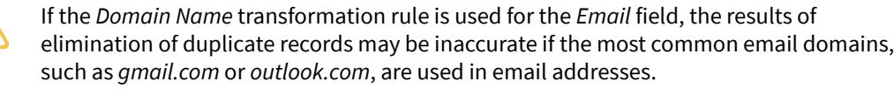

- **Create on Entry** (Item 6): The rule the system will use to check duplicate settings for a matching field of records when a record is saved for the first time. For each field, you select one of the following options:
  - *Allow* (default; see Item 8): The system checks the value of this field for a newly created record to find duplicates if the**Validate on Entry** check box (Item 13) in the **Rules of Comparison** section is manually selected. In this case, however, the system will not display a warning message when a user saves the newly created record; it will insert *Possible Duplicate* in the **Duplicate** box of the form used to create the record.
  - *Warn* (Item 9): If this option is selected and a user tries to create a record that has a duplicate value in this field, the system inserts *Possible Duplicate* in the **Duplicate** box of the creation form of the record and displays a warning message. The user can save the record or cancel record creation. During the running of an import scenario, if the system creates a record that has a duplicate value in this field, the record is saved without a warning message and the system inserts *Possible Duplicate* in the **Duplicate** box.

The system inserts a value in the**Score Weight** column (Item 4) of the row that is equal to the value in the **Validation ScoreThreshold** box (Item 12); it also makes the**Validate on Entry** check box (Item 13) (**Rules of Comparison** section) selected and unavailable for editing.

• *Block* (Item 7): If this option is selected, and a user tries to save a record that has the same value for this field as an existing record has, the system prevents the creation of the duplicate record and shows an error message.

The system makes the value in the**Score Weight** column (Item 4) of the row equal to the value in the **Validation ScoreThreshold** box (Item 12) in the **Rules of Comparison** section. The**Validate on Entry** check box (Item 13) becomes selected and unavailable for editing.

During the running of an import scenario, if the system creates a record that has a duplicate value in this field, the record is not saved and the system shows an error message on the *[Import by Scenario](https://help-2025r1.acumatica.com/Help?ScreenId=ShowWiki&pageid=88ac7166-2cc0-4201-ab3e-659ada2d74f2)* (SM206036) form.

If the system finds a possible duplicate record in the system during the uploading of records from an Excel file, the system does not create a new record; instead, it displays an error in the **Processing** dialog box.

Depending on the selected option for each of the listed fields, the system can allow or block the saving of a new record. If the user selects the *Allow* or *Warn* option for all fields in the selected pair of record types, the system will allow the new record to be saved. If the user selects the *Block* option for at least one of the fields, the system will block the saving of the new record.

For a pair of record types, if any set of options is selected and if in an existing record, the user changes the value of the validated field to a duplicate of the value in the other existing record, the system will save the record and insert *Possible Duplicate* in the **Duplicate** box of the saved record.

Also, in the**Validation ScoreThreshold** box in the **Rules of Comparison** section of the right pane, you specify the threshold value to be used to determine whether the compared records are possible duplicates.

For a particular pair of record types selected in the **Comparison** pane, the total score of the values listed in the**Score Weight** column should be greater than or the same as the value in the**Validation ScoreThreshold** box.

The interaction of the value in the**Validation ScoreThreshold** box with the validation settings in the table works as follows: During duplicate validation of a record, the system compares the values for all fields listed in the table, adds the **Score Weight** values for the field values that match, and then compares the total validation score to the value specified in the**Validation ScoreThreshold** box. If the total validation score equals or exceeds this threshold value, the compared records are considered possible duplicates.

With the settings shown in the screenshot above, if the email address of a new lead is the same as the email address of the existing lead, because the **Create on Entry** value of the *Email* field is *Block*, the system prevents the creation of a duplicate lead and shows an error message on the *[Leads](https://help-2025r1.acumatica.com/Help?ScreenId=ShowWiki&pageid=ce564fa0-baca-4d9b-97a8-ec69910de4c2)* (CR301000) form when a user tries to save the lead. If the account name of a new lead is the same as the account name of an existing lead, the system inserts *Possible Duplicate* in the **Duplicate** box of the *[Leads](https://help-2025r1.acumatica.com/Help?ScreenId=ShowWiki&pageid=ce564fa0-baca-4d9b-97a8-ec69910de4c2)* form and displays a warning message if a user tries to save the lead.

# <span id="page-504-1"></span><span id="page-504-0"></span>**Duplicate Validation: Calculation of Validation Scores**

In Acumatica ERP, grams are used for the calculation of the validation score that is specified on the *[Duplicate](https://help-2025r1.acumatica.com/Help?ScreenId=ShowWiki&pageid=aa7a410b-514b-41ed-9694-e961a9277368) [Validation](https://help-2025r1.acumatica.com/Help?ScreenId=ShowWiki&pageid=aa7a410b-514b-41ed-9694-e961a9277368)* (CR103000) form for each lead, contact, or business account. Each record has a number of settings such as *Last Name*, *Email*, and *Account Name*—that are common across these types of records. The gram value assigned to a field of a particular record is calculated based on the total number of settings that are involved in the calculation of the validation score.

As a rule, if the *Duplicate Validation* feature is enabled on the *[Enable/Disable Features](https://help-2025r1.acumatica.com/Help?ScreenId=ShowWiki&pageid=c1555e43-1bc5-4f6f-ba9d-b323f94d8a6b)* (CS100000) form, validation scores are calculated automatically.

You need to recalculate validation scores on the *[Calculate Grams](https://help-2025r1.acumatica.com/Help?ScreenId=ShowWiki&pageid=1598cf0e-a9ba-415c-967e-1cb8284bfe36)* (CR503400) form in the following cases:

- Validation rules—the rules to calculate the grams—have been changed for any pair of record types on the *Duplicate [Validation](https://help-2025r1.acumatica.com/Help?ScreenId=ShowWiki&pageid=aa7a410b-514b-41ed-9694-e961a9277368)* form. If you change these rules and click**Save**, the system displays a warning dialog box asking if you want to recalculate the validation scores. If you click **Yes**, the system saves the new settings and opens the *[Calculate Grams](https://help-2025r1.acumatica.com/Help?ScreenId=ShowWiki&pageid=1598cf0e-a9ba-415c-967e-1cb8284bfe36)* form. You can recalculate the validation scores based on the new validation rule for all records that are listed on the *[Calculate Grams](https://help-2025r1.acumatica.com/Help?ScreenId=ShowWiki&pageid=1598cf0e-a9ba-415c-967e-1cb8284bfe36)* form that is, records that have been validated using previous validation rules. If you click **No**, the system closes the dialog box and saves the new settings; the validation scores are not recalculated, and we recommend that you recalculate validation scores later.
- A group of new records was imported or uploaded into Acumatica ERP or manually created by users before the *Duplicate Validation* feature was enabled.

On the *[Customer Management Preferences](https://help-2025r1.acumatica.com/Help?ScreenId=ShowWiki&pageid=63aa74fa-81fd-4d62-85ac-c6b845ab1ac0)* (CR101000) form, you can use the **NormalizeValidation Scores** check box on the **General** tab (**MiscellaneousSettings** section) to determine the way the system will calculate the validation scores for a pair of record types. The validation score is calculated for a record as follows, depending on the state of the **NormalizeValidation Scores** check box:

- Selected: When a validation score is calculated for a record, the system checks whether the record fields with score weights have values in the new record. If all the fields have values, the validation score is the total sum of the grams (that is, the recalculated score weights specified in the**Score Weight** column of the table on the *Duplicate [Validation](https://help-2025r1.acumatica.com/Help?ScreenId=ShowWiki&pageid=aa7a410b-514b-41ed-9694-e961a9277368)* form). If a field with a score weight in the new record is empty, the system sets the score weight for this field to *0* and recalculates the score weights of the other populated fields. The fewer populated fields, the higher the value of the recalculated score weights for other fields. In this case, the sum of grams must be equal to the threshold value that is defined in the**Validation ScoreThreshold** box on the *Duplicate [Validation](https://help-2025r1.acumatica.com/Help?ScreenId=ShowWiki&pageid=aa7a410b-514b-41ed-9694-e961a9277368)* form. For example, suppose that for the *Lead to Lead* pair of record types, score weights are specified for two fields—*Last Name* and *Email*—and if the values in each of them are identical to the values in the same fields in one of the existing records, the new record is a duplicate. Further suppose that the score weight for each of them is *2.5* and the threshold is *5*, and that in a new lead, only *Last Name* was filled in. In this case, the system sets the grams for *Email* to *0* and for *Last Name* to *5*. The validation score is the sum of grams of both fields, so it is *5*. The value of the validation score is equal to the value of the threshold, and the system considers the record to be a duplicate only based on the matching of the last name values.
- Cleared: The validation scores are calculated according to the duplicate validation rules specified for the pair of records and do not depend on the number of empty fields that the system has checked for duplicates in the record.

# <span id="page-505-0"></span>**Duplicate Validation: Implementation Checklist**

The following sections provide details you can use to ensure that the system is configured properly for duplicate validation in Acumatica ERP, and to understand (and change, if needed) the settings that affect the processing workflow.

# **Mandatory Configuration**

We recommend that before you start validating records for duplicates, you make sure that the needed features have been enabled, settings have been specified, and entities have been created, as summarized in the following checklist.

| Form                                       | Criteria to Check                                                                                                                                                                                                                      |
|--------------------------------------------|----------------------------------------------------------------------------------------------------------------------------------------------------------------------------------------------------------------------------------------|
| Enable/Disable Features (CS100000)         | The following features have been enabled:                                                                                                                                                                                              |
|                                            | •<br>Customer Management: Provides the customer relationship<br>management (CRM) functionality, including lead and cus<br>tomer tracking, as well as the handling of sales opportuni<br>ties, contacts, marketing lists, and campaigns |
|                                            | •<br>Duplicate Validation in the Customer Management group of<br>features: Provides the duplicate validation functionality                                                                                                             |
| Customer Management Preferences (CR101000) | The numbering sequence settings have been specified and<br>saved to the system, as described in Basic Customer Relation<br>ship Management.                                                                                            |
| Duplicate Validation (CR103000)            | The duplicate validation settings have been specified.                                                                                                                                                                                 |

# **Recommended Configuration**

To speed duplicate validation and minimize errors, you should specify and save the recommended settings listed in the following table.

| Form                            | Criteria to Check                                                                                                                                                                                                                                                                                                                                                                |
|---------------------------------|----------------------------------------------------------------------------------------------------------------------------------------------------------------------------------------------------------------------------------------------------------------------------------------------------------------------------------------------------------------------------------|
| Duplicate Validation (CR103000) | The Validate on Entry check box is selected for each com<br>bination of record types on the Comparison pane. With this<br>check box selected, the system will validate each new lead,<br>contact, or business account when a new record is being cre<br>ated and saved for the first time on the Leads (CR301000),<br>Contacts (CR302000), or Business Accounts (CR303000) form. |

# **Other Settings That Affect the Workflow**

You can affect the workflow of duplicate validation by specifying additional settings:

• To cause the system to perform duplicate validation processing more quickly—validating records and calculating grams is handled in parallel mode and may be a time-consuming process—add the following key to the web.config file located in the website folder.

```
<add key="ParallelProcessingDisabled" value="False" />
```

- To cause the system to validate the field values of each new lead, contact, or business account—such as an email address or phone number—for duplication as soon as a user specifies these settings on the *[Leads](https://help-2025r1.acumatica.com/Help?ScreenId=ShowWiki&pageid=ce564fa0-baca-4d9b-97a8-ec69910de4c2)* (CR301000), *[Contacts](https://help-2025r1.acumatica.com/Help?ScreenId=ShowWiki&pageid=75a5dea9-d640-4b71-95b1-88534c4afad7)* (CR302000), or *[Business Accounts](https://help-2025r1.acumatica.com/Help?ScreenId=ShowWiki&pageid=823f9e2c-d352-4cf4-bbb9-ce6464fecc75)* (CR303000) form and tries to save the record for the first time, select the *Warn* option for these fields in the **Create on Entry** column of the *Duplicate [Validation](https://help-2025r1.acumatica.com/Help?ScreenId=ShowWiki&pageid=aa7a410b-514b-41ed-9694-e961a9277368)* (CR103000) form.
- To cause the system to prevent the creation of duplicate leads on the *[Leads](https://help-2025r1.acumatica.com/Help?ScreenId=ShowWiki&pageid=ce564fa0-baca-4d9b-97a8-ec69910de4c2)* form, duplicate contacts on the *[Contacts](https://help-2025r1.acumatica.com/Help?ScreenId=ShowWiki&pageid=75a5dea9-d640-4b71-95b1-88534c4afad7)* form, or duplicate business accounts on the *[Business Accounts](https://help-2025r1.acumatica.com/Help?ScreenId=ShowWiki&pageid=823f9e2c-d352-4cf4-bbb9-ce6464fecc75)* form, select the *Block* option for each needed field in the **Create on Entry** column of the corresponding table on the *Duplicate [Validation](https://help-2025r1.acumatica.com/Help?ScreenId=ShowWiki&pageid=aa7a410b-514b-41ed-9694-e961a9277368)* form.
- To cause the system to calculate validation scores according to the duplicate validation rules specified for the pairs of records on the *Duplicate [Validation](https://help-2025r1.acumatica.com/Help?ScreenId=ShowWiki&pageid=aa7a410b-514b-41ed-9694-e961a9277368)* form and to keep the missing scores for empty fields, clear the **NormalizeValidation Scores** check box on the **General** tab (**MiscellaneousSettings** section) of the *[Customer Management Preferences](https://help-2025r1.acumatica.com/Help?ScreenId=ShowWiki&pageid=63aa74fa-81fd-4d62-85ac-c6b845ab1ac0)* (CR101000) form.

# **Validation of Configuration**

To make sure that all configuration has been performed correctly, we recommend that in your system, you configure duplicate validation by performing instructions similar to those described in *Duplicate [Validation:](#page-506-1) [Implementation Activity](#page-506-1)*.

# <span id="page-506-1"></span><span id="page-506-0"></span>**Duplicate Validation: Implementation Activity**

The following implementation activity will show you how to configure duplicate validation in Acumatica ERP.

This activity is based on the *U100* dataset. If you are using another dataset, or if any system settings have been changed in *U100*, these changes can affect the workflow of the activity and the results of the processing. To avoid any issues, restore the *U100* dataset to its initial state.

#### **Story**

Suppose that you, as an implementation consultant for the SweetLife Fruits & Jams company. You need to review and modify the duplicate validation settings in Acumatica ERP in order to provide users with the following abilities:

- To check leads for duplicates against existing leads on entry (before a new record is saved for the first time) and warn a user if a new lead has an email address that is identical to the email address of the existing lead
- To check business accounts for duplicates against existing accounts on entry, prevent the creation of business accounts that have identical email addresses, and warn users about duplicate account names

### **Process Overview**

In this activity, you will do the following:

- 1. Review the duplicate validation settings on the *Duplicate [Validation](https://help-2025r1.acumatica.com/Help?ScreenId=ShowWiki&pageid=aa7a410b-514b-41ed-9694-e961a9277368)* (CR103000) form
- 2. Modify the validation rules on the *Duplicate [Validation](https://help-2025r1.acumatica.com/Help?ScreenId=ShowWiki&pageid=aa7a410b-514b-41ed-9694-e961a9277368)* form

# **System Preparation**

Before you start configuring duplicate validation, you should do the following:

- 1. Launch the Acumatica ERP website with the *U100* dataset preloaded.
- 2. Sign in to the system as implementation consultant Kimberly Gibbs by using the following credentials:
  - **Username**: *gibbs*
  - **Password**: *123*
- 3. Make sure that on the *[Enable/Disable Features](https://help-2025r1.acumatica.com/Help?ScreenId=ShowWiki&pageid=c1555e43-1bc5-4f6f-ba9d-b323f94d8a6b)* (CS100000) form, the *Duplicate Validation* feature has been enabled.
- 4. Make sure that on the Company and Branch Selection menu, in the top pane of the Acumatica ERP screen, the *SweetLife Head Office and Wholesale Center* branch is selected.

### **Step 1: Reviewing Duplicate Validation Settings**

To review the existing duplicate validation settings, do the following:

- 1. Open the *Duplicate [Validation](https://help-2025r1.acumatica.com/Help?ScreenId=ShowWiki&pageid=aa7a410b-514b-41ed-9694-e961a9277368)* (CR103000) form. Notice that in the **Comparison** pane, the **Lead to Lead** node is selected by default; you will check its settings.
- 2. In the right pane of the form, to review the settings used to specify the duplicate validation rules for leads, do the following:
  - In the table, notice the following:
    - The total of the values in the**Score Weight** column is 10.5, which exceeds the value in the**Validation ScoreThreshold** box (**Rules of Comparison** section).
    - In the row with the *Email* matching field, in the **Create on Entry** column, the *Warn* option is selected, and in the**Score Weight** column, the validation score is *5*, which is equal to the value in the **Validation ScoreThreshold** box.
  - In the **Rules of Comparison** section, the**Validate on Entry** check box is selected and unavailable for changing.

With these settings specified, if a user tries to create a lead that has a duplicate value in this field, the system inserts *Possible Duplicate* in the **Duplicate** box of the *[Leads](https://help-2025r1.acumatica.com/Help?ScreenId=ShowWiki&pageid=ce564fa0-baca-4d9b-97a8-ec69910de4c2)* (CR301000) form for the lead and displays a warning message. The user can save the lead or cancel record creation.

- 3. In the **Comparison** pane, click the **Account to Account** node to view the duplicate validation rules for business accounts.
- 4. In the right pane of the form, to review the settings used to specify the duplicate validation rules for business accounts, do the following:
  - In the table, notice the following:
    - The total of the values in the**Score Weight** column is 7.5, which exceeds the value in the**Validation ScoreThreshold** box.
    - In each row with a matching field, in the **Create on Entry** column, the *Allow* option is selected, and the value in the**Score Weight** column is less than the value in the**Validation ScoreThreshold** box, which is *5*.
  - In the **Rules of Comparison** section, the**Validate on Entry** check box is cleared and available for changing.

With these settings specified, if a user tries to create a business account that has a duplicate field value, the system will not display a warning message when a user saves the newly created business account; it will insert *Possible Duplicate* in the **Duplicate** box of the *[Business Accounts](https://help-2025r1.acumatica.com/Help?ScreenId=ShowWiki&pageid=823f9e2c-d352-4cf4-bbb9-ce6464fecc75)* (CR303000) form.

### **Step 2: Modifying the Validation Rules for Business Accounts**

Suppose that your marketing and sales teams need the system to validate business accounts against one another on entry by comparing email addresses, and to prevent the creation of a business account if another account

with an identical email address already exists in the system. Also, the system should validate account names for duplicates and warn a user if another account with an identical account name already exists.

To modify the validation rules for business accounts, do the following:

- 1. While you are still viewing the *Duplicate [Validation](https://help-2025r1.acumatica.com/Help?ScreenId=ShowWiki&pageid=aa7a410b-514b-41ed-9694-e961a9277368)* (CR103000) form with the **Account to Account** node selected in the **Comparison** pane, in the table, do the following:
  - a. In the row with the *Email* matching field, notice *2* in the **Score Weight** column.
  - b. In the row with the *Email* matching field, select *Block* in the **Create on Entry** column.
  - c. In the row with the *Account Name* matching field, select *Warn* in the **Create on Entry** column.

Notice that for the *Email* and *Account Name* matching fields, the system has changed the value in the **Score Weight** column to *5*, which is the same as the value in the**Validation ScoreThreshold** box (**Rules of Comparison** section of the right pane). Also notice that the**Validate on Entry** check box has become selected and unavailable for changing.

With these settings, when a user saves a business account that has been created on the *[Business Accounts](https://help-2025r1.acumatica.com/Help?ScreenId=ShowWiki&pageid=823f9e2c-d352-4cf4-bbb9-ce6464fecc75)* (CR303000) form, the system checks the validated fields, including email address and account name, to be sure that their values are not identical to the values of these fields in other business accounts in the system. If the email address of a new business account is identical to an email address existing in the system, when the user tries to save the account for the first time, the system will display an error message. If the account name of a new business account is identical to an account name existing in the system, when the user tries to save the account for the first time, the system will open the **Warning** dialog box asking whether the user wants to save the duplicate business account.

- 2. On the form toolbar, click**Save**.
- 3. In the **Warning** dialog box, which opens, click **Yes**.
- 4. On the form toolbar of the *[Calculate Grams](https://help-2025r1.acumatica.com/Help?ScreenId=ShowWiki&pageid=1598cf0e-a9ba-415c-967e-1cb8284bfe36)* (CR503400) form, which opens, click **Process All**. The **Processing** dialog box opens, showing the progress of gram calculation.


In a production environment, it may take time for the system to process all records.

5. When the processing has been completed and the results of gram calculation are shown, click **Close** to close the dialog box. The list of the records on the *[Calculate Grams](https://help-2025r1.acumatica.com/Help?ScreenId=ShowWiki&pageid=1598cf0e-a9ba-415c-967e-1cb8284bfe36)* form no longer contains any records.

You have modified the validation rules for business accounts. You have also calculated grams for all records. Now the system will validate business accounts according to the new rules that you have specified in this activity.

# <span id="page-508-2"></span><span id="page-508-0"></span>**Integration with HubSpot**

Many Acumatica ERP users use *[HubSpot](http://www.hubspot.com/)* as a marketing automation solution to manage their leads and prospects. The HubSpot integration solution provided by Acumatica ERP gives users the ability to transfer marketing data into Acumatica ERP from HubSpot and to transfer relevant data back to HubSpot from Acumatica ERP.

The system should be properly configured for this integration, as described in the topics of this chapter.

# <span id="page-508-1"></span>**Integration with HubSpot: General Information**

The integration of Acumatica ERP with HubSpot gives you the ability to synchronize data between the two systems. You synchronize data by using integration scenarios. For information on how to prepare these integration scenarios, see *[Configuring Import Scenarios](https://help-2025r1.acumatica.com/Help?ScreenId=ShowWiki&pageid=1d3fb835-20cd-4810-8118-5f40c4fc7f41)* and *[Configuring Export Scenarios](https://help-2025r1.acumatica.com/Help?ScreenId=ShowWiki&pageid=f4da2bb8-dfa9-4d35-83e2-593f52f1c2af)*.

# **Learning Objectives**

In this chapter, you will learn how to do the following:

- Configure the *HubSpot Enhanced Provider* data provider
- Configure the *HubSpot* data provider
- Synchronize different entities between the systems
- Configure automation schedules that will run synchronization processes
- Resolve synchronization issues

# **Data Providers**

When creating or modifying an integration scenario, you need to specify an appropriate data provider. For the synchronization of data between Acumatica ERP and HubSpot, you can use one of the following built-in data providers:

• *HubSpot*: This data provider is based on a specific built-in provider type: *HubSpot Provider*. By using this data provider, you can export leads from Acumatica ERP to HubSpot for nurturing and then import the leads back to Acumatica ERP for further processing.

For details about how to configure the *HubSpot* data provider, see *[Integration](#page-527-1) with Hubspot: To Configure the [HubSpot Data Provider](#page-527-1)*.

• *HubSpot Enhanced Provider*: This data provider is based on the *HubSpot Enhanced* provider type, which supports both the use of the OAuth protocol and Private Apps access tokens for authorization in HubSpot. By using this data provider, you can synchronize contacts, leads, business accounts, and marketing lists between the two systems.

For more information about the *HubSpot Enhanced Provider* data provider, see *[Integration with HubSpot:](#page-510-1) [Enhanced HubSpot Data Provider](#page-510-1)*.

# **Configuration Flow of Data Synchronization Between Acumatica ERP and HubSpot**

To configure synchronization of data between Acumatica ERP and HubSpot by using the *HubSpot Enhanced Provider* data provider, you should do the following:

- 1. Configure the *HubSpot Enhanced Provider* data provider on the **Parameters** tab of the *[Data Providers](https://help-2025r1.acumatica.com/Help?ScreenId=ShowWiki&pageid=b77248de-191c-47b7-9c40-773c7cc11d5b)* (SM206015) form so that it connects to HubSpot. For instructions, see *[Integration](#page-516-2) with HubSpot: To Configure [the HubSpot Enhanced Data Provider](#page-516-2)*.
- 2. Prepare integration scenarios that use the *HubSpot Enhanced Provider* data provider for the entity types whose data need to be synchronized between the systems, and start the synchronization processes.

For details, see *Integration with HubSpot: To [Synchronize](#page-517-1) Leads*, *Integration with HubSpot: To [Synchronize](#page-519-1) [Contacts](#page-519-1)*, *Integration with HubSpot: To [Synchronize](#page-520-1) Accounts*, and *Integration with HubSpot: To [Synchronize](#page-522-1) [Marketing List](#page-522-1)*.

3. Configure automation schedules that will run the needed import and export scenarios at the specified time intervals, as described in *Integration with HubSpot: To Schedule [Synchronization](#page-525-1) Processes*.

# **HubSpot Integration Limitations**

The solution for the synchronization of data between Acumatica ERP and HubSpot has the following limitations:

- Only one instance of HubSpot may be synchronized with an Acumatica ERP instance.
- If multiple data providers use the *HubSpot Enhanced* provider type, an error will occur when a user attempts to use any of them.

# <span id="page-510-1"></span><span id="page-510-0"></span>**Integration with HubSpot: Enhanced HubSpot Data Provider**

In Acumatica ERP, you can use the *HubSpot Enhanced Provider* data provider to configure the export of data from Acumatica ERP to HubSpot and the import of data from HubSpot to Acumatica ERP through the use of integration scenarios. The *HubSpot Enhanced Provider* data provider can work with the following data.

| Entity Type in Acumatica ERP | Corresponding Entity Type in<br>HubSpot | Notes                                                                                                                                  |
|------------------------------|-----------------------------------------|----------------------------------------------------------------------------------------------------------------------------------------|
| Leads                        | Contacts                                |                                                                                                                                        |
| Contacts                     | Contacts                                |                                                                                                                                        |
| Business Accounts            | Companies                               |                                                                                                                                        |
| Marketing Lists              | Contact Lists                           | Only list properties can be synchro<br>nized in real time. The list member<br>ship can be synchronized on de<br>mand or by a schedule. |

# **Specific Functions Available for Integration Scenarios**

The table below provides a list of specific functions that may be used in formulas in an integration scenario that uses the *HubSpot Enhanced Provider* data provider. (For more information about functions, see *[Functions](https://help-2025r1.acumatica.com/Help?ScreenId=ShowWiki&pageid=3eacd492-e7bb-4bf9-888d-fa3c9155329f)*.)

| Scenario Type | Function                      | Description                                                                                                                                                 |
|---------------|-------------------------------|-------------------------------------------------------------------------------------------------------------------------------------------------------------|
| Export        | GetHubSpotContactID(id)       | Searches for a synchronization state in the list of<br>known synchronization states by using the Acumatica<br>ERP contact or lead ID (id).                  |
|               |                               | This function throws an exception if the id value is<br>null when the function is called.                                                                   |
|               |                               | The function returns null if no synchronization state is<br>found for the specified id and no record with a match<br>ing email address is found in HubSpot. |
|               | GetHubSpotListId(listid)      | Searches for a contact list (listid) in the list of<br>known real-time synchronization states by using the<br>Acumatica ERP marketing list ID.              |
|               |                               | This function returns null when no contact list is<br>found.                                                                                                |
|               | FindHubSpotListId(lis<br>tid) | Searches for a contact list (listid) in the list of<br>known synchronization states by using the Acumatica<br>ERP marketing list ID.                        |
|               |                               | This function throws an exception when no contact list<br>is found.                                                                                         |

| Scenario Type | Function                                     | Description                                                                                                                                                                                                                                                                      |
|---------------|----------------------------------------------|----------------------------------------------------------------------------------------------------------------------------------------------------------------------------------------------------------------------------------------------------------------------------------|
|               | GetHubSpotCompanyID(ac<br>countid)           | Searches for a HubSpot company in the list of known<br>synchronization states by using the Acumatica ERP<br>business account natural key (AcctCD).                                                                                                                               |
|               |                                              | This function returns null when no company is found.                                                                                                                                                                                                                             |
|               | FindHubSpotCompanyID(ac<br>countid)          | Searches for a HubSpot company in the list of known<br>synchronization states by using the natural key of the<br>Acumatica ERP business account (AcctCD).                                                                                                                        |
|               |                                              | This function throws an exception when nothing is<br>found.                                                                                                                                                                                                                      |
| Import        | GetAcumaticaContac<br>tID(vid, field, value) | Searches for a synchronization state in the list of<br>known synchronization states by using the HubSpot<br>contact ID (vid); if the synchronization state is not<br>found, the function searches for a contact for which<br>the value of the field parameter is equal to value. |
|               |                                              | All the parameters are mandatory. If any parameter is<br>not specified, the function returns an error when it is<br>called.                                                                                                                                                      |
|               |                                              | If the value of the vid or value parameter is null<br>when the function is called, the function throws an ex<br>ception.                                                                                                                                                         |
|               |                                              | The function requires that the field parameter be a<br>valid contact field name. If no field is found, the func<br>tion throws an exception.                                                                                                                                     |
|               |                                              | If no synchronization state is found for the vid para<br>meter and if no contact record is found for the field<br>parameter and for the value parameter, the function<br>returns null.                                                                                           |
|               |                                              | If multiple records are found by the function, it throws<br>an exception.                                                                                                                                                                                                        |
|               | FindAcumaticaLeadOrCon<br>tactID(vid)        | Searches for a synchronization state in the list of<br>known synchronization states by using the HubSpot<br>contact ID (vid).                                                                                                                                                    |
|               |                                              | This function returns the ID of the found lead or con<br>tact. The function returns null if the vid parameter is<br>null. It throws an exception when no synchronization<br>state is found.                                                                                      |

| Scenario Type | Function                                              | Description                                                                                                                                                                                                                                                   |
|---------------|-------------------------------------------------------|---------------------------------------------------------------------------------------------------------------------------------------------------------------------------------------------------------------------------------------------------------------|
|               | GetAcumaticaLeadID(vid,<br>field, value)              | Searches for a synchronization state in the list of<br>known synchronization states by using the HubSpot<br>contact ID (vid); if the HubSpot contact ID is not<br>found, searches for a lead for which the value of the<br>field parameter is equal to value. |
|               |                                                       | All the parameters are mandatory. If any parameter<br>is not specified, the function returns an error when<br>called.                                                                                                                                         |
|               |                                                       | If the value of the vid or value parameter is null<br>when the function is called, the function throws an ex<br>ception.                                                                                                                                      |
|               |                                                       | The function requires that the field parameter be a<br>valid lead field name. If no field is found, the function<br>throws an exception.                                                                                                                      |
|               |                                                       | If no synchronization state is found for the vid para<br>meter and if no lead record is found for the field pa<br>rameter and for the value parameter, the function re<br>turns null.                                                                         |
|               |                                                       | If multiple records are found by the function, it throws<br>an exception.                                                                                                                                                                                     |
|               | GetAcumaticaMarket<br>ingListID(listid, list<br>name) | Searches for an Acumatica ERP marketing list in the<br>list of known synchronization states by HubSpot list ID;<br>if the marketing list is not found, the function searches<br>for a list with a name equal to listname.                                     |
|               |                                                       | This function returns null when no marketing list is<br>found.                                                                                                                                                                                                |
|               | FindAcumaticaMarket<br>ingListID(listid)              | Searches for the HubSpot listid in the list of known<br>synchronization states.                                                                                                                                                                               |
|               |                                                       | This function returns null if listid is null.                                                                                                                                                                                                                 |
|               |                                                       | The function throws an exception when no HubSpot<br>listid is found.                                                                                                                                                                                          |
|               | GetAcumaticaAccoun<br>tID(companyid, field,<br>value) | Searches for an Acumatica ERP business account in<br>the list of known synchronization states by using the<br>HubSpot company ID or, if no state is found, searches<br>for a business account that has the value of the field<br>parameter equal to value.    |
|               |                                                       | This function returns null when no Acumatica ERP<br>business account is found.                                                                                                                                                                                |
|               | FindAcumaticaAccoun<br>tID(companyid)                 | Searches for the companyid in the list of known syn<br>chronization states.                                                                                                                                                                                   |
|               |                                                       | This function throws an exception when no compa<br>nyid is found.                                                                                                                                                                                             |

# <span id="page-513-0"></span>**Integration with HubSpot: Data Flow Between Systems**

The Acumatica ERP and HubSpot systems process data changes differently depending on in which system the changes have been made. In this topic, you will read about the data flow between Acumatica ERP and HubSpot.

# **Data Changes Made in Acumatica ERP**

Aer you make a change to a record in Acumatica ERP (for example, deleting a contact), Acumatica ERP queries HubSpot via the REST API and checks whether the matching entity in HubSpot has been modified. (The import and export scenarios in Acumatica ERP define the matching rules for records.)

If the matching record in HubSpot has not been modified or does not exist, Acumatica ERP updates it or creates a new record in HubSpot. If the matching record has been changed in HubSpot, Acumatica ERP checks which of the systems is the master system and uses the master system's data to update the corresponding record in the other system. The master system is defined on the *[HubSpot Sync](https://help-2025r1.acumatica.com/Help?ScreenId=ShowWiki&pageid=28c4f726-491e-47b5-835d-66dc73a8c040)* (HS205020) form.

In the diagram below, you can see the process of synchronizing the data changes that were made in Acumatica ERP with the data in HubSpot.

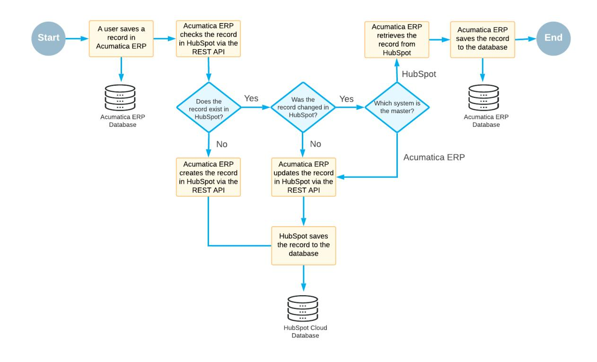


#### **Data Changes Made in HubSpot**

Aer you make a change to a record in HubSpot, the system triggers a webhook notification if the webhook notifications have been configured. (A HubSpot administrator needs to configure webhook notifications for a HubSpot object event in advance.) If the webhook notifications have not been configured, Acumatica ERP can get information on the changes in HubSpot by periodically polling it via REST API. (The polling interval setting is located in the *HubSpot Enhanced Provider* data provider settings in Acumatica ERP.)

When Acumatica ERP receives a notification about the change, the system checks if any change has been made to the matching record in Acumatica ERP. If no change has been made or no matching record exists, Acumatica ERP

updates the record or creates a new one. If the record has been changed in both systems, Acumatica ERP checks which system is the master system and uses the master system data to update the corresponding record in the other system.

In the diagram below, you can see the process of synchronizing the data changes that were made in HubSpot with the data in Acumatica ERP.

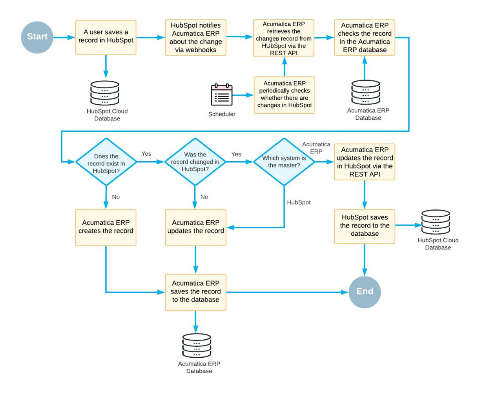

*Figure: The data flow of changes made in HubSpot*

# <span id="page-514-0"></span>**Integration with HubSpot: Lead and Contact Synchronization Issues**

In HubSpot, contact objects are used to represents both contacts and leads. If a contact is a lead, it is indicated by the lead status. In Acumatica ERP, there is a separate entity for leads, which can be converted to contacts, opportunities, or accounts.

If you decide to synchronize both Acumatica ERP leads and Acumatica ERP contacts with HubSpot, you to need to correctly specify whether a contact in HubSpot is a lead or a contact in Acumatica ERP in the related integration scenarios. Otherwise, you may end up in a situation in which one contact in HubSpot synchronizes to both a lead and a contact in Acumatica ERP.

The appropriate source restriction and field mapping settings of lead and contact import and export scenarios define whether a HubSpot contact synchronizes to a lead or a contact in Acumatica ERP.

# **Example of Integration Scenario Settings**

Acumatica ERP contains preconfigured integration scenarios to which the *Lead Status* custom field has been added. This field can be used to distinguish leads and contacts. If the Lead Status of the record is *Converted*, the record is a contact. Otherwise it is a lead.

The following settings have been preconfigured for *HubSpot Enhanced Provider* data provider:

- 1. On the **Source Restriction** tab of the *[Import Scenarios](https://help-2025r1.acumatica.com/Help?ScreenId=ShowWiki&pageid=254e8347-6bac-469d-8f14-dbe383740475)* (SM206025) form, for the *Import Contacts From Hubspot* import scenario, the following settings have been specified:
  - **Active**: Selected
  - **Field Name**: *Lead Status*
  - **Condition**: *Equals*
  - **Value**: *CONNECTED*

These settings specify that only HubSpot contacts that have the *Connected* lead status are imported as contacts.

- 2. For the *Import Leads From Hubspot* import scenario, the following settings have been specified:
  - **Active**: Selected
  - **Field Name**: *Lead Status*
  - **Condition**: *Does Not Equal*
  - **Value**: *CONNECTED*

These settings specify that only HubSpot contacts that do not have the *Connected* lead status are imported as leads.

- 3. On the **Source Restriction** tab of the *[Export Scenarios](https://help-2025r1.acumatica.com/Help?ScreenId=ShowWiki&pageid=deef5450-afa4-41bf-9eb6-9c47eeca0336)* (SM207025) form, for the *Export Leads to HubSpot Realtime* export scenario, the following settings have been specified:
  - **Active**: Selected
  - **Source Object**: *Lead Summary*
  - **Field Name**: *Status*
  - **Condition**: *Does Not Equal*
  - **Value**: *Converted*

These settings specify that converted leads are not exported as leads because they are exported as contacts.

- 4. On the **Mapping** tab of the *[Export Scenarios](https://help-2025r1.acumatica.com/Help?ScreenId=ShowWiki&pageid=deef5450-afa4-41bf-9eb6-9c47eeca0336)* form, for the *Export Contacts to HubSpot Realtime* export scenario, the following settings have been specified:
  - **Active**: Selected
  - **Source Object**: *Contact Summary*
  - **Field/Action Name**: *='CONNECTED'*
  - **Target Field/Value**: *Lead Status (hs\_lead\_status)*

These settings specify that during the export of contacts from Acumatica ERP, the lead status of the HubSpot contacts is set to *Connected*.

Similarly, you can configure other integration scenarios that you plan to use for HubSpot integration.

# <span id="page-516-0"></span>**Integration with HubSpot: Configuration Prerequisites**

Before you start to set up integration between HubSpot and Acumatica ERP, you must be sure that your HubSpot subscription meets the requirements and the system has been configured properly, as described in the following sections.

### **Checking Requirements**

For successful integration of Acumatica ERP with HubSpot, make sure that your organization uses one of the following Marketing Hub subscriptions in which the *Lists* feature is included:

- Starter
- Professional
- Enterprise

For more information about these subscriptions, see *[HubSpot Marketing Software Pricing](https://www.hubspot.com/pricing/marketing)*.

### **Enabling the Needed Features**

On the *[Enable/Disable Features](https://help-2025r1.acumatica.com/Help?ScreenId=ShowWiki&pageid=c1555e43-1bc5-4f6f-ba9d-b323f94d8a6b)* (CS100000) form, the *HubSpot Integration* feature (under the *Third-Party Integrations* group of features) must be enabled. By enabling this feature, you can use different units of measure as base, sales, and purchase units for item classes and stock items.

# **Configuring the System**

On the *[Customer Management Preferences](https://help-2025r1.acumatica.com/Help?ScreenId=ShowWiki&pageid=63aa74fa-81fd-4d62-85ac-c6b845ab1ac0)* (CR101000) form, make sure that the basic customer management settings have been specified.

# <span id="page-516-2"></span><span id="page-516-1"></span>**Integration with HubSpot: To Configure the HubSpot Enhanced Data Provider**

When integrating HubSpot and Acumatica ERP, you need to specify the appropriate data provider. To export leads to HubSpot or to import leads from HubSpot, you can use the preconfigured *HubSpot Enhanced Provider* data provider. In this activity, you will learn how to configure this data provider.

### **System Preparation**

Before you start configuring the integration between HubSpot and Acumatica ERP, perform the following preparatory tasks:

- 1. Create a HubSpot Private App: Follow the *[Create a private app](https://developers.hubspot.com/docs/api/private-apps#create-a-private-app)* section of the *[Private Apps](https://developers.hubspot.com/docs/api/private-apps)* HubSpot API Docs. Select the following scopes for the app:
  - Lists: Read and Write
  - Contacts: Read and Write
  - Companies: Read and Write
  - Contacts schemas: Read
  - Companies schemas: Read
- 2. Obtain the access token value: Follow the *[Make API calls with your app's access token](https://developers.hubspot.com/docs/api/private-apps#make-api-calls-with-your-app-s-access-token)* section. Copy and paste the value, or write it down for later use.

Now you can launch the Acumatica ERP website, and sign in to the necessary tenant.

# **Step: Configuring the HubSpot Data Provider**

To configure the HubSpot data provider, you need to do the following:

- 1. Open the *[Data Providers](https://help-2025r1.acumatica.com/Help?ScreenId=ShowWiki&pageid=b77248de-191c-47b7-9c40-773c7cc11d5b)* (SM206015) form.
- 2. In the **Name** box of the Summary area, select *HubSpot Enhanced Provider*.
- 3. On the **Parameters** tab, specify the following settings in the**Value** column of the appropriate row:
  - In the row with the *AuthMethod* name: *Private App Access Token*
  - In the row with the *PrivateAppAccessToken* name: The Private Apps access token
- 4. On the **Schema** tab, on the table toolbar of the**Source Objects** pane, click **FillSchema Objects**.
- 5. For each object that you want to be synchronized, make sure the check box in the **Active** column is selected. Clear this check box for the objects that you do not want to synchronize.
- 6. In the **Source Fields** pane, make sure the check box in the **Active** column is selected for the fields that you want to be integrated. Clear this check box for the fields that you do not want to be integrated.
- 7. On the table toolbar of the pane, click **Fill Schema Fields**.
- 8. On the form toolbar, click**Save** to save your changes.

# <span id="page-517-1"></span><span id="page-517-0"></span>**Integration with HubSpot: To Synchronize Leads**

In this activity, you will learn how to configure the synchronization of leads between HubSpot and Acumatica ERP.

# **System Preparation**

Launch the Acumatica ERP website, and sign in to the necessary tenant.

# **Step 1: Verifying the Lead Import Scenario**

To verify and modify (if necessary) the import scenario used for leads, do the following:

- 1. Open the *[Import Scenarios](https://help-2025r1.acumatica.com/Help?ScreenId=ShowWiki&pageid=254e8347-6bac-469d-8f14-dbe383740475)* (SM206025) form.
- 2. In the **Name** box of the Summary area, select *Import Leads From Hubspot*.
- 3. In the **Provider** box, make sure that the correct provider is selected.
- 4. On the **Mapping** tab, make sure that the specified settings are correct; modify them if necessary.
- 5. On the **Source Restrictions** tab, make sure that the restrictions give you the ability to correctly synchronize HubSpot contacts with Acumatica ERP leads.
- 6. On the form toolbar, click**Save**.

### **Step 2: Verifying the Lead Export Scenario**

To verify and modify (if necessary) the export scenario used for leads, do the following:

- 1. Open the *[Export Scenarios](https://help-2025r1.acumatica.com/Help?ScreenId=ShowWiki&pageid=deef5450-afa4-41bf-9eb6-9c47eeca0336)* (SM207025) form.
- 2. In the **Name** box of the Summary area, select *Export Leads to HubSpot Realtime*.
- 3. In the **Provider** box, make sure that the correct provider is selected.
- 4. On the **Mapping** tab, make sure that the specified settings are correct; modify them if necessary.

- 5. On the **Source Restrictions** tab, make sure that the restrictions give you the ability to correctly synchronize Acumatica ERP leads with HubSpot contacts.
- 6. On the form toolbar, click**Save**.

# **Step 3: Configuring the Real-Time Synchronization Profile for Leads**

Configure the real-time synchronization for leads as follows:

- 1. Open the *[HubSpot Sync](https://help-2025r1.acumatica.com/Help?ScreenId=ShowWiki&pageid=28c4f726-491e-47b5-835d-66dc73a8c040)* (HS205020) form.
- 2. In the table, add a new row, and do the following in the row:
  - a. In the **Entity** column, select *Lead*.
  - b. In the **ImportScenario** column, select *Import Leads From Hubspot*.
  - c. In the **ExportScenario** column, select *Export Leads to HubSpot Realtime*.
  - d. In the **Number of Attempts** column, select the appropriate maximum number of attempts the system will make to restart synchronization aer it has failed.
  - e. In the **MasterSource** column, select the source system.
- 3. On the form toolbar, click**Save**.

### **Step 4: Verifying the Integration**

Verify that the systems are correctly integrated with each other as follows:

1. Open the *[Leads](https://help-2025r1.acumatica.com/Help?ScreenId=ShowWiki&pageid=ce564fa0-baca-4d9b-97a8-ec69910de4c2)* (CR301000) form, and create a lead.

For details, see *Leads: To Create a Lead [Manually](https://help-2025r1.acumatica.com/Help?ScreenId=ShowWiki&pageid=9e2b4088-31ac-4de8-b0ab-84e12a2d22e3)*.

- 2. On the table toolbar of the **HubSpot** tab, click**Sync with HubSpot**.
- 3. Go to the HubSpot instance, and verify that the contact related to the lead exists in the system.
- 4. In HubSpot, modify any value for the contact.
- 5. In Acumatica ERP, return to the *[Leads](https://help-2025r1.acumatica.com/Help?ScreenId=ShowWiki&pageid=ce564fa0-baca-4d9b-97a8-ec69910de4c2)* form. On the table toolbar of the **HubSpot** tab, click**Sync with HubSpot**.
- 6. Verify that the value modified in HubSpot has been also modified in Acumatica ERP.

### **Step 5: Synchronizing the Out-of-Sync Data**

Do the following to synchronize the data that has become out of sync:

- 1. Open the *[HubSpot Data Resync](https://help-2025r1.acumatica.com/Help?ScreenId=ShowWiki&pageid=cd004ef9-3e3f-4122-96dc-4045831a5c02)* (HS205035) form.
- 2. In the **Sync toStart** box of the Selection area, select *Full Data Resync*.
- 3. In the table, select the Included check box in the row of the *Lead* entity.
- 4. On the form toolbar, click **Process**.

The process may be time-consuming if a large number of records is involved. It may take hours or even days.

# **Step 6: Starting the Real-Time Synchronization Process**

To start the real-time synchronization, perform the following instructions:

- 1. Open the *[HubSpot Sync](https://help-2025r1.acumatica.com/Help?ScreenId=ShowWiki&pageid=f846d1a1-56a1-4e95-acfb-0d21001b861a)* (HS205030) form.
- 2. In the table, select the Included check box in the row of the *Lead* entity.
- 3. On the form toolbar, click**Start**.

You can create a schedule to run the synchronization processes automatically. For details, see *[Integration with](#page-525-1) HubSpot: To Schedule [Synchronization](#page-525-1) Processes*.

# <span id="page-519-1"></span><span id="page-519-0"></span>**Integration with HubSpot: To Synchronize Contacts**

In this activity, you will learn how to configure the synchronization of contacts between HubSpot and Acumatica ERP.

### **System Preparation**

Launch the Acumatica ERP website, and sign in to the necessary tenant.

# **Step 1: Verifying the Contact Import Scenario**

To verify and modify (if necessary) the import scenario used for contacts, do the following:

- 1. Open the *[Import Scenarios](https://help-2025r1.acumatica.com/Help?ScreenId=ShowWiki&pageid=254e8347-6bac-469d-8f14-dbe383740475)* (SM206025) form.
- 2. In the **Name** box of the Summary area, select *Import Contacts From Hubspot*.
- 3. In the **Provider** box, make sure that the correct provider is selected.
- 4. On the **Mapping** tab, make sure that the specified settings are correct; modify them if necessary.
- 5. On the **Source Restrictions** tab, make sure that the restrictions give you the ability to correctly synchronize HubSpot contacts with Acumatica ERP contacts.
- 6. On the form toolbar, click**Save**.

# **Step 2: Verifying the Contact Export Scenario**

To verify and modify (if necessary) the export scenario used for contacts, do the following:

- 1. Open the *[Export Scenarios](https://help-2025r1.acumatica.com/Help?ScreenId=ShowWiki&pageid=deef5450-afa4-41bf-9eb6-9c47eeca0336)* (SM207025) form.
- 2. In the **Name** box of the Summary area, select *Export Contacts to HubSpot Realtime*.
- 3. In the **Provider** box, make sure that the correct provider is selected.
- 4. On the **Mapping** tab, make sure that the specified settings are correct; modify them if necessary.
- 5. On the **Source Restrictions** tab, make sure that the restrictions give you the ability to correctly synchronize Acumatica ERP leads with HubSpot contacts.
- 6. On the form toolbar, click**Save**.

# **Step 3: Configuring the Real-Time Synchronization Profile for Contacts**

Configure the real-time synchronization for contacts as follows:

- 1. Open the *[HubSpot Sync](https://help-2025r1.acumatica.com/Help?ScreenId=ShowWiki&pageid=28c4f726-491e-47b5-835d-66dc73a8c040)* (HS205020) form.
- 2. In the table, add a new row, and do the following in the row:
  - a. In the **Entity** column, select *Contact*.
  - b. In the **ImportScenario** column, select *Import Contacts From Hubspot*.

- c. In the **ExportScenario** column, select *Export Contacts to HubSpot Realtime*.
- d. In the **Number of Attempts** column, select the appropriate maximum number of attempts the system will make to restart synchronization aer it has failed.
- e. In the **MasterSource** column, select the source system.
- 3. On the form toolbar, click**Save**.

#### **Step 4: Verifying the Synchronization**

Verify the systems are correctly integrated with each other as follows:

1. Open the *[Contacts](https://help-2025r1.acumatica.com/Help?ScreenId=ShowWiki&pageid=75a5dea9-d640-4b71-95b1-88534c4afad7)* (CR302000) form, and create a contact.

For details, see *[Contacts:](https://help-2025r1.acumatica.com/Help?ScreenId=ShowWiki&pageid=8279058c-39a2-4228-8ebf-9e348fbeec8c) To Create a Contact Manually*.

- 2. On the table toolbar of the **HubSpot** tab, click**Sync with HubSpot**.
- 3. Go to the HubSpot instance, and verify that the contact exists in the system.
- 4. In HubSpot, modify any value for the contact.
- 5. In Acumatica ERP, return to the *[Contacts](https://help-2025r1.acumatica.com/Help?ScreenId=ShowWiki&pageid=75a5dea9-d640-4b71-95b1-88534c4afad7)* form. On the table toolbar of the **HubSpot** tab, click**Sync with HubSpot**.
- 6. Verify that the value modified in HubSpot has been also modified in Acumatica ERP.

#### **Step 5: Synchronizing Out-of-Sync Data**

Do the following to synchronize the data that has become out of sync:

- 1. Open the *[HubSpot Data Resync](https://help-2025r1.acumatica.com/Help?ScreenId=ShowWiki&pageid=cd004ef9-3e3f-4122-96dc-4045831a5c02)* (HS205035) form.
- 2. In the **Sync toStart** box of the Selection area, select *Full Data Resync*.
- 3. In the table, select the Included check box in the row of the *Contacts* entity.
- 4. On the form toolbar, click **Process**.


The process may be time-consuming if a large number of records is involved.

#### **Step 6: Starting the Real-Time Synchronization Process**

To start the real-time synchronization, perform the following instructions:

- 1. Open the *[HubSpot Sync](https://help-2025r1.acumatica.com/Help?ScreenId=ShowWiki&pageid=f846d1a1-56a1-4e95-acfb-0d21001b861a)* (HS205030) form.
- 2. In the table, select the Included check box in the row of the *Contact* entity.
- 3. On the form toolbar, click**Start**.

You can create a schedule to run the synchronization processes automatically. For details, see *[Integration with](#page-525-1) HubSpot: To Schedule [Synchronization](#page-525-1) Processes*.

# <span id="page-520-1"></span><span id="page-520-0"></span>**Integration with HubSpot: To Synchronize Accounts**

In this activity, you will learn how to configure the synchronization of accounts between HubSpot and Acumatica ERP.

# **System Preparation**

Launch the Acumatica ERP website, and sign in to the necessary tenant.

# **Step 1: Verifying the Account Import Scenario**

To verify and modify (if necessary) the import scenario used for accounts, do the following:

- 1. Open the *[Import Scenarios](https://help-2025r1.acumatica.com/Help?ScreenId=ShowWiki&pageid=254e8347-6bac-469d-8f14-dbe383740475)* (SM206025) form.
- 2. In the **Name** box of the Summary area, select *Import Accounts From Hubspot*.
- 3. In the **Provider** box, make sure that the correct provider is selected.
- 4. On the **Mapping** tab, make sure that the specified settings are correct; modify them if necessary.
- 5. On the **Source Restrictions** tab, check the restrictions, and change them if necessary.
- 6. On the form toolbar, click**Save**.

# **Step 2: Verifying the Account Export Scenario**

To verify and modify (if necessary) the export scenario used for accounts, do the following:

- 1. Open the *[Export Scenarios](https://help-2025r1.acumatica.com/Help?ScreenId=ShowWiki&pageid=deef5450-afa4-41bf-9eb6-9c47eeca0336)* (SM207025) form.
- 2. In the **Name** box of the Summary area, select *Export Accounts to HubSpot Realtime*.
- 3. In the **Provider** box, make sure that the correct provider is selected.
- 4. On the **Mapping** tab, make sure that the specified settings are correct; modify them if necessary.
- 5. On the **Source Restrictions** tab, check the restrictions, and change them if necessary.
- 6. On the form toolbar, click**Save**.

# **Step 3: Configuring the Real-Time Synchronization Profile for Accounts**

Configure the real-time synchronization for accounts as follows:

- 1. Open the *[HubSpot Sync](https://help-2025r1.acumatica.com/Help?ScreenId=ShowWiki&pageid=28c4f726-491e-47b5-835d-66dc73a8c040)* (HS205020) form.
- 2. In the table, add a new row, and do the following in the row:
  - a. In the **Entity** column, select *Business Account*.
  - b. In the **ImportScenario** column, select *Import Accounts From Hubspot*.
  - c. In the **ExportScenario** column, select *Export Accounts to HubSpot Realtime*.
  - d. In the **Number of Attempts** column, select the appropriate maximum number of attempts the system will make to restart synchronization aer it has failed.
  - e. In the **MasterSource** column, select the source system.
- 3. On the form toolbar, click**Save**.

### **Step 4: Verifying the Synchronization**

Verify the systems are correctly integrated with each other as follows:

- 1. Open the *[Business Accounts](https://help-2025r1.acumatica.com/Help?ScreenId=ShowWiki&pageid=823f9e2c-d352-4cf4-bbb9-ce6464fecc75)* (CR303000) form, and create an account.
- 2. On the table toolbar of the **HubSpot** tab, click**Sync with HubSpot**.

- 3. Go to the HubSpot instance, and verify that the account exists in the system.
- 4. In HubSpot, modify any value for the account.
- 5. In Acumatica ERP, return to the *[Business Accounts](https://help-2025r1.acumatica.com/Help?ScreenId=ShowWiki&pageid=823f9e2c-d352-4cf4-bbb9-ce6464fecc75)* form. On the table toolbar of the **HubSpot** tab, click**Sync with HubSpot**.
- 6. Verify that the value modified in HubSpot has been also modified in Acumatica ERP.

#### **Step 5: Synchronizing Out-of-Sync Data**

Do the following to synchronize the data that has become out of sync:

- 1. Open the *[HubSpot Data Resync](https://help-2025r1.acumatica.com/Help?ScreenId=ShowWiki&pageid=cd004ef9-3e3f-4122-96dc-4045831a5c02)* (HS205035) form.
- 2. In the **Sync toStart** box of the Selection area, select *Full Data Resync*.
- 3. In the table, select the Included check box in the row of the *Business Account* entity.
- 4. On the form toolbar, click **Process**.


The process may be time-consuming if a large number of records is involved.

#### **Step 6: Starting the Real-Time Synchronization Process**

To start the real-time synchronization, perform the following instructions:

- 1. Open the *[HubSpot Sync](https://help-2025r1.acumatica.com/Help?ScreenId=ShowWiki&pageid=f846d1a1-56a1-4e95-acfb-0d21001b861a)* (HS205030) form.
- 2. In the table, select the Included check box in the row of the *Business Account* entity.
- 3. On the form toolbar, click**Start**.

You can create a schedule to run the synchronization processes automatically. For details, see *[Integration with](#page-525-1) HubSpot: To Schedule [Synchronization](#page-525-1) Processes*.

# <span id="page-522-1"></span><span id="page-522-0"></span>**Integration with HubSpot: To Synchronize Marketing List**

In this activity, you will learn how to configure the synchronization of marketing list headers and marketing list membership between HubSpot and Acumatica ERP.

#### **System Preparation**

Launch the Acumatica ERP website, and sign in to the necessary tenant.

#### **Step 1: Verifying the Marketing List Import Scenario**

To verify and modify (if necessary) the import scenario used for marketing lists, do the following:

- 1. Open the *[Import Scenarios](https://help-2025r1.acumatica.com/Help?ScreenId=ShowWiki&pageid=254e8347-6bac-469d-8f14-dbe383740475)* (SM206025) form.
- 2. In the **Name** box of the Summary area, select *Import Marketing Lists From Hubspot*.
- 3. In the **Provider** box, make sure that the correct provider is selected.
- 4. On the **Mapping** tab, make sure that the specified settings are correct; modify them if necessary.


Depending on which system is the master system, activate or deactivate the *Dynamic List* field. Generally, if the master system for contact lists is HubSpot, all marketing lists in Acumatica ERP are static.

- 5. On the **Source Restrictions** tab, check the restrictions, and change them if necessary.
- 6. On the form toolbar, click**Save**.

# **Step 2: Verifying the Marketing List Export Scenario**

To verify and modify (if necessary) the export scenario used for marketing lists, do the following:

- 1. Open the *[Export Scenarios](https://help-2025r1.acumatica.com/Help?ScreenId=ShowWiki&pageid=deef5450-afa4-41bf-9eb6-9c47eeca0336)* (SM207025) form.
- 2. In the **Name** box of the Summary area, select *Export Marketing Lists to HubSpot Realtime*.
- 3. In the **Provider** box, make sure that the correct provider is selected.
- 4. On the **Mapping** tab, make sure that the specified settings are correct; modify them if necessary.
- 5. On the **Source Restrictions** tab, check the restrictions, and change them if necessary.
- 6. On the form toolbar, click**Save**.

# **Step 3: Configuring the Real-Time Synchronization Profile for Marketing Lists**

Configure the real-time synchronization for marketing lists as follows:

- 1. Open the *[HubSpot Sync](https://help-2025r1.acumatica.com/Help?ScreenId=ShowWiki&pageid=28c4f726-491e-47b5-835d-66dc73a8c040)* (HS205020) form.
- 2. In the table, add a new row, and do the following: in the row
  - a. In the **Entity** column, select *Marketing List*.
  - b. In the **ImportScenario** column, select *Import Marketing Lists From Hubspot*.
  - c. In the **ExportScenario** column, select *Export Marketing Lists to HubSpot Realtime*.
  - d. In the **Number of Attempts** column, select the appropriate maximum number of attempts the system will make to restart synchronization aer it has failed.
  - e. In the **MasterSource** column, select the source system.
- 3. On the form toolbar, click**Save**.

# **Step 4: Verifying the Synchronization**

Verifythe systems are correctly integrated with each other as follows:

- 1. Open the *[Marketing Lists](https://help-2025r1.acumatica.com/Help?ScreenId=ShowWiki&pageid=7f9021d1-1ea0-436c-a0a4-94b9d6d13227)* (CR204000) form, and create a marketing list.
- 2. On the table toolbar of the **HubSpot** tab, click**Sync with HubSpot**.
- 3. Go to the HubSpot instance, and verify that the marketing list exists in the system.
- 4. In HubSpot, modify any value for the marketing list.
- 5. In Acumatica ERP, return to the *[Marketing Lists](https://help-2025r1.acumatica.com/Help?ScreenId=ShowWiki&pageid=7f9021d1-1ea0-436c-a0a4-94b9d6d13227)* form. On the table toolbar of the **HubSpot** tab, click**Sync with HubSpot**.
- 6. Verify that the value modified in HubSpot has been also modified in Acumatica ERP.

# **Step 5: Synchronizing Out-of-Sync Data**

Do the following to synchronize the data that has become out of sync

- 1. Open the *[HubSpot Data Resync](https://help-2025r1.acumatica.com/Help?ScreenId=ShowWiki&pageid=cd004ef9-3e3f-4122-96dc-4045831a5c02)* (HS205035) form.
- 2. In the **Sync toStart** box of the Selection area, select *Full Data Resync*.
- 3. In the table, select the Included check box in the row of the *Marketing List* entity.
- 4. On the form toolbar, click **Process**.


The process may be time-consuming if a large number of records is involved.

# **Step 6: Starting the Real-Time Synchronization Process**

To start the real-time synchronization, perform the following instructions:

- 1. Open the *[HubSpot Sync](https://help-2025r1.acumatica.com/Help?ScreenId=ShowWiki&pageid=f846d1a1-56a1-4e95-acfb-0d21001b861a)* (HS205030) form.
- 2. In the table, select the Included check box in the row of the *Marketing List* entity.
- 3. On the form toolbar, click**Start**.

# **Step 7: Synchronizing the Marketing List Membership with the HubSpot Contact List**

Do the following:

1. Open the *[HubSpot Marketing List Members](https://help-2025r1.acumatica.com/Help?ScreenId=ShowWiki&pageid=93e20ef1-a5b8-43e6-a6f2-acd23e2281e3)* (HS205050) form.


- 2. In the **Marketing List** box of the Summary area, select the marketing list whose membership you want to synchronize with HubSpot.
- 3. In the **Action** box, select *Push Members to HubSpot*.
- 4. On the form toolbar, click **Fetch**.
- 5. Aer the process is complete, for all members, make sure that the **EntitySyncStatus** is *Synchronized*.


Members that do not have the *Synchronized* status cannot be added to HubSpot.

6. On the form toolbar, click **Process All**.

# **Step 8: Synchronizing the HubSpot Contact List Membership with Acumatica Marketing List Membership**

Do the following:

1. Open the *[HubSpot Marketing List Members](https://help-2025r1.acumatica.com/Help?ScreenId=ShowWiki&pageid=93e20ef1-a5b8-43e6-a6f2-acd23e2281e3)* (HS205050) form.


Use the form that you have permission to access.

2. In the **Marketing List** box of the Summary area, select the marketing list whose membership you want to synchronize with HubSpot.

- 3. In the **Action** box, select *Pull Members from HubSpot*.
- 4. On the form toolbar, click **Fetch**.
- 5. Aer the process is complete, for all members, make sure that the **EntitySyncStatus** is *Synchronized*.

Members that do not have the *Synchronized* status cannot be added as marketing list members to Acumatica ERP.

6. On the form toolbar, click **Process All**.

You can create a schedule to run the synchronization processes automatically. For details, see *[Integration with](#page-525-1) HubSpot: To Schedule [Synchronization](#page-525-1) Processes*.

# <span id="page-525-1"></span><span id="page-525-0"></span>**Integration with HubSpot: To Schedule Synchronization Processes**

In this activity, you will learn how to schedule the synchronization of entities between HubSpot and Acumatica ERP.

### **System Preparation**

Launch the Acumatica ERP website, and sign in to the necessary tenant.

#### **Step 1: Scheduling the Real-Time Synchronization**

The real-time synchronization process runs all the time; however, in certain cases, it can be interrupted. For these cases, an automated restarting of the process should be scheduled as follows:

- 1. Open the *[HubSpot Sync](https://help-2025r1.acumatica.com/Help?ScreenId=ShowWiki&pageid=f846d1a1-56a1-4e95-acfb-0d21001b861a)* (HS205030) form.
- 2. In the table, select the unlabeled check box in the row of each entity for which you want to schedule synchronization.
- 3. On the form toolbar, click**Schedules > Add**.

The *[Automation Schedules](https://help-2025r1.acumatica.com/Help?ScreenId=ShowWiki&pageid=76757610-2d0f-4ead-a948-d67da24ec116)* (SM205020) form opens.

- 4. In the **Description** box of the Summary area, specify a brief description of the schedule.
- 5. In the **Action Name** box, select *Start*.
- 6. On the **Details** tab, in the**Starts On** box, make sure the date when the schedule has to start running is selected.
- 7. On the **Schedule** tab, in the**ScheduleType** section, make sure the **Daily** option button is selected.
- 8. In the **Execution Time** section, in the **Every** box, specify how oen you want the schedule to run.


We recommend that you specify five or ten minutes for this schedule.

9. On the form toolbar, click**Save & Close**.

#### **Step 2: Scheduling the Synchronization of the Out-of-Sync Data**

Do the following to schedule the synchronization of data that has become out of sync:

- 1. Open the *[HubSpot Data Resync](https://help-2025r1.acumatica.com/Help?ScreenId=ShowWiki&pageid=cd004ef9-3e3f-4122-96dc-4045831a5c02)* (HS205035) form.
- 2. In the **Sync toStart** box of the Selection area, select *Failed & Missed Data Resync*.

- 3. In the table, select the Included check box in the row of each entity for which you want to schedule synchronization.
- 4. On the form toolbar, click**Schedules > Add**.

The *[Automation Schedules](https://help-2025r1.acumatica.com/Help?ScreenId=ShowWiki&pageid=76757610-2d0f-4ead-a948-d67da24ec116)* (SM205020) form opens.

- 5. In the **Description** box of the Summary area, specify a brief description of the schedule.
- 6. In the **Action Name** box, select *Process*.
- 7. On the **Details** tab, in the**Starts On** box, make sure the date when the schedule has to start running is selected.
- 8. On the **Schedule** tab, in the**ScheduleType** section, make sure the **Daily** option button is selected.
- 9. In the **Execution Time** section, in the **Every** box, specify how oen you want the schedule to run.

We recommend that you specify five or ten minutes for this schedule. If many errors occur on the initial *Full Data Resync* process, we recommend that you run the resynchronization process less oen (for instance, every hour) until the errors are eliminated.

- 10.On the form toolbar, click**Save & Close**.
- 11.When you are returned to the *[HubSpot Data Resync](https://help-2025r1.acumatica.com/Help?ScreenId=ShowWiki&pageid=cd004ef9-3e3f-4122-96dc-4045831a5c02)* form, in the**Sync toStart** box of the Selection area, select *Full Data Resync*.
- 12.On the form toolbar, click**Schedules > Add**.

The *[Automation Schedules](https://help-2025r1.acumatica.com/Help?ScreenId=ShowWiki&pageid=76757610-2d0f-4ead-a948-d67da24ec116)* form opens.

- 13.On the **Details** tab, in the**Starts On** box, make sure the date when the schedule has to start running is selected.
- 14.On the **Schedule** tab, in the**ScheduleType** section, make sure the **Daily** option button is selected.
- 15.In the **Execution Time** section, in the**Starts On** and **Stops On** box, specify when you want the schedule to run.


We recommend that you set this schedule to run every day during the business' off-hours.

16.On the form toolbar, click**Save & Close**.

# <span id="page-526-0"></span>**Integration with HubSpot: To Resolve Synchronization Issues**

In this activity, you will learn how to resolve issues that occur during the synchronization of entities between HubSpot and Acumatica ERP.

#### **System Preparation**

Launch the Acumatica ERP website, and sign in to the necessary tenant.

#### **Step: Reviewing Errors and Resolving Issues**

To verify and modify (if necessary) the import scenario, do the following:

- 1. Open the *HubSpot Sync Dashboard* (HS2050DB) form.
- 2. On the dashboard, look for entities that have been synchronized with errors.
- 3. For each entity synchronized with errors, click the related widget to review the list of errors.

- 4. In the **Error** column of the form that is brought up (which depends on the widget you have clicked), review the error messages.
- 5. Resolve the issues specified in the messages.
- 6. In the **Status** column, click the link.

The *[HubSpot Sync State](https://help-2025r1.acumatica.com/Help?ScreenId=ShowWiki&pageid=da082bd9-852d-4f50-8e57-f4e4a6e34894)* (HS205040) form opens.

- 7. On the form toolbar, click**Sync All**.
- 8. Perform Instructions 3 through 7 for all entities.

# <span id="page-527-1"></span><span id="page-527-0"></span>**Integration with Hubspot: To Configure the HubSpot Data Provider**

When creating an integration scenario, you need to specify an appropriate data provider. To export leads to HubSpot or to import leads from HubSpot, you can use the *HubSpot* data provider, which is a preconfigured data provider based on a specific built-in provider type: *HubSpot Provider*. This data provider needs additional configuration before it can be put into use.

#### **Step: Configuring the HubSpot Data Provider**

- 1. On the *[Data Providers](https://help-2025r1.acumatica.com/Help?ScreenId=ShowWiki&pageid=b77248de-191c-47b7-9c40-773c7cc11d5b)* (SM206015) form, select the *HubSpot* provider.
- 2. On the **Parameters** tab, specify the following settings:
  - *AuthMethod*: *Private App Access Token*
  - *PrivateAppAccessToken*: The Private Apps access token
  - *HubSpotList*: The name of the list to be used for synchronization between Acumatica ERP and HubSpot (if no such list exists yet, it will be created automatically during the first export or import)
- 3. On the **Schema** tab, click **FillSchema Objects** and then **Fill Schema Fields**.


You can deactivate some of the HubSpot utility fields that you are not going to use in your integration scenario.

4. On the form toolbar, click**Save** to save your changes.

# <span id="page-528-0"></span>**Implementing Project Accounting**

Before you create and manage projects, you should plan how projects will be integrated with other functional areas of Acumatica ERP so that the information about project-related transactions transparently flows to the projects and will be available for tracking budgets, costs, and future revenues for projects.

# <span id="page-528-1"></span>**Basic Project Accounting**

The topics of this chapter describe the minimum configuration of the project accounting functionality that is required for users to work with projects in Acumatica ERP.

# <span id="page-528-3"></span><span id="page-528-2"></span>**Basic Project Configuration: General Information**

The project accounting functionality in Acumatica ERP offers a new way of handling financial and management accounting in the company. By using projects, you can break corporate activity into separate units, each of which denotes a set of services provided to a particular customer. You can also track the progress of work being performed for each individual project, and estimate the profitability of the project.

This topic provides a general overview of the configuration steps that you have to perform before you can start using project accounting functionality in Acumatica ERP.

### **Learning Objectives**

In this chapter, you will learn how to perform the initial configuration for the project accounting functionality. In particular, you will do the following:

- Enable the needed system features
- Perform the minimum required configuration
- Learn the recommended settings that you can specify to make the system fit your business requirements

# **Applicable Scenarios**

You perform the basic configuration of the project accounting functionality in either of the following cases:

- When you initially implement Acumatica ERP and the *Projects* feature is included in your license
- When you have purchased the *Projects* feature, and you need to configure project accounting in the alreadyimplemented system

# **Integration of Projects with Other System Areas**

To track budgets, costs, and future revenues for projects, the project accounting functionality can be tightly integrated with other system areas: general ledger, accounts payable, accounts receivable, cash management, inventory and order management, customer management, and time and expenses. By using this integration, you can collect comprehensive information about transactions related to projects. The following diagram illustrates the integration of project accounting with other functional areas of Acumatica ERP.

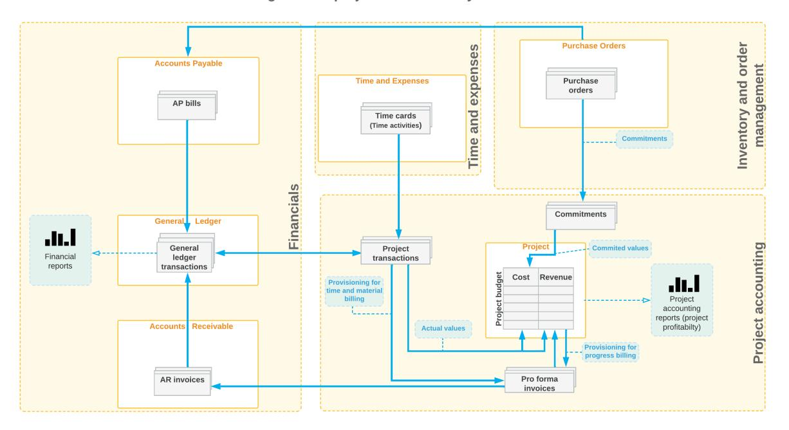

You specify the system areas in which you want the ability to process documents or transactions related to particular projects by selecting the corresponding check boxes in the**VisibilitySettings** section of the *[Projects](https://help-2025r1.acumatica.com/Help?ScreenId=ShowWiki&pageid=de2ca225-4a0c-4129-b09d-3f3ed05198f9) [Preferences](https://help-2025r1.acumatica.com/Help?ScreenId=ShowWiki&pageid=de2ca225-4a0c-4129-b09d-3f3ed05198f9)* (PM101000) form. The active projects become visible in all the system areas for which you have selected check boxes on this form; the system adds two additional elements—**Project** and **Task**—to the data entry forms of these areas. Each time you enter a document or transaction, or a document or transaction line, that relates to a specific active project, you select the appropriate project and task to associate this document or transaction (or this document or transaction line) with the project. As a result, the information from these documents and transactions is represented in the project and affects the project budget.

#### **Tracking of Non-Project Transactions**

When you are initially configuring the project accounting functionality, you define the non-project code on the *[Projects Preferences](https://help-2025r1.acumatica.com/Help?ScreenId=ShowWiki&pageid=de2ca225-4a0c-4129-b09d-3f3ed05198f9)* (PM101000) form. You specify this code for specific documents or transactions (or their lines) to indicate that they are not associated with any project. By default, this code is *X*, but you can specify a different non-project code. If a particular transaction is not related to any project, you specify the non-project code in the document or transaction, or the document or transaction line. The information from the documents or document lines with the non-project code specified is not used in project accounting and does not update project balances.

#### **Workflow of the Project Accounting Implementation**

Each particular feature may be subject to additional licensing; please consult the Acumatica ERP licensing policy for details.

Before you start to configure project accounting, you perform initial system implementation, which may include (but is not limited to) the following configuration steps:

- 1. You configure basic company settings and implement the minimum general ledger, cash management, accounts payable, and accounts receivable functionality. For details, see *[Acumatica ERP Implementation](#page-16-0) [Guide](#page-16-0)*.
- 2. You perform basic configuration of customer management if the *Customer Management* feature is included in your license. For details, see the *[Basic Customer Relationship Management](#page-495-3)* chapter.

- 3. If you plan to include non-stock items in the budget structure, you create non-stock items, as described in the *[Creating a Non-Stock Item](https://help-2025r1.acumatica.com/Help?ScreenId=ShowWiki&pageid=653e824f-9dde-48d5-b298-7f200b7e7f51)* chapter.
- 4. You perform basic configuration of order management if the *Inventory and Order Management* feature is included in your license. For details, see the *[Order Management with Inventory](#page-350-2)* chapter.
- 5. You perform basic configuration of inventory if the *Inventory* feature is included in your license. For details, see the *[Order Management with Inventory](#page-350-2)* chapter.
- 6. If you plan to include stock items in the budget structure, you configure stock items, as described in the *[Creating Stock Items](https://help-2025r1.acumatica.com/Help?ScreenId=ShowWiki&pageid=136ce96b-46cf-4d32-8b6a-8982eb2e200c)* chapter.
- 7. If time tracking in projects is planned, you perform basic configuration of time reporting functionality. For an example of configuration, see *Time Tracking [Configuration:](#page-533-2) General Information*.

To configure project accounting, you perform the following general steps:

- 1. You enable the *Projects* feature on the *[Enable/Disable Features](https://help-2025r1.acumatica.com/Help?ScreenId=ShowWiki&pageid=c1555e43-1bc5-4f6f-ba9d-b323f94d8a6b)* (CS100000) form. On the *[Projects Preferences](https://help-2025r1.acumatica.com/Help?ScreenId=ShowWiki&pageid=de2ca225-4a0c-4129-b09d-3f3ed05198f9)* (PO101000) form, you specify the necessary settings (and any optional settings) to be used in project accounting, including the non-project code, which you use to indicate that specific documents or transactions (or their lines) are not associated with any project. For an example of configuration, see *[Basic](#page-532-1) [Project Configuration: Implementation Activity](#page-532-1)*.
- 2. On the *[Account Groups](https://help-2025r1.acumatica.com/Help?ScreenId=ShowWiki&pageid=94a2cdce-c36a-49a1-b572-9cd33cb5fa73)* (PM201000) form, you define the account groups that will aggregate information about the GL transactions related to the projects. For an example of defining account groups, see *[Account](https://help-2025r1.acumatica.com/Help?ScreenId=ShowWiki&pageid=d3149947-c2d3-4f43-aad4-f505d9ef02fa) Groups: To Create an [Expense](https://help-2025r1.acumatica.com/Help?ScreenId=ShowWiki&pageid=d3149947-c2d3-4f43-aad4-f505d9ef02fa) Account Group*.
- 3. On the *[Billing Rules](https://help-2025r1.acumatica.com/Help?ScreenId=ShowWiki&pageid=6773c79b-216e-4725-b28c-3ce724d9a7c9)* (PM207000) form, you create the billing rules to be used for billing projects. For details, see the topics of the *[Creating Billing Rules](https://help-2025r1.acumatica.com/Help?ScreenId=ShowWiki&pageid=a1fb6503-65b7-45a5-9239-597cdf8ef2e5)* chapter.
- 4. On the *[Projects](https://help-2025r1.acumatica.com/Help?ScreenId=ShowWiki&pageid=81c86417-3bde-444b-8f1c-682928d31a0c)* (PM301000) form, you configure a project. For details on the project lifecycle and project configuration, see the topics of the *[Creating and Processing Projects](https://help-2025r1.acumatica.com/Help?ScreenId=ShowWiki&pageid=3ac8811e-89b1-4702-9360-8089f707a904)* chapter.

# <span id="page-530-0"></span>**Basic Project Configuration: Implementation Checklist**

The following sections provide details you can use to ensure that the system is configured properly for project accounting in Acumatica ERP, and to specify settings that affect the processing workflows.

### **Mandatory Configuration**

To ensure that the basic project accounting configuration has been implemented properly, make sure that the necessary features have been enabled and settings have been specified, as described in the following checklist.

| Form                                    | Criteria to Check                                                                                                                                                                                                                                                                             |
|-----------------------------------------|-----------------------------------------------------------------------------------------------------------------------------------------------------------------------------------------------------------------------------------------------------------------------------------------------|
| Multiple forms                          | Make sure that the minimum company settings have<br>been specified, as described in Company Without<br>Branches: General Information, and the minimal re<br>quired functionality has been implemented for all oth<br>er functional areas to be integrated with the projects<br>functionality. |
| Enable/Disable Features (CS100000) form | Make sure that the Projects feature is enabled.                                                                                                                                                                                                                                               |
| Projects Preferences (PO101000) form    | Save the default settings.                                                                                                                                                                                                                                                                    |

#### *Table: Recommended Configuration*

To speed the processing of documents and minimize errors, you should specify and save the recommended settings listed in the following table.

| Form                                 | Criteria to Check                                                                                                                                                                                                                                                                                                                                                                                                                                                                                                       |
|--------------------------------------|-------------------------------------------------------------------------------------------------------------------------------------------------------------------------------------------------------------------------------------------------------------------------------------------------------------------------------------------------------------------------------------------------------------------------------------------------------------------------------------------------------------------------|
| Projects Preferences (PO101000) form | Make sure that the following settings have been speci<br>fied on the General tab:                                                                                                                                                                                                                                                                                                                                                                                                                                       |
|                                      | •<br>In the Non-Project Code box ( General Settings<br>section), the non-project code is specified. This code<br>must be specified in transactions, documents and<br>document lines that are not related to any project.<br>For convenience, the non-project code should be<br>distinctly different from project IDs and should be<br>short, such as the single character X, which is used<br>by default.                                                                                                               |
|                                      | The non-project code should be<br>consistent with the structure of the<br>PROJECT segmented key and cannot<br>exceed its length. (The system uses<br>this key for the identifiers of projects.)<br>Also, you cannot create a non-project<br>code with an identifier that matches<br>an existing contract identifier because<br>the CONTRACT segmented key inher<br>its its structure from the PROJECT seg<br>mented key. For more information, see<br>Project Creation and Processing: Config<br>uration Prerequisites. |
|                                      | •<br>In the Empty Item Code box ( General Settings sec<br>tion), the empty item ID is specified. This is the iden<br>tifier to be used in project transaction, commitment,<br>budget lines of a project, or pro forma invoice lines<br>that are not associated with a specific item. The de<br>fault empty item code is <n a="">.</n>                                                                                                                                                                                   |
|                                      | The empty item code should be consis<br>tent with the structure of the INVENTO<br>RY segmented key, which the system<br>uses for the identifiers of items, and<br>cannot exceed its length.                                                                                                                                                                                                                                                                                                                             |
|                                      | •<br>In the Empty Item UOM box ( General Settings sec<br>tion), the default unit of measure of the empty item<br>code is specified. The default value is HOUR.<br>•<br>In the Visibility Settings section, the check boxes<br>are selected for the areas of the system in which the<br>projects should be visible.                                                                                                                                                                                                      |

### **Other Settings That Affect the Workflow**

You can affect the workflow of projects by specifying additional settings on the **General** tab of the *[Projects](https://help-2025r1.acumatica.com/Help?ScreenId=ShowWiki&pageid=de2ca225-4a0c-4129-b09d-3f3ed05198f9) [Preferences](https://help-2025r1.acumatica.com/Help?ScreenId=ShowWiki&pageid=de2ca225-4a0c-4129-b09d-3f3ed05198f9)* (PO101000) form as follows:

- To cause the system to post project transactions automatically once they are released, select the **Automatically Post on Release** check box.
- To cause the system to release project allocation transactions automatically, select the **Automatically Release Allocation** check box.

# <span id="page-532-1"></span><span id="page-532-0"></span>**Basic Project Configuration: Implementation Activity**

You perform the following implementation activity to prepare the system for users to create and process projects.

### **Story**

Suppose that you, as the implementation manager of the SweetLife Fruits & Jams company, need to configure the minimum required functionality to prepare the system for accounting for projects.

# **System Preparation**

Before you start configuring the basic project functionality, you perform the following instructions:

- 1. In a new tenant, prepare a company with the basic settings, as described in the *Company Without [Branches:](#page-78-4) [General Information](#page-78-4)*.
- 2. Launch the Acumatica ERP website, and sign in to a company.
- 3. On the *[Enable/Disable Features](https://help-2025r1.acumatica.com/Help?ScreenId=ShowWiki&pageid=c1555e43-1bc5-4f6f-ba9d-b323f94d8a6b)* (CS100000) form, enable the *Projects* feature.

# **Step: Configuring Basic Project Accounting Functionality**

To perform basic configuration of the project accounting functionality, proceed as follows:

- 1. Open the *[Projects Preferences](https://help-2025r1.acumatica.com/Help?ScreenId=ShowWiki&pageid=de2ca225-4a0c-4129-b09d-3f3ed05198f9)* (PM101000) form.
- 2. On the **General** tab (**DefaultSettings** section), make sure that *X* is specified in the **Non-Project Code** box. This is the code that will be used by default in all transactions and documents that are not related to any projects.
- 3. Make sure that *<N/A>* is selected in the **Empty Item Code** box, and select *HOUR* in the **Empty Item UOM** box. The system will insert this item and unit of measure, respectively, in project-related lines that are not associated with a specific item.
- 4. Make sure the **Automatically Post on Release** check box is selected.
- 5. Make sure the **Automatically Release Allocations** check box is selected.
- 6. In the **VisibilitySettings** section, make sure the check boxes are selected for all areas in which the projects will be used.
- 7. Save your changes to the form.

You have configured the basic project accounting functionality. Now you can proceed with creating account groups.

# <span id="page-533-0"></span>**Employee Time Tracking**

The topics of this chapter describe how to configure the tracking of employee time spent on projects so that you can bill projects based on the logged time.

# <span id="page-533-2"></span><span id="page-533-1"></span>**Time Tracking Configuration: General Information**

In Acumatica ERP, you can configure time tracking so that employees will be able to report the time spent on any project based on time cards and, optionally, time activities. Employees' reported time will be tracked in the project and billed automatically when project billing is run.

# **Learning Objectives**

In this chapter, you will learn how to configure the system so that employee time can be tracked for individual projects. In particular, you will do the following:

- Prepare the system for the configuration of time tracking
- Enable the needed system features
- Specify the minimum required configuration so that time cards (and time activities, if applicable) can be used to track employee time spent for a project

## **Applicable Scenarios**

When you are initially configuring accounting for projects, you configure time tracking if your organization is going to bill the customers for the time employees spend working on any projects.

# **Time Tracking with Time Cards in Projects**

If time tracking is in use in your organization, the time the employees spend on daily activities is recorded in time cards to track the expenses. A time card is a weekly report on the time an employee has spent each day on particular activities, including project-related ones. If time tracking is configured for use with projects, the time reported by employees is logged to the related project (or to the non-project code if no project is involved). The employee time logged to a particular project is billed during the project billing procedure.

When a time card that includes project-related activities is released, for each line of a time card that relates to a project, the system retrieves the labor cost rate at which the employee's labor is billed and generates the corresponding project transaction. The project transaction affects the cost budget of the related project: The system either updates the actual amount and quantity of the existing line or adds a new cost budget line with the incurred costs. Further, this project transaction is billed according to the billing rule specified for the corresponding project task.

### **Time Tracking with Time Activities in Projects**

You can configure the system so that an employee will report working hours by using time cards in combination with time activities. The information from time activities entered by the employee is then copied to the employee time card for the week that includes the date for which the time activity has been entered. For more information, see *Time Tracking [Configuration:](#page-537-1) Tracking Time with Time Activities*.

# **Time Tracking Implementation**

To prepare the system for time reporting for projects, you perform the following general steps:

- 1. You enable the *Advanced Financials* feature on the *[Enable/Disable Features](https://help-2025r1.acumatica.com/Help?ScreenId=ShowWiki&pageid=c1555e43-1bc5-4f6f-ba9d-b323f94d8a6b)* (CS100000) form, and specify the minimum required configuration for time reporting. For more information, see *Time Tracking [Configuration:](#page-536-1) To [Configure](#page-536-1) Time Tracking in Projects*.
- 2. On the *[Earning](https://help-2025r1.acumatica.com/Help?ScreenId=ShowWiki&pageid=02757e0d-2d3f-4846-80c8-f2c2490fd386) Types* (EP102000) form, you select the **Billable** check box for the earning types that will be specified in the time cards that must be billed within a project. The earning type determines how the system calculates the cost of employee labor.
- 3. Optionally, you configure time tracking with time activities, as illustrated in the *Time Tracking [Configuration:](#page-538-2) To Track Time with Time [Activities](#page-538-2)*.
- 4. On the *[Non-Stock Items](https://help-2025r1.acumatica.com/Help?ScreenId=ShowWiki&pageid=bf68dd4f-63d4-460d-8dc0-9152f2bd6bf1)* (IN202000) form, you define labor non-stock items that correspond to the services provided by employees; then on the *[Employees](https://help-2025r1.acumatica.com/Help?ScreenId=ShowWiki&pageid=dae5144b-49b3-43a4-bce0-93f31b3f2321)* (EP203000) form, you assign the labor items to the employees who will perform those types of labor. For an example of the creation of labor items, see *[Labor](https://help-2025r1.acumatica.com/Help?ScreenId=ShowWiki&pageid=76c290b8-4fa6-478f-9c89-e74acd3f2a68) Items: To [Configure](https://help-2025r1.acumatica.com/Help?ScreenId=ShowWiki&pageid=76c290b8-4fa6-478f-9c89-e74acd3f2a68) a Labor Item*.
- 5. On the *[Labor Rates](https://help-2025r1.acumatica.com/Help?ScreenId=ShowWiki&pageid=3bcc9979-ef23-4331-0598-19edc8babe03)* (PM209900) form, you define labor cost rates that are specific to employees, projects, and project tasks. For an example of this task being performed, see *Labor Items: To [Define](https://help-2025r1.acumatica.com/Help?ScreenId=ShowWiki&pageid=ffaeacaf-7683-40bc-98f9-a38f40d75cf3) Labor Cost Rates*.
- 6. You configure the basic project accounting settings, as demonstrated in the *[Basic Project Configuration:](#page-532-1) [Implementation Activity](#page-532-1)*.

Aer you perform the basic time tracking configuration, employees will be able to log project-related work by using time cards (and, optionally, time activities).

# <span id="page-534-0"></span>**Time Tracking Configuration: Implementation Checklist**

The following sections provide details you can use to ensure that the time tracking functionality in the system is configured properly to be used in accounting for projects.

# **Prerequisite Configuration**

To ensure that the prerequisite configuration has been implemented properly, make sure that the necessary entities have been defined,and settings have been specified, as described in the following checklist.

| Form                     | Criteria to Check                                                                                                                                                                                                                                                                                                                      |
|--------------------------|----------------------------------------------------------------------------------------------------------------------------------------------------------------------------------------------------------------------------------------------------------------------------------------------------------------------------------------|
| Multiple forms           | The minimum company settings have been specified,<br>as described in Company Without Branches: General In<br>formation.                                                                                                                                                                                                                |
| Earning Types (EP102000) | Additional earning types, if needed, have been defined<br>in addition to the predefined earning types. Also, for<br>the earning types that relate to the employee time to<br>be billed within the project, the Billable check box will<br>be selected. For information on earning types, see Em<br>ployee Time Entry: Time Activities. |
| Employees (EP203000)     | All employees for whom time will be tracked have<br>been defined. For details, see Employee Settings.                                                                                                                                                                                                                                  |

| Form                           | Criteria to Check                                                                                      |
|--------------------------------|--------------------------------------------------------------------------------------------------------|
| Activity Types (CR102000) form | Activity types have been defined, if needed, in addition<br>to those that are predefined in the system |

# **Configuration of Reporting Time with Time Cards**

To ensure that the basic time reporting configuration has been implemented properly and the employees will be able to log time spent on projects in time cards, make sure that the necessary features have been enabled, entities have been defined, and settings have been specified, as described in the following checklist.

| Form                                     | Criteria to Check                                                                                                                                                                                                                                                                                                                   |
|------------------------------------------|-------------------------------------------------------------------------------------------------------------------------------------------------------------------------------------------------------------------------------------------------------------------------------------------------------------------------------------|
| Enable/Disable Features (CS100000)       | The Advanced Financials and Projects features are en<br>abled.                                                                                                                                                                                                                                                                      |
| Time and Expenses Preferences (EP101000) | In the Posting Option for Non-Payroll Employee box<br>(in the Time Reporting Settings section of the Gen<br>eral Settings tab), Post PM and GL Transactions is se<br>lected, which means that on release of time cards and<br>time activities, the system generates project account<br>ing and general ledger transactions.         |
| Projects Preferences (PO101000)          | In the Visibility Settings section, the Time Entries<br>and Expenses check boxes are selected.                                                                                                                                                                                                                                      |
|                                          | In the Expense AccountSource and Expense Accru<br>al Account boxes of the Account Settings section, the<br>sources for the expense account and expense accru<br>al account have been selected; these settings define<br>the debit and credit accounts to be used in the project<br>transactions generated on release of time cards. |
| Non-Stock Items (IN202000)               | The labor items that are needed for all employees for<br>all available earning types have been created, as illus<br>trated in the Labor Items: To Configure a Labor Item.                                                                                                                                                           |
| Labor Rates (PM209900)                   | Labor cost rates for employees have been defined, as<br>illustrated in Labor Items: To Define Labor Cost Rates.                                                                                                                                                                                                                     |

# **Configuration of Reporting Time with Time Activities**

To ensure that the employees will be able to log time with time activities, make sure that the necessary features have been enabled and settings have been specified, as described in the following checklist.

| Form                               | Criteria to Check                                                                                                                 |
|------------------------------------|-----------------------------------------------------------------------------------------------------------------------------------|
| Enable/Disable Features (CS100000) | The Time Management feature is enabled.                                                                                           |
| Activity Types (CR102000)          | The TrackTime and Costs check box is selected for<br>the activity types for which you want to track billable<br>time in projects. |

### **Other Settings That Affect the Workflow**

You can affect the workflow of time reporting by specifying additional settings as follows:

- To cause the system to require a particular employee to enter time cards, select the**Time Card is Required** check box on the *[Employees](https://help-2025r1.acumatica.com/Help?ScreenId=ShowWiki&pageid=dae5144b-49b3-43a4-bce0-93f31b3f2321)* (EP203000) form. If the reporting of time with time activities is configured, the selection of this check box means that time activities can be released only within a time card.
- To cause the system to post project transactions that have been generated on release of time activities to the off-balance account group, select *Post PM to Off-Balance Account Group* in the **Posting Option for Non-Payroll Employee** box, and specify the account group of the *Off-Balance Type* in the **Off-Balance Account Group** on the *Time and Expenses [Preferences](https://help-2025r1.acumatica.com/Help?ScreenId=ShowWiki&pageid=e9f4a914-c4ce-4c4f-95d9-f385451e5856)* (EP101000) form.
- To cause project transactions to be automatically generated and released on release of time cards, select the **Automatically Release PM Documents** on the *Time and Expenses [Preferences](https://help-2025r1.acumatica.com/Help?ScreenId=ShowWiki&pageid=e9f4a914-c4ce-4c4f-95d9-f385451e5856)* (EP101000) form.
- To associate an earning type with a particular project or project task, on the *[Earning](https://help-2025r1.acumatica.com/Help?ScreenId=ShowWiki&pageid=02757e0d-2d3f-4846-80c8-f2c2490fd386) Types* (EP102000) form, for an earning type, specify the project or project task in the **Default Project Code** box and **DefaultTask** box, respectively.
- To copy notes and attached documents from time cards to generated project transactions, select the **Copy Files to PM Documents** and **Copy Notes to PM Documents** check boxes on the *Time and [Expenses](https://help-2025r1.acumatica.com/Help?ScreenId=ShowWiki&pageid=e9f4a914-c4ce-4c4f-95d9-f385451e5856) [Preferences](https://help-2025r1.acumatica.com/Help?ScreenId=ShowWiki&pageid=e9f4a914-c4ce-4c4f-95d9-f385451e5856)* form.

# <span id="page-536-1"></span><span id="page-536-0"></span>**Time Tracking Configuration: To Configure Time Tracking in Projects**

In this implementation activity, you will learn how to configure the system to track time spent on particular projects.

This activity is based on the *U100* dataset. If you are using another dataset, or if any system settings have been changed in *U100*, these changes can affect the workflow of the activity and the results of the processing. To avoid any issues, restore the *U100* dataset to its initial state.

#### **Story**

Suppose that you, as an administrative user of the SweetLife Fruits & Jams company, are configuring accounting for projects. The manager of the company has decided to track employee time spent on each project and bill the customer based on employee time spent on work related to the customer's project. The employees should report their working time on a weekly basis by using time cards.

You must configure the basic time tracking configuration and specify the time tracking settings in the project accounting preferences.

#### **System Preparation**

To prepare to perform the instructions of the activity, launch the Acumatica ERP website, and sign in to a company with the *U100* dataset preloaded; you should sign in as system administrator by using the *gibbs* username and the *123* password.

### **Step 1: Reviewing the Basic Configuration for Time Reporting**

Make sure the minimum required configuration for time reporting has been performed by doing the following:

1. On the *[Enable/Disable Features](https://help-2025r1.acumatica.com/Help?ScreenId=ShowWiki&pageid=c1555e43-1bc5-4f6f-ba9d-b323f94d8a6b)* (CS100000) form, make sure that the *Advanced Financials* feature is enabled.

2. On the *[Earning](https://help-2025r1.acumatica.com/Help?ScreenId=ShowWiki&pageid=02757e0d-2d3f-4846-80c8-f2c2490fd386) Types* (EP102000) form, review the default earning types. Make sure that the **Billable** check box is selected for the *RG (Regular Hours)* and *OT (Overtime)* earning types, which will be used for time tracking in projects.


If the *Payroll* feature is enabled on the *[Enable/Disable Features](https://help-2025r1.acumatica.com/Help?ScreenId=ShowWiki&pageid=c1555e43-1bc5-4f6f-ba9d-b323f94d8a6b)* form, earning types are defined on the *[Earning](https://help-2025r1.acumatica.com/Help?ScreenId=ShowWiki&pageid=646df4ae-b74f-4e6a-bc55-7b5676cefb70) Type Codes* (PR102000) form.

3. On the **General** tab of the *Time and Expenses [Preferences](https://help-2025r1.acumatica.com/Help?ScreenId=ShowWiki&pageid=e9f4a914-c4ce-4c4f-95d9-f385451e5856)* (EP101000) form (in the**Time ReportingSettings** section), make sure that *Post PM and GL Transactions* is specified in the **Time Posting Option** box.

# **Step 2: Reviewing the Basic Configuration for Project Accounting**

Do the following to make sure the minimum required configuration has been performed for project accounting that relates to time tracking functionality:

- 1. On the *[Enable/Disable Features](https://help-2025r1.acumatica.com/Help?ScreenId=ShowWiki&pageid=c1555e43-1bc5-4f6f-ba9d-b323f94d8a6b)* (CS100000) form, make sure the *Projects* feature is enabled.
- 2. On the *[Projects Preferences](https://help-2025r1.acumatica.com/Help?ScreenId=ShowWiki&pageid=de2ca225-4a0c-4129-b09d-3f3ed05198f9)* (PM101000) form, make sure of the following:
  - In the **VisibilitySettings** section, the**Time Entries** and **Expenses** check boxes are selected.
  - In the **Expense AccountSource** box, *Labor Item* is specified.
  - In the **Expense Accrual AccountSource** box, *Labor Item Accrual* is specified.

# <span id="page-537-1"></span><span id="page-537-0"></span>**Time Tracking Configuration: Tracking Time with Time Activities**

The following section explains how to configure the system to track time spent on project by using time activities, which an employee enters on the *[Activity](https://help-2025r1.acumatica.com/Help?ScreenId=ShowWiki&pageid=09cd2553-0e9e-4450-804d-106159f9a5b6)* (CR306010) form to record the provided services.

### **Combining of Time Cards and Time Activities**

In Acumatica ERP, an employee can report working hours by using time cards in combination with time activities. If tracking of time with time activities is configured in the system, the**TrackTime and Costs** check box becomes available for a time activity on the *[Activity](https://help-2025r1.acumatica.com/Help?ScreenId=ShowWiki&pageid=09cd2553-0e9e-4450-804d-106159f9a5b6)* (CR306010) form; in each activity, an employee provides the description of the performed services and reports the working hours spent on these services. The reported data from the time activity is then copied to the employee time card that relates to the week that includes the date for which the time activity has been entered. On the *[Employee](https://help-2025r1.acumatica.com/Help?ScreenId=ShowWiki&pageid=4493e479-b1e6-4f6a-ba98-360bb92692f0) Time Cards* (EP305000) form, the employee can view the details of all time activities associated with a particular time card.

A time activity can be released individually or within the time card to which it is added. When the time card is released, all the associated time activities are released automatically. For time activities associated with a project, a project transaction is created during time card release. During the project billing procedure, based on the time and material step of the billing rule configured for the account group associated with this project transaction, the applicable customer is billed for the reported employee time spent on the project.

#### **Configuration of Time Tracking with Time Activities**

To configure the tracking of time with time activities, you perform the following general steps:

- 1. On the *[Enable/Disable Features](https://help-2025r1.acumatica.com/Help?ScreenId=ShowWiki&pageid=c1555e43-1bc5-4f6f-ba9d-b323f94d8a6b)* (CS101000) form, you enable the *Time Management* feature.
- 2. On the *[Earning](https://help-2025r1.acumatica.com/Help?ScreenId=ShowWiki&pageid=02757e0d-2d3f-4846-80c8-f2c2490fd386) Types* (EP102000) form, you select the **Billable** check box for the earning types that will be specified in the time activities that must be billed within a project. The earning type determines how the system calculates the cost of employee labor.

3. On the *[Activity](https://help-2025r1.acumatica.com/Help?ScreenId=ShowWiki&pageid=cd6e990d-e2b9-4138-a789-a9b4fb09ed1f) Types* (CR102000) form, you select the**TrackTime and Costs** check box for the activity types for which you want to track time. In the newly entered time activities of the type, the**TrackTime and Costs** check box will be selected by default.

Aer you perform these configuration steps, employees will be able to log project work and specify the information required for billing (that is, the earning type for the time activity, and the total billable time spent on a particular project).

# <span id="page-538-2"></span><span id="page-538-0"></span>**Time Tracking Configuration: To Track Time with Time Activities**

In the following implementation activity, you will learn how to configure the system for tracking time in projects by using time activities.

This activity is based on the *U100* dataset. If you are using another dataset, or if any system settings have been changed in *U100*, these changes can affect the workflow of the activity and the results of the processing. To avoid any issues, restore the *U100* dataset to its initial state.

### **Story**

Suppose that you, as an administrative user of SweetLife Fruits & Jams company, are configuring accounting for projects. The manager of the company has decided to track employee time spent on each project and bill the customer based on employee time spent on work related to the customer's project. The employees should report their working time on a daily basis by using time activities.

You must configure the system for using time activities for time tracking.

### **System Preparation**

To prepare to perform the instructions of the activity, launch the Acumatica ERP website, and sign in to a company with the *U100* dataset preloaded; you should sign in as system administrator by using the *gibbs* username and the *123* password.

# **Step: Configuring Time Reporting for Time Activities**

Do the following to make sure the minimum required configuration has been performed in the system for time reporting by using time activities:

- 1. On the *[Enable/Disable Features](https://help-2025r1.acumatica.com/Help?ScreenId=ShowWiki&pageid=c1555e43-1bc5-4f6f-ba9d-b323f94d8a6b)* (CS100000) form, make sure that the *Time Management* feature is enabled.
- 2. On the *[Earning](https://help-2025r1.acumatica.com/Help?ScreenId=ShowWiki&pageid=02757e0d-2d3f-4846-80c8-f2c2490fd386) Types* (EP102000) form, review the *RG* earning type. Make sure that the **Billable** check box is selected for the earning type.


If the *Payroll* feature is enabled on the *[Enable/Disable Features](https://help-2025r1.acumatica.com/Help?ScreenId=ShowWiki&pageid=c1555e43-1bc5-4f6f-ba9d-b323f94d8a6b)* form, earning types are defined on the *[Earning](https://help-2025r1.acumatica.com/Help?ScreenId=ShowWiki&pageid=646df4ae-b74f-4e6a-bc55-7b5676cefb70) Type Codes* (PR102000) form.

3. On the *[Activity](https://help-2025r1.acumatica.com/Help?ScreenId=ShowWiki&pageid=cd6e990d-e2b9-4138-a789-a9b4fb09ed1f) Types* (CR102000) form, make sure the**TrackTime and Costs** check box is selected for the *Work Item* activity type, which you will use for logging time spent by projects.

# <span id="page-538-1"></span>**Project Budgets with Cost Codes**

The topics of this chapter explain how to define the cost codes to be used for classifying expenses and revenues in projects.

# <span id="page-539-1"></span><span id="page-539-0"></span>**Cost Codes: General Information**

A cost code represents an additional classification level for project revenues and costs in a construction project. You can associate cost codes with documents and document lines in which projects are referenced, such as general ledger transactions, accounts payable bills, purchase orders, accounts receivable invoices, expense entries, time cards, and lines of project budgets.

# **Learning Objectives**

In this chapter, you will learn how to do the following:

- Plan the structure of cost codes to be used in construction projects
- Configure the structure of the cost code identifier and define cost codes
- Configure cost code tracking in the revenue budget lines of the project budget
- Configure cost code tracking in the cost budget lines of the project budget
- Deactivate a cost code that is no longer being used

### **Applicable Scenarios**

You create cost codes and configure a project to use these cost codes if you need to further classify revenues and expenses in a budget of a construction project.

# **Cost Code Configuration**

By tracking revenues and expenses by cost codes, you can analyze how much each project task costs, what the revenue is, and how the tracked values compare with the budgeted ones.

To define the cost codes to be used in your projects, you need to perform the following tasks:

- 1. Plan the structure of cost code identifiers and the cost codes to be used based on the processes in your organization.
- 2. Modify the *COSTCODE* segmented key based on your planned structure, if necessary.
- 3. Add the planned cost codes to the table on the *[Cost Codes](https://help-2025r1.acumatica.com/Help?ScreenId=ShowWiki&pageid=3bcc9979-ef23-4331-8590-19edc8babe83)* (PM209500) form.
- 4. Configure the use of cost codes in the cost budget and revenue budget of a particular project.

You can prepare the list of cost codes in an .xlsx or .csv file and upload the file to the *[Cost Codes](https://help-2025r1.acumatica.com/Help?ScreenId=ShowWiki&pageid=3bcc9979-ef23-4331-8590-19edc8babe83)* form. Alternatively, you can add cost codes one by one on the form.

### **Project Budget Tracking by Cost Codes**

When you create a document or a document line (or both) that you want to associate with a particular cost code, you first specify the applicable GL account, project, and project task for the line; you then assign the appropriate cost code to the line. In the lookup table that opens when you click the selector button on the applicable form, the system lists the cost codes that are used in budget lines of the project you have selected for the document or document line. The lookup table also lists the budget lines that have the same project task and the account group that corresponds to the GL account selected for the document or document line. You can select any of the available cost codes, or select a cost code that has not yet been used for the combination of project, project task, and account group.

For a project, on the**Summary** tab (**Project Properties** section) of the *[Projects](https://help-2025r1.acumatica.com/Help?ScreenId=ShowWiki&pageid=81c86417-3bde-444b-8f1c-682928d31a0c)* (PM301000) form, you can use the **Revenue Budget Level** and **Cost Budget Level** boxes to specify the way the system represents budget lines and

classify revenues or expenses by cost codes as well as other factors. You do this by selecting the needed options in the **Revenue Budget Level** and **Cost Budget Level** boxes as follows:

- If you select *Task and Cost Code* or *Task, Item, and Cost Code* in the **Revenue Budget Level** box, you can view revenue budget lines by cost codes on the **Revenue Budget** tab of the *[Projects](https://help-2025r1.acumatica.com/Help?ScreenId=ShowWiki&pageid=81c86417-3bde-444b-8f1c-682928d31a0c)* form for the project, and you can bill the project with the selected revenue budget level for progress.
- If you select *Task and Cost Code* or *Task, Item, and Cost Code* in the **Cost Budget Level** box, you can view cost budget lines by cost codes on the **Cost Budget** tab of the *[Projects](https://help-2025r1.acumatica.com/Help?ScreenId=ShowWiki&pageid=81c86417-3bde-444b-8f1c-682928d31a0c)* form for the project. You can also bill the project with the selected cost budget level for time and material.

You can change the cost code for each cost budget or revenue budget line manually, if needed.

### **Deactivation of Cost Codes**

Sometimes a particular cost code is no longer needed—for example, if this is a single-use cost code added solely for one particular project, and all work related to it has been completed. If a user has the *Project Accountant* role assigned on the *[User Roles](https://help-2025r1.acumatica.com/Help?ScreenId=ShowWiki&pageid=c2879f3c-3739-430a-b02b-c225f5480966)* (SM201005) form, they can deactivate this cost code on the *[Cost Codes](https://help-2025r1.acumatica.com/Help?ScreenId=ShowWiki&pageid=3bcc9979-ef23-4331-8590-19edc8babe83)* (PM209500) form.

Inactive cost codes become unavailable for selection on any data entry form but remain specified in existing documents. Users can work with these documents but cannot perform any operation that would lead to creation of a related document or transaction (such as a project transaction or general ledger transaction) with the inactive cost code.

The following cost codes cannot be deactivated:

- The default cost code
- A cost code that is specified in a project budget line along with a project task that has the *Active* status

# <span id="page-540-0"></span>**Cost Codes: Configuration Prerequisites**

Before starting to create a cost code, you must be sure that the system has been configured properly and that all required entities have been created, as described in the following sections.

#### **Preparing the Needed Functionality**

On the *[Enable/Disable Features](https://help-2025r1.acumatica.com/Help?ScreenId=ShowWiki&pageid=c1555e43-1bc5-4f6f-ba9d-b323f94d8a6b)* (CS100000) form, the *Cost Codes* feature must be enabled. On the *[Projects](https://help-2025r1.acumatica.com/Help?ScreenId=ShowWiki&pageid=de2ca225-4a0c-4129-b09d-3f3ed05198f9) [Preferences](https://help-2025r1.acumatica.com/Help?ScreenId=ShowWiki&pageid=de2ca225-4a0c-4129-b09d-3f3ed05198f9)* (PM101000) form, the default settings must be saved before you start configuring the cost codes.

#### **Configuring Cost Code Identifiers**

The *COSTCODE* segmented key on the *[Segmented Keys](https://help-2025r1.acumatica.com/Help?ScreenId=ShowWiki&pageid=78bd7bd1-6bf6-409e-a8a5-8b18e8b80722)* (CS202000) form defines the identifiers of cost codes in the system. By default, this segmented key specifies that the cost code identifier is a one-segment key that consists of four numerals. For the key, you can define how many segments it is to have, what values may be used, whether these values should be validated, and whether auto-numbering should be used in one of the segments. You can also divide item identifiers into segments with specific values. For more information on configuring segmented keys, see *[Segmented Identifiers](https://help-2025r1.acumatica.com/Help?ScreenId=ShowWiki&pageid=a2f667ab-0de9-4738-9f05-58e9cbfc1735)*.

The *[Cost Codes](https://help-2025r1.acumatica.com/Help?ScreenId=ShowWiki&pageid=3bcc9979-ef23-4331-8590-19edc8babe83)* (PM209500) form contains a table in which you can define cost codes. Initially, the table contains a row with the default cost code, which has *0000* in the **Cost Code** column and *Default* in the **Description** column. You can change the default cost code and its description by clicking the cost code and clicking **Change ID** on the form toolbar.

# <span id="page-541-0"></span>**Project Mailings**

The topics of this chapter describe how you can configure different formats of mailings for printable project quotes, pro forma invoices, and accounts receivable invoices prepared for individual projects.

# <span id="page-541-1"></span>**Project Mailing Configuration: General Information**

Your organization's policies might require users to print documents of specific types, either for internal needs or for sending them by postal mail to customers or vendors that prefer not to receive the documents through email. In Acumatica ERP, you can define mailing settings to send particular documents to customers and vendors by email. The following sections describe the use of mailings for sending and printing project-related documents.

# **Learning Objectives**

In this chapter, you will learn how to do the following:

- Define mailing settings for project quotes
- Define mailing settings for pro forma invoices
- Define mailing settings for accounts receivable invoices

### **Applicable Scenarios**

You define mailing settings to print documents as well as automatically send documents of a specific type by email.

### **Mailing Configuration**

The functionality you use to print and send documents of a specific type by email is referred to as a *mailing*. Acumatica ERP provides predefined mailings that you can configure for printing and sending different types of documents to customers and vendors. The system generates emails for active mailings when a user clicks a command or button that initiates email generation.

The body of the email can be configured as one of the following:

- An Acumatica ERP report, such as a pro forma invoice, accounts receivable invoice or project quote. Reports define how to arrange the information available in documents of specific types for emailing or printing. On the **Mailing & Printing** tab of the *[Projects Preferences](https://help-2025r1.acumatica.com/Help?ScreenId=ShowWiki&pageid=de2ca225-4a0c-4129-b09d-3f3ed05198f9)* (PM101000) form, where you specify the settings of each mailing, you select the format for report-based documents: *HTML*, *Excel*, or *PDF*. If you select *PDF*, the document will be sent as an email attachment.
- Text—personalized at the moment the email is generated—based on a notification (email) template. Placeholders used in the template will be replaced with information from the vendor or customer record. For example, template-based emails can be used to notify customer contacts about expiration of their credit cards. When the system generates these emails for multiple customers, placeholders are replaced by the particular customer's information, such as card type, partial card number, and expiration date.

#### **Order of Applying Mailings**

If a user clicks a command or button to send a document to a customer or vendor by email, the system verifies the presence of mailings for this type of document in the following order and applies the first one it finds:

1. A branch-specific mailing that is specified in the project settings

- 2. A mailing without a branch selected that is specified in the project settings
- 3. A branch-specific mailing that is specified in the project template settings (if the project has been created based on a template)
- 4. A mailing without a branch selected that is specified in the project template settings (if the project has been created based on a template)

If no mailing for this type of document is found, the system does not send the document by email and shows an error message.

# <span id="page-542-0"></span>**Project Mailing Configuration: Invoice Mailings**

For individual projects, you can configure different formats for printable pro forma invoices and accounts receivable invoices. The invoice format may depend on the project type; for instance, an installation project may have one invoice format, and a repair project may have a different invoice format. Also, a default invoice format can be specified for particular customers, with this format used for all projects of this customer unless the user specifies a different format. For example, a company might use a particular invoice format for government customers, or for customers who work with a particular bank to get loans for their projects (and this bank dictates the invoice format).

#### **Defining Printing Forms of Invoices for Projects**

On the **Mailing & Printing** tab of the *[Projects](https://help-2025r1.acumatica.com/Help?ScreenId=ShowWiki&pageid=81c86417-3bde-444b-8f1c-682928d31a0c)* (PM301000) form, you can specify a custom format and an email notification template that should be used for the printing and emailing of the invoices prepared for the particular project. When you create a new project, the system copies all the predefined mailing settings from the **Mailing & Printing** tab of the *[Projects Preferences](https://help-2025r1.acumatica.com/Help?ScreenId=ShowWiki&pageid=de2ca225-4a0c-4129-b09d-3f3ed05198f9)* (PM101000) form, but you can override them. You can use the following predefined mailings:

- *PROFORMA*: The mailing with this identifier is used to print pro forma invoices. By default, this mailing uses the *[Pro Forma Invoice](https://help-2025r1.acumatica.com/Help?ScreenId=ShowWiki&pageid=90074336-b7ba-4db1-8134-e36702bcce01)* (PM642000) report for printing the pro forma invoice.
- *INVOICE*: The mailing with this identifier is used to print project-related accounts receivable invoices. By default, this mailing uses the ProInvoice/Memo (PM641000) report, which is a copy of the *[Invoice/Memo](https://help-2025r1.acumatica.com/Help?ScreenId=ShowWiki&pageid=3e62d073-5d55-4ddc-8267-498ff184a5ba)* (AR641000) report, for printing the invoice.

If you need to override the printing form of pro forma invoices or accounts receivable invoices for a project, you edit the respective mailing setting but do not edit the mailing identifier, which is the system setting. For example, suppose you need to override the printing form of pro forma invoices for a project. For the *PROFORMA* mailing of this project, you select the needed project report in the **Report** column of the **Mailing** table on the **Mailing & Printing** tab of the *[Projects](https://help-2025r1.acumatica.com/Help?ScreenId=ShowWiki&pageid=81c86417-3bde-444b-8f1c-682928d31a0c)* form.

#### **Printing Invoices**

When you print a pro forma invoice on the *[Pro Forma Invoices](https://help-2025r1.acumatica.com/Help?ScreenId=ShowWiki&pageid=37f1ed00-a7d7-4161-9307-1337662b8550)* (PM307000) form, the system uses the report specified for the *PROFORMA* mailing of the corresponding project on the **Mailing & Printing** tab of the *[Projects](https://help-2025r1.acumatica.com/Help?ScreenId=ShowWiki&pageid=81c86417-3bde-444b-8f1c-682928d31a0c)* (PM301000) form. If the corresponding project has no mailing setting with the *PROFORMA* identifier, an error occurs.

When you print a project-related accounts receivable invoice on the *[Invoices and Memos](https://help-2025r1.acumatica.com/Help?ScreenId=ShowWiki&pageid=5e6f3b27-b7af-412f-a40a-1d4f4be70cba)* (AR301000) form, the system searches for the report to be printed in the following order:

- 1. The report specified for the *INVOICE* mailing, if one is specified, of the corresponding project on the **Mailing & Printing** tab of the *[Projects](https://help-2025r1.acumatica.com/Help?ScreenId=ShowWiki&pageid=81c86417-3bde-444b-8f1c-682928d31a0c)* (PM301000) form.
- 2. The report specified for the customer on the **Mailing & Printing** tab of the *[Customers](https://help-2025r1.acumatica.com/Help?ScreenId=ShowWiki&pageid=652929bc-9606-4056-aa6e-0c2d1147171b)* (PM303000) form if the *INVOICE* mailing of the corresponding project is not active. For more information about mailing settings for customers, see *[Mailings for Customers: General Information](https://help-2025r1.acumatica.com/Help?ScreenId=ShowWiki&pageid=ddb6d4cc-9b9a-43fc-b4b5-fc63829c9dac)*.

3. The *[Invoice/Memo](https://help-2025r1.acumatica.com/Help?ScreenId=ShowWiki&pageid=3e62d073-5d55-4ddc-8267-498ff184a5ba)* (AR641000) report if the *INVOICE* mailing of the corresponding project and the customer is not active.

# <span id="page-543-0"></span>**Project Mailing Configuration: Pro Forma Invoices**

You can email a pro forma invoice with any status to the customer for review. To do this, you select the invoice and then invoke the **Email** command on the form toolbar of the *[Pro Forma Invoices](https://help-2025r1.acumatica.com/Help?ScreenId=ShowWiki&pageid=37f1ed00-a7d7-4161-9307-1337662b8550)* (PM307000) form.

The email address of the recipient is taken from the contact information specified on the **Bill-to Contact** section of the **Addresses** tab of the *[Pro Forma Invoices](https://help-2025r1.acumatica.com/Help?ScreenId=ShowWiki&pageid=37f1ed00-a7d7-4161-9307-1337662b8550)* form. This information is copied to each pro forma invoice from the project from the **Bill-To** section of the**Summary** tab of the *[Projects](https://help-2025r1.acumatica.com/Help?ScreenId=ShowWiki&pageid=81c86417-3bde-444b-8f1c-682928d31a0c)* (PM301000) form and can be modified at the invoice or project level.

The system generates the email in accordance with the settings of the *PROFORMA* mailing of the project on the **Mailing & Printing** tab of the *[Projects](https://help-2025r1.acumatica.com/Help?ScreenId=ShowWiki&pageid=81c86417-3bde-444b-8f1c-682928d31a0c)* form. The mailing settings of the project are copied from the **Mailing & Printing** tab of the *[Projects Preferences](https://help-2025r1.acumatica.com/Help?ScreenId=ShowWiki&pageid=de2ca225-4a0c-4129-b09d-3f3ed05198f9)* (PM101000) form and can be overridden.

The created email activity is listed in the**Tasks & Activities** dialog box that opens by clicking **Activities** on the form title bar. The system also attaches a printable version of the pro forma invoice to the email.

# <span id="page-543-1"></span>**Project Mailing Configuration: Project Quotes**

You can email a project quote that has been submitted and approved (if approval of project quotes is set up in the system) to the customer for review if the status of the project quote is *Prepared* or *Sent*. To do this, while viewing the quote on the *[Project Quotes](https://help-2025r1.acumatica.com/Help?ScreenId=ShowWiki&pageid=81c83417-3bde-444b-8f1c-382928d31a0c)* (PM304500) form, you invoke the **Email** action on the form toolbar. The system creates an email activity and lists the activity on the **Activities** tab of the form; it also attaches a printable version of the quote to the email, sends the email the recipient, and changes the status of the quote to *Sent*.

The email address of the recipient is taken from the contact information specified on the **Addresses** tab of the *[Project Quotes](https://help-2025r1.acumatica.com/Help?ScreenId=ShowWiki&pageid=81c83417-3bde-444b-8f1c-382928d31a0c)* form.

The system generates the email in accordance with the settings of the *PMQUOTE* mailing of the project template selected for the project quote. The settings of the project template on the **Mailing & Printing** tab of the *[Project](https://help-2025r1.acumatica.com/Help?ScreenId=ShowWiki&pageid=11e7c776-03fb-405d-a1f4-26700dd319fc) [Templates](https://help-2025r1.acumatica.com/Help?ScreenId=ShowWiki&pageid=11e7c776-03fb-405d-a1f4-26700dd319fc)* (PM208000) form are copied from the **Mailing & Printing** tab of the *[Projects Preferences](https://help-2025r1.acumatica.com/Help?ScreenId=ShowWiki&pageid=de2ca225-4a0c-4129-b09d-3f3ed05198f9)* (PM101000) form and can be overridden at any level, if needed.

# <span id="page-544-0"></span>**Implementing Service Management**

This part of the guide describes the minimum required configuration of the service management functionality in Acumatica ERP.

# <span id="page-544-4"></span><span id="page-544-1"></span>**Basic Service Management Configuration**

If you plan to provide field service functionality in Acumatica ERP, before you start creating entities and processing documents related to service management in the system, you must perform the necessary configuration. This configuration includes enabling the necessary features, specifying the service management preferences, creating the branch locations that provide services, defining the billing cycles to be used for customers, and specifying employee and customer settings.

If you plan to offer the provision of inventory items as part of providing field services, you must define the necessary settings related to the configuration of inventory management and sales order management.

In this chapter, you will read about the minimum configuration needed to provide the service management functionality.

# <span id="page-544-3"></span><span id="page-544-2"></span>**Basic Service Management Configuration: General Information**

This topic provides a general overview of the configuration steps that you have to perform before you can start using the service management functionality in Acumatica ERP. You perform this minimum configuration of service management if the company is going to create service orders, schedule appointments, manage staff members that attend appointments, and sell services (and possibly stock items).

# **Learning Objectives**

In this chapter, you will learn how to perform the initial configuration of the basic service management functionality. In particular, you will do the following:

- Learn about the settings that have to be specified
- Enable the needed system features
- Review the minimum required settings for the service management functionality

# **Applicable Scenarios**

You configure the service management functionality in the following cases:

- You have initially implemented Acumatica ERP, and the *Service Management* feature is included in your license.
- You need to configure service management in a previously configured, fully functioning environment.
- Optionally, you want to include sales of inventory items in the provision of field services.

### **Prerequisites**

To prepare the system for the implementation of service management, you perform the following general steps:

1. You prepare an instance of Acumatica ERP for further implementation by enabling the default set of features, activating the product license, and configuring system-wide security policies. For details, see *[Preparing an Instance for Implementation](#page-17-2)*.


Make sure that the license for Acumatica ERP includes the *Service Management* feature.

2. You complete the initial system configuration and implement the minimum general ledger functionality. The service management functionality can be tightly integrated with other Acumatica ERP functional areas, including general ledger, accounts payable, and organization structure. These areas do not require any change in their configuration when service management is implemented. For details about performing the initial system configuration, see *[Company](#page-78-5) Without Branches*, *[Company with Branches that Do Not Require](#page-84-2) [Balancing: General Information](#page-84-2)*, or *[Company with Branches that Require Balancing](#page-91-3)* (depending on your company's structure).

### **Workflow of the Implementation of Service Management**

To prepare the system for service management functionality, you first perform the following general steps, which are described in this lesson:

- 1. On the *[Enable/Disable Features](https://help-2025r1.acumatica.com/Help?ScreenId=ShowWiki&pageid=c1555e43-1bc5-4f6f-ba9d-b323f94d8a6b)* (CS100000) form, you enable the *Service Management* feature.
- 2. On the *[Work Calendar](https://help-2025r1.acumatica.com/Help?ScreenId=ShowWiki&pageid=9d01d650-0b68-4994-8146-c80fb5e34bbb)* (CS209000) form, you define the work calendar. The work calendar reflects the work days, the work times for each day, and the unpaid break time of staff members (that is, employees that are involved in field service processes).
- 3. On the *[Numbering Sequences](https://help-2025r1.acumatica.com/Help?ScreenId=ShowWiki&pageid=a8d11c23-21f2-42a3-b17d-9637c9cf8031)* (CS201010) form, you create the numbering sequence for billing batches, the numbering sequences to be used to number documents generated by service management, and the numbering sequence to be used to assign identifiers to the staff schedule rules.

We recommend that you use naming conventions for numbering sequences to differentiate service management documents from other documents generated in the system. For details about numbering sequences, see *[Use of Numbering Sequences](https://help-2025r1.acumatica.com/Help?ScreenId=ShowWiki&pageid=71c26175-c78f-4e70-8518-2115f5bfaf2f)*.

4. On the *[Service Management Preferences](https://help-2025r1.acumatica.com/Help?ScreenId=ShowWiki&pageid=1c1b94d7-ac39-4f84-a966-588290b5ba80)* (FS100100) form, you specify the numbering sequences and the work calendar to be used for service management.

Other lessons of this part of the guide describe the additional steps you perform to configure service management functionality, which include the following steps:

- 1. On the *[Branch Locations](https://help-2025r1.acumatica.com/Help?ScreenId=ShowWiki&pageid=ebef097e-9e47-4c7b-b0b0-c381251b48cf)* (FS202500) form, you create at least one branch location that represents the company office of the field service personnel. For details, see *[Branch Locations: General Information](#page-551-2)*.
- 2. On the *[Service](https://help-2025r1.acumatica.com/Help?ScreenId=ShowWiki&pageid=06fd8a36-dd81-4df9-b609-92c3d552c542) Order Types* (FS202300) form, you create the service order types that suit the company's processes. These types will be used to define the general settings for service orders and appointments of the particular type. For details, see *Service Order Types for [Inventory](#page-564-3) Sales*.
- 3. You create the needed billing cycles, which define the way billing documents are generated for the services and inventory items provided to customers, on the *[Billing Cycles](https://help-2025r1.acumatica.com/Help?ScreenId=ShowWiki&pageid=273739f9-4e18-4e81-949b-128b02e37810)* (FS206000) form. Then on the *[Customers](https://help-2025r1.acumatica.com/Help?ScreenId=ShowWiki&pageid=652929bc-9606-4056-aa6e-0c2d1147171b)* (AR303000) form, you add the customers that are expected to request the company's services (if they are not already defined in the system), and you assign the necessary billing cycles to these customers. For details, see *[Billing Cycles: General Information](#page-577-2)*.
- 4. On the *[Service Classes](https://help-2025r1.acumatica.com/Help?ScreenId=ShowWiki&pageid=91f25f78-e955-4847-8163-502afdaf80c0)* (FS400900) form, you create at least one item class to be used for creating the services provided by your company. For details, see *[Service Classes: General Information](#page-573-1)*
- 5. On the *[Services](https://help-2025r1.acumatica.com/Help?ScreenId=ShowWiki&pageid=e6537db1-ecfa-4d5b-b08c-0bdd6233fda2)* (FS400800) form, you create the service-related items that your company is going to provide and assign a service-specific item class to each service. For details, see *[Services: General Information](#page-599-2)*
- 6. On the *[Employees](https://help-2025r1.acumatica.com/Help?ScreenId=ShowWiki&pageid=dae5144b-49b3-43a4-bce0-93f31b3f2321)* (EP203000) form, you define the employees to be involved in field service processes and define them as service management staff members. For details, see *[Staff Members: General Information](#page-606-2)*.

# <span id="page-546-0"></span>**Basic Service Management Configuration: Implementation Checklist**

The following sections provide details you can use to ensure that the system is configured properly for the processing of service orders and their appointments that may include stock items, and to specify settings that affect this processing workflow.

# **Prerequisite Configuration**

We recommend that before you initially set up the service management functionality, you make sure the needed entities have been created, and settings have been specified, as summarized in the following checklist.

| Form                      | Criteria to Check                                                                                                                                                                                                                                             |
|---------------------------|---------------------------------------------------------------------------------------------------------------------------------------------------------------------------------------------------------------------------------------------------------------|
| Multiple forms            | Make sure that the minimum company settings are<br>specified, as described in Company Without Branches,<br>Company with Branches that Do Not Require Balancing,<br>or Company with Branches that Require Balancing (de<br>pending on your company structure). |
| Multiple forms            | To offer the provision of inventory items as part of pro<br>viding field services, make sure that the sales order<br>management configuration has been implemented, as<br>described in Configuration of Order Management: Imple<br>mentation Checklist .      |
| Employees (EP203000) form | Make sure that the employees to be involved in field<br>service processes have been created. For details, see<br>Employee Settings.                                                                                                                           |

# **Implementation Checklist**

Once the needed prerequisites are met, you should navigate to the forms listed below and perform the tasks described in the table to be able to use the basic service management functionality.

| Form                                       | Things to Do                                                                                                                                                                                             | Notes |
|--------------------------------------------|----------------------------------------------------------------------------------------------------------------------------------------------------------------------------------------------------------|-------|
| Enable/Disable Features (CS100000)<br>form | Enable the Service Management<br>feature.                                                                                                                                                                |       |
| Work Calendar (CS209000) form              | Create the calendar with the staff<br>members' work days, work times<br>for each day, and unpaid break<br>time. For details, see Basic Service<br>Management Configuration: Imple<br>mentation Activity. |       |

| Form                                              | Things to Do                                                                                                                                                                                                                                                                                                                                         | Notes                                                                                                                                                                                                                      |  |
|---------------------------------------------------|------------------------------------------------------------------------------------------------------------------------------------------------------------------------------------------------------------------------------------------------------------------------------------------------------------------------------------------------------|----------------------------------------------------------------------------------------------------------------------------------------------------------------------------------------------------------------------------|--|
| Numbering Sequences (CS201010)<br>form            | Create the numbering sequences<br>for service orders, staff members'<br>schedules, and field service billing<br>documents. For details, see Basic<br>Service Management Configuration:<br>Implementation Activity.                                                                                                                                   |                                                                                                                                                                                                                            |  |
| Service Management Preferences<br>(FS100100) form | Specify the necessary numbering<br>sequences and work calendar.                                                                                                                                                                                                                                                                                      |                                                                                                                                                                                                                            |  |
| Billing Cycles (FS206000) form                    | Create the necessary billing cycles<br>(which define the way billing doc<br>uments are generated for the ser<br>vices provided to customers). For<br>details, see Billing Cycles.                                                                                                                                                                    |                                                                                                                                                                                                                            |  |
| Customers (AR303000) form                         | Do the following:<br>•<br>Create all customers that are ex<br>pected to request the compa<br>ny's services.<br>•<br>Assign the necessary billing cy<br>cles to customers who may be<br>billed for services.                                                                                                                                          |                                                                                                                                                                                                                            |  |
| Employees (EP203000) form                         | Define the employees to be in<br>volved in field service processes as<br>staff members—that is, select the<br>Staff Member in Service Manage<br>ment check box for these employ<br>ees. For details, see Staff Members.                                                                                                                              |                                                                                                                                                                                                                            |  |
| Order Types (SO201000) form                       | To offer the provision of inventory<br>items as part of providing field ser<br>vices, make sure that for the sales<br>order types that will be used for the<br>field service processes, the Enable<br>Field Services Integration check<br>box is selected. For details, see Ba<br>sic Service Management Configura<br>tion: Implementation Activity. |                                                                                                                                                                                                                            |  |
| Service Order Types (FS202300)<br>form            | Create the service order types that<br>suit the company's processes,<br>as described in the Service Order<br>Types chapter.                                                                                                                                                                                                                          | To generate billing documents that<br>may include both services and in<br>ventory items, you select the Sales<br>Orders or SO Invoices option in the<br>Generated Billing Documents box<br>on the General tab of the form. |  |
| Branch Locations (FS202500) form                  | Create all branch locations that<br>represent company offices. For de<br>tails, see Branch Locations.                                                                                                                                                                                                                                                |                                                                                                                                                                                                                            |  |

# **Optional Settings**

Depending on your company's processes, you may need the settings described in the table below.

| Form                                                      | Things to Check                                                                                                                                                                                                                                                                |
|-----------------------------------------------------------|--------------------------------------------------------------------------------------------------------------------------------------------------------------------------------------------------------------------------------------------------------------------------------|
| Service Areas (FS201900) form                             | If staff members are to work within a certain geograph<br>ical area, make sure that the service areas have been<br>defined and staff members have been assigned to the<br>areas. For details, see Service Areas.                                                               |
| Skills (FS206000) and Employees (EP203000) forms          | If the assignment of staff members has to be per<br>formed based on skills that are necessary for the ser<br>vice, make sure that the skills have been defined and<br>assigned to staff members. For details, see Skills.                                                      |
| License Types (FS200900) and Services (FS400800)<br>forms | If the assignment of staff members has to be per<br>formed based on licenses that prove that a staff mem<br>ber can perform a service, make sure that the types of<br>these licenses have been defined and assigned to the<br>appropriate services. For details, see Licenses. |
| Licenses (FS201000) and Employees (EP203000) forms        | If the assignment of staff members has to be per<br>formed based on licenses that prove that a staff mem<br>ber can perform a service, make sure that the licens<br>es have been entered and assigned to the needed staff<br>members. For details, see Licenses.               |
| Item Classes (IN201000) form                              | Make sure that the item classes that contain the de<br>fault settings of the company's services have been cre<br>ated.                                                                                                                                                         |
| Non-Stock Items form                                      | If services have been created in the system, make sure<br>that the skills that are required for performing these<br>services have been assigned to them.<br>If services have been created in the system, make sure                                                             |
|                                                           | that the type of the licenses that are required for per<br>forming these services have been assigned to them.                                                                                                                                                                  |
| Service Management Preferences (FS100100) form            | If you plan to use the calendar board forms (Calendar<br>Board (FS300300), Room Calendar Board (FS300700), or<br>both), specify the DayStartTime on the Service Man<br>agement Preferences form. This setting is required to<br>properly configure the calendar view.          |

# <span id="page-548-1"></span><span id="page-548-0"></span>**Basic Service Management Configuration: Implementation Activity**

In this implementation activity, you will learn how to enable the *Service Management* feature and review the basic service management settings.

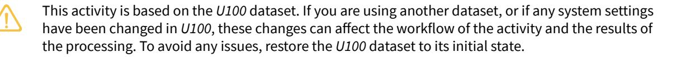

### **Story**

Suppose that you are an administrative user of the SweetLife Service and Equipment Sales Center. You are configuring the minimum required functionality to prepare the system for the processing of service orders and the scheduling and processing of appointments.

# **Configuration Overview**

In the *U100* dataset, the following tasks have been performed for the purposes of this activity:

- The minimum system configuration, which is described in *[Company with Branches that Do Not Require](#page-84-2) [Balancing: General Information](#page-84-2)*, has been performed.
- The *SWEETLIFE* company has been created on the *[Companies](https://help-2025r1.acumatica.com/Help?ScreenId=ShowWiki&pageid=fedad435-8496-4397-b8a3-50a473629f76)* (CS101500) form. This company has multiple branches created on the *[Branches](https://help-2025r1.acumatica.com/Help?ScreenId=ShowWiki&pageid=b97ab72d-4ab4-4f02-b69c-f7f61b316ced)* (CS102000) form, including *SWEETEQUIP (Service and Equipment Sales Center)*.
- On the *[Numbering Sequences](https://help-2025r1.acumatica.com/Help?ScreenId=ShowWiki&pageid=a8d11c23-21f2-42a3-b17d-9637c9cf8031)* (CS201010) form, the *FSPOST - SM Posting Batches*, *FSSO - Service Orders*, and *FSSCHEDULE - Staff Members' Schedules* numbering sequences have been created.
- On the *[Work Calendar](https://help-2025r1.acumatica.com/Help?ScreenId=ShowWiki&pageid=9d01d650-0b68-4994-8146-c80fb5e34bbb)* (CS209000) form, the *MAIN* work calendar has been created to reflect the work days and times, and the unpaid break time of staff members.
- On the *[Service Management Preferences](https://help-2025r1.acumatica.com/Help?ScreenId=ShowWiki&pageid=1c1b94d7-ac39-4f84-a966-588290b5ba80)* (FS100100) form, the needed numbering sequences and work calendar have been specified.

### **Process Overview**

To set up the basic service management settings, you will do the following:

- 1. On the *[Enable/Disable Features](https://help-2025r1.acumatica.com/Help?ScreenId=ShowWiki&pageid=c1555e43-1bc5-4f6f-ba9d-b323f94d8a6b)* (CS100000) form, you will enable the *Service Management* feature.
- 2. On the *[Numbering Sequences](https://help-2025r1.acumatica.com/Help?ScreenId=ShowWiki&pageid=a8d11c23-21f2-42a3-b17d-9637c9cf8031)* (CS201010) form, you will review the following numbering sequences for service management entities: the numbering sequence to be used to assign identifiers to batches of billing documents, and the numbering sequence to be used for the reference numbers of the service orders of the service order types to be created in other activities of this part of the guide.
- 3. On the *[Work Calendar](https://help-2025r1.acumatica.com/Help?ScreenId=ShowWiki&pageid=9d01d650-0b68-4994-8146-c80fb5e34bbb)* (CS209000) form, you will review the calendar with the staff members' work days and work times for each day.
- 4. On the *[Service Management Preferences](https://help-2025r1.acumatica.com/Help?ScreenId=ShowWiki&pageid=1c1b94d7-ac39-4f84-a966-588290b5ba80)* (FS100100) form, you will ensure that the numbering sequences and the work calendar are specified.

### **System Preparation**

Before you start performing the initial configuration of the service management functionality, launch the Acumatica ERP website, and sign in to a company with the *U100* dataset preloaded. You should sign in as a system administrator by using the *gibbs* username and the *123* password.

### **Step 1: Enabling the Service Management Feature**

To enable the *Service Management* feature, do the following:

1. Open the *[Enable/Disable Features](https://help-2025r1.acumatica.com/Help?ScreenId=ShowWiki&pageid=c1555e43-1bc5-4f6f-ba9d-b323f94d8a6b)* (CS100000) form.

- 2. On the form toolbar, click **Modify**, which gives you the ability to change the set of selected features.
- 3. Select the**Service Management** check box.
- 4. On the form toolbar, click **Enable**. This saves your changes and enables the currently selected features.

### **Step 2: Reviewing Numbering Sequences**

To review the numbering sequences that have been created for service management batches, do the following:

- 1. Open the *[Numbering Sequences](https://help-2025r1.acumatica.com/Help?ScreenId=ShowWiki&pageid=a8d11c23-21f2-42a3-b17d-9637c9cf8031)* (CS201010) form.
- 2. In the **Numbering ID** box, select the *FSPOST* numbering sequence ID. The system uses this numbering sequence to automatically generate an ID for each GL batch created for a service document.

Notice that this numbering sequence has the following settings:

- **Start Number**: SM000001
- **End Number**: SM999999
- 3. In the **Numbering ID** box, select the *FSSO* numbering sequence ID. The system uses this numbering sequence to automatically generate a reference number for each new service order.

Notice that this numbering sequence has the following settings:

- **Start Number**: 000001
- **End Number**: 999999
- 4. In the **Numbering ID** box, select the *FSSCHEDULE* numbering sequence and review its settings. The system uses this numbering sequence to automatically generate an ID for each new staff members' schedule.

In Step 4 of this activity, you will make sure that the *FSPOST - SM Posting Batches* and *FSSCHEDULE - Staff Members' Schedules* sequences are specified on the *[Service Management Preferences](https://help-2025r1.acumatica.com/Help?ScreenId=ShowWiki&pageid=1c1b94d7-ac39-4f84-a966-588290b5ba80)* (FS100100) form. You will specify the *FSSO - Service Orders* sequence on the *[Service](https://help-2025r1.acumatica.com/Help?ScreenId=ShowWiki&pageid=06fd8a36-dd81-4df9-b609-92c3d552c542) Order Types* (FS202300) form when you create the service order types.

#### **Step 3: Reviewing the Work Calendar**

To review the work calendar, do the following:

- 1. On the *[Work Calendar](https://help-2025r1.acumatica.com/Help?ScreenId=ShowWiki&pageid=9d01d650-0b68-4994-8146-c80fb5e34bbb)* (CS209000) form, select *MAIN* in the **Calendar ID** box.
- 2. Make sure that the following settings are specified for the calendar:
  - a. **Calendar ID**: MAIN
  - b. **Description**: Main Calendar
  - c. **Time Zone**: *(GMT-05:00) Eastern Time (US & Canada)*
- 3. On the **Calendar** tab, ensure that the **Monday**, **Tuesday**, **Wednesday**, **Thursday**, and **Friday** check boxes are selected, and the**Sunday** and **Saturday** check boxes are cleared.
- 4. In the boxes of the**StartTime** column, ensure that *10:00 AM* is specified for all the selected days of the week.
- 5. In the boxes of the **End Time** column, ensure that *6:00 PM* is specified for all the selected days of the week.

### **Step 4: Reviewing the Service Management Preferences**

To make it possible for the service management functionality to be used, the numbering sequences and work calendar need to be specified in the service management preferences. Do the following:

- 1. Open the *[Service Management Preferences](https://help-2025r1.acumatica.com/Help?ScreenId=ShowWiki&pageid=1c1b94d7-ac39-4f84-a966-588290b5ba80)* (FS100100) form.
- 2. On the **General** tab, in the **NumberingSettings** section, ensure that the following settings are specified (as shown in the following screenshot):

- **Batch NumberingSequence**: *FSPOST - SM Posting Batches* (see Item 1 in the screenshot)
- **Staff Schedule NumberingSequence**: *FSSCHEDULE - Staff Members' Schedules* (Item 2)
- 3. On the **Calendars & Maps** tab (Item 3), in the **CalendarSettings** section, make sure that *MAIN Main Calendar* is selected in the **Work Calendar** box.

|                                                                | <b>Service Management Preferences</b>               |                                  |                                 |
|----------------------------------------------------------------|-----------------------------------------------------|----------------------------------|---------------------------------|
| E<br>$\Omega$                                                  |                                                     |                                  |                                 |
| 3<br><b>GENERAL</b><br><b>CALENDARS &amp; MAPS</b>             | <b>MAILING &amp; PRINTING</b>                       |                                  |                                 |
|                                                                |                                                     |                                  |                                 |
| <b>NUMBERING SETTINGS</b>                                      |                                                     | APPOINTMENT VALIDATION SETTINGS  |                                 |
| * Batch Numbering Sequence:                                    | FSPOST - SM Posting Batch( O                        | Skills:                          | Do Not Validate                 |
| * Staff Schedule Numbering Sequence:                           | FSSCHEDULE - Staff Membe Q                          | Service Areas:                   | Do Not Validate<br>$\checkmark$ |
| <b>Equipment Numbering Sequence:</b>                           | <b>FSEQUIP - FS Equipment</b>                       | Licenses:                        | Do Not Validate<br>$\checkmark$ |
| License Numbering Sequence:                                    | FSLICENSE - Staff Members' Q<br>0                   | <b>Overlapping Appointments:</b> | Do Not Validate<br>$\checkmark$ |
| <b>GENERAL SETTINGS</b>                                        |                                                     |                                  |                                 |
| Z Enable Time & Expenses Integration                           |                                                     |                                  |                                 |
| □ Enable Rooms                                                 |                                                     |                                  |                                 |
| Z Enable Default Staff in Service Orders                       |                                                     |                                  |                                 |
| Z Enable Default Resource Equipment in Service Orders          |                                                     |                                  |                                 |
| Enable Workflow Stages                                         |                                                     |                                  |                                 |
| Manage Multiple Billing Options per Customer                   |                                                     |                                  |                                 |
| Alert About Open Appointments Before Service Orders Are Closed |                                                     |                                  |                                 |
| Require Manual Filtering on Billing Forms                      |                                                     |                                  |                                 |
| Track Start and Completion Appointment Locations               |                                                     |                                  |                                 |
| <b>DEFAULT SETTINGS</b>                                        |                                                     |                                  |                                 |
| Default Service Order Type:                                    | MRO - Maintenance, repair at Q<br>0                 |                                  |                                 |
| Default Service Order Type for Sales Ord.                      | <b>INST - Installation Services</b><br>$\circ$<br>0 |                                  |                                 |
| Default Service Order Type for Cases:                          | MRO - Maintenance, repair at Q 2                    |                                  |                                 |
|                                                                |                                                     |                                  |                                 |
|                                                                |                                                     |                                  |                                 |
|                                                                |                                                     |                                  |                                 |
|                                                                |                                                     |                                  |                                 |
|                                                                |                                                     |                                  |                                 |

#### *Figure: Service management settings*

If these configuration steps have been performed, the service management forms are available, and the system is set up for the use of the service management capabilities.

# <span id="page-551-3"></span><span id="page-551-0"></span>**Branch Locations**

The topics of this chapter explain how to configure branch locations. A branch location in Acumatica ERP is a physical location (for example, an office) to be used to provide services.

# <span id="page-551-2"></span><span id="page-551-1"></span>**Branch Locations: General Information**

In Acumatica ERP, branch locations represent physical locations (such as offices) from which your staff members depart to attend appointments. A branch of your company can have multiple branch locations or only one branch location.

### **Learning Objectives**

In this chapter, you will learn how a branch location is used in service management, and you will review and create branch locations to become familiar with their settings.

# **Applicable Scenarios**

You create a branch location in the system in the following cases:

- When you initially implement the service management functionality
- When your company has opened a new office within a branch, and you need to create the new office (branch location) in the system

# <span id="page-552-0"></span>**Branch Locations: Implementation Activity**

In this implementation activity, you will learn how to create a branch location in the system.

This activity is based on the *U100* dataset. If you are using another dataset, or if any system settings have been changed in *U100*, these changes can affect the workflow of the activity and the results of the processing. To avoid any issues, restore the *U100* dataset to its initial state.

### **Story**

Suppose that an administrative user of the SweetLife Service and Equipment Sales Center previously created the *WEST BRIGHTON* branch location in Acumatica ERP. This branch location represents the main office of the Service and Equipment Sales Center, which is the *SWEETEQUIP* branch in the system. The company is now opening a new office for this branch, which will provide services.

Acting as an administrative user, you will create a new branch location in the system.

# **Configuration Overview**

In the *U100* dataset, the following tasks have been performed to support this activity:

- The minimum system configuration, which is described in *[Company with Branches that Do Not Require](#page-84-2) [Balancing: General Information](#page-84-2)*, has been performed.
- The *SWEETLIFE* company has been created on the *[Companies](https://help-2025r1.acumatica.com/Help?ScreenId=ShowWiki&pageid=fedad435-8496-4397-b8a3-50a473629f76)* (CS101500) form. This company has multiple branches created on the *[Branches](https://help-2025r1.acumatica.com/Help?ScreenId=ShowWiki&pageid=b97ab72d-4ab4-4f02-b69c-f7f61b316ced)* (CS102000) form, including *SWEETEQUIP (Service and Equipment Sales Center)*.
- On the *[Service Management Preferences](https://help-2025r1.acumatica.com/Help?ScreenId=ShowWiki&pageid=1c1b94d7-ac39-4f84-a966-588290b5ba80)* (FS100100) form, the minimum settings have been specified, including specifying the numbering sequences and work calendar, for the service management functionality to be used.

# **Process Overview**

On the *[Branch Locations](https://help-2025r1.acumatica.com/Help?ScreenId=ShowWiki&pageid=ebef097e-9e47-4c7b-b0b0-c381251b48cf)* (FS202500) form, you will specify the settings of the new branch location.

## **System Preparation**

Before you begin create a branch location, do the following:

- 1. Launch the Acumatica ERP website, and sign in to a company with the *U100* dataset preloaded. You should sign in as a system administrator by using the *gibbs* username and the *123* password.
- 2. In the company you are signed in, ensure that the *Service Management* feature has been enabled on the *[Enable/Disable Features](https://help-2025r1.acumatica.com/Help?ScreenId=ShowWiki&pageid=c1555e43-1bc5-4f6f-ba9d-b323f94d8a6b)* (CS100000) form.

3. On the Company and Branch Selection menu on the top pane of the Acumatica ERP screen, select the *Service and Equipment Sales Center* branch.

### **Step: Creating a Branch Location**

To create a new branch location, do the following:

- 1. Open the *[Branch Locations](https://help-2025r1.acumatica.com/Help?ScreenId=ShowWiki&pageid=ebef097e-9e47-4c7b-b0b0-c381251b48cf)* (FS202500) form.
- 2. On the form toolbar, click **Add New Record**.
- 3. In the **Branch Location ID** box, type BROOKLYN.
- 4. In the **Description** box, enter Brooklyn Office.
- 5. In the **Branch** box, select *SWEETEQUIP*.
- 6. On the **General** tab, in the **Main Address** section, specify the following settings:
  - **Address Line 1**: 1230 Surf Ave
  - **City**: Brooklyn
  - **Country**: *US*
  - **State**: *NY*
  - **Postal Code**: 11224
- 7. In the **Inventory Defaults** section, in the **Default Warehouse** box, select *EQUIPHOUSE*.
- 8. On the form toolbar, click**Save**.

Now the *SWEETEQUIP* branch has two branch locations that will be providing services: *WEST BRIGHTON* and *BROOKLYN*.

# <span id="page-553-2"></span><span id="page-553-0"></span>**Service Order Types**

As part of the minimum configuration of service management, you need to configure service order types, which provide the general settings for service orders and appointments of a particular type. Service order types make it easier to define service orders and appointments in the system and specify the appropriate settings for them.

# <span id="page-553-1"></span>**Service Order Types: General Information**

Service documents can serve a variety of purposes across different companies. For example, a service order or appointment can be created to provide standard services, such as repair or maintenance, at a customer's location. Additionally, service documents like service orders or appointments can be used for internal purposes, such as scheduling internal appointments or generating service quotes for potential customers. In each case, different general and billing settings need to be specified in the service document to reflect the purpose of the service.

In Acumatica ERP, you create service order types with various settings. When you create a service order or appointment and select a specific type, the general settings from that service order type are copied to the service order or appointment.

#### **Learning Objectives**

In this chapter, you will learn how to create a service order type and specify the necessary settings.

# **Applicable Scenarios**

You configure service order types in the following cases:

- When you are initially configuring service management in Acumatica ERP. In this case, you create the service order types that support your company's business processes. The use of service order types makes it easier for users to create and process service orders and their appointments in the system.
- When you need to create a new service order type to support a new business process.

# <span id="page-554-0"></span>**Service Order Types: General Settings**

This topic describes the specific settings that you specify when you are creating a service order type on the *[Service](https://help-2025r1.acumatica.com/Help?ScreenId=ShowWiki&pageid=06fd8a36-dd81-4df9-b609-92c3d552c542) Order [Types](https://help-2025r1.acumatica.com/Help?ScreenId=ShowWiki&pageid=06fd8a36-dd81-4df9-b609-92c3d552c542)* (FS202300) form.

### **Behavior of the Service Order Type**

Depending on the option that you select for the service order type in the **Behavior** box on the **General** tab of the *[Service](https://help-2025r1.acumatica.com/Help?ScreenId=ShowWiki&pageid=06fd8a36-dd81-4df9-b609-92c3d552c542) Order Types* (FS202300) form, the system makes particular UI elements and tabs available or unavailable on the current form, as well as on the following forms:

- The *[Service Orders](https://help-2025r1.acumatica.com/Help?ScreenId=ShowWiki&pageid=6e5277d3-274e-45f5-b77d-4410ed736d21)* (FS300100) form for service orders of the type
- The *[Appointments](https://help-2025r1.acumatica.com/Help?ScreenId=ShowWiki&pageid=ac486e9c-f5df-4829-94f0-2df8821361a0)* (FS300200) form for appointments of the type

You can select one of the following behaviors for the service order type:

- *Regular*: Service orders and appointments of the type will include the usual services, such as repair, maintenance, installation, and training. For this behavior, you can specify all the settings except the routerelated settings.
- *Internal*: The type includes service orders of your own company, and appointments take place inside the company. Because there is no customer involved with the service orders and appointments of a type with this behavior, the posting, customer, and route settings are unavailable for service orders and appointments of this type.
- *Quote*: The type is designed for quotes (any of which can be converted into a service order if the customer agrees to the quote). For types with this behavior, billing settings are unavailable on the *[Service](https://help-2025r1.acumatica.com/Help?ScreenId=ShowWiki&pageid=06fd8a36-dd81-4df9-b609-92c3d552c542) Order Types* form.
- *Route*: Service orders of the type include the settings of the route between the locations where services are performed. For service order types with this behavior, the route can be specified on the *[Appointments](https://help-2025r1.acumatica.com/Help?ScreenId=ShowWiki&pageid=ac486e9c-f5df-4829-94f0-2df8821361a0)* form. For details on routes, see the Route Management guide.

# **Default Contact Information Settings**

For service orders and appointments of the service order type, you can define the default source of the address and contact information. In the **DefaultSettings** section of the **General** tab of the *[Service](https://help-2025r1.acumatica.com/Help?ScreenId=ShowWiki&pageid=06fd8a36-dd81-4df9-b609-92c3d552c542) Order Types* (FS202300) form, you select one of the following options in the**Take Address and Contact Information From** box:

- *Business Account*: By default, the address and contact settings are copied from the *[Customers](https://help-2025r1.acumatica.com/Help?ScreenId=ShowWiki&pageid=652929bc-9606-4056-aa6e-0c2d1147171b)* (AR303000) form. Note that before the settings are copied, the customer must be selected in the **Customer** box of the Summary area of the *[Appointments](https://help-2025r1.acumatica.com/Help?ScreenId=ShowWiki&pageid=ac486e9c-f5df-4829-94f0-2df8821361a0)* (FS300200) or *[Service Orders](https://help-2025r1.acumatica.com/Help?ScreenId=ShowWiki&pageid=6e5277d3-274e-45f5-b77d-4410ed736d21)* (FS300100) form.
- *Contact*: By default, the address and contact settings are copied from the **Contact** section of the *[Contacts](https://help-2025r1.acumatica.com/Help?ScreenId=ShowWiki&pageid=75a5dea9-d640-4b71-95b1-88534c4afad7)* (CR302000) form. Note that before the settings are copied, the contact person must be selected in the **Contact** box on the**Settings** tab of the *[Appointments](https://help-2025r1.acumatica.com/Help?ScreenId=ShowWiki&pageid=ac486e9c-f5df-4829-94f0-2df8821361a0)* or *[Service Orders](https://help-2025r1.acumatica.com/Help?ScreenId=ShowWiki&pageid=6e5277d3-274e-45f5-b77d-4410ed736d21)* form.

• *Branch Location*: By default, the address and contact settings are copied from the **General** tab (the **Main Contact** and **Main Address** section, respectively) of the *[Branch Locations](https://help-2025r1.acumatica.com/Help?ScreenId=ShowWiki&pageid=ebef097e-9e47-4c7b-b0b0-c381251b48cf)* (FS202500) form. You select this option when appointments of the service order usually take place at the address of your branch location.

# **Billing Settings**

The billing settings determine the type of a document or record generated for appointments or service orders of a specific service order type during the billing process. You specify these settings in the **BillingSettings** section of the **General** tab of the *[Service](https://help-2025r1.acumatica.com/Help?ScreenId=ShowWiki&pageid=06fd8a36-dd81-4df9-b609-92c3d552c542) Order Types* (FS202300) form. In the **Generated Billing Documents** box of this section, you select one of the following options:

• *AR Documents*. When this option is selected, the system generates an accounts receivable invoice when billing is run for a service order or appointment of the specified type. The accounts receivable invoice can include only services and non-stock items, which can then be processed, and payment collected.

The **Create AP Bills for Negative Balances** check box becomes available if you select this option. If you select this check box, for a service order or appointment with a negative balance, the system instead creates an accounts payable bill.

• *Sales Orders*. When this option is selected, the system generates a sales order when billing is run for a service order or appointment of the specified type. Optionally, you can create shipments and add freight costs to the sales order before generating the sales invoice.

If you configure quick processing for the service order type, the invoice can be generated automatically along with the sales order.

To enable the generation of sales orders from field service-related forms, the *Inventory and Order Management* feature has to be included in your license and enabled on the *[Enable/](https://help-2025r1.acumatica.com/Help?ScreenId=ShowWiki&pageid=c1555e43-1bc5-4f6f-ba9d-b323f94d8a6b) [Disable Features](https://help-2025r1.acumatica.com/Help?ScreenId=ShowWiki&pageid=c1555e43-1bc5-4f6f-ba9d-b323f94d8a6b)* (CS100000) form. Additionally, integration with field services must be activated for the sales order type. That is, the **Enable Field Services Integration** check box must be selected for the relevant order type on the **General** tab of the *Order [Types](https://help-2025r1.acumatica.com/Help?ScreenId=ShowWiki&pageid=e6984218-4260-4438-99e1-aee2b3765369)* (SO201000) form.

• *SO Invoices*. When this option is selected, the system generates a sales invoice when billing is run for a service order or appointment of the specified type. The sales invoice can include both services and stock items (which do not require shipping) sold to customers along with the services.

If you configure quick processing for the service order type, the invoice can be processed automatically in the system.

- *Project Transactions*. When this option is selected, the system generates a project transaction (and an issue, if the appointment or service order includes stock items) when billing is run for a service order or appointment. Service order types with this setting are used for service documents linked to projects. Project transactions generated for these service documents are tracked and allocated to the associated project.
- *None*. When this option is selected, the system does not generate billing documents for service documents of the service order type.

Aer you select the appropriate option in the **Generated Billing Documents** box, you specify the other settings of the section. The option you select in the **Generated Billing Documents** box determines the set of elements in the section. The settings you specify for these elements determine the generation of these billing documents.

# <span id="page-555-0"></span>**Service Order Types: Implementation Checklist**

The following sections provide details you can use to ensure that the system is configured properly for the creation of service order types.

### **Prerequisites**

Before you create a service order type to be used for service orders and appointments for which sales orders or SO invoices will not be generated, you should make sure the minimum configuration of service management functionality has been performed, as described in *[Basic Service Management Configuration: Implementation Activity](#page-548-1)*.

# **Implementation Checklist**

We recommend that before you start to create service order types, you make sure the needed features have been enabled and entities have been configured, as summarized in the following checklist.

| Form                                    | Criteria to Check                                                       |
|-----------------------------------------|-------------------------------------------------------------------------|
| Enable/Disable Features (CS100000) form | The Service Management feature has been enabled.                        |
| Numbering Sequences (CS201010) form     | At least one numbering sequence for service orders<br>has been created. |
| Credit Terms (CS206500) form            | At least one set of credit terms has been created.                      |

### **Minimum Required Settings for a Service Order Type**

For each service order type that you are going to use, you should specify the following minimum configuration settings.

| Form                                                           | Settings to Specify                                                                                                                                                                                                                               |
|----------------------------------------------------------------|---------------------------------------------------------------------------------------------------------------------------------------------------------------------------------------------------------------------------------------------------|
| The Summary area of the Service Order Types<br>(FS202300) form | •<br>The identifier of the service order type<br>•<br>The description of the service order type                                                                                                                                                   |
| The General tab of the Service Order Types form                | •<br>The Numbering Sequence to be used to assign ser<br>vice order reference numbers to service orders of<br>the type                                                                                                                             |
|                                                                | •<br>The needed Behavior of the service order type is<br>selected                                                                                                                                                                                 |
|                                                                | •<br>The AR Documents option in the Generated Billing<br>Documents box, which indicates that an AR docu<br>ment will be generated to bill the customer for ser<br>vices specified in service orders and appointments<br>of the service order type |
|                                                                | •<br>The needed option in the DefaultTerms for AR<br>and SO box                                                                                                                                                                                   |

# **Other Settings That Affect the Workflow**

For a particular service order type, you can specify additional settings on the **General** tab of the *[Service Order](https://help-2025r1.acumatica.com/Help?ScreenId=ShowWiki&pageid=06fd8a36-dd81-4df9-b609-92c3d552c542) [Types](https://help-2025r1.acumatica.com/Help?ScreenId=ShowWiki&pageid=06fd8a36-dd81-4df9-b609-92c3d552c542)* (FS202300) form that will affect the processing of service orders and appointments of this type:

• If the **CompleteService Orders When Its Appointments Are Completed** check box (**GeneralSettings** section) is selected, the system changes the status of a service order of the type to *Completed* when all appointments of this service order have the *Completed* status. If this check box is cleared, a user has to manually complete the service order.

- If the **CloseService Orders When Its Appointments Are Closed** check box (**GeneralSettings** section) is selected, the system changes the status of a service order of the type to *Closed* when all appointments of this service order have the *Closed* status. If this check box is cleared, a user has to manually close the service order.
- If the **Require Contact** check box (**GeneralSettings** section) is selected, users have to select a contact person in the **Contact** box on the**Settings** tab of the *[Service Orders](https://help-2025r1.acumatica.com/Help?ScreenId=ShowWiki&pageid=6e5277d3-274e-45f5-b77d-4410ed736d21)* (FS300100) or *[Appointments](https://help-2025r1.acumatica.com/Help?ScreenId=ShowWiki&pageid=ac486e9c-f5df-4829-94f0-2df8821361a0)* (FS300200) form when they create service orders or appointments of this service order type. If this check box is cleared, the service orders and appointments of the type can be created without the contact person being specified.
- If the **Require CustomerSignature on Mobile App** check box (**GeneralSettings** section) is selected, before a user completes an appointment of the type by using a mobile device, the customer's signature has to be obtained and saved in the mobile app. If this check box is cleared, the user can complete an appointment of the type without the customer's signature.
- If the **Bill Only Closed Appointments** check box (**BillingSettings** section) is selected, billing documents can be generated only for closed appointments of the service order type. If this check box is cleared, billing documents an be generated for appointments of the type that are not closed.

To simplify the process of creating service orders and appointments in the system, you can leave the default settings.

# <span id="page-557-0"></span>**Service Order Types Without Inventory Sales: To Create a Service Order Type**

In this implementation activity, you will learn how to create a service order type for service orders and appointments that provide services only, with accounts receivable invoices generated as the billing documents.

This activity is based on the *U100* dataset. If you are using another dataset, or if any system settings have been changed in *U100*, these changes can affect the workflow of the activity and the results of the processing. To avoid any issues, restore the *U100* dataset to its initial state.

### **Story**

Suppose that the SweetLife Service and Equipment Sales Center receives an order for consulting services. Acting as an administrative user, you need to create a service order type for service orders and appointments that include only services (that is, no inventory items can be included). Accounts receivable invoices will be used to bill the customers.

# **Configuration Overview**

In the *U100* dataset, the following tasks have been performed to support this activity:

- The minimum system configuration, which is described in *[Company with Branches that Do Not Require](#page-84-2) [Balancing: General Information](#page-84-2)*, has been performed.
- The *SWEETLIFE* company has been created on the *[Companies](https://help-2025r1.acumatica.com/Help?ScreenId=ShowWiki&pageid=fedad435-8496-4397-b8a3-50a473629f76)* (CS101500) form. This company has multiple branches created on the *[Branches](https://help-2025r1.acumatica.com/Help?ScreenId=ShowWiki&pageid=b97ab72d-4ab4-4f02-b69c-f7f61b316ced)* (CS102000) form, including *SWEETEQUIP (Service and Equipment Sales Center)*.
- On the *[Service Management Preferences](https://help-2025r1.acumatica.com/Help?ScreenId=ShowWiki&pageid=1c1b94d7-ac39-4f84-a966-588290b5ba80)* (FS100100) form, the minimum settings have been specified, including specifying the numbering sequences and work calendar, for the service management functionality to be used.
- On the *Credit [Terms](https://help-2025r1.acumatica.com/Help?ScreenId=ShowWiki&pageid=c39f7b9f-4ab2-4b67-b449-667802d58a57)* (CS206500) form, the *30D 30 Days* credit terms have been created.

#### **Process Overview**

You will create a new service order type on the *[Service](https://help-2025r1.acumatica.com/Help?ScreenId=ShowWiki&pageid=06fd8a36-dd81-4df9-b609-92c3d552c542) Order Types* (FS202300) form and specify the needed settings to cause account receivable invoices to be generated for billing.

### **System Preparation**

Before you start creating a service order type, do the following:

- 1. Launch the Acumatica ERP website, and sign in to a company with the *U100* dataset preloaded. You should sign in as a system administrator by using the *gibbs* username and the *123* password.
- 2. In the company you are signed in, ensure that the *Service Management* feature has been enabled on the *[Enable/Disable Features](https://help-2025r1.acumatica.com/Help?ScreenId=ShowWiki&pageid=c1555e43-1bc5-4f6f-ba9d-b323f94d8a6b)* (CS100000) form.
- 3. On the Company and Branch Selection menu on the top pane of the Acumatica ERP screen, select the *Service and Equipment Sales Center* branch.

### **Step: Creating the Service Order Type**

To create the new service order type for service orders and appointments for which accounts receivable invoices will be generated as billing documents, do the following:

- 1. On the *[Service](https://help-2025r1.acumatica.com/Help?ScreenId=ShowWiki&pageid=06fd8a36-dd81-4df9-b609-92c3d552c542) Order Types* (FS202300) form, add a new record.
- 2. In the Summary area, enter the following settings:
  - **Service OrderType**: CNLS
  - **Description**: Consulting
- 3. On the **General** tab, in the **NumberingSequence** box of the **GeneralSettings** section, select *FSSO*.
- 4. In the **Behavior** box, make sure *Regular* is selected.
- 5. In the **DefaultSettings** section, in the**Take Address and Contact Information From** box, make sure *Business Account* is selected.
- 6. In the **BillingSettings** section, select *AR Documents* in the **Generated Billing Documents** box.
- 7. In the **DefaultTerms for AR and SO** box, select *30D 30 Days*.
- 8. Select the **Bill Only Closed Appointments** check box.
- 9. On the form toolbar, click**Save**.

# <span id="page-558-0"></span>**Service Order Types: To Create a Service Order Type for Quotes**

In this implementation activity, you will learn how to create a service order type for quotes. A quote can be converted into a service order if the customer agrees to the terms.

This activity is based on the *U100* dataset. If you are using another dataset, or if any system settings have been changed in *U100*, these changes can affect the workflow of the activity and the results of the processing. To avoid any issues, restore the *U100* dataset to its initial state.

### **Story**

Suppose that the SweetLife Service and Equipment Sales Center sends quotes with the details of the services and the stock items that will be used during the appointments. These quotes can later be converted into service orders. Acting as an administrative user, you need to create a service order type specifically for quotes.

# **Configuration Overview**

In the *U100* dataset, the following tasks have been performed to support this activity:

- The minimum system configuration, which is described in *[Company with Branches that Do Not Require](#page-84-2) [Balancing: General Information](#page-84-2)*, has been performed.
- The *SWEETLIFE* company has been created on the *[Companies](https://help-2025r1.acumatica.com/Help?ScreenId=ShowWiki&pageid=fedad435-8496-4397-b8a3-50a473629f76)* (CS101500) form. This company has multiple branches created on the *[Branches](https://help-2025r1.acumatica.com/Help?ScreenId=ShowWiki&pageid=b97ab72d-4ab4-4f02-b69c-f7f61b316ced)* (CS102000) form, including *SWEETEQUIP (Service and Equipment Sales Center)*.
- On the *[Service Management Preferences](https://help-2025r1.acumatica.com/Help?ScreenId=ShowWiki&pageid=1c1b94d7-ac39-4f84-a966-588290b5ba80)* (FS100100) form, the minimum settings have been specified, including specifying the numbering sequences and work calendar, for the service management functionality to be used.

### **Process Overview**

In this activity, you will create a service order type for quotes on the *[Service](https://help-2025r1.acumatica.com/Help?ScreenId=ShowWiki&pageid=06fd8a36-dd81-4df9-b609-92c3d552c542) Order Types* (FS202300) form and specify the needed settings.

### **System Preparation**

Before you start creating a service order type, do the following:

- 1. Launch the Acumatica ERP website, and sign in to a company with the *U100* dataset preloaded. You should sign in as a system administrator by using the *gibbs* username and the *123* password.
- 2. In the company you are signed in, ensure that the *Service Management* feature has been enabled on the *[Enable/Disable Features](https://help-2025r1.acumatica.com/Help?ScreenId=ShowWiki&pageid=c1555e43-1bc5-4f6f-ba9d-b323f94d8a6b)* (CS100000) form.
- 3. On the Company and Branch Selection menu on the top pane of the Acumatica ERP screen, select the *Service and Equipment Sales Center* branch.

### **Step: Creating a Service Order Type for Quotes**

To create a new service order type for quotes, do the following:

- 1. On the *[Service](https://help-2025r1.acumatica.com/Help?ScreenId=ShowWiki&pageid=06fd8a36-dd81-4df9-b609-92c3d552c542) Order Types* (FS202300) form, add a new record.
- 2. In the Summary area, enter the following settings:
  - **Service OrderType**: QUOT
  - **Description**: Quotes
- 3. On the **General** tab, in the **NumberingSequence** box, select *FSSO*.
- 4. In the **Behavior** box, select *Quote*.

The system removes the **BillingSettings** section from the tab.

- 5. In the **DefaultSettings** section, in the**Take Address and Contact Information From** box, make sure that *Business Account* is selected.
- 6. On the form toolbar, click**Save**.

# <span id="page-560-0"></span>**Service Order Types: To Create a Service Order Type for Internal Appointments**

In this implementation activity, you will learn how to create a service order type for the company's internal service orders and appointments.

This activity is based on the *U100* dataset. If you are using another dataset, or if any system settings have been changed in *U100*, these changes can affect the workflow of the activity and the results of the processing. To avoid any issues, restore the *U100* dataset to its initial state.

### **Story**

Suppose that the SweetLife Service and Equipment Sales Center periodically provides internal training for its staff members. Acting as an administrative user, you need to create a service order type for appointments that take place inside the company.

# **Configuration Overview**

In the *U100* dataset, the following tasks have been performed to support this activity:

- The minimum system configuration is performed as described in *Company Without [Branches:](#page-78-4) General [Information](#page-78-4)*.
- The minimum configuration of the service management functionality is performed as described in *[Basic](#page-548-1) [Service Management Configuration: Implementation Activity](#page-548-1)*.

### **Process Overview**

You will create a new service order type on the *[Service](https://help-2025r1.acumatica.com/Help?ScreenId=ShowWiki&pageid=06fd8a36-dd81-4df9-b609-92c3d552c542) Order Types* (FS202300) form and specify the needed settings for AR documents to be generated for billing.

### **System Preparation**

Before you start configuring a service order type, do the following:

- 1. Launch the Acumatica ERP website, and sign in to a company with the *U100* dataset preloaded; you should sign in as system administrator by using the *gibbs* username and the *123* password.
- 2. As a prerequisite activity, in the company to which you are signed in, be sure you have enabled the *Service Management* feature on the *[Enable/Disable Features](https://help-2025r1.acumatica.com/Help?ScreenId=ShowWiki&pageid=c1555e43-1bc5-4f6f-ba9d-b323f94d8a6b)* (CS100000) form.
- 3. On the Company and Branch Selection menu, on the top pane of the Acumatica ERP screen, select the Service and Equipment Sales Center branch.

### **Step: Creation of the Service Order Type**

To create the new internal service order type, do the following:

- 1. Open the *[Service](https://help-2025r1.acumatica.com/Help?ScreenId=ShowWiki&pageid=06fd8a36-dd81-4df9-b609-92c3d552c542) Order Types* (FS202300) form.
- 2. On the form toolbar, click **Add New Record**.
- 3. In the Summary area, enter the following settings:
  - **Service OrderType**: INTR
  - **Description**: Internal Training

- 4. On the **General** tab, in the **NumberingSequence** box, select *FSSO*.
- 5. In the **Behavior** box, select *Internal*.
  - The system removes the **BillingSettings** section from the tab.
- 6. On the form toolbar, click**Save**.

# <span id="page-561-1"></span><span id="page-561-0"></span>**Service Order Types: To Create a Service Order Type for Route Appointments**

In this implementation activity, you will learn how to create a service order type for the company's service orders and appointments that are a part of route management.


This activity is based on the *U100* dataset. If you are using another dataset, or if any system settings have been changed in *U100*, these changes can affect the workflow of the activity and the results of the processing. To avoid any issues, restore the *U100* dataset to its initial state.

### **Story**

Suppose that the SweetLife Service and Equipment Sales Center periodically performs route management. Acting as an administrative user, you need to create a service order type for route appointments.

# **Configuration Overview**

In the *U100* dataset, the following tasks have been performed to support this activity:

- The minimum system configuration has been performed, as described in *Company Without [Branches:](#page-78-4) [General Information](#page-78-4)*.
- The minimum configuration of the service management functionality has been performed, as described in *[Basic Service Management Configuration: Implementation Activity](#page-548-1)*.
- On the *Credit [Terms](https://help-2025r1.acumatica.com/Help?ScreenId=ShowWiki&pageid=c39f7b9f-4ab2-4b67-b449-667802d58a57)* (CS206500) form, the *30D 30 Days* credit terms have been defined.

### **Process Overview**

In this activity, you will create a service order type for service orders and appointments that are a part of route management on the *[Service](https://help-2025r1.acumatica.com/Help?ScreenId=ShowWiki&pageid=06fd8a36-dd81-4df9-b609-92c3d552c542) Order Types* (FS202300) form and specify the needed settings.

#### **System Preparation**

Before you start configuring a service order type, do the following:

- 1. Launch the Acumatica ERP website, and sign in to a company with the *U100* dataset preloaded; you should sign in as system administrator by using the *gibbs* username and the *123* password.
- 2. As a prerequisite activity, in the company to which you are signed in, be sure you have enabled the *Service Management* feature on the *[Enable/Disable Features](https://help-2025r1.acumatica.com/Help?ScreenId=ShowWiki&pageid=c1555e43-1bc5-4f6f-ba9d-b323f94d8a6b)* (CS100000) form.
- 3. On the Company and Branch Selection menu, on the top pane of the Acumatica ERP screen, select the Service and Equipment Sales Center branch.

### **Step: Creation of the Service Order Type**

To create the new service order type for route appointments, do the following:

- 1. Open the *[Service](https://help-2025r1.acumatica.com/Help?ScreenId=ShowWiki&pageid=06fd8a36-dd81-4df9-b609-92c3d552c542) Order Types* (FS202300) form.
- 2. On the form toolbar, click **Add New Record**.
- 3. In the Summary area, enter the following settings:
  - **Service OrderType**: RTS
  - **Description**: Routes
- 4. On the **General** tab, in the **NumberingSequence** box of the **GeneralSettings** section, select *FSSO*.
- 5. In the **Behavior** box, select *Route*.
- 6. In the **DefaultSettings** section, in the**Take Address and Contact Information From** box, make sure *Business Account* is selected.
- 7. In the **BillingSettings** section, select *AR Documents* in the **Generated Billing Documents** box.
- 8. In the **DefaultTerms for AR and SO** box, select *30D*.
- 9. Select the **Bill Only Closed Appointments** check box.
- 10.On the form toolbar, click**Save**.

# <span id="page-562-0"></span>**Service Order Types: Tracking of Staff Member Time**

The time that staff members spend on attending appointments or performing services can be reported automatically on the *[Employee](https://help-2025r1.acumatica.com/Help?ScreenId=ShowWiki&pageid=c17a7186-e898-4e5e-b565-27730950ca51) Time Activities* (EP307000) form. To enable the automatic reporting of time, you need to appropriately configure service order types related to appointments and services for which time has to be tracked.

# **Configuration of the Tracking of Time Activities for Staff Members**

To make the system automatically create the applicable time activities for staff members on the *[Employee](https://help-2025r1.acumatica.com/Help?ScreenId=ShowWiki&pageid=c17a7186-e898-4e5e-b565-27730950ca51) Time [Activities](https://help-2025r1.acumatica.com/Help?ScreenId=ShowWiki&pageid=c17a7186-e898-4e5e-b565-27730950ca51)* (EP307000) form for the time they spend during the appointment, you should configure the system as follows:

- 1. You ensure that the *Time Management* feature is enabled on the *[Enable/Disable Features](https://help-2025r1.acumatica.com/Help?ScreenId=ShowWiki&pageid=c1555e43-1bc5-4f6f-ba9d-b323f94d8a6b)* (CS100000) form.
- 2. You ensure that the required settings have been specified on the *Time and Expenses [Preferences](https://help-2025r1.acumatica.com/Help?ScreenId=ShowWiki&pageid=e9f4a914-c4ce-4c4f-95d9-f385451e5856)* (EP101000) form.
- 3. You select the **EnableTime & Expenses Integration** check box in the **GeneralSettings** section of the **General** tab on the *[Service Management Preferences](https://help-2025r1.acumatica.com/Help?ScreenId=ShowWiki&pageid=1c1b94d7-ac39-4f84-a966-588290b5ba80)* (FS100100) form.
- 4. For each service order type for which time activities should be created, on the **General** tab (**Integrating with Time & Expenses** section) of the *[Service](https://help-2025r1.acumatica.com/Help?ScreenId=ShowWiki&pageid=06fd8a36-dd81-4df9-b609-92c3d552c542) Order Types* (FS202300) form, you do the following:
  - You select the **Automatically CreateTime Activities from Appointments** check box.
  - In the **Default EarningType** box, you select the default earning type to be used for the hours spent performing the appointments.

You can also specify an earning type for each service in the **Field Service Defaults** section of the **Price/Cost** tab on the *[Non-Stock Items](https://help-2025r1.acumatica.com/Help?ScreenId=ShowWiki&pageid=bf68dd4f-63d4-460d-8dc0-9152f2bd6bf1)* (IN202000) form. The earning type for the service has a higher priority than the default earning type for the service order type.

- 5. Optional: On the**Time Behavior** tab of the *[Service](https://help-2025r1.acumatica.com/Help?ScreenId=ShowWiki&pageid=06fd8a36-dd81-4df9-b609-92c3d552c542) Order Types* form, you can configure the system to insert particular time-related settings when an appointment is started or completed.
- 6. For each staff member to perform services, on the *[Users](https://help-2025r1.acumatica.com/Help?ScreenId=ShowWiki&pageid=834cc181-97fa-4db4-a7e0-3eaba142c166)* (SM201010) form, you verify that the **Linked Entity** box is filled with the username.
- 7. For each staff member to perform services, you should do the following:

- On the *[Users](https://help-2025r1.acumatica.com/Help?ScreenId=ShowWiki&pageid=834cc181-97fa-4db4-a7e0-3eaba142c166)* (SM201010) form, you verify that the **Linked Entity** box is filled with the username.
- By using the *[Employees](https://help-2025r1.acumatica.com/Help?ScreenId=ShowWiki&pageid=dae5144b-49b3-43a4-bce0-93f31b3f2321)* (EP203000) form, you create a corresponding employee account in the system.

# <span id="page-563-0"></span>**Service Order Types: Attributes**

An attribute is a site-defined property (for instance, industry or problem type) that gives users the ability to specify information for objects in the system beyond the preconfigured settings on the data entry forms. In the settings of a service order type, you can specify attributes that can help your company classify service orders, appointments, and service schedules.

# **Specification of Attributes for the Service Order Type**

You specify the applicable set of attributes for a particular service order type on the **Attributes** tab of the *[Service](https://help-2025r1.acumatica.com/Help?ScreenId=ShowWiki&pageid=06fd8a36-dd81-4df9-b609-92c3d552c542) Order [Types](https://help-2025r1.acumatica.com/Help?ScreenId=ShowWiki&pageid=06fd8a36-dd81-4df9-b609-92c3d552c542)* (FS202300) form. On this tab, you can select attributes for the type only if they have already been defined in the system. If you need to define a new attribute, you can use the *[Attributes](https://help-2025r1.acumatica.com/Help?ScreenId=ShowWiki&pageid=de0a353f-40d0-452d-9152-e65605e69788)* (CS205000) form. Then you will be able to select the new attribute for any service order type.

### **Use of Attributes in Service Orders, Appointments, and Service Schedules**

The attributes that you specify on the **Attributes** tab of the *[Service](https://help-2025r1.acumatica.com/Help?ScreenId=ShowWiki&pageid=06fd8a36-dd81-4df9-b609-92c3d552c542) Order Types* form will be listed for service orders and appointments of this service order type on the **Attributes** tab of the *[Service Orders](https://help-2025r1.acumatica.com/Help?ScreenId=ShowWiki&pageid=6e5277d3-274e-45f5-b77d-4410ed736d21)* (FS300100) and *[Appointments](https://help-2025r1.acumatica.com/Help?ScreenId=ShowWiki&pageid=ac486e9c-f5df-4829-94f0-2df8821361a0)* (FS300200) forms, respectively. When a user creates a service order or appointment, the user specifies its values for the applicable attributes.

Similarly, the system copies the active attributes from the **Attributes** tab of the *[Service](https://help-2025r1.acumatica.com/Help?ScreenId=ShowWiki&pageid=06fd8a36-dd81-4df9-b609-92c3d552c542) Order Types* form to the service schedules of this service order type on the **Attributes** tab of the *[Service Contract Schedules](https://help-2025r1.acumatica.com/Help?ScreenId=ShowWiki&pageid=f435f472-2bdd-4d76-9e41-08591b878f3a)* (FS305100) and *[Route Service Contract Schedules](https://help-2025r1.acumatica.com/Help?ScreenId=ShowWiki&pageid=648377cc-38b8-4711-a0e1-8182f337168c)* (FS305600) forms. When a user creates a service schedule, the user specifies the values for the applicable attributes. The listed attributes and their values will be copied to the **Attributes** tab of the *[Appointments](https://help-2025r1.acumatica.com/Help?ScreenId=ShowWiki&pageid=ac486e9c-f5df-4829-94f0-2df8821361a0)* form for the appointments generated according to the schedule.

# **Control of Attributes of a Service Order Type**

When you add or edit the list of attributes on the **Attributes** tab of the *[Service](https://help-2025r1.acumatica.com/Help?ScreenId=ShowWiki&pageid=06fd8a36-dd81-4df9-b609-92c3d552c542) Order Types* (FS202300) form, you can specify settings that control the use of the attributes on the *[Service Orders](https://help-2025r1.acumatica.com/Help?ScreenId=ShowWiki&pageid=6e5277d3-274e-45f5-b77d-4410ed736d21)* (FS300100), *[Appointments](https://help-2025r1.acumatica.com/Help?ScreenId=ShowWiki&pageid=ac486e9c-f5df-4829-94f0-2df8821361a0)* (FS300200), *[Service Contract Schedules](https://help-2025r1.acumatica.com/Help?ScreenId=ShowWiki&pageid=f435f472-2bdd-4d76-9e41-08591b878f3a)* (FS305100), and *[Route Service Contract Schedules](https://help-2025r1.acumatica.com/Help?ScreenId=ShowWiki&pageid=648377cc-38b8-4711-a0e1-8182f337168c)* (FS305600) forms. You can specify the following for each listed attribute on the **Attributes** tab of the *[Service](https://help-2025r1.acumatica.com/Help?ScreenId=ShowWiki&pageid=06fd8a36-dd81-4df9-b609-92c3d552c542) Order Types* form:

- Whether the attribute is required—that is, whether a user must specify a value for the attribute when creating a service order, appointment, or service schedule of the service order type. If the **Required** check box is selected, a user must specify a values for the attribute.
- Whether the system inserts a default value for the attribute of the type and which default value is used. You can specify the value in the **DefaultValue** column or leave the column blank. A user can overwrite the value of a particular service order, appointment, or service schedule of the type.
- Where the attribute is placed in the list of attributes for the service order, appointment, or service schedule of the service order type. In the**Sort Order** column, you enter the number representing the order of the value in the resulting list of attribute values.

You can also control whether each attribute is active. You can deactivate an obsolete attribute for service orders, appointments, and service schedules of a particular type by clearing the **Active** check boxfor it.. (By default, the Active check box is selected for an attribute added to the **Attributes** tab.) A deactivated attribute will no longer be displayed for the service orders, appointments, and service schedules of the type, but all attribute values that have already been specified for existing service orders, appointments, and service schedules will still be stored in the database. If you reactivate the attribute, its values (where specified) will become visible in the system again.

However, if it is not necessary to preserve the data related to an obsolete attribute, you can deactivate the attribute and then delete it by clicking the row with the attribute and then clicking the **Delete Row** on the table toolbar of the **Attributes** tab. In this case, the attribute will be permanently deleted for the service order type, and all attribute values of existing service orders, appointments, and service schedules of the type will be deleted from the database.

# <span id="page-564-3"></span><span id="page-564-0"></span>**Service Order Types for Inventory Sales**

If you plan to offer the provision of inventory items as part of providing field services, you must define the necessary settings related to the configuration of inventory management and sales order management. The topics of this chapter explain how to configure service order types for service orders and appointments which will include the sale of the inventory items.

# <span id="page-564-1"></span>**Service Order Types for Inventory Sales: General Information**

In Acumatica ERP, for service orders and appointments that may include inventory items, you need to define service order types that have particular settings specified.

# **Learning Objectives**

In this chapter, you will learn how to do the following:

- Review the settings of the order types required for sales orders that are used in service management
- Create a service order type intended to generate sales orders for service orders and appointments associated with this type that may include both services and inventory items
- Create a service order type intended to generate SO invoices for service orders and appointments associated with this type that may include both services and inventory items to be shipped

# **Applicable Scenarios**

You configure service order types for inventory sales in the following cases:

- When you are initially configuring service management in Acumatica ERP. In this case, you create the service order types that support your company's business processes (which may include sales of inventory items). The use of service order types makes it easier for users to create and process service orders and their appointments in the system.
- When you need to create a new service order type to support a new business process that involves your company selling inventory items while providing services in appointments.

# <span id="page-564-2"></span>**Service Order Types: Implementation Checklist**

The following sections provide details you can use to ensure the proper configuration of each service order type that will be used for service orders and appointments for which sales orders or SO invoices will be generated.

# **Prerequisites**

Before you create a service order type to be used for service orders and appointments for which sales orders or SO invoices will be generated, you should make sure the minimum configuration of service management functionality has been performed, as described in *[Basic Service Management Configuration: Implementation Activity](#page-548-1)* .

# **Implementation Checklist**

We recommend that before you start to create service order types, you make sure the needed features have been enabled and settings have been specified, as summarized in the following checklist.

| Form                                    | Criteria to Check                                                                                                                                                                           |
|-----------------------------------------|---------------------------------------------------------------------------------------------------------------------------------------------------------------------------------------------|
| Enable/Disable Features (CS100000) form | The following features have been enabled:                                                                                                                                                   |
|                                         | •<br>Service Management.                                                                                                                                                                    |
|                                         | •<br>Inventory and Order Management: This feature<br>makes it possible to configure service order types<br>that are set up to generate sales orders for service<br>orders and appointments. |
|                                         | •<br>Inventory                                                                                                                                                                              |
|                                         | •<br>Advanced SO Invoices                                                                                                                                                                   |
| Numbering Sequences (CS201010) form     | At least one numbering sequence for service orders<br>has been created.                                                                                                                     |
| Credit Terms (CS206500) form            | At least one set of credit terms has been created.                                                                                                                                          |

# **Minimum Required Settings for a Service Order Type**

For each service order type that you are going to use, you should specify the following minimum configuration settings.

| Form                                                           | Settings to Specify                                                                                                                                                                                                                                                                                                                                                                                                              |
|----------------------------------------------------------------|----------------------------------------------------------------------------------------------------------------------------------------------------------------------------------------------------------------------------------------------------------------------------------------------------------------------------------------------------------------------------------------------------------------------------------|
| The Summary area of the Service Order Types<br>(FS202300) form | •<br>The identifier of the service order type<br>•<br>The description of the service order type                                                                                                                                                                                                                                                                                                                                  |
| The General tab of the Service Order Types form                | •<br>The Numbering Sequence to be used to assign ser<br>vice order reference numbers to service orders of<br>the type                                                                                                                                                                                                                                                                                                            |
|                                                                | •<br>The Behavior of the service order type                                                                                                                                                                                                                                                                                                                                                                                      |
|                                                                | •<br>The Sales Orders or SO Invoices option in the Gen<br>erated Billing Documents box, which indicates<br>that a sales order (if shipping is involved) or SO in<br>voice (no shipping involved) will be generated to<br>bill the customer for both services and inventory<br>items specified in service orders and appointments<br>of the service order type<br>•<br>The needed option in the DefaultTerms for AR<br>and SO box |

# **Other Settings That Affect the Workflow**

For a particular service order type, you can specify additional settings on the **General** tab of the *[Service Order](https://help-2025r1.acumatica.com/Help?ScreenId=ShowWiki&pageid=06fd8a36-dd81-4df9-b609-92c3d552c542) [Types](https://help-2025r1.acumatica.com/Help?ScreenId=ShowWiki&pageid=06fd8a36-dd81-4df9-b609-92c3d552c542)* (FS202300) form that will affect the processing of service orders and appointments of this type:

- If the **CompleteService Orders When Its Appointments Are Completed** check box (**GeneralSettings** section) is selected, the system changes the status of a service order of the type to *Completed* when all appointments of this service order have the *Completed* status. If this check box is cleared, a user has to manually complete the service order.
- If the **CloseService Orders When Its Appointments Are Closed** check box (**GeneralSettings** section) is selected, the system changes the status of a service order of the type to *Closed* when all appointments of this service order have the *Closed* status. If this check box is cleared, a user has to manually close the service order.
- If the **Require Contact** check box (**GeneralSettings** section) is selected, a user has to select a contact person in the **Contact** box on the**Settings** tab of the *[Service Orders](https://help-2025r1.acumatica.com/Help?ScreenId=ShowWiki&pageid=6e5277d3-274e-45f5-b77d-4410ed736d21)* (FS300100) or *[Appointments](https://help-2025r1.acumatica.com/Help?ScreenId=ShowWiki&pageid=ac486e9c-f5df-4829-94f0-2df8821361a0)* (FS300200) form when they create service orders or appointments of this service order type. If this check box is cleared, the service orders and appointments of the type can be created without the contact person being specified.
- If the **Require CustomerSignature on Mobile App** check box (**GeneralSettings** section) is selected, before a user completes an appointment of the type by using a mobile device, the customer's signature has to be obtained and saved in the mobile app. If this check box is cleared, the user can complete an appointment of the type without the customer's signature.
- If the **Bill Only Closed Appointments** check box (**BillingSettings** section) is selected, billing documents can be generated only for closed appointments of the service order type. If this check box is cleared, billing documents an be generated for appointments of the type that are not closed.

# <span id="page-566-0"></span>**Service Order Types for Inventory Sales: To Review Sales Order Types**

If your company plans to sell inventory items as part of providing field services, you must define the necessary sales order types to be used in service management. With the appropriate settings specified for the relevant sales order types, you will be able to generate sales orders of these types from service documents.

This activity will walk you through the process of reviewing the settings of the order types required for service management purposes.

This activity is based on the *U100* dataset. If you are using another dataset, or if any system settings have been changed in *U100*, these changes can affect the workflow of the activity and the results of the processing. To avoid any issues, restore the *U100* dataset to its initial state.

# **Story**

Suppose that SweetLife Service and Equipment Sales Center plans to sell inventory items along with the services on the appointments. Acting as the administrative user of the company, you need to configure the system for processing the sales of services and stock items, as well as for scheduling and processing appointments in which services are performed and associated stock items may be sold. Specifically, you need to review the sales order types to be used for sales orders related to service orders and appointments, to be sure their settings are appropriate for sales orders to be used in service management.

### **Configuration Overview**

In the *U100* dataset, the following tasks have been performed to support this activity:

- The minimum system configuration, which is described in *[Company with Branches that Do Not Require](#page-84-2) [Balancing: General Information](#page-84-2)*, has been performed.
- The *SWEETLIFE* company has been created on the *[Companies](https://help-2025r1.acumatica.com/Help?ScreenId=ShowWiki&pageid=fedad435-8496-4397-b8a3-50a473629f76)* (CS101500) form. This company has multiple branches created on the *[Branches](https://help-2025r1.acumatica.com/Help?ScreenId=ShowWiki&pageid=b97ab72d-4ab4-4f02-b69c-f7f61b316ced)* (CS102000) form, including *SWEETEQUIP (Service and Equipment Sales Center)*.

- On the *[Service Management Preferences](https://help-2025r1.acumatica.com/Help?ScreenId=ShowWiki&pageid=1c1b94d7-ac39-4f84-a966-588290b5ba80)* (FS100100) form, the minimum settings have been specified, including specifying the numbering sequences and work calendar, for the service management functionality to be used.
- On the *[Enable/Disable Features](https://help-2025r1.acumatica.com/Help?ScreenId=ShowWiki&pageid=c1555e43-1bc5-4f6f-ba9d-b323f94d8a6b)* (CS100000) form, the *Inventory and Order Management* and *Inventory* features have been enabled.
- On the *Order [Types](https://help-2025r1.acumatica.com/Help?ScreenId=ShowWiki&pageid=e6984218-4260-4438-99e1-aee2b3765369)* (SO201000) form, the predefined *SO*, *IN* and *CM* order types have been created and defined to be used with the field services functionality. That is, the **Enable Field Services Integration** check box has been selected in the **Field ServicesSettings** section on the **General** tab of the form.

#### **Process Overview**

On the *Order [Types](https://help-2025r1.acumatica.com/Help?ScreenId=ShowWiki&pageid=e6984218-4260-4438-99e1-aee2b3765369)* (SO201000) form, you will review the sales order type settings to be sure that sales orders of the type can be used for service management.

### **System Preparation**

Before you start reviewing the order types, do the following:

- 1. Launch the Acumatica ERP website, and sign in to a company with the *U100* dataset preloaded. You should sign in as a system administrator with the *gibbs* username and the *123* password.
- 2. In the company you are signed in, ensure that the *Service Management* feature has been enabled on the *[Enable/Disable Features](https://help-2025r1.acumatica.com/Help?ScreenId=ShowWiki&pageid=c1555e43-1bc5-4f6f-ba9d-b323f94d8a6b)* (CS100000) form.
- 3. On the Company and Branch Selection menu on the top pane of the Acumatica ERP screen, select the *Service and Equipment Sales Center* branch.

#### **Step: Reviewing Order Types for Field Service Functionality**

In this step, you will review the *SO*, *IN*, and *CM* order types to be sure that they are defined for use with the field service functionality. Do the following:

- 1. On the *Order [Types](https://help-2025r1.acumatica.com/Help?ScreenId=ShowWiki&pageid=e6984218-4260-4438-99e1-aee2b3765369)* (SO201000) form, open the *SO* order type. The documents of this type can be created on the *[Sales Orders](https://help-2025r1.acumatica.com/Help?ScreenId=ShowWiki&pageid=19e4021c-1b84-49fd-be12-0320c5f1c7e5)* (SO301000) form to record customer requests to purchase goods.
- 2. In the **Field ServicesSettings** section of the **General** tab, ensure that the **Enable Field Services Integration** check box is selected.
- 3. In the **OrderType** box, select *IN*. Sales orders of this type can be created on the *[Sales Orders](https://help-2025r1.acumatica.com/Help?ScreenId=ShowWiki&pageid=19e4021c-1b84-49fd-be12-0320c5f1c7e5)* (SO301000) form and used to bill a customer for delivered goods.
- 4. In the **Field ServicesSettings** section of the **General** tab, ensure that the **Enable Field Services Integration** check box is selected.
- 5. In the **OrderType** box, select *CM*. Sales orders of this type can be created on the *[Sales Orders](https://help-2025r1.acumatica.com/Help?ScreenId=ShowWiki&pageid=19e4021c-1b84-49fd-be12-0320c5f1c7e5)* (SO301000) form and used as adjustments to already-completed sales orders.
- 6. In the **Field ServicesSettings** section of the **General** tab, ensure that the **Enable Field Services Integration** check box is selected.

You have reviewed the *SO*, *IN*, and *CM* order types to ensure their settings are appropriate for sales orders used in field service processes.

# <span id="page-567-0"></span>**Service Order Types for Inventory Sales (Without Shipping Involved): To Create a Service Order Type**

In this implementation activity, you will learn how to create a service order type for service orders and appointments where sales invoices will be generated as billing documents. When billing is run for a service order or appointment of this type, the system generates a sales invoice that can include both services and inventory items (which do not require shipping).

This activity is based on the *U100* dataset. If you are using another dataset, or if any system settings have been changed in *U100*, these changes can affect the workflow of the activity and the results of the processing. To avoid any issues, restore the *U100* dataset to its initial state.

### **Story**

Suppose that the SweetLife Service and Equipment Sales Center provides the juicer maintenance and repair services to its customers. Along with these services, the company also sells stock items. Acting as an administrative user, you need to create a service order type for service orders and appointments that include services and may also include stock items; these service orders and appointments will be billed by using sales invoices.

# **Configuration Overview**

In the *U100* dataset, the following tasks have been performed to support this activity:

- The minimum system configuration, which is described in *[Company with Branches that Do Not Require](#page-84-2) [Balancing: General Information](#page-84-2)*, has been performed.
- The *SWEETLIFE* company has been created on the *[Companies](https://help-2025r1.acumatica.com/Help?ScreenId=ShowWiki&pageid=fedad435-8496-4397-b8a3-50a473629f76)* (CS101500) form. This company has multiple branches created on the *[Branches](https://help-2025r1.acumatica.com/Help?ScreenId=ShowWiki&pageid=b97ab72d-4ab4-4f02-b69c-f7f61b316ced)* (CS102000) form, including *SWEETEQUIP (Service and Equipment Sales Center)*.
- On the *[Service Management Preferences](https://help-2025r1.acumatica.com/Help?ScreenId=ShowWiki&pageid=1c1b94d7-ac39-4f84-a966-588290b5ba80)* (FS100100) form, the minimum settings have been specified, including specifying the numbering sequences and work calendar, for the service management functionality to be used.
- On the *Credit [Terms](https://help-2025r1.acumatica.com/Help?ScreenId=ShowWiki&pageid=c39f7b9f-4ab2-4b67-b449-667802d58a57)* (CS206500) form, the *30D 30 Days* credit terms have been created.
- On the *[Enable/Disable Features](https://help-2025r1.acumatica.com/Help?ScreenId=ShowWiki&pageid=c1555e43-1bc5-4f6f-ba9d-b323f94d8a6b)* (CS100000) form, the *Inventory and Order Management* and *Inventory* features have been enabled.
- On the *Order [Types](https://help-2025r1.acumatica.com/Help?ScreenId=ShowWiki&pageid=e6984218-4260-4438-99e1-aee2b3765369)* (SO201000) form, the predefined *SO* order type has been modified to be used with field services functionality. That is, the **Enable Field Services Integration** check box has been selected in the **Field ServicesSettings** section on the **General** tab of the form.

# **Process Overview**

In this activity, you will use the *[Service](https://help-2025r1.acumatica.com/Help?ScreenId=ShowWiki&pageid=06fd8a36-dd81-4df9-b609-92c3d552c542) Order Types* (FS202300) form to create a service order type for service orders and appointments that will be billed using sales invoices.

### **System Preparation**

Before you start creating a service order type, do the following:

- 1. Launch the Acumatica ERP website, and sign in to a company with the *U100* dataset preloaded. You should sign in as system administrator by using the *gibbs* username and the *123* password.
- 2. In the company you are signed in, ensure that the *Service Management* feature has been enabled on the *[Enable/Disable Features](https://help-2025r1.acumatica.com/Help?ScreenId=ShowWiki&pageid=c1555e43-1bc5-4f6f-ba9d-b323f94d8a6b)* (CS100000) form.
- 3. On the Company and Branch Selection menu on the top pane of the Acumatica ERP screen, select the Service and Equipment Sales Center branch.

# **Step: Creating the Service Order Type**

To create a new service order type for service orders and appointments, where sales invoices will be generated as billing documents, follow these steps:

- 1. On the *[Service](https://help-2025r1.acumatica.com/Help?ScreenId=ShowWiki&pageid=06fd8a36-dd81-4df9-b609-92c3d552c542) Order Types* (FS202300) form, add a new record.
- 2. In the Summary area, enter the following settings:
  - **Service OrderType**: REP
  - **Description**: Repair and maintenance
- 3. On the **General** tab, in the **NumberingSequence** box of the **GeneralSettings** section, select *FSSO*.
- 4. In the **Behavior** box, make sure that *Regular* is selected.
- 5. In the **DefaultSettings** section, in the**Take Address and Contact Information From** box, make sure *Business Account* is selected.
- 6. In the **BillingSettings** section, select *SO Invoices* in the **Generated Billing Documents** box.
- 7. In the **OrderType for Allocation** box, ensure that *SO* is selected.
- 8. In the **DefaultTerms for AR and SO** box, select *30D 30 Days*.
- 9. Select the **Bill Only Closed Appointments** check box.

10.On the form toolbar, click**Save**.

# <span id="page-569-0"></span>**Service Order Types for Inventory Sales That May Involve Shipping: To Create a Service Order Type**

In this implementation activity, you will learn how to create a service order type for service orders and appointments where sales orders are generated during the billing process. The sales order may include both services and inventory items, which may require shipping.

This activity is based on the *U100* dataset. If you are using another dataset, or if any system settings have been changed in *U100*, these changes can affect the workflow of the activity and the results of the processing. To avoid any issues, restore the *U100* dataset to its initial state.

### **Story**

Suppose that the SweetLife Service and Equipment Sales Center provides juicer installation services to its customers. Along with these services, the company sells stock items. Acting as an administrative user, you need to create a service order type for service orders and appointments that include installation services and may also include stock items. Sales orders will be generated for these service orders and appointments during the billing process.

# **Configuration Overview**

In the *U100* dataset, the following tasks have been performed to support this activity:

- The minimum system configuration, which is described in *[Company with Branches that Do Not Require](#page-84-2) [Balancing: General Information](#page-84-2)*, has been performed.
- The *SWEETLIFE* company has been created on the *[Companies](https://help-2025r1.acumatica.com/Help?ScreenId=ShowWiki&pageid=fedad435-8496-4397-b8a3-50a473629f76)* (CS101500) form. This company has multiple branches created on the *[Branches](https://help-2025r1.acumatica.com/Help?ScreenId=ShowWiki&pageid=b97ab72d-4ab4-4f02-b69c-f7f61b316ced)* (CS102000) form, including *SWEETEQUIP (Service and Equipment Sales Center)*.

- On the *[Service Management Preferences](https://help-2025r1.acumatica.com/Help?ScreenId=ShowWiki&pageid=1c1b94d7-ac39-4f84-a966-588290b5ba80)* (FS100100) form, the minimum settings have been specified, including specifying the numbering sequences and work calendar, for the service management functionality to be used.
- On the *Credit [Terms](https://help-2025r1.acumatica.com/Help?ScreenId=ShowWiki&pageid=c39f7b9f-4ab2-4b67-b449-667802d58a57)* (CS206500) form, the *30D 30 Days* credit terms have been created.
- On the *[Enable/Disable Features](https://help-2025r1.acumatica.com/Help?ScreenId=ShowWiki&pageid=c1555e43-1bc5-4f6f-ba9d-b323f94d8a6b)* (CS100000) form, the *Inventory and Order Management* and *Inventory* features have been enabled.
- On the *Order [Types](https://help-2025r1.acumatica.com/Help?ScreenId=ShowWiki&pageid=e6984218-4260-4438-99e1-aee2b3765369)* (SO201000) form, the predefined *SO*, *IN* and *CM* order types have been modified to be used with field services functionality. That is, the **Enable Field Services Integration** check box has been selected in the **Field ServicesSettings** section on the **General** tab of the form.

# **Process Overview**

In this activity, you will create a new service order type on the *[Service](https://help-2025r1.acumatica.com/Help?ScreenId=ShowWiki&pageid=06fd8a36-dd81-4df9-b609-92c3d552c542) Order Types* (FS202300) form and specify the needed settings for sales orders to be generated during the billing process.

### **System Preparation**

Before you start creating a service order type, do the following:

- 1. Launch the Acumatica ERP website, and sign in to a company with the *U100* dataset preloaded. You should sign in as a system administrator by using the *gibbs* username and the *123* password.
- 2. In the company you are signed in, ensure that the *Service Management* feature has been enabled on the *[Enable/Disable Features](https://help-2025r1.acumatica.com/Help?ScreenId=ShowWiki&pageid=c1555e43-1bc5-4f6f-ba9d-b323f94d8a6b)* (CS100000) form.
- 3. On the Company and Branch Selection menu on the top pane of the Acumatica ERP screen, select the *Service and Equipment Sales Center* branch.

# **Step: Creating the Service Order Type**

To create a new service order type for service documents for which sales orders will be generated during the billing process, do the following:

- 1. On the *[Service](https://help-2025r1.acumatica.com/Help?ScreenId=ShowWiki&pageid=06fd8a36-dd81-4df9-b609-92c3d552c542) Order Types* (FS202300) form, add a new record.
- 2. In the Summary area, enter the following settings:
  - **Service OrderType**: EQP
  - **Description**: Equipment installation services
- 3. On the **General** tab, in the **NumberingSequence** box, select *FSSO*.
- 4. In the **Behavior** box, make sure that *Regular* is selected.
- 5. In the **DefaultSettings** section, in the**Take Address and Contact Information From** box, make sure that *Business Account* is selected.
- 6. In the **BillingSettings** section, select *Sales Orders* in the **Generated Billing Documents** box.
- 7. In the **OrderType for Billing** box, select *IN*.
- 8. In the **OrderType for Negative Balance Billing** box, select *CM*.
- 9. In the **OrderType for Allocation** box, ensure that *SO* is selected.

10.In the **DefaultTerms for AR and SO** box, select *30D - 30 Days*.

11.Select the **Bill Only Closed Appointments** check box.

12.On the form toolbar, click**Save**.

# <span id="page-571-0"></span>**Service Order Types: Quick Processing Settings**

In Acumatica ERP, you can streamline the standard multistep processing of service orders and appointments by configuring quick processing for a specific service order type. With service orders and appointments of this type, a user can perform actions such as closing a service document, preparing and releasing billing documents, and emailing those documents to the customer—all with a single click.

Quick processing can be configured for service order types that are set to generate sales orders or sales invoices when billing service documents. That is, the *Sales Orders* or *SO Invoice* option is selected in the **Generated Billing Documents** box of the **General** tab (**BillingSettings** section) of the *[Service](https://help-2025r1.acumatica.com/Help?ScreenId=ShowWiki&pageid=06fd8a36-dd81-4df9-b609-92c3d552c542) Order Types* (FS202300) form.

# **Configuration of Quick Processing for a Service Order Type**

For quick processing to be used for service orders and appointments of a particular service order type, you must allow quick processing for this service order type and specify the actions to be performed during quick processing. To allow quick processing for the service order type, you select the **Allow Quick Process** check box on the **General** tab ( **BillingSettings** section) of the *[Service](https://help-2025r1.acumatica.com/Help?ScreenId=ShowWiki&pageid=06fd8a36-dd81-4df9-b609-92c3d552c542) Order Types* (FS202300) form. This causes the **Quick Processing** tab to appear on the form. On this tab, you specify the settings that determine how the system should process the service orders and appointments of this type.

For each particular service order or appointment of the type being processed on the *[Service Orders](https://help-2025r1.acumatica.com/Help?ScreenId=ShowWiki&pageid=6e5277d3-274e-45f5-b77d-4410ed736d21)* (FS300100) or *[Appointments](https://help-2025r1.acumatica.com/Help?ScreenId=ShowWiki&pageid=ac486e9c-f5df-4829-94f0-2df8821361a0)* (FS300200) form, the user can change the list of actions to be performed before initiating processing.

# <span id="page-571-1"></span>**Service Order Types: To Configure Quick Processing for a Service Order Type**

In this implementation activity, you will learn how to configure quick processing for a service order type.

This activity is based on the *U100* dataset. If you are using another dataset, or if any system settings have been changed in *U100*, these changes can affect the workflow of the activity and the results of the processing. To avoid any issues, restore the *U100* dataset to its initial state.

# **Story**

Acting as an administrative user of the SweetLife Service and Equipment Sales Center, you need to configure quick processing for a service order type that has already been created in the system. During quick processing for a service document of this type, the system must perform the following actions:

- Run billing for the service document
- Complete and close the service document
- Prepare and release the sales invoice, and send it by email to the customer

# **Configuration Overview**

In the *U100* dataset, the following tasks have been performed to support this activity:

• The minimum system configuration, which is described in *[Company with Branches that Do Not Require](#page-84-2) [Balancing: General Information](#page-84-2)*, has been performed.

- The *SWEETLIFE* company has been created on the *[Companies](https://help-2025r1.acumatica.com/Help?ScreenId=ShowWiki&pageid=fedad435-8496-4397-b8a3-50a473629f76)* (CS101500) form. This company has multiple branches created on the *[Branches](https://help-2025r1.acumatica.com/Help?ScreenId=ShowWiki&pageid=b97ab72d-4ab4-4f02-b69c-f7f61b316ced)* (CS102000) form, including *SWEETEQUIP (Service and Equipment Sales Center)*.
- On the *[Service Management Preferences](https://help-2025r1.acumatica.com/Help?ScreenId=ShowWiki&pageid=1c1b94d7-ac39-4f84-a966-588290b5ba80)* (FS100100) form, the minimum settings have been specified, including specifying the numbering sequences and work calendar, for the service management functionality to be used.
- On the *[Enable/Disable Features](https://help-2025r1.acumatica.com/Help?ScreenId=ShowWiki&pageid=c1555e43-1bc5-4f6f-ba9d-b323f94d8a6b)* (CS100000) form, the *Inventory and Order Management* and *Inventory* features have been enabled.

#### **Process Overview**

In this activity, you will set up quick processing for an existing service order type by modifying it on the *[Service](https://help-2025r1.acumatica.com/Help?ScreenId=ShowWiki&pageid=06fd8a36-dd81-4df9-b609-92c3d552c542) Order [Types](https://help-2025r1.acumatica.com/Help?ScreenId=ShowWiki&pageid=06fd8a36-dd81-4df9-b609-92c3d552c542)* (FS202300) form and specifying the required settings on the **Quick Processing** tab.

### **System Preparation**

Before you start configuring quick processing for a service order type, do the following:

- 1. Launch the Acumatica ERP website, and sign in to a company with the *U100* dataset preloaded. You should sign in as a system administrator by using the *gibbs* username and the *123* password.
- 2. In the company you are signed in, ensure that the *Service Management* feature has been enabled on the *[Enable/Disable Features](https://help-2025r1.acumatica.com/Help?ScreenId=ShowWiki&pageid=c1555e43-1bc5-4f6f-ba9d-b323f94d8a6b)* (CS100000) form.
- 3. On the Company and Branch Selection menu on the top pane of the Acumatica ERP screen, select the *Service and Equipment Sales Center* branch.

#### **Step: Configuring Quick Processing**

To configure quick processing for a service order type, do the following:

- 1. On the *[Service](https://help-2025r1.acumatica.com/Help?ScreenId=ShowWiki&pageid=06fd8a36-dd81-4df9-b609-92c3d552c542) Order Types* (FS202300) form, open the *CSLT* service order type.
- 2. In the **BillingSettings** section of the **General** tab, select the **Allow Quick Process** check box.
- 3. On the **Quick Processing** tab, which appears on the form, do the following to specify the settings that determine which actions the system will perform when a user is quickly processing a service order or appointment of this type:
  - a. In the **Appointment Actions** section, make sure that the **Run Billing** check box is selected.
  - b. In the **Service Order Actions** section, do the following:
    - a. Select the **Close** check box.
    - b. Make sure that the **Run Billing** check box is selected.
  - c. In the **Invoice Actions** section, do the following:
    - Select the **Release Invoice** check box.
    - Select the **Email Invoice** check box.
- 4. On the form toolbar, click**Save**.

# <span id="page-572-1"></span><span id="page-572-0"></span>**Service Classes**

The topics of this chapter explain how to configure service classes to be used to group services with similar properties, and to provide default settings for new services in Acumatica ERP.

# <span id="page-573-1"></span><span id="page-573-0"></span>**Service Classes: General Information**

A service class in Acumatica ERP is an item class of the *Service* type. Service classes are used to group services with similar properties and to provide default settings for new services.

When creating a service, on the *[Non-Stock Items](https://help-2025r1.acumatica.com/Help?ScreenId=ShowWiki&pageid=bf68dd4f-63d4-460d-8dc0-9152f2bd6bf1)* (IN202000) form, you select an item class of the *Service* type. Based on the settings of the item class, the system fills in default settings for the service, such as the posting class, tax category, units of measure, and billing rules. Any of these default values can be overridden.

# **Learning Objectives**

In this chapter, you will learn how to do the following:

- Create a service class
- Select a billing rule for a service class

# **Applicable Scenarios**

You create a new service class in the system in the following cases:

- When you are initially configuring service management in the system, and need to create service classes to group the services the company provides or plans to provide
- When your company plans to provide a new service or multiple services of the same type, and you need to add them to the system under a new service class

# **Creation of Service Classes**

On the *[Item Classes](https://help-2025r1.acumatica.com/Help?ScreenId=ShowWiki&pageid=80a3301b-4eb2-4ce2-94c5-0407c786a0f1)* (IN201000) form, you create a service class by selecting *Service* as the item type on the **General** tab. On this form, you specify the settings that you want to be applied to the services of the class, such as the tax category, posting class, or price class.

You can view the list of service classes (and their default billing rules, which are described in the following section) on the *[Service Classes](https://help-2025r1.acumatica.com/Help?ScreenId=ShowWiki&pageid=91f25f78-e955-4847-8163-502afdaf80c0)* (FS400900) form.

### **Selection of Billing Rules**

In addition to specifying the general settings of the item class on the *[Item Classes](https://help-2025r1.acumatica.com/Help?ScreenId=ShowWiki&pageid=80a3301b-4eb2-4ce2-94c5-0407c786a0f1)* (IN201000) form, you have to specify the default billing rule for services of the class on the**Service Management** tab. The billing rule determines the method used to calculate the total prices for services provided to customers. You can select one of the following options:

- *Time*: The service price is calculated based on the time that staff members spent delivering the service. The unit price of the service is defined per unit of time, and to calculate the transaction amount, the system multiplies the unit price by the quantity of units of time.
- *Flat Rate*: The service price is a fixed price for performing the service, regardless of the time that was spent to perform the service.
- *None*: No service price is calculated, and the customer is not billed. (This option is used when the service is provided to a customer for free or to your own company).

At least one service class should be defined in the system. When you create a service on the *[Non-Stock Items](https://help-2025r1.acumatica.com/Help?ScreenId=ShowWiki&pageid=bf68dd4f-63d4-460d-8dc0-9152f2bd6bf1)* (IN202000) form, the system inserts the billing rule specified for the selected service class. You can override the default billing rule when you create the service or when you add the service to a service order or appointment on the *[Service Orders](https://help-2025r1.acumatica.com/Help?ScreenId=ShowWiki&pageid=6e5277d3-274e-45f5-b77d-4410ed736d21)* (FS300100) or *[Appointments](https://help-2025r1.acumatica.com/Help?ScreenId=ShowWiki&pageid=ac486e9c-f5df-4829-94f0-2df8821361a0)* (FS300200) form, respectively.

# <span id="page-574-0"></span>**Service Classes: To Create a Service Class for Services with Fixed Prices**

In this implementation activity, you will learn how to create a service class that is intended to group services for which a flat rate is charged—that is, the services of the class will have fixed prices, regardless of the time that was spent to perform a service.

This activity is based on the *U100* dataset. If you are using another dataset, or if any system settings have been changed in *U100*, these changes can affect the workflow of the activity and the results of the processing. To avoid any issues, restore the *U100* dataset to its initial state.

# **Story**

Suppose that SweetLife Service and Equipment Sales Center has decided to provide business consulting services related to juicing, such as developing recipes that are unique to customers' business or establishing a profitable menu pricing system. Acting as an administrative user, you will create a new service class in the system, which will group the consulting services with similar settings.

# **Configuration Overview**

In the *U100* dataset, the following tasks have been performed to support this activity:

- The minimum system configuration is performed as described in *Company Without [Branches:](#page-78-4) General [Information](#page-78-4)*.
- The minimum configuration of the service management functionality is performed as described in *[Basic](#page-548-1) [Service Management Configuration: Implementation Activity](#page-548-1)*.
- On the *[Enable/Disable Features](https://help-2025r1.acumatica.com/Help?ScreenId=ShowWiki&pageid=c1555e43-1bc5-4f6f-ba9d-b323f94d8a6b)* (CS100000) form, the following features have been enabled:
  - *Inventory and Order Management*: Enables you to process sales and purchase orders that include nonstock items of the *Service* type.
    - *Inventory*: Enables you to process the sales and purchase orders that include non-stock items with shipments and PO receipts.
    - *Multiple Units of Measure*: Enables you to configure multiple units of measure.
- On the *[Posting Classes](https://help-2025r1.acumatica.com/Help?ScreenId=ShowWiki&pageid=edd4bd77-13f5-4e89-9e47-2861fc66bbb0)* (IN206000) form, the *NONSTOCK* has been created.
- On the *[Units of Measure](https://help-2025r1.acumatica.com/Help?ScreenId=ShowWiki&pageid=c25c9971-01e2-4021-aa3b-8809f8045e58)* (CS203500) form, the *ITEM*, and *HOUR* units have been created.
- On the *Tax [Categories](https://help-2025r1.acumatica.com/Help?ScreenId=ShowWiki&pageid=db5e7fad-054d-467d-877e-2db4ee180ead)* (TX205500) form, the definition of the necessary tax categories, which you will assign to the new non-stock item.

#### **Process Overview**

On the *[Item Classes](https://help-2025r1.acumatica.com/Help?ScreenId=ShowWiki&pageid=80a3301b-4eb2-4ce2-94c5-0407c786a0f1)* (IN201000) form, you will create a new service class.

### **System Preparation**

Before you start creating a service class, do the following:

- 1. Launch the Acumatica ERP website, and sign in to a company with the *U100* dataset preloaded; you should sign in as system administrator by using the *gibbs* username and the *123* password.
- 2. On the Company and Branch Selection menu, on the top pane of the Acumatica ERP screen, select the Service and Equipment Sales Center branch.

3. In the company you are signed in, ensure that the *Service Management* feature has been enabled on the *[Enable/Disable Features](https://help-2025r1.acumatica.com/Help?ScreenId=ShowWiki&pageid=c1555e43-1bc5-4f6f-ba9d-b323f94d8a6b)* (CS100000) form.

### **Step: Creating a Service Class**

To create a service class, do the following:

- 1. Open the *[Service Classes](https://help-2025r1.acumatica.com/Help?ScreenId=ShowWiki&pageid=91f25f78-e955-4847-8163-502afdaf80c0)* (FS400900) form.
- 2. On the form toolbar, click **New Record**.

The *[Item Classes](https://help-2025r1.acumatica.com/Help?ScreenId=ShowWiki&pageid=80a3301b-4eb2-4ce2-94c5-0407c786a0f1)* (IN201000) form opens in a new window.

- 3. In the **Class ID** box of the Summary area, type CONSULTING.
- 4. In the **Description** box, enter Juice Business Consulting Services.
- 5. In the **GeneralSettings** section of the **General** tab, do the following:
  - Clear the**Stock Item** check box.
  - In the **Item Type** box, select *Service*.
  - In the **Tax Category** box, select *EXEMPT*.
  - In the **Posting Class**, select *NONSTOCK*.
- 6. In the **Unit of Measure** section, select *ITEM* in the **Base Unit**, **Sales Unit**, and **Purchase Unit** boxes.
- 7. On the **Service Management** tab, in the **Default Billing Rule** box, select *Flat Rate*.
- 8. Save your changes and close the window with the item class.
- 9. On the *[Service Classes](https://help-2025r1.acumatica.com/Help?ScreenId=ShowWiki&pageid=91f25f78-e955-4847-8163-502afdaf80c0)* form, make sure that the *CONSULTING* service class is now displayed in the table.

You have created the new service class. When you create a new service on the *[Non-Stock Items](https://help-2025r1.acumatica.com/Help?ScreenId=ShowWiki&pageid=bf68dd4f-63d4-460d-8dc0-9152f2bd6bf1)*(IN202000) form and select this service class, the system will populate relevant elements of the service with the values you have specified for the class.

# <span id="page-575-0"></span>**Service Classes: To Create a Service Class for Services Billed by Time**

In this implementation activity, you will learn how to create a service class intended to group services that are billed by time.

This activity is based on the *U100* dataset. If you are using another dataset, or if any system settings have been changed in *U100*, these changes can affect the workflow of the activity and the results of the processing. To avoid any issues, restore the *U100* dataset to its initial state.

#### **Story**

Suppose that SweetLife Service and Equipment Sales Center has decided to sell a set of educational services that will include teaching, coaching, and instructing. All these services are going to be billed by time. Acting as an administrative user, you need to create a service class that will contain the general settings of this group of services.

#### **Configuration Overview**

In the *U100* dataset, the following tasks have been performed to support this activity:

• The minimum system configuration, which is described in *[Company with Branches that Do Not Require](#page-84-2) [Balancing: General Information](#page-84-2)*, has been performed.

- The *SWEETLIFE* company has been created on the *[Companies](https://help-2025r1.acumatica.com/Help?ScreenId=ShowWiki&pageid=fedad435-8496-4397-b8a3-50a473629f76)* (CS101500) form. This company has multiple branches created on the *[Branches](https://help-2025r1.acumatica.com/Help?ScreenId=ShowWiki&pageid=b97ab72d-4ab4-4f02-b69c-f7f61b316ced)* (CS102000) form, including *SWEETEQUIP (Service and Equipment Sales Center)*.
- On the *[Service Management Preferences](https://help-2025r1.acumatica.com/Help?ScreenId=ShowWiki&pageid=1c1b94d7-ac39-4f84-a966-588290b5ba80)* (FS100100) form, the minimum settings have been specified, including specifying the numbering sequences and work calendar, for the service management functionality to be used.
- On the *[Enable/Disable Features](https://help-2025r1.acumatica.com/Help?ScreenId=ShowWiki&pageid=c1555e43-1bc5-4f6f-ba9d-b323f94d8a6b)* (CS100000) form, the following features have been enabled:
  - *Inventory and Order Management*: Makes it possible to process sales and purchase orders that include non-stock items of the *Service* type.
    - *Inventory*: Provides the ability to process sales and purchase orders that include non-stock items with shipments and PO receipts.
    - *Multiple Units of Measure*: Gives you the ability to defined multiple units of measure.
- On the *[Posting Classes](https://help-2025r1.acumatica.com/Help?ScreenId=ShowWiki&pageid=edd4bd77-13f5-4e89-9e47-2861fc66bbb0)* (IN206000) form, the *NONSTOCK* posting class has been created.
- On the *[Units of Measure](https://help-2025r1.acumatica.com/Help?ScreenId=ShowWiki&pageid=c25c9971-01e2-4021-aa3b-8809f8045e58)* (CS203500) form, the *HOUR* unit has been created.
- On the *Tax [Categories](https://help-2025r1.acumatica.com/Help?ScreenId=ShowWiki&pageid=db5e7fad-054d-467d-877e-2db4ee180ead)* (TX205500) form, the *EXEMPT* tax category has been created.

#### **Process Overview**

On the *[Item Classes](https://help-2025r1.acumatica.com/Help?ScreenId=ShowWiki&pageid=80a3301b-4eb2-4ce2-94c5-0407c786a0f1)* (IN201000) form, you will create a service class that is used to group services that are billed by the number of hours spent while providing a service.

#### **System Preparation**

Before you start creating a service class, do the following:

- 1. Launch the Acumatica ERP website, and sign in to a company with the *U100* dataset preloaded. You should sign in as a system administrator by using the *gibbs* username and the *123* password.
- 2. On the Company and Branch Selection menu on the top pane of the Acumatica ERP screen, select the Service and Equipment Sales Center branch.
- 3. In the company you are signed in, ensure that the *Service Management* feature has been enabled on the *[Enable/Disable Features](https://help-2025r1.acumatica.com/Help?ScreenId=ShowWiki&pageid=c1555e43-1bc5-4f6f-ba9d-b323f94d8a6b)* (CS100000) form.

#### **Step: Creating a Service Class**

To create the service class, do the following:

- 1. Open the *[Service Classes](https://help-2025r1.acumatica.com/Help?ScreenId=ShowWiki&pageid=91f25f78-e955-4847-8163-502afdaf80c0)* (FS400900) form.
- 2. On the form toolbar, click **New Record**.

The *[Item Classes](https://help-2025r1.acumatica.com/Help?ScreenId=ShowWiki&pageid=80a3301b-4eb2-4ce2-94c5-0407c786a0f1)* (IN201000) form opens in a new window.

- 3. In the **Class ID** box of the Summary area, type EDU.
- 4. In the **Description** box, enter Educational Services (Billed by Time).
- 5. In the **GeneralSettings** section of the **General** tab, do the following:
  - Clear the**Stock Item** check box.
  - In the **Item Type** box, select *Service*.
  - In the **Tax Category** box, select *EXEMPT*.
  - In the **Posting Class**, select *NONSTOCK*.
- 6. In the **Unit of Measure** section, select *HOUR* in the **Base Unit**, **Sales Unit**, and **Purchase Unit** boxes.
- 7. On the **Service Management** tab, in the **Default Billing Rule** box, select *Time*.

- 8. Save your changes and close the window with the item class.
- 9. On the *[Service Classes](https://help-2025r1.acumatica.com/Help?ScreenId=ShowWiki&pageid=91f25f78-e955-4847-8163-502afdaf80c0)* form, make sure that the *EDU* service class is now displayed in the table.

You have created the new service class. When you create a new service on the *[Non-Stock Items](https://help-2025r1.acumatica.com/Help?ScreenId=ShowWiki&pageid=bf68dd4f-63d4-460d-8dc0-9152f2bd6bf1)* (IN202000) form and select this service class, the system will populate relevant elements of the service with the values you have specified for the class.

# <span id="page-577-3"></span><span id="page-577-0"></span>**Billing Cycles**

The topics of this chapter explain how to configure billing cycles to be assigned to each customer that can potentially buy any services. The settings of a billing cycle determine how the services provided by the company are going to be billed.

# <span id="page-577-2"></span><span id="page-577-1"></span>**Billing Cycles: General Information**

In Acumatica ERP, a billing cycle defines how the customer's service documents are billed and how billing documents are grouped in relation to a service document. You create billing cycles on the *[Billing Cycles](https://help-2025r1.acumatica.com/Help?ScreenId=ShowWiki&pageid=273739f9-4e18-4e81-949b-128b02e37810)* (FS206000) form and assign them to each customer that can potentially buy any services.

# **Learning Objectives**

In this chapter, you will learn how to do the following:

- Create a billing cycle
- Assign a billing cycle to a customer

### **Applicable Scenarios**

You create a billing cycle or multiple billing cycles when you plan to provide services to your customers, and want to be able to generate billing documents for the services that are provided, based on both the customer's preferences and your company's business practices.

# **Billing Cycle Settings**

You create a billing cycle on the *[Billing Cycles](https://help-2025r1.acumatica.com/Help?ScreenId=ShowWiki&pageid=273739f9-4e18-4e81-949b-128b02e37810)* (FS206000) form. In the **Run Billing For** section, you select an option button that determines which customer's service document (either a service order or appointment) will be billed.

- **Appointments** (default): The billing will be available for appointments. We recommend that you select this option button when you bill a customer for the actual work time aer the appointments have occurred.
- **Service Orders**: The billing will be available for service orders. We recommend that you select this option button when you want to bill a customer for the estimated time and price before any appointments occur.

Then in the **Group Billing Documents By** section, you select one of the following option buttons, which will determine how the generated documents will be grouped in relation to appointments or service orders:

• **Appointments**: For each appointment billed, a single billing document will be generated.

In the context of Acumatica ERP's service management functionality, a *billing document* refers to a document or transaction that is generated when the billing process is executed for a service document. Depending on the settings of the service order type, it can be a sales order, sales invoice, AR invoice or project transaction.

• **Service Orders**: The generated billing documents will be grouped by service order. That is, one billing document is generated for all the appointments corresponding to the same service order.

If the appointments are billed and grouped by service orders, one service order with multiple appointments will result in one billing document being generated. If the services are billed by service orders and grouped by service orders, a single billing document is generated for each service order.

- **Customer Order**: The generated billing documents will be grouped by the customer's order number, which is specified in the **Customer Order** box of the Summary area of the *[Service Orders](https://help-2025r1.acumatica.com/Help?ScreenId=ShowWiki&pageid=6e5277d3-274e-45f5-b77d-4410ed736d21)* (FS300100) form.
- **External Reference**: The generated billing documents will be grouped by the purchase order provided by the customer, which is specified in the **External Reference** box of the Summary area of the *[Service Orders](https://help-2025r1.acumatica.com/Help?ScreenId=ShowWiki&pageid=6e5277d3-274e-45f5-b77d-4410ed736d21)* (FS300100) form.
- **Time Frame** (default): Billing documents will be grouped on the day of each week or month that you specify under **Prepare On** in the **Time Frame GroupingSettings** section of the form. If the services are billed by appointments, for one customer, a single document is generated containing all of the appointments' services performed up to the specified day.

On the **Billing** tab of the *[Customers](https://help-2025r1.acumatica.com/Help?ScreenId=ShowWiki&pageid=652929bc-9606-4056-aa6e-0c2d1147171b)* (AR303000) form, you assign at least one billing cycle to each customer account to which the services can be potentially provided.

# **Multiple Billing Cycles**

In Acumatica ERP, you can specify multiple billing cycles for a single customer by associating different billing cycles with various service order types. The system will utilize the specific billing cycle based on the service order type indicated in the customer's service document.

To use multiple billing cycles, you select the **Manage Multiple Billing Options per Customer** check box on the **General** tab (the **GeneralSettings** section) of the *[Service](https://help-2025r1.acumatica.com/Help?ScreenId=ShowWiki&pageid=06fd8a36-dd81-4df9-b609-92c3d552c542) Order Types* (FS202300) form. When this check box is selected, the**Service Billing** tab appears on the *[Customers](https://help-2025r1.acumatica.com/Help?ScreenId=ShowWiki&pageid=652929bc-9606-4056-aa6e-0c2d1147171b)* (AR303000) form.

On the **Service Billing** tab, you add a row and select a service order type along with the billing cycle to associate with that service order type. You add a row for each required pair of service order type and billing cycle. When a service document with a particular service order type specified is created for the customer, the system will apply the billing cycle linked to that type to manage the billing process.

# <span id="page-578-1"></span><span id="page-578-0"></span>**Billing Cycles: Examples**

The system uses billing cycles, which are defined on the *[Billing Cycles](https://help-2025r1.acumatica.com/Help?ScreenId=ShowWiki&pageid=273739f9-4e18-4e81-949b-128b02e37810)* (FS206000) form, to determine how customers will be billed aer their service orders and appointments have been processed in the system. On the *[Customers](https://help-2025r1.acumatica.com/Help?ScreenId=ShowWiki&pageid=652929bc-9606-4056-aa6e-0c2d1147171b)* (AR303000) form, you assign one billing cycle or multiple billing cycles to a particular customer. (For details on the ability to specify multiple billing cycles for a customer, see *[Billing Cycles: Assignment of Multiple Billing](#page-589-1) [Cycles](#page-589-1)*.) A billing cycle can be assigned to any number of customers.

This topic presents examples with diagrams that show the different ways billing is performed depending on the billing cycle's settings for the generation and grouping of billing documents. The diagrams are all based on the same service orders and appointments. The last service order in the examples has no associated appointment.

In the context of Acumatica ERP's service management functionality, a *billing document* refers to a document or transaction that is generated when the billing process is executed for a service document. Depending on the settings of the service order type, it can be a sales order, sales invoice, AR invoice or project transaction.

### **Generating Billing Documents from Appointments; Grouping by Appointment**

Suppose that you have defined a billing cycle with the following settings on the *[Billing Cycles](https://help-2025r1.acumatica.com/Help?ScreenId=ShowWiki&pageid=273739f9-4e18-4e81-949b-128b02e37810)* (FS206000) form and assigned it to a customer:

- **Run Billing For**: **Appointments**
- **Group Billing Documents By**: **Appointment**

The following diagram demonstrates how the customer is billed based on these settings. The system generates a separate billing document for each appointment. The billing document contains the details of each service of the appointment.

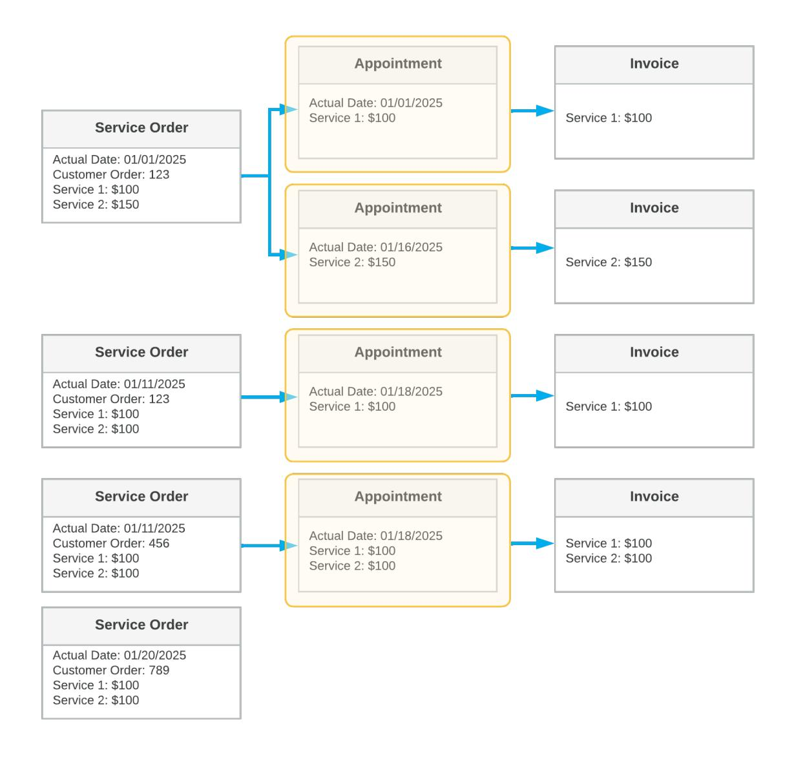

#### *Figure: Generation for appointments and grouping by appointment*

In the diagram, you can see the details and key settings of the following: the service orders (in the first column), the appointments (in the second column), and the generated billing documents (in the third column). Each yellow box shows the grouping of the documents included in the generated billing documents.

### **Generating Billing Documents from Appointments; Grouping by Service Order**

Suppose that you have defined a billing cycle with the following settings on the *[Billing Cycles](https://help-2025r1.acumatica.com/Help?ScreenId=ShowWiki&pageid=273739f9-4e18-4e81-949b-128b02e37810)* form and assigned it to a customer:

- **Run Billing For**: **Appointments**
- **Group Billing Documents By**: **Service Order**

The following diagram demonstrates how the customer is billed based on these settings. The system generates a single billing document for all appointments of each service order. The billing document contains the details on each service for each appointment.

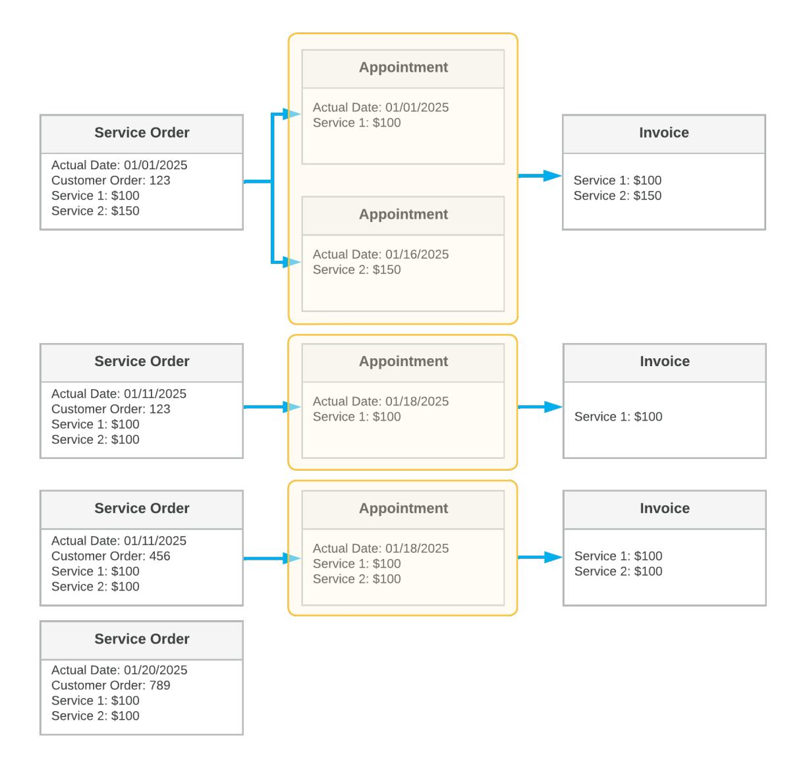

#### *Figure: Generating billing documents for appointments; grouping by service order*

In the diagram, you can see the details and key settings of the following: the service orders (in the first column), the appointments (in the second column), and the generated billing documents (in the third column). Each yellow box shows the grouping of the documents included in the generated billing documents.

# **Generating Billing Documents from Appointments; Grouping by Customer Order or External**

#### **Reference**

Suppose that you have defined a billing cycle with the following settings on the *[Billing Cycles](https://help-2025r1.acumatica.com/Help?ScreenId=ShowWiki&pageid=273739f9-4e18-4e81-949b-128b02e37810)* (FS206000) form and assigned it to a customer:

- **Run Billing For**: **Appointments**
- **Group Billing Documents By**: **Customer Order**

The following diagram demonstrates how the customer is billed based on these settings. The system generates a single document for the appointments of each customer order. When billing documents are grouped by customer order or external reference, the system uses the number specified in the **Customer Order** or **External Reference** box, respectively, of the Summary area of the *[Service Orders](https://help-2025r1.acumatica.com/Help?ScreenId=ShowWiki&pageid=6e5277d3-274e-45f5-b77d-4410ed736d21)* (FS300100) form.

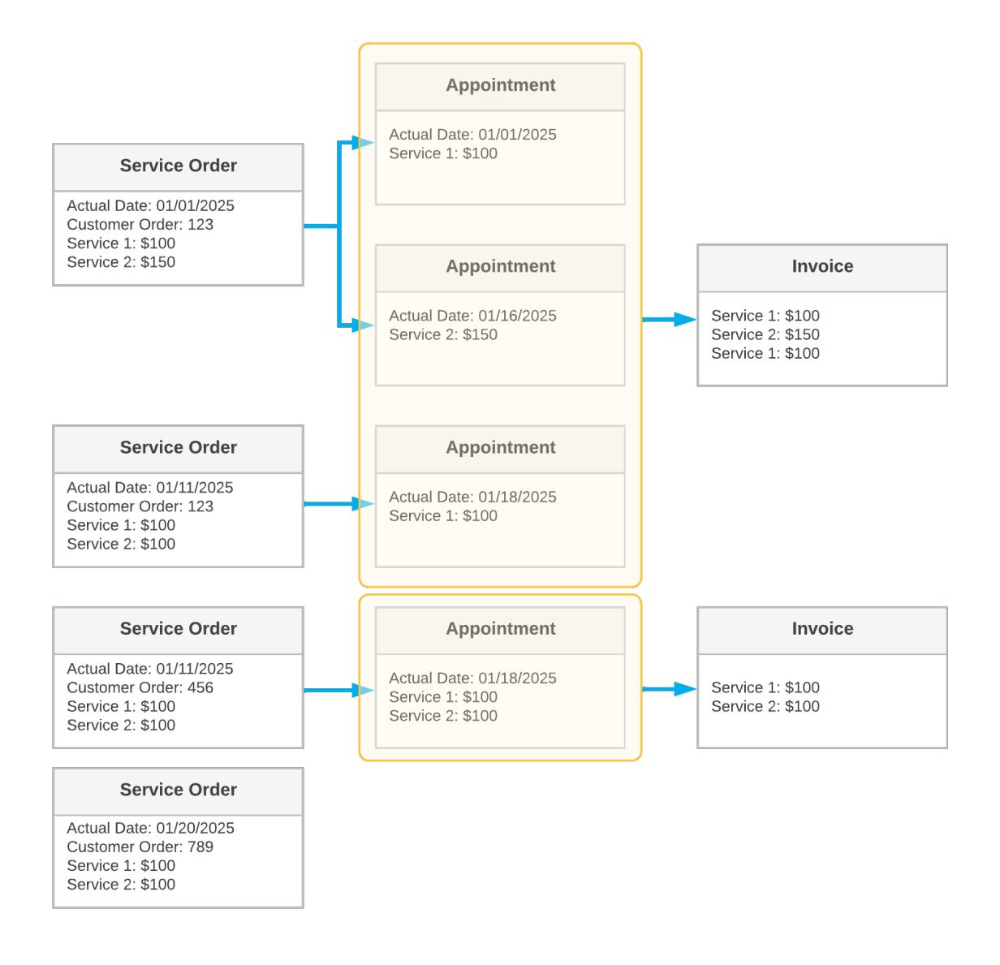

#### *Figure: Generating billing documents for appointments; grouping by customer order or external reference*

In the diagram, you can see the details and key settings of the following: the service orders (in the first column), the appointments (in the second column), and the generated billing documents (in the third column). Each yellow box shows the grouping of the documents included in the generated billing documents.

# **Generating Billing Documents from Appointments; Grouping by Time Frame**

Suppose that you have defined a billing cycle with the following settings on the *[Billing Cycles](https://help-2025r1.acumatica.com/Help?ScreenId=ShowWiki&pageid=273739f9-4e18-4e81-949b-128b02e37810)* form and assigned it to a customer:

- **Run Billing For**: **Appointments**
- **Group Billing Documents By**: **Time Frame** (on the 15th of every month)

The following diagram demonstrates how the customer is billed based on these settings. A single document is generated for the appointment that took place before January 15, and another document is generated for the three appointments that occurred before February 15.

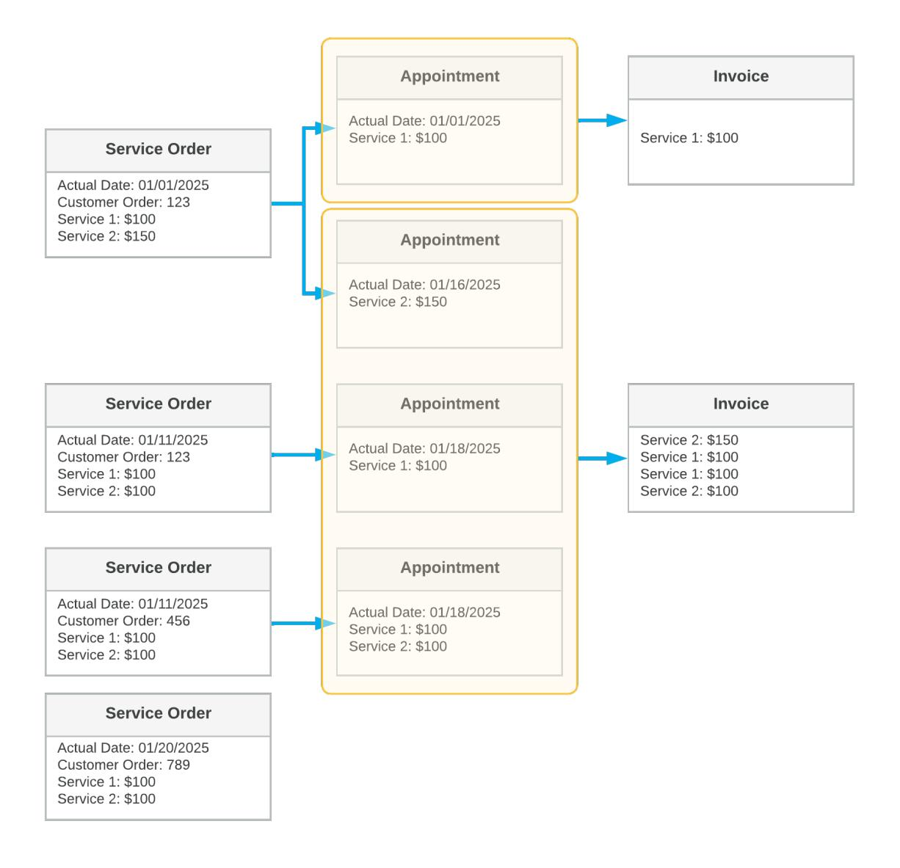

#### *Figure: Generating billing documents for appointments; grouping by time frame (15th of each month)*

In the diagram, you can see the details and key settings of the following: the service orders (in the first column), the appointments (in the second column), and the generated billing documents (in the third column). Each yellow box shows the grouping of the documents included in the generated billing documents.

### **Generating Billing Documents from Service Orders; Grouping by Service Order**

Suppose that you have defined a billing cycle with the following settings and assigned it to a customer:

- **Run Billing For**: **Service Orders**
- **Group Billing Documents By**:**Service Order**

The following diagram demonstrates how the customer is billed based on these settings. The system generates a single billing document for each service order, whether or not appointments are created and processed for the service order.

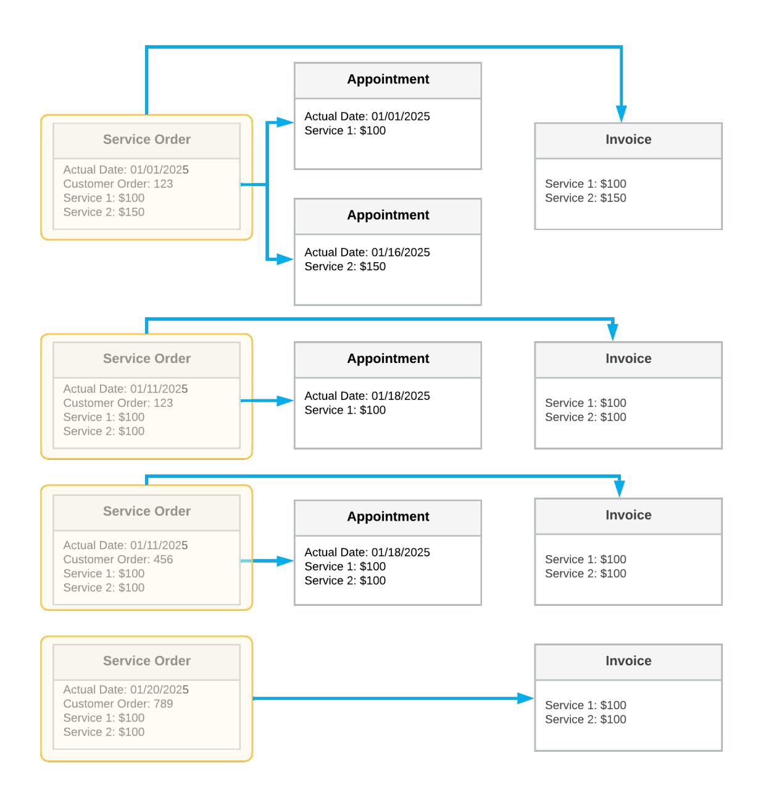

#### *Figure: Generating billing documents for service orders; grouping by service order*

In the diagram, you can see the details and key settings of the following: the service orders (in the first column), the appointments (in the second column), and the generated billing documents (in the third column). Each yellow box shows the grouping of the documents included in the generated billing documents.

# **Generating Billing Documents from Service Orders; Grouping by Customer Order or External Reference**

Suppose that you have defined a billing cycle with the following settings and assigned it to a customer:

- **Run Billing For**: **Service Orders**
- **Group Billing Documents By**: **Customer Order**

The following diagram demonstrates how the customer is billed based on these settings. The system generates a single document for the service orders of each customer order, whether or not appointments have been created and processed for these customer orders.

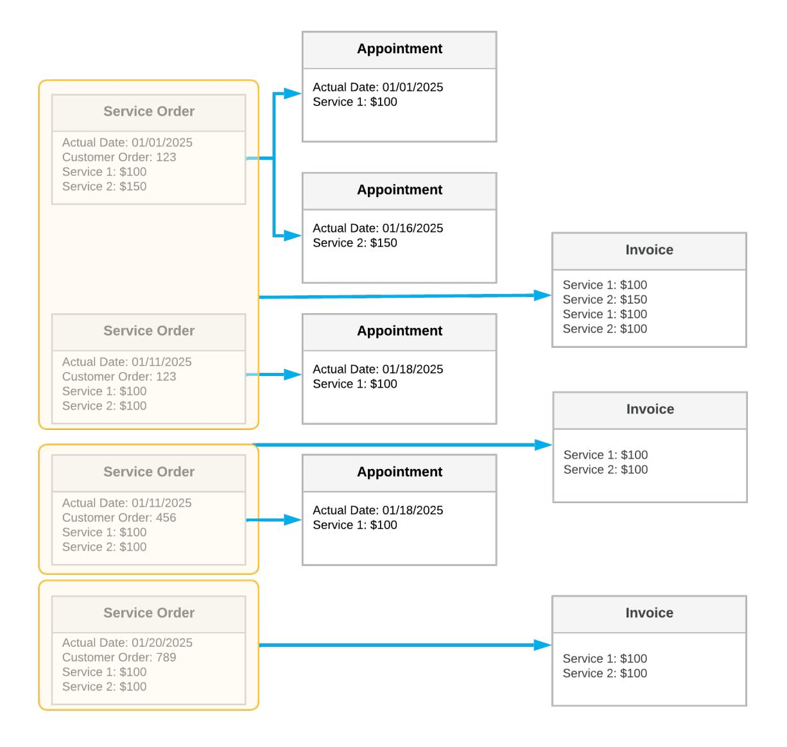

#### *Figure: Generation for service orders; grouping by customer order or external reference*

In the diagram, you can see the details and key settings of the following: the service orders (in the first column), the appointments (in the second column), and the generated billing documents (in the third column). Each yellow box shows the grouping of the documents included in the generated billing documents.

### **Generating Billing Documents from Service Orders; Grouping by Time Frame**

Suppose you have defined a billing cycle with the following settings and assigned it to a customer:

- **Run Billing For**: **Service Orders**
- **Group Billing Documents By**: **Time Frame** (on the 15th of every month)

The following diagram demonstrates how the customer is billed based on these settings. The system generates a single document for any service orders that have been created before the 15th of each month, whether or not appointments have been created and processed for the service orders.

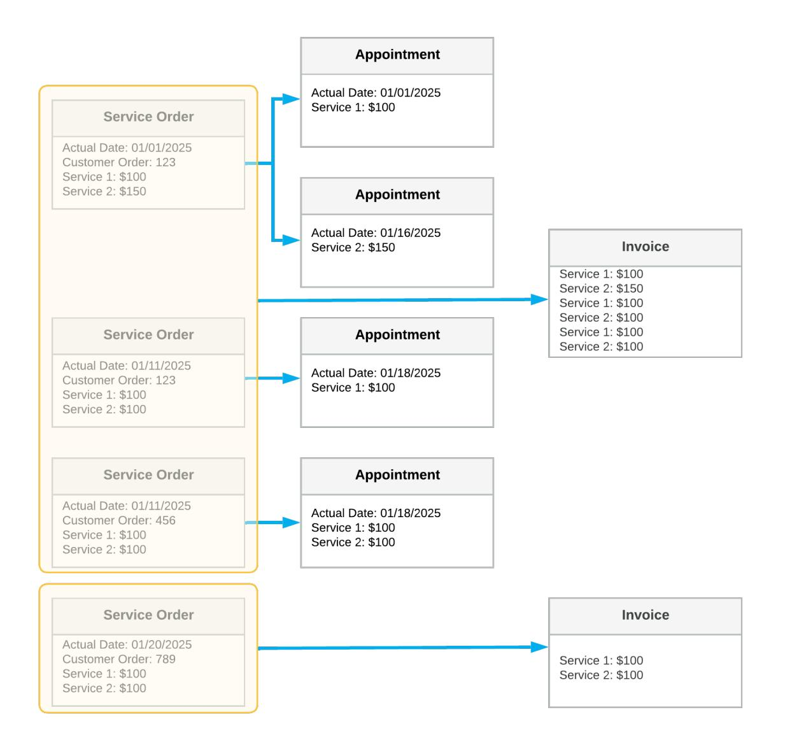

#### *Figure: Generation for service orders; grouping by time frame*

In the diagram, you can see the details and key settings of the following: the service orders (in the first column), the appointments (in the second column), and the generated billing documents (in the third column). Each yellow box shows the grouping of the documents included in the generated billing documents.

# **Generating Billing Documents for Multiple Billing Cycles**

Suppose that you provide service orders of different service order types to a customer. You provide the service orders of the first type regularly, so you have decided to generate one billing document for all appointments of these service orders that took place in a certain period of time. You provide the service orders of the second type rarely to the customer, so you have decided that for each appointment of a service order of the second type, you will generate one document right aer appointment completion.

You have defined billing cycles with the following settings and assigned them to the customer for the service order types:

- Settings of the billing cycle for Service Order Type 1:
  - **Run Billing For**: **Appointments**
  - **Group Billing Documents By**: **Time Frame** (on the 15th of every month)

- Settings of the billing cycle for Service Order Type 2:
  - **Run Billing For**: **Appointments**
  - **Group Billing Documents By**: **Appointment**

Based on the billing cycle settings, the system generates a separate billing document for each appointment for service orders of Service Order Type 1. For each service order of Service Order Type 2, a separate billing document is generated. The billing documents for service orders of Service Order Type 1 contain details on each service for each appointment. In the billing documents for service orders of Service Order Type 2, details on each service for each service order are included, whether or not appointments have been created and processed in the system.

The following diagram shows the details of the service orders of different service order types created for one customer (in the first column). You can also see the details of the appointments (in the second column) and the billing documents generated based on the settings of the billing cycles. Each yellow box shows the grouping of the documents included in the generated invoices.

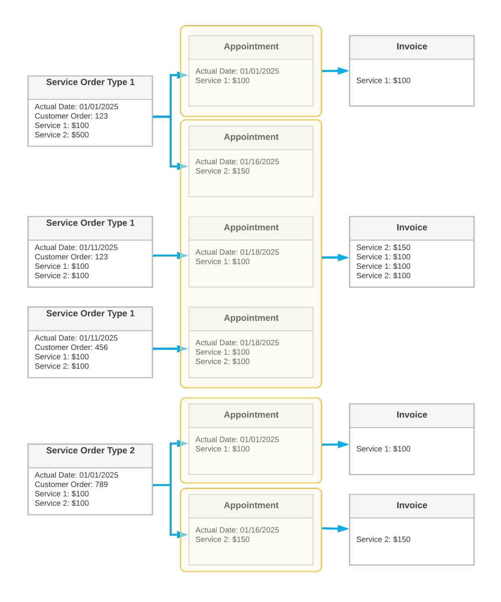

*Figure: Multiple billing cycles*

# <span id="page-587-0"></span>**Billing Cycles: To Create a Billing Cycle and Assign It to a Customer**

In this implementation activity, you will learn how to create a billing cycle in the system and assign this billing cycle to the customer.

This activity is based on the *U100* dataset. If you are using another dataset, or if any system settings have been changed in *U100*, these changes can affect the workflow of the activity and the results of the processing. To avoid any issues, restore the *U100* dataset to its initial state.

### **Story**

Suppose that SweetLife Service and Equipment Sales Center is starting to provide the service of cleaning the juicers. The *FRBUN - Cafe French Bun* customer is going to order juicer cleaning periodically. The SweetLife Service and Equipment Sales Center wants to bill the customer right aer each appointment is performed.

Acting as an administrative user Kimberly Gibbs, you will create a billing cycle that will cause a billing document to be generated for each appointment; each billing document will contain the details of each service of the appointment. Then you will assign the billing cycle to the customer.

# **Configuration Overview**

In the *U100* dataset, the following tasks have been performed to support this activity:

- The minimum system configuration, which is described in *[Company with Branches that Do Not Require](#page-84-2) [Balancing: General Information](#page-84-2)*, has been performed.
- The *SWEETLIFE* company has been created on the *[Companies](https://help-2025r1.acumatica.com/Help?ScreenId=ShowWiki&pageid=fedad435-8496-4397-b8a3-50a473629f76)* (CS101500) form. This company has multiple branches created on the *[Branches](https://help-2025r1.acumatica.com/Help?ScreenId=ShowWiki&pageid=b97ab72d-4ab4-4f02-b69c-f7f61b316ced)* (CS102000) form, including *SWEETEQUIP (Service and Equipment Sales Center)*.
- On the *[Service Management Preferences](https://help-2025r1.acumatica.com/Help?ScreenId=ShowWiki&pageid=1c1b94d7-ac39-4f84-a966-588290b5ba80)* (FS100100) form, the minimum settings have been specified, including specifying the numbering sequences and work calendar, for the service management functionality to be used.
- On the *[Customers](https://help-2025r1.acumatica.com/Help?ScreenId=ShowWiki&pageid=652929bc-9606-4056-aa6e-0c2d1147171b)* (AR303000) form, the *FRBUN - Cafe French Bun* customer has been created.
- On the *[Service](https://help-2025r1.acumatica.com/Help?ScreenId=ShowWiki&pageid=06fd8a36-dd81-4df9-b609-92c3d552c542) Order Types* (FS202300) form, the **Manage Multiple Billing Options per Customer** check box is cleared.

### **Process Overview**

On the *[Billing Cycles](https://help-2025r1.acumatica.com/Help?ScreenId=ShowWiki&pageid=273739f9-4e18-4e81-949b-128b02e37810)* (FS206000) form, you will create a new billing cycle, *APP2APP*. Then on the **Billing** tab of the *[Customers](https://help-2025r1.acumatica.com/Help?ScreenId=ShowWiki&pageid=652929bc-9606-4056-aa6e-0c2d1147171b)* (AR303000) form, you will assign the billing cycle that you have created to the *FRBUN - Cafe French Bun* customer.

#### **System Preparation**

Before you start creating a billing cycle and assigning a billing cycle to the customer, do the following:

- 1. Launch the Acumatica ERP website, and sign in to a company with the *U100* dataset preloaded. You should sign in as a system administrator with the *gibbs* username and the *123* password.
- 2. In the company to which you are signed in, ensure that the *Service Management* feature has been enabled on the *[Enable/Disable Features](https://help-2025r1.acumatica.com/Help?ScreenId=ShowWiki&pageid=c1555e43-1bc5-4f6f-ba9d-b323f94d8a6b)* (CS100000) form.
- 3. On the Company and Branch Selection menuon the top pane of the Acumatica ERP screen, select the *Service and Equipment Sales Center* branch.

### **Step 1: Creating a Billing Cycle**

To create a billing cycle, do the following:

1. On the *[Billing Cycles](https://help-2025r1.acumatica.com/Help?ScreenId=ShowWiki&pageid=273739f9-4e18-4e81-949b-128b02e37810)* (FS206000) form, add a new record.

- 2. In the **Billing Cycle ID** box, enter APP2APP. This will serve as the identifier of this billing cycle in the system.
- 3. In the **Description** box, enter Billing by Appointments, Grouping by Appointments.
- 4. Under **Run Billing For**, leave **Appointments** selected.
- 5. Under **Group Billing Documents By**, select **Appointments**.
- 6. Leave the **Bill Only Completed or Closed Service Orders** check box cleared.
- 7. On the form toolbar, click**Save**.

You have created the billing cycle. Now it can be assigned to a customer to define how this customer is going to be billed for the services.

# **Step 2: Assigning the Billing Cycle to a Customer**

To assign the new billing cycle to a customer, do the following:

- 1. On the *[Customers](https://help-2025r1.acumatica.com/Help?ScreenId=ShowWiki&pageid=652929bc-9606-4056-aa6e-0c2d1147171b)* (AR303000) form, open the *FRBUN - Cafe French Bun* customer.
- 2. On the **Billing** tab, in the**Service Management** section, select *APP2APP* in the **Billing Cycle** box.
- 3. On the form toolbar, click**Save**.

# <span id="page-589-1"></span><span id="page-589-0"></span>**Billing Cycles: Assignment of Multiple Billing Cycles**

In Acumatica ERP, you can specify either one billing cycle or multiple billing cycles for a customer. You specify one billing cycle for a customer if you want to generate billing documents in the same way and with the same details for all types of service orders. You specify multiple billing cycles for a customer account if you want to apply different invoicing or grouping settings depending on the type of the service order.

In this topic, you will read how to set up multiple billing cycles for a customer account.

#### **Setting Up the Ability to Use Multiple Billing Cycles**

To set up multiple billing cycles for particular customers during the configuration of the field service functionality, you perform the following general steps:

- 1. Select the **Manage Multiple Billing Options per Customer** check box on the **General** tab on the *[Service](https://help-2025r1.acumatica.com/Help?ScreenId=ShowWiki&pageid=1c1b94d7-ac39-4f84-a966-588290b5ba80) [Management Preferences](https://help-2025r1.acumatica.com/Help?ScreenId=ShowWiki&pageid=1c1b94d7-ac39-4f84-a966-588290b5ba80)* (FS100100) form.
- 2. Create all needed billing cycles on the *[Billing Cycles](https://help-2025r1.acumatica.com/Help?ScreenId=ShowWiki&pageid=273739f9-4e18-4e81-949b-128b02e37810)* (FS206000) form. For examples of billing cycles, see *[Billing Cycles: Examples](#page-578-1)*.
- 3. For each customer, add all needed service order types and associate a billing cycle with each service order type on the **Service Billing** tab on the *[Customers](https://help-2025r1.acumatica.com/Help?ScreenId=ShowWiki&pageid=652929bc-9606-4056-aa6e-0c2d1147171b)* (AR303000) form.


You should add a row for each type for which you may define service orders for this customer and select a billing cycle for each type.

4. Optional: On the *[Customer Classes](https://help-2025r1.acumatica.com/Help?ScreenId=ShowWiki&pageid=806e39d6-6f89-4e6c-9a24-61c6fb0c9a57)* (AR201000) form, you can create a new customer class, add service order types and associate a billing cycle with each service order type on the**Service Billing** tab of the form.

When you create a new customer in the system, you can select the customer class, so that the new customer will be assigned with the settings of the customer class including the billing cycles specified for the customer class.

### **Specifying Multiple Billing Cycles for a Customer**

If you have used one billing cycle for each of your customers, you might later decide to turn on the ability to use different billing cycles for different service order types for select customers. To do so, you first select the **Manage Multiple Billing Options per Customer** check box on the *[Service Management Preferences](https://help-2025r1.acumatica.com/Help?ScreenId=ShowWiki&pageid=1c1b94d7-ac39-4f84-a966-588290b5ba80)* (FS100100) form.

On the *[Customers](https://help-2025r1.acumatica.com/Help?ScreenId=ShowWiki&pageid=652929bc-9606-4056-aa6e-0c2d1147171b)* (AR303000) form, you need to change the billing settings for each customer for which you want to specify multiple billing cycles. you select a customer whose settings you want to change. Before the functionality for multiple billing cycles was turned on, in the**Service Management** section of the **Billing** tab, a single billing cycle was specified, along with the sources of the bill-to and ship-to addresses for field services.

With the functionality for multiple billing options turned on, the**Service Billing** tab is displayed on the form. Notice that the system has added a row for each service order type for which the customer has service orders. For each type, the system inserts the billing settings (billing cycle, bill-to address, and ship-to address) that were specified for this customer when the functionality for multiple billing cycles was turned off.

For each service order type, you can change the billing cycle and other settings. You can also add other service order types for the customer and specify their default billing settings.

# <span id="page-590-2"></span><span id="page-590-0"></span>**Skills**

The topics of this chapter explain how to configure the skills. A skill in Acumatica ERP is a characteristic that can be assigned to an employee that helps a service manager to select the right staff member to perform a particular service.

# <span id="page-590-3"></span><span id="page-590-1"></span>**Skills: General Information**

Acumatica ERP offers multiple capabilities to help you ensure that the right staff member of your company performs each service. That is, if the staff member needs to have special skills or knowledge to perform a particular service, the system automatically suggests to you the list of staff members with the specific skills required for your service.

A skill is a characteristic that can be assigned to an employee and that can be used as an employee requirement to perform a service. Unlike licenses, skills don't have issue dates and expiration dates, and they are not issued by agencies.

In this topic, you will learn how to create skills in the system and then assign them to staff members and to services.

### **Learning Objectives**

In this chapter, you will learn how to do the following:

- Create a skill
- Assign a skill to a staff member
- Assign a skill to a service

#### **Applicable Scenarios**

You create skill records in the system when you need to have an ability to filter staff members for appointments according to their skills.

### **Assignment of Skills to a Staff Member**

Before you start creating a list of all the skills to be used for services by your company, you should gather information about the skills that are required for all of the services your company is going to perform. You then create the list of all required skills for performing services on the *[Skills](https://help-2025r1.acumatica.com/Help?ScreenId=ShowWiki&pageid=481362c5-add5-4449-8cf6-a332763d7667)* (FS200600) form.

When the list of all skills that may be needed for performing services is defined, you need to assign the needed skills to appropriate staff members and to particular services. You assign skills to a particular staff member on the **Skills** tab of the *[Employees](https://help-2025r1.acumatica.com/Help?ScreenId=ShowWiki&pageid=dae5144b-49b3-43a4-bce0-93f31b3f2321)* (EP203000) form.

# **Assignment of Skills to a Service**

On the *[Non-Stock Items](https://help-2025r1.acumatica.com/Help?ScreenId=ShowWiki&pageid=bf68dd4f-63d4-460d-8dc0-9152f2bd6bf1)* (IN202000) form, you specify the skills that are required to perform the selected service that is, assign the skills to the service. To do this, you select the service (which is a non-stock item of the *Service* type), and on the **ServiceSkills** tab, you add a row for each skill needed for the service.

Once you assign skills to a service, Acumatica ERP can check whether the staff member assigned to fulfill this service also has the assigned skills.

To define what validation (if any) the system should use to determine whether the service's skills match the assigned employee's skills, on the *[Service Management Preferences](https://help-2025r1.acumatica.com/Help?ScreenId=ShowWiki&pageid=1c1b94d7-ac39-4f84-a966-588290b5ba80)* (FS100100) form, in the**Skills** box of the **General** tab (**AppointmentValidation Settings** section), you can select one of the following options :

- *Do Not Validate* (default): The system does not perform validation (that is, it does not check whether the service's skills match the assigned employee's skills).
- *Warn*: If the staff member does not have the skills specified for the service, the system displays a warning message about the staff member not having the necessary skill or skills.
- *Prevent*: If the staff member does not have the skills specified for the service, the system prevents the assignment of this staff member.

# <span id="page-591-0"></span>**Skills: To Create a Skill**

In this implementation activity, you will learn how to create a skill.

This activity is based on the *U100* dataset. If you are using another dataset, or if any system settings have been changed in *U100*, these changes can affect the workflow of the activity and the results of the processing. To avoid any issues, restore the *U100* dataset to its initial state.

#### **Story**

Suppose that the SweetLife Service and Equipment Sales Center provides multiple services. Each service requires the staff members to have certain skills, and the manager should assign a qualified person to each service. Acting as an administrative user, you will create the skills that are needed for the provided services. As a result, the scheduler will be able to assign appointments to the staff members whose skills match the included service or services.

# **Configuration Overview**

In the *U100* dataset, the following tasks have been performed for the purposes of this activity:

• The minimum system configuration is performed as described in *Company Without [Branches:](#page-78-4) General [Information](#page-78-4)*.

• The minimum configuration of the service management functionality is performed as described in *[Basic](#page-548-1) [Service Management Configuration: Implementation Activity](#page-548-1)*.

# **Process Overview**

On the *[Skills](https://help-2025r1.acumatica.com/Help?ScreenId=ShowWiki&pageid=481362c5-add5-4449-8cf6-a332763d7667)* (FS200600), you will add skill records to the system.

### **System Preparation**

Before you start creating skills, do the following:

- 1. Launch the Acumatica ERP website, and sign in to a company with the *U100* dataset preloaded; you should sign in as system administrator by using the *gibbs* username and the *123* password.
- 2. On the Company and Branch Selection menu, on the top pane of the Acumatica ERP screen, select the Service and Equipment Sales Center branch.
- 3. In the company to which you are signed in, ensure the *Service Management* feature has been enabled on the *[Enable/Disable Features](https://help-2025r1.acumatica.com/Help?ScreenId=ShowWiki&pageid=c1555e43-1bc5-4f6f-ba9d-b323f94d8a6b)* (CS100000) form.

### **Step: Creating Skills**

To create a skill, do the following:

- 1. Open the *[Skills](https://help-2025r1.acumatica.com/Help?ScreenId=ShowWiki&pageid=481362c5-add5-4449-8cf6-a332763d7667)* (FS200600) form.
- 2. On the table toolbar, click **Add Row**.
- 3. In the **Skill ID** column of the row that was added, enter the identifier of the skill: COOKING.
- 4. In the **Description** column, enter Culinary Skills.
- 5. On the form toolbar, click**Save**.
- 6. As you did in Instructions 2–5, create a skill with the following settings, and save your changes:
  - **Skill ID**: TRANSLATING
  - **Description**: English to Spanish Translator

# <span id="page-592-0"></span>**Skills: To Assign a Skill to a Service**

In this implementation activity, you will learn how to assign skills to a service.

This activity is based on the *U100* dataset. If you are using another dataset, or if any system settings have been changed in *U100*, these changes can affect the workflow of the activity and the results of the processing. To avoid any issues, restore the *U100* dataset to its initial state.

### **Story**

Suppose that the SweetLife Service and Equipment Sales Center has started to provide a cleaning service, which is billed by hours. The staff member who conducts this type of service must have strong skills related to using and cleaning the juicers, so the manager has to be able to assign the right person to provide the service. Acting as an administrative user, you will assign the cleaning skill to the cleaning service. As a result, the scheduler can assign staff members whose skills match the service or services included in the appointment.

# **Configuration Overview**

In the *U100* dataset, the following tasks have been performed for the purposes of this activity:

- The minimum system configuration is performed as described in *Company Without [Branches:](#page-78-4) General [Information](#page-78-4)*.
- The minimum configuration of the service management functionality is performed as described in *[Basic](#page-548-1) [Service Management Configuration: Implementation Activity](#page-548-1)*.
- On the *[Services](https://help-2025r1.acumatica.com/Help?ScreenId=ShowWiki&pageid=e6537db1-ecfa-4d5b-b08c-0bdd6233fda2)* (FS400800) form, the *CLEANING* service has been created.
- On the *[Skills](https://help-2025r1.acumatica.com/Help?ScreenId=ShowWiki&pageid=481362c5-add5-4449-8cf6-a332763d7667)* (FS200600) form, the *CLEANING* skill has been created.

# **Process Overview**

On the *[Services](https://help-2025r1.acumatica.com/Help?ScreenId=ShowWiki&pageid=e6537db1-ecfa-4d5b-b08c-0bdd6233fda2)* (FS400800) form, you click the service name link, and the system opens the *[Non-Stock Items](https://help-2025r1.acumatica.com/Help?ScreenId=ShowWiki&pageid=bf68dd4f-63d4-460d-8dc0-9152f2bd6bf1)* (IN202000) form, which displays the non-stock item of the *Service* type. On this form, you assign the skill to the service.

# **System Preparation**

Before you start assigning a skill to a service, do the following:

- 1. Launch the Acumatica ERP website, and sign in to a company with the *U100* dataset preloaded; you should sign in as system administrator by using the *gibbs* username and the *123* password.
- 2. On the Company and Branch Selection menu, on the top pane of the Acumatica ERP screen, select the Service and Equipment Sales Center branch.
- 3. In the company to which you are signed in, ensure the *Service Management* feature has been enabled on the *[Enable/Disable Features](https://help-2025r1.acumatica.com/Help?ScreenId=ShowWiki&pageid=c1555e43-1bc5-4f6f-ba9d-b323f94d8a6b)* (CS100000) form.

### **Step: Assigning a Skill to a Service**

To assign a skill to a service, do the following:

1. On the *[Services](https://help-2025r1.acumatica.com/Help?ScreenId=ShowWiki&pageid=e6537db1-ecfa-4d5b-b08c-0bdd6233fda2)* (FS400800) form, click *CLEANING* in the **Inventory ID** column.

This opens the *[Non-Stock Items](https://help-2025r1.acumatica.com/Help?ScreenId=ShowWiki&pageid=bf68dd4f-63d4-460d-8dc0-9152f2bd6bf1)* (IN202000) form, which displays the *CLEANING* non-stock item of the *Service* type.

- 2. On the table toolbar of the**ServiceSkills** tab, click **Add Row**.
- 3. In the **Skill ID** column of the new row, select *CLEANING - Juicer cleaning skills*.
- 4. On the form toolbar, click**Save**.

Now the *CLEANING - Juicer cleaning skills* skill is assigned to the *CLEANING* service.

When you attempt to assign staff members to this service, the validation (described in *[Skills: General Information](#page-590-3)*) is performed, and the system suggests the employees who have the skill to deliver this service.

# <span id="page-593-0"></span>**Skills: To Assign a Skill to a Staff Member**

In the following implementation activity, you will learn how to assign a skill or skill to employees.


### **Story**

Suppose that SweetLife Service and Equipment Sales Center provides multiple services, so that assigning staff to appointments becomes more complex. The services require the staff members to have certain skills, and the manager wants to assign the right person for each service. Acting as an administrative user, you will add certain skills to staff members. As a result, the scheduler will be able to assign appointments to the staff members whose skills match the skills of the included service or services.

# **Configuration Overview**

In the *U100* dataset, the following tasks have been performed for the purposes of this activity:

- The minimum system configuration is performed as described in *Company Without [Branches:](#page-78-4) General [Information](#page-78-4)*.
- The minimum configuration of the service management functionality is performed as described in *[Basic](#page-548-1) [Service Management Configuration: Implementation Activity](#page-548-1)*.
- On the *[Employees](https://help-2025r1.acumatica.com/Help?ScreenId=ShowWiki&pageid=dae5144b-49b3-43a4-bce0-93f31b3f2321)* (EP203000) form, the *EP00000042 - Chase Frank*, *EP00000044 - Ricardo Martinez* and *EP00000045 - Luke Cole* employees have been created, and have been defined as a service management staff members, that is the**Staff Member in Service Management** check box has been selected on the **General** tab for each employee.
- On the *[Skills](https://help-2025r1.acumatica.com/Help?ScreenId=ShowWiki&pageid=481362c5-add5-4449-8cf6-a332763d7667)* (FS200600) form, the *TRAINING*, *REPAIRING* and *DRIVING* skills have been created.

### **Process Overview**

On the *[Employees](https://help-2025r1.acumatica.com/Help?ScreenId=ShowWiki&pageid=dae5144b-49b3-43a4-bce0-93f31b3f2321)* (EP203000) form, you will select an employee, and on the**Skills** tab of the form, you will add a skill to each selected employee.

### **System Preparation**

Before you start assigning skills to employees, do the following:

- 1. Launch the Acumatica ERP website, and sign in to a company with the *U100* dataset preloaded; you should sign in as system administrator by using the *gibbs* username and the *123* password.
- 2. On the Company and Branch Selection menu, on the top pane of the Acumatica ERP screen, select the Service and Equipment Sales Center branch.
- 3. In the company to which you are signed in, ensure the *Service Management* feature has been enabled on the *[Enable/Disable Features](https://help-2025r1.acumatica.com/Help?ScreenId=ShowWiki&pageid=c1555e43-1bc5-4f6f-ba9d-b323f94d8a6b)* (CS100000) form.

### **Step: Assigning a Skill to a Staff Member**

You can assign skills to staff members of the *Employee* type. To assign a skill to a staff member, do the following:

- 1. Open the *[Employees](https://help-2025r1.acumatica.com/Help?ScreenId=ShowWiki&pageid=dae5144b-49b3-43a4-bce0-93f31b3f2321)* (EP203000) form.
- 2. In the **Employee ID** box of the Summary area, select *EP00000041 - Mason Randall*.
- 3. On the table toolbar of the**Skills** tab, click **Add Row**, and in the new row, select *TRAINING*.
- 4. On the form toolbar, click**Save**.

# <span id="page-595-2"></span><span id="page-595-0"></span>**Licenses**

The topics of this chapter explain how to enter the licenses in Acumatica ERP. A license is an official document proving that a person has permission to perform work of a certain kind. A service manager can then select the right staff member to perform a service for which special knowledge is needed.

# <span id="page-595-3"></span><span id="page-595-1"></span>**Licenses: General Information**

A license is a document proving that a particular person has permission to perform work of a certain kind or has knowledge in a particular area. To track licenses in the system, you first create license types, which are categories of licenses that are used for grouping licenses and associating a group of licenses with a service. You then enter all licenses (and assign license types to them when you enter them) and specify the staff members or branches of your company (or both) to which each license belongs. You can then easily select the right staff member to perform a service for which a license of a particular type is needed.

In this topic, you will read about how license types and licenses are created in the system and assigned to staff members.

### **Learning Objectives**

In this chapter, you will learn how to do the following:

- Create a license type
- Assign a license type to a service
- Add a license
- Assign a license to an employee

### **Applicable Scenarios**

You create licenses in Acumatica ERP when your company provides services that require specific skills that are proven by licenses or certificates. With licenses tracked in the system, you can assign staff members with the needed licenses to appointments.

# **License Application**

Before you create the license types, you should gather information about which license types are required for the services that your company is going to perform. Once you have created the license types, you specify a license type for each license of a staff member that you enter into the system. One license is owned by only one staff member, although any staff member can have multiple licenses. You can then assign the needed license types to services.

With this configuration performed, when you select a staff member to perform a particular service of a service order or appointment by using the **Add Staff** dialog box on the *[Service Orders](https://help-2025r1.acumatica.com/Help?ScreenId=ShowWiki&pageid=6e5277d3-274e-45f5-b77d-4410ed736d21)* (FS300100) or *[Appointments](https://help-2025r1.acumatica.com/Help?ScreenId=ShowWiki&pageid=ac486e9c-f5df-4829-94f0-2df8821361a0)* (FS300200) form, the system automatically suggests to you staff members that have licenses of the type that is required to provide the service. When you schedule appointments by using calendar boards, you can filter the staff members by the types of the licenses that are needed for services.

When you save a newly created license, the system assigns it a reference number based on the numbering sequence specified for licenses in the **License NumberingSequence** box on the *[Service Management Preferences](https://help-2025r1.acumatica.com/Help?ScreenId=ShowWiki&pageid=1c1b94d7-ac39-4f84-a966-588290b5ba80)* (FS100100) form.

### **License Validation**

By assigning license types to services, you optimize the staff selection process. For an appointment, the system suggests only those staff members who own the required license. You can set up validation so that the system will determine whether the license type specified for a service matches the assigned employee's licenses.

For this validation, in the **Licenses** box of the **General** tab (**AppointmentValidation Settings** section) of the *[Service Management Preferences](https://help-2025r1.acumatica.com/Help?ScreenId=ShowWiki&pageid=1c1b94d7-ac39-4f84-a966-588290b5ba80)* (FS100100) form, you can select one of the following options:

- *Do Not Validate* (default): The system does not perform license validation.
- *Warn*: If the validation is not passed, the system displays a warning message notifying you that the staff member does not have the required active licenses.
- *Prevent*: If the validation is not passed, the system prevents the assignment of the staff member who does not have the required active license or licenses.

# <span id="page-596-1"></span><span id="page-596-0"></span>**License: To Create a License Type and Assign It to a Service**

In this implementation activity, you will learn how to create a license type and then assign the license type to a service.


This activity is based on the *U100* dataset. If you are using another dataset, or if any system settings have been changed in *U100*, these changes can affect the workflow of the activity and the results of the processing. To avoid any issues, restore the *U100* dataset to its initial state.

### **Story**

Suppose that the SweetLife Service and Equipment Sales Center wants to keep track of the licenses its employees have. This will give service managers the ability to assign the right employee to each appointment, because for some services, a license can be a requirement for performing this service. Before adding license information to the system, you need to create the appropriate license types based on which the licenses will be added for individual users.

Acting as an administrative user, you will create a license type and then assign this license type to a service to represent which license is required for a staff member who can perform this service.

## **Configuration Overview**

In the *U100* dataset, the following tasks have been performed for the purposes of this activity:

- The minimum system configuration, which is described in *[Company with Branches that Do Not Require](#page-84-2) [Balancing: General Information](#page-84-2)*, has been performed.
- The *SWEETLIFE* company has been created on the *[Companies](https://help-2025r1.acumatica.com/Help?ScreenId=ShowWiki&pageid=fedad435-8496-4397-b8a3-50a473629f76)* (CS101500) form. This company has multiple branches created on the *[Branches](https://help-2025r1.acumatica.com/Help?ScreenId=ShowWiki&pageid=b97ab72d-4ab4-4f02-b69c-f7f61b316ced)* (CS102000) form, including *SWEETEQUIP (Service and Equipment Sales Center)*.
- On the *[Service Management Preferences](https://help-2025r1.acumatica.com/Help?ScreenId=ShowWiki&pageid=1c1b94d7-ac39-4f84-a966-588290b5ba80)* (FS100100) form, the minimum settings have been specified, including specifying the numbering sequences and work calendar, for the service management functionality to be used.
- On the *[Services](https://help-2025r1.acumatica.com/Help?ScreenId=ShowWiki&pageid=e6537db1-ecfa-4d5b-b08c-0bdd6233fda2)* (FS400800) form, the *DELIVERY* service has been created.

#### **Process Overview**

On the *[License](https://help-2025r1.acumatica.com/Help?ScreenId=ShowWiki&pageid=b39739b0-85f5-444c-8b86-4935738b0b0a) Types* (FS200900) form, you will add a new type for a license that is required for performing the delivery service. Then on the *[Non-Stock Items](https://help-2025r1.acumatica.com/Help?ScreenId=ShowWiki&pageid=bf68dd4f-63d4-460d-8dc0-9152f2bd6bf1)* (IN202000) form, which you will open from the *[Services](https://help-2025r1.acumatica.com/Help?ScreenId=ShowWiki&pageid=e6537db1-ecfa-4d5b-b08c-0bdd6233fda2)* (FS400800) form, you will assign the newly created license type to the *DELIVERY* non-stock item of the *Service* type.

# **System Preparation**

Before you start creating a license type, do the following:

- 1. Launch the Acumatica ERP website, and sign in to a company with the *U100* dataset preloaded. You should sign in as system administrator by using the *gibbs* username and the *123* password.
- 2. On the Company and Branch Selection menu, on the top pane of the Acumatica ERP screen, select the *Service and Equipment Sales Center* branch.
- 3. In the company to which you are signed in, ensure the *Service Management* feature has been enabled on the *[Enable/Disable Features](https://help-2025r1.acumatica.com/Help?ScreenId=ShowWiki&pageid=c1555e43-1bc5-4f6f-ba9d-b323f94d8a6b)* (CS100000) form.

### **Step 1: Creating a License Type**

To create a license type, do the following:

- 1. Open the *[License](https://help-2025r1.acumatica.com/Help?ScreenId=ShowWiki&pageid=b39739b0-85f5-444c-8b86-4935738b0b0a) Types* (FS200900) form.
- 2. On the table toolbar, click **Add Row**.
- 3. In the new row, enter the following settings:
  - **LicenseType ID**: FOOD DELIVERY
  - **Description**: Driver's License
- 4. On the form toolbar, click**Save**.

Now that you have added a license type to the system, you will assign this license type to a service that requires the person who performs the service to have a license of this type.

### **Step 2: Assigning a License Type to a Service**

To assign a license type to a service, do the following:

1. On the *[Services](https://help-2025r1.acumatica.com/Help?ScreenId=ShowWiki&pageid=e6537db1-ecfa-4d5b-b08c-0bdd6233fda2)* (FS400800) form, click *DELIVERY* in the **Inventory ID** column.

This opens the *[Non-Stock Items](https://help-2025r1.acumatica.com/Help?ScreenId=ShowWiki&pageid=bf68dd4f-63d4-460d-8dc0-9152f2bd6bf1)* (IN202000) form with the *DELIVERY* non-stock item of the *Service* type selected.

- 2. On the **Service LicenseTypes** tab, add a row.
- 3. In the **LicenseType ID** column, select *FOOD DELIVERY*.
- 4. Save your changes and close the *[Non-Stock Items](https://help-2025r1.acumatica.com/Help?ScreenId=ShowWiki&pageid=bf68dd4f-63d4-460d-8dc0-9152f2bd6bf1)* form.

You have defined the license type whose license is required for performing the delivery service. Now you can proceed to adding license information to the system.

# <span id="page-597-0"></span>**License: To Create a License and Assign It to a Staff Member**

Each license is associated with a specific employee. In this implementation activity, you will learn how to create a license record in the system and specify the staff member who owns the license in the record's settings.


### **Story**

Suppose that SweetLife Service and Equipment Sales Center tracks the licenses its employees have. The company also provides services that can be performed only by staff members with licenses. In Acumatica ERP, each license and its settings should be entered, including the employee who owns this license.

Acting as an administrative user, you will create a license record in the system, and assign it to an employee who has the license.

# **Configuration Overview**

In the *U100* dataset, the following tasks have been performed for the purposes of this activity:

- The minimum system configuration, which is described in *[Company with Branches that Do Not Require](#page-84-2) [Balancing: General Information](#page-84-2)*, has been performed.
- The *SWEETLIFE* company has been created on the *[Companies](https://help-2025r1.acumatica.com/Help?ScreenId=ShowWiki&pageid=fedad435-8496-4397-b8a3-50a473629f76)* (CS101500) form. This company has multiple branches created on the *[Branches](https://help-2025r1.acumatica.com/Help?ScreenId=ShowWiki&pageid=b97ab72d-4ab4-4f02-b69c-f7f61b316ced)* (CS102000) form, including *SWEETEQUIP (Service and Equipment Sales Center)*.
- On the *[Service Management Preferences](https://help-2025r1.acumatica.com/Help?ScreenId=ShowWiki&pageid=1c1b94d7-ac39-4f84-a966-588290b5ba80)* (FS100100) form, the minimum settings have been specified, including specifying the numbering sequences and work calendar, for the service management functionality to be used.
- On the *[Services](https://help-2025r1.acumatica.com/Help?ScreenId=ShowWiki&pageid=e6537db1-ecfa-4d5b-b08c-0bdd6233fda2)* (FS400800) form, the *DELIVERY* service has been created.
- On the *[Employees](https://help-2025r1.acumatica.com/Help?ScreenId=ShowWiki&pageid=dae5144b-49b3-43a4-bce0-93f31b3f2321)* (EP203000) form, the *EP00000045 (Luke Cole)* employee has been created, and has been defined as a service management staff member. That is, the**Staff Member in Service Management** check box has been selected on the **General** tab for the employee.

### **Process Overview**

On the *[Licenses](https://help-2025r1.acumatica.com/Help?ScreenId=ShowWiki&pageid=874fbbfb-a373-4787-b04c-959849ecb11c)* (FS201000) form, you will add license settings, including the staff member who has the license. Then on the *[Employees](https://help-2025r1.acumatica.com/Help?ScreenId=ShowWiki&pageid=dae5144b-49b3-43a4-bce0-93f31b3f2321)* (EP203000) form, you will confirm that the license has been defined for the employee.

### **System Preparation**

Before you start creating a license, do the following:

- 1. Launch the Acumatica ERP website, and sign in to a company with the *U100* dataset preloaded. You should sign in as a system administrator by using the *gibbs* username and the *123* password.
- 2. On the Company and Branch Selection menu on the top pane of the Acumatica ERP screen, select the *Service and Equipment Sales Center* branch.
- 3. In the company to which you are signed in, ensure the *Service Management* feature has been enabled on the *[Enable/Disable Features](https://help-2025r1.acumatica.com/Help?ScreenId=ShowWiki&pageid=c1555e43-1bc5-4f6f-ba9d-b323f94d8a6b)* (CS100000) form.
- 4. Make sure that you have performed the *[License:](#page-596-1) To Create a License Type and Assign It to a Service* activity.

#### **Step: Creating a License**

To create a license, do the following:

1. On the *[Licenses](https://help-2025r1.acumatica.com/Help?ScreenId=ShowWiki&pageid=874fbbfb-a373-4787-b04c-959849ecb11c)* (FS201000) form, add a new record.

- 2. In the Summary area, specify the following settings:
  - **LicenseType**: *FOOD DELIVERY*
  - **Description**: *Driver's License* (added by default)
  - **Staff Member**: *EP00000045 - Luke Cole*
  - **Issue Date**: 01/01/2020
  - **Expiration Date**: 01/01/2030
- 3. On the form toolbar, click**Save**.
- 4. In the Licenses (FS4020PL) list of records, make sure that the license you have created is displayed.
- 5. Open the *[Employees](https://help-2025r1.acumatica.com/Help?ScreenId=ShowWiki&pageid=dae5144b-49b3-43a4-bce0-93f31b3f2321)* (EP203000) form.
- 6. In the **Employee ID** box, select *EP00000045*.
- 7. On the **Licenses** tab, confirm that you see the license that you added for the employee. On this tab, you can also add licenses for the employee.

# <span id="page-599-0"></span>**Services**

In Acumatica ERP, you need to define non-stock items to represent the services that your company provides to customers. You then specify these services when you enter customers' service orders and process appointments.

This chapter describes services and their relationship to service classes, as well as the process of adding servicerelated information to the system.

# <span id="page-599-2"></span><span id="page-599-1"></span>**Services: General Information**

In Acumatica ERP, a service is a non-stock item of the *Service* type representing a particular type of work provided by the company. The settings of a service can include its estimated duration, the skills and license types required for employees to provide the service, and the equipment needed to deliver this service. You can enter, store, and manage information about the services your company provides to customers. This information can help your employees to select the right staff member to perform services.

### **Learning Objectives**

In this chapter, you will learn how to create a new service in Acumatica ERP.

### **Applicable Scenarios**

You create services in the system in the following cases:

- You are initially configuring the system according to your company's needs, and need to define the services that your company provides to its customers.
- You need to add a new service to the already configured and functioning system.

# **Creation of Services**

Services are defined in the system as non-stock items created on the *[Non-Stock Items](https://help-2025r1.acumatica.com/Help?ScreenId=ShowWiki&pageid=bf68dd4f-63d4-460d-8dc0-9152f2bd6bf1)* (IN202000) form with *Service* selected as the type on the **General** tab.

Before you create services, you need to create service classes—that is, item classes created on the *[Item Classes](https://help-2025r1.acumatica.com/Help?ScreenId=ShowWiki&pageid=80a3301b-4eb2-4ce2-94c5-0407c786a0f1)* (IN201000) form with the *Service* item type—as described in *[Service Classes](#page-572-1)*. When you select an item class on the **General** tab of the *[Non-Stock Items](https://help-2025r1.acumatica.com/Help?ScreenId=ShowWiki&pageid=bf68dd4f-63d4-460d-8dc0-9152f2bd6bf1)* form, the system automatically populates the item settings with the *Service* type and other settings based on the settings you have specified for the item class. You also specify the estimated duration of service execution, the default billing rule (if it is different than the one specified for the class), and the posting class and tax category, if they were not specified for the selected service class or if you want to override the class settings. Optionally, you can specify price information, skills, license types, and resource equipment types.

On the *[Services](https://help-2025r1.acumatica.com/Help?ScreenId=ShowWiki&pageid=e6537db1-ecfa-4d5b-b08c-0bdd6233fda2)* (FS400800) form, you can view the list of services along with their key settings, including the service class, estimated duration, and default billing rule.

### **Skills and License Types**

If a service requires special skills or knowledge, aer the service has been created in the system, you can assign any necessary skills and license types to the service. The system will then give you the ability to select the right person to perform a service once you assign a staff member to an appointment.

Before you start adding services to the system, we recommend that you make sure that the required skills and license types have been entered into the system on the *[Skills](https://help-2025r1.acumatica.com/Help?ScreenId=ShowWiki&pageid=481362c5-add5-4449-8cf6-a332763d7667)* (FS200600) and *[License](https://help-2025r1.acumatica.com/Help?ScreenId=ShowWiki&pageid=b39739b0-85f5-444c-8b86-4935738b0b0a) Types* (FS200900) forms. If the required skills and license types are defined in the system, you assign skills on the**ServiceSkills** tab of the *[Non-](https://help-2025r1.acumatica.com/Help?ScreenId=ShowWiki&pageid=bf68dd4f-63d4-460d-8dc0-9152f2bd6bf1)[Stock Items](https://help-2025r1.acumatica.com/Help?ScreenId=ShowWiki&pageid=bf68dd4f-63d4-460d-8dc0-9152f2bd6bf1)* (IN201000) form and license types on the**Service LicenseTypes** tab of this form. For details, see *[Skills](#page-590-2)* and *[Licenses](#page-595-2)*.

#### **Resource Equipment Types**

If special equipment must be used to perform the services you are entering, we recommend that you make sure that all necessary equipment types have been created on the *[Equipment](https://help-2025r1.acumatica.com/Help?ScreenId=ShowWiki&pageid=2e5708ed-4a13-4949-846c-1d46348753d0) Types* (FS200800) form. You can then assign these types to the appropriate services on the **Resource EquipmentTypes** tab of the *[Non-Stock Items](https://help-2025r1.acumatica.com/Help?ScreenId=ShowWiki&pageid=bf68dd4f-63d4-460d-8dc0-9152f2bd6bf1)* (IN201000) form. For details, see *[Creating and Using Resource Equipment](https://help-2025r1.acumatica.com/Help?ScreenId=ShowWiki&pageid=c341d85d-b801-4c48-9a45-b9b5dcbf99fe)*.

# <span id="page-600-0"></span>**Services: To Create a Service with a Fixed Price**

In this implementation activity, you will learn how to create a service that has the fixed price regardless of the time spent while providing the service. You will still specify the typical duration of the service; this estimation will be helping the service manager in planning the workload in the future.

This activity is based on the *U100* dataset. If you are using another dataset, or if any system settings have been changed in *U100*, these changes can affect the workflow of the activity and the results of the processing. To avoid any issues, restore the *U100* dataset to its initial state.

### **Story**

Suppose that SweetLife Service and Equipment Sales Center has hired a chef who has worked at some of the finest dining restaurants, and the company recruited him to work as a full-time consultant to develop recipes unique to each particular business. Thus, SweetLife has decided to provide a recipe development service, which will have a fixed price. Acting as an administrative user, you will create the service in the system.

# **Configuration Overview**

In the *U100* dataset, the following tasks have been performed to support this activity:

- The minimum system configuration is performed as described in *Company Without [Branches:](#page-78-4) General [Information](#page-78-4)*.
- The minimum configuration of the service management functionality is performed as described in *[Basic](#page-548-1) [Service Management Configuration: Implementation Activity](#page-548-1)*.

- On the *[Enable/Disable Features](https://help-2025r1.acumatica.com/Help?ScreenId=ShowWiki&pageid=c1555e43-1bc5-4f6f-ba9d-b323f94d8a6b)* (CS100000) form, the following features have been enabled:
  - *Inventory and Order Management*: Enables you to process sales and purchase orders that include nonstock items of the *Service* type.
  - *Multiple Units of Measure*: Enables you to configure multiple units of measure.
- On the *[Posting Classes](https://help-2025r1.acumatica.com/Help?ScreenId=ShowWiki&pageid=edd4bd77-13f5-4e89-9e47-2861fc66bbb0)* (IN206000) form, the *NONSTOCK* has been created.


While the U100 dataset you are going to use to configure a non-stock item of the *Service* type has predefined posting classes, in a production environment you can configure a non-stock item without posting classes.

- On the *[Units of Measure](https://help-2025r1.acumatica.com/Help?ScreenId=ShowWiki&pageid=c25c9971-01e2-4021-aa3b-8809f8045e58)* (CS203500) form, the *ITEM* unit has been created.
- On the *Tax [Categories](https://help-2025r1.acumatica.com/Help?ScreenId=ShowWiki&pageid=db5e7fad-054d-467d-877e-2db4ee180ead)* (TX205500) form, the *EXEMPT* tax category has been created.
- On the *[Item Classes](https://help-2025r1.acumatica.com/Help?ScreenId=ShowWiki&pageid=80a3301b-4eb2-4ce2-94c5-0407c786a0f1)* (IN201000) form, the *TRAINING* service class, that is an item class with the *Service* item type has been created.

#### **Process Overview**

By using the *[Services](https://help-2025r1.acumatica.com/Help?ScreenId=ShowWiki&pageid=e6537db1-ecfa-4d5b-b08c-0bdd6233fda2)* (FS400800) form as a starting point, you will add a new record. The system will open the *[Non-](https://help-2025r1.acumatica.com/Help?ScreenId=ShowWiki&pageid=bf68dd4f-63d4-460d-8dc0-9152f2bd6bf1)[Stock Items](https://help-2025r1.acumatica.com/Help?ScreenId=ShowWiki&pageid=bf68dd4f-63d4-460d-8dc0-9152f2bd6bf1)* (IN202000) form, on which you will specify the settings of the new service. Then you will confirm that the service has been added to the list on the *[Services](https://help-2025r1.acumatica.com/Help?ScreenId=ShowWiki&pageid=e6537db1-ecfa-4d5b-b08c-0bdd6233fda2)* (FS400800) form.

### **System Preparation**

Before you start creating a service, do the following:

- 1. Launch the Acumatica ERP website, and sign in to a company with the *U100* dataset preloaded; you should sign in as system administrator by using the *gibbs* username and the *123* password.
- 2. On the Company and Branch Selection menu, on the top pane of the Acumatica ERP screen, select the Service and Equipment Sales Center branch.
- 3. In the company to which you are signed in, ensure the *Service Management* feature has been enabled on the *[Enable/Disable Features](https://help-2025r1.acumatica.com/Help?ScreenId=ShowWiki&pageid=c1555e43-1bc5-4f6f-ba9d-b323f94d8a6b)* (CS100000) form.

### **Step: Creating a Service with a Fixed Price**

To create the fixed-price recipe development service, do the following:

- 1. Open the *[Services](https://help-2025r1.acumatica.com/Help?ScreenId=ShowWiki&pageid=e6537db1-ecfa-4d5b-b08c-0bdd6233fda2)* (FS400800) form.
- 2. On the form toolbar, click **New Record**.

The *[Non-Stock Items](https://help-2025r1.acumatica.com/Help?ScreenId=ShowWiki&pageid=bf68dd4f-63d4-460d-8dc0-9152f2bd6bf1)* (IN202000) form opens in a new window.

- 3. In the **Inventory ID** box of the Summary area, type RECIPE DEV.
- 4. In the **Description** box, enter Developing unique recipes.
- 5. In the **Item Defaults** section of the **General** tab, in the **Item Class** box, select *COACHING*.

Aer you select the service class, the billing rule on the **Price/Cost** tab and the units of measure on the **General** tab are filled in automatically with the settings of the service class. The posting class and tax category are also automatically assigned to the service.

- 6. In the **Estimated Duration** box (the **Field Service Defaults** section) of the **General** tab, type 2 h 00 m.
- 7. In the **Units of Measure** section, make sure that *ITEM* is selected in the **Base Unit**, **Sales Unit**, and **Purchase Unit** boxes.
- 8. On the **Price/Cost** tab, do the following:

- In the **Default Price** box, type 200.00.
- In the **Billing Rule** box, make sure that *Flat Rate* is selected.
- 9. Save your changes, and close the window with the item.

10.On the *[Services](https://help-2025r1.acumatica.com/Help?ScreenId=ShowWiki&pageid=e6537db1-ecfa-4d5b-b08c-0bdd6233fda2)* (FS400800) form, verify that the *RECIPE DEV* service has appeared in the list of services.

# <span id="page-602-0"></span>**Services: To Create a Service Billed by Time**

In this implementation activity, you will learn how to create a service billed by time.


This activity is based on the *U100* dataset. If you are using another dataset, or if any system settings have been changed in *U100*, these changes can affect the workflow of the activity and the results of the processing. To avoid any issues, restore the *U100* dataset to its initial state.

### **Story**

Suppose that SweetLife Service and Equipment Sales Center has decided to sell a set of educational services that are going to be billed by time. These services will include teaching, coaching, and instructing. Acting as an administrative user, you will create the *Training course* service and specify its typical duration and price per hour.

# **Configuration Overview**

In the *U100* dataset, the following tasks have been performed to support this activity:

- The minimum system configuration, which is described in *[Company with Branches that Do Not Require](#page-84-2) [Balancing: General Information](#page-84-2)*, has been performed.
- The *SWEETLIFE* company has been created on the *[Companies](https://help-2025r1.acumatica.com/Help?ScreenId=ShowWiki&pageid=fedad435-8496-4397-b8a3-50a473629f76)* (CS101500) form. This company has multiple branches created on the *[Branches](https://help-2025r1.acumatica.com/Help?ScreenId=ShowWiki&pageid=b97ab72d-4ab4-4f02-b69c-f7f61b316ced)* (CS102000) form, including *SWEETEQUIP (Service and Equipment Sales Center)*.
- On the *[Service Management Preferences](https://help-2025r1.acumatica.com/Help?ScreenId=ShowWiki&pageid=1c1b94d7-ac39-4f84-a966-588290b5ba80)* (FS100100) form, the minimum settings have been specified, including specifying the numbering sequences and work calendar, for the service management functionality to be used.
- On the *[Enable/Disable Features](https://help-2025r1.acumatica.com/Help?ScreenId=ShowWiki&pageid=c1555e43-1bc5-4f6f-ba9d-b323f94d8a6b)* (CS100000) form, the following features have been enabled:
  - *Inventory and Order Management*: Provides the ability to process sales and purchase orders that include non-stock items of the *Service* type.
  - *Multiple Units of Measure*: Gives you the ability to define multiple units of measure.
- On the *[Posting Classes](https://help-2025r1.acumatica.com/Help?ScreenId=ShowWiki&pageid=edd4bd77-13f5-4e89-9e47-2861fc66bbb0)* (IN206000) form, the *NONSTOCK* posting class has been created.
- On the *[Units of Measure](https://help-2025r1.acumatica.com/Help?ScreenId=ShowWiki&pageid=c25c9971-01e2-4021-aa3b-8809f8045e58)* (CS203500) form, the *ITEM* unit has been created.
- On the *Tax [Categories](https://help-2025r1.acumatica.com/Help?ScreenId=ShowWiki&pageid=db5e7fad-054d-467d-877e-2db4ee180ead)* (TX205500) form, the *EXEMPT* tax category has been created.
- On the *[Item Classes](https://help-2025r1.acumatica.com/Help?ScreenId=ShowWiki&pageid=80a3301b-4eb2-4ce2-94c5-0407c786a0f1)* (IN201000) form, the *TRAINING* service class (that is, an item class with the *Service* item type) has been created.

### **Process Overview**

By using the *[Services](https://help-2025r1.acumatica.com/Help?ScreenId=ShowWiki&pageid=e6537db1-ecfa-4d5b-b08c-0bdd6233fda2)* (FS400800) form as a starting point, you will add a new record. The system will open the *[Non-](https://help-2025r1.acumatica.com/Help?ScreenId=ShowWiki&pageid=bf68dd4f-63d4-460d-8dc0-9152f2bd6bf1)[Stock Items](https://help-2025r1.acumatica.com/Help?ScreenId=ShowWiki&pageid=bf68dd4f-63d4-460d-8dc0-9152f2bd6bf1)* (IN202000) form, on which you will specify the settings of the new *Training course* service. Then you will confirm that the service has been added to the list on the *[Services](https://help-2025r1.acumatica.com/Help?ScreenId=ShowWiki&pageid=e6537db1-ecfa-4d5b-b08c-0bdd6233fda2)* (FS400800) form.

### **System Preparation**

Before you start creating a service, do the following:

- 1. Launch the Acumatica ERP website, and sign in to a company with the *U100* dataset preloaded. You should sign in as a system administrator by using the *gibbs* username and the *123* password.
- 2. On the Company and Branch Selection menu on the top pane of the Acumatica ERP screen, select the *Service and Equipment Sales Center* branch.
- 3. In the company you are signed in, ensure that the *Service Management* feature has been enabled on the *[Enable/Disable Features](https://help-2025r1.acumatica.com/Help?ScreenId=ShowWiki&pageid=c1555e43-1bc5-4f6f-ba9d-b323f94d8a6b)* (CS100000) form.

# **Step: Creating a Service Billed by Time**

To create a service that is billed by time, do the following:

- 1. Open the *[Services](https://help-2025r1.acumatica.com/Help?ScreenId=ShowWiki&pageid=e6537db1-ecfa-4d5b-b08c-0bdd6233fda2)* (FS400800) form.
- 2. On the form toolbar, click **New Record**.

The *[Non-Stock Items](https://help-2025r1.acumatica.com/Help?ScreenId=ShowWiki&pageid=bf68dd4f-63d4-460d-8dc0-9152f2bd6bf1)* (IN202000) form opens in a new window.

- 3. In the **Inventory ID** box of the Summary area, type TRAINING CRS.
- 4. In the **Description** box, enter Courses on Juicer Usage: Theory and Practice.
- 5. In the **Item Defaults** section of the **General** tab, in the **Item Class** box, select *TRAINING*.

Aer you select the service class, the billing rule on the **Price/Cost** tab and the units of measure on the **General** tab are filled in automatically with the settings of the service class. The posting class and tax category are also automatically assigned to the service.

- 6. In the **Estimated Duration** box (**Field Service Defaults** section) of the **General** tab, type 3 h 00 m.
- 7. In the **Units of Measure** section, make sure that *HOUR* is selected in the **Base Unit**, **Sales Unit**, and **Purchase Unit** boxes.
- 8. On the **Price/Cost** tab, do the following:
  - In the **Default Price** box, type 70.00.
  - In the **Billing Rule** box, make sure that *Time* is selected.
- 9. Save your changes, and close the window with the *[Non-Stock Items](https://help-2025r1.acumatica.com/Help?ScreenId=ShowWiki&pageid=bf68dd4f-63d4-460d-8dc0-9152f2bd6bf1)* form.

10.On the *[Services](https://help-2025r1.acumatica.com/Help?ScreenId=ShowWiki&pageid=e6537db1-ecfa-4d5b-b08c-0bdd6233fda2)* form, verify that the *TRAINING CRS* service has appeared in the list of services.

# <span id="page-603-2"></span><span id="page-603-0"></span>**Service Areas**

The topics of this chapter explain how to configure service areas. A service area in Acumatica ERP is a region that represents the territory where the company's services can be delivered.

# <span id="page-603-1"></span>**Service Areas: General Information**

A service area is a region that is defined by a set of postal codes and represents the territory where the company's services can be delivered. By maintaining service areas, you can assign certain areas to certain employees, so that you can control which employees serve a given territory and which areas a given staff member can serve.

In this topic, you will learn how to add service areas and assign a service area to a staff member.

# **Learning Objectives**

In this chapter, you will learn how to do the following:

- Create service areas
- Assign a service area to a staff member

# **Applicable Scenarios**

You create service areas in the system when the territory where your company delivers services is large. Service areas give you the ability to quickly sort staff members by geographical area and assign the appropriate employee to perform services.

# **Creation of a Service Area**

You add a new service area by using the *[Service Areas](https://help-2025r1.acumatica.com/Help?ScreenId=ShowWiki&pageid=db06f16a-f18c-4733-b586-07f1ae89c59c)* (FS201900) form. On this form, you enter the service area identifier and description; then on the **Postal Codes** tab, you specify the ZIP codes that belong to the service area. To simplify the entry of multiple zip codes, we recommend that you prepare an Excel file with the list of ZIP codes and then upload the records from the file.

Aer you save the information you have entered, you can assign the service areas to the appropriate staff members.

### **Assignment of a Service Area to a Staff Member**

You assign service areas to staff members on one of the following forms:

- On the *[Service Areas](https://help-2025r1.acumatica.com/Help?ScreenId=ShowWiki&pageid=db06f16a-f18c-4733-b586-07f1ae89c59c)* (FS201900) form, you can assign a particular service area to multiple staff members.
- On the *[Employees](https://help-2025r1.acumatica.com/Help?ScreenId=ShowWiki&pageid=dae5144b-49b3-43a4-bce0-93f31b3f2321)* (EP203000) form, you can assign any number of service areas to a particular staff member.


Service areas can be assigned to staff members of the *Employee* type only. For details on staff member types, see *[Staff Members: General Information](#page-606-2)*.

Once you have assigned service areas to staff members, you can select a staff member for performing services by geographical area.

# <span id="page-604-0"></span>**Service Areas: To Add a Service Area and Assign a Staff Member to It**

A service area in the system represents the geographical areas where your company can provide services for customers. The coverage area of each service area is determined by the postal codes specified for the service area.

In this implementation activity, you will learn how to add a service area to the system.

This activity is based on the *U100* dataset. If you are using another dataset, or if any system settings have been changed in *U100*, these changes can affect the workflow of the activity and the results of the processing. To avoid any issues, restore the *U100* dataset to its initial state.

#### **Story**

Suppose that you are an administrative user of the SweetLife Service and Equipment Sales Center, and you are adding to the system a new service area where the company plans to provide services for customers.

# **Configuration Overview**

In the *U100* dataset, the following tasks have been performed for the purposes of this activity:

- The minimum system configuration, which is described in *[Company with Branches that Do Not Require](#page-84-2) [Balancing: General Information](#page-84-2)*, has been performed.
- The *SWEETLIFE* company has been created on the *[Companies](https://help-2025r1.acumatica.com/Help?ScreenId=ShowWiki&pageid=fedad435-8496-4397-b8a3-50a473629f76)* (CS101500) form. This company has multiple branches created on the *[Branches](https://help-2025r1.acumatica.com/Help?ScreenId=ShowWiki&pageid=b97ab72d-4ab4-4f02-b69c-f7f61b316ced)* (CS102000) form, including *SWEETEQUIP (Service and Equipment Sales Center)*.
- On the *[Service Management Preferences](https://help-2025r1.acumatica.com/Help?ScreenId=ShowWiki&pageid=1c1b94d7-ac39-4f84-a966-588290b5ba80)* (FS100100) form, the minimum settings have been specified, including specifying the numbering sequences and work calendar, for the service management functionality to be used.
- On the *[Employees](https://help-2025r1.acumatica.com/Help?ScreenId=ShowWiki&pageid=dae5144b-49b3-43a4-bce0-93f31b3f2321)* (EP203000) form, the *EP00000043 (Edward Smith)* and *EP00000044 - Ricardo Martinez* employees have been created and have been defined as a service management staff members. That is, the **Staff Member in Service Management** check box has been selected on the **General** tab for each employee.

# **Process Overview**

On the *[Service Areas](https://help-2025r1.acumatica.com/Help?ScreenId=ShowWiki&pageid=db06f16a-f18c-4733-b586-07f1ae89c59c)* (FS201900) form, you will create a new service area record; on the **Postal Codes** tab, you will add the list of ZIP codes related to the service area. Then on the **Employees** tab of this form, you will add the staff members who can perform services in the service area.

# **System Preparation**

Before you start creating a service area and assigning it to a staff member, do the following:

- Launch the Acumatica ERP website, and sign in to a company with the *U100* dataset preloaded. You should sign in as a system administrator by using the *gibbs* username and the *123* password.
- In the company to which you are signed in, ensure that the *Service Management* feature has been enabled on the *[Enable/Disable Features](https://help-2025r1.acumatica.com/Help?ScreenId=ShowWiki&pageid=c1555e43-1bc5-4f6f-ba9d-b323f94d8a6b)* (CS100000) form.
- On the Company and Branch Selection menu on the top pane of the Acumatica ERP screen, select the *Service and Equipment Sales Center* branch.
- Download the following Excel file, which includes the list of postal codes needed for the current activity: *[GeoZones\\_JAMAICA](Published/ImplementationGuide/Files/GeoZones_JAMAICA.xlsx)*


While in this activity, you are going to use the list of postal codes included in the provided Excel file, in a production environment, you will need to prepare an Excel file with the postal codes that are related to your service area.

# **Step 1: Adding a Service Area**

To add a service area to the system, do the following:

- 1. Open the *[Service Areas](https://help-2025r1.acumatica.com/Help?ScreenId=ShowWiki&pageid=db06f16a-f18c-4733-b586-07f1ae89c59c)* (FS201900) form.
- 2. On the form toolbar, click **Add New Record**.
- 3. In the Summary area of the form, specify the following settings:
  - **Service Area ID**: JAMAICA
  - **Description**: Jamaica
  - **Country**: *US - United States of America*
- 4. On the form toolbar, click**Save**.

5. On the table toolbar of the **Postal Codes** tab, click **Load Records from File**; then upload the postal codes from the GeoZones\_JAMAICA.xlsx file.

In the **Common Settings** dialog box, which opens when you click **Load Records from File**, leave the default values, and click **OK**. In the **Columns** dialog box, again click **OK**.

The list of postal codes appears on the **Postal Codes** tab. Together they define the area to be served.


For a service area with just a few postal codes, you would have instead done the following for each postal code included in the service area: On the **Postal Codes** tab, click **Add Row** on the table toolbar, and enter a postal code included in the service area.

- 6. On the form toolbar, click**Save**.
- 7. In the **Service Area ID** box of the Summary area, click the magnifier button. In the lookup table that opens, you can see the list of service areas created in the system, including the *JAMAICA* service area, which you have created in this step.

# **Step 2: Assigning Employees to the New Service Area**

To assign staff members to particular geographical areas, you can assign each staff member to the service area where they are available for performing services.

To assign multiple staff members to the service area you created, do the following:

- 1. While you are still viewing the *[Service Areas](https://help-2025r1.acumatica.com/Help?ScreenId=ShowWiki&pageid=db06f16a-f18c-4733-b586-07f1ae89c59c)* (FS201900) form, in the**Service Area ID** box, select *JAMAICA*.
- 2. On the **Employees** tab, add rows for the following employees, and save your changes:
  - *EP00000043 (Edward Smith)*
  - *EP00000044 (Ricardo Martinez)*
- 3. On the form toolbar, click**Save**.

You can also assign any number of service areas to a particular staff member on the**Service Areas** tab of the *[Employees](https://help-2025r1.acumatica.com/Help?ScreenId=ShowWiki&pageid=dae5144b-49b3-43a4-bce0-93f31b3f2321)* (EP203000) form.

# <span id="page-606-3"></span><span id="page-606-0"></span>**Staff Members**

The topics of this chapter explain how to configure staff members. A staff member in Acumatica ERP is a person who delivers the services that your company offers to customers.

# <span id="page-606-2"></span><span id="page-606-1"></span>**Staff Members: General Information**

In Acumatica ERP, a staff member is an employee or a vendor who performs the services specified in a service document, typically by visiting a customer's location.

### **Learning Objectives**

In this chapter, you will learn how to define an employee as a staff member.

### **Applicable Scenarios**

You define employees as staff members in Acumatica ERP in any of the following cases:

- When you initially configure the service management functionality in Acumatica ERP
- When your organization defines a new employee as a staff member in service management

### **Types of Staff Members**

In Acumatica ERP, you can specify any existing employee or a vendor as a staff member, or create a new employee or vendor and specify it as a staff member:

- *Employee*: A staff member of this type is an employee of your company. You use the *[Employees](https://help-2025r1.acumatica.com/Help?ScreenId=ShowWiki&pageid=dae5144b-49b3-43a4-bce0-93f31b3f2321)* (EP203000) form to add, view, and edit a record for a staff member of this type. For the employee to be defined as a staff member, you must select the**Staff Member in Service Management** check box on the **General Info** tab (**EmployeeSettings** section) of the form.
- *Vendor*: A staff member of this type is a third party that your company engages to perform services. You use the *[Vendors](https://help-2025r1.acumatica.com/Help?ScreenId=ShowWiki&pageid=a9584be3-f2bd-4d67-80d4-8041d809df56)* (AP303000) form to add, view, and edit a vendor account that is a staff member. For the vendor to be defined as a staff member, you must select the**Staff Member in Service Management** check box on the **General** tab (**Vendor Properties** section) of the form.

You can view the list of staff members of both types on the *[Staff](https://help-2025r1.acumatica.com/Help?ScreenId=ShowWiki&pageid=bb4ef1ac-c43b-42ba-8218-5a3928953af9)* (FS205500) form.

# <span id="page-607-0"></span>**Staff Members: Management of Staff Members' Information**

Acumatica ERP provides you with the ability to enter, store, and manage information about staff members, which are entered as employees or vendors in the system. This information, which is described further in this topic, includes each staff member's skills, licenses and certifications, location, and work schedule. You can use this information to select the correct staff member to perform a particular service.

#### **Types of Staff Members**

On the *[Staff](https://help-2025r1.acumatica.com/Help?ScreenId=ShowWiki&pageid=bb4ef1ac-c43b-42ba-8218-5a3928953af9)* (FS205500) form, you can view the basic settings of each staff member defined in the system, including the type: *Employee* or *Vendor*.

You can enter the employee data manually on the *[Employees](https://help-2025r1.acumatica.com/Help?ScreenId=ShowWiki&pageid=dae5144b-49b3-43a4-bce0-93f31b3f2321)* (EP203000) form. If you have a larger number of employees, you may want to create an import scenario and upload the data from a file. For details on import scenarios, see *[Simple Scenarios for Data Import](https://help-2025r1.acumatica.com/Help?ScreenId=ShowWiki&pageid=2c494729-50a7-437a-bfb8-59e21123a1dd)*.

To add a new staff member of the *Employee* type, you click **Add Employee** on the *[Staff](https://help-2025r1.acumatica.com/Help?ScreenId=ShowWiki&pageid=bb4ef1ac-c43b-42ba-8218-5a3928953af9)* form. The system opens the *[Employees](https://help-2025r1.acumatica.com/Help?ScreenId=ShowWiki&pageid=dae5144b-49b3-43a4-bce0-93f31b3f2321)* form in a new window, and you can enter the employee's settings. To define the employee as a staff member, you select the**Staff Member in Service Management** check box on the **General** tab (**EmployeeSettings** section) of the form.

If the employee has already been entered in the system, you open the employee record on the *[Employees](https://help-2025r1.acumatica.com/Help?ScreenId=ShowWiki&pageid=dae5144b-49b3-43a4-bce0-93f31b3f2321)* form, define the employee as a staff member, and save your changes.

To add a new staff member of the *Vendor* type, you click **Add Vendor** on the *[Staff](https://help-2025r1.acumatica.com/Help?ScreenId=ShowWiki&pageid=bb4ef1ac-c43b-42ba-8218-5a3928953af9)* form. The system opens the *[Vendors](https://help-2025r1.acumatica.com/Help?ScreenId=ShowWiki&pageid=a9584be3-f2bd-4d67-80d4-8041d809df56)* (AP303000) form in a new window, and you can enter the vendor's settings. To define the vendor as a staff member, you select the**Staff Member in Service Management** check box on the **General** tab (**Vendor Properties** section) of the form.

If the vendor has already been entered in the system, you open the vendor record on the *[Vendors](https://help-2025r1.acumatica.com/Help?ScreenId=ShowWiki&pageid=a9584be3-f2bd-4d67-80d4-8041d809df56)* form, define the vendor as a staff member, and save your changes.

### **Work Schedules of Staff Members**

In Acumatica ERP, you can define the times when each staff member is available to provide services. You first define a staff schedule rule on the *[Staff Schedule Rules](https://help-2025r1.acumatica.com/Help?ScreenId=ShowWiki&pageid=700e168c-2cb4-4e9b-bee1-8fda87efd071)* (FS202001) form, and then generate a schedule for a specific period of time on the *[Generate Staff Schedules](https://help-2025r1.acumatica.com/Help?ScreenId=ShowWiki&pageid=f43242a2-6b31-47a2-89e4-d4778823570f)* (FS500400) form.

Aer you generate staff schedules, you can use the calendar boards to assign staff members to appointments or service orders that take place in time periods when the staff member is available for work. For details, see *[Staff](#page-610-3) [Schedules](#page-610-3)*.


Work schedules can be generated for staff members of the *Employee* type only.

# **Staff Members' Skills**

If the services your company offers require specific skills, you should define the relevant skills for each service and assign them to qualified staff members. Once completed, the system will suggest a list of staff members with the appropriate skills to perform the service.

You enter the skills on the *[Skills](https://help-2025r1.acumatica.com/Help?ScreenId=ShowWiki&pageid=481362c5-add5-4449-8cf6-a332763d7667)* (FS200600) form. Then, you associate each skill with the relevant services. Finally, you assign these skills to staff members on the *[Employees](https://help-2025r1.acumatica.com/Help?ScreenId=ShowWiki&pageid=dae5144b-49b3-43a4-bce0-93f31b3f2321)* (EP203000) form. For details, see *[Skills: General](#page-590-3) [Information](#page-590-3)*.


Skills can be assigned to staff members of the *Employee* type only.

#### **Staff Members' Licenses**

If the services your company offers must be performed by qualified staff members, only those with the relevant licenses can be assigned to perform the service.

You create all necessary license types on the *[License](https://help-2025r1.acumatica.com/Help?ScreenId=ShowWiki&pageid=b39739b0-85f5-444c-8b86-4935738b0b0a) Types* (FS200900) form. Then, you associate the license types with each relevant service. Next, you create licenses of the specified types in the system and assign them to staff members who hold the corresponding licenses.

Licenses can be assigned directly to a staff member when creating a new license on the *[Licenses](https://help-2025r1.acumatica.com/Help?ScreenId=ShowWiki&pageid=874fbbfb-a373-4787-b04c-959849ecb11c)* form, or they can be assigned on the *[Employees](https://help-2025r1.acumatica.com/Help?ScreenId=ShowWiki&pageid=dae5144b-49b3-43a4-bce0-93f31b3f2321)* form. For details, see *[Licenses: General Information](#page-595-3)*.


Licenses can be assigned to staff members of the *Employee* type only.

### **Service Areas of Staff Members**

You can divide the region where your company offers services into multiple service areas, defined by postal codes. In this case, if a staff member can provide services only in specific service areas, you assign these service areas to this staff member on the *[Service Areas](https://help-2025r1.acumatica.com/Help?ScreenId=ShowWiki&pageid=db06f16a-f18c-4733-b586-07f1ae89c59c)* (FS201900) or *[Employees](https://help-2025r1.acumatica.com/Help?ScreenId=ShowWiki&pageid=dae5144b-49b3-43a4-bce0-93f31b3f2321)* (EP203000) form. For details, see *[Service Areas](#page-603-2)*.


Service areas can be assigned to the staff members of the *Employee* type only.

# <span id="page-608-0"></span>**Staff Members: Implementation Activity**

Only staff members can be assigned to appointments. To be able to use particular employees on service management forms, you have to define these employees as staff members.

You can also define vendors as staff members if this may be needed for any particular services in your company. In these cases, the vendor performs these services on behalf of your company rather than an employee of your company doing so.

In this activity, you will learn how to define an employee as a staff member. You will change the settings of an employee so that it becomes available on the service management forms.

This activity is based on the *U100* dataset. If you are using another dataset, or if any system settings have been changed in *U100*, these changes can affect the workflow of the activity and the results of the processing. To avoid any issues, restore the *U100* dataset to its initial state.

## **Story**

Suppose that the SweetLife Service and Equipment Sales Center needs to define a new employee as a staff member, so that it can be assigned to appointments in Acumatica ERP.

### **Configuration Overview**

In the *U100* dataset, the following tasks have been performed for the purposes of this activity:

- The minimum system configuration is performed as described in *Company Without [Branches:](#page-78-4) General [Information](#page-78-4)*.
- The minimum configuration of the service management functionality is performed as described in *[Basic](#page-548-1) [Service Management Configuration: Implementation Activity](#page-548-1)*.
- On the *[Users](https://help-2025r1.acumatica.com/Help?ScreenId=ShowWiki&pageid=834cc181-97fa-4db4-a7e0-3eaba142c166)* (SM201010) form, the *myers* user account has been created, and the *EP00000041 (Mason Randall)* employee has been associated with the user account. That is, the employee name has been selected in the **Linked Entity** box.
- On the *[Employees](https://help-2025r1.acumatica.com/Help?ScreenId=ShowWiki&pageid=dae5144b-49b3-43a4-bce0-93f31b3f2321)* (EP203000) form, *EP00000041 - Mason Randall* has been defined.

#### **Process Overview**

On the *[Employees](https://help-2025r1.acumatica.com/Help?ScreenId=ShowWiki&pageid=dae5144b-49b3-43a4-bce0-93f31b3f2321)* (EP203000) form, you will define an employee who will perform services in your company as a service management staff member.


You can go directly to this form, as described in the step below, or open the *[Staff](https://help-2025r1.acumatica.com/Help?ScreenId=ShowWiki&pageid=bb4ef1ac-c43b-42ba-8218-5a3928953af9)* (FS205500) form, click **Add Employee** on the table toolbar, and then perform Instructions 2–4 of the step below.

### **System Preparation**

Before you start defining an employee as a staff member, do the following:

- 1. Launch the Acumatica ERP website, and sign in to a company with the *U100* dataset preloaded; you should sign in as system administrator by using the *gibbs* username and the *123* password.
- 2. On the Company and Branch Selection menu, on the top pane of the Acumatica ERP screen, select the Service and Equipment Sales Center branch.
- 3. In the company to which you are signed in, ensure the *Service Management* feature has been enabled on the *[Enable/Disable Features](https://help-2025r1.acumatica.com/Help?ScreenId=ShowWiki&pageid=c1555e43-1bc5-4f6f-ba9d-b323f94d8a6b)* (CS100000) form.

#### **Step: Defining Employee as a Staff Member**

To define the *EP00000041 - Mason Randall* employee as a staff member that can perform services, do the following:

- 1. On the *[Employees](https://help-2025r1.acumatica.com/Help?ScreenId=ShowWiki&pageid=dae5144b-49b3-43a4-bce0-93f31b3f2321)* (EP203000) form, open the *EP00000041 - Mason Randall* employee.
- 2. In the **EmployeeSettings** section of the **General** tab, select the**Staff Member in Service Management** check box.

- 3. On the form toolbar, click**Save**.
- 4. On the *[Staff](https://help-2025r1.acumatica.com/Help?ScreenId=ShowWiki&pageid=bb4ef1ac-c43b-42ba-8218-5a3928953af9)* (FS205500) form, view the list of staff members who can deliver the services of the SweetLife Fruits & Jams company, and be sure the list includes the employee whose settings you have changed.

# <span id="page-610-3"></span><span id="page-610-0"></span>**Staff Schedules**

The topics of this chapter explain how to configure staff schedules. A staff schedule defines the working days and hours of a staff member who delivers the company's services.

# <span id="page-610-1"></span>**Staff Schedules: General Information**

To be able to assign an appropriate staff member to an appointment, you have to create a staff schedule, in which you enter the working days and hours of a staff member who delivers the company's services. Each staff member can have a different working schedule based on their employment contract; planned time off work should also be reflected in these working schedules.

In Acumatica ERP, you maintain information about staff availability by using staff schedule rules. A staff schedule rule indicates how the working (or non-working) days and hours are calculated for this person. You can define any number of schedules for one employee. For example, you can create a new rule that defines unavailable days each time an employee takes days off for a vacation.

To apply the rules you create to the system (and thus make them effective), you must generate the work schedule.

### **Learning Objectives**

In this chapter, you will learn how to do the following:

- Create a schedule rule for a particular staff member
- Generate a schedule for a certain period of time

### **Applicable Scenarios**

You create schedule rules and then generate schedules for staff members when you need the ability to accurately assign the staff members to appointments. That is, you want to be able to assign staff members to appointments for performing services and be sure that the staff members are available during the assigned times.

# <span id="page-610-2"></span>**Staff Schedules: Overview of the Setup Process**

You create a staff schedule for each employee you have defined as a staff member.

To do this, first you need to configure a schedule rule defining either available hours or unavailable hours. Once the schedule rule has been created, you generate a schedule that is based on this rule.


You can create rules for staff members of the *Employee* type only. For details on staff member types, see *[Staff Members: General Information](#page-606-2)*.

# **Creating a Staff Schedule Rule**

On the *[Staff Schedule Rules](https://help-2025r1.acumatica.com/Help?ScreenId=ShowWiki&pageid=700e168c-2cb4-4e9b-bee1-8fda87efd071)* (FS202001) form, you select one of the following option buttons under**Scheduling Settings** to specify the type of the rule:

- **Availability**: The schedule defines the times when a staff member is available to perform services.
- **Unavailability**: The schedule defines the times when a staff member is not available to perform services (for instance, the times the employee is on vacation or sick leave).

Then you specify the recurrence settings, which defines how oen the schedule will be applied. On the **Recurrence** tab, you select one of the following option buttons under **FrequencySettings**:

- **Daily**: The schedule applies daily or every *x* days.
- **Weekly**: The schedule applies weekly or every *x* weeks.
- **Monthly**: The schedule applies monthly or every *x* months.
- **Yearly**: The schedule applies yearly or every *x* years.

Aer you have selected an option button, you specify the settings below the group of option buttons. These settings depend on the selected frequency type as follows:

- If you selected the **Daily** option button, in the **DailySettings** section, you have to specify the time interval in days when the schedule applies. For example, if you specify every 1 day, the schedule applies every day, and if you specify every 2 days, the schedule applies every other day.
- If you selected the **Weekly** option button, in the **WeeklySettings** section, you have to specify the time interval in weeks and select the check boxes for the day or days of the week when the schedule applies. For example, if you specify every 2 weeks and select Monday, the schedule applies Monday of every other week.
- If you selected the **Monthly** option button, in the **MonthlySettings** section, you have to specify the time interval in months and select the check boxes for the day or days of the month when the schedule applies. You can specify the day in either of the following ways: by the number of a specific day of the month, or by the week of the month and the day of the week. For example, you can specify that the schedule repeats every 2 months on the 15th of the month, or on the 3rd Monday of the month. You can specify up to four days for the **Monthly** frequency type.
- If you selected the **Yearly** frequency type, in the **YearlySettings** section, you have to specify the time interval in years, the month or months of the year, and the day of the month when the schedule applies. You can specify the day of the month in either of the following ways: by the number of the day of the month (for example, every 4 years on the 20th day of February and March), or by the week of the month and the day of the week (for example, every year on the 2nd Monday of February and March).

### **Generating a Schedule**

Once a schedule rule is created, you have to generate the schedule for a certain period of time for a staff member. This gives you the ability to select the staff member for performing a service by using accurate times when the staff member is available to perform services. You can generate schedules manually or create an automation schedule to generate these scheduling rules. For details, see *[Automated Processing: General Information](https://help-2025r1.acumatica.com/Help?ScreenId=ShowWiki&pageid=8a6c65f2-2379-48e1-b249-fb70d8122c4e)*.

To generate schedules manually, you use the *[Generate Staff Schedules](https://help-2025r1.acumatica.com/Help?ScreenId=ShowWiki&pageid=f43242a2-6b31-47a2-89e4-d4778823570f)* (FS500400) form. You can navigate directly to this form, or you can navigate to this form from the *[Staff Schedule Rules](https://help-2025r1.acumatica.com/Help?ScreenId=ShowWiki&pageid=700e168c-2cb4-4e9b-bee1-8fda87efd071)* (FS202001) form by clicking the **GenerateStaff Schedules** button on the form toolbar. (This button becomes available aer the staff schedule rule has been saved.) On the *[Generate Staff Schedules](https://help-2025r1.acumatica.com/Help?ScreenId=ShowWiki&pageid=f43242a2-6b31-47a2-89e4-d4778823570f)* form, you can filter the list by staff member, branch, and branch location, and you have to select the date up to which you want to generate schedules in the system. You can then generate all listed staff schedule rules or only those you select.

Once you have generated staff schedules, you can assign staff members to appointments or service orders according to their schedules by using the calendar boards.

# **Viewing the Staff Schedule Rules and the Generated Schedules**

You can use the following forms to view schedule rules:

- If you want to view all schedules created in the system or all schedules for a particular staff member, you use the Staff Schedule Rules (FS4010PL) list of records. You can view the schedule rules for a particular staff member by selecting the staff member in the **Employee Name** box. For each schedule rule, you can view (and change if needed) its settings on the *[Staff Schedule Rules](https://help-2025r1.acumatica.com/Help?ScreenId=ShowWiki&pageid=cfb90671-1467-448b-af83-756366e89d55)* (FS401000) form by clicking the schedule number in the **Staff Schedule Nbr.** column.
- If you want to see the list of schedule rules that have not yet been generated, you use the *[Generate Staff](https://help-2025r1.acumatica.com/Help?ScreenId=ShowWiki&pageid=f43242a2-6b31-47a2-89e4-d4778823570f) [Schedules](https://help-2025r1.acumatica.com/Help?ScreenId=ShowWiki&pageid=f43242a2-6b31-47a2-89e4-d4778823570f)* (FS500400) form. For each schedule rule, you can view (and change if needed) its settings on the *[Staff Schedule Rules](https://help-2025r1.acumatica.com/Help?ScreenId=ShowWiki&pageid=cfb90671-1467-448b-af83-756366e89d55)* (FS401000) form by clicking the schedule number in the**Staff Schedule Nbr.** column.
- If you want to view and change the generated schedules for a particular staff member for the current business week, you use the *[Staff Working Schedule Board](https://help-2025r1.acumatica.com/Help?ScreenId=ShowWiki&pageid=12d4ce83-6520-46dc-afad-46a36627a82a)* (FS300500) form. You can also change the calendar settings to view the staff member schedule for the selected date, the week of the selected date, or the month of the selected date. Also, you can filter staff member schedule rules by branch and branch location.

# <span id="page-612-1"></span><span id="page-612-0"></span>**Staff Schedules: To Create a Schedule Rule and Generate the Work Schedule**

In the following implementation activity, you will learn how to create a schedule rule for a staff member and generate the work schedule.

This activity is based on the *U100* dataset. If you are using another dataset, or if any system settings have been changed in *U100*, these changes can affect the workflow of the activity and the results of the processing. To avoid any issues, restore the *U100* dataset to its initial state.

### **Story**

Suppose that an employee of the SweetLife Service and Equipment Sales Center works from Monday through Friday, 9 AM to 6 PM. Acting as an administrative user, you need to create a schedule rule based on which a particular employee's schedule will be generated in the system and available on the schedule boards.

# **Configuration Overview**

In the *U100* dataset, the following tasks have been performed to support this activity:

- The minimum system configuration, which is described in *[Company with Branches that Do Not Require](#page-84-2) [Balancing: General Information](#page-84-2)*, has been performed.
- The *SWEETLIFE* company has been created on the *[Companies](https://help-2025r1.acumatica.com/Help?ScreenId=ShowWiki&pageid=fedad435-8496-4397-b8a3-50a473629f76)* (CS101500) form. This company has multiple branches created on the *[Branches](https://help-2025r1.acumatica.com/Help?ScreenId=ShowWiki&pageid=b97ab72d-4ab4-4f02-b69c-f7f61b316ced)* (CS102000) form, including *SWEETEQUIP (Service and Equipment Sales Center)*.
- On the *[Service Management Preferences](https://help-2025r1.acumatica.com/Help?ScreenId=ShowWiki&pageid=1c1b94d7-ac39-4f84-a966-588290b5ba80)* (FS100100) form, the minimum settings have been specified, including specifying the numbering sequences and work calendar, for the service management functionality to be used.
- On the *[Branch Locations](https://help-2025r1.acumatica.com/Help?ScreenId=ShowWiki&pageid=ebef097e-9e47-4c7b-b0b0-c381251b48cf)* (FS202500) form, the *WEST BRIGHTON* branch location of the *SWEETEQUIP* (*Service and Equipment Sales Center*) branch has been defined.
- On the *[Users](https://help-2025r1.acumatica.com/Help?ScreenId=ShowWiki&pageid=834cc181-97fa-4db4-a7e0-3eaba142c166)* (SM201010) form, the *frank* user account has been created. The *EP00000042 (Chase Frank)* employee has been associated with the user account. That is, the employee name has been selected in the **Linked Entity** box.

• On the *[Employees](https://help-2025r1.acumatica.com/Help?ScreenId=ShowWiki&pageid=dae5144b-49b3-43a4-bce0-93f31b3f2321)* (EP203000) form, *EP00000042 (Chase Frank)* has been defined. On the **General** tab (**EmployeeSettings** section), the**Staff Member in Service Management** check box has been selected, so you can assign this employee to perform services.

### **Process Overview**

On the *[Staff Schedule Rules](https://help-2025r1.acumatica.com/Help?ScreenId=ShowWiki&pageid=700e168c-2cb4-4e9b-bee1-8fda87efd071)* (FS202001) form, you will create a work schedule rule. Once the rule is generated, you will generate the work schedule on the *[Generate Staff Schedules](https://help-2025r1.acumatica.com/Help?ScreenId=ShowWiki&pageid=f43242a2-6b31-47a2-89e4-d4778823570f)* (FS500400) form.

### **System Preparation**

Before you start creating a schedule rule and schedule, do the following:

- 1. Launch the Acumatica ERP website, and sign in to a company with the *U100* dataset preloaded. You should sign in as a system administrator by using the *gibbs* username and the *123* password.
- 2. In the company to which you are signed in, ensure the *Service Management* feature has been enabled on the *[Enable/Disable Features](https://help-2025r1.acumatica.com/Help?ScreenId=ShowWiki&pageid=c1555e43-1bc5-4f6f-ba9d-b323f94d8a6b)* (CS100000) form.
- 3. On the Company and Branch Selection menu on the top pane of the Acumatica ERP screen, select the *Service and Equipment Sales Center* branch.
- 4. In the info area, in the upper-right corner of the top pane of the Acumatica ERP screen, click the Business Date menu button, and select *1/1/2025* on the calendar. In this activity, you will create a work schedule rule on this business date.

# **Step 1: Creating a Schedule Rule**

To create a work schedule rule for the *EP00000042 - Chase Frank* employee, do the following:

- 1. Open the *[Staff Schedule Rules](https://help-2025r1.acumatica.com/Help?ScreenId=ShowWiki&pageid=700e168c-2cb4-4e9b-bee1-8fda87efd071)* (FS202001) form, and click **Add New Record**.
- 2. In the **Staff Member** box of the Summary area, select *EP00000042 - Chase Frank*.
- 3. In the **Branch** box, notice that *SWEETEQUIP* is selected.
- 4. In the **Branch Location** box, select *WEST BRIGHTON*.
- 5. In the **Description** box, enter Working hours.
- 6. In the **Start Date** box, leave the business date, which was inserted by default.
- 7. In the **Scheduling Time** section, specify the following settings:
  - **StartTime**: *9:00 AM*
  - **End Time**: *6:00 PM*
- 8. Under **SchedulingSettings**, leave **Availability** selected. This means that a schedule rule defines the days and times when the staff member is available to work.
- 9. On the **Recurrence** tab, specify the settings as follows:
  - **Frequency** : *Weekly*.
  - **WeeklySettings** section:
    - Select the following check boxes: **Monday**, **Tuesday**, **Wednesday**, **Thursday**, and **Friday**.
  - Clear the**Sunday** check box.

10.On the form toolbar, click**Save**.

11.In the warning dialog box, click **OK**.

The schedule rule for *EP00000042 - Chase Frank* has been created. However, it has not been processed yet and it does not affect the working schedule. The rule will come into effect only aer you apply it to the system by generating the staff working schedule.

#### **Step 2: Generating the Staff Schedule**

The staff schedule rules you create in the system are not applied automatically; you must generate the work schedule explicitly. You should generate the working schedule again if you later change the employee's working hours in the existing schedule rule, add another schedule rule to reflect a planned vacation, or hire a new staff member.

To generate the work schedule for the employee, do the following:

- 1. While you are still viewing the *[Staff Schedule Rules](https://help-2025r1.acumatica.com/Help?ScreenId=ShowWiki&pageid=700e168c-2cb4-4e9b-bee1-8fda87efd071)* (FS202001) form with the schedule rule that you have just created, on the form toolbar, click **GenerateStaff Schedules**. The *[Generate Staff Schedules](https://help-2025r1.acumatica.com/Help?ScreenId=ShowWiki&pageid=f43242a2-6b31-47a2-89e4-d4778823570f)* (FS500400) form opens.
- 2. In the **Employee Name** box of the Selection area, ensure that *Chase Frank* is selected.
- 3. In the **Generate Up To** box of the **Generation Options** section, ensure that the date that is one year from the current business date is specified.
- 4. On the **Schedules** tab, select the unlabeled check box in the row with *Chase Frank* specified in the **Employee Name** column.
- 5. On the form toolbar, click **Process**.

The system opens the **Processing** dialog box, in which you can see the status of the processing. Aer the processing has successfully completed, click **Processed**. The table with the processed records is shown in the window. The work schedule has been generated.

Once the schedule is generated, you can assign the staff member to appointments and service orders.

# <span id="page-614-0"></span>**Staff Schedules: Modifying Working Hours on the Schedule Board**

The staff working schedule board is a dashboard that displays the available and unavailable time of the selected staff member. On this two-dimensional board, the horizontal dimension displays dates, and the vertical dimension displays times within the dates. The system places the elements appropriately with regard to the two dimensions of the board. Unspecified time (such as nighttime hours) has a plain white background, available working time is shaded in blue, and occupied time (when appointments are planned to take place) is shaded in red.

You use the staff working schedule board to modify the generated working schedules of the staff members by deleting working time slots or adjusting the starting and ending times of work.

This activity is based on the *U100* dataset. If you are using another dataset, or if any system settings have been changed in *U100*, these changes can affect the workflow of the activity and the results of the processing. To avoid any issues, restore the *U100* dataset to its initial state.

### **Story**

Suppose that the SweetLife Service and Equipment Sales Center needs to more effectively manage the availability of staff members. The service manager wants to know every staff member's working and unavailable hours, as well as to be able to schedule appointments and adjust a staff member's working schedule on the staff schedule board.

Acting as a service manager, you will modify the working hours for a particular day. (In this activity, you will also remove working hours for a specific day, for educational purposes.)

# **Configuration Overview**

In the *U100* dataset, the following tasks have been performed to support this activity:

- The minimum system configuration, which is described in *[Company with Branches that Do Not Require](#page-84-2) [Balancing: General Information](#page-84-2)*, has been performed.
- The *SWEETLIFE* company has been created on the *[Companies](https://help-2025r1.acumatica.com/Help?ScreenId=ShowWiki&pageid=fedad435-8496-4397-b8a3-50a473629f76)* (CS101500) form. This company has multiple branches created on the *[Branches](https://help-2025r1.acumatica.com/Help?ScreenId=ShowWiki&pageid=b97ab72d-4ab4-4f02-b69c-f7f61b316ced)* (CS102000) form, including *SWEETEQUIP (Service and Equipment Sales Center)*.
- On the *[Service Management Preferences](https://help-2025r1.acumatica.com/Help?ScreenId=ShowWiki&pageid=1c1b94d7-ac39-4f84-a966-588290b5ba80)* (FS100100) form, the minimum settings have been specified, including specifying the numbering sequences and work calendar, for the service management functionality to be used.
- On the *[Branch Locations](https://help-2025r1.acumatica.com/Help?ScreenId=ShowWiki&pageid=ebef097e-9e47-4c7b-b0b0-c381251b48cf)* (FS202500) form, the *WEST BRIGHTON* branch location of the *SWEETEQUIP* (*Service and Equipment Sales Center*) branch has been created.
- On the *[Users](https://help-2025r1.acumatica.com/Help?ScreenId=ShowWiki&pageid=834cc181-97fa-4db4-a7e0-3eaba142c166)* (SM201010) form, the *frank* user account has been created, and the *EP00000042 (Chase Frank)* employee has been associated with the user account. That is, the employee name has been selected in the **Linked Entity** box.
- On the *[Employees](https://help-2025r1.acumatica.com/Help?ScreenId=ShowWiki&pageid=dae5144b-49b3-43a4-bce0-93f31b3f2321)* (EP203000) form, *EP00000042 (Chase Frank)* has been defined. On the **General** tab (**EmployeeSettings** section), the**Staff Member in Service Management** check box has been selected, so you can assign this employee to perform services.
- On the *[Staff Schedule Rules](https://help-2025r1.acumatica.com/Help?ScreenId=ShowWiki&pageid=700e168c-2cb4-4e9b-bee1-8fda87efd071)* (FS202001) form, the work schedule rule has been defined for *EP00000042 - Chase Frank*, and on the *[Generate Staff Schedules](https://help-2025r1.acumatica.com/Help?ScreenId=ShowWiki&pageid=f43242a2-6b31-47a2-89e4-d4778823570f)* (FS500400) form, the work schedule has been generated.

# **Process Overview**

On the *[Staff Working Schedule Board](https://help-2025r1.acumatica.com/Help?ScreenId=ShowWiki&pageid=12d4ce83-6520-46dc-afad-46a36627a82a)* (FS300500) form, you will review a staff member's schedule for the next month, modify the working hours for a specific day, and then remove the working hours for a particular day.

# **System Preparation**

Before you begin modifying working hours, do the following:

- 1. Launch the Acumatica ERP website, and sign in to a company with the *U100* dataset preloaded. You should sign in as a service manager by using the *davis* username and the *123* password.
- 2. In the company to which you are signed in, ensure the *Service Management* feature has been enabled on the *[Enable/Disable Features](https://help-2025r1.acumatica.com/Help?ScreenId=ShowWiki&pageid=c1555e43-1bc5-4f6f-ba9d-b323f94d8a6b)* (CS100000) form.
- 3. On the Company and Branch Selection menu on the top pane of the Acumatica ERP screen, select the *Service and Equipment Sales Center* branch.
- 4. In the info area, in the upper-right corner of the top pane of the Acumatica ERP screen, click the Business Date menu button, and select *1/1/2025* on the calendar. In this activity, you will create a work schedule rule on this business date.
- 5. Make sure that you have completed the following prerequisite activity: *Staff [Schedules:](#page-612-1) To Create a Schedule [Rule and Generate the Work Schedule](#page-612-1)*.

# **Step: Modifying a Staff Schedule on the Schedule Board**

To view and adjust the working schedule for a staff member, do the following:

- 1. Open the *[Staff Working Schedule Board](https://help-2025r1.acumatica.com/Help?ScreenId=ShowWiki&pageid=12d4ce83-6520-46dc-afad-46a36627a82a)* (FS300500) form.
- 2. In the Date box on the upper right corner of the dashboard, select *1/1/2025* (see Item 1 in the following screenshot).

3. In the **Staff** box on the upper pane of the dashboard, select *Chase Frank* (Item 2). By default, the signed-in staff member is selected in the**Staff** box.

The dashboard displays Chase Frank's working hours (shaded in blue), as shown in the following screenshot.

|           | Staff Working Schedule Board |                                      |                      |                     |                |                                   |              |                                                         |                                      |
|-----------|------------------------------|--------------------------------------|----------------------|---------------------|----------------|-----------------------------------|--------------|---------------------------------------------------------|--------------------------------------|
| Dashboard |                              |                                      |                      | $\overline{2}$      |                |                                   |              |                                                         |                                      |
| Branch    |                              | SWEETEQ = Branch Location WESTBRIC = | Staff<br>Chase Frank | Day<br>$\mathbf{v}$ | Week<br>Month  | Merge Rules                       |              | $\langle\!\langle\!\langle\, \rangle\!\rangle\!\rangle$ | $\mathbb{R}^n$<br>01/01/2025<br>$\,$ |
|           | Sun 12/29/24                 | Mon 12/30/24                         | Tue 12/31/24         | Wed 01/01/25        | Thu 01/02/25   | Fri 01/03/25                      | Sat 01/04/25 |                                                         |                                      |
| 9:00      |                              |                                      |                      | $O$ 9h 0m           | 吉<br>$O$ 9h 0m | $\mathfrak{m}$<br>n.<br>$O$ 9h 0m |              |                                                         |                                      |
| 10:00     |                              |                                      |                      |                     |                |                                   |              |                                                         |                                      |
| 11:00     |                              |                                      |                      |                     |                |                                   |              |                                                         |                                      |
| 12:00     |                              |                                      |                      |                     |                |                                   |              |                                                         |                                      |
| 13:00     |                              |                                      |                      |                     |                |                                   |              |                                                         |                                      |
| 14:00     |                              |                                      |                      |                     |                |                                   |              |                                                         |                                      |
| 15:00     |                              |                                      |                      |                     |                |                                   |              |                                                         |                                      |
| 16:00     |                              |                                      |                      |                     |                |                                   |              |                                                         |                                      |
| 17:00     |                              |                                      |                      |                     |                |                                   |              |                                                         |                                      |
| 18:00     |                              |                                      |                      |                     |                |                                   |              |                                                         |                                      |

#### *Figure: The Staff Working Schedule Board form*

Notice that the available and unavailable hours in the calendar start from the date that you selected when you created the schedule rule for this staff member.

4. On the toolbar, click the **Month** button (see Item 1 in the following screenshot) to view Chase Frank's working calendar from the current date until the end of the current month.

Identify Chase Frank's next working day. (If necessary, move between dates by using the arrows in the top right corner of the toolbar.)

5. Change Frank's working hours for the next working day to be from 8:00 AM to 11:00 AM (Item 2), by dragging the time slot borders. When you move the cursor onto the schedule, the double-sided arrow appears on the edges of the time slot. Click this arrow on the bottom edge of the time slot and move it vertically in the same day until the button edge aligns with 11:00 AM. You can adjust the time slot of any schedule by changing its starting and ending time.

|           | Staff Working Schedule Board |                    |              |              |                                                                            |              |              |                |              |              |              |              |              |                                                                                                                          |          |
|-----------|------------------------------|--------------------|--------------|--------------|----------------------------------------------------------------------------|--------------|--------------|----------------|--------------|--------------|--------------|--------------|--------------|--------------------------------------------------------------------------------------------------------------------------|----------|
| Dashboard |                              |                    |              |              |                                                                            |              |              |                |              |              |              |              |              |                                                                                                                          |          |
|           |                              |                    |              |              | Branch SWEETEQ + Branch Location WESTBRI( + Staff Chase Frank +   Day Week | Month        | Marge Rules  |                |              |              |              |              |              | $\begin{array}{cccccccccc} \alpha & \cdot & \cdot & \cdot & 0 \ 10 \ 10 \ 12 \ 0 \ 25 & \ 0 & \cdot & \cdot \end{array}$ |          |
|           | Wed 01/01/25                 |                    | Thu 01/02/25 | Fri 01/03/25 | Sat 01/04/25                                                               | Sun 01/05/25 | Mon 01/06/25 | Tue 01/07/25   | Wed 01/08/25 | Thu 01/09/25 | Fri 01/10/25 | Sat 01/11/25 | Sun 01/12/25 | Mon 01/13/25                                                                                                             |          |
| 7:00      |                              |                    |              |              |                                                                            |              |              |                |              |              |              |              |              |                                                                                                                          |          |
|           |                              |                    |              | (2           |                                                                            |              |              |                |              |              |              |              |              |                                                                                                                          |          |
| 8:00      |                              | 0.380 <sub>m</sub> | σĪ           |              |                                                                            |              |              |                |              |              |              |              |              |                                                                                                                          |          |
| 9:00      |                              | $\alpha$           |              |              |                                                                            |              | $\alpha$     | $\blacksquare$ | $\alpha$     | $\mathbf{B}$ | ÷            |              |              |                                                                                                                          | $\alpha$ |
|           | $O$ 9h 0m                    |                    |              | $0.9h$ Om    |                                                                            |              | $0.96$ fm    | 0.980n         | 0.960m       | O shitm      | 0.90m        |              |              | 0.960                                                                                                                    |          |
| 10:00     |                              |                    |              |              |                                                                            |              |              |                |              |              |              |              |              |                                                                                                                          |          |
| 11:00     |                              |                    |              |              |                                                                            |              |              |                |              |              |              |              |              |                                                                                                                          |          |
|           |                              |                    |              |              |                                                                            |              |              |                |              |              |              |              |              |                                                                                                                          |          |
| 12:00     |                              |                    |              |              |                                                                            |              |              |                |              |              |              |              |              |                                                                                                                          |          |
| 13:00     |                              |                    |              |              |                                                                            |              |              |                |              |              |              |              |              |                                                                                                                          |          |
|           |                              |                    |              |              |                                                                            |              |              |                |              |              |              |              |              |                                                                                                                          |          |
| 14:00     |                              |                    |              |              |                                                                            |              |              |                |              |              |              |              |              |                                                                                                                          |          |
| 16:00     |                              |                    |              |              |                                                                            |              |              |                |              |              |              |              |              |                                                                                                                          |          |
| 16:00     |                              |                    |              |              |                                                                            |              |              |                |              |              |              |              |              |                                                                                                                          |          |
|           |                              |                    |              |              |                                                                            |              |              |                |              |              |              |              |              |                                                                                                                          |          |
| 17:00     |                              |                    |              |              |                                                                            |              |              |                |              |              |              |              |              |                                                                                                                          |          |
| 18:00     |                              |                    |              |              |                                                                            |              |              |                |              |              |              |              |              |                                                                                                                          |          |
|           |                              |                    |              |              |                                                                            |              |              |                |              |              |              |              |              |                                                                                                                          |          |
| 19:00     |                              |                    |              |              |                                                                            |              |              |                |              |              |              |              |              |                                                                                                                          |          |

*Figure: Changed working hours*

6. Remove that working day from Chase Frank's working calendar by clicking the trash can icon in the top right corner of the corresponding time slot.

# <span id="page-618-0"></span>**Implementing Equipment Management**

This part of the guide describes the minimum required configuration of the equipment management functionality in Acumatica ERP.

# <span id="page-618-1"></span>**Configuring Equipment Management**

Before you start creating entities and processing documents related to equipment management in Acumatica ERP, you must perform the necessary configuration. This configuration includes enabling the necessary features and specifying the equipment management preferences.

In this chapter, you will read about the configuration of the equipment management functionality.

# <span id="page-618-2"></span>**Equipment Management: General Information**

You configure the equipment management functionality if the company you are setting up sells or plans to sell equipment to customers and later provides maintenance for it.

#### **Learning Objectives**

In this chapter, you will learn how to perform the initial configuration for the equipment management functionality. In particular, you will do the following:

- Enable the *Equipment Management* feature
- Review the minimum required configuration settings for the equipment management functionality

#### **Applicable Scenarios**

You configure the equipment management functionality in the following scenarios:

- You have initially implemented Acumatica ERP, and the *Service Management* and *Equipment Management* features are included in your license.
- You need to configure equipment management in an already-configured, fully functioning environment because your company plans to provide services for customers' equipment and create service contracts for regular service visits.

### **Prerequisites**

To prepare the system for implementing equipment management, the following general tasks must be performed:

- A new Acumatica ERP instance must be activated, features that are included in your license must be enabled, the initial security policy must be configured, and user accounts for people involved in the implementation must be created. For details, see *[Preparing an Instance: General Information](#page-17-3)*
- The configuration of a company in a new Acumatica ERP instance must be completed. For details, see *Company Without Branches: General [Information](#page-78-4)* or *[Company with Branches that Do Not Require Balancing:](#page-84-2) [General Information](#page-84-2)*.
- The minimum configuration of the order management functionality must be completed for Acumatica ERP users to process the sales and purchases of stock items through sales orders and purchase orders. For details, see *[Configuration of Order Management: General Information](#page-351-1)*.

- The minimum required configuration of the service management functionality must be completed. For details, see *[Basic Service Management Configuration: General Information](#page-544-3)*.
- On the *[Numbering Sequences](https://help-2025r1.acumatica.com/Help?ScreenId=ShowWiki&pageid=a8d11c23-21f2-42a3-b17d-9637c9cf8031)* (CS201010) form, the numbering sequence for equipment entities must be created.

Once all prerequisites are met and the necessary entities are created, you can configure equipment management preferences, including warranty and billing settings.

# **Configuration of Warranty Calculation**

On the *[Equipment Management Preferences](https://help-2025r1.acumatica.com/Help?ScreenId=ShowWiki&pageid=fb95289b-df2a-4e32-aff5-76a6fa644425)* (FS100300) form, you select one of the following option buttons under **Calculate Warranty From** in the **EquipmentSettings** section to specify how the system determines the start date for calculating warranty periods for equipment:

- **Sales Order Date**: The sales order document date will be used as the start date for the warranty period.
- **Installation Date**: The actual installation date will be used as the start date for the warranty period.
- **The Earliest of Both Dates**: The earlier date between the sales date and the installation date will be used as the start date for the warranty period.
- **The Latest of Both Dates**: The later date between the sales date and the installation date will be used as the start date for the warranty period.

### **Configuration of Billing Settings for Service Contracts**

In the **BillingSettings** section of the *[Equipment Management Preferences](https://help-2025r1.acumatica.com/Help?ScreenId=ShowWiki&pageid=fb95289b-df2a-4e32-aff5-76a6fa644425)* (FS100300) form, you have to specify the type of the billing document to be generated for service contracts of the *End-Period Plus* billing type. You do one of the following under **Generated Billing Documents**:

- If your company provides services only, you select the **AR Documents** option button.
- If your company sells both services and inventory items, you select the**Sales Orders** option button. With this option selected, you can create shipments, if needed, and add additional freight costs.

To configure the system to automatically activate the next period when an invoice is generated for the previous one, you select the **Automatically Activate Upcoming Period** check box.

# <span id="page-619-0"></span>**Equipment Management: Implementation Checklist**

The following sections provide details you can use to ensure that the system is configured properly for the managing equipment entities and processing service contracts in the system, and to specify the needed settings that affect this processing workflow.

### **Prerequisites**

Before you start configuring equipment management, you should make sure that the needed configuration tasks have been performed, as summarized in the following checklist.

| Form           | Criteria to Check                                                                                                                                                                                                                                             |
|----------------|---------------------------------------------------------------------------------------------------------------------------------------------------------------------------------------------------------------------------------------------------------------|
| Multiple forms | Make sure that the minimum company settings are<br>specified, as described in Company Without Branches,<br>Company with Branches that Do Not Require Balancing,<br>or Company with Branches that Require Balancing (de<br>pending on your company structure). |

| Form                                    | Criteria to Check                                                                                                                                                                                                                                        |
|-----------------------------------------|----------------------------------------------------------------------------------------------------------------------------------------------------------------------------------------------------------------------------------------------------------|
| Multiple forms                          | To offer the provision of inventory items as part of pro<br>viding field services, make sure that the sales order<br>management configuration has been implemented, as<br>described in Configuration of Order Management: Imple<br>mentation Checklist . |
| Multiple forms                          | Make sure that the service management configuration<br>has been implemented, as described in Basic Service<br>Management Configuration.                                                                                                                  |
| Numbering Sequences (CS201010) form     | Make sure that the numbering sequences have been<br>created for equipment entities.                                                                                                                                                                      |
| Enable/Disable Features (CS100000) form | Make sure that the Service Management feature has<br>been enabled.                                                                                                                                                                                       |

### **Required Settings**

To make it possible for users to manage equipment entities and process service contracts, you should navigate to the form listed in the following table and specify the settings that are described.

| Form                                             | Action                                                                                      |
|--------------------------------------------------|---------------------------------------------------------------------------------------------|
| Equipment Management Preferences (FS100300) form | Specify the equipment numbering sequence, as well<br>as the equipment and billing settings. |

# <span id="page-620-0"></span>**Equipment Management: Implementation Activity**

In this activity, you will enable the *Equipment Management* feature, which activates the equipment management functionality. You will also review the minimum required settings to use this functionality.

#### **Story**

Suppose that you are an administrative user of the SweetLife Service and Equipment Sales Center. You need to prepare the system for using the equipment management functionality.

### **Process Overview**

On the *[Enable/Disable Features](https://help-2025r1.acumatica.com/Help?ScreenId=ShowWiki&pageid=c1555e43-1bc5-4f6f-ba9d-b323f94d8a6b)* (CS100000) form, you will enable the *Equipment Management* feature. Then you will review the general equipment management settings on the *[Equipment Management Preferences](https://help-2025r1.acumatica.com/Help?ScreenId=ShowWiki&pageid=fb95289b-df2a-4e32-aff5-76a6fa644425)* (FS100300) form.

### **System Preparation**

Before you start performing the steps of this activity, do the following:

1. On the Acumatica ERP website, sign in to a company with the *U100* dataset preloaded. You should sign in as a system administrator by using the *gibbs* username and the *123* password.

2. On the Company and Branch Selection menu on the top pane of the Acumatica ERP screen, select the *SWEETEQUIP - Service and Equipment Sales Center* branch.

### **Step 1: Enabling the Equipment Management Feature**

To enable the *Equipment Management* feature, do the following:

- 1. On the form toolbar of the *[Enable/Disable Features](https://help-2025r1.acumatica.com/Help?ScreenId=ShowWiki&pageid=c1555e43-1bc5-4f6f-ba9d-b323f94d8a6b)* (CS100000) form, click **Modify**.
- 2. Select the**Service Management** check box, and then select the **Equipment Management** check box, which becomes available.
- 3. On the toolbar, click **Enable**. The *Equipment Management* feature is now enabled.

### **Step 2: Reviewing the Equipment Management Settings**

To review the settings related to equipment management, do the following:

- 1. Open the *[Equipment Management Preferences](https://help-2025r1.acumatica.com/Help?ScreenId=ShowWiki&pageid=fb95289b-df2a-4e32-aff5-76a6fa644425)* (FS100300) form.
- 2. On the **General** tab, ensure that the following settings are specified (as shown in the following screenshot):
  - **Equipment NumberingSequence**: *FSEQUIP - FS Equipment* (Item 1)
  - **Generated Billing Documents**: *AR Documents* (Item 2)
  - **DefaultTerms**: *30D 30 days* (Item 3)
  - Under **Calculate Warranty From**: **Sales Order Date** (Item 4)

| <b>Equipment Management Preferences</b><br>周<br>$\Omega$                   |                                      |          |                                        |                                 |
|----------------------------------------------------------------------------|--------------------------------------|----------|----------------------------------------|---------------------------------|
| <b>GENERAL</b><br><b>MAILING &amp; PRINTING</b>                            |                                      |          |                                        |                                 |
| <b>NUMBERING SETTINGS</b>                                                  |                                      |          | <b>BILLING SETTINGS</b>                |                                 |
| Equipment Numbering Sequence:                                              | FSEQUIP - FS Equipment               |          | <b>Generated Billing Documents:</b>    | <b>AR Documents</b>             |
| * Service Contract Numbering Sequence:                                     | <b>FSCONTRACT - FS Contract</b><br>Ω |          | * Default Terms:                       | 30D - 30 Days                   |
| * Service Contract Schedule Numbering S FSSCHEDULE - Staff Members' Sche Q |                                      | $\theta$ | Use Sales Account From:                | <b>Customer/Vendor Location</b> |
| <b>GENERAL SETTINGS</b>                                                    |                                      |          | Automatically Activate Upcoming Period |                                 |
| Enable Service on All Target Equipment                                     |                                      |          |                                        |                                 |
| CONTRACT SETTINGS                                                          |                                      |          |                                        |                                 |
| Enable Seasons in Schedule Contracts                                       |                                      |          |                                        |                                 |
| <b>EQUIPMENT SETTINGS</b>                                                  |                                      |          |                                        |                                 |
| <b>Calculate Warranty From</b>                                             |                                      |          |                                        |                                 |
| 4<br>Sales Order Date                                                      |                                      |          |                                        |                                 |
| O Installation Date                                                        |                                      |          |                                        |                                 |
| O The Earliest of Both Dates                                               |                                      |          |                                        |                                 |
| O The Latest of Both Dates                                                 |                                      |          |                                        |                                 |
|                                                                            |                                      |          |                                        |                                 |
|                                                                            |                                      |          |                                        |                                 |
|                                                                            |                                      |          |                                        |                                 |
|                                                                            |                                      |          |                                        |                                 |
|                                                                            |                                      |          |                                        |                                 |

*Figure: Numbering sequence for equipment*

Now you can use the equipment management functionality.

# <span id="page-622-0"></span>**Implementing Route Management**

This part of the guide describes the minimum required configuration of the route management functionality in Acumatica ERP.

# <span id="page-622-1"></span>**Configuring Route Management**

Before you start creating entities and processing documents related to route management in Acumatica ERP, you must perform the necessary configuration. This configuration includes enabling the necessary features and specifying the route management preferences

In this chapter, you will read about the configuration of the route management functionality.

# <span id="page-622-2"></span>**Route Management: General Information**

If your company performs scheduled routes and provides services, you can set up the route management functionality.

# **Learning Objectives**

In this chapter, you will learn how to do the following:

- Enable the *Route Management* feature
- Review the minimum required configuration for the route management functionality
- Review a service order type with the *Route* behavior
- Create a driver skill and assign it to staff members
- Create a vehicle type
- Create vehicles
- Create an item class for route services and then create a route service
- Create routes

#### **Applicable Scenarios**

You use the route management functionality in the following cases:

- Your company provides on-site services or deliveries that require optimized route planning to minimize travel time and improve operational efficiency.
- Your company provides recurring services, such as subscription deliveries or regular maintenance visits, and needs automated route generation based on its service contracts and schedules.
- Your company needs to track the vehicles and drivers assigned to specific routes to ensure timely service delivery and optimal resource utilization.
- You need to respond to urgent appointments or deliveries, and the system must dynamically adjust the route to meet customer expectations.

# **Setting Up Route Management in Acumatica ERP**

To use the route management functionality in Acumatica ERP, you need to create the following records in the system:

- A dedicated service order type: You create a service order type with the *Route* behavior to manage service documents associated with route-based services.
- Drivers: You configure staff members as drivers in the system so that you can track these drivers, assign them to routes, and authorize them to perform route-related services. With this configuration completed, the most suitable person can be quickly selected to deliver your services.
- Vehicles: You enter and store details about each vehicle your company uses for routes. Vehicles can be selected from this pool when routes are planned and executed.
- Routes and route executions: You can create and process routes and route executions efficiently, optimizing them to reduce fuel consumption and travel time. With the Azure Maps service integrated in Acumatica ERP, the system calculates route distances and times. If you rearrange the order of the appointments in a route, Azure Maps will recalculate and plot the updated route. By using Azure Maps, you can track executed routes and appointments for specific days and staff members.
- Route service contracts: To simplify the management of recurring customer appointments that require route planning, you can create service contracts and generate schedules for regular services. The system will automatically generate routes and assign appointments based on these schedules. This eliminates errors and reduces the time that users would spend entering the necessary routes into the system.

# <span id="page-623-0"></span>**Route Management: Implementation Checklist**

The following sections provide details you can use to ensure that the system is configured properly for the management of routes and the processing of route service contracts in the system.

# **Prerequisites**

Before you start configuring route management, you should make sure that the needed configuration tasks have been performed, as summarized in the following checklist.

| Form                                | Criteria to Check                                                                                                                                                                                                                                             |
|-------------------------------------|---------------------------------------------------------------------------------------------------------------------------------------------------------------------------------------------------------------------------------------------------------------|
| Multiple forms                      | Make sure that the minimum company settings are<br>specified, as described in Company Without Branches,<br>Company with Branches that Do Not Require Balancing,<br>or Company with Branches that Require Balancing (de<br>pending on your company structure). |
| Multiple forms                      | To offer the provision of inventory items as part of pro<br>viding field services, make sure that the sales order<br>management configuration has been implemented, as<br>described in Configuration of Order Management: Imple<br>mentation Checklist .      |
| Multiple forms                      | Make sure that the service management configuration<br>has been implemented, as described in Basic Service<br>Management Configuration.                                                                                                                       |
| Numbering Sequences (CS201010) form | The numbering sequence for route executions has<br>been created.                                                                                                                                                                                              |
| Employees (EP203000) form           | The employees that are drivers have been defined in<br>the system.                                                                                                                                                                                            |

# **Required Steps**

To make it possible for users to execute routes and process route service contracts, you should navigate to the forms listed in the following table and perform the configuration actions that are described.

| Form                                         | Action                                                                                                                                                   |
|----------------------------------------------|----------------------------------------------------------------------------------------------------------------------------------------------------------|
| Service Management Preferences (FS100100)    | Specify the Map API Key.                                                                                                                                 |
| Route Management Preferences (FS100400) form | Specify the route numbering sequence and the billing<br>settings for contracts with standardized billing.                                                |
| Service Order Types (FS202300) form          | Create the service order type for route appointments,<br>as described in Service Order Types: To Create a Ser<br>vice Order Type for Route Appointments. |
| Skills (FS206000) form                       | Create the driver skills.                                                                                                                                |
| Employees (EP203000) form                    | Assign a driver skill to all the employees that are dri<br>vers.                                                                                         |
| Vehicle Types (FS204200) form                | Create all the types of vehicles of the company.                                                                                                         |
| Vehicles (FS203600) form                     | Create vehicle records.                                                                                                                                  |
| Item Classes (IN201000) form                 | Modify the item classes to contain the default settings<br>of the company's route services. Create at least one<br>route service.                        |

# **Additional Settings**

For faster data entry, you can specify a route service order type that will be selected on the data entry forms in the **DefaultService OrderType** box of the *[Route Management Preferences](https://help-2025r1.acumatica.com/Help?ScreenId=ShowWiki&pageid=01bdb61b-39a5-4089-a729-c9269cab8448)* (FS100400) form.

You can also perform the following optional steps on the same form:

• To set up the system to calculate route execution statistics using the Azure Maps service and display them on the *[Route Document Details](https://help-2025r1.acumatica.com/Help?ScreenId=ShowWiki&pageid=b26fcf32-359a-4ef3-97e4-ab697fcfcdb1)* (FS304000) form, select the **Calculate RouteStatistics Automatically** check box.

If this check box is cleared, to calculate route execution statistics, users will have to click the **Calculate RouteStatistics** button on the *[Route Document Details](https://help-2025r1.acumatica.com/Help?ScreenId=ShowWiki&pageid=b26fcf32-359a-4ef3-97e4-ab697fcfcdb1)* form.

- To enable the tracking of GPS locations at start and end point of the executed route, select the**TrackStart and Complete Location of Route** check box. The GPS locations will be displayed on the **Location** tab of the *[Route Document Details](https://help-2025r1.acumatica.com/Help?ScreenId=ShowWiki&pageid=b26fcf32-359a-4ef3-97e4-ab697fcfcdb1)* form.
- To set an appointment manually added to a route on the *[Routes](https://help-2025r1.acumatica.com/Help?ScreenId=ShowWiki&pageid=174a8c81-a57a-41fa-b59e-0f043854a40c)* (FS203700) form to appear first in the route, select the**Set Appointments Created Manually as First in Route** check box.

If this check box is cleared, the added appointment will be placed last in the route.

• To make it possible to specify months in route contract schedules when they are applicable, select the **EnableSeasons in Schedule Contracts** check box. The system will make the**Season Settings** section available on the **Recurrence** tab of the *[Service Contract Schedules](https://help-2025r1.acumatica.com/Help?ScreenId=ShowWiki&pageid=f435f472-2bdd-4d76-9e41-08591b878f3a)* (FS305100) and *[Route Service Contract](https://help-2025r1.acumatica.com/Help?ScreenId=ShowWiki&pageid=648377cc-38b8-4711-a0e1-8182f337168c) [Schedules](https://help-2025r1.acumatica.com/Help?ScreenId=ShowWiki&pageid=648377cc-38b8-4711-a0e1-8182f337168c)* (FS305600) forms.

# <span id="page-625-0"></span>**Route Management: Implementation Activity**

In this activity, you will enable the *Route Management* feature to activate its functionality. You will review the system-wide settings that affect route management and generate a map key in your Azure Maps account. Finally, you will specify this key on the *[Service Management Preferences](https://help-2025r1.acumatica.com/Help?ScreenId=ShowWiki&pageid=1c1b94d7-ac39-4f84-a966-588290b5ba80)* (FS100100) form.


To get started with the Azure Maps, you need to have an existing Microso account or create a new one before you proceed.

# **Story**

Suppose that you are an administrative user of the SweetLife Service and Equipment Sales Center. You are configuring the minimum required functionality to prepare the system for the route management functionality to be used.

# **Configuration Overview**

In the *U100* dataset, the following tasks have been performed for the purposes of this activity:

- 1. The service management functionality has been prepared, as described in *[Basic Service Management](#page-548-1) [Configuration: Implementation Activity](#page-548-1)*.
- 2. The order management configuration has been implemented, as described in *[Configuration of Order](#page-352-1) [Management: Implementation Checklist](#page-352-1)*.
- 3. On the *[Numbering Sequences](https://help-2025r1.acumatica.com/Help?ScreenId=ShowWiki&pageid=a8d11c23-21f2-42a3-b17d-9637c9cf8031)* (CS201010) form, the numbering sequences to be used for equipment entities have been created.
- 4. On the *[Enable/Disable Features](https://help-2025r1.acumatica.com/Help?ScreenId=ShowWiki&pageid=c1555e43-1bc5-4f6f-ba9d-b323f94d8a6b)* (CS100000) form, the *Service Management* feature has been enabled.

### **Process Overview**

On the *[Enable/Disable Features](https://help-2025r1.acumatica.com/Help?ScreenId=ShowWiki&pageid=c1555e43-1bc5-4f6f-ba9d-b323f94d8a6b)* (CS100000) form, you will enable the *Route Management* feature. Then, on the *[Route Management Preferences](https://help-2025r1.acumatica.com/Help?ScreenId=ShowWiki&pageid=01bdb61b-39a5-4089-a729-c9269cab8448)* (FS100400) form, you will review the basic route management settings. Finally, you will generate a map key on the *<https://portal.azure.com>* website and specify this key on the *[Service Management](https://help-2025r1.acumatica.com/Help?ScreenId=ShowWiki&pageid=1c1b94d7-ac39-4f84-a966-588290b5ba80) [Preferences](https://help-2025r1.acumatica.com/Help?ScreenId=ShowWiki&pageid=1c1b94d7-ac39-4f84-a966-588290b5ba80)* (FS100100) form.

### **System Preparation**

Before you start setting up the route management functionality, do the following:

- 1. On the Acumatica ERP website, sign in to a company with the *U100* dataset preloaded as a system administrator. You should sign in by using the *gibbs* username and the *123* password.
- 2. On the Company and Branch Selection menu on the top pane of the Acumatica ERP screen, select the *SWEETEQUIP - Service and Equipment Sales Center* branch.

### **Step 1: Enabling the Route Management Feature**

Perform the following instructions:

- 1. On the *[Enable/Disable Features](https://help-2025r1.acumatica.com/Help?ScreenId=ShowWiki&pageid=c1555e43-1bc5-4f6f-ba9d-b323f94d8a6b)* (CS100000) form, click **Modify**.
- 2. Under **Service Management**, select the **Route Management** check box.

3. On the toolbar, click **Enable**.

### **Step 2: Reviewing the Route Management Preferences**

Do the following:

- 1. Open the *[Route Management Preferences](https://help-2025r1.acumatica.com/Help?ScreenId=ShowWiki&pageid=01bdb61b-39a5-4089-a729-c9269cab8448)* (FS100400) form.
- 2. On the **General** tab, review the settings as follows:
  - In the **Route NumberingSequence** box, ensure that the *FSROUTE* numbering sequence is specified. This numbering sequence will be used to assign identifiers to route executions.
  - Ensure that the **Calculate RouteStatistics Automatically** check box is selected. When this check box is selected, route executions are automatically calculated by the Azure Maps service.

### **Step 3: Creating the Map API Key**

The distances and travel times for each executed route are calculated by using the Azure Maps service. If a user rearranges the order of appointments within a route, Azure Maps replots and recalculates the route automatically. Using Azure Maps, you can easily track executed routes and their associated appointments for specific days, as well as the staff members assigned to execute those routes. To create and specify an Azure map key, follow these steps:

1. Sign in to your Azure account on the Azure portal. If you don't have an account, click**Try Azure for Free** at *<https://portal.azure.com/>* to create one.

> You must have a Microso account to sign in and create an Azure account. If you already have an Azure account, use your credentials to log in.

- 2. On the main page, click **Azure Maps Accounts**.
- 3. On the **Azure Maps Accounts** page, click **Create** in the top le corner.
- 4. On the **Create an Azure Maps Account resource** page, fill in all required fields. For **Resource group**, click **Create new**. At the bottom, click **Review + create**.
- 5. On the screen that appears, review the provided details and click **Create** (as shown in the following screenshot).

| <b>Basics</b><br>Advanced  | <b>Identities</b><br>Tags | <b>Review + create</b>                                                                                                                                                                                                                                                                                                                                                                                                                                                                                                                                                                                                    |
|----------------------------|---------------------------|---------------------------------------------------------------------------------------------------------------------------------------------------------------------------------------------------------------------------------------------------------------------------------------------------------------------------------------------------------------------------------------------------------------------------------------------------------------------------------------------------------------------------------------------------------------------------------------------------------------------------|
| ⊙ View automation template |                           |                                                                                                                                                                                                                                                                                                                                                                                                                                                                                                                                                                                                                           |
| <b>TERMS</b>               |                           |                                                                                                                                                                                                                                                                                                                                                                                                                                                                                                                                                                                                                           |
| details.                   |                           | By clicking "Create", I (a) agree to the legal terms and privacy statement(s) associated with the Marketplace offering(s)<br>listed above; (b) authorize Microsoft to bill my current payment method for the fees associated with the offering(s),<br>with the same billing frequency as my Azure subscription; and (c) agree that Microsoft may share my contact, usage<br>and transactional information with the provider(s) of the offering(s) for support, billing and other transactional<br>activities. Microsoft does not provide rights for third-party offerings. See the Azure Marketplace Terms for additional |
| <b>Basics</b>              |                           |                                                                                                                                                                                                                                                                                                                                                                                                                                                                                                                                                                                                                           |
| Subscription               |                           | Azure subscription 1                                                                                                                                                                                                                                                                                                                                                                                                                                                                                                                                                                                                      |
| Resource group             |                           | V <sub>150</sub>                                                                                                                                                                                                                                                                                                                                                                                                                                                                                                                                                                                                          |
| Name                       |                           | V <sub>150</sub>                                                                                                                                                                                                                                                                                                                                                                                                                                                                                                                                                                                                          |
| Region                     |                           | East US                                                                                                                                                                                                                                                                                                                                                                                                                                                                                                                                                                                                                   |
| Pricing tier               |                           | Gen2 (Maps and Location Insights)                                                                                                                                                                                                                                                                                                                                                                                                                                                                                                                                                                                         |
| <b>Advanced</b>            |                           |                                                                                                                                                                                                                                                                                                                                                                                                                                                                                                                                                                                                                           |
| Storage account            |                           | <b>None</b>                                                                                                                                                                                                                                                                                                                                                                                                                                                                                                                                                                                                               |
| <b>CORS Domains</b>        |                           | $0$ item(s)                                                                                                                                                                                                                                                                                                                                                                                                                                                                                                                                                                                                               |
| <b>Identities</b>          |                           |                                                                                                                                                                                                                                                                                                                                                                                                                                                                                                                                                                                                                           |
| Identity type              |                           | None                                                                                                                                                                                                                                                                                                                                                                                                                                                                                                                                                                                                                      |
|                            |                           |                                                                                                                                                                                                                                                                                                                                                                                                                                                                                                                                                                                                                           |
|                            |                           |                                                                                                                                                                                                                                                                                                                                                                                                                                                                                                                                                                                                                           |

An informational message will indicate that the keys are being developed.

6. Once the process is complete, click **Home** (shown in the screenshot below), then**Settings**, and navigate to **Authentication**.

| Home $>$                                                        |                                                                                                                                          |                    |                                                                     |                          |
|-----------------------------------------------------------------|------------------------------------------------------------------------------------------------------------------------------------------|--------------------|---------------------------------------------------------------------|--------------------------|
| 8<br>Deployment                                                 | Microsoft.Maps-20250122135624   Overview $\phi$ =                                                                                        |                    |                                                                     |                          |
| $\times$ $ \times$<br>$O$ Search                                | <b>iii</b> Delete $\bigcirc$ Cancel $\stackrel{\bullet}{\uparrow}$ Redeploy $\downarrow$ Download $\stackrel{\bullet}{\bigcirc}$ Refresh |                    |                                                                     |                          |
| <b>Controllering Controllering Controllering</b><br>粵<br>Inputs | ◆ Your deployment is complete                                                                                                            |                    |                                                                     |                          |
| <b>ξ</b> Outputs                                                | Deployment name: Microsoft.Maps-202501221<br>Δ<br>Subscription<br>: Azure subscription 1                                                 | Start time         | : 1/22/2025, 2:00:13 PM<br>Correlation ID: b9921edd-6ddd-45df-915e- |                          |
| A.<br>Template                                                  | Resource group<br>: V150                                                                                                                 |                    |                                                                     |                          |
|                                                                 | $\vee$ Deployment details                                                                                                                |                    |                                                                     |                          |
|                                                                 | Resource                                                                                                                                 | <b>Type</b>        | <b>Status</b>                                                       | <b>Operation details</b> |
|                                                                 | ◙<br>V <sub>150</sub>                                                                                                                    | Azure Maps Account | OK                                                                  | <b>Operation details</b> |
|                                                                 | $\vee$ Next steps                                                                                                                        |                    |                                                                     |                          |
|                                                                 | Go to resource                                                                                                                           |                    |                                                                     |                          |
|                                                                 | <b>Give feedback</b>                                                                                                                     |                    |                                                                     |                          |
|                                                                 | $\overline{R}$ Tell us about your experience with deployment                                                                             |                    |                                                                     |                          |
|                                                                 |                                                                                                                                          |                    |                                                                     |                          |

On the page that opens, find the generated keys in the**Shared Key Authentication** section (shown in the following screenshot).

| Home > Microsoft.Maps-20250122135624   Overview > V150          |                                                                                                                                                                                                                                                                                                                                                                                                                                                                                                                                               |                                          |
|-----------------------------------------------------------------|-----------------------------------------------------------------------------------------------------------------------------------------------------------------------------------------------------------------------------------------------------------------------------------------------------------------------------------------------------------------------------------------------------------------------------------------------------------------------------------------------------------------------------------------------|------------------------------------------|
| <b>V150</b>   Authentication $\pi$ $\sim$<br>Azure Maps Account |                                                                                                                                                                                                                                                                                                                                                                                                                                                                                                                                               | $\times$                                 |
| $O$ Search<br>ó.<br>$\ll$                                       | Azure Maps supports three ways to authenticate:                                                                                                                                                                                                                                                                                                                                                                                                                                                                                               |                                          |
| O Overview<br>Activity log                                      | 1. Microsoft Entra ID - Microsoft Entra ID is Microsoft's cloud-based identity and access management service. Microsoft Entra ID supports role-based access control (RBAC) to allow fine-grained access to Azure Maps<br>resources. To learn more about Azure Maps Microsoft Entra integration, see Azure Maps and Microsoft Entra ID,                                                                                                                                                                                                        |                                          |
| Po Access control (IAM)<br>$\bullet$ Tags                       | 2. Shared Key Authentication - Shared Key authentication, often referred to as subscription key, relies on passing Azure Maps account generated keys with each request to Azure Maps. We recommend regenerating your<br>keys regularly. You are provided two keys so that you can maintain connections using one key while regenerating the other. When you regenerate your keys, you must update any applications that access this account<br>to use the new keys.                                                                           |                                          |
| X Diagnose and solve problems<br>$\leftarrow$ Events            | 3. Shared Access Signature (SAS) token authentication - SAS tokens are authentication tokens created using the JSON Web token (JWT) format and are cryptographically signed to prove authentication for an application<br>to the Azure Maps REST API. A SAS token, created by integrating a user-assigned managed identity with an Azure Maps account in your Azure subscription. The user-assigned managed identity is given authorization to<br>the Azure Maps account through Azure RBAC using either built-in or custom role definitions. |                                          |
| $\vee$ Settings                                                 | To learn more about Azure Maps authentication, see Authentication with Azure Maps.                                                                                                                                                                                                                                                                                                                                                                                                                                                            |                                          |
| $\bullet$ Creator                                               |                                                                                                                                                                                                                                                                                                                                                                                                                                                                                                                                               |                                          |
| Authentication                                                  | Microsoft Entra Authentication                                                                                                                                                                                                                                                                                                                                                                                                                                                                                                                |                                          |
| Process data globally                                           | Client ID                                                                                                                                                                                                                                                                                                                                                                                                                                                                                                                                     |                                          |
| <b>O</b> Pricing Tier                                           |                                                                                                                                                                                                                                                                                                                                                                                                                                                                                                                                               | $\Box$                                   |
| & Identity                                                      | Shared Key Authentication                                                                                                                                                                                                                                                                                                                                                                                                                                                                                                                     |                                          |
| CORS<br>Co Shared Access Signature                              | Primary Key (                                                                                                                                                                                                                                                                                                                                                                                                                                                                                                                                 |                                          |
| $\equiv$ Datastore                                              | DeOavN7C9h93                                                                                                                                                                                                                                                                                                                                                                                                                                                                                                                                  | !!!!!!!!!!!!!!!!!!!!!!!!!!!!!!!!!!!!!!!! |
| Properties                                                      | Secondary Key $\bigcirc$                                                                                                                                                                                                                                                                                                                                                                                                                                                                                                                      |                                          |
| <b>A</b> Locks                                                  | ATnnAvtdaNcO                                                                                                                                                                                                                                                                                                                                                                                                                                                                                                                                  | !!!!!!!!!!!!!!!!!!!!!!!!!!!!!!!!!!!!!!!! |
| > Monitoring                                                    |                                                                                                                                                                                                                                                                                                                                                                                                                                                                                                                                               |                                          |
| > Automation                                                    |                                                                                                                                                                                                                                                                                                                                                                                                                                                                                                                                               |                                          |
| $>$ Help                                                        |                                                                                                                                                                                                                                                                                                                                                                                                                                                                                                                                               |                                          |

- 7. Copy the value in the **Primary Key** box.
- 8. Open the *[Service Management Preferences](https://help-2025r1.acumatica.com/Help?ScreenId=ShowWiki&pageid=1c1b94d7-ac39-4f84-a966-588290b5ba80)* (FS100100) form. In the **Map API Key** box of the **Calendars & Maps** tab, paste the copied value (as shown in the following screenshot).

| <b>CALENDARS &amp; MAPS</b><br><b>GENERAL</b> | <b>MAILING &amp; PRINTING</b> |              |
|-----------------------------------------------|-------------------------------|--------------|
| <b>CALENDAR SETTINGS _</b>                    |                               |              |
| * Work Calendar:                              | MAIN - Main Calendar          | Q            |
| Appointment Resize Precision:                 | 30 MINUTES                    |              |
| Appointment Auto-Confirm Time:                | 12 h 00 m                     |              |
| Number of Staff Members:                      | 10                            |              |
| Show Service Orders in a Period Of:           |                               | Days         |
| MAP SETTINGS _                                |                               |              |
| Map API Key:                                  |                               |              |
| Refresh GPS Locations Every:                  | 30                            | Seconds      |
| History Time Accuracy:                        | 15                            | Minutes      |
| <b>History Distance Accuracy:</b>             | 5                             | Kilometers   |
| Show Location Tracking                        |                               |              |
| <b>DEFAULT CALENDAR SETTINGS</b>              |                               |              |
| View Mode:                                    | <b>Vertical</b>               |              |
| Time Range:                                   | Day                           | $\checkmark$ |
| Time Filter:                                  | <b>Cleared Filter</b>         | $\checkmark$ |
| Day Start Time:                               | 7:00 AM                       | S            |
| Day End Time:                                 |                               | Ć            |
| Day Resolution:                               | 16                            | $\checkmark$ |
| <b>Week Resolution:</b>                       | 12                            | $\checkmark$ |
|                                               | 10                            | $\checkmark$ |

9. On the form toolbar, click**Save** to complete the setup.

# <span id="page-629-0"></span>**Route Management: To Review a Service Order Type with Route Behavior**

In Acumatica ERP, you can maintain all the necessary information about the routes that your company executes and about each specific route execution. A *route* in the system contains common information for route executions performed by your company—that is, the starting and ending locations of the route, the schedule when it can be performed, and the employees (drivers) who can be assigned to execute the route. A *route execution* in the system is a predefined path with appointment stops where staff members perform services or deliver and pick up inventory items. Each stop in the route execution represents a *route appointment*, which is an appointment created based on a service order type with the *Route* behavior.

Also, you can create service orders that inherit the *Route* behavior from the service order type and that are fulfilled by route appointments to provide a route service to a customer. You can enter all the information about each execution of a route, such as its start and end locations, times, and appointments to be attended, and the staff

member (driver) and vehicle used to execute the route. With this information in the system, users can quickly process customers' orders that require route planning.

#### **Story**

Suppose that SweetLife Equipment and Service Center plans to process route appointments. Acting as an administrative user of the company, you need to review that a service order type with the *Route* behavior has already been created by another administrative user. You will then specify the new service order type as the default service order type on the *[Route Management Preferences](https://help-2025r1.acumatica.com/Help?ScreenId=ShowWiki&pageid=01bdb61b-39a5-4089-a729-c9269cab8448)* (FS100400) form.

### **Process Overview**

In this activity, you will review a service order type with the *Route* behavior on the *[Service](https://help-2025r1.acumatica.com/Help?ScreenId=ShowWiki&pageid=06fd8a36-dd81-4df9-b609-92c3d552c542) Order Types* (FS202300) form; it has been preconfigured in the *U100* dataset. Then you will specify this service order type as the default one on the *[Route Management Preferences](https://help-2025r1.acumatica.com/Help?ScreenId=ShowWiki&pageid=01bdb61b-39a5-4089-a729-c9269cab8448)* (FS100400) form.

# **System Preparation**

Before you start performing the steps of this activity, do the following:

- 1. On the Acumatica ERP website, sign in to a company with the *U100* dataset preloaded as a system administrator by using the *gibbs* username and the *123* password.
- 2. On the Company and Branch Selection menu on the top pane of the Acumatica ERP screen, select the *SWEETEQUIP - Service and Equipment Sales Center* branch.

# **Step 1: Reviewing the Settings of the Route Service Order Type**

Perform the following instructions:

- 1. Open the *[Service](https://help-2025r1.acumatica.com/Help?ScreenId=ShowWiki&pageid=06fd8a36-dd81-4df9-b609-92c3d552c542) Order Types* (FS202300) form.
- 2. In the **Service OrderType** box, select *ROUT*.
- 3. On the **General** tab, review the following settings:
  - **NumberingSequence**: *FSROUTE*

This is the numbering sequence that all route service documents of this type will use.

- **Behavior**: *Route*
- **Generated Billing Documents** (**BillingSettings** section): *SO Invoices*
- **DefaultTerms for AR and SO**: *30D 30 days*

These are the credit terms to be used for processing a sales invoice for a service order or an appointment of this type if no default credit terms are defined on the *[Customers](https://help-2025r1.acumatica.com/Help?ScreenId=ShowWiki&pageid=652929bc-9606-4056-aa6e-0c2d1147171b)* (AR303000) form for the particular customer.

• **Bill Only Closed Appointments**: Cleared

When this check box is selected, the appointment status must be *Closed* before you can generate a billing document for this appointment.

### **Step 2: Specifying the Default Service Order Type**

Perform the following instructions:

- 1. Open the *[Route Management Preferences](https://help-2025r1.acumatica.com/Help?ScreenId=ShowWiki&pageid=01bdb61b-39a5-4089-a729-c9269cab8448)* (FS100400) form.
- 2. In the **DefaultService OrderType** box, select *ROUT*.

3. On the form toolbar, click**Save**.

# <span id="page-631-0"></span>**Route Management: To Create a Route Service**

This activity will walk you through the processes of creating an item class to group route services and creating a route service. Route services are services that are performed during a route, which could include just the pickup and delivery services and could include other services.

You will create a route service that has no related items—that is, either no items are picked up or delivered while the service is performed, or if items are picked up or delivered, they are not tracked in Acumatica ERP.

#### **Story**

Suppose that the SweetLife Service and Equipment Sales Center is going to provide route services. Acting as an administrative user, you will create the *ROUTE* item class for routes and the *VISIT* service of this class.

### **Process Overview**

On the *[Item Classes](https://help-2025r1.acumatica.com/Help?ScreenId=ShowWiki&pageid=80a3301b-4eb2-4ce2-94c5-0407c786a0f1)* (IN201000) form, you will create an item class for route services. Then on the *[Services](https://help-2025r1.acumatica.com/Help?ScreenId=ShowWiki&pageid=e6537db1-ecfa-4d5b-b08c-0bdd6233fda2)* (FS400800) form, you will initiate the creation of a route service and complete it on the *[Non-Stock Items](https://help-2025r1.acumatica.com/Help?ScreenId=ShowWiki&pageid=bf68dd4f-63d4-460d-8dc0-9152f2bd6bf1)* (IN202000) form by using the newly created route item class.

### **System Preparation**

Before you start creating an item class and a service, do the following:

- 1. On the Acumatica ERP website, sign in to a company with the *U100* dataset preloaded as a system administrator by using the *gibbs* username and the *123* password.
- 2. On the Company and Branch Selection menu on the top pane of the Acumatica ERP screen, select the *SWEETEQUIP - Service and Equipment Sales Center* branch.

#### **Step 1: Creating a Route Item Class**

You need to create at least one route item class for the items that represent route services. To create an item class for route services, perform the following instructions:

- 1. On the *[Item Classes](https://help-2025r1.acumatica.com/Help?ScreenId=ShowWiki&pageid=80a3301b-4eb2-4ce2-94c5-0407c786a0f1)* (IN201000) form, click **Add New Record** on the form toolbar.
- 2. In the Summary area, specify the following settings:
  - **Class ID**: ROUTE (see Item 1 in the following screenshot)
  - **Description**: Route services (Item 2)
- 3. On the **General** tab (**GeneralSettings** section), specify the following settings:
  - **Stock Item**: Cleared (Item 3)
  - **Item Type**: *Service* (Item 4)
  - **Tax Category**: *EXEMPT* (Item 5)
  - **Posting Class**: *NONSTOCK* (Item 6)
  - **Default Warehouse**: *EQUIPHOUSE* (Item 7)

Clearing the**Stock Item** box and specifying the *Service* item type defines this item class as being for services.

4. In the **Unit of Measure** section, specify the following settings (Item 8):

- **Base Unit**: *HOUR*
- **Sales Unit**: *HOUR*
- **Purchase Unit**: *HOUR*

| <b>TH NOTES</b><br><b>ACTIVITIES</b><br><b>FILES</b><br><b>CUSTOMIZATION</b><br>TOOLS -<br><b>Item Classes</b><br>$\cap$ $\vee$ $\cap$ $\vee$<br>B<br>面<br>$\Omega$<br>$\pm$<br>$\lambda$<br>$\epsilon$<br>$\rightarrow$<br><b>Item Class Tree</b><br>$\overline{4}$<br>* Class ID:<br><b>ROUTE</b><br>$\circ$<br>- The ALLOTHER All Other<br>Description:<br>Route services<br>- B BLADE Blade Holders<br>- R CENTRIFJUC Centrifugal Juicers<br><b>RESTRICTION GROUPS</b><br><b>GENERAL</b><br><b>ATTRIBUTES</b><br>SERVICE MANAGEMENT<br>- @ CHARGE Miscellaneous Charges<br>- In CITRUSJCR Citrus Juicers<br><b>GENERAL SETTINGS</b><br>UNIT OF MEASURE<br>- In COACHING Coaching<br>3<br>8<br>Divisible Unit<br>□ Stock Item<br>* Base Unit:<br><b>HOUR</b><br>$\circ$<br>In COLDPRESS Commercial Cold Press Ju<br>* Sales Unit:<br>Divisible Unit<br>Allow Negative Quantity<br><b>HOUR</b><br>$\circ$<br>- @ COMPUTERS Computers and Accessorie<br>* Purchase Unit:<br>$\Omega$<br><b>Divisible Unit</b><br>Export to External System<br><b>HOUR</b><br>- In CONTAINER Juicer Containers and Travs<br>4<br>Service<br>Item Type:<br>Ò<br>- B COVER Juicer Covers<br>$\times$<br>$+$<br>Valuation Method:<br>Standard<br>- @ CPRESSCOMP Cold press juicer compor<br>Conversion To Unit<br>*From<br>Multiply/Divide<br>5<br>- In DELIVERING Delivery Services<br>Tax Category:<br><b>EXEMPT - Exempt Tax Category</b><br>Factor<br>Unit<br>- Ib FOOD Food Class<br>Posting Class:<br>NONSTOCK - Non-Stock Items<br>6<br><b>MINUTE</b><br>Multiply<br>0.016667 HOUR<br>- @ FURNITURE Office furniture and accesso<br>Post Cost to Expenses<br>Purchases<br>- ID INSTALLING Installation Services<br>Price Class:<br>- m JAM Jam<br>EQUIPHOUSE - Warehouse for Equal<br>Default Warehouse:<br>- @ JCRCFGPRT Parts of configurable juicen<br><b>PRICE MANAGEMENT</b><br>Availability Calculation.<br>$\mathscr{D}$<br>- @ JCRSPRPRT Juicer spare parts<br>Price Workgro<br>Q<br>o<br>Country Of Origin:<br>- B JUICER High Speed Juicers<br>$\rho$<br><b>INTERNATIONAL SHIPPING</b><br>Price Manager:<br>- B JUICERCFG Configurable juicers<br>- In JUICERLOW Low Speed Juicers<br>Min. Markup %:<br>0.00<br>Commodity Code Type:<br>- @ JUICERMED Medium Speed Juicers<br>Markup %:<br>Commodity Code:<br>0.000000<br>- ID LABOR Labor<br><b>SHIPPING THRESHOLDS</b><br>- ID MFGEXPENCE Expences in manufacturi<br>Undership Threshold (%):<br>100.00<br>- @ MJUICE Fruit and vegetable juices<br>Overship Threshold (%):<br>100.00<br>- In MNUTS Nuts<br>- @ MRO Repair, Maintenace, and Operation<br>▼<br>- R OTHERPARTS Juicer Spare Parts |  |  |  |  |  |  |  |  |
|-------------------------------------------------------------------------------------------------------------------------------------------------------------------------------------------------------------------------------------------------------------------------------------------------------------------------------------------------------------------------------------------------------------------------------------------------------------------------------------------------------------------------------------------------------------------------------------------------------------------------------------------------------------------------------------------------------------------------------------------------------------------------------------------------------------------------------------------------------------------------------------------------------------------------------------------------------------------------------------------------------------------------------------------------------------------------------------------------------------------------------------------------------------------------------------------------------------------------------------------------------------------------------------------------------------------------------------------------------------------------------------------------------------------------------------------------------------------------------------------------------------------------------------------------------------------------------------------------------------------------------------------------------------------------------------------------------------------------------------------------------------------------------------------------------------------------------------------------------------------------------------------------------------------------------------------------------------------------------------------------------------------------------------------------------------------------------------------------------------------------------------------------------------------------------------------------------------------------------------------------------------------------------------------------------------------------------------------------------------------------------------------------------------------------------------------------------------------------------------------------------------------------------------------------------------------------------------------------------------------------------------------------|--|--|--|--|--|--|--|--|
|                                                                                                                                                                                                                                                                                                                                                                                                                                                                                                                                                                                                                                                                                                                                                                                                                                                                                                                                                                                                                                                                                                                                                                                                                                                                                                                                                                                                                                                                                                                                                                                                                                                                                                                                                                                                                                                                                                                                                                                                                                                                                                                                                                                                                                                                                                                                                                                                                                                                                                                                                                                                                                                 |  |  |  |  |  |  |  |  |
|                                                                                                                                                                                                                                                                                                                                                                                                                                                                                                                                                                                                                                                                                                                                                                                                                                                                                                                                                                                                                                                                                                                                                                                                                                                                                                                                                                                                                                                                                                                                                                                                                                                                                                                                                                                                                                                                                                                                                                                                                                                                                                                                                                                                                                                                                                                                                                                                                                                                                                                                                                                                                                                 |  |  |  |  |  |  |  |  |
|                                                                                                                                                                                                                                                                                                                                                                                                                                                                                                                                                                                                                                                                                                                                                                                                                                                                                                                                                                                                                                                                                                                                                                                                                                                                                                                                                                                                                                                                                                                                                                                                                                                                                                                                                                                                                                                                                                                                                                                                                                                                                                                                                                                                                                                                                                                                                                                                                                                                                                                                                                                                                                                 |  |  |  |  |  |  |  |  |
|                                                                                                                                                                                                                                                                                                                                                                                                                                                                                                                                                                                                                                                                                                                                                                                                                                                                                                                                                                                                                                                                                                                                                                                                                                                                                                                                                                                                                                                                                                                                                                                                                                                                                                                                                                                                                                                                                                                                                                                                                                                                                                                                                                                                                                                                                                                                                                                                                                                                                                                                                                                                                                                 |  |  |  |  |  |  |  |  |
|                                                                                                                                                                                                                                                                                                                                                                                                                                                                                                                                                                                                                                                                                                                                                                                                                                                                                                                                                                                                                                                                                                                                                                                                                                                                                                                                                                                                                                                                                                                                                                                                                                                                                                                                                                                                                                                                                                                                                                                                                                                                                                                                                                                                                                                                                                                                                                                                                                                                                                                                                                                                                                                 |  |  |  |  |  |  |  |  |
|                                                                                                                                                                                                                                                                                                                                                                                                                                                                                                                                                                                                                                                                                                                                                                                                                                                                                                                                                                                                                                                                                                                                                                                                                                                                                                                                                                                                                                                                                                                                                                                                                                                                                                                                                                                                                                                                                                                                                                                                                                                                                                                                                                                                                                                                                                                                                                                                                                                                                                                                                                                                                                                 |  |  |  |  |  |  |  |  |
|                                                                                                                                                                                                                                                                                                                                                                                                                                                                                                                                                                                                                                                                                                                                                                                                                                                                                                                                                                                                                                                                                                                                                                                                                                                                                                                                                                                                                                                                                                                                                                                                                                                                                                                                                                                                                                                                                                                                                                                                                                                                                                                                                                                                                                                                                                                                                                                                                                                                                                                                                                                                                                                 |  |  |  |  |  |  |  |  |
|                                                                                                                                                                                                                                                                                                                                                                                                                                                                                                                                                                                                                                                                                                                                                                                                                                                                                                                                                                                                                                                                                                                                                                                                                                                                                                                                                                                                                                                                                                                                                                                                                                                                                                                                                                                                                                                                                                                                                                                                                                                                                                                                                                                                                                                                                                                                                                                                                                                                                                                                                                                                                                                 |  |  |  |  |  |  |  |  |
|                                                                                                                                                                                                                                                                                                                                                                                                                                                                                                                                                                                                                                                                                                                                                                                                                                                                                                                                                                                                                                                                                                                                                                                                                                                                                                                                                                                                                                                                                                                                                                                                                                                                                                                                                                                                                                                                                                                                                                                                                                                                                                                                                                                                                                                                                                                                                                                                                                                                                                                                                                                                                                                 |  |  |  |  |  |  |  |  |
|                                                                                                                                                                                                                                                                                                                                                                                                                                                                                                                                                                                                                                                                                                                                                                                                                                                                                                                                                                                                                                                                                                                                                                                                                                                                                                                                                                                                                                                                                                                                                                                                                                                                                                                                                                                                                                                                                                                                                                                                                                                                                                                                                                                                                                                                                                                                                                                                                                                                                                                                                                                                                                                 |  |  |  |  |  |  |  |  |
|                                                                                                                                                                                                                                                                                                                                                                                                                                                                                                                                                                                                                                                                                                                                                                                                                                                                                                                                                                                                                                                                                                                                                                                                                                                                                                                                                                                                                                                                                                                                                                                                                                                                                                                                                                                                                                                                                                                                                                                                                                                                                                                                                                                                                                                                                                                                                                                                                                                                                                                                                                                                                                                 |  |  |  |  |  |  |  |  |
|                                                                                                                                                                                                                                                                                                                                                                                                                                                                                                                                                                                                                                                                                                                                                                                                                                                                                                                                                                                                                                                                                                                                                                                                                                                                                                                                                                                                                                                                                                                                                                                                                                                                                                                                                                                                                                                                                                                                                                                                                                                                                                                                                                                                                                                                                                                                                                                                                                                                                                                                                                                                                                                 |  |  |  |  |  |  |  |  |
|                                                                                                                                                                                                                                                                                                                                                                                                                                                                                                                                                                                                                                                                                                                                                                                                                                                                                                                                                                                                                                                                                                                                                                                                                                                                                                                                                                                                                                                                                                                                                                                                                                                                                                                                                                                                                                                                                                                                                                                                                                                                                                                                                                                                                                                                                                                                                                                                                                                                                                                                                                                                                                                 |  |  |  |  |  |  |  |  |
|                                                                                                                                                                                                                                                                                                                                                                                                                                                                                                                                                                                                                                                                                                                                                                                                                                                                                                                                                                                                                                                                                                                                                                                                                                                                                                                                                                                                                                                                                                                                                                                                                                                                                                                                                                                                                                                                                                                                                                                                                                                                                                                                                                                                                                                                                                                                                                                                                                                                                                                                                                                                                                                 |  |  |  |  |  |  |  |  |
|                                                                                                                                                                                                                                                                                                                                                                                                                                                                                                                                                                                                                                                                                                                                                                                                                                                                                                                                                                                                                                                                                                                                                                                                                                                                                                                                                                                                                                                                                                                                                                                                                                                                                                                                                                                                                                                                                                                                                                                                                                                                                                                                                                                                                                                                                                                                                                                                                                                                                                                                                                                                                                                 |  |  |  |  |  |  |  |  |
|                                                                                                                                                                                                                                                                                                                                                                                                                                                                                                                                                                                                                                                                                                                                                                                                                                                                                                                                                                                                                                                                                                                                                                                                                                                                                                                                                                                                                                                                                                                                                                                                                                                                                                                                                                                                                                                                                                                                                                                                                                                                                                                                                                                                                                                                                                                                                                                                                                                                                                                                                                                                                                                 |  |  |  |  |  |  |  |  |
|                                                                                                                                                                                                                                                                                                                                                                                                                                                                                                                                                                                                                                                                                                                                                                                                                                                                                                                                                                                                                                                                                                                                                                                                                                                                                                                                                                                                                                                                                                                                                                                                                                                                                                                                                                                                                                                                                                                                                                                                                                                                                                                                                                                                                                                                                                                                                                                                                                                                                                                                                                                                                                                 |  |  |  |  |  |  |  |  |
|                                                                                                                                                                                                                                                                                                                                                                                                                                                                                                                                                                                                                                                                                                                                                                                                                                                                                                                                                                                                                                                                                                                                                                                                                                                                                                                                                                                                                                                                                                                                                                                                                                                                                                                                                                                                                                                                                                                                                                                                                                                                                                                                                                                                                                                                                                                                                                                                                                                                                                                                                                                                                                                 |  |  |  |  |  |  |  |  |
|                                                                                                                                                                                                                                                                                                                                                                                                                                                                                                                                                                                                                                                                                                                                                                                                                                                                                                                                                                                                                                                                                                                                                                                                                                                                                                                                                                                                                                                                                                                                                                                                                                                                                                                                                                                                                                                                                                                                                                                                                                                                                                                                                                                                                                                                                                                                                                                                                                                                                                                                                                                                                                                 |  |  |  |  |  |  |  |  |
|                                                                                                                                                                                                                                                                                                                                                                                                                                                                                                                                                                                                                                                                                                                                                                                                                                                                                                                                                                                                                                                                                                                                                                                                                                                                                                                                                                                                                                                                                                                                                                                                                                                                                                                                                                                                                                                                                                                                                                                                                                                                                                                                                                                                                                                                                                                                                                                                                                                                                                                                                                                                                                                 |  |  |  |  |  |  |  |  |
|                                                                                                                                                                                                                                                                                                                                                                                                                                                                                                                                                                                                                                                                                                                                                                                                                                                                                                                                                                                                                                                                                                                                                                                                                                                                                                                                                                                                                                                                                                                                                                                                                                                                                                                                                                                                                                                                                                                                                                                                                                                                                                                                                                                                                                                                                                                                                                                                                                                                                                                                                                                                                                                 |  |  |  |  |  |  |  |  |
|                                                                                                                                                                                                                                                                                                                                                                                                                                                                                                                                                                                                                                                                                                                                                                                                                                                                                                                                                                                                                                                                                                                                                                                                                                                                                                                                                                                                                                                                                                                                                                                                                                                                                                                                                                                                                                                                                                                                                                                                                                                                                                                                                                                                                                                                                                                                                                                                                                                                                                                                                                                                                                                 |  |  |  |  |  |  |  |  |
|                                                                                                                                                                                                                                                                                                                                                                                                                                                                                                                                                                                                                                                                                                                                                                                                                                                                                                                                                                                                                                                                                                                                                                                                                                                                                                                                                                                                                                                                                                                                                                                                                                                                                                                                                                                                                                                                                                                                                                                                                                                                                                                                                                                                                                                                                                                                                                                                                                                                                                                                                                                                                                                 |  |  |  |  |  |  |  |  |
|                                                                                                                                                                                                                                                                                                                                                                                                                                                                                                                                                                                                                                                                                                                                                                                                                                                                                                                                                                                                                                                                                                                                                                                                                                                                                                                                                                                                                                                                                                                                                                                                                                                                                                                                                                                                                                                                                                                                                                                                                                                                                                                                                                                                                                                                                                                                                                                                                                                                                                                                                                                                                                                 |  |  |  |  |  |  |  |  |
|                                                                                                                                                                                                                                                                                                                                                                                                                                                                                                                                                                                                                                                                                                                                                                                                                                                                                                                                                                                                                                                                                                                                                                                                                                                                                                                                                                                                                                                                                                                                                                                                                                                                                                                                                                                                                                                                                                                                                                                                                                                                                                                                                                                                                                                                                                                                                                                                                                                                                                                                                                                                                                                 |  |  |  |  |  |  |  |  |
|                                                                                                                                                                                                                                                                                                                                                                                                                                                                                                                                                                                                                                                                                                                                                                                                                                                                                                                                                                                                                                                                                                                                                                                                                                                                                                                                                                                                                                                                                                                                                                                                                                                                                                                                                                                                                                                                                                                                                                                                                                                                                                                                                                                                                                                                                                                                                                                                                                                                                                                                                                                                                                                 |  |  |  |  |  |  |  |  |
|                                                                                                                                                                                                                                                                                                                                                                                                                                                                                                                                                                                                                                                                                                                                                                                                                                                                                                                                                                                                                                                                                                                                                                                                                                                                                                                                                                                                                                                                                                                                                                                                                                                                                                                                                                                                                                                                                                                                                                                                                                                                                                                                                                                                                                                                                                                                                                                                                                                                                                                                                                                                                                                 |  |  |  |  |  |  |  |  |
|                                                                                                                                                                                                                                                                                                                                                                                                                                                                                                                                                                                                                                                                                                                                                                                                                                                                                                                                                                                                                                                                                                                                                                                                                                                                                                                                                                                                                                                                                                                                                                                                                                                                                                                                                                                                                                                                                                                                                                                                                                                                                                                                                                                                                                                                                                                                                                                                                                                                                                                                                                                                                                                 |  |  |  |  |  |  |  |  |
|                                                                                                                                                                                                                                                                                                                                                                                                                                                                                                                                                                                                                                                                                                                                                                                                                                                                                                                                                                                                                                                                                                                                                                                                                                                                                                                                                                                                                                                                                                                                                                                                                                                                                                                                                                                                                                                                                                                                                                                                                                                                                                                                                                                                                                                                                                                                                                                                                                                                                                                                                                                                                                                 |  |  |  |  |  |  |  |  |
|                                                                                                                                                                                                                                                                                                                                                                                                                                                                                                                                                                                                                                                                                                                                                                                                                                                                                                                                                                                                                                                                                                                                                                                                                                                                                                                                                                                                                                                                                                                                                                                                                                                                                                                                                                                                                                                                                                                                                                                                                                                                                                                                                                                                                                                                                                                                                                                                                                                                                                                                                                                                                                                 |  |  |  |  |  |  |  |  |

#### *Figure: New item class for route services*

- 5. On the **Service Management** tab, select the **RouteService Class** check box.
- 6. On the form toolbar, click**Save**.

Now you can proceed to creating route services—that is, items in the item class that you have created.

#### **Step 2: Creating a Route Service**

Perform the following instructions:

1. On the *[Services](https://help-2025r1.acumatica.com/Help?ScreenId=ShowWiki&pageid=e6537db1-ecfa-4d5b-b08c-0bdd6233fda2)* (FS400800) form, click **New Record**.

The *[Non-Stock Items](https://help-2025r1.acumatica.com/Help?ScreenId=ShowWiki&pageid=bf68dd4f-63d4-460d-8dc0-9152f2bd6bf1)* (IN202000) form opens so that you can define the route service.

- 2. In the **Inventory ID** box, type VISIT.
- 3. In the **Description** box, type A scheduled visit to a customer location.
- 4. On the **General** tab, in the **Item Class** box, select *ROUTE*.

The **Type**, **Posting Class**, **Tax Category**, and **Default Warehouse** boxes have been populated with the values from the selected item class, which you defined specifically for route services in the previous step. Also, the settings in the **Unit of Measure** section and the **RouteService** check box have been populated with the class settings. (See the populated settings in the following screenshot.)

| <b>Non-Stock Items</b>         | VISIT - A scheduled visit to a customer location       |                                                        | <b>P NOTES</b><br><b>ACTIVITIES</b><br><b>FILES</b> | <b>CUSTOMIZATION</b><br>TOOLS $\sim$      |
|--------------------------------|--------------------------------------------------------|--------------------------------------------------------|-----------------------------------------------------|-------------------------------------------|
| 冐<br>$\boxdot$<br>┿<br>↶       | 侕<br>n v<br>K<br>≺<br>$\sum$                           | $\geq$<br>$\cdots$                                     |                                                     |                                           |
| * Inventory ID:                | <b>VISIT</b><br>Q                                      | Product Workgroup:                                     | Q                                                   |                                           |
| Item Status:                   | Active<br>$\checkmark$                                 | Product Manager:                                       |                                                     | ρ                                         |
| Description:                   | A scheduled visit to a customer location               |                                                        |                                                     |                                           |
| <b>O</b> GENERAL               | PRICE/COST<br><b>VENDORS</b><br><b>CROSS-REFERENCE</b> | <b>RELATED ITEMS</b>                                   | <b>GLACCOUNTS</b><br><b>PACKAGING</b>               | <b>ATTRIBUTES</b><br>$\grave{\mathbf{v}}$ |
| Template ID:                   |                                                        | <b>UNIT OF MEASURE</b>                                 |                                                     |                                           |
| <b>ITEM DEFAULTS</b>           |                                                        | * Base Unit:                                           | $\varphi$<br>V Divisible Unit<br><b>HOUR</b>        |                                           |
| Item Class:                    | $\varphi$<br><b>ROUTE - Route services</b>             | 0<br><b>* Sales Unit:</b>                              | $\varphi$<br><b>HOUR</b><br>V Divisible Unit<br>D   |                                           |
| Type:                          | <b>Service</b><br>$\checkmark$                         | ▶ Purchase Unit:                                       | Q<br>V Divisible Unit<br><b>HOUR</b>                |                                           |
| * Posting Class:               | $\varphi$<br><b>NONSTOCK - Non-Stock Items</b>         | $\mathscr{O}$<br>Ò<br>$+$<br>$\boldsymbol{\mathsf{x}}$ |                                                     |                                           |
|                                | □ Is a Travel Item                                     | *From<br><b>Multiply/Divid</b>                         | <b>Conversion To Unit</b>                           |                                           |
| * Tax Category:                | Q<br><b>EXEMPT - Exempt Tax Category</b>               | 0<br>Unit                                              | Factor                                              |                                           |
|                                |                                                        | <b>MINUTE</b><br>Multiply<br>$\bf{0}$                  | <b>HOUR</b><br>0.016667                             |                                           |
| Default Warehouse:             | EQUIPHOUSE - Warehouse for Equip Q                     |                                                        |                                                     |                                           |
|                                | √ Require Receipt                                      |                                                        |                                                     |                                           |
|                                | √ Require Shipment                                     |                                                        |                                                     |                                           |
| Close PO Line:                 | <b>By Amount</b>                                       |                                                        |                                                     |                                           |
| <b>FIELD SERVICE DEFAULTS.</b> |                                                        |                                                        |                                                     |                                           |
| <b>Estimated Duration:</b>     | $0h00$ m                                               |                                                        |                                                     |                                           |
|                                | Route Service                                          |                                                        |                                                     |                                           |
|                                |                                                        |                                                        |                                                     |                                           |
|                                |                                                        |                                                        |                                                     |                                           |
|                                |                                                        |                                                        |                                                     |                                           |
|                                |                                                        |                                                        |                                                     |                                           |
|                                |                                                        |                                                        |                                                     |                                           |

*Figure: Creation of the route service*

- 5. In the **Field Service Defaults** section, in the **Estimated Duration** box, type 1h 30 min.
- 6. On the **Price/Cost** tab, set the **Default Price** to 100.
- 7. On the **Pickup/Delivery Item** tab, in the **Pickup/Delivery Action** box, leave *N/A*.
- 8. Save your changes and close the window.
- 9. On the *[Services](https://help-2025r1.acumatica.com/Help?ScreenId=ShowWiki&pageid=e6537db1-ecfa-4d5b-b08c-0bdd6233fda2)* form, verify that the new service has appeared on the list, as shown in the following screenshot. Notice that this service has the **RouteService** check box selected.

| <b>Services</b> |             |                                             |                    |         |                   |                                     |                     |                     |                         |
|-----------------|-------------|---------------------------------------------|--------------------|---------|-------------------|-------------------------------------|---------------------|---------------------|-------------------------|
| Ò               | $\Omega$    | P<br>$\vdash$                               | $\mathbf{x}$       |         |                   |                                     |                     |                     |                         |
|                 |             | Drag column header here to configure filter |                    |         |                   |                                     |                     |                     |                         |
|                 |             |                                             |                    |         |                   |                                     |                     |                     |                         |
|                 |             | <b>B 0 D</b> Inventory ID                   | <b>Item Status</b> | Type    | <b>Class ID</b>   | <b>Estimated</b><br><b>Duration</b> | <b>Billing Rule</b> | <b>Earning Type</b> | Route<br>Service        |
|                 |             | <b>0 D CLEANING</b>                         | Active             | Service | <b>MRO</b>        | 1 h 00 m                            | Time                | RG                  | $\Box$                  |
|                 |             | <b>O D DELIVERY</b>                         | Active             | Service | <b>DELIVERING</b> | 0 h 30 m                            | <b>Flat Rate</b>    | RG                  | $\overline{\mathbf{S}}$ |
| $\bullet$ D     |             | <b>INSTALL</b>                              | Active             | Service | <b>INSTALLING</b> | 1 h 00 m                            | <b>Flat Rate</b>    |                     | $\Box$                  |
|                 | $\bullet$ D | <b>REPAIR</b>                               | Active             | Service | <b>MRO</b>        | 1 h 00 m                            | Time                |                     | $\Box$                  |
| 0 D             |             | <b>TRAINING</b>                             | Active             | Service | <b>TRAINING</b>   | 0 h 45 m                            | Time                |                     | Π                       |
|                 |             | <b>0 D VIDEOGUIDE</b>                       | Active             | Service | <b>TRAINING</b>   | 0 h 00 m                            |                     |                     | о                       |
|                 |             | $0$ $\Box$ <u>VISIT</u>                     | Active             | Service | <b>ROUTE</b>      | 1 h 30 m                            | <b>Time</b>         | RG                  | $\overline{\mathbb{Z}}$ |
|                 |             | <b>0 D WCLEAN</b>                           | Active             | Service | <b>MRO</b>        | 0 h 00 m                            |                     |                     | □                       |
|                 |             | <b>0 D WDISMANT</b>                         | Active             | Service | <b>MRO</b>        | 0 h 00 m                            |                     |                     | □                       |
|                 |             | <b>0 D WDISPOS</b>                          | Active             | Service | <b>MRO</b>        | $0h00$ m                            |                     |                     | □                       |
|                 |             |                                             |                    |         |                   |                                     |                     |                     |                         |

*Figure: List of route services*

# <span id="page-634-0"></span>**Drivers**

In Acumatica ERP, you can define employees as staff members—individuals responsible for delivering the services your company offers to customers. By assigning a driving skill to staff members, you can designate them as drivers, indicating that they are capable of executing routes. This makes it easy to select the right person for specific route services. This chapter explains how to add drivers to the system.

# <span id="page-634-1"></span>**Drivers: General Information**

A driver is an employee of your company who has a driving skill assigned and who is responsible for delivering the route services that your company offers to customers.

In this topic, you will read about adding drivers to the system and assigning drivers to routes.

#### **Learning Objectives**

In this chapter, you will learn how to do the following:

- Add drivers to the system
- Assign a skill to a staff member

### **Applicable Scenarios**

You add drivers to the system when you need to assign employees with driving skills to route services within your company. This is particularly useful when organizing the execution of deliveries or services, ensuring that the right person is assigned to each route.

#### **Adding Drivers**

Before you add drivers to the system, you should add to the system the driving skills that apply to the drivers of your company on the *[Skills](https://help-2025r1.acumatica.com/Help?ScreenId=ShowWiki&pageid=481362c5-add5-4449-8cf6-a332763d7667)* (FS200600) form. You might add just one driving skill if in your company all drivers require the same skill, or you might have multiple driving skills if you need to assign drivers with somewhat different skills to different routes.

If the staff members who will be designated as drivers have not been added to the system, you should add drivers on the *[Staff](https://help-2025r1.acumatica.com/Help?ScreenId=ShowWiki&pageid=bb4ef1ac-c43b-42ba-8218-5a3928953af9)* (FS205500) form as follows:

- 1. Add a staff member of the *Employee* type.
- 2. Assign a driving skill to the staff member.

You can also define an existing staff member of the *Employee* type as a driver by assigning a driver skill to the staff member on the **Skills** tab of the *[Employees](https://help-2025r1.acumatica.com/Help?ScreenId=ShowWiki&pageid=dae5144b-49b3-43a4-bce0-93f31b3f2321)* (EP203000) form. When you assign a driving skill to the staff member, the system selects the **Driver** check box for the staff member on the **General Info** tab of the form.

#### **Adding Drivers to a Route**

In the system, you create the general routes, and for each particular execution of the route, you create route executions.

For each route that you define in the system, you should include the drivers that can possibly execute this route. These drivers will be available for selection when you assign a driver to a route execution on a particular day.

When you define each route in the system on the *[Routes](https://help-2025r1.acumatica.com/Help?ScreenId=ShowWiki&pageid=174a8c81-a57a-41fa-b59e-0f043854a40c)* (FS203700) form, you add possible drivers to the particular route on the **Route Employees**. For each driver you want to add, you click **Add Row** on the table toolbar and select a driver in the **Employee ID** column.

In the **Priority Preference** column, you can also specify the priority with which each assigned driver should be selected to perform services for the route. For example, if one driver has performed the services of this route and knows it well, he or she might have higher priority than a driver who is new and is not familiar with the route or who has served a different geographical area.

The lower the digit you specify in this column, the higher the priority for a driver to be selected for a route service. When you later select drivers for a particular execution of this route, the drivers are listed according to the priority specified for them for this route. If the drivers have the same priority, they are listed according their reference number in the system.

If you do not assign any drivers to a route, you will not be able to select a driver when you create a route execution based on this route.

#### **Assigning Drivers to Execute a Route**

For each route execution defined in the system, you should select at least one driver as follows:

• To assign a driver to a particular execution of a route, you use the *[Route Document Details](https://help-2025r1.acumatica.com/Help?ScreenId=ShowWiki&pageid=b26fcf32-359a-4ef3-97e4-ab697fcfcdb1)* (FS304000) form. On this form, you enter or select the route execution to which you want to assign the driver, and you click the **DriverSelector** button. You then select the driver in the **DriverSelector** dialog box, which opens.


Alternatively, you can select a driver by clicking the magnifier icon in the **Driver** box and selecting the driver in the **Driver** lookup table.

• To assign drivers to multiple route executions for a specific date range, you use the *[Route Document](https://help-2025r1.acumatica.com/Help?ScreenId=ShowWiki&pageid=dbe4d3ca-8cb4-4ddc-bba9-5e3a9d4e2e04) [Worksheets](https://help-2025r1.acumatica.com/Help?ScreenId=ShowWiki&pageid=dbe4d3ca-8cb4-4ddc-bba9-5e3a9d4e2e04)* (FS403900) form. On this form, for each route to which you want to assign a driver, you click the line with the needed route and then click **Assign Driver** on the table toolbar. You then select the driver in the **DriverSelector** dialog box, which opens.


Alternatively, you can select a driver by clicking the magnifier icon in the **Driver** column and selecting the driver in the **Driver** lookup table.

In the **DriverSelector** dialog box, you select the driver to execute the route from the list of available drivers. This list contains the drivers that have been specified for the route on the **Route Employees** tab of the *[Routes](https://help-2025r1.acumatica.com/Help?ScreenId=ShowWiki&pageid=174a8c81-a57a-41fa-b59e-0f043854a40c)* (FS203700) form and have not yet been assigned to any route on the day of the route execution. To select a particular driver, you click the line with the needed driver in the table, and click**Select Driver**.

If it is necessary for two drivers to perform the route service, you can assign an additional driver as follows:

- To assign an additional driver to a particular route execution on the *[Route Document Details](https://help-2025r1.acumatica.com/Help?ScreenId=ShowWiki&pageid=b26fcf32-359a-4ef3-97e4-ab697fcfcdb1)* form, you select the driver in the **Additional Driver** box.
- To assign additional drivers to multiple route executions that are listed on the *[Route Document Worksheets](https://help-2025r1.acumatica.com/Help?ScreenId=ShowWiki&pageid=dbe4d3ca-8cb4-4ddc-bba9-5e3a9d4e2e04)* form, you select the additional driver for each needed route execution in the **Additional Driver** column.

# <span id="page-636-0"></span>**Drivers: To Add a Driver**

You use the *[Employees](https://help-2025r1.acumatica.com/Help?ScreenId=ShowWiki&pageid=dae5144b-49b3-43a4-bce0-93f31b3f2321)* (EP203000) form to define an employee as a driver. You can go directly to this form, as described in the procedure below, or invoke the form from the *[Staff](https://help-2025r1.acumatica.com/Help?ScreenId=ShowWiki&pageid=bb4ef1ac-c43b-42ba-8218-5a3928953af9)* (FS205500) form by clicking **Add Employee** on the form toolbar and then performing Steps 2–5 of the procedure below.

# **To Define an Employee as a Driver**

- 1. Open the *[Employees](https://help-2025r1.acumatica.com/Help?ScreenId=ShowWiki&pageid=dae5144b-49b3-43a4-bce0-93f31b3f2321)* (EP203000) form.
- 2. In the **Employee ID** box of the Summary area, select the identifier of the employee you want to define as a driver.
- 3. Check the **Status** box, and change it if necessary.
- 4. In the **Service Management** section of the **General Info** tab, do the following:
  - Select the**Staff Member in Service Management** check box.
  - If you want to send emails with appointment details to this employee, select the **Allow Appointment Notifications** check box.

Make sure an email address is specified for the staff member on this form.

- Optional: Click the**Schedule** button, and define a schedule rule for the employee.
- 5. On the **Skills** tab, click the **Add Row** button, and in the new row, select one of the driver skills you have defined on the *[Skills](https://help-2025r1.acumatica.com/Help?ScreenId=ShowWiki&pageid=481362c5-add5-4449-8cf6-a332763d7667)* (FS200600) form. Repeat this step for any other driver skills you want to add for this employee.

Aer you have added at least one driver skill, the system selects the **Driver** box on the **General Info** tab of the current form.

6. Click **Save**.

You can also assign other skills, licenses, and service areas to the employee if necessary. Aer you complete these steps, you can assign this staff member to a route.

# <span id="page-636-1"></span>**Drivers: To Review and Assign a Driver Skill**

In Acumatica ERP, a skill is a personal characteristic or capability that can be assigned to an employee and then used as an employee requirement to perform a service. A *driver skill* is a skill associated with driving a vehicle. Only employees who have driving skills can use vehicles while providing a company's route services.

### **Story**

Suppose that the SweetLife Service and Equipment Sales Center provides route services. The route services require the staff members to have driver skills, which should be assigned to employees in Acumatica ERP.

Acting as an administrative user of the company, you will review a driver skill that another administrator has created and then assign it to an employee. As a result, the scheduler will be able to assign route appointments to this staff member.

### **Process Overview**

On the *[Skills](https://help-2025r1.acumatica.com/Help?ScreenId=ShowWiki&pageid=481362c5-add5-4449-8cf6-a332763d7667)* (FS200600) form, you will review a driver skill (it has been preconfigured in the *U100* dataset). Then on the *[Staff](https://help-2025r1.acumatica.com/Help?ScreenId=ShowWiki&pageid=bb4ef1ac-c43b-42ba-8218-5a3928953af9)* (FS205500) form, you will assign this skill to an employee.

### **System Preparation**

Before you start performing the instructions in this activity, do the following:

- 1. On the Acumatica ERP website, sign in to a company with the *U100* dataset preloaded as a system administrator by using the *gibbs* username and the *123* password.
- 2. On the Company and Branch Selection menu on the top pane of the Acumatica ERP screen, select the *SWEETEQUIP - Service and Equipment Sales Center* branch.

### **Step 1: Reviewing a Driver Skill**

Perform the following instructions:

- 1. Open the *[Skills](https://help-2025r1.acumatica.com/Help?ScreenId=ShowWiki&pageid=481362c5-add5-4449-8cf6-a332763d7667)* (FS200600) form.
- 2. In the list of skills, in the**Skill ID** column, find the *DRIVING* skill.
- 3. Notice that the **DriverSkill** check box is selected for this skill.

Now this skill can be assigned to employees and to services. This will give you the ability to filter staff members for appointments requiring the skill.

### **Step 2: Assigning a Skill to a Staff Member**

Perform the following instructions:

- 1. Open the *[Staff](https://help-2025r1.acumatica.com/Help?ScreenId=ShowWiki&pageid=bb4ef1ac-c43b-42ba-8218-5a3928953af9)* (FS205500) form.
- 2. In the list of staff members, click *EP00000044 (Ricardo Martinez)*.
- 3. On the *[Employees](https://help-2025r1.acumatica.com/Help?ScreenId=ShowWiki&pageid=dae5144b-49b3-43a4-bce0-93f31b3f2321)* (EP203000) form, which the system opens in a pop-up window, go to the**Skills** tab (see Item 1 in the following screenshot).
- 4. On the table toolbar, click **Add Row**, and in the new row, select *DRIVING* in the **Skill ID** column (Item 2).

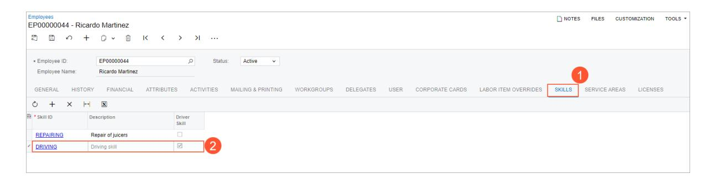

#### *Figure: Skill assigned to a staff member*

5. Save your changes and close the window.

# <span id="page-638-0"></span>**Vehicles**

# <span id="page-638-1"></span>**Vehicles: General Information**

In Acumatica ERP, you can enter information about all your company's vehicles.

#### **Learning Objectives**

In this chapter, you will learn how to do the following:

- Create vehicle types
- Create vehicles

#### **Applicable Scenarios**

You enter and manage vehicle information in Acumatica ERP when you need to track and organize your company's fleet.

#### **Vehicle Types**

Vehicle types are used to group vehicles with the same properties. When you add a vehicle type on the *[Vehicle](https://help-2025r1.acumatica.com/Help?ScreenId=ShowWiki&pageid=4e71d222-e6ad-4f51-b162-24c50675ed17) [Types](https://help-2025r1.acumatica.com/Help?ScreenId=ShowWiki&pageid=4e71d222-e6ad-4f51-b162-24c50675ed17)* (FS204200) form, you specify the identifier and a description of the type. On the **Attributes** tab, you can also specify any number of attributes that you want to track for the vehicles of the type. For attributes to be added on this tab, they must be defined on the *[Attributes](https://help-2025r1.acumatica.com/Help?ScreenId=ShowWiki&pageid=de0a353f-40d0-452d-9152-e65605e69788)* (CS205000) form.

When you create a vehicle and assign a vehicle type on the *[Vehicles](https://help-2025r1.acumatica.com/Help?ScreenId=ShowWiki&pageid=0580b974-c0a2-4775-a1da-a67ae17f9016)* (FS203600) form, the system fills in the **Attributes** tab on this form with the attributes that have been specified for the vehicle type (and any default values you have specified for the attributes).

#### **Entering a Vehicle**

You use the *[Vehicles](https://help-2025r1.acumatica.com/Help?ScreenId=ShowWiki&pageid=0580b974-c0a2-4775-a1da-a67ae17f9016)* (FS203600) form to enter into the system the details about a particular vehicle of your company. For each vehicle you add, you have to specify the type of the vehicle in the**VehicleType ID** box and the branch location where the vehicle is located in the **Branch Location** box.

If attributes are specified for the vehicle type, you can specify or modify the values of these attributes on the **Attributes** tab of the form. Values must be specified for each attribute for which the **Required** check box is selected.

If the vehicle you're entering has already been entered as a fixed asset in the system, you can associate the fixed asset with the vehicle. To do this, you select the identifier of the necessary fixed asset in the **Fixed Asset** box. If the serial number (that is, the vehicle identification number or VIN) and purchase information has been specified for the vehicle on the *[Fixed Assets](https://help-2025r1.acumatica.com/Help?ScreenId=ShowWiki&pageid=0bde54fb-c293-4759-931b-5ecbff784cd1)* (FA303000) form, the system fills this information on the *[Vehicles](https://help-2025r1.acumatica.com/Help?ScreenId=ShowWiki&pageid=0580b974-c0a2-4775-a1da-a67ae17f9016)* form. For details on fixed assets, see *[Fixed Asset Creation: General Information](https://help-2025r1.acumatica.com/Help?ScreenId=ShowWiki&pageid=52df52e3-8263-4b36-966c-4f3bd9e9f767)*.

When you save the vehicle information you have entered, the system creates an equipment entity that corresponds to the vehicle on the *[Equipment](https://help-2025r1.acumatica.com/Help?ScreenId=ShowWiki&pageid=43b7c838-3051-4238-87db-e9b9c213894e)* (FS205000) form. For this equipment, the system selects the**Vehicle** check box on this form. In the **Equipment Nbr.** box, the system assigns an identifier to the equipment based on the numbering sequence specified in the **Equipment NumberingSequence** box on the *[Service Management Preferences](https://help-2025r1.acumatica.com/Help?ScreenId=ShowWiki&pageid=1c1b94d7-ac39-4f84-a966-588290b5ba80)* (FS100100) form. The system copies this number into the**Vehicle ID** box of the *[Vehicles](https://help-2025r1.acumatica.com/Help?ScreenId=ShowWiki&pageid=0580b974-c0a2-4775-a1da-a67ae17f9016)* form when you save a new vehicle. For details on equipment, see *[Managing Equipment](https://help-2025r1.acumatica.com/Help?ScreenId=ShowWiki&pageid=27613ec3-850c-478c-8df8-7ca35bb7c33e)*.

# **Specifying Identification Numbers and General Information for a Vehicle**

In the Summary area of the *[Vehicles](https://help-2025r1.acumatica.com/Help?ScreenId=ShowWiki&pageid=0580b974-c0a2-4775-a1da-a67ae17f9016)* (FS203600) form, you can specify the license plate number of a vehicle in the **License Nbr.** box and the vehicle identification number in the**VIN** box.

On the **General** tab of the form, you can specify the following information:

- The date when the vehicle was registered in your company in the **Registered Date** box
- The identification number marked on the engine of the vehicle in the **Engine Nbr.** box
- The number of axles of the vehicle in the **Axles** box
- The maximum number of miles per hour for the vehicle in the **Max. Miles** box
- The unladen weight of the vehicle in the**Tare Weight** box
- The maximum weight at which a vehicle can be operated in the **GrossVehicle Weight** box
- The color of the vehicle in the **Color ID** box

# **Specifying Purchase Information**

You can specify the following information related to purchasing the vehicle on the **Purchase** tab of the *[Vehicles](https://help-2025r1.acumatica.com/Help?ScreenId=ShowWiki&pageid=0580b974-c0a2-4775-a1da-a67ae17f9016)* (FS203600) form:

- The way the vehicle was acquired (**PropertyType**)
- The vendor that sold or rented the vehicle (**Vendor**)
- The date of the purchase (**Purchase Date**)
- The purchase order number (**Purchase PO Number**)
- The adquisition cost of the vehicle (**Purchase Amount**)

If you select a fixed asset in the **Fixed Asset** box for which the purchase information has been specified on the *[Fixed Assets](https://help-2025r1.acumatica.com/Help?ScreenId=ShowWiki&pageid=0bde54fb-c293-4759-931b-5ecbff784cd1)* (FA303000) form, the system fills in the boxes of the **Purchase** tab of the *[Vehicles](https://help-2025r1.acumatica.com/Help?ScreenId=ShowWiki&pageid=0580b974-c0a2-4775-a1da-a67ae17f9016)* form automatically.

# <span id="page-639-0"></span>**Vehicles: To Create a Vehicle Type**

In Acumatica ERP, *vehicle types* are used to group vehicles with similar characteristics that your company uses. For example, you can create separate vehicle types for limousines and vans.

#### **Story**

Suppose that the SweetLife Equipment and Service Center has multiple types of vehicles that they use for providing route services. To register these vehicles in the system, at least one vehicle type must be created. Acting as an administrative user, you need to create a vehicle type record in Acumatica ERP.

### **Process Overview**

On the *[Vehicle](https://help-2025r1.acumatica.com/Help?ScreenId=ShowWiki&pageid=4e71d222-e6ad-4f51-b162-24c50675ed17) Types* (FS204200) form, you will create the *VAN* vehicle type.

# **System Preparation**

Before you start creating a vehicle type, do the following:

- 1. On the Acumatica ERP website, sign in to a company with the *U100* dataset preloaded as a system administrator by using the *gibbs* username and the *123* password.
- 2. On the Company and Branch Selection menu on the top pane of the Acumatica ERP screen, select the *SWEETEQUIP - Service and Equipment Sales Center* branch.

# **Step: Creating a Vehicle Type**

Perform the following instructions:

- 1. On the *[Vehicle](https://help-2025r1.acumatica.com/Help?ScreenId=ShowWiki&pageid=4e71d222-e6ad-4f51-b162-24c50675ed17) Types* (FS204200) form, add a new record and specify the following settings:
  - **VehicleType ID**: VAN
  - **Description**: Vans
- 2. On the form toolbar, click**Save**.

You have created the *VAN* vehicle type; you can proceed to entering the specific vehicles (vans) that your company uses for executing routes.

# <span id="page-640-0"></span>**Vehicles: To Create Vehicles**

In Acumatica ERP, a *vehicle* is a record created on the *[Vehicles](https://help-2025r1.acumatica.com/Help?ScreenId=ShowWiki&pageid=0580b974-c0a2-4775-a1da-a67ae17f9016)* (FS203600) form that contains the details of a particular vehicle used by your company to perform route services for customers. When you create a new vehicle, the system automatically creates a corresponding piece of equipment on the *[Equipment](https://help-2025r1.acumatica.com/Help?ScreenId=ShowWiki&pageid=43b7c838-3051-4238-87db-e9b9c213894e)* (FS205000) form with the **Vehicle** check box selected; on this form, however, the details of the equipment are read-only.

### **Story**

Suppose that the SweetLife Equipment and Service Center has multiple types of vehicles that they use for providing route services. Acting as an administrative user, you will create vehicle records in Acumatica ERP.

### **Process Overview**

On the *[Vehicles](https://help-2025r1.acumatica.com/Help?ScreenId=ShowWiki&pageid=0580b974-c0a2-4775-a1da-a67ae17f9016)* (FS203600) form, you will create two vehicle records and then find the newly created vehicle records in the list of equipment on the *[Equipment](https://help-2025r1.acumatica.com/Help?ScreenId=ShowWiki&pageid=43b7c838-3051-4238-87db-e9b9c213894e)* (FS205000) form.

### **System Preparation**

Before you start creating vehicles, do the following:

- 1. On the Acumatica ERP website, sign in to a company with the *U100* dataset preloaded as a system administrator by using the *gibbs* username and the *123* password.
- 2. On the Company and Branch Selection menu on the top pane of the Acumatica ERP screen, select the *SWEETEQUIP - Service and Equipment Sales Center* branch.

# **Step 1: Creating Vehicles**

Perform the following instructions:

- 1. On the Company and Branch Selection menu on the top pane of the Acumatica ERP screen, select the *SWEETEQUIP - Service and Equipment Sales Center* branch.
- 2. On the *[Vehicles](https://help-2025r1.acumatica.com/Help?ScreenId=ShowWiki&pageid=0580b974-c0a2-4775-a1da-a67ae17f9016)* (FS203600) form, add a new record.
- 3. In the Summary area, specify the following settings:
  - **VehicleType ID**: *VAN*
  - **VIN**: 1234567890
  - **Description**: White Ford
  - **Branch Location**: *WEST BRIGHTON*
- 4. On the form toolbar, click**Save**.

When you saved the vehicle settings you have entered, the system also created a corresponding equipment record on the *[Equipment](https://help-2025r1.acumatica.com/Help?ScreenId=ShowWiki&pageid=43b7c838-3051-4238-87db-e9b9c213894e)* (FS205000) form. In the **Equipment Nbr.** box on this form, the system assigned an identifier to the equipment (that is, the vehicle) based on the numbering sequence specified in the **Equipment NumberingSequence** box on the *[Service Management Preferences](https://help-2025r1.acumatica.com/Help?ScreenId=ShowWiki&pageid=1c1b94d7-ac39-4f84-a966-588290b5ba80)* (FS100100) form. The system copied this number to the**Vehicle ID** box of the *[Vehicles](https://help-2025r1.acumatica.com/Help?ScreenId=ShowWiki&pageid=0580b974-c0a2-4775-a1da-a67ae17f9016)* form when you saved the new vehicle.

- 5. On the form toolbar, click **Add New Record** to create another vehicle and specify the following settings:
  - **VehicleType ID**: *VAN*
  - **VIN**: 987654321
  - **Description**: Brown Nissan
  - **Branch Location**: *WEST BRIGHTON*
- 6. On the form toolbar, click**Save**.

Notice that the system has inserted the vehicle ID in the**Vehicle ID** box.

# **Step 2: Reviewing the Equipment**

Perform the following instructions:

- 1. On the *[Equipment](https://help-2025r1.acumatica.com/Help?ScreenId=ShowWiki&pageid=43b7c838-3051-4238-87db-e9b9c213894e)* (FS205000) form, open the *White Ford* record.
- 2. Verify that for this equipment, the**Vehicle** check box (which is read-only on this form) is selected.
- 3. By performing similar instructions, verify that the *Brown Nissan* equipment has been created and defined as a vehicle.

# <span id="page-642-0"></span>**Implementing Approvals**

This part of the guide describes the minimum required configuration of the approval functionality in Acumatica ERP.

# <span id="page-642-3"></span><span id="page-642-1"></span>**Configuring Approvals**

Before you can begin using the approval functionality in Acumatica ERP, you must perform the necessary configuration steps. These steps include enabling the necessary feature, creating the needed approval maps, and specifying the approval preferences for the entity type.

Approving a record is just one step in the processing workflow, which may involve additional actions, such as releasing and voiding the record. These other processing steps can be executed even if the approval functionality is not configured in the system.

In this chapter, you will read about the configuration of the approval functionality.

# <span id="page-642-2"></span>**Approval Configuration: General Information**

In Acumatica ERP, you can set up approvals for various types of records in the system.

# **Learning Objectives**

In this chapter, you will learn how to perform the initial configuration for the approval functionality. In particular, you will do the following:

- Enable the feature that activates the approval functionality
- Learn about the preference settings that have to be specified for records to be approved
- Learn how to create an approval map for a particular entity type

### **Applicable Scenarios**

You perform the configuration of the approval functionality if the company that you are configuring needs to assign records to authorized employees for approval. Acumatica ERP offers the approval functionality for a variety of records, as described in the *[Setup of Specific Approvals](#page-643-0)* section of this topic.

Before users can start approving records in the system, you configure the approval functionality in the system by performing the following general steps:

- Enabling the *Approval Workflow* feature on the *[Enable/Disable Features](https://help-2025r1.acumatica.com/Help?ScreenId=ShowWiki&pageid=c1555e43-1bc5-4f6f-ba9d-b323f94d8a6b)* (CS101000) form.
- Creating at least one approval map for each entity type whose records will be approved by using the *[Approval Maps](https://help-2025r1.acumatica.com/Help?ScreenId=ShowWiki&pageid=d97cb216-f487-4ec9-a561-d5034fd3b8b3)* (EP205015) form.
- Optionally, creating notification templates by using the *Email [Templates](https://help-2025r1.acumatica.com/Help?ScreenId=ShowWiki&pageid=ebcda76a-433f-4bde-8aed-efc69474fd03)* (SM204003) form. These templates can be used to notify approvers of records that require their review.
- Specifying approval settings on the preferences form for the record types for which you have created an approval map. (See the *[Setup of Specific Approvals](#page-643-0)* section of this topic for details about these forms.)

### **Approval Map Creation**

An *approval map* is used for assigning approvers to records of a particular entity type. By clicking the **Add Approval Map** button on the form toolbar of the *[Assignment and Approval Maps](https://help-2025r1.acumatica.com/Help?ScreenId=ShowWiki&pageid=54d9618b-c27b-47d5-9748-24441084e99e)* (EP205500) form, you can open the *[Approval](https://help-2025r1.acumatica.com/Help?ScreenId=ShowWiki&pageid=d97cb216-f487-4ec9-a561-d5034fd3b8b3) [Maps](https://help-2025r1.acumatica.com/Help?ScreenId=ShowWiki&pageid=d97cb216-f487-4ec9-a561-d5034fd3b8b3)* (EP205015) form and start creating an approval map.

The options in the **EntityTypes** box correspond to the names of the creation forms for these records.The availability of entity types depends on the applied license and the set of features enabled on the *[Enable/Disable Features](https://help-2025r1.acumatica.com/Help?ScreenId=ShowWiki&pageid=c1555e43-1bc5-4f6f-ba9d-b323f94d8a6b)* form. For more information about licensing, see the Acumatica ERP sales policy.

You use the *[Assignment and Approval Maps](https://help-2025r1.acumatica.com/Help?ScreenId=ShowWiki&pageid=54d9618b-c27b-47d5-9748-24441084e99e)* form as a starting point to modify an existing approval map. The form lists all existing assignment maps and approval maps, and the name of each map is a link that you can click to open the map.

For details about approval maps, see *[Approval Configuration: Approval Maps](#page-647-1)*.

# **Approval and Rejection Reasons**

Your organization may need approvers to enter a reason when they approve or reject a document. You set up approval and rejection reasons on the **Rule Actions** tab (**Reason Settings** section) of the *[Approval Maps](https://help-2025r1.acumatica.com/Help?ScreenId=ShowWiki&pageid=d97cb216-f487-4ec9-a561-d5034fd3b8b3)* (EP205015) form.

By default, the **Reason for Approval** and **Reason for Rejection** boxes contain *Is Not Prompted*. To make approvers enter reason codes when approving or rejecting documents, you select one of the following options in the needed boxes:

- *Is Optional*: The approver will be prompted to enter a reason when they approve or reject a document, but the reason is an optional setting.
- *Is Required*: The approver will be prompted to enter a reason when they approve or reject a document, and the reason must be specified.

For an entity type with optional or required approval configured, when a user approves or rejects a document of the type on the data entry form, the system displays the **Enter Reason** dialog box. The approver enters the reason for approval or rejection in this dialog box and clicks **OK**.

The reason is also displayed on the **Approvals** tab of the data entry forms that support the entry of approval and rejection reasons.

### **Notification Template Preparation**

Optionally, you can prepare notification templates and use them for approval notifications in Acumatica ERP. These notification templates are designed to inform authorized employees via email when a document requires their approval. This is an optional step; authorized users can approve and reject records regardless of whether they receive notifications. You can create new templates or edit existing ones by using the *Email [Templates](https://help-2025r1.acumatica.com/Help?ScreenId=ShowWiki&pageid=ebcda76a-433f-4bde-8aed-efc69474fd03)* (SM204003) form.

For the notification template to be used, it must be specified along with the approval map on the applicable preferences form. For more information about approval notifications, see *[Approval Configuration: Pending Approval](#page-649-1) [Notifications](#page-649-1)*.

### <span id="page-643-0"></span>**Setup of Specific Approvals**

The creation of an approval map does not cause records of the entity type to be subject to approval until you modify the applicable system preferences to use the approval map.

For each entity type for which you have created at least one approval map, you must specify an approval map for the specific type of record on the preferences form associated with the entity type. In some cases, you can create multiple approval maps for the same entity type, with each designed for different record types, and specify both maps for the record types on the preferences form. For example, you can create two approval maps for purchase orders, with one designed for project drop-ship purchase orders and one designed for purchase orders of other types. On the *[Purchase Orders Preferences](https://help-2025r1.acumatica.com/Help?ScreenId=ShowWiki&pageid=13d09c43-8696-4f92-ad9b-3d0209ee3d9b)* (PO101000) form, you specify the map to be used for each purchase order type.

If you have created notification templates to be used for the records of any entity type, you can also specify them on the preferences form.

The applicable preferences form where you specify the approval map depends on the **EntityType** selected on the *[Approval Maps](https://help-2025r1.acumatica.com/Help?ScreenId=ShowWiki&pageid=d97cb216-f487-4ec9-a561-d5034fd3b8b3)* (EP205015) form as follows:

- *[Accounts Payable Preferences](https://help-2025r1.acumatica.com/Help?ScreenId=ShowWiki&pageid=c3f9353e-95e6-448d-bb3f-e20643879ec7)* (AP101000) to set up approvals for AP documents of particular types (bills, credit adjustments, debit adjustments, prepayment requests, payments, prepayments, or cash purchases). On this form, you can specify approval maps for which one of the following entity types is selected on the *[Approval Maps](https://help-2025r1.acumatica.com/Help?ScreenId=ShowWiki&pageid=d97cb216-f487-4ec9-a561-d5034fd3b8b3)* form: *Bills and Adjustments*, *Checks and Payments*, or *Cash Purchases*.
- *[Accounts Receivable Preferences](https://help-2025r1.acumatica.com/Help?ScreenId=ShowWiki&pageid=f7b52067-5299-45e8-b601-485cd709f58b)* (AR101000) to set up approvals for AR documents of particular types: invoices, prepayment invoices, debit memos, credit memos, refunds, or cash returns. On this form, you can specify approval maps for which one of the following entity types is selected on the *[Approval Maps](https://help-2025r1.acumatica.com/Help?ScreenId=ShowWiki&pageid=d97cb216-f487-4ec9-a561-d5034fd3b8b3)* form: *Invoices and Memos*, *Payments and Applications*, or *Cash Sales*.
- *[BOM Preferences](https://help-2025r1.acumatica.com/Help?ScreenId=ShowWiki&pageid=7224e637-50bc-468d-bfb6-e97b87378ff6)* (AM101000) to set up approvals for engineering change orders or requests. On this form, you can specify approval maps for which one of the following entity types is selected on the *[Approval Maps](https://help-2025r1.acumatica.com/Help?ScreenId=ShowWiki&pageid=d97cb216-f487-4ec9-a561-d5034fd3b8b3)* form: *Engineering Change Order* or *Engineering Change Request*.
- *[Cash Management Preferences](https://help-2025r1.acumatica.com/Help?ScreenId=ShowWiki&pageid=47321412-f6f6-4565-a2c5-d24ab8167e4b)* (CA101000) to set up approvals for cash transactions and reconciliation statements. On this form, you can specify approval maps for which the *Cash Transactions* or *Reconciliation Statements* entity type is selected on the *[Approval Maps](https://help-2025r1.acumatica.com/Help?ScreenId=ShowWiki&pageid=d97cb216-f487-4ec9-a561-d5034fd3b8b3)* form.
- *[Customer Management Preferences](https://help-2025r1.acumatica.com/Help?ScreenId=ShowWiki&pageid=63aa74fa-81fd-4d62-85ac-c6b845ab1ac0)* (CR101000) to set up approvals for sales quotes. On this form, you can specify an approval map for which the *Sales Quotes* entity type is selected on the *[Approval Maps](https://help-2025r1.acumatica.com/Help?ScreenId=ShowWiki&pageid=d97cb216-f487-4ec9-a561-d5034fd3b8b3)* form.


This approval map can be applied to sales quotes created on the *[Sales Quotes](https://help-2025r1.acumatica.com/Help?ScreenId=ShowWiki&pageid=9c81a05c-ee3b-4ca1-8ae8-390076631d03)* (CR304500) form, not sales orders of the *QT* type created on the *[Sales Orders](https://help-2025r1.acumatica.com/Help?ScreenId=ShowWiki&pageid=19e4021c-1b84-49fd-be12-0320c5f1c7e5)* (SO301000) form.

- *[General Ledger Preferences](https://help-2025r1.acumatica.com/Help?ScreenId=ShowWiki&pageid=e4913d06-c511-4258-a0f9-f36c1b854e6b)* (GL102000) to set up approvals for journal transactions of particular types (normal, consolidation, trial balance, reclassification, or allocation). On this form, you can specify approval maps for which the *Journal Transactions* entity type is selected on the *[Approval Maps](https://help-2025r1.acumatica.com/Help?ScreenId=ShowWiki&pageid=d97cb216-f487-4ec9-a561-d5034fd3b8b3)* form.
- *[Project Management Preferences](https://help-2025r1.acumatica.com/Help?ScreenId=ShowWiki&pageid=4b591bab-4756-475c-8c15-854c33b80df4)* (PJ101000) to set up approvals for daily field reports. On this form, you can specify an approval map for which the *Daily Field Report* entity type is selected on the *[Approval Maps](https://help-2025r1.acumatica.com/Help?ScreenId=ShowWiki&pageid=d97cb216-f487-4ec9-a561-d5034fd3b8b3)* form.
- *[Projects Preferences](https://help-2025r1.acumatica.com/Help?ScreenId=ShowWiki&pageid=de2ca225-4a0c-4129-b09d-3f3ed05198f9)* (PM101000) to set up approvals for projects and project-related documents. On this form, you can specify approval maps for which one of the following entity types is selected on the *[Approval](https://help-2025r1.acumatica.com/Help?ScreenId=ShowWiki&pageid=d97cb216-f487-4ec9-a561-d5034fd3b8b3) [Maps](https://help-2025r1.acumatica.com/Help?ScreenId=ShowWiki&pageid=d97cb216-f487-4ec9-a561-d5034fd3b8b3)* form: *Projects*, *Pro Forma Invoices*, *Change Orders*, *Change Requests*, *Project Quotes*, *Cost Projection*, *Cost Projection by Date*, or *Progress Worksheets*.
- *[Purchase Orders Preferences](https://help-2025r1.acumatica.com/Help?ScreenId=ShowWiki&pageid=13d09c43-8696-4f92-ad9b-3d0209ee3d9b)* (PO101000) to set up approvals for purchase orders of particular types (normal, drop-ship, project drop-ship, blanket, or standard). On this form, you can specify approval maps for which the *Purchase Orders* entity type is selected on the *[Approval Maps](https://help-2025r1.acumatica.com/Help?ScreenId=ShowWiki&pageid=d97cb216-f487-4ec9-a561-d5034fd3b8b3)* form.
- *[Purchase Requisitions Preferences](https://help-2025r1.acumatica.com/Help?ScreenId=ShowWiki&pageid=d0a79e78-7dc8-4b65-98ea-f92478bb0a56)* (RQ101000) to set up approvals for purchase requests and requisitions. On this form, you can specify approval maps for which one of the following entity types is selected on the *[Approval Maps](https://help-2025r1.acumatica.com/Help?ScreenId=ShowWiki&pageid=d97cb216-f487-4ec9-a561-d5034fd3b8b3)* form: *Requests* or *Requisitions*.
- *[Subcontracts Preferences](https://help-2025r1.acumatica.com/Help?ScreenId=ShowWiki&pageid=9572610a-44f6-43da-85b7-be4d68ffea90)* (SC101000) to set up approvals for subcontracts. On this form, you can specify an approval map for which the *Subcontracts* entity type is selected on the *[Approval Maps](https://help-2025r1.acumatica.com/Help?ScreenId=ShowWiki&pageid=d97cb216-f487-4ec9-a561-d5034fd3b8b3)* form.
- *[Sales Orders Preferences](https://help-2025r1.acumatica.com/Help?ScreenId=ShowWiki&pageid=1817779c-413b-4187-b7fe-38e97845a1cb)* (SO101000) to set up approvals for various types of documents. On this form, you can specify approval maps for which one of the following entity types is selected on the *[Approval Maps](https://help-2025r1.acumatica.com/Help?ScreenId=ShowWiki&pageid=d97cb216-f487-4ec9-a561-d5034fd3b8b3)* form:
  - *Sales Orders*: You can specify a map for orders with any custom or predefined order type.

• *Invoices*: You can specify a map for any of the following types of sales documents: invoices, credit memos, debit memos, cash sales, or cash returns.


The records for which the *Invoices* entity type is used are created on the *[Invoices](https://help-2025r1.acumatica.com/Help?ScreenId=ShowWiki&pageid=0acc9738-f141-4ea0-a2be-f34ea9d1b63a)* (SO303000) form; the *Invoices and Memos* entity type refers to AR documents created on the *[Invoices and Memos](https://help-2025r1.acumatica.com/Help?ScreenId=ShowWiki&pageid=5e6f3b27-b7af-412f-a40a-1d4f4be70cba)* (AR301000) form.

• *Time and Expenses [Preferences](https://help-2025r1.acumatica.com/Help?ScreenId=ShowWiki&pageid=e9f4a914-c4ce-4c4f-95d9-f385451e5856)* (EP101000) form to set up approvals for various records related to employees' time and expenses. On this form, you can specify approval maps for which one of the following entity types is selected on the *[Approval Maps](https://help-2025r1.acumatica.com/Help?ScreenId=ShowWiki&pageid=d97cb216-f487-4ec9-a561-d5034fd3b8b3)* form: *Employee Time Cards*, *Equipment Time Cards*, *Expense Claim*, or *Expense Receipt*.

# <span id="page-645-0"></span>**Approval Configuration: Implementation Checklist**

The following checklist provides details you can use to ensure that the system is configured properly for using the approval functionality, and to understand (and change, if needed) the settings that affect the processing workflow.

# **Implementation Checklist**

Before you can initially start assigning documents for approval, make sure the needed features have been enabled, settings have been specified, and entities have been created, as summarized in the following checklist.

| Form                                         | Criteria to Check                                                                                                                                                                                                                                                                                                                                                                               |  |  |  |  |
|----------------------------------------------|-------------------------------------------------------------------------------------------------------------------------------------------------------------------------------------------------------------------------------------------------------------------------------------------------------------------------------------------------------------------------------------------------|--|--|--|--|
| Enable/Disable Features<br>(CS100000)        | The Approval Workflow feature has been enabled.                                                                                                                                                                                                                                                                                                                                                 |  |  |  |  |
| Approval Maps (EP205015)                     | An approval map has been created for each entity type for which records re<br>quire approval.                                                                                                                                                                                                                                                                                                   |  |  |  |  |
| Email Templates (SM204003)                   | New email templates have been created for approval notifications or existing<br>ones have been edited.                                                                                                                                                                                                                                                                                          |  |  |  |  |
|                                              | Note that for the system to use these notifications, the created template must<br>be assigned in the preferences related to the entity type.                                                                                                                                                                                                                                                    |  |  |  |  |
| General Ledger Preferences<br>(GL102000)     | In a row of the Approval tab, the appropriate approval map has been specified<br>in the Approval Map column for each needed type of batches of GL transac<br>tions selected in the Type column. You must select the Active check box for the<br>approval map to be used.<br>Optionally, you can specify an email template for each approval map in the<br>Pending Approval Notification column. |  |  |  |  |
|                                              |                                                                                                                                                                                                                                                                                                                                                                                                 |  |  |  |  |
| Time and Expenses Prefer<br>ences (EP101000) | On the General tab, the needed approval maps (and, optionally, notification<br>templates) have been specified. You can specify maps and templates for each of<br>the entities whose records require approval: expense receipts, expense claims,<br>employee time cards, and equipment time cards.                                                                                               |  |  |  |  |

| Form                                             | Criteria to Check                                                                                                                                                                                                                                                                                  |  |  |  |  |  |
|--------------------------------------------------|----------------------------------------------------------------------------------------------------------------------------------------------------------------------------------------------------------------------------------------------------------------------------------------------------|--|--|--|--|--|
| Sales Orders Preferences<br>(SO101000)           | On the Approval tab, in theSales Orders and Invoices tables, each needed ap<br>proval map (and notification template, if needed) has been specified. The Ac<br>tive check box must be selected for the map to be used.                                                                             |  |  |  |  |  |
|                                                  | In the Type column of each row, you specify the sales document type or order<br>type whose records are subject to approval by using the map. Some examples<br>of these records are credit memos, cash returns, cash sales, sales invoices, re<br>turns for credit, mixed orders, and sales orders. |  |  |  |  |  |
| Projects Preferences<br>(PM101000)               | On the Approval tab, the needed approval maps (and, optionally, notification<br>templates) have been specified in the appropriate boxes.                                                                                                                                                           |  |  |  |  |  |
|                                                  | You can specify maps and templates for each of the entities whose records re<br>quire approval: projects, pro forma invoices, change orders, change requests,<br>project quotes, cost projections, cost projections by date, and progress work<br>sheets.                                          |  |  |  |  |  |
| Purchase Orders Preferences<br>(PO101000)        | On the Approval tab, the Require Approval check box has been selected. In<br>the table, you specify each needed approval map (and notification template, if<br>needed).                                                                                                                            |  |  |  |  |  |
|                                                  | In the Type column of each row, you specify the purchase order type whose<br>records are subject to approval by using the map.                                                                                                                                                                     |  |  |  |  |  |
| Purchase Requisitions Prefer<br>ences (RQ101000) | On the Approval tab, the Require Approval check box is selected in either or<br>both of the following sections: Request Settings (for purchase requests) and<br>Requisition Settings (for purchase requisitions).                                                                                  |  |  |  |  |  |
|                                                  | In the table on the Approval tab, you specify each needed approval map (and<br>notification template, if needed). In the Type column of each row, you specify<br>Request or Requisition.                                                                                                           |  |  |  |  |  |
| Cash Management Prefer<br>ences (CA101000)       | In the table on the Approvals tab, each needed approval map to be used for<br>cash transactions and reconciliation statements is listed, and the Active check<br>box is selected in the row. Optionally, you can specify a notification template in<br>each row.                                   |  |  |  |  |  |
| Accounts Payable Preferences<br>(AP101000)       | In the table on the Approval tab, each needed approval map (and notification<br>template, if needed) is specified and the Active check box is selected in the row.                                                                                                                                 |  |  |  |  |  |
|                                                  | In the Type column of each row, you specify the type of the records that are<br>subject to approval by using the map. These records can be bills, credit adjust<br>ments, debit adjustments, payments, cash purchases, prepayment requests, or<br>prepayments.                                     |  |  |  |  |  |
| Accounts Receivable Prefer<br>ences (AR101000)   | In the table on the Approval tab, each needed approval map (and notification<br>template, if needed) is specified and the Active check box is selected in the row.                                                                                                                                 |  |  |  |  |  |
|                                                  | In the Type column of each row, you specify the type of the records that are<br>subject to approval by using the map. These records can be invoices, debit<br>memos, credit memos, payment, prepayments, refunds, cash sales, or cash re<br>turns.                                                 |  |  |  |  |  |
| Subcontracts Preferences<br>(SC101000)           | On the General tab Approval section, the needed approval maps (and, option<br>ally, notification templates) have been specified in the following boxes: Ap<br>proval Map and Pending Approval Notification.                                                                                        |  |  |  |  |  |

| Form                                           | Criteria to Check                                                                                                                                                                                                        |  |  |  |  |
|------------------------------------------------|--------------------------------------------------------------------------------------------------------------------------------------------------------------------------------------------------------------------------|--|--|--|--|
| Project Management Prefer<br>ences (PJ101000)  | On the Daily Field Report tab, the needed approval map (and, optionally, no<br>tification template) has been specified in the following boxes: DFR Approval<br>Map and DFR Approval Notification.                        |  |  |  |  |
| Customer Management Prefer<br>ences (CR101000) | On the General tab Quote ApprovalSettings section, the needed approval<br>maps (and, optionally, notification templates) have been specified in the fol<br>lowing boxes: Approval Map and Pending Approval Notification. |  |  |  |  |
| BOM Preferences (AM101000)                     | On the ECR Approval tab and ECO Approval tab, the Active check box must be<br>selected for the approval map to be used and, optionally, a notification tem<br>plate.                                                     |  |  |  |  |

# **Validation of Configuration**

To ensure the correct configuration of the approval functionality, we recommend testing the validation by following instructions similar to those described in the following topics:

- *[Approving Accounts Payable Documents](https://help-2025r1.acumatica.com/Help?ScreenId=ShowWiki&pageid=5c1cb842-8578-4766-a837-8b0c31ef5cfe)*, *Processing of AP Documents with Approvals Set Up* section
- *[Approval of Accounts Receivable Documents](https://help-2025r1.acumatica.com/Help?ScreenId=ShowWiki&pageid=186b674c-d428-4445-9bf9-9af1898f7bc1)*, *Processing AR Documents with Approvals Set Up* section
- *To [Approve](https://help-2025r1.acumatica.com/Help?ScreenId=ShowWiki&pageid=12c7e191-e65c-4925-9585-6c2abd9f6bc7) a Sales Order*
- *Expense [Receipts:](https://help-2025r1.acumatica.com/Help?ScreenId=ShowWiki&pageid=0845f8a2-2c73-434c-9e12-bada2bc918db) To Approve Expense Receipts*
- *Expense Claims: To Approve [Expense](https://help-2025r1.acumatica.com/Help?ScreenId=ShowWiki&pageid=946c7cbd-c6df-4787-a052-aeeeffcec96a) Claims*
- *[Transactions](https://help-2025r1.acumatica.com/Help?ScreenId=ShowWiki&pageid=de52207d-fa25-4672-b22c-e5d3a9ad793d) with Approval: Process Activity*
- *Cash [Transaction](https://help-2025r1.acumatica.com/Help?ScreenId=ShowWiki&pageid=bfb47112-3c99-403a-adf1-38c38bb41ca5) Approval*, *Cash Transaction Processing with Approval Required* section

# <span id="page-647-1"></span><span id="page-647-0"></span>**Approval Configuration: Approval Maps**

If the *Approval Workflow* feature is enabled on the *[Enable/Disable Features](https://help-2025r1.acumatica.com/Help?ScreenId=ShowWiki&pageid=c1555e43-1bc5-4f6f-ba9d-b323f94d8a6b)* (CS100000) form, you can use approval maps to assign records (such as cash transactions, expense claims, time cards, and purchase orders) to authorized employees for approval.

### **Supported Types of Maps**

Acumatica ERP supports multiple types of maps that may include any number of steps, rules, and conditions for assigning a record to a qualified employee for processing or for approval. The *[Assignment and Approval Maps](https://help-2025r1.acumatica.com/Help?ScreenId=ShowWiki&pageid=54d9618b-c27b-47d5-9748-24441084e99e)* (EP205500) form is the staring point for creating maps and viewing the maps that currently exist in the system. You can click the link in the **Map Name** column to open the map on the form where it was created.

Each map listed on the form has a map type, which can be one of the following:

- *Approval Map*: Used for assigning approvers to records of a particular entity type, such as expense claims, daily field reports, engineering change requests, or accounts payable bills.
- *Assignment Map*: Used for assigning such records as the following to owners for future processing: business accounts, cases, leads, purchase receipts, and purchase requests.
- *Assignment and Approval Map*: Used for either assigning records to owners or assigning approvers to documents. Maps of this type were created in earlier versions of Acumatica ERP, when the same form was used for both approval maps and assignment maps. This type remains supported by the system to avoid data loss.

By clicking the **Add Approval Map** button on the form toolbar of the *[Assignment and Approval Maps](https://help-2025r1.acumatica.com/Help?ScreenId=ShowWiki&pageid=54d9618b-c27b-47d5-9748-24441084e99e)* form, you can open a separate entry form, *[Approval Maps](https://help-2025r1.acumatica.com/Help?ScreenId=ShowWiki&pageid=d97cb216-f487-4ec9-a561-d5034fd3b8b3)* (EP205015), where you can start creating a new approval map.

#### **Approval Maps**

You can create a new approval map or modify an existing one by using the *[Approval Maps](https://help-2025r1.acumatica.com/Help?ScreenId=ShowWiki&pageid=d97cb216-f487-4ec9-a561-d5034fd3b8b3)* (EP205015) form.

An approval map consists of steps and rules. In the**Steps** pane, you can create any number of steps, each of which may include any number of rules. The steps of a map may be executed in a sequential, parallel, or sequentialparallel fashion.

For each step, you need to select the action that should be performed if no approver has been assigned in accordance with the rules specified for this step: the record becomes automatically approved, it becomes automatically rejected, or the next step (if any) gets executed. Also, you can specify whether a step is to be executed in any case or only if no approvers have been found at all previous steps.

For each rule, you specify conditions, which the system checks for the document, and actions to be performed if the conditions are met. You can configure a rule so that aer one approver approves the document, the system waits until other appointed approvers (if any) also approve the document, executes the next step in the approval map, or marks the document as approved. Also, you can specify for each rule whether an approver must enter a comment each time they approve or reject a document of the particular type.

If an approval map contains multiple rules and the rules are configured in such a way that the same approver could be assigned multiple times to approve one document, the system will create at most one approval request per document for this approver.

If a condition, step, or rule is no longer required in an approval map, you can temporarily deactivate it by clearing the **Active** check box in the settings of that condition, step, or rule on the *[Approval Maps](https://help-2025r1.acumatica.com/Help?ScreenId=ShowWiki&pageid=d97cb216-f487-4ec9-a561-d5034fd3b8b3)* form. A deactivated step or rule is marked with the **(Inactive)** prefix in the**Steps** pane.

If you are creating rules for assigning records for approval, records that pass through the rules unassigned are considered in the system to be approved, so you do not necessarily have to create complete conditions. Instead, you define the rules to assign only records that have specific properties.

For example, suppose that in a small business, all purchase orders with an amount greater than \$1000 may need to be approved by the CEO. In this case, you would create rules to assign all purchase orders with an amount that exceeds \$1000 to a specific user (the CEO) for approval, while all other orders do not need to be assigned.

When approvals have been configured for a particular record type, the approval details are shown on the approvalrelated tab (labeled as **Approval** or **Approvals**) of the corresponding entry form. While viewing a record on this form, users can go to this tab to view all approvers assigned to the record, along with the approval date, status, and reason for each approver. By using the **Column Configuration** dialog box, users can also view columns showing which approval map and which step and rule in this map caused this approver to be assigned.

### **Map Execution Issues**

Any issues that occur during the execution of an approval map are recorded in the Acumatica ERP trace log. You can open the trace log by clicking **Help > Trace** on the form title bar.

#### **Document Approval**

The appointed approvers can approve documents by using the *[Approvals](https://help-2025r1.acumatica.com/Help?ScreenId=ShowWiki&pageid=1fe1afcc-e676-466e-8c3f-cbf64857e32a)* (EP503010) form; only users authorized to approve documents should have access rights to this form. For more details, see *[Approving Records](https://help-2025r1.acumatica.com/Help?ScreenId=ShowWiki&pageid=f4bf1749-cc54-4e4a-8acb-6997ac42cc6c)*.


Alternatively, a user can approve a record by opening it on the appropriate entry form if they have the needed access rights to the form.

### **Reassignment of Approvals**

In Acumatica ERP, employees can reassign their approval requests to other employees or create additional approval requests as exceptions to the normal approval flow on a temporary basis.

Approval requests assigned to a particular employee can be reassigned to an another employee only if the **Allow Reassignment of Approvals** check box is selected on the **Rule Actions** tab of the *[Approval Maps](https://help-2025r1.acumatica.com/Help?ScreenId=ShowWiki&pageid=d97cb216-f487-4ec9-a561-d5034fd3b8b3)* (EP205015) form for the rules in the approval maps that appointed this employee as an original approver. If this check box is cleared for a rule, the system will not allow the employee to change the approver that has been assigned in accordance with this rule.

<span id="page-649-1"></span>For more information about the reassignment of approvals, see *[Approval Configuration: Delegation of Approvals](#page-650-1)*.

# <span id="page-649-0"></span>**Approval Configuration: Pending Approval Notifications**

In Acumatica ERP, you can set up approval notifications so that the appropriate employee will receive an email notification each time a record requires their approval.

### **Preparing Notification Templates**

You can create new templates or edit existing ones by using the *Email [Templates](https://help-2025r1.acumatica.com/Help?ScreenId=ShowWiki&pageid=ebcda76a-433f-4bde-8aed-efc69474fd03)* (SM204003) form.

On this form, you can find a number of predefined templates for various types of approvals. You can open the lookup table for the **Notification ID** box and use the search box in the upper right to find a template that you can modify or use as it is.


For example, search for *approval* or the specific record type.

# **Setting Up the Sending of Approval Notifications**

To cause approval notifications to be sent for the records of particular entity type, you need to specify a notification template on the appropriate preferences form aer you have specified the approval map for the entity type. For some entities, you can specify different notification templates for each type of record within an entity type, such as each sales order type.

For instance, to enable notifications for pending invoices, on the **Approval** tab of the *[Accounts Receivable](https://help-2025r1.acumatica.com/Help?ScreenId=ShowWiki&pageid=f7b52067-5299-45e8-b601-485cd709f58b) [Preferences](https://help-2025r1.acumatica.com/Help?ScreenId=ShowWiki&pageid=f7b52067-5299-45e8-b601-485cd709f58b)* (AR101000) form, you can specify an appropriate template. Locate the row with *Invoice* selected in the **Type** column, and select the notification template in the **Pending Approval Notification** column.

Only original approvers assigned through an approval map can receive notifications about pending approvals. If an approver has an assigned delegate and approvals are reassigned to this delegate, the delegate will not receive pending approval notifications. For more information about delegates, see *[Approval Configuration: Delegation of Approvals](#page-650-1)*.

# <span id="page-650-1"></span><span id="page-650-0"></span>**Approval Configuration: Delegation of Approvals**

In Acumatica ERP, a temporary delegation rule may be created for an employee. During the specified period, all approval requests that would normally be assigned to this employee (in accordance with a rule of an approval map) may be delegated to another employee. This can help your organization to keep its approval flow running smoothly even if the original approver assigned through an approval map is temporarily unavailable, without administrators having to update existing approval maps.


Delegates must have appropriate access rights to view and approve the records reassigned to them for approval.

# **Configuring the Delegation of Approvals**

To set up the delegation of approvals for a particular employee, on the **Delegates** tab of the *[Employees](https://help-2025r1.acumatica.com/Help?ScreenId=ShowWiki&pageid=dae5144b-49b3-43a4-bce0-93f31b3f2321)* (EP203000) form, you need to add rows to the table with delegation rules for the employee by doing the following:

- In the **Delegation Of** column, you select *Approvals* to indicate that the delegation rule applies to approvals.
- In the **Delegated To** column, you select the employee to whom you want to delegate the approval activities of the original assignee (that is, the employee selected in the Summary area of this form).
- In the **Starts On** column, you specify the starting date of the delegation period during which approval requests can be reassigned to the specified delegate.
- In the **Expires On** column, you specify the date aer which the delegation rule is no longer applicable. Aer this date, any previously reassigned approval requests that have not yet been processed are assigned back to the original assignee.

If you want to temporarily deactivate a rule, clear the **Active** check box in the row with this rule.

A user can use the **Delegates** tab of the *[User Profile](https://help-2025r1.acumatica.com/Help?ScreenId=ShowWiki&pageid=8430c8b2-a79c-4f7b-9768-b0b7fad23a59)* (SM203010) form in the same manner to configure delegation rules for themselves (that is, for the currently signed-in user account).

### **Processing Delegation Rules**

To apply previously configured delegation rules, you must use the *[Reassign Delegated Activities](https://help-2025r1.acumatica.com/Help?ScreenId=ShowWiki&pageid=c6094363-4c05-44f9-836d-2f84c231138a)* (EP503020) form. This form can also be used to return delegated activities to the original approver if the relevant delegation rules are no longer effective.

By clicking **Process** or **Process All** on the form toolbar, you can run the reassignment of only selected records or of all listed records, respectively. Each included record is processed as follows:

- If the current date is within the delegation period (determined by the dates in the**Starts On** and **Expires On** columns), the record is reassigned to the employee specified in the **Delegated To** column.
- If the current date is outside of the delegation period, the record is reassigned to the employee specified in the **Original Assignee** column.

You can automate the reassignment of delegated activities through the use of automation schedules, which you set up on the *[Automation Schedules](https://help-2025r1.acumatica.com/Help?ScreenId=ShowWiki&pageid=76757610-2d0f-4ead-a948-d67da24ec116)* (SM205020) form. You can use the predefined automation schedule, *Reassign delegated activities*, that is available for the *[Reassign Delegated Activities](https://help-2025r1.acumatica.com/Help?ScreenId=ShowWiki&pageid=c6094363-4c05-44f9-836d-2f84c231138a)* form; this schedule is set up to run hourly.

# **Viewing a User's Reassigned Records**

On the **Reassigned** filter tab of the *[Approvals](https://help-2025r1.acumatica.com/Help?ScreenId=ShowWiki&pageid=1fe1afcc-e676-466e-8c3f-cbf64857e32a)* (EP503010) form, a user can view a list of the records that were originally assigned for approval to the currently signed-in user but are now assigned to a different approver.

# <span id="page-651-0"></span>**Approvals: Parallel and Multistage Approvals**

Acumatica ERP provides flexible and efficient tools to configure and manage various approval workflows, including parallel, multistage, and combined approval processes, enabling organizations to tailor workflows to their specific requirements.

Parallel approvals are suited for scenarios where multiple approvers must approve a record either simultaneously or in any order. Multistage approvals are used in workflows where approvals must follow a fixed, sequential order. Additionally, combined approvals can be configured to blend parallel and multistage approaches, allowing for complex workflows where some stages require simultaneous approvals while others follow a specific sequence.

# **Configuring a Workflow for Parallel Approvals**

Parallel approvals are applicable to the cases when the order in which multiple approvers approve a record does not matter. For instance, in smaller companies, a purchase may require approval from both the accountant and the CFO. To configure this in Acumatica ERP, you need to create an approval map for purchase orders, defining both the accountant and the CFO as approvers. You can also specify conditions for submitting purchase orders for approval based on document properties, such as the document amount, vendor, or branch. If no conditions are specified, all purchase orders will be independently assigned to the defined approvers.

When setting up an approval map for parallel approvals, ensure the following:

- The approval map includes only a single step with a single rule.
- On the **Rule Actions** tab, all required approvers are defined for this rule, and the *Collect All Approvals from This Step* option is selected in the **On Approval** box.

The number of approvers that you can add to a parallel approval workflow is not limited and depends on the specific requirements and approval policies within your organization.

For an example of how to configure an approval map for parallel approvals, see *To Create an [Approval](#page-652-0) Map for the [Parallel Approval](#page-652-0)*.

## **Configuring a Workflow for Multistage Approvals**

Multistage approvals are applicable to the cases when it is critical that approvers review and approve a record in a specific sequential order. For example, if all cash transactions in your organization require initial approval by at least one accountant and subsequent approval by at least one top manager for transactions exceeding a specified threshold, you can set up a multistage approval workflow. In this scenario, if at least one accountant approves the transaction at the first stage, the approval progresses to the next stage for review by at least one top manager, provided the transaction meets the conditions specified for that stage.

When setting up an approval map for multistage approvals, ensure the following:

- The approval map includes multiple steps, so that aer an approver approves the record at one step, the system moves to the next step.
- For each step, the *Always* option is selected in the **ExecuteStep** box on the **Conditions** tab.
- The *Complete Step* option is selected in the **On Approval** box on the **Rule Actions** tab for each rule within each step.

For multistage workflows, you can define unique conditions for each stage, and the number of stages or conditions is not limited. These configurations depend entirely on the specific requirements and approval policies of your organization.

For an example of how to configure an approval map for multistage approvals, see *To Create an [Approval](#page-654-0) Map for [the Multistage Approval](#page-654-0)*.

### **Configuring a Workflow for Combined Approvals**

Combined approval workflows, which merge parallel and multistage approaches, are applicable when approval processes involve multiple stages, some requiring simultaneous approvals from multiple approvers and others necessitating sequential execution in a specific order. For instance, suppose that in a retail company, discount promotions for products require a combined approval process. At the first stage, the marketing team and the sales team must both approve the proposed promotion in parallel to ensure alignment with marketing strategy and sales goals. Once both teams approve, the process moves to the second stage, where the inventory team reviews and approves the request to confirm that sufficient stock is available to support the promotion.

When setting up an approval map for multistage approvals, ensure the following:

- The approval map includes multiple steps.
- At least one step includes only one rule. On the **Rule Actions** tab, multiple required approvers are defined for this rule, and the *Collect All Approvals from This Step* option is selected in the **On Approval** box.
- For each step, the *Always* option is selected in the **ExecuteStep** box on the **Conditions** tab.
- The *Complete Step* option is selected in the **On Approval** box on the **Rule Actions** tab for each rule within each step.

# <span id="page-652-0"></span>**To Create an Approval Map for Parallel Approvals**

In this activity, you will configure an approval map for parallel approvals by using the *[Approval Maps](https://help-2025r1.acumatica.com/Help?ScreenId=ShowWiki&pageid=d97cb216-f487-4ec9-a561-d5034fd3b8b3)* (EP205015) form.

This activity is based on the *U100* dataset. If you are using another dataset, or if any system settings have been changed in *U100*, these changes can affect the workflow of the activity and the results of the processing. To avoid any issues, restore the *U100* dataset to its initial state.

#### **Story**

Suppose that according to the internal requirements of SweetLife Fruits & Jams, each cash purchase that has an amount exceeding \$5000 (in US dollars) requires approval from both the accountant and the CFO. If a cash purchase meets these conditions, both the accountant and the CFO can approve the purchase interdependently of one another, and the cash purchase is posted aer it has been approved by both approvers.

Acting as a system administrator, you need to set up the parallel approval workflow and configure an approval map for this type of purchase and assign Layla Beauvoir, the accountant, and Maxwell Baker, CFO, as the approvers of these purchases.

#### **Process Overview**

In this activity, you will first enable the *Approval Workflow* feature on the *[Enable/Disable Features](https://help-2025r1.acumatica.com/Help?ScreenId=ShowWiki&pageid=c1555e43-1bc5-4f6f-ba9d-b323f94d8a6b)* (CS100000) form. On the *[Approval Maps](https://help-2025r1.acumatica.com/Help?ScreenId=ShowWiki&pageid=d97cb216-f487-4ec9-a561-d5034fd3b8b3)* (EP205015) form, you will create an approval map for the parallel approval, specifying the approvers, the conditions for cash purchase, and the actions to be performed on approval of the cash purchase that match those conditions. Finally, on the *[Accounts Payable Preferences](https://help-2025r1.acumatica.com/Help?ScreenId=ShowWiki&pageid=c3f9353e-95e6-448d-bb3f-e20643879ec7)* (AP101000) form, you will add the approval map on the **Approval** tab.

### **System Preparation**

Before you start configuring the parallel approval for cash purchases, launch the Acumatica ERP website, and sign in to a company with the *U100* dataset preloaded. You should sign in as the system administrator with the *gibbs* username and the *123* password.

### **Step 1: Enabling the Needed Feature**

To enable the *Approval Workflow* feature, do the following:

- 1. On the *[Enable/Disable Features](https://help-2025r1.acumatica.com/Help?ScreenId=ShowWiki&pageid=c1555e43-1bc5-4f6f-ba9d-b323f94d8a6b)* (CS100000) form, click **Modify** on the form toolbar.
- 2. Under the *Platform* group of features, select the **Approval Workflow** check box.
- 3. On the form toolbar, click **Enable** to enable the feature.

#### **Step 2: Creating an Approval Map for Parallel Approvals**

To create and configure an approval map, do the following:

- 1. Navigate to the *[Assignment and Approval Maps](https://help-2025r1.acumatica.com/Help?ScreenId=ShowWiki&pageid=54d9618b-c27b-47d5-9748-24441084e99e)* (EP205500) form and select **Add Approval Map** on the form toolbar to open the *[Approval Maps](https://help-2025r1.acumatica.com/Help?ScreenId=ShowWiki&pageid=d97cb216-f487-4ec9-a561-d5034fd3b8b3)* (EP205015) form.
- 2. On the *[Approval Maps](https://help-2025r1.acumatica.com/Help?ScreenId=ShowWiki&pageid=d97cb216-f487-4ec9-a561-d5034fd3b8b3)* (EP205015) form, specify the following settings in the Summary area:
  - **Name**: Parallel Approval of Cash Purchases
  - **EntityType**: *Cash Purchases*
- 3. On the **Steps** pane (to the le), click **Add Step** on the pane toolbar to add the first step—note that the first rule is automatically added.
  - In the **Description** box, type a description for the approval step (for example, Approval for purchases over \$5000).
  - Keep the default values for the rest of the settings on this pane.
- 4. Click the *Rule* node on the **Steps** pane (to the le) to access the rule summary pane (to the right of the tree pane).
  - In the **Description** box of the rule summary pane, type a description for the approval rule (for example, Cash Purchases over \$5000).
  - **Active**: Selected
- 5. On the **Conditions** tab, on the table toolbar, click **Add Row**, and specify the following settings in the added row:
  - **Brackets**: *(*
  - **Entity**: *Cash Purchase*
  - **Field Name**: *Total Amount*
  - **Condition**: *Is Greater Than*
  - **Value**: 5000
  - **Brackets**: *-*
- 6. On the **Rule Actions** tab, specify the following settings:
  - a. **Approver**: *Employee*
  - b. In the **ApprovalSettings** table, add the first row
  - c. In the **Employee Name** column, select *Layla Beauvoir*
  - d. In the **ApprovalSettings** table, add the second row

- e. In the **Employee Name** column, select *Maxwell Baker*
- 7. In the **On Approval** box, select *Collect All Approvals from This Step*.
- 8. On the form toolbar, click**Save** to save your changes.

### **Step 3: Specifying Approval Settings for Cash Purchases**

To specify the settings for the parallel approval of cash purchases, do the following:

- 1. Open the *[Accounts Payable Preferences](https://help-2025r1.acumatica.com/Help?ScreenId=ShowWiki&pageid=c3f9353e-95e6-448d-bb3f-e20643879ec7)* (AP101000) form.
- 2. On the **Approval** tab, click **Add Row** on the table toolbar.
- 3. In the added row, specify the following settings:
  - **Type**: *Cash Purchase*
  - **Approval Map**: *Parallel Approval of Cash Purchases* This is the approval map that you created in Step 2.
- 4. On the form toolbar, click**Save** to save your settings.

# <span id="page-654-0"></span>**To Create an Approval Map for Multistage Approvals**

In this activity, you will configure an approval map for the multistage approval by using the *[Approval Maps](https://help-2025r1.acumatica.com/Help?ScreenId=ShowWiki&pageid=d97cb216-f487-4ec9-a561-d5034fd3b8b3)* (EP205015) form.

This activity is based on the *U100* dataset. If you are using another dataset, or if any system settings have been changed in *U100*, these changes can affect the workflow of the activity and the results of the processing. To avoid any issues, restore the *U100* dataset to its initial state.

#### **Story**

Suppose that according to the internal requirements of SweetLife Fruits & Jams, each cash purchase must be initially approved by an accountant, and each cash purchase that has an amount exceeding \$5000 (in US dollars) must also be approved by the CFO. Once an accountant has approved the cash purchase in the first stage, that cash purchase (if it matches the conditions specified for the second stage) goes to the CFO for the final approval.

Acting as a system administrator, you need to set up the multistage approval workflow and configure an approval map for this type of purchase and set the workgroup that includes accountants and Maxwell Baker, CFO, as the approvers of these purchases.

#### **Process Overview**

In this activity, you will first enable the *Approval Workflow* feature on the *[Enable/Disable Features](https://help-2025r1.acumatica.com/Help?ScreenId=ShowWiki&pageid=c1555e43-1bc5-4f6f-ba9d-b323f94d8a6b)* (CS100000) form. On the *[Approval Maps](https://help-2025r1.acumatica.com/Help?ScreenId=ShowWiki&pageid=d97cb216-f487-4ec9-a561-d5034fd3b8b3)* (EP205015) form, you will create an approval map for the multistage approval, specifying the approvers, the conditions for cash purchase, and the actions to be performed on approval of the cash purchase that match those conditions. Finally, on the *[Accounts Payable Preferences](https://help-2025r1.acumatica.com/Help?ScreenId=ShowWiki&pageid=c3f9353e-95e6-448d-bb3f-e20643879ec7)* (AP101000) form, you will add the approval map on the **Approval** tab.

#### **System Preparation**

Before you start configuring the multistage approval for cash purchases, launch the Acumatica ERP website, and sign in to a company with the *U100* dataset preloaded. You should sign in as the system administrator with the *gibbs* username and the *123* password.

### **Step 1: Enabling the Needed Feature**

To enable the *Approval Workflow* feature, do the following:

- 1. On the *[Enable/Disable Features](https://help-2025r1.acumatica.com/Help?ScreenId=ShowWiki&pageid=c1555e43-1bc5-4f6f-ba9d-b323f94d8a6b)* (CS100000) form, click **Modify** on the form toolbar.
- 2. Under the *Platform* group of features, select the **Approval Workflow** check box.
- 3. On the form toolbar, click **Enable** to enable the feature.

# **Step 2: Creating an Approval Map for Multistage Approvals**

To create and configure an approval map, do the following:

- 1. Navigate to the *[Assignment and Approval Maps](https://help-2025r1.acumatica.com/Help?ScreenId=ShowWiki&pageid=54d9618b-c27b-47d5-9748-24441084e99e)* (EP205500) form and select **Add Approval Map** on the form toolbar to open the *[Approval Maps](https://help-2025r1.acumatica.com/Help?ScreenId=ShowWiki&pageid=d97cb216-f487-4ec9-a561-d5034fd3b8b3)* (EP205015) form.
- 2. On the *[Approval Maps](https://help-2025r1.acumatica.com/Help?ScreenId=ShowWiki&pageid=d97cb216-f487-4ec9-a561-d5034fd3b8b3)* (EP205015) form, specify the following settings in the Summary area:
  - **Name**: Sequential Approval of Cash Purchases
  - **EntityType**: *Cash Purchases*
- 3. On the **Steps** pane (to the le), click **Add Step** on the pane toolbar to add the first step—note that the first rule is automatically added.
  - In the **Description** box, type a description for the first approval stage (for example, Approved by Accountant).
  - **If No Approver Found**: *Go To Next Step*
  - **ExecuteStep**: *Always*
- 4. Click the *Rule* node on the **Steps** pane (to the le) to access the rule summary pane (to the right of the tree pane).
  - In the **Description** box of the rule summary pane, type a description for the approval rule (for example, Approve all Cash Purchases).
  - **Active**: Selected
- 5. On the **Conditions** tab, on the table toolbar, click **Add Row**, and specify the following settings in the added row:
  - **Brackets**: *-*
  - **Entity**: *Cash Purchase*
  - **Field Name**: *Type*
  - **Condition**: *Equals*
  - **Value**: *Cash Purchase*
  - **Brackets**: *-*
- 6. On the **Rule Actions** tab, specify the following settings:
  - **Approver**: *Employee*
  - Leave the **ApprovalSettings** table empty.
  - In the **Workgroup** box, select the workgroup that includes the accountants responsible for approving cash purchases at the first stage (for example, *Finance*).
  - **On Approval**: *Complete Step*
- 7. On the **Steps** pane (to the le), click **Add Step** on the pane toolbar to add the second step.
  - In the **Description** box, type a description for the second approval stage (for example, Approved by CFO).
  - **If No Approver Found**: *Go To Next Step*

- **ExecuteStep**: *Always*
- 8. Click **Add Rule** on the pane toolbar and then click the *Rule* node on the **Steps** pane (to the le) to access the rule summary pane (to the right of the tree pane).
  - In the **Description** box of the rule summary pane, type a description for the approval rule (for example, Approve Cash Purchases over \$5000).
  - **Active**: Selected
- 9. On the **Conditions** tab, on the table toolbar, click **Add Row**, and specify the following settings in the added row:
  - **Brackets**: *-*
  - **Entity**: *Cash Purchase*
  - **Field Name**: *Total Amount*
  - **Condition**: *Is Greater Than*
  - **Value**: 5000
  - **Brackets**: *-*
- 10.On the **Rule Actions** tab, specify the following settings:
  - a. **Approver**: *Employee*
  - b. In the **ApprovalSettings** table, add a row.
  - c. In the **Employee Name** column, select *Maxwell Baker*.
  - d. **On Approval**: *Approve Document*
- 11.Click **Save** on the form toolbar.

### **Step 3: Specifying Approval Settings for Cash Purchases**

To specify the settings for the multistage approval of cash purchases, do the following:

- 1. Open the *[Accounts Payable Preferences](https://help-2025r1.acumatica.com/Help?ScreenId=ShowWiki&pageid=c3f9353e-95e6-448d-bb3f-e20643879ec7)* (AP101000) form.
- 2. On the **Approval** tab, click **Add Row** on the table toolbar.
- 3. In the added row, specify the following settings:
  - **Type**: *Cash Purchase*
  - **Approval Map**: *Sequential Approval of Cash Purchases* This is the approval map that you created in Step 2.
- 4. On the form toolbar, click**Save** to save your settings.

# <span id="page-656-0"></span>**Approval Configuration: Implementation Activity**

In the following implementation activity, you will learn how to set up approvals for GL transactions—journal transactions entered directly in the general ledger.

This activity is based on the *U100* dataset. If you are using another dataset, or if any system settings have been changed in *U100*, these changes can affect the workflow of the activity and the results of the processing. To avoid any issues, restore the *U100* dataset to its initial state.

### **Story**

Suppose that according to the internal requirements of SweetLife Fruits & Jams, specific GL transactions have to be reviewed by a financial supervisor. The supervisor must approve each GL transaction with the *Normal* type that has an amount exceeding \$150 (in US dollars) and is posted to the *81000 (Other Expenses)* account. If a transaction meets these conditions, this transaction can be posted aer it has been approved by the financial supervisor. If the financial supervisor rejects the transaction, they must specify the reason for rejection.

Acting as a system administrator, you need to configure an approval map for this type of transactions and assign Anna Johnson, a financial supervisor, as the approver of these transactions.

# **Process Overview**

In this activity, you will first enable the *Approval Workflow* feature on the *[Enable/Disable Features](https://help-2025r1.acumatica.com/Help?ScreenId=ShowWiki&pageid=c1555e43-1bc5-4f6f-ba9d-b323f94d8a6b)* (CS100000) form. On the *[Approval Maps](https://help-2025r1.acumatica.com/Help?ScreenId=ShowWiki&pageid=d97cb216-f487-4ec9-a561-d5034fd3b8b3)* (EP205015) form, you will create an approval map, specifying the approver, the conditions for GL transactions, and the actions to be performed on approval of the GL transactions that match those conditions. Finally, on the *[General Ledger Preferences](https://help-2025r1.acumatica.com/Help?ScreenId=ShowWiki&pageid=e4913d06-c511-4258-a0f9-f36c1b854e6b)* (GL102000) form, you will add the approval map on the **Approval** tab and specify the email template for it.

### **System Preparation**

Before you start configuring approvals for GL transactions, launch the Acumatica ERP website, and sign in to a company with the *U100* dataset preloaded. You should sign in as the system administrator with the *gibbs* username and the *123* password.

### **Step 1: Enabling the Needed Feature**

To enable the *Approval Workflow* feature, do the following:

- 1. On the *[Enable/Disable Features](https://help-2025r1.acumatica.com/Help?ScreenId=ShowWiki&pageid=c1555e43-1bc5-4f6f-ba9d-b323f94d8a6b)* (CS100000) form, click **Modify** on the form toolbar.
- 2. Under **Platform**, select the **Approval Workflow** check box.
- 3. On the form toolbar, click **Enable** to enable the feature.

#### **Step 2: Creating an Approval Map for GL Transactions**

To create an approval map, do the following:

- 1. Open the *[Assignment and Approval Maps](https://help-2025r1.acumatica.com/Help?ScreenId=ShowWiki&pageid=54d9618b-c27b-47d5-9748-24441084e99e)* (EP205500) form.
- 2. On the form toolbar, click **Add Approval Map**.
- 3. On the *[Approval Maps](https://help-2025r1.acumatica.com/Help?ScreenId=ShowWiki&pageid=d97cb216-f487-4ec9-a561-d5034fd3b8b3)* (EP205015) form, which is opened, specify the following settings in the Summary area:
  - **Name**: GL Transactions
  - **EntityType**: *Journal Transactions*
- 4. In the **Steps** pane, click **Add Step**, and click the **Rule** node.
- 5. In the right pane, make sure that the following settings are specified:
  - **Description**: *Rule*
  - **Active**: Selected
- 6. On the **Conditions** tab, click **Add Row** on the table toolbar, and specify the following settings in the added row:
  - **Brackets**: *(*

- **Entity**: *GL Batch*
- **Field Name**: *Debit Total*
- **Condition**: *Is Greater Than*
- **Value**: 150
- **Brackets**: *-* (inserted by default)
- **Operator**: *And* (inserted by default)
- 7. Click **Add Row** again, and specify the following settings for the second row:
  - **Brackets**: *-* (inserted by default)
  - **Entity**: *GL Batch*
  - **Field Name**: *Currency*
  - **Condition**: *Equals* (inserted by default)
  - **Value**: *USD* (inserted by default)
  - **Brackets**: *-* (inserted by default)
  - **Operator**: *And* (inserted by default)
- 8. Click **Add Row** again, and specify the following settings for the third row:
  - **Brackets**: *-* (inserted by default)
  - **Entity**: *GL Transaction*
  - **Field Name**: *Account*
  - **Condition**: *Equals* (inserted by default)
  - **Value**: *81000*
  - **Brackets**: *)*
- 9. On the form toolbar, click**Save**.

The following screenshot shows the conditions specified on the **Conditions** tab.

| 뭐<br>$\overline{\phantom{0}}$      | $\Box$                                                      | $\Omega$ | $^+$ | 0<br>$\mathbf{v}$                | − − |                                             |                 |                     |                 |                       |                    |                 |            |         |                 |          |
|------------------------------------|-------------------------------------------------------------|----------|------|----------------------------------|-----|---------------------------------------------|-----------------|---------------------|-----------------|-----------------------|--------------------|-----------------|------------|---------|-----------------|----------|
| Map:<br>* Name:                    | $\circ$<br><b>GL Transactions</b><br><b>GL Transactions</b> |          |      |                                  |     | <b>Journal Transactions</b><br>Entity Type: |                 |                     |                 |                       |                    |                 |            |         |                 |          |
| teps<br>ADD STEP                   | $\pm$                                                       | ᠰ        | ↓    | $\blacktriangleleft$<br>$\times$ |     | <b>CONDITIONS</b>                           |                 | <b>RULE ACTIONS</b> |                 |                       |                    |                 |            |         |                 |          |
|                                    |                                                             |          |      |                                  |     | * Description:                              |                 |                     |                 | Rule                  |                    |                 |            |         |                 |          |
| - <del>∩</del> Step                |                                                             |          |      |                                  |     |                                             |                 |                     |                 | Active                |                    |                 |            |         |                 |          |
| $\blacksquare$ $\blacksquare$ Rule |                                                             |          |      |                                  | Ò   | $^{+}$                                      | $\times$        | <b>INSERT</b>       | $\uparrow$      | $\downarrow$          | ℍ                  |                 |            |         |                 |          |
|                                    |                                                             |          |      |                                  | 髙   | Active                                      | <b>Brackets</b> |                     | *Entity         |                       | *Field Name        | *Condition      | Value      | Value 2 | <b>Brackets</b> | Operator |
|                                    |                                                             |          |      |                                  |     | $\overline{\phantom{a}}$                    |                 |                     | <b>GL Batch</b> |                       | <b>Debit Total</b> | Is Greater Than | 150.00     |         | ٠               | And      |
|                                    |                                                             |          |      |                                  |     | $\overline{\smile}$                         | $\sim$          |                     | <b>GL Batch</b> |                       | Currency           | Equals          | <b>USD</b> |         | ÷               | And      |
|                                    |                                                             |          |      |                                  |     | $\boxdot$                                   | $\sim$          |                     |                 | <b>GL Transaction</b> | Account            | Equals          | 81000      |         |                 | And      |
|                                    |                                                             |          |      |                                  |     |                                             |                 |                     |                 |                       |                    |                 |            |         |                 |          |

#### *Figure: The Conditions tab*

10.On the **Rule Actions** tab, specify the following settings:

- **Approver**: *Employee*
- **Employee**: *Anna Johnson*
- **Reason for Rejection**: *Is Required*

11.On the form toolbar, click**Save** to save your changes.

# **Step 3: Specifying the Approval Settings for GL Transactions**

To specify the settings for approval of GL transactions, do the following:

- 1. Open the *[General Ledger Preferences](https://help-2025r1.acumatica.com/Help?ScreenId=ShowWiki&pageid=e4913d06-c511-4258-a0f9-f36c1b854e6b)* (GL102000) form.
- 2. On the **Approval** tab, click **Add Row** on the table toolbar.
- 3. In the added row, specify the following settings:
  - **Type**: *Normal*

The approval map will be used only for transactions of this type that are created on the *[Journal](https://help-2025r1.acumatica.com/Help?ScreenId=ShowWiki&pageid=dda046bc-5946-407f-88f7-1c0c966fbe72) [Transactions](https://help-2025r1.acumatica.com/Help?ScreenId=ShowWiki&pageid=dda046bc-5946-407f-88f7-1c0c966fbe72)* (GL301000) form.

• **Approval Map**: *GL Transactions*

This is the approval map that you created in Step 2. • **Pending Approval Notification**: *Journal Transaction Approval*

- This is the predefined email template for journal transactions. In a production environment, you would review the existing template and update it, if necessary, or create a new template (either from scratch or based on the predefined template).
- 4. On the form toolbar, click**Save** to save your settings.

# <span id="page-659-0"></span>**Setting Up Specific Approvals**

In Acumatica ERP, you have the flexibility to tailor approval workflows for various types of entities to fit your company's policies and practices.

You can configure approvals so that authorized employees approve records of a particular type before other employees can process them. These records will be available for processing only aer they have been approved by an authorized employee or by multiple employees, depending on your company's policies and practices. Users approve records by using the *[Approvals](https://help-2025r1.acumatica.com/Help?ScreenId=ShowWiki&pageid=1fe1afcc-e676-466e-8c3f-cbf64857e32a)* (EP503010) form, to which you should restrict access for all employees who are not authorized to perform approvals.

This chapter includes topics with Acumatica ERP configuration information for some types of records for which you can set up approvals.

# **Standard Configuration Workflow for the Approval Functionality**

The standard workflow for configuring the approval functionality starts with the following steps, which are described in detail in the *[Configuring Approvals](#page-642-3)* chapter:

- Enabling the *Approval Workflow* feature on the *[Enable/Disable Features](https://help-2025r1.acumatica.com/Help?ScreenId=ShowWiki&pageid=c1555e43-1bc5-4f6f-ba9d-b323f94d8a6b)* (CS100000) form
- Creating the needed approval maps by using the *[Approval Maps](https://help-2025r1.acumatica.com/Help?ScreenId=ShowWiki&pageid=d97cb216-f487-4ec9-a561-d5034fd3b8b3)* (EP205015) form
- If you want assigned approvers to receive emails about new records awaiting approval, creating notification templates by using the *Email [Templates](https://help-2025r1.acumatica.com/Help?ScreenId=ShowWiki&pageid=ebcda76a-433f-4bde-8aed-efc69474fd03)* (SM204003) form

Once the prerequisite steps have been performed, you need to specify the approval settings on some preferences forms that relate to records or documents for which you have configured approval maps.

For purchase orders, requests, and requisitions, you also need to select the **Require Approval** check box on the preferences form of the respective functional area; otherwise, the approval stage will be skipped.

# <span id="page-660-2"></span><span id="page-660-0"></span>**Specific Approvals: Accounts Payable Documents**

Acumatica ERP offers easy-to-use, system-wide capabilities for configuring the approval functionality for various types of AP documents.

In Acumatica ERP you can configure an approval workflow for any of the following types of AP documents: bill, credit adjustment, debit adjustment, payment, cash purchase, prepayment request, and prepayment. If approval is set up for a particular type of document, regardless of how the documents were created (through entry on the creation form or by being generated during some process), they go through the approval process before they are processed further.

You can configure the approval workflow with different levels of complexity, which can be any of the following:

- One authorized employee approves documents.
- Multistage (sequential) approval: Multiple employees approve documents in a fixed order (the next approver receives a document only when the previous one has approved it).
- Parallel approval: Multiple employees approve documents in any order or simultaneously.

#### **Configuration of Approval for AP Documents**

To set up the approval functionality for AP documents, you perform the following general steps:

- 1. You identify the employees who will be reviewing AP documents, and plan the workgroups that will include these employees. You also review your organization's hierarchy of workgroups on the *[Company](https://help-2025r1.acumatica.com/Help?ScreenId=ShowWiki&pageid=d6da67ae-145d-4eec-8732-74290afc7e74) Tree* (EP204061) form, and add any new workgroups needed for approvals.
- 2. You make sure that the *Approval Workflow* feature is enabled on the *[Enable/Disable Features](https://help-2025r1.acumatica.com/Help?ScreenId=ShowWiki&pageid=c1555e43-1bc5-4f6f-ba9d-b323f94d8a6b)* (CS100000) form.
- 3. For each AP document type for which you will set up approvals, you need to configure at least one approval maps by using the *[Approval Maps](https://help-2025r1.acumatica.com/Help?ScreenId=ShowWiki&pageid=d97cb216-f487-4ec9-a561-d5034fd3b8b3)* (EP205015) form, as described in *[Approval Configuration: Approval Maps](#page-647-1)*.
- 4. Optionally, if you plan to use notification templates to notify users about particular AP documents that require approval, you need to create the needed notification templates (from scratch or by modifying predefined templates) on the *Email [Templates](https://help-2025r1.acumatica.com/Help?ScreenId=ShowWiki&pageid=ebcda76a-433f-4bde-8aed-efc69474fd03)* (SM204003) form.
- 5. On the **Approval** tab of the *[Accounts Payable Preferences](https://help-2025r1.acumatica.com/Help?ScreenId=ShowWiki&pageid=c3f9353e-95e6-448d-bb3f-e20643879ec7)* (AP101000), add a row to the table for each type of document that requires approval (*Bill*, *Credit Adj.*, *Debit Adj.*, *Payment Req.*, *Payment*, *Cash Payment*, or *Prepayment*), and select the relevant approval map. Make sure the **Active** check box is selected for each row you have added. You can assign the same approval map to multiple document types or create separate maps for different types. Optionally, you can specify a notification template in any row.

If you do not specify a notification template, the employees assigned to approve AP documents can find the list of AP documents pending approval on the *[Approvals](https://help-2025r1.acumatica.com/Help?ScreenId=ShowWiki&pageid=1fe1afcc-e676-466e-8c3f-cbf64857e32a)* (EP503010) form.

Once you have set up the approval functionality, AP documents that meet the conditions for approval cannot be released until they have been approved by the assigned approvers. For more information about setting up the approvals functionality, see *To Set Up the Approval of AP [Documents](#page-674-2)*.

# <span id="page-660-3"></span><span id="page-660-1"></span>**Specific Approvals: Accounts Receivable Documents**

Acumatica ERP offers easy-to-use, system-wide capabilities for configuring the approval workflow for various types of AR documents.

### **AR Documents That Can Be Approved**

In Acumatica ERP, you can configure the approval workflow for the following AR documents, which causes approvals regardless of how the documents were created (through direct entry or by being generated during some process):

- Customer refunds on the *[Payments and Applications](https://help-2025r1.acumatica.com/Help?ScreenId=ShowWiki&pageid=ae844bf4-1aef-42cd-9e2f-49b3ee1bc8d7)* (AR302000) form
- Cash returns on the *[Cash Sales](https://help-2025r1.acumatica.com/Help?ScreenId=ShowWiki&pageid=f8e8a35f-4de7-40c0-8030-ebf9f7910119)* (AR304000) form
- AR invoices, credit memos, and debit memos on the *[Invoices and Memos](https://help-2025r1.acumatica.com/Help?ScreenId=ShowWiki&pageid=5e6f3b27-b7af-412f-a40a-1d4f4be70cba)* (AR301000) form


The approval functionality is not applicable to credit write-offs, overdue charges, or invoices generated from the forms related to sales orders.

# **Configuration of Approval for AR Documents**

To implement the approval of AR documents from start to finish, you need to complete the following instructions:

- 1. You identify the employees who will be reviewing AR documents, and plan the workgroups that will include these employees. You also review your organization's hierarchy of workgroups on the (EP204061) form, and add any new workgroups needed for approvals.
- 2. You make sure that the *Approval Workflow* feature is enabled on the *[Enable/Disable Features](https://help-2025r1.acumatica.com/Help?ScreenId=ShowWiki&pageid=c1555e43-1bc5-4f6f-ba9d-b323f94d8a6b)* (CS100000) form.
- 3. On the *[Approval Maps](https://help-2025r1.acumatica.com/Help?ScreenId=ShowWiki&pageid=d97cb216-f487-4ec9-a561-d5034fd3b8b3)* (EP205015) form, you create an approval map (or multiple maps, if needed) for each AR document type for which an approval process will be applied, as described in *[Approval Configuration:](#page-647-1) [Approval Maps](#page-647-1)*.
- 4. If you plan to use notification templates to notify users about particular AR documents that require approval, you create the needed notification templates (from scratch or by modifying predefined templates) on the *Email [Templates](https://help-2025r1.acumatica.com/Help?ScreenId=ShowWiki&pageid=ebcda76a-433f-4bde-8aed-efc69474fd03)* (SM204003) form.
- 5. On the **Approval** tab of the *[Accounts Receivable Preferences](https://help-2025r1.acumatica.com/Help?ScreenId=ShowWiki&pageid=f7b52067-5299-45e8-b601-485cd709f58b)* (AR101000) form, you add a row to the table for each type of document that requires approval (*Refund*, *Cash Return*, *Invoice*, *Credit Memo*, or *Debit Memo*), and select the relevant approval map. Make sure the **Active** check box is selected for each row you have added. You can assign the same approval map to multiple document types or create separate maps for different types.
- 6. Optional: If you have created any notification templates, you select them in the **Pending Approval Notification** column of the **Approval** tab of the *[Accounts Receivable Preferences](https://help-2025r1.acumatica.com/Help?ScreenId=ShowWiki&pageid=f7b52067-5299-45e8-b601-485cd709f58b)* form.

Once you have set up the approval functionality, AR documents that meet the conditions for approval cannot be released until they have been approved by the assigned approvers.

If you do not specify a notification template, the employees assigned to approve AR documents can find the list of AR documents pending approval on the *[Approvals](https://help-2025r1.acumatica.com/Help?ScreenId=ShowWiki&pageid=1fe1afcc-e676-466e-8c3f-cbf64857e32a)* (EP503010) form.

For information about setting up the approval functionality for AR documents, see *To Set Up the [Approval](#page-675-1) of AR [Documents](#page-675-1)*.

# <span id="page-661-0"></span>**Specific Approvals: Projects, Project-Related Documents, and Time Activities**

If projects in your organization must be approved before they can be used to record project transactions and activities, you can easily configure the approval of projects in Acumatica ERP. You can also set up the approval workflow for the following types of project-related documents: pro forma invoices, change orders, change requests, subcontracts, project quotes, cost projections, cost projections by date, and progress worksheets.

The *Approval Workflow* feature and features related to specific types of project-related documents may be subject to additional licensing; please consult the Acumatica ERP sales policy for details.

# **Configuration of Approval for Projects and Project-Related Documents**

To set up the approval functionality for projects and project-related documents, you perform the following general steps:

- 1. You identify the employees who will be reviewing projects and project-related documents, and plan the workgroups that will include these employees. You also review your organization's hierarchy of workgroups on the *[Company](https://help-2025r1.acumatica.com/Help?ScreenId=ShowWiki&pageid=d6da67ae-145d-4eec-8732-74290afc7e74) Tree* (EP204061) form, and add any new workgroups needed for approvals.
- 2. You make sure that the *Approval Workflow* feature is enabled on the *[Enable/Disable Features](https://help-2025r1.acumatica.com/Help?ScreenId=ShowWiki&pageid=c1555e43-1bc5-4f6f-ba9d-b323f94d8a6b)* (CS100000) form.
- 3. You need to configure an approval map for each needed entity type (projects, pro forma invoices, change orders, change requests, project quotes, cost projections, cost projections by date, subcontracts, and progress worksheets) by using the *[Approval Maps](https://help-2025r1.acumatica.com/Help?ScreenId=ShowWiki&pageid=d97cb216-f487-4ec9-a561-d5034fd3b8b3)* (EP205015) form, as described in *[Approval Configuration:](#page-647-1) [Approval Maps](#page-647-1)*.
- 4. Optionally, if you plan to use notification templates to notify users about projects or project-related documents that require approval, you need to create the needed notification templates (from scratch or by modifying predefined templates) on the *Email [Templates](https://help-2025r1.acumatica.com/Help?ScreenId=ShowWiki&pageid=ebcda76a-433f-4bde-8aed-efc69474fd03)* (SM204003) form.
- 5. To make approval required for projects and project-related documents, you specify the needed approval maps in the appropriate boxes of the **Approval** tab (**ApprovalSettings** section) of the *[Projects Preferences](https://help-2025r1.acumatica.com/Help?ScreenId=ShowWiki&pageid=de2ca225-4a0c-4129-b09d-3f3ed05198f9)* (PM101000) form. In the **Pending Approval Notification** section of the tab, you specify any needed notification template to be used for projects or the specific project-related documents.

#### **Approval of Projects and Project-Related Documents**

If approval of projects and project-related documents is configured, once a user takes a project or project-related document off hold, the system assigns this record the *Pending Approval* status and uses the rules defined by the approval map to assign the project or project-related document to a workgroup or to a particular employee (in the workgroup) for approval. If no assignment occurs, the project or project-related document is assigned the *Active* status.

Once the project or project-related document is assigned to a workgroup, any member of the workgroup can view the project or project-related document on the *[Approvals](https://help-2025r1.acumatica.com/Help?ScreenId=ShowWiki&pageid=1fe1afcc-e676-466e-8c3f-cbf64857e32a)* (EP503000) form and approve or reject it. If the project or project-related document is rejected, it is assigned the *In Planning* status.

An approved project or project-related document is assigned the *Active* status and becomes visible when users process project-related transactions.

### **Approval of Time Activities**

To control the completion of time activities related to a project, you can assign the employee who will be responsible for approving these time activities.


The approval of time activities is not configured in the same way as other types of approvals, by creating and assigning an approval map, thus no approval maps are needed.

An authorized approver of time activities can view the time activities assigned for approval on the *[Approve](https://help-2025r1.acumatica.com/Help?ScreenId=ShowWiki&pageid=adcdcd28-f66c-468f-88b2-e842c7ff8e05) Time [Activities](https://help-2025r1.acumatica.com/Help?ScreenId=ShowWiki&pageid=adcdcd28-f66c-468f-88b2-e842c7ff8e05)* (EP507000) form. The approver can apply a filter to the list of documents on this form to find specific time activities and then approve or reject them.

A time activity is assigned the *Pending Approval* status if the following conditions are met:

• An approver has been assigned to the project task specified in this time activity.

To assign the approver to a particular project task, you specify the employee ID for the project task in the **Approver** box on the**Summary** tab of the *[Project](https://help-2025r1.acumatica.com/Help?ScreenId=ShowWiki&pageid=97a58591-40d8-4edf-a9ad-896d633d6980) Tasks* (PM302000) form. Alternatively, you can specify the employee ID of the approver in the **Approver** column in the row with this project task on the**Tasks** tab of the *[Projects](https://help-2025r1.acumatica.com/Help?ScreenId=ShowWiki&pageid=81c86417-3bde-444b-8f1c-682928d31a0c)* (PM301000) form.

• An approver has clicked the **Complete** button on the *[Activities](https://help-2025r1.acumatica.com/Help?ScreenId=ShowWiki&pageid=8b7cac26-6610-4c65-87c4-d87aa94edd73)* (EP404300) form.

You can also specify an approver on the project level. To do this, you specify the employee ID of the approver in the **Time Activity Approver** box on the**Summary** tab of the *[Projects](https://help-2025r1.acumatica.com/Help?ScreenId=ShowWiki&pageid=81c86417-3bde-444b-8f1c-682928d31a0c)* form. This employee will be assigned to approve time activities instead of the approver specified at the project task level. If no approver is specified at the project task level, time activities related to the project task will not require any approval (including the approval by the project-level approver).

If the same employee is typically assigned for approving particular projects, you can configure approvers to be assigned automatically for newly created projects and project tasks as follows:

- For time activities related to projects that are created based on a particular project template: To configure this, you specify the employee ID of the approver in the**Time Activity Approver** box on the**Summary** tab of the *[Projects](https://help-2025r1.acumatica.com/Help?ScreenId=ShowWiki&pageid=81c86417-3bde-444b-8f1c-682928d31a0c)* form.
- For time activities related to project tasks created based on a common task (which is a typical task not associated with any particular project template): To configure this, for the common task, you specify the employee ID of the approver in the **Approver** box on the**Summary** tab of the *[Common](https://help-2025r1.acumatica.com/Help?ScreenId=ShowWiki&pageid=3120e8d8-b803-4b08-a0ad-6f04d77343f3) Tasks* (PM208030) form.
- For time activities related to project tasks created based on a particular project template task: To configure this, for the project template task, you specify the employee ID of the approver in the **Approver** box on the **Summary** tab of the *Project [Template](https://help-2025r1.acumatica.com/Help?ScreenId=ShowWiki&pageid=70efdc85-fb54-4c39-add2-74abde2dba57) Tasks* (PM208010) form.

# <span id="page-663-1"></span><span id="page-663-0"></span>**Specific Approvals: Sales Orders**

Most businesses have their own processes of reviewing and approving sales orders. Your organization can configure the approval functionality of specific sales orders—for instance, configuring approval to be required for orders with greater than average amounts or orders that include specific items.

You can configure the approval functionality for orders of any order type (predefined or custom).You can set up as many approvals for specific types of sales orders as your company's policies require.

# **Approval of Sales Orders**

If approval has been configured for a sales order of a particular type, when the order is taken off hold, the system assigns the order the *Pending Approval* status and selects an approver for the order, in accordance with the approval map or maps specified for the order type.

An order with the *Pending Approval* or *Open* status cannot be edited.

Once each of the assigned employees approves the order on either the *[Sales Orders](https://help-2025r1.acumatica.com/Help?ScreenId=ShowWiki&pageid=19e4021c-1b84-49fd-be12-0320c5f1c7e5)* (SO301000) form or the *[Approvals](https://help-2025r1.acumatica.com/Help?ScreenId=ShowWiki&pageid=1fe1afcc-e676-466e-8c3f-cbf64857e32a)* (EP503010) form, the order is assigned the *Open* status. If any approver rejects the order, the order is assigned the *Rejected* status. If the order is then edited and taken off hold, the system begins the approval process again, assigning it for approval according to the approval map or maps specified for the type.

If approval and credit verification are configured for an order type, and the credit verification has failed for the order, the system will assign the sales order the *Credit Hold* status once this order is approved.

# **Configuration of Approval for Sales Orders**

To set up the approval functionality of sales orders, you perform the following general steps:

- 1. You identify the employees who will be reviewing sales orders of specific types, and plan the workgroups that will include these employees. You also review your organization's hierarchy of workgroups on the *[Company](https://help-2025r1.acumatica.com/Help?ScreenId=ShowWiki&pageid=d6da67ae-145d-4eec-8732-74290afc7e74) Tree* (EP204061) form, and add any new workgroups needed for approvals.
- 2. You make sure that the *Approval Workflow* feature is enabled on the *[Enable/Disable Features](https://help-2025r1.acumatica.com/Help?ScreenId=ShowWiki&pageid=c1555e43-1bc5-4f6f-ba9d-b323f94d8a6b)* (CS100000) form.
- 3. For each type of order for which approvals are required, you determine the rules for the assignment of specific orders to specific employees. Assignment can be done unconditionally or can be based on the specific properties of the order. You decide whether a single approval is required or multiple approvals are required; if multiple approvals are required, you determine whether they should be performed in parallel or in multiple stages. You then specify these rules by using approval maps, which are created on the *[Approval](https://help-2025r1.acumatica.com/Help?ScreenId=ShowWiki&pageid=d97cb216-f487-4ec9-a561-d5034fd3b8b3) [Maps](https://help-2025r1.acumatica.com/Help?ScreenId=ShowWiki&pageid=d97cb216-f487-4ec9-a561-d5034fd3b8b3)* (EP205015) form.
- 4. Optional: You create any needed email templates to notify approvers about new orders pending approval. You can create email templates by using the *Email [Templates](https://help-2025r1.acumatica.com/Help?ScreenId=ShowWiki&pageid=ebcda76a-433f-4bde-8aed-efc69474fd03)* (SM204003) form.
- 5. On the **Approval** tab of the *[Sales Orders Preferences](https://help-2025r1.acumatica.com/Help?ScreenId=ShowWiki&pageid=1817779c-413b-4187-b7fe-38e97845a1cb)* (SO101000) form, in the**Sales Orders** table, you add a row to the table for each type of order that requires approval, and you select the relevant approval map. Make sure the **Active** check box is selected for each row you have added. Optionally, specify the notification template to be used for any order type.

For details on setting up the approval of sales orders, see *To Set Up the [Approval](#page-676-1) of Sales Orders*.

#### **General Rules for Configuring Parallel Approvals**

If your company requires multiple independent approvals for a sales order of a specific type, you can configure parallel approvals. In this case, every order of the type is approved by multiple employees in any order; the number of required approvals can depend on the document total, specific customer, particular item, or other conditions. For example, suppose that in a company, each sales order must be approved by a senior accountant, the manager of the accounting department, and the CFO independently. In this case, you will need three maps, each of which assigns all orders unconditionally to one of these approvers.

To set up parallel approvals for any order type, you will need multiple approval maps, developed by using the *[Approval Maps](https://help-2025r1.acumatica.com/Help?ScreenId=ShowWiki&pageid=d97cb216-f487-4ec9-a561-d5034fd3b8b3)* (EP205015) form, for the type. For each map, the rules can be very simple if all orders of the type are to be approved by the same persons, or more complicated if the approver is selected based on the properties of the order, such as the total amount or the specific products being sold. For more information on creating an approval map, see *[Approval Configuration: Approval Maps](#page-647-1)*.

For each order type, you can configure one approval map per required approval. You can also assign the same approval map to multiple order types.

#### **Parallel Approval Workflow**

Aer parallel approval has been configured for a specific type of sales order in your system, an order of the type will be processed as follows: When a user creates a new order of the type on the *[Sales Orders](https://help-2025r1.acumatica.com/Help?ScreenId=ShowWiki&pageid=19e4021c-1b84-49fd-be12-0320c5f1c7e5)* (SO301000) form and removes it from hold, the system uses all the applicable approval maps to select the appropriate approvers for the order and changes the status of the order to *Pending Approval*. The system shows the approvers for the order on the **Approvals** tab of the form.

For each email template specified on the **Approval** tab of the *[Sales Orders Preferences](https://help-2025r1.acumatica.com/Help?ScreenId=ShowWiki&pageid=1817779c-413b-4187-b7fe-38e97845a1cb)* (SO101000) form for the order type, emails are generated and sent to the employees who have been assigned as approvers.

Each approver may approve or reject the order by using the *[Approvals](https://help-2025r1.acumatica.com/Help?ScreenId=ShowWiki&pageid=1fe1afcc-e676-466e-8c3f-cbf64857e32a)* (EP503010) form. If any approver rejects the order, the system assigns the *Rejected* status to it. If your organization's policies allow rejected orders to be edited, the orders can be modified. Any modification removes all approval records for this order, and the process of approval starts again once the sales order is removed from hold.

If the system does not assign an approver to an order while applying the rules of assignment, the order is assigned the *Open* status. For instance, suppose that you designed an approval map that assigns an approver for orders with amounts greater than \$500. If you create an order with an order total of \$450, no approver will be assigned to it, and the order will be assigned the *Open* status once you take it off hold.

The order is assigned the *Open* status only aer all required approvals (those specified on the **Approval** tab of the *[Sales Orders Preferences](https://help-2025r1.acumatica.com/Help?ScreenId=ShowWiki&pageid=1817779c-413b-4187-b7fe-38e97845a1cb)* form) have been performed. Open sales orders may be emailed, or printed and mailed, to the customer.

# **General Rules for Configuring Multistage Approvals**

If a sales order of a specific type should be approved sequentially by multiple employees (perhaps at different levels of the company hierarchy) in your company, you should configure multistage (sequential) approval of these orders.

To configure multistage approval for orders of a specific type, you need to create only one approval map (which assigns approvers sequentially) and specify this map for the order type on the **Approvals** tab of the *[Sales Orders Preferences](https://help-2025r1.acumatica.com/Help?ScreenId=ShowWiki&pageid=1817779c-413b-4187-b7fe-38e97845a1cb)* (SO101000) form.

Consider an example of multistage approvals. You might require that all sales orders in your company be approved in the following stages:

- 1. By a senior accountant (with senior accountants belonging to *Workgroup1*)
- 2. By the manager of the accounting department (who belongs to *Workgroup2*)
- 3. For orders above \$5000 only, by the CFO (the sole member of *Workgroup3*)

The assignment rules for multistage approval should be designed so that when an order is saved, it is assigned to *Workgroup1* only if its current approval group is *none*, to *Workgroup2* when its current approval group is *Workgroup1*, and then to *Workgroup3* when its current approval group is *Workgroup2* and its amount is greater than \$5000. For each approval level, you can add conditions if needed (such as whether this order is from a specific customer, for a specific item, or exceeding a particular document amount).

### **Multistage Approval Workflow**

Aer multistage approval has been configured in your system, an order of the type will be processed as follows: When a user removes a sales order from hold, the system applies the specified rules to select the initial approver for the order and changes the status of the order from *On Hold* to *Pending Approval*. The system shows the approvers for the order on the **Approvals** tab of the *[Sales Orders](https://help-2025r1.acumatica.com/Help?ScreenId=ShowWiki&pageid=19e4021c-1b84-49fd-be12-0320c5f1c7e5)* (SO301000) form.

Upon the application of the approval map, if an order has not been assigned to anybody, its status changes to *Open*. For instance, if only orders with amounts that exceed a specific threshold should be approved, you need to specify conditions that assign only orders with amounts exceeding this threshold. An order that does not exceed this threshold is given the *Open* status.

Once the initial approver approves the order, the system assigns the next approver, and so forth. Each of the approvers can view the document at the appropriate stage in the approval process on the *[Approvals](https://help-2025r1.acumatica.com/Help?ScreenId=ShowWiki&pageid=1fe1afcc-e676-466e-8c3f-cbf64857e32a)* (EP503010) form when the order is assigned to her or him.

If a sales order is initially approved by an employee from a workgroup positioned higher in the company tree than any of the assigned approvers, or by an assigned approver who belongs to a higher group than the other approvers, the order is considered to have received all the necessary approvals.

If any of the approvers rejects the order, the system assigns the *Rejected* status to the order, and the order will not appear in the lists for other approvals. If your organization's policies allow the editing of the rejected orders, the orders can be modified. Any modification removes all approval records for this order, and the assigning of approvers can be started again from the beginning.

Once the last approver approves the order, the status of the order changes to *Open*. Open orders cannot be edited; they can be sent to the customer via email, printing and mailing, or both methods.

# <span id="page-666-0"></span>**Specific Approvals: Sales Invoices**

Many businesses use sales orders as the approval point for sales documents. Some businesses may need to review and approve other sales documents. For example, a company may need to approve sales invoices entered directly at the point of sale on the *[Invoices](https://help-2025r1.acumatica.com/Help?ScreenId=ShowWiki&pageid=0acc9738-f141-4ea0-a2be-f34ea9d1b63a)* (SO303000) form. Other companies may consolidate lines from multiple sales orders into a single invoice and configure approval of the amount for all lines or specific items in this document.

In Acumatica ERP, you can configure the approval functionality for sales invoices created on the *[Invoices](https://help-2025r1.acumatica.com/Help?ScreenId=ShowWiki&pageid=0acc9738-f141-4ea0-a2be-f34ea9d1b63a)* form. You can also configure the approval of other types of documents that are created on this form, such as credit memos, debit memos, cash sales, or cash returns.

### **Configuration of Approval**

To implement approvals for documents of any type that are created on the *[Invoices](https://help-2025r1.acumatica.com/Help?ScreenId=ShowWiki&pageid=0acc9738-f141-4ea0-a2be-f34ea9d1b63a)* (SO303000) form, you perform the following general steps:

1. You identify the employees who will be reviewing documents of specific types and plan the workgroups that will include these employees. You also review your organization's hierarchy of workgroups on the *[Company](https://help-2025r1.acumatica.com/Help?ScreenId=ShowWiki&pageid=d6da67ae-145d-4eec-8732-74290afc7e74) [Tree](https://help-2025r1.acumatica.com/Help?ScreenId=ShowWiki&pageid=d6da67ae-145d-4eec-8732-74290afc7e74)* (EP204061) form and add any new workgroups needed for approvals.

For more information on the company tree and workgroups, see *Company Tree and [Workgroups](https://help-2025r1.acumatica.com/Help?ScreenId=ShowWiki&pageid=32ee0de4-1261-415f-8803-bb9dbcdf7d14)*.

- 2. You make sure that the *Approval Workflow* feature is enabled on the *[Enable/Disable Features](https://help-2025r1.acumatica.com/Help?ScreenId=ShowWiki&pageid=c1555e43-1bc5-4f6f-ba9d-b323f94d8a6b)* (CS100000) form.
- 3. On the *[Assignment and Approval Maps](https://help-2025r1.acumatica.com/Help?ScreenId=ShowWiki&pageid=0e4ad524-7308-4eee-ab47-e9ae2dab8f82)* (EP205000) form, you create an approval map (or multiple maps, if needed) for the *Invoice* entity type, as described in *[Approval Configuration: Approval Maps](#page-647-1)*.

For this entity type, the system provides the same entities and fields for the configuration of conditions on the **Conditions** tab of the *[Approval Maps](https://help-2025r1.acumatica.com/Help?ScreenId=ShowWiki&pageid=d97cb216-f487-4ec9-a561-d5034fd3b8b3)* (EP205015) form as it does when you select *Invoices and Memos* in the **EntityType** box.

Some of the fields in the drop-down list of the **Field Name** column (for example, *Default Retainage Percent*) for the *Invoices* entity type have corresponding UI elements that are displayed only on the *[Invoices and Memos](https://help-2025r1.acumatica.com/Help?ScreenId=ShowWiki&pageid=5e6f3b27-b7af-412f-a40a-1d4f4be70cba)* (AR301000) form. If the approval conditions for the *Invoices* entity type are based on these fields, the approver of the document will not be able to view the values in the UI elements corresponding to these fields on the *[Invoices](https://help-2025r1.acumatica.com/Help?ScreenId=ShowWiki&pageid=0acc9738-f141-4ea0-a2be-f34ea9d1b63a)* form.

4. Optional: You create email templates to notify approvers about new documents on the *[Invoices](https://help-2025r1.acumatica.com/Help?ScreenId=ShowWiki&pageid=0acc9738-f141-4ea0-a2be-f34ea9d1b63a)* form that are pending approval. You can create email templates by using the *Email [Templates](https://help-2025r1.acumatica.com/Help?ScreenId=ShowWiki&pageid=ebcda76a-433f-4bde-8aed-efc69474fd03)* (SM204003) form.

For more information on email templates, see *Email [Templates](https://help-2025r1.acumatica.com/Help?ScreenId=ShowWiki&pageid=b95a9c38-deb7-4735-8d9a-e47c4702adf1)*.

- 5. On the **Approval** tab of the *[Sales Orders Preferences](https://help-2025r1.acumatica.com/Help?ScreenId=ShowWiki&pageid=1817779c-413b-4187-b7fe-38e97845a1cb)* (SO101000) form, you do the following:
  - a. You add a row to the **Invoices** table and select the **Active** check box for this row.
  - b. In the **Type** column, you select the type of the document that requires approval.
  - c. In the **Approval Map** column, you specify the approval map that has been created.

You can use the same approval map for any number of document types by adding a row to the table and selecting the approval map in the **Approval Map** column.

d. Optional: In the **Pending Approval Notification** column, you select the email template to be used for these notification emails.

Once you have set up the approval functionality, documents on the *[Invoices](https://help-2025r1.acumatica.com/Help?ScreenId=ShowWiki&pageid=0acc9738-f141-4ea0-a2be-f34ea9d1b63a)* form that meet the conditions for approval cannot be released until they have been approved by the assigned approvers.

### **The Approval Workflow**

If approvals have been activated for a type of a document on the **Approval** tab of the *[Sales Orders Preferences](https://help-2025r1.acumatica.com/Help?ScreenId=ShowWiki&pageid=1817779c-413b-4187-b7fe-38e97845a1cb)* (SO101000) form, the system assigns the *On Hold* status to all new documents of this type on the *[Invoices](https://help-2025r1.acumatica.com/Help?ScreenId=ShowWiki&pageid=0acc9738-f141-4ea0-a2be-f34ea9d1b63a)* (SO303000) form. It assigns the status to these documents regardless of the following:

- The state of the **Hold Invoices on Entry** check box on the *Order [Types](https://help-2025r1.acumatica.com/Help?ScreenId=ShowWiki&pageid=e6984218-4260-4438-99e1-aee2b3765369)* (SO201000) form for the order type of the sales order for which the system has generated the invoice
- The state of the **Hold Documents on Entry** check box on the *[Accounts Receivable Preferences](https://help-2025r1.acumatica.com/Help?ScreenId=ShowWiki&pageid=f7b52067-5299-45e8-b601-485cd709f58b)* (AR101000) form

If the document does not require approval based on the conditions specified in the approval map, aer you remove it from hold, the system automatically approves it and assigns the next status according to the document's workflow. If the document requires approval, the system assigns the *Pending Approval* status to it. Also, on the form toolbar, the **Approve** and **Reject** buttons appear. You can do one of the following:

• Approve the document: If you click **Approve**, the system assigns the document the next status according to the document's workflow.

Aer you approve a document on the *[Invoices](https://help-2025r1.acumatica.com/Help?ScreenId=ShowWiki&pageid=0acc9738-f141-4ea0-a2be-f34ea9d1b63a)* form, you can edit only the following settings of this document: the value in the **Currency** box in the Summary area, the values in the **Payment Method** and **Cash Account** boxes on the **Financial** tab, and the values in the **Amount Paid** and **Write-Off Amount** columns on the **Applications** tab.

• Reject the document. If you click **Reject**, the system assigns the document the *Rejected* status.

You can then put the document on hold and edit its details. Once you remove it from hold, the document will be assigned the *Pending Approval* status again if it still requires approval.

Documents that have been rejected do not prevent the closing of the financial period in which they are dated. If a sales invoice created from a sales order is rejected, the link to the rejected invoice remains in the related sales order on the**Shipments** tab of the *[Sales Orders](https://help-2025r1.acumatica.com/Help?ScreenId=ShowWiki&pageid=19e4021c-1b84-49fd-be12-0320c5f1c7e5)* (SO301000) form, and the system displays a warning message about the invoice's rejected status.

If approvals have been activated in the **Invoices** table on the **Approvals** tab of the *[Sales Orders](https://help-2025r1.acumatica.com/Help?ScreenId=ShowWiki&pageid=1817779c-413b-4187-b7fe-38e97845a1cb) [Preferences](https://help-2025r1.acumatica.com/Help?ScreenId=ShowWiki&pageid=1817779c-413b-4187-b7fe-38e97845a1cb)* form for documents of the *Credit Memo* type, the system will do the following when you correct or cancel an invoice on the *[Invoices](https://help-2025r1.acumatica.com/Help?ScreenId=ShowWiki&pageid=0acc9738-f141-4ea0-a2be-f34ea9d1b63a)* form:

- If you click **Correct Invoice** and then release the created correction invoice, the system will automatically approve the cancellation credit memo that is created and released on the release of a correction invoice. The automatic approval will happen even if the document should have been assigned the *Pending Approval* status according to the conditions of the applicable approval map.
- If you click **Cancel Invoice** on the *[Invoices](https://help-2025r1.acumatica.com/Help?ScreenId=ShowWiki&pageid=0acc9738-f141-4ea0-a2be-f34ea9d1b63a)* form, the system creates a cancellation credit memo that proceeds through approval in the same way as it would if you created a new credit memo on the *[Invoices](https://help-2025r1.acumatica.com/Help?ScreenId=ShowWiki&pageid=0acc9738-f141-4ea0-a2be-f34ea9d1b63a)* form and removed the document from hold.

# <span id="page-668-1"></span><span id="page-668-0"></span>**Specific Approvals: Purchase Orders**

Most companies have established their own processes of reviewing and approving purchase orders. Generally, all purchase orders require at least one approval, and orders with amounts above a particular threshold require at least one additional approval.

With Acumatica ERP, you can set up as many approvals as your company's policies require for any type of purchase order (normal, drop-ship, project drop-ship, blanket, or standard). You can configure parallel or multistage approvals of orders.


Purchase orders are available if the *Order Management* feature is enabled on the *[Enable/Disable](https://help-2025r1.acumatica.com/Help?ScreenId=ShowWiki&pageid=c1555e43-1bc5-4f6f-ba9d-b323f94d8a6b) [Features](https://help-2025r1.acumatica.com/Help?ScreenId=ShowWiki&pageid=c1555e43-1bc5-4f6f-ba9d-b323f94d8a6b)* (CS100000) form.

# **Configuration of Approval for Purchase Orders**

To make it possible to set up the approval functionality of purchase orders, perform the following general steps:

- 1. Identify the employees who will be reviewing purchase orders of specific types, and plan the workgroups that will include these employees. Review the organization's hierarchy of workgroups on the *[Company](https://help-2025r1.acumatica.com/Help?ScreenId=ShowWiki&pageid=d6da67ae-145d-4eec-8732-74290afc7e74) Tree* (EP204061) form, and add any new workgroups needed for approvals.
- 2. Make sure that the *Approval Workflow* feature is enabled on the *[Enable/Disable Features](https://help-2025r1.acumatica.com/Help?ScreenId=ShowWiki&pageid=c1555e43-1bc5-4f6f-ba9d-b323f94d8a6b)* (CS100000) form.
- 3. Do the following for each type of purchase orders for which you want to set up approvals:
  - Determine whether a single approval is required or multiple approvals are required; if multiple approvals are required, determine whether they should be performed in parallel or in multiple stages. If multiple parallel approvals are required, you will need to create multiple approval maps.
  - Decide upon the rules for the assignment of specific orders to specific employees. Assignment can be done unconditionally or can be based on the specific properties of the order. You can use the same approval map for different purchase order types, or configure separate approval maps if you will have different rules for different purchase order types.
  - Specify these rules by creating at least one approval map by using the *[Approval Maps](https://help-2025r1.acumatica.com/Help?ScreenId=ShowWiki&pageid=d97cb216-f487-4ec9-a561-d5034fd3b8b3)* (EP205015) form.
- 4. If you plan to use notification templates to notify users about purchase orders that require approval, you need to create the needed notification templates (from scratch or by modifying predefined templates) on the *Email [Templates](https://help-2025r1.acumatica.com/Help?ScreenId=ShowWiki&pageid=ebcda76a-433f-4bde-8aed-efc69474fd03)* (SM204003) form.
- 5. On the **Approval** tab of the *[Purchase Orders Preferences](https://help-2025r1.acumatica.com/Help?ScreenId=ShowWiki&pageid=13d09c43-8696-4f92-ad9b-3d0209ee3d9b)* (PO101000) form, you add a row to the table for each type of purchase order that requires approval (*Normal*, *Drop-Ship*, *Project Drop-Ship*, *Blanket*, or *Standard*), and select the relevant approval map. Make sure the **Active** check box is selected for each row you have added. Optionally, you can specify a notification template that you have created. Once an order has been assigned to a specific employee or multiple employees for approval, the system generates an

email or multiple emails (based on the template) that will be sent to the employees to notify them about the order pending approval.

For details on setting up the approval of purchase orders, see *To Set Up the Approval of [Purchase](#page-678-1) Orders*.

# **General Rules for Configuring Parallel Approvals**

If your company requires multiple independent approvals for a purchase order of a specific type, you can configure parallel approvals. In this case, every purchase order of the type is approved by multiple employees in any order; the number of required approvals can depend on the document total, specific vendor, particular item, or other conditions. For example, in a small company, each purchase order might be approved by a buyer, purchasing manager, and CFO independently. In this case, you will need three maps, each of which assigns all orders unconditionally to one of these approvers.

To set up parallel approvals for any purchase order type (normal, drop-ship, project drop-ship, blanket, or standard), you need to create approval maps by using the *[Approval Maps](https://help-2025r1.acumatica.com/Help?ScreenId=ShowWiki&pageid=d97cb216-f487-4ec9-a561-d5034fd3b8b3)* (EP205015) form, for the type. For each map, the rules can be very simple if all orders are to be approved by the same approver, or more complicated if selection of the approver depends on the properties of the order, such as total amount, number of order lines, or specific products to be purchased.

For each order type, you can configure one approval map per required approval. You can also assign the same approval map to multiple order types.

#### **Parallel Approval Workflow**

Aer parallel approval has been configured for a specific type of purchase orders in your system, an order of the type will be processed as follows. When a user removes a purchase order from hold by clicking **Remove Hold** on the form toolbar of the *[Purchase Orders](https://help-2025r1.acumatica.com/Help?ScreenId=ShowWiki&pageid=5565686c-96c4-4bfa-a51d-9a2566baa808)* (PO301000) form, the system applies all the applicable approval maps to select the appropriate approvers for the order and changes the status of the order to *Pending Approval*. The system shows the approvers for the order on the **Approvals** tab of the form.

For each email template specified on the **Approval** tab of the *[Purchase Orders Preferences](https://help-2025r1.acumatica.com/Help?ScreenId=ShowWiki&pageid=13d09c43-8696-4f92-ad9b-3d0209ee3d9b)* (PO101000) form for the purchase order type, emails are generated and sent to the employees who have been assigned as approvers.

Each approver may approve or reject the order by using either the *[Approvals](https://help-2025r1.acumatica.com/Help?ScreenId=ShowWiki&pageid=1fe1afcc-e676-466e-8c3f-cbf64857e32a)* (EP503010) form or the *[Purchase](https://help-2025r1.acumatica.com/Help?ScreenId=ShowWiki&pageid=5565686c-96c4-4bfa-a51d-9a2566baa808) [Orders](https://help-2025r1.acumatica.com/Help?ScreenId=ShowWiki&pageid=5565686c-96c4-4bfa-a51d-9a2566baa808)* (PO301000) form. If any approver rejects the order, the system assigns the *Rejected* status to it. If your organization's policies allow rejected orders to be edited, the orders can be modified. Any modification removes all approval records for this order, and the process of approval starts again once a user removes the edited purchase order from hold.

If the system does not assign an approver to an order while applying the rules of assignment, the order is assigned the *Open* status. For instance, suppose you created an approval map that assigns an approver for orders with amounts greater than \$500. If you create an order with an order total of \$450, no approver will be assigned to it, and the order will be assigned the *Open* status once you take it off hold.

If a purchase order of a particular type should be approved by multiple employees, the order's status does not indicate whether the order has been approved by some users or has not yet been approved at all. Once an order is assigned for approval, it has the *Pending Approval* status until all approvals have been completed. Detailed information about multiple approvals appears on the **Approvals** tab of the *[Purchase Orders](https://help-2025r1.acumatica.com/Help?ScreenId=ShowWiki&pageid=5565686c-96c4-4bfa-a51d-9a2566baa808)* form. The order is assigned the *Open* status only aer all required approvals have been received. Open purchase orders may be emailed, or printed and mailed, to the vendor.

# **General Rules for Configuring Multistage Approvals**

If a purchase order of a specific type should be approved sequentially by multiple people in your company, you should configure multistage approval of these orders.

To configure multistage approval for orders of a specific type, you need to create only one approval map (which assigns approvers in multiple stages) and specify this map for orders of this type on the **Approval** tab of the *[Purchase Orders Preferences](https://help-2025r1.acumatica.com/Help?ScreenId=ShowWiki&pageid=13d09c43-8696-4f92-ad9b-3d0209ee3d9b)* (PO101000) form.

Consider an example of multistage approvals. You might require that all purchase orders in your company be approved in the following stages:

- 1. By a buyer (a member of the *Buyer* workgroup)
- 2. By the purchase manager (who belongs to the *Purchase Manager* workgroup)
- 3. For orders above \$5000 only, by the CFO (the sole member of the *CFO* workgroup)

The assignment rules for multistage approval should be designed in such a way that an order, when it is saved, is assigned to *Buyer* workgroup only if its current approval group is *none*, to *Purchase Manager* workgroup when its current approval group is *Buyer*, and to the *CFO* workgroup when its current approval group is *Purchase Manager* and only if the order total is greater than \$5000. For each approval level, you can add as many level-specific conditions as needed (such as whether the order amount exceeds a specific threshold amount or whether it includes specific items).

#### **Multistage Approval Workflow**

Aer multistage approval has been configured in your system, an order of the type will be processed as follows: When a user removes a purchase order from hold by clicking **Remove Hold** on the form toolbar of the *[Purchase](https://help-2025r1.acumatica.com/Help?ScreenId=ShowWiki&pageid=5565686c-96c4-4bfa-a51d-9a2566baa808) [Orders](https://help-2025r1.acumatica.com/Help?ScreenId=ShowWiki&pageid=5565686c-96c4-4bfa-a51d-9a2566baa808)* (PO301000) form, the system applies the specified rules to select the initial approver for the order and changes the status of the order from *On Hold* to *Pending Approval*. The system shows the approvers for the order on the **Approvals** tab of the *[Purchase Orders](https://help-2025r1.acumatica.com/Help?ScreenId=ShowWiki&pageid=5565686c-96c4-4bfa-a51d-9a2566baa808)* form.

Upon the application of the approval map, if an order has not been assigned to anybody, its status changes to *Open*. For instance, if only orders with amounts that exceed a specific threshold should be approved, you need to specify conditions that assign only orders with amounts exceeding this threshold. An order that does not exceed this threshold is given the *Open* status.

Once the initial approver approves the order, the system assigns the next approver, and so forth. Each of the approvers will be able to view the document at the appropriate stage of the approval process on the *[Approvals](https://help-2025r1.acumatica.com/Help?ScreenId=ShowWiki&pageid=1fe1afcc-e676-466e-8c3f-cbf64857e32a)* (EP503010) form when the order is assigned to her or him.

If a purchase order is initially approved by an employee from a workgroup positioned higher in the company tree than any of the assigned approvers, or by an assigned approver who belongs to a higher group than the other approvers, the purchase order receives all the necessary approvals simultaneously.

If any of the approvers rejects the order, the system assigns the *Rejected* status to the order. If your organization's policies allow editing of the rejected orders, the orders can be modified. Any modification removes all approval records for this order, and the process of approval can be started again from the beginning.

Once the last approver approves the order, the status of the order changes to *Open*. Open purchase orders may be emailed, printed and sent to the vendor by mail, or sent in both of these ways.

# <span id="page-671-0"></span>**Specific Approvals: Expense Receipts and Expense Claims**

Acumatica ERP offers easy-to-use, system-wide capabilities for configuring the approval functionality for expense receipts and expense claims.

Expense claims and expense receipts are available only if the *Expense Management* feature is enabled on the *[Enable/Disable Features](https://help-2025r1.acumatica.com/Help?ScreenId=ShowWiki&pageid=c1555e43-1bc5-4f6f-ba9d-b323f94d8a6b)* (CS100000) form.

If the *Approval Workflow* feature is disabled on the *[Enable/Disable Features](https://help-2025r1.acumatica.com/Help?ScreenId=ShowWiki&pageid=c1555e43-1bc5-4f6f-ba9d-b323f94d8a6b)* form, expense claims can still be approved. In this case, the expense claim will be assigned to the employee's direct supervisor for approval. To facilitate this capability, you must select the **ReportsTo** check box on the **General** tab (**EmployeeSettings** section) of the *[Employees](https://help-2025r1.acumatica.com/Help?ScreenId=ShowWiki&pageid=dae5144b-49b3-43a4-bce0-93f31b3f2321)* (EP203000) form.

If the *Approval Workflow* feature is enabled on the *[Enable/Disable Features](https://help-2025r1.acumatica.com/Help?ScreenId=ShowWiki&pageid=c1555e43-1bc5-4f6f-ba9d-b323f94d8a6b)* form, you can configure the approval functionality of both expense receipts and expense claims; however, the requirement to approve the same expenses twice may involve too much redundancy in effort. For effective processing of expenses, it may be sufficient to set up approvals for only one type of expense document. For example, if you want all expenses related to a particular project to be approved by the project manager, you can configure the approval functionality of only expense receipts associated with the project.

# **Configuration of the Approval Workflow for Expense Receipts and Expense Claims**

To set up the approval functionality for expense claims and expense receipts, you perform the following general steps:

- 1. You identify the employees who will be reviewing expense claims and expense receipts, and plan the workgroups that will include these employees. You also review your organization's hierarchy of workgroups on the *[Company](https://help-2025r1.acumatica.com/Help?ScreenId=ShowWiki&pageid=d6da67ae-145d-4eec-8732-74290afc7e74) Tree* (EP204061) form, and add any new workgroups needed for approvals.
- 2. You make sure that the *Approval Workflow* feature is enabled on the *[Enable/Disable Features](https://help-2025r1.acumatica.com/Help?ScreenId=ShowWiki&pageid=c1555e43-1bc5-4f6f-ba9d-b323f94d8a6b)* (CS100000) form. (if the feature is not already enabled).
- 3. You need to configure the approval maps for expense claims or expense receipts by using the *[Approval Maps](https://help-2025r1.acumatica.com/Help?ScreenId=ShowWiki&pageid=d97cb216-f487-4ec9-a561-d5034fd3b8b3)* (EP205015) form, as described in *[Approval Configuration: Approval Maps](#page-647-1)*.

When you are creating an approval map for a project's expense receipts or expense claims, you may want the approver to be the project manager. In this case, you specify the following settings on the **Rule Actions** tab of the *[Approval Maps](https://help-2025r1.acumatica.com/Help?ScreenId=ShowWiki&pageid=d97cb216-f487-4ec9-a561-d5034fd3b8b3)* form:

- **Approver**: *Employee from Document*
- **Employee**: ((ClaimDetails.ContractID.OwnerID))
- 4. Optionally, if you plan to use notification templates to notify users about expense receipts or expense claims that require approval, you need to create the needed notification templates (from scratch or by modifying predefined templates) on the *Email [Templates](https://help-2025r1.acumatica.com/Help?ScreenId=ShowWiki&pageid=ebcda76a-433f-4bde-8aed-efc69474fd03)* (SM204003) form.
- 5. You can select the approval maps for expense receipts and expense claims (or both) in the **Expense Receipt Approval Map** and **Expense Claim Approval Map** box, respectively, on the **General** tab (**ApprovalSettings** section) of the *Time and Expenses [Preferences](https://help-2025r1.acumatica.com/Help?ScreenId=ShowWiki&pageid=e9f4a914-c4ce-4c4f-95d9-f385451e5856)* (EP101000) form.
- 6. Optionally, on the same tab, you can select the notification templates for either or both documents in the **Expense Receipt Notification** and **Expense Claim Notification** boxes in the **Pending Approval Notification** section.

# <span id="page-672-0"></span>**Specific Approvals: GL Transactions**

In Acumatica ERP, you can set up the approval functionality for batches of GL transactions so that these batches can be released and posted only aer they have been approved by an authorized employee.

In Acumatica ERP, the approver for GL transactions is determined through an approval map. This map is created by a company administrator and then specified on the *[General Ledger Preferences](https://help-2025r1.acumatica.com/Help?ScreenId=ShowWiki&pageid=e4913d06-c511-4258-a0f9-f36c1b854e6b)* (GL102000) form.

# **Approval Maps for GL Transactions**

As a system administrator, you have the ability to configure the approval maps in two ways:

- Unconditional approval: You can configure an approval map to require approval for all transactions, regardless of specific conditions.
- Conditional approval: You can specify conditions for approval based on transaction properties, such as the transaction amount or account. This more selective approach requires approval only when certain conditions are met.

When creating an approval map, you can establish rules for the approval process. These rules define who should approve GL transactions (such as a workgroup, or an employee) and under which conditions these approvals are necessary (for example, if the amount is over a certain limit, or if it involves a specific account).

You can specify approval maps for different types of transactions, including those generated during consolidation, trial balance entry, allocation, and reclassification.

# **Configuration of Approval for GL Transactions**

To set up the approval functionality of GL transactions, perform the following general steps:

- 1. You identify the employees who will be reviewing GL transactions, and plan the workgroups that will include these employees. You also review your organization's hierarchy of workgroups on the *[Company](https://help-2025r1.acumatica.com/Help?ScreenId=ShowWiki&pageid=d6da67ae-145d-4eec-8732-74290afc7e74) Tree* (EP204061) form, and add any new workgroups needed for approvals.
- 2. You enable the *Approval Workflow* feature on the *[Enable/Disable Features](https://help-2025r1.acumatica.com/Help?ScreenId=ShowWiki&pageid=c1555e43-1bc5-4f6f-ba9d-b323f94d8a6b)* (CS100000) form.
- 3. For each type of transactions for which an approval map is needed, you create an approval map with the *Journal Transaction* entity type on the *[Approval Maps](https://help-2025r1.acumatica.com/Help?ScreenId=ShowWiki&pageid=d97cb216-f487-4ec9-a561-d5034fd3b8b3)* (EP205015) form. On this form, you can do the following:
  - Specify the conditions that the GL transaction must meet on the **Conditions** tab.
  - Specify the approver and the actions that the system will perform aer one approver has approved the batch of GL transactions on the **Rule Actions** tab.
- 4. Optional: You edit the predefined *Journal Transaction Approval* template or create a new template on the *Email [Templates](https://help-2025r1.acumatica.com/Help?ScreenId=ShowWiki&pageid=ebcda76a-433f-4bde-8aed-efc69474fd03)* (SM204003) form. This template will be used for notifications sent to assigned approvers to notify them of GL transactions that are pending their approval.
- 5. On the **Approval** tab of the *[General Ledger Preferences](https://help-2025r1.acumatica.com/Help?ScreenId=ShowWiki&pageid=e4913d06-c511-4258-a0f9-f36c1b854e6b)* (GL102000) form, you add a row to the table for each type of transaction that requires approval (*Normal*, *Consolidation*, *Trial Balance*, *Reclassification*, or *Allocation*), and select the relevant approval map. Make sure the **Active** check box is selected for each row you have added. Optionally, you can specify a notification template that you have prepared for the transaction type.

# <span id="page-673-0"></span>**Specific Approvals: Time Cards**

In Acumatica ERP, you can set up the approval functionality for employee time cards, equipment time cards, or both types of time cards, depending on your company's policies.

An employee time card logs an employee's weekly work hours and any overtime. On the other hand, an equipment time card tracks the duration of equipment use. If applicable, time can be logged to specific projects and project tasks.

The time card functionality is available if the *Advanced Financials* feature is enabled on the *[Enable/](https://help-2025r1.acumatica.com/Help?ScreenId=ShowWiki&pageid=c1555e43-1bc5-4f6f-ba9d-b323f94d8a6b) [Disable Features](https://help-2025r1.acumatica.com/Help?ScreenId=ShowWiki&pageid=c1555e43-1bc5-4f6f-ba9d-b323f94d8a6b)* (CS100000) form.

For more information about employee time cards and equipment time cards, see *[Employee](https://help-2025r1.acumatica.com/Help?ScreenId=ShowWiki&pageid=df6eed30-5167-45c2-8419-da46715e16eb) Time Entry: Time Cards*.

# **Configuration of the Approval Workflow of Time Cards**

If the *Time Management* feature is enabled on the *[Enable/Disable Features](https://help-2025r1.acumatica.com/Help?ScreenId=ShowWiki&pageid=c1555e43-1bc5-4f6f-ba9d-b323f94d8a6b)* form, you cannot approve or release employee time cards and equipment time cards unless all the activities included in the specific time card have been approved. For more information, see *[Employee](https://help-2025r1.acumatica.com/Help?ScreenId=ShowWiki&pageid=a1b70da0-9f4e-4497-9504-d887b0b0dec6) Time Entry: Time Activities*.

To set up the approval functionality of employee time cards and equipment time cards, you perform the following general steps:

- 1. You enable the *Approval Workflow* feature on the *[Enable/Disable Features](https://help-2025r1.acumatica.com/Help?ScreenId=ShowWiki&pageid=c1555e43-1bc5-4f6f-ba9d-b323f94d8a6b)* (CS100000) form.
- 2. For each type of time card for which you are configuring approvals, you create a new approval map or modify an existing one by using the *[Approval Maps](https://help-2025r1.acumatica.com/Help?ScreenId=ShowWiki&pageid=d97cb216-f487-4ec9-a561-d5034fd3b8b3)* (EP205015) form.
- 3. Optional: You create any needed notification templates or edit the predefined ones on the *Email [Templates](https://help-2025r1.acumatica.com/Help?ScreenId=ShowWiki&pageid=ebcda76a-433f-4bde-8aed-efc69474fd03)* (SM204003) form.
- 4. On the **General** tab (**ApprovalSettings** section) of the *Time and Expenses [Preferences](https://help-2025r1.acumatica.com/Help?ScreenId=ShowWiki&pageid=e9f4a914-c4ce-4c4f-95d9-f385451e5856)* (EP101000) form, you select the approval maps for employee time cards or equipment time cards (or both) in the**Time Card Approval Map** and **EquipmentTime Card Approval Map** box, respectively.
- 5. Optional: On the same tab, you select the notification templates for employee time cards or equipment time cards (or both) in the**Time Card Notification** and **EquipmentTime Card Notification** box, respectively, in the **Pending Approval Notification** section.

# <span id="page-673-1"></span>**Specific Approvals: Cash Transactions**

Maintaining strong control over cash flow is crucial for any company. Your company achieves this through several key practices: accurate recordkeeping, distinct separation of duties, and periodic reconciliation of bank accounts.

Your company can further strengthen internal controls by implementing an approval workflow for cash transactions that users create on the *Cash [Transactions](https://help-2025r1.acumatica.com/Help?ScreenId=ShowWiki&pageid=1e55821c-556b-4c3e-829c-95383eb2c8e2)* (CA304000). You can implement one of the following strategies:

- Designating separate approvers: Assign different employees to approve disbursements and receipts, preventing individual conflicts of interest.
- Using amount-based approvals: Implement different approval requirements based on the transaction amount. Higher amounts could require approval from senior staff, a workgroup or several employees, while smaller amounts may require no approval at all.

In Acumatica ERP, you can set up the approval functionality for cash transactions so that they can be released only aer they have been approved by the authorized employees.

#### **Configuration of the Approval Workflow for Cash Transactions**

To configure the approval workflow for cash transactions in Acumatica ERP, perform the following general steps:

- 1. You enable the *Approval Workflow* feature on the *[Enable/Disable Features](https://help-2025r1.acumatica.com/Help?ScreenId=ShowWiki&pageid=c1555e43-1bc5-4f6f-ba9d-b323f94d8a6b)* (CS100000) form (if the feature is not already enabled).
- 2. You create a new approval map or modify an existing one by using the *[Approval Maps](https://help-2025r1.acumatica.com/Help?ScreenId=ShowWiki&pageid=d97cb216-f487-4ec9-a561-d5034fd3b8b3)* (EP205015) form.
- 3. Optional: You create any needed notification templates or edit the existing ones on the *Email [Templates](https://help-2025r1.acumatica.com/Help?ScreenId=ShowWiki&pageid=ebcda76a-433f-4bde-8aed-efc69474fd03)* (SM204003) form.
- 4. You specify the approval maps (and the applicable notification template, if one has been set up) on the **Approvals** tab of the *[Cash Management Preferences](https://help-2025r1.acumatica.com/Help?ScreenId=ShowWiki&pageid=47321412-f6f6-4565-a2c5-d24ab8167e4b)* (CA101000) form.

# <span id="page-674-0"></span>**Specific Approvals: Reconciliation Statements**

To fit the organization's internal control and financial audit procedures, administrators can set up the approval of the reconciliation statements that users create on the *[Reconciliation Statements](https://help-2025r1.acumatica.com/Help?ScreenId=ShowWiki&pageid=4a3afa05-00a5-422f-be1c-d14827366139)* (CA302000) form. With this configuration in place, the appropriate users can approve and reject reconciliation statements.

#### **Configuration of the Approval Workflow for Reconciliation Statements**

To configure the approval workflow for reconciliation statements in Acumatica ERP, you perform the following general steps:

- 1. You enable the *Approval Workflow* feature on the *[Enable/Disable Features](https://help-2025r1.acumatica.com/Help?ScreenId=ShowWiki&pageid=c1555e43-1bc5-4f6f-ba9d-b323f94d8a6b)* (CS100000) form (if the feature is not already enabled).
- 2. You create a new approval map to be used for reconciliation statements or modify an existing map by using the *[Approval Maps](https://help-2025r1.acumatica.com/Help?ScreenId=ShowWiki&pageid=d97cb216-f487-4ec9-a561-d5034fd3b8b3)* (EP205015) form.
- 3. Optional: You create any needed notification templates to be used to notify users about reconciliation statements pending approval or edit existing templates on the *Email [Templates](https://help-2025r1.acumatica.com/Help?ScreenId=ShowWiki&pageid=ebcda76a-433f-4bde-8aed-efc69474fd03)* (SM204003) form.
- 4. You specify the approval map (and the applicable notification template, if one has been set up) on the **Approvals** tab of the *[Cash Management Preferences](https://help-2025r1.acumatica.com/Help?ScreenId=ShowWiki&pageid=47321412-f6f6-4565-a2c5-d24ab8167e4b)* (CA101000) form.

For details about approvals of reconciliation statements, see *[Bank Reconciliation: Approval of Reconciliation](https://help-2025r1.acumatica.com/Help?ScreenId=ShowWiki&pageid=9698f275-2fea-43d8-b0ae-0da04013faf2) [Statements](https://help-2025r1.acumatica.com/Help?ScreenId=ShowWiki&pageid=9698f275-2fea-43d8-b0ae-0da04013faf2)*.

# <span id="page-674-2"></span><span id="page-674-1"></span>**To Set Up the Approval of AP Documents**

You set up the approval workflow for AP documents by using the *[Accounts Payable Preferences](https://help-2025r1.acumatica.com/Help?ScreenId=ShowWiki&pageid=c3f9353e-95e6-448d-bb3f-e20643879ec7)* (AP101000) form. For more information on these approvals, see *[Specific Approvals: Accounts Payable Documents](#page-660-2)*.

#### **Before You Proceed**

Before you set up the approval of AP documents in your system do the following steps:

1. Review the organization's hierarchy of workgroups on the *[Company](https://help-2025r1.acumatica.com/Help?ScreenId=ShowWiki&pageid=d6da67ae-145d-4eec-8732-74290afc7e74) Tree* (EP204061) form, and add new groups whose members are authorized to approve AP documents, if needed.

- 2. You make sure that the *Approval Workflow* feature is enabled on the *[Enable/Disable Features](https://help-2025r1.acumatica.com/Help?ScreenId=ShowWiki&pageid=c1555e43-1bc5-4f6f-ba9d-b323f94d8a6b)* (CS100000) form.
- 3. You make sure that needed approval maps and notification templates (if required) have been configured, as described in *[Approval Configuration: Approval Maps](#page-647-1)* and *[Approval Configuration: Pending Approval](#page-649-1) [Notifications](#page-649-1)*.
- 4. Optionally, if a notification template is prepared and used, the system will use it for notifying approvers about the documents pending their approval.


The approval map defines the employees designated for approving AP documents and the conditions that AP documents must match to be assigned for approval.

### **To Specify the Approval Settings for AP Documents**

- 1. Open the *[Accounts Payable Preferences](https://help-2025r1.acumatica.com/Help?ScreenId=ShowWiki&pageid=c3f9353e-95e6-448d-bb3f-e20643879ec7)* (AP101000) form.
- 2. Go to the **Approval** tab of this form.
- 3. For each AR document for which you want to specify an approval map, do the following:
  - a. On the table toolbar, click **Add Row**. Notice that the **Active** check box is selected, which indicates that this approval map will be used for documents of the specified type.
  - b. In the **Type** column, select the document type for which you want to set up approval process: *Bill*, *Credit Adj.*, *Debit Adj.*, *Prepayment Req.*, *Payment*, *Cash Purchase*, and *Prepayment*.
  - c. In the **Approval Map** column, select the approval map that has been created for AR documents of the specified type.
  - d. Optional: In the **Pending Approval Notification** column, select the email template to be used for generating emails about the documents of this type that are pending approval.
- 4. Click **Save** on the form toolbar.

# <span id="page-675-1"></span><span id="page-675-0"></span>**To Set Up the Approval of AR Documents**

You set up the approval workflow for AR documents by using the *[Accounts Receivable Preferences](https://help-2025r1.acumatica.com/Help?ScreenId=ShowWiki&pageid=f7b52067-5299-45e8-b601-485cd709f58b)* (AR101000) form. For more information on these approvals, see *[Specific Approvals: Accounts Receivable Documents](#page-660-3)*.

# **Before You Proceed**

Before you set up the approval of AR documents in your system, do the following steps:

- 1. Review the organization's hierarchy of workgroups on the *[Company](https://help-2025r1.acumatica.com/Help?ScreenId=ShowWiki&pageid=d6da67ae-145d-4eec-8732-74290afc7e74) Tree* (EP204061) form, and add new groups whose members are authorized to approve AR documents, if needed.
- 2. You make sure that the *Approval Workflow* feature is enabled on the *[Enable/Disable Features](https://help-2025r1.acumatica.com/Help?ScreenId=ShowWiki&pageid=c1555e43-1bc5-4f6f-ba9d-b323f94d8a6b)* (CS100000) form.
- 3. You make sure that needed approval maps and notification templates (if required) have been configured, as described in *[Approval Configuration: Approval Maps](#page-647-1)* and *[Approval Configuration: Pending Approval](#page-649-1) [Notifications](#page-649-1)*.
- 4. Optionally, if a notification template is prepared and used, the system will use it for notifying approvers about the documents pending their approval.


# **To Specify the Approval Settings for AR Documents**

- 1. Open the *[Accounts Receivable Preferences](https://help-2025r1.acumatica.com/Help?ScreenId=ShowWiki&pageid=f7b52067-5299-45e8-b601-485cd709f58b)* (AR101000) form.
- 2. Go to the **Approval** tab of this form.
- 3. For each AR document for which you want to specify an approval map, do the following:
  - a. On the table toolbar, click **Add Row**. Notice that the **Active** check box is selected, which indicates that this approval map will be used for documents of the specified type.
  - b. In the **Type** column, select the document type for which you want to set up approval process: *Invoice*, *Credit Memo*, *Debit Memo*, *Cash Refund*, and *Refund*.
  - c. In the **Approval Map** column, select the approval map that has been created for AP documents of the specified type.
  - d. Optional: In the **Pending Approval Notification** column, select the email template to be used for generating emails about the documents of this type that are pending approval.
- 4. Click **Save** on the form toolbar.

# <span id="page-676-1"></span><span id="page-676-0"></span>**To Set Up the Approval of Sales Orders**

For many businesses, the approval of sales orders is required for sales performed on credit. For more information on these approvals, see *[Specific Approvals: Sales Orders](#page-663-1)*. You can set up the approval of sales orders by using the *[Sales Orders Preferences](https://help-2025r1.acumatica.com/Help?ScreenId=ShowWiki&pageid=1817779c-413b-4187-b7fe-38e97845a1cb)* (SO101000) form.

# **Before You Proceed**

Before you set up the approval of sales orders, do the following in your system:

- 1. Make sure that the *Approval Workflow* feature is enabled on the *[Enable/Disable Features](https://help-2025r1.acumatica.com/Help?ScreenId=ShowWiki&pageid=c1555e43-1bc5-4f6f-ba9d-b323f94d8a6b)* (CS100000) form.
- 2. Review the organization's hierarchy of workgroups on the *[Company](https://help-2025r1.acumatica.com/Help?ScreenId=ShowWiki&pageid=d6da67ae-145d-4eec-8732-74290afc7e74) Tree* (EP204061) form, and add new groups whose members are authorized to approve sales orders, if needed.
- 3. Optional: If these sales orders will be assigned to a workgroup, in each workgroup, select the check box in the **Owner** column for the employee who will be the default owner of each workgroup—the member of the workgroup to whom the records will be assigned for approval by default. A group may include only one default owner.
- 4. By using the *[Approval Maps](https://help-2025r1.acumatica.com/Help?ScreenId=ShowWiki&pageid=d97cb216-f487-4ec9-a561-d5034fd3b8b3)* (EP205015) form, for each type of sales orders that will be approved, create the approval maps that will be used to determine the employee or employees who should approve an order of a specific type with specific properties. For details on creating approval maps, see *[Approval Configuration:](#page-647-1) [Approval Maps](#page-647-1)*.

For each type of sales orders for which approval is required, you should create at least one approval map. If multiple parallel approvals are required, create an approval map for each required approval.

5. Optional: For each order type, create email templates for notifications about orders pending approval. These emails will be sent to employees authorized to approve sales orders of a specific type. You can create email templates by using the *Email [Templates](https://help-2025r1.acumatica.com/Help?ScreenId=ShowWiki&pageid=ebcda76a-433f-4bde-8aed-efc69474fd03)* (SM204003) form.

# **To Specify the Approval Settings for Sales Orders**

1. Open the *[Sales Orders Preferences](https://help-2025r1.acumatica.com/Help?ScreenId=ShowWiki&pageid=1817779c-413b-4187-b7fe-38e97845a1cb)* (SO101000) form.

- 2. For each order type for which you need to specify an approval map, add it as follows:
  - a. On the table toolbar, click **Add Row**. Notice that the **Active** check box is selected, which indicates that this approval map will be used for documents of the specified type.
  - b. In the **SO Type** column, select the order type whose orders requires approval.
  - c. In the **Approval Map** column, select the approval map to be used for orders of the selected type.
  - d. Optional: In the **Pending Approval Notification** column, select the email template that the system should use for generating emails about orders of this type that are pending approval.
- 3. If multiple parallel approvals are required for orders of the specific type, repeat Instruction 2 for each of the approval maps.
- 4. Click **Save** on the form toolbar.

# <span id="page-677-0"></span>**To Create a Map for Sales Order Approval**

If in your company, sales orders of specific type must be approved, you can configure the approval of sales orders in Acumatica ERP. In general, you will need an approval map created on the *[Approval Maps](https://help-2025r1.acumatica.com/Help?ScreenId=ShowWiki&pageid=d97cb216-f487-4ec9-a561-d5034fd3b8b3)* (EP205015) form.

The rules can be very simple if all orders are to be assigned for approval to the same employee, or more complex if the selection of the approver depends on the properties of the order, such as the total amount, the specific products to be sold, or the credit settings of the customer.

In this topic, we demonstrate how to create an approval map for the following simple example: In a small company, sales orders over \$10,000 of the *SO* type must be approved by the CFO if the customer credit limit is less than 50,000.

#### **Before You Proceed**

Before creating an approval map, if records will be assigned to a workgroup, you need to review the company tree structure and decide whether you need to add the workgroups that will be involved in the process of sales order approval. For our example, the company tree should have the *CFO* workgroup.

Also, make sure that user and employee accounts have been created for each of the people involved in the approval of sales orders and that workgroups with the approvers as workgroup members have been created.

#### **To Create an Approval Map**

- 1. Open the *[Assignment and Approval Maps](https://help-2025r1.acumatica.com/Help?ScreenId=ShowWiki&pageid=54d9618b-c27b-47d5-9748-24441084e99e)* (EP205500) form.
- 2. On the form toolbar, click **Add Approval Map**. The *[Approval Maps](https://help-2025r1.acumatica.com/Help?ScreenId=ShowWiki&pageid=d97cb216-f487-4ec9-a561-d5034fd3b8b3)* (EP205015) form opens.
- 3. In the **Name** box in the Summary area of the form, type a name for a new approval map, for example, Approval of Orders Over 10000.
- 4. In the **Entity** box, select *Sales Orders*.
- 5. Click **Save** on the form toolbar. Notice that the map name is shown now in the **Map** box.
- 6. In the **Steps** pane, click **Add Step**.
- 7. Select the newly added step and do the following in the right pane:
  - a. In the **Description** box, type Orders Over 10000.
  - b. In the **If No Approver Found** box, select *Approve Document*.
  - c. In the **ExecuteStep** box, select *Always*.
- 8. In the **Steps** pane, select the rule that has been added automatically under the first step.

- 9. In the right pane, do the following:
  - a. In the **Description** box, type Assign to CFO.
  - b. On the **Conditions** tab, add a row with the following settings specified:
    - **Entity**: *Sales Order*
    - **Field Name**: *Order Total*
    - **Condition**: *Is Greater Than*
    - **Value**: 10000
    - **Operator**: *And*
  - c. On the same tab, add another row with the following settings specified:
    - **Entity**: *Customer*
    - **Field Name**: *Credit Limit*
    - **Condition**: *Is Less Than or Equal To*
    - **Value**: 50000
  - d. On the **Rule Actions** tab, specify the following settings:
    - **Approver**: *Employee*
    - **Workgroup**: *CFO*
    - **On Approval**: *Approve Document*

10.Click **Save** on the form toolbar.

Aer creating this map, you need to specify it for the *SO* order type on the **Approvals** tab of the *[Sales Orders](https://help-2025r1.acumatica.com/Help?ScreenId=ShowWiki&pageid=1817779c-413b-4187-b7fe-38e97845a1cb) [Preferences](https://help-2025r1.acumatica.com/Help?ScreenId=ShowWiki&pageid=1817779c-413b-4187-b7fe-38e97845a1cb)* (SO101000) form. (For instructions on the use of this form, see *To Set Up the [Approval](#page-676-1) of Sales Orders*.)

With these configuration steps performed, the system will assign each new order over \$10,000 to the CFO if the customer credit limit is less than \$50,000.

# <span id="page-678-1"></span><span id="page-678-0"></span>**To Set Up the Approval of Purchase Orders**

For many businesses, the approval of purchase orders is essential for effective procurement. For more information on these approvals, see *[Specific Approvals: Purchase Orders](#page-668-1)*. You can set up the approval of purchase orders by using the *[Purchase Orders Preferences](https://help-2025r1.acumatica.com/Help?ScreenId=ShowWiki&pageid=13d09c43-8696-4f92-ad9b-3d0209ee3d9b)* (PO101000) form.

### **Before You Proceed**

Before you set up the approval of purchase orders, do the following in your system:

- 1. Make sure the *Approval Workflow* feature is enabled on the *[Enable/Disable Features](https://help-2025r1.acumatica.com/Help?ScreenId=ShowWiki&pageid=c1555e43-1bc5-4f6f-ba9d-b323f94d8a6b)* (CS100000) form.
- 2. Review the organization's hierarchy of workgroups on the *[Company](https://help-2025r1.acumatica.com/Help?ScreenId=ShowWiki&pageid=d6da67ae-145d-4eec-8732-74290afc7e74) Tree* (EP204061) form, and add new workgroups whose members are authorized to approve purchase orders, if needed.
- 3. Optional: If these purchase orders will be assigned to a workgroup, in each workgroup, select the check box in the **Owner** column for the employee who will be the default owner of each workgroup—the member of the workgroup to whom the records will be assigned for approval by default. A group may include only one default owner.
- 4. By using the *[Approval Maps](https://help-2025r1.acumatica.com/Help?ScreenId=ShowWiki&pageid=d97cb216-f487-4ec9-a561-d5034fd3b8b3)* (EP205015) form, for each type of purchase order that will be reviewed, create the approval maps that will be used to determine the employee who should approve an order of this type with specific properties. For details on creating maps, see *[Approval Configuration: Approval Maps](#page-647-1)*.


For each type of purchase order for which approval is required, you should create at least one approval map. If multiple parallel approvals are required, create an approval map for each required parallel approval for orders of the type.

5. Optional: For each order type, create the email templates for notifications about orders pending approval. These templates will be used to generate emails that will be sent to employees authorized to approve purchase orders. You can create email templates by using the *Email [Templates](https://help-2025r1.acumatica.com/Help?ScreenId=ShowWiki&pageid=ebcda76a-433f-4bde-8aed-efc69474fd03)* (SM204003) form.

# **To Specify the Approval Settings for Purchase Orders**

- 1. Open the *[Purchase Orders Preferences](https://help-2025r1.acumatica.com/Help?ScreenId=ShowWiki&pageid=13d09c43-8696-4f92-ad9b-3d0209ee3d9b)* (PO101000) form.
- 2. On the **Approvals** tab of this form, select the **Require Approval** check box.
- 3. For each purchase order type for which you need to specify an approval map, add it as follows:
  - a. On the table toolbar, click **Add Row**.
  - b. In the **PO Type** column, select the type of purchase orders that require approval.
  - c. In the **Approval Map** column, select the approval map to be used for orders of the selected type.

If no map is selected for the specified order type, all new orders of this type will be automatically approved.

- d. Optional: In the **Pending Approval Notification** column, select the email template that the system should use (from scratch or by modifying predefined templates) for generating emails about orders of this type that are pending approval.
- 4. If multiple parallel approvals are required for orders of the specific type, repeat Instruction 3 to add each of the approval maps.
- 5. Click **Save** on the form toolbar.

# <span id="page-680-3"></span><span id="page-680-0"></span>**Implementing DeviceHub**

This part of the guide provides information about the installation and basic configuration of DeviceHub, the operations in Acumatica ERP that can be performed with DeviceHub, and the process of adding printers, scanners, and digital scales to DeviceHub.

# <span id="page-680-1"></span>**Getting Started with DeviceHub**

In the topics of this chapter, you will learn how to install DeviceHub and perform the initial configuration, including the connection with Acumatica ERP. You will also learn about the methods of retrieving print and scan jobs, the logging of technical information, and the user interface of DeviceHub.

# <span id="page-680-2"></span>**DeviceHub: General Information**

DeviceHub is a Windows application that is used for integration of Acumatica ERP with hardware devices, such as printers, scanners, and digital scales.

# **Learning Objectives**

In this chapter, you will learn how to do the following:

- Install DeviceHub
- Set up the connection with Acumatica ERP
- Configure push notifications and polling
- Configure the DeviceHub log

# **DeviceHub Basics**

DeviceHub is a standalone Windows application that can run on a workstation or a server independently from a user session. DeviceHub enables the integration and management of various hardware devices—such as printers, scanners, and scales—directly with the Acumatica ERP system. The application provides the ability for direct communication between Acumatica ERP and physical devices.

DeviceHub features the following capabilities:

- The processing of print jobs with any local or network printer
- The ability to print carrier labels in raw mode
- The processing of scan jobs and scan results delivered directly to Acumatica ERP forms
- Integration with digital scales that enables real-time capture of weight data

# **Compatibility with Acumatica ERP**

For DeviceHub to function properly, both Acumatica ERP and DeviceHub must have the same major version.

#### **Implementation Workflow**

To implement the functionality of printing, scanning, and weighing with DeviceHub in Acumatica ERP, you perform the following general steps:

- 1. You install DeviceHub by using the Acumatica ERP Setup wizard. For details, see *[DeviceHub:](#page-686-2) To Install [DeviceHub](#page-686-2)*.
- 2. You set up the connection between DeviceHub and Acumatica ERP by performing the following steps:
  - a. On the *[Enable/Disable Features](https://help-2025r1.acumatica.com/Help?ScreenId=ShowWiki&pageid=c1555e43-1bc5-4f6f-ba9d-b323f94d8a6b)* (CS101000) form in Acumatica ERP, you enable the DeviceHub feature.

The feature may be subject to additional licensing; consult the Acumatica ERP sales policy for details.

b. In the **Configuration** window of DeviceHub, you specify the connection settings.

For details, see *[DeviceHub:](#page-687-1) To Set Up the Connection Between DeviceHub and the Acumatica Instance*.

- 3. In the **Configuration** window of DeviceHub, you configure the methods of retrieving print and scan jobs. For details, see *[DeviceHub:](#page-688-1) To Configure Methods of Retrieving Print and Scan Jobs*.
- 4. In the **Configuration** window of DeviceHub, you configure the logging of information in DeviceHub. For details, see *[DeviceHub:](#page-690-2) To Configure the DeviceHub Log*.

### **Application Deployment Approaches**

When deploying DeviceHub in your company, you can choose one of the following approaches:

- A single instance of DeviceHub for multiple workstations: This approach is suitable for departments and offices that do not have a high load of printing, scanning, and weighing operations. For example, in the accounting department, DeviceHub would be used only for printing documents in relatively small quantities and occasional scanning.
- One instance of DeviceHub per workstation: This approach is suitable for departments and offices with a high load of printing, scanning, and weighing operations. Suppose that in the packaging stations of a warehouse, DeviceHub will be intensively used for printing pick lists and carrier labels and weighing packages for shipments. In this case, a separate instance of DeviceHub for each packaging workstation will minimize delays in the print queue, misuse of printing, and an increased load on the digital scales.

You can combine these installation options depending on the working environment in your company.

#### **Push Notifications**

Acumatica ERP can send push notifications to DeviceHub to quickly notify the connected printer or scanner about a print or scan job. The advantage of this communication method is the speed at which jobs are sent to hardware devices. However, sending a push notification is a one-time action for each user attempt to print or scan a document. Acumatica ERP does not track the result of sending the notification. For guaranteed result, push notifications should be combined with regular polling.

For instruction on how to configure push notifications in DeviceHub, see *[DeviceHub:](#page-688-1) To Configure Methods of [Retrieving Print and Scan Jobs](#page-688-1)*,

#### **Use of Polling for Jobs**

Polling is another method of retrieving print and scan jobs. While polling ensures the execution of tasks, it can lead to execution delays, depending on the specified time interval. You can configure the frequency of regular polling calls to Acumatica ERP by specifying a value in the **Poll every** box on the **General** tab of the **Configuration** window in DeviceHub. This box becomes available only if push notifications are enabled. DeviceHub starts regular polling only when the application receives the first push notification aer the start.

To make sure that DeviceHub will receive print and scan jobs if there are connectivity issues or it was paused for maintenance, you can enable polling on start or reconnection of the application.

Polling requires the opening of an API connection with Acumatica ERP to retrieve the jobs.

For instructions on how to configure polling in DeviceHub, see *[DeviceHub:](#page-688-1) To Configure Methods of Retrieving Print [and Scan Jobs](#page-688-1)*,

# <span id="page-682-0"></span>**DeviceHub: System Requirements**

In this section, you will learn about the system requirements of the DeviceHub application.

# **System Requirements**

The environment where you install DeviceHub should meet the soware requirements listed in the following table.

| Hardware/Software            | Requirements                                                                                                                                 |
|------------------------------|----------------------------------------------------------------------------------------------------------------------------------------------|
| Operating systems            | •<br>Microsoft Windows 7<br>•<br>Microsoft Windows 8<br>•<br>Microsoft Windows 8.1<br>•<br>Microsoft Windows 10<br>•<br>Microsoft Windows 11 |
| Microsoft .NET Frame<br>work | 4.8                                                                                                                                          |

# <span id="page-682-1"></span>**DeviceHub: Licensing and API Connections of DeviceHub**

A single DeviceHub application can create multiple API connections to the Acumatica ERP instance while performing print jobs, scan jobs, and weighing with scales. This topic provides information about the entities and settings of DeviceHub that can create API connections.

### **Licensing Information**

The DeviceHub application does not have a separate license agreement; the available capabilities are determined by the Acumatica ERP agreement.

The primary metric that governs the operation of DeviceHub is the number of API users that can connect to Acumatica ERP. Each API user corresponds to one API connection required to perform DeviceHub operations. In the Acumatica ERP instance to which DeviceHub is connected, you can view the maximum number of API users available according to your license agreement. This number is shown in the **Maximum Number of Concurrent Web Services API Requests** box on the **License** tab of the *[License Monitoring Console](https://help-2025r1.acumatica.com/Help?ScreenId=ShowWiki&pageid=06869c57-819d-4626-a5a8-72507e6a79d8)* (SM604000) form.

# **API Connections for Printers**

The DeviceHub application creates one dedicated API connection, which is used for the following tasks:

- Signing in to the Acumatica ERP instance
- Receiving the printer list
- Updating the printer list
- Receiving the print jobs on polling
- Updating the print jobs

• Signing out of the Acumatica ERP instance

When DeviceHub receives files for printing, the application creates at least one more temporary API connection to upload the files to be printed. The maximum number of such connections depends on the application settings as follows:

- If the **Use parallel processing** check box is selected on the **Processing** tab, the maximum number of the temporary API connections to receive files for printing is equal to the value in the **Max loading threads** box on this tab. If the **Use parallel processing** check box is cleared, DeviceHub can create only one API connection to receive files for printing.
- If a printer in the list of printers on the **Printers** tab has the **Use parallel processing** check box selected, the application can create additional API connections for this printer. The maximum number of these connections is determined by the value in **Max loading threads** box specified for the printer on this tab.
- If a printer in the list of printers on the **Printers** tab has the **Raw mode (for use with compatible label printers)** check box selected, the application can create an additional API connection for this printer.

# **API Connections for Scanners**

If the use of scanners is configured for DeviceHub, the application opens one API connection, which is used for the following tasks:

- Signing in to the Acumatica ERP instance
- Receiving the scanner list
- Updating the scanner list
- Updating the scan jobs
- Signing out of the Acumatica ERP instance

# **API Connections for Scales**

If the use of scales is configured for DeviceHub, the application opens one API connection, which is used for the following tasks:

- Signing in to the Acumatica ERP instance
- Sending weighing results to Acumatica ERP
- Signing out of the Acumatica ERP instance

### **Calculation of API Connections: Example**

Suppose that your company has the following office devices managed via DeviceHub:

- Two printers for general printing tasks
- One printer for printing thermal labels
- One printer for the CTO
- Three scanners
- Two scales

The entities and devices as well as the settings of each device affecting the number of connections are described in the following table.

| Entity or Device                                 | Settings | Maximum Number of Connections |
|--------------------------------------------------|----------|-------------------------------|
| The DeviceHub printer module for<br>all printers | N/A      | 1                             |

| Entity or Device                               | Settings                                                                                                                                                                         | Maximum Number of Connections |
|------------------------------------------------|----------------------------------------------------------------------------------------------------------------------------------------------------------------------------------|-------------------------------|
| 2 printers for general printing tasks          | The Use parallel processing check<br>box is selected on the Processing<br>tab of the application settings. The<br>Max loading threads box on the<br>same tab has 4 specified.    | 4                             |
| 1 printer for printing thermal labels          | The Raw mode (for use with com<br>patible label printers) check box<br>is selected in the printer settings on<br>the Printers tab.                                               | 1                             |
| 1 printer for the CTO                          | The Use parallel processing check<br>box is selected in the printer set<br>tings on the Printers tab. The Max<br>loading threads box in the printer<br>settings has 2 specified. | 2                             |
| The DeviceHub scanner module for<br>3 scanners | N/A                                                                                                                                                                              | 1                             |
| The DeviceHub scales module for 2<br>scales    | N/A                                                                                                                                                                              | 1                             |
|                                                |                                                                                                                                                                                  | Total: 10                     |

### **Tracking of API Connections**

You can track the number of active API connections created by the DeviceHub application on the *[System Monitor](https://help-2025r1.acumatica.com/Help?ScreenId=ShowWiki&pageid=7569f087-0001-4164-a9cc-dab2a64d781a)* (SM201530) form. For more details on the use of this form, see *[Monitoring System Health](https://help-2025r1.acumatica.com/Help?ScreenId=ShowWiki&pageid=41316850-e0a4-4ff6-903b-f8255cad47fb)*.

When you open the configuration settings of the DeviceHub application by clicking **File > Configure** in the application menu or pause the application by clicking **Actions > Pause** in the application menu, the application temporarily closes all active API connections. The connections are resumed when you close the application settings or click **Actions > Start** in the application menu.

# <span id="page-684-1"></span><span id="page-684-0"></span>**DeviceHub: Configuration of a DeviceHub User**

The DeviceHub application requires an Acumatica ERP user account that can perform printing, scanning, and weighing operations. In this topic, you will learn about the creation of this user and the configuration of its access rights.

### **User Account for DeviceHub**

On the *[Users](https://help-2025r1.acumatica.com/Help?ScreenId=ShowWiki&pageid=834cc181-97fa-4db4-a7e0-3eaba142c166)* (SM201010) form, you need to create a user account for DeviceHub. We recommend that you create a Acumatica ERP user account that is not used for other purposes so that DeviceHub can connect to Acumatica ERP by using this user account.

Two-factor authentication is not supported for DeviceHub users. That is, the user used for DeviceHub operations should not have the *Required for Unknown Devices* or *Required* option selected in the**Two-Factor Authentication** box on the *[Users](https://help-2025r1.acumatica.com/Help?ScreenId=ShowWiki&pageid=834cc181-97fa-4db4-a7e0-3eaba142c166)* (SM201010) form.

The Acumatica ERP user needs access rights to specific forms of Acumatica ERP to be able to perform the printing, scanning, and weighing operations. Further in this topic, you will find detailed information about these forms.

You specify the username and password of this Acumatica ERP user account in the **Login** and **Password** boxes on the **Connection** tab of the **Configuration** window of DeviceHub. To learn about setting up the connection settings, see *[DeviceHub:](#page-687-1) To Set Up the Connection Between DeviceHub and the Acumatica Instance*.

### **Forms for Printing**

To perform printing operations, the Acumatica ERP user account should have access rights to the forms listed in the following table.

| Form Name                                                      | Minimum Access Rights | Description                                                                                                                                                                                                                                                                                                                                                                                                                                                                |
|----------------------------------------------------------------|-----------------------|----------------------------------------------------------------------------------------------------------------------------------------------------------------------------------------------------------------------------------------------------------------------------------------------------------------------------------------------------------------------------------------------------------------------------------------------------------------------------|
| Printers (SM206510)                                            | Edit                  | On this form, DeviceHub synchronizes the list of<br>printers configured in DeviceHub with Acumatica<br>ERP.                                                                                                                                                                                                                                                                                                                                                                |
| Print Jobs (SM206500)                                          | Edit                  | On this form, DeviceHub fetches the list of print<br>jobs created in Acumatica ERP by using polling.                                                                                                                                                                                                                                                                                                                                                                       |
| All report forms that will be<br>used for printing documents   | View Only             | Acumatica ERP uses report forms to run reports<br>and to generate printable documents, each of<br>which has the crucial details of the document.<br>For example, on the Sales Order (SO641010) re<br>port form, you can generate a printable doc<br>ument for a sales order that you have creat<br>ed on the Sales Orders (SO301000) form. When<br>you print the document with DeviceHub, it us<br>es the document generated on the Sales Order<br>(SO641010) report form. |
| All forms that contain records<br>used for generating a report | View Only             | The DeviceHub user must have access to all da<br>ta entry forms whose data the system uses to<br>form a report. For example, to generate printable<br>versions of sales orders, the user must have ac<br>cess to the Sales Orders (SO301000) form, the da<br>ta entry form for sales orders. The Sales Order<br>(SO641010) report form uses the form's data to<br>generate printable sales orders.                                                                         |

### *Table: Forms Related to Printing*

### **Forms for Scanning**

To perform scanning operations, the Acumatica ERP user should have access rights to the forms listed in the following table.

#### *Table: Forms Related to Scanning*

| Form Name           | Minimum Access Rights | Description                                                                                                   |
|---------------------|-----------------------|---------------------------------------------------------------------------------------------------------------|
| Scanners (SM206540) | Edit                  | On this form, the list of scanners configured in<br>DeviceHub is synchronized with Acumatica ERP<br>settings. |

| Form Name                                                             | Minimum Access Rights | Description                                                                                         |
|-----------------------------------------------------------------------|-----------------------|-----------------------------------------------------------------------------------------------------|
| Scan Jobs (SM206505)                                                  | Edit                  | On this form, DeviceHub fetches the list of scan<br>jobs created in Acumatica ERP by using polling. |
| All forms on which you are go<br>ing to scan and upload docu<br>ments | Edit                  | You perform the scanning of documents on data<br>entry forms, such as Sales Orders (SO301000).      |

# **Form for Viewing the Results of Weighing**

To perform weighing operations, the Acumatica ERP user must have at least the *Edit* access rights to the *[Scales](https://help-2025r1.acumatica.com/Help?ScreenId=ShowWiki&pageid=545288d3-adda-4ee6-bd9a-4e19e68b86a1)* (SM206530) form. On this form, the list of scales configured in DeviceHub and the weights received on these scales are synchronized with Acumatica ERP.

# <span id="page-686-0"></span>**DeviceHub: Configuration Prerequisites**

Before starting to perform the initial configuration of DeviceHub, you should be sure that the needed feature has been enabled and the needed configuration has been performed in Acumatica ERP, as described in the following sections.

### **Enabling the Needed Feature**

On the *[Enable/Disable Features](https://help-2025r1.acumatica.com/Help?ScreenId=ShowWiki&pageid=c1555e43-1bc5-4f6f-ba9d-b323f94d8a6b)* (CS100000) form, the *DeviceHub* feature must be enabled.

# **Configuring the User**

You need to make sure that on the *[Users](https://help-2025r1.acumatica.com/Help?ScreenId=ShowWiki&pageid=834cc181-97fa-4db4-a7e0-3eaba142c166)* (SM201010) form, a user account with the *Administrator* user role has been created for DeviceHub. You will need to grant access rights to specific forms for printing, scanning, and weighing by using the functionality of DeviceHub. See the *[DeviceHub: Configuration of a DeviceHub User](#page-684-1)* topic for details about the creation of this user and the configuration of its access rights.

# <span id="page-686-2"></span><span id="page-686-1"></span>**DeviceHub: To Install DeviceHub**

In the following implementation activity, you will learn how to install the DeviceHub application.

#### **Story**

Suppose that you are a technical specialist in your company. The warehouse manager of the company has requested a fast and reliable method of printing carrier labels and pick lists. To provide the ability to print these documents, you have decided to use DeviceHub, which is included in the Acumatica ERP installation package.

### **Process Overview**

In the Acumatica ERP Setup wizard, you will select the option to install DeviceHub.

#### **System Preparation**

Before you begin the steps of the activity, download AcumaticaERPInstall.msi from the following folder: http://acumatica-builds.s3.amazonaws.com/index.html?prefix=builds/<Version>/

<buildNumber>/AcumaticaERP, where *Version* and *buildNumber* are the version and build number that correspond to the build of Acumatica ERP that is installed in your company.

### **Step: Installing DeviceHub**

To install DeviceHub, do the following:

- 1. On your computer, start AcumaticaERPInstall.msi. The Acumatica ERP Setup wizard starts.
- 2. On the Welcome page, click **Next**.
- 3. On the End-User License Agreement page, select the **I accept the terms in the License Agreement** check box.
- 4. On the Main Soware Configuration page, select the **Install DeviceHub** check box, and clear the other check boxes.
- 5. On the Destination Folder page, modify the default destination folder, if needed, by clicking the **Change…** button.
- 6. Continue the installation process.
- 7. When the installation is finished, close the window of the Acumatica ERP Setup wizard.

# <span id="page-687-1"></span><span id="page-687-0"></span>**DeviceHub: To Set Up the Connection Between DeviceHub and the Acumatica Instance**

In the following implementation activity, you will learn how to set up the connection between the Acumatica ERP instance and the DeviceHub application.

This activity is based on the *U100* dataset. If you are using another dataset, or if any system settings have been changed in *U100*, these changes can affect the workflow of the activity and the results of the processing. To avoid any issues, restore the *U100* dataset to its initial state.

#### **Story**

Suppose that you are a technical specialist in your company and you have installed DeviceHub. Now you need to perform the initial configuration of the application to connect DeviceHub to the Acumatica ERP instance that your company uses.

# **Process Overview**

On the **Connection** tab of the configuration window of DeviceHub, you will configure connection settings.

### **System Preparation**

Before you start setting up the connection of DeviceHub and the Acumatica ERP instance, you should do the following:

- 1. Launch the Acumatica ERP website, and sign in to a company with the *U100* dataset preloaded. You should sign in as the system administrator with the *admin* username and the *123* password.
- 2. Make sure that DeviceHub has been installed on your computer, as described in *[DeviceHub:](#page-686-2) To Install [DeviceHub](#page-686-2)*.

### **Step 1: Enabling the Needed Feature**

To enable the *DeviceHub* feature, do the following.

- 1. Sign in to the Acumatica ERP instance for which you are going to configure DeviceHub.
- 2. On the *[Enable/Disable Features](https://help-2025r1.acumatica.com/Help?ScreenId=ShowWiki&pageid=c1555e43-1bc5-4f6f-ba9d-b323f94d8a6b)* (CS100000) form, click **Modify** on the form toolbar.
- 3. Under the **Monitoring & Automation** group, select the **DeviceHub** check box.
- 4. On the form toolbar, click **Enable**.

# **Step 2: Connecting DeviceHub with Acumatica ERP**

To set up the connection of the DeviceHub application and the Acumatica ERP instance, do the following:

1. Navigate to**Start > Programs > Acumatica > Acumatica DeviceHub** to view the DeviceHub main window.

DeviceHub must be run with administrator privileges; otherwise, some of its functions may be unavailable.

- 2. In the application's main menu, click **File > Configure** to open the **Configuration** window. (If you are running DeviceHub for the first time, the **Configuration** window opens automatically.)
- 3. In the **DeviceHub ID** box, enter *MyDH*.

The DeviceHub ID is a unique identifier to be used for the DeviceHub instance.

- 4. On the **Connection** tab, specify the following settings:
  - **URL**: The URL of the configured Acumatica ERP instance for which DeviceHub is configured.
  - **Login**: *admin*.

DeviceHub will use this username to connect to the Acumatica ERP instance.

We recommend that you create a separate Acumatica ERP user account with the *Administrator* user role, so that DeviceHub can connect to Acumatica ERP by using this user account and perform the required actions.

• **Password**: *123*.

DeviceHub will use this password to connect to the Acumatica ERP instance.

• **Tenant**: The login name of the tenant to which DeviceHub will connect.

If you have only one tenant in your Acumatica ERP instance, leave the box empty.

You have configured the connection settings for DeviceHub. Now you need to configure the methods of retrieving print and scan jobs, as described in *[DeviceHub:](#page-688-1) To Configure Methods of Retrieving Print and Scan Jobs*.

# <span id="page-688-1"></span><span id="page-688-0"></span>**DeviceHub: To Configure Methods of Retrieving Print and Scan Jobs**

In the following implementation activity, you will learn how to configure methods of retrieving print and scan jobs by setting up push notifications and polling in DeviceHub.

### **Story**

Suppose that you are a technical specialist in your company and you have installed DeviceHub. Now you need to configure the methods DeviceHub uses to receive print and scan jobs to ensure fast and reliable document printing and scanning.

# **Process Overview**

On the **General** tab of the configuration window of DeviceHub, you will configure methods of retrieving print and scan jobs.

# **System Preparation**

Before you start configuring methods of retrieving print and scan jobs, make sure that DeviceHub has been installed on your computer, as described in *[DeviceHub:](#page-686-2) To Install DeviceHub*

### **Step 1: Enabling Push Notifications**

To enable push notifications, do the following:

1. Navigate to**Start > Programs > Acumatica > Acumatica DeviceHub** to view the DeviceHub main window.


DeviceHub must be run with administrator privileges; otherwise, some of its functions may be unavailable.

- 2. On the application's main menu, click **File > Configure** to open the **Configuration** window. (If you are running DeviceHub for the first time, the **Configuration** window opens automatically.)
- 3. In the **Methods of retrieving print jobs** section, select the **Use push notifications** check box.

The application will now receive push notifications sent by Acumatica ERP.

# **Step 2: Configuring Polling**

To configure polling of Acumatica ERP for print and scan jobs, do the following in the **Configuration** window, which has been opened in the previous step:

- 1. In the **Methods of retrieving print jobs** section, select the **Poll regularly** check box.
- 2. In the **Poll every** *x* **sec** box, specify 60.

In the previous step, you have enabled push notifications, which will be the primary method for retrieving print and scan jobs. You are configuring polling only as a backup method to ensure that no jobs are missed. Therefore, there is no need to set a more frequent interval.

3. Select the **Poll on start or reconnection** check box.

DeviceHub will retrieve print and scan jobs every time it starts aer a stop or pause.

You have configured the retrieval of print and scan jobs for DeviceHub. Now you need to add a printer, as described in *Printers: To Add a Printer to [DeviceHub](#page-706-1)*.

Optionally, you first configure the DeviceHub log, as described in *[DeviceHub:](#page-690-2) To Configure the DeviceHub Log*.

# <span id="page-690-2"></span><span id="page-690-0"></span>**DeviceHub: To Configure the DeviceHub Log**

In the following implementation activity, you will learn how to configure the logging of information in DeviceHub. You can specify the information to be shown in the DeviceHub log and set up the log to be saved to a file.

# **Story**

Suppose that you are a technical specialist in your company and you have installed DeviceHub. Now you need to configure the DeviceHub log.

# **Process Overview**

On the **General** tab of the configuration window of DeviceHub, you will configure the DeviceHub log.

### **System Preparation**

Before you start configuring the logging of information in DeviceHub, make sure that DeviceHub has been installed on your computer, as described in *[DeviceHub:](#page-686-2) To Install DeviceHub*

### **Step: Configuring the DeviceHub Log**

To configure the DeviceHub log, do the following:

1. Go to**Start > Programs > Acumatica > Acumatica DeviceHub** to view the DeviceHub main window.


DeviceHub must be run with administrator privileges; otherwise, some of its functions may be unavailable.

- 2. On the application's main menu, click **File > Configure** to open the **Configuration** window.
- 3. On the **Log** tab, select the **Collect diagnostics** check box.

With this setting, DeviceHub collects extended information about connected devices and processing threads.

- 4. Do the following to specify the settings to store the log information to a file:
  - Select the**Save log to file** check box to save the log to a file when the application is running.
  - Leave the default value in the **Log folder** box.
  - Select *30* in the **Keep log files for \_ days** box. This indicates that DeviceHub will keep the log for the past 30 days.

You have configured the DeviceHub log. If you have completed other instructions in this chapter, you can do the following:

- Add a printer to DeviceHub, as described in *Printers: To Add a Printer to [DeviceHub](#page-706-1)*
- Add a scanner to DeviceHub, as described in *To Add a Scanner to [DeviceHub](#page-710-1)*
- Add a scale to DeviceHub, as described in *Scales: To Add a Scale to [DeviceHub](#page-713-2)*

# <span id="page-690-1"></span>**DeviceHub: User Interface Reference**

In this topic, you will find user interface reference information for the DeviceHub application.

### **Main Menu**

On the main menu, you can invoke a variety of commands that give you the ability to configure the application and start or pause the application's activity.

#### *Table: File Menu*

By using the commands on this menu, you can configure or close the application.

| Command   | Description                                                                                                                                              |
|-----------|----------------------------------------------------------------------------------------------------------------------------------------------------------|
| Configure | Opens the Configuration window, in which you specify the application settings and de<br>fine the devices connected to Acumatica ERP via the application. |
| Exit      | Closes the application.                                                                                                                                  |

#### *Table: Actions Menu*

You use the commands on this menu to pause or start the application.

| Element | Description                        |
|---------|------------------------------------|
| Pause   | Pauses the application's activity. |
| Start   | Runs the application.              |

#### **Log Tab**

This tab contains a toolbar with the following button and the log area, which displays a chronological list of events related to the application, each with a date and time.

#### *Table: Toolbar*

The toolbar of this tab contains only one button, which you use to clear the existing lines of the log.

| Element | Description          |
|---------|----------------------|
| Clear   | Clears the log area. |

### **Scales Tab**

This tab contains the list of digital scales that are connected to Acumatica ERP via the application. The tab is displayed if the **Enable scale support** check box is selected on the **General** tab of the **Configuration** window.

#### *Table: Scale List*

This table lists the digital scales that are connected to Acumatica ERP via the application.

| Column   | Description                                       |
|----------|---------------------------------------------------|
| Scale ID | The identifier of the digital scale.              |
| Weight   | The last weight received from this digital scale. |

# **Diagnostics Tab**

This tab contains a toolbar and the log area, which displays a chronological list of diagnostic details about all devices connected to Acumatica ERP via the application, each with a date and time. The tab is displayed if the **Collect diagnostics** check box is selected on the **Log** tab of the **Configuration** window.

#### *Table: Toolbar*

The toolbar of this tab contains only one button, which you use to clear the existing lines of the log.

| Element | Description          |
|---------|----------------------|
| Clear   | Clears the log area. |

# **Resources Tab**

This tab contains the information about the resources that are currently being used for the loading and printing processes. The tab is displayed if the **Collect diagnostics** check box is selected on the **Log** tab of the **Configuration** window.

#### *Table: File Loading Pane*

This pane displays information about the threads that are currently being used for parallel processing of the fileloading tasks.

| Element     | Description                                                                                                                                                                 |
|-------------|-----------------------------------------------------------------------------------------------------------------------------------------------------------------------------|
| In Progress | An informational element that shows the number of file-loading threads that are current<br>ly being processed.                                                              |
| Pending     | An informational element that shows the number of file-loading threads that are current<br>ly waiting for processing.                                                       |
| Task list   | The list of the file-loading tasks, organized in a tree-like structure. These tasks are<br>grouped by threads if parallel processing has been configured and is being used. |

#### *Table: Printing Pane*

This pane displays information about the threads that are currently being used for parallel processing of the printing tasks.

| Element     | Description                                                                                                                                                             |
|-------------|-------------------------------------------------------------------------------------------------------------------------------------------------------------------------|
| In Progress | An informational element that shows the number of printing threads that are currently<br>being processed.                                                               |
| Pending     | An informational element that shows the number of printing threads that are currently<br>waiting for processing.                                                        |
| Task list   | The list of the printing tasks, organized in a tree-like structure. These tasks are grouped<br>by threads if parallel processing has been configured and is being used. |

# **Configuration Window**

You use this window to specify the basic settings of the DeviceHub application. You can open this window by clicking **File > Configure** in the main menu of the application.

#### *Table: General Tab*

This tab contains the general settings of this DeviceHub instance.

| Element                                                                       | Description                                                                                                                                                                                                                               |
|-------------------------------------------------------------------------------|-------------------------------------------------------------------------------------------------------------------------------------------------------------------------------------------------------------------------------------------|
| DeviceHub ID                                                                  | The unique identifier to be used for this DeviceHub instance.                                                                                                                                                                             |
| Enable scale sup<br>port                                                      | A check box that indicates (if selected) that digital scales can be configured and connect<br>ed to Acumatica ERP via the application.                                                                                                    |
| Enable scanner<br>support                                                     | A check box that indicates (if selected) that scanners can be configured and connected<br>to Acumatica ERP via the application.                                                                                                           |
| The Methods of retrieving print jobs section includes the following elements. |                                                                                                                                                                                                                                           |
| Use push notifica<br>tions                                                    | A check box that indicates (if selected) that the application receives print jobs via push<br>notifications that are sent when a user clicks the Print or Reprint button on any of the<br>applicable Acumatica ERP forms.                 |
|                                                                               | If this check box is selected, the Poll regularly check box becomes available for selec<br>tion.                                                                                                                                          |
| Poll on start or re<br>connection                                             | A check box that indicates (if selected) that DeviceHub receives print jobs that are await<br>ing processing each time it runs or restarts.                                                                                               |
| Poll regularly                                                                | A check box that indicates (if selected) that the print jobs that are awaiting processing<br>are automatically received regularly at the specified periods of time.                                                                       |
|                                                                               | The regular polling starts only after the first push notification is received af<br>ter the application start.                                                                                                                            |
|                                                                               | This check box is available for selection only if the Use push notifications check box is<br>selected.                                                                                                                                    |
|                                                                               | If you select this check box, the following boxes become available: Do not poll last x sec<br>and Poll every x sec.                                                                                                                       |
| Do not poll last x<br>sec                                                     | The minimum time interval before a print job can be started during the regular polling.<br>If the time since creation of the job is less than the value in this box, DeviceHub will not<br>add the job to the printing or scanning queue. |
|                                                                               | This box is available for selection only if the Poll regularly check box is selected.                                                                                                                                                     |
| Poll every x sec                                                              | The interval in seconds at which the application receives any print jobs awaiting pro<br>cessing.                                                                                                                                         |
|                                                                               | This box is available for selection only if the Poll regularly check box is selected.                                                                                                                                                     |
|                                                                               | The Polling delays for weight retrieval section includes the following elements:                                                                                                                                                          |

| Element                              | Description                                                                                                                                                                                                                                                                                                                    |
|--------------------------------------|--------------------------------------------------------------------------------------------------------------------------------------------------------------------------------------------------------------------------------------------------------------------------------------------------------------------------------|
| Delay between de<br>vices x ms       | The minimum delay in milliseconds before DeviceHub can poll another scale and send<br>the result to Acumatica ERP.                                                                                                                                                                                                             |
| Delay between<br>polling cycles x ms | The application polls all scales added to DeviceHub one by one. A single polling request<br>to all of the scales constitutes a cycle. Once every scale has been polled, the application<br>starts a new cycle. This setting defines the minimum delay in milliseconds before Device<br>Hub can start another cycle of polling. |

#### *Table: Connection Tab*

On this tab, you specify the settings for connecting the application to the Acumatica ERP instance.

| Element                                                            | Description                                                                                                                                          |
|--------------------------------------------------------------------|------------------------------------------------------------------------------------------------------------------------------------------------------|
| URL                                                                | The URL of the configured Acumatica ERP instance for which DeviceHub is configured (for<br>example, http://localhost/AcumaticaDB).                   |
| Login                                                              | The user login (that is, the username) that DeviceHub will use to connect to the Acumati<br>ca ERP instance.                                         |
| Password                                                           | The password that DeviceHub will use to connect to the Acumatica ERP instance.                                                                       |
| Tenant                                                             | The login name of the tenant to which DeviceHub will connect. (If you have only one ten<br>ant in your Acumatica ERP instance, leave the box empty.) |
| The Connection timeout section includes the following elements.    |                                                                                                                                                      |
| Send for x sec                                                     | The maximum number of seconds during which the application will send the connection<br>request to Acumatica ERP.                                     |
| Receive for x sec                                                  | The maximum number of seconds the application will wait for the connection response<br>from Acumatica ERP.                                           |
| The Reconnection settings section includes the following elements. |                                                                                                                                                      |
| Limit attempts to                                                  | The maximum number of times DeviceHub will attempt to reconnect to the Acumatica<br>ERP instance if it has been disconnected.                        |
| Interval                                                           | The interval between attempts to reconnect to Acumatica ERP.                                                                                         |

#### *Table: Processing Tab*

On this tab, you specify settings that optimize the processing of documents.

| Element                                       | Description                                                                                                                                                                                                                                     |
|-----------------------------------------------|-------------------------------------------------------------------------------------------------------------------------------------------------------------------------------------------------------------------------------------------------|
| Combine every x<br>documents when<br>printing | A check box that indicates (if selected) that the application will combine the specified<br>number of documents of the same type (that is, the same Acumatica ERP reports printed<br>on the same printer) into a single PDF file to be printed. |
|                                               | If this check box is cleared, each document to be printed is received in a separate PDF.                                                                                                                                                        |

| Element                                                             | Description                                                                                                                                                                                                                                                                                                                                            |
|---------------------------------------------------------------------|--------------------------------------------------------------------------------------------------------------------------------------------------------------------------------------------------------------------------------------------------------------------------------------------------------------------------------------------------------|
| Use parallel pro<br>cessing                                         | A check box that indicates (if selected) that the application will use parallel processing to<br>process print jobs for all connected printers. If this check box is selected, the Max load<br>ing threads and Max printing threads boxes become available.                                                                                            |
|                                                                     | If the check box is cleared, all print jobs are processed in the global printing queue (ex<br>cept the print jobs for the printers that have individual settings to use parallel processing<br>configured on the Printers tab). In this case, the Max loading threads and Max printing<br>threads boxes are unavailable.                               |
| Max loading<br>threads                                              | The maximum number of threads that may be used for loading print jobs.                                                                                                                                                                                                                                                                                 |
|                                                                     | This box is available only if the Use parallel processing check box is selected on this tab.                                                                                                                                                                                                                                                           |
| Max printing<br>threads                                             | The maximum number of threads that may be used for printing.                                                                                                                                                                                                                                                                                           |
|                                                                     | This box is available only if the Use parallel processing check box is selected on this tab.                                                                                                                                                                                                                                                           |
| Create print task<br>when x documents<br>received or every y<br>sec | The rules of processing print tasks kept in the application's buffer. In the first box, you<br>specify the maximum number of documents kept in the buffer before the application<br>processes them; in the second box, you specify the interval (in seconds) when a print task<br>is created, regardless of the number of the documents in the buffer. |

#### *Table: Log Tab*

On this tab, you specify which information the application collects and displays in the log.

| Element                                                       | Description                                                                                                                                                                                                               |  |
|---------------------------------------------------------------|---------------------------------------------------------------------------------------------------------------------------------------------------------------------------------------------------------------------------|--|
| Collect diagnostics                                           | A check box that indicates (if selected) that extended diagnostic information is collected<br>and shown on the Diagnostics and Resources tabs of the application.                                                         |  |
| Save log to file                                              | A check box that indicates (if selected) that the log must be saved to a file when the ap<br>plication is running. If this check box is selected, the Log folder and Keep log files for x<br>days boxes become available. |  |
| Log folder                                                    | The folder where the log file will be saved. You can leave the default folder that is filled in<br>or specify another folder.                                                                                             |  |
| Keep log files for x<br>days                                  | The number of days for which the log is kept. The default value is 30.<br>This value is applicable and the box is available if theSave log to file check box is select<br>ed.                                             |  |
| The tab has the following buttons next to the Log folder box. |                                                                                                                                                                                                                           |  |
| Browse For Folder                                             | A button that opens the dialog box that you can use to look for the folder in which the ap<br>plication will store the log file.                                                                                          |  |
| Open folder                                                   | A button that opens the folder in which the log file is stored.                                                                                                                                                           |  |

#### *Table: Printers Tab*

This tab consists of a list of printers (on the le side of the tab) and a variety of buttons and elements. You can add a printer and specify its settings. You can also select any printer in the list and then remove the printer or specify its settings.

| Element                                                 | Description                                                                                                                                                                                                                          |
|---------------------------------------------------------|--------------------------------------------------------------------------------------------------------------------------------------------------------------------------------------------------------------------------------------|
| Printer list                                            | A list of the printers that have been configured in DeviceHub. You can select any printer in<br>this list to remove it or to specify or edit its settings.                                                                           |
| Add                                                     | A button that you click to add a new printer to the list. You click this button and then<br>specify the settings of the new printer on the right side of the tab.                                                                    |
| Remove                                                  | A button that you click to remove the selected printer from the list.                                                                                                                                                                |
| Name                                                    | The unique identifier of the selected or newly added printer. Only digits and uppercase<br>letters may be used for printer names.                                                                                                    |
| Printer                                                 | The hardware device to be defined as a DeviceHub-operated printer. You select the hard<br>ware device from the printers that are already configured in your operating system.                                                        |
| Raw mode (for use<br>with compatible<br>label printers) | A check box that indicates (if selected) that the selected printer works in raw mode. A raw<br>mode printer is frequently used for printing carrier labels.                                                                          |
| Paper size                                              | The paper size to be used by default when the documents are printed on the selected<br>printer. The default value is <printer default="">, which means that the default settings of<br/>the specific printer will be used.</printer> |
|                                                         | The other possible options in this box depend on the printer's printing settings.                                                                                                                                                    |
|                                                         | This box is unavailable for editing if the Raw mode (for use with compatible label print<br>ers) check box is selected.                                                                                                              |
| Paper bin                                               | The paper bin to be used by default when the documents are printed on the selected<br>printer. The default value is <printer default="">, which means that the default settings of<br/>the specific printer will be used.</printer>  |
|                                                         | The other possible options in this box depend on the printer's printing settings.                                                                                                                                                    |
|                                                         | This box is unavailable for editing if the Raw mode (for use with compatible label print<br>ers) check box is selected.                                                                                                              |
| Scaling                                                 | The scaling options that will be used when you print a document. You can select one of<br>the following options:                                                                                                                     |
|                                                         | •<br>No Scaling: The scaling options for printing the document are not defined.                                                                                                                                                      |
|                                                         | •<br>Shrink to Page: The document's content is scaled down to fit onto a single page.                                                                                                                                                |
|                                                         | •<br>Fit to Margins: The document's content is scaled down to fit the printable area that is<br>defined by the printer.                                                                                                              |
|                                                         | This box is unavailable for editing if the Raw mode (for use with compatible label print<br>ers) check box is selected.                                                                                                              |

| Element                     | Description                                                                                                                                                                                                                                           |  |
|-----------------------------|-------------------------------------------------------------------------------------------------------------------------------------------------------------------------------------------------------------------------------------------------------|--|
| Orientation                 | The paper orientation to be used by default for printing the documents on the selected<br>printer. One of the following option buttons should be selected:                                                                                            |  |
|                             | •<br>Automatic: The default setting of the printer will be used for printing the documents<br>on the selected printer.                                                                                                                                |  |
|                             | •<br>Portrait: Portrait orientation will be used for printing the documents on the selected<br>printer.                                                                                                                                               |  |
|                             | •<br>Landscape: Landscape orientation will be used for printing the documents on the se<br>lected printer.                                                                                                                                            |  |
|                             | This box is unavailable for editing if the Raw mode (for use with compatible label print<br>ers) check box is selected.                                                                                                                               |  |
| Use parallel pro<br>cessing | A check box that indicates (if selected) that the application uses parallel processing for<br>print jobs sent to this printer. If this check box is selected, the Max loading threads and<br>Max printing threads boxes on this tab become available. |  |
|                             | If the check box is cleared, the application uses the global processing settings specified<br>on the Processing tab. In this case, the Max loading threads and Max printing threads<br>boxes on this tab are unavailable.                             |  |
|                             | Print jobs for a printer that have the Raw mode check box selected are al<br>ways processed in a separate thread.                                                                                                                                     |  |
| Max loading<br>threads      | The maximum number of threads that may be used for loading print jobs.                                                                                                                                                                                |  |
|                             | This box is available only if the Use parallel processing check box is selected on this tab.                                                                                                                                                          |  |
| Max printing<br>threads     | The maximum number of threads that may be used for printing.                                                                                                                                                                                          |  |
|                             | This box is available only if the Use parallel processing check box is selected on this tab.                                                                                                                                                          |  |

#### *Table: Digital Scales Tab*

This tab consists of a list of digital scales (on the le side of the tab) and a variety of buttons and elements. You can add a digital scale and specify its settings, and you can select any digital scale in the list and then remove it or specify its settings.

This tab is shown only if the **Enable scale support** check box is selected on the **General** tab.

| Element    | Description                                                                                                                                                                                                    |  |
|------------|----------------------------------------------------------------------------------------------------------------------------------------------------------------------------------------------------------------|--|
| Scale list | A list of the digital scale devices that have been configured and connected to Acumatica<br>ERP via the application. You can select any scale in this list to remove it or to specify or<br>edit its settings. |  |
| Add        | A button that you click to add a new digital scale to the list. You click this button and then<br>specify the settings of the new digital scale on the right side of the tab.                                  |  |
| Remove     | A button that you click to remove the selected digital scale from the list.                                                                                                                                    |  |
| Scale ID   | The unique identifier of the selected digital scale (or the digital scale you are adding). On<br>ly digits and uppercase letters can be used for scale names.                                                  |  |
| Device     | The hardware device to be defined for use as a scale.                                                                                                                                                          |  |

| Element          | Description                                                                                                                                                                                                                                                                                              |
|------------------|----------------------------------------------------------------------------------------------------------------------------------------------------------------------------------------------------------------------------------------------------------------------------------------------------------|
| Show all devices | A check box that indicates (if selected) that all devices connected to the computer will be<br>displayed in the Device box and will be available for selection. You select this check box<br>to be able to select the digital scale that you are configuring if it is not detected as a scale<br>device. |

### *Table: Scanners Tab*

This tab consists of a list of printers (on the le side of the tab) and a variety of buttons and elements. You can add a scanner and specify its settings. You can also select any scanner in the list and then remove the scanner or specify its settings.

Due to limitations of some manufacturers' scanner drivers, in some cases, only one scanner can be managed by each workstation. That is, if DeviceHub is used for scanning, it must be installed on each workstation that is connected to a scanner.

This tab is shown only if the **Enable scanner support** check box is selected on the **General** tab.

| Element      | Description                                                                                                                                                                                                                                                                                                                 |  |
|--------------|-----------------------------------------------------------------------------------------------------------------------------------------------------------------------------------------------------------------------------------------------------------------------------------------------------------------------------|--|
| Scanner list | A list of the scanners that have been configured and connected to Acumatica ERP via the<br>application. You can select any scanner in this list to remove it or to specify or edit its set<br>tings.                                                                                                                        |  |
| Add          | A button you click to add a new scanner to the list. You click this button and then specify<br>the settings of the new scanner on the right side of the tab.                                                                                                                                                                |  |
| Remove       | A button that you click to remove the selected scanner from the list.                                                                                                                                                                                                                                                       |  |
| Name         | The unique identifier of the scanner. Only digits and uppercase letters may be used for<br>the names of scanners.                                                                                                                                                                                                           |  |
| Scanner      | The hardware device to be defined as the selected DeviceHub-operated scanner. You se<br>lect the hardware device from the scanners already configured in your operating system.                                                                                                                                             |  |
| Paper source | The paper source to be used by default when the document is being scanned on the se<br>lected scanner.                                                                                                                                                                                                                      |  |
| Color mode   | The color mode to be used by default when a document is being scanned on the selected<br>scanner.                                                                                                                                                                                                                           |  |
| Resolution   | The output resolution to be used by default when a document is being scanned on the<br>selected scanner.                                                                                                                                                                                                                    |  |
| File type    | The type of the file to which the scanning result will be saved. You can select one of the<br>following options:<br>•<br>Image (default): If the scanned document has multiple pages, each page will be saved<br>as a separate image.                                                                                       |  |
|              | •<br>Pdf: If the scanned document has multiple pages, all pages will be saved as a single<br>PDF document.<br>•<br>Image/Pdf (Multiple pages): If the scanned document has only one page, it will be<br>saved as an image. If the scanned document has multiple pages, all pages will be<br>saved as a single PDF document. |  |

#### *Table: Footer Area*

You use the buttons in the footer area to open the configuration file, and to apply or cancel your changes to the configuration settings.

| Button                      | Description                                                                                                  |
|-----------------------------|--------------------------------------------------------------------------------------------------------------|
| Open configura<br>tion file | Opens the application's configuration file (user.config) which can be used as the<br>supporting information. |
| OK                          | Applies the specified settings and closes the Configuration window.                                          |
| Cancel                      | Discards the changes and closes the Configuration window.                                                    |

# <span id="page-699-0"></span>**Configuring Printers**

In the topics of this chapter, you will learn how to add a printer to DeviceHub, synchronize this printer in Acumatica ERP, and print a document. You will also learn how to configure default printers in Acumatica ERP and set up printer access by using restriction groups.

# <span id="page-699-1"></span>**Printers: General Information**

If the DeviceHub application is installed and configured, a system administrator can add various printers to DeviceHub. They can also specify the default printers that Acumatica ERP will use when it selects the appropriate printer for printing a particular document. (See *[Printers: Specification of Default Printers](#page-702-1)* for more information about the specification of various default printers.) Additionally, they can configure the access to printers, further described in *[Printers: Configuration of Printer Access](#page-705-1)*.

This topic describes the ways the administrator can monitor and manage printers and print jobs once the configuration has been completed, as well as the workflow of printing with DeviceHub.

# **Learning Objectives**

In this chapter, you will learn how to do the following:

- Add printers to DeviceHub
- Update the list of printers in Acumatica ERP
- Print a document via DeviceHub

# **Implementation Workflow**

To implement the ability to print documents with DeviceHub in Acumatica ERP, you perform the following general steps, as described in *Printers: To Add a Printer to [DeviceHub](#page-706-1)*:

- 1. In DeviceHub, you add the printers.
- 2. In Acumatica ERP, you update the list of printers.
- 3. (Optional) In Acumatica ERP, you specify the default printers that will be used for printing documents.

### **Workflow of Printing with DeviceHub**

Once the DeviceHub and printer configuration has been completed, a user can use one of the following Acumatica ERP forms to print a document with DeviceHub:

• An automated warehouse management form, such as *[Pick, Pack, and Ship](https://help-2025r1.acumatica.com/Help?ScreenId=ShowWiki&pageid=0d7f07e0-56a3-40a9-8cff-45bed542ae94)* (SO302020). On this form, you need to specify the type of the document to be printed in the**Settings** dialog box, which opens when the user clicks **UserSettings** on the form toolbar. The system automatically creates a print job when the user confirms the document on the form.

Suppose that a user wants to print shipment confirmations on the *[Pick, Pack, and Ship](https://help-2025r1.acumatica.com/Help?ScreenId=ShowWiki&pageid=0d7f07e0-56a3-40a9-8cff-45bed542ae94)* form. To make the system automatically create print jobs for this document, on *[Pick, Pack, and Ship](https://help-2025r1.acumatica.com/Help?ScreenId=ShowWiki&pageid=0d7f07e0-56a3-40a9-8cff-45bed542ae94)* form, they select the **Print Shipment Confirmation Automatically** in the **Settings** dialog box.

- A mass-processing form, such as the *[Print/Email Orders](https://help-2025r1.acumatica.com/Help?ScreenId=ShowWiki&pageid=3f6e2e2f-5c21-4030-a05f-706c4b8b6e36)* (SO502000) form, which is used to print multiple documents simultaneously. To print documents, the user does the following:
  - a. In the Selection area, selects a printing action in the **Action** box, such as *Print Sales Order*, and selects the **Print with DeviceHub** check box.
  - b. Optional: Selects the **Define Printers Manually** check box. With this setting, the **Printer** box becomes available for editing. In the box, the user selects a printer that you want to use for printing.
  - c. Optional: Specifies the number of document copies to be printed in the **Number of Copies** box.
  - d. Selects the unlabeled check box next to the documents that they want to print and clicks **Process**; alternatively, to print all documents, they can click **Process All**.
- The *[Sales Orders](https://help-2025r1.acumatica.com/Help?ScreenId=ShowWiki&pageid=19e4021c-1b84-49fd-be12-0320c5f1c7e5)* (SO301000) form. On this form, a user can use the quick processing of the order to print selected documents with DeviceHub. To select and print documents related to the order, the user does the following:
  - a. Clicks **Quick Process** on the More menu.
  - b. In the **Shipping** and **Invoicing** sections of the **Process Order** dialog box, selects the appropriate check box for each document that you want to print. For example, to print a pick list for the order's shipment, they select the **Print Pick List** check box in the**Shipping** section.
  - c. In the **PrintingSettings** section, which appears in the dialog box, the user selects the **Print with DeviceHub** check box.
  - d. Optional: The user selects the **Define Printers Manually** check box. With this setting, the **Printer** box becomes available for editing. In the box, they select the printer that they want to use for printing.
  - e. Optional: They specify the number of document copies to be printed in the **Number of Copies** box.
  - f. When the user has finished specifying the settings of the quick processing, they click **OK**.

### **Printers and Print Jobs in Acumatica ERP**

To monitor printers and print jobs in the Acumatica ERP instance, you must sign in with the username that is specified in DeviceHub.

In your Acumatica ERP instance, you use the *[Printers](https://help-2025r1.acumatica.com/Help?ScreenId=ShowWiki&pageid=545288d3-ac5a-4ee6-b89a-4e19e68b86a1)* (SM206510) form to update the list of printers to display the ones that have been configured in DeviceHub. To update the list of printers, you need to click **Update Printer List** on the form toolbar.

To view the list of print jobs for DeviceHub, you use the *[Print Jobs](https://help-2025r1.acumatica.com/Help?ScreenId=ShowWiki&pageid=cbed1982-291a-45da-9e27-7c35650c3651)* (SM206500) form. On this form, you can specify a date range, select a print job in the list, and click **Preview** to view the document to be printed. You can also select the unlabeled check box in the line with any number of print jobs and click **Reprint** to restart each selected print job. Before you click this button, in the **Printer** column, you can select a different printer for any job to be processed.

In the **Status** column on the *[Print Jobs](https://help-2025r1.acumatica.com/Help?ScreenId=ShowWiki&pageid=cbed1982-291a-45da-9e27-7c35650c3651)* form, you can view the current status of the job. To view the processed jobs as well as those that have not yet been processed, you clear the **Hide Processed** check box in the Selection area.

#### **Printing Carrier Labels**

Through the use of DeviceHub, a user can print carrier labels by using a specialized label printer, such as a ZPL printer. A carrier label is a shipping label that provides information about the requested delivery. In Acumatica ERP, you obtain the labels when you confirm a shipment with a Ship Via code for an external carrier service. When the service returns files with the generated labels, the system attaches them to the lines with packages specified for the shipment on the **Packages** tab of the *[Shipments](https://help-2025r1.acumatica.com/Help?ScreenId=ShowWiki&pageid=f47cffcc-543e-469c-a204-a9c1e3da346d)* (SO302000) form.

When you configure a printer for carrier labels in DeviceHub on the **Printers** tab of the **Configuration** window, you select the **Raw mode (for use with compatible label printers)** check box. The raw mode printer always uses a separate API connection. This printer can print files with the ZPL format as well as other formats. The exact list of supported formats depends on your printer's specification.

A user can send print jobs for carrier labels in one of the following ways:

- By using the *[Process Shipments](https://help-2025r1.acumatica.com/Help?ScreenId=ShowWiki&pageid=2e27f8fd-ddd4-47f0-a83b-5a7db31feede)* (SO503000) form. On this form, they select *Print Labels* in the **Action** box and click **Process** if they want to print labels only for selected shipments (those for which the unlabeled check box is selected) or click **Process All** if they want to print labels for all shipments in the table.
- By using the *[Pick, Pack, and Ship](https://help-2025r1.acumatica.com/Help?ScreenId=ShowWiki&pageid=0d7f07e0-56a3-40a9-8cff-45bed542ae94)* (SO302020) form. On this form, the user clicks the **UserSettings** button on the form toolbar and selects the **PrintShipment Labels Automatically** check box in the**Settings** dialog box. When the user processes and confirms a shipment that includes a carrier label, the system will automatically create a print job.

# <span id="page-701-0"></span>**Printers: Configuration Prerequisites**

Before starting to configure printers in DeviceHub, you should be sure that the needed feature has been enabled, Acumatica ERP and DeviceHub have been configured, and a printer has been configured in Windows, as described in the following sections.

#### **Enabling the Needed Feature**

On the *[Enable/Disable Features](https://help-2025r1.acumatica.com/Help?ScreenId=ShowWiki&pageid=c1555e43-1bc5-4f6f-ba9d-b323f94d8a6b)* (CS100000) form, the *DeviceHub* feature must be enabled.

# **Configuring the System**

You need to make sure the following tasks have been performed in Acumatica ERP before you begin to configure printers in DeviceHub:

- On the *[Users](https://help-2025r1.acumatica.com/Help?ScreenId=ShowWiki&pageid=834cc181-97fa-4db4-a7e0-3eaba142c166)* (SM201010) form, a user with the *Administrator* user role has been created. DeviceHub will use it for connecting to the Acumatica ERP. For details, see *[DeviceHub: Configuration of a DeviceHub User](#page-684-1)*.
- On the *[Access Rights by Role](https://help-2025r1.acumatica.com/Help?ScreenId=ShowWiki&pageid=28b86a7c-c4da-4eb6-bdb5-b46d2cb7ddc8)* (SM201025) or *[Access Rights by Screen](https://help-2025r1.acumatica.com/Help?ScreenId=ShowWiki&pageid=8ee2b0b2-2d66-4e0c-80ce-ac825690c36a)* (SM201020) form, the user for connecting to the Acumatica ERP instance has been granted the *Edit* access rights to the following forms:
  - *[Printers](https://help-2025r1.acumatica.com/Help?ScreenId=ShowWiki&pageid=545288d3-ac5a-4ee6-b89a-4e19e68b86a1)* (SM206510)
  - *[Print Jobs](https://help-2025r1.acumatica.com/Help?ScreenId=ShowWiki&pageid=cbed1982-291a-45da-9e27-7c35650c3651)* (SM206500)
  - All report forms that will be used for printing
  - All forms that contain entities used for forming a report

# **Configuring the Application**

You need to make sure the following tasks have been performed in DeviceHub before you begin to configure printers:

- On the **Connection** tab of the **Configuration** window, the connection settings have been specified. For more information about configuring the connection, see *[DeviceHub:](#page-687-1) To Set Up the Connection Between [DeviceHub and the Acumatica Instance](#page-687-1)*.
- On the **General** tab of the **Configuration** window, the methods of retrieving print jobs have been configured.

For more information about configuring the methods of retrieving print jobs, see *[DeviceHub:](#page-688-1) To Configure [Methods of Retrieving Print and Scan Jobs](#page-688-1)*.

# **Configuring Hardware Devices**

<span id="page-702-1"></span>You need to make sure a printer has been configured in your Windows operating system.

# <span id="page-702-0"></span>**Printers: Specification of Default Printers**

If the DeviceHub application is installed and configured, the system administrator can specify various default printers in Acumatica ERP. This ensures that when a user prints a document, which corresponds to a specific Acumatica ERP report, the system will select the appropriate printer for users, branches, companies, and documents of particular functional areas.

This topic provides information about how to specify the default printers the system will use in this selection process and how the system selects a printer.

# **Default Settings for Printing with DeviceHub**

The table below shows the records and documents for which you can specify a default printer, the places you specify each default printer in Acumatica ERP, and information about the configuration. In Acumatica ERP, printed documents correspond to specific reports in the system.

| Target of Default Printer                         | Form and Tab                                      | Configuration Information                                                                                                                                                                                                                                                                                                                            |
|---------------------------------------------------|---------------------------------------------------|------------------------------------------------------------------------------------------------------------------------------------------------------------------------------------------------------------------------------------------------------------------------------------------------------------------------------------------------------|
| Specific reports printed by<br>the signed-in user | User Profile (SM203010),<br>Printing Settings tab | Before you proceed, you need to create a mailing<br>assigned to a report on the preferences form that<br>corresponds to the report functionality. For ex<br>ample, for reports used to print purchasing doc<br>uments, you create mailings and specify them on<br>the Mailing & Printing tab of the Purchase Or<br>ders Preferences (PO101000) form. |
|                                                   |                                                   | For each report for which a default printer<br>should be specified, you add a row for the report<br>and specify the following settings in the row:                                                                                                                                                                                                   |
|                                                   |                                                   | •<br>Mailing ID: The predefined or custom mailing<br>that is assigned to the report                                                                                                                                                                                                                                                                  |
|                                                   |                                                   | •<br>Default Printer: The printer to be used by de<br>fault when this user prints the selected report                                                                                                                                                                                                                                                |
|                                                   |                                                   | •<br>Active: Selected                                                                                                                                                                                                                                                                                                                                |

| Target of Default Printer                                       | Form and Tab                                                              | Configuration Information                                                                                                                                                                                                                         |
|-----------------------------------------------------------------|---------------------------------------------------------------------------|---------------------------------------------------------------------------------------------------------------------------------------------------------------------------------------------------------------------------------------------------|
| Carriers' labels                                                | User Profile (SM203010),<br>Printing Settings tab                         | For each carrier for which you will generate la<br>bels, you add a row and specify the following set<br>tings in the row:                                                                                                                         |
|                                                                 |                                                                           | •<br>Mailing ID: The predefined or custom mailing<br>that is assigned to the report                                                                                                                                                               |
|                                                                 |                                                                           | •<br>Default Printer: The printer to be used by de<br>fault when this user prints the selected report                                                                                                                                             |
|                                                                 |                                                                           | •<br>Ship Via: The identifier of the carrier's tariff                                                                                                                                                                                             |
|                                                                 |                                                                           | •<br>Active: Selected                                                                                                                                                                                                                             |
| Reports of the signed-in<br>user                                | User Profile (SM203010),<br>Printing Settings tab                         | You select the printer in the Default Printer box<br>above the table. This printer will be used for any<br>report the user prints that does not have a re<br>port-specific printer specified.                                                     |
| Specific reports to print ac<br>counts payable documents        | Accounts Payable Preferences<br>(AP101000), Mailing & Print<br>ing tab    | You add a new row for each report and specify<br>the following settings in the row:                                                                                                                                                               |
|                                                                 |                                                                           | •<br>Active: Selected.                                                                                                                                                                                                                            |
|                                                                 |                                                                           | •<br>Mailing ID: The predefined or custom mailing<br>that is assigned to the report.                                                                                                                                                              |
|                                                                 |                                                                           | •<br>Default Printer: The printer to be used by de<br>fault for printing the selected report.                                                                                                                                                     |
|                                                                 |                                                                           | •<br>Report: The report that will printed.                                                                                                                                                                                                        |
|                                                                 |                                                                           | •<br>Branch (optional): The branch for which doc<br>uments should be printed with the specified<br>default printer. If a branch is not specified, the<br>printer is used as the default one for accounts<br>payable documents of all branches.    |
| Specific reports to print ac<br>counts receivable docu<br>ments | Accounts Receivable Prefer<br>ences (AR101000), Mailing &<br>Printing tab | For each report, you add a row and specify the<br>following settings in the row:                                                                                                                                                                  |
|                                                                 |                                                                           | •<br>Active: Selected.                                                                                                                                                                                                                            |
|                                                                 |                                                                           | •<br>Mailing ID: The predefined or custom mailing<br>that is assigned to the report.                                                                                                                                                              |
|                                                                 |                                                                           | •<br>Default Printer: The printer to be used by de<br>fault for printing the selected report.                                                                                                                                                     |
|                                                                 |                                                                           | •<br>Report: The report that will printed.                                                                                                                                                                                                        |
|                                                                 |                                                                           | •<br>Branch (optional): The branch for which doc<br>uments should be printed with the specified<br>default printer. If a branch is not specified, the<br>printer is used as the default one for accounts<br>receivable documents of all branches. |

| Target of Default Printer                                          | Form and Tab                                                                | Configuration Information                                                                                                                                                                                                                                                                                                                                                                                                                                                                                                                                                                               |
|--------------------------------------------------------------------|-----------------------------------------------------------------------------|---------------------------------------------------------------------------------------------------------------------------------------------------------------------------------------------------------------------------------------------------------------------------------------------------------------------------------------------------------------------------------------------------------------------------------------------------------------------------------------------------------------------------------------------------------------------------------------------------------|
| Specific reports to print<br>sales documents                       | Sales Orders Preferences<br>(SO101000), Mailing & Print<br>ing tab          | For each report, you add a row and specify the<br>following settings in the row:<br>•<br>Active: Selected.<br>•<br>Mailing ID: The predefined or custom mailing<br>that is assigned to the report.<br>•<br>Default Printer: The printer to be used by de<br>fault for printing the selected .<br>•<br>Report: The report that will printed.<br>•<br>Branch (optional): The branch for which doc<br>uments should be printed with the specified<br>default printer. If a branch is not specified,<br>the printer is used as the default one for sales<br>documents of all branches.                      |
| Specific purchase report                                           | Purchase Orders Preferences<br>(PO101000), Mailing & Print<br>ing tab       | For each report, you add a row and specify the<br>following settings in the row:<br>•<br>Active: Selected.<br>•<br>Mailing ID: The predefined or custom mailing<br>that is assigned to the report.<br>•<br>Default Printer: The printer to be used by de<br>fault for printing the selected report.<br>•<br>Report: The report that will printed.<br>•<br>Branch (optional): The branch for which doc<br>uments should be printed with the specified<br>default printer. If a branch is not specified, the<br>printer is used as the default one for purchase<br>documents of all branches.             |
| Specific reports to print<br>purchase requisitions and<br>requests | Purchase Requisitions Prefer<br>ences (RQ101000), Mailing &<br>Printing tab | For each report, you add a row and specify the<br>following settings in the row:<br>•<br>Active: Selected.<br>•<br>Mailing ID: The predefined or custom mailing<br>that is assigned to the report.<br>•<br>Default Printer: The printer to be used by de<br>fault for printing the selected report.<br>•<br>Report: The report that will printed.<br>•<br>Branch (optional): The branch for which doc<br>uments should be printed with the specified<br>default printer. If a branch is not specified, the<br>printer is used as the default one for purchase<br>requisition documents of all branches. |
| Reports printed by users<br>signed in to the branch                | Branches (CS102000)                                                         | On the Branch Details tab, you select the printer<br>you want to specify as the default printer for the<br>branch in the Default Printer box of the Config<br>uration Settings section.                                                                                                                                                                                                                                                                                                                                                                                                                 |

| Target of Default Printer                            | Form and Tab         | Configuration Information                                                                                                                                                                 |
|------------------------------------------------------|----------------------|-------------------------------------------------------------------------------------------------------------------------------------------------------------------------------------------|
| Reports printed by users<br>signed in to the company | Companies (CS101500) | On the Company Details tab, you select the<br>printer you want to specify as the default print<br>er for the company in the Default Printer box of<br>the Configuration Settings section. |

# **The Priority of Printer Selection**

When a user prints a particular document, the system selects the printer by searching for a default printer in the following order until it finds one specified (at which point the search ends):

- 1. The default printer specified for the particular report and the signed-in user. If a default printer is specified for this report in the user's settings, it is listed in the table on the **PrintingSettings** tab of the *[User Profile](https://help-2025r1.acumatica.com/Help?ScreenId=ShowWiki&pageid=8430c8b2-a79c-4f7b-9768-b0b7fad23a59)* (SM203010) form.
- 2. The default printer specified in the settings of the currently signed-in user. (This setting is not reportspecific.) If this printer is specified, it can be found in the **Default Printer** box above the table on the **PrintingSettings** tab of the *[User Profile](https://help-2025r1.acumatica.com/Help?ScreenId=ShowWiki&pageid=8430c8b2-a79c-4f7b-9768-b0b7fad23a59)* form
- 3. The default printer specified for the report to be printed and the functional area to which the report belongs. If such a printer is specified for the report, the system can find it in the table on the **Mailing & Printing** tab of the functional area's preferences form or from which the document is sent for printing.
- 4. The default printer specified for the branch to which the user is signed in, which may be specified on the *[Branches](https://help-2025r1.acumatica.com/Help?ScreenId=ShowWiki&pageid=b97ab72d-4ab4-4f02-b69c-f7f61b316ced)* (CS102000) form.
- 5. The default printer specified for the user's company, which may be specified on the *[Companies](https://help-2025r1.acumatica.com/Help?ScreenId=ShowWiki&pageid=fedad435-8496-4397-b8a3-50a473629f76)* (CS101500) form.

On each mass-processing form that provides a printing action, you can select the **Define Printer Manually** check box and then specify the printer to be used instead of the default one.

# <span id="page-705-1"></span><span id="page-705-0"></span>**Printers: Configuration of Printer Access**

Configuring restrictions for printer access is crucial for a company to maintain data security and manage resources efficiently. On the *[Printer Access](https://help-2025r1.acumatica.com/Help?ScreenId=ShowWiki&pageid=4c10010c-9db1-4b5d-bbac-92d99b81a5b4)* (SM106000) and *[Restriction Groups by Printer](https://help-2025r1.acumatica.com/Help?ScreenId=ShowWiki&pageid=e9022755-1f36-4049-8681-cfd7ebcd2edf)* (SM106001) forms, you can create restriction groups for managing the visibility of printers to users.

For more information on restriction groups, see *[Configuration of Restriction Groups](https://help-2025r1.acumatica.com/Help?ScreenId=ShowWiki&pageid=31138d9f-b7f5-4a06-b3e8-ca861e4357c4)*.

# **Adding a Restriction Group**

To add a new restriction group for printers, you add a new record on the *[Printer Access](https://help-2025r1.acumatica.com/Help?ScreenId=ShowWiki&pageid=4c10010c-9db1-4b5d-bbac-92d99b81a5b4)* (SM106000) form. You specify the name of the new group in the **Group Name** box and select the group type. Depending on the group type, you will restrict the printer access either to all users in the group or to all users outside the group. For more information about the restriction group types, see *Types of [Restriction](https://help-2025r1.acumatica.com/Help?ScreenId=ShowWiki&pageid=a72c11e3-e181-4412-a462-ce333721a1e9) Groups*.

On the **Users** tab, you select the unlabeled check box in the row of each user to be added to the group. On the **Printers** tab, you select the unlabeled check box in the row of each printer to be added to the group. You then save your changes.

# **Configuring Restriction Groups by Printer**

You can assign existing restriction groups to printers on the *[Restriction Groups by Printer](https://help-2025r1.acumatica.com/Help?ScreenId=ShowWiki&pageid=e9022755-1f36-4049-8681-cfd7ebcd2edf)* (SM106001) form. To do so, you open the form, and in the **Printer** box of the Summary area, select the printer for which you want to configure restriction groups. Then you select the check box in the unlabeled column for each restriction group to which you want to add this printer, and clear the check box for each restriction group from which you want to exclude this printer.

# <span id="page-706-1"></span><span id="page-706-0"></span>**Printers: To Add a Printer to DeviceHub**

In the following implementation activity, you will learn how to add printers to DeviceHub.

This activity is based on the *U100* dataset. If you are using another dataset, or if any system settings have been changed in *U100*, these changes can affect the workflow of the activity and the results of the processing. To avoid any issues, restore the *U100* dataset to its initial state.

### **Story**

Suppose that you need to configure a printer that will be used for print jobs in your company.

# **Process Overview**

On the **Printers** tab of the DeviceHub **Configuration** window, you will add a new printer. Then you will sign in to an Acumatica ERP instance and update the list of printers on the *[Printers](https://help-2025r1.acumatica.com/Help?ScreenId=ShowWiki&pageid=545288d3-ac5a-4ee6-b89a-4e19e68b86a1)* (SM206510) form. Aer that, you will specify the default printer for your user account on the *[User Profile](https://help-2025r1.acumatica.com/Help?ScreenId=ShowWiki&pageid=8430c8b2-a79c-4f7b-9768-b0b7fad23a59)* (SM203010) form and print a document on the *[Print/](https://help-2025r1.acumatica.com/Help?ScreenId=ShowWiki&pageid=3f6e2e2f-5c21-4030-a05f-706c4b8b6e36) [Email Orders](https://help-2025r1.acumatica.com/Help?ScreenId=ShowWiki&pageid=3f6e2e2f-5c21-4030-a05f-706c4b8b6e36)* (SO502000) form.

### **System Preparation**

Before you start adding printers to DeviceHub, you should do the following:

- On the *[Enable/Disable Features](https://help-2025r1.acumatica.com/Help?ScreenId=ShowWiki&pageid=c1555e43-1bc5-4f6f-ba9d-b323f94d8a6b)* (CS100000) form, make sure that the *DeviceHub* feature is enabled.
- Set the connection between DeviceHub and Acumatica ERP, as described in *[DeviceHub:](#page-687-1) To Set Up the [Connection Between DeviceHub and the Acumatica Instance](#page-687-1)*.
- Configure the methods of retrieving print jobs, as described in *[DeviceHub:](#page-688-1) To Configure Methods of [Retrieving Print and Scan Jobs](#page-688-1)*.

# **Step 1: Adding a Printer to DeviceHub**

To add a printer to DeviceHub, do the following:

- 1. Navigate to**Start > Programs > Acumatica > Acumatica DeviceHub** to open the DeviceHub main window.
- 2. In the main menu, click **File > Configure** to open the **Configuration** window.
- 3. On the **Printers** tab, click the **Add** button, and specify the following settings:
  - In the **Name** box, enter *DHPRINTER1*

The printer identifier can include only digits and uppercase letters.

• In the **Printer** box, select one of the printers detected in the operating system

Leave the default values in the remaining boxes.

4. Click **OK** to close the **Configuration** window.

# **Step 2: Updating the List of Printers in Acumatica ERP**

To update the list of printers in Acumatica ERP, do the following:

- 1. Sign in to the Acumatica ERP instance for which you have configured DeviceHub with the *admin* username.
- 2. Open the *[Printers](https://help-2025r1.acumatica.com/Help?ScreenId=ShowWiki&pageid=545288d3-ac5a-4ee6-b89a-4e19e68b86a1)* (SM206510) form.
- 3. On the form toolbar, click **Update Printer List** to retrieve the list of configured printers from DeviceHub.
- 4. On the form toolbar, click **Refresh**.


If the list has not been updated instantly, wait a moment and click **Refresh** again.

### **Step 3: Specifying the Default Printer**

Before you can print a document with DeviceHub, you can specify the printer that will be used for printing operations. To specify the default printer, do the following:

- 1. Click the User menu button, and in the User menu, click **My Profile**. The *[User Profile](https://help-2025r1.acumatica.com/Help?ScreenId=ShowWiki&pageid=8430c8b2-a79c-4f7b-9768-b0b7fad23a59)* (SM203010) form opens.
- 2. On the **PrintingSettings** tab, select a printer that you have added to DeviceHub in the **Default Printer** box.
- 3. On the form toolbar, click**Save**.

# **Step 4: Printing Documents on a Mass-Processing Form**

To print document on a mass-processing form, do the following:

- 1. Open the *[Print/Email Orders](https://help-2025r1.acumatica.com/Help?ScreenId=ShowWiki&pageid=3f6e2e2f-5c21-4030-a05f-706c4b8b6e36)* (SO502000) form.
- 2. In the **Action** box, select *Print Sales Order*.
- 3. In the Selection area, make sure that the **Print with DeviceHub** check box is selected.
- 4. Select the unlabeled check box in the rows with the following order numbers:
  - *0000070*
  - *0000071*
- 5. Click **Process**.

The system creates print jobs and sends a push notification to DeviceHub.

# **Step 5: Reviewing the List of Print Jobs**

To review the list of print jobs, do the following:

- 1. Open the *[Print Jobs](https://help-2025r1.acumatica.com/Help?ScreenId=ShowWiki&pageid=cbed1982-291a-45da-9e27-7c35650c3651)* (SM206500) form.
- 2. In the Selection area, select the **Hide Processed** check box.
- 3. Review the two rows that appear in the table.
- 4. In each row, make sure that the status is *Processed*.

This status means that the print jobs have been processed successfully and the documents have been printed.

- 5. Select the unlabeled check box in the first row.
- 6. Click **Reprint** on the form toolbar.

The system sends a push notification for this document to DeviceHub again.

# <span id="page-708-0"></span>**Configuring Scanners**

In the topics of this chapter, you will learn how to add a scanner to DeviceHub, synchronize this scanner in Acumatica ERP, and scan a document. You will also learn how to configure default scanners in Acumatica ERP.

# <span id="page-708-1"></span>**Scanners: General Information**

If the DeviceHub application is installed and configured for use with the Acumatica ERP instance, a system administrator can configure the scanners to be used. Acumatica ERP sends push notifications to DeviceHub when a scan job is requested.

This topic describes the ways the administrator can monitor and manage scanners and scan jobs once the configuration has been completed, as well as the workflow of scanning with DeviceHub and the way an individual user can specify a default scanner for their own user account.


Due to limitations of some manufacturers' scanner drivers, in some cases, only one scanner can be managed by each workstation. That is, if DeviceHub is used for scanning, it must be installed on each workstation that is connected to a scanner for proper functionality.

# **Learning Objectives**

In this chapter, you will learn how to do the following:

- Add a scanner to DeviceHub
- Update the list of scanners in Acumatica ERP
- Scan a document in Acumatica ERP via DeviceHub

### **Implementation Workflow**

To implement the ability to scan documents with DeviceHub in Acumatica ERP, you perform the following general steps, as described in *To Add a Scanner to [DeviceHub](#page-710-1)*:

- 1. In DeviceHub, you add the scanners.
- 2. In Acumatica ERP, you update the list of scanners.
- 3. (Optional) In Acumatica ERP, you specify the default scanners that will be used for scanning documents.

#### **Workflow of Scanning with DeviceHub**

Once the DeviceHub and scanner configuration has been completed, a user can use the scanning functionality of DeviceHub on any form of Acumatica ERP that has the standard **Files** dialog box. In this dialog box, the user clicks **Scan** on the toolbar. In the**Submit forScanning** dialog box that opens, the user selects the scanner in the**Scan** box and specifies the scanning settings, including the source of the scanning paper in the device, the color and resolution of the resulting image, and the name and type of the scanned file. Then the user clicks**Scan**, and the system creates a scan job. When the scan job is processed, the system attaches the scanned file to the form.

### **Scanners and Scan Jobs**

In your Acumatica ERP instance, you use the *[Scanners](https://help-2025r1.acumatica.com/Help?ScreenId=ShowWiki&pageid=575eb088-edea-47ef-838e-12d6e4e76f50)* (SM206540) form to update the list of scanners to show the ones that have been configured in DeviceHub. You must sign in to the Acumatica ERP instance with the username that is used by DeviceHub. To update the list of scanners, you need to click **UpdateScanner List** on the form toolbar.

For scanning operations with DeviceHub, we recommend that you use a *TWAIN* -compliant scanner.

On the *[Scan Jobs](https://help-2025r1.acumatica.com/Help?ScreenId=ShowWiki&pageid=92550f71-8ac3-417a-8e94-6baed62fa17e)* (SM206505) form, you can view the scan jobs in the date range you specify. To view the processed jobs in addition to those that have not yet been processed, you clear the **Hide Processed** check box in the Selection area.

#### **A User Account's Default Scanner**

A user can specify the default scanner to be used for scanning documents for their own user account on the *[User](https://help-2025r1.acumatica.com/Help?ScreenId=ShowWiki&pageid=8430c8b2-a79c-4f7b-9768-b0b7fad23a59) [Profile](https://help-2025r1.acumatica.com/Help?ScreenId=ShowWiki&pageid=8430c8b2-a79c-4f7b-9768-b0b7fad23a59)* (SM203010) form. In the **PersonalSettings** section of the **General Info** tab, they specify a configured device in the **DefaultScanner** box.

If your organization has more than one DeviceHub workstation with DeviceHub connected to the Acumatica ERP instance, all the workstations will receive the information about a scan job when a user creates it in Acumatica ERP. The DeviceHub workstation that will perform the scan job is determined by the DeviceHub ID in the scan job.

# <span id="page-709-0"></span>**Scanners: Configuration Prerequisites**

Before starting to configure scanners in DeviceHub, you should be sure that the needed feature has been enabled in Acumatica ERP, DeviceHub have been configured, and a scanner has been configured in Windows, as described in the following sections.

### **Enabling the Needed Feature**

On the *[Enable/Disable Features](https://help-2025r1.acumatica.com/Help?ScreenId=ShowWiki&pageid=c1555e43-1bc5-4f6f-ba9d-b323f94d8a6b)* (CS100000) form, the *DeviceHub* feature must be enabled.

# **Configuring the System**

You need to make sure the following tasks have been performed in Acumatica ERP before you begin to configure printers in DeviceHub:

- On the *[Users](https://help-2025r1.acumatica.com/Help?ScreenId=ShowWiki&pageid=834cc181-97fa-4db4-a7e0-3eaba142c166)* (SM201010) form, a user with the *Administrator* user role has been created. DeviceHub will use it for connecting to the Acumatica ERP. For details, see *[DeviceHub: Configuration of a DeviceHub User](#page-684-1)*.
- On the *[Access Rights by Role](https://help-2025r1.acumatica.com/Help?ScreenId=ShowWiki&pageid=28b86a7c-c4da-4eb6-bdb5-b46d2cb7ddc8)* (SM201025) or *[Access Rights by Screen](https://help-2025r1.acumatica.com/Help?ScreenId=ShowWiki&pageid=8ee2b0b2-2d66-4e0c-80ce-ac825690c36a)* (SM201020) form, the user for connecting to the Acumatica ERP instance has been granted the *Edit* access rights to the following forms:
  - *[Scanners](https://help-2025r1.acumatica.com/Help?ScreenId=ShowWiki&pageid=575eb088-edea-47ef-838e-12d6e4e76f50)* (SM206540)
  - *[Scan Jobs](https://help-2025r1.acumatica.com/Help?ScreenId=ShowWiki&pageid=92550f71-8ac3-417a-8e94-6baed62fa17e)* (SM206505)
  - All forms on which you are going to scan and upload documents

# **Configuring the Application**

You need to make sure the following tasks have been performed in DeviceHub before you begin to configure scanners:

- On the **Connection** tab of the **Configuration** window, the connection settings have been specified. For more information about configuring the connection, see *[DeviceHub:](#page-687-1) To Set Up the Connection Between [DeviceHub and the Acumatica Instance](#page-687-1)*.
- On the **General** tab of the **Configuration** window, push notifications have been enabled. For more information about configuring the methods of retrieving scan jobs, see *[DeviceHub:](#page-688-1) To Configure [Methods of Retrieving Print and Scan Jobs](#page-688-1)*.

# **Configuring Hardware Devices**

<span id="page-710-1"></span>You need to make sure a scanner has been configured in your Windows operating system.

# <span id="page-710-0"></span>**To Add a Scanner to DeviceHub**

In the following implementation activity, you will learn how to add a scanner to DeviceHub.

This activity is based on the *U100* dataset. If you are using another dataset, or if any system settings have been changed in *U100*, these changes can affect the workflow of the activity and the results of the processing. To avoid any issues, restore the *U100* dataset to its initial state.

#### **Story**

Suppose that you need to configure a scanner that will be used for scanning documents in your company.

#### **Process Overview**

On the **Scanners** tab of the DeviceHub **Configuration** window, you will add a new scanner. Then you will sign in to an Acumatica ERP instance and update the list of scanners on the *[Scanners](https://help-2025r1.acumatica.com/Help?ScreenId=ShowWiki&pageid=575eb088-edea-47ef-838e-12d6e4e76f50)* (SM206540) form. Aer that, you will specify the default scanner for your user account on the *[User Profile](https://help-2025r1.acumatica.com/Help?ScreenId=ShowWiki&pageid=8430c8b2-a79c-4f7b-9768-b0b7fad23a59)* (SM203010) form and scan a document on the *[Sales Orders](https://help-2025r1.acumatica.com/Help?ScreenId=ShowWiki&pageid=19e4021c-1b84-49fd-be12-0320c5f1c7e5)* (SO301000) form.

#### **System Preparation**

Before you start adding scanners to DeviceHub, you should do the following:

- On the *[Enable/Disable Features](https://help-2025r1.acumatica.com/Help?ScreenId=ShowWiki&pageid=c1555e43-1bc5-4f6f-ba9d-b323f94d8a6b)* (CS100000) form, make sure that the *DeviceHub* feature is enabled.
- Set the connection between DeviceHub and Acumatica ERP, as described in *[DeviceHub:](#page-687-1) To Set Up the [Connection Between DeviceHub and the Acumatica Instance](#page-687-1)*.
- Configure the methods of retrieving scan jobs, as described in *[DeviceHub:](#page-688-1) To Configure Methods of Retrieving [Print and Scan Jobs](#page-688-1)*.

### **Step 1: Adding a Scanner to DeviceHub**

To add a scanner in the DeviceHub application, do the following:

- 1. Navigate to**Start > Programs > Acumatica > Acumatica DeviceHub** to view the DeviceHub main window.
- 2. Click **File > Configure** in the DeviceHub main menu.
- 3. On the **General** tab of the **Configuration** window, select the **Enable scanner support** check box.
- 4. On the **Scanners** tab, click the **Add** button, and specify the following settings:
  - **Name**: *DHSCANNER1*.


The scanner identifier can include only digits and uppercase letters.

• **Scanner**: One of the scanners detected in the system

Leave the default values in the remaining boxes.

5. Click **OK** to close the **Configuration** window.

# **Step 2: Updating the List of Scanners in Acumatica ERP**

To update the list of scanners in Acumatica ERP, do the following:

- 1. Sign in to the Acumatica ERP instance for which you have configured DeviceHub with the *admin* username.
- 2. Open the *[Scanners](https://help-2025r1.acumatica.com/Help?ScreenId=ShowWiki&pageid=575eb088-edea-47ef-838e-12d6e4e76f50)* (SM206540) form.
- 3. On the form toolbar, click **UpdateScanner List** to retrieve the list of scanners from DeviceHub.
- 4. On the form toolbar, click **Refresh**.


If the list has not been updated instantly, wait a moment and click **Refresh** again.

#### **Step 3: Specifying the Default Scanner**

Before you scan a document with DeviceHub, you can specify the scanner that will be used for scanning operations. To specify the default scanner, do the following:

- 1. Click the User menu button, and in the User menu, click **My Profile**. The *[User Profile](https://help-2025r1.acumatica.com/Help?ScreenId=ShowWiki&pageid=8430c8b2-a79c-4f7b-9768-b0b7fad23a59)* (SM203010) form opens.
- 2. On the **General Info** tab, select a scanner that you have added to DeviceHub in the **DefaultScanner** box.
- 3. On the form toolbar, click**Save**.

# **Step 4: Scanning a Document**

To scan a document with DeviceHub, do the following:

Before you start the scanning operation, you need to add a paper document to the default paper source specified in the **PaperSource** box on the**Scanners** tab of DeviceHub's **Configuration** window.

- 1. On the *[Sales Orders](https://help-2025r1.acumatica.com/Help?ScreenId=ShowWiki&pageid=19e4021c-1b84-49fd-be12-0320c5f1c7e5)* (SO301000) form, open the sales order with the *000073* number.
- 2. On the form title bar, click **Files**.
- 3. In the **Files** dialog box that opens, click**Scan**.
- 4. In the **Submit ForScanning** dialog box, which opens, leave the default values, and click**Scan**.

The system creates a scan job and sends a push notification to DeviceHub. When the processing of the job is complete, the system attaches the scanned file to the document.

#### **Step 5: Reviewing the List of Scan Jobs**

To review the list of scan jobs, do the following:

1. Open the *[Scan Jobs](https://help-2025r1.acumatica.com/Help?ScreenId=ShowWiki&pageid=92550f71-8ac3-417a-8e94-6baed62fa17e)* (SM206505) form.

- 2. In the Selection area, make sure that the value in the**Start Date** box is the date when you created the scan job.
- 3. Select the **Hide Processed** check box.
- 4. Review the only row that appears in the table and make sure that the status is *Processed*.

This status means that the scan job has been processed successfully.

# <span id="page-712-0"></span>**Configuring Digital Scales**

In the topics of this chapter, you will learn how to add a digital scale to DeviceHub, review the results of measuring in Acumatica ERP, and use the scale for measuring a package. You will also learn how to configure default scales in Acumatica ERP.

# <span id="page-712-1"></span>**Scales: General Information**

If the DeviceHub application is installed and configured for use with the Acumatica ERP instance, a system administrator can configure the digital scale devices to be used in automated warehouse operations.

This topic describes the use of scales in Acumatica ERP, as well as the way you can specify a default scale for a user account.

### **Learning Objectives**

In this chapter, you will learn how to do the following:

- Configure a digital scale in DeviceHub
- Review results of weighing results in Acumatica ERP
- Add the results of weighing to a package

### **Implementation Workflow**

To implement the ability to weigh packages with DeviceHub in Acumatica ERP, you perform the following general steps, as described in *Scales: To Add a Scale to [DeviceHub](#page-713-2)*:

- 1. In DeviceHub, you add the scales.
- 2. In Acumatica ERP, you specify user settings for weighing packages on the *[Pick, Pack, and Ship](https://help-2025r1.acumatica.com/Help?ScreenId=ShowWiki&pageid=0d7f07e0-56a3-40a9-8cff-45bed542ae94)* (SO302020) form.

### **Scales in Acumatica ERP**

When a user puts a package on a digital scale, DeviceHub automatically sends the result of weighing to Acumatica ERP. You can review this result in the **Last Weight** column on the *[Scales](https://help-2025r1.acumatica.com/Help?ScreenId=ShowWiki&pageid=545288d3-adda-4ee6-bd9a-4e19e68b86a1)* (SM206530) form.

When a user processes a package in Pack mode on the *[Pick, Pack, and Ship](https://help-2025r1.acumatica.com/Help?ScreenId=ShowWiki&pageid=0d7f07e0-56a3-40a9-8cff-45bed542ae94)* (SO302020) form, the system can automatically insert the weighing result into the **Weight** box in the **Package Content** table on package confirmation. To achieve this result, the user needs to select the **Use DigitalScale** check box in the**Settings** dialog box on the *[Pick, Pack, and Ship](https://help-2025r1.acumatica.com/Help?ScreenId=ShowWiki&pageid=0d7f07e0-56a3-40a9-8cff-45bed542ae94)* form and save their settings.

The user can also process packages for shipments on the *[Shipments](https://help-2025r1.acumatica.com/Help?ScreenId=ShowWiki&pageid=f47cffcc-543e-469c-a204-a9c1e3da346d)* (SO302000) form. In this case, the user selects a package in the upper table of the **Packages** tab of this form and clicks **Capture Weight** on the table toolbar. The system inserts the weighing result of the default scale of the user account into the **Weight** column of this table.

Additionally, the user can specify the weight of a package in the**Shop for Rates** dialog box on the *[Shipments](https://help-2025r1.acumatica.com/Help?ScreenId=ShowWiki&pageid=f47cffcc-543e-469c-a204-a9c1e3da346d)* form before they get the carrier rates. To perform this operation, the user adds the packages to the **Packages** table in the dialog box, selects a package, and clicks the **Capture Weight** button on the table toolbar. The system inserts the weighing result of the default scale of the user account into the **Weight** column of this dialog box.

### **A User Account's Default Scale**

A user can specify the default digital scale device to be used in automated warehouse operations for their own user account on the *[User Profile](https://help-2025r1.acumatica.com/Help?ScreenId=ShowWiki&pageid=8430c8b2-a79c-4f7b-9768-b0b7fad23a59)* (SM203010) form. In the **PersonalSettings** section of the **General Info** tab, they specify a configured device in the **DefaultScales** box.

# <span id="page-713-0"></span>**Scales: Configuration Prerequisites**

Before starting to set up scales in DeviceHub, you should be sure that the needed features have been enabled and Acumatica ERP and DeviceHub have been configured, as described in the following sections.

# **Enabling the Needed Features**

On the *[Enable/Disable Features](https://help-2025r1.acumatica.com/Help?ScreenId=ShowWiki&pageid=c1555e43-1bc5-4f6f-ba9d-b323f94d8a6b)* (CS100000) form, the *DeviceHub* feature must be enabled.

### **Configuring the System**

You need to make sure the following tasks have been performed in Acumatica ERP before you begin to configure printers in DeviceHub:

- On the *[Users](https://help-2025r1.acumatica.com/Help?ScreenId=ShowWiki&pageid=834cc181-97fa-4db4-a7e0-3eaba142c166)* (SM201010) form, a user with the *Administrator* user role has been created. DeviceHub will use it for connecting to the Acumatica ERP. For details, see *[DeviceHub: Configuration of a DeviceHub User](#page-684-1)*.
- On the *[Access Rights by Role](https://help-2025r1.acumatica.com/Help?ScreenId=ShowWiki&pageid=28b86a7c-c4da-4eb6-bdb5-b46d2cb7ddc8)* (SM201025) or *[Access Rights by Screen](https://help-2025r1.acumatica.com/Help?ScreenId=ShowWiki&pageid=8ee2b0b2-2d66-4e0c-80ce-ac825690c36a)* (SM201020) form, the user for connecting to the Acumatica ERP instance has been granted the *Edit* access rights to the *[Scales](https://help-2025r1.acumatica.com/Help?ScreenId=ShowWiki&pageid=545288d3-adda-4ee6-bd9a-4e19e68b86a1)* (SM206530) form.

# **Configuring the Application**

You need to make sure that on the **Connection** tab of the **Configuration** window, the connection settings have been specified in DeviceHub before you begin to configure scales.

For more information about configuring the connection, see *[DeviceHub:](#page-687-1) To Set Up the Connection Between [DeviceHub and the Acumatica Instance](#page-687-1)*.

# <span id="page-713-2"></span><span id="page-713-1"></span>**Scales: To Add a Scale to DeviceHub**

In the following implementation activity, you will learn how to add a scale to DeviceHub, view the result of weighing, and add this result to a shipment.

This activity is based on the *U100* dataset. If you are using another dataset, or if any system settings have been changed in *U100*, these changes can affect the workflow of the activity and the results of the processing. To avoid any issues, restore the *U100* dataset to its initial state.

# **Story**

Suppose that you need to configure a scale that will be used for weighing in your company.

# **Configuration Overview**

In the *U100* dataset, the following tasks have been performed to support this activity:

- On the *[Enable/Disable Features](https://help-2025r1.acumatica.com/Help?ScreenId=ShowWiki&pageid=c1555e43-1bc5-4f6f-ba9d-b323f94d8a6b)* (CS100000) form, the following features have been enabled:
  - *Inventory and Order Management*
  - *Inventory*
  - *Fulfillment*
- On the *Order [Types](https://help-2025r1.acumatica.com/Help?ScreenId=ShowWiki&pageid=e6984218-4260-4438-99e1-aee2b3765369)* (SO201000) form, the *SO* order type has been configured and activated.
- On the *[Customers](https://help-2025r1.acumatica.com/Help?ScreenId=ShowWiki&pageid=652929bc-9606-4056-aa6e-0c2d1147171b)* (AR303000) form, the *COFFEESHOP (FourStar Coffee & Sweets Shop)* customer has been defined.
- On the *[Stock Items](https://help-2025r1.acumatica.com/Help?ScreenId=ShowWiki&pageid=77786a70-1f1e-4d63-ad98-96f98e4fcb0e)* (IN202500) form, the *STRAWJAM32* stock item has been defined.
- On the *[Warehouses](https://help-2025r1.acumatica.com/Help?ScreenId=ShowWiki&pageid=264b0ef7-2b6c-40b4-a7d9-f1a5e067939b)* (IN204000) form, the *WHOLESALE* warehouse has been defined. In this warehouse, sufficient quantities of the *STRAWJAM32* item are on hand.

### **Process Overview**

On the **Scales** tab of the DeviceHub **Configuration** window, you will add a new scale. Then you will sign in to an Acumatica ERP instance and review the results of weighing on the *[Scales](https://help-2025r1.acumatica.com/Help?ScreenId=ShowWiki&pageid=545288d3-adda-4ee6-bd9a-4e19e68b86a1)* (SM206530) form. Aer that, you will configure the settings of weighing and add the results of the weighing a package to the shipment on the *[Pick, Pack,](https://help-2025r1.acumatica.com/Help?ScreenId=ShowWiki&pageid=0d7f07e0-56a3-40a9-8cff-45bed542ae94) [and Ship](https://help-2025r1.acumatica.com/Help?ScreenId=ShowWiki&pageid=0d7f07e0-56a3-40a9-8cff-45bed542ae94)* (SO302020) form.

### **System Preparation**

Before you start adding scales to DeviceHub, you should do the following:

- On the *[Enable/Disable Features](https://help-2025r1.acumatica.com/Help?ScreenId=ShowWiki&pageid=c1555e43-1bc5-4f6f-ba9d-b323f94d8a6b)* (CS100000) form, make sure that the *DeviceHub* feature is enabled.
- Make sure that you have completed the following prerequisite activity: *[DeviceHub:](#page-687-1) To Set Up the Connection [Between DeviceHub and the Acumatica Instance](#page-687-1)*.

# **Step 1: Adding a Scale to DeviceHub**

To add a scale in the settings of the application, do the following:

- 1. Navigate to**Start > Programs > Acumatica > Acumatica DeviceHub** to view the DeviceHub main window.
- 2. Click **File > Configure** on the DeviceHub main menu.
- 3. On the **General** tab of the **Configuration** window, select the **Enable scale support** check box.
- 4. On the **DigitalScale** tab, click **Add**, and specify the following settings:
  - **Scale ID**: *DHSCALE1*

The scale identifier can include only digits and uppercase letters.

- **Device**: One of the digital scale devices detected in the system
- 5. Click **OK** to close the **Configuration** window.

# **Step 2: Reviewing the Results of Weighing in Acumatica ERP**

To review the results of weighing in Acumatica ERP, do the following:

- 1. Sign in to the Acumatica ERP instance for which you have configured DeviceHub with the *admin* username.
- 2. Place any convenient item on the scale that you have added to DeviceHub.
- 3. Open the *[Scales](https://help-2025r1.acumatica.com/Help?ScreenId=ShowWiki&pageid=545288d3-adda-4ee6-bd9a-4e19e68b86a1)* (SM206530) form.
- 4. Review the only line in the table.

In the **Last Weight** column, the system shows the weight of the item you have weighed.

A scale that has been configured in DeviceHub appears in this table when Acumatica ERP receives a nonzero weight from the scale for the first time.

# **Step 3: Specifying User Settings for Weighing Packages**

Before you start using the scale for weighing and adding the results of weighing to packages in shipments, you need to specify the default scales that will be used for the user account on the *[Pick, Pack, and Ship](https://help-2025r1.acumatica.com/Help?ScreenId=ShowWiki&pageid=0d7f07e0-56a3-40a9-8cff-45bed542ae94)* (SO302020) form. This action should be performed for each user who is going to use the scale.

To perform this step, do the following:

- 1. Open the *[Pick, Pack, and Ship](https://help-2025r1.acumatica.com/Help?ScreenId=ShowWiki&pageid=0d7f07e0-56a3-40a9-8cff-45bed542ae94)* (SO302020) form.
- 2. On the form toolbar, click **UserSettings**.

The **Settings** dialog box opens.

- 3. In the **Settings** dialog box, select the **Use DigitalScale** check box.
- 4. In the **Scale** box, specify the identifier of the scale that you have configured in Step 1.

# **Step 4: Adding the Results of Weighing to a Shipment**

To weigh a package and specify its weight in a shipment, do the following:

- 1. On the *[Pick, Pack, and Ship](https://help-2025r1.acumatica.com/Help?ScreenId=ShowWiki&pageid=0d7f07e0-56a3-40a9-8cff-45bed542ae94)*, enter @pack in the **Scan** box to switch to Pack mode.
- 2. In the **Scan** box, enter 000067, which is the reference number of the shipment for which you are performing packing operations. The system loads the shipment lines to the table on the **Pack** tab, and shows the reference number of the shipment that is currently being processed in the**Shipment Nbr.** box of the Summary area.
- 3. Enter MEDIUM to select the box to which the items are packed.
- 4. Enter SJ32 to pack the item. (*SJ32* is the barcode for *STRAWJAM32*, the 32-ounce jar of strawberry jam, which is included in the *000067* shipment.)

The system highlights the first line of the shipment in bold and specifies *1* as the **Picked Quantity** and **Packed Quantity**.

- 5. Set the quantity of the current line to *5* as follows:
  - a. On the form toolbar, click**Set Qty**. The system prompts you to enter the item quantity.
  - b. In the **Scan** box, type 5. The system highlights the first line of the shipment in green and specifies *5* as the **Picked Quantity** and **Packed Quantity**.
- 6. Place any convenient item on the scale that you have added to DeviceHub.
- 7. On the form toolbar, click **Confirm Package** to confirm the package.

The system confirms the package and inserts its weight into the **Weight** box on the toolbar of the **Package Content** table. In a production scenario, you would now confirm the shipment.